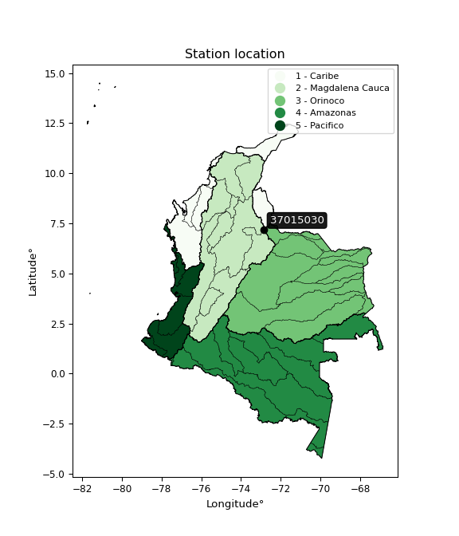

<div align="center">


</div>

# PMP Station (Rain, Pmax24h): 37015030

Probable Maximum Precipitation (PMP) is the greatest amount of rainfall for a specific duration that is meteorologically possible for a given location, acting as a "worst-case" scenario for extreme storms, crucial for designing safety-critical infrastructure like bridges, river deviations, dams, spillways, and nuclear plants to prevent catastrophic failure. PMP is calculated by hydrologists using meteorological data to determine the upper limit of extreme rainfall, often leading to the Probable Maximum Flood (PMF) for flood control design, and is increasingly being studied for climate change impacts. Probable Maximum Precipitation (PMP) is the theoretical upper limit of rainfall, a deterministic estimate for extreme events, while probability distributions (like GEV, Gumbel) describe the likelihood and frequency of various precipitation amounts, including rare ones, showing how often events occur, with PMP representing the extreme end of these distributions, used for critical infrastructure design to ensure safety against the worst conceivable weather, unlike standard statistical forecasts which cover typical probabilities.

The most common probability distributions in hydrology, used for analyzing floods, rainfall, and streamflow, include the Normal, Log-Normal, Gumbel, Gamma (including Log-Pearson Type III), and Generalized Extreme Value (GEV) distributions, often chosen based on the data´s skewness and whether modeling extremes or general conditions, with Gumbel and GEV popular for extreme events like floods, while the Normal distribution serves as a baseline, though often requiring transformations for skewed hydrological data. These distributions help in designing water infrastructure, managing water resources, and forecasting hydrologic events.

> Hydrological data often isn´t perfectly normal (it´s skewed), so different distributions are needed for different applications, such as: **Flood Frequency Analysis**: Using Gumbel, GEV, or Log-Pearson Type III for predicting extreme flood magnitudes and their return periods, **Rainfall Analysis**: Normal for annual totals, but Log-Normal, Weibull, or GEV for intensity or extreme daily rainfall, **Streamflow Modeling**: Gamma and Log-Normal for maximum flows, GEV for minimum flows, and Kappa for daily flows.

<div align="center">

</img>

</div>


## A. General information


### 1. General running parameters

• app_version: _v20260113_. • runtime: _2026-01-17 18:24:04.630693_. • Python version: _3.14.0_. • SciPy version: _1.16.3_. • Pandas version: _2.3.3_. • NumPy version: _2.3.5_. • Stations dataset (station_dataset_file): _dataset/pmax24h_in/automatic_colombia_2003_2025.csv_. • Stations catalog (station_catalog_file): _dataset/CNE.xls_. • Minimum year to eval til year_max (date_min): _1900_. • Maximum year to eval since year_min (date_max): _2025_. • Creates, save and include plots into reports (create_plot): _False_. • Plot only fit distributions with Δo > Δ (plot_only_fit): _True_. • Plot only simple graphs avoiding multiple CDFs and multiple Extreme values plots (plot_only_simple): _True_. • Eval low extreme values, if False, evaluates high extreme values (low_extreme): _False_. • Eval every SciPy distribution as logarithmic (pdist_logarithmic_on): _True_. • Standard deviation normalized (ddof): _1.0_. • Return periods to eval in years (Tr): _[2, 2.33, 5, 10, 15, 20, 25, 50, 75, 100, 200, 250, 500, 750, 1000]_. • Minimum data sample per station, 0 means any (minimum_sample): _5_. • Z-Score maximum threshold to adjust a value, 0 means disable (zscore_max): _3.5_. • Z-Score minimum threshold to adjust a value, 0 means disable (zscore_min): _-2.5_. • Avoid zeros, e.g. rain = 0 (avoid_zeros): _True_. • Avoid null values (avoid_nans): _True_. 

:file_folder:Table: [dataset.csv](../../dataset/pmax24h_in/automatic_colombia_2003_2025.csv)

> Delta Degrees of Freedom (DDOF): is a parameter used in the formulas for calculating variance and standard deviation. When ddof=0, the divisor is $N$ (the total number of observations) and this is used when your data set is the entire population. When ddof=1, the divisor is $N-1$ and this is used when your data set is a sample drawn from a larger population. Using $N-1$ provides an unbiased estimate of the population variance (known as Bessel´s correction).


### 2. Station info and location

|   id |   CODIGO | NOMBRE                  | CATEGORIA         | TECNOLOGIA                | ESTADO           | FECHA_INSTALACION   |   FECHA_SUSPENSION |   ALTITUD |   LATITUD |   LONGITUD | DEPARTAMENTO   | MUNICIPIO   | AREA_OPERATIVA                         | ENTIDAD                                                     | AREA_HIDROGRAFICA   | ZONA_HIDROGRAFICA   | SUBZONA_HIDROGRAFICA   |   CORRIENTE | Catalogo   |   Version |
|-----:|---------:|:------------------------|:------------------|:--------------------------|:-----------------|:--------------------|-------------------:|----------:|----------:|-----------:|:---------------|:------------|:---------------------------------------|:------------------------------------------------------------|:--------------------|:--------------------|:-----------------------|------------:|:-----------|----------:|
|    0 | 37015030 | BERLIN - AUT [37015030] | Agrometeorológica | Automática con Telemetría | En Mantenimiento | 21/08/2008          |                nan |      3306 |     7.187 |   -72.8685 | Santander      | Tona        | Area Operativa 08 - Santanderes-Arauca | INSTITUTO DE HIDROLOGIA METEOROLOGIA Y ESTUDIOS AMBIENTALES | Orinoco             | Arauca              | Río Chítaga            |         nan | CNE_IDEAM  |  20251226 |

<div align="center">

Dynamic map: [:earth_americas:Google](http://maps.google.com/maps?q=7.187,-72.8685) [:earth_americas:OSM](https://www.openstreetmap.org/#map=18/7.187/-72.8685&layers=P) [:earth_americas:Bing](https://www.bing.com/maps?cp=7.187~-72.8685&lvl=18) [:earth_americas:Apple](https://maps.apple.com/frame?center=7.187%2C-72.8685&span=0.003%2C0.006)

</div>


<div align="center">

```geojson
{
  "type": "Feature",
  "geometry": {
    "type": "Point", 
    "coordinates": [-72.8685, 7.187]
  }, 
  "properties": {
    "Name": "37015030"
  }
}
```

</div>


### 3. Discrete values table and plot

<div align="center">

|               |           0 |           1 |           2 |           3 |           4 |           5 |          6 |          7 |           8 |
|:--------------|------------:|------------:|------------:|------------:|------------:|------------:|-----------:|-----------:|------------:|
| Date          | 2017        | 2018        | 2019        | 2020        | 2021        | 2022        | 2023       | 2024       | 2025        |
| Value         |   34.7      |   19.8      |   42.6      |   25        |   34.1      |   24.6      |   14.1     |   54       |   25.3      |
| Value_initial |   34.7      |   19.8      |   42.6      |   25        |   34.1      |   24.6      |   14.1     |   54       |   25.3      |
| count         |    9        |    9        |    9        |    9        |    9        |    9        |    9       |    9       |    9        |
| mean          |   30.4667   |   30.4667   |   30.4667   |   30.4667   |   30.4667   |   30.4667   |   30.4667  |   30.4667  |   30.4667   |
| std           |   12.2719   |   12.2719   |   12.2719   |   12.2719   |   12.2719   |   12.2719   |   12.2719  |   12.2719  |   12.2719   |
| zscore        |    0.344961 |   -0.869193 |    0.988707 |   -0.445461 |    0.296069 |   -0.478056 |   -1.33367 |    1.91766 |   -0.421015 |


</div>


> The initial value (value_initial) correspond to the initial obtained or null completed value, and value (value) is adjusted only when the initial value is outside the valid range (outlier) definite through the Z-Score value. If Z-Score is active, values out of range or outliers are replaced with the station mean value. A Z-Score (or standard score) measures how many standard deviations a data point is from the mean of a dataset, indicating its relative position; positive scores mean above the mean, negative mean below, and a score of zero is exactly at the mean, allowing for comparison of values from different distributions. It´s calculated using the formula $z=(x–μ)/σ$, where $x$ is the data point, $μ$ is the mean, and $σ$ is the standard deviation, helping identify outliers and understand probability.
>
> <sub>**Note**: In this study, "completing" (filling gaps in) and "extending" (forecasting or lengthening the historical record) rainfall data series are avoided for certain critical analyses because they introduce artificial bias and uncertainty, which can distort the statistics of rare events (extremes), alter day-to-day variability, and compromise the integrity and homogeneity of the original data. Some reasons against Completing/Extending rainfall data are: **Distortion of Extremes and Variability**: The primary issue is that most gap-filling or extension methods rely on averaging or regression with nearby stations, which inherently smooths the data. Rainfall is highly variable in space and time, with a large percentage of zero values and occasional large storms. Infilling methods often underestimate the highest values and overestimate the lowest (zero) values, which severely distorts analyses focused on flood frequency, drought severity, and intensity-duration-frequency (IDF) curves, **Loss of Data Homogeneity**: Infilled or extended data are synthetic estimates, not actual measurements. Combining these estimates with observed data can violate the assumption of data homogeneity, which requires that the data properties do not change over time. Inhomogeneity can lead to incorrect conclusions about long-term trends or changes in climate patterns, **Propagation of Errors**: Errors and biases from the original data (e.g., wind-induced undercatch, instrument errors, site changes) or the data used for imputation can propagate through the analysis, leading to unreliable hydrological models and inaccurate predictions, **Compromised Statistical Integrity**: For statistical analyses, especially those involving the frequency of events, using artificial data can introduce time bias or autocorrelation that doesn´t exist in reality, making it difficult to assess the true probability of events, **Difficulty in Validation**: It is difficult to accurately validate the quality of filled or extended data, especially for past periods where ground-truth measurements are unavailable. The reliability of imputation techniques heavily depends on the density of the surrounding station network and the complexity of the local topography.</sub>


### 4. Active continuous probability distributions from SciPy (80 of 104 available)

A Probability Density Function (PDF) describes the relative likelihood of a continuous random variable falling within a specific range, where the total area under its curve equals 1, and the area over any interval gives the actual probability for that range. Unlike discrete probabilities (like rolling a die), a PDF shows density, not direct probability for a single point (which is zero), with higher points indicating higher likelihood, often visualized as a bell curve for normal distributions.

A log of a probability density function (log-PDF) is simply the logarithm of the PDF´s value, denoted as $log(f(x))$, useful for converting multiplication of probabilities into addition, improving numerical stability with tiny numbers, and connecting to information theory concepts like entropy. Instead of dealing with very small probabilities (e.g., 0.000001), log-PDFs use negative numbers (e.g., $log(0.00001) ≈ -11.51$ that are easier for computers to handle, preventing underflow errors and simplifying complex calculations. In this study, each active probability distribution from SciPy is also evaluated in the $log$ form.

[scipy.stats](https://docs.scipy.org/doc/scipy/reference/stats.html) is a Python´s powerful submodule within the SciPy library for comprehensive statistical analysis, offering over 130 probability distributions (like Normal, Poisson), functions for descriptive stats (mean, variance), hypothesis testing (t-tests, chi-square), random variable generation, and statistical tests, making it essential for data science, modeling, and research. It provides tools to explore, model, and draw conclusions from data efficiently, working seamlessly with NumPy.

<div align="center">

|   id | p_dist           |   n_parameter | fit_method   | label                                                                       | active   | ref                                                                                                      |
|-----:|:-----------------|--------------:|:-------------|:----------------------------------------------------------------------------|:---------|:---------------------------------------------------------------------------------------------------------|
|    0 | alpha            |             3 | MLE          | Alpha                                                                       | True     | [:mortar_board:](https://docs.scipy.org/doc/scipy/reference/generated/scipy.stats.alpha.html)            |
|    1 | anglit           |             2 | MM           | Anglit                                                                      | True     | [:mortar_board:](https://docs.scipy.org/doc/scipy/reference/generated/scipy.stats.anglit.html)           |
|    2 | arcsine          |             2 | MM           | Arcsine                                                                     | True     | [:mortar_board:](https://docs.scipy.org/doc/scipy/reference/generated/scipy.stats.arcsine.html)          |
|    3 | argus            |             3 | MLE          | Argus                                                                       | True     | [:mortar_board:](https://docs.scipy.org/doc/scipy/reference/generated/scipy.stats.argus.html)            |
|    4 | beta             |             4 | MLE          | Beta                                                                        | True     | [:mortar_board:](https://docs.scipy.org/doc/scipy/reference/generated/scipy.stats.beta.html)             |
|    5 | betaprime        |             4 | MLE          | Beta prime                                                                  | True     | [:mortar_board:](https://docs.scipy.org/doc/scipy/reference/generated/scipy.stats.betaprime.html)        |
|    6 | bradford         |             3 | MLE          | Bradford                                                                    | True     | [:mortar_board:](https://docs.scipy.org/doc/scipy/reference/generated/scipy.stats.bradford.html)         |
|    7 | burr             |             4 | MLE          | Burr (Type III)                                                             | True     | [:mortar_board:](https://docs.scipy.org/doc/scipy/reference/generated/scipy.stats.burr.html)             |
|    8 | burr12           |             4 | MLE          | Burr (Type III) 12                                                          | True     | [:mortar_board:](https://docs.scipy.org/doc/scipy/reference/generated/scipy.stats.burr12.html)           |
|    9 | cosine           |             2 | MLE          | Cosine                                                                      | True     | [:mortar_board:](https://docs.scipy.org/doc/scipy/reference/generated/scipy.stats.cosine.html)           |
|   10 | crystalball      |             4 | MLE          | Crystalball                                                                 | True     | [:mortar_board:](https://docs.scipy.org/doc/scipy/reference/generated/scipy.stats.crystalball.html)      |
|   11 | dgamma           |             3 | MLE          | Double gamma                                                                | True     | [:mortar_board:](https://docs.scipy.org/doc/scipy/reference/generated/scipy.stats.dgamma.html)           |
|   12 | dweibull         |             3 | MLE          | Double Weibull                                                              | True     | [:mortar_board:](https://docs.scipy.org/doc/scipy/reference/generated/scipy.stats.dweibull.html)         |
|   13 | erlang           |             3 | MLE          | Erlang                                                                      | True     | [:mortar_board:](https://docs.scipy.org/doc/scipy/reference/generated/scipy.stats.erlang.html)           |
|   14 | exponnorm        |             3 | MLE          | Exponentially modified Normal                                               | True     | [:mortar_board:](https://docs.scipy.org/doc/scipy/reference/generated/scipy.stats.exponnorm.html)        |
|   15 | exponpow         |             3 | MLE          | Exponential power                                                           | True     | [:mortar_board:](https://docs.scipy.org/doc/scipy/reference/generated/scipy.stats.exponpow.html)         |
|   16 | exponweib        |             4 | MLE          | Exponentiated Weibull                                                       | True     | [:mortar_board:](https://docs.scipy.org/doc/scipy/reference/generated/scipy.stats.exponweib.html)        |
|   17 | f                |             4 | MLE          | F                                                                           | True     | [:mortar_board:](https://docs.scipy.org/doc/scipy/reference/generated/scipy.stats.f.html)                |
|   18 | fatiguelife      |             3 | MLE          | Fatigue-life (Birnbaum-Saunders)                                            | True     | [:mortar_board:](https://docs.scipy.org/doc/scipy/reference/generated/scipy.stats.fatiguelife.html)      |
|   19 | foldnorm         |             3 | MM           | Fold Normal                                                                 | True     | [:mortar_board:](https://docs.scipy.org/doc/scipy/reference/generated/scipy.stats.foldnorm.html)         |
|   20 | gamma            |             3 | MLE          | Gamma                                                                       | True     | [:mortar_board:](https://docs.scipy.org/doc/scipy/reference/generated/scipy.stats.gamma.html)            |
|   21 | gausshyper       |             6 | MLE          | Gauss hypergeometric                                                        | True     | [:mortar_board:](https://docs.scipy.org/doc/scipy/reference/generated/scipy.stats.gausshyper.html)       |
|   22 | genexpon         |             5 | MLE          | Generalized exponential                                                     | True     | [:mortar_board:](https://docs.scipy.org/doc/scipy/reference/generated/scipy.stats.genexpon.html)         |
|   23 | genextreme       |             3 | MLE          | Generalized exponential                                                     | True     | [:mortar_board:](https://docs.scipy.org/doc/scipy/reference/generated/scipy.stats.genextreme.html)       |
|   24 | gengamma         |             4 | MLE          | Generalized gamma                                                           | True     | [:mortar_board:](https://docs.scipy.org/doc/scipy/reference/generated/scipy.stats.gengamma.html)         |
|   25 | genhalflogistic  |             3 | MLE          | Generalized half-logistic                                                   | True     | [:mortar_board:](https://docs.scipy.org/doc/scipy/reference/generated/scipy.stats.genhalflogistic.html)  |
|   26 | genlogistic      |             3 | MLE          | Generalized logistic                                                        | True     | [:mortar_board:](https://docs.scipy.org/doc/scipy/reference/generated/scipy.stats.genlogistic.html)      |
|   27 | gennorm          |             3 | MLE          | Generalized Normal                                                          | True     | [:mortar_board:](https://docs.scipy.org/doc/scipy/reference/generated/scipy.stats.gennorm.html)          |
|   28 | genpareto        |             3 | MLE          | Generalized Pareto                                                          | True     | [:mortar_board:](https://docs.scipy.org/doc/scipy/reference/generated/scipy.stats.genpareto.html)        |
|   29 | gompertz         |             3 | MLE          | Gompertz (or truncated Gumbel)                                              | True     | [:mortar_board:](https://docs.scipy.org/doc/scipy/reference/generated/scipy.stats.gompertz.html)         |
|   30 | gumbel_l         |             2 | MM           | Gumbel Left Skew                                                            | True     | [:mortar_board:](https://docs.scipy.org/doc/scipy/reference/generated/scipy.stats.gumbel_l.html)         |
|   31 | gumbel_r         |             2 | MM           | Gumbel Right Skew                                                           | True     | [:mortar_board:](https://docs.scipy.org/doc/scipy/reference/generated/scipy.stats.gumbel_r.html)         |
|   32 | halfgennorm      |             3 | MLE          | Upper half of a generalized normal                                          | True     | [:mortar_board:](https://docs.scipy.org/doc/scipy/reference/generated/scipy.stats.halfgennorm.html)      |
|   33 | halflogistic     |             2 | MM           | Half-logistic                                                               | True     | [:mortar_board:](https://docs.scipy.org/doc/scipy/reference/generated/scipy.stats.halflogistic.html)     |
|   34 | halfnorm         |             2 | MM           | Half Normal                                                                 | True     | [:mortar_board:](https://docs.scipy.org/doc/scipy/reference/generated/scipy.stats.halfnorm.html)         |
|   35 | hypsecant        |             2 | MM           | hyperbolic secant                                                           | True     | [:mortar_board:](https://docs.scipy.org/doc/scipy/reference/generated/scipy.stats.hypsecant.html)        |
|   36 | invgamma         |             3 | MLE          | Inverted gamma                                                              | True     | [:mortar_board:](https://docs.scipy.org/doc/scipy/reference/generated/scipy.stats.invgamma.html)         |
|   37 | invgauss         |             3 | MLE          | Inverse Gaussian                                                            | True     | [:mortar_board:](https://docs.scipy.org/doc/scipy/reference/generated/scipy.stats.invgauss.html)         |
|   38 | invweibull       |             3 | MLE          | Inverted Weibull                                                            | True     | [:mortar_board:](https://docs.scipy.org/doc/scipy/reference/generated/scipy.stats.invweibull.html)       |
|   39 | johnsonsb        |             4 | MLE          | Johnson SB                                                                  | True     | [:mortar_board:](https://docs.scipy.org/doc/scipy/reference/generated/scipy.stats.johnsonsb.html)        |
|   40 | johnsonsu        |             4 | MLE          | Johnson Su                                                                  | True     | [:mortar_board:](https://docs.scipy.org/doc/scipy/reference/generated/scipy.stats.johnsonsu.html)        |
|   41 | kappa3           |             3 | MLE          | Kappa 3                                                                     | True     | [:mortar_board:](https://docs.scipy.org/doc/scipy/reference/generated/scipy.stats.kappa3.html)           |
|   42 | kappa4           |             4 | MLE          | Kappa 4                                                                     | True     | [:mortar_board:](https://docs.scipy.org/doc/scipy/reference/generated/scipy.stats.kappa4.html)           |
|   43 | ksone            |             3 | MLE          | Kolmogorov-Smirnov one-sided test statistic distribution                    | True     | [:mortar_board:](https://docs.scipy.org/doc/scipy/reference/generated/scipy.stats.ksone.html)            |
|   44 | kstwobign        |             2 | MLE          | Limiting distribution of scaled Kolmogorov-Smirnov two-sided test statistic | True     | [:mortar_board:](https://docs.scipy.org/doc/scipy/reference/generated/scipy.stats.kstwobign.html)        |
|   45 | laplace          |             2 | MM           | Laplace                                                                     | True     | [:mortar_board:](https://docs.scipy.org/doc/scipy/reference/generated/scipy.stats.laplace.html)          |
|   46 | levy_l           |             2 | MLE          | Left-skewed Levy                                                            | True     | [:mortar_board:](https://docs.scipy.org/doc/scipy/reference/generated/scipy.stats.levy_l.html)           |
|   47 | loggamma         |             3 | MLE          | Log gamma                                                                   | True     | [:mortar_board:](https://docs.scipy.org/doc/scipy/reference/generated/scipy.stats.loggamma.html)         |
|   48 | logistic         |             2 | MM           | Logistic (or Sech-squared)                                                  | True     | [:mortar_board:](https://docs.scipy.org/doc/scipy/reference/generated/scipy.stats.logistic.html)         |
|   49 | loglaplace       |             3 | MLE          | Log-Laplace                                                                 | True     | [:mortar_board:](https://docs.scipy.org/doc/scipy/reference/generated/scipy.stats.loglaplace.html)       |
|   50 | lomax            |             3 | MLE          | Lomax (Pareto of the second kind)                                           | True     | [:mortar_board:](https://docs.scipy.org/doc/scipy/reference/generated/scipy.stats.lomax.html)            |
|   51 | maxwell          |             2 | MM           | Maxwell                                                                     | True     | [:mortar_board:](https://docs.scipy.org/doc/scipy/reference/generated/scipy.stats.maxwell.html)          |
|   52 | mielke           |             4 | MLE          | Mielke Beta-Kappa / Dagum                                                   | True     | [:mortar_board:](https://docs.scipy.org/doc/scipy/reference/generated/scipy.stats.mielke.html)           |
|   53 | moyal            |             2 | MM           | Moyal                                                                       | True     | [:mortar_board:](https://docs.scipy.org/doc/scipy/reference/generated/scipy.stats.moyal.html)            |
|   54 | nakagami         |             3 | MLE          | Nakagami                                                                    | True     | [:mortar_board:](https://docs.scipy.org/doc/scipy/reference/generated/scipy.stats.nakagami.html)         |
|   55 | ncf              |             5 | MLE          | Non-central F distribution                                                  | True     | [:mortar_board:](https://docs.scipy.org/doc/scipy/reference/generated/scipy.stats.ncf.html)              |
|   56 | nct              |             4 | MLE          | Non-central Student’s t                                                     | True     | [:mortar_board:](https://docs.scipy.org/doc/scipy/reference/generated/scipy.stats.nct.html)              |
|   57 | norm             |             2 | MM           | Normal                                                                      | True     | [:mortar_board:](https://docs.scipy.org/doc/scipy/reference/generated/scipy.stats.norm.html)             |
|   58 | pearson3         |             3 | MM           | Pearson type III                                                            | True     | [:mortar_board:](https://docs.scipy.org/doc/scipy/reference/generated/scipy.stats.pearson3.html)         |
|   59 | powerlaw         |             3 | MLE          | Power-function                                                              | True     | [:mortar_board:](https://docs.scipy.org/doc/scipy/reference/generated/scipy.stats.powerlaw.html)         |
|   60 | rayleigh         |             2 | MM           | Rayleigh                                                                    | True     | [:mortar_board:](https://docs.scipy.org/doc/scipy/reference/generated/scipy.stats.rayleigh.html)         |
|   61 | rdist            |             3 | MLE          | R-distributed (symmetric beta)                                              | True     | [:mortar_board:](https://docs.scipy.org/doc/scipy/reference/generated/scipy.stats.rdist.html)            |
|   62 | rice             |             3 | MLE          | Rice                                                                        | True     | [:mortar_board:](https://docs.scipy.org/doc/scipy/reference/generated/scipy.stats.rice.html)             |
|   63 | semicircular     |             2 | MM           | Semicircular                                                                | True     | [:mortar_board:](https://docs.scipy.org/doc/scipy/reference/generated/scipy.stats.semicircular.html)     |
|   64 | skewnorm         |             3 | MLE          | Skew normal                                                                 | True     | [:mortar_board:](https://docs.scipy.org/doc/scipy/reference/generated/scipy.stats.skewnorm.html)         |
|   65 | t                |             3 | MLE          | Student’s t                                                                 | True     | [:mortar_board:](https://docs.scipy.org/doc/scipy/reference/generated/scipy.stats.t.html)                |
|   66 | trapezoid        |             4 | MLE          | Trapezoid                                                                   | True     | [:mortar_board:](https://docs.scipy.org/doc/scipy/reference/generated/scipy.stats.trapezoid.html)        |
|   67 | triang           |             3 | MLE          | Triangular                                                                  | True     | [:mortar_board:](https://docs.scipy.org/doc/scipy/reference/generated/scipy.stats.triang.html)           |
|   68 | truncexpon       |             3 | MLE          | Truncated exponential                                                       | True     | [:mortar_board:](https://docs.scipy.org/doc/scipy/reference/generated/scipy.stats.truncexpon.html)       |
|   69 | truncnorm        |             4 | MLE          | Truncated normal                                                            | True     | [:mortar_board:](https://docs.scipy.org/doc/scipy/reference/generated/scipy.stats.truncnorm.html)        |
|   70 | truncpareto      |             4 | MLE          | Upper truncated Pareto                                                      | True     | [:mortar_board:](https://docs.scipy.org/doc/scipy/reference/generated/scipy.stats.truncpareto.html)      |
|   71 | truncweibull_min |             5 | MLE          | Doubly truncated Weibull minimum                                            | True     | [:mortar_board:](https://docs.scipy.org/doc/scipy/reference/generated/scipy.stats.truncweibull_min.html) |
|   72 | tukeylambda      |             3 | MLE          | Tukey-Lamdba                                                                | True     | [:mortar_board:](https://docs.scipy.org/doc/scipy/reference/generated/scipy.stats.tukeylambda.html)      |
|   73 | uniform          |             2 | MLE          | Uniform                                                                     | True     | [:mortar_board:](https://docs.scipy.org/doc/scipy/reference/generated/scipy.stats.uniform.html)          |
|   74 | vonmises         |             3 | MLE          | Von Mises                                                                   | True     | [:mortar_board:](https://docs.scipy.org/doc/scipy/reference/generated/scipy.stats.vonmises.html)         |
|   75 | vonmises_line    |             3 | MLE          | Von Mises line                                                              | True     | [:mortar_board:](https://docs.scipy.org/doc/scipy/reference/generated/scipy.stats.vonmises_line.html)    |
|   76 | wald             |             2 | MM           | Wald                                                                        | True     | [:mortar_board:](https://docs.scipy.org/doc/scipy/reference/generated/scipy.stats.wald.html)             |
|   77 | weibull_max      |             3 | MLE          | Weibull maximum                                                             | True     | [:mortar_board:](https://docs.scipy.org/doc/scipy/reference/generated/scipy.stats.weibull_max.html)      |
|   78 | weibull_min      |             3 | MLE          | Weibull minimum                                                             | True     | [:mortar_board:](https://docs.scipy.org/doc/scipy/reference/generated/scipy.stats.weibull_min.html)      |
|   79 | wrapcauchy       |             3 | MLE          | Wrapped  Cauchy                                                             | True     | [:mortar_board:](https://docs.scipy.org/doc/scipy/reference/generated/scipy.stats.wrapcauchy.html)       |

</div>

> **n_parameter:** # arguments & localization & scale.
>
> **Fit methods:** (MLE) maximum likelihood, (MM) L-moments.
>
>**Inactive** (With the only purpose of prevent loops, zero divisions, infinite values, over high estimated values or horizontal trending for recurrence intervals estimations, the follow distributions were disabled.)**:** lognorm, norminvgauss, powernorm, powerlognorm, cauchy, halfcauchy, foldcauchy, skewcauchy, chi2, expon, fisk, genhyperbolic, geninvgauss, gibrat, kstwo, laplace_asymmetric, levy, levy_stable, ncx2, pareto, rel_breitwigner, recipinvgauss, studentized_range, loguniform, 


## B. Probability (PDF) vs. Empirical (EDF) distributions functions

A continuous probability distribution (CPD) describes probabilities for variables that can take any value within a range (like rain any time), unlike discrete variables with specific outcomes (like temperature). It uses a Probability Density Function (PDF), a curve where the total area under it equals 1, and the probability of the variable falling within an interval (a to b) is found by calculating the area under the curve between those points. A key feature is that the probability of hitting any single exact value is zero, so probabilities are always expressed for ranges, e.g., $P(a ≤ X ≤ b)$.

<div align="center">

Distributions parameters from station values
|     |   station | p_dist              |   n |             loc |          scale | shape                  | shape1                 | shape2             | shape3             |
|----:|----------:|:--------------------|----:|----------------:|---------------:|:-----------------------|:-----------------------|:-------------------|:-------------------|
|   0 |  37015030 | alpha               |   9 |   -34.7225      |  376.706       | 5.952938530076919      |                        |                    |                    |
|   1 |  37015030 | anglit              |   9 |    30.4667      |   33.8471      |                        |                        |                    |                    |
|   2 |  37015030 | arcsine             |   9 |    14.1041      |   32.7251      |                        |                        |                    |                    |
|   3 |  37015030 | argus               |   9 |     3.22182     |   52.4614      | 5.2575039972449366e-06 |                        |                    |                    |
|   4 |  37015030 | beta                |   9 |    14.1         |   58.0887      | 0.6389440452714306     | 2.734201766683773      |                    |                    |
|   5 |  37015030 | betaprime           |   9 |    -8.95657     |    0.295256    | 1513.056439545454      | 12.296789634838156     |                    |                    |
|   6 |  37015030 | bradford            |   9 |    14.0999      |   39.9002      | 0.8990699577539094     |                        |                    |                    |
|   7 |  37015030 | burr                |   9 |    -0.115646    |   27.2792      | 4.308414329501304      | 1.134986006195942      |                    |                    |
|   8 |  37015030 | burr12              |   9 |     0.629719    |   13.3734      | 512.8551514096641      | 0.0026818758764088303  |                    |                    |
|   9 |  37015030 | cosine              |   9 |    31.6844      |    9.97579     |                        |                        |                    |                    |
|  10 |  37015030 | crystalball         |   9 |    30.4667      |   11.5701      | 1584.50740445066       | 3697.571991104558      |                    |                    |
|  11 |  37015030 | dgamma              |   9 |    30.0657      |    3.5694      | 2.6978104416623063     |                        |                    |                    |
|  12 |  37015030 | dweibull            |   9 |    30.3605      |   10.9073      | 1.6489150930411671     |                        |                    |                    |
|  13 |  37015030 | erlang              |   9 |    10.4715      |    7.62463     | 2.6224456584563134     |                        |                    |                    |
|  14 |  37015030 | exponnorm           |   9 |    18.832       |    5.16767     | 2.251432023257192      |                        |                    |                    |
|  15 |  37015030 | exponpow            |   9 |    14.1         |   28.4624      | 0.9303998888802936     |                        |                    |                    |
|  16 |  37015030 | exponweib           |   9 |    14.1         |    0.899957    | 1.23914754099577       | 0.28336547187157474    |                    |                    |
|  17 |  37015030 | f                   |   9 |    10.4486      |   20.0208      | 5.244859842229008      | 7677.713475800112      |                    |                    |
|  18 |  37015030 | fatiguelife         |   9 |    14.1         |    8.07491e-06 | 1381.4726192789276     |                        |                    |                    |
|  19 |  37015030 | foldnorm            |   9 |    13.0544      |   14.0046      | 1.10832770609223       |                        |                    |                    |
|  20 |  37015030 | gamma               |   9 |    10.4714      |    7.62456     | 2.6224765327510675     |                        |                    |                    |
|  21 |  37015030 | gausshyper          |   9 |    14.1         |   40.5416      | 0.8702928031994074     | 1.006258200755037      | 0.9208815752958561 | 0.9814111407383147 |
|  22 |  37015030 | genexpon            |   9 |    14.1         |    1.57053     | 0.0959565626347901     | 1.3624520990071742e-08 | 1.1969207017398569 |                    |
|  23 |  37015030 | genextreme          |   9 |    25.1397      |    9.30817     | 0.013102619183878464   |                        |                    |                    |
|  24 |  37015030 | gengamma            |   9 |    14.1         |    0.660266    | 1.4298375055857735     | 0.3162559272109271     |                    |                    |
|  25 |  37015030 | genhalflogistic     |   9 |    10.5076      |   44.8127      | 1.0303574325854923     |                        |                    |                    |
|  26 |  37015030 | genlogistic         |   9 |   -32.8195      |    9.24963     | 522.2591153805992      |                        |                    |                    |
|  27 |  37015030 | gennorm             |   9 |    25.3         |    1.58946e-07 | 0.12552537239145461    |                        |                    |                    |
|  28 |  37015030 | genpareto           |   9 |    -0.152924    |   86.5993      | -1.5991612088196805    |                        |                    |                    |
|  29 |  37015030 | gompertz            |   9 |    14.1         |   26.2705      | 0.9338981530486621     |                        |                    |                    |
|  30 |  37015030 | gumbel_l            |   9 |    35.6738      |    9.02115     |                        |                        |                    |                    |
|  31 |  37015030 | gumbel_r            |   9 |    25.2595      |    9.02115     |                        |                        |                    |                    |
|  32 |  37015030 | halfgennorm         |   9 |    14.1         |    1.04874     | 0.3921257937769308     |                        |                    |                    |
|  33 |  37015030 | halflogistic        |   9 |    16.7535      |    9.89199     |                        |                        |                    |                    |
|  34 |  37015030 | halfnorm            |   9 |    15.1524      |   19.1936      |                        |                        |                    |                    |
|  35 |  37015030 | hypsecant           |   9 |    30.4667      |    7.36574     |                        |                        |                    |                    |
|  36 |  37015030 | invgamma            |   9 |   -10.9088      |  525.631       | 13.690703141310037     |                        |                    |                    |
|  37 |  37015030 | invgauss            |   9 |    -0.252989    |  199.888       | 0.15368413753194324    |                        |                    |                    |
|  38 |  37015030 | invweibull          |   9 |    -4.59148e+07 |    4.59149e+07 | 4956898.826585665      |                        |                    |                    |
|  39 |  37015030 | johnsonsb           |   9 |    14.1         |   39.9         | -0.5830673285272758    | 0.2331030288656147     |                    |                    |
|  40 |  37015030 | johnsonsu           |   9 |    -0.257998    |    2.21861     | -8.597217524752288     | 2.6436204618012917     |                    |                    |
|  41 |  37015030 | kappa3              |   9 |    14.1         |   39.8877      | 6638.23134445279       |                        |                    |                    |
|  42 |  37015030 | kappa4              |   9 |    10.3137      |   44.0397      | 1.0940883480440293     | 1.0060112888223014     |                    |                    |
|  43 |  37015030 | ksone               |   9 |    10.11        |   47.88        | 1.0                    |                        |                    |                    |
|  44 |  37015030 | kstwobign           |   9 |    -7.86611     |   44.0363      |                        |                        |                    |                    |
|  45 |  37015030 | laplace             |   9 |    30.4667      |    8.18128     |                        |                        |                    |                    |
|  46 |  37015030 | levy_l              |   9 |    56.6484      |   13.1574      |                        |                        |                    |                    |
|  47 |  37015030 | loggamma            |   9 | -3324.69        |  457.151       | 1539.9327675558782     |                        |                    |                    |
|  48 |  37015030 | logistic            |   9 |    30.4667      |    6.37892     |                        |                        |                    |                    |
|  49 |  37015030 | loglaplace          |   9 |    -0.0645331   |   25.3645      | 3.2664434288212254     |                        |                    |                    |
|  50 |  37015030 | lomax               |   9 |    14.1         |    2.88867e+07 | 1417849.4577020407     |                        |                    |                    |
|  51 |  37015030 | maxwell             |   9 |     3.05044     |   17.1806      |                        |                        |                    |                    |
|  52 |  37015030 | mielke              |   9 |    -0.0635103   |   27.2606      | 4.868359637164267      | 4.305120399735637      |                    |                    |
|  53 |  37015030 | moyal               |   9 |    23.8502      |    5.20836     |                        |                        |                    |                    |
|  54 |  37015030 | nakagami            |   9 |    19.8         |   16.0904      | 0.08582326883191937    |                        |                    |                    |
|  55 |  37015030 | ncf                 |   9 |    10.5756      |   18.6628      | 5.158262409207335      | 3003.605357064306      | 0.3358570192000425 |                    |
|  56 |  37015030 | nct                 |   9 |    -0.0378191   |    6.5422      | 7.017952566192207      | 4.155150345973894      |                    |                    |
|  57 |  37015030 | norm                |   9 |    30.4667      |   11.5701      |                        |                        |                    |                    |
|  58 |  37015030 | pearson3            |   9 |    30.4667      |   11.5701      | 0.6343129932339274     |                        |                    |                    |
|  59 |  37015030 | powerlaw            |   9 |    14.1         |   39.9         | 0.19916890356244138    |                        |                    |                    |
|  60 |  37015030 | rayleigh            |   9 |     8.33244     |   17.6606      |                        |                        |                    |                    |
|  61 |  37015030 | rdist               |   9 |    11.4449      |   23.2551      | 1.0262647491078134     |                        |                    |                    |
|  62 |  37015030 | rice                |   9 |     9.77329     |   16.7643      | 0.0008668901345074572  |                        |                    |                    |
|  63 |  37015030 | semicircular        |   9 |    30.4667      |   23.1402      |                        |                        |                    |                    |
|  64 |  37015030 | skewnorm            |   9 |    16.0084      |   18.5177      | 4.5664928758797565     |                        |                    |                    |
|  65 |  37015030 | t                   |   9 |    30.4665      |   11.5701      | 152461467.13874853     |                        |                    |                    |
|  66 |  37015030 | trapezoid           |   9 |    10.11        |   47.88        | 0.9999999999999999     | 1.0                    |                    |                    |
|  67 |  37015030 | triang              |   9 |    -1.02471     |   55.0247      | 0.9999999999961702     |                        |                    |                    |
|  68 |  37015030 | truncexpon          |   9 |    14.1         |   40.4485      | 0.9864398167783641     |                        |                    |                    |
|  69 |  37015030 | truncnorm           |   9 |    30.4667      |   11.5701      | -29.47354439295309     | 63.226901766675354     |                    |                    |
|  70 |  37015030 | truncpareto         |   9 |    14.0981      |    0.00194278  | 0.12516675484687761    | 20538.54659461031      |                    |                    |
|  71 |  37015030 | truncweibull_min    |   9 |    14.1         |   39.7997      | 0.6564052104418845     | 2.4943838288223546e-17 | 1.0196352009318521 |                    |
|  72 |  37015030 | tukeylambda         |   9 |    24.408       |   10.8014      | 1.0478663048447097     |                        |                    |                    |
|  73 |  37015030 | uniform             |   9 |    14.1         |   39.9         |                        |                        |                    |                    |
|  74 |  37015030 | vonmises            |   9 |     0.105045    |    1           | 0.2085360654159757     |                        |                    |                    |
|  75 |  37015030 | vonmises_line       |   9 |    34.1877      |    6.3941      | 0.12882822254413628    |                        |                    |                    |
|  76 |  37015030 | wald                |   9 |    18.8966      |   11.5701      |                        |                        |                    |                    |
|  77 |  37015030 | weibull_max         |   9 |    54           |    1.44611     | 0.30622871721831973    |                        |                    |                    |
|  78 |  37015030 | weibull_min         |   9 |    12.6559      |   19.638       | 1.5013750178657297     |                        |                    |                    |
|  79 |  37015030 | wrapcauchy          |   9 |    14.1         |    6.35143     | 0.035615550526235815   |                        |                    |                    |
|  80 |  37015030 | logalpha            |   9 |    -6.04607     |  228.466       | 24.38234419409887      |                        |                    |                    |
|  81 |  37015030 | loganglit           |   9 |     3.34457     |    1.121       |                        |                        |                    |                    |
|  82 |  37015030 | logarcsine          |   9 |     2.80265     |    1.08384     |                        |                        |                    |                    |
|  83 |  37015030 | logargus            |   9 |     2.41287     |    1.63539     | 6.15875325275636e-05   |                        |                    |                    |
|  84 |  37015030 | logbeta             |   9 |     2.38034     |    1.60864     | 0.7576985563406112     | 0.578662442593441      |                    |                    |
|  85 |  37015030 | logbetaprime        |   9 |    -9.20807     |   14.4267      | 1985.5582993491762     | 2282.9904078799573     |                    |                    |
|  86 |  37015030 | logbradford         |   9 |     2.64617     |    1.34282     | 1.0817055881094495     |                        |                    |                    |
|  87 |  37015030 | logburr             |   9 |    -0.0412278   |    3.4952      | 17.31188013462757      | 0.6994388859603192     |                    |                    |
|  88 |  37015030 | logburr12           |   9 |     2.14258     |    3.42239     | 3.561499409163668      | 28.946246513971417     |                    |                    |
|  89 |  37015030 | logcosine           |   9 |     3.33693     |    0.326908    |                        |                        |                    |                    |
|  90 |  37015030 | logcrystalball      |   9 |     3.34457     |    0.383197    | 7.336058739461414      | 75.40159812119572      |                    |                    |
|  91 |  37015030 | logdgamma           |   9 |     3.38279     |    0.116703    | 2.775640995809702      |                        |                    |                    |
|  92 |  37015030 | logdweibull         |   9 |     3.3795      |    0.365811    | 1.6823060115112711     |                        |                    |                    |
|  93 |  37015030 | logerlang           |   9 |    -8.20797     |    0.0127516   | 905.9509745285416      |                        |                    |                    |
|  94 |  37015030 | logexponnorm        |   9 |     3.34413     |    0.383198    | 0.0011597190150279368  |                        |                    |                    |
|  95 |  37015030 | logexponpow         |   9 |     2.64617     |    1.01893     | 0.9960424509410112     |                        |                    |                    |
|  96 |  37015030 | logexponweib        |   9 |     2.64617     |    1.28644     | 0.12237016978224087    | 4.757542501053402      |                    |                    |
|  97 |  37015030 | logf                |   9 |   -58.3491      |   61.6924      | 102813.63525952183     | 103997.32459798937     |                    |                    |
|  98 |  37015030 | logfatiguelife      |   9 |   -51.4966      |   54.8408      | 0.006983487556167883   |                        |                    |                    |
|  99 |  37015030 | logfoldnorm         |   9 |     2.84941     |    0.574795    | 0.4062635830865325     |                        |                    |                    |
| 100 |  37015030 | loggamma            |   9 |    -8.41253     |    0.0125454   | 937.1406882471183      |                        |                    |                    |
| 101 |  37015030 | loggausshyper       |   9 |     2.61898     |    1.37001     | 1.2362358693936666     | 0.8085692725269598     | 0.6700041747693085 | 1.0609315915952577 |
| 102 |  37015030 | loggenexpon         |   9 |     2.64617     | 4580.48        | 2633.516676678733      | 25906.534404389004     | 1754.1044389042995 |                    |
| 103 |  37015030 | loggenextreme       |   9 |     3.22912     |    0.397366    | 0.38736661571138264    |                        |                    |                    |
| 104 |  37015030 | loggengamma         |   9 |     2.64617     |    1.34972     | 0.19953826821706502    | 4.23872906121713       |                    |                    |
| 105 |  37015030 | loggenhalflogistic  |   9 |     2.64608     |    1.47495     | 1.0904530083820383     |                        |                    |                    |
| 106 |  37015030 | loggenlogistic      |   9 |     3.30452     |    0.232522    | 1.1260681696081072     |                        |                    |                    |
| 107 |  37015030 | loggennorm          |   9 |     3.2308      |    0.0353639   | 0.45514219019595437    |                        |                    |                    |
| 108 |  37015030 | loggenpareto        |   9 |    -0.0017377   |    8.37789     | -2.099342125366986     |                        |                    |                    |
| 109 |  37015030 | loggompertz         |   9 |     2.64617     |    1.03927     | 0.9594681002163474     |                        |                    |                    |
| 110 |  37015030 | loggumbel_l         |   9 |     3.51703     |    0.298777    |                        |                        |                    |                    |
| 111 |  37015030 | loggumbel_r         |   9 |     3.17211     |    0.298777    |                        |                        |                    |                    |
| 112 |  37015030 | loghalfgennorm      |   9 |     2.64544     |    1.34561     | 3789.8512126268897     |                        |                    |                    |
| 113 |  37015030 | loghalflogistic     |   9 |     2.89044     |    0.327589    |                        |                        |                    |                    |
| 114 |  37015030 | loghalfnorm         |   9 |     2.83733     |    0.63573     |                        |                        |                    |                    |
| 115 |  37015030 | loghypsecant        |   9 |     3.34457     |    0.243951    |                        |                        |                    |                    |
| 116 |  37015030 | loginvgamma         |   9 |    -2.57426     | 1361.17        | 230.98428636913798     |                        |                    |                    |
| 117 |  37015030 | loginvgauss         |   9 |     0.27399     |  184.583       | 0.016603031209873546   |                        |                    |                    |
| 118 |  37015030 | loginvweibull       |   9 |    -2.15425e+07 |    2.15425e+07 | 58179289.30768137      |                        |                    |                    |
| 119 |  37015030 | logjohnsonsb        |   9 |     2.64617     |    1.34293     | 0.027701248227329507   | 0.11855652689751461    |                    |                    |
| 120 |  37015030 | logjohnsonsu        |   9 |    -3.9553e+06  |    5.63224e+06 | -11774808.776956432    | 17990079.149626438     |                    |                    |
| 121 |  37015030 | logkappa3           |   9 |     2.64047     |    1.34495     | 867.4080396722538      |                        |                    |                    |
| 122 |  37015030 | logkappa4           |   9 |     2.53819     |    1.54779     | 1.0490997841037446     | 1.0668582008618888     |                    |                    |
| 123 |  37015030 | logksone            |   9 |     2.51189     |    1.61137     | 1.0                    |                        |                    |                    |
| 124 |  37015030 | logkstwobign        |   9 |     1.82734     |    1.73819     |                        |                        |                    |                    |
| 125 |  37015030 | loglaplace          |   9 |     3.34457     |    0.270961    |                        |                        |                    |                    |
| 126 |  37015030 | loglevy_l           |   9 |     4.05526     |    0.327525    |                        |                        |                    |                    |
| 127 |  37015030 | logloggamma         |   9 |    -8.95948     |    2.99344     | 61.46703201634119      |                        |                    |                    |
| 128 |  37015030 | loglogistic         |   9 |     3.34457     |    0.211268    |                        |                        |                    |                    |
| 129 |  37015030 | logloglaplace       |   9 |    -0.0285463   |    3.25935     | 10.899081558227241     |                        |                    |                    |
| 130 |  37015030 | loglomax            |   9 |     2.64543     |  152.182       | 217.1103098309352      |                        |                    |                    |
| 131 |  37015030 | logmaxwell          |   9 |     2.43656     |    0.569014    |                        |                        |                    |                    |
| 132 |  37015030 | logmielke           |   9 |    -0.0946624   |    3.54655     | 12.35023784739759      | 17.53386937417638      |                    |                    |
| 133 |  37015030 | logmoyal            |   9 |     3.12544     |    0.172499    |                        |                        |                    |                    |
| 134 |  37015030 | lognakagami         |   9 |     2.98568     |    0.600197    | 0.09057158031099144    |                        |                    |                    |
| 135 |  37015030 | logncf              |   9 |   -64.0233      |   66.6243      | 80791.55339597282      | 258498.51474435037     | 901.6829724562772  |                    |
| 136 |  37015030 | lognct              |   9 |   -11.733       |    0.356305    | 5583.151138373447      | 42.31062852580408      |                    |                    |
| 137 |  37015030 | lognorm             |   9 |     3.34457     |    0.383197    |                        |                        |                    |                    |
| 138 |  37015030 | logpearson3         |   9 |     3.34457     |    0.383197    | -0.08582203391483154   |                        |                    |                    |
| 139 |  37015030 | logpowerlaw         |   9 |     2.64617     |    1.34281     | 0.22168814856757313    |                        |                    |                    |
| 140 |  37015030 | lograyleigh         |   9 |     2.6115      |    0.584912    |                        |                        |                    |                    |
| 141 |  37015030 | logrdist            |   9 |     3.61218     |    0.626494    | 1.0914235040236533     |                        |                    |                    |
| 142 |  37015030 | logrice             |   9 |     2.44667     |    0.424357    | 1.8145017071766456     |                        |                    |                    |
| 143 |  37015030 | logsemicircular     |   9 |     3.34457     |    0.766394    |                        |                        |                    |                    |
| 144 |  37015030 | logskewnorm         |   9 |     3.55076     |    0.43515     | -0.7374726177285966    |                        |                    |                    |
| 145 |  37015030 | logt                |   9 |     3.34457     |    0.383198    | 1534003828.5118098     |                        |                    |                    |
| 146 |  37015030 | logtrapezoid        |   9 |     2.51189     |    1.61137     | 1.0                    | 1.0                    |                    |                    |
| 147 |  37015030 | logtriang           |   9 |     2.31472     |    1.67426     | 0.9999999534360853     |                        |                    |                    |
| 148 |  37015030 | logtruncexpon       |   9 |     2.64617     |    1.63061     | 0.8235058321034734     |                        |                    |                    |
| 149 |  37015030 | logtruncnorm        |   9 |    -0.133386    |    1.0428      | 3.1992070203493803     | 3.9531795817442976     |                    |                    |
| 150 |  37015030 | logtruncpareto      |   9 |     2.64608     |    9.0234e-05  | 0.12515341600644803    | 14882.418635262211     |                    |                    |
| 151 |  37015030 | logtruncweibull_min |   9 |     2.62518     |    1.60268     | 1.1809947905550908     | 0.0006596273873410635  | 0.8509538220018593 |                    |
| 152 |  37015030 | logtukeylambda      |   9 |     3.48732     |    0.606986    | 1.2099426814563676     |                        |                    |                    |
| 153 |  37015030 | loguniform          |   9 |     2.64617     |    1.34281     |                        |                        |                    |                    |
| 154 |  37015030 | logvonmises         |   9 |    -2.93779     |    1           | 7.293510459500658      |                        |                    |                    |
| 155 |  37015030 | logvonmises_line    |   9 |     3.31758     |    0.213715    | 0.2841079742872574     |                        |                    |                    |
| 156 |  37015030 | logwald             |   9 |     2.96138     |    0.383192    |                        |                        |                    |                    |
| 157 |  37015030 | logweibull_max      |   9 |     4.25498     |    1.02589     | 2.5817526181657033     |                        |                    |                    |
| 158 |  37015030 | logweibull_min      |   9 |     2.1631      |    1.31549     | 3.4736127953138913     |                        |                    |                    |
| 159 |  37015030 | logwrapcauchy       |   9 |     2.58227     |    0.223887    | 2.5692596428343112e-05 |                        |                    |                    |

</div>

> **loc** (Location parameter): This shifts the distribution along the x-axis. For many common distributions, like the normal (Gaussian) distribution, loc represents the mean $μ$. For others, like the uniform distribution, it might represent the minimum value, or for the beta distribution, the left end of the support interval.
>
> **scale** (Scale parameter): This determines the width or spread of the distribution. For the normal distribution, scale represents the standard deviation $σ$. For a uniform distribution, it defines the length of the interval (from $loc$ to $loc + scale$).
>
> **shape** (Shape parameters): Refers to parameters that define the specific form of a probability distribution, distinct from its location (loc) and scale (scale). These parameters are required arguments for most distribution functions. For example, a normal (Gaussian) distribution is fully defined by its location (mean) and scale (standard deviation), so it has no specific shape parameters beyond loc and scale. However, other distributions have intrinsic properties that need specification, as Gamma distribution that takes a shape parameter, often named $a$ or $alpha$.


### 0. Cumulative distribution values - CDF (160 evaluated)

Cumulative Distribution Function (CDF), denoted as $F$<sub>$X$</sub>$(x)$, is a function that gives the probability that a random variable $X$ will take a value less than or equal to a specific value, $x$ (i.e., $(P(X≥x)$. It essentially "accumulates" probabilities from a given point up to the far right (positive infinity), providing a complete picture of the distribution´s probabilities for both discrete (like rain) and continuous (like temperature) variables, helping to find probabilities over ranges or above certain values. Each station is evaluated separately ordering the $x$ values ascending, calculating the CDF and PDF values for the activated distributions and their logarithmic forms.

<div align="center">

CDF ordered by x ascending and calculating $log(f(x))$ separately
|   id |   Station |   date |    x |   count |    mean |     std |    zscore |   Value_initial |   station |   m |     alpha |   alpha_pdf |    anglit |   anglit_pdf |   arcsine |   arcsine_pdf |     argus |   argus_pdf |        beta |       beta_pdf |   betaprime |   betaprime_pdf |    bradford |   bradford_pdf |      burr |   burr_pdf |     burr12 |   burr12_pdf |    cosine |   cosine_pdf |   crystalball |   crystalball_pdf |    dgamma |   dgamma_pdf |   dweibull |   dweibull_pdf |    erlang |   erlang_pdf |   exponnorm |   exponnorm_pdf |    exponpow |   exponpow_pdf |   exponweib |   exponweib_pdf |         f |      f_pdf |   fatiguelife |   fatiguelife_pdf |   foldnorm |   foldnorm_pdf |     gamma |   gamma_pdf |   gausshyper |   gausshyper_pdf |    genexpon |   genexpon_pdf |   genextreme |   genextreme_pdf |   gengamma |   gengamma_pdf |   genhalflogistic |   genhalflogistic_pdf |   genlogistic |   genlogistic_pdf |   gennorm |   gennorm_pdf |   genpareto |   genpareto_pdf |    gompertz |   gompertz_pdf |   gumbel_l |   gumbel_l_pdf |   gumbel_r |   gumbel_r_pdf |   halfgennorm |   halfgennorm_pdf |   halflogistic |   halflogistic_pdf |   halfnorm |   halfnorm_pdf |   hypsecant |   hypsecant_pdf |   invgamma |   invgamma_pdf |   invgauss |   invgauss_pdf |   invweibull |   invweibull_pdf |   johnsonsb |   johnsonsb_pdf |   johnsonsu |   johnsonsu_pdf |      kappa3 |   kappa3_pdf |      kappa4 |   kappa4_pdf |     ksone |   ksone_pdf |   kstwobign |   kstwobign_pdf |   laplace |   laplace_pdf |   levy_l |   levy_l_pdf |   loggamma |   loggamma_pdf |   logistic |   logistic_pdf |   loglaplace |   loglaplace_pdf |       lomax |   lomax_pdf |   maxwell |   maxwell_pdf |    mielke |   mielke_pdf |     moyal |   moyal_pdf |   nakagami |   nakagami_pdf |       ncf |    ncf_pdf |       nct |   nct_pdf |      norm |   norm_pdf |   pearson3 |   pearson3_pdf |    powerlaw |   powerlaw_pdf |   rayleigh |   rayleigh_pdf |    rdist |      rdist_pdf |      rice |   rice_pdf |   semicircular |   semicircular_pdf |   skewnorm |   skewnorm_pdf |         t |      t_pdf |   trapezoid |   trapezoid_pdf |    triang |   triang_pdf |   truncexpon |   truncexpon_pdf |   truncnorm |   truncnorm_pdf |   truncpareto |   truncpareto_pdf |   truncweibull_min |   truncweibull_min_pdf |   tukeylambda |   tukeylambda_pdf |   uniform |   uniform_pdf |   vonmises |   vonmises_pdf |   vonmises_line |   vonmises_line_pdf |        wald |   wald_pdf |   weibull_max |   weibull_max_pdf |   weibull_min |   weibull_min_pdf |   wrapcauchy |   wrapcauchy_pdf |   logalpha |   logalpha_pdf |   loganglit |   loganglit_pdf |   logarcsine |   logarcsine_pdf |   logargus |   logargus_pdf |   logbeta |   logbeta_pdf |   logbetaprime |   logbetaprime_pdf |   logbradford |   logbradford_pdf |   logburr |   logburr_pdf |   logburr12 |   logburr12_pdf |   logcosine |   logcosine_pdf |   logcrystalball |   logcrystalball_pdf |   logdgamma |   logdgamma_pdf |   logdweibull |   logdweibull_pdf |   logerlang |   logerlang_pdf |   logexponnorm |   logexponnorm_pdf |   logexponpow |   logexponpow_pdf |   logexponweib |   logexponweib_pdf |      logf |   logf_pdf |   logfatiguelife |   logfatiguelife_pdf |   logfoldnorm |   logfoldnorm_pdf |   loggausshyper |   loggausshyper_pdf |   loggenexpon |   loggenexpon_pdf |   loggenextreme |   loggenextreme_pdf |   loggengamma |   loggengamma_pdf |   loggenhalflogistic |   loggenhalflogistic_pdf |   loggenlogistic |   loggenlogistic_pdf |   loggennorm |   loggennorm_pdf |   loggenpareto |   loggenpareto_pdf |   loggompertz |   loggompertz_pdf |   loggumbel_l |   loggumbel_l_pdf |   loggumbel_r |   loggumbel_r_pdf |   loghalfgennorm |   loghalfgennorm_pdf |   loghalflogistic |   loghalflogistic_pdf |   loghalfnorm |   loghalfnorm_pdf |   loghypsecant |   loghypsecant_pdf |   loginvgamma |   loginvgamma_pdf |   loginvgauss |   loginvgauss_pdf |   loginvweibull |   loginvweibull_pdf |   logjohnsonsb |   logjohnsonsb_pdf |   logjohnsonsu |   logjohnsonsu_pdf |   logkappa3 |   logkappa3_pdf |   logkappa4 |   logkappa4_pdf |   logksone |   logksone_pdf |   logkstwobign |   logkstwobign_pdf |   loglevy_l |   loglevy_l_pdf |   logloggamma |   logloggamma_pdf |   loglogistic |   loglogistic_pdf |   logloglaplace |   logloglaplace_pdf |   loglomax |   loglomax_pdf |   logmaxwell |   logmaxwell_pdf |   logmielke |   logmielke_pdf |    logmoyal |   logmoyal_pdf |   lognakagami |   lognakagami_pdf |    logncf |   logncf_pdf |    lognct |   lognct_pdf |   lognorm |   lognorm_pdf |   logpearson3 |   logpearson3_pdf |   logpowerlaw |   logpowerlaw_pdf |   lograyleigh |   lograyleigh_pdf |    logrdist |   logrdist_pdf |   logrice |   logrice_pdf |   logsemicircular |   logsemicircular_pdf |   logskewnorm |   logskewnorm_pdf |      logt |   logt_pdf |   logtrapezoid |   logtrapezoid_pdf |   logtriang |   logtriang_pdf |   logtruncexpon |   logtruncexpon_pdf |   logtruncnorm |   logtruncnorm_pdf |   logtruncpareto |   logtruncpareto_pdf |   logtruncweibull_min |   logtruncweibull_min_pdf |   logtukeylambda |   logtukeylambda_pdf |   loguniform |   loguniform_pdf |   logvonmises |   logvonmises_pdf |   logvonmises_line |   logvonmises_line_pdf |    logwald |   logwald_pdf |   logweibull_max |   logweibull_max_pdf |   logweibull_min |   logweibull_min_pdf |   logwrapcauchy |   logwrapcauchy_pdf |
|-----:|----------:|-------:|-----:|--------:|--------:|--------:|----------:|----------------:|----------:|----:|----------:|------------:|----------:|-------------:|----------:|--------------:|----------:|------------:|------------:|---------------:|------------:|----------------:|------------:|---------------:|----------:|-----------:|-----------:|-------------:|----------:|-------------:|--------------:|------------------:|----------:|-------------:|-----------:|---------------:|----------:|-------------:|------------:|----------------:|------------:|---------------:|------------:|----------------:|----------:|-----------:|--------------:|------------------:|-----------:|---------------:|----------:|------------:|-------------:|-----------------:|------------:|---------------:|-------------:|-----------------:|-----------:|---------------:|------------------:|----------------------:|--------------:|------------------:|----------:|--------------:|------------:|----------------:|------------:|---------------:|-----------:|---------------:|-----------:|---------------:|--------------:|------------------:|---------------:|-------------------:|-----------:|---------------:|------------:|----------------:|-----------:|---------------:|-----------:|---------------:|-------------:|-----------------:|------------:|----------------:|------------:|----------------:|------------:|-------------:|------------:|-------------:|----------:|------------:|------------:|----------------:|----------:|--------------:|---------:|-------------:|-----------:|---------------:|-----------:|---------------:|-------------:|-----------------:|------------:|------------:|----------:|--------------:|----------:|-------------:|----------:|------------:|-----------:|---------------:|----------:|-----------:|----------:|----------:|----------:|-----------:|-----------:|---------------:|------------:|---------------:|-----------:|---------------:|---------:|---------------:|----------:|-----------:|---------------:|-------------------:|-----------:|---------------:|----------:|-----------:|------------:|----------------:|----------:|-------------:|-------------:|-----------------:|------------:|----------------:|--------------:|------------------:|-------------------:|-----------------------:|--------------:|------------------:|----------:|--------------:|-----------:|---------------:|----------------:|--------------------:|------------:|-----------:|--------------:|------------------:|--------------:|------------------:|-------------:|-----------------:|-----------:|---------------:|------------:|----------------:|-------------:|-----------------:|-----------:|---------------:|----------:|--------------:|---------------:|-------------------:|--------------:|------------------:|----------:|--------------:|------------:|----------------:|------------:|----------------:|-----------------:|---------------------:|------------:|----------------:|--------------:|------------------:|------------:|----------------:|---------------:|-------------------:|--------------:|------------------:|---------------:|-------------------:|----------:|-----------:|-----------------:|---------------------:|--------------:|------------------:|----------------:|--------------------:|--------------:|------------------:|----------------:|--------------------:|--------------:|------------------:|---------------------:|-------------------------:|-----------------:|---------------------:|-------------:|-----------------:|---------------:|-------------------:|--------------:|------------------:|--------------:|------------------:|--------------:|------------------:|-----------------:|---------------------:|------------------:|----------------------:|--------------:|------------------:|---------------:|-------------------:|--------------:|------------------:|--------------:|------------------:|----------------:|--------------------:|---------------:|-------------------:|---------------:|-------------------:|------------:|----------------:|------------:|----------------:|-----------:|---------------:|---------------:|-------------------:|------------:|----------------:|--------------:|------------------:|--------------:|------------------:|----------------:|--------------------:|-----------:|---------------:|-------------:|-----------------:|------------:|----------------:|------------:|---------------:|--------------:|------------------:|----------:|-------------:|----------:|-------------:|----------:|--------------:|--------------:|------------------:|--------------:|------------------:|--------------:|------------------:|------------:|---------------:|----------:|--------------:|------------------:|----------------------:|--------------:|------------------:|----------:|-----------:|---------------:|-------------------:|------------:|----------------:|----------------:|--------------------:|---------------:|-------------------:|-----------------:|---------------------:|----------------------:|--------------------------:|-----------------:|---------------------:|-------------:|-----------------:|--------------:|------------------:|-------------------:|-----------------------:|-----------:|--------------:|-----------------:|---------------------:|-----------------:|---------------------:|----------------:|--------------------:|
|    0 |  37015030 |   2023 | 14.1 |       9 | 30.4667 | 12.2719 | -1.33367  |            14.1 |  37015030 |   1 | 0.0389599 |  0.01333    | 0.0883801 |   0.0167723  |  0        |     0         | 0.0637965 |   0.0115999 | 5.69887e-11 | 20498.5        |   0.0354974 |      0.0137809  | 5.16752e-06 |      0.0351328 | 0.0386318 | 0.0125329  | 0.00993885 |   0.0986535  | 0.0632236 |   0.0129111  |     0.0785975 |         0.0126783 | 0.0675968 |   0.0131917  |  0.0724487 |     0.0141919  | 0.0266404 |   0.0167991  |   0.0358078 |      0.0123859  | 8.37741e-16 |     0.438782   | 6.86593e-06 |     1.35714e+09 | 0.0269563 | 0.0168784  |     0.0122626 |       4.27705e+10 |  0.0322398 |     0.0308462  | 0.0266405 |  0.016799   |  7.94987e-15 |        3.89551   | 4.20344e-07 |     0.0610984  |    0.0389955 |       0.0133837  | 2.0356e-07 |    5.18184e+07 |         0.0418109 |             0.0121409 |     0.0382972 |         0.0134654 |  0.124197 |    0.00532896 |    0.173865 |       0.0129475 | 1.56848e-12 |     0.0355494  |  0.0874342 |    0.0092555   |  0.0318921 |     0.0121804  |   1.94949e-11 |        0.27132    |       0        |         0          |   0        |     0          |   0.0687363 |      0.00925953 |  0.0363474 |     0.0136441  |  0.0331803 |     0.0143713  |    0.0380035 |       0.0134165  | 7.25025e-06 |      1.8924     |   0.0349624 |      0.0140478  | 1.17898e-07 |    0.0250372 | 2.61491e-15 |    0.535103  | 0.0833333 |   0.0208855 |    0.035304 |      0.0143305  | 0.0676337 |    0.00826688 | 0.42185  |   0.00446706 |  0.0325889 |       0.197641 |  0.0713759 |     0.0103907  |    0.0379824 |         0.140177 | 1.14132e-08 |  0.0490831  | 0.0625878 |    0.0156206  | 0.0386494 |   0.0125367  | 0.0107789 |  0.00756746 | 0          |    0           | 0.0263772 | 0.016913   | 0.0368497 | 0.0127427 | 0.0785975 |  0.0126783 |   0.055078 |     0.014421   | 0.000553734 |    6.20858e+10 |  0.0519299 |     0.0175317  | 0.537078 |      0.0140247 | 0.0327569 | 0.014891   |      0.0907655 |          0.0194487 |  0.0351399 |     0.0136702  | 0.0785988 | 0.0126785  |  0.00694444 |      0.00348092 | 0.0755542 |   0.00999083 |  7.81753e-09 |        0.0394241 |   0.0785976 |       0.0126783 |      0        |       90.5557     |        2.59822e-11 |          8467.22       |   7.10543e-15 |         0.076496  |  0        |     0.0250627 |    2.76027 |       0.162161 |     1.02083e-10 |           0.0217917 | 0           | 0          |     0.0631724 |       0.00133908  |     0.0196746 |        0.0202517  |    8.902e-09 |        0.026909  |  0.0286125 |       0.197814 |   0.0261384 |        0.28465  |     0        |         0        |  0.0303722 |       0.259023 |  0.166104 |   0.494796    |      0.0322239 |           0.198137 |   7.63481e-07 |          1.09869  | 0.0411844 |      0.183624 |    0.030938 |        0.215262 |   0.0273774 |        0.235622 |         0.034185 |             0.197781 |   0.0191367 |        0.124713 |     0.0199374 |          0.147367 |   0.0324466 |        0.197199 |      0.0341855 |           0.197783 |   5.01321e-16 |          1.12441  |    9.96232e-10 |        1.30602e+06 | 0.0338338 |   0.198081 |        0.0333146 |             0.196239 |      0        |          0        |      0.00838953 |            0.379635 |   7.62317e-08 |          0.574943 |       0.0409608 |            0.210012 |    1.7311e-11 |         63.5253   |          3.25242e-05 |                 0.339018 |        0.0386679 |             0.17684  |    0.0784291 |         0.162225 |       0.404785 |        0.211143    |   4.08035e-09 |          0.923212 |     0.0527747 |          0.17189  |    0.00298483 |         0.0580849 |         0        |             0.743269 |          0        |              0        |      0        |          0        |      0.0363146 |           0.148538 |      0.028639 |          0.19851  |     0.0266091 |          0.203553 |       0.0199237 |            0.210702 |     1.3447e-05 |        1.58492e+10 |       0.033956 |           0.197017 |  0.00421036 |        0.737745 |    0.028878 |        0.772645 |  0.0833333 |        0.62059 |      0.0204947 |           0.253258 |    0.370279 |        0.121522 |     0.0378208 |          0.199192 |     0.0353743 |          0.161516 |        0.057977 |            0.236247 |  0.0010642 |       1.42513  |    0.0127679 |         0.17781  |   0.0411537 |        0.183439 | 6.03282e-05 |     0.00297187 |    0          |        0          | 0.0339689 |     0.19804  | 0.0338294 |     0.198166 | 0.0341852 |      0.197782 |     0.0366215 |          0.199044 |   0.000369953 |        1.8468e+11 |    0.00175613 |          0.101188 | 0           |    0           | 0.0220245 |      0.227629 |         0.0156487 |              0.342061 |     0.0361517 |          0.198076 | 0.0341853 |   0.197782 |     0.00694444 |           0.103432 |   0.0391924 |        0.236487 |     1.97303e-06 |            1.09295  |    0           |           0        |         0        |         1982.69      |              0.010288 |                  0.594469 |      0           |             0        |     0        |         0.744707 |       1.03486 |          0.19101  |        8.10756e-08 |               0.549388 | 0          |     0         |        0.0409616 |             0.210026 |        0.0303426 |             0.214839 |       0.0454335 |            0.710908 |
|    1 |  37015030 |   2018 | 19.8 |       9 | 30.4667 | 12.2719 | -0.869193 |            19.8 |  37015030 |   2 | 0.169475  |  0.0320038  | 0.205312  |   0.0238679  |  0.273975 |     0.0256538 | 0.145987  |   0.0171449 | 0.430882    |     0.0431795  |   0.173347  |      0.0335638  | 0.188407    |      0.031134  | 0.165493  | 0.0323056  | 0.390595   |   0.0437231  | 0.162563  |   0.021864   |     0.178286  |         0.0225431 | 0.189219  |   0.0307745  |  0.193737  |     0.0286804  | 0.189971  |   0.0368092  |   0.169442  |      0.0347972  | 0.222014    |     0.0355837  | 0.77604     |     0.0183135   | 0.190391  | 0.036776   |     0.728463  |       0.0176895   |  0.209524  |     0.0314557  | 0.18997   |  0.0368091  |  0.234951    |        0.0336647 | 0.294086    |     0.0431302  |    0.170172  |       0.0321349  | 0.75309    |    0.0229784   |         0.116114  |             0.0139978 |     0.171338  |         0.0326229 |  0.169435 |    0.012163   |    0.249783 |       0.0137173 | 0.202517    |     0.0352196  |  0.158113  |    0.0160619   |  0.160157  |     0.0325173  |   0.420158    |        0.038908   |       0.152784 |         0.0493661  |   0.191331 |     0.0403694  |   0.146943  |      0.0192485  |  0.171871  |     0.0330562  |  0.177006  |     0.0344403  |    0.170794  |       0.0325866  | 0.158478    |      0.0115362  |   0.174592  |      0.0337186  | 0.142712    |    0.0250372 | 0.167679    |    0.0269003 | 0.202381  |   0.0208855 |    0.175193 |      0.0332529  | 0.13575   |    0.0165928  | 0.449861 |   0.00541167 |  0.175557  |       0.686589 |  0.158134  |     0.02087    |    0.132966  |         0.490721 | 0.244045    |  0.0371046  | 0.186762  |    0.0274439  | 0.165494  |   0.0322954  | 0.140151  |  0.0380619  | 0.00173847 |    8.39927e+10 | 0.190714  | 0.0369416  | 0.167815  | 0.0329502 | 0.178286  |  0.0225431 |   0.178173 |     0.0283968  | 0.678708    |    0.0237153   |  0.190077  |     0.0297787  | 0.619022 |      0.0149053 | 0.163778  | 0.0298339  |      0.217296  |          0.0244143 |  0.17788   |     0.0348144  | 0.178288  | 0.0225433  |  0.040958   |      0.00845367 | 0.143233  |   0.013756   |  0.209602    |        0.0342422 |   0.178286  |       0.0225431 |      0.888169 |        0.0113577  |        0.382604    |             0.0381942  |   0.279151    |         0.0480886 |  0.142857 |     0.0250627 |    3.66011 |       0.180799 |     0.126279    |           0.0228606 | 0.000906959 | 0.0068409  |     0.0717519 |       0.00169261  |     0.196773  |        0.0369875  |    0.151892  |        0.026155  |  0.180473  |       0.736135 |   0.201281  |        0.715354 |     0.269598 |         0.783926 |  0.178258  |       0.601823 |  0.325173 |   0.458315    |      0.1762    |           0.691358 |   0.329739    |          0.86274  | 0.165711  |      0.612157 |    0.178309 |        0.679379 |   0.189044  |        0.71869  |         0.174489 |             0.671449 |   0.145684  |        0.76362  |     0.161169  |          0.779457 |   0.17533   |        0.686711 |      0.17449   |           0.671449 |   0.327971    |          0.922035 |    0.460403    |        0.788793    | 0.174948  |   0.675587 |        0.173854  |             0.674688 |      0.172826 |          1.24851  |      0.197214   |            0.636544 |   0.270055    |          0.923009 |       0.176795  |            0.623073 |    0.338727   |          0.841821 |          0.131795    |                 0.444778 |        0.165501  |             0.639254 |    0.178459  |         0.523421 |       0.481943 |        0.245959    |   0.309746    |          0.883456 |     0.155411  |          0.477465 |    0.154687   |         0.966274  |         0        |             0.743269 |          0.144349 |              1.4945   |      0.184513 |          1.22136  |      0.143713  |           0.569295 |      0.180251 |          0.731935 |     0.187284  |          0.772864 |       0.209007  |            0.8836   |     0.459864   |        0.185503    |       0.174087 |           0.671577 |  0.25468    |        0.737745 |    0.274406 |        0.704533 |  0.294028  |        0.62059 |      0.233817  |           0.919658 |    0.419991 |        0.177101 |     0.173617  |          0.64368  |     0.154628  |          0.618734 |        0.213252 |            0.771091 |  0.38423   |       0.87653  |    0.182134  |         0.819747 |   0.16568   |        0.612519 | 0.133761    |     1.12678    |    0.00152962 |        6.2393e+11 | 0.174765  |     0.673695 | 0.175023  |     0.675912 | 0.17449   |      0.67145  |     0.173976  |          0.652814 |   0.737251    |        0.481403   |    0.18505    |          0.891331 | 1.29695e-09 |    5.08778e+06 | 0.182244  |      0.731324 |         0.213166  |              0.73396  |     0.173692  |          0.655631 | 0.174489  |   0.671449 |     0.0864524  |           0.364941 |   0.160601  |        0.478718 |     0.334984    |            0.887518 |    0           |           0        |         0.919361 |            0.188002  |              0.280312 |                  0.842646 |      4.27539e-05 |             1.46968  |     0.252833 |         0.744707 |       1.17152 |          0.663138 |        0.208067    |               0.733605 | 0.00018919 |     0.0646793 |        0.176807  |             0.623119 |        0.177783  |             0.679662 |       0.286786  |            0.710865 |
|    2 |  37015030 |   2022 | 24.6 |       9 | 30.4667 | 12.2719 | -0.478056 |            24.6 |  37015030 |   3 | 0.345612  |  0.0394653  | 0.330122  |   0.0277871  |  0.383274 |     0.0208391 | 0.238442  |   0.0212804 | 0.60104     |     0.0293163  |   0.354055  |      0.0396447  | 0.331115    |      0.0284109 | 0.348728  | 0.0417235  | 0.551844   |   0.0257152  | 0.283214  |   0.0280515  |     0.306058  |         0.030321  | 0.369074  |   0.0404998  |  0.352698  |     0.0352342  | 0.37485   |   0.0384638  |   0.364166  |      0.0432896  | 0.384308    |     0.0320356  | 0.83609     |     0.00871769  | 0.375017  | 0.0384014  |     0.795438  |       0.0111538   |  0.361604  |     0.0317615  | 0.374849  |  0.0384639  |  0.382873    |        0.0284102 | 0.473516    |     0.0321674  |    0.346569  |       0.0394246  | 0.828075   |    0.0107885   |         0.187773  |             0.0159238 |     0.349715  |         0.0396831 |  0.310188 |    0.0912293  |    0.317478 |       0.014517  | 0.368009    |     0.0335062  |  0.253987  |    0.024231    |  0.341009  |     0.0406681  |   0.563074    |        0.0229997  |       0.377045 |         0.0433602  |   0.377441 |     0.0368275  |   0.26968   |      0.0323873  |  0.351065  |     0.0395848  |  0.358895  |     0.0393133  |    0.349034  |       0.0396627  | 0.205233    |      0.00856618 |   0.355028  |      0.0394372  | 0.26289     |    0.0250372 | 0.293186    |    0.0255456 | 0.302632  |   0.0208855 |    0.351356 |      0.0383045  | 0.244087  |    0.0298348  | 0.478309 |   0.00649586 |  0.359771  |       0.981797 |  0.28502   |     0.0319464  |    0.296245  |         1.09331  | 0.402722    |  0.0293163  | 0.334533  |    0.0332716  | 0.34868   |   0.0417169  | 0.352089  |  0.0462291  | 0.687122   |    0.024399    | 0.375832  | 0.0384403  | 0.350197  | 0.0407796 | 0.306058  |  0.030321  |   0.333716 |     0.0352722  | 0.766523    |    0.0145398   |  0.34573   |     0.0341249  | 0.694531 |      0.0168137 | 0.323688  | 0.0356797  |      0.340346  |          0.0266126 |  0.358255  |     0.0380309  | 0.306062  | 0.0303213  |  0.0915859  |      0.0126413  | 0.216871  |   0.0169267  |  0.364587    |        0.0304105 |   0.306058  |       0.0303211 |      0.926248 |        0.00571271 |        0.535452    |             0.026978   |   0.509187    |         0.0478522 |  0.263158 |     0.0250627 |    4.378   |       0.186154 |     0.240903    |           0.0250166 | 0.358744    | 0.0767569  |     0.0808375 |       0.00211789  |     0.377502  |        0.0370906  |    0.274371  |        0.0248492 |  0.374528  |       1.01237  |   0.374828  |        0.863652 |     0.415713 |         0.608588 |  0.328639  |       0.775811 |  0.425686 |   0.47155     |      0.361199  |           0.983148 |   0.50522     |          0.758583 | 0.341952  |      1.00116  |    0.357382 |        0.947377 |   0.371163  |        0.933259 |         0.355648 |             0.972169 |   0.376144  |        1.20409  |     0.372576  |          1.04313  |   0.359632  |        0.982419 |      0.355649  |           0.972167 |   0.517606    |          0.817274 |    0.613296    |        0.635577    | 0.356886  |   0.974285 |        0.355814  |             0.975397 |      0.428932 |          1.09128  |      0.340983   |            0.685488 |   0.468925    |          0.881917 |       0.343788  |            0.900609 |    0.512792   |          0.764191 |          0.23846     |                 0.543325 |        0.348637  |             1.02605  |    0.409645  |         2.37825  |       0.538742 |        0.279451    |   0.49321     |          0.799303 |     0.294798  |          0.824382 |    0.405532   |         1.22504   |         0        |             0.743269 |          0.443574 |              1.22599  |      0.43457  |          1.06396  |      0.324565  |           1.1116   |      0.372676 |          1.00213  |     0.386481  |          1.01643  |       0.418524  |            0.984514 |     0.494705   |        0.145114    |       0.355415 |           0.973555 |  0.414818   |        0.737745 |    0.426677 |        0.700042 |  0.428736  |        0.62059 |      0.441612  |           0.944203 |    0.46463  |        0.239363 |     0.348755  |          0.950731 |     0.338203  |          1.05942  |        0.455037 |            1.53483  |  0.547807  |       0.642768 |    0.387915  |         1.0269   |   0.342047  |        1.00178  | 0.424148    |     1.34305    |    0.699828   |        0.577705   | 0.356259  |     0.972434 | 0.357008  |     0.974318 | 0.355649  |      0.97217  |     0.351061  |          0.95751  |   0.822632    |        0.327663   |    0.400043   |          1.03684  | 0.261186    |    0.694952    | 0.371057  |      0.977415 |         0.382865  |              0.816322 |     0.351642  |          0.961945 | 0.355648  |   0.972168 |     0.183814   |           0.532138 |   0.281322  |        0.633589 |     0.515361    |            0.776899 |    1.29486e-06 |           3.52367  |         0.949957 |            0.107814  |              0.460143 |                  0.807521 |      0.226407    |             0.980866 |     0.414483 |         0.744707 |       1.35278 |          0.982105 |        0.390125    |               0.931676 | 0.468302   |     1.868     |        0.343809  |             0.900647 |        0.35697   |             0.948682 |       0.441086  |            0.710839 |
|    3 |  37015030 |   2020 | 25   |       9 | 30.4667 | 12.2719 | -0.445461 |            25   |  37015030 |   4 | 0.361421  |  0.039566   | 0.341283  |   0.0280166  |  0.391569 |     0.0206395 | 0.247018  |   0.0215969 | 0.612603    |     0.0285029  |   0.369909  |      0.0396116  | 0.342438    |      0.0282053 | 0.365445  | 0.0418427  | 0.56193    |   0.0247239  | 0.294516  |   0.0284587  |     0.318291  |         0.0308388 | 0.38515   |   0.0398184  |  0.366744  |     0.0349657  | 0.390182  |   0.0381892  |   0.381461  |      0.0431656  | 0.397062    |     0.0317315  | 0.839495    |     0.00831432  | 0.390324  | 0.0381266  |     0.799829  |       0.0108061   |  0.374304  |     0.031735   | 0.390181  |  0.0381892  |  0.394169    |        0.0280709 | 0.486227    |     0.0313907  |    0.362359  |       0.03951    | 0.832286   |    0.0102725   |         0.194178  |             0.0161025 |     0.365601  |         0.0397333 |  0.360523 |    0.181597   |    0.3233   |       0.0145917 | 0.381371    |     0.033301   |  0.263832  |    0.0249953   |  0.357298  |     0.0407626  |   0.572108    |        0.0221765  |       0.394255 |         0.0426892  |   0.392096 |     0.0364437  |   0.282867  |      0.0335445  |  0.366904  |     0.0395979  |  0.374602  |     0.0392107  |    0.364912  |       0.0397144  | 0.208635    |      0.00844745 |   0.370797  |      0.0393941  | 0.272905    |    0.0250372 | 0.303388    |    0.0254656 | 0.310986  |   0.0208855 |    0.366671 |      0.0382624  | 0.256317  |    0.0313297  | 0.480928 |   0.00660225 |  0.375716  |       0.995015 |  0.297969  |     0.0327929  |    0.314415  |         1.16037  | 0.414334    |  0.0287463  | 0.347892  |    0.0335157  | 0.365394  |   0.0418372  | 0.370525  |  0.0459345  | 0.696555   |    0.0228035   | 0.391153  | 0.0381562  | 0.36652   | 0.0408231 | 0.318291  |  0.0308388 |   0.347876 |     0.0355224  | 0.772252    |    0.0141109   |  0.359402  |     0.0342333  | 0.701304 |      0.0170568 | 0.337999  | 0.035867   |      0.351015  |          0.0267327 |  0.37342   |     0.0377868  | 0.318295  | 0.030839   |  0.0967122  |      0.0129902  | 0.223695  |   0.017191   |  0.376691    |        0.0301113 |   0.318291  |       0.0308388 |      0.928486 |        0.00547742 |        0.546119    |             0.0263591  |   0.528329    |         0.0478553 |  0.273183 |     0.0250627 |    4.45397 |       0.19281  |     0.25095     |           0.0252179 | 0.38866     | 0.0728321  |     0.0816932 |       0.00216075  |     0.392283  |        0.0368128  |    0.284289  |        0.0247397 |  0.390936  |       1.02188  |   0.388808  |        0.86972  |     0.42549  |         0.603844 |  0.341241  |       0.786669 |  0.433307 |   0.473453    |      0.377162  |           0.995882 |   0.517401    |          0.751839 | 0.358287  |      1.024    |    0.372769 |        0.960353 |   0.38629   |        0.942297 |         0.371446 |             0.986559 |   0.395317  |        1.17032  |     0.389233  |          1.02089  |   0.375586  |        0.995656 |      0.371447  |           0.986556 |   0.530711    |          0.807646 |    0.623479    |        0.627081    | 0.372716  |   0.98832  |        0.371663  |             0.989564 |      0.446405 |          1.07526  |      0.352065   |            0.688695 |   0.483078    |          0.87296  |       0.358443  |            0.916335 |    0.525073   |          0.758543 |          0.247294    |                 0.55204  |        0.365349  |             1.04577  |    0.453658  |         3.17909  |       0.543274 |        0.282501    |   0.506038    |          0.791257 |     0.308329  |          0.853415 |    0.425231   |         1.21704   |         0        |             0.743269 |          0.463131 |              1.19893  |      0.451605 |          1.04822  |      0.342798  |           1.1489   |      0.388917 |          1.01141  |     0.402926  |          1.02241  |       0.434355  |            0.978201 |     0.497036   |        0.143989    |       0.371237 |           0.988014 |  0.426718   |        0.737745 |    0.437968 |        0.700053 |  0.438746  |        0.62059 |      0.456773  |           0.935485 |    0.468539 |        0.24541  |     0.364223  |          0.967077 |     0.355496  |          1.08449  |        0.480413 |            1.61237  |  0.558056  |       0.628133 |    0.404506  |         1.03009  |   0.358391  |        1.02459  | 0.445619    |     1.31877    |    0.708867   |        0.54378    | 0.37206   |     0.986558 | 0.372838  |     0.988314 | 0.371447  |      0.986559 |     0.366633  |          0.973202 |   0.827859    |        0.320458   |    0.416757   |          1.03545  | 0.272252    |    0.6775      | 0.386902  |      0.987009 |         0.396057  |              0.819421 |     0.367285  |          0.977545 | 0.371447  |   0.986557 |     0.192498   |           0.544562 |   0.291634  |        0.645097 |     0.52783     |            0.769252 |    0.0554504   |           3.35315  |         0.951668 |            0.104404  |              0.473136 |                  0.803558 |      0.242197    |             0.977177 |     0.426495 |         0.744707 |       1.36875 |          0.997729 |        0.405232    |               0.941293 | 0.497425   |     1.74458   |        0.358464  |             0.916371 |        0.37238   |             0.961889 |       0.452551  |            0.710838 |
|    4 |  37015030 |   2025 | 25.3 |       9 | 30.4667 | 12.2719 | -0.421015 |            25.3 |  37015030 |   5 | 0.373295  |  0.0395923  | 0.349713  |   0.0281784  |  0.39774  |     0.0205025 | 0.253532  |   0.0218311 | 0.621065    |     0.0279144  |   0.381783  |      0.0395402  | 0.350877    |      0.028053  | 0.378002  | 0.0418644  | 0.56924    |   0.0240157  | 0.303098  |   0.028751   |     0.327598  |         0.0312085 | 0.396986  |   0.0390456  |  0.377188  |     0.0346423  | 0.401604  |   0.0379537  |   0.394387  |      0.0429974  | 0.406547    |     0.0315016  | 0.841946    |     0.00803194  | 0.401727  | 0.0378912  |     0.803033  |       0.0105571   |  0.38382   |     0.0317077  | 0.401603  |  0.0379537  |  0.402553    |        0.0278233 | 0.495558    |     0.0308206  |    0.374215  |       0.0395253  | 0.835313   |    0.00991119  |         0.199029  |             0.0162385 |     0.37752   |         0.0397217 |  0.500001 |   40.2119     |    0.327686 |       0.0146487 | 0.391337    |     0.0331408  |  0.271418  |    0.0255742   |  0.36953   |     0.0407792  |   0.578672    |        0.02159    |       0.406985 |         0.0421737  |   0.402985 |     0.0361482  |   0.293059  |      0.0343995  |  0.378779  |     0.0395605  |  0.386348  |     0.0390923  |    0.376826  |       0.0397041  | 0.211157    |      0.00836598 |   0.382605  |      0.0393174  | 0.280417    |    0.0250372 | 0.311019    |    0.0254077 | 0.317251  |   0.0208855 |    0.37814  |      0.0381928  | 0.265891  |    0.0324999  | 0.482921 |   0.00668394 |  0.387638  |       1.00374  |  0.307899  |     0.0334065  |    0.328566  |         1.21259  | 0.422895    |  0.0283261  | 0.357971  |    0.0336733  | 0.37795   |   0.0418597  | 0.384263  |  0.0456433  | 0.703235   |    0.0217451   | 0.402564  | 0.0379141  | 0.378765  | 0.0407998 | 0.327598  |  0.0312085 |   0.358557 |     0.0356762  | 0.776439    |    0.0138074   |  0.369682  |     0.0342902  | 0.70645  |      0.0172514 | 0.348777  | 0.0359782  |      0.359048  |          0.0268169 |  0.384725  |     0.0375742  | 0.327602  | 0.0312087  |  0.100648   |      0.0132519  | 0.228882  |   0.0173891  |  0.385691    |        0.0298888 |   0.327599  |       0.0312085 |      0.930104 |        0.00531265 |        0.553959    |             0.0259144  |   0.542686    |         0.0478598 |  0.280702 |     0.0250627 |    4.51206 |       0.193866 |     0.258538    |           0.0253689 | 0.410074    | 0.0699391  |     0.0823464 |       0.00219379  |     0.403293  |        0.0365837  |    0.291698  |        0.0246589 |  0.403162  |       1.02772  |   0.399207  |        0.873744 |     0.432675 |         0.600764 |  0.350671  |       0.794484 |  0.438963 |   0.474949    |      0.389092  |           1.00424  |   0.52634     |          0.746927 | 0.370597  |      1.03968  |    0.384277 |        0.969108 |   0.397566  |        0.948269 |         0.383273 |             0.996202 |   0.409068  |        1.13352  |     0.401283  |          0.998512 |   0.387516  |        1.00439  |      0.383274  |           0.996199 |   0.540301    |          0.800375 |    0.630922    |        0.620936    | 0.384562  |   0.997688 |        0.383525  |             0.999026 |      0.459159 |          1.0631   |      0.360294   |            0.691059 |   0.49345     |          0.865931 |       0.369439  |            0.927308 |    0.534096   |          0.754314 |          0.253918    |                 0.558633 |        0.377903  |             1.05891  |    0.5       |         5.84796  |       0.546658 |        0.28482     |   0.51544     |          0.785156 |     0.318637  |          0.874939 |    0.439703   |         1.20921   |         0        |             0.743269 |          0.477311 |              1.17857  |      0.464038 |          1.0363   |      0.356659  |           1.17473  |      0.401017 |          1.01711  |     0.415142  |          1.02563  |       0.445991  |            0.972564 |     0.498749   |        0.143273    |       0.383081 |           0.997703 |  0.435518   |        0.737745 |    0.446319 |        0.700089 |  0.446148  |        0.62059 |      0.46789   |           0.928384 |    0.471494 |        0.250045 |     0.375826  |          0.978278 |     0.368535  |          1.10153  |        0.5      |            1.67197  |  0.565485  |       0.617526 |    0.416802  |         1.03135  |   0.370707  |        1.04024  | 0.461233    |     1.29895    |    0.715217   |        0.521266   | 0.383885  |     0.995999 | 0.384684  |     0.997652 | 0.383274  |      0.996202 |     0.378307  |          0.983884 |   0.831651    |        0.315357   |    0.429098   |          1.03345  | 0.280263    |    0.665868    | 0.398713  |      0.993143 |         0.405844  |              0.821466 |     0.37901   |          0.988135 | 0.383273  |   0.9962   |     0.199048   |           0.55375  |   0.29938   |        0.653608 |     0.536973    |            0.763645 |    0.0947213   |           3.23187  |         0.952899 |            0.102011  |              0.482703 |                  0.800545 |      0.253838    |             0.974695 |     0.435378 |         0.744707 |       1.38072 |          1.00822  |        0.416498    |               0.947589 | 0.517718   |     1.65859   |        0.369461  |             0.927341 |        0.383908  |             0.97083  |       0.461031  |            0.710838 |
|    5 |  37015030 |   2021 | 34.1 |       9 | 30.4667 | 12.2719 |  0.296069 |            34.1 |  37015030 |   6 | 0.684156  |  0.028285   | 0.606523  |   0.0288664  |  0.571275 |     0.0199516 | 0.471639  |   0.0272106 | 0.807587    |     0.0157892  |   0.685022  |      0.0272092  | 0.580045    |      0.0242185 | 0.695653  | 0.0272079  | 0.716852   |   0.0116356  | 0.576703  |   0.0314428  |     0.62325   |         0.0328216 | 0.575431  |   0.0361167  |  0.578659  |     0.0318004  | 0.685334  |   0.0254856  |   0.703114  |      0.0253828  | 0.651718    |     0.0239746  | 0.889701    |     0.00372001  | 0.685029  | 0.0254567  |     0.872692  |       0.00593801  |  0.648856  |     0.0272968  | 0.685334  |  0.0254857  |  0.621139    |        0.022326  | 0.70535     |     0.0180026  |    0.684164  |       0.0282544  | 0.893229   |    0.00440757  |         0.3622    |             0.0211863 |     0.686308  |         0.0279203 |  0.861056 |    0.00710853 |    0.465279 |       0.0168028 | 0.655498    |     0.0262215  |  0.568251  |    0.0401978   |  0.687068  |     0.0285852  |   0.715997    |        0.0113142  |       0.704811 |         0.0254368  |   0.676448 |     0.0255368  |   0.651009  |      0.0384424  |  0.684975  |     0.0276615  |  0.684663  |     0.0268957  |    0.685617  |       0.0279371  | 0.280317    |      0.00787083 |   0.684864  |      0.0272814  | 0.500744    |    0.0250372 | 0.528814    |    0.0242227 | 0.501044  |   0.0208855 |    0.676171 |      0.0276689  | 0.6793    |    0.0391992  | 0.555064 |   0.0100952  |  0.687994  |       0.91163  |  0.638667  |     0.0361772  |    0.747131  |         0.93323  | 0.625312    |  0.0183908  | 0.647618  |    0.0296281  | 0.695632  |   0.0272145  | 0.708538  |  0.026701   | 0.824859   |    0.00930105  | 0.68556   | 0.0253971  | 0.691411  | 0.027624  | 0.62325   |  0.0328216 |   0.658836 |     0.0296901  | 0.871487    |    0.00867865  |  0.655068  |     0.0284969  | 0.93086  |      0.0593781 | 0.651058  | 0.0302041  |      0.599546  |          0.0271702 |  0.671424  |     0.0267352  | 0.623255  | 0.0328216  |  0.251045   |      0.0209292  | 0.407483  |   0.0232021  |  0.622068    |        0.0240449 |   0.62325   |       0.0328216 |      0.963383 |        0.00276705 |        0.739438    |             0.0173584  |   0.968457    |         0.0501524 |  0.501253 |     0.0250627 |    5.92732 |       0.131978 |     0.497528    |           0.0281958 | 0.768727    | 0.022048   |     0.107317  |       0.00368595  |     0.680573  |        0.0255225  |    0.501082  |        0.0233346 |  0.699354  |       0.86722  |   0.661818  |        0.844049 |     0.610723 |         0.624796 |  0.609816  |       0.915093 |  0.589375 |   0.545194    |      0.688317  |           0.904973 |   0.732841    |          0.641985 | 0.692411  |      0.959824 |    0.679177 |        0.918586 |   0.681994  |        0.891815 |         0.685118 |             0.926889 |   0.584783  |        1.11304  |     0.599811  |          1.00078  |   0.688044  |        0.911969 |      0.685118  |           0.926886 |   0.748484    |          0.585553 |    0.795269    |        0.481702    | 0.685786  |   0.922043 |        0.685328  |             0.924029 |      0.725276 |          0.709743 |      0.575914   |            0.757683 |   0.717668    |          0.620522 |       0.664223  |            0.96681  |    0.74064    |          0.617328 |          0.450467    |                 0.778637 |        0.69561   |             0.928223 |    0.846489  |         0.417371 |       0.642799 |        0.370141    |   0.723291    |          0.597539 |     0.647218  |          1.23023  |    0.738926   |         0.748276  |         0        |             0.743269 |          0.750931 |              0.665624 |      0.723607 |          0.694071 |      0.720832  |           1.0032   |      0.694523 |          0.862584 |     0.703216  |          0.826901 |       0.697261  |            0.679029 |     0.541843   |        0.155558    |       0.685398 |           0.928071 |  0.65573    |        0.737745 |    0.656199 |        0.708848 |  0.63139   |        0.62059 |      0.706978  |           0.653947 |    0.569961 |        0.438411 |     0.679387  |          0.953894 |     0.705652  |          0.983147 |        0.807604 |            0.589386 |  0.715586  |       0.403416 |    0.702811  |         0.818035 |   0.692505  |        0.959267 | 0.756427    |     0.683659   |    0.822249   |        0.255919   | 0.684995  |     0.923035 | 0.685793  |     0.921425 | 0.685119  |      0.926887 |     0.681214  |          0.944781 |   0.911285    |        0.228758   |    0.708024   |          0.783277 | 0.455161    |    0.543924    | 0.69015   |      0.876591 |         0.651946  |              0.806179 |     0.682308  |          0.942252 | 0.685118  |   0.926887 |     0.398653   |           0.783668 |   0.526263  |        0.866577 |     0.745269    |            0.635904 |    0.717871    |           1.23201  |         0.976875 |            0.0641373 |              0.708771 |                  0.710571 |      0.540003    |             0.953282 |     0.657668 |         0.744707 |       1.68681 |          0.935222 |        0.696571    |               0.852901 | 0.807145   |     0.533508  |        0.664246  |             0.966778 |        0.680312  |             0.926948 |       0.673212  |            0.710856 |
|    6 |  37015030 |   2017 | 34.7 |       9 | 30.4667 | 12.2719 |  0.344961 |            34.7 |  37015030 |   7 | 0.700785  |  0.0271445  | 0.623772  |   0.0286251  |  0.583301 |     0.0201392 | 0.488038  |   0.0274493 | 0.816882    |     0.0151973  |   0.701017  |      0.0261103  | 0.594509    |      0.0239949 | 0.71158   | 0.0258888  | 0.723688   |   0.0111547  | 0.595494  |   0.0311848  |     0.642775  |         0.0322481 | 0.597908  |   0.0386314  |  0.598245  |     0.0333962  | 0.700339  |   0.0245351  |   0.717971  |      0.0241486  | 0.665935    |     0.0234142  | 0.891887    |     0.00357071  | 0.700018  | 0.0245091  |     0.876195  |       0.00573809  |  0.665066  |     0.0267309  | 0.700339  |  0.0245352  |  0.634448    |        0.0220379 | 0.715956    |     0.0173546  |    0.700781  |       0.0271341  | 0.895817   |    0.00421863  |         0.375037  |             0.0216069 |     0.702722  |         0.0267937 |  0.865157 |    0.00657552 |    0.475419 |       0.0169966 | 0.67105     |     0.0256162  |  0.592484  |    0.040551    |  0.703864  |     0.0273996  |   0.722661    |        0.0109028  |       0.719749 |         0.0243612  |   0.691533 |     0.0247487  |   0.673631  |      0.0369436  |  0.701239  |     0.0265527  |  0.700487  |     0.025852   |    0.702042  |       0.0268121  | 0.285061    |      0.00794293 |   0.70091   |      0.0262046  | 0.515766    |    0.0250372 | 0.543331    |    0.0241655 | 0.513576  |   0.0208855 |    0.692482 |      0.0267018  | 0.701978  |    0.0364273  | 0.56122  |   0.0104284  |  0.703709  |       0.89001  |  0.660079  |     0.0351744  |    0.762896  |         0.875048 | 0.636186    |  0.0178571  | 0.665173  |    0.0288837  | 0.711564  |   0.0258951  | 0.724166  |  0.0253988  | 0.83033    |    0.00893765  | 0.700514  | 0.0244497  | 0.707624  | 0.0264221 | 0.642775  |  0.0322481 |   0.676382 |     0.0287908  | 0.876632    |    0.00847563  |  0.671938  |     0.0277343  | 1        | 296624         | 0.66893   | 0.0293639  |      0.615812  |          0.0270471 |  0.687211  |     0.0258886  | 0.64278   | 0.032248   |  0.26376    |      0.0214526  | 0.421524  |   0.0235984  |  0.636388    |        0.0236908 |   0.642775  |       0.0322481 |      0.965016 |        0.00267655 |        0.749736    |             0.0169701  |   0.999118    |         0.0540109 |  0.516291 |     0.0250627 |    6.00478 |       0.127823 |     0.514444    |           0.0281845 | 0.781505    | 0.0205669  |     0.109575  |       0.00384431  |     0.695627  |        0.0246585  |    0.515085  |        0.0233426 |  0.714278  |       0.843907 |   0.676459  |        0.834657 |     0.621691 |         0.63308  |  0.625791  |       0.916529 |  0.598944 |   0.552134    |      0.703915  |           0.883299 |   0.743993    |          0.636757 | 0.708891  |      0.929515 |    0.695039 |        0.9      |   0.69742   |        0.876827 |         0.701103 |             0.905833 |   0.604731  |        1.17043  |     0.617547  |          1.03108  |   0.703764  |        0.890312 |      0.701103  |           0.90583  |   0.758577    |          0.571683 |    0.803598    |        0.473336    | 0.701686  |   0.900864 |        0.701262  |             0.902793 |      0.737468 |          0.688225 |      0.589174   |            0.762701 |   0.728351    |          0.604338 |       0.680975  |            0.953777 |    0.751315   |          0.606721 |          0.464198    |                 0.795946 |        0.711545  |             0.898766 |    0.853521  |         0.389492 |       0.649321 |        0.377715    |   0.733605    |          0.585004 |     0.668637  |          1.22501  |    0.751713   |         0.718057  |         0        |             0.743269 |          0.762311 |              0.639341 |      0.735533 |          0.673397 |      0.737928  |           0.956961 |      0.709373 |          0.840017 |     0.717438  |          0.803815 |       0.708927  |            0.658623 |     0.544581   |        0.158441    |       0.701403 |           0.90692  |  0.668598   |        0.737745 |    0.668572 |        0.709917 |  0.642214  |        0.62059 |      0.718227  |           0.635973 |    0.577762 |        0.456261 |     0.695856  |          0.934252 |     0.722505  |          0.948993 |        0.81759  |            0.556067 |  0.722536  |       0.393514 |    0.716885  |         0.795714 |   0.708975  |        0.928949 | 0.768083    |     0.652967   |    0.826644   |        0.24818    | 0.700913  |     0.901985 | 0.701682  |     0.900242 | 0.701104  |      0.905832 |     0.69752   |          0.924693 |   0.915245    |        0.225302   |    0.721495   |          0.761337 | 0.464633    |    0.542274    | 0.705262  |      0.856045 |         0.665965  |              0.801247 |     0.698567  |          0.921742 | 0.701103  |   0.905831 |     0.412439   |           0.797103 |   0.541486  |        0.879022 |     0.756302    |            0.629138 |    0.73874     |           1.16155  |         0.977982 |            0.0627415 |              0.721115 |                  0.704803 |      0.556635    |             0.953795 |     0.670657 |         0.744707 |       1.70292 |          0.912721 |        0.711301    |               0.836104 | 0.816185   |     0.503403  |        0.680997  |             0.953741 |        0.696322  |             0.908596 |       0.685611  |            0.710859 |
|    7 |  37015030 |   2019 | 42.6 |       9 | 30.4667 | 12.2719 |  0.988707 |            42.6 |  37015030 |   8 | 0.860165  |  0.0140127  | 0.828544  |   0.0222711  |  0.7659   |     0.0289953 | 0.711533  |   0.0283615 | 0.910629    |     0.00896674 |   0.855285  |      0.0137586  | 0.773402    |      0.0213939 | 0.857673  | 0.0124225  | 0.792588   |   0.00679713 | 0.815569  |   0.023273   |     0.852838  |         0.0198962 | 0.871535  |   0.0228765  |  0.850792  |     0.0243079  | 0.849125  |   0.0137614  |   0.856902  |      0.0122991  | 0.821224    |     0.0159036  | 0.914241    |     0.00225008  | 0.848723  | 0.0137638  |     0.913071  |       0.00377539  |  0.841032  |     0.0174148  | 0.849125  |  0.0137614  |  0.795318    |        0.0188575 | 0.824708    |     0.01071    |    0.860981  |       0.0141941  | 0.921778   |    0.0025619   |         0.57151   |             0.0286639 |     0.860533  |         0.013972  |  0.900471 |    0.00309909 |    0.622576 |       0.020703  | 0.839515    |     0.0168818  |  0.884092  |    0.0276879   |  0.863912  |     0.0140089  |   0.791963    |        0.00704756 |       0.863371 |         0.0128685  |   0.847295 |     0.0149525  |   0.878885  |      0.0160491  |  0.858002  |     0.0139275  |  0.854971  |     0.013974   |    0.860046  |       0.0139988  | 0.355886    |      0.0106669  |   0.856506  |      0.0139417  | 0.71356     |    0.0250372 | 0.731716    |    0.0235717 | 0.678571  |   0.0208855 |    0.855419 |      0.0150333  | 0.886529  |    0.0138696  | 0.666841 |   0.017206   |  0.85546   |       0.578903 |  0.870129  |     0.0177153  |    0.88878   |         0.410465 | 0.753124    |  0.0121174  | 0.848844  |    0.0173944  | 0.857688  |   0.0124241  | 0.868705  |  0.0124898  | 0.886647   |    0.00569258  | 0.84883   | 0.0137286  | 0.860618  | 0.0133179 | 0.852838  |  0.0198962 |   0.854087 |     0.0163279  | 0.935181    |    0.00653541  |  0.847786  |     0.0167236  | 1        |      0         | 0.852974  | 0.0171732  |      0.817807  |          0.0234262 |  0.848999  |     0.0153663  | 0.852841  | 0.0198959  |  0.460459   |      0.0283447  | 0.628564  |   0.0288169  |  0.806403    |        0.0194876 |   0.852838  |       0.0198962 |      0.982556 |        0.00185765 |        0.866947    |             0.0130109  |   1           |         0         |  0.714286 |     0.0250627 |    7.23026 |       0.160199 |     0.729346    |           0.0256072 | 0.89068     | 0.00899078 |     0.1523    |       0.00769908  |     0.848015  |        0.0143566  |    0.703198  |        0.0246038 |  0.856451  |       0.538762 |   0.83218   |        0.666736 |     0.770696 |         0.89041  |  0.81074   |       0.86233  |  0.724061 |   0.690309    |      0.854475  |           0.574866 |   0.86872     |          0.58111  | 0.859002  |      0.535566 |    0.851319 |        0.606947 |   0.853978  |        0.63145  |         0.856075 |             0.591819 |   0.831662  |        0.852615 |     0.821542  |          0.83068  |   0.855535  |        0.578833 |      0.856074  |           0.591818 |   0.858973    |          0.407766 |    0.889836    |        0.363752    | 0.855697  |   0.58819  |        0.855575  |             0.589162 |      0.85368  |          0.451081 |      0.753355   |            0.84906  |   0.833207    |          0.42154  |       0.85306   |            0.695686 |    0.861228   |          0.458045 |          0.652703    |                 1.06626  |        0.857697  |             0.529327 |    0.910263  |         0.194808 |       0.739399 |        0.523488    |   0.838092    |          0.433125 |     0.888583  |          0.818341 |    0.866191   |         0.416459  |         0.822356 |             0.743269 |          0.865479 |              0.38302  |      0.849719 |          0.445968 |      0.881489  |           0.474653 |      0.851635 |          0.543084 |     0.852799  |          0.515818 |       0.820624  |            0.43813  |     0.583233   |        0.236841    |       0.856471 |           0.591696 |  0.81992    |        0.737745 |    0.81602  |        0.731005 |  0.769506  |        0.62059 |      0.827823  |           0.437849 |    0.701192 |        0.796326 |     0.856939  |          0.61732  |     0.873005  |          0.52477  |        0.900689 |            0.286318 |  0.792531  |       0.293849 |    0.851676  |         0.518034 |   0.858994  |        0.535316 | 0.870737    |     0.371381   |    0.869924   |        0.17957    | 0.855247  |     0.589937 | 0.855584  |     0.58783  | 0.856075  |      0.591817 |     0.856583  |          0.609075 |   0.95784     |        0.192046   |    0.850509   |          0.498282 | 0.575947    |    0.552222    | 0.852099  |      0.566544 |         0.821638  |              0.703664 |     0.856717  |          0.604161 | 0.856074  |   0.591818 |     0.59214    |           0.955095 |   0.736795  |        1.02537  |     0.877561    |            0.554774 |    0.909608    |           0.569074 |         0.989428 |            0.0498077 |              0.858628 |                  0.63584  |      0.753986    |             0.976342 |     0.823408 |         0.744707 |       1.85762 |          0.583787 |        0.862226    |               0.643209 | 0.892144   |     0.26722   |        0.853071  |             0.695626 |        0.854319  |             0.613563 |       0.831422  |            0.710891 |
|    8 |  37015030 |   2024 | 54   |       9 | 30.4667 | 12.2719 |  1.91766  |            54   |  37015030 |   9 | 0.956094  |  0.00444706 | 0.991901  |   0.00529601 |  1        |     0         | 0.984135  |   0.0139081 | 0.978172    |     0.00341504 |   0.951869  |      0.00466001 | 0.999999    |      0.0185001 | 0.943809  | 0.00423668 | 0.850961   |   0.0038409  | 0.981152  |   0.00609467 |     0.979023  |         0.0043573 | 0.987159  |   0.00281375 |  0.986065  |     0.00348002 | 0.949424  |   0.00505007 |   0.946285  |      0.00461685 | 0.946736    |     0.00668789 | 0.934158    |     0.00136028  | 0.94914   | 0.00506373 |     0.9462    |       0.00220427  |  0.96524   |     0.00549116 | 0.949425  |  0.00505006 |  0.990215    |        0.0154193 | 0.91265     |     0.00533697 |    0.958676  |       0.00453063 | 0.943933   |    0.00147269  |         1         |             0.131734  |     0.957146  |         0.0045321 |  0.925599 |    0.00158665 |    1        |   10970.5       | 0.964244    |     0.00580487 |  0.999512  |    0.000412457 |  0.959502  |     0.00439709 |   0.854211    |        0.00421136 |       0.954728 |         0.00447301 |   0.957029 |     0.00536085 |   0.973934  |      0.0035349  |  0.954775  |     0.00458054 |  0.953946  |     0.00478796 |    0.956919  |       0.00454933 | 0.999991    |    281.903      |   0.954257  |      0.00467565 | 0.998983    |    0.0250079 | 0.997859    |    0.0235662 | 0.916667  |   0.0208855 |    0.961392 |      0.00492678 | 0.971834  |    0.00344276 | 0.974181 |   0.0280037  |  0.951528  |       0.252827 |  0.975618  |     0.00372905 |    0.953643  |         0.171083 | 0.858918    |  0.00692473 | 0.967847  |    0.00502841 | 0.943824  |   0.00423604 | 0.955872  |  0.0042319  | 0.936325   |    0.00328016  | 0.949051  | 0.00505976 | 0.952521  | 0.0043749 | 0.979023  |  0.0043573 |   0.965049 |     0.00480608 | 1           |    0.0049917   |  0.96468   |     0.00517151 | 1        |      0         | 0.96919   | 0.00484847 |      1         |          0         |  0.959795  |     0.00525215 | 0.979024  | 0.00435717 |  0.840278   |      0.0382902  | 1         |   0.0363473  |  1           |        0.0147013 |   0.979023  |       0.0043573 |      1        |        0.0012722  |        0.993581    |             0.00950364 |   1           |         0         |  1        |     0.0250627 |    9.06287 |       0.130952 |     0.993999    |           0.0217943 | 0.954506    | 0.00329957 |     0.999958  |       1.78949e+09 |     0.953013  |        0.00521763 |    0.999806  |        0.026909  |  0.9469    |       0.24545  |   0.956321  |        0.364636 |     1        |         0        |  0.98101   |       0.471671 |  1        |   1.56386e+06 |      0.950238  |           0.25395  |   0.999993    |          0.527786 | 0.944567  |      0.222206 |    0.952552 |        0.264784 |   0.962526  |        0.28664  |         0.953683 |             0.253159 |   0.956207  |        0.269757 |     0.952805  |          0.307476 |   0.951568  |        0.252661 |      0.953683  |           0.25316  |   0.934784    |          0.237535 |    0.958398    |        0.21155     | 0.95293   |   0.253467 |        0.952929  |             0.25363  |      0.934073 |          0.240388 |      1          |          675.555    |   0.911875    |          0.251051 |       0.969808  |            0.288599 |    0.946004   |          0.256707 |          0.978631    |                 1.99896  |        0.943834  |             0.228715 |    0.94412   |         0.103411 |       1        |        1.87937e+07 |   0.920603    |          0.266837 |     0.992196  |          0.126768 |    0.937108   |         0.203734  |         0.998612 |             0.741109 |          0.932433 |              0.199287 |      0.929943 |          0.243253 |      0.954717  |           0.184996 |      0.943675 |          0.253274 |     0.94098   |          0.247271 |       0.901047  |            0.253559 |     0.870769   |      203.056       |       0.953952 |           0.252397 |  0.994848   |        0.729377 |    1        |        6.45857  |  0.916667  |        0.62059 |      0.909291  |           0.259524 |    0.973789 |        1.13077  |     0.957614  |          0.253648 |     0.954792  |          0.204312 |        0.948829 |            0.138822 |  0.851679  |       0.209751 |    0.940971  |         0.252501 |   0.944544  |        0.22226  | 0.934778    |     0.188629   |    0.906161   |        0.129576   | 0.952816  |     0.254416 | 0.952796  |     0.253611 | 0.953684  |      0.253158 |     0.956323  |          0.253871 |   1           |        0.165093   |    0.937532   |          0.251516 | 0.716708    |    0.661674    | 0.947851  |      0.259278 |         0.96281   |              0.449634 |     0.955675  |          0.252701 | 0.953683  |   0.25316  |     0.840278   |           1.13775  |   1         |        1.19455  |     0.999996    |            0.479689 |    0.999999    |           0.23768  |         1        |            0.0400274 |              1        |                  0.55703  |      1           |             1.64572  |     1        |         0.744707 |       1.95304 |          0.245838 |        1           |               0.549388 | 0.938515   |     0.139919  |        0.969808  |             0.28857  |        0.955983  |             0.261533 |       0.999998  |            0.71091  |


</div>

An Empirical Distribution Function (EDF) is a step-function estimate of a true cumulative distribution function (CDF) based on observed sample data, representing the proportion of data points less than or equal to a given value. It is calculated by ordering your data and jumping up by $1/n$ (where $n$ is sample size) at each unique data point, allowing analysis without assuming an underlying population distribution, and it gets closer to the true CDF as the sample size grows. For the empirical probability calculations, the parameter $m$ correspond to the order number which means the position of the $x$ values in an ascending order list.

The Kolmogorov-Smirnov (K-S) test is a non-parametric statistical test used to determine if a sample data set comes from a specific theoretical distribution (one-sample) or if two different samples come from the same underlying distribution (two-sample), by comparing their cumulative distribution functions (CDFs). It calculates the maximum vertical difference (D statistic) between these functions, with a small p-value indicating a significant difference and rejection of the null hypothesis (that the data/samples match).


### 1. EDF California (1923)

California´s estimates the true probability distribution of water-related data (like rainfall, streamflow) using observed samples, crucial for risk assessment.

<div align="center">


$P=m/n$


</div>


**1.1. Empirical values**

<div align="center">

|                | 0                  | 1                  | 2                  | 3                  | 4                  | 5                  | 6                  | 7                  | 8              |
|:---------------|:-------------------|:-------------------|:-------------------|:-------------------|:-------------------|:-------------------|:-------------------|:-------------------|:---------------|
| date           | 2023               | 2018               | 2022               | 2020               | 2025               | 2021               | 2017               | 2019               | 2024           |
| x              | 14.1               | 19.8               | 24.6               | 25.0               | 25.3               | 34.1               | 34.7               | 42.6               | 54.0           |
| m              | 1                  | 2                  | 3                  | 4                  | 5                  | 6                  | 7                  | 8                  | 9              |
| empirical_dist | edf_california     | edf_california     | edf_california     | edf_california     | edf_california     | edf_california     | edf_california     | edf_california     | edf_california |
| empirical      | 0.1111111111111111 | 0.2222222222222222 | 0.3333333333333333 | 0.4444444444444444 | 0.5555555555555556 | 0.6666666666666666 | 0.7777777777777778 | 0.8888888888888888 | 1.0            |
| empirical_tr   | 1.125              | 1.2857142857142856 | 1.4999999999999998 | 1.7999999999999998 | 2.25               | 2.9999999999999996 | 4.5                | 8.999999999999996  | inf            |

</div>


**1.2. Kolmogorov-Smirnov fit test (sorted by Δ)**


<div align="center">

|                | 0                   | 1                   | 2                   | 3                   | 4                   | 5                   | 6                   | 7                   | 8                   | 9                   | 10                  | 11                  | 12                  | 13                  | 14                  | 15                  | 16                  | 17                  | 18                  | 19                  | 20                  | 21                  | 22                  | 23                  | 24                  | 25                  | 26                  | 27                  | 28                  | 29                  | 30                  | 31                  | 32                  | 33                  | 34                  | 35                  | 36                  | 37                  | 38                  | 39                  | 40                  | 41                  | 42                  | 43                  | 44                  | 45                  | 46                  | 47                  | 48                  | 49                  | 50                  | 51                  | 52                  | 53                  | 54                  | 55                  | 56                  | 57                  | 58                  | 59                  | 60                  | 61                  | 62                  | 63                  | 64                  | 65                  | 66                  | 67                  | 68                  | 69                  | 70                  | 71                  | 72                  | 73                  | 74                  | 75                  | 76                  | 77                  | 78                  | 79                  | 80                  | 81                  | 82                  | 83                  | 84                  | 85                  | 86                  | 87                  | 88                  | 89                  | 90                  | 91                  | 92                  | 93                  | 94                  | 95                  | 96                  | 97                  | 98                  | 99                  | 100                 | 101                 | 102                 | 103                 | 104                 | 105                 | 106                 | 107                 | 108                 | 109                 | 110                 | 111                 | 112                 | 113                 | 114                 | 115                 | 116                 | 117                 | 118                 | 119                 | 120                 | 121                 | 122                 | 123                 | 124                 | 125                 | 126                 | 127                 | 128                 | 129                 | 130                 | 131                 | 132                 | 133                 | 134                 | 135                 | 136                 | 137                 | 138                 | 139                 | 140                 | 141                 | 142                 | 143                 | 144                 | 145                 | 146                 | 147                 | 148                 | 149                 | 150                 | 151                 | 152                 | 153                 | 154                 | 155                 | 156                 | 157                 | 158                 | 159                 |
|:---------------|:--------------------|:--------------------|:--------------------|:--------------------|:--------------------|:--------------------|:--------------------|:--------------------|:--------------------|:--------------------|:--------------------|:--------------------|:--------------------|:--------------------|:--------------------|:--------------------|:--------------------|:--------------------|:--------------------|:--------------------|:--------------------|:--------------------|:--------------------|:--------------------|:--------------------|:--------------------|:--------------------|:--------------------|:--------------------|:--------------------|:--------------------|:--------------------|:--------------------|:--------------------|:--------------------|:--------------------|:--------------------|:--------------------|:--------------------|:--------------------|:--------------------|:--------------------|:--------------------|:--------------------|:--------------------|:--------------------|:--------------------|:--------------------|:--------------------|:--------------------|:--------------------|:--------------------|:--------------------|:--------------------|:--------------------|:--------------------|:--------------------|:--------------------|:--------------------|:--------------------|:--------------------|:--------------------|:--------------------|:--------------------|:--------------------|:--------------------|:--------------------|:--------------------|:--------------------|:--------------------|:--------------------|:--------------------|:--------------------|:--------------------|:--------------------|:--------------------|:--------------------|:--------------------|:--------------------|:--------------------|:--------------------|:--------------------|:--------------------|:--------------------|:--------------------|:--------------------|:--------------------|:--------------------|:--------------------|:--------------------|:--------------------|:--------------------|:--------------------|:--------------------|:--------------------|:--------------------|:--------------------|:--------------------|:--------------------|:--------------------|:--------------------|:--------------------|:--------------------|:--------------------|:--------------------|:--------------------|:--------------------|:--------------------|:--------------------|:--------------------|:--------------------|:--------------------|:--------------------|:--------------------|:--------------------|:--------------------|:--------------------|:--------------------|:--------------------|:--------------------|:--------------------|:--------------------|:--------------------|:--------------------|:--------------------|:--------------------|:--------------------|:--------------------|:--------------------|:--------------------|:--------------------|:--------------------|:--------------------|:--------------------|:--------------------|:--------------------|:--------------------|:--------------------|:--------------------|:--------------------|:--------------------|:--------------------|:--------------------|:--------------------|:--------------------|:--------------------|:--------------------|:--------------------|:--------------------|:--------------------|:--------------------|:--------------------|:--------------------|:--------------------|:--------------------|:--------------------|:--------------------|:--------------------|:--------------------|:--------------------|
| station        | 37015030            | 37015030            | 37015030            | 37015030            | 37015030            | 37015030            | 37015030            | 37015030            | 37015030            | 37015030            | 37015030            | 37015030            | 37015030            | 37015030            | 37015030            | 37015030            | 37015030            | 37015030            | 37015030            | 37015030            | 37015030            | 37015030            | 37015030            | 37015030            | 37015030            | 37015030            | 37015030            | 37015030            | 37015030            | 37015030            | 37015030            | 37015030            | 37015030            | 37015030            | 37015030            | 37015030            | 37015030            | 37015030            | 37015030            | 37015030            | 37015030            | 37015030            | 37015030            | 37015030            | 37015030            | 37015030            | 37015030            | 37015030            | 37015030            | 37015030            | 37015030            | 37015030            | 37015030            | 37015030            | 37015030            | 37015030            | 37015030            | 37015030            | 37015030            | 37015030            | 37015030            | 37015030            | 37015030            | 37015030            | 37015030            | 37015030            | 37015030            | 37015030            | 37015030            | 37015030            | 37015030            | 37015030            | 37015030            | 37015030            | 37015030            | 37015030            | 37015030            | 37015030            | 37015030            | 37015030            | 37015030            | 37015030            | 37015030            | 37015030            | 37015030            | 37015030            | 37015030            | 37015030            | 37015030            | 37015030            | 37015030            | 37015030            | 37015030            | 37015030            | 37015030            | 37015030            | 37015030            | 37015030            | 37015030            | 37015030            | 37015030            | 37015030            | 37015030            | 37015030            | 37015030            | 37015030            | 37015030            | 37015030            | 37015030            | 37015030            | 37015030            | 37015030            | 37015030            | 37015030            | 37015030            | 37015030            | 37015030            | 37015030            | 37015030            | 37015030            | 37015030            | 37015030            | 37015030            | 37015030            | 37015030            | 37015030            | 37015030            | 37015030            | 37015030            | 37015030            | 37015030            | 37015030            | 37015030            | 37015030            | 37015030            | 37015030            | 37015030            | 37015030            | 37015030            | 37015030            | 37015030            | 37015030            | 37015030            | 37015030            | 37015030            | 37015030            | 37015030            | 37015030            | 37015030            | 37015030            | 37015030            | 37015030            | 37015030            | 37015030            | 37015030            | 37015030            | 37015030            | 37015030            | 37015030            | 37015030            |
| empirical_dist | edf_california      | edf_california      | edf_california      | edf_california      | edf_california      | edf_california      | edf_california      | edf_california      | edf_california      | edf_california      | edf_california      | edf_california      | edf_california      | edf_california      | edf_california      | edf_california      | edf_california      | edf_california      | edf_california      | edf_california      | edf_california      | edf_california      | edf_california      | edf_california      | edf_california      | edf_california      | edf_california      | edf_california      | edf_california      | edf_california      | edf_california      | edf_california      | edf_california      | edf_california      | edf_california      | edf_california      | edf_california      | edf_california      | edf_california      | edf_california      | edf_california      | edf_california      | edf_california      | edf_california      | edf_california      | edf_california      | edf_california      | edf_california      | edf_california      | edf_california      | edf_california      | edf_california      | edf_california      | edf_california      | edf_california      | edf_california      | edf_california      | edf_california      | edf_california      | edf_california      | edf_california      | edf_california      | edf_california      | edf_california      | edf_california      | edf_california      | edf_california      | edf_california      | edf_california      | edf_california      | edf_california      | edf_california      | edf_california      | edf_california      | edf_california      | edf_california      | edf_california      | edf_california      | edf_california      | edf_california      | edf_california      | edf_california      | edf_california      | edf_california      | edf_california      | edf_california      | edf_california      | edf_california      | edf_california      | edf_california      | edf_california      | edf_california      | edf_california      | edf_california      | edf_california      | edf_california      | edf_california      | edf_california      | edf_california      | edf_california      | edf_california      | edf_california      | edf_california      | edf_california      | edf_california      | edf_california      | edf_california      | edf_california      | edf_california      | edf_california      | edf_california      | edf_california      | edf_california      | edf_california      | edf_california      | edf_california      | edf_california      | edf_california      | edf_california      | edf_california      | edf_california      | edf_california      | edf_california      | edf_california      | edf_california      | edf_california      | edf_california      | edf_california      | edf_california      | edf_california      | edf_california      | edf_california      | edf_california      | edf_california      | edf_california      | edf_california      | edf_california      | edf_california      | edf_california      | edf_california      | edf_california      | edf_california      | edf_california      | edf_california      | edf_california      | edf_california      | edf_california      | edf_california      | edf_california      | edf_california      | edf_california      | edf_california      | edf_california      | edf_california      | edf_california      | edf_california      | edf_california      | edf_california      | edf_california      | edf_california      |
| p_dist         | logwrapcauchy       | logkstwobign        | logkappa4           | loginvweibull       | logmoyal            | loghalfnorm         | loghalflogistic     | logfoldnorm         | loggumbel_r         | logkappa3           | loguniform          | lograyleigh         | logtruncweibull_min | logksone            | loggenexpon         | logmaxwell          | logvonmises_line    | genexpon            | loginvgauss         | logloglaplace       | lomax               | halflogistic        | exponpow            | logsemicircular     | weibull_min         | logalpha            | halfnorm            | ncf                 | gausshyper          | f                   | erlang              | gamma               | loginvgamma         | logarcsine          | loganglit           | logrice             | logcosine           | loggompertz         | logdweibull         | exponnorm           | gompertz            | logbetaprime        | loggamma            | loggamma            | logerlang           | invgauss            | truncexpon          | skewnorm            | lognct              | logf                | logburr12           | moyal               | logweibull_min      | logncf              | foldnorm            | logbradford         | logfatiguelife      | lognorm             | logexponnorm        | logt                | logcrystalball      | logjohnsonsu        | johnsonsu           | logdgamma           | betaprime           | logskewnorm         | invgamma            | nct                 | logpearson3         | kstwobign           | burr                | mielke              | loggenlogistic      | genlogistic         | invweibull          | logbeta             | loggengamma         | dweibull            | logloggamma         | loggennorm          | dgamma              | genextreme          | logtruncexpon       | alpha               | logexponpow         | logmielke           | logburr             | rayleigh            | gumbel_r            | logweibull_max      | loggenextreme       | loglogistic         | gennorm             | arcsine             | loggausshyper       | semicircular        | pearson3            | maxwell             | loghypsecant        | truncweibull_min    | bradford            | logargus            | anglit              | rice                | loglomax            | burr12              | wald                | logwald             | loglaplace          | loglaplace          | t                   | truncnorm           | norm                | crystalball         | halfgennorm         | loggumbel_l         | kappa4              | logistic            | cosine              | logtriang           | loglevy_l           | hypsecant           | wrapcauchy          | ksone               | beta                | uniform             | kappa3              | logexponweib        | gumbel_l            | laplace             | loggenpareto        | vonmises_line       | logtukeylambda      | tukeylambda         | argus               | genpareto           | logjohnsonsb        | levy_l              | logrdist            | loggenhalflogistic  | nakagami            | triang              | logtrapezoid        | lognakagami         | genhalflogistic     | rdist               | powerlaw            | logtruncnorm        | fatiguelife         | trapezoid           | logpowerlaw         | gengamma            | johnsonsb           | exponweib           | truncpareto         | logtruncpareto      | weibull_max         | loghalfgennorm      | logvonmises         | vonmises            |
| delta          | 0.10775260423306948 | 0.10827902556230712 | 0.10923625024430389 | 0.10956503648417626 | 0.11105078287284692 | 0.1111111111111111  | 0.1111111111111111  | 0.1111111111111111  | 0.11585227240044244 | 0.1200376287593633  | 0.12017756072397717 | 0.12645774542264265 | 0.12680937691911248 | 0.1355633213322528  | 0.13559139444911977 | 0.13875368257863863 | 0.1390571601214804  | 0.1401823115654986  | 0.14041322512193194 | 0.14093688505066582 | 0.14159210295112645 | 0.14857040070633865 | 0.1490086003519112  | 0.14971155482404624 | 0.1522623068778639  | 0.15239376911836072 | 0.1525708954604666  | 0.15299164667852105 | 0.15300284753703197 | 0.15382832663933738 | 0.1539516078250026  | 0.15395234271841768 | 0.1545385356267835  | 0.15608668863115294 | 0.15634843146232325 | 0.15684295134472787 | 0.15798915685297615 | 0.15987692491325195 | 0.1602310766798477  | 0.16116814198639595 | 0.1642184254925816  | 0.16646369510989256 | 0.16791790880702    | 0.16791790880702    | 0.16803930287801971 | 0.1692073349961415  | 0.16986438541913118 | 0.17083095786944597 | 0.17087164984620823 | 0.1709935930118599  | 0.17127819816429057 | 0.17129209365273568 | 0.17164774289860957 | 0.17167047035250788 | 0.1717352433328604  | 0.17188692682371481 | 0.1720308185562371  | 0.172281777824562   | 0.17228186305453885 | 0.17228238429284892 | 0.17228280350095238 | 0.17247442332921553 | 0.17295087229167871 | 0.17304709534763418 | 0.17377274788928737 | 0.17654542650585336 | 0.1767763444216111  | 0.17679045253916487 | 0.17724903348795346 | 0.17741546743403702 | 0.17755314165399677 | 0.17760525811439803 | 0.1776528124106146  | 0.17803513019627715 | 0.1787297594137916  | 0.1788335144072063  | 0.17945895396279404 | 0.17953252297501854 | 0.17972918041401975 | 0.17982195232367393 | 0.17987013223267379 | 0.18134062681277702 | 0.18202780809907398 | 0.18226020377677754 | 0.1842724987455508  | 0.18484819892563054 | 0.18495902973812378 | 0.18587401901130385 | 0.18602522474520805 | 0.1860942909016004  | 0.18611633981133968 | 0.18702033151301806 | 0.1943890686447639  | 0.194476804337806   | 0.19526135749323564 | 0.19650797801241915 | 0.19699854988982313 | 0.19758505494728634 | 0.19889676751751506 | 0.2021188302604579  | 0.2046788517766449  | 0.20488427346447602 | 0.20584262532591818 | 0.20677889297224344 | 0.21447382998237247 | 0.21851064686724614 | 0.2213152629552935  | 0.22203303238165736 | 0.2269898626466082  | 0.2269898626466082  | 0.22795314640045344 | 0.2279569866147702  | 0.22795708523191804 | 0.22795709467825098 | 0.2297405924296942  | 0.23691815716864428 | 0.24453686495311816 | 0.2476564932585948  | 0.25245762522660636 | 0.25617529170757664 | 0.259167455651411   | 0.262496269003249   | 0.26385716783004803 | 0.2642021720969089  | 0.2677070674630882  | 0.27485380116959063 | 0.27513903178384325 | 0.27996276110979784 | 0.284137929358025   | 0.28966493220558337 | 0.2936742031827255  | 0.29701769840985687 | 0.3017172265306469  | 0.30179022770179864 | 0.3020235242103214  | 0.3023589937424755  | 0.3056562689828042  | 0.3107384281301478  | 0.31314454988898044 | 0.3135796796385248  | 0.35378878516752416 | 0.3562541727164549  | 0.36533836971015665 | 0.3664949399133259  | 0.40274069761718234 | 0.425966963372249   | 0.45648543657995466 | 0.46083424607654033 | 0.5062407902203282  | 0.5140178750273063  | 0.5150290073811217  | 0.5308674603860729  | 0.5330028383703754  | 0.5538176770551221  | 0.6659470915605553  | 0.6971383274476287  | 0.7365885525274242  | 0.7777777777777778  | 1.0201388766802708  | 8.062866547047514   |
| deltao         | 0.41761268023100007 | 0.41761268023100007 | 0.41761268023100007 | 0.41761268023100007 | 0.41761268023100007 | 0.41761268023100007 | 0.41761268023100007 | 0.41761268023100007 | 0.41761268023100007 | 0.41761268023100007 | 0.41761268023100007 | 0.41761268023100007 | 0.41761268023100007 | 0.41761268023100007 | 0.41761268023100007 | 0.41761268023100007 | 0.41761268023100007 | 0.41761268023100007 | 0.41761268023100007 | 0.41761268023100007 | 0.41761268023100007 | 0.41761268023100007 | 0.41761268023100007 | 0.41761268023100007 | 0.41761268023100007 | 0.41761268023100007 | 0.41761268023100007 | 0.41761268023100007 | 0.41761268023100007 | 0.41761268023100007 | 0.41761268023100007 | 0.41761268023100007 | 0.41761268023100007 | 0.41761268023100007 | 0.41761268023100007 | 0.41761268023100007 | 0.41761268023100007 | 0.41761268023100007 | 0.41761268023100007 | 0.41761268023100007 | 0.41761268023100007 | 0.41761268023100007 | 0.41761268023100007 | 0.41761268023100007 | 0.41761268023100007 | 0.41761268023100007 | 0.41761268023100007 | 0.41761268023100007 | 0.41761268023100007 | 0.41761268023100007 | 0.41761268023100007 | 0.41761268023100007 | 0.41761268023100007 | 0.41761268023100007 | 0.41761268023100007 | 0.41761268023100007 | 0.41761268023100007 | 0.41761268023100007 | 0.41761268023100007 | 0.41761268023100007 | 0.41761268023100007 | 0.41761268023100007 | 0.41761268023100007 | 0.41761268023100007 | 0.41761268023100007 | 0.41761268023100007 | 0.41761268023100007 | 0.41761268023100007 | 0.41761268023100007 | 0.41761268023100007 | 0.41761268023100007 | 0.41761268023100007 | 0.41761268023100007 | 0.41761268023100007 | 0.41761268023100007 | 0.41761268023100007 | 0.41761268023100007 | 0.41761268023100007 | 0.41761268023100007 | 0.41761268023100007 | 0.41761268023100007 | 0.41761268023100007 | 0.41761268023100007 | 0.41761268023100007 | 0.41761268023100007 | 0.41761268023100007 | 0.41761268023100007 | 0.41761268023100007 | 0.41761268023100007 | 0.41761268023100007 | 0.41761268023100007 | 0.41761268023100007 | 0.41761268023100007 | 0.41761268023100007 | 0.41761268023100007 | 0.41761268023100007 | 0.41761268023100007 | 0.41761268023100007 | 0.41761268023100007 | 0.41761268023100007 | 0.41761268023100007 | 0.41761268023100007 | 0.41761268023100007 | 0.41761268023100007 | 0.41761268023100007 | 0.41761268023100007 | 0.41761268023100007 | 0.41761268023100007 | 0.41761268023100007 | 0.41761268023100007 | 0.41761268023100007 | 0.41761268023100007 | 0.41761268023100007 | 0.41761268023100007 | 0.41761268023100007 | 0.41761268023100007 | 0.41761268023100007 | 0.41761268023100007 | 0.41761268023100007 | 0.41761268023100007 | 0.41761268023100007 | 0.41761268023100007 | 0.41761268023100007 | 0.41761268023100007 | 0.41761268023100007 | 0.41761268023100007 | 0.41761268023100007 | 0.41761268023100007 | 0.41761268023100007 | 0.41761268023100007 | 0.41761268023100007 | 0.41761268023100007 | 0.41761268023100007 | 0.41761268023100007 | 0.41761268023100007 | 0.41761268023100007 | 0.41761268023100007 | 0.41761268023100007 | 0.41761268023100007 | 0.41761268023100007 | 0.41761268023100007 | 0.41761268023100007 | 0.41761268023100007 | 0.41761268023100007 | 0.41761268023100007 | 0.41761268023100007 | 0.41761268023100007 | 0.41761268023100007 | 0.41761268023100007 | 0.41761268023100007 | 0.41761268023100007 | 0.41761268023100007 | 0.41761268023100007 | 0.41761268023100007 | 0.41761268023100007 | 0.41761268023100007 | 0.41761268023100007 | 0.41761268023100007 | 0.41761268023100007 | 0.41761268023100007 |
| eval           | Δo > Δ              | Δo > Δ              | Δo > Δ              | Δo > Δ              | Δo > Δ              | Δo > Δ              | Δo > Δ              | Δo > Δ              | Δo > Δ              | Δo > Δ              | Δo > Δ              | Δo > Δ              | Δo > Δ              | Δo > Δ              | Δo > Δ              | Δo > Δ              | Δo > Δ              | Δo > Δ              | Δo > Δ              | Δo > Δ              | Δo > Δ              | Δo > Δ              | Δo > Δ              | Δo > Δ              | Δo > Δ              | Δo > Δ              | Δo > Δ              | Δo > Δ              | Δo > Δ              | Δo > Δ              | Δo > Δ              | Δo > Δ              | Δo > Δ              | Δo > Δ              | Δo > Δ              | Δo > Δ              | Δo > Δ              | Δo > Δ              | Δo > Δ              | Δo > Δ              | Δo > Δ              | Δo > Δ              | Δo > Δ              | Δo > Δ              | Δo > Δ              | Δo > Δ              | Δo > Δ              | Δo > Δ              | Δo > Δ              | Δo > Δ              | Δo > Δ              | Δo > Δ              | Δo > Δ              | Δo > Δ              | Δo > Δ              | Δo > Δ              | Δo > Δ              | Δo > Δ              | Δo > Δ              | Δo > Δ              | Δo > Δ              | Δo > Δ              | Δo > Δ              | Δo > Δ              | Δo > Δ              | Δo > Δ              | Δo > Δ              | Δo > Δ              | Δo > Δ              | Δo > Δ              | Δo > Δ              | Δo > Δ              | Δo > Δ              | Δo > Δ              | Δo > Δ              | Δo > Δ              | Δo > Δ              | Δo > Δ              | Δo > Δ              | Δo > Δ              | Δo > Δ              | Δo > Δ              | Δo > Δ              | Δo > Δ              | Δo > Δ              | Δo > Δ              | Δo > Δ              | Δo > Δ              | Δo > Δ              | Δo > Δ              | Δo > Δ              | Δo > Δ              | Δo > Δ              | Δo > Δ              | Δo > Δ              | Δo > Δ              | Δo > Δ              | Δo > Δ              | Δo > Δ              | Δo > Δ              | Δo > Δ              | Δo > Δ              | Δo > Δ              | Δo > Δ              | Δo > Δ              | Δo > Δ              | Δo > Δ              | Δo > Δ              | Δo > Δ              | Δo > Δ              | Δo > Δ              | Δo > Δ              | Δo > Δ              | Δo > Δ              | Δo > Δ              | Δo > Δ              | Δo > Δ              | Δo > Δ              | Δo > Δ              | Δo > Δ              | Δo > Δ              | Δo > Δ              | Δo > Δ              | Δo > Δ              | Δo > Δ              | Δo > Δ              | Δo > Δ              | Δo > Δ              | Δo > Δ              | Δo > Δ              | Δo > Δ              | Δo > Δ              | Δo > Δ              | Δo > Δ              | Δo > Δ              | Δo > Δ              | Δo > Δ              | Δo > Δ              | Δo > Δ              | Δo > Δ              | Δo > Δ              | Δo > Δ              | Δo > Δ              | Δo > Δ              | Δo > Δ              | Δo <= Δ             | Δo <= Δ             | Δo <= Δ             | Δo <= Δ             | Δo <= Δ             | Δo <= Δ             | Δo <= Δ             | Δo <= Δ             | Δo <= Δ             | Δo <= Δ             | Δo <= Δ             | Δo <= Δ             | Δo <= Δ             | Δo <= Δ             | Δo <= Δ             |
| fit            | 1                   | 1                   | 1                   | 1                   | 1                   | 1                   | 1                   | 1                   | 1                   | 1                   | 1                   | 1                   | 1                   | 1                   | 1                   | 1                   | 1                   | 1                   | 1                   | 1                   | 1                   | 1                   | 1                   | 1                   | 1                   | 1                   | 1                   | 1                   | 1                   | 1                   | 1                   | 1                   | 1                   | 1                   | 1                   | 1                   | 1                   | 1                   | 1                   | 1                   | 1                   | 1                   | 1                   | 1                   | 1                   | 1                   | 1                   | 1                   | 1                   | 1                   | 1                   | 1                   | 1                   | 1                   | 1                   | 1                   | 1                   | 1                   | 1                   | 1                   | 1                   | 1                   | 1                   | 1                   | 1                   | 1                   | 1                   | 1                   | 1                   | 1                   | 1                   | 1                   | 1                   | 1                   | 1                   | 1                   | 1                   | 1                   | 1                   | 1                   | 1                   | 1                   | 1                   | 1                   | 1                   | 1                   | 1                   | 1                   | 1                   | 1                   | 1                   | 1                   | 1                   | 1                   | 1                   | 1                   | 1                   | 1                   | 1                   | 1                   | 1                   | 1                   | 1                   | 1                   | 1                   | 1                   | 1                   | 1                   | 1                   | 1                   | 1                   | 1                   | 1                   | 1                   | 1                   | 1                   | 1                   | 1                   | 1                   | 1                   | 1                   | 1                   | 1                   | 1                   | 1                   | 1                   | 1                   | 1                   | 1                   | 1                   | 1                   | 1                   | 1                   | 1                   | 1                   | 1                   | 1                   | 1                   | 1                   | 1                   | 1                   | 1                   | 1                   | 1                   | 1                   | 0                   | 0                   | 0                   | 0                   | 0                   | 0                   | 0                   | 0                   | 0                   | 0                   | 0                   | 0                   | 0                   | 0                   | 0                   |
| n              | 9                   | 9                   | 9                   | 9                   | 9                   | 9                   | 9                   | 9                   | 9                   | 9                   | 9                   | 9                   | 9                   | 9                   | 9                   | 9                   | 9                   | 9                   | 9                   | 9                   | 9                   | 9                   | 9                   | 9                   | 9                   | 9                   | 9                   | 9                   | 9                   | 9                   | 9                   | 9                   | 9                   | 9                   | 9                   | 9                   | 9                   | 9                   | 9                   | 9                   | 9                   | 9                   | 9                   | 9                   | 9                   | 9                   | 9                   | 9                   | 9                   | 9                   | 9                   | 9                   | 9                   | 9                   | 9                   | 9                   | 9                   | 9                   | 9                   | 9                   | 9                   | 9                   | 9                   | 9                   | 9                   | 9                   | 9                   | 9                   | 9                   | 9                   | 9                   | 9                   | 9                   | 9                   | 9                   | 9                   | 9                   | 9                   | 9                   | 9                   | 9                   | 9                   | 9                   | 9                   | 9                   | 9                   | 9                   | 9                   | 9                   | 9                   | 9                   | 9                   | 9                   | 9                   | 9                   | 9                   | 9                   | 9                   | 9                   | 9                   | 9                   | 9                   | 9                   | 9                   | 9                   | 9                   | 9                   | 9                   | 9                   | 9                   | 9                   | 9                   | 9                   | 9                   | 9                   | 9                   | 9                   | 9                   | 9                   | 9                   | 9                   | 9                   | 9                   | 9                   | 9                   | 9                   | 9                   | 9                   | 9                   | 9                   | 9                   | 9                   | 9                   | 9                   | 9                   | 9                   | 9                   | 9                   | 9                   | 9                   | 9                   | 9                   | 9                   | 9                   | 9                   | 9                   | 9                   | 9                   | 9                   | 9                   | 9                   | 9                   | 9                   | 9                   | 9                   | 9                   | 9                   | 9                   | 9                   | 9                   |
| best_fit       | 1                   | 0                   | 0                   | 0                   | 0                   | 0                   | 0                   | 0                   | 0                   | 0                   | 0                   | 0                   | 0                   | 0                   | 0                   | 0                   | 0                   | 0                   | 0                   | 0                   | 0                   | 0                   | 0                   | 0                   | 0                   | 0                   | 0                   | 0                   | 0                   | 0                   | 0                   | 0                   | 0                   | 0                   | 0                   | 0                   | 0                   | 0                   | 0                   | 0                   | 0                   | 0                   | 0                   | 0                   | 0                   | 0                   | 0                   | 0                   | 0                   | 0                   | 0                   | 0                   | 0                   | 0                   | 0                   | 0                   | 0                   | 0                   | 0                   | 0                   | 0                   | 0                   | 0                   | 0                   | 0                   | 0                   | 0                   | 0                   | 0                   | 0                   | 0                   | 0                   | 0                   | 0                   | 0                   | 0                   | 0                   | 0                   | 0                   | 0                   | 0                   | 0                   | 0                   | 0                   | 0                   | 0                   | 0                   | 0                   | 0                   | 0                   | 0                   | 0                   | 0                   | 0                   | 0                   | 0                   | 0                   | 0                   | 0                   | 0                   | 0                   | 0                   | 0                   | 0                   | 0                   | 0                   | 0                   | 0                   | 0                   | 0                   | 0                   | 0                   | 0                   | 0                   | 0                   | 0                   | 0                   | 0                   | 0                   | 0                   | 0                   | 0                   | 0                   | 0                   | 0                   | 0                   | 0                   | 0                   | 0                   | 0                   | 0                   | 0                   | 0                   | 0                   | 0                   | 0                   | 0                   | 0                   | 0                   | 0                   | 0                   | 0                   | 0                   | 0                   | 0                   | 0                   | 0                   | 0                   | 0                   | 0                   | 0                   | 0                   | 0                   | 0                   | 0                   | 0                   | 0                   | 0                   | 0                   | 0                   |
| best_fit_sort  | 1                   | 2                   | 3                   | 4                   | 5                   | 6                   | 7                   | 8                   | 9                   | 10                  | 11                  | 12                  | 13                  | 14                  | 15                  | 16                  | 17                  | 18                  | 19                  | 20                  | 21                  | 22                  | 23                  | 24                  | 25                  | 26                  | 27                  | 28                  | 29                  | 30                  | 31                  | 32                  | 33                  | 34                  | 35                  | 36                  | 37                  | 38                  | 39                  | 40                  | 41                  | 42                  | 43                  | 44                  | 45                  | 46                  | 47                  | 48                  | 49                  | 50                  | 51                  | 52                  | 53                  | 54                  | 55                  | 56                  | 57                  | 58                  | 59                  | 60                  | 61                  | 62                  | 63                  | 64                  | 65                  | 66                  | 67                  | 68                  | 69                  | 70                  | 71                  | 72                  | 73                  | 74                  | 75                  | 76                  | 77                  | 78                  | 79                  | 80                  | 81                  | 82                  | 83                  | 84                  | 85                  | 86                  | 87                  | 88                  | 89                  | 90                  | 91                  | 92                  | 93                  | 94                  | 95                  | 96                  | 97                  | 98                  | 99                  | 100                 | 101                 | 102                 | 103                 | 104                 | 105                 | 106                 | 107                 | 108                 | 109                 | 110                 | 111                 | 112                 | 113                 | 114                 | 115                 | 116                 | 117                 | 118                 | 119                 | 120                 | 121                 | 122                 | 123                 | 124                 | 125                 | 126                 | 127                 | 128                 | 129                 | 130                 | 131                 | 132                 | 133                 | 134                 | 135                 | 136                 | 137                 | 138                 | 139                 | 140                 | 141                 | 142                 | 143                 | 144                 | 145                 | 146                 | 147                 | 148                 | 149                 | 150                 | 151                 | 152                 | 153                 | 154                 | 155                 | 156                 | 157                 | 158                 | 159                 | 160                 |

</div>


**1.3. Best fit**

<div align="center">

|   id |   station | empirical_dist   | p_dist        |    delta |   deltao | eval   |   fit |   n |   best_fit |   best_fit_sort |
|-----:|----------:|:-----------------|:--------------|---------:|---------:|:-------|------:|----:|-----------:|----------------:|
|    0 |  37015030 | edf_california   | logwrapcauchy | 0.107753 | 0.417613 | Δo > Δ |     1 |   9 |          1 |               1 |

</div>


### 2. EDF Hazen (1930)

Hazen method for plotting positions is a formula used to estimate the empirical cumulative probability distribution of flood events or other hydrological data. This formula often results in biased estimations, particularly when extrapolating to extreme events (high return periods).

<div align="center">


$P=(m-0.5)/n$


</div>


**2.1. Empirical values**

<div align="center">

|                | 0                   | 1                   | 2                  | 3                  | 4         | 5                  | 6                  | 7                  | 8                  |
|:---------------|:--------------------|:--------------------|:-------------------|:-------------------|:----------|:-------------------|:-------------------|:-------------------|:-------------------|
| date           | 2023                | 2018                | 2022               | 2020               | 2025      | 2021               | 2017               | 2019               | 2024               |
| x              | 14.1                | 19.8                | 24.6               | 25.0               | 25.3      | 34.1               | 34.7               | 42.6               | 54.0               |
| m              | 1                   | 2                   | 3                  | 4                  | 5         | 6                  | 7                  | 8                  | 9                  |
| empirical_dist | edf_hazen           | edf_hazen           | edf_hazen          | edf_hazen          | edf_hazen | edf_hazen          | edf_hazen          | edf_hazen          | edf_hazen          |
| empirical      | 0.05555555555555555 | 0.16666666666666666 | 0.2777777777777778 | 0.3888888888888889 | 0.5       | 0.6111111111111112 | 0.7222222222222222 | 0.8333333333333334 | 0.9444444444444444 |
| empirical_tr   | 1.0588235294117647  | 1.2                 | 1.3846153846153846 | 1.6363636363636362 | 2.0       | 2.5714285714285716 | 3.5999999999999996 | 6.000000000000002  | 17.999999999999993 |

</div>


**2.2. Kolmogorov-Smirnov fit test (sorted by Δ)**


<div align="center">

|                | 0                   | 1                   | 2                   | 3                   | 4                   | 5                   | 6                   | 7                   | 8                   | 9                   | 10                  | 11                  | 12                  | 13                  | 14                  | 15                  | 16                  | 17                  | 18                  | 19                  | 20                  | 21                  | 22                  | 23                  | 24                  | 25                  | 26                  | 27                  | 28                  | 29                  | 30                  | 31                  | 32                  | 33                  | 34                  | 35                  | 36                  | 37                  | 38                  | 39                  | 40                  | 41                  | 42                  | 43                  | 44                  | 45                  | 46                  | 47                  | 48                  | 49                  | 50                  | 51                  | 52                  | 53                  | 54                  | 55                  | 56                  | 57                  | 58                  | 59                  | 60                  | 61                  | 62                  | 63                  | 64                  | 65                  | 66                  | 67                  | 68                  | 69                  | 70                  | 71                  | 72                  | 73                  | 74                  | 75                  | 76                  | 77                  | 78                  | 79                  | 80                  | 81                  | 82                  | 83                  | 84                  | 85                  | 86                  | 87                  | 88                  | 89                  | 90                  | 91                  | 92                  | 93                  | 94                  | 95                  | 96                  | 97                  | 98                  | 99                  | 100                 | 101                 | 102                 | 103                 | 104                 | 105                 | 106                 | 107                 | 108                 | 109                 | 110                 | 111                 | 112                 | 113                 | 114                 | 115                 | 116                 | 117                 | 118                 | 119                 | 120                 | 121                 | 122                 | 123                 | 124                 | 125                 | 126                 | 127                 | 128                 | 129                 | 130                 | 131                 | 132                 | 133                 | 134                 | 135                 | 136                 | 137                 | 138                 | 139                 | 140                 | 141                 | 142                 | 143                 | 144                 | 145                 | 146                 | 147                 | 148                 | 149                 | 150                 | 151                 | 152                 | 153                 | 154                 | 155                 | 156                 | 157                 | 158                 | 159                 |
|:---------------|:--------------------|:--------------------|:--------------------|:--------------------|:--------------------|:--------------------|:--------------------|:--------------------|:--------------------|:--------------------|:--------------------|:--------------------|:--------------------|:--------------------|:--------------------|:--------------------|:--------------------|:--------------------|:--------------------|:--------------------|:--------------------|:--------------------|:--------------------|:--------------------|:--------------------|:--------------------|:--------------------|:--------------------|:--------------------|:--------------------|:--------------------|:--------------------|:--------------------|:--------------------|:--------------------|:--------------------|:--------------------|:--------------------|:--------------------|:--------------------|:--------------------|:--------------------|:--------------------|:--------------------|:--------------------|:--------------------|:--------------------|:--------------------|:--------------------|:--------------------|:--------------------|:--------------------|:--------------------|:--------------------|:--------------------|:--------------------|:--------------------|:--------------------|:--------------------|:--------------------|:--------------------|:--------------------|:--------------------|:--------------------|:--------------------|:--------------------|:--------------------|:--------------------|:--------------------|:--------------------|:--------------------|:--------------------|:--------------------|:--------------------|:--------------------|:--------------------|:--------------------|:--------------------|:--------------------|:--------------------|:--------------------|:--------------------|:--------------------|:--------------------|:--------------------|:--------------------|:--------------------|:--------------------|:--------------------|:--------------------|:--------------------|:--------------------|:--------------------|:--------------------|:--------------------|:--------------------|:--------------------|:--------------------|:--------------------|:--------------------|:--------------------|:--------------------|:--------------------|:--------------------|:--------------------|:--------------------|:--------------------|:--------------------|:--------------------|:--------------------|:--------------------|:--------------------|:--------------------|:--------------------|:--------------------|:--------------------|:--------------------|:--------------------|:--------------------|:--------------------|:--------------------|:--------------------|:--------------------|:--------------------|:--------------------|:--------------------|:--------------------|:--------------------|:--------------------|:--------------------|:--------------------|:--------------------|:--------------------|:--------------------|:--------------------|:--------------------|:--------------------|:--------------------|:--------------------|:--------------------|:--------------------|:--------------------|:--------------------|:--------------------|:--------------------|:--------------------|:--------------------|:--------------------|:--------------------|:--------------------|:--------------------|:--------------------|:--------------------|:--------------------|:--------------------|:--------------------|:--------------------|:--------------------|:--------------------|:--------------------|
| station        | 37015030            | 37015030            | 37015030            | 37015030            | 37015030            | 37015030            | 37015030            | 37015030            | 37015030            | 37015030            | 37015030            | 37015030            | 37015030            | 37015030            | 37015030            | 37015030            | 37015030            | 37015030            | 37015030            | 37015030            | 37015030            | 37015030            | 37015030            | 37015030            | 37015030            | 37015030            | 37015030            | 37015030            | 37015030            | 37015030            | 37015030            | 37015030            | 37015030            | 37015030            | 37015030            | 37015030            | 37015030            | 37015030            | 37015030            | 37015030            | 37015030            | 37015030            | 37015030            | 37015030            | 37015030            | 37015030            | 37015030            | 37015030            | 37015030            | 37015030            | 37015030            | 37015030            | 37015030            | 37015030            | 37015030            | 37015030            | 37015030            | 37015030            | 37015030            | 37015030            | 37015030            | 37015030            | 37015030            | 37015030            | 37015030            | 37015030            | 37015030            | 37015030            | 37015030            | 37015030            | 37015030            | 37015030            | 37015030            | 37015030            | 37015030            | 37015030            | 37015030            | 37015030            | 37015030            | 37015030            | 37015030            | 37015030            | 37015030            | 37015030            | 37015030            | 37015030            | 37015030            | 37015030            | 37015030            | 37015030            | 37015030            | 37015030            | 37015030            | 37015030            | 37015030            | 37015030            | 37015030            | 37015030            | 37015030            | 37015030            | 37015030            | 37015030            | 37015030            | 37015030            | 37015030            | 37015030            | 37015030            | 37015030            | 37015030            | 37015030            | 37015030            | 37015030            | 37015030            | 37015030            | 37015030            | 37015030            | 37015030            | 37015030            | 37015030            | 37015030            | 37015030            | 37015030            | 37015030            | 37015030            | 37015030            | 37015030            | 37015030            | 37015030            | 37015030            | 37015030            | 37015030            | 37015030            | 37015030            | 37015030            | 37015030            | 37015030            | 37015030            | 37015030            | 37015030            | 37015030            | 37015030            | 37015030            | 37015030            | 37015030            | 37015030            | 37015030            | 37015030            | 37015030            | 37015030            | 37015030            | 37015030            | 37015030            | 37015030            | 37015030            | 37015030            | 37015030            | 37015030            | 37015030            | 37015030            | 37015030            |
| empirical_dist | edf_hazen           | edf_hazen           | edf_hazen           | edf_hazen           | edf_hazen           | edf_hazen           | edf_hazen           | edf_hazen           | edf_hazen           | edf_hazen           | edf_hazen           | edf_hazen           | edf_hazen           | edf_hazen           | edf_hazen           | edf_hazen           | edf_hazen           | edf_hazen           | edf_hazen           | edf_hazen           | edf_hazen           | edf_hazen           | edf_hazen           | edf_hazen           | edf_hazen           | edf_hazen           | edf_hazen           | edf_hazen           | edf_hazen           | edf_hazen           | edf_hazen           | edf_hazen           | edf_hazen           | edf_hazen           | edf_hazen           | edf_hazen           | edf_hazen           | edf_hazen           | edf_hazen           | edf_hazen           | edf_hazen           | edf_hazen           | edf_hazen           | edf_hazen           | edf_hazen           | edf_hazen           | edf_hazen           | edf_hazen           | edf_hazen           | edf_hazen           | edf_hazen           | edf_hazen           | edf_hazen           | edf_hazen           | edf_hazen           | edf_hazen           | edf_hazen           | edf_hazen           | edf_hazen           | edf_hazen           | edf_hazen           | edf_hazen           | edf_hazen           | edf_hazen           | edf_hazen           | edf_hazen           | edf_hazen           | edf_hazen           | edf_hazen           | edf_hazen           | edf_hazen           | edf_hazen           | edf_hazen           | edf_hazen           | edf_hazen           | edf_hazen           | edf_hazen           | edf_hazen           | edf_hazen           | edf_hazen           | edf_hazen           | edf_hazen           | edf_hazen           | edf_hazen           | edf_hazen           | edf_hazen           | edf_hazen           | edf_hazen           | edf_hazen           | edf_hazen           | edf_hazen           | edf_hazen           | edf_hazen           | edf_hazen           | edf_hazen           | edf_hazen           | edf_hazen           | edf_hazen           | edf_hazen           | edf_hazen           | edf_hazen           | edf_hazen           | edf_hazen           | edf_hazen           | edf_hazen           | edf_hazen           | edf_hazen           | edf_hazen           | edf_hazen           | edf_hazen           | edf_hazen           | edf_hazen           | edf_hazen           | edf_hazen           | edf_hazen           | edf_hazen           | edf_hazen           | edf_hazen           | edf_hazen           | edf_hazen           | edf_hazen           | edf_hazen           | edf_hazen           | edf_hazen           | edf_hazen           | edf_hazen           | edf_hazen           | edf_hazen           | edf_hazen           | edf_hazen           | edf_hazen           | edf_hazen           | edf_hazen           | edf_hazen           | edf_hazen           | edf_hazen           | edf_hazen           | edf_hazen           | edf_hazen           | edf_hazen           | edf_hazen           | edf_hazen           | edf_hazen           | edf_hazen           | edf_hazen           | edf_hazen           | edf_hazen           | edf_hazen           | edf_hazen           | edf_hazen           | edf_hazen           | edf_hazen           | edf_hazen           | edf_hazen           | edf_hazen           | edf_hazen           | edf_hazen           | edf_hazen           | edf_hazen           | edf_hazen           |
| p_dist         | logalpha            | ncf                 | f                   | erlang              | gamma               | loginvgamma         | halflogistic        | halfnorm            | weibull_min         | loganglit           | logrice             | logcosine           | logdweibull         | logsemicircular     | gausshyper          | exponnorm           | exponpow            | gompertz            | loginvgauss         | logmaxwell          | logbetaprime        | logvonmises_line    | loggamma            | loggamma            | logerlang           | invgauss            | truncexpon          | skewnorm            | lognct              | logf                | logburr12           | moyal               | logweibull_min      | logncf              | foldnorm            | logfatiguelife      | lognorm             | logexponnorm        | logt                | logcrystalball      | logjohnsonsu        | johnsonsu           | logdgamma           | betaprime           | logskewnorm         | invgamma            | nct                 | logpearson3         | kstwobign           | burr                | mielke              | loggenlogistic      | lograyleigh         | genlogistic         | invweibull          | dweibull            | logloggamma         | dgamma              | lomax               | genextreme          | alpha               | loggumbel_r         | logmielke           | logburr             | rayleigh            | gumbel_r            | logweibull_max      | loggenextreme       | loglogistic         | loguniform          | logkappa3           | logarcsine          | arcsine             | loggausshyper       | loginvweibull       | semicircular        | pearson3            | maxwell             | loghypsecant        | logmoyal            | logkappa4           | bradford            | logargus            | anglit              | logksone            | logfoldnorm         | rice                | loghalfnorm         | logbeta             | logwrapcauchy       | logkstwobign        | wald                | loghalflogistic     | loglaplace          | loglaplace          | t                   | truncnorm           | norm                | crystalball         | loggumbel_l         | logtruncweibull_min | kappa4              | loggenexpon         | logistic            | genexpon            | logwald             | logloglaplace       | cosine              | logtriang           | hypsecant           | wrapcauchy          | ksone               | loggompertz         | uniform             | kappa3              | logbradford         | gumbel_l            | laplace             | loggengamma         | loggennorm          | logtruncexpon       | logexponpow         | vonmises_line       | logtukeylambda      | argus               | genpareto           | gennorm             | logrdist            | truncweibull_min    | loggenhalflogistic  | loglomax            | burr12              | halfgennorm         | logjohnsonsb        | triang              | logtrapezoid        | loglevy_l           | beta                | logexponweib        | genhalflogistic     | loggenpareto        | tukeylambda         | levy_l              | logtruncnorm        | nakagami            | lognakagami         | trapezoid           | johnsonsb           | rdist               | powerlaw            | fatiguelife         | logpowerlaw         | gengamma            | exponweib           | weibull_max         | truncpareto         | loghalfgennorm      | logtruncpareto      | logvonmises         | vonmises            |
| delta          | 0.09683821356280514 | 0.09805415487404401 | 0.0982727710837818  | 0.09839605226944703 | 0.0983967871628621  | 0.09898298007122791 | 0.09926714653779456 | 0.09966330067903473 | 0.09972378340796062 | 0.10079287590676766 | 0.10128739578917229 | 0.10243360129742057 | 0.10467552112429213 | 0.10508702497581213 | 0.10509507209696323 | 0.10561258643084037 | 0.10653067201698829 | 0.10866286993702601 | 0.10870337897888954 | 0.1101369296599432  | 0.11090813955433698 | 0.11234749148310152 | 0.11236235325146443 | 0.11236235325146443 | 0.11248374732246413 | 0.11365177944058591 | 0.1143088298635756  | 0.11527540231389038 | 0.11531609429065265 | 0.11543803745630432 | 0.115722642608735   | 0.1157365380971801  | 0.11609218734305399 | 0.1161149147969523  | 0.11617968777730481 | 0.1164752630006815  | 0.11672622226900642 | 0.11672630749898327 | 0.11672682873729334 | 0.1167272479453968  | 0.11691886777365995 | 0.11739531673612313 | 0.1174915397920786  | 0.11821719233373179 | 0.12098987095029778 | 0.12122078886605553 | 0.12123489698360929 | 0.12169347793239788 | 0.12185991187848144 | 0.12199758609844119 | 0.12204970255884245 | 0.12209725685505901 | 0.12226526242037916 | 0.12247957464072157 | 0.12317420385823602 | 0.12397696741946296 | 0.12417362485846417 | 0.1243145766771182  | 0.12494417430766669 | 0.12578507125722144 | 0.12670464822122196 | 0.12781459043067456 | 0.12929264337007496 | 0.1294034741825682  | 0.13031846345574827 | 0.13046966918965247 | 0.13053873534604482 | 0.1305607842557841  | 0.13146477595746248 | 0.13670525165771913 | 0.13704053462545096 | 0.13793562153084815 | 0.13892124878225043 | 0.13970580193768006 | 0.1407462686316499  | 0.14095242245686357 | 0.14144299433426755 | 0.14202949939173076 | 0.14334121196195948 | 0.14637047205288922 | 0.14889942262388006 | 0.14912329622108933 | 0.14932871790892044 | 0.1502870697703626  | 0.15095808008513617 | 0.15115444748184115 | 0.15122333741668786 | 0.1567924013952604  | 0.15850621064599166 | 0.163308159788625   | 0.16383458111786264 | 0.16575970739973794 | 0.16579591559918855 | 0.17143430709105262 | 0.17143430709105262 | 0.17239759084489786 | 0.17240143105921463 | 0.17240152967636246 | 0.1724015391226954  | 0.1813626016130887  | 0.182364932474668   | 0.18898130939756258 | 0.1911469500046753  | 0.1921009377030392  | 0.19573786712105412 | 0.19603355826041124 | 0.19649244060622129 | 0.19690206967105078 | 0.20061973615202106 | 0.20694071344769344 | 0.20830161227449245 | 0.2086466165413533  | 0.21543248046880747 | 0.21929824561403505 | 0.21958347622828767 | 0.22744248237927034 | 0.22858237380246943 | 0.2341093766500278  | 0.23501450951834957 | 0.2353775078792294  | 0.2375833636546295  | 0.23982805430110632 | 0.2414621428543013  | 0.24616167097509134 | 0.24646796865476583 | 0.2468034381869199  | 0.24994462420031938 | 0.25758899433342486 | 0.25767438581601343 | 0.2580241240829692  | 0.270029385537928   | 0.27406620242280166 | 0.2852961479852497  | 0.29319745763219873 | 0.3006986171608993  | 0.30978281415460107 | 0.31472301120696655 | 0.3232626230186437  | 0.33551831666535337 | 0.34718514206162676 | 0.3492297587382811  | 0.3573457832573541  | 0.3662939836857033  | 0.40527869052098475 | 0.4093443407230797  | 0.4220504954688814  | 0.4584623194717508  | 0.47744728281481996 | 0.4815225189278045  | 0.5120409921355102  | 0.5617963457758838  | 0.5705845629366773  | 0.5864230159416285  | 0.6093732326106777  | 0.6810329969718687  | 0.7215026471161109  | 0.7222222222222222  | 0.7526938830031843  | 1.0756944322358262  | 8.11842210260307    |
| deltao         | 0.41761268023100007 | 0.41761268023100007 | 0.41761268023100007 | 0.41761268023100007 | 0.41761268023100007 | 0.41761268023100007 | 0.41761268023100007 | 0.41761268023100007 | 0.41761268023100007 | 0.41761268023100007 | 0.41761268023100007 | 0.41761268023100007 | 0.41761268023100007 | 0.41761268023100007 | 0.41761268023100007 | 0.41761268023100007 | 0.41761268023100007 | 0.41761268023100007 | 0.41761268023100007 | 0.41761268023100007 | 0.41761268023100007 | 0.41761268023100007 | 0.41761268023100007 | 0.41761268023100007 | 0.41761268023100007 | 0.41761268023100007 | 0.41761268023100007 | 0.41761268023100007 | 0.41761268023100007 | 0.41761268023100007 | 0.41761268023100007 | 0.41761268023100007 | 0.41761268023100007 | 0.41761268023100007 | 0.41761268023100007 | 0.41761268023100007 | 0.41761268023100007 | 0.41761268023100007 | 0.41761268023100007 | 0.41761268023100007 | 0.41761268023100007 | 0.41761268023100007 | 0.41761268023100007 | 0.41761268023100007 | 0.41761268023100007 | 0.41761268023100007 | 0.41761268023100007 | 0.41761268023100007 | 0.41761268023100007 | 0.41761268023100007 | 0.41761268023100007 | 0.41761268023100007 | 0.41761268023100007 | 0.41761268023100007 | 0.41761268023100007 | 0.41761268023100007 | 0.41761268023100007 | 0.41761268023100007 | 0.41761268023100007 | 0.41761268023100007 | 0.41761268023100007 | 0.41761268023100007 | 0.41761268023100007 | 0.41761268023100007 | 0.41761268023100007 | 0.41761268023100007 | 0.41761268023100007 | 0.41761268023100007 | 0.41761268023100007 | 0.41761268023100007 | 0.41761268023100007 | 0.41761268023100007 | 0.41761268023100007 | 0.41761268023100007 | 0.41761268023100007 | 0.41761268023100007 | 0.41761268023100007 | 0.41761268023100007 | 0.41761268023100007 | 0.41761268023100007 | 0.41761268023100007 | 0.41761268023100007 | 0.41761268023100007 | 0.41761268023100007 | 0.41761268023100007 | 0.41761268023100007 | 0.41761268023100007 | 0.41761268023100007 | 0.41761268023100007 | 0.41761268023100007 | 0.41761268023100007 | 0.41761268023100007 | 0.41761268023100007 | 0.41761268023100007 | 0.41761268023100007 | 0.41761268023100007 | 0.41761268023100007 | 0.41761268023100007 | 0.41761268023100007 | 0.41761268023100007 | 0.41761268023100007 | 0.41761268023100007 | 0.41761268023100007 | 0.41761268023100007 | 0.41761268023100007 | 0.41761268023100007 | 0.41761268023100007 | 0.41761268023100007 | 0.41761268023100007 | 0.41761268023100007 | 0.41761268023100007 | 0.41761268023100007 | 0.41761268023100007 | 0.41761268023100007 | 0.41761268023100007 | 0.41761268023100007 | 0.41761268023100007 | 0.41761268023100007 | 0.41761268023100007 | 0.41761268023100007 | 0.41761268023100007 | 0.41761268023100007 | 0.41761268023100007 | 0.41761268023100007 | 0.41761268023100007 | 0.41761268023100007 | 0.41761268023100007 | 0.41761268023100007 | 0.41761268023100007 | 0.41761268023100007 | 0.41761268023100007 | 0.41761268023100007 | 0.41761268023100007 | 0.41761268023100007 | 0.41761268023100007 | 0.41761268023100007 | 0.41761268023100007 | 0.41761268023100007 | 0.41761268023100007 | 0.41761268023100007 | 0.41761268023100007 | 0.41761268023100007 | 0.41761268023100007 | 0.41761268023100007 | 0.41761268023100007 | 0.41761268023100007 | 0.41761268023100007 | 0.41761268023100007 | 0.41761268023100007 | 0.41761268023100007 | 0.41761268023100007 | 0.41761268023100007 | 0.41761268023100007 | 0.41761268023100007 | 0.41761268023100007 | 0.41761268023100007 | 0.41761268023100007 | 0.41761268023100007 | 0.41761268023100007 | 0.41761268023100007 |
| eval           | Δo > Δ              | Δo > Δ              | Δo > Δ              | Δo > Δ              | Δo > Δ              | Δo > Δ              | Δo > Δ              | Δo > Δ              | Δo > Δ              | Δo > Δ              | Δo > Δ              | Δo > Δ              | Δo > Δ              | Δo > Δ              | Δo > Δ              | Δo > Δ              | Δo > Δ              | Δo > Δ              | Δo > Δ              | Δo > Δ              | Δo > Δ              | Δo > Δ              | Δo > Δ              | Δo > Δ              | Δo > Δ              | Δo > Δ              | Δo > Δ              | Δo > Δ              | Δo > Δ              | Δo > Δ              | Δo > Δ              | Δo > Δ              | Δo > Δ              | Δo > Δ              | Δo > Δ              | Δo > Δ              | Δo > Δ              | Δo > Δ              | Δo > Δ              | Δo > Δ              | Δo > Δ              | Δo > Δ              | Δo > Δ              | Δo > Δ              | Δo > Δ              | Δo > Δ              | Δo > Δ              | Δo > Δ              | Δo > Δ              | Δo > Δ              | Δo > Δ              | Δo > Δ              | Δo > Δ              | Δo > Δ              | Δo > Δ              | Δo > Δ              | Δo > Δ              | Δo > Δ              | Δo > Δ              | Δo > Δ              | Δo > Δ              | Δo > Δ              | Δo > Δ              | Δo > Δ              | Δo > Δ              | Δo > Δ              | Δo > Δ              | Δo > Δ              | Δo > Δ              | Δo > Δ              | Δo > Δ              | Δo > Δ              | Δo > Δ              | Δo > Δ              | Δo > Δ              | Δo > Δ              | Δo > Δ              | Δo > Δ              | Δo > Δ              | Δo > Δ              | Δo > Δ              | Δo > Δ              | Δo > Δ              | Δo > Δ              | Δo > Δ              | Δo > Δ              | Δo > Δ              | Δo > Δ              | Δo > Δ              | Δo > Δ              | Δo > Δ              | Δo > Δ              | Δo > Δ              | Δo > Δ              | Δo > Δ              | Δo > Δ              | Δo > Δ              | Δo > Δ              | Δo > Δ              | Δo > Δ              | Δo > Δ              | Δo > Δ              | Δo > Δ              | Δo > Δ              | Δo > Δ              | Δo > Δ              | Δo > Δ              | Δo > Δ              | Δo > Δ              | Δo > Δ              | Δo > Δ              | Δo > Δ              | Δo > Δ              | Δo > Δ              | Δo > Δ              | Δo > Δ              | Δo > Δ              | Δo > Δ              | Δo > Δ              | Δo > Δ              | Δo > Δ              | Δo > Δ              | Δo > Δ              | Δo > Δ              | Δo > Δ              | Δo > Δ              | Δo > Δ              | Δo > Δ              | Δo > Δ              | Δo > Δ              | Δo > Δ              | Δo > Δ              | Δo > Δ              | Δo > Δ              | Δo > Δ              | Δo > Δ              | Δo > Δ              | Δo > Δ              | Δo > Δ              | Δo > Δ              | Δo > Δ              | Δo > Δ              | Δo > Δ              | Δo > Δ              | Δo > Δ              | Δo <= Δ             | Δo <= Δ             | Δo <= Δ             | Δo <= Δ             | Δo <= Δ             | Δo <= Δ             | Δo <= Δ             | Δo <= Δ             | Δo <= Δ             | Δo <= Δ             | Δo <= Δ             | Δo <= Δ             | Δo <= Δ             | Δo <= Δ             | Δo <= Δ             |
| fit            | 1                   | 1                   | 1                   | 1                   | 1                   | 1                   | 1                   | 1                   | 1                   | 1                   | 1                   | 1                   | 1                   | 1                   | 1                   | 1                   | 1                   | 1                   | 1                   | 1                   | 1                   | 1                   | 1                   | 1                   | 1                   | 1                   | 1                   | 1                   | 1                   | 1                   | 1                   | 1                   | 1                   | 1                   | 1                   | 1                   | 1                   | 1                   | 1                   | 1                   | 1                   | 1                   | 1                   | 1                   | 1                   | 1                   | 1                   | 1                   | 1                   | 1                   | 1                   | 1                   | 1                   | 1                   | 1                   | 1                   | 1                   | 1                   | 1                   | 1                   | 1                   | 1                   | 1                   | 1                   | 1                   | 1                   | 1                   | 1                   | 1                   | 1                   | 1                   | 1                   | 1                   | 1                   | 1                   | 1                   | 1                   | 1                   | 1                   | 1                   | 1                   | 1                   | 1                   | 1                   | 1                   | 1                   | 1                   | 1                   | 1                   | 1                   | 1                   | 1                   | 1                   | 1                   | 1                   | 1                   | 1                   | 1                   | 1                   | 1                   | 1                   | 1                   | 1                   | 1                   | 1                   | 1                   | 1                   | 1                   | 1                   | 1                   | 1                   | 1                   | 1                   | 1                   | 1                   | 1                   | 1                   | 1                   | 1                   | 1                   | 1                   | 1                   | 1                   | 1                   | 1                   | 1                   | 1                   | 1                   | 1                   | 1                   | 1                   | 1                   | 1                   | 1                   | 1                   | 1                   | 1                   | 1                   | 1                   | 1                   | 1                   | 1                   | 1                   | 1                   | 1                   | 0                   | 0                   | 0                   | 0                   | 0                   | 0                   | 0                   | 0                   | 0                   | 0                   | 0                   | 0                   | 0                   | 0                   | 0                   |
| n              | 9                   | 9                   | 9                   | 9                   | 9                   | 9                   | 9                   | 9                   | 9                   | 9                   | 9                   | 9                   | 9                   | 9                   | 9                   | 9                   | 9                   | 9                   | 9                   | 9                   | 9                   | 9                   | 9                   | 9                   | 9                   | 9                   | 9                   | 9                   | 9                   | 9                   | 9                   | 9                   | 9                   | 9                   | 9                   | 9                   | 9                   | 9                   | 9                   | 9                   | 9                   | 9                   | 9                   | 9                   | 9                   | 9                   | 9                   | 9                   | 9                   | 9                   | 9                   | 9                   | 9                   | 9                   | 9                   | 9                   | 9                   | 9                   | 9                   | 9                   | 9                   | 9                   | 9                   | 9                   | 9                   | 9                   | 9                   | 9                   | 9                   | 9                   | 9                   | 9                   | 9                   | 9                   | 9                   | 9                   | 9                   | 9                   | 9                   | 9                   | 9                   | 9                   | 9                   | 9                   | 9                   | 9                   | 9                   | 9                   | 9                   | 9                   | 9                   | 9                   | 9                   | 9                   | 9                   | 9                   | 9                   | 9                   | 9                   | 9                   | 9                   | 9                   | 9                   | 9                   | 9                   | 9                   | 9                   | 9                   | 9                   | 9                   | 9                   | 9                   | 9                   | 9                   | 9                   | 9                   | 9                   | 9                   | 9                   | 9                   | 9                   | 9                   | 9                   | 9                   | 9                   | 9                   | 9                   | 9                   | 9                   | 9                   | 9                   | 9                   | 9                   | 9                   | 9                   | 9                   | 9                   | 9                   | 9                   | 9                   | 9                   | 9                   | 9                   | 9                   | 9                   | 9                   | 9                   | 9                   | 9                   | 9                   | 9                   | 9                   | 9                   | 9                   | 9                   | 9                   | 9                   | 9                   | 9                   | 9                   |
| best_fit       | 1                   | 0                   | 0                   | 0                   | 0                   | 0                   | 0                   | 0                   | 0                   | 0                   | 0                   | 0                   | 0                   | 0                   | 0                   | 0                   | 0                   | 0                   | 0                   | 0                   | 0                   | 0                   | 0                   | 0                   | 0                   | 0                   | 0                   | 0                   | 0                   | 0                   | 0                   | 0                   | 0                   | 0                   | 0                   | 0                   | 0                   | 0                   | 0                   | 0                   | 0                   | 0                   | 0                   | 0                   | 0                   | 0                   | 0                   | 0                   | 0                   | 0                   | 0                   | 0                   | 0                   | 0                   | 0                   | 0                   | 0                   | 0                   | 0                   | 0                   | 0                   | 0                   | 0                   | 0                   | 0                   | 0                   | 0                   | 0                   | 0                   | 0                   | 0                   | 0                   | 0                   | 0                   | 0                   | 0                   | 0                   | 0                   | 0                   | 0                   | 0                   | 0                   | 0                   | 0                   | 0                   | 0                   | 0                   | 0                   | 0                   | 0                   | 0                   | 0                   | 0                   | 0                   | 0                   | 0                   | 0                   | 0                   | 0                   | 0                   | 0                   | 0                   | 0                   | 0                   | 0                   | 0                   | 0                   | 0                   | 0                   | 0                   | 0                   | 0                   | 0                   | 0                   | 0                   | 0                   | 0                   | 0                   | 0                   | 0                   | 0                   | 0                   | 0                   | 0                   | 0                   | 0                   | 0                   | 0                   | 0                   | 0                   | 0                   | 0                   | 0                   | 0                   | 0                   | 0                   | 0                   | 0                   | 0                   | 0                   | 0                   | 0                   | 0                   | 0                   | 0                   | 0                   | 0                   | 0                   | 0                   | 0                   | 0                   | 0                   | 0                   | 0                   | 0                   | 0                   | 0                   | 0                   | 0                   | 0                   |
| best_fit_sort  | 1                   | 2                   | 3                   | 4                   | 5                   | 6                   | 7                   | 8                   | 9                   | 10                  | 11                  | 12                  | 13                  | 14                  | 15                  | 16                  | 17                  | 18                  | 19                  | 20                  | 21                  | 22                  | 23                  | 24                  | 25                  | 26                  | 27                  | 28                  | 29                  | 30                  | 31                  | 32                  | 33                  | 34                  | 35                  | 36                  | 37                  | 38                  | 39                  | 40                  | 41                  | 42                  | 43                  | 44                  | 45                  | 46                  | 47                  | 48                  | 49                  | 50                  | 51                  | 52                  | 53                  | 54                  | 55                  | 56                  | 57                  | 58                  | 59                  | 60                  | 61                  | 62                  | 63                  | 64                  | 65                  | 66                  | 67                  | 68                  | 69                  | 70                  | 71                  | 72                  | 73                  | 74                  | 75                  | 76                  | 77                  | 78                  | 79                  | 80                  | 81                  | 82                  | 83                  | 84                  | 85                  | 86                  | 87                  | 88                  | 89                  | 90                  | 91                  | 92                  | 93                  | 94                  | 95                  | 96                  | 97                  | 98                  | 99                  | 100                 | 101                 | 102                 | 103                 | 104                 | 105                 | 106                 | 107                 | 108                 | 109                 | 110                 | 111                 | 112                 | 113                 | 114                 | 115                 | 116                 | 117                 | 118                 | 119                 | 120                 | 121                 | 122                 | 123                 | 124                 | 125                 | 126                 | 127                 | 128                 | 129                 | 130                 | 131                 | 132                 | 133                 | 134                 | 135                 | 136                 | 137                 | 138                 | 139                 | 140                 | 141                 | 142                 | 143                 | 144                 | 145                 | 146                 | 147                 | 148                 | 149                 | 150                 | 151                 | 152                 | 153                 | 154                 | 155                 | 156                 | 157                 | 158                 | 159                 | 160                 |

</div>


**2.3. Best fit**

<div align="center">

|   id |   station | empirical_dist   | p_dist   |     delta |   deltao | eval   |   fit |   n |   best_fit |   best_fit_sort |
|-----:|----------:|:-----------------|:---------|----------:|---------:|:-------|------:|----:|-----------:|----------------:|
|    0 |  37015030 | edf_hazen        | logalpha | 0.0968382 | 0.417613 | Δo > Δ |     1 |   9 |          1 |               1 |

</div>


### 3. EDF Weibull (1939)

Weibull plotting position formula is an empirical method used to estimate the non-exceedance probability or plotting position for a set of observed data, is often recommended or widely used in practice, particularly in flood frequency analysis.

<div align="center">


$P=m/(n+1)$


</div>


**3.1. Empirical values**

<div align="center">

|                | 0                  | 1           | 2                  | 3                  | 4           | 5           | 6                 | 7                 | 8                  |
|:---------------|:-------------------|:------------|:-------------------|:-------------------|:------------|:------------|:------------------|:------------------|:-------------------|
| date           | 2023               | 2018        | 2022               | 2020               | 2025        | 2021        | 2017              | 2019              | 2024               |
| x              | 14.1               | 19.8        | 24.6               | 25.0               | 25.3        | 34.1        | 34.7              | 42.6              | 54.0               |
| m              | 1                  | 2           | 3                  | 4                  | 5           | 6           | 7                 | 8                 | 9                  |
| empirical_dist | edf_weibull        | edf_weibull | edf_weibull        | edf_weibull        | edf_weibull | edf_weibull | edf_weibull       | edf_weibull       | edf_weibull        |
| empirical      | 0.1                | 0.2         | 0.3                | 0.4                | 0.5         | 0.6         | 0.7               | 0.8               | 0.9                |
| empirical_tr   | 1.1111111111111112 | 1.25        | 1.4285714285714286 | 1.6666666666666667 | 2.0         | 2.5         | 3.333333333333333 | 5.000000000000001 | 10.000000000000002 |

</div>


**3.2. Kolmogorov-Smirnov fit test (sorted by Δ)**


<div align="center">

|                | 0                   | 1                   | 2                   | 3                   | 4                   | 5                   | 6                   | 7                   | 8                   | 9                   | 10                  | 11                  | 12                  | 13                  | 14                  | 15                  | 16                  | 17                  | 18                  | 19                  | 20                  | 21                  | 22                  | 23                  | 24                  | 25                  | 26                  | 27                  | 28                  | 29                  | 30                  | 31                  | 32                  | 33                  | 34                  | 35                  | 36                  | 37                  | 38                  | 39                  | 40                  | 41                  | 42                  | 43                  | 44                  | 45                  | 46                  | 47                  | 48                  | 49                  | 50                  | 51                  | 52                  | 53                  | 54                  | 55                  | 56                  | 57                  | 58                  | 59                  | 60                  | 61                  | 62                  | 63                  | 64                  | 65                  | 66                  | 67                  | 68                  | 69                  | 70                  | 71                  | 72                  | 73                  | 74                  | 75                  | 76                  | 77                  | 78                  | 79                  | 80                  | 81                  | 82                  | 83                  | 84                  | 85                  | 86                  | 87                  | 88                  | 89                  | 90                  | 91                  | 92                  | 93                  | 94                  | 95                  | 96                  | 97                  | 98                  | 99                  | 100                 | 101                 | 102                 | 103                 | 104                 | 105                 | 106                 | 107                 | 108                 | 109                 | 110                 | 111                 | 112                 | 113                 | 114                 | 115                 | 116                 | 117                 | 118                 | 119                 | 120                 | 121                 | 122                 | 123                 | 124                 | 125                 | 126                 | 127                 | 128                 | 129                 | 130                 | 131                 | 132                 | 133                 | 134                 | 135                 | 136                 | 137                 | 138                 | 139                 | 140                 | 141                 | 142                 | 143                 | 144                 | 145                 | 146                 | 147                 | 148                 | 149                 | 150                 | 151                 | 152                 | 153                 | 154                 | 155                 | 156                 | 157                 | 158                 | 159                 |
|:---------------|:--------------------|:--------------------|:--------------------|:--------------------|:--------------------|:--------------------|:--------------------|:--------------------|:--------------------|:--------------------|:--------------------|:--------------------|:--------------------|:--------------------|:--------------------|:--------------------|:--------------------|:--------------------|:--------------------|:--------------------|:--------------------|:--------------------|:--------------------|:--------------------|:--------------------|:--------------------|:--------------------|:--------------------|:--------------------|:--------------------|:--------------------|:--------------------|:--------------------|:--------------------|:--------------------|:--------------------|:--------------------|:--------------------|:--------------------|:--------------------|:--------------------|:--------------------|:--------------------|:--------------------|:--------------------|:--------------------|:--------------------|:--------------------|:--------------------|:--------------------|:--------------------|:--------------------|:--------------------|:--------------------|:--------------------|:--------------------|:--------------------|:--------------------|:--------------------|:--------------------|:--------------------|:--------------------|:--------------------|:--------------------|:--------------------|:--------------------|:--------------------|:--------------------|:--------------------|:--------------------|:--------------------|:--------------------|:--------------------|:--------------------|:--------------------|:--------------------|:--------------------|:--------------------|:--------------------|:--------------------|:--------------------|:--------------------|:--------------------|:--------------------|:--------------------|:--------------------|:--------------------|:--------------------|:--------------------|:--------------------|:--------------------|:--------------------|:--------------------|:--------------------|:--------------------|:--------------------|:--------------------|:--------------------|:--------------------|:--------------------|:--------------------|:--------------------|:--------------------|:--------------------|:--------------------|:--------------------|:--------------------|:--------------------|:--------------------|:--------------------|:--------------------|:--------------------|:--------------------|:--------------------|:--------------------|:--------------------|:--------------------|:--------------------|:--------------------|:--------------------|:--------------------|:--------------------|:--------------------|:--------------------|:--------------------|:--------------------|:--------------------|:--------------------|:--------------------|:--------------------|:--------------------|:--------------------|:--------------------|:--------------------|:--------------------|:--------------------|:--------------------|:--------------------|:--------------------|:--------------------|:--------------------|:--------------------|:--------------------|:--------------------|:--------------------|:--------------------|:--------------------|:--------------------|:--------------------|:--------------------|:--------------------|:--------------------|:--------------------|:--------------------|:--------------------|:--------------------|:--------------------|:--------------------|:--------------------|:--------------------|
| station        | 37015030            | 37015030            | 37015030            | 37015030            | 37015030            | 37015030            | 37015030            | 37015030            | 37015030            | 37015030            | 37015030            | 37015030            | 37015030            | 37015030            | 37015030            | 37015030            | 37015030            | 37015030            | 37015030            | 37015030            | 37015030            | 37015030            | 37015030            | 37015030            | 37015030            | 37015030            | 37015030            | 37015030            | 37015030            | 37015030            | 37015030            | 37015030            | 37015030            | 37015030            | 37015030            | 37015030            | 37015030            | 37015030            | 37015030            | 37015030            | 37015030            | 37015030            | 37015030            | 37015030            | 37015030            | 37015030            | 37015030            | 37015030            | 37015030            | 37015030            | 37015030            | 37015030            | 37015030            | 37015030            | 37015030            | 37015030            | 37015030            | 37015030            | 37015030            | 37015030            | 37015030            | 37015030            | 37015030            | 37015030            | 37015030            | 37015030            | 37015030            | 37015030            | 37015030            | 37015030            | 37015030            | 37015030            | 37015030            | 37015030            | 37015030            | 37015030            | 37015030            | 37015030            | 37015030            | 37015030            | 37015030            | 37015030            | 37015030            | 37015030            | 37015030            | 37015030            | 37015030            | 37015030            | 37015030            | 37015030            | 37015030            | 37015030            | 37015030            | 37015030            | 37015030            | 37015030            | 37015030            | 37015030            | 37015030            | 37015030            | 37015030            | 37015030            | 37015030            | 37015030            | 37015030            | 37015030            | 37015030            | 37015030            | 37015030            | 37015030            | 37015030            | 37015030            | 37015030            | 37015030            | 37015030            | 37015030            | 37015030            | 37015030            | 37015030            | 37015030            | 37015030            | 37015030            | 37015030            | 37015030            | 37015030            | 37015030            | 37015030            | 37015030            | 37015030            | 37015030            | 37015030            | 37015030            | 37015030            | 37015030            | 37015030            | 37015030            | 37015030            | 37015030            | 37015030            | 37015030            | 37015030            | 37015030            | 37015030            | 37015030            | 37015030            | 37015030            | 37015030            | 37015030            | 37015030            | 37015030            | 37015030            | 37015030            | 37015030            | 37015030            | 37015030            | 37015030            | 37015030            | 37015030            | 37015030            | 37015030            |
| empirical_dist | edf_weibull         | edf_weibull         | edf_weibull         | edf_weibull         | edf_weibull         | edf_weibull         | edf_weibull         | edf_weibull         | edf_weibull         | edf_weibull         | edf_weibull         | edf_weibull         | edf_weibull         | edf_weibull         | edf_weibull         | edf_weibull         | edf_weibull         | edf_weibull         | edf_weibull         | edf_weibull         | edf_weibull         | edf_weibull         | edf_weibull         | edf_weibull         | edf_weibull         | edf_weibull         | edf_weibull         | edf_weibull         | edf_weibull         | edf_weibull         | edf_weibull         | edf_weibull         | edf_weibull         | edf_weibull         | edf_weibull         | edf_weibull         | edf_weibull         | edf_weibull         | edf_weibull         | edf_weibull         | edf_weibull         | edf_weibull         | edf_weibull         | edf_weibull         | edf_weibull         | edf_weibull         | edf_weibull         | edf_weibull         | edf_weibull         | edf_weibull         | edf_weibull         | edf_weibull         | edf_weibull         | edf_weibull         | edf_weibull         | edf_weibull         | edf_weibull         | edf_weibull         | edf_weibull         | edf_weibull         | edf_weibull         | edf_weibull         | edf_weibull         | edf_weibull         | edf_weibull         | edf_weibull         | edf_weibull         | edf_weibull         | edf_weibull         | edf_weibull         | edf_weibull         | edf_weibull         | edf_weibull         | edf_weibull         | edf_weibull         | edf_weibull         | edf_weibull         | edf_weibull         | edf_weibull         | edf_weibull         | edf_weibull         | edf_weibull         | edf_weibull         | edf_weibull         | edf_weibull         | edf_weibull         | edf_weibull         | edf_weibull         | edf_weibull         | edf_weibull         | edf_weibull         | edf_weibull         | edf_weibull         | edf_weibull         | edf_weibull         | edf_weibull         | edf_weibull         | edf_weibull         | edf_weibull         | edf_weibull         | edf_weibull         | edf_weibull         | edf_weibull         | edf_weibull         | edf_weibull         | edf_weibull         | edf_weibull         | edf_weibull         | edf_weibull         | edf_weibull         | edf_weibull         | edf_weibull         | edf_weibull         | edf_weibull         | edf_weibull         | edf_weibull         | edf_weibull         | edf_weibull         | edf_weibull         | edf_weibull         | edf_weibull         | edf_weibull         | edf_weibull         | edf_weibull         | edf_weibull         | edf_weibull         | edf_weibull         | edf_weibull         | edf_weibull         | edf_weibull         | edf_weibull         | edf_weibull         | edf_weibull         | edf_weibull         | edf_weibull         | edf_weibull         | edf_weibull         | edf_weibull         | edf_weibull         | edf_weibull         | edf_weibull         | edf_weibull         | edf_weibull         | edf_weibull         | edf_weibull         | edf_weibull         | edf_weibull         | edf_weibull         | edf_weibull         | edf_weibull         | edf_weibull         | edf_weibull         | edf_weibull         | edf_weibull         | edf_weibull         | edf_weibull         | edf_weibull         | edf_weibull         | edf_weibull         | edf_weibull         |
| p_dist         | logsemicircular     | logdgamma           | weibull_min         | ncf                 | f                   | erlang              | gamma               | logdweibull         | loginvgamma         | logalpha            | logvonmises_line    | gausshyper          | exponpow            | halfnorm            | loganglit           | logrice             | logcosine           | lomax               | logmaxwell          | dgamma              | loginvgauss         | halflogistic        | exponnorm           | lograyleigh         | gompertz            | logbetaprime        | loggamma            | loggamma            | logerlang           | invgauss            | truncexpon          | loguniform          | logkappa3           | skewnorm            | lognct              | logf                | logarcsine          | logburr12           | moyal               | logweibull_min      | logncf              | foldnorm            | logfatiguelife      | arcsine             | lognorm             | logexponnorm        | logt                | logcrystalball      | logjohnsonsu        | johnsonsu           | betaprime           | loginvweibull       | logskewnorm         | invgamma            | nct                 | logpearson3         | kstwobign           | burr                | mielke              | loggenlogistic      | genlogistic         | dweibull            | invweibull          | logloggamma         | logbeta             | genextreme          | logkappa4           | alpha               | logksone            | logfoldnorm         | logmielke           | logburr             | rayleigh            | gumbel_r            | logweibull_max      | loggenextreme       | loglogistic         | loghalfnorm         | loggumbel_r         | loggausshyper       | semicircular        | logwrapcauchy       | pearson3            | logkstwobign        | maxwell             | loghypsecant        | bradford            | logargus            | anglit              | loghalflogistic     | rice                | logmoyal            | logtruncweibull_min | loggenexpon         | loglaplace          | loglaplace          | t                   | truncnorm           | norm                | crystalball         | genexpon            | loggumbel_l         | ksone               | kappa4              | logistic            | loggompertz         | cosine              | wald                | logtriang           | logbradford         | hypsecant           | logwald             | logloglaplace       | wrapcauchy          | loggengamma         | logtruncexpon       | logexponpow         | uniform             | kappa3              | genpareto           | gumbel_l            | laplace             | logrdist            | truncweibull_min    | vonmises_line       | loggenhalflogistic  | logtukeylambda      | argus               | loggennorm          | loglomax            | burr12              | logjohnsonsb        | gennorm             | halfgennorm         | loglevy_l           | triang              | logtrapezoid        | beta                | loggenpareto        | logexponweib        | levy_l              | genhalflogistic     | tukeylambda         | nakagami            | lognakagami         | logtruncnorm        | trapezoid           | rdist               | johnsonsb           | powerlaw            | fatiguelife         | logpowerlaw         | gengamma            | exponweib           | weibull_max         | truncpareto         | loghalfgennorm      | logtruncpareto      | logvonmises         | vonmises            |
| delta          | 0.09415599926849066 | 0.09526931756985635 | 0.09670675132230833 | 0.09743609112296547 | 0.0982727710837818  | 0.09839605226944703 | 0.0983967871628621  | 0.09871716630618527 | 0.09898298007122791 | 0.09935351189168873 | 0.09999991892438866 | 0.09999999999999205 | 0.09999999999999917 | 0.1                 | 0.10079287590676766 | 0.10128739578917229 | 0.10243360129742057 | 0.10272195208544449 | 0.10281081983656148 | 0.10301434648487284 | 0.10321562403226148 | 0.10481110801646154 | 0.10561258643084037 | 0.10802408689730203 | 0.10866286993702601 | 0.11090813955433698 | 0.11236235325146443 | 0.11236235325146443 | 0.11248374732246413 | 0.11365177944058591 | 0.1143088298635756  | 0.11448302943549693 | 0.11481831240322876 | 0.11527540231389038 | 0.11531609429065265 | 0.11543803745630432 | 0.11571339930862595 | 0.115722642608735   | 0.1157365380971801  | 0.11609218734305399 | 0.1161149147969523  | 0.11617968777730481 | 0.1164752630006815  | 0.11669902656002817 | 0.11672622226900642 | 0.11672630749898327 | 0.11672682873729334 | 0.1167272479453968  | 0.11691886777365995 | 0.11739531673612313 | 0.11821719233373179 | 0.11852404640942771 | 0.12098987095029778 | 0.12122078886605553 | 0.12123489698360929 | 0.12169347793239788 | 0.12185991187848144 | 0.12199758609844119 | 0.12204970255884245 | 0.12209725685505901 | 0.12247957464072157 | 0.12281228972776054 | 0.12317420385823602 | 0.12417362485846417 | 0.12568589419990972 | 0.12578507125722144 | 0.12667720040165786 | 0.12670464822122196 | 0.12873585786291397 | 0.12893222525961895 | 0.12929264337007496 | 0.1294034741825682  | 0.13031846345574827 | 0.13046966918965247 | 0.13053873534604482 | 0.1305607842557841  | 0.13146477595746248 | 0.1345701791730382  | 0.13892570154178574 | 0.13970580193768006 | 0.14095242245686357 | 0.1410859375664028  | 0.14144299433426755 | 0.14161235889564044 | 0.14202949939173076 | 0.14334121196195948 | 0.14912329622108933 | 0.14932871790892044 | 0.1502870697703626  | 0.15093127267833817 | 0.15122333741668786 | 0.15642733273359888 | 0.1601427102524458  | 0.1689247277824531  | 0.17143430709105262 | 0.17143430709105262 | 0.17239759084489786 | 0.17240143105921463 | 0.17240152967636246 | 0.1724015391226954  | 0.17351564489883192 | 0.1813626016130887  | 0.18642439431913105 | 0.18898130939756258 | 0.1921009377030392  | 0.19321025824658528 | 0.19690206967105078 | 0.1990930407330713  | 0.20061973615202106 | 0.20522026015704814 | 0.20694071344769344 | 0.20714466937152243 | 0.20760355171733247 | 0.20830161227449245 | 0.21279228729612737 | 0.2153611414324073  | 0.21760583207888412 | 0.21929824561403505 | 0.21958347622828767 | 0.22458121596469766 | 0.22858237380246943 | 0.2341093766500278  | 0.2353667721112026  | 0.23545216359379123 | 0.2414621428543013  | 0.24608192076252877 | 0.24616167097509134 | 0.24646796865476583 | 0.24648861899034058 | 0.2478071633157058  | 0.25184398020057946 | 0.2598641242988654  | 0.26105573531143056 | 0.2630739257630275  | 0.27027856676252215 | 0.27847639493867704 | 0.30095166850702676 | 0.3010404007964215  | 0.3047853142938366  | 0.31329609444313117 | 0.3218495392412589  | 0.3249629198394045  | 0.3684568943684653  | 0.3871221185008575  | 0.3998282732466592  | 0.40527869052098475 | 0.43624009724952856 | 0.4370780744833601  | 0.44411394948148664 | 0.47870765880217686 | 0.5284630124425505  | 0.5372512296033438  | 0.5530896826082952  | 0.5760398992773443  | 0.6476996636385354  | 0.6881693137827776  | 0.7                 | 0.719360549669851   | 1.0868055433469372  | 8.162866547047514   |
| deltao         | 0.41761268023100007 | 0.41761268023100007 | 0.41761268023100007 | 0.41761268023100007 | 0.41761268023100007 | 0.41761268023100007 | 0.41761268023100007 | 0.41761268023100007 | 0.41761268023100007 | 0.41761268023100007 | 0.41761268023100007 | 0.41761268023100007 | 0.41761268023100007 | 0.41761268023100007 | 0.41761268023100007 | 0.41761268023100007 | 0.41761268023100007 | 0.41761268023100007 | 0.41761268023100007 | 0.41761268023100007 | 0.41761268023100007 | 0.41761268023100007 | 0.41761268023100007 | 0.41761268023100007 | 0.41761268023100007 | 0.41761268023100007 | 0.41761268023100007 | 0.41761268023100007 | 0.41761268023100007 | 0.41761268023100007 | 0.41761268023100007 | 0.41761268023100007 | 0.41761268023100007 | 0.41761268023100007 | 0.41761268023100007 | 0.41761268023100007 | 0.41761268023100007 | 0.41761268023100007 | 0.41761268023100007 | 0.41761268023100007 | 0.41761268023100007 | 0.41761268023100007 | 0.41761268023100007 | 0.41761268023100007 | 0.41761268023100007 | 0.41761268023100007 | 0.41761268023100007 | 0.41761268023100007 | 0.41761268023100007 | 0.41761268023100007 | 0.41761268023100007 | 0.41761268023100007 | 0.41761268023100007 | 0.41761268023100007 | 0.41761268023100007 | 0.41761268023100007 | 0.41761268023100007 | 0.41761268023100007 | 0.41761268023100007 | 0.41761268023100007 | 0.41761268023100007 | 0.41761268023100007 | 0.41761268023100007 | 0.41761268023100007 | 0.41761268023100007 | 0.41761268023100007 | 0.41761268023100007 | 0.41761268023100007 | 0.41761268023100007 | 0.41761268023100007 | 0.41761268023100007 | 0.41761268023100007 | 0.41761268023100007 | 0.41761268023100007 | 0.41761268023100007 | 0.41761268023100007 | 0.41761268023100007 | 0.41761268023100007 | 0.41761268023100007 | 0.41761268023100007 | 0.41761268023100007 | 0.41761268023100007 | 0.41761268023100007 | 0.41761268023100007 | 0.41761268023100007 | 0.41761268023100007 | 0.41761268023100007 | 0.41761268023100007 | 0.41761268023100007 | 0.41761268023100007 | 0.41761268023100007 | 0.41761268023100007 | 0.41761268023100007 | 0.41761268023100007 | 0.41761268023100007 | 0.41761268023100007 | 0.41761268023100007 | 0.41761268023100007 | 0.41761268023100007 | 0.41761268023100007 | 0.41761268023100007 | 0.41761268023100007 | 0.41761268023100007 | 0.41761268023100007 | 0.41761268023100007 | 0.41761268023100007 | 0.41761268023100007 | 0.41761268023100007 | 0.41761268023100007 | 0.41761268023100007 | 0.41761268023100007 | 0.41761268023100007 | 0.41761268023100007 | 0.41761268023100007 | 0.41761268023100007 | 0.41761268023100007 | 0.41761268023100007 | 0.41761268023100007 | 0.41761268023100007 | 0.41761268023100007 | 0.41761268023100007 | 0.41761268023100007 | 0.41761268023100007 | 0.41761268023100007 | 0.41761268023100007 | 0.41761268023100007 | 0.41761268023100007 | 0.41761268023100007 | 0.41761268023100007 | 0.41761268023100007 | 0.41761268023100007 | 0.41761268023100007 | 0.41761268023100007 | 0.41761268023100007 | 0.41761268023100007 | 0.41761268023100007 | 0.41761268023100007 | 0.41761268023100007 | 0.41761268023100007 | 0.41761268023100007 | 0.41761268023100007 | 0.41761268023100007 | 0.41761268023100007 | 0.41761268023100007 | 0.41761268023100007 | 0.41761268023100007 | 0.41761268023100007 | 0.41761268023100007 | 0.41761268023100007 | 0.41761268023100007 | 0.41761268023100007 | 0.41761268023100007 | 0.41761268023100007 | 0.41761268023100007 | 0.41761268023100007 | 0.41761268023100007 | 0.41761268023100007 | 0.41761268023100007 | 0.41761268023100007 | 0.41761268023100007 |
| eval           | Δo > Δ              | Δo > Δ              | Δo > Δ              | Δo > Δ              | Δo > Δ              | Δo > Δ              | Δo > Δ              | Δo > Δ              | Δo > Δ              | Δo > Δ              | Δo > Δ              | Δo > Δ              | Δo > Δ              | Δo > Δ              | Δo > Δ              | Δo > Δ              | Δo > Δ              | Δo > Δ              | Δo > Δ              | Δo > Δ              | Δo > Δ              | Δo > Δ              | Δo > Δ              | Δo > Δ              | Δo > Δ              | Δo > Δ              | Δo > Δ              | Δo > Δ              | Δo > Δ              | Δo > Δ              | Δo > Δ              | Δo > Δ              | Δo > Δ              | Δo > Δ              | Δo > Δ              | Δo > Δ              | Δo > Δ              | Δo > Δ              | Δo > Δ              | Δo > Δ              | Δo > Δ              | Δo > Δ              | Δo > Δ              | Δo > Δ              | Δo > Δ              | Δo > Δ              | Δo > Δ              | Δo > Δ              | Δo > Δ              | Δo > Δ              | Δo > Δ              | Δo > Δ              | Δo > Δ              | Δo > Δ              | Δo > Δ              | Δo > Δ              | Δo > Δ              | Δo > Δ              | Δo > Δ              | Δo > Δ              | Δo > Δ              | Δo > Δ              | Δo > Δ              | Δo > Δ              | Δo > Δ              | Δo > Δ              | Δo > Δ              | Δo > Δ              | Δo > Δ              | Δo > Δ              | Δo > Δ              | Δo > Δ              | Δo > Δ              | Δo > Δ              | Δo > Δ              | Δo > Δ              | Δo > Δ              | Δo > Δ              | Δo > Δ              | Δo > Δ              | Δo > Δ              | Δo > Δ              | Δo > Δ              | Δo > Δ              | Δo > Δ              | Δo > Δ              | Δo > Δ              | Δo > Δ              | Δo > Δ              | Δo > Δ              | Δo > Δ              | Δo > Δ              | Δo > Δ              | Δo > Δ              | Δo > Δ              | Δo > Δ              | Δo > Δ              | Δo > Δ              | Δo > Δ              | Δo > Δ              | Δo > Δ              | Δo > Δ              | Δo > Δ              | Δo > Δ              | Δo > Δ              | Δo > Δ              | Δo > Δ              | Δo > Δ              | Δo > Δ              | Δo > Δ              | Δo > Δ              | Δo > Δ              | Δo > Δ              | Δo > Δ              | Δo > Δ              | Δo > Δ              | Δo > Δ              | Δo > Δ              | Δo > Δ              | Δo > Δ              | Δo > Δ              | Δo > Δ              | Δo > Δ              | Δo > Δ              | Δo > Δ              | Δo > Δ              | Δo > Δ              | Δo > Δ              | Δo > Δ              | Δo > Δ              | Δo > Δ              | Δo > Δ              | Δo > Δ              | Δo > Δ              | Δo > Δ              | Δo > Δ              | Δo > Δ              | Δo > Δ              | Δo > Δ              | Δo > Δ              | Δo > Δ              | Δo > Δ              | Δo > Δ              | Δo > Δ              | Δo > Δ              | Δo > Δ              | Δo <= Δ             | Δo <= Δ             | Δo <= Δ             | Δo <= Δ             | Δo <= Δ             | Δo <= Δ             | Δo <= Δ             | Δo <= Δ             | Δo <= Δ             | Δo <= Δ             | Δo <= Δ             | Δo <= Δ             | Δo <= Δ             | Δo <= Δ             |
| fit            | 1                   | 1                   | 1                   | 1                   | 1                   | 1                   | 1                   | 1                   | 1                   | 1                   | 1                   | 1                   | 1                   | 1                   | 1                   | 1                   | 1                   | 1                   | 1                   | 1                   | 1                   | 1                   | 1                   | 1                   | 1                   | 1                   | 1                   | 1                   | 1                   | 1                   | 1                   | 1                   | 1                   | 1                   | 1                   | 1                   | 1                   | 1                   | 1                   | 1                   | 1                   | 1                   | 1                   | 1                   | 1                   | 1                   | 1                   | 1                   | 1                   | 1                   | 1                   | 1                   | 1                   | 1                   | 1                   | 1                   | 1                   | 1                   | 1                   | 1                   | 1                   | 1                   | 1                   | 1                   | 1                   | 1                   | 1                   | 1                   | 1                   | 1                   | 1                   | 1                   | 1                   | 1                   | 1                   | 1                   | 1                   | 1                   | 1                   | 1                   | 1                   | 1                   | 1                   | 1                   | 1                   | 1                   | 1                   | 1                   | 1                   | 1                   | 1                   | 1                   | 1                   | 1                   | 1                   | 1                   | 1                   | 1                   | 1                   | 1                   | 1                   | 1                   | 1                   | 1                   | 1                   | 1                   | 1                   | 1                   | 1                   | 1                   | 1                   | 1                   | 1                   | 1                   | 1                   | 1                   | 1                   | 1                   | 1                   | 1                   | 1                   | 1                   | 1                   | 1                   | 1                   | 1                   | 1                   | 1                   | 1                   | 1                   | 1                   | 1                   | 1                   | 1                   | 1                   | 1                   | 1                   | 1                   | 1                   | 1                   | 1                   | 1                   | 1                   | 1                   | 1                   | 1                   | 0                   | 0                   | 0                   | 0                   | 0                   | 0                   | 0                   | 0                   | 0                   | 0                   | 0                   | 0                   | 0                   | 0                   |
| n              | 9                   | 9                   | 9                   | 9                   | 9                   | 9                   | 9                   | 9                   | 9                   | 9                   | 9                   | 9                   | 9                   | 9                   | 9                   | 9                   | 9                   | 9                   | 9                   | 9                   | 9                   | 9                   | 9                   | 9                   | 9                   | 9                   | 9                   | 9                   | 9                   | 9                   | 9                   | 9                   | 9                   | 9                   | 9                   | 9                   | 9                   | 9                   | 9                   | 9                   | 9                   | 9                   | 9                   | 9                   | 9                   | 9                   | 9                   | 9                   | 9                   | 9                   | 9                   | 9                   | 9                   | 9                   | 9                   | 9                   | 9                   | 9                   | 9                   | 9                   | 9                   | 9                   | 9                   | 9                   | 9                   | 9                   | 9                   | 9                   | 9                   | 9                   | 9                   | 9                   | 9                   | 9                   | 9                   | 9                   | 9                   | 9                   | 9                   | 9                   | 9                   | 9                   | 9                   | 9                   | 9                   | 9                   | 9                   | 9                   | 9                   | 9                   | 9                   | 9                   | 9                   | 9                   | 9                   | 9                   | 9                   | 9                   | 9                   | 9                   | 9                   | 9                   | 9                   | 9                   | 9                   | 9                   | 9                   | 9                   | 9                   | 9                   | 9                   | 9                   | 9                   | 9                   | 9                   | 9                   | 9                   | 9                   | 9                   | 9                   | 9                   | 9                   | 9                   | 9                   | 9                   | 9                   | 9                   | 9                   | 9                   | 9                   | 9                   | 9                   | 9                   | 9                   | 9                   | 9                   | 9                   | 9                   | 9                   | 9                   | 9                   | 9                   | 9                   | 9                   | 9                   | 9                   | 9                   | 9                   | 9                   | 9                   | 9                   | 9                   | 9                   | 9                   | 9                   | 9                   | 9                   | 9                   | 9                   | 9                   |
| best_fit       | 1                   | 0                   | 0                   | 0                   | 0                   | 0                   | 0                   | 0                   | 0                   | 0                   | 0                   | 0                   | 0                   | 0                   | 0                   | 0                   | 0                   | 0                   | 0                   | 0                   | 0                   | 0                   | 0                   | 0                   | 0                   | 0                   | 0                   | 0                   | 0                   | 0                   | 0                   | 0                   | 0                   | 0                   | 0                   | 0                   | 0                   | 0                   | 0                   | 0                   | 0                   | 0                   | 0                   | 0                   | 0                   | 0                   | 0                   | 0                   | 0                   | 0                   | 0                   | 0                   | 0                   | 0                   | 0                   | 0                   | 0                   | 0                   | 0                   | 0                   | 0                   | 0                   | 0                   | 0                   | 0                   | 0                   | 0                   | 0                   | 0                   | 0                   | 0                   | 0                   | 0                   | 0                   | 0                   | 0                   | 0                   | 0                   | 0                   | 0                   | 0                   | 0                   | 0                   | 0                   | 0                   | 0                   | 0                   | 0                   | 0                   | 0                   | 0                   | 0                   | 0                   | 0                   | 0                   | 0                   | 0                   | 0                   | 0                   | 0                   | 0                   | 0                   | 0                   | 0                   | 0                   | 0                   | 0                   | 0                   | 0                   | 0                   | 0                   | 0                   | 0                   | 0                   | 0                   | 0                   | 0                   | 0                   | 0                   | 0                   | 0                   | 0                   | 0                   | 0                   | 0                   | 0                   | 0                   | 0                   | 0                   | 0                   | 0                   | 0                   | 0                   | 0                   | 0                   | 0                   | 0                   | 0                   | 0                   | 0                   | 0                   | 0                   | 0                   | 0                   | 0                   | 0                   | 0                   | 0                   | 0                   | 0                   | 0                   | 0                   | 0                   | 0                   | 0                   | 0                   | 0                   | 0                   | 0                   | 0                   |
| best_fit_sort  | 1                   | 2                   | 3                   | 4                   | 5                   | 6                   | 7                   | 8                   | 9                   | 10                  | 11                  | 12                  | 13                  | 14                  | 15                  | 16                  | 17                  | 18                  | 19                  | 20                  | 21                  | 22                  | 23                  | 24                  | 25                  | 26                  | 27                  | 28                  | 29                  | 30                  | 31                  | 32                  | 33                  | 34                  | 35                  | 36                  | 37                  | 38                  | 39                  | 40                  | 41                  | 42                  | 43                  | 44                  | 45                  | 46                  | 47                  | 48                  | 49                  | 50                  | 51                  | 52                  | 53                  | 54                  | 55                  | 56                  | 57                  | 58                  | 59                  | 60                  | 61                  | 62                  | 63                  | 64                  | 65                  | 66                  | 67                  | 68                  | 69                  | 70                  | 71                  | 72                  | 73                  | 74                  | 75                  | 76                  | 77                  | 78                  | 79                  | 80                  | 81                  | 82                  | 83                  | 84                  | 85                  | 86                  | 87                  | 88                  | 89                  | 90                  | 91                  | 92                  | 93                  | 94                  | 95                  | 96                  | 97                  | 98                  | 99                  | 100                 | 101                 | 102                 | 103                 | 104                 | 105                 | 106                 | 107                 | 108                 | 109                 | 110                 | 111                 | 112                 | 113                 | 114                 | 115                 | 116                 | 117                 | 118                 | 119                 | 120                 | 121                 | 122                 | 123                 | 124                 | 125                 | 126                 | 127                 | 128                 | 129                 | 130                 | 131                 | 132                 | 133                 | 134                 | 135                 | 136                 | 137                 | 138                 | 139                 | 140                 | 141                 | 142                 | 143                 | 144                 | 145                 | 146                 | 147                 | 148                 | 149                 | 150                 | 151                 | 152                 | 153                 | 154                 | 155                 | 156                 | 157                 | 158                 | 159                 | 160                 |

</div>


**3.3. Best fit**

<div align="center">

|   id |   station | empirical_dist   | p_dist          |    delta |   deltao | eval   |   fit |   n |   best_fit |   best_fit_sort |
|-----:|----------:|:-----------------|:----------------|---------:|---------:|:-------|------:|----:|-----------:|----------------:|
|    0 |  37015030 | edf_weibull      | logsemicircular | 0.094156 | 0.417613 | Δo > Δ |     1 |   9 |          1 |               1 |

</div>


### 4. EDF Beard (1943)

The Beard formula (or Beard´s plotting position formula) in hydrology is used to estimate the empirical non-exceedance probability _(P)_ of a flood event (or other extreme hydrological data point) within a given dataset.

<div align="center">


$P=(m-0.31)/(n+0.38)$


</div>


**4.1. Empirical values**

<div align="center">

|                | 0                   | 1                   | 2                  | 3                   | 4         | 5                  | 6                  | 7                  | 8                  |
|:---------------|:--------------------|:--------------------|:-------------------|:--------------------|:----------|:-------------------|:-------------------|:-------------------|:-------------------|
| date           | 2023                | 2018                | 2022               | 2020                | 2025      | 2021               | 2017               | 2019               | 2024               |
| x              | 14.1                | 19.8                | 24.6               | 25.0                | 25.3      | 34.1               | 34.7               | 42.6               | 54.0               |
| m              | 1                   | 2                   | 3                  | 4                   | 5         | 6                  | 7                  | 8                  | 9                  |
| empirical_dist | edf_beard           | edf_beard           | edf_beard          | edf_beard           | edf_beard | edf_beard          | edf_beard          | edf_beard          | edf_beard          |
| empirical      | 0.07356076759061833 | 0.18017057569296374 | 0.2867803837953091 | 0.39339019189765456 | 0.5       | 0.6066098081023454 | 0.7132196162046908 | 0.8198294243070362 | 0.9264392324093815 |
| empirical_tr   | 1.0794016110471807  | 1.2197659297789336  | 1.4020926756352765 | 1.6485061511423549  | 2.0       | 2.542005420054201  | 3.486988847583642  | 5.550295857988164  | 13.5942028985507   |

</div>


**4.2. Kolmogorov-Smirnov fit test (sorted by Δ)**


<div align="center">

|                | 0                   | 1                   | 2                   | 3                   | 4                   | 5                   | 6                   | 7                   | 8                   | 9                   | 10                  | 11                  | 12                  | 13                  | 14                  | 15                  | 16                  | 17                  | 18                  | 19                  | 20                  | 21                  | 22                  | 23                  | 24                  | 25                  | 26                  | 27                  | 28                  | 29                  | 30                  | 31                  | 32                  | 33                  | 34                  | 35                  | 36                  | 37                  | 38                  | 39                  | 40                  | 41                  | 42                  | 43                  | 44                  | 45                  | 46                  | 47                  | 48                  | 49                  | 50                  | 51                  | 52                  | 53                  | 54                  | 55                  | 56                  | 57                  | 58                  | 59                  | 60                  | 61                  | 62                  | 63                  | 64                  | 65                  | 66                  | 67                  | 68                  | 69                  | 70                  | 71                  | 72                  | 73                  | 74                  | 75                  | 76                  | 77                  | 78                  | 79                  | 80                  | 81                  | 82                  | 83                  | 84                  | 85                  | 86                  | 87                  | 88                  | 89                  | 90                  | 91                  | 92                  | 93                  | 94                  | 95                  | 96                  | 97                  | 98                  | 99                  | 100                 | 101                 | 102                 | 103                 | 104                 | 105                 | 106                 | 107                 | 108                 | 109                 | 110                 | 111                 | 112                 | 113                 | 114                 | 115                 | 116                 | 117                 | 118                 | 119                 | 120                 | 121                 | 122                 | 123                 | 124                 | 125                 | 126                 | 127                 | 128                 | 129                 | 130                 | 131                 | 132                 | 133                 | 134                 | 135                 | 136                 | 137                 | 138                 | 139                 | 140                 | 141                 | 142                 | 143                 | 144                 | 145                 | 146                 | 147                 | 148                 | 149                 | 150                 | 151                 | 152                 | 153                 | 154                 | 155                 | 156                 | 157                 | 158                 | 159                 |
|:---------------|:--------------------|:--------------------|:--------------------|:--------------------|:--------------------|:--------------------|:--------------------|:--------------------|:--------------------|:--------------------|:--------------------|:--------------------|:--------------------|:--------------------|:--------------------|:--------------------|:--------------------|:--------------------|:--------------------|:--------------------|:--------------------|:--------------------|:--------------------|:--------------------|:--------------------|:--------------------|:--------------------|:--------------------|:--------------------|:--------------------|:--------------------|:--------------------|:--------------------|:--------------------|:--------------------|:--------------------|:--------------------|:--------------------|:--------------------|:--------------------|:--------------------|:--------------------|:--------------------|:--------------------|:--------------------|:--------------------|:--------------------|:--------------------|:--------------------|:--------------------|:--------------------|:--------------------|:--------------------|:--------------------|:--------------------|:--------------------|:--------------------|:--------------------|:--------------------|:--------------------|:--------------------|:--------------------|:--------------------|:--------------------|:--------------------|:--------------------|:--------------------|:--------------------|:--------------------|:--------------------|:--------------------|:--------------------|:--------------------|:--------------------|:--------------------|:--------------------|:--------------------|:--------------------|:--------------------|:--------------------|:--------------------|:--------------------|:--------------------|:--------------------|:--------------------|:--------------------|:--------------------|:--------------------|:--------------------|:--------------------|:--------------------|:--------------------|:--------------------|:--------------------|:--------------------|:--------------------|:--------------------|:--------------------|:--------------------|:--------------------|:--------------------|:--------------------|:--------------------|:--------------------|:--------------------|:--------------------|:--------------------|:--------------------|:--------------------|:--------------------|:--------------------|:--------------------|:--------------------|:--------------------|:--------------------|:--------------------|:--------------------|:--------------------|:--------------------|:--------------------|:--------------------|:--------------------|:--------------------|:--------------------|:--------------------|:--------------------|:--------------------|:--------------------|:--------------------|:--------------------|:--------------------|:--------------------|:--------------------|:--------------------|:--------------------|:--------------------|:--------------------|:--------------------|:--------------------|:--------------------|:--------------------|:--------------------|:--------------------|:--------------------|:--------------------|:--------------------|:--------------------|:--------------------|:--------------------|:--------------------|:--------------------|:--------------------|:--------------------|:--------------------|:--------------------|:--------------------|:--------------------|:--------------------|:--------------------|:--------------------|
| station        | 37015030            | 37015030            | 37015030            | 37015030            | 37015030            | 37015030            | 37015030            | 37015030            | 37015030            | 37015030            | 37015030            | 37015030            | 37015030            | 37015030            | 37015030            | 37015030            | 37015030            | 37015030            | 37015030            | 37015030            | 37015030            | 37015030            | 37015030            | 37015030            | 37015030            | 37015030            | 37015030            | 37015030            | 37015030            | 37015030            | 37015030            | 37015030            | 37015030            | 37015030            | 37015030            | 37015030            | 37015030            | 37015030            | 37015030            | 37015030            | 37015030            | 37015030            | 37015030            | 37015030            | 37015030            | 37015030            | 37015030            | 37015030            | 37015030            | 37015030            | 37015030            | 37015030            | 37015030            | 37015030            | 37015030            | 37015030            | 37015030            | 37015030            | 37015030            | 37015030            | 37015030            | 37015030            | 37015030            | 37015030            | 37015030            | 37015030            | 37015030            | 37015030            | 37015030            | 37015030            | 37015030            | 37015030            | 37015030            | 37015030            | 37015030            | 37015030            | 37015030            | 37015030            | 37015030            | 37015030            | 37015030            | 37015030            | 37015030            | 37015030            | 37015030            | 37015030            | 37015030            | 37015030            | 37015030            | 37015030            | 37015030            | 37015030            | 37015030            | 37015030            | 37015030            | 37015030            | 37015030            | 37015030            | 37015030            | 37015030            | 37015030            | 37015030            | 37015030            | 37015030            | 37015030            | 37015030            | 37015030            | 37015030            | 37015030            | 37015030            | 37015030            | 37015030            | 37015030            | 37015030            | 37015030            | 37015030            | 37015030            | 37015030            | 37015030            | 37015030            | 37015030            | 37015030            | 37015030            | 37015030            | 37015030            | 37015030            | 37015030            | 37015030            | 37015030            | 37015030            | 37015030            | 37015030            | 37015030            | 37015030            | 37015030            | 37015030            | 37015030            | 37015030            | 37015030            | 37015030            | 37015030            | 37015030            | 37015030            | 37015030            | 37015030            | 37015030            | 37015030            | 37015030            | 37015030            | 37015030            | 37015030            | 37015030            | 37015030            | 37015030            | 37015030            | 37015030            | 37015030            | 37015030            | 37015030            | 37015030            |
| empirical_dist | edf_beard           | edf_beard           | edf_beard           | edf_beard           | edf_beard           | edf_beard           | edf_beard           | edf_beard           | edf_beard           | edf_beard           | edf_beard           | edf_beard           | edf_beard           | edf_beard           | edf_beard           | edf_beard           | edf_beard           | edf_beard           | edf_beard           | edf_beard           | edf_beard           | edf_beard           | edf_beard           | edf_beard           | edf_beard           | edf_beard           | edf_beard           | edf_beard           | edf_beard           | edf_beard           | edf_beard           | edf_beard           | edf_beard           | edf_beard           | edf_beard           | edf_beard           | edf_beard           | edf_beard           | edf_beard           | edf_beard           | edf_beard           | edf_beard           | edf_beard           | edf_beard           | edf_beard           | edf_beard           | edf_beard           | edf_beard           | edf_beard           | edf_beard           | edf_beard           | edf_beard           | edf_beard           | edf_beard           | edf_beard           | edf_beard           | edf_beard           | edf_beard           | edf_beard           | edf_beard           | edf_beard           | edf_beard           | edf_beard           | edf_beard           | edf_beard           | edf_beard           | edf_beard           | edf_beard           | edf_beard           | edf_beard           | edf_beard           | edf_beard           | edf_beard           | edf_beard           | edf_beard           | edf_beard           | edf_beard           | edf_beard           | edf_beard           | edf_beard           | edf_beard           | edf_beard           | edf_beard           | edf_beard           | edf_beard           | edf_beard           | edf_beard           | edf_beard           | edf_beard           | edf_beard           | edf_beard           | edf_beard           | edf_beard           | edf_beard           | edf_beard           | edf_beard           | edf_beard           | edf_beard           | edf_beard           | edf_beard           | edf_beard           | edf_beard           | edf_beard           | edf_beard           | edf_beard           | edf_beard           | edf_beard           | edf_beard           | edf_beard           | edf_beard           | edf_beard           | edf_beard           | edf_beard           | edf_beard           | edf_beard           | edf_beard           | edf_beard           | edf_beard           | edf_beard           | edf_beard           | edf_beard           | edf_beard           | edf_beard           | edf_beard           | edf_beard           | edf_beard           | edf_beard           | edf_beard           | edf_beard           | edf_beard           | edf_beard           | edf_beard           | edf_beard           | edf_beard           | edf_beard           | edf_beard           | edf_beard           | edf_beard           | edf_beard           | edf_beard           | edf_beard           | edf_beard           | edf_beard           | edf_beard           | edf_beard           | edf_beard           | edf_beard           | edf_beard           | edf_beard           | edf_beard           | edf_beard           | edf_beard           | edf_beard           | edf_beard           | edf_beard           | edf_beard           | edf_beard           | edf_beard           | edf_beard           | edf_beard           |
| p_dist         | logsemicircular     | weibull_min         | logalpha            | halfnorm            | ncf                 | gausshyper          | exponpow            | halflogistic        | f                   | erlang              | gamma               | logdweibull         | loginvgamma         | loginvgauss         | loganglit           | logmaxwell          | logrice             | logcosine           | logvonmises_line    | exponnorm           | logdgamma           | gompertz            | logbetaprime        | loggamma            | loggamma            | logerlang           | lograyleigh         | invgauss            | truncexpon          | skewnorm            | dgamma              | lognct              | logf                | logburr12           | moyal               | lomax               | logweibull_min      | logncf              | foldnorm            | logfatiguelife      | lognorm             | logexponnorm        | logt                | logcrystalball      | logjohnsonsu        | johnsonsu           | betaprime           | logskewnorm         | invgamma            | nct                 | logpearson3         | kstwobign           | burr                | mielke              | loggenlogistic      | genlogistic         | dweibull            | invweibull          | logloggamma         | genextreme          | alpha               | loguniform          | logkappa3           | logarcsine          | logmielke           | logburr             | arcsine             | rayleigh            | gumbel_r            | logweibull_max      | loggenextreme       | loglogistic         | loginvweibull       | loggumbel_r         | loggausshyper       | logkappa4           | semicircular        | pearson3            | logksone            | maxwell             | logfoldnorm         | loghypsecant        | logbeta             | loghalfnorm         | bradford            | logargus            | logmoyal            | anglit              | rice                | logwrapcauchy       | logkstwobign        | loghalflogistic     | loglaplace          | loglaplace          | t                   | truncnorm           | norm                | crystalball         | logtruncweibull_min | wald                | loggumbel_l         | loggenexpon         | genexpon            | kappa4              | logistic            | cosine              | ksone               | logwald             | logtriang           | logloglaplace       | loggompertz         | hypsecant           | wrapcauchy          | logbradford         | uniform             | kappa3              | loggengamma         | logtruncexpon       | gumbel_l            | logexponpow         | laplace             | genpareto           | loggennorm          | vonmises_line       | logtukeylambda      | argus               | logrdist            | truncweibull_min    | loggenhalflogistic  | gennorm             | loglomax            | burr12              | halfgennorm         | logjohnsonsb        | triang              | loglevy_l           | logtrapezoid        | beta                | logexponweib        | loggenpareto        | genhalflogistic     | levy_l              | tukeylambda         | nakagami            | logtruncnorm        | lognakagami         | trapezoid           | rdist               | johnsonsb           | powerlaw            | fatiguelife         | logpowerlaw         | gengamma            | exponweib           | weibull_max         | truncpareto         | loghalfgennorm      | logtruncpareto      | logvonmises         | vonmises            |
| delta          | 0.09608441895828079 | 0.09670675132230833 | 0.09683821356280514 | 0.09701533990491101 | 0.09743609112296547 | 0.09744729198147639 | 0.09752806599945696 | 0.09820129991411608 | 0.0982727710837818  | 0.09839605226944703 | 0.0983967871628621  | 0.09871716630618527 | 0.09898298007122791 | 0.09970077296135821 | 0.10079287590676766 | 0.10113432364241187 | 0.10128739578917229 | 0.10243360129742057 | 0.10334488546557019 | 0.10561258643084037 | 0.10848893377454716 | 0.10866286993702601 | 0.11090813955433698 | 0.11236235325146443 | 0.11236235325146443 | 0.11248374732246413 | 0.11326265640284783 | 0.11365177944058591 | 0.1143088298635756  | 0.11527540231389038 | 0.11531197065958676 | 0.11531609429065265 | 0.11543803745630432 | 0.115722642608735   | 0.1157365380971801  | 0.11594156829013536 | 0.11609218734305399 | 0.1161149147969523  | 0.11617968777730481 | 0.1164752630006815  | 0.11672622226900642 | 0.11672630749898327 | 0.11672682873729334 | 0.1167272479453968  | 0.11691886777365995 | 0.11739531673612313 | 0.11821719233373179 | 0.12098987095029778 | 0.12122078886605553 | 0.12123489698360929 | 0.12169347793239788 | 0.12185991187848144 | 0.12199758609844119 | 0.12204970255884245 | 0.12209725685505901 | 0.12247957464072157 | 0.12281228972776054 | 0.12317420385823602 | 0.12417362485846417 | 0.12578507125722144 | 0.12670464822122196 | 0.1277026456401878  | 0.12803792860791963 | 0.12893301551331682 | 0.12929264337007496 | 0.1294034741825682  | 0.12991864276471898 | 0.13031846345574827 | 0.13046966918965247 | 0.13053873534604482 | 0.1305607842557841  | 0.13146477595746248 | 0.13174366261411857 | 0.13231589343944028 | 0.13970580193768006 | 0.13989681660634873 | 0.14095242245686357 | 0.14144299433426755 | 0.14195547406760484 | 0.14202949939173076 | 0.1421518414643098  | 0.14334121196195948 | 0.14500230161969457 | 0.14778979537772907 | 0.14912329622108933 | 0.14932871790892044 | 0.14981752463125342 | 0.1502870697703626  | 0.15122333741668786 | 0.15430555377109367 | 0.1548319751003313  | 0.15679330958165721 | 0.17143430709105262 | 0.17143430709105262 | 0.17239759084489786 | 0.17240143105921463 | 0.17240152967636246 | 0.1724015391226954  | 0.17336232645713667 | 0.17926361642603503 | 0.1813626016130887  | 0.18214434398714396 | 0.1867352611035228  | 0.18898130939756258 | 0.1921009377030392  | 0.19690206967105078 | 0.19964401052382186 | 0.20053486126917697 | 0.20061973615202106 | 0.200993743614987   | 0.20642987445127614 | 0.20694071344769344 | 0.20830161227449245 | 0.218439876361739   | 0.21929824561403505 | 0.21958347622828767 | 0.22601190350081823 | 0.22858075763709818 | 0.22858237380246943 | 0.23082544828357499 | 0.2341093766500278  | 0.23780083216938847 | 0.23987881088799512 | 0.2414621428543013  | 0.24616167097509134 | 0.24646796865476583 | 0.24858638831589341 | 0.2486717797984821  | 0.24902151806543776 | 0.2544459272090851  | 0.26102677952039666 | 0.26506359640527033 | 0.2762935419677184  | 0.2796935486059017  | 0.29169601114336785 | 0.2967177991719038  | 0.30095166850702676 | 0.3142600170011124  | 0.32651571064782203 | 0.3312245467032183  | 0.3381825360440953  | 0.34828877165064054 | 0.36184708626611983 | 0.40034173470554835 | 0.40527869052098475 | 0.41304788945135007 | 0.44945971345421937 | 0.46351730689274173 | 0.4639433737885228  | 0.49853708310921313 | 0.5482924367495867  | 0.5570806539103801  | 0.5729191069153314  | 0.5958693235843806  | 0.6675290879455715  | 0.7079987380898138  | 0.7132196162046908  | 0.7391899739768872  | 1.080195735244592   | 8.136427314638134   |
| deltao         | 0.41761268023100007 | 0.41761268023100007 | 0.41761268023100007 | 0.41761268023100007 | 0.41761268023100007 | 0.41761268023100007 | 0.41761268023100007 | 0.41761268023100007 | 0.41761268023100007 | 0.41761268023100007 | 0.41761268023100007 | 0.41761268023100007 | 0.41761268023100007 | 0.41761268023100007 | 0.41761268023100007 | 0.41761268023100007 | 0.41761268023100007 | 0.41761268023100007 | 0.41761268023100007 | 0.41761268023100007 | 0.41761268023100007 | 0.41761268023100007 | 0.41761268023100007 | 0.41761268023100007 | 0.41761268023100007 | 0.41761268023100007 | 0.41761268023100007 | 0.41761268023100007 | 0.41761268023100007 | 0.41761268023100007 | 0.41761268023100007 | 0.41761268023100007 | 0.41761268023100007 | 0.41761268023100007 | 0.41761268023100007 | 0.41761268023100007 | 0.41761268023100007 | 0.41761268023100007 | 0.41761268023100007 | 0.41761268023100007 | 0.41761268023100007 | 0.41761268023100007 | 0.41761268023100007 | 0.41761268023100007 | 0.41761268023100007 | 0.41761268023100007 | 0.41761268023100007 | 0.41761268023100007 | 0.41761268023100007 | 0.41761268023100007 | 0.41761268023100007 | 0.41761268023100007 | 0.41761268023100007 | 0.41761268023100007 | 0.41761268023100007 | 0.41761268023100007 | 0.41761268023100007 | 0.41761268023100007 | 0.41761268023100007 | 0.41761268023100007 | 0.41761268023100007 | 0.41761268023100007 | 0.41761268023100007 | 0.41761268023100007 | 0.41761268023100007 | 0.41761268023100007 | 0.41761268023100007 | 0.41761268023100007 | 0.41761268023100007 | 0.41761268023100007 | 0.41761268023100007 | 0.41761268023100007 | 0.41761268023100007 | 0.41761268023100007 | 0.41761268023100007 | 0.41761268023100007 | 0.41761268023100007 | 0.41761268023100007 | 0.41761268023100007 | 0.41761268023100007 | 0.41761268023100007 | 0.41761268023100007 | 0.41761268023100007 | 0.41761268023100007 | 0.41761268023100007 | 0.41761268023100007 | 0.41761268023100007 | 0.41761268023100007 | 0.41761268023100007 | 0.41761268023100007 | 0.41761268023100007 | 0.41761268023100007 | 0.41761268023100007 | 0.41761268023100007 | 0.41761268023100007 | 0.41761268023100007 | 0.41761268023100007 | 0.41761268023100007 | 0.41761268023100007 | 0.41761268023100007 | 0.41761268023100007 | 0.41761268023100007 | 0.41761268023100007 | 0.41761268023100007 | 0.41761268023100007 | 0.41761268023100007 | 0.41761268023100007 | 0.41761268023100007 | 0.41761268023100007 | 0.41761268023100007 | 0.41761268023100007 | 0.41761268023100007 | 0.41761268023100007 | 0.41761268023100007 | 0.41761268023100007 | 0.41761268023100007 | 0.41761268023100007 | 0.41761268023100007 | 0.41761268023100007 | 0.41761268023100007 | 0.41761268023100007 | 0.41761268023100007 | 0.41761268023100007 | 0.41761268023100007 | 0.41761268023100007 | 0.41761268023100007 | 0.41761268023100007 | 0.41761268023100007 | 0.41761268023100007 | 0.41761268023100007 | 0.41761268023100007 | 0.41761268023100007 | 0.41761268023100007 | 0.41761268023100007 | 0.41761268023100007 | 0.41761268023100007 | 0.41761268023100007 | 0.41761268023100007 | 0.41761268023100007 | 0.41761268023100007 | 0.41761268023100007 | 0.41761268023100007 | 0.41761268023100007 | 0.41761268023100007 | 0.41761268023100007 | 0.41761268023100007 | 0.41761268023100007 | 0.41761268023100007 | 0.41761268023100007 | 0.41761268023100007 | 0.41761268023100007 | 0.41761268023100007 | 0.41761268023100007 | 0.41761268023100007 | 0.41761268023100007 | 0.41761268023100007 | 0.41761268023100007 | 0.41761268023100007 | 0.41761268023100007 | 0.41761268023100007 |
| eval           | Δo > Δ              | Δo > Δ              | Δo > Δ              | Δo > Δ              | Δo > Δ              | Δo > Δ              | Δo > Δ              | Δo > Δ              | Δo > Δ              | Δo > Δ              | Δo > Δ              | Δo > Δ              | Δo > Δ              | Δo > Δ              | Δo > Δ              | Δo > Δ              | Δo > Δ              | Δo > Δ              | Δo > Δ              | Δo > Δ              | Δo > Δ              | Δo > Δ              | Δo > Δ              | Δo > Δ              | Δo > Δ              | Δo > Δ              | Δo > Δ              | Δo > Δ              | Δo > Δ              | Δo > Δ              | Δo > Δ              | Δo > Δ              | Δo > Δ              | Δo > Δ              | Δo > Δ              | Δo > Δ              | Δo > Δ              | Δo > Δ              | Δo > Δ              | Δo > Δ              | Δo > Δ              | Δo > Δ              | Δo > Δ              | Δo > Δ              | Δo > Δ              | Δo > Δ              | Δo > Δ              | Δo > Δ              | Δo > Δ              | Δo > Δ              | Δo > Δ              | Δo > Δ              | Δo > Δ              | Δo > Δ              | Δo > Δ              | Δo > Δ              | Δo > Δ              | Δo > Δ              | Δo > Δ              | Δo > Δ              | Δo > Δ              | Δo > Δ              | Δo > Δ              | Δo > Δ              | Δo > Δ              | Δo > Δ              | Δo > Δ              | Δo > Δ              | Δo > Δ              | Δo > Δ              | Δo > Δ              | Δo > Δ              | Δo > Δ              | Δo > Δ              | Δo > Δ              | Δo > Δ              | Δo > Δ              | Δo > Δ              | Δo > Δ              | Δo > Δ              | Δo > Δ              | Δo > Δ              | Δo > Δ              | Δo > Δ              | Δo > Δ              | Δo > Δ              | Δo > Δ              | Δo > Δ              | Δo > Δ              | Δo > Δ              | Δo > Δ              | Δo > Δ              | Δo > Δ              | Δo > Δ              | Δo > Δ              | Δo > Δ              | Δo > Δ              | Δo > Δ              | Δo > Δ              | Δo > Δ              | Δo > Δ              | Δo > Δ              | Δo > Δ              | Δo > Δ              | Δo > Δ              | Δo > Δ              | Δo > Δ              | Δo > Δ              | Δo > Δ              | Δo > Δ              | Δo > Δ              | Δo > Δ              | Δo > Δ              | Δo > Δ              | Δo > Δ              | Δo > Δ              | Δo > Δ              | Δo > Δ              | Δo > Δ              | Δo > Δ              | Δo > Δ              | Δo > Δ              | Δo > Δ              | Δo > Δ              | Δo > Δ              | Δo > Δ              | Δo > Δ              | Δo > Δ              | Δo > Δ              | Δo > Δ              | Δo > Δ              | Δo > Δ              | Δo > Δ              | Δo > Δ              | Δo > Δ              | Δo > Δ              | Δo > Δ              | Δo > Δ              | Δo > Δ              | Δo > Δ              | Δo > Δ              | Δo > Δ              | Δo > Δ              | Δo > Δ              | Δo > Δ              | Δo > Δ              | Δo <= Δ             | Δo <= Δ             | Δo <= Δ             | Δo <= Δ             | Δo <= Δ             | Δo <= Δ             | Δo <= Δ             | Δo <= Δ             | Δo <= Δ             | Δo <= Δ             | Δo <= Δ             | Δo <= Δ             | Δo <= Δ             | Δo <= Δ             |
| fit            | 1                   | 1                   | 1                   | 1                   | 1                   | 1                   | 1                   | 1                   | 1                   | 1                   | 1                   | 1                   | 1                   | 1                   | 1                   | 1                   | 1                   | 1                   | 1                   | 1                   | 1                   | 1                   | 1                   | 1                   | 1                   | 1                   | 1                   | 1                   | 1                   | 1                   | 1                   | 1                   | 1                   | 1                   | 1                   | 1                   | 1                   | 1                   | 1                   | 1                   | 1                   | 1                   | 1                   | 1                   | 1                   | 1                   | 1                   | 1                   | 1                   | 1                   | 1                   | 1                   | 1                   | 1                   | 1                   | 1                   | 1                   | 1                   | 1                   | 1                   | 1                   | 1                   | 1                   | 1                   | 1                   | 1                   | 1                   | 1                   | 1                   | 1                   | 1                   | 1                   | 1                   | 1                   | 1                   | 1                   | 1                   | 1                   | 1                   | 1                   | 1                   | 1                   | 1                   | 1                   | 1                   | 1                   | 1                   | 1                   | 1                   | 1                   | 1                   | 1                   | 1                   | 1                   | 1                   | 1                   | 1                   | 1                   | 1                   | 1                   | 1                   | 1                   | 1                   | 1                   | 1                   | 1                   | 1                   | 1                   | 1                   | 1                   | 1                   | 1                   | 1                   | 1                   | 1                   | 1                   | 1                   | 1                   | 1                   | 1                   | 1                   | 1                   | 1                   | 1                   | 1                   | 1                   | 1                   | 1                   | 1                   | 1                   | 1                   | 1                   | 1                   | 1                   | 1                   | 1                   | 1                   | 1                   | 1                   | 1                   | 1                   | 1                   | 1                   | 1                   | 1                   | 1                   | 0                   | 0                   | 0                   | 0                   | 0                   | 0                   | 0                   | 0                   | 0                   | 0                   | 0                   | 0                   | 0                   | 0                   |
| n              | 9                   | 9                   | 9                   | 9                   | 9                   | 9                   | 9                   | 9                   | 9                   | 9                   | 9                   | 9                   | 9                   | 9                   | 9                   | 9                   | 9                   | 9                   | 9                   | 9                   | 9                   | 9                   | 9                   | 9                   | 9                   | 9                   | 9                   | 9                   | 9                   | 9                   | 9                   | 9                   | 9                   | 9                   | 9                   | 9                   | 9                   | 9                   | 9                   | 9                   | 9                   | 9                   | 9                   | 9                   | 9                   | 9                   | 9                   | 9                   | 9                   | 9                   | 9                   | 9                   | 9                   | 9                   | 9                   | 9                   | 9                   | 9                   | 9                   | 9                   | 9                   | 9                   | 9                   | 9                   | 9                   | 9                   | 9                   | 9                   | 9                   | 9                   | 9                   | 9                   | 9                   | 9                   | 9                   | 9                   | 9                   | 9                   | 9                   | 9                   | 9                   | 9                   | 9                   | 9                   | 9                   | 9                   | 9                   | 9                   | 9                   | 9                   | 9                   | 9                   | 9                   | 9                   | 9                   | 9                   | 9                   | 9                   | 9                   | 9                   | 9                   | 9                   | 9                   | 9                   | 9                   | 9                   | 9                   | 9                   | 9                   | 9                   | 9                   | 9                   | 9                   | 9                   | 9                   | 9                   | 9                   | 9                   | 9                   | 9                   | 9                   | 9                   | 9                   | 9                   | 9                   | 9                   | 9                   | 9                   | 9                   | 9                   | 9                   | 9                   | 9                   | 9                   | 9                   | 9                   | 9                   | 9                   | 9                   | 9                   | 9                   | 9                   | 9                   | 9                   | 9                   | 9                   | 9                   | 9                   | 9                   | 9                   | 9                   | 9                   | 9                   | 9                   | 9                   | 9                   | 9                   | 9                   | 9                   | 9                   |
| best_fit       | 1                   | 0                   | 0                   | 0                   | 0                   | 0                   | 0                   | 0                   | 0                   | 0                   | 0                   | 0                   | 0                   | 0                   | 0                   | 0                   | 0                   | 0                   | 0                   | 0                   | 0                   | 0                   | 0                   | 0                   | 0                   | 0                   | 0                   | 0                   | 0                   | 0                   | 0                   | 0                   | 0                   | 0                   | 0                   | 0                   | 0                   | 0                   | 0                   | 0                   | 0                   | 0                   | 0                   | 0                   | 0                   | 0                   | 0                   | 0                   | 0                   | 0                   | 0                   | 0                   | 0                   | 0                   | 0                   | 0                   | 0                   | 0                   | 0                   | 0                   | 0                   | 0                   | 0                   | 0                   | 0                   | 0                   | 0                   | 0                   | 0                   | 0                   | 0                   | 0                   | 0                   | 0                   | 0                   | 0                   | 0                   | 0                   | 0                   | 0                   | 0                   | 0                   | 0                   | 0                   | 0                   | 0                   | 0                   | 0                   | 0                   | 0                   | 0                   | 0                   | 0                   | 0                   | 0                   | 0                   | 0                   | 0                   | 0                   | 0                   | 0                   | 0                   | 0                   | 0                   | 0                   | 0                   | 0                   | 0                   | 0                   | 0                   | 0                   | 0                   | 0                   | 0                   | 0                   | 0                   | 0                   | 0                   | 0                   | 0                   | 0                   | 0                   | 0                   | 0                   | 0                   | 0                   | 0                   | 0                   | 0                   | 0                   | 0                   | 0                   | 0                   | 0                   | 0                   | 0                   | 0                   | 0                   | 0                   | 0                   | 0                   | 0                   | 0                   | 0                   | 0                   | 0                   | 0                   | 0                   | 0                   | 0                   | 0                   | 0                   | 0                   | 0                   | 0                   | 0                   | 0                   | 0                   | 0                   | 0                   |
| best_fit_sort  | 1                   | 2                   | 3                   | 4                   | 5                   | 6                   | 7                   | 8                   | 9                   | 10                  | 11                  | 12                  | 13                  | 14                  | 15                  | 16                  | 17                  | 18                  | 19                  | 20                  | 21                  | 22                  | 23                  | 24                  | 25                  | 26                  | 27                  | 28                  | 29                  | 30                  | 31                  | 32                  | 33                  | 34                  | 35                  | 36                  | 37                  | 38                  | 39                  | 40                  | 41                  | 42                  | 43                  | 44                  | 45                  | 46                  | 47                  | 48                  | 49                  | 50                  | 51                  | 52                  | 53                  | 54                  | 55                  | 56                  | 57                  | 58                  | 59                  | 60                  | 61                  | 62                  | 63                  | 64                  | 65                  | 66                  | 67                  | 68                  | 69                  | 70                  | 71                  | 72                  | 73                  | 74                  | 75                  | 76                  | 77                  | 78                  | 79                  | 80                  | 81                  | 82                  | 83                  | 84                  | 85                  | 86                  | 87                  | 88                  | 89                  | 90                  | 91                  | 92                  | 93                  | 94                  | 95                  | 96                  | 97                  | 98                  | 99                  | 100                 | 101                 | 102                 | 103                 | 104                 | 105                 | 106                 | 107                 | 108                 | 109                 | 110                 | 111                 | 112                 | 113                 | 114                 | 115                 | 116                 | 117                 | 118                 | 119                 | 120                 | 121                 | 122                 | 123                 | 124                 | 125                 | 126                 | 127                 | 128                 | 129                 | 130                 | 131                 | 132                 | 133                 | 134                 | 135                 | 136                 | 137                 | 138                 | 139                 | 140                 | 141                 | 142                 | 143                 | 144                 | 145                 | 146                 | 147                 | 148                 | 149                 | 150                 | 151                 | 152                 | 153                 | 154                 | 155                 | 156                 | 157                 | 158                 | 159                 | 160                 |

</div>


**4.3. Best fit**

<div align="center">

|   id |   station | empirical_dist   | p_dist          |     delta |   deltao | eval   |   fit |   n |   best_fit |   best_fit_sort |
|-----:|----------:|:-----------------|:----------------|----------:|---------:|:-------|------:|----:|-----------:|----------------:|
|    0 |  37015030 | edf_beard        | logsemicircular | 0.0960844 | 0.417613 | Δo > Δ |     1 |   9 |          1 |               1 |

</div>


### 5. EDF Chegodayev (1955)

The Chegodayev formula is an empirical plotting position formula used in hydrological frequency analysis to estimate the exceedance probability or return period of a specific event from a set of observed data. It is primarily used for plotting observed data points on probability paper to fit a theoretical distribution, particularly for analyzing extreme events like maximum flood flows or rainfall intensities. The constant _b_ value in the generalized plotting position formula is 0.3.

<div align="center">


$P=(m-b)/(n+1-2b)$


</div>


**5.1. Empirical values**

<div align="center">

|                | 0                   | 1                   | 2                  | 3                   | 4              | 5                  | 6                  | 7                  | 8                  |
|:---------------|:--------------------|:--------------------|:-------------------|:--------------------|:---------------|:-------------------|:-------------------|:-------------------|:-------------------|
| date           | 2023                | 2018                | 2022               | 2020                | 2025           | 2021               | 2017               | 2019               | 2024               |
| x              | 14.1                | 19.8                | 24.6               | 25.0                | 25.3           | 34.1               | 34.7               | 42.6               | 54.0               |
| m              | 1                   | 2                   | 3                  | 4                   | 5              | 6                  | 7                  | 8                  | 9                  |
| empirical_dist | edf_chegodayev      | edf_chegodayev      | edf_chegodayev     | edf_chegodayev      | edf_chegodayev | edf_chegodayev     | edf_chegodayev     | edf_chegodayev     | edf_chegodayev     |
| empirical      | 0.07446808510638298 | 0.18085106382978722 | 0.2872340425531915 | 0.39361702127659576 | 0.5            | 0.6063829787234043 | 0.7127659574468085 | 0.8191489361702128 | 0.9255319148936169 |
| empirical_tr   | 1.0804597701149425  | 1.2207792207792207  | 1.4029850746268657 | 1.6491228070175437  | 2.0            | 2.540540540540541  | 3.481481481481481  | 5.529411764705883  | 13.428571428571399 |

</div>


**5.2. Kolmogorov-Smirnov fit test (sorted by Δ)**


<div align="center">

|                | 0                   | 1                   | 2                   | 3                   | 4                   | 5                   | 6                   | 7                   | 8                   | 9                   | 10                  | 11                  | 12                  | 13                  | 14                  | 15                  | 16                  | 17                  | 18                  | 19                  | 20                  | 21                  | 22                  | 23                  | 24                  | 25                  | 26                  | 27                  | 28                  | 29                  | 30                  | 31                  | 32                  | 33                  | 34                  | 35                  | 36                  | 37                  | 38                  | 39                  | 40                  | 41                  | 42                  | 43                  | 44                  | 45                  | 46                  | 47                  | 48                  | 49                  | 50                  | 51                  | 52                  | 53                  | 54                  | 55                  | 56                  | 57                  | 58                  | 59                  | 60                  | 61                  | 62                  | 63                  | 64                  | 65                  | 66                  | 67                  | 68                  | 69                  | 70                  | 71                  | 72                  | 73                  | 74                  | 75                  | 76                  | 77                  | 78                  | 79                  | 80                  | 81                  | 82                  | 83                  | 84                  | 85                  | 86                  | 87                  | 88                  | 89                  | 90                  | 91                  | 92                  | 93                  | 94                  | 95                  | 96                  | 97                  | 98                  | 99                  | 100                 | 101                 | 102                 | 103                 | 104                 | 105                 | 106                 | 107                 | 108                 | 109                 | 110                 | 111                 | 112                 | 113                 | 114                 | 115                 | 116                 | 117                 | 118                 | 119                 | 120                 | 121                 | 122                 | 123                 | 124                 | 125                 | 126                 | 127                 | 128                 | 129                 | 130                 | 131                 | 132                 | 133                 | 134                 | 135                 | 136                 | 137                 | 138                 | 139                 | 140                 | 141                 | 142                 | 143                 | 144                 | 145                 | 146                 | 147                 | 148                 | 149                 | 150                 | 151                 | 152                 | 153                 | 154                 | 155                 | 156                 | 157                 | 158                 | 159                 |
|:---------------|:--------------------|:--------------------|:--------------------|:--------------------|:--------------------|:--------------------|:--------------------|:--------------------|:--------------------|:--------------------|:--------------------|:--------------------|:--------------------|:--------------------|:--------------------|:--------------------|:--------------------|:--------------------|:--------------------|:--------------------|:--------------------|:--------------------|:--------------------|:--------------------|:--------------------|:--------------------|:--------------------|:--------------------|:--------------------|:--------------------|:--------------------|:--------------------|:--------------------|:--------------------|:--------------------|:--------------------|:--------------------|:--------------------|:--------------------|:--------------------|:--------------------|:--------------------|:--------------------|:--------------------|:--------------------|:--------------------|:--------------------|:--------------------|:--------------------|:--------------------|:--------------------|:--------------------|:--------------------|:--------------------|:--------------------|:--------------------|:--------------------|:--------------------|:--------------------|:--------------------|:--------------------|:--------------------|:--------------------|:--------------------|:--------------------|:--------------------|:--------------------|:--------------------|:--------------------|:--------------------|:--------------------|:--------------------|:--------------------|:--------------------|:--------------------|:--------------------|:--------------------|:--------------------|:--------------------|:--------------------|:--------------------|:--------------------|:--------------------|:--------------------|:--------------------|:--------------------|:--------------------|:--------------------|:--------------------|:--------------------|:--------------------|:--------------------|:--------------------|:--------------------|:--------------------|:--------------------|:--------------------|:--------------------|:--------------------|:--------------------|:--------------------|:--------------------|:--------------------|:--------------------|:--------------------|:--------------------|:--------------------|:--------------------|:--------------------|:--------------------|:--------------------|:--------------------|:--------------------|:--------------------|:--------------------|:--------------------|:--------------------|:--------------------|:--------------------|:--------------------|:--------------------|:--------------------|:--------------------|:--------------------|:--------------------|:--------------------|:--------------------|:--------------------|:--------------------|:--------------------|:--------------------|:--------------------|:--------------------|:--------------------|:--------------------|:--------------------|:--------------------|:--------------------|:--------------------|:--------------------|:--------------------|:--------------------|:--------------------|:--------------------|:--------------------|:--------------------|:--------------------|:--------------------|:--------------------|:--------------------|:--------------------|:--------------------|:--------------------|:--------------------|:--------------------|:--------------------|:--------------------|:--------------------|:--------------------|:--------------------|
| station        | 37015030            | 37015030            | 37015030            | 37015030            | 37015030            | 37015030            | 37015030            | 37015030            | 37015030            | 37015030            | 37015030            | 37015030            | 37015030            | 37015030            | 37015030            | 37015030            | 37015030            | 37015030            | 37015030            | 37015030            | 37015030            | 37015030            | 37015030            | 37015030            | 37015030            | 37015030            | 37015030            | 37015030            | 37015030            | 37015030            | 37015030            | 37015030            | 37015030            | 37015030            | 37015030            | 37015030            | 37015030            | 37015030            | 37015030            | 37015030            | 37015030            | 37015030            | 37015030            | 37015030            | 37015030            | 37015030            | 37015030            | 37015030            | 37015030            | 37015030            | 37015030            | 37015030            | 37015030            | 37015030            | 37015030            | 37015030            | 37015030            | 37015030            | 37015030            | 37015030            | 37015030            | 37015030            | 37015030            | 37015030            | 37015030            | 37015030            | 37015030            | 37015030            | 37015030            | 37015030            | 37015030            | 37015030            | 37015030            | 37015030            | 37015030            | 37015030            | 37015030            | 37015030            | 37015030            | 37015030            | 37015030            | 37015030            | 37015030            | 37015030            | 37015030            | 37015030            | 37015030            | 37015030            | 37015030            | 37015030            | 37015030            | 37015030            | 37015030            | 37015030            | 37015030            | 37015030            | 37015030            | 37015030            | 37015030            | 37015030            | 37015030            | 37015030            | 37015030            | 37015030            | 37015030            | 37015030            | 37015030            | 37015030            | 37015030            | 37015030            | 37015030            | 37015030            | 37015030            | 37015030            | 37015030            | 37015030            | 37015030            | 37015030            | 37015030            | 37015030            | 37015030            | 37015030            | 37015030            | 37015030            | 37015030            | 37015030            | 37015030            | 37015030            | 37015030            | 37015030            | 37015030            | 37015030            | 37015030            | 37015030            | 37015030            | 37015030            | 37015030            | 37015030            | 37015030            | 37015030            | 37015030            | 37015030            | 37015030            | 37015030            | 37015030            | 37015030            | 37015030            | 37015030            | 37015030            | 37015030            | 37015030            | 37015030            | 37015030            | 37015030            | 37015030            | 37015030            | 37015030            | 37015030            | 37015030            | 37015030            |
| empirical_dist | edf_chegodayev      | edf_chegodayev      | edf_chegodayev      | edf_chegodayev      | edf_chegodayev      | edf_chegodayev      | edf_chegodayev      | edf_chegodayev      | edf_chegodayev      | edf_chegodayev      | edf_chegodayev      | edf_chegodayev      | edf_chegodayev      | edf_chegodayev      | edf_chegodayev      | edf_chegodayev      | edf_chegodayev      | edf_chegodayev      | edf_chegodayev      | edf_chegodayev      | edf_chegodayev      | edf_chegodayev      | edf_chegodayev      | edf_chegodayev      | edf_chegodayev      | edf_chegodayev      | edf_chegodayev      | edf_chegodayev      | edf_chegodayev      | edf_chegodayev      | edf_chegodayev      | edf_chegodayev      | edf_chegodayev      | edf_chegodayev      | edf_chegodayev      | edf_chegodayev      | edf_chegodayev      | edf_chegodayev      | edf_chegodayev      | edf_chegodayev      | edf_chegodayev      | edf_chegodayev      | edf_chegodayev      | edf_chegodayev      | edf_chegodayev      | edf_chegodayev      | edf_chegodayev      | edf_chegodayev      | edf_chegodayev      | edf_chegodayev      | edf_chegodayev      | edf_chegodayev      | edf_chegodayev      | edf_chegodayev      | edf_chegodayev      | edf_chegodayev      | edf_chegodayev      | edf_chegodayev      | edf_chegodayev      | edf_chegodayev      | edf_chegodayev      | edf_chegodayev      | edf_chegodayev      | edf_chegodayev      | edf_chegodayev      | edf_chegodayev      | edf_chegodayev      | edf_chegodayev      | edf_chegodayev      | edf_chegodayev      | edf_chegodayev      | edf_chegodayev      | edf_chegodayev      | edf_chegodayev      | edf_chegodayev      | edf_chegodayev      | edf_chegodayev      | edf_chegodayev      | edf_chegodayev      | edf_chegodayev      | edf_chegodayev      | edf_chegodayev      | edf_chegodayev      | edf_chegodayev      | edf_chegodayev      | edf_chegodayev      | edf_chegodayev      | edf_chegodayev      | edf_chegodayev      | edf_chegodayev      | edf_chegodayev      | edf_chegodayev      | edf_chegodayev      | edf_chegodayev      | edf_chegodayev      | edf_chegodayev      | edf_chegodayev      | edf_chegodayev      | edf_chegodayev      | edf_chegodayev      | edf_chegodayev      | edf_chegodayev      | edf_chegodayev      | edf_chegodayev      | edf_chegodayev      | edf_chegodayev      | edf_chegodayev      | edf_chegodayev      | edf_chegodayev      | edf_chegodayev      | edf_chegodayev      | edf_chegodayev      | edf_chegodayev      | edf_chegodayev      | edf_chegodayev      | edf_chegodayev      | edf_chegodayev      | edf_chegodayev      | edf_chegodayev      | edf_chegodayev      | edf_chegodayev      | edf_chegodayev      | edf_chegodayev      | edf_chegodayev      | edf_chegodayev      | edf_chegodayev      | edf_chegodayev      | edf_chegodayev      | edf_chegodayev      | edf_chegodayev      | edf_chegodayev      | edf_chegodayev      | edf_chegodayev      | edf_chegodayev      | edf_chegodayev      | edf_chegodayev      | edf_chegodayev      | edf_chegodayev      | edf_chegodayev      | edf_chegodayev      | edf_chegodayev      | edf_chegodayev      | edf_chegodayev      | edf_chegodayev      | edf_chegodayev      | edf_chegodayev      | edf_chegodayev      | edf_chegodayev      | edf_chegodayev      | edf_chegodayev      | edf_chegodayev      | edf_chegodayev      | edf_chegodayev      | edf_chegodayev      | edf_chegodayev      | edf_chegodayev      | edf_chegodayev      | edf_chegodayev      | edf_chegodayev      | edf_chegodayev      |
| p_dist         | logsemicircular     | weibull_min         | logalpha            | halfnorm            | exponpow            | ncf                 | gausshyper          | f                   | erlang              | gamma               | halflogistic        | logdweibull         | loginvgamma         | loginvgauss         | logmaxwell          | loganglit           | logrice             | logcosine           | logvonmises_line    | exponnorm           | logdgamma           | gompertz            | logbetaprime        | loggamma            | loggamma            | logerlang           | lograyleigh         | invgauss            | truncexpon          | dgamma              | skewnorm            | lognct              | logf                | lomax               | logburr12           | moyal               | logweibull_min      | logncf              | foldnorm            | logfatiguelife      | lognorm             | logexponnorm        | logt                | logcrystalball      | logjohnsonsu        | johnsonsu           | betaprime           | logskewnorm         | invgamma            | nct                 | logpearson3         | kstwobign           | burr                | mielke              | loggenlogistic      | genlogistic         | dweibull            | invweibull          | logloggamma         | genextreme          | alpha               | loguniform          | logkappa3           | logarcsine          | logmielke           | logburr             | arcsine             | rayleigh            | gumbel_r            | logweibull_max      | loggenextreme       | loginvweibull       | loglogistic         | loggumbel_r         | logkappa4           | loggausshyper       | semicircular        | pearson3            | logksone            | logfoldnorm         | maxwell             | loghypsecant        | logbeta             | loghalfnorm         | bradford            | logargus            | logmoyal            | anglit              | rice                | logwrapcauchy       | logkstwobign        | loghalflogistic     | loglaplace          | loglaplace          | t                   | truncnorm           | norm                | crystalball         | logtruncweibull_min | wald                | loggumbel_l         | loggenexpon         | genexpon            | kappa4              | logistic            | cosine              | ksone               | logtriang           | logwald             | logloglaplace       | loggompertz         | hypsecant           | wrapcauchy          | logbradford         | uniform             | kappa3              | loggengamma         | logtruncexpon       | gumbel_l            | logexponpow         | laplace             | genpareto           | loggennorm          | vonmises_line       | logtukeylambda      | argus               | logrdist            | truncweibull_min    | loggenhalflogistic  | gennorm             | loglomax            | burr12              | halfgennorm         | logjohnsonsb        | triang              | loglevy_l           | logtrapezoid        | beta                | logexponweib        | loggenpareto        | genhalflogistic     | levy_l              | tukeylambda         | nakagami            | logtruncnorm        | lognakagami         | trapezoid           | rdist               | johnsonsb           | powerlaw            | fatiguelife         | logpowerlaw         | gengamma            | exponweib           | weibull_max         | truncpareto         | loghalfgennorm      | logtruncpareto      | logvonmises         | vonmises            |
| delta          | 0.0956307602003984  | 0.09670675132230833 | 0.09683821356280514 | 0.09701533990491101 | 0.09707440724157457 | 0.09743609112296547 | 0.09744729198147639 | 0.0982727710837818  | 0.09839605226944703 | 0.0983967871628621  | 0.09842812929305722 | 0.09871716630618527 | 0.09898298007122791 | 0.09924711420347582 | 0.10068066488452948 | 0.10079287590676766 | 0.10128739578917229 | 0.10243360129742057 | 0.1028912267076878  | 0.10561258643084037 | 0.10803527501666488 | 0.10866286993702601 | 0.11090813955433698 | 0.11236235325146443 | 0.11236235325146443 | 0.11248374732246413 | 0.11280899764496544 | 0.11365177944058591 | 0.1143088298635756  | 0.11485831190170448 | 0.11527540231389038 | 0.11531609429065265 | 0.11543803745630432 | 0.11548790953225296 | 0.115722642608735   | 0.1157365380971801  | 0.11609218734305399 | 0.1161149147969523  | 0.11617968777730481 | 0.1164752630006815  | 0.11672622226900642 | 0.11672630749898327 | 0.11672682873729334 | 0.1167272479453968  | 0.11691886777365995 | 0.11739531673612313 | 0.11821719233373179 | 0.12098987095029778 | 0.12122078886605553 | 0.12123489698360929 | 0.12169347793239788 | 0.12185991187848144 | 0.12199758609844119 | 0.12204970255884245 | 0.12209725685505901 | 0.12247957464072157 | 0.12281228972776054 | 0.12317420385823602 | 0.12417362485846417 | 0.12578507125722144 | 0.12670464822122196 | 0.1272489868823054  | 0.12758426985003724 | 0.12847935675543443 | 0.12929264337007496 | 0.1294034741825682  | 0.1294649840068367  | 0.13031846345574827 | 0.13046966918965247 | 0.13053873534604482 | 0.1305607842557841  | 0.13129000385623618 | 0.13146477595746248 | 0.13254272281838142 | 0.13944315784846634 | 0.13970580193768006 | 0.14095242245686357 | 0.14144299433426755 | 0.14150181530972245 | 0.14169818270642742 | 0.14202949939173076 | 0.14334121196195948 | 0.1443218134828711  | 0.14733613661984668 | 0.14912329622108933 | 0.14932871790892044 | 0.15004435401019456 | 0.1502870697703626  | 0.15122333741668786 | 0.15385189501321128 | 0.15437831634244892 | 0.15633965082377482 | 0.17143430709105262 | 0.17143430709105262 | 0.17239759084489786 | 0.17240143105921463 | 0.17240152967636246 | 0.1724015391226954  | 0.17290866769925428 | 0.1799441045628585  | 0.1813626016130887  | 0.18169068522926157 | 0.1862816023456404  | 0.18898130939756258 | 0.1921009377030392  | 0.19690206967105078 | 0.19919035176593958 | 0.20061973615202106 | 0.2007616906481181  | 0.20122057299392815 | 0.20597621569339375 | 0.20694071344769344 | 0.20830161227449245 | 0.2179862176038566  | 0.21929824561403505 | 0.21958347622828767 | 0.22555824474293584 | 0.22812709887921578 | 0.22858237380246943 | 0.2303717895256926  | 0.2341093766500278  | 0.23734717341150618 | 0.24010564026693626 | 0.2414621428543013  | 0.24616167097509134 | 0.24646796865476583 | 0.24813272955801113 | 0.2482181210405997  | 0.24856785930755548 | 0.25467275658802624 | 0.26057312076251427 | 0.26460993764738794 | 0.275839883209836   | 0.2790130604690782  | 0.29124235238548557 | 0.29581048165613916 | 0.30095166850702676 | 0.31380635824323    | 0.32606205188993964 | 0.33031722918745365 | 0.33772887728621304 | 0.3473814541348759  | 0.362073915645061   | 0.39988807594766596 | 0.40527869052098475 | 0.4125942306934677  | 0.4490060546963371  | 0.4626099893769771  | 0.4632628856516994  | 0.49785659497238965 | 0.5476119486127632  | 0.5564001657735567  | 0.5722386187785079  | 0.5951888354475571  | 0.6668485998087481  | 0.7073182499529903  | 0.7127659574468085  | 0.7385094858400637  | 1.080422564623533   | 8.137334632153898   |
| deltao         | 0.41761268023100007 | 0.41761268023100007 | 0.41761268023100007 | 0.41761268023100007 | 0.41761268023100007 | 0.41761268023100007 | 0.41761268023100007 | 0.41761268023100007 | 0.41761268023100007 | 0.41761268023100007 | 0.41761268023100007 | 0.41761268023100007 | 0.41761268023100007 | 0.41761268023100007 | 0.41761268023100007 | 0.41761268023100007 | 0.41761268023100007 | 0.41761268023100007 | 0.41761268023100007 | 0.41761268023100007 | 0.41761268023100007 | 0.41761268023100007 | 0.41761268023100007 | 0.41761268023100007 | 0.41761268023100007 | 0.41761268023100007 | 0.41761268023100007 | 0.41761268023100007 | 0.41761268023100007 | 0.41761268023100007 | 0.41761268023100007 | 0.41761268023100007 | 0.41761268023100007 | 0.41761268023100007 | 0.41761268023100007 | 0.41761268023100007 | 0.41761268023100007 | 0.41761268023100007 | 0.41761268023100007 | 0.41761268023100007 | 0.41761268023100007 | 0.41761268023100007 | 0.41761268023100007 | 0.41761268023100007 | 0.41761268023100007 | 0.41761268023100007 | 0.41761268023100007 | 0.41761268023100007 | 0.41761268023100007 | 0.41761268023100007 | 0.41761268023100007 | 0.41761268023100007 | 0.41761268023100007 | 0.41761268023100007 | 0.41761268023100007 | 0.41761268023100007 | 0.41761268023100007 | 0.41761268023100007 | 0.41761268023100007 | 0.41761268023100007 | 0.41761268023100007 | 0.41761268023100007 | 0.41761268023100007 | 0.41761268023100007 | 0.41761268023100007 | 0.41761268023100007 | 0.41761268023100007 | 0.41761268023100007 | 0.41761268023100007 | 0.41761268023100007 | 0.41761268023100007 | 0.41761268023100007 | 0.41761268023100007 | 0.41761268023100007 | 0.41761268023100007 | 0.41761268023100007 | 0.41761268023100007 | 0.41761268023100007 | 0.41761268023100007 | 0.41761268023100007 | 0.41761268023100007 | 0.41761268023100007 | 0.41761268023100007 | 0.41761268023100007 | 0.41761268023100007 | 0.41761268023100007 | 0.41761268023100007 | 0.41761268023100007 | 0.41761268023100007 | 0.41761268023100007 | 0.41761268023100007 | 0.41761268023100007 | 0.41761268023100007 | 0.41761268023100007 | 0.41761268023100007 | 0.41761268023100007 | 0.41761268023100007 | 0.41761268023100007 | 0.41761268023100007 | 0.41761268023100007 | 0.41761268023100007 | 0.41761268023100007 | 0.41761268023100007 | 0.41761268023100007 | 0.41761268023100007 | 0.41761268023100007 | 0.41761268023100007 | 0.41761268023100007 | 0.41761268023100007 | 0.41761268023100007 | 0.41761268023100007 | 0.41761268023100007 | 0.41761268023100007 | 0.41761268023100007 | 0.41761268023100007 | 0.41761268023100007 | 0.41761268023100007 | 0.41761268023100007 | 0.41761268023100007 | 0.41761268023100007 | 0.41761268023100007 | 0.41761268023100007 | 0.41761268023100007 | 0.41761268023100007 | 0.41761268023100007 | 0.41761268023100007 | 0.41761268023100007 | 0.41761268023100007 | 0.41761268023100007 | 0.41761268023100007 | 0.41761268023100007 | 0.41761268023100007 | 0.41761268023100007 | 0.41761268023100007 | 0.41761268023100007 | 0.41761268023100007 | 0.41761268023100007 | 0.41761268023100007 | 0.41761268023100007 | 0.41761268023100007 | 0.41761268023100007 | 0.41761268023100007 | 0.41761268023100007 | 0.41761268023100007 | 0.41761268023100007 | 0.41761268023100007 | 0.41761268023100007 | 0.41761268023100007 | 0.41761268023100007 | 0.41761268023100007 | 0.41761268023100007 | 0.41761268023100007 | 0.41761268023100007 | 0.41761268023100007 | 0.41761268023100007 | 0.41761268023100007 | 0.41761268023100007 | 0.41761268023100007 | 0.41761268023100007 | 0.41761268023100007 |
| eval           | Δo > Δ              | Δo > Δ              | Δo > Δ              | Δo > Δ              | Δo > Δ              | Δo > Δ              | Δo > Δ              | Δo > Δ              | Δo > Δ              | Δo > Δ              | Δo > Δ              | Δo > Δ              | Δo > Δ              | Δo > Δ              | Δo > Δ              | Δo > Δ              | Δo > Δ              | Δo > Δ              | Δo > Δ              | Δo > Δ              | Δo > Δ              | Δo > Δ              | Δo > Δ              | Δo > Δ              | Δo > Δ              | Δo > Δ              | Δo > Δ              | Δo > Δ              | Δo > Δ              | Δo > Δ              | Δo > Δ              | Δo > Δ              | Δo > Δ              | Δo > Δ              | Δo > Δ              | Δo > Δ              | Δo > Δ              | Δo > Δ              | Δo > Δ              | Δo > Δ              | Δo > Δ              | Δo > Δ              | Δo > Δ              | Δo > Δ              | Δo > Δ              | Δo > Δ              | Δo > Δ              | Δo > Δ              | Δo > Δ              | Δo > Δ              | Δo > Δ              | Δo > Δ              | Δo > Δ              | Δo > Δ              | Δo > Δ              | Δo > Δ              | Δo > Δ              | Δo > Δ              | Δo > Δ              | Δo > Δ              | Δo > Δ              | Δo > Δ              | Δo > Δ              | Δo > Δ              | Δo > Δ              | Δo > Δ              | Δo > Δ              | Δo > Δ              | Δo > Δ              | Δo > Δ              | Δo > Δ              | Δo > Δ              | Δo > Δ              | Δo > Δ              | Δo > Δ              | Δo > Δ              | Δo > Δ              | Δo > Δ              | Δo > Δ              | Δo > Δ              | Δo > Δ              | Δo > Δ              | Δo > Δ              | Δo > Δ              | Δo > Δ              | Δo > Δ              | Δo > Δ              | Δo > Δ              | Δo > Δ              | Δo > Δ              | Δo > Δ              | Δo > Δ              | Δo > Δ              | Δo > Δ              | Δo > Δ              | Δo > Δ              | Δo > Δ              | Δo > Δ              | Δo > Δ              | Δo > Δ              | Δo > Δ              | Δo > Δ              | Δo > Δ              | Δo > Δ              | Δo > Δ              | Δo > Δ              | Δo > Δ              | Δo > Δ              | Δo > Δ              | Δo > Δ              | Δo > Δ              | Δo > Δ              | Δo > Δ              | Δo > Δ              | Δo > Δ              | Δo > Δ              | Δo > Δ              | Δo > Δ              | Δo > Δ              | Δo > Δ              | Δo > Δ              | Δo > Δ              | Δo > Δ              | Δo > Δ              | Δo > Δ              | Δo > Δ              | Δo > Δ              | Δo > Δ              | Δo > Δ              | Δo > Δ              | Δo > Δ              | Δo > Δ              | Δo > Δ              | Δo > Δ              | Δo > Δ              | Δo > Δ              | Δo > Δ              | Δo > Δ              | Δo > Δ              | Δo > Δ              | Δo > Δ              | Δo > Δ              | Δo > Δ              | Δo > Δ              | Δo > Δ              | Δo > Δ              | Δo <= Δ             | Δo <= Δ             | Δo <= Δ             | Δo <= Δ             | Δo <= Δ             | Δo <= Δ             | Δo <= Δ             | Δo <= Δ             | Δo <= Δ             | Δo <= Δ             | Δo <= Δ             | Δo <= Δ             | Δo <= Δ             | Δo <= Δ             |
| fit            | 1                   | 1                   | 1                   | 1                   | 1                   | 1                   | 1                   | 1                   | 1                   | 1                   | 1                   | 1                   | 1                   | 1                   | 1                   | 1                   | 1                   | 1                   | 1                   | 1                   | 1                   | 1                   | 1                   | 1                   | 1                   | 1                   | 1                   | 1                   | 1                   | 1                   | 1                   | 1                   | 1                   | 1                   | 1                   | 1                   | 1                   | 1                   | 1                   | 1                   | 1                   | 1                   | 1                   | 1                   | 1                   | 1                   | 1                   | 1                   | 1                   | 1                   | 1                   | 1                   | 1                   | 1                   | 1                   | 1                   | 1                   | 1                   | 1                   | 1                   | 1                   | 1                   | 1                   | 1                   | 1                   | 1                   | 1                   | 1                   | 1                   | 1                   | 1                   | 1                   | 1                   | 1                   | 1                   | 1                   | 1                   | 1                   | 1                   | 1                   | 1                   | 1                   | 1                   | 1                   | 1                   | 1                   | 1                   | 1                   | 1                   | 1                   | 1                   | 1                   | 1                   | 1                   | 1                   | 1                   | 1                   | 1                   | 1                   | 1                   | 1                   | 1                   | 1                   | 1                   | 1                   | 1                   | 1                   | 1                   | 1                   | 1                   | 1                   | 1                   | 1                   | 1                   | 1                   | 1                   | 1                   | 1                   | 1                   | 1                   | 1                   | 1                   | 1                   | 1                   | 1                   | 1                   | 1                   | 1                   | 1                   | 1                   | 1                   | 1                   | 1                   | 1                   | 1                   | 1                   | 1                   | 1                   | 1                   | 1                   | 1                   | 1                   | 1                   | 1                   | 1                   | 1                   | 0                   | 0                   | 0                   | 0                   | 0                   | 0                   | 0                   | 0                   | 0                   | 0                   | 0                   | 0                   | 0                   | 0                   |
| n              | 9                   | 9                   | 9                   | 9                   | 9                   | 9                   | 9                   | 9                   | 9                   | 9                   | 9                   | 9                   | 9                   | 9                   | 9                   | 9                   | 9                   | 9                   | 9                   | 9                   | 9                   | 9                   | 9                   | 9                   | 9                   | 9                   | 9                   | 9                   | 9                   | 9                   | 9                   | 9                   | 9                   | 9                   | 9                   | 9                   | 9                   | 9                   | 9                   | 9                   | 9                   | 9                   | 9                   | 9                   | 9                   | 9                   | 9                   | 9                   | 9                   | 9                   | 9                   | 9                   | 9                   | 9                   | 9                   | 9                   | 9                   | 9                   | 9                   | 9                   | 9                   | 9                   | 9                   | 9                   | 9                   | 9                   | 9                   | 9                   | 9                   | 9                   | 9                   | 9                   | 9                   | 9                   | 9                   | 9                   | 9                   | 9                   | 9                   | 9                   | 9                   | 9                   | 9                   | 9                   | 9                   | 9                   | 9                   | 9                   | 9                   | 9                   | 9                   | 9                   | 9                   | 9                   | 9                   | 9                   | 9                   | 9                   | 9                   | 9                   | 9                   | 9                   | 9                   | 9                   | 9                   | 9                   | 9                   | 9                   | 9                   | 9                   | 9                   | 9                   | 9                   | 9                   | 9                   | 9                   | 9                   | 9                   | 9                   | 9                   | 9                   | 9                   | 9                   | 9                   | 9                   | 9                   | 9                   | 9                   | 9                   | 9                   | 9                   | 9                   | 9                   | 9                   | 9                   | 9                   | 9                   | 9                   | 9                   | 9                   | 9                   | 9                   | 9                   | 9                   | 9                   | 9                   | 9                   | 9                   | 9                   | 9                   | 9                   | 9                   | 9                   | 9                   | 9                   | 9                   | 9                   | 9                   | 9                   | 9                   |
| best_fit       | 1                   | 0                   | 0                   | 0                   | 0                   | 0                   | 0                   | 0                   | 0                   | 0                   | 0                   | 0                   | 0                   | 0                   | 0                   | 0                   | 0                   | 0                   | 0                   | 0                   | 0                   | 0                   | 0                   | 0                   | 0                   | 0                   | 0                   | 0                   | 0                   | 0                   | 0                   | 0                   | 0                   | 0                   | 0                   | 0                   | 0                   | 0                   | 0                   | 0                   | 0                   | 0                   | 0                   | 0                   | 0                   | 0                   | 0                   | 0                   | 0                   | 0                   | 0                   | 0                   | 0                   | 0                   | 0                   | 0                   | 0                   | 0                   | 0                   | 0                   | 0                   | 0                   | 0                   | 0                   | 0                   | 0                   | 0                   | 0                   | 0                   | 0                   | 0                   | 0                   | 0                   | 0                   | 0                   | 0                   | 0                   | 0                   | 0                   | 0                   | 0                   | 0                   | 0                   | 0                   | 0                   | 0                   | 0                   | 0                   | 0                   | 0                   | 0                   | 0                   | 0                   | 0                   | 0                   | 0                   | 0                   | 0                   | 0                   | 0                   | 0                   | 0                   | 0                   | 0                   | 0                   | 0                   | 0                   | 0                   | 0                   | 0                   | 0                   | 0                   | 0                   | 0                   | 0                   | 0                   | 0                   | 0                   | 0                   | 0                   | 0                   | 0                   | 0                   | 0                   | 0                   | 0                   | 0                   | 0                   | 0                   | 0                   | 0                   | 0                   | 0                   | 0                   | 0                   | 0                   | 0                   | 0                   | 0                   | 0                   | 0                   | 0                   | 0                   | 0                   | 0                   | 0                   | 0                   | 0                   | 0                   | 0                   | 0                   | 0                   | 0                   | 0                   | 0                   | 0                   | 0                   | 0                   | 0                   | 0                   |
| best_fit_sort  | 1                   | 2                   | 3                   | 4                   | 5                   | 6                   | 7                   | 8                   | 9                   | 10                  | 11                  | 12                  | 13                  | 14                  | 15                  | 16                  | 17                  | 18                  | 19                  | 20                  | 21                  | 22                  | 23                  | 24                  | 25                  | 26                  | 27                  | 28                  | 29                  | 30                  | 31                  | 32                  | 33                  | 34                  | 35                  | 36                  | 37                  | 38                  | 39                  | 40                  | 41                  | 42                  | 43                  | 44                  | 45                  | 46                  | 47                  | 48                  | 49                  | 50                  | 51                  | 52                  | 53                  | 54                  | 55                  | 56                  | 57                  | 58                  | 59                  | 60                  | 61                  | 62                  | 63                  | 64                  | 65                  | 66                  | 67                  | 68                  | 69                  | 70                  | 71                  | 72                  | 73                  | 74                  | 75                  | 76                  | 77                  | 78                  | 79                  | 80                  | 81                  | 82                  | 83                  | 84                  | 85                  | 86                  | 87                  | 88                  | 89                  | 90                  | 91                  | 92                  | 93                  | 94                  | 95                  | 96                  | 97                  | 98                  | 99                  | 100                 | 101                 | 102                 | 103                 | 104                 | 105                 | 106                 | 107                 | 108                 | 109                 | 110                 | 111                 | 112                 | 113                 | 114                 | 115                 | 116                 | 117                 | 118                 | 119                 | 120                 | 121                 | 122                 | 123                 | 124                 | 125                 | 126                 | 127                 | 128                 | 129                 | 130                 | 131                 | 132                 | 133                 | 134                 | 135                 | 136                 | 137                 | 138                 | 139                 | 140                 | 141                 | 142                 | 143                 | 144                 | 145                 | 146                 | 147                 | 148                 | 149                 | 150                 | 151                 | 152                 | 153                 | 154                 | 155                 | 156                 | 157                 | 158                 | 159                 | 160                 |

</div>


**5.3. Best fit**

<div align="center">

|   id |   station | empirical_dist   | p_dist          |     delta |   deltao | eval   |   fit |   n |   best_fit |   best_fit_sort |
|-----:|----------:|:-----------------|:----------------|----------:|---------:|:-------|------:|----:|-----------:|----------------:|
|    0 |  37015030 | edf_chegodayev   | logsemicircular | 0.0956308 | 0.417613 | Δo > Δ |     1 |   9 |          1 |               1 |

</div>


### 6. EDF Blom (1958)

The Blom formula is a specific "plotting position" formula used in hydrology and statistical analysis to estimate the empirical cumulative probability (or non-exceedance probability) of a data series. It is particularly recommended for data that are approximately normally distributed. The constant _a_ is set to 0.375 (or 3/8).

<div align="center">


$P=(m-a)/(n+1-2a)$


</div>


**6.1. Empirical values**

<div align="center">

|                | 0                   | 1                   | 2                   | 3                  | 4        | 5                  | 6                  | 7                  | 8                  |
|:---------------|:--------------------|:--------------------|:--------------------|:-------------------|:---------|:-------------------|:-------------------|:-------------------|:-------------------|
| date           | 2023                | 2018                | 2022                | 2020               | 2025     | 2021               | 2017               | 2019               | 2024               |
| x              | 14.1                | 19.8                | 24.6                | 25.0               | 25.3     | 34.1               | 34.7               | 42.6               | 54.0               |
| m              | 1                   | 2                   | 3                   | 4                  | 5        | 6                  | 7                  | 8                  | 9                  |
| empirical_dist | edf_blom            | edf_blom            | edf_blom            | edf_blom           | edf_blom | edf_blom           | edf_blom           | edf_blom           | edf_blom           |
| empirical      | 0.06756756756756757 | 0.17567567567567569 | 0.28378378378378377 | 0.3918918918918919 | 0.5      | 0.6081081081081081 | 0.7162162162162162 | 0.8243243243243243 | 0.9324324324324325 |
| empirical_tr   | 1.072463768115942   | 1.2131147540983607  | 1.3962264150943395  | 1.6444444444444444 | 2.0      | 2.5517241379310347 | 3.523809523809524  | 5.6923076923076925 | 14.800000000000006 |

</div>


**6.2. Kolmogorov-Smirnov fit test (sorted by Δ)**


<div align="center">

|                | 0                   | 1                   | 2                   | 3                   | 4                   | 5                   | 6                   | 7                   | 8                   | 9                   | 10                  | 11                  | 12                  | 13                  | 14                  | 15                  | 16                  | 17                  | 18                  | 19                  | 20                  | 21                  | 22                  | 23                  | 24                  | 25                  | 26                  | 27                  | 28                  | 29                  | 30                  | 31                  | 32                  | 33                  | 34                  | 35                  | 36                  | 37                  | 38                  | 39                  | 40                  | 41                  | 42                  | 43                  | 44                  | 45                  | 46                  | 47                  | 48                  | 49                  | 50                  | 51                  | 52                  | 53                  | 54                  | 55                  | 56                  | 57                  | 58                  | 59                  | 60                  | 61                  | 62                  | 63                  | 64                  | 65                  | 66                  | 67                  | 68                  | 69                  | 70                  | 71                  | 72                  | 73                  | 74                  | 75                  | 76                  | 77                  | 78                  | 79                  | 80                  | 81                  | 82                  | 83                  | 84                  | 85                  | 86                  | 87                  | 88                  | 89                  | 90                  | 91                  | 92                  | 93                  | 94                  | 95                  | 96                  | 97                  | 98                  | 99                  | 100                 | 101                 | 102                 | 103                 | 104                 | 105                 | 106                 | 107                 | 108                 | 109                 | 110                 | 111                 | 112                 | 113                 | 114                 | 115                 | 116                 | 117                 | 118                 | 119                 | 120                 | 121                 | 122                 | 123                 | 124                 | 125                 | 126                 | 127                 | 128                 | 129                 | 130                 | 131                 | 132                 | 133                 | 134                 | 135                 | 136                 | 137                 | 138                 | 139                 | 140                 | 141                 | 142                 | 143                 | 144                 | 145                 | 146                 | 147                 | 148                 | 149                 | 150                 | 151                 | 152                 | 153                 | 154                 | 155                 | 156                 | 157                 | 158                 | 159                 |
|:---------------|:--------------------|:--------------------|:--------------------|:--------------------|:--------------------|:--------------------|:--------------------|:--------------------|:--------------------|:--------------------|:--------------------|:--------------------|:--------------------|:--------------------|:--------------------|:--------------------|:--------------------|:--------------------|:--------------------|:--------------------|:--------------------|:--------------------|:--------------------|:--------------------|:--------------------|:--------------------|:--------------------|:--------------------|:--------------------|:--------------------|:--------------------|:--------------------|:--------------------|:--------------------|:--------------------|:--------------------|:--------------------|:--------------------|:--------------------|:--------------------|:--------------------|:--------------------|:--------------------|:--------------------|:--------------------|:--------------------|:--------------------|:--------------------|:--------------------|:--------------------|:--------------------|:--------------------|:--------------------|:--------------------|:--------------------|:--------------------|:--------------------|:--------------------|:--------------------|:--------------------|:--------------------|:--------------------|:--------------------|:--------------------|:--------------------|:--------------------|:--------------------|:--------------------|:--------------------|:--------------------|:--------------------|:--------------------|:--------------------|:--------------------|:--------------------|:--------------------|:--------------------|:--------------------|:--------------------|:--------------------|:--------------------|:--------------------|:--------------------|:--------------------|:--------------------|:--------------------|:--------------------|:--------------------|:--------------------|:--------------------|:--------------------|:--------------------|:--------------------|:--------------------|:--------------------|:--------------------|:--------------------|:--------------------|:--------------------|:--------------------|:--------------------|:--------------------|:--------------------|:--------------------|:--------------------|:--------------------|:--------------------|:--------------------|:--------------------|:--------------------|:--------------------|:--------------------|:--------------------|:--------------------|:--------------------|:--------------------|:--------------------|:--------------------|:--------------------|:--------------------|:--------------------|:--------------------|:--------------------|:--------------------|:--------------------|:--------------------|:--------------------|:--------------------|:--------------------|:--------------------|:--------------------|:--------------------|:--------------------|:--------------------|:--------------------|:--------------------|:--------------------|:--------------------|:--------------------|:--------------------|:--------------------|:--------------------|:--------------------|:--------------------|:--------------------|:--------------------|:--------------------|:--------------------|:--------------------|:--------------------|:--------------------|:--------------------|:--------------------|:--------------------|:--------------------|:--------------------|:--------------------|:--------------------|:--------------------|:--------------------|
| station        | 37015030            | 37015030            | 37015030            | 37015030            | 37015030            | 37015030            | 37015030            | 37015030            | 37015030            | 37015030            | 37015030            | 37015030            | 37015030            | 37015030            | 37015030            | 37015030            | 37015030            | 37015030            | 37015030            | 37015030            | 37015030            | 37015030            | 37015030            | 37015030            | 37015030            | 37015030            | 37015030            | 37015030            | 37015030            | 37015030            | 37015030            | 37015030            | 37015030            | 37015030            | 37015030            | 37015030            | 37015030            | 37015030            | 37015030            | 37015030            | 37015030            | 37015030            | 37015030            | 37015030            | 37015030            | 37015030            | 37015030            | 37015030            | 37015030            | 37015030            | 37015030            | 37015030            | 37015030            | 37015030            | 37015030            | 37015030            | 37015030            | 37015030            | 37015030            | 37015030            | 37015030            | 37015030            | 37015030            | 37015030            | 37015030            | 37015030            | 37015030            | 37015030            | 37015030            | 37015030            | 37015030            | 37015030            | 37015030            | 37015030            | 37015030            | 37015030            | 37015030            | 37015030            | 37015030            | 37015030            | 37015030            | 37015030            | 37015030            | 37015030            | 37015030            | 37015030            | 37015030            | 37015030            | 37015030            | 37015030            | 37015030            | 37015030            | 37015030            | 37015030            | 37015030            | 37015030            | 37015030            | 37015030            | 37015030            | 37015030            | 37015030            | 37015030            | 37015030            | 37015030            | 37015030            | 37015030            | 37015030            | 37015030            | 37015030            | 37015030            | 37015030            | 37015030            | 37015030            | 37015030            | 37015030            | 37015030            | 37015030            | 37015030            | 37015030            | 37015030            | 37015030            | 37015030            | 37015030            | 37015030            | 37015030            | 37015030            | 37015030            | 37015030            | 37015030            | 37015030            | 37015030            | 37015030            | 37015030            | 37015030            | 37015030            | 37015030            | 37015030            | 37015030            | 37015030            | 37015030            | 37015030            | 37015030            | 37015030            | 37015030            | 37015030            | 37015030            | 37015030            | 37015030            | 37015030            | 37015030            | 37015030            | 37015030            | 37015030            | 37015030            | 37015030            | 37015030            | 37015030            | 37015030            | 37015030            | 37015030            |
| empirical_dist | edf_blom            | edf_blom            | edf_blom            | edf_blom            | edf_blom            | edf_blom            | edf_blom            | edf_blom            | edf_blom            | edf_blom            | edf_blom            | edf_blom            | edf_blom            | edf_blom            | edf_blom            | edf_blom            | edf_blom            | edf_blom            | edf_blom            | edf_blom            | edf_blom            | edf_blom            | edf_blom            | edf_blom            | edf_blom            | edf_blom            | edf_blom            | edf_blom            | edf_blom            | edf_blom            | edf_blom            | edf_blom            | edf_blom            | edf_blom            | edf_blom            | edf_blom            | edf_blom            | edf_blom            | edf_blom            | edf_blom            | edf_blom            | edf_blom            | edf_blom            | edf_blom            | edf_blom            | edf_blom            | edf_blom            | edf_blom            | edf_blom            | edf_blom            | edf_blom            | edf_blom            | edf_blom            | edf_blom            | edf_blom            | edf_blom            | edf_blom            | edf_blom            | edf_blom            | edf_blom            | edf_blom            | edf_blom            | edf_blom            | edf_blom            | edf_blom            | edf_blom            | edf_blom            | edf_blom            | edf_blom            | edf_blom            | edf_blom            | edf_blom            | edf_blom            | edf_blom            | edf_blom            | edf_blom            | edf_blom            | edf_blom            | edf_blom            | edf_blom            | edf_blom            | edf_blom            | edf_blom            | edf_blom            | edf_blom            | edf_blom            | edf_blom            | edf_blom            | edf_blom            | edf_blom            | edf_blom            | edf_blom            | edf_blom            | edf_blom            | edf_blom            | edf_blom            | edf_blom            | edf_blom            | edf_blom            | edf_blom            | edf_blom            | edf_blom            | edf_blom            | edf_blom            | edf_blom            | edf_blom            | edf_blom            | edf_blom            | edf_blom            | edf_blom            | edf_blom            | edf_blom            | edf_blom            | edf_blom            | edf_blom            | edf_blom            | edf_blom            | edf_blom            | edf_blom            | edf_blom            | edf_blom            | edf_blom            | edf_blom            | edf_blom            | edf_blom            | edf_blom            | edf_blom            | edf_blom            | edf_blom            | edf_blom            | edf_blom            | edf_blom            | edf_blom            | edf_blom            | edf_blom            | edf_blom            | edf_blom            | edf_blom            | edf_blom            | edf_blom            | edf_blom            | edf_blom            | edf_blom            | edf_blom            | edf_blom            | edf_blom            | edf_blom            | edf_blom            | edf_blom            | edf_blom            | edf_blom            | edf_blom            | edf_blom            | edf_blom            | edf_blom            | edf_blom            | edf_blom            | edf_blom            | edf_blom            | edf_blom            |
| p_dist         | halflogistic        | weibull_min         | logalpha            | halfnorm            | ncf                 | f                   | erlang              | gamma               | logdweibull         | loginvgamma         | logsemicircular     | gausshyper          | exponpow            | loganglit           | logrice             | logcosine           | loginvgauss         | logmaxwell          | exponnorm           | logvonmises_line    | gompertz            | logbetaprime        | logdgamma           | loggamma            | loggamma            | logerlang           | invgauss            | truncexpon          | skewnorm            | lognct              | logf                | logburr12           | moyal               | logweibull_min      | logncf              | foldnorm            | lograyleigh         | logfatiguelife      | lognorm             | logexponnorm        | logt                | logcrystalball      | logjohnsonsu        | johnsonsu           | betaprime           | dgamma              | lomax               | logskewnorm         | invgamma            | nct                 | logpearson3         | kstwobign           | burr                | mielke              | loggenlogistic      | genlogistic         | dweibull            | invweibull          | logloggamma         | genextreme          | alpha               | logmielke           | logburr             | rayleigh            | gumbel_r            | logweibull_max      | loggenextreme       | loguniform          | loggumbel_r         | logkappa3           | loglogistic         | logarcsine          | arcsine             | loginvweibull       | loggausshyper       | semicircular        | pearson3            | maxwell             | logkappa4           | loghypsecant        | logksone            | logfoldnorm         | logmoyal            | bradford            | logargus            | logbeta             | anglit              | loghalfnorm         | rice                | logwrapcauchy       | logkstwobign        | loghalflogistic     | loglaplace          | loglaplace          | t                   | truncnorm           | norm                | crystalball         | wald                | logtruncweibull_min | loggumbel_l         | loggenexpon         | kappa4              | genexpon            | logistic            | cosine              | logwald             | logloglaplace       | logtriang           | ksone               | hypsecant           | wrapcauchy          | loggompertz         | uniform             | kappa3              | logbradford         | gumbel_l            | loggengamma         | logtruncexpon       | logexponpow         | laplace             | loggennorm          | genpareto           | vonmises_line       | logtukeylambda      | argus               | logrdist            | truncweibull_min    | loggenhalflogistic  | gennorm             | loglomax            | burr12              | halfgennorm         | logjohnsonsb        | triang              | loglevy_l           | logtrapezoid        | beta                | logexponweib        | loggenpareto        | genhalflogistic     | levy_l              | tukeylambda         | nakagami            | logtruncnorm        | lognakagami         | trapezoid           | johnsonsb           | rdist               | powerlaw            | fatiguelife         | logpowerlaw         | gengamma            | exponweib           | weibull_max         | truncpareto         | loghalfgennorm      | logtruncpareto      | logvonmises         | vonmises            |
| delta          | 0.0967029999083534  | 0.09670675132230833 | 0.09683821356280514 | 0.09701533990491101 | 0.09743609112296547 | 0.0982727710837818  | 0.09839605226944703 | 0.0983967871628621  | 0.09871716630618527 | 0.09898298007122791 | 0.09908101896980614 | 0.09908906609095725 | 0.10052466601098231 | 0.10079287590676766 | 0.10128739578917229 | 0.10243360129742057 | 0.10269737297288356 | 0.10413092365393722 | 0.10561258643084037 | 0.10634148547709554 | 0.10866286993702601 | 0.11090813955433698 | 0.11148553378607262 | 0.11236235325146443 | 0.11236235325146443 | 0.11248374732246413 | 0.11365177944058591 | 0.1143088298635756  | 0.11527540231389038 | 0.11531609429065265 | 0.11543803745630432 | 0.115722642608735   | 0.1157365380971801  | 0.11609218734305399 | 0.1161149147969523  | 0.11617968777730481 | 0.11625925641437318 | 0.1164752630006815  | 0.11672622226900642 | 0.11672630749898327 | 0.11672682873729334 | 0.1167272479453968  | 0.11691886777365995 | 0.11739531673612313 | 0.11821719233373179 | 0.11830857067111222 | 0.11893816830166071 | 0.12098987095029778 | 0.12122078886605553 | 0.12123489698360929 | 0.12169347793239788 | 0.12185991187848144 | 0.12199758609844119 | 0.12204970255884245 | 0.12209725685505901 | 0.12247957464072157 | 0.12281228972776054 | 0.12317420385823602 | 0.12417362485846417 | 0.12578507125722144 | 0.12670464822122196 | 0.12929264337007496 | 0.1294034741825682  | 0.13031846345574827 | 0.13046966918965247 | 0.13053873534604482 | 0.1305607842557841  | 0.13069924565171315 | 0.1308175934336776  | 0.13103452861944498 | 0.13146477595746248 | 0.13192961552484217 | 0.13291524277624445 | 0.13474026262564393 | 0.13970580193768006 | 0.14095242245686357 | 0.14144299433426755 | 0.14202949939173076 | 0.14289341661787408 | 0.14334121196195948 | 0.1449520740791302  | 0.14514844147583517 | 0.14831922462549074 | 0.14912329622108933 | 0.14932871790892044 | 0.14949720163698263 | 0.1502870697703626  | 0.15078639538925442 | 0.15122333741668786 | 0.15730215378261903 | 0.15782857511185666 | 0.15978990959318257 | 0.17143430709105262 | 0.17143430709105262 | 0.17239759084489786 | 0.17240143105921463 | 0.17240152967636246 | 0.1724015391226954  | 0.17476871640874697 | 0.17635892646866203 | 0.1813626016130887  | 0.18514094399866932 | 0.18898130939756258 | 0.18973186111504814 | 0.1921009377030392  | 0.19690206967105078 | 0.1990365612634143  | 0.19949544360922433 | 0.20061973615202106 | 0.20264061053534732 | 0.20694071344769344 | 0.20830161227449245 | 0.2094264744628015  | 0.21929824561403505 | 0.21958347622828767 | 0.22143647637326436 | 0.22858237380246943 | 0.2290085035123436  | 0.23157735764862353 | 0.23382204829510034 | 0.2341093766500278  | 0.23838051088223244 | 0.24079743218091393 | 0.2414621428543013  | 0.24616167097509134 | 0.24646796865476583 | 0.2515829883274189  | 0.25166837981000745 | 0.2520181180769632  | 0.2529476272033224  | 0.264023379531922   | 0.2680601964167957  | 0.27929014197924373 | 0.2841884486231897  | 0.2946926111548933  | 0.3027109991949546  | 0.3037768081485951  | 0.31725661701263774 | 0.3295123106593474  | 0.33721774672626903 | 0.3411791360556208  | 0.35428197167369135 | 0.36034878626035716 | 0.4033383347170737  | 0.40527869052098475 | 0.4160444894628754  | 0.45245631346574483 | 0.46843827380581093 | 0.46951050691579255 | 0.5030319831265012  | 0.5527873367668747  | 0.5615755539276682  | 0.5774140069326195  | 0.6003642236016686  | 0.6720239879628597  | 0.7124936381071019  | 0.7162162162162162  | 0.7436848739941753  | 1.0786974352388292  | 8.130434114615081   |
| deltao         | 0.41761268023100007 | 0.41761268023100007 | 0.41761268023100007 | 0.41761268023100007 | 0.41761268023100007 | 0.41761268023100007 | 0.41761268023100007 | 0.41761268023100007 | 0.41761268023100007 | 0.41761268023100007 | 0.41761268023100007 | 0.41761268023100007 | 0.41761268023100007 | 0.41761268023100007 | 0.41761268023100007 | 0.41761268023100007 | 0.41761268023100007 | 0.41761268023100007 | 0.41761268023100007 | 0.41761268023100007 | 0.41761268023100007 | 0.41761268023100007 | 0.41761268023100007 | 0.41761268023100007 | 0.41761268023100007 | 0.41761268023100007 | 0.41761268023100007 | 0.41761268023100007 | 0.41761268023100007 | 0.41761268023100007 | 0.41761268023100007 | 0.41761268023100007 | 0.41761268023100007 | 0.41761268023100007 | 0.41761268023100007 | 0.41761268023100007 | 0.41761268023100007 | 0.41761268023100007 | 0.41761268023100007 | 0.41761268023100007 | 0.41761268023100007 | 0.41761268023100007 | 0.41761268023100007 | 0.41761268023100007 | 0.41761268023100007 | 0.41761268023100007 | 0.41761268023100007 | 0.41761268023100007 | 0.41761268023100007 | 0.41761268023100007 | 0.41761268023100007 | 0.41761268023100007 | 0.41761268023100007 | 0.41761268023100007 | 0.41761268023100007 | 0.41761268023100007 | 0.41761268023100007 | 0.41761268023100007 | 0.41761268023100007 | 0.41761268023100007 | 0.41761268023100007 | 0.41761268023100007 | 0.41761268023100007 | 0.41761268023100007 | 0.41761268023100007 | 0.41761268023100007 | 0.41761268023100007 | 0.41761268023100007 | 0.41761268023100007 | 0.41761268023100007 | 0.41761268023100007 | 0.41761268023100007 | 0.41761268023100007 | 0.41761268023100007 | 0.41761268023100007 | 0.41761268023100007 | 0.41761268023100007 | 0.41761268023100007 | 0.41761268023100007 | 0.41761268023100007 | 0.41761268023100007 | 0.41761268023100007 | 0.41761268023100007 | 0.41761268023100007 | 0.41761268023100007 | 0.41761268023100007 | 0.41761268023100007 | 0.41761268023100007 | 0.41761268023100007 | 0.41761268023100007 | 0.41761268023100007 | 0.41761268023100007 | 0.41761268023100007 | 0.41761268023100007 | 0.41761268023100007 | 0.41761268023100007 | 0.41761268023100007 | 0.41761268023100007 | 0.41761268023100007 | 0.41761268023100007 | 0.41761268023100007 | 0.41761268023100007 | 0.41761268023100007 | 0.41761268023100007 | 0.41761268023100007 | 0.41761268023100007 | 0.41761268023100007 | 0.41761268023100007 | 0.41761268023100007 | 0.41761268023100007 | 0.41761268023100007 | 0.41761268023100007 | 0.41761268023100007 | 0.41761268023100007 | 0.41761268023100007 | 0.41761268023100007 | 0.41761268023100007 | 0.41761268023100007 | 0.41761268023100007 | 0.41761268023100007 | 0.41761268023100007 | 0.41761268023100007 | 0.41761268023100007 | 0.41761268023100007 | 0.41761268023100007 | 0.41761268023100007 | 0.41761268023100007 | 0.41761268023100007 | 0.41761268023100007 | 0.41761268023100007 | 0.41761268023100007 | 0.41761268023100007 | 0.41761268023100007 | 0.41761268023100007 | 0.41761268023100007 | 0.41761268023100007 | 0.41761268023100007 | 0.41761268023100007 | 0.41761268023100007 | 0.41761268023100007 | 0.41761268023100007 | 0.41761268023100007 | 0.41761268023100007 | 0.41761268023100007 | 0.41761268023100007 | 0.41761268023100007 | 0.41761268023100007 | 0.41761268023100007 | 0.41761268023100007 | 0.41761268023100007 | 0.41761268023100007 | 0.41761268023100007 | 0.41761268023100007 | 0.41761268023100007 | 0.41761268023100007 | 0.41761268023100007 | 0.41761268023100007 | 0.41761268023100007 | 0.41761268023100007 | 0.41761268023100007 |
| eval           | Δo > Δ              | Δo > Δ              | Δo > Δ              | Δo > Δ              | Δo > Δ              | Δo > Δ              | Δo > Δ              | Δo > Δ              | Δo > Δ              | Δo > Δ              | Δo > Δ              | Δo > Δ              | Δo > Δ              | Δo > Δ              | Δo > Δ              | Δo > Δ              | Δo > Δ              | Δo > Δ              | Δo > Δ              | Δo > Δ              | Δo > Δ              | Δo > Δ              | Δo > Δ              | Δo > Δ              | Δo > Δ              | Δo > Δ              | Δo > Δ              | Δo > Δ              | Δo > Δ              | Δo > Δ              | Δo > Δ              | Δo > Δ              | Δo > Δ              | Δo > Δ              | Δo > Δ              | Δo > Δ              | Δo > Δ              | Δo > Δ              | Δo > Δ              | Δo > Δ              | Δo > Δ              | Δo > Δ              | Δo > Δ              | Δo > Δ              | Δo > Δ              | Δo > Δ              | Δo > Δ              | Δo > Δ              | Δo > Δ              | Δo > Δ              | Δo > Δ              | Δo > Δ              | Δo > Δ              | Δo > Δ              | Δo > Δ              | Δo > Δ              | Δo > Δ              | Δo > Δ              | Δo > Δ              | Δo > Δ              | Δo > Δ              | Δo > Δ              | Δo > Δ              | Δo > Δ              | Δo > Δ              | Δo > Δ              | Δo > Δ              | Δo > Δ              | Δo > Δ              | Δo > Δ              | Δo > Δ              | Δo > Δ              | Δo > Δ              | Δo > Δ              | Δo > Δ              | Δo > Δ              | Δo > Δ              | Δo > Δ              | Δo > Δ              | Δo > Δ              | Δo > Δ              | Δo > Δ              | Δo > Δ              | Δo > Δ              | Δo > Δ              | Δo > Δ              | Δo > Δ              | Δo > Δ              | Δo > Δ              | Δo > Δ              | Δo > Δ              | Δo > Δ              | Δo > Δ              | Δo > Δ              | Δo > Δ              | Δo > Δ              | Δo > Δ              | Δo > Δ              | Δo > Δ              | Δo > Δ              | Δo > Δ              | Δo > Δ              | Δo > Δ              | Δo > Δ              | Δo > Δ              | Δo > Δ              | Δo > Δ              | Δo > Δ              | Δo > Δ              | Δo > Δ              | Δo > Δ              | Δo > Δ              | Δo > Δ              | Δo > Δ              | Δo > Δ              | Δo > Δ              | Δo > Δ              | Δo > Δ              | Δo > Δ              | Δo > Δ              | Δo > Δ              | Δo > Δ              | Δo > Δ              | Δo > Δ              | Δo > Δ              | Δo > Δ              | Δo > Δ              | Δo > Δ              | Δo > Δ              | Δo > Δ              | Δo > Δ              | Δo > Δ              | Δo > Δ              | Δo > Δ              | Δo > Δ              | Δo > Δ              | Δo > Δ              | Δo > Δ              | Δo > Δ              | Δo > Δ              | Δo > Δ              | Δo > Δ              | Δo > Δ              | Δo > Δ              | Δo > Δ              | Δo > Δ              | Δo <= Δ             | Δo <= Δ             | Δo <= Δ             | Δo <= Δ             | Δo <= Δ             | Δo <= Δ             | Δo <= Δ             | Δo <= Δ             | Δo <= Δ             | Δo <= Δ             | Δo <= Δ             | Δo <= Δ             | Δo <= Δ             | Δo <= Δ             |
| fit            | 1                   | 1                   | 1                   | 1                   | 1                   | 1                   | 1                   | 1                   | 1                   | 1                   | 1                   | 1                   | 1                   | 1                   | 1                   | 1                   | 1                   | 1                   | 1                   | 1                   | 1                   | 1                   | 1                   | 1                   | 1                   | 1                   | 1                   | 1                   | 1                   | 1                   | 1                   | 1                   | 1                   | 1                   | 1                   | 1                   | 1                   | 1                   | 1                   | 1                   | 1                   | 1                   | 1                   | 1                   | 1                   | 1                   | 1                   | 1                   | 1                   | 1                   | 1                   | 1                   | 1                   | 1                   | 1                   | 1                   | 1                   | 1                   | 1                   | 1                   | 1                   | 1                   | 1                   | 1                   | 1                   | 1                   | 1                   | 1                   | 1                   | 1                   | 1                   | 1                   | 1                   | 1                   | 1                   | 1                   | 1                   | 1                   | 1                   | 1                   | 1                   | 1                   | 1                   | 1                   | 1                   | 1                   | 1                   | 1                   | 1                   | 1                   | 1                   | 1                   | 1                   | 1                   | 1                   | 1                   | 1                   | 1                   | 1                   | 1                   | 1                   | 1                   | 1                   | 1                   | 1                   | 1                   | 1                   | 1                   | 1                   | 1                   | 1                   | 1                   | 1                   | 1                   | 1                   | 1                   | 1                   | 1                   | 1                   | 1                   | 1                   | 1                   | 1                   | 1                   | 1                   | 1                   | 1                   | 1                   | 1                   | 1                   | 1                   | 1                   | 1                   | 1                   | 1                   | 1                   | 1                   | 1                   | 1                   | 1                   | 1                   | 1                   | 1                   | 1                   | 1                   | 1                   | 0                   | 0                   | 0                   | 0                   | 0                   | 0                   | 0                   | 0                   | 0                   | 0                   | 0                   | 0                   | 0                   | 0                   |
| n              | 9                   | 9                   | 9                   | 9                   | 9                   | 9                   | 9                   | 9                   | 9                   | 9                   | 9                   | 9                   | 9                   | 9                   | 9                   | 9                   | 9                   | 9                   | 9                   | 9                   | 9                   | 9                   | 9                   | 9                   | 9                   | 9                   | 9                   | 9                   | 9                   | 9                   | 9                   | 9                   | 9                   | 9                   | 9                   | 9                   | 9                   | 9                   | 9                   | 9                   | 9                   | 9                   | 9                   | 9                   | 9                   | 9                   | 9                   | 9                   | 9                   | 9                   | 9                   | 9                   | 9                   | 9                   | 9                   | 9                   | 9                   | 9                   | 9                   | 9                   | 9                   | 9                   | 9                   | 9                   | 9                   | 9                   | 9                   | 9                   | 9                   | 9                   | 9                   | 9                   | 9                   | 9                   | 9                   | 9                   | 9                   | 9                   | 9                   | 9                   | 9                   | 9                   | 9                   | 9                   | 9                   | 9                   | 9                   | 9                   | 9                   | 9                   | 9                   | 9                   | 9                   | 9                   | 9                   | 9                   | 9                   | 9                   | 9                   | 9                   | 9                   | 9                   | 9                   | 9                   | 9                   | 9                   | 9                   | 9                   | 9                   | 9                   | 9                   | 9                   | 9                   | 9                   | 9                   | 9                   | 9                   | 9                   | 9                   | 9                   | 9                   | 9                   | 9                   | 9                   | 9                   | 9                   | 9                   | 9                   | 9                   | 9                   | 9                   | 9                   | 9                   | 9                   | 9                   | 9                   | 9                   | 9                   | 9                   | 9                   | 9                   | 9                   | 9                   | 9                   | 9                   | 9                   | 9                   | 9                   | 9                   | 9                   | 9                   | 9                   | 9                   | 9                   | 9                   | 9                   | 9                   | 9                   | 9                   | 9                   |
| best_fit       | 1                   | 0                   | 0                   | 0                   | 0                   | 0                   | 0                   | 0                   | 0                   | 0                   | 0                   | 0                   | 0                   | 0                   | 0                   | 0                   | 0                   | 0                   | 0                   | 0                   | 0                   | 0                   | 0                   | 0                   | 0                   | 0                   | 0                   | 0                   | 0                   | 0                   | 0                   | 0                   | 0                   | 0                   | 0                   | 0                   | 0                   | 0                   | 0                   | 0                   | 0                   | 0                   | 0                   | 0                   | 0                   | 0                   | 0                   | 0                   | 0                   | 0                   | 0                   | 0                   | 0                   | 0                   | 0                   | 0                   | 0                   | 0                   | 0                   | 0                   | 0                   | 0                   | 0                   | 0                   | 0                   | 0                   | 0                   | 0                   | 0                   | 0                   | 0                   | 0                   | 0                   | 0                   | 0                   | 0                   | 0                   | 0                   | 0                   | 0                   | 0                   | 0                   | 0                   | 0                   | 0                   | 0                   | 0                   | 0                   | 0                   | 0                   | 0                   | 0                   | 0                   | 0                   | 0                   | 0                   | 0                   | 0                   | 0                   | 0                   | 0                   | 0                   | 0                   | 0                   | 0                   | 0                   | 0                   | 0                   | 0                   | 0                   | 0                   | 0                   | 0                   | 0                   | 0                   | 0                   | 0                   | 0                   | 0                   | 0                   | 0                   | 0                   | 0                   | 0                   | 0                   | 0                   | 0                   | 0                   | 0                   | 0                   | 0                   | 0                   | 0                   | 0                   | 0                   | 0                   | 0                   | 0                   | 0                   | 0                   | 0                   | 0                   | 0                   | 0                   | 0                   | 0                   | 0                   | 0                   | 0                   | 0                   | 0                   | 0                   | 0                   | 0                   | 0                   | 0                   | 0                   | 0                   | 0                   | 0                   |
| best_fit_sort  | 1                   | 2                   | 3                   | 4                   | 5                   | 6                   | 7                   | 8                   | 9                   | 10                  | 11                  | 12                  | 13                  | 14                  | 15                  | 16                  | 17                  | 18                  | 19                  | 20                  | 21                  | 22                  | 23                  | 24                  | 25                  | 26                  | 27                  | 28                  | 29                  | 30                  | 31                  | 32                  | 33                  | 34                  | 35                  | 36                  | 37                  | 38                  | 39                  | 40                  | 41                  | 42                  | 43                  | 44                  | 45                  | 46                  | 47                  | 48                  | 49                  | 50                  | 51                  | 52                  | 53                  | 54                  | 55                  | 56                  | 57                  | 58                  | 59                  | 60                  | 61                  | 62                  | 63                  | 64                  | 65                  | 66                  | 67                  | 68                  | 69                  | 70                  | 71                  | 72                  | 73                  | 74                  | 75                  | 76                  | 77                  | 78                  | 79                  | 80                  | 81                  | 82                  | 83                  | 84                  | 85                  | 86                  | 87                  | 88                  | 89                  | 90                  | 91                  | 92                  | 93                  | 94                  | 95                  | 96                  | 97                  | 98                  | 99                  | 100                 | 101                 | 102                 | 103                 | 104                 | 105                 | 106                 | 107                 | 108                 | 109                 | 110                 | 111                 | 112                 | 113                 | 114                 | 115                 | 116                 | 117                 | 118                 | 119                 | 120                 | 121                 | 122                 | 123                 | 124                 | 125                 | 126                 | 127                 | 128                 | 129                 | 130                 | 131                 | 132                 | 133                 | 134                 | 135                 | 136                 | 137                 | 138                 | 139                 | 140                 | 141                 | 142                 | 143                 | 144                 | 145                 | 146                 | 147                 | 148                 | 149                 | 150                 | 151                 | 152                 | 153                 | 154                 | 155                 | 156                 | 157                 | 158                 | 159                 | 160                 |

</div>


**6.3. Best fit**

<div align="center">

|   id |   station | empirical_dist   | p_dist       |    delta |   deltao | eval   |   fit |   n |   best_fit |   best_fit_sort |
|-----:|----------:|:-----------------|:-------------|---------:|---------:|:-------|------:|----:|-----------:|----------------:|
|    0 |  37015030 | edf_blom         | halflogistic | 0.096703 | 0.417613 | Δo > Δ |     1 |   9 |          1 |               1 |

</div>


### 7. EDF Tukey (1962)

In hydrology, the Tukey formula is used as a plotting position formula to estimate the empirical probability or frequency of a flood event (or other hydrological data). The formula parameter is given as _c=0.333_ (or 1/3).

<div align="center">


$P=(m-c)/(n+1-2c)$


</div>


**7.1. Empirical values**

<div align="center">

|                | 0                   | 1                   | 2                  | 3                   | 4         | 5                  | 6                  | 7                  | 8                  |
|:---------------|:--------------------|:--------------------|:-------------------|:--------------------|:----------|:-------------------|:-------------------|:-------------------|:-------------------|
| date           | 2023                | 2018                | 2022               | 2020                | 2025      | 2021               | 2017               | 2019               | 2024               |
| x              | 14.1                | 19.8                | 24.6               | 25.0                | 25.3      | 34.1               | 34.7               | 42.6               | 54.0               |
| m              | 1                   | 2                   | 3                  | 4                   | 5         | 6                  | 7                  | 8                  | 9                  |
| empirical_dist | edf_tukey           | edf_tukey           | edf_tukey          | edf_tukey           | edf_tukey | edf_tukey          | edf_tukey          | edf_tukey          | edf_tukey          |
| empirical      | 0.07142857142857142 | 0.17857142857142858 | 0.2857142857142857 | 0.39285714285714285 | 0.5       | 0.6071428571428571 | 0.7142857142857143 | 0.8214285714285714 | 0.9285714285714286 |
| empirical_tr   | 1.0769230769230769  | 1.2173913043478262  | 1.4                | 1.6470588235294117  | 2.0       | 2.545454545454545  | 3.5                | 5.599999999999999  | 14.000000000000007 |

</div>


**7.2. Kolmogorov-Smirnov fit test (sorted by Δ)**


<div align="center">

|                | 0                   | 1                   | 2                   | 3                   | 4                   | 5                   | 6                   | 7                   | 8                   | 9                   | 10                  | 11                  | 12                  | 13                  | 14                  | 15                  | 16                  | 17                  | 18                  | 19                  | 20                  | 21                  | 22                  | 23                  | 24                  | 25                  | 26                  | 27                  | 28                  | 29                  | 30                  | 31                  | 32                  | 33                  | 34                  | 35                  | 36                  | 37                  | 38                  | 39                  | 40                  | 41                  | 42                  | 43                  | 44                  | 45                  | 46                  | 47                  | 48                  | 49                  | 50                  | 51                  | 52                  | 53                  | 54                  | 55                  | 56                  | 57                  | 58                  | 59                  | 60                  | 61                  | 62                  | 63                  | 64                  | 65                  | 66                  | 67                  | 68                  | 69                  | 70                  | 71                  | 72                  | 73                  | 74                  | 75                  | 76                  | 77                  | 78                  | 79                  | 80                  | 81                  | 82                  | 83                  | 84                  | 85                  | 86                  | 87                  | 88                  | 89                  | 90                  | 91                  | 92                  | 93                  | 94                  | 95                  | 96                  | 97                  | 98                  | 99                  | 100                 | 101                 | 102                 | 103                 | 104                 | 105                 | 106                 | 107                 | 108                 | 109                 | 110                 | 111                 | 112                 | 113                 | 114                 | 115                 | 116                 | 117                 | 118                 | 119                 | 120                 | 121                 | 122                 | 123                 | 124                 | 125                 | 126                 | 127                 | 128                 | 129                 | 130                 | 131                 | 132                 | 133                 | 134                 | 135                 | 136                 | 137                 | 138                 | 139                 | 140                 | 141                 | 142                 | 143                 | 144                 | 145                 | 146                 | 147                 | 148                 | 149                 | 150                 | 151                 | 152                 | 153                 | 154                 | 155                 | 156                 | 157                 | 158                 | 159                 |
|:---------------|:--------------------|:--------------------|:--------------------|:--------------------|:--------------------|:--------------------|:--------------------|:--------------------|:--------------------|:--------------------|:--------------------|:--------------------|:--------------------|:--------------------|:--------------------|:--------------------|:--------------------|:--------------------|:--------------------|:--------------------|:--------------------|:--------------------|:--------------------|:--------------------|:--------------------|:--------------------|:--------------------|:--------------------|:--------------------|:--------------------|:--------------------|:--------------------|:--------------------|:--------------------|:--------------------|:--------------------|:--------------------|:--------------------|:--------------------|:--------------------|:--------------------|:--------------------|:--------------------|:--------------------|:--------------------|:--------------------|:--------------------|:--------------------|:--------------------|:--------------------|:--------------------|:--------------------|:--------------------|:--------------------|:--------------------|:--------------------|:--------------------|:--------------------|:--------------------|:--------------------|:--------------------|:--------------------|:--------------------|:--------------------|:--------------------|:--------------------|:--------------------|:--------------------|:--------------------|:--------------------|:--------------------|:--------------------|:--------------------|:--------------------|:--------------------|:--------------------|:--------------------|:--------------------|:--------------------|:--------------------|:--------------------|:--------------------|:--------------------|:--------------------|:--------------------|:--------------------|:--------------------|:--------------------|:--------------------|:--------------------|:--------------------|:--------------------|:--------------------|:--------------------|:--------------------|:--------------------|:--------------------|:--------------------|:--------------------|:--------------------|:--------------------|:--------------------|:--------------------|:--------------------|:--------------------|:--------------------|:--------------------|:--------------------|:--------------------|:--------------------|:--------------------|:--------------------|:--------------------|:--------------------|:--------------------|:--------------------|:--------------------|:--------------------|:--------------------|:--------------------|:--------------------|:--------------------|:--------------------|:--------------------|:--------------------|:--------------------|:--------------------|:--------------------|:--------------------|:--------------------|:--------------------|:--------------------|:--------------------|:--------------------|:--------------------|:--------------------|:--------------------|:--------------------|:--------------------|:--------------------|:--------------------|:--------------------|:--------------------|:--------------------|:--------------------|:--------------------|:--------------------|:--------------------|:--------------------|:--------------------|:--------------------|:--------------------|:--------------------|:--------------------|:--------------------|:--------------------|:--------------------|:--------------------|:--------------------|:--------------------|
| station        | 37015030            | 37015030            | 37015030            | 37015030            | 37015030            | 37015030            | 37015030            | 37015030            | 37015030            | 37015030            | 37015030            | 37015030            | 37015030            | 37015030            | 37015030            | 37015030            | 37015030            | 37015030            | 37015030            | 37015030            | 37015030            | 37015030            | 37015030            | 37015030            | 37015030            | 37015030            | 37015030            | 37015030            | 37015030            | 37015030            | 37015030            | 37015030            | 37015030            | 37015030            | 37015030            | 37015030            | 37015030            | 37015030            | 37015030            | 37015030            | 37015030            | 37015030            | 37015030            | 37015030            | 37015030            | 37015030            | 37015030            | 37015030            | 37015030            | 37015030            | 37015030            | 37015030            | 37015030            | 37015030            | 37015030            | 37015030            | 37015030            | 37015030            | 37015030            | 37015030            | 37015030            | 37015030            | 37015030            | 37015030            | 37015030            | 37015030            | 37015030            | 37015030            | 37015030            | 37015030            | 37015030            | 37015030            | 37015030            | 37015030            | 37015030            | 37015030            | 37015030            | 37015030            | 37015030            | 37015030            | 37015030            | 37015030            | 37015030            | 37015030            | 37015030            | 37015030            | 37015030            | 37015030            | 37015030            | 37015030            | 37015030            | 37015030            | 37015030            | 37015030            | 37015030            | 37015030            | 37015030            | 37015030            | 37015030            | 37015030            | 37015030            | 37015030            | 37015030            | 37015030            | 37015030            | 37015030            | 37015030            | 37015030            | 37015030            | 37015030            | 37015030            | 37015030            | 37015030            | 37015030            | 37015030            | 37015030            | 37015030            | 37015030            | 37015030            | 37015030            | 37015030            | 37015030            | 37015030            | 37015030            | 37015030            | 37015030            | 37015030            | 37015030            | 37015030            | 37015030            | 37015030            | 37015030            | 37015030            | 37015030            | 37015030            | 37015030            | 37015030            | 37015030            | 37015030            | 37015030            | 37015030            | 37015030            | 37015030            | 37015030            | 37015030            | 37015030            | 37015030            | 37015030            | 37015030            | 37015030            | 37015030            | 37015030            | 37015030            | 37015030            | 37015030            | 37015030            | 37015030            | 37015030            | 37015030            | 37015030            |
| empirical_dist | edf_tukey           | edf_tukey           | edf_tukey           | edf_tukey           | edf_tukey           | edf_tukey           | edf_tukey           | edf_tukey           | edf_tukey           | edf_tukey           | edf_tukey           | edf_tukey           | edf_tukey           | edf_tukey           | edf_tukey           | edf_tukey           | edf_tukey           | edf_tukey           | edf_tukey           | edf_tukey           | edf_tukey           | edf_tukey           | edf_tukey           | edf_tukey           | edf_tukey           | edf_tukey           | edf_tukey           | edf_tukey           | edf_tukey           | edf_tukey           | edf_tukey           | edf_tukey           | edf_tukey           | edf_tukey           | edf_tukey           | edf_tukey           | edf_tukey           | edf_tukey           | edf_tukey           | edf_tukey           | edf_tukey           | edf_tukey           | edf_tukey           | edf_tukey           | edf_tukey           | edf_tukey           | edf_tukey           | edf_tukey           | edf_tukey           | edf_tukey           | edf_tukey           | edf_tukey           | edf_tukey           | edf_tukey           | edf_tukey           | edf_tukey           | edf_tukey           | edf_tukey           | edf_tukey           | edf_tukey           | edf_tukey           | edf_tukey           | edf_tukey           | edf_tukey           | edf_tukey           | edf_tukey           | edf_tukey           | edf_tukey           | edf_tukey           | edf_tukey           | edf_tukey           | edf_tukey           | edf_tukey           | edf_tukey           | edf_tukey           | edf_tukey           | edf_tukey           | edf_tukey           | edf_tukey           | edf_tukey           | edf_tukey           | edf_tukey           | edf_tukey           | edf_tukey           | edf_tukey           | edf_tukey           | edf_tukey           | edf_tukey           | edf_tukey           | edf_tukey           | edf_tukey           | edf_tukey           | edf_tukey           | edf_tukey           | edf_tukey           | edf_tukey           | edf_tukey           | edf_tukey           | edf_tukey           | edf_tukey           | edf_tukey           | edf_tukey           | edf_tukey           | edf_tukey           | edf_tukey           | edf_tukey           | edf_tukey           | edf_tukey           | edf_tukey           | edf_tukey           | edf_tukey           | edf_tukey           | edf_tukey           | edf_tukey           | edf_tukey           | edf_tukey           | edf_tukey           | edf_tukey           | edf_tukey           | edf_tukey           | edf_tukey           | edf_tukey           | edf_tukey           | edf_tukey           | edf_tukey           | edf_tukey           | edf_tukey           | edf_tukey           | edf_tukey           | edf_tukey           | edf_tukey           | edf_tukey           | edf_tukey           | edf_tukey           | edf_tukey           | edf_tukey           | edf_tukey           | edf_tukey           | edf_tukey           | edf_tukey           | edf_tukey           | edf_tukey           | edf_tukey           | edf_tukey           | edf_tukey           | edf_tukey           | edf_tukey           | edf_tukey           | edf_tukey           | edf_tukey           | edf_tukey           | edf_tukey           | edf_tukey           | edf_tukey           | edf_tukey           | edf_tukey           | edf_tukey           | edf_tukey           | edf_tukey           | edf_tukey           |
| p_dist         | weibull_min         | logalpha            | halfnorm            | logsemicircular     | ncf                 | gausshyper          | halflogistic        | f                   | erlang              | gamma               | exponpow            | logdweibull         | loginvgamma         | loginvgauss         | loganglit           | logrice             | logmaxwell          | logcosine           | logvonmises_line    | exponnorm           | gompertz            | logdgamma           | logbetaprime        | loggamma            | loggamma            | logerlang           | invgauss            | truncexpon          | lograyleigh         | skewnorm            | lognct              | logf                | logburr12           | moyal               | logweibull_min      | logncf              | foldnorm            | dgamma              | logfatiguelife      | lognorm             | logexponnorm        | logt                | logcrystalball      | logjohnsonsu        | lomax               | johnsonsu           | betaprime           | logskewnorm         | invgamma            | nct                 | logpearson3         | kstwobign           | burr                | mielke              | loggenlogistic      | genlogistic         | dweibull            | invweibull          | logloggamma         | genextreme          | alpha               | loguniform          | logkappa3           | logmielke           | logburr             | logarcsine          | rayleigh            | gumbel_r            | logweibull_max      | loggenextreme       | arcsine             | loglogistic         | loggumbel_r         | loginvweibull       | loggausshyper       | semicircular        | logkappa4           | pearson3            | maxwell             | logksone            | logfoldnorm         | loghypsecant        | logbeta             | loghalfnorm         | bradford            | logmoyal            | logargus            | anglit              | rice                | logwrapcauchy       | logkstwobign        | loghalflogistic     | loglaplace          | loglaplace          | t                   | truncnorm           | norm                | crystalball         | logtruncweibull_min | wald                | loggumbel_l         | loggenexpon         | genexpon            | kappa4              | logistic            | cosine              | logwald             | logloglaplace       | logtriang           | ksone               | hypsecant           | loggompertz         | wrapcauchy          | uniform             | logbradford         | kappa3              | loggengamma         | gumbel_l            | logtruncexpon       | logexponpow         | laplace             | genpareto           | loggennorm          | vonmises_line       | logtukeylambda      | argus               | logrdist            | truncweibull_min    | loggenhalflogistic  | gennorm             | loglomax            | burr12              | halfgennorm         | logjohnsonsb        | triang              | loglevy_l           | logtrapezoid        | beta                | logexponweib        | loggenpareto        | genhalflogistic     | levy_l              | tukeylambda         | nakagami            | logtruncnorm        | lognakagami         | trapezoid           | johnsonsb           | rdist               | powerlaw            | fatiguelife         | logpowerlaw         | gengamma            | exponweib           | weibull_max         | truncpareto         | loghalfgennorm      | logtruncpareto      | logvonmises         | vonmises            |
| delta          | 0.09670675132230833 | 0.09683821356280514 | 0.09701533990491101 | 0.09715051703930422 | 0.09743609112296547 | 0.09744729198147639 | 0.09766825087360442 | 0.0982727710837818  | 0.09839605226944703 | 0.0983967871628621  | 0.09859416408048038 | 0.09871716630618527 | 0.09898298007122791 | 0.10076687104238163 | 0.10079287590676766 | 0.10128739578917229 | 0.1022004217234353  | 0.10243360129742057 | 0.10441098354659362 | 0.10561258643084037 | 0.10866286993702601 | 0.1095550318555707  | 0.11090813955433698 | 0.11236235325146443 | 0.11236235325146443 | 0.11248374732246413 | 0.11365177944058591 | 0.1143088298635756  | 0.11432875448387125 | 0.11527540231389038 | 0.11531609429065265 | 0.11543803745630432 | 0.115722642608735   | 0.1157365380971801  | 0.11609218734305399 | 0.1161149147969523  | 0.11617968777730481 | 0.1163780687406103  | 0.1164752630006815  | 0.11672622226900642 | 0.11672630749898327 | 0.11672682873729334 | 0.1167272479453968  | 0.11691886777365995 | 0.11700766637115878 | 0.11739531673612313 | 0.11821719233373179 | 0.12098987095029778 | 0.12122078886605553 | 0.12123489698360929 | 0.12169347793239788 | 0.12185991187848144 | 0.12199758609844119 | 0.12204970255884245 | 0.12209725685505901 | 0.12247957464072157 | 0.12281228972776054 | 0.12317420385823602 | 0.12417362485846417 | 0.12578507125722144 | 0.12670464822122196 | 0.12876874372121122 | 0.12910402668894305 | 0.12929264337007496 | 0.1294034741825682  | 0.12999911359434024 | 0.13031846345574827 | 0.13046966918965247 | 0.13053873534604482 | 0.1305607842557841  | 0.13098474084574252 | 0.13146477595746248 | 0.13178284439892862 | 0.132809760695142   | 0.13970580193768006 | 0.14095242245686357 | 0.14096291468737215 | 0.14144299433426755 | 0.14202949939173076 | 0.14302157214862826 | 0.14321793954533324 | 0.14334121196195948 | 0.14660144874122974 | 0.1488558934587525  | 0.14912329622108933 | 0.14928447559074176 | 0.14932871790892044 | 0.1502870697703626  | 0.15122333741668786 | 0.1553716518521171  | 0.15589807318135473 | 0.15785940766268064 | 0.17143430709105262 | 0.17143430709105262 | 0.17239759084489786 | 0.17240143105921463 | 0.17240152967636246 | 0.1724015391226954  | 0.1744284245381601  | 0.17766446930449986 | 0.1813626016130887  | 0.1832104420681674  | 0.1878013591845462  | 0.18898130939756258 | 0.1921009377030392  | 0.19690206967105078 | 0.2000018122286653  | 0.20046069457447535 | 0.20061973615202106 | 0.2007101086048454  | 0.20694071344769344 | 0.20749597253229957 | 0.20830161227449245 | 0.21929824561403505 | 0.21950597444276243 | 0.21958347622828767 | 0.22707800158184166 | 0.22858237380246943 | 0.2296468557181216  | 0.2318915463645984  | 0.2341093766500278  | 0.238866930250412   | 0.23934576184748346 | 0.2414621428543013  | 0.24616167097509134 | 0.24646796865476583 | 0.24965248639691695 | 0.24973787787950552 | 0.2500876161464613  | 0.25391287816857344 | 0.2620928776014201  | 0.26612969448629376 | 0.2773596400487418  | 0.28129269572743687 | 0.2927621092243914  | 0.29884999533395074 | 0.30184630621809316 | 0.3153261150821358  | 0.32758180872884546 | 0.3333567428652652  | 0.33924863412511885 | 0.3504209678126875  | 0.3613140372256082  | 0.40140783278657177 | 0.40527869052098475 | 0.4141139875323735  | 0.4505258115352429  | 0.465542520910058   | 0.4656495030547887  | 0.5001362302307483  | 0.5498915838711218  | 0.5586798010319153  | 0.5745182540368665  | 0.5974684707059157  | 0.6691282350671067  | 0.7095978852113489  | 0.7142857142857143  | 0.7407891210984223  | 1.0796626862040801  | 8.134295118476086   |
| deltao         | 0.41761268023100007 | 0.41761268023100007 | 0.41761268023100007 | 0.41761268023100007 | 0.41761268023100007 | 0.41761268023100007 | 0.41761268023100007 | 0.41761268023100007 | 0.41761268023100007 | 0.41761268023100007 | 0.41761268023100007 | 0.41761268023100007 | 0.41761268023100007 | 0.41761268023100007 | 0.41761268023100007 | 0.41761268023100007 | 0.41761268023100007 | 0.41761268023100007 | 0.41761268023100007 | 0.41761268023100007 | 0.41761268023100007 | 0.41761268023100007 | 0.41761268023100007 | 0.41761268023100007 | 0.41761268023100007 | 0.41761268023100007 | 0.41761268023100007 | 0.41761268023100007 | 0.41761268023100007 | 0.41761268023100007 | 0.41761268023100007 | 0.41761268023100007 | 0.41761268023100007 | 0.41761268023100007 | 0.41761268023100007 | 0.41761268023100007 | 0.41761268023100007 | 0.41761268023100007 | 0.41761268023100007 | 0.41761268023100007 | 0.41761268023100007 | 0.41761268023100007 | 0.41761268023100007 | 0.41761268023100007 | 0.41761268023100007 | 0.41761268023100007 | 0.41761268023100007 | 0.41761268023100007 | 0.41761268023100007 | 0.41761268023100007 | 0.41761268023100007 | 0.41761268023100007 | 0.41761268023100007 | 0.41761268023100007 | 0.41761268023100007 | 0.41761268023100007 | 0.41761268023100007 | 0.41761268023100007 | 0.41761268023100007 | 0.41761268023100007 | 0.41761268023100007 | 0.41761268023100007 | 0.41761268023100007 | 0.41761268023100007 | 0.41761268023100007 | 0.41761268023100007 | 0.41761268023100007 | 0.41761268023100007 | 0.41761268023100007 | 0.41761268023100007 | 0.41761268023100007 | 0.41761268023100007 | 0.41761268023100007 | 0.41761268023100007 | 0.41761268023100007 | 0.41761268023100007 | 0.41761268023100007 | 0.41761268023100007 | 0.41761268023100007 | 0.41761268023100007 | 0.41761268023100007 | 0.41761268023100007 | 0.41761268023100007 | 0.41761268023100007 | 0.41761268023100007 | 0.41761268023100007 | 0.41761268023100007 | 0.41761268023100007 | 0.41761268023100007 | 0.41761268023100007 | 0.41761268023100007 | 0.41761268023100007 | 0.41761268023100007 | 0.41761268023100007 | 0.41761268023100007 | 0.41761268023100007 | 0.41761268023100007 | 0.41761268023100007 | 0.41761268023100007 | 0.41761268023100007 | 0.41761268023100007 | 0.41761268023100007 | 0.41761268023100007 | 0.41761268023100007 | 0.41761268023100007 | 0.41761268023100007 | 0.41761268023100007 | 0.41761268023100007 | 0.41761268023100007 | 0.41761268023100007 | 0.41761268023100007 | 0.41761268023100007 | 0.41761268023100007 | 0.41761268023100007 | 0.41761268023100007 | 0.41761268023100007 | 0.41761268023100007 | 0.41761268023100007 | 0.41761268023100007 | 0.41761268023100007 | 0.41761268023100007 | 0.41761268023100007 | 0.41761268023100007 | 0.41761268023100007 | 0.41761268023100007 | 0.41761268023100007 | 0.41761268023100007 | 0.41761268023100007 | 0.41761268023100007 | 0.41761268023100007 | 0.41761268023100007 | 0.41761268023100007 | 0.41761268023100007 | 0.41761268023100007 | 0.41761268023100007 | 0.41761268023100007 | 0.41761268023100007 | 0.41761268023100007 | 0.41761268023100007 | 0.41761268023100007 | 0.41761268023100007 | 0.41761268023100007 | 0.41761268023100007 | 0.41761268023100007 | 0.41761268023100007 | 0.41761268023100007 | 0.41761268023100007 | 0.41761268023100007 | 0.41761268023100007 | 0.41761268023100007 | 0.41761268023100007 | 0.41761268023100007 | 0.41761268023100007 | 0.41761268023100007 | 0.41761268023100007 | 0.41761268023100007 | 0.41761268023100007 | 0.41761268023100007 | 0.41761268023100007 | 0.41761268023100007 |
| eval           | Δo > Δ              | Δo > Δ              | Δo > Δ              | Δo > Δ              | Δo > Δ              | Δo > Δ              | Δo > Δ              | Δo > Δ              | Δo > Δ              | Δo > Δ              | Δo > Δ              | Δo > Δ              | Δo > Δ              | Δo > Δ              | Δo > Δ              | Δo > Δ              | Δo > Δ              | Δo > Δ              | Δo > Δ              | Δo > Δ              | Δo > Δ              | Δo > Δ              | Δo > Δ              | Δo > Δ              | Δo > Δ              | Δo > Δ              | Δo > Δ              | Δo > Δ              | Δo > Δ              | Δo > Δ              | Δo > Δ              | Δo > Δ              | Δo > Δ              | Δo > Δ              | Δo > Δ              | Δo > Δ              | Δo > Δ              | Δo > Δ              | Δo > Δ              | Δo > Δ              | Δo > Δ              | Δo > Δ              | Δo > Δ              | Δo > Δ              | Δo > Δ              | Δo > Δ              | Δo > Δ              | Δo > Δ              | Δo > Δ              | Δo > Δ              | Δo > Δ              | Δo > Δ              | Δo > Δ              | Δo > Δ              | Δo > Δ              | Δo > Δ              | Δo > Δ              | Δo > Δ              | Δo > Δ              | Δo > Δ              | Δo > Δ              | Δo > Δ              | Δo > Δ              | Δo > Δ              | Δo > Δ              | Δo > Δ              | Δo > Δ              | Δo > Δ              | Δo > Δ              | Δo > Δ              | Δo > Δ              | Δo > Δ              | Δo > Δ              | Δo > Δ              | Δo > Δ              | Δo > Δ              | Δo > Δ              | Δo > Δ              | Δo > Δ              | Δo > Δ              | Δo > Δ              | Δo > Δ              | Δo > Δ              | Δo > Δ              | Δo > Δ              | Δo > Δ              | Δo > Δ              | Δo > Δ              | Δo > Δ              | Δo > Δ              | Δo > Δ              | Δo > Δ              | Δo > Δ              | Δo > Δ              | Δo > Δ              | Δo > Δ              | Δo > Δ              | Δo > Δ              | Δo > Δ              | Δo > Δ              | Δo > Δ              | Δo > Δ              | Δo > Δ              | Δo > Δ              | Δo > Δ              | Δo > Δ              | Δo > Δ              | Δo > Δ              | Δo > Δ              | Δo > Δ              | Δo > Δ              | Δo > Δ              | Δo > Δ              | Δo > Δ              | Δo > Δ              | Δo > Δ              | Δo > Δ              | Δo > Δ              | Δo > Δ              | Δo > Δ              | Δo > Δ              | Δo > Δ              | Δo > Δ              | Δo > Δ              | Δo > Δ              | Δo > Δ              | Δo > Δ              | Δo > Δ              | Δo > Δ              | Δo > Δ              | Δo > Δ              | Δo > Δ              | Δo > Δ              | Δo > Δ              | Δo > Δ              | Δo > Δ              | Δo > Δ              | Δo > Δ              | Δo > Δ              | Δo > Δ              | Δo > Δ              | Δo > Δ              | Δo > Δ              | Δo > Δ              | Δo > Δ              | Δo > Δ              | Δo <= Δ             | Δo <= Δ             | Δo <= Δ             | Δo <= Δ             | Δo <= Δ             | Δo <= Δ             | Δo <= Δ             | Δo <= Δ             | Δo <= Δ             | Δo <= Δ             | Δo <= Δ             | Δo <= Δ             | Δo <= Δ             | Δo <= Δ             |
| fit            | 1                   | 1                   | 1                   | 1                   | 1                   | 1                   | 1                   | 1                   | 1                   | 1                   | 1                   | 1                   | 1                   | 1                   | 1                   | 1                   | 1                   | 1                   | 1                   | 1                   | 1                   | 1                   | 1                   | 1                   | 1                   | 1                   | 1                   | 1                   | 1                   | 1                   | 1                   | 1                   | 1                   | 1                   | 1                   | 1                   | 1                   | 1                   | 1                   | 1                   | 1                   | 1                   | 1                   | 1                   | 1                   | 1                   | 1                   | 1                   | 1                   | 1                   | 1                   | 1                   | 1                   | 1                   | 1                   | 1                   | 1                   | 1                   | 1                   | 1                   | 1                   | 1                   | 1                   | 1                   | 1                   | 1                   | 1                   | 1                   | 1                   | 1                   | 1                   | 1                   | 1                   | 1                   | 1                   | 1                   | 1                   | 1                   | 1                   | 1                   | 1                   | 1                   | 1                   | 1                   | 1                   | 1                   | 1                   | 1                   | 1                   | 1                   | 1                   | 1                   | 1                   | 1                   | 1                   | 1                   | 1                   | 1                   | 1                   | 1                   | 1                   | 1                   | 1                   | 1                   | 1                   | 1                   | 1                   | 1                   | 1                   | 1                   | 1                   | 1                   | 1                   | 1                   | 1                   | 1                   | 1                   | 1                   | 1                   | 1                   | 1                   | 1                   | 1                   | 1                   | 1                   | 1                   | 1                   | 1                   | 1                   | 1                   | 1                   | 1                   | 1                   | 1                   | 1                   | 1                   | 1                   | 1                   | 1                   | 1                   | 1                   | 1                   | 1                   | 1                   | 1                   | 1                   | 0                   | 0                   | 0                   | 0                   | 0                   | 0                   | 0                   | 0                   | 0                   | 0                   | 0                   | 0                   | 0                   | 0                   |
| n              | 9                   | 9                   | 9                   | 9                   | 9                   | 9                   | 9                   | 9                   | 9                   | 9                   | 9                   | 9                   | 9                   | 9                   | 9                   | 9                   | 9                   | 9                   | 9                   | 9                   | 9                   | 9                   | 9                   | 9                   | 9                   | 9                   | 9                   | 9                   | 9                   | 9                   | 9                   | 9                   | 9                   | 9                   | 9                   | 9                   | 9                   | 9                   | 9                   | 9                   | 9                   | 9                   | 9                   | 9                   | 9                   | 9                   | 9                   | 9                   | 9                   | 9                   | 9                   | 9                   | 9                   | 9                   | 9                   | 9                   | 9                   | 9                   | 9                   | 9                   | 9                   | 9                   | 9                   | 9                   | 9                   | 9                   | 9                   | 9                   | 9                   | 9                   | 9                   | 9                   | 9                   | 9                   | 9                   | 9                   | 9                   | 9                   | 9                   | 9                   | 9                   | 9                   | 9                   | 9                   | 9                   | 9                   | 9                   | 9                   | 9                   | 9                   | 9                   | 9                   | 9                   | 9                   | 9                   | 9                   | 9                   | 9                   | 9                   | 9                   | 9                   | 9                   | 9                   | 9                   | 9                   | 9                   | 9                   | 9                   | 9                   | 9                   | 9                   | 9                   | 9                   | 9                   | 9                   | 9                   | 9                   | 9                   | 9                   | 9                   | 9                   | 9                   | 9                   | 9                   | 9                   | 9                   | 9                   | 9                   | 9                   | 9                   | 9                   | 9                   | 9                   | 9                   | 9                   | 9                   | 9                   | 9                   | 9                   | 9                   | 9                   | 9                   | 9                   | 9                   | 9                   | 9                   | 9                   | 9                   | 9                   | 9                   | 9                   | 9                   | 9                   | 9                   | 9                   | 9                   | 9                   | 9                   | 9                   | 9                   |
| best_fit       | 1                   | 0                   | 0                   | 0                   | 0                   | 0                   | 0                   | 0                   | 0                   | 0                   | 0                   | 0                   | 0                   | 0                   | 0                   | 0                   | 0                   | 0                   | 0                   | 0                   | 0                   | 0                   | 0                   | 0                   | 0                   | 0                   | 0                   | 0                   | 0                   | 0                   | 0                   | 0                   | 0                   | 0                   | 0                   | 0                   | 0                   | 0                   | 0                   | 0                   | 0                   | 0                   | 0                   | 0                   | 0                   | 0                   | 0                   | 0                   | 0                   | 0                   | 0                   | 0                   | 0                   | 0                   | 0                   | 0                   | 0                   | 0                   | 0                   | 0                   | 0                   | 0                   | 0                   | 0                   | 0                   | 0                   | 0                   | 0                   | 0                   | 0                   | 0                   | 0                   | 0                   | 0                   | 0                   | 0                   | 0                   | 0                   | 0                   | 0                   | 0                   | 0                   | 0                   | 0                   | 0                   | 0                   | 0                   | 0                   | 0                   | 0                   | 0                   | 0                   | 0                   | 0                   | 0                   | 0                   | 0                   | 0                   | 0                   | 0                   | 0                   | 0                   | 0                   | 0                   | 0                   | 0                   | 0                   | 0                   | 0                   | 0                   | 0                   | 0                   | 0                   | 0                   | 0                   | 0                   | 0                   | 0                   | 0                   | 0                   | 0                   | 0                   | 0                   | 0                   | 0                   | 0                   | 0                   | 0                   | 0                   | 0                   | 0                   | 0                   | 0                   | 0                   | 0                   | 0                   | 0                   | 0                   | 0                   | 0                   | 0                   | 0                   | 0                   | 0                   | 0                   | 0                   | 0                   | 0                   | 0                   | 0                   | 0                   | 0                   | 0                   | 0                   | 0                   | 0                   | 0                   | 0                   | 0                   | 0                   |
| best_fit_sort  | 1                   | 2                   | 3                   | 4                   | 5                   | 6                   | 7                   | 8                   | 9                   | 10                  | 11                  | 12                  | 13                  | 14                  | 15                  | 16                  | 17                  | 18                  | 19                  | 20                  | 21                  | 22                  | 23                  | 24                  | 25                  | 26                  | 27                  | 28                  | 29                  | 30                  | 31                  | 32                  | 33                  | 34                  | 35                  | 36                  | 37                  | 38                  | 39                  | 40                  | 41                  | 42                  | 43                  | 44                  | 45                  | 46                  | 47                  | 48                  | 49                  | 50                  | 51                  | 52                  | 53                  | 54                  | 55                  | 56                  | 57                  | 58                  | 59                  | 60                  | 61                  | 62                  | 63                  | 64                  | 65                  | 66                  | 67                  | 68                  | 69                  | 70                  | 71                  | 72                  | 73                  | 74                  | 75                  | 76                  | 77                  | 78                  | 79                  | 80                  | 81                  | 82                  | 83                  | 84                  | 85                  | 86                  | 87                  | 88                  | 89                  | 90                  | 91                  | 92                  | 93                  | 94                  | 95                  | 96                  | 97                  | 98                  | 99                  | 100                 | 101                 | 102                 | 103                 | 104                 | 105                 | 106                 | 107                 | 108                 | 109                 | 110                 | 111                 | 112                 | 113                 | 114                 | 115                 | 116                 | 117                 | 118                 | 119                 | 120                 | 121                 | 122                 | 123                 | 124                 | 125                 | 126                 | 127                 | 128                 | 129                 | 130                 | 131                 | 132                 | 133                 | 134                 | 135                 | 136                 | 137                 | 138                 | 139                 | 140                 | 141                 | 142                 | 143                 | 144                 | 145                 | 146                 | 147                 | 148                 | 149                 | 150                 | 151                 | 152                 | 153                 | 154                 | 155                 | 156                 | 157                 | 158                 | 159                 | 160                 |

</div>


**7.3. Best fit**

<div align="center">

|   id |   station | empirical_dist   | p_dist      |     delta |   deltao | eval   |   fit |   n |   best_fit |   best_fit_sort |
|-----:|----------:|:-----------------|:------------|----------:|---------:|:-------|------:|----:|-----------:|----------------:|
|    0 |  37015030 | edf_tukey        | weibull_min | 0.0967068 | 0.417613 | Δo > Δ |     1 |   9 |          1 |               1 |

</div>


### 8. EDF Gringorten (1963)

Gringorten plotting position formula is essential for estimating the probability and return periods of extreme events like floods and heavy rainfall. The constant _a=0.44_.

<div align="center">


$P=(m-a)/(n+1-2a)$


</div>


**8.1. Empirical values**

<div align="center">

|                | 0                    | 1                  | 2                   | 3                  | 4              | 5                  | 6                  | 7                  | 8                  |
|:---------------|:---------------------|:-------------------|:--------------------|:-------------------|:---------------|:-------------------|:-------------------|:-------------------|:-------------------|
| date           | 2023                 | 2018               | 2022                | 2020               | 2025           | 2021               | 2017               | 2019               | 2024               |
| x              | 14.1                 | 19.8               | 24.6                | 25.0               | 25.3           | 34.1               | 34.7               | 42.6               | 54.0               |
| m              | 1                    | 2                  | 3                   | 4                  | 5              | 6                  | 7                  | 8                  | 9                  |
| empirical_dist | edf_gringorten       | edf_gringorten     | edf_gringorten      | edf_gringorten     | edf_gringorten | edf_gringorten     | edf_gringorten     | edf_gringorten     | edf_gringorten     |
| empirical      | 0.061403508771929835 | 0.1710526315789474 | 0.28070175438596495 | 0.3903508771929825 | 0.5            | 0.6096491228070176 | 0.7192982456140351 | 0.8289473684210527 | 0.9385964912280703 |
| empirical_tr   | 1.0654205607476634   | 1.2063492063492063 | 1.3902439024390243  | 1.6402877697841727 | 2.0            | 2.561797752808989  | 3.5625             | 5.846153846153847  | 16.285714285714324 |

</div>


**8.2. Kolmogorov-Smirnov fit test (sorted by Δ)**


<div align="center">

|                | 0                   | 1                   | 2                   | 3                   | 4                   | 5                   | 6                   | 7                   | 8                   | 9                   | 10                  | 11                  | 12                  | 13                  | 14                  | 15                  | 16                  | 17                  | 18                  | 19                  | 20                  | 21                  | 22                  | 23                  | 24                  | 25                  | 26                  | 27                  | 28                  | 29                  | 30                  | 31                  | 32                  | 33                  | 34                  | 35                  | 36                  | 37                  | 38                  | 39                  | 40                  | 41                  | 42                  | 43                  | 44                  | 45                  | 46                  | 47                  | 48                  | 49                  | 50                  | 51                  | 52                  | 53                  | 54                  | 55                  | 56                  | 57                  | 58                  | 59                  | 60                  | 61                  | 62                  | 63                  | 64                  | 65                  | 66                  | 67                  | 68                  | 69                  | 70                  | 71                  | 72                  | 73                  | 74                  | 75                  | 76                  | 77                  | 78                  | 79                  | 80                  | 81                  | 82                  | 83                  | 84                  | 85                  | 86                  | 87                  | 88                  | 89                  | 90                  | 91                  | 92                  | 93                  | 94                  | 95                  | 96                  | 97                  | 98                  | 99                  | 100                 | 101                 | 102                 | 103                 | 104                 | 105                 | 106                 | 107                 | 108                 | 109                 | 110                 | 111                 | 112                 | 113                 | 114                 | 115                 | 116                 | 117                 | 118                 | 119                 | 120                 | 121                 | 122                 | 123                 | 124                 | 125                 | 126                 | 127                 | 128                 | 129                 | 130                 | 131                 | 132                 | 133                 | 134                 | 135                 | 136                 | 137                 | 138                 | 139                 | 140                 | 141                 | 142                 | 143                 | 144                 | 145                 | 146                 | 147                 | 148                 | 149                 | 150                 | 151                 | 152                 | 153                 | 154                 | 155                 | 156                 | 157                 | 158                 | 159                 |
|:---------------|:--------------------|:--------------------|:--------------------|:--------------------|:--------------------|:--------------------|:--------------------|:--------------------|:--------------------|:--------------------|:--------------------|:--------------------|:--------------------|:--------------------|:--------------------|:--------------------|:--------------------|:--------------------|:--------------------|:--------------------|:--------------------|:--------------------|:--------------------|:--------------------|:--------------------|:--------------------|:--------------------|:--------------------|:--------------------|:--------------------|:--------------------|:--------------------|:--------------------|:--------------------|:--------------------|:--------------------|:--------------------|:--------------------|:--------------------|:--------------------|:--------------------|:--------------------|:--------------------|:--------------------|:--------------------|:--------------------|:--------------------|:--------------------|:--------------------|:--------------------|:--------------------|:--------------------|:--------------------|:--------------------|:--------------------|:--------------------|:--------------------|:--------------------|:--------------------|:--------------------|:--------------------|:--------------------|:--------------------|:--------------------|:--------------------|:--------------------|:--------------------|:--------------------|:--------------------|:--------------------|:--------------------|:--------------------|:--------------------|:--------------------|:--------------------|:--------------------|:--------------------|:--------------------|:--------------------|:--------------------|:--------------------|:--------------------|:--------------------|:--------------------|:--------------------|:--------------------|:--------------------|:--------------------|:--------------------|:--------------------|:--------------------|:--------------------|:--------------------|:--------------------|:--------------------|:--------------------|:--------------------|:--------------------|:--------------------|:--------------------|:--------------------|:--------------------|:--------------------|:--------------------|:--------------------|:--------------------|:--------------------|:--------------------|:--------------------|:--------------------|:--------------------|:--------------------|:--------------------|:--------------------|:--------------------|:--------------------|:--------------------|:--------------------|:--------------------|:--------------------|:--------------------|:--------------------|:--------------------|:--------------------|:--------------------|:--------------------|:--------------------|:--------------------|:--------------------|:--------------------|:--------------------|:--------------------|:--------------------|:--------------------|:--------------------|:--------------------|:--------------------|:--------------------|:--------------------|:--------------------|:--------------------|:--------------------|:--------------------|:--------------------|:--------------------|:--------------------|:--------------------|:--------------------|:--------------------|:--------------------|:--------------------|:--------------------|:--------------------|:--------------------|:--------------------|:--------------------|:--------------------|:--------------------|:--------------------|:--------------------|
| station        | 37015030            | 37015030            | 37015030            | 37015030            | 37015030            | 37015030            | 37015030            | 37015030            | 37015030            | 37015030            | 37015030            | 37015030            | 37015030            | 37015030            | 37015030            | 37015030            | 37015030            | 37015030            | 37015030            | 37015030            | 37015030            | 37015030            | 37015030            | 37015030            | 37015030            | 37015030            | 37015030            | 37015030            | 37015030            | 37015030            | 37015030            | 37015030            | 37015030            | 37015030            | 37015030            | 37015030            | 37015030            | 37015030            | 37015030            | 37015030            | 37015030            | 37015030            | 37015030            | 37015030            | 37015030            | 37015030            | 37015030            | 37015030            | 37015030            | 37015030            | 37015030            | 37015030            | 37015030            | 37015030            | 37015030            | 37015030            | 37015030            | 37015030            | 37015030            | 37015030            | 37015030            | 37015030            | 37015030            | 37015030            | 37015030            | 37015030            | 37015030            | 37015030            | 37015030            | 37015030            | 37015030            | 37015030            | 37015030            | 37015030            | 37015030            | 37015030            | 37015030            | 37015030            | 37015030            | 37015030            | 37015030            | 37015030            | 37015030            | 37015030            | 37015030            | 37015030            | 37015030            | 37015030            | 37015030            | 37015030            | 37015030            | 37015030            | 37015030            | 37015030            | 37015030            | 37015030            | 37015030            | 37015030            | 37015030            | 37015030            | 37015030            | 37015030            | 37015030            | 37015030            | 37015030            | 37015030            | 37015030            | 37015030            | 37015030            | 37015030            | 37015030            | 37015030            | 37015030            | 37015030            | 37015030            | 37015030            | 37015030            | 37015030            | 37015030            | 37015030            | 37015030            | 37015030            | 37015030            | 37015030            | 37015030            | 37015030            | 37015030            | 37015030            | 37015030            | 37015030            | 37015030            | 37015030            | 37015030            | 37015030            | 37015030            | 37015030            | 37015030            | 37015030            | 37015030            | 37015030            | 37015030            | 37015030            | 37015030            | 37015030            | 37015030            | 37015030            | 37015030            | 37015030            | 37015030            | 37015030            | 37015030            | 37015030            | 37015030            | 37015030            | 37015030            | 37015030            | 37015030            | 37015030            | 37015030            | 37015030            |
| empirical_dist | edf_gringorten      | edf_gringorten      | edf_gringorten      | edf_gringorten      | edf_gringorten      | edf_gringorten      | edf_gringorten      | edf_gringorten      | edf_gringorten      | edf_gringorten      | edf_gringorten      | edf_gringorten      | edf_gringorten      | edf_gringorten      | edf_gringorten      | edf_gringorten      | edf_gringorten      | edf_gringorten      | edf_gringorten      | edf_gringorten      | edf_gringorten      | edf_gringorten      | edf_gringorten      | edf_gringorten      | edf_gringorten      | edf_gringorten      | edf_gringorten      | edf_gringorten      | edf_gringorten      | edf_gringorten      | edf_gringorten      | edf_gringorten      | edf_gringorten      | edf_gringorten      | edf_gringorten      | edf_gringorten      | edf_gringorten      | edf_gringorten      | edf_gringorten      | edf_gringorten      | edf_gringorten      | edf_gringorten      | edf_gringorten      | edf_gringorten      | edf_gringorten      | edf_gringorten      | edf_gringorten      | edf_gringorten      | edf_gringorten      | edf_gringorten      | edf_gringorten      | edf_gringorten      | edf_gringorten      | edf_gringorten      | edf_gringorten      | edf_gringorten      | edf_gringorten      | edf_gringorten      | edf_gringorten      | edf_gringorten      | edf_gringorten      | edf_gringorten      | edf_gringorten      | edf_gringorten      | edf_gringorten      | edf_gringorten      | edf_gringorten      | edf_gringorten      | edf_gringorten      | edf_gringorten      | edf_gringorten      | edf_gringorten      | edf_gringorten      | edf_gringorten      | edf_gringorten      | edf_gringorten      | edf_gringorten      | edf_gringorten      | edf_gringorten      | edf_gringorten      | edf_gringorten      | edf_gringorten      | edf_gringorten      | edf_gringorten      | edf_gringorten      | edf_gringorten      | edf_gringorten      | edf_gringorten      | edf_gringorten      | edf_gringorten      | edf_gringorten      | edf_gringorten      | edf_gringorten      | edf_gringorten      | edf_gringorten      | edf_gringorten      | edf_gringorten      | edf_gringorten      | edf_gringorten      | edf_gringorten      | edf_gringorten      | edf_gringorten      | edf_gringorten      | edf_gringorten      | edf_gringorten      | edf_gringorten      | edf_gringorten      | edf_gringorten      | edf_gringorten      | edf_gringorten      | edf_gringorten      | edf_gringorten      | edf_gringorten      | edf_gringorten      | edf_gringorten      | edf_gringorten      | edf_gringorten      | edf_gringorten      | edf_gringorten      | edf_gringorten      | edf_gringorten      | edf_gringorten      | edf_gringorten      | edf_gringorten      | edf_gringorten      | edf_gringorten      | edf_gringorten      | edf_gringorten      | edf_gringorten      | edf_gringorten      | edf_gringorten      | edf_gringorten      | edf_gringorten      | edf_gringorten      | edf_gringorten      | edf_gringorten      | edf_gringorten      | edf_gringorten      | edf_gringorten      | edf_gringorten      | edf_gringorten      | edf_gringorten      | edf_gringorten      | edf_gringorten      | edf_gringorten      | edf_gringorten      | edf_gringorten      | edf_gringorten      | edf_gringorten      | edf_gringorten      | edf_gringorten      | edf_gringorten      | edf_gringorten      | edf_gringorten      | edf_gringorten      | edf_gringorten      | edf_gringorten      | edf_gringorten      | edf_gringorten      | edf_gringorten      |
| p_dist         | halflogistic        | weibull_min         | logalpha            | halfnorm            | ncf                 | f                   | erlang              | gamma               | loginvgamma         | loganglit           | logrice             | logdweibull         | logsemicircular     | gausshyper          | logcosine           | exponpow            | exponnorm           | loginvgauss         | logmaxwell          | gompertz            | logvonmises_line    | logbetaprime        | loggamma            | loggamma            | logerlang           | invgauss            | truncexpon          | logdgamma           | skewnorm            | lognct              | logf                | logburr12           | moyal               | logweibull_min      | logncf              | foldnorm            | logfatiguelife      | lognorm             | logexponnorm        | logt                | logcrystalball      | logjohnsonsu        | johnsonsu           | betaprime           | lograyleigh         | logskewnorm         | invgamma            | nct                 | dgamma              | logpearson3         | kstwobign           | burr                | lomax               | mielke              | loggenlogistic      | genlogistic         | dweibull            | invweibull          | logloggamma         | genextreme          | alpha               | loggumbel_r         | logmielke           | logburr             | rayleigh            | gumbel_r            | logweibull_max      | loggenextreme       | loglogistic         | loguniform          | logkappa3           | logarcsine          | arcsine             | loginvweibull       | loggausshyper       | semicircular        | pearson3            | maxwell             | loghypsecant        | logkappa4           | logmoyal            | logksone            | logfoldnorm         | bradford            | logargus            | anglit              | rice                | loghalfnorm         | logbeta             | logwrapcauchy       | logkstwobign        | loghalflogistic     | wald                | loglaplace          | loglaplace          | t                   | truncnorm           | norm                | crystalball         | logtruncweibull_min | loggumbel_l         | loggenexpon         | kappa4              | logistic            | genexpon            | cosine              | logwald             | logloglaplace       | logtriang           | ksone               | hypsecant           | wrapcauchy          | loggompertz         | uniform             | kappa3              | logbradford         | gumbel_l            | loggengamma         | laplace             | logtruncexpon       | loggennorm          | logexponpow         | vonmises_line       | genpareto           | logtukeylambda      | argus               | gennorm             | logrdist            | truncweibull_min    | loggenhalflogistic  | loglomax            | burr12              | halfgennorm         | logjohnsonsb        | triang              | logtrapezoid        | loglevy_l           | beta                | logexponweib        | loggenpareto        | genhalflogistic     | tukeylambda         | levy_l              | logtruncnorm        | nakagami            | lognakagami         | trapezoid           | johnsonsb           | rdist               | powerlaw            | fatiguelife         | logpowerlaw         | gengamma            | exponweib           | weibull_max         | truncpareto         | loghalfgennorm      | logtruncpareto      | logvonmises         | vonmises            |
| delta          | 0.0963431699296074  | 0.09679980679977346 | 0.09683821356280514 | 0.09701533990491101 | 0.09743609112296547 | 0.0982727710837818  | 0.09839605226944703 | 0.0983967871628621  | 0.09898298007122791 | 0.10079287590676766 | 0.10128739578917229 | 0.10175154451610502 | 0.10216304836762496 | 0.10217109548877606 | 0.10243360129742057 | 0.10360669540880113 | 0.10561258643084037 | 0.10577940237070238 | 0.10721295305175604 | 0.10866286993702601 | 0.10942351487491436 | 0.11090813955433698 | 0.11236235325146443 | 0.11236235325146443 | 0.11248374732246413 | 0.11365177944058591 | 0.1143088298635756  | 0.1145675631838915  | 0.11527540231389038 | 0.11531609429065265 | 0.11543803745630432 | 0.115722642608735   | 0.1157365380971801  | 0.11609218734305399 | 0.1161149147969523  | 0.11617968777730481 | 0.1164752630006815  | 0.11672622226900642 | 0.11672630749898327 | 0.11672682873729334 | 0.1167272479453968  | 0.11691886777365995 | 0.11739531673612313 | 0.11821719233373179 | 0.119341285812192   | 0.12098987095029778 | 0.12122078886605553 | 0.12123489698360929 | 0.1213906000689311  | 0.12169347793239788 | 0.12185991187848144 | 0.12199758609844119 | 0.12202019769947953 | 0.12204970255884245 | 0.12209725685505901 | 0.12247957464072157 | 0.12281228972776054 | 0.12317420385823602 | 0.12417362485846417 | 0.12578507125722144 | 0.12670464822122196 | 0.12927657873476817 | 0.12929264337007496 | 0.1294034741825682  | 0.13031846345574827 | 0.13046966918965247 | 0.13053873534604482 | 0.1305607842557841  | 0.13146477595746248 | 0.13378127504953197 | 0.1341165580172638  | 0.135011644922661   | 0.13599727217406332 | 0.13782229202346274 | 0.13970580193768006 | 0.14095242245686357 | 0.14144299433426755 | 0.14202949939173076 | 0.14334121196195948 | 0.1459754460156929  | 0.1467782099265813  | 0.148034103476949   | 0.14823047087365399 | 0.14912329622108933 | 0.14932871790892044 | 0.1502870697703626  | 0.15122333741668786 | 0.15386842478707324 | 0.15412024573371091 | 0.16038418318043784 | 0.16091060450967548 | 0.16287193899100139 | 0.1701456723120187  | 0.17143430709105262 | 0.17143430709105262 | 0.17239759084489786 | 0.17240143105921463 | 0.17240152967636246 | 0.1724015391226954  | 0.17944095586648084 | 0.1813626016130887  | 0.18822297339648814 | 0.18898130939756258 | 0.1921009377030392  | 0.19281389051286696 | 0.19690206967105078 | 0.19749554656450485 | 0.1979544289103149  | 0.20061973615202106 | 0.2057226399331662  | 0.20694071344769344 | 0.20830161227449245 | 0.2125085038606203  | 0.21929824561403505 | 0.21958347622828767 | 0.22451850577108318 | 0.22858237380246943 | 0.2320905329101624  | 0.2341093766500278  | 0.23465938704644235 | 0.236839496183323   | 0.23690407769291916 | 0.2414621428543013  | 0.2438794615787328  | 0.24616167097509134 | 0.24646796865476583 | 0.251406612504413   | 0.25466501772523775 | 0.25475040920782627 | 0.2551001474747821  | 0.26710540892974083 | 0.2711422258146145  | 0.28237217137706255 | 0.288811492719918   | 0.2977746405527122  | 0.30685883754641397 | 0.3088750579905923  | 0.32033864641045656 | 0.3325943400571662  | 0.3433818055219068  | 0.34426116545343965 | 0.3588077715614477  | 0.36044603046932905 | 0.40527869052098475 | 0.4064203641148925  | 0.41912651886069424 | 0.4555383428635637  | 0.47306131790253925 | 0.47567456571143024 | 0.5076550272232294  | 0.5574103808636031  | 0.5661985980243964  | 0.5820370510293478  | 0.604987267698397   | 0.676647032059588   | 0.7171166822038302  | 0.7192982456140351  | 0.7483079180909036  | 1.0771564205399198  | 8.124270055819444   |
| deltao         | 0.41761268023100007 | 0.41761268023100007 | 0.41761268023100007 | 0.41761268023100007 | 0.41761268023100007 | 0.41761268023100007 | 0.41761268023100007 | 0.41761268023100007 | 0.41761268023100007 | 0.41761268023100007 | 0.41761268023100007 | 0.41761268023100007 | 0.41761268023100007 | 0.41761268023100007 | 0.41761268023100007 | 0.41761268023100007 | 0.41761268023100007 | 0.41761268023100007 | 0.41761268023100007 | 0.41761268023100007 | 0.41761268023100007 | 0.41761268023100007 | 0.41761268023100007 | 0.41761268023100007 | 0.41761268023100007 | 0.41761268023100007 | 0.41761268023100007 | 0.41761268023100007 | 0.41761268023100007 | 0.41761268023100007 | 0.41761268023100007 | 0.41761268023100007 | 0.41761268023100007 | 0.41761268023100007 | 0.41761268023100007 | 0.41761268023100007 | 0.41761268023100007 | 0.41761268023100007 | 0.41761268023100007 | 0.41761268023100007 | 0.41761268023100007 | 0.41761268023100007 | 0.41761268023100007 | 0.41761268023100007 | 0.41761268023100007 | 0.41761268023100007 | 0.41761268023100007 | 0.41761268023100007 | 0.41761268023100007 | 0.41761268023100007 | 0.41761268023100007 | 0.41761268023100007 | 0.41761268023100007 | 0.41761268023100007 | 0.41761268023100007 | 0.41761268023100007 | 0.41761268023100007 | 0.41761268023100007 | 0.41761268023100007 | 0.41761268023100007 | 0.41761268023100007 | 0.41761268023100007 | 0.41761268023100007 | 0.41761268023100007 | 0.41761268023100007 | 0.41761268023100007 | 0.41761268023100007 | 0.41761268023100007 | 0.41761268023100007 | 0.41761268023100007 | 0.41761268023100007 | 0.41761268023100007 | 0.41761268023100007 | 0.41761268023100007 | 0.41761268023100007 | 0.41761268023100007 | 0.41761268023100007 | 0.41761268023100007 | 0.41761268023100007 | 0.41761268023100007 | 0.41761268023100007 | 0.41761268023100007 | 0.41761268023100007 | 0.41761268023100007 | 0.41761268023100007 | 0.41761268023100007 | 0.41761268023100007 | 0.41761268023100007 | 0.41761268023100007 | 0.41761268023100007 | 0.41761268023100007 | 0.41761268023100007 | 0.41761268023100007 | 0.41761268023100007 | 0.41761268023100007 | 0.41761268023100007 | 0.41761268023100007 | 0.41761268023100007 | 0.41761268023100007 | 0.41761268023100007 | 0.41761268023100007 | 0.41761268023100007 | 0.41761268023100007 | 0.41761268023100007 | 0.41761268023100007 | 0.41761268023100007 | 0.41761268023100007 | 0.41761268023100007 | 0.41761268023100007 | 0.41761268023100007 | 0.41761268023100007 | 0.41761268023100007 | 0.41761268023100007 | 0.41761268023100007 | 0.41761268023100007 | 0.41761268023100007 | 0.41761268023100007 | 0.41761268023100007 | 0.41761268023100007 | 0.41761268023100007 | 0.41761268023100007 | 0.41761268023100007 | 0.41761268023100007 | 0.41761268023100007 | 0.41761268023100007 | 0.41761268023100007 | 0.41761268023100007 | 0.41761268023100007 | 0.41761268023100007 | 0.41761268023100007 | 0.41761268023100007 | 0.41761268023100007 | 0.41761268023100007 | 0.41761268023100007 | 0.41761268023100007 | 0.41761268023100007 | 0.41761268023100007 | 0.41761268023100007 | 0.41761268023100007 | 0.41761268023100007 | 0.41761268023100007 | 0.41761268023100007 | 0.41761268023100007 | 0.41761268023100007 | 0.41761268023100007 | 0.41761268023100007 | 0.41761268023100007 | 0.41761268023100007 | 0.41761268023100007 | 0.41761268023100007 | 0.41761268023100007 | 0.41761268023100007 | 0.41761268023100007 | 0.41761268023100007 | 0.41761268023100007 | 0.41761268023100007 | 0.41761268023100007 | 0.41761268023100007 | 0.41761268023100007 | 0.41761268023100007 |
| eval           | Δo > Δ              | Δo > Δ              | Δo > Δ              | Δo > Δ              | Δo > Δ              | Δo > Δ              | Δo > Δ              | Δo > Δ              | Δo > Δ              | Δo > Δ              | Δo > Δ              | Δo > Δ              | Δo > Δ              | Δo > Δ              | Δo > Δ              | Δo > Δ              | Δo > Δ              | Δo > Δ              | Δo > Δ              | Δo > Δ              | Δo > Δ              | Δo > Δ              | Δo > Δ              | Δo > Δ              | Δo > Δ              | Δo > Δ              | Δo > Δ              | Δo > Δ              | Δo > Δ              | Δo > Δ              | Δo > Δ              | Δo > Δ              | Δo > Δ              | Δo > Δ              | Δo > Δ              | Δo > Δ              | Δo > Δ              | Δo > Δ              | Δo > Δ              | Δo > Δ              | Δo > Δ              | Δo > Δ              | Δo > Δ              | Δo > Δ              | Δo > Δ              | Δo > Δ              | Δo > Δ              | Δo > Δ              | Δo > Δ              | Δo > Δ              | Δo > Δ              | Δo > Δ              | Δo > Δ              | Δo > Δ              | Δo > Δ              | Δo > Δ              | Δo > Δ              | Δo > Δ              | Δo > Δ              | Δo > Δ              | Δo > Δ              | Δo > Δ              | Δo > Δ              | Δo > Δ              | Δo > Δ              | Δo > Δ              | Δo > Δ              | Δo > Δ              | Δo > Δ              | Δo > Δ              | Δo > Δ              | Δo > Δ              | Δo > Δ              | Δo > Δ              | Δo > Δ              | Δo > Δ              | Δo > Δ              | Δo > Δ              | Δo > Δ              | Δo > Δ              | Δo > Δ              | Δo > Δ              | Δo > Δ              | Δo > Δ              | Δo > Δ              | Δo > Δ              | Δo > Δ              | Δo > Δ              | Δo > Δ              | Δo > Δ              | Δo > Δ              | Δo > Δ              | Δo > Δ              | Δo > Δ              | Δo > Δ              | Δo > Δ              | Δo > Δ              | Δo > Δ              | Δo > Δ              | Δo > Δ              | Δo > Δ              | Δo > Δ              | Δo > Δ              | Δo > Δ              | Δo > Δ              | Δo > Δ              | Δo > Δ              | Δo > Δ              | Δo > Δ              | Δo > Δ              | Δo > Δ              | Δo > Δ              | Δo > Δ              | Δo > Δ              | Δo > Δ              | Δo > Δ              | Δo > Δ              | Δo > Δ              | Δo > Δ              | Δo > Δ              | Δo > Δ              | Δo > Δ              | Δo > Δ              | Δo > Δ              | Δo > Δ              | Δo > Δ              | Δo > Δ              | Δo > Δ              | Δo > Δ              | Δo > Δ              | Δo > Δ              | Δo > Δ              | Δo > Δ              | Δo > Δ              | Δo > Δ              | Δo > Δ              | Δo > Δ              | Δo > Δ              | Δo > Δ              | Δo > Δ              | Δo > Δ              | Δo > Δ              | Δo > Δ              | Δo > Δ              | Δo > Δ              | Δo <= Δ             | Δo <= Δ             | Δo <= Δ             | Δo <= Δ             | Δo <= Δ             | Δo <= Δ             | Δo <= Δ             | Δo <= Δ             | Δo <= Δ             | Δo <= Δ             | Δo <= Δ             | Δo <= Δ             | Δo <= Δ             | Δo <= Δ             | Δo <= Δ             |
| fit            | 1                   | 1                   | 1                   | 1                   | 1                   | 1                   | 1                   | 1                   | 1                   | 1                   | 1                   | 1                   | 1                   | 1                   | 1                   | 1                   | 1                   | 1                   | 1                   | 1                   | 1                   | 1                   | 1                   | 1                   | 1                   | 1                   | 1                   | 1                   | 1                   | 1                   | 1                   | 1                   | 1                   | 1                   | 1                   | 1                   | 1                   | 1                   | 1                   | 1                   | 1                   | 1                   | 1                   | 1                   | 1                   | 1                   | 1                   | 1                   | 1                   | 1                   | 1                   | 1                   | 1                   | 1                   | 1                   | 1                   | 1                   | 1                   | 1                   | 1                   | 1                   | 1                   | 1                   | 1                   | 1                   | 1                   | 1                   | 1                   | 1                   | 1                   | 1                   | 1                   | 1                   | 1                   | 1                   | 1                   | 1                   | 1                   | 1                   | 1                   | 1                   | 1                   | 1                   | 1                   | 1                   | 1                   | 1                   | 1                   | 1                   | 1                   | 1                   | 1                   | 1                   | 1                   | 1                   | 1                   | 1                   | 1                   | 1                   | 1                   | 1                   | 1                   | 1                   | 1                   | 1                   | 1                   | 1                   | 1                   | 1                   | 1                   | 1                   | 1                   | 1                   | 1                   | 1                   | 1                   | 1                   | 1                   | 1                   | 1                   | 1                   | 1                   | 1                   | 1                   | 1                   | 1                   | 1                   | 1                   | 1                   | 1                   | 1                   | 1                   | 1                   | 1                   | 1                   | 1                   | 1                   | 1                   | 1                   | 1                   | 1                   | 1                   | 1                   | 1                   | 1                   | 0                   | 0                   | 0                   | 0                   | 0                   | 0                   | 0                   | 0                   | 0                   | 0                   | 0                   | 0                   | 0                   | 0                   | 0                   |
| n              | 9                   | 9                   | 9                   | 9                   | 9                   | 9                   | 9                   | 9                   | 9                   | 9                   | 9                   | 9                   | 9                   | 9                   | 9                   | 9                   | 9                   | 9                   | 9                   | 9                   | 9                   | 9                   | 9                   | 9                   | 9                   | 9                   | 9                   | 9                   | 9                   | 9                   | 9                   | 9                   | 9                   | 9                   | 9                   | 9                   | 9                   | 9                   | 9                   | 9                   | 9                   | 9                   | 9                   | 9                   | 9                   | 9                   | 9                   | 9                   | 9                   | 9                   | 9                   | 9                   | 9                   | 9                   | 9                   | 9                   | 9                   | 9                   | 9                   | 9                   | 9                   | 9                   | 9                   | 9                   | 9                   | 9                   | 9                   | 9                   | 9                   | 9                   | 9                   | 9                   | 9                   | 9                   | 9                   | 9                   | 9                   | 9                   | 9                   | 9                   | 9                   | 9                   | 9                   | 9                   | 9                   | 9                   | 9                   | 9                   | 9                   | 9                   | 9                   | 9                   | 9                   | 9                   | 9                   | 9                   | 9                   | 9                   | 9                   | 9                   | 9                   | 9                   | 9                   | 9                   | 9                   | 9                   | 9                   | 9                   | 9                   | 9                   | 9                   | 9                   | 9                   | 9                   | 9                   | 9                   | 9                   | 9                   | 9                   | 9                   | 9                   | 9                   | 9                   | 9                   | 9                   | 9                   | 9                   | 9                   | 9                   | 9                   | 9                   | 9                   | 9                   | 9                   | 9                   | 9                   | 9                   | 9                   | 9                   | 9                   | 9                   | 9                   | 9                   | 9                   | 9                   | 9                   | 9                   | 9                   | 9                   | 9                   | 9                   | 9                   | 9                   | 9                   | 9                   | 9                   | 9                   | 9                   | 9                   | 9                   |
| best_fit       | 1                   | 0                   | 0                   | 0                   | 0                   | 0                   | 0                   | 0                   | 0                   | 0                   | 0                   | 0                   | 0                   | 0                   | 0                   | 0                   | 0                   | 0                   | 0                   | 0                   | 0                   | 0                   | 0                   | 0                   | 0                   | 0                   | 0                   | 0                   | 0                   | 0                   | 0                   | 0                   | 0                   | 0                   | 0                   | 0                   | 0                   | 0                   | 0                   | 0                   | 0                   | 0                   | 0                   | 0                   | 0                   | 0                   | 0                   | 0                   | 0                   | 0                   | 0                   | 0                   | 0                   | 0                   | 0                   | 0                   | 0                   | 0                   | 0                   | 0                   | 0                   | 0                   | 0                   | 0                   | 0                   | 0                   | 0                   | 0                   | 0                   | 0                   | 0                   | 0                   | 0                   | 0                   | 0                   | 0                   | 0                   | 0                   | 0                   | 0                   | 0                   | 0                   | 0                   | 0                   | 0                   | 0                   | 0                   | 0                   | 0                   | 0                   | 0                   | 0                   | 0                   | 0                   | 0                   | 0                   | 0                   | 0                   | 0                   | 0                   | 0                   | 0                   | 0                   | 0                   | 0                   | 0                   | 0                   | 0                   | 0                   | 0                   | 0                   | 0                   | 0                   | 0                   | 0                   | 0                   | 0                   | 0                   | 0                   | 0                   | 0                   | 0                   | 0                   | 0                   | 0                   | 0                   | 0                   | 0                   | 0                   | 0                   | 0                   | 0                   | 0                   | 0                   | 0                   | 0                   | 0                   | 0                   | 0                   | 0                   | 0                   | 0                   | 0                   | 0                   | 0                   | 0                   | 0                   | 0                   | 0                   | 0                   | 0                   | 0                   | 0                   | 0                   | 0                   | 0                   | 0                   | 0                   | 0                   | 0                   |
| best_fit_sort  | 1                   | 2                   | 3                   | 4                   | 5                   | 6                   | 7                   | 8                   | 9                   | 10                  | 11                  | 12                  | 13                  | 14                  | 15                  | 16                  | 17                  | 18                  | 19                  | 20                  | 21                  | 22                  | 23                  | 24                  | 25                  | 26                  | 27                  | 28                  | 29                  | 30                  | 31                  | 32                  | 33                  | 34                  | 35                  | 36                  | 37                  | 38                  | 39                  | 40                  | 41                  | 42                  | 43                  | 44                  | 45                  | 46                  | 47                  | 48                  | 49                  | 50                  | 51                  | 52                  | 53                  | 54                  | 55                  | 56                  | 57                  | 58                  | 59                  | 60                  | 61                  | 62                  | 63                  | 64                  | 65                  | 66                  | 67                  | 68                  | 69                  | 70                  | 71                  | 72                  | 73                  | 74                  | 75                  | 76                  | 77                  | 78                  | 79                  | 80                  | 81                  | 82                  | 83                  | 84                  | 85                  | 86                  | 87                  | 88                  | 89                  | 90                  | 91                  | 92                  | 93                  | 94                  | 95                  | 96                  | 97                  | 98                  | 99                  | 100                 | 101                 | 102                 | 103                 | 104                 | 105                 | 106                 | 107                 | 108                 | 109                 | 110                 | 111                 | 112                 | 113                 | 114                 | 115                 | 116                 | 117                 | 118                 | 119                 | 120                 | 121                 | 122                 | 123                 | 124                 | 125                 | 126                 | 127                 | 128                 | 129                 | 130                 | 131                 | 132                 | 133                 | 134                 | 135                 | 136                 | 137                 | 138                 | 139                 | 140                 | 141                 | 142                 | 143                 | 144                 | 145                 | 146                 | 147                 | 148                 | 149                 | 150                 | 151                 | 152                 | 153                 | 154                 | 155                 | 156                 | 157                 | 158                 | 159                 | 160                 |

</div>


**8.3. Best fit**

<div align="center">

|   id |   station | empirical_dist   | p_dist       |     delta |   deltao | eval   |   fit |   n |   best_fit |   best_fit_sort |
|-----:|----------:|:-----------------|:-------------|----------:|---------:|:-------|------:|----:|-----------:|----------------:|
|    0 |  37015030 | edf_gringorten   | halflogistic | 0.0963432 | 0.417613 | Δo > Δ |     1 |   9 |          1 |               1 |

</div>


### 9. EDF Filliben (1975)

The specific values of the constants (0.3175) (often denoted as $alpha$) and (0.365) are derived from a method proposed by James J. Filliben in a 1975 paper. This particular formula is the mean value of the $i$-th order statistic of the normal distribution and is considered a robust and effective plotting position formula for the normal probability plot correlation coefficient test for normality.

<div align="center">


$P=(m-0.3175)/(n+0.365)$


</div>


**9.1. Empirical values**

<div align="center">

|                | 0                   | 1                  | 2                   | 3                   | 4            | 5                  | 6                  | 7                  | 8                  |
|:---------------|:--------------------|:-------------------|:--------------------|:--------------------|:-------------|:-------------------|:-------------------|:-------------------|:-------------------|
| date           | 2023                | 2018               | 2022                | 2020                | 2025         | 2021               | 2017               | 2019               | 2024               |
| x              | 14.1                | 19.8               | 24.6                | 25.0                | 25.3         | 34.1               | 34.7               | 42.6               | 54.0               |
| m              | 1                   | 2                  | 3                   | 4                   | 5            | 6                  | 7                  | 8                  | 9                  |
| empirical_dist | edf_filliben        | edf_filliben       | edf_filliben        | edf_filliben        | edf_filliben | edf_filliben       | edf_filliben       | edf_filliben       | edf_filliben       |
| empirical      | 0.07287773625200214 | 0.1796583021890016 | 0.28643886812600106 | 0.39321943406300053 | 0.5          | 0.6067805659369995 | 0.7135611318739989 | 0.8203416978109984 | 0.9271222637479978 |
| empirical_tr   | 1.0786063921681543  | 1.219004230393752  | 1.401421623643846   | 1.6480422349318082  | 2.0          | 2.5431093007467753 | 3.491146318732526  | 5.566121842496286  | 13.721611721611705 |

</div>


**9.2. Kolmogorov-Smirnov fit test (sorted by Δ)**


<div align="center">

|                | 0                   | 1                   | 2                   | 3                   | 4                   | 5                   | 6                   | 7                   | 8                   | 9                   | 10                  | 11                  | 12                  | 13                  | 14                  | 15                  | 16                  | 17                  | 18                  | 19                  | 20                  | 21                  | 22                  | 23                  | 24                  | 25                  | 26                  | 27                  | 28                  | 29                  | 30                  | 31                  | 32                  | 33                  | 34                  | 35                  | 36                  | 37                  | 38                  | 39                  | 40                  | 41                  | 42                  | 43                  | 44                  | 45                  | 46                  | 47                  | 48                  | 49                  | 50                  | 51                  | 52                  | 53                  | 54                  | 55                  | 56                  | 57                  | 58                  | 59                  | 60                  | 61                  | 62                  | 63                  | 64                  | 65                  | 66                  | 67                  | 68                  | 69                  | 70                  | 71                  | 72                  | 73                  | 74                  | 75                  | 76                  | 77                  | 78                  | 79                  | 80                  | 81                  | 82                  | 83                  | 84                  | 85                  | 86                  | 87                  | 88                  | 89                  | 90                  | 91                  | 92                  | 93                  | 94                  | 95                  | 96                  | 97                  | 98                  | 99                  | 100                 | 101                 | 102                 | 103                 | 104                 | 105                 | 106                 | 107                 | 108                 | 109                 | 110                 | 111                 | 112                 | 113                 | 114                 | 115                 | 116                 | 117                 | 118                 | 119                 | 120                 | 121                 | 122                 | 123                 | 124                 | 125                 | 126                 | 127                 | 128                 | 129                 | 130                 | 131                 | 132                 | 133                 | 134                 | 135                 | 136                 | 137                 | 138                 | 139                 | 140                 | 141                 | 142                 | 143                 | 144                 | 145                 | 146                 | 147                 | 148                 | 149                 | 150                 | 151                 | 152                 | 153                 | 154                 | 155                 | 156                 | 157                 | 158                 | 159                 |
|:---------------|:--------------------|:--------------------|:--------------------|:--------------------|:--------------------|:--------------------|:--------------------|:--------------------|:--------------------|:--------------------|:--------------------|:--------------------|:--------------------|:--------------------|:--------------------|:--------------------|:--------------------|:--------------------|:--------------------|:--------------------|:--------------------|:--------------------|:--------------------|:--------------------|:--------------------|:--------------------|:--------------------|:--------------------|:--------------------|:--------------------|:--------------------|:--------------------|:--------------------|:--------------------|:--------------------|:--------------------|:--------------------|:--------------------|:--------------------|:--------------------|:--------------------|:--------------------|:--------------------|:--------------------|:--------------------|:--------------------|:--------------------|:--------------------|:--------------------|:--------------------|:--------------------|:--------------------|:--------------------|:--------------------|:--------------------|:--------------------|:--------------------|:--------------------|:--------------------|:--------------------|:--------------------|:--------------------|:--------------------|:--------------------|:--------------------|:--------------------|:--------------------|:--------------------|:--------------------|:--------------------|:--------------------|:--------------------|:--------------------|:--------------------|:--------------------|:--------------------|:--------------------|:--------------------|:--------------------|:--------------------|:--------------------|:--------------------|:--------------------|:--------------------|:--------------------|:--------------------|:--------------------|:--------------------|:--------------------|:--------------------|:--------------------|:--------------------|:--------------------|:--------------------|:--------------------|:--------------------|:--------------------|:--------------------|:--------------------|:--------------------|:--------------------|:--------------------|:--------------------|:--------------------|:--------------------|:--------------------|:--------------------|:--------------------|:--------------------|:--------------------|:--------------------|:--------------------|:--------------------|:--------------------|:--------------------|:--------------------|:--------------------|:--------------------|:--------------------|:--------------------|:--------------------|:--------------------|:--------------------|:--------------------|:--------------------|:--------------------|:--------------------|:--------------------|:--------------------|:--------------------|:--------------------|:--------------------|:--------------------|:--------------------|:--------------------|:--------------------|:--------------------|:--------------------|:--------------------|:--------------------|:--------------------|:--------------------|:--------------------|:--------------------|:--------------------|:--------------------|:--------------------|:--------------------|:--------------------|:--------------------|:--------------------|:--------------------|:--------------------|:--------------------|:--------------------|:--------------------|:--------------------|:--------------------|:--------------------|:--------------------|
| station        | 37015030            | 37015030            | 37015030            | 37015030            | 37015030            | 37015030            | 37015030            | 37015030            | 37015030            | 37015030            | 37015030            | 37015030            | 37015030            | 37015030            | 37015030            | 37015030            | 37015030            | 37015030            | 37015030            | 37015030            | 37015030            | 37015030            | 37015030            | 37015030            | 37015030            | 37015030            | 37015030            | 37015030            | 37015030            | 37015030            | 37015030            | 37015030            | 37015030            | 37015030            | 37015030            | 37015030            | 37015030            | 37015030            | 37015030            | 37015030            | 37015030            | 37015030            | 37015030            | 37015030            | 37015030            | 37015030            | 37015030            | 37015030            | 37015030            | 37015030            | 37015030            | 37015030            | 37015030            | 37015030            | 37015030            | 37015030            | 37015030            | 37015030            | 37015030            | 37015030            | 37015030            | 37015030            | 37015030            | 37015030            | 37015030            | 37015030            | 37015030            | 37015030            | 37015030            | 37015030            | 37015030            | 37015030            | 37015030            | 37015030            | 37015030            | 37015030            | 37015030            | 37015030            | 37015030            | 37015030            | 37015030            | 37015030            | 37015030            | 37015030            | 37015030            | 37015030            | 37015030            | 37015030            | 37015030            | 37015030            | 37015030            | 37015030            | 37015030            | 37015030            | 37015030            | 37015030            | 37015030            | 37015030            | 37015030            | 37015030            | 37015030            | 37015030            | 37015030            | 37015030            | 37015030            | 37015030            | 37015030            | 37015030            | 37015030            | 37015030            | 37015030            | 37015030            | 37015030            | 37015030            | 37015030            | 37015030            | 37015030            | 37015030            | 37015030            | 37015030            | 37015030            | 37015030            | 37015030            | 37015030            | 37015030            | 37015030            | 37015030            | 37015030            | 37015030            | 37015030            | 37015030            | 37015030            | 37015030            | 37015030            | 37015030            | 37015030            | 37015030            | 37015030            | 37015030            | 37015030            | 37015030            | 37015030            | 37015030            | 37015030            | 37015030            | 37015030            | 37015030            | 37015030            | 37015030            | 37015030            | 37015030            | 37015030            | 37015030            | 37015030            | 37015030            | 37015030            | 37015030            | 37015030            | 37015030            | 37015030            |
| empirical_dist | edf_filliben        | edf_filliben        | edf_filliben        | edf_filliben        | edf_filliben        | edf_filliben        | edf_filliben        | edf_filliben        | edf_filliben        | edf_filliben        | edf_filliben        | edf_filliben        | edf_filliben        | edf_filliben        | edf_filliben        | edf_filliben        | edf_filliben        | edf_filliben        | edf_filliben        | edf_filliben        | edf_filliben        | edf_filliben        | edf_filliben        | edf_filliben        | edf_filliben        | edf_filliben        | edf_filliben        | edf_filliben        | edf_filliben        | edf_filliben        | edf_filliben        | edf_filliben        | edf_filliben        | edf_filliben        | edf_filliben        | edf_filliben        | edf_filliben        | edf_filliben        | edf_filliben        | edf_filliben        | edf_filliben        | edf_filliben        | edf_filliben        | edf_filliben        | edf_filliben        | edf_filliben        | edf_filliben        | edf_filliben        | edf_filliben        | edf_filliben        | edf_filliben        | edf_filliben        | edf_filliben        | edf_filliben        | edf_filliben        | edf_filliben        | edf_filliben        | edf_filliben        | edf_filliben        | edf_filliben        | edf_filliben        | edf_filliben        | edf_filliben        | edf_filliben        | edf_filliben        | edf_filliben        | edf_filliben        | edf_filliben        | edf_filliben        | edf_filliben        | edf_filliben        | edf_filliben        | edf_filliben        | edf_filliben        | edf_filliben        | edf_filliben        | edf_filliben        | edf_filliben        | edf_filliben        | edf_filliben        | edf_filliben        | edf_filliben        | edf_filliben        | edf_filliben        | edf_filliben        | edf_filliben        | edf_filliben        | edf_filliben        | edf_filliben        | edf_filliben        | edf_filliben        | edf_filliben        | edf_filliben        | edf_filliben        | edf_filliben        | edf_filliben        | edf_filliben        | edf_filliben        | edf_filliben        | edf_filliben        | edf_filliben        | edf_filliben        | edf_filliben        | edf_filliben        | edf_filliben        | edf_filliben        | edf_filliben        | edf_filliben        | edf_filliben        | edf_filliben        | edf_filliben        | edf_filliben        | edf_filliben        | edf_filliben        | edf_filliben        | edf_filliben        | edf_filliben        | edf_filliben        | edf_filliben        | edf_filliben        | edf_filliben        | edf_filliben        | edf_filliben        | edf_filliben        | edf_filliben        | edf_filliben        | edf_filliben        | edf_filliben        | edf_filliben        | edf_filliben        | edf_filliben        | edf_filliben        | edf_filliben        | edf_filliben        | edf_filliben        | edf_filliben        | edf_filliben        | edf_filliben        | edf_filliben        | edf_filliben        | edf_filliben        | edf_filliben        | edf_filliben        | edf_filliben        | edf_filliben        | edf_filliben        | edf_filliben        | edf_filliben        | edf_filliben        | edf_filliben        | edf_filliben        | edf_filliben        | edf_filliben        | edf_filliben        | edf_filliben        | edf_filliben        | edf_filliben        | edf_filliben        | edf_filliben        | edf_filliben        |
| p_dist         | logsemicircular     | weibull_min         | logalpha            | halfnorm            | ncf                 | gausshyper          | exponpow            | halflogistic        | f                   | erlang              | gamma               | logdweibull         | loginvgamma         | loginvgauss         | loganglit           | logrice             | logmaxwell          | logcosine           | logvonmises_line    | exponnorm           | gompertz            | logdgamma           | logbetaprime        | loggamma            | loggamma            | logerlang           | lograyleigh         | invgauss            | truncexpon          | skewnorm            | lognct              | logf                | dgamma              | logburr12           | moyal               | logweibull_min      | logncf              | foldnorm            | lomax               | logfatiguelife      | lognorm             | logexponnorm        | logt                | logcrystalball      | logjohnsonsu        | johnsonsu           | betaprime           | logskewnorm         | invgamma            | nct                 | logpearson3         | kstwobign           | burr                | mielke              | loggenlogistic      | genlogistic         | dweibull            | invweibull          | logloggamma         | genextreme          | alpha               | loguniform          | logkappa3           | logarcsine          | logmielke           | logburr             | arcsine             | rayleigh            | gumbel_r            | logweibull_max      | loggenextreme       | loglogistic         | loginvweibull       | loggumbel_r         | loggausshyper       | logkappa4           | semicircular        | pearson3            | maxwell             | logksone            | logfoldnorm         | loghypsecant        | logbeta             | loghalfnorm         | bradford            | logargus            | logmoyal            | anglit              | rice                | logwrapcauchy       | logkstwobign        | loghalflogistic     | loglaplace          | loglaplace          | t                   | truncnorm           | norm                | crystalball         | logtruncweibull_min | wald                | loggumbel_l         | loggenexpon         | genexpon            | kappa4              | logistic            | cosine              | ksone               | logwald             | logtriang           | logloglaplace       | loggompertz         | hypsecant           | wrapcauchy          | logbradford         | uniform             | kappa3              | loggengamma         | gumbel_l            | logtruncexpon       | logexponpow         | laplace             | genpareto           | loggennorm          | vonmises_line       | logtukeylambda      | argus               | logrdist            | truncweibull_min    | loggenhalflogistic  | gennorm             | loglomax            | burr12              | halfgennorm         | logjohnsonsb        | triang              | loglevy_l           | logtrapezoid        | beta                | logexponweib        | loggenpareto        | genhalflogistic     | levy_l              | tukeylambda         | nakagami            | logtruncnorm        | lognakagami         | trapezoid           | rdist               | johnsonsb           | powerlaw            | fatiguelife         | logpowerlaw         | gengamma            | exponweib           | weibull_max         | truncpareto         | loghalfgennorm      | logtruncpareto      | logvonmises         | vonmises            |
| delta          | 0.09642593462758886 | 0.09670675132230833 | 0.09683821356280514 | 0.09701533990491101 | 0.09743609112296547 | 0.09744729198147639 | 0.09786958166876503 | 0.09803054207946205 | 0.0982727710837818  | 0.09839605226944703 | 0.0983967871628621  | 0.09871716630618527 | 0.09898298007122791 | 0.10004228863066628 | 0.10079287590676766 | 0.10128739578917229 | 0.10147583931171994 | 0.10243360129742057 | 0.10368640113487826 | 0.10561258643084037 | 0.10866286993702601 | 0.10883044944385534 | 0.11090813955433698 | 0.11236235325146443 | 0.11236235325146443 | 0.11248374732246413 | 0.1136041720721559  | 0.11365177944058591 | 0.1143088298635756  | 0.11527540231389038 | 0.11531609429065265 | 0.11543803745630432 | 0.11565348632889494 | 0.115722642608735   | 0.1157365380971801  | 0.11609218734305399 | 0.1161149147969523  | 0.11617968777730481 | 0.11628308395944342 | 0.1164752630006815  | 0.11672622226900642 | 0.11672630749898327 | 0.11672682873729334 | 0.1167272479453968  | 0.11691886777365995 | 0.11739531673612313 | 0.11821719233373179 | 0.12098987095029778 | 0.12122078886605553 | 0.12123489698360929 | 0.12169347793239788 | 0.12185991187848144 | 0.12199758609844119 | 0.12204970255884245 | 0.12209725685505901 | 0.12247957464072157 | 0.12281228972776054 | 0.12317420385823602 | 0.12417362485846417 | 0.12578507125722144 | 0.12670464822122196 | 0.12804416130949586 | 0.1283794442772277  | 0.12927453118262489 | 0.12929264337007496 | 0.1294034741825682  | 0.13026015843402716 | 0.13031846345574827 | 0.13046966918965247 | 0.13053873534604482 | 0.1305607842557841  | 0.13146477595746248 | 0.13208517828342664 | 0.13214513560478625 | 0.13970580193768006 | 0.1402383322756568  | 0.14095242245686357 | 0.14144299433426755 | 0.14202949939173076 | 0.1422969897369129  | 0.14249335713361788 | 0.14334121196195948 | 0.1455145751236567  | 0.14813131104703714 | 0.14912329622108933 | 0.14932871790892044 | 0.14964676679659938 | 0.1502870697703626  | 0.15122333741668786 | 0.15464706944040174 | 0.15517349076963938 | 0.15713482525096528 | 0.17143430709105262 | 0.17143430709105262 | 0.17239759084489786 | 0.17240143105921463 | 0.17240152967636246 | 0.1724015391226954  | 0.17370384212644474 | 0.1787513429220729  | 0.1813626016130887  | 0.18248585965645203 | 0.18707677677283086 | 0.18898130939756258 | 0.1921009377030392  | 0.19690206967105078 | 0.19998552619313004 | 0.20036410343452293 | 0.20061973615202106 | 0.20082298578033297 | 0.2067713901205842  | 0.20694071344769344 | 0.20830161227449245 | 0.21878139203104707 | 0.21929824561403505 | 0.21958347622828767 | 0.2263534191701263  | 0.22858237380246943 | 0.22892227330640624 | 0.23116696395288305 | 0.2341093766500278  | 0.23814234783869664 | 0.23970805305334109 | 0.2414621428543013  | 0.24616167097509134 | 0.24646796865476583 | 0.2489279039852016  | 0.24901329546779016 | 0.24936303373474594 | 0.25427516937443106 | 0.2613682951897047  | 0.2654051120745784  | 0.27663505763702645 | 0.2802058221098638  | 0.29203752681267603 | 0.29740083051052    | 0.3011217238063778  | 0.31460153267042046 | 0.3268572263171301  | 0.33190757804183446 | 0.3385240517134035  | 0.3489718029892568  | 0.3616763284314658  | 0.4006832503748564  | 0.40527869052098475 | 0.41338940512065814 | 0.44980122912352755 | 0.464200338231358   | 0.464455647292485   | 0.4990493566131753  | 0.5488047102535488  | 0.5575929274143423  | 0.5734313804192935  | 0.5963815970883427  | 0.6680413614495337  | 0.7085110115937759  | 0.7135611318739989  | 0.7397022474808493  | 1.0800249774099377  | 8.135744283299516   |
| deltao         | 0.41761268023100007 | 0.41761268023100007 | 0.41761268023100007 | 0.41761268023100007 | 0.41761268023100007 | 0.41761268023100007 | 0.41761268023100007 | 0.41761268023100007 | 0.41761268023100007 | 0.41761268023100007 | 0.41761268023100007 | 0.41761268023100007 | 0.41761268023100007 | 0.41761268023100007 | 0.41761268023100007 | 0.41761268023100007 | 0.41761268023100007 | 0.41761268023100007 | 0.41761268023100007 | 0.41761268023100007 | 0.41761268023100007 | 0.41761268023100007 | 0.41761268023100007 | 0.41761268023100007 | 0.41761268023100007 | 0.41761268023100007 | 0.41761268023100007 | 0.41761268023100007 | 0.41761268023100007 | 0.41761268023100007 | 0.41761268023100007 | 0.41761268023100007 | 0.41761268023100007 | 0.41761268023100007 | 0.41761268023100007 | 0.41761268023100007 | 0.41761268023100007 | 0.41761268023100007 | 0.41761268023100007 | 0.41761268023100007 | 0.41761268023100007 | 0.41761268023100007 | 0.41761268023100007 | 0.41761268023100007 | 0.41761268023100007 | 0.41761268023100007 | 0.41761268023100007 | 0.41761268023100007 | 0.41761268023100007 | 0.41761268023100007 | 0.41761268023100007 | 0.41761268023100007 | 0.41761268023100007 | 0.41761268023100007 | 0.41761268023100007 | 0.41761268023100007 | 0.41761268023100007 | 0.41761268023100007 | 0.41761268023100007 | 0.41761268023100007 | 0.41761268023100007 | 0.41761268023100007 | 0.41761268023100007 | 0.41761268023100007 | 0.41761268023100007 | 0.41761268023100007 | 0.41761268023100007 | 0.41761268023100007 | 0.41761268023100007 | 0.41761268023100007 | 0.41761268023100007 | 0.41761268023100007 | 0.41761268023100007 | 0.41761268023100007 | 0.41761268023100007 | 0.41761268023100007 | 0.41761268023100007 | 0.41761268023100007 | 0.41761268023100007 | 0.41761268023100007 | 0.41761268023100007 | 0.41761268023100007 | 0.41761268023100007 | 0.41761268023100007 | 0.41761268023100007 | 0.41761268023100007 | 0.41761268023100007 | 0.41761268023100007 | 0.41761268023100007 | 0.41761268023100007 | 0.41761268023100007 | 0.41761268023100007 | 0.41761268023100007 | 0.41761268023100007 | 0.41761268023100007 | 0.41761268023100007 | 0.41761268023100007 | 0.41761268023100007 | 0.41761268023100007 | 0.41761268023100007 | 0.41761268023100007 | 0.41761268023100007 | 0.41761268023100007 | 0.41761268023100007 | 0.41761268023100007 | 0.41761268023100007 | 0.41761268023100007 | 0.41761268023100007 | 0.41761268023100007 | 0.41761268023100007 | 0.41761268023100007 | 0.41761268023100007 | 0.41761268023100007 | 0.41761268023100007 | 0.41761268023100007 | 0.41761268023100007 | 0.41761268023100007 | 0.41761268023100007 | 0.41761268023100007 | 0.41761268023100007 | 0.41761268023100007 | 0.41761268023100007 | 0.41761268023100007 | 0.41761268023100007 | 0.41761268023100007 | 0.41761268023100007 | 0.41761268023100007 | 0.41761268023100007 | 0.41761268023100007 | 0.41761268023100007 | 0.41761268023100007 | 0.41761268023100007 | 0.41761268023100007 | 0.41761268023100007 | 0.41761268023100007 | 0.41761268023100007 | 0.41761268023100007 | 0.41761268023100007 | 0.41761268023100007 | 0.41761268023100007 | 0.41761268023100007 | 0.41761268023100007 | 0.41761268023100007 | 0.41761268023100007 | 0.41761268023100007 | 0.41761268023100007 | 0.41761268023100007 | 0.41761268023100007 | 0.41761268023100007 | 0.41761268023100007 | 0.41761268023100007 | 0.41761268023100007 | 0.41761268023100007 | 0.41761268023100007 | 0.41761268023100007 | 0.41761268023100007 | 0.41761268023100007 | 0.41761268023100007 | 0.41761268023100007 | 0.41761268023100007 |
| eval           | Δo > Δ              | Δo > Δ              | Δo > Δ              | Δo > Δ              | Δo > Δ              | Δo > Δ              | Δo > Δ              | Δo > Δ              | Δo > Δ              | Δo > Δ              | Δo > Δ              | Δo > Δ              | Δo > Δ              | Δo > Δ              | Δo > Δ              | Δo > Δ              | Δo > Δ              | Δo > Δ              | Δo > Δ              | Δo > Δ              | Δo > Δ              | Δo > Δ              | Δo > Δ              | Δo > Δ              | Δo > Δ              | Δo > Δ              | Δo > Δ              | Δo > Δ              | Δo > Δ              | Δo > Δ              | Δo > Δ              | Δo > Δ              | Δo > Δ              | Δo > Δ              | Δo > Δ              | Δo > Δ              | Δo > Δ              | Δo > Δ              | Δo > Δ              | Δo > Δ              | Δo > Δ              | Δo > Δ              | Δo > Δ              | Δo > Δ              | Δo > Δ              | Δo > Δ              | Δo > Δ              | Δo > Δ              | Δo > Δ              | Δo > Δ              | Δo > Δ              | Δo > Δ              | Δo > Δ              | Δo > Δ              | Δo > Δ              | Δo > Δ              | Δo > Δ              | Δo > Δ              | Δo > Δ              | Δo > Δ              | Δo > Δ              | Δo > Δ              | Δo > Δ              | Δo > Δ              | Δo > Δ              | Δo > Δ              | Δo > Δ              | Δo > Δ              | Δo > Δ              | Δo > Δ              | Δo > Δ              | Δo > Δ              | Δo > Δ              | Δo > Δ              | Δo > Δ              | Δo > Δ              | Δo > Δ              | Δo > Δ              | Δo > Δ              | Δo > Δ              | Δo > Δ              | Δo > Δ              | Δo > Δ              | Δo > Δ              | Δo > Δ              | Δo > Δ              | Δo > Δ              | Δo > Δ              | Δo > Δ              | Δo > Δ              | Δo > Δ              | Δo > Δ              | Δo > Δ              | Δo > Δ              | Δo > Δ              | Δo > Δ              | Δo > Δ              | Δo > Δ              | Δo > Δ              | Δo > Δ              | Δo > Δ              | Δo > Δ              | Δo > Δ              | Δo > Δ              | Δo > Δ              | Δo > Δ              | Δo > Δ              | Δo > Δ              | Δo > Δ              | Δo > Δ              | Δo > Δ              | Δo > Δ              | Δo > Δ              | Δo > Δ              | Δo > Δ              | Δo > Δ              | Δo > Δ              | Δo > Δ              | Δo > Δ              | Δo > Δ              | Δo > Δ              | Δo > Δ              | Δo > Δ              | Δo > Δ              | Δo > Δ              | Δo > Δ              | Δo > Δ              | Δo > Δ              | Δo > Δ              | Δo > Δ              | Δo > Δ              | Δo > Δ              | Δo > Δ              | Δo > Δ              | Δo > Δ              | Δo > Δ              | Δo > Δ              | Δo > Δ              | Δo > Δ              | Δo > Δ              | Δo > Δ              | Δo > Δ              | Δo > Δ              | Δo > Δ              | Δo > Δ              | Δo > Δ              | Δo <= Δ             | Δo <= Δ             | Δo <= Δ             | Δo <= Δ             | Δo <= Δ             | Δo <= Δ             | Δo <= Δ             | Δo <= Δ             | Δo <= Δ             | Δo <= Δ             | Δo <= Δ             | Δo <= Δ             | Δo <= Δ             | Δo <= Δ             |
| fit            | 1                   | 1                   | 1                   | 1                   | 1                   | 1                   | 1                   | 1                   | 1                   | 1                   | 1                   | 1                   | 1                   | 1                   | 1                   | 1                   | 1                   | 1                   | 1                   | 1                   | 1                   | 1                   | 1                   | 1                   | 1                   | 1                   | 1                   | 1                   | 1                   | 1                   | 1                   | 1                   | 1                   | 1                   | 1                   | 1                   | 1                   | 1                   | 1                   | 1                   | 1                   | 1                   | 1                   | 1                   | 1                   | 1                   | 1                   | 1                   | 1                   | 1                   | 1                   | 1                   | 1                   | 1                   | 1                   | 1                   | 1                   | 1                   | 1                   | 1                   | 1                   | 1                   | 1                   | 1                   | 1                   | 1                   | 1                   | 1                   | 1                   | 1                   | 1                   | 1                   | 1                   | 1                   | 1                   | 1                   | 1                   | 1                   | 1                   | 1                   | 1                   | 1                   | 1                   | 1                   | 1                   | 1                   | 1                   | 1                   | 1                   | 1                   | 1                   | 1                   | 1                   | 1                   | 1                   | 1                   | 1                   | 1                   | 1                   | 1                   | 1                   | 1                   | 1                   | 1                   | 1                   | 1                   | 1                   | 1                   | 1                   | 1                   | 1                   | 1                   | 1                   | 1                   | 1                   | 1                   | 1                   | 1                   | 1                   | 1                   | 1                   | 1                   | 1                   | 1                   | 1                   | 1                   | 1                   | 1                   | 1                   | 1                   | 1                   | 1                   | 1                   | 1                   | 1                   | 1                   | 1                   | 1                   | 1                   | 1                   | 1                   | 1                   | 1                   | 1                   | 1                   | 1                   | 0                   | 0                   | 0                   | 0                   | 0                   | 0                   | 0                   | 0                   | 0                   | 0                   | 0                   | 0                   | 0                   | 0                   |
| n              | 9                   | 9                   | 9                   | 9                   | 9                   | 9                   | 9                   | 9                   | 9                   | 9                   | 9                   | 9                   | 9                   | 9                   | 9                   | 9                   | 9                   | 9                   | 9                   | 9                   | 9                   | 9                   | 9                   | 9                   | 9                   | 9                   | 9                   | 9                   | 9                   | 9                   | 9                   | 9                   | 9                   | 9                   | 9                   | 9                   | 9                   | 9                   | 9                   | 9                   | 9                   | 9                   | 9                   | 9                   | 9                   | 9                   | 9                   | 9                   | 9                   | 9                   | 9                   | 9                   | 9                   | 9                   | 9                   | 9                   | 9                   | 9                   | 9                   | 9                   | 9                   | 9                   | 9                   | 9                   | 9                   | 9                   | 9                   | 9                   | 9                   | 9                   | 9                   | 9                   | 9                   | 9                   | 9                   | 9                   | 9                   | 9                   | 9                   | 9                   | 9                   | 9                   | 9                   | 9                   | 9                   | 9                   | 9                   | 9                   | 9                   | 9                   | 9                   | 9                   | 9                   | 9                   | 9                   | 9                   | 9                   | 9                   | 9                   | 9                   | 9                   | 9                   | 9                   | 9                   | 9                   | 9                   | 9                   | 9                   | 9                   | 9                   | 9                   | 9                   | 9                   | 9                   | 9                   | 9                   | 9                   | 9                   | 9                   | 9                   | 9                   | 9                   | 9                   | 9                   | 9                   | 9                   | 9                   | 9                   | 9                   | 9                   | 9                   | 9                   | 9                   | 9                   | 9                   | 9                   | 9                   | 9                   | 9                   | 9                   | 9                   | 9                   | 9                   | 9                   | 9                   | 9                   | 9                   | 9                   | 9                   | 9                   | 9                   | 9                   | 9                   | 9                   | 9                   | 9                   | 9                   | 9                   | 9                   | 9                   |
| best_fit       | 1                   | 0                   | 0                   | 0                   | 0                   | 0                   | 0                   | 0                   | 0                   | 0                   | 0                   | 0                   | 0                   | 0                   | 0                   | 0                   | 0                   | 0                   | 0                   | 0                   | 0                   | 0                   | 0                   | 0                   | 0                   | 0                   | 0                   | 0                   | 0                   | 0                   | 0                   | 0                   | 0                   | 0                   | 0                   | 0                   | 0                   | 0                   | 0                   | 0                   | 0                   | 0                   | 0                   | 0                   | 0                   | 0                   | 0                   | 0                   | 0                   | 0                   | 0                   | 0                   | 0                   | 0                   | 0                   | 0                   | 0                   | 0                   | 0                   | 0                   | 0                   | 0                   | 0                   | 0                   | 0                   | 0                   | 0                   | 0                   | 0                   | 0                   | 0                   | 0                   | 0                   | 0                   | 0                   | 0                   | 0                   | 0                   | 0                   | 0                   | 0                   | 0                   | 0                   | 0                   | 0                   | 0                   | 0                   | 0                   | 0                   | 0                   | 0                   | 0                   | 0                   | 0                   | 0                   | 0                   | 0                   | 0                   | 0                   | 0                   | 0                   | 0                   | 0                   | 0                   | 0                   | 0                   | 0                   | 0                   | 0                   | 0                   | 0                   | 0                   | 0                   | 0                   | 0                   | 0                   | 0                   | 0                   | 0                   | 0                   | 0                   | 0                   | 0                   | 0                   | 0                   | 0                   | 0                   | 0                   | 0                   | 0                   | 0                   | 0                   | 0                   | 0                   | 0                   | 0                   | 0                   | 0                   | 0                   | 0                   | 0                   | 0                   | 0                   | 0                   | 0                   | 0                   | 0                   | 0                   | 0                   | 0                   | 0                   | 0                   | 0                   | 0                   | 0                   | 0                   | 0                   | 0                   | 0                   | 0                   |
| best_fit_sort  | 1                   | 2                   | 3                   | 4                   | 5                   | 6                   | 7                   | 8                   | 9                   | 10                  | 11                  | 12                  | 13                  | 14                  | 15                  | 16                  | 17                  | 18                  | 19                  | 20                  | 21                  | 22                  | 23                  | 24                  | 25                  | 26                  | 27                  | 28                  | 29                  | 30                  | 31                  | 32                  | 33                  | 34                  | 35                  | 36                  | 37                  | 38                  | 39                  | 40                  | 41                  | 42                  | 43                  | 44                  | 45                  | 46                  | 47                  | 48                  | 49                  | 50                  | 51                  | 52                  | 53                  | 54                  | 55                  | 56                  | 57                  | 58                  | 59                  | 60                  | 61                  | 62                  | 63                  | 64                  | 65                  | 66                  | 67                  | 68                  | 69                  | 70                  | 71                  | 72                  | 73                  | 74                  | 75                  | 76                  | 77                  | 78                  | 79                  | 80                  | 81                  | 82                  | 83                  | 84                  | 85                  | 86                  | 87                  | 88                  | 89                  | 90                  | 91                  | 92                  | 93                  | 94                  | 95                  | 96                  | 97                  | 98                  | 99                  | 100                 | 101                 | 102                 | 103                 | 104                 | 105                 | 106                 | 107                 | 108                 | 109                 | 110                 | 111                 | 112                 | 113                 | 114                 | 115                 | 116                 | 117                 | 118                 | 119                 | 120                 | 121                 | 122                 | 123                 | 124                 | 125                 | 126                 | 127                 | 128                 | 129                 | 130                 | 131                 | 132                 | 133                 | 134                 | 135                 | 136                 | 137                 | 138                 | 139                 | 140                 | 141                 | 142                 | 143                 | 144                 | 145                 | 146                 | 147                 | 148                 | 149                 | 150                 | 151                 | 152                 | 153                 | 154                 | 155                 | 156                 | 157                 | 158                 | 159                 | 160                 |

</div>


**9.3. Best fit**

<div align="center">

|   id |   station | empirical_dist   | p_dist          |     delta |   deltao | eval   |   fit |   n |   best_fit |   best_fit_sort |
|-----:|----------:|:-----------------|:----------------|----------:|---------:|:-------|------:|----:|-----------:|----------------:|
|    0 |  37015030 | edf_filliben     | logsemicircular | 0.0964259 | 0.417613 | Δo > Δ |     1 |   9 |          1 |               1 |

</div>


### 10. EDF Jenkinson (1977)

The Jenkinson formula in hydrology is an empirical plotting position formula used to estimate the non-exceedance probability _(P)_ or return period _(T)_ of a given ordered observation within a sample. It is a widely used method in the frequency analysis of extreme events such as floods and rainfall, as it provides a distribution-free way to plot data. _a≈0.31_ and _b≈0.38_ are constants derived to approximate the median of the probability distribution for the given rank.

<div align="center">


$P=(m-a)/(n+b)$


</div>


**10.1. Empirical values**

<div align="center">

|                | 0                   | 1                   | 2                  | 3                   | 4             | 5                  | 6                  | 7                  | 8                  |
|:---------------|:--------------------|:--------------------|:-------------------|:--------------------|:--------------|:-------------------|:-------------------|:-------------------|:-------------------|
| date           | 2023                | 2018                | 2022               | 2020                | 2025          | 2021               | 2017               | 2019               | 2024               |
| x              | 14.1                | 19.8                | 24.6               | 25.0                | 25.3          | 34.1               | 34.7               | 42.6               | 54.0               |
| m              | 1                   | 2                   | 3                  | 4                   | 5             | 6                  | 7                  | 8                  | 9                  |
| empirical_dist | edf_jenkinson       | edf_jenkinson       | edf_jenkinson      | edf_jenkinson       | edf_jenkinson | edf_jenkinson      | edf_jenkinson      | edf_jenkinson      | edf_jenkinson      |
| empirical      | 0.07356076759061833 | 0.18017057569296374 | 0.2867803837953091 | 0.39339019189765456 | 0.5           | 0.6066098081023454 | 0.7132196162046908 | 0.8198294243070362 | 0.9264392324093815 |
| empirical_tr   | 1.0794016110471807  | 1.2197659297789336  | 1.4020926756352765 | 1.6485061511423549  | 2.0           | 2.542005420054201  | 3.486988847583642  | 5.550295857988164  | 13.5942028985507   |

</div>


**10.2. Kolmogorov-Smirnov fit test (sorted by Δ)**


<div align="center">

|                | 0                   | 1                   | 2                   | 3                   | 4                   | 5                   | 6                   | 7                   | 8                   | 9                   | 10                  | 11                  | 12                  | 13                  | 14                  | 15                  | 16                  | 17                  | 18                  | 19                  | 20                  | 21                  | 22                  | 23                  | 24                  | 25                  | 26                  | 27                  | 28                  | 29                  | 30                  | 31                  | 32                  | 33                  | 34                  | 35                  | 36                  | 37                  | 38                  | 39                  | 40                  | 41                  | 42                  | 43                  | 44                  | 45                  | 46                  | 47                  | 48                  | 49                  | 50                  | 51                  | 52                  | 53                  | 54                  | 55                  | 56                  | 57                  | 58                  | 59                  | 60                  | 61                  | 62                  | 63                  | 64                  | 65                  | 66                  | 67                  | 68                  | 69                  | 70                  | 71                  | 72                  | 73                  | 74                  | 75                  | 76                  | 77                  | 78                  | 79                  | 80                  | 81                  | 82                  | 83                  | 84                  | 85                  | 86                  | 87                  | 88                  | 89                  | 90                  | 91                  | 92                  | 93                  | 94                  | 95                  | 96                  | 97                  | 98                  | 99                  | 100                 | 101                 | 102                 | 103                 | 104                 | 105                 | 106                 | 107                 | 108                 | 109                 | 110                 | 111                 | 112                 | 113                 | 114                 | 115                 | 116                 | 117                 | 118                 | 119                 | 120                 | 121                 | 122                 | 123                 | 124                 | 125                 | 126                 | 127                 | 128                 | 129                 | 130                 | 131                 | 132                 | 133                 | 134                 | 135                 | 136                 | 137                 | 138                 | 139                 | 140                 | 141                 | 142                 | 143                 | 144                 | 145                 | 146                 | 147                 | 148                 | 149                 | 150                 | 151                 | 152                 | 153                 | 154                 | 155                 | 156                 | 157                 | 158                 | 159                 |
|:---------------|:--------------------|:--------------------|:--------------------|:--------------------|:--------------------|:--------------------|:--------------------|:--------------------|:--------------------|:--------------------|:--------------------|:--------------------|:--------------------|:--------------------|:--------------------|:--------------------|:--------------------|:--------------------|:--------------------|:--------------------|:--------------------|:--------------------|:--------------------|:--------------------|:--------------------|:--------------------|:--------------------|:--------------------|:--------------------|:--------------------|:--------------------|:--------------------|:--------------------|:--------------------|:--------------------|:--------------------|:--------------------|:--------------------|:--------------------|:--------------------|:--------------------|:--------------------|:--------------------|:--------------------|:--------------------|:--------------------|:--------------------|:--------------------|:--------------------|:--------------------|:--------------------|:--------------------|:--------------------|:--------------------|:--------------------|:--------------------|:--------------------|:--------------------|:--------------------|:--------------------|:--------------------|:--------------------|:--------------------|:--------------------|:--------------------|:--------------------|:--------------------|:--------------------|:--------------------|:--------------------|:--------------------|:--------------------|:--------------------|:--------------------|:--------------------|:--------------------|:--------------------|:--------------------|:--------------------|:--------------------|:--------------------|:--------------------|:--------------------|:--------------------|:--------------------|:--------------------|:--------------------|:--------------------|:--------------------|:--------------------|:--------------------|:--------------------|:--------------------|:--------------------|:--------------------|:--------------------|:--------------------|:--------------------|:--------------------|:--------------------|:--------------------|:--------------------|:--------------------|:--------------------|:--------------------|:--------------------|:--------------------|:--------------------|:--------------------|:--------------------|:--------------------|:--------------------|:--------------------|:--------------------|:--------------------|:--------------------|:--------------------|:--------------------|:--------------------|:--------------------|:--------------------|:--------------------|:--------------------|:--------------------|:--------------------|:--------------------|:--------------------|:--------------------|:--------------------|:--------------------|:--------------------|:--------------------|:--------------------|:--------------------|:--------------------|:--------------------|:--------------------|:--------------------|:--------------------|:--------------------|:--------------------|:--------------------|:--------------------|:--------------------|:--------------------|:--------------------|:--------------------|:--------------------|:--------------------|:--------------------|:--------------------|:--------------------|:--------------------|:--------------------|:--------------------|:--------------------|:--------------------|:--------------------|:--------------------|:--------------------|
| station        | 37015030            | 37015030            | 37015030            | 37015030            | 37015030            | 37015030            | 37015030            | 37015030            | 37015030            | 37015030            | 37015030            | 37015030            | 37015030            | 37015030            | 37015030            | 37015030            | 37015030            | 37015030            | 37015030            | 37015030            | 37015030            | 37015030            | 37015030            | 37015030            | 37015030            | 37015030            | 37015030            | 37015030            | 37015030            | 37015030            | 37015030            | 37015030            | 37015030            | 37015030            | 37015030            | 37015030            | 37015030            | 37015030            | 37015030            | 37015030            | 37015030            | 37015030            | 37015030            | 37015030            | 37015030            | 37015030            | 37015030            | 37015030            | 37015030            | 37015030            | 37015030            | 37015030            | 37015030            | 37015030            | 37015030            | 37015030            | 37015030            | 37015030            | 37015030            | 37015030            | 37015030            | 37015030            | 37015030            | 37015030            | 37015030            | 37015030            | 37015030            | 37015030            | 37015030            | 37015030            | 37015030            | 37015030            | 37015030            | 37015030            | 37015030            | 37015030            | 37015030            | 37015030            | 37015030            | 37015030            | 37015030            | 37015030            | 37015030            | 37015030            | 37015030            | 37015030            | 37015030            | 37015030            | 37015030            | 37015030            | 37015030            | 37015030            | 37015030            | 37015030            | 37015030            | 37015030            | 37015030            | 37015030            | 37015030            | 37015030            | 37015030            | 37015030            | 37015030            | 37015030            | 37015030            | 37015030            | 37015030            | 37015030            | 37015030            | 37015030            | 37015030            | 37015030            | 37015030            | 37015030            | 37015030            | 37015030            | 37015030            | 37015030            | 37015030            | 37015030            | 37015030            | 37015030            | 37015030            | 37015030            | 37015030            | 37015030            | 37015030            | 37015030            | 37015030            | 37015030            | 37015030            | 37015030            | 37015030            | 37015030            | 37015030            | 37015030            | 37015030            | 37015030            | 37015030            | 37015030            | 37015030            | 37015030            | 37015030            | 37015030            | 37015030            | 37015030            | 37015030            | 37015030            | 37015030            | 37015030            | 37015030            | 37015030            | 37015030            | 37015030            | 37015030            | 37015030            | 37015030            | 37015030            | 37015030            | 37015030            |
| empirical_dist | edf_jenkinson       | edf_jenkinson       | edf_jenkinson       | edf_jenkinson       | edf_jenkinson       | edf_jenkinson       | edf_jenkinson       | edf_jenkinson       | edf_jenkinson       | edf_jenkinson       | edf_jenkinson       | edf_jenkinson       | edf_jenkinson       | edf_jenkinson       | edf_jenkinson       | edf_jenkinson       | edf_jenkinson       | edf_jenkinson       | edf_jenkinson       | edf_jenkinson       | edf_jenkinson       | edf_jenkinson       | edf_jenkinson       | edf_jenkinson       | edf_jenkinson       | edf_jenkinson       | edf_jenkinson       | edf_jenkinson       | edf_jenkinson       | edf_jenkinson       | edf_jenkinson       | edf_jenkinson       | edf_jenkinson       | edf_jenkinson       | edf_jenkinson       | edf_jenkinson       | edf_jenkinson       | edf_jenkinson       | edf_jenkinson       | edf_jenkinson       | edf_jenkinson       | edf_jenkinson       | edf_jenkinson       | edf_jenkinson       | edf_jenkinson       | edf_jenkinson       | edf_jenkinson       | edf_jenkinson       | edf_jenkinson       | edf_jenkinson       | edf_jenkinson       | edf_jenkinson       | edf_jenkinson       | edf_jenkinson       | edf_jenkinson       | edf_jenkinson       | edf_jenkinson       | edf_jenkinson       | edf_jenkinson       | edf_jenkinson       | edf_jenkinson       | edf_jenkinson       | edf_jenkinson       | edf_jenkinson       | edf_jenkinson       | edf_jenkinson       | edf_jenkinson       | edf_jenkinson       | edf_jenkinson       | edf_jenkinson       | edf_jenkinson       | edf_jenkinson       | edf_jenkinson       | edf_jenkinson       | edf_jenkinson       | edf_jenkinson       | edf_jenkinson       | edf_jenkinson       | edf_jenkinson       | edf_jenkinson       | edf_jenkinson       | edf_jenkinson       | edf_jenkinson       | edf_jenkinson       | edf_jenkinson       | edf_jenkinson       | edf_jenkinson       | edf_jenkinson       | edf_jenkinson       | edf_jenkinson       | edf_jenkinson       | edf_jenkinson       | edf_jenkinson       | edf_jenkinson       | edf_jenkinson       | edf_jenkinson       | edf_jenkinson       | edf_jenkinson       | edf_jenkinson       | edf_jenkinson       | edf_jenkinson       | edf_jenkinson       | edf_jenkinson       | edf_jenkinson       | edf_jenkinson       | edf_jenkinson       | edf_jenkinson       | edf_jenkinson       | edf_jenkinson       | edf_jenkinson       | edf_jenkinson       | edf_jenkinson       | edf_jenkinson       | edf_jenkinson       | edf_jenkinson       | edf_jenkinson       | edf_jenkinson       | edf_jenkinson       | edf_jenkinson       | edf_jenkinson       | edf_jenkinson       | edf_jenkinson       | edf_jenkinson       | edf_jenkinson       | edf_jenkinson       | edf_jenkinson       | edf_jenkinson       | edf_jenkinson       | edf_jenkinson       | edf_jenkinson       | edf_jenkinson       | edf_jenkinson       | edf_jenkinson       | edf_jenkinson       | edf_jenkinson       | edf_jenkinson       | edf_jenkinson       | edf_jenkinson       | edf_jenkinson       | edf_jenkinson       | edf_jenkinson       | edf_jenkinson       | edf_jenkinson       | edf_jenkinson       | edf_jenkinson       | edf_jenkinson       | edf_jenkinson       | edf_jenkinson       | edf_jenkinson       | edf_jenkinson       | edf_jenkinson       | edf_jenkinson       | edf_jenkinson       | edf_jenkinson       | edf_jenkinson       | edf_jenkinson       | edf_jenkinson       | edf_jenkinson       | edf_jenkinson       | edf_jenkinson       |
| p_dist         | logsemicircular     | weibull_min         | logalpha            | halfnorm            | ncf                 | gausshyper          | exponpow            | halflogistic        | f                   | erlang              | gamma               | logdweibull         | loginvgamma         | loginvgauss         | loganglit           | logmaxwell          | logrice             | logcosine           | logvonmises_line    | exponnorm           | logdgamma           | gompertz            | logbetaprime        | loggamma            | loggamma            | logerlang           | lograyleigh         | invgauss            | truncexpon          | skewnorm            | dgamma              | lognct              | logf                | logburr12           | moyal               | lomax               | logweibull_min      | logncf              | foldnorm            | logfatiguelife      | lognorm             | logexponnorm        | logt                | logcrystalball      | logjohnsonsu        | johnsonsu           | betaprime           | logskewnorm         | invgamma            | nct                 | logpearson3         | kstwobign           | burr                | mielke              | loggenlogistic      | genlogistic         | dweibull            | invweibull          | logloggamma         | genextreme          | alpha               | loguniform          | logkappa3           | logarcsine          | logmielke           | logburr             | arcsine             | rayleigh            | gumbel_r            | logweibull_max      | loggenextreme       | loglogistic         | loginvweibull       | loggumbel_r         | loggausshyper       | logkappa4           | semicircular        | pearson3            | logksone            | maxwell             | logfoldnorm         | loghypsecant        | logbeta             | loghalfnorm         | bradford            | logargus            | logmoyal            | anglit              | rice                | logwrapcauchy       | logkstwobign        | loghalflogistic     | loglaplace          | loglaplace          | t                   | truncnorm           | norm                | crystalball         | logtruncweibull_min | wald                | loggumbel_l         | loggenexpon         | genexpon            | kappa4              | logistic            | cosine              | ksone               | logwald             | logtriang           | logloglaplace       | loggompertz         | hypsecant           | wrapcauchy          | logbradford         | uniform             | kappa3              | loggengamma         | logtruncexpon       | gumbel_l            | logexponpow         | laplace             | genpareto           | loggennorm          | vonmises_line       | logtukeylambda      | argus               | logrdist            | truncweibull_min    | loggenhalflogistic  | gennorm             | loglomax            | burr12              | halfgennorm         | logjohnsonsb        | triang              | loglevy_l           | logtrapezoid        | beta                | logexponweib        | loggenpareto        | genhalflogistic     | levy_l              | tukeylambda         | nakagami            | logtruncnorm        | lognakagami         | trapezoid           | rdist               | johnsonsb           | powerlaw            | fatiguelife         | logpowerlaw         | gengamma            | exponweib           | weibull_max         | truncpareto         | loghalfgennorm      | logtruncpareto      | logvonmises         | vonmises            |
| delta          | 0.09608441895828079 | 0.09670675132230833 | 0.09683821356280514 | 0.09701533990491101 | 0.09743609112296547 | 0.09744729198147639 | 0.09752806599945696 | 0.09820129991411608 | 0.0982727710837818  | 0.09839605226944703 | 0.0983967871628621  | 0.09871716630618527 | 0.09898298007122791 | 0.09970077296135821 | 0.10079287590676766 | 0.10113432364241187 | 0.10128739578917229 | 0.10243360129742057 | 0.10334488546557019 | 0.10561258643084037 | 0.10848893377454716 | 0.10866286993702601 | 0.11090813955433698 | 0.11236235325146443 | 0.11236235325146443 | 0.11248374732246413 | 0.11326265640284783 | 0.11365177944058591 | 0.1143088298635756  | 0.11527540231389038 | 0.11531197065958676 | 0.11531609429065265 | 0.11543803745630432 | 0.115722642608735   | 0.1157365380971801  | 0.11594156829013536 | 0.11609218734305399 | 0.1161149147969523  | 0.11617968777730481 | 0.1164752630006815  | 0.11672622226900642 | 0.11672630749898327 | 0.11672682873729334 | 0.1167272479453968  | 0.11691886777365995 | 0.11739531673612313 | 0.11821719233373179 | 0.12098987095029778 | 0.12122078886605553 | 0.12123489698360929 | 0.12169347793239788 | 0.12185991187848144 | 0.12199758609844119 | 0.12204970255884245 | 0.12209725685505901 | 0.12247957464072157 | 0.12281228972776054 | 0.12317420385823602 | 0.12417362485846417 | 0.12578507125722144 | 0.12670464822122196 | 0.1277026456401878  | 0.12803792860791963 | 0.12893301551331682 | 0.12929264337007496 | 0.1294034741825682  | 0.12991864276471898 | 0.13031846345574827 | 0.13046966918965247 | 0.13053873534604482 | 0.1305607842557841  | 0.13146477595746248 | 0.13174366261411857 | 0.13231589343944028 | 0.13970580193768006 | 0.13989681660634873 | 0.14095242245686357 | 0.14144299433426755 | 0.14195547406760484 | 0.14202949939173076 | 0.1421518414643098  | 0.14334121196195948 | 0.14500230161969457 | 0.14778979537772907 | 0.14912329622108933 | 0.14932871790892044 | 0.14981752463125342 | 0.1502870697703626  | 0.15122333741668786 | 0.15430555377109367 | 0.1548319751003313  | 0.15679330958165721 | 0.17143430709105262 | 0.17143430709105262 | 0.17239759084489786 | 0.17240143105921463 | 0.17240152967636246 | 0.1724015391226954  | 0.17336232645713667 | 0.17926361642603503 | 0.1813626016130887  | 0.18214434398714396 | 0.1867352611035228  | 0.18898130939756258 | 0.1921009377030392  | 0.19690206967105078 | 0.19964401052382186 | 0.20053486126917697 | 0.20061973615202106 | 0.200993743614987   | 0.20642987445127614 | 0.20694071344769344 | 0.20830161227449245 | 0.218439876361739   | 0.21929824561403505 | 0.21958347622828767 | 0.22601190350081823 | 0.22858075763709818 | 0.22858237380246943 | 0.23082544828357499 | 0.2341093766500278  | 0.23780083216938847 | 0.23987881088799512 | 0.2414621428543013  | 0.24616167097509134 | 0.24646796865476583 | 0.24858638831589341 | 0.2486717797984821  | 0.24902151806543776 | 0.2544459272090851  | 0.26102677952039666 | 0.26506359640527033 | 0.2762935419677184  | 0.2796935486059017  | 0.29169601114336785 | 0.2967177991719038  | 0.30095166850702676 | 0.3142600170011124  | 0.32651571064782203 | 0.3312245467032183  | 0.3381825360440953  | 0.34828877165064054 | 0.36184708626611983 | 0.40034173470554835 | 0.40527869052098475 | 0.41304788945135007 | 0.44945971345421937 | 0.46351730689274173 | 0.4639433737885228  | 0.49853708310921313 | 0.5482924367495867  | 0.5570806539103801  | 0.5729191069153314  | 0.5958693235843806  | 0.6675290879455715  | 0.7079987380898138  | 0.7132196162046908  | 0.7391899739768872  | 1.080195735244592   | 8.136427314638134   |
| deltao         | 0.41761268023100007 | 0.41761268023100007 | 0.41761268023100007 | 0.41761268023100007 | 0.41761268023100007 | 0.41761268023100007 | 0.41761268023100007 | 0.41761268023100007 | 0.41761268023100007 | 0.41761268023100007 | 0.41761268023100007 | 0.41761268023100007 | 0.41761268023100007 | 0.41761268023100007 | 0.41761268023100007 | 0.41761268023100007 | 0.41761268023100007 | 0.41761268023100007 | 0.41761268023100007 | 0.41761268023100007 | 0.41761268023100007 | 0.41761268023100007 | 0.41761268023100007 | 0.41761268023100007 | 0.41761268023100007 | 0.41761268023100007 | 0.41761268023100007 | 0.41761268023100007 | 0.41761268023100007 | 0.41761268023100007 | 0.41761268023100007 | 0.41761268023100007 | 0.41761268023100007 | 0.41761268023100007 | 0.41761268023100007 | 0.41761268023100007 | 0.41761268023100007 | 0.41761268023100007 | 0.41761268023100007 | 0.41761268023100007 | 0.41761268023100007 | 0.41761268023100007 | 0.41761268023100007 | 0.41761268023100007 | 0.41761268023100007 | 0.41761268023100007 | 0.41761268023100007 | 0.41761268023100007 | 0.41761268023100007 | 0.41761268023100007 | 0.41761268023100007 | 0.41761268023100007 | 0.41761268023100007 | 0.41761268023100007 | 0.41761268023100007 | 0.41761268023100007 | 0.41761268023100007 | 0.41761268023100007 | 0.41761268023100007 | 0.41761268023100007 | 0.41761268023100007 | 0.41761268023100007 | 0.41761268023100007 | 0.41761268023100007 | 0.41761268023100007 | 0.41761268023100007 | 0.41761268023100007 | 0.41761268023100007 | 0.41761268023100007 | 0.41761268023100007 | 0.41761268023100007 | 0.41761268023100007 | 0.41761268023100007 | 0.41761268023100007 | 0.41761268023100007 | 0.41761268023100007 | 0.41761268023100007 | 0.41761268023100007 | 0.41761268023100007 | 0.41761268023100007 | 0.41761268023100007 | 0.41761268023100007 | 0.41761268023100007 | 0.41761268023100007 | 0.41761268023100007 | 0.41761268023100007 | 0.41761268023100007 | 0.41761268023100007 | 0.41761268023100007 | 0.41761268023100007 | 0.41761268023100007 | 0.41761268023100007 | 0.41761268023100007 | 0.41761268023100007 | 0.41761268023100007 | 0.41761268023100007 | 0.41761268023100007 | 0.41761268023100007 | 0.41761268023100007 | 0.41761268023100007 | 0.41761268023100007 | 0.41761268023100007 | 0.41761268023100007 | 0.41761268023100007 | 0.41761268023100007 | 0.41761268023100007 | 0.41761268023100007 | 0.41761268023100007 | 0.41761268023100007 | 0.41761268023100007 | 0.41761268023100007 | 0.41761268023100007 | 0.41761268023100007 | 0.41761268023100007 | 0.41761268023100007 | 0.41761268023100007 | 0.41761268023100007 | 0.41761268023100007 | 0.41761268023100007 | 0.41761268023100007 | 0.41761268023100007 | 0.41761268023100007 | 0.41761268023100007 | 0.41761268023100007 | 0.41761268023100007 | 0.41761268023100007 | 0.41761268023100007 | 0.41761268023100007 | 0.41761268023100007 | 0.41761268023100007 | 0.41761268023100007 | 0.41761268023100007 | 0.41761268023100007 | 0.41761268023100007 | 0.41761268023100007 | 0.41761268023100007 | 0.41761268023100007 | 0.41761268023100007 | 0.41761268023100007 | 0.41761268023100007 | 0.41761268023100007 | 0.41761268023100007 | 0.41761268023100007 | 0.41761268023100007 | 0.41761268023100007 | 0.41761268023100007 | 0.41761268023100007 | 0.41761268023100007 | 0.41761268023100007 | 0.41761268023100007 | 0.41761268023100007 | 0.41761268023100007 | 0.41761268023100007 | 0.41761268023100007 | 0.41761268023100007 | 0.41761268023100007 | 0.41761268023100007 | 0.41761268023100007 | 0.41761268023100007 | 0.41761268023100007 |
| eval           | Δo > Δ              | Δo > Δ              | Δo > Δ              | Δo > Δ              | Δo > Δ              | Δo > Δ              | Δo > Δ              | Δo > Δ              | Δo > Δ              | Δo > Δ              | Δo > Δ              | Δo > Δ              | Δo > Δ              | Δo > Δ              | Δo > Δ              | Δo > Δ              | Δo > Δ              | Δo > Δ              | Δo > Δ              | Δo > Δ              | Δo > Δ              | Δo > Δ              | Δo > Δ              | Δo > Δ              | Δo > Δ              | Δo > Δ              | Δo > Δ              | Δo > Δ              | Δo > Δ              | Δo > Δ              | Δo > Δ              | Δo > Δ              | Δo > Δ              | Δo > Δ              | Δo > Δ              | Δo > Δ              | Δo > Δ              | Δo > Δ              | Δo > Δ              | Δo > Δ              | Δo > Δ              | Δo > Δ              | Δo > Δ              | Δo > Δ              | Δo > Δ              | Δo > Δ              | Δo > Δ              | Δo > Δ              | Δo > Δ              | Δo > Δ              | Δo > Δ              | Δo > Δ              | Δo > Δ              | Δo > Δ              | Δo > Δ              | Δo > Δ              | Δo > Δ              | Δo > Δ              | Δo > Δ              | Δo > Δ              | Δo > Δ              | Δo > Δ              | Δo > Δ              | Δo > Δ              | Δo > Δ              | Δo > Δ              | Δo > Δ              | Δo > Δ              | Δo > Δ              | Δo > Δ              | Δo > Δ              | Δo > Δ              | Δo > Δ              | Δo > Δ              | Δo > Δ              | Δo > Δ              | Δo > Δ              | Δo > Δ              | Δo > Δ              | Δo > Δ              | Δo > Δ              | Δo > Δ              | Δo > Δ              | Δo > Δ              | Δo > Δ              | Δo > Δ              | Δo > Δ              | Δo > Δ              | Δo > Δ              | Δo > Δ              | Δo > Δ              | Δo > Δ              | Δo > Δ              | Δo > Δ              | Δo > Δ              | Δo > Δ              | Δo > Δ              | Δo > Δ              | Δo > Δ              | Δo > Δ              | Δo > Δ              | Δo > Δ              | Δo > Δ              | Δo > Δ              | Δo > Δ              | Δo > Δ              | Δo > Δ              | Δo > Δ              | Δo > Δ              | Δo > Δ              | Δo > Δ              | Δo > Δ              | Δo > Δ              | Δo > Δ              | Δo > Δ              | Δo > Δ              | Δo > Δ              | Δo > Δ              | Δo > Δ              | Δo > Δ              | Δo > Δ              | Δo > Δ              | Δo > Δ              | Δo > Δ              | Δo > Δ              | Δo > Δ              | Δo > Δ              | Δo > Δ              | Δo > Δ              | Δo > Δ              | Δo > Δ              | Δo > Δ              | Δo > Δ              | Δo > Δ              | Δo > Δ              | Δo > Δ              | Δo > Δ              | Δo > Δ              | Δo > Δ              | Δo > Δ              | Δo > Δ              | Δo > Δ              | Δo > Δ              | Δo > Δ              | Δo > Δ              | Δo > Δ              | Δo <= Δ             | Δo <= Δ             | Δo <= Δ             | Δo <= Δ             | Δo <= Δ             | Δo <= Δ             | Δo <= Δ             | Δo <= Δ             | Δo <= Δ             | Δo <= Δ             | Δo <= Δ             | Δo <= Δ             | Δo <= Δ             | Δo <= Δ             |
| fit            | 1                   | 1                   | 1                   | 1                   | 1                   | 1                   | 1                   | 1                   | 1                   | 1                   | 1                   | 1                   | 1                   | 1                   | 1                   | 1                   | 1                   | 1                   | 1                   | 1                   | 1                   | 1                   | 1                   | 1                   | 1                   | 1                   | 1                   | 1                   | 1                   | 1                   | 1                   | 1                   | 1                   | 1                   | 1                   | 1                   | 1                   | 1                   | 1                   | 1                   | 1                   | 1                   | 1                   | 1                   | 1                   | 1                   | 1                   | 1                   | 1                   | 1                   | 1                   | 1                   | 1                   | 1                   | 1                   | 1                   | 1                   | 1                   | 1                   | 1                   | 1                   | 1                   | 1                   | 1                   | 1                   | 1                   | 1                   | 1                   | 1                   | 1                   | 1                   | 1                   | 1                   | 1                   | 1                   | 1                   | 1                   | 1                   | 1                   | 1                   | 1                   | 1                   | 1                   | 1                   | 1                   | 1                   | 1                   | 1                   | 1                   | 1                   | 1                   | 1                   | 1                   | 1                   | 1                   | 1                   | 1                   | 1                   | 1                   | 1                   | 1                   | 1                   | 1                   | 1                   | 1                   | 1                   | 1                   | 1                   | 1                   | 1                   | 1                   | 1                   | 1                   | 1                   | 1                   | 1                   | 1                   | 1                   | 1                   | 1                   | 1                   | 1                   | 1                   | 1                   | 1                   | 1                   | 1                   | 1                   | 1                   | 1                   | 1                   | 1                   | 1                   | 1                   | 1                   | 1                   | 1                   | 1                   | 1                   | 1                   | 1                   | 1                   | 1                   | 1                   | 1                   | 1                   | 0                   | 0                   | 0                   | 0                   | 0                   | 0                   | 0                   | 0                   | 0                   | 0                   | 0                   | 0                   | 0                   | 0                   |
| n              | 9                   | 9                   | 9                   | 9                   | 9                   | 9                   | 9                   | 9                   | 9                   | 9                   | 9                   | 9                   | 9                   | 9                   | 9                   | 9                   | 9                   | 9                   | 9                   | 9                   | 9                   | 9                   | 9                   | 9                   | 9                   | 9                   | 9                   | 9                   | 9                   | 9                   | 9                   | 9                   | 9                   | 9                   | 9                   | 9                   | 9                   | 9                   | 9                   | 9                   | 9                   | 9                   | 9                   | 9                   | 9                   | 9                   | 9                   | 9                   | 9                   | 9                   | 9                   | 9                   | 9                   | 9                   | 9                   | 9                   | 9                   | 9                   | 9                   | 9                   | 9                   | 9                   | 9                   | 9                   | 9                   | 9                   | 9                   | 9                   | 9                   | 9                   | 9                   | 9                   | 9                   | 9                   | 9                   | 9                   | 9                   | 9                   | 9                   | 9                   | 9                   | 9                   | 9                   | 9                   | 9                   | 9                   | 9                   | 9                   | 9                   | 9                   | 9                   | 9                   | 9                   | 9                   | 9                   | 9                   | 9                   | 9                   | 9                   | 9                   | 9                   | 9                   | 9                   | 9                   | 9                   | 9                   | 9                   | 9                   | 9                   | 9                   | 9                   | 9                   | 9                   | 9                   | 9                   | 9                   | 9                   | 9                   | 9                   | 9                   | 9                   | 9                   | 9                   | 9                   | 9                   | 9                   | 9                   | 9                   | 9                   | 9                   | 9                   | 9                   | 9                   | 9                   | 9                   | 9                   | 9                   | 9                   | 9                   | 9                   | 9                   | 9                   | 9                   | 9                   | 9                   | 9                   | 9                   | 9                   | 9                   | 9                   | 9                   | 9                   | 9                   | 9                   | 9                   | 9                   | 9                   | 9                   | 9                   | 9                   |
| best_fit       | 1                   | 0                   | 0                   | 0                   | 0                   | 0                   | 0                   | 0                   | 0                   | 0                   | 0                   | 0                   | 0                   | 0                   | 0                   | 0                   | 0                   | 0                   | 0                   | 0                   | 0                   | 0                   | 0                   | 0                   | 0                   | 0                   | 0                   | 0                   | 0                   | 0                   | 0                   | 0                   | 0                   | 0                   | 0                   | 0                   | 0                   | 0                   | 0                   | 0                   | 0                   | 0                   | 0                   | 0                   | 0                   | 0                   | 0                   | 0                   | 0                   | 0                   | 0                   | 0                   | 0                   | 0                   | 0                   | 0                   | 0                   | 0                   | 0                   | 0                   | 0                   | 0                   | 0                   | 0                   | 0                   | 0                   | 0                   | 0                   | 0                   | 0                   | 0                   | 0                   | 0                   | 0                   | 0                   | 0                   | 0                   | 0                   | 0                   | 0                   | 0                   | 0                   | 0                   | 0                   | 0                   | 0                   | 0                   | 0                   | 0                   | 0                   | 0                   | 0                   | 0                   | 0                   | 0                   | 0                   | 0                   | 0                   | 0                   | 0                   | 0                   | 0                   | 0                   | 0                   | 0                   | 0                   | 0                   | 0                   | 0                   | 0                   | 0                   | 0                   | 0                   | 0                   | 0                   | 0                   | 0                   | 0                   | 0                   | 0                   | 0                   | 0                   | 0                   | 0                   | 0                   | 0                   | 0                   | 0                   | 0                   | 0                   | 0                   | 0                   | 0                   | 0                   | 0                   | 0                   | 0                   | 0                   | 0                   | 0                   | 0                   | 0                   | 0                   | 0                   | 0                   | 0                   | 0                   | 0                   | 0                   | 0                   | 0                   | 0                   | 0                   | 0                   | 0                   | 0                   | 0                   | 0                   | 0                   | 0                   |
| best_fit_sort  | 1                   | 2                   | 3                   | 4                   | 5                   | 6                   | 7                   | 8                   | 9                   | 10                  | 11                  | 12                  | 13                  | 14                  | 15                  | 16                  | 17                  | 18                  | 19                  | 20                  | 21                  | 22                  | 23                  | 24                  | 25                  | 26                  | 27                  | 28                  | 29                  | 30                  | 31                  | 32                  | 33                  | 34                  | 35                  | 36                  | 37                  | 38                  | 39                  | 40                  | 41                  | 42                  | 43                  | 44                  | 45                  | 46                  | 47                  | 48                  | 49                  | 50                  | 51                  | 52                  | 53                  | 54                  | 55                  | 56                  | 57                  | 58                  | 59                  | 60                  | 61                  | 62                  | 63                  | 64                  | 65                  | 66                  | 67                  | 68                  | 69                  | 70                  | 71                  | 72                  | 73                  | 74                  | 75                  | 76                  | 77                  | 78                  | 79                  | 80                  | 81                  | 82                  | 83                  | 84                  | 85                  | 86                  | 87                  | 88                  | 89                  | 90                  | 91                  | 92                  | 93                  | 94                  | 95                  | 96                  | 97                  | 98                  | 99                  | 100                 | 101                 | 102                 | 103                 | 104                 | 105                 | 106                 | 107                 | 108                 | 109                 | 110                 | 111                 | 112                 | 113                 | 114                 | 115                 | 116                 | 117                 | 118                 | 119                 | 120                 | 121                 | 122                 | 123                 | 124                 | 125                 | 126                 | 127                 | 128                 | 129                 | 130                 | 131                 | 132                 | 133                 | 134                 | 135                 | 136                 | 137                 | 138                 | 139                 | 140                 | 141                 | 142                 | 143                 | 144                 | 145                 | 146                 | 147                 | 148                 | 149                 | 150                 | 151                 | 152                 | 153                 | 154                 | 155                 | 156                 | 157                 | 158                 | 159                 | 160                 |

</div>


**10.3. Best fit**

<div align="center">

|   id |   station | empirical_dist   | p_dist          |     delta |   deltao | eval   |   fit |   n |   best_fit |   best_fit_sort |
|-----:|----------:|:-----------------|:----------------|----------:|---------:|:-------|------:|----:|-----------:|----------------:|
|    0 |  37015030 | edf_jenkinson    | logsemicircular | 0.0960844 | 0.417613 | Δo > Δ |     1 |   9 |          1 |               1 |

</div>


### 11. EDF Cunnane (1978)

Cunnane´s work in statistical hydrology has focused on the performance and evaluation of different probability distributions (such as GEV, Gumbel, Lognormal) for flood frequency estimation. _b_ is a constant, typically set to 0.4.

<div align="center">


$P=(m-b)/(n+1-2b)$


</div>


**11.1. Empirical values**

<div align="center">

|                | 0                   | 1                  | 2                   | 3                  | 4           | 5                  | 6                 | 7                  | 8                  |
|:---------------|:--------------------|:-------------------|:--------------------|:-------------------|:------------|:-------------------|:------------------|:-------------------|:-------------------|
| date           | 2023                | 2018               | 2022                | 2020               | 2025        | 2021               | 2017              | 2019               | 2024               |
| x              | 14.1                | 19.8               | 24.6                | 25.0               | 25.3        | 34.1               | 34.7              | 42.6               | 54.0               |
| m              | 1                   | 2                  | 3                   | 4                  | 5           | 6                  | 7                 | 8                  | 9                  |
| empirical_dist | edf_cunnane         | edf_cunnane        | edf_cunnane         | edf_cunnane        | edf_cunnane | edf_cunnane        | edf_cunnane       | edf_cunnane        | edf_cunnane        |
| empirical      | 0.06521739130434782 | 0.1739130434782609 | 0.28260869565217395 | 0.391304347826087  | 0.5         | 0.6086956521739131 | 0.717391304347826 | 0.8260869565217391 | 0.9347826086956522 |
| empirical_tr   | 1.069767441860465   | 1.2105263157894737 | 1.393939393939394   | 1.6428571428571428 | 2.0         | 2.555555555555556  | 3.538461538461538 | 5.75               | 15.333333333333343 |

</div>


**11.2. Kolmogorov-Smirnov fit test (sorted by Δ)**


<div align="center">

|                | 0                   | 1                   | 2                   | 3                   | 4                   | 5                   | 6                   | 7                   | 8                   | 9                   | 10                  | 11                  | 12                  | 13                  | 14                  | 15                  | 16                  | 17                  | 18                  | 19                  | 20                  | 21                  | 22                  | 23                  | 24                  | 25                  | 26                  | 27                  | 28                  | 29                  | 30                  | 31                  | 32                  | 33                  | 34                  | 35                  | 36                  | 37                  | 38                  | 39                  | 40                  | 41                  | 42                  | 43                  | 44                  | 45                  | 46                  | 47                  | 48                  | 49                  | 50                  | 51                  | 52                  | 53                  | 54                  | 55                  | 56                  | 57                  | 58                  | 59                  | 60                  | 61                  | 62                  | 63                  | 64                  | 65                  | 66                  | 67                  | 68                  | 69                  | 70                  | 71                  | 72                  | 73                  | 74                  | 75                  | 76                  | 77                  | 78                  | 79                  | 80                  | 81                  | 82                  | 83                  | 84                  | 85                  | 86                  | 87                  | 88                  | 89                  | 90                  | 91                  | 92                  | 93                  | 94                  | 95                  | 96                  | 97                  | 98                  | 99                  | 100                 | 101                 | 102                 | 103                 | 104                 | 105                 | 106                 | 107                 | 108                 | 109                 | 110                 | 111                 | 112                 | 113                 | 114                 | 115                 | 116                 | 117                 | 118                 | 119                 | 120                 | 121                 | 122                 | 123                 | 124                 | 125                 | 126                 | 127                 | 128                 | 129                 | 130                 | 131                 | 132                 | 133                 | 134                 | 135                 | 136                 | 137                 | 138                 | 139                 | 140                 | 141                 | 142                 | 143                 | 144                 | 145                 | 146                 | 147                 | 148                 | 149                 | 150                 | 151                 | 152                 | 153                 | 154                 | 155                 | 156                 | 157                 | 158                 | 159                 |
|:---------------|:--------------------|:--------------------|:--------------------|:--------------------|:--------------------|:--------------------|:--------------------|:--------------------|:--------------------|:--------------------|:--------------------|:--------------------|:--------------------|:--------------------|:--------------------|:--------------------|:--------------------|:--------------------|:--------------------|:--------------------|:--------------------|:--------------------|:--------------------|:--------------------|:--------------------|:--------------------|:--------------------|:--------------------|:--------------------|:--------------------|:--------------------|:--------------------|:--------------------|:--------------------|:--------------------|:--------------------|:--------------------|:--------------------|:--------------------|:--------------------|:--------------------|:--------------------|:--------------------|:--------------------|:--------------------|:--------------------|:--------------------|:--------------------|:--------------------|:--------------------|:--------------------|:--------------------|:--------------------|:--------------------|:--------------------|:--------------------|:--------------------|:--------------------|:--------------------|:--------------------|:--------------------|:--------------------|:--------------------|:--------------------|:--------------------|:--------------------|:--------------------|:--------------------|:--------------------|:--------------------|:--------------------|:--------------------|:--------------------|:--------------------|:--------------------|:--------------------|:--------------------|:--------------------|:--------------------|:--------------------|:--------------------|:--------------------|:--------------------|:--------------------|:--------------------|:--------------------|:--------------------|:--------------------|:--------------------|:--------------------|:--------------------|:--------------------|:--------------------|:--------------------|:--------------------|:--------------------|:--------------------|:--------------------|:--------------------|:--------------------|:--------------------|:--------------------|:--------------------|:--------------------|:--------------------|:--------------------|:--------------------|:--------------------|:--------------------|:--------------------|:--------------------|:--------------------|:--------------------|:--------------------|:--------------------|:--------------------|:--------------------|:--------------------|:--------------------|:--------------------|:--------------------|:--------------------|:--------------------|:--------------------|:--------------------|:--------------------|:--------------------|:--------------------|:--------------------|:--------------------|:--------------------|:--------------------|:--------------------|:--------------------|:--------------------|:--------------------|:--------------------|:--------------------|:--------------------|:--------------------|:--------------------|:--------------------|:--------------------|:--------------------|:--------------------|:--------------------|:--------------------|:--------------------|:--------------------|:--------------------|:--------------------|:--------------------|:--------------------|:--------------------|:--------------------|:--------------------|:--------------------|:--------------------|:--------------------|:--------------------|
| station        | 37015030            | 37015030            | 37015030            | 37015030            | 37015030            | 37015030            | 37015030            | 37015030            | 37015030            | 37015030            | 37015030            | 37015030            | 37015030            | 37015030            | 37015030            | 37015030            | 37015030            | 37015030            | 37015030            | 37015030            | 37015030            | 37015030            | 37015030            | 37015030            | 37015030            | 37015030            | 37015030            | 37015030            | 37015030            | 37015030            | 37015030            | 37015030            | 37015030            | 37015030            | 37015030            | 37015030            | 37015030            | 37015030            | 37015030            | 37015030            | 37015030            | 37015030            | 37015030            | 37015030            | 37015030            | 37015030            | 37015030            | 37015030            | 37015030            | 37015030            | 37015030            | 37015030            | 37015030            | 37015030            | 37015030            | 37015030            | 37015030            | 37015030            | 37015030            | 37015030            | 37015030            | 37015030            | 37015030            | 37015030            | 37015030            | 37015030            | 37015030            | 37015030            | 37015030            | 37015030            | 37015030            | 37015030            | 37015030            | 37015030            | 37015030            | 37015030            | 37015030            | 37015030            | 37015030            | 37015030            | 37015030            | 37015030            | 37015030            | 37015030            | 37015030            | 37015030            | 37015030            | 37015030            | 37015030            | 37015030            | 37015030            | 37015030            | 37015030            | 37015030            | 37015030            | 37015030            | 37015030            | 37015030            | 37015030            | 37015030            | 37015030            | 37015030            | 37015030            | 37015030            | 37015030            | 37015030            | 37015030            | 37015030            | 37015030            | 37015030            | 37015030            | 37015030            | 37015030            | 37015030            | 37015030            | 37015030            | 37015030            | 37015030            | 37015030            | 37015030            | 37015030            | 37015030            | 37015030            | 37015030            | 37015030            | 37015030            | 37015030            | 37015030            | 37015030            | 37015030            | 37015030            | 37015030            | 37015030            | 37015030            | 37015030            | 37015030            | 37015030            | 37015030            | 37015030            | 37015030            | 37015030            | 37015030            | 37015030            | 37015030            | 37015030            | 37015030            | 37015030            | 37015030            | 37015030            | 37015030            | 37015030            | 37015030            | 37015030            | 37015030            | 37015030            | 37015030            | 37015030            | 37015030            | 37015030            | 37015030            |
| empirical_dist | edf_cunnane         | edf_cunnane         | edf_cunnane         | edf_cunnane         | edf_cunnane         | edf_cunnane         | edf_cunnane         | edf_cunnane         | edf_cunnane         | edf_cunnane         | edf_cunnane         | edf_cunnane         | edf_cunnane         | edf_cunnane         | edf_cunnane         | edf_cunnane         | edf_cunnane         | edf_cunnane         | edf_cunnane         | edf_cunnane         | edf_cunnane         | edf_cunnane         | edf_cunnane         | edf_cunnane         | edf_cunnane         | edf_cunnane         | edf_cunnane         | edf_cunnane         | edf_cunnane         | edf_cunnane         | edf_cunnane         | edf_cunnane         | edf_cunnane         | edf_cunnane         | edf_cunnane         | edf_cunnane         | edf_cunnane         | edf_cunnane         | edf_cunnane         | edf_cunnane         | edf_cunnane         | edf_cunnane         | edf_cunnane         | edf_cunnane         | edf_cunnane         | edf_cunnane         | edf_cunnane         | edf_cunnane         | edf_cunnane         | edf_cunnane         | edf_cunnane         | edf_cunnane         | edf_cunnane         | edf_cunnane         | edf_cunnane         | edf_cunnane         | edf_cunnane         | edf_cunnane         | edf_cunnane         | edf_cunnane         | edf_cunnane         | edf_cunnane         | edf_cunnane         | edf_cunnane         | edf_cunnane         | edf_cunnane         | edf_cunnane         | edf_cunnane         | edf_cunnane         | edf_cunnane         | edf_cunnane         | edf_cunnane         | edf_cunnane         | edf_cunnane         | edf_cunnane         | edf_cunnane         | edf_cunnane         | edf_cunnane         | edf_cunnane         | edf_cunnane         | edf_cunnane         | edf_cunnane         | edf_cunnane         | edf_cunnane         | edf_cunnane         | edf_cunnane         | edf_cunnane         | edf_cunnane         | edf_cunnane         | edf_cunnane         | edf_cunnane         | edf_cunnane         | edf_cunnane         | edf_cunnane         | edf_cunnane         | edf_cunnane         | edf_cunnane         | edf_cunnane         | edf_cunnane         | edf_cunnane         | edf_cunnane         | edf_cunnane         | edf_cunnane         | edf_cunnane         | edf_cunnane         | edf_cunnane         | edf_cunnane         | edf_cunnane         | edf_cunnane         | edf_cunnane         | edf_cunnane         | edf_cunnane         | edf_cunnane         | edf_cunnane         | edf_cunnane         | edf_cunnane         | edf_cunnane         | edf_cunnane         | edf_cunnane         | edf_cunnane         | edf_cunnane         | edf_cunnane         | edf_cunnane         | edf_cunnane         | edf_cunnane         | edf_cunnane         | edf_cunnane         | edf_cunnane         | edf_cunnane         | edf_cunnane         | edf_cunnane         | edf_cunnane         | edf_cunnane         | edf_cunnane         | edf_cunnane         | edf_cunnane         | edf_cunnane         | edf_cunnane         | edf_cunnane         | edf_cunnane         | edf_cunnane         | edf_cunnane         | edf_cunnane         | edf_cunnane         | edf_cunnane         | edf_cunnane         | edf_cunnane         | edf_cunnane         | edf_cunnane         | edf_cunnane         | edf_cunnane         | edf_cunnane         | edf_cunnane         | edf_cunnane         | edf_cunnane         | edf_cunnane         | edf_cunnane         | edf_cunnane         | edf_cunnane         | edf_cunnane         |
| p_dist         | halflogistic        | weibull_min         | logalpha            | halfnorm            | ncf                 | f                   | erlang              | gamma               | loginvgamma         | logdweibull         | logsemicircular     | gausshyper          | loganglit           | logrice             | exponpow            | logcosine           | loginvgauss         | logmaxwell          | exponnorm           | logvonmises_line    | gompertz            | logbetaprime        | loggamma            | loggamma            | logerlang           | logdgamma           | invgauss            | truncexpon          | skewnorm            | lognct              | logf                | logburr12           | moyal               | logweibull_min      | logncf              | foldnorm            | logfatiguelife      | lognorm             | logexponnorm        | logt                | logcrystalball      | logjohnsonsu        | johnsonsu           | lograyleigh         | betaprime           | dgamma              | lomax               | logskewnorm         | invgamma            | nct                 | logpearson3         | kstwobign           | burr                | mielke              | loggenlogistic      | genlogistic         | dweibull            | invweibull          | logloggamma         | genextreme          | alpha               | logmielke           | logburr             | loggumbel_r         | rayleigh            | gumbel_r            | logweibull_max      | loggenextreme       | loglogistic         | loguniform          | logkappa3           | logarcsine          | arcsine             | loginvweibull       | loggausshyper       | semicircular        | pearson3            | maxwell             | loghypsecant        | logkappa4           | logksone            | logfoldnorm         | logmoyal            | bradford            | logargus            | anglit              | rice                | logbeta             | loghalfnorm         | logwrapcauchy       | logkstwobign        | loghalflogistic     | loglaplace          | loglaplace          | t                   | truncnorm           | norm                | crystalball         | wald                | logtruncweibull_min | loggumbel_l         | loggenexpon         | kappa4              | genexpon            | logistic            | cosine              | logwald             | logloglaplace       | logtriang           | ksone               | hypsecant           | wrapcauchy          | loggompertz         | uniform             | kappa3              | logbradford         | gumbel_l            | loggengamma         | logtruncexpon       | laplace             | logexponpow         | loggennorm          | vonmises_line       | genpareto           | logtukeylambda      | argus               | gennorm             | logrdist            | truncweibull_min    | loggenhalflogistic  | loglomax            | burr12              | halfgennorm         | logjohnsonsb        | triang              | logtrapezoid        | loglevy_l           | beta                | logexponweib        | loggenpareto        | genhalflogistic     | levy_l              | tukeylambda         | nakagami            | logtruncnorm        | lognakagami         | trapezoid           | johnsonsb           | rdist               | powerlaw            | fatiguelife         | logpowerlaw         | gengamma            | exponweib           | weibull_max         | truncpareto         | loghalfgennorm      | logtruncpareto      | logvonmises         | vonmises            |
| delta          | 0.09611545584254844 | 0.09670675132230833 | 0.09683821356280514 | 0.09701533990491101 | 0.09743609112296547 | 0.0982727710837818  | 0.09839605226944703 | 0.0983967871628621  | 0.09898298007122791 | 0.09984460324989597 | 0.10025610710141597 | 0.10026415422256707 | 0.10079287590676766 | 0.10128739578917229 | 0.10169975414259214 | 0.10243360129742057 | 0.10387246110449339 | 0.10530601178554705 | 0.10561258643084037 | 0.10751657360870537 | 0.10866286993702601 | 0.11090813955433698 | 0.11236235325146443 | 0.11236235325146443 | 0.11248374732246413 | 0.11266062191768245 | 0.11365177944058591 | 0.1143088298635756  | 0.11527540231389038 | 0.11531609429065265 | 0.11543803745630432 | 0.115722642608735   | 0.1157365380971801  | 0.11609218734305399 | 0.1161149147969523  | 0.11617968777730481 | 0.1164752630006815  | 0.11672622226900642 | 0.11672630749898327 | 0.11672682873729334 | 0.1167272479453968  | 0.11691886777365995 | 0.11739531673612313 | 0.117434344545983   | 0.11821719233373179 | 0.11948365880272205 | 0.12011325643327053 | 0.12098987095029778 | 0.12122078886605553 | 0.12123489698360929 | 0.12169347793239788 | 0.12185991187848144 | 0.12199758609844119 | 0.12204970255884245 | 0.12209725685505901 | 0.12247957464072157 | 0.12281228972776054 | 0.12317420385823602 | 0.12417362485846417 | 0.12578507125722144 | 0.12670464822122196 | 0.12929264337007496 | 0.1294034741825682  | 0.13023004936787264 | 0.13031846345574827 | 0.13046966918965247 | 0.13053873534604482 | 0.1305607842557841  | 0.13146477595746248 | 0.13187433378332297 | 0.1322096167510548  | 0.133104703656452   | 0.13409033090785427 | 0.13591535075725375 | 0.13970580193768006 | 0.14095242245686357 | 0.14144299433426755 | 0.14202949939173076 | 0.14334121196195948 | 0.1440685047494839  | 0.14612716221074    | 0.146323529607445   | 0.14773168055968577 | 0.14912329622108933 | 0.14932871790892044 | 0.1502870697703626  | 0.15122333741668786 | 0.15125983383439742 | 0.15196148352086425 | 0.15847724191422885 | 0.1590036632434665  | 0.1609649977247924  | 0.17143430709105262 | 0.17143430709105262 | 0.17239759084489786 | 0.17240143105921463 | 0.17240152967636246 | 0.1724015391226954  | 0.17300608421133218 | 0.17753401460027185 | 0.1813626016130887  | 0.18631603213027914 | 0.18898130939756258 | 0.19090694924665796 | 0.1921009377030392  | 0.19690206967105078 | 0.19844901719760932 | 0.19890789954341936 | 0.20061973615202106 | 0.20381569866695715 | 0.20694071344769344 | 0.20830161227449245 | 0.21060156259441132 | 0.21929824561403505 | 0.21958347622828767 | 0.22261156450487418 | 0.22858237380246943 | 0.2301835916439534  | 0.23275244578023335 | 0.2341093766500278  | 0.23499713642671016 | 0.23779296681642748 | 0.2414621428543013  | 0.24197252031252375 | 0.24616167097509134 | 0.24646796865476583 | 0.25236008313751745 | 0.2527580764590287  | 0.2528434679416173  | 0.25319320620857305 | 0.26519846766353183 | 0.2692352845484055  | 0.28046523011085356 | 0.2859510808206045  | 0.29586769928650314 | 0.3049518962802049  | 0.3050611754581743  | 0.31843170514424757 | 0.3306873987909572  | 0.3395679229894888  | 0.3423542241872306  | 0.35663214793691106 | 0.3597612421945522  | 0.4045134228486835  | 0.40527869052098475 | 0.41721957759448525 | 0.45363140159735466 | 0.4702009060032257  | 0.47186068317901225 | 0.504794615323916   | 0.5545499689642895  | 0.563338186125083   | 0.5791766391300343  | 0.6021268557990834  | 0.6737866201602745  | 0.7142562703045167  | 0.717391304347826   | 0.7454475061915901  | 1.0781098911730242  | 8.128083938351862   |
| deltao         | 0.41761268023100007 | 0.41761268023100007 | 0.41761268023100007 | 0.41761268023100007 | 0.41761268023100007 | 0.41761268023100007 | 0.41761268023100007 | 0.41761268023100007 | 0.41761268023100007 | 0.41761268023100007 | 0.41761268023100007 | 0.41761268023100007 | 0.41761268023100007 | 0.41761268023100007 | 0.41761268023100007 | 0.41761268023100007 | 0.41761268023100007 | 0.41761268023100007 | 0.41761268023100007 | 0.41761268023100007 | 0.41761268023100007 | 0.41761268023100007 | 0.41761268023100007 | 0.41761268023100007 | 0.41761268023100007 | 0.41761268023100007 | 0.41761268023100007 | 0.41761268023100007 | 0.41761268023100007 | 0.41761268023100007 | 0.41761268023100007 | 0.41761268023100007 | 0.41761268023100007 | 0.41761268023100007 | 0.41761268023100007 | 0.41761268023100007 | 0.41761268023100007 | 0.41761268023100007 | 0.41761268023100007 | 0.41761268023100007 | 0.41761268023100007 | 0.41761268023100007 | 0.41761268023100007 | 0.41761268023100007 | 0.41761268023100007 | 0.41761268023100007 | 0.41761268023100007 | 0.41761268023100007 | 0.41761268023100007 | 0.41761268023100007 | 0.41761268023100007 | 0.41761268023100007 | 0.41761268023100007 | 0.41761268023100007 | 0.41761268023100007 | 0.41761268023100007 | 0.41761268023100007 | 0.41761268023100007 | 0.41761268023100007 | 0.41761268023100007 | 0.41761268023100007 | 0.41761268023100007 | 0.41761268023100007 | 0.41761268023100007 | 0.41761268023100007 | 0.41761268023100007 | 0.41761268023100007 | 0.41761268023100007 | 0.41761268023100007 | 0.41761268023100007 | 0.41761268023100007 | 0.41761268023100007 | 0.41761268023100007 | 0.41761268023100007 | 0.41761268023100007 | 0.41761268023100007 | 0.41761268023100007 | 0.41761268023100007 | 0.41761268023100007 | 0.41761268023100007 | 0.41761268023100007 | 0.41761268023100007 | 0.41761268023100007 | 0.41761268023100007 | 0.41761268023100007 | 0.41761268023100007 | 0.41761268023100007 | 0.41761268023100007 | 0.41761268023100007 | 0.41761268023100007 | 0.41761268023100007 | 0.41761268023100007 | 0.41761268023100007 | 0.41761268023100007 | 0.41761268023100007 | 0.41761268023100007 | 0.41761268023100007 | 0.41761268023100007 | 0.41761268023100007 | 0.41761268023100007 | 0.41761268023100007 | 0.41761268023100007 | 0.41761268023100007 | 0.41761268023100007 | 0.41761268023100007 | 0.41761268023100007 | 0.41761268023100007 | 0.41761268023100007 | 0.41761268023100007 | 0.41761268023100007 | 0.41761268023100007 | 0.41761268023100007 | 0.41761268023100007 | 0.41761268023100007 | 0.41761268023100007 | 0.41761268023100007 | 0.41761268023100007 | 0.41761268023100007 | 0.41761268023100007 | 0.41761268023100007 | 0.41761268023100007 | 0.41761268023100007 | 0.41761268023100007 | 0.41761268023100007 | 0.41761268023100007 | 0.41761268023100007 | 0.41761268023100007 | 0.41761268023100007 | 0.41761268023100007 | 0.41761268023100007 | 0.41761268023100007 | 0.41761268023100007 | 0.41761268023100007 | 0.41761268023100007 | 0.41761268023100007 | 0.41761268023100007 | 0.41761268023100007 | 0.41761268023100007 | 0.41761268023100007 | 0.41761268023100007 | 0.41761268023100007 | 0.41761268023100007 | 0.41761268023100007 | 0.41761268023100007 | 0.41761268023100007 | 0.41761268023100007 | 0.41761268023100007 | 0.41761268023100007 | 0.41761268023100007 | 0.41761268023100007 | 0.41761268023100007 | 0.41761268023100007 | 0.41761268023100007 | 0.41761268023100007 | 0.41761268023100007 | 0.41761268023100007 | 0.41761268023100007 | 0.41761268023100007 | 0.41761268023100007 | 0.41761268023100007 |
| eval           | Δo > Δ              | Δo > Δ              | Δo > Δ              | Δo > Δ              | Δo > Δ              | Δo > Δ              | Δo > Δ              | Δo > Δ              | Δo > Δ              | Δo > Δ              | Δo > Δ              | Δo > Δ              | Δo > Δ              | Δo > Δ              | Δo > Δ              | Δo > Δ              | Δo > Δ              | Δo > Δ              | Δo > Δ              | Δo > Δ              | Δo > Δ              | Δo > Δ              | Δo > Δ              | Δo > Δ              | Δo > Δ              | Δo > Δ              | Δo > Δ              | Δo > Δ              | Δo > Δ              | Δo > Δ              | Δo > Δ              | Δo > Δ              | Δo > Δ              | Δo > Δ              | Δo > Δ              | Δo > Δ              | Δo > Δ              | Δo > Δ              | Δo > Δ              | Δo > Δ              | Δo > Δ              | Δo > Δ              | Δo > Δ              | Δo > Δ              | Δo > Δ              | Δo > Δ              | Δo > Δ              | Δo > Δ              | Δo > Δ              | Δo > Δ              | Δo > Δ              | Δo > Δ              | Δo > Δ              | Δo > Δ              | Δo > Δ              | Δo > Δ              | Δo > Δ              | Δo > Δ              | Δo > Δ              | Δo > Δ              | Δo > Δ              | Δo > Δ              | Δo > Δ              | Δo > Δ              | Δo > Δ              | Δo > Δ              | Δo > Δ              | Δo > Δ              | Δo > Δ              | Δo > Δ              | Δo > Δ              | Δo > Δ              | Δo > Δ              | Δo > Δ              | Δo > Δ              | Δo > Δ              | Δo > Δ              | Δo > Δ              | Δo > Δ              | Δo > Δ              | Δo > Δ              | Δo > Δ              | Δo > Δ              | Δo > Δ              | Δo > Δ              | Δo > Δ              | Δo > Δ              | Δo > Δ              | Δo > Δ              | Δo > Δ              | Δo > Δ              | Δo > Δ              | Δo > Δ              | Δo > Δ              | Δo > Δ              | Δo > Δ              | Δo > Δ              | Δo > Δ              | Δo > Δ              | Δo > Δ              | Δo > Δ              | Δo > Δ              | Δo > Δ              | Δo > Δ              | Δo > Δ              | Δo > Δ              | Δo > Δ              | Δo > Δ              | Δo > Δ              | Δo > Δ              | Δo > Δ              | Δo > Δ              | Δo > Δ              | Δo > Δ              | Δo > Δ              | Δo > Δ              | Δo > Δ              | Δo > Δ              | Δo > Δ              | Δo > Δ              | Δo > Δ              | Δo > Δ              | Δo > Δ              | Δo > Δ              | Δo > Δ              | Δo > Δ              | Δo > Δ              | Δo > Δ              | Δo > Δ              | Δo > Δ              | Δo > Δ              | Δo > Δ              | Δo > Δ              | Δo > Δ              | Δo > Δ              | Δo > Δ              | Δo > Δ              | Δo > Δ              | Δo > Δ              | Δo > Δ              | Δo > Δ              | Δo > Δ              | Δo > Δ              | Δo > Δ              | Δo > Δ              | Δo > Δ              | Δo <= Δ             | Δo <= Δ             | Δo <= Δ             | Δo <= Δ             | Δo <= Δ             | Δo <= Δ             | Δo <= Δ             | Δo <= Δ             | Δo <= Δ             | Δo <= Δ             | Δo <= Δ             | Δo <= Δ             | Δo <= Δ             | Δo <= Δ             |
| fit            | 1                   | 1                   | 1                   | 1                   | 1                   | 1                   | 1                   | 1                   | 1                   | 1                   | 1                   | 1                   | 1                   | 1                   | 1                   | 1                   | 1                   | 1                   | 1                   | 1                   | 1                   | 1                   | 1                   | 1                   | 1                   | 1                   | 1                   | 1                   | 1                   | 1                   | 1                   | 1                   | 1                   | 1                   | 1                   | 1                   | 1                   | 1                   | 1                   | 1                   | 1                   | 1                   | 1                   | 1                   | 1                   | 1                   | 1                   | 1                   | 1                   | 1                   | 1                   | 1                   | 1                   | 1                   | 1                   | 1                   | 1                   | 1                   | 1                   | 1                   | 1                   | 1                   | 1                   | 1                   | 1                   | 1                   | 1                   | 1                   | 1                   | 1                   | 1                   | 1                   | 1                   | 1                   | 1                   | 1                   | 1                   | 1                   | 1                   | 1                   | 1                   | 1                   | 1                   | 1                   | 1                   | 1                   | 1                   | 1                   | 1                   | 1                   | 1                   | 1                   | 1                   | 1                   | 1                   | 1                   | 1                   | 1                   | 1                   | 1                   | 1                   | 1                   | 1                   | 1                   | 1                   | 1                   | 1                   | 1                   | 1                   | 1                   | 1                   | 1                   | 1                   | 1                   | 1                   | 1                   | 1                   | 1                   | 1                   | 1                   | 1                   | 1                   | 1                   | 1                   | 1                   | 1                   | 1                   | 1                   | 1                   | 1                   | 1                   | 1                   | 1                   | 1                   | 1                   | 1                   | 1                   | 1                   | 1                   | 1                   | 1                   | 1                   | 1                   | 1                   | 1                   | 1                   | 0                   | 0                   | 0                   | 0                   | 0                   | 0                   | 0                   | 0                   | 0                   | 0                   | 0                   | 0                   | 0                   | 0                   |
| n              | 9                   | 9                   | 9                   | 9                   | 9                   | 9                   | 9                   | 9                   | 9                   | 9                   | 9                   | 9                   | 9                   | 9                   | 9                   | 9                   | 9                   | 9                   | 9                   | 9                   | 9                   | 9                   | 9                   | 9                   | 9                   | 9                   | 9                   | 9                   | 9                   | 9                   | 9                   | 9                   | 9                   | 9                   | 9                   | 9                   | 9                   | 9                   | 9                   | 9                   | 9                   | 9                   | 9                   | 9                   | 9                   | 9                   | 9                   | 9                   | 9                   | 9                   | 9                   | 9                   | 9                   | 9                   | 9                   | 9                   | 9                   | 9                   | 9                   | 9                   | 9                   | 9                   | 9                   | 9                   | 9                   | 9                   | 9                   | 9                   | 9                   | 9                   | 9                   | 9                   | 9                   | 9                   | 9                   | 9                   | 9                   | 9                   | 9                   | 9                   | 9                   | 9                   | 9                   | 9                   | 9                   | 9                   | 9                   | 9                   | 9                   | 9                   | 9                   | 9                   | 9                   | 9                   | 9                   | 9                   | 9                   | 9                   | 9                   | 9                   | 9                   | 9                   | 9                   | 9                   | 9                   | 9                   | 9                   | 9                   | 9                   | 9                   | 9                   | 9                   | 9                   | 9                   | 9                   | 9                   | 9                   | 9                   | 9                   | 9                   | 9                   | 9                   | 9                   | 9                   | 9                   | 9                   | 9                   | 9                   | 9                   | 9                   | 9                   | 9                   | 9                   | 9                   | 9                   | 9                   | 9                   | 9                   | 9                   | 9                   | 9                   | 9                   | 9                   | 9                   | 9                   | 9                   | 9                   | 9                   | 9                   | 9                   | 9                   | 9                   | 9                   | 9                   | 9                   | 9                   | 9                   | 9                   | 9                   | 9                   |
| best_fit       | 1                   | 0                   | 0                   | 0                   | 0                   | 0                   | 0                   | 0                   | 0                   | 0                   | 0                   | 0                   | 0                   | 0                   | 0                   | 0                   | 0                   | 0                   | 0                   | 0                   | 0                   | 0                   | 0                   | 0                   | 0                   | 0                   | 0                   | 0                   | 0                   | 0                   | 0                   | 0                   | 0                   | 0                   | 0                   | 0                   | 0                   | 0                   | 0                   | 0                   | 0                   | 0                   | 0                   | 0                   | 0                   | 0                   | 0                   | 0                   | 0                   | 0                   | 0                   | 0                   | 0                   | 0                   | 0                   | 0                   | 0                   | 0                   | 0                   | 0                   | 0                   | 0                   | 0                   | 0                   | 0                   | 0                   | 0                   | 0                   | 0                   | 0                   | 0                   | 0                   | 0                   | 0                   | 0                   | 0                   | 0                   | 0                   | 0                   | 0                   | 0                   | 0                   | 0                   | 0                   | 0                   | 0                   | 0                   | 0                   | 0                   | 0                   | 0                   | 0                   | 0                   | 0                   | 0                   | 0                   | 0                   | 0                   | 0                   | 0                   | 0                   | 0                   | 0                   | 0                   | 0                   | 0                   | 0                   | 0                   | 0                   | 0                   | 0                   | 0                   | 0                   | 0                   | 0                   | 0                   | 0                   | 0                   | 0                   | 0                   | 0                   | 0                   | 0                   | 0                   | 0                   | 0                   | 0                   | 0                   | 0                   | 0                   | 0                   | 0                   | 0                   | 0                   | 0                   | 0                   | 0                   | 0                   | 0                   | 0                   | 0                   | 0                   | 0                   | 0                   | 0                   | 0                   | 0                   | 0                   | 0                   | 0                   | 0                   | 0                   | 0                   | 0                   | 0                   | 0                   | 0                   | 0                   | 0                   | 0                   |
| best_fit_sort  | 1                   | 2                   | 3                   | 4                   | 5                   | 6                   | 7                   | 8                   | 9                   | 10                  | 11                  | 12                  | 13                  | 14                  | 15                  | 16                  | 17                  | 18                  | 19                  | 20                  | 21                  | 22                  | 23                  | 24                  | 25                  | 26                  | 27                  | 28                  | 29                  | 30                  | 31                  | 32                  | 33                  | 34                  | 35                  | 36                  | 37                  | 38                  | 39                  | 40                  | 41                  | 42                  | 43                  | 44                  | 45                  | 46                  | 47                  | 48                  | 49                  | 50                  | 51                  | 52                  | 53                  | 54                  | 55                  | 56                  | 57                  | 58                  | 59                  | 60                  | 61                  | 62                  | 63                  | 64                  | 65                  | 66                  | 67                  | 68                  | 69                  | 70                  | 71                  | 72                  | 73                  | 74                  | 75                  | 76                  | 77                  | 78                  | 79                  | 80                  | 81                  | 82                  | 83                  | 84                  | 85                  | 86                  | 87                  | 88                  | 89                  | 90                  | 91                  | 92                  | 93                  | 94                  | 95                  | 96                  | 97                  | 98                  | 99                  | 100                 | 101                 | 102                 | 103                 | 104                 | 105                 | 106                 | 107                 | 108                 | 109                 | 110                 | 111                 | 112                 | 113                 | 114                 | 115                 | 116                 | 117                 | 118                 | 119                 | 120                 | 121                 | 122                 | 123                 | 124                 | 125                 | 126                 | 127                 | 128                 | 129                 | 130                 | 131                 | 132                 | 133                 | 134                 | 135                 | 136                 | 137                 | 138                 | 139                 | 140                 | 141                 | 142                 | 143                 | 144                 | 145                 | 146                 | 147                 | 148                 | 149                 | 150                 | 151                 | 152                 | 153                 | 154                 | 155                 | 156                 | 157                 | 158                 | 159                 | 160                 |

</div>


**11.3. Best fit**

<div align="center">

|   id |   station | empirical_dist   | p_dist       |     delta |   deltao | eval   |   fit |   n |   best_fit |   best_fit_sort |
|-----:|----------:|:-----------------|:-------------|----------:|---------:|:-------|------:|----:|-----------:|----------------:|
|    0 |  37015030 | edf_cunnane      | halflogistic | 0.0961155 | 0.417613 | Δo > Δ |     1 |   9 |          1 |               1 |

</div>


### 12. EDF Adamowski (1981)

The Adamowski formula in hydrology refers to a specific plotting position formula used for estimating the non-parametric empirical distribution of hydrological events (like flood peaks) to calculate their return periods. This formula provides an alternative to traditional parametric methods (like the Gumbel or Log Pearson Type III distributions). 

<div align="center">


$P=(m-0.25)/(n+0.5)$


</div>


**12.1. Empirical values**

<div align="center">

|                | 0                   | 1                   | 2                  | 3                   | 4             | 5                  | 6                  | 7                  | 8                  |
|:---------------|:--------------------|:--------------------|:-------------------|:--------------------|:--------------|:-------------------|:-------------------|:-------------------|:-------------------|
| date           | 2023                | 2018                | 2022               | 2020                | 2025          | 2021               | 2017               | 2019               | 2024               |
| x              | 14.1                | 19.8                | 24.6               | 25.0                | 25.3          | 34.1               | 34.7               | 42.6               | 54.0               |
| m              | 1                   | 2                   | 3                  | 4                   | 5             | 6                  | 7                  | 8                  | 9                  |
| empirical_dist | edf_adamowski       | edf_adamowski       | edf_adamowski      | edf_adamowski       | edf_adamowski | edf_adamowski      | edf_adamowski      | edf_adamowski      | edf_adamowski      |
| empirical      | 0.07894736842105263 | 0.18421052631578946 | 0.2894736842105263 | 0.39473684210526316 | 0.5           | 0.6052631578947368 | 0.7105263157894737 | 0.8157894736842105 | 0.9210526315789473 |
| empirical_tr   | 1.0857142857142856  | 1.2258064516129032  | 1.4074074074074074 | 1.6521739130434783  | 2.0           | 2.533333333333333  | 3.4545454545454546 | 5.428571428571428  | 12.666666666666663 |

</div>


**12.2. Kolmogorov-Smirnov fit test (sorted by Δ)**


<div align="center">

|                | 0                   | 1                   | 2                   | 3                   | 4                   | 5                   | 6                   | 7                   | 8                   | 9                   | 10                  | 11                  | 12                  | 13                  | 14                  | 15                  | 16                  | 17                  | 18                  | 19                  | 20                  | 21                  | 22                  | 23                  | 24                  | 25                  | 26                  | 27                  | 28                  | 29                  | 30                  | 31                  | 32                  | 33                  | 34                  | 35                  | 36                  | 37                  | 38                  | 39                  | 40                  | 41                  | 42                  | 43                  | 44                  | 45                  | 46                  | 47                  | 48                  | 49                  | 50                  | 51                  | 52                  | 53                  | 54                  | 55                  | 56                  | 57                  | 58                  | 59                  | 60                  | 61                  | 62                  | 63                  | 64                  | 65                  | 66                  | 67                  | 68                  | 69                  | 70                  | 71                  | 72                  | 73                  | 74                  | 75                  | 76                  | 77                  | 78                  | 79                  | 80                  | 81                  | 82                  | 83                  | 84                  | 85                  | 86                  | 87                  | 88                  | 89                  | 90                  | 91                  | 92                  | 93                  | 94                  | 95                  | 96                  | 97                  | 98                  | 99                  | 100                 | 101                 | 102                 | 103                 | 104                 | 105                 | 106                 | 107                 | 108                 | 109                 | 110                 | 111                 | 112                 | 113                 | 114                 | 115                 | 116                 | 117                 | 118                 | 119                 | 120                 | 121                 | 122                 | 123                 | 124                 | 125                 | 126                 | 127                 | 128                 | 129                 | 130                 | 131                 | 132                 | 133                 | 134                 | 135                 | 136                 | 137                 | 138                 | 139                 | 140                 | 141                 | 142                 | 143                 | 144                 | 145                 | 146                 | 147                 | 148                 | 149                 | 150                 | 151                 | 152                 | 153                 | 154                 | 155                 | 156                 | 157                 | 158                 | 159                 |
|:---------------|:--------------------|:--------------------|:--------------------|:--------------------|:--------------------|:--------------------|:--------------------|:--------------------|:--------------------|:--------------------|:--------------------|:--------------------|:--------------------|:--------------------|:--------------------|:--------------------|:--------------------|:--------------------|:--------------------|:--------------------|:--------------------|:--------------------|:--------------------|:--------------------|:--------------------|:--------------------|:--------------------|:--------------------|:--------------------|:--------------------|:--------------------|:--------------------|:--------------------|:--------------------|:--------------------|:--------------------|:--------------------|:--------------------|:--------------------|:--------------------|:--------------------|:--------------------|:--------------------|:--------------------|:--------------------|:--------------------|:--------------------|:--------------------|:--------------------|:--------------------|:--------------------|:--------------------|:--------------------|:--------------------|:--------------------|:--------------------|:--------------------|:--------------------|:--------------------|:--------------------|:--------------------|:--------------------|:--------------------|:--------------------|:--------------------|:--------------------|:--------------------|:--------------------|:--------------------|:--------------------|:--------------------|:--------------------|:--------------------|:--------------------|:--------------------|:--------------------|:--------------------|:--------------------|:--------------------|:--------------------|:--------------------|:--------------------|:--------------------|:--------------------|:--------------------|:--------------------|:--------------------|:--------------------|:--------------------|:--------------------|:--------------------|:--------------------|:--------------------|:--------------------|:--------------------|:--------------------|:--------------------|:--------------------|:--------------------|:--------------------|:--------------------|:--------------------|:--------------------|:--------------------|:--------------------|:--------------------|:--------------------|:--------------------|:--------------------|:--------------------|:--------------------|:--------------------|:--------------------|:--------------------|:--------------------|:--------------------|:--------------------|:--------------------|:--------------------|:--------------------|:--------------------|:--------------------|:--------------------|:--------------------|:--------------------|:--------------------|:--------------------|:--------------------|:--------------------|:--------------------|:--------------------|:--------------------|:--------------------|:--------------------|:--------------------|:--------------------|:--------------------|:--------------------|:--------------------|:--------------------|:--------------------|:--------------------|:--------------------|:--------------------|:--------------------|:--------------------|:--------------------|:--------------------|:--------------------|:--------------------|:--------------------|:--------------------|:--------------------|:--------------------|:--------------------|:--------------------|:--------------------|:--------------------|:--------------------|:--------------------|
| station        | 37015030            | 37015030            | 37015030            | 37015030            | 37015030            | 37015030            | 37015030            | 37015030            | 37015030            | 37015030            | 37015030            | 37015030            | 37015030            | 37015030            | 37015030            | 37015030            | 37015030            | 37015030            | 37015030            | 37015030            | 37015030            | 37015030            | 37015030            | 37015030            | 37015030            | 37015030            | 37015030            | 37015030            | 37015030            | 37015030            | 37015030            | 37015030            | 37015030            | 37015030            | 37015030            | 37015030            | 37015030            | 37015030            | 37015030            | 37015030            | 37015030            | 37015030            | 37015030            | 37015030            | 37015030            | 37015030            | 37015030            | 37015030            | 37015030            | 37015030            | 37015030            | 37015030            | 37015030            | 37015030            | 37015030            | 37015030            | 37015030            | 37015030            | 37015030            | 37015030            | 37015030            | 37015030            | 37015030            | 37015030            | 37015030            | 37015030            | 37015030            | 37015030            | 37015030            | 37015030            | 37015030            | 37015030            | 37015030            | 37015030            | 37015030            | 37015030            | 37015030            | 37015030            | 37015030            | 37015030            | 37015030            | 37015030            | 37015030            | 37015030            | 37015030            | 37015030            | 37015030            | 37015030            | 37015030            | 37015030            | 37015030            | 37015030            | 37015030            | 37015030            | 37015030            | 37015030            | 37015030            | 37015030            | 37015030            | 37015030            | 37015030            | 37015030            | 37015030            | 37015030            | 37015030            | 37015030            | 37015030            | 37015030            | 37015030            | 37015030            | 37015030            | 37015030            | 37015030            | 37015030            | 37015030            | 37015030            | 37015030            | 37015030            | 37015030            | 37015030            | 37015030            | 37015030            | 37015030            | 37015030            | 37015030            | 37015030            | 37015030            | 37015030            | 37015030            | 37015030            | 37015030            | 37015030            | 37015030            | 37015030            | 37015030            | 37015030            | 37015030            | 37015030            | 37015030            | 37015030            | 37015030            | 37015030            | 37015030            | 37015030            | 37015030            | 37015030            | 37015030            | 37015030            | 37015030            | 37015030            | 37015030            | 37015030            | 37015030            | 37015030            | 37015030            | 37015030            | 37015030            | 37015030            | 37015030            | 37015030            |
| empirical_dist | edf_adamowski       | edf_adamowski       | edf_adamowski       | edf_adamowski       | edf_adamowski       | edf_adamowski       | edf_adamowski       | edf_adamowski       | edf_adamowski       | edf_adamowski       | edf_adamowski       | edf_adamowski       | edf_adamowski       | edf_adamowski       | edf_adamowski       | edf_adamowski       | edf_adamowski       | edf_adamowski       | edf_adamowski       | edf_adamowski       | edf_adamowski       | edf_adamowski       | edf_adamowski       | edf_adamowski       | edf_adamowski       | edf_adamowski       | edf_adamowski       | edf_adamowski       | edf_adamowski       | edf_adamowski       | edf_adamowski       | edf_adamowski       | edf_adamowski       | edf_adamowski       | edf_adamowski       | edf_adamowski       | edf_adamowski       | edf_adamowski       | edf_adamowski       | edf_adamowski       | edf_adamowski       | edf_adamowski       | edf_adamowski       | edf_adamowski       | edf_adamowski       | edf_adamowski       | edf_adamowski       | edf_adamowski       | edf_adamowski       | edf_adamowski       | edf_adamowski       | edf_adamowski       | edf_adamowski       | edf_adamowski       | edf_adamowski       | edf_adamowski       | edf_adamowski       | edf_adamowski       | edf_adamowski       | edf_adamowski       | edf_adamowski       | edf_adamowski       | edf_adamowski       | edf_adamowski       | edf_adamowski       | edf_adamowski       | edf_adamowski       | edf_adamowski       | edf_adamowski       | edf_adamowski       | edf_adamowski       | edf_adamowski       | edf_adamowski       | edf_adamowski       | edf_adamowski       | edf_adamowski       | edf_adamowski       | edf_adamowski       | edf_adamowski       | edf_adamowski       | edf_adamowski       | edf_adamowski       | edf_adamowski       | edf_adamowski       | edf_adamowski       | edf_adamowski       | edf_adamowski       | edf_adamowski       | edf_adamowski       | edf_adamowski       | edf_adamowski       | edf_adamowski       | edf_adamowski       | edf_adamowski       | edf_adamowski       | edf_adamowski       | edf_adamowski       | edf_adamowski       | edf_adamowski       | edf_adamowski       | edf_adamowski       | edf_adamowski       | edf_adamowski       | edf_adamowski       | edf_adamowski       | edf_adamowski       | edf_adamowski       | edf_adamowski       | edf_adamowski       | edf_adamowski       | edf_adamowski       | edf_adamowski       | edf_adamowski       | edf_adamowski       | edf_adamowski       | edf_adamowski       | edf_adamowski       | edf_adamowski       | edf_adamowski       | edf_adamowski       | edf_adamowski       | edf_adamowski       | edf_adamowski       | edf_adamowski       | edf_adamowski       | edf_adamowski       | edf_adamowski       | edf_adamowski       | edf_adamowski       | edf_adamowski       | edf_adamowski       | edf_adamowski       | edf_adamowski       | edf_adamowski       | edf_adamowski       | edf_adamowski       | edf_adamowski       | edf_adamowski       | edf_adamowski       | edf_adamowski       | edf_adamowski       | edf_adamowski       | edf_adamowski       | edf_adamowski       | edf_adamowski       | edf_adamowski       | edf_adamowski       | edf_adamowski       | edf_adamowski       | edf_adamowski       | edf_adamowski       | edf_adamowski       | edf_adamowski       | edf_adamowski       | edf_adamowski       | edf_adamowski       | edf_adamowski       | edf_adamowski       | edf_adamowski       | edf_adamowski       |
| p_dist         | logsemicircular     | exponpow            | weibull_min         | logalpha            | halfnorm            | ncf                 | gausshyper          | loginvgauss         | f                   | erlang              | gamma               | logmaxwell          | logdweibull         | loginvgamma         | halflogistic        | logvonmises_line    | loganglit           | logrice             | logcosine           | exponnorm           | logdgamma           | gompertz            | lograyleigh         | logbetaprime        | loggamma            | loggamma            | logerlang           | dgamma              | lomax               | invgauss            | truncexpon          | skewnorm            | lognct              | logf                | logburr12           | moyal               | logweibull_min      | logncf              | foldnorm            | logfatiguelife      | lognorm             | logexponnorm        | logt                | logcrystalball      | logjohnsonsu        | johnsonsu           | betaprime           | logskewnorm         | invgamma            | nct                 | logpearson3         | kstwobign           | burr                | mielke              | loggenlogistic      | genlogistic         | dweibull            | invweibull          | logloggamma         | loguniform          | logkappa3           | genextreme          | logarcsine          | alpha               | arcsine             | loginvweibull       | logmielke           | logburr             | rayleigh            | gumbel_r            | logweibull_max      | loggenextreme       | loglogistic         | loggumbel_r         | logkappa4           | logksone            | logfoldnorm         | loggausshyper       | semicircular        | logbeta             | pearson3            | maxwell             | loghypsecant        | loghalfnorm         | bradford            | logargus            | anglit              | logmoyal            | rice                | logwrapcauchy       | logkstwobign        | loghalflogistic     | logtruncweibull_min | loglaplace          | loglaplace          | t                   | truncnorm           | norm                | crystalball         | loggenexpon         | loggumbel_l         | wald                | genexpon            | kappa4              | logistic            | cosine              | ksone               | logtriang           | logwald             | logloglaplace       | loggompertz         | hypsecant           | wrapcauchy          | logbradford         | uniform             | kappa3              | loggengamma         | logtruncexpon       | logexponpow         | gumbel_l            | laplace             | genpareto           | loggennorm          | vonmises_line       | logrdist            | truncweibull_min    | logtukeylambda      | loggenhalflogistic  | argus               | gennorm             | loglomax            | burr12              | halfgennorm         | logjohnsonsb        | triang              | loglevy_l           | logtrapezoid        | beta                | logexponweib        | loggenpareto        | genhalflogistic     | levy_l              | tukeylambda         | nakagami            | logtruncnorm        | lognakagami         | trapezoid           | rdist               | johnsonsb           | powerlaw            | fatiguelife         | logpowerlaw         | gengamma            | exponweib           | weibull_max         | truncpareto         | loghalfgennorm      | logtruncpareto      | logvonmises         | vonmises            |
| delta          | 0.09415599926849066 | 0.09483476558423976 | 0.09670675132230833 | 0.09683821356280514 | 0.09701533990491101 | 0.09743609112296547 | 0.09744729198147639 | 0.09795246613752462 | 0.0982727710837818  | 0.09839605226944703 | 0.0983967871628621  | 0.09844102322719467 | 0.09871716630618527 | 0.09898298007122791 | 0.09954795012172468 | 0.10065158505035299 | 0.10079287590676766 | 0.10128739578917229 | 0.10243360129742057 | 0.10561258643084037 | 0.10579563335933007 | 0.10866286993702601 | 0.11056935598763062 | 0.11090813955433698 | 0.11236235325146443 | 0.11236235325146443 | 0.11248374732246413 | 0.11261867024436967 | 0.11324826787491815 | 0.11365177944058591 | 0.1143088298635756  | 0.11527540231389038 | 0.11531609429065265 | 0.11543803745630432 | 0.115722642608735   | 0.1157365380971801  | 0.11609218734305399 | 0.1161149147969523  | 0.11617968777730481 | 0.1164752630006815  | 0.11672622226900642 | 0.11672630749898327 | 0.11672682873729334 | 0.1167272479453968  | 0.11691886777365995 | 0.11739531673612313 | 0.11821719233373179 | 0.12098987095029778 | 0.12122078886605553 | 0.12123489698360929 | 0.12169347793239788 | 0.12185991187848144 | 0.12199758609844119 | 0.12204970255884245 | 0.12209725685505901 | 0.12247957464072157 | 0.12281228972776054 | 0.12317420385823602 | 0.12417362485846417 | 0.1250093452249706  | 0.12534462819270242 | 0.12578507125722144 | 0.12623971509809961 | 0.12670464822122196 | 0.1272253423495019  | 0.12905036219890137 | 0.12929264337007496 | 0.1294034741825682  | 0.13031846345574827 | 0.13046966918965247 | 0.13053873534604482 | 0.1305607842557841  | 0.13146477595746248 | 0.13366254364704888 | 0.13720351619113152 | 0.13926217365238763 | 0.1394585410490926  | 0.13970580193768006 | 0.14095242245686357 | 0.14096235099686885 | 0.14144299433426755 | 0.14202949939173076 | 0.14334121196195948 | 0.14509649496251187 | 0.14912329622108933 | 0.14932871790892044 | 0.1502870697703626  | 0.15116417483886202 | 0.15122333741668786 | 0.15161225335587647 | 0.1521386746851141  | 0.15410000916644    | 0.17066902604191947 | 0.17143430709105262 | 0.17143430709105262 | 0.17239759084489786 | 0.17240143105921463 | 0.17240152967636246 | 0.1724015391226954  | 0.17945104357192676 | 0.1813626016130887  | 0.18330356704886075 | 0.18404196068830558 | 0.18898130939756258 | 0.1921009377030392  | 0.19690206967105078 | 0.19695071010860477 | 0.20061973615202106 | 0.20188151147678557 | 0.2023403938225956  | 0.20373657403605894 | 0.20694071344769344 | 0.20830161227449245 | 0.2157465759465218  | 0.21929824561403505 | 0.21958347622828767 | 0.22331860308560103 | 0.22588745722188097 | 0.22813214786835778 | 0.22858237380246943 | 0.2341093766500278  | 0.23510753175417137 | 0.24122546109560372 | 0.2414621428543013  | 0.24589308790067632 | 0.2459784793832649  | 0.24616167097509134 | 0.24632821765022067 | 0.24646796865476583 | 0.2557925774166937  | 0.25833347910517945 | 0.2623702959900531  | 0.2736002415525012  | 0.275653597983076   | 0.28900271072815076 | 0.2913311983414695  | 0.30095166850702676 | 0.3115667165858952  | 0.32382241023260483 | 0.32583794587278403 | 0.3354892356288782  | 0.34290217082020624 | 0.36319373647372843 | 0.39764843429033114 | 0.40527869052098475 | 0.41035458903613287 | 0.4467664130390023  | 0.45813070606230744 | 0.4599034231656971  | 0.4944971324863874  | 0.5442524861267609  | 0.5530407032875544  | 0.5688791562925056  | 0.5918293729615548  | 0.6634891373227458  | 0.703958787466988   | 0.7105263157894737  | 0.7351500233540614  | 1.0815423854522006  | 8.141813915468568   |
| deltao         | 0.41761268023100007 | 0.41761268023100007 | 0.41761268023100007 | 0.41761268023100007 | 0.41761268023100007 | 0.41761268023100007 | 0.41761268023100007 | 0.41761268023100007 | 0.41761268023100007 | 0.41761268023100007 | 0.41761268023100007 | 0.41761268023100007 | 0.41761268023100007 | 0.41761268023100007 | 0.41761268023100007 | 0.41761268023100007 | 0.41761268023100007 | 0.41761268023100007 | 0.41761268023100007 | 0.41761268023100007 | 0.41761268023100007 | 0.41761268023100007 | 0.41761268023100007 | 0.41761268023100007 | 0.41761268023100007 | 0.41761268023100007 | 0.41761268023100007 | 0.41761268023100007 | 0.41761268023100007 | 0.41761268023100007 | 0.41761268023100007 | 0.41761268023100007 | 0.41761268023100007 | 0.41761268023100007 | 0.41761268023100007 | 0.41761268023100007 | 0.41761268023100007 | 0.41761268023100007 | 0.41761268023100007 | 0.41761268023100007 | 0.41761268023100007 | 0.41761268023100007 | 0.41761268023100007 | 0.41761268023100007 | 0.41761268023100007 | 0.41761268023100007 | 0.41761268023100007 | 0.41761268023100007 | 0.41761268023100007 | 0.41761268023100007 | 0.41761268023100007 | 0.41761268023100007 | 0.41761268023100007 | 0.41761268023100007 | 0.41761268023100007 | 0.41761268023100007 | 0.41761268023100007 | 0.41761268023100007 | 0.41761268023100007 | 0.41761268023100007 | 0.41761268023100007 | 0.41761268023100007 | 0.41761268023100007 | 0.41761268023100007 | 0.41761268023100007 | 0.41761268023100007 | 0.41761268023100007 | 0.41761268023100007 | 0.41761268023100007 | 0.41761268023100007 | 0.41761268023100007 | 0.41761268023100007 | 0.41761268023100007 | 0.41761268023100007 | 0.41761268023100007 | 0.41761268023100007 | 0.41761268023100007 | 0.41761268023100007 | 0.41761268023100007 | 0.41761268023100007 | 0.41761268023100007 | 0.41761268023100007 | 0.41761268023100007 | 0.41761268023100007 | 0.41761268023100007 | 0.41761268023100007 | 0.41761268023100007 | 0.41761268023100007 | 0.41761268023100007 | 0.41761268023100007 | 0.41761268023100007 | 0.41761268023100007 | 0.41761268023100007 | 0.41761268023100007 | 0.41761268023100007 | 0.41761268023100007 | 0.41761268023100007 | 0.41761268023100007 | 0.41761268023100007 | 0.41761268023100007 | 0.41761268023100007 | 0.41761268023100007 | 0.41761268023100007 | 0.41761268023100007 | 0.41761268023100007 | 0.41761268023100007 | 0.41761268023100007 | 0.41761268023100007 | 0.41761268023100007 | 0.41761268023100007 | 0.41761268023100007 | 0.41761268023100007 | 0.41761268023100007 | 0.41761268023100007 | 0.41761268023100007 | 0.41761268023100007 | 0.41761268023100007 | 0.41761268023100007 | 0.41761268023100007 | 0.41761268023100007 | 0.41761268023100007 | 0.41761268023100007 | 0.41761268023100007 | 0.41761268023100007 | 0.41761268023100007 | 0.41761268023100007 | 0.41761268023100007 | 0.41761268023100007 | 0.41761268023100007 | 0.41761268023100007 | 0.41761268023100007 | 0.41761268023100007 | 0.41761268023100007 | 0.41761268023100007 | 0.41761268023100007 | 0.41761268023100007 | 0.41761268023100007 | 0.41761268023100007 | 0.41761268023100007 | 0.41761268023100007 | 0.41761268023100007 | 0.41761268023100007 | 0.41761268023100007 | 0.41761268023100007 | 0.41761268023100007 | 0.41761268023100007 | 0.41761268023100007 | 0.41761268023100007 | 0.41761268023100007 | 0.41761268023100007 | 0.41761268023100007 | 0.41761268023100007 | 0.41761268023100007 | 0.41761268023100007 | 0.41761268023100007 | 0.41761268023100007 | 0.41761268023100007 | 0.41761268023100007 | 0.41761268023100007 | 0.41761268023100007 |
| eval           | Δo > Δ              | Δo > Δ              | Δo > Δ              | Δo > Δ              | Δo > Δ              | Δo > Δ              | Δo > Δ              | Δo > Δ              | Δo > Δ              | Δo > Δ              | Δo > Δ              | Δo > Δ              | Δo > Δ              | Δo > Δ              | Δo > Δ              | Δo > Δ              | Δo > Δ              | Δo > Δ              | Δo > Δ              | Δo > Δ              | Δo > Δ              | Δo > Δ              | Δo > Δ              | Δo > Δ              | Δo > Δ              | Δo > Δ              | Δo > Δ              | Δo > Δ              | Δo > Δ              | Δo > Δ              | Δo > Δ              | Δo > Δ              | Δo > Δ              | Δo > Δ              | Δo > Δ              | Δo > Δ              | Δo > Δ              | Δo > Δ              | Δo > Δ              | Δo > Δ              | Δo > Δ              | Δo > Δ              | Δo > Δ              | Δo > Δ              | Δo > Δ              | Δo > Δ              | Δo > Δ              | Δo > Δ              | Δo > Δ              | Δo > Δ              | Δo > Δ              | Δo > Δ              | Δo > Δ              | Δo > Δ              | Δo > Δ              | Δo > Δ              | Δo > Δ              | Δo > Δ              | Δo > Δ              | Δo > Δ              | Δo > Δ              | Δo > Δ              | Δo > Δ              | Δo > Δ              | Δo > Δ              | Δo > Δ              | Δo > Δ              | Δo > Δ              | Δo > Δ              | Δo > Δ              | Δo > Δ              | Δo > Δ              | Δo > Δ              | Δo > Δ              | Δo > Δ              | Δo > Δ              | Δo > Δ              | Δo > Δ              | Δo > Δ              | Δo > Δ              | Δo > Δ              | Δo > Δ              | Δo > Δ              | Δo > Δ              | Δo > Δ              | Δo > Δ              | Δo > Δ              | Δo > Δ              | Δo > Δ              | Δo > Δ              | Δo > Δ              | Δo > Δ              | Δo > Δ              | Δo > Δ              | Δo > Δ              | Δo > Δ              | Δo > Δ              | Δo > Δ              | Δo > Δ              | Δo > Δ              | Δo > Δ              | Δo > Δ              | Δo > Δ              | Δo > Δ              | Δo > Δ              | Δo > Δ              | Δo > Δ              | Δo > Δ              | Δo > Δ              | Δo > Δ              | Δo > Δ              | Δo > Δ              | Δo > Δ              | Δo > Δ              | Δo > Δ              | Δo > Δ              | Δo > Δ              | Δo > Δ              | Δo > Δ              | Δo > Δ              | Δo > Δ              | Δo > Δ              | Δo > Δ              | Δo > Δ              | Δo > Δ              | Δo > Δ              | Δo > Δ              | Δo > Δ              | Δo > Δ              | Δo > Δ              | Δo > Δ              | Δo > Δ              | Δo > Δ              | Δo > Δ              | Δo > Δ              | Δo > Δ              | Δo > Δ              | Δo > Δ              | Δo > Δ              | Δo > Δ              | Δo > Δ              | Δo > Δ              | Δo > Δ              | Δo > Δ              | Δo > Δ              | Δo > Δ              | Δo <= Δ             | Δo <= Δ             | Δo <= Δ             | Δo <= Δ             | Δo <= Δ             | Δo <= Δ             | Δo <= Δ             | Δo <= Δ             | Δo <= Δ             | Δo <= Δ             | Δo <= Δ             | Δo <= Δ             | Δo <= Δ             | Δo <= Δ             |
| fit            | 1                   | 1                   | 1                   | 1                   | 1                   | 1                   | 1                   | 1                   | 1                   | 1                   | 1                   | 1                   | 1                   | 1                   | 1                   | 1                   | 1                   | 1                   | 1                   | 1                   | 1                   | 1                   | 1                   | 1                   | 1                   | 1                   | 1                   | 1                   | 1                   | 1                   | 1                   | 1                   | 1                   | 1                   | 1                   | 1                   | 1                   | 1                   | 1                   | 1                   | 1                   | 1                   | 1                   | 1                   | 1                   | 1                   | 1                   | 1                   | 1                   | 1                   | 1                   | 1                   | 1                   | 1                   | 1                   | 1                   | 1                   | 1                   | 1                   | 1                   | 1                   | 1                   | 1                   | 1                   | 1                   | 1                   | 1                   | 1                   | 1                   | 1                   | 1                   | 1                   | 1                   | 1                   | 1                   | 1                   | 1                   | 1                   | 1                   | 1                   | 1                   | 1                   | 1                   | 1                   | 1                   | 1                   | 1                   | 1                   | 1                   | 1                   | 1                   | 1                   | 1                   | 1                   | 1                   | 1                   | 1                   | 1                   | 1                   | 1                   | 1                   | 1                   | 1                   | 1                   | 1                   | 1                   | 1                   | 1                   | 1                   | 1                   | 1                   | 1                   | 1                   | 1                   | 1                   | 1                   | 1                   | 1                   | 1                   | 1                   | 1                   | 1                   | 1                   | 1                   | 1                   | 1                   | 1                   | 1                   | 1                   | 1                   | 1                   | 1                   | 1                   | 1                   | 1                   | 1                   | 1                   | 1                   | 1                   | 1                   | 1                   | 1                   | 1                   | 1                   | 1                   | 1                   | 0                   | 0                   | 0                   | 0                   | 0                   | 0                   | 0                   | 0                   | 0                   | 0                   | 0                   | 0                   | 0                   | 0                   |
| n              | 9                   | 9                   | 9                   | 9                   | 9                   | 9                   | 9                   | 9                   | 9                   | 9                   | 9                   | 9                   | 9                   | 9                   | 9                   | 9                   | 9                   | 9                   | 9                   | 9                   | 9                   | 9                   | 9                   | 9                   | 9                   | 9                   | 9                   | 9                   | 9                   | 9                   | 9                   | 9                   | 9                   | 9                   | 9                   | 9                   | 9                   | 9                   | 9                   | 9                   | 9                   | 9                   | 9                   | 9                   | 9                   | 9                   | 9                   | 9                   | 9                   | 9                   | 9                   | 9                   | 9                   | 9                   | 9                   | 9                   | 9                   | 9                   | 9                   | 9                   | 9                   | 9                   | 9                   | 9                   | 9                   | 9                   | 9                   | 9                   | 9                   | 9                   | 9                   | 9                   | 9                   | 9                   | 9                   | 9                   | 9                   | 9                   | 9                   | 9                   | 9                   | 9                   | 9                   | 9                   | 9                   | 9                   | 9                   | 9                   | 9                   | 9                   | 9                   | 9                   | 9                   | 9                   | 9                   | 9                   | 9                   | 9                   | 9                   | 9                   | 9                   | 9                   | 9                   | 9                   | 9                   | 9                   | 9                   | 9                   | 9                   | 9                   | 9                   | 9                   | 9                   | 9                   | 9                   | 9                   | 9                   | 9                   | 9                   | 9                   | 9                   | 9                   | 9                   | 9                   | 9                   | 9                   | 9                   | 9                   | 9                   | 9                   | 9                   | 9                   | 9                   | 9                   | 9                   | 9                   | 9                   | 9                   | 9                   | 9                   | 9                   | 9                   | 9                   | 9                   | 9                   | 9                   | 9                   | 9                   | 9                   | 9                   | 9                   | 9                   | 9                   | 9                   | 9                   | 9                   | 9                   | 9                   | 9                   | 9                   |
| best_fit       | 1                   | 0                   | 0                   | 0                   | 0                   | 0                   | 0                   | 0                   | 0                   | 0                   | 0                   | 0                   | 0                   | 0                   | 0                   | 0                   | 0                   | 0                   | 0                   | 0                   | 0                   | 0                   | 0                   | 0                   | 0                   | 0                   | 0                   | 0                   | 0                   | 0                   | 0                   | 0                   | 0                   | 0                   | 0                   | 0                   | 0                   | 0                   | 0                   | 0                   | 0                   | 0                   | 0                   | 0                   | 0                   | 0                   | 0                   | 0                   | 0                   | 0                   | 0                   | 0                   | 0                   | 0                   | 0                   | 0                   | 0                   | 0                   | 0                   | 0                   | 0                   | 0                   | 0                   | 0                   | 0                   | 0                   | 0                   | 0                   | 0                   | 0                   | 0                   | 0                   | 0                   | 0                   | 0                   | 0                   | 0                   | 0                   | 0                   | 0                   | 0                   | 0                   | 0                   | 0                   | 0                   | 0                   | 0                   | 0                   | 0                   | 0                   | 0                   | 0                   | 0                   | 0                   | 0                   | 0                   | 0                   | 0                   | 0                   | 0                   | 0                   | 0                   | 0                   | 0                   | 0                   | 0                   | 0                   | 0                   | 0                   | 0                   | 0                   | 0                   | 0                   | 0                   | 0                   | 0                   | 0                   | 0                   | 0                   | 0                   | 0                   | 0                   | 0                   | 0                   | 0                   | 0                   | 0                   | 0                   | 0                   | 0                   | 0                   | 0                   | 0                   | 0                   | 0                   | 0                   | 0                   | 0                   | 0                   | 0                   | 0                   | 0                   | 0                   | 0                   | 0                   | 0                   | 0                   | 0                   | 0                   | 0                   | 0                   | 0                   | 0                   | 0                   | 0                   | 0                   | 0                   | 0                   | 0                   | 0                   |
| best_fit_sort  | 1                   | 2                   | 3                   | 4                   | 5                   | 6                   | 7                   | 8                   | 9                   | 10                  | 11                  | 12                  | 13                  | 14                  | 15                  | 16                  | 17                  | 18                  | 19                  | 20                  | 21                  | 22                  | 23                  | 24                  | 25                  | 26                  | 27                  | 28                  | 29                  | 30                  | 31                  | 32                  | 33                  | 34                  | 35                  | 36                  | 37                  | 38                  | 39                  | 40                  | 41                  | 42                  | 43                  | 44                  | 45                  | 46                  | 47                  | 48                  | 49                  | 50                  | 51                  | 52                  | 53                  | 54                  | 55                  | 56                  | 57                  | 58                  | 59                  | 60                  | 61                  | 62                  | 63                  | 64                  | 65                  | 66                  | 67                  | 68                  | 69                  | 70                  | 71                  | 72                  | 73                  | 74                  | 75                  | 76                  | 77                  | 78                  | 79                  | 80                  | 81                  | 82                  | 83                  | 84                  | 85                  | 86                  | 87                  | 88                  | 89                  | 90                  | 91                  | 92                  | 93                  | 94                  | 95                  | 96                  | 97                  | 98                  | 99                  | 100                 | 101                 | 102                 | 103                 | 104                 | 105                 | 106                 | 107                 | 108                 | 109                 | 110                 | 111                 | 112                 | 113                 | 114                 | 115                 | 116                 | 117                 | 118                 | 119                 | 120                 | 121                 | 122                 | 123                 | 124                 | 125                 | 126                 | 127                 | 128                 | 129                 | 130                 | 131                 | 132                 | 133                 | 134                 | 135                 | 136                 | 137                 | 138                 | 139                 | 140                 | 141                 | 142                 | 143                 | 144                 | 145                 | 146                 | 147                 | 148                 | 149                 | 150                 | 151                 | 152                 | 153                 | 154                 | 155                 | 156                 | 157                 | 158                 | 159                 | 160                 |

</div>


**12.3. Best fit**

<div align="center">

|   id |   station | empirical_dist   | p_dist          |    delta |   deltao | eval   |   fit |   n |   best_fit |   best_fit_sort |
|-----:|----------:|:-----------------|:----------------|---------:|---------:|:-------|------:|----:|-----------:|----------------:|
|    0 |  37015030 | edf_adamowski    | logsemicircular | 0.094156 | 0.417613 | Δo > Δ |     1 |   9 |          1 |               1 |

</div>


## C. Best fit & Estimate extreme values for specific return periods - Tr

Best fit in probability distribution analysis means finding the theoretical distribution (like Normal, Poisson, Exponential) that most accurately mirrors your real-world data´s patterns (shape, center, spread) for better predictions, using methods like visual checks (Q-Q plots), goodness-of-fit tests (Kolmogorov-Smirnov, Chi-Squared), and information criteria (AIC) to score and select the simplest, most representative model.


### 1. Best fit (ordered by delta Δ)

:file_folder:Table: [bestfit_37015030.csv](table/bestfit_37015030.csv)

<div align="center">

|   id |   station | empirical_dist   | p_dist          |     delta |   deltao | eval   |   fit |   n |   best_fit |   best_fit_sort |
|-----:|----------:|:-----------------|:----------------|----------:|---------:|:-------|------:|----:|-----------:|----------------:|
|    0 |  37015030 | edf_adamowski    | logsemicircular | 0.094156  | 0.417613 | Δo > Δ |     1 |   9 |          1 |               1 |
|    1 |  37015030 | edf_weibull      | logsemicircular | 0.094156  | 0.417613 | Δo > Δ |     1 |   9 |          1 |               2 |
|    2 |  37015030 | edf_chegodayev   | logsemicircular | 0.0956308 | 0.417613 | Δo > Δ |     1 |   9 |          1 |               3 |
|    3 |  37015030 | edf_jenkinson    | logsemicircular | 0.0960844 | 0.417613 | Δo > Δ |     1 |   9 |          1 |               4 |
|    4 |  37015030 | edf_beard        | logsemicircular | 0.0960844 | 0.417613 | Δo > Δ |     1 |   9 |          1 |               5 |
|    5 |  37015030 | edf_cunnane      | halflogistic    | 0.0961155 | 0.417613 | Δo > Δ |     1 |   9 |          1 |               6 |
|    6 |  37015030 | edf_gringorten   | halflogistic    | 0.0963432 | 0.417613 | Δo > Δ |     1 |   9 |          1 |               7 |
|    7 |  37015030 | edf_filliben     | logsemicircular | 0.0964259 | 0.417613 | Δo > Δ |     1 |   9 |          1 |               8 |
|    8 |  37015030 | edf_blom         | halflogistic    | 0.096703  | 0.417613 | Δo > Δ |     1 |   9 |          1 |               9 |
|    9 |  37015030 | edf_tukey        | weibull_min     | 0.0967068 | 0.417613 | Δo > Δ |     1 |   9 |          1 |              10 |
|   10 |  37015030 | edf_hazen        | logalpha        | 0.0968382 | 0.417613 | Δo > Δ |     1 |   9 |          1 |              11 |
|   11 |  37015030 | edf_california   | logwrapcauchy   | 0.107753  | 0.417613 | Δo > Δ |     1 |   9 |          1 |              12 |

</div>


### 2. Extreme values and % difference analysis

In hydrology, a return period (or recurrence interval $Tr$) is the statistical average time between extreme events like floods or droughts of a specific magnitude, indicating how rare an event is, with a 100-year flood, for example, having a 1% chance of occurring in any given year, not that it happens exactly every century. It is a key tool for infrastructure design (like bridges or dams) and risk assessment, calculated from historical data to determine the probability of future events, although it is important to remember it is statistical average, and events can cluster or be missed.

The extreme value porcentage difference is evaluated as $pdiff = 1 - (ETrBf / ETr) * 100$, where _ETrBf_ correspond to the bestfit extreme value for a specific recurrence interval and _ETr_ correspond to the extreme value for one of the most used PDFsused in hydrology.

> risk_rate: assuming the return period as the project useful life.

:file_folder:Table: [extreme_37015030.csv](table/extreme_37015030.csv), all PDFs.  
:file_folder:Table: [extremepdiff_37015030.csv](table/extremepdiff_37015030.csv), % difference between bestfit and most used PDFs in Hydrology.

<div align="center">

Extreme values table for only best fit PDFs
|   id |      tr |   prob_l |     prob_g |   alpha |   anglit |   arcsine |   argus |    beta |   betaprime |   bradford |     burr |   burr12 |   cosine |   crystalball |   dgamma |   dweibull |   erlang |   exponnorm |   exponpow |   exponweib |       f |   fatiguelife |   foldnorm |   gamma |   gausshyper |   genexpon |   genextreme |   gengamma |   genhalflogistic |   genlogistic |   gennorm |   genpareto |   gompertz |   gumbel_l |   gumbel_r |   halfgennorm |   halflogistic |   halfnorm |   hypsecant |   invgamma |   invgauss |   invweibull |   johnsonsb |   johnsonsu |   kappa3 |   kappa4 |   ksone |   kstwobign |   laplace |   levy_l |   loggamma |   logistic |   loglaplace |    lomax |   maxwell |   mielke |   moyal |   nakagami |     ncf |      nct |    norm |   pearson3 |   powerlaw |   rayleigh |   rdist |    rice |   semicircular |   skewnorm |       t |   trapezoid |   triang |   truncexpon |   truncnorm |   truncpareto |   truncweibull_min |   tukeylambda |   uniform |   vonmises |   vonmises_line |     wald |   weibull_max |   weibull_min |   wrapcauchy |   logalpha |   loganglit |   logarcsine |   logargus |   logbeta |   logbetaprime |   logbradford |   logburr |   logburr12 |   logcosine |   logcrystalball |   logdgamma |   logdweibull |   logerlang |   logexponnorm |   logexponpow |   logexponweib |    logf |   logfatiguelife |   logfoldnorm |   loggausshyper |   loggenexpon |   loggenextreme |   loggengamma |   loggenhalflogistic |   loggenlogistic |   loggennorm |   loggenpareto |   loggompertz |   loggumbel_l |   loggumbel_r |   loghalfgennorm |   loghalflogistic |   loghalfnorm |   loghypsecant |   loginvgamma |   loginvgauss |   loginvweibull |   logjohnsonsb |   logjohnsonsu |   logkappa3 |   logkappa4 |   logksone |   logkstwobign |   loglevy_l |   logloggamma |   loglogistic |   logloglaplace |   loglomax |   logmaxwell |   logmielke |   logmoyal |   lognakagami |   logncf |   lognct |   lognorm |   logpearson3 |   logpowerlaw |   lograyleigh |   logrdist |   logrice |   logsemicircular |   logskewnorm |    logt |   logtrapezoid |   logtriang |   logtruncexpon |   logtruncnorm |   logtruncpareto |   logtruncweibull_min |   logtukeylambda |   loguniform |   logvonmises |   logvonmises_line |   logwald |   logweibull_max |   logweibull_min |   logwrapcauchy |   station |   n |   risk_rate |
|-----:|--------:|---------:|-----------:|--------:|---------:|----------:|--------:|--------:|------------:|-----------:|---------:|---------:|---------:|--------------:|---------:|-----------:|---------:|------------:|-----------:|------------:|--------:|--------------:|-----------:|--------:|-------------:|-----------:|-------------:|-----------:|------------------:|--------------:|----------:|------------:|-----------:|-----------:|-----------:|--------------:|---------------:|-----------:|------------:|-----------:|-----------:|-------------:|------------:|------------:|---------:|---------:|--------:|------------:|----------:|---------:|-----------:|-----------:|-------------:|---------:|----------:|---------:|--------:|-----------:|--------:|---------:|--------:|-----------:|-----------:|-----------:|--------:|--------:|---------------:|-----------:|--------:|------------:|---------:|-------------:|------------:|--------------:|-------------------:|--------------:|----------:|-----------:|----------------:|---------:|--------------:|--------------:|-------------:|-----------:|------------:|-------------:|-----------:|----------:|---------------:|--------------:|----------:|------------:|------------:|-----------------:|------------:|--------------:|------------:|---------------:|--------------:|---------------:|--------:|-----------------:|--------------:|----------------:|--------------:|----------------:|--------------:|---------------------:|-----------------:|-------------:|---------------:|--------------:|--------------:|--------------:|-----------------:|------------------:|--------------:|---------------:|--------------:|--------------:|----------------:|---------------:|---------------:|------------:|------------:|-----------:|---------------:|------------:|--------------:|--------------:|----------------:|-----------:|-------------:|------------:|-----------:|--------------:|---------:|---------:|----------:|--------------:|--------------:|--------------:|-----------:|----------:|------------------:|--------------:|--------:|---------------:|------------:|----------------:|---------------:|-----------------:|----------------------:|-----------------:|-------------:|--------------:|-------------------:|----------:|-----------------:|-----------------:|----------------:|----------:|----:|------------:|
|    0 |    2    | 0.5      | 0.5        | 28.5581 |  30.4667 |   30.4667 | 35.1345 | 21.5305 |     28.3719 |    30.8783 |  28.2765 |  22.7662 |  31.6844 |       30.4667 |  30.0657 |    30.3605 |  27.9906 |     27.844  |    28.3859 |     14.6022 | 27.9917 |       14.1    |    29.0081 | 27.9906 |      28.9852 |    25.4448 |      28.5431 |    15.0283 |           39.9781 |       28.4502 |   25.3    |     36.1258 |    28.6841 |    32.3674 |    28.5659 |       22.1685 |        27.6209 |    28.0983 |     30.4667 |    28.4382 |    28.2967 |      28.4697 |     50.977  |     28.3675 |  14.1    |  32.9133 | 34.05   |     28.5772 |   30.4667 |  27.7269 |    28.2214 |    30.4667 |      28.3485 |  28.2219 |   29.4771 |  28.2779 | 27.9522 |    20.5506 | 27.968  |  28.342  | 30.4667 |    29.2511 |    15.329  |    29.1262 | 11.4449 | 29.5117 |        30.4667 |    28.4973 | 30.4665 |     43.9663 |  37.8836 |      29.3176 |     30.4667 |       14.1632 |            23.3356 |       24.408  |   34.05   |   0.105045 |         34.1877 |  26.7161 |       53.5631 |       28.0401 |      34.0536 |    27.7736 |     28.3485 |      28.3484 |    30.1955 |   28.6961 |        28.1855 |       24.4316 |   28.4791 |     28.4123 |     28.1327 |          28.3485 |     29.4528 |       29.3562 |     28.2227 |        28.3485 |       24.0797 |        20.8519 | 28.3132 |          28.3362 |       26.3108 |         30.7937 |       25.4926 |         28.9304 |       24.1932 |              36.2509 |          28.2792 |      25.3    |        21.2784 |       24.8104 |       30.1905 |       26.6189 |          14.0897 |           25.799  |       26.2096 |        28.3485 |       27.8589 |       27.479  |         26.7712 |        25.5222 |        28.3486 |     27.6108 |     27.3153 |    27.5935 |        26.2017 |     28.0874 |       28.5806 |       28.3485 |         25.3    |    22.9212 |      27.4345 |     28.4752 |    26.0833 |       20.4795 |  28.3355 |  28.3104 |   28.3485 |       28.5043 |       14.9554 |       27.1174 |    37.0466 |   27.9767 |           28.3485 |       28.4739 | 28.3485 |        38.5249 |     33.0692 |         24.1212 |        29.6718 |          14.1384 |               25.8546 |          32.6982 |      27.5935 |     0.0529825 |            27.5935 |   25.037  |          28.9297 |          28.4133 |         26.7257 |  37015030 |   9 |    0.75     |
|    1 |    2.33 | 0.570815 | 0.429185   | 30.5137 |  32.8717 |   34.0769 | 37.6639 | 23.6053 |     30.3688 |    33.72   |  30.1533 |  25.3658 |  33.913  |       32.5314 |  33.971  |    33.8501 |  30.1081 |     29.7326 |    30.9188 |     15.0345 | 30.1129 |       14.5908 |    31.3563 | 30.1081 |      31.9006 |    27.9444 |      30.5049 |    15.6421 |           42.5758 |       30.413  |   25.3638 |     39.999  |    31.041  |    34.1638 |    30.479  |       24.9419 |        29.588  |    30.3266 |     32.119  |    30.4191 |    30.3261 |      30.4341 |     52.5347 |     30.3723 |  14.1    |  35.8398 | 37.4406 |     30.6345 |   31.7161 |  35.5975 |    30.2269 |    32.2858 |      29.5462 |  31.3334 |   31.6222 |  30.1545 | 29.7633 |    21.4244 | 30.0892 |  30.2667 | 32.5314 |    31.3142 |    16.4899 |    31.303  | 16.4873 | 31.5781 |        33.0461 |    30.6482 | 32.5312 |     46.2845 |  40.5477 |      32.0227 |     32.5314 |       14.2229 |            25.9625 |       25.8877 |   36.8755 |   0.471875 |         36.7075 |  28.07   |       53.7814 |       30.222  |      37.0808 |    29.7602 |     30.6989 |      31.9491 |    32.6727 |   32.9455 |        30.1958 |       26.8786 |   30.343  |     30.4783 |     30.2641 |          30.3548 |     33.664  |       33.0896 |     30.2271 |        30.3548 |       26.2986 |        23.0521 | 30.3209 |          30.3418 |       28.2804 |         33.871  |       27.7562 |         31.0342 |       26.5776 |              39.2536 |          30.1558 |      25.8194 |        27.4713 |       27.1974 |       32.0411 |       28.3601 |          14.0897 |           27.5355 |       28.2172 |        29.9431 |       29.8753 |       29.4877 |         28.9582 |        40.2461 |        30.3515 |     30.3926 |     30.2148 |    30.9288 |        28.4183 |     34.1663 |       30.5926 |       30.1089 |         26.4908 |    25.5207 |      29.4544 |     30.339  |    27.6957 |       21.2386 |  30.3461 |  30.3187 |   30.3548 |       30.5156 |       15.6932 |       29.1446 |    42.2054 |   30.0268 |           30.8767 |       30.4798 | 30.3548 |        41.6509 |     35.8615 |         26.4627 |        30.8404 |          14.1736 |               28.3039 |          35.2196 |      30.3462 |     0.0566724 |            29.696  |   26.1852 |          31.0334 |          30.4686 |         29.5253 |  37015030 |   9 |    0.729209 |
|    2 |    5    | 0.8      | 0.2        | 38.9778 |  41.357  |   43.7043 | 45.7772 | 33.6267 |     39.1565 |    43.8539 |  38.7638 |  43.7253 |  41.944  |       40.2043 |  39.9879 |    40.7046 |  39.4548 |     38.7045 |    41.3143 |     21.3057 | 39.4773 |       25.0158 |    40.4178 | 39.4548 |      42.8488 |    40.4417 |      38.9651 |    22.3645 |           49.4793 |       38.9381 |   28.8144 |     49.8709 |    40.4194 |    39.9668 |    38.7907 |       43.774  |        38.4884 |    39.75   |     38.7471 |    39.0555 |    39.2028 |      38.9684 |     53.9118 |     39.1262 |  14.1    |  45.5068 | 48.414  |     39.3738 |   37.9631 |  48.6372 |    39.1032 |    39.3097 |      36.3376 |  46.8901 |   40.065  |  38.7636 | 38.1523 |    31.6514 | 39.4639 |  38.8015 | 40.2043 |    39.6802 |    27.1137 |    40.0176 | 30.0811 | 39.8505 |        41.8484 |    39.7399 | 40.2041 |     52.9352 |  48.1909 |      42.2728 |     40.2043 |       15.72   |            37.8333 |       30.6581 |   46.02   |   1.78511  |         45.4379 |  35.6488 |       53.9892 |       39.6179 |      46.4512 |    38.8258 |     40.6605 |      43.9474 |    42.0752 |   47.0687 |        39.1341 |       37.9598 |   38.7552 |     39.4488 |     39.3754 |          39.1375 |     41.1407 |       41.5456 |     39.0991 |        39.1375 |       37.4612 |        34.4382 | 39.1385 |          39.1505 |       38.3343 |         44.9526 |       39.5865 |         39.6929 |       37.7413 |              48.2059 |          38.7635 |      31.1324 |        47.1315 |       39.2404 |       38.8309 |       37.3474 |          14.0897 |           36.9745 |       38.5537 |        37.2934 |       39.1186 |       38.888  |         40.7318 |        53.9311 |        39.1168 |     41.4651 |     41.6744 |    44.7455 |        40.1246 |     47.2681 |       39.2177 |       37.9949 |         33.672  |    43.7172 |      38.9573 |     38.7539 |    36.566  |       31.4587 |  39.1707 |  39.1426 |   39.1375 |       39.196  |       23.0331 |       38.8963 |    60.5045 |   39.2092 |           41.3277 |       39.1671 | 39.1375 |        52.0991 |     45.2511 |         37.2525 |        36.7767 |          15.02   |               38.9315 |          44.6439 |      41.2818 |     0.0728834 |            38.8829 |   33.6562 |          39.6921 |          39.3202 |         40.7581 |  37015030 |   9 |    0.67232  |
|    3 |   10    | 0.9      | 0.1        | 45.9186 |  46.1598 |   46.0284 | 49.6896 | 41.4616 |     46.454  |    48.7644 |  46.7356 | inf      |  46.7961 |       45.2943 |  43.9766 |    44.917  |  47.013  |     46.7694 |    48.5598 |     37.1592 | 47.0521 |       39.4101 |    46.5424 | 47.013  |      48.444  |    51.7865 |      45.7807 |    35.7284 |           51.9067 |       45.8803 |   42.4488 |     52.6371 |    46.7509 |    43.1977 |    45.5604 |       68.0828 |        45.8798 |    46.723  |     44.0397 |    46.1372 |    46.393  |      45.9195 |     53.9866 |     46.2675 |  50.0465 |  49.7939 | 53.202  |     46.0276 |   43.6339 |  51.7852 |    46.4812 |    44.4826 |      43.8453 |  61.012  |   46.0066 |  46.7334 | 45.4562 |    45.0975 | 47.0536 |  46.0753 | 45.2943 |    45.8564 |    37.6088 |    46.2314 | 33.4738 | 45.7489 |        46.3651 |    46.4674 | 45.2942 |     55.533  |  51.1763 |      47.7129 |     45.2943 |       20.9574 |            45.2425 |       32.7153 |   50.01   |   2.47969  |         49.7348 |  43.6917 |       53.9991 |       46.8815 |      50.2749 |    46.7077 |     47.671  |      47.4638 |    47.5328 |   51.7862 |        46.6128 |       44.9839 |   46.5572 |     46.6602 |     46.1614 |          46.324  |     46.9525 |       47.6992 |     46.4744 |        46.3241 |       47.6727 |        43.8366 | 46.3874 |          46.393  |       47.944  |         49.9402 |       51.6323 |         45.8744 |       46.7259 |              51.6318 |          46.7319 |      40.5676 |        52.3126 |       50.298  |       43.2165 |       46.7341 |          47.2905 |           47.229  |       48.5704 |        44.4386 |       47.2009 |       47.3417 |         53.7786 |        54.0048 |        46.2866 |     47.4844 |     47.7005 |    52.5691 |        52.1763 |     51.1212 |       46.0683 |       45.0952 |         42.4979 |    71.3784 |      47.4298 |     46.5599 |    46.573  |       51.5666 |  46.4188 |  46.4012 |   46.324  |       46.155  |       32.4931 |       47.7842 |    66.6578 |   46.9132 |           47.9963 |       46.1775 | 46.3241 |        56.859  |     49.5542 |         44.381  |        41.9072 |          18.1426 |               45.5169 |          49.3039 |      47.2146 |     0.0863597 |            45.2687 |   43.9289 |          45.8738 |          46.3206 |         46.9142 |  37015030 |   9 |    0.651322 |
|    4 |   15    | 0.933333 | 0.0666667  | 49.8953 |  48.2107 |   46.4717 | 51.1769 | 45.3987 |     50.6401 |    50.4724 |  51.7684 | inf      |  49.0063 |       47.8343 |  46.1024 |    47.042  |  51.2095 |     51.4868 |    52.1624 |     53.4009 | 51.2587 |       48.8243 |    49.6091 | 51.2094 |      50.4354 |    58.4228 |      49.5965 |    47.7591 |           52.646  |       49.7968 |   59.5056 |     53.2874 |    49.8517 |    44.6609 |    49.3798 |       85.5618 |        50.0627 |    50.3518 |     47.0602 |    50.1668 |    50.4118 |      49.8412 |     53.9948 |     50.3005 |  51.3779 |  51.2282 | 54.798  |     49.56   |   46.9512 |  52.7363 |    50.6992 |    47.301  |      48.937  |  69.2728 |   49.0552 |  51.7652 | 49.695  |    53.1068 | 51.2698 |  50.3542 | 47.8343 |    49.1308 |    42.3184 |    49.433  | 34.141  | 48.788  |        48.1264 |    49.9684 | 47.8342 |     56.3665 |  52.1342 |      49.7019 |     47.8343 |       25.9269 |            48.1294 |       33.3934 |   51.34   |   2.72978  |         51.2308 |  48.8565 |       53.9998 |       50.7861 |      51.5249 |    51.3569 |     51.0216 |      48.1658 |    49.7886 |   52.8876 |        50.9076 |       47.7376 |   51.5675 |     50.6871 |     49.6289 |          50.3896 |     50.3713 |       51.125  |     50.6913 |        50.3897 |       53.6739 |        48.7576 | 50.5011 |          50.5037 |       53.835  |         51.5002 |       59.4343 |         48.9501 |       51.5756 |              52.6827 |          51.7631 |      49.2159 |        53.2731 |       56.8107 |       45.3624 |       53.036  |          49.4596 |           54.2461 |       54.7735 |        49.1141 |       51.9848 |       52.4377 |         62.9062 |        54.0064 |        50.3419 |     49.6791 |     49.8205 |    55.4699 |        59.9828 |     52.3459 |       49.8677 |       49.5073 |         49.0407 |    95.1544 |      52.4688 |     51.5724 |    53.5925 |       68.987  |  50.5295 |  50.5224 |   50.3896 |       50.0377 |       37.7074 |       53.1295 |    68.0322 |   51.332  |           50.8794 |       50.1099 | 50.3897 |        58.4766 |     51.0197 |         47.2578 |        44.5678 |          21.5431 |               48.0981 |          50.9001 |      49.3759 |     0.0941183 |            47.9139 |   52.124  |          48.9497 |          50.1759 |         49.1664 |  37015030 |   9 |    0.644736 |
|    5 |   20    | 0.95     | 0.05       | 52.7191 |  49.4171 |   46.6278 | 51.9934 | 47.9146 |     53.6066 |    51.3402 |  55.5656 | inf      |  50.3655 |       49.4977 |  47.5531 |    48.4483 |  54.1146 |     54.8339 |    54.4999 |     68.9797 | 54.1711 |       55.7943 |    51.6193 | 54.1146 |      51.4568 |    63.1313 |      52.2557 |    58.5184 |           53.0022 |       52.539  |   77.7494 |     53.5502 |    51.8489 |    45.5717 |    52.0541 |       99.4556 |        52.9934 |    52.7711 |     49.191  |    53.0091 |    53.2078 |      52.5871 |     53.9972 |     53.1288 |  52.0436 |  51.9457 | 55.596  |     51.9395 |   49.3048 |  53.2233 |    53.6787 |    49.249  |      52.9043 |  75.1339 |   51.0784 |  55.5617 | 52.6971 |    58.6387 | 54.1892 |  53.4394 | 49.4977 |    51.3455 |    44.9408 |    51.561  | 34.3803 | 50.808  |        49.1034 |    52.3025 | 49.4976 |     56.7777 |  52.6067 |      50.7344 |     49.4977 |       29.8601 |            49.6644 |       33.7301 |   52.005  |   2.85746  |         51.9872 |  52.7053 |       53.9999 |       53.4384 |      52.1471 |    54.7038 |     53.1016 |      48.4154 |    51.072  |   53.3201 |        53.9495 |       49.2041 |   55.4071 |     53.4926 |     51.8894 |          53.2436 |     52.8438 |       53.5212 |     53.6701 |        53.2436 |       57.9427 |        52.0128 | 53.3942 |          53.3948 |       58.1476 |         52.2351 |       65.3552 |         50.9225 |       54.8695 |              53.1854 |          55.5593 |      57.4031 |        53.6014 |       61.449  |       46.7515 |       57.9477 |          50.5812 |           59.7748 |       59.3433 |        52.7054 |       55.4352 |       56.1531 |         70.2044 |        54.0066 |        53.1883 |     50.8142 |     50.8912 |    56.9798 |        65.8897 |     52.9844 |       52.5037 |       52.8067 |         54.4634 |   116.724  |      56.1052 |     55.4131 |    59.1949 |       84.2959 |  53.4193 |  53.4215 |   53.2435 |       52.7409 |       40.9198 |       57.0091 |    68.5538 |   54.457  |           52.5526 |       52.8571 | 53.2436 |        59.2914 |     51.7586 |         48.8109 |        46.2383 |          24.6099 |               49.4751 |          51.6982 |      50.4934 |     0.0996358 |            49.34   |   59.2103 |          50.9222 |          52.8372 |         50.3327 |  37015030 |   9 |    0.641514 |
|    6 |   25    | 0.96     | 0.04       | 54.9213 |  50.2347 |   46.7002 | 52.5198 | 49.7161 |     55.914  |    51.8654 |  58.6595 | inf      |  51.3187 |       50.7222 |  48.6524 |    49.492  |  56.3336 |     57.4301 |    56.2058 |     83.7636 | 56.3959 |       61.3323 |    53.0997 | 56.3335 |      52.0783 |    66.7835 |      54.297  |    68.263  |           53.2113 |       54.6511 |   96.3959 |     53.6852 |    53.2999 |    46.2198 |    54.114  |      111.099  |        55.2513 |    54.5712 |     50.8401 |    55.2125 |    55.3517 |      54.7022 |     53.9982 |     55.3113 |  52.443  |  52.3761 | 56.0748 |     53.7219 |   51.1304 |  53.5289 |    55.9896 |    50.7392 |      56.2017 |  79.6802 |   52.5805 |  58.6552 | 55.0239 |    62.8151 | 56.4195 |  55.871  | 50.7222 |    53.0118 |    46.6057 |    53.1421 | 34.4929 | 52.3088 |        49.7372 |    54.0392 | 50.7221 |     57.0226 |  52.8883 |      51.3668 |     50.7222 |       32.9183 |            50.6168 |       33.9309 |   52.404  |   2.93471  |         52.443  |  55.7881 |       54      |       55.4373 |      52.5197 |    57.3355 |     54.5591 |      48.5317 |    51.9172 |   53.5365 |        56.3134 |       50.1144 |   58.5778 |     55.6477 |     53.5358 |          55.4472 |     54.7969 |       55.3692 |     55.9806 |        55.4473 |       61.2596 |        54.4154 | 55.631  |          55.6303 |       61.5725 |         52.6549 |       70.185  |         52.3413 |       57.3512 |              53.478  |          58.6526 |      65.2977 |        53.7501 |       65.0558 |       47.7659 |       62.039  |          51.2664 |           64.4158 |       62.9891 |        55.6641 |       58.152  |       59.1008 |         76.3983 |        54.0066 |        55.3859 |     51.5077 |     51.5338 |    57.9054 |        70.6922 |     53.3891 |       54.5222 |       55.4783 |         59.1932 |   136.795  |      58.9668 |     58.5843 |    63.9372 |       98.0472 |  55.653  |  55.6635 |   55.4472 |       54.8158 |       43.0838 |       60.0739 |    68.8081 |   56.8822 |           53.6674 |       54.9713 | 55.4473 |        59.7822 |     52.2039 |         49.7826 |        47.3949 |          27.2572 |               50.3312 |          52.1747 |      51.1761 |     0.103941  |            50.2278 |   65.575  |          52.3411 |          54.8673 |         51.0457 |  37015030 |   9 |    0.639603 |
|    7 |   50    | 0.98     | 0.02       | 61.8888 |  52.2473 |   46.7969 | 53.7135 | 54.5508 |     63.1619 |    52.9259 |  69.2298 | inf      |  53.8146 |       54.2287 |  51.9561 |    52.523  |  63.0704 |     65.4946 |    61.0062 |    147.721  | 63.1513 |       79.1005 |    57.341  | 63.0703 |      53.3424 |    78.1282 |      60.5468 |   107.27   |           53.6179 |       61.1575 |  188.292  |     53.8961 |    57.355  |    47.9792 |    60.4595 |      152.194  |        62.2083 |    59.8034 |     55.9529 |    62.0944 |    61.9057 |      61.2177 |     53.9995 |     62.0663 |  53.2418 |  53.2359 | 57.0324 |     58.9557 |   56.8012 |  54.2172 |    63.2055 |    55.2923 |      67.8136 |  93.8021 |   56.9367 |  69.2246 | 62.2475 |    75.0997 | 63.1921 |  63.7003 | 54.2287 |    57.9536 |    50.1512 |    57.7317 | 34.6463 | 56.6655 |        51.185  |    59.0871 | 54.2285 |     57.5088 |  53.447  |      52.662  |     54.2287 |       41.2608 |            52.5961 |       34.3291 |   53.202  |   3.09028  |         53.358  |  65.8534 |       54      |       61.3715 |      53.2638 |    65.7552 |     58.3197 |      48.6874 |    53.8854 |   53.8596 |        63.7197 |       52.0071 |   69.7229 |     62.2694 |     58.0986 |          62.2752 |     61.1067 |       61.0937 |     63.1958 |        62.2754 |       71.5926 |        61.2881 | 62.5778 |          62.5737 |       72.6796 |         53.4247 |       86.6341 |         56.1855 |       64.7145 |              54.0369 |          69.2227 |     102.696  |        53.9416 |       76.3065 |       50.6319 |       76.5486 |          52.6646 |           81.1056 |       74.908  |        65.935  |       66.8629 |       68.6778 |         99.1283 |        54.0066 |        62.1945 |     52.9231 |     52.8077 |    59.8019 |        86.9145 |     54.3116 |       60.6876 |       64.5079 |         77.528  |   224.165  |      68.1187 |     69.7281 |    81.2186 |      152.85   |  62.5868 |  62.6289 |   62.2752 |       61.1798 |       48.0395 |       69.936  |    69.1726 |   64.4592 |           56.3035 |       61.4861 | 62.2754 |        60.7684 |     53.0989 |         51.8224 |        50.1941 |          35.8578 |               52.1148 |          53.1149 |      52.5691 |     0.117558  |            52.0721 |   91.5194 |          56.1857 |          61.025  |         52.5021 |  37015030 |   9 |    0.63583  |
|    8 |   75    | 0.986667 | 0.0133333  | 66.0933 |  53.133  |   46.8149 | 54.1869 | 56.9039 |     67.4847 |    53.2824 |  76.1857 | inf      |  55.0066 |       56.1102 |  53.8281 |    54.1764 |  66.9219 |     70.2121 |    63.523  |    200.227  | 67.0141 |       89.8014 |    59.6174 | 66.9218 |      53.7705 |    84.7645 |      64.1531 |   136.947  |           53.7492 |       64.9392 |  274.256  |     53.9457 |    59.4659 |    48.8688 |    64.1478 |      179.767  |        66.2524 |    62.6515 |     58.9408 |    66.1722 |    65.6841 |      65.0048 |     53.9998 |     66.0227 |  53.5081 |  53.5219 | 57.3516 |     61.8354 |   60.1184 |  54.5    |    67.4751 |    57.9219 |      75.6887 | 102.063  |   59.3051 |  76.1805 | 66.4718 |    81.8157 | 67.0649 |  68.5138 | 56.1102 |    60.7104 |    51.3995 |    60.2286 | 34.6756 | 59.0357 |        51.7634 |    61.835  | 56.11   |     57.6697 |  53.6319 |      53.1031 |     56.1102 |       44.9128 |            53.279  |       34.4603 |   53.468  |   3.14235  |         53.6636 |  72.0472 |       54      |       64.6789 |      53.5117 |    70.881  |     60.0559 |      48.7164 |    54.6865 |   53.9303 |        68.1193 |       52.6601 |   77.3377 |     66.1175 |     60.4129 |          66.2793 |     64.9961 |       64.4546 |     67.4654 |        66.2794 |       77.6559 |        64.9576 | 66.6623 |          66.6568 |       79.5216 |         53.6508 |       97.3691 |         58.0788 |       68.818  |              54.2124 |          76.1798 |     138.842  |        53.9751 |       82.9176 |       52.1459 |       86.4943 |          53.1391 |           92.7288 |       82.3186 |        72.7936 |       72.1789 |       74.6109 |        115.33   |        54.0066 |        66.1865 |     53.4035 |     53.2233 |    60.4478 |        97.377  |     54.6953 |       64.2433 |       70.3781 |         91.5257 |   299.474  |      73.6771 |     77.3389 |    93.4148 |      194.817  |  66.6615 |  66.7262 |   66.2792 |       64.8674 |       49.9035 |       75.9654 |    69.2475 |   68.9432 |           57.3925 |       65.2827 | 66.2794 |        61.0984 |     53.3986 |         52.5324 |        51.3213 |          40.364  |               52.7315 |          53.4208 |      53.0418 |     0.125763  |            52.706  |  112.357  |          58.0793 |          64.5466 |         52.9968 |  37015030 |   9 |    0.634587 |
|    9 |  100    | 0.99     | 0.01       | 69.1508 |  53.6597 |   46.8212 | 54.4512 | 58.3875 |     70.5993 |    53.4612 |  81.5145 | inf      |  55.7536 |       57.3827 |  55.1349 |    55.3056 |  69.6218 |     73.5592 |    65.1999 |    245.448  | 69.7222 |       97.501  |    61.1572 | 69.6217 |      53.9861 |    89.473  |      66.6938 |   161.418  |           53.8139 |       67.6158 |  354.396  |     53.9657 |    60.8671 |    49.4507 |    66.7582 |      200.949  |        69.1148 |    64.5918 |     61.0603 |    69.0986 |    68.3463 |      67.6851 |     53.9998 |     68.84   |  53.6412 |  53.6647 | 57.5112 |     63.8084 |   62.472  |  54.6653 |    70.5342 |    59.7786 |      81.8247 | 107.924  |   60.9183 |  81.5097 | 69.4687 |    86.3863 | 69.7801 |  72.0504 | 57.3827 |    62.6169 |    52.0365 |    61.9297 | 34.6861 | 60.6504 |        52.0873 |    63.7069 | 57.3825 |     57.75   |  53.7242 |      53.3254 |     57.3827 |       46.9438 |            53.6249 |       34.5253 |   53.601  |   3.16841  |         53.8165 |  76.563  |       54      |       66.9628 |      53.6356 |    74.6193 |     61.1127 |      48.7265 |    55.1389 |   53.9576 |        71.2792 |       52.9909 |   83.3284 |     68.8457 |     61.9101 |          69.1324 |     67.8558 |       66.8527 |     70.5247 |        69.1325 |       81.9656 |        67.4298 | 69.5775 |          69.5712 |       84.5376 |         53.7551 |      105.532  |         59.2805 |       71.6529 |              54.2971 |          81.5102 |     174.808  |        53.9864 |       87.6205 |       53.1607 |       94.3051 |          53.3779 |          101.949  |       87.7826 |        78.087  |       76.0614 |       78.9839 |        128.374  |        54.0066 |        69.0308 |     53.6454 |     53.4274 |    60.7733 |       105.264  |     54.9209 |       66.7515 |       74.8415 |        103.357  |   367.919  |      77.7206 |     83.3247 |   103.163  |      229.789  |  69.5686 |  69.6513 |   69.1323 |       67.476  |       50.8798 |       80.3681 |    69.2754 |   72.1556 |           58.0114 |       67.9782 | 69.1325 |        61.2637 |     53.5487 |         52.8933 |        51.9324 |          43.0946 |               53.0442 |          53.5713 |      53.2797 |     0.13172   |            53.0263 |  130.483  |          59.2811 |          67.0175 |         53.2459 |  37015030 |   9 |    0.633968 |
|   10 |  200    | 0.995    | 0.005      | 76.8243 |  54.6548 |   46.8272 | 54.9105 | 61.4126 |     78.2928 |    53.7302 |  95.8682 | inf      |  57.2727 |       60.2692 |  58.2239 |    57.8996 |  76.0328 |     81.6237 |    68.9241 |    385.962  | 76.1538 |      116.348  |    64.6505 | 76.0326 |      54.3116 |   100.818  |      72.7627 |   233.208  |           53.9091 |       74.0505 |  632.902  |     53.9887 |    63.9645 |    50.7156 |    73.0338 |      257.628  |        75.9962 |    69.0294 |     66.1663 |    76.288  |    74.7121 |      74.1289 |     53.9999 |     75.6818 |  53.8409 |  53.8783 | 57.7506 |     68.3527 |   68.1429 |  54.9785 |    78.0271 |    64.2322 |      98.7306 | 122.046  |   64.6091 |  95.8655 | 76.6892 |    96.8015 | 76.2283 |  81.0387 | 60.2692 |    67.0682 |    53.0084 |    65.8219 | 34.6964 | 64.3452 |        52.652  |    67.9883 | 60.269  |     57.8701 |  53.8623 |      53.6613 |     60.2692 |       50.2789 |            54.1496 |       34.622  |   53.8005 |   3.20752  |         54.0459 |  87.8115 |       54      |       72.2787 |      53.8214 |    84.0076 |     63.1602 |      48.7363 |    55.9341 |   53.9872 |        79.0452 |       53.4925 |  100.162  |     75.4362 |     65.0699 |          76.0677 |     75.1221 |       72.6963 |     78.0186 |        76.0679 |       92.374  |        73.0089 | 76.6797 |          76.6725 |       97.1963 |         53.8959 |      127.238  |         61.7482 |       78.2599 |              54.4188 |          95.8713 |     322.005  |        53.9968 |       98.9901 |       55.435  |      116.092  |          53.7382 |          128.042  |      101.682  |        92.4745 |       85.8299 |       90.1266 |        166.091  |        54.0066 |        75.9439 |     54.0113 |     53.7259 |    61.265  |       125.944  |     55.3507 |       72.7641 |       86.7367 |        140.417  |   604.817  |      87.826  |    100.137  |   131.033  |      334.761  |  76.6479 |  76.7805 |   76.0676 |       73.7533 |       52.4029 |       91.4258 |    69.3043 |   80.0197 |           59.1066 |       74.498  | 76.0679 |        61.512  |     53.7742 |         53.4423 |        52.9182 |          47.9597 |               53.5187 |          53.7921 |      53.6387 |     0.146625  |            53.5108 |  189.385  |          61.7493 |          72.8978 |         53.6217 |  37015030 |   9 |    0.633042 |
|   11 |  250    | 0.996    | 0.004      | 79.4007 |  54.908  |   46.8279 | 55.018  | 62.2411 |     80.8329 |    53.7841 | 100.993  | inf      |  57.6891 |       61.1513 |  59.2031 |    58.7013 |  78.072  |     84.2199 |    70.0397 |    441.888  | 78.1998 |      122.491  |    65.7181 | 78.0718 |      54.3771 |   104.47   |      74.702  |   260.489  |           53.9278 |       76.1191 |  754.429  |     53.9921 |    64.8887 |    51.0877 |    75.0514 |      277.603  |        78.2085 |    70.3946 |     67.81   |    78.6499 |    76.7497 |      76.2005 |     54      |     77.9047 |  53.8808 |  53.9209 | 57.7985 |     69.7591 |   69.9685 |  55.06   |    80.4804 |    65.662  |     104.884  | 126.592  |   65.7452 | 100.991  | 79.0137 |    99.9914 | 78.2796 |  84.0862 | 61.1513 |    68.4637 |    53.2051 |    67.0201 | 34.6977 | 65.4825 |        52.7844 |    69.3054 | 61.1511 |     57.8941 |  53.8898 |      53.7288 |     61.1513 |       50.9908 |            54.2553 |       34.6412 |   53.8404 |   3.21534  |         54.0918 |  91.5328 |       54      |       73.9397 |      53.8586 |    87.1531 |     63.6922 |      48.7374 |    56.1218 |   53.9913 |        81.5959 |       53.5936 |  106.423  |     77.5681 |     65.964  |          78.3228 |     77.583  |       74.6012 |     80.4725 |        78.323  |       95.7317 |        74.7068 | 78.9939 |          78.9866 |      101.45   |         53.921  |      134.888  |         62.4277 |       80.3278 |              54.4421 |         100.999  |     398.632  |        53.998  |      102.661  |       56.1225 |      124.114  |          53.8105 |          137.775  |      106.385  |        97.6481 |       89.108  |       93.9086 |        180.431  |        54.0066 |        78.1916 |     54.0861 |     53.7838 |    61.3638 |       133.134  |     55.4632 |       74.6945 |       90.9429 |        155.631  |   710.013  |      91.1937 |    106.387  |   141.519  |      375.654  |  78.9536 |  79.1043 |   78.3228 |       75.7756 |       52.7163 |       95.1266 |    69.3081 |   82.593  |           59.3664 |       76.6087 | 78.323  |        61.5616 |     53.8193 |         53.5531 |        53.1264 |          49.0632 |               53.6144 |          53.8352 |      53.7107 |     0.151612  |            53.6083 |  214.226  |          62.4288 |          74.773  |         53.6972 |  37015030 |   9 |    0.632858 |
|   12 |  500    | 0.998    | 0.002      | 87.7923 |  55.5359 |   46.8289 | 55.2651 | 64.4363 |     88.9434 |    53.892  | 118.693  | inf      |  58.7972 |       63.7672 |  62.2055 |    61.1033 |  84.3417 |     92.2844 |    73.285  |    654.028  | 84.4914 |      141.759  |    68.8841 | 84.3414 |      54.5086 |   115.815  |      80.6852 |   359.488  |           53.9647 |       82.5398 | 1261.66   |     53.9974 |    67.5681 |    52.1546 |    81.3134 |      345.156  |        85.075  |    74.465  |     72.9156 |    86.1551 |    83.0521 |      82.6303 |     54      |     84.8863 |  53.9607 |  54.006  | 57.8942 |     73.9736 |   75.6393 |  55.2706 |    88.2447 |    70.0964 |     126.555  | 140.714  |   69.1354 | 118.696  | 86.234  |   109.455  | 84.5873 |  94.086  | 63.7672 |    72.7003 |    53.6009 |    70.5949 | 34.6994 | 68.8759 |        53.0894 |    73.2325 | 63.767  |     57.9421 |  53.9449 |      53.8642 |     63.7672 |       52.4622 |            54.4677 |       34.6791 |   53.9202 |   3.23099  |         54.1836 | 103.365  |       54      |       78.9621 |      53.9329 |    97.3396 |     65.0306 |      48.739  |    56.5558 |   53.9974 |        89.693  |       53.7966 |  129.085  |     84.2402 |     68.4034 |          85.4111 |     85.64   |       80.6058 |     88.2389 |        85.4114 |      106.181  |        79.7279 | 86.2825 |          86.276  |      115.238  |         53.9665 |      160.923  |         64.2332 |       86.5954 |              54.4868 |         118.715  |     815.237  |        53.9995 |      114.095  |       58.1409 |      152.719  |          53.9555 |          172.953  |      121.74   |       115.638  |       99.7402 |      106.313  |        233.311  |        54.0066 |        85.2558 |     54.2466 |     53.8967 |    61.5618 |       157.23   |     55.7546 |       80.6876 |      105.33   |        217.194  |  1169.64   |     102.03   |    128.995  |   179.75   |      528.834  |  86.2123 |  86.4259 |   85.4111 |       82.0751 |       53.352  |      107.083  |    69.3135 |   90.7295 |           59.9692 |       83.2156 | 85.4113 |        61.6611 |     53.9096 |         53.776  |        53.5548 |          51.4211 |               53.8067 |          53.9198 |      53.8552 |     0.167793  |            53.8038 |  317.004  |          64.2347 |          80.5567 |         53.8484 |  37015030 |   9 |    0.632489 |
|   13 |  750    | 0.998667 | 0.00133333 | 93.0099 |  55.8139 |   46.8291 | 55.3644 | 65.4917 |     93.8545 |    53.928  | 130.436  | inf      |  59.3342 |       65.2204 |  63.9381 |    62.4533 |  87.9692 |     97.0019 |    75.0469 |    808.212  | 88.1322 |      153.144  |    70.643  | 87.9689 |      54.5527 |   122.451  |      84.1579 |   428.154  |           53.9768 |       86.2933 | 1670.58   |     53.9986 |    69.0174 |    52.7248 |    84.9742 |      388.606  |        89.0891 |    76.739  |     75.9021 |    90.674  |    86.7238 |      86.3891 |     54      |     89.0305 |  53.9873 |  54.0342 | 57.9262 |     76.3413 |   78.9565 |  55.3704 |    92.8945 |    72.6871 |     141.251  | 148.975  |   71.0316 | 130.444  | 90.4576 |   114.71   | 88.2373 | 100.342  | 65.2204 |    75.1175 |    53.7336 |    72.5939 | 34.6997 | 70.7735 |        53.2122 |    75.4264 | 65.2202 |     57.9581 |  53.9633 |      53.9094 |     65.2204 |       52.9673 |            54.5387 |       34.6916 |   53.9468 |   3.23621  |         54.2142 | 110.46   |       54      |       81.813  |      53.9577 |   103.609  |     65.6321 |      48.7393 |    56.7312 |   53.9987 |        94.5598 |       53.8645 |  145.019  |     88.1865 |     69.6178 |          89.6223 |     90.6626 |       84.1858 |     92.8904 |        89.6226 |      112.307  |        82.5114 | 90.623  |          90.6176 |      123.72   |         53.9797 |      177.882  |         65.1025 |       90.1649 |              54.5009 |         130.471  |    1285.34   |        53.9998 |      120.804  |       59.2493 |      172.404  |          54.004  |          197.542  |      131.263  |       127.661  |      106.295  |      114.06   |        271.139  |        54.0066 |        89.4522 |     54.3112 |     53.9329 |    61.628  |       172.632  |     55.8934 |       84.1969 |      114.766  |        266.618  |  1567.42   |     108.643  |    144.881  |   206.738  |      639.463  |  90.5328 |  90.788  |   89.6223 |       85.778  |       53.5666 |      114.413  |    69.3146 |   95.5963 |           60.2135 |       87.1221 | 89.6226 |        61.6942 |     53.9397 |         53.8507 |        53.7013 |          52.2549 |               53.871  |          53.9473 |      53.9034 |     0.177803  |            53.8691 |  400.967  |          65.1042 |          83.9174 |         53.899  |  37015030 |   9 |    0.632366 |
|   14 | 1000    | 0.999    | 0.001      | 96.8683 |  55.9796 |   46.8291 | 55.4202 | 66.1532 |     97.4191 |    53.946  | 139.461  | inf      |  59.673  |       66.2209 |  65.1581 |    63.3892 |  90.5272 |    100.349  |    76.2431 |    932.605  | 90.6999 |      161.265  |    71.854  | 90.5269 |      54.5748 |   127.159  |      86.61   |   482.044  |           53.9827 |       88.9558 | 2022.37   |     53.9991 |    69.9993 |    53.1085 |    87.5709 |      421.229  |        91.9365 |    78.3094 |     78.0211 |    93.9424 |    89.3237 |      89.0554 |     54      |     92.0003 |  54.0007 |  54.0483 | 57.9421 |     77.9815 |   81.3101 |  55.4332 |    96.2451 |    74.5243 |     152.702  | 154.836  |   72.3421 | 139.473  | 93.4544 |   118.326  | 90.8113 | 104.978  | 66.2209 |    76.8083 |    53.8001 |    73.9754 | 34.6998 | 72.0848 |        53.2812 |    76.9415 | 66.2207 |     57.9661 |  53.9725 |      53.932  |     66.2209 |       53.2226 |            54.5743 |       34.6978 |   53.9601 |   3.23881  |         54.2295 | 115.563  |       54      |       83.8004 |      53.9701 |   108.205  |     65.9932 |      48.7394 |    56.8299 |   53.9992 |        98.0747 |       53.8985 |  157.759  |     91.0095 |     70.395  |          92.6419 |     94.3743 |       86.7587 |     96.2425 |        92.6422 |      116.659  |        84.4268 | 93.7398 |          93.7354 |      129.932  |         53.9858 |      190.757  |         65.6472 |       92.6591 |              54.5077 |         139.507  |    1805.05   |        53.9999 |      125.573  |       60.0071 |      187.888  |          54.0284 |          217.076  |      138.271  |       136.942  |      111.104  |      119.791  |        301.635  |        54.0066 |        92.461  |     54.35   |     53.9507 |    61.6611 |       184.179  |     55.9808 |       86.6907 |      121.966  |        309.818  |  1929.88   |     113.463  |    157.577  |   228.31   |      728.757  |  93.6343 |  93.9211 |   92.6418 |       88.4154 |       53.6745 |      119.769  |    69.3151 |   99.1002 |           60.3512 |       89.9149 | 92.6421 |        61.7108 |     53.9548 |         53.888  |        53.7753 |          52.6813 |               53.9032 |          53.9609 |      53.9275 |     0.185182  |            53.9018 |  474.801  |          65.6491 |          86.2942 |         53.9242 |  37015030 |   9 |    0.632305 |


</div>


<sub>**APP DISCLAIMER**: NO WARRANTY - This software is provided by [github.com/rcfdtools](https://github.com/rcfdtools) "as is", without any express or implied warranty, including warranties of merchantability, fitness for a particular purpose, or non-infringement. There is no guarantee that the software will be error-free or operate without interruption. LIMITATION OF LIABILITY - Neither the authors nor copyright holders will be liable for claims or damages arising from the software or its use. You are responsible for determining if the software is appropriate for your use and assume all associated risks, including errors, legal compliance, and data loss. NO PROFESSIONAL ADVICE - The software provides general information and does not offer professional advice. It should not replace consultation with professional advisors.</sub>