<div align="center">


</div>

# PMP Station (Rain, Pmax24h): 37017040

Probable Maximum Precipitation (PMP) is the greatest amount of rainfall for a specific duration that is meteorologically possible for a given location, acting as a "worst-case" scenario for extreme storms, crucial for designing safety-critical infrastructure like bridges, river deviations, dams, spillways, and nuclear plants to prevent catastrophic failure. PMP is calculated by hydrologists using meteorological data to determine the upper limit of extreme rainfall, often leading to the Probable Maximum Flood (PMF) for flood control design, and is increasingly being studied for climate change impacts. Probable Maximum Precipitation (PMP) is the theoretical upper limit of rainfall, a deterministic estimate for extreme events, while probability distributions (like GEV, Gumbel) describe the likelihood and frequency of various precipitation amounts, including rare ones, showing how often events occur, with PMP representing the extreme end of these distributions, used for critical infrastructure design to ensure safety against the worst conceivable weather, unlike standard statistical forecasts which cover typical probabilities.

The most common probability distributions in hydrology, used for analyzing floods, rainfall, and streamflow, include the Normal, Log-Normal, Gumbel, Gamma (including Log-Pearson Type III), and Generalized Extreme Value (GEV) distributions, often chosen based on the data´s skewness and whether modeling extremes or general conditions, with Gumbel and GEV popular for extreme events like floods, while the Normal distribution serves as a baseline, though often requiring transformations for skewed hydrological data. These distributions help in designing water infrastructure, managing water resources, and forecasting hydrologic events.

> Hydrological data often isn´t perfectly normal (it´s skewed), so different distributions are needed for different applications, such as: **Flood Frequency Analysis**: Using Gumbel, GEV, or Log-Pearson Type III for predicting extreme flood magnitudes and their return periods, **Rainfall Analysis**: Normal for annual totals, but Log-Normal, Weibull, or GEV for intensity or extreme daily rainfall, **Streamflow Modeling**: Gamma and Log-Normal for maximum flows, GEV for minimum flows, and Kappa for daily flows.

<div align="center">

</img>

</div>


## A. General information


### 1. General running parameters

• app_version: _v20260103_. • runtime: _2026-01-05 16:20:51.132608_. • Python version: _3.14.0_. • SciPy version: _1.16.3_. • Pandas version: _2.3.3_. • NumPy version: _2.3.5_. • Stations dataset (station_dataset_file): _dataset/pmax24h_in/automatic_colombia_2003_2024.csv_. • Stations catalog (station_catalog_file): _dataset/CNE.xls_. • Minimum year to eval til year_max (date_min): _1900_. • Maximum year to eval since year_min (date_max): _2024_. • Creates, save and include plots into reports (create_plot): _True_. • Plot only fit distributions with Δo > Δ (plot_only_fit): _True_. • Plot only simple graphs avoiding multiple CDFs and multiple Extreme values plots (plot_only_simple): _True_. • Eval low extreme values, if False, evaluates high extreme values (low_extreme): _False_. • Eval every SciPy distribution as logarithmic (pdist_logarithmic_on): _True_. • Standard deviation normalized (ddof): _1.0_. • Return periods to eval in years (Tr): _[2, 2.33, 5, 10, 15, 20, 25, 50, 75, 100, 200, 250, 500, 750, 1000]_. • Minimum data sample per station, 0 means any (minimum_sample): _5_. • Z-Score maximum threshold to adjust a value, 0 means disable (zscore_max): _3.5_. • Z-Score minimum threshold to adjust a value, 0 means disable (zscore_min): _-2.5_. • Avoid zeros, e.g. rain = 0 (avoid_zeros): _True_. • Avoid null values (avoid_nans): _True_. 

[:file_folder:Dataset file](../../dataset/pmax24h_in/automatic_colombia_2003_2024.csv)

> Delta Degrees of Freedom (DDOF): is a parameter used in the formulas for calculating variance and standard deviation. When ddof=0, the divisor is $N$ (the total number of observations) and this is used when your data set is the entire population. When ddof=1, the divisor is $N-1$ and this is used when your data set is a sample drawn from a larger population. Using $N-1$ provides an unbiased estimate of the population variance (known as Bessel´s correction).


### 2. Station info and location

|   id |   CODIGO | NOMBRE                        | CATEGORIA    | TECNOLOGIA                              | ESTADO   | FECHA_INSTALACION   |   FECHA_SUSPENSION |   ALTITUD |   LATITUD |   LONGITUD | DEPARTAMENTO       | MUNICIPIO   | AREA_OPERATIVA                         | ENTIDAD                                                     | AREA_HIDROGRAFICA   | ZONA_HIDROGRAFICA   | SUBZONA_HIDROGRAFICA   | CORRIENTE   | Catalogo   |   Version |
|-----:|---------:|:------------------------------|:-------------|:----------------------------------------|:---------|:--------------------|-------------------:|----------:|----------:|-----------:|:-------------------|:------------|:---------------------------------------|:------------------------------------------------------------|:--------------------|:--------------------|:-----------------------|:------------|:-----------|----------:|
|    0 | 37017040 | PUENTE LOPEZ - AUT [37017040] | Limnigráfica | Automática con Telemetría, Convencional | Activa   | 15/11/1972          |                nan |      1862 |   7.20333 |   -72.6339 | Norte De Santander | Chitagá     | Area Operativa 08 - Santanderes-Arauca | INSTITUTO DE HIDROLOGIA METEOROLOGIA Y ESTUDIOS AMBIENTALES | Orinoco             | Arauca              | Río Chítaga            | Chitaga     | CNE_IDEAM  |  20251226 |

<div align="center">

Dynamic map: [:earth_americas:Google](http://maps.google.com/maps?q=7.203333333,-72.63388889) [:earth_americas:OSM](https://www.openstreetmap.org/#map=18/7.203333333/-72.63388889&layers=P) [:earth_americas:Bing](https://www.bing.com/maps?cp=7.203333333~-72.63388889&lvl=18) [:earth_americas:Apple](https://maps.apple.com/frame?center=7.203333333%2C-72.63388889&span=0.003%2C0.006)

</div>


<div align="center">

```geojson
{
  "type": "Feature",
  "geometry": {
    "type": "Point", 
    "coordinates": [-72.63388889, 7.203333333]
  }, 
  "properties": {
    "Name": "37017040"
  }
}
```

</div>


### 3. Discrete values table and plot

<div align="center">

|               |          0 |           1 |           2 |           3 |           4 |
|:--------------|-----------:|------------:|------------:|------------:|------------:|
| Date          | 2019       | 2020        | 2021        | 2022        | 2023        |
| Value         |  102       |   56        |   34        |   39.8      |   18.4      |
| Value_initial |  102       |   56        |   34        |   39.8      |   18.4      |
| count         |    5       |    5        |    5        |    5        |    5        |
| mean          |   50.04    |   50.04     |   50.04     |   50.04     |   50.04     |
| std           |   32.0101  |   32.0101   |   32.0101   |   32.0101   |   32.0101   |
| zscore        |    1.62324 |    0.186191 |   -0.501091 |   -0.319899 |   -0.988437 |


</div>


<div align="center">

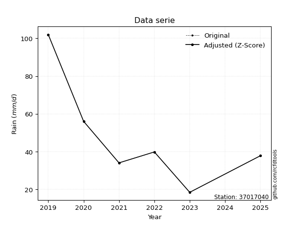</img>

</div>


> The initial value (value_initial) correspond to the initial obtained or null completed value, and value (value) is adjusted only when the initial value is outside the valid range (outlier) definite through the Z-Score value. If Z-Score is active, values out of range or outliers are replaced with the station mean value. A Z-Score (or standard score) measures how many standard deviations a data point is from the mean of a dataset, indicating its relative position; positive scores mean above the mean, negative mean below, and a score of zero is exactly at the mean, allowing for comparison of values from different distributions. It´s calculated using the formula $z=(x–μ)/σ$, where $x$ is the data point, $μ$ is the mean, and $σ$ is the standard deviation, helping identify outliers and understand probability.
>
> <sub>**Note**: In this study, "completing" (filling gaps in) and "extending" (forecasting or lengthening the historical record) rainfall data series are avoided for certain critical analyses because they introduce artificial bias and uncertainty, which can distort the statistics of rare events (extremes), alter day-to-day variability, and compromise the integrity and homogeneity of the original data. Some reasons against Completing/Extending rainfall data are: **Distortion of Extremes and Variability**: The primary issue is that most gap-filling or extension methods rely on averaging or regression with nearby stations, which inherently smooths the data. Rainfall is highly variable in space and time, with a large percentage of zero values and occasional large storms. Infilling methods often underestimate the highest values and overestimate the lowest (zero) values, which severely distorts analyses focused on flood frequency, drought severity, and intensity-duration-frequency (IDF) curves, **Loss of Data Homogeneity**: Infilled or extended data are synthetic estimates, not actual measurements. Combining these estimates with observed data can violate the assumption of data homogeneity, which requires that the data properties do not change over time. Inhomogeneity can lead to incorrect conclusions about long-term trends or changes in climate patterns, **Propagation of Errors**: Errors and biases from the original data (e.g., wind-induced undercatch, instrument errors, site changes) or the data used for imputation can propagate through the analysis, leading to unreliable hydrological models and inaccurate predictions, **Compromised Statistical Integrity**: For statistical analyses, especially those involving the frequency of events, using artificial data can introduce time bias or autocorrelation that doesn´t exist in reality, making it difficult to assess the true probability of events, **Difficulty in Validation**: It is difficult to accurately validate the quality of filled or extended data, especially for past periods where ground-truth measurements are unavailable. The reliability of imputation techniques heavily depends on the density of the surrounding station network and the complexity of the local topography.</sub>


### 4. Active continuous probability distributions from SciPy (44 of 104 available)

A Probability Density Function (PDF) describes the relative likelihood of a continuous random variable falling within a specific range, where the total area under its curve equals 1, and the area over any interval gives the actual probability for that range. Unlike discrete probabilities (like rolling a die), a PDF shows density, not direct probability for a single point (which is zero), with higher points indicating higher likelihood, often visualized as a bell curve for normal distributions.

A log of a probability density function (log-PDF) is simply the logarithm of the PDF´s value, denoted as $log(f(x))$, useful for converting multiplication of probabilities into addition, improving numerical stability with tiny numbers, and connecting to information theory concepts like entropy. Instead of dealing with very small probabilities (e.g., 0.000001), log-PDFs use negative numbers (e.g., $log(0.00001) ≈ -11.51$ that are easier for computers to handle, preventing underflow errors and simplifying complex calculations. In this study, each active probability distribution from SciPy is also evaluated in the $log$ form.

[scipy.stats](https://docs.scipy.org/doc/scipy/reference/stats.html) is a Python´s powerful submodule within the SciPy library for comprehensive statistical analysis, offering over 130 probability distributions (like Normal, Poisson), functions for descriptive stats (mean, variance), hypothesis testing (t-tests, chi-square), random variable generation, and statistical tests, making it essential for data science, modeling, and research. It provides tools to explore, model, and draw conclusions from data efficiently, working seamlessly with NumPy.

<div align="center">

|   id | p_dist             |   n_parameter | fit_method   | label                                                                       | active   | ref                                                                                                        |
|-----:|:-------------------|--------------:|:-------------|:----------------------------------------------------------------------------|:---------|:-----------------------------------------------------------------------------------------------------------|
|    0 | alpha              |             3 | MLE          | Alpha                                                                       | True     | [:mortar_board:](https://docs.scipy.org/doc/scipy/reference/generated/scipy.stats.alpha.html)              |
|    1 | betaprime          |             4 | MLE          | Beta prime                                                                  | True     | [:mortar_board:](https://docs.scipy.org/doc/scipy/reference/generated/scipy.stats.betaprime.html)          |
|    2 | chi2               |             3 | MLE          | Chi²                                                                        | True     | [:mortar_board:](https://docs.scipy.org/doc/scipy/reference/generated/scipy.stats.chi2.html)               |
|    3 | crystalball        |             4 | MLE          | Crystalball                                                                 | True     | [:mortar_board:](https://docs.scipy.org/doc/scipy/reference/generated/scipy.stats.crystalball.html)        |
|    4 | erlang             |             3 | MLE          | Erlang                                                                      | True     | [:mortar_board:](https://docs.scipy.org/doc/scipy/reference/generated/scipy.stats.erlang.html)             |
|    5 | expon              |             2 | MLE          | Exponential                                                                 | True     | [:mortar_board:](https://docs.scipy.org/doc/scipy/reference/generated/scipy.stats.expon.html)              |
|    6 | exponnorm          |             3 | MLE          | Exponentially modified Normal                                               | True     | [:mortar_board:](https://docs.scipy.org/doc/scipy/reference/generated/scipy.stats.exponnorm.html)          |
|    7 | f                  |             4 | MLE          | F                                                                           | True     | [:mortar_board:](https://docs.scipy.org/doc/scipy/reference/generated/scipy.stats.f.html)                  |
|    8 | fatiguelife        |             3 | MLE          | Fatigue-life (Birnbaum-Saunders)                                            | True     | [:mortar_board:](https://docs.scipy.org/doc/scipy/reference/generated/scipy.stats.fatiguelife.html)        |
|    9 | fisk               |             3 | MLE          | Fisk                                                                        | True     | [:mortar_board:](https://docs.scipy.org/doc/scipy/reference/generated/scipy.stats.fisk.html)               |
|   10 | gamma              |             3 | MLE          | Gamma                                                                       | True     | [:mortar_board:](https://docs.scipy.org/doc/scipy/reference/generated/scipy.stats.gamma.html)              |
|   11 | genexpon           |             5 | MLE          | Generalized exponential                                                     | True     | [:mortar_board:](https://docs.scipy.org/doc/scipy/reference/generated/scipy.stats.genexpon.html)           |
|   12 | genlogistic        |             3 | MLE          | Generalized logistic                                                        | True     | [:mortar_board:](https://docs.scipy.org/doc/scipy/reference/generated/scipy.stats.genlogistic.html)        |
|   13 | gibrat             |             2 | MM           | Gibrat                                                                      | True     | [:mortar_board:](https://docs.scipy.org/doc/scipy/reference/generated/scipy.stats.gibrat.html)             |
|   14 | gompertz           |             3 | MLE          | Gompertz (or truncated Gumbel)                                              | True     | [:mortar_board:](https://docs.scipy.org/doc/scipy/reference/generated/scipy.stats.gompertz.html)           |
|   15 | gumbel_l           |             2 | MM           | Gumbel Left Skew                                                            | True     | [:mortar_board:](https://docs.scipy.org/doc/scipy/reference/generated/scipy.stats.gumbel_l.html)           |
|   16 | gumbel_r           |             2 | MM           | Gumbel Right Skew                                                           | True     | [:mortar_board:](https://docs.scipy.org/doc/scipy/reference/generated/scipy.stats.gumbel_r.html)           |
|   17 | halflogistic       |             2 | MM           | Half-logistic                                                               | True     | [:mortar_board:](https://docs.scipy.org/doc/scipy/reference/generated/scipy.stats.halflogistic.html)       |
|   18 | halfnorm           |             2 | MM           | Half Normal                                                                 | True     | [:mortar_board:](https://docs.scipy.org/doc/scipy/reference/generated/scipy.stats.halfnorm.html)           |
|   19 | hypsecant          |             2 | MM           | hyperbolic secant                                                           | True     | [:mortar_board:](https://docs.scipy.org/doc/scipy/reference/generated/scipy.stats.hypsecant.html)          |
|   20 | invgamma           |             3 | MLE          | Inverted gamma                                                              | True     | [:mortar_board:](https://docs.scipy.org/doc/scipy/reference/generated/scipy.stats.invgamma.html)           |
|   21 | invgauss           |             3 | MLE          | Inverse Gaussian                                                            | True     | [:mortar_board:](https://docs.scipy.org/doc/scipy/reference/generated/scipy.stats.invgauss.html)           |
|   22 | invweibull         |             3 | MLE          | Inverted Weibull                                                            | True     | [:mortar_board:](https://docs.scipy.org/doc/scipy/reference/generated/scipy.stats.invweibull.html)         |
|   23 | johnsonsu          |             4 | MLE          | Johnson Su                                                                  | True     | [:mortar_board:](https://docs.scipy.org/doc/scipy/reference/generated/scipy.stats.johnsonsu.html)          |
|   24 | kstwobign          |             2 | MLE          | Limiting distribution of scaled Kolmogorov-Smirnov two-sided test statistic | True     | [:mortar_board:](https://docs.scipy.org/doc/scipy/reference/generated/scipy.stats.kstwobign.html)          |
|   25 | laplace            |             2 | MM           | Laplace                                                                     | True     | [:mortar_board:](https://docs.scipy.org/doc/scipy/reference/generated/scipy.stats.laplace.html)            |
|   26 | laplace_asymmetric |             3 | MLE          | Asymmetric Laplace                                                          | True     | [:mortar_board:](https://docs.scipy.org/doc/scipy/reference/generated/scipy.stats.laplace_asymmetric.html) |
|   27 | loggamma           |             3 | MLE          | Log gamma                                                                   | True     | [:mortar_board:](https://docs.scipy.org/doc/scipy/reference/generated/scipy.stats.loggamma.html)           |
|   28 | logistic           |             2 | MM           | Logistic (or Sech-squared)                                                  | True     | [:mortar_board:](https://docs.scipy.org/doc/scipy/reference/generated/scipy.stats.logistic.html)           |
|   29 | lognorm            |             3 | MLE          | Log Normal                                                                  | True     | [:mortar_board:](https://docs.scipy.org/doc/scipy/reference/generated/scipy.stats.lognorm.html)            |
|   30 | maxwell            |             2 | MM           | Maxwell                                                                     | True     | [:mortar_board:](https://docs.scipy.org/doc/scipy/reference/generated/scipy.stats.maxwell.html)            |
|   31 | mielke             |             4 | MLE          | Mielke Beta-Kappa / Dagum                                                   | True     | [:mortar_board:](https://docs.scipy.org/doc/scipy/reference/generated/scipy.stats.mielke.html)             |
|   32 | moyal              |             2 | MM           | Moyal                                                                       | True     | [:mortar_board:](https://docs.scipy.org/doc/scipy/reference/generated/scipy.stats.moyal.html)              |
|   33 | nakagami           |             3 | MLE          | Nakagami                                                                    | True     | [:mortar_board:](https://docs.scipy.org/doc/scipy/reference/generated/scipy.stats.nakagami.html)           |
|   34 | ncf                |             5 | MLE          | Non-central F distribution                                                  | True     | [:mortar_board:](https://docs.scipy.org/doc/scipy/reference/generated/scipy.stats.ncf.html)                |
|   35 | nct                |             4 | MLE          | Non-central Student’s t                                                     | True     | [:mortar_board:](https://docs.scipy.org/doc/scipy/reference/generated/scipy.stats.nct.html)                |
|   36 | norm               |             2 | MM           | Normal                                                                      | True     | [:mortar_board:](https://docs.scipy.org/doc/scipy/reference/generated/scipy.stats.norm.html)               |
|   37 | pearson3           |             3 | MM           | Pearson type III                                                            | True     | [:mortar_board:](https://docs.scipy.org/doc/scipy/reference/generated/scipy.stats.pearson3.html)           |
|   38 | rayleigh           |             2 | MM           | Rayleigh                                                                    | True     | [:mortar_board:](https://docs.scipy.org/doc/scipy/reference/generated/scipy.stats.rayleigh.html)           |
|   39 | rice               |             3 | MLE          | Rice                                                                        | True     | [:mortar_board:](https://docs.scipy.org/doc/scipy/reference/generated/scipy.stats.rice.html)               |
|   40 | t                  |             3 | MLE          | Student’s t                                                                 | True     | [:mortar_board:](https://docs.scipy.org/doc/scipy/reference/generated/scipy.stats.t.html)                  |
|   41 | truncnorm          |             4 | MLE          | Truncated normal                                                            | True     | [:mortar_board:](https://docs.scipy.org/doc/scipy/reference/generated/scipy.stats.truncnorm.html)          |
|   42 | wald               |             2 | MM           | Wald                                                                        | True     | [:mortar_board:](https://docs.scipy.org/doc/scipy/reference/generated/scipy.stats.wald.html)               |
|   43 | weibull_min        |             3 | MLE          | Weibull minimum                                                             | True     | [:mortar_board:](https://docs.scipy.org/doc/scipy/reference/generated/scipy.stats.weibull_min.html)        |

</div>

> **n_parameter:** # arguments & localization & scale.
>
> **Fit methods:** (MLE) maximum likelihood, (MM) L-moments.
>
>**Inactive** (With the only purpose of prevent loops, zero divisions, infinite values, over high estimated values or horizontal trending for recurrence intervals estimations, the follow distributions were disabled.)**:** foldnorm, gennorm, norminvgauss, powernorm, powerlognorm, skewnorm, genextreme, anglit, arcsine, argus, beta, bradford, burr, burr12, cauchy, cosine, halfcauchy, foldcauchy, skewcauchy, wrapcauchy, dgamma, gengamma, exponweib, exponpow, truncexpon, gausshyper, genhalflogistic, genhyperbolic, geninvgauss, halfgennorm, johnsonsb, kappa4, kappa3, ksone, kstwo, loglaplace, levy, levy_l, levy_stable, ncx2, pareto, genpareto, truncpareto, lomax, powerlaw, rdist, rel_breitwigner, recipinvgauss, semicircular, studentized_range, trapezoid, triang, truncweibull_min, tukeylambda, uniform, loguniform, vonmises, vonmises_line, weibull_max, dweibull, 


## B. Probability (PDF) vs. Empirical (EDF) distributions functions

A continuous probability distribution (CPD) describes probabilities for variables that can take any value within a range (like rain any time), unlike discrete variables with specific outcomes (like temperature). It uses a Probability Density Function (PDF), a curve where the total area under it equals 1, and the probability of the variable falling within an interval (a to b) is found by calculating the area under the curve between those points. A key feature is that the probability of hitting any single exact value is zero, so probabilities are always expressed for ranges, e.g., $P(a ≤ X ≤ b)$.

<div align="center">

Distributions parameters from station values
|    |   station | p_dist                |   n |              loc |          scale | shape                  | shape1             | shape2                 | shape3   |
|---:|----------:|:----------------------|----:|-----------------:|---------------:|:-----------------------|:-------------------|:-----------------------|:---------|
|  0 |  37017040 | alpha                 |   5 |    -34.9007      |  262.869       | 3.4144065504697205     |                    |                        |          |
|  1 |  37017040 | betaprime             |   5 |      3.5256      |   16.6442      | 8.80890552346252       | 4.067320995432382  |                        |          |
|  2 |  37017040 | chi2                  |   5 |     18.4         |   14.7919      | 1.3612750239151858     |                    |                        |          |
|  3 |  37017040 | crystalball           |   5 |     50.04        |   28.6307      | 6457.177395232826      | 464.42240442763205 |                        |          |
|  4 |  37017040 | erlang                |   5 |     18.4         |   25.2454      | 0.7649711925433466     |                    |                        |          |
|  5 |  37017040 | expon                 |   5 |     18.4         |   31.64        |                        |                    |                        |          |
|  6 |  37017040 | exponnorm             |   5 |     18.3714      |    0.00842502  | 3755.9978228456766     |                    |                        |          |
|  7 |  37017040 | f                     |   5 |     18.3964      |   23.0914      | 1.3831037165888467     | 15.223409834297009 |                        |          |
|  8 |  37017040 | fatiguelife           |   5 |     18.4         |    5.29043e-05 | 663.2912459663519      |                    |                        |          |
|  9 |  37017040 | fisk                  |   5 |     12.2669      |   28.549       | 1.9547043612129569     |                    |                        |          |
| 10 |  37017040 | gamma                 |   5 |     18.4         |   26.4605      | 0.7588417167068979     |                    |                        |          |
| 11 |  37017040 | genexpon              |   5 |     18.3927      |    0.267675    | 0.007521970642517941   | 1.1665531230971058 | 7.428158155227949e-06  |          |
| 12 |  37017040 | genlogistic           |   5 |   -107.782       |   20.5099      | 1177.5199547698985     |                    |                        |          |
| 13 |  37017040 | gibrat                |   5 |     28.1984      |   13.2476      |                        |                    |                        |          |
| 14 |  37017040 | gompertz              |   5 |     18.4         |  198.249       | 5.380773556908199      |                    |                        |          |
| 15 |  37017040 | gumbel_l              |   5 |     62.9253      |   22.3233      |                        |                    |                        |          |
| 16 |  37017040 | gumbel_r              |   5 |     37.1547      |   22.3233      |                        |                    |                        |          |
| 17 |  37017040 | halflogistic          |   5 |     16.1059      |   24.4783      |                        |                    |                        |          |
| 18 |  37017040 | halfnorm              |   5 |     12.1441      |   47.4954      |                        |                    |                        |          |
| 19 |  37017040 | hypsecant             |   5 |     50.04        |   18.2269      |                        |                    |                        |          |
| 20 |  37017040 | invgamma              |   5 |     -4.25837     |  175.196       | 4.168799495065759      |                    |                        |          |
| 21 |  37017040 | invgauss              |   5 |      6.95622     |   71.7706      | 0.6002985055092266     |                    |                        |          |
| 22 |  37017040 | invweibull            |   5 |     18.4         |    1.13877     | 0.06539671242435216    |                    |                        |          |
| 23 |  37017040 | johnsonsu             |   5 |      9.55661     |    0.404992    | -6.510156900421057     | 1.295035714637621  |                        |          |
| 24 |  37017040 | kstwobign             |   5 |    -36.0575      |   99.2039      |                        |                    |                        |          |
| 25 |  37017040 | laplace               |   5 |     50.04        |   20.245       |                        |                    |                        |          |
| 26 |  37017040 | laplace_asymmetric    |   5 |     34           |   17.0836      | 0.6352561799928431     |                    |                        |          |
| 27 |  37017040 | loggamma              |   5 |  -7924.72        | 1098.13        | 1425.7911338038857     |                    |                        |          |
| 28 |  37017040 | logistic              |   5 |     50.04        |   15.7849      |                        |                    |                        |          |
| 29 |  37017040 | lognorm               |   5 |     18.4         |    0.0206205   | 14.705859631248572     |                    |                        |          |
| 30 |  37017040 | maxwell               |   5 |    -17.8028      |   42.5142      |                        |                    |                        |          |
| 31 |  37017040 | mielke                |   5 |     -0.285615    |   30.2001      | 4.799175165780936      | 2.5450391413719515 |                        |          |
| 32 |  37017040 | moyal                 |   5 |     33.6671      |   12.8884      |                        |                    |                        |          |
| 33 |  37017040 | nakagami              |   5 |     34           |   25.6269      | 0.09153091795768292    |                    |                        |          |
| 34 |  37017040 | ncf                   |   5 |     -0.538807    |   46.4754      | 8.892592722932854      | 28.56911577662641  | 0.07668054895223869    |          |
| 35 |  37017040 | nct                   |   5 |     -0.0172817   |    9.17461     | 2.6829229806420862     | 3.9182975220668324 |                        |          |
| 36 |  37017040 | norm                  |   5 |     50.04        |   28.6307      |                        |                    |                        |          |
| 37 |  37017040 | pearson3              |   5 |     50.04        |   28.6307      | 0.8830400094129219     |                    |                        |          |
| 38 |  37017040 | rayleigh              |   5 |     -4.73225     |   43.7019      |                        |                    |                        |          |
| 39 |  37017040 | rice                  |   5 |      3.35262     |   38.7262      | 0.00030819061776531467 |                    |                        |          |
| 40 |  37017040 | t                     |   5 |     50.0399      |   28.6307      | 721735657.6618121      |                    |                        |          |
| 41 |  37017040 | truncnorm             |   5 |     50.04        |   28.6307      | -387.7891090133969     | 1746.47838213641   |                        |          |
| 42 |  37017040 | wald                  |   5 |     21.4093      |   28.6307      |                        |                    |                        |          |
| 43 |  37017040 | weibull_min           |   5 |     18.4         |   31.9605      | 0.40556231918542107    |                    |                        |          |
| 44 |  37017040 | logalpha              |   5 |     -5.54568     |  151.766       | 16.37869473725625      |                    |                        |          |
| 45 |  37017040 | logbetaprime          |   5 |     -2.52225     |  103.146       | 130.39516848917873     | 2143.7610031213326 |                        |          |
| 46 |  37017040 | logchi2               |   5 |      2.91235     |    1.00241     | 1.0458984852427209     |                    |                        |          |
| 47 |  37017040 | logcrystalball        |   5 |      3.75458     |    0.565214    | 14.73687687691688      | 89.85894128182869  |                        |          |
| 48 |  37017040 | logerlang             |   5 |     -8.02953     |    0.0270911   | 434.9555425497027      |                    |                        |          |
| 49 |  37017040 | logexpon              |   5 |      2.91235     |    0.84223     |                        |                    |                        |          |
| 50 |  37017040 | logexponnorm          |   5 |      3.70545     |    0.563076    | 0.08725840985372088    |                    |                        |          |
| 51 |  37017040 | logf                  |   5 |     -7.96633     |   11.7043      | 2198.8013355588782     | 1413.1014353509017 |                        |          |
| 52 |  37017040 | logfatiguelife        |   5 |     -5.45484     |    9.19207     | 0.061445309131505935   |                    |                        |          |
| 53 |  37017040 | logfisk               |   5 |     -4.68132     |    8.41887     | 25.40629055143465      |                    |                        |          |
| 54 |  37017040 | loggamma              |   5 |     -8.06091     |    0.0269741   | 438.0373458443131      |                    |                        |          |
| 55 |  37017040 | loggenexpon           |   5 |      2.90563     |    0.0044472   | 0.0027950550716531915  | 1.4607483880944225 | 1.2115364701099922e-05 |          |
| 56 |  37017040 | loggenlogistic        |   5 |      3.4192      |    0.392687    | 1.81781172369877       |                    |                        |          |
| 57 |  37017040 | loggibrat             |   5 |      3.32339     |    0.261529    |                        |                    |                        |          |
| 58 |  37017040 | loggompertz           |   5 |      2.91235     |    1.1423      | 0.739976066386829      |                    |                        |          |
| 59 |  37017040 | loggumbel_l           |   5 |      4.00896     |    0.440696    |                        |                    |                        |          |
| 60 |  37017040 | loggumbel_r           |   5 |      3.5002      |    0.440696    |                        |                    |                        |          |
| 61 |  37017040 | loghalflogistic       |   5 |      3.08469     |    0.483226    |                        |                    |                        |          |
| 62 |  37017040 | loghalfnorm           |   5 |      3.00649     |    0.937597    |                        |                    |                        |          |
| 63 |  37017040 | loghypsecant          |   5 |      3.75458     |    0.359827    |                        |                    |                        |          |
| 64 |  37017040 | loginvgamma           |   5 |     -5.10211     | 2162.62        | 245.15302793057322     |                    |                        |          |
| 65 |  37017040 | loginvgauss           |   5 |      0.0422943   |  152.602       | 0.02429097747276769    |                    |                        |          |
| 66 |  37017040 | loginvweibull         |   5 |     -2.52358e+07 |    2.52358e+07 | 48983789.10330456      |                    |                        |          |
| 67 |  37017040 | logjohnsonsu          |   5 | 743054           |    1.08471e+07 | 1317081.2631975035     | 19241779.591016885 |                        |          |
| 68 |  37017040 | logkstwobign          |   5 |      1.67083     |    2.38315     |                        |                    |                        |          |
| 69 |  37017040 | loglaplace            |   5 |      3.75458     |    0.399667    |                        |                    |                        |          |
| 70 |  37017040 | loglaplace_asymmetric |   5 |      3.68387     |    0.434984    | 0.9207315518502168     |                    |                        |          |
| 71 |  37017040 | logloggamma           |   5 |    -88.5585      |   14.3133      | 632.8933960181514      |                    |                        |          |
| 72 |  37017040 | loglogistic           |   5 |      3.75458     |    0.311619    |                        |                    |                        |          |
| 73 |  37017040 | loglognorm            |   5 |      2.91235     |    0.00083297  | 14.13426734929768      |                    |                        |          |
| 74 |  37017040 | logmaxwell            |   5 |      2.41526     |    0.839295    |                        |                    |                        |          |
| 75 |  37017040 | logmielke             |   5 |     -0.0591799   |    3.90116     | 9.88052649125671       | 12.453898589306924 |                        |          |
| 76 |  37017040 | logmoyal              |   5 |      3.43135     |    0.254436    |                        |                    |                        |          |
| 77 |  37017040 | lognakagami           |   5 |      3.52636     |    0.584732    | 0.17061662463781513    |                    |                        |          |
| 78 |  37017040 | logncf                |   5 |     -8.16022     |    6.26702     | 1785.6360370681177     | 1448.162408287384  | 1604.5440471158963     |          |
| 79 |  37017040 | lognct                |   5 |     -1.76466     |    0.547078    | 778.7970250584581      | 10.079186617261513 |                        |          |
| 80 |  37017040 | lognorm               |   5 |      3.75458     |    0.565214    |                        |                    |                        |          |
| 81 |  37017040 | logpearson3           |   5 |      3.75458     |    0.565214    | 0.07704806875616063    |                    |                        |          |
| 82 |  37017040 | lograyleigh           |   5 |      2.67329     |    0.862743    |                        |                    |                        |          |
| 83 |  37017040 | logrice               |   5 |      2.60724     |    0.670986    | 1.2780784210491707     |                    |                        |          |
| 84 |  37017040 | logt                  |   5 |      3.75459     |    0.565206    | 62195490.75726685      |                    |                        |          |
| 85 |  37017040 | logtruncnorm          |   5 |      0.788416    |    1.12125     | 2.4418778692954977     | 19.230909362024676 |                        |          |
| 86 |  37017040 | logwald               |   5 |      3.18931     |    0.565263    |                        |                    |                        |          |
| 87 |  37017040 | logweibull_min        |   5 |      2.57002     |    1.33733     | 2.22962105095473       |                    |                        |          |

</div>

> **loc** (Location parameter): This shifts the distribution along the x-axis. For many common distributions, like the normal (Gaussian) distribution, loc represents the mean $μ$. For others, like the uniform distribution, it might represent the minimum value, or for the beta distribution, the left end of the support interval.
>
> **scale** (Scale parameter): This determines the width or spread of the distribution. For the normal distribution, scale represents the standard deviation $σ$. For a uniform distribution, it defines the length of the interval (from $loc$ to $loc + scale$).
>
> **shape** (Shape parameters): Refers to parameters that define the specific form of a probability distribution, distinct from its location (loc) and scale (scale). These parameters are required arguments for most distribution functions. For example, a normal (Gaussian) distribution is fully defined by its location (mean) and scale (standard deviation), so it has no specific shape parameters beyond loc and scale. However, other distributions have intrinsic properties that need specification, as Gamma distribution that takes a shape parameter, often named $a$ or $alpha$.


### 0. Cumulative distribution values - CDF (88 evaluated)

Cumulative Distribution Function (CDF), denoted as $F$<sub>$X$</sub>$(x)$, is a function that gives the probability that a random variable $X$ will take a value less than or equal to a specific value, $x$ (i.e., $(P(X≥x)$. It essentially "accumulates" probabilities from a given point up to the far right (positive infinity), providing a complete picture of the distribution´s probabilities for both discrete (like rain) and continuous (like temperature) variables, helping to find probabilities over ranges or above certain values. Each station is evaluated separately ordering the $x$ values ascending, calculating the CDF and PDF values for the activated distributions and their logarithmic forms.

<div align="center">

CDF ordered by x ascending and calculating $log(f(x))$ separately
|   id |   Station |   date |     x |   count |   mean |     std |    zscore |   Value_initial |   station |   m |     alpha |   alpha_pdf |   betaprime |   betaprime_pdf |        chi2 |      chi2_pdf |   crystalball |   crystalball_pdf |      erlang |    erlang_pdf |    expon |   expon_pdf |   exponnorm |   exponnorm_pdf |          f |      f_pdf |   fatiguelife |   fatiguelife_pdf |      fisk |   fisk_pdf |       gamma |    gamma_pdf |    genexpon |   genexpon_pdf |   genlogistic |   genlogistic_pdf |   gibrat |   gibrat_pdf |    gompertz |   gompertz_pdf |   gumbel_l |   gumbel_l_pdf |   gumbel_r |   gumbel_r_pdf |   halflogistic |   halflogistic_pdf |   halfnorm |   halfnorm_pdf |   hypsecant |   hypsecant_pdf |   invgamma |   invgamma_pdf |   invgauss |   invgauss_pdf |   invweibull |   invweibull_pdf |   johnsonsu |   johnsonsu_pdf |   kstwobign |   kstwobign_pdf |   laplace |   laplace_pdf |   laplace_asymmetric |   laplace_asymmetric_pdf |   loggamma |   loggamma_pdf |   logistic |   logistic_pdf |   lognorm |   lognorm_pdf |   maxwell |   maxwell_pdf |    mielke |   mielke_pdf |     moyal |   moyal_pdf |   nakagami |   nakagami_pdf |       ncf |    ncf_pdf |       nct |    nct_pdf |     norm |   norm_pdf |   pearson3 |   pearson3_pdf |   rayleigh |   rayleigh_pdf |     rice |   rice_pdf |        t |      t_pdf |   truncnorm |   truncnorm_pdf |     wald |   wald_pdf |   weibull_min |   weibull_min_pdf |   logalpha |   logalpha_pdf |   logbetaprime |   logbetaprime_pdf |     logchi2 |   logchi2_pdf |   logcrystalball |   logcrystalball_pdf |   logerlang |   logerlang_pdf |   logexpon |   logexpon_pdf |   logexponnorm |   logexponnorm_pdf |      logf |   logf_pdf |   logfatiguelife |   logfatiguelife_pdf |   logfisk |   logfisk_pdf |   loggenexpon |   loggenexpon_pdf |   loggenlogistic |   loggenlogistic_pdf |   loggibrat |   loggibrat_pdf |   loggompertz |   loggompertz_pdf |   loggumbel_l |   loggumbel_l_pdf |   loggumbel_r |   loggumbel_r_pdf |   loghalflogistic |   loghalflogistic_pdf |   loghalfnorm |   loghalfnorm_pdf |   loghypsecant |   loghypsecant_pdf |   loginvgamma |   loginvgamma_pdf |   loginvgauss |   loginvgauss_pdf |   loginvweibull |   loginvweibull_pdf |   logjohnsonsu |   logjohnsonsu_pdf |   logkstwobign |   logkstwobign_pdf |   loglaplace |   loglaplace_pdf |   loglaplace_asymmetric |   loglaplace_asymmetric_pdf |   logloggamma |   logloggamma_pdf |   loglogistic |   loglogistic_pdf |   loglognorm |   loglognorm_pdf |   logmaxwell |   logmaxwell_pdf |   logmielke |   logmielke_pdf |   logmoyal |   logmoyal_pdf |   lognakagami |   lognakagami_pdf |    logncf |   logncf_pdf |   lognct |   lognct_pdf |   logpearson3 |   logpearson3_pdf |   lograyleigh |   lograyleigh_pdf |   logrice |   logrice_pdf |     logt |   logt_pdf |   logtruncnorm |   logtruncnorm_pdf |   logwald |   logwald_pdf |   logweibull_min |   logweibull_min_pdf |
|-----:|----------:|-------:|------:|--------:|-------:|--------:|----------:|----------------:|----------:|----:|----------:|------------:|------------:|----------------:|------------:|--------------:|--------------:|------------------:|------------:|--------------:|---------:|------------:|------------:|----------------:|-----------:|-----------:|--------------:|------------------:|----------:|-----------:|------------:|-------------:|------------:|---------------:|--------------:|------------------:|---------:|-------------:|------------:|---------------:|-----------:|---------------:|-----------:|---------------:|---------------:|-------------------:|-----------:|---------------:|------------:|----------------:|-----------:|---------------:|-----------:|---------------:|-------------:|-----------------:|------------:|----------------:|------------:|----------------:|----------:|--------------:|---------------------:|-------------------------:|-----------:|---------------:|-----------:|---------------:|----------:|--------------:|----------:|--------------:|----------:|-------------:|----------:|------------:|-----------:|---------------:|----------:|-----------:|----------:|-----------:|---------:|-----------:|-----------:|---------------:|-----------:|---------------:|---------:|-----------:|---------:|-----------:|------------:|----------------:|---------:|-----------:|--------------:|------------------:|-----------:|---------------:|---------------:|-------------------:|------------:|--------------:|-----------------:|---------------------:|------------:|----------------:|-----------:|---------------:|---------------:|-------------------:|----------:|-----------:|-----------------:|---------------------:|----------:|--------------:|--------------:|------------------:|-----------------:|---------------------:|------------:|----------------:|--------------:|------------------:|--------------:|------------------:|--------------:|------------------:|------------------:|----------------------:|--------------:|------------------:|---------------:|-------------------:|--------------:|------------------:|--------------:|------------------:|----------------:|--------------------:|---------------:|-------------------:|---------------:|-------------------:|-------------:|-----------------:|------------------------:|----------------------------:|--------------:|------------------:|--------------:|------------------:|-------------:|-----------------:|-------------:|-----------------:|------------:|----------------:|-----------:|---------------:|--------------:|------------------:|----------:|-------------:|---------:|-------------:|--------------:|------------------:|--------------:|------------------:|----------:|--------------:|---------:|-----------:|---------------:|-------------------:|----------:|--------------:|-----------------:|---------------------:|
|    0 |  37017040 |   2023 |  18.4 |       5 |  50.04 | 32.0101 | -0.988437 |            18.4 |  37017040 |   1 | 0.0646041 |  0.0116773  |   0.0571145 |      0.0134188  | 1.61143e-11 | 3087.22       |      0.134557 |        0.00756631 | 8.10913e-13 | 174.606       | 0        |  0.0316056  | 0.000902597 |      0.0315617  | 0.00197846 | 0.375469   |     0.0872694 |       1.6518e+09  | 0.0471476 | 0.0143181  | 9.80228e-13 | 209.372      | 0.000206505 |     0.0280962  |     0.0817691 |        0.00997179 | 0        |   0          | 5.01416e-15 |     0.0271415  |   0.12722  |    0.00532005  |  0.0985996 |     0.0102326  |      0.0468249 |         0.0203815  |   0.10479  |     0.0166541  |    0.111059 |      0.00597025 |  0.0593059 |     0.0131202  |  0.0543153 |     0.0160899  |  0.000138509 |      2.26522e+10 |   0.0527764 |      0.0157502  |   0.0761281 |      0.0100484  |  0.104768 |    0.00517503 |            0.0682949 |               0.00629303 |   0.06512  |       0.236304 |   0.118737 |     0.00662903 |  0.068098 |      0.232562 |  0.132723 |    0.00947028 | 0.0613561 |   0.0121718  | 0.0705891 |  0.010915   | 0          |    0           | 0.0788221 | 0.0117694  | 0.0571511 | 0.0123756  | 0.134557 | 0.00756631 |   0.113268 |     0.0105598  |   0.130719 |     0.0105287  | 0.07271  | 0.00930396 | 0.134558 | 0.00756636 |    0.134557 |      0.00756632 | 0        | 0          |   3.38561e-07 |       3.86486e+07 |  0.0588294 |       0.248841 |      0.0627609 |           0.241241 | 7.33534e-09 |   8.63793e+06 |        0.0680976 |             0.232561 |   0.0654757 |        0.237137 |   0        |       1.18732  |      0.0680622 |           0.232606 | 0.0637142 |   0.239157 |        0.0629157 |             0.240715 | 0.0678042 |      0.211472 |    0.00423541 |          0.631825 |        0.0615427 |             0.223432 |    0        |       0         |   1.70206e-08 |          0.647794 |     0.0796918 |          0.173427 |     0.0224627 |          0.193481 |          0        |              0        |      0        |          0        |      0.0610957 |           0.168751 |     0.0608407 |          0.242951 |     0.0577852 |          0.261512 |        0.05086  |            0.294059 |      0.0680398 |           0.232478 |      0.0510613 |           0.332788 |    0.0607811 |         0.152079 |               0.0668365 |                    0.166881 |     0.0703195 |          0.232168 |     0.0628109 |          0.188903 |    0.0227828 |      8.61197e+12 |    0.0497897 |         0.279831 |   0.0661556 |        0.212798 | 0.00555507 |      0.0930196 |   0           |       0           | 0.0638158 |     0.238979 | 0.067059 |     0.23382  |     0.0659424 |          0.23598  |     0.0376621 |          0.309078 | 0.0452273 |      0.293328 | 0.068093 |   0.232552 |    0           |           0        |  0        |      0        |        0.0467904 |             0.297506 |
|    1 |  37017040 |   2021 |  34   |       5 |  50.04 | 32.0101 | -0.501091 |            34   |  37017040 |   2 | 0.344404  |  0.0203921  |   0.362594  |      0.0204944  | 0.584385    |    0.0184039  |      0.287659 |        0.0119103  | 0.58345     |   0.0198263   | 0.389237 |  0.0193035  | 0.389747    |      0.0192847  | 0.529349   | 0.0173614  |     0.793514  |       0.00748741  | 0.369767  | 0.0209599  | 0.572381    |   0.0196129  | 0.36448     |     0.0190581  |     0.310081  |        0.0176939  | 0.204493 |   0.0489013  | 0.356294    |     0.0189015  |   0.239435 |    0.00932486  |  0.316071  |     0.0163079  |      0.350058  |         0.0179233  |   0.354604 |     0.0151115  |    0.250305 |      0.0123606  |  0.360311  |     0.0204778  |  0.384175  |     0.0199943  |  0.430554    |      0.00152098  |   0.381154  |      0.0201886  |   0.299105  |      0.0168536  |  0.226402 |    0.0111831  |            0.287521  |               0.0264936  |   0.34781  |       0.663128 |   0.265776 |     0.0123624  |  0.343189 |      0.65057  |  0.314194 |    0.0132631  | 0.358051  |   0.0210481  | 0.32356   |  0.0187713  | 0.00119431 |    3.07698e+10 | 0.328936  | 0.0179492  | 0.366993  | 0.0215591  | 0.287659 | 0.0119103  |   0.321502 |     0.0150814  |   0.324801 |     0.0136931  | 0.268857 | 0.0149412  | 0.287661 | 0.0119103  |    0.287659 |      0.0119103  | 0.309658 | 0.0334402  |   0.5265      |       0.00920289  |  0.363079  |       0.691888 |      0.353249  |           0.673697 | 0.548724    |   0.380641    |        0.343188  |             0.65057  |   0.348527  |        0.663092 |   0.517623 |       0.572738 |      0.343251  |           0.650749 | 0.35118   |   0.670008 |        0.352827  |             0.673191 | 0.344016  |      0.698542 |    0.430173   |          0.674376 |        0.357418  |             0.715092 |    0.399949 |       1.90337   |   0.409439    |          0.654852 |     0.284314  |          0.543247 |     0.389701  |          0.833329 |          0.427636 |              0.845491 |      0.420745 |          0.729733 |      0.310428  |           0.73232  |     0.356087  |          0.681236 |     0.373949  |          0.700176 |        0.404732 |            0.710601 |      0.343145  |           0.650734 |      0.420686  |           0.696059 |    0.282473  |         0.706771 |               0.309619  |                    0.773076 |     0.341682  |          0.6416   |     0.324675  |          0.70362  |    0.679802  |      0.0412168   |    0.374692  |         0.693642 |   0.342501  |        0.699274 | 0.406712   |      0.922077  |   5.53156e-06 |       4.25039e+09 | 0.350947  |     0.669472 | 0.344909 |     0.655378 |     0.347149  |          0.660203 |     0.386668  |          0.702937 | 0.366966  |      0.679959 | 0.343181 |   0.650575 |    4.13889e-10 |           2.47035  |  0.443572 |      1.33701  |        0.377172  |             0.687532 |
|    2 |  37017040 |   2022 |  39.8 |       5 |  50.04 | 32.0101 | -0.319899 |            39.8 |  37017040 |   3 | 0.458513  |  0.0186967  |   0.474418  |      0.0179197  | 0.67649     |    0.0136748  |      0.3603   |        0.0130707  | 0.682412    |   0.0146284   | 0.491535 |  0.0160703  | 0.491947    |      0.0160551  | 0.61717    | 0.0131989  |     0.831186  |       0.00564385  | 0.482301  | 0.0177264  | 0.670674    |   0.0145962  | 0.467023    |     0.0163567  |     0.413704  |        0.0177963  | 0.447226 |   0.0340854  | 0.458459    |     0.0163737  |   0.298754 |    0.0111484   |  0.411375  |     0.0163687  |      0.449427  |         0.0163005  |   0.439625 |     0.0141796  |    0.329898 |      0.0150289  |  0.47249   |     0.0180399  |  0.491166  |     0.016881   |  0.438042    |      0.00110495  |   0.489332  |      0.0170752  |   0.397452  |      0.0168704  |  0.30151  |    0.0148931  |            0.425743  |               0.0213538  |   0.456252 |       0.705181 |   0.343278 |     0.0142819  |  0.450218 |      0.700323 |  0.392819 |    0.0137592  | 0.473579  |   0.0185541  | 0.430543  |  0.0178837  | 0.640819   |    0.0201391   | 0.4314    | 0.0171969  | 0.484093  | 0.0186226  | 0.3603   | 0.0130707  |   0.409571 |     0.0151557  |   0.404992 |     0.0138738  | 0.357821 | 0.0156068  | 0.360302 | 0.0130708  |    0.3603   |      0.0130707  | 0.477129 | 0.024501   |   0.572528    |       0.00688497  |  0.474184  |       0.70927  |      0.462705  |           0.707096 | 0.603279    |   0.315563    |        0.450217  |             0.700322 |   0.456931  |        0.704724 |   0.5999   |       0.475049 |      0.450302  |           0.700406 | 0.460314  |   0.706808 |        0.462256  |             0.707276 | 0.45946   |      0.754294 |    0.53229    |          0.619317 |        0.472961  |             0.739156 |    0.625851 |       1.05117   |   0.510294    |          0.6233   |     0.380117  |          0.672671 |     0.517275  |          0.773726 |          0.55111  |              0.720447 |      0.52999  |          0.655517 |      0.437844  |           0.867809 |     0.466332  |          0.709289 |     0.485326  |          0.704587 |        0.513623 |            0.664243 |      0.450205  |           0.700529 |      0.526586  |           0.643022 |    0.418919  |         1.04817  |               0.4588    |                    1.14556  |     0.447456  |          0.69373  |     0.443511  |          0.792022 |    0.685559  |      0.0325514   |    0.484538  |         0.693009 |   0.458242  |        0.757269 | 0.542639   |      0.793115  |   0.509273    |       1.09171     | 0.460021  |     0.706598 | 0.452492 |     0.702317 |     0.455228  |          0.703609 |     0.496429  |          0.683701 | 0.475348  |      0.688958 | 0.450212 |   0.700332 |    0.328391    |           1.7358   |  0.613135 |      0.854732 |        0.485816  |             0.684636 |
|    3 |  37017040 |   2020 |  56   |       5 |  50.04 | 32.0101 |  0.186191 |            56   |  37017040 |   4 | 0.699592  |  0.0110752  |   0.699878  |      0.0102801  | 0.832557    |    0.00660587 |      0.582451 |        0.0136354  | 0.846357    |   0.00674499  | 0.695282 |  0.00963078 | 0.695507    |      0.00962233 | 0.772898   | 0.00690317 |     0.898135  |       0.00300643  | 0.697125  | 0.00943723 | 0.836102    |   0.00690749 | 0.680916    |     0.0104171  |     0.669849  |        0.0130846  | 0.770737 |   0.0109023  | 0.674931    |     0.0106654  |   0.519668 |    0.015778    |  0.650574  |     0.0125287  |      0.672278  |         0.0111945  |   0.644186 |     0.0109685  |    0.602277 |      0.01657    |  0.700423  |     0.0104139  |  0.702013  |     0.00970345 |  0.451324    |      0.000624503 |   0.701506  |      0.00967265 |   0.644703  |      0.0130653  |  0.627509 |    0.0183992  |            0.685596  |               0.0116911  |   0.6885   |       0.61681  |   0.593288 |     0.0152865  |  0.684052 |      0.629306 |  0.610459 |    0.0125343  | 0.70348   |   0.0102063  | 0.674147  |  0.0119138  | 0.813723   |    0.00636468  | 0.670458  | 0.0119756  | 0.71163   | 0.0100017  | 0.582451 | 0.0136354  |   0.636395 |     0.012302   |   0.619254 |     0.0121075  | 0.603108 | 0.0139329  | 0.582453 | 0.0136354  |    0.582451 |      0.0136354  | 0.73967  | 0.0103062  |   0.656348    |       0.00395923  |  0.699141  |       0.576783 |      0.692469  |           0.602671 | 0.693925    |   0.223455    |        0.684051  |             0.629307 |   0.688921  |        0.615902 |   0.733263 |       0.316703 |      0.684119  |           0.62914  | 0.691113  |   0.608016 |        0.692276  |             0.603762 | 0.701408  |      0.611136 |    0.717515   |          0.460148 |        0.703331  |             0.573067 |    0.838261 |       0.349071  |   0.704931    |          0.506424 |     0.645803  |          0.834185 |     0.738064  |          0.508669 |          0.750156 |              0.452444 |      0.72282  |          0.471523 |      0.719677  |           0.682184 |     0.694796  |          0.59421  |     0.705449  |          0.557406 |        0.709365 |            0.47281  |      0.684104  |           0.629451 |      0.716899  |           0.465423 |    0.746055  |         0.635391 |               0.737312  |                    0.556032 |     0.680579  |          0.631841 |     0.70452   |          0.668032 |    0.694704  |      0.0222757   |    0.701869  |         0.555586 |   0.701162  |        0.611896 | 0.75564    |      0.464896  |   0.742924    |       0.456686    | 0.690879  |     0.608503 | 0.685738 |     0.624399 |     0.687567  |          0.618687 |     0.707122  |          0.532009 | 0.695454  |      0.573523 | 0.684049 |   0.629318 |    0.733733    |           0.754739 |  0.806521 |      0.363082 |        0.701047  |             0.553029 |
|    4 |  37017040 |   2019 | 102   |       5 |  50.04 | 32.0101 |  1.62324  |           102   |  37017040 |   5 | 0.932745  |  0.00183283 |   0.926615  |      0.00196801 | 0.970636    |    0.00108098 |      0.965225 |        0.00268458 | 0.978418    |   0.000903835 | 0.928797 |  0.0022504  | 0.928836    |      0.00224888 | 0.934721   | 0.00159986 |     0.970967  |       0.000750565 | 0.903659  | 0.00189646 | 0.975027    |   0.00100147 | 0.937452    |     0.00238937 |     0.958348  |        0.00198791 | 0.957062 |   0.00123667 | 0.940539    |     0.00246041 |   0.996839 |    0.000815157 |  0.946714  |     0.00232225 |      0.941885  |         0.00230515 |   0.941494 |     0.00280588 |    0.963243 |      0.00201215 |  0.928846  |     0.00195398 |  0.927357  |     0.00210619 |  0.46998     |      0.000277596 |   0.922221  |      0.00203869 |   0.958425  |      0.00233281 |  0.9616   |    0.00189674 |            0.943164  |               0.00211344 |   0.935867 |       0.211995 |   0.964144 |     0.00219005 |  0.938212 |      0.215653 |  0.95275  |    0.00281152 | 0.920622  |   0.00185357 | 0.943729  |  0.00217939 | 0.959629   |    0.00142173  | 0.945469  | 0.00217707 | 0.923993  | 0.00181079 | 0.965225 | 0.00268458 |   0.94711  |     0.00255505 |   0.949327 |     0.00283186 | 0.961007 | 0.00256483 | 0.965226 | 0.00268456 |    0.965225 |      0.00268458 | 0.945206 | 0.00164367 |   0.771662    |       0.00163602  |  0.927412  |       0.20256  |      0.933098  |           0.208981 | 0.798366    |   0.134899    |        0.938211  |             0.215654 |   0.935897  |        0.211713 |   0.869115 |       0.155403 |      0.938178  |           0.215589 | 0.934107  |   0.209859 |        0.933316  |             0.20904  | 0.927311  |      0.184017 |    0.909387   |          0.196033 |        0.920868  |             0.189004 |    0.94573  |       0.0845681 |   0.923766    |          0.221161 |     0.982515  |          0.160547 |     0.925052  |          0.163529 |          0.920722 |              0.157557 |      0.915689 |          0.19181  |      0.943479  |           0.156255 |     0.931109  |          0.206675 |     0.925761  |          0.198307 |        0.89832  |            0.186972 |      0.938268  |           0.215563 |      0.907462  |           0.192476 |    0.943354  |         0.141732 |               0.926171  |                    0.156273 |     0.937857  |          0.219551 |     0.942303  |          0.174468 |    0.705305  |      0.0142469   |    0.925895  |         0.205901 |   0.925509  |        0.181487 | 0.923689   |      0.149503  |   0.915352    |       0.168352    | 0.934155  |     0.210072 | 0.937135 |     0.214162 |     0.936155  |          0.212899 |     0.922597  |          0.202957 | 0.929274  |      0.212681 | 0.938213 |   0.215654 |    0.957407    |           0.139702 |  0.930343 |      0.109331 |        0.926165  |             0.208762 |


</div>

An Empirical Distribution Function (EDF) is a step-function estimate of a true cumulative distribution function (CDF) based on observed sample data, representing the proportion of data points less than or equal to a given value. It is calculated by ordering your data and jumping up by $1/n$ (where $n$ is sample size) at each unique data point, allowing analysis without assuming an underlying population distribution, and it gets closer to the true CDF as the sample size grows. For the empirical probability calculations, the parameter $m$ correspond to the order number which means the position of the $x$ values in an ascending order list.

The Kolmogorov-Smirnov (K-S) test is a non-parametric statistical test used to determine if a sample data set comes from a specific theoretical distribution (one-sample) or if two different samples come from the same underlying distribution (two-sample), by comparing their cumulative distribution functions (CDFs). It calculates the maximum vertical difference (D statistic) between these functions, with a small p-value indicating a significant difference and rejection of the null hypothesis (that the data/samples match).


### 1. EDF California (1923)

California´s estimates the true probability distribution of water-related data (like rainfall, streamflow) using observed samples, crucial for risk assessment.

<div align="center">


$P=m/n$


</div>


**1.1. Empirical values**

<div align="center">

|                | 0              | 1                  | 2              | 3                 | 4              |
|:---------------|:---------------|:-------------------|:---------------|:------------------|:---------------|
| date           | 2023           | 2021               | 2022           | 2020              | 2019           |
| x              | 18.4           | 34.0               | 39.8           | 56.0              | 102.0          |
| m              | 1              | 2                  | 3              | 4                 | 5              |
| empirical_dist | edf_california | edf_california     | edf_california | edf_california    | edf_california |
| empirical      | 0.2            | 0.4                | 0.6            | 0.8               | 1.0            |
| empirical_tr   | 1.25           | 1.6666666666666667 | 2.5            | 5.000000000000001 | inf            |

</div>


**1.2. Kolmogorov-Smirnov fit test (sorted by Δ)**


<div align="center">

|                | 0                  | 1                  | 2                  | 3                  | 4                   | 5                   | 6                   | 7                   | 8                   | 9                   | 10                    | 11                  | 12                  | 13                  | 14                 | 15                  | 16                  | 17                 | 18                 | 19                 | 20                 | 21                  | 22                  | 23                 | 24                  | 25                 | 26                  | 27                  | 28                  | 29                  | 30                  | 31                  | 32                 | 33                  | 34                  | 35                  | 36                  | 37                  | 38                 | 39                 | 40                 | 41                  | 42                  | 43                  | 44                 | 45                 | 46                  | 47                  | 48                  | 49                  | 50                  | 51                  | 52                 | 53                  | 54                 | 55                  | 56                  | 57                 | 58                 | 59                 | 60                 | 61                 | 62                 | 63                 | 64                 | 65                 | 66                 | 67                 | 68                  | 69                 | 70                 | 71                  | 72                  | 73                 | 74                 | 75                  | 76                  | 77                 | 78                 | 79                 | 80                  | 81                 | 82                 | 83                 | 84                  | 85                  | 86                  | 87                 |
|:---------------|:-------------------|:-------------------|:-------------------|:-------------------|:--------------------|:--------------------|:--------------------|:--------------------|:--------------------|:--------------------|:----------------------|:--------------------|:--------------------|:--------------------|:-------------------|:--------------------|:--------------------|:-------------------|:-------------------|:-------------------|:-------------------|:--------------------|:--------------------|:-------------------|:--------------------|:-------------------|:--------------------|:--------------------|:--------------------|:--------------------|:--------------------|:--------------------|:-------------------|:--------------------|:--------------------|:--------------------|:--------------------|:--------------------|:-------------------|:-------------------|:-------------------|:--------------------|:--------------------|:--------------------|:-------------------|:-------------------|:--------------------|:--------------------|:--------------------|:--------------------|:--------------------|:--------------------|:-------------------|:--------------------|:-------------------|:--------------------|:--------------------|:-------------------|:-------------------|:-------------------|:-------------------|:-------------------|:-------------------|:-------------------|:-------------------|:-------------------|:-------------------|:-------------------|:--------------------|:-------------------|:-------------------|:--------------------|:--------------------|:-------------------|:-------------------|:--------------------|:--------------------|:-------------------|:-------------------|:-------------------|:--------------------|:-------------------|:-------------------|:-------------------|:--------------------|:--------------------|:--------------------|:-------------------|
| station        | 37017040           | 37017040           | 37017040           | 37017040           | 37017040            | 37017040            | 37017040            | 37017040            | 37017040            | 37017040            | 37017040              | 37017040            | 37017040            | 37017040            | 37017040           | 37017040            | 37017040            | 37017040           | 37017040           | 37017040           | 37017040           | 37017040            | 37017040            | 37017040           | 37017040            | 37017040           | 37017040            | 37017040            | 37017040            | 37017040            | 37017040            | 37017040            | 37017040           | 37017040            | 37017040            | 37017040            | 37017040            | 37017040            | 37017040           | 37017040           | 37017040           | 37017040            | 37017040            | 37017040            | 37017040           | 37017040           | 37017040            | 37017040            | 37017040            | 37017040            | 37017040            | 37017040            | 37017040           | 37017040            | 37017040           | 37017040            | 37017040            | 37017040           | 37017040           | 37017040           | 37017040           | 37017040           | 37017040           | 37017040           | 37017040           | 37017040           | 37017040           | 37017040           | 37017040            | 37017040           | 37017040           | 37017040            | 37017040            | 37017040           | 37017040           | 37017040            | 37017040            | 37017040           | 37017040           | 37017040           | 37017040            | 37017040           | 37017040           | 37017040           | 37017040            | 37017040            | 37017040            | 37017040           |
| empirical_dist | edf_california     | edf_california     | edf_california     | edf_california     | edf_california      | edf_california      | edf_california      | edf_california      | edf_california      | edf_california      | edf_california        | edf_california      | edf_california      | edf_california      | edf_california     | edf_california      | edf_california      | edf_california     | edf_california     | edf_california     | edf_california     | edf_california      | edf_california      | edf_california     | edf_california      | edf_california     | edf_california      | edf_california      | edf_california      | edf_california      | edf_california      | edf_california      | edf_california     | edf_california      | edf_california      | edf_california      | edf_california      | edf_california      | edf_california     | edf_california     | edf_california     | edf_california      | edf_california      | edf_california      | edf_california     | edf_california     | edf_california      | edf_california      | edf_california      | edf_california      | edf_california      | edf_california      | edf_california     | edf_california      | edf_california     | edf_california      | edf_california      | edf_california     | edf_california     | edf_california     | edf_california     | edf_california     | edf_california     | edf_california     | edf_california     | edf_california     | edf_california     | edf_california     | edf_california      | edf_california     | edf_california     | edf_california      | edf_california      | edf_california     | edf_california     | edf_california      | edf_california      | edf_california     | edf_california     | edf_california     | edf_california      | edf_california     | edf_california     | edf_california     | edf_california      | edf_california      | edf_california      | edf_california     |
| p_dist         | logbetaprime       | logfatiguelife     | loggenlogistic     | mielke             | loginvgamma         | logf                | logncf              | logfisk             | invgamma            | logalpha            | loglaplace_asymmetric | alpha               | logmielke           | loginvgauss         | nct                | betaprime           | logerlang           | loggamma           | loggamma           | logpearson3        | invgauss           | johnsonsu           | lognct              | logkstwobign       | loginvweibull       | logexponnorm       | lognorm             | lognorm             | logcrystalball      | logt                | logjohnsonsu        | logmaxwell          | logloggamma        | fisk                | halflogistic        | logweibull_min      | logrice             | loglogistic         | halfnorm           | loghypsecant       | lograyleigh        | ncf                 | moyal               | laplace_asymmetric  | loggumbel_r        | loglaplace         | genlogistic         | gumbel_r            | pearson3            | logmoyal            | rayleigh            | loggenexpon         | f                  | exponnorm           | genexpon           | loggompertz         | chi2                | gamma              | erlang             | gompertz           | loghalflogistic    | gibrat             | expon              | logexpon           | logwald            | wald               | loggibrat          | loghalfnorm        | logchi2             | kstwobign          | maxwell            | loggumbel_l         | weibull_min         | t                  | truncnorm          | norm                | crystalball         | rice               | logistic           | hypsecant          | loglognorm          | laplace            | gumbel_l           | fatiguelife        | nakagami            | lognakagami         | logtruncnorm        | invweibull         |
| delta          | 0.1372952293913144 | 0.1377440223796934 | 0.1384573083913354 | 0.1386438659797062 | 0.13915930639191923 | 0.13968563429778758 | 0.13997879230835092 | 0.14053991349850242 | 0.14069412844695564 | 0.14117063945590416 | 0.14119974343057795   | 0.14148716234816877 | 0.14175837300614302 | 0.14221479859752104 | 0.1428488711844349 | 0.14288548677766655 | 0.14306939720452377 | 0.1437477441204016 | 0.1437477441204016 | 0.1447722128527037 | 0.1456847077348563 | 0.14722357887021678 | 0.14750790999064511 | 0.1489387343595073 | 0.14914002629077303 | 0.1496978651695673 | 0.14978152531037514 | 0.14978152531037514 | 0.14978266659914707 | 0.14978842799278447 | 0.14979505543207622 | 0.15021034443940356 | 0.1525435727298866 | 0.15285243368201243 | 0.15317507956137968 | 0.15320956614387649 | 0.15477266579846582 | 0.15648863780459615 | 0.1603748575832306 | 0.1621558891946358 | 0.1623379281027187 | 0.16860023518062928 | 0.16945707848050895 | 0.17425671137603704 | 0.1775372895053835 | 0.1810813694175012 | 0.18629609486272647 | 0.18862505781556965 | 0.19042931373724248 | 0.19444492983557427 | 0.19500823116271038 | 0.19576458797045132 | 0.1980215362785724 | 0.19909740325694963 | 0.1997934949600981 | 0.19999998297937224 | 0.19999999998388568 | 0.1999999999990198 | 0.1999999999991891 | 0.199999999999995  | 0.2                | 0.2                | 0.2                | 0.2                | 0.2                | 0.2                | 0.2                | 0.2                | 0.20163422049383384 | 0.2025475441986891 | 0.2071807216587806 | 0.21988292887253424 | 0.22833778493404477 | 0.2396983627480983 | 0.2397002439472834 | 0.23970026476155665 | 0.23970026528696825 | 0.2421791088200218 | 0.2567218157724948 | 0.2701020166412655 | 0.29469528409579104 | 0.2984898480243234 | 0.3012461287585203 | 0.3935139060511711 | 0.39880568927370647 | 0.39999446844458036 | 0.39999999958611065 | 0.5300203230589098 |
| deltao         | 0.5865427407550001 | 0.5865427407550001 | 0.5865427407550001 | 0.5865427407550001 | 0.5865427407550001  | 0.5865427407550001  | 0.5865427407550001  | 0.5865427407550001  | 0.5865427407550001  | 0.5865427407550001  | 0.5865427407550001    | 0.5865427407550001  | 0.5865427407550001  | 0.5865427407550001  | 0.5865427407550001 | 0.5865427407550001  | 0.5865427407550001  | 0.5865427407550001 | 0.5865427407550001 | 0.5865427407550001 | 0.5865427407550001 | 0.5865427407550001  | 0.5865427407550001  | 0.5865427407550001 | 0.5865427407550001  | 0.5865427407550001 | 0.5865427407550001  | 0.5865427407550001  | 0.5865427407550001  | 0.5865427407550001  | 0.5865427407550001  | 0.5865427407550001  | 0.5865427407550001 | 0.5865427407550001  | 0.5865427407550001  | 0.5865427407550001  | 0.5865427407550001  | 0.5865427407550001  | 0.5865427407550001 | 0.5865427407550001 | 0.5865427407550001 | 0.5865427407550001  | 0.5865427407550001  | 0.5865427407550001  | 0.5865427407550001 | 0.5865427407550001 | 0.5865427407550001  | 0.5865427407550001  | 0.5865427407550001  | 0.5865427407550001  | 0.5865427407550001  | 0.5865427407550001  | 0.5865427407550001 | 0.5865427407550001  | 0.5865427407550001 | 0.5865427407550001  | 0.5865427407550001  | 0.5865427407550001 | 0.5865427407550001 | 0.5865427407550001 | 0.5865427407550001 | 0.5865427407550001 | 0.5865427407550001 | 0.5865427407550001 | 0.5865427407550001 | 0.5865427407550001 | 0.5865427407550001 | 0.5865427407550001 | 0.5865427407550001  | 0.5865427407550001 | 0.5865427407550001 | 0.5865427407550001  | 0.5865427407550001  | 0.5865427407550001 | 0.5865427407550001 | 0.5865427407550001  | 0.5865427407550001  | 0.5865427407550001 | 0.5865427407550001 | 0.5865427407550001 | 0.5865427407550001  | 0.5865427407550001 | 0.5865427407550001 | 0.5865427407550001 | 0.5865427407550001  | 0.5865427407550001  | 0.5865427407550001  | 0.5865427407550001 |
| eval           | Δo > Δ             | Δo > Δ             | Δo > Δ             | Δo > Δ             | Δo > Δ              | Δo > Δ              | Δo > Δ              | Δo > Δ              | Δo > Δ              | Δo > Δ              | Δo > Δ                | Δo > Δ              | Δo > Δ              | Δo > Δ              | Δo > Δ             | Δo > Δ              | Δo > Δ              | Δo > Δ             | Δo > Δ             | Δo > Δ             | Δo > Δ             | Δo > Δ              | Δo > Δ              | Δo > Δ             | Δo > Δ              | Δo > Δ             | Δo > Δ              | Δo > Δ              | Δo > Δ              | Δo > Δ              | Δo > Δ              | Δo > Δ              | Δo > Δ             | Δo > Δ              | Δo > Δ              | Δo > Δ              | Δo > Δ              | Δo > Δ              | Δo > Δ             | Δo > Δ             | Δo > Δ             | Δo > Δ              | Δo > Δ              | Δo > Δ              | Δo > Δ             | Δo > Δ             | Δo > Δ              | Δo > Δ              | Δo > Δ              | Δo > Δ              | Δo > Δ              | Δo > Δ              | Δo > Δ             | Δo > Δ              | Δo > Δ             | Δo > Δ              | Δo > Δ              | Δo > Δ             | Δo > Δ             | Δo > Δ             | Δo > Δ             | Δo > Δ             | Δo > Δ             | Δo > Δ             | Δo > Δ             | Δo > Δ             | Δo > Δ             | Δo > Δ             | Δo > Δ              | Δo > Δ             | Δo > Δ             | Δo > Δ              | Δo > Δ              | Δo > Δ             | Δo > Δ             | Δo > Δ              | Δo > Δ              | Δo > Δ             | Δo > Δ             | Δo > Δ             | Δo > Δ              | Δo > Δ             | Δo > Δ             | Δo > Δ             | Δo > Δ              | Δo > Δ              | Δo > Δ              | Δo > Δ             |
| fit            | 1                  | 1                  | 1                  | 1                  | 1                   | 1                   | 1                   | 1                   | 1                   | 1                   | 1                     | 1                   | 1                   | 1                   | 1                  | 1                   | 1                   | 1                  | 1                  | 1                  | 1                  | 1                   | 1                   | 1                  | 1                   | 1                  | 1                   | 1                   | 1                   | 1                   | 1                   | 1                   | 1                  | 1                   | 1                   | 1                   | 1                   | 1                   | 1                  | 1                  | 1                  | 1                   | 1                   | 1                   | 1                  | 1                  | 1                   | 1                   | 1                   | 1                   | 1                   | 1                   | 1                  | 1                   | 1                  | 1                   | 1                   | 1                  | 1                  | 1                  | 1                  | 1                  | 1                  | 1                  | 1                  | 1                  | 1                  | 1                  | 1                   | 1                  | 1                  | 1                   | 1                   | 1                  | 1                  | 1                   | 1                   | 1                  | 1                  | 1                  | 1                   | 1                  | 1                  | 1                  | 1                   | 1                   | 1                   | 1                  |
| n              | 5                  | 5                  | 5                  | 5                  | 5                   | 5                   | 5                   | 5                   | 5                   | 5                   | 5                     | 5                   | 5                   | 5                   | 5                  | 5                   | 5                   | 5                  | 5                  | 5                  | 5                  | 5                   | 5                   | 5                  | 5                   | 5                  | 5                   | 5                   | 5                   | 5                   | 5                   | 5                   | 5                  | 5                   | 5                   | 5                   | 5                   | 5                   | 5                  | 5                  | 5                  | 5                   | 5                   | 5                   | 5                  | 5                  | 5                   | 5                   | 5                   | 5                   | 5                   | 5                   | 5                  | 5                   | 5                  | 5                   | 5                   | 5                  | 5                  | 5                  | 5                  | 5                  | 5                  | 5                  | 5                  | 5                  | 5                  | 5                  | 5                   | 5                  | 5                  | 5                   | 5                   | 5                  | 5                  | 5                   | 5                   | 5                  | 5                  | 5                  | 5                   | 5                  | 5                  | 5                  | 5                   | 5                   | 5                   | 5                  |
| best_fit       | 1                  | 0                  | 0                  | 0                  | 0                   | 0                   | 0                   | 0                   | 0                   | 0                   | 0                     | 0                   | 0                   | 0                   | 0                  | 0                   | 0                   | 0                  | 0                  | 0                  | 0                  | 0                   | 0                   | 0                  | 0                   | 0                  | 0                   | 0                   | 0                   | 0                   | 0                   | 0                   | 0                  | 0                   | 0                   | 0                   | 0                   | 0                   | 0                  | 0                  | 0                  | 0                   | 0                   | 0                   | 0                  | 0                  | 0                   | 0                   | 0                   | 0                   | 0                   | 0                   | 0                  | 0                   | 0                  | 0                   | 0                   | 0                  | 0                  | 0                  | 0                  | 0                  | 0                  | 0                  | 0                  | 0                  | 0                  | 0                  | 0                   | 0                  | 0                  | 0                   | 0                   | 0                  | 0                  | 0                   | 0                   | 0                  | 0                  | 0                  | 0                   | 0                  | 0                  | 0                  | 0                   | 0                   | 0                   | 0                  |
| best_fit_sort  | 1                  | 2                  | 3                  | 4                  | 5                   | 6                   | 7                   | 8                   | 9                   | 10                  | 11                    | 12                  | 13                  | 14                  | 15                 | 16                  | 17                  | 18                 | 19                 | 20                 | 21                 | 22                  | 23                  | 24                 | 25                  | 26                 | 27                  | 28                  | 29                  | 30                  | 31                  | 32                  | 33                 | 34                  | 35                  | 36                  | 37                  | 38                  | 39                 | 40                 | 41                 | 42                  | 43                  | 44                  | 45                 | 46                 | 47                  | 48                  | 49                  | 50                  | 51                  | 52                  | 53                 | 54                  | 55                 | 56                  | 57                  | 58                 | 59                 | 60                 | 61                 | 62                 | 63                 | 64                 | 65                 | 66                 | 67                 | 68                 | 69                  | 70                 | 71                 | 72                  | 73                  | 74                 | 75                 | 76                  | 77                  | 78                 | 79                 | 80                 | 81                  | 82                 | 83                 | 84                 | 85                  | 86                  | 87                  | 88                 |

</div>


**1.3. Best fit**

<div align="center">

|   id |   station | empirical_dist   | p_dist       |    delta |   deltao | eval   |   fit |   n |   best_fit |   best_fit_sort |
|-----:|----------:|:-----------------|:-------------|---------:|---------:|:-------|------:|----:|-----------:|----------------:|
|    0 |  37017040 | edf_california   | logbetaprime | 0.137295 | 0.586543 | Δo > Δ |     1 |   5 |          1 |               1 |

</div>


<div align="center">

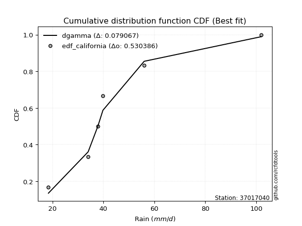</img></img>

</div>


### 2. EDF Hazen (1930)

Hazen method for plotting positions is a formula used to estimate the empirical cumulative probability distribution of flood events or other hydrological data. This formula often results in biased estimations, particularly when extrapolating to extreme events (high return periods).

<div align="center">


$P=(m-0.5)/n$


</div>


**2.1. Empirical values**

<div align="center">

|                | 0                  | 1                  | 2         | 3                 | 4                  |
|:---------------|:-------------------|:-------------------|:----------|:------------------|:-------------------|
| date           | 2023               | 2021               | 2022      | 2020              | 2019               |
| x              | 18.4               | 34.0               | 39.8      | 56.0              | 102.0              |
| m              | 1                  | 2                  | 3         | 4                 | 5                  |
| empirical_dist | edf_hazen          | edf_hazen          | edf_hazen | edf_hazen         | edf_hazen          |
| empirical      | 0.1                | 0.3                | 0.5       | 0.7               | 0.9                |
| empirical_tr   | 1.1111111111111112 | 1.4285714285714286 | 2.0       | 3.333333333333333 | 10.000000000000002 |

</div>


**2.2. Kolmogorov-Smirnov fit test (sorted by Δ)**


<div align="center">

|                | 0                     | 1                    | 2                    | 3                   | 4                   | 5                    | 6                   | 7                   | 8                   | 9                   | 10                  | 11                  | 12                   | 13                  | 14                  | 15                  | 16                  | 17                   | 18                  | 19                   | 20                  | 21                 | 22                   | 23                   | 24                   | 25                  | 26                   | 27                  | 28                  | 29                 | 30                  | 31                  | 32                 | 33                  | 34                  | 35                  | 36                  | 37                  | 38                 | 39                  | 40                  | 41                  | 42                  | 43                  | 44                  | 45                 | 46                 | 47                 | 48                  | 49                  | 50                 | 51                 | 52                 | 53                 | 54                  | 55                  | 56                  | 57                  | 58                  | 59                  | 60                 | 61                 | 62                 | 63                 | 64                 | 65                  | 66                  | 67                  | 68                  | 69                  | 70                  | 71                  | 72                 | 73                 | 74                  | 75                  | 76                  | 77                  | 78                 | 79                 | 80                 | 81                 | 82                  | 83                  | 84                 | 85                 | 86                  | 87                 |
|:---------------|:----------------------|:---------------------|:---------------------|:--------------------|:--------------------|:---------------------|:--------------------|:--------------------|:--------------------|:--------------------|:--------------------|:--------------------|:---------------------|:--------------------|:--------------------|:--------------------|:--------------------|:---------------------|:--------------------|:---------------------|:--------------------|:-------------------|:---------------------|:---------------------|:---------------------|:--------------------|:---------------------|:--------------------|:--------------------|:-------------------|:--------------------|:--------------------|:-------------------|:--------------------|:--------------------|:--------------------|:--------------------|:--------------------|:-------------------|:--------------------|:--------------------|:--------------------|:--------------------|:--------------------|:--------------------|:-------------------|:-------------------|:-------------------|:--------------------|:--------------------|:-------------------|:-------------------|:-------------------|:-------------------|:--------------------|:--------------------|:--------------------|:--------------------|:--------------------|:--------------------|:-------------------|:-------------------|:-------------------|:-------------------|:-------------------|:--------------------|:--------------------|:--------------------|:--------------------|:--------------------|:--------------------|:--------------------|:-------------------|:-------------------|:--------------------|:--------------------|:--------------------|:--------------------|:-------------------|:-------------------|:-------------------|:-------------------|:--------------------|:--------------------|:-------------------|:-------------------|:--------------------|:-------------------|
| station        | 37017040              | 37017040             | 37017040             | 37017040            | 37017040            | 37017040             | 37017040            | 37017040            | 37017040            | 37017040            | 37017040            | 37017040            | 37017040             | 37017040            | 37017040            | 37017040            | 37017040            | 37017040             | 37017040            | 37017040             | 37017040            | 37017040           | 37017040             | 37017040             | 37017040             | 37017040            | 37017040             | 37017040            | 37017040            | 37017040           | 37017040            | 37017040            | 37017040           | 37017040            | 37017040            | 37017040            | 37017040            | 37017040            | 37017040           | 37017040            | 37017040            | 37017040            | 37017040            | 37017040            | 37017040            | 37017040           | 37017040           | 37017040           | 37017040            | 37017040            | 37017040           | 37017040           | 37017040           | 37017040           | 37017040            | 37017040            | 37017040            | 37017040            | 37017040            | 37017040            | 37017040           | 37017040           | 37017040           | 37017040           | 37017040           | 37017040            | 37017040            | 37017040            | 37017040            | 37017040            | 37017040            | 37017040            | 37017040           | 37017040           | 37017040            | 37017040            | 37017040            | 37017040            | 37017040           | 37017040           | 37017040           | 37017040           | 37017040            | 37017040            | 37017040           | 37017040           | 37017040            | 37017040           |
| empirical_dist | edf_hazen             | edf_hazen            | edf_hazen            | edf_hazen           | edf_hazen           | edf_hazen            | edf_hazen           | edf_hazen           | edf_hazen           | edf_hazen           | edf_hazen           | edf_hazen           | edf_hazen            | edf_hazen           | edf_hazen           | edf_hazen           | edf_hazen           | edf_hazen            | edf_hazen           | edf_hazen            | edf_hazen           | edf_hazen          | edf_hazen            | edf_hazen            | edf_hazen            | edf_hazen           | edf_hazen            | edf_hazen           | edf_hazen           | edf_hazen          | edf_hazen           | edf_hazen           | edf_hazen          | edf_hazen           | edf_hazen           | edf_hazen           | edf_hazen           | edf_hazen           | edf_hazen          | edf_hazen           | edf_hazen           | edf_hazen           | edf_hazen           | edf_hazen           | edf_hazen           | edf_hazen          | edf_hazen          | edf_hazen          | edf_hazen           | edf_hazen           | edf_hazen          | edf_hazen          | edf_hazen          | edf_hazen          | edf_hazen           | edf_hazen           | edf_hazen           | edf_hazen           | edf_hazen           | edf_hazen           | edf_hazen          | edf_hazen          | edf_hazen          | edf_hazen          | edf_hazen          | edf_hazen           | edf_hazen           | edf_hazen           | edf_hazen           | edf_hazen           | edf_hazen           | edf_hazen           | edf_hazen          | edf_hazen          | edf_hazen           | edf_hazen           | edf_hazen           | edf_hazen           | edf_hazen          | edf_hazen          | edf_hazen          | edf_hazen          | edf_hazen           | edf_hazen           | edf_hazen          | edf_hazen          | edf_hazen           | edf_hazen          |
| p_dist         | loglaplace_asymmetric | logmielke            | logfisk              | alpha               | logpearson3         | lognct               | loggamma            | loggamma            | logerlang           | logexponnorm        | lognorm             | lognorm             | logcrystalball       | logt                | logjohnsonsu        | logncf              | logf                | logloggamma          | logfatiguelife      | halflogistic         | logbetaprime        | loginvgamma        | loglogistic          | loggenlogistic       | mielke               | invgamma            | halfnorm             | loghypsecant        | betaprime           | logalpha           | logrice             | nct                 | ncf                | moyal               | fisk                | loginvgauss         | laplace_asymmetric  | logmaxwell          | logweibull_min     | loglaplace          | johnsonsu           | invgauss            | genlogistic         | lograyleigh         | gumbel_r            | loggumbel_r        | pearson3           | rayleigh           | exponnorm           | genexpon            | gompertz           | expon              | gibrat             | wald               | kstwobign           | loginvweibull       | logmoyal            | maxwell             | loggompertz         | loggumbel_l         | logkstwobign       | loghalfnorm        | loghalflogistic    | loggenexpon        | loggibrat          | t                   | truncnorm           | norm                | crystalball         | rice                | logwald             | logistic            | hypsecant          | laplace            | gumbel_l            | logexpon            | weibull_min         | f                   | logchi2            | gamma              | erlang             | chi2               | nakagami            | lognakagami         | logtruncnorm       | loglognorm         | invweibull          | fatiguelife        |
| delta          | 0.04119974343057797   | 0.042500625005525816 | 0.044016311044408285 | 0.04440372511020324 | 0.04714855702076076 | 0.047507909990645136 | 0.04780953422869727 | 0.04780953422869727 | 0.04852747318630085 | 0.04969786516956731 | 0.04978152531037516 | 0.04978152531037516 | 0.049782666599147096 | 0.04978842799278449 | 0.04979505543207624 | 0.05094747179849235 | 0.05118035912882446 | 0.052543572729886634 | 0.05282669865137524 | 0.053175079561379686 | 0.05324925719904838 | 0.056087430495041  | 0.056488637804596176 | 0.057418173636727354 | 0.058050771639892196 | 0.06031130893704156 | 0.060374857583230634 | 0.06215588919463583 | 0.06259370545105397 | 0.0630785397701013 | 0.06696614197380013 | 0.06699346282372554 | 0.0686002351806293 | 0.06945707848050897 | 0.06976708622416056 | 0.07394899631096175 | 0.07425671137603707 | 0.07469190785640045 | 0.0771718108603619 | 0.08108136941750121 | 0.08115444726437931 | 0.08417522051704746 | 0.08629609486272649 | 0.08666782838310927 | 0.08862505781556967 | 0.0897014567662548 | 0.0904293137372425 | 0.0950082311627104 | 0.09909740325694963 | 0.09979349496009811 | 0.099999999999995  | 0.1                | 0.1                | 0.1                | 0.10254754419868911 | 0.10473176801588724 | 0.10671210775975487 | 0.10718072165878062 | 0.10943894712826802 | 0.11988292887253427 | 0.1206859192869702 | 0.1207446238699259 | 0.1276361673612062 | 0.1301731782120294 | 0.1382606246034489 | 0.13969836274809833 | 0.13970024394728342 | 0.13970026476155667 | 0.13970026528696827 | 0.14217910882002183 | 0.14357236142475366 | 0.15672181577249483 | 0.1701020166412655 | 0.1984898480243234 | 0.20124612875852033 | 0.21762277454153095 | 0.22650031123170028 | 0.22934889515527707 | 0.2487240464249883 | 0.2723807700086179 | 0.2834503523340138 | 0.2843848515553184 | 0.29880568927370643 | 0.29999446844458033 | 0.2999999995861106 | 0.3798023314737728 | 0.43002032305890975 | 0.4935139060511711 |
| deltao         | 0.5865427407550001    | 0.5865427407550001   | 0.5865427407550001   | 0.5865427407550001  | 0.5865427407550001  | 0.5865427407550001   | 0.5865427407550001  | 0.5865427407550001  | 0.5865427407550001  | 0.5865427407550001  | 0.5865427407550001  | 0.5865427407550001  | 0.5865427407550001   | 0.5865427407550001  | 0.5865427407550001  | 0.5865427407550001  | 0.5865427407550001  | 0.5865427407550001   | 0.5865427407550001  | 0.5865427407550001   | 0.5865427407550001  | 0.5865427407550001 | 0.5865427407550001   | 0.5865427407550001   | 0.5865427407550001   | 0.5865427407550001  | 0.5865427407550001   | 0.5865427407550001  | 0.5865427407550001  | 0.5865427407550001 | 0.5865427407550001  | 0.5865427407550001  | 0.5865427407550001 | 0.5865427407550001  | 0.5865427407550001  | 0.5865427407550001  | 0.5865427407550001  | 0.5865427407550001  | 0.5865427407550001 | 0.5865427407550001  | 0.5865427407550001  | 0.5865427407550001  | 0.5865427407550001  | 0.5865427407550001  | 0.5865427407550001  | 0.5865427407550001 | 0.5865427407550001 | 0.5865427407550001 | 0.5865427407550001  | 0.5865427407550001  | 0.5865427407550001 | 0.5865427407550001 | 0.5865427407550001 | 0.5865427407550001 | 0.5865427407550001  | 0.5865427407550001  | 0.5865427407550001  | 0.5865427407550001  | 0.5865427407550001  | 0.5865427407550001  | 0.5865427407550001 | 0.5865427407550001 | 0.5865427407550001 | 0.5865427407550001 | 0.5865427407550001 | 0.5865427407550001  | 0.5865427407550001  | 0.5865427407550001  | 0.5865427407550001  | 0.5865427407550001  | 0.5865427407550001  | 0.5865427407550001  | 0.5865427407550001 | 0.5865427407550001 | 0.5865427407550001  | 0.5865427407550001  | 0.5865427407550001  | 0.5865427407550001  | 0.5865427407550001 | 0.5865427407550001 | 0.5865427407550001 | 0.5865427407550001 | 0.5865427407550001  | 0.5865427407550001  | 0.5865427407550001 | 0.5865427407550001 | 0.5865427407550001  | 0.5865427407550001 |
| eval           | Δo > Δ                | Δo > Δ               | Δo > Δ               | Δo > Δ              | Δo > Δ              | Δo > Δ               | Δo > Δ              | Δo > Δ              | Δo > Δ              | Δo > Δ              | Δo > Δ              | Δo > Δ              | Δo > Δ               | Δo > Δ              | Δo > Δ              | Δo > Δ              | Δo > Δ              | Δo > Δ               | Δo > Δ              | Δo > Δ               | Δo > Δ              | Δo > Δ             | Δo > Δ               | Δo > Δ               | Δo > Δ               | Δo > Δ              | Δo > Δ               | Δo > Δ              | Δo > Δ              | Δo > Δ             | Δo > Δ              | Δo > Δ              | Δo > Δ             | Δo > Δ              | Δo > Δ              | Δo > Δ              | Δo > Δ              | Δo > Δ              | Δo > Δ             | Δo > Δ              | Δo > Δ              | Δo > Δ              | Δo > Δ              | Δo > Δ              | Δo > Δ              | Δo > Δ             | Δo > Δ             | Δo > Δ             | Δo > Δ              | Δo > Δ              | Δo > Δ             | Δo > Δ             | Δo > Δ             | Δo > Δ             | Δo > Δ              | Δo > Δ              | Δo > Δ              | Δo > Δ              | Δo > Δ              | Δo > Δ              | Δo > Δ             | Δo > Δ             | Δo > Δ             | Δo > Δ             | Δo > Δ             | Δo > Δ              | Δo > Δ              | Δo > Δ              | Δo > Δ              | Δo > Δ              | Δo > Δ              | Δo > Δ              | Δo > Δ             | Δo > Δ             | Δo > Δ              | Δo > Δ              | Δo > Δ              | Δo > Δ              | Δo > Δ             | Δo > Δ             | Δo > Δ             | Δo > Δ             | Δo > Δ              | Δo > Δ              | Δo > Δ             | Δo > Δ             | Δo > Δ              | Δo > Δ             |
| fit            | 1                     | 1                    | 1                    | 1                   | 1                   | 1                    | 1                   | 1                   | 1                   | 1                   | 1                   | 1                   | 1                    | 1                   | 1                   | 1                   | 1                   | 1                    | 1                   | 1                    | 1                   | 1                  | 1                    | 1                    | 1                    | 1                   | 1                    | 1                   | 1                   | 1                  | 1                   | 1                   | 1                  | 1                   | 1                   | 1                   | 1                   | 1                   | 1                  | 1                   | 1                   | 1                   | 1                   | 1                   | 1                   | 1                  | 1                  | 1                  | 1                   | 1                   | 1                  | 1                  | 1                  | 1                  | 1                   | 1                   | 1                   | 1                   | 1                   | 1                   | 1                  | 1                  | 1                  | 1                  | 1                  | 1                   | 1                   | 1                   | 1                   | 1                   | 1                   | 1                   | 1                  | 1                  | 1                   | 1                   | 1                   | 1                   | 1                  | 1                  | 1                  | 1                  | 1                   | 1                   | 1                  | 1                  | 1                   | 1                  |
| n              | 5                     | 5                    | 5                    | 5                   | 5                   | 5                    | 5                   | 5                   | 5                   | 5                   | 5                   | 5                   | 5                    | 5                   | 5                   | 5                   | 5                   | 5                    | 5                   | 5                    | 5                   | 5                  | 5                    | 5                    | 5                    | 5                   | 5                    | 5                   | 5                   | 5                  | 5                   | 5                   | 5                  | 5                   | 5                   | 5                   | 5                   | 5                   | 5                  | 5                   | 5                   | 5                   | 5                   | 5                   | 5                   | 5                  | 5                  | 5                  | 5                   | 5                   | 5                  | 5                  | 5                  | 5                  | 5                   | 5                   | 5                   | 5                   | 5                   | 5                   | 5                  | 5                  | 5                  | 5                  | 5                  | 5                   | 5                   | 5                   | 5                   | 5                   | 5                   | 5                   | 5                  | 5                  | 5                   | 5                   | 5                   | 5                   | 5                  | 5                  | 5                  | 5                  | 5                   | 5                   | 5                  | 5                  | 5                   | 5                  |
| best_fit       | 1                     | 0                    | 0                    | 0                   | 0                   | 0                    | 0                   | 0                   | 0                   | 0                   | 0                   | 0                   | 0                    | 0                   | 0                   | 0                   | 0                   | 0                    | 0                   | 0                    | 0                   | 0                  | 0                    | 0                    | 0                    | 0                   | 0                    | 0                   | 0                   | 0                  | 0                   | 0                   | 0                  | 0                   | 0                   | 0                   | 0                   | 0                   | 0                  | 0                   | 0                   | 0                   | 0                   | 0                   | 0                   | 0                  | 0                  | 0                  | 0                   | 0                   | 0                  | 0                  | 0                  | 0                  | 0                   | 0                   | 0                   | 0                   | 0                   | 0                   | 0                  | 0                  | 0                  | 0                  | 0                  | 0                   | 0                   | 0                   | 0                   | 0                   | 0                   | 0                   | 0                  | 0                  | 0                   | 0                   | 0                   | 0                   | 0                  | 0                  | 0                  | 0                  | 0                   | 0                   | 0                  | 0                  | 0                   | 0                  |
| best_fit_sort  | 1                     | 2                    | 3                    | 4                   | 5                   | 6                    | 7                   | 8                   | 9                   | 10                  | 11                  | 12                  | 13                   | 14                  | 15                  | 16                  | 17                  | 18                   | 19                  | 20                   | 21                  | 22                 | 23                   | 24                   | 25                   | 26                  | 27                   | 28                  | 29                  | 30                 | 31                  | 32                  | 33                 | 34                  | 35                  | 36                  | 37                  | 38                  | 39                 | 40                  | 41                  | 42                  | 43                  | 44                  | 45                  | 46                 | 47                 | 48                 | 49                  | 50                  | 51                 | 52                 | 53                 | 54                 | 55                  | 56                  | 57                  | 58                  | 59                  | 60                  | 61                 | 62                 | 63                 | 64                 | 65                 | 66                  | 67                  | 68                  | 69                  | 70                  | 71                  | 72                  | 73                 | 74                 | 75                  | 76                  | 77                  | 78                  | 79                 | 80                 | 81                 | 82                 | 83                  | 84                  | 85                 | 86                 | 87                  | 88                 |

</div>


**2.3. Best fit**

<div align="center">

|   id |   station | empirical_dist   | p_dist                |     delta |   deltao | eval   |   fit |   n |   best_fit |   best_fit_sort |
|-----:|----------:|:-----------------|:----------------------|----------:|---------:|:-------|------:|----:|-----------:|----------------:|
|    0 |  37017040 | edf_hazen        | loglaplace_asymmetric | 0.0411997 | 0.586543 | Δo > Δ |     1 |   5 |          1 |               1 |

</div>


<div align="center">

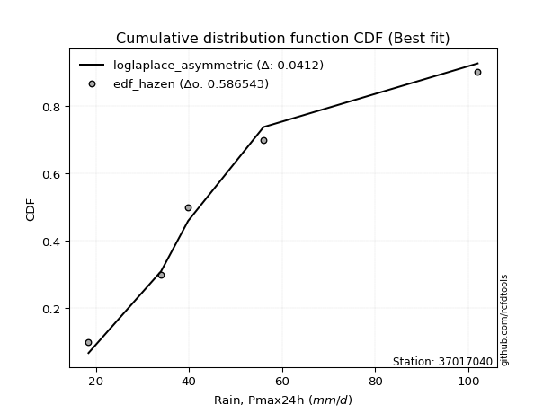</img>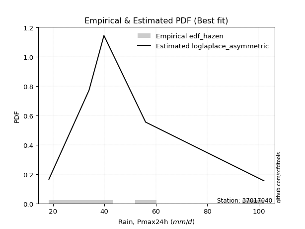</img>

</div>


### 3. EDF Weibull (1939)

Weibull plotting position formula is an empirical method used to estimate the non-exceedance probability or plotting position for a set of observed data, is often recommended or widely used in practice, particularly in flood frequency analysis.

<div align="center">


$P=m/(n+1)$


</div>


**3.1. Empirical values**

<div align="center">

|                | 0                   | 1                  | 2           | 3                  | 4                  |
|:---------------|:--------------------|:-------------------|:------------|:-------------------|:-------------------|
| date           | 2023                | 2021               | 2022        | 2020               | 2019               |
| x              | 18.4                | 34.0               | 39.8        | 56.0               | 102.0              |
| m              | 1                   | 2                  | 3           | 4                  | 5                  |
| empirical_dist | edf_weibull         | edf_weibull        | edf_weibull | edf_weibull        | edf_weibull        |
| empirical      | 0.16666666666666666 | 0.3333333333333333 | 0.5         | 0.6666666666666666 | 0.8333333333333334 |
| empirical_tr   | 1.2                 | 1.4999999999999998 | 2.0         | 2.9999999999999996 | 6.000000000000002  |

</div>


**3.2. Kolmogorov-Smirnov fit test (sorted by Δ)**


<div align="center">

|                | 0                   | 1                     | 2                   | 3                  | 4                   | 5                   | 6                   | 7                   | 8                   | 9                  | 10                  | 11                  | 12                 | 13                  | 14                  | 15                  | 16                  | 17                  | 18                  | 19                  | 20                  | 21                  | 22                  | 23                  | 24                  | 25                  | 26                  | 27                  | 28                  | 29                  | 30                  | 31                  | 32                  | 33                  | 34                  | 35                  | 36                  | 37                 | 38                  | 39                  | 40                  | 41                  | 42                  | 43                 | 44                  | 45                  | 46                  | 47                  | 48                  | 49                 | 50                  | 51                  | 52                  | 53                  | 54                  | 55                  | 56                  | 57                 | 58                  | 59                 | 60                  | 61                  | 62                  | 63                 | 64                  | 65                  | 66                  | 67                  | 68                  | 69                  | 70                  | 71                 | 72                  | 73                  | 74                  | 75                  | 76                 | 77                  | 78                  | 79                  | 80                  | 81                  | 82                  | 83                  | 84                  | 85                  | 86                 | 87                 |
|:---------------|:--------------------|:----------------------|:--------------------|:-------------------|:--------------------|:--------------------|:--------------------|:--------------------|:--------------------|:-------------------|:--------------------|:--------------------|:-------------------|:--------------------|:--------------------|:--------------------|:--------------------|:--------------------|:--------------------|:--------------------|:--------------------|:--------------------|:--------------------|:--------------------|:--------------------|:--------------------|:--------------------|:--------------------|:--------------------|:--------------------|:--------------------|:--------------------|:--------------------|:--------------------|:--------------------|:--------------------|:--------------------|:-------------------|:--------------------|:--------------------|:--------------------|:--------------------|:--------------------|:-------------------|:--------------------|:--------------------|:--------------------|:--------------------|:--------------------|:-------------------|:--------------------|:--------------------|:--------------------|:--------------------|:--------------------|:--------------------|:--------------------|:-------------------|:--------------------|:-------------------|:--------------------|:--------------------|:--------------------|:-------------------|:--------------------|:--------------------|:--------------------|:--------------------|:--------------------|:--------------------|:--------------------|:-------------------|:--------------------|:--------------------|:--------------------|:--------------------|:-------------------|:--------------------|:--------------------|:--------------------|:--------------------|:--------------------|:--------------------|:--------------------|:--------------------|:--------------------|:-------------------|:-------------------|
| station        | 37017040            | 37017040              | 37017040            | 37017040           | 37017040            | 37017040            | 37017040            | 37017040            | 37017040            | 37017040           | 37017040            | 37017040            | 37017040           | 37017040            | 37017040            | 37017040            | 37017040            | 37017040            | 37017040            | 37017040            | 37017040            | 37017040            | 37017040            | 37017040            | 37017040            | 37017040            | 37017040            | 37017040            | 37017040            | 37017040            | 37017040            | 37017040            | 37017040            | 37017040            | 37017040            | 37017040            | 37017040            | 37017040           | 37017040            | 37017040            | 37017040            | 37017040            | 37017040            | 37017040           | 37017040            | 37017040            | 37017040            | 37017040            | 37017040            | 37017040           | 37017040            | 37017040            | 37017040            | 37017040            | 37017040            | 37017040            | 37017040            | 37017040           | 37017040            | 37017040           | 37017040            | 37017040            | 37017040            | 37017040           | 37017040            | 37017040            | 37017040            | 37017040            | 37017040            | 37017040            | 37017040            | 37017040           | 37017040            | 37017040            | 37017040            | 37017040            | 37017040           | 37017040            | 37017040            | 37017040            | 37017040            | 37017040            | 37017040            | 37017040            | 37017040            | 37017040            | 37017040           | 37017040           |
| empirical_dist | edf_weibull         | edf_weibull           | edf_weibull         | edf_weibull        | edf_weibull         | edf_weibull         | edf_weibull         | edf_weibull         | edf_weibull         | edf_weibull        | edf_weibull         | edf_weibull         | edf_weibull        | edf_weibull         | edf_weibull         | edf_weibull         | edf_weibull         | edf_weibull         | edf_weibull         | edf_weibull         | edf_weibull         | edf_weibull         | edf_weibull         | edf_weibull         | edf_weibull         | edf_weibull         | edf_weibull         | edf_weibull         | edf_weibull         | edf_weibull         | edf_weibull         | edf_weibull         | edf_weibull         | edf_weibull         | edf_weibull         | edf_weibull         | edf_weibull         | edf_weibull        | edf_weibull         | edf_weibull         | edf_weibull         | edf_weibull         | edf_weibull         | edf_weibull        | edf_weibull         | edf_weibull         | edf_weibull         | edf_weibull         | edf_weibull         | edf_weibull        | edf_weibull         | edf_weibull         | edf_weibull         | edf_weibull         | edf_weibull         | edf_weibull         | edf_weibull         | edf_weibull        | edf_weibull         | edf_weibull        | edf_weibull         | edf_weibull         | edf_weibull         | edf_weibull        | edf_weibull         | edf_weibull         | edf_weibull         | edf_weibull         | edf_weibull         | edf_weibull         | edf_weibull         | edf_weibull        | edf_weibull         | edf_weibull         | edf_weibull         | edf_weibull         | edf_weibull        | edf_weibull         | edf_weibull         | edf_weibull         | edf_weibull         | edf_weibull         | edf_weibull         | edf_weibull         | edf_weibull         | edf_weibull         | edf_weibull        | edf_weibull        |
| p_dist         | logfisk             | loglaplace_asymmetric | logmielke           | alpha              | loggamma            | loggamma            | logerlang           | logpearson3         | logncf              | logf               | logfatiguelife      | lognct              | logbetaprime       | logloggamma         | logexponnorm        | logcrystalball      | lognorm             | lognorm             | logt                | logjohnsonsu        | loggenlogistic      | mielke              | loginvgamma         | invgamma            | logalpha            | halfnorm            | loginvgauss         | loglogistic         | nct                 | betaprime           | laplace_asymmetric  | loglaplace          | loghypsecant        | moyal               | ncf                 | invgauss            | gumbel_r            | pearson3           | johnsonsu           | logkstwobign        | loginvweibull       | rayleigh            | logmaxwell          | maxwell            | fisk                | halflogistic        | logweibull_min      | logrice             | genlogistic         | kstwobign          | lograyleigh         | t                   | truncnorm           | norm                | crystalball         | rice                | loggumbel_r         | loggumbel_l        | logistic            | logmoyal           | loggenexpon         | exponnorm           | genexpon            | loggompertz        | gompertz            | expon               | loghalfnorm         | gibrat              | logwald             | wald                | loghalflogistic     | hypsecant          | loggibrat           | logexpon            | weibull_min         | f                   | laplace            | gumbel_l            | logchi2             | gamma               | erlang              | chi2                | nakagami            | lognakagami         | logtruncnorm        | loglognorm          | invweibull         | fatiguelife        |
| delta          | 0.09886246102650695 | 0.09983016855858443   | 0.10051104321218352 | 0.1020625977938184 | 0.10253347331094909 | 0.10253347331094909 | 0.10256354342462393 | 0.10282148334163643 | 0.10285089636881556 | 0.1029524706234096 | 0.10375098869187929 | 0.10380156364989934 | 0.1039058164191747 | 0.10452414659033527 | 0.10484422095269463 | 0.10487800837971872 | 0.10487837401785072 | 0.10487837401785072 | 0.10487930913516252 | 0.10493494625424216 | 0.10512397505800206 | 0.10531053264637286 | 0.10582597305858588 | 0.10736079511362229 | 0.10783730612257081 | 0.10816034529385021 | 0.10888146526418768 | 0.10897013122566879 | 0.10951553785110155 | 0.10955215344433318 | 0.10983112486982594 | 0.11002111953040206 | 0.11014531472339095 | 0.11039567400726469 | 0.11213611233719722 | 0.11235137440152296 | 0.11338080521526017 | 0.1137768848178885 | 0.11389024553688343 | 0.11560540102617395 | 0.11580669295743967 | 0.11599356170666508 | 0.11687701110607021 | 0.1194163855998166 | 0.11951910034867907 | 0.11984174622804633 | 0.11987623281054313 | 0.12143933246513246 | 0.12501436700751423 | 0.1250919915408888 | 0.12900459476938533 | 0.13969836274809833 | 0.13970024394728342 | 0.13970026476155667 | 0.13970026528696827 | 0.14217910882002183 | 0.14420395617205015 | 0.1491813222350934 | 0.15672181577249483 | 0.1611115965022409 | 0.16243125463711797 | 0.16576406992361628 | 0.16646016162676475 | 0.1666666496460389 | 0.16666666666666163 | 0.16666666666666666 | 0.16666666666666666 | 0.16666666666666666 | 0.16666666666666666 | 0.16666666666666666 | 0.16666666666666666 | 0.1701020166412655 | 0.17159395793678223 | 0.18428944120819762 | 0.19316697789836695 | 0.19601556182194374 | 0.1984898480243234 | 0.20124612875852033 | 0.21539071309165497 | 0.23904743667528455 | 0.25011701900068045 | 0.25105151822198507 | 0.33213902260703976 | 0.33332780177791366 | 0.33333333291944395 | 0.34646899814043947 | 0.3633536563922431 | 0.4601805727178378 |
| deltao         | 0.5865427407550001  | 0.5865427407550001    | 0.5865427407550001  | 0.5865427407550001 | 0.5865427407550001  | 0.5865427407550001  | 0.5865427407550001  | 0.5865427407550001  | 0.5865427407550001  | 0.5865427407550001 | 0.5865427407550001  | 0.5865427407550001  | 0.5865427407550001 | 0.5865427407550001  | 0.5865427407550001  | 0.5865427407550001  | 0.5865427407550001  | 0.5865427407550001  | 0.5865427407550001  | 0.5865427407550001  | 0.5865427407550001  | 0.5865427407550001  | 0.5865427407550001  | 0.5865427407550001  | 0.5865427407550001  | 0.5865427407550001  | 0.5865427407550001  | 0.5865427407550001  | 0.5865427407550001  | 0.5865427407550001  | 0.5865427407550001  | 0.5865427407550001  | 0.5865427407550001  | 0.5865427407550001  | 0.5865427407550001  | 0.5865427407550001  | 0.5865427407550001  | 0.5865427407550001 | 0.5865427407550001  | 0.5865427407550001  | 0.5865427407550001  | 0.5865427407550001  | 0.5865427407550001  | 0.5865427407550001 | 0.5865427407550001  | 0.5865427407550001  | 0.5865427407550001  | 0.5865427407550001  | 0.5865427407550001  | 0.5865427407550001 | 0.5865427407550001  | 0.5865427407550001  | 0.5865427407550001  | 0.5865427407550001  | 0.5865427407550001  | 0.5865427407550001  | 0.5865427407550001  | 0.5865427407550001 | 0.5865427407550001  | 0.5865427407550001 | 0.5865427407550001  | 0.5865427407550001  | 0.5865427407550001  | 0.5865427407550001 | 0.5865427407550001  | 0.5865427407550001  | 0.5865427407550001  | 0.5865427407550001  | 0.5865427407550001  | 0.5865427407550001  | 0.5865427407550001  | 0.5865427407550001 | 0.5865427407550001  | 0.5865427407550001  | 0.5865427407550001  | 0.5865427407550001  | 0.5865427407550001 | 0.5865427407550001  | 0.5865427407550001  | 0.5865427407550001  | 0.5865427407550001  | 0.5865427407550001  | 0.5865427407550001  | 0.5865427407550001  | 0.5865427407550001  | 0.5865427407550001  | 0.5865427407550001 | 0.5865427407550001 |
| eval           | Δo > Δ              | Δo > Δ                | Δo > Δ              | Δo > Δ             | Δo > Δ              | Δo > Δ              | Δo > Δ              | Δo > Δ              | Δo > Δ              | Δo > Δ             | Δo > Δ              | Δo > Δ              | Δo > Δ             | Δo > Δ              | Δo > Δ              | Δo > Δ              | Δo > Δ              | Δo > Δ              | Δo > Δ              | Δo > Δ              | Δo > Δ              | Δo > Δ              | Δo > Δ              | Δo > Δ              | Δo > Δ              | Δo > Δ              | Δo > Δ              | Δo > Δ              | Δo > Δ              | Δo > Δ              | Δo > Δ              | Δo > Δ              | Δo > Δ              | Δo > Δ              | Δo > Δ              | Δo > Δ              | Δo > Δ              | Δo > Δ             | Δo > Δ              | Δo > Δ              | Δo > Δ              | Δo > Δ              | Δo > Δ              | Δo > Δ             | Δo > Δ              | Δo > Δ              | Δo > Δ              | Δo > Δ              | Δo > Δ              | Δo > Δ             | Δo > Δ              | Δo > Δ              | Δo > Δ              | Δo > Δ              | Δo > Δ              | Δo > Δ              | Δo > Δ              | Δo > Δ             | Δo > Δ              | Δo > Δ             | Δo > Δ              | Δo > Δ              | Δo > Δ              | Δo > Δ             | Δo > Δ              | Δo > Δ              | Δo > Δ              | Δo > Δ              | Δo > Δ              | Δo > Δ              | Δo > Δ              | Δo > Δ             | Δo > Δ              | Δo > Δ              | Δo > Δ              | Δo > Δ              | Δo > Δ             | Δo > Δ              | Δo > Δ              | Δo > Δ              | Δo > Δ              | Δo > Δ              | Δo > Δ              | Δo > Δ              | Δo > Δ              | Δo > Δ              | Δo > Δ             | Δo > Δ             |
| fit            | 1                   | 1                     | 1                   | 1                  | 1                   | 1                   | 1                   | 1                   | 1                   | 1                  | 1                   | 1                   | 1                  | 1                   | 1                   | 1                   | 1                   | 1                   | 1                   | 1                   | 1                   | 1                   | 1                   | 1                   | 1                   | 1                   | 1                   | 1                   | 1                   | 1                   | 1                   | 1                   | 1                   | 1                   | 1                   | 1                   | 1                   | 1                  | 1                   | 1                   | 1                   | 1                   | 1                   | 1                  | 1                   | 1                   | 1                   | 1                   | 1                   | 1                  | 1                   | 1                   | 1                   | 1                   | 1                   | 1                   | 1                   | 1                  | 1                   | 1                  | 1                   | 1                   | 1                   | 1                  | 1                   | 1                   | 1                   | 1                   | 1                   | 1                   | 1                   | 1                  | 1                   | 1                   | 1                   | 1                   | 1                  | 1                   | 1                   | 1                   | 1                   | 1                   | 1                   | 1                   | 1                   | 1                   | 1                  | 1                  |
| n              | 5                   | 5                     | 5                   | 5                  | 5                   | 5                   | 5                   | 5                   | 5                   | 5                  | 5                   | 5                   | 5                  | 5                   | 5                   | 5                   | 5                   | 5                   | 5                   | 5                   | 5                   | 5                   | 5                   | 5                   | 5                   | 5                   | 5                   | 5                   | 5                   | 5                   | 5                   | 5                   | 5                   | 5                   | 5                   | 5                   | 5                   | 5                  | 5                   | 5                   | 5                   | 5                   | 5                   | 5                  | 5                   | 5                   | 5                   | 5                   | 5                   | 5                  | 5                   | 5                   | 5                   | 5                   | 5                   | 5                   | 5                   | 5                  | 5                   | 5                  | 5                   | 5                   | 5                   | 5                  | 5                   | 5                   | 5                   | 5                   | 5                   | 5                   | 5                   | 5                  | 5                   | 5                   | 5                   | 5                   | 5                  | 5                   | 5                   | 5                   | 5                   | 5                   | 5                   | 5                   | 5                   | 5                   | 5                  | 5                  |
| best_fit       | 1                   | 0                     | 0                   | 0                  | 0                   | 0                   | 0                   | 0                   | 0                   | 0                  | 0                   | 0                   | 0                  | 0                   | 0                   | 0                   | 0                   | 0                   | 0                   | 0                   | 0                   | 0                   | 0                   | 0                   | 0                   | 0                   | 0                   | 0                   | 0                   | 0                   | 0                   | 0                   | 0                   | 0                   | 0                   | 0                   | 0                   | 0                  | 0                   | 0                   | 0                   | 0                   | 0                   | 0                  | 0                   | 0                   | 0                   | 0                   | 0                   | 0                  | 0                   | 0                   | 0                   | 0                   | 0                   | 0                   | 0                   | 0                  | 0                   | 0                  | 0                   | 0                   | 0                   | 0                  | 0                   | 0                   | 0                   | 0                   | 0                   | 0                   | 0                   | 0                  | 0                   | 0                   | 0                   | 0                   | 0                  | 0                   | 0                   | 0                   | 0                   | 0                   | 0                   | 0                   | 0                   | 0                   | 0                  | 0                  |
| best_fit_sort  | 1                   | 2                     | 3                   | 4                  | 5                   | 6                   | 7                   | 8                   | 9                   | 10                 | 11                  | 12                  | 13                 | 14                  | 15                  | 16                  | 17                  | 18                  | 19                  | 20                  | 21                  | 22                  | 23                  | 24                  | 25                  | 26                  | 27                  | 28                  | 29                  | 30                  | 31                  | 32                  | 33                  | 34                  | 35                  | 36                  | 37                  | 38                 | 39                  | 40                  | 41                  | 42                  | 43                  | 44                 | 45                  | 46                  | 47                  | 48                  | 49                  | 50                 | 51                  | 52                  | 53                  | 54                  | 55                  | 56                  | 57                  | 58                 | 59                  | 60                 | 61                  | 62                  | 63                  | 64                 | 65                  | 66                  | 67                  | 68                  | 69                  | 70                  | 71                  | 72                 | 73                  | 74                  | 75                  | 76                  | 77                 | 78                  | 79                  | 80                  | 81                  | 82                  | 83                  | 84                  | 85                  | 86                  | 87                 | 88                 |

</div>


**3.3. Best fit**

<div align="center">

|   id |   station | empirical_dist   | p_dist   |     delta |   deltao | eval   |   fit |   n |   best_fit |   best_fit_sort |
|-----:|----------:|:-----------------|:---------|----------:|---------:|:-------|------:|----:|-----------:|----------------:|
|    0 |  37017040 | edf_weibull      | logfisk  | 0.0988625 | 0.586543 | Δo > Δ |     1 |   5 |          1 |               1 |

</div>


<div align="center">

</img></img>

</div>


### 4. EDF Beard (1943)

The Beard formula (or Beard´s plotting position formula) in hydrology is used to estimate the empirical non-exceedance probability _(P)_ of a flood event (or other extreme hydrological data point) within a given dataset.

<div align="center">


$P=(m-0.31)/(n+0.38)$


</div>


**4.1. Empirical values**

<div align="center">

|                | 0                   | 1                  | 2         | 3                  | 4                  |
|:---------------|:--------------------|:-------------------|:----------|:-------------------|:-------------------|
| date           | 2023                | 2021               | 2022      | 2020               | 2019               |
| x              | 18.4                | 34.0               | 39.8      | 56.0               | 102.0              |
| m              | 1                   | 2                  | 3         | 4                  | 5                  |
| empirical_dist | edf_beard           | edf_beard          | edf_beard | edf_beard          | edf_beard          |
| empirical      | 0.12825278810408922 | 0.3141263940520446 | 0.5       | 0.6858736059479554 | 0.8717472118959109 |
| empirical_tr   | 1.1471215351812367  | 1.4579945799457996 | 2.0       | 3.183431952662722  | 7.797101449275368  |

</div>


**4.2. Kolmogorov-Smirnov fit test (sorted by Δ)**


<div align="center">

|                | 0                   | 1                     | 2                    | 3                   | 4                   | 5                   | 6                   | 7                   | 8                   | 9                   | 10                  | 11                  | 12                  | 13                  | 14                  | 15                  | 16                  | 17                  | 18                  | 19                  | 20                  | 21                  | 22                  | 23                  | 24                  | 25                  | 26                  | 27                  | 28                 | 29                  | 30                  | 31                  | 32                  | 33                  | 34                  | 35                  | 36                  | 37                  | 38                  | 39                  | 40                  | 41                  | 42                  | 43                  | 44                 | 45                  | 46                 | 47                 | 48                  | 49                 | 50                  | 51                  | 52                  | 53                  | 54                  | 55                  | 56                 | 57                  | 58                 | 59                  | 60                  | 61                  | 62                  | 63                  | 64                  | 65                  | 66                  | 67                  | 68                  | 69                  | 70                  | 71                  | 72                 | 73                 | 74                  | 75                  | 76                  | 77                  | 78                  | 79                  | 80                  | 81                  | 82                  | 83                  | 84                  | 85                  | 86                 | 87                 |
|:---------------|:--------------------|:----------------------|:---------------------|:--------------------|:--------------------|:--------------------|:--------------------|:--------------------|:--------------------|:--------------------|:--------------------|:--------------------|:--------------------|:--------------------|:--------------------|:--------------------|:--------------------|:--------------------|:--------------------|:--------------------|:--------------------|:--------------------|:--------------------|:--------------------|:--------------------|:--------------------|:--------------------|:--------------------|:-------------------|:--------------------|:--------------------|:--------------------|:--------------------|:--------------------|:--------------------|:--------------------|:--------------------|:--------------------|:--------------------|:--------------------|:--------------------|:--------------------|:--------------------|:--------------------|:-------------------|:--------------------|:-------------------|:-------------------|:--------------------|:-------------------|:--------------------|:--------------------|:--------------------|:--------------------|:--------------------|:--------------------|:-------------------|:--------------------|:-------------------|:--------------------|:--------------------|:--------------------|:--------------------|:--------------------|:--------------------|:--------------------|:--------------------|:--------------------|:--------------------|:--------------------|:--------------------|:--------------------|:-------------------|:-------------------|:--------------------|:--------------------|:--------------------|:--------------------|:--------------------|:--------------------|:--------------------|:--------------------|:--------------------|:--------------------|:--------------------|:--------------------|:-------------------|:-------------------|
| station        | 37017040            | 37017040              | 37017040             | 37017040            | 37017040            | 37017040            | 37017040            | 37017040            | 37017040            | 37017040            | 37017040            | 37017040            | 37017040            | 37017040            | 37017040            | 37017040            | 37017040            | 37017040            | 37017040            | 37017040            | 37017040            | 37017040            | 37017040            | 37017040            | 37017040            | 37017040            | 37017040            | 37017040            | 37017040           | 37017040            | 37017040            | 37017040            | 37017040            | 37017040            | 37017040            | 37017040            | 37017040            | 37017040            | 37017040            | 37017040            | 37017040            | 37017040            | 37017040            | 37017040            | 37017040           | 37017040            | 37017040           | 37017040           | 37017040            | 37017040           | 37017040            | 37017040            | 37017040            | 37017040            | 37017040            | 37017040            | 37017040           | 37017040            | 37017040           | 37017040            | 37017040            | 37017040            | 37017040            | 37017040            | 37017040            | 37017040            | 37017040            | 37017040            | 37017040            | 37017040            | 37017040            | 37017040            | 37017040           | 37017040           | 37017040            | 37017040            | 37017040            | 37017040            | 37017040            | 37017040            | 37017040            | 37017040            | 37017040            | 37017040            | 37017040            | 37017040            | 37017040           | 37017040           |
| empirical_dist | edf_beard           | edf_beard             | edf_beard            | edf_beard           | edf_beard           | edf_beard           | edf_beard           | edf_beard           | edf_beard           | edf_beard           | edf_beard           | edf_beard           | edf_beard           | edf_beard           | edf_beard           | edf_beard           | edf_beard           | edf_beard           | edf_beard           | edf_beard           | edf_beard           | edf_beard           | edf_beard           | edf_beard           | edf_beard           | edf_beard           | edf_beard           | edf_beard           | edf_beard          | edf_beard           | edf_beard           | edf_beard           | edf_beard           | edf_beard           | edf_beard           | edf_beard           | edf_beard           | edf_beard           | edf_beard           | edf_beard           | edf_beard           | edf_beard           | edf_beard           | edf_beard           | edf_beard          | edf_beard           | edf_beard          | edf_beard          | edf_beard           | edf_beard          | edf_beard           | edf_beard           | edf_beard           | edf_beard           | edf_beard           | edf_beard           | edf_beard          | edf_beard           | edf_beard          | edf_beard           | edf_beard           | edf_beard           | edf_beard           | edf_beard           | edf_beard           | edf_beard           | edf_beard           | edf_beard           | edf_beard           | edf_beard           | edf_beard           | edf_beard           | edf_beard          | edf_beard          | edf_beard           | edf_beard           | edf_beard           | edf_beard           | edf_beard           | edf_beard           | edf_beard           | edf_beard           | edf_beard           | edf_beard           | edf_beard           | edf_beard           | edf_beard          | edf_beard          |
| p_dist         | logfisk             | loglaplace_asymmetric | logmielke            | alpha               | loggamma            | loggamma            | logerlang           | logpearson3         | logncf              | logf                | logfatiguelife      | lognct              | logbetaprime        | logloggamma         | logexponnorm        | logcrystalball      | lognorm             | lognorm             | logt                | logjohnsonsu        | loggenlogistic      | mielke              | loginvgamma         | invgamma            | logalpha            | halfnorm            | loginvgauss         | loglogistic         | nct                | betaprime           | loghypsecant        | moyal               | ncf                 | invgauss            | laplace_asymmetric  | johnsonsu           | logmaxwell          | loglaplace          | fisk                | halflogistic        | logweibull_min      | logrice             | genlogistic         | gumbel_r            | pearson3           | lograyleigh         | loginvweibull      | rayleigh           | kstwobign           | loggumbel_r        | logkstwobign        | maxwell             | loggumbel_l         | logmoyal            | loggenexpon         | exponnorm           | genexpon           | loggompertz         | gompertz           | gibrat              | expon               | loghalflogistic     | wald                | loghalfnorm         | logwald             | t                   | truncnorm           | norm                | crystalball         | rice                | loggibrat           | logistic            | hypsecant          | laplace            | gumbel_l            | logexpon            | weibull_min         | f                   | logchi2             | gamma               | erlang              | chi2                | nakagami            | lognakagami         | logtruncnorm        | loglognorm          | invweibull         | fatiguelife        |
| delta          | 0.06044858246392951 | 0.061416289996006984  | 0.062097164649606074 | 0.06364871923124096 | 0.06411959474837159 | 0.06411959474837159 | 0.06414966486204643 | 0.06440760477905894 | 0.06443701780623812 | 0.06453859206083216 | 0.06533711012930185 | 0.06538768508732185 | 0.06549193785659727 | 0.06611026802775777 | 0.06643034239011714 | 0.06646412981714123 | 0.06646449545527322 | 0.06646449545527322 | 0.06646543057258503 | 0.06652106769166466 | 0.06671009649542461 | 0.06689665408379541 | 0.06741209449600843 | 0.06894691655104485 | 0.06942342755999337 | 0.06974646673127272 | 0.07046758670161024 | 0.07055625266309129 | 0.0711016592885241 | 0.07113827488175574 | 0.07173143616081346 | 0.07198179544468719 | 0.07372223377461973 | 0.07393749583894552 | 0.07425671137603707 | 0.07547636697430599 | 0.07846313254349277 | 0.08108136941750121 | 0.08110522178610163 | 0.08142786766546889 | 0.08146235424796569 | 0.08302545390255502 | 0.08660048844493673 | 0.08862505781556967 | 0.0904293137372425 | 0.09059071620680789 | 0.0906053739638426 | 0.0950082311627104 | 0.10254754419868911 | 0.1057900776094727 | 0.10655952523492557 | 0.10718072165878062 | 0.11988292887253427 | 0.12269771793966347 | 0.12401737607454054 | 0.12735019136103884 | 0.1280462830641873 | 0.12825277108346145 | 0.1282527881040842 | 0.12825278810408922 | 0.12825278810408922 | 0.12825278810408922 | 0.12825278810408922 | 0.12825278810408922 | 0.12944596737270903 | 0.13969836274809833 | 0.13970024394728342 | 0.13970026476155667 | 0.13970026528696827 | 0.14217910882002183 | 0.15238701865549342 | 0.15672181577249483 | 0.1701020166412655 | 0.1984898480243234 | 0.20124612875852033 | 0.20349638048948632 | 0.21237391717965565 | 0.21522250110323243 | 0.23459765237294367 | 0.25825437595657325 | 0.26932395828196914 | 0.27025845750327376 | 0.31293208332575106 | 0.31412086249662496 | 0.31412639363815525 | 0.36567593742172816 | 0.4017675349548206 | 0.4793875119991265 |
| deltao         | 0.5865427407550001  | 0.5865427407550001    | 0.5865427407550001   | 0.5865427407550001  | 0.5865427407550001  | 0.5865427407550001  | 0.5865427407550001  | 0.5865427407550001  | 0.5865427407550001  | 0.5865427407550001  | 0.5865427407550001  | 0.5865427407550001  | 0.5865427407550001  | 0.5865427407550001  | 0.5865427407550001  | 0.5865427407550001  | 0.5865427407550001  | 0.5865427407550001  | 0.5865427407550001  | 0.5865427407550001  | 0.5865427407550001  | 0.5865427407550001  | 0.5865427407550001  | 0.5865427407550001  | 0.5865427407550001  | 0.5865427407550001  | 0.5865427407550001  | 0.5865427407550001  | 0.5865427407550001 | 0.5865427407550001  | 0.5865427407550001  | 0.5865427407550001  | 0.5865427407550001  | 0.5865427407550001  | 0.5865427407550001  | 0.5865427407550001  | 0.5865427407550001  | 0.5865427407550001  | 0.5865427407550001  | 0.5865427407550001  | 0.5865427407550001  | 0.5865427407550001  | 0.5865427407550001  | 0.5865427407550001  | 0.5865427407550001 | 0.5865427407550001  | 0.5865427407550001 | 0.5865427407550001 | 0.5865427407550001  | 0.5865427407550001 | 0.5865427407550001  | 0.5865427407550001  | 0.5865427407550001  | 0.5865427407550001  | 0.5865427407550001  | 0.5865427407550001  | 0.5865427407550001 | 0.5865427407550001  | 0.5865427407550001 | 0.5865427407550001  | 0.5865427407550001  | 0.5865427407550001  | 0.5865427407550001  | 0.5865427407550001  | 0.5865427407550001  | 0.5865427407550001  | 0.5865427407550001  | 0.5865427407550001  | 0.5865427407550001  | 0.5865427407550001  | 0.5865427407550001  | 0.5865427407550001  | 0.5865427407550001 | 0.5865427407550001 | 0.5865427407550001  | 0.5865427407550001  | 0.5865427407550001  | 0.5865427407550001  | 0.5865427407550001  | 0.5865427407550001  | 0.5865427407550001  | 0.5865427407550001  | 0.5865427407550001  | 0.5865427407550001  | 0.5865427407550001  | 0.5865427407550001  | 0.5865427407550001 | 0.5865427407550001 |
| eval           | Δo > Δ              | Δo > Δ                | Δo > Δ               | Δo > Δ              | Δo > Δ              | Δo > Δ              | Δo > Δ              | Δo > Δ              | Δo > Δ              | Δo > Δ              | Δo > Δ              | Δo > Δ              | Δo > Δ              | Δo > Δ              | Δo > Δ              | Δo > Δ              | Δo > Δ              | Δo > Δ              | Δo > Δ              | Δo > Δ              | Δo > Δ              | Δo > Δ              | Δo > Δ              | Δo > Δ              | Δo > Δ              | Δo > Δ              | Δo > Δ              | Δo > Δ              | Δo > Δ             | Δo > Δ              | Δo > Δ              | Δo > Δ              | Δo > Δ              | Δo > Δ              | Δo > Δ              | Δo > Δ              | Δo > Δ              | Δo > Δ              | Δo > Δ              | Δo > Δ              | Δo > Δ              | Δo > Δ              | Δo > Δ              | Δo > Δ              | Δo > Δ             | Δo > Δ              | Δo > Δ             | Δo > Δ             | Δo > Δ              | Δo > Δ             | Δo > Δ              | Δo > Δ              | Δo > Δ              | Δo > Δ              | Δo > Δ              | Δo > Δ              | Δo > Δ             | Δo > Δ              | Δo > Δ             | Δo > Δ              | Δo > Δ              | Δo > Δ              | Δo > Δ              | Δo > Δ              | Δo > Δ              | Δo > Δ              | Δo > Δ              | Δo > Δ              | Δo > Δ              | Δo > Δ              | Δo > Δ              | Δo > Δ              | Δo > Δ             | Δo > Δ             | Δo > Δ              | Δo > Δ              | Δo > Δ              | Δo > Δ              | Δo > Δ              | Δo > Δ              | Δo > Δ              | Δo > Δ              | Δo > Δ              | Δo > Δ              | Δo > Δ              | Δo > Δ              | Δo > Δ             | Δo > Δ             |
| fit            | 1                   | 1                     | 1                    | 1                   | 1                   | 1                   | 1                   | 1                   | 1                   | 1                   | 1                   | 1                   | 1                   | 1                   | 1                   | 1                   | 1                   | 1                   | 1                   | 1                   | 1                   | 1                   | 1                   | 1                   | 1                   | 1                   | 1                   | 1                   | 1                  | 1                   | 1                   | 1                   | 1                   | 1                   | 1                   | 1                   | 1                   | 1                   | 1                   | 1                   | 1                   | 1                   | 1                   | 1                   | 1                  | 1                   | 1                  | 1                  | 1                   | 1                  | 1                   | 1                   | 1                   | 1                   | 1                   | 1                   | 1                  | 1                   | 1                  | 1                   | 1                   | 1                   | 1                   | 1                   | 1                   | 1                   | 1                   | 1                   | 1                   | 1                   | 1                   | 1                   | 1                  | 1                  | 1                   | 1                   | 1                   | 1                   | 1                   | 1                   | 1                   | 1                   | 1                   | 1                   | 1                   | 1                   | 1                  | 1                  |
| n              | 5                   | 5                     | 5                    | 5                   | 5                   | 5                   | 5                   | 5                   | 5                   | 5                   | 5                   | 5                   | 5                   | 5                   | 5                   | 5                   | 5                   | 5                   | 5                   | 5                   | 5                   | 5                   | 5                   | 5                   | 5                   | 5                   | 5                   | 5                   | 5                  | 5                   | 5                   | 5                   | 5                   | 5                   | 5                   | 5                   | 5                   | 5                   | 5                   | 5                   | 5                   | 5                   | 5                   | 5                   | 5                  | 5                   | 5                  | 5                  | 5                   | 5                  | 5                   | 5                   | 5                   | 5                   | 5                   | 5                   | 5                  | 5                   | 5                  | 5                   | 5                   | 5                   | 5                   | 5                   | 5                   | 5                   | 5                   | 5                   | 5                   | 5                   | 5                   | 5                   | 5                  | 5                  | 5                   | 5                   | 5                   | 5                   | 5                   | 5                   | 5                   | 5                   | 5                   | 5                   | 5                   | 5                   | 5                  | 5                  |
| best_fit       | 1                   | 0                     | 0                    | 0                   | 0                   | 0                   | 0                   | 0                   | 0                   | 0                   | 0                   | 0                   | 0                   | 0                   | 0                   | 0                   | 0                   | 0                   | 0                   | 0                   | 0                   | 0                   | 0                   | 0                   | 0                   | 0                   | 0                   | 0                   | 0                  | 0                   | 0                   | 0                   | 0                   | 0                   | 0                   | 0                   | 0                   | 0                   | 0                   | 0                   | 0                   | 0                   | 0                   | 0                   | 0                  | 0                   | 0                  | 0                  | 0                   | 0                  | 0                   | 0                   | 0                   | 0                   | 0                   | 0                   | 0                  | 0                   | 0                  | 0                   | 0                   | 0                   | 0                   | 0                   | 0                   | 0                   | 0                   | 0                   | 0                   | 0                   | 0                   | 0                   | 0                  | 0                  | 0                   | 0                   | 0                   | 0                   | 0                   | 0                   | 0                   | 0                   | 0                   | 0                   | 0                   | 0                   | 0                  | 0                  |
| best_fit_sort  | 1                   | 2                     | 3                    | 4                   | 5                   | 6                   | 7                   | 8                   | 9                   | 10                  | 11                  | 12                  | 13                  | 14                  | 15                  | 16                  | 17                  | 18                  | 19                  | 20                  | 21                  | 22                  | 23                  | 24                  | 25                  | 26                  | 27                  | 28                  | 29                 | 30                  | 31                  | 32                  | 33                  | 34                  | 35                  | 36                  | 37                  | 38                  | 39                  | 40                  | 41                  | 42                  | 43                  | 44                  | 45                 | 46                  | 47                 | 48                 | 49                  | 50                 | 51                  | 52                  | 53                  | 54                  | 55                  | 56                  | 57                 | 58                  | 59                 | 60                  | 61                  | 62                  | 63                  | 64                  | 65                  | 66                  | 67                  | 68                  | 69                  | 70                  | 71                  | 72                  | 73                 | 74                 | 75                  | 76                  | 77                  | 78                  | 79                  | 80                  | 81                  | 82                  | 83                  | 84                  | 85                  | 86                  | 87                 | 88                 |

</div>


**4.3. Best fit**

<div align="center">

|   id |   station | empirical_dist   | p_dist   |     delta |   deltao | eval   |   fit |   n |   best_fit |   best_fit_sort |
|-----:|----------:|:-----------------|:---------|----------:|---------:|:-------|------:|----:|-----------:|----------------:|
|    0 |  37017040 | edf_beard        | logfisk  | 0.0604486 | 0.586543 | Δo > Δ |     1 |   5 |          1 |               1 |

</div>


<div align="center">

</img></img>

</div>


### 5. EDF Chegodayev (1955)

The Chegodayev formula is an empirical plotting position formula used in hydrological frequency analysis to estimate the exceedance probability or return period of a specific event from a set of observed data. It is primarily used for plotting observed data points on probability paper to fit a theoretical distribution, particularly for analyzing extreme events like maximum flood flows or rainfall intensities. The constant _b_ value in the generalized plotting position formula is 0.3.

<div align="center">


$P=(m-b)/(n+1-2b)$


</div>


**5.1. Empirical values**

<div align="center">

|                | 0                   | 1                   | 2              | 3                  | 4                  |
|:---------------|:--------------------|:--------------------|:---------------|:-------------------|:-------------------|
| date           | 2023                | 2021                | 2022           | 2020               | 2019               |
| x              | 18.4                | 34.0                | 39.8           | 56.0               | 102.0              |
| m              | 1                   | 2                   | 3              | 4                  | 5                  |
| empirical_dist | edf_chegodayev      | edf_chegodayev      | edf_chegodayev | edf_chegodayev     | edf_chegodayev     |
| empirical      | 0.12962962962962962 | 0.31481481481481477 | 0.5            | 0.6851851851851851 | 0.8703703703703703 |
| empirical_tr   | 1.148936170212766   | 1.4594594594594594  | 2.0            | 3.1764705882352935 | 7.714285714285713  |

</div>


**5.2. Kolmogorov-Smirnov fit test (sorted by Δ)**


<div align="center">

|                | 0                   | 1                     | 2                   | 3                   | 4                  | 5                  | 6                   | 7                   | 8                   | 9                   | 10                  | 11                  | 12                  | 13                  | 14                  | 15                  | 16                  | 17                  | 18                  | 19                  | 20                  | 21                  | 22                  | 23                  | 24                  | 25                  | 26                  | 27                  | 28                  | 29                  | 30                  | 31                  | 32                  | 33                  | 34                  | 35                  | 36                  | 37                  | 38                  | 39                 | 40                 | 41                  | 42                  | 43                  | 44                  | 45                 | 46                 | 47                 | 48                  | 49                  | 50                  | 51                  | 52                  | 53                  | 54                  | 55                  | 56                 | 57                  | 58                 | 59                  | 60                  | 61                  | 62                  | 63                  | 64                  | 65                  | 66                  | 67                  | 68                  | 69                  | 70                  | 71                  | 72                 | 73                 | 74                  | 75                  | 76                 | 77                  | 78                  | 79                 | 80                 | 81                 | 82                 | 83                 | 84                 | 85                 | 86                 | 87                  |
|:---------------|:--------------------|:----------------------|:--------------------|:--------------------|:-------------------|:-------------------|:--------------------|:--------------------|:--------------------|:--------------------|:--------------------|:--------------------|:--------------------|:--------------------|:--------------------|:--------------------|:--------------------|:--------------------|:--------------------|:--------------------|:--------------------|:--------------------|:--------------------|:--------------------|:--------------------|:--------------------|:--------------------|:--------------------|:--------------------|:--------------------|:--------------------|:--------------------|:--------------------|:--------------------|:--------------------|:--------------------|:--------------------|:--------------------|:--------------------|:-------------------|:-------------------|:--------------------|:--------------------|:--------------------|:--------------------|:-------------------|:-------------------|:-------------------|:--------------------|:--------------------|:--------------------|:--------------------|:--------------------|:--------------------|:--------------------|:--------------------|:-------------------|:--------------------|:-------------------|:--------------------|:--------------------|:--------------------|:--------------------|:--------------------|:--------------------|:--------------------|:--------------------|:--------------------|:--------------------|:--------------------|:--------------------|:--------------------|:-------------------|:-------------------|:--------------------|:--------------------|:-------------------|:--------------------|:--------------------|:-------------------|:-------------------|:-------------------|:-------------------|:-------------------|:-------------------|:-------------------|:-------------------|:--------------------|
| station        | 37017040            | 37017040              | 37017040            | 37017040            | 37017040           | 37017040           | 37017040            | 37017040            | 37017040            | 37017040            | 37017040            | 37017040            | 37017040            | 37017040            | 37017040            | 37017040            | 37017040            | 37017040            | 37017040            | 37017040            | 37017040            | 37017040            | 37017040            | 37017040            | 37017040            | 37017040            | 37017040            | 37017040            | 37017040            | 37017040            | 37017040            | 37017040            | 37017040            | 37017040            | 37017040            | 37017040            | 37017040            | 37017040            | 37017040            | 37017040           | 37017040           | 37017040            | 37017040            | 37017040            | 37017040            | 37017040           | 37017040           | 37017040           | 37017040            | 37017040            | 37017040            | 37017040            | 37017040            | 37017040            | 37017040            | 37017040            | 37017040           | 37017040            | 37017040           | 37017040            | 37017040            | 37017040            | 37017040            | 37017040            | 37017040            | 37017040            | 37017040            | 37017040            | 37017040            | 37017040            | 37017040            | 37017040            | 37017040           | 37017040           | 37017040            | 37017040            | 37017040           | 37017040            | 37017040            | 37017040           | 37017040           | 37017040           | 37017040           | 37017040           | 37017040           | 37017040           | 37017040           | 37017040            |
| empirical_dist | edf_chegodayev      | edf_chegodayev        | edf_chegodayev      | edf_chegodayev      | edf_chegodayev     | edf_chegodayev     | edf_chegodayev      | edf_chegodayev      | edf_chegodayev      | edf_chegodayev      | edf_chegodayev      | edf_chegodayev      | edf_chegodayev      | edf_chegodayev      | edf_chegodayev      | edf_chegodayev      | edf_chegodayev      | edf_chegodayev      | edf_chegodayev      | edf_chegodayev      | edf_chegodayev      | edf_chegodayev      | edf_chegodayev      | edf_chegodayev      | edf_chegodayev      | edf_chegodayev      | edf_chegodayev      | edf_chegodayev      | edf_chegodayev      | edf_chegodayev      | edf_chegodayev      | edf_chegodayev      | edf_chegodayev      | edf_chegodayev      | edf_chegodayev      | edf_chegodayev      | edf_chegodayev      | edf_chegodayev      | edf_chegodayev      | edf_chegodayev     | edf_chegodayev     | edf_chegodayev      | edf_chegodayev      | edf_chegodayev      | edf_chegodayev      | edf_chegodayev     | edf_chegodayev     | edf_chegodayev     | edf_chegodayev      | edf_chegodayev      | edf_chegodayev      | edf_chegodayev      | edf_chegodayev      | edf_chegodayev      | edf_chegodayev      | edf_chegodayev      | edf_chegodayev     | edf_chegodayev      | edf_chegodayev     | edf_chegodayev      | edf_chegodayev      | edf_chegodayev      | edf_chegodayev      | edf_chegodayev      | edf_chegodayev      | edf_chegodayev      | edf_chegodayev      | edf_chegodayev      | edf_chegodayev      | edf_chegodayev      | edf_chegodayev      | edf_chegodayev      | edf_chegodayev     | edf_chegodayev     | edf_chegodayev      | edf_chegodayev      | edf_chegodayev     | edf_chegodayev      | edf_chegodayev      | edf_chegodayev     | edf_chegodayev     | edf_chegodayev     | edf_chegodayev     | edf_chegodayev     | edf_chegodayev     | edf_chegodayev     | edf_chegodayev     | edf_chegodayev      |
| p_dist         | logfisk             | loglaplace_asymmetric | logmielke           | alpha               | loggamma           | loggamma           | logerlang           | logpearson3         | logncf              | logf                | logfatiguelife      | lognct              | logbetaprime        | logloggamma         | logexponnorm        | logcrystalball      | lognorm             | lognorm             | logt                | logjohnsonsu        | loggenlogistic      | mielke              | loginvgamma         | invgamma            | logalpha            | halfnorm            | loginvgauss         | loglogistic         | nct                 | betaprime           | loghypsecant        | moyal               | laplace_asymmetric  | ncf                 | invgauss            | johnsonsu           | logmaxwell          | loglaplace          | fisk                | halflogistic       | logweibull_min     | logrice             | genlogistic         | gumbel_r            | loginvweibull       | pearson3           | lograyleigh        | rayleigh           | kstwobign           | logkstwobign        | loggumbel_r         | maxwell             | loggumbel_l         | logmoyal            | loggenexpon         | exponnorm           | genexpon           | loggompertz         | gompertz           | gibrat              | expon               | loghalflogistic     | wald                | loghalfnorm         | logwald             | t                   | truncnorm           | norm                | crystalball         | rice                | loggibrat           | logistic            | hypsecant          | laplace            | gumbel_l            | logexpon            | weibull_min        | f                   | logchi2             | gamma              | erlang             | chi2               | nakagami           | lognakagami        | logtruncnorm       | loglognorm         | invweibull         | fatiguelife         |
| delta          | 0.06182542398946991 | 0.06279313152154739   | 0.06347400617514648 | 0.06502556075678137 | 0.0654964362739121 | 0.0654964362739121 | 0.06552650638758695 | 0.06578444630459945 | 0.06581385933177852 | 0.06591543358637257 | 0.06671395165484226 | 0.06676452661286236 | 0.06686877938213767 | 0.06748710955329829 | 0.06780718391565765 | 0.06784097134268174 | 0.06784133698081374 | 0.06784133698081374 | 0.06784227209812554 | 0.06789790921720518 | 0.06808693802096502 | 0.06827349560933582 | 0.06878893602154884 | 0.07032375807658525 | 0.07080026908553377 | 0.07112330825681323 | 0.07184442822715065 | 0.07193309418863181 | 0.07247850081406451 | 0.07251511640729615 | 0.07310827768635397 | 0.07335863697022771 | 0.07425671137603707 | 0.07509907530016025 | 0.07531433736448592 | 0.07685320849984639 | 0.07983997406903318 | 0.08108136941750121 | 0.08248206331164204 | 0.0828047091910093 | 0.0828391957735061 | 0.08440229542809542 | 0.08797732997047725 | 0.08862505781556967 | 0.08991695320107246 | 0.0904293137372425 | 0.0919675577323483 | 0.0950082311627104 | 0.10254754419868911 | 0.10587110447215542 | 0.10716691913501311 | 0.10718072165878062 | 0.11988292887253427 | 0.12407455946520388 | 0.12539421760008093 | 0.12872703288657925 | 0.1294231245897277 | 0.12962961260900185 | 0.1296296296296246 | 0.12962962962962962 | 0.12962962962962962 | 0.12962962962962962 | 0.12962962962962962 | 0.12962962962962962 | 0.12962962962962962 | 0.13969836274809833 | 0.13970024394728342 | 0.13970026476155667 | 0.13970026528696827 | 0.14217910882002183 | 0.15307543941826374 | 0.15672181577249483 | 0.1701020166412655 | 0.1984898480243234 | 0.20124612875852033 | 0.20280795972671617 | 0.2116854964168855 | 0.21453408034046229 | 0.23390923161017352 | 0.2575659551938031 | 0.268635537519199  | 0.2695700367405036 | 0.3136205040885212 | 0.3148092832593951 | 0.3148148144009254 | 0.364987516658958  | 0.4003906934292801 | 0.47869909123635634 |
| deltao         | 0.5865427407550001  | 0.5865427407550001    | 0.5865427407550001  | 0.5865427407550001  | 0.5865427407550001 | 0.5865427407550001 | 0.5865427407550001  | 0.5865427407550001  | 0.5865427407550001  | 0.5865427407550001  | 0.5865427407550001  | 0.5865427407550001  | 0.5865427407550001  | 0.5865427407550001  | 0.5865427407550001  | 0.5865427407550001  | 0.5865427407550001  | 0.5865427407550001  | 0.5865427407550001  | 0.5865427407550001  | 0.5865427407550001  | 0.5865427407550001  | 0.5865427407550001  | 0.5865427407550001  | 0.5865427407550001  | 0.5865427407550001  | 0.5865427407550001  | 0.5865427407550001  | 0.5865427407550001  | 0.5865427407550001  | 0.5865427407550001  | 0.5865427407550001  | 0.5865427407550001  | 0.5865427407550001  | 0.5865427407550001  | 0.5865427407550001  | 0.5865427407550001  | 0.5865427407550001  | 0.5865427407550001  | 0.5865427407550001 | 0.5865427407550001 | 0.5865427407550001  | 0.5865427407550001  | 0.5865427407550001  | 0.5865427407550001  | 0.5865427407550001 | 0.5865427407550001 | 0.5865427407550001 | 0.5865427407550001  | 0.5865427407550001  | 0.5865427407550001  | 0.5865427407550001  | 0.5865427407550001  | 0.5865427407550001  | 0.5865427407550001  | 0.5865427407550001  | 0.5865427407550001 | 0.5865427407550001  | 0.5865427407550001 | 0.5865427407550001  | 0.5865427407550001  | 0.5865427407550001  | 0.5865427407550001  | 0.5865427407550001  | 0.5865427407550001  | 0.5865427407550001  | 0.5865427407550001  | 0.5865427407550001  | 0.5865427407550001  | 0.5865427407550001  | 0.5865427407550001  | 0.5865427407550001  | 0.5865427407550001 | 0.5865427407550001 | 0.5865427407550001  | 0.5865427407550001  | 0.5865427407550001 | 0.5865427407550001  | 0.5865427407550001  | 0.5865427407550001 | 0.5865427407550001 | 0.5865427407550001 | 0.5865427407550001 | 0.5865427407550001 | 0.5865427407550001 | 0.5865427407550001 | 0.5865427407550001 | 0.5865427407550001  |
| eval           | Δo > Δ              | Δo > Δ                | Δo > Δ              | Δo > Δ              | Δo > Δ             | Δo > Δ             | Δo > Δ              | Δo > Δ              | Δo > Δ              | Δo > Δ              | Δo > Δ              | Δo > Δ              | Δo > Δ              | Δo > Δ              | Δo > Δ              | Δo > Δ              | Δo > Δ              | Δo > Δ              | Δo > Δ              | Δo > Δ              | Δo > Δ              | Δo > Δ              | Δo > Δ              | Δo > Δ              | Δo > Δ              | Δo > Δ              | Δo > Δ              | Δo > Δ              | Δo > Δ              | Δo > Δ              | Δo > Δ              | Δo > Δ              | Δo > Δ              | Δo > Δ              | Δo > Δ              | Δo > Δ              | Δo > Δ              | Δo > Δ              | Δo > Δ              | Δo > Δ             | Δo > Δ             | Δo > Δ              | Δo > Δ              | Δo > Δ              | Δo > Δ              | Δo > Δ             | Δo > Δ             | Δo > Δ             | Δo > Δ              | Δo > Δ              | Δo > Δ              | Δo > Δ              | Δo > Δ              | Δo > Δ              | Δo > Δ              | Δo > Δ              | Δo > Δ             | Δo > Δ              | Δo > Δ             | Δo > Δ              | Δo > Δ              | Δo > Δ              | Δo > Δ              | Δo > Δ              | Δo > Δ              | Δo > Δ              | Δo > Δ              | Δo > Δ              | Δo > Δ              | Δo > Δ              | Δo > Δ              | Δo > Δ              | Δo > Δ             | Δo > Δ             | Δo > Δ              | Δo > Δ              | Δo > Δ             | Δo > Δ              | Δo > Δ              | Δo > Δ             | Δo > Δ             | Δo > Δ             | Δo > Δ             | Δo > Δ             | Δo > Δ             | Δo > Δ             | Δo > Δ             | Δo > Δ              |
| fit            | 1                   | 1                     | 1                   | 1                   | 1                  | 1                  | 1                   | 1                   | 1                   | 1                   | 1                   | 1                   | 1                   | 1                   | 1                   | 1                   | 1                   | 1                   | 1                   | 1                   | 1                   | 1                   | 1                   | 1                   | 1                   | 1                   | 1                   | 1                   | 1                   | 1                   | 1                   | 1                   | 1                   | 1                   | 1                   | 1                   | 1                   | 1                   | 1                   | 1                  | 1                  | 1                   | 1                   | 1                   | 1                   | 1                  | 1                  | 1                  | 1                   | 1                   | 1                   | 1                   | 1                   | 1                   | 1                   | 1                   | 1                  | 1                   | 1                  | 1                   | 1                   | 1                   | 1                   | 1                   | 1                   | 1                   | 1                   | 1                   | 1                   | 1                   | 1                   | 1                   | 1                  | 1                  | 1                   | 1                   | 1                  | 1                   | 1                   | 1                  | 1                  | 1                  | 1                  | 1                  | 1                  | 1                  | 1                  | 1                   |
| n              | 5                   | 5                     | 5                   | 5                   | 5                  | 5                  | 5                   | 5                   | 5                   | 5                   | 5                   | 5                   | 5                   | 5                   | 5                   | 5                   | 5                   | 5                   | 5                   | 5                   | 5                   | 5                   | 5                   | 5                   | 5                   | 5                   | 5                   | 5                   | 5                   | 5                   | 5                   | 5                   | 5                   | 5                   | 5                   | 5                   | 5                   | 5                   | 5                   | 5                  | 5                  | 5                   | 5                   | 5                   | 5                   | 5                  | 5                  | 5                  | 5                   | 5                   | 5                   | 5                   | 5                   | 5                   | 5                   | 5                   | 5                  | 5                   | 5                  | 5                   | 5                   | 5                   | 5                   | 5                   | 5                   | 5                   | 5                   | 5                   | 5                   | 5                   | 5                   | 5                   | 5                  | 5                  | 5                   | 5                   | 5                  | 5                   | 5                   | 5                  | 5                  | 5                  | 5                  | 5                  | 5                  | 5                  | 5                  | 5                   |
| best_fit       | 1                   | 0                     | 0                   | 0                   | 0                  | 0                  | 0                   | 0                   | 0                   | 0                   | 0                   | 0                   | 0                   | 0                   | 0                   | 0                   | 0                   | 0                   | 0                   | 0                   | 0                   | 0                   | 0                   | 0                   | 0                   | 0                   | 0                   | 0                   | 0                   | 0                   | 0                   | 0                   | 0                   | 0                   | 0                   | 0                   | 0                   | 0                   | 0                   | 0                  | 0                  | 0                   | 0                   | 0                   | 0                   | 0                  | 0                  | 0                  | 0                   | 0                   | 0                   | 0                   | 0                   | 0                   | 0                   | 0                   | 0                  | 0                   | 0                  | 0                   | 0                   | 0                   | 0                   | 0                   | 0                   | 0                   | 0                   | 0                   | 0                   | 0                   | 0                   | 0                   | 0                  | 0                  | 0                   | 0                   | 0                  | 0                   | 0                   | 0                  | 0                  | 0                  | 0                  | 0                  | 0                  | 0                  | 0                  | 0                   |
| best_fit_sort  | 1                   | 2                     | 3                   | 4                   | 5                  | 6                  | 7                   | 8                   | 9                   | 10                  | 11                  | 12                  | 13                  | 14                  | 15                  | 16                  | 17                  | 18                  | 19                  | 20                  | 21                  | 22                  | 23                  | 24                  | 25                  | 26                  | 27                  | 28                  | 29                  | 30                  | 31                  | 32                  | 33                  | 34                  | 35                  | 36                  | 37                  | 38                  | 39                  | 40                 | 41                 | 42                  | 43                  | 44                  | 45                  | 46                 | 47                 | 48                 | 49                  | 50                  | 51                  | 52                  | 53                  | 54                  | 55                  | 56                  | 57                 | 58                  | 59                 | 60                  | 61                  | 62                  | 63                  | 64                  | 65                  | 66                  | 67                  | 68                  | 69                  | 70                  | 71                  | 72                  | 73                 | 74                 | 75                  | 76                  | 77                 | 78                  | 79                  | 80                 | 81                 | 82                 | 83                 | 84                 | 85                 | 86                 | 87                 | 88                  |

</div>


**5.3. Best fit**

<div align="center">

|   id |   station | empirical_dist   | p_dist   |     delta |   deltao | eval   |   fit |   n |   best_fit |   best_fit_sort |
|-----:|----------:|:-----------------|:---------|----------:|---------:|:-------|------:|----:|-----------:|----------------:|
|    0 |  37017040 | edf_chegodayev   | logfisk  | 0.0618254 | 0.586543 | Δo > Δ |     1 |   5 |          1 |               1 |

</div>


<div align="center">

</img></img>

</div>


### 6. EDF Blom (1958)

The Blom formula is a specific "plotting position" formula used in hydrology and statistical analysis to estimate the empirical cumulative probability (or non-exceedance probability) of a data series. It is particularly recommended for data that are approximately normally distributed. The constant _a_ is set to 0.375 (or 3/8).

<div align="center">


$P=(m-a)/(n+1-2a)$


</div>


**6.1. Empirical values**

<div align="center">

|                | 0                   | 1                   | 2        | 3                  | 4                  |
|:---------------|:--------------------|:--------------------|:---------|:-------------------|:-------------------|
| date           | 2023                | 2021                | 2022     | 2020               | 2019               |
| x              | 18.4                | 34.0                | 39.8     | 56.0               | 102.0              |
| m              | 1                   | 2                   | 3        | 4                  | 5                  |
| empirical_dist | edf_blom            | edf_blom            | edf_blom | edf_blom           | edf_blom           |
| empirical      | 0.11904761904761904 | 0.30952380952380953 | 0.5      | 0.6904761904761905 | 0.8809523809523809 |
| empirical_tr   | 1.135135135135135   | 1.4482758620689655  | 2.0      | 3.230769230769231  | 8.399999999999999  |

</div>


**6.2. Kolmogorov-Smirnov fit test (sorted by Δ)**


<div align="center">

|                | 0                   | 1                     | 2                  | 3                   | 4                    | 5                    | 6                    | 7                   | 8                   | 9                   | 10                   | 11                  | 12                  | 13                   | 14                  | 15                  | 16                   | 17                   | 18                  | 19                   | 20                  | 21                  | 22                  | 23                  | 24                  | 25                  | 26                   | 27                  | 28                   | 29                  | 30                 | 31                 | 32                 | 33                  | 34                  | 35                  | 36                  | 37                  | 38                  | 39                  | 40                  | 41                  | 42                  | 43                  | 44                  | 45                 | 46                 | 47                 | 48                  | 49                  | 50                  | 51                  | 52                 | 53                  | 54                  | 55                  | 56                  | 57                  | 58                  | 59                  | 60                  | 61                  | 62                  | 63                  | 64                 | 65                  | 66                  | 67                  | 68                  | 69                  | 70                 | 71                  | 72                 | 73                 | 74                  | 75                 | 76                  | 77                  | 78                  | 79                  | 80                  | 81                  | 82                 | 83                 | 84                  | 85                  | 86                  | 87                 |
|:---------------|:--------------------|:----------------------|:-------------------|:--------------------|:---------------------|:---------------------|:---------------------|:--------------------|:--------------------|:--------------------|:---------------------|:--------------------|:--------------------|:---------------------|:--------------------|:--------------------|:---------------------|:---------------------|:--------------------|:---------------------|:--------------------|:--------------------|:--------------------|:--------------------|:--------------------|:--------------------|:---------------------|:--------------------|:---------------------|:--------------------|:-------------------|:-------------------|:-------------------|:--------------------|:--------------------|:--------------------|:--------------------|:--------------------|:--------------------|:--------------------|:--------------------|:--------------------|:--------------------|:--------------------|:--------------------|:-------------------|:-------------------|:-------------------|:--------------------|:--------------------|:--------------------|:--------------------|:-------------------|:--------------------|:--------------------|:--------------------|:--------------------|:--------------------|:--------------------|:--------------------|:--------------------|:--------------------|:--------------------|:--------------------|:-------------------|:--------------------|:--------------------|:--------------------|:--------------------|:--------------------|:-------------------|:--------------------|:-------------------|:-------------------|:--------------------|:-------------------|:--------------------|:--------------------|:--------------------|:--------------------|:--------------------|:--------------------|:-------------------|:-------------------|:--------------------|:--------------------|:--------------------|:-------------------|
| station        | 37017040            | 37017040              | 37017040           | 37017040            | 37017040             | 37017040             | 37017040             | 37017040            | 37017040            | 37017040            | 37017040             | 37017040            | 37017040            | 37017040             | 37017040            | 37017040            | 37017040             | 37017040             | 37017040            | 37017040             | 37017040            | 37017040            | 37017040            | 37017040            | 37017040            | 37017040            | 37017040             | 37017040            | 37017040             | 37017040            | 37017040           | 37017040           | 37017040           | 37017040            | 37017040            | 37017040            | 37017040            | 37017040            | 37017040            | 37017040            | 37017040            | 37017040            | 37017040            | 37017040            | 37017040            | 37017040           | 37017040           | 37017040           | 37017040            | 37017040            | 37017040            | 37017040            | 37017040           | 37017040            | 37017040            | 37017040            | 37017040            | 37017040            | 37017040            | 37017040            | 37017040            | 37017040            | 37017040            | 37017040            | 37017040           | 37017040            | 37017040            | 37017040            | 37017040            | 37017040            | 37017040           | 37017040            | 37017040           | 37017040           | 37017040            | 37017040           | 37017040            | 37017040            | 37017040            | 37017040            | 37017040            | 37017040            | 37017040           | 37017040           | 37017040            | 37017040            | 37017040            | 37017040           |
| empirical_dist | edf_blom            | edf_blom              | edf_blom           | edf_blom            | edf_blom             | edf_blom             | edf_blom             | edf_blom            | edf_blom            | edf_blom            | edf_blom             | edf_blom            | edf_blom            | edf_blom             | edf_blom            | edf_blom            | edf_blom             | edf_blom             | edf_blom            | edf_blom             | edf_blom            | edf_blom            | edf_blom            | edf_blom            | edf_blom            | edf_blom            | edf_blom             | edf_blom            | edf_blom             | edf_blom            | edf_blom           | edf_blom           | edf_blom           | edf_blom            | edf_blom            | edf_blom            | edf_blom            | edf_blom            | edf_blom            | edf_blom            | edf_blom            | edf_blom            | edf_blom            | edf_blom            | edf_blom            | edf_blom           | edf_blom           | edf_blom           | edf_blom            | edf_blom            | edf_blom            | edf_blom            | edf_blom           | edf_blom            | edf_blom            | edf_blom            | edf_blom            | edf_blom            | edf_blom            | edf_blom            | edf_blom            | edf_blom            | edf_blom            | edf_blom            | edf_blom           | edf_blom            | edf_blom            | edf_blom            | edf_blom            | edf_blom            | edf_blom           | edf_blom            | edf_blom           | edf_blom           | edf_blom            | edf_blom           | edf_blom            | edf_blom            | edf_blom            | edf_blom            | edf_blom            | edf_blom            | edf_blom           | edf_blom           | edf_blom            | edf_blom            | edf_blom            | edf_blom           |
| p_dist         | logfisk             | loglaplace_asymmetric | logmielke          | alpha               | loggamma             | loggamma             | logerlang            | logpearson3         | logncf              | logf                | logfatiguelife       | lognct              | logbetaprime        | logloggamma          | logexponnorm        | logcrystalball      | lognorm              | lognorm              | logt                | logjohnsonsu         | loggenlogistic      | mielke              | loginvgamma         | invgamma            | logalpha            | halfnorm            | loglogistic          | nct                 | betaprime            | loghypsecant        | loginvgauss        | ncf                | logmaxwell         | moyal               | johnsonsu           | fisk                | halflogistic        | logweibull_min      | logrice             | laplace_asymmetric  | invgauss            | loglaplace          | lograyleigh         | genlogistic         | gumbel_r            | pearson3           | rayleigh           | loginvweibull      | loggumbel_r         | kstwobign           | maxwell             | logkstwobign        | logmoyal           | exponnorm           | genexpon            | loggompertz         | gompertz            | gibrat              | loghalflogistic     | loghalfnorm         | expon               | wald                | loggumbel_l         | loggenexpon         | logwald            | t                   | truncnorm           | norm                | crystalball         | rice                | loggibrat          | logistic            | hypsecant          | laplace            | gumbel_l            | logexpon           | weibull_min         | f                   | logchi2             | gamma               | erlang              | chi2                | nakagami           | lognakagami        | logtruncnorm        | loglognorm          | invweibull          | fatiguelife        |
| delta          | 0.05124341340745933 | 0.05221112093953681   | 0.0528919955931359 | 0.05444355017477079 | 0.054914425691901525 | 0.054914425691901525 | 0.054944495805576365 | 0.05520243572258887 | 0.05523184874976794 | 0.05533342300436199 | 0.056131941072831676 | 0.05618251603085178 | 0.05628676880012709 | 0.056905098971287704 | 0.05722517333364707 | 0.05725896076067116 | 0.057259326398803156 | 0.057259326398803156 | 0.05726026151611496 | 0.057315898635194595 | 0.05750492743895444 | 0.05769148502732523 | 0.05820692543953827 | 0.05974174749457467 | 0.06021825850352319 | 0.06054129767480265 | 0.061351083606621226 | 0.06189649023205394 | 0.061933105825285564 | 0.06252626710434339 | 0.0644251867871522 | 0.0686002351806293 | 0.0692579634870226 | 0.06945707848050897 | 0.07163063774056977 | 0.07190005272963146 | 0.07222269860899871 | 0.07225718519149552 | 0.07382028484608484 | 0.07425671137603707 | 0.07465141099323791 | 0.08108136941750121 | 0.08138554715033772 | 0.08629609486272649 | 0.08862505781556967 | 0.0904293137372425 | 0.0950082311627104 | 0.0952079584920777 | 0.09658490855300253 | 0.10254754419868911 | 0.10718072165878062 | 0.11116210976316065 | 0.1134925488831933 | 0.11814502230456866 | 0.11884111400771714 | 0.11904760202699127 | 0.11904761904761403 | 0.11904761904761904 | 0.11904761904761904 | 0.11904761904761904 | 0.11904761904761904 | 0.11904761904761904 | 0.11988292887253427 | 0.12064936868821985 | 0.1340485519009441 | 0.13969836274809833 | 0.13970024394728342 | 0.13970026476155667 | 0.13970026528696827 | 0.14217910882002183 | 0.1477844341272584 | 0.15672181577249483 | 0.1701020166412655 | 0.1984898480243234 | 0.20124612875852033 | 0.2080989650177214 | 0.21697650170789073 | 0.21982508563146752 | 0.23920023690117875 | 0.26285696048480833 | 0.27392654281020423 | 0.27486104203150885 | 0.308329498797516  | 0.3095182779683899 | 0.30952380910992017 | 0.37027852194996325 | 0.41097270401129066 | 0.4839900965273616 |
| deltao         | 0.5865427407550001  | 0.5865427407550001    | 0.5865427407550001 | 0.5865427407550001  | 0.5865427407550001   | 0.5865427407550001   | 0.5865427407550001   | 0.5865427407550001  | 0.5865427407550001  | 0.5865427407550001  | 0.5865427407550001   | 0.5865427407550001  | 0.5865427407550001  | 0.5865427407550001   | 0.5865427407550001  | 0.5865427407550001  | 0.5865427407550001   | 0.5865427407550001   | 0.5865427407550001  | 0.5865427407550001   | 0.5865427407550001  | 0.5865427407550001  | 0.5865427407550001  | 0.5865427407550001  | 0.5865427407550001  | 0.5865427407550001  | 0.5865427407550001   | 0.5865427407550001  | 0.5865427407550001   | 0.5865427407550001  | 0.5865427407550001 | 0.5865427407550001 | 0.5865427407550001 | 0.5865427407550001  | 0.5865427407550001  | 0.5865427407550001  | 0.5865427407550001  | 0.5865427407550001  | 0.5865427407550001  | 0.5865427407550001  | 0.5865427407550001  | 0.5865427407550001  | 0.5865427407550001  | 0.5865427407550001  | 0.5865427407550001  | 0.5865427407550001 | 0.5865427407550001 | 0.5865427407550001 | 0.5865427407550001  | 0.5865427407550001  | 0.5865427407550001  | 0.5865427407550001  | 0.5865427407550001 | 0.5865427407550001  | 0.5865427407550001  | 0.5865427407550001  | 0.5865427407550001  | 0.5865427407550001  | 0.5865427407550001  | 0.5865427407550001  | 0.5865427407550001  | 0.5865427407550001  | 0.5865427407550001  | 0.5865427407550001  | 0.5865427407550001 | 0.5865427407550001  | 0.5865427407550001  | 0.5865427407550001  | 0.5865427407550001  | 0.5865427407550001  | 0.5865427407550001 | 0.5865427407550001  | 0.5865427407550001 | 0.5865427407550001 | 0.5865427407550001  | 0.5865427407550001 | 0.5865427407550001  | 0.5865427407550001  | 0.5865427407550001  | 0.5865427407550001  | 0.5865427407550001  | 0.5865427407550001  | 0.5865427407550001 | 0.5865427407550001 | 0.5865427407550001  | 0.5865427407550001  | 0.5865427407550001  | 0.5865427407550001 |
| eval           | Δo > Δ              | Δo > Δ                | Δo > Δ             | Δo > Δ              | Δo > Δ               | Δo > Δ               | Δo > Δ               | Δo > Δ              | Δo > Δ              | Δo > Δ              | Δo > Δ               | Δo > Δ              | Δo > Δ              | Δo > Δ               | Δo > Δ              | Δo > Δ              | Δo > Δ               | Δo > Δ               | Δo > Δ              | Δo > Δ               | Δo > Δ              | Δo > Δ              | Δo > Δ              | Δo > Δ              | Δo > Δ              | Δo > Δ              | Δo > Δ               | Δo > Δ              | Δo > Δ               | Δo > Δ              | Δo > Δ             | Δo > Δ             | Δo > Δ             | Δo > Δ              | Δo > Δ              | Δo > Δ              | Δo > Δ              | Δo > Δ              | Δo > Δ              | Δo > Δ              | Δo > Δ              | Δo > Δ              | Δo > Δ              | Δo > Δ              | Δo > Δ              | Δo > Δ             | Δo > Δ             | Δo > Δ             | Δo > Δ              | Δo > Δ              | Δo > Δ              | Δo > Δ              | Δo > Δ             | Δo > Δ              | Δo > Δ              | Δo > Δ              | Δo > Δ              | Δo > Δ              | Δo > Δ              | Δo > Δ              | Δo > Δ              | Δo > Δ              | Δo > Δ              | Δo > Δ              | Δo > Δ             | Δo > Δ              | Δo > Δ              | Δo > Δ              | Δo > Δ              | Δo > Δ              | Δo > Δ             | Δo > Δ              | Δo > Δ             | Δo > Δ             | Δo > Δ              | Δo > Δ             | Δo > Δ              | Δo > Δ              | Δo > Δ              | Δo > Δ              | Δo > Δ              | Δo > Δ              | Δo > Δ             | Δo > Δ             | Δo > Δ              | Δo > Δ              | Δo > Δ              | Δo > Δ             |
| fit            | 1                   | 1                     | 1                  | 1                   | 1                    | 1                    | 1                    | 1                   | 1                   | 1                   | 1                    | 1                   | 1                   | 1                    | 1                   | 1                   | 1                    | 1                    | 1                   | 1                    | 1                   | 1                   | 1                   | 1                   | 1                   | 1                   | 1                    | 1                   | 1                    | 1                   | 1                  | 1                  | 1                  | 1                   | 1                   | 1                   | 1                   | 1                   | 1                   | 1                   | 1                   | 1                   | 1                   | 1                   | 1                   | 1                  | 1                  | 1                  | 1                   | 1                   | 1                   | 1                   | 1                  | 1                   | 1                   | 1                   | 1                   | 1                   | 1                   | 1                   | 1                   | 1                   | 1                   | 1                   | 1                  | 1                   | 1                   | 1                   | 1                   | 1                   | 1                  | 1                   | 1                  | 1                  | 1                   | 1                  | 1                   | 1                   | 1                   | 1                   | 1                   | 1                   | 1                  | 1                  | 1                   | 1                   | 1                   | 1                  |
| n              | 5                   | 5                     | 5                  | 5                   | 5                    | 5                    | 5                    | 5                   | 5                   | 5                   | 5                    | 5                   | 5                   | 5                    | 5                   | 5                   | 5                    | 5                    | 5                   | 5                    | 5                   | 5                   | 5                   | 5                   | 5                   | 5                   | 5                    | 5                   | 5                    | 5                   | 5                  | 5                  | 5                  | 5                   | 5                   | 5                   | 5                   | 5                   | 5                   | 5                   | 5                   | 5                   | 5                   | 5                   | 5                   | 5                  | 5                  | 5                  | 5                   | 5                   | 5                   | 5                   | 5                  | 5                   | 5                   | 5                   | 5                   | 5                   | 5                   | 5                   | 5                   | 5                   | 5                   | 5                   | 5                  | 5                   | 5                   | 5                   | 5                   | 5                   | 5                  | 5                   | 5                  | 5                  | 5                   | 5                  | 5                   | 5                   | 5                   | 5                   | 5                   | 5                   | 5                  | 5                  | 5                   | 5                   | 5                   | 5                  |
| best_fit       | 1                   | 0                     | 0                  | 0                   | 0                    | 0                    | 0                    | 0                   | 0                   | 0                   | 0                    | 0                   | 0                   | 0                    | 0                   | 0                   | 0                    | 0                    | 0                   | 0                    | 0                   | 0                   | 0                   | 0                   | 0                   | 0                   | 0                    | 0                   | 0                    | 0                   | 0                  | 0                  | 0                  | 0                   | 0                   | 0                   | 0                   | 0                   | 0                   | 0                   | 0                   | 0                   | 0                   | 0                   | 0                   | 0                  | 0                  | 0                  | 0                   | 0                   | 0                   | 0                   | 0                  | 0                   | 0                   | 0                   | 0                   | 0                   | 0                   | 0                   | 0                   | 0                   | 0                   | 0                   | 0                  | 0                   | 0                   | 0                   | 0                   | 0                   | 0                  | 0                   | 0                  | 0                  | 0                   | 0                  | 0                   | 0                   | 0                   | 0                   | 0                   | 0                   | 0                  | 0                  | 0                   | 0                   | 0                   | 0                  |
| best_fit_sort  | 1                   | 2                     | 3                  | 4                   | 5                    | 6                    | 7                    | 8                   | 9                   | 10                  | 11                   | 12                  | 13                  | 14                   | 15                  | 16                  | 17                   | 18                   | 19                  | 20                   | 21                  | 22                  | 23                  | 24                  | 25                  | 26                  | 27                   | 28                  | 29                   | 30                  | 31                 | 32                 | 33                 | 34                  | 35                  | 36                  | 37                  | 38                  | 39                  | 40                  | 41                  | 42                  | 43                  | 44                  | 45                  | 46                 | 47                 | 48                 | 49                  | 50                  | 51                  | 52                  | 53                 | 54                  | 55                  | 56                  | 57                  | 58                  | 59                  | 60                  | 61                  | 62                  | 63                  | 64                  | 65                 | 66                  | 67                  | 68                  | 69                  | 70                  | 71                 | 72                  | 73                 | 74                 | 75                  | 76                 | 77                  | 78                  | 79                  | 80                  | 81                  | 82                  | 83                 | 84                 | 85                  | 86                  | 87                  | 88                 |

</div>


**6.3. Best fit**

<div align="center">

|   id |   station | empirical_dist   | p_dist   |     delta |   deltao | eval   |   fit |   n |   best_fit |   best_fit_sort |
|-----:|----------:|:-----------------|:---------|----------:|---------:|:-------|------:|----:|-----------:|----------------:|
|    0 |  37017040 | edf_blom         | logfisk  | 0.0512434 | 0.586543 | Δo > Δ |     1 |   5 |          1 |               1 |

</div>


<div align="center">

</img></img>

</div>


### 7. EDF Tukey (1962)

In hydrology, the Tukey formula is used as a plotting position formula to estimate the empirical probability or frequency of a flood event (or other hydrological data). The formula parameter is given as _c=0.333_ (or 1/3).

<div align="center">


$P=(m-c)/(n+1-2c)$


</div>


**7.1. Empirical values**

<div align="center">

|                | 0                  | 1                  | 2         | 3         | 4         |
|:---------------|:-------------------|:-------------------|:----------|:----------|:----------|
| date           | 2023               | 2021               | 2022      | 2020      | 2019      |
| x              | 18.4               | 34.0               | 39.8      | 56.0      | 102.0     |
| m              | 1                  | 2                  | 3         | 4         | 5         |
| empirical_dist | edf_tukey          | edf_tukey          | edf_tukey | edf_tukey | edf_tukey |
| empirical      | 0.125              | 0.3125             | 0.5       | 0.6875    | 0.875     |
| empirical_tr   | 1.1428571428571428 | 1.4545454545454546 | 2.0       | 3.2       | 8.0       |

</div>


**7.2. Kolmogorov-Smirnov fit test (sorted by Δ)**


<div align="center">

|                | 0                   | 1                     | 2                   | 3                   | 4                    | 5                    | 6                  | 7                  | 8                  | 9                   | 10                   | 11                  | 12                  | 13                  | 14                 | 15                 | 16                  | 17                  | 18                 | 19                  | 20                 | 21                 | 22                  | 23                  | 24                  | 25                  | 26                  | 27                  | 28                  | 29                  | 30                  | 31                  | 32                 | 33                  | 34                  | 35                  | 36                  | 37                  | 38                  | 39                  | 40                 | 41                  | 42                  | 43                  | 44                  | 45                 | 46                  | 47                 | 48                  | 49                  | 50                  | 51                  | 52                  | 53                  | 54                  | 55                  | 56                 | 57                  | 58                  | 59                 | 60                 | 61                 | 62                 | 63                 | 64                  | 65                  | 66                  | 67                  | 68                  | 69                  | 70                  | 71                  | 72                 | 73                 | 74                  | 75                  | 76                  | 77                  | 78                 | 79                  | 80                  | 81                 | 82                  | 83                  | 84                  | 85                 | 86                 | 87                 |
|:---------------|:--------------------|:----------------------|:--------------------|:--------------------|:---------------------|:---------------------|:-------------------|:-------------------|:-------------------|:--------------------|:---------------------|:--------------------|:--------------------|:--------------------|:-------------------|:-------------------|:--------------------|:--------------------|:-------------------|:--------------------|:-------------------|:-------------------|:--------------------|:--------------------|:--------------------|:--------------------|:--------------------|:--------------------|:--------------------|:--------------------|:--------------------|:--------------------|:-------------------|:--------------------|:--------------------|:--------------------|:--------------------|:--------------------|:--------------------|:--------------------|:-------------------|:--------------------|:--------------------|:--------------------|:--------------------|:-------------------|:--------------------|:-------------------|:--------------------|:--------------------|:--------------------|:--------------------|:--------------------|:--------------------|:--------------------|:--------------------|:-------------------|:--------------------|:--------------------|:-------------------|:-------------------|:-------------------|:-------------------|:-------------------|:--------------------|:--------------------|:--------------------|:--------------------|:--------------------|:--------------------|:--------------------|:--------------------|:-------------------|:-------------------|:--------------------|:--------------------|:--------------------|:--------------------|:-------------------|:--------------------|:--------------------|:-------------------|:--------------------|:--------------------|:--------------------|:-------------------|:-------------------|:-------------------|
| station        | 37017040            | 37017040              | 37017040            | 37017040            | 37017040             | 37017040             | 37017040           | 37017040           | 37017040           | 37017040            | 37017040             | 37017040            | 37017040            | 37017040            | 37017040           | 37017040           | 37017040            | 37017040            | 37017040           | 37017040            | 37017040           | 37017040           | 37017040            | 37017040            | 37017040            | 37017040            | 37017040            | 37017040            | 37017040            | 37017040            | 37017040            | 37017040            | 37017040           | 37017040            | 37017040            | 37017040            | 37017040            | 37017040            | 37017040            | 37017040            | 37017040           | 37017040            | 37017040            | 37017040            | 37017040            | 37017040           | 37017040            | 37017040           | 37017040            | 37017040            | 37017040            | 37017040            | 37017040            | 37017040            | 37017040            | 37017040            | 37017040           | 37017040            | 37017040            | 37017040           | 37017040           | 37017040           | 37017040           | 37017040           | 37017040            | 37017040            | 37017040            | 37017040            | 37017040            | 37017040            | 37017040            | 37017040            | 37017040           | 37017040           | 37017040            | 37017040            | 37017040            | 37017040            | 37017040           | 37017040            | 37017040            | 37017040           | 37017040            | 37017040            | 37017040            | 37017040           | 37017040           | 37017040           |
| empirical_dist | edf_tukey           | edf_tukey             | edf_tukey           | edf_tukey           | edf_tukey            | edf_tukey            | edf_tukey          | edf_tukey          | edf_tukey          | edf_tukey           | edf_tukey            | edf_tukey           | edf_tukey           | edf_tukey           | edf_tukey          | edf_tukey          | edf_tukey           | edf_tukey           | edf_tukey          | edf_tukey           | edf_tukey          | edf_tukey          | edf_tukey           | edf_tukey           | edf_tukey           | edf_tukey           | edf_tukey           | edf_tukey           | edf_tukey           | edf_tukey           | edf_tukey           | edf_tukey           | edf_tukey          | edf_tukey           | edf_tukey           | edf_tukey           | edf_tukey           | edf_tukey           | edf_tukey           | edf_tukey           | edf_tukey          | edf_tukey           | edf_tukey           | edf_tukey           | edf_tukey           | edf_tukey          | edf_tukey           | edf_tukey          | edf_tukey           | edf_tukey           | edf_tukey           | edf_tukey           | edf_tukey           | edf_tukey           | edf_tukey           | edf_tukey           | edf_tukey          | edf_tukey           | edf_tukey           | edf_tukey          | edf_tukey          | edf_tukey          | edf_tukey          | edf_tukey          | edf_tukey           | edf_tukey           | edf_tukey           | edf_tukey           | edf_tukey           | edf_tukey           | edf_tukey           | edf_tukey           | edf_tukey          | edf_tukey          | edf_tukey           | edf_tukey           | edf_tukey           | edf_tukey           | edf_tukey          | edf_tukey           | edf_tukey           | edf_tukey          | edf_tukey           | edf_tukey           | edf_tukey           | edf_tukey          | edf_tukey          | edf_tukey          |
| p_dist         | logfisk             | loglaplace_asymmetric | logmielke           | alpha               | loggamma             | loggamma             | logerlang          | logpearson3        | logncf             | logf                | logfatiguelife       | lognct              | logbetaprime        | logloggamma         | logexponnorm       | logcrystalball     | lognorm             | lognorm             | logt               | logjohnsonsu        | loggenlogistic     | mielke             | loginvgamma         | invgamma            | logalpha            | halfnorm            | loginvgauss         | loglogistic         | nct                 | betaprime           | loghypsecant        | moyal               | ncf                | invgauss            | johnsonsu           | laplace_asymmetric  | logmaxwell          | fisk                | halflogistic        | logweibull_min      | logrice            | loglaplace          | genlogistic         | lograyleigh         | gumbel_r            | pearson3           | loginvweibull       | rayleigh           | loggumbel_r         | kstwobign           | maxwell             | logkstwobign        | logmoyal            | loggumbel_l         | loggenexpon         | exponnorm           | genexpon           | loggompertz         | gompertz            | gibrat             | expon              | loghalflogistic    | wald               | loghalfnorm        | logwald             | t                   | truncnorm           | norm                | crystalball         | rice                | loggibrat           | logistic            | hypsecant          | laplace            | gumbel_l            | logexpon            | weibull_min         | f                   | logchi2            | gamma               | erlang              | chi2               | nakagami            | lognakagami         | logtruncnorm        | loglognorm         | invweibull         | fatiguelife        |
| delta          | 0.05719579435984029 | 0.05816350189191777   | 0.05884437654551686 | 0.06039593112715175 | 0.060866806644282456 | 0.060866806644282456 | 0.0608968767579573 | 0.0611548166749698 | 0.0611842297021489 | 0.06128580395674295 | 0.062084322025212635 | 0.06213489698323271 | 0.06223914975250805 | 0.06285747992366864 | 0.063177554286028  | 0.0632113417130521 | 0.06321170735118409 | 0.06321170735118409 | 0.0632126424684959 | 0.06326827958757553 | 0.0634573083913354 | 0.0636438659797062 | 0.06415930639191922 | 0.06569412844695563 | 0.06617063945590415 | 0.06649367862718358 | 0.06721479859752102 | 0.06730346455900216 | 0.06784887118443489 | 0.06788548677766652 | 0.06847864805672432 | 0.06945707848050897 | 0.0704694456705306 | 0.07167522051704744 | 0.07222357887021677 | 0.07425671137603707 | 0.07521034443940355 | 0.07785243368201242 | 0.07817507956137967 | 0.07820956614387647 | 0.0797726657984658 | 0.08108136941750121 | 0.08629609486272649 | 0.08733792810271868 | 0.08862505781556967 | 0.0904293137372425 | 0.09223176801588723 | 0.0950082311627104 | 0.10253728950538349 | 0.10254754419868911 | 0.10718072165878062 | 0.10818591928697019 | 0.11944492983557425 | 0.11988292887253427 | 0.12076458797045132 | 0.12409740325694962 | 0.1247934949600981 | 0.12499998297937223 | 0.12499999999999499 | 0.125              | 0.125              | 0.125              | 0.125              | 0.125              | 0.13107236142475365 | 0.13969836274809833 | 0.13970024394728342 | 0.13970026476155667 | 0.13970026528696827 | 0.14217910882002183 | 0.15076062460344886 | 0.15672181577249483 | 0.1701020166412655 | 0.1984898480243234 | 0.20124612875852033 | 0.20512277454153094 | 0.21400031123170027 | 0.21684889515527705 | 0.2362240464249883 | 0.25988077000861787 | 0.27095035233401377 | 0.2718848515553184 | 0.31130568927370644 | 0.31249446844458034 | 0.31249999958611063 | 0.3673023314737728 | 0.4050203230589097 | 0.4810139060511711 |
| deltao         | 0.5865427407550001  | 0.5865427407550001    | 0.5865427407550001  | 0.5865427407550001  | 0.5865427407550001   | 0.5865427407550001   | 0.5865427407550001 | 0.5865427407550001 | 0.5865427407550001 | 0.5865427407550001  | 0.5865427407550001   | 0.5865427407550001  | 0.5865427407550001  | 0.5865427407550001  | 0.5865427407550001 | 0.5865427407550001 | 0.5865427407550001  | 0.5865427407550001  | 0.5865427407550001 | 0.5865427407550001  | 0.5865427407550001 | 0.5865427407550001 | 0.5865427407550001  | 0.5865427407550001  | 0.5865427407550001  | 0.5865427407550001  | 0.5865427407550001  | 0.5865427407550001  | 0.5865427407550001  | 0.5865427407550001  | 0.5865427407550001  | 0.5865427407550001  | 0.5865427407550001 | 0.5865427407550001  | 0.5865427407550001  | 0.5865427407550001  | 0.5865427407550001  | 0.5865427407550001  | 0.5865427407550001  | 0.5865427407550001  | 0.5865427407550001 | 0.5865427407550001  | 0.5865427407550001  | 0.5865427407550001  | 0.5865427407550001  | 0.5865427407550001 | 0.5865427407550001  | 0.5865427407550001 | 0.5865427407550001  | 0.5865427407550001  | 0.5865427407550001  | 0.5865427407550001  | 0.5865427407550001  | 0.5865427407550001  | 0.5865427407550001  | 0.5865427407550001  | 0.5865427407550001 | 0.5865427407550001  | 0.5865427407550001  | 0.5865427407550001 | 0.5865427407550001 | 0.5865427407550001 | 0.5865427407550001 | 0.5865427407550001 | 0.5865427407550001  | 0.5865427407550001  | 0.5865427407550001  | 0.5865427407550001  | 0.5865427407550001  | 0.5865427407550001  | 0.5865427407550001  | 0.5865427407550001  | 0.5865427407550001 | 0.5865427407550001 | 0.5865427407550001  | 0.5865427407550001  | 0.5865427407550001  | 0.5865427407550001  | 0.5865427407550001 | 0.5865427407550001  | 0.5865427407550001  | 0.5865427407550001 | 0.5865427407550001  | 0.5865427407550001  | 0.5865427407550001  | 0.5865427407550001 | 0.5865427407550001 | 0.5865427407550001 |
| eval           | Δo > Δ              | Δo > Δ                | Δo > Δ              | Δo > Δ              | Δo > Δ               | Δo > Δ               | Δo > Δ             | Δo > Δ             | Δo > Δ             | Δo > Δ              | Δo > Δ               | Δo > Δ              | Δo > Δ              | Δo > Δ              | Δo > Δ             | Δo > Δ             | Δo > Δ              | Δo > Δ              | Δo > Δ             | Δo > Δ              | Δo > Δ             | Δo > Δ             | Δo > Δ              | Δo > Δ              | Δo > Δ              | Δo > Δ              | Δo > Δ              | Δo > Δ              | Δo > Δ              | Δo > Δ              | Δo > Δ              | Δo > Δ              | Δo > Δ             | Δo > Δ              | Δo > Δ              | Δo > Δ              | Δo > Δ              | Δo > Δ              | Δo > Δ              | Δo > Δ              | Δo > Δ             | Δo > Δ              | Δo > Δ              | Δo > Δ              | Δo > Δ              | Δo > Δ             | Δo > Δ              | Δo > Δ             | Δo > Δ              | Δo > Δ              | Δo > Δ              | Δo > Δ              | Δo > Δ              | Δo > Δ              | Δo > Δ              | Δo > Δ              | Δo > Δ             | Δo > Δ              | Δo > Δ              | Δo > Δ             | Δo > Δ             | Δo > Δ             | Δo > Δ             | Δo > Δ             | Δo > Δ              | Δo > Δ              | Δo > Δ              | Δo > Δ              | Δo > Δ              | Δo > Δ              | Δo > Δ              | Δo > Δ              | Δo > Δ             | Δo > Δ             | Δo > Δ              | Δo > Δ              | Δo > Δ              | Δo > Δ              | Δo > Δ             | Δo > Δ              | Δo > Δ              | Δo > Δ             | Δo > Δ              | Δo > Δ              | Δo > Δ              | Δo > Δ             | Δo > Δ             | Δo > Δ             |
| fit            | 1                   | 1                     | 1                   | 1                   | 1                    | 1                    | 1                  | 1                  | 1                  | 1                   | 1                    | 1                   | 1                   | 1                   | 1                  | 1                  | 1                   | 1                   | 1                  | 1                   | 1                  | 1                  | 1                   | 1                   | 1                   | 1                   | 1                   | 1                   | 1                   | 1                   | 1                   | 1                   | 1                  | 1                   | 1                   | 1                   | 1                   | 1                   | 1                   | 1                   | 1                  | 1                   | 1                   | 1                   | 1                   | 1                  | 1                   | 1                  | 1                   | 1                   | 1                   | 1                   | 1                   | 1                   | 1                   | 1                   | 1                  | 1                   | 1                   | 1                  | 1                  | 1                  | 1                  | 1                  | 1                   | 1                   | 1                   | 1                   | 1                   | 1                   | 1                   | 1                   | 1                  | 1                  | 1                   | 1                   | 1                   | 1                   | 1                  | 1                   | 1                   | 1                  | 1                   | 1                   | 1                   | 1                  | 1                  | 1                  |
| n              | 5                   | 5                     | 5                   | 5                   | 5                    | 5                    | 5                  | 5                  | 5                  | 5                   | 5                    | 5                   | 5                   | 5                   | 5                  | 5                  | 5                   | 5                   | 5                  | 5                   | 5                  | 5                  | 5                   | 5                   | 5                   | 5                   | 5                   | 5                   | 5                   | 5                   | 5                   | 5                   | 5                  | 5                   | 5                   | 5                   | 5                   | 5                   | 5                   | 5                   | 5                  | 5                   | 5                   | 5                   | 5                   | 5                  | 5                   | 5                  | 5                   | 5                   | 5                   | 5                   | 5                   | 5                   | 5                   | 5                   | 5                  | 5                   | 5                   | 5                  | 5                  | 5                  | 5                  | 5                  | 5                   | 5                   | 5                   | 5                   | 5                   | 5                   | 5                   | 5                   | 5                  | 5                  | 5                   | 5                   | 5                   | 5                   | 5                  | 5                   | 5                   | 5                  | 5                   | 5                   | 5                   | 5                  | 5                  | 5                  |
| best_fit       | 1                   | 0                     | 0                   | 0                   | 0                    | 0                    | 0                  | 0                  | 0                  | 0                   | 0                    | 0                   | 0                   | 0                   | 0                  | 0                  | 0                   | 0                   | 0                  | 0                   | 0                  | 0                  | 0                   | 0                   | 0                   | 0                   | 0                   | 0                   | 0                   | 0                   | 0                   | 0                   | 0                  | 0                   | 0                   | 0                   | 0                   | 0                   | 0                   | 0                   | 0                  | 0                   | 0                   | 0                   | 0                   | 0                  | 0                   | 0                  | 0                   | 0                   | 0                   | 0                   | 0                   | 0                   | 0                   | 0                   | 0                  | 0                   | 0                   | 0                  | 0                  | 0                  | 0                  | 0                  | 0                   | 0                   | 0                   | 0                   | 0                   | 0                   | 0                   | 0                   | 0                  | 0                  | 0                   | 0                   | 0                   | 0                   | 0                  | 0                   | 0                   | 0                  | 0                   | 0                   | 0                   | 0                  | 0                  | 0                  |
| best_fit_sort  | 1                   | 2                     | 3                   | 4                   | 5                    | 6                    | 7                  | 8                  | 9                  | 10                  | 11                   | 12                  | 13                  | 14                  | 15                 | 16                 | 17                  | 18                  | 19                 | 20                  | 21                 | 22                 | 23                  | 24                  | 25                  | 26                  | 27                  | 28                  | 29                  | 30                  | 31                  | 32                  | 33                 | 34                  | 35                  | 36                  | 37                  | 38                  | 39                  | 40                  | 41                 | 42                  | 43                  | 44                  | 45                  | 46                 | 47                  | 48                 | 49                  | 50                  | 51                  | 52                  | 53                  | 54                  | 55                  | 56                  | 57                 | 58                  | 59                  | 60                 | 61                 | 62                 | 63                 | 64                 | 65                  | 66                  | 67                  | 68                  | 69                  | 70                  | 71                  | 72                  | 73                 | 74                 | 75                  | 76                  | 77                  | 78                  | 79                 | 80                  | 81                  | 82                 | 83                  | 84                  | 85                  | 86                 | 87                 | 88                 |

</div>


**7.3. Best fit**

<div align="center">

|   id |   station | empirical_dist   | p_dist   |     delta |   deltao | eval   |   fit |   n |   best_fit |   best_fit_sort |
|-----:|----------:|:-----------------|:---------|----------:|---------:|:-------|------:|----:|-----------:|----------------:|
|    0 |  37017040 | edf_tukey        | logfisk  | 0.0571958 | 0.586543 | Δo > Δ |     1 |   5 |          1 |               1 |

</div>


<div align="center">

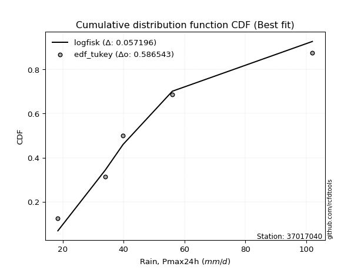</img></img>

</div>


### 8. EDF Gringorten (1963)

Gringorten plotting position formula is essential for estimating the probability and return periods of extreme events like floods and heavy rainfall. The constant _a=0.44_.

<div align="center">


$P=(m-a)/(n+1-2a)$


</div>


**8.1. Empirical values**

<div align="center">

|                | 0                   | 1                  | 2              | 3                 | 4                  |
|:---------------|:--------------------|:-------------------|:---------------|:------------------|:-------------------|
| date           | 2023                | 2021               | 2022           | 2020              | 2019               |
| x              | 18.4                | 34.0               | 39.8           | 56.0              | 102.0              |
| m              | 1                   | 2                  | 3              | 4                 | 5                  |
| empirical_dist | edf_gringorten      | edf_gringorten     | edf_gringorten | edf_gringorten    | edf_gringorten     |
| empirical      | 0.10937500000000001 | 0.3046875          | 0.5            | 0.6953125         | 0.8906249999999999 |
| empirical_tr   | 1.1228070175438596  | 1.4382022471910112 | 2.0            | 3.282051282051282 | 9.142857142857133  |

</div>


**8.2. Kolmogorov-Smirnov fit test (sorted by Δ)**


<div align="center">

|                | 0                    | 1                     | 2                   | 3                   | 4                   | 5                   | 6                   | 7                    | 8                   | 9                   | 10                   | 11                   | 12                  | 13                  | 14                  | 15                  | 16                   | 17                  | 18                  | 19                  | 20                   | 21                  | 22                   | 23                  | 24                   | 25                  | 26                   | 27                   | 28                  | 29                   | 30                 | 31                  | 32                  | 33                 | 34                  | 35                  | 36                  | 37                  | 38                  | 39                 | 40                  | 41                  | 42                  | 43                  | 44                  | 45                  | 46                 | 47                 | 48                  | 49                  | 50                  | 51                  | 52                  | 53                  | 54                  | 55                 | 56                  | 57                  | 58                  | 59                  | 60                 | 61                  | 62                  | 63                  | 64                  | 65                  | 66                  | 67                  | 68                  | 69                  | 70                  | 71                  | 72                 | 73                 | 74                  | 75                  | 76                  | 77                  | 78                 | 79                  | 80                  | 81                 | 82                  | 83                  | 84                  | 85                 | 86                 | 87                 |
|:---------------|:---------------------|:----------------------|:--------------------|:--------------------|:--------------------|:--------------------|:--------------------|:---------------------|:--------------------|:--------------------|:---------------------|:---------------------|:--------------------|:--------------------|:--------------------|:--------------------|:---------------------|:--------------------|:--------------------|:--------------------|:---------------------|:--------------------|:---------------------|:--------------------|:---------------------|:--------------------|:---------------------|:---------------------|:--------------------|:---------------------|:-------------------|:--------------------|:--------------------|:-------------------|:--------------------|:--------------------|:--------------------|:--------------------|:--------------------|:-------------------|:--------------------|:--------------------|:--------------------|:--------------------|:--------------------|:--------------------|:-------------------|:-------------------|:--------------------|:--------------------|:--------------------|:--------------------|:--------------------|:--------------------|:--------------------|:-------------------|:--------------------|:--------------------|:--------------------|:--------------------|:-------------------|:--------------------|:--------------------|:--------------------|:--------------------|:--------------------|:--------------------|:--------------------|:--------------------|:--------------------|:--------------------|:--------------------|:-------------------|:-------------------|:--------------------|:--------------------|:--------------------|:--------------------|:-------------------|:--------------------|:--------------------|:-------------------|:--------------------|:--------------------|:--------------------|:-------------------|:-------------------|:-------------------|
| station        | 37017040             | 37017040              | 37017040            | 37017040            | 37017040            | 37017040            | 37017040            | 37017040             | 37017040            | 37017040            | 37017040             | 37017040             | 37017040            | 37017040            | 37017040            | 37017040            | 37017040             | 37017040            | 37017040            | 37017040            | 37017040             | 37017040            | 37017040             | 37017040            | 37017040             | 37017040            | 37017040             | 37017040             | 37017040            | 37017040             | 37017040           | 37017040            | 37017040            | 37017040           | 37017040            | 37017040            | 37017040            | 37017040            | 37017040            | 37017040           | 37017040            | 37017040            | 37017040            | 37017040            | 37017040            | 37017040            | 37017040           | 37017040           | 37017040            | 37017040            | 37017040            | 37017040            | 37017040            | 37017040            | 37017040            | 37017040           | 37017040            | 37017040            | 37017040            | 37017040            | 37017040           | 37017040            | 37017040            | 37017040            | 37017040            | 37017040            | 37017040            | 37017040            | 37017040            | 37017040            | 37017040            | 37017040            | 37017040           | 37017040           | 37017040            | 37017040            | 37017040            | 37017040            | 37017040           | 37017040            | 37017040            | 37017040           | 37017040            | 37017040            | 37017040            | 37017040           | 37017040           | 37017040           |
| empirical_dist | edf_gringorten       | edf_gringorten        | edf_gringorten      | edf_gringorten      | edf_gringorten      | edf_gringorten      | edf_gringorten      | edf_gringorten       | edf_gringorten      | edf_gringorten      | edf_gringorten       | edf_gringorten       | edf_gringorten      | edf_gringorten      | edf_gringorten      | edf_gringorten      | edf_gringorten       | edf_gringorten      | edf_gringorten      | edf_gringorten      | edf_gringorten       | edf_gringorten      | edf_gringorten       | edf_gringorten      | edf_gringorten       | edf_gringorten      | edf_gringorten       | edf_gringorten       | edf_gringorten      | edf_gringorten       | edf_gringorten     | edf_gringorten      | edf_gringorten      | edf_gringorten     | edf_gringorten      | edf_gringorten      | edf_gringorten      | edf_gringorten      | edf_gringorten      | edf_gringorten     | edf_gringorten      | edf_gringorten      | edf_gringorten      | edf_gringorten      | edf_gringorten      | edf_gringorten      | edf_gringorten     | edf_gringorten     | edf_gringorten      | edf_gringorten      | edf_gringorten      | edf_gringorten      | edf_gringorten      | edf_gringorten      | edf_gringorten      | edf_gringorten     | edf_gringorten      | edf_gringorten      | edf_gringorten      | edf_gringorten      | edf_gringorten     | edf_gringorten      | edf_gringorten      | edf_gringorten      | edf_gringorten      | edf_gringorten      | edf_gringorten      | edf_gringorten      | edf_gringorten      | edf_gringorten      | edf_gringorten      | edf_gringorten      | edf_gringorten     | edf_gringorten     | edf_gringorten      | edf_gringorten      | edf_gringorten      | edf_gringorten      | edf_gringorten     | edf_gringorten      | edf_gringorten      | edf_gringorten     | edf_gringorten      | edf_gringorten      | edf_gringorten      | edf_gringorten     | edf_gringorten     | edf_gringorten     |
| p_dist         | logfisk              | loglaplace_asymmetric | logmielke           | alpha               | loggamma            | loggamma            | logerlang           | logpearson3          | logncf              | logf                | lognct               | logfatiguelife       | logbetaprime        | logexponnorm        | lognorm             | lognorm             | logcrystalball       | logt                | logjohnsonsu        | loginvgamma         | logloggamma          | loggenlogistic      | mielke               | invgamma            | loglogistic          | betaprime           | logalpha             | halfnorm             | loghypsecant        | nct                  | halflogistic       | logrice             | fisk                | ncf                | loginvgauss         | moyal               | logmaxwell          | logweibull_min      | laplace_asymmetric  | johnsonsu          | invgauss            | loglaplace          | lograyleigh         | genlogistic         | loggumbel_r         | gumbel_r            | pearson3           | rayleigh           | loginvweibull       | kstwobign           | logmoyal            | maxwell             | exponnorm           | genexpon            | loggompertz         | gompertz           | wald                | expon               | gibrat              | logkstwobign        | loghalfnorm        | loggumbel_l         | loghalflogistic     | loggenexpon         | logwald             | t                   | truncnorm           | norm                | crystalball         | rice                | loggibrat           | logistic            | hypsecant          | laplace            | gumbel_l            | logexpon            | weibull_min         | f                   | logchi2            | gamma               | erlang              | chi2               | nakagami            | lognakagami         | logtruncnorm        | loglognorm         | invweibull         | fatiguelife        |
| delta          | 0.041570794359840305 | 0.04253850189191778   | 0.04321937654551687 | 0.04477093112715176 | 0.04524180664428257 | 0.04524180664428257 | 0.04527187675795741 | 0.045529816674969914 | 0.04625997179849234 | 0.04649285912882445 | 0.047507909990645136 | 0.048139198651375226 | 0.04856175719904837 | 0.04969786516956731 | 0.04978152531037516 | 0.04978152531037516 | 0.049782666599147096 | 0.04978842799278449 | 0.04979505543207624 | 0.05139993049504099 | 0.052543572729886634 | 0.05273067363672734 | 0.053363271639892185 | 0.05562380893704155 | 0.056488637804596176 | 0.05790620545105396 | 0.058391039770101294 | 0.060374857583230634 | 0.06215588919463583 | 0.062305962823725525 | 0.0625500795613797 | 0.06414766579846581 | 0.06507958622416055 | 0.0686002351806293 | 0.06926149631096173 | 0.06945707848050897 | 0.07000440785640044 | 0.07248431086036189 | 0.07425671137603707 | 0.0764669472643793 | 0.07948772051704744 | 0.08108136941750121 | 0.08198032838310926 | 0.08629609486272649 | 0.08691228950538349 | 0.08862505781556967 | 0.0904293137372425 | 0.0950082311627104 | 0.10004426801588723 | 0.10254754419868911 | 0.10381992983557427 | 0.10718072165878062 | 0.10847240325694964 | 0.10916849496009812 | 0.10937498297937225 | 0.109374999999995  | 0.10937500000000001 | 0.10937500000000001 | 0.10937500000000001 | 0.11599841928697019 | 0.1160571238699259 | 0.11988292887253427 | 0.12294866736120619 | 0.12548567821202938 | 0.13888486142475365 | 0.13969836274809833 | 0.13970024394728342 | 0.13970026476155667 | 0.13970026528696827 | 0.14217910882002183 | 0.14294812460344886 | 0.15672181577249483 | 0.1701020166412655 | 0.1984898480243234 | 0.20124612875852033 | 0.21293527454153094 | 0.22181281123170027 | 0.22466139515527705 | 0.2440365464249883 | 0.26769327000861787 | 0.27876285233401377 | 0.2796973515553184 | 0.30349318927370644 | 0.30468196844458034 | 0.30468749958611063 | 0.3751148314737728 | 0.4206453230589096 | 0.4888264060511711 |
| deltao         | 0.5865427407550001   | 0.5865427407550001    | 0.5865427407550001  | 0.5865427407550001  | 0.5865427407550001  | 0.5865427407550001  | 0.5865427407550001  | 0.5865427407550001   | 0.5865427407550001  | 0.5865427407550001  | 0.5865427407550001   | 0.5865427407550001   | 0.5865427407550001  | 0.5865427407550001  | 0.5865427407550001  | 0.5865427407550001  | 0.5865427407550001   | 0.5865427407550001  | 0.5865427407550001  | 0.5865427407550001  | 0.5865427407550001   | 0.5865427407550001  | 0.5865427407550001   | 0.5865427407550001  | 0.5865427407550001   | 0.5865427407550001  | 0.5865427407550001   | 0.5865427407550001   | 0.5865427407550001  | 0.5865427407550001   | 0.5865427407550001 | 0.5865427407550001  | 0.5865427407550001  | 0.5865427407550001 | 0.5865427407550001  | 0.5865427407550001  | 0.5865427407550001  | 0.5865427407550001  | 0.5865427407550001  | 0.5865427407550001 | 0.5865427407550001  | 0.5865427407550001  | 0.5865427407550001  | 0.5865427407550001  | 0.5865427407550001  | 0.5865427407550001  | 0.5865427407550001 | 0.5865427407550001 | 0.5865427407550001  | 0.5865427407550001  | 0.5865427407550001  | 0.5865427407550001  | 0.5865427407550001  | 0.5865427407550001  | 0.5865427407550001  | 0.5865427407550001 | 0.5865427407550001  | 0.5865427407550001  | 0.5865427407550001  | 0.5865427407550001  | 0.5865427407550001 | 0.5865427407550001  | 0.5865427407550001  | 0.5865427407550001  | 0.5865427407550001  | 0.5865427407550001  | 0.5865427407550001  | 0.5865427407550001  | 0.5865427407550001  | 0.5865427407550001  | 0.5865427407550001  | 0.5865427407550001  | 0.5865427407550001 | 0.5865427407550001 | 0.5865427407550001  | 0.5865427407550001  | 0.5865427407550001  | 0.5865427407550001  | 0.5865427407550001 | 0.5865427407550001  | 0.5865427407550001  | 0.5865427407550001 | 0.5865427407550001  | 0.5865427407550001  | 0.5865427407550001  | 0.5865427407550001 | 0.5865427407550001 | 0.5865427407550001 |
| eval           | Δo > Δ               | Δo > Δ                | Δo > Δ              | Δo > Δ              | Δo > Δ              | Δo > Δ              | Δo > Δ              | Δo > Δ               | Δo > Δ              | Δo > Δ              | Δo > Δ               | Δo > Δ               | Δo > Δ              | Δo > Δ              | Δo > Δ              | Δo > Δ              | Δo > Δ               | Δo > Δ              | Δo > Δ              | Δo > Δ              | Δo > Δ               | Δo > Δ              | Δo > Δ               | Δo > Δ              | Δo > Δ               | Δo > Δ              | Δo > Δ               | Δo > Δ               | Δo > Δ              | Δo > Δ               | Δo > Δ             | Δo > Δ              | Δo > Δ              | Δo > Δ             | Δo > Δ              | Δo > Δ              | Δo > Δ              | Δo > Δ              | Δo > Δ              | Δo > Δ             | Δo > Δ              | Δo > Δ              | Δo > Δ              | Δo > Δ              | Δo > Δ              | Δo > Δ              | Δo > Δ             | Δo > Δ             | Δo > Δ              | Δo > Δ              | Δo > Δ              | Δo > Δ              | Δo > Δ              | Δo > Δ              | Δo > Δ              | Δo > Δ             | Δo > Δ              | Δo > Δ              | Δo > Δ              | Δo > Δ              | Δo > Δ             | Δo > Δ              | Δo > Δ              | Δo > Δ              | Δo > Δ              | Δo > Δ              | Δo > Δ              | Δo > Δ              | Δo > Δ              | Δo > Δ              | Δo > Δ              | Δo > Δ              | Δo > Δ             | Δo > Δ             | Δo > Δ              | Δo > Δ              | Δo > Δ              | Δo > Δ              | Δo > Δ             | Δo > Δ              | Δo > Δ              | Δo > Δ             | Δo > Δ              | Δo > Δ              | Δo > Δ              | Δo > Δ             | Δo > Δ             | Δo > Δ             |
| fit            | 1                    | 1                     | 1                   | 1                   | 1                   | 1                   | 1                   | 1                    | 1                   | 1                   | 1                    | 1                    | 1                   | 1                   | 1                   | 1                   | 1                    | 1                   | 1                   | 1                   | 1                    | 1                   | 1                    | 1                   | 1                    | 1                   | 1                    | 1                    | 1                   | 1                    | 1                  | 1                   | 1                   | 1                  | 1                   | 1                   | 1                   | 1                   | 1                   | 1                  | 1                   | 1                   | 1                   | 1                   | 1                   | 1                   | 1                  | 1                  | 1                   | 1                   | 1                   | 1                   | 1                   | 1                   | 1                   | 1                  | 1                   | 1                   | 1                   | 1                   | 1                  | 1                   | 1                   | 1                   | 1                   | 1                   | 1                   | 1                   | 1                   | 1                   | 1                   | 1                   | 1                  | 1                  | 1                   | 1                   | 1                   | 1                   | 1                  | 1                   | 1                   | 1                  | 1                   | 1                   | 1                   | 1                  | 1                  | 1                  |
| n              | 5                    | 5                     | 5                   | 5                   | 5                   | 5                   | 5                   | 5                    | 5                   | 5                   | 5                    | 5                    | 5                   | 5                   | 5                   | 5                   | 5                    | 5                   | 5                   | 5                   | 5                    | 5                   | 5                    | 5                   | 5                    | 5                   | 5                    | 5                    | 5                   | 5                    | 5                  | 5                   | 5                   | 5                  | 5                   | 5                   | 5                   | 5                   | 5                   | 5                  | 5                   | 5                   | 5                   | 5                   | 5                   | 5                   | 5                  | 5                  | 5                   | 5                   | 5                   | 5                   | 5                   | 5                   | 5                   | 5                  | 5                   | 5                   | 5                   | 5                   | 5                  | 5                   | 5                   | 5                   | 5                   | 5                   | 5                   | 5                   | 5                   | 5                   | 5                   | 5                   | 5                  | 5                  | 5                   | 5                   | 5                   | 5                   | 5                  | 5                   | 5                   | 5                  | 5                   | 5                   | 5                   | 5                  | 5                  | 5                  |
| best_fit       | 1                    | 0                     | 0                   | 0                   | 0                   | 0                   | 0                   | 0                    | 0                   | 0                   | 0                    | 0                    | 0                   | 0                   | 0                   | 0                   | 0                    | 0                   | 0                   | 0                   | 0                    | 0                   | 0                    | 0                   | 0                    | 0                   | 0                    | 0                    | 0                   | 0                    | 0                  | 0                   | 0                   | 0                  | 0                   | 0                   | 0                   | 0                   | 0                   | 0                  | 0                   | 0                   | 0                   | 0                   | 0                   | 0                   | 0                  | 0                  | 0                   | 0                   | 0                   | 0                   | 0                   | 0                   | 0                   | 0                  | 0                   | 0                   | 0                   | 0                   | 0                  | 0                   | 0                   | 0                   | 0                   | 0                   | 0                   | 0                   | 0                   | 0                   | 0                   | 0                   | 0                  | 0                  | 0                   | 0                   | 0                   | 0                   | 0                  | 0                   | 0                   | 0                  | 0                   | 0                   | 0                   | 0                  | 0                  | 0                  |
| best_fit_sort  | 1                    | 2                     | 3                   | 4                   | 5                   | 6                   | 7                   | 8                    | 9                   | 10                  | 11                   | 12                   | 13                  | 14                  | 15                  | 16                  | 17                   | 18                  | 19                  | 20                  | 21                   | 22                  | 23                   | 24                  | 25                   | 26                  | 27                   | 28                   | 29                  | 30                   | 31                 | 32                  | 33                  | 34                 | 35                  | 36                  | 37                  | 38                  | 39                  | 40                 | 41                  | 42                  | 43                  | 44                  | 45                  | 46                  | 47                 | 48                 | 49                  | 50                  | 51                  | 52                  | 53                  | 54                  | 55                  | 56                 | 57                  | 58                  | 59                  | 60                  | 61                 | 62                  | 63                  | 64                  | 65                  | 66                  | 67                  | 68                  | 69                  | 70                  | 71                  | 72                  | 73                 | 74                 | 75                  | 76                  | 77                  | 78                  | 79                 | 80                  | 81                  | 82                 | 83                  | 84                  | 85                  | 86                 | 87                 | 88                 |

</div>


**8.3. Best fit**

<div align="center">

|   id |   station | empirical_dist   | p_dist   |     delta |   deltao | eval   |   fit |   n |   best_fit |   best_fit_sort |
|-----:|----------:|:-----------------|:---------|----------:|---------:|:-------|------:|----:|-----------:|----------------:|
|    0 |  37017040 | edf_gringorten   | logfisk  | 0.0415708 | 0.586543 | Δo > Δ |     1 |   5 |          1 |               1 |

</div>


<div align="center">

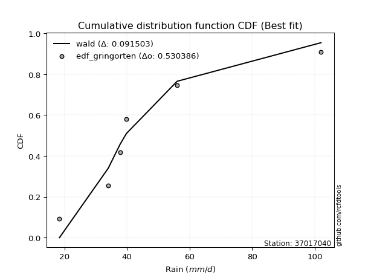</img></img>

</div>


### 9. EDF Filliben (1975)

The specific values of the constants (0.3175) (often denoted as $alpha$) and (0.365) are derived from a method proposed by James J. Filliben in a 1975 paper. This particular formula is the mean value of the $i$-th order statistic of the normal distribution and is considered a robust and effective plotting position formula for the normal probability plot correlation coefficient test for normality.

<div align="center">


$P=(m-0.3175)/(n+0.365)$


</div>


**9.1. Empirical values**

<div align="center">

|                | 0                   | 1                  | 2            | 3                  | 4                  |
|:---------------|:--------------------|:-------------------|:-------------|:-------------------|:-------------------|
| date           | 2023                | 2021               | 2022         | 2020               | 2019               |
| x              | 18.4                | 34.0               | 39.8         | 56.0               | 102.0              |
| m              | 1                   | 2                  | 3            | 4                  | 5                  |
| empirical_dist | edf_filliben        | edf_filliben       | edf_filliben | edf_filliben       | edf_filliben       |
| empirical      | 0.12721342031686858 | 0.3136067101584343 | 0.5          | 0.6863932898415657 | 0.8727865796831314 |
| empirical_tr   | 1.1457554725040042  | 1.456890699253225  | 2.0          | 3.188707280832095  | 7.860805860805863  |

</div>


**9.2. Kolmogorov-Smirnov fit test (sorted by Δ)**


<div align="center">

|                | 0                   | 1                     | 2                   | 3                   | 4                   | 5                   | 6                   | 7                   | 8                   | 9                   | 10                  | 11                  | 12                  | 13                  | 14                  | 15                  | 16                  | 17                  | 18                  | 19                  | 20                  | 21                  | 22                 | 23                  | 24                  | 25                  | 26                 | 27                  | 28                  | 29                 | 30                  | 31                  | 32                  | 33                  | 34                  | 35                  | 36                  | 37                 | 38                  | 39                  | 40                  | 41                  | 42                  | 43                  | 44                  | 45                 | 46                  | 47                 | 48                  | 49                  | 50                  | 51                  | 52                  | 53                  | 54                 | 55                 | 56                  | 57                 | 58                  | 59                  | 60                  | 61                  | 62                  | 63                  | 64                  | 65                  | 66                  | 67                  | 68                  | 69                  | 70                 | 71                  | 72                 | 73                 | 74                  | 75                  | 76                 | 77                  | 78                 | 79                 | 80                 | 81                 | 82                 | 83                 | 84                 | 85                 | 86                 | 87                  |
|:---------------|:--------------------|:----------------------|:--------------------|:--------------------|:--------------------|:--------------------|:--------------------|:--------------------|:--------------------|:--------------------|:--------------------|:--------------------|:--------------------|:--------------------|:--------------------|:--------------------|:--------------------|:--------------------|:--------------------|:--------------------|:--------------------|:--------------------|:-------------------|:--------------------|:--------------------|:--------------------|:-------------------|:--------------------|:--------------------|:-------------------|:--------------------|:--------------------|:--------------------|:--------------------|:--------------------|:--------------------|:--------------------|:-------------------|:--------------------|:--------------------|:--------------------|:--------------------|:--------------------|:--------------------|:--------------------|:-------------------|:--------------------|:-------------------|:--------------------|:--------------------|:--------------------|:--------------------|:--------------------|:--------------------|:-------------------|:-------------------|:--------------------|:-------------------|:--------------------|:--------------------|:--------------------|:--------------------|:--------------------|:--------------------|:--------------------|:--------------------|:--------------------|:--------------------|:--------------------|:--------------------|:-------------------|:--------------------|:-------------------|:-------------------|:--------------------|:--------------------|:-------------------|:--------------------|:-------------------|:-------------------|:-------------------|:-------------------|:-------------------|:-------------------|:-------------------|:-------------------|:-------------------|:--------------------|
| station        | 37017040            | 37017040              | 37017040            | 37017040            | 37017040            | 37017040            | 37017040            | 37017040            | 37017040            | 37017040            | 37017040            | 37017040            | 37017040            | 37017040            | 37017040            | 37017040            | 37017040            | 37017040            | 37017040            | 37017040            | 37017040            | 37017040            | 37017040           | 37017040            | 37017040            | 37017040            | 37017040           | 37017040            | 37017040            | 37017040           | 37017040            | 37017040            | 37017040            | 37017040            | 37017040            | 37017040            | 37017040            | 37017040           | 37017040            | 37017040            | 37017040            | 37017040            | 37017040            | 37017040            | 37017040            | 37017040           | 37017040            | 37017040           | 37017040            | 37017040            | 37017040            | 37017040            | 37017040            | 37017040            | 37017040           | 37017040           | 37017040            | 37017040           | 37017040            | 37017040            | 37017040            | 37017040            | 37017040            | 37017040            | 37017040            | 37017040            | 37017040            | 37017040            | 37017040            | 37017040            | 37017040           | 37017040            | 37017040           | 37017040           | 37017040            | 37017040            | 37017040           | 37017040            | 37017040           | 37017040           | 37017040           | 37017040           | 37017040           | 37017040           | 37017040           | 37017040           | 37017040           | 37017040            |
| empirical_dist | edf_filliben        | edf_filliben          | edf_filliben        | edf_filliben        | edf_filliben        | edf_filliben        | edf_filliben        | edf_filliben        | edf_filliben        | edf_filliben        | edf_filliben        | edf_filliben        | edf_filliben        | edf_filliben        | edf_filliben        | edf_filliben        | edf_filliben        | edf_filliben        | edf_filliben        | edf_filliben        | edf_filliben        | edf_filliben        | edf_filliben       | edf_filliben        | edf_filliben        | edf_filliben        | edf_filliben       | edf_filliben        | edf_filliben        | edf_filliben       | edf_filliben        | edf_filliben        | edf_filliben        | edf_filliben        | edf_filliben        | edf_filliben        | edf_filliben        | edf_filliben       | edf_filliben        | edf_filliben        | edf_filliben        | edf_filliben        | edf_filliben        | edf_filliben        | edf_filliben        | edf_filliben       | edf_filliben        | edf_filliben       | edf_filliben        | edf_filliben        | edf_filliben        | edf_filliben        | edf_filliben        | edf_filliben        | edf_filliben       | edf_filliben       | edf_filliben        | edf_filliben       | edf_filliben        | edf_filliben        | edf_filliben        | edf_filliben        | edf_filliben        | edf_filliben        | edf_filliben        | edf_filliben        | edf_filliben        | edf_filliben        | edf_filliben        | edf_filliben        | edf_filliben       | edf_filliben        | edf_filliben       | edf_filliben       | edf_filliben        | edf_filliben        | edf_filliben       | edf_filliben        | edf_filliben       | edf_filliben       | edf_filliben       | edf_filliben       | edf_filliben       | edf_filliben       | edf_filliben       | edf_filliben       | edf_filliben       | edf_filliben        |
| p_dist         | logfisk             | loglaplace_asymmetric | logmielke           | alpha               | loggamma            | loggamma            | logerlang           | logpearson3         | logncf              | logf                | logfatiguelife      | lognct              | logbetaprime        | logloggamma         | logexponnorm        | logcrystalball      | lognorm             | lognorm             | logt                | logjohnsonsu        | loggenlogistic      | mielke              | loginvgamma        | invgamma            | logalpha            | halfnorm            | loginvgauss        | loglogistic         | nct                 | betaprime          | loghypsecant        | moyal               | ncf                 | invgauss            | laplace_asymmetric  | johnsonsu           | logmaxwell          | fisk               | halflogistic        | logweibull_min      | loglaplace          | logrice             | genlogistic         | gumbel_r            | lograyleigh         | pearson3           | loginvweibull       | rayleigh           | kstwobign           | loggumbel_r         | logkstwobign        | maxwell             | loggumbel_l         | logmoyal            | loggenexpon        | exponnorm          | genexpon            | loggompertz        | gompertz            | gibrat              | expon               | loghalflogistic     | wald                | loghalfnorm         | logwald             | t                   | truncnorm           | norm                | crystalball         | rice                | loggibrat          | logistic            | hypsecant          | laplace            | gumbel_l            | logexpon            | weibull_min        | f                   | logchi2            | gamma              | erlang             | chi2               | nakagami           | lognakagami        | logtruncnorm       | loglognorm         | invweibull         | fatiguelife         |
| delta          | 0.05940921467670887 | 0.06037692220878635   | 0.06105779686238544 | 0.06260935144402033 | 0.06308022696115101 | 0.06308022696115101 | 0.06311029707482585 | 0.06336823699183836 | 0.06339765001901748 | 0.06349922427361153 | 0.06429774234208122 | 0.06434831730010127 | 0.06445257006937663 | 0.06507090024053719 | 0.06539097460289656 | 0.06542476202992065 | 0.06542512766805264 | 0.06542512766805264 | 0.06542606278536445 | 0.06548169990444408 | 0.06567072870820398 | 0.06585728629657478 | 0.0663727267087878 | 0.06790754876382421 | 0.06838405977277273 | 0.06870709894405214 | 0.0694282189143896 | 0.06951688487587071 | 0.07006229150130347 | 0.0700989070945351 | 0.07069206837359288 | 0.07094242765746661 | 0.07268286598739915 | 0.07289812805172488 | 0.07425671137603707 | 0.07443699918708535 | 0.07742376475627213 | 0.080065853998881  | 0.08038849987824825 | 0.08042298646074506 | 0.08108136941750121 | 0.08198608611533438 | 0.08629609486272649 | 0.08862505781556967 | 0.08955134841958726 | 0.0904293137372425 | 0.09112505785745295 | 0.0950082311627104 | 0.10254754419868911 | 0.10475070982225207 | 0.10707920912853591 | 0.10718072165878062 | 0.11988292887253427 | 0.12165835015244283 | 0.1229780082873199 | 0.1263108235738182 | 0.12700691527696667 | 0.1272134032962408 | 0.12721342031686356 | 0.12721342031686858 | 0.12721342031686858 | 0.12721342031686858 | 0.12721342031686858 | 0.12721342031686858 | 0.12996565126631937 | 0.13969836274809833 | 0.13970024394728342 | 0.13970026476155667 | 0.13970026528696827 | 0.14217910882002183 | 0.1518673347618832 | 0.15672181577249483 | 0.1701020166412655 | 0.1984898480243234 | 0.20124612875852033 | 0.20401606438309666 | 0.212893601073266  | 0.21574218499684278 | 0.235117336266554  | 0.2587740598501836 | 0.2698436421755795 | 0.2707781413968841 | 0.3124123994321407 | 0.3136011786030146 | 0.3136067097445449 | 0.3661956213153385 | 0.4028069027420412 | 0.47990719589273684 |
| deltao         | 0.5865427407550001  | 0.5865427407550001    | 0.5865427407550001  | 0.5865427407550001  | 0.5865427407550001  | 0.5865427407550001  | 0.5865427407550001  | 0.5865427407550001  | 0.5865427407550001  | 0.5865427407550001  | 0.5865427407550001  | 0.5865427407550001  | 0.5865427407550001  | 0.5865427407550001  | 0.5865427407550001  | 0.5865427407550001  | 0.5865427407550001  | 0.5865427407550001  | 0.5865427407550001  | 0.5865427407550001  | 0.5865427407550001  | 0.5865427407550001  | 0.5865427407550001 | 0.5865427407550001  | 0.5865427407550001  | 0.5865427407550001  | 0.5865427407550001 | 0.5865427407550001  | 0.5865427407550001  | 0.5865427407550001 | 0.5865427407550001  | 0.5865427407550001  | 0.5865427407550001  | 0.5865427407550001  | 0.5865427407550001  | 0.5865427407550001  | 0.5865427407550001  | 0.5865427407550001 | 0.5865427407550001  | 0.5865427407550001  | 0.5865427407550001  | 0.5865427407550001  | 0.5865427407550001  | 0.5865427407550001  | 0.5865427407550001  | 0.5865427407550001 | 0.5865427407550001  | 0.5865427407550001 | 0.5865427407550001  | 0.5865427407550001  | 0.5865427407550001  | 0.5865427407550001  | 0.5865427407550001  | 0.5865427407550001  | 0.5865427407550001 | 0.5865427407550001 | 0.5865427407550001  | 0.5865427407550001 | 0.5865427407550001  | 0.5865427407550001  | 0.5865427407550001  | 0.5865427407550001  | 0.5865427407550001  | 0.5865427407550001  | 0.5865427407550001  | 0.5865427407550001  | 0.5865427407550001  | 0.5865427407550001  | 0.5865427407550001  | 0.5865427407550001  | 0.5865427407550001 | 0.5865427407550001  | 0.5865427407550001 | 0.5865427407550001 | 0.5865427407550001  | 0.5865427407550001  | 0.5865427407550001 | 0.5865427407550001  | 0.5865427407550001 | 0.5865427407550001 | 0.5865427407550001 | 0.5865427407550001 | 0.5865427407550001 | 0.5865427407550001 | 0.5865427407550001 | 0.5865427407550001 | 0.5865427407550001 | 0.5865427407550001  |
| eval           | Δo > Δ              | Δo > Δ                | Δo > Δ              | Δo > Δ              | Δo > Δ              | Δo > Δ              | Δo > Δ              | Δo > Δ              | Δo > Δ              | Δo > Δ              | Δo > Δ              | Δo > Δ              | Δo > Δ              | Δo > Δ              | Δo > Δ              | Δo > Δ              | Δo > Δ              | Δo > Δ              | Δo > Δ              | Δo > Δ              | Δo > Δ              | Δo > Δ              | Δo > Δ             | Δo > Δ              | Δo > Δ              | Δo > Δ              | Δo > Δ             | Δo > Δ              | Δo > Δ              | Δo > Δ             | Δo > Δ              | Δo > Δ              | Δo > Δ              | Δo > Δ              | Δo > Δ              | Δo > Δ              | Δo > Δ              | Δo > Δ             | Δo > Δ              | Δo > Δ              | Δo > Δ              | Δo > Δ              | Δo > Δ              | Δo > Δ              | Δo > Δ              | Δo > Δ             | Δo > Δ              | Δo > Δ             | Δo > Δ              | Δo > Δ              | Δo > Δ              | Δo > Δ              | Δo > Δ              | Δo > Δ              | Δo > Δ             | Δo > Δ             | Δo > Δ              | Δo > Δ             | Δo > Δ              | Δo > Δ              | Δo > Δ              | Δo > Δ              | Δo > Δ              | Δo > Δ              | Δo > Δ              | Δo > Δ              | Δo > Δ              | Δo > Δ              | Δo > Δ              | Δo > Δ              | Δo > Δ             | Δo > Δ              | Δo > Δ             | Δo > Δ             | Δo > Δ              | Δo > Δ              | Δo > Δ             | Δo > Δ              | Δo > Δ             | Δo > Δ             | Δo > Δ             | Δo > Δ             | Δo > Δ             | Δo > Δ             | Δo > Δ             | Δo > Δ             | Δo > Δ             | Δo > Δ              |
| fit            | 1                   | 1                     | 1                   | 1                   | 1                   | 1                   | 1                   | 1                   | 1                   | 1                   | 1                   | 1                   | 1                   | 1                   | 1                   | 1                   | 1                   | 1                   | 1                   | 1                   | 1                   | 1                   | 1                  | 1                   | 1                   | 1                   | 1                  | 1                   | 1                   | 1                  | 1                   | 1                   | 1                   | 1                   | 1                   | 1                   | 1                   | 1                  | 1                   | 1                   | 1                   | 1                   | 1                   | 1                   | 1                   | 1                  | 1                   | 1                  | 1                   | 1                   | 1                   | 1                   | 1                   | 1                   | 1                  | 1                  | 1                   | 1                  | 1                   | 1                   | 1                   | 1                   | 1                   | 1                   | 1                   | 1                   | 1                   | 1                   | 1                   | 1                   | 1                  | 1                   | 1                  | 1                  | 1                   | 1                   | 1                  | 1                   | 1                  | 1                  | 1                  | 1                  | 1                  | 1                  | 1                  | 1                  | 1                  | 1                   |
| n              | 5                   | 5                     | 5                   | 5                   | 5                   | 5                   | 5                   | 5                   | 5                   | 5                   | 5                   | 5                   | 5                   | 5                   | 5                   | 5                   | 5                   | 5                   | 5                   | 5                   | 5                   | 5                   | 5                  | 5                   | 5                   | 5                   | 5                  | 5                   | 5                   | 5                  | 5                   | 5                   | 5                   | 5                   | 5                   | 5                   | 5                   | 5                  | 5                   | 5                   | 5                   | 5                   | 5                   | 5                   | 5                   | 5                  | 5                   | 5                  | 5                   | 5                   | 5                   | 5                   | 5                   | 5                   | 5                  | 5                  | 5                   | 5                  | 5                   | 5                   | 5                   | 5                   | 5                   | 5                   | 5                   | 5                   | 5                   | 5                   | 5                   | 5                   | 5                  | 5                   | 5                  | 5                  | 5                   | 5                   | 5                  | 5                   | 5                  | 5                  | 5                  | 5                  | 5                  | 5                  | 5                  | 5                  | 5                  | 5                   |
| best_fit       | 1                   | 0                     | 0                   | 0                   | 0                   | 0                   | 0                   | 0                   | 0                   | 0                   | 0                   | 0                   | 0                   | 0                   | 0                   | 0                   | 0                   | 0                   | 0                   | 0                   | 0                   | 0                   | 0                  | 0                   | 0                   | 0                   | 0                  | 0                   | 0                   | 0                  | 0                   | 0                   | 0                   | 0                   | 0                   | 0                   | 0                   | 0                  | 0                   | 0                   | 0                   | 0                   | 0                   | 0                   | 0                   | 0                  | 0                   | 0                  | 0                   | 0                   | 0                   | 0                   | 0                   | 0                   | 0                  | 0                  | 0                   | 0                  | 0                   | 0                   | 0                   | 0                   | 0                   | 0                   | 0                   | 0                   | 0                   | 0                   | 0                   | 0                   | 0                  | 0                   | 0                  | 0                  | 0                   | 0                   | 0                  | 0                   | 0                  | 0                  | 0                  | 0                  | 0                  | 0                  | 0                  | 0                  | 0                  | 0                   |
| best_fit_sort  | 1                   | 2                     | 3                   | 4                   | 5                   | 6                   | 7                   | 8                   | 9                   | 10                  | 11                  | 12                  | 13                  | 14                  | 15                  | 16                  | 17                  | 18                  | 19                  | 20                  | 21                  | 22                  | 23                 | 24                  | 25                  | 26                  | 27                 | 28                  | 29                  | 30                 | 31                  | 32                  | 33                  | 34                  | 35                  | 36                  | 37                  | 38                 | 39                  | 40                  | 41                  | 42                  | 43                  | 44                  | 45                  | 46                 | 47                  | 48                 | 49                  | 50                  | 51                  | 52                  | 53                  | 54                  | 55                 | 56                 | 57                  | 58                 | 59                  | 60                  | 61                  | 62                  | 63                  | 64                  | 65                  | 66                  | 67                  | 68                  | 69                  | 70                  | 71                 | 72                  | 73                 | 74                 | 75                  | 76                  | 77                 | 78                  | 79                 | 80                 | 81                 | 82                 | 83                 | 84                 | 85                 | 86                 | 87                 | 88                  |

</div>


**9.3. Best fit**

<div align="center">

|   id |   station | empirical_dist   | p_dist   |     delta |   deltao | eval   |   fit |   n |   best_fit |   best_fit_sort |
|-----:|----------:|:-----------------|:---------|----------:|---------:|:-------|------:|----:|-----------:|----------------:|
|    0 |  37017040 | edf_filliben     | logfisk  | 0.0594092 | 0.586543 | Δo > Δ |     1 |   5 |          1 |               1 |

</div>


<div align="center">

</img>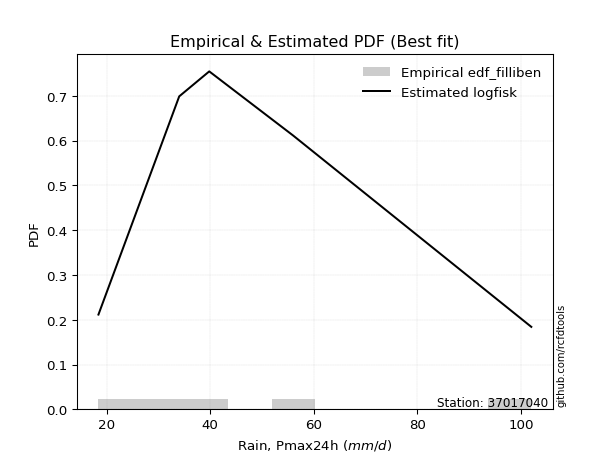</img>

</div>


### 10. EDF Jenkinson (1977)

The Jenkinson formula in hydrology is an empirical plotting position formula used to estimate the non-exceedance probability _(P)_ or return period _(T)_ of a given ordered observation within a sample. It is a widely used method in the frequency analysis of extreme events such as floods and rainfall, as it provides a distribution-free way to plot data. _a≈0.31_ and _b≈0.38_ are constants derived to approximate the median of the probability distribution for the given rank.

<div align="center">


$P=(m-a)/(n+b)$


</div>


**10.1. Empirical values**

<div align="center">

|                | 0                   | 1                  | 2             | 3                  | 4                  |
|:---------------|:--------------------|:-------------------|:--------------|:-------------------|:-------------------|
| date           | 2023                | 2021               | 2022          | 2020               | 2019               |
| x              | 18.4                | 34.0               | 39.8          | 56.0               | 102.0              |
| m              | 1                   | 2                  | 3             | 4                  | 5                  |
| empirical_dist | edf_jenkinson       | edf_jenkinson      | edf_jenkinson | edf_jenkinson      | edf_jenkinson      |
| empirical      | 0.12825278810408922 | 0.3141263940520446 | 0.5           | 0.6858736059479554 | 0.8717472118959109 |
| empirical_tr   | 1.1471215351812367  | 1.4579945799457996 | 2.0           | 3.183431952662722  | 7.797101449275368  |

</div>


**10.2. Kolmogorov-Smirnov fit test (sorted by Δ)**


<div align="center">

|                | 0                   | 1                     | 2                    | 3                   | 4                   | 5                   | 6                   | 7                   | 8                   | 9                   | 10                  | 11                  | 12                  | 13                  | 14                  | 15                  | 16                  | 17                  | 18                  | 19                  | 20                  | 21                  | 22                  | 23                  | 24                  | 25                  | 26                  | 27                  | 28                 | 29                  | 30                  | 31                  | 32                  | 33                  | 34                  | 35                  | 36                  | 37                  | 38                  | 39                  | 40                  | 41                  | 42                  | 43                  | 44                 | 45                  | 46                 | 47                 | 48                  | 49                 | 50                  | 51                  | 52                  | 53                  | 54                  | 55                  | 56                 | 57                  | 58                 | 59                  | 60                  | 61                  | 62                  | 63                  | 64                  | 65                  | 66                  | 67                  | 68                  | 69                  | 70                  | 71                  | 72                 | 73                 | 74                  | 75                  | 76                  | 77                  | 78                  | 79                  | 80                  | 81                  | 82                  | 83                  | 84                  | 85                  | 86                 | 87                 |
|:---------------|:--------------------|:----------------------|:---------------------|:--------------------|:--------------------|:--------------------|:--------------------|:--------------------|:--------------------|:--------------------|:--------------------|:--------------------|:--------------------|:--------------------|:--------------------|:--------------------|:--------------------|:--------------------|:--------------------|:--------------------|:--------------------|:--------------------|:--------------------|:--------------------|:--------------------|:--------------------|:--------------------|:--------------------|:-------------------|:--------------------|:--------------------|:--------------------|:--------------------|:--------------------|:--------------------|:--------------------|:--------------------|:--------------------|:--------------------|:--------------------|:--------------------|:--------------------|:--------------------|:--------------------|:-------------------|:--------------------|:-------------------|:-------------------|:--------------------|:-------------------|:--------------------|:--------------------|:--------------------|:--------------------|:--------------------|:--------------------|:-------------------|:--------------------|:-------------------|:--------------------|:--------------------|:--------------------|:--------------------|:--------------------|:--------------------|:--------------------|:--------------------|:--------------------|:--------------------|:--------------------|:--------------------|:--------------------|:-------------------|:-------------------|:--------------------|:--------------------|:--------------------|:--------------------|:--------------------|:--------------------|:--------------------|:--------------------|:--------------------|:--------------------|:--------------------|:--------------------|:-------------------|:-------------------|
| station        | 37017040            | 37017040              | 37017040             | 37017040            | 37017040            | 37017040            | 37017040            | 37017040            | 37017040            | 37017040            | 37017040            | 37017040            | 37017040            | 37017040            | 37017040            | 37017040            | 37017040            | 37017040            | 37017040            | 37017040            | 37017040            | 37017040            | 37017040            | 37017040            | 37017040            | 37017040            | 37017040            | 37017040            | 37017040           | 37017040            | 37017040            | 37017040            | 37017040            | 37017040            | 37017040            | 37017040            | 37017040            | 37017040            | 37017040            | 37017040            | 37017040            | 37017040            | 37017040            | 37017040            | 37017040           | 37017040            | 37017040           | 37017040           | 37017040            | 37017040           | 37017040            | 37017040            | 37017040            | 37017040            | 37017040            | 37017040            | 37017040           | 37017040            | 37017040           | 37017040            | 37017040            | 37017040            | 37017040            | 37017040            | 37017040            | 37017040            | 37017040            | 37017040            | 37017040            | 37017040            | 37017040            | 37017040            | 37017040           | 37017040           | 37017040            | 37017040            | 37017040            | 37017040            | 37017040            | 37017040            | 37017040            | 37017040            | 37017040            | 37017040            | 37017040            | 37017040            | 37017040           | 37017040           |
| empirical_dist | edf_jenkinson       | edf_jenkinson         | edf_jenkinson        | edf_jenkinson       | edf_jenkinson       | edf_jenkinson       | edf_jenkinson       | edf_jenkinson       | edf_jenkinson       | edf_jenkinson       | edf_jenkinson       | edf_jenkinson       | edf_jenkinson       | edf_jenkinson       | edf_jenkinson       | edf_jenkinson       | edf_jenkinson       | edf_jenkinson       | edf_jenkinson       | edf_jenkinson       | edf_jenkinson       | edf_jenkinson       | edf_jenkinson       | edf_jenkinson       | edf_jenkinson       | edf_jenkinson       | edf_jenkinson       | edf_jenkinson       | edf_jenkinson      | edf_jenkinson       | edf_jenkinson       | edf_jenkinson       | edf_jenkinson       | edf_jenkinson       | edf_jenkinson       | edf_jenkinson       | edf_jenkinson       | edf_jenkinson       | edf_jenkinson       | edf_jenkinson       | edf_jenkinson       | edf_jenkinson       | edf_jenkinson       | edf_jenkinson       | edf_jenkinson      | edf_jenkinson       | edf_jenkinson      | edf_jenkinson      | edf_jenkinson       | edf_jenkinson      | edf_jenkinson       | edf_jenkinson       | edf_jenkinson       | edf_jenkinson       | edf_jenkinson       | edf_jenkinson       | edf_jenkinson      | edf_jenkinson       | edf_jenkinson      | edf_jenkinson       | edf_jenkinson       | edf_jenkinson       | edf_jenkinson       | edf_jenkinson       | edf_jenkinson       | edf_jenkinson       | edf_jenkinson       | edf_jenkinson       | edf_jenkinson       | edf_jenkinson       | edf_jenkinson       | edf_jenkinson       | edf_jenkinson      | edf_jenkinson      | edf_jenkinson       | edf_jenkinson       | edf_jenkinson       | edf_jenkinson       | edf_jenkinson       | edf_jenkinson       | edf_jenkinson       | edf_jenkinson       | edf_jenkinson       | edf_jenkinson       | edf_jenkinson       | edf_jenkinson       | edf_jenkinson      | edf_jenkinson      |
| p_dist         | logfisk             | loglaplace_asymmetric | logmielke            | alpha               | loggamma            | loggamma            | logerlang           | logpearson3         | logncf              | logf                | logfatiguelife      | lognct              | logbetaprime        | logloggamma         | logexponnorm        | logcrystalball      | lognorm             | lognorm             | logt                | logjohnsonsu        | loggenlogistic      | mielke              | loginvgamma         | invgamma            | logalpha            | halfnorm            | loginvgauss         | loglogistic         | nct                | betaprime           | loghypsecant        | moyal               | ncf                 | invgauss            | laplace_asymmetric  | johnsonsu           | logmaxwell          | loglaplace          | fisk                | halflogistic        | logweibull_min      | logrice             | genlogistic         | gumbel_r            | pearson3           | lograyleigh         | loginvweibull      | rayleigh           | kstwobign           | loggumbel_r        | logkstwobign        | maxwell             | loggumbel_l         | logmoyal            | loggenexpon         | exponnorm           | genexpon           | loggompertz         | gompertz           | gibrat              | expon               | loghalflogistic     | wald                | loghalfnorm         | logwald             | t                   | truncnorm           | norm                | crystalball         | rice                | loggibrat           | logistic            | hypsecant          | laplace            | gumbel_l            | logexpon            | weibull_min         | f                   | logchi2             | gamma               | erlang              | chi2                | nakagami            | lognakagami         | logtruncnorm        | loglognorm          | invweibull         | fatiguelife        |
| delta          | 0.06044858246392951 | 0.061416289996006984  | 0.062097164649606074 | 0.06364871923124096 | 0.06411959474837159 | 0.06411959474837159 | 0.06414966486204643 | 0.06440760477905894 | 0.06443701780623812 | 0.06453859206083216 | 0.06533711012930185 | 0.06538768508732185 | 0.06549193785659727 | 0.06611026802775777 | 0.06643034239011714 | 0.06646412981714123 | 0.06646449545527322 | 0.06646449545527322 | 0.06646543057258503 | 0.06652106769166466 | 0.06671009649542461 | 0.06689665408379541 | 0.06741209449600843 | 0.06894691655104485 | 0.06942342755999337 | 0.06974646673127272 | 0.07046758670161024 | 0.07055625266309129 | 0.0711016592885241 | 0.07113827488175574 | 0.07173143616081346 | 0.07198179544468719 | 0.07372223377461973 | 0.07393749583894552 | 0.07425671137603707 | 0.07547636697430599 | 0.07846313254349277 | 0.08108136941750121 | 0.08110522178610163 | 0.08142786766546889 | 0.08146235424796569 | 0.08302545390255502 | 0.08660048844493673 | 0.08862505781556967 | 0.0904293137372425 | 0.09059071620680789 | 0.0906053739638426 | 0.0950082311627104 | 0.10254754419868911 | 0.1057900776094727 | 0.10655952523492557 | 0.10718072165878062 | 0.11988292887253427 | 0.12269771793966347 | 0.12401737607454054 | 0.12735019136103884 | 0.1280462830641873 | 0.12825277108346145 | 0.1282527881040842 | 0.12825278810408922 | 0.12825278810408922 | 0.12825278810408922 | 0.12825278810408922 | 0.12825278810408922 | 0.12944596737270903 | 0.13969836274809833 | 0.13970024394728342 | 0.13970026476155667 | 0.13970026528696827 | 0.14217910882002183 | 0.15238701865549342 | 0.15672181577249483 | 0.1701020166412655 | 0.1984898480243234 | 0.20124612875852033 | 0.20349638048948632 | 0.21237391717965565 | 0.21522250110323243 | 0.23459765237294367 | 0.25825437595657325 | 0.26932395828196914 | 0.27025845750327376 | 0.31293208332575106 | 0.31412086249662496 | 0.31412639363815525 | 0.36567593742172816 | 0.4017675349548206 | 0.4793875119991265 |
| deltao         | 0.5865427407550001  | 0.5865427407550001    | 0.5865427407550001   | 0.5865427407550001  | 0.5865427407550001  | 0.5865427407550001  | 0.5865427407550001  | 0.5865427407550001  | 0.5865427407550001  | 0.5865427407550001  | 0.5865427407550001  | 0.5865427407550001  | 0.5865427407550001  | 0.5865427407550001  | 0.5865427407550001  | 0.5865427407550001  | 0.5865427407550001  | 0.5865427407550001  | 0.5865427407550001  | 0.5865427407550001  | 0.5865427407550001  | 0.5865427407550001  | 0.5865427407550001  | 0.5865427407550001  | 0.5865427407550001  | 0.5865427407550001  | 0.5865427407550001  | 0.5865427407550001  | 0.5865427407550001 | 0.5865427407550001  | 0.5865427407550001  | 0.5865427407550001  | 0.5865427407550001  | 0.5865427407550001  | 0.5865427407550001  | 0.5865427407550001  | 0.5865427407550001  | 0.5865427407550001  | 0.5865427407550001  | 0.5865427407550001  | 0.5865427407550001  | 0.5865427407550001  | 0.5865427407550001  | 0.5865427407550001  | 0.5865427407550001 | 0.5865427407550001  | 0.5865427407550001 | 0.5865427407550001 | 0.5865427407550001  | 0.5865427407550001 | 0.5865427407550001  | 0.5865427407550001  | 0.5865427407550001  | 0.5865427407550001  | 0.5865427407550001  | 0.5865427407550001  | 0.5865427407550001 | 0.5865427407550001  | 0.5865427407550001 | 0.5865427407550001  | 0.5865427407550001  | 0.5865427407550001  | 0.5865427407550001  | 0.5865427407550001  | 0.5865427407550001  | 0.5865427407550001  | 0.5865427407550001  | 0.5865427407550001  | 0.5865427407550001  | 0.5865427407550001  | 0.5865427407550001  | 0.5865427407550001  | 0.5865427407550001 | 0.5865427407550001 | 0.5865427407550001  | 0.5865427407550001  | 0.5865427407550001  | 0.5865427407550001  | 0.5865427407550001  | 0.5865427407550001  | 0.5865427407550001  | 0.5865427407550001  | 0.5865427407550001  | 0.5865427407550001  | 0.5865427407550001  | 0.5865427407550001  | 0.5865427407550001 | 0.5865427407550001 |
| eval           | Δo > Δ              | Δo > Δ                | Δo > Δ               | Δo > Δ              | Δo > Δ              | Δo > Δ              | Δo > Δ              | Δo > Δ              | Δo > Δ              | Δo > Δ              | Δo > Δ              | Δo > Δ              | Δo > Δ              | Δo > Δ              | Δo > Δ              | Δo > Δ              | Δo > Δ              | Δo > Δ              | Δo > Δ              | Δo > Δ              | Δo > Δ              | Δo > Δ              | Δo > Δ              | Δo > Δ              | Δo > Δ              | Δo > Δ              | Δo > Δ              | Δo > Δ              | Δo > Δ             | Δo > Δ              | Δo > Δ              | Δo > Δ              | Δo > Δ              | Δo > Δ              | Δo > Δ              | Δo > Δ              | Δo > Δ              | Δo > Δ              | Δo > Δ              | Δo > Δ              | Δo > Δ              | Δo > Δ              | Δo > Δ              | Δo > Δ              | Δo > Δ             | Δo > Δ              | Δo > Δ             | Δo > Δ             | Δo > Δ              | Δo > Δ             | Δo > Δ              | Δo > Δ              | Δo > Δ              | Δo > Δ              | Δo > Δ              | Δo > Δ              | Δo > Δ             | Δo > Δ              | Δo > Δ             | Δo > Δ              | Δo > Δ              | Δo > Δ              | Δo > Δ              | Δo > Δ              | Δo > Δ              | Δo > Δ              | Δo > Δ              | Δo > Δ              | Δo > Δ              | Δo > Δ              | Δo > Δ              | Δo > Δ              | Δo > Δ             | Δo > Δ             | Δo > Δ              | Δo > Δ              | Δo > Δ              | Δo > Δ              | Δo > Δ              | Δo > Δ              | Δo > Δ              | Δo > Δ              | Δo > Δ              | Δo > Δ              | Δo > Δ              | Δo > Δ              | Δo > Δ             | Δo > Δ             |
| fit            | 1                   | 1                     | 1                    | 1                   | 1                   | 1                   | 1                   | 1                   | 1                   | 1                   | 1                   | 1                   | 1                   | 1                   | 1                   | 1                   | 1                   | 1                   | 1                   | 1                   | 1                   | 1                   | 1                   | 1                   | 1                   | 1                   | 1                   | 1                   | 1                  | 1                   | 1                   | 1                   | 1                   | 1                   | 1                   | 1                   | 1                   | 1                   | 1                   | 1                   | 1                   | 1                   | 1                   | 1                   | 1                  | 1                   | 1                  | 1                  | 1                   | 1                  | 1                   | 1                   | 1                   | 1                   | 1                   | 1                   | 1                  | 1                   | 1                  | 1                   | 1                   | 1                   | 1                   | 1                   | 1                   | 1                   | 1                   | 1                   | 1                   | 1                   | 1                   | 1                   | 1                  | 1                  | 1                   | 1                   | 1                   | 1                   | 1                   | 1                   | 1                   | 1                   | 1                   | 1                   | 1                   | 1                   | 1                  | 1                  |
| n              | 5                   | 5                     | 5                    | 5                   | 5                   | 5                   | 5                   | 5                   | 5                   | 5                   | 5                   | 5                   | 5                   | 5                   | 5                   | 5                   | 5                   | 5                   | 5                   | 5                   | 5                   | 5                   | 5                   | 5                   | 5                   | 5                   | 5                   | 5                   | 5                  | 5                   | 5                   | 5                   | 5                   | 5                   | 5                   | 5                   | 5                   | 5                   | 5                   | 5                   | 5                   | 5                   | 5                   | 5                   | 5                  | 5                   | 5                  | 5                  | 5                   | 5                  | 5                   | 5                   | 5                   | 5                   | 5                   | 5                   | 5                  | 5                   | 5                  | 5                   | 5                   | 5                   | 5                   | 5                   | 5                   | 5                   | 5                   | 5                   | 5                   | 5                   | 5                   | 5                   | 5                  | 5                  | 5                   | 5                   | 5                   | 5                   | 5                   | 5                   | 5                   | 5                   | 5                   | 5                   | 5                   | 5                   | 5                  | 5                  |
| best_fit       | 1                   | 0                     | 0                    | 0                   | 0                   | 0                   | 0                   | 0                   | 0                   | 0                   | 0                   | 0                   | 0                   | 0                   | 0                   | 0                   | 0                   | 0                   | 0                   | 0                   | 0                   | 0                   | 0                   | 0                   | 0                   | 0                   | 0                   | 0                   | 0                  | 0                   | 0                   | 0                   | 0                   | 0                   | 0                   | 0                   | 0                   | 0                   | 0                   | 0                   | 0                   | 0                   | 0                   | 0                   | 0                  | 0                   | 0                  | 0                  | 0                   | 0                  | 0                   | 0                   | 0                   | 0                   | 0                   | 0                   | 0                  | 0                   | 0                  | 0                   | 0                   | 0                   | 0                   | 0                   | 0                   | 0                   | 0                   | 0                   | 0                   | 0                   | 0                   | 0                   | 0                  | 0                  | 0                   | 0                   | 0                   | 0                   | 0                   | 0                   | 0                   | 0                   | 0                   | 0                   | 0                   | 0                   | 0                  | 0                  |
| best_fit_sort  | 1                   | 2                     | 3                    | 4                   | 5                   | 6                   | 7                   | 8                   | 9                   | 10                  | 11                  | 12                  | 13                  | 14                  | 15                  | 16                  | 17                  | 18                  | 19                  | 20                  | 21                  | 22                  | 23                  | 24                  | 25                  | 26                  | 27                  | 28                  | 29                 | 30                  | 31                  | 32                  | 33                  | 34                  | 35                  | 36                  | 37                  | 38                  | 39                  | 40                  | 41                  | 42                  | 43                  | 44                  | 45                 | 46                  | 47                 | 48                 | 49                  | 50                 | 51                  | 52                  | 53                  | 54                  | 55                  | 56                  | 57                 | 58                  | 59                 | 60                  | 61                  | 62                  | 63                  | 64                  | 65                  | 66                  | 67                  | 68                  | 69                  | 70                  | 71                  | 72                  | 73                 | 74                 | 75                  | 76                  | 77                  | 78                  | 79                  | 80                  | 81                  | 82                  | 83                  | 84                  | 85                  | 86                  | 87                 | 88                 |

</div>


**10.3. Best fit**

<div align="center">

|   id |   station | empirical_dist   | p_dist   |     delta |   deltao | eval   |   fit |   n |   best_fit |   best_fit_sort |
|-----:|----------:|:-----------------|:---------|----------:|---------:|:-------|------:|----:|-----------:|----------------:|
|    0 |  37017040 | edf_jenkinson    | logfisk  | 0.0604486 | 0.586543 | Δo > Δ |     1 |   5 |          1 |               1 |

</div>


<div align="center">

</img>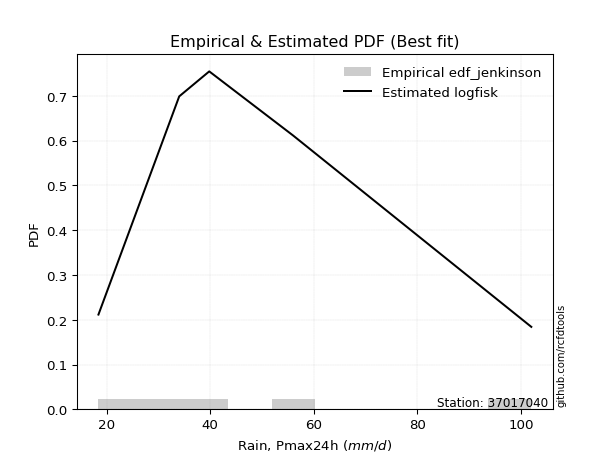</img>

</div>


### 11. EDF Cunnane (1978)

Cunnane´s work in statistical hydrology has focused on the performance and evaluation of different probability distributions (such as GEV, Gumbel, Lognormal) for flood frequency estimation. _b_ is a constant, typically set to 0.4.

<div align="center">


$P=(m-b)/(n+1-2b)$


</div>


**11.1. Empirical values**

<div align="center">

|                | 0                   | 1                  | 2           | 3                  | 4                  |
|:---------------|:--------------------|:-------------------|:------------|:-------------------|:-------------------|
| date           | 2023                | 2021               | 2022        | 2020               | 2019               |
| x              | 18.4                | 34.0               | 39.8        | 56.0               | 102.0              |
| m              | 1                   | 2                  | 3           | 4                  | 5                  |
| empirical_dist | edf_cunnane         | edf_cunnane        | edf_cunnane | edf_cunnane        | edf_cunnane        |
| empirical      | 0.11538461538461538 | 0.3076923076923077 | 0.5         | 0.6923076923076923 | 0.8846153846153845 |
| empirical_tr   | 1.1304347826086958  | 1.4444444444444444 | 2.0         | 3.25               | 8.666666666666655  |

</div>


**11.2. Kolmogorov-Smirnov fit test (sorted by Δ)**


<div align="center">

|                | 0                   | 1                     | 2                    | 3                    | 4                    | 5                    | 6                    | 7                   | 8                   | 9                    | 10                  | 11                  | 12                  | 13                   | 14                   | 15                   | 16                  | 17                  | 18                   | 19                   | 20                   | 21                  | 22                 | 23                  | 24                  | 25                  | 26                 | 27                   | 28                   | 29                  | 30                  | 31                  | 32                  | 33                  | 34                 | 35                  | 36                  | 37                  | 38                 | 39                  | 40                  | 41                  | 42                  | 43                  | 44                  | 45                 | 46                  | 47                 | 48                  | 49                  | 50                  | 51                  | 52                  | 53                 | 54                  | 55                  | 56                  | 57                  | 58                  | 59                  | 60                  | 61                  | 62                  | 63                  | 64                  | 65                  | 66                  | 67                  | 68                  | 69                  | 70                  | 71                  | 72                 | 73                 | 74                  | 75                  | 76                  | 77                  | 78                  | 79                  | 80                  | 81                 | 82                  | 83                  | 84                  | 85                  | 86                 | 87                 |
|:---------------|:--------------------|:----------------------|:---------------------|:---------------------|:---------------------|:---------------------|:---------------------|:--------------------|:--------------------|:---------------------|:--------------------|:--------------------|:--------------------|:---------------------|:---------------------|:---------------------|:--------------------|:--------------------|:---------------------|:---------------------|:---------------------|:--------------------|:-------------------|:--------------------|:--------------------|:--------------------|:-------------------|:---------------------|:---------------------|:--------------------|:--------------------|:--------------------|:--------------------|:--------------------|:-------------------|:--------------------|:--------------------|:--------------------|:-------------------|:--------------------|:--------------------|:--------------------|:--------------------|:--------------------|:--------------------|:-------------------|:--------------------|:-------------------|:--------------------|:--------------------|:--------------------|:--------------------|:--------------------|:-------------------|:--------------------|:--------------------|:--------------------|:--------------------|:--------------------|:--------------------|:--------------------|:--------------------|:--------------------|:--------------------|:--------------------|:--------------------|:--------------------|:--------------------|:--------------------|:--------------------|:--------------------|:--------------------|:-------------------|:-------------------|:--------------------|:--------------------|:--------------------|:--------------------|:--------------------|:--------------------|:--------------------|:-------------------|:--------------------|:--------------------|:--------------------|:--------------------|:-------------------|:-------------------|
| station        | 37017040            | 37017040              | 37017040             | 37017040             | 37017040             | 37017040             | 37017040             | 37017040            | 37017040            | 37017040             | 37017040            | 37017040            | 37017040            | 37017040             | 37017040             | 37017040             | 37017040            | 37017040            | 37017040             | 37017040             | 37017040             | 37017040            | 37017040           | 37017040            | 37017040            | 37017040            | 37017040           | 37017040             | 37017040             | 37017040            | 37017040            | 37017040            | 37017040            | 37017040            | 37017040           | 37017040            | 37017040            | 37017040            | 37017040           | 37017040            | 37017040            | 37017040            | 37017040            | 37017040            | 37017040            | 37017040           | 37017040            | 37017040           | 37017040            | 37017040            | 37017040            | 37017040            | 37017040            | 37017040           | 37017040            | 37017040            | 37017040            | 37017040            | 37017040            | 37017040            | 37017040            | 37017040            | 37017040            | 37017040            | 37017040            | 37017040            | 37017040            | 37017040            | 37017040            | 37017040            | 37017040            | 37017040            | 37017040           | 37017040           | 37017040            | 37017040            | 37017040            | 37017040            | 37017040            | 37017040            | 37017040            | 37017040           | 37017040            | 37017040            | 37017040            | 37017040            | 37017040           | 37017040           |
| empirical_dist | edf_cunnane         | edf_cunnane           | edf_cunnane          | edf_cunnane          | edf_cunnane          | edf_cunnane          | edf_cunnane          | edf_cunnane         | edf_cunnane         | edf_cunnane          | edf_cunnane         | edf_cunnane         | edf_cunnane         | edf_cunnane          | edf_cunnane          | edf_cunnane          | edf_cunnane         | edf_cunnane         | edf_cunnane          | edf_cunnane          | edf_cunnane          | edf_cunnane         | edf_cunnane        | edf_cunnane         | edf_cunnane         | edf_cunnane         | edf_cunnane        | edf_cunnane          | edf_cunnane          | edf_cunnane         | edf_cunnane         | edf_cunnane         | edf_cunnane         | edf_cunnane         | edf_cunnane        | edf_cunnane         | edf_cunnane         | edf_cunnane         | edf_cunnane        | edf_cunnane         | edf_cunnane         | edf_cunnane         | edf_cunnane         | edf_cunnane         | edf_cunnane         | edf_cunnane        | edf_cunnane         | edf_cunnane        | edf_cunnane         | edf_cunnane         | edf_cunnane         | edf_cunnane         | edf_cunnane         | edf_cunnane        | edf_cunnane         | edf_cunnane         | edf_cunnane         | edf_cunnane         | edf_cunnane         | edf_cunnane         | edf_cunnane         | edf_cunnane         | edf_cunnane         | edf_cunnane         | edf_cunnane         | edf_cunnane         | edf_cunnane         | edf_cunnane         | edf_cunnane         | edf_cunnane         | edf_cunnane         | edf_cunnane         | edf_cunnane        | edf_cunnane        | edf_cunnane         | edf_cunnane         | edf_cunnane         | edf_cunnane         | edf_cunnane         | edf_cunnane         | edf_cunnane         | edf_cunnane        | edf_cunnane         | edf_cunnane         | edf_cunnane         | edf_cunnane         | edf_cunnane        | edf_cunnane        |
| p_dist         | logfisk             | loglaplace_asymmetric | logmielke            | alpha                | loggamma             | loggamma             | logerlang            | logpearson3         | logncf              | logf                 | logfatiguelife      | lognct              | logbetaprime        | logloggamma          | logexponnorm         | logcrystalball       | lognorm             | lognorm             | logt                 | logjohnsonsu         | loggenlogistic       | mielke              | loginvgamma        | invgamma            | logalpha            | loglogistic         | betaprime          | nct                  | halfnorm             | loghypsecant        | loginvgauss         | logmaxwell          | fisk                | halflogistic        | ncf                | moyal               | logweibull_min      | logrice             | johnsonsu          | laplace_asymmetric  | invgauss            | lograyleigh         | loglaplace          | genlogistic         | gumbel_r            | pearson3           | loggumbel_r         | rayleigh           | loginvweibull       | kstwobign           | maxwell             | logmoyal            | logkstwobign        | exponnorm          | genexpon            | loggompertz         | gompertz            | expon               | loghalfnorm         | wald                | gibrat              | loggumbel_l         | loghalflogistic     | loggenexpon         | logwald             | t                   | truncnorm           | norm                | crystalball         | rice                | loggibrat           | logistic            | hypsecant          | laplace            | gumbel_l            | logexpon            | weibull_min         | f                   | logchi2             | gamma               | erlang              | chi2               | nakagami            | lognakagami         | logtruncnorm        | loglognorm          | invweibull         | fatiguelife        |
| delta          | 0.04758040974445567 | 0.048548117276533145  | 0.049228991930132235 | 0.050780546511767125 | 0.051251422028897986 | 0.051251422028897986 | 0.051281492142572827 | 0.05153943205958533 | 0.05156884508676428 | 0.051670419341358326 | 0.05246893740982801 | 0.05251951236784824 | 0.05262376513712343 | 0.053242095308284165 | 0.053562169670643534 | 0.053595957097667624 | 0.05359632273579962 | 0.05359632273579962 | 0.053597257853111424 | 0.053652894972191056 | 0.053841923775950776 | 0.05402848136432157 | 0.0545439217765346 | 0.05607874383157101 | 0.05655525484051953 | 0.05768807994361769 | 0.0582701021622819 | 0.059301155131417815 | 0.060374857583230634 | 0.06215588919463583 | 0.06625668861865402 | 0.06699960016409273 | 0.06823704906662778 | 0.06855969494599506 | 0.0686002351806293 | 0.06945707848050897 | 0.06947950316805418 | 0.07015728118308118 | 0.0734621395720716 | 0.07425671137603707 | 0.07648291282473973 | 0.07897552069080155 | 0.08108136941750121 | 0.08629609486272649 | 0.08862505781556967 | 0.0904293137372425 | 0.09292190488999885 | 0.0950082311627104 | 0.09703946032357952 | 0.10254754419868911 | 0.10718072165878062 | 0.10982954522018963 | 0.11299361159466248 | 0.114482018641565  | 0.11517811034471348 | 0.11538459836398761 | 0.11538461538461037 | 0.11538461538461538 | 0.11538461538461538 | 0.11538461538461538 | 0.11538461538461538 | 0.11988292887253427 | 0.11994385966889848 | 0.12248087051972167 | 0.13588005373244594 | 0.13969836274809833 | 0.13970024394728342 | 0.13970026476155667 | 0.13970026528696827 | 0.14217910882002183 | 0.14595293229575657 | 0.15672181577249483 | 0.1701020166412655 | 0.1984898480243234 | 0.20124612875852033 | 0.20993046684922323 | 0.21880800353939256 | 0.22165658746296935 | 0.24103173873268058 | 0.26468846231631016 | 0.27575804464170606 | 0.2766925438630107 | 0.30649799696601415 | 0.30768677613688805 | 0.30769230727841834 | 0.37211002378146507 | 0.4146357076742942 | 0.4858215983588634 |
| deltao         | 0.5865427407550001  | 0.5865427407550001    | 0.5865427407550001   | 0.5865427407550001   | 0.5865427407550001   | 0.5865427407550001   | 0.5865427407550001   | 0.5865427407550001  | 0.5865427407550001  | 0.5865427407550001   | 0.5865427407550001  | 0.5865427407550001  | 0.5865427407550001  | 0.5865427407550001   | 0.5865427407550001   | 0.5865427407550001   | 0.5865427407550001  | 0.5865427407550001  | 0.5865427407550001   | 0.5865427407550001   | 0.5865427407550001   | 0.5865427407550001  | 0.5865427407550001 | 0.5865427407550001  | 0.5865427407550001  | 0.5865427407550001  | 0.5865427407550001 | 0.5865427407550001   | 0.5865427407550001   | 0.5865427407550001  | 0.5865427407550001  | 0.5865427407550001  | 0.5865427407550001  | 0.5865427407550001  | 0.5865427407550001 | 0.5865427407550001  | 0.5865427407550001  | 0.5865427407550001  | 0.5865427407550001 | 0.5865427407550001  | 0.5865427407550001  | 0.5865427407550001  | 0.5865427407550001  | 0.5865427407550001  | 0.5865427407550001  | 0.5865427407550001 | 0.5865427407550001  | 0.5865427407550001 | 0.5865427407550001  | 0.5865427407550001  | 0.5865427407550001  | 0.5865427407550001  | 0.5865427407550001  | 0.5865427407550001 | 0.5865427407550001  | 0.5865427407550001  | 0.5865427407550001  | 0.5865427407550001  | 0.5865427407550001  | 0.5865427407550001  | 0.5865427407550001  | 0.5865427407550001  | 0.5865427407550001  | 0.5865427407550001  | 0.5865427407550001  | 0.5865427407550001  | 0.5865427407550001  | 0.5865427407550001  | 0.5865427407550001  | 0.5865427407550001  | 0.5865427407550001  | 0.5865427407550001  | 0.5865427407550001 | 0.5865427407550001 | 0.5865427407550001  | 0.5865427407550001  | 0.5865427407550001  | 0.5865427407550001  | 0.5865427407550001  | 0.5865427407550001  | 0.5865427407550001  | 0.5865427407550001 | 0.5865427407550001  | 0.5865427407550001  | 0.5865427407550001  | 0.5865427407550001  | 0.5865427407550001 | 0.5865427407550001 |
| eval           | Δo > Δ              | Δo > Δ                | Δo > Δ               | Δo > Δ               | Δo > Δ               | Δo > Δ               | Δo > Δ               | Δo > Δ              | Δo > Δ              | Δo > Δ               | Δo > Δ              | Δo > Δ              | Δo > Δ              | Δo > Δ               | Δo > Δ               | Δo > Δ               | Δo > Δ              | Δo > Δ              | Δo > Δ               | Δo > Δ               | Δo > Δ               | Δo > Δ              | Δo > Δ             | Δo > Δ              | Δo > Δ              | Δo > Δ              | Δo > Δ             | Δo > Δ               | Δo > Δ               | Δo > Δ              | Δo > Δ              | Δo > Δ              | Δo > Δ              | Δo > Δ              | Δo > Δ             | Δo > Δ              | Δo > Δ              | Δo > Δ              | Δo > Δ             | Δo > Δ              | Δo > Δ              | Δo > Δ              | Δo > Δ              | Δo > Δ              | Δo > Δ              | Δo > Δ             | Δo > Δ              | Δo > Δ             | Δo > Δ              | Δo > Δ              | Δo > Δ              | Δo > Δ              | Δo > Δ              | Δo > Δ             | Δo > Δ              | Δo > Δ              | Δo > Δ              | Δo > Δ              | Δo > Δ              | Δo > Δ              | Δo > Δ              | Δo > Δ              | Δo > Δ              | Δo > Δ              | Δo > Δ              | Δo > Δ              | Δo > Δ              | Δo > Δ              | Δo > Δ              | Δo > Δ              | Δo > Δ              | Δo > Δ              | Δo > Δ             | Δo > Δ             | Δo > Δ              | Δo > Δ              | Δo > Δ              | Δo > Δ              | Δo > Δ              | Δo > Δ              | Δo > Δ              | Δo > Δ             | Δo > Δ              | Δo > Δ              | Δo > Δ              | Δo > Δ              | Δo > Δ             | Δo > Δ             |
| fit            | 1                   | 1                     | 1                    | 1                    | 1                    | 1                    | 1                    | 1                   | 1                   | 1                    | 1                   | 1                   | 1                   | 1                    | 1                    | 1                    | 1                   | 1                   | 1                    | 1                    | 1                    | 1                   | 1                  | 1                   | 1                   | 1                   | 1                  | 1                    | 1                    | 1                   | 1                   | 1                   | 1                   | 1                   | 1                  | 1                   | 1                   | 1                   | 1                  | 1                   | 1                   | 1                   | 1                   | 1                   | 1                   | 1                  | 1                   | 1                  | 1                   | 1                   | 1                   | 1                   | 1                   | 1                  | 1                   | 1                   | 1                   | 1                   | 1                   | 1                   | 1                   | 1                   | 1                   | 1                   | 1                   | 1                   | 1                   | 1                   | 1                   | 1                   | 1                   | 1                   | 1                  | 1                  | 1                   | 1                   | 1                   | 1                   | 1                   | 1                   | 1                   | 1                  | 1                   | 1                   | 1                   | 1                   | 1                  | 1                  |
| n              | 5                   | 5                     | 5                    | 5                    | 5                    | 5                    | 5                    | 5                   | 5                   | 5                    | 5                   | 5                   | 5                   | 5                    | 5                    | 5                    | 5                   | 5                   | 5                    | 5                    | 5                    | 5                   | 5                  | 5                   | 5                   | 5                   | 5                  | 5                    | 5                    | 5                   | 5                   | 5                   | 5                   | 5                   | 5                  | 5                   | 5                   | 5                   | 5                  | 5                   | 5                   | 5                   | 5                   | 5                   | 5                   | 5                  | 5                   | 5                  | 5                   | 5                   | 5                   | 5                   | 5                   | 5                  | 5                   | 5                   | 5                   | 5                   | 5                   | 5                   | 5                   | 5                   | 5                   | 5                   | 5                   | 5                   | 5                   | 5                   | 5                   | 5                   | 5                   | 5                   | 5                  | 5                  | 5                   | 5                   | 5                   | 5                   | 5                   | 5                   | 5                   | 5                  | 5                   | 5                   | 5                   | 5                   | 5                  | 5                  |
| best_fit       | 1                   | 0                     | 0                    | 0                    | 0                    | 0                    | 0                    | 0                   | 0                   | 0                    | 0                   | 0                   | 0                   | 0                    | 0                    | 0                    | 0                   | 0                   | 0                    | 0                    | 0                    | 0                   | 0                  | 0                   | 0                   | 0                   | 0                  | 0                    | 0                    | 0                   | 0                   | 0                   | 0                   | 0                   | 0                  | 0                   | 0                   | 0                   | 0                  | 0                   | 0                   | 0                   | 0                   | 0                   | 0                   | 0                  | 0                   | 0                  | 0                   | 0                   | 0                   | 0                   | 0                   | 0                  | 0                   | 0                   | 0                   | 0                   | 0                   | 0                   | 0                   | 0                   | 0                   | 0                   | 0                   | 0                   | 0                   | 0                   | 0                   | 0                   | 0                   | 0                   | 0                  | 0                  | 0                   | 0                   | 0                   | 0                   | 0                   | 0                   | 0                   | 0                  | 0                   | 0                   | 0                   | 0                   | 0                  | 0                  |
| best_fit_sort  | 1                   | 2                     | 3                    | 4                    | 5                    | 6                    | 7                    | 8                   | 9                   | 10                   | 11                  | 12                  | 13                  | 14                   | 15                   | 16                   | 17                  | 18                  | 19                   | 20                   | 21                   | 22                  | 23                 | 24                  | 25                  | 26                  | 27                 | 28                   | 29                   | 30                  | 31                  | 32                  | 33                  | 34                  | 35                 | 36                  | 37                  | 38                  | 39                 | 40                  | 41                  | 42                  | 43                  | 44                  | 45                  | 46                 | 47                  | 48                 | 49                  | 50                  | 51                  | 52                  | 53                  | 54                 | 55                  | 56                  | 57                  | 58                  | 59                  | 60                  | 61                  | 62                  | 63                  | 64                  | 65                  | 66                  | 67                  | 68                  | 69                  | 70                  | 71                  | 72                  | 73                 | 74                 | 75                  | 76                  | 77                  | 78                  | 79                  | 80                  | 81                  | 82                 | 83                  | 84                  | 85                  | 86                  | 87                 | 88                 |

</div>


**11.3. Best fit**

<div align="center">

|   id |   station | empirical_dist   | p_dist   |     delta |   deltao | eval   |   fit |   n |   best_fit |   best_fit_sort |
|-----:|----------:|:-----------------|:---------|----------:|---------:|:-------|------:|----:|-----------:|----------------:|
|    0 |  37017040 | edf_cunnane      | logfisk  | 0.0475804 | 0.586543 | Δo > Δ |     1 |   5 |          1 |               1 |

</div>


<div align="center">

</img>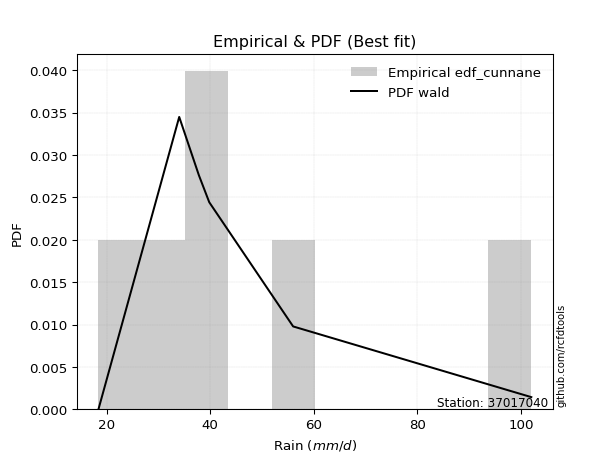</img>

</div>


### 12. EDF Adamowski (1981)

The Adamowski formula in hydrology refers to a specific plotting position formula used for estimating the non-parametric empirical distribution of hydrological events (like flood peaks) to calculate their return periods. This formula provides an alternative to traditional parametric methods (like the Gumbel or Log Pearson Type III distributions). 

<div align="center">


$P=(m-0.25)/(n+0.5)$


</div>


**12.1. Empirical values**

<div align="center">

|                | 0                   | 1                  | 2             | 3                  | 4                  |
|:---------------|:--------------------|:-------------------|:--------------|:-------------------|:-------------------|
| date           | 2023                | 2021               | 2022          | 2020               | 2019               |
| x              | 18.4                | 34.0               | 39.8          | 56.0               | 102.0              |
| m              | 1                   | 2                  | 3             | 4                  | 5                  |
| empirical_dist | edf_adamowski       | edf_adamowski      | edf_adamowski | edf_adamowski      | edf_adamowski      |
| empirical      | 0.13636363636363635 | 0.3181818181818182 | 0.5           | 0.6818181818181818 | 0.8636363636363636 |
| empirical_tr   | 1.1578947368421053  | 1.4666666666666666 | 2.0           | 3.1428571428571423 | 7.333333333333334  |

</div>


**12.2. Kolmogorov-Smirnov fit test (sorted by Δ)**


<div align="center">

|                | 0                   | 1                     | 2                   | 3                  | 4                   | 5                   | 6                   | 7                   | 8                   | 9                  | 10                  | 11                  | 12                 | 13                  | 14                  | 15                  | 16                  | 17                  | 18                  | 19                  | 20                  | 21                  | 22                  | 23                  | 24                 | 25                  | 26                  | 27                  | 28                  | 29                  | 30                  | 31                  | 32                  | 33                  | 34                  | 35                  | 36                  | 37                  | 38                  | 39                  | 40                  | 41                  | 42                  | 43                 | 44                  | 45                  | 46                 | 47                  | 48                  | 49                  | 50                  | 51                  | 52                  | 53                 | 54                  | 55                  | 56                  | 57                  | 58                  | 59                  | 60                  | 61                  | 62                  | 63                  | 64                  | 65                  | 66                  | 67                  | 68                  | 69                  | 70                 | 71                  | 72                 | 73                 | 74                  | 75                  | 76                 | 77                  | 78                 | 79                 | 80                 | 81                 | 82                 | 83                 | 84                 | 85                 | 86                 | 87                  |
|:---------------|:--------------------|:----------------------|:--------------------|:-------------------|:--------------------|:--------------------|:--------------------|:--------------------|:--------------------|:-------------------|:--------------------|:--------------------|:-------------------|:--------------------|:--------------------|:--------------------|:--------------------|:--------------------|:--------------------|:--------------------|:--------------------|:--------------------|:--------------------|:--------------------|:-------------------|:--------------------|:--------------------|:--------------------|:--------------------|:--------------------|:--------------------|:--------------------|:--------------------|:--------------------|:--------------------|:--------------------|:--------------------|:--------------------|:--------------------|:--------------------|:--------------------|:--------------------|:--------------------|:-------------------|:--------------------|:--------------------|:-------------------|:--------------------|:--------------------|:--------------------|:--------------------|:--------------------|:--------------------|:-------------------|:--------------------|:--------------------|:--------------------|:--------------------|:--------------------|:--------------------|:--------------------|:--------------------|:--------------------|:--------------------|:--------------------|:--------------------|:--------------------|:--------------------|:--------------------|:--------------------|:-------------------|:--------------------|:-------------------|:-------------------|:--------------------|:--------------------|:-------------------|:--------------------|:-------------------|:-------------------|:-------------------|:-------------------|:-------------------|:-------------------|:-------------------|:-------------------|:-------------------|:--------------------|
| station        | 37017040            | 37017040              | 37017040            | 37017040           | 37017040            | 37017040            | 37017040            | 37017040            | 37017040            | 37017040           | 37017040            | 37017040            | 37017040           | 37017040            | 37017040            | 37017040            | 37017040            | 37017040            | 37017040            | 37017040            | 37017040            | 37017040            | 37017040            | 37017040            | 37017040           | 37017040            | 37017040            | 37017040            | 37017040            | 37017040            | 37017040            | 37017040            | 37017040            | 37017040            | 37017040            | 37017040            | 37017040            | 37017040            | 37017040            | 37017040            | 37017040            | 37017040            | 37017040            | 37017040           | 37017040            | 37017040            | 37017040           | 37017040            | 37017040            | 37017040            | 37017040            | 37017040            | 37017040            | 37017040           | 37017040            | 37017040            | 37017040            | 37017040            | 37017040            | 37017040            | 37017040            | 37017040            | 37017040            | 37017040            | 37017040            | 37017040            | 37017040            | 37017040            | 37017040            | 37017040            | 37017040           | 37017040            | 37017040           | 37017040           | 37017040            | 37017040            | 37017040           | 37017040            | 37017040           | 37017040           | 37017040           | 37017040           | 37017040           | 37017040           | 37017040           | 37017040           | 37017040           | 37017040            |
| empirical_dist | edf_adamowski       | edf_adamowski         | edf_adamowski       | edf_adamowski      | edf_adamowski       | edf_adamowski       | edf_adamowski       | edf_adamowski       | edf_adamowski       | edf_adamowski      | edf_adamowski       | edf_adamowski       | edf_adamowski      | edf_adamowski       | edf_adamowski       | edf_adamowski       | edf_adamowski       | edf_adamowski       | edf_adamowski       | edf_adamowski       | edf_adamowski       | edf_adamowski       | edf_adamowski       | edf_adamowski       | edf_adamowski      | edf_adamowski       | edf_adamowski       | edf_adamowski       | edf_adamowski       | edf_adamowski       | edf_adamowski       | edf_adamowski       | edf_adamowski       | edf_adamowski       | edf_adamowski       | edf_adamowski       | edf_adamowski       | edf_adamowski       | edf_adamowski       | edf_adamowski       | edf_adamowski       | edf_adamowski       | edf_adamowski       | edf_adamowski      | edf_adamowski       | edf_adamowski       | edf_adamowski      | edf_adamowski       | edf_adamowski       | edf_adamowski       | edf_adamowski       | edf_adamowski       | edf_adamowski       | edf_adamowski      | edf_adamowski       | edf_adamowski       | edf_adamowski       | edf_adamowski       | edf_adamowski       | edf_adamowski       | edf_adamowski       | edf_adamowski       | edf_adamowski       | edf_adamowski       | edf_adamowski       | edf_adamowski       | edf_adamowski       | edf_adamowski       | edf_adamowski       | edf_adamowski       | edf_adamowski      | edf_adamowski       | edf_adamowski      | edf_adamowski      | edf_adamowski       | edf_adamowski       | edf_adamowski      | edf_adamowski       | edf_adamowski      | edf_adamowski      | edf_adamowski      | edf_adamowski      | edf_adamowski      | edf_adamowski      | edf_adamowski      | edf_adamowski      | edf_adamowski      | edf_adamowski       |
| p_dist         | logfisk             | loglaplace_asymmetric | logmielke           | alpha              | loggamma            | loggamma            | logerlang           | logpearson3         | logncf              | logf               | logfatiguelife      | lognct              | logbetaprime       | logloggamma         | logexponnorm        | logcrystalball      | lognorm             | lognorm             | logt                | logjohnsonsu        | loggenlogistic      | mielke              | loginvgamma         | invgamma            | logalpha           | halfnorm            | loginvgauss         | loglogistic         | nct                 | betaprime           | laplace_asymmetric  | loghypsecant        | moyal               | loglaplace          | ncf                 | invgauss            | johnsonsu           | loginvweibull       | logmaxwell          | gumbel_r            | fisk                | halflogistic        | logweibull_min      | pearson3           | logrice             | genlogistic         | rayleigh           | lograyleigh         | logkstwobign        | kstwobign           | maxwell             | loggumbel_r         | loggumbel_l         | logmoyal           | loggenexpon         | exponnorm           | genexpon            | loggompertz         | gompertz            | gibrat              | expon               | loghalflogistic     | wald                | loghalfnorm         | logwald             | t                   | truncnorm           | norm                | crystalball         | rice                | loggibrat          | logistic            | hypsecant          | laplace            | logexpon            | gumbel_l            | weibull_min        | f                   | logchi2            | gamma              | erlang             | chi2               | nakagami           | lognakagami        | logtruncnorm       | loglognorm         | invweibull         | fatiguelife         |
| delta          | 0.06855943072347664 | 0.06952713825555412   | 0.07020801290915321 | 0.0717595674907881 | 0.07223044300791881 | 0.07223044300791881 | 0.07226051312159365 | 0.07251845303860616 | 0.07254786606578525 | 0.0726494403203793 | 0.07344795838884899 | 0.07349853334686907 | 0.0736027861161444 | 0.07422111628730499 | 0.07454119064966436 | 0.07457497807668845 | 0.07457534371482044 | 0.07457534371482044 | 0.07457627883213225 | 0.07463191595121188 | 0.07482094475497175 | 0.07500750234334255 | 0.07552294275555557 | 0.07705776481059198 | 0.0775342758195405 | 0.07785731499081994 | 0.07857843496115738 | 0.07866710092263851 | 0.07921250754807124 | 0.07924912314130288 | 0.07952809456679566 | 0.07984228442036068 | 0.08009264370423441 | 0.08108136941750121 | 0.08183308203416695 | 0.08204834409849265 | 0.08358721523385312 | 0.08654994983406905 | 0.08657398080303991 | 0.08862505781556967 | 0.08921607004564877 | 0.08953871592501603 | 0.08957320250751283 | 0.0904293137372425 | 0.09113630216210215 | 0.09471133670448395 | 0.0950082311627104 | 0.09870156446635503 | 0.10250410110515201 | 0.10254754419868911 | 0.10718072165878062 | 0.11390092586901984 | 0.11988292887253427 | 0.1308085661992106 | 0.13212822433408766 | 0.13546103962058598 | 0.13615713132373444 | 0.13636361934300859 | 0.13636363636363133 | 0.13636363636363635 | 0.13636363636363635 | 0.13636363636363635 | 0.13636363636363635 | 0.13636363636363635 | 0.13636363636363635 | 0.13969836274809833 | 0.13970024394728342 | 0.13970026476155667 | 0.13970026528696827 | 0.14217910882002183 | 0.1564424427852671 | 0.15672181577249483 | 0.1701020166412655 | 0.1984898480243234 | 0.19944095635971276 | 0.20124612875852033 | 0.2083184930498821 | 0.21116707697345888 | 0.2305422282431701 | 0.2541989518267997 | 0.2652685341521956 | 0.2662030333735002 | 0.3169875074555246 | 0.3181762866263985 | 0.3181818177679288 | 0.3616205132919546 | 0.3936566866952734 | 0.47533208786935294 |
| deltao         | 0.5865427407550001  | 0.5865427407550001    | 0.5865427407550001  | 0.5865427407550001 | 0.5865427407550001  | 0.5865427407550001  | 0.5865427407550001  | 0.5865427407550001  | 0.5865427407550001  | 0.5865427407550001 | 0.5865427407550001  | 0.5865427407550001  | 0.5865427407550001 | 0.5865427407550001  | 0.5865427407550001  | 0.5865427407550001  | 0.5865427407550001  | 0.5865427407550001  | 0.5865427407550001  | 0.5865427407550001  | 0.5865427407550001  | 0.5865427407550001  | 0.5865427407550001  | 0.5865427407550001  | 0.5865427407550001 | 0.5865427407550001  | 0.5865427407550001  | 0.5865427407550001  | 0.5865427407550001  | 0.5865427407550001  | 0.5865427407550001  | 0.5865427407550001  | 0.5865427407550001  | 0.5865427407550001  | 0.5865427407550001  | 0.5865427407550001  | 0.5865427407550001  | 0.5865427407550001  | 0.5865427407550001  | 0.5865427407550001  | 0.5865427407550001  | 0.5865427407550001  | 0.5865427407550001  | 0.5865427407550001 | 0.5865427407550001  | 0.5865427407550001  | 0.5865427407550001 | 0.5865427407550001  | 0.5865427407550001  | 0.5865427407550001  | 0.5865427407550001  | 0.5865427407550001  | 0.5865427407550001  | 0.5865427407550001 | 0.5865427407550001  | 0.5865427407550001  | 0.5865427407550001  | 0.5865427407550001  | 0.5865427407550001  | 0.5865427407550001  | 0.5865427407550001  | 0.5865427407550001  | 0.5865427407550001  | 0.5865427407550001  | 0.5865427407550001  | 0.5865427407550001  | 0.5865427407550001  | 0.5865427407550001  | 0.5865427407550001  | 0.5865427407550001  | 0.5865427407550001 | 0.5865427407550001  | 0.5865427407550001 | 0.5865427407550001 | 0.5865427407550001  | 0.5865427407550001  | 0.5865427407550001 | 0.5865427407550001  | 0.5865427407550001 | 0.5865427407550001 | 0.5865427407550001 | 0.5865427407550001 | 0.5865427407550001 | 0.5865427407550001 | 0.5865427407550001 | 0.5865427407550001 | 0.5865427407550001 | 0.5865427407550001  |
| eval           | Δo > Δ              | Δo > Δ                | Δo > Δ              | Δo > Δ             | Δo > Δ              | Δo > Δ              | Δo > Δ              | Δo > Δ              | Δo > Δ              | Δo > Δ             | Δo > Δ              | Δo > Δ              | Δo > Δ             | Δo > Δ              | Δo > Δ              | Δo > Δ              | Δo > Δ              | Δo > Δ              | Δo > Δ              | Δo > Δ              | Δo > Δ              | Δo > Δ              | Δo > Δ              | Δo > Δ              | Δo > Δ             | Δo > Δ              | Δo > Δ              | Δo > Δ              | Δo > Δ              | Δo > Δ              | Δo > Δ              | Δo > Δ              | Δo > Δ              | Δo > Δ              | Δo > Δ              | Δo > Δ              | Δo > Δ              | Δo > Δ              | Δo > Δ              | Δo > Δ              | Δo > Δ              | Δo > Δ              | Δo > Δ              | Δo > Δ             | Δo > Δ              | Δo > Δ              | Δo > Δ             | Δo > Δ              | Δo > Δ              | Δo > Δ              | Δo > Δ              | Δo > Δ              | Δo > Δ              | Δo > Δ             | Δo > Δ              | Δo > Δ              | Δo > Δ              | Δo > Δ              | Δo > Δ              | Δo > Δ              | Δo > Δ              | Δo > Δ              | Δo > Δ              | Δo > Δ              | Δo > Δ              | Δo > Δ              | Δo > Δ              | Δo > Δ              | Δo > Δ              | Δo > Δ              | Δo > Δ             | Δo > Δ              | Δo > Δ             | Δo > Δ             | Δo > Δ              | Δo > Δ              | Δo > Δ             | Δo > Δ              | Δo > Δ             | Δo > Δ             | Δo > Δ             | Δo > Δ             | Δo > Δ             | Δo > Δ             | Δo > Δ             | Δo > Δ             | Δo > Δ             | Δo > Δ              |
| fit            | 1                   | 1                     | 1                   | 1                  | 1                   | 1                   | 1                   | 1                   | 1                   | 1                  | 1                   | 1                   | 1                  | 1                   | 1                   | 1                   | 1                   | 1                   | 1                   | 1                   | 1                   | 1                   | 1                   | 1                   | 1                  | 1                   | 1                   | 1                   | 1                   | 1                   | 1                   | 1                   | 1                   | 1                   | 1                   | 1                   | 1                   | 1                   | 1                   | 1                   | 1                   | 1                   | 1                   | 1                  | 1                   | 1                   | 1                  | 1                   | 1                   | 1                   | 1                   | 1                   | 1                   | 1                  | 1                   | 1                   | 1                   | 1                   | 1                   | 1                   | 1                   | 1                   | 1                   | 1                   | 1                   | 1                   | 1                   | 1                   | 1                   | 1                   | 1                  | 1                   | 1                  | 1                  | 1                   | 1                   | 1                  | 1                   | 1                  | 1                  | 1                  | 1                  | 1                  | 1                  | 1                  | 1                  | 1                  | 1                   |
| n              | 5                   | 5                     | 5                   | 5                  | 5                   | 5                   | 5                   | 5                   | 5                   | 5                  | 5                   | 5                   | 5                  | 5                   | 5                   | 5                   | 5                   | 5                   | 5                   | 5                   | 5                   | 5                   | 5                   | 5                   | 5                  | 5                   | 5                   | 5                   | 5                   | 5                   | 5                   | 5                   | 5                   | 5                   | 5                   | 5                   | 5                   | 5                   | 5                   | 5                   | 5                   | 5                   | 5                   | 5                  | 5                   | 5                   | 5                  | 5                   | 5                   | 5                   | 5                   | 5                   | 5                   | 5                  | 5                   | 5                   | 5                   | 5                   | 5                   | 5                   | 5                   | 5                   | 5                   | 5                   | 5                   | 5                   | 5                   | 5                   | 5                   | 5                   | 5                  | 5                   | 5                  | 5                  | 5                   | 5                   | 5                  | 5                   | 5                  | 5                  | 5                  | 5                  | 5                  | 5                  | 5                  | 5                  | 5                  | 5                   |
| best_fit       | 1                   | 0                     | 0                   | 0                  | 0                   | 0                   | 0                   | 0                   | 0                   | 0                  | 0                   | 0                   | 0                  | 0                   | 0                   | 0                   | 0                   | 0                   | 0                   | 0                   | 0                   | 0                   | 0                   | 0                   | 0                  | 0                   | 0                   | 0                   | 0                   | 0                   | 0                   | 0                   | 0                   | 0                   | 0                   | 0                   | 0                   | 0                   | 0                   | 0                   | 0                   | 0                   | 0                   | 0                  | 0                   | 0                   | 0                  | 0                   | 0                   | 0                   | 0                   | 0                   | 0                   | 0                  | 0                   | 0                   | 0                   | 0                   | 0                   | 0                   | 0                   | 0                   | 0                   | 0                   | 0                   | 0                   | 0                   | 0                   | 0                   | 0                   | 0                  | 0                   | 0                  | 0                  | 0                   | 0                   | 0                  | 0                   | 0                  | 0                  | 0                  | 0                  | 0                  | 0                  | 0                  | 0                  | 0                  | 0                   |
| best_fit_sort  | 1                   | 2                     | 3                   | 4                  | 5                   | 6                   | 7                   | 8                   | 9                   | 10                 | 11                  | 12                  | 13                 | 14                  | 15                  | 16                  | 17                  | 18                  | 19                  | 20                  | 21                  | 22                  | 23                  | 24                  | 25                 | 26                  | 27                  | 28                  | 29                  | 30                  | 31                  | 32                  | 33                  | 34                  | 35                  | 36                  | 37                  | 38                  | 39                  | 40                  | 41                  | 42                  | 43                  | 44                 | 45                  | 46                  | 47                 | 48                  | 49                  | 50                  | 51                  | 52                  | 53                  | 54                 | 55                  | 56                  | 57                  | 58                  | 59                  | 60                  | 61                  | 62                  | 63                  | 64                  | 65                  | 66                  | 67                  | 68                  | 69                  | 70                  | 71                 | 72                  | 73                 | 74                 | 75                  | 76                  | 77                 | 78                  | 79                 | 80                 | 81                 | 82                 | 83                 | 84                 | 85                 | 86                 | 87                 | 88                  |

</div>


**12.3. Best fit**

<div align="center">

|   id |   station | empirical_dist   | p_dist   |     delta |   deltao | eval   |   fit |   n |   best_fit |   best_fit_sort |
|-----:|----------:|:-----------------|:---------|----------:|---------:|:-------|------:|----:|-----------:|----------------:|
|    0 |  37017040 | edf_adamowski    | logfisk  | 0.0685594 | 0.586543 | Δo > Δ |     1 |   5 |          1 |               1 |

</div>


<div align="center">

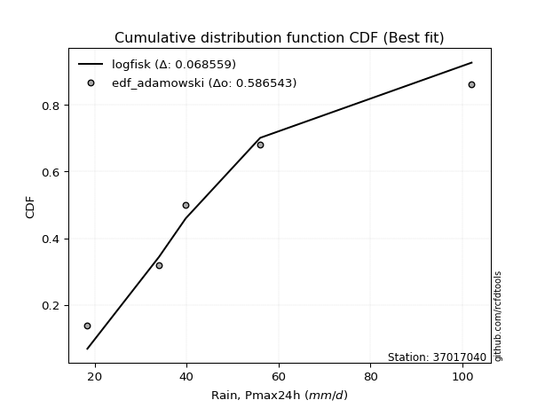</img>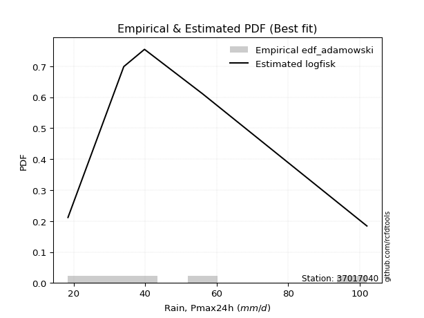</img>

</div>


## C. Best fit & Estimate extreme values for specific return periods - Tr

Best fit in probability distribution analysis means finding the theoretical distribution (like Normal, Poisson, Exponential) that most accurately mirrors your real-world data´s patterns (shape, center, spread) for better predictions, using methods like visual checks (Q-Q plots), goodness-of-fit tests (Kolmogorov-Smirnov, Chi-Squared), and information criteria (AIC) to score and select the simplest, most representative model.


### 1. Best fit (ordered by delta Δ)

<div align="center">

|   id |   station | empirical_dist   | p_dist                |     delta |   deltao | eval   |   fit |   n |   best_fit |   best_fit_sort |
|-----:|----------:|:-----------------|:----------------------|----------:|---------:|:-------|------:|----:|-----------:|----------------:|
|    0 |  37017040 | edf_hazen        | loglaplace_asymmetric | 0.0411997 | 0.586543 | Δo > Δ |     1 |   5 |          1 |               1 |
|    1 |  37017040 | edf_gringorten   | logfisk               | 0.0415708 | 0.586543 | Δo > Δ |     1 |   5 |          1 |               2 |
|    2 |  37017040 | edf_cunnane      | logfisk               | 0.0475804 | 0.586543 | Δo > Δ |     1 |   5 |          1 |               3 |
|    3 |  37017040 | edf_blom         | logfisk               | 0.0512434 | 0.586543 | Δo > Δ |     1 |   5 |          1 |               4 |
|    4 |  37017040 | edf_tukey        | logfisk               | 0.0571958 | 0.586543 | Δo > Δ |     1 |   5 |          1 |               5 |
|    5 |  37017040 | edf_filliben     | logfisk               | 0.0594092 | 0.586543 | Δo > Δ |     1 |   5 |          1 |               6 |
|    6 |  37017040 | edf_beard        | logfisk               | 0.0604486 | 0.586543 | Δo > Δ |     1 |   5 |          1 |               7 |
|    7 |  37017040 | edf_jenkinson    | logfisk               | 0.0604486 | 0.586543 | Δo > Δ |     1 |   5 |          1 |               8 |
|    8 |  37017040 | edf_chegodayev   | logfisk               | 0.0618254 | 0.586543 | Δo > Δ |     1 |   5 |          1 |               9 |
|    9 |  37017040 | edf_adamowski    | logfisk               | 0.0685594 | 0.586543 | Δo > Δ |     1 |   5 |          1 |              10 |
|   10 |  37017040 | edf_weibull      | logfisk               | 0.0988625 | 0.586543 | Δo > Δ |     1 |   5 |          1 |              11 |
|   11 |  37017040 | edf_california   | logbetaprime          | 0.137295  | 0.586543 | Δo > Δ |     1 |   5 |          1 |              12 |

</div>

:file_folder:Tables: [bestfit_37017040.csv](table/bestfit_37017040.csv) | [extreme_37017040.csv](table/extreme_37017040.csv)


### 2. Extreme values

In hydrology, a return period (or recurrence interval $Tr$) is the statistical average time between extreme events like floods or droughts of a specific magnitude, indicating how rare an event is, with a 100-year flood, for example, having a 1% chance of occurring in any given year, not that it happens exactly every century. It is a key tool for infrastructure design (like bridges or dams) and risk assessment, calculated from historical data to determine the probability of future events, although it is important to remember it is statistical average, and events can cluster or be missed.

> risk_rate: assuming the return period as the project useful life.

|   id |      tr |   prob_l |     prob_g |    alpha |   betaprime |     chi2 |   crystalball |   erlang |    expon |   exponnorm |        f |   fatiguelife |     fisk |    gamma |   genexpon |   genlogistic |   gibrat |   gompertz |   gumbel_l |   gumbel_r |   halflogistic |   halfnorm |   hypsecant |   invgamma |   invgauss |     invweibull |   johnsonsu |   kstwobign |   laplace |   laplace_asymmetric |   loggamma |   logistic |   lognorm |   maxwell |   mielke |    moyal |   nakagami |      ncf |      nct |     norm |   pearson3 |   rayleigh |     rice |        t |   truncnorm |     wald |   weibull_min |   logalpha |   logbetaprime |          logchi2 |   logcrystalball |   logerlang |   logexpon |   logexponnorm |     logf |   logfatiguelife |   logfisk |   loggenexpon |   loggenlogistic |   loggibrat |   loggompertz |   loggumbel_l |   loggumbel_r |   loghalflogistic |   loghalfnorm |   loghypsecant |   loginvgamma |   loginvgauss |   loginvweibull |   logjohnsonsu |   logkstwobign |   loglaplace |   loglaplace_asymmetric |   logloggamma |   loglogistic |    loglognorm |   logmaxwell |   logmielke |   logmoyal |   lognakagami |   logncf |   lognct |   logpearson3 |   lograyleigh |   logrice |     logt |   logtruncnorm |   logwald |   logweibull_min |   station |   n |   risk_rate |
|-----:|--------:|---------:|-----------:|---------:|------------:|---------:|--------------:|---------:|---------:|------------:|---------:|--------------:|---------:|---------:|-----------:|--------------:|---------:|-----------:|-----------:|-----------:|---------------:|-----------:|------------:|-----------:|-----------:|---------------:|------------:|------------:|----------:|---------------------:|-----------:|-----------:|----------:|----------:|---------:|---------:|-----------:|---------:|---------:|---------:|-----------:|-----------:|---------:|---------:|------------:|---------:|--------------:|-----------:|---------------:|-----------------:|-----------------:|------------:|-----------:|---------------:|---------:|-----------------:|----------:|--------------:|-----------------:|------------:|--------------:|--------------:|--------------:|------------------:|--------------:|---------------:|--------------:|--------------:|----------------:|---------------:|---------------:|-------------:|------------------------:|--------------:|--------------:|--------------:|-------------:|------------:|-----------:|--------------:|---------:|---------:|--------------:|--------------:|----------:|---------:|---------------:|----------:|-----------------:|----------:|----:|------------:|
|    0 |    2    | 0.5      | 0.5        |  42.0783 |     41.2576 |  29.9218 |       50.04   |  30.2213 |  40.3312 |     40.3056 |  32.3789 |       18.4001 |  40.8159 |  30.6375 |    41.8728 |       44.7576 |  41.446  |    42.4222 |    54.7436 |    45.3364 |        42.998  |    44.1793 |     50.04   |    41.3582 |    40.3277 |  327.729       |     40.4311 |     46.041  |   50.04   |              43.5238 |    42.3413 |    50.04   |   42.7163 |   47.5913 |  41.2546 |  43.818  |    35.4924 |  43.911  |  40.666  |  50.04   |    45.8785 |    46.7228 |  48.9492 |  50.0399 |     50.04   |  40.7591 |       31.346  |    41.2791 |        41.9557 |     30.2098      |          42.7164 |     42.3027 |    32.9879 |        42.711  |  42.0969 |          41.9815 |   41.9949 |       37.8096 |          41.2877 |     36.0504 |       39.1502 |       46.8727 |       38.9284 |           37.1725 |       38.0495 |        42.7163 |       41.7372 |       40.6396 |         38.9972 |        42.7162 |        38.2087 |      42.7163 |                 41.317  |       42.9099 |       42.7163 |  18.4153      |      40.7005 |     42.0528 |    37.7788 |       39.4695 |  42.1148 |  42.5738 |       42.4074 |       40.0086 |   41.2538 |  42.7167 |        44.534  |   35.5642 |          40.6353 |  37017040 |   5 |    0.75     |
|    1 |    2.33 | 0.570815 | 0.429185   |  46.3213 |     45.6711 |  33.2771 |       55.1492 |  33.3736 |  45.1633 |     45.1384 |  36.5417 |       19.1413 |  45.3002 |  33.9204 |    46.7621 |       49.1084 |  44.0341 |    47.3453 |    59.1886 |    50.0706 |        47.8656 |    49.6934 |     54.1289 |    45.7413 |    44.9236 | 7939.71        |     44.9929 |     50.6758 |   53.1318 |              47.6308 |    46.8406 |    54.5415 |   47.2496 |   52.8994 |  45.5267 |  48.2995 |    37.0784 |  48.5117 |  44.8656 |  55.1492 |    50.9263 |    52.1094 |  53.7225 |  55.149  |     55.1492 |  44.1092 |       39.5526 |    45.715  |        46.4339 |     36.1116      |          47.2496 |     46.8016 |    37.5159 |        47.2437 |  46.5805 |          46.4591 |   46.1815 |       42.4117 |          45.5573 |     37.9402 |       43.951  |       51.1718 |       42.7421 |           40.9217 |       42.4251 |        46.3074 |       46.1962 |       45.0476 |         43.4995 |        47.248  |        42.7088 |      45.4048 |                 44.4082 |       47.4907 |       46.6862 |  18.5919      |      45.1969 |     46.2259 |    41.2735 |       42.4158 |  46.6005 |  47.0941 |       46.9174 |       44.4976 |   45.8207 |  47.2499 |        47.1383 |   37.9961 |          45.1788 |  37017040 |   5 |    0.729209 |
|    2 |    5    | 0.8      | 0.2        |  67.2358 |     68.1407 |  51.5268 |       74.1362 |  50.0318 |  69.3226 |     69.301  |  60.2349 |       34.8868 |  70.2895 |  51.3009 |    69.9488 |       68.0081 |  58.9345 |    70.2774 |    73.5487 |    70.6382 |        69.8902 |    73.012  |     70.5302 |    67.8753 |    68.4441 |    1.04093e+10 |     68.6929 |     70.3634 |   68.5903 |              68.1651 |    68.5169 |    71.9226 |   68.7363 |   73.7916 |  67.9493 |  69.0584 |    53.9407 |  69.2566 |  66.9802 |  74.1362 |    72.1117 |    73.6744 |  72.8321 |  74.1361 |     74.1362 |  62.8633 |      121.727  |    68.1892 |        68.3794 |    103.249       |          68.7364 |     68.482  |    71.3693 |        68.7326 |  68.4167 |          68.3768 |   67.3355 |       68.4622 |          67.9343 |     50.9156 |       68.8587 |       67.9436 |       64.1498 |           63.2091 |       67.2265 |        64.0132 |       68.3079 |       67.7741 |         69.9246 |        68.7263 |        68.5357 |      61.608  |                 63.6985 |       69.0888 |       65.7971 |   2.04437e+54 |      68.2702 |     67.3992 |    62.18   |       64.487  |  68.4342 |  68.663  |       68.5825 |       68.1124 |   68.6449 |  68.7364 |        61.8692 |   55.0229 |          68.4115 |  37017040 |   5 |    0.67232  |
|    3 |   10    | 0.9      | 0.1        |  88.252  |     90.829  |  69.2779 |       86.7318 |  65.8665 |  91.2538 |     91.2352 |  85.1652 |       56.6272 | 100.122  |  67.8475 |    89.4684 |       83.4004 |  75.9193 |    89.021  |    81.5437 |    87.3902 |        88.1807 |    90.2671 |     83.6272 |    90.025  |    91.1094 |    1.00219e+15 |     92.616  |     85.353  |   82.623  |              86.8055 |    88.5692 |    84.7231 |   88.1405 |   88.4944 |  92.4975 |  87.1323 |    74.9772 |  86.8278 |  90.9857 |  86.7318 |    88.3632 |    89.0506 |  86.4576 |  86.7316 |     86.7317 |  82.7659 |      268.281  |    90.6426 |        89.1916 |    305.618       |          88.1406 |     88.5448 |   127.952  |        88.146  |  88.9491 |          89.1322 |   89.8421 |       97.4143 |          92.4009 |     71.1988 |       92.5158 |       79.56   |       89.2937 |           90.6968 |       94.5093 |        82.9007 |       89.6702 |       90.9796 |        102.928  |        88.1212 |        98.2432 |      81.2735 |                 88.3783 |       88.4344 |       84.7137 | inf           |      91.2616 |     90.3666 |    88.8401 |       93.7038 |  88.9466 |  88.3451 |       88.5382 |       92.2691 |   90.4793 |  88.1403 |        77.988  |   81.5071 |          91.288  |  37017040 |   5 |    0.651322 |
|    4 |   15    | 0.933333 | 0.0666667  | 102.323  |    105.617  |  79.9595 |       93.0172 |  75.3077 | 104.083  |    104.066  | 101.143  |       70.8459 | 122.404  |  77.7191 |   100.326  |       92.0843 |  87.6346 |    99.2163 |    85.1645 |    96.8416 |        98.5315 |    99.2467 |     91.1016 |   104.388  |   104.97   |    6.49556e+17 |    107.96   |     93.3106 |   90.8317 |              97.7095 |   100.807  |    91.6974 |   99.7848 |   96.0383 | 109.71   |  97.6215 |    87.3398 |  96.9715 | 107.625  |  93.0172 |    97.1533 |    96.9731 |  93.4781 |  93.0171 |     93.0172 |  95.5464 |      391.153  |   105.137  |       102.115  |    596.292       |          99.7849 |    100.791  |   180.035  |        99.799  | 101.627  |         102.009  |  105.539  |      117.086  |         109.547  |     89.7255 |      106.728  |       85.4551 |      107.61   |          111.259  |      112.839  |        96.0817 |      103.119  |      106.156  |        128.015  |        99.7593 |       118.939  |      95.5711 |                107.038  |       99.9751 |       97.2185 | inf           |     105.917  |    106.754  |   109.28   |      114.772  | 101.604  | 100.246  |      100.68   |      107.89   |  104.012  |  99.7844 |        88.7819 |  104.901  |         105.711  |  37017040 |   5 |    0.644736 |
|    5 |   20    | 0.95     | 0.05       | 113.404  |    116.921  |  87.6344 |       97.1334 |  82.0638 | 113.185  |    113.169  | 113.104  |       81.373  | 141.028  |  84.7852 |   107.808  |       98.1644 |  96.8244 |   106.145  |    87.4182 |   103.459  |       105.784  |   105.233  |     96.3744 |   115.335  |   115.058  |    6.04328e+19 |    119.514  |     98.6712 |   96.6558 |             105.446  |   109.775  |    96.5178 |  108.232  |  101.045  | 123.527  | 105.05   |    95.8481 | 104.174  | 120.874  |  97.1334 |   103.16   |   102.239  |  98.1444 |  97.1332 |     97.1334 | 105.07   |      496.516  |   116.14   |       111.687  |    968.575       |         108.232  |    109.768  |   229.395  |       108.254  | 110.985  |         111.541  |  118.159  |      132.397  |         123.308  |    107.574  |      116.959  |       89.343  |      122.628  |          128.383  |      126.995  |       106.622  |      113.167  |      117.762  |        149.138  |       108.201  |       135.285  |     107.216  |                122.62   |      108.316  |      106.925  | inf           |     116.921  |    120.163  |   126.541  |      131.586  | 110.944  | 108.92   |      109.562  |      119.71   |  114.004  | 108.231  |        97.1069 |  126.603  |         116.461  |  37017040 |   5 |    0.641514 |
|    6 |   25    | 0.96     | 0.04       | 122.763  |    126.2    |  93.6332 |      100.163  |  87.3316 | 120.245  |    120.231  | 122.743  |       89.7373 | 157.374  |  90.2956 |   113.494  |      102.848  | 104.486  |   111.357  |    89.022  |   108.556  |       111.371  |   109.688  |    100.455  |   124.303  |   123.018  |    1.98451e+21 |    128.877  |    102.686  |  101.173  |             111.447  |   116.912  |   100.205  |  114.904  |  104.762  | 135.298  | 110.808  |   102.262  | 109.78   | 132.09   | 100.163  |   107.71   |   106.151  | 101.611  | 100.163  |    100.163  | 112.699  |      589.177  |   125.126  |       119.362  |   1418.35        |         114.904  |    116.911  |   276.825  |       114.933  | 118.471  |         119.181  |  128.942  |      145.095  |         135.029  |    125.138  |      124.973  |       92.217  |      135.61   |          143.355  |      138.667  |       115.567  |      121.275  |      127.287  |        167.756  |       114.869  |       148.985  |     117.217  |                136.253  |      114.887  |      114.999  | inf           |     125.822  |    131.789  |   141.774  |      145.742  | 118.413  | 115.795  |      116.62   |      129.322  |  121.992  | 114.903  |       103.968  |  147.181  |         125.109  |  37017040 |   5 |    0.639603 |
|    7 |   50    | 0.98     | 0.02       | 157.383  |    158.235  | 112.473  |      108.84   | 103.818  | 142.176  |    142.165  | 154.759  |      116.574  | 221.328  | 107.546  |   130.56   |      117.275  | 131.491  |   126.724  |    93.3755 |   124.259  |       128.586  |   122.635  |    113.107  |   155.158  |   148.445  |    9.30911e+25 |    160.339  |    114.477  |  115.206  |             130.087  |   140.179  |   111.472  |  136.372  |  115.541  | 178.847  | 128.683  |   121.103  | 127.39   | 173.112  | 108.84   |   121.346  |   117.509  | 111.675  | 108.84   |    108.84   | 137.606  |      941.62   |   155.838  |       144.727  |   4747.07        |         136.373  |    140.203  |   496.296  |       136.429  | 143.109  |         144.417  |  169.22   |      189.503  |         178.384  |    213.269  |      150.265  |      100.493  |      184.892  |          201.376  |      179.05   |       148.357  |      148.389  |      160.104  |        241.024  |       136.325  |       197.767  |     154.634  |                189.044  |      135.931  |      143.645  | inf           |     155.661  |    176.578  |   201.768  |      196.339  | 142.984  | 138.056  |      139.576  |      161.825  |  148.222  | 136.371  |       127.699  |  240.667  |         153.806  |  37017040 |   5 |    0.63583  |
|    8 |   75    | 0.986667 | 0.0133333  | 182.856  |    179.523  | 123.611  |      113.496  | 113.533  | 155.005  |    154.996  | 175.001  |      132.736  | 270.413  | 117.712  |   140.162  |      125.66   | 149.731  |   135.191  |    95.577  |   133.386  |       138.594  |   129.683  |    120.501  |   175.582  |   163.766  |    4.8308e+28  |    180.512  |    120.964  |  123.415  |             140.991  |   154.626  |   117.979  |  149.501  |  121.402  | 210.212  | 139.136  |   131.397  | 137.882  | 202.274  | 113.496  |   129.038  |   123.687  | 117.151  | 113.496  |    113.496  | 152.933  |     1195.77   |   175.997  |       160.726  |   9750.57        |         149.501  |    154.668  |   698.313  |       149.578  | 158.576  |         160.323  |  198.684  |      219.265  |         209.604  |    305.709  |      165.316  |      104.957  |      221.395  |          245.361  |      205.778  |       171.672  |      165.729  |      181.826  |        297.534  |       149.444  |       231.118  |     181.837  |                228.957  |      148.729  |      163.336  | inf           |     174.754  |    210.664  |   248.013  |      230.943  | 158.4    | 151.768  |      153.789  |      182.818  |  164.621  | 149.499  |       143.421  |  325.712  |         171.95   |  37017040 |   5 |    0.634587 |
|    9 |  100    | 0.99     | 0.01       | 204.121  |    195.917  | 131.556  |      116.645  | 120.451  | 164.108  |    164.099  | 190.072  |      144.365  | 311.86   | 124.953  |   146.821  |      131.595  | 163.86   |   140.986  |    97.017  |   139.845  |       145.677  |   134.484  |    125.745  |   191.273  |   174.817  |    4.03339e+30 |    195.665  |    125.409  |  129.239  |             148.728  |   165.277  |   122.574  |  159.089  |  125.394  | 235.642  | 146.552  |   138.402  | 145.431  | 225.726  | 116.645  |   134.391  |   127.897  | 120.881  | 116.645  |    116.645  | 164.108  |     1398.74   |   191.395  |       172.638  |  16326.7         |         159.09   |    165.334  |   889.77   |       159.183  | 170.06   |         172.162  |  222.878  |      242.227  |         234.913  |    404.064  |      176.101  |      107.984  |      251.507  |          282.183  |      226.236  |       190.399  |      178.754  |      198.496  |        345.366  |       159.026  |       257.162  |     203.993  |                262.288  |      158.044  |      178.843  | inf           |     189.083  |    239.456  |   287.115  |      257.92   | 169.841  | 161.83   |      164.251  |      198.659  |  176.757  | 159.088  |       155.469  |  406.115  |         185.463  |  37017040 |   5 |    0.633968 |
|   10 |  200    | 0.995    | 0.005      | 270.771  |    240.377  | 150.819  |      123.788  | 137.192  | 186.039  |    186.033  | 228.932  |      172.831  | 440.474  | 142.477  |   162.382  |      145.863  | 202.301  |   154.291  |   100.147  |   155.375  |       162.705  |   145.465  |    138.381  |   233.688  |   202.002  |    1.68079e+35 |    235.205  |    135.646  |  143.272  |             167.368  |   192.397  |   133.595  |  183.181  |  134.527  | 309.968  | 164.42   |   154.367  | 164.031  | 293.478  | 123.788  |   146.987  |   137.528  | 129.416  | 123.788  |    123.788  | 191.942  |     1968.83   |   232.652  |       203.389  |  57301.4         |         183.182  |    192.493  |  1595.2    |       183.323  | 199.587  |         202.707  |  295.211  |      304.391  |         308.875  |    863.041  |      202.419  |      114.866  |      341.739  |          394.933  |      281      |       244.339  |      212.81   |      243.429  |        494.23   |       183.101  |       328.861  |     269.108  |                363.911  |      181.335  |      222.31   | inf           |     226.441  |    329.637  |   408.551  |      331.889  | 199.245  | 187.277  |      190.823  |      240.263  |  207.788  | 183.179  |       187.804  |  703.583  |         220.31   |  37017040 |   5 |    0.633042 |
|   11 |  250    | 0.996    | 0.004      | 298.564  |    256.343  | 157.052  |      125.971  | 142.6    | 193.099  |    193.094  | 242.244  |      182.108  | 492.503  | 148.139  |   167.257  |      150.45   | 216.094  |   158.39   |   101.068  |   160.367  |       168.18   |   148.844  |    142.448  |   248.874  |   210.907  |    5.13719e+36 |    248.888  |    138.815  |  147.789  |             173.369  |   201.587  |   137.133  |  191.247  |  137.338  | 338.501  | 170.172  |   159.257  | 170.156  | 319.228  | 125.971  |   150.963  |   140.493  | 132.043  | 125.971  |    125.971  | 201.151  |     2177.66   |   247.303  |       213.942  |  86143.8         |         191.248  |    201.698  |  1925.02   |       191.408  | 209.683  |         213.184  |  323.622  |      326.611  |         337.264  |   1133.15   |      210.986  |      116.974  |      377.136  |          440.005  |      300.379  |       264.768  |      224.634  |      259.461  |        554.586  |       191.161  |       354.867  |     294.211  |                404.37   |      189.099  |      238.394  | inf           |     239.364  |    366.657  |   457.679  |      358.592  | 209.295  | 195.848  |      199.808  |      254.745  |  218.339  | 191.245  |       199.279  |  843.865  |         232.244  |  37017040 |   5 |    0.632858 |
|   12 |  500    | 0.998    | 0.002      | 415.799  |    311.816  | 176.495  |      132.444  | 159.449  | 215.03   |    215.029  | 286.253  |      211.21   | 697.602  | 165.78   |   182.019  |      164.687  | 263.762  |   170.61   |   103.708  |   175.863  |       185.171  |   158.916  |    155.082  |   301.484  |   238.999  |    2.0918e+41  |    294.54   |    148.309  |  161.822  |             192.01   |   231.65   |   148.106  |  217.317  |  145.728  | 444.826  | 188.039  |   173.77   | 189.647  | 414.19   | 132.444  |   163.106  |   149.339  | 139.882  | 132.444  |    132.444  | 230.431  |     2908.71   |   297.607  |       248.9    | 308424           |         217.318  |    231.813  |  3451.21   |       217.543  | 243.015  |         247.876  |  432.575  |      403.163  |         443.043  |   2903.83   |      237.87   |      123.232  |      512.097  |          615.366  |      366.457  |       339.77   |      264.282  |      314.732  |        793.012  |       217.211  |       445.78   |     388.124  |                561.042  |      214.079  |      296.055  | inf           |     282.478  |    516.411  |   651.25   |      451.388  | 242.457  | 223.721  |      229.133  |      303.354  |  252.949  | 217.314  |       238.555  | 1504.29   |         271.659  |  37017040 |   5 |    0.632489 |
|   13 |  750    | 0.998667 | 0.00133333 | 516.693  |    348.873  | 187.918  |      136.04   | 169.335  | 227.859  |    227.859  | 313.964  |      228.405  | 855.868  | 176.131  |   190.405  |      173.01   | 295.286  |   177.424  |   105.119  |   184.922  |       195.104  |   164.543  |    162.472  |   336.507  |   255.707  |    1.03609e+44 |    323.563  |    153.643  |  170.03   |             202.913  |   250.349  |   154.516  |  233.305  |  150.42   | 521.806  | 198.491  |   181.831  | 201.4    | 482.146  | 136.04   |   170.08   |   154.286  | 144.266  | 136.04   |    136.04   | 247.987  |     3396.13   |   330.741  |       270.968  | 653993           |         233.306  |    250.547  |  4856.02   |       233.575  | 263.972  |         269.765  |  514.398  |      453.635  |         519.616  |   5410.67   |      253.776  |      126.712  |      612.377  |          748.678  |      409.51   |       393.14   |      289.672  |      351.286  |        977.405  |       233.186  |       506.719  |     456.403  |                679.495  |      229.319  |      335.998  | inf           |     309.895  |    636.5    |   800.489  |      513.112  | 263.295  | 240.938  |      247.326  |      334.473  |  274.534  | 233.301  |       264.272  | 2127.46   |         296.427  |  37017040 |   5 |    0.632366 |
|   14 | 1000    | 0.999    | 0.001      | 610.292  |    377.478  | 196.043  |      138.516  | 176.361  | 236.961  |    236.963  | 334.558  |      240.67   | 989.793  | 183.489  |   196.251  |      178.914  | 319.41   |   182.12   |   106.068  |   191.347  |       202.15   |   168.429  |    167.716  |   363.484  |   267.673  |    8.45241e+45 |    345.247  |    157.338  |  175.855  |             210.65   |   264.139  |   159.063  |  244.992  |  153.663  | 584.344  | 205.906  |   187.378  | 209.906  | 536.951  | 138.516  |   174.977  |   157.704  | 147.295  | 138.515  |    138.516  | 260.615  |     3769.66   |   356.087  |       287.395  |      1.11715e+06 |         244.992  |    264.364  |  6187.39   |       245.296  | 279.532  |         286.053  |  582.626  |      492.198  |         581.82   |   8711.28   |      265.138  |      129.11   |      695.202  |          860.407  |      442.162  |       436.018  |      308.744  |      379.306  |       1133.65   |       244.863  |       553.756  |     512.015  |                778.416  |      240.422  |      367.549  | inf           |     330.384  |    741.324  |   926.687  |      560.504  | 278.762  | 253.58   |      260.72   |      357.824  |  290.474  | 244.987  |       283.843  | 2729.87   |         314.798  |  37017040 |   5 |    0.632305 |

<div align="center">

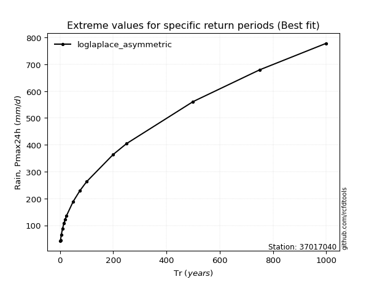</img>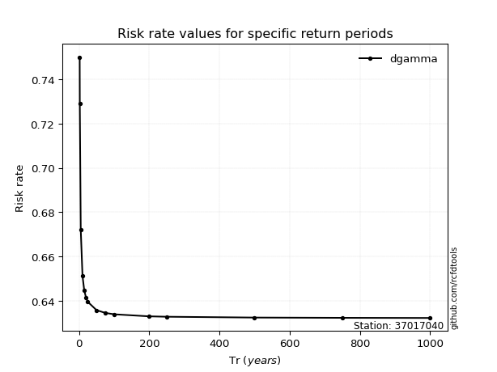</img>

</div>


<sub>**APP DISCLAIMER**: NO WARRANTY - This software is provided by [github.com/rcfdtools](https://github.com/rcfdtools) "as is", without any express or implied warranty, including warranties of merchantability, fitness for a particular purpose, or non-infringement. There is no guarantee that the software will be error-free or operate without interruption. LIMITATION OF LIABILITY - Neither the authors nor copyright holders will be liable for claims or damages arising from the software or its use. You are responsible for determining if the software is appropriate for your use and assume all associated risks, including errors, legal compliance, and data loss. NO PROFESSIONAL ADVICE - The software provides general information and does not offer professional advice. It should not replace consultation with professional advisors.</sub>