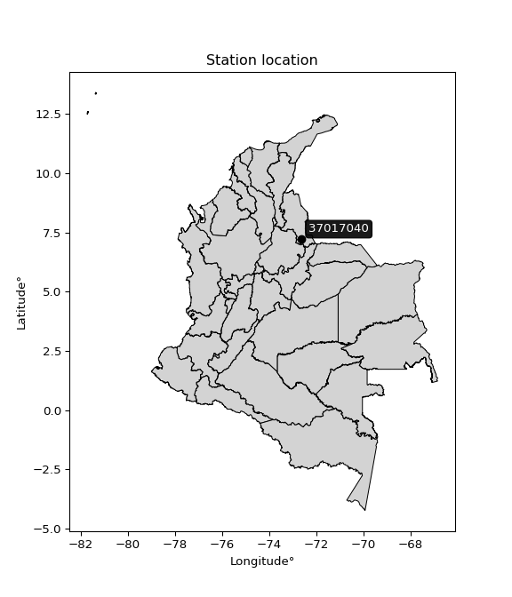

<div align="center">


</div>

# PMax24h Station (Rain): 37017040

Maximum Precipitation in 24 hours (PMax24h) is the greatest amount of rainfall for a specific duration that is meteorologically possible for a given location, acting as a "worst-case" scenario for extreme storms, crucial for designing safety-critical infrastructure like bridges, river deviations, dams, spillways, and nuclear plants to prevent catastrophic failure. The PMax24h is related with the Probable Maximum Precipitation (PMP) and it is calculated by hydrologists using meteorological data to determine the upper limit of extreme rainfall, often leading to the Probable Maximum Flood (PMF) for flood control design, and is increasingly being studied for climate change impacts. Probable Maximum Precipitation (PMP) is the theoretical upper limit of rainfall, a deterministic estimate for extreme events, while probability distributions (like GEV, Gumbel) describe the likelihood and frequency of various precipitation amounts, including rare ones, showing how often events occur, with PMP representing the extreme end of these distributions, used for critical infrastructure design to ensure safety against the worst conceivable weather, unlike standard statistical forecasts which cover typical probabilities.

The most common probability distributions in hydrology, used for analyzing floods, rainfall, and streamflow, include the Normal, Log-Normal, Gumbel, Gamma (including Log-Pearson Type III), and Generalized Extreme Value (GEV) distributions, often chosen based on the data´s skewness and whether modeling extremes or general conditions, with Gumbel and GEV popular for extreme events like floods, while the Normal distribution serves as a baseline, though often requiring transformations for skewed hydrological data. These distributions help in designing water infrastructure, managing water resources, and forecasting hydrologic events.

> Hydrological data often isn´t perfectly normal (it´s skewed), so different distributions are needed for different applications, such as: **Flood Frequency Analysis**: Using Gumbel, GEV, or Log-Pearson Type III for predicting extreme flood magnitudes and their return periods, **Rainfall Analysis**: Normal for annual totals, but Log-Normal, Weibull, or GEV for intensity or extreme daily rainfall, **Streamflow Modeling**: Gamma and Log-Normal for maximum flows, GEV for minimum flows, and Kappa for daily flows.

<div align="center">

</img>

</div>


## A. General information


### 1. General running parameters

• app_version: _v20260225_. • runtime: _2026-02-28 16:54:07.457399_. • Python version: _3.14.0_. • SciPy version: _1.16.3_. • Pandas version: _2.3.3_. • NumPy version: _2.3.5_. • Stations dataset (station_dataset_file): _dataset/pmax24h_in/automatic_colombia_2003_2025.csv_. • Stations catalog (station_catalog_file): _dataset/CNE.xls_. • Minimum year to eval til year_max (date_min): _1900_. • Maximum year to eval since year_min (date_max): _2025_. • Creates, save and include plots into reports (create_plot): _False_. • Plot only fit distributions with Δo > Δ (plot_only_fit): _True_. • Plot only simple graphs avoiding multiple CDFs and multiple Extreme values plots (plot_only_simple): _False_. • Eval low extreme values, if False, evaluates high extreme values (low_extreme): _False_. • Eval every SciPy distribution as logarithmic (pdist_logarithmic_on): _True_. • Standard deviation normalized (ddof): _1.0_. • Return periods to eval in years (Tr): _[2, 2.33, 5, 10, 15, 20, 25, 50, 75, 100, 200, 250, 500, 750, 1000]_. • Minimum data sample per station, 0 means any (minimum_sample): _5_. • Z-Score maximum threshold to adjust a value, 0 means disable (zscore_max): _3.5_. • Z-Score minimum threshold to adjust a value, 0 means disable (zscore_min): _-2.5_. • Avoid zeros, e.g. rain = 0 (avoid_zeros): _True_. • Avoid null values (avoid_nans): _True_. 

:file_folder:Table: [dataset.csv](../../dataset/pmax24h_in/automatic_colombia_2003_2025.csv)

> Delta Degrees of Freedom (DDOF): is a parameter used in the formulas for calculating variance and standard deviation. When ddof=0, the divisor is $N$ (the total number of observations) and this is used when your data set is the entire population. When ddof=1, the divisor is $N-1$ and this is used when your data set is a sample drawn from a larger population. Using $N-1$ provides an unbiased estimate of the population variance (known as Bessel´s correction).


### 2. Station info and location

|   id |   CODIGO | NOMBRE                        | CATEGORIA    | TECNOLOGIA                              | ESTADO   | FECHA_INSTALACION   |   FECHA_SUSPENSION |   ALTITUD |   LATITUD |   LONGITUD | DEPARTAMENTO       | MUNICIPIO   | AREA_OPERATIVA                         | ENTIDAD                                                     | AREA_HIDROGRAFICA   | ZONA_HIDROGRAFICA   | SUBZONA_HIDROGRAFICA   | CORRIENTE   | Catalogo   |   Version |
|-----:|---------:|:------------------------------|:-------------|:----------------------------------------|:---------|:--------------------|-------------------:|----------:|----------:|-----------:|:-------------------|:------------|:---------------------------------------|:------------------------------------------------------------|:--------------------|:--------------------|:-----------------------|:------------|:-----------|----------:|
|    0 | 37017040 | PUENTE LOPEZ - AUT [37017040] | Limnigráfica | Automática con Telemetría, Convencional | Activa   | 15/11/1972          |                nan |      1862 |   7.20333 |   -72.6339 | Norte De Santander | Chitagá     | Area Operativa 08 - Santanderes-Arauca | INSTITUTO DE HIDROLOGIA METEOROLOGIA Y ESTUDIOS AMBIENTALES | Orinoco             | Arauca              | Río Chítaga            | Chitaga     | CNE_IDEAM  |  20251226 |

<div align="center">

Dynamic map: [:earth_americas:Google](http://maps.google.com/maps?q=7.203333333,-72.63388889) [:earth_americas:OSM](https://www.openstreetmap.org/#map=18/7.203333333/-72.63388889&layers=P) [:earth_americas:Bing](https://www.bing.com/maps?cp=7.203333333~-72.63388889&lvl=18) [:earth_americas:Apple](https://maps.apple.com/frame?center=7.203333333%2C-72.63388889&span=0.003%2C0.006)

</div>


<div align="center">

```geojson
{
  "type": "Feature",
  "geometry": {
    "type": "Point", 
    "coordinates": [-72.63388889, 7.203333333]
  }, 
  "properties": {
    "Name": "37017040"
  }
}
```

</div>


### 3. Discrete values table and plot

<div align="center">

|               |         0 |           1 |           2 |           3 |          4 |           5 |
|:--------------|----------:|------------:|------------:|------------:|-----------:|------------:|
| Date          | 2019      | 2020        | 2021        | 2022        | 2023       | 2025        |
| Value         |  102      |   56        |   34        |   39.8      |   18.4     |   37.8      |
| Value_initial |  102      |   56        |   34        |   39.8      |   18.4     |   37.8      |
| count         |    6      |    6        |    6        |    6        |    6       |    6        |
| mean          |   48      |   48        |   48        |   48        |   48       |   48        |
| std           |   29.0635 |   29.0635   |   29.0635   |   29.0635   |   29.0635  |   29.0635   |
| zscore        |    1.858  |    0.275259 |   -0.481704 |   -0.282141 |   -1.01846 |   -0.350955 |


</div>


> The initial value (value_initial) correspond to the initial obtained or null completed value, and value (value) is adjusted only when the initial value is outside the valid range (outlier) definite through the Z-Score value. If Z-Score is active, values out of range or outliers are replaced with the station mean value. A Z-Score (or standard score) measures how many standard deviations a data point is from the mean of a dataset, indicating its relative position; positive scores mean above the mean, negative mean below, and a score of zero is exactly at the mean, allowing for comparison of values from different distributions. It´s calculated using the formula $z=(x–μ)/σ$, where $x$ is the data point, $μ$ is the mean, and $σ$ is the standard deviation, helping identify outliers and understand probability.
>
> <sub>**Note**: In this study, "completing" (filling gaps in) and "extending" (forecasting or lengthening the historical record) rainfall data series are avoided for certain critical analyses because they introduce artificial bias and uncertainty, which can distort the statistics of rare events (extremes), alter day-to-day variability, and compromise the integrity and homogeneity of the original data. Some reasons against Completing/Extending rainfall data are: **Distortion of Extremes and Variability**: The primary issue is that most gap-filling or extension methods rely on averaging or regression with nearby stations, which inherently smooths the data. Rainfall is highly variable in space and time, with a large percentage of zero values and occasional large storms. Infilling methods often underestimate the highest values and overestimate the lowest (zero) values, which severely distorts analyses focused on flood frequency, drought severity, and intensity-duration-frequency (IDF) curves, **Loss of Data Homogeneity**: Infilled or extended data are synthetic estimates, not actual measurements. Combining these estimates with observed data can violate the assumption of data homogeneity, which requires that the data properties do not change over time. Inhomogeneity can lead to incorrect conclusions about long-term trends or changes in climate patterns, **Propagation of Errors**: Errors and biases from the original data (e.g., wind-induced undercatch, instrument errors, site changes) or the data used for imputation can propagate through the analysis, leading to unreliable hydrological models and inaccurate predictions, **Compromised Statistical Integrity**: For statistical analyses, especially those involving the frequency of events, using artificial data can introduce time bias or autocorrelation that doesn´t exist in reality, making it difficult to assess the true probability of events, **Difficulty in Validation**: It is difficult to accurately validate the quality of filled or extended data, especially for past periods where ground-truth measurements are unavailable. The reliability of imputation techniques heavily depends on the density of the surrounding station network and the complexity of the local topography.</sub>


### 4. Active continuous probability distributions from SciPy (80 of 104 available)

A Probability Density Function (PDF) describes the relative likelihood of a continuous random variable falling within a specific range, where the total area under its curve equals 1, and the area over any interval gives the actual probability for that range. Unlike discrete probabilities (like rolling a die), a PDF shows density, not direct probability for a single point (which is zero), with higher points indicating higher likelihood, often visualized as a bell curve for normal distributions.

A log of a probability density function (log-PDF) is simply the logarithm of the PDF´s value, denoted as $log(f(x))$, useful for converting multiplication of probabilities into addition, improving numerical stability with tiny numbers, and connecting to information theory concepts like entropy. Instead of dealing with very small probabilities (e.g., 0.000001), log-PDFs use negative numbers (e.g., $log(0.00001) ≈ -11.51$ that are easier for computers to handle, preventing underflow errors and simplifying complex calculations. In this study, each active probability distribution from SciPy is also evaluated in the $log$ form.

[scipy.stats](https://docs.scipy.org/doc/scipy/reference/stats.html) is a Python´s powerful submodule within the SciPy library for comprehensive statistical analysis, offering over 130 probability distributions (like Normal, Poisson, etc.), functions for descriptive stats (mean, variance), hypothesis testing (t-tests, chi-square), random variable generation, and statistical tests, making it essential for data science, modeling, and research. It provides tools to explore, model, and draw conclusions from data efficiently, working seamlessly with [NumPy](https://numpy.org/).

<div align="center">

|   id | p_dist           |   n_parameter | fit_method   | label                                                                       | active   | ref                                                                                                      |
|-----:|:-----------------|--------------:|:-------------|:----------------------------------------------------------------------------|:---------|:---------------------------------------------------------------------------------------------------------|
|    0 | alpha            |             3 | MLE          | Alpha                                                                       | True     | [:mortar_board:](https://docs.scipy.org/doc/scipy/reference/generated/scipy.stats.alpha.html)            |
|    1 | anglit           |             2 | MM           | Anglit                                                                      | True     | [:mortar_board:](https://docs.scipy.org/doc/scipy/reference/generated/scipy.stats.anglit.html)           |
|    2 | arcsine          |             2 | MM           | Arcsine                                                                     | True     | [:mortar_board:](https://docs.scipy.org/doc/scipy/reference/generated/scipy.stats.arcsine.html)          |
|    3 | argus            |             3 | MLE          | Argus                                                                       | True     | [:mortar_board:](https://docs.scipy.org/doc/scipy/reference/generated/scipy.stats.argus.html)            |
|    4 | beta             |             4 | MLE          | Beta                                                                        | True     | [:mortar_board:](https://docs.scipy.org/doc/scipy/reference/generated/scipy.stats.beta.html)             |
|    5 | betaprime        |             4 | MLE          | Beta prime                                                                  | True     | [:mortar_board:](https://docs.scipy.org/doc/scipy/reference/generated/scipy.stats.betaprime.html)        |
|    6 | bradford         |             3 | MLE          | Bradford                                                                    | True     | [:mortar_board:](https://docs.scipy.org/doc/scipy/reference/generated/scipy.stats.bradford.html)         |
|    7 | burr             |             4 | MLE          | Burr (Type III)                                                             | True     | [:mortar_board:](https://docs.scipy.org/doc/scipy/reference/generated/scipy.stats.burr.html)             |
|    8 | burr12           |             4 | MLE          | Burr (Type III) 12                                                          | True     | [:mortar_board:](https://docs.scipy.org/doc/scipy/reference/generated/scipy.stats.burr12.html)           |
|    9 | cosine           |             2 | MLE          | Cosine                                                                      | True     | [:mortar_board:](https://docs.scipy.org/doc/scipy/reference/generated/scipy.stats.cosine.html)           |
|   10 | crystalball      |             4 | MLE          | Crystalball                                                                 | True     | [:mortar_board:](https://docs.scipy.org/doc/scipy/reference/generated/scipy.stats.crystalball.html)      |
|   11 | dgamma           |             3 | MLE          | Double gamma                                                                | True     | [:mortar_board:](https://docs.scipy.org/doc/scipy/reference/generated/scipy.stats.dgamma.html)           |
|   12 | dweibull         |             3 | MLE          | Double Weibull                                                              | True     | [:mortar_board:](https://docs.scipy.org/doc/scipy/reference/generated/scipy.stats.dweibull.html)         |
|   13 | erlang           |             3 | MLE          | Erlang                                                                      | True     | [:mortar_board:](https://docs.scipy.org/doc/scipy/reference/generated/scipy.stats.erlang.html)           |
|   14 | exponnorm        |             3 | MLE          | Exponentially modified Normal                                               | True     | [:mortar_board:](https://docs.scipy.org/doc/scipy/reference/generated/scipy.stats.exponnorm.html)        |
|   15 | exponpow         |             3 | MLE          | Exponential power                                                           | True     | [:mortar_board:](https://docs.scipy.org/doc/scipy/reference/generated/scipy.stats.exponpow.html)         |
|   16 | exponweib        |             4 | MLE          | Exponentiated Weibull                                                       | True     | [:mortar_board:](https://docs.scipy.org/doc/scipy/reference/generated/scipy.stats.exponweib.html)        |
|   17 | f                |             4 | MLE          | F                                                                           | True     | [:mortar_board:](https://docs.scipy.org/doc/scipy/reference/generated/scipy.stats.f.html)                |
|   18 | fatiguelife      |             3 | MLE          | Fatigue-life (Birnbaum-Saunders)                                            | True     | [:mortar_board:](https://docs.scipy.org/doc/scipy/reference/generated/scipy.stats.fatiguelife.html)      |
|   19 | foldnorm         |             3 | MM           | Fold Normal                                                                 | True     | [:mortar_board:](https://docs.scipy.org/doc/scipy/reference/generated/scipy.stats.foldnorm.html)         |
|   20 | gamma            |             3 | MLE          | Gamma                                                                       | True     | [:mortar_board:](https://docs.scipy.org/doc/scipy/reference/generated/scipy.stats.gamma.html)            |
|   21 | gausshyper       |             6 | MLE          | Gauss hypergeometric                                                        | True     | [:mortar_board:](https://docs.scipy.org/doc/scipy/reference/generated/scipy.stats.gausshyper.html)       |
|   22 | genexpon         |             5 | MLE          | Generalized exponential                                                     | True     | [:mortar_board:](https://docs.scipy.org/doc/scipy/reference/generated/scipy.stats.genexpon.html)         |
|   23 | genextreme       |             3 | MLE          | Generalized exponential                                                     | True     | [:mortar_board:](https://docs.scipy.org/doc/scipy/reference/generated/scipy.stats.genextreme.html)       |
|   24 | gengamma         |             4 | MLE          | Generalized gamma                                                           | True     | [:mortar_board:](https://docs.scipy.org/doc/scipy/reference/generated/scipy.stats.gengamma.html)         |
|   25 | genhalflogistic  |             3 | MLE          | Generalized half-logistic                                                   | True     | [:mortar_board:](https://docs.scipy.org/doc/scipy/reference/generated/scipy.stats.genhalflogistic.html)  |
|   26 | genlogistic      |             3 | MLE          | Generalized logistic                                                        | True     | [:mortar_board:](https://docs.scipy.org/doc/scipy/reference/generated/scipy.stats.genlogistic.html)      |
|   27 | gennorm          |             3 | MLE          | Generalized Normal                                                          | True     | [:mortar_board:](https://docs.scipy.org/doc/scipy/reference/generated/scipy.stats.gennorm.html)          |
|   28 | genpareto        |             3 | MLE          | Generalized Pareto                                                          | True     | [:mortar_board:](https://docs.scipy.org/doc/scipy/reference/generated/scipy.stats.genpareto.html)        |
|   29 | gompertz         |             3 | MLE          | Gompertz (or truncated Gumbel)                                              | True     | [:mortar_board:](https://docs.scipy.org/doc/scipy/reference/generated/scipy.stats.gompertz.html)         |
|   30 | gumbel_l         |             2 | MM           | Gumbel Left Skew                                                            | True     | [:mortar_board:](https://docs.scipy.org/doc/scipy/reference/generated/scipy.stats.gumbel_l.html)         |
|   31 | gumbel_r         |             2 | MM           | Gumbel Right Skew                                                           | True     | [:mortar_board:](https://docs.scipy.org/doc/scipy/reference/generated/scipy.stats.gumbel_r.html)         |
|   32 | halfgennorm      |             3 | MLE          | Upper half of a generalized normal                                          | True     | [:mortar_board:](https://docs.scipy.org/doc/scipy/reference/generated/scipy.stats.halfgennorm.html)      |
|   33 | halflogistic     |             2 | MM           | Half-logistic                                                               | True     | [:mortar_board:](https://docs.scipy.org/doc/scipy/reference/generated/scipy.stats.halflogistic.html)     |
|   34 | halfnorm         |             2 | MM           | Half Normal                                                                 | True     | [:mortar_board:](https://docs.scipy.org/doc/scipy/reference/generated/scipy.stats.halfnorm.html)         |
|   35 | hypsecant        |             2 | MM           | hyperbolic secant                                                           | True     | [:mortar_board:](https://docs.scipy.org/doc/scipy/reference/generated/scipy.stats.hypsecant.html)        |
|   36 | invgamma         |             3 | MLE          | Inverted gamma                                                              | True     | [:mortar_board:](https://docs.scipy.org/doc/scipy/reference/generated/scipy.stats.invgamma.html)         |
|   37 | invgauss         |             3 | MLE          | Inverse Gaussian                                                            | True     | [:mortar_board:](https://docs.scipy.org/doc/scipy/reference/generated/scipy.stats.invgauss.html)         |
|   38 | invweibull       |             3 | MLE          | Inverted Weibull                                                            | True     | [:mortar_board:](https://docs.scipy.org/doc/scipy/reference/generated/scipy.stats.invweibull.html)       |
|   39 | johnsonsb        |             4 | MLE          | Johnson SB                                                                  | True     | [:mortar_board:](https://docs.scipy.org/doc/scipy/reference/generated/scipy.stats.johnsonsb.html)        |
|   40 | johnsonsu        |             4 | MLE          | Johnson Su                                                                  | True     | [:mortar_board:](https://docs.scipy.org/doc/scipy/reference/generated/scipy.stats.johnsonsu.html)        |
|   41 | kappa3           |             3 | MLE          | Kappa 3                                                                     | True     | [:mortar_board:](https://docs.scipy.org/doc/scipy/reference/generated/scipy.stats.kappa3.html)           |
|   42 | kappa4           |             4 | MLE          | Kappa 4                                                                     | True     | [:mortar_board:](https://docs.scipy.org/doc/scipy/reference/generated/scipy.stats.kappa4.html)           |
|   43 | ksone            |             3 | MLE          | Kolmogorov-Smirnov one-sided test statistic distribution                    | True     | [:mortar_board:](https://docs.scipy.org/doc/scipy/reference/generated/scipy.stats.ksone.html)            |
|   44 | kstwobign        |             2 | MLE          | Limiting distribution of scaled Kolmogorov-Smirnov two-sided test statistic | True     | [:mortar_board:](https://docs.scipy.org/doc/scipy/reference/generated/scipy.stats.kstwobign.html)        |
|   45 | laplace          |             2 | MM           | Laplace                                                                     | True     | [:mortar_board:](https://docs.scipy.org/doc/scipy/reference/generated/scipy.stats.laplace.html)          |
|   46 | levy_l           |             2 | MLE          | Left-skewed Levy                                                            | True     | [:mortar_board:](https://docs.scipy.org/doc/scipy/reference/generated/scipy.stats.levy_l.html)           |
|   47 | loggamma         |             3 | MLE          | Log gamma                                                                   | True     | [:mortar_board:](https://docs.scipy.org/doc/scipy/reference/generated/scipy.stats.loggamma.html)         |
|   48 | logistic         |             2 | MM           | Logistic (or Sech-squared)                                                  | True     | [:mortar_board:](https://docs.scipy.org/doc/scipy/reference/generated/scipy.stats.logistic.html)         |
|   49 | loglaplace       |             3 | MLE          | Log-Laplace                                                                 | True     | [:mortar_board:](https://docs.scipy.org/doc/scipy/reference/generated/scipy.stats.loglaplace.html)       |
|   50 | lomax            |             3 | MLE          | Lomax (Pareto of the second kind)                                           | True     | [:mortar_board:](https://docs.scipy.org/doc/scipy/reference/generated/scipy.stats.lomax.html)            |
|   51 | maxwell          |             2 | MM           | Maxwell                                                                     | True     | [:mortar_board:](https://docs.scipy.org/doc/scipy/reference/generated/scipy.stats.maxwell.html)          |
|   52 | mielke           |             4 | MLE          | Mielke Beta-Kappa / Dagum                                                   | True     | [:mortar_board:](https://docs.scipy.org/doc/scipy/reference/generated/scipy.stats.mielke.html)           |
|   53 | moyal            |             2 | MM           | Moyal                                                                       | True     | [:mortar_board:](https://docs.scipy.org/doc/scipy/reference/generated/scipy.stats.moyal.html)            |
|   54 | nakagami         |             3 | MLE          | Nakagami                                                                    | True     | [:mortar_board:](https://docs.scipy.org/doc/scipy/reference/generated/scipy.stats.nakagami.html)         |
|   55 | ncf              |             5 | MLE          | Non-central F distribution                                                  | True     | [:mortar_board:](https://docs.scipy.org/doc/scipy/reference/generated/scipy.stats.ncf.html)              |
|   56 | nct              |             4 | MLE          | Non-central Student’s t                                                     | True     | [:mortar_board:](https://docs.scipy.org/doc/scipy/reference/generated/scipy.stats.nct.html)              |
|   57 | norm             |             2 | MM           | Normal                                                                      | True     | [:mortar_board:](https://docs.scipy.org/doc/scipy/reference/generated/scipy.stats.norm.html)             |
|   58 | pearson3         |             3 | MM           | Pearson type III                                                            | True     | [:mortar_board:](https://docs.scipy.org/doc/scipy/reference/generated/scipy.stats.pearson3.html)         |
|   59 | powerlaw         |             3 | MLE          | Power-function                                                              | True     | [:mortar_board:](https://docs.scipy.org/doc/scipy/reference/generated/scipy.stats.powerlaw.html)         |
|   60 | rayleigh         |             2 | MM           | Rayleigh                                                                    | True     | [:mortar_board:](https://docs.scipy.org/doc/scipy/reference/generated/scipy.stats.rayleigh.html)         |
|   61 | rdist            |             3 | MLE          | R-distributed (symmetric beta)                                              | True     | [:mortar_board:](https://docs.scipy.org/doc/scipy/reference/generated/scipy.stats.rdist.html)            |
|   62 | rice             |             3 | MLE          | Rice                                                                        | True     | [:mortar_board:](https://docs.scipy.org/doc/scipy/reference/generated/scipy.stats.rice.html)             |
|   63 | semicircular     |             2 | MM           | Semicircular                                                                | True     | [:mortar_board:](https://docs.scipy.org/doc/scipy/reference/generated/scipy.stats.semicircular.html)     |
|   64 | skewnorm         |             3 | MLE          | Skew normal                                                                 | True     | [:mortar_board:](https://docs.scipy.org/doc/scipy/reference/generated/scipy.stats.skewnorm.html)         |
|   65 | t                |             3 | MLE          | Student’s t                                                                 | True     | [:mortar_board:](https://docs.scipy.org/doc/scipy/reference/generated/scipy.stats.t.html)                |
|   66 | trapezoid        |             4 | MLE          | Trapezoid                                                                   | True     | [:mortar_board:](https://docs.scipy.org/doc/scipy/reference/generated/scipy.stats.trapezoid.html)        |
|   67 | triang           |             3 | MLE          | Triangular                                                                  | True     | [:mortar_board:](https://docs.scipy.org/doc/scipy/reference/generated/scipy.stats.triang.html)           |
|   68 | truncexpon       |             3 | MLE          | Truncated exponential                                                       | True     | [:mortar_board:](https://docs.scipy.org/doc/scipy/reference/generated/scipy.stats.truncexpon.html)       |
|   69 | truncnorm        |             4 | MLE          | Truncated normal                                                            | True     | [:mortar_board:](https://docs.scipy.org/doc/scipy/reference/generated/scipy.stats.truncnorm.html)        |
|   70 | truncpareto      |             4 | MLE          | Upper truncated Pareto                                                      | True     | [:mortar_board:](https://docs.scipy.org/doc/scipy/reference/generated/scipy.stats.truncpareto.html)      |
|   71 | truncweibull_min |             5 | MLE          | Doubly truncated Weibull minimum                                            | True     | [:mortar_board:](https://docs.scipy.org/doc/scipy/reference/generated/scipy.stats.truncweibull_min.html) |
|   72 | tukeylambda      |             3 | MLE          | Tukey-Lamdba                                                                | True     | [:mortar_board:](https://docs.scipy.org/doc/scipy/reference/generated/scipy.stats.tukeylambda.html)      |
|   73 | uniform          |             2 | MLE          | Uniform                                                                     | True     | [:mortar_board:](https://docs.scipy.org/doc/scipy/reference/generated/scipy.stats.uniform.html)          |
|   74 | vonmises         |             3 | MLE          | Von Mises                                                                   | True     | [:mortar_board:](https://docs.scipy.org/doc/scipy/reference/generated/scipy.stats.vonmises.html)         |
|   75 | vonmises_line    |             3 | MLE          | Von Mises line                                                              | True     | [:mortar_board:](https://docs.scipy.org/doc/scipy/reference/generated/scipy.stats.vonmises_line.html)    |
|   76 | wald             |             2 | MM           | Wald                                                                        | True     | [:mortar_board:](https://docs.scipy.org/doc/scipy/reference/generated/scipy.stats.wald.html)             |
|   77 | weibull_max      |             3 | MLE          | Weibull maximum                                                             | True     | [:mortar_board:](https://docs.scipy.org/doc/scipy/reference/generated/scipy.stats.weibull_max.html)      |
|   78 | weibull_min      |             3 | MLE          | Weibull minimum                                                             | True     | [:mortar_board:](https://docs.scipy.org/doc/scipy/reference/generated/scipy.stats.weibull_min.html)      |
|   79 | wrapcauchy       |             3 | MLE          | Wrapped  Cauchy                                                             | True     | [:mortar_board:](https://docs.scipy.org/doc/scipy/reference/generated/scipy.stats.wrapcauchy.html)       |

</div>

> **n_parameter:** # arguments & localization & scale.
>
> **Fit methods:** (MLE) maximum likelihood, (MM) L-moments.
>
>**Inactive** (With the only purpose of prevent loops, zero divisions, infinite values, over high estimated values or horizontal trending for recurrence intervals estimations, the follow distributions were disabled.)**:** lognorm, norminvgauss, powernorm, powerlognorm, cauchy, halfcauchy, foldcauchy, skewcauchy, chi2, expon, fisk, genhyperbolic, geninvgauss, gibrat, kstwo, laplace_asymmetric, levy, levy_stable, ncx2, pareto, rel_breitwigner, recipinvgauss, studentized_range, loguniform, 


## B. Probability (PDF) vs. Empirical (EDF) distributions functions

A continuous probability distribution (CPD) describes probabilities for variables that can take any value within a range (like rain any time), unlike discrete variables with specific outcomes (like temperature). It uses a Probability Density Function (PDF), a curve where the total area under it equals 1, and the probability of the variable falling within an interval (a to b) is found by calculating the area under the curve between those points. A key feature is that the probability of hitting any single exact value is zero, so probabilities are always expressed for ranges, e.g., $P(a ≤ X ≤ b)$.

<div align="center">

Distributions parameters from station values
|     |   station | p_dist              |   n |             loc |          scale | shape                  | shape1                | shape2                | shape3             |
|----:|----------:|:--------------------|----:|----------------:|---------------:|:-----------------------|:----------------------|:----------------------|:-------------------|
|   0 |  37017040 | alpha               |   6 |   -28.7051      |  242.437       | 3.484807257496929      |                       |                       |                    |
|   1 |  37017040 | anglit              |   6 |    48           |   77.6145      |                        |                       |                       |                    |
|   2 |  37017040 | arcsine             |   6 |    10.4792      |   75.0417      |                        |                       |                       |                    |
|   3 |  37017040 | argus               |   6 |   -12.3403      |  119.508       | 1.775398639765992e-07  |                       |                       |                    |
|   4 |  37017040 | beta                |   6 |    15.9547      |   86.0453      | 0.460350525561562      | 0.27560375432919526   |                       |                    |
|   5 |  37017040 | betaprime           |   6 |    -0.145153    |    9.15913     | 21.208000808204936     | 5.005038181818284     |                       |                    |
|   6 |  37017040 | bradford            |   6 |    18.4         |   84.9992      | 6.599104999776294      |                       |                       |                    |
|   7 |  37017040 | burr                |   6 |    -0.171933    |   33.5267      | 2.994243002605516      | 1.575796181445529     |                       |                    |
|   8 |  37017040 | burr12              |   6 |    -1.84289     |   20.0558      | 431.64670195260237     | 0.0029540321682147673 |                       |                    |
|   9 |  37017040 | cosine              |   6 |    52.3455      |   23.1021      |                        |                       |                       |                    |
|  10 |  37017040 | crystalball         |   6 |    48           |   26.5312      | 22348.200701324065     | 683.8406680974914     |                       |                    |
|  11 |  37017040 | dgamma              |   6 |    37.8         |   19.1253      | 0.7846774108877093     |                       |                       |                    |
|  12 |  37017040 | dweibull            |   6 |    37.8         |   27.4554      | 0.7062092405835145     |                       |                       |                    |
|  13 |  37017040 | erlang              |   6 |    18.4         |   27.9648      | 0.7804504260579526     |                       |                       |                    |
|  14 |  37017040 | exponnorm           |   6 |    23.0209      |    8.11908     | 3.076591270719307      |                       |                       |                    |
|  15 |  37017040 | exponpow            |   6 |    18.4         |   58.0331      | 0.7259908590642696     |                       |                       |                    |
|  16 |  37017040 | exponweib           |   6 |    18.4         |    0.119254    | 1.8397330844950384     | 0.16283684157798878   |                       |                    |
|  17 |  37017040 | f                   |   6 |    18.3199      |   24.0938      | 1.119776322828094      | 7.481086838740405     |                       |                    |
|  18 |  37017040 | fatiguelife         |   6 |    18.4         |    2.47357e-05 | 1230.5956430362269     |                       |                       |                    |
|  19 |  37017040 | foldnorm            |   6 |    12.335       |   44.4951      | 0.05963323510580934    |                       |                       |                    |
|  20 |  37017040 | gamma               |   6 |    18.4         |   27.4026      | 0.8385251364847328     |                       |                       |                    |
|  21 |  37017040 | gausshyper          |   6 |    14.9085      |   87.0915      | 1.0790953554158487     | 0.5455679121093271    | 0.9644439526291144    | 1.0164585118368494 |
|  22 |  37017040 | genexpon            |   6 |    18.4         |   47.8219      | 1.43937212134617       | 0.7103250017103511    | 0.5680377868800538    |                    |
|  23 |  37017040 | genextreme          |   6 |    19.9883      |    8.75868     | -5.51437559191263      |                       |                       |                    |
|  24 |  37017040 | gengamma            |   6 |    18.4         |    0.618125    | 1.6277939426163872     | 0.2453015204313348    |                       |                    |
|  25 |  37017040 | genhalflogistic     |   6 |    10.1087      |   96.3537      | 1.0485618717716108     |                       |                       |                    |
|  26 |  37017040 | genlogistic         |   6 |   -96.7823      |   18.1161      | 1570.37991371598       |                       |                       |                    |
|  27 |  37017040 | gennorm             |   6 |    37.8         |    1.66917e-09 | 0.10516282885285184    |                       |                       |                    |
|  28 |  37017040 | genpareto           |   6 |    -0.343752    |  159.984       | -1.5632022086186352    |                       |                       |                    |
|  29 |  37017040 | gompertz            |   6 |    18.4         |  189.818       | 5.529793496543734      |                       |                       |                    |
|  30 |  37017040 | gumbel_l            |   6 |    59.9405      |   20.6863      |                        |                       |                       |                    |
|  31 |  37017040 | gumbel_r            |   6 |    36.0595      |   20.6863      |                        |                       |                       |                    |
|  32 |  37017040 | halfgennorm         |   6 |    18.4         |    0.706759    | 0.33453319799824166    |                       |                       |                    |
|  33 |  37017040 | halflogistic        |   6 |    16.5543      |   22.6833      |                        |                       |                       |                    |
|  34 |  37017040 | halfnorm            |   6 |    12.883       |   44.0126      |                        |                       |                       |                    |
|  35 |  37017040 | hypsecant           |   6 |    48           |   16.8903      |                        |                       |                       |                    |
|  36 |  37017040 | invgamma            |   6 |    -3.60061     |  199.076       | 4.827336008732573      |                       |                       |                    |
|  37 |  37017040 | invgauss            |   6 |     5.97732     |   92.5947      | 0.45383447042673297    |                       |                       |                    |
|  38 |  37017040 | invweibull          |   6 |    18.4         |    1.49124     | 0.06937099283606976    |                       |                       |                    |
|  39 |  37017040 | johnsonsb           |   6 |    18.4         |   83.6001      | 1.333165169818702      | 0.22668127140822353   |                       |                    |
|  40 |  37017040 | johnsonsu           |   6 |     7.95975     |    0.65947     | -6.936874180033564     | 1.511846719211746     |                       |                    |
|  41 |  37017040 | kappa3              |   6 |    18.4         |   28.4228      | 2.6185235776013904     |                       |                       |                    |
|  42 |  37017040 | kappa4              |   6 |     9.69046     |   94.2967      | 1.1018565319995377     | 1.017627672842842     |                       |                    |
|  43 |  37017040 | ksone               |   6 |    10.04        |  100.32        | 1.0                    |                       |                       |                    |
|  44 |  37017040 | kstwobign           |   6 |   -29.7693      |   89.983       |                        |                       |                       |                    |
|  45 |  37017040 | laplace             |   6 |    48           |   18.7604      |                        |                       |                       |                    |
|  46 |  37017040 | levy_l              |   6 |   108.085       |   25.3114      |                        |                       |                       |                    |
|  47 |  37017040 | loggamma            |   6 | -8144.16        | 1104.18        | 1668.360825737982      |                       |                       |                    |
|  48 |  37017040 | logistic            |   6 |    48           |   14.6274      |                        |                       |                       |                    |
|  49 |  37017040 | loglaplace          |   6 |    -0.104787    |   37.9048      | 2.658172525177583      |                       |                       |                    |
|  50 |  37017040 | lomax               |   6 |    18.4         |    2.08804e+06 | 70358.05091597821      |                       |                       |                    |
|  51 |  37017040 | maxwell             |   6 |   -14.8679      |   39.3966      |                        |                       |                       |                    |
|  52 |  37017040 | mielke              |   6 |    -0.188653    |   33.5243      | 4.72459490724988       | 2.9946183692228576    |                       |                    |
|  53 |  37017040 | moyal               |   6 |    32.8277      |   11.9433      |                        |                       |                       |                    |
|  54 |  37017040 | nakagami            |   6 |    34           |   32.4451      | 0.18858132443176218    |                       |                       |                    |
|  55 |  37017040 | ncf                 |   6 |    -0.234124    |    4.77265e-09 | 2.0246755812472885e-09 | 47.025634388634614    | 19.38927922753369     |                    |
|  56 |  37017040 | nct                 |   6 |   -12.1119      |    4.40626     | 4.073583551977874      | 10.998852637160855    |                       |                    |
|  57 |  37017040 | norm                |   6 |    48           |   26.5312      |                        |                       |                       |                    |
|  58 |  37017040 | pearson3            |   6 |    48           |   26.5313      | 1.1395085729138335     |                       |                       |                    |
|  59 |  37017040 | powerlaw            |   6 |    18.4         |   83.6         | 0.13954025986776084    |                       |                       |                    |
|  60 |  37017040 | rayleigh            |   6 |    -2.75581     |   40.4973      |                        |                       |                       |                    |
|  61 |  37017040 | rdist               |   6 |    11.8098      |   44.1902      | 1.0597417015700814     |                       |                       |                    |
|  62 |  37017040 | rice                |   6 |     5.53862     |   35.4039      | 0.000787973632847128   |                       |                       |                    |
|  63 |  37017040 | semicircular        |   6 |    48           |   53.0625      |                        |                       |                       |                    |
|  64 |  37017040 | skewnorm            |   6 |    18.4         |   39.7481      | 24406435.64118412      |                       |                       |                    |
|  65 |  37017040 | t                   |   6 |    47.9563      |   26.4887      | 59.52099778862271      |                       |                       |                    |
|  66 |  37017040 | trapezoid           |   6 |    10.04        |  100.32        | 0.9999999999999999     | 1.0                   |                       |                    |
|  67 |  37017040 | triang              |   6 |     9.6332      |   92.3668      | 0.9999999322787332     |                       |                       |                    |
|  68 |  37017040 | truncexpon          |   6 |    18.4         |   79.3745      | 1.053235882990324      |                       |                       |                    |
|  69 |  37017040 | truncnorm           |   6 |    48           |   26.5312      | -360.22735602593156    | 1644.978767309677     |                       |                    |
|  70 |  37017040 | truncpareto         |   6 |     7.10366     |   11.2963      | 3.7811619015039794e-08 | 8.400625491641922     |                       |                    |
|  71 |  37017040 | truncweibull_min    |   6 |    17.9035      |   88.5162      | 0.5869738136989351     | 0.005603166735866588  | 0.9500681611144932    |                    |
|  72 |  37017040 | tukeylambda         |   6 |    37.2702      |   18.2564      | 0.9601930338076494     |                       |                       |                    |
|  73 |  37017040 | uniform             |   6 |    18.4         |   83.6         |                        |                       |                       |                    |
|  74 |  37017040 | vonmises            |   6 |     0.796989    |    1           | 0.7645403711593909     |                       |                       |                    |
|  75 |  37017040 | vonmises_line       |   6 |    42.3331      |   18.9926      | 1.1207970195180006     |                       |                       |                    |
|  76 |  37017040 | wald                |   6 |    21.4688      |   26.5312      |                        |                       |                       |                    |
|  77 |  37017040 | weibull_max         |   6 |   102           |    1.59362     | 0.21703510166660872    |                       |                       |                    |
|  78 |  37017040 | weibull_min         |   6 |    18.4         |   20.555       | 0.8410509382354763     |                       |                       |                    |
|  79 |  37017040 | wrapcauchy          |   6 |    18.4         |   13.3054      | 0.25715503226392533    |                       |                       |                    |
|  80 |  37017040 | logalpha            |   6 |    -4.98109     |  146.961       | 16.93371018075849      |                       |                       |                    |
|  81 |  37017040 | loganglit           |   6 |     3.7342      |    1.51529     |                        |                       |                       |                    |
|  82 |  37017040 | logarcsine          |   6 |     3.00166     |    1.46509     |                        |                       |                       |                    |
|  83 |  37017040 | logargus            |   6 |     2.50831     |    2.21911     | 0.00010021225754109419 |                       |                       |                    |
|  84 |  37017040 | logbeta             |   6 |     2.91235     |    2.60153     | 0.9364411366440378     | 2.4844966223576677    |                       |                    |
|  85 |  37017040 | logbetaprime        |   6 |     0.169053    |   63.876       | 49.80337420005052      | 893.2958505405836     |                       |                    |
|  86 |  37017040 | logbradford         |   6 |     2.91234     |    1.71264     | 1.0607829816392274     |                       |                       |                    |
|  87 |  37017040 | logburr             |   6 |    -0.0657245   |    3.81489     | 13.418274659775207     | 0.9002701887016268    |                       |                    |
|  88 |  37017040 | logburr12           |   6 |    -0.0183508   |    3.79587     | 12.047714656485127     | 1.1756064173489       |                       |                    |
|  89 |  37017040 | logcosine           |   6 |     3.74876     |    0.442724    |                        |                       |                       |                    |
|  90 |  37017040 | logcrystalball      |   6 |     3.7342      |    0.517976    | 122.56019509268987     | 1556.6393017940231    |                       |                    |
|  91 |  37017040 | logdgamma           |   6 |     3.68387     |    0.341622    | 0.4454989396567743     |                       |                       |                    |
|  92 |  37017040 | logdweibull         |   6 |     3.68387     |    0.313043    | 0.3032588653103975     |                       |                       |                    |
|  93 |  37017040 | logerlang           |   6 |     0.362745    |    0.0800244   | 42.130366432388755     |                       |                       |                    |
|  94 |  37017040 | logexponnorm        |   6 |     3.55916     |    0.487934    | 0.3587103551215215     |                       |                       |                    |
|  95 |  37017040 | logexponpow         |   6 |     2.91235     |    1.57879     | 0.6144517919415016     |                       |                       |                    |
|  96 |  37017040 | logexponweib        |   6 |     2.91235     |    0.93914     | 0.3571260925787806     | 1.648345391430758     |                       |                    |
|  97 |  37017040 | logf                |   6 |    -1.37744     |    5.09402     | 294.0023110230021      | 579.467004313306      |                       |                    |
|  98 |  37017040 | logfatiguelife      |   6 |    -1.60076     |    5.30989     | 0.09718888234913858    |                       |                       |                    |
|  99 |  37017040 | logfoldnorm         |   6 |     2.66962     |    0.538473    | 1.9580608590272433     |                       |                       |                    |
| 100 |  37017040 | loggamma            |   6 |     0.362741    |    0.0800243   | 42.13046160019565      |                       |                       |                    |
| 101 |  37017040 | loggausshyper       |   6 |     2.91235     |    1.73806     | 0.9016291132701708     | 1.0384604765269376    | 1.140338747116806     | 1.1044202192830717 |
| 102 |  37017040 | loggenexpon         |   6 |     2.9093      |    0.0121619   | 0.006724779515094778   | 1.6199865566254041    | 0.0001043333747551189 |                    |
| 103 |  37017040 | loggenextreme       |   6 |     3.54513     |    0.500526    | 0.2519778340644099     |                       |                       |                    |
| 104 |  37017040 | loggengamma         |   6 |     2.91235     |    1.08418     | 0.6546634706708642     | 1.1797605167869207    |                       |                    |
| 105 |  37017040 | loggenhalflogistic  |   6 |     2.68977     |    2.0205      | 1.0440747875333245     |                       |                       |                    |
| 106 |  37017040 | loggenlogistic      |   6 |     3.51305     |    0.334428    | 1.5564816855517671     |                       |                       |                    |
| 107 |  37017040 | loggennorm          |   6 |     3.63231     |    2.88767e-05 | 0.19595880435958385    |                       |                       |                    |
| 108 |  37017040 | loggenpareto        |   6 |    -0.00196383  |    7.62829     | -1.6486703225619612    |                       |                       |                    |
| 109 |  37017040 | loggompertz         |   6 |     2.91235     |    0.841702    | 0.4501238409102857     |                       |                       |                    |
| 110 |  37017040 | loggumbel_l         |   6 |     3.96732     |    0.403864    |                        |                       |                       |                    |
| 111 |  37017040 | loggumbel_r         |   6 |     3.50109     |    0.403864    |                        |                       |                       |                    |
| 112 |  37017040 | loghalfgennorm      |   6 |     2.91182     |    1.71535     | 4481.497026836038      |                       |                       |                    |
| 113 |  37017040 | loghalflogistic     |   6 |     3.12028     |    0.442847    |                        |                       |                       |                    |
| 114 |  37017040 | loghalfnorm         |   6 |     3.04861     |    0.859259    |                        |                       |                       |                    |
| 115 |  37017040 | loghypsecant        |   6 |     3.7342      |    0.329754    |                        |                       |                       |                    |
| 116 |  37017040 | loginvgamma         |   6 |    -3.84517     | 1625.05        | 215.40442620757005     |                       |                       |                    |
| 117 |  37017040 | loginvgauss         |   6 |     0.0418679   |  182.829       | 0.020178709368598592   |                       |                       |                    |
| 118 |  37017040 | loginvweibull       |   6 |    -3.85275e+06 |    3.85276e+06 | 8126218.90107763       |                       |                       |                    |
| 119 |  37017040 | logjohnsonsb        |   6 |     2.91235     |    1.71381     | -0.11300093721010417   | 0.14099435111865807   |                       |                    |
| 120 |  37017040 | logjohnsonsu        |   6 |    -1.01054     |    2.24259     | -15.119014266610812    | 10.14861145026633     |                       |                    |
| 121 |  37017040 | logkappa3           |   6 |     2.91235     |    1.18923     | 7.051921785249192      |                       |                       |                    |
| 122 |  37017040 | logkappa4           |   6 |     2.85508     |    1.77683     | 1.0333087344585599     | 1.0013831578751584    |                       |                    |
| 123 |  37017040 | logksone            |   6 |     2.83704     |    1.79432     | 1.0                    |                       |                       |                    |
| 124 |  37017040 | logkstwobign        |   6 |     1.79443     |    2.22366     |                        |                       |                       |                    |
| 125 |  37017040 | loglaplace          |   6 |     3.7342      |    0.366264    |                        |                       |                       |                    |
| 126 |  37017040 | loglevy_l           |   6 |     4.71915     |    0.391196    |                        |                       |                       |                    |
| 127 |  37017040 | logloggamma         |   6 |  -135.241       |   19.2422      | 1370.2008900713854     |                       |                       |                    |
| 128 |  37017040 | loglogistic         |   6 |     3.7342      |    0.285575    |                        |                       |                       |                    |
| 129 |  37017040 | logloglaplace       |   6 |    -0.140605    |    3.77292     | 10.230466321916625     |                       |                       |                    |
| 130 |  37017040 | loglomax            |   6 |     2.91235     |    4.76483     | 6.066369501305399      |                       |                       |                    |
| 131 |  37017040 | logmaxwell          |   6 |     2.50682     |    0.76915     |                        |                       |                       |                    |
| 132 |  37017040 | logmielke           |   6 |    -0.0666362   |    3.8159      | 12.081345814936789     | 13.422553247067412    |                       |                    |
| 133 |  37017040 | logmoyal            |   6 |     3.43799     |    0.233171    |                        |                       |                       |                    |
| 134 |  37017040 | lognakagami         |   6 |     3.52636     |    0.395684    | 0.24042630343686072    |                       |                       |                    |
| 135 |  37017040 | logncf              |   6 |    -1.79917     |    4.79722     | 452.0919447513588      | 455.96634124281036    | 66.95658099728303     |                    |
| 136 |  37017040 | lognct              |   6 |    -1.31275     |    0.387094    | 110.85846532578012     | 12.949522119705971    |                       |                    |
| 137 |  37017040 | lognorm             |   6 |     3.7342      |    0.517976    |                        |                       |                       |                    |
| 138 |  37017040 | logpearson3         |   6 |     3.7342      |    0.517976    | 0.19933594705851698    |                       |                       |                    |
| 139 |  37017040 | logpowerlaw         |   6 |     2.91235     |    1.71262     | 0.1538095632241599     |                       |                       |                    |
| 140 |  37017040 | lograyleigh         |   6 |     2.74328     |    0.790638    |                        |                       |                       |                    |
| 141 |  37017040 | logrdist            |   6 |     3.78405     |    0.871696    | 1.0512769518336302     |                       |                       |                    |
| 142 |  37017040 | logrice             |   6 |     2.64454     |    0.603       | 1.415399285532648      |                       |                       |                    |
| 143 |  37017040 | logsemicircular     |   6 |     3.7342      |    1.03595     |                        |                       |                       |                    |
| 144 |  37017040 | logskewnorm         |   6 |     3.27367     |    0.693098    | 1.4941589261657007     |                       |                       |                    |
| 145 |  37017040 | logt                |   6 |     3.7342      |    0.517975    | 2630149011.249436      |                       |                       |                    |
| 146 |  37017040 | logtrapezoid        |   6 |     2.74109     |    2.05515     | 1.0                    | 1.0                   |                       |                    |
| 147 |  37017040 | logtriang           |   6 |     2.37646     |    2.24852     | 0.9999999525931975     |                       |                       |                    |
| 148 |  37017040 | logtruncexpon       |   6 |     2.91235     |    1.77462     | 0.9651029952969103     |                       |                       |                    |
| 149 |  37017040 | logtruncnorm        |   6 |    -0.215922    |    1.22327     | 3.059251423435767      | 3.9573788726361725    |                       |                    |
| 150 |  37017040 | logtruncpareto      |   6 |    -2.68851     |    5.60086     | 4.383617898971826e-07  | 1.3057784195201114    |                       |                    |
| 151 |  37017040 | logtruncweibull_min |   6 |     2.90828     |    1.77964     | 1.020871550089783      | 8.36079936325093e-11  | 0.964629227984288     |                    |
| 152 |  37017040 | logtukeylambda      |   6 |     3.76884     |    0.877099    | 1.0240657240172588     |                       |                       |                    |
| 153 |  37017040 | loguniform          |   6 |     2.91235     |    1.71262     |                        |                       |                       |                    |
| 154 |  37017040 | logvonmises         |   6 |    -2.55398     |    1           | 4.273751870940451      |                       |                       |                    |
| 155 |  37017040 | logvonmises_line    |   6 |     3.77206     |    0.273655    | 0.388224882519671      |                       |                       |                    |
| 156 |  37017040 | logwald             |   6 |     3.21618     |    0.518018    |                        |                       |                       |                    |
| 157 |  37017040 | logweibull_max      |   6 |     5.5316      |    1.98643     | 3.9686448845635756     |                       |                       |                    |
| 158 |  37017040 | logweibull_min      |   6 |     2.58012     |    1.3014      | 2.379346782912299      |                       |                       |                    |
| 159 |  37017040 | logwrapcauchy       |   6 |     2.91235     |    0.272572    | 0.5                    |                       |                       |                    |

</div>

> **loc** (Location parameter): This shifts the distribution along the x-axis. For many common distributions, like the normal (Gaussian) distribution, loc represents the mean $μ$. For others, like the uniform distribution, it might represent the minimum value, or for the beta distribution, the left end of the support interval.
>
> **scale** (Scale parameter): This determines the width or spread of the distribution. For the normal distribution, scale represents the standard deviation $σ$. For a uniform distribution, it defines the length of the interval (from $loc$ to $loc + scale$).
>
> **shape** (Shape parameters): Refers to parameters that define the specific form of a probability distribution, distinct from its location (loc) and scale (scale). These parameters are required arguments for most distribution functions. For example, a normal (Gaussian) distribution is fully defined by its location (mean) and scale (standard deviation), so it has no specific shape parameters beyond loc and scale. However, other distributions have intrinsic properties that need specification, as Gamma distribution that takes a shape parameter, often named $a$ or $alpha$.


### 0. Cumulative distribution values - CDF (160 evaluated)

Cumulative Distribution Function (CDF), denoted as $F$<sub>$X$</sub>$(x)$, is a function that gives the probability that a random variable $X$ will take a value less than or equal to a specific value, $x$ (i.e., $(P(X≥x)$. It essentially "accumulates" probabilities from a given point up to the far right (positive infinity), providing a complete picture of the distribution´s probabilities for both discrete (like rain) and continuous (like temperature) variables, helping to find probabilities over ranges or above certain values. Each station is evaluated separately ordering the $x$ values ascending, calculating the CDF and PDF values for the activated distributions and their logarithmic forms.

<div align="center">

CDF ordered by x ascending and calculating $log(f(x))$ separately
|   id |   Station |   date |     x |   count |   mean |     std |    zscore |   Value_initial |   station |   m |     alpha |   alpha_pdf |   anglit |   anglit_pdf |   arcsine |   arcsine_pdf |     argus |   argus_pdf |     beta |    beta_pdf |   betaprime |   betaprime_pdf |    bradford |   bradford_pdf |      burr |   burr_pdf |    burr12 |   burr12_pdf |   cosine |   cosine_pdf |   crystalball |   crystalball_pdf |   dgamma |   dgamma_pdf |   dweibull |   dweibull_pdf |      erlang |   erlang_pdf |   exponnorm |   exponnorm_pdf |   exponpow |   exponpow_pdf |   exponweib |   exponweib_pdf |         f |      f_pdf |   fatiguelife |   fatiguelife_pdf |   foldnorm |   foldnorm_pdf |       gamma |   gamma_pdf |   gausshyper |   gausshyper_pdf |    genexpon |   genexpon_pdf |   genextreme |   genextreme_pdf |    gengamma |   gengamma_pdf |   genhalflogistic |   genhalflogistic_pdf |   genlogistic |   genlogistic_pdf |   gennorm |   gennorm_pdf |   genpareto |   genpareto_pdf |    gompertz |   gompertz_pdf |   gumbel_l |   gumbel_l_pdf |   gumbel_r |   gumbel_r_pdf |   halfgennorm |   halfgennorm_pdf |   halflogistic |   halflogistic_pdf |   halfnorm |   halfnorm_pdf |   hypsecant |   hypsecant_pdf |   invgamma |   invgamma_pdf |   invgauss |   invgauss_pdf |   invweibull |   invweibull_pdf |   johnsonsb |   johnsonsb_pdf |   johnsonsu |   johnsonsu_pdf |      kappa3 |   kappa3_pdf |      kappa4 |   kappa4_pdf |     ksone |   ksone_pdf |   kstwobign |   kstwobign_pdf |   laplace |   laplace_pdf |   levy_l |   levy_l_pdf |   loggamma |   loggamma_pdf |   logistic |   logistic_pdf |   loglaplace |   loglaplace_pdf |       lomax |   lomax_pdf |   maxwell |   maxwell_pdf |    mielke |   mielke_pdf |     moyal |   moyal_pdf |    nakagami |   nakagami_pdf |      ncf |    ncf_pdf |       nct |    nct_pdf |     norm |   norm_pdf |   pearson3 |   pearson3_pdf |   powerlaw |   powerlaw_pdf |   rayleigh |   rayleigh_pdf |    rdist |      rdist_pdf |      rice |   rice_pdf |   semicircular |   semicircular_pdf |   skewnorm |   skewnorm_pdf |        t |      t_pdf |   trapezoid |   trapezoid_pdf |     triang |   triang_pdf |   truncexpon |   truncexpon_pdf |   truncnorm |   truncnorm_pdf |   truncpareto |   truncpareto_pdf |   truncweibull_min |   truncweibull_min_pdf |   tukeylambda |   tukeylambda_pdf |   uniform |   uniform_pdf |   vonmises |   vonmises_pdf |   vonmises_line |   vonmises_line_pdf |     wald |   wald_pdf |   weibull_max |   weibull_max_pdf |   weibull_min |   weibull_min_pdf |   wrapcauchy |   wrapcauchy_pdf |   logalpha |   logalpha_pdf |   loganglit |   loganglit_pdf |   logarcsine |   logarcsine_pdf |   logargus |   logargus_pdf |     logbeta |   logbeta_pdf |   logbetaprime |   logbetaprime_pdf |   logbradford |   logbradford_pdf |   logburr |   logburr_pdf |   logburr12 |   logburr12_pdf |   logcosine |   logcosine_pdf |   logcrystalball |   logcrystalball_pdf |   logdgamma |   logdgamma_pdf |   logdweibull |   logdweibull_pdf |   logerlang |   logerlang_pdf |   logexponnorm |   logexponnorm_pdf |   logexponpow |   logexponpow_pdf |   logexponweib |   logexponweib_pdf |      logf |   logf_pdf |   logfatiguelife |   logfatiguelife_pdf |   logfoldnorm |   logfoldnorm_pdf |   loggausshyper |   loggausshyper_pdf |   loggenexpon |   loggenexpon_pdf |   loggenextreme |   loggenextreme_pdf |   loggengamma |   loggengamma_pdf |   loggenhalflogistic |   loggenhalflogistic_pdf |   loggenlogistic |   loggenlogistic_pdf |   loggennorm |   loggennorm_pdf |   loggenpareto |   loggenpareto_pdf |   loggompertz |   loggompertz_pdf |   loggumbel_l |   loggumbel_l_pdf |   loggumbel_r |   loggumbel_r_pdf |   loghalfgennorm |   loghalfgennorm_pdf |   loghalflogistic |   loghalflogistic_pdf |   loghalfnorm |   loghalfnorm_pdf |   loghypsecant |   loghypsecant_pdf |   loginvgamma |   loginvgamma_pdf |   loginvgauss |   loginvgauss_pdf |   loginvweibull |   loginvweibull_pdf |   logjohnsonsb |   logjohnsonsb_pdf |   logjohnsonsu |   logjohnsonsu_pdf |   logkappa3 |   logkappa3_pdf |   logkappa4 |   logkappa4_pdf |   logksone |   logksone_pdf |   logkstwobign |   logkstwobign_pdf |   loglevy_l |   loglevy_l_pdf |   logloggamma |   logloggamma_pdf |   loglogistic |   loglogistic_pdf |   logloglaplace |   logloglaplace_pdf |    loglomax |   loglomax_pdf |   logmaxwell |   logmaxwell_pdf |   logmielke |   logmielke_pdf |   logmoyal |   logmoyal_pdf |   lognakagami |   lognakagami_pdf |    logncf |   logncf_pdf |    lognct |   lognct_pdf |   lognorm |   lognorm_pdf |   logpearson3 |   logpearson3_pdf |   logpowerlaw |   logpowerlaw_pdf |   lograyleigh |   lograyleigh_pdf |    logrdist |   logrdist_pdf |   logrice |   logrice_pdf |   logsemicircular |   logsemicircular_pdf |   logskewnorm |   logskewnorm_pdf |      logt |   logt_pdf |   logtrapezoid |   logtrapezoid_pdf |   logtriang |   logtriang_pdf |   logtruncexpon |   logtruncexpon_pdf |   logtruncnorm |   logtruncnorm_pdf |   logtruncpareto |   logtruncpareto_pdf |   logtruncweibull_min |   logtruncweibull_min_pdf |   logtukeylambda |   logtukeylambda_pdf |   loguniform |   loguniform_pdf |   logvonmises |   logvonmises_pdf |   logvonmises_line |   logvonmises_line_pdf |   logwald |   logwald_pdf |   logweibull_max |   logweibull_max_pdf |   logweibull_min |   logweibull_min_pdf |   logwrapcauchy |   logwrapcauchy_pdf |
|-----:|----------:|-------:|------:|--------:|-------:|--------:|----------:|----------------:|----------:|----:|----------:|------------:|---------:|-------------:|----------:|--------------:|----------:|------------:|---------:|------------:|------------:|----------------:|------------:|---------------:|----------:|-----------:|----------:|-------------:|---------:|-------------:|--------------:|------------------:|---------:|-------------:|-----------:|---------------:|------------:|-------------:|------------:|----------------:|-----------:|---------------:|------------:|----------------:|----------:|-----------:|--------------:|------------------:|-----------:|---------------:|------------:|------------:|-------------:|-----------------:|------------:|---------------:|-------------:|-----------------:|------------:|---------------:|------------------:|----------------------:|--------------:|------------------:|----------:|--------------:|------------:|----------------:|------------:|---------------:|-----------:|---------------:|-----------:|---------------:|--------------:|------------------:|---------------:|-------------------:|-----------:|---------------:|------------:|----------------:|-----------:|---------------:|-----------:|---------------:|-------------:|-----------------:|------------:|----------------:|------------:|----------------:|------------:|-------------:|------------:|-------------:|----------:|------------:|------------:|----------------:|----------:|--------------:|---------:|-------------:|-----------:|---------------:|-----------:|---------------:|-------------:|-----------------:|------------:|------------:|----------:|--------------:|----------:|-------------:|----------:|------------:|------------:|---------------:|---------:|-----------:|----------:|-----------:|---------:|-----------:|-----------:|---------------:|-----------:|---------------:|-----------:|---------------:|---------:|---------------:|----------:|-----------:|---------------:|-------------------:|-----------:|---------------:|---------:|-----------:|------------:|----------------:|-----------:|-------------:|-------------:|-----------------:|------------:|----------------:|--------------:|------------------:|-------------------:|-----------------------:|--------------:|------------------:|----------:|--------------:|-----------:|---------------:|----------------:|--------------------:|---------:|-----------:|--------------:|------------------:|--------------:|------------------:|-------------:|-----------------:|-----------:|---------------:|------------:|----------------:|-------------:|-----------------:|-----------:|---------------:|------------:|--------------:|---------------:|-------------------:|--------------:|------------------:|----------:|--------------:|------------:|----------------:|------------:|----------------:|-----------------:|---------------------:|------------:|----------------:|--------------:|------------------:|------------:|----------------:|---------------:|-------------------:|--------------:|------------------:|---------------:|-------------------:|----------:|-----------:|-----------------:|---------------------:|--------------:|------------------:|----------------:|--------------------:|--------------:|------------------:|----------------:|--------------------:|--------------:|------------------:|---------------------:|-------------------------:|-----------------:|---------------------:|-------------:|-----------------:|---------------:|-------------------:|--------------:|------------------:|--------------:|------------------:|--------------:|------------------:|-----------------:|---------------------:|------------------:|----------------------:|--------------:|------------------:|---------------:|-------------------:|--------------:|------------------:|--------------:|------------------:|----------------:|--------------------:|---------------:|-------------------:|---------------:|-------------------:|------------:|----------------:|------------:|----------------:|-----------:|---------------:|---------------:|-------------------:|------------:|----------------:|--------------:|------------------:|--------------:|------------------:|----------------:|--------------------:|------------:|---------------:|-------------:|-----------------:|------------:|----------------:|-----------:|---------------:|--------------:|------------------:|----------:|-------------:|----------:|-------------:|----------:|--------------:|--------------:|------------------:|--------------:|------------------:|--------------:|------------------:|------------:|---------------:|----------:|--------------:|------------------:|----------------------:|--------------:|------------------:|----------:|-----------:|---------------:|-------------------:|------------:|----------------:|----------------:|--------------------:|---------------:|-------------------:|-----------------:|---------------------:|----------------------:|--------------------------:|-----------------:|---------------------:|-------------:|-----------------:|--------------:|------------------:|-------------------:|-----------------------:|----------:|--------------:|-----------------:|---------------------:|-----------------:|---------------------:|----------------:|--------------------:|
|    0 |  37017040 |   2023 |  18.4 |       6 |     48 | 29.0635 | -1.01846  |            18.4 |  37017040 |   1 | 0.0482763 |  0.0109578  | 0.154546 |   0.00931453 |  0.210653 |    0.013805   | 0.0975852 |  0.00623975 | 0.083959 | 0.0160342   |   0.0466539 |      0.0119322  | 4.72618e-12 |     0.0382821  | 0.0480639 | 0.0104317  | 0.0118212 |   0.061134   | 0.107806 |   0.00758677 |      0.132283 |        0.00806988 | 0.13521  |  0.00799682  |   0.22863  |     0.00651254 | 4.23788e-13 |  93.0966     |   0.0491835 |      0.00942569 |  1.696e-12 |   346.575      | 8.81967e-05 |     7.41373e+09 | 0.0321843 | 0.224687   |     0.0549997 |       1.39006e+10 |   0.108229 |     0.0177352  | 5.05854e-14 | 11.9394     |     0.025955 |       0.00794671 | 2.14719e-13 |     0.0300986  |    0.0013233 |     33.8731      | 1.41028e-06 |    1.58486e+08 |         0.0450613 |            0.00569229 |     0.0659553 |        0.00988972 |  0.121705 |    0.00277934 |    0.121386 |      0.00672321 | 4.13992e-15 |     0.0291321  |   0.125621 |     0.00567419 |  0.0955337 |     0.0108448  |   1.20576e-13 |        0.239003   |      0.0406614 |          0.0220062 |  0.0997533 |     0.0179867  |    0.109268 |      0.00634295 |   0.04597  |     0.0119346  |  0.0438176 |     0.0137985  |  3.23986e-05 |      6.53966e+09 |  5.2592e-06 |   6519.84       |   0.0434727 |      0.0133227  | 8.89516e-11 |   0.0243601  | 3.31334e-15 |    0.317031  | 0.0833333 |   0.0099681 |   0.0632072 |      0.00998622 |  0.103215 |    0.00550176 | 0.404753 |   0.00205211 |  0.0464406 |       0.225835 |   0.116748 |     0.00704961 |    0.0530234 |         0.144768 | 1.39416e-07 |  0.0336958  |  0.129875 |    0.0101105  | 0.0480619 |   0.0104317  | 0.0673332 |  0.0114642  | 0           |    0           | 0.07961  | 0.0108562  | 0.0477099 | 0.0115458  | 0.132283 | 0.00806988 |  0.0943142 |     0.0126933  | 0.00519393 |    2.04003e+11 |   0.127551 |     0.0112543  | 0.549582 |     0.00757686 | 0.0638547 | 0.00960568 |       0.164263 |         0.00995741 |   0        |     0.0200735  | 0.134494 | 0.00801611 |  0.00694444 |      0.00166135 | 0.00900845 |   0.00205513 |  3.45206e-08 |       0.0193468  |    0.132283 |      0.00806988 |      0        |        0.0415937  |         4.5944e-05 |             0.0936195  |    0.00339671 |         0.0243005 |  0        |     0.0119617 |    3.18811 |       0.176328 |        0.141378 |          0.00881184 | 0        | 0          |     0.0942409 |       0.000577863 |   5.53419e-14 |       13.1014     |  2.85829e-09 |       0.0202434  |  0.0460535 |       0.227771 |   0.0579073 |        0.308282 |     0        |         0        |  0.0493125 |       0.242031 | 4.08077e-15 |      8.60504  |      0.0464736 |           0.225323 |    8.1905e-06 |          0.856582 | 0.0486384 |      0.190429 |   0.0497002 |        0.194891 |   0.0481647 |        0.246938 |        0.0562949 |             0.218743 |   0.0140832 |     0.0489765   |      0.134289 |       0.0693916   |   0.0464406 |        0.225835 |       0.054249 |           0.21845  |   2.78452e-10 |     385272        |     9.5175e-10 |         1.2616e+06 | 0.0476381 |   0.223709 |        0.0469962 |             0.224508 |     0.0578681 |          0.278624 |     1.37087e-14 |           27.8352   |    0.00169053 |          0.555485 |       0.0499579 |            0.226832 |   1.44804e-12 |       2518.39     |            0.0584484 |                 0.27867  |        0.0480893 |             0.191963 |    0.0801195 |        0.0840896 |       0.45274  |           0.19382  |   1.62765e-09 |          0.534778 |     0.0707468 |          0.168827 |     0.0136189 |          0.144877 |         0        |             0.583047 |          0        |              0        |      0        |          0        |      0.0525403 |           0.158609 |     0.0475624 |          0.223322 |     0.0440926 |          0.231089 |       0.0364712 |            0.254717 |    1.15072e-07 |        1.95611e+08 |      0.0477884 |           0.223412 | 1.84738e-12 |        0.63744  | 3.62833e-16 |        1.83937  |  0.0419709 |       0.557314 |      0.0378323 |           0.296536 |    0.358291 |       0.0921996 |     0.0579788 |          0.219909 |     0.0532578 |          0.176561 |       0.0573063 |           0.192034  | 2.31393e-09 |       1.27316  |    0.0358871 |         0.250956 |   0.0486495 |        0.190437 | 0.00202284 |      0.0450425 |   0           |       0           | 0.0475787 |     0.224582 | 0.0487212 |     0.222452 | 0.0562949 |      0.218743 |     0.0499553 |          0.22329  |    0.00400585 |       1.38742e+12 |     0.0226035 |          0.264347 | 2.66831e-09 |    7.24633e+06 |  0.036196 |      0.269914 |         0.0546106 |              0.374119 |     0.0464273 |          0.219085 | 0.0562944 |   0.218742 |     0.00694444 |          0.0810972 |   0.0568023 |        0.211991 |     3.12834e-06 |            0.910259 |    0           |           0        |         0        |             0.669207 |            0.00325394 |                  0.815155 |      7.10543e-15 |             0.782744 |     0        |           0.5839 |       1.05697 |          0.206975 |         8.4746e-10 |               0.380015 |  0        |     0         |        0.0499511 |             0.226807 |        0.0380827 |             0.267474 |        0        |            1.7517   |
|    1 |  37017040 |   2021 |  34   |       6 |     48 | 29.0635 | -0.481704 |            34   |  37017040 |   2 | 0.351503  |  0.0228774  | 0.323508 |   0.0120548  |  0.378286 |    0.00914392 | 0.216831  |  0.00897225 | 0.220596 | 0.0063327   |   0.359019  |      0.0223319  | 0.39127     |     0.0173133  | 0.350663  | 0.0235183  | 0.523056  |   0.0169671  | 0.2601   |   0.011718   |      0.298861 |        0.0130824  | 0.360746 |  0.025681    |   0.390397 |     0.0179528  | 0.543367    |   0.0196041  |   0.335922  |      0.0230565  |  0.375021  |     0.0164735  | 0.80779     |     0.00422023  | 0.537967  | 0.0148     |     0.740645  |       0.00670053  |   0.373062 |     0.0159059  | 0.517638    |  0.0201308  |     0.156412 |       0.00854636 | 0.387214    |     0.0199836  |    0.516435  |      0.00396704  | 0.747604    |    0.00699664  |         0.142599  |            0.00686981 |     0.316708  |        0.0200932  |  0.220146 |    0.0168592  |    0.23013  |      0.00724258 | 0.37728     |     0.019695   |   0.248259 |     0.0103701  |  0.331315  |     0.0176928  |   0.53686     |        0.0143107  |      0.366652  |          0.0190794 |  0.368626  |     0.0161575  |    0.262035 |      0.0138201  |   0.36041  |     0.0224314  |  0.372696  |     0.0215427  |  0.427539    |      0.00161547  |  0.841208   |      0.0043251  |   0.370243  |      0.0219186  | 0.369092    |   0.0219198  | 0.214014    |    0.0124736 | 0.238836  |   0.0099681 |   0.303261  |      0.0186082  |  0.23707  |    0.0126367  | 0.441122 |   0.00265326 |  0.360539  |       0.751447 |   0.277458 |     0.0137054  |    0.283481  |         0.773979 | 0.408831    |  0.0199198  |  0.326613 |    0.0144379  | 0.350673  |   0.0235184  | 0.341042  |  0.0202129  | 9.83512e-07 |    5.22057e+07 | 0.32396  | 0.0185599  | 0.358709  | 0.0226856  | 0.298861 | 0.0130824  |  0.34599   |     0.0175612  | 0.791159   |    0.00707683  |   0.337596 |     0.0148456  | 0.6738   |     0.00859454 | 0.276121  | 0.0164369  |       0.334004 |         0.0115724  |   0.30529  |     0.0185856  | 0.300118 | 0.0130279  |  0.0570425  |      0.00476148 | 0.0695929  |   0.00571211 |  0.274003    |       0.0158948  |    0.298861 |      0.0130824  |      0.407606 |        0.0174692  |         0.454474   |             0.0161581  |    0.412892   |         0.0266253 |  0.186603 |     0.0119617 |    5.89025 |       0.117295 |        0.345625 |          0.0172552  | 0.340146 | 0.0344972  |     0.104521  |       0.00075339  |   0.547494    |        0.0193451  |  0.268549    |       0.0128897  |  0.36668   |       0.764387 |   0.364551  |        0.635265 |     0.40843  |         0.453149 |  0.298455  |       0.551085 | 0.515147    |      0.629308 |      0.360264  |           0.751688 |    0.445745   |          0.620573 | 0.346809  |      0.806596 |   0.347751  |        0.794247 |   0.343418  |        0.674567 |        0.344115  |             0.710621 |   0.150015  |     0.71317     |      0.221993 |       0.347049    |   0.360539  |        0.751447 |       0.346784 |           0.722265 |   0.527733    |          0.462992 |     0.715247   |         0.529566   | 0.358011  |   0.748337 |        0.359271  |             0.750378 |     0.356617  |          0.69399  |     0.508477    |            0.60921  |    0.427856   |          0.718725 |       0.354153  |            0.727593 |   0.591277    |          0.539785 |            0.264679  |                 0.40537  |        0.350567  |             0.799565 |    0.23007   |        0.818986  |       0.581938 |           0.230814 |   0.383341    |          0.68396  |     0.285088  |          0.594065 |     0.390888  |          0.909153 |         0        |             0.583047 |          0.428849 |              0.921411 |      0.421788 |          0.795588 |      0.311472  |           0.800877 |     0.357999  |          0.749102 |     0.369828  |          0.764939 |       0.403783  |            0.772349 |    0.422625    |        0.140059    |      0.357954  |           0.748735 | 0.39132     |        0.636466 | 0.369244    |        0.582172 |  0.384167  |       0.557314 |      0.421115  |           0.745838 |    0.433142 |       0.162572  |     0.344063  |          0.705414 |     0.325678  |          0.769016 |       0.373601  |           1.04231   | 0.520643    |       0.540629 |    0.37568   |         0.757139 |   0.346806  |        0.806562 | 0.408024   |      1.00529   |   5.06049e-08 |       5.47942e+07 | 0.359467  |     0.7507   | 0.356542  |     0.746001 | 0.344115  |      0.710621 |     0.354428  |          0.737978 |    0.854043   |       0.213938    |     0.387669  |          0.76707  | 0.401199    |    0.394736    |  0.366526 |      0.732038 |         0.373138  |              0.602032 |     0.359882  |          0.761592 | 0.344115  |   0.710622 |     0.146001   |          0.371847  |   0.261536  |        0.454883 |     0.472471    |            0.644022 |    9.27113e-07 |           2.82543  |         0.389898 |             0.603091 |            0.465622   |                  0.645807 |      0.359404    |             0.580211 |     0.35852  |           0.5839 |       1.34293 |          0.730167 |         0.306769   |               0.713664 |  0.445468 |     1.45306   |        0.354127  |             0.72757  |        0.374042  |             0.737365 |        0.449886 |            0.23291  |
|    2 |  37017040 |   2025 |  37.8 |       6 |     48 | 29.0635 | -0.350955 |            37.8 |  37017040 |   3 | 0.436318  |  0.0215927  | 0.370089 |   0.0124417  |  0.412365 |    0.00881555 | 0.252054  |  0.00956022 | 0.243892 | 0.00595514  |   0.441148  |      0.0207708  | 0.453027    |     0.0152752  | 0.437907  | 0.0221933  | 0.580563  |   0.013491   | 0.306078 |   0.0124574  |      0.350322 |        0.0139655  | 0.5      | 40.0309      |   0.5      |   488.206      | 0.61136     |   0.0163135  |   0.421551  |      0.0217819  |  0.434724  |     0.0149945  | 0.821887    |     0.0032719   | 0.589164  | 0.0122754  |     0.764131  |       0.00571139  |   0.432199 |     0.0152049  | 0.587809    |  0.0169179  |     0.188987 |       0.00859891 | 0.459199    |     0.0179306  |    0.529834  |      0.0031459   | 0.771009    |    0.00543689  |         0.16935   |            0.00721445 |     0.393655  |        0.0202521  |  0.499504 |   17.3171     |    0.257936 |      0.0073942  | 0.448467    |     0.0177963  |   0.290296 |     0.0117644  |  0.398796  |     0.0177226  |   0.585714    |        0.0115652  |      0.436834  |          0.0178364 |  0.428696  |     0.0154442  |    0.318494 |      0.015864   |   0.4428   |     0.0208092  |  0.451033  |     0.0196279  |  0.433026    |      0.00129597  |  0.855857   |      0.00345413 |   0.450131  |      0.0200493  | 0.449448    |   0.0203137  | 0.260944    |    0.0122363 | 0.276715  |   0.0099681 |   0.374367  |      0.0187039  |  0.290299 |    0.015474   | 0.451562 |   0.00284492 |  0.441699  |       0.775051 |   0.332407 |     0.015171   |    0.378575  |         1.03361  | 0.47988     |  0.0175257  |  0.382277 |    0.0148105  | 0.437915  |   0.0221928  | 0.416748  |  0.0195066  | 0.352798    |    0.0349402   | 0.394813 | 0.018622   | 0.44227   | 0.0211518  | 0.350322 | 0.0139655  |  0.412141  |     0.017183   | 0.815596   |    0.00586642  |   0.394346 |     0.014977   | 0.707458 |     0.00915319 | 0.339776  | 0.016993   |       0.378383 |         0.0117738  |   0.374502 |     0.0178195  | 0.351387 | 0.0139189  |  0.0765709  |      0.00551664 | 0.0929914  |   0.00660291 |  0.33298     |       0.0151518  |    0.350322 |      0.0139655  |      0.4697   |        0.0153066  |         0.511767   |             0.0141     |    0.514114   |         0.0266419 |  0.232057 |     0.0119617 |    6.30516 |       0.248497 |        0.413935 |          0.0185877  | 0.457918 | 0.0276134  |     0.10749   |       0.000810472 |   0.614234    |        0.0159302  |  0.313959    |       0.0110791  |  0.449004  |       0.783781 |   0.432959  |        0.653982 |     0.455581 |         0.438792 |  0.358974  |       0.590412 | 0.578879    |      0.574317 |      0.441466  |           0.7756   |    0.509978   |          0.592409 | 0.435436  |      0.857534 |   0.43493   |        0.843233 |   0.416753  |        0.706616 |        0.422026  |             0.755436 |   0.267708  |     1.80641     |      0.280313 |       0.95415     |   0.441699  |        0.775051 |       0.4258   |           0.764345 |   0.574217    |          0.415814 |     0.766824   |         0.446303   | 0.439019  |   0.775308 |        0.440407  |             0.775651 |     0.432321  |          0.730884 |     0.570686    |            0.566098 |    0.502338   |          0.685066 |       0.433074  |            0.757308 |   0.644583    |          0.46839  |            0.309234  |                 0.436299 |        0.437816  |             0.839072 |    0.5       |      120.899     |       0.606878 |           0.24021  |   0.455925    |          0.684402 |     0.353552  |          0.698307 |     0.485496  |          0.868638 |         0        |             0.583047 |          0.521289 |              0.822245 |      0.503053 |          0.737248 |      0.403172  |           0.920978 |     0.439091  |          0.77609  |     0.451898  |          0.778537 |       0.484195  |            0.740689 |    0.437048    |        0.133043    |      0.439023  |           0.776038 | 0.458663    |        0.634457 | 0.430767    |        0.579272 |  0.443214  |       0.557314 |      0.498323  |           0.708219 |    0.451461 |       0.183951  |     0.421461  |          0.751105 |     0.411735  |          0.848146 |       0.499988  |           1.35575   | 0.574138    |       0.471019 |    0.456383  |         0.761431 |   0.43543   |        0.857522 | 0.50975    |      0.907617  |   0.413299    |       1.84987     | 0.440675  |     0.776659 | 0.43742   |     0.77518  | 0.422026  |      0.755436 |     0.434579  |          0.769709 |    0.875212   |       0.186977    |     0.468569  |          0.755797 | 0.442368    |    0.383537    |  0.445168 |      0.748215 |         0.437485  |              0.611547 |     0.44217   |          0.785698 | 0.422025  |   0.755437 |     0.188055   |          0.422017  |   0.31195   |        0.496794 |     0.538707    |            0.606698 |    0.262668    |           2.15965  |         0.453257 |             0.592983 |            0.53216    |                  0.610484 |      0.420854    |             0.579823 |     0.420384 |           0.5839 |       1.42328 |          0.781214 |         0.386451   |               0.786133 |  0.576518 |     1.0442    |        0.433046  |             0.757295 |        0.452859  |             0.746129 |        0.472959 |            0.205844 |
|    3 |  37017040 |   2022 |  39.8 |       6 |     48 | 29.0635 | -0.282141 |            39.8 |  37017040 |   4 | 0.478522  |  0.0205842  | 0.395134 |   0.0125976  |  0.429869 |    0.00869371 | 0.271471  |  0.00985477 | 0.255654 | 0.0058119   |   0.481655  |      0.0197182  | 0.482668    |     0.014384   | 0.481227  | 0.0210935  | 0.606078  |   0.0120618  | 0.331329 |   0.0127873  |      0.378634 |        0.0143354  | 0.5876   |  0.0323972   |   0.572759 |     0.0237243  | 0.642509    |   0.0148639  |   0.464046  |      0.0206801  |  0.464019  |     0.0143092  | 0.828061    |     0.00291463  | 0.612629  | 0.0112142  |     0.775127  |       0.00529471  |   0.462212 |     0.0148052  | 0.620181    |  0.01548    |     0.206214 |       0.00862822 | 0.494038    |     0.0169156  |    0.535803  |      0.00283316  | 0.781269    |    0.00484301  |         0.18397   |            0.00740683 |     0.433935  |        0.0199922  |  0.738847 |    0.031629   |    0.272809 |      0.00747899 | 0.483112    |     0.0168551  |   0.314575 |     0.0125153  |  0.434054  |     0.0175118  |   0.607702    |        0.0104536  |      0.471811  |          0.0171359 |  0.459181  |     0.0150364  |    0.351201 |      0.0168238  |   0.483355 |     0.0197284  |  0.489191  |     0.0185249  |  0.435492    |      0.00117352  |  0.86243    |      0.00313125 |   0.48912   |      0.0189316  | 0.489116    |   0.0193426  | 0.28531     |    0.0121322 | 0.296651  |   0.0099681 |   0.411602  |      0.0185059  |  0.322957 |    0.0172148  | 0.457361 |   0.0029552  |  0.481677  |       0.774469 |   0.363411 |     0.0158157  |    0.435798  |         1.18985  | 0.513777    |  0.0163835  |  0.411991 |    0.0148904  | 0.481234  |   0.0210927  | 0.455154  |  0.0188755  | 0.413574    |    0.0267579   | 0.431869 | 0.0184084  | 0.483519  | 0.0200768  | 0.378634 | 0.0143354  |  0.446167  |     0.0168273  | 0.826839   |    0.00539147  |   0.424274 |     0.0149391  | 0.726139 |     0.00954121 | 0.373902  | 0.0171137  |       0.402013 |         0.0118534  |   0.409693 |     0.0173652  | 0.37961  | 0.0142925  |  0.0880016  |      0.00591409 | 0.106666   |   0.00707176 |  0.362905    |       0.0147748  |    0.378634 |      0.0143354  |      0.499357 |        0.0143703  |         0.539077   |             0.0132306  |    0.56739    |         0.0266322 |  0.255981 |     0.0119617 |    6.8218  |       0.169085 |        0.451557 |          0.0189977  | 0.509902 | 0.0244332  |     0.109144  |       0.000843587 |   0.644583    |        0.0144498  |  0.335311    |       0.0102913  |  0.489367  |       0.780593 |   0.466806  |        0.658485 |     0.478111 |         0.435556 |  0.389859  |       0.607413 | 0.607826    |      0.548694 |      0.481476  |           0.775123 |    0.540189   |          0.579608 | 0.479824  |      0.862064 |   0.478593  |        0.8484   |   0.453425  |        0.715125 |        0.461293  |             0.766567 |   0.5       |     1.32227e+08 |      0.499981 |       6.61802e+09 |   0.481677  |        0.774469 |       0.465477 |           0.773495 |   0.595124    |          0.395449 |     0.788894   |         0.41028    | 0.479052  |   0.776304 |        0.480436  |             0.775814 |     0.470249  |          0.739287 |     0.599378    |            0.547091 |    0.537133   |          0.664264 |       0.472245  |            0.761018 |   0.667926    |          0.437512 |            0.332148  |                 0.452723 |        0.481148  |             0.839778 |    0.708885  |        1.58054   |       0.619393 |           0.245304 |   0.491124    |          0.68056  |     0.390836  |          0.747635 |     0.529414  |          0.833694 |         0        |             0.583047 |          0.562388 |              0.771959 |      0.540277 |          0.706529 |      0.451599  |           0.954158 |     0.479163  |          0.777035 |     0.491926  |          0.77292  |       0.521766  |            0.715919 |    0.443858    |        0.131284    |      0.479096  |           0.777145 | 0.49133     |        0.632594 | 0.4606      |        0.578023 |  0.471948  |       0.557314 |      0.534216  |           0.683543 |    0.461252 |       0.196096  |     0.460522  |          0.762924 |     0.456049  |          0.868662 |       0.564813  |           1.16413   | 0.597636    |       0.440885 |    0.495458  |         0.753287 |   0.479818  |        0.862063 | 0.555037   |      0.848414  |   0.498116    |       1.47464     | 0.480763  |     0.777084 | 0.477473  |     0.777198 | 0.461293  |      0.766567 |     0.474392  |          0.7734   |    0.884572   |       0.176348    |     0.507191  |          0.741515 | 0.462055    |    0.380371    |  0.483733 |      0.746768 |         0.46908   |              0.613801 |     0.482679  |          0.784328 | 0.461293  |   0.766568 |     0.210443   |          0.446431  |   0.33809   |        0.51719  |     0.569537    |            0.589325 |    0.366919    |           1.88979  |         0.483705 |             0.588185 |            0.563205   |                  0.593859 |      0.450745    |             0.579717 |     0.450488 |           0.5839 |       1.46392 |          0.793541 |         0.42763    |               0.809707 |  0.626339 |     0.893058  |        0.472217  |             0.76101  |        0.491224  |             0.741135 |        0.483377 |            0.198876 |
|    4 |  37017040 |   2020 |  56   |       6 |     48 | 29.0635 |  0.275259 |            56   |  37017040 |   5 | 0.733431  |  0.0111072  | 0.602345 |   0.0126114  |  0.568393 |    0.00868322 | 0.447902  |  0.0117762  | 0.345399 | 0.00546683  |   0.726798  |      0.0108849  | 0.673499    |     0.00976793 | 0.737407  | 0.0108875  | 0.740915  |   0.00571132 | 0.550249 |   0.0136924  |      0.618495 |        0.0143684  | 0.854818 |  0.00863252  |   0.763344 |     0.00686881 | 0.814446    |   0.00735877 |   0.718451  |      0.0112704  |  0.658535  |     0.00998078 | 0.86135     |     0.0014801   | 0.746526  | 0.0060739  |     0.8418    |       0.00321769  |   0.672717 |     0.0110784  | 0.801183    |  0.00782521 |     0.348706 |       0.00902442 | 0.710546    |     0.0102609  |    0.569291  |      0.00154681  | 0.836304    |    0.00242362  |         0.318484  |            0.0093147  |     0.710742  |        0.0133944  |  0.87483  |    0.00300052 |    0.40045  |      0.00833782 | 0.702216    |     0.0105755  |   0.562447 |     0.0174832  |  0.682915  |     0.0125906  |   0.729769    |        0.00546064 |      0.701114  |          0.0112074 |  0.672741  |     0.0112192  |    0.645425 |      0.0169129  |   0.72767  |     0.0108098  |  0.720358  |     0.0104927  |  0.449596    |      0.000663101 |  0.901033   |      0.00190833 |   0.723901  |      0.0105204  | 0.732619    |   0.0108573  | 0.476802    |    0.0115738 | 0.458134  |   0.0099681 |   0.676393  |      0.0135344  |  0.673582 |    0.0173993  | 0.514265 |   0.00418764 |  0.724474  |       0.608167 |   0.63342  |     0.0158742  |    0.774191  |         0.61652  | 0.718311    |  0.00949157 |  0.643321 |    0.0129962  | 0.737401  |   0.010887   | 0.704654  |  0.0117837  | 0.675254    |    0.0107595   | 0.69298  | 0.0131303  | 0.731418  | 0.0108767  | 0.618495 | 0.0143684  |  0.682424  |     0.0119909  | 0.894493   |    0.00331962  |   0.650934 |     0.0125057  | 1        | 89340          | 0.637868  | 0.0145788  |       0.595616 |         0.0118604  |   0.655829 |     0.0128325  | 0.618778 | 0.0143114  |  0.209887   |      0.00913345 | 0.251989   |   0.0108694  |  0.579411    |       0.0120471  |    0.618495 |      0.0143684  |      0.688446 |        0.00960925 |         0.71349    |             0.00888716 |    0.99316    |         0.0246761 |  0.449761 |     0.0119617 |    9.17125 |       0.16393  |        0.739466 |          0.0145326  | 0.765512 | 0.00977916 |     0.125596  |       0.00122942  |   0.810206    |        0.00705505 |  0.470153    |       0.00718361 |  0.731187  |       0.597721 |   0.687447  |        0.61181  |     0.630105 |         0.473535 |  0.611253  |       0.674503 | 0.768153    |      0.394511 |      0.724508  |           0.608681 |    0.725174   |          0.507041 | 0.742741  |      0.617002 |   0.739749  |        0.621481 |   0.692519  |        0.651078 |        0.712973  |             0.657648 |   0.931771  |     0.27099     |      0.820911 |       0.163292    |   0.724474  |        0.608167 |       0.716755 |           0.648843 |   0.710757    |          0.288607 |     0.895305   |         0.227411   | 0.723629  |   0.614831 |        0.724178  |             0.611384 |     0.712148  |          0.633504 |     0.767686    |            0.444429 |    0.734596   |          0.483611 |       0.71646   |            0.629455 |   0.78842     |          0.280237 |            0.508797  |                 0.591907 |        0.737446  |             0.609967 |    0.87882   |        0.189633  |       0.71044  |           0.292905 |   0.710267    |          0.581364 |     0.684795  |          0.901081 |     0.76106   |          0.514535 |         0        |             0.583047 |          0.770629 |              0.458545 |      0.744345 |          0.486667 |      0.75035   |           0.681816 |     0.723855  |          0.614705 |     0.729857  |          0.586332 |       0.728646  |            0.486519 |    0.489599    |        0.14411     |      0.723962  |           0.615417 | 0.700957    |        0.578383 | 0.65681     |        0.571585 |  0.662262  |       0.557314 |      0.733481  |           0.47754  |    0.547287 |       0.325704  |     0.711949  |          0.659646 |     0.734879  |          0.682243 |       0.818581  |           0.445517  | 0.720146    |       0.28883  |    0.727295  |         0.575896 |   0.742744  |        0.617037 | 0.776569   |      0.46639   |   0.815169    |       0.574364    | 0.725     |     0.61246  | 0.723073  |     0.618642 | 0.712973  |      0.657648 |     0.720727  |          0.625778 |    0.935863   |       0.12933     |     0.731453  |          0.550777 | 0.592353    |    0.392548    |  0.719999 |      0.602594 |         0.676535  |              0.589758 |     0.726817  |          0.605742 | 0.712973  |   0.65765  |     0.390501   |          0.608133  |   0.537767  |        0.652275 |     0.752605    |            0.486166 |    0.789936    |           0.746427 |         0.679365 |             0.558268 |            0.748349   |                  0.49322  |      0.648742    |             0.580281 |     0.649881 |           0.5839 |       1.72214 |          0.661728 |         0.698623   |               0.707617 |  0.82269  |     0.356539  |        0.716434  |             0.629475 |        0.722879  |             0.585486 |        0.553503 |            0.238211 |
|    5 |  37017040 |   2019 | 102   |       6 |     48 | 29.0635 |  1.858    |           102   |  37017040 |   6 | 0.948679  |  0.00150009 | 0.991984 |   0.00229782 |  1        |    0          | 0.975384  |  0.0069865  | 0.999971 | 8.29677e+08 |   0.948686  |      0.00165515 | 0.9929      |     0.00511077 | 0.946426  | 0.00150083 | 0.877141  |   0.0015086  | 0.975333 |   0.00312209 |      0.979091 |        0.00189496 | 0.989202 |  0.000593878 |   0.919141 |     0.00162051 | 0.968503    |   0.00119189 |   0.955354  |      0.00178735 |  0.93157   |     0.00285193 | 0.901756    |     0.000543072 | 0.90019   | 0.00174565 |     0.932401  |       0.00116782  |   0.955737 |     0.00236686 | 0.966245    |  0.00128358 |     1        |   94591.9        | 0.948736    |     0.00202235 |    0.61424   |      0.000649372 | 0.900611    |    0.000828714 |         1         |            0.113779   |     0.973407  |        0.00144823 |  0.933942 |    0.00059912 |    1        |   3500.76       | 0.953112    |     0.00212183 |   0.999518 |     0.00017781 |  0.959571  |     0.00191435 |   0.871202    |        0.00171521 |      0.954798  |          0.0019477 |  0.957113  |     0.00233396 |    0.973989 |      0.00153828 |   0.947949 |     0.00165238 |  0.948008  |     0.00184023 |  0.4694      |      0.000294584 |  0.999995   |      0.0508003  |   0.94629   |      0.00175508 | 0.946361    |   0.00152171 | 0.995795    |    0.0116837 | 0.916667  |   0.0099681 |   0.972558  |      0.00178637 |  0.971888 |    0.00149849 | 0.958595 |   0.0167086  |  0.948865  |       0.173041 |   0.975677 |     0.00162242 |    0.956071  |         0.119937 | 0.94021     |  0.0020146  |  0.967925 |    0.00218828 | 0.946421  |   0.00150095 | 0.955939  |  0.00184274 | 0.935809    |    0.00253778  | 0.969096 | 0.00166579 | 0.948984  | 0.00159412 | 0.979091 | 0.00189496 |  0.957929  |     0.00204033 | 1          |    0.00166914  |   0.964761 |     0.00225086 | 1        |     0          | 0.975564  | 0.00188051 |       1        |         0          |   0.964556 |     0.00219808 | 0.977115 | 0.00193932 |  0.840278   |      0.0182749  | 0.999999   |   0.0216528  |  1           |       0.00674831 |    0.979091 |      0.00189496 |      1        |        0.00495127 |         1          |             0.00446751 |    1          |         0         |  1        |     0.0119617 |   16.6888  |       0.251402 |        1        |          0.00203944 | 0.954558 | 0.00143708 |     0.999108  |       1.36217e+10 |   0.961388    |        0.0012641  |  0.999999    |       0.0202434  |  0.94897   |       0.166945 |   0.961482  |        0.254002 |     1        |         0        |  0.97291   |       0.387272 | 0.936657    |      0.178559 |      0.948917  |           0.172827 |    0.999998   |          0.415661 | 0.946911  |      0.143374 |   0.947847  |        0.146183 |   0.961059  |        0.216742 |        0.957258  |             0.175552 |   0.992133  |     0.026702    |      0.87624  |       0.055683    |   0.948865  |        0.173041 |       0.955378 |           0.172278 |   0.844526    |          0.167787 |     0.975264   |         0.0655684  | 0.949943  |   0.172542 |        0.949389  |             0.172654 |     0.95286   |          0.182722 |     0.992704    |            0.299328 |    0.92736    |          0.181534 |       0.956511  |            0.186181 |   0.905111    |          0.128252 |            1         |                 4.66747  |        0.946471  |             0.15298  |    0.937973  |        0.052433  |       1        |      248265        |   0.949881    |          0.205042 |     0.993877  |          0.077254 |     0.940012  |          0.143989 |         0.998848 |             0.581172 |          0.935269 |              0.141439 |      0.933429 |          0.172578 |      0.957336  |           0.128994 |     0.949912  |          0.172228 |     0.945719  |          0.170484 |       0.914504  |            0.172389 |    0.819118    |       31.146       |      0.950198  |           0.172022 | 0.940724    |        0.192297 | 0.997454    |        0.567517 |  0.996439  |       0.557314 |      0.921727  |           0.179195 |    0.958465 |       1.08189   |     0.957677  |          0.176224 |     0.957679  |          0.141925 |       0.954163  |           0.0984001 | 0.844758    |       0.14539  |    0.944559  |         0.177417 |   0.946921  |        0.143367 | 0.937471   |      0.13381   |   0.980131    |       0.0875741   | 0.949994  |     0.171443 | 0.950379  |     0.172146 | 0.957258  |      0.175552 |     0.951847  |          0.173948 |    1          |       0.0898094   |     0.941111  |          0.177265 | 0.921972    |    1.34039     |  0.949037 |      0.181275 |         0.969181  |              0.313737 |     0.948812  |          0.171775 | 0.957258  |   0.175551 |     0.840278   |          0.892069  |   1         |        0.889475 |     0.999979    |            0.34677  |    0.999995    |           0.12098  |         1        |             0.512497 |            1          |                  0.353415 |      0.999777    |             0.627556 |     1        |           0.5839 |       1.95747 |          0.160437 |         0.997416   |               0.380061 |  0.940508 |     0.0997037 |        0.956502  |             0.186207 |        0.946634  |             0.181975 |        1        |            1.7517   |


</div>

An Empirical Distribution Function (EDF) is a step-function estimate of a true cumulative distribution function (CDF) based on observed sample data, representing the proportion of data points less than or equal to a given value. It is calculated by ordering your data and jumping up by $1/n$ (where $n$ is sample size) at each unique data point, allowing analysis without assuming an underlying population distribution, and it gets closer to the true CDF as the sample size grows. For the empirical probability calculations, the parameter $m$ correspond to the order number which means the position of the $x$ values in an ascending order list.

The Kolmogorov-Smirnov (K-S) test is a non-parametric statistical test used to determine if a sample data set comes from a specific theoretical distribution (one-sample) or if two different samples come from the same underlying distribution (two-sample), by comparing their cumulative distribution functions (CDFs). It calculates the maximum vertical difference (D statistic) between these functions, with a small p-value indicating a significant difference and rejection of the null hypothesis (that the data/samples match).


### 1. EDF California (1923)

California´s estimates the true probability distribution of water-related data (like rainfall, streamflow) using observed samples, crucial for risk assessment.

<div align="center">


$P=m/n$


</div>


**1.1. Empirical values**

<div align="center">

|                | 0                   | 1                  | 2              | 3                  | 4                  | 5              |
|:---------------|:--------------------|:-------------------|:---------------|:-------------------|:-------------------|:---------------|
| date           | 2023                | 2021               | 2025           | 2022               | 2020               | 2019           |
| x              | 18.4                | 34.0               | 37.8           | 39.8               | 56.0               | 102.0          |
| m              | 1                   | 2                  | 3              | 4                  | 5                  | 6              |
| empirical_dist | edf_california      | edf_california     | edf_california | edf_california     | edf_california     | edf_california |
| empirical      | 0.16666666666666666 | 0.3333333333333333 | 0.5            | 0.6666666666666666 | 0.8333333333333334 | 1.0            |
| empirical_tr   | 1.2                 | 1.4999999999999998 | 2.0            | 2.9999999999999996 | 6.000000000000002  | inf            |

</div>


**1.2. Kolmogorov-Smirnov fit test (sorted by Δ)**


<div align="center">

|                | 0                   | 1                   | 2                   | 3                   | 4                  | 5                   | 6                  | 7                   | 8                   | 9                   | 10                  | 11                 | 12                  | 13                  | 14                  | 15                 | 16                  | 17                  | 18                  | 19                  | 20                  | 21                  | 22                  | 23                  | 24                  | 25                 | 26                  | 27                 | 28                  | 29                  | 30                  | 31                  | 32                 | 33                 | 34                  | 35                  | 36                  | 37                  | 38                  | 39                  | 40                 | 41                 | 42                  | 43                  | 44                  | 45                  | 46                 | 47                 | 48                  | 49                  | 50                | 51                  | 52                  | 53                  | 54                  | 55                 | 56                  | 57                  | 58                  | 59                 | 60                | 61                  | 62                 | 63                  | 64                  | 65                  | 66                  | 67                 | 68                  | 69                  | 70                  | 71                  | 72                  | 73                 | 74                  | 75                  | 76                 | 77                  | 78                  | 79                 | 80                  | 81                  | 82                  | 83                  | 84                  | 85                  | 86                  | 87                  | 88                  | 89                  | 90                  | 91                  | 92                  | 93                 | 94                  | 95                  | 96                  | 97                  | 98                 | 99                  | 100                | 101                 | 102                 | 103                | 104                | 105                | 106                | 107                 | 108                 | 109                | 110                 | 111                 | 112                | 113                | 114                | 115                | 116                 | 117                 | 118               | 119                | 120                | 121                | 122                 | 123                 | 124                 | 125               | 126                 | 127                | 128                 | 129                 | 130                | 131                | 132               | 133                | 134                 | 135                | 136                | 137                 | 138                | 139                 | 140                | 141                 | 142                | 143                 | 144                 | 145                 | 146                | 147                 | 148                | 149                 | 150               | 151                | 152                | 153                | 154                | 155               | 156                | 157                | 158                | 159               |
|:---------------|:--------------------|:--------------------|:--------------------|:--------------------|:-------------------|:--------------------|:-------------------|:--------------------|:--------------------|:--------------------|:--------------------|:-------------------|:--------------------|:--------------------|:--------------------|:-------------------|:--------------------|:--------------------|:--------------------|:--------------------|:--------------------|:--------------------|:--------------------|:--------------------|:--------------------|:-------------------|:--------------------|:-------------------|:--------------------|:--------------------|:--------------------|:--------------------|:-------------------|:-------------------|:--------------------|:--------------------|:--------------------|:--------------------|:--------------------|:--------------------|:-------------------|:-------------------|:--------------------|:--------------------|:--------------------|:--------------------|:-------------------|:-------------------|:--------------------|:--------------------|:------------------|:--------------------|:--------------------|:--------------------|:--------------------|:-------------------|:--------------------|:--------------------|:--------------------|:-------------------|:------------------|:--------------------|:-------------------|:--------------------|:--------------------|:--------------------|:--------------------|:-------------------|:--------------------|:--------------------|:--------------------|:--------------------|:--------------------|:-------------------|:--------------------|:--------------------|:-------------------|:--------------------|:--------------------|:-------------------|:--------------------|:--------------------|:--------------------|:--------------------|:--------------------|:--------------------|:--------------------|:--------------------|:--------------------|:--------------------|:--------------------|:--------------------|:--------------------|:-------------------|:--------------------|:--------------------|:--------------------|:--------------------|:-------------------|:--------------------|:-------------------|:--------------------|:--------------------|:-------------------|:-------------------|:-------------------|:-------------------|:--------------------|:--------------------|:-------------------|:--------------------|:--------------------|:-------------------|:-------------------|:-------------------|:-------------------|:--------------------|:--------------------|:------------------|:-------------------|:-------------------|:-------------------|:--------------------|:--------------------|:--------------------|:------------------|:--------------------|:-------------------|:--------------------|:--------------------|:-------------------|:-------------------|:------------------|:-------------------|:--------------------|:-------------------|:-------------------|:--------------------|:-------------------|:--------------------|:-------------------|:--------------------|:-------------------|:--------------------|:--------------------|:--------------------|:-------------------|:--------------------|:-------------------|:--------------------|:------------------|:-------------------|:-------------------|:-------------------|:-------------------|:------------------|:-------------------|:-------------------|:-------------------|:------------------|
| station        | 37017040            | 37017040            | 37017040            | 37017040            | 37017040           | 37017040            | 37017040           | 37017040            | 37017040            | 37017040            | 37017040            | 37017040           | 37017040            | 37017040            | 37017040            | 37017040           | 37017040            | 37017040            | 37017040            | 37017040            | 37017040            | 37017040            | 37017040            | 37017040            | 37017040            | 37017040           | 37017040            | 37017040           | 37017040            | 37017040            | 37017040            | 37017040            | 37017040           | 37017040           | 37017040            | 37017040            | 37017040            | 37017040            | 37017040            | 37017040            | 37017040           | 37017040           | 37017040            | 37017040            | 37017040            | 37017040            | 37017040           | 37017040           | 37017040            | 37017040            | 37017040          | 37017040            | 37017040            | 37017040            | 37017040            | 37017040           | 37017040            | 37017040            | 37017040            | 37017040           | 37017040          | 37017040            | 37017040           | 37017040            | 37017040            | 37017040            | 37017040            | 37017040           | 37017040            | 37017040            | 37017040            | 37017040            | 37017040            | 37017040           | 37017040            | 37017040            | 37017040           | 37017040            | 37017040            | 37017040           | 37017040            | 37017040            | 37017040            | 37017040            | 37017040            | 37017040            | 37017040            | 37017040            | 37017040            | 37017040            | 37017040            | 37017040            | 37017040            | 37017040           | 37017040            | 37017040            | 37017040            | 37017040            | 37017040           | 37017040            | 37017040           | 37017040            | 37017040            | 37017040           | 37017040           | 37017040           | 37017040           | 37017040            | 37017040            | 37017040           | 37017040            | 37017040            | 37017040           | 37017040           | 37017040           | 37017040           | 37017040            | 37017040            | 37017040          | 37017040           | 37017040           | 37017040           | 37017040            | 37017040            | 37017040            | 37017040          | 37017040            | 37017040           | 37017040            | 37017040            | 37017040           | 37017040           | 37017040          | 37017040           | 37017040            | 37017040           | 37017040           | 37017040            | 37017040           | 37017040            | 37017040           | 37017040            | 37017040           | 37017040            | 37017040            | 37017040            | 37017040           | 37017040            | 37017040           | 37017040            | 37017040          | 37017040           | 37017040           | 37017040           | 37017040           | 37017040          | 37017040           | 37017040           | 37017040           | 37017040          |
| empirical_dist | edf_california      | edf_california      | edf_california      | edf_california      | edf_california     | edf_california      | edf_california     | edf_california      | edf_california      | edf_california      | edf_california      | edf_california     | edf_california      | edf_california      | edf_california      | edf_california     | edf_california      | edf_california      | edf_california      | edf_california      | edf_california      | edf_california      | edf_california      | edf_california      | edf_california      | edf_california     | edf_california      | edf_california     | edf_california      | edf_california      | edf_california      | edf_california      | edf_california     | edf_california     | edf_california      | edf_california      | edf_california      | edf_california      | edf_california      | edf_california      | edf_california     | edf_california     | edf_california      | edf_california      | edf_california      | edf_california      | edf_california     | edf_california     | edf_california      | edf_california      | edf_california    | edf_california      | edf_california      | edf_california      | edf_california      | edf_california     | edf_california      | edf_california      | edf_california      | edf_california     | edf_california    | edf_california      | edf_california     | edf_california      | edf_california      | edf_california      | edf_california      | edf_california     | edf_california      | edf_california      | edf_california      | edf_california      | edf_california      | edf_california     | edf_california      | edf_california      | edf_california     | edf_california      | edf_california      | edf_california     | edf_california      | edf_california      | edf_california      | edf_california      | edf_california      | edf_california      | edf_california      | edf_california      | edf_california      | edf_california      | edf_california      | edf_california      | edf_california      | edf_california     | edf_california      | edf_california      | edf_california      | edf_california      | edf_california     | edf_california      | edf_california     | edf_california      | edf_california      | edf_california     | edf_california     | edf_california     | edf_california     | edf_california      | edf_california      | edf_california     | edf_california      | edf_california      | edf_california     | edf_california     | edf_california     | edf_california     | edf_california      | edf_california      | edf_california    | edf_california     | edf_california     | edf_california     | edf_california      | edf_california      | edf_california      | edf_california    | edf_california      | edf_california     | edf_california      | edf_california      | edf_california     | edf_california     | edf_california    | edf_california     | edf_california      | edf_california     | edf_california     | edf_california      | edf_california     | edf_california      | edf_california     | edf_california      | edf_california     | edf_california      | edf_california      | edf_california      | edf_california     | edf_california      | edf_california     | edf_california      | edf_california    | edf_california     | edf_california     | edf_california     | edf_california     | edf_california    | edf_california     | edf_california     | edf_california     | edf_california    |
| p_dist         | dgamma              | dweibull            | loggennorm          | logloglaplace       | gennorm            | logkstwobign        | loginvweibull      | loggumbel_r         | lograyleigh         | tukeylambda         | logtruncweibull_min | logmoyal           | loggenexpon         | truncweibull_min    | logbradford         | logtruncexpon      | lomax               | loghalflogistic     | logwald             | wald                | loghalfnorm         | truncpareto         | logmaxwell          | genexpon            | loginvgauss         | loggausshyper      | logkappa3           | logweibull_min     | loggompertz         | logalpha            | invgauss            | johnsonsu           | kappa3             | logbeta            | logrice             | logtruncpareto      | nct                 | invgamma            | gompertz            | logskewnorm         | bradford           | gamma              | loggamma            | loggamma            | logerlang           | betaprime           | logbetaprime       | mielke             | burr                | loggenlogistic      | logncf            | logfatiguelife      | logburr             | logmielke           | loglomax            | loginvgamma        | logjohnsonsu        | logf                | logburr12           | alpha              | lognct            | burr12              | logpearson3        | logexponpow         | loggenextreme       | logweibull_max      | logksone            | halflogistic       | logfoldnorm         | logsemicircular     | loganglit           | logexponnorm        | exponnorm           | exponpow           | logarcsine          | halfgennorm         | foldnorm           | f                   | lognorm             | logcrystalball     | logt                | logkappa4           | logloggamma         | halfnorm            | erlang              | loglogistic         | moyal               | logcosine           | weibull_min         | loghypsecant        | vonmises_line       | logtukeylambda      | loguniform          | logdweibull        | pearson3            | loglaplace          | loglaplace          | logdgamma           | gumbel_r           | genlogistic         | ncf                | logvonmises_line    | logrdist            | rayleigh           | maxwell            | kstwobign          | skewnorm           | loggengamma         | semicircular        | arcsine            | anglit              | loggumbel_l         | logargus           | logwrapcauchy      | loglevy_l          | loggenpareto       | t                   | truncnorm           | crystalball       | norm               | rice               | logistic           | truncexpon          | hypsecant           | levy_l              | logtriang         | nakagami            | logtruncnorm       | lognakagami         | loggenhalflogistic  | cosine             | laplace            | logjohnsonsb      | gumbel_l           | wrapcauchy          | ksone              | kappa4             | logexponweib        | rdist              | genextreme          | argus              | fatiguelife         | uniform            | gengamma            | genpareto           | logtrapezoid        | powerlaw           | exponweib           | gausshyper         | beta                | johnsonsb         | genhalflogistic    | logpowerlaw        | invweibull         | triang             | trapezoid         | weibull_max        | loghalfgennorm     | logvonmises        | vonmises          |
| delta          | 0.07906681655180559 | 0.09390768791797366 | 0.10326364582005626 | 0.10936032467000728 | 0.1131873920794722 | 0.13245097692558216 | 0.1449003965364345 | 0.15304779585054362 | 0.15947549037790087 | 0.16326995766064792 | 0.16341272785050787 | 0.1646438287535147 | 0.16497613732309863 | 0.16662072270956022 | 0.16665847616384305 | 0.1666635383269075 | 0.16666652725058914 | 0.16666666666666666 | 0.16666666666666666 | 0.16666666666666666 | 0.16666666666666666 | 0.16730982586009974 | 0.17120825035558634 | 0.17262875931736232 | 0.17474047690329347 | 0.1751436963064355 | 0.17533690525621026 | 0.1754425806958736 | 0.17554292835565222 | 0.17729968769529808 | 0.17747579231209337 | 0.17754657757368708 | 0.1775507199589274 | 0.1818136411287236 | 0.18293384319259026 | 0.18296129009775314 | 0.18314717539127423 | 0.18331201738954872 | 0.18355499979122702 | 0.18398724336455385 | 0.1839983911634901 | 0.1843045625244178 | 0.18498945689776697 | 0.18498945689776697 | 0.18498949745856935 | 0.18501143811906218 | 0.1851906000824735 | 0.1854329259018896 | 0.18543960748700844 | 0.18551914467740044 | 0.185904083264741 | 0.18623114207508368 | 0.18684225325437348 | 0.18684838366037165 | 0.18730965770664393 | 0.1875036701510011 | 0.18757034521218746 | 0.18761442972078612 | 0.18807355796983205 | 0.1881442907279306 | 0.189194079555841 | 0.18972217194064117 | 0.1922749482583354 | 0.19439960781855886 | 0.19442153991172928 | 0.19444981915951304 | 0.19471907968321428 | 0.1948557937509836 | 0.19641813806131336 | 0.19758670325320143 | 0.19986040677539163 | 0.20118929042930617 | 0.20262061445119928 | 0.2026478384913457 | 0.20322799107391898 | 0.20352707292401256 | 0.2044544743515322 | 0.20463397751400175 | 0.20537351563441236 | 0.2053735159407426 | 0.20537409508207533 | 0.20606655655018502 | 0.20614472903730802 | 0.20748616543124804 | 0.21003330765012956 | 0.21061756741666215 | 0.21151234267892394 | 0.21324209715783426 | 0.21416039170682727 | 0.21506727641861112 | 0.21510960783638183 | 0.21592161805310417 | 0.21617836235803511 | 0.2196870017692461 | 0.22049976879486455 | 0.23086820066995606 | 0.23086820066995606 | 0.23229239662366902 | 0.2326128879476932 | 0.23273181309672875 | 0.2347974959236842 | 0.23903653318608764 | 0.24098041487393385 | 0.2423927371933433 | 0.2546759284237275 | 0.2550646397724146 | 0.2569741324044369 | 0.25794399868170154 | 0.26465367982103166 | 0.2649399450698283 | 0.27153264834805574 | 0.27583061344853804 | 0.2768072564723434 | 0.2798304730537641 | 0.2860460219718143 | 0.2860731269019795 | 0.28705682028335855 | 0.28803236359485707 | 0.288032377454159 | 0.2880323811704937 | 0.2927642255368238 | 0.3032557739130408 | 0.30376134030350777 | 0.31546583282231133 | 0.31906867199374644 | 0.328577156911449 | 0.33333234982088306 | 0.3333324062202129 | 0.33333328272838586 | 0.33451892589861204 | 0.3353372595970734 | 0.3437101615303914 | 0.343734008259417 | 0.3520918419782556 | 0.36318073085707014 | 0.3751993620414673 | 0.3813564280920679 | 0.38191318344712527 | 0.3829152779346957 | 0.38576021622798773 | 0.3951960378570266 | 0.40731123850035683 | 0.4106858054226475 | 0.41427082431541845 | 0.43288360899996153 | 0.45622404640236625 | 0.4578256305577308 | 0.47445646216247045 | 0.4846274760167212 | 0.48793433552988413 | 0.507874979320726 | 0.5148492567586571 | 0.5207101052674987 | 0.5305997618372009 | 0.5813439722893461 | 0.623446597681677 | 0.7077374442151525 | 0.8333333333333334 | 1.0095986236603711 | 15.68882867252999 |
| deltao         | 0.530385761606      | 0.530385761606      | 0.530385761606      | 0.530385761606      | 0.530385761606     | 0.530385761606      | 0.530385761606     | 0.530385761606      | 0.530385761606      | 0.530385761606      | 0.530385761606      | 0.530385761606     | 0.530385761606      | 0.530385761606      | 0.530385761606      | 0.530385761606     | 0.530385761606      | 0.530385761606      | 0.530385761606      | 0.530385761606      | 0.530385761606      | 0.530385761606      | 0.530385761606      | 0.530385761606      | 0.530385761606      | 0.530385761606     | 0.530385761606      | 0.530385761606     | 0.530385761606      | 0.530385761606      | 0.530385761606      | 0.530385761606      | 0.530385761606     | 0.530385761606     | 0.530385761606      | 0.530385761606      | 0.530385761606      | 0.530385761606      | 0.530385761606      | 0.530385761606      | 0.530385761606     | 0.530385761606     | 0.530385761606      | 0.530385761606      | 0.530385761606      | 0.530385761606      | 0.530385761606     | 0.530385761606     | 0.530385761606      | 0.530385761606      | 0.530385761606    | 0.530385761606      | 0.530385761606      | 0.530385761606      | 0.530385761606      | 0.530385761606     | 0.530385761606      | 0.530385761606      | 0.530385761606      | 0.530385761606     | 0.530385761606    | 0.530385761606      | 0.530385761606     | 0.530385761606      | 0.530385761606      | 0.530385761606      | 0.530385761606      | 0.530385761606     | 0.530385761606      | 0.530385761606      | 0.530385761606      | 0.530385761606      | 0.530385761606      | 0.530385761606     | 0.530385761606      | 0.530385761606      | 0.530385761606     | 0.530385761606      | 0.530385761606      | 0.530385761606     | 0.530385761606      | 0.530385761606      | 0.530385761606      | 0.530385761606      | 0.530385761606      | 0.530385761606      | 0.530385761606      | 0.530385761606      | 0.530385761606      | 0.530385761606      | 0.530385761606      | 0.530385761606      | 0.530385761606      | 0.530385761606     | 0.530385761606      | 0.530385761606      | 0.530385761606      | 0.530385761606      | 0.530385761606     | 0.530385761606      | 0.530385761606     | 0.530385761606      | 0.530385761606      | 0.530385761606     | 0.530385761606     | 0.530385761606     | 0.530385761606     | 0.530385761606      | 0.530385761606      | 0.530385761606     | 0.530385761606      | 0.530385761606      | 0.530385761606     | 0.530385761606     | 0.530385761606     | 0.530385761606     | 0.530385761606      | 0.530385761606      | 0.530385761606    | 0.530385761606     | 0.530385761606     | 0.530385761606     | 0.530385761606      | 0.530385761606      | 0.530385761606      | 0.530385761606    | 0.530385761606      | 0.530385761606     | 0.530385761606      | 0.530385761606      | 0.530385761606     | 0.530385761606     | 0.530385761606    | 0.530385761606     | 0.530385761606      | 0.530385761606     | 0.530385761606     | 0.530385761606      | 0.530385761606     | 0.530385761606      | 0.530385761606     | 0.530385761606      | 0.530385761606     | 0.530385761606      | 0.530385761606      | 0.530385761606      | 0.530385761606     | 0.530385761606      | 0.530385761606     | 0.530385761606      | 0.530385761606    | 0.530385761606     | 0.530385761606     | 0.530385761606     | 0.530385761606     | 0.530385761606    | 0.530385761606     | 0.530385761606     | 0.530385761606     | 0.530385761606    |
| eval           | Δo > Δ              | Δo > Δ              | Δo > Δ              | Δo > Δ              | Δo > Δ             | Δo > Δ              | Δo > Δ             | Δo > Δ              | Δo > Δ              | Δo > Δ              | Δo > Δ              | Δo > Δ             | Δo > Δ              | Δo > Δ              | Δo > Δ              | Δo > Δ             | Δo > Δ              | Δo > Δ              | Δo > Δ              | Δo > Δ              | Δo > Δ              | Δo > Δ              | Δo > Δ              | Δo > Δ              | Δo > Δ              | Δo > Δ             | Δo > Δ              | Δo > Δ             | Δo > Δ              | Δo > Δ              | Δo > Δ              | Δo > Δ              | Δo > Δ             | Δo > Δ             | Δo > Δ              | Δo > Δ              | Δo > Δ              | Δo > Δ              | Δo > Δ              | Δo > Δ              | Δo > Δ             | Δo > Δ             | Δo > Δ              | Δo > Δ              | Δo > Δ              | Δo > Δ              | Δo > Δ             | Δo > Δ             | Δo > Δ              | Δo > Δ              | Δo > Δ            | Δo > Δ              | Δo > Δ              | Δo > Δ              | Δo > Δ              | Δo > Δ             | Δo > Δ              | Δo > Δ              | Δo > Δ              | Δo > Δ             | Δo > Δ            | Δo > Δ              | Δo > Δ             | Δo > Δ              | Δo > Δ              | Δo > Δ              | Δo > Δ              | Δo > Δ             | Δo > Δ              | Δo > Δ              | Δo > Δ              | Δo > Δ              | Δo > Δ              | Δo > Δ             | Δo > Δ              | Δo > Δ              | Δo > Δ             | Δo > Δ              | Δo > Δ              | Δo > Δ             | Δo > Δ              | Δo > Δ              | Δo > Δ              | Δo > Δ              | Δo > Δ              | Δo > Δ              | Δo > Δ              | Δo > Δ              | Δo > Δ              | Δo > Δ              | Δo > Δ              | Δo > Δ              | Δo > Δ              | Δo > Δ             | Δo > Δ              | Δo > Δ              | Δo > Δ              | Δo > Δ              | Δo > Δ             | Δo > Δ              | Δo > Δ             | Δo > Δ              | Δo > Δ              | Δo > Δ             | Δo > Δ             | Δo > Δ             | Δo > Δ             | Δo > Δ              | Δo > Δ              | Δo > Δ             | Δo > Δ              | Δo > Δ              | Δo > Δ             | Δo > Δ             | Δo > Δ             | Δo > Δ             | Δo > Δ              | Δo > Δ              | Δo > Δ            | Δo > Δ             | Δo > Δ             | Δo > Δ             | Δo > Δ              | Δo > Δ              | Δo > Δ              | Δo > Δ            | Δo > Δ              | Δo > Δ             | Δo > Δ              | Δo > Δ              | Δo > Δ             | Δo > Δ             | Δo > Δ            | Δo > Δ             | Δo > Δ              | Δo > Δ             | Δo > Δ             | Δo > Δ              | Δo > Δ             | Δo > Δ              | Δo > Δ             | Δo > Δ              | Δo > Δ             | Δo > Δ              | Δo > Δ              | Δo > Δ              | Δo > Δ             | Δo > Δ              | Δo > Δ             | Δo > Δ              | Δo > Δ            | Δo > Δ             | Δo > Δ             | Δo <= Δ            | Δo <= Δ            | Δo <= Δ           | Δo <= Δ            | Δo <= Δ            | Δo <= Δ            | Δo <= Δ           |
| fit            | 1                   | 1                   | 1                   | 1                   | 1                  | 1                   | 1                  | 1                   | 1                   | 1                   | 1                   | 1                  | 1                   | 1                   | 1                   | 1                  | 1                   | 1                   | 1                   | 1                   | 1                   | 1                   | 1                   | 1                   | 1                   | 1                  | 1                   | 1                  | 1                   | 1                   | 1                   | 1                   | 1                  | 1                  | 1                   | 1                   | 1                   | 1                   | 1                   | 1                   | 1                  | 1                  | 1                   | 1                   | 1                   | 1                   | 1                  | 1                  | 1                   | 1                   | 1                 | 1                   | 1                   | 1                   | 1                   | 1                  | 1                   | 1                   | 1                   | 1                  | 1                 | 1                   | 1                  | 1                   | 1                   | 1                   | 1                   | 1                  | 1                   | 1                   | 1                   | 1                   | 1                   | 1                  | 1                   | 1                   | 1                  | 1                   | 1                   | 1                  | 1                   | 1                   | 1                   | 1                   | 1                   | 1                   | 1                   | 1                   | 1                   | 1                   | 1                   | 1                   | 1                   | 1                  | 1                   | 1                   | 1                   | 1                   | 1                  | 1                   | 1                  | 1                   | 1                   | 1                  | 1                  | 1                  | 1                  | 1                   | 1                   | 1                  | 1                   | 1                   | 1                  | 1                  | 1                  | 1                  | 1                   | 1                   | 1                 | 1                  | 1                  | 1                  | 1                   | 1                   | 1                   | 1                 | 1                   | 1                  | 1                   | 1                   | 1                  | 1                  | 1                 | 1                  | 1                   | 1                  | 1                  | 1                   | 1                  | 1                   | 1                  | 1                   | 1                  | 1                   | 1                   | 1                   | 1                  | 1                   | 1                  | 1                   | 1                 | 1                  | 1                  | 0                  | 0                  | 0                 | 0                  | 0                  | 0                  | 0                 |
| n              | 6                   | 6                   | 6                   | 6                   | 6                  | 6                   | 6                  | 6                   | 6                   | 6                   | 6                   | 6                  | 6                   | 6                   | 6                   | 6                  | 6                   | 6                   | 6                   | 6                   | 6                   | 6                   | 6                   | 6                   | 6                   | 6                  | 6                   | 6                  | 6                   | 6                   | 6                   | 6                   | 6                  | 6                  | 6                   | 6                   | 6                   | 6                   | 6                   | 6                   | 6                  | 6                  | 6                   | 6                   | 6                   | 6                   | 6                  | 6                  | 6                   | 6                   | 6                 | 6                   | 6                   | 6                   | 6                   | 6                  | 6                   | 6                   | 6                   | 6                  | 6                 | 6                   | 6                  | 6                   | 6                   | 6                   | 6                   | 6                  | 6                   | 6                   | 6                   | 6                   | 6                   | 6                  | 6                   | 6                   | 6                  | 6                   | 6                   | 6                  | 6                   | 6                   | 6                   | 6                   | 6                   | 6                   | 6                   | 6                   | 6                   | 6                   | 6                   | 6                   | 6                   | 6                  | 6                   | 6                   | 6                   | 6                   | 6                  | 6                   | 6                  | 6                   | 6                   | 6                  | 6                  | 6                  | 6                  | 6                   | 6                   | 6                  | 6                   | 6                   | 6                  | 6                  | 6                  | 6                  | 6                   | 6                   | 6                 | 6                  | 6                  | 6                  | 6                   | 6                   | 6                   | 6                 | 6                   | 6                  | 6                   | 6                   | 6                  | 6                  | 6                 | 6                  | 6                   | 6                  | 6                  | 6                   | 6                  | 6                   | 6                  | 6                   | 6                  | 6                   | 6                   | 6                   | 6                  | 6                   | 6                  | 6                   | 6                 | 6                  | 6                  | 6                  | 6                  | 6                 | 6                  | 6                  | 6                  | 6                 |
| best_fit       | 1                   | 0                   | 0                   | 0                   | 0                  | 0                   | 0                  | 0                   | 0                   | 0                   | 0                   | 0                  | 0                   | 0                   | 0                   | 0                  | 0                   | 0                   | 0                   | 0                   | 0                   | 0                   | 0                   | 0                   | 0                   | 0                  | 0                   | 0                  | 0                   | 0                   | 0                   | 0                   | 0                  | 0                  | 0                   | 0                   | 0                   | 0                   | 0                   | 0                   | 0                  | 0                  | 0                   | 0                   | 0                   | 0                   | 0                  | 0                  | 0                   | 0                   | 0                 | 0                   | 0                   | 0                   | 0                   | 0                  | 0                   | 0                   | 0                   | 0                  | 0                 | 0                   | 0                  | 0                   | 0                   | 0                   | 0                   | 0                  | 0                   | 0                   | 0                   | 0                   | 0                   | 0                  | 0                   | 0                   | 0                  | 0                   | 0                   | 0                  | 0                   | 0                   | 0                   | 0                   | 0                   | 0                   | 0                   | 0                   | 0                   | 0                   | 0                   | 0                   | 0                   | 0                  | 0                   | 0                   | 0                   | 0                   | 0                  | 0                   | 0                  | 0                   | 0                   | 0                  | 0                  | 0                  | 0                  | 0                   | 0                   | 0                  | 0                   | 0                   | 0                  | 0                  | 0                  | 0                  | 0                   | 0                   | 0                 | 0                  | 0                  | 0                  | 0                   | 0                   | 0                   | 0                 | 0                   | 0                  | 0                   | 0                   | 0                  | 0                  | 0                 | 0                  | 0                   | 0                  | 0                  | 0                   | 0                  | 0                   | 0                  | 0                   | 0                  | 0                   | 0                   | 0                   | 0                  | 0                   | 0                  | 0                   | 0                 | 0                  | 0                  | 0                  | 0                  | 0                 | 0                  | 0                  | 0                  | 0                 |
| best_fit_sort  | 1                   | 2                   | 3                   | 4                   | 5                  | 6                   | 7                  | 8                   | 9                   | 10                  | 11                  | 12                 | 13                  | 14                  | 15                  | 16                 | 17                  | 18                  | 19                  | 20                  | 21                  | 22                  | 23                  | 24                  | 25                  | 26                 | 27                  | 28                 | 29                  | 30                  | 31                  | 32                  | 33                 | 34                 | 35                  | 36                  | 37                  | 38                  | 39                  | 40                  | 41                 | 42                 | 43                  | 44                  | 45                  | 46                  | 47                 | 48                 | 49                  | 50                  | 51                | 52                  | 53                  | 54                  | 55                  | 56                 | 57                  | 58                  | 59                  | 60                 | 61                | 62                  | 63                 | 64                  | 65                  | 66                  | 67                  | 68                 | 69                  | 70                  | 71                  | 72                  | 73                  | 74                 | 75                  | 76                  | 77                 | 78                  | 79                  | 80                 | 81                  | 82                  | 83                  | 84                  | 85                  | 86                  | 87                  | 88                  | 89                  | 90                  | 91                  | 92                  | 93                  | 94                 | 95                  | 96                  | 97                  | 98                  | 99                 | 100                 | 101                | 102                 | 103                 | 104                | 105                | 106                | 107                | 108                 | 109                 | 110                | 111                 | 112                 | 113                | 114                | 115                | 116                | 117                 | 118                 | 119               | 120                | 121                | 122                | 123                 | 124                 | 125                 | 126               | 127                 | 128                | 129                 | 130                 | 131                | 132                | 133               | 134                | 135                 | 136                | 137                | 138                 | 139                | 140                 | 141                | 142                 | 143                | 144                 | 145                 | 146                 | 147                | 148                 | 149                | 150                 | 151               | 152                | 153                | 154                | 155                | 156               | 157                | 158                | 159                | 160               |

</div>


**1.3. Best fit**

<div align="center">

|   id |   station | empirical_dist   | p_dist   |     delta |   deltao | eval   |   fit |   n |   best_fit |   best_fit_sort |
|-----:|----------:|:-----------------|:---------|----------:|---------:|:-------|------:|----:|-----------:|----------------:|
|    0 |  37017040 | edf_california   | dgamma   | 0.0790668 | 0.530386 | Δo > Δ |     1 |   6 |          1 |               1 |

</div>


### 2. EDF Hazen (1930)

Hazen method for plotting positions is a formula used to estimate the empirical cumulative probability distribution of flood events or other hydrological data. This formula often results in biased estimations, particularly when extrapolating to extreme events (high return periods).

<div align="center">


$P=(m-0.5)/n$


</div>


**2.1. Empirical values**

<div align="center">

|                | 0                   | 1                  | 2                  | 3                  | 4         | 5                  |
|:---------------|:--------------------|:-------------------|:-------------------|:-------------------|:----------|:-------------------|
| date           | 2023                | 2021               | 2025               | 2022               | 2020      | 2019               |
| x              | 18.4                | 34.0               | 37.8               | 39.8               | 56.0      | 102.0              |
| m              | 1                   | 2                  | 3                  | 4                  | 5         | 6                  |
| empirical_dist | edf_hazen           | edf_hazen          | edf_hazen          | edf_hazen          | edf_hazen | edf_hazen          |
| empirical      | 0.08333333333333333 | 0.25               | 0.4166666666666667 | 0.5833333333333334 | 0.75      | 0.9166666666666666 |
| empirical_tr   | 1.090909090909091   | 1.3333333333333333 | 1.7142857142857144 | 2.4000000000000004 | 4.0       | 11.999999999999995 |

</div>


**2.2. Kolmogorov-Smirnov fit test (sorted by Δ)**


<div align="center">

|                | 0                   | 1                   | 2                   | 3                   | 4                   | 5                  | 6                   | 7                   | 8                   | 9                   | 10                  | 11                  | 12                  | 13                  | 14                  | 15                 | 16                  | 17                  | 18                  | 19                  | 20                 | 21                  | 22                  | 23                  | 24                  | 25                  | 26                 | 27                 | 28                  | 29                  | 30                  | 31                  | 32                  | 33                  | 34                  | 35                  | 36                 | 37                  | 38                  | 39                  | 40                  | 41                  | 42                  | 43                  | 44                  | 45                  | 46                  | 47                  | 48                  | 49                  | 50                 | 51                  | 52                 | 53                | 54                  | 55                  | 56                 | 57                  | 58                 | 59                  | 60                 | 61                 | 62                  | 63                  | 64                  | 65                  | 66                  | 67                  | 68                  | 69                 | 70                 | 71                  | 72                 | 73                  | 74                  | 75                  | 76                  | 77                 | 78                  | 79                  | 80                  | 81                  | 82                  | 83                  | 84                  | 85                  | 86                 | 87                  | 88                  | 89                  | 90                 | 91                  | 92                  | 93                  | 94                  | 95                  | 96                 | 97                 | 98                  | 99                 | 100                | 101                | 102                 | 103                 | 104                 | 105                 | 106                 | 107                | 108                 | 109                 | 110                 | 111                 | 112                 | 113                | 114                 | 115                | 116                 | 117                | 118                 | 119                 | 120                 | 121                | 122                 | 123                 | 124                | 125                 | 126                | 127                | 128                | 129                 | 130                 | 131                | 132                | 133                | 134                 | 135                 | 136                | 137                 | 138                 | 139                 | 140                | 141               | 142                | 143                 | 144                 | 145                 | 146                | 147               | 148                 | 149                 | 150                | 151                | 152                | 153                | 154                | 155                | 156                | 157            | 158                | 159                |
|:---------------|:--------------------|:--------------------|:--------------------|:--------------------|:--------------------|:-------------------|:--------------------|:--------------------|:--------------------|:--------------------|:--------------------|:--------------------|:--------------------|:--------------------|:--------------------|:-------------------|:--------------------|:--------------------|:--------------------|:--------------------|:-------------------|:--------------------|:--------------------|:--------------------|:--------------------|:--------------------|:-------------------|:-------------------|:--------------------|:--------------------|:--------------------|:--------------------|:--------------------|:--------------------|:--------------------|:--------------------|:-------------------|:--------------------|:--------------------|:--------------------|:--------------------|:--------------------|:--------------------|:--------------------|:--------------------|:--------------------|:--------------------|:--------------------|:--------------------|:--------------------|:-------------------|:--------------------|:-------------------|:------------------|:--------------------|:--------------------|:-------------------|:--------------------|:-------------------|:--------------------|:-------------------|:-------------------|:--------------------|:--------------------|:--------------------|:--------------------|:--------------------|:--------------------|:--------------------|:-------------------|:-------------------|:--------------------|:-------------------|:--------------------|:--------------------|:--------------------|:--------------------|:-------------------|:--------------------|:--------------------|:--------------------|:--------------------|:--------------------|:--------------------|:--------------------|:--------------------|:-------------------|:--------------------|:--------------------|:--------------------|:-------------------|:--------------------|:--------------------|:--------------------|:--------------------|:--------------------|:-------------------|:-------------------|:--------------------|:-------------------|:-------------------|:-------------------|:--------------------|:--------------------|:--------------------|:--------------------|:--------------------|:-------------------|:--------------------|:--------------------|:--------------------|:--------------------|:--------------------|:-------------------|:--------------------|:-------------------|:--------------------|:-------------------|:--------------------|:--------------------|:--------------------|:-------------------|:--------------------|:--------------------|:-------------------|:--------------------|:-------------------|:-------------------|:-------------------|:--------------------|:--------------------|:-------------------|:-------------------|:-------------------|:--------------------|:--------------------|:-------------------|:--------------------|:--------------------|:--------------------|:-------------------|:------------------|:-------------------|:--------------------|:--------------------|:--------------------|:-------------------|:------------------|:--------------------|:--------------------|:-------------------|:-------------------|:-------------------|:-------------------|:-------------------|:-------------------|:-------------------|:---------------|:-------------------|:-------------------|
| station        | 37017040            | 37017040            | 37017040            | 37017040            | 37017040            | 37017040           | 37017040            | 37017040            | 37017040            | 37017040            | 37017040            | 37017040            | 37017040            | 37017040            | 37017040            | 37017040           | 37017040            | 37017040            | 37017040            | 37017040            | 37017040           | 37017040            | 37017040            | 37017040            | 37017040            | 37017040            | 37017040           | 37017040           | 37017040            | 37017040            | 37017040            | 37017040            | 37017040            | 37017040            | 37017040            | 37017040            | 37017040           | 37017040            | 37017040            | 37017040            | 37017040            | 37017040            | 37017040            | 37017040            | 37017040            | 37017040            | 37017040            | 37017040            | 37017040            | 37017040            | 37017040           | 37017040            | 37017040           | 37017040          | 37017040            | 37017040            | 37017040           | 37017040            | 37017040           | 37017040            | 37017040           | 37017040           | 37017040            | 37017040            | 37017040            | 37017040            | 37017040            | 37017040            | 37017040            | 37017040           | 37017040           | 37017040            | 37017040           | 37017040            | 37017040            | 37017040            | 37017040            | 37017040           | 37017040            | 37017040            | 37017040            | 37017040            | 37017040            | 37017040            | 37017040            | 37017040            | 37017040           | 37017040            | 37017040            | 37017040            | 37017040           | 37017040            | 37017040            | 37017040            | 37017040            | 37017040            | 37017040           | 37017040           | 37017040            | 37017040           | 37017040           | 37017040           | 37017040            | 37017040            | 37017040            | 37017040            | 37017040            | 37017040           | 37017040            | 37017040            | 37017040            | 37017040            | 37017040            | 37017040           | 37017040            | 37017040           | 37017040            | 37017040           | 37017040            | 37017040            | 37017040            | 37017040           | 37017040            | 37017040            | 37017040           | 37017040            | 37017040           | 37017040           | 37017040           | 37017040            | 37017040            | 37017040           | 37017040           | 37017040           | 37017040            | 37017040            | 37017040           | 37017040            | 37017040            | 37017040            | 37017040           | 37017040          | 37017040           | 37017040            | 37017040            | 37017040            | 37017040           | 37017040          | 37017040            | 37017040            | 37017040           | 37017040           | 37017040           | 37017040           | 37017040           | 37017040           | 37017040           | 37017040       | 37017040           | 37017040           |
| empirical_dist | edf_hazen           | edf_hazen           | edf_hazen           | edf_hazen           | edf_hazen           | edf_hazen          | edf_hazen           | edf_hazen           | edf_hazen           | edf_hazen           | edf_hazen           | edf_hazen           | edf_hazen           | edf_hazen           | edf_hazen           | edf_hazen          | edf_hazen           | edf_hazen           | edf_hazen           | edf_hazen           | edf_hazen          | edf_hazen           | edf_hazen           | edf_hazen           | edf_hazen           | edf_hazen           | edf_hazen          | edf_hazen          | edf_hazen           | edf_hazen           | edf_hazen           | edf_hazen           | edf_hazen           | edf_hazen           | edf_hazen           | edf_hazen           | edf_hazen          | edf_hazen           | edf_hazen           | edf_hazen           | edf_hazen           | edf_hazen           | edf_hazen           | edf_hazen           | edf_hazen           | edf_hazen           | edf_hazen           | edf_hazen           | edf_hazen           | edf_hazen           | edf_hazen          | edf_hazen           | edf_hazen          | edf_hazen         | edf_hazen           | edf_hazen           | edf_hazen          | edf_hazen           | edf_hazen          | edf_hazen           | edf_hazen          | edf_hazen          | edf_hazen           | edf_hazen           | edf_hazen           | edf_hazen           | edf_hazen           | edf_hazen           | edf_hazen           | edf_hazen          | edf_hazen          | edf_hazen           | edf_hazen          | edf_hazen           | edf_hazen           | edf_hazen           | edf_hazen           | edf_hazen          | edf_hazen           | edf_hazen           | edf_hazen           | edf_hazen           | edf_hazen           | edf_hazen           | edf_hazen           | edf_hazen           | edf_hazen          | edf_hazen           | edf_hazen           | edf_hazen           | edf_hazen          | edf_hazen           | edf_hazen           | edf_hazen           | edf_hazen           | edf_hazen           | edf_hazen          | edf_hazen          | edf_hazen           | edf_hazen          | edf_hazen          | edf_hazen          | edf_hazen           | edf_hazen           | edf_hazen           | edf_hazen           | edf_hazen           | edf_hazen          | edf_hazen           | edf_hazen           | edf_hazen           | edf_hazen           | edf_hazen           | edf_hazen          | edf_hazen           | edf_hazen          | edf_hazen           | edf_hazen          | edf_hazen           | edf_hazen           | edf_hazen           | edf_hazen          | edf_hazen           | edf_hazen           | edf_hazen          | edf_hazen           | edf_hazen          | edf_hazen          | edf_hazen          | edf_hazen           | edf_hazen           | edf_hazen          | edf_hazen          | edf_hazen          | edf_hazen           | edf_hazen           | edf_hazen          | edf_hazen           | edf_hazen           | edf_hazen           | edf_hazen          | edf_hazen         | edf_hazen          | edf_hazen           | edf_hazen           | edf_hazen           | edf_hazen          | edf_hazen         | edf_hazen           | edf_hazen           | edf_hazen          | edf_hazen          | edf_hazen          | edf_hazen          | edf_hazen          | edf_hazen          | edf_hazen          | edf_hazen      | edf_hazen          | edf_hazen          |
| p_dist         | wald                | mielke              | burr                | loggenlogistic      | logburr             | logmielke          | logburr12           | alpha               | lognct              | logjohnsonsu        | loginvgamma         | logf                | nct                 | logpearson3         | betaprime           | logfatiguelife     | logncf              | logskewnorm         | logbetaprime        | invgamma            | logerlang          | loggamma            | loggamma            | dgamma              | loggenextreme       | logweibull_max      | logfoldnorm        | logrice            | loganglit           | halflogistic        | logalpha            | logexponnorm        | kappa3              | exponnorm           | loginvgauss         | johnsonsu           | lognorm            | logcrystalball      | logt                | invgauss            | logkappa4           | logloggamma         | foldnorm            | logsemicircular     | logloglaplace       | logweibull_min      | halfnorm            | exponpow            | logmaxwell          | gompertz            | loglogistic        | moyal               | loggennorm         | logcosine         | loghypsecant        | vonmises_line       | logtukeylambda     | loguniform          | loggompertz        | logksone            | logdweibull        | pearson3           | genexpon            | lograyleigh         | logtruncpareto      | loggumbel_r         | bradford            | logkappa3           | dweibull            | loglaplace         | loglaplace         | gumbel_r            | genlogistic        | ncf                 | loginvweibull       | gennorm             | logvonmises_line    | truncpareto        | logrdist            | logmoyal            | logarcsine          | lomax               | rayleigh            | logkstwobign        | maxwell             | kstwobign           | loghalfnorm        | skewnorm            | loggenexpon         | loghalflogistic     | semicircular       | arcsine             | logdgamma           | anglit              | loggumbel_l         | logargus            | logwald            | logbradford        | logwrapcauchy       | t                  | truncweibull_min   | truncnorm          | crystalball         | norm                | rice                | logtruncweibull_min | logistic            | truncexpon         | logtruncexpon       | hypsecant           | tukeylambda         | logtriang           | nakagami            | logtruncnorm       | lognakagami         | loggenhalflogistic | cosine              | loggausshyper      | laplace             | logjohnsonsb        | logbeta             | gamma              | gumbel_l            | loglomax            | burr12             | loglevy_l           | logexponpow        | wrapcauchy         | halfgennorm        | f                   | ksone               | erlang             | weibull_min        | kappa4             | genextreme          | argus               | levy_l             | uniform             | loggengamma         | genpareto           | loggenpareto       | logtrapezoid      | gausshyper         | beta                | genhalflogistic     | invweibull          | logexponweib       | rdist             | fatiguelife         | gengamma            | triang             | trapezoid          | powerlaw           | exponweib          | johnsonsb          | logpowerlaw        | weibull_max        | loghalfgennorm | logvonmises        | vonmises           |
| delta          | 0.09014575952851273 | 0.10209959256855633 | 0.10210627415367518 | 0.10218581134406718 | 0.10350891992104022 | 0.1035150503270384 | 0.10474022463649879 | 0.10481095739459734 | 0.10654212500411198 | 0.10795378328985716 | 0.10799934099880948 | 0.10801110559099641 | 0.10870936910995832 | 0.10894161492500215 | 0.10901879707682366 | 0.1092706819174818 | 0.10946705193547046 | 0.10988204934109691 | 0.11026355718104675 | 0.11041014294337403 | 0.1105385661481737 | 0.11053861592943248 | 0.11053861592943248 | 0.11074555310922629 | 0.11108820657839602 | 0.11111648582617978 | 0.1130848047279801 | 0.1165257654927081 | 0.11652707344205837 | 0.11665204142478708 | 0.11668006089033733 | 0.11785595709597291 | 0.11909211326216773 | 0.11928728111786602 | 0.11982834036498724 | 0.12024331344695827 | 0.1220401823010791 | 0.12204018260740934 | 0.12204076174874207 | 0.12269641164540485 | 0.12273322321685176 | 0.12281139570397476 | 0.12306241497110865 | 0.12313805320622206 | 0.12360087162622513 | 0.12404165424040492 | 0.12415283209791478 | 0.12502077921004423 | 0.12567971485291213 | 0.12727977992854594 | 0.1272842340833289 | 0.12817900934559068 | 0.1288199184002402 | 0.129908763824501 | 0.13173394308527786 | 0.13177627450304857 | 0.1325882847197709 | 0.13284502902470186 | 0.1333413438554129 | 0.13416710004318616 | 0.1363536684359128 | 0.1371664354615313 | 0.13721413951620354 | 0.13766873227995485 | 0.13989835794156286 | 0.14088789088403486 | 0.14127048400521403 | 0.14132040945659757 | 0.14529710554523279 | 0.1475348673366228 | 0.1475348673366228 | 0.14927955461435993 | 0.1493984797633955 | 0.15146416259035095 | 0.15378290013288504 | 0.15551399977086888 | 0.15570319985275438 | 0.1576064552387041 | 0.15764708154060048 | 0.15802444453715137 | 0.15842995045925062 | 0.15883076811663088 | 0.15905940386001005 | 0.17111538496296885 | 0.17134259509039423 | 0.17173130643908135 | 0.1717884000233218 | 0.17364079907110364 | 0.17785558292747816 | 0.17884933994413887 | 0.1813203464876984 | 0.18160661173649495 | 0.18177052700020413 | 0.18819931501472248 | 0.19249728011520478 | 0.19347392313901013 | 0.1954682067912949 | 0.1957445659220967 | 0.19988601556586683 | 0.2037234869500253 | 0.2044743418276856 | 0.2046990302615238 | 0.20469904412082573 | 0.20469904783716042 | 0.20943089220349054 | 0.2156221102098706  | 0.21992244057970756 | 0.2204280069701745 | 0.22247089035381468 | 0.23213249948897807 | 0.24316048164829596 | 0.24524382357811575 | 0.24999901648754974 | 0.2499990728868796 | 0.24999994939505257 | 0.2511855925652788 | 0.25200392626374013 | 0.2584770296397688 | 0.26037682819705815 | 0.26040067492608365 | 0.26514697446205693 | 0.2676378958577511 | 0.26875850864492234 | 0.27064299103997724 | 0.2730555052739745 | 0.27495765869163397 | 0.2777329411518922 | 0.2798473975237368 | 0.2868604062573459 | 0.28796731084733507 | 0.29186602870813394 | 0.2933666409834629 | 0.2974937250401606 | 0.2980230947587346 | 0.30242688289465436 | 0.31186270452369336 | 0.3214194940979946 | 0.32735247208931423 | 0.34127733201503485 | 0.34955027566662816 | 0.3694064602353129 | 0.372890713069033 | 0.4012941426833878 | 0.40460100219655076 | 0.43151592342532374 | 0.44726642850386755 | 0.4652465167804586 | 0.466248611268029 | 0.49064457183369015 | 0.49760415764875177 | 0.4980106389560128 | 0.5401132643483436 | 0.5411589638910641 | 0.5577897954958038 | 0.5912083126540594 | 0.6040434386008321 | 0.6244041108818191 | 0.75           | 1.0929319569937044 | 15.772162005863324 |
| deltao         | 0.530385761606      | 0.530385761606      | 0.530385761606      | 0.530385761606      | 0.530385761606      | 0.530385761606     | 0.530385761606      | 0.530385761606      | 0.530385761606      | 0.530385761606      | 0.530385761606      | 0.530385761606      | 0.530385761606      | 0.530385761606      | 0.530385761606      | 0.530385761606     | 0.530385761606      | 0.530385761606      | 0.530385761606      | 0.530385761606      | 0.530385761606     | 0.530385761606      | 0.530385761606      | 0.530385761606      | 0.530385761606      | 0.530385761606      | 0.530385761606     | 0.530385761606     | 0.530385761606      | 0.530385761606      | 0.530385761606      | 0.530385761606      | 0.530385761606      | 0.530385761606      | 0.530385761606      | 0.530385761606      | 0.530385761606     | 0.530385761606      | 0.530385761606      | 0.530385761606      | 0.530385761606      | 0.530385761606      | 0.530385761606      | 0.530385761606      | 0.530385761606      | 0.530385761606      | 0.530385761606      | 0.530385761606      | 0.530385761606      | 0.530385761606      | 0.530385761606     | 0.530385761606      | 0.530385761606     | 0.530385761606    | 0.530385761606      | 0.530385761606      | 0.530385761606     | 0.530385761606      | 0.530385761606     | 0.530385761606      | 0.530385761606     | 0.530385761606     | 0.530385761606      | 0.530385761606      | 0.530385761606      | 0.530385761606      | 0.530385761606      | 0.530385761606      | 0.530385761606      | 0.530385761606     | 0.530385761606     | 0.530385761606      | 0.530385761606     | 0.530385761606      | 0.530385761606      | 0.530385761606      | 0.530385761606      | 0.530385761606     | 0.530385761606      | 0.530385761606      | 0.530385761606      | 0.530385761606      | 0.530385761606      | 0.530385761606      | 0.530385761606      | 0.530385761606      | 0.530385761606     | 0.530385761606      | 0.530385761606      | 0.530385761606      | 0.530385761606     | 0.530385761606      | 0.530385761606      | 0.530385761606      | 0.530385761606      | 0.530385761606      | 0.530385761606     | 0.530385761606     | 0.530385761606      | 0.530385761606     | 0.530385761606     | 0.530385761606     | 0.530385761606      | 0.530385761606      | 0.530385761606      | 0.530385761606      | 0.530385761606      | 0.530385761606     | 0.530385761606      | 0.530385761606      | 0.530385761606      | 0.530385761606      | 0.530385761606      | 0.530385761606     | 0.530385761606      | 0.530385761606     | 0.530385761606      | 0.530385761606     | 0.530385761606      | 0.530385761606      | 0.530385761606      | 0.530385761606     | 0.530385761606      | 0.530385761606      | 0.530385761606     | 0.530385761606      | 0.530385761606     | 0.530385761606     | 0.530385761606     | 0.530385761606      | 0.530385761606      | 0.530385761606     | 0.530385761606     | 0.530385761606     | 0.530385761606      | 0.530385761606      | 0.530385761606     | 0.530385761606      | 0.530385761606      | 0.530385761606      | 0.530385761606     | 0.530385761606    | 0.530385761606     | 0.530385761606      | 0.530385761606      | 0.530385761606      | 0.530385761606     | 0.530385761606    | 0.530385761606      | 0.530385761606      | 0.530385761606     | 0.530385761606     | 0.530385761606     | 0.530385761606     | 0.530385761606     | 0.530385761606     | 0.530385761606     | 0.530385761606 | 0.530385761606     | 0.530385761606     |
| eval           | Δo > Δ              | Δo > Δ              | Δo > Δ              | Δo > Δ              | Δo > Δ              | Δo > Δ             | Δo > Δ              | Δo > Δ              | Δo > Δ              | Δo > Δ              | Δo > Δ              | Δo > Δ              | Δo > Δ              | Δo > Δ              | Δo > Δ              | Δo > Δ             | Δo > Δ              | Δo > Δ              | Δo > Δ              | Δo > Δ              | Δo > Δ             | Δo > Δ              | Δo > Δ              | Δo > Δ              | Δo > Δ              | Δo > Δ              | Δo > Δ             | Δo > Δ             | Δo > Δ              | Δo > Δ              | Δo > Δ              | Δo > Δ              | Δo > Δ              | Δo > Δ              | Δo > Δ              | Δo > Δ              | Δo > Δ             | Δo > Δ              | Δo > Δ              | Δo > Δ              | Δo > Δ              | Δo > Δ              | Δo > Δ              | Δo > Δ              | Δo > Δ              | Δo > Δ              | Δo > Δ              | Δo > Δ              | Δo > Δ              | Δo > Δ              | Δo > Δ             | Δo > Δ              | Δo > Δ             | Δo > Δ            | Δo > Δ              | Δo > Δ              | Δo > Δ             | Δo > Δ              | Δo > Δ             | Δo > Δ              | Δo > Δ             | Δo > Δ             | Δo > Δ              | Δo > Δ              | Δo > Δ              | Δo > Δ              | Δo > Δ              | Δo > Δ              | Δo > Δ              | Δo > Δ             | Δo > Δ             | Δo > Δ              | Δo > Δ             | Δo > Δ              | Δo > Δ              | Δo > Δ              | Δo > Δ              | Δo > Δ             | Δo > Δ              | Δo > Δ              | Δo > Δ              | Δo > Δ              | Δo > Δ              | Δo > Δ              | Δo > Δ              | Δo > Δ              | Δo > Δ             | Δo > Δ              | Δo > Δ              | Δo > Δ              | Δo > Δ             | Δo > Δ              | Δo > Δ              | Δo > Δ              | Δo > Δ              | Δo > Δ              | Δo > Δ             | Δo > Δ             | Δo > Δ              | Δo > Δ             | Δo > Δ             | Δo > Δ             | Δo > Δ              | Δo > Δ              | Δo > Δ              | Δo > Δ              | Δo > Δ              | Δo > Δ             | Δo > Δ              | Δo > Δ              | Δo > Δ              | Δo > Δ              | Δo > Δ              | Δo > Δ             | Δo > Δ              | Δo > Δ             | Δo > Δ              | Δo > Δ             | Δo > Δ              | Δo > Δ              | Δo > Δ              | Δo > Δ             | Δo > Δ              | Δo > Δ              | Δo > Δ             | Δo > Δ              | Δo > Δ             | Δo > Δ             | Δo > Δ             | Δo > Δ              | Δo > Δ              | Δo > Δ             | Δo > Δ             | Δo > Δ             | Δo > Δ              | Δo > Δ              | Δo > Δ             | Δo > Δ              | Δo > Δ              | Δo > Δ              | Δo > Δ             | Δo > Δ            | Δo > Δ             | Δo > Δ              | Δo > Δ              | Δo > Δ              | Δo > Δ             | Δo > Δ            | Δo > Δ              | Δo > Δ              | Δo > Δ             | Δo <= Δ            | Δo <= Δ            | Δo <= Δ            | Δo <= Δ            | Δo <= Δ            | Δo <= Δ            | Δo <= Δ        | Δo <= Δ            | Δo <= Δ            |
| fit            | 1                   | 1                   | 1                   | 1                   | 1                   | 1                  | 1                   | 1                   | 1                   | 1                   | 1                   | 1                   | 1                   | 1                   | 1                   | 1                  | 1                   | 1                   | 1                   | 1                   | 1                  | 1                   | 1                   | 1                   | 1                   | 1                   | 1                  | 1                  | 1                   | 1                   | 1                   | 1                   | 1                   | 1                   | 1                   | 1                   | 1                  | 1                   | 1                   | 1                   | 1                   | 1                   | 1                   | 1                   | 1                   | 1                   | 1                   | 1                   | 1                   | 1                   | 1                  | 1                   | 1                  | 1                 | 1                   | 1                   | 1                  | 1                   | 1                  | 1                   | 1                  | 1                  | 1                   | 1                   | 1                   | 1                   | 1                   | 1                   | 1                   | 1                  | 1                  | 1                   | 1                  | 1                   | 1                   | 1                   | 1                   | 1                  | 1                   | 1                   | 1                   | 1                   | 1                   | 1                   | 1                   | 1                   | 1                  | 1                   | 1                   | 1                   | 1                  | 1                   | 1                   | 1                   | 1                   | 1                   | 1                  | 1                  | 1                   | 1                  | 1                  | 1                  | 1                   | 1                   | 1                   | 1                   | 1                   | 1                  | 1                   | 1                   | 1                   | 1                   | 1                   | 1                  | 1                   | 1                  | 1                   | 1                  | 1                   | 1                   | 1                   | 1                  | 1                   | 1                   | 1                  | 1                   | 1                  | 1                  | 1                  | 1                   | 1                   | 1                  | 1                  | 1                  | 1                   | 1                   | 1                  | 1                   | 1                   | 1                   | 1                  | 1                 | 1                  | 1                   | 1                   | 1                   | 1                  | 1                 | 1                   | 1                   | 1                  | 0                  | 0                  | 0                  | 0                  | 0                  | 0                  | 0              | 0                  | 0                  |
| n              | 6                   | 6                   | 6                   | 6                   | 6                   | 6                  | 6                   | 6                   | 6                   | 6                   | 6                   | 6                   | 6                   | 6                   | 6                   | 6                  | 6                   | 6                   | 6                   | 6                   | 6                  | 6                   | 6                   | 6                   | 6                   | 6                   | 6                  | 6                  | 6                   | 6                   | 6                   | 6                   | 6                   | 6                   | 6                   | 6                   | 6                  | 6                   | 6                   | 6                   | 6                   | 6                   | 6                   | 6                   | 6                   | 6                   | 6                   | 6                   | 6                   | 6                   | 6                  | 6                   | 6                  | 6                 | 6                   | 6                   | 6                  | 6                   | 6                  | 6                   | 6                  | 6                  | 6                   | 6                   | 6                   | 6                   | 6                   | 6                   | 6                   | 6                  | 6                  | 6                   | 6                  | 6                   | 6                   | 6                   | 6                   | 6                  | 6                   | 6                   | 6                   | 6                   | 6                   | 6                   | 6                   | 6                   | 6                  | 6                   | 6                   | 6                   | 6                  | 6                   | 6                   | 6                   | 6                   | 6                   | 6                  | 6                  | 6                   | 6                  | 6                  | 6                  | 6                   | 6                   | 6                   | 6                   | 6                   | 6                  | 6                   | 6                   | 6                   | 6                   | 6                   | 6                  | 6                   | 6                  | 6                   | 6                  | 6                   | 6                   | 6                   | 6                  | 6                   | 6                   | 6                  | 6                   | 6                  | 6                  | 6                  | 6                   | 6                   | 6                  | 6                  | 6                  | 6                   | 6                   | 6                  | 6                   | 6                   | 6                   | 6                  | 6                 | 6                  | 6                   | 6                   | 6                   | 6                  | 6                 | 6                   | 6                   | 6                  | 6                  | 6                  | 6                  | 6                  | 6                  | 6                  | 6              | 6                  | 6                  |
| best_fit       | 1                   | 0                   | 0                   | 0                   | 0                   | 0                  | 0                   | 0                   | 0                   | 0                   | 0                   | 0                   | 0                   | 0                   | 0                   | 0                  | 0                   | 0                   | 0                   | 0                   | 0                  | 0                   | 0                   | 0                   | 0                   | 0                   | 0                  | 0                  | 0                   | 0                   | 0                   | 0                   | 0                   | 0                   | 0                   | 0                   | 0                  | 0                   | 0                   | 0                   | 0                   | 0                   | 0                   | 0                   | 0                   | 0                   | 0                   | 0                   | 0                   | 0                   | 0                  | 0                   | 0                  | 0                 | 0                   | 0                   | 0                  | 0                   | 0                  | 0                   | 0                  | 0                  | 0                   | 0                   | 0                   | 0                   | 0                   | 0                   | 0                   | 0                  | 0                  | 0                   | 0                  | 0                   | 0                   | 0                   | 0                   | 0                  | 0                   | 0                   | 0                   | 0                   | 0                   | 0                   | 0                   | 0                   | 0                  | 0                   | 0                   | 0                   | 0                  | 0                   | 0                   | 0                   | 0                   | 0                   | 0                  | 0                  | 0                   | 0                  | 0                  | 0                  | 0                   | 0                   | 0                   | 0                   | 0                   | 0                  | 0                   | 0                   | 0                   | 0                   | 0                   | 0                  | 0                   | 0                  | 0                   | 0                  | 0                   | 0                   | 0                   | 0                  | 0                   | 0                   | 0                  | 0                   | 0                  | 0                  | 0                  | 0                   | 0                   | 0                  | 0                  | 0                  | 0                   | 0                   | 0                  | 0                   | 0                   | 0                   | 0                  | 0                 | 0                  | 0                   | 0                   | 0                   | 0                  | 0                 | 0                   | 0                   | 0                  | 0                  | 0                  | 0                  | 0                  | 0                  | 0                  | 0              | 0                  | 0                  |
| best_fit_sort  | 1                   | 2                   | 3                   | 4                   | 5                   | 6                  | 7                   | 8                   | 9                   | 10                  | 11                  | 12                  | 13                  | 14                  | 15                  | 16                 | 17                  | 18                  | 19                  | 20                  | 21                 | 22                  | 23                  | 24                  | 25                  | 26                  | 27                 | 28                 | 29                  | 30                  | 31                  | 32                  | 33                  | 34                  | 35                  | 36                  | 37                 | 38                  | 39                  | 40                  | 41                  | 42                  | 43                  | 44                  | 45                  | 46                  | 47                  | 48                  | 49                  | 50                  | 51                 | 52                  | 53                 | 54                | 55                  | 56                  | 57                 | 58                  | 59                 | 60                  | 61                 | 62                 | 63                  | 64                  | 65                  | 66                  | 67                  | 68                  | 69                  | 70                 | 71                 | 72                  | 73                 | 74                  | 75                  | 76                  | 77                  | 78                 | 79                  | 80                  | 81                  | 82                  | 83                  | 84                  | 85                  | 86                  | 87                 | 88                  | 89                  | 90                  | 91                 | 92                  | 93                  | 94                  | 95                  | 96                  | 97                 | 98                 | 99                  | 100                | 101                | 102                | 103                 | 104                 | 105                 | 106                 | 107                 | 108                | 109                 | 110                 | 111                 | 112                 | 113                 | 114                | 115                 | 116                | 117                 | 118                | 119                 | 120                 | 121                 | 122                | 123                 | 124                 | 125                | 126                 | 127                | 128                | 129                | 130                 | 131                 | 132                | 133                | 134                | 135                 | 136                 | 137                | 138                 | 139                 | 140                 | 141                | 142               | 143                | 144                 | 145                 | 146                 | 147                | 148               | 149                 | 150                 | 151                | 152                | 153                | 154                | 155                | 156                | 157                | 158            | 159                | 160                |

</div>


**2.3. Best fit**

<div align="center">

|   id |   station | empirical_dist   | p_dist   |     delta |   deltao | eval   |   fit |   n |   best_fit |   best_fit_sort |
|-----:|----------:|:-----------------|:---------|----------:|---------:|:-------|------:|----:|-----------:|----------------:|
|    0 |  37017040 | edf_hazen        | wald     | 0.0901458 | 0.530386 | Δo > Δ |     1 |   6 |          1 |               1 |

</div>


### 3. EDF Weibull (1939)

Weibull plotting position formula is an empirical method used to estimate the non-exceedance probability or plotting position for a set of observed data, is often recommended or widely used in practice, particularly in flood frequency analysis.

<div align="center">


$P=m/(n+1)$


</div>


**3.1. Empirical values**

<div align="center">

|                | 0                   | 1                  | 2                   | 3                  | 4                  | 5                  |
|:---------------|:--------------------|:-------------------|:--------------------|:-------------------|:-------------------|:-------------------|
| date           | 2023                | 2021               | 2025                | 2022               | 2020               | 2019               |
| x              | 18.4                | 34.0               | 37.8                | 39.8               | 56.0               | 102.0              |
| m              | 1                   | 2                  | 3                   | 4                  | 5                  | 6                  |
| empirical_dist | edf_weibull         | edf_weibull        | edf_weibull         | edf_weibull        | edf_weibull        | edf_weibull        |
| empirical      | 0.14285714285714285 | 0.2857142857142857 | 0.42857142857142855 | 0.5714285714285714 | 0.7142857142857143 | 0.8571428571428571 |
| empirical_tr   | 1.1666666666666665  | 1.4                | 1.75                | 2.333333333333333  | 3.5                | 6.999999999999997  |

</div>


**3.2. Kolmogorov-Smirnov fit test (sorted by Δ)**


<div align="center">

|                | 0                   | 1                   | 2                   | 3                   | 4                   | 5                   | 6                   | 7                   | 8                   | 9                   | 10                  | 11                  | 12                  | 13                  | 14                  | 15                  | 16                  | 17                  | 18                  | 19                | 20                 | 21                  | 22                  | 23                 | 24                  | 25                  | 26                 | 27                  | 28                  | 29                  | 30                  | 31                 | 32                  | 33                  | 34                  | 35                  | 36                  | 37                  | 38                  | 39                  | 40                  | 41                  | 42                  | 43                  | 44                 | 45                  | 46                 | 47                  | 48                  | 49                  | 50                  | 51                  | 52                  | 53                  | 54                  | 55                  | 56                  | 57                 | 58                | 59                  | 60                  | 61                  | 62                  | 63                  | 64                  | 65                  | 66                  | 67                  | 68                  | 69                  | 70                  | 71                  | 72                  | 73                 | 74                 | 75                  | 76                  | 77                  | 78                 | 79                 | 80                 | 81                  | 82                 | 83                  | 84                  | 85                  | 86                  | 87                 | 88                  | 89                  | 90                  | 91                  | 92                 | 93                  | 94                 | 95                  | 96                 | 97                  | 98                 | 99                  | 100                 | 101                 | 102                 | 103                 | 104                 | 105                 | 106                 | 107                 | 108                 | 109                 | 110                | 111                 | 112                 | 113                 | 114                | 115                 | 116                 | 117                | 118                | 119                 | 120                 | 121                 | 122                 | 123                 | 124                | 125                 | 126                 | 127                | 128                | 129                 | 130                | 131                 | 132                 | 133                 | 134                 | 135                 | 136                | 137                 | 138                 | 139                 | 140                 | 141               | 142                | 143                 | 144               | 145                 | 146                | 147                | 148                 | 149                 | 150                | 151                | 152                | 153                | 154                | 155                | 156                | 157                | 158                | 159                |
|:---------------|:--------------------|:--------------------|:--------------------|:--------------------|:--------------------|:--------------------|:--------------------|:--------------------|:--------------------|:--------------------|:--------------------|:--------------------|:--------------------|:--------------------|:--------------------|:--------------------|:--------------------|:--------------------|:--------------------|:------------------|:-------------------|:--------------------|:--------------------|:-------------------|:--------------------|:--------------------|:-------------------|:--------------------|:--------------------|:--------------------|:--------------------|:-------------------|:--------------------|:--------------------|:--------------------|:--------------------|:--------------------|:--------------------|:--------------------|:--------------------|:--------------------|:--------------------|:--------------------|:--------------------|:-------------------|:--------------------|:-------------------|:--------------------|:--------------------|:--------------------|:--------------------|:--------------------|:--------------------|:--------------------|:--------------------|:--------------------|:--------------------|:-------------------|:------------------|:--------------------|:--------------------|:--------------------|:--------------------|:--------------------|:--------------------|:--------------------|:--------------------|:--------------------|:--------------------|:--------------------|:--------------------|:--------------------|:--------------------|:-------------------|:-------------------|:--------------------|:--------------------|:--------------------|:-------------------|:-------------------|:-------------------|:--------------------|:-------------------|:--------------------|:--------------------|:--------------------|:--------------------|:-------------------|:--------------------|:--------------------|:--------------------|:--------------------|:-------------------|:--------------------|:-------------------|:--------------------|:-------------------|:--------------------|:-------------------|:--------------------|:--------------------|:--------------------|:--------------------|:--------------------|:--------------------|:--------------------|:--------------------|:--------------------|:--------------------|:--------------------|:-------------------|:--------------------|:--------------------|:--------------------|:-------------------|:--------------------|:--------------------|:-------------------|:-------------------|:--------------------|:--------------------|:--------------------|:--------------------|:--------------------|:-------------------|:--------------------|:--------------------|:-------------------|:-------------------|:--------------------|:-------------------|:--------------------|:--------------------|:--------------------|:--------------------|:--------------------|:-------------------|:--------------------|:--------------------|:--------------------|:--------------------|:------------------|:-------------------|:--------------------|:------------------|:--------------------|:-------------------|:-------------------|:--------------------|:--------------------|:-------------------|:-------------------|:-------------------|:-------------------|:-------------------|:-------------------|:-------------------|:-------------------|:-------------------|:-------------------|
| station        | 37017040            | 37017040            | 37017040            | 37017040            | 37017040            | 37017040            | 37017040            | 37017040            | 37017040            | 37017040            | 37017040            | 37017040            | 37017040            | 37017040            | 37017040            | 37017040            | 37017040            | 37017040            | 37017040            | 37017040          | 37017040           | 37017040            | 37017040            | 37017040           | 37017040            | 37017040            | 37017040           | 37017040            | 37017040            | 37017040            | 37017040            | 37017040           | 37017040            | 37017040            | 37017040            | 37017040            | 37017040            | 37017040            | 37017040            | 37017040            | 37017040            | 37017040            | 37017040            | 37017040            | 37017040           | 37017040            | 37017040           | 37017040            | 37017040            | 37017040            | 37017040            | 37017040            | 37017040            | 37017040            | 37017040            | 37017040            | 37017040            | 37017040           | 37017040          | 37017040            | 37017040            | 37017040            | 37017040            | 37017040            | 37017040            | 37017040            | 37017040            | 37017040            | 37017040            | 37017040            | 37017040            | 37017040            | 37017040            | 37017040           | 37017040           | 37017040            | 37017040            | 37017040            | 37017040           | 37017040           | 37017040           | 37017040            | 37017040           | 37017040            | 37017040            | 37017040            | 37017040            | 37017040           | 37017040            | 37017040            | 37017040            | 37017040            | 37017040           | 37017040            | 37017040           | 37017040            | 37017040           | 37017040            | 37017040           | 37017040            | 37017040            | 37017040            | 37017040            | 37017040            | 37017040            | 37017040            | 37017040            | 37017040            | 37017040            | 37017040            | 37017040           | 37017040            | 37017040            | 37017040            | 37017040           | 37017040            | 37017040            | 37017040           | 37017040           | 37017040            | 37017040            | 37017040            | 37017040            | 37017040            | 37017040           | 37017040            | 37017040            | 37017040           | 37017040           | 37017040            | 37017040           | 37017040            | 37017040            | 37017040            | 37017040            | 37017040            | 37017040           | 37017040            | 37017040            | 37017040            | 37017040            | 37017040          | 37017040           | 37017040            | 37017040          | 37017040            | 37017040           | 37017040           | 37017040            | 37017040            | 37017040           | 37017040           | 37017040           | 37017040           | 37017040           | 37017040           | 37017040           | 37017040           | 37017040           | 37017040           |
| empirical_dist | edf_weibull         | edf_weibull         | edf_weibull         | edf_weibull         | edf_weibull         | edf_weibull         | edf_weibull         | edf_weibull         | edf_weibull         | edf_weibull         | edf_weibull         | edf_weibull         | edf_weibull         | edf_weibull         | edf_weibull         | edf_weibull         | edf_weibull         | edf_weibull         | edf_weibull         | edf_weibull       | edf_weibull        | edf_weibull         | edf_weibull         | edf_weibull        | edf_weibull         | edf_weibull         | edf_weibull        | edf_weibull         | edf_weibull         | edf_weibull         | edf_weibull         | edf_weibull        | edf_weibull         | edf_weibull         | edf_weibull         | edf_weibull         | edf_weibull         | edf_weibull         | edf_weibull         | edf_weibull         | edf_weibull         | edf_weibull         | edf_weibull         | edf_weibull         | edf_weibull        | edf_weibull         | edf_weibull        | edf_weibull         | edf_weibull         | edf_weibull         | edf_weibull         | edf_weibull         | edf_weibull         | edf_weibull         | edf_weibull         | edf_weibull         | edf_weibull         | edf_weibull        | edf_weibull       | edf_weibull         | edf_weibull         | edf_weibull         | edf_weibull         | edf_weibull         | edf_weibull         | edf_weibull         | edf_weibull         | edf_weibull         | edf_weibull         | edf_weibull         | edf_weibull         | edf_weibull         | edf_weibull         | edf_weibull        | edf_weibull        | edf_weibull         | edf_weibull         | edf_weibull         | edf_weibull        | edf_weibull        | edf_weibull        | edf_weibull         | edf_weibull        | edf_weibull         | edf_weibull         | edf_weibull         | edf_weibull         | edf_weibull        | edf_weibull         | edf_weibull         | edf_weibull         | edf_weibull         | edf_weibull        | edf_weibull         | edf_weibull        | edf_weibull         | edf_weibull        | edf_weibull         | edf_weibull        | edf_weibull         | edf_weibull         | edf_weibull         | edf_weibull         | edf_weibull         | edf_weibull         | edf_weibull         | edf_weibull         | edf_weibull         | edf_weibull         | edf_weibull         | edf_weibull        | edf_weibull         | edf_weibull         | edf_weibull         | edf_weibull        | edf_weibull         | edf_weibull         | edf_weibull        | edf_weibull        | edf_weibull         | edf_weibull         | edf_weibull         | edf_weibull         | edf_weibull         | edf_weibull        | edf_weibull         | edf_weibull         | edf_weibull        | edf_weibull        | edf_weibull         | edf_weibull        | edf_weibull         | edf_weibull         | edf_weibull         | edf_weibull         | edf_weibull         | edf_weibull        | edf_weibull         | edf_weibull         | edf_weibull         | edf_weibull         | edf_weibull       | edf_weibull        | edf_weibull         | edf_weibull       | edf_weibull         | edf_weibull        | edf_weibull        | edf_weibull         | edf_weibull         | edf_weibull        | edf_weibull        | edf_weibull        | edf_weibull        | edf_weibull        | edf_weibull        | edf_weibull        | edf_weibull        | edf_weibull        | edf_weibull        |
| p_dist         | logburr12           | lognct              | logmielke           | logburr             | alpha               | loggenlogistic      | burr                | mielke              | logjohnsonsu        | nct                 | logf                | logncf              | loginvgamma         | logfatiguelife      | betaprime           | logbetaprime        | loggamma            | loggamma            | logerlang           | logskewnorm       | logalpha           | invgamma            | logpearson3         | loginvgauss        | invgauss            | logweibull_max      | loggenextreme      | johnsonsu           | logfoldnorm         | halflogistic        | logloglaplace       | loganglit          | dweibull            | logweibull_min      | logexponnorm        | logrice             | logmaxwell          | exponnorm           | foldnorm            | lognorm             | logcrystalball      | logt                | logloggamma         | logsemicircular     | halfnorm           | loglogistic         | moyal              | logcosine           | loginvweibull       | loghypsecant        | lograyleigh         | pearson3            | loggumbel_r         | logkstwobign        | loglaplace          | loglaplace          | gumbel_r            | genlogistic        | logksone          | ncf                 | dgamma              | logmoyal            | loggenexpon         | lomax               | logrdist            | loggompertz         | kappa3              | bradford            | vonmises_line       | logkappa3           | exponpow            | genexpon            | logtukeylambda      | gompertz           | logkappa4          | wald                | loghalfnorm         | logtruncpareto      | loguniform         | truncpareto        | logarcsine         | loghalflogistic     | logvonmises_line   | arcsine             | rayleigh            | logdweibull         | maxwell             | logwald            | kstwobign           | logbradford         | skewnorm            | logwrapcauchy       | loggennorm         | gennorm             | truncweibull_min   | semicircular        | anglit             | logtruncweibull_min | loggumbel_l        | logargus            | logtruncexpon       | t                   | truncnorm           | crystalball         | norm                | rice                | logistic            | truncexpon          | loglevy_l           | logdgamma           | hypsecant          | loggausshyper       | logjohnsonsb        | logbeta             | gamma              | logtriang           | loglomax            | burr12             | loggenhalflogistic | cosine              | logexponpow         | genextreme          | wrapcauchy          | laplace             | halfgennorm        | f                   | gumbel_l            | erlang             | weibull_min        | levy_l              | ksone              | tukeylambda         | nakagami            | logtruncnorm        | lognakagami         | kappa4              | argus              | loggengamma         | loggenpareto        | genpareto           | uniform             | logtrapezoid      | gausshyper         | beta                | invweibull        | genhalflogistic     | rdist              | logexponweib       | fatiguelife         | gengamma            | triang             | trapezoid          | powerlaw           | exponweib          | johnsonsb          | logpowerlaw        | weibull_max        | loghalfgennorm     | logvonmises        | vonmises           |
| delta          | 0.09315698312395458 | 0.09413592249190242 | 0.09420760657664903 | 0.09421879025800065 | 0.09458088207334961 | 0.09476786020471037 | 0.09479324963466701 | 0.09479523579171312 | 0.09506871550271567 | 0.09514720588477901 | 0.09521902884413641 | 0.09527844695741616 | 0.09529477485735328 | 0.09586096655343447 | 0.09620320463232265 | 0.09638353213538745 | 0.09641653660681715 | 0.09641653660681715 | 0.09641657806747306 | 0.096429810958918 | 0.0968036371894353 | 0.09688709940258708 | 0.09703685302024018 | 0.0987645026842583 | 0.09903957581059582 | 0.09935875411704265 | 0.0993682168288833 | 0.09938445646143997 | 0.10118004282321813 | 0.10219575052251231 | 0.10429507594585163 | 0.1046223115372964 | 0.10468287808760779 | 0.10477443892558312 | 0.10595119519121093 | 0.10666116142636532 | 0.10697007277315745 | 0.10738251921310404 | 0.10921637911343696 | 0.11013542039631713 | 0.11013542070264737 | 0.11013599984398009 | 0.11090663379921278 | 0.11203859161957375 | 0.1122480701931528 | 0.11537947217856692 | 0.1162742474408287 | 0.11800400191973903 | 0.11806861441859934 | 0.11982918118051589 | 0.12025361762952097 | 0.12526167355676932 | 0.12923827204101984 | 0.13540109924868315 | 0.13563010543186083 | 0.13563010543186083 | 0.13737479270959796 | 0.1374937178586335 | 0.139296056646109 | 0.13955940068558897 | 0.14053261919850513 | 0.14083430494399088 | 0.14214129721319246 | 0.14285700344106533 | 0.14285714018883547 | 0.14285714122949023 | 0.14285714276819123 | 0.14285714285241666 | 0.14285714285407936 | 0.14285714285529547 | 0.14285714285544684 | 0.14285714285692813 | 0.14285714285713574 | 0.1428571428571387 | 0.1428571428571425 | 0.14285714285714285 | 0.14285714285714285 | 0.14285714285714285 | 0.1428571428571429 | 0.1428571428571429 | 0.1428571428571429 | 0.14313505422985318 | 0.1437984379479924 | 0.14589232602220925 | 0.14715464195524808 | 0.14825843034067465 | 0.15943783318563226 | 0.1597539210770092 | 0.15982654453431938 | 0.16003028020781102 | 0.16173603716634166 | 0.16417172985158113 | 0.1645342041145259 | 0.16741876167563086 | 0.1687600561133999 | 0.16941558458293643 | 0.1762945531099605 | 0.1799078244955849  | 0.1805925182104428 | 0.18156916123424816 | 0.18675660463952898 | 0.19181872504526332 | 0.19279426835676183 | 0.19279428221606376 | 0.19279428593239845 | 0.19752613029872856 | 0.20801767867494558 | 0.20852324506541253 | 0.21543384916782443 | 0.21748481271448983 | 0.2202277375842161 | 0.22276274392548312 | 0.22468638921179795 | 0.22943268874777123 | 0.2319236101434654 | 0.23333906167335378 | 0.23492870532569154 | 0.2373412195596888 | 0.2392808306605168 | 0.24009916435897816 | 0.24201865543760648 | 0.24290307337084482 | 0.24413311180945108 | 0.24847206629229618 | 0.2511461205430602 | 0.25225302513304937 | 0.25685374674016037 | 0.2576523552691772 | 0.2617794393258749 | 0.26189568457418505 | 0.2747778537252221 | 0.27887476736258165 | 0.28571330220183544 | 0.28571335860116526 | 0.28571423510933824 | 0.28611833285397265 | 0.2999579426189314 | 0.30556304630074915 | 0.30988265071150334 | 0.31383598995234246 | 0.31544771018455225 | 0.360985951164271 | 0.3655798569691021 | 0.36888671648226506 | 0.387742618980058 | 0.39580163771103805 | 0.4067248017442195 | 0.4295322310661729 | 0.45493028611940445 | 0.46188987193446607 | 0.4647624701806966 | 0.5043989786340579 | 0.5054446781767784 | 0.5220755097815181 | 0.5554940269397737 | 0.5683291528865464 | 0.5886898251675334 | 0.7142857142857143 | 1.1003287049403534 | 15.831685815387132 |
| deltao         | 0.530385761606      | 0.530385761606      | 0.530385761606      | 0.530385761606      | 0.530385761606      | 0.530385761606      | 0.530385761606      | 0.530385761606      | 0.530385761606      | 0.530385761606      | 0.530385761606      | 0.530385761606      | 0.530385761606      | 0.530385761606      | 0.530385761606      | 0.530385761606      | 0.530385761606      | 0.530385761606      | 0.530385761606      | 0.530385761606    | 0.530385761606     | 0.530385761606      | 0.530385761606      | 0.530385761606     | 0.530385761606      | 0.530385761606      | 0.530385761606     | 0.530385761606      | 0.530385761606      | 0.530385761606      | 0.530385761606      | 0.530385761606     | 0.530385761606      | 0.530385761606      | 0.530385761606      | 0.530385761606      | 0.530385761606      | 0.530385761606      | 0.530385761606      | 0.530385761606      | 0.530385761606      | 0.530385761606      | 0.530385761606      | 0.530385761606      | 0.530385761606     | 0.530385761606      | 0.530385761606     | 0.530385761606      | 0.530385761606      | 0.530385761606      | 0.530385761606      | 0.530385761606      | 0.530385761606      | 0.530385761606      | 0.530385761606      | 0.530385761606      | 0.530385761606      | 0.530385761606     | 0.530385761606    | 0.530385761606      | 0.530385761606      | 0.530385761606      | 0.530385761606      | 0.530385761606      | 0.530385761606      | 0.530385761606      | 0.530385761606      | 0.530385761606      | 0.530385761606      | 0.530385761606      | 0.530385761606      | 0.530385761606      | 0.530385761606      | 0.530385761606     | 0.530385761606     | 0.530385761606      | 0.530385761606      | 0.530385761606      | 0.530385761606     | 0.530385761606     | 0.530385761606     | 0.530385761606      | 0.530385761606     | 0.530385761606      | 0.530385761606      | 0.530385761606      | 0.530385761606      | 0.530385761606     | 0.530385761606      | 0.530385761606      | 0.530385761606      | 0.530385761606      | 0.530385761606     | 0.530385761606      | 0.530385761606     | 0.530385761606      | 0.530385761606     | 0.530385761606      | 0.530385761606     | 0.530385761606      | 0.530385761606      | 0.530385761606      | 0.530385761606      | 0.530385761606      | 0.530385761606      | 0.530385761606      | 0.530385761606      | 0.530385761606      | 0.530385761606      | 0.530385761606      | 0.530385761606     | 0.530385761606      | 0.530385761606      | 0.530385761606      | 0.530385761606     | 0.530385761606      | 0.530385761606      | 0.530385761606     | 0.530385761606     | 0.530385761606      | 0.530385761606      | 0.530385761606      | 0.530385761606      | 0.530385761606      | 0.530385761606     | 0.530385761606      | 0.530385761606      | 0.530385761606     | 0.530385761606     | 0.530385761606      | 0.530385761606     | 0.530385761606      | 0.530385761606      | 0.530385761606      | 0.530385761606      | 0.530385761606      | 0.530385761606     | 0.530385761606      | 0.530385761606      | 0.530385761606      | 0.530385761606      | 0.530385761606    | 0.530385761606     | 0.530385761606      | 0.530385761606    | 0.530385761606      | 0.530385761606     | 0.530385761606     | 0.530385761606      | 0.530385761606      | 0.530385761606     | 0.530385761606     | 0.530385761606     | 0.530385761606     | 0.530385761606     | 0.530385761606     | 0.530385761606     | 0.530385761606     | 0.530385761606     | 0.530385761606     |
| eval           | Δo > Δ              | Δo > Δ              | Δo > Δ              | Δo > Δ              | Δo > Δ              | Δo > Δ              | Δo > Δ              | Δo > Δ              | Δo > Δ              | Δo > Δ              | Δo > Δ              | Δo > Δ              | Δo > Δ              | Δo > Δ              | Δo > Δ              | Δo > Δ              | Δo > Δ              | Δo > Δ              | Δo > Δ              | Δo > Δ            | Δo > Δ             | Δo > Δ              | Δo > Δ              | Δo > Δ             | Δo > Δ              | Δo > Δ              | Δo > Δ             | Δo > Δ              | Δo > Δ              | Δo > Δ              | Δo > Δ              | Δo > Δ             | Δo > Δ              | Δo > Δ              | Δo > Δ              | Δo > Δ              | Δo > Δ              | Δo > Δ              | Δo > Δ              | Δo > Δ              | Δo > Δ              | Δo > Δ              | Δo > Δ              | Δo > Δ              | Δo > Δ             | Δo > Δ              | Δo > Δ             | Δo > Δ              | Δo > Δ              | Δo > Δ              | Δo > Δ              | Δo > Δ              | Δo > Δ              | Δo > Δ              | Δo > Δ              | Δo > Δ              | Δo > Δ              | Δo > Δ             | Δo > Δ            | Δo > Δ              | Δo > Δ              | Δo > Δ              | Δo > Δ              | Δo > Δ              | Δo > Δ              | Δo > Δ              | Δo > Δ              | Δo > Δ              | Δo > Δ              | Δo > Δ              | Δo > Δ              | Δo > Δ              | Δo > Δ              | Δo > Δ             | Δo > Δ             | Δo > Δ              | Δo > Δ              | Δo > Δ              | Δo > Δ             | Δo > Δ             | Δo > Δ             | Δo > Δ              | Δo > Δ             | Δo > Δ              | Δo > Δ              | Δo > Δ              | Δo > Δ              | Δo > Δ             | Δo > Δ              | Δo > Δ              | Δo > Δ              | Δo > Δ              | Δo > Δ             | Δo > Δ              | Δo > Δ             | Δo > Δ              | Δo > Δ             | Δo > Δ              | Δo > Δ             | Δo > Δ              | Δo > Δ              | Δo > Δ              | Δo > Δ              | Δo > Δ              | Δo > Δ              | Δo > Δ              | Δo > Δ              | Δo > Δ              | Δo > Δ              | Δo > Δ              | Δo > Δ             | Δo > Δ              | Δo > Δ              | Δo > Δ              | Δo > Δ             | Δo > Δ              | Δo > Δ              | Δo > Δ             | Δo > Δ             | Δo > Δ              | Δo > Δ              | Δo > Δ              | Δo > Δ              | Δo > Δ              | Δo > Δ             | Δo > Δ              | Δo > Δ              | Δo > Δ             | Δo > Δ             | Δo > Δ              | Δo > Δ             | Δo > Δ              | Δo > Δ              | Δo > Δ              | Δo > Δ              | Δo > Δ              | Δo > Δ             | Δo > Δ              | Δo > Δ              | Δo > Δ              | Δo > Δ              | Δo > Δ            | Δo > Δ             | Δo > Δ              | Δo > Δ            | Δo > Δ              | Δo > Δ             | Δo > Δ             | Δo > Δ              | Δo > Δ              | Δo > Δ             | Δo > Δ             | Δo > Δ             | Δo > Δ             | Δo <= Δ            | Δo <= Δ            | Δo <= Δ            | Δo <= Δ            | Δo <= Δ            | Δo <= Δ            |
| fit            | 1                   | 1                   | 1                   | 1                   | 1                   | 1                   | 1                   | 1                   | 1                   | 1                   | 1                   | 1                   | 1                   | 1                   | 1                   | 1                   | 1                   | 1                   | 1                   | 1                 | 1                  | 1                   | 1                   | 1                  | 1                   | 1                   | 1                  | 1                   | 1                   | 1                   | 1                   | 1                  | 1                   | 1                   | 1                   | 1                   | 1                   | 1                   | 1                   | 1                   | 1                   | 1                   | 1                   | 1                   | 1                  | 1                   | 1                  | 1                   | 1                   | 1                   | 1                   | 1                   | 1                   | 1                   | 1                   | 1                   | 1                   | 1                  | 1                 | 1                   | 1                   | 1                   | 1                   | 1                   | 1                   | 1                   | 1                   | 1                   | 1                   | 1                   | 1                   | 1                   | 1                   | 1                  | 1                  | 1                   | 1                   | 1                   | 1                  | 1                  | 1                  | 1                   | 1                  | 1                   | 1                   | 1                   | 1                   | 1                  | 1                   | 1                   | 1                   | 1                   | 1                  | 1                   | 1                  | 1                   | 1                  | 1                   | 1                  | 1                   | 1                   | 1                   | 1                   | 1                   | 1                   | 1                   | 1                   | 1                   | 1                   | 1                   | 1                  | 1                   | 1                   | 1                   | 1                  | 1                   | 1                   | 1                  | 1                  | 1                   | 1                   | 1                   | 1                   | 1                   | 1                  | 1                   | 1                   | 1                  | 1                  | 1                   | 1                  | 1                   | 1                   | 1                   | 1                   | 1                   | 1                  | 1                   | 1                   | 1                   | 1                   | 1                 | 1                  | 1                   | 1                 | 1                   | 1                  | 1                  | 1                   | 1                   | 1                  | 1                  | 1                  | 1                  | 0                  | 0                  | 0                  | 0                  | 0                  | 0                  |
| n              | 6                   | 6                   | 6                   | 6                   | 6                   | 6                   | 6                   | 6                   | 6                   | 6                   | 6                   | 6                   | 6                   | 6                   | 6                   | 6                   | 6                   | 6                   | 6                   | 6                 | 6                  | 6                   | 6                   | 6                  | 6                   | 6                   | 6                  | 6                   | 6                   | 6                   | 6                   | 6                  | 6                   | 6                   | 6                   | 6                   | 6                   | 6                   | 6                   | 6                   | 6                   | 6                   | 6                   | 6                   | 6                  | 6                   | 6                  | 6                   | 6                   | 6                   | 6                   | 6                   | 6                   | 6                   | 6                   | 6                   | 6                   | 6                  | 6                 | 6                   | 6                   | 6                   | 6                   | 6                   | 6                   | 6                   | 6                   | 6                   | 6                   | 6                   | 6                   | 6                   | 6                   | 6                  | 6                  | 6                   | 6                   | 6                   | 6                  | 6                  | 6                  | 6                   | 6                  | 6                   | 6                   | 6                   | 6                   | 6                  | 6                   | 6                   | 6                   | 6                   | 6                  | 6                   | 6                  | 6                   | 6                  | 6                   | 6                  | 6                   | 6                   | 6                   | 6                   | 6                   | 6                   | 6                   | 6                   | 6                   | 6                   | 6                   | 6                  | 6                   | 6                   | 6                   | 6                  | 6                   | 6                   | 6                  | 6                  | 6                   | 6                   | 6                   | 6                   | 6                   | 6                  | 6                   | 6                   | 6                  | 6                  | 6                   | 6                  | 6                   | 6                   | 6                   | 6                   | 6                   | 6                  | 6                   | 6                   | 6                   | 6                   | 6                 | 6                  | 6                   | 6                 | 6                   | 6                  | 6                  | 6                   | 6                   | 6                  | 6                  | 6                  | 6                  | 6                  | 6                  | 6                  | 6                  | 6                  | 6                  |
| best_fit       | 1                   | 0                   | 0                   | 0                   | 0                   | 0                   | 0                   | 0                   | 0                   | 0                   | 0                   | 0                   | 0                   | 0                   | 0                   | 0                   | 0                   | 0                   | 0                   | 0                 | 0                  | 0                   | 0                   | 0                  | 0                   | 0                   | 0                  | 0                   | 0                   | 0                   | 0                   | 0                  | 0                   | 0                   | 0                   | 0                   | 0                   | 0                   | 0                   | 0                   | 0                   | 0                   | 0                   | 0                   | 0                  | 0                   | 0                  | 0                   | 0                   | 0                   | 0                   | 0                   | 0                   | 0                   | 0                   | 0                   | 0                   | 0                  | 0                 | 0                   | 0                   | 0                   | 0                   | 0                   | 0                   | 0                   | 0                   | 0                   | 0                   | 0                   | 0                   | 0                   | 0                   | 0                  | 0                  | 0                   | 0                   | 0                   | 0                  | 0                  | 0                  | 0                   | 0                  | 0                   | 0                   | 0                   | 0                   | 0                  | 0                   | 0                   | 0                   | 0                   | 0                  | 0                   | 0                  | 0                   | 0                  | 0                   | 0                  | 0                   | 0                   | 0                   | 0                   | 0                   | 0                   | 0                   | 0                   | 0                   | 0                   | 0                   | 0                  | 0                   | 0                   | 0                   | 0                  | 0                   | 0                   | 0                  | 0                  | 0                   | 0                   | 0                   | 0                   | 0                   | 0                  | 0                   | 0                   | 0                  | 0                  | 0                   | 0                  | 0                   | 0                   | 0                   | 0                   | 0                   | 0                  | 0                   | 0                   | 0                   | 0                   | 0                 | 0                  | 0                   | 0                 | 0                   | 0                  | 0                  | 0                   | 0                   | 0                  | 0                  | 0                  | 0                  | 0                  | 0                  | 0                  | 0                  | 0                  | 0                  |
| best_fit_sort  | 1                   | 2                   | 3                   | 4                   | 5                   | 6                   | 7                   | 8                   | 9                   | 10                  | 11                  | 12                  | 13                  | 14                  | 15                  | 16                  | 17                  | 18                  | 19                  | 20                | 21                 | 22                  | 23                  | 24                 | 25                  | 26                  | 27                 | 28                  | 29                  | 30                  | 31                  | 32                 | 33                  | 34                  | 35                  | 36                  | 37                  | 38                  | 39                  | 40                  | 41                  | 42                  | 43                  | 44                  | 45                 | 46                  | 47                 | 48                  | 49                  | 50                  | 51                  | 52                  | 53                  | 54                  | 55                  | 56                  | 57                  | 58                 | 59                | 60                  | 61                  | 62                  | 63                  | 64                  | 65                  | 66                  | 67                  | 68                  | 69                  | 70                  | 71                  | 72                  | 73                  | 74                 | 75                 | 76                  | 77                  | 78                  | 79                 | 80                 | 81                 | 82                  | 83                 | 84                  | 85                  | 86                  | 87                  | 88                 | 89                  | 90                  | 91                  | 92                  | 93                 | 94                  | 95                 | 96                  | 97                 | 98                  | 99                 | 100                 | 101                 | 102                 | 103                 | 104                 | 105                 | 106                 | 107                 | 108                 | 109                 | 110                 | 111                | 112                 | 113                 | 114                 | 115                | 116                 | 117                 | 118                | 119                | 120                 | 121                 | 122                 | 123                 | 124                 | 125                | 126                 | 127                 | 128                | 129                | 130                 | 131                | 132                 | 133                 | 134                 | 135                 | 136                 | 137                | 138                 | 139                 | 140                 | 141                 | 142               | 143                | 144                 | 145               | 146                 | 147                | 148                | 149                 | 150                 | 151                | 152                | 153                | 154                | 155                | 156                | 157                | 158                | 159                | 160                |

</div>


**3.3. Best fit**

<div align="center">

|   id |   station | empirical_dist   | p_dist    |    delta |   deltao | eval   |   fit |   n |   best_fit |   best_fit_sort |
|-----:|----------:|:-----------------|:----------|---------:|---------:|:-------|------:|----:|-----------:|----------------:|
|    0 |  37017040 | edf_weibull      | logburr12 | 0.093157 | 0.530386 | Δo > Δ |     1 |   6 |          1 |               1 |

</div>


### 4. EDF Beard (1943)

The Beard formula (or Beard´s plotting position formula) in hydrology is used to estimate the empirical non-exceedance probability _(P)_ of a flood event (or other extreme hydrological data point) within a given dataset.

<div align="center">


$P=(m-0.31)/(n+0.38)$


</div>


**4.1. Empirical values**

<div align="center">

|                | 0                   | 1                   | 2                  | 3                  | 4                  | 5                  |
|:---------------|:--------------------|:--------------------|:-------------------|:-------------------|:-------------------|:-------------------|
| date           | 2023                | 2021                | 2025               | 2022               | 2020               | 2019               |
| x              | 18.4                | 34.0                | 37.8               | 39.8               | 56.0               | 102.0              |
| m              | 1                   | 2                   | 3                  | 4                  | 5                  | 6                  |
| empirical_dist | edf_beard           | edf_beard           | edf_beard          | edf_beard          | edf_beard          | edf_beard          |
| empirical      | 0.10815047021943573 | 0.26489028213166144 | 0.4216300940438871 | 0.5783699059561128 | 0.7351097178683387 | 0.8918495297805643 |
| empirical_tr   | 1.1212653778558874  | 1.3603411513859276  | 1.7289972899728996 | 2.3717472118959106 | 3.7751479289940844 | 9.246376811594207  |

</div>


**4.2. Kolmogorov-Smirnov fit test (sorted by Δ)**


<div align="center">

|                | 0                   | 1                  | 2                   | 3                   | 4                   | 5                   | 6                   | 7                  | 8                   | 9                   | 10                  | 11                  | 12                  | 13                  | 14                  | 15                 | 16                  | 17                  | 18                  | 19                  | 20                  | 21                  | 22                 | 23                 | 24                 | 25                  | 26                  | 27                  | 28                 | 29                  | 30                  | 31                  | 32                  | 33                  | 34                  | 35                  | 36                  | 37                  | 38                  | 39                  | 40                  | 41                 | 42                  | 43                  | 44                  | 45                  | 46                  | 47                 | 48                  | 49                  | 50                  | 51                  | 52                  | 53                 | 54                  | 55                  | 56                  | 57                  | 58                  | 59                  | 60                 | 61                  | 62                 | 63                  | 64                  | 65                 | 66                  | 67                 | 68                  | 69                  | 70                  | 71                  | 72                  | 73                  | 74                 | 75                  | 76                  | 77                  | 78                  | 79                 | 80                  | 81                 | 82                  | 83                  | 84                  | 85                  | 86                  | 87                  | 88                  | 89                 | 90                  | 91                  | 92                  | 93                  | 94                  | 95                 | 96                  | 97                  | 98                  | 99                  | 100                 | 101                 | 102                 | 103                 | 104                 | 105                 | 106                 | 107               | 108                 | 109                 | 110                | 111                 | 112                 | 113                 | 114                 | 115                 | 116                | 117                 | 118                | 119                | 120                | 121                 | 122                 | 123                | 124                | 125               | 126               | 127                 | 128                 | 129                 | 130                 | 131                 | 132                 | 133                 | 134                 | 135                 | 136                | 137                | 138                | 139                 | 140                 | 141                 | 142                | 143                 | 144                | 145                 | 146                | 147                 | 148                | 149                 | 150                 | 151                | 152                | 153                | 154                | 155                | 156                | 157                | 158               | 159                |
|:---------------|:--------------------|:-------------------|:--------------------|:--------------------|:--------------------|:--------------------|:--------------------|:-------------------|:--------------------|:--------------------|:--------------------|:--------------------|:--------------------|:--------------------|:--------------------|:-------------------|:--------------------|:--------------------|:--------------------|:--------------------|:--------------------|:--------------------|:-------------------|:-------------------|:-------------------|:--------------------|:--------------------|:--------------------|:-------------------|:--------------------|:--------------------|:--------------------|:--------------------|:--------------------|:--------------------|:--------------------|:--------------------|:--------------------|:--------------------|:--------------------|:--------------------|:-------------------|:--------------------|:--------------------|:--------------------|:--------------------|:--------------------|:-------------------|:--------------------|:--------------------|:--------------------|:--------------------|:--------------------|:-------------------|:--------------------|:--------------------|:--------------------|:--------------------|:--------------------|:--------------------|:-------------------|:--------------------|:-------------------|:--------------------|:--------------------|:-------------------|:--------------------|:-------------------|:--------------------|:--------------------|:--------------------|:--------------------|:--------------------|:--------------------|:-------------------|:--------------------|:--------------------|:--------------------|:--------------------|:-------------------|:--------------------|:-------------------|:--------------------|:--------------------|:--------------------|:--------------------|:--------------------|:--------------------|:--------------------|:-------------------|:--------------------|:--------------------|:--------------------|:--------------------|:--------------------|:-------------------|:--------------------|:--------------------|:--------------------|:--------------------|:--------------------|:--------------------|:--------------------|:--------------------|:--------------------|:--------------------|:--------------------|:------------------|:--------------------|:--------------------|:-------------------|:--------------------|:--------------------|:--------------------|:--------------------|:--------------------|:-------------------|:--------------------|:-------------------|:-------------------|:-------------------|:--------------------|:--------------------|:-------------------|:-------------------|:------------------|:------------------|:--------------------|:--------------------|:--------------------|:--------------------|:--------------------|:--------------------|:--------------------|:--------------------|:--------------------|:-------------------|:-------------------|:-------------------|:--------------------|:--------------------|:--------------------|:-------------------|:--------------------|:-------------------|:--------------------|:-------------------|:--------------------|:-------------------|:--------------------|:--------------------|:-------------------|:-------------------|:-------------------|:-------------------|:-------------------|:-------------------|:-------------------|:------------------|:-------------------|
| station        | 37017040            | 37017040           | 37017040            | 37017040            | 37017040            | 37017040            | 37017040            | 37017040           | 37017040            | 37017040            | 37017040            | 37017040            | 37017040            | 37017040            | 37017040            | 37017040           | 37017040            | 37017040            | 37017040            | 37017040            | 37017040            | 37017040            | 37017040           | 37017040           | 37017040           | 37017040            | 37017040            | 37017040            | 37017040           | 37017040            | 37017040            | 37017040            | 37017040            | 37017040            | 37017040            | 37017040            | 37017040            | 37017040            | 37017040            | 37017040            | 37017040            | 37017040           | 37017040            | 37017040            | 37017040            | 37017040            | 37017040            | 37017040           | 37017040            | 37017040            | 37017040            | 37017040            | 37017040            | 37017040           | 37017040            | 37017040            | 37017040            | 37017040            | 37017040            | 37017040            | 37017040           | 37017040            | 37017040           | 37017040            | 37017040            | 37017040           | 37017040            | 37017040           | 37017040            | 37017040            | 37017040            | 37017040            | 37017040            | 37017040            | 37017040           | 37017040            | 37017040            | 37017040            | 37017040            | 37017040           | 37017040            | 37017040           | 37017040            | 37017040            | 37017040            | 37017040            | 37017040            | 37017040            | 37017040            | 37017040           | 37017040            | 37017040            | 37017040            | 37017040            | 37017040            | 37017040           | 37017040            | 37017040            | 37017040            | 37017040            | 37017040            | 37017040            | 37017040            | 37017040            | 37017040            | 37017040            | 37017040            | 37017040          | 37017040            | 37017040            | 37017040           | 37017040            | 37017040            | 37017040            | 37017040            | 37017040            | 37017040           | 37017040            | 37017040           | 37017040           | 37017040           | 37017040            | 37017040            | 37017040           | 37017040           | 37017040          | 37017040          | 37017040            | 37017040            | 37017040            | 37017040            | 37017040            | 37017040            | 37017040            | 37017040            | 37017040            | 37017040           | 37017040           | 37017040           | 37017040            | 37017040            | 37017040            | 37017040           | 37017040            | 37017040           | 37017040            | 37017040           | 37017040            | 37017040           | 37017040            | 37017040            | 37017040           | 37017040           | 37017040           | 37017040           | 37017040           | 37017040           | 37017040           | 37017040          | 37017040           |
| empirical_dist | edf_beard           | edf_beard          | edf_beard           | edf_beard           | edf_beard           | edf_beard           | edf_beard           | edf_beard          | edf_beard           | edf_beard           | edf_beard           | edf_beard           | edf_beard           | edf_beard           | edf_beard           | edf_beard          | edf_beard           | edf_beard           | edf_beard           | edf_beard           | edf_beard           | edf_beard           | edf_beard          | edf_beard          | edf_beard          | edf_beard           | edf_beard           | edf_beard           | edf_beard          | edf_beard           | edf_beard           | edf_beard           | edf_beard           | edf_beard           | edf_beard           | edf_beard           | edf_beard           | edf_beard           | edf_beard           | edf_beard           | edf_beard           | edf_beard          | edf_beard           | edf_beard           | edf_beard           | edf_beard           | edf_beard           | edf_beard          | edf_beard           | edf_beard           | edf_beard           | edf_beard           | edf_beard           | edf_beard          | edf_beard           | edf_beard           | edf_beard           | edf_beard           | edf_beard           | edf_beard           | edf_beard          | edf_beard           | edf_beard          | edf_beard           | edf_beard           | edf_beard          | edf_beard           | edf_beard          | edf_beard           | edf_beard           | edf_beard           | edf_beard           | edf_beard           | edf_beard           | edf_beard          | edf_beard           | edf_beard           | edf_beard           | edf_beard           | edf_beard          | edf_beard           | edf_beard          | edf_beard           | edf_beard           | edf_beard           | edf_beard           | edf_beard           | edf_beard           | edf_beard           | edf_beard          | edf_beard           | edf_beard           | edf_beard           | edf_beard           | edf_beard           | edf_beard          | edf_beard           | edf_beard           | edf_beard           | edf_beard           | edf_beard           | edf_beard           | edf_beard           | edf_beard           | edf_beard           | edf_beard           | edf_beard           | edf_beard         | edf_beard           | edf_beard           | edf_beard          | edf_beard           | edf_beard           | edf_beard           | edf_beard           | edf_beard           | edf_beard          | edf_beard           | edf_beard          | edf_beard          | edf_beard          | edf_beard           | edf_beard           | edf_beard          | edf_beard          | edf_beard         | edf_beard         | edf_beard           | edf_beard           | edf_beard           | edf_beard           | edf_beard           | edf_beard           | edf_beard           | edf_beard           | edf_beard           | edf_beard          | edf_beard          | edf_beard          | edf_beard           | edf_beard           | edf_beard           | edf_beard          | edf_beard           | edf_beard          | edf_beard           | edf_beard          | edf_beard           | edf_beard          | edf_beard           | edf_beard           | edf_beard          | edf_beard          | edf_beard          | edf_beard          | edf_beard          | edf_beard          | edf_beard          | edf_beard         | edf_beard          |
| p_dist         | nct                 | invgamma           | logskewnorm         | loggamma            | loggamma            | logerlang           | betaprime           | logbetaprime       | mielke              | burr                | loggenlogistic      | logncf              | logfatiguelife      | logburr             | logmielke           | loginvgamma        | logjohnsonsu        | logf                | logburr12           | alpha               | lognct              | logrice             | logalpha           | logpearson3        | loginvgauss        | johnsonsu           | loggenextreme       | logweibull_max      | halflogistic       | invgauss            | logfoldnorm         | kappa3              | wald                | logloglaplace       | logweibull_min      | logsemicircular     | logmaxwell          | loganglit           | gompertz            | logexponnorm        | exponnorm           | exponpow           | foldnorm            | lognorm             | logcrystalball      | logt                | logkappa4           | logloggamma        | loggompertz         | halfnorm            | logksone            | dgamma              | loglogistic         | genexpon           | lograyleigh         | moyal               | logcosine           | logtruncpareto      | dweibull            | loggumbel_r         | bradford           | logkappa3           | loghypsecant       | vonmises_line       | logtukeylambda      | loguniform         | pearson3            | loginvweibull      | logdweibull         | loglaplace          | loglaplace          | truncpareto         | logrdist            | logmoyal            | logarcsine         | loggennorm          | lomax               | gumbel_r            | genlogistic         | ncf                | logvonmises_line    | rayleigh           | logkstwobign        | loghalfnorm         | gennorm             | loggenexpon         | loghalflogistic     | maxwell             | arcsine             | kstwobign          | skewnorm            | semicircular        | logwald             | logbradford         | anglit              | logwrapcauchy      | loggumbel_l         | logargus            | truncweibull_min    | logdgamma           | t                   | truncnorm           | crystalball         | norm                | logtruncweibull_min | rice                | logtruncexpon       | logistic          | truncexpon          | hypsecant           | logtriang          | loggausshyper       | logjohnsonsb        | loggenhalflogistic  | cosine              | loglevy_l           | logbeta            | gamma               | laplace            | loglomax           | tukeylambda        | burr12              | logexponpow         | gumbel_l           | nakagami           | logtruncnorm      | lognakagami       | wrapcauchy          | halfgennorm         | f                   | genextreme          | erlang              | ksone               | weibull_min         | kappa4              | levy_l              | argus              | uniform            | loggengamma        | genpareto           | loggenpareto        | logtrapezoid        | gausshyper         | beta                | genhalflogistic    | invweibull          | rdist              | logexponweib        | fatiguelife        | gengamma            | triang              | trapezoid          | powerlaw           | exponweib          | johnsonsb          | logpowerlaw        | weibull_max        | loghalfgennorm     | logvonmises       | vonmises           |
| delta          | 0.09485041468072042 | 0.0955198608117126 | 0.09569048265400004 | 0.09669269618721316 | 0.09669269618721316 | 0.09669273674801554 | 0.09671467740850836 | 0.0968938393719197 | 0.09713616519133578 | 0.09714284677645463 | 0.09722238396684663 | 0.09760732255418719 | 0.09793438136452987 | 0.09854549254381967 | 0.09855162294981784 | 0.0992069094404473 | 0.09927358450163365 | 0.09931766901023231 | 0.09977679725927824 | 0.09984753001737678 | 0.10089731884528719 | 0.10163548336104666 | 0.1017897787586759 | 0.1039781875477816 | 0.1049380582333258 | 0.10535303131529683 | 0.10612477920117547 | 0.10615305844895923 | 0.1065590330404298 | 0.10780612951374341 | 0.10812137735075955 | 0.10815047013048411 | 0.10815047021943573 | 0.10871058949456369 | 0.10915137210874348 | 0.10928994254264762 | 0.11078943272125069 | 0.11156364606483782 | 0.11238949779688451 | 0.11289252971875235 | 0.11432385374064546 | 0.1143510777807919 | 0.11615771364097838 | 0.11707675492385855 | 0.11707675523018879 | 0.11707733437152151 | 0.11776979583963121 | 0.1178479683267542 | 0.11845106172375147 | 0.11918940472069423 | 0.11927681791152472 | 0.11970861561588075 | 0.12232080670610834 | 0.1223238573845421 | 0.12277845014829342 | 0.12321558196837012 | 0.12494533644728045 | 0.12500807580990142 | 0.12550688167023205 | 0.12599760875237342 | 0.1263802018735526 | 0.12643012732493614 | 0.1267705157080573 | 0.12681284712582802 | 0.12762485734255036 | 0.1278816016474813 | 0.13220300808431074 | 0.1388926180012236 | 0.14131709581313323 | 0.14257143995940225 | 0.14257143995940225 | 0.14271617310704265 | 0.14275679940893915 | 0.14313416240548993 | 0.1435396683275892 | 0.14371020053190153 | 0.14394048598496945 | 0.14431612723713938 | 0.14443505238617493 | 0.1465007352131304 | 0.15073977247553383 | 0.1540959764827895 | 0.15622510283130742 | 0.15689811789166036 | 0.16047742714808944 | 0.16296530079581673 | 0.16395905781247744 | 0.16637916771317368 | 0.16671632960483362 | 0.1667678790618608 | 0.16867737169388308 | 0.17635691911047785 | 0.18057792465963346 | 0.18085428379043528 | 0.18323588763750193 | 0.1849957334342054 | 0.18753385273798423 | 0.18851049576178958 | 0.18958405969602415 | 0.19666080913186545 | 0.19876005957280474 | 0.19973560288430325 | 0.19973561674360518 | 0.19973562045993987 | 0.20073182807820916 | 0.20446746482626998 | 0.20758060822215324 | 0.214959013202487 | 0.21546457959295395 | 0.22716907211175752 | 0.2402803962008952 | 0.24358674750810738 | 0.24551039279442233 | 0.24622216518805823 | 0.24704049888651958 | 0.25014052180553153 | 0.2502566923303955 | 0.25274761372608967 | 0.2554134008198376 | 0.2557527089083158 | 0.2580507637799573 | 0.25816522314231305 | 0.26284265902023074 | 0.2637950812677018 | 0.2648892986192112 | 0.264889355018541 | 0.264890231526714 | 0.26495711539207545 | 0.27197012412568444 | 0.27307702871567363 | 0.27760974600855204 | 0.27847635885180144 | 0.28171918825276354 | 0.28260344290849915 | 0.29305966738151407 | 0.29660235721189215 | 0.3068992771464728 | 0.3223890447120937 | 0.3263870498833734 | 0.33465999353496684 | 0.34458932334921044 | 0.36792728569181243 | 0.3864038605517265 | 0.38971072006488944 | 0.4166256412936624 | 0.42244929161776523 | 0.4414314743819266 | 0.45035623464879715 | 0.4757542897020287 | 0.48271387551709033 | 0.48312035682435145 | 0.5252229822166823 | 0.5262686817594027 | 0.5428995133641423 | 0.5763180305223979 | 0.5891531564691707 | 0.6095138287501578 | 0.7351097178683387 | 1.078041674862043 | 15.796979142749425 |
| deltao         | 0.530385761606      | 0.530385761606     | 0.530385761606      | 0.530385761606      | 0.530385761606      | 0.530385761606      | 0.530385761606      | 0.530385761606     | 0.530385761606      | 0.530385761606      | 0.530385761606      | 0.530385761606      | 0.530385761606      | 0.530385761606      | 0.530385761606      | 0.530385761606     | 0.530385761606      | 0.530385761606      | 0.530385761606      | 0.530385761606      | 0.530385761606      | 0.530385761606      | 0.530385761606     | 0.530385761606     | 0.530385761606     | 0.530385761606      | 0.530385761606      | 0.530385761606      | 0.530385761606     | 0.530385761606      | 0.530385761606      | 0.530385761606      | 0.530385761606      | 0.530385761606      | 0.530385761606      | 0.530385761606      | 0.530385761606      | 0.530385761606      | 0.530385761606      | 0.530385761606      | 0.530385761606      | 0.530385761606     | 0.530385761606      | 0.530385761606      | 0.530385761606      | 0.530385761606      | 0.530385761606      | 0.530385761606     | 0.530385761606      | 0.530385761606      | 0.530385761606      | 0.530385761606      | 0.530385761606      | 0.530385761606     | 0.530385761606      | 0.530385761606      | 0.530385761606      | 0.530385761606      | 0.530385761606      | 0.530385761606      | 0.530385761606     | 0.530385761606      | 0.530385761606     | 0.530385761606      | 0.530385761606      | 0.530385761606     | 0.530385761606      | 0.530385761606     | 0.530385761606      | 0.530385761606      | 0.530385761606      | 0.530385761606      | 0.530385761606      | 0.530385761606      | 0.530385761606     | 0.530385761606      | 0.530385761606      | 0.530385761606      | 0.530385761606      | 0.530385761606     | 0.530385761606      | 0.530385761606     | 0.530385761606      | 0.530385761606      | 0.530385761606      | 0.530385761606      | 0.530385761606      | 0.530385761606      | 0.530385761606      | 0.530385761606     | 0.530385761606      | 0.530385761606      | 0.530385761606      | 0.530385761606      | 0.530385761606      | 0.530385761606     | 0.530385761606      | 0.530385761606      | 0.530385761606      | 0.530385761606      | 0.530385761606      | 0.530385761606      | 0.530385761606      | 0.530385761606      | 0.530385761606      | 0.530385761606      | 0.530385761606      | 0.530385761606    | 0.530385761606      | 0.530385761606      | 0.530385761606     | 0.530385761606      | 0.530385761606      | 0.530385761606      | 0.530385761606      | 0.530385761606      | 0.530385761606     | 0.530385761606      | 0.530385761606     | 0.530385761606     | 0.530385761606     | 0.530385761606      | 0.530385761606      | 0.530385761606     | 0.530385761606     | 0.530385761606    | 0.530385761606    | 0.530385761606      | 0.530385761606      | 0.530385761606      | 0.530385761606      | 0.530385761606      | 0.530385761606      | 0.530385761606      | 0.530385761606      | 0.530385761606      | 0.530385761606     | 0.530385761606     | 0.530385761606     | 0.530385761606      | 0.530385761606      | 0.530385761606      | 0.530385761606     | 0.530385761606      | 0.530385761606     | 0.530385761606      | 0.530385761606     | 0.530385761606      | 0.530385761606     | 0.530385761606      | 0.530385761606      | 0.530385761606     | 0.530385761606     | 0.530385761606     | 0.530385761606     | 0.530385761606     | 0.530385761606     | 0.530385761606     | 0.530385761606    | 0.530385761606     |
| eval           | Δo > Δ              | Δo > Δ             | Δo > Δ              | Δo > Δ              | Δo > Δ              | Δo > Δ              | Δo > Δ              | Δo > Δ             | Δo > Δ              | Δo > Δ              | Δo > Δ              | Δo > Δ              | Δo > Δ              | Δo > Δ              | Δo > Δ              | Δo > Δ             | Δo > Δ              | Δo > Δ              | Δo > Δ              | Δo > Δ              | Δo > Δ              | Δo > Δ              | Δo > Δ             | Δo > Δ             | Δo > Δ             | Δo > Δ              | Δo > Δ              | Δo > Δ              | Δo > Δ             | Δo > Δ              | Δo > Δ              | Δo > Δ              | Δo > Δ              | Δo > Δ              | Δo > Δ              | Δo > Δ              | Δo > Δ              | Δo > Δ              | Δo > Δ              | Δo > Δ              | Δo > Δ              | Δo > Δ             | Δo > Δ              | Δo > Δ              | Δo > Δ              | Δo > Δ              | Δo > Δ              | Δo > Δ             | Δo > Δ              | Δo > Δ              | Δo > Δ              | Δo > Δ              | Δo > Δ              | Δo > Δ             | Δo > Δ              | Δo > Δ              | Δo > Δ              | Δo > Δ              | Δo > Δ              | Δo > Δ              | Δo > Δ             | Δo > Δ              | Δo > Δ             | Δo > Δ              | Δo > Δ              | Δo > Δ             | Δo > Δ              | Δo > Δ             | Δo > Δ              | Δo > Δ              | Δo > Δ              | Δo > Δ              | Δo > Δ              | Δo > Δ              | Δo > Δ             | Δo > Δ              | Δo > Δ              | Δo > Δ              | Δo > Δ              | Δo > Δ             | Δo > Δ              | Δo > Δ             | Δo > Δ              | Δo > Δ              | Δo > Δ              | Δo > Δ              | Δo > Δ              | Δo > Δ              | Δo > Δ              | Δo > Δ             | Δo > Δ              | Δo > Δ              | Δo > Δ              | Δo > Δ              | Δo > Δ              | Δo > Δ             | Δo > Δ              | Δo > Δ              | Δo > Δ              | Δo > Δ              | Δo > Δ              | Δo > Δ              | Δo > Δ              | Δo > Δ              | Δo > Δ              | Δo > Δ              | Δo > Δ              | Δo > Δ            | Δo > Δ              | Δo > Δ              | Δo > Δ             | Δo > Δ              | Δo > Δ              | Δo > Δ              | Δo > Δ              | Δo > Δ              | Δo > Δ             | Δo > Δ              | Δo > Δ             | Δo > Δ             | Δo > Δ             | Δo > Δ              | Δo > Δ              | Δo > Δ             | Δo > Δ             | Δo > Δ            | Δo > Δ            | Δo > Δ              | Δo > Δ              | Δo > Δ              | Δo > Δ              | Δo > Δ              | Δo > Δ              | Δo > Δ              | Δo > Δ              | Δo > Δ              | Δo > Δ             | Δo > Δ             | Δo > Δ             | Δo > Δ              | Δo > Δ              | Δo > Δ              | Δo > Δ             | Δo > Δ              | Δo > Δ             | Δo > Δ              | Δo > Δ             | Δo > Δ              | Δo > Δ             | Δo > Δ              | Δo > Δ              | Δo > Δ             | Δo > Δ             | Δo <= Δ            | Δo <= Δ            | Δo <= Δ            | Δo <= Δ            | Δo <= Δ            | Δo <= Δ           | Δo <= Δ            |
| fit            | 1                   | 1                  | 1                   | 1                   | 1                   | 1                   | 1                   | 1                  | 1                   | 1                   | 1                   | 1                   | 1                   | 1                   | 1                   | 1                  | 1                   | 1                   | 1                   | 1                   | 1                   | 1                   | 1                  | 1                  | 1                  | 1                   | 1                   | 1                   | 1                  | 1                   | 1                   | 1                   | 1                   | 1                   | 1                   | 1                   | 1                   | 1                   | 1                   | 1                   | 1                   | 1                  | 1                   | 1                   | 1                   | 1                   | 1                   | 1                  | 1                   | 1                   | 1                   | 1                   | 1                   | 1                  | 1                   | 1                   | 1                   | 1                   | 1                   | 1                   | 1                  | 1                   | 1                  | 1                   | 1                   | 1                  | 1                   | 1                  | 1                   | 1                   | 1                   | 1                   | 1                   | 1                   | 1                  | 1                   | 1                   | 1                   | 1                   | 1                  | 1                   | 1                  | 1                   | 1                   | 1                   | 1                   | 1                   | 1                   | 1                   | 1                  | 1                   | 1                   | 1                   | 1                   | 1                   | 1                  | 1                   | 1                   | 1                   | 1                   | 1                   | 1                   | 1                   | 1                   | 1                   | 1                   | 1                   | 1                 | 1                   | 1                   | 1                  | 1                   | 1                   | 1                   | 1                   | 1                   | 1                  | 1                   | 1                  | 1                  | 1                  | 1                   | 1                   | 1                  | 1                  | 1                 | 1                 | 1                   | 1                   | 1                   | 1                   | 1                   | 1                   | 1                   | 1                   | 1                   | 1                  | 1                  | 1                  | 1                   | 1                   | 1                   | 1                  | 1                   | 1                  | 1                   | 1                  | 1                   | 1                  | 1                   | 1                   | 1                  | 1                  | 0                  | 0                  | 0                  | 0                  | 0                  | 0                 | 0                  |
| n              | 6                   | 6                  | 6                   | 6                   | 6                   | 6                   | 6                   | 6                  | 6                   | 6                   | 6                   | 6                   | 6                   | 6                   | 6                   | 6                  | 6                   | 6                   | 6                   | 6                   | 6                   | 6                   | 6                  | 6                  | 6                  | 6                   | 6                   | 6                   | 6                  | 6                   | 6                   | 6                   | 6                   | 6                   | 6                   | 6                   | 6                   | 6                   | 6                   | 6                   | 6                   | 6                  | 6                   | 6                   | 6                   | 6                   | 6                   | 6                  | 6                   | 6                   | 6                   | 6                   | 6                   | 6                  | 6                   | 6                   | 6                   | 6                   | 6                   | 6                   | 6                  | 6                   | 6                  | 6                   | 6                   | 6                  | 6                   | 6                  | 6                   | 6                   | 6                   | 6                   | 6                   | 6                   | 6                  | 6                   | 6                   | 6                   | 6                   | 6                  | 6                   | 6                  | 6                   | 6                   | 6                   | 6                   | 6                   | 6                   | 6                   | 6                  | 6                   | 6                   | 6                   | 6                   | 6                   | 6                  | 6                   | 6                   | 6                   | 6                   | 6                   | 6                   | 6                   | 6                   | 6                   | 6                   | 6                   | 6                 | 6                   | 6                   | 6                  | 6                   | 6                   | 6                   | 6                   | 6                   | 6                  | 6                   | 6                  | 6                  | 6                  | 6                   | 6                   | 6                  | 6                  | 6                 | 6                 | 6                   | 6                   | 6                   | 6                   | 6                   | 6                   | 6                   | 6                   | 6                   | 6                  | 6                  | 6                  | 6                   | 6                   | 6                   | 6                  | 6                   | 6                  | 6                   | 6                  | 6                   | 6                  | 6                   | 6                   | 6                  | 6                  | 6                  | 6                  | 6                  | 6                  | 6                  | 6                 | 6                  |
| best_fit       | 1                   | 0                  | 0                   | 0                   | 0                   | 0                   | 0                   | 0                  | 0                   | 0                   | 0                   | 0                   | 0                   | 0                   | 0                   | 0                  | 0                   | 0                   | 0                   | 0                   | 0                   | 0                   | 0                  | 0                  | 0                  | 0                   | 0                   | 0                   | 0                  | 0                   | 0                   | 0                   | 0                   | 0                   | 0                   | 0                   | 0                   | 0                   | 0                   | 0                   | 0                   | 0                  | 0                   | 0                   | 0                   | 0                   | 0                   | 0                  | 0                   | 0                   | 0                   | 0                   | 0                   | 0                  | 0                   | 0                   | 0                   | 0                   | 0                   | 0                   | 0                  | 0                   | 0                  | 0                   | 0                   | 0                  | 0                   | 0                  | 0                   | 0                   | 0                   | 0                   | 0                   | 0                   | 0                  | 0                   | 0                   | 0                   | 0                   | 0                  | 0                   | 0                  | 0                   | 0                   | 0                   | 0                   | 0                   | 0                   | 0                   | 0                  | 0                   | 0                   | 0                   | 0                   | 0                   | 0                  | 0                   | 0                   | 0                   | 0                   | 0                   | 0                   | 0                   | 0                   | 0                   | 0                   | 0                   | 0                 | 0                   | 0                   | 0                  | 0                   | 0                   | 0                   | 0                   | 0                   | 0                  | 0                   | 0                  | 0                  | 0                  | 0                   | 0                   | 0                  | 0                  | 0                 | 0                 | 0                   | 0                   | 0                   | 0                   | 0                   | 0                   | 0                   | 0                   | 0                   | 0                  | 0                  | 0                  | 0                   | 0                   | 0                   | 0                  | 0                   | 0                  | 0                   | 0                  | 0                   | 0                  | 0                   | 0                   | 0                  | 0                  | 0                  | 0                  | 0                  | 0                  | 0                  | 0                 | 0                  |
| best_fit_sort  | 1                   | 2                  | 3                   | 4                   | 5                   | 6                   | 7                   | 8                  | 9                   | 10                  | 11                  | 12                  | 13                  | 14                  | 15                  | 16                 | 17                  | 18                  | 19                  | 20                  | 21                  | 22                  | 23                 | 24                 | 25                 | 26                  | 27                  | 28                  | 29                 | 30                  | 31                  | 32                  | 33                  | 34                  | 35                  | 36                  | 37                  | 38                  | 39                  | 40                  | 41                  | 42                 | 43                  | 44                  | 45                  | 46                  | 47                  | 48                 | 49                  | 50                  | 51                  | 52                  | 53                  | 54                 | 55                  | 56                  | 57                  | 58                  | 59                  | 60                  | 61                 | 62                  | 63                 | 64                  | 65                  | 66                 | 67                  | 68                 | 69                  | 70                  | 71                  | 72                  | 73                  | 74                  | 75                 | 76                  | 77                  | 78                  | 79                  | 80                 | 81                  | 82                 | 83                  | 84                  | 85                  | 86                  | 87                  | 88                  | 89                  | 90                 | 91                  | 92                  | 93                  | 94                  | 95                  | 96                 | 97                  | 98                  | 99                  | 100                 | 101                 | 102                 | 103                 | 104                 | 105                 | 106                 | 107                 | 108               | 109                 | 110                 | 111                | 112                 | 113                 | 114                 | 115                 | 116                 | 117                | 118                 | 119                | 120                | 121                | 122                 | 123                 | 124                | 125                | 126               | 127               | 128                 | 129                 | 130                 | 131                 | 132                 | 133                 | 134                 | 135                 | 136                 | 137                | 138                | 139                | 140                 | 141                 | 142                 | 143                | 144                 | 145                | 146                 | 147                | 148                 | 149                | 150                 | 151                 | 152                | 153                | 154                | 155                | 156                | 157                | 158                | 159               | 160                |

</div>


**4.3. Best fit**

<div align="center">

|   id |   station | empirical_dist   | p_dist   |     delta |   deltao | eval   |   fit |   n |   best_fit |   best_fit_sort |
|-----:|----------:|:-----------------|:---------|----------:|---------:|:-------|------:|----:|-----------:|----------------:|
|    0 |  37017040 | edf_beard        | nct      | 0.0948504 | 0.530386 | Δo > Δ |     1 |   6 |          1 |               1 |

</div>


### 5. EDF Chegodayev (1955)

The Chegodayev formula is an empirical plotting position formula used in hydrological frequency analysis to estimate the exceedance probability or return period of a specific event from a set of observed data. It is primarily used for plotting observed data points on probability paper to fit a theoretical distribution, particularly for analyzing extreme events like maximum flood flows or rainfall intensities. The constant _b_ value in the generalized plotting position formula is 0.3.

<div align="center">


$P=(m-b)/(n+1-2b)$


</div>


**5.1. Empirical values**

<div align="center">

|                | 0                   | 1                  | 2                  | 3                  | 4                 | 5                 |
|:---------------|:--------------------|:-------------------|:-------------------|:-------------------|:------------------|:------------------|
| date           | 2023                | 2021               | 2025               | 2022               | 2020              | 2019              |
| x              | 18.4                | 34.0               | 37.8               | 39.8               | 56.0              | 102.0             |
| m              | 1                   | 2                  | 3                  | 4                  | 5                 | 6                 |
| empirical_dist | edf_chegodayev      | edf_chegodayev     | edf_chegodayev     | edf_chegodayev     | edf_chegodayev    | edf_chegodayev    |
| empirical      | 0.10937499999999999 | 0.265625           | 0.421875           | 0.578125           | 0.734375          | 0.890625          |
| empirical_tr   | 1.1228070175438596  | 1.3617021276595744 | 1.7297297297297298 | 2.3703703703703702 | 3.764705882352941 | 9.142857142857142 |

</div>


**5.2. Kolmogorov-Smirnov fit test (sorted by Δ)**


<div align="center">

|                | 0                  | 1                   | 2                   | 3                   | 4                   | 5                   | 6                   | 7                   | 8                   | 9                   | 10                  | 11                  | 12                  | 13                  | 14                  | 15                  | 16                  | 17                 | 18                  | 19                  | 20                  | 21                 | 22                  | 23                  | 24                  | 25                  | 26                  | 27                  | 28                  | 29                  | 30                  | 31                  | 32                  | 33                 | 34                  | 35                  | 36                  | 37                | 38                  | 39                  | 40                  | 41                  | 42                  | 43                  | 44                  | 45                 | 46                  | 47                  | 48                  | 49                  | 50                  | 51                  | 52                  | 53                  | 54                  | 55                  | 56                  | 57                  | 58                  | 59                  | 60                  | 61                  | 62                 | 63                 | 64                  | 65                  | 66                  | 67                  | 68                 | 69                 | 70                  | 71                  | 72                  | 73                  | 74                  | 75                  | 76                  | 77                  | 78                 | 79                  | 80                | 81                  | 82                  | 83                 | 84                  | 85                  | 86                  | 87                  | 88                  | 89                  | 90                  | 91                  | 92                 | 93                 | 94                 | 95                  | 96                 | 97                  | 98                 | 99                  | 100                 | 101                 | 102                 | 103                 | 104                 | 105                 | 106                 | 107                | 108                 | 109                | 110                 | 111                 | 112                 | 113                | 114                 | 115                 | 116                 | 117                | 118                 | 119                | 120                | 121                 | 122                | 123               | 124                | 125                 | 126                 | 127                 | 128                | 129                 | 130                 | 131                | 132                | 133                | 134                 | 135                | 136              | 137                 | 138                 | 139                 | 140                | 141                | 142                | 143                 | 144                 | 145                | 146                 | 147                | 148                 | 149                 | 150                | 151                | 152                | 153                | 154                | 155                | 156                | 157            | 158                | 159               |
|:---------------|:-------------------|:--------------------|:--------------------|:--------------------|:--------------------|:--------------------|:--------------------|:--------------------|:--------------------|:--------------------|:--------------------|:--------------------|:--------------------|:--------------------|:--------------------|:--------------------|:--------------------|:-------------------|:--------------------|:--------------------|:--------------------|:-------------------|:--------------------|:--------------------|:--------------------|:--------------------|:--------------------|:--------------------|:--------------------|:--------------------|:--------------------|:--------------------|:--------------------|:-------------------|:--------------------|:--------------------|:--------------------|:------------------|:--------------------|:--------------------|:--------------------|:--------------------|:--------------------|:--------------------|:--------------------|:-------------------|:--------------------|:--------------------|:--------------------|:--------------------|:--------------------|:--------------------|:--------------------|:--------------------|:--------------------|:--------------------|:--------------------|:--------------------|:--------------------|:--------------------|:--------------------|:--------------------|:-------------------|:-------------------|:--------------------|:--------------------|:--------------------|:--------------------|:-------------------|:-------------------|:--------------------|:--------------------|:--------------------|:--------------------|:--------------------|:--------------------|:--------------------|:--------------------|:-------------------|:--------------------|:------------------|:--------------------|:--------------------|:-------------------|:--------------------|:--------------------|:--------------------|:--------------------|:--------------------|:--------------------|:--------------------|:--------------------|:-------------------|:-------------------|:-------------------|:--------------------|:-------------------|:--------------------|:-------------------|:--------------------|:--------------------|:--------------------|:--------------------|:--------------------|:--------------------|:--------------------|:--------------------|:-------------------|:--------------------|:-------------------|:--------------------|:--------------------|:--------------------|:-------------------|:--------------------|:--------------------|:--------------------|:-------------------|:--------------------|:-------------------|:-------------------|:--------------------|:-------------------|:------------------|:-------------------|:--------------------|:--------------------|:--------------------|:-------------------|:--------------------|:--------------------|:-------------------|:-------------------|:-------------------|:--------------------|:-------------------|:-----------------|:--------------------|:--------------------|:--------------------|:-------------------|:-------------------|:-------------------|:--------------------|:--------------------|:-------------------|:--------------------|:-------------------|:--------------------|:--------------------|:-------------------|:-------------------|:-------------------|:-------------------|:-------------------|:-------------------|:-------------------|:---------------|:-------------------|:------------------|
| station        | 37017040           | 37017040            | 37017040            | 37017040            | 37017040            | 37017040            | 37017040            | 37017040            | 37017040            | 37017040            | 37017040            | 37017040            | 37017040            | 37017040            | 37017040            | 37017040            | 37017040            | 37017040           | 37017040            | 37017040            | 37017040            | 37017040           | 37017040            | 37017040            | 37017040            | 37017040            | 37017040            | 37017040            | 37017040            | 37017040            | 37017040            | 37017040            | 37017040            | 37017040           | 37017040            | 37017040            | 37017040            | 37017040          | 37017040            | 37017040            | 37017040            | 37017040            | 37017040            | 37017040            | 37017040            | 37017040           | 37017040            | 37017040            | 37017040            | 37017040            | 37017040            | 37017040            | 37017040            | 37017040            | 37017040            | 37017040            | 37017040            | 37017040            | 37017040            | 37017040            | 37017040            | 37017040            | 37017040           | 37017040           | 37017040            | 37017040            | 37017040            | 37017040            | 37017040           | 37017040           | 37017040            | 37017040            | 37017040            | 37017040            | 37017040            | 37017040            | 37017040            | 37017040            | 37017040           | 37017040            | 37017040          | 37017040            | 37017040            | 37017040           | 37017040            | 37017040            | 37017040            | 37017040            | 37017040            | 37017040            | 37017040            | 37017040            | 37017040           | 37017040           | 37017040           | 37017040            | 37017040           | 37017040            | 37017040           | 37017040            | 37017040            | 37017040            | 37017040            | 37017040            | 37017040            | 37017040            | 37017040            | 37017040           | 37017040            | 37017040           | 37017040            | 37017040            | 37017040            | 37017040           | 37017040            | 37017040            | 37017040            | 37017040           | 37017040            | 37017040           | 37017040           | 37017040            | 37017040           | 37017040          | 37017040           | 37017040            | 37017040            | 37017040            | 37017040           | 37017040            | 37017040            | 37017040           | 37017040           | 37017040           | 37017040            | 37017040           | 37017040         | 37017040            | 37017040            | 37017040            | 37017040           | 37017040           | 37017040           | 37017040            | 37017040            | 37017040           | 37017040            | 37017040           | 37017040            | 37017040            | 37017040           | 37017040           | 37017040           | 37017040           | 37017040           | 37017040           | 37017040           | 37017040       | 37017040           | 37017040          |
| empirical_dist | edf_chegodayev     | edf_chegodayev      | edf_chegodayev      | edf_chegodayev      | edf_chegodayev      | edf_chegodayev      | edf_chegodayev      | edf_chegodayev      | edf_chegodayev      | edf_chegodayev      | edf_chegodayev      | edf_chegodayev      | edf_chegodayev      | edf_chegodayev      | edf_chegodayev      | edf_chegodayev      | edf_chegodayev      | edf_chegodayev     | edf_chegodayev      | edf_chegodayev      | edf_chegodayev      | edf_chegodayev     | edf_chegodayev      | edf_chegodayev      | edf_chegodayev      | edf_chegodayev      | edf_chegodayev      | edf_chegodayev      | edf_chegodayev      | edf_chegodayev      | edf_chegodayev      | edf_chegodayev      | edf_chegodayev      | edf_chegodayev     | edf_chegodayev      | edf_chegodayev      | edf_chegodayev      | edf_chegodayev    | edf_chegodayev      | edf_chegodayev      | edf_chegodayev      | edf_chegodayev      | edf_chegodayev      | edf_chegodayev      | edf_chegodayev      | edf_chegodayev     | edf_chegodayev      | edf_chegodayev      | edf_chegodayev      | edf_chegodayev      | edf_chegodayev      | edf_chegodayev      | edf_chegodayev      | edf_chegodayev      | edf_chegodayev      | edf_chegodayev      | edf_chegodayev      | edf_chegodayev      | edf_chegodayev      | edf_chegodayev      | edf_chegodayev      | edf_chegodayev      | edf_chegodayev     | edf_chegodayev     | edf_chegodayev      | edf_chegodayev      | edf_chegodayev      | edf_chegodayev      | edf_chegodayev     | edf_chegodayev     | edf_chegodayev      | edf_chegodayev      | edf_chegodayev      | edf_chegodayev      | edf_chegodayev      | edf_chegodayev      | edf_chegodayev      | edf_chegodayev      | edf_chegodayev     | edf_chegodayev      | edf_chegodayev    | edf_chegodayev      | edf_chegodayev      | edf_chegodayev     | edf_chegodayev      | edf_chegodayev      | edf_chegodayev      | edf_chegodayev      | edf_chegodayev      | edf_chegodayev      | edf_chegodayev      | edf_chegodayev      | edf_chegodayev     | edf_chegodayev     | edf_chegodayev     | edf_chegodayev      | edf_chegodayev     | edf_chegodayev      | edf_chegodayev     | edf_chegodayev      | edf_chegodayev      | edf_chegodayev      | edf_chegodayev      | edf_chegodayev      | edf_chegodayev      | edf_chegodayev      | edf_chegodayev      | edf_chegodayev     | edf_chegodayev      | edf_chegodayev     | edf_chegodayev      | edf_chegodayev      | edf_chegodayev      | edf_chegodayev     | edf_chegodayev      | edf_chegodayev      | edf_chegodayev      | edf_chegodayev     | edf_chegodayev      | edf_chegodayev     | edf_chegodayev     | edf_chegodayev      | edf_chegodayev     | edf_chegodayev    | edf_chegodayev     | edf_chegodayev      | edf_chegodayev      | edf_chegodayev      | edf_chegodayev     | edf_chegodayev      | edf_chegodayev      | edf_chegodayev     | edf_chegodayev     | edf_chegodayev     | edf_chegodayev      | edf_chegodayev     | edf_chegodayev   | edf_chegodayev      | edf_chegodayev      | edf_chegodayev      | edf_chegodayev     | edf_chegodayev     | edf_chegodayev     | edf_chegodayev      | edf_chegodayev      | edf_chegodayev     | edf_chegodayev      | edf_chegodayev     | edf_chegodayev      | edf_chegodayev      | edf_chegodayev     | edf_chegodayev     | edf_chegodayev     | edf_chegodayev     | edf_chegodayev     | edf_chegodayev     | edf_chegodayev     | edf_chegodayev | edf_chegodayev     | edf_chegodayev    |
| p_dist         | nct                | invgamma            | logskewnorm         | loggamma            | loggamma            | logerlang           | betaprime           | logbetaprime        | mielke              | burr                | loggenlogistic      | logncf              | logfatiguelife      | logburr             | logmielke           | loginvgamma         | logjohnsonsu        | logf               | logburr12           | alpha               | lognct              | logrice            | logalpha            | logpearson3         | loginvgauss         | johnsonsu           | loggenextreme       | logweibull_max      | halflogistic        | invgauss            | logfoldnorm         | logloglaplace       | logweibull_min      | logsemicircular    | kappa3              | wald                | logmaxwell          | loganglit         | gompertz            | logexponnorm        | exponnorm           | exponpow            | foldnorm            | lognorm             | logcrystalball      | logt               | logkappa4           | logloggamma         | loggompertz         | logksone            | halfnorm            | dgamma              | genexpon            | lograyleigh         | loglogistic         | moyal               | logtruncpareto      | logcosine           | dweibull            | loggumbel_r         | bradford            | logkappa3           | loghypsecant       | vonmises_line      | logtukeylambda      | loguniform          | pearson3            | loginvweibull       | logdweibull        | truncpareto        | logrdist            | loglaplace          | loglaplace          | logmoyal            | logarcsine          | lomax               | gumbel_r            | genlogistic         | loggennorm         | ncf                 | logvonmises_line  | rayleigh            | logkstwobign        | loghalfnorm        | gennorm             | loggenexpon         | loghalflogistic     | arcsine             | maxwell             | kstwobign           | skewnorm            | semicircular        | logwald            | logbradford        | anglit             | logwrapcauchy       | loggumbel_l        | logargus            | truncweibull_min   | logdgamma           | t                   | truncnorm           | crystalball         | norm                | logtruncweibull_min | rice                | logtruncexpon       | logistic           | truncexpon          | hypsecant          | logtriang           | loggausshyper       | logjohnsonsb        | loggenhalflogistic | cosine              | loglevy_l           | logbeta             | gamma              | loglomax            | laplace            | burr12             | tukeylambda         | logexponpow        | gumbel_l          | wrapcauchy         | nakagami            | logtruncnorm        | lognakagami         | halfgennorm        | f                   | genextreme          | erlang             | ksone              | weibull_min        | kappa4              | levy_l             | argus            | uniform             | loggengamma         | genpareto           | loggenpareto       | logtrapezoid       | gausshyper         | beta                | genhalflogistic     | invweibull         | rdist               | logexponweib       | fatiguelife         | gengamma            | triang             | trapezoid          | powerlaw           | exponweib          | johnsonsb          | logpowerlaw        | weibull_max        | loghalfgennorm | logvonmises        | vonmises          |
| delta          | 0.0946055087246076 | 0.09478514294337403 | 0.09544557669788722 | 0.09644779023110034 | 0.09644779023110034 | 0.09644783079190272 | 0.09646977145239555 | 0.09664893341580688 | 0.09689125923522296 | 0.09689794082034181 | 0.09697747801073381 | 0.09736241659807437 | 0.09768947540841705 | 0.09830058658770685 | 0.09830671699370502 | 0.09896200348433448 | 0.09902867854552083 | 0.0990727630541195 | 0.09953189130316542 | 0.09960262406126397 | 0.10065241288917437 | 0.1009007654927081 | 0.10105506089033733 | 0.10373328159166878 | 0.10420334036498724 | 0.10461831344695827 | 0.10587987324506265 | 0.10590815249284641 | 0.10631412708431698 | 0.10707141164540485 | 0.10787647139464673 | 0.10797587162622513 | 0.10841665424040492 | 0.1090450365865348 | 0.10937499991104836 | 0.10937499999999999 | 0.11005471485291213 | 0.111318740108725 | 0.11165477992854594 | 0.11264762376263954 | 0.11407894778453265 | 0.11410617182467908 | 0.11591280768486556 | 0.11683184896774573 | 0.11683184927407597 | 0.1168324284154087 | 0.11752488988351839 | 0.11760306237064139 | 0.11771634385541291 | 0.11854210004318616 | 0.11894449876458141 | 0.12044333348421943 | 0.12158913951620354 | 0.12204373227995485 | 0.12207590074999553 | 0.12297067601225731 | 0.12427335794156286 | 0.12470043049116764 | 0.12477216380189349 | 0.12526289088403486 | 0.12564548400521403 | 0.12569540945659757 | 0.1265256097519445 | 0.1265679411697152 | 0.12737995138643754 | 0.12763669569136848 | 0.13195810212819792 | 0.13815790013288504 | 0.1415620017692461 | 0.1419814552387041 | 0.14202208154060048 | 0.14232653400328943 | 0.14232653400328943 | 0.14239944453715137 | 0.14280495045925062 | 0.14320576811663088 | 0.14407122128102656 | 0.14419014643006212 | 0.1444449184002402 | 0.14625582925701758 | 0.150494866519421 | 0.15385107052667668 | 0.15549038496296885 | 0.1561634000233218 | 0.16072233310420225 | 0.16223058292747816 | 0.16322433994413887 | 0.16598161173649495 | 0.16613426175706086 | 0.16652297310574798 | 0.16843246573777026 | 0.17611201315436503 | 0.1798432067912949 | 0.1801195659220967 | 0.1829909816813891 | 0.18426101556586683 | 0.1872889467818714 | 0.18826558980567676 | 0.1888493418276856 | 0.19739552700020413 | 0.19851515361669192 | 0.19949069692819044 | 0.19949071078749236 | 0.19949071450382705 | 0.1999971102098706  | 0.20422255887015717 | 0.20684589035381468 | 0.2147141072463742 | 0.21521967363684114 | 0.2269241661556447 | 0.24003549024478238 | 0.24285202963976882 | 0.24477567492608365 | 0.2459772592319454 | 0.24679559293040676 | 0.24891599202496728 | 0.24952197446205693 | 0.2520128958577511 | 0.25501799103997724 | 0.2551684948637248 | 0.2574305052739745 | 0.25878548164829596 | 0.2621079411518922 | 0.263550175311589 | 0.2642223975237368 | 0.26562401648754974 | 0.26562407288687956 | 0.26562494939505255 | 0.2712354062573459 | 0.27234231084733507 | 0.27638521622798773 | 0.2777416409834629 | 0.2814742822966507 | 0.2818687250401606 | 0.29281476142540125 | 0.2953778274313279 | 0.30665437119036 | 0.32214413875598086 | 0.32565233201503485 | 0.33392527566662816 | 0.3433647935686462 | 0.3676823797356996 | 0.3856691426833878 | 0.38897600219655076 | 0.41589092342532374 | 0.4212247618372009 | 0.44020694460136234 | 0.4496215167804586 | 0.47501957183369015 | 0.48197915764875177 | 0.4823856389560128 | 0.5244882643483436 | 0.5255339638910641 | 0.5421647954958038 | 0.5755833126540594 | 0.5884184386008321 | 0.6087791108818191 | 0.734375       | 1.0773069569937044 | 15.79820367252999 |
| deltao         | 0.530385761606     | 0.530385761606      | 0.530385761606      | 0.530385761606      | 0.530385761606      | 0.530385761606      | 0.530385761606      | 0.530385761606      | 0.530385761606      | 0.530385761606      | 0.530385761606      | 0.530385761606      | 0.530385761606      | 0.530385761606      | 0.530385761606      | 0.530385761606      | 0.530385761606      | 0.530385761606     | 0.530385761606      | 0.530385761606      | 0.530385761606      | 0.530385761606     | 0.530385761606      | 0.530385761606      | 0.530385761606      | 0.530385761606      | 0.530385761606      | 0.530385761606      | 0.530385761606      | 0.530385761606      | 0.530385761606      | 0.530385761606      | 0.530385761606      | 0.530385761606     | 0.530385761606      | 0.530385761606      | 0.530385761606      | 0.530385761606    | 0.530385761606      | 0.530385761606      | 0.530385761606      | 0.530385761606      | 0.530385761606      | 0.530385761606      | 0.530385761606      | 0.530385761606     | 0.530385761606      | 0.530385761606      | 0.530385761606      | 0.530385761606      | 0.530385761606      | 0.530385761606      | 0.530385761606      | 0.530385761606      | 0.530385761606      | 0.530385761606      | 0.530385761606      | 0.530385761606      | 0.530385761606      | 0.530385761606      | 0.530385761606      | 0.530385761606      | 0.530385761606     | 0.530385761606     | 0.530385761606      | 0.530385761606      | 0.530385761606      | 0.530385761606      | 0.530385761606     | 0.530385761606     | 0.530385761606      | 0.530385761606      | 0.530385761606      | 0.530385761606      | 0.530385761606      | 0.530385761606      | 0.530385761606      | 0.530385761606      | 0.530385761606     | 0.530385761606      | 0.530385761606    | 0.530385761606      | 0.530385761606      | 0.530385761606     | 0.530385761606      | 0.530385761606      | 0.530385761606      | 0.530385761606      | 0.530385761606      | 0.530385761606      | 0.530385761606      | 0.530385761606      | 0.530385761606     | 0.530385761606     | 0.530385761606     | 0.530385761606      | 0.530385761606     | 0.530385761606      | 0.530385761606     | 0.530385761606      | 0.530385761606      | 0.530385761606      | 0.530385761606      | 0.530385761606      | 0.530385761606      | 0.530385761606      | 0.530385761606      | 0.530385761606     | 0.530385761606      | 0.530385761606     | 0.530385761606      | 0.530385761606      | 0.530385761606      | 0.530385761606     | 0.530385761606      | 0.530385761606      | 0.530385761606      | 0.530385761606     | 0.530385761606      | 0.530385761606     | 0.530385761606     | 0.530385761606      | 0.530385761606     | 0.530385761606    | 0.530385761606     | 0.530385761606      | 0.530385761606      | 0.530385761606      | 0.530385761606     | 0.530385761606      | 0.530385761606      | 0.530385761606     | 0.530385761606     | 0.530385761606     | 0.530385761606      | 0.530385761606     | 0.530385761606   | 0.530385761606      | 0.530385761606      | 0.530385761606      | 0.530385761606     | 0.530385761606     | 0.530385761606     | 0.530385761606      | 0.530385761606      | 0.530385761606     | 0.530385761606      | 0.530385761606     | 0.530385761606      | 0.530385761606      | 0.530385761606     | 0.530385761606     | 0.530385761606     | 0.530385761606     | 0.530385761606     | 0.530385761606     | 0.530385761606     | 0.530385761606 | 0.530385761606     | 0.530385761606    |
| eval           | Δo > Δ             | Δo > Δ              | Δo > Δ              | Δo > Δ              | Δo > Δ              | Δo > Δ              | Δo > Δ              | Δo > Δ              | Δo > Δ              | Δo > Δ              | Δo > Δ              | Δo > Δ              | Δo > Δ              | Δo > Δ              | Δo > Δ              | Δo > Δ              | Δo > Δ              | Δo > Δ             | Δo > Δ              | Δo > Δ              | Δo > Δ              | Δo > Δ             | Δo > Δ              | Δo > Δ              | Δo > Δ              | Δo > Δ              | Δo > Δ              | Δo > Δ              | Δo > Δ              | Δo > Δ              | Δo > Δ              | Δo > Δ              | Δo > Δ              | Δo > Δ             | Δo > Δ              | Δo > Δ              | Δo > Δ              | Δo > Δ            | Δo > Δ              | Δo > Δ              | Δo > Δ              | Δo > Δ              | Δo > Δ              | Δo > Δ              | Δo > Δ              | Δo > Δ             | Δo > Δ              | Δo > Δ              | Δo > Δ              | Δo > Δ              | Δo > Δ              | Δo > Δ              | Δo > Δ              | Δo > Δ              | Δo > Δ              | Δo > Δ              | Δo > Δ              | Δo > Δ              | Δo > Δ              | Δo > Δ              | Δo > Δ              | Δo > Δ              | Δo > Δ             | Δo > Δ             | Δo > Δ              | Δo > Δ              | Δo > Δ              | Δo > Δ              | Δo > Δ             | Δo > Δ             | Δo > Δ              | Δo > Δ              | Δo > Δ              | Δo > Δ              | Δo > Δ              | Δo > Δ              | Δo > Δ              | Δo > Δ              | Δo > Δ             | Δo > Δ              | Δo > Δ            | Δo > Δ              | Δo > Δ              | Δo > Δ             | Δo > Δ              | Δo > Δ              | Δo > Δ              | Δo > Δ              | Δo > Δ              | Δo > Δ              | Δo > Δ              | Δo > Δ              | Δo > Δ             | Δo > Δ             | Δo > Δ             | Δo > Δ              | Δo > Δ             | Δo > Δ              | Δo > Δ             | Δo > Δ              | Δo > Δ              | Δo > Δ              | Δo > Δ              | Δo > Δ              | Δo > Δ              | Δo > Δ              | Δo > Δ              | Δo > Δ             | Δo > Δ              | Δo > Δ             | Δo > Δ              | Δo > Δ              | Δo > Δ              | Δo > Δ             | Δo > Δ              | Δo > Δ              | Δo > Δ              | Δo > Δ             | Δo > Δ              | Δo > Δ             | Δo > Δ             | Δo > Δ              | Δo > Δ             | Δo > Δ            | Δo > Δ             | Δo > Δ              | Δo > Δ              | Δo > Δ              | Δo > Δ             | Δo > Δ              | Δo > Δ              | Δo > Δ             | Δo > Δ             | Δo > Δ             | Δo > Δ              | Δo > Δ             | Δo > Δ           | Δo > Δ              | Δo > Δ              | Δo > Δ              | Δo > Δ             | Δo > Δ             | Δo > Δ             | Δo > Δ              | Δo > Δ              | Δo > Δ             | Δo > Δ              | Δo > Δ             | Δo > Δ              | Δo > Δ              | Δo > Δ             | Δo > Δ             | Δo > Δ             | Δo <= Δ            | Δo <= Δ            | Δo <= Δ            | Δo <= Δ            | Δo <= Δ        | Δo <= Δ            | Δo <= Δ           |
| fit            | 1                  | 1                   | 1                   | 1                   | 1                   | 1                   | 1                   | 1                   | 1                   | 1                   | 1                   | 1                   | 1                   | 1                   | 1                   | 1                   | 1                   | 1                  | 1                   | 1                   | 1                   | 1                  | 1                   | 1                   | 1                   | 1                   | 1                   | 1                   | 1                   | 1                   | 1                   | 1                   | 1                   | 1                  | 1                   | 1                   | 1                   | 1                 | 1                   | 1                   | 1                   | 1                   | 1                   | 1                   | 1                   | 1                  | 1                   | 1                   | 1                   | 1                   | 1                   | 1                   | 1                   | 1                   | 1                   | 1                   | 1                   | 1                   | 1                   | 1                   | 1                   | 1                   | 1                  | 1                  | 1                   | 1                   | 1                   | 1                   | 1                  | 1                  | 1                   | 1                   | 1                   | 1                   | 1                   | 1                   | 1                   | 1                   | 1                  | 1                   | 1                 | 1                   | 1                   | 1                  | 1                   | 1                   | 1                   | 1                   | 1                   | 1                   | 1                   | 1                   | 1                  | 1                  | 1                  | 1                   | 1                  | 1                   | 1                  | 1                   | 1                   | 1                   | 1                   | 1                   | 1                   | 1                   | 1                   | 1                  | 1                   | 1                  | 1                   | 1                   | 1                   | 1                  | 1                   | 1                   | 1                   | 1                  | 1                   | 1                  | 1                  | 1                   | 1                  | 1                 | 1                  | 1                   | 1                   | 1                   | 1                  | 1                   | 1                   | 1                  | 1                  | 1                  | 1                   | 1                  | 1                | 1                   | 1                   | 1                   | 1                  | 1                  | 1                  | 1                   | 1                   | 1                  | 1                   | 1                  | 1                   | 1                   | 1                  | 1                  | 1                  | 0                  | 0                  | 0                  | 0                  | 0              | 0                  | 0                 |
| n              | 6                  | 6                   | 6                   | 6                   | 6                   | 6                   | 6                   | 6                   | 6                   | 6                   | 6                   | 6                   | 6                   | 6                   | 6                   | 6                   | 6                   | 6                  | 6                   | 6                   | 6                   | 6                  | 6                   | 6                   | 6                   | 6                   | 6                   | 6                   | 6                   | 6                   | 6                   | 6                   | 6                   | 6                  | 6                   | 6                   | 6                   | 6                 | 6                   | 6                   | 6                   | 6                   | 6                   | 6                   | 6                   | 6                  | 6                   | 6                   | 6                   | 6                   | 6                   | 6                   | 6                   | 6                   | 6                   | 6                   | 6                   | 6                   | 6                   | 6                   | 6                   | 6                   | 6                  | 6                  | 6                   | 6                   | 6                   | 6                   | 6                  | 6                  | 6                   | 6                   | 6                   | 6                   | 6                   | 6                   | 6                   | 6                   | 6                  | 6                   | 6                 | 6                   | 6                   | 6                  | 6                   | 6                   | 6                   | 6                   | 6                   | 6                   | 6                   | 6                   | 6                  | 6                  | 6                  | 6                   | 6                  | 6                   | 6                  | 6                   | 6                   | 6                   | 6                   | 6                   | 6                   | 6                   | 6                   | 6                  | 6                   | 6                  | 6                   | 6                   | 6                   | 6                  | 6                   | 6                   | 6                   | 6                  | 6                   | 6                  | 6                  | 6                   | 6                  | 6                 | 6                  | 6                   | 6                   | 6                   | 6                  | 6                   | 6                   | 6                  | 6                  | 6                  | 6                   | 6                  | 6                | 6                   | 6                   | 6                   | 6                  | 6                  | 6                  | 6                   | 6                   | 6                  | 6                   | 6                  | 6                   | 6                   | 6                  | 6                  | 6                  | 6                  | 6                  | 6                  | 6                  | 6              | 6                  | 6                 |
| best_fit       | 1                  | 0                   | 0                   | 0                   | 0                   | 0                   | 0                   | 0                   | 0                   | 0                   | 0                   | 0                   | 0                   | 0                   | 0                   | 0                   | 0                   | 0                  | 0                   | 0                   | 0                   | 0                  | 0                   | 0                   | 0                   | 0                   | 0                   | 0                   | 0                   | 0                   | 0                   | 0                   | 0                   | 0                  | 0                   | 0                   | 0                   | 0                 | 0                   | 0                   | 0                   | 0                   | 0                   | 0                   | 0                   | 0                  | 0                   | 0                   | 0                   | 0                   | 0                   | 0                   | 0                   | 0                   | 0                   | 0                   | 0                   | 0                   | 0                   | 0                   | 0                   | 0                   | 0                  | 0                  | 0                   | 0                   | 0                   | 0                   | 0                  | 0                  | 0                   | 0                   | 0                   | 0                   | 0                   | 0                   | 0                   | 0                   | 0                  | 0                   | 0                 | 0                   | 0                   | 0                  | 0                   | 0                   | 0                   | 0                   | 0                   | 0                   | 0                   | 0                   | 0                  | 0                  | 0                  | 0                   | 0                  | 0                   | 0                  | 0                   | 0                   | 0                   | 0                   | 0                   | 0                   | 0                   | 0                   | 0                  | 0                   | 0                  | 0                   | 0                   | 0                   | 0                  | 0                   | 0                   | 0                   | 0                  | 0                   | 0                  | 0                  | 0                   | 0                  | 0                 | 0                  | 0                   | 0                   | 0                   | 0                  | 0                   | 0                   | 0                  | 0                  | 0                  | 0                   | 0                  | 0                | 0                   | 0                   | 0                   | 0                  | 0                  | 0                  | 0                   | 0                   | 0                  | 0                   | 0                  | 0                   | 0                   | 0                  | 0                  | 0                  | 0                  | 0                  | 0                  | 0                  | 0              | 0                  | 0                 |
| best_fit_sort  | 1                  | 2                   | 3                   | 4                   | 5                   | 6                   | 7                   | 8                   | 9                   | 10                  | 11                  | 12                  | 13                  | 14                  | 15                  | 16                  | 17                  | 18                 | 19                  | 20                  | 21                  | 22                 | 23                  | 24                  | 25                  | 26                  | 27                  | 28                  | 29                  | 30                  | 31                  | 32                  | 33                  | 34                 | 35                  | 36                  | 37                  | 38                | 39                  | 40                  | 41                  | 42                  | 43                  | 44                  | 45                  | 46                 | 47                  | 48                  | 49                  | 50                  | 51                  | 52                  | 53                  | 54                  | 55                  | 56                  | 57                  | 58                  | 59                  | 60                  | 61                  | 62                  | 63                 | 64                 | 65                  | 66                  | 67                  | 68                  | 69                 | 70                 | 71                  | 72                  | 73                  | 74                  | 75                  | 76                  | 77                  | 78                  | 79                 | 80                  | 81                | 82                  | 83                  | 84                 | 85                  | 86                  | 87                  | 88                  | 89                  | 90                  | 91                  | 92                  | 93                 | 94                 | 95                 | 96                  | 97                 | 98                  | 99                 | 100                 | 101                 | 102                 | 103                 | 104                 | 105                 | 106                 | 107                 | 108                | 109                 | 110                | 111                 | 112                 | 113                 | 114                | 115                 | 116                 | 117                 | 118                | 119                 | 120                | 121                | 122                 | 123                | 124               | 125                | 126                 | 127                 | 128                 | 129                | 130                 | 131                 | 132                | 133                | 134                | 135                 | 136                | 137              | 138                 | 139                 | 140                 | 141                | 142                | 143                | 144                 | 145                 | 146                | 147                 | 148                | 149                 | 150                 | 151                | 152                | 153                | 154                | 155                | 156                | 157                | 158            | 159                | 160               |

</div>


**5.3. Best fit**

<div align="center">

|   id |   station | empirical_dist   | p_dist   |     delta |   deltao | eval   |   fit |   n |   best_fit |   best_fit_sort |
|-----:|----------:|:-----------------|:---------|----------:|---------:|:-------|------:|----:|-----------:|----------------:|
|    0 |  37017040 | edf_chegodayev   | nct      | 0.0946055 | 0.530386 | Δo > Δ |     1 |   6 |          1 |               1 |

</div>


### 6. EDF Blom (1958)

The Blom formula is a specific "plotting position" formula used in hydrology and statistical analysis to estimate the empirical cumulative probability (or non-exceedance probability) of a data series. It is particularly recommended for data that are approximately normally distributed. The constant _a_ is set to 0.375 (or 3/8).

<div align="center">


$P=(m-a)/(n+1-2a)$


</div>


**6.1. Empirical values**

<div align="center">

|                | 0                  | 1                  | 2                  | 3                 | 4                 | 5                  |
|:---------------|:-------------------|:-------------------|:-------------------|:------------------|:------------------|:-------------------|
| date           | 2023               | 2021               | 2025               | 2022              | 2020              | 2019               |
| x              | 18.4               | 34.0               | 37.8               | 39.8              | 56.0              | 102.0              |
| m              | 1                  | 2                  | 3                  | 4                 | 5                 | 6                  |
| empirical_dist | edf_blom           | edf_blom           | edf_blom           | edf_blom          | edf_blom          | edf_blom           |
| empirical      | 0.1                | 0.26               | 0.42               | 0.58              | 0.74              | 0.9                |
| empirical_tr   | 1.1111111111111112 | 1.3513513513513513 | 1.7241379310344827 | 2.380952380952381 | 3.846153846153846 | 10.000000000000002 |

</div>


**6.2. Kolmogorov-Smirnov fit test (sorted by Δ)**


<div align="center">

|                | 0                   | 1                   | 2                   | 3                   | 4                   | 5                   | 6                   | 7                  | 8              | 9                   | 10                  | 11                  | 12                  | 13                  | 14                  | 15                  | 16                  | 17                  | 18                  | 19                  | 20                  | 21                  | 22                  | 23                  | 24                  | 25                  | 26                  | 27                  | 28                  | 29                 | 30                  | 31                  | 32                  | 33                  | 34                  | 35                  | 36                  | 37                 | 38                  | 39                  | 40                  | 41                  | 42                  | 43                  | 44                  | 45                  | 46                  | 47                  | 48                  | 49                  | 50                 | 51                  | 52                  | 53                  | 54                 | 55                  | 56                  | 57                  | 58                  | 59                 | 60                  | 61                  | 62                  | 63                  | 64                  | 65                  | 66                  | 67                  | 68                 | 69                  | 70                 | 71                 | 72                  | 73                  | 74                  | 75                  | 76                  | 77                  | 78                  | 79                  | 80                  | 81                  | 82                 | 83                  | 84                 | 85                  | 86                  | 87                  | 88                  | 89                  | 90                  | 91                | 92                  | 93                 | 94                 | 95                  | 96                  | 97                  | 98                  | 99                  | 100                 | 101                | 102                 | 103               | 104                 | 105                 | 106                 | 107                 | 108                | 109                 | 110                 | 111                 | 112                | 113                 | 114                 | 115                 | 116                | 117                 | 118                | 119                | 120                 | 121                 | 122                 | 123                 | 124                | 125                 | 126                 | 127                 | 128                 | 129                 | 130                | 131                 | 132                 | 133                | 134                | 135                | 136                 | 137                | 138                 | 139                 | 140                 | 141                | 142                | 143                 | 144                 | 145                 | 146                 | 147                | 148                 | 149                 | 150                 | 151                | 152                | 153                | 154                | 155                | 156                | 157            | 158                | 159               |
|:---------------|:--------------------|:--------------------|:--------------------|:--------------------|:--------------------|:--------------------|:--------------------|:-------------------|:---------------|:--------------------|:--------------------|:--------------------|:--------------------|:--------------------|:--------------------|:--------------------|:--------------------|:--------------------|:--------------------|:--------------------|:--------------------|:--------------------|:--------------------|:--------------------|:--------------------|:--------------------|:--------------------|:--------------------|:--------------------|:-------------------|:--------------------|:--------------------|:--------------------|:--------------------|:--------------------|:--------------------|:--------------------|:-------------------|:--------------------|:--------------------|:--------------------|:--------------------|:--------------------|:--------------------|:--------------------|:--------------------|:--------------------|:--------------------|:--------------------|:--------------------|:-------------------|:--------------------|:--------------------|:--------------------|:-------------------|:--------------------|:--------------------|:--------------------|:--------------------|:-------------------|:--------------------|:--------------------|:--------------------|:--------------------|:--------------------|:--------------------|:--------------------|:--------------------|:-------------------|:--------------------|:-------------------|:-------------------|:--------------------|:--------------------|:--------------------|:--------------------|:--------------------|:--------------------|:--------------------|:--------------------|:--------------------|:--------------------|:-------------------|:--------------------|:-------------------|:--------------------|:--------------------|:--------------------|:--------------------|:--------------------|:--------------------|:------------------|:--------------------|:-------------------|:-------------------|:--------------------|:--------------------|:--------------------|:--------------------|:--------------------|:--------------------|:-------------------|:--------------------|:------------------|:--------------------|:--------------------|:--------------------|:--------------------|:-------------------|:--------------------|:--------------------|:--------------------|:-------------------|:--------------------|:--------------------|:--------------------|:-------------------|:--------------------|:-------------------|:-------------------|:--------------------|:--------------------|:--------------------|:--------------------|:-------------------|:--------------------|:--------------------|:--------------------|:--------------------|:--------------------|:-------------------|:--------------------|:--------------------|:-------------------|:-------------------|:-------------------|:--------------------|:-------------------|:--------------------|:--------------------|:--------------------|:-------------------|:-------------------|:--------------------|:--------------------|:--------------------|:--------------------|:-------------------|:--------------------|:--------------------|:--------------------|:-------------------|:-------------------|:-------------------|:-------------------|:-------------------|:-------------------|:---------------|:-------------------|:------------------|
| station        | 37017040            | 37017040            | 37017040            | 37017040            | 37017040            | 37017040            | 37017040            | 37017040           | 37017040       | 37017040            | 37017040            | 37017040            | 37017040            | 37017040            | 37017040            | 37017040            | 37017040            | 37017040            | 37017040            | 37017040            | 37017040            | 37017040            | 37017040            | 37017040            | 37017040            | 37017040            | 37017040            | 37017040            | 37017040            | 37017040           | 37017040            | 37017040            | 37017040            | 37017040            | 37017040            | 37017040            | 37017040            | 37017040           | 37017040            | 37017040            | 37017040            | 37017040            | 37017040            | 37017040            | 37017040            | 37017040            | 37017040            | 37017040            | 37017040            | 37017040            | 37017040           | 37017040            | 37017040            | 37017040            | 37017040           | 37017040            | 37017040            | 37017040            | 37017040            | 37017040           | 37017040            | 37017040            | 37017040            | 37017040            | 37017040            | 37017040            | 37017040            | 37017040            | 37017040           | 37017040            | 37017040           | 37017040           | 37017040            | 37017040            | 37017040            | 37017040            | 37017040            | 37017040            | 37017040            | 37017040            | 37017040            | 37017040            | 37017040           | 37017040            | 37017040           | 37017040            | 37017040            | 37017040            | 37017040            | 37017040            | 37017040            | 37017040          | 37017040            | 37017040           | 37017040           | 37017040            | 37017040            | 37017040            | 37017040            | 37017040            | 37017040            | 37017040           | 37017040            | 37017040          | 37017040            | 37017040            | 37017040            | 37017040            | 37017040           | 37017040            | 37017040            | 37017040            | 37017040           | 37017040            | 37017040            | 37017040            | 37017040           | 37017040            | 37017040           | 37017040           | 37017040            | 37017040            | 37017040            | 37017040            | 37017040           | 37017040            | 37017040            | 37017040            | 37017040            | 37017040            | 37017040           | 37017040            | 37017040            | 37017040           | 37017040           | 37017040           | 37017040            | 37017040           | 37017040            | 37017040            | 37017040            | 37017040           | 37017040           | 37017040            | 37017040            | 37017040            | 37017040            | 37017040           | 37017040            | 37017040            | 37017040            | 37017040           | 37017040           | 37017040           | 37017040           | 37017040           | 37017040           | 37017040       | 37017040           | 37017040          |
| empirical_dist | edf_blom            | edf_blom            | edf_blom            | edf_blom            | edf_blom            | edf_blom            | edf_blom            | edf_blom           | edf_blom       | edf_blom            | edf_blom            | edf_blom            | edf_blom            | edf_blom            | edf_blom            | edf_blom            | edf_blom            | edf_blom            | edf_blom            | edf_blom            | edf_blom            | edf_blom            | edf_blom            | edf_blom            | edf_blom            | edf_blom            | edf_blom            | edf_blom            | edf_blom            | edf_blom           | edf_blom            | edf_blom            | edf_blom            | edf_blom            | edf_blom            | edf_blom            | edf_blom            | edf_blom           | edf_blom            | edf_blom            | edf_blom            | edf_blom            | edf_blom            | edf_blom            | edf_blom            | edf_blom            | edf_blom            | edf_blom            | edf_blom            | edf_blom            | edf_blom           | edf_blom            | edf_blom            | edf_blom            | edf_blom           | edf_blom            | edf_blom            | edf_blom            | edf_blom            | edf_blom           | edf_blom            | edf_blom            | edf_blom            | edf_blom            | edf_blom            | edf_blom            | edf_blom            | edf_blom            | edf_blom           | edf_blom            | edf_blom           | edf_blom           | edf_blom            | edf_blom            | edf_blom            | edf_blom            | edf_blom            | edf_blom            | edf_blom            | edf_blom            | edf_blom            | edf_blom            | edf_blom           | edf_blom            | edf_blom           | edf_blom            | edf_blom            | edf_blom            | edf_blom            | edf_blom            | edf_blom            | edf_blom          | edf_blom            | edf_blom           | edf_blom           | edf_blom            | edf_blom            | edf_blom            | edf_blom            | edf_blom            | edf_blom            | edf_blom           | edf_blom            | edf_blom          | edf_blom            | edf_blom            | edf_blom            | edf_blom            | edf_blom           | edf_blom            | edf_blom            | edf_blom            | edf_blom           | edf_blom            | edf_blom            | edf_blom            | edf_blom           | edf_blom            | edf_blom           | edf_blom           | edf_blom            | edf_blom            | edf_blom            | edf_blom            | edf_blom           | edf_blom            | edf_blom            | edf_blom            | edf_blom            | edf_blom            | edf_blom           | edf_blom            | edf_blom            | edf_blom           | edf_blom           | edf_blom           | edf_blom            | edf_blom           | edf_blom            | edf_blom            | edf_blom            | edf_blom           | edf_blom           | edf_blom            | edf_blom            | edf_blom            | edf_blom            | edf_blom           | edf_blom            | edf_blom            | edf_blom            | edf_blom           | edf_blom           | edf_blom           | edf_blom           | edf_blom           | edf_blom           | edf_blom       | edf_blom           | edf_blom          |
| p_dist         | nct                 | mielke              | burr                | loggenlogistic      | betaprime           | logncf              | logfatiguelife      | logskewnorm        | wald           | logburr             | logmielke           | logbetaprime        | invgamma            | logerlang           | loggamma            | loggamma            | loginvgamma         | logjohnsonsu        | logf                | logburr12           | alpha               | lognct              | logpearson3         | logrice             | logalpha            | loggenextreme       | logweibull_max      | halflogistic        | kappa3              | logfoldnorm        | loginvgauss         | johnsonsu           | invgauss            | logsemicircular     | loganglit           | logloglaplace       | logweibull_min      | logexponnorm       | dgamma              | logmaxwell          | exponnorm           | exponpow            | gompertz            | foldnorm            | lognorm             | logcrystalball      | logt                | logkappa4           | logloggamma         | halfnorm            | loggompertz        | loglogistic         | logksone            | moyal               | logcosine          | genexpon            | lograyleigh         | loghypsecant        | vonmises_line       | logtukeylambda     | loguniform          | logtruncpareto      | dweibull            | loggumbel_r         | bradford            | logkappa3           | pearson3            | loggennorm          | logdweibull        | loginvweibull       | loglaplace         | loglaplace         | gumbel_r            | genlogistic         | truncpareto         | logrdist            | logmoyal            | ncf                 | logarcsine          | lomax               | logvonmises_line    | rayleigh            | gennorm            | logkstwobign        | loghalfnorm        | loggenexpon         | maxwell             | kstwobign           | loghalflogistic     | skewnorm            | arcsine             | semicircular      | anglit              | logwald            | logbradford        | loggumbel_l         | logwrapcauchy       | logargus            | logdgamma           | truncweibull_min    | t                   | truncnorm          | crystalball         | norm              | logtruncweibull_min | rice                | logtruncexpon       | logistic            | truncexpon         | hypsecant           | logtriang           | loggenhalflogistic  | loggausshyper      | cosine              | logjohnsonsb        | tukeylambda         | logbeta            | laplace             | gamma              | loglevy_l          | nakagami            | logtruncnorm        | lognakagami         | loglomax            | burr12             | gumbel_l            | logexponpow         | wrapcauchy          | halfgennorm         | f                   | ksone              | erlang              | genextreme          | weibull_min        | kappa4             | levy_l             | argus               | uniform            | loggengamma         | genpareto           | loggenpareto        | logtrapezoid       | gausshyper         | beta                | genhalflogistic     | invweibull          | rdist               | logexponweib       | fatiguelife         | gengamma            | triang              | trapezoid          | powerlaw           | exponweib          | johnsonsb          | logpowerlaw        | weibull_max        | loghalfgennorm | logvonmises        | vonmises          |
| delta          | 0.09870936910995831 | 0.09876625923522292 | 0.09877294082034177 | 0.09885247801073377 | 0.09901879707682365 | 0.09946705193547045 | 0.09956447540841701 | 0.0998820493410969 | 0.1            | 0.10017558658770681 | 0.10018171699370498 | 0.10026355718104674 | 0.10041014294337403 | 0.10053856614817369 | 0.10053861592943247 | 0.10053861592943247 | 0.10083700348433444 | 0.10090367854552079 | 0.10094776305411945 | 0.10140689130316538 | 0.10147762406126393 | 0.10252741288917433 | 0.10560828159166874 | 0.10652576549270809 | 0.10668006089033732 | 0.10775487324506261 | 0.10778315249284637 | 0.10818912708431694 | 0.10909211326216772 | 0.1097514713946467 | 0.10982834036498723 | 0.11024331344695826 | 0.11269641164540484 | 0.11313805320622206 | 0.11319374010872496 | 0.11360087162622512 | 0.11404165424040491 | 0.1145226237626395 | 0.11481833348421944 | 0.11567971485291212 | 0.11595394778453261 | 0.11598117182467904 | 0.11727977992854594 | 0.11778780768486552 | 0.11870684896774569 | 0.11870684927407593 | 0.11870742841540866 | 0.11939988988351835 | 0.11947806237064135 | 0.12081949876458137 | 0.1233413438554129 | 0.12395090074999549 | 0.12416710004318615 | 0.12484567601225727 | 0.1265754304911676 | 0.12721413951620353 | 0.12766873227995484 | 0.12840060975194445 | 0.12844294116971516 | 0.1292549513864375 | 0.12951169569136844 | 0.12989835794156285 | 0.13039716380189348 | 0.13088789088403485 | 0.13127048400521402 | 0.13132040945659756 | 0.13383310212819788 | 0.13881991840024022 | 0.1396870017692461 | 0.14378290013288503 | 0.1442015340032894 | 0.1442015340032894 | 0.14594622128102652 | 0.14606514643006208 | 0.14760645523870408 | 0.14764708154060047 | 0.14802444453715136 | 0.14813082925701754 | 0.14842995045925061 | 0.14883076811663087 | 0.15236986651942097 | 0.15572607052667664 | 0.1588473331042023 | 0.16111538496296884 | 0.1617884000233218 | 0.16785558292747815 | 0.16800926175706082 | 0.16839797310574794 | 0.16884933994413887 | 0.17030746573777023 | 0.17160661173649494 | 0.177987013154365 | 0.18486598168138907 | 0.1854682067912949 | 0.1857445659220967 | 0.18916394678187137 | 0.18988601556586682 | 0.19014058980567672 | 0.19177052700020414 | 0.19447434182768558 | 0.20039015361669188 | 0.2013656969281904 | 0.20136571078749232 | 0.201365714503827 | 0.2056221102098706  | 0.20609755887015713 | 0.21247089035381467 | 0.21658910724637415 | 0.2170946736368411 | 0.22879916615564466 | 0.24191049024478234 | 0.24785225923194537 | 0.2484770296397688 | 0.24867059293040672 | 0.25040067492608364 | 0.25316048164829597 | 0.2551469744620569 | 0.25704349486372474 | 0.2576378958577511 | 0.2582909920249673 | 0.25999901648754975 | 0.25999907288687957 | 0.25999994939505255 | 0.26064299103997723 | 0.2630555052739745 | 0.26542517531158893 | 0.26773294115189217 | 0.26984739752373677 | 0.27686040625734587 | 0.27796731084733506 | 0.2833492822966507 | 0.28336664098346287 | 0.28576021622798775 | 0.2874937250401606 | 0.2946897614254012 | 0.3047528274313279 | 0.30852937119035995 | 0.3240191387559808 | 0.33127733201503484 | 0.33955027566662815 | 0.35273979356864615 | 0.3695573797356996 | 0.3912941426833878 | 0.39460100219655075 | 0.42151592342532374 | 0.43059976183720095 | 0.44958194460136236 | 0.4552465167804586 | 0.48064457183369014 | 0.48760415764875176 | 0.48801063895601277 | 0.5301132643483436 | 0.5311589638910641 | 0.5477897954958038 | 0.5812083126540594 | 0.5940434386008321 | 0.6144041108818191 | 0.74           | 1.0829319569937044 | 15.78882867252999 |
| deltao         | 0.530385761606      | 0.530385761606      | 0.530385761606      | 0.530385761606      | 0.530385761606      | 0.530385761606      | 0.530385761606      | 0.530385761606     | 0.530385761606 | 0.530385761606      | 0.530385761606      | 0.530385761606      | 0.530385761606      | 0.530385761606      | 0.530385761606      | 0.530385761606      | 0.530385761606      | 0.530385761606      | 0.530385761606      | 0.530385761606      | 0.530385761606      | 0.530385761606      | 0.530385761606      | 0.530385761606      | 0.530385761606      | 0.530385761606      | 0.530385761606      | 0.530385761606      | 0.530385761606      | 0.530385761606     | 0.530385761606      | 0.530385761606      | 0.530385761606      | 0.530385761606      | 0.530385761606      | 0.530385761606      | 0.530385761606      | 0.530385761606     | 0.530385761606      | 0.530385761606      | 0.530385761606      | 0.530385761606      | 0.530385761606      | 0.530385761606      | 0.530385761606      | 0.530385761606      | 0.530385761606      | 0.530385761606      | 0.530385761606      | 0.530385761606      | 0.530385761606     | 0.530385761606      | 0.530385761606      | 0.530385761606      | 0.530385761606     | 0.530385761606      | 0.530385761606      | 0.530385761606      | 0.530385761606      | 0.530385761606     | 0.530385761606      | 0.530385761606      | 0.530385761606      | 0.530385761606      | 0.530385761606      | 0.530385761606      | 0.530385761606      | 0.530385761606      | 0.530385761606     | 0.530385761606      | 0.530385761606     | 0.530385761606     | 0.530385761606      | 0.530385761606      | 0.530385761606      | 0.530385761606      | 0.530385761606      | 0.530385761606      | 0.530385761606      | 0.530385761606      | 0.530385761606      | 0.530385761606      | 0.530385761606     | 0.530385761606      | 0.530385761606     | 0.530385761606      | 0.530385761606      | 0.530385761606      | 0.530385761606      | 0.530385761606      | 0.530385761606      | 0.530385761606    | 0.530385761606      | 0.530385761606     | 0.530385761606     | 0.530385761606      | 0.530385761606      | 0.530385761606      | 0.530385761606      | 0.530385761606      | 0.530385761606      | 0.530385761606     | 0.530385761606      | 0.530385761606    | 0.530385761606      | 0.530385761606      | 0.530385761606      | 0.530385761606      | 0.530385761606     | 0.530385761606      | 0.530385761606      | 0.530385761606      | 0.530385761606     | 0.530385761606      | 0.530385761606      | 0.530385761606      | 0.530385761606     | 0.530385761606      | 0.530385761606     | 0.530385761606     | 0.530385761606      | 0.530385761606      | 0.530385761606      | 0.530385761606      | 0.530385761606     | 0.530385761606      | 0.530385761606      | 0.530385761606      | 0.530385761606      | 0.530385761606      | 0.530385761606     | 0.530385761606      | 0.530385761606      | 0.530385761606     | 0.530385761606     | 0.530385761606     | 0.530385761606      | 0.530385761606     | 0.530385761606      | 0.530385761606      | 0.530385761606      | 0.530385761606     | 0.530385761606     | 0.530385761606      | 0.530385761606      | 0.530385761606      | 0.530385761606      | 0.530385761606     | 0.530385761606      | 0.530385761606      | 0.530385761606      | 0.530385761606     | 0.530385761606     | 0.530385761606     | 0.530385761606     | 0.530385761606     | 0.530385761606     | 0.530385761606 | 0.530385761606     | 0.530385761606    |
| eval           | Δo > Δ              | Δo > Δ              | Δo > Δ              | Δo > Δ              | Δo > Δ              | Δo > Δ              | Δo > Δ              | Δo > Δ             | Δo > Δ         | Δo > Δ              | Δo > Δ              | Δo > Δ              | Δo > Δ              | Δo > Δ              | Δo > Δ              | Δo > Δ              | Δo > Δ              | Δo > Δ              | Δo > Δ              | Δo > Δ              | Δo > Δ              | Δo > Δ              | Δo > Δ              | Δo > Δ              | Δo > Δ              | Δo > Δ              | Δo > Δ              | Δo > Δ              | Δo > Δ              | Δo > Δ             | Δo > Δ              | Δo > Δ              | Δo > Δ              | Δo > Δ              | Δo > Δ              | Δo > Δ              | Δo > Δ              | Δo > Δ             | Δo > Δ              | Δo > Δ              | Δo > Δ              | Δo > Δ              | Δo > Δ              | Δo > Δ              | Δo > Δ              | Δo > Δ              | Δo > Δ              | Δo > Δ              | Δo > Δ              | Δo > Δ              | Δo > Δ             | Δo > Δ              | Δo > Δ              | Δo > Δ              | Δo > Δ             | Δo > Δ              | Δo > Δ              | Δo > Δ              | Δo > Δ              | Δo > Δ             | Δo > Δ              | Δo > Δ              | Δo > Δ              | Δo > Δ              | Δo > Δ              | Δo > Δ              | Δo > Δ              | Δo > Δ              | Δo > Δ             | Δo > Δ              | Δo > Δ             | Δo > Δ             | Δo > Δ              | Δo > Δ              | Δo > Δ              | Δo > Δ              | Δo > Δ              | Δo > Δ              | Δo > Δ              | Δo > Δ              | Δo > Δ              | Δo > Δ              | Δo > Δ             | Δo > Δ              | Δo > Δ             | Δo > Δ              | Δo > Δ              | Δo > Δ              | Δo > Δ              | Δo > Δ              | Δo > Δ              | Δo > Δ            | Δo > Δ              | Δo > Δ             | Δo > Δ             | Δo > Δ              | Δo > Δ              | Δo > Δ              | Δo > Δ              | Δo > Δ              | Δo > Δ              | Δo > Δ             | Δo > Δ              | Δo > Δ            | Δo > Δ              | Δo > Δ              | Δo > Δ              | Δo > Δ              | Δo > Δ             | Δo > Δ              | Δo > Δ              | Δo > Δ              | Δo > Δ             | Δo > Δ              | Δo > Δ              | Δo > Δ              | Δo > Δ             | Δo > Δ              | Δo > Δ             | Δo > Δ             | Δo > Δ              | Δo > Δ              | Δo > Δ              | Δo > Δ              | Δo > Δ             | Δo > Δ              | Δo > Δ              | Δo > Δ              | Δo > Δ              | Δo > Δ              | Δo > Δ             | Δo > Δ              | Δo > Δ              | Δo > Δ             | Δo > Δ             | Δo > Δ             | Δo > Δ              | Δo > Δ             | Δo > Δ              | Δo > Δ              | Δo > Δ              | Δo > Δ             | Δo > Δ             | Δo > Δ              | Δo > Δ              | Δo > Δ              | Δo > Δ              | Δo > Δ             | Δo > Δ              | Δo > Δ              | Δo > Δ              | Δo > Δ             | Δo <= Δ            | Δo <= Δ            | Δo <= Δ            | Δo <= Δ            | Δo <= Δ            | Δo <= Δ        | Δo <= Δ            | Δo <= Δ           |
| fit            | 1                   | 1                   | 1                   | 1                   | 1                   | 1                   | 1                   | 1                  | 1              | 1                   | 1                   | 1                   | 1                   | 1                   | 1                   | 1                   | 1                   | 1                   | 1                   | 1                   | 1                   | 1                   | 1                   | 1                   | 1                   | 1                   | 1                   | 1                   | 1                   | 1                  | 1                   | 1                   | 1                   | 1                   | 1                   | 1                   | 1                   | 1                  | 1                   | 1                   | 1                   | 1                   | 1                   | 1                   | 1                   | 1                   | 1                   | 1                   | 1                   | 1                   | 1                  | 1                   | 1                   | 1                   | 1                  | 1                   | 1                   | 1                   | 1                   | 1                  | 1                   | 1                   | 1                   | 1                   | 1                   | 1                   | 1                   | 1                   | 1                  | 1                   | 1                  | 1                  | 1                   | 1                   | 1                   | 1                   | 1                   | 1                   | 1                   | 1                   | 1                   | 1                   | 1                  | 1                   | 1                  | 1                   | 1                   | 1                   | 1                   | 1                   | 1                   | 1                 | 1                   | 1                  | 1                  | 1                   | 1                   | 1                   | 1                   | 1                   | 1                   | 1                  | 1                   | 1                 | 1                   | 1                   | 1                   | 1                   | 1                  | 1                   | 1                   | 1                   | 1                  | 1                   | 1                   | 1                   | 1                  | 1                   | 1                  | 1                  | 1                   | 1                   | 1                   | 1                   | 1                  | 1                   | 1                   | 1                   | 1                   | 1                   | 1                  | 1                   | 1                   | 1                  | 1                  | 1                  | 1                   | 1                  | 1                   | 1                   | 1                   | 1                  | 1                  | 1                   | 1                   | 1                   | 1                   | 1                  | 1                   | 1                   | 1                   | 1                  | 0                  | 0                  | 0                  | 0                  | 0                  | 0              | 0                  | 0                 |
| n              | 6                   | 6                   | 6                   | 6                   | 6                   | 6                   | 6                   | 6                  | 6              | 6                   | 6                   | 6                   | 6                   | 6                   | 6                   | 6                   | 6                   | 6                   | 6                   | 6                   | 6                   | 6                   | 6                   | 6                   | 6                   | 6                   | 6                   | 6                   | 6                   | 6                  | 6                   | 6                   | 6                   | 6                   | 6                   | 6                   | 6                   | 6                  | 6                   | 6                   | 6                   | 6                   | 6                   | 6                   | 6                   | 6                   | 6                   | 6                   | 6                   | 6                   | 6                  | 6                   | 6                   | 6                   | 6                  | 6                   | 6                   | 6                   | 6                   | 6                  | 6                   | 6                   | 6                   | 6                   | 6                   | 6                   | 6                   | 6                   | 6                  | 6                   | 6                  | 6                  | 6                   | 6                   | 6                   | 6                   | 6                   | 6                   | 6                   | 6                   | 6                   | 6                   | 6                  | 6                   | 6                  | 6                   | 6                   | 6                   | 6                   | 6                   | 6                   | 6                 | 6                   | 6                  | 6                  | 6                   | 6                   | 6                   | 6                   | 6                   | 6                   | 6                  | 6                   | 6                 | 6                   | 6                   | 6                   | 6                   | 6                  | 6                   | 6                   | 6                   | 6                  | 6                   | 6                   | 6                   | 6                  | 6                   | 6                  | 6                  | 6                   | 6                   | 6                   | 6                   | 6                  | 6                   | 6                   | 6                   | 6                   | 6                   | 6                  | 6                   | 6                   | 6                  | 6                  | 6                  | 6                   | 6                  | 6                   | 6                   | 6                   | 6                  | 6                  | 6                   | 6                   | 6                   | 6                   | 6                  | 6                   | 6                   | 6                   | 6                  | 6                  | 6                  | 6                  | 6                  | 6                  | 6              | 6                  | 6                 |
| best_fit       | 1                   | 0                   | 0                   | 0                   | 0                   | 0                   | 0                   | 0                  | 0              | 0                   | 0                   | 0                   | 0                   | 0                   | 0                   | 0                   | 0                   | 0                   | 0                   | 0                   | 0                   | 0                   | 0                   | 0                   | 0                   | 0                   | 0                   | 0                   | 0                   | 0                  | 0                   | 0                   | 0                   | 0                   | 0                   | 0                   | 0                   | 0                  | 0                   | 0                   | 0                   | 0                   | 0                   | 0                   | 0                   | 0                   | 0                   | 0                   | 0                   | 0                   | 0                  | 0                   | 0                   | 0                   | 0                  | 0                   | 0                   | 0                   | 0                   | 0                  | 0                   | 0                   | 0                   | 0                   | 0                   | 0                   | 0                   | 0                   | 0                  | 0                   | 0                  | 0                  | 0                   | 0                   | 0                   | 0                   | 0                   | 0                   | 0                   | 0                   | 0                   | 0                   | 0                  | 0                   | 0                  | 0                   | 0                   | 0                   | 0                   | 0                   | 0                   | 0                 | 0                   | 0                  | 0                  | 0                   | 0                   | 0                   | 0                   | 0                   | 0                   | 0                  | 0                   | 0                 | 0                   | 0                   | 0                   | 0                   | 0                  | 0                   | 0                   | 0                   | 0                  | 0                   | 0                   | 0                   | 0                  | 0                   | 0                  | 0                  | 0                   | 0                   | 0                   | 0                   | 0                  | 0                   | 0                   | 0                   | 0                   | 0                   | 0                  | 0                   | 0                   | 0                  | 0                  | 0                  | 0                   | 0                  | 0                   | 0                   | 0                   | 0                  | 0                  | 0                   | 0                   | 0                   | 0                   | 0                  | 0                   | 0                   | 0                   | 0                  | 0                  | 0                  | 0                  | 0                  | 0                  | 0              | 0                  | 0                 |
| best_fit_sort  | 1                   | 2                   | 3                   | 4                   | 5                   | 6                   | 7                   | 8                  | 9              | 10                  | 11                  | 12                  | 13                  | 14                  | 15                  | 16                  | 17                  | 18                  | 19                  | 20                  | 21                  | 22                  | 23                  | 24                  | 25                  | 26                  | 27                  | 28                  | 29                  | 30                 | 31                  | 32                  | 33                  | 34                  | 35                  | 36                  | 37                  | 38                 | 39                  | 40                  | 41                  | 42                  | 43                  | 44                  | 45                  | 46                  | 47                  | 48                  | 49                  | 50                  | 51                 | 52                  | 53                  | 54                  | 55                 | 56                  | 57                  | 58                  | 59                  | 60                 | 61                  | 62                  | 63                  | 64                  | 65                  | 66                  | 67                  | 68                  | 69                 | 70                  | 71                 | 72                 | 73                  | 74                  | 75                  | 76                  | 77                  | 78                  | 79                  | 80                  | 81                  | 82                  | 83                 | 84                  | 85                 | 86                  | 87                  | 88                  | 89                  | 90                  | 91                  | 92                | 93                  | 94                 | 95                 | 96                  | 97                  | 98                  | 99                  | 100                 | 101                 | 102                | 103                 | 104               | 105                 | 106                 | 107                 | 108                 | 109                | 110                 | 111                 | 112                 | 113                | 114                 | 115                 | 116                 | 117                | 118                 | 119                | 120                | 121                 | 122                 | 123                 | 124                 | 125                | 126                 | 127                 | 128                 | 129                 | 130                 | 131                | 132                 | 133                 | 134                | 135                | 136                | 137                 | 138                | 139                 | 140                 | 141                 | 142                | 143                | 144                 | 145                 | 146                 | 147                 | 148                | 149                 | 150                 | 151                 | 152                | 153                | 154                | 155                | 156                | 157                | 158            | 159                | 160               |

</div>


**6.3. Best fit**

<div align="center">

|   id |   station | empirical_dist   | p_dist   |     delta |   deltao | eval   |   fit |   n |   best_fit |   best_fit_sort |
|-----:|----------:|:-----------------|:---------|----------:|---------:|:-------|------:|----:|-----------:|----------------:|
|    0 |  37017040 | edf_blom         | nct      | 0.0987094 | 0.530386 | Δo > Δ |     1 |   6 |          1 |               1 |

</div>


### 7. EDF Tukey (1962)

In hydrology, the Tukey formula is used as a plotting position formula to estimate the empirical probability or frequency of a flood event (or other hydrological data). The formula parameter is given as _c=0.333_ (or 1/3).

<div align="center">


$P=(m-c)/(n+1-2c)$


</div>


**7.1. Empirical values**

<div align="center">

|                | 0                   | 1                  | 2                   | 3                  | 4                  | 5                  |
|:---------------|:--------------------|:-------------------|:--------------------|:-------------------|:-------------------|:-------------------|
| date           | 2023                | 2021               | 2025                | 2022               | 2020               | 2019               |
| x              | 18.4                | 34.0               | 37.8                | 39.8               | 56.0               | 102.0              |
| m              | 1                   | 2                  | 3                   | 4                  | 5                  | 6                  |
| empirical_dist | edf_tukey           | edf_tukey          | edf_tukey           | edf_tukey          | edf_tukey          | edf_tukey          |
| empirical      | 0.10526315789473684 | 0.2631578947368421 | 0.42105263157894735 | 0.5789473684210527 | 0.7368421052631579 | 0.8947368421052632 |
| empirical_tr   | 1.1176470588235294  | 1.357142857142857  | 1.7272727272727273  | 2.375              | 3.7999999999999994 | 9.5                |

</div>


**7.2. Kolmogorov-Smirnov fit test (sorted by Δ)**


<div align="center">

|                | 0                   | 1                   | 2                   | 3                  | 4                   | 5                   | 6                   | 7                   | 8                   | 9                   | 10                  | 11                  | 12                 | 13                 | 14                  | 15                  | 16                  | 17                  | 18                  | 19                  | 20                  | 21                  | 22                  | 23                  | 24                  | 25                  | 26                  | 27                 | 28                  | 29                  | 30                  | 31                  | 32                  | 33                  | 34                  | 35                  | 36                  | 37                  | 38                  | 39                  | 40                 | 41                  | 42                  | 43                  | 44                  | 45                  | 46                  | 47                  | 48                  | 49                  | 50                  | 51                  | 52                  | 53                  | 54                  | 55                  | 56                 | 57                  | 58                 | 59                  | 60                  | 61                  | 62                  | 63                  | 64                 | 65                  | 66                  | 67                  | 68                  | 69                  | 70                  | 71                  | 72                | 73                  | 74                  | 75                  | 76                  | 77                  | 78                 | 79                  | 80                  | 81                  | 82                  | 83                 | 84                 | 85                  | 86                  | 87                  | 88                  | 89                 | 90                  | 91                 | 92                 | 93                  | 94                  | 95                  | 96                  | 97                 | 98                 | 99                  | 100                 | 101                | 102                 | 103                | 104                 | 105                 | 106                 | 107                 | 108                | 109                 | 110                 | 111                 | 112                 | 113                | 114                 | 115                 | 116                 | 117               | 118                 | 119                | 120                 | 121                | 122                 | 123                 | 124                 | 125                 | 126                | 127                | 128                | 129               | 130                | 131                | 132                | 133                | 134                | 135                 | 136                 | 137                | 138                 | 139               | 140                 | 141                 | 142                 | 143                | 144                | 145                | 146                | 147                | 148                 | 149                | 150                 | 151                | 152                | 153                | 154                | 155              | 156               | 157                | 158                | 159                |
|:---------------|:--------------------|:--------------------|:--------------------|:-------------------|:--------------------|:--------------------|:--------------------|:--------------------|:--------------------|:--------------------|:--------------------|:--------------------|:-------------------|:-------------------|:--------------------|:--------------------|:--------------------|:--------------------|:--------------------|:--------------------|:--------------------|:--------------------|:--------------------|:--------------------|:--------------------|:--------------------|:--------------------|:-------------------|:--------------------|:--------------------|:--------------------|:--------------------|:--------------------|:--------------------|:--------------------|:--------------------|:--------------------|:--------------------|:--------------------|:--------------------|:-------------------|:--------------------|:--------------------|:--------------------|:--------------------|:--------------------|:--------------------|:--------------------|:--------------------|:--------------------|:--------------------|:--------------------|:--------------------|:--------------------|:--------------------|:--------------------|:-------------------|:--------------------|:-------------------|:--------------------|:--------------------|:--------------------|:--------------------|:--------------------|:-------------------|:--------------------|:--------------------|:--------------------|:--------------------|:--------------------|:--------------------|:--------------------|:------------------|:--------------------|:--------------------|:--------------------|:--------------------|:--------------------|:-------------------|:--------------------|:--------------------|:--------------------|:--------------------|:-------------------|:-------------------|:--------------------|:--------------------|:--------------------|:--------------------|:-------------------|:--------------------|:-------------------|:-------------------|:--------------------|:--------------------|:--------------------|:--------------------|:-------------------|:-------------------|:--------------------|:--------------------|:-------------------|:--------------------|:-------------------|:--------------------|:--------------------|:--------------------|:--------------------|:-------------------|:--------------------|:--------------------|:--------------------|:--------------------|:-------------------|:--------------------|:--------------------|:--------------------|:------------------|:--------------------|:-------------------|:--------------------|:-------------------|:--------------------|:--------------------|:--------------------|:--------------------|:-------------------|:-------------------|:-------------------|:------------------|:-------------------|:-------------------|:-------------------|:-------------------|:-------------------|:--------------------|:--------------------|:-------------------|:--------------------|:------------------|:--------------------|:--------------------|:--------------------|:-------------------|:-------------------|:-------------------|:-------------------|:-------------------|:--------------------|:-------------------|:--------------------|:-------------------|:-------------------|:-------------------|:-------------------|:-----------------|:------------------|:-------------------|:-------------------|:-------------------|
| station        | 37017040            | 37017040            | 37017040            | 37017040           | 37017040            | 37017040            | 37017040            | 37017040            | 37017040            | 37017040            | 37017040            | 37017040            | 37017040           | 37017040           | 37017040            | 37017040            | 37017040            | 37017040            | 37017040            | 37017040            | 37017040            | 37017040            | 37017040            | 37017040            | 37017040            | 37017040            | 37017040            | 37017040           | 37017040            | 37017040            | 37017040            | 37017040            | 37017040            | 37017040            | 37017040            | 37017040            | 37017040            | 37017040            | 37017040            | 37017040            | 37017040           | 37017040            | 37017040            | 37017040            | 37017040            | 37017040            | 37017040            | 37017040            | 37017040            | 37017040            | 37017040            | 37017040            | 37017040            | 37017040            | 37017040            | 37017040            | 37017040           | 37017040            | 37017040           | 37017040            | 37017040            | 37017040            | 37017040            | 37017040            | 37017040           | 37017040            | 37017040            | 37017040            | 37017040            | 37017040            | 37017040            | 37017040            | 37017040          | 37017040            | 37017040            | 37017040            | 37017040            | 37017040            | 37017040           | 37017040            | 37017040            | 37017040            | 37017040            | 37017040           | 37017040           | 37017040            | 37017040            | 37017040            | 37017040            | 37017040           | 37017040            | 37017040           | 37017040           | 37017040            | 37017040            | 37017040            | 37017040            | 37017040           | 37017040           | 37017040            | 37017040            | 37017040           | 37017040            | 37017040           | 37017040            | 37017040            | 37017040            | 37017040            | 37017040           | 37017040            | 37017040            | 37017040            | 37017040            | 37017040           | 37017040            | 37017040            | 37017040            | 37017040          | 37017040            | 37017040           | 37017040            | 37017040           | 37017040            | 37017040            | 37017040            | 37017040            | 37017040           | 37017040           | 37017040           | 37017040          | 37017040           | 37017040           | 37017040           | 37017040           | 37017040           | 37017040            | 37017040            | 37017040           | 37017040            | 37017040          | 37017040            | 37017040            | 37017040            | 37017040           | 37017040           | 37017040           | 37017040           | 37017040           | 37017040            | 37017040           | 37017040            | 37017040           | 37017040           | 37017040           | 37017040           | 37017040         | 37017040          | 37017040           | 37017040           | 37017040           |
| empirical_dist | edf_tukey           | edf_tukey           | edf_tukey           | edf_tukey          | edf_tukey           | edf_tukey           | edf_tukey           | edf_tukey           | edf_tukey           | edf_tukey           | edf_tukey           | edf_tukey           | edf_tukey          | edf_tukey          | edf_tukey           | edf_tukey           | edf_tukey           | edf_tukey           | edf_tukey           | edf_tukey           | edf_tukey           | edf_tukey           | edf_tukey           | edf_tukey           | edf_tukey           | edf_tukey           | edf_tukey           | edf_tukey          | edf_tukey           | edf_tukey           | edf_tukey           | edf_tukey           | edf_tukey           | edf_tukey           | edf_tukey           | edf_tukey           | edf_tukey           | edf_tukey           | edf_tukey           | edf_tukey           | edf_tukey          | edf_tukey           | edf_tukey           | edf_tukey           | edf_tukey           | edf_tukey           | edf_tukey           | edf_tukey           | edf_tukey           | edf_tukey           | edf_tukey           | edf_tukey           | edf_tukey           | edf_tukey           | edf_tukey           | edf_tukey           | edf_tukey          | edf_tukey           | edf_tukey          | edf_tukey           | edf_tukey           | edf_tukey           | edf_tukey           | edf_tukey           | edf_tukey          | edf_tukey           | edf_tukey           | edf_tukey           | edf_tukey           | edf_tukey           | edf_tukey           | edf_tukey           | edf_tukey         | edf_tukey           | edf_tukey           | edf_tukey           | edf_tukey           | edf_tukey           | edf_tukey          | edf_tukey           | edf_tukey           | edf_tukey           | edf_tukey           | edf_tukey          | edf_tukey          | edf_tukey           | edf_tukey           | edf_tukey           | edf_tukey           | edf_tukey          | edf_tukey           | edf_tukey          | edf_tukey          | edf_tukey           | edf_tukey           | edf_tukey           | edf_tukey           | edf_tukey          | edf_tukey          | edf_tukey           | edf_tukey           | edf_tukey          | edf_tukey           | edf_tukey          | edf_tukey           | edf_tukey           | edf_tukey           | edf_tukey           | edf_tukey          | edf_tukey           | edf_tukey           | edf_tukey           | edf_tukey           | edf_tukey          | edf_tukey           | edf_tukey           | edf_tukey           | edf_tukey         | edf_tukey           | edf_tukey          | edf_tukey           | edf_tukey          | edf_tukey           | edf_tukey           | edf_tukey           | edf_tukey           | edf_tukey          | edf_tukey          | edf_tukey          | edf_tukey         | edf_tukey          | edf_tukey          | edf_tukey          | edf_tukey          | edf_tukey          | edf_tukey           | edf_tukey           | edf_tukey          | edf_tukey           | edf_tukey         | edf_tukey           | edf_tukey           | edf_tukey           | edf_tukey          | edf_tukey          | edf_tukey          | edf_tukey          | edf_tukey          | edf_tukey           | edf_tukey          | edf_tukey           | edf_tukey          | edf_tukey          | edf_tukey          | edf_tukey          | edf_tukey        | edf_tukey         | edf_tukey          | edf_tukey          | edf_tukey          |
| p_dist         | nct                 | logskewnorm         | invgamma            | betaprime          | logerlang           | loggamma            | loggamma            | logbetaprime        | mielke              | burr                | loggenlogistic      | logncf              | logfatiguelife     | logburr            | logmielke           | loginvgamma         | logjohnsonsu        | logf                | logburr12           | alpha               | lognct              | logrice             | logalpha            | logpearson3         | wald                | kappa3              | loginvgauss         | loggenextreme      | logweibull_max      | johnsonsu           | halflogistic        | logfoldnorm         | invgauss            | logsemicircular     | logloglaplace       | logweibull_min      | loganglit           | logmaxwell          | logexponnorm        | gompertz            | exponnorm          | exponpow            | foldnorm            | lognorm             | logcrystalball      | logt                | dgamma              | logkappa4           | logloggamma         | halfnorm            | loggompertz         | logksone            | loglogistic         | moyal               | genexpon            | lograyleigh         | logcosine          | logtruncpareto      | dweibull           | loghypsecant        | vonmises_line       | loggumbel_r         | bradford            | logkappa3           | logtukeylambda     | loguniform          | pearson3            | loginvweibull       | logdweibull         | loggennorm          | loglaplace          | loglaplace          | truncpareto       | logrdist            | logmoyal            | gumbel_r            | genlogistic         | logarcsine          | lomax              | ncf                 | logvonmises_line    | rayleigh            | logkstwobign        | loghalfnorm        | gennorm            | loggenexpon         | loghalflogistic     | maxwell             | kstwobign           | arcsine            | skewnorm            | semicircular       | logwald            | logbradford         | anglit              | logwrapcauchy       | loggumbel_l         | logargus           | truncweibull_min   | logdgamma           | t                   | truncnorm          | crystalball         | norm               | logtruncweibull_min | rice                | logtruncexpon       | logistic            | truncexpon         | hypsecant           | logtriang           | loggausshyper       | loggenhalflogistic  | logjohnsonsb       | cosine              | logbeta             | loglevy_l           | gamma             | laplace             | tukeylambda        | loglomax            | burr12             | nakagami            | logtruncnorm        | lognakagami         | gumbel_l            | logexponpow        | wrapcauchy         | halfgennorm        | f                 | erlang             | genextreme         | ksone              | weibull_min        | kappa4             | levy_l              | argus               | uniform            | loggengamma         | genpareto         | loggenpareto        | logtrapezoid        | gausshyper          | beta               | genhalflogistic    | invweibull         | rdist              | logexponweib       | fatiguelife         | gengamma           | triang              | trapezoid          | powerlaw           | exponweib          | johnsonsb          | logpowerlaw      | weibull_max       | loghalfgennorm     | logvonmises        | vonmises           |
| delta          | 0.09555147437311623 | 0.09672415460425482 | 0.09725224820653194 | 0.0972921398734482 | 0.09738067141133161 | 0.09738072119259039 | 0.09738072119259039 | 0.09747130183685954 | 0.09771362765627561 | 0.09772030924139447 | 0.09779984643178646 | 0.09818478501912703 | 0.0985118438294697 | 0.0991229550087595 | 0.09912908541475768 | 0.09978437190538714 | 0.09985104696657349 | 0.09989513147517215 | 0.10035425972421808 | 0.10042499248231662 | 0.10147478131022702 | 0.10336787075586601 | 0.10352216615349524 | 0.10455565001272143 | 0.10526315789473684 | 0.10593421852532564 | 0.10667044562814515 | 0.1067022416661153 | 0.10673052091389906 | 0.10708541871011618 | 0.10713649550536963 | 0.10869883981569939 | 0.10953851690856276 | 0.10998015846937997 | 0.11044297688938304 | 0.11088375950356283 | 0.11214110852977766 | 0.11252182011607004 | 0.11346999218369219 | 0.11412188519170385 | 0.1149013162055853 | 0.11492854024573174 | 0.11673517610591821 | 0.11765421738879839 | 0.11765421769512863 | 0.11765479683646135 | 0.11797622822106157 | 0.11834725830457105 | 0.11842543079169404 | 0.11976686718563406 | 0.12018344911857082 | 0.12100920530634407 | 0.12289826917104818 | 0.12379304443330996 | 0.12405624477936145 | 0.12451083754311276 | 0.1255227989122203 | 0.12674046320472077 | 0.1272392690650514 | 0.12734797817299714 | 0.12739030959076786 | 0.12772999614719277 | 0.12811258926837193 | 0.12816251471975548 | 0.1282023198074902 | 0.12845906411242114 | 0.13278047054925057 | 0.14062500539604295 | 0.14073963334819345 | 0.14197781313708235 | 0.14314890242434208 | 0.14314890242434208 | 0.144448560501862 | 0.14448918680375833 | 0.14486654980030927 | 0.14489358970207922 | 0.14501251485111477 | 0.14527205572240853 | 0.1456728733797888 | 0.14707819767807023 | 0.15131723494047367 | 0.15467343894772934 | 0.15795749022612676 | 0.1586305052864797 | 0.1598999646831496 | 0.16469768819063607 | 0.16569144520729678 | 0.16695663017811352 | 0.16734534152680064 | 0.1684487169996528 | 0.16925483415882292 | 0.1769343815754177 | 0.1823103120544528 | 0.18258667118525462 | 0.18381335010244176 | 0.18672812082902474 | 0.18811131520292407 | 0.1890879582267294 | 0.1913164470908435 | 0.19492842173704628 | 0.19933752203774457 | 0.2003130653492431 | 0.20031307920854502 | 0.2003130829248797 | 0.2024642154730285  | 0.20504492729120982 | 0.20931299561697259 | 0.21553647566742684 | 0.2160420420578938 | 0.22774653457669736 | 0.24085785866583503 | 0.24531913490292673 | 0.24679962765299807 | 0.2472427801892415 | 0.24761796135145941 | 0.25198907972521484 | 0.25302783413023044 | 0.254480001120909 | 0.25599086328477744 | 0.2563183763851381 | 0.25748509630313515 | 0.2598976105371324 | 0.26315691122439183 | 0.26315696762372165 | 0.26315784413189464 | 0.26437254373264163 | 0.2645750464150501 | 0.2666895027868946 | 0.2737025115205038 | 0.274809416110493 | 0.2802087462466208 | 0.2804970583332509 | 0.2822966507177034 | 0.2843358303033185 | 0.2936371298464539 | 0.29948966953659106 | 0.30747673961141264 | 0.3229665071770335 | 0.32811943727819276 | 0.336392380929786 | 0.34747663567390935 | 0.36850474815675227 | 0.38813624794654566 | 0.3914431074597086 | 0.4183580286884816 | 0.4253366039424641 | 0.4443187867066255 | 0.4520886220436165 | 0.47748667709684806 | 0.4844462629119097 | 0.48485274421917063 | 0.5269553696115015 | 0.5280010691542221 | 0.5446319007589617 | 0.5780504179172172 | 0.59088554386399 | 0.611246216144977 | 0.7368421052631579 | 1.0797740622568623 | 15.794091830424726 |
| deltao         | 0.530385761606      | 0.530385761606      | 0.530385761606      | 0.530385761606     | 0.530385761606      | 0.530385761606      | 0.530385761606      | 0.530385761606      | 0.530385761606      | 0.530385761606      | 0.530385761606      | 0.530385761606      | 0.530385761606     | 0.530385761606     | 0.530385761606      | 0.530385761606      | 0.530385761606      | 0.530385761606      | 0.530385761606      | 0.530385761606      | 0.530385761606      | 0.530385761606      | 0.530385761606      | 0.530385761606      | 0.530385761606      | 0.530385761606      | 0.530385761606      | 0.530385761606     | 0.530385761606      | 0.530385761606      | 0.530385761606      | 0.530385761606      | 0.530385761606      | 0.530385761606      | 0.530385761606      | 0.530385761606      | 0.530385761606      | 0.530385761606      | 0.530385761606      | 0.530385761606      | 0.530385761606     | 0.530385761606      | 0.530385761606      | 0.530385761606      | 0.530385761606      | 0.530385761606      | 0.530385761606      | 0.530385761606      | 0.530385761606      | 0.530385761606      | 0.530385761606      | 0.530385761606      | 0.530385761606      | 0.530385761606      | 0.530385761606      | 0.530385761606      | 0.530385761606     | 0.530385761606      | 0.530385761606     | 0.530385761606      | 0.530385761606      | 0.530385761606      | 0.530385761606      | 0.530385761606      | 0.530385761606     | 0.530385761606      | 0.530385761606      | 0.530385761606      | 0.530385761606      | 0.530385761606      | 0.530385761606      | 0.530385761606      | 0.530385761606    | 0.530385761606      | 0.530385761606      | 0.530385761606      | 0.530385761606      | 0.530385761606      | 0.530385761606     | 0.530385761606      | 0.530385761606      | 0.530385761606      | 0.530385761606      | 0.530385761606     | 0.530385761606     | 0.530385761606      | 0.530385761606      | 0.530385761606      | 0.530385761606      | 0.530385761606     | 0.530385761606      | 0.530385761606     | 0.530385761606     | 0.530385761606      | 0.530385761606      | 0.530385761606      | 0.530385761606      | 0.530385761606     | 0.530385761606     | 0.530385761606      | 0.530385761606      | 0.530385761606     | 0.530385761606      | 0.530385761606     | 0.530385761606      | 0.530385761606      | 0.530385761606      | 0.530385761606      | 0.530385761606     | 0.530385761606      | 0.530385761606      | 0.530385761606      | 0.530385761606      | 0.530385761606     | 0.530385761606      | 0.530385761606      | 0.530385761606      | 0.530385761606    | 0.530385761606      | 0.530385761606     | 0.530385761606      | 0.530385761606     | 0.530385761606      | 0.530385761606      | 0.530385761606      | 0.530385761606      | 0.530385761606     | 0.530385761606     | 0.530385761606     | 0.530385761606    | 0.530385761606     | 0.530385761606     | 0.530385761606     | 0.530385761606     | 0.530385761606     | 0.530385761606      | 0.530385761606      | 0.530385761606     | 0.530385761606      | 0.530385761606    | 0.530385761606      | 0.530385761606      | 0.530385761606      | 0.530385761606     | 0.530385761606     | 0.530385761606     | 0.530385761606     | 0.530385761606     | 0.530385761606      | 0.530385761606     | 0.530385761606      | 0.530385761606     | 0.530385761606     | 0.530385761606     | 0.530385761606     | 0.530385761606   | 0.530385761606    | 0.530385761606     | 0.530385761606     | 0.530385761606     |
| eval           | Δo > Δ              | Δo > Δ              | Δo > Δ              | Δo > Δ             | Δo > Δ              | Δo > Δ              | Δo > Δ              | Δo > Δ              | Δo > Δ              | Δo > Δ              | Δo > Δ              | Δo > Δ              | Δo > Δ             | Δo > Δ             | Δo > Δ              | Δo > Δ              | Δo > Δ              | Δo > Δ              | Δo > Δ              | Δo > Δ              | Δo > Δ              | Δo > Δ              | Δo > Δ              | Δo > Δ              | Δo > Δ              | Δo > Δ              | Δo > Δ              | Δo > Δ             | Δo > Δ              | Δo > Δ              | Δo > Δ              | Δo > Δ              | Δo > Δ              | Δo > Δ              | Δo > Δ              | Δo > Δ              | Δo > Δ              | Δo > Δ              | Δo > Δ              | Δo > Δ              | Δo > Δ             | Δo > Δ              | Δo > Δ              | Δo > Δ              | Δo > Δ              | Δo > Δ              | Δo > Δ              | Δo > Δ              | Δo > Δ              | Δo > Δ              | Δo > Δ              | Δo > Δ              | Δo > Δ              | Δo > Δ              | Δo > Δ              | Δo > Δ              | Δo > Δ             | Δo > Δ              | Δo > Δ             | Δo > Δ              | Δo > Δ              | Δo > Δ              | Δo > Δ              | Δo > Δ              | Δo > Δ             | Δo > Δ              | Δo > Δ              | Δo > Δ              | Δo > Δ              | Δo > Δ              | Δo > Δ              | Δo > Δ              | Δo > Δ            | Δo > Δ              | Δo > Δ              | Δo > Δ              | Δo > Δ              | Δo > Δ              | Δo > Δ             | Δo > Δ              | Δo > Δ              | Δo > Δ              | Δo > Δ              | Δo > Δ             | Δo > Δ             | Δo > Δ              | Δo > Δ              | Δo > Δ              | Δo > Δ              | Δo > Δ             | Δo > Δ              | Δo > Δ             | Δo > Δ             | Δo > Δ              | Δo > Δ              | Δo > Δ              | Δo > Δ              | Δo > Δ             | Δo > Δ             | Δo > Δ              | Δo > Δ              | Δo > Δ             | Δo > Δ              | Δo > Δ             | Δo > Δ              | Δo > Δ              | Δo > Δ              | Δo > Δ              | Δo > Δ             | Δo > Δ              | Δo > Δ              | Δo > Δ              | Δo > Δ              | Δo > Δ             | Δo > Δ              | Δo > Δ              | Δo > Δ              | Δo > Δ            | Δo > Δ              | Δo > Δ             | Δo > Δ              | Δo > Δ             | Δo > Δ              | Δo > Δ              | Δo > Δ              | Δo > Δ              | Δo > Δ             | Δo > Δ             | Δo > Δ             | Δo > Δ            | Δo > Δ             | Δo > Δ             | Δo > Δ             | Δo > Δ             | Δo > Δ             | Δo > Δ              | Δo > Δ              | Δo > Δ             | Δo > Δ              | Δo > Δ            | Δo > Δ              | Δo > Δ              | Δo > Δ              | Δo > Δ             | Δo > Δ             | Δo > Δ             | Δo > Δ             | Δo > Δ             | Δo > Δ              | Δo > Δ             | Δo > Δ              | Δo > Δ             | Δo > Δ             | Δo <= Δ            | Δo <= Δ            | Δo <= Δ          | Δo <= Δ           | Δo <= Δ            | Δo <= Δ            | Δo <= Δ            |
| fit            | 1                   | 1                   | 1                   | 1                  | 1                   | 1                   | 1                   | 1                   | 1                   | 1                   | 1                   | 1                   | 1                  | 1                  | 1                   | 1                   | 1                   | 1                   | 1                   | 1                   | 1                   | 1                   | 1                   | 1                   | 1                   | 1                   | 1                   | 1                  | 1                   | 1                   | 1                   | 1                   | 1                   | 1                   | 1                   | 1                   | 1                   | 1                   | 1                   | 1                   | 1                  | 1                   | 1                   | 1                   | 1                   | 1                   | 1                   | 1                   | 1                   | 1                   | 1                   | 1                   | 1                   | 1                   | 1                   | 1                   | 1                  | 1                   | 1                  | 1                   | 1                   | 1                   | 1                   | 1                   | 1                  | 1                   | 1                   | 1                   | 1                   | 1                   | 1                   | 1                   | 1                 | 1                   | 1                   | 1                   | 1                   | 1                   | 1                  | 1                   | 1                   | 1                   | 1                   | 1                  | 1                  | 1                   | 1                   | 1                   | 1                   | 1                  | 1                   | 1                  | 1                  | 1                   | 1                   | 1                   | 1                   | 1                  | 1                  | 1                   | 1                   | 1                  | 1                   | 1                  | 1                   | 1                   | 1                   | 1                   | 1                  | 1                   | 1                   | 1                   | 1                   | 1                  | 1                   | 1                   | 1                   | 1                 | 1                   | 1                  | 1                   | 1                  | 1                   | 1                   | 1                   | 1                   | 1                  | 1                  | 1                  | 1                 | 1                  | 1                  | 1                  | 1                  | 1                  | 1                   | 1                   | 1                  | 1                   | 1                 | 1                   | 1                   | 1                   | 1                  | 1                  | 1                  | 1                  | 1                  | 1                   | 1                  | 1                   | 1                  | 1                  | 0                  | 0                  | 0                | 0                 | 0                  | 0                  | 0                  |
| n              | 6                   | 6                   | 6                   | 6                  | 6                   | 6                   | 6                   | 6                   | 6                   | 6                   | 6                   | 6                   | 6                  | 6                  | 6                   | 6                   | 6                   | 6                   | 6                   | 6                   | 6                   | 6                   | 6                   | 6                   | 6                   | 6                   | 6                   | 6                  | 6                   | 6                   | 6                   | 6                   | 6                   | 6                   | 6                   | 6                   | 6                   | 6                   | 6                   | 6                   | 6                  | 6                   | 6                   | 6                   | 6                   | 6                   | 6                   | 6                   | 6                   | 6                   | 6                   | 6                   | 6                   | 6                   | 6                   | 6                   | 6                  | 6                   | 6                  | 6                   | 6                   | 6                   | 6                   | 6                   | 6                  | 6                   | 6                   | 6                   | 6                   | 6                   | 6                   | 6                   | 6                 | 6                   | 6                   | 6                   | 6                   | 6                   | 6                  | 6                   | 6                   | 6                   | 6                   | 6                  | 6                  | 6                   | 6                   | 6                   | 6                   | 6                  | 6                   | 6                  | 6                  | 6                   | 6                   | 6                   | 6                   | 6                  | 6                  | 6                   | 6                   | 6                  | 6                   | 6                  | 6                   | 6                   | 6                   | 6                   | 6                  | 6                   | 6                   | 6                   | 6                   | 6                  | 6                   | 6                   | 6                   | 6                 | 6                   | 6                  | 6                   | 6                  | 6                   | 6                   | 6                   | 6                   | 6                  | 6                  | 6                  | 6                 | 6                  | 6                  | 6                  | 6                  | 6                  | 6                   | 6                   | 6                  | 6                   | 6                 | 6                   | 6                   | 6                   | 6                  | 6                  | 6                  | 6                  | 6                  | 6                   | 6                  | 6                   | 6                  | 6                  | 6                  | 6                  | 6                | 6                 | 6                  | 6                  | 6                  |
| best_fit       | 1                   | 0                   | 0                   | 0                  | 0                   | 0                   | 0                   | 0                   | 0                   | 0                   | 0                   | 0                   | 0                  | 0                  | 0                   | 0                   | 0                   | 0                   | 0                   | 0                   | 0                   | 0                   | 0                   | 0                   | 0                   | 0                   | 0                   | 0                  | 0                   | 0                   | 0                   | 0                   | 0                   | 0                   | 0                   | 0                   | 0                   | 0                   | 0                   | 0                   | 0                  | 0                   | 0                   | 0                   | 0                   | 0                   | 0                   | 0                   | 0                   | 0                   | 0                   | 0                   | 0                   | 0                   | 0                   | 0                   | 0                  | 0                   | 0                  | 0                   | 0                   | 0                   | 0                   | 0                   | 0                  | 0                   | 0                   | 0                   | 0                   | 0                   | 0                   | 0                   | 0                 | 0                   | 0                   | 0                   | 0                   | 0                   | 0                  | 0                   | 0                   | 0                   | 0                   | 0                  | 0                  | 0                   | 0                   | 0                   | 0                   | 0                  | 0                   | 0                  | 0                  | 0                   | 0                   | 0                   | 0                   | 0                  | 0                  | 0                   | 0                   | 0                  | 0                   | 0                  | 0                   | 0                   | 0                   | 0                   | 0                  | 0                   | 0                   | 0                   | 0                   | 0                  | 0                   | 0                   | 0                   | 0                 | 0                   | 0                  | 0                   | 0                  | 0                   | 0                   | 0                   | 0                   | 0                  | 0                  | 0                  | 0                 | 0                  | 0                  | 0                  | 0                  | 0                  | 0                   | 0                   | 0                  | 0                   | 0                 | 0                   | 0                   | 0                   | 0                  | 0                  | 0                  | 0                  | 0                  | 0                   | 0                  | 0                   | 0                  | 0                  | 0                  | 0                  | 0                | 0                 | 0                  | 0                  | 0                  |
| best_fit_sort  | 1                   | 2                   | 3                   | 4                  | 5                   | 6                   | 7                   | 8                   | 9                   | 10                  | 11                  | 12                  | 13                 | 14                 | 15                  | 16                  | 17                  | 18                  | 19                  | 20                  | 21                  | 22                  | 23                  | 24                  | 25                  | 26                  | 27                  | 28                 | 29                  | 30                  | 31                  | 32                  | 33                  | 34                  | 35                  | 36                  | 37                  | 38                  | 39                  | 40                  | 41                 | 42                  | 43                  | 44                  | 45                  | 46                  | 47                  | 48                  | 49                  | 50                  | 51                  | 52                  | 53                  | 54                  | 55                  | 56                  | 57                 | 58                  | 59                 | 60                  | 61                  | 62                  | 63                  | 64                  | 65                 | 66                  | 67                  | 68                  | 69                  | 70                  | 71                  | 72                  | 73                | 74                  | 75                  | 76                  | 77                  | 78                  | 79                 | 80                  | 81                  | 82                  | 83                  | 84                 | 85                 | 86                  | 87                  | 88                  | 89                  | 90                 | 91                  | 92                 | 93                 | 94                  | 95                  | 96                  | 97                  | 98                 | 99                 | 100                 | 101                 | 102                | 103                 | 104                | 105                 | 106                 | 107                 | 108                 | 109                | 110                 | 111                 | 112                 | 113                 | 114                | 115                 | 116                 | 117                 | 118               | 119                 | 120                | 121                 | 122                | 123                 | 124                 | 125                 | 126                 | 127                | 128                | 129                | 130               | 131                | 132                | 133                | 134                | 135                | 136                 | 137                 | 138                | 139                 | 140               | 141                 | 142                 | 143                 | 144                | 145                | 146                | 147                | 148                | 149                 | 150                | 151                 | 152                | 153                | 154                | 155                | 156              | 157               | 158                | 159                | 160                |

</div>


**7.3. Best fit**

<div align="center">

|   id |   station | empirical_dist   | p_dist   |     delta |   deltao | eval   |   fit |   n |   best_fit |   best_fit_sort |
|-----:|----------:|:-----------------|:---------|----------:|---------:|:-------|------:|----:|-----------:|----------------:|
|    0 |  37017040 | edf_tukey        | nct      | 0.0955515 | 0.530386 | Δo > Δ |     1 |   6 |          1 |               1 |

</div>


### 8. EDF Gringorten (1963)

Gringorten plotting position formula is essential for estimating the probability and return periods of extreme events like floods and heavy rainfall. The constant _a=0.44_.

<div align="center">


$P=(m-a)/(n+1-2a)$


</div>


**8.1. Empirical values**

<div align="center">

|                | 0                   | 1                  | 2                   | 3                  | 4                  | 5                  |
|:---------------|:--------------------|:-------------------|:--------------------|:-------------------|:-------------------|:-------------------|
| date           | 2023                | 2021               | 2025                | 2022               | 2020               | 2019               |
| x              | 18.4                | 34.0               | 37.8                | 39.8               | 56.0               | 102.0              |
| m              | 1                   | 2                  | 3                   | 4                  | 5                  | 6                  |
| empirical_dist | edf_gringorten      | edf_gringorten     | edf_gringorten      | edf_gringorten     | edf_gringorten     | edf_gringorten     |
| empirical      | 0.09150326797385622 | 0.2549019607843137 | 0.41830065359477125 | 0.5816993464052288 | 0.7450980392156862 | 0.9084967320261437 |
| empirical_tr   | 1.1007194244604317  | 1.3421052631578947 | 1.7191011235955058  | 2.3906250000000004 | 3.9230769230769216 | 10.928571428571415 |

</div>


**8.2. Kolmogorov-Smirnov fit test (sorted by Δ)**


<div align="center">

|                | 0                   | 1                   | 2                   | 3                   | 4                   | 5                   | 6                   | 7                   | 8                   | 9                  | 10                  | 11                  | 12                  | 13                  | 14                  | 15                  | 16                 | 17                  | 18                  | 19                  | 20                  | 21                  | 22                  | 23                  | 24                  | 25                  | 26                  | 27                  | 28                  | 29                  | 30                  | 31                 | 32                  | 33                  | 34                  | 35                  | 36                  | 37                  | 38                  | 39                  | 40                  | 41                  | 42                  | 43                  | 44                 | 45                  | 46                  | 47                  | 48                  | 49                  | 50                  | 51                 | 52                  | 53                 | 54                  | 55                 | 56                | 57                  | 58                  | 59                  | 60                  | 61                  | 62                  | 63                  | 64                  | 65                  | 66                  | 67                 | 68                  | 69                  | 70                  | 71                  | 72                  | 73                  | 74                  | 75                  | 76                  | 77                  | 78                  | 79                  | 80                 | 81                  | 82                  | 83                  | 84                 | 85                  | 86                  | 87                  | 88                  | 89                  | 90                  | 91                  | 92                 | 93                  | 94                 | 95                | 96                 | 97                  | 98                  | 99                  | 100                 | 101                 | 102                 | 103                 | 104                 | 105                 | 106                 | 107               | 108                 | 109                | 110                 | 111                 | 112                | 113                 | 114                | 115                 | 116                 | 117                 | 118                 | 119                | 120                | 121                | 122                 | 123                 | 124                | 125                | 126                 | 127                 | 128                 | 129                 | 130                | 131                 | 132                | 133                | 134                 | 135                | 136                | 137                 | 138                 | 139                 | 140                 | 141                | 142               | 143                 | 144                | 145                | 146                | 147                | 148                 | 149                 | 150                 | 151                | 152                | 153                | 154                | 155                | 156                | 157                | 158                | 159                |
|:---------------|:--------------------|:--------------------|:--------------------|:--------------------|:--------------------|:--------------------|:--------------------|:--------------------|:--------------------|:-------------------|:--------------------|:--------------------|:--------------------|:--------------------|:--------------------|:--------------------|:-------------------|:--------------------|:--------------------|:--------------------|:--------------------|:--------------------|:--------------------|:--------------------|:--------------------|:--------------------|:--------------------|:--------------------|:--------------------|:--------------------|:--------------------|:-------------------|:--------------------|:--------------------|:--------------------|:--------------------|:--------------------|:--------------------|:--------------------|:--------------------|:--------------------|:--------------------|:--------------------|:--------------------|:-------------------|:--------------------|:--------------------|:--------------------|:--------------------|:--------------------|:--------------------|:-------------------|:--------------------|:-------------------|:--------------------|:-------------------|:------------------|:--------------------|:--------------------|:--------------------|:--------------------|:--------------------|:--------------------|:--------------------|:--------------------|:--------------------|:--------------------|:-------------------|:--------------------|:--------------------|:--------------------|:--------------------|:--------------------|:--------------------|:--------------------|:--------------------|:--------------------|:--------------------|:--------------------|:--------------------|:-------------------|:--------------------|:--------------------|:--------------------|:-------------------|:--------------------|:--------------------|:--------------------|:--------------------|:--------------------|:--------------------|:--------------------|:-------------------|:--------------------|:-------------------|:------------------|:-------------------|:--------------------|:--------------------|:--------------------|:--------------------|:--------------------|:--------------------|:--------------------|:--------------------|:--------------------|:--------------------|:------------------|:--------------------|:-------------------|:--------------------|:--------------------|:-------------------|:--------------------|:-------------------|:--------------------|:--------------------|:--------------------|:--------------------|:-------------------|:-------------------|:-------------------|:--------------------|:--------------------|:-------------------|:-------------------|:--------------------|:--------------------|:--------------------|:--------------------|:-------------------|:--------------------|:-------------------|:-------------------|:--------------------|:-------------------|:-------------------|:--------------------|:--------------------|:--------------------|:--------------------|:-------------------|:------------------|:--------------------|:-------------------|:-------------------|:-------------------|:-------------------|:--------------------|:--------------------|:--------------------|:-------------------|:-------------------|:-------------------|:-------------------|:-------------------|:-------------------|:-------------------|:-------------------|:-------------------|
| station        | 37017040            | 37017040            | 37017040            | 37017040            | 37017040            | 37017040            | 37017040            | 37017040            | 37017040            | 37017040           | 37017040            | 37017040            | 37017040            | 37017040            | 37017040            | 37017040            | 37017040           | 37017040            | 37017040            | 37017040            | 37017040            | 37017040            | 37017040            | 37017040            | 37017040            | 37017040            | 37017040            | 37017040            | 37017040            | 37017040            | 37017040            | 37017040           | 37017040            | 37017040            | 37017040            | 37017040            | 37017040            | 37017040            | 37017040            | 37017040            | 37017040            | 37017040            | 37017040            | 37017040            | 37017040           | 37017040            | 37017040            | 37017040            | 37017040            | 37017040            | 37017040            | 37017040           | 37017040            | 37017040           | 37017040            | 37017040           | 37017040          | 37017040            | 37017040            | 37017040            | 37017040            | 37017040            | 37017040            | 37017040            | 37017040            | 37017040            | 37017040            | 37017040           | 37017040            | 37017040            | 37017040            | 37017040            | 37017040            | 37017040            | 37017040            | 37017040            | 37017040            | 37017040            | 37017040            | 37017040            | 37017040           | 37017040            | 37017040            | 37017040            | 37017040           | 37017040            | 37017040            | 37017040            | 37017040            | 37017040            | 37017040            | 37017040            | 37017040           | 37017040            | 37017040           | 37017040          | 37017040           | 37017040            | 37017040            | 37017040            | 37017040            | 37017040            | 37017040            | 37017040            | 37017040            | 37017040            | 37017040            | 37017040          | 37017040            | 37017040           | 37017040            | 37017040            | 37017040           | 37017040            | 37017040           | 37017040            | 37017040            | 37017040            | 37017040            | 37017040           | 37017040           | 37017040           | 37017040            | 37017040            | 37017040           | 37017040           | 37017040            | 37017040            | 37017040            | 37017040            | 37017040           | 37017040            | 37017040           | 37017040           | 37017040            | 37017040           | 37017040           | 37017040            | 37017040            | 37017040            | 37017040            | 37017040           | 37017040          | 37017040            | 37017040           | 37017040           | 37017040           | 37017040           | 37017040            | 37017040            | 37017040            | 37017040           | 37017040           | 37017040           | 37017040           | 37017040           | 37017040           | 37017040           | 37017040           | 37017040           |
| empirical_dist | edf_gringorten      | edf_gringorten      | edf_gringorten      | edf_gringorten      | edf_gringorten      | edf_gringorten      | edf_gringorten      | edf_gringorten      | edf_gringorten      | edf_gringorten     | edf_gringorten      | edf_gringorten      | edf_gringorten      | edf_gringorten      | edf_gringorten      | edf_gringorten      | edf_gringorten     | edf_gringorten      | edf_gringorten      | edf_gringorten      | edf_gringorten      | edf_gringorten      | edf_gringorten      | edf_gringorten      | edf_gringorten      | edf_gringorten      | edf_gringorten      | edf_gringorten      | edf_gringorten      | edf_gringorten      | edf_gringorten      | edf_gringorten     | edf_gringorten      | edf_gringorten      | edf_gringorten      | edf_gringorten      | edf_gringorten      | edf_gringorten      | edf_gringorten      | edf_gringorten      | edf_gringorten      | edf_gringorten      | edf_gringorten      | edf_gringorten      | edf_gringorten     | edf_gringorten      | edf_gringorten      | edf_gringorten      | edf_gringorten      | edf_gringorten      | edf_gringorten      | edf_gringorten     | edf_gringorten      | edf_gringorten     | edf_gringorten      | edf_gringorten     | edf_gringorten    | edf_gringorten      | edf_gringorten      | edf_gringorten      | edf_gringorten      | edf_gringorten      | edf_gringorten      | edf_gringorten      | edf_gringorten      | edf_gringorten      | edf_gringorten      | edf_gringorten     | edf_gringorten      | edf_gringorten      | edf_gringorten      | edf_gringorten      | edf_gringorten      | edf_gringorten      | edf_gringorten      | edf_gringorten      | edf_gringorten      | edf_gringorten      | edf_gringorten      | edf_gringorten      | edf_gringorten     | edf_gringorten      | edf_gringorten      | edf_gringorten      | edf_gringorten     | edf_gringorten      | edf_gringorten      | edf_gringorten      | edf_gringorten      | edf_gringorten      | edf_gringorten      | edf_gringorten      | edf_gringorten     | edf_gringorten      | edf_gringorten     | edf_gringorten    | edf_gringorten     | edf_gringorten      | edf_gringorten      | edf_gringorten      | edf_gringorten      | edf_gringorten      | edf_gringorten      | edf_gringorten      | edf_gringorten      | edf_gringorten      | edf_gringorten      | edf_gringorten    | edf_gringorten      | edf_gringorten     | edf_gringorten      | edf_gringorten      | edf_gringorten     | edf_gringorten      | edf_gringorten     | edf_gringorten      | edf_gringorten      | edf_gringorten      | edf_gringorten      | edf_gringorten     | edf_gringorten     | edf_gringorten     | edf_gringorten      | edf_gringorten      | edf_gringorten     | edf_gringorten     | edf_gringorten      | edf_gringorten      | edf_gringorten      | edf_gringorten      | edf_gringorten     | edf_gringorten      | edf_gringorten     | edf_gringorten     | edf_gringorten      | edf_gringorten     | edf_gringorten     | edf_gringorten      | edf_gringorten      | edf_gringorten      | edf_gringorten      | edf_gringorten     | edf_gringorten    | edf_gringorten      | edf_gringorten     | edf_gringorten     | edf_gringorten     | edf_gringorten     | edf_gringorten      | edf_gringorten      | edf_gringorten      | edf_gringorten     | edf_gringorten     | edf_gringorten     | edf_gringorten     | edf_gringorten     | edf_gringorten     | edf_gringorten     | edf_gringorten     | edf_gringorten     |
| p_dist         | wald                | mielke              | burr                | loggenlogistic      | logburr             | logmielke           | logjohnsonsu        | loginvgamma         | logburr12           | logf               | alpha               | nct                 | betaprime           | lognct              | logfatiguelife      | logncf              | logskewnorm        | logbetaprime        | invgamma            | logerlang           | loggamma            | loggamma            | logpearson3         | loggenextreme       | logweibull_max      | dgamma              | logfoldnorm         | logrice             | halflogistic        | logalpha            | kappa3              | loganglit          | loginvgauss         | johnsonsu           | logexponnorm        | exponnorm           | invgauss            | logsemicircular     | logloglaplace       | logweibull_min      | foldnorm            | exponpow            | lognorm             | logcrystalball      | logt               | logmaxwell          | logkappa4           | logloggamma         | gompertz            | halfnorm            | loglogistic         | moyal              | logcosine           | loggompertz        | logksone            | loghypsecant       | vonmises_line     | logtukeylambda      | loguniform          | genexpon            | lograyleigh         | loggennorm          | logtruncpareto      | pearson3            | loggumbel_r         | bradford            | logkappa3           | dweibull           | logdweibull         | loglaplace          | loglaplace          | gumbel_r            | genlogistic         | loginvweibull       | ncf                 | truncpareto         | logrdist            | logmoyal            | logarcsine          | lomax               | logvonmises_line   | gennorm             | rayleigh            | logkstwobign        | loghalfnorm        | maxwell             | kstwobign           | skewnorm            | loggenexpon         | loghalflogistic     | arcsine             | semicircular        | anglit             | logdgamma           | logwald            | logbradford       | loggumbel_l        | logargus            | logwrapcauchy       | truncweibull_min    | t                   | truncnorm           | crystalball         | norm                | rice                | logtruncweibull_min | logtruncexpon       | logistic          | truncexpon          | hypsecant          | logtriang           | tukeylambda         | loggenhalflogistic | cosine              | loggausshyper      | nakagami            | logtruncnorm        | lognakagami         | logjohnsonsb        | laplace            | logbeta            | gamma              | loglomax            | loglevy_l           | gumbel_l           | burr12             | logexponpow         | wrapcauchy          | halfgennorm         | f                   | ksone              | erlang              | weibull_min        | genextreme         | kappa4              | argus              | levy_l             | uniform             | loggengamma         | genpareto           | loggenpareto        | logtrapezoid       | gausshyper        | beta                | genhalflogistic    | invweibull         | rdist              | logexponweib       | fatiguelife         | gengamma            | triang              | trapezoid          | powerlaw           | exponweib          | johnsonsb          | logpowerlaw        | weibull_max        | loghalfgennorm     | logvonmises        | vonmises           |
| delta          | 0.09150326797385622 | 0.10046560564045176 | 0.10047228722557061 | 0.10055182441596261 | 0.10187493299293565 | 0.10188106339893382 | 0.10305182250554346 | 0.10309738021449577 | 0.10310623770839422 | 0.1031091448066827 | 0.10317697046649277 | 0.10380740832564461 | 0.10411683629250995 | 0.10422675929440317 | 0.10436872113316809 | 0.10456509115115675 | 0.1049800885567832 | 0.10536159639673304 | 0.10550818215906033 | 0.10563660536385999 | 0.10563665514511877 | 0.10563665514511877 | 0.10730762799689758 | 0.10945421965029145 | 0.10948249889807521 | 0.10972029426853325 | 0.11145081779987553 | 0.11162380470839439 | 0.11175008064047337 | 0.11177810010602363 | 0.11419015247785402 | 0.1148930865139538 | 0.11492637958067353 | 0.11534135266264456 | 0.11622197016786834 | 0.11765329418976145 | 0.11779445086109114 | 0.11823609242190836 | 0.11869891084191142 | 0.11913969345609121 | 0.11948715409009436 | 0.12011881842573052 | 0.12040619537297453 | 0.12040619567930477 | 0.1204067748206375 | 0.12077775406859842 | 0.12109923628874719 | 0.12117740877587019 | 0.12237781914423224 | 0.12251884516981021 | 0.12565024715522433 | 0.1265450224174861 | 0.12827477689639644 | 0.1284393830710992 | 0.12926513925887245 | 0.1300999561571733 | 0.130142287574944 | 0.13095429779166634 | 0.13121104209659729 | 0.13231217873188983 | 0.13276677149564114 | 0.13372187918455403 | 0.13499639715724915 | 0.13553244853342672 | 0.13598593009972115 | 0.13636852322090032 | 0.13641844867228387 | 0.1371271709047099 | 0.13798765536401736 | 0.14590088040851823 | 0.14590088040851823 | 0.14764556768625536 | 0.14776449283529092 | 0.14888093934857133 | 0.14983017566224638 | 0.15270449445439038 | 0.15274512075628666 | 0.15312248375283766 | 0.15352798967493692 | 0.15392880733231717 | 0.1540692129246498 | 0.15714798669897345 | 0.15742541693190548 | 0.16621342417865514 | 0.1668864392390081 | 0.16970860816228966 | 0.17009731951097679 | 0.17200681214299907 | 0.17295362214316445 | 0.17394737915982517 | 0.17670465095218113 | 0.17968635955959383 | 0.1865653280866179 | 0.18667248778451795 | 0.1905662460069812 | 0.190842605137783 | 0.1908632931871002 | 0.19183993621090556 | 0.19498405478155312 | 0.19957238104337188 | 0.20208950002192072 | 0.20306504333341924 | 0.20306505719272117 | 0.20306506090905585 | 0.20779690527538597 | 0.2107201494255569  | 0.21756892956950097 | 0.218288453651603 | 0.21879402004206994 | 0.2304985125608735 | 0.24360983665001118 | 0.24806244243260978 | 0.2495516056371742 | 0.25036993933563556 | 0.2535750688554551 | 0.25490097727186345 | 0.25490103367119327 | 0.25490191017936625 | 0.25549871414176983 | 0.2587428412689536 | 0.2602450136777432 | 0.2627359350734374 | 0.26574103025566354 | 0.26678772405111106 | 0.2671245217168178 | 0.2681535444896608 | 0.27283098036757847 | 0.27494543673942295 | 0.28195844547303217 | 0.28306535006302136 | 0.2869640679238201 | 0.28846468019914917 | 0.2925917642558469 | 0.2942569482541314 | 0.29638910783063005 | 0.3102287175955888 | 0.3132495594574717 | 0.32571848516120966 | 0.33637537123072114 | 0.34464831488231434 | 0.36123652559478997 | 0.3712567261409284 | 0.396392181899074 | 0.39969904141223694 | 0.4266139626410099 | 0.4390964938633446 | 0.4580786766275061 | 0.4603445559961449 | 0.48574261104937644 | 0.49270219686443806 | 0.49310867817169896 | 0.5352113035640298 | 0.5362570031067504 | 0.5528878347114901 | 0.5863063518697457 | 0.5991414778165184 | 0.6195021500975053 | 0.7450980392156862 | 1.0880299962093907 | 15.780331940503846 |
| deltao         | 0.530385761606      | 0.530385761606      | 0.530385761606      | 0.530385761606      | 0.530385761606      | 0.530385761606      | 0.530385761606      | 0.530385761606      | 0.530385761606      | 0.530385761606     | 0.530385761606      | 0.530385761606      | 0.530385761606      | 0.530385761606      | 0.530385761606      | 0.530385761606      | 0.530385761606     | 0.530385761606      | 0.530385761606      | 0.530385761606      | 0.530385761606      | 0.530385761606      | 0.530385761606      | 0.530385761606      | 0.530385761606      | 0.530385761606      | 0.530385761606      | 0.530385761606      | 0.530385761606      | 0.530385761606      | 0.530385761606      | 0.530385761606     | 0.530385761606      | 0.530385761606      | 0.530385761606      | 0.530385761606      | 0.530385761606      | 0.530385761606      | 0.530385761606      | 0.530385761606      | 0.530385761606      | 0.530385761606      | 0.530385761606      | 0.530385761606      | 0.530385761606     | 0.530385761606      | 0.530385761606      | 0.530385761606      | 0.530385761606      | 0.530385761606      | 0.530385761606      | 0.530385761606     | 0.530385761606      | 0.530385761606     | 0.530385761606      | 0.530385761606     | 0.530385761606    | 0.530385761606      | 0.530385761606      | 0.530385761606      | 0.530385761606      | 0.530385761606      | 0.530385761606      | 0.530385761606      | 0.530385761606      | 0.530385761606      | 0.530385761606      | 0.530385761606     | 0.530385761606      | 0.530385761606      | 0.530385761606      | 0.530385761606      | 0.530385761606      | 0.530385761606      | 0.530385761606      | 0.530385761606      | 0.530385761606      | 0.530385761606      | 0.530385761606      | 0.530385761606      | 0.530385761606     | 0.530385761606      | 0.530385761606      | 0.530385761606      | 0.530385761606     | 0.530385761606      | 0.530385761606      | 0.530385761606      | 0.530385761606      | 0.530385761606      | 0.530385761606      | 0.530385761606      | 0.530385761606     | 0.530385761606      | 0.530385761606     | 0.530385761606    | 0.530385761606     | 0.530385761606      | 0.530385761606      | 0.530385761606      | 0.530385761606      | 0.530385761606      | 0.530385761606      | 0.530385761606      | 0.530385761606      | 0.530385761606      | 0.530385761606      | 0.530385761606    | 0.530385761606      | 0.530385761606     | 0.530385761606      | 0.530385761606      | 0.530385761606     | 0.530385761606      | 0.530385761606     | 0.530385761606      | 0.530385761606      | 0.530385761606      | 0.530385761606      | 0.530385761606     | 0.530385761606     | 0.530385761606     | 0.530385761606      | 0.530385761606      | 0.530385761606     | 0.530385761606     | 0.530385761606      | 0.530385761606      | 0.530385761606      | 0.530385761606      | 0.530385761606     | 0.530385761606      | 0.530385761606     | 0.530385761606     | 0.530385761606      | 0.530385761606     | 0.530385761606     | 0.530385761606      | 0.530385761606      | 0.530385761606      | 0.530385761606      | 0.530385761606     | 0.530385761606    | 0.530385761606      | 0.530385761606     | 0.530385761606     | 0.530385761606     | 0.530385761606     | 0.530385761606      | 0.530385761606      | 0.530385761606      | 0.530385761606     | 0.530385761606     | 0.530385761606     | 0.530385761606     | 0.530385761606     | 0.530385761606     | 0.530385761606     | 0.530385761606     | 0.530385761606     |
| eval           | Δo > Δ              | Δo > Δ              | Δo > Δ              | Δo > Δ              | Δo > Δ              | Δo > Δ              | Δo > Δ              | Δo > Δ              | Δo > Δ              | Δo > Δ             | Δo > Δ              | Δo > Δ              | Δo > Δ              | Δo > Δ              | Δo > Δ              | Δo > Δ              | Δo > Δ             | Δo > Δ              | Δo > Δ              | Δo > Δ              | Δo > Δ              | Δo > Δ              | Δo > Δ              | Δo > Δ              | Δo > Δ              | Δo > Δ              | Δo > Δ              | Δo > Δ              | Δo > Δ              | Δo > Δ              | Δo > Δ              | Δo > Δ             | Δo > Δ              | Δo > Δ              | Δo > Δ              | Δo > Δ              | Δo > Δ              | Δo > Δ              | Δo > Δ              | Δo > Δ              | Δo > Δ              | Δo > Δ              | Δo > Δ              | Δo > Δ              | Δo > Δ             | Δo > Δ              | Δo > Δ              | Δo > Δ              | Δo > Δ              | Δo > Δ              | Δo > Δ              | Δo > Δ             | Δo > Δ              | Δo > Δ             | Δo > Δ              | Δo > Δ             | Δo > Δ            | Δo > Δ              | Δo > Δ              | Δo > Δ              | Δo > Δ              | Δo > Δ              | Δo > Δ              | Δo > Δ              | Δo > Δ              | Δo > Δ              | Δo > Δ              | Δo > Δ             | Δo > Δ              | Δo > Δ              | Δo > Δ              | Δo > Δ              | Δo > Δ              | Δo > Δ              | Δo > Δ              | Δo > Δ              | Δo > Δ              | Δo > Δ              | Δo > Δ              | Δo > Δ              | Δo > Δ             | Δo > Δ              | Δo > Δ              | Δo > Δ              | Δo > Δ             | Δo > Δ              | Δo > Δ              | Δo > Δ              | Δo > Δ              | Δo > Δ              | Δo > Δ              | Δo > Δ              | Δo > Δ             | Δo > Δ              | Δo > Δ             | Δo > Δ            | Δo > Δ             | Δo > Δ              | Δo > Δ              | Δo > Δ              | Δo > Δ              | Δo > Δ              | Δo > Δ              | Δo > Δ              | Δo > Δ              | Δo > Δ              | Δo > Δ              | Δo > Δ            | Δo > Δ              | Δo > Δ             | Δo > Δ              | Δo > Δ              | Δo > Δ             | Δo > Δ              | Δo > Δ             | Δo > Δ              | Δo > Δ              | Δo > Δ              | Δo > Δ              | Δo > Δ             | Δo > Δ             | Δo > Δ             | Δo > Δ              | Δo > Δ              | Δo > Δ             | Δo > Δ             | Δo > Δ              | Δo > Δ              | Δo > Δ              | Δo > Δ              | Δo > Δ             | Δo > Δ              | Δo > Δ             | Δo > Δ             | Δo > Δ              | Δo > Δ             | Δo > Δ             | Δo > Δ              | Δo > Δ              | Δo > Δ              | Δo > Δ              | Δo > Δ             | Δo > Δ            | Δo > Δ              | Δo > Δ             | Δo > Δ             | Δo > Δ             | Δo > Δ             | Δo > Δ              | Δo > Δ              | Δo > Δ              | Δo <= Δ            | Δo <= Δ            | Δo <= Δ            | Δo <= Δ            | Δo <= Δ            | Δo <= Δ            | Δo <= Δ            | Δo <= Δ            | Δo <= Δ            |
| fit            | 1                   | 1                   | 1                   | 1                   | 1                   | 1                   | 1                   | 1                   | 1                   | 1                  | 1                   | 1                   | 1                   | 1                   | 1                   | 1                   | 1                  | 1                   | 1                   | 1                   | 1                   | 1                   | 1                   | 1                   | 1                   | 1                   | 1                   | 1                   | 1                   | 1                   | 1                   | 1                  | 1                   | 1                   | 1                   | 1                   | 1                   | 1                   | 1                   | 1                   | 1                   | 1                   | 1                   | 1                   | 1                  | 1                   | 1                   | 1                   | 1                   | 1                   | 1                   | 1                  | 1                   | 1                  | 1                   | 1                  | 1                 | 1                   | 1                   | 1                   | 1                   | 1                   | 1                   | 1                   | 1                   | 1                   | 1                   | 1                  | 1                   | 1                   | 1                   | 1                   | 1                   | 1                   | 1                   | 1                   | 1                   | 1                   | 1                   | 1                   | 1                  | 1                   | 1                   | 1                   | 1                  | 1                   | 1                   | 1                   | 1                   | 1                   | 1                   | 1                   | 1                  | 1                   | 1                  | 1                 | 1                  | 1                   | 1                   | 1                   | 1                   | 1                   | 1                   | 1                   | 1                   | 1                   | 1                   | 1                 | 1                   | 1                  | 1                   | 1                   | 1                  | 1                   | 1                  | 1                   | 1                   | 1                   | 1                   | 1                  | 1                  | 1                  | 1                   | 1                   | 1                  | 1                  | 1                   | 1                   | 1                   | 1                   | 1                  | 1                   | 1                  | 1                  | 1                   | 1                  | 1                  | 1                   | 1                   | 1                   | 1                   | 1                  | 1                 | 1                   | 1                  | 1                  | 1                  | 1                  | 1                   | 1                   | 1                   | 0                  | 0                  | 0                  | 0                  | 0                  | 0                  | 0                  | 0                  | 0                  |
| n              | 6                   | 6                   | 6                   | 6                   | 6                   | 6                   | 6                   | 6                   | 6                   | 6                  | 6                   | 6                   | 6                   | 6                   | 6                   | 6                   | 6                  | 6                   | 6                   | 6                   | 6                   | 6                   | 6                   | 6                   | 6                   | 6                   | 6                   | 6                   | 6                   | 6                   | 6                   | 6                  | 6                   | 6                   | 6                   | 6                   | 6                   | 6                   | 6                   | 6                   | 6                   | 6                   | 6                   | 6                   | 6                  | 6                   | 6                   | 6                   | 6                   | 6                   | 6                   | 6                  | 6                   | 6                  | 6                   | 6                  | 6                 | 6                   | 6                   | 6                   | 6                   | 6                   | 6                   | 6                   | 6                   | 6                   | 6                   | 6                  | 6                   | 6                   | 6                   | 6                   | 6                   | 6                   | 6                   | 6                   | 6                   | 6                   | 6                   | 6                   | 6                  | 6                   | 6                   | 6                   | 6                  | 6                   | 6                   | 6                   | 6                   | 6                   | 6                   | 6                   | 6                  | 6                   | 6                  | 6                 | 6                  | 6                   | 6                   | 6                   | 6                   | 6                   | 6                   | 6                   | 6                   | 6                   | 6                   | 6                 | 6                   | 6                  | 6                   | 6                   | 6                  | 6                   | 6                  | 6                   | 6                   | 6                   | 6                   | 6                  | 6                  | 6                  | 6                   | 6                   | 6                  | 6                  | 6                   | 6                   | 6                   | 6                   | 6                  | 6                   | 6                  | 6                  | 6                   | 6                  | 6                  | 6                   | 6                   | 6                   | 6                   | 6                  | 6                 | 6                   | 6                  | 6                  | 6                  | 6                  | 6                   | 6                   | 6                   | 6                  | 6                  | 6                  | 6                  | 6                  | 6                  | 6                  | 6                  | 6                  |
| best_fit       | 1                   | 0                   | 0                   | 0                   | 0                   | 0                   | 0                   | 0                   | 0                   | 0                  | 0                   | 0                   | 0                   | 0                   | 0                   | 0                   | 0                  | 0                   | 0                   | 0                   | 0                   | 0                   | 0                   | 0                   | 0                   | 0                   | 0                   | 0                   | 0                   | 0                   | 0                   | 0                  | 0                   | 0                   | 0                   | 0                   | 0                   | 0                   | 0                   | 0                   | 0                   | 0                   | 0                   | 0                   | 0                  | 0                   | 0                   | 0                   | 0                   | 0                   | 0                   | 0                  | 0                   | 0                  | 0                   | 0                  | 0                 | 0                   | 0                   | 0                   | 0                   | 0                   | 0                   | 0                   | 0                   | 0                   | 0                   | 0                  | 0                   | 0                   | 0                   | 0                   | 0                   | 0                   | 0                   | 0                   | 0                   | 0                   | 0                   | 0                   | 0                  | 0                   | 0                   | 0                   | 0                  | 0                   | 0                   | 0                   | 0                   | 0                   | 0                   | 0                   | 0                  | 0                   | 0                  | 0                 | 0                  | 0                   | 0                   | 0                   | 0                   | 0                   | 0                   | 0                   | 0                   | 0                   | 0                   | 0                 | 0                   | 0                  | 0                   | 0                   | 0                  | 0                   | 0                  | 0                   | 0                   | 0                   | 0                   | 0                  | 0                  | 0                  | 0                   | 0                   | 0                  | 0                  | 0                   | 0                   | 0                   | 0                   | 0                  | 0                   | 0                  | 0                  | 0                   | 0                  | 0                  | 0                   | 0                   | 0                   | 0                   | 0                  | 0                 | 0                   | 0                  | 0                  | 0                  | 0                  | 0                   | 0                   | 0                   | 0                  | 0                  | 0                  | 0                  | 0                  | 0                  | 0                  | 0                  | 0                  |
| best_fit_sort  | 1                   | 2                   | 3                   | 4                   | 5                   | 6                   | 7                   | 8                   | 9                   | 10                 | 11                  | 12                  | 13                  | 14                  | 15                  | 16                  | 17                 | 18                  | 19                  | 20                  | 21                  | 22                  | 23                  | 24                  | 25                  | 26                  | 27                  | 28                  | 29                  | 30                  | 31                  | 32                 | 33                  | 34                  | 35                  | 36                  | 37                  | 38                  | 39                  | 40                  | 41                  | 42                  | 43                  | 44                  | 45                 | 46                  | 47                  | 48                  | 49                  | 50                  | 51                  | 52                 | 53                  | 54                 | 55                  | 56                 | 57                | 58                  | 59                  | 60                  | 61                  | 62                  | 63                  | 64                  | 65                  | 66                  | 67                  | 68                 | 69                  | 70                  | 71                  | 72                  | 73                  | 74                  | 75                  | 76                  | 77                  | 78                  | 79                  | 80                  | 81                 | 82                  | 83                  | 84                  | 85                 | 86                  | 87                  | 88                  | 89                  | 90                  | 91                  | 92                  | 93                 | 94                  | 95                 | 96                | 97                 | 98                  | 99                  | 100                 | 101                 | 102                 | 103                 | 104                 | 105                 | 106                 | 107                 | 108               | 109                 | 110                | 111                 | 112                 | 113                | 114                 | 115                | 116                 | 117                 | 118                 | 119                 | 120                | 121                | 122                | 123                 | 124                 | 125                | 126                | 127                 | 128                 | 129                 | 130                 | 131                | 132                 | 133                | 134                | 135                 | 136                | 137                | 138                 | 139                 | 140                 | 141                 | 142                | 143               | 144                 | 145                | 146                | 147                | 148                | 149                 | 150                 | 151                 | 152                | 153                | 154                | 155                | 156                | 157                | 158                | 159                | 160                |

</div>


**8.3. Best fit**

<div align="center">

|   id |   station | empirical_dist   | p_dist   |     delta |   deltao | eval   |   fit |   n |   best_fit |   best_fit_sort |
|-----:|----------:|:-----------------|:---------|----------:|---------:|:-------|------:|----:|-----------:|----------------:|
|    0 |  37017040 | edf_gringorten   | wald     | 0.0915033 | 0.530386 | Δo > Δ |     1 |   6 |          1 |               1 |

</div>


### 9. EDF Filliben (1975)

The specific values of the constants (0.3175) (often denoted as $alpha$) and (0.365) are derived from a method proposed by James J. Filliben in a 1975 paper. This particular formula is the mean value of the $i$-th order statistic of the normal distribution and is considered a robust and effective plotting position formula for the normal probability plot correlation coefficient test for normality.

<div align="center">


$P=(m-0.3175)/(n+0.365)$


</div>


**9.1. Empirical values**

<div align="center">

|                | 0                   | 1                   | 2                  | 3                  | 4                  | 5                  |
|:---------------|:--------------------|:--------------------|:-------------------|:-------------------|:-------------------|:-------------------|
| date           | 2023                | 2021                | 2025               | 2022               | 2020               | 2019               |
| x              | 18.4                | 34.0                | 37.8               | 39.8               | 56.0               | 102.0              |
| m              | 1                   | 2                   | 3                  | 4                  | 5                  | 6                  |
| empirical_dist | edf_filliben        | edf_filliben        | edf_filliben       | edf_filliben       | edf_filliben       | edf_filliben       |
| empirical      | 0.10722702278083267 | 0.26433621366849963 | 0.4214454045561665 | 0.5785545954438335 | 0.7356637863315004 | 0.8927729772191673 |
| empirical_tr   | 1.1201055873295205  | 1.3593166043780034  | 1.7284453496266123 | 2.3727865796831313 | 3.783060921248143  | 9.326007326007321  |

</div>


**9.2. Kolmogorov-Smirnov fit test (sorted by Δ)**


<div align="center">

|                | 0                   | 1                  | 2                  | 3                   | 4                   | 5                  | 6                   | 7                   | 8                   | 9                   | 10                  | 11                  | 12                  | 13                  | 14                 | 15                  | 16                 | 17                  | 18                 | 19                  | 20                  | 21                  | 22                 | 23                  | 24                  | 25                  | 26                  | 27                  | 28                  | 29                  | 30                  | 31                  | 32                  | 33                 | 34                  | 35                  | 36                 | 37                  | 38                  | 39                  | 40                  | 41                  | 42                  | 43                  | 44                  | 45                  | 46                  | 47                  | 48                  | 49                | 50                  | 51                  | 52                | 53                 | 54                  | 55                  | 56                 | 57                  | 58                  | 59                  | 60                 | 61                  | 62                  | 63                  | 64                  | 65                  | 66                 | 67                 | 68                  | 69                 | 70                 | 71                  | 72                  | 73                 | 74                  | 75                | 76                  | 77                  | 78                 | 79                  | 80                  | 81                  | 82                  | 83                  | 84                  | 85                  | 86                  | 87                  | 88                  | 89                  | 90                  | 91                 | 92                  | 93                  | 94                  | 95                 | 96                 | 97                  | 98                  | 99                 | 100                | 101                | 102                 | 103                 | 104                 | 105                 | 106                 | 107                 | 108                | 109                 | 110                 | 111                | 112                 | 113                 | 114                 | 115                | 116                | 117                | 118                 | 119                | 120                 | 121                 | 122                 | 123                 | 124                 | 125                | 126                | 127                | 128                 | 129                 | 130               | 131                 | 132                | 133                 | 134                | 135                | 136                 | 137                 | 138                | 139                | 140                | 141                | 142                 | 143                | 144                 | 145                | 146                 | 147                 | 148                | 149                 | 150                | 151               | 152                | 153                | 154                | 155                | 156                | 157                | 158                | 159                |
|:---------------|:--------------------|:-------------------|:-------------------|:--------------------|:--------------------|:-------------------|:--------------------|:--------------------|:--------------------|:--------------------|:--------------------|:--------------------|:--------------------|:--------------------|:-------------------|:--------------------|:-------------------|:--------------------|:-------------------|:--------------------|:--------------------|:--------------------|:-------------------|:--------------------|:--------------------|:--------------------|:--------------------|:--------------------|:--------------------|:--------------------|:--------------------|:--------------------|:--------------------|:-------------------|:--------------------|:--------------------|:-------------------|:--------------------|:--------------------|:--------------------|:--------------------|:--------------------|:--------------------|:--------------------|:--------------------|:--------------------|:--------------------|:--------------------|:--------------------|:------------------|:--------------------|:--------------------|:------------------|:-------------------|:--------------------|:--------------------|:-------------------|:--------------------|:--------------------|:--------------------|:-------------------|:--------------------|:--------------------|:--------------------|:--------------------|:--------------------|:-------------------|:-------------------|:--------------------|:-------------------|:-------------------|:--------------------|:--------------------|:-------------------|:--------------------|:------------------|:--------------------|:--------------------|:-------------------|:--------------------|:--------------------|:--------------------|:--------------------|:--------------------|:--------------------|:--------------------|:--------------------|:--------------------|:--------------------|:--------------------|:--------------------|:-------------------|:--------------------|:--------------------|:--------------------|:-------------------|:-------------------|:--------------------|:--------------------|:-------------------|:-------------------|:-------------------|:--------------------|:--------------------|:--------------------|:--------------------|:--------------------|:--------------------|:-------------------|:--------------------|:--------------------|:-------------------|:--------------------|:--------------------|:--------------------|:-------------------|:-------------------|:-------------------|:--------------------|:-------------------|:--------------------|:--------------------|:--------------------|:--------------------|:--------------------|:-------------------|:-------------------|:-------------------|:--------------------|:--------------------|:------------------|:--------------------|:-------------------|:--------------------|:-------------------|:-------------------|:--------------------|:--------------------|:-------------------|:-------------------|:-------------------|:-------------------|:--------------------|:-------------------|:--------------------|:-------------------|:--------------------|:--------------------|:-------------------|:--------------------|:-------------------|:------------------|:-------------------|:-------------------|:-------------------|:-------------------|:-------------------|:-------------------|:-------------------|:-------------------|
| station        | 37017040            | 37017040           | 37017040           | 37017040            | 37017040            | 37017040           | 37017040            | 37017040            | 37017040            | 37017040            | 37017040            | 37017040            | 37017040            | 37017040            | 37017040           | 37017040            | 37017040           | 37017040            | 37017040           | 37017040            | 37017040            | 37017040            | 37017040           | 37017040            | 37017040            | 37017040            | 37017040            | 37017040            | 37017040            | 37017040            | 37017040            | 37017040            | 37017040            | 37017040           | 37017040            | 37017040            | 37017040           | 37017040            | 37017040            | 37017040            | 37017040            | 37017040            | 37017040            | 37017040            | 37017040            | 37017040            | 37017040            | 37017040            | 37017040            | 37017040          | 37017040            | 37017040            | 37017040          | 37017040           | 37017040            | 37017040            | 37017040           | 37017040            | 37017040            | 37017040            | 37017040           | 37017040            | 37017040            | 37017040            | 37017040            | 37017040            | 37017040           | 37017040           | 37017040            | 37017040           | 37017040           | 37017040            | 37017040            | 37017040           | 37017040            | 37017040          | 37017040            | 37017040            | 37017040           | 37017040            | 37017040            | 37017040            | 37017040            | 37017040            | 37017040            | 37017040            | 37017040            | 37017040            | 37017040            | 37017040            | 37017040            | 37017040           | 37017040            | 37017040            | 37017040            | 37017040           | 37017040           | 37017040            | 37017040            | 37017040           | 37017040           | 37017040           | 37017040            | 37017040            | 37017040            | 37017040            | 37017040            | 37017040            | 37017040           | 37017040            | 37017040            | 37017040           | 37017040            | 37017040            | 37017040            | 37017040           | 37017040           | 37017040           | 37017040            | 37017040           | 37017040            | 37017040            | 37017040            | 37017040            | 37017040            | 37017040           | 37017040           | 37017040           | 37017040            | 37017040            | 37017040          | 37017040            | 37017040           | 37017040            | 37017040           | 37017040           | 37017040            | 37017040            | 37017040           | 37017040           | 37017040           | 37017040           | 37017040            | 37017040           | 37017040            | 37017040           | 37017040            | 37017040            | 37017040           | 37017040            | 37017040           | 37017040          | 37017040           | 37017040           | 37017040           | 37017040           | 37017040           | 37017040           | 37017040           | 37017040           |
| empirical_dist | edf_filliben        | edf_filliben       | edf_filliben       | edf_filliben        | edf_filliben        | edf_filliben       | edf_filliben        | edf_filliben        | edf_filliben        | edf_filliben        | edf_filliben        | edf_filliben        | edf_filliben        | edf_filliben        | edf_filliben       | edf_filliben        | edf_filliben       | edf_filliben        | edf_filliben       | edf_filliben        | edf_filliben        | edf_filliben        | edf_filliben       | edf_filliben        | edf_filliben        | edf_filliben        | edf_filliben        | edf_filliben        | edf_filliben        | edf_filliben        | edf_filliben        | edf_filliben        | edf_filliben        | edf_filliben       | edf_filliben        | edf_filliben        | edf_filliben       | edf_filliben        | edf_filliben        | edf_filliben        | edf_filliben        | edf_filliben        | edf_filliben        | edf_filliben        | edf_filliben        | edf_filliben        | edf_filliben        | edf_filliben        | edf_filliben        | edf_filliben      | edf_filliben        | edf_filliben        | edf_filliben      | edf_filliben       | edf_filliben        | edf_filliben        | edf_filliben       | edf_filliben        | edf_filliben        | edf_filliben        | edf_filliben       | edf_filliben        | edf_filliben        | edf_filliben        | edf_filliben        | edf_filliben        | edf_filliben       | edf_filliben       | edf_filliben        | edf_filliben       | edf_filliben       | edf_filliben        | edf_filliben        | edf_filliben       | edf_filliben        | edf_filliben      | edf_filliben        | edf_filliben        | edf_filliben       | edf_filliben        | edf_filliben        | edf_filliben        | edf_filliben        | edf_filliben        | edf_filliben        | edf_filliben        | edf_filliben        | edf_filliben        | edf_filliben        | edf_filliben        | edf_filliben        | edf_filliben       | edf_filliben        | edf_filliben        | edf_filliben        | edf_filliben       | edf_filliben       | edf_filliben        | edf_filliben        | edf_filliben       | edf_filliben       | edf_filliben       | edf_filliben        | edf_filliben        | edf_filliben        | edf_filliben        | edf_filliben        | edf_filliben        | edf_filliben       | edf_filliben        | edf_filliben        | edf_filliben       | edf_filliben        | edf_filliben        | edf_filliben        | edf_filliben       | edf_filliben       | edf_filliben       | edf_filliben        | edf_filliben       | edf_filliben        | edf_filliben        | edf_filliben        | edf_filliben        | edf_filliben        | edf_filliben       | edf_filliben       | edf_filliben       | edf_filliben        | edf_filliben        | edf_filliben      | edf_filliben        | edf_filliben       | edf_filliben        | edf_filliben       | edf_filliben       | edf_filliben        | edf_filliben        | edf_filliben       | edf_filliben       | edf_filliben       | edf_filliben       | edf_filliben        | edf_filliben       | edf_filliben        | edf_filliben       | edf_filliben        | edf_filliben        | edf_filliben       | edf_filliben        | edf_filliben       | edf_filliben      | edf_filliben       | edf_filliben       | edf_filliben       | edf_filliben       | edf_filliben       | edf_filliben       | edf_filliben       | edf_filliben       |
| p_dist         | nct                 | logskewnorm        | invgamma           | loggamma            | loggamma            | logerlang          | betaprime           | logbetaprime        | mielke              | burr                | loggenlogistic      | logncf              | logfatiguelife      | logburr             | logmielke          | loginvgamma         | logjohnsonsu       | logf                | logburr12          | alpha               | lognct              | logrice             | logalpha           | logpearson3         | loginvgauss         | johnsonsu           | loggenextreme       | logweibull_max      | halflogistic        | kappa3              | wald                | logfoldnorm         | invgauss            | logloglaplace      | logsemicircular     | logweibull_min      | logmaxwell         | loganglit           | gompertz            | logexponnorm        | exponnorm           | exponpow            | foldnorm            | lognorm             | logcrystalball      | logt                | logkappa4           | logloggamma         | loggompertz         | dgamma            | halfnorm            | logksone            | loglogistic       | genexpon           | lograyleigh         | moyal               | logcosine          | logtruncpareto      | dweibull            | loggumbel_r         | bradford           | loghypsecant        | logkappa3           | vonmises_line       | logtukeylambda      | loguniform          | pearson3           | loginvweibull      | logdweibull         | loglaplace         | loglaplace         | loggennorm          | truncpareto         | logrdist           | logmoyal            | logarcsine        | lomax               | gumbel_r            | genlogistic        | ncf                 | logvonmises_line    | rayleigh            | logkstwobign        | loghalfnorm         | gennorm             | loggenexpon         | loghalflogistic     | maxwell             | kstwobign           | arcsine             | skewnorm            | semicircular       | logwald             | logbradford         | anglit              | logwrapcauchy      | loggumbel_l        | logargus            | truncweibull_min    | logdgamma          | t                  | truncnorm          | crystalball         | norm                | logtruncweibull_min | rice                | logtruncexpon       | logistic            | truncexpon         | hypsecant           | logtriang           | loggausshyper      | logjohnsonsb        | loggenhalflogistic  | cosine              | logbeta            | loglevy_l          | gamma              | laplace             | loglomax           | tukeylambda         | burr12              | logexponpow         | gumbel_l            | nakagami            | logtruncnorm       | lognakagami        | wrapcauchy         | halfgennorm         | f                   | genextreme        | erlang              | ksone              | weibull_min         | kappa4             | levy_l             | argus               | uniform             | loggengamma        | genpareto          | loggenpareto       | logtrapezoid       | gausshyper          | beta               | genhalflogistic     | invweibull         | rdist               | logexponweib        | fatiguelife        | gengamma            | triang             | trapezoid         | powerlaw           | exponweib          | johnsonsb          | logpowerlaw        | weibull_max        | loghalfgennorm     | logvonmises        | vonmises           |
| delta          | 0.09503510416844108 | 0.0958751721417207 | 0.0960739292748744 | 0.09687738567493381 | 0.09687738567493381 | 0.0968774262357362 | 0.09689936689622902 | 0.09707852885964036 | 0.09732085467905643 | 0.09732753626417529 | 0.09740707345456728 | 0.09779201204190785 | 0.09811907085225052 | 0.09873018203154033 | 0.0987363124375385 | 0.09939159892816796 | 0.0994582739893543 | 0.09950235849795297 | 0.0999614867469989 | 0.10003221950509744 | 0.10108200833300784 | 0.10218955182420847 | 0.1023438472218377 | 0.10416287703550225 | 0.10549212669648761 | 0.10590709977845864 | 0.10630946868889612 | 0.10633774793667988 | 0.10674372252815045 | 0.10722702269188104 | 0.10722702278083267 | 0.10830606683848021 | 0.10836019797690521 | 0.1092646579577255 | 0.10947463203036828 | 0.10970544057190529 | 0.1113435011844125 | 0.11174833555255848 | 0.11294356626004631 | 0.11307721920647301 | 0.11450854322836612 | 0.11453576726851256 | 0.11634240312869903 | 0.11726144441157921 | 0.11726144471790945 | 0.11726202385924217 | 0.11795448532735187 | 0.11803265781447486 | 0.11900513018691328 | 0.119154547152719 | 0.11937409420841488 | 0.11983088637468653 | 0.122505496193829 | 0.1228779258477039 | 0.12333251861145522 | 0.12340027145609078 | 0.1251300259350011 | 0.12556214427306323 | 0.12606095013339386 | 0.12655167721553523 | 0.1269342703367144 | 0.12695520519577796 | 0.12698419578809794 | 0.12699753661354868 | 0.12780954683027101 | 0.12806629113520196 | 0.1323876975720314 | 0.1394466864643854 | 0.14113240632541263 | 0.1427561294471229 | 0.1427561294471229 | 0.14315613206873978 | 0.14327024157020446 | 0.1433108678721009 | 0.14368823086865173 | 0.144093736790751 | 0.14449455444813125 | 0.14450081672486004 | 0.1446197418738956 | 0.14668542470085105 | 0.15092446196325449 | 0.15428066597051016 | 0.15677917129446922 | 0.15745218635482217 | 0.16029273766036878 | 0.16351936925897853 | 0.16451312627563924 | 0.16656385720089434 | 0.16695256854958146 | 0.16727039806799537 | 0.16886206118160374 | 0.1765416085981985 | 0.18113199312279527 | 0.18140835225359708 | 0.18342057712522258 | 0.1855498018973672 | 0.1877185422257049 | 0.18869518524951023 | 0.19013812815918596 | 0.1961067406687037 | 0.1989447490605254 | 0.1999202923720239 | 0.19992030623132584 | 0.19992030994766052 | 0.20128589654137097 | 0.20465215431399064 | 0.20813467668531505 | 0.21514370269020766 | 0.2156492690806746 | 0.22735376159947818 | 0.24046508568861585 | 0.2441408159712692 | 0.24606446125758408 | 0.24640685467577889 | 0.24722518837424023 | 0.2508107607935573 | 0.2510639692441346 | 0.2533016821892515 | 0.25559809030755826 | 0.2563067773714776 | 0.25749669531679553 | 0.25871929160547485 | 0.26339672748339255 | 0.26397977075542245 | 0.26433523015604937 | 0.2643352865553792 | 0.2643361630635522 | 0.2655111838552372 | 0.27252419258884625 | 0.27363109717883544 | 0.278533193447155 | 0.27903042731496325 | 0.2819038777404842 | 0.28315751137166095 | 0.2932443568692347 | 0.2975258046504952 | 0.30708396663419346 | 0.32257373419981433 | 0.3269411183465352 | 0.3352140619981286 | 0.3455127707878135 | 0.3681119751795331 | 0.38695792901488824 | 0.3902647885280512 | 0.41717970975682417 | 0.4233727390563682 | 0.44235492182052966 | 0.45091030311195895 | 0.4763083581651905 | 0.48326794398025213 | 0.4836744252875132 | 0.525777050679844 | 0.5268227502225644 | 0.5434535818273041 | 0.5768720989855598 | 0.5897072249323325 | 0.6100678972133196 | 0.7356637863315004 | 1.0785957433252047 | 15.796055695310823 |
| deltao         | 0.530385761606      | 0.530385761606     | 0.530385761606     | 0.530385761606      | 0.530385761606      | 0.530385761606     | 0.530385761606      | 0.530385761606      | 0.530385761606      | 0.530385761606      | 0.530385761606      | 0.530385761606      | 0.530385761606      | 0.530385761606      | 0.530385761606     | 0.530385761606      | 0.530385761606     | 0.530385761606      | 0.530385761606     | 0.530385761606      | 0.530385761606      | 0.530385761606      | 0.530385761606     | 0.530385761606      | 0.530385761606      | 0.530385761606      | 0.530385761606      | 0.530385761606      | 0.530385761606      | 0.530385761606      | 0.530385761606      | 0.530385761606      | 0.530385761606      | 0.530385761606     | 0.530385761606      | 0.530385761606      | 0.530385761606     | 0.530385761606      | 0.530385761606      | 0.530385761606      | 0.530385761606      | 0.530385761606      | 0.530385761606      | 0.530385761606      | 0.530385761606      | 0.530385761606      | 0.530385761606      | 0.530385761606      | 0.530385761606      | 0.530385761606    | 0.530385761606      | 0.530385761606      | 0.530385761606    | 0.530385761606     | 0.530385761606      | 0.530385761606      | 0.530385761606     | 0.530385761606      | 0.530385761606      | 0.530385761606      | 0.530385761606     | 0.530385761606      | 0.530385761606      | 0.530385761606      | 0.530385761606      | 0.530385761606      | 0.530385761606     | 0.530385761606     | 0.530385761606      | 0.530385761606     | 0.530385761606     | 0.530385761606      | 0.530385761606      | 0.530385761606     | 0.530385761606      | 0.530385761606    | 0.530385761606      | 0.530385761606      | 0.530385761606     | 0.530385761606      | 0.530385761606      | 0.530385761606      | 0.530385761606      | 0.530385761606      | 0.530385761606      | 0.530385761606      | 0.530385761606      | 0.530385761606      | 0.530385761606      | 0.530385761606      | 0.530385761606      | 0.530385761606     | 0.530385761606      | 0.530385761606      | 0.530385761606      | 0.530385761606     | 0.530385761606     | 0.530385761606      | 0.530385761606      | 0.530385761606     | 0.530385761606     | 0.530385761606     | 0.530385761606      | 0.530385761606      | 0.530385761606      | 0.530385761606      | 0.530385761606      | 0.530385761606      | 0.530385761606     | 0.530385761606      | 0.530385761606      | 0.530385761606     | 0.530385761606      | 0.530385761606      | 0.530385761606      | 0.530385761606     | 0.530385761606     | 0.530385761606     | 0.530385761606      | 0.530385761606     | 0.530385761606      | 0.530385761606      | 0.530385761606      | 0.530385761606      | 0.530385761606      | 0.530385761606     | 0.530385761606     | 0.530385761606     | 0.530385761606      | 0.530385761606      | 0.530385761606    | 0.530385761606      | 0.530385761606     | 0.530385761606      | 0.530385761606     | 0.530385761606     | 0.530385761606      | 0.530385761606      | 0.530385761606     | 0.530385761606     | 0.530385761606     | 0.530385761606     | 0.530385761606      | 0.530385761606     | 0.530385761606      | 0.530385761606     | 0.530385761606      | 0.530385761606      | 0.530385761606     | 0.530385761606      | 0.530385761606     | 0.530385761606    | 0.530385761606     | 0.530385761606     | 0.530385761606     | 0.530385761606     | 0.530385761606     | 0.530385761606     | 0.530385761606     | 0.530385761606     |
| eval           | Δo > Δ              | Δo > Δ             | Δo > Δ             | Δo > Δ              | Δo > Δ              | Δo > Δ             | Δo > Δ              | Δo > Δ              | Δo > Δ              | Δo > Δ              | Δo > Δ              | Δo > Δ              | Δo > Δ              | Δo > Δ              | Δo > Δ             | Δo > Δ              | Δo > Δ             | Δo > Δ              | Δo > Δ             | Δo > Δ              | Δo > Δ              | Δo > Δ              | Δo > Δ             | Δo > Δ              | Δo > Δ              | Δo > Δ              | Δo > Δ              | Δo > Δ              | Δo > Δ              | Δo > Δ              | Δo > Δ              | Δo > Δ              | Δo > Δ              | Δo > Δ             | Δo > Δ              | Δo > Δ              | Δo > Δ             | Δo > Δ              | Δo > Δ              | Δo > Δ              | Δo > Δ              | Δo > Δ              | Δo > Δ              | Δo > Δ              | Δo > Δ              | Δo > Δ              | Δo > Δ              | Δo > Δ              | Δo > Δ              | Δo > Δ            | Δo > Δ              | Δo > Δ              | Δo > Δ            | Δo > Δ             | Δo > Δ              | Δo > Δ              | Δo > Δ             | Δo > Δ              | Δo > Δ              | Δo > Δ              | Δo > Δ             | Δo > Δ              | Δo > Δ              | Δo > Δ              | Δo > Δ              | Δo > Δ              | Δo > Δ             | Δo > Δ             | Δo > Δ              | Δo > Δ             | Δo > Δ             | Δo > Δ              | Δo > Δ              | Δo > Δ             | Δo > Δ              | Δo > Δ            | Δo > Δ              | Δo > Δ              | Δo > Δ             | Δo > Δ              | Δo > Δ              | Δo > Δ              | Δo > Δ              | Δo > Δ              | Δo > Δ              | Δo > Δ              | Δo > Δ              | Δo > Δ              | Δo > Δ              | Δo > Δ              | Δo > Δ              | Δo > Δ             | Δo > Δ              | Δo > Δ              | Δo > Δ              | Δo > Δ             | Δo > Δ             | Δo > Δ              | Δo > Δ              | Δo > Δ             | Δo > Δ             | Δo > Δ             | Δo > Δ              | Δo > Δ              | Δo > Δ              | Δo > Δ              | Δo > Δ              | Δo > Δ              | Δo > Δ             | Δo > Δ              | Δo > Δ              | Δo > Δ             | Δo > Δ              | Δo > Δ              | Δo > Δ              | Δo > Δ             | Δo > Δ             | Δo > Δ             | Δo > Δ              | Δo > Δ             | Δo > Δ              | Δo > Δ              | Δo > Δ              | Δo > Δ              | Δo > Δ              | Δo > Δ             | Δo > Δ             | Δo > Δ             | Δo > Δ              | Δo > Δ              | Δo > Δ            | Δo > Δ              | Δo > Δ             | Δo > Δ              | Δo > Δ             | Δo > Δ             | Δo > Δ              | Δo > Δ              | Δo > Δ             | Δo > Δ             | Δo > Δ             | Δo > Δ             | Δo > Δ              | Δo > Δ             | Δo > Δ              | Δo > Δ             | Δo > Δ              | Δo > Δ              | Δo > Δ             | Δo > Δ              | Δo > Δ             | Δo > Δ            | Δo > Δ             | Δo <= Δ            | Δo <= Δ            | Δo <= Δ            | Δo <= Δ            | Δo <= Δ            | Δo <= Δ            | Δo <= Δ            |
| fit            | 1                   | 1                  | 1                  | 1                   | 1                   | 1                  | 1                   | 1                   | 1                   | 1                   | 1                   | 1                   | 1                   | 1                   | 1                  | 1                   | 1                  | 1                   | 1                  | 1                   | 1                   | 1                   | 1                  | 1                   | 1                   | 1                   | 1                   | 1                   | 1                   | 1                   | 1                   | 1                   | 1                   | 1                  | 1                   | 1                   | 1                  | 1                   | 1                   | 1                   | 1                   | 1                   | 1                   | 1                   | 1                   | 1                   | 1                   | 1                   | 1                   | 1                 | 1                   | 1                   | 1                 | 1                  | 1                   | 1                   | 1                  | 1                   | 1                   | 1                   | 1                  | 1                   | 1                   | 1                   | 1                   | 1                   | 1                  | 1                  | 1                   | 1                  | 1                  | 1                   | 1                   | 1                  | 1                   | 1                 | 1                   | 1                   | 1                  | 1                   | 1                   | 1                   | 1                   | 1                   | 1                   | 1                   | 1                   | 1                   | 1                   | 1                   | 1                   | 1                  | 1                   | 1                   | 1                   | 1                  | 1                  | 1                   | 1                   | 1                  | 1                  | 1                  | 1                   | 1                   | 1                   | 1                   | 1                   | 1                   | 1                  | 1                   | 1                   | 1                  | 1                   | 1                   | 1                   | 1                  | 1                  | 1                  | 1                   | 1                  | 1                   | 1                   | 1                   | 1                   | 1                   | 1                  | 1                  | 1                  | 1                   | 1                   | 1                 | 1                   | 1                  | 1                   | 1                  | 1                  | 1                   | 1                   | 1                  | 1                  | 1                  | 1                  | 1                   | 1                  | 1                   | 1                  | 1                   | 1                   | 1                  | 1                   | 1                  | 1                 | 1                  | 0                  | 0                  | 0                  | 0                  | 0                  | 0                  | 0                  |
| n              | 6                   | 6                  | 6                  | 6                   | 6                   | 6                  | 6                   | 6                   | 6                   | 6                   | 6                   | 6                   | 6                   | 6                   | 6                  | 6                   | 6                  | 6                   | 6                  | 6                   | 6                   | 6                   | 6                  | 6                   | 6                   | 6                   | 6                   | 6                   | 6                   | 6                   | 6                   | 6                   | 6                   | 6                  | 6                   | 6                   | 6                  | 6                   | 6                   | 6                   | 6                   | 6                   | 6                   | 6                   | 6                   | 6                   | 6                   | 6                   | 6                   | 6                 | 6                   | 6                   | 6                 | 6                  | 6                   | 6                   | 6                  | 6                   | 6                   | 6                   | 6                  | 6                   | 6                   | 6                   | 6                   | 6                   | 6                  | 6                  | 6                   | 6                  | 6                  | 6                   | 6                   | 6                  | 6                   | 6                 | 6                   | 6                   | 6                  | 6                   | 6                   | 6                   | 6                   | 6                   | 6                   | 6                   | 6                   | 6                   | 6                   | 6                   | 6                   | 6                  | 6                   | 6                   | 6                   | 6                  | 6                  | 6                   | 6                   | 6                  | 6                  | 6                  | 6                   | 6                   | 6                   | 6                   | 6                   | 6                   | 6                  | 6                   | 6                   | 6                  | 6                   | 6                   | 6                   | 6                  | 6                  | 6                  | 6                   | 6                  | 6                   | 6                   | 6                   | 6                   | 6                   | 6                  | 6                  | 6                  | 6                   | 6                   | 6                 | 6                   | 6                  | 6                   | 6                  | 6                  | 6                   | 6                   | 6                  | 6                  | 6                  | 6                  | 6                   | 6                  | 6                   | 6                  | 6                   | 6                   | 6                  | 6                   | 6                  | 6                 | 6                  | 6                  | 6                  | 6                  | 6                  | 6                  | 6                  | 6                  |
| best_fit       | 1                   | 0                  | 0                  | 0                   | 0                   | 0                  | 0                   | 0                   | 0                   | 0                   | 0                   | 0                   | 0                   | 0                   | 0                  | 0                   | 0                  | 0                   | 0                  | 0                   | 0                   | 0                   | 0                  | 0                   | 0                   | 0                   | 0                   | 0                   | 0                   | 0                   | 0                   | 0                   | 0                   | 0                  | 0                   | 0                   | 0                  | 0                   | 0                   | 0                   | 0                   | 0                   | 0                   | 0                   | 0                   | 0                   | 0                   | 0                   | 0                   | 0                 | 0                   | 0                   | 0                 | 0                  | 0                   | 0                   | 0                  | 0                   | 0                   | 0                   | 0                  | 0                   | 0                   | 0                   | 0                   | 0                   | 0                  | 0                  | 0                   | 0                  | 0                  | 0                   | 0                   | 0                  | 0                   | 0                 | 0                   | 0                   | 0                  | 0                   | 0                   | 0                   | 0                   | 0                   | 0                   | 0                   | 0                   | 0                   | 0                   | 0                   | 0                   | 0                  | 0                   | 0                   | 0                   | 0                  | 0                  | 0                   | 0                   | 0                  | 0                  | 0                  | 0                   | 0                   | 0                   | 0                   | 0                   | 0                   | 0                  | 0                   | 0                   | 0                  | 0                   | 0                   | 0                   | 0                  | 0                  | 0                  | 0                   | 0                  | 0                   | 0                   | 0                   | 0                   | 0                   | 0                  | 0                  | 0                  | 0                   | 0                   | 0                 | 0                   | 0                  | 0                   | 0                  | 0                  | 0                   | 0                   | 0                  | 0                  | 0                  | 0                  | 0                   | 0                  | 0                   | 0                  | 0                   | 0                   | 0                  | 0                   | 0                  | 0                 | 0                  | 0                  | 0                  | 0                  | 0                  | 0                  | 0                  | 0                  |
| best_fit_sort  | 1                   | 2                  | 3                  | 4                   | 5                   | 6                  | 7                   | 8                   | 9                   | 10                  | 11                  | 12                  | 13                  | 14                  | 15                 | 16                  | 17                 | 18                  | 19                 | 20                  | 21                  | 22                  | 23                 | 24                  | 25                  | 26                  | 27                  | 28                  | 29                  | 30                  | 31                  | 32                  | 33                  | 34                 | 35                  | 36                  | 37                 | 38                  | 39                  | 40                  | 41                  | 42                  | 43                  | 44                  | 45                  | 46                  | 47                  | 48                  | 49                  | 50                | 51                  | 52                  | 53                | 54                 | 55                  | 56                  | 57                 | 58                  | 59                  | 60                  | 61                 | 62                  | 63                  | 64                  | 65                  | 66                  | 67                 | 68                 | 69                  | 70                 | 71                 | 72                  | 73                  | 74                 | 75                  | 76                | 77                  | 78                  | 79                 | 80                  | 81                  | 82                  | 83                  | 84                  | 85                  | 86                  | 87                  | 88                  | 89                  | 90                  | 91                  | 92                 | 93                  | 94                  | 95                  | 96                 | 97                 | 98                  | 99                  | 100                | 101                | 102                | 103                 | 104                 | 105                 | 106                 | 107                 | 108                 | 109                | 110                 | 111                 | 112                | 113                 | 114                 | 115                 | 116                | 117                | 118                | 119                 | 120                | 121                 | 122                 | 123                 | 124                 | 125                 | 126                | 127                | 128                | 129                 | 130                 | 131               | 132                 | 133                | 134                 | 135                | 136                | 137                 | 138                 | 139                | 140                | 141                | 142                | 143                 | 144                | 145                 | 146                | 147                 | 148                 | 149                | 150                 | 151                | 152               | 153                | 154                | 155                | 156                | 157                | 158                | 159                | 160                |

</div>


**9.3. Best fit**

<div align="center">

|   id |   station | empirical_dist   | p_dist   |     delta |   deltao | eval   |   fit |   n |   best_fit |   best_fit_sort |
|-----:|----------:|:-----------------|:---------|----------:|---------:|:-------|------:|----:|-----------:|----------------:|
|    0 |  37017040 | edf_filliben     | nct      | 0.0950351 | 0.530386 | Δo > Δ |     1 |   6 |          1 |               1 |

</div>


### 10. EDF Jenkinson (1977)

The Jenkinson formula in hydrology is an empirical plotting position formula used to estimate the non-exceedance probability _(P)_ or return period _(T)_ of a given ordered observation within a sample. It is a widely used method in the frequency analysis of extreme events such as floods and rainfall, as it provides a distribution-free way to plot data. _a≈0.31_ and _b≈0.38_ are constants derived to approximate the median of the probability distribution for the given rank.

<div align="center">


$P=(m-a)/(n+b)$


</div>


**10.1. Empirical values**

<div align="center">

|                | 0                   | 1                   | 2                  | 3                  | 4                  | 5                  |
|:---------------|:--------------------|:--------------------|:-------------------|:-------------------|:-------------------|:-------------------|
| date           | 2023                | 2021                | 2025               | 2022               | 2020               | 2019               |
| x              | 18.4                | 34.0                | 37.8               | 39.8               | 56.0               | 102.0              |
| m              | 1                   | 2                   | 3                  | 4                  | 5                  | 6                  |
| empirical_dist | edf_jenkinson       | edf_jenkinson       | edf_jenkinson      | edf_jenkinson      | edf_jenkinson      | edf_jenkinson      |
| empirical      | 0.10815047021943573 | 0.26489028213166144 | 0.4216300940438871 | 0.5783699059561128 | 0.7351097178683387 | 0.8918495297805643 |
| empirical_tr   | 1.1212653778558874  | 1.3603411513859276  | 1.7289972899728996 | 2.3717472118959106 | 3.7751479289940844 | 9.246376811594207  |

</div>


**10.2. Kolmogorov-Smirnov fit test (sorted by Δ)**


<div align="center">

|                | 0                   | 1                  | 2                   | 3                   | 4                   | 5                   | 6                   | 7                  | 8                   | 9                   | 10                  | 11                  | 12                  | 13                  | 14                  | 15                 | 16                  | 17                  | 18                  | 19                  | 20                  | 21                  | 22                 | 23                 | 24                 | 25                  | 26                  | 27                  | 28                 | 29                  | 30                  | 31                  | 32                  | 33                  | 34                  | 35                  | 36                  | 37                  | 38                  | 39                  | 40                  | 41                 | 42                  | 43                  | 44                  | 45                  | 46                  | 47                 | 48                  | 49                  | 50                  | 51                  | 52                  | 53                 | 54                  | 55                  | 56                  | 57                  | 58                  | 59                  | 60                 | 61                  | 62                 | 63                  | 64                  | 65                 | 66                  | 67                 | 68                  | 69                  | 70                  | 71                  | 72                  | 73                  | 74                 | 75                  | 76                  | 77                  | 78                  | 79                 | 80                  | 81                 | 82                  | 83                  | 84                  | 85                  | 86                  | 87                  | 88                  | 89                 | 90                  | 91                  | 92                  | 93                  | 94                  | 95                 | 96                  | 97                  | 98                  | 99                  | 100                 | 101                 | 102                 | 103                 | 104                 | 105                 | 106                 | 107               | 108                 | 109                 | 110                | 111                 | 112                 | 113                 | 114                 | 115                 | 116                | 117                 | 118                | 119                | 120                | 121                 | 122                 | 123                | 124                | 125               | 126               | 127                 | 128                 | 129                 | 130                 | 131                 | 132                 | 133                 | 134                 | 135                 | 136                | 137                | 138                | 139                 | 140                 | 141                 | 142                | 143                 | 144                | 145                 | 146                | 147                 | 148                | 149                 | 150                 | 151                | 152                | 153                | 154                | 155                | 156                | 157                | 158               | 159                |
|:---------------|:--------------------|:-------------------|:--------------------|:--------------------|:--------------------|:--------------------|:--------------------|:-------------------|:--------------------|:--------------------|:--------------------|:--------------------|:--------------------|:--------------------|:--------------------|:-------------------|:--------------------|:--------------------|:--------------------|:--------------------|:--------------------|:--------------------|:-------------------|:-------------------|:-------------------|:--------------------|:--------------------|:--------------------|:-------------------|:--------------------|:--------------------|:--------------------|:--------------------|:--------------------|:--------------------|:--------------------|:--------------------|:--------------------|:--------------------|:--------------------|:--------------------|:-------------------|:--------------------|:--------------------|:--------------------|:--------------------|:--------------------|:-------------------|:--------------------|:--------------------|:--------------------|:--------------------|:--------------------|:-------------------|:--------------------|:--------------------|:--------------------|:--------------------|:--------------------|:--------------------|:-------------------|:--------------------|:-------------------|:--------------------|:--------------------|:-------------------|:--------------------|:-------------------|:--------------------|:--------------------|:--------------------|:--------------------|:--------------------|:--------------------|:-------------------|:--------------------|:--------------------|:--------------------|:--------------------|:-------------------|:--------------------|:-------------------|:--------------------|:--------------------|:--------------------|:--------------------|:--------------------|:--------------------|:--------------------|:-------------------|:--------------------|:--------------------|:--------------------|:--------------------|:--------------------|:-------------------|:--------------------|:--------------------|:--------------------|:--------------------|:--------------------|:--------------------|:--------------------|:--------------------|:--------------------|:--------------------|:--------------------|:------------------|:--------------------|:--------------------|:-------------------|:--------------------|:--------------------|:--------------------|:--------------------|:--------------------|:-------------------|:--------------------|:-------------------|:-------------------|:-------------------|:--------------------|:--------------------|:-------------------|:-------------------|:------------------|:------------------|:--------------------|:--------------------|:--------------------|:--------------------|:--------------------|:--------------------|:--------------------|:--------------------|:--------------------|:-------------------|:-------------------|:-------------------|:--------------------|:--------------------|:--------------------|:-------------------|:--------------------|:-------------------|:--------------------|:-------------------|:--------------------|:-------------------|:--------------------|:--------------------|:-------------------|:-------------------|:-------------------|:-------------------|:-------------------|:-------------------|:-------------------|:------------------|:-------------------|
| station        | 37017040            | 37017040           | 37017040            | 37017040            | 37017040            | 37017040            | 37017040            | 37017040           | 37017040            | 37017040            | 37017040            | 37017040            | 37017040            | 37017040            | 37017040            | 37017040           | 37017040            | 37017040            | 37017040            | 37017040            | 37017040            | 37017040            | 37017040           | 37017040           | 37017040           | 37017040            | 37017040            | 37017040            | 37017040           | 37017040            | 37017040            | 37017040            | 37017040            | 37017040            | 37017040            | 37017040            | 37017040            | 37017040            | 37017040            | 37017040            | 37017040            | 37017040           | 37017040            | 37017040            | 37017040            | 37017040            | 37017040            | 37017040           | 37017040            | 37017040            | 37017040            | 37017040            | 37017040            | 37017040           | 37017040            | 37017040            | 37017040            | 37017040            | 37017040            | 37017040            | 37017040           | 37017040            | 37017040           | 37017040            | 37017040            | 37017040           | 37017040            | 37017040           | 37017040            | 37017040            | 37017040            | 37017040            | 37017040            | 37017040            | 37017040           | 37017040            | 37017040            | 37017040            | 37017040            | 37017040           | 37017040            | 37017040           | 37017040            | 37017040            | 37017040            | 37017040            | 37017040            | 37017040            | 37017040            | 37017040           | 37017040            | 37017040            | 37017040            | 37017040            | 37017040            | 37017040           | 37017040            | 37017040            | 37017040            | 37017040            | 37017040            | 37017040            | 37017040            | 37017040            | 37017040            | 37017040            | 37017040            | 37017040          | 37017040            | 37017040            | 37017040           | 37017040            | 37017040            | 37017040            | 37017040            | 37017040            | 37017040           | 37017040            | 37017040           | 37017040           | 37017040           | 37017040            | 37017040            | 37017040           | 37017040           | 37017040          | 37017040          | 37017040            | 37017040            | 37017040            | 37017040            | 37017040            | 37017040            | 37017040            | 37017040            | 37017040            | 37017040           | 37017040           | 37017040           | 37017040            | 37017040            | 37017040            | 37017040           | 37017040            | 37017040           | 37017040            | 37017040           | 37017040            | 37017040           | 37017040            | 37017040            | 37017040           | 37017040           | 37017040           | 37017040           | 37017040           | 37017040           | 37017040           | 37017040          | 37017040           |
| empirical_dist | edf_jenkinson       | edf_jenkinson      | edf_jenkinson       | edf_jenkinson       | edf_jenkinson       | edf_jenkinson       | edf_jenkinson       | edf_jenkinson      | edf_jenkinson       | edf_jenkinson       | edf_jenkinson       | edf_jenkinson       | edf_jenkinson       | edf_jenkinson       | edf_jenkinson       | edf_jenkinson      | edf_jenkinson       | edf_jenkinson       | edf_jenkinson       | edf_jenkinson       | edf_jenkinson       | edf_jenkinson       | edf_jenkinson      | edf_jenkinson      | edf_jenkinson      | edf_jenkinson       | edf_jenkinson       | edf_jenkinson       | edf_jenkinson      | edf_jenkinson       | edf_jenkinson       | edf_jenkinson       | edf_jenkinson       | edf_jenkinson       | edf_jenkinson       | edf_jenkinson       | edf_jenkinson       | edf_jenkinson       | edf_jenkinson       | edf_jenkinson       | edf_jenkinson       | edf_jenkinson      | edf_jenkinson       | edf_jenkinson       | edf_jenkinson       | edf_jenkinson       | edf_jenkinson       | edf_jenkinson      | edf_jenkinson       | edf_jenkinson       | edf_jenkinson       | edf_jenkinson       | edf_jenkinson       | edf_jenkinson      | edf_jenkinson       | edf_jenkinson       | edf_jenkinson       | edf_jenkinson       | edf_jenkinson       | edf_jenkinson       | edf_jenkinson      | edf_jenkinson       | edf_jenkinson      | edf_jenkinson       | edf_jenkinson       | edf_jenkinson      | edf_jenkinson       | edf_jenkinson      | edf_jenkinson       | edf_jenkinson       | edf_jenkinson       | edf_jenkinson       | edf_jenkinson       | edf_jenkinson       | edf_jenkinson      | edf_jenkinson       | edf_jenkinson       | edf_jenkinson       | edf_jenkinson       | edf_jenkinson      | edf_jenkinson       | edf_jenkinson      | edf_jenkinson       | edf_jenkinson       | edf_jenkinson       | edf_jenkinson       | edf_jenkinson       | edf_jenkinson       | edf_jenkinson       | edf_jenkinson      | edf_jenkinson       | edf_jenkinson       | edf_jenkinson       | edf_jenkinson       | edf_jenkinson       | edf_jenkinson      | edf_jenkinson       | edf_jenkinson       | edf_jenkinson       | edf_jenkinson       | edf_jenkinson       | edf_jenkinson       | edf_jenkinson       | edf_jenkinson       | edf_jenkinson       | edf_jenkinson       | edf_jenkinson       | edf_jenkinson     | edf_jenkinson       | edf_jenkinson       | edf_jenkinson      | edf_jenkinson       | edf_jenkinson       | edf_jenkinson       | edf_jenkinson       | edf_jenkinson       | edf_jenkinson      | edf_jenkinson       | edf_jenkinson      | edf_jenkinson      | edf_jenkinson      | edf_jenkinson       | edf_jenkinson       | edf_jenkinson      | edf_jenkinson      | edf_jenkinson     | edf_jenkinson     | edf_jenkinson       | edf_jenkinson       | edf_jenkinson       | edf_jenkinson       | edf_jenkinson       | edf_jenkinson       | edf_jenkinson       | edf_jenkinson       | edf_jenkinson       | edf_jenkinson      | edf_jenkinson      | edf_jenkinson      | edf_jenkinson       | edf_jenkinson       | edf_jenkinson       | edf_jenkinson      | edf_jenkinson       | edf_jenkinson      | edf_jenkinson       | edf_jenkinson      | edf_jenkinson       | edf_jenkinson      | edf_jenkinson       | edf_jenkinson       | edf_jenkinson      | edf_jenkinson      | edf_jenkinson      | edf_jenkinson      | edf_jenkinson      | edf_jenkinson      | edf_jenkinson      | edf_jenkinson     | edf_jenkinson      |
| p_dist         | nct                 | invgamma           | logskewnorm         | loggamma            | loggamma            | logerlang           | betaprime           | logbetaprime       | mielke              | burr                | loggenlogistic      | logncf              | logfatiguelife      | logburr             | logmielke           | loginvgamma        | logjohnsonsu        | logf                | logburr12           | alpha               | lognct              | logrice             | logalpha           | logpearson3        | loginvgauss        | johnsonsu           | loggenextreme       | logweibull_max      | halflogistic       | invgauss            | logfoldnorm         | kappa3              | wald                | logloglaplace       | logweibull_min      | logsemicircular     | logmaxwell          | loganglit           | gompertz            | logexponnorm        | exponnorm           | exponpow           | foldnorm            | lognorm             | logcrystalball      | logt                | logkappa4           | logloggamma        | loggompertz         | halfnorm            | logksone            | dgamma              | loglogistic         | genexpon           | lograyleigh         | moyal               | logcosine           | logtruncpareto      | dweibull            | loggumbel_r         | bradford           | logkappa3           | loghypsecant       | vonmises_line       | logtukeylambda      | loguniform         | pearson3            | loginvweibull      | logdweibull         | loglaplace          | loglaplace          | truncpareto         | logrdist            | logmoyal            | logarcsine         | loggennorm          | lomax               | gumbel_r            | genlogistic         | ncf                | logvonmises_line    | rayleigh           | logkstwobign        | loghalfnorm         | gennorm             | loggenexpon         | loghalflogistic     | maxwell             | arcsine             | kstwobign          | skewnorm            | semicircular        | logwald             | logbradford         | anglit              | logwrapcauchy      | loggumbel_l         | logargus            | truncweibull_min    | logdgamma           | t                   | truncnorm           | crystalball         | norm                | logtruncweibull_min | rice                | logtruncexpon       | logistic          | truncexpon          | hypsecant           | logtriang          | loggausshyper       | logjohnsonsb        | loggenhalflogistic  | cosine              | loglevy_l           | logbeta            | gamma               | laplace            | loglomax           | tukeylambda        | burr12              | logexponpow         | gumbel_l           | nakagami           | logtruncnorm      | lognakagami       | wrapcauchy          | halfgennorm         | f                   | genextreme          | erlang              | ksone               | weibull_min         | kappa4              | levy_l              | argus              | uniform            | loggengamma        | genpareto           | loggenpareto        | logtrapezoid        | gausshyper         | beta                | genhalflogistic    | invweibull          | rdist              | logexponweib        | fatiguelife        | gengamma            | triang              | trapezoid          | powerlaw           | exponweib          | johnsonsb          | logpowerlaw        | weibull_max        | loghalfgennorm     | logvonmises       | vonmises           |
| delta          | 0.09485041468072042 | 0.0955198608117126 | 0.09569048265400004 | 0.09669269618721316 | 0.09669269618721316 | 0.09669273674801554 | 0.09671467740850836 | 0.0968938393719197 | 0.09713616519133578 | 0.09714284677645463 | 0.09722238396684663 | 0.09760732255418719 | 0.09793438136452987 | 0.09854549254381967 | 0.09855162294981784 | 0.0992069094404473 | 0.09927358450163365 | 0.09931766901023231 | 0.09977679725927824 | 0.09984753001737678 | 0.10089731884528719 | 0.10163548336104666 | 0.1017897787586759 | 0.1039781875477816 | 0.1049380582333258 | 0.10535303131529683 | 0.10612477920117547 | 0.10615305844895923 | 0.1065590330404298 | 0.10780612951374341 | 0.10812137735075955 | 0.10815047013048411 | 0.10815047021943573 | 0.10871058949456369 | 0.10915137210874348 | 0.10928994254264762 | 0.11078943272125069 | 0.11156364606483782 | 0.11238949779688451 | 0.11289252971875235 | 0.11432385374064546 | 0.1143510777807919 | 0.11615771364097838 | 0.11707675492385855 | 0.11707675523018879 | 0.11707733437152151 | 0.11776979583963121 | 0.1178479683267542 | 0.11845106172375147 | 0.11918940472069423 | 0.11927681791152472 | 0.11970861561588075 | 0.12232080670610834 | 0.1223238573845421 | 0.12277845014829342 | 0.12321558196837012 | 0.12494533644728045 | 0.12500807580990142 | 0.12550688167023205 | 0.12599760875237342 | 0.1263802018735526 | 0.12643012732493614 | 0.1267705157080573 | 0.12681284712582802 | 0.12762485734255036 | 0.1278816016474813 | 0.13220300808431074 | 0.1388926180012236 | 0.14131709581313323 | 0.14257143995940225 | 0.14257143995940225 | 0.14271617310704265 | 0.14275679940893915 | 0.14313416240548993 | 0.1435396683275892 | 0.14371020053190153 | 0.14394048598496945 | 0.14431612723713938 | 0.14443505238617493 | 0.1465007352131304 | 0.15073977247553383 | 0.1540959764827895 | 0.15622510283130742 | 0.15689811789166036 | 0.16047742714808944 | 0.16296530079581673 | 0.16395905781247744 | 0.16637916771317368 | 0.16671632960483362 | 0.1667678790618608 | 0.16867737169388308 | 0.17635691911047785 | 0.18057792465963346 | 0.18085428379043528 | 0.18323588763750193 | 0.1849957334342054 | 0.18753385273798423 | 0.18851049576178958 | 0.18958405969602415 | 0.19666080913186545 | 0.19876005957280474 | 0.19973560288430325 | 0.19973561674360518 | 0.19973562045993987 | 0.20073182807820916 | 0.20446746482626998 | 0.20758060822215324 | 0.214959013202487 | 0.21546457959295395 | 0.22716907211175752 | 0.2402803962008952 | 0.24358674750810738 | 0.24551039279442233 | 0.24622216518805823 | 0.24704049888651958 | 0.25014052180553153 | 0.2502566923303955 | 0.25274761372608967 | 0.2554134008198376 | 0.2557527089083158 | 0.2580507637799573 | 0.25816522314231305 | 0.26284265902023074 | 0.2637950812677018 | 0.2648892986192112 | 0.264889355018541 | 0.264890231526714 | 0.26495711539207545 | 0.27197012412568444 | 0.27307702871567363 | 0.27760974600855204 | 0.27847635885180144 | 0.28171918825276354 | 0.28260344290849915 | 0.29305966738151407 | 0.29660235721189215 | 0.3068992771464728 | 0.3223890447120937 | 0.3263870498833734 | 0.33465999353496684 | 0.34458932334921044 | 0.36792728569181243 | 0.3864038605517265 | 0.38971072006488944 | 0.4166256412936624 | 0.42244929161776523 | 0.4414314743819266 | 0.45035623464879715 | 0.4757542897020287 | 0.48271387551709033 | 0.48312035682435145 | 0.5252229822166823 | 0.5262686817594027 | 0.5428995133641423 | 0.5763180305223979 | 0.5891531564691707 | 0.6095138287501578 | 0.7351097178683387 | 1.078041674862043 | 15.796979142749425 |
| deltao         | 0.530385761606      | 0.530385761606     | 0.530385761606      | 0.530385761606      | 0.530385761606      | 0.530385761606      | 0.530385761606      | 0.530385761606     | 0.530385761606      | 0.530385761606      | 0.530385761606      | 0.530385761606      | 0.530385761606      | 0.530385761606      | 0.530385761606      | 0.530385761606     | 0.530385761606      | 0.530385761606      | 0.530385761606      | 0.530385761606      | 0.530385761606      | 0.530385761606      | 0.530385761606     | 0.530385761606     | 0.530385761606     | 0.530385761606      | 0.530385761606      | 0.530385761606      | 0.530385761606     | 0.530385761606      | 0.530385761606      | 0.530385761606      | 0.530385761606      | 0.530385761606      | 0.530385761606      | 0.530385761606      | 0.530385761606      | 0.530385761606      | 0.530385761606      | 0.530385761606      | 0.530385761606      | 0.530385761606     | 0.530385761606      | 0.530385761606      | 0.530385761606      | 0.530385761606      | 0.530385761606      | 0.530385761606     | 0.530385761606      | 0.530385761606      | 0.530385761606      | 0.530385761606      | 0.530385761606      | 0.530385761606     | 0.530385761606      | 0.530385761606      | 0.530385761606      | 0.530385761606      | 0.530385761606      | 0.530385761606      | 0.530385761606     | 0.530385761606      | 0.530385761606     | 0.530385761606      | 0.530385761606      | 0.530385761606     | 0.530385761606      | 0.530385761606     | 0.530385761606      | 0.530385761606      | 0.530385761606      | 0.530385761606      | 0.530385761606      | 0.530385761606      | 0.530385761606     | 0.530385761606      | 0.530385761606      | 0.530385761606      | 0.530385761606      | 0.530385761606     | 0.530385761606      | 0.530385761606     | 0.530385761606      | 0.530385761606      | 0.530385761606      | 0.530385761606      | 0.530385761606      | 0.530385761606      | 0.530385761606      | 0.530385761606     | 0.530385761606      | 0.530385761606      | 0.530385761606      | 0.530385761606      | 0.530385761606      | 0.530385761606     | 0.530385761606      | 0.530385761606      | 0.530385761606      | 0.530385761606      | 0.530385761606      | 0.530385761606      | 0.530385761606      | 0.530385761606      | 0.530385761606      | 0.530385761606      | 0.530385761606      | 0.530385761606    | 0.530385761606      | 0.530385761606      | 0.530385761606     | 0.530385761606      | 0.530385761606      | 0.530385761606      | 0.530385761606      | 0.530385761606      | 0.530385761606     | 0.530385761606      | 0.530385761606     | 0.530385761606     | 0.530385761606     | 0.530385761606      | 0.530385761606      | 0.530385761606     | 0.530385761606     | 0.530385761606    | 0.530385761606    | 0.530385761606      | 0.530385761606      | 0.530385761606      | 0.530385761606      | 0.530385761606      | 0.530385761606      | 0.530385761606      | 0.530385761606      | 0.530385761606      | 0.530385761606     | 0.530385761606     | 0.530385761606     | 0.530385761606      | 0.530385761606      | 0.530385761606      | 0.530385761606     | 0.530385761606      | 0.530385761606     | 0.530385761606      | 0.530385761606     | 0.530385761606      | 0.530385761606     | 0.530385761606      | 0.530385761606      | 0.530385761606     | 0.530385761606     | 0.530385761606     | 0.530385761606     | 0.530385761606     | 0.530385761606     | 0.530385761606     | 0.530385761606    | 0.530385761606     |
| eval           | Δo > Δ              | Δo > Δ             | Δo > Δ              | Δo > Δ              | Δo > Δ              | Δo > Δ              | Δo > Δ              | Δo > Δ             | Δo > Δ              | Δo > Δ              | Δo > Δ              | Δo > Δ              | Δo > Δ              | Δo > Δ              | Δo > Δ              | Δo > Δ             | Δo > Δ              | Δo > Δ              | Δo > Δ              | Δo > Δ              | Δo > Δ              | Δo > Δ              | Δo > Δ             | Δo > Δ             | Δo > Δ             | Δo > Δ              | Δo > Δ              | Δo > Δ              | Δo > Δ             | Δo > Δ              | Δo > Δ              | Δo > Δ              | Δo > Δ              | Δo > Δ              | Δo > Δ              | Δo > Δ              | Δo > Δ              | Δo > Δ              | Δo > Δ              | Δo > Δ              | Δo > Δ              | Δo > Δ             | Δo > Δ              | Δo > Δ              | Δo > Δ              | Δo > Δ              | Δo > Δ              | Δo > Δ             | Δo > Δ              | Δo > Δ              | Δo > Δ              | Δo > Δ              | Δo > Δ              | Δo > Δ             | Δo > Δ              | Δo > Δ              | Δo > Δ              | Δo > Δ              | Δo > Δ              | Δo > Δ              | Δo > Δ             | Δo > Δ              | Δo > Δ             | Δo > Δ              | Δo > Δ              | Δo > Δ             | Δo > Δ              | Δo > Δ             | Δo > Δ              | Δo > Δ              | Δo > Δ              | Δo > Δ              | Δo > Δ              | Δo > Δ              | Δo > Δ             | Δo > Δ              | Δo > Δ              | Δo > Δ              | Δo > Δ              | Δo > Δ             | Δo > Δ              | Δo > Δ             | Δo > Δ              | Δo > Δ              | Δo > Δ              | Δo > Δ              | Δo > Δ              | Δo > Δ              | Δo > Δ              | Δo > Δ             | Δo > Δ              | Δo > Δ              | Δo > Δ              | Δo > Δ              | Δo > Δ              | Δo > Δ             | Δo > Δ              | Δo > Δ              | Δo > Δ              | Δo > Δ              | Δo > Δ              | Δo > Δ              | Δo > Δ              | Δo > Δ              | Δo > Δ              | Δo > Δ              | Δo > Δ              | Δo > Δ            | Δo > Δ              | Δo > Δ              | Δo > Δ             | Δo > Δ              | Δo > Δ              | Δo > Δ              | Δo > Δ              | Δo > Δ              | Δo > Δ             | Δo > Δ              | Δo > Δ             | Δo > Δ             | Δo > Δ             | Δo > Δ              | Δo > Δ              | Δo > Δ             | Δo > Δ             | Δo > Δ            | Δo > Δ            | Δo > Δ              | Δo > Δ              | Δo > Δ              | Δo > Δ              | Δo > Δ              | Δo > Δ              | Δo > Δ              | Δo > Δ              | Δo > Δ              | Δo > Δ             | Δo > Δ             | Δo > Δ             | Δo > Δ              | Δo > Δ              | Δo > Δ              | Δo > Δ             | Δo > Δ              | Δo > Δ             | Δo > Δ              | Δo > Δ             | Δo > Δ              | Δo > Δ             | Δo > Δ              | Δo > Δ              | Δo > Δ             | Δo > Δ             | Δo <= Δ            | Δo <= Δ            | Δo <= Δ            | Δo <= Δ            | Δo <= Δ            | Δo <= Δ           | Δo <= Δ            |
| fit            | 1                   | 1                  | 1                   | 1                   | 1                   | 1                   | 1                   | 1                  | 1                   | 1                   | 1                   | 1                   | 1                   | 1                   | 1                   | 1                  | 1                   | 1                   | 1                   | 1                   | 1                   | 1                   | 1                  | 1                  | 1                  | 1                   | 1                   | 1                   | 1                  | 1                   | 1                   | 1                   | 1                   | 1                   | 1                   | 1                   | 1                   | 1                   | 1                   | 1                   | 1                   | 1                  | 1                   | 1                   | 1                   | 1                   | 1                   | 1                  | 1                   | 1                   | 1                   | 1                   | 1                   | 1                  | 1                   | 1                   | 1                   | 1                   | 1                   | 1                   | 1                  | 1                   | 1                  | 1                   | 1                   | 1                  | 1                   | 1                  | 1                   | 1                   | 1                   | 1                   | 1                   | 1                   | 1                  | 1                   | 1                   | 1                   | 1                   | 1                  | 1                   | 1                  | 1                   | 1                   | 1                   | 1                   | 1                   | 1                   | 1                   | 1                  | 1                   | 1                   | 1                   | 1                   | 1                   | 1                  | 1                   | 1                   | 1                   | 1                   | 1                   | 1                   | 1                   | 1                   | 1                   | 1                   | 1                   | 1                 | 1                   | 1                   | 1                  | 1                   | 1                   | 1                   | 1                   | 1                   | 1                  | 1                   | 1                  | 1                  | 1                  | 1                   | 1                   | 1                  | 1                  | 1                 | 1                 | 1                   | 1                   | 1                   | 1                   | 1                   | 1                   | 1                   | 1                   | 1                   | 1                  | 1                  | 1                  | 1                   | 1                   | 1                   | 1                  | 1                   | 1                  | 1                   | 1                  | 1                   | 1                  | 1                   | 1                   | 1                  | 1                  | 0                  | 0                  | 0                  | 0                  | 0                  | 0                 | 0                  |
| n              | 6                   | 6                  | 6                   | 6                   | 6                   | 6                   | 6                   | 6                  | 6                   | 6                   | 6                   | 6                   | 6                   | 6                   | 6                   | 6                  | 6                   | 6                   | 6                   | 6                   | 6                   | 6                   | 6                  | 6                  | 6                  | 6                   | 6                   | 6                   | 6                  | 6                   | 6                   | 6                   | 6                   | 6                   | 6                   | 6                   | 6                   | 6                   | 6                   | 6                   | 6                   | 6                  | 6                   | 6                   | 6                   | 6                   | 6                   | 6                  | 6                   | 6                   | 6                   | 6                   | 6                   | 6                  | 6                   | 6                   | 6                   | 6                   | 6                   | 6                   | 6                  | 6                   | 6                  | 6                   | 6                   | 6                  | 6                   | 6                  | 6                   | 6                   | 6                   | 6                   | 6                   | 6                   | 6                  | 6                   | 6                   | 6                   | 6                   | 6                  | 6                   | 6                  | 6                   | 6                   | 6                   | 6                   | 6                   | 6                   | 6                   | 6                  | 6                   | 6                   | 6                   | 6                   | 6                   | 6                  | 6                   | 6                   | 6                   | 6                   | 6                   | 6                   | 6                   | 6                   | 6                   | 6                   | 6                   | 6                 | 6                   | 6                   | 6                  | 6                   | 6                   | 6                   | 6                   | 6                   | 6                  | 6                   | 6                  | 6                  | 6                  | 6                   | 6                   | 6                  | 6                  | 6                 | 6                 | 6                   | 6                   | 6                   | 6                   | 6                   | 6                   | 6                   | 6                   | 6                   | 6                  | 6                  | 6                  | 6                   | 6                   | 6                   | 6                  | 6                   | 6                  | 6                   | 6                  | 6                   | 6                  | 6                   | 6                   | 6                  | 6                  | 6                  | 6                  | 6                  | 6                  | 6                  | 6                 | 6                  |
| best_fit       | 1                   | 0                  | 0                   | 0                   | 0                   | 0                   | 0                   | 0                  | 0                   | 0                   | 0                   | 0                   | 0                   | 0                   | 0                   | 0                  | 0                   | 0                   | 0                   | 0                   | 0                   | 0                   | 0                  | 0                  | 0                  | 0                   | 0                   | 0                   | 0                  | 0                   | 0                   | 0                   | 0                   | 0                   | 0                   | 0                   | 0                   | 0                   | 0                   | 0                   | 0                   | 0                  | 0                   | 0                   | 0                   | 0                   | 0                   | 0                  | 0                   | 0                   | 0                   | 0                   | 0                   | 0                  | 0                   | 0                   | 0                   | 0                   | 0                   | 0                   | 0                  | 0                   | 0                  | 0                   | 0                   | 0                  | 0                   | 0                  | 0                   | 0                   | 0                   | 0                   | 0                   | 0                   | 0                  | 0                   | 0                   | 0                   | 0                   | 0                  | 0                   | 0                  | 0                   | 0                   | 0                   | 0                   | 0                   | 0                   | 0                   | 0                  | 0                   | 0                   | 0                   | 0                   | 0                   | 0                  | 0                   | 0                   | 0                   | 0                   | 0                   | 0                   | 0                   | 0                   | 0                   | 0                   | 0                   | 0                 | 0                   | 0                   | 0                  | 0                   | 0                   | 0                   | 0                   | 0                   | 0                  | 0                   | 0                  | 0                  | 0                  | 0                   | 0                   | 0                  | 0                  | 0                 | 0                 | 0                   | 0                   | 0                   | 0                   | 0                   | 0                   | 0                   | 0                   | 0                   | 0                  | 0                  | 0                  | 0                   | 0                   | 0                   | 0                  | 0                   | 0                  | 0                   | 0                  | 0                   | 0                  | 0                   | 0                   | 0                  | 0                  | 0                  | 0                  | 0                  | 0                  | 0                  | 0                 | 0                  |
| best_fit_sort  | 1                   | 2                  | 3                   | 4                   | 5                   | 6                   | 7                   | 8                  | 9                   | 10                  | 11                  | 12                  | 13                  | 14                  | 15                  | 16                 | 17                  | 18                  | 19                  | 20                  | 21                  | 22                  | 23                 | 24                 | 25                 | 26                  | 27                  | 28                  | 29                 | 30                  | 31                  | 32                  | 33                  | 34                  | 35                  | 36                  | 37                  | 38                  | 39                  | 40                  | 41                  | 42                 | 43                  | 44                  | 45                  | 46                  | 47                  | 48                 | 49                  | 50                  | 51                  | 52                  | 53                  | 54                 | 55                  | 56                  | 57                  | 58                  | 59                  | 60                  | 61                 | 62                  | 63                 | 64                  | 65                  | 66                 | 67                  | 68                 | 69                  | 70                  | 71                  | 72                  | 73                  | 74                  | 75                 | 76                  | 77                  | 78                  | 79                  | 80                 | 81                  | 82                 | 83                  | 84                  | 85                  | 86                  | 87                  | 88                  | 89                  | 90                 | 91                  | 92                  | 93                  | 94                  | 95                  | 96                 | 97                  | 98                  | 99                  | 100                 | 101                 | 102                 | 103                 | 104                 | 105                 | 106                 | 107                 | 108               | 109                 | 110                 | 111                | 112                 | 113                 | 114                 | 115                 | 116                 | 117                | 118                 | 119                | 120                | 121                | 122                 | 123                 | 124                | 125                | 126               | 127               | 128                 | 129                 | 130                 | 131                 | 132                 | 133                 | 134                 | 135                 | 136                 | 137                | 138                | 139                | 140                 | 141                 | 142                 | 143                | 144                 | 145                | 146                 | 147                | 148                 | 149                | 150                 | 151                 | 152                | 153                | 154                | 155                | 156                | 157                | 158                | 159               | 160                |

</div>


**10.3. Best fit**

<div align="center">

|   id |   station | empirical_dist   | p_dist   |     delta |   deltao | eval   |   fit |   n |   best_fit |   best_fit_sort |
|-----:|----------:|:-----------------|:---------|----------:|---------:|:-------|------:|----:|-----------:|----------------:|
|    0 |  37017040 | edf_jenkinson    | nct      | 0.0948504 | 0.530386 | Δo > Δ |     1 |   6 |          1 |               1 |

</div>


### 11. EDF Cunnane (1978)

Cunnane´s work in statistical hydrology has focused on the performance and evaluation of different probability distributions (such as GEV, Gumbel, Lognormal) for flood frequency estimation. _b_ is a constant, typically set to 0.4.

<div align="center">


$P=(m-b)/(n+1-2b)$


</div>


**11.1. Empirical values**

<div align="center">

|                | 0                  | 1                   | 2                   | 3                  | 4                  | 5                  |
|:---------------|:-------------------|:--------------------|:--------------------|:-------------------|:-------------------|:-------------------|
| date           | 2023               | 2021                | 2025                | 2022               | 2020               | 2019               |
| x              | 18.4               | 34.0                | 37.8                | 39.8               | 56.0               | 102.0              |
| m              | 1                  | 2                   | 3                   | 4                  | 5                  | 6                  |
| empirical_dist | edf_cunnane        | edf_cunnane         | edf_cunnane         | edf_cunnane        | edf_cunnane        | edf_cunnane        |
| empirical      | 0.0967741935483871 | 0.25806451612903225 | 0.41935483870967744 | 0.5806451612903226 | 0.7419354838709676 | 0.9032258064516128 |
| empirical_tr   | 1.1071428571428572 | 1.3478260869565217  | 1.7222222222222225  | 2.384615384615385  | 3.8749999999999982 | 10.333333333333318 |

</div>


**11.2. Kolmogorov-Smirnov fit test (sorted by Δ)**


<div align="center">

|                | 0                  | 1                   | 2                   | 3                   | 4                   | 5                   | 6                   | 7                   | 8                   | 9                   | 10                 | 11                  | 12                  | 13                  | 14                  | 15                  | 16                 | 17                  | 18                  | 19                  | 20                  | 21                  | 22                 | 23                  | 24                  | 25                  | 26                  | 27                 | 28                  | 29                  | 30                  | 31                  | 32                  | 33                  | 34                 | 35                  | 36                  | 37                  | 38                  | 39                  | 40                  | 41                  | 42                  | 43                 | 44                  | 45                  | 46                  | 47                  | 48                  | 49                  | 50                  | 51                  | 52                  | 53                 | 54                  | 55                 | 56                  | 57                 | 58                 | 59                  | 60                 | 61                 | 62                  | 63                 | 64                  | 65                  | 66                  | 67                  | 68                  | 69                  | 70                  | 71                  | 72                  | 73                  | 74                 | 75                  | 76                 | 77                  | 78                  | 79                  | 80                  | 81                 | 82                  | 83                 | 84                  | 85                  | 86                 | 87                 | 88                  | 89                  | 90                 | 91                  | 92                  | 93                  | 94                  | 95                  | 96                 | 97                  | 98                  | 99                  | 100                 | 101                 | 102                 | 103                 | 104                | 105                 | 106                 | 107                | 108                 | 109                 | 110               | 111                 | 112                 | 113                 | 114                | 115                | 116                | 117                | 118               | 119                | 120                | 121                 | 122                 | 123               | 124                 | 125                | 126                | 127                | 128                 | 129                | 130                 | 131                | 132                | 133                 | 134                 | 135                | 136                | 137                | 138                | 139                | 140                | 141                 | 142                 | 143                | 144                | 145                | 146                | 147                 | 148                | 149                | 150                | 151                | 152                | 153                | 154                | 155                | 156                | 157                | 158                | 159                |
|:---------------|:-------------------|:--------------------|:--------------------|:--------------------|:--------------------|:--------------------|:--------------------|:--------------------|:--------------------|:--------------------|:-------------------|:--------------------|:--------------------|:--------------------|:--------------------|:--------------------|:-------------------|:--------------------|:--------------------|:--------------------|:--------------------|:--------------------|:-------------------|:--------------------|:--------------------|:--------------------|:--------------------|:-------------------|:--------------------|:--------------------|:--------------------|:--------------------|:--------------------|:--------------------|:-------------------|:--------------------|:--------------------|:--------------------|:--------------------|:--------------------|:--------------------|:--------------------|:--------------------|:-------------------|:--------------------|:--------------------|:--------------------|:--------------------|:--------------------|:--------------------|:--------------------|:--------------------|:--------------------|:-------------------|:--------------------|:-------------------|:--------------------|:-------------------|:-------------------|:--------------------|:-------------------|:-------------------|:--------------------|:-------------------|:--------------------|:--------------------|:--------------------|:--------------------|:--------------------|:--------------------|:--------------------|:--------------------|:--------------------|:--------------------|:-------------------|:--------------------|:-------------------|:--------------------|:--------------------|:--------------------|:--------------------|:-------------------|:--------------------|:-------------------|:--------------------|:--------------------|:-------------------|:-------------------|:--------------------|:--------------------|:-------------------|:--------------------|:--------------------|:--------------------|:--------------------|:--------------------|:-------------------|:--------------------|:--------------------|:--------------------|:--------------------|:--------------------|:--------------------|:--------------------|:-------------------|:--------------------|:--------------------|:-------------------|:--------------------|:--------------------|:------------------|:--------------------|:--------------------|:--------------------|:-------------------|:-------------------|:-------------------|:-------------------|:------------------|:-------------------|:-------------------|:--------------------|:--------------------|:------------------|:--------------------|:-------------------|:-------------------|:-------------------|:--------------------|:-------------------|:--------------------|:-------------------|:-------------------|:--------------------|:--------------------|:-------------------|:-------------------|:-------------------|:-------------------|:-------------------|:-------------------|:--------------------|:--------------------|:-------------------|:-------------------|:-------------------|:-------------------|:--------------------|:-------------------|:-------------------|:-------------------|:-------------------|:-------------------|:-------------------|:-------------------|:-------------------|:-------------------|:-------------------|:-------------------|:-------------------|
| station        | 37017040           | 37017040            | 37017040            | 37017040            | 37017040            | 37017040            | 37017040            | 37017040            | 37017040            | 37017040            | 37017040           | 37017040            | 37017040            | 37017040            | 37017040            | 37017040            | 37017040           | 37017040            | 37017040            | 37017040            | 37017040            | 37017040            | 37017040           | 37017040            | 37017040            | 37017040            | 37017040            | 37017040           | 37017040            | 37017040            | 37017040            | 37017040            | 37017040            | 37017040            | 37017040           | 37017040            | 37017040            | 37017040            | 37017040            | 37017040            | 37017040            | 37017040            | 37017040            | 37017040           | 37017040            | 37017040            | 37017040            | 37017040            | 37017040            | 37017040            | 37017040            | 37017040            | 37017040            | 37017040           | 37017040            | 37017040           | 37017040            | 37017040           | 37017040           | 37017040            | 37017040           | 37017040           | 37017040            | 37017040           | 37017040            | 37017040            | 37017040            | 37017040            | 37017040            | 37017040            | 37017040            | 37017040            | 37017040            | 37017040            | 37017040           | 37017040            | 37017040           | 37017040            | 37017040            | 37017040            | 37017040            | 37017040           | 37017040            | 37017040           | 37017040            | 37017040            | 37017040           | 37017040           | 37017040            | 37017040            | 37017040           | 37017040            | 37017040            | 37017040            | 37017040            | 37017040            | 37017040           | 37017040            | 37017040            | 37017040            | 37017040            | 37017040            | 37017040            | 37017040            | 37017040           | 37017040            | 37017040            | 37017040           | 37017040            | 37017040            | 37017040          | 37017040            | 37017040            | 37017040            | 37017040           | 37017040           | 37017040           | 37017040           | 37017040          | 37017040           | 37017040           | 37017040            | 37017040            | 37017040          | 37017040            | 37017040           | 37017040           | 37017040           | 37017040            | 37017040           | 37017040            | 37017040           | 37017040           | 37017040            | 37017040            | 37017040           | 37017040           | 37017040           | 37017040           | 37017040           | 37017040           | 37017040            | 37017040            | 37017040           | 37017040           | 37017040           | 37017040           | 37017040            | 37017040           | 37017040           | 37017040           | 37017040           | 37017040           | 37017040           | 37017040           | 37017040           | 37017040           | 37017040           | 37017040           | 37017040           |
| empirical_dist | edf_cunnane        | edf_cunnane         | edf_cunnane         | edf_cunnane         | edf_cunnane         | edf_cunnane         | edf_cunnane         | edf_cunnane         | edf_cunnane         | edf_cunnane         | edf_cunnane        | edf_cunnane         | edf_cunnane         | edf_cunnane         | edf_cunnane         | edf_cunnane         | edf_cunnane        | edf_cunnane         | edf_cunnane         | edf_cunnane         | edf_cunnane         | edf_cunnane         | edf_cunnane        | edf_cunnane         | edf_cunnane         | edf_cunnane         | edf_cunnane         | edf_cunnane        | edf_cunnane         | edf_cunnane         | edf_cunnane         | edf_cunnane         | edf_cunnane         | edf_cunnane         | edf_cunnane        | edf_cunnane         | edf_cunnane         | edf_cunnane         | edf_cunnane         | edf_cunnane         | edf_cunnane         | edf_cunnane         | edf_cunnane         | edf_cunnane        | edf_cunnane         | edf_cunnane         | edf_cunnane         | edf_cunnane         | edf_cunnane         | edf_cunnane         | edf_cunnane         | edf_cunnane         | edf_cunnane         | edf_cunnane        | edf_cunnane         | edf_cunnane        | edf_cunnane         | edf_cunnane        | edf_cunnane        | edf_cunnane         | edf_cunnane        | edf_cunnane        | edf_cunnane         | edf_cunnane        | edf_cunnane         | edf_cunnane         | edf_cunnane         | edf_cunnane         | edf_cunnane         | edf_cunnane         | edf_cunnane         | edf_cunnane         | edf_cunnane         | edf_cunnane         | edf_cunnane        | edf_cunnane         | edf_cunnane        | edf_cunnane         | edf_cunnane         | edf_cunnane         | edf_cunnane         | edf_cunnane        | edf_cunnane         | edf_cunnane        | edf_cunnane         | edf_cunnane         | edf_cunnane        | edf_cunnane        | edf_cunnane         | edf_cunnane         | edf_cunnane        | edf_cunnane         | edf_cunnane         | edf_cunnane         | edf_cunnane         | edf_cunnane         | edf_cunnane        | edf_cunnane         | edf_cunnane         | edf_cunnane         | edf_cunnane         | edf_cunnane         | edf_cunnane         | edf_cunnane         | edf_cunnane        | edf_cunnane         | edf_cunnane         | edf_cunnane        | edf_cunnane         | edf_cunnane         | edf_cunnane       | edf_cunnane         | edf_cunnane         | edf_cunnane         | edf_cunnane        | edf_cunnane        | edf_cunnane        | edf_cunnane        | edf_cunnane       | edf_cunnane        | edf_cunnane        | edf_cunnane         | edf_cunnane         | edf_cunnane       | edf_cunnane         | edf_cunnane        | edf_cunnane        | edf_cunnane        | edf_cunnane         | edf_cunnane        | edf_cunnane         | edf_cunnane        | edf_cunnane        | edf_cunnane         | edf_cunnane         | edf_cunnane        | edf_cunnane        | edf_cunnane        | edf_cunnane        | edf_cunnane        | edf_cunnane        | edf_cunnane         | edf_cunnane         | edf_cunnane        | edf_cunnane        | edf_cunnane        | edf_cunnane        | edf_cunnane         | edf_cunnane        | edf_cunnane        | edf_cunnane        | edf_cunnane        | edf_cunnane        | edf_cunnane        | edf_cunnane        | edf_cunnane        | edf_cunnane        | edf_cunnane        | edf_cunnane        | edf_cunnane        |
| p_dist         | wald               | mielke              | burr                | loggenlogistic      | nct                 | logburr             | logmielke           | betaprime           | logfatiguelife      | logncf              | loginvgamma        | logjohnsonsu        | logf                | logskewnorm         | logburr12           | alpha               | logbetaprime       | invgamma            | logerlang           | loggamma            | loggamma            | lognct              | logpearson3        | loggenextreme       | logweibull_max      | logrice             | logalpha            | halflogistic       | logfoldnorm         | kappa3              | loginvgauss         | johnsonsu           | dgamma              | loganglit           | invgauss           | logsemicircular     | logexponnorm        | logloglaplace       | logweibull_min      | exponnorm           | exponpow            | logmaxwell          | foldnorm            | gompertz           | lognorm             | logcrystalball      | logt                | logkappa4           | logloggamma         | halfnorm            | loglogistic         | loggompertz         | moyal               | logksone           | logcosine           | loghypsecant       | vonmises_line       | genexpon           | lograyleigh        | logtukeylambda      | loguniform         | logtruncpareto     | dweibull            | loggumbel_r        | bradford            | logkappa3           | pearson3            | loggennorm          | logdweibull         | loglaplace          | loglaplace          | loginvweibull       | gumbel_r            | genlogistic         | ncf                | truncpareto         | logrdist           | logmoyal            | logarcsine          | lomax               | logvonmises_line    | rayleigh           | gennorm             | logkstwobign       | loghalfnorm         | maxwell             | kstwobign          | loggenexpon        | loghalflogistic     | skewnorm            | arcsine            | semicircular        | anglit              | logwald             | logbradford         | loggumbel_l         | logdgamma          | logargus            | logwrapcauchy       | truncweibull_min    | t                   | truncnorm           | crystalball         | norm                | rice               | logtruncweibull_min | logtruncexpon       | logistic           | truncexpon          | hypsecant           | logtriang         | loggenhalflogistic  | cosine              | loggausshyper       | tukeylambda        | logjohnsonsb       | logbeta            | laplace            | nakagami          | logtruncnorm       | lognakagami        | gamma               | loglevy_l           | loglomax          | burr12              | gumbel_l           | logexponpow        | wrapcauchy         | halfgennorm         | f                  | ksone               | erlang             | genextreme         | weibull_min         | kappa4              | levy_l             | argus              | uniform            | loggengamma        | genpareto          | loggenpareto       | logtrapezoid        | gausshyper          | beta               | genhalflogistic    | invweibull         | rdist              | logexponweib        | fatiguelife        | gengamma           | triang             | trapezoid          | powerlaw           | exponweib          | johnsonsb          | logpowerlaw        | weibull_max        | loghalfgennorm     | logvonmises        | vonmises           |
| delta          | 0.0967741935483871 | 0.09941142052554558 | 0.09941810211066443 | 0.09949763930105643 | 0.10064485298092607 | 0.10082074787802947 | 0.10082687828402764 | 0.10095428094779141 | 0.10120616578844954 | 0.10140253580643821 | 0.1014821647746571 | 0.10154883983584345 | 0.10159292434444211 | 0.10181753321206466 | 0.10205205259348804 | 0.10212278535158659 | 0.1021990410520145 | 0.10234562681434178 | 0.10247405001914145 | 0.10247409980040023 | 0.10247409980040023 | 0.10317257417949699 | 0.1062534428819914 | 0.10840003453538527 | 0.10842831378316903 | 0.10846124936367585 | 0.10861554476130508 | 0.1088342883746396 | 0.11039663268496935 | 0.11102759713313548 | 0.11176382423595499 | 0.11217879731792602 | 0.11288284961325179 | 0.11383890139904762 | 0.1146318955163726 | 0.11507353707718981 | 0.11516778505296216 | 0.11553635549719288 | 0.11597713811137267 | 0.11659910907485527 | 0.11695626308101198 | 0.11761519872387988 | 0.11843296897518818 | 0.1192152637995137 | 0.11935201025806835 | 0.11935201056439859 | 0.11935258970573132 | 0.12004505117384101 | 0.12012322366096401 | 0.12146466005490403 | 0.12459606204031815 | 0.12527682772638066 | 0.12549083730257993 | 0.1261025839141539 | 0.12722059178149026 | 0.1290457710422671 | 0.12908810246003782 | 0.1291496233871713 | 0.1296042161509226 | 0.12990011267676016 | 0.1301568569816911 | 0.1318338418125306 | 0.13233264767286124 | 0.1328233747550026 | 0.13320596787618177 | 0.13325589332756532 | 0.13447826341852054 | 0.13688443452927257 | 0.13904184047892354 | 0.14484669529361205 | 0.14484669529361205 | 0.14571838400385279 | 0.14659138257134918 | 0.14671030772038474 | 0.1487759905473402 | 0.14954193910967184 | 0.1495825654115681 | 0.14995992840811911 | 0.15036543433021837 | 0.15076625198759863 | 0.15301502780974363 | 0.1563712318169993 | 0.15820217181387963 | 0.1630508688339366 | 0.16372388389428955 | 0.16865442304738348 | 0.1690431343960706 | 0.1697910667984459 | 0.17078482381510662 | 0.17095262702809289 | 0.1735420956074626 | 0.17863217444468765 | 0.18551114297171173 | 0.18740369066226265 | 0.18768004979306446 | 0.18980910807219403 | 0.1898350431292365 | 0.19078575109599938 | 0.19182149943683457 | 0.19640982569865334 | 0.20103531490701454 | 0.20201085821851306 | 0.20201087207781498 | 0.20201087579414967 | 0.2067427201604798 | 0.20755759408083835 | 0.21440637422478243 | 0.2172342685366968 | 0.21773983492716376 | 0.22944432744596732 | 0.242555651535105 | 0.24849742052226803 | 0.24931575422072938 | 0.25041251351073657 | 0.2512249977773283 | 0.2523361587970513 | 0.2570824583330247 | 0.2576886561540474 | 0.258063532616582 | 0.2580635890159118 | 0.2580644655240848 | 0.25957337972871886 | 0.26151679847658016 | 0.262578474910945 | 0.26499098914494224 | 0.2660703366019116 | 0.2696684250228599 | 0.2717828813947044 | 0.27879589012831363 | 0.2799027947183028 | 0.28399444358697334 | 0.2853021248544306 | 0.2889860226796005 | 0.28942920891112833 | 0.29533492271572387 | 0.3079786338829408 | 0.3091745324806826 | 0.3246643000463035 | 0.3332128158860026 | 0.3414857595375958 | 0.3559656000202591 | 0.37020254102602224 | 0.39322962655435545 | 0.3965364860675184 | 0.4234514072962914 | 0.4338255682888137 | 0.4528077510529752 | 0.45718200065142633 | 0.4825800557046579 | 0.4895396415197195 | 0.4899461228269804 | 0.5320487482193113 | 0.5330944477620319 | 0.5497252793667715 | 0.5831437965250271 | 0.5959789224717998 | 0.6163395947527868 | 0.7419354838709676 | 1.0848674408646721 | 15.785602866078378 |
| deltao         | 0.530385761606     | 0.530385761606      | 0.530385761606      | 0.530385761606      | 0.530385761606      | 0.530385761606      | 0.530385761606      | 0.530385761606      | 0.530385761606      | 0.530385761606      | 0.530385761606     | 0.530385761606      | 0.530385761606      | 0.530385761606      | 0.530385761606      | 0.530385761606      | 0.530385761606     | 0.530385761606      | 0.530385761606      | 0.530385761606      | 0.530385761606      | 0.530385761606      | 0.530385761606     | 0.530385761606      | 0.530385761606      | 0.530385761606      | 0.530385761606      | 0.530385761606     | 0.530385761606      | 0.530385761606      | 0.530385761606      | 0.530385761606      | 0.530385761606      | 0.530385761606      | 0.530385761606     | 0.530385761606      | 0.530385761606      | 0.530385761606      | 0.530385761606      | 0.530385761606      | 0.530385761606      | 0.530385761606      | 0.530385761606      | 0.530385761606     | 0.530385761606      | 0.530385761606      | 0.530385761606      | 0.530385761606      | 0.530385761606      | 0.530385761606      | 0.530385761606      | 0.530385761606      | 0.530385761606      | 0.530385761606     | 0.530385761606      | 0.530385761606     | 0.530385761606      | 0.530385761606     | 0.530385761606     | 0.530385761606      | 0.530385761606     | 0.530385761606     | 0.530385761606      | 0.530385761606     | 0.530385761606      | 0.530385761606      | 0.530385761606      | 0.530385761606      | 0.530385761606      | 0.530385761606      | 0.530385761606      | 0.530385761606      | 0.530385761606      | 0.530385761606      | 0.530385761606     | 0.530385761606      | 0.530385761606     | 0.530385761606      | 0.530385761606      | 0.530385761606      | 0.530385761606      | 0.530385761606     | 0.530385761606      | 0.530385761606     | 0.530385761606      | 0.530385761606      | 0.530385761606     | 0.530385761606     | 0.530385761606      | 0.530385761606      | 0.530385761606     | 0.530385761606      | 0.530385761606      | 0.530385761606      | 0.530385761606      | 0.530385761606      | 0.530385761606     | 0.530385761606      | 0.530385761606      | 0.530385761606      | 0.530385761606      | 0.530385761606      | 0.530385761606      | 0.530385761606      | 0.530385761606     | 0.530385761606      | 0.530385761606      | 0.530385761606     | 0.530385761606      | 0.530385761606      | 0.530385761606    | 0.530385761606      | 0.530385761606      | 0.530385761606      | 0.530385761606     | 0.530385761606     | 0.530385761606     | 0.530385761606     | 0.530385761606    | 0.530385761606     | 0.530385761606     | 0.530385761606      | 0.530385761606      | 0.530385761606    | 0.530385761606      | 0.530385761606     | 0.530385761606     | 0.530385761606     | 0.530385761606      | 0.530385761606     | 0.530385761606      | 0.530385761606     | 0.530385761606     | 0.530385761606      | 0.530385761606      | 0.530385761606     | 0.530385761606     | 0.530385761606     | 0.530385761606     | 0.530385761606     | 0.530385761606     | 0.530385761606      | 0.530385761606      | 0.530385761606     | 0.530385761606     | 0.530385761606     | 0.530385761606     | 0.530385761606      | 0.530385761606     | 0.530385761606     | 0.530385761606     | 0.530385761606     | 0.530385761606     | 0.530385761606     | 0.530385761606     | 0.530385761606     | 0.530385761606     | 0.530385761606     | 0.530385761606     | 0.530385761606     |
| eval           | Δo > Δ             | Δo > Δ              | Δo > Δ              | Δo > Δ              | Δo > Δ              | Δo > Δ              | Δo > Δ              | Δo > Δ              | Δo > Δ              | Δo > Δ              | Δo > Δ             | Δo > Δ              | Δo > Δ              | Δo > Δ              | Δo > Δ              | Δo > Δ              | Δo > Δ             | Δo > Δ              | Δo > Δ              | Δo > Δ              | Δo > Δ              | Δo > Δ              | Δo > Δ             | Δo > Δ              | Δo > Δ              | Δo > Δ              | Δo > Δ              | Δo > Δ             | Δo > Δ              | Δo > Δ              | Δo > Δ              | Δo > Δ              | Δo > Δ              | Δo > Δ              | Δo > Δ             | Δo > Δ              | Δo > Δ              | Δo > Δ              | Δo > Δ              | Δo > Δ              | Δo > Δ              | Δo > Δ              | Δo > Δ              | Δo > Δ             | Δo > Δ              | Δo > Δ              | Δo > Δ              | Δo > Δ              | Δo > Δ              | Δo > Δ              | Δo > Δ              | Δo > Δ              | Δo > Δ              | Δo > Δ             | Δo > Δ              | Δo > Δ             | Δo > Δ              | Δo > Δ             | Δo > Δ             | Δo > Δ              | Δo > Δ             | Δo > Δ             | Δo > Δ              | Δo > Δ             | Δo > Δ              | Δo > Δ              | Δo > Δ              | Δo > Δ              | Δo > Δ              | Δo > Δ              | Δo > Δ              | Δo > Δ              | Δo > Δ              | Δo > Δ              | Δo > Δ             | Δo > Δ              | Δo > Δ             | Δo > Δ              | Δo > Δ              | Δo > Δ              | Δo > Δ              | Δo > Δ             | Δo > Δ              | Δo > Δ             | Δo > Δ              | Δo > Δ              | Δo > Δ             | Δo > Δ             | Δo > Δ              | Δo > Δ              | Δo > Δ             | Δo > Δ              | Δo > Δ              | Δo > Δ              | Δo > Δ              | Δo > Δ              | Δo > Δ             | Δo > Δ              | Δo > Δ              | Δo > Δ              | Δo > Δ              | Δo > Δ              | Δo > Δ              | Δo > Δ              | Δo > Δ             | Δo > Δ              | Δo > Δ              | Δo > Δ             | Δo > Δ              | Δo > Δ              | Δo > Δ            | Δo > Δ              | Δo > Δ              | Δo > Δ              | Δo > Δ             | Δo > Δ             | Δo > Δ             | Δo > Δ             | Δo > Δ            | Δo > Δ             | Δo > Δ             | Δo > Δ              | Δo > Δ              | Δo > Δ            | Δo > Δ              | Δo > Δ             | Δo > Δ             | Δo > Δ             | Δo > Δ              | Δo > Δ             | Δo > Δ              | Δo > Δ             | Δo > Δ             | Δo > Δ              | Δo > Δ              | Δo > Δ             | Δo > Δ             | Δo > Δ             | Δo > Δ             | Δo > Δ             | Δo > Δ             | Δo > Δ              | Δo > Δ              | Δo > Δ             | Δo > Δ             | Δo > Δ             | Δo > Δ             | Δo > Δ              | Δo > Δ             | Δo > Δ             | Δo > Δ             | Δo <= Δ            | Δo <= Δ            | Δo <= Δ            | Δo <= Δ            | Δo <= Δ            | Δo <= Δ            | Δo <= Δ            | Δo <= Δ            | Δo <= Δ            |
| fit            | 1                  | 1                   | 1                   | 1                   | 1                   | 1                   | 1                   | 1                   | 1                   | 1                   | 1                  | 1                   | 1                   | 1                   | 1                   | 1                   | 1                  | 1                   | 1                   | 1                   | 1                   | 1                   | 1                  | 1                   | 1                   | 1                   | 1                   | 1                  | 1                   | 1                   | 1                   | 1                   | 1                   | 1                   | 1                  | 1                   | 1                   | 1                   | 1                   | 1                   | 1                   | 1                   | 1                   | 1                  | 1                   | 1                   | 1                   | 1                   | 1                   | 1                   | 1                   | 1                   | 1                   | 1                  | 1                   | 1                  | 1                   | 1                  | 1                  | 1                   | 1                  | 1                  | 1                   | 1                  | 1                   | 1                   | 1                   | 1                   | 1                   | 1                   | 1                   | 1                   | 1                   | 1                   | 1                  | 1                   | 1                  | 1                   | 1                   | 1                   | 1                   | 1                  | 1                   | 1                  | 1                   | 1                   | 1                  | 1                  | 1                   | 1                   | 1                  | 1                   | 1                   | 1                   | 1                   | 1                   | 1                  | 1                   | 1                   | 1                   | 1                   | 1                   | 1                   | 1                   | 1                  | 1                   | 1                   | 1                  | 1                   | 1                   | 1                 | 1                   | 1                   | 1                   | 1                  | 1                  | 1                  | 1                  | 1                 | 1                  | 1                  | 1                   | 1                   | 1                 | 1                   | 1                  | 1                  | 1                  | 1                   | 1                  | 1                   | 1                  | 1                  | 1                   | 1                   | 1                  | 1                  | 1                  | 1                  | 1                  | 1                  | 1                   | 1                   | 1                  | 1                  | 1                  | 1                  | 1                   | 1                  | 1                  | 1                  | 0                  | 0                  | 0                  | 0                  | 0                  | 0                  | 0                  | 0                  | 0                  |
| n              | 6                  | 6                   | 6                   | 6                   | 6                   | 6                   | 6                   | 6                   | 6                   | 6                   | 6                  | 6                   | 6                   | 6                   | 6                   | 6                   | 6                  | 6                   | 6                   | 6                   | 6                   | 6                   | 6                  | 6                   | 6                   | 6                   | 6                   | 6                  | 6                   | 6                   | 6                   | 6                   | 6                   | 6                   | 6                  | 6                   | 6                   | 6                   | 6                   | 6                   | 6                   | 6                   | 6                   | 6                  | 6                   | 6                   | 6                   | 6                   | 6                   | 6                   | 6                   | 6                   | 6                   | 6                  | 6                   | 6                  | 6                   | 6                  | 6                  | 6                   | 6                  | 6                  | 6                   | 6                  | 6                   | 6                   | 6                   | 6                   | 6                   | 6                   | 6                   | 6                   | 6                   | 6                   | 6                  | 6                   | 6                  | 6                   | 6                   | 6                   | 6                   | 6                  | 6                   | 6                  | 6                   | 6                   | 6                  | 6                  | 6                   | 6                   | 6                  | 6                   | 6                   | 6                   | 6                   | 6                   | 6                  | 6                   | 6                   | 6                   | 6                   | 6                   | 6                   | 6                   | 6                  | 6                   | 6                   | 6                  | 6                   | 6                   | 6                 | 6                   | 6                   | 6                   | 6                  | 6                  | 6                  | 6                  | 6                 | 6                  | 6                  | 6                   | 6                   | 6                 | 6                   | 6                  | 6                  | 6                  | 6                   | 6                  | 6                   | 6                  | 6                  | 6                   | 6                   | 6                  | 6                  | 6                  | 6                  | 6                  | 6                  | 6                   | 6                   | 6                  | 6                  | 6                  | 6                  | 6                   | 6                  | 6                  | 6                  | 6                  | 6                  | 6                  | 6                  | 6                  | 6                  | 6                  | 6                  | 6                  |
| best_fit       | 1                  | 0                   | 0                   | 0                   | 0                   | 0                   | 0                   | 0                   | 0                   | 0                   | 0                  | 0                   | 0                   | 0                   | 0                   | 0                   | 0                  | 0                   | 0                   | 0                   | 0                   | 0                   | 0                  | 0                   | 0                   | 0                   | 0                   | 0                  | 0                   | 0                   | 0                   | 0                   | 0                   | 0                   | 0                  | 0                   | 0                   | 0                   | 0                   | 0                   | 0                   | 0                   | 0                   | 0                  | 0                   | 0                   | 0                   | 0                   | 0                   | 0                   | 0                   | 0                   | 0                   | 0                  | 0                   | 0                  | 0                   | 0                  | 0                  | 0                   | 0                  | 0                  | 0                   | 0                  | 0                   | 0                   | 0                   | 0                   | 0                   | 0                   | 0                   | 0                   | 0                   | 0                   | 0                  | 0                   | 0                  | 0                   | 0                   | 0                   | 0                   | 0                  | 0                   | 0                  | 0                   | 0                   | 0                  | 0                  | 0                   | 0                   | 0                  | 0                   | 0                   | 0                   | 0                   | 0                   | 0                  | 0                   | 0                   | 0                   | 0                   | 0                   | 0                   | 0                   | 0                  | 0                   | 0                   | 0                  | 0                   | 0                   | 0                 | 0                   | 0                   | 0                   | 0                  | 0                  | 0                  | 0                  | 0                 | 0                  | 0                  | 0                   | 0                   | 0                 | 0                   | 0                  | 0                  | 0                  | 0                   | 0                  | 0                   | 0                  | 0                  | 0                   | 0                   | 0                  | 0                  | 0                  | 0                  | 0                  | 0                  | 0                   | 0                   | 0                  | 0                  | 0                  | 0                  | 0                   | 0                  | 0                  | 0                  | 0                  | 0                  | 0                  | 0                  | 0                  | 0                  | 0                  | 0                  | 0                  |
| best_fit_sort  | 1                  | 2                   | 3                   | 4                   | 5                   | 6                   | 7                   | 8                   | 9                   | 10                  | 11                 | 12                  | 13                  | 14                  | 15                  | 16                  | 17                 | 18                  | 19                  | 20                  | 21                  | 22                  | 23                 | 24                  | 25                  | 26                  | 27                  | 28                 | 29                  | 30                  | 31                  | 32                  | 33                  | 34                  | 35                 | 36                  | 37                  | 38                  | 39                  | 40                  | 41                  | 42                  | 43                  | 44                 | 45                  | 46                  | 47                  | 48                  | 49                  | 50                  | 51                  | 52                  | 53                  | 54                 | 55                  | 56                 | 57                  | 58                 | 59                 | 60                  | 61                 | 62                 | 63                  | 64                 | 65                  | 66                  | 67                  | 68                  | 69                  | 70                  | 71                  | 72                  | 73                  | 74                  | 75                 | 76                  | 77                 | 78                  | 79                  | 80                  | 81                  | 82                 | 83                  | 84                 | 85                  | 86                  | 87                 | 88                 | 89                  | 90                  | 91                 | 92                  | 93                  | 94                  | 95                  | 96                  | 97                 | 98                  | 99                  | 100                 | 101                 | 102                 | 103                 | 104                 | 105                | 106                 | 107                 | 108                | 109                 | 110                 | 111               | 112                 | 113                 | 114                 | 115                | 116                | 117                | 118                | 119               | 120                | 121                | 122                 | 123                 | 124               | 125                 | 126                | 127                | 128                | 129                 | 130                | 131                 | 132                | 133                | 134                 | 135                 | 136                | 137                | 138                | 139                | 140                | 141                | 142                 | 143                 | 144                | 145                | 146                | 147                | 148                 | 149                | 150                | 151                | 152                | 153                | 154                | 155                | 156                | 157                | 158                | 159                | 160                |

</div>


**11.3. Best fit**

<div align="center">

|   id |   station | empirical_dist   | p_dist   |     delta |   deltao | eval   |   fit |   n |   best_fit |   best_fit_sort |
|-----:|----------:|:-----------------|:---------|----------:|---------:|:-------|------:|----:|-----------:|----------------:|
|    0 |  37017040 | edf_cunnane      | wald     | 0.0967742 | 0.530386 | Δo > Δ |     1 |   6 |          1 |               1 |

</div>


### 12. EDF Adamowski (1981)

The Adamowski formula in hydrology refers to a specific plotting position formula used for estimating the non-parametric empirical distribution of hydrological events (like flood peaks) to calculate their return periods. This formula provides an alternative to traditional parametric methods (like the Gumbel or Log Pearson Type III distributions). 

<div align="center">


$P=(m-0.25)/(n+0.5)$


</div>


**12.1. Empirical values**

<div align="center">

|                | 0                   | 1                  | 2                  | 3                  | 4                  | 5                  |
|:---------------|:--------------------|:-------------------|:-------------------|:-------------------|:-------------------|:-------------------|
| date           | 2023                | 2021               | 2025               | 2022               | 2020               | 2019               |
| x              | 18.4                | 34.0               | 37.8               | 39.8               | 56.0               | 102.0              |
| m              | 1                   | 2                  | 3                  | 4                  | 5                  | 6                  |
| empirical_dist | edf_adamowski       | edf_adamowski      | edf_adamowski      | edf_adamowski      | edf_adamowski      | edf_adamowski      |
| empirical      | 0.11538461538461539 | 0.2692307692307692 | 0.4230769230769231 | 0.5769230769230769 | 0.7307692307692307 | 0.8846153846153846 |
| empirical_tr   | 1.1304347826086958  | 1.3684210526315788 | 1.7333333333333334 | 2.3636363636363633 | 3.7142857142857135 | 8.666666666666664  |

</div>


**12.2. Kolmogorov-Smirnov fit test (sorted by Δ)**


<div align="center">

|                | 0                   | 1                   | 2                  | 3                   | 4                   | 5                  | 6                   | 7                   | 8                   | 9                   | 10                  | 11                  | 12                  | 13                  | 14                 | 15                  | 16                  | 17                  | 18                 | 19                  | 20                  | 21                  | 22                  | 23                  | 24                  | 25                  | 26                  | 27                  | 28                  | 29                  | 30                 | 31                  | 32                  | 33                 | 34                  | 35                  | 36                  | 37                  | 38                  | 39                  | 40                  | 41                  | 42                  | 43                  | 44                  | 45                 | 46                  | 47                  | 48                  | 49                  | 50                  | 51                  | 52                  | 53                  | 54                 | 55                  | 56                  | 57                  | 58                  | 59                  | 60                  | 61                 | 62                  | 63                  | 64                 | 65                  | 66                 | 67                  | 68                  | 69                 | 70                  | 71                 | 72                  | 73                 | 74                 | 75                  | 76                  | 77                | 78                  | 79                  | 80                  | 81                  | 82                  | 83                  | 84                  | 85                  | 86                  | 87                  | 88                  | 89                  | 90                  | 91                 | 92                  | 93                 | 94                 | 95                  | 96                  | 97                  | 98                  | 99                  | 100                | 101                | 102                 | 103                 | 104                | 105                 | 106                 | 107                 | 108               | 109                 | 110                 | 111                | 112                 | 113                | 114                 | 115                 | 116                | 117                | 118               | 119                 | 120                 | 121                 | 122                | 123                 | 124                 | 125                 | 126                 | 127                 | 128                | 129                 | 130                | 131                 | 132                 | 133                | 134                | 135                | 136                 | 137                 | 138                 | 139                | 140                | 141                | 142                 | 143                | 144                 | 145                | 146                | 147                 | 148                 | 149                 | 150                | 151                | 152                | 153                | 154                | 155                | 156                | 157                | 158                | 159                |
|:---------------|:--------------------|:--------------------|:-------------------|:--------------------|:--------------------|:-------------------|:--------------------|:--------------------|:--------------------|:--------------------|:--------------------|:--------------------|:--------------------|:--------------------|:-------------------|:--------------------|:--------------------|:--------------------|:-------------------|:--------------------|:--------------------|:--------------------|:--------------------|:--------------------|:--------------------|:--------------------|:--------------------|:--------------------|:--------------------|:--------------------|:-------------------|:--------------------|:--------------------|:-------------------|:--------------------|:--------------------|:--------------------|:--------------------|:--------------------|:--------------------|:--------------------|:--------------------|:--------------------|:--------------------|:--------------------|:-------------------|:--------------------|:--------------------|:--------------------|:--------------------|:--------------------|:--------------------|:--------------------|:--------------------|:-------------------|:--------------------|:--------------------|:--------------------|:--------------------|:--------------------|:--------------------|:-------------------|:--------------------|:--------------------|:-------------------|:--------------------|:-------------------|:--------------------|:--------------------|:-------------------|:--------------------|:-------------------|:--------------------|:-------------------|:-------------------|:--------------------|:--------------------|:------------------|:--------------------|:--------------------|:--------------------|:--------------------|:--------------------|:--------------------|:--------------------|:--------------------|:--------------------|:--------------------|:--------------------|:--------------------|:--------------------|:-------------------|:--------------------|:-------------------|:-------------------|:--------------------|:--------------------|:--------------------|:--------------------|:--------------------|:-------------------|:-------------------|:--------------------|:--------------------|:-------------------|:--------------------|:--------------------|:--------------------|:------------------|:--------------------|:--------------------|:-------------------|:--------------------|:-------------------|:--------------------|:--------------------|:-------------------|:-------------------|:------------------|:--------------------|:--------------------|:--------------------|:-------------------|:--------------------|:--------------------|:--------------------|:--------------------|:--------------------|:-------------------|:--------------------|:-------------------|:--------------------|:--------------------|:-------------------|:-------------------|:-------------------|:--------------------|:--------------------|:--------------------|:-------------------|:-------------------|:-------------------|:--------------------|:-------------------|:--------------------|:-------------------|:-------------------|:--------------------|:--------------------|:--------------------|:-------------------|:-------------------|:-------------------|:-------------------|:-------------------|:-------------------|:-------------------|:-------------------|:-------------------|:-------------------|
| station        | 37017040            | 37017040            | 37017040           | 37017040            | 37017040            | 37017040           | 37017040            | 37017040            | 37017040            | 37017040            | 37017040            | 37017040            | 37017040            | 37017040            | 37017040           | 37017040            | 37017040            | 37017040            | 37017040           | 37017040            | 37017040            | 37017040            | 37017040            | 37017040            | 37017040            | 37017040            | 37017040            | 37017040            | 37017040            | 37017040            | 37017040           | 37017040            | 37017040            | 37017040           | 37017040            | 37017040            | 37017040            | 37017040            | 37017040            | 37017040            | 37017040            | 37017040            | 37017040            | 37017040            | 37017040            | 37017040           | 37017040            | 37017040            | 37017040            | 37017040            | 37017040            | 37017040            | 37017040            | 37017040            | 37017040           | 37017040            | 37017040            | 37017040            | 37017040            | 37017040            | 37017040            | 37017040           | 37017040            | 37017040            | 37017040           | 37017040            | 37017040           | 37017040            | 37017040            | 37017040           | 37017040            | 37017040           | 37017040            | 37017040           | 37017040           | 37017040            | 37017040            | 37017040          | 37017040            | 37017040            | 37017040            | 37017040            | 37017040            | 37017040            | 37017040            | 37017040            | 37017040            | 37017040            | 37017040            | 37017040            | 37017040            | 37017040           | 37017040            | 37017040           | 37017040           | 37017040            | 37017040            | 37017040            | 37017040            | 37017040            | 37017040           | 37017040           | 37017040            | 37017040            | 37017040           | 37017040            | 37017040            | 37017040            | 37017040          | 37017040            | 37017040            | 37017040           | 37017040            | 37017040           | 37017040            | 37017040            | 37017040           | 37017040           | 37017040          | 37017040            | 37017040            | 37017040            | 37017040           | 37017040            | 37017040            | 37017040            | 37017040            | 37017040            | 37017040           | 37017040            | 37017040           | 37017040            | 37017040            | 37017040           | 37017040           | 37017040           | 37017040            | 37017040            | 37017040            | 37017040           | 37017040           | 37017040           | 37017040            | 37017040           | 37017040            | 37017040           | 37017040           | 37017040            | 37017040            | 37017040            | 37017040           | 37017040           | 37017040           | 37017040           | 37017040           | 37017040           | 37017040           | 37017040           | 37017040           | 37017040           |
| empirical_dist | edf_adamowski       | edf_adamowski       | edf_adamowski      | edf_adamowski       | edf_adamowski       | edf_adamowski      | edf_adamowski       | edf_adamowski       | edf_adamowski       | edf_adamowski       | edf_adamowski       | edf_adamowski       | edf_adamowski       | edf_adamowski       | edf_adamowski      | edf_adamowski       | edf_adamowski       | edf_adamowski       | edf_adamowski      | edf_adamowski       | edf_adamowski       | edf_adamowski       | edf_adamowski       | edf_adamowski       | edf_adamowski       | edf_adamowski       | edf_adamowski       | edf_adamowski       | edf_adamowski       | edf_adamowski       | edf_adamowski      | edf_adamowski       | edf_adamowski       | edf_adamowski      | edf_adamowski       | edf_adamowski       | edf_adamowski       | edf_adamowski       | edf_adamowski       | edf_adamowski       | edf_adamowski       | edf_adamowski       | edf_adamowski       | edf_adamowski       | edf_adamowski       | edf_adamowski      | edf_adamowski       | edf_adamowski       | edf_adamowski       | edf_adamowski       | edf_adamowski       | edf_adamowski       | edf_adamowski       | edf_adamowski       | edf_adamowski      | edf_adamowski       | edf_adamowski       | edf_adamowski       | edf_adamowski       | edf_adamowski       | edf_adamowski       | edf_adamowski      | edf_adamowski       | edf_adamowski       | edf_adamowski      | edf_adamowski       | edf_adamowski      | edf_adamowski       | edf_adamowski       | edf_adamowski      | edf_adamowski       | edf_adamowski      | edf_adamowski       | edf_adamowski      | edf_adamowski      | edf_adamowski       | edf_adamowski       | edf_adamowski     | edf_adamowski       | edf_adamowski       | edf_adamowski       | edf_adamowski       | edf_adamowski       | edf_adamowski       | edf_adamowski       | edf_adamowski       | edf_adamowski       | edf_adamowski       | edf_adamowski       | edf_adamowski       | edf_adamowski       | edf_adamowski      | edf_adamowski       | edf_adamowski      | edf_adamowski      | edf_adamowski       | edf_adamowski       | edf_adamowski       | edf_adamowski       | edf_adamowski       | edf_adamowski      | edf_adamowski      | edf_adamowski       | edf_adamowski       | edf_adamowski      | edf_adamowski       | edf_adamowski       | edf_adamowski       | edf_adamowski     | edf_adamowski       | edf_adamowski       | edf_adamowski      | edf_adamowski       | edf_adamowski      | edf_adamowski       | edf_adamowski       | edf_adamowski      | edf_adamowski      | edf_adamowski     | edf_adamowski       | edf_adamowski       | edf_adamowski       | edf_adamowski      | edf_adamowski       | edf_adamowski       | edf_adamowski       | edf_adamowski       | edf_adamowski       | edf_adamowski      | edf_adamowski       | edf_adamowski      | edf_adamowski       | edf_adamowski       | edf_adamowski      | edf_adamowski      | edf_adamowski      | edf_adamowski       | edf_adamowski       | edf_adamowski       | edf_adamowski      | edf_adamowski      | edf_adamowski      | edf_adamowski       | edf_adamowski      | edf_adamowski       | edf_adamowski      | edf_adamowski      | edf_adamowski       | edf_adamowski       | edf_adamowski       | edf_adamowski      | edf_adamowski      | edf_adamowski      | edf_adamowski      | edf_adamowski      | edf_adamowski      | edf_adamowski      | edf_adamowski      | edf_adamowski      | edf_adamowski      |
| p_dist         | nct                 | invgamma            | logskewnorm        | loggamma            | loggamma            | logerlang          | betaprime           | logbetaprime        | mielke              | burr                | loggenlogistic      | logncf              | logfatiguelife      | logburr             | logmielke          | logrice             | logalpha            | loginvgamma         | logjohnsonsu       | logf                | logburr12           | alpha               | lognct              | loginvgauss         | johnsonsu           | logpearson3         | invgauss            | logloglaplace       | loggenextreme       | logweibull_max      | logweibull_min     | halflogistic        | logmaxwell          | logfoldnorm        | logsemicircular     | loganglit           | logexponnorm        | exponnorm           | foldnorm            | logksone            | loggompertz         | kappa3              | exponpow            | gompertz            | wald                | lognorm            | logcrystalball      | logt                | logkappa4           | logloggamma         | halfnorm            | genexpon            | lograyleigh         | logtruncpareto      | loglogistic        | dweibull            | loggumbel_r         | moyal               | bradford            | logkappa3           | logcosine           | dgamma             | loghypsecant        | vonmises_line       | logtukeylambda     | loguniform          | pearson3           | loginvweibull       | truncpareto         | logrdist           | logmoyal            | logarcsine         | lomax               | loglaplace         | loglaplace         | logdweibull         | gumbel_r            | genlogistic       | ncf                 | loggennorm          | logvonmises_line    | logkstwobign        | loghalfnorm         | rayleigh            | loggenexpon         | loghalflogistic     | gennorm             | arcsine             | maxwell             | kstwobign           | skewnorm            | semicircular       | logwald             | logbradford        | logwrapcauchy      | anglit              | truncweibull_min    | loggumbel_l         | logargus            | logtruncweibull_min | t                  | truncnorm          | crystalball         | norm                | logdgamma          | rice                | logtruncexpon       | logistic            | truncexpon        | hypsecant           | logtriang           | loggausshyper      | logjohnsonsb        | loglevy_l          | loggenhalflogistic  | cosine              | logbeta            | gamma              | loglomax          | burr12              | laplace             | logexponpow         | wrapcauchy         | gumbel_l            | tukeylambda         | halfgennorm         | f                   | nakagami            | logtruncnorm       | lognakagami         | genextreme         | erlang              | weibull_min         | ksone              | levy_l             | kappa4             | argus               | uniform             | loggengamma         | genpareto          | loggenpareto       | logtrapezoid       | gausshyper          | beta               | genhalflogistic     | invweibull         | rdist              | logexponweib        | fatiguelife         | gengamma            | triang             | trapezoid          | powerlaw           | exponweib          | johnsonsb          | logpowerlaw        | weibull_max        | loghalfgennorm     | logvonmises        | vonmises           |
| delta          | 0.09340358564768447 | 0.09356842764595896 | 0.0942436536209641 | 0.09524586715417721 | 0.09524586715417721 | 0.0952459077149796 | 0.09526784837547242 | 0.09544701033888375 | 0.09568933615829983 | 0.09569601774341868 | 0.09577555493381068 | 0.09616049352115125 | 0.09648755233149392 | 0.09709866351078372 | 0.0971047939167819 | 0.09729499626193888 | 0.09744929165956812 | 0.09776008040741135 | 0.0978267554685977 | 0.09787083997719637 | 0.09832996822624229 | 0.09840070098434084 | 0.09945048981225124 | 0.10059757113421802 | 0.10101254421618905 | 0.10253135851474565 | 0.10346564241463563 | 0.10437010239545591 | 0.10467795016813952 | 0.10470622941592328 | 0.1048108850096357 | 0.10511220400739385 | 0.10644894562214291 | 0.1066745483177236 | 0.10784311350961168 | 0.11011681703180187 | 0.11144570068571641 | 0.11287702470760952 | 0.11471088460794243 | 0.11493633081241694 | 0.11538461375696278 | 0.11538461529566377 | 0.11538461538291939 | 0.11538461538461126 | 0.11538461538461539 | 0.1156299258908226 | 0.11562992619715284 | 0.11563050533848557 | 0.11632296680659526 | 0.11640113929371826 | 0.11774257568765828 | 0.11798337028543432 | 0.11843796304918564 | 0.12066758871079364 | 0.1208739776730724 | 0.12116639457112427 | 0.12165712165326564 | 0.12176875293533418 | 0.12203971477444481 | 0.12208964022582836 | 0.12349850741424451 | 0.1240491027149887 | 0.12532368667502136 | 0.12536601809279208 | 0.1261780283095144 | 0.12643477261444536 | 0.1307561790512748 | 0.13455213090211582 | 0.13837568600793487 | 0.1384163123098312 | 0.13879367530638215 | 0.1391991812284814 | 0.13959999888586166 | 0.1411246109263663 | 0.1411246109263663 | 0.14276392484616918 | 0.14286929820410343 | 0.142988223353139 | 0.14505390618009445 | 0.14805068763100948 | 0.14929294344249788 | 0.15188461573219963 | 0.15255763079255258 | 0.15264914744975355 | 0.15862481369670894 | 0.15961857071336966 | 0.16192425618112538 | 0.16237584250572568 | 0.16493233868013774 | 0.16532105002882486 | 0.16723054266084714 | 0.1749100900774419 | 0.17623743756052568 | 0.1765137966913275 | 0.1806552463350976 | 0.18178905860446598 | 0.18524357259691637 | 0.18608702370494828 | 0.18706366672875363 | 0.19639134097910138 | 0.1973132305397688 | 0.1982887738512673 | 0.19828878771056924 | 0.19828879142690392 | 0.2010012962309734 | 0.20302063579323404 | 0.20324012112304546 | 0.21351218416945106 | 0.214017750559918 | 0.22572224307872157 | 0.23883356716785925 | 0.2392462604089996 | 0.24116990569531438 | 0.2429063766403519 | 0.24477533615502228 | 0.24559366985348363 | 0.2459162052312877 | 0.2484071266269819 | 0.251412221809208 | 0.25382473604320527 | 0.25396657178680165 | 0.25850217192112296 | 0.2606166282929675 | 0.26234825223466585 | 0.26239125087906523 | 0.26762963702657666 | 0.26873654161656585 | 0.26922978571831896 | 0.2692298421176488 | 0.26923071862582176 | 0.2703756008433723 | 0.27413587175269366 | 0.27826295580939137 | 0.2802723592197276 | 0.2893682120467125 | 0.2916128383484781 | 0.30545244811343686 | 0.32094221567905773 | 0.32204656278426563 | 0.3303195064358589 | 0.3373551781840308 | 0.3664804566587765 | 0.38206337345261854 | 0.3853702329657815 | 0.41228515419455447 | 0.4152151464525855 | 0.4341973292167469 | 0.44601574754968937 | 0.47141380260292093 | 0.47837338841798255 | 0.4787798697252435 | 0.5208824951175743 | 0.5219281946602949 | 0.5385590262650346 | 0.5719775434232901 | 0.5848126693700628 | 0.6051733416510499 | 0.7307692307692307 | 1.0737011877629352 | 15.804213287914605 |
| deltao         | 0.530385761606      | 0.530385761606      | 0.530385761606     | 0.530385761606      | 0.530385761606      | 0.530385761606     | 0.530385761606      | 0.530385761606      | 0.530385761606      | 0.530385761606      | 0.530385761606      | 0.530385761606      | 0.530385761606      | 0.530385761606      | 0.530385761606     | 0.530385761606      | 0.530385761606      | 0.530385761606      | 0.530385761606     | 0.530385761606      | 0.530385761606      | 0.530385761606      | 0.530385761606      | 0.530385761606      | 0.530385761606      | 0.530385761606      | 0.530385761606      | 0.530385761606      | 0.530385761606      | 0.530385761606      | 0.530385761606     | 0.530385761606      | 0.530385761606      | 0.530385761606     | 0.530385761606      | 0.530385761606      | 0.530385761606      | 0.530385761606      | 0.530385761606      | 0.530385761606      | 0.530385761606      | 0.530385761606      | 0.530385761606      | 0.530385761606      | 0.530385761606      | 0.530385761606     | 0.530385761606      | 0.530385761606      | 0.530385761606      | 0.530385761606      | 0.530385761606      | 0.530385761606      | 0.530385761606      | 0.530385761606      | 0.530385761606     | 0.530385761606      | 0.530385761606      | 0.530385761606      | 0.530385761606      | 0.530385761606      | 0.530385761606      | 0.530385761606     | 0.530385761606      | 0.530385761606      | 0.530385761606     | 0.530385761606      | 0.530385761606     | 0.530385761606      | 0.530385761606      | 0.530385761606     | 0.530385761606      | 0.530385761606     | 0.530385761606      | 0.530385761606     | 0.530385761606     | 0.530385761606      | 0.530385761606      | 0.530385761606    | 0.530385761606      | 0.530385761606      | 0.530385761606      | 0.530385761606      | 0.530385761606      | 0.530385761606      | 0.530385761606      | 0.530385761606      | 0.530385761606      | 0.530385761606      | 0.530385761606      | 0.530385761606      | 0.530385761606      | 0.530385761606     | 0.530385761606      | 0.530385761606     | 0.530385761606     | 0.530385761606      | 0.530385761606      | 0.530385761606      | 0.530385761606      | 0.530385761606      | 0.530385761606     | 0.530385761606     | 0.530385761606      | 0.530385761606      | 0.530385761606     | 0.530385761606      | 0.530385761606      | 0.530385761606      | 0.530385761606    | 0.530385761606      | 0.530385761606      | 0.530385761606     | 0.530385761606      | 0.530385761606     | 0.530385761606      | 0.530385761606      | 0.530385761606     | 0.530385761606     | 0.530385761606    | 0.530385761606      | 0.530385761606      | 0.530385761606      | 0.530385761606     | 0.530385761606      | 0.530385761606      | 0.530385761606      | 0.530385761606      | 0.530385761606      | 0.530385761606     | 0.530385761606      | 0.530385761606     | 0.530385761606      | 0.530385761606      | 0.530385761606     | 0.530385761606     | 0.530385761606     | 0.530385761606      | 0.530385761606      | 0.530385761606      | 0.530385761606     | 0.530385761606     | 0.530385761606     | 0.530385761606      | 0.530385761606     | 0.530385761606      | 0.530385761606     | 0.530385761606     | 0.530385761606      | 0.530385761606      | 0.530385761606      | 0.530385761606     | 0.530385761606     | 0.530385761606     | 0.530385761606     | 0.530385761606     | 0.530385761606     | 0.530385761606     | 0.530385761606     | 0.530385761606     | 0.530385761606     |
| eval           | Δo > Δ              | Δo > Δ              | Δo > Δ             | Δo > Δ              | Δo > Δ              | Δo > Δ             | Δo > Δ              | Δo > Δ              | Δo > Δ              | Δo > Δ              | Δo > Δ              | Δo > Δ              | Δo > Δ              | Δo > Δ              | Δo > Δ             | Δo > Δ              | Δo > Δ              | Δo > Δ              | Δo > Δ             | Δo > Δ              | Δo > Δ              | Δo > Δ              | Δo > Δ              | Δo > Δ              | Δo > Δ              | Δo > Δ              | Δo > Δ              | Δo > Δ              | Δo > Δ              | Δo > Δ              | Δo > Δ             | Δo > Δ              | Δo > Δ              | Δo > Δ             | Δo > Δ              | Δo > Δ              | Δo > Δ              | Δo > Δ              | Δo > Δ              | Δo > Δ              | Δo > Δ              | Δo > Δ              | Δo > Δ              | Δo > Δ              | Δo > Δ              | Δo > Δ             | Δo > Δ              | Δo > Δ              | Δo > Δ              | Δo > Δ              | Δo > Δ              | Δo > Δ              | Δo > Δ              | Δo > Δ              | Δo > Δ             | Δo > Δ              | Δo > Δ              | Δo > Δ              | Δo > Δ              | Δo > Δ              | Δo > Δ              | Δo > Δ             | Δo > Δ              | Δo > Δ              | Δo > Δ             | Δo > Δ              | Δo > Δ             | Δo > Δ              | Δo > Δ              | Δo > Δ             | Δo > Δ              | Δo > Δ             | Δo > Δ              | Δo > Δ             | Δo > Δ             | Δo > Δ              | Δo > Δ              | Δo > Δ            | Δo > Δ              | Δo > Δ              | Δo > Δ              | Δo > Δ              | Δo > Δ              | Δo > Δ              | Δo > Δ              | Δo > Δ              | Δo > Δ              | Δo > Δ              | Δo > Δ              | Δo > Δ              | Δo > Δ              | Δo > Δ             | Δo > Δ              | Δo > Δ             | Δo > Δ             | Δo > Δ              | Δo > Δ              | Δo > Δ              | Δo > Δ              | Δo > Δ              | Δo > Δ             | Δo > Δ             | Δo > Δ              | Δo > Δ              | Δo > Δ             | Δo > Δ              | Δo > Δ              | Δo > Δ              | Δo > Δ            | Δo > Δ              | Δo > Δ              | Δo > Δ             | Δo > Δ              | Δo > Δ             | Δo > Δ              | Δo > Δ              | Δo > Δ             | Δo > Δ             | Δo > Δ            | Δo > Δ              | Δo > Δ              | Δo > Δ              | Δo > Δ             | Δo > Δ              | Δo > Δ              | Δo > Δ              | Δo > Δ              | Δo > Δ              | Δo > Δ             | Δo > Δ              | Δo > Δ             | Δo > Δ              | Δo > Δ              | Δo > Δ             | Δo > Δ             | Δo > Δ             | Δo > Δ              | Δo > Δ              | Δo > Δ              | Δo > Δ             | Δo > Δ             | Δo > Δ             | Δo > Δ              | Δo > Δ             | Δo > Δ              | Δo > Δ             | Δo > Δ             | Δo > Δ              | Δo > Δ              | Δo > Δ              | Δo > Δ             | Δo > Δ             | Δo > Δ             | Δo <= Δ            | Δo <= Δ            | Δo <= Δ            | Δo <= Δ            | Δo <= Δ            | Δo <= Δ            | Δo <= Δ            |
| fit            | 1                   | 1                   | 1                  | 1                   | 1                   | 1                  | 1                   | 1                   | 1                   | 1                   | 1                   | 1                   | 1                   | 1                   | 1                  | 1                   | 1                   | 1                   | 1                  | 1                   | 1                   | 1                   | 1                   | 1                   | 1                   | 1                   | 1                   | 1                   | 1                   | 1                   | 1                  | 1                   | 1                   | 1                  | 1                   | 1                   | 1                   | 1                   | 1                   | 1                   | 1                   | 1                   | 1                   | 1                   | 1                   | 1                  | 1                   | 1                   | 1                   | 1                   | 1                   | 1                   | 1                   | 1                   | 1                  | 1                   | 1                   | 1                   | 1                   | 1                   | 1                   | 1                  | 1                   | 1                   | 1                  | 1                   | 1                  | 1                   | 1                   | 1                  | 1                   | 1                  | 1                   | 1                  | 1                  | 1                   | 1                   | 1                 | 1                   | 1                   | 1                   | 1                   | 1                   | 1                   | 1                   | 1                   | 1                   | 1                   | 1                   | 1                   | 1                   | 1                  | 1                   | 1                  | 1                  | 1                   | 1                   | 1                   | 1                   | 1                   | 1                  | 1                  | 1                   | 1                   | 1                  | 1                   | 1                   | 1                   | 1                 | 1                   | 1                   | 1                  | 1                   | 1                  | 1                   | 1                   | 1                  | 1                  | 1                 | 1                   | 1                   | 1                   | 1                  | 1                   | 1                   | 1                   | 1                   | 1                   | 1                  | 1                   | 1                  | 1                   | 1                   | 1                  | 1                  | 1                  | 1                   | 1                   | 1                   | 1                  | 1                  | 1                  | 1                   | 1                  | 1                   | 1                  | 1                  | 1                   | 1                   | 1                   | 1                  | 1                  | 1                  | 0                  | 0                  | 0                  | 0                  | 0                  | 0                  | 0                  |
| n              | 6                   | 6                   | 6                  | 6                   | 6                   | 6                  | 6                   | 6                   | 6                   | 6                   | 6                   | 6                   | 6                   | 6                   | 6                  | 6                   | 6                   | 6                   | 6                  | 6                   | 6                   | 6                   | 6                   | 6                   | 6                   | 6                   | 6                   | 6                   | 6                   | 6                   | 6                  | 6                   | 6                   | 6                  | 6                   | 6                   | 6                   | 6                   | 6                   | 6                   | 6                   | 6                   | 6                   | 6                   | 6                   | 6                  | 6                   | 6                   | 6                   | 6                   | 6                   | 6                   | 6                   | 6                   | 6                  | 6                   | 6                   | 6                   | 6                   | 6                   | 6                   | 6                  | 6                   | 6                   | 6                  | 6                   | 6                  | 6                   | 6                   | 6                  | 6                   | 6                  | 6                   | 6                  | 6                  | 6                   | 6                   | 6                 | 6                   | 6                   | 6                   | 6                   | 6                   | 6                   | 6                   | 6                   | 6                   | 6                   | 6                   | 6                   | 6                   | 6                  | 6                   | 6                  | 6                  | 6                   | 6                   | 6                   | 6                   | 6                   | 6                  | 6                  | 6                   | 6                   | 6                  | 6                   | 6                   | 6                   | 6                 | 6                   | 6                   | 6                  | 6                   | 6                  | 6                   | 6                   | 6                  | 6                  | 6                 | 6                   | 6                   | 6                   | 6                  | 6                   | 6                   | 6                   | 6                   | 6                   | 6                  | 6                   | 6                  | 6                   | 6                   | 6                  | 6                  | 6                  | 6                   | 6                   | 6                   | 6                  | 6                  | 6                  | 6                   | 6                  | 6                   | 6                  | 6                  | 6                   | 6                   | 6                   | 6                  | 6                  | 6                  | 6                  | 6                  | 6                  | 6                  | 6                  | 6                  | 6                  |
| best_fit       | 1                   | 0                   | 0                  | 0                   | 0                   | 0                  | 0                   | 0                   | 0                   | 0                   | 0                   | 0                   | 0                   | 0                   | 0                  | 0                   | 0                   | 0                   | 0                  | 0                   | 0                   | 0                   | 0                   | 0                   | 0                   | 0                   | 0                   | 0                   | 0                   | 0                   | 0                  | 0                   | 0                   | 0                  | 0                   | 0                   | 0                   | 0                   | 0                   | 0                   | 0                   | 0                   | 0                   | 0                   | 0                   | 0                  | 0                   | 0                   | 0                   | 0                   | 0                   | 0                   | 0                   | 0                   | 0                  | 0                   | 0                   | 0                   | 0                   | 0                   | 0                   | 0                  | 0                   | 0                   | 0                  | 0                   | 0                  | 0                   | 0                   | 0                  | 0                   | 0                  | 0                   | 0                  | 0                  | 0                   | 0                   | 0                 | 0                   | 0                   | 0                   | 0                   | 0                   | 0                   | 0                   | 0                   | 0                   | 0                   | 0                   | 0                   | 0                   | 0                  | 0                   | 0                  | 0                  | 0                   | 0                   | 0                   | 0                   | 0                   | 0                  | 0                  | 0                   | 0                   | 0                  | 0                   | 0                   | 0                   | 0                 | 0                   | 0                   | 0                  | 0                   | 0                  | 0                   | 0                   | 0                  | 0                  | 0                 | 0                   | 0                   | 0                   | 0                  | 0                   | 0                   | 0                   | 0                   | 0                   | 0                  | 0                   | 0                  | 0                   | 0                   | 0                  | 0                  | 0                  | 0                   | 0                   | 0                   | 0                  | 0                  | 0                  | 0                   | 0                  | 0                   | 0                  | 0                  | 0                   | 0                   | 0                   | 0                  | 0                  | 0                  | 0                  | 0                  | 0                  | 0                  | 0                  | 0                  | 0                  |
| best_fit_sort  | 1                   | 2                   | 3                  | 4                   | 5                   | 6                  | 7                   | 8                   | 9                   | 10                  | 11                  | 12                  | 13                  | 14                  | 15                 | 16                  | 17                  | 18                  | 19                 | 20                  | 21                  | 22                  | 23                  | 24                  | 25                  | 26                  | 27                  | 28                  | 29                  | 30                  | 31                 | 32                  | 33                  | 34                 | 35                  | 36                  | 37                  | 38                  | 39                  | 40                  | 41                  | 42                  | 43                  | 44                  | 45                  | 46                 | 47                  | 48                  | 49                  | 50                  | 51                  | 52                  | 53                  | 54                  | 55                 | 56                  | 57                  | 58                  | 59                  | 60                  | 61                  | 62                 | 63                  | 64                  | 65                 | 66                  | 67                 | 68                  | 69                  | 70                 | 71                  | 72                 | 73                  | 74                 | 75                 | 76                  | 77                  | 78                | 79                  | 80                  | 81                  | 82                  | 83                  | 84                  | 85                  | 86                  | 87                  | 88                  | 89                  | 90                  | 91                  | 92                 | 93                  | 94                 | 95                 | 96                  | 97                  | 98                  | 99                  | 100                 | 101                | 102                | 103                 | 104                 | 105                | 106                 | 107                 | 108                 | 109               | 110                 | 111                 | 112                | 113                 | 114                | 115                 | 116                 | 117                | 118                | 119               | 120                 | 121                 | 122                 | 123                | 124                 | 125                 | 126                 | 127                 | 128                 | 129                | 130                 | 131                | 132                 | 133                 | 134                | 135                | 136                | 137                 | 138                 | 139                 | 140                | 141                | 142                | 143                 | 144                | 145                 | 146                | 147                | 148                 | 149                 | 150                 | 151                | 152                | 153                | 154                | 155                | 156                | 157                | 158                | 159                | 160                |

</div>


**12.3. Best fit**

<div align="center">

|   id |   station | empirical_dist   | p_dist   |     delta |   deltao | eval   |   fit |   n |   best_fit |   best_fit_sort |
|-----:|----------:|:-----------------|:---------|----------:|---------:|:-------|------:|----:|-----------:|----------------:|
|    0 |  37017040 | edf_adamowski    | nct      | 0.0934036 | 0.530386 | Δo > Δ |     1 |   6 |          1 |               1 |

</div>


## C. Best fit & Estimate extreme values for specific return periods - Tr

Best fit in probability distribution analysis means finding the theoretical distribution (like Normal, Poisson, Exponential, etc.) that most accurately mirrors your real-world data´s patterns (shape, center, spread) for better predictions, using methods like visual checks (Q-Q plots), goodness-of-fit tests (Kolmogorov-Smirnov, Chi-Squared), and information criteria (AIC) to score and select the simplest, most representative model.


### 1. Best fit (ordered by delta Δ)

:file_folder:Table: [bestfit_37017040.csv](table/bestfit_37017040.csv)

<div align="center">

|   id |   station | empirical_dist   | p_dist    |     delta |   deltao | eval   |   fit |   n |   best_fit |   best_fit_sort |
|-----:|----------:|:-----------------|:----------|----------:|---------:|:-------|------:|----:|-----------:|----------------:|
|    0 |  37017040 | edf_california   | dgamma    | 0.0790668 | 0.530386 | Δo > Δ |     1 |   6 |          1 |               1 |
|    1 |  37017040 | edf_hazen        | wald      | 0.0901458 | 0.530386 | Δo > Δ |     1 |   6 |          1 |               2 |
|    2 |  37017040 | edf_gringorten   | wald      | 0.0915033 | 0.530386 | Δo > Δ |     1 |   6 |          1 |               3 |
|    3 |  37017040 | edf_weibull      | logburr12 | 0.093157  | 0.530386 | Δo > Δ |     1 |   6 |          1 |               4 |
|    4 |  37017040 | edf_adamowski    | nct       | 0.0934036 | 0.530386 | Δo > Δ |     1 |   6 |          1 |               5 |
|    5 |  37017040 | edf_chegodayev   | nct       | 0.0946055 | 0.530386 | Δo > Δ |     1 |   6 |          1 |               6 |
|    6 |  37017040 | edf_beard        | nct       | 0.0948504 | 0.530386 | Δo > Δ |     1 |   6 |          1 |               7 |
|    7 |  37017040 | edf_jenkinson    | nct       | 0.0948504 | 0.530386 | Δo > Δ |     1 |   6 |          1 |               8 |
|    8 |  37017040 | edf_filliben     | nct       | 0.0950351 | 0.530386 | Δo > Δ |     1 |   6 |          1 |               9 |
|    9 |  37017040 | edf_tukey        | nct       | 0.0955515 | 0.530386 | Δo > Δ |     1 |   6 |          1 |              10 |
|   10 |  37017040 | edf_cunnane      | wald      | 0.0967742 | 0.530386 | Δo > Δ |     1 |   6 |          1 |              11 |
|   11 |  37017040 | edf_blom         | nct       | 0.0987094 | 0.530386 | Δo > Δ |     1 |   6 |          1 |              12 |

</div>


### 2. Extreme values and % difference analysis

In hydrology, a return period (or recurrence interval $Tr$) is the statistical average time between extreme events like floods or droughts of a specific magnitude, indicating how rare an event is, with a 100-year flood, for example, having a 1% chance of occurring in any given year, not that it happens exactly every century. It is a key tool for infrastructure design (like bridges or dams) and risk assessment, calculated from historical data to determine the probability of future events, although it is important to remember it is statistical average, and events can cluster or be missed.

The extreme value porcentage difference is evaluated as $pdiff = 1 - (ETrBf / ETr) * 100$, where _ETrBf_ correspond to the bestfit extreme value for a specific recurrence interval and _ETr_ correspond to the extreme value for one of the most used PDFsused in hydrology.

> risk_rate: assuming the return period as the project useful life.

:file_folder:Table: [extreme_37017040.csv](table/extreme_37017040.csv), all PDFs.  
:file_folder:Table: [extremepdiff_37017040.csv](table/extremepdiff_37017040.csv), % difference between bestfit and most used PDFs in Hydrology.

<div align="center">

Extreme values table for only best fit PDFs
|   id |      tr |   prob_l |     prob_g |    alpha |   anglit |   arcsine |    argus |     beta |   betaprime |   bradford |     burr |   burr12 |   cosine |   crystalball |   dgamma |   dweibull |   erlang |   exponnorm |   exponpow |   exponweib |        f |   fatiguelife |   foldnorm |    gamma |   gausshyper |   genexpon |       genextreme |   gengamma |   genhalflogistic |   genlogistic |   gennorm |   genpareto |   gompertz |   gumbel_l |   gumbel_r |   halfgennorm |   halflogistic |   halfnorm |   hypsecant |   invgamma |   invgauss |     invweibull |   johnsonsb |   johnsonsu |   kappa3 |   kappa4 |    ksone |   kstwobign |   laplace |   levy_l |   loggamma |   logistic |   loglaplace |    lomax |   maxwell |   mielke |    moyal |   nakagami |      ncf |      nct |     norm |   pearson3 |   powerlaw |   rayleigh |   rdist |     rice |   semicircular |   skewnorm |        t |   trapezoid |   triang |   truncexpon |   truncnorm |   truncpareto |   truncweibull_min |   tukeylambda |   uniform |   vonmises |   vonmises_line |     wald |   weibull_max |   weibull_min |   wrapcauchy |   logalpha |   loganglit |   logarcsine |   logargus |   logbeta |   logbetaprime |   logbradford |   logburr |   logburr12 |   logcosine |   logcrystalball |   logdgamma |     logdweibull |   logerlang |   logexponnorm |   logexponpow |   logexponweib |     logf |   logfatiguelife |   logfoldnorm |   loggausshyper |   loggenexpon |   loggenextreme |   loggengamma |   loggenhalflogistic |   loggenlogistic |       loggennorm |   loggenpareto |   loggompertz |   loggumbel_l |   loggumbel_r |   loghalfgennorm |   loghalflogistic |   loghalfnorm |   loghypsecant |   loginvgamma |   loginvgauss |   loginvweibull |   logjohnsonsb |   logjohnsonsu |   logkappa3 |   logkappa4 |   logksone |   logkstwobign |   loglevy_l |   logloggamma |   loglogistic |   logloglaplace |    loglomax |   logmaxwell |   logmielke |   logmoyal |   lognakagami |   logncf |   lognct |   lognorm |   logpearson3 |   logpowerlaw |   lograyleigh |   logrdist |   logrice |   logsemicircular |   logskewnorm |     logt |   logtrapezoid |   logtriang |   logtruncexpon |   logtruncnorm |   logtruncpareto |   logtruncweibull_min |   logtukeylambda |   loguniform |   logvonmises |   logvonmises_line |   logwald |   logweibull_max |   logweibull_min |   logwrapcauchy |   station |   n |   risk_rate |
|-----:|--------:|---------:|-----------:|---------:|---------:|----------:|---------:|---------:|------------:|-----------:|---------:|---------:|---------:|--------------:|---------:|-----------:|---------:|------------:|-----------:|------------:|---------:|--------------:|-----------:|---------:|-------------:|-----------:|-----------------:|-----------:|------------------:|--------------:|----------:|------------:|-----------:|-----------:|-----------:|--------------:|---------------:|-----------:|------------:|-----------:|-----------:|---------------:|------------:|------------:|---------:|---------:|---------:|------------:|----------:|---------:|-----------:|-----------:|-------------:|---------:|----------:|---------:|---------:|-----------:|---------:|---------:|---------:|-----------:|-----------:|-----------:|--------:|---------:|---------------:|-----------:|---------:|------------:|---------:|-------------:|------------:|--------------:|-------------------:|--------------:|----------:|-----------:|----------------:|---------:|--------------:|--------------:|-------------:|-----------:|------------:|-------------:|-----------:|----------:|---------------:|--------------:|----------:|------------:|------------:|-----------------:|------------:|----------------:|------------:|---------------:|--------------:|---------------:|---------:|-----------------:|--------------:|----------------:|--------------:|----------------:|--------------:|---------------------:|-----------------:|-----------------:|---------------:|--------------:|--------------:|--------------:|-----------------:|------------------:|--------------:|---------------:|--------------:|--------------:|----------------:|---------------:|---------------:|------------:|------------:|-----------:|---------------:|------------:|--------------:|--------------:|----------------:|------------:|-------------:|------------:|-----------:|--------------:|---------:|---------:|----------:|--------------:|--------------:|--------------:|-----------:|----------:|------------------:|--------------:|---------:|---------------:|------------:|----------------:|---------------:|-----------------:|----------------------:|-----------------:|-------------:|--------------:|-------------------:|----------:|-----------------:|-----------------:|----------------:|----------:|----:|------------:|
|    0 |    2    | 0.5      | 0.5        |  40.8585 |  48      |   48      |  60.3577 |  81.2776 |     40.7429 |    41.0264 |  40.7017 |  32.6973 |  52.3455 |       48      |  37.8    |    37.8    |  31.903  |     41.5859 |    42.3896 |     18.6945 |  31.5977 |       18.4    |    42.3999 |  33.1414 |      72.0113 |    40.1543 |     30.3864      |    20.2543 |           72.9609 |       43.1708 |   37.8    |     67.367  |    40.816  |    52.3587 |    43.6413 |       31.612  |        41.4744 |    42.5691 |     48      |    40.6542 |    40.3887 |  312.224       |     18.6327 |     40.3798 |  40.3669 |  58.0084 |  60.2    |     44.6983 |   48      |  52.4482 |    40.7544 |    48      |      41.8546 |  38.9708 |   45.7309 |  40.7014 |  42.2342 |    43.6355 |  43.5733 |  40.6307 |  48      |    43.0697 |    18.982  |    44.9261 | 11.8098 |  47.2236 |        48      |    45.2097 |  47.9563 |     80.977  |  74.9464 |      49.6677 |     48      |       39.8448 |            36.9769 |       37.2702 |   60.2    |   0.796989 |         42.3331 |  39.3997 |       101.706 |       31.6942 |      60.2    |    40.3466 |     41.8546 |      41.8546 |    47.3805 |   33.1995 |        40.7642 |       37.1709 |   40.7436 |     40.818  |     42.4685 |          41.8546 |     39.8    |    39.8         |     40.7545 |        41.6135 |       32.0819 |        24.9132 |  40.8902 |          40.8181 |       41.4314 |         33.5325 |       37.6714 |         41.2793 |       29.2039 |              55.1686 |          40.7053 |     37.8         |        23.3194 |       40.323  |       45.5722 |       38.4403 |          18.3902 |           36.8479 |       37.644  |        41.8546 |       40.8833 |       40.2185 |         38.6206 |        60.0617 |        40.8866 |     40.3495 |     42.6114 |    41.8546 |        37.8897 |     47.4299 |       41.9056 |       41.8546 |         37.8003 |     32.7567 |      40.0409 |     40.7439 |    37.3987 |       39.851  |  40.7991 |  40.972  |   41.8546 |       41.1409 |       18.7511 |       39.4167 |    43.9937 |   40.6778 |           41.8546 |       40.6903 |  41.8546 |        66.3071 |     52.794  |         35.5034 |        43.0225 |          40.9205 |               35.8863 |          43.3297 |      43.322  |     0.0777716 |            43.4696 |   35.3847 |          41.2809 |          40.2747 |         43.322  |  37017040 |   6 |    0.75     |
|    1 |    2.33 | 0.570815 | 0.429185   |  44.6115 |  53.5148 |   56.2787 |  66.1196 |  89.5144 |     44.6651 |    46.51   |  44.3632 |  37.0921 |  57.5065 |       52.7345 |  39.3035 |    39.7188 |  35.451  |     45.4515 |    47.9712 |     19.1088 |  36.3555 |       19.5929 |    47.5749 |  36.8176 |      78.8072 |    44.6749 |     56.9995      |    21.8024 |           78.4262 |       47.0135 |   37.8674 |     74.7222 |    45.4182 |    56.4778 |    48.0284 |       36.5539 |        45.985  |    47.6789 |     51.789  |    44.5695 |    44.5444 | 6266.93        |     18.9096 |     44.4422 |  44.2964 |  64.1867 |  67.3042 |     48.9023 |   50.8651 |  67.5891 |    44.7315 |    52.1714 |      44.2625 |  43.5032 |   50.6497 |  44.363  |  46.3871 |    47.7896 |  47.7344 |  44.4696 |  52.7345 |    47.6606 |    19.9037 |    49.9177 | 21.1879 |  51.5874 |        53.9148 |    49.8244 |  52.7038 |     85.8341 |  79.4185 |      55.2897 |     52.7345 |       45.1707 |            42.289  |       39.9286 |   66.1202 |   1.03728  |         46.0501 |  42.5041 |       101.889 |       35.2454 |      69.9296 |    44.2536 |     46.6125 |      49.1969 |    52.7309 |   37.2762 |        44.7385 |       41.9843 |   44.2967 |     44.4317 |     46.8836 |          45.9078 |     39.9298 |    39.8254      |     44.7315 |        45.6243 |       37.4933 |        27.1313 |  44.8646 |          44.7915 |       45.6087 |         37.8086 |       41.9073 |         45.3589 |       32.7662 |              61.9059 |          44.3656 |     38.0125      |        32.387  |       44.8112 |       49.3884 |       41.8778 |          18.3902 |           40.2399 |       41.5931 |        45.0682 |       44.8535 |       44.1618 |         42.7058 |        84.2379 |        44.8555 |     45.1637 |     48.1934 |    47.5256 |        42.0377 |     59.935  |       45.976  |       45.4059 |         40.0073 |     37.5355 |      44.0768 |     44.297  |    40.5572 |       42.0142 |  44.7616 |  44.9453 |   45.9078 |       45.1417 |       19.2415 |       43.4513 |    52.9863 |   44.7956 |           46.9779 |       44.6151 |  45.9078 |        73.2442 |     58.866  |         39.8865 |        45.1865 |          46.2333 |               40.3151 |          48.9597 |      48.908  |     0.0850407 |            47.3865 |   37.5958 |          45.3607 |          44.394  |         59.9618 |  37017040 |   6 |    0.729209 |
|    2 |    5    | 0.8      | 0.2        |  62.9921 |  72.9725 |   78.355  |  84.602  | 101.169  |     63.902  |    70.7635 |  62.7086 |  69.0185 |  76.1049 |       70.3293 |  50.6904 |    62.0587 |  54.1131 |     64.5427 |    73.1919 |     32.2743 |  66.3439 |       44.9331 |    69.4592 |  55.8493 |      95.9544 |    66.2673 |   6228.42        |    44.1229 |           92.8232 |       63.7068 |   43.0107 |     93.7314 |    66.8898 |    69.7848 |    67.0878 |       72.4016 |        66.3945 |    69.2874 |     66.9877 |    63.8615 |    64.9547 |    3.66324e+09 |     26.9791 |     64.5326 |  63.2365 |  84.5386 |  90.296  |     66.7599 |   65.19   |  92.6739 |    64.186  |    68.2779 |      58.5456 |  66.1643 |   70.0099 |  62.7096 |  65.6238 |    70.6466 |  65.544  |  63.3685 |  70.3293 |    67.6434 |    35.2932 |    69.9013 | 46.8011 |  69.0576 |        74.0994 |    69.3393 |  70.4109 |     99.7689 |  92.2486 |      76.8164 |     70.3293 |       69.103  |            66.7649 |       48.5623 |   85.28   |   1.97768  |         60.5811 |  59.883  |       101.998 |       54.5952 |      91.209  |    63.5229 |     68.1524 |      75.7048 |    74.3211 |   60.9338 |        64.1749 |       65.1694 |   62.0149 |     62.3002 |     66.9592 |          64.7246 |     44.0064 |    50.3254      |     64.186  |        64.4524 |       80.4385 |        40.9175 |  64.1854 |          64.1728 |       65.1812 |         60.3169 |       64.9609 |         64.7361 |       58.4296 |              83.9144 |          62.7007 |     43.9103      |        73.6404 |       66.178  |       64.0402 |       60.7555 |          18.3902 |           59.9384 |       63.4212 |        60.6369 |       64.1614 |       63.8627 |         66.0994 |       101.921  |        64.1362 |     67.3163 |     71.9976 |    71.7005 |        65.3572 |     88.319  |       64.8006 |       62.1837 |         53.8302 |     78.2604 |      64.3223 |     62.0142 |    59.0436 |       54.5871 |  64.0553 |  64.1955 |   64.7246 |       64.3522 |       27.4885 |       64.186  |    87.9152 |   64.7661 |           69.6684 |       63.9531 |  64.7246 |        97.443  |     80.4464 |         61.9062 |        56.7752 |          69.7526 |               62.378  |          72.6438 |      72.4175 |     0.118943  |            65.5869 |   52.7842 |          64.7389 |          64.6932 |         89.6079 |  37017040 |   6 |    0.67232  |
|    3 |   10    | 0.9      | 0.1        |  81.2678 |  83.9858 |   83.6844 |  93.5145 | 101.933  |     82.3911 |    85.4324 |  81.651  | inf      |  87.3415 |       82.0012 |  62.35   |    91.6618 |  71.7864 |     81.8569 |    92.5476 |     98.8456 | 101.892  |       79.9215 |    85.653  |  73.6398 |     100.28   |    84.7998 | 389300           |   101.268  |           97.808  |       77.3022 |   67.3731 |     99.2019 |    84.4786 |    77.1935 |    82.6114 |      122.179  |        83.3438 |    85.2773 |     79.1243 |    82.5313 |    83.7654 |    1.82763e+14 |     55.4617 |     83.6412 |  82.0058 |  93.5036 | 100.328  |     80.3563 |   78.1937 |  98.73   |    82.6523 |    80.1398 |      75.466  |  86.7356 |   83.6346 |  81.6534 |  82.3723 |    90.3965 |  79.6875 |  81.8236 |  82.0012 |    83.5746 |    57.6907 |    84.15   | 53.4521 |  81.5142 |        84.4565 |    83.7798 |  82.2841 |    105.212  |  97.2601 |      88.4136 |     82.0012 |       83.8077 |            82.2416 |       52.3702 |   93.64   |   2.66986  |         71.7394 |  78.3261 |       102     |       73.81   |      96.9524 |    82.112  |     84.5008 |      84.0063 |    87.6971 |   85.4156 |        82.6268 |       80.8738 |   80.7121 |     80.7702 |     83.048  |          81.2893 |     51.0129 |   179.004       |     82.6523 |        81.3839 |      151.606  |        57.1912 |  82.3907 |          82.5128 |       82.6041 |         77.5834 |       89.4025 |         81.8459 |       98.1138 |              93.2716 |          81.6313 |     64.1384      |        91.934  |       84.4804 |       74.0066 |       82.2635 |          86.0935 |           83.4476 |       86.6579 |        76.8495 |       82.3742 |       83.1596 |         94.3441 |       102.113  |        82.2938 |     86.4548 |     85.8743 |    85.7924 |        91.4562 |     96.9848 |       81.2765 |       78.3883 |         71.8875 |    166.007  |      83.9234 |     80.7092 |    81.8805 |       67.5423 |  82.2836 |  82.281  |   81.2893 |       82.1121 |       43.6264 |       84.7721 |   100.141  |   83.1995 |           85.281  |       82.5116 |  81.2893 |       108.937  |     90.8842 |         78.0865 |        67.8426 |          84.1356 |               78.4382 |          86.2018 |      85.9453 |     0.14967   |            80.0084 |   75.6647 |          81.8497 |          83.7525 |         96.174  |  37017040 |   6 |    0.651322 |
|    4 |   15    | 0.933333 | 0.0666667  |  93.399  |  88.6887 |   84.7009 |  96.9028 | 101.985  |     94.0586 |    91.0213 |  94.446  | inf      |  92.4599 |       87.8257 |  69.3969 |   111.838  |  82.3078 |     91.985  |   102.625  |    201.376  | 126.534  |      102.805  |    94.0802 |  84.1748 |     101.18   |    95.3024 |      4.01989e+06 |   160.662  |           99.3093 |       84.9725 |  100.996  |    100.515  |    94.0591 |    80.5488 |    91.3696 |      159.554  |        92.9356 |    93.5984 |     86.0505 |    94.3697 |    95.0114 |    8.1747e+16  |     75.0112 |     95.4693 |  94.5929 |  96.4849 | 103.672  |     87.5743 |   85.8004 | 100.559  |    94.1468 |    86.6026 |      87.5482 |  98.7691 |   90.6252 |  94.4492 |  92.0924 |   101.04   |  87.5455 |  93.6637 |  87.8257 |    92.3591 |    69.3892 |    91.4915 | 54.809  |  87.9325 |        88.4954 |    91.2946 |  88.2691 |    106.958  |  98.868  |      92.6891 |     87.8257 |       89.447  |            88.2856 |       53.6529 |   96.4267 |   3.01     |         77.9365 |  90.1695 |       102     |       85.5957 |      98.6752 |    93.8454 |     92.6266 |      85.6901 |    93.392  |  100.148  |        94.1167 |       87.2167 |   93.7649 |     93.4418 |     91.6068 |          91.0791 |     56.3282 |   932.662       |     94.1468 |        91.5794 |      213.57   |        68.4538 |  93.6761 |          93.9106 |       92.9696 |         85.1145 |      105.536  |         91.7298 |      132.274  |              96.2978 |          94.4195 |     93.888       |        96.7107 |       94.8386 |       79.0167 |       97.6039 |          91.159  |          100.633  |      101.944  |        87.9767 |       93.6762 |       95.4432 |        115.317  |       102.12   |        93.5482 |     98.3578 |     91.08   |    91.0803 |       109.315  |     99.7663 |       90.974  |       88.9301 |         85.9379 |    268.657  |      96.1957 |     93.7598 |    98.9909 |       75.641  |  93.6068 |  93.4823 |   91.0791 |       92.9691 |       54.9234 |       97.8365 |   102.812  |   94.3853 |           92.2778 |       94.1079 |  91.079  |       112.905  |     94.5123 |         84.9868 |        74.1285 |          89.6614 |               85.2556 |          91.2317 |      90.9944 |     0.168486  |            86.5464 |   95.3496 |          91.7342 |          95.4131 |         98.1417 |  37017040 |   6 |    0.644736 |
|    5 |   20    | 0.95     | 0.05       | 102.896  |  91.4552 |   85.0589 |  98.7627 | 101.995  |    102.806  |    93.9607 | 104.49   | inf      |  95.6076 |       91.64   |  74.4615 |   127.24   |  89.8318 |     99.1711 |   109.31   |    326.107  | 145.888  |      119.747  |    99.6987 |  91.6907 |     101.515  |   102.633  |      2.06136e+07 |   218.22   |          100.028  |       90.343  |  139.02   |    101.053  |   100.575  |    82.6373 |    97.5019 |      189.993  |        99.6559 |    99.1461 |     90.9367 |   103.271  |   103.105  |    5.86601e+18 |     85.1286 |    104.2    | 104.504  |  97.9705 | 105.344  |     92.4365 |   91.1975 | 101.496  |   102.678  |    91.0696 |      97.2764 | 107.307  |   95.2647 | 104.494  |  98.9763 |   108.202  |  93.0072 | 102.645  |  91.64   |    98.4199 |    76.2849 |    96.3713 | 55.3067 |  92.1985 |        90.7356 |    96.3049 |  92.2153 |    107.82   |  99.6612 |      94.9165 |     91.64   |       92.4203 |            91.5    |       54.2987 |   97.82   |   3.21201  |         82.104  |  98.9951 |       102     |       94.166  |      99.5168 |   102.637  |     97.7671 |      86.2911 |    96.6735 |  110.508  |       102.647  |       90.6346 |  104.291  |    103.546  |     97.3028 |          98.1205 |     60.6586 |  5333.82        |    102.678  |        99.0094 |      269.212  |        77.2767 | 102.034  |         102.363  |      100.453  |         89.3322 |      117.885  |         98.6654 |      163.174  |              97.783  |         104.46   |    134.686       |        98.6753 |      102.059  |       82.3052 |      110.018  |          93.8024 |          114.741  |      113.605  |        96.7825 |      102.052  |      104.687  |        132.718  |       102.121  |       101.883  |    107.471  |     93.8011 |    93.8452 |       123.271  |    101.221  |       97.9315 |       97.0339 |         97.9688 |    385.695  |     105.316  |    104.284  |   113.23   |       81.6088 | 102.004  | 101.776  |   98.1205 |      100.939  |       62.7596 |      107.616  |   103.804  |  102.548  |           96.4033 |      102.715  |  98.1204 |       114.916  |     96.355  |         88.8013 |        78.3291 |          92.5787 |               89.0168 |          93.8455 |      93.6291 |     0.182403  |            90.2052 |  113.281  |          98.6704 |         103.955  |         99.1088 |  37017040 |   6 |    0.641514 |
|    6 |   25    | 0.96     | 0.04       | 110.879  |  93.33   |   85.225  |  99.962  | 101.998  |    109.888  |    95.7727 | 112.91   | inf      |  97.8149 |       94.4479 |  78.419  |   139.756  |  95.696  |    104.745  |   114.258  |    465.55   | 162.042  |      133.208  |   103.879  |  97.5402 |     101.678  |   108.258  |      7.26095e+07 |   273.271  |          100.448  |       94.4796 |  179.391  |    101.332  |   105.479  |    84.1234 |   102.225  |      215.93   |       104.834  |   103.274  |     94.7182 |   110.493  |   109.447  |    1.57707e+20 |     90.5612 |    111.178  | 112.853  |  98.859  | 106.347  |     96.0786 |   95.3837 | 102.084  |   109.529  |    94.4868 |     105.561  | 113.93   |   98.709  | 112.914  | 104.312  |   113.551  |  97.1963 | 109.984  |  94.4479 |   103.039  |    80.7958 |    99.9968 | 55.5446 |  95.368  |        92.189  |   100.033  |  95.1352 |    108.333  | 100.134  |      96.2835 |     94.4479 |       94.2556 |            93.4941 |       54.6881 |   98.656  |   3.34426  |         85.1164 | 106.064  |       102     |      100.922  |     100.017  |   109.749  |    101.412  |      86.5713 |    98.8506 |  118.403  |       109.501  |       92.7701 |  113.314  |    112.136  |    101.507  |         103.65   |     64.3546 | 30596.1         |    109.53   |       104.904  |      320.186  |        84.6194 | 108.737  |         109.149  |      106.344  |         92.0324 |      128.009  |        103.988  |      191.815  |              98.6624 |         112.876  |    189.136       |        99.687  |      107.594  |       84.7282 |      120.646  |          95.4251 |          126.946  |      123.139  |       104.198  |      108.774  |      112.188  |        147.893  |       102.121  |       108.567  |    115.053  |     95.4728 |    95.5443 |       134.881  |    102.145  |      103.385  |      103.728  |        108.728  |    516.763  |     112.641  |    113.305  |   125.662  |       86.364  | 108.745  | 108.429  |  103.65   |      107.291  |       68.4259 |      115.509  |   104.28   |  109.021  |           99.1778 |      109.62   | 103.649  |       116.13   |     97.4699 |         91.22   |        81.3757 |          94.3809 |               91.3993 |          95.4451 |      95.2465 |     0.193588  |            92.5265 |  130.047  |         103.994  |         110.744  |         99.6865 |  37017040 |   6 |    0.639603 |
|    7 |   50    | 0.98     | 0.02       | 140.121  |  97.945  |   85.4468 | 102.681  | 102      |    133.744  |    99.5086 | 143.169  | inf      | 103.595  |      102.489  |  90.8378 |   181.528  | 114.038  |    122.059  |   128.483  |   1271.57   | 219.205  |      176.397  |   116.03   | 115.799  |     101.91   |   125.444  |      3.51197e+09 |   515.045  |          101.257  |      107.223  |  392.148  |    101.774  |   119.952  |    88.1577 |   116.776  |      310.079  |       120.787  |   115.272  |    106.442  |   134.916  |   129.494  |    3.99473e+24 |     98.6586 |    134.089  | 143.258  | 100.626  | 108.354  |    106.773  |  108.387  | 103.408  |   132.25   |   104.927  |     136.069  | 134.501  |  108.698  | 143.174  | 120.876  |   129.141  | 110.036  | 135.144  | 102.489  |   117.017  |    90.7317 |   110.521  | 55.8768 | 104.569  |        95.509  |   110.868  | 103.576  |    109.352  | 101.072  |      99.0903 |    102.489  |       98.0454 |            97.6377 |       55.4739 |  100.328  |   3.63146  |         92.6315 | 129.145  |       102     |      122.458  |     101.011  |   133.665  |    110.973  |      86.947  |   103.97   |  141.644  |       132.241  |       97.2425 |  147.321  |    144.014  |    113.397  |         121.267  |     77.9006 |     1.04736e+08 |    132.25   |       124.07   |      531.78   |       110.405  | 130.915  |         131.634  |      125.194  |         97.8839 |      162.715  |        120.108  |      315.094  |             100.385  |         143.13   |    806.449       |       101.257  |      124.465  |       91.6715 |      160.283  |          98.7552 |          173.334  |      155.64   |       130.999  |      131.039  |      137.519  |        206.434  |       102.122  |       130.686  |    142.509  |     98.9059 |    99.0353 |       175.683  |    104.257  |      120.705  |      127.181  |        152.536  |   1377.53   |     136.897  |    147.304  |   173.64   |      101.847  | 131.09   | 130.451  |  121.267  |      128.062  |       82.6132 |      141.857  |   104.943  |  129.987  |          105.819  |      132.428  | 121.267  |       118.579  |     99.7208 |         96.3777 |        89.33   |          98.1064 |               96.473  |          98.7109 |      98.5654 |     0.231013  |            97.4432 |  204.086  |         120.114  |         132.81   |        100.841  |  37017040 |   6 |    0.63583  |
|    8 |   75    | 0.986667 | 0.0133333  | 161.369  |  99.9761 |   85.4879 | 103.76   | 102      |    149.16   |   100.788  | 164.259  | inf      | 106.355  |      106.803  |  98.1706 |   207.821  | 124.84   |    132.187  |   136.109  |   2147.06   | 258.102  |      202.408  |   122.644  | 126.53   |     101.957  |   135.328  |      3.34718e+10 |   716.838  |          101.516  |      114.629  |  604.397  |    101.88   |   127.933  |    90.1978 |   125.234  |      375.157  |       130.06   |   121.803  |    113.294  |   150.767  |   141.449  |    1.44893e+27 |    100.335  |    148.412  | 164.856  | 101.21   | 109.022  |    112.658  |  115.994  | 103.952  |   146.644  |   110.957  |     157.854  | 146.535  |  114.129  | 164.264  | 130.563  |   137.632  | 117.476  | 151.755  | 106.803  |   124.981  |    94.3328 |   116.247  | 55.9427 | 109.574  |        96.8353 |   116.766  | 108.158  |    109.689  | 101.382  |     100.048  |    106.803  |       99.3449 |            99.0667 |       55.7389 |  100.885  |   3.73248  |         95.5999 | 143.348  |       102     |      135.404  |     101.341  |   149.077  |    115.462  |      87.0169 |   106.073  |  154.067  |       146.658  |       98.7958 |  172.532  |    167.231  |    119.557  |         131.924  |     87.4561 |     1.24157e+11 |    146.644  |       135.972  |      701.536  |       127.746  | 144.932  |         145.869  |      136.651  |         99.9957 |      185.473  |        129.171  |      419.574  |             100.943  |         164.221  |   2620.72        |       101.618  |      134.133  |       95.3963 |      189.058  |          99.8909 |          207.735  |      176.806  |       149.747  |      145.131  |      153.911  |        250.591  |       102.122  |       144.668  |    162.244  |    100.077  |   100.227  |       203.18   |    105.138  |      131.143  |      143.07   |        187.98   |   2580.45   |     152.209  |    172.507  |   209.788  |      111.415  | 145.245  | 144.383  |  131.924  |      141.01   |       88.3979 |      158.634  |   105.074  |  142.9    |          108.595  |      146.775  | 131.924  |       119.401  |    100.477  |         98.1988 |        92.8192 |          99.3851 |               98.2623 |          99.817  |      99.6972 |     0.255225  |            99.159  |  269.306  |         129.178  |         146.441  |        101.226  |  37017040 |   6 |    0.634587 |
|    9 |  100    | 0.99     | 0.01       | 178.948  | 101.184  |   85.5023 | 104.362  | 102      |    160.827  |   101.434  | 181.007  | inf      | 108.085  |      109.721  | 103.397  |   227.241  | 132.53   |    139.373  |   141.252  |   3037.9    | 288.442  |      221.123  |   127.15   | 134.162  |     101.975  |   142.277  |      1.6507e+11  |   892.485  |          101.643  |      119.872  |  810.024  |    101.924  |   133.399  |    91.5322 |   131.22   |      426.031  |       136.624  |   126.252  |    118.154  |   162.796  |   150.026  |    9.38876e+28 |    100.967  |    159.011  | 182.246  | 101.5    | 109.357  |    116.689  |  121.391  | 104.27   |   157.392  |   115.215  |     175.394  | 155.073  |  117.828  | 181.012  | 137.435  |   143.412  | 122.743  | 164.505  | 109.721  |   130.554  |    96.1905 |   120.148  | 55.9667 | 112.984  |        97.578  |   120.784  | 111.281  |    109.857  | 101.537  |     100.532  |    109.721  |      100.002  |            99.7906 |       55.8725 |  101.164  |   3.78364  |         97.156  | 153.703  |       102     |      144.731  |     101.506  |   160.718  |    118.217  |      87.0414 |   107.265  |  162.278  |       157.43   |       99.5845 |  193.454  |    186.281  |    123.588  |         139.658  |     95.0699 |     6.50678e+13 |    157.392  |       144.767  |      847.211  |       141.147  | 155.387  |         156.496  |      144.988  |        101.09   |      202.803  |        135.406  |      513.248  |             101.218  |         180.973  |   7201.83        |       101.762  |      140.914  |       97.9142 |      212.495  |         100.464  |          236.136  |      192.851  |       164.652  |      155.652  |      166.319  |        287.44   |       102.122  |       155.099  |    178.424  |    100.668  |   100.828  |       224.465  |    105.656  |      138.7    |      155.47   |        219.133  |   4134.81   |     163.609  |    193.422  |   239.911  |      118.439  | 155.818  | 154.784  |  139.658  |      150.584  |       91.5278 |      171.187  |   105.122  |  152.372  |          110.181  |      157.428  | 139.657  |       119.813  |    100.857  |         99.1296 |        94.7944 |         100.032  |               99.1765 |         100.372  |     100.268  |     0.273686  |           100.03   |  329.65   |         135.413  |         156.453  |        101.419  |  37017040 |   6 |    0.633968 |
|   10 |  200    | 0.995    | 0.005      | 233.23   | 103.466  |   85.5162 | 105.408  | 102      |    191.697  |   102.412  | 228.515  | inf      | 111.603  |      116.34   | 116.056  |   276.466  | 151.134  |    156.688  |   152.842  |   6526.2    | 372.087  |      266.936  |   137.456  | 152.604  |     101.993  |   158.838  |      7.65044e+12 |  1446.79   |          101.828  |      132.474  | 1564.16   |    101.974  |   145.957  |    94.4326 |   145.61   |      565.39   |       152.404  |   136.428  |    129.863  |   194.749  |   170.992  |    2.12706e+33 |    101.654  |    186.112  | 232.646  | 101.932  | 109.858  |    125.975  |  134.395  | 104.873  |   185.264  |   125.427  |     226.085  | 175.646  |  126.292  | 228.519  | 153.993  |   156.605  | 135.437  | 198.95   | 116.34   |   143.756  |    99.0502 |   129.073  | 55.991  | 120.787  |        98.8728 |   129.974  | 118.442  |    110.109  | 101.769  |     101.263  |    116.34   |      100.996  |           100.888  |       56.0748 |  101.582  |   3.86093  |         99.5559 | 179.497  |       102     |      167.648  |     101.753  |   191.419  |    123.602  |      87.065  |   109.37   |  179.901  |       185.387  |      100.783  |  257.204  |    243.344  |    132.207  |         158.923  |    116.692  |     3.26948e+22 |    185.264  |       167.296  |     1302.97   |       177.507  | 182.459  |         184.044  |      165.835  |        102.792  |      248.885  |        149.678  |      829.643  |             101.621  |         228.501  | 165042           |       101.924  |      157.009  |      103.619  |      281.427  |         101.329  |          321.333  |      235.234  |       206.939  |      182.933  |      199.117  |        399.749  |       102.122  |       182.113  |    227.256  |    101.56   |   101.737  |       282.363  |    106.644  |      157.465  |      189.775  |        322.906  |  14177.2    |     193.004  |    257.148  |   331.464  |      136.187  | 183.252  | 181.758  |  158.923  |      175.065  |       96.5498 |      203.773  |   105.17   |  176.304  |          113.002  |      184.79   | 158.923  |       120.433  |    101.428  |        100.552  |        98.1218 |         101.01   |              100.573  |         101.207  |     101.13   |     0.323636  |           101.354  |  545.472  |         149.687  |         181.788  |        101.709  |  37017040 |   6 |    0.633042 |
|   11 |  250    | 0.996    | 0.004      | 255.548  | 104.046  |   85.5179 | 105.653  | 102      |    202.541  |   102.608  | 246.276  | inf      | 112.568  |      118.363  | 120.149  |   293.005  | 157.142  |    162.261  |   156.358  |   8192.34   | 402.533  |      281.866  |   140.626  | 158.555  |     101.995  |   164.121  |      2.62595e+13 |  1670.35   |          101.864  |      136.526  | 1907.49   |    101.982  |   149.829  |    95.286  |   150.237  |      615.496  |       157.477  |   139.558  |    133.632  |   206.013  |   177.826  |    5.34445e+34 |    101.752  |    195.327  | 251.866  | 102.018  | 109.959  |    128.849  |  138.581  | 105.03   |   194.868  |   128.706  |     245.339  | 182.268  |  128.897  | 246.28   | 159.323  |   160.656  | 139.534  | 211.285  | 118.363  |   147.948  |    99.6329 |   131.82   | 55.9941 | 123.189  |        99.1766 |   132.801  | 120.653  |    110.159  | 101.815  |     101.409  |    118.363  |      101.196  |           101.109  |       56.1157 |  101.666  |   3.87645  |        100.043  | 188.03   |       102     |      175.151  |     101.802  |   202.169  |    125.012  |      87.0678 |   109.868  |  184.927  |       195.03   |      101.025  |  282.729  |    265.845  |    134.673  |         165.324  |    124.77   |     1.11214e+26 |    194.868  |       174.991  |     1486.75   |       190.531  | 191.777  |         193.535  |      172.785  |        103.143  |      265.103  |        154.03   |      966.893  |             101.7    |         246.273  | 573646           |       101.947  |      162.123  |      105.359  |      308.03   |         101.503  |          354.787  |      250.06   |       222.741  |      192.337  |      210.619  |        444.465  |       102.122  |       191.414  |    246.753  |    101.739  |   101.92   |       303.144  |    106.903  |      163.681  |      202.32   |        367.918  |  21741.4    |     203.074  |    282.662  |   367.816  |      142.156  | 192.714  | 191.058  |  165.325  |      183.395  |       97.6043 |      215.002  |   105.176  |  184.356  |          113.674  |      194.129  | 165.324  |       120.557  |    101.542  |        100.84   |        98.8488 |         101.207  |              100.856  |         101.374  |     101.304  |     0.34173   |           101.621  |  644.363  |         154.039  |         190.321  |        101.767  |  37017040 |   6 |    0.632858 |
|   12 |  500    | 0.998    | 0.002      | 348.101  | 105.486  |   85.5201 | 106.216  | 102      |    239.378  |   103.003  | 310.641  | inf      | 115.134  |      124.361  | 132.903  |   346.392  | 175.857  |    179.576  |   166.697  |  15805.9    | 509.695  |      328.702  |   150.079  | 177.075  |     101.999  |   180.407  |      1.20692e+15 |  2530.35   |          101.934  |      149.101  | 3405.15   |    101.994  |   161.376  |    97.7324 |   164.596  |      788.233  |       173.222  |   148.892  |    145.339  |   244.414  |   199.291  |    1.18468e+39 |    101.909  |    225.551  | 323.041  | 102.188  | 110.159  |    137.461  |  151.585  | 105.435  |   226.831  |   138.875  |     316.245  | 202.841  |  136.671  | 310.641  | 175.88   |   172.705  | 152.329  | 254.041  | 124.361  |   160.813  |   100.809  |   140.018  | 55.9984 | 130.355  |        99.876  |   141.231  | 127.278  |    110.26   | 101.908  |     101.704  |    124.361  |      101.597  |           101.553  |       56.1983 |  101.833  |   3.9075   |        101.02   | 215.163  |       102     |      198.817  |     101.901  |   238.562  |    128.576  |      87.0716 |   111.023  |  198.62   |       227.149  |      101.511  |  383.048  |    352.784  |    141.461  |         185.865  |    153.978  |     4.43534e+39 |    226.831  |       200.447  |     2199.21   |       235.505  | 222.761  |         225.119  |      195.154  |        103.863  |      320.123  |        166.747  |     1548.88   |             101.854  |         310.691  |      6.52853e+07 |       101.983  |      177.823  |      110.514  |      407.703  |         101.852  |          482.47   |      300.042  |       279.941  |      223.648  |      249.59   |        617.684  |       102.122  |       222.35   |    323.698  |    102.098  |   102.286  |       375.038  |    107.574  |      183.569  |      246.748  |        562.204  |  91132.8    |     236.358  |    382.933  |   508.176  |      161.518  | 224.237  | 222.042  |  185.865  |      210.765  |       99.7658 |      252.317  |   105.184  |  210.505  |          115.237  |      224.867  | 185.864  |       120.805  |    101.771  |        101.421  |       100.374  |         101.603  |              101.425  |         101.707  |     101.651  |     0.406326  |           102.157  | 1094.48   |         166.757  |         218.045  |        101.884  |  37017040 |   6 |    0.632489 |
|   13 |  750    | 0.998667 | 0.00133333 | 426.207  | 106.124  |   85.5205 | 106.442  | 102      |    263.353  |   103.135  | 355.778  | inf      | 116.378  |      127.693  | 140.39   |   378.964  | 186.835  |    189.704  |   172.379  |  22525.3    | 582.302  |      356.375  |   155.359  | 187.93   |     101.999  |   189.858  |      1.13113e+16 |  3165.24   |          101.957  |      156.453  | 4669.49   |    101.997  |   167.818  |    99.0398 |   172.991  |      901.727  |       182.427  |   154.107  |    152.188  |   269.511  |   212.003  |    4.11235e+41 |    101.947  |    244.399  | 374.226  | 102.244  | 110.226  |    142.299  |  159.192  | 105.627  |   247.119  |   144.815  |     366.876  | 214.875  |  141.019  | 355.774  | 185.565  |   179.418  | 159.876  | 282.539  | 127.693  |   168.244  |   101.204  |   144.602  | 55.9993 | 134.363  |       100.158  |   145.94   | 131.005  |    110.293  | 101.938  |     101.803  |    127.693  |      101.731  |           101.702  |       56.2261 |  101.889  |   3.91786  |        101.346  | 231.431  |       102     |      212.898  |     101.934  |   262.146  |    130.186  |      87.0723 |   111.49   |  205.377  |       247.56   |      101.674  |  460.809  |    418.839  |    144.873  |         198.359  |    174.391  |     4.59273e+49 |    247.119  |       216.538  |     2732.92   |       265.249  | 242.412  |         245.168  |      208.809  |        104.109  |      355.779  |        173.611  |     2034.57   |             101.905  |         355.876  |      2.06672e+09 |       101.991  |      186.886  |      113.371  |      480.307  |         101.968  |          577.452  |      332.195  |       319.988  |      243.541  |      274.853  |        748.726  |       102.122  |       241.978  |    384.012  |    102.218  |   102.409  |       422.666  |    107.894  |      195.623  |      277.092  |        730.361  | 228092      |     257.298  |    460.652  |   613.95   |      173.437  | 244.279  | 241.744  |  198.359  |      227.882  |      100.502  |      275.939  |   105.186  |  226.628  |          115.872  |      244.111  | 198.358  |       120.888  |    101.847  |        101.615  |       100.905  |         101.735  |              101.616  |         101.817  |     101.767  |     0.451806  |           102.336  | 1503.68   |         173.622  |         235.144  |        101.922  |  37017040 |   6 |    0.632366 |
|   14 | 1000    | 0.999    | 0.001      | 497.765  | 106.503  |   85.5207 | 106.569  | 102      |    281.556  |   103.201  | 391.71   | inf      | 117.162  |      129.988  | 145.711  |   402.647  | 194.636  |    196.89   |   176.262  |  28621.7    | 638.832  |      376.115  |   159.006  | 195.64   |     102      |   196.535  |      5.53186e+16 |  3682.52   |          101.968  |      161.667  | 5788.29   |    101.998  |   172.261  |    99.9198 |   178.945  |      988.042  |       188.956  |   157.708  |    157.047  |   288.617  |   221.087  |    2.6071e+43  |    101.964  |    258.317  | 415.638  | 102.272  | 110.26   |    145.65   |  164.589  | 105.748  |   262.274  |   149.028  |     407.643  | 223.413  |  144.024  | 391.702  | 192.437  |   184.046  | 165.265  | 304.511  | 129.988  |   173.478  |   101.403  |   147.769  | 55.9996 | 137.132  |       100.316  |   149.192  | 133.592  |    110.31   | 101.954  |     101.852  |    129.988  |      101.798  |           101.776  |       56.2402 |  101.916  |   3.92304  |        101.51   | 243.134  |       102     |      222.988  |     101.951  |   280.003  |    131.155  |      87.0725 |   111.753  |  209.661  |       262.819  |      101.756  |  527.149  |    474.446  |    147.068  |         207.445  |    190.601  |     6.20353e+57 |    262.275  |       228.549  |     3173.18   |       288.025  | 257.085  |         260.145  |      218.762  |        104.234  |      382.735  |        178.222  |     2465.98   |             101.929  |         391.851  |      3.39044e+10 |       101.995  |      193.266  |      115.335  |      539.519  |         102.027  |          655.959  |      356.391  |       351.83   |      258.413  |      293.977  |        858.208  |       102.122  |       256.638  |    436.063  |    102.278  |   102.47   |       459.165  |    108.096  |      204.371  |      300.846  |        885.004  | 454357      |     272.846  |    526.953  |   702.097  |      182.168  | 259.268  | 256.483  |  207.445  |      240.549  |      100.874  |      293.543  |   105.186  |  238.451  |          116.23   |      258.354  | 207.445  |       120.929  |    101.885  |        101.713  |       101.175  |         101.801  |              101.712  |         101.872  |     101.825  |     0.488697  |           102.426  | 1889.66   |         178.234  |         247.684  |        101.942  |  37017040 |   6 |    0.632305 |


</div>


<sub>**APP DISCLAIMER**: NO WARRANTY - This software is provided by [github.com/rcfdtools](https://github.com/rcfdtools) "as is", without any express or implied warranty, including warranties of merchantability, fitness for a particular purpose, or non-infringement. There is no guarantee that the software will be error-free or operate without interruption. LIMITATION OF LIABILITY - Neither the authors nor copyright holders will be liable for claims or damages arising from the software or its use. You are responsible for determining if the software is appropriate for your use and assume all associated risks, including errors, legal compliance, and data loss. NO PROFESSIONAL ADVICE - The software provides general information and does not offer professional advice. It should not replace consultation with professional advisors.</sub>