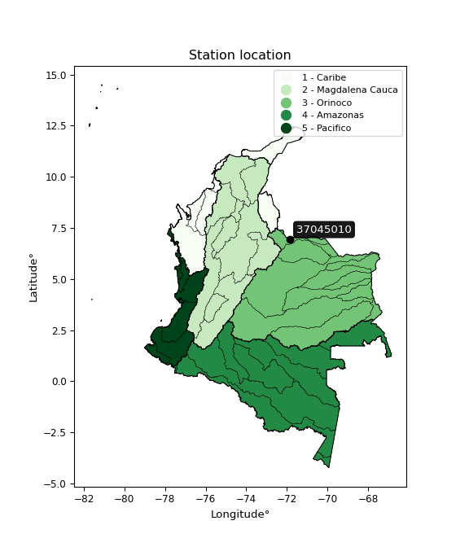

<div align="center">


</div>

# PMP Station (Rain, Pmax24h): 37045010

Probable Maximum Precipitation (PMP) is the greatest amount of rainfall for a specific duration that is meteorologically possible for a given location, acting as a "worst-case" scenario for extreme storms, crucial for designing safety-critical infrastructure like bridges, river deviations, dams, spillways, and nuclear plants to prevent catastrophic failure. PMP is calculated by hydrologists using meteorological data to determine the upper limit of extreme rainfall, often leading to the Probable Maximum Flood (PMF) for flood control design, and is increasingly being studied for climate change impacts. Probable Maximum Precipitation (PMP) is the theoretical upper limit of rainfall, a deterministic estimate for extreme events, while probability distributions (like GEV, Gumbel) describe the likelihood and frequency of various precipitation amounts, including rare ones, showing how often events occur, with PMP representing the extreme end of these distributions, used for critical infrastructure design to ensure safety against the worst conceivable weather, unlike standard statistical forecasts which cover typical probabilities.

The most common probability distributions in hydrology, used for analyzing floods, rainfall, and streamflow, include the Normal, Log-Normal, Gumbel, Gamma (including Log-Pearson Type III), and Generalized Extreme Value (GEV) distributions, often chosen based on the data´s skewness and whether modeling extremes or general conditions, with Gumbel and GEV popular for extreme events like floods, while the Normal distribution serves as a baseline, though often requiring transformations for skewed hydrological data. These distributions help in designing water infrastructure, managing water resources, and forecasting hydrologic events.

> Hydrological data often isn´t perfectly normal (it´s skewed), so different distributions are needed for different applications, such as: **Flood Frequency Analysis**: Using Gumbel, GEV, or Log-Pearson Type III for predicting extreme flood magnitudes and their return periods, **Rainfall Analysis**: Normal for annual totals, but Log-Normal, Weibull, or GEV for intensity or extreme daily rainfall, **Streamflow Modeling**: Gamma and Log-Normal for maximum flows, GEV for minimum flows, and Kappa for daily flows.

<div align="center">

</img>

</div>


## A. General information


### 1. General running parameters

• app_version: _v20260108_. • runtime: _2026-01-08 18:05:13.093906_. • Python version: _3.14.0_. • SciPy version: _1.16.3_. • Pandas version: _2.3.3_. • NumPy version: _2.3.5_. • Stations dataset (station_dataset_file): _dataset/pmax24h_in/automatic_colombia_2003_2024.csv_. • Stations catalog (station_catalog_file): _dataset/CNE.xls_. • Minimum year to eval til year_max (date_min): _1900_. • Maximum year to eval since year_min (date_max): _2024_. • Creates, save and include plots into reports (create_plot): _False_. • Plot only fit distributions with Δo > Δ (plot_only_fit): _True_. • Plot only simple graphs avoiding multiple CDFs and multiple Extreme values plots (plot_only_simple): _False_. • Eval low extreme values, if False, evaluates high extreme values (low_extreme): _False_. • Eval every SciPy distribution as logarithmic (pdist_logarithmic_on): _True_. • Standard deviation normalized (ddof): _1.0_. • Return periods to eval in years (Tr): _[2, 2.33, 5, 10, 15, 20, 25, 50, 75, 100, 200, 250, 500, 750, 1000]_. • Minimum data sample per station, 0 means any (minimum_sample): _5_. • Z-Score maximum threshold to adjust a value, 0 means disable (zscore_max): _3.5_. • Z-Score minimum threshold to adjust a value, 0 means disable (zscore_min): _-2.5_. • Avoid zeros, e.g. rain = 0 (avoid_zeros): _True_. • Avoid null values (avoid_nans): _True_. 

:file_folder:Table: [dataset.csv](../../dataset/pmax24h_in/automatic_colombia_2003_2024.csv)

> Delta Degrees of Freedom (DDOF): is a parameter used in the formulas for calculating variance and standard deviation. When ddof=0, the divisor is $N$ (the total number of observations) and this is used when your data set is the entire population. When ddof=1, the divisor is $N-1$ and this is used when your data set is a sample drawn from a larger population. Using $N-1$ provides an unbiased estimate of the population variance (known as Bessel´s correction).


### 2. Station info and location

|   id |   CODIGO | NOMBRE                     | CATEGORIA               | TECNOLOGIA                              | ESTADO   | FECHA_INSTALACION   | FECHA_SUSPENSION   |   ALTITUD |   LATITUD |   LONGITUD | DEPARTAMENTO   | MUNICIPIO   | AREA_OPERATIVA                         | ENTIDAD                                                     | AREA_HIDROGRAFICA   | ZONA_HIDROGRAFICA   | SUBZONA_HIDROGRAFICA                       |   CORRIENTE | Catalogo   |   Version |
|-----:|---------:|:---------------------------|:------------------------|:----------------------------------------|:---------|:--------------------|:-------------------|----------:|----------:|-----------:|:---------------|:------------|:---------------------------------------|:------------------------------------------------------------|:--------------------|:--------------------|:-------------------------------------------|------------:|:-----------|----------:|
|    0 | 37045010 | SARAVENA  - AUT [37045010] | Climatológica Principal | Automática con Telemetría, Convencional | Activa   | 15/08/1971          | 23/05/2019         |       197 |   6.96208 |   -71.8513 | Arauca         | Saravena    | Area Operativa 08 - Santanderes-Arauca | INSTITUTO DE HIDROLOGIA METEOROLOGIA Y ESTUDIOS AMBIENTALES | Orinoco             | Arauca              | Rio Banadia y otros Directos al Río Arauca |         nan | CNE_IDEAM  |  20251226 |

<div align="center">

Dynamic map: [:earth_americas:Google](http://maps.google.com/maps?q=6.96208,-71.851252) [:earth_americas:OSM](https://www.openstreetmap.org/#map=18/6.96208/-71.851252&layers=P) [:earth_americas:Bing](https://www.bing.com/maps?cp=6.96208~-71.851252&lvl=18) [:earth_americas:Apple](https://maps.apple.com/frame?center=6.96208%2C-71.851252&span=0.003%2C0.006)

</div>


<div align="center">

```geojson
{
  "type": "Feature",
  "geometry": {
    "type": "Point", 
    "coordinates": [-71.851252, 6.96208]
  }, 
  "properties": {
    "Name": "37045010"
  }
}
```

</div>


### 3. Discrete values table and plot

<div align="center">

|               |          0 |          1 |           2 |           3 |           4 |
|:--------------|-----------:|-----------:|------------:|------------:|------------:|
| Date          | 2018       | 2019       | 2020        | 2021        | 2024        |
| Value         |   30.7     |  173.1     |  103.1      |   71.2      |  172.6      |
| Value_initial |   30.7     |  173.1     |  103.1      |   71.2      |  172.6      |
| count         |    5       |    5       |    5        |    5        |    5        |
| mean          |  110.14    |  110.14    |  110.14     |  110.14     |  110.14     |
| std           |   62.7332  |   62.7332  |   62.7332   |   62.7332   |   62.7332   |
| zscore        |   -1.26632 |    1.00362 |   -0.112221 |   -0.620724 |    0.995645 |


</div>


> The initial value (value_initial) correspond to the initial obtained or null completed value, and value (value) is adjusted only when the initial value is outside the valid range (outlier) definite through the Z-Score value. If Z-Score is active, values out of range or outliers are replaced with the station mean value. A Z-Score (or standard score) measures how many standard deviations a data point is from the mean of a dataset, indicating its relative position; positive scores mean above the mean, negative mean below, and a score of zero is exactly at the mean, allowing for comparison of values from different distributions. It´s calculated using the formula $z=(x–μ)/σ$, where $x$ is the data point, $μ$ is the mean, and $σ$ is the standard deviation, helping identify outliers and understand probability.
>
> <sub>**Note**: In this study, "completing" (filling gaps in) and "extending" (forecasting or lengthening the historical record) rainfall data series are avoided for certain critical analyses because they introduce artificial bias and uncertainty, which can distort the statistics of rare events (extremes), alter day-to-day variability, and compromise the integrity and homogeneity of the original data. Some reasons against Completing/Extending rainfall data are: **Distortion of Extremes and Variability**: The primary issue is that most gap-filling or extension methods rely on averaging or regression with nearby stations, which inherently smooths the data. Rainfall is highly variable in space and time, with a large percentage of zero values and occasional large storms. Infilling methods often underestimate the highest values and overestimate the lowest (zero) values, which severely distorts analyses focused on flood frequency, drought severity, and intensity-duration-frequency (IDF) curves, **Loss of Data Homogeneity**: Infilled or extended data are synthetic estimates, not actual measurements. Combining these estimates with observed data can violate the assumption of data homogeneity, which requires that the data properties do not change over time. Inhomogeneity can lead to incorrect conclusions about long-term trends or changes in climate patterns, **Propagation of Errors**: Errors and biases from the original data (e.g., wind-induced undercatch, instrument errors, site changes) or the data used for imputation can propagate through the analysis, leading to unreliable hydrological models and inaccurate predictions, **Compromised Statistical Integrity**: For statistical analyses, especially those involving the frequency of events, using artificial data can introduce time bias or autocorrelation that doesn´t exist in reality, making it difficult to assess the true probability of events, **Difficulty in Validation**: It is difficult to accurately validate the quality of filled or extended data, especially for past periods where ground-truth measurements are unavailable. The reliability of imputation techniques heavily depends on the density of the surrounding station network and the complexity of the local topography.</sub>


### 4. Active continuous probability distributions from SciPy (43 of 104 available)

A Probability Density Function (PDF) describes the relative likelihood of a continuous random variable falling within a specific range, where the total area under its curve equals 1, and the area over any interval gives the actual probability for that range. Unlike discrete probabilities (like rolling a die), a PDF shows density, not direct probability for a single point (which is zero), with higher points indicating higher likelihood, often visualized as a bell curve for normal distributions.

A log of a probability density function (log-PDF) is simply the logarithm of the PDF´s value, denoted as $log(f(x))$, useful for converting multiplication of probabilities into addition, improving numerical stability with tiny numbers, and connecting to information theory concepts like entropy. Instead of dealing with very small probabilities (e.g., 0.000001), log-PDFs use negative numbers (e.g., $log(0.00001) ≈ -11.51$ that are easier for computers to handle, preventing underflow errors and simplifying complex calculations. In this study, each active probability distribution from SciPy is also evaluated in the $log$ form.

[scipy.stats](https://docs.scipy.org/doc/scipy/reference/stats.html) is a Python´s powerful submodule within the SciPy library for comprehensive statistical analysis, offering over 130 probability distributions (like Normal, Poisson), functions for descriptive stats (mean, variance), hypothesis testing (t-tests, chi-square), random variable generation, and statistical tests, making it essential for data science, modeling, and research. It provides tools to explore, model, and draw conclusions from data efficiently, working seamlessly with NumPy.

<div align="center">

|   id | p_dist             |   n_parameter | fit_method   | label                                                                       | active   | ref                                                                                                        |
|-----:|:-------------------|--------------:|:-------------|:----------------------------------------------------------------------------|:---------|:-----------------------------------------------------------------------------------------------------------|
|    0 | alpha              |             3 | MLE          | Alpha                                                                       | True     | [:mortar_board:](https://docs.scipy.org/doc/scipy/reference/generated/scipy.stats.alpha.html)              |
|    1 | betaprime          |             4 | MLE          | Beta prime                                                                  | True     | [:mortar_board:](https://docs.scipy.org/doc/scipy/reference/generated/scipy.stats.betaprime.html)          |
|    2 | chi2               |             3 | MLE          | Chi²                                                                        | True     | [:mortar_board:](https://docs.scipy.org/doc/scipy/reference/generated/scipy.stats.chi2.html)               |
|    3 | crystalball        |             4 | MLE          | Crystalball                                                                 | True     | [:mortar_board:](https://docs.scipy.org/doc/scipy/reference/generated/scipy.stats.crystalball.html)        |
|    4 | erlang             |             3 | MLE          | Erlang                                                                      | True     | [:mortar_board:](https://docs.scipy.org/doc/scipy/reference/generated/scipy.stats.erlang.html)             |
|    5 | expon              |             2 | MLE          | Exponential                                                                 | True     | [:mortar_board:](https://docs.scipy.org/doc/scipy/reference/generated/scipy.stats.expon.html)              |
|    6 | exponnorm          |             3 | MLE          | Exponentially modified Normal                                               | True     | [:mortar_board:](https://docs.scipy.org/doc/scipy/reference/generated/scipy.stats.exponnorm.html)          |
|    7 | f                  |             4 | MLE          | F                                                                           | True     | [:mortar_board:](https://docs.scipy.org/doc/scipy/reference/generated/scipy.stats.f.html)                  |
|    8 | fatiguelife        |             3 | MLE          | Fatigue-life (Birnbaum-Saunders)                                            | True     | [:mortar_board:](https://docs.scipy.org/doc/scipy/reference/generated/scipy.stats.fatiguelife.html)        |
|    9 | fisk               |             3 | MLE          | Fisk                                                                        | True     | [:mortar_board:](https://docs.scipy.org/doc/scipy/reference/generated/scipy.stats.fisk.html)               |
|   10 | gamma              |             3 | MLE          | Gamma                                                                       | True     | [:mortar_board:](https://docs.scipy.org/doc/scipy/reference/generated/scipy.stats.gamma.html)              |
|   11 | genexpon           |             5 | MLE          | Generalized exponential                                                     | True     | [:mortar_board:](https://docs.scipy.org/doc/scipy/reference/generated/scipy.stats.genexpon.html)           |
|   12 | genlogistic        |             3 | MLE          | Generalized logistic                                                        | True     | [:mortar_board:](https://docs.scipy.org/doc/scipy/reference/generated/scipy.stats.genlogistic.html)        |
|   13 | gibrat             |             2 | MM           | Gibrat                                                                      | True     | [:mortar_board:](https://docs.scipy.org/doc/scipy/reference/generated/scipy.stats.gibrat.html)             |
|   14 | gompertz           |             3 | MLE          | Gompertz (or truncated Gumbel)                                              | True     | [:mortar_board:](https://docs.scipy.org/doc/scipy/reference/generated/scipy.stats.gompertz.html)           |
|   15 | gumbel_l           |             2 | MM           | Gumbel Left Skew                                                            | True     | [:mortar_board:](https://docs.scipy.org/doc/scipy/reference/generated/scipy.stats.gumbel_l.html)           |
|   16 | gumbel_r           |             2 | MM           | Gumbel Right Skew                                                           | True     | [:mortar_board:](https://docs.scipy.org/doc/scipy/reference/generated/scipy.stats.gumbel_r.html)           |
|   17 | halflogistic       |             2 | MM           | Half-logistic                                                               | True     | [:mortar_board:](https://docs.scipy.org/doc/scipy/reference/generated/scipy.stats.halflogistic.html)       |
|   18 | halfnorm           |             2 | MM           | Half Normal                                                                 | True     | [:mortar_board:](https://docs.scipy.org/doc/scipy/reference/generated/scipy.stats.halfnorm.html)           |
|   19 | hypsecant          |             2 | MM           | hyperbolic secant                                                           | True     | [:mortar_board:](https://docs.scipy.org/doc/scipy/reference/generated/scipy.stats.hypsecant.html)          |
|   20 | invgamma           |             3 | MLE          | Inverted gamma                                                              | True     | [:mortar_board:](https://docs.scipy.org/doc/scipy/reference/generated/scipy.stats.invgamma.html)           |
|   21 | invgauss           |             3 | MLE          | Inverse Gaussian                                                            | True     | [:mortar_board:](https://docs.scipy.org/doc/scipy/reference/generated/scipy.stats.invgauss.html)           |
|   22 | invweibull         |             3 | MLE          | Inverted Weibull                                                            | True     | [:mortar_board:](https://docs.scipy.org/doc/scipy/reference/generated/scipy.stats.invweibull.html)         |
|   23 | kstwobign          |             2 | MLE          | Limiting distribution of scaled Kolmogorov-Smirnov two-sided test statistic | True     | [:mortar_board:](https://docs.scipy.org/doc/scipy/reference/generated/scipy.stats.kstwobign.html)          |
|   24 | laplace            |             2 | MM           | Laplace                                                                     | True     | [:mortar_board:](https://docs.scipy.org/doc/scipy/reference/generated/scipy.stats.laplace.html)            |
|   25 | laplace_asymmetric |             3 | MLE          | Asymmetric Laplace                                                          | True     | [:mortar_board:](https://docs.scipy.org/doc/scipy/reference/generated/scipy.stats.laplace_asymmetric.html) |
|   26 | loggamma           |             3 | MLE          | Log gamma                                                                   | True     | [:mortar_board:](https://docs.scipy.org/doc/scipy/reference/generated/scipy.stats.loggamma.html)           |
|   27 | logistic           |             2 | MM           | Logistic (or Sech-squared)                                                  | True     | [:mortar_board:](https://docs.scipy.org/doc/scipy/reference/generated/scipy.stats.logistic.html)           |
|   28 | lognorm            |             3 | MLE          | Log Normal                                                                  | True     | [:mortar_board:](https://docs.scipy.org/doc/scipy/reference/generated/scipy.stats.lognorm.html)            |
|   29 | maxwell            |             2 | MM           | Maxwell                                                                     | True     | [:mortar_board:](https://docs.scipy.org/doc/scipy/reference/generated/scipy.stats.maxwell.html)            |
|   30 | mielke             |             4 | MLE          | Mielke Beta-Kappa / Dagum                                                   | True     | [:mortar_board:](https://docs.scipy.org/doc/scipy/reference/generated/scipy.stats.mielke.html)             |
|   31 | moyal              |             2 | MM           | Moyal                                                                       | True     | [:mortar_board:](https://docs.scipy.org/doc/scipy/reference/generated/scipy.stats.moyal.html)              |
|   32 | nakagami           |             3 | MLE          | Nakagami                                                                    | True     | [:mortar_board:](https://docs.scipy.org/doc/scipy/reference/generated/scipy.stats.nakagami.html)           |
|   33 | ncf                |             5 | MLE          | Non-central F distribution                                                  | True     | [:mortar_board:](https://docs.scipy.org/doc/scipy/reference/generated/scipy.stats.ncf.html)                |
|   34 | nct                |             4 | MLE          | Non-central Student’s t                                                     | True     | [:mortar_board:](https://docs.scipy.org/doc/scipy/reference/generated/scipy.stats.nct.html)                |
|   35 | norm               |             2 | MM           | Normal                                                                      | True     | [:mortar_board:](https://docs.scipy.org/doc/scipy/reference/generated/scipy.stats.norm.html)               |
|   36 | pearson3           |             3 | MM           | Pearson type III                                                            | True     | [:mortar_board:](https://docs.scipy.org/doc/scipy/reference/generated/scipy.stats.pearson3.html)           |
|   37 | rayleigh           |             2 | MM           | Rayleigh                                                                    | True     | [:mortar_board:](https://docs.scipy.org/doc/scipy/reference/generated/scipy.stats.rayleigh.html)           |
|   38 | rice               |             3 | MLE          | Rice                                                                        | True     | [:mortar_board:](https://docs.scipy.org/doc/scipy/reference/generated/scipy.stats.rice.html)               |
|   39 | t                  |             3 | MLE          | Student’s t                                                                 | True     | [:mortar_board:](https://docs.scipy.org/doc/scipy/reference/generated/scipy.stats.t.html)                  |
|   40 | truncnorm          |             4 | MLE          | Truncated normal                                                            | True     | [:mortar_board:](https://docs.scipy.org/doc/scipy/reference/generated/scipy.stats.truncnorm.html)          |
|   41 | wald               |             2 | MM           | Wald                                                                        | True     | [:mortar_board:](https://docs.scipy.org/doc/scipy/reference/generated/scipy.stats.wald.html)               |
|   42 | weibull_min        |             3 | MLE          | Weibull minimum                                                             | True     | [:mortar_board:](https://docs.scipy.org/doc/scipy/reference/generated/scipy.stats.weibull_min.html)        |

</div>

> **n_parameter:** # arguments & localization & scale.
>
> **Fit methods:** (MLE) maximum likelihood, (MM) L-moments.
>
>**Inactive** (With the only purpose of prevent loops, zero divisions, infinite values, over high estimated values or horizontal trending for recurrence intervals estimations, the follow distributions were disabled.)**:** foldnorm, gennorm, norminvgauss, powernorm, powerlognorm, skewnorm, genextreme, anglit, arcsine, argus, beta, bradford, burr, burr12, cauchy, cosine, halfcauchy, foldcauchy, skewcauchy, wrapcauchy, dgamma, gengamma, exponweib, exponpow, truncexpon, gausshyper, genhalflogistic, genhyperbolic, geninvgauss, halfgennorm, johnsonsb, johnsonsu, kappa4, kappa3, ksone, kstwo, loglaplace, levy, levy_l, levy_stable, ncx2, pareto, genpareto, truncpareto, lomax, powerlaw, rdist, rel_breitwigner, recipinvgauss, semicircular, studentized_range, trapezoid, triang, truncweibull_min, tukeylambda, uniform, loguniform, vonmises, vonmises_line, weibull_max, dweibull, 


## B. Probability (PDF) vs. Empirical (EDF) distributions functions

A continuous probability distribution (CPD) describes probabilities for variables that can take any value within a range (like rain any time), unlike discrete variables with specific outcomes (like temperature). It uses a Probability Density Function (PDF), a curve where the total area under it equals 1, and the probability of the variable falling within an interval (a to b) is found by calculating the area under the curve between those points. A key feature is that the probability of hitting any single exact value is zero, so probabilities are always expressed for ranges, e.g., $P(a ≤ X ≤ b)$.

<div align="center">

Distributions parameters from station values
|    |   station | p_dist                |   n |               loc |            scale | shape                  | shape1                | shape2                 | shape3   |
|---:|----------:|:----------------------|----:|------------------:|-----------------:|:-----------------------|:----------------------|:-----------------------|:---------|
|  0 |  37045010 | alpha                 |   5 |    -603.391       |   8924.69        | 12.60848310015654      |                       |                        |          |
|  1 |  37045010 | betaprime             |   5 |    -167.49        |  22450.3         | 23.488462808388675     | 1900.8755892354693    |                        |          |
|  2 |  37045010 | chi2                  |   5 |    -264.743       |      4.32052     | 86.74645653677845      |                       |                        |          |
|  3 |  37045010 | crystalball           |   5 |     110.14        |     56.1103      | 9480.640083382801      | 1948.5692682087465    |                        |          |
|  4 |  37045010 | erlang                |   5 |   -1720.7         |      1.72265     | 1062.7719603513465     |                       |                        |          |
|  5 |  37045010 | expon                 |   5 |      30.7         |     79.44        |                        |                       |                        |          |
|  6 |  37045010 | exponnorm             |   5 |     110.088       |     56.1101      | 0.0009324118773625907  |                       |                        |          |
|  7 |  37045010 | f                     |   5 |      -5.12255     |    115.206       | 6.773888535153566      | 3265.508902655935     |                        |          |
|  8 |  37045010 | fatiguelife           |   5 |      30.7         |      0.00287811  | 166.27303270586032     |                       |                        |          |
|  9 |  37045010 | fisk                  |   5 |      -8.50442e+08 |      8.50443e+08 | 24340022.73794078      |                       |                        |          |
| 10 |  37045010 | gamma                 |   5 |   -1679.84        |      1.76545     | 1013.8885219479018     |                       |                        |          |
| 11 |  37045010 | genexpon              |   5 |      30.7         |      1.83666     | 0.02308848353893138    | 6.519117991363085e-05 | 0.9893368328412737     |          |
| 12 |  37045010 | genlogistic           |   5 |    -205.816       |     50.3116      | 305.7330068209257      |                       |                        |          |
| 13 |  37045010 | gibrat                |   5 |      67.3349      |     25.9626      |                        |                       |                        |          |
| 14 |  37045010 | gompertz              |   5 |      30.7         |     87.3398      | 0.4962718561159958     |                       |                        |          |
| 15 |  37045010 | gumbel_l              |   5 |     135.393       |     43.749       |                        |                       |                        |          |
| 16 |  37045010 | gumbel_r              |   5 |      84.8874      |     43.749       |                        |                       |                        |          |
| 17 |  37045010 | halflogistic          |   5 |      43.6363      |     47.9723      |                        |                       |                        |          |
| 18 |  37045010 | halfnorm              |   5 |      35.872       |     93.0811      |                        |                       |                        |          |
| 19 |  37045010 | hypsecant             |   5 |     110.14        |     35.7209      |                        |                       |                        |          |
| 20 |  37045010 | invgamma              |   5 |    -359.026       |  31483           | 68.11488908219971      |                       |                        |          |
| 21 |  37045010 | invgauss              |   5 |    -120.271       |   3399.86        | 0.06760463741895734    |                       |                        |          |
| 22 |  37045010 | invweibull            |   5 |      30.7         |      1.16254     | 0.06181227759361306    |                       |                        |          |
| 23 |  37045010 | kstwobign             |   5 |     -91.2925      |    229.68        |                        |                       |                        |          |
| 24 |  37045010 | laplace               |   5 |     110.14        |     39.676       |                        |                       |                        |          |
| 25 |  37045010 | laplace_asymmetric    |   5 |     103.1         |     48.3764      | 0.929881627499987      |                       |                        |          |
| 26 |  37045010 | loggamma              |   5 |     173.102       |      2.81097e-05 | 4.4629879461087866e-07 |                       |                        |          |
| 27 |  37045010 | logistic              |   5 |     110.14        |     30.9352      |                        |                       |                        |          |
| 28 |  37045010 | lognorm               |   5 |      30.7         |      0.0462008   | 15.105438188952618     |                       |                        |          |
| 29 |  37045010 | maxwell               |   5 |     -22.8178      |     83.3189      |                        |                       |                        |          |
| 30 |  37045010 | mielke                |   5 |      -7.02114     |    181.174       | 1.791467419390841      | 783.8413791644648     |                        |          |
| 31 |  37045010 | moyal                 |   5 |      78.0525      |     25.2585      |                        |                       |                        |          |
| 32 |  37045010 | nakagami              |   5 |      71.2         |     60.1008      | 0.2848624948332088     |                       |                        |          |
| 33 |  37045010 | ncf                   |   5 |      -0.7611      |    105.803       | 6.945420095847224      | 28.725061167235978    | 3.1033052426161254e-11 |          |
| 34 |  37045010 | nct                   |   5 |   -2890.08        |     56.0713      | 672360.1624379773      | 53.50714446839836     |                        |          |
| 35 |  37045010 | norm                  |   5 |     110.14        |     56.1103      |                        |                       |                        |          |
| 36 |  37045010 | pearson3              |   5 |     110.14        |     56.1103      | -0.07639354483851818   |                       |                        |          |
| 37 |  37045010 | rayleigh              |   5 |       2.79778     |     85.6467      |                        |                       |                        |          |
| 38 |  37045010 | rice                  |   5 |       0.673353    |     67.9844      | 1.1286464013783526     |                       |                        |          |
| 39 |  37045010 | t                     |   5 |     110.108       |     56.1204      | 498364.8218256866      |                       |                        |          |
| 40 |  37045010 | truncnorm             |   5 |     110.14        |     56.1103      | -1289.1377760433738    | 3521.8517705396853    |                        |          |
| 41 |  37045010 | wald                  |   5 |      54.0298      |     56.1102      |                        |                       |                        |          |
| 42 |  37045010 | weibull_min           |   5 |      30.7         |     90.5042      | 0.9636775846228396     |                       |                        |          |
| 43 |  37045010 | logalpha              |   5 |     -13.0175      |    459.491       | 26.22503669589925      |                       |                        |          |
| 44 |  37045010 | logbetaprime          |   5 |     -25.5756      |     32.1416      | 4065.6820833104457     | 4342.796876582317     |                        |          |
| 45 |  37045010 | logchi2               |   5 |       3.42426     |      0.997453    | 1.0126651378554143     |                       |                        |          |
| 46 |  37045010 | logcrystalball        |   5 |       4.52606     |      0.644754    | 34.43946791821923      | 366.7729968995518     |                        |          |
| 47 |  37045010 | logerlang             |   5 |      -6.31247     |      0.0410325   | 263.99059992372736     |                       |                        |          |
| 48 |  37045010 | logexpon              |   5 |       3.42426     |      1.1018      |                        |                       |                        |          |
| 49 |  37045010 | logexponnorm          |   5 |       4.52555     |      0.644757    | 0.0008069745135161951  |                       |                        |          |
| 50 |  37045010 | logf                  |   5 |    -141.521       |    146.049       | 105802.11913896044     | 2546828.7967238408    |                        |          |
| 51 |  37045010 | logfatiguelife        |   5 |    -269.602       |    274.129       | 0.0023530138255089816  |                       |                        |          |
| 52 |  37045010 | logfisk               |   5 | -252830           | 252835           | 660912.9300448135      |                       |                        |          |
| 53 |  37045010 | loggamma              |   5 |      -5.96769     |      0.0411176   | 255.13226963939462     |                       |                        |          |
| 54 |  37045010 | loggenexpon           |   5 |       3.42426     |      1.21397     | 0.8018854954268115     | 1.0270069240681365    | 0.5749634477440209     |          |
| 55 |  37045010 | loggenlogistic        |   5 |       5.15389     |      1.74201e-06 | 2.784553175214044e-06  |                       |                        |          |
| 56 |  37045010 | loggibrat             |   5 |       4.03416     |      0.298349    |                        |                       |                        |          |
| 57 |  37045010 | loggompertz           |   5 |       3.42294     |      0.623157    | 0.1283509014888414     |                       |                        |          |
| 58 |  37045010 | loggumbel_l           |   5 |       4.81623     |      0.502713    |                        |                       |                        |          |
| 59 |  37045010 | loggumbel_r           |   5 |       4.23589     |      0.502713    |                        |                       |                        |          |
| 60 |  37045010 | loghalflogistic       |   5 |       3.76186     |      0.551252    |                        |                       |                        |          |
| 61 |  37045010 | loghalfnorm           |   5 |       3.67269     |      1.06955     |                        |                       |                        |          |
| 62 |  37045010 | loghypsecant          |   5 |       4.52606     |      0.410463    |                        |                       |                        |          |
| 63 |  37045010 | loginvgamma           |   5 |      -9.09801     |   5638.36        | 415.0014389725991      |                       |                        |          |
| 64 |  37045010 | loginvgauss           |   5 |      -1.37236     |    432.954       | 0.013571481146506213   |                       |                        |          |
| 65 |  37045010 | loginvweibull         |   5 |      -4.31153e+07 |      4.31153e+07 | 70402676.95921165      |                       |                        |          |
| 66 |  37045010 | logkstwobign          |   5 |       1.86591     |      3.03222     |                        |                       |                        |          |
| 67 |  37045010 | loglaplace            |   5 |       4.52606     |      0.45591     |                        |                       |                        |          |
| 68 |  37045010 | loglaplace_asymmetric |   5 |       4.6357      |      0.514163    | 1.1126090940375044     |                       |                        |          |
| 69 |  37045010 | logloggamma           |   5 |       5.15388     |      1.26024e-06 | 2.0049290311227766e-06 |                       |                        |          |
| 70 |  37045010 | loglogistic           |   5 |       4.52606     |      0.355472    |                        |                       |                        |          |
| 71 |  37045010 | loglognorm            |   5 |       3.42426     |      0.00106211  | 14.25399999022474      |                       |                        |          |
| 72 |  37045010 | logmaxwell            |   5 |       2.99826     |      0.957404    |                        |                       |                        |          |
| 73 |  37045010 | logmielke             |   5 |      -4.54719e+07 |      4.54719e+07 | 68653564.72109528      | 4191859033.7775497    |                        |          |
| 74 |  37045010 | logmoyal              |   5 |       4.15735     |      0.290241    |                        |                       |                        |          |
| 75 |  37045010 | lognakagami           |   5 |       4.26549     |      0.595985    | 0.25563492083372985    |                       |                        |          |
| 76 |  37045010 | logncf                |   5 |     -15.3265      |      7.88148     | 1339.1002633012117     | 16489.847704213083    | 2034.080178655352      |          |
| 77 |  37045010 | lognct                |   5 |      39.7819      |      0.621146    | 21497.55424046032      | -56.75602318105837    |                        |          |
| 78 |  37045010 | lognorm               |   5 |       4.52606     |      0.644754    |                        |                       |                        |          |
| 79 |  37045010 | logpearson3           |   5 |       4.52606     |      0.644754    | -0.6434956336580642    |                       |                        |          |
| 80 |  37045010 | lograyleigh           |   5 |       3.29261     |      0.984152    |                        |                       |                        |          |
| 81 |  37045010 | logrice               |   5 |       3.00074     |      0.712135    | 1.8459296845196067     |                       |                        |          |
| 82 |  37045010 | logt                  |   5 |       4.52606     |      0.644754    | 14522468875.500267     |                       |                        |          |
| 83 |  37045010 | logtruncnorm          |   5 |      -0.140254    |      1.52712     | 2.883442948083784      | 3.4667433405169126    |                        |          |
| 84 |  37045010 | logwald               |   5 |       3.88134     |      0.644728    |                        |                       |                        |          |
| 85 |  37045010 | logweibull_min        |   5 |      -5.10144e+07 |      5.10145e+07 | 105850381.48282811     |                       |                        |          |

</div>

> **loc** (Location parameter): This shifts the distribution along the x-axis. For many common distributions, like the normal (Gaussian) distribution, loc represents the mean $μ$. For others, like the uniform distribution, it might represent the minimum value, or for the beta distribution, the left end of the support interval.
>
> **scale** (Scale parameter): This determines the width or spread of the distribution. For the normal distribution, scale represents the standard deviation $σ$. For a uniform distribution, it defines the length of the interval (from $loc$ to $loc + scale$).
>
> **shape** (Shape parameters): Refers to parameters that define the specific form of a probability distribution, distinct from its location (loc) and scale (scale). These parameters are required arguments for most distribution functions. For example, a normal (Gaussian) distribution is fully defined by its location (mean) and scale (standard deviation), so it has no specific shape parameters beyond loc and scale. However, other distributions have intrinsic properties that need specification, as Gamma distribution that takes a shape parameter, often named $a$ or $alpha$.


### 0. Cumulative distribution values - CDF (86 evaluated)

Cumulative Distribution Function (CDF), denoted as $F$<sub>$X$</sub>$(x)$, is a function that gives the probability that a random variable $X$ will take a value less than or equal to a specific value, $x$ (i.e., $(P(X≥x)$. It essentially "accumulates" probabilities from a given point up to the far right (positive infinity), providing a complete picture of the distribution´s probabilities for both discrete (like rain) and continuous (like temperature) variables, helping to find probabilities over ranges or above certain values. Each station is evaluated separately ordering the $x$ values ascending, calculating the CDF and PDF values for the activated distributions and their logarithmic forms.

<div align="center">

CDF ordered by x ascending and calculating $log(f(x))$ separately
|   id |   Station |   date |     x |   count |   mean |     std |    zscore |   Value_initial |   station |   m |     alpha |   alpha_pdf |   betaprime |   betaprime_pdf |      chi2 |   chi2_pdf |   crystalball |   crystalball_pdf |    erlang |   erlang_pdf |    expon |   expon_pdf |   exponnorm |   exponnorm_pdf |         f |      f_pdf |   fatiguelife |   fatiguelife_pdf |     fisk |   fisk_pdf |     gamma |   gamma_pdf |    genexpon |   genexpon_pdf |   genlogistic |   genlogistic_pdf |    gibrat |   gibrat_pdf |   gompertz |   gompertz_pdf |   gumbel_l |   gumbel_l_pdf |   gumbel_r |   gumbel_r_pdf |   halflogistic |   halflogistic_pdf |   halfnorm |   halfnorm_pdf |   hypsecant |   hypsecant_pdf |   invgamma |   invgamma_pdf |   invgauss |   invgauss_pdf |   invweibull |   invweibull_pdf |   kstwobign |   kstwobign_pdf |   laplace |   laplace_pdf |   laplace_asymmetric |   laplace_asymmetric_pdf |   loggamma |   loggamma_pdf |   logistic |   logistic_pdf |   lognorm |   lognorm_pdf |   maxwell |   maxwell_pdf |    mielke |   mielke_pdf |     moyal |   moyal_pdf |    nakagami |   nakagami_pdf |       ncf |    ncf_pdf |      nct |    nct_pdf |      norm |   norm_pdf |   pearson3 |   pearson3_pdf |   rayleigh |   rayleigh_pdf |     rice |   rice_pdf |         t |      t_pdf |   truncnorm |   truncnorm_pdf |     wald |   wald_pdf |   weibull_min |   weibull_min_pdf |   logalpha |   logalpha_pdf |   logbetaprime |   logbetaprime_pdf |     logchi2 |   logchi2_pdf |   logcrystalball |   logcrystalball_pdf |   logerlang |   logerlang_pdf |   logexpon |   logexpon_pdf |   logexponnorm |   logexponnorm_pdf |      logf |   logf_pdf |   logfatiguelife |   logfatiguelife_pdf |   logfisk |   logfisk_pdf |   loggenexpon |   loggenexpon_pdf |   loggenlogistic |   loggenlogistic_pdf |   loggibrat |   loggibrat_pdf |   loggompertz |   loggompertz_pdf |   loggumbel_l |   loggumbel_l_pdf |   loggumbel_r |   loggumbel_r_pdf |   loghalflogistic |   loghalflogistic_pdf |   loghalfnorm |   loghalfnorm_pdf |   loghypsecant |   loghypsecant_pdf |   loginvgamma |   loginvgamma_pdf |   loginvgauss |   loginvgauss_pdf |   loginvweibull |   loginvweibull_pdf |   logkstwobign |   logkstwobign_pdf |   loglaplace |   loglaplace_pdf |   loglaplace_asymmetric |   loglaplace_asymmetric_pdf |   logloggamma |   logloggamma_pdf |   loglogistic |   loglogistic_pdf |   loglognorm |   loglognorm_pdf |   logmaxwell |   logmaxwell_pdf |   logmielke |   logmielke_pdf |    logmoyal |   logmoyal_pdf |   lognakagami |   lognakagami_pdf |    logncf |   logncf_pdf |    lognct |   lognct_pdf |   logpearson3 |   logpearson3_pdf |   lograyleigh |   lograyleigh_pdf |   logrice |   logrice_pdf |      logt |   logt_pdf |   logtruncnorm |   logtruncnorm_pdf |   logwald |   logwald_pdf |   logweibull_min |   logweibull_min_pdf |
|-----:|----------:|-------:|------:|--------:|-------:|--------:|----------:|----------------:|----------:|----:|----------:|------------:|------------:|----------------:|----------:|-----------:|--------------:|------------------:|----------:|-------------:|---------:|------------:|------------:|----------------:|----------:|-----------:|--------------:|------------------:|---------:|-----------:|----------:|------------:|------------:|---------------:|--------------:|------------------:|----------:|-------------:|-----------:|---------------:|-----------:|---------------:|-----------:|---------------:|---------------:|-------------------:|-----------:|---------------:|------------:|----------------:|-----------:|---------------:|-----------:|---------------:|-------------:|-----------------:|------------:|----------------:|----------:|--------------:|---------------------:|-------------------------:|-----------:|---------------:|-----------:|---------------:|----------:|--------------:|----------:|--------------:|----------:|-------------:|----------:|------------:|------------:|---------------:|----------:|-----------:|---------:|-----------:|----------:|-----------:|-----------:|---------------:|-----------:|---------------:|---------:|-----------:|----------:|-----------:|------------:|----------------:|---------:|-----------:|--------------:|------------------:|-----------:|---------------:|---------------:|-------------------:|------------:|--------------:|-----------------:|---------------------:|------------:|----------------:|-----------:|---------------:|---------------:|-------------------:|----------:|-----------:|-----------------:|---------------------:|----------:|--------------:|--------------:|------------------:|-----------------:|---------------------:|------------:|----------------:|--------------:|------------------:|--------------:|------------------:|--------------:|------------------:|------------------:|----------------------:|--------------:|------------------:|---------------:|-------------------:|--------------:|------------------:|--------------:|------------------:|----------------:|--------------------:|---------------:|-------------------:|-------------:|-----------------:|------------------------:|----------------------------:|--------------:|------------------:|--------------:|------------------:|-------------:|-----------------:|-------------:|-----------------:|------------:|----------------:|------------:|---------------:|--------------:|------------------:|----------:|-------------:|----------:|-------------:|--------------:|------------------:|--------------:|------------------:|----------:|--------------:|----------:|-----------:|---------------:|-------------------:|----------:|--------------:|-----------------:|---------------------:|
|    0 |  37045010 |   2018 |  30.7 |       5 | 110.14 | 62.7332 | -1.26632  |            30.7 |  37045010 |   1 | 0.0712848 |  0.00302226 |   0.0712996 |      0.0029713  | 0.0727842 | 0.00285158 |     0.0784194 |        0.00260981 | 0.0771772 |   0.00265349 | 0        |  0.0125881  |   0.0784189 |      0.0026098  | 0.0541646 | 0.00394979 |     0.0639187 |       2.12228e+06 | 0.092761 | 0.00240859 | 0.0772453 |  0.0026545  | 2.21022e-08 |     0.0125709  |     0.0629551 |        0.00344467 | 0         |   0          | 1.9123e-13 |     0.00568208 |  0.0873042 |     0.00190581 |  0.0317212 |     0.00250206 |       0        |         0          |   0        |     0          |   0.0686062 |      0.00190578 |  0.0682865 |     0.00295395 |  0.0649737 |     0.00332981 |  0.000373663 |      5.13086e+10 |   0.0595211 |      0.00377942 | 0.0675176 |    0.00170173 |            0.0927418 |               0.00206165 |  0.0432889 |       0.150623 |   0.07123  |     0.00213854 |  0.043738 |      0.143681 | 0.0623684 |    0.00321451 | 0.0601305 |   0.00285574 | 0.0106729 |  0.00154887 | 0           |     0          | 0.0514912 | 0.00422651 | 0.078491 | 0.00261094 | 0.0784194 | 0.00260981 |  0.0802018 |     0.00256309 |  0.0516837 |     0.0036072  | 0.05067  | 0.00331351 | 0.0785409 | 0.00261239 |   0.0784194 |      0.00260981 | 0        | 0          |   1.54811e-16 |        0.0419926  |  0.0425728 |       0.154064 |       0.045395 |           0.150755 | 1.33968e-08 |   1.52745e+07 |        0.0437382 |             0.143681 |   0.0463459 |        0.156342 |   0        |       0.907608 |      0.0437374 |           0.143679 | 0.0440954 |   0.144651 |        0.0433376 |             0.143133 | 0.0453247 |      0.11311  |   2.10716e-10 |          0.66055  |         0        |             0.10069  |    0        |        0        |   0.000272954 |          0.206351 |     0.0608027 |          0.117195 |     0.0065695 |         0.0656714 |          0        |              0        |      0        |          0        |       0.043395 |           0.105395 |     0.0445069 |          0.15707  |     0.0455225 |          0.172399 |       0.0365101 |            0.197342 |      0.0456702 |           0.244472 |    0.0446078 |        0.0978434 |                0.066551 |                    0.116335 |     0.0638204 |          0.101533 |     0.0431263 |          0.116089 |     0.022769 |      8.53529e+12 |    0.0220856 |         0.149444 |   0.0698609 |        0.105476 | 0.000406811 |     0.00937856 |   0           |       0           | 0.0425832 |     0.144887 | 0.0436621 |     0.143017 |     0.0579512 |          0.134573 |    0.00890791 |          0.134718 |  0.034034 |      0.168722 | 0.0437383 |   0.143681 |     0          |           0        |  0        |      0        |        0.0533268 |             0.107644 |
|    1 |  37045010 |   2021 |  71.2 |       5 | 110.14 | 62.7332 | -0.620724 |            71.2 |  37045010 |   2 | 0.267204  |  0.00645063 |   0.261621  |      0.00624895 | 0.255706  | 0.00607652 |     0.243844  |        0.00558836 | 0.245989  |   0.00569071 | 0.399396 |  0.00756048 |   0.243844  |      0.00558837 | 0.301052  | 0.00729504 |     0.762195  |       0.00272458  | 0.245779 | 0.00530542 | 0.246028  |  0.00568748 | 0.399801    |     0.00756636 |     0.28954   |        0.00711859 | 0.0284113 |   0.0168263  | 0.253812   |     0.00674125 |  0.205902  |     0.00418474 |  0.254786  |     0.00796308 |       0.279637 |         0.00960766 |   0.295713 |     0.00797624 |   0.206461  |      0.005383   |  0.2614    |     0.00638885 |  0.280536  |     0.00685491 |  0.44801     |      0.000549023 |   0.301241  |      0.00728513 | 0.187383  |    0.00472285 |            0.22818   |               0.00507243 |  0.35419   |       0.575797 |   0.221187 |     0.00556853 |  0.343057 |      0.570231 | 0.264518  |    0.00645111 | 0.222087  |   0.00508637 | 0.252094  |  0.00938836 | 9.72268e-10 | 38979          | 0.313583  | 0.00746424 | 0.243932 | 0.0055877  | 0.243844  | 0.00558836 |  0.241759  |     0.00546615 |  0.27307   |     0.00677862 | 0.256379 | 0.00647106 | 0.244063  | 0.00559005 |   0.243844  |      0.00558836 | 0.172174 | 0.0191206  |   0.369193    |        0.00691582 |  0.358934  |       0.574914 |       0.351487 |           0.569588 | 0.637167    |   0.287642    |        0.343057  |             0.57023  |   0.357997  |        0.568962 |   0.533971 |       0.422972 |      0.343052  |           0.570225 | 0.343589  |   0.568373 |        0.342454  |             0.570152 | 0.299742  |      0.548673 |   0.493563    |          0.475323 |         0        |             0.386342 |    0.399588 |        1.66963  |   0.307731    |          0.551156 |     0.284204  |          0.476084 |     0.389533  |         0.730545  |          0.427479 |              0.741278 |      0.420598 |          0.639783 |       0.310279 |           0.641774 |     0.361587  |          0.574298 |     0.383068  |          0.582247 |       0.43254   |            0.591929 |      0.441738  |           0.541217 |    0.28233   |        0.619266  |                0.289597 |                    0.506233 |     0.243326  |          0.387111 |     0.324533  |          0.616677 |     0.680201 |      0.0298157   |    0.374551  |         0.608044 |   0.248787  |        0.37562  | 0.406525    |     0.808426   |   2.04801e-08 |       1.17891e+07 | 0.345823  |     0.572376 | 0.342019  |     0.569655 |     0.31057   |          0.503522 |    0.386525   |          0.616216 |  0.358    |      0.574935 | 0.343058  |   0.570231 |     0.00572782 |           2.38975  |  0.443249 |      1.17303  |        0.269435  |             0.475883 |
|    2 |  37045010 |   2020 | 103.1 |       5 | 110.14 | 62.7332 | -0.112221 |           103.1 |  37045010 |   3 | 0.490454  |  0.00713124 |   0.47939   |      0.00702621 | 0.47126   | 0.00707535 |     0.450077  |        0.00705423 | 0.454483  |   0.00707538 | 0.598031 |  0.00506004 |   0.450077  |      0.00705425 | 0.527424  | 0.00657022 |     0.829918  |       0.00166759  | 0.448122 | 0.00707808 | 0.454352  |  0.00706856 | 0.598536    |     0.00506102 |     0.517842  |        0.00676618 | 0.625635  |   0.0105967  | 0.473044   |     0.00685943 |  0.379981  |     0.00677438 |  0.517118  |     0.00779518 |       0.550969 |         0.0072587  |   0.52986  |     0.00660396 |   0.437669  |      0.00874072 |  0.48333   |     0.00711605 |  0.506954  |     0.00692592 |  0.460879    |      0.000304798 |   0.52914   |      0.00665404 | 0.418707  |    0.0105532  |            0.463715  |               0.0103084  |  0.576216  |       0.59201  |   0.443351 |     0.00797767 |  0.567514 |      0.609869 | 0.484397  |    0.00698119 | 0.409864  |   0.00666773 | 0.542478  |  0.00799126 | 0.532242    |     0.00892798 | 0.53687   | 0.00626146 | 0.450113 | 0.00705177 | 0.450077  | 0.00705423 |  0.445122  |     0.0070199  |  0.496291  |     0.00688762 | 0.476718 | 0.0070249  | 0.450312  | 0.00705348 |   0.450077  |      0.00705423 | 0.612952 | 0.00861579 |   0.553571    |        0.00479222 |  0.577787  |       0.577004 |       0.572856 |           0.594997 | 0.725871    |   0.199557    |        0.567514  |             0.609869 |   0.576843  |        0.583045 |   0.666966 |       0.302265 |      0.567508  |           0.609868 | 0.567018  |   0.606591 |        0.566835  |             0.609545 | 0.529764  |      0.651187 |   0.648386    |          0.362131 |         0        |             0.698187 |    0.758418 |        0.518648 |   0.537138    |          0.66751  |     0.502565  |          0.690959 |     0.63671   |         0.571772  |          0.659876 |              0.512073 |      0.632089 |          0.497391 |       0.584031 |           0.748624 |     0.580415  |          0.577582 |     0.598493  |          0.553483 |       0.632623  |            0.472993 |      0.625571  |           0.442066 |    0.606876  |        0.862283  |                0.553152 |                    0.966944 |     0.438504  |          0.697623 |     0.576503  |          0.686827 |     0.689293 |      0.020451    |    0.596679  |         0.564689 |   0.435083  |        0.65689  | 0.660916    |     0.547628   |   0.599097    |       0.764605    | 0.569226  |     0.602293 | 0.566598  |     0.611079 |     0.526016  |          0.639277 |    0.605931   |          0.546454 |  0.57795  |      0.584447 | 0.567515  |   0.609869 |     0.63701    |           1.15306  |  0.728115 |      0.482905 |        0.491746  |             0.713713 |
|    3 |  37045010 |   2024 | 172.6 |       5 | 110.14 | 62.7332 |  0.995645 |           172.6 |  37045010 |   4 | 0.865953  |  0.00320231 |   0.860175  |      0.0033644  | 0.862882  | 0.00347909 |     0.867181  |        0.00382642 | 0.866699  |   0.00374784 | 0.832413 |  0.0021096  |   0.867182  |      0.00382642 | 0.849289  | 0.00278524 |     0.909125  |       0.000769649 | 0.855803 | 0.00353188 | 0.86631   |  0.0037498  | 0.832837    |     0.00210733 |     0.847501  |        0.00278648 | 0.919217  |   0.00142273 | 0.867771   |     0.00381441 |  0.903745  |     0.00515004 |  0.874002  |     0.00269045 |       0.872665 |         0.00248535 |   0.858143 |     0.00291433 |   0.890311  |      0.00301032 |  0.86164   |     0.00327202 |  0.857662  |     0.00299982 |  0.475656    |      0.000153961 |   0.85736   |      0.00285109 | 0.896419  |    0.00261068 |            0.859001  |               0.00271025 |  0.831187  |       0.36898  |   0.882784 |     0.00334495 |  0.833785 |      0.386835 | 0.861421  |    0.00336599 | 0.984694  |   0.00980942 | 0.877706  |  0.0024018  | 0.894578    |     0.00261424 | 0.834956  | 0.00257887 | 0.867092 | 0.00382643 | 0.867181  | 0.00382642 |  0.86791   |     0.00392402 |  0.85989   |     0.00324332 | 0.862774 | 0.00348933 | 0.867261  | 0.00382414 |   0.867181  |      0.00382642 | 0.897154 | 0.00172637 |   0.78615     |        0.00224016 |  0.824962  |       0.358874 |       0.831144 |           0.375822 | 0.80889     |   0.129391    |        0.833785  |             0.386834 |   0.828807  |        0.367137 |   0.791367 |       0.189357 |      0.833781  |           0.38684  | 0.83211   |   0.386225 |        0.833003  |             0.386963 | 0.81247   |      0.398277 |   0.798825    |          0.227956 |         0        |             1.59104  |    0.906578 |        0.149482 |   0.854298    |          0.480379 |     0.857183  |          0.552899 |     0.850461  |         0.274023  |          0.851054 |              0.250073 |      0.833079 |          0.287017 |       0.86325  |           0.323007 |     0.827925  |          0.358863 |     0.830802  |          0.332973 |       0.820865  |            0.264587 |      0.808941  |           0.272338 |    0.873036  |        0.278486  |                0.853475 |                    0.317069 |     0.995387  |          1.58358  |     0.852958  |          0.352829 |     0.698019 |      0.0141686   |    0.832236  |         0.336352 |   0.94664   |        1.37901  | 0.856718    |     0.244162   |   0.859901    |       0.313402    | 0.83085   |     0.380114 | 0.83372   |     0.388318 |     0.837192  |          0.490245 |    0.831838   |          0.322653 |  0.830793 |      0.369003 | 0.833786  |   0.386834 |     0.998907   |           0.379173 |  0.88204  |      0.176394 |        0.860736  |             0.569652 |
|    4 |  37045010 |   2019 | 173.1 |       5 | 110.14 | 62.7332 |  1.00362  |           173.1 |  37045010 |   5 | 0.867547  |  0.00317198 |   0.86185   |      0.00333366 | 0.864613  | 0.00344638 |     0.869085  |        0.0037885  | 0.868564  |   0.00371098 | 0.833465 |  0.00209637 |   0.869086  |      0.0037885  | 0.850676  | 0.00276311 |     0.909509  |       0.000765887 | 0.85756  | 0.00349601 | 0.868175  |  0.00371302 | 0.833887    |     0.00209409 |     0.848889  |        0.00276346 | 0.919924  |   0.00140663 | 0.86967    |     0.00378122 |  0.9063    |     0.00507095 |  0.87534   |     0.00266395 |       0.873902 |         0.00246283 |   0.859595 |     0.00289139 |   0.891806  |      0.00297088 |  0.863268  |     0.00324164 |  0.859155  |     0.00297367 |  0.475733    |      0.000153411 |   0.85878   |      0.00282815 | 0.897716  |    0.00257798 |            0.86035   |               0.00268433 |  0.832252  |       0.367417 |   0.884446 |     0.00330373 |  0.834902 |      0.385152 | 0.863096  |    0.00333589 | 0.989589  |   0.00974132 | 0.878901  |  0.0023787  | 0.895878    |     0.00258788 | 0.83624   | 0.00255968 | 0.868996 | 0.00378854 | 0.869085  | 0.0037885  |  0.869862  |     0.00388479 |  0.861505  |     0.00321539 | 0.86451  | 0.00345776 | 0.869163  | 0.00378624 |   0.869085  |      0.0037885  | 0.898013 | 0.00170958 |   0.787267    |        0.00222817 |  0.825998  |       0.35741  |       0.832229 |           0.374233 | 0.809263    |   0.129097    |        0.834902  |             0.385152 |   0.829867  |        0.365619 |   0.791914 |       0.18886  |      0.834897  |           0.385157 | 0.833225  |   0.384565 |        0.83412   |             0.385286 | 0.813619  |      0.396396 |   0.799484    |          0.227312 |         0.999964 |             1.59841  |    0.907009 |        0.148587 |   0.855684    |          0.478023 |     0.858778  |          0.549879 |     0.851252  |         0.272704  |          0.851776 |              0.248958 |      0.833908 |          0.285945 |       0.864181 |           0.320943 |     0.828961  |          0.357385 |     0.831763  |          0.331612 |       0.821629  |            0.263586 |      0.809727  |           0.271464 |    0.873839  |        0.276724  |                0.854389 |                    0.315091 |     0.999978  |          1.59086  |     0.853976  |          0.350805 |     0.69806  |      0.014144    |    0.833207  |         0.334972 |   0.950617  |        1.37008  | 0.857423    |     0.242987   |   0.860805    |       0.311749    | 0.831947  |     0.378491 | 0.834841  |     0.386628 |     0.838607  |          0.48817  |    0.832769   |          0.321365 |  0.831858 |      0.367478 | 0.834903  |   0.385151 |     1          |           0.376692 |  0.882549 |      0.1755   |        0.862379  |             0.56632  |


</div>

An Empirical Distribution Function (EDF) is a step-function estimate of a true cumulative distribution function (CDF) based on observed sample data, representing the proportion of data points less than or equal to a given value. It is calculated by ordering your data and jumping up by $1/n$ (where $n$ is sample size) at each unique data point, allowing analysis without assuming an underlying population distribution, and it gets closer to the true CDF as the sample size grows. For the empirical probability calculations, the parameter $m$ correspond to the order number which means the position of the $x$ values in an ascending order list.

The Kolmogorov-Smirnov (K-S) test is a non-parametric statistical test used to determine if a sample data set comes from a specific theoretical distribution (one-sample) or if two different samples come from the same underlying distribution (two-sample), by comparing their cumulative distribution functions (CDFs). It calculates the maximum vertical difference (D statistic) between these functions, with a small p-value indicating a significant difference and rejection of the null hypothesis (that the data/samples match).


### 1. EDF California (1923)

California´s estimates the true probability distribution of water-related data (like rainfall, streamflow) using observed samples, crucial for risk assessment.

<div align="center">


$P=m/n$


</div>


**1.1. Empirical values**

<div align="center">

|                | 0              | 1                  | 2              | 3                 | 4              |
|:---------------|:---------------|:-------------------|:---------------|:------------------|:---------------|
| date           | 2018           | 2021               | 2020           | 2024              | 2019           |
| x              | 30.7           | 71.2               | 103.1          | 172.6             | 173.1          |
| m              | 1              | 2                  | 3              | 4                 | 5              |
| empirical_dist | edf_california | edf_california     | edf_california | edf_california    | edf_california |
| empirical      | 0.2            | 0.4                | 0.6            | 0.8               | 1.0            |
| empirical_tr   | 1.25           | 1.6666666666666667 | 2.5            | 5.000000000000001 | inf            |

</div>


**1.2. Kolmogorov-Smirnov fit test (sorted by Δ)**


<div align="center">

|                | 0                   | 1                  | 2                  | 3                   | 4                   | 5                   | 6                   | 7                   | 8                     | 9                   | 10                  | 11                  | 12                  | 13                  | 14                  | 15                  | 16                 | 17                  | 18                 | 19                 | 20                  | 21                  | 22                  | 23                  | 24                 | 25                  | 26                 | 27                  | 28                  | 29                  | 30                  | 31                  | 32                  | 33                  | 34                  | 35                 | 36                 | 37                  | 38                 | 39                 | 40                  | 41                  | 42                  | 43                 | 44                  | 45                  | 46                  | 47                  | 48                 | 49                  | 50                  | 51                 | 52                 | 53                  | 54                  | 55                  | 56                  | 57                  | 58                  | 59                 | 60                  | 61                  | 62                  | 63                  | 64                 | 65                 | 66                 | 67                 | 68                 | 69                 | 70                 | 71                 | 72                  | 73                  | 74                  | 75                 | 76                  | 77                  | 78                  | 79                 | 80                  | 81                  | 82                 | 83                 | 84                 | 85                 |
|:---------------|:--------------------|:-------------------|:-------------------|:--------------------|:--------------------|:--------------------|:--------------------|:--------------------|:----------------------|:--------------------|:--------------------|:--------------------|:--------------------|:--------------------|:--------------------|:--------------------|:-------------------|:--------------------|:-------------------|:-------------------|:--------------------|:--------------------|:--------------------|:--------------------|:-------------------|:--------------------|:-------------------|:--------------------|:--------------------|:--------------------|:--------------------|:--------------------|:--------------------|:--------------------|:--------------------|:-------------------|:-------------------|:--------------------|:-------------------|:-------------------|:--------------------|:--------------------|:--------------------|:-------------------|:--------------------|:--------------------|:--------------------|:--------------------|:-------------------|:--------------------|:--------------------|:-------------------|:-------------------|:--------------------|:--------------------|:--------------------|:--------------------|:--------------------|:--------------------|:-------------------|:--------------------|:--------------------|:--------------------|:--------------------|:-------------------|:-------------------|:-------------------|:-------------------|:-------------------|:-------------------|:-------------------|:-------------------|:--------------------|:--------------------|:--------------------|:-------------------|:--------------------|:--------------------|:--------------------|:-------------------|:--------------------|:--------------------|:-------------------|:-------------------|:-------------------|:-------------------|
| station        | 37045010            | 37045010           | 37045010           | 37045010            | 37045010            | 37045010            | 37045010            | 37045010            | 37045010              | 37045010            | 37045010            | 37045010            | 37045010            | 37045010            | 37045010            | 37045010            | 37045010           | 37045010            | 37045010           | 37045010           | 37045010            | 37045010            | 37045010            | 37045010            | 37045010           | 37045010            | 37045010           | 37045010            | 37045010            | 37045010            | 37045010            | 37045010            | 37045010            | 37045010            | 37045010            | 37045010           | 37045010           | 37045010            | 37045010           | 37045010           | 37045010            | 37045010            | 37045010            | 37045010           | 37045010            | 37045010            | 37045010            | 37045010            | 37045010           | 37045010            | 37045010            | 37045010           | 37045010           | 37045010            | 37045010            | 37045010            | 37045010            | 37045010            | 37045010            | 37045010           | 37045010            | 37045010            | 37045010            | 37045010            | 37045010           | 37045010           | 37045010           | 37045010           | 37045010           | 37045010           | 37045010           | 37045010           | 37045010            | 37045010            | 37045010            | 37045010           | 37045010            | 37045010            | 37045010            | 37045010           | 37045010            | 37045010            | 37045010           | 37045010           | 37045010           | 37045010           |
| empirical_dist | edf_california      | edf_california     | edf_california     | edf_california      | edf_california      | edf_california      | edf_california      | edf_california      | edf_california        | edf_california      | edf_california      | edf_california      | edf_california      | edf_california      | edf_california      | edf_california      | edf_california     | edf_california      | edf_california     | edf_california     | edf_california      | edf_california      | edf_california      | edf_california      | edf_california     | edf_california      | edf_california     | edf_california      | edf_california      | edf_california      | edf_california      | edf_california      | edf_california      | edf_california      | edf_california      | edf_california     | edf_california     | edf_california      | edf_california     | edf_california     | edf_california      | edf_california      | edf_california      | edf_california     | edf_california      | edf_california      | edf_california      | edf_california      | edf_california     | edf_california      | edf_california      | edf_california     | edf_california     | edf_california      | edf_california      | edf_california      | edf_california      | edf_california      | edf_california      | edf_california     | edf_california      | edf_california      | edf_california      | edf_california      | edf_california     | edf_california     | edf_california     | edf_california     | edf_california     | edf_california     | edf_california     | edf_california     | edf_california      | edf_california      | edf_california      | edf_california     | edf_california      | edf_california      | edf_california      | edf_california     | edf_california      | edf_california      | edf_california     | edf_california     | edf_california     | edf_california     |
| p_dist         | alpha               | maxwell            | betaprime          | invgamma            | invgauss            | kstwobign           | loggumbel_l         | chi2                | loglaplace_asymmetric | logweibull_min      | rayleigh            | f                   | rice                | genlogistic         | gamma               | erlang              | fisk               | loglaplace          | t                  | nct                | crystalball         | norm                | truncnorm           | exponnorm           | loghypsecant       | loglogistic         | pearson3           | logpearson3         | ncf                 | logmielke           | logt                | logcrystalball      | lognorm             | lognorm             | logexponnorm        | lognct             | logfatiguelife     | logf                | loggamma           | loggamma           | logbetaprime        | logncf              | logrice             | loginvgauss        | gumbel_r            | logerlang           | loginvgamma         | laplace_asymmetric  | logalpha           | logmaxwell          | loginvweibull       | logistic           | logfisk            | moyal               | mielke              | logkstwobign        | lograyleigh         | loggumbel_r         | hypsecant           | logloggamma        | logmoyal            | loggompertz         | genexpon            | gompertz            | halflogistic       | halfnorm           | logwald            | loghalflogistic    | loggibrat          | loghalfnorm        | expon              | loggenexpon        | logexpon            | laplace             | weibull_min         | gumbel_l           | wald                | logchi2             | loglognorm          | fatiguelife        | gibrat              | logtruncnorm        | lognakagami        | nakagami           | invweibull         | loggenlogistic     |
| delta          | 0.13279599807007358 | 0.1376315522961734 | 0.1383788869795558 | 0.13859961110580443 | 0.14084465842721117 | 0.14122031166937987 | 0.14122228467632048 | 0.14429388566750523 | 0.14561081427054767   | 0.14667320213275695 | 0.14831626827035865 | 0.14932409740368502 | 0.14933004489062274 | 0.15111145122822123 | 0.15397246258654781 | 0.15401111639883572 | 0.1542208841459747 | 0.15539221902948527 | 0.1559371644357883 | 0.1560675042297316 | 0.15615594505850494 | 0.15615594834026436 | 0.15615596592475253 | 0.15615647222854426 | 0.1566050308673153 | 0.15687368025681825 | 0.158241442830708  | 0.16139269211929874 | 0.16375956067208763 | 0.16491666460430515 | 0.16509728931106304 | 0.16509803497148612 | 0.16509806371657842 | 0.16509806371657842 | 0.16510252356166866 | 0.1651590254214199 | 0.1658804014886457 | 0.16677505509885682 | 0.1677479725962867 | 0.1677479725962867 | 0.16777066725423195 | 0.16805258909176513 | 0.16814213889962937 | 0.1682366605086506 | 0.16827879340677432 | 0.17013295185933186 | 0.17103926650811352 | 0.17182023781184064 | 0.1740023352003106 | 0.17791438647710892 | 0.17837100440175313 | 0.1788125250108419 | 0.1863811100544328 | 0.18932706574992975 | 0.19013624793935918 | 0.19027255962037593 | 0.19109208622991158 | 0.19343049877666774 | 0.19353940639656456 | 0.1953868769074928 | 0.19959318864792588 | 0.19972704550026535 | 0.19999997789778132 | 0.19999999999980878 | 0.2                | 0.2                | 0.2                | 0.2                | 0.2                | 0.2                | 0.2                | 0.2005160283525741 | 0.20808585353878062 | 0.21261652634043496 | 0.21273296913911655 | 0.2200189634102543 | 0.22782611465725486 | 0.23716652101461078 | 0.30193998420526946 | 0.3621948800658179 | 0.37158866071595437 | 0.39427217960244476 | 0.3999999795199182 | 0.399999999027732  | 0.5242670853506561 | 0.8                |
| deltao         | 0.5865427407550001  | 0.5865427407550001 | 0.5865427407550001 | 0.5865427407550001  | 0.5865427407550001  | 0.5865427407550001  | 0.5865427407550001  | 0.5865427407550001  | 0.5865427407550001    | 0.5865427407550001  | 0.5865427407550001  | 0.5865427407550001  | 0.5865427407550001  | 0.5865427407550001  | 0.5865427407550001  | 0.5865427407550001  | 0.5865427407550001 | 0.5865427407550001  | 0.5865427407550001 | 0.5865427407550001 | 0.5865427407550001  | 0.5865427407550001  | 0.5865427407550001  | 0.5865427407550001  | 0.5865427407550001 | 0.5865427407550001  | 0.5865427407550001 | 0.5865427407550001  | 0.5865427407550001  | 0.5865427407550001  | 0.5865427407550001  | 0.5865427407550001  | 0.5865427407550001  | 0.5865427407550001  | 0.5865427407550001  | 0.5865427407550001 | 0.5865427407550001 | 0.5865427407550001  | 0.5865427407550001 | 0.5865427407550001 | 0.5865427407550001  | 0.5865427407550001  | 0.5865427407550001  | 0.5865427407550001 | 0.5865427407550001  | 0.5865427407550001  | 0.5865427407550001  | 0.5865427407550001  | 0.5865427407550001 | 0.5865427407550001  | 0.5865427407550001  | 0.5865427407550001 | 0.5865427407550001 | 0.5865427407550001  | 0.5865427407550001  | 0.5865427407550001  | 0.5865427407550001  | 0.5865427407550001  | 0.5865427407550001  | 0.5865427407550001 | 0.5865427407550001  | 0.5865427407550001  | 0.5865427407550001  | 0.5865427407550001  | 0.5865427407550001 | 0.5865427407550001 | 0.5865427407550001 | 0.5865427407550001 | 0.5865427407550001 | 0.5865427407550001 | 0.5865427407550001 | 0.5865427407550001 | 0.5865427407550001  | 0.5865427407550001  | 0.5865427407550001  | 0.5865427407550001 | 0.5865427407550001  | 0.5865427407550001  | 0.5865427407550001  | 0.5865427407550001 | 0.5865427407550001  | 0.5865427407550001  | 0.5865427407550001 | 0.5865427407550001 | 0.5865427407550001 | 0.5865427407550001 |
| eval           | Δo > Δ              | Δo > Δ             | Δo > Δ             | Δo > Δ              | Δo > Δ              | Δo > Δ              | Δo > Δ              | Δo > Δ              | Δo > Δ                | Δo > Δ              | Δo > Δ              | Δo > Δ              | Δo > Δ              | Δo > Δ              | Δo > Δ              | Δo > Δ              | Δo > Δ             | Δo > Δ              | Δo > Δ             | Δo > Δ             | Δo > Δ              | Δo > Δ              | Δo > Δ              | Δo > Δ              | Δo > Δ             | Δo > Δ              | Δo > Δ             | Δo > Δ              | Δo > Δ              | Δo > Δ              | Δo > Δ              | Δo > Δ              | Δo > Δ              | Δo > Δ              | Δo > Δ              | Δo > Δ             | Δo > Δ             | Δo > Δ              | Δo > Δ             | Δo > Δ             | Δo > Δ              | Δo > Δ              | Δo > Δ              | Δo > Δ             | Δo > Δ              | Δo > Δ              | Δo > Δ              | Δo > Δ              | Δo > Δ             | Δo > Δ              | Δo > Δ              | Δo > Δ             | Δo > Δ             | Δo > Δ              | Δo > Δ              | Δo > Δ              | Δo > Δ              | Δo > Δ              | Δo > Δ              | Δo > Δ             | Δo > Δ              | Δo > Δ              | Δo > Δ              | Δo > Δ              | Δo > Δ             | Δo > Δ             | Δo > Δ             | Δo > Δ             | Δo > Δ             | Δo > Δ             | Δo > Δ             | Δo > Δ             | Δo > Δ              | Δo > Δ              | Δo > Δ              | Δo > Δ             | Δo > Δ              | Δo > Δ              | Δo > Δ              | Δo > Δ             | Δo > Δ              | Δo > Δ              | Δo > Δ             | Δo > Δ             | Δo > Δ             | Δo <= Δ            |
| fit            | 1                   | 1                  | 1                  | 1                   | 1                   | 1                   | 1                   | 1                   | 1                     | 1                   | 1                   | 1                   | 1                   | 1                   | 1                   | 1                   | 1                  | 1                   | 1                  | 1                  | 1                   | 1                   | 1                   | 1                   | 1                  | 1                   | 1                  | 1                   | 1                   | 1                   | 1                   | 1                   | 1                   | 1                   | 1                   | 1                  | 1                  | 1                   | 1                  | 1                  | 1                   | 1                   | 1                   | 1                  | 1                   | 1                   | 1                   | 1                   | 1                  | 1                   | 1                   | 1                  | 1                  | 1                   | 1                   | 1                   | 1                   | 1                   | 1                   | 1                  | 1                   | 1                   | 1                   | 1                   | 1                  | 1                  | 1                  | 1                  | 1                  | 1                  | 1                  | 1                  | 1                   | 1                   | 1                   | 1                  | 1                   | 1                   | 1                   | 1                  | 1                   | 1                   | 1                  | 1                  | 1                  | 0                  |
| n              | 5                   | 5                  | 5                  | 5                   | 5                   | 5                   | 5                   | 5                   | 5                     | 5                   | 5                   | 5                   | 5                   | 5                   | 5                   | 5                   | 5                  | 5                   | 5                  | 5                  | 5                   | 5                   | 5                   | 5                   | 5                  | 5                   | 5                  | 5                   | 5                   | 5                   | 5                   | 5                   | 5                   | 5                   | 5                   | 5                  | 5                  | 5                   | 5                  | 5                  | 5                   | 5                   | 5                   | 5                  | 5                   | 5                   | 5                   | 5                   | 5                  | 5                   | 5                   | 5                  | 5                  | 5                   | 5                   | 5                   | 5                   | 5                   | 5                   | 5                  | 5                   | 5                   | 5                   | 5                   | 5                  | 5                  | 5                  | 5                  | 5                  | 5                  | 5                  | 5                  | 5                   | 5                   | 5                   | 5                  | 5                   | 5                   | 5                   | 5                  | 5                   | 5                   | 5                  | 5                  | 5                  | 5                  |
| best_fit       | 1                   | 0                  | 0                  | 0                   | 0                   | 0                   | 0                   | 0                   | 0                     | 0                   | 0                   | 0                   | 0                   | 0                   | 0                   | 0                   | 0                  | 0                   | 0                  | 0                  | 0                   | 0                   | 0                   | 0                   | 0                  | 0                   | 0                  | 0                   | 0                   | 0                   | 0                   | 0                   | 0                   | 0                   | 0                   | 0                  | 0                  | 0                   | 0                  | 0                  | 0                   | 0                   | 0                   | 0                  | 0                   | 0                   | 0                   | 0                   | 0                  | 0                   | 0                   | 0                  | 0                  | 0                   | 0                   | 0                   | 0                   | 0                   | 0                   | 0                  | 0                   | 0                   | 0                   | 0                   | 0                  | 0                  | 0                  | 0                  | 0                  | 0                  | 0                  | 0                  | 0                   | 0                   | 0                   | 0                  | 0                   | 0                   | 0                   | 0                  | 0                   | 0                   | 0                  | 0                  | 0                  | 0                  |
| best_fit_sort  | 1                   | 2                  | 3                  | 4                   | 5                   | 6                   | 7                   | 8                   | 9                     | 10                  | 11                  | 12                  | 13                  | 14                  | 15                  | 16                  | 17                 | 18                  | 19                 | 20                 | 21                  | 22                  | 23                  | 24                  | 25                 | 26                  | 27                 | 28                  | 29                  | 30                  | 31                  | 32                  | 33                  | 34                  | 35                  | 36                 | 37                 | 38                  | 39                 | 40                 | 41                  | 42                  | 43                  | 44                 | 45                  | 46                  | 47                  | 48                  | 49                 | 50                  | 51                  | 52                 | 53                 | 54                  | 55                  | 56                  | 57                  | 58                  | 59                  | 60                 | 61                  | 62                  | 63                  | 64                  | 65                 | 66                 | 67                 | 68                 | 69                 | 70                 | 71                 | 72                 | 73                  | 74                  | 75                  | 76                 | 77                  | 78                  | 79                  | 80                 | 81                  | 82                  | 83                 | 84                 | 85                 | 86                 |

</div>


**1.3. Best fit**

<div align="center">

|   id |   station | empirical_dist   | p_dist   |    delta |   deltao | eval   |   fit |   n |   best_fit |   best_fit_sort |
|-----:|----------:|:-----------------|:---------|---------:|---------:|:-------|------:|----:|-----------:|----------------:|
|    0 |  37045010 | edf_california   | alpha    | 0.132796 | 0.586543 | Δo > Δ |     1 |   5 |          1 |               1 |

</div>


### 2. EDF Hazen (1930)

Hazen method for plotting positions is a formula used to estimate the empirical cumulative probability distribution of flood events or other hydrological data. This formula often results in biased estimations, particularly when extrapolating to extreme events (high return periods).

<div align="center">


$P=(m-0.5)/n$


</div>


**2.1. Empirical values**

<div align="center">

|                | 0                  | 1                  | 2         | 3                 | 4                  |
|:---------------|:-------------------|:-------------------|:----------|:------------------|:-------------------|
| date           | 2018               | 2021               | 2020      | 2024              | 2019               |
| x              | 30.7               | 71.2               | 103.1     | 172.6             | 173.1              |
| m              | 1                  | 2                  | 3         | 4                 | 5                  |
| empirical_dist | edf_hazen          | edf_hazen          | edf_hazen | edf_hazen         | edf_hazen          |
| empirical      | 0.1                | 0.3                | 0.5       | 0.7               | 0.9                |
| empirical_tr   | 1.1111111111111112 | 1.4285714285714286 | 2.0       | 3.333333333333333 | 10.000000000000002 |

</div>


**2.2. Kolmogorov-Smirnov fit test (sorted by Δ)**


<div align="center">

|                | 0                   | 1                   | 2                   | 3                  | 4                  | 5                  | 6                   | 7                   | 8                  | 9                   | 10                  | 11                  | 12                  | 13                 | 14                  | 15                  | 16                  | 17                  | 18                  | 19                  | 20                  | 21                  | 22                  | 23                  | 24                  | 25                  | 26                 | 27                 | 28                  | 29                  | 30                  | 31                 | 32                    | 33                  | 34                  | 35                  | 36                  | 37                  | 38                  | 39                  | 40                 | 41                 | 42                 | 43                  | 44                  | 45                  | 46                  | 47                  | 48                 | 49                 | 50                  | 51                  | 52                 | 53                  | 54                  | 55                 | 56                 | 57                  | 58                  | 59                 | 60                  | 61                  | 62                  | 63                  | 64                  | 65                  | 66                  | 67                  | 68                  | 69                  | 70                  | 71                 | 72                 | 73                 | 74                  | 75                  | 76                  | 77                 | 78                 | 79                 | 80                  | 81                 | 82                  | 83                 | 84                  | 85                 |
|:---------------|:--------------------|:--------------------|:--------------------|:-------------------|:-------------------|:-------------------|:--------------------|:--------------------|:-------------------|:--------------------|:--------------------|:--------------------|:--------------------|:-------------------|:--------------------|:--------------------|:--------------------|:--------------------|:--------------------|:--------------------|:--------------------|:--------------------|:--------------------|:--------------------|:--------------------|:--------------------|:-------------------|:-------------------|:--------------------|:--------------------|:--------------------|:-------------------|:----------------------|:--------------------|:--------------------|:--------------------|:--------------------|:--------------------|:--------------------|:--------------------|:-------------------|:-------------------|:-------------------|:--------------------|:--------------------|:--------------------|:--------------------|:--------------------|:-------------------|:-------------------|:--------------------|:--------------------|:-------------------|:--------------------|:--------------------|:-------------------|:-------------------|:--------------------|:--------------------|:-------------------|:--------------------|:--------------------|:--------------------|:--------------------|:--------------------|:--------------------|:--------------------|:--------------------|:--------------------|:--------------------|:--------------------|:-------------------|:-------------------|:-------------------|:--------------------|:--------------------|:--------------------|:-------------------|:-------------------|:-------------------|:--------------------|:-------------------|:--------------------|:-------------------|:--------------------|:-------------------|
| station        | 37045010            | 37045010            | 37045010            | 37045010           | 37045010           | 37045010           | 37045010            | 37045010            | 37045010           | 37045010            | 37045010            | 37045010            | 37045010            | 37045010           | 37045010            | 37045010            | 37045010            | 37045010            | 37045010            | 37045010            | 37045010            | 37045010            | 37045010            | 37045010            | 37045010            | 37045010            | 37045010           | 37045010           | 37045010            | 37045010            | 37045010            | 37045010           | 37045010              | 37045010            | 37045010            | 37045010            | 37045010            | 37045010            | 37045010            | 37045010            | 37045010           | 37045010           | 37045010           | 37045010            | 37045010            | 37045010            | 37045010            | 37045010            | 37045010           | 37045010           | 37045010            | 37045010            | 37045010           | 37045010            | 37045010            | 37045010           | 37045010           | 37045010            | 37045010            | 37045010           | 37045010            | 37045010            | 37045010            | 37045010            | 37045010            | 37045010            | 37045010            | 37045010            | 37045010            | 37045010            | 37045010            | 37045010           | 37045010           | 37045010           | 37045010            | 37045010            | 37045010            | 37045010           | 37045010           | 37045010           | 37045010            | 37045010           | 37045010            | 37045010           | 37045010            | 37045010           |
| empirical_dist | edf_hazen           | edf_hazen           | edf_hazen           | edf_hazen          | edf_hazen          | edf_hazen          | edf_hazen           | edf_hazen           | edf_hazen          | edf_hazen           | edf_hazen           | edf_hazen           | edf_hazen           | edf_hazen          | edf_hazen           | edf_hazen           | edf_hazen           | edf_hazen           | edf_hazen           | edf_hazen           | edf_hazen           | edf_hazen           | edf_hazen           | edf_hazen           | edf_hazen           | edf_hazen           | edf_hazen          | edf_hazen          | edf_hazen           | edf_hazen           | edf_hazen           | edf_hazen          | edf_hazen             | edf_hazen           | edf_hazen           | edf_hazen           | edf_hazen           | edf_hazen           | edf_hazen           | edf_hazen           | edf_hazen          | edf_hazen          | edf_hazen          | edf_hazen           | edf_hazen           | edf_hazen           | edf_hazen           | edf_hazen           | edf_hazen          | edf_hazen          | edf_hazen           | edf_hazen           | edf_hazen          | edf_hazen           | edf_hazen           | edf_hazen          | edf_hazen          | edf_hazen           | edf_hazen           | edf_hazen          | edf_hazen           | edf_hazen           | edf_hazen           | edf_hazen           | edf_hazen           | edf_hazen           | edf_hazen           | edf_hazen           | edf_hazen           | edf_hazen           | edf_hazen           | edf_hazen          | edf_hazen          | edf_hazen          | edf_hazen           | edf_hazen           | edf_hazen           | edf_hazen          | edf_hazen          | edf_hazen          | edf_hazen           | edf_hazen          | edf_hazen           | edf_hazen          | edf_hazen           | edf_hazen          |
| p_dist         | logfisk             | weibull_min         | logalpha            | loginvgamma        | logerlang          | logrice            | loginvgauss         | logncf              | logbetaprime       | loggamma            | loggamma            | lograyleigh         | logf                | logmaxwell         | expon               | loginvweibull       | genexpon            | logfatiguelife      | loghalfnorm         | lognct              | logexponnorm        | lognorm             | lognorm             | logcrystalball      | logt                | ncf                 | logpearson3        | logkstwobign       | genlogistic         | f                   | loggumbel_r         | loglogistic        | loglaplace_asymmetric | loggompertz         | fisk                | loggumbel_l         | kstwobign           | invgauss            | halfnorm            | laplace_asymmetric  | loghalflogistic    | rayleigh           | betaprime          | logweibull_min      | logmoyal            | maxwell             | invgamma            | rice                | chi2               | loghypsecant       | alpha               | gamma               | erlang             | nct                 | truncnorm           | norm               | crystalball        | exponnorm           | t                   | gompertz           | pearson3            | halflogistic        | loglaplace          | gumbel_r            | moyal               | logistic            | hypsecant           | loggenexpon         | laplace             | wald                | gumbel_l            | logwald            | logexpon           | logmielke          | loggibrat           | gibrat              | mielke              | logloggamma        | logtruncnorm       | lognakagami        | nakagami            | logchi2            | loglognorm          | invweibull         | fatiguelife         | loggenlogistic     |
| delta          | 0.11246952102881247 | 0.11273296913911657 | 0.12496167288870963 | 0.1279247946641664 | 0.1288072330839345 | 0.1307926588130328 | 0.13080212302947947 | 0.13085020830070926 | 0.1311444968200567 | 0.13118694509646744 | 0.13118694509646744 | 0.13183779619101033 | 0.13211011841153375 | 0.132236419514129  | 0.13241318717112294 | 0.13262331773692715 | 0.13283665656115173 | 0.13300266264467164 | 0.13307895172258244 | 0.13372013660472148 | 0.13378090480025318 | 0.13378537925395206 | 0.13378537925395206 | 0.13378540878810674 | 0.13378615693084572 | 0.13495580462294354 | 0.1371921825795619 | 0.1417382592307001 | 0.14750107063746754 | 0.14928882091949824 | 0.15046126147953387 | 0.1529581366660362 | 0.15347486974453872   | 0.15429764448885352 | 0.15580285782973968 | 0.15718271598302547 | 0.15735988557752023 | 0.15766197408186888 | 0.15814337884862928 | 0.15900138819779908 | 0.1598763444638509 | 0.1598903401726811 | 0.1601752046920626 | 0.16073582832651734 | 0.16091638849474932 | 0.16142050598401037 | 0.16163994328387388 | 0.16277350502052668 | 0.1628817744110751 | 0.1632495961510887 | 0.16595324482185836 | 0.16630978354837112 | 0.1666993290973131 | 0.16709210859536694 | 0.16718124861049444 | 0.1671812574538445 | 0.1671812603083701 | 0.16718205912728312 | 0.16726075360132542 | 0.1677708819589595 | 0.16791025193077358 | 0.17266493779937941 | 0.17303563299004332 | 0.17400164509650373 | 0.17770616078784807 | 0.18278360376545288 | 0.19031068880629065 | 0.19356325132088453 | 0.19641891108812848 | 0.19715354992099932 | 0.20374520767924365 | 0.2281146655537586 | 0.2339708105206491 | 0.2466402268782667 | 0.25841848258362976 | 0.27158866071595433 | 0.28469429990371065 | 0.2953868769074929 | 0.2989067620235173 | 0.2999999795199182 | 0.29999999902773195 | 0.3371665210146108 | 0.38020134106049325 | 0.4242670853506561 | 0.46219488006581794 | 0.7                |
| deltao         | 0.5865427407550001  | 0.5865427407550001  | 0.5865427407550001  | 0.5865427407550001 | 0.5865427407550001 | 0.5865427407550001 | 0.5865427407550001  | 0.5865427407550001  | 0.5865427407550001 | 0.5865427407550001  | 0.5865427407550001  | 0.5865427407550001  | 0.5865427407550001  | 0.5865427407550001 | 0.5865427407550001  | 0.5865427407550001  | 0.5865427407550001  | 0.5865427407550001  | 0.5865427407550001  | 0.5865427407550001  | 0.5865427407550001  | 0.5865427407550001  | 0.5865427407550001  | 0.5865427407550001  | 0.5865427407550001  | 0.5865427407550001  | 0.5865427407550001 | 0.5865427407550001 | 0.5865427407550001  | 0.5865427407550001  | 0.5865427407550001  | 0.5865427407550001 | 0.5865427407550001    | 0.5865427407550001  | 0.5865427407550001  | 0.5865427407550001  | 0.5865427407550001  | 0.5865427407550001  | 0.5865427407550001  | 0.5865427407550001  | 0.5865427407550001 | 0.5865427407550001 | 0.5865427407550001 | 0.5865427407550001  | 0.5865427407550001  | 0.5865427407550001  | 0.5865427407550001  | 0.5865427407550001  | 0.5865427407550001 | 0.5865427407550001 | 0.5865427407550001  | 0.5865427407550001  | 0.5865427407550001 | 0.5865427407550001  | 0.5865427407550001  | 0.5865427407550001 | 0.5865427407550001 | 0.5865427407550001  | 0.5865427407550001  | 0.5865427407550001 | 0.5865427407550001  | 0.5865427407550001  | 0.5865427407550001  | 0.5865427407550001  | 0.5865427407550001  | 0.5865427407550001  | 0.5865427407550001  | 0.5865427407550001  | 0.5865427407550001  | 0.5865427407550001  | 0.5865427407550001  | 0.5865427407550001 | 0.5865427407550001 | 0.5865427407550001 | 0.5865427407550001  | 0.5865427407550001  | 0.5865427407550001  | 0.5865427407550001 | 0.5865427407550001 | 0.5865427407550001 | 0.5865427407550001  | 0.5865427407550001 | 0.5865427407550001  | 0.5865427407550001 | 0.5865427407550001  | 0.5865427407550001 |
| eval           | Δo > Δ              | Δo > Δ              | Δo > Δ              | Δo > Δ             | Δo > Δ             | Δo > Δ             | Δo > Δ              | Δo > Δ              | Δo > Δ             | Δo > Δ              | Δo > Δ              | Δo > Δ              | Δo > Δ              | Δo > Δ             | Δo > Δ              | Δo > Δ              | Δo > Δ              | Δo > Δ              | Δo > Δ              | Δo > Δ              | Δo > Δ              | Δo > Δ              | Δo > Δ              | Δo > Δ              | Δo > Δ              | Δo > Δ              | Δo > Δ             | Δo > Δ             | Δo > Δ              | Δo > Δ              | Δo > Δ              | Δo > Δ             | Δo > Δ                | Δo > Δ              | Δo > Δ              | Δo > Δ              | Δo > Δ              | Δo > Δ              | Δo > Δ              | Δo > Δ              | Δo > Δ             | Δo > Δ             | Δo > Δ             | Δo > Δ              | Δo > Δ              | Δo > Δ              | Δo > Δ              | Δo > Δ              | Δo > Δ             | Δo > Δ             | Δo > Δ              | Δo > Δ              | Δo > Δ             | Δo > Δ              | Δo > Δ              | Δo > Δ             | Δo > Δ             | Δo > Δ              | Δo > Δ              | Δo > Δ             | Δo > Δ              | Δo > Δ              | Δo > Δ              | Δo > Δ              | Δo > Δ              | Δo > Δ              | Δo > Δ              | Δo > Δ              | Δo > Δ              | Δo > Δ              | Δo > Δ              | Δo > Δ             | Δo > Δ             | Δo > Δ             | Δo > Δ              | Δo > Δ              | Δo > Δ              | Δo > Δ             | Δo > Δ             | Δo > Δ             | Δo > Δ              | Δo > Δ             | Δo > Δ              | Δo > Δ             | Δo > Δ              | Δo <= Δ            |
| fit            | 1                   | 1                   | 1                   | 1                  | 1                  | 1                  | 1                   | 1                   | 1                  | 1                   | 1                   | 1                   | 1                   | 1                  | 1                   | 1                   | 1                   | 1                   | 1                   | 1                   | 1                   | 1                   | 1                   | 1                   | 1                   | 1                   | 1                  | 1                  | 1                   | 1                   | 1                   | 1                  | 1                     | 1                   | 1                   | 1                   | 1                   | 1                   | 1                   | 1                   | 1                  | 1                  | 1                  | 1                   | 1                   | 1                   | 1                   | 1                   | 1                  | 1                  | 1                   | 1                   | 1                  | 1                   | 1                   | 1                  | 1                  | 1                   | 1                   | 1                  | 1                   | 1                   | 1                   | 1                   | 1                   | 1                   | 1                   | 1                   | 1                   | 1                   | 1                   | 1                  | 1                  | 1                  | 1                   | 1                   | 1                   | 1                  | 1                  | 1                  | 1                   | 1                  | 1                   | 1                  | 1                   | 0                  |
| n              | 5                   | 5                   | 5                   | 5                  | 5                  | 5                  | 5                   | 5                   | 5                  | 5                   | 5                   | 5                   | 5                   | 5                  | 5                   | 5                   | 5                   | 5                   | 5                   | 5                   | 5                   | 5                   | 5                   | 5                   | 5                   | 5                   | 5                  | 5                  | 5                   | 5                   | 5                   | 5                  | 5                     | 5                   | 5                   | 5                   | 5                   | 5                   | 5                   | 5                   | 5                  | 5                  | 5                  | 5                   | 5                   | 5                   | 5                   | 5                   | 5                  | 5                  | 5                   | 5                   | 5                  | 5                   | 5                   | 5                  | 5                  | 5                   | 5                   | 5                  | 5                   | 5                   | 5                   | 5                   | 5                   | 5                   | 5                   | 5                   | 5                   | 5                   | 5                   | 5                  | 5                  | 5                  | 5                   | 5                   | 5                   | 5                  | 5                  | 5                  | 5                   | 5                  | 5                   | 5                  | 5                   | 5                  |
| best_fit       | 1                   | 0                   | 0                   | 0                  | 0                  | 0                  | 0                   | 0                   | 0                  | 0                   | 0                   | 0                   | 0                   | 0                  | 0                   | 0                   | 0                   | 0                   | 0                   | 0                   | 0                   | 0                   | 0                   | 0                   | 0                   | 0                   | 0                  | 0                  | 0                   | 0                   | 0                   | 0                  | 0                     | 0                   | 0                   | 0                   | 0                   | 0                   | 0                   | 0                   | 0                  | 0                  | 0                  | 0                   | 0                   | 0                   | 0                   | 0                   | 0                  | 0                  | 0                   | 0                   | 0                  | 0                   | 0                   | 0                  | 0                  | 0                   | 0                   | 0                  | 0                   | 0                   | 0                   | 0                   | 0                   | 0                   | 0                   | 0                   | 0                   | 0                   | 0                   | 0                  | 0                  | 0                  | 0                   | 0                   | 0                   | 0                  | 0                  | 0                  | 0                   | 0                  | 0                   | 0                  | 0                   | 0                  |
| best_fit_sort  | 1                   | 2                   | 3                   | 4                  | 5                  | 6                  | 7                   | 8                   | 9                  | 10                  | 11                  | 12                  | 13                  | 14                 | 15                  | 16                  | 17                  | 18                  | 19                  | 20                  | 21                  | 22                  | 23                  | 24                  | 25                  | 26                  | 27                 | 28                 | 29                  | 30                  | 31                  | 32                 | 33                    | 34                  | 35                  | 36                  | 37                  | 38                  | 39                  | 40                  | 41                 | 42                 | 43                 | 44                  | 45                  | 46                  | 47                  | 48                  | 49                 | 50                 | 51                  | 52                  | 53                 | 54                  | 55                  | 56                 | 57                 | 58                  | 59                  | 60                 | 61                  | 62                  | 63                  | 64                  | 65                  | 66                  | 67                  | 68                  | 69                  | 70                  | 71                  | 72                 | 73                 | 74                 | 75                  | 76                  | 77                  | 78                 | 79                 | 80                 | 81                  | 82                 | 83                  | 84                 | 85                  | 86                 |

</div>


**2.3. Best fit**

<div align="center">

|   id |   station | empirical_dist   | p_dist   |   delta |   deltao | eval   |   fit |   n |   best_fit |   best_fit_sort |
|-----:|----------:|:-----------------|:---------|--------:|---------:|:-------|------:|----:|-----------:|----------------:|
|    0 |  37045010 | edf_hazen        | logfisk  | 0.11247 | 0.586543 | Δo > Δ |     1 |   5 |          1 |               1 |

</div>


### 3. EDF Weibull (1939)

Weibull plotting position formula is an empirical method used to estimate the non-exceedance probability or plotting position for a set of observed data, is often recommended or widely used in practice, particularly in flood frequency analysis.

<div align="center">


$P=m/(n+1)$


</div>


**3.1. Empirical values**

<div align="center">

|                | 0                   | 1                  | 2           | 3                  | 4                  |
|:---------------|:--------------------|:-------------------|:------------|:-------------------|:-------------------|
| date           | 2018                | 2021               | 2020        | 2024               | 2019               |
| x              | 30.7                | 71.2               | 103.1       | 172.6              | 173.1              |
| m              | 1                   | 2                  | 3           | 4                  | 5                  |
| empirical_dist | edf_weibull         | edf_weibull        | edf_weibull | edf_weibull        | edf_weibull        |
| empirical      | 0.16666666666666666 | 0.3333333333333333 | 0.5         | 0.6666666666666666 | 0.8333333333333334 |
| empirical_tr   | 1.2                 | 1.4999999999999998 | 2.0         | 2.9999999999999996 | 6.000000000000002  |

</div>


**3.2. Kolmogorov-Smirnov fit test (sorted by Δ)**


<div align="center">

|                | 0                   | 1                  | 2                  | 3                   | 4                   | 5                   | 6                   | 7                  | 8                   | 9                   | 10                  | 11                  | 12                  | 13                  | 14                  | 15                  | 16                  | 17                  | 18                 | 19                  | 20                  | 21                 | 22                 | 23                 | 24                 | 25                  | 26                  | 27                  | 28                  | 29                  | 30                  | 31                 | 32                 | 33                  | 34                    | 35                  | 36                 | 37                 | 38                 | 39                  | 40                 | 41                 | 42                 | 43                  | 44                  | 45                  | 46                 | 47                 | 48                 | 49                  | 50                  | 51                  | 52                  | 53                  | 54                  | 55                  | 56                  | 57                  | 58                  | 59                  | 60                  | 61                  | 62                 | 63                  | 64                  | 65                  | 66                 | 67                 | 68                  | 69                 | 70                 | 71                  | 72                  | 73                  | 74                 | 75                 | 76                  | 77                  | 78                 | 79                 | 80                 | 81                  | 82                 | 83                  | 84                 | 85                 |
|:---------------|:--------------------|:-------------------|:-------------------|:--------------------|:--------------------|:--------------------|:--------------------|:-------------------|:--------------------|:--------------------|:--------------------|:--------------------|:--------------------|:--------------------|:--------------------|:--------------------|:--------------------|:--------------------|:-------------------|:--------------------|:--------------------|:-------------------|:-------------------|:-------------------|:-------------------|:--------------------|:--------------------|:--------------------|:--------------------|:--------------------|:--------------------|:-------------------|:-------------------|:--------------------|:----------------------|:--------------------|:-------------------|:-------------------|:-------------------|:--------------------|:-------------------|:-------------------|:-------------------|:--------------------|:--------------------|:--------------------|:-------------------|:-------------------|:-------------------|:--------------------|:--------------------|:--------------------|:--------------------|:--------------------|:--------------------|:--------------------|:--------------------|:--------------------|:--------------------|:--------------------|:--------------------|:--------------------|:-------------------|:--------------------|:--------------------|:--------------------|:-------------------|:-------------------|:--------------------|:-------------------|:-------------------|:--------------------|:--------------------|:--------------------|:-------------------|:-------------------|:--------------------|:--------------------|:-------------------|:-------------------|:-------------------|:--------------------|:-------------------|:--------------------|:-------------------|:-------------------|
| station        | 37045010            | 37045010           | 37045010           | 37045010            | 37045010            | 37045010            | 37045010            | 37045010           | 37045010            | 37045010            | 37045010            | 37045010            | 37045010            | 37045010            | 37045010            | 37045010            | 37045010            | 37045010            | 37045010           | 37045010            | 37045010            | 37045010           | 37045010           | 37045010           | 37045010           | 37045010            | 37045010            | 37045010            | 37045010            | 37045010            | 37045010            | 37045010           | 37045010           | 37045010            | 37045010              | 37045010            | 37045010           | 37045010           | 37045010           | 37045010            | 37045010           | 37045010           | 37045010           | 37045010            | 37045010            | 37045010            | 37045010           | 37045010           | 37045010           | 37045010            | 37045010            | 37045010            | 37045010            | 37045010            | 37045010            | 37045010            | 37045010            | 37045010            | 37045010            | 37045010            | 37045010            | 37045010            | 37045010           | 37045010            | 37045010            | 37045010            | 37045010           | 37045010           | 37045010            | 37045010           | 37045010           | 37045010            | 37045010            | 37045010            | 37045010           | 37045010           | 37045010            | 37045010            | 37045010           | 37045010           | 37045010           | 37045010            | 37045010           | 37045010            | 37045010           | 37045010           |
| empirical_dist | edf_weibull         | edf_weibull        | edf_weibull        | edf_weibull         | edf_weibull         | edf_weibull         | edf_weibull         | edf_weibull        | edf_weibull         | edf_weibull         | edf_weibull         | edf_weibull         | edf_weibull         | edf_weibull         | edf_weibull         | edf_weibull         | edf_weibull         | edf_weibull         | edf_weibull        | edf_weibull         | edf_weibull         | edf_weibull        | edf_weibull        | edf_weibull        | edf_weibull        | edf_weibull         | edf_weibull         | edf_weibull         | edf_weibull         | edf_weibull         | edf_weibull         | edf_weibull        | edf_weibull        | edf_weibull         | edf_weibull           | edf_weibull         | edf_weibull        | edf_weibull        | edf_weibull        | edf_weibull         | edf_weibull        | edf_weibull        | edf_weibull        | edf_weibull         | edf_weibull         | edf_weibull         | edf_weibull        | edf_weibull        | edf_weibull        | edf_weibull         | edf_weibull         | edf_weibull         | edf_weibull         | edf_weibull         | edf_weibull         | edf_weibull         | edf_weibull         | edf_weibull         | edf_weibull         | edf_weibull         | edf_weibull         | edf_weibull         | edf_weibull        | edf_weibull         | edf_weibull         | edf_weibull         | edf_weibull        | edf_weibull        | edf_weibull         | edf_weibull        | edf_weibull        | edf_weibull         | edf_weibull         | edf_weibull         | edf_weibull        | edf_weibull        | edf_weibull         | edf_weibull         | edf_weibull        | edf_weibull        | edf_weibull        | edf_weibull         | edf_weibull        | edf_weibull         | edf_weibull        | edf_weibull        |
| p_dist         | logkstwobign        | logfisk            | loginvweibull      | logalpha            | loginvgamma         | logerlang           | logrice             | loginvgauss        | logncf              | logbetaprime        | loggamma            | loggamma            | lograyleigh         | logf                | logmaxwell          | logfatiguelife      | genexpon            | loggenexpon         | weibull_min        | expon               | loghalfnorm         | lognct             | logexponnorm       | lognorm            | lognorm            | logcrystalball      | logt                | ncf                 | logpearson3         | genlogistic         | f                   | loggumbel_r        | loghalflogistic    | loglogistic         | loglaplace_asymmetric | loggompertz         | fisk               | logmoyal           | loggumbel_l        | kstwobign           | invgauss           | halfnorm           | laplace_asymmetric | rayleigh            | betaprime           | logweibull_min      | maxwell            | invgamma           | rice               | chi2                | loghypsecant        | alpha               | gamma               | erlang              | nct                 | truncnorm           | norm                | crystalball         | exponnorm           | t                   | logexpon            | gompertz            | pearson3           | halflogistic        | loglaplace          | gumbel_r            | moyal              | logistic           | hypsecant           | logwald            | laplace            | wald                | gumbel_l            | loggibrat           | logmielke          | logchi2            | gibrat              | mielke              | logloggamma        | logtruncnorm       | lognakagami        | nakagami            | loglognorm         | invweibull          | fatiguelife        | loggenlogistic     |
| delta          | 0.14227425001743887 | 0.1458028543621458 | 0.1541984101701106 | 0.15829500622204296 | 0.16125812799749972 | 0.16214056641726782 | 0.16412599214636614 | 0.1641354563628128 | 0.16418354163404258 | 0.16447783015339001 | 0.16452027842980077 | 0.16452027842980077 | 0.16517112952434365 | 0.16544345174486708 | 0.16556975284746234 | 0.16633599597800497 | 0.16666664456444796 | 0.16666666645595102 | 0.1666666666666665 | 0.16666666666666666 | 0.16666666666666666 | 0.1670534699380548 | 0.1671142381335865 | 0.1671187125872854 | 0.1671187125872854 | 0.16711874212144007 | 0.16711949026417905 | 0.16828913795627687 | 0.17052551591289522 | 0.18083440397080086 | 0.18262215425283157 | 0.1837945948128672 | 0.1843876672261523 | 0.18629146999936952 | 0.18680820307787205   | 0.18763097782218685 | 0.189136191163073  | 0.1900513647924349 | 0.1905160493163588 | 0.19069321891085356 | 0.1909953074152022 | 0.1914767121819626 | 0.1923347215311324 | 0.19322367350601444 | 0.19350853802539592 | 0.19406916165985066 | 0.1947538393173437 | 0.1949732766172072 | 0.19610683835386   | 0.19621510774440842 | 0.19658292948442202 | 0.19928657815519168 | 0.19964311688170444 | 0.20003266243064644 | 0.20042544192870027 | 0.20051458194382776 | 0.20051459078717782 | 0.20051459364170343 | 0.20051539246061645 | 0.20059408693465874 | 0.20063747718731578 | 0.20110421529229283 | 0.2012435852641069 | 0.20599827113271274 | 0.20636896632337665 | 0.20733497842983706 | 0.2110394941211814 | 0.2161169370987862 | 0.22364402213962398 | 0.2281146655537586 | 0.2297522444214618 | 0.23048688325433264 | 0.23707854101257697 | 0.25841848258362976 | 0.2799735602116    | 0.3038331876812775 | 0.30492199404928766 | 0.31802763323704397 | 0.3287202102408262 | 0.3322400953568506 | 0.3333333128532515 | 0.33333333236106527 | 0.3468680077271599 | 0.35760041868398945 | 0.4288615467324846 | 0.6666666666666666 |
| deltao         | 0.5865427407550001  | 0.5865427407550001 | 0.5865427407550001 | 0.5865427407550001  | 0.5865427407550001  | 0.5865427407550001  | 0.5865427407550001  | 0.5865427407550001 | 0.5865427407550001  | 0.5865427407550001  | 0.5865427407550001  | 0.5865427407550001  | 0.5865427407550001  | 0.5865427407550001  | 0.5865427407550001  | 0.5865427407550001  | 0.5865427407550001  | 0.5865427407550001  | 0.5865427407550001 | 0.5865427407550001  | 0.5865427407550001  | 0.5865427407550001 | 0.5865427407550001 | 0.5865427407550001 | 0.5865427407550001 | 0.5865427407550001  | 0.5865427407550001  | 0.5865427407550001  | 0.5865427407550001  | 0.5865427407550001  | 0.5865427407550001  | 0.5865427407550001 | 0.5865427407550001 | 0.5865427407550001  | 0.5865427407550001    | 0.5865427407550001  | 0.5865427407550001 | 0.5865427407550001 | 0.5865427407550001 | 0.5865427407550001  | 0.5865427407550001 | 0.5865427407550001 | 0.5865427407550001 | 0.5865427407550001  | 0.5865427407550001  | 0.5865427407550001  | 0.5865427407550001 | 0.5865427407550001 | 0.5865427407550001 | 0.5865427407550001  | 0.5865427407550001  | 0.5865427407550001  | 0.5865427407550001  | 0.5865427407550001  | 0.5865427407550001  | 0.5865427407550001  | 0.5865427407550001  | 0.5865427407550001  | 0.5865427407550001  | 0.5865427407550001  | 0.5865427407550001  | 0.5865427407550001  | 0.5865427407550001 | 0.5865427407550001  | 0.5865427407550001  | 0.5865427407550001  | 0.5865427407550001 | 0.5865427407550001 | 0.5865427407550001  | 0.5865427407550001 | 0.5865427407550001 | 0.5865427407550001  | 0.5865427407550001  | 0.5865427407550001  | 0.5865427407550001 | 0.5865427407550001 | 0.5865427407550001  | 0.5865427407550001  | 0.5865427407550001 | 0.5865427407550001 | 0.5865427407550001 | 0.5865427407550001  | 0.5865427407550001 | 0.5865427407550001  | 0.5865427407550001 | 0.5865427407550001 |
| eval           | Δo > Δ              | Δo > Δ             | Δo > Δ             | Δo > Δ              | Δo > Δ              | Δo > Δ              | Δo > Δ              | Δo > Δ             | Δo > Δ              | Δo > Δ              | Δo > Δ              | Δo > Δ              | Δo > Δ              | Δo > Δ              | Δo > Δ              | Δo > Δ              | Δo > Δ              | Δo > Δ              | Δo > Δ             | Δo > Δ              | Δo > Δ              | Δo > Δ             | Δo > Δ             | Δo > Δ             | Δo > Δ             | Δo > Δ              | Δo > Δ              | Δo > Δ              | Δo > Δ              | Δo > Δ              | Δo > Δ              | Δo > Δ             | Δo > Δ             | Δo > Δ              | Δo > Δ                | Δo > Δ              | Δo > Δ             | Δo > Δ             | Δo > Δ             | Δo > Δ              | Δo > Δ             | Δo > Δ             | Δo > Δ             | Δo > Δ              | Δo > Δ              | Δo > Δ              | Δo > Δ             | Δo > Δ             | Δo > Δ             | Δo > Δ              | Δo > Δ              | Δo > Δ              | Δo > Δ              | Δo > Δ              | Δo > Δ              | Δo > Δ              | Δo > Δ              | Δo > Δ              | Δo > Δ              | Δo > Δ              | Δo > Δ              | Δo > Δ              | Δo > Δ             | Δo > Δ              | Δo > Δ              | Δo > Δ              | Δo > Δ             | Δo > Δ             | Δo > Δ              | Δo > Δ             | Δo > Δ             | Δo > Δ              | Δo > Δ              | Δo > Δ              | Δo > Δ             | Δo > Δ             | Δo > Δ              | Δo > Δ              | Δo > Δ             | Δo > Δ             | Δo > Δ             | Δo > Δ              | Δo > Δ             | Δo > Δ              | Δo > Δ             | Δo <= Δ            |
| fit            | 1                   | 1                  | 1                  | 1                   | 1                   | 1                   | 1                   | 1                  | 1                   | 1                   | 1                   | 1                   | 1                   | 1                   | 1                   | 1                   | 1                   | 1                   | 1                  | 1                   | 1                   | 1                  | 1                  | 1                  | 1                  | 1                   | 1                   | 1                   | 1                   | 1                   | 1                   | 1                  | 1                  | 1                   | 1                     | 1                   | 1                  | 1                  | 1                  | 1                   | 1                  | 1                  | 1                  | 1                   | 1                   | 1                   | 1                  | 1                  | 1                  | 1                   | 1                   | 1                   | 1                   | 1                   | 1                   | 1                   | 1                   | 1                   | 1                   | 1                   | 1                   | 1                   | 1                  | 1                   | 1                   | 1                   | 1                  | 1                  | 1                   | 1                  | 1                  | 1                   | 1                   | 1                   | 1                  | 1                  | 1                   | 1                   | 1                  | 1                  | 1                  | 1                   | 1                  | 1                   | 1                  | 0                  |
| n              | 5                   | 5                  | 5                  | 5                   | 5                   | 5                   | 5                   | 5                  | 5                   | 5                   | 5                   | 5                   | 5                   | 5                   | 5                   | 5                   | 5                   | 5                   | 5                  | 5                   | 5                   | 5                  | 5                  | 5                  | 5                  | 5                   | 5                   | 5                   | 5                   | 5                   | 5                   | 5                  | 5                  | 5                   | 5                     | 5                   | 5                  | 5                  | 5                  | 5                   | 5                  | 5                  | 5                  | 5                   | 5                   | 5                   | 5                  | 5                  | 5                  | 5                   | 5                   | 5                   | 5                   | 5                   | 5                   | 5                   | 5                   | 5                   | 5                   | 5                   | 5                   | 5                   | 5                  | 5                   | 5                   | 5                   | 5                  | 5                  | 5                   | 5                  | 5                  | 5                   | 5                   | 5                   | 5                  | 5                  | 5                   | 5                   | 5                  | 5                  | 5                  | 5                   | 5                  | 5                   | 5                  | 5                  |
| best_fit       | 1                   | 0                  | 0                  | 0                   | 0                   | 0                   | 0                   | 0                  | 0                   | 0                   | 0                   | 0                   | 0                   | 0                   | 0                   | 0                   | 0                   | 0                   | 0                  | 0                   | 0                   | 0                  | 0                  | 0                  | 0                  | 0                   | 0                   | 0                   | 0                   | 0                   | 0                   | 0                  | 0                  | 0                   | 0                     | 0                   | 0                  | 0                  | 0                  | 0                   | 0                  | 0                  | 0                  | 0                   | 0                   | 0                   | 0                  | 0                  | 0                  | 0                   | 0                   | 0                   | 0                   | 0                   | 0                   | 0                   | 0                   | 0                   | 0                   | 0                   | 0                   | 0                   | 0                  | 0                   | 0                   | 0                   | 0                  | 0                  | 0                   | 0                  | 0                  | 0                   | 0                   | 0                   | 0                  | 0                  | 0                   | 0                   | 0                  | 0                  | 0                  | 0                   | 0                  | 0                   | 0                  | 0                  |
| best_fit_sort  | 1                   | 2                  | 3                  | 4                   | 5                   | 6                   | 7                   | 8                  | 9                   | 10                  | 11                  | 12                  | 13                  | 14                  | 15                  | 16                  | 17                  | 18                  | 19                 | 20                  | 21                  | 22                 | 23                 | 24                 | 25                 | 26                  | 27                  | 28                  | 29                  | 30                  | 31                  | 32                 | 33                 | 34                  | 35                    | 36                  | 37                 | 38                 | 39                 | 40                  | 41                 | 42                 | 43                 | 44                  | 45                  | 46                  | 47                 | 48                 | 49                 | 50                  | 51                  | 52                  | 53                  | 54                  | 55                  | 56                  | 57                  | 58                  | 59                  | 60                  | 61                  | 62                  | 63                 | 64                  | 65                  | 66                  | 67                 | 68                 | 69                  | 70                 | 71                 | 72                  | 73                  | 74                  | 75                 | 76                 | 77                  | 78                  | 79                 | 80                 | 81                 | 82                  | 83                 | 84                  | 85                 | 86                 |

</div>


**3.3. Best fit**

<div align="center">

|   id |   station | empirical_dist   | p_dist       |    delta |   deltao | eval   |   fit |   n |   best_fit |   best_fit_sort |
|-----:|----------:|:-----------------|:-------------|---------:|---------:|:-------|------:|----:|-----------:|----------------:|
|    0 |  37045010 | edf_weibull      | logkstwobign | 0.142274 | 0.586543 | Δo > Δ |     1 |   5 |          1 |               1 |

</div>


### 4. EDF Beard (1943)

The Beard formula (or Beard´s plotting position formula) in hydrology is used to estimate the empirical non-exceedance probability _(P)_ of a flood event (or other extreme hydrological data point) within a given dataset.

<div align="center">


$P=(m-0.31)/(n+0.38)$


</div>


**4.1. Empirical values**

<div align="center">

|                | 0                   | 1                  | 2         | 3                  | 4                  |
|:---------------|:--------------------|:-------------------|:----------|:-------------------|:-------------------|
| date           | 2018                | 2021               | 2020      | 2024               | 2019               |
| x              | 30.7                | 71.2               | 103.1     | 172.6              | 173.1              |
| m              | 1                   | 2                  | 3         | 4                  | 5                  |
| empirical_dist | edf_beard           | edf_beard          | edf_beard | edf_beard          | edf_beard          |
| empirical      | 0.12825278810408922 | 0.3141263940520446 | 0.5       | 0.6858736059479554 | 0.8717472118959109 |
| empirical_tr   | 1.1471215351812367  | 1.4579945799457996 | 2.0       | 3.183431952662722  | 7.797101449275368  |

</div>


**4.2. Kolmogorov-Smirnov fit test (sorted by Δ)**


<div align="center">

|                | 0                  | 1                   | 2                   | 3                  | 4                   | 5                   | 6                  | 7                   | 8                  | 9                   | 10                 | 11                  | 12                  | 13                  | 14                  | 15                  | 16                  | 17                  | 18                  | 19                  | 20                 | 21                 | 22                  | 23                  | 24                  | 25                  | 26                  | 27                  | 28                  | 29                  | 30                 | 31                 | 32                  | 33                    | 34                  | 35                 | 36                 | 37                 | 38                  | 39                 | 40                 | 41                 | 42                  | 43                 | 44                  | 45                 | 46                 | 47                 | 48                  | 49                  | 50                 | 51                  | 52                  | 53                  | 54                  | 55                  | 56                 | 57                  | 58                  | 59                  | 60                  | 61                 | 62                  | 63                  | 64                  | 65                 | 66                 | 67                  | 68                 | 69                  | 70                  | 71                  | 72                 | 73                  | 74                 | 75                  | 76                  | 77                 | 78                 | 79                 | 80                 | 81                 | 82                 | 83                  | 84                 | 85                 |
|:---------------|:-------------------|:--------------------|:--------------------|:-------------------|:--------------------|:--------------------|:-------------------|:--------------------|:-------------------|:--------------------|:-------------------|:--------------------|:--------------------|:--------------------|:--------------------|:--------------------|:--------------------|:--------------------|:--------------------|:--------------------|:-------------------|:-------------------|:--------------------|:--------------------|:--------------------|:--------------------|:--------------------|:--------------------|:--------------------|:--------------------|:-------------------|:-------------------|:--------------------|:----------------------|:--------------------|:-------------------|:-------------------|:-------------------|:--------------------|:-------------------|:-------------------|:-------------------|:--------------------|:-------------------|:--------------------|:-------------------|:-------------------|:-------------------|:--------------------|:--------------------|:-------------------|:--------------------|:--------------------|:--------------------|:--------------------|:--------------------|:-------------------|:--------------------|:--------------------|:--------------------|:--------------------|:-------------------|:--------------------|:--------------------|:--------------------|:-------------------|:-------------------|:--------------------|:-------------------|:--------------------|:--------------------|:--------------------|:-------------------|:--------------------|:-------------------|:--------------------|:--------------------|:-------------------|:-------------------|:-------------------|:-------------------|:-------------------|:-------------------|:--------------------|:-------------------|:-------------------|
| station        | 37045010           | 37045010            | 37045010            | 37045010           | 37045010            | 37045010            | 37045010           | 37045010            | 37045010           | 37045010            | 37045010           | 37045010            | 37045010            | 37045010            | 37045010            | 37045010            | 37045010            | 37045010            | 37045010            | 37045010            | 37045010           | 37045010           | 37045010            | 37045010            | 37045010            | 37045010            | 37045010            | 37045010            | 37045010            | 37045010            | 37045010           | 37045010           | 37045010            | 37045010              | 37045010            | 37045010           | 37045010           | 37045010           | 37045010            | 37045010           | 37045010           | 37045010           | 37045010            | 37045010           | 37045010            | 37045010           | 37045010           | 37045010           | 37045010            | 37045010            | 37045010           | 37045010            | 37045010            | 37045010            | 37045010            | 37045010            | 37045010           | 37045010            | 37045010            | 37045010            | 37045010            | 37045010           | 37045010            | 37045010            | 37045010            | 37045010           | 37045010           | 37045010            | 37045010           | 37045010            | 37045010            | 37045010            | 37045010           | 37045010            | 37045010           | 37045010            | 37045010            | 37045010           | 37045010           | 37045010           | 37045010           | 37045010           | 37045010           | 37045010            | 37045010           | 37045010           |
| empirical_dist | edf_beard          | edf_beard           | edf_beard           | edf_beard          | edf_beard           | edf_beard           | edf_beard          | edf_beard           | edf_beard          | edf_beard           | edf_beard          | edf_beard           | edf_beard           | edf_beard           | edf_beard           | edf_beard           | edf_beard           | edf_beard           | edf_beard           | edf_beard           | edf_beard          | edf_beard          | edf_beard           | edf_beard           | edf_beard           | edf_beard           | edf_beard           | edf_beard           | edf_beard           | edf_beard           | edf_beard          | edf_beard          | edf_beard           | edf_beard             | edf_beard           | edf_beard          | edf_beard          | edf_beard          | edf_beard           | edf_beard          | edf_beard          | edf_beard          | edf_beard           | edf_beard          | edf_beard           | edf_beard          | edf_beard          | edf_beard          | edf_beard           | edf_beard           | edf_beard          | edf_beard           | edf_beard           | edf_beard           | edf_beard           | edf_beard           | edf_beard          | edf_beard           | edf_beard           | edf_beard           | edf_beard           | edf_beard          | edf_beard           | edf_beard           | edf_beard           | edf_beard          | edf_beard          | edf_beard           | edf_beard          | edf_beard           | edf_beard           | edf_beard           | edf_beard          | edf_beard           | edf_beard          | edf_beard           | edf_beard           | edf_beard          | edf_beard          | edf_beard          | edf_beard          | edf_beard          | edf_beard          | edf_beard           | edf_beard          | edf_beard          |
| p_dist         | logfisk            | logkstwobign        | weibull_min         | loginvweibull      | logalpha            | loginvgamma         | logerlang          | logrice             | loginvgauss        | logncf              | logbetaprime       | loggamma            | loggamma            | lograyleigh         | logf                | logmaxwell          | expon               | genexpon            | logfatiguelife      | loghalfnorm         | lognct             | logexponnorm       | lognorm             | lognorm             | logcrystalball      | logt                | ncf                 | logpearson3         | genlogistic         | f                   | loggumbel_r        | loghalflogistic    | loglogistic         | loglaplace_asymmetric | loggompertz         | fisk               | logmoyal           | loggumbel_l        | kstwobign           | invgauss           | halfnorm           | laplace_asymmetric | rayleigh            | betaprime          | logweibull_min      | maxwell            | invgamma           | rice               | chi2                | loghypsecant        | loggenexpon        | alpha               | gamma               | erlang              | nct                 | truncnorm           | norm               | crystalball         | exponnorm           | t                   | gompertz            | pearson3           | halflogistic        | loglaplace          | gumbel_r            | moyal              | logistic           | hypsecant           | laplace            | wald                | gumbel_l            | logexpon            | logwald            | loggibrat           | logmielke          | gibrat              | mielke              | logloggamma        | logtruncnorm       | lognakagami        | nakagami           | logchi2            | loglognorm         | invweibull          | fatiguelife        | loggenlogistic     |
| delta          | 0.126595915080857  | 0.12761186517865547 | 0.12825278810408905 | 0.1349914708888218 | 0.13908806694075415 | 0.14205118871621092 | 0.142933627135979  | 0.14491905286507734 | 0.144928517081524  | 0.14497660235275378 | 0.1452708908721012 | 0.14531333914851197 | 0.14531333914851197 | 0.14596419024305485 | 0.14623651246357827 | 0.14636281356617353 | 0.14653958122316746 | 0.14696305061319626 | 0.14712905669671617 | 0.14720534577462696 | 0.147846530656766  | 0.1479072988522977 | 0.14791177330599659 | 0.14791177330599659 | 0.14791180284015126 | 0.14791255098289025 | 0.14908219867498806 | 0.15131857663160642 | 0.16162746468951206 | 0.16341521497154277 | 0.1645876555315784 | 0.1651807279448635 | 0.16708453071808071 | 0.16760126379658324   | 0.16842403854089805 | 0.1699292518817842 | 0.1708444255111461 | 0.17130911003507   | 0.17148627962956475 | 0.1717883681339134 | 0.1722697729006738 | 0.1731277822498436 | 0.17401673422472563 | 0.1743015987441071 | 0.17486222237856186 | 0.1755469000360549 | 0.1757663373359184 | 0.1768998990725712 | 0.17700816846311962 | 0.17737599020313322 | 0.1794368572688399 | 0.18007963887390288 | 0.18043617760041564 | 0.18082572314935763 | 0.18121850264741146 | 0.18130764266253896 | 0.181307651505889  | 0.18130765436041463 | 0.18130845317932764 | 0.18138714765336994 | 0.18189727601100403 | 0.1820366459828181 | 0.18679133185142394 | 0.18716202704208784 | 0.18812803914854825 | 0.1918325548398926 | 0.1969099978174974 | 0.20443708285833517 | 0.210545305140173  | 0.21127994397304384 | 0.21787160173128817 | 0.21984441646860448 | 0.2281146655537586 | 0.25841848258362976 | 0.2607666209303112 | 0.28571505476799897 | 0.29882069395575517 | 0.3095132709595374 | 0.3130331560755618 | 0.3141263735719628 | 0.3141263930797766 | 0.3230401269625662 | 0.3660749470084486 | 0.39601429724656695 | 0.4480684860137733 | 0.6858736059479554 |
| deltao         | 0.5865427407550001 | 0.5865427407550001  | 0.5865427407550001  | 0.5865427407550001 | 0.5865427407550001  | 0.5865427407550001  | 0.5865427407550001 | 0.5865427407550001  | 0.5865427407550001 | 0.5865427407550001  | 0.5865427407550001 | 0.5865427407550001  | 0.5865427407550001  | 0.5865427407550001  | 0.5865427407550001  | 0.5865427407550001  | 0.5865427407550001  | 0.5865427407550001  | 0.5865427407550001  | 0.5865427407550001  | 0.5865427407550001 | 0.5865427407550001 | 0.5865427407550001  | 0.5865427407550001  | 0.5865427407550001  | 0.5865427407550001  | 0.5865427407550001  | 0.5865427407550001  | 0.5865427407550001  | 0.5865427407550001  | 0.5865427407550001 | 0.5865427407550001 | 0.5865427407550001  | 0.5865427407550001    | 0.5865427407550001  | 0.5865427407550001 | 0.5865427407550001 | 0.5865427407550001 | 0.5865427407550001  | 0.5865427407550001 | 0.5865427407550001 | 0.5865427407550001 | 0.5865427407550001  | 0.5865427407550001 | 0.5865427407550001  | 0.5865427407550001 | 0.5865427407550001 | 0.5865427407550001 | 0.5865427407550001  | 0.5865427407550001  | 0.5865427407550001 | 0.5865427407550001  | 0.5865427407550001  | 0.5865427407550001  | 0.5865427407550001  | 0.5865427407550001  | 0.5865427407550001 | 0.5865427407550001  | 0.5865427407550001  | 0.5865427407550001  | 0.5865427407550001  | 0.5865427407550001 | 0.5865427407550001  | 0.5865427407550001  | 0.5865427407550001  | 0.5865427407550001 | 0.5865427407550001 | 0.5865427407550001  | 0.5865427407550001 | 0.5865427407550001  | 0.5865427407550001  | 0.5865427407550001  | 0.5865427407550001 | 0.5865427407550001  | 0.5865427407550001 | 0.5865427407550001  | 0.5865427407550001  | 0.5865427407550001 | 0.5865427407550001 | 0.5865427407550001 | 0.5865427407550001 | 0.5865427407550001 | 0.5865427407550001 | 0.5865427407550001  | 0.5865427407550001 | 0.5865427407550001 |
| eval           | Δo > Δ             | Δo > Δ              | Δo > Δ              | Δo > Δ             | Δo > Δ              | Δo > Δ              | Δo > Δ             | Δo > Δ              | Δo > Δ             | Δo > Δ              | Δo > Δ             | Δo > Δ              | Δo > Δ              | Δo > Δ              | Δo > Δ              | Δo > Δ              | Δo > Δ              | Δo > Δ              | Δo > Δ              | Δo > Δ              | Δo > Δ             | Δo > Δ             | Δo > Δ              | Δo > Δ              | Δo > Δ              | Δo > Δ              | Δo > Δ              | Δo > Δ              | Δo > Δ              | Δo > Δ              | Δo > Δ             | Δo > Δ             | Δo > Δ              | Δo > Δ                | Δo > Δ              | Δo > Δ             | Δo > Δ             | Δo > Δ             | Δo > Δ              | Δo > Δ             | Δo > Δ             | Δo > Δ             | Δo > Δ              | Δo > Δ             | Δo > Δ              | Δo > Δ             | Δo > Δ             | Δo > Δ             | Δo > Δ              | Δo > Δ              | Δo > Δ             | Δo > Δ              | Δo > Δ              | Δo > Δ              | Δo > Δ              | Δo > Δ              | Δo > Δ             | Δo > Δ              | Δo > Δ              | Δo > Δ              | Δo > Δ              | Δo > Δ             | Δo > Δ              | Δo > Δ              | Δo > Δ              | Δo > Δ             | Δo > Δ             | Δo > Δ              | Δo > Δ             | Δo > Δ              | Δo > Δ              | Δo > Δ              | Δo > Δ             | Δo > Δ              | Δo > Δ             | Δo > Δ              | Δo > Δ              | Δo > Δ             | Δo > Δ             | Δo > Δ             | Δo > Δ             | Δo > Δ             | Δo > Δ             | Δo > Δ              | Δo > Δ             | Δo <= Δ            |
| fit            | 1                  | 1                   | 1                   | 1                  | 1                   | 1                   | 1                  | 1                   | 1                  | 1                   | 1                  | 1                   | 1                   | 1                   | 1                   | 1                   | 1                   | 1                   | 1                   | 1                   | 1                  | 1                  | 1                   | 1                   | 1                   | 1                   | 1                   | 1                   | 1                   | 1                   | 1                  | 1                  | 1                   | 1                     | 1                   | 1                  | 1                  | 1                  | 1                   | 1                  | 1                  | 1                  | 1                   | 1                  | 1                   | 1                  | 1                  | 1                  | 1                   | 1                   | 1                  | 1                   | 1                   | 1                   | 1                   | 1                   | 1                  | 1                   | 1                   | 1                   | 1                   | 1                  | 1                   | 1                   | 1                   | 1                  | 1                  | 1                   | 1                  | 1                   | 1                   | 1                   | 1                  | 1                   | 1                  | 1                   | 1                   | 1                  | 1                  | 1                  | 1                  | 1                  | 1                  | 1                   | 1                  | 0                  |
| n              | 5                  | 5                   | 5                   | 5                  | 5                   | 5                   | 5                  | 5                   | 5                  | 5                   | 5                  | 5                   | 5                   | 5                   | 5                   | 5                   | 5                   | 5                   | 5                   | 5                   | 5                  | 5                  | 5                   | 5                   | 5                   | 5                   | 5                   | 5                   | 5                   | 5                   | 5                  | 5                  | 5                   | 5                     | 5                   | 5                  | 5                  | 5                  | 5                   | 5                  | 5                  | 5                  | 5                   | 5                  | 5                   | 5                  | 5                  | 5                  | 5                   | 5                   | 5                  | 5                   | 5                   | 5                   | 5                   | 5                   | 5                  | 5                   | 5                   | 5                   | 5                   | 5                  | 5                   | 5                   | 5                   | 5                  | 5                  | 5                   | 5                  | 5                   | 5                   | 5                   | 5                  | 5                   | 5                  | 5                   | 5                   | 5                  | 5                  | 5                  | 5                  | 5                  | 5                  | 5                   | 5                  | 5                  |
| best_fit       | 1                  | 0                   | 0                   | 0                  | 0                   | 0                   | 0                  | 0                   | 0                  | 0                   | 0                  | 0                   | 0                   | 0                   | 0                   | 0                   | 0                   | 0                   | 0                   | 0                   | 0                  | 0                  | 0                   | 0                   | 0                   | 0                   | 0                   | 0                   | 0                   | 0                   | 0                  | 0                  | 0                   | 0                     | 0                   | 0                  | 0                  | 0                  | 0                   | 0                  | 0                  | 0                  | 0                   | 0                  | 0                   | 0                  | 0                  | 0                  | 0                   | 0                   | 0                  | 0                   | 0                   | 0                   | 0                   | 0                   | 0                  | 0                   | 0                   | 0                   | 0                   | 0                  | 0                   | 0                   | 0                   | 0                  | 0                  | 0                   | 0                  | 0                   | 0                   | 0                   | 0                  | 0                   | 0                  | 0                   | 0                   | 0                  | 0                  | 0                  | 0                  | 0                  | 0                  | 0                   | 0                  | 0                  |
| best_fit_sort  | 1                  | 2                   | 3                   | 4                  | 5                   | 6                   | 7                  | 8                   | 9                  | 10                  | 11                 | 12                  | 13                  | 14                  | 15                  | 16                  | 17                  | 18                  | 19                  | 20                  | 21                 | 22                 | 23                  | 24                  | 25                  | 26                  | 27                  | 28                  | 29                  | 30                  | 31                 | 32                 | 33                  | 34                    | 35                  | 36                 | 37                 | 38                 | 39                  | 40                 | 41                 | 42                 | 43                  | 44                 | 45                  | 46                 | 47                 | 48                 | 49                  | 50                  | 51                 | 52                  | 53                  | 54                  | 55                  | 56                  | 57                 | 58                  | 59                  | 60                  | 61                  | 62                 | 63                  | 64                  | 65                  | 66                 | 67                 | 68                  | 69                 | 70                  | 71                  | 72                  | 73                 | 74                  | 75                 | 76                  | 77                  | 78                 | 79                 | 80                 | 81                 | 82                 | 83                 | 84                  | 85                 | 86                 |

</div>


**4.3. Best fit**

<div align="center">

|   id |   station | empirical_dist   | p_dist   |    delta |   deltao | eval   |   fit |   n |   best_fit |   best_fit_sort |
|-----:|----------:|:-----------------|:---------|---------:|---------:|:-------|------:|----:|-----------:|----------------:|
|    0 |  37045010 | edf_beard        | logfisk  | 0.126596 | 0.586543 | Δo > Δ |     1 |   5 |          1 |               1 |

</div>


### 5. EDF Chegodayev (1955)

The Chegodayev formula is an empirical plotting position formula used in hydrological frequency analysis to estimate the exceedance probability or return period of a specific event from a set of observed data. It is primarily used for plotting observed data points on probability paper to fit a theoretical distribution, particularly for analyzing extreme events like maximum flood flows or rainfall intensities. The constant _b_ value in the generalized plotting position formula is 0.3.

<div align="center">


$P=(m-b)/(n+1-2b)$


</div>


**5.1. Empirical values**

<div align="center">

|                | 0                   | 1                   | 2              | 3                  | 4                  |
|:---------------|:--------------------|:--------------------|:---------------|:-------------------|:-------------------|
| date           | 2018                | 2021                | 2020           | 2024               | 2019               |
| x              | 30.7                | 71.2                | 103.1          | 172.6              | 173.1              |
| m              | 1                   | 2                   | 3              | 4                  | 5                  |
| empirical_dist | edf_chegodayev      | edf_chegodayev      | edf_chegodayev | edf_chegodayev     | edf_chegodayev     |
| empirical      | 0.12962962962962962 | 0.31481481481481477 | 0.5            | 0.6851851851851851 | 0.8703703703703703 |
| empirical_tr   | 1.148936170212766   | 1.4594594594594594  | 2.0            | 3.1764705882352935 | 7.714285714285713  |

</div>


**5.2. Kolmogorov-Smirnov fit test (sorted by Δ)**


<div align="center">

|                | 0                   | 1                  | 2                   | 3                  | 4                   | 5                   | 6                   | 7                   | 8                  | 9                  | 10                  | 11                  | 12                  | 13                  | 14                 | 15                  | 16                  | 17                  | 18                  | 19                  | 20                  | 21                 | 22                 | 23                 | 24                  | 25                  | 26                  | 27                  | 28                  | 29                  | 30                 | 31                 | 32                  | 33                    | 34                  | 35                  | 36                 | 37                 | 38                  | 39                  | 40                  | 41                 | 42                  | 43                  | 44                  | 45                 | 46                 | 47                 | 48                  | 49                  | 50                  | 51                 | 52                  | 53                  | 54                  | 55                  | 56                  | 57                  | 58                  | 59                  | 60                  | 61                  | 62                  | 63                  | 64                  | 65                 | 66                  | 67                 | 68                  | 69                  | 70                  | 71                  | 72                 | 73                  | 74                  | 75                 | 76                 | 77                 | 78                  | 79                 | 80                 | 81                  | 82                  | 83                  | 84                  | 85                 |
|:---------------|:--------------------|:-------------------|:--------------------|:-------------------|:--------------------|:--------------------|:--------------------|:--------------------|:-------------------|:-------------------|:--------------------|:--------------------|:--------------------|:--------------------|:-------------------|:--------------------|:--------------------|:--------------------|:--------------------|:--------------------|:--------------------|:-------------------|:-------------------|:-------------------|:--------------------|:--------------------|:--------------------|:--------------------|:--------------------|:--------------------|:-------------------|:-------------------|:--------------------|:----------------------|:--------------------|:--------------------|:-------------------|:-------------------|:--------------------|:--------------------|:--------------------|:-------------------|:--------------------|:--------------------|:--------------------|:-------------------|:-------------------|:-------------------|:--------------------|:--------------------|:--------------------|:-------------------|:--------------------|:--------------------|:--------------------|:--------------------|:--------------------|:--------------------|:--------------------|:--------------------|:--------------------|:--------------------|:--------------------|:--------------------|:--------------------|:-------------------|:--------------------|:-------------------|:--------------------|:--------------------|:--------------------|:--------------------|:-------------------|:--------------------|:--------------------|:-------------------|:-------------------|:-------------------|:--------------------|:-------------------|:-------------------|:--------------------|:--------------------|:--------------------|:--------------------|:-------------------|
| station        | 37045010            | 37045010           | 37045010            | 37045010           | 37045010            | 37045010            | 37045010            | 37045010            | 37045010           | 37045010           | 37045010            | 37045010            | 37045010            | 37045010            | 37045010           | 37045010            | 37045010            | 37045010            | 37045010            | 37045010            | 37045010            | 37045010           | 37045010           | 37045010           | 37045010            | 37045010            | 37045010            | 37045010            | 37045010            | 37045010            | 37045010           | 37045010           | 37045010            | 37045010              | 37045010            | 37045010            | 37045010           | 37045010           | 37045010            | 37045010            | 37045010            | 37045010           | 37045010            | 37045010            | 37045010            | 37045010           | 37045010           | 37045010           | 37045010            | 37045010            | 37045010            | 37045010           | 37045010            | 37045010            | 37045010            | 37045010            | 37045010            | 37045010            | 37045010            | 37045010            | 37045010            | 37045010            | 37045010            | 37045010            | 37045010            | 37045010           | 37045010            | 37045010           | 37045010            | 37045010            | 37045010            | 37045010            | 37045010           | 37045010            | 37045010            | 37045010           | 37045010           | 37045010           | 37045010            | 37045010           | 37045010           | 37045010            | 37045010            | 37045010            | 37045010            | 37045010           |
| empirical_dist | edf_chegodayev      | edf_chegodayev     | edf_chegodayev      | edf_chegodayev     | edf_chegodayev      | edf_chegodayev      | edf_chegodayev      | edf_chegodayev      | edf_chegodayev     | edf_chegodayev     | edf_chegodayev      | edf_chegodayev      | edf_chegodayev      | edf_chegodayev      | edf_chegodayev     | edf_chegodayev      | edf_chegodayev      | edf_chegodayev      | edf_chegodayev      | edf_chegodayev      | edf_chegodayev      | edf_chegodayev     | edf_chegodayev     | edf_chegodayev     | edf_chegodayev      | edf_chegodayev      | edf_chegodayev      | edf_chegodayev      | edf_chegodayev      | edf_chegodayev      | edf_chegodayev     | edf_chegodayev     | edf_chegodayev      | edf_chegodayev        | edf_chegodayev      | edf_chegodayev      | edf_chegodayev     | edf_chegodayev     | edf_chegodayev      | edf_chegodayev      | edf_chegodayev      | edf_chegodayev     | edf_chegodayev      | edf_chegodayev      | edf_chegodayev      | edf_chegodayev     | edf_chegodayev     | edf_chegodayev     | edf_chegodayev      | edf_chegodayev      | edf_chegodayev      | edf_chegodayev     | edf_chegodayev      | edf_chegodayev      | edf_chegodayev      | edf_chegodayev      | edf_chegodayev      | edf_chegodayev      | edf_chegodayev      | edf_chegodayev      | edf_chegodayev      | edf_chegodayev      | edf_chegodayev      | edf_chegodayev      | edf_chegodayev      | edf_chegodayev     | edf_chegodayev      | edf_chegodayev     | edf_chegodayev      | edf_chegodayev      | edf_chegodayev      | edf_chegodayev      | edf_chegodayev     | edf_chegodayev      | edf_chegodayev      | edf_chegodayev     | edf_chegodayev     | edf_chegodayev     | edf_chegodayev      | edf_chegodayev     | edf_chegodayev     | edf_chegodayev      | edf_chegodayev      | edf_chegodayev      | edf_chegodayev      | edf_chegodayev     |
| p_dist         | logkstwobign        | logfisk            | weibull_min         | loginvweibull      | logalpha            | loginvgamma         | logerlang           | logrice             | loginvgauss        | logncf             | logbetaprime        | loggamma            | loggamma            | lograyleigh         | logf               | logmaxwell          | expon               | genexpon            | logfatiguelife      | loghalfnorm         | lognct              | logexponnorm       | lognorm            | lognorm            | logcrystalball      | logt                | ncf                 | logpearson3         | genlogistic         | f                   | loggumbel_r        | loghalflogistic    | loglogistic         | loglaplace_asymmetric | loggompertz         | fisk                | logmoyal           | loggumbel_l        | kstwobign           | invgauss            | halfnorm            | laplace_asymmetric | rayleigh            | betaprime           | logweibull_min      | maxwell            | invgamma           | rice               | chi2                | loghypsecant        | loggenexpon         | alpha              | gamma               | erlang              | nct                 | truncnorm           | norm                | crystalball         | exponnorm           | t                   | gompertz            | pearson3            | halflogistic        | loglaplace          | gumbel_r            | moyal              | logistic            | hypsecant          | laplace             | wald                | gumbel_l            | logexpon            | logwald            | loggibrat           | logmielke           | gibrat             | mielke             | logloggamma        | logtruncnorm        | lognakagami        | nakagami           | logchi2             | loglognorm          | invweibull          | fatiguelife         | loggenlogistic     |
| delta          | 0.12692344441588532 | 0.1272843358436273 | 0.12962962962962946 | 0.1356798916515921 | 0.13977648770352447 | 0.14273960947898123 | 0.14362204789874933 | 0.14560747362784765 | 0.1456169378442943 | 0.1456650231155241 | 0.14595931163487152 | 0.14600175991128228 | 0.14600175991128228 | 0.14665261100582516 | 0.1469249332263486 | 0.14705123432894385 | 0.14722800198593777 | 0.14765147137596657 | 0.14781747745948648 | 0.14789376653739728 | 0.14853495141953632 | 0.148595719615068  | 0.1486001940687669 | 0.1486001940687669 | 0.14860022360292158 | 0.14860097174566056 | 0.14977061943775838 | 0.15200699739437673 | 0.16231588545228237 | 0.16410363573431308 | 0.1652760762943487 | 0.1658691487076338 | 0.16777295148085103 | 0.16828968455935356   | 0.16911245930366836 | 0.17061767264455452 | 0.1715328462739164 | 0.1719975307978403 | 0.17217470039233507 | 0.17247678889668372 | 0.17295819366344412 | 0.1738162030126139 | 0.17470515498749595 | 0.17499001950687743 | 0.17555064314133217 | 0.1762353207988252 | 0.1764547580986887 | 0.1775883198353415 | 0.17769658922588993 | 0.17806441096590353 | 0.17874843650606975 | 0.1807680596366732 | 0.18112459836318595 | 0.18151414391212795 | 0.18190692341018178 | 0.18199606342530927 | 0.18199607226865933 | 0.18199607512318494 | 0.18199687394209796 | 0.18207556841614025 | 0.18258569677377434 | 0.18272506674558842 | 0.18747975261419425 | 0.18785044780485816 | 0.18881645991131857 | 0.1925209756026629 | 0.19759841858026772 | 0.2051255036211055 | 0.21123372590294331 | 0.21196836473581415 | 0.21856002249405848 | 0.21915599570583433 | 0.2281146655537586 | 0.25841848258362976 | 0.26145504169308154 | 0.2864034755307691 | 0.2995091147185255 | 0.3102016917223077 | 0.31372157683833213 | 0.314814794334733  | 0.3148148138425467 | 0.32235170619979603 | 0.36538652624567847 | 0.39463745572102643 | 0.44738006525100316 | 0.6851851851851851 |
| deltao         | 0.5865427407550001  | 0.5865427407550001 | 0.5865427407550001  | 0.5865427407550001 | 0.5865427407550001  | 0.5865427407550001  | 0.5865427407550001  | 0.5865427407550001  | 0.5865427407550001 | 0.5865427407550001 | 0.5865427407550001  | 0.5865427407550001  | 0.5865427407550001  | 0.5865427407550001  | 0.5865427407550001 | 0.5865427407550001  | 0.5865427407550001  | 0.5865427407550001  | 0.5865427407550001  | 0.5865427407550001  | 0.5865427407550001  | 0.5865427407550001 | 0.5865427407550001 | 0.5865427407550001 | 0.5865427407550001  | 0.5865427407550001  | 0.5865427407550001  | 0.5865427407550001  | 0.5865427407550001  | 0.5865427407550001  | 0.5865427407550001 | 0.5865427407550001 | 0.5865427407550001  | 0.5865427407550001    | 0.5865427407550001  | 0.5865427407550001  | 0.5865427407550001 | 0.5865427407550001 | 0.5865427407550001  | 0.5865427407550001  | 0.5865427407550001  | 0.5865427407550001 | 0.5865427407550001  | 0.5865427407550001  | 0.5865427407550001  | 0.5865427407550001 | 0.5865427407550001 | 0.5865427407550001 | 0.5865427407550001  | 0.5865427407550001  | 0.5865427407550001  | 0.5865427407550001 | 0.5865427407550001  | 0.5865427407550001  | 0.5865427407550001  | 0.5865427407550001  | 0.5865427407550001  | 0.5865427407550001  | 0.5865427407550001  | 0.5865427407550001  | 0.5865427407550001  | 0.5865427407550001  | 0.5865427407550001  | 0.5865427407550001  | 0.5865427407550001  | 0.5865427407550001 | 0.5865427407550001  | 0.5865427407550001 | 0.5865427407550001  | 0.5865427407550001  | 0.5865427407550001  | 0.5865427407550001  | 0.5865427407550001 | 0.5865427407550001  | 0.5865427407550001  | 0.5865427407550001 | 0.5865427407550001 | 0.5865427407550001 | 0.5865427407550001  | 0.5865427407550001 | 0.5865427407550001 | 0.5865427407550001  | 0.5865427407550001  | 0.5865427407550001  | 0.5865427407550001  | 0.5865427407550001 |
| eval           | Δo > Δ              | Δo > Δ             | Δo > Δ              | Δo > Δ             | Δo > Δ              | Δo > Δ              | Δo > Δ              | Δo > Δ              | Δo > Δ             | Δo > Δ             | Δo > Δ              | Δo > Δ              | Δo > Δ              | Δo > Δ              | Δo > Δ             | Δo > Δ              | Δo > Δ              | Δo > Δ              | Δo > Δ              | Δo > Δ              | Δo > Δ              | Δo > Δ             | Δo > Δ             | Δo > Δ             | Δo > Δ              | Δo > Δ              | Δo > Δ              | Δo > Δ              | Δo > Δ              | Δo > Δ              | Δo > Δ             | Δo > Δ             | Δo > Δ              | Δo > Δ                | Δo > Δ              | Δo > Δ              | Δo > Δ             | Δo > Δ             | Δo > Δ              | Δo > Δ              | Δo > Δ              | Δo > Δ             | Δo > Δ              | Δo > Δ              | Δo > Δ              | Δo > Δ             | Δo > Δ             | Δo > Δ             | Δo > Δ              | Δo > Δ              | Δo > Δ              | Δo > Δ             | Δo > Δ              | Δo > Δ              | Δo > Δ              | Δo > Δ              | Δo > Δ              | Δo > Δ              | Δo > Δ              | Δo > Δ              | Δo > Δ              | Δo > Δ              | Δo > Δ              | Δo > Δ              | Δo > Δ              | Δo > Δ             | Δo > Δ              | Δo > Δ             | Δo > Δ              | Δo > Δ              | Δo > Δ              | Δo > Δ              | Δo > Δ             | Δo > Δ              | Δo > Δ              | Δo > Δ             | Δo > Δ             | Δo > Δ             | Δo > Δ              | Δo > Δ             | Δo > Δ             | Δo > Δ              | Δo > Δ              | Δo > Δ              | Δo > Δ              | Δo <= Δ            |
| fit            | 1                   | 1                  | 1                   | 1                  | 1                   | 1                   | 1                   | 1                   | 1                  | 1                  | 1                   | 1                   | 1                   | 1                   | 1                  | 1                   | 1                   | 1                   | 1                   | 1                   | 1                   | 1                  | 1                  | 1                  | 1                   | 1                   | 1                   | 1                   | 1                   | 1                   | 1                  | 1                  | 1                   | 1                     | 1                   | 1                   | 1                  | 1                  | 1                   | 1                   | 1                   | 1                  | 1                   | 1                   | 1                   | 1                  | 1                  | 1                  | 1                   | 1                   | 1                   | 1                  | 1                   | 1                   | 1                   | 1                   | 1                   | 1                   | 1                   | 1                   | 1                   | 1                   | 1                   | 1                   | 1                   | 1                  | 1                   | 1                  | 1                   | 1                   | 1                   | 1                   | 1                  | 1                   | 1                   | 1                  | 1                  | 1                  | 1                   | 1                  | 1                  | 1                   | 1                   | 1                   | 1                   | 0                  |
| n              | 5                   | 5                  | 5                   | 5                  | 5                   | 5                   | 5                   | 5                   | 5                  | 5                  | 5                   | 5                   | 5                   | 5                   | 5                  | 5                   | 5                   | 5                   | 5                   | 5                   | 5                   | 5                  | 5                  | 5                  | 5                   | 5                   | 5                   | 5                   | 5                   | 5                   | 5                  | 5                  | 5                   | 5                     | 5                   | 5                   | 5                  | 5                  | 5                   | 5                   | 5                   | 5                  | 5                   | 5                   | 5                   | 5                  | 5                  | 5                  | 5                   | 5                   | 5                   | 5                  | 5                   | 5                   | 5                   | 5                   | 5                   | 5                   | 5                   | 5                   | 5                   | 5                   | 5                   | 5                   | 5                   | 5                  | 5                   | 5                  | 5                   | 5                   | 5                   | 5                   | 5                  | 5                   | 5                   | 5                  | 5                  | 5                  | 5                   | 5                  | 5                  | 5                   | 5                   | 5                   | 5                   | 5                  |
| best_fit       | 1                   | 0                  | 0                   | 0                  | 0                   | 0                   | 0                   | 0                   | 0                  | 0                  | 0                   | 0                   | 0                   | 0                   | 0                  | 0                   | 0                   | 0                   | 0                   | 0                   | 0                   | 0                  | 0                  | 0                  | 0                   | 0                   | 0                   | 0                   | 0                   | 0                   | 0                  | 0                  | 0                   | 0                     | 0                   | 0                   | 0                  | 0                  | 0                   | 0                   | 0                   | 0                  | 0                   | 0                   | 0                   | 0                  | 0                  | 0                  | 0                   | 0                   | 0                   | 0                  | 0                   | 0                   | 0                   | 0                   | 0                   | 0                   | 0                   | 0                   | 0                   | 0                   | 0                   | 0                   | 0                   | 0                  | 0                   | 0                  | 0                   | 0                   | 0                   | 0                   | 0                  | 0                   | 0                   | 0                  | 0                  | 0                  | 0                   | 0                  | 0                  | 0                   | 0                   | 0                   | 0                   | 0                  |
| best_fit_sort  | 1                   | 2                  | 3                   | 4                  | 5                   | 6                   | 7                   | 8                   | 9                  | 10                 | 11                  | 12                  | 13                  | 14                  | 15                 | 16                  | 17                  | 18                  | 19                  | 20                  | 21                  | 22                 | 23                 | 24                 | 25                  | 26                  | 27                  | 28                  | 29                  | 30                  | 31                 | 32                 | 33                  | 34                    | 35                  | 36                  | 37                 | 38                 | 39                  | 40                  | 41                  | 42                 | 43                  | 44                  | 45                  | 46                 | 47                 | 48                 | 49                  | 50                  | 51                  | 52                 | 53                  | 54                  | 55                  | 56                  | 57                  | 58                  | 59                  | 60                  | 61                  | 62                  | 63                  | 64                  | 65                  | 66                 | 67                  | 68                 | 69                  | 70                  | 71                  | 72                  | 73                 | 74                  | 75                  | 76                 | 77                 | 78                 | 79                  | 80                 | 81                 | 82                  | 83                  | 84                  | 85                  | 86                 |

</div>


**5.3. Best fit**

<div align="center">

|   id |   station | empirical_dist   | p_dist       |    delta |   deltao | eval   |   fit |   n |   best_fit |   best_fit_sort |
|-----:|----------:|:-----------------|:-------------|---------:|---------:|:-------|------:|----:|-----------:|----------------:|
|    0 |  37045010 | edf_chegodayev   | logkstwobign | 0.126923 | 0.586543 | Δo > Δ |     1 |   5 |          1 |               1 |

</div>


### 6. EDF Blom (1958)

The Blom formula is a specific "plotting position" formula used in hydrology and statistical analysis to estimate the empirical cumulative probability (or non-exceedance probability) of a data series. It is particularly recommended for data that are approximately normally distributed. The constant _a_ is set to 0.375 (or 3/8).

<div align="center">


$P=(m-a)/(n+1-2a)$


</div>


**6.1. Empirical values**

<div align="center">

|                | 0                   | 1                   | 2        | 3                  | 4                  |
|:---------------|:--------------------|:--------------------|:---------|:-------------------|:-------------------|
| date           | 2018                | 2021                | 2020     | 2024               | 2019               |
| x              | 30.7                | 71.2                | 103.1    | 172.6              | 173.1              |
| m              | 1                   | 2                   | 3        | 4                  | 5                  |
| empirical_dist | edf_blom            | edf_blom            | edf_blom | edf_blom           | edf_blom           |
| empirical      | 0.11904761904761904 | 0.30952380952380953 | 0.5      | 0.6904761904761905 | 0.8809523809523809 |
| empirical_tr   | 1.135135135135135   | 1.4482758620689655  | 2.0      | 3.230769230769231  | 8.399999999999999  |

</div>


**6.2. Kolmogorov-Smirnov fit test (sorted by Δ)**


<div align="center">

|                | 0                   | 1                   | 2                   | 3                   | 4                   | 5                  | 6                   | 7                  | 8                   | 9                   | 10                  | 11                  | 12                  | 13                  | 14                  | 15                 | 16                  | 17                  | 18                  | 19                  | 20                  | 21                  | 22                  | 23                  | 24                  | 25                 | 26                  | 27                  | 28                  | 29                  | 30                  | 31                  | 32                  | 33                    | 34                  | 35                  | 36                  | 37                  | 38                  | 39                  | 40                  | 41                  | 42                 | 43                  | 44                  | 45                  | 46                  | 47                  | 48                 | 49                  | 50                  | 51                 | 52                 | 53                  | 54                  | 55                  | 56                 | 57                 | 58                 | 59                 | 60                  | 61                 | 62                 | 63                  | 64                 | 65                  | 66                  | 67                  | 68                  | 69                 | 70                  | 71                  | 72                 | 73                 | 74                  | 75                 | 76                  | 77                  | 78                 | 79                  | 80                 | 81                  | 82                 | 83                 | 84                 | 85                 |
|:---------------|:--------------------|:--------------------|:--------------------|:--------------------|:--------------------|:-------------------|:--------------------|:-------------------|:--------------------|:--------------------|:--------------------|:--------------------|:--------------------|:--------------------|:--------------------|:-------------------|:--------------------|:--------------------|:--------------------|:--------------------|:--------------------|:--------------------|:--------------------|:--------------------|:--------------------|:-------------------|:--------------------|:--------------------|:--------------------|:--------------------|:--------------------|:--------------------|:--------------------|:----------------------|:--------------------|:--------------------|:--------------------|:--------------------|:--------------------|:--------------------|:--------------------|:--------------------|:-------------------|:--------------------|:--------------------|:--------------------|:--------------------|:--------------------|:-------------------|:--------------------|:--------------------|:-------------------|:-------------------|:--------------------|:--------------------|:--------------------|:-------------------|:-------------------|:-------------------|:-------------------|:--------------------|:-------------------|:-------------------|:--------------------|:-------------------|:--------------------|:--------------------|:--------------------|:--------------------|:-------------------|:--------------------|:--------------------|:-------------------|:-------------------|:--------------------|:-------------------|:--------------------|:--------------------|:-------------------|:--------------------|:-------------------|:--------------------|:-------------------|:-------------------|:-------------------|:-------------------|
| station        | 37045010            | 37045010            | 37045010            | 37045010            | 37045010            | 37045010           | 37045010            | 37045010           | 37045010            | 37045010            | 37045010            | 37045010            | 37045010            | 37045010            | 37045010            | 37045010           | 37045010            | 37045010            | 37045010            | 37045010            | 37045010            | 37045010            | 37045010            | 37045010            | 37045010            | 37045010           | 37045010            | 37045010            | 37045010            | 37045010            | 37045010            | 37045010            | 37045010            | 37045010              | 37045010            | 37045010            | 37045010            | 37045010            | 37045010            | 37045010            | 37045010            | 37045010            | 37045010           | 37045010            | 37045010            | 37045010            | 37045010            | 37045010            | 37045010           | 37045010            | 37045010            | 37045010           | 37045010           | 37045010            | 37045010            | 37045010            | 37045010           | 37045010           | 37045010           | 37045010           | 37045010            | 37045010           | 37045010           | 37045010            | 37045010           | 37045010            | 37045010            | 37045010            | 37045010            | 37045010           | 37045010            | 37045010            | 37045010           | 37045010           | 37045010            | 37045010           | 37045010            | 37045010            | 37045010           | 37045010            | 37045010           | 37045010            | 37045010           | 37045010           | 37045010           | 37045010           |
| empirical_dist | edf_blom            | edf_blom            | edf_blom            | edf_blom            | edf_blom            | edf_blom           | edf_blom            | edf_blom           | edf_blom            | edf_blom            | edf_blom            | edf_blom            | edf_blom            | edf_blom            | edf_blom            | edf_blom           | edf_blom            | edf_blom            | edf_blom            | edf_blom            | edf_blom            | edf_blom            | edf_blom            | edf_blom            | edf_blom            | edf_blom           | edf_blom            | edf_blom            | edf_blom            | edf_blom            | edf_blom            | edf_blom            | edf_blom            | edf_blom              | edf_blom            | edf_blom            | edf_blom            | edf_blom            | edf_blom            | edf_blom            | edf_blom            | edf_blom            | edf_blom           | edf_blom            | edf_blom            | edf_blom            | edf_blom            | edf_blom            | edf_blom           | edf_blom            | edf_blom            | edf_blom           | edf_blom           | edf_blom            | edf_blom            | edf_blom            | edf_blom           | edf_blom           | edf_blom           | edf_blom           | edf_blom            | edf_blom           | edf_blom           | edf_blom            | edf_blom           | edf_blom            | edf_blom            | edf_blom            | edf_blom            | edf_blom           | edf_blom            | edf_blom            | edf_blom           | edf_blom           | edf_blom            | edf_blom           | edf_blom            | edf_blom            | edf_blom           | edf_blom            | edf_blom           | edf_blom            | edf_blom           | edf_blom           | edf_blom           | edf_blom           |
| p_dist         | weibull_min         | logfisk             | logkstwobign        | loginvweibull       | logalpha            | loginvgamma        | logerlang           | logrice            | loginvgauss         | logncf              | logbetaprime        | loggamma            | loggamma            | lograyleigh         | logf                | logmaxwell         | expon               | genexpon            | logfatiguelife      | loghalfnorm         | lognct              | logexponnorm        | lognorm             | lognorm             | logcrystalball      | logt               | ncf                 | logpearson3         | genlogistic         | f                   | loggumbel_r         | loghalflogistic     | loglogistic         | loglaplace_asymmetric | loggompertz         | fisk                | logmoyal            | loggumbel_l         | kstwobign           | invgauss            | halfnorm            | laplace_asymmetric  | rayleigh           | betaprime           | logweibull_min      | maxwell             | invgamma            | rice                | chi2               | loghypsecant        | alpha               | gamma              | erlang             | nct                 | truncnorm           | norm                | crystalball        | exponnorm          | t                  | gompertz           | pearson3            | halflogistic       | loglaplace         | gumbel_r            | loggenexpon        | moyal               | logistic            | hypsecant           | laplace             | wald               | gumbel_l            | logexpon            | logwald            | logmielke          | loggibrat           | gibrat             | mielke              | logloggamma         | logtruncnorm       | lognakagami         | nakagami           | logchi2             | loglognorm         | invweibull         | fatiguelife        | loggenlogistic     |
| delta          | 0.11904761904761889 | 0.12199333055262196 | 0.13221444970689056 | 0.13262331773692715 | 0.13448548241251912 | 0.1374486041879759 | 0.13833104260774398 | 0.1403164683368423 | 0.14032593255328896 | 0.14037401782451875 | 0.14066830634386618 | 0.14071075462027693 | 0.14071075462027693 | 0.14136160571481982 | 0.14163392793534324 | 0.1417602290379385 | 0.14193699669493243 | 0.14236046608496122 | 0.14252647216848113 | 0.14260276124639193 | 0.14324394612853097 | 0.14330471432406267 | 0.14330918877776155 | 0.14330918877776155 | 0.14330921831191623 | 0.1433099664546552 | 0.14447961414675303 | 0.14671599210337138 | 0.15702488016127703 | 0.15881263044330773 | 0.15998507100334336 | 0.16057814341662846 | 0.16248194618984568 | 0.1629986792683482    | 0.16382145401266301 | 0.16532666735354917 | 0.16624184098291106 | 0.16670652550683496 | 0.16688369510132972 | 0.16718578360567837 | 0.16766718837243877 | 0.16852519772160857 | 0.1694141496964906 | 0.16969901421587208 | 0.17025963785032683 | 0.17094431550781986 | 0.17116375280768337 | 0.17229731454433617 | 0.1724055839348846 | 0.17277340567489818 | 0.17547705434566785 | 0.1758335930721806 | 0.1762231386211226 | 0.17661591811917643 | 0.17670505813430393 | 0.17670506697765398 | 0.1767050698321796 | 0.1767058686510926 | 0.1767845631251349 | 0.177294691482769  | 0.17743406145458307 | 0.1821887473231889 | 0.1825594425138528 | 0.18352545462031322 | 0.184039441797075  | 0.18722997031165756 | 0.19230741328926237 | 0.19983449833010014 | 0.20594272061193797 | 0.2066773594448088 | 0.21326901720305314 | 0.22444700099683956 | 0.2281146655537586 | 0.2561640364020762 | 0.25841848258362976 | 0.2811124702397639 | 0.29421810942752014 | 0.30491068643130237 | 0.3084305715473268 | 0.30952378904372774 | 0.3095238085515415 | 0.32764271149080126 | 0.3706775315366837 | 0.405219466303037  | 0.4526710705420084 | 0.6904761904761905 |
| deltao         | 0.5865427407550001  | 0.5865427407550001  | 0.5865427407550001  | 0.5865427407550001  | 0.5865427407550001  | 0.5865427407550001 | 0.5865427407550001  | 0.5865427407550001 | 0.5865427407550001  | 0.5865427407550001  | 0.5865427407550001  | 0.5865427407550001  | 0.5865427407550001  | 0.5865427407550001  | 0.5865427407550001  | 0.5865427407550001 | 0.5865427407550001  | 0.5865427407550001  | 0.5865427407550001  | 0.5865427407550001  | 0.5865427407550001  | 0.5865427407550001  | 0.5865427407550001  | 0.5865427407550001  | 0.5865427407550001  | 0.5865427407550001 | 0.5865427407550001  | 0.5865427407550001  | 0.5865427407550001  | 0.5865427407550001  | 0.5865427407550001  | 0.5865427407550001  | 0.5865427407550001  | 0.5865427407550001    | 0.5865427407550001  | 0.5865427407550001  | 0.5865427407550001  | 0.5865427407550001  | 0.5865427407550001  | 0.5865427407550001  | 0.5865427407550001  | 0.5865427407550001  | 0.5865427407550001 | 0.5865427407550001  | 0.5865427407550001  | 0.5865427407550001  | 0.5865427407550001  | 0.5865427407550001  | 0.5865427407550001 | 0.5865427407550001  | 0.5865427407550001  | 0.5865427407550001 | 0.5865427407550001 | 0.5865427407550001  | 0.5865427407550001  | 0.5865427407550001  | 0.5865427407550001 | 0.5865427407550001 | 0.5865427407550001 | 0.5865427407550001 | 0.5865427407550001  | 0.5865427407550001 | 0.5865427407550001 | 0.5865427407550001  | 0.5865427407550001 | 0.5865427407550001  | 0.5865427407550001  | 0.5865427407550001  | 0.5865427407550001  | 0.5865427407550001 | 0.5865427407550001  | 0.5865427407550001  | 0.5865427407550001 | 0.5865427407550001 | 0.5865427407550001  | 0.5865427407550001 | 0.5865427407550001  | 0.5865427407550001  | 0.5865427407550001 | 0.5865427407550001  | 0.5865427407550001 | 0.5865427407550001  | 0.5865427407550001 | 0.5865427407550001 | 0.5865427407550001 | 0.5865427407550001 |
| eval           | Δo > Δ              | Δo > Δ              | Δo > Δ              | Δo > Δ              | Δo > Δ              | Δo > Δ             | Δo > Δ              | Δo > Δ             | Δo > Δ              | Δo > Δ              | Δo > Δ              | Δo > Δ              | Δo > Δ              | Δo > Δ              | Δo > Δ              | Δo > Δ             | Δo > Δ              | Δo > Δ              | Δo > Δ              | Δo > Δ              | Δo > Δ              | Δo > Δ              | Δo > Δ              | Δo > Δ              | Δo > Δ              | Δo > Δ             | Δo > Δ              | Δo > Δ              | Δo > Δ              | Δo > Δ              | Δo > Δ              | Δo > Δ              | Δo > Δ              | Δo > Δ                | Δo > Δ              | Δo > Δ              | Δo > Δ              | Δo > Δ              | Δo > Δ              | Δo > Δ              | Δo > Δ              | Δo > Δ              | Δo > Δ             | Δo > Δ              | Δo > Δ              | Δo > Δ              | Δo > Δ              | Δo > Δ              | Δo > Δ             | Δo > Δ              | Δo > Δ              | Δo > Δ             | Δo > Δ             | Δo > Δ              | Δo > Δ              | Δo > Δ              | Δo > Δ             | Δo > Δ             | Δo > Δ             | Δo > Δ             | Δo > Δ              | Δo > Δ             | Δo > Δ             | Δo > Δ              | Δo > Δ             | Δo > Δ              | Δo > Δ              | Δo > Δ              | Δo > Δ              | Δo > Δ             | Δo > Δ              | Δo > Δ              | Δo > Δ             | Δo > Δ             | Δo > Δ              | Δo > Δ             | Δo > Δ              | Δo > Δ              | Δo > Δ             | Δo > Δ              | Δo > Δ             | Δo > Δ              | Δo > Δ             | Δo > Δ             | Δo > Δ             | Δo <= Δ            |
| fit            | 1                   | 1                   | 1                   | 1                   | 1                   | 1                  | 1                   | 1                  | 1                   | 1                   | 1                   | 1                   | 1                   | 1                   | 1                   | 1                  | 1                   | 1                   | 1                   | 1                   | 1                   | 1                   | 1                   | 1                   | 1                   | 1                  | 1                   | 1                   | 1                   | 1                   | 1                   | 1                   | 1                   | 1                     | 1                   | 1                   | 1                   | 1                   | 1                   | 1                   | 1                   | 1                   | 1                  | 1                   | 1                   | 1                   | 1                   | 1                   | 1                  | 1                   | 1                   | 1                  | 1                  | 1                   | 1                   | 1                   | 1                  | 1                  | 1                  | 1                  | 1                   | 1                  | 1                  | 1                   | 1                  | 1                   | 1                   | 1                   | 1                   | 1                  | 1                   | 1                   | 1                  | 1                  | 1                   | 1                  | 1                   | 1                   | 1                  | 1                   | 1                  | 1                   | 1                  | 1                  | 1                  | 0                  |
| n              | 5                   | 5                   | 5                   | 5                   | 5                   | 5                  | 5                   | 5                  | 5                   | 5                   | 5                   | 5                   | 5                   | 5                   | 5                   | 5                  | 5                   | 5                   | 5                   | 5                   | 5                   | 5                   | 5                   | 5                   | 5                   | 5                  | 5                   | 5                   | 5                   | 5                   | 5                   | 5                   | 5                   | 5                     | 5                   | 5                   | 5                   | 5                   | 5                   | 5                   | 5                   | 5                   | 5                  | 5                   | 5                   | 5                   | 5                   | 5                   | 5                  | 5                   | 5                   | 5                  | 5                  | 5                   | 5                   | 5                   | 5                  | 5                  | 5                  | 5                  | 5                   | 5                  | 5                  | 5                   | 5                  | 5                   | 5                   | 5                   | 5                   | 5                  | 5                   | 5                   | 5                  | 5                  | 5                   | 5                  | 5                   | 5                   | 5                  | 5                   | 5                  | 5                   | 5                  | 5                  | 5                  | 5                  |
| best_fit       | 1                   | 0                   | 0                   | 0                   | 0                   | 0                  | 0                   | 0                  | 0                   | 0                   | 0                   | 0                   | 0                   | 0                   | 0                   | 0                  | 0                   | 0                   | 0                   | 0                   | 0                   | 0                   | 0                   | 0                   | 0                   | 0                  | 0                   | 0                   | 0                   | 0                   | 0                   | 0                   | 0                   | 0                     | 0                   | 0                   | 0                   | 0                   | 0                   | 0                   | 0                   | 0                   | 0                  | 0                   | 0                   | 0                   | 0                   | 0                   | 0                  | 0                   | 0                   | 0                  | 0                  | 0                   | 0                   | 0                   | 0                  | 0                  | 0                  | 0                  | 0                   | 0                  | 0                  | 0                   | 0                  | 0                   | 0                   | 0                   | 0                   | 0                  | 0                   | 0                   | 0                  | 0                  | 0                   | 0                  | 0                   | 0                   | 0                  | 0                   | 0                  | 0                   | 0                  | 0                  | 0                  | 0                  |
| best_fit_sort  | 1                   | 2                   | 3                   | 4                   | 5                   | 6                  | 7                   | 8                  | 9                   | 10                  | 11                  | 12                  | 13                  | 14                  | 15                  | 16                 | 17                  | 18                  | 19                  | 20                  | 21                  | 22                  | 23                  | 24                  | 25                  | 26                 | 27                  | 28                  | 29                  | 30                  | 31                  | 32                  | 33                  | 34                    | 35                  | 36                  | 37                  | 38                  | 39                  | 40                  | 41                  | 42                  | 43                 | 44                  | 45                  | 46                  | 47                  | 48                  | 49                 | 50                  | 51                  | 52                 | 53                 | 54                  | 55                  | 56                  | 57                 | 58                 | 59                 | 60                 | 61                  | 62                 | 63                 | 64                  | 65                 | 66                  | 67                  | 68                  | 69                  | 70                 | 71                  | 72                  | 73                 | 74                 | 75                  | 76                 | 77                  | 78                  | 79                 | 80                  | 81                 | 82                  | 83                 | 84                 | 85                 | 86                 |

</div>


**6.3. Best fit**

<div align="center">

|   id |   station | empirical_dist   | p_dist      |    delta |   deltao | eval   |   fit |   n |   best_fit |   best_fit_sort |
|-----:|----------:|:-----------------|:------------|---------:|---------:|:-------|------:|----:|-----------:|----------------:|
|    0 |  37045010 | edf_blom         | weibull_min | 0.119048 | 0.586543 | Δo > Δ |     1 |   5 |          1 |               1 |

</div>


### 7. EDF Tukey (1962)

In hydrology, the Tukey formula is used as a plotting position formula to estimate the empirical probability or frequency of a flood event (or other hydrological data). The formula parameter is given as _c=0.333_ (or 1/3).

<div align="center">


$P=(m-c)/(n+1-2c)$


</div>


**7.1. Empirical values**

<div align="center">

|                | 0                  | 1                  | 2         | 3         | 4         |
|:---------------|:-------------------|:-------------------|:----------|:----------|:----------|
| date           | 2018               | 2021               | 2020      | 2024      | 2019      |
| x              | 30.7               | 71.2               | 103.1     | 172.6     | 173.1     |
| m              | 1                  | 2                  | 3         | 4         | 5         |
| empirical_dist | edf_tukey          | edf_tukey          | edf_tukey | edf_tukey | edf_tukey |
| empirical      | 0.125              | 0.3125             | 0.5       | 0.6875    | 0.875     |
| empirical_tr   | 1.1428571428571428 | 1.4545454545454546 | 2.0       | 3.2       | 8.0       |

</div>


**7.2. Kolmogorov-Smirnov fit test (sorted by Δ)**


<div align="center">

|                | 0                   | 1                   | 2                  | 3                   | 4                   | 5                   | 6                   | 7                   | 8                   | 9                   | 10                  | 11                 | 12                 | 13                  | 14                 | 15                  | 16                 | 17                 | 18                 | 19                 | 20                  | 21                  | 22                  | 23                  | 24                 | 25                  | 26                 | 27                  | 28                 | 29                 | 30                  | 31                  | 32                  | 33                    | 34                  | 35                  | 36                  | 37                  | 38                 | 39                  | 40                  | 41                  | 42                  | 43                  | 44                 | 45                  | 46                  | 47                  | 48                  | 49                  | 50                  | 51                  | 52                  | 53                 | 54                 | 55                  | 56                  | 57                  | 58                  | 59                  | 60                  | 61                  | 62                  | 63                  | 64                 | 65                  | 66                  | 67                 | 68                  | 69                  | 70                 | 71                 | 72                 | 73                  | 74                  | 75                  | 76                 | 77                  | 78                  | 79                 | 80                  | 81                 | 82                  | 83                 | 84                 | 85                 |
|:---------------|:--------------------|:--------------------|:-------------------|:--------------------|:--------------------|:--------------------|:--------------------|:--------------------|:--------------------|:--------------------|:--------------------|:-------------------|:-------------------|:--------------------|:-------------------|:--------------------|:-------------------|:-------------------|:-------------------|:-------------------|:--------------------|:--------------------|:--------------------|:--------------------|:-------------------|:--------------------|:-------------------|:--------------------|:-------------------|:-------------------|:--------------------|:--------------------|:--------------------|:----------------------|:--------------------|:--------------------|:--------------------|:--------------------|:-------------------|:--------------------|:--------------------|:--------------------|:--------------------|:--------------------|:-------------------|:--------------------|:--------------------|:--------------------|:--------------------|:--------------------|:--------------------|:--------------------|:--------------------|:-------------------|:-------------------|:--------------------|:--------------------|:--------------------|:--------------------|:--------------------|:--------------------|:--------------------|:--------------------|:--------------------|:-------------------|:--------------------|:--------------------|:-------------------|:--------------------|:--------------------|:-------------------|:-------------------|:-------------------|:--------------------|:--------------------|:--------------------|:-------------------|:--------------------|:--------------------|:-------------------|:--------------------|:-------------------|:--------------------|:-------------------|:-------------------|:-------------------|
| station        | 37045010            | 37045010            | 37045010           | 37045010            | 37045010            | 37045010            | 37045010            | 37045010            | 37045010            | 37045010            | 37045010            | 37045010           | 37045010           | 37045010            | 37045010           | 37045010            | 37045010           | 37045010           | 37045010           | 37045010           | 37045010            | 37045010            | 37045010            | 37045010            | 37045010           | 37045010            | 37045010           | 37045010            | 37045010           | 37045010           | 37045010            | 37045010            | 37045010            | 37045010              | 37045010            | 37045010            | 37045010            | 37045010            | 37045010           | 37045010            | 37045010            | 37045010            | 37045010            | 37045010            | 37045010           | 37045010            | 37045010            | 37045010            | 37045010            | 37045010            | 37045010            | 37045010            | 37045010            | 37045010           | 37045010           | 37045010            | 37045010            | 37045010            | 37045010            | 37045010            | 37045010            | 37045010            | 37045010            | 37045010            | 37045010           | 37045010            | 37045010            | 37045010           | 37045010            | 37045010            | 37045010           | 37045010           | 37045010           | 37045010            | 37045010            | 37045010            | 37045010           | 37045010            | 37045010            | 37045010           | 37045010            | 37045010           | 37045010            | 37045010           | 37045010           | 37045010           |
| empirical_dist | edf_tukey           | edf_tukey           | edf_tukey          | edf_tukey           | edf_tukey           | edf_tukey           | edf_tukey           | edf_tukey           | edf_tukey           | edf_tukey           | edf_tukey           | edf_tukey          | edf_tukey          | edf_tukey           | edf_tukey          | edf_tukey           | edf_tukey          | edf_tukey          | edf_tukey          | edf_tukey          | edf_tukey           | edf_tukey           | edf_tukey           | edf_tukey           | edf_tukey          | edf_tukey           | edf_tukey          | edf_tukey           | edf_tukey          | edf_tukey          | edf_tukey           | edf_tukey           | edf_tukey           | edf_tukey             | edf_tukey           | edf_tukey           | edf_tukey           | edf_tukey           | edf_tukey          | edf_tukey           | edf_tukey           | edf_tukey           | edf_tukey           | edf_tukey           | edf_tukey          | edf_tukey           | edf_tukey           | edf_tukey           | edf_tukey           | edf_tukey           | edf_tukey           | edf_tukey           | edf_tukey           | edf_tukey          | edf_tukey          | edf_tukey           | edf_tukey           | edf_tukey           | edf_tukey           | edf_tukey           | edf_tukey           | edf_tukey           | edf_tukey           | edf_tukey           | edf_tukey          | edf_tukey           | edf_tukey           | edf_tukey          | edf_tukey           | edf_tukey           | edf_tukey          | edf_tukey          | edf_tukey          | edf_tukey           | edf_tukey           | edf_tukey           | edf_tukey          | edf_tukey           | edf_tukey           | edf_tukey          | edf_tukey           | edf_tukey          | edf_tukey           | edf_tukey          | edf_tukey          | edf_tukey          |
| p_dist         | logfisk             | weibull_min         | logkstwobign       | loginvweibull       | logalpha            | loginvgamma         | logerlang           | logrice             | loginvgauss         | logncf              | logbetaprime        | loggamma           | loggamma           | lograyleigh         | logf               | logmaxwell          | expon              | genexpon           | logfatiguelife     | loghalfnorm        | lognct              | logexponnorm        | lognorm             | lognorm             | logcrystalball     | logt                | ncf                | logpearson3         | genlogistic        | f                  | loggumbel_r         | loghalflogistic     | loglogistic         | loglaplace_asymmetric | loggompertz         | fisk                | logmoyal            | loggumbel_l         | kstwobign          | invgauss            | halfnorm            | laplace_asymmetric  | rayleigh            | betaprime           | logweibull_min     | maxwell             | invgamma            | rice                | chi2                | loghypsecant        | alpha               | gamma               | erlang              | nct                | truncnorm          | norm                | crystalball         | exponnorm           | t                   | gompertz            | pearson3            | loggenexpon         | halflogistic        | loglaplace          | gumbel_r           | moyal               | logistic            | hypsecant          | laplace             | wald                | gumbel_l           | logexpon           | logwald            | loggibrat           | logmielke           | gibrat              | mielke             | logloggamma         | logtruncnorm        | lognakagami        | nakagami            | logchi2            | loglognorm          | invweibull         | fatiguelife        | loggenlogistic     |
| delta          | 0.12496952102881242 | 0.12499999999999985 | 0.1292382592307001 | 0.13336507683677723 | 0.13746167288870959 | 0.14042479466416635 | 0.14130723308393445 | 0.14329265881303277 | 0.14330212302947942 | 0.14335020830070921 | 0.14364449682005664 | 0.1436869450964674 | 0.1436869450964674 | 0.14433779619101028 | 0.1446101184115337 | 0.14473641951412897 | 0.1449131871711229 | 0.1453366565611517 | 0.1455026626446716 | 0.1455789517225824 | 0.14622013660472144 | 0.14628090480025313 | 0.14628537925395202 | 0.14628537925395202 | 0.1462854087881067 | 0.14628615693084568 | 0.1474558046229435 | 0.14969218257956185 | 0.1600010706374675 | 0.1617888209194982 | 0.16296126147953383 | 0.16355433389281893 | 0.16545813666603615 | 0.16597486974453868   | 0.16679764448885348 | 0.16830285782973964 | 0.16921803145910153 | 0.16968271598302542 | 0.1698598855775202 | 0.17016197408186884 | 0.17064337884862923 | 0.17150138819779903 | 0.17239034017268107 | 0.17267520469206254 | 0.1732358283265173 | 0.17392050598401032 | 0.17413994328387383 | 0.17527350502052663 | 0.17538177441107505 | 0.17574959615108865 | 0.17845324482185831 | 0.17880978354837107 | 0.17919932909731306 | 0.1795921085953669 | 0.1796812486104944 | 0.17968125745384445 | 0.17968126030837006 | 0.17968205912728308 | 0.17976075360132537 | 0.18027088195895946 | 0.18041025193077354 | 0.18106325132088452 | 0.18516493779937937 | 0.18553563299004328 | 0.1865016450965037 | 0.19020616078784802 | 0.19528360376545284 | 0.2028106888062906 | 0.20891891108812843 | 0.20965354992099927 | 0.2162452076792436 | 0.2214708105206491 | 0.2281146655537586 | 0.25841848258362976 | 0.25914022687826666 | 0.28408866071595434 | 0.2971942999037106 | 0.30788687690749283 | 0.31140676202351725 | 0.3124999795199182 | 0.31249999902773196 | 0.3246665210146108 | 0.36770134106049324 | 0.3992670853506561 | 0.4496948800658179 | 0.6875             |
| deltao         | 0.5865427407550001  | 0.5865427407550001  | 0.5865427407550001 | 0.5865427407550001  | 0.5865427407550001  | 0.5865427407550001  | 0.5865427407550001  | 0.5865427407550001  | 0.5865427407550001  | 0.5865427407550001  | 0.5865427407550001  | 0.5865427407550001 | 0.5865427407550001 | 0.5865427407550001  | 0.5865427407550001 | 0.5865427407550001  | 0.5865427407550001 | 0.5865427407550001 | 0.5865427407550001 | 0.5865427407550001 | 0.5865427407550001  | 0.5865427407550001  | 0.5865427407550001  | 0.5865427407550001  | 0.5865427407550001 | 0.5865427407550001  | 0.5865427407550001 | 0.5865427407550001  | 0.5865427407550001 | 0.5865427407550001 | 0.5865427407550001  | 0.5865427407550001  | 0.5865427407550001  | 0.5865427407550001    | 0.5865427407550001  | 0.5865427407550001  | 0.5865427407550001  | 0.5865427407550001  | 0.5865427407550001 | 0.5865427407550001  | 0.5865427407550001  | 0.5865427407550001  | 0.5865427407550001  | 0.5865427407550001  | 0.5865427407550001 | 0.5865427407550001  | 0.5865427407550001  | 0.5865427407550001  | 0.5865427407550001  | 0.5865427407550001  | 0.5865427407550001  | 0.5865427407550001  | 0.5865427407550001  | 0.5865427407550001 | 0.5865427407550001 | 0.5865427407550001  | 0.5865427407550001  | 0.5865427407550001  | 0.5865427407550001  | 0.5865427407550001  | 0.5865427407550001  | 0.5865427407550001  | 0.5865427407550001  | 0.5865427407550001  | 0.5865427407550001 | 0.5865427407550001  | 0.5865427407550001  | 0.5865427407550001 | 0.5865427407550001  | 0.5865427407550001  | 0.5865427407550001 | 0.5865427407550001 | 0.5865427407550001 | 0.5865427407550001  | 0.5865427407550001  | 0.5865427407550001  | 0.5865427407550001 | 0.5865427407550001  | 0.5865427407550001  | 0.5865427407550001 | 0.5865427407550001  | 0.5865427407550001 | 0.5865427407550001  | 0.5865427407550001 | 0.5865427407550001 | 0.5865427407550001 |
| eval           | Δo > Δ              | Δo > Δ              | Δo > Δ             | Δo > Δ              | Δo > Δ              | Δo > Δ              | Δo > Δ              | Δo > Δ              | Δo > Δ              | Δo > Δ              | Δo > Δ              | Δo > Δ             | Δo > Δ             | Δo > Δ              | Δo > Δ             | Δo > Δ              | Δo > Δ             | Δo > Δ             | Δo > Δ             | Δo > Δ             | Δo > Δ              | Δo > Δ              | Δo > Δ              | Δo > Δ              | Δo > Δ             | Δo > Δ              | Δo > Δ             | Δo > Δ              | Δo > Δ             | Δo > Δ             | Δo > Δ              | Δo > Δ              | Δo > Δ              | Δo > Δ                | Δo > Δ              | Δo > Δ              | Δo > Δ              | Δo > Δ              | Δo > Δ             | Δo > Δ              | Δo > Δ              | Δo > Δ              | Δo > Δ              | Δo > Δ              | Δo > Δ             | Δo > Δ              | Δo > Δ              | Δo > Δ              | Δo > Δ              | Δo > Δ              | Δo > Δ              | Δo > Δ              | Δo > Δ              | Δo > Δ             | Δo > Δ             | Δo > Δ              | Δo > Δ              | Δo > Δ              | Δo > Δ              | Δo > Δ              | Δo > Δ              | Δo > Δ              | Δo > Δ              | Δo > Δ              | Δo > Δ             | Δo > Δ              | Δo > Δ              | Δo > Δ             | Δo > Δ              | Δo > Δ              | Δo > Δ             | Δo > Δ             | Δo > Δ             | Δo > Δ              | Δo > Δ              | Δo > Δ              | Δo > Δ             | Δo > Δ              | Δo > Δ              | Δo > Δ             | Δo > Δ              | Δo > Δ             | Δo > Δ              | Δo > Δ             | Δo > Δ             | Δo <= Δ            |
| fit            | 1                   | 1                   | 1                  | 1                   | 1                   | 1                   | 1                   | 1                   | 1                   | 1                   | 1                   | 1                  | 1                  | 1                   | 1                  | 1                   | 1                  | 1                  | 1                  | 1                  | 1                   | 1                   | 1                   | 1                   | 1                  | 1                   | 1                  | 1                   | 1                  | 1                  | 1                   | 1                   | 1                   | 1                     | 1                   | 1                   | 1                   | 1                   | 1                  | 1                   | 1                   | 1                   | 1                   | 1                   | 1                  | 1                   | 1                   | 1                   | 1                   | 1                   | 1                   | 1                   | 1                   | 1                  | 1                  | 1                   | 1                   | 1                   | 1                   | 1                   | 1                   | 1                   | 1                   | 1                   | 1                  | 1                   | 1                   | 1                  | 1                   | 1                   | 1                  | 1                  | 1                  | 1                   | 1                   | 1                   | 1                  | 1                   | 1                   | 1                  | 1                   | 1                  | 1                   | 1                  | 1                  | 0                  |
| n              | 5                   | 5                   | 5                  | 5                   | 5                   | 5                   | 5                   | 5                   | 5                   | 5                   | 5                   | 5                  | 5                  | 5                   | 5                  | 5                   | 5                  | 5                  | 5                  | 5                  | 5                   | 5                   | 5                   | 5                   | 5                  | 5                   | 5                  | 5                   | 5                  | 5                  | 5                   | 5                   | 5                   | 5                     | 5                   | 5                   | 5                   | 5                   | 5                  | 5                   | 5                   | 5                   | 5                   | 5                   | 5                  | 5                   | 5                   | 5                   | 5                   | 5                   | 5                   | 5                   | 5                   | 5                  | 5                  | 5                   | 5                   | 5                   | 5                   | 5                   | 5                   | 5                   | 5                   | 5                   | 5                  | 5                   | 5                   | 5                  | 5                   | 5                   | 5                  | 5                  | 5                  | 5                   | 5                   | 5                   | 5                  | 5                   | 5                   | 5                  | 5                   | 5                  | 5                   | 5                  | 5                  | 5                  |
| best_fit       | 1                   | 0                   | 0                  | 0                   | 0                   | 0                   | 0                   | 0                   | 0                   | 0                   | 0                   | 0                  | 0                  | 0                   | 0                  | 0                   | 0                  | 0                  | 0                  | 0                  | 0                   | 0                   | 0                   | 0                   | 0                  | 0                   | 0                  | 0                   | 0                  | 0                  | 0                   | 0                   | 0                   | 0                     | 0                   | 0                   | 0                   | 0                   | 0                  | 0                   | 0                   | 0                   | 0                   | 0                   | 0                  | 0                   | 0                   | 0                   | 0                   | 0                   | 0                   | 0                   | 0                   | 0                  | 0                  | 0                   | 0                   | 0                   | 0                   | 0                   | 0                   | 0                   | 0                   | 0                   | 0                  | 0                   | 0                   | 0                  | 0                   | 0                   | 0                  | 0                  | 0                  | 0                   | 0                   | 0                   | 0                  | 0                   | 0                   | 0                  | 0                   | 0                  | 0                   | 0                  | 0                  | 0                  |
| best_fit_sort  | 1                   | 2                   | 3                  | 4                   | 5                   | 6                   | 7                   | 8                   | 9                   | 10                  | 11                  | 12                 | 13                 | 14                  | 15                 | 16                  | 17                 | 18                 | 19                 | 20                 | 21                  | 22                  | 23                  | 24                  | 25                 | 26                  | 27                 | 28                  | 29                 | 30                 | 31                  | 32                  | 33                  | 34                    | 35                  | 36                  | 37                  | 38                  | 39                 | 40                  | 41                  | 42                  | 43                  | 44                  | 45                 | 46                  | 47                  | 48                  | 49                  | 50                  | 51                  | 52                  | 53                  | 54                 | 55                 | 56                  | 57                  | 58                  | 59                  | 60                  | 61                  | 62                  | 63                  | 64                  | 65                 | 66                  | 67                  | 68                 | 69                  | 70                  | 71                 | 72                 | 73                 | 74                  | 75                  | 76                  | 77                 | 78                  | 79                  | 80                 | 81                  | 82                 | 83                  | 84                 | 85                 | 86                 |

</div>


**7.3. Best fit**

<div align="center">

|   id |   station | empirical_dist   | p_dist   |   delta |   deltao | eval   |   fit |   n |   best_fit |   best_fit_sort |
|-----:|----------:|:-----------------|:---------|--------:|---------:|:-------|------:|----:|-----------:|----------------:|
|    0 |  37045010 | edf_tukey        | logfisk  | 0.12497 | 0.586543 | Δo > Δ |     1 |   5 |          1 |               1 |

</div>


### 8. EDF Gringorten (1963)

Gringorten plotting position formula is essential for estimating the probability and return periods of extreme events like floods and heavy rainfall. The constant _a=0.44_.

<div align="center">


$P=(m-a)/(n+1-2a)$


</div>


**8.1. Empirical values**

<div align="center">

|                | 0                   | 1                  | 2              | 3                 | 4                  |
|:---------------|:--------------------|:-------------------|:---------------|:------------------|:-------------------|
| date           | 2018                | 2021               | 2020           | 2024              | 2019               |
| x              | 30.7                | 71.2               | 103.1          | 172.6             | 173.1              |
| m              | 1                   | 2                  | 3              | 4                 | 5                  |
| empirical_dist | edf_gringorten      | edf_gringorten     | edf_gringorten | edf_gringorten    | edf_gringorten     |
| empirical      | 0.10937500000000001 | 0.3046875          | 0.5            | 0.6953125         | 0.8906249999999999 |
| empirical_tr   | 1.1228070175438596  | 1.4382022471910112 | 2.0            | 3.282051282051282 | 9.142857142857133  |

</div>


**8.2. Kolmogorov-Smirnov fit test (sorted by Δ)**


<div align="center">

|                | 0                   | 1                   | 2                   | 3                   | 4                   | 5                   | 6                   | 7                   | 8                   | 9                   | 10                 | 11                 | 12                  | 13                 | 14                  | 15                 | 16                 | 17                 | 18                 | 19                 | 20                  | 21                  | 22                  | 23                  | 24                 | 25                  | 26                 | 27                  | 28                 | 29                 | 30                  | 31                  | 32                    | 33                  | 34                 | 35                  | 36                  | 37                  | 38                 | 39                  | 40                  | 41                  | 42                  | 43                  | 44                 | 45                  | 46                  | 47                  | 48                  | 49                  | 50                  | 51                  | 52                  | 53                 | 54                 | 55                  | 56                  | 57                  | 58                  | 59                  | 60                  | 61                  | 62                  | 63                 | 64                  | 65                  | 66                  | 67                 | 68                  | 69                  | 70                 | 71                 | 72                 | 73                  | 74                  | 75                  | 76                 | 77                  | 78                  | 79                 | 80                  | 81                 | 82                  | 83                  | 84                 | 85                 |
|:---------------|:--------------------|:--------------------|:--------------------|:--------------------|:--------------------|:--------------------|:--------------------|:--------------------|:--------------------|:--------------------|:-------------------|:-------------------|:--------------------|:-------------------|:--------------------|:-------------------|:-------------------|:-------------------|:-------------------|:-------------------|:--------------------|:--------------------|:--------------------|:--------------------|:-------------------|:--------------------|:-------------------|:--------------------|:-------------------|:-------------------|:--------------------|:--------------------|:----------------------|:--------------------|:-------------------|:--------------------|:--------------------|:--------------------|:-------------------|:--------------------|:--------------------|:--------------------|:--------------------|:--------------------|:-------------------|:--------------------|:--------------------|:--------------------|:--------------------|:--------------------|:--------------------|:--------------------|:--------------------|:-------------------|:-------------------|:--------------------|:--------------------|:--------------------|:--------------------|:--------------------|:--------------------|:--------------------|:--------------------|:-------------------|:--------------------|:--------------------|:--------------------|:-------------------|:--------------------|:--------------------|:-------------------|:-------------------|:-------------------|:--------------------|:--------------------|:--------------------|:-------------------|:--------------------|:--------------------|:-------------------|:--------------------|:-------------------|:--------------------|:--------------------|:-------------------|:-------------------|
| station        | 37045010            | 37045010            | 37045010            | 37045010            | 37045010            | 37045010            | 37045010            | 37045010            | 37045010            | 37045010            | 37045010           | 37045010           | 37045010            | 37045010           | 37045010            | 37045010           | 37045010           | 37045010           | 37045010           | 37045010           | 37045010            | 37045010            | 37045010            | 37045010            | 37045010           | 37045010            | 37045010           | 37045010            | 37045010           | 37045010           | 37045010            | 37045010            | 37045010              | 37045010            | 37045010           | 37045010            | 37045010            | 37045010            | 37045010           | 37045010            | 37045010            | 37045010            | 37045010            | 37045010            | 37045010           | 37045010            | 37045010            | 37045010            | 37045010            | 37045010            | 37045010            | 37045010            | 37045010            | 37045010           | 37045010           | 37045010            | 37045010            | 37045010            | 37045010            | 37045010            | 37045010            | 37045010            | 37045010            | 37045010           | 37045010            | 37045010            | 37045010            | 37045010           | 37045010            | 37045010            | 37045010           | 37045010           | 37045010           | 37045010            | 37045010            | 37045010            | 37045010           | 37045010            | 37045010            | 37045010           | 37045010            | 37045010           | 37045010            | 37045010            | 37045010           | 37045010           |
| empirical_dist | edf_gringorten      | edf_gringorten      | edf_gringorten      | edf_gringorten      | edf_gringorten      | edf_gringorten      | edf_gringorten      | edf_gringorten      | edf_gringorten      | edf_gringorten      | edf_gringorten     | edf_gringorten     | edf_gringorten      | edf_gringorten     | edf_gringorten      | edf_gringorten     | edf_gringorten     | edf_gringorten     | edf_gringorten     | edf_gringorten     | edf_gringorten      | edf_gringorten      | edf_gringorten      | edf_gringorten      | edf_gringorten     | edf_gringorten      | edf_gringorten     | edf_gringorten      | edf_gringorten     | edf_gringorten     | edf_gringorten      | edf_gringorten      | edf_gringorten        | edf_gringorten      | edf_gringorten     | edf_gringorten      | edf_gringorten      | edf_gringorten      | edf_gringorten     | edf_gringorten      | edf_gringorten      | edf_gringorten      | edf_gringorten      | edf_gringorten      | edf_gringorten     | edf_gringorten      | edf_gringorten      | edf_gringorten      | edf_gringorten      | edf_gringorten      | edf_gringorten      | edf_gringorten      | edf_gringorten      | edf_gringorten     | edf_gringorten     | edf_gringorten      | edf_gringorten      | edf_gringorten      | edf_gringorten      | edf_gringorten      | edf_gringorten      | edf_gringorten      | edf_gringorten      | edf_gringorten     | edf_gringorten      | edf_gringorten      | edf_gringorten      | edf_gringorten     | edf_gringorten      | edf_gringorten      | edf_gringorten     | edf_gringorten     | edf_gringorten     | edf_gringorten      | edf_gringorten      | edf_gringorten      | edf_gringorten     | edf_gringorten      | edf_gringorten      | edf_gringorten     | edf_gringorten      | edf_gringorten     | edf_gringorten      | edf_gringorten      | edf_gringorten     | edf_gringorten     |
| p_dist         | weibull_min         | logfisk             | logalpha            | loginvgamma         | loginvweibull       | logerlang           | logrice             | loginvgauss         | logncf              | logbetaprime        | loggamma           | loggamma           | lograyleigh         | logf               | logmaxwell          | logkstwobign       | expon              | genexpon           | logfatiguelife     | loghalfnorm        | lognct              | logexponnorm        | lognorm             | lognorm             | logcrystalball     | logt                | ncf                | logpearson3         | genlogistic        | f                  | loggumbel_r         | loglogistic         | loglaplace_asymmetric | loggompertz         | loghalflogistic    | fisk                | logmoyal            | loggumbel_l         | kstwobign          | invgauss            | halfnorm            | laplace_asymmetric  | rayleigh            | betaprime           | logweibull_min     | maxwell             | invgamma            | rice                | chi2                | loghypsecant        | alpha               | gamma               | erlang              | nct                | truncnorm          | norm                | crystalball         | exponnorm           | t                   | gompertz            | pearson3            | halflogistic        | loglaplace          | gumbel_r           | moyal               | logistic            | loggenexpon         | hypsecant          | laplace             | wald                | gumbel_l           | logwald            | logexpon           | logmielke           | loggibrat           | gibrat              | mielke             | logloggamma         | logtruncnorm        | lognakagami        | nakagami            | logchi2            | loglognorm          | invweibull          | fatiguelife        | loggenlogistic     |
| delta          | 0.10937499999999986 | 0.11715702102881242 | 0.12964917288870959 | 0.13261229466416635 | 0.13262331773692715 | 0.13349473308393445 | 0.13548015881303277 | 0.13548962302947942 | 0.13553770830070921 | 0.13583199682005664 | 0.1358744450964674 | 0.1358744450964674 | 0.13652529619101028 | 0.1367976184115337 | 0.13692391951412897 | 0.1370507592307001 | 0.1371006871711229 | 0.1375241565611517 | 0.1376901626446716 | 0.1377664517225824 | 0.13840763660472144 | 0.13846840480025313 | 0.13847287925395202 | 0.13847287925395202 | 0.1384729087881067 | 0.13847365693084568 | 0.1396433046229435 | 0.14187968257956185 | 0.1521885706374675 | 0.1539763209194982 | 0.15514876147953383 | 0.15764563666603615 | 0.15816236974453868   | 0.15898514448885348 | 0.1598763444638509 | 0.16049035782973964 | 0.16140553145910153 | 0.16187021598302542 | 0.1620473855775202 | 0.16234947408186884 | 0.16283087884862923 | 0.16368888819779903 | 0.16457784017268107 | 0.16486270469206254 | 0.1654233283265173 | 0.16610800598401032 | 0.16632744328387383 | 0.16746100502052663 | 0.16756927441107505 | 0.16793709615108865 | 0.17064074482185831 | 0.17099728354837107 | 0.17138682909731306 | 0.1717796085953669 | 0.1718687486104944 | 0.17186875745384445 | 0.17186876030837006 | 0.17186955912728308 | 0.17194825360132537 | 0.17245838195895946 | 0.17259775193077354 | 0.17735243779937937 | 0.17772313299004328 | 0.1786891450965037 | 0.18239366078784802 | 0.18747110376545284 | 0.18887575132088452 | 0.1949981888062906 | 0.20110641108812843 | 0.20184104992099927 | 0.2084327076792436 | 0.2281146655537586 | 0.2292833105206491 | 0.25132772687826666 | 0.25841848258362976 | 0.27627616071595434 | 0.2893817999037106 | 0.30007437690749283 | 0.30359426202351725 | 0.3046874795199182 | 0.30468749902773196 | 0.3324790210146108 | 0.37551384106049324 | 0.41489208535065597 | 0.4575073800658179 | 0.6953125          |
| deltao         | 0.5865427407550001  | 0.5865427407550001  | 0.5865427407550001  | 0.5865427407550001  | 0.5865427407550001  | 0.5865427407550001  | 0.5865427407550001  | 0.5865427407550001  | 0.5865427407550001  | 0.5865427407550001  | 0.5865427407550001 | 0.5865427407550001 | 0.5865427407550001  | 0.5865427407550001 | 0.5865427407550001  | 0.5865427407550001 | 0.5865427407550001 | 0.5865427407550001 | 0.5865427407550001 | 0.5865427407550001 | 0.5865427407550001  | 0.5865427407550001  | 0.5865427407550001  | 0.5865427407550001  | 0.5865427407550001 | 0.5865427407550001  | 0.5865427407550001 | 0.5865427407550001  | 0.5865427407550001 | 0.5865427407550001 | 0.5865427407550001  | 0.5865427407550001  | 0.5865427407550001    | 0.5865427407550001  | 0.5865427407550001 | 0.5865427407550001  | 0.5865427407550001  | 0.5865427407550001  | 0.5865427407550001 | 0.5865427407550001  | 0.5865427407550001  | 0.5865427407550001  | 0.5865427407550001  | 0.5865427407550001  | 0.5865427407550001 | 0.5865427407550001  | 0.5865427407550001  | 0.5865427407550001  | 0.5865427407550001  | 0.5865427407550001  | 0.5865427407550001  | 0.5865427407550001  | 0.5865427407550001  | 0.5865427407550001 | 0.5865427407550001 | 0.5865427407550001  | 0.5865427407550001  | 0.5865427407550001  | 0.5865427407550001  | 0.5865427407550001  | 0.5865427407550001  | 0.5865427407550001  | 0.5865427407550001  | 0.5865427407550001 | 0.5865427407550001  | 0.5865427407550001  | 0.5865427407550001  | 0.5865427407550001 | 0.5865427407550001  | 0.5865427407550001  | 0.5865427407550001 | 0.5865427407550001 | 0.5865427407550001 | 0.5865427407550001  | 0.5865427407550001  | 0.5865427407550001  | 0.5865427407550001 | 0.5865427407550001  | 0.5865427407550001  | 0.5865427407550001 | 0.5865427407550001  | 0.5865427407550001 | 0.5865427407550001  | 0.5865427407550001  | 0.5865427407550001 | 0.5865427407550001 |
| eval           | Δo > Δ              | Δo > Δ              | Δo > Δ              | Δo > Δ              | Δo > Δ              | Δo > Δ              | Δo > Δ              | Δo > Δ              | Δo > Δ              | Δo > Δ              | Δo > Δ             | Δo > Δ             | Δo > Δ              | Δo > Δ             | Δo > Δ              | Δo > Δ             | Δo > Δ             | Δo > Δ             | Δo > Δ             | Δo > Δ             | Δo > Δ              | Δo > Δ              | Δo > Δ              | Δo > Δ              | Δo > Δ             | Δo > Δ              | Δo > Δ             | Δo > Δ              | Δo > Δ             | Δo > Δ             | Δo > Δ              | Δo > Δ              | Δo > Δ                | Δo > Δ              | Δo > Δ             | Δo > Δ              | Δo > Δ              | Δo > Δ              | Δo > Δ             | Δo > Δ              | Δo > Δ              | Δo > Δ              | Δo > Δ              | Δo > Δ              | Δo > Δ             | Δo > Δ              | Δo > Δ              | Δo > Δ              | Δo > Δ              | Δo > Δ              | Δo > Δ              | Δo > Δ              | Δo > Δ              | Δo > Δ             | Δo > Δ             | Δo > Δ              | Δo > Δ              | Δo > Δ              | Δo > Δ              | Δo > Δ              | Δo > Δ              | Δo > Δ              | Δo > Δ              | Δo > Δ             | Δo > Δ              | Δo > Δ              | Δo > Δ              | Δo > Δ             | Δo > Δ              | Δo > Δ              | Δo > Δ             | Δo > Δ             | Δo > Δ             | Δo > Δ              | Δo > Δ              | Δo > Δ              | Δo > Δ             | Δo > Δ              | Δo > Δ              | Δo > Δ             | Δo > Δ              | Δo > Δ             | Δo > Δ              | Δo > Δ              | Δo > Δ             | Δo <= Δ            |
| fit            | 1                   | 1                   | 1                   | 1                   | 1                   | 1                   | 1                   | 1                   | 1                   | 1                   | 1                  | 1                  | 1                   | 1                  | 1                   | 1                  | 1                  | 1                  | 1                  | 1                  | 1                   | 1                   | 1                   | 1                   | 1                  | 1                   | 1                  | 1                   | 1                  | 1                  | 1                   | 1                   | 1                     | 1                   | 1                  | 1                   | 1                   | 1                   | 1                  | 1                   | 1                   | 1                   | 1                   | 1                   | 1                  | 1                   | 1                   | 1                   | 1                   | 1                   | 1                   | 1                   | 1                   | 1                  | 1                  | 1                   | 1                   | 1                   | 1                   | 1                   | 1                   | 1                   | 1                   | 1                  | 1                   | 1                   | 1                   | 1                  | 1                   | 1                   | 1                  | 1                  | 1                  | 1                   | 1                   | 1                   | 1                  | 1                   | 1                   | 1                  | 1                   | 1                  | 1                   | 1                   | 1                  | 0                  |
| n              | 5                   | 5                   | 5                   | 5                   | 5                   | 5                   | 5                   | 5                   | 5                   | 5                   | 5                  | 5                  | 5                   | 5                  | 5                   | 5                  | 5                  | 5                  | 5                  | 5                  | 5                   | 5                   | 5                   | 5                   | 5                  | 5                   | 5                  | 5                   | 5                  | 5                  | 5                   | 5                   | 5                     | 5                   | 5                  | 5                   | 5                   | 5                   | 5                  | 5                   | 5                   | 5                   | 5                   | 5                   | 5                  | 5                   | 5                   | 5                   | 5                   | 5                   | 5                   | 5                   | 5                   | 5                  | 5                  | 5                   | 5                   | 5                   | 5                   | 5                   | 5                   | 5                   | 5                   | 5                  | 5                   | 5                   | 5                   | 5                  | 5                   | 5                   | 5                  | 5                  | 5                  | 5                   | 5                   | 5                   | 5                  | 5                   | 5                   | 5                  | 5                   | 5                  | 5                   | 5                   | 5                  | 5                  |
| best_fit       | 1                   | 0                   | 0                   | 0                   | 0                   | 0                   | 0                   | 0                   | 0                   | 0                   | 0                  | 0                  | 0                   | 0                  | 0                   | 0                  | 0                  | 0                  | 0                  | 0                  | 0                   | 0                   | 0                   | 0                   | 0                  | 0                   | 0                  | 0                   | 0                  | 0                  | 0                   | 0                   | 0                     | 0                   | 0                  | 0                   | 0                   | 0                   | 0                  | 0                   | 0                   | 0                   | 0                   | 0                   | 0                  | 0                   | 0                   | 0                   | 0                   | 0                   | 0                   | 0                   | 0                   | 0                  | 0                  | 0                   | 0                   | 0                   | 0                   | 0                   | 0                   | 0                   | 0                   | 0                  | 0                   | 0                   | 0                   | 0                  | 0                   | 0                   | 0                  | 0                  | 0                  | 0                   | 0                   | 0                   | 0                  | 0                   | 0                   | 0                  | 0                   | 0                  | 0                   | 0                   | 0                  | 0                  |
| best_fit_sort  | 1                   | 2                   | 3                   | 4                   | 5                   | 6                   | 7                   | 8                   | 9                   | 10                  | 11                 | 12                 | 13                  | 14                 | 15                  | 16                 | 17                 | 18                 | 19                 | 20                 | 21                  | 22                  | 23                  | 24                  | 25                 | 26                  | 27                 | 28                  | 29                 | 30                 | 31                  | 32                  | 33                    | 34                  | 35                 | 36                  | 37                  | 38                  | 39                 | 40                  | 41                  | 42                  | 43                  | 44                  | 45                 | 46                  | 47                  | 48                  | 49                  | 50                  | 51                  | 52                  | 53                  | 54                 | 55                 | 56                  | 57                  | 58                  | 59                  | 60                  | 61                  | 62                  | 63                  | 64                 | 65                  | 66                  | 67                  | 68                 | 69                  | 70                  | 71                 | 72                 | 73                 | 74                  | 75                  | 76                  | 77                 | 78                  | 79                  | 80                 | 81                  | 82                 | 83                  | 84                  | 85                 | 86                 |

</div>


**8.3. Best fit**

<div align="center">

|   id |   station | empirical_dist   | p_dist      |    delta |   deltao | eval   |   fit |   n |   best_fit |   best_fit_sort |
|-----:|----------:|:-----------------|:------------|---------:|---------:|:-------|------:|----:|-----------:|----------------:|
|    0 |  37045010 | edf_gringorten   | weibull_min | 0.109375 | 0.586543 | Δo > Δ |     1 |   5 |          1 |               1 |

</div>


### 9. EDF Filliben (1975)

The specific values of the constants (0.3175) (often denoted as $alpha$) and (0.365) are derived from a method proposed by James J. Filliben in a 1975 paper. This particular formula is the mean value of the $i$-th order statistic of the normal distribution and is considered a robust and effective plotting position formula for the normal probability plot correlation coefficient test for normality.

<div align="center">


$P=(m-0.3175)/(n+0.365)$


</div>


**9.1. Empirical values**

<div align="center">

|                | 0                   | 1                  | 2            | 3                  | 4                  |
|:---------------|:--------------------|:-------------------|:-------------|:-------------------|:-------------------|
| date           | 2018                | 2021               | 2020         | 2024               | 2019               |
| x              | 30.7                | 71.2               | 103.1        | 172.6              | 173.1              |
| m              | 1                   | 2                  | 3            | 4                  | 5                  |
| empirical_dist | edf_filliben        | edf_filliben       | edf_filliben | edf_filliben       | edf_filliben       |
| empirical      | 0.12721342031686858 | 0.3136067101584343 | 0.5          | 0.6863932898415657 | 0.8727865796831314 |
| empirical_tr   | 1.1457554725040042  | 1.456890699253225  | 2.0          | 3.188707280832095  | 7.860805860805863  |

</div>


**9.2. Kolmogorov-Smirnov fit test (sorted by Δ)**


<div align="center">

|                | 0                   | 1                   | 2                   | 3                   | 4                   | 5                   | 6                   | 7                  | 8                   | 9                   | 10                  | 11                  | 12                  | 13                 | 14                  | 15                 | 16                  | 17                  | 18                  | 19                  | 20                  | 21                  | 22                  | 23                  | 24                  | 25                 | 26                  | 27                  | 28                  | 29                  | 30                  | 31                  | 32                  | 33                    | 34                 | 35                  | 36                  | 37                  | 38                  | 39                  | 40                  | 41                  | 42                 | 43                  | 44                  | 45                  | 46                  | 47                  | 48                  | 49                  | 50                  | 51                 | 52                  | 53                 | 54                  | 55                  | 56                  | 57                 | 58                 | 59                 | 60                 | 61                  | 62                 | 63                 | 64                  | 65                  | 66                  | 67                  | 68                  | 69                 | 70                  | 71                  | 72                 | 73                  | 74                 | 75                 | 76                  | 77                  | 78                 | 79                 | 80                  | 81                 | 82                  | 83                  | 84                  | 85                 |
|:---------------|:--------------------|:--------------------|:--------------------|:--------------------|:--------------------|:--------------------|:--------------------|:-------------------|:--------------------|:--------------------|:--------------------|:--------------------|:--------------------|:-------------------|:--------------------|:-------------------|:--------------------|:--------------------|:--------------------|:--------------------|:--------------------|:--------------------|:--------------------|:--------------------|:--------------------|:-------------------|:--------------------|:--------------------|:--------------------|:--------------------|:--------------------|:--------------------|:--------------------|:----------------------|:-------------------|:--------------------|:--------------------|:--------------------|:--------------------|:--------------------|:--------------------|:--------------------|:-------------------|:--------------------|:--------------------|:--------------------|:--------------------|:--------------------|:--------------------|:--------------------|:--------------------|:-------------------|:--------------------|:-------------------|:--------------------|:--------------------|:--------------------|:-------------------|:-------------------|:-------------------|:-------------------|:--------------------|:-------------------|:-------------------|:--------------------|:--------------------|:--------------------|:--------------------|:--------------------|:-------------------|:--------------------|:--------------------|:-------------------|:--------------------|:-------------------|:-------------------|:--------------------|:--------------------|:-------------------|:-------------------|:--------------------|:-------------------|:--------------------|:--------------------|:--------------------|:-------------------|
| station        | 37045010            | 37045010            | 37045010            | 37045010            | 37045010            | 37045010            | 37045010            | 37045010           | 37045010            | 37045010            | 37045010            | 37045010            | 37045010            | 37045010           | 37045010            | 37045010           | 37045010            | 37045010            | 37045010            | 37045010            | 37045010            | 37045010            | 37045010            | 37045010            | 37045010            | 37045010           | 37045010            | 37045010            | 37045010            | 37045010            | 37045010            | 37045010            | 37045010            | 37045010              | 37045010           | 37045010            | 37045010            | 37045010            | 37045010            | 37045010            | 37045010            | 37045010            | 37045010           | 37045010            | 37045010            | 37045010            | 37045010            | 37045010            | 37045010            | 37045010            | 37045010            | 37045010           | 37045010            | 37045010           | 37045010            | 37045010            | 37045010            | 37045010           | 37045010           | 37045010           | 37045010           | 37045010            | 37045010           | 37045010           | 37045010            | 37045010            | 37045010            | 37045010            | 37045010            | 37045010           | 37045010            | 37045010            | 37045010           | 37045010            | 37045010           | 37045010           | 37045010            | 37045010            | 37045010           | 37045010           | 37045010            | 37045010           | 37045010            | 37045010            | 37045010            | 37045010           |
| empirical_dist | edf_filliben        | edf_filliben        | edf_filliben        | edf_filliben        | edf_filliben        | edf_filliben        | edf_filliben        | edf_filliben       | edf_filliben        | edf_filliben        | edf_filliben        | edf_filliben        | edf_filliben        | edf_filliben       | edf_filliben        | edf_filliben       | edf_filliben        | edf_filliben        | edf_filliben        | edf_filliben        | edf_filliben        | edf_filliben        | edf_filliben        | edf_filliben        | edf_filliben        | edf_filliben       | edf_filliben        | edf_filliben        | edf_filliben        | edf_filliben        | edf_filliben        | edf_filliben        | edf_filliben        | edf_filliben          | edf_filliben       | edf_filliben        | edf_filliben        | edf_filliben        | edf_filliben        | edf_filliben        | edf_filliben        | edf_filliben        | edf_filliben       | edf_filliben        | edf_filliben        | edf_filliben        | edf_filliben        | edf_filliben        | edf_filliben        | edf_filliben        | edf_filliben        | edf_filliben       | edf_filliben        | edf_filliben       | edf_filliben        | edf_filliben        | edf_filliben        | edf_filliben       | edf_filliben       | edf_filliben       | edf_filliben       | edf_filliben        | edf_filliben       | edf_filliben       | edf_filliben        | edf_filliben        | edf_filliben        | edf_filliben        | edf_filliben        | edf_filliben       | edf_filliben        | edf_filliben        | edf_filliben       | edf_filliben        | edf_filliben       | edf_filliben       | edf_filliben        | edf_filliben        | edf_filliben       | edf_filliben       | edf_filliben        | edf_filliben       | edf_filliben        | edf_filliben        | edf_filliben        | edf_filliben       |
| p_dist         | logfisk             | weibull_min         | logkstwobign        | loginvweibull       | logalpha            | loginvgamma         | logerlang           | logrice            | loginvgauss         | logncf              | logbetaprime        | loggamma            | loggamma            | lograyleigh        | logf                | logmaxwell         | expon               | genexpon            | logfatiguelife      | loghalfnorm         | lognct              | logexponnorm        | lognorm             | lognorm             | logcrystalball      | logt               | ncf                 | logpearson3         | genlogistic         | f                   | loggumbel_r         | loghalflogistic     | loglogistic         | loglaplace_asymmetric | loggompertz        | fisk                | logmoyal            | loggumbel_l         | kstwobign           | invgauss            | halfnorm            | laplace_asymmetric  | rayleigh           | betaprime           | logweibull_min      | maxwell             | invgamma            | rice                | chi2                | loghypsecant        | alpha               | gamma              | loggenexpon         | erlang             | nct                 | truncnorm           | norm                | crystalball        | exponnorm          | t                  | gompertz           | pearson3            | halflogistic       | loglaplace         | gumbel_r            | moyal               | logistic            | hypsecant           | laplace             | wald               | gumbel_l            | logexpon            | logwald            | loggibrat           | logmielke          | gibrat             | mielke              | logloggamma         | logtruncnorm       | lognakagami        | nakagami            | logchi2            | loglognorm          | invweibull          | fatiguelife         | loggenlogistic     |
| delta          | 0.12607623118724676 | 0.12721342031686841 | 0.12813154907226582 | 0.13447178699521156 | 0.13856838304714392 | 0.14153150482260068 | 0.14241394324236878 | 0.1443993689714671 | 0.14440883318791375 | 0.14445691845914355 | 0.14475120697849098 | 0.14479365525490173 | 0.14479365525490173 | 0.1454445063494446 | 0.14571682856996804 | 0.1458431296725633 | 0.14601989732955722 | 0.14644336671958602 | 0.14660937280310593 | 0.14668566188101673 | 0.14732684676315577 | 0.14738761495868746 | 0.14739208941238635 | 0.14739208941238635 | 0.14739211894654103 | 0.14739286708928   | 0.14856251478137783 | 0.15079889273799618 | 0.16110778079590182 | 0.16289553107793253 | 0.16406797163796816 | 0.16466104405125326 | 0.16656484682447048 | 0.167081579902973     | 0.1679043546472878 | 0.16940956798817397 | 0.17032474161753586 | 0.17078942614145975 | 0.17096659573595452 | 0.17126868424030317 | 0.17175008900706357 | 0.17260809835623336 | 0.1734970503311154 | 0.17378191485049688 | 0.17434253848495163 | 0.17502721614244465 | 0.17524665344230816 | 0.17638021517896096 | 0.17648848456950939 | 0.17685630630952298 | 0.17955995498029265 | 0.1799164937068054 | 0.17995654116245025 | 0.1803060392557474 | 0.18069881875380123 | 0.18078795876892872 | 0.18078796761227878 | 0.1807879704668044 | 0.1807887692857174 | 0.1808674637597597 | 0.1813775921173938 | 0.18151696208920787 | 0.1862716479578137 | 0.1866423431484776 | 0.18760835525493802 | 0.19131287094628235 | 0.19639031392388717 | 0.20391739896472494 | 0.21002562124656277 | 0.2107602600794336 | 0.21735191783767793 | 0.22036410036221482 | 0.2281146655537586 | 0.25841848258362976 | 0.260246937036701  | 0.2851953708743886 | 0.29830101006214493 | 0.30899358706592717 | 0.3125134721819516 | 0.3136066896783525 | 0.31360670918616623 | 0.3235598108561765 | 0.36659463090205896 | 0.39705366503378753 | 0.44858816990738365 | 0.6863932898415657 |
| deltao         | 0.5865427407550001  | 0.5865427407550001  | 0.5865427407550001  | 0.5865427407550001  | 0.5865427407550001  | 0.5865427407550001  | 0.5865427407550001  | 0.5865427407550001 | 0.5865427407550001  | 0.5865427407550001  | 0.5865427407550001  | 0.5865427407550001  | 0.5865427407550001  | 0.5865427407550001 | 0.5865427407550001  | 0.5865427407550001 | 0.5865427407550001  | 0.5865427407550001  | 0.5865427407550001  | 0.5865427407550001  | 0.5865427407550001  | 0.5865427407550001  | 0.5865427407550001  | 0.5865427407550001  | 0.5865427407550001  | 0.5865427407550001 | 0.5865427407550001  | 0.5865427407550001  | 0.5865427407550001  | 0.5865427407550001  | 0.5865427407550001  | 0.5865427407550001  | 0.5865427407550001  | 0.5865427407550001    | 0.5865427407550001 | 0.5865427407550001  | 0.5865427407550001  | 0.5865427407550001  | 0.5865427407550001  | 0.5865427407550001  | 0.5865427407550001  | 0.5865427407550001  | 0.5865427407550001 | 0.5865427407550001  | 0.5865427407550001  | 0.5865427407550001  | 0.5865427407550001  | 0.5865427407550001  | 0.5865427407550001  | 0.5865427407550001  | 0.5865427407550001  | 0.5865427407550001 | 0.5865427407550001  | 0.5865427407550001 | 0.5865427407550001  | 0.5865427407550001  | 0.5865427407550001  | 0.5865427407550001 | 0.5865427407550001 | 0.5865427407550001 | 0.5865427407550001 | 0.5865427407550001  | 0.5865427407550001 | 0.5865427407550001 | 0.5865427407550001  | 0.5865427407550001  | 0.5865427407550001  | 0.5865427407550001  | 0.5865427407550001  | 0.5865427407550001 | 0.5865427407550001  | 0.5865427407550001  | 0.5865427407550001 | 0.5865427407550001  | 0.5865427407550001 | 0.5865427407550001 | 0.5865427407550001  | 0.5865427407550001  | 0.5865427407550001 | 0.5865427407550001 | 0.5865427407550001  | 0.5865427407550001 | 0.5865427407550001  | 0.5865427407550001  | 0.5865427407550001  | 0.5865427407550001 |
| eval           | Δo > Δ              | Δo > Δ              | Δo > Δ              | Δo > Δ              | Δo > Δ              | Δo > Δ              | Δo > Δ              | Δo > Δ             | Δo > Δ              | Δo > Δ              | Δo > Δ              | Δo > Δ              | Δo > Δ              | Δo > Δ             | Δo > Δ              | Δo > Δ             | Δo > Δ              | Δo > Δ              | Δo > Δ              | Δo > Δ              | Δo > Δ              | Δo > Δ              | Δo > Δ              | Δo > Δ              | Δo > Δ              | Δo > Δ             | Δo > Δ              | Δo > Δ              | Δo > Δ              | Δo > Δ              | Δo > Δ              | Δo > Δ              | Δo > Δ              | Δo > Δ                | Δo > Δ             | Δo > Δ              | Δo > Δ              | Δo > Δ              | Δo > Δ              | Δo > Δ              | Δo > Δ              | Δo > Δ              | Δo > Δ             | Δo > Δ              | Δo > Δ              | Δo > Δ              | Δo > Δ              | Δo > Δ              | Δo > Δ              | Δo > Δ              | Δo > Δ              | Δo > Δ             | Δo > Δ              | Δo > Δ             | Δo > Δ              | Δo > Δ              | Δo > Δ              | Δo > Δ             | Δo > Δ             | Δo > Δ             | Δo > Δ             | Δo > Δ              | Δo > Δ             | Δo > Δ             | Δo > Δ              | Δo > Δ              | Δo > Δ              | Δo > Δ              | Δo > Δ              | Δo > Δ             | Δo > Δ              | Δo > Δ              | Δo > Δ             | Δo > Δ              | Δo > Δ             | Δo > Δ             | Δo > Δ              | Δo > Δ              | Δo > Δ             | Δo > Δ             | Δo > Δ              | Δo > Δ             | Δo > Δ              | Δo > Δ              | Δo > Δ              | Δo <= Δ            |
| fit            | 1                   | 1                   | 1                   | 1                   | 1                   | 1                   | 1                   | 1                  | 1                   | 1                   | 1                   | 1                   | 1                   | 1                  | 1                   | 1                  | 1                   | 1                   | 1                   | 1                   | 1                   | 1                   | 1                   | 1                   | 1                   | 1                  | 1                   | 1                   | 1                   | 1                   | 1                   | 1                   | 1                   | 1                     | 1                  | 1                   | 1                   | 1                   | 1                   | 1                   | 1                   | 1                   | 1                  | 1                   | 1                   | 1                   | 1                   | 1                   | 1                   | 1                   | 1                   | 1                  | 1                   | 1                  | 1                   | 1                   | 1                   | 1                  | 1                  | 1                  | 1                  | 1                   | 1                  | 1                  | 1                   | 1                   | 1                   | 1                   | 1                   | 1                  | 1                   | 1                   | 1                  | 1                   | 1                  | 1                  | 1                   | 1                   | 1                  | 1                  | 1                   | 1                  | 1                   | 1                   | 1                   | 0                  |
| n              | 5                   | 5                   | 5                   | 5                   | 5                   | 5                   | 5                   | 5                  | 5                   | 5                   | 5                   | 5                   | 5                   | 5                  | 5                   | 5                  | 5                   | 5                   | 5                   | 5                   | 5                   | 5                   | 5                   | 5                   | 5                   | 5                  | 5                   | 5                   | 5                   | 5                   | 5                   | 5                   | 5                   | 5                     | 5                  | 5                   | 5                   | 5                   | 5                   | 5                   | 5                   | 5                   | 5                  | 5                   | 5                   | 5                   | 5                   | 5                   | 5                   | 5                   | 5                   | 5                  | 5                   | 5                  | 5                   | 5                   | 5                   | 5                  | 5                  | 5                  | 5                  | 5                   | 5                  | 5                  | 5                   | 5                   | 5                   | 5                   | 5                   | 5                  | 5                   | 5                   | 5                  | 5                   | 5                  | 5                  | 5                   | 5                   | 5                  | 5                  | 5                   | 5                  | 5                   | 5                   | 5                   | 5                  |
| best_fit       | 1                   | 0                   | 0                   | 0                   | 0                   | 0                   | 0                   | 0                  | 0                   | 0                   | 0                   | 0                   | 0                   | 0                  | 0                   | 0                  | 0                   | 0                   | 0                   | 0                   | 0                   | 0                   | 0                   | 0                   | 0                   | 0                  | 0                   | 0                   | 0                   | 0                   | 0                   | 0                   | 0                   | 0                     | 0                  | 0                   | 0                   | 0                   | 0                   | 0                   | 0                   | 0                   | 0                  | 0                   | 0                   | 0                   | 0                   | 0                   | 0                   | 0                   | 0                   | 0                  | 0                   | 0                  | 0                   | 0                   | 0                   | 0                  | 0                  | 0                  | 0                  | 0                   | 0                  | 0                  | 0                   | 0                   | 0                   | 0                   | 0                   | 0                  | 0                   | 0                   | 0                  | 0                   | 0                  | 0                  | 0                   | 0                   | 0                  | 0                  | 0                   | 0                  | 0                   | 0                   | 0                   | 0                  |
| best_fit_sort  | 1                   | 2                   | 3                   | 4                   | 5                   | 6                   | 7                   | 8                  | 9                   | 10                  | 11                  | 12                  | 13                  | 14                 | 15                  | 16                 | 17                  | 18                  | 19                  | 20                  | 21                  | 22                  | 23                  | 24                  | 25                  | 26                 | 27                  | 28                  | 29                  | 30                  | 31                  | 32                  | 33                  | 34                    | 35                 | 36                  | 37                  | 38                  | 39                  | 40                  | 41                  | 42                  | 43                 | 44                  | 45                  | 46                  | 47                  | 48                  | 49                  | 50                  | 51                  | 52                 | 53                  | 54                 | 55                  | 56                  | 57                  | 58                 | 59                 | 60                 | 61                 | 62                  | 63                 | 64                 | 65                  | 66                  | 67                  | 68                  | 69                  | 70                 | 71                  | 72                  | 73                 | 74                  | 75                 | 76                 | 77                  | 78                  | 79                 | 80                 | 81                  | 82                 | 83                  | 84                  | 85                  | 86                 |

</div>


**9.3. Best fit**

<div align="center">

|   id |   station | empirical_dist   | p_dist   |    delta |   deltao | eval   |   fit |   n |   best_fit |   best_fit_sort |
|-----:|----------:|:-----------------|:---------|---------:|---------:|:-------|------:|----:|-----------:|----------------:|
|    0 |  37045010 | edf_filliben     | logfisk  | 0.126076 | 0.586543 | Δo > Δ |     1 |   5 |          1 |               1 |

</div>


### 10. EDF Jenkinson (1977)

The Jenkinson formula in hydrology is an empirical plotting position formula used to estimate the non-exceedance probability _(P)_ or return period _(T)_ of a given ordered observation within a sample. It is a widely used method in the frequency analysis of extreme events such as floods and rainfall, as it provides a distribution-free way to plot data. _a≈0.31_ and _b≈0.38_ are constants derived to approximate the median of the probability distribution for the given rank.

<div align="center">


$P=(m-a)/(n+b)$


</div>


**10.1. Empirical values**

<div align="center">

|                | 0                   | 1                  | 2             | 3                  | 4                  |
|:---------------|:--------------------|:-------------------|:--------------|:-------------------|:-------------------|
| date           | 2018                | 2021               | 2020          | 2024               | 2019               |
| x              | 30.7                | 71.2               | 103.1         | 172.6              | 173.1              |
| m              | 1                   | 2                  | 3             | 4                  | 5                  |
| empirical_dist | edf_jenkinson       | edf_jenkinson      | edf_jenkinson | edf_jenkinson      | edf_jenkinson      |
| empirical      | 0.12825278810408922 | 0.3141263940520446 | 0.5           | 0.6858736059479554 | 0.8717472118959109 |
| empirical_tr   | 1.1471215351812367  | 1.4579945799457996 | 2.0           | 3.183431952662722  | 7.797101449275368  |

</div>


**10.2. Kolmogorov-Smirnov fit test (sorted by Δ)**


<div align="center">

|                | 0                  | 1                   | 2                   | 3                  | 4                   | 5                   | 6                  | 7                   | 8                  | 9                   | 10                 | 11                  | 12                  | 13                  | 14                  | 15                  | 16                  | 17                  | 18                  | 19                  | 20                 | 21                 | 22                  | 23                  | 24                  | 25                  | 26                  | 27                  | 28                  | 29                  | 30                 | 31                 | 32                  | 33                    | 34                  | 35                 | 36                 | 37                 | 38                  | 39                 | 40                 | 41                 | 42                  | 43                 | 44                  | 45                 | 46                 | 47                 | 48                  | 49                  | 50                 | 51                  | 52                  | 53                  | 54                  | 55                  | 56                 | 57                  | 58                  | 59                  | 60                  | 61                 | 62                  | 63                  | 64                  | 65                 | 66                 | 67                  | 68                 | 69                  | 70                  | 71                  | 72                 | 73                  | 74                 | 75                  | 76                  | 77                 | 78                 | 79                 | 80                 | 81                 | 82                 | 83                  | 84                 | 85                 |
|:---------------|:-------------------|:--------------------|:--------------------|:-------------------|:--------------------|:--------------------|:-------------------|:--------------------|:-------------------|:--------------------|:-------------------|:--------------------|:--------------------|:--------------------|:--------------------|:--------------------|:--------------------|:--------------------|:--------------------|:--------------------|:-------------------|:-------------------|:--------------------|:--------------------|:--------------------|:--------------------|:--------------------|:--------------------|:--------------------|:--------------------|:-------------------|:-------------------|:--------------------|:----------------------|:--------------------|:-------------------|:-------------------|:-------------------|:--------------------|:-------------------|:-------------------|:-------------------|:--------------------|:-------------------|:--------------------|:-------------------|:-------------------|:-------------------|:--------------------|:--------------------|:-------------------|:--------------------|:--------------------|:--------------------|:--------------------|:--------------------|:-------------------|:--------------------|:--------------------|:--------------------|:--------------------|:-------------------|:--------------------|:--------------------|:--------------------|:-------------------|:-------------------|:--------------------|:-------------------|:--------------------|:--------------------|:--------------------|:-------------------|:--------------------|:-------------------|:--------------------|:--------------------|:-------------------|:-------------------|:-------------------|:-------------------|:-------------------|:-------------------|:--------------------|:-------------------|:-------------------|
| station        | 37045010           | 37045010            | 37045010            | 37045010           | 37045010            | 37045010            | 37045010           | 37045010            | 37045010           | 37045010            | 37045010           | 37045010            | 37045010            | 37045010            | 37045010            | 37045010            | 37045010            | 37045010            | 37045010            | 37045010            | 37045010           | 37045010           | 37045010            | 37045010            | 37045010            | 37045010            | 37045010            | 37045010            | 37045010            | 37045010            | 37045010           | 37045010           | 37045010            | 37045010              | 37045010            | 37045010           | 37045010           | 37045010           | 37045010            | 37045010           | 37045010           | 37045010           | 37045010            | 37045010           | 37045010            | 37045010           | 37045010           | 37045010           | 37045010            | 37045010            | 37045010           | 37045010            | 37045010            | 37045010            | 37045010            | 37045010            | 37045010           | 37045010            | 37045010            | 37045010            | 37045010            | 37045010           | 37045010            | 37045010            | 37045010            | 37045010           | 37045010           | 37045010            | 37045010           | 37045010            | 37045010            | 37045010            | 37045010           | 37045010            | 37045010           | 37045010            | 37045010            | 37045010           | 37045010           | 37045010           | 37045010           | 37045010           | 37045010           | 37045010            | 37045010           | 37045010           |
| empirical_dist | edf_jenkinson      | edf_jenkinson       | edf_jenkinson       | edf_jenkinson      | edf_jenkinson       | edf_jenkinson       | edf_jenkinson      | edf_jenkinson       | edf_jenkinson      | edf_jenkinson       | edf_jenkinson      | edf_jenkinson       | edf_jenkinson       | edf_jenkinson       | edf_jenkinson       | edf_jenkinson       | edf_jenkinson       | edf_jenkinson       | edf_jenkinson       | edf_jenkinson       | edf_jenkinson      | edf_jenkinson      | edf_jenkinson       | edf_jenkinson       | edf_jenkinson       | edf_jenkinson       | edf_jenkinson       | edf_jenkinson       | edf_jenkinson       | edf_jenkinson       | edf_jenkinson      | edf_jenkinson      | edf_jenkinson       | edf_jenkinson         | edf_jenkinson       | edf_jenkinson      | edf_jenkinson      | edf_jenkinson      | edf_jenkinson       | edf_jenkinson      | edf_jenkinson      | edf_jenkinson      | edf_jenkinson       | edf_jenkinson      | edf_jenkinson       | edf_jenkinson      | edf_jenkinson      | edf_jenkinson      | edf_jenkinson       | edf_jenkinson       | edf_jenkinson      | edf_jenkinson       | edf_jenkinson       | edf_jenkinson       | edf_jenkinson       | edf_jenkinson       | edf_jenkinson      | edf_jenkinson       | edf_jenkinson       | edf_jenkinson       | edf_jenkinson       | edf_jenkinson      | edf_jenkinson       | edf_jenkinson       | edf_jenkinson       | edf_jenkinson      | edf_jenkinson      | edf_jenkinson       | edf_jenkinson      | edf_jenkinson       | edf_jenkinson       | edf_jenkinson       | edf_jenkinson      | edf_jenkinson       | edf_jenkinson      | edf_jenkinson       | edf_jenkinson       | edf_jenkinson      | edf_jenkinson      | edf_jenkinson      | edf_jenkinson      | edf_jenkinson      | edf_jenkinson      | edf_jenkinson       | edf_jenkinson      | edf_jenkinson      |
| p_dist         | logfisk            | logkstwobign        | weibull_min         | loginvweibull      | logalpha            | loginvgamma         | logerlang          | logrice             | loginvgauss        | logncf              | logbetaprime       | loggamma            | loggamma            | lograyleigh         | logf                | logmaxwell          | expon               | genexpon            | logfatiguelife      | loghalfnorm         | lognct             | logexponnorm       | lognorm             | lognorm             | logcrystalball      | logt                | ncf                 | logpearson3         | genlogistic         | f                   | loggumbel_r        | loghalflogistic    | loglogistic         | loglaplace_asymmetric | loggompertz         | fisk               | logmoyal           | loggumbel_l        | kstwobign           | invgauss           | halfnorm           | laplace_asymmetric | rayleigh            | betaprime          | logweibull_min      | maxwell            | invgamma           | rice               | chi2                | loghypsecant        | loggenexpon        | alpha               | gamma               | erlang              | nct                 | truncnorm           | norm               | crystalball         | exponnorm           | t                   | gompertz            | pearson3           | halflogistic        | loglaplace          | gumbel_r            | moyal              | logistic           | hypsecant           | laplace            | wald                | gumbel_l            | logexpon            | logwald            | loggibrat           | logmielke          | gibrat              | mielke              | logloggamma        | logtruncnorm       | lognakagami        | nakagami           | logchi2            | loglognorm         | invweibull          | fatiguelife        | loggenlogistic     |
| delta          | 0.126595915080857  | 0.12761186517865547 | 0.12825278810408905 | 0.1349914708888218 | 0.13908806694075415 | 0.14205118871621092 | 0.142933627135979  | 0.14491905286507734 | 0.144928517081524  | 0.14497660235275378 | 0.1452708908721012 | 0.14531333914851197 | 0.14531333914851197 | 0.14596419024305485 | 0.14623651246357827 | 0.14636281356617353 | 0.14653958122316746 | 0.14696305061319626 | 0.14712905669671617 | 0.14720534577462696 | 0.147846530656766  | 0.1479072988522977 | 0.14791177330599659 | 0.14791177330599659 | 0.14791180284015126 | 0.14791255098289025 | 0.14908219867498806 | 0.15131857663160642 | 0.16162746468951206 | 0.16341521497154277 | 0.1645876555315784 | 0.1651807279448635 | 0.16708453071808071 | 0.16760126379658324   | 0.16842403854089805 | 0.1699292518817842 | 0.1708444255111461 | 0.17130911003507   | 0.17148627962956475 | 0.1717883681339134 | 0.1722697729006738 | 0.1731277822498436 | 0.17401673422472563 | 0.1743015987441071 | 0.17486222237856186 | 0.1755469000360549 | 0.1757663373359184 | 0.1768998990725712 | 0.17700816846311962 | 0.17737599020313322 | 0.1794368572688399 | 0.18007963887390288 | 0.18043617760041564 | 0.18082572314935763 | 0.18121850264741146 | 0.18130764266253896 | 0.181307651505889  | 0.18130765436041463 | 0.18130845317932764 | 0.18138714765336994 | 0.18189727601100403 | 0.1820366459828181 | 0.18679133185142394 | 0.18716202704208784 | 0.18812803914854825 | 0.1918325548398926 | 0.1969099978174974 | 0.20443708285833517 | 0.210545305140173  | 0.21127994397304384 | 0.21787160173128817 | 0.21984441646860448 | 0.2281146655537586 | 0.25841848258362976 | 0.2607666209303112 | 0.28571505476799897 | 0.29882069395575517 | 0.3095132709595374 | 0.3130331560755618 | 0.3141263735719628 | 0.3141263930797766 | 0.3230401269625662 | 0.3660749470084486 | 0.39601429724656695 | 0.4480684860137733 | 0.6858736059479554 |
| deltao         | 0.5865427407550001 | 0.5865427407550001  | 0.5865427407550001  | 0.5865427407550001 | 0.5865427407550001  | 0.5865427407550001  | 0.5865427407550001 | 0.5865427407550001  | 0.5865427407550001 | 0.5865427407550001  | 0.5865427407550001 | 0.5865427407550001  | 0.5865427407550001  | 0.5865427407550001  | 0.5865427407550001  | 0.5865427407550001  | 0.5865427407550001  | 0.5865427407550001  | 0.5865427407550001  | 0.5865427407550001  | 0.5865427407550001 | 0.5865427407550001 | 0.5865427407550001  | 0.5865427407550001  | 0.5865427407550001  | 0.5865427407550001  | 0.5865427407550001  | 0.5865427407550001  | 0.5865427407550001  | 0.5865427407550001  | 0.5865427407550001 | 0.5865427407550001 | 0.5865427407550001  | 0.5865427407550001    | 0.5865427407550001  | 0.5865427407550001 | 0.5865427407550001 | 0.5865427407550001 | 0.5865427407550001  | 0.5865427407550001 | 0.5865427407550001 | 0.5865427407550001 | 0.5865427407550001  | 0.5865427407550001 | 0.5865427407550001  | 0.5865427407550001 | 0.5865427407550001 | 0.5865427407550001 | 0.5865427407550001  | 0.5865427407550001  | 0.5865427407550001 | 0.5865427407550001  | 0.5865427407550001  | 0.5865427407550001  | 0.5865427407550001  | 0.5865427407550001  | 0.5865427407550001 | 0.5865427407550001  | 0.5865427407550001  | 0.5865427407550001  | 0.5865427407550001  | 0.5865427407550001 | 0.5865427407550001  | 0.5865427407550001  | 0.5865427407550001  | 0.5865427407550001 | 0.5865427407550001 | 0.5865427407550001  | 0.5865427407550001 | 0.5865427407550001  | 0.5865427407550001  | 0.5865427407550001  | 0.5865427407550001 | 0.5865427407550001  | 0.5865427407550001 | 0.5865427407550001  | 0.5865427407550001  | 0.5865427407550001 | 0.5865427407550001 | 0.5865427407550001 | 0.5865427407550001 | 0.5865427407550001 | 0.5865427407550001 | 0.5865427407550001  | 0.5865427407550001 | 0.5865427407550001 |
| eval           | Δo > Δ             | Δo > Δ              | Δo > Δ              | Δo > Δ             | Δo > Δ              | Δo > Δ              | Δo > Δ             | Δo > Δ              | Δo > Δ             | Δo > Δ              | Δo > Δ             | Δo > Δ              | Δo > Δ              | Δo > Δ              | Δo > Δ              | Δo > Δ              | Δo > Δ              | Δo > Δ              | Δo > Δ              | Δo > Δ              | Δo > Δ             | Δo > Δ             | Δo > Δ              | Δo > Δ              | Δo > Δ              | Δo > Δ              | Δo > Δ              | Δo > Δ              | Δo > Δ              | Δo > Δ              | Δo > Δ             | Δo > Δ             | Δo > Δ              | Δo > Δ                | Δo > Δ              | Δo > Δ             | Δo > Δ             | Δo > Δ             | Δo > Δ              | Δo > Δ             | Δo > Δ             | Δo > Δ             | Δo > Δ              | Δo > Δ             | Δo > Δ              | Δo > Δ             | Δo > Δ             | Δo > Δ             | Δo > Δ              | Δo > Δ              | Δo > Δ             | Δo > Δ              | Δo > Δ              | Δo > Δ              | Δo > Δ              | Δo > Δ              | Δo > Δ             | Δo > Δ              | Δo > Δ              | Δo > Δ              | Δo > Δ              | Δo > Δ             | Δo > Δ              | Δo > Δ              | Δo > Δ              | Δo > Δ             | Δo > Δ             | Δo > Δ              | Δo > Δ             | Δo > Δ              | Δo > Δ              | Δo > Δ              | Δo > Δ             | Δo > Δ              | Δo > Δ             | Δo > Δ              | Δo > Δ              | Δo > Δ             | Δo > Δ             | Δo > Δ             | Δo > Δ             | Δo > Δ             | Δo > Δ             | Δo > Δ              | Δo > Δ             | Δo <= Δ            |
| fit            | 1                  | 1                   | 1                   | 1                  | 1                   | 1                   | 1                  | 1                   | 1                  | 1                   | 1                  | 1                   | 1                   | 1                   | 1                   | 1                   | 1                   | 1                   | 1                   | 1                   | 1                  | 1                  | 1                   | 1                   | 1                   | 1                   | 1                   | 1                   | 1                   | 1                   | 1                  | 1                  | 1                   | 1                     | 1                   | 1                  | 1                  | 1                  | 1                   | 1                  | 1                  | 1                  | 1                   | 1                  | 1                   | 1                  | 1                  | 1                  | 1                   | 1                   | 1                  | 1                   | 1                   | 1                   | 1                   | 1                   | 1                  | 1                   | 1                   | 1                   | 1                   | 1                  | 1                   | 1                   | 1                   | 1                  | 1                  | 1                   | 1                  | 1                   | 1                   | 1                   | 1                  | 1                   | 1                  | 1                   | 1                   | 1                  | 1                  | 1                  | 1                  | 1                  | 1                  | 1                   | 1                  | 0                  |
| n              | 5                  | 5                   | 5                   | 5                  | 5                   | 5                   | 5                  | 5                   | 5                  | 5                   | 5                  | 5                   | 5                   | 5                   | 5                   | 5                   | 5                   | 5                   | 5                   | 5                   | 5                  | 5                  | 5                   | 5                   | 5                   | 5                   | 5                   | 5                   | 5                   | 5                   | 5                  | 5                  | 5                   | 5                     | 5                   | 5                  | 5                  | 5                  | 5                   | 5                  | 5                  | 5                  | 5                   | 5                  | 5                   | 5                  | 5                  | 5                  | 5                   | 5                   | 5                  | 5                   | 5                   | 5                   | 5                   | 5                   | 5                  | 5                   | 5                   | 5                   | 5                   | 5                  | 5                   | 5                   | 5                   | 5                  | 5                  | 5                   | 5                  | 5                   | 5                   | 5                   | 5                  | 5                   | 5                  | 5                   | 5                   | 5                  | 5                  | 5                  | 5                  | 5                  | 5                  | 5                   | 5                  | 5                  |
| best_fit       | 1                  | 0                   | 0                   | 0                  | 0                   | 0                   | 0                  | 0                   | 0                  | 0                   | 0                  | 0                   | 0                   | 0                   | 0                   | 0                   | 0                   | 0                   | 0                   | 0                   | 0                  | 0                  | 0                   | 0                   | 0                   | 0                   | 0                   | 0                   | 0                   | 0                   | 0                  | 0                  | 0                   | 0                     | 0                   | 0                  | 0                  | 0                  | 0                   | 0                  | 0                  | 0                  | 0                   | 0                  | 0                   | 0                  | 0                  | 0                  | 0                   | 0                   | 0                  | 0                   | 0                   | 0                   | 0                   | 0                   | 0                  | 0                   | 0                   | 0                   | 0                   | 0                  | 0                   | 0                   | 0                   | 0                  | 0                  | 0                   | 0                  | 0                   | 0                   | 0                   | 0                  | 0                   | 0                  | 0                   | 0                   | 0                  | 0                  | 0                  | 0                  | 0                  | 0                  | 0                   | 0                  | 0                  |
| best_fit_sort  | 1                  | 2                   | 3                   | 4                  | 5                   | 6                   | 7                  | 8                   | 9                  | 10                  | 11                 | 12                  | 13                  | 14                  | 15                  | 16                  | 17                  | 18                  | 19                  | 20                  | 21                 | 22                 | 23                  | 24                  | 25                  | 26                  | 27                  | 28                  | 29                  | 30                  | 31                 | 32                 | 33                  | 34                    | 35                  | 36                 | 37                 | 38                 | 39                  | 40                 | 41                 | 42                 | 43                  | 44                 | 45                  | 46                 | 47                 | 48                 | 49                  | 50                  | 51                 | 52                  | 53                  | 54                  | 55                  | 56                  | 57                 | 58                  | 59                  | 60                  | 61                  | 62                 | 63                  | 64                  | 65                  | 66                 | 67                 | 68                  | 69                 | 70                  | 71                  | 72                  | 73                 | 74                  | 75                 | 76                  | 77                  | 78                 | 79                 | 80                 | 81                 | 82                 | 83                 | 84                  | 85                 | 86                 |

</div>


**10.3. Best fit**

<div align="center">

|   id |   station | empirical_dist   | p_dist   |    delta |   deltao | eval   |   fit |   n |   best_fit |   best_fit_sort |
|-----:|----------:|:-----------------|:---------|---------:|---------:|:-------|------:|----:|-----------:|----------------:|
|    0 |  37045010 | edf_jenkinson    | logfisk  | 0.126596 | 0.586543 | Δo > Δ |     1 |   5 |          1 |               1 |

</div>


### 11. EDF Cunnane (1978)

Cunnane´s work in statistical hydrology has focused on the performance and evaluation of different probability distributions (such as GEV, Gumbel, Lognormal) for flood frequency estimation. _b_ is a constant, typically set to 0.4.

<div align="center">


$P=(m-b)/(n+1-2b)$


</div>


**11.1. Empirical values**

<div align="center">

|                | 0                   | 1                  | 2           | 3                  | 4                  |
|:---------------|:--------------------|:-------------------|:------------|:-------------------|:-------------------|
| date           | 2018                | 2021               | 2020        | 2024               | 2019               |
| x              | 30.7                | 71.2               | 103.1       | 172.6              | 173.1              |
| m              | 1                   | 2                  | 3           | 4                  | 5                  |
| empirical_dist | edf_cunnane         | edf_cunnane        | edf_cunnane | edf_cunnane        | edf_cunnane        |
| empirical      | 0.11538461538461538 | 0.3076923076923077 | 0.5         | 0.6923076923076923 | 0.8846153846153845 |
| empirical_tr   | 1.1304347826086958  | 1.4444444444444444 | 2.0         | 3.25               | 8.666666666666655  |

</div>


**11.2. Kolmogorov-Smirnov fit test (sorted by Δ)**


<div align="center">

|                | 0                   | 1                   | 2                   | 3                  | 4                   | 5                   | 6                   | 7                   | 8                   | 9                   | 10                  | 11                 | 12                 | 13                 | 14                  | 15                  | 16                 | 17                 | 18                 | 19                 | 20                  | 21                  | 22                  | 23                  | 24                 | 25                 | 26                 | 27                  | 28                 | 29                 | 30                  | 31                 | 32                  | 33                    | 34                 | 35                  | 36                  | 37                  | 38                 | 39                  | 40                  | 41                  | 42                  | 43                  | 44                 | 45                  | 46                  | 47                  | 48                  | 49                  | 50                  | 51                  | 52                  | 53                 | 54                 | 55                  | 56                  | 57                 | 58                  | 59                  | 60                  | 61                  | 62                  | 63                 | 64                  | 65                 | 66                  | 67                  | 68                  | 69                  | 70                 | 71                 | 72                 | 73                  | 74                  | 75                  | 76                 | 77                  | 78                  | 79                 | 80                  | 81                 | 82                 | 83                  | 84                 | 85                 |
|:---------------|:--------------------|:--------------------|:--------------------|:-------------------|:--------------------|:--------------------|:--------------------|:--------------------|:--------------------|:--------------------|:--------------------|:-------------------|:-------------------|:-------------------|:--------------------|:--------------------|:-------------------|:-------------------|:-------------------|:-------------------|:--------------------|:--------------------|:--------------------|:--------------------|:-------------------|:-------------------|:-------------------|:--------------------|:-------------------|:-------------------|:--------------------|:-------------------|:--------------------|:----------------------|:-------------------|:--------------------|:--------------------|:--------------------|:-------------------|:--------------------|:--------------------|:--------------------|:--------------------|:--------------------|:-------------------|:--------------------|:--------------------|:--------------------|:--------------------|:--------------------|:--------------------|:--------------------|:--------------------|:-------------------|:-------------------|:--------------------|:--------------------|:-------------------|:--------------------|:--------------------|:--------------------|:--------------------|:--------------------|:-------------------|:--------------------|:-------------------|:--------------------|:--------------------|:--------------------|:--------------------|:-------------------|:-------------------|:-------------------|:--------------------|:--------------------|:--------------------|:-------------------|:--------------------|:--------------------|:-------------------|:--------------------|:-------------------|:-------------------|:--------------------|:-------------------|:-------------------|
| station        | 37045010            | 37045010            | 37045010            | 37045010           | 37045010            | 37045010            | 37045010            | 37045010            | 37045010            | 37045010            | 37045010            | 37045010           | 37045010           | 37045010           | 37045010            | 37045010            | 37045010           | 37045010           | 37045010           | 37045010           | 37045010            | 37045010            | 37045010            | 37045010            | 37045010           | 37045010           | 37045010           | 37045010            | 37045010           | 37045010           | 37045010            | 37045010           | 37045010            | 37045010              | 37045010           | 37045010            | 37045010            | 37045010            | 37045010           | 37045010            | 37045010            | 37045010            | 37045010            | 37045010            | 37045010           | 37045010            | 37045010            | 37045010            | 37045010            | 37045010            | 37045010            | 37045010            | 37045010            | 37045010           | 37045010           | 37045010            | 37045010            | 37045010           | 37045010            | 37045010            | 37045010            | 37045010            | 37045010            | 37045010           | 37045010            | 37045010           | 37045010            | 37045010            | 37045010            | 37045010            | 37045010           | 37045010           | 37045010           | 37045010            | 37045010            | 37045010            | 37045010           | 37045010            | 37045010            | 37045010           | 37045010            | 37045010           | 37045010           | 37045010            | 37045010           | 37045010           |
| empirical_dist | edf_cunnane         | edf_cunnane         | edf_cunnane         | edf_cunnane        | edf_cunnane         | edf_cunnane         | edf_cunnane         | edf_cunnane         | edf_cunnane         | edf_cunnane         | edf_cunnane         | edf_cunnane        | edf_cunnane        | edf_cunnane        | edf_cunnane         | edf_cunnane         | edf_cunnane        | edf_cunnane        | edf_cunnane        | edf_cunnane        | edf_cunnane         | edf_cunnane         | edf_cunnane         | edf_cunnane         | edf_cunnane        | edf_cunnane        | edf_cunnane        | edf_cunnane         | edf_cunnane        | edf_cunnane        | edf_cunnane         | edf_cunnane        | edf_cunnane         | edf_cunnane           | edf_cunnane        | edf_cunnane         | edf_cunnane         | edf_cunnane         | edf_cunnane        | edf_cunnane         | edf_cunnane         | edf_cunnane         | edf_cunnane         | edf_cunnane         | edf_cunnane        | edf_cunnane         | edf_cunnane         | edf_cunnane         | edf_cunnane         | edf_cunnane         | edf_cunnane         | edf_cunnane         | edf_cunnane         | edf_cunnane        | edf_cunnane        | edf_cunnane         | edf_cunnane         | edf_cunnane        | edf_cunnane         | edf_cunnane         | edf_cunnane         | edf_cunnane         | edf_cunnane         | edf_cunnane        | edf_cunnane         | edf_cunnane        | edf_cunnane         | edf_cunnane         | edf_cunnane         | edf_cunnane         | edf_cunnane        | edf_cunnane        | edf_cunnane        | edf_cunnane         | edf_cunnane         | edf_cunnane         | edf_cunnane        | edf_cunnane         | edf_cunnane         | edf_cunnane        | edf_cunnane         | edf_cunnane        | edf_cunnane        | edf_cunnane         | edf_cunnane        | edf_cunnane        |
| p_dist         | weibull_min         | logfisk             | loginvweibull       | logalpha           | logkstwobign        | loginvgamma         | logerlang           | logrice             | loginvgauss         | logncf              | logbetaprime        | loggamma           | loggamma           | lograyleigh        | logf                | logmaxwell          | expon              | genexpon           | logfatiguelife     | loghalfnorm        | lognct              | logexponnorm        | lognorm             | lognorm             | logcrystalball     | logt               | ncf                | logpearson3         | genlogistic        | f                  | loggumbel_r         | loghalflogistic    | loglogistic         | loglaplace_asymmetric | loggompertz        | fisk                | logmoyal            | loggumbel_l         | kstwobign          | invgauss            | halfnorm            | laplace_asymmetric  | rayleigh            | betaprime           | logweibull_min     | maxwell             | invgamma            | rice                | chi2                | loghypsecant        | alpha               | gamma               | erlang              | nct                | truncnorm          | norm                | crystalball         | exponnorm          | t                   | gompertz            | pearson3            | halflogistic        | loglaplace          | gumbel_r           | moyal               | loggenexpon        | logistic            | hypsecant           | laplace             | wald                | gumbel_l           | logexpon           | logwald            | logmielke           | loggibrat           | gibrat              | mielke             | logloggamma         | logtruncnorm        | lognakagami        | nakagami            | logchi2            | loglognorm         | invweibull          | fatiguelife        | loggenlogistic     |
| delta          | 0.11538461538461522 | 0.12016182872112013 | 0.13262331773692715 | 0.1326539805810173 | 0.13404595153839238 | 0.13561710235647406 | 0.13649954077624216 | 0.13848496650534048 | 0.13849443072178713 | 0.13854251599301692 | 0.13883680451236435 | 0.1388792527887751 | 0.1388792527887751 | 0.139530103883318  | 0.13980242610384142 | 0.13992872720643668 | 0.1401054948634306 | 0.1405289642534594 | 0.1406949703369793 | 0.1407712594148901 | 0.14141244429702915 | 0.14147321249256084 | 0.14147768694625973 | 0.14147768694625973 | 0.1414777164804144 | 0.1414784646231534 | 0.1426481123152512 | 0.14488449027186956 | 0.1551933783297752 | 0.1569811286118059 | 0.15815356917184153 | 0.1598763444638509 | 0.16065044435834386 | 0.1611671774368464    | 0.1619899521811612 | 0.16349516552204735 | 0.16441033915140923 | 0.16487502367533313 | 0.1650521932698279 | 0.16535428177417655 | 0.16583568654093694 | 0.16669369589010674 | 0.16758264786498878 | 0.16786751238437025 | 0.168428136018825  | 0.16911281367631803 | 0.16933225097618154 | 0.17046581271283434 | 0.17057408210338276 | 0.17094190384339636 | 0.17364555251416602 | 0.17400209124067878 | 0.17439163678962077 | 0.1747844162876746 | 0.1748735563028021 | 0.17487356514615215 | 0.17487356800067777 | 0.1748743668195908 | 0.17495306129363308 | 0.17546318965126717 | 0.17560255962308124 | 0.18035724549168708 | 0.18072794068235098 | 0.1816939527888114 | 0.18539846848015573 | 0.1858709436285768 | 0.19047591145776055 | 0.19800299649859832 | 0.20411121878043614 | 0.20484585761330698 | 0.2114375153715513 | 0.2262785028283414 | 0.2281146655537586 | 0.25433253457057436 | 0.25841848258362976 | 0.27928096840826205 | 0.2923866075960183 | 0.30307918459980054 | 0.30659906971582496 | 0.3076922872122259 | 0.30769230672003967 | 0.3294742133223031 | 0.3725090333681855 | 0.40888246996604055 | 0.4545025723735102 | 0.6923076923076923 |
| deltao         | 0.5865427407550001  | 0.5865427407550001  | 0.5865427407550001  | 0.5865427407550001 | 0.5865427407550001  | 0.5865427407550001  | 0.5865427407550001  | 0.5865427407550001  | 0.5865427407550001  | 0.5865427407550001  | 0.5865427407550001  | 0.5865427407550001 | 0.5865427407550001 | 0.5865427407550001 | 0.5865427407550001  | 0.5865427407550001  | 0.5865427407550001 | 0.5865427407550001 | 0.5865427407550001 | 0.5865427407550001 | 0.5865427407550001  | 0.5865427407550001  | 0.5865427407550001  | 0.5865427407550001  | 0.5865427407550001 | 0.5865427407550001 | 0.5865427407550001 | 0.5865427407550001  | 0.5865427407550001 | 0.5865427407550001 | 0.5865427407550001  | 0.5865427407550001 | 0.5865427407550001  | 0.5865427407550001    | 0.5865427407550001 | 0.5865427407550001  | 0.5865427407550001  | 0.5865427407550001  | 0.5865427407550001 | 0.5865427407550001  | 0.5865427407550001  | 0.5865427407550001  | 0.5865427407550001  | 0.5865427407550001  | 0.5865427407550001 | 0.5865427407550001  | 0.5865427407550001  | 0.5865427407550001  | 0.5865427407550001  | 0.5865427407550001  | 0.5865427407550001  | 0.5865427407550001  | 0.5865427407550001  | 0.5865427407550001 | 0.5865427407550001 | 0.5865427407550001  | 0.5865427407550001  | 0.5865427407550001 | 0.5865427407550001  | 0.5865427407550001  | 0.5865427407550001  | 0.5865427407550001  | 0.5865427407550001  | 0.5865427407550001 | 0.5865427407550001  | 0.5865427407550001 | 0.5865427407550001  | 0.5865427407550001  | 0.5865427407550001  | 0.5865427407550001  | 0.5865427407550001 | 0.5865427407550001 | 0.5865427407550001 | 0.5865427407550001  | 0.5865427407550001  | 0.5865427407550001  | 0.5865427407550001 | 0.5865427407550001  | 0.5865427407550001  | 0.5865427407550001 | 0.5865427407550001  | 0.5865427407550001 | 0.5865427407550001 | 0.5865427407550001  | 0.5865427407550001 | 0.5865427407550001 |
| eval           | Δo > Δ              | Δo > Δ              | Δo > Δ              | Δo > Δ             | Δo > Δ              | Δo > Δ              | Δo > Δ              | Δo > Δ              | Δo > Δ              | Δo > Δ              | Δo > Δ              | Δo > Δ             | Δo > Δ             | Δo > Δ             | Δo > Δ              | Δo > Δ              | Δo > Δ             | Δo > Δ             | Δo > Δ             | Δo > Δ             | Δo > Δ              | Δo > Δ              | Δo > Δ              | Δo > Δ              | Δo > Δ             | Δo > Δ             | Δo > Δ             | Δo > Δ              | Δo > Δ             | Δo > Δ             | Δo > Δ              | Δo > Δ             | Δo > Δ              | Δo > Δ                | Δo > Δ             | Δo > Δ              | Δo > Δ              | Δo > Δ              | Δo > Δ             | Δo > Δ              | Δo > Δ              | Δo > Δ              | Δo > Δ              | Δo > Δ              | Δo > Δ             | Δo > Δ              | Δo > Δ              | Δo > Δ              | Δo > Δ              | Δo > Δ              | Δo > Δ              | Δo > Δ              | Δo > Δ              | Δo > Δ             | Δo > Δ             | Δo > Δ              | Δo > Δ              | Δo > Δ             | Δo > Δ              | Δo > Δ              | Δo > Δ              | Δo > Δ              | Δo > Δ              | Δo > Δ             | Δo > Δ              | Δo > Δ             | Δo > Δ              | Δo > Δ              | Δo > Δ              | Δo > Δ              | Δo > Δ             | Δo > Δ             | Δo > Δ             | Δo > Δ              | Δo > Δ              | Δo > Δ              | Δo > Δ             | Δo > Δ              | Δo > Δ              | Δo > Δ             | Δo > Δ              | Δo > Δ             | Δo > Δ             | Δo > Δ              | Δo > Δ             | Δo <= Δ            |
| fit            | 1                   | 1                   | 1                   | 1                  | 1                   | 1                   | 1                   | 1                   | 1                   | 1                   | 1                   | 1                  | 1                  | 1                  | 1                   | 1                   | 1                  | 1                  | 1                  | 1                  | 1                   | 1                   | 1                   | 1                   | 1                  | 1                  | 1                  | 1                   | 1                  | 1                  | 1                   | 1                  | 1                   | 1                     | 1                  | 1                   | 1                   | 1                   | 1                  | 1                   | 1                   | 1                   | 1                   | 1                   | 1                  | 1                   | 1                   | 1                   | 1                   | 1                   | 1                   | 1                   | 1                   | 1                  | 1                  | 1                   | 1                   | 1                  | 1                   | 1                   | 1                   | 1                   | 1                   | 1                  | 1                   | 1                  | 1                   | 1                   | 1                   | 1                   | 1                  | 1                  | 1                  | 1                   | 1                   | 1                   | 1                  | 1                   | 1                   | 1                  | 1                   | 1                  | 1                  | 1                   | 1                  | 0                  |
| n              | 5                   | 5                   | 5                   | 5                  | 5                   | 5                   | 5                   | 5                   | 5                   | 5                   | 5                   | 5                  | 5                  | 5                  | 5                   | 5                   | 5                  | 5                  | 5                  | 5                  | 5                   | 5                   | 5                   | 5                   | 5                  | 5                  | 5                  | 5                   | 5                  | 5                  | 5                   | 5                  | 5                   | 5                     | 5                  | 5                   | 5                   | 5                   | 5                  | 5                   | 5                   | 5                   | 5                   | 5                   | 5                  | 5                   | 5                   | 5                   | 5                   | 5                   | 5                   | 5                   | 5                   | 5                  | 5                  | 5                   | 5                   | 5                  | 5                   | 5                   | 5                   | 5                   | 5                   | 5                  | 5                   | 5                  | 5                   | 5                   | 5                   | 5                   | 5                  | 5                  | 5                  | 5                   | 5                   | 5                   | 5                  | 5                   | 5                   | 5                  | 5                   | 5                  | 5                  | 5                   | 5                  | 5                  |
| best_fit       | 1                   | 0                   | 0                   | 0                  | 0                   | 0                   | 0                   | 0                   | 0                   | 0                   | 0                   | 0                  | 0                  | 0                  | 0                   | 0                   | 0                  | 0                  | 0                  | 0                  | 0                   | 0                   | 0                   | 0                   | 0                  | 0                  | 0                  | 0                   | 0                  | 0                  | 0                   | 0                  | 0                   | 0                     | 0                  | 0                   | 0                   | 0                   | 0                  | 0                   | 0                   | 0                   | 0                   | 0                   | 0                  | 0                   | 0                   | 0                   | 0                   | 0                   | 0                   | 0                   | 0                   | 0                  | 0                  | 0                   | 0                   | 0                  | 0                   | 0                   | 0                   | 0                   | 0                   | 0                  | 0                   | 0                  | 0                   | 0                   | 0                   | 0                   | 0                  | 0                  | 0                  | 0                   | 0                   | 0                   | 0                  | 0                   | 0                   | 0                  | 0                   | 0                  | 0                  | 0                   | 0                  | 0                  |
| best_fit_sort  | 1                   | 2                   | 3                   | 4                  | 5                   | 6                   | 7                   | 8                   | 9                   | 10                  | 11                  | 12                 | 13                 | 14                 | 15                  | 16                  | 17                 | 18                 | 19                 | 20                 | 21                  | 22                  | 23                  | 24                  | 25                 | 26                 | 27                 | 28                  | 29                 | 30                 | 31                  | 32                 | 33                  | 34                    | 35                 | 36                  | 37                  | 38                  | 39                 | 40                  | 41                  | 42                  | 43                  | 44                  | 45                 | 46                  | 47                  | 48                  | 49                  | 50                  | 51                  | 52                  | 53                  | 54                 | 55                 | 56                  | 57                  | 58                 | 59                  | 60                  | 61                  | 62                  | 63                  | 64                 | 65                  | 66                 | 67                  | 68                  | 69                  | 70                  | 71                 | 72                 | 73                 | 74                  | 75                  | 76                  | 77                 | 78                  | 79                  | 80                 | 81                  | 82                 | 83                 | 84                  | 85                 | 86                 |

</div>


**11.3. Best fit**

<div align="center">

|   id |   station | empirical_dist   | p_dist      |    delta |   deltao | eval   |   fit |   n |   best_fit |   best_fit_sort |
|-----:|----------:|:-----------------|:------------|---------:|---------:|:-------|------:|----:|-----------:|----------------:|
|    0 |  37045010 | edf_cunnane      | weibull_min | 0.115385 | 0.586543 | Δo > Δ |     1 |   5 |          1 |               1 |

</div>


### 12. EDF Adamowski (1981)

The Adamowski formula in hydrology refers to a specific plotting position formula used for estimating the non-parametric empirical distribution of hydrological events (like flood peaks) to calculate their return periods. This formula provides an alternative to traditional parametric methods (like the Gumbel or Log Pearson Type III distributions). 

<div align="center">


$P=(m-0.25)/(n+0.5)$


</div>


**12.1. Empirical values**

<div align="center">

|                | 0                   | 1                  | 2             | 3                  | 4                  |
|:---------------|:--------------------|:-------------------|:--------------|:-------------------|:-------------------|
| date           | 2018                | 2021               | 2020          | 2024               | 2019               |
| x              | 30.7                | 71.2               | 103.1         | 172.6              | 173.1              |
| m              | 1                   | 2                  | 3             | 4                  | 5                  |
| empirical_dist | edf_adamowski       | edf_adamowski      | edf_adamowski | edf_adamowski      | edf_adamowski      |
| empirical      | 0.13636363636363635 | 0.3181818181818182 | 0.5           | 0.6818181818181818 | 0.8636363636363636 |
| empirical_tr   | 1.1578947368421053  | 1.4666666666666666 | 2.0           | 3.1428571428571423 | 7.333333333333334  |

</div>


**12.2. Kolmogorov-Smirnov fit test (sorted by Δ)**


<div align="center">

|                | 0                   | 1                   | 2                  | 3                   | 4                   | 5                   | 6                   | 7                  | 8                   | 9                   | 10                  | 11                  | 12                  | 13                 | 14                  | 15                 | 16                  | 17                  | 18                  | 19                  | 20                  | 21                  | 22                  | 23                  | 24                  | 25                 | 26                  | 27                  | 28                  | 29                  | 30                  | 31                  | 32                  | 33                    | 34                 | 35                  | 36                  | 37                  | 38                  | 39                  | 40                  | 41                  | 42                  | 43                 | 44                  | 45                  | 46                  | 47                  | 48                  | 49                  | 50                  | 51                  | 52                 | 53                 | 54                  | 55                  | 56                  | 57                 | 58                 | 59                 | 60                 | 61                  | 62                 | 63                 | 64                  | 65                  | 66                  | 67                  | 68                  | 69                 | 70                  | 71                  | 72                 | 73                  | 74                 | 75                 | 76                  | 77                  | 78                 | 79                 | 80                  | 81                 | 82                  | 83                  | 84                  | 85                 |
|:---------------|:--------------------|:--------------------|:-------------------|:--------------------|:--------------------|:--------------------|:--------------------|:-------------------|:--------------------|:--------------------|:--------------------|:--------------------|:--------------------|:-------------------|:--------------------|:-------------------|:--------------------|:--------------------|:--------------------|:--------------------|:--------------------|:--------------------|:--------------------|:--------------------|:--------------------|:-------------------|:--------------------|:--------------------|:--------------------|:--------------------|:--------------------|:--------------------|:--------------------|:----------------------|:-------------------|:--------------------|:--------------------|:--------------------|:--------------------|:--------------------|:--------------------|:--------------------|:--------------------|:-------------------|:--------------------|:--------------------|:--------------------|:--------------------|:--------------------|:--------------------|:--------------------|:--------------------|:-------------------|:-------------------|:--------------------|:--------------------|:--------------------|:-------------------|:-------------------|:-------------------|:-------------------|:--------------------|:-------------------|:-------------------|:--------------------|:--------------------|:--------------------|:--------------------|:--------------------|:-------------------|:--------------------|:--------------------|:-------------------|:--------------------|:-------------------|:-------------------|:--------------------|:--------------------|:-------------------|:-------------------|:--------------------|:-------------------|:--------------------|:--------------------|:--------------------|:-------------------|
| station        | 37045010            | 37045010            | 37045010           | 37045010            | 37045010            | 37045010            | 37045010            | 37045010           | 37045010            | 37045010            | 37045010            | 37045010            | 37045010            | 37045010           | 37045010            | 37045010           | 37045010            | 37045010            | 37045010            | 37045010            | 37045010            | 37045010            | 37045010            | 37045010            | 37045010            | 37045010           | 37045010            | 37045010            | 37045010            | 37045010            | 37045010            | 37045010            | 37045010            | 37045010              | 37045010           | 37045010            | 37045010            | 37045010            | 37045010            | 37045010            | 37045010            | 37045010            | 37045010            | 37045010           | 37045010            | 37045010            | 37045010            | 37045010            | 37045010            | 37045010            | 37045010            | 37045010            | 37045010           | 37045010           | 37045010            | 37045010            | 37045010            | 37045010           | 37045010           | 37045010           | 37045010           | 37045010            | 37045010           | 37045010           | 37045010            | 37045010            | 37045010            | 37045010            | 37045010            | 37045010           | 37045010            | 37045010            | 37045010           | 37045010            | 37045010           | 37045010           | 37045010            | 37045010            | 37045010           | 37045010           | 37045010            | 37045010           | 37045010            | 37045010            | 37045010            | 37045010           |
| empirical_dist | edf_adamowski       | edf_adamowski       | edf_adamowski      | edf_adamowski       | edf_adamowski       | edf_adamowski       | edf_adamowski       | edf_adamowski      | edf_adamowski       | edf_adamowski       | edf_adamowski       | edf_adamowski       | edf_adamowski       | edf_adamowski      | edf_adamowski       | edf_adamowski      | edf_adamowski       | edf_adamowski       | edf_adamowski       | edf_adamowski       | edf_adamowski       | edf_adamowski       | edf_adamowski       | edf_adamowski       | edf_adamowski       | edf_adamowski      | edf_adamowski       | edf_adamowski       | edf_adamowski       | edf_adamowski       | edf_adamowski       | edf_adamowski       | edf_adamowski       | edf_adamowski         | edf_adamowski      | edf_adamowski       | edf_adamowski       | edf_adamowski       | edf_adamowski       | edf_adamowski       | edf_adamowski       | edf_adamowski       | edf_adamowski       | edf_adamowski      | edf_adamowski       | edf_adamowski       | edf_adamowski       | edf_adamowski       | edf_adamowski       | edf_adamowski       | edf_adamowski       | edf_adamowski       | edf_adamowski      | edf_adamowski      | edf_adamowski       | edf_adamowski       | edf_adamowski       | edf_adamowski      | edf_adamowski      | edf_adamowski      | edf_adamowski      | edf_adamowski       | edf_adamowski      | edf_adamowski      | edf_adamowski       | edf_adamowski       | edf_adamowski       | edf_adamowski       | edf_adamowski       | edf_adamowski      | edf_adamowski       | edf_adamowski       | edf_adamowski      | edf_adamowski       | edf_adamowski      | edf_adamowski      | edf_adamowski       | edf_adamowski       | edf_adamowski      | edf_adamowski      | edf_adamowski       | edf_adamowski      | edf_adamowski       | edf_adamowski       | edf_adamowski       | edf_adamowski      |
| p_dist         | logkstwobign        | logfisk             | weibull_min        | loginvweibull       | logalpha            | loginvgamma         | logerlang           | logrice            | loginvgauss         | logncf              | logbetaprime        | loggamma            | loggamma            | lograyleigh        | logf                | logmaxwell         | expon               | genexpon            | logfatiguelife      | loghalfnorm         | lognct              | logexponnorm        | lognorm             | lognorm             | logcrystalball      | logt               | ncf                 | logpearson3         | genlogistic         | f                   | loggumbel_r         | loghalflogistic     | loglogistic         | loglaplace_asymmetric | loggompertz        | fisk                | logmoyal            | loggumbel_l         | loggenexpon         | kstwobign           | invgauss            | halfnorm            | laplace_asymmetric  | rayleigh           | betaprime           | logweibull_min      | maxwell             | invgamma            | rice                | chi2                | loghypsecant        | alpha               | gamma              | erlang             | nct                 | truncnorm           | norm                | crystalball        | exponnorm          | t                  | gompertz           | pearson3            | halflogistic       | loglaplace         | gumbel_r            | moyal               | logistic            | hypsecant           | laplace             | wald               | logexpon            | gumbel_l            | logwald            | loggibrat           | logmielke          | gibrat             | mielke              | logloggamma         | logtruncnorm       | lognakagami        | nakagami            | logchi2            | loglognorm          | invweibull          | fatiguelife         | loggenlogistic     |
| delta          | 0.12712273486592374 | 0.13065133921063066 | 0.1363636363636362 | 0.13904689501859546 | 0.14314349107052782 | 0.14610661284598458 | 0.14698905126575268 | 0.148974476994851  | 0.14898394121129765 | 0.14903202648252745 | 0.14932631500187488 | 0.14936876327828563 | 0.14936876327828563 | 0.1500196143728285 | 0.15029193659335194 | 0.1504182376959472 | 0.15059500535294112 | 0.15101847474296992 | 0.15118448082648983 | 0.15126076990440063 | 0.15190195478653967 | 0.15196272298207136 | 0.15196719743577025 | 0.15196719743577025 | 0.15196722696992493 | 0.1519679751126639 | 0.15313762280476173 | 0.15537400076138008 | 0.16568288881928572 | 0.16747063910131643 | 0.16864307966135206 | 0.16923615207463716 | 0.17113995484785438 | 0.1716566879263569    | 0.1724794626706717 | 0.17398467601155787 | 0.17489984964091976 | 0.17536453416484366 | 0.17538143313906635 | 0.17554170375933842 | 0.17584379226368707 | 0.17632519703044747 | 0.17718320637961726 | 0.1780721583544993 | 0.17835702287388078 | 0.17891764650833553 | 0.17960232416582855 | 0.17982176146569206 | 0.18095532320234486 | 0.18106359259289329 | 0.18143141433290688 | 0.18413506300367655 | 0.1844916017301893 | 0.1848811472791313 | 0.18527392677718513 | 0.18536306679231263 | 0.18536307563566268 | 0.1853630784901883 | 0.1853638773091013 | 0.1854425717831436 | 0.1859527001407777 | 0.18609207011259177 | 0.1908467559811976 | 0.1912174511718615 | 0.19218346327832192 | 0.19588797896966625 | 0.20096542194727107 | 0.20849250698810884 | 0.21460072926994667 | 0.2153353681028175 | 0.21578899233883092 | 0.22192702586106183 | 0.2281146655537586 | 0.25841848258362976 | 0.2648220450600849 | 0.2897704788977725 | 0.30287611808552883 | 0.31356869508931107 | 0.3170885802053355 | 0.3181817977017364 | 0.31818181720955013 | 0.3189847028327926 | 0.36201952287867506 | 0.38790344898701973 | 0.44401306188399975 | 0.6818181818181818 |
| deltao         | 0.5865427407550001  | 0.5865427407550001  | 0.5865427407550001 | 0.5865427407550001  | 0.5865427407550001  | 0.5865427407550001  | 0.5865427407550001  | 0.5865427407550001 | 0.5865427407550001  | 0.5865427407550001  | 0.5865427407550001  | 0.5865427407550001  | 0.5865427407550001  | 0.5865427407550001 | 0.5865427407550001  | 0.5865427407550001 | 0.5865427407550001  | 0.5865427407550001  | 0.5865427407550001  | 0.5865427407550001  | 0.5865427407550001  | 0.5865427407550001  | 0.5865427407550001  | 0.5865427407550001  | 0.5865427407550001  | 0.5865427407550001 | 0.5865427407550001  | 0.5865427407550001  | 0.5865427407550001  | 0.5865427407550001  | 0.5865427407550001  | 0.5865427407550001  | 0.5865427407550001  | 0.5865427407550001    | 0.5865427407550001 | 0.5865427407550001  | 0.5865427407550001  | 0.5865427407550001  | 0.5865427407550001  | 0.5865427407550001  | 0.5865427407550001  | 0.5865427407550001  | 0.5865427407550001  | 0.5865427407550001 | 0.5865427407550001  | 0.5865427407550001  | 0.5865427407550001  | 0.5865427407550001  | 0.5865427407550001  | 0.5865427407550001  | 0.5865427407550001  | 0.5865427407550001  | 0.5865427407550001 | 0.5865427407550001 | 0.5865427407550001  | 0.5865427407550001  | 0.5865427407550001  | 0.5865427407550001 | 0.5865427407550001 | 0.5865427407550001 | 0.5865427407550001 | 0.5865427407550001  | 0.5865427407550001 | 0.5865427407550001 | 0.5865427407550001  | 0.5865427407550001  | 0.5865427407550001  | 0.5865427407550001  | 0.5865427407550001  | 0.5865427407550001 | 0.5865427407550001  | 0.5865427407550001  | 0.5865427407550001 | 0.5865427407550001  | 0.5865427407550001 | 0.5865427407550001 | 0.5865427407550001  | 0.5865427407550001  | 0.5865427407550001 | 0.5865427407550001 | 0.5865427407550001  | 0.5865427407550001 | 0.5865427407550001  | 0.5865427407550001  | 0.5865427407550001  | 0.5865427407550001 |
| eval           | Δo > Δ              | Δo > Δ              | Δo > Δ             | Δo > Δ              | Δo > Δ              | Δo > Δ              | Δo > Δ              | Δo > Δ             | Δo > Δ              | Δo > Δ              | Δo > Δ              | Δo > Δ              | Δo > Δ              | Δo > Δ             | Δo > Δ              | Δo > Δ             | Δo > Δ              | Δo > Δ              | Δo > Δ              | Δo > Δ              | Δo > Δ              | Δo > Δ              | Δo > Δ              | Δo > Δ              | Δo > Δ              | Δo > Δ             | Δo > Δ              | Δo > Δ              | Δo > Δ              | Δo > Δ              | Δo > Δ              | Δo > Δ              | Δo > Δ              | Δo > Δ                | Δo > Δ             | Δo > Δ              | Δo > Δ              | Δo > Δ              | Δo > Δ              | Δo > Δ              | Δo > Δ              | Δo > Δ              | Δo > Δ              | Δo > Δ             | Δo > Δ              | Δo > Δ              | Δo > Δ              | Δo > Δ              | Δo > Δ              | Δo > Δ              | Δo > Δ              | Δo > Δ              | Δo > Δ             | Δo > Δ             | Δo > Δ              | Δo > Δ              | Δo > Δ              | Δo > Δ             | Δo > Δ             | Δo > Δ             | Δo > Δ             | Δo > Δ              | Δo > Δ             | Δo > Δ             | Δo > Δ              | Δo > Δ              | Δo > Δ              | Δo > Δ              | Δo > Δ              | Δo > Δ             | Δo > Δ              | Δo > Δ              | Δo > Δ             | Δo > Δ              | Δo > Δ             | Δo > Δ             | Δo > Δ              | Δo > Δ              | Δo > Δ             | Δo > Δ             | Δo > Δ              | Δo > Δ             | Δo > Δ              | Δo > Δ              | Δo > Δ              | Δo <= Δ            |
| fit            | 1                   | 1                   | 1                  | 1                   | 1                   | 1                   | 1                   | 1                  | 1                   | 1                   | 1                   | 1                   | 1                   | 1                  | 1                   | 1                  | 1                   | 1                   | 1                   | 1                   | 1                   | 1                   | 1                   | 1                   | 1                   | 1                  | 1                   | 1                   | 1                   | 1                   | 1                   | 1                   | 1                   | 1                     | 1                  | 1                   | 1                   | 1                   | 1                   | 1                   | 1                   | 1                   | 1                   | 1                  | 1                   | 1                   | 1                   | 1                   | 1                   | 1                   | 1                   | 1                   | 1                  | 1                  | 1                   | 1                   | 1                   | 1                  | 1                  | 1                  | 1                  | 1                   | 1                  | 1                  | 1                   | 1                   | 1                   | 1                   | 1                   | 1                  | 1                   | 1                   | 1                  | 1                   | 1                  | 1                  | 1                   | 1                   | 1                  | 1                  | 1                   | 1                  | 1                   | 1                   | 1                   | 0                  |
| n              | 5                   | 5                   | 5                  | 5                   | 5                   | 5                   | 5                   | 5                  | 5                   | 5                   | 5                   | 5                   | 5                   | 5                  | 5                   | 5                  | 5                   | 5                   | 5                   | 5                   | 5                   | 5                   | 5                   | 5                   | 5                   | 5                  | 5                   | 5                   | 5                   | 5                   | 5                   | 5                   | 5                   | 5                     | 5                  | 5                   | 5                   | 5                   | 5                   | 5                   | 5                   | 5                   | 5                   | 5                  | 5                   | 5                   | 5                   | 5                   | 5                   | 5                   | 5                   | 5                   | 5                  | 5                  | 5                   | 5                   | 5                   | 5                  | 5                  | 5                  | 5                  | 5                   | 5                  | 5                  | 5                   | 5                   | 5                   | 5                   | 5                   | 5                  | 5                   | 5                   | 5                  | 5                   | 5                  | 5                  | 5                   | 5                   | 5                  | 5                  | 5                   | 5                  | 5                   | 5                   | 5                   | 5                  |
| best_fit       | 1                   | 0                   | 0                  | 0                   | 0                   | 0                   | 0                   | 0                  | 0                   | 0                   | 0                   | 0                   | 0                   | 0                  | 0                   | 0                  | 0                   | 0                   | 0                   | 0                   | 0                   | 0                   | 0                   | 0                   | 0                   | 0                  | 0                   | 0                   | 0                   | 0                   | 0                   | 0                   | 0                   | 0                     | 0                  | 0                   | 0                   | 0                   | 0                   | 0                   | 0                   | 0                   | 0                   | 0                  | 0                   | 0                   | 0                   | 0                   | 0                   | 0                   | 0                   | 0                   | 0                  | 0                  | 0                   | 0                   | 0                   | 0                  | 0                  | 0                  | 0                  | 0                   | 0                  | 0                  | 0                   | 0                   | 0                   | 0                   | 0                   | 0                  | 0                   | 0                   | 0                  | 0                   | 0                  | 0                  | 0                   | 0                   | 0                  | 0                  | 0                   | 0                  | 0                   | 0                   | 0                   | 0                  |
| best_fit_sort  | 1                   | 2                   | 3                  | 4                   | 5                   | 6                   | 7                   | 8                  | 9                   | 10                  | 11                  | 12                  | 13                  | 14                 | 15                  | 16                 | 17                  | 18                  | 19                  | 20                  | 21                  | 22                  | 23                  | 24                  | 25                  | 26                 | 27                  | 28                  | 29                  | 30                  | 31                  | 32                  | 33                  | 34                    | 35                 | 36                  | 37                  | 38                  | 39                  | 40                  | 41                  | 42                  | 43                  | 44                 | 45                  | 46                  | 47                  | 48                  | 49                  | 50                  | 51                  | 52                  | 53                 | 54                 | 55                  | 56                  | 57                  | 58                 | 59                 | 60                 | 61                 | 62                  | 63                 | 64                 | 65                  | 66                  | 67                  | 68                  | 69                  | 70                 | 71                  | 72                  | 73                 | 74                  | 75                 | 76                 | 77                  | 78                  | 79                 | 80                 | 81                  | 82                 | 83                  | 84                  | 85                  | 86                 |

</div>


**12.3. Best fit**

<div align="center">

|   id |   station | empirical_dist   | p_dist       |    delta |   deltao | eval   |   fit |   n |   best_fit |   best_fit_sort |
|-----:|----------:|:-----------------|:-------------|---------:|---------:|:-------|------:|----:|-----------:|----------------:|
|    0 |  37045010 | edf_adamowski    | logkstwobign | 0.127123 | 0.586543 | Δo > Δ |     1 |   5 |          1 |               1 |

</div>


## C. Best fit & Estimate extreme values for specific return periods - Tr

Best fit in probability distribution analysis means finding the theoretical distribution (like Normal, Poisson, Exponential) that most accurately mirrors your real-world data´s patterns (shape, center, spread) for better predictions, using methods like visual checks (Q-Q plots), goodness-of-fit tests (Kolmogorov-Smirnov, Chi-Squared), and information criteria (AIC) to score and select the simplest, most representative model.


### 1. Best fit (ordered by delta Δ)

:file_folder:Table: [bestfit_37045010.csv](table/bestfit_37045010.csv)

<div align="center">

|   id |   station | empirical_dist   | p_dist       |    delta |   deltao | eval   |   fit |   n |   best_fit |   best_fit_sort |
|-----:|----------:|:-----------------|:-------------|---------:|---------:|:-------|------:|----:|-----------:|----------------:|
|    0 |  37045010 | edf_gringorten   | weibull_min  | 0.109375 | 0.586543 | Δo > Δ |     1 |   5 |          1 |               1 |
|    1 |  37045010 | edf_hazen        | logfisk      | 0.11247  | 0.586543 | Δo > Δ |     1 |   5 |          1 |               2 |
|    2 |  37045010 | edf_cunnane      | weibull_min  | 0.115385 | 0.586543 | Δo > Δ |     1 |   5 |          1 |               3 |
|    3 |  37045010 | edf_blom         | weibull_min  | 0.119048 | 0.586543 | Δo > Δ |     1 |   5 |          1 |               4 |
|    4 |  37045010 | edf_tukey        | logfisk      | 0.12497  | 0.586543 | Δo > Δ |     1 |   5 |          1 |               5 |
|    5 |  37045010 | edf_filliben     | logfisk      | 0.126076 | 0.586543 | Δo > Δ |     1 |   5 |          1 |               6 |
|    6 |  37045010 | edf_beard        | logfisk      | 0.126596 | 0.586543 | Δo > Δ |     1 |   5 |          1 |               7 |
|    7 |  37045010 | edf_jenkinson    | logfisk      | 0.126596 | 0.586543 | Δo > Δ |     1 |   5 |          1 |               8 |
|    8 |  37045010 | edf_chegodayev   | logkstwobign | 0.126923 | 0.586543 | Δo > Δ |     1 |   5 |          1 |               9 |
|    9 |  37045010 | edf_adamowski    | logkstwobign | 0.127123 | 0.586543 | Δo > Δ |     1 |   5 |          1 |              10 |
|   10 |  37045010 | edf_california   | alpha        | 0.132796 | 0.586543 | Δo > Δ |     1 |   5 |          1 |              11 |
|   11 |  37045010 | edf_weibull      | logkstwobign | 0.142274 | 0.586543 | Δo > Δ |     1 |   5 |          1 |              12 |

</div>


### 2. Extreme values and % difference analysis

In hydrology, a return period (or recurrence interval $Tr$) is the statistical average time between extreme events like floods or droughts of a specific magnitude, indicating how rare an event is, with a 100-year flood, for example, having a 1% chance of occurring in any given year, not that it happens exactly every century. It is a key tool for infrastructure design (like bridges or dams) and risk assessment, calculated from historical data to determine the probability of future events, although it is important to remember it is statistical average, and events can cluster or be missed.

> risk_rate: assuming the return period as the project useful life.

:file_folder:Table: [extreme_37045010.csv](table/extreme_37045010.csv), all PDFs.  
:file_folder:Table: [extremepdiff_37045010.csv](table/extremepdiff_37045010.csv), % difference between bestfit and most used PDFs in Hydrology.

<div align="center">

Extreme values table for only best fit PDFs
|   id |      tr |   prob_l |     prob_g |   alpha |   betaprime |    chi2 |   crystalball |   erlang |    expon |   exponnorm |        f |   fatiguelife |    fisk |   gamma |   genexpon |   genlogistic |   gibrat |   gompertz |   gumbel_l |   gumbel_r |   halflogistic |   halfnorm |   hypsecant |   invgamma |   invgauss |      invweibull |   kstwobign |   laplace |   laplace_asymmetric |   loggamma |   logistic |   lognorm |   maxwell |   mielke |    moyal |   nakagami |     ncf |     nct |    norm |   pearson3 |   rayleigh |    rice |       t |   truncnorm |     wald |   weibull_min |   logalpha |   logbetaprime |          logchi2 |   logcrystalball |   logerlang |   logexpon |   logexponnorm |    logf |   logfatiguelife |   logfisk |   loggenexpon |   loggenlogistic |   loggibrat |   loggompertz |   loggumbel_l |   loggumbel_r |   loghalflogistic |   loghalfnorm |   loghypsecant |   loginvgamma |   loginvgauss |   loginvweibull |   logkstwobign |   loglaplace |   loglaplace_asymmetric |   logloggamma |   loglogistic |    loglognorm |   logmaxwell |   logmielke |   logmoyal |   lognakagami |   logncf |   lognct |   logpearson3 |   lograyleigh |   logrice |     logt |   logtruncnorm |    logwald |   logweibull_min |   station |   n |   risk_rate |
|-----:|--------:|---------:|-----------:|--------:|------------:|--------:|--------------:|---------:|---------:|------------:|---------:|--------------:|--------:|--------:|-----------:|--------------:|---------:|-----------:|-----------:|-----------:|---------------:|-----------:|------------:|-----------:|-----------:|----------------:|------------:|----------:|---------------------:|-----------:|-----------:|----------:|----------:|---------:|---------:|-----------:|--------:|--------:|--------:|-----------:|-----------:|--------:|--------:|------------:|---------:|--------------:|-----------:|---------------:|-----------------:|-----------------:|------------:|-----------:|---------------:|--------:|-----------------:|----------:|--------------:|-----------------:|------------:|--------------:|--------------:|--------------:|------------------:|--------------:|---------------:|--------------:|--------------:|----------------:|---------------:|-------------:|------------------------:|--------------:|--------------:|--------------:|-------------:|------------:|-----------:|--------------:|---------:|---------:|--------------:|--------------:|----------:|---------:|---------------:|-----------:|-----------------:|----------:|----:|------------:|
|    0 |    2    | 0.5      | 0.5        | 104.441 |     106.041 | 107.17  |       110.14  |  109.513 |  85.7636 |     110.14  |  98.9864 |       30.7029 | 110.377 | 109.537 |    85.6889 |       100.486 |  93.2975 |    107.043 |    119.358 |    100.922 |        96.3392 |    98.6543 |     110.14  |    105.449 |    102.098 |   467.754       |     98.7843 |   110.14  |              106.745 |    90.8349 |    110.14  |   92.3938 |   105.341 |  116.023 |  97.9461 |    99.6063 |  97.359 | 110.137 | 110.14  |    110.854 |    103.639 | 106.425 | 110.108 |     110.14  |  91.9514 |        92.572 |    90.3422 |        91.3649 |     48.8574      |          92.3938 |     90.5643 |    65.8889 |        92.3946 |  92.415 |          92.4904 |   98.5043 |       72.1751 |          inf     |     76.1352 |       97.4893 |       102.718 |       83.1077 |           78.8441 |       80.9706 |        92.3938 |       89.9527 |       86.8261 |         79.9797 |        79.4637 |      92.3938 |                 97.3105 |       111.966 |       92.3938 |  30.7326      |      87.4368 |     113.048 |    80.3138 |       91.857  |  92.0323 |  92.5465 |       98.9653 |       85.7434 |   90.4299 |  92.3937 |        92.6904 |    74.9687 |          104.295 |  37045010 |   5 |    0.75     |
|    1 |    2.33 | 0.570815 | 0.429185   | 114.603 |     116.363 | 117.372 |       120.153 |  119.551 |  97.8958 |     120.153 | 109.88   |       33.2396 | 120.341 | 119.586 |    97.8035 |       111.166 |  98.3697 |    117.594 |    128.069 |    110.2   |       105.879  |   109.461  |     118.153 |    115.66  |    112.57  | 13538.4         |    109.515  |   116.199 |              114.69  |   102.165  |    118.962 |  103.66   |   115.744 |  125.465 | 106.729  |   107.6    | 108.665 | 120.154 | 120.153 |    120.842 |    114.196 | 116.76  | 120.123 |     120.153 |  98.517  |       106.773 |   101.865  |       102.747  |     58.0191      |         103.66   |    102.041  |    77.9633 |       103.661  | 103.748 |         103.776  |  109.859  |       84.5804 |          inf     |     80.7048 |      108.418  |       113.532 |       92.4576 |           87.9783 |       91.6758 |       101.305  |      101.406  |       98.1304 |         91.072  |        91.5573 |      99.0562 |                105.04   |       121.687 |      102.251  |  31.1178      |      98.539  |     123.414 |    88.8424 |       99.4785 | 103.373  | 103.815  |      110.533  |       96.8016 |  101.852  | 103.66   |        97.6521 |    80.8432 |          114.799 |  37045010 |   5 |    0.729209 |
|    2 |    5    | 0.8      | 0.2        | 155.068 |     157.014 | 156.911 |       157.364 |  157.176 | 158.554  |     157.363 | 156.964  |       87.0674 | 158.814 | 157.258 |   158.373  |       157.549 | 127.571  |    156.931 |    156.212 |    150.508 |       149.042  |   155.16   |     150.297 |    156.331 |    155.94  |     4.01809e+10 |    155.096  |   146.495 |              154.414 |   159.353  |    153.025 |  158.967  |   156.688 |  152.935 | 147.412  |   145.128  | 160.245 | 157.38  | 157.364 |    157.56  |    156.458 | 156.893 | 157.34  |     157.364 | 135.271  |       178.997 |   161.506  |       159.586  |    161.431       |         158.967  |    160.208  |   180.826  |       158.969  | 159.557 |         159.256  |  167.408  |      173.494  |          inf     |    112.885  |      155.499  |       156.878 |      146.925  |          144.472  |      154.991  |       146.569  |      160.302  |      158.202  |        160.115  |       167.123  |     140.303  |                149.486  |       150.449 |      151.237  |   1.97878e+76 |     157.738  |     154.333 |   141.79   |      146.426  | 159.837  | 159.039  |      160.574  |      157.323  |  159.489  | 158.967  |       121.869  |   123.326  |          156.525 |  37045010 |   5 |    0.67232  |
|    3 |   10    | 0.9      | 0.1        | 184.527 |     186.022 | 184.577 |       182.048 |  182.416 | 213.617  |     182.048 | 194.234  |      161.39   | 187.148 | 182.535 |   213.357  |       195.314 | 160.858  |    181.784 |    171.881 |    183.339 |       184.888  |   188.977  |     175.964 |    185.896 |    188.894 |     7.52557e+15 |    189.8    |   173.996 |              190.474 |   215.452  |    178.112 |  211.103  |   185.503 |  163.805 | 182.833  |   174.719  | 204.423 | 182.076 | 182.048 |    181.574 |    186.593 | 184.523 | 182.029 |     182.048 | 174.276  |       245.749 |   222.251  |       214.473  |    468.694       |         211.103  |    217.551  |   388.093  |       211.106  | 212.39  |         211.662  |  228.299  |      311.968  |          inf     |    165.485  |      191.676  |       187.825 |      214.257  |          218.108  |      228.591  |       196.848  |      219.668  |      221.666  |        253.525  |       264.249  |     192.447  |                205.927  |       162.01  |      201.766  | inf           |     219.651  |     166.858 |   213.016  |      199.774  | 214.166  | 210.971  |      199.399  |      222.42   |  215.577  | 211.102  |       140.545  |   193.062  |          186.014 |  37045010 |   5 |    0.651322 |
|    4 |   15    | 0.933333 | 0.0666667  | 200.099 |     201.12  | 198.817 |       194.366 |  195.095 | 245.828  |     194.366 | 214.717  |      209.998  | 202.586 | 195.235 |   245.521  |       216.618 | 183.818  |    193.6   |    178.977 |    201.861 |       205.173  |   206.575  |     190.612 |    201.493 |    206.681 |     7.09987e+18 |    208.224  |   190.083 |              211.568 |   250.955  |    191.78  |  243.202  |   200.287 |  167.308 | 203.39   |   190.346  | 230.055 | 194.4   | 194.366 |    193.455 |    202.119 | 198.509 | 194.35  |     194.366 | 199.323  |       285.168 |   261.747  |       248.824  |    905.52        |         243.202  |    253.948  |   606.67   |       243.205  | 245.011 |         243.974  |  270.341  |      432.053  |          inf     |    215.449  |      211.016  |       203.782 |      265.076  |          275.363  |      279.819  |       232.933  |      257.965  |      263.968  |        328.57   |       337.013  |     231.522  |                248.364  |       165.756 |      236.08   | inf           |     260.324  |     170.95  |   269.773  |      235.556  | 248.094  | 242.891  |      220.19   |      265.862  |  250.761  | 243.201  |       149.139  |   257.447  |          201.138 |  37045010 |   5 |    0.644736 |
|    5 |   20    | 0.95     | 0.05       | 210.636 |     211.235 | 208.302 |       202.433 |  203.429 | 268.681  |     202.433 | 228.826  |      245.986  | 213.256 | 203.584 |   268.341  |       231.534 | 201.828  |    201.109 |    183.394 |    214.83  |       219.386  |   218.308  |     200.946 |    212.027 |    218.834 |     8.59146e+20 |    220.635  |   201.497 |              226.535 |   277.521  |    201.227 |  266.823  |   210.099 |  169.039 | 217.949  |   200.807  | 248.296 | 202.471 | 202.433 |    201.199 |    212.439 | 207.724 | 202.418 |     202.433 | 217.988  |       313.274 |   291.803  |       274.355  |   1461.32        |         266.823  |    281.228  |   832.933  |       266.827  | 269.056 |         267.773  |  303.842  |      541.203  |          inf     |    264.988  |      224.109  |       214.392 |      307.674  |          324.215  |      320.204  |       262.302  |      286.964  |      296.645  |        393.978  |       397.013  |     263.969  |                283.678  |       167.61  |      263.15   | inf           |     291.393  |     173.022 |   318.898  |      263.053  | 273.279  | 266.358  |      234.239  |      299.335  |  276.925  | 266.823  |       154.122  |   319.029  |          211.167 |  37045010 |   5 |    0.641514 |
|    6 |   25    | 0.96     | 0.04       | 218.57  |     218.798 | 215.364 |       208.371 |  209.579 | 286.407  |     208.371 | 239.569  |      274.581  | 221.418 | 209.745 |   286.042  |       243.023 | 216.842  |    206.519 |    186.537 |    224.82  |       230.336  |   227.037  |     208.943 |    219.95  |    228.041 |     3.45447e+22 |    229.931  |   210.351 |              238.144 |   298.969  |    208.454 |  285.666  |   217.383 |  170.071 | 229.233  |   208.602  | 262.514 | 208.412 | 208.371 |    206.881 |    220.107 | 214.532 | 208.357 |     208.371 | 232.938  |       335.145 |   316.371  |       294.866  |   2129.63        |         285.666  |    303.278  |  1065.09   |       285.67   | 288.26  |         286.769  |  332.247  |      642.734  |          inf     |    314.89   |      233.955  |       222.276 |      345.099  |          367.688  |      353.989  |       287.549  |      310.578  |      323.644  |        453.108  |       448.854  |     292.237  |                314.492  |       168.717 |      285.936  | inf           |     316.833  |     174.305 |   363.049  |      285.623  | 293.494  | 285.064  |      244.774  |      326.905  |  297.946  | 285.665  |       157.382  |   378.822  |          218.607 |  37045010 |   5 |    0.639603 |
|    7 |   50    | 0.98     | 0.02       | 242.172 |     241.003 | 235.967 |       225.376 |  227.262 | 341.471  |     225.376 | 272.027  |      366.324  | 246.357 | 227.461 |   341.025  |       278.414 | 269.767  |    221.461 |    195.069 |    255.593 |       264.075  |   252.411  |     233.738 |    243.456 |    255.662 |     3.02355e+27 |    257.23   |   237.852 |              274.204 |   370.651  |    230.534 |  347.312  |   238.509 |  172.121 | 264.265  |   231.289  | 307.273 | 225.426 | 225.376 |    223.065 |    242.364 | 234.131 | 225.365 |     225.376 | 281.751  |       403.433 |   400.338  |       362.816  |   7028.76        |         347.312  |    377.112  |  2285.91   |       347.317  | 351.219 |         348.989  |  436.564  |     1082.77   |          inf     |    578.486  |      263.067  |       245.172 |      491.49   |          541.818  |      473.818  |       382.339  |      390.732  |      417.702  |        697.082  |       643.607  |     400.846  |                433.235  |       170.918 |      368.519  | inf           |     403.884  |     177.197 |   542.985  |      362.965  | 360.365  | 346.186  |      275.685  |      422.179  |  367.563  | 347.311  |       164.635  |   663.776  |          240.15  |  37045010 |   5 |    0.63583  |
|    8 |   75    | 0.986667 | 0.0133333  | 255.403 |     253.256 | 247.255 |       234.501 |  236.795 | 373.681  |     234.5   | 290.493  |      421.576  | 260.761 | 237.013 |   373.189  |       298.984 | 305.513  |    229.146 |    199.383 |    273.48  |       283.687  |   266.224  |     248.228 |    256.588 |    271.269 |     2.25463e+30 |    272.249  |   253.939 |              295.298 |   416.402  |    243.287 |  385.704  |   249.995 |  172.801 | 284.75   |   243.641  | 333.993 | 234.555 | 234.501 |    231.696 |    254.473 | 244.701 | 234.491 |     234.501 | 311.789  |       443.598 |   455.35   |       405.747  |  14327.8         |         385.704  |    424.336  |  3573.36   |       385.709  | 390.522 |         387.788  |  511.139  |     1458.67   |          inf     |    872.349  |      279.22   |       257.634 |      603.637  |          678.78   |      555.315  |       451.607  |      442.817  |      480.669  |        895.412  |       784.757  |     482.236  |                522.516  |       171.648 |      426.679  | inf           |     460.867  |     178.452 |   687.1    |      413.551  | 402.545  | 384.197  |      292.618  |      485.206  |  411.502  | 385.703  |       167.305  |   937.375  |          251.84  |  37045010 |   5 |    0.634587 |
|    9 |  100    | 0.99     | 0.01       | 264.589 |     261.679 | 254.983 |       240.672 |  243.259 | 396.535  |     240.672 | 303.404  |      461.331  | 270.931 | 243.491 |   396.009  |       313.543 | 333.204  |    234.215 |    202.205 |    286.139 |       297.568  |   275.633  |     258.507 |    265.685 |    282.145 |     2.43311e+32 |    282.539  |   265.353 |              310.265 |   450.697  |    252.291 |  414.048  |   257.818 |  173.142 | 299.284  |   252.051  | 353.238 | 240.73  | 240.672 |    237.512 |    262.723 | 251.869 | 240.664 |     240.672 | 333.689  |       472.182 |   497.276  |       437.726  |  23866.7         |         414.048  |    459.779  |  4906.07   |       414.055  | 419.582 |         416.457  |  571.341  |     1797.54   |          inf     |   1199.19   |      290.346  |       266.125 |      698.154  |          796.165  |      618.721  |       508.223  |      482.305  |      529.302  |       1069.02   |       898.952  |     549.82   |                596.81   |       172.012 |      473.189  | inf           |     504.217  |     179.237 |   811.989  |      451.971  | 433.934  | 412.235  |      304.165  |      533.451  |  444.201  | 414.047  |       168.695  |  1205.59   |          259.793 |  37045010 |   5 |    0.633968 |
|   10 |  200    | 0.995    | 0.005      | 286.173 |     281.192 | 272.792 |       254.67  |  257.976 | 451.598  |     254.67  | 333.964  |      558.646  | 295.325 | 258.24  |   450.993  |       348.543 | 408.541  |    245.343 |    208.339 |    316.574 |       330.941  |   297.154  |     283.269 |    286.985 |    307.787 |     1.8789e+37  |    306.241  |   292.855 |              346.325 |   540.014  |    273.89  |  486.305  |   275.717 |  173.674 | 334.301  |   271.27   | 400.714 | 254.736 | 254.67  |    250.643 |    281.599 | 268.177 | 254.665 |     254.67  | 388.239  |       541.323 |   609.093  |       520.272  |  82770.2         |         486.306  |    552.24   | 10529.5    |       486.313  | 493.811 |         489.623  |  746.266  |     2952.47   |          inf     |   2850.17   |      316.155  |       285.56  |      990.449  |         1168.28   |      792.299  |       675.503  |      586.816  |      661.466  |       1636.84   |      1229.23   |     754.159  |                822.147  |       172.558 |      606.485  | inf           |     619.356  |     180.919 |  1214.22   |      553.667  | 514.847  | 483.622  |      330.513  |      662.664  |  528.457  | 486.304  |       170.851  |  2256.41   |          277.954 |  37045010 |   5 |    0.633042 |
|   11 |  250    | 0.996    | 0.004      | 292.985 |     287.269 | 278.312 |       258.948 |  262.488 | 469.325  |     258.948 | 343.659  |      590.361  | 303.157 | 262.762 |   468.694  |       359.795 | 435.572  |    248.643 |    210.144 |    326.358 |       341.669  |   303.775  |     291.24  |    293.685 |    315.898 |     7.00233e+38 |    313.576  |   301.708 |              357.934 |   570.892  |    280.824 |  510.808  |   281.227 |  173.792 | 345.574  |   277.176  | 416.359 | 259.017 | 258.948 |    254.639 |    287.409 | 273.173 | 258.944 |     258.948 | 406.286  |       563.656 |   648.596  |       548.58   | 123973           |         510.808  |    584.252  | 13464.3    |       510.816  | 519.028 |         514.459  |  813.081  |     3457.65   |          inf     |   3888.43   |      324.194  |       291.544 |     1108.31   |         1321.57   |      854.924  |       740.298  |      623.479  |      708.941  |       1877.11   |      1354.21   |     834.921  |                911.452  |       172.667 |      656.786  | inf           |     659.836  |     181.422 |  1382.14   |      589.289  | 542.562  | 507.801  |      338.579  |      708.418  |  557.298  | 510.807  |       171.293  |  2776.35   |          283.536 |  37045010 |   5 |    0.632858 |
|   12 |  500    | 0.998    | 0.002      | 313.813 |     305.606 | 294.896 |       271.634 |  275.908 | 524.388  |     271.634 | 373.399  |      689.851  | 327.446 | 276.212 |   523.677  |       394.719 | 528.99   |    258.164 |    215.318 |    356.726 |       374.969  |   323.514  |     316     |    314.096 |    340.721 |     5.2766e+43  |    335.558  |   329.209 |              393.994 |   673.894  |    302.328 |  590.971  |   297.668 |  174.075 | 380.589  |   294.766  | 466.192 | 271.71  | 271.634 |    266.44  |    304.746 | 288.02  | 271.632 |     271.634 | 463.669  |       633.242 |   783.346  |       642.242  | 438962           |         590.971  |    691.185  | 28897.3    |       590.981  | 601.679 |         595.799  | 1060.79   |     5622.09   |          inf     |  11376.2    |      348.437  |       309.402 |     1571.12   |         1937.64   |     1072.59   |       983.944  |      747.621  |      873.632  |       2871.51   |      1810.18   |    1145.22   |               1255.59   |       172.885 |      840.893  | inf           |     797.048  |     182.918 |  2066.79   |      709.504  | 634.157  | 586.821  |      362.44   |      864.583  |  652.518  | 590.97   |       172.189  |  5368.19   |          300.166 |  37045010 |   5 |    0.632489 |
|   13 |  750    | 0.998667 | 0.00133333 | 325.807 |     315.998 | 304.249 |       278.682 |  283.389 | 556.599  |     278.681 | 390.564  |      748.634  | 341.636 | 283.711 |   555.841  |       415.136 | 590.771  |    263.288 |    218.083 |    374.48  |       394.436  |   334.542  |     330.484 |    325.797 |    355.016 |     3.74547e+46 |    347.907  |   345.296 |              415.088 |   739.406  |    314.892 |  640.818  |   306.864 |  174.207 | 401.072  |   304.579  | 496.262 | 278.762 | 278.682 |    272.965 |    314.441 | 296.285 | 278.681 |     278.682 | 498.074  |       674.085 |   871.332  |       701.252  | 924969           |         640.819  |    759.306  | 45172.5    |       640.829  | 653.181 |         646.439  | 1239.09   |     7451.35   |          172.959 |  23138.1    |      362.154  |       319.39  |     1926.67   |         2423.39   |     1217.49   |      1162.12   |      827.975  |      983.261  |       3681.62   |      2130.71   |    1377.75   |               1514.34   |       172.957 |      971.493  | inf           |     885.879  |     183.766 |  2615.26   |      786.9    | 691.788  | 635.893  |      375.606  |      966.465  |  712.342  | 640.817  |       172.491  |  7971.11   |          309.45  |  37045010 |   5 |    0.632366 |
|   14 | 1000    | 0.999    | 0.001      | 334.249 |     323.238 | 310.746 |       283.534 |  288.551 | 579.452  |     283.533 | 402.652  |      790.565  | 351.699 | 288.885 |   578.661  |       429.618 | 638.049  |    266.749 |    219.944 |    387.073 |       408.245  |   342.158  |     340.76  |    334.009 |    365.07  |     3.94402e+48 |    356.462  |   356.71  |              430.055 |   788.384  |    323.802 |  677.561  |   313.219 |  174.291 | 415.605  |   311.35   | 518.035 | 283.617 | 283.534 |    277.445 |    321.14  | 301.983 | 283.534 |     283.534 | 522.823  |       703.121 |   938.221  |       745.107  |      1.57315e+06 |         677.562  |    810.283  | 62019.9    |       677.573  | 691.193 |         683.795  | 1383.43   |     9090.75   |          172.996 |  39836.3    |      371.699  |       326.294 |     2226.65   |         2840.11   |     1328.83   |      1307.77   |      888.719  |     1067.61   |       4391.34   |      2385.47   |    1570.83   |               1729.66   |       172.994 |     1076.23   | inf           |     952.997  |     184.362 |  3090.57   |      845.161  | 734.583  | 672.035  |      384.614  |     1043.8    |  756.717  | 677.56   |       172.642  | 10593      |          315.859 |  37045010 |   5 |    0.632305 |


</div>


<sub>**APP DISCLAIMER**: NO WARRANTY - This software is provided by [github.com/rcfdtools](https://github.com/rcfdtools) "as is", without any express or implied warranty, including warranties of merchantability, fitness for a particular purpose, or non-infringement. There is no guarantee that the software will be error-free or operate without interruption. LIMITATION OF LIABILITY - Neither the authors nor copyright holders will be liable for claims or damages arising from the software or its use. You are responsible for determining if the software is appropriate for your use and assume all associated risks, including errors, legal compliance, and data loss. NO PROFESSIONAL ADVICE - The software provides general information and does not offer professional advice. It should not replace consultation with professional advisors.</sub>