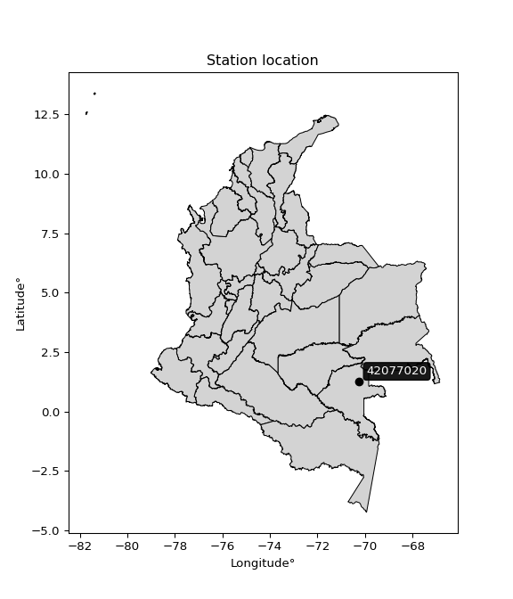

<div align="center">


</div>

# PMax24h Station (Rain): 42077020

Maximum Precipitation in 24 hours (PMax24h) is the greatest amount of rainfall for a specific duration that is meteorologically possible for a given location, acting as a "worst-case" scenario for extreme storms, crucial for designing safety-critical infrastructure like bridges, river deviations, dams, spillways, and nuclear plants to prevent catastrophic failure. The PMax24h is related with the Probable Maximum Precipitation (PMP) and it is calculated by hydrologists using meteorological data to determine the upper limit of extreme rainfall, often leading to the Probable Maximum Flood (PMF) for flood control design, and is increasingly being studied for climate change impacts. Probable Maximum Precipitation (PMP) is the theoretical upper limit of rainfall, a deterministic estimate for extreme events, while probability distributions (like GEV, Gumbel) describe the likelihood and frequency of various precipitation amounts, including rare ones, showing how often events occur, with PMP representing the extreme end of these distributions, used for critical infrastructure design to ensure safety against the worst conceivable weather, unlike standard statistical forecasts which cover typical probabilities.

The most common probability distributions in hydrology, used for analyzing floods, rainfall, and streamflow, include the Normal, Log-Normal, Gumbel, Gamma (including Log-Pearson Type III), and Generalized Extreme Value (GEV) distributions, often chosen based on the data´s skewness and whether modeling extremes or general conditions, with Gumbel and GEV popular for extreme events like floods, while the Normal distribution serves as a baseline, though often requiring transformations for skewed hydrological data. These distributions help in designing water infrastructure, managing water resources, and forecasting hydrologic events.

> Hydrological data often isn´t perfectly normal (it´s skewed), so different distributions are needed for different applications, such as: **Flood Frequency Analysis**: Using Gumbel, GEV, or Log-Pearson Type III for predicting extreme flood magnitudes and their return periods, **Rainfall Analysis**: Normal for annual totals, but Log-Normal, Weibull, or GEV for intensity or extreme daily rainfall, **Streamflow Modeling**: Gamma and Log-Normal for maximum flows, GEV for minimum flows, and Kappa for daily flows.

<div align="center">

</img>

</div>


## A. General information


### 1. General running parameters

• app_version: _v20260225_. • runtime: _2026-02-28 16:54:07.457399_. • Python version: _3.14.0_. • SciPy version: _1.16.3_. • Pandas version: _2.3.3_. • NumPy version: _2.3.5_. • Stations dataset (station_dataset_file): _dataset/pmax24h_in/automatic_colombia_2003_2025.csv_. • Stations catalog (station_catalog_file): _dataset/CNE.xls_. • Minimum year to eval til year_max (date_min): _1900_. • Maximum year to eval since year_min (date_max): _2025_. • Creates, save and include plots into reports (create_plot): _False_. • Plot only fit distributions with Δo > Δ (plot_only_fit): _True_. • Plot only simple graphs avoiding multiple CDFs and multiple Extreme values plots (plot_only_simple): _False_. • Eval low extreme values, if False, evaluates high extreme values (low_extreme): _False_. • Eval every SciPy distribution as logarithmic (pdist_logarithmic_on): _True_. • Standard deviation normalized (ddof): _1.0_. • Return periods to eval in years (Tr): _[2, 2.33, 5, 10, 15, 20, 25, 50, 75, 100, 200, 250, 500, 750, 1000]_. • Minimum data sample per station, 0 means any (minimum_sample): _5_. • Z-Score maximum threshold to adjust a value, 0 means disable (zscore_max): _3.5_. • Z-Score minimum threshold to adjust a value, 0 means disable (zscore_min): _-2.5_. • Avoid zeros, e.g. rain = 0 (avoid_zeros): _True_. • Avoid null values (avoid_nans): _True_. 

:file_folder:Table: [dataset.csv](../../dataset/pmax24h_in/automatic_colombia_2003_2025.csv)

> Delta Degrees of Freedom (DDOF): is a parameter used in the formulas for calculating variance and standard deviation. When ddof=0, the divisor is $N$ (the total number of observations) and this is used when your data set is the entire population. When ddof=1, the divisor is $N-1$ and this is used when your data set is a sample drawn from a larger population. Using $N-1$ provides an unbiased estimate of the population variance (known as Bessel´s correction).


### 2. Station info and location

|   id |   CODIGO | NOMBRE          | CATEGORIA    | TECNOLOGIA                              | ESTADO           | FECHA_INSTALACION   |   FECHA_SUSPENSION |   ALTITUD |   LATITUD |   LONGITUD | DEPARTAMENTO   | MUNICIPIO   | AREA_OPERATIVA                            | ENTIDAD                                                     | AREA_HIDROGRAFICA   | ZONA_HIDROGRAFICA   | SUBZONA_HIDROGRAFICA   | CORRIENTE   | Catalogo   |   Version |
|-----:|---------:|:----------------|:-------------|:----------------------------------------|:-----------------|:--------------------|-------------------:|----------:|----------:|-----------:|:---------------|:------------|:------------------------------------------|:------------------------------------------------------------|:--------------------|:--------------------|:-----------------------|:------------|:-----------|----------:|
|    0 | 42077020 | MITU [42077020] | Limnigráfica | Automática con Telemetría, Convencional | En Mantenimiento | 15/04/1984          |                nan |       168 |   1.25981 |   -70.2392 | Vaupes         | Mitú        | Area Operativa 03 - Meta-Guaviare-Guainía | INSTITUTO DE HIDROLOGIA METEOROLOGIA Y ESTUDIOS AMBIENTALES | Amazonas            | Vaupes              | Bajo Vaupés            | Vaupes      | CNE_IDEAM  |  20251226 |

<div align="center">

Dynamic map: [:earth_americas:Google](http://maps.google.com/maps?q=1.259806,-70.239167) [:earth_americas:OSM](https://www.openstreetmap.org/#map=18/1.259806/-70.239167&layers=P) [:earth_americas:Bing](https://www.bing.com/maps?cp=1.259806~-70.239167&lvl=18) [:earth_americas:Apple](https://maps.apple.com/frame?center=1.259806%2C-70.239167&span=0.003%2C0.006)

</div>


<div align="center">

```geojson
{
  "type": "Feature",
  "geometry": {
    "type": "Point", 
    "coordinates": [-70.239167, 1.259806]
  }, 
  "properties": {
    "Name": "42077020"
  }
}
```

</div>


### 3. Discrete values table and plot

<div align="center">

|               |          0 |          1 |           2 |           3 |          4 |          5 |           6 |           7 |
|:--------------|-----------:|-----------:|------------:|------------:|-----------:|-----------:|------------:|------------:|
| Date          | 2017       | 2018       | 2019        | 2020        | 2021       | 2023       | 2024        | 2025        |
| Value         |  161.6     |  137.6     |  115.8      |   77.2      |   51.6     |   58.2     |  112        |   94.8      |
| Value_initial |  161.6     |  137.6     |  115.8      |   77.2      |   51.6     |   58.2     |  112        |   94.8      |
| count         |    8       |    8       |    8        |    8        |    8       |    8       |    8        |    8        |
| mean          |  101.1     |  101.1     |  101.1      |  101.1      |  101.1     |  101.1     |  101.1      |  101.1      |
| std           |   38.2267  |   38.2267  |   38.2267   |   38.2267   |   38.2267  |   38.2267  |   38.2267   |   38.2267   |
| zscore        |    1.58266 |    0.95483 |    0.384548 |   -0.625218 |   -1.29491 |   -1.12225 |    0.285141 |   -0.164806 |


</div>


> The initial value (value_initial) correspond to the initial obtained or null completed value, and value (value) is adjusted only when the initial value is outside the valid range (outlier) definite through the Z-Score value. If Z-Score is active, values out of range or outliers are replaced with the station mean value. A Z-Score (or standard score) measures how many standard deviations a data point is from the mean of a dataset, indicating its relative position; positive scores mean above the mean, negative mean below, and a score of zero is exactly at the mean, allowing for comparison of values from different distributions. It´s calculated using the formula $z=(x–μ)/σ$, where $x$ is the data point, $μ$ is the mean, and $σ$ is the standard deviation, helping identify outliers and understand probability.
>
> <sub>**Note**: In this study, "completing" (filling gaps in) and "extending" (forecasting or lengthening the historical record) rainfall data series are avoided for certain critical analyses because they introduce artificial bias and uncertainty, which can distort the statistics of rare events (extremes), alter day-to-day variability, and compromise the integrity and homogeneity of the original data. Some reasons against Completing/Extending rainfall data are: **Distortion of Extremes and Variability**: The primary issue is that most gap-filling or extension methods rely on averaging or regression with nearby stations, which inherently smooths the data. Rainfall is highly variable in space and time, with a large percentage of zero values and occasional large storms. Infilling methods often underestimate the highest values and overestimate the lowest (zero) values, which severely distorts analyses focused on flood frequency, drought severity, and intensity-duration-frequency (IDF) curves, **Loss of Data Homogeneity**: Infilled or extended data are synthetic estimates, not actual measurements. Combining these estimates with observed data can violate the assumption of data homogeneity, which requires that the data properties do not change over time. Inhomogeneity can lead to incorrect conclusions about long-term trends or changes in climate patterns, **Propagation of Errors**: Errors and biases from the original data (e.g., wind-induced undercatch, instrument errors, site changes) or the data used for imputation can propagate through the analysis, leading to unreliable hydrological models and inaccurate predictions, **Compromised Statistical Integrity**: For statistical analyses, especially those involving the frequency of events, using artificial data can introduce time bias or autocorrelation that doesn´t exist in reality, making it difficult to assess the true probability of events, **Difficulty in Validation**: It is difficult to accurately validate the quality of filled or extended data, especially for past periods where ground-truth measurements are unavailable. The reliability of imputation techniques heavily depends on the density of the surrounding station network and the complexity of the local topography.</sub>


### 4. Active continuous probability distributions from SciPy (80 of 104 available)

A Probability Density Function (PDF) describes the relative likelihood of a continuous random variable falling within a specific range, where the total area under its curve equals 1, and the area over any interval gives the actual probability for that range. Unlike discrete probabilities (like rolling a die), a PDF shows density, not direct probability for a single point (which is zero), with higher points indicating higher likelihood, often visualized as a bell curve for normal distributions.

A log of a probability density function (log-PDF) is simply the logarithm of the PDF´s value, denoted as $log(f(x))$, useful for converting multiplication of probabilities into addition, improving numerical stability with tiny numbers, and connecting to information theory concepts like entropy. Instead of dealing with very small probabilities (e.g., 0.000001), log-PDFs use negative numbers (e.g., $log(0.00001) ≈ -11.51$ that are easier for computers to handle, preventing underflow errors and simplifying complex calculations. In this study, each active probability distribution from SciPy is also evaluated in the $log$ form.

[scipy.stats](https://docs.scipy.org/doc/scipy/reference/stats.html) is a Python´s powerful submodule within the SciPy library for comprehensive statistical analysis, offering over 130 probability distributions (like Normal, Poisson, etc.), functions for descriptive stats (mean, variance), hypothesis testing (t-tests, chi-square), random variable generation, and statistical tests, making it essential for data science, modeling, and research. It provides tools to explore, model, and draw conclusions from data efficiently, working seamlessly with [NumPy](https://numpy.org/).

<div align="center">

|   id | p_dist           |   n_parameter | fit_method   | label                                                                       | active   | ref                                                                                                      |
|-----:|:-----------------|--------------:|:-------------|:----------------------------------------------------------------------------|:---------|:---------------------------------------------------------------------------------------------------------|
|    0 | alpha            |             3 | MLE          | Alpha                                                                       | True     | [:mortar_board:](https://docs.scipy.org/doc/scipy/reference/generated/scipy.stats.alpha.html)            |
|    1 | anglit           |             2 | MM           | Anglit                                                                      | True     | [:mortar_board:](https://docs.scipy.org/doc/scipy/reference/generated/scipy.stats.anglit.html)           |
|    2 | arcsine          |             2 | MM           | Arcsine                                                                     | True     | [:mortar_board:](https://docs.scipy.org/doc/scipy/reference/generated/scipy.stats.arcsine.html)          |
|    3 | argus            |             3 | MLE          | Argus                                                                       | True     | [:mortar_board:](https://docs.scipy.org/doc/scipy/reference/generated/scipy.stats.argus.html)            |
|    4 | beta             |             4 | MLE          | Beta                                                                        | True     | [:mortar_board:](https://docs.scipy.org/doc/scipy/reference/generated/scipy.stats.beta.html)             |
|    5 | betaprime        |             4 | MLE          | Beta prime                                                                  | True     | [:mortar_board:](https://docs.scipy.org/doc/scipy/reference/generated/scipy.stats.betaprime.html)        |
|    6 | bradford         |             3 | MLE          | Bradford                                                                    | True     | [:mortar_board:](https://docs.scipy.org/doc/scipy/reference/generated/scipy.stats.bradford.html)         |
|    7 | burr             |             4 | MLE          | Burr (Type III)                                                             | True     | [:mortar_board:](https://docs.scipy.org/doc/scipy/reference/generated/scipy.stats.burr.html)             |
|    8 | burr12           |             4 | MLE          | Burr (Type III) 12                                                          | True     | [:mortar_board:](https://docs.scipy.org/doc/scipy/reference/generated/scipy.stats.burr12.html)           |
|    9 | cosine           |             2 | MLE          | Cosine                                                                      | True     | [:mortar_board:](https://docs.scipy.org/doc/scipy/reference/generated/scipy.stats.cosine.html)           |
|   10 | crystalball      |             4 | MLE          | Crystalball                                                                 | True     | [:mortar_board:](https://docs.scipy.org/doc/scipy/reference/generated/scipy.stats.crystalball.html)      |
|   11 | dgamma           |             3 | MLE          | Double gamma                                                                | True     | [:mortar_board:](https://docs.scipy.org/doc/scipy/reference/generated/scipy.stats.dgamma.html)           |
|   12 | dweibull         |             3 | MLE          | Double Weibull                                                              | True     | [:mortar_board:](https://docs.scipy.org/doc/scipy/reference/generated/scipy.stats.dweibull.html)         |
|   13 | erlang           |             3 | MLE          | Erlang                                                                      | True     | [:mortar_board:](https://docs.scipy.org/doc/scipy/reference/generated/scipy.stats.erlang.html)           |
|   14 | exponnorm        |             3 | MLE          | Exponentially modified Normal                                               | True     | [:mortar_board:](https://docs.scipy.org/doc/scipy/reference/generated/scipy.stats.exponnorm.html)        |
|   15 | exponpow         |             3 | MLE          | Exponential power                                                           | True     | [:mortar_board:](https://docs.scipy.org/doc/scipy/reference/generated/scipy.stats.exponpow.html)         |
|   16 | exponweib        |             4 | MLE          | Exponentiated Weibull                                                       | True     | [:mortar_board:](https://docs.scipy.org/doc/scipy/reference/generated/scipy.stats.exponweib.html)        |
|   17 | f                |             4 | MLE          | F                                                                           | True     | [:mortar_board:](https://docs.scipy.org/doc/scipy/reference/generated/scipy.stats.f.html)                |
|   18 | fatiguelife      |             3 | MLE          | Fatigue-life (Birnbaum-Saunders)                                            | True     | [:mortar_board:](https://docs.scipy.org/doc/scipy/reference/generated/scipy.stats.fatiguelife.html)      |
|   19 | foldnorm         |             3 | MM           | Fold Normal                                                                 | True     | [:mortar_board:](https://docs.scipy.org/doc/scipy/reference/generated/scipy.stats.foldnorm.html)         |
|   20 | gamma            |             3 | MLE          | Gamma                                                                       | True     | [:mortar_board:](https://docs.scipy.org/doc/scipy/reference/generated/scipy.stats.gamma.html)            |
|   21 | gausshyper       |             6 | MLE          | Gauss hypergeometric                                                        | True     | [:mortar_board:](https://docs.scipy.org/doc/scipy/reference/generated/scipy.stats.gausshyper.html)       |
|   22 | genexpon         |             5 | MLE          | Generalized exponential                                                     | True     | [:mortar_board:](https://docs.scipy.org/doc/scipy/reference/generated/scipy.stats.genexpon.html)         |
|   23 | genextreme       |             3 | MLE          | Generalized exponential                                                     | True     | [:mortar_board:](https://docs.scipy.org/doc/scipy/reference/generated/scipy.stats.genextreme.html)       |
|   24 | gengamma         |             4 | MLE          | Generalized gamma                                                           | True     | [:mortar_board:](https://docs.scipy.org/doc/scipy/reference/generated/scipy.stats.gengamma.html)         |
|   25 | genhalflogistic  |             3 | MLE          | Generalized half-logistic                                                   | True     | [:mortar_board:](https://docs.scipy.org/doc/scipy/reference/generated/scipy.stats.genhalflogistic.html)  |
|   26 | genlogistic      |             3 | MLE          | Generalized logistic                                                        | True     | [:mortar_board:](https://docs.scipy.org/doc/scipy/reference/generated/scipy.stats.genlogistic.html)      |
|   27 | gennorm          |             3 | MLE          | Generalized Normal                                                          | True     | [:mortar_board:](https://docs.scipy.org/doc/scipy/reference/generated/scipy.stats.gennorm.html)          |
|   28 | genpareto        |             3 | MLE          | Generalized Pareto                                                          | True     | [:mortar_board:](https://docs.scipy.org/doc/scipy/reference/generated/scipy.stats.genpareto.html)        |
|   29 | gompertz         |             3 | MLE          | Gompertz (or truncated Gumbel)                                              | True     | [:mortar_board:](https://docs.scipy.org/doc/scipy/reference/generated/scipy.stats.gompertz.html)         |
|   30 | gumbel_l         |             2 | MM           | Gumbel Left Skew                                                            | True     | [:mortar_board:](https://docs.scipy.org/doc/scipy/reference/generated/scipy.stats.gumbel_l.html)         |
|   31 | gumbel_r         |             2 | MM           | Gumbel Right Skew                                                           | True     | [:mortar_board:](https://docs.scipy.org/doc/scipy/reference/generated/scipy.stats.gumbel_r.html)         |
|   32 | halfgennorm      |             3 | MLE          | Upper half of a generalized normal                                          | True     | [:mortar_board:](https://docs.scipy.org/doc/scipy/reference/generated/scipy.stats.halfgennorm.html)      |
|   33 | halflogistic     |             2 | MM           | Half-logistic                                                               | True     | [:mortar_board:](https://docs.scipy.org/doc/scipy/reference/generated/scipy.stats.halflogistic.html)     |
|   34 | halfnorm         |             2 | MM           | Half Normal                                                                 | True     | [:mortar_board:](https://docs.scipy.org/doc/scipy/reference/generated/scipy.stats.halfnorm.html)         |
|   35 | hypsecant        |             2 | MM           | hyperbolic secant                                                           | True     | [:mortar_board:](https://docs.scipy.org/doc/scipy/reference/generated/scipy.stats.hypsecant.html)        |
|   36 | invgamma         |             3 | MLE          | Inverted gamma                                                              | True     | [:mortar_board:](https://docs.scipy.org/doc/scipy/reference/generated/scipy.stats.invgamma.html)         |
|   37 | invgauss         |             3 | MLE          | Inverse Gaussian                                                            | True     | [:mortar_board:](https://docs.scipy.org/doc/scipy/reference/generated/scipy.stats.invgauss.html)         |
|   38 | invweibull       |             3 | MLE          | Inverted Weibull                                                            | True     | [:mortar_board:](https://docs.scipy.org/doc/scipy/reference/generated/scipy.stats.invweibull.html)       |
|   39 | johnsonsb        |             4 | MLE          | Johnson SB                                                                  | True     | [:mortar_board:](https://docs.scipy.org/doc/scipy/reference/generated/scipy.stats.johnsonsb.html)        |
|   40 | johnsonsu        |             4 | MLE          | Johnson Su                                                                  | True     | [:mortar_board:](https://docs.scipy.org/doc/scipy/reference/generated/scipy.stats.johnsonsu.html)        |
|   41 | kappa3           |             3 | MLE          | Kappa 3                                                                     | True     | [:mortar_board:](https://docs.scipy.org/doc/scipy/reference/generated/scipy.stats.kappa3.html)           |
|   42 | kappa4           |             4 | MLE          | Kappa 4                                                                     | True     | [:mortar_board:](https://docs.scipy.org/doc/scipy/reference/generated/scipy.stats.kappa4.html)           |
|   43 | ksone            |             3 | MLE          | Kolmogorov-Smirnov one-sided test statistic distribution                    | True     | [:mortar_board:](https://docs.scipy.org/doc/scipy/reference/generated/scipy.stats.ksone.html)            |
|   44 | kstwobign        |             2 | MLE          | Limiting distribution of scaled Kolmogorov-Smirnov two-sided test statistic | True     | [:mortar_board:](https://docs.scipy.org/doc/scipy/reference/generated/scipy.stats.kstwobign.html)        |
|   45 | laplace          |             2 | MM           | Laplace                                                                     | True     | [:mortar_board:](https://docs.scipy.org/doc/scipy/reference/generated/scipy.stats.laplace.html)          |
|   46 | levy_l           |             2 | MLE          | Left-skewed Levy                                                            | True     | [:mortar_board:](https://docs.scipy.org/doc/scipy/reference/generated/scipy.stats.levy_l.html)           |
|   47 | loggamma         |             3 | MLE          | Log gamma                                                                   | True     | [:mortar_board:](https://docs.scipy.org/doc/scipy/reference/generated/scipy.stats.loggamma.html)         |
|   48 | logistic         |             2 | MM           | Logistic (or Sech-squared)                                                  | True     | [:mortar_board:](https://docs.scipy.org/doc/scipy/reference/generated/scipy.stats.logistic.html)         |
|   49 | loglaplace       |             3 | MLE          | Log-Laplace                                                                 | True     | [:mortar_board:](https://docs.scipy.org/doc/scipy/reference/generated/scipy.stats.loglaplace.html)       |
|   50 | lomax            |             3 | MLE          | Lomax (Pareto of the second kind)                                           | True     | [:mortar_board:](https://docs.scipy.org/doc/scipy/reference/generated/scipy.stats.lomax.html)            |
|   51 | maxwell          |             2 | MM           | Maxwell                                                                     | True     | [:mortar_board:](https://docs.scipy.org/doc/scipy/reference/generated/scipy.stats.maxwell.html)          |
|   52 | mielke           |             4 | MLE          | Mielke Beta-Kappa / Dagum                                                   | True     | [:mortar_board:](https://docs.scipy.org/doc/scipy/reference/generated/scipy.stats.mielke.html)           |
|   53 | moyal            |             2 | MM           | Moyal                                                                       | True     | [:mortar_board:](https://docs.scipy.org/doc/scipy/reference/generated/scipy.stats.moyal.html)            |
|   54 | nakagami         |             3 | MLE          | Nakagami                                                                    | True     | [:mortar_board:](https://docs.scipy.org/doc/scipy/reference/generated/scipy.stats.nakagami.html)         |
|   55 | ncf              |             5 | MLE          | Non-central F distribution                                                  | True     | [:mortar_board:](https://docs.scipy.org/doc/scipy/reference/generated/scipy.stats.ncf.html)              |
|   56 | nct              |             4 | MLE          | Non-central Student’s t                                                     | True     | [:mortar_board:](https://docs.scipy.org/doc/scipy/reference/generated/scipy.stats.nct.html)              |
|   57 | norm             |             2 | MM           | Normal                                                                      | True     | [:mortar_board:](https://docs.scipy.org/doc/scipy/reference/generated/scipy.stats.norm.html)             |
|   58 | pearson3         |             3 | MM           | Pearson type III                                                            | True     | [:mortar_board:](https://docs.scipy.org/doc/scipy/reference/generated/scipy.stats.pearson3.html)         |
|   59 | powerlaw         |             3 | MLE          | Power-function                                                              | True     | [:mortar_board:](https://docs.scipy.org/doc/scipy/reference/generated/scipy.stats.powerlaw.html)         |
|   60 | rayleigh         |             2 | MM           | Rayleigh                                                                    | True     | [:mortar_board:](https://docs.scipy.org/doc/scipy/reference/generated/scipy.stats.rayleigh.html)         |
|   61 | rdist            |             3 | MLE          | R-distributed (symmetric beta)                                              | True     | [:mortar_board:](https://docs.scipy.org/doc/scipy/reference/generated/scipy.stats.rdist.html)            |
|   62 | rice             |             3 | MLE          | Rice                                                                        | True     | [:mortar_board:](https://docs.scipy.org/doc/scipy/reference/generated/scipy.stats.rice.html)             |
|   63 | semicircular     |             2 | MM           | Semicircular                                                                | True     | [:mortar_board:](https://docs.scipy.org/doc/scipy/reference/generated/scipy.stats.semicircular.html)     |
|   64 | skewnorm         |             3 | MLE          | Skew normal                                                                 | True     | [:mortar_board:](https://docs.scipy.org/doc/scipy/reference/generated/scipy.stats.skewnorm.html)         |
|   65 | t                |             3 | MLE          | Student’s t                                                                 | True     | [:mortar_board:](https://docs.scipy.org/doc/scipy/reference/generated/scipy.stats.t.html)                |
|   66 | trapezoid        |             4 | MLE          | Trapezoid                                                                   | True     | [:mortar_board:](https://docs.scipy.org/doc/scipy/reference/generated/scipy.stats.trapezoid.html)        |
|   67 | triang           |             3 | MLE          | Triangular                                                                  | True     | [:mortar_board:](https://docs.scipy.org/doc/scipy/reference/generated/scipy.stats.triang.html)           |
|   68 | truncexpon       |             3 | MLE          | Truncated exponential                                                       | True     | [:mortar_board:](https://docs.scipy.org/doc/scipy/reference/generated/scipy.stats.truncexpon.html)       |
|   69 | truncnorm        |             4 | MLE          | Truncated normal                                                            | True     | [:mortar_board:](https://docs.scipy.org/doc/scipy/reference/generated/scipy.stats.truncnorm.html)        |
|   70 | truncpareto      |             4 | MLE          | Upper truncated Pareto                                                      | True     | [:mortar_board:](https://docs.scipy.org/doc/scipy/reference/generated/scipy.stats.truncpareto.html)      |
|   71 | truncweibull_min |             5 | MLE          | Doubly truncated Weibull minimum                                            | True     | [:mortar_board:](https://docs.scipy.org/doc/scipy/reference/generated/scipy.stats.truncweibull_min.html) |
|   72 | tukeylambda      |             3 | MLE          | Tukey-Lamdba                                                                | True     | [:mortar_board:](https://docs.scipy.org/doc/scipy/reference/generated/scipy.stats.tukeylambda.html)      |
|   73 | uniform          |             2 | MLE          | Uniform                                                                     | True     | [:mortar_board:](https://docs.scipy.org/doc/scipy/reference/generated/scipy.stats.uniform.html)          |
|   74 | vonmises         |             3 | MLE          | Von Mises                                                                   | True     | [:mortar_board:](https://docs.scipy.org/doc/scipy/reference/generated/scipy.stats.vonmises.html)         |
|   75 | vonmises_line    |             3 | MLE          | Von Mises line                                                              | True     | [:mortar_board:](https://docs.scipy.org/doc/scipy/reference/generated/scipy.stats.vonmises_line.html)    |
|   76 | wald             |             2 | MM           | Wald                                                                        | True     | [:mortar_board:](https://docs.scipy.org/doc/scipy/reference/generated/scipy.stats.wald.html)             |
|   77 | weibull_max      |             3 | MLE          | Weibull maximum                                                             | True     | [:mortar_board:](https://docs.scipy.org/doc/scipy/reference/generated/scipy.stats.weibull_max.html)      |
|   78 | weibull_min      |             3 | MLE          | Weibull minimum                                                             | True     | [:mortar_board:](https://docs.scipy.org/doc/scipy/reference/generated/scipy.stats.weibull_min.html)      |
|   79 | wrapcauchy       |             3 | MLE          | Wrapped  Cauchy                                                             | True     | [:mortar_board:](https://docs.scipy.org/doc/scipy/reference/generated/scipy.stats.wrapcauchy.html)       |

</div>

> **n_parameter:** # arguments & localization & scale.
>
> **Fit methods:** (MLE) maximum likelihood, (MM) L-moments.
>
>**Inactive** (With the only purpose of prevent loops, zero divisions, infinite values, over high estimated values or horizontal trending for recurrence intervals estimations, the follow distributions were disabled.)**:** lognorm, norminvgauss, powernorm, powerlognorm, cauchy, halfcauchy, foldcauchy, skewcauchy, chi2, expon, fisk, genhyperbolic, geninvgauss, gibrat, kstwo, laplace_asymmetric, levy, levy_stable, ncx2, pareto, rel_breitwigner, recipinvgauss, studentized_range, loguniform, 


## B. Probability (PDF) vs. Empirical (EDF) distributions functions

A continuous probability distribution (CPD) describes probabilities for variables that can take any value within a range (like rain any time), unlike discrete variables with specific outcomes (like temperature). It uses a Probability Density Function (PDF), a curve where the total area under it equals 1, and the probability of the variable falling within an interval (a to b) is found by calculating the area under the curve between those points. A key feature is that the probability of hitting any single exact value is zero, so probabilities are always expressed for ranges, e.g., $P(a ≤ X ≤ b)$.

<div align="center">

Distributions parameters from station values
|     |   station | p_dist              |   n |            loc |            scale | shape                  | shape1                 | shape2                | shape3             |
|----:|----------:|:--------------------|----:|---------------:|-----------------:|:-----------------------|:-----------------------|:----------------------|:-------------------|
|   0 |  42077020 | alpha               |   8 |   -333.06      |   5275.38        | 12.239963918907868     |                        |                       |                    |
|   1 |  42077020 | anglit              |   8 |    101.1       |    104.606       |                        |                        |                       |                    |
|   2 |  42077020 | arcsine             |   8 |     50.5308    |    101.138       |                        |                        |                       |                    |
|   3 |  42077020 | argus               |   8 |     20.8647    |    146.362       | 1.1290349460611343e-05 |                        |                       |                    |
|   4 |  42077020 | beta                |   8 |     50.9517    |    110.648       | 0.5057212043135506     | 0.41875778449195655    |                       |                    |
|   5 |  42077020 | betaprime           |   8 |     -1.04445   |     41.568       | 23.967172419000086     | 10.793333696878406     |                       |                    |
|   6 |  42077020 | bradford            |   8 |     51.6       |    110           | 1.1335689929139132     |                        |                       |                    |
|   7 |  42077020 | burr                |   8 |     -0.684614  |    137.277       | 9.141644546613039      | 0.2714900638790704     |                       |                    |
|   8 |  42077020 | burr12              |   8 |     -0.544373  |     51.8245      | 622.2757183656188      | 0.0026496257220659306  |                       |                    |
|   9 |  42077020 | cosine              |   8 |    102.255     |     29.4222      |                        |                        |                       |                    |
|  10 |  42077020 | crystalball         |   8 |    101.1       |     35.7578      | 7092.274128435331      | 8643.717483649927      |                       |                    |
|  11 |  42077020 | dgamma              |   8 |    102.12      |     13.635       | 2.247886999507136      |                        |                       |                    |
|  12 |  42077020 | dweibull            |   8 |    101.844     |     34.3928      | 1.6965200112124927     |                        |                       |                    |
|  13 |  42077020 | erlang              |   8 |    -85.7522    |      6.74618     | 27.647611645695747     |                        |                       |                    |
|  14 |  42077020 | exponnorm           |   8 |     95.4511    |     35.3093      | 0.15998340413153314    |                        |                       |                    |
|  15 |  42077020 | exponpow            |   8 |     51.6       |    118.752       | 0.2057452899214605     |                        |                       |                    |
|  16 |  42077020 | exponweib           |   8 |     51.6       |      1.2525      | 1.1842471163091086     | 0.23942718018675888    |                       |                    |
|  17 |  42077020 | f                   |   8 |     -3.6865    |    104.58        | 16.500835140169364     | 959.4965505606274      |                       |                    |
|  18 |  42077020 | fatiguelife         |   8 |     51.6       |      0.000211309 | 375.959246390031       |                        |                       |                    |
|  19 |  42077020 | foldnorm            |   8 |     24.4439    |     36.8613      | 2.0653532931277496     |                        |                       |                    |
|  20 |  42077020 | gamma               |   8 |    -54.6713    |      8.08269     | 19.247430776503677     |                        |                       |                    |
|  21 |  42077020 | gausshyper          |   8 |     51.6       |    110.205       | 0.9544610424325595     | 0.9575650192919403     | 1.0049572248725493    | 1.0367025103108234 |
|  22 |  42077020 | genexpon            |   8 |     51.6       |      2.859       | 0.05785956932671704    | 0.00011449046807907333 | 0.7268966701387544    |                    |
|  23 |  42077020 | genextreme          |   8 |     52.5462    |      5.83288     | -6.1642814217588295    |                        |                       |                    |
|  24 |  42077020 | gengamma            |   8 |     51.6       |      1.22325     | 1.2940138082584252     | 0.21506748512316262    |                       |                    |
|  25 |  42077020 | genhalflogistic     |   8 |     41.5061    |    124.025       | 1.0327307932410048     |                        |                       |                    |
|  26 |  42077020 | genlogistic         |   8 |   -113.828     |     31.0212      | 580.8808987464683      |                        |                       |                    |
|  27 |  42077020 | gennorm             |   8 |    106.6       |     55.0001      | 7638185.3517873995     |                        |                       |                    |
|  28 |  42077020 | genpareto           |   8 |     -0.967272  |    247.347       | -1.5215028582382955    |                        |                       |                    |
|  29 |  42077020 | gompertz            |   8 |     51.6       |     67.9491      | 0.7242614221787096     |                        |                       |                    |
|  30 |  42077020 | gumbel_l            |   8 |    117.193     |     27.8802      |                        |                        |                       |                    |
|  31 |  42077020 | gumbel_r            |   8 |     85.0071    |     27.8802      |                        |                        |                       |                    |
|  32 |  42077020 | halfgennorm         |   8 |     51.6       |      1.32837     | 0.3392091926589751     |                        |                       |                    |
|  33 |  42077020 | halflogistic        |   8 |     58.7187    |     30.5717      |                        |                        |                       |                    |
|  34 |  42077020 | halfnorm            |   8 |     53.7707    |     59.3185      |                        |                        |                       |                    |
|  35 |  42077020 | hypsecant           |   8 |    101.1       |     22.7641      |                        |                        |                       |                    |
|  36 |  42077020 | invgamma            |   8 |   -129.267     |   9184.17        | 40.90448013947642      |                        |                       |                    |
|  37 |  42077020 | invgauss            |   8 |    -19.7853    |   1219.87        | 0.09892834583596113    |                        |                       |                    |
|  38 |  42077020 | invweibull          |   8 |     51.6       |      1.36562     | 0.05211214024567449    |                        |                       |                    |
|  39 |  42077020 | johnsonsb           |   8 |     51.5918    |    110.008       | -1.5364902427953742    | 0.15500598658453796    |                       |                    |
|  40 |  42077020 | johnsonsu           |   8 |    -83.2111    |     36.6724      | -11.93046347145079     | 5.188975691456461      |                       |                    |
|  41 |  42077020 | kappa3              |   8 |     51.5222    |    109.954       | 926.2669477641662      |                        |                       |                    |
|  42 |  42077020 | kappa4              |   8 |     40.7939    |    118.806       | 1.0998642650441237     | 0.9626020967974194     |                       |                    |
|  43 |  42077020 | ksone               |   8 |     39.1657    |    123.869       | 1.0                    |                        |                       |                    |
|  44 |  42077020 | kstwobign           |   8 |    -23.6561    |    142.494       |                        |                        |                       |                    |
|  45 |  42077020 | laplace             |   8 |    101.1       |     25.2846      |                        |                        |                       |                    |
|  46 |  42077020 | levy_l              |   8 |    167.842     |     29.3205      |                        |                        |                       |                    |
|  47 |  42077020 | loggamma            |   8 | -10578.6       |   1446.49        | 1609.1825000671026     |                        |                       |                    |
|  48 |  42077020 | logistic            |   8 |    101.1       |     19.7143      |                        |                        |                       |                    |
|  49 |  42077020 | loglaplace          |   8 |     -0.298583  |     95.0986      | 3.1181261508531612     |                        |                       |                    |
|  50 |  42077020 | lomax               |   8 |     51.6       | 102946           | 2067.31098637577       |                        |                       |                    |
|  51 |  42077020 | maxwell             |   8 |     16.369     |     53.0973      |                        |                        |                       |                    |
|  52 |  42077020 | mielke              |   8 |     -3.55571   |    138.59        | 2.5934168794972616     | 8.994800754295127      |                       |                    |
|  53 |  42077020 | moyal               |   8 |     80.6514    |     16.0967      |                        |                        |                       |                    |
|  54 |  42077020 | nakagami            |   8 |     51.6       |     72.2266      | 0.08427833437287086    |                        |                       |                    |
|  55 |  42077020 | ncf                 |   8 |     -0.673303  |      1.8748e-06  | 7.182563140874973e-07  | 78.83695133858453      | 38.0581457099804      |                    |
|  56 |  42077020 | nct                 |   8 |  -1046.31      |     35.7223      | 242843.63643738301     | 32.120029551901354     |                       |                    |
|  57 |  42077020 | norm                |   8 |    101.1       |     35.7578      |                        |                        |                       |                    |
|  58 |  42077020 | pearson3            |   8 |    101.1       |     35.7578      | 0.16513000331225744    |                        |                       |                    |
|  59 |  42077020 | powerlaw            |   8 |     51.6       |    110           | 0.18236345709611473    |                        |                       |                    |
|  60 |  42077020 | rayleigh            |   8 |     32.6932    |     54.5807      |                        |                        |                       |                    |
|  61 |  42077020 | rdist               |   8 |     44.0933    |     50.7067      | 1.203465278346068      |                        |                       |                    |
|  62 |  42077020 | rice                |   8 |     34.1596    |     45.1694      | 0.9071753874333253     |                        |                       |                    |
|  63 |  42077020 | semicircular        |   8 |    101.1       |     71.5156      |                        |                        |                       |                    |
|  64 |  42077020 | skewnorm            |   8 |     51.6       |     61.0604      | 7192679.639752522      |                        |                       |                    |
|  65 |  42077020 | t                   |   8 |    101.102     |     35.7571      | 19787706.098448947     |                        |                       |                    |
|  66 |  42077020 | trapezoid           |   8 |     40.6       |    132           | 1.0                    | 1.0                    |                       |                    |
|  67 |  42077020 | triang              |   8 |     10.4036    |    151.196       | 0.9999999999977836     |                        |                       |                    |
|  68 |  42077020 | truncexpon          |   8 |     51.5985    |    112.325       | 0.9793139867998815     |                        |                       |                    |
|  69 |  42077020 | truncnorm           |   8 |    101.1       |     35.7578      | -1917.6374798147938    | 634.1568450875446      |                       |                    |
|  70 |  42077020 | truncpareto         |   8 |    -26.2388    |     77.8388      | 2.1588281611666094e-08 | 2.413177264254379      |                       |                    |
|  71 |  42077020 | truncweibull_min    |   8 |     51.5192    |    116.465       | 0.6940071538124972     | 0.0006936813587979664  | 0.9451851680807963    |                    |
|  72 |  42077020 | tukeylambda         |   8 |    106.341     |     59.2576      | 1.0723578967587373     |                        |                       |                    |
|  73 |  42077020 | uniform             |   8 |     51.6       |    110           |                        |                        |                       |                    |
|  74 |  42077020 | vonmises            |   8 |      0.987709  |      1           | 0.43884150693017143    |                        |                       |                    |
|  75 |  42077020 | vonmises_line       |   8 |    106.588     |     17.5111      | 2.049049622066348e-05  |                        |                       |                    |
|  76 |  42077020 | wald                |   8 |     65.3422    |     35.7578      |                        |                        |                       |                    |
|  77 |  42077020 | weibull_max         |   8 |    161.6       |      1.55706     | 0.24153433602892221    |                        |                       |                    |
|  78 |  42077020 | weibull_min         |   8 |     51.6       |     58.0537      | 0.6806925476371128     |                        |                       |                    |
|  79 |  42077020 | wrapcauchy          |   8 |     51.6       |     17.9447      | 0.5                    |                        |                       |                    |
|  80 |  42077020 | logalpha            |   8 |     -6.32339   |    307.578       | 28.317778915480986     |                        |                       |                    |
|  81 |  42077020 | loganglit           |   8 |      4.54818   |      1.10489     |                        |                        |                       |                    |
|  82 |  42077020 | logarcsine          |   8 |      4.01404   |      1.06828     |                        |                        |                       |                    |
|  83 |  42077020 | logargus            |   8 |      3.6713    |      1.47011     | 0.7920090460293212     |                        |                       |                    |
|  84 |  42077020 | logbeta             |   8 |      3.84002   |      1.2451      | 1.0246103356306846     | 0.7584363964321508     |                       |                    |
|  85 |  42077020 | logbetaprime        |   8 |     -4.37771   |    195.118       | 565.5681912568281      | 12366.492250679614     |                       |                    |
|  86 |  42077020 | logbradford         |   8 |      3.94352   |      1.14161     | 1.0901270069862954     |                        |                       |                    |
|  87 |  42077020 | logburr             |   8 |     -0.128873  |      5.10634     | 56.36138701670484      | 0.18552179615491038    |                       |                    |
|  88 |  42077020 | logburr12           |   8 |     -0.419039  |      7.34258     | 15.810250105169363     | 282.9142238350463      |                       |                    |
|  89 |  42077020 | logcosine           |   8 |      4.5337    |      0.307829    |                        |                        |                       |                    |
|  90 |  42077020 | logcrystalball      |   8 |      4.54818   |      0.377689    | 347.5804119804386      | 41.436718782108194     |                       |                    |
|  91 |  42077020 | logdgamma           |   8 |      4.6162    |      0.162303    | 1.982623973349925      |                        |                       |                    |
|  92 |  42077020 | logdweibull         |   8 |      4.6058    |      0.358145    | 1.5626690862019696     |                        |                       |                    |
|  93 |  42077020 | logerlang           |   8 |     -2.07499   |      0.0222638   | 297.49424806849254     |                        |                       |                    |
|  94 |  42077020 | logexponnorm        |   8 |      4.54774   |      0.377689    | 0.001162387814167152   |                        |                       |                    |
|  95 |  42077020 | logexponpow         |   8 |      3.94352   |      1.00053     | 0.8022321984641676     |                        |                       |                    |
|  96 |  42077020 | logexponweib        |   8 |      3.94352   |      0.942351    | 0.11760735958233409    | 1.6662846224890049     |                       |                    |
|  97 |  42077020 | logf                |   8 |    -53.6279    |     58.1746      | 49020.65517549352      | 1123964.66286864       |                       |                    |
|  98 |  42077020 | logfatiguelife      |   8 |    -58.7033    |     63.2505      | 0.005965964242670074   |                        |                       |                    |
|  99 |  42077020 | logfoldnorm         |   8 |      4.03891   |      0.504994    | 0.7445084612255879     |                        |                       |                    |
| 100 |  42077020 | loggamma            |   8 |     -2.40405   |      0.0209187   | 332.301944104035       |                        |                       |                    |
| 101 |  42077020 | loggausshyper       |   8 |      3.94329   |      1.14184     | 0.975497569525827      | 0.9084622513481317     | 1.208579060695044     | 0.9930166607481625 |
| 102 |  42077020 | loggenexpon         |   8 |      3.94234   |      0.00817933  | 0.006416431531252298   | 2.7260302867015223     | 5.048520831889837e-05 |                    |
| 103 |  42077020 | loggenextreme       |   8 |      4.49116   |      0.438626    | 0.6823264327199174     |                        |                       |                    |
| 104 |  42077020 | loggengamma         |   8 |      3.94352   |      0.61653     | 0.20344432398146953    | 1.5567129924556293     |                       |                    |
| 105 |  42077020 | loggenhalflogistic  |   8 |      3.93533   |      1.23823     | 1.076910218086444      |                        |                       |                    |
| 106 |  42077020 | loggenlogistic      |   8 |      4.91821   |      0.109929    | 0.26885647843001537    |                        |                       |                    |
| 107 |  42077020 | loggennorm          |   8 |      4.51432   |      0.570803    | 4759147.914045856      |                        |                       |                    |
| 108 |  42077020 | loggenpareto        |   8 |     -0.0111255 |     12.163       | -2.3866627527091353    |                        |                       |                    |
| 109 |  42077020 | loggompertz         |   8 |      3.94352   |      0.976656    | 1.0530837694582897     |                        |                       |                    |
| 110 |  42077020 | loggumbel_l         |   8 |      4.71816   |      0.294483    |                        |                        |                       |                    |
| 111 |  42077020 | loggumbel_r         |   8 |      4.3782    |      0.294483    |                        |                        |                       |                    |
| 112 |  42077020 | loghalfgennorm      |   8 |      3.9435    |      1.14207     | 16258.92356394328      |                        |                       |                    |
| 113 |  42077020 | loghalflogistic     |   8 |      4.10049   |      0.322938    |                        |                        |                       |                    |
| 114 |  42077020 | loghalfnorm         |   8 |      4.0483    |      0.626505    |                        |                        |                       |                    |
| 115 |  42077020 | loghypsecant        |   8 |      4.54818   |      0.240444    |                        |                        |                       |                    |
| 116 |  42077020 | loginvgamma         |   8 |     -2.46628   |   2341.2         | 334.8486909554922      |                        |                       |                    |
| 117 |  42077020 | loginvgauss         |   8 |      1.43587   |    191.602       | 0.016233114624732453   |                        |                       |                    |
| 118 |  42077020 | loginvweibull       |   8 | -12792.3       |  12796.7         | 35376.920271232855     |                        |                       |                    |
| 119 |  42077020 | logjohnsonsb        |   8 |      3.94352   |      1.1416      | 0.17663784844536087    | 0.157167153180512      |                       |                    |
| 120 |  42077020 | logjohnsonsu        |   8 |      5.76839   |      0.109794    | 9.691298824765417      | 3.1729059427833093     |                       |                    |
| 121 |  42077020 | logkappa3           |   8 |      3.94352   |      1.14107     | 4459.396835557565      |                        |                       |                    |
| 122 |  42077020 | logkappa4           |   8 |      3.8894    |      1.24595     | 1.045447691808853      | 1.0420102477952986     |                       |                    |
| 123 |  42077020 | logksone            |   8 |      3.894     |      1.30835     | 1.0                    |                        |                       |                    |
| 124 |  42077020 | logkstwobign        |   8 |      3.1062    |      1.64375     |                        |                        |                       |                    |
| 125 |  42077020 | loglaplace          |   8 |      4.54818   |      0.267066    |                        |                        |                       |                    |
| 126 |  42077020 | loglevy_l           |   8 |      5.13408   |      0.228704    |                        |                        |                       |                    |
| 127 |  42077020 | logloggamma         |   8 |      4.52684   |      0.410177    | 1.5167260319369489     |                        |                       |                    |
| 128 |  42077020 | loglogistic         |   8 |      4.54818   |      0.208231    |                        |                        |                       |                    |
| 129 |  42077020 | logloglaplace       |   8 |     -0.0025423 |      4.72104     | 14.010870333682584     |                        |                       |                    |
| 130 |  42077020 | loglomax            |   8 |      3.94352   |     10.3492      | 17.4604777882314       |                        |                       |                    |
| 131 |  42077020 | logmaxwell          |   8 |      3.65321   |      0.560835    |                        |                        |                       |                    |
| 132 |  42077020 | logmielke           |   8 |      0.119615  |      4.86444     | 9.83554152647299       | 55.43063524994295      |                       |                    |
| 133 |  42077020 | logmoyal            |   8 |      4.33219   |      0.17002     |                        |                        |                       |                    |
| 134 |  42077020 | lognakagami         |   8 |      3.94352   |      0.794855    | 0.08990222673583641    |                        |                       |                    |
| 135 |  42077020 | logncf              |   8 |    -47.9678    |     47.9791      | 60848.38204774623      | 104062.29089795964     | 5755.094474218102     |                    |
| 136 |  42077020 | lognct              |   8 |     14.7462    |      0.369356    | 8343.426236465952      | -27.606676635427075    |                       |                    |
| 137 |  42077020 | lognorm             |   8 |      4.54818   |      0.377689    |                        |                        |                       |                    |
| 138 |  42077020 | logpearson3         |   8 |      4.54818   |      0.377689    | -0.28172350530919055   |                        |                       |                    |
| 139 |  42077020 | logpowerlaw         |   8 |      3.94352   |      1.1416      | 0.19856971789158043    |                        |                       |                    |
| 140 |  42077020 | lograyleigh         |   8 |      3.82564   |      0.576504    |                        |                        |                       |                    |
| 141 |  42077020 | logrdist            |   8 |      4.62946   |      0.685938    | 1.0984878180287425     |                        |                       |                    |
| 142 |  42077020 | logrice             |   8 |      3.74525   |      0.433942    | 1.4768473675920766     |                        |                       |                    |
| 143 |  42077020 | logsemicircular     |   8 |      4.54818   |      0.755378    |                        |                        |                       |                    |
| 144 |  42077020 | logskewnorm         |   8 |      5.08512   |      0.656407    | -3972256.3870782033    |                        |                       |                    |
| 145 |  42077020 | logt                |   8 |      4.54818   |      0.377689    | 83005623335.27882      |                        |                       |                    |
| 146 |  42077020 | logtrapezoid        |   8 |      3.82936   |      1.36992     | 1.0                    | 1.0                    |                       |                    |
| 147 |  42077020 | logtriang           |   8 |      3.61183   |      1.47345     | 0.9998986139056589     |                        |                       |                    |
| 148 |  42077020 | logtruncexpon       |   8 |      3.93037   |      1.31506     | 0.8780986103672985     |                        |                       |                    |
| 149 |  42077020 | logtruncnorm        |   8 |     -0.146344  |      1.66027     | 2.4633739560935792     | 3.5614267935709556     |                       |                    |
| 150 |  42077020 | logtruncpareto      |   8 |      3.94332   |      0.000198836 | 0.0007202343191464666  | 5742.420209194854      |                       |                    |
| 151 |  42077020 | logtruncweibull_min |   8 |      3.9297    |      1.36509     | 1.1204923309794985     | 0.00047635655637129294 | 0.8464129666779434    |                    |
| 152 |  42077020 | logtukeylambda      |   8 |      4.5133    |      0.678464    | 1.1864969944190724     |                        |                       |                    |
| 153 |  42077020 | loguniform          |   8 |      3.94352   |      1.1416      |                        |                        |                       |                    |
| 154 |  42077020 | logvonmises         |   8 |     -1.73235   |      1           | 7.446618815507539      |                        |                       |                    |
| 155 |  42077020 | logvonmises_line    |   8 |      4.51431   |      0.181695    | 0.44283747864268863    |                        |                       |                    |
| 156 |  42077020 | logwald             |   8 |      4.17045   |      0.377726    |                        |                        |                       |                    |
| 157 |  42077020 | logweibull_max      |   8 |      5.13402   |      0.642858    | 1.4656745303157797     |                        |                       |                    |
| 158 |  42077020 | logweibull_min      |   8 |      2.64718   |      2.05444     | 6.039872522452214      |                        |                       |                    |
| 159 |  42077020 | logwrapcauchy       |   8 |      3.94352   |      0.181692    | 0.5                    |                        |                       |                    |

</div>

> **loc** (Location parameter): This shifts the distribution along the x-axis. For many common distributions, like the normal (Gaussian) distribution, loc represents the mean $μ$. For others, like the uniform distribution, it might represent the minimum value, or for the beta distribution, the left end of the support interval.
>
> **scale** (Scale parameter): This determines the width or spread of the distribution. For the normal distribution, scale represents the standard deviation $σ$. For a uniform distribution, it defines the length of the interval (from $loc$ to $loc + scale$).
>
> **shape** (Shape parameters): Refers to parameters that define the specific form of a probability distribution, distinct from its location (loc) and scale (scale). These parameters are required arguments for most distribution functions. For example, a normal (Gaussian) distribution is fully defined by its location (mean) and scale (standard deviation), so it has no specific shape parameters beyond loc and scale. However, other distributions have intrinsic properties that need specification, as Gamma distribution that takes a shape parameter, often named $a$ or $alpha$.


### 0. Cumulative distribution values - CDF (160 evaluated)

Cumulative Distribution Function (CDF), denoted as $F$<sub>$X$</sub>$(x)$, is a function that gives the probability that a random variable $X$ will take a value less than or equal to a specific value, $x$ (i.e., $(P(X≥x)$. It essentially "accumulates" probabilities from a given point up to the far right (positive infinity), providing a complete picture of the distribution´s probabilities for both discrete (like rain) and continuous (like temperature) variables, helping to find probabilities over ranges or above certain values. Each station is evaluated separately ordering the $x$ values ascending, calculating the CDF and PDF values for the activated distributions and their logarithmic forms.

<div align="center">

CDF ordered by x ascending and calculating $log(f(x))$ separately
|   id |   Station |   date |     x |   count |   mean |     std |    zscore |   Value_initial |   station |   m |     alpha |   alpha_pdf |   anglit |   anglit_pdf |   arcsine |   arcsine_pdf |     argus |   argus_pdf |      beta |    beta_pdf |   betaprime |   betaprime_pdf |   bradford |   bradford_pdf |      burr |   burr_pdf |    burr12 |   burr12_pdf |    cosine |   cosine_pdf |   crystalball |   crystalball_pdf |    dgamma |   dgamma_pdf |   dweibull |   dweibull_pdf |   erlang |   erlang_pdf |   exponnorm |   exponnorm_pdf |    exponpow |   exponpow_pdf |   exponweib |   exponweib_pdf |         f |      f_pdf |   fatiguelife |   fatiguelife_pdf |   foldnorm |   foldnorm_pdf |    gamma |   gamma_pdf |   gausshyper |   gausshyper_pdf |    genexpon |   genexpon_pdf |   genextreme |   genextreme_pdf |   gengamma |   gengamma_pdf |   genhalflogistic |   genhalflogistic_pdf |   genlogistic |   genlogistic_pdf |     gennorm |   gennorm_pdf |   genpareto |   genpareto_pdf |    gompertz |   gompertz_pdf |   gumbel_l |   gumbel_l_pdf |   gumbel_r |   gumbel_r_pdf |   halfgennorm |   halfgennorm_pdf |   halflogistic |   halflogistic_pdf |   halfnorm |   halfnorm_pdf |   hypsecant |   hypsecant_pdf |   invgamma |   invgamma_pdf |   invgauss |   invgauss_pdf |   invweibull |   invweibull_pdf |   johnsonsb |   johnsonsb_pdf |   johnsonsu |   johnsonsu_pdf |      kappa3 |   kappa3_pdf |      kappa4 |   kappa4_pdf |    ksone |   ksone_pdf |   kstwobign |   kstwobign_pdf |   laplace |   laplace_pdf |   levy_l |   levy_l_pdf |   loggamma |   loggamma_pdf |   logistic |   logistic_pdf |   loglaplace |   loglaplace_pdf |       lomax |   lomax_pdf |   maxwell |   maxwell_pdf |    mielke |   mielke_pdf |     moyal |   moyal_pdf |   nakagami |   nakagami_pdf |       ncf |    ncf_pdf |       nct |    nct_pdf |      norm |   norm_pdf |   pearson3 |   pearson3_pdf |   powerlaw |   powerlaw_pdf |   rayleigh |   rayleigh_pdf |    rdist |     rdist_pdf |      rice |   rice_pdf |   semicircular |   semicircular_pdf |   skewnorm |   skewnorm_pdf |         t |      t_pdf |   trapezoid |   trapezoid_pdf |    triang |   triang_pdf |   truncexpon |   truncexpon_pdf |   truncnorm |   truncnorm_pdf |   truncpareto |   truncpareto_pdf |   truncweibull_min |   truncweibull_min_pdf |   tukeylambda |   tukeylambda_pdf |   uniform |   uniform_pdf |   vonmises |   vonmises_pdf |   vonmises_line |   vonmises_line_pdf |     wald |   wald_pdf |   weibull_max |   weibull_max_pdf |   weibull_min |   weibull_min_pdf |   wrapcauchy |   wrapcauchy_pdf |   logalpha |   logalpha_pdf |   loganglit |   loganglit_pdf |   logarcsine |   logarcsine_pdf |   logargus |   logargus_pdf |   logbeta |   logbeta_pdf |   logbetaprime |   logbetaprime_pdf |   logbradford |   logbradford_pdf |   logburr |   logburr_pdf |   logburr12 |   logburr12_pdf |   logcosine |   logcosine_pdf |   logcrystalball |   logcrystalball_pdf |   logdgamma |   logdgamma_pdf |   logdweibull |   logdweibull_pdf |   logerlang |   logerlang_pdf |   logexponnorm |   logexponnorm_pdf |   logexponpow |   logexponpow_pdf |   logexponweib |   logexponweib_pdf |     logf |   logf_pdf |   logfatiguelife |   logfatiguelife_pdf |   logfoldnorm |   logfoldnorm_pdf |   loggausshyper |   loggausshyper_pdf |   loggenexpon |   loggenexpon_pdf |   loggenextreme |   loggenextreme_pdf |   loggengamma |   loggengamma_pdf |   loggenhalflogistic |   loggenhalflogistic_pdf |   loggenlogistic |   loggenlogistic_pdf |   loggennorm |   loggennorm_pdf |   loggenpareto |   loggenpareto_pdf |   loggompertz |   loggompertz_pdf |   loggumbel_l |   loggumbel_l_pdf |   loggumbel_r |   loggumbel_r_pdf |   loghalfgennorm |   loghalfgennorm_pdf |   loghalflogistic |   loghalflogistic_pdf |   loghalfnorm |   loghalfnorm_pdf |   loghypsecant |   loghypsecant_pdf |   loginvgamma |   loginvgamma_pdf |   loginvgauss |   loginvgauss_pdf |   loginvweibull |   loginvweibull_pdf |   logjohnsonsb |   logjohnsonsb_pdf |   logjohnsonsu |   logjohnsonsu_pdf |   logkappa3 |   logkappa3_pdf |   logkappa4 |   logkappa4_pdf |   logksone |   logksone_pdf |   logkstwobign |   logkstwobign_pdf |   loglevy_l |   loglevy_l_pdf |   logloggamma |   logloggamma_pdf |   loglogistic |   loglogistic_pdf |   logloglaplace |   logloglaplace_pdf |    loglomax |   loglomax_pdf |   logmaxwell |   logmaxwell_pdf |   logmielke |   logmielke_pdf |   logmoyal |   logmoyal_pdf |   lognakagami |   lognakagami_pdf |    logncf |   logncf_pdf |    lognct |   lognct_pdf |   lognorm |   lognorm_pdf |   logpearson3 |   logpearson3_pdf |   logpowerlaw |   logpowerlaw_pdf |   lograyleigh |   lograyleigh_pdf |    logrdist |   logrdist_pdf |   logrice |   logrice_pdf |   logsemicircular |   logsemicircular_pdf |   logskewnorm |   logskewnorm_pdf |      logt |   logt_pdf |   logtrapezoid |   logtrapezoid_pdf |   logtriang |   logtriang_pdf |   logtruncexpon |   logtruncexpon_pdf |   logtruncnorm |   logtruncnorm_pdf |   logtruncpareto |   logtruncpareto_pdf |   logtruncweibull_min |   logtruncweibull_min_pdf |   logtukeylambda |   logtukeylambda_pdf |   loguniform |   loguniform_pdf |   logvonmises |   logvonmises_pdf |   logvonmises_line |   logvonmises_line_pdf |   logwald |   logwald_pdf |   logweibull_max |   logweibull_max_pdf |   logweibull_min |   logweibull_min_pdf |   logwrapcauchy |   logwrapcauchy_pdf |
|-----:|----------:|-------:|------:|--------:|-------:|--------:|----------:|----------------:|----------:|----:|----------:|------------:|---------:|-------------:|----------:|--------------:|----------:|------------:|----------:|------------:|------------:|----------------:|-----------:|---------------:|----------:|-----------:|----------:|-------------:|----------:|-------------:|--------------:|------------------:|----------:|-------------:|-----------:|---------------:|---------:|-------------:|------------:|----------------:|------------:|---------------:|------------:|----------------:|----------:|-----------:|--------------:|------------------:|-----------:|---------------:|---------:|------------:|-------------:|-----------------:|------------:|---------------:|-------------:|-----------------:|-----------:|---------------:|------------------:|----------------------:|--------------:|------------------:|------------:|--------------:|------------:|----------------:|------------:|---------------:|-----------:|---------------:|-----------:|---------------:|--------------:|------------------:|---------------:|-------------------:|-----------:|---------------:|------------:|----------------:|-----------:|---------------:|-----------:|---------------:|-------------:|-----------------:|------------:|----------------:|------------:|----------------:|------------:|-------------:|------------:|-------------:|---------:|------------:|------------:|----------------:|----------:|--------------:|---------:|-------------:|-----------:|---------------:|-----------:|---------------:|-------------:|-----------------:|------------:|------------:|----------:|--------------:|----------:|-------------:|----------:|------------:|-----------:|---------------:|----------:|-----------:|----------:|-----------:|----------:|-----------:|-----------:|---------------:|-----------:|---------------:|-----------:|---------------:|---------:|--------------:|----------:|-----------:|---------------:|-------------------:|-----------:|---------------:|----------:|-----------:|------------:|----------------:|----------:|-------------:|-------------:|-----------------:|------------:|----------------:|--------------:|------------------:|-------------------:|-----------------------:|--------------:|------------------:|----------:|--------------:|-----------:|---------------:|----------------:|--------------------:|---------:|-----------:|--------------:|------------------:|--------------:|------------------:|-------------:|-----------------:|-----------:|---------------:|------------:|----------------:|-------------:|-----------------:|-----------:|---------------:|----------:|--------------:|---------------:|-------------------:|--------------:|------------------:|----------:|--------------:|------------:|----------------:|------------:|----------------:|-----------------:|---------------------:|------------:|----------------:|--------------:|------------------:|------------:|----------------:|---------------:|-------------------:|--------------:|------------------:|---------------:|-------------------:|---------:|-----------:|-----------------:|---------------------:|--------------:|------------------:|----------------:|--------------------:|--------------:|------------------:|----------------:|--------------------:|--------------:|------------------:|---------------------:|-------------------------:|-----------------:|---------------------:|-------------:|-----------------:|---------------:|-------------------:|--------------:|------------------:|--------------:|------------------:|--------------:|------------------:|-----------------:|---------------------:|------------------:|----------------------:|--------------:|------------------:|---------------:|-------------------:|--------------:|------------------:|--------------:|------------------:|----------------:|--------------------:|---------------:|-------------------:|---------------:|-------------------:|------------:|----------------:|------------:|----------------:|-----------:|---------------:|---------------:|-------------------:|------------:|----------------:|--------------:|------------------:|--------------:|------------------:|----------------:|--------------------:|------------:|---------------:|-------------:|-----------------:|------------:|----------------:|-----------:|---------------:|--------------:|------------------:|----------:|-------------:|----------:|-------------:|----------:|--------------:|--------------:|------------------:|--------------:|------------------:|--------------:|------------------:|------------:|---------------:|----------:|--------------:|------------------:|----------------------:|--------------:|------------------:|----------:|-----------:|---------------:|-------------------:|------------:|----------------:|----------------:|--------------------:|---------------:|-------------------:|-----------------:|---------------------:|----------------------:|--------------------------:|-----------------:|---------------------:|-------------:|-----------------:|--------------:|------------------:|-------------------:|-----------------------:|----------:|--------------:|-----------------:|---------------------:|-----------------:|---------------------:|----------------:|--------------------:|
|    0 |  42077020 |   2021 |  51.6 |       8 |  101.1 | 38.2267 | -1.29491  |            51.6 |  42077020 |   1 | 0.0701841 |  0.00479676 | 0.094339 |   0.00558859 | 0.0655716 |    0.0307733  | 0.0654117 |  0.00420829 | 0.0416287 | 0.0325454   |   0.0534017 |      0.0058961  | 2.9362e-08 |     0.0135989  | 0.0911011 | 0.00432379 | 0.0101506 |   0.0306332  | 0.0686423 |   0.00459638 |     0.0831312 |        0.00427972 | 0.0755487 |   0.0040859  |  0.0746148 |     0.00479263 | 0.071349 |   0.00471797 |   0.0829271 |      0.00428529 | 0.000459393 |    1.33022e+10 |  9.1311e-05 |     3.64304e+09 | 0.0634132 | 0.00524977 |     0.0428875 |       1.54669e+08 |   0.089444 |     0.00469074 | 0.0676   |  0.00476488 |  4.91979e-16 |       0.0660887  | 1.82689e-07 |     0.0202377  |  0.000749822 |    177.573       | 9.3868e-05 |    3.67516e+09 |         0.0424798 |            0.00439345 |     0.0608473 |        0.00547772 | 1.00739e-06 |    0.00909089 |    0.226421 |      0.0046221  | 1.02728e-09 |     0.0106589  |  0.0907318 |     0.00310203 |  0.0363608 |     0.00432239 |   5.83068e-13 |        0.133861   |       0        |         0          |   0        |     0          |   0.072054  |      0.00313828 |  0.0686621 |     0.0050305  |  0.0599127 |     0.00555297 |   0.00388431 |      1.58132e+11 |  0.00131067 |     0.0811803   |   0.0687666 |      0.00491903 | 0.000702114 |   0.0090279  | 3.11916e-15 |   0.235637   | 0.100383 |  0.00807307 |   0.0569439 |      0.00593687 | 0.0705903 |    0.00279183 | 0.384496 |   0.00151943 |   0.053352 |       0.302609 |  0.0750999 |     0.00352332 |    0.0519637 |         0.194572 | 4.67688e-07 |  0.0200815  | 0.0681933 |    0.00530851 | 0.0916708 |   0.00430927 | 0.0136813 |  0.00292474 | 0.00169842 |    4.02903e+10 | 0.0642143 | 0.00520171 | 0.0831458 | 0.00428075 | 0.0831312 | 0.00427972 |  0.0788167 |     0.00445841 | 0.00111576 |    2.86365e+10 |  0.0582322 |     0.00597699 | 0.553618 |    0.00718491 | 0.048324  | 0.00542012 |      0.0976451 |         0.00642487 |   0        |     0.0130671  | 0.0831184 | 0.00427931 |  0.00694444 |      0.00126263 | 0.0742396 |   0.00360418 |  2.14687e-05 |       0.0142572  |   0.0831312 |      0.00427972 |     0         |        0.0145833  |        2.50159e-10 |             0.0896783  |    0.00533919 |        0.0100186  |  0        |    0.00909091 |    8.58092 |       0.229296 |     0.000230055 |          0.00908861 | 0        | 0          |     0.0610219 |       0.000374706 |   1.47454e-11 |     1412.59       |     0        |       0.0266075  |  0.0504603 |       0.30315  |   0.0556489 |        0.414959 |     0        |         0        |  0.0450665 |       0.329975 |  0.059679 |      0.597038 |      0.0553747 |           0.305993 |   7.10345e-06 |          1.29526  | 0.0938784 |      0.241041 |   0.0725325 |        0.253057 |   0.0451643 |        0.341473 |        0.0546956 |             0.293244 |   0.0399031 |        0.198869 |     0.0366436 |          0.225958 |   0.0541107 |        0.304879 |      0.054696  |           0.293245 |   4.82528e-13 |        871.671    |     0.00099188 |        4.37696e+11 | 0.0556   |   0.297717 |        0.0539669 |             0.293211 |     0         |          0        |     0.000363297 |            1.49777  |   0.000926748 |          0.786167 |        0.084817 |            0.257623 |   1.74508e-05 |       1.24451e+10 |           0.00332059 |                 0.406697 |        0.0921955 |             0.225453 |  1.40414e-06 |         0.875958 |       0.465726 |        0.196091    |   1.23295e-08 |          1.07826  |      0.069509 |          0.227637 |     0.0125795 |          0.186918 |         0        |             0.875638 |          0        |              0        |      0        |          0        |      0.0513803 |           0.212763 |     0.0513527 |          0.309641 |     0.0511631 |          0.331384 |       0.0441684 |            0.380949 |     0.00420767 |   100288           |       0.076529 |           0.249485 | 2.02014e-10 |        0.874721 |  6.6556e-06 |        1.38224  |   0.03785  |        0.76432 |      0.0423866 |           0.430728 |    0.338824 |        0.133416 |     0.0745078 |          0.249833 |     0.0519673 |          0.236597 |       0.0405414 |            0.143946 | 1.35575e-11 |       1.68713  |    0.0340605 |         0.333403 |   0.0937419 |        0.241115 | 0.00171156 |       0.053829 |    0.00152471 |       6.17329e+11 | 0.0537386 |     0.291907 | 0.0548754 |     0.29242  | 0.0546957 |      0.293244 |     0.0617249 |          0.28175  |   0.000871027 |       3.89471e+11 |     0.0206897 |          0.347357 | 7.80663e-10 |    5.63033e+06 | 0.0352042 |      0.356072 |         0.0518656 |              0.505144 |     0.0820051 |          0.267892 | 0.0546958 |   0.293244 |     0.00694444 |           0.121661 |   0.0506817 |        0.305593 |       0.0170222 |            1.2882   |    2.13052e-07 |           1.72636  |      0.000128223 |           582.207    |            0.00996632 |                  0.832613 |       0.00236277 |             1.11385  |     0        |         0.875962 |       1.05468 |          0.282309 |        9.86044e-06 |               0.535944 |  0        |      0        |        0.0848079 |             0.25762  |        0.0600899 |             0.271383 |        0        |            2.62788  |
|    1 |  42077020 |   2023 |  58.2 |       8 |  101.1 | 38.2267 | -1.12225  |            58.2 |  42077020 |   2 | 0.106919  |  0.00634872 | 0.134351 |   0.00652028 | 0.177601  |    0.0118889  | 0.0959992 |  0.00505558 | 0.142827  | 0.0102303   |   0.10085   |      0.00844315 | 0.086832   |     0.0127329  | 0.122355  | 0.00515478 | 0.186694  |   0.0228273  | 0.102966  |   0.00580636 |     0.11512   |        0.0054323  | 0.107217  |   0.00556716 |  0.111788  |     0.00650946 | 0.107315 |   0.00619471 |   0.114969  |      0.00544268 | 0.521141    |    0.0143021   |  0.738696   |     0.0137683   | 0.103982  | 0.00703752 |     0.680846  |       0.0127216   |   0.12372  |     0.00571662 | 0.104148 |  0.00632288 |  0.0924549   |       0.0129823  | 0.125152    |     0.0177334  |  0.482044    |      0.00864602  | 0.661055   |    0.0137795   |         0.072336  |            0.00465783 |     0.103941  |        0.00757085 | 0.5         |    0.00909089 |    0.257249 |      0.00472117 | 0.0712155   |     0.0109096  |  0.113541  |     0.00383196 |  0.073121  |     0.00685999 |   0.259775    |        0.0239126  |       0        |         0          |   0.059523 |     0.0134134  |   0.0959678 |      0.00415217 |  0.107333  |     0.0066949  |  0.103388  |     0.00760181 |   0.398049   |      0.00289518  |  0.0248346  |     0.00145044  |   0.106504  |      0.00652541 | 0.0602862   |   0.0090279  | 0.0784159   |   0.0107896  | 0.153665 |  0.00807307 |   0.103803  |      0.0082137  | 0.0916449 |    0.00362454 | 0.394933 |   0.00164612 |   0.10029  |       0.483934 |  0.101919  |     0.00464289 |    0.0815514 |         0.30536  | 0.124127    |  0.0175877  | 0.108312  |    0.00683826 | 0.122879  |   0.00515669 | 0.0445892 |  0.00662296 | 0.5662     |    0.0144507   | 0.104448  | 0.00698819 | 0.115143  | 0.00543351 | 0.11512   | 0.0054323  |  0.112364  |     0.00572445 | 0.598659   |    0.0165414   |  0.103444  |     0.00767634 | 0.601532 |    0.00735397 | 0.0900256 | 0.00717774 |      0.142445  |         0.00712234 |   0.086076 |     0.012991   | 0.115105  | 0.00543189 |  0.0177778  |      0.0020202  | 0.0999326 |   0.0041816  |  0.0914076   |       0.0134436  |   0.11512   |      0.0054323  |     0.0923861 |        0.0134434  |        0.19975     |             0.0203706  |    0.0680518  |        0.00928146 |  0.06     |    0.00909091 |    9.65141 |       0.214434 |     0.0602149   |          0.00908862 | 0        | 0          |     0.0636066 |       0.000409344 |   0.203582    |        0.0186973  |     0.162008 |       0.0209919  |  0.0979601 |       0.492807 |   0.115706  |        0.57901  |     0.138614 |         1.41271  |  0.0933752 |       0.472113 |  0.133286 |      0.625081 |      0.102548  |           0.484169 |   0.147583    |          1.16174  | 0.127302  |      0.317473 |   0.109327  |        0.363607 |   0.0980981 |        0.540065 |        0.0998773 |             0.464248 |   0.0718796 |        0.343959 |     0.0740262 |          0.407756 |   0.101279  |        0.485268 |      0.0998778 |           0.464248 |   0.181815    |          1.1974   |     0.66686    |        1.06823     | 0.10139  |   0.46971  |        0.0992545 |             0.46611  |     0.0298982 |          1.19689  |     0.150459    |            1.15158  |   0.104648    |          0.926157 |        0.121185 |            0.350268 |   0.641401    |       1.58063     |           0.0549948  |                 0.45326  |        0.123744  |             0.302515 |  0.5         |         0.875959 |       0.490094 |        0.209205    |   0.129005    |          1.06233  |      0.102747 |          0.330335 |     0.0546057 |          0.539157 |         0        |             0.875638 |          0        |              0        |      0.019847 |          1.27315  |      0.0844475 |           0.347109 |     0.0998347 |          0.502525 |     0.103254  |          0.53954  |       0.106813  |            0.660478 |     0.436667   |        0.57497     |       0.112616 |           0.355229 | 0.105285    |        0.874721 |  0.112018   |        0.892211 |   0.129846 |        0.76432 |      0.113579  |           0.743467 |    0.35612  |        0.154864 |     0.110831  |          0.359102 |     0.0890132 |          0.389423 |       0.0617625 |            0.212803 | 0.182822    |       1.36284  |    0.0891288 |         0.583435 |   0.127149  |        0.31706  | 0.027716   |       0.458003 |    0.600115   |       0.894784    | 0.098824  |     0.464034 | 0.0998909 |     0.462297 | 0.0998775 |      0.464248 |     0.104089  |          0.428371 |   0.639725    |       1.05539     |     0.0818497 |          0.658174 | 0.176443    |    0.8271      | 0.0910992 |      0.5716   |         0.121852  |              0.646783 |     0.119755  |          0.362375 | 0.0998776 |   0.464248 |     0.0293077  |           0.249934 |   0.0941377 |        0.416485 |       0.16519   |            1.17553  |    0.190134    |           1.44022  |      0.740862    |             0.956834 |            0.126771   |                  1.02241  |       0.116175   |             0.895143 |     0.105434 |         0.875962 |       1.0983  |          0.449895 |        0.0666221   |               0.588586 |  0        |      0        |        0.121176  |             0.350272 |        0.100527  |             0.406276 |        0.254966 |            1.4235   |
|    2 |  42077020 |   2020 |  77.2 |       8 |  101.1 | 38.2267 | -0.625218 |            77.2 |  42077020 |   3 | 0.268073  |  0.0103261  | 0.279392 |   0.00857888 | 0.343308  |    0.00714261 | 0.213779  |  0.00728155 | 0.284407  | 0.00609406  |   0.309126  |      0.0124297  | 0.308965   |     0.0107602  | 0.244588  | 0.00775047 | 0.487622  |   0.0108665  | 0.244735  |   0.00897306 |     0.251944  |        0.00892341 | 0.264416  |   0.0110582  |  0.283306  |     0.0110795  | 0.264224 |   0.0100839  |   0.252098  |      0.00894304 | 0.658216    |    0.00415387  |  0.850826   |     0.00283657  | 0.278742  | 0.0108645  |     0.822725  |       0.00469944  |   0.262756 |     0.00887543 | 0.264812 |  0.0103024  |  0.313009    |       0.0105291  | 0.404856    |     0.0120681  |  0.556731    |      0.00206623  | 0.779232   |    0.00318529  |         0.169123  |            0.00557234 |     0.292833  |        0.0115812  | 0.5         |    0.00909089 |    0.350037 |      0.00506143 | 0.282069    |     0.0111536  |  0.211991  |     0.00673379 |  0.266293  |     0.0126379  |   0.525993    |        0.00874826 |       0.293381 |         0.0149473  |   0.307139 |     0.0124415  |   0.214319  |      0.00871937 |  0.275688  |     0.010637   |  0.290937  |     0.0114478  |   0.42386    |      0.000740605 |  0.0425929  |     0.000715382 |   0.271002  |      0.010446   | 0.231816    |   0.0090279  | 0.26805     |   0.00947033 | 0.307054 |  0.00807307 |   0.301772  |      0.0117448  | 0.194293  |    0.00768425 | 0.430474 |   0.00212942 |   0.303758 |       0.934948 |  0.229291  |     0.00896388 |    0.23488   |         0.879482 | 0.401915    |  0.0120074  | 0.273837  |    0.0102321  | 0.245878  |   0.00783535 | 0.265637  |  0.0148477  | 0.710993   |    0.00463586  | 0.278917  | 0.0108883  | 0.251989  | 0.00892443 | 0.251944  | 0.00892341 |  0.256738  |     0.00935867 | 0.766542   |    0.00546052  |  0.282845  |     0.0107142  | 0.752327 |    0.00888572 | 0.263325  | 0.0106157  |      0.291276  |         0.00839002 |   0.324972 |     0.0119677  | 0.251922  | 0.00892318 |  0.0768802  |      0.0042011  | 0.195175  |   0.00584386 |  0.326401    |       0.0113515  |   0.251944  |      0.00892341 |     0.322767  |        0.0109741  |        0.472831    |             0.0109072  |    0.240622   |        0.00896516 |  0.232727 |    0.00909091 |   12.683   |       0.205118 |     0.2329      |          0.00908877 | 0.199571 | 0.029789   |     0.072571  |       0.00054479  |   0.436018    |        0.00858872 |     0.382955 |       0.0060127  |  0.305298  |       0.946772 |   0.321411  |        0.845366 |     0.376694 |         0.643618 |  0.271569  |       0.781854 |  0.318711 |      0.68966  |      0.304789  |           0.927003 |   0.441513    |          0.935405 | 0.251714  |      0.587772 |   0.26226   |        0.74407  |   0.312189  |        0.94126  |        0.296587  |             0.915796 |   0.249802  |        0.969907 |     0.273294  |          0.994516 |   0.304337  |        0.930234 |      0.296587  |           0.915795 |   0.46171     |          0.836681 |     0.834848   |        0.358798    | 0.29931  |   0.917178 |        0.296997  |             0.92012  |     0.358096  |          1.0989   |     0.437103    |            0.903519 |   0.384153    |          0.994364 |        0.2601   |            0.651794 |   0.880149    |       0.447225    |           0.202568   |                 0.602714 |        0.246608  |             0.59983  |  0.5         |         0.875959 |       0.554795 |        0.252515    |   0.415913    |          0.951368 |      0.246459 |          0.724086 |     0.328236  |          1.24171  |         0        |             0.875638 |          0.363353 |              1.34387  |      0.365793 |          1.13724  |      0.259637  |           0.964005 |     0.310225  |          0.95608  |     0.323231  |          0.970921 |       0.359065  |            1.01672  |     0.532418   |        0.239714    |       0.261353 |           0.723545 | 0.352406    |        0.874721 |  0.357781   |        0.857467 |   0.345778 |        0.76432 |      0.380396  |           1.02273  |    0.410005 |        0.236034 |     0.262489  |          0.740733 |     0.275078  |          0.95764  |       0.158281  |            0.509931 | 0.486658    |       0.833625 |    0.324101  |         1.01252  |   0.251059  |        0.583961 | 0.337522   |       1.42078  |    0.744431   |       0.32527     | 0.295752  |     0.916769 | 0.295827  |     0.913074 | 0.296587  |      0.915796 |     0.284987  |          0.856078 |   0.813165    |       0.400791    |     0.335012  |          1.04196  | 0.356007    |    0.538444    | 0.314551  |      0.967417 |         0.33199   |              0.812159 |     0.260417  |          0.645269 | 0.296587  |   0.915796 |     0.142447   |           0.551011 |   0.248567  |        0.676768 |       0.464043  |            0.948272 |    0.519186    |           0.922022 |      0.880034    |             0.285946 |            0.41217    |                  0.96893  |       0.35974    |             0.843871 |     0.352905 |         0.875962 |       1.29224 |          0.915533 |        0.294304    |               1.08972  |  0.334168 |      2.44562  |        0.260095  |             0.65182  |        0.272198  |             0.821947 |        0.44763  |            0.354649 |
|    3 |  42077020 |   2025 |  94.8 |       8 |  101.1 | 38.2267 | -0.164806 |            94.8 |  42077020 |   4 | 0.464257  |  0.0114502  | 0.439919 |   0.00949043 | 0.460241  |    0.00634397 | 0.357196  |  0.00893593 | 0.38424   | 0.00541739  |   0.521982  |      0.0111966  | 0.48593    |     0.00940979 | 0.402257  | 0.0100904  | 0.634014  |   0.00632902 | 0.419777  |   0.010646   |     0.430074  |        0.010985   | 0.466266  |   0.00871637 |  0.467192  |     0.00763693 | 0.457663 |   0.0114171  |   0.430527  |      0.0109963  | 0.714292    |    0.00248962  |  0.886332   |     0.00145662  | 0.477951  | 0.0112579  |     0.885445  |       0.00269442  |   0.437712 |     0.0106948  | 0.460969 |  0.0114831  |  0.485512    |       0.00915539 | 0.583488    |     0.00844591 |  0.583909    |      0.00117969  | 0.820256   |    0.00173643  |         0.276594  |            0.00669332 |     0.498221  |        0.0111829  | 0.5         |    0.00909089 |    0.442641 |      0.00548385 | 0.474544    |     0.0105769  |  0.361032  |     0.0102651  |  0.494698  |     0.0124881  |   0.643711    |        0.0051501  |       0.529975 |         0.0117613  |   0.510861 |     0.0105892  |   0.413011  |      0.0134641  |  0.47398   |     0.0113631  |  0.49501   |     0.0112067  |   0.43376    |      0.000437047 |  0.0543546  |     0.000651097 |   0.467367  |      0.0113517  | 0.390707    |   0.0090279  | 0.429843    |   0.00895511 | 0.44914  |  0.00807307 |   0.505853  |      0.0109767  | 0.389726  |    0.0154136  | 0.473644 |   0.0028312  |   0.511987 |       1.04518  |  0.420782  |     0.0123628  |    0.506681  |         1.84718  | 0.579932    |  0.00843205 | 0.464474  |    0.0110131  | 0.40565   |   0.0102281  | 0.519338  |  0.0129761  | 0.77538    |    0.00294235  | 0.478742  | 0.0112856  | 0.430127  | 0.0109847  | 0.430074  | 0.010985   |  0.440585  |     0.0111391  | 0.84329    |    0.00355985  |  0.476593  |     0.0109119  | 1        | 7032.5        | 0.459358  | 0.0112507  |      0.443991  |         0.00886722 |   0.520742 |     0.0101739  | 0.430051  | 0.0109851  |  0.168597   |      0.0062213  | 0.311577  |   0.00738365 |  0.511321    |       0.00970519 |   0.430074  |      0.010985   |     0.501134  |        0.00937836 |        0.636219    |             0.00797905 |    0.397564   |        0.00888449 |  0.392727 |    0.00909091 |   15.3989  |       0.22592  |     0.392864    |          0.00908894 | 0.587432 | 0.0146424  |     0.0838168 |       0.000751331 |   0.558589    |        0.00568782 |     0.459421 |       0.00333868 |  0.514022  |       1.03687  |   0.503252  |        0.905048 |     0.502141 |         0.595942 |  0.451679  |       0.962866 |  0.466415 |      0.752396 |      0.511408  |           1.03872  |   0.621176    |          0.819363 | 0.401894  |      0.891211 |   0.446988  |        1.04085  |   0.518681  |        1.03316  |        0.503794  |             1.05623  |   0.468612  |        0.841657 |     0.474644  |          0.714456 |   0.511262  |        1.03803  |      0.503795  |           1.05622  |   0.615503    |          0.665335 |     0.893143   |        0.223938    | 0.506087 |   1.05076  |        0.5048    |             1.05707  |     0.567629  |          0.929353 |     0.610602    |            0.793077 |   0.576672    |          0.861802 |        0.421092 |            0.916767 |   0.944846    |       0.212312    |           0.342257   |                 0.76854  |        0.404289  |             0.95472  |  0.5         |         0.875959 |       0.611593 |        0.305126    |   0.59747     |          0.809082 |      0.433541 |          1.09326  |     0.574272  |          1.08163  |         0        |             0.875638 |          0.603551 |              0.984285 |      0.578381 |          0.922108 |      0.504756  |           1.32369  |     0.520033  |          1.03751  |     0.530948  |          1.0039   |       0.559592  |            0.898099 |     0.578199   |        0.21639     |       0.441965 |           1.02524  | 0.532047    |        0.874721 |  0.533269   |        0.853185 |   0.502746 |        0.76432 |      0.578259  |           0.876196 |    0.469145 |        0.352803 |     0.446941  |          1.04157  |     0.504313  |          1.2005   |       0.302131  |            0.929476 | 0.631078    |       0.58787  |    0.536689  |         1.01185  |   0.399968  |        0.882508 | 0.60009    |       1.07221  |    0.799746   |       0.225254    | 0.502954  |     1.05496  | 0.50272   |     1.05622  | 0.503795  |      1.05622  |     0.485057  |          1.05589  |   0.882479    |       0.288096    |     0.547618  |          0.988364 | 0.461469    |    0.497879    | 0.522745  |      1.01832  |         0.503028  |              0.842774 |     0.416483  |          0.87378  | 0.503795  |   1.05622  |     0.278082   |           0.769875 |   0.406984  |        0.865977 |       0.644345  |            0.811167 |    0.679733    |           0.654709 |      0.927488    |             0.189374 |            0.601797   |                  0.87527  |       0.532264   |             0.838922 |     0.532802 |         0.875962 |       1.501   |          1.0691   |        0.548519    |               1.28733  |  0.671873 |      1.04122  |        0.421093  |             0.916799 |        0.468954  |             1.06585  |        0.510968 |            0.29476  |
|    4 |  42077020 |   2024 | 112   |       8 |  101.1 | 38.2267 |  0.285141 |           112   |  42077020 |   5 | 0.650542  |  0.00985917 | 0.603448 |   0.00935285 | 0.569153  |    0.00644607 | 0.520896  |  0.00998677 | 0.477044  | 0.00546895  |   0.68966   |      0.00822335 | 0.638597   |     0.00838178 | 0.587842  | 0.0111179  | 0.721578  |   0.00407894 | 0.60447   |   0.0105247  |     0.619752  |        0.0106503  | 0.558499  |   0.0105037  |  0.559311  |     0.00929509 | 0.64571  |   0.0100776  |   0.620235  |      0.0106422  | 0.750242    |    0.00176728  |  0.906317   |     0.000932061 | 0.657093  | 0.00931615 |     0.922495  |       0.00170859  |   0.621689 |     0.0103158  | 0.648591 |  0.00997786 |  0.634221    |       0.00818441 | 0.70613     |     0.00595902 |  0.600772    |      0.000822183 | 0.844589   |    0.00116077  |         0.403756  |            0.0081699  |     0.670132  |        0.00864404 | 0.5         |    0.00909089 |    0.541693 |      0.00607298 | 0.645651    |     0.00918731 |  0.563977  |     0.0129814  |  0.684015  |     0.00931744 |   0.716457    |        0.00347907 |       0.702093 |         0.00829306 |   0.673722 |     0.00830814 |   0.646903  |      0.0125201  |  0.656155  |     0.00951846 |  0.669139  |     0.00885609 |   0.440078   |      0.000311653 |  0.0660422  |     0.000730553 |   0.650883  |      0.00966752 | 0.545987    |   0.0090279  | 0.58066     |   0.00859455 | 0.587996 |  0.00807307 |   0.674979  |      0.00857219 | 0.675101  |    0.0128497  | 0.53131  |   0.00398144 |   0.678538 |       0.924402 |  0.634808  |     0.0117593  |    0.73576   |         0.989416 | 0.702567    |  0.00596939 | 0.644457  |    0.0096281  | 0.592882  |   0.0111352  | 0.705683  |  0.00871574 | 0.818645   |    0.00216358  | 0.657829  | 0.00927949 | 0.619789  | 0.0106488  | 0.619752  | 0.0106503  |  0.629216  |     0.0103909  | 0.896439   |    0.00270658  |  0.652027  |     0.00926355 | 1        |    0          | 0.642756  | 0.00979864 |      0.596653  |         0.00879783 |   0.677427 |     0.00801133 | 0.619733  | 0.0106507  |  0.292583   |      0.00819559 | 0.451517  |   0.00888844 |  0.666098    |       0.00832725 |   0.619752  |      0.0106503  |     0.651963  |        0.00821148 |        0.758105    |             0.00631494 |    0.550212   |        0.00887473 |  0.549091 |    0.00909091 |   18.1119  |       0.122296 |     0.549194    |          0.00908897 | 0.766366 | 0.00722346 |     0.0995483 |       0.00111841  |   0.642041    |        0.00414439 |     0.511944 |       0.00298968 |  0.678036  |       0.904455 |   0.651722  |        0.862392 |     0.603304 |         0.62875  |  0.620622  |       1.05159  |  0.597703 |      0.827983 |      0.677277  |           0.922828 |   0.751338    |          0.744393 | 0.574742  |      1.17714  |   0.631117  |        1.13011  |   0.685456  |        0.943646 |        0.67399   |             0.954149 |   0.567675  |        1.04974  |     0.575709  |          0.965918 |   0.676754  |        0.919429 |      0.67399   |           0.954147 |   0.715923    |          0.54109  |     0.924752   |        0.159502    | 0.675092 |   0.946085 |        0.67482   |             0.951435 |     0.707855  |          0.748273 |     0.737355    |            0.731292 |   0.706978    |          0.6966   |        0.590075 |            1.09792  |   0.971341    |       0.114893    |           0.485904   |                 0.967393 |        0.589238  |             1.2396   |  0.5         |         0.875959 |       0.668047 |        0.37937     |   0.720685    |          0.66593  |      0.632548 |          1.24924  |     0.729883  |          0.780416 |         0        |             0.875638 |          0.742872 |              0.693849 |      0.715265 |          0.71866  |      0.70869   |           1.04937  |     0.683547  |          0.898282 |     0.687101  |          0.848918 |       0.693397  |            0.701866 |     0.615727   |        0.241252    |       0.625315 |           1.13946  | 0.677889    |        0.874721 |  0.675734   |        0.856906 |   0.630181 |        0.76432 |      0.708925  |           0.688264 |    0.541816 |        0.540835 |     0.631362  |          1.13235  |     0.693801  |          1.02022  |       0.500007  |            1.48385  | 0.716587    |       0.444844 |    0.692972  |         0.8451   |   0.571279  |        1.16971  | 0.748151   |       0.715543 |    0.833159   |       0.178702    | 0.672807  |     0.951638 | 0.673126  |     0.956489 | 0.67399   |      0.954149 |     0.660434  |          1.0126   |   0.925967    |       0.237257    |     0.698601  |          0.809697 | 0.544186    |    0.498796    | 0.683332  |      0.885633 |         0.642319  |              0.82108  |     0.57648   |          1.03998  | 0.67399   |   0.954148 |     0.421255   |           0.94756  |   0.564174  |        1.01959  |       0.771368  |            0.714575 |    0.774605    |           0.490281 |      0.955391    |             0.148617 |            0.740945   |                  0.793763 |       0.672626   |             0.846732 |     0.67885  |         0.875962 |       1.6732  |          0.963099 |        0.743796    |               1.0106   |  0.800647 |      0.563424 |        0.590081  |             1.09794  |        0.650297  |             1.07139  |        0.565843 |            0.390519 |
|    5 |  42077020 |   2019 | 115.8 |       8 |  101.1 | 38.2267 |  0.384548 |           115.8 |  42077020 |   6 | 0.686917  |  0.00927711 | 0.638685 |   0.00918461 | 0.593885  |    0.00657863 | 0.55911   |  0.0101189  | 0.497988  | 0.00555983  |   0.719634  |      0.0075559  | 0.67007    |     0.00818424 | 0.629872  | 0.010975   | 0.736412  |   0.00373549 | 0.643979  |   0.0102555  |     0.6595    |        0.0102528  | 0.601537  |   0.0119307  |  0.597337  |     0.0105976  | 0.68298  |   0.00952799 |   0.659946  |      0.0102409  | 0.756746    |    0.00165796  |  0.909714   |     0.000857784 | 0.691392  | 0.00873137 |     0.928691  |       0.00155511  |   0.660202 |     0.00993831 | 0.685443 |  0.00940824 |  0.664979    |       0.00800583 | 0.727923    |     0.00551709 |  0.603795    |      0.000769753 | 0.848838   |    0.00107734  |         0.435544  |            0.00856572 |     0.701772  |        0.00800918 | 0.5         |    0.00909089 |    0.565084 |      0.00624118 | 0.679798    |     0.00877948 |  0.613749  |     0.0131788  |  0.717928  |     0.00853333 |   0.729182    |        0.00322338 |       0.732252 |         0.00758557 |   0.7043   |     0.00778578 |   0.692594  |      0.0115006  |  0.691205  |     0.00892298 |  0.701625  |     0.00824026 |   0.441227   |      0.000293038 |  0.0688883  |     0.000769016 |   0.686537  |      0.00908996 | 0.580293    |   0.0090279  | 0.613182    |   0.00852285 | 0.618674 |  0.00807307 |   0.706442  |      0.0079874  | 0.720437  |    0.0110566  | 0.547108 |   0.00434136 |   0.708691 |       0.882269 |  0.67823   |     0.0110698  |    0.766794  |         0.873214 | 0.724407    |  0.00553087 | 0.680106  |    0.00912633 | 0.634882  |   0.0109414  | 0.737163  |  0.00786238 | 0.82663    |    0.00204088  | 0.691963  | 0.00868166 | 0.659532  | 0.0102511  | 0.6595    | 0.0102528  |  0.667851  |     0.00992904 | 0.906469   |    0.00257487  |  0.686268  |     0.00875219 | 1        |    0          | 0.679036  | 0.00928801 |      0.62993   |         0.00871175 |   0.706933 |     0.00751845 | 0.659483  | 0.0102532  |  0.324555   |      0.00863177 | 0.485924  |   0.00922089 |  0.697212    |       0.00805025 |   0.6595    |      0.0102528  |     0.682745  |        0.0079918  |        0.781554    |             0.00603068 |    0.583946   |        0.00888023 |  0.583636 |    0.00909091 |   18.8392  |       0.142488 |     0.583732    |          0.00908895 | 0.791948 | 0.00626897 |     0.104025  |       0.00124154  |   0.657301    |        0.00389116 |     0.523465 |       0.00308469 |  0.707513  |       0.86177  |   0.680203  |        0.844243 |     0.624536 |         0.64464  |  0.655847  |       1.05915  |  0.625658 |      0.848067 |      0.707394  |           0.881655 |   0.77595     |          0.731008 | 0.614787  |      1.22142  |   0.668637  |        1.11689  |   0.716386  |        0.909546 |        0.70516   |             0.913314 |   0.604225  |        1.12789  |     0.609127  |          1.02963  |   0.706754  |        0.878084 |      0.70516   |           0.913312 |   0.733583    |          0.517541 |     0.929902   |        0.149298    | 0.705993 |   0.905306 |        0.705891  |             0.910143 |     0.732177  |          0.709576 |     0.761594    |            0.721799 |   0.729631    |          0.661215 |        0.62713  |            1.12227  |   0.974944    |       0.101328    |           0.519012   |                 1.0179   |        0.631073  |             1.26489  |  0.5         |         0.875959 |       0.681057 |        0.400996    |   0.742398    |          0.635508 |      0.674135 |          1.24076  |     0.754921  |          0.720721 |         0        |             0.875638 |          0.765149 |              0.641838 |      0.738562 |          0.677899 |      0.742199  |           0.958754 |     0.712802  |          0.854652 |     0.714716  |          0.805953 |       0.716132  |            0.661007 |     0.62396    |        0.252778    |       0.663257 |           1.13286  | 0.707075    |        0.874721 |  0.704352   |        0.858589 |   0.655683 |        0.76432 |      0.731249  |           0.649946 |    0.560799 |        0.598625 |     0.668955  |          1.11903  |     0.726748  |          0.95368  |       0.546987  |            1.33499  | 0.731026    |       0.420918 |    0.720446  |         0.801401 |   0.611118  |        1.2167   | 0.770998   |       0.654652 |    0.838998   |       0.171336    | 0.703893  |     0.910837 | 0.704379  |     0.915935 | 0.70516   |      0.913313 |     0.693683  |          0.979088 |   0.93375     |       0.229376    |     0.724902  |          0.766655 | 0.560883    |    0.502263    | 0.712214  |      0.844973 |         0.669561  |              0.811565 |     0.611661  |          1.06855  | 0.70516   |   0.913313 |     0.453465   |           0.983118 |   0.598706  |        1.05033  |       0.79491   |            0.696673 |    0.79049     |           0.462151 |      0.960246    |             0.142479 |            0.767158   |                  0.777494 |       0.700928   |             0.849862 |     0.708077 |         0.875962 |       1.70463 |          0.920222 |        0.776278    |               0.936509 |  0.818418 |      0.503203 |        0.627136  |             1.12227  |        0.685614  |             1.04397  |        0.57958  |            0.434973 |
|    6 |  42077020 |   2018 | 137.6 |       8 |  101.1 | 38.2267 |  0.95483  |           137.6 |  42077020 |   7 | 0.848846  |  0.00558093 | 0.821289 |   0.00732484 | 0.756677  |    0.0090946  | 0.780506  |  0.00986139 | 0.631255  | 0.00701422  |   0.847169  |      0.00434697 | 0.837412   |     0.00720949 | 0.835888  | 0.00725046 | 0.801416  |   0.00237017 | 0.839607  |   0.00736289 |     0.846315  |        0.0066265  | 0.83618   |   0.00792134 |  0.828184  |     0.00870796 | 0.850715 |   0.00580966 |   0.846376  |      0.00660787 | 0.787574    |    0.00121228  |  0.92495    |     0.000571634 | 0.843835  | 0.0053085  |     0.955139  |       0.000932792 |   0.842413 |     0.00653532 | 0.850344 |  0.00569943 |  0.830002    |       0.00719361 | 0.825132    |     0.00354592 |  0.618071    |      0.000560971 | 0.868375   |    0.000749325 |         0.652473  |            0.011585   |     0.839114  |        0.00474404 | 0.5         |    0.00909089 |    0.715589 |      0.00778866 | 0.841744    |     0.00598051 |  0.874963  |     0.00932455 |  0.859316  |     0.00467314 |   0.787048    |        0.00218572 |       0.859154 |         0.00428263 |   0.842405 |     0.00495534 |   0.873593  |      0.0054081  |  0.846392  |     0.00535997 |  0.843911  |     0.00493074 |   0.446719   |      0.00021813  |  0.0903436  |     0.00134528  |   0.845507  |      0.00551205 | 0.777101    |   0.0090279  | 0.794579    |   0.00811428 | 0.794667 |  0.00807307 |   0.84567   |      0.0048959  | 0.881958  |    0.00466854 | 0.675204 |   0.00799931 |   0.838839 |       0.618893 |  0.864297  |     0.00594937 |    0.87775   |         0.457751 | 0.822056    |  0.0035704  | 0.843148  |    0.00578063 | 0.837739  |   0.00706244 | 0.864608  |  0.00416498 | 0.864963   |    0.00151803  | 0.842903  | 0.00523568 | 0.846312  | 0.00662523 | 0.846315  | 0.0066265  |  0.846313  |     0.0062785  | 0.956107   |    0.00202743  |  0.842312  |     0.00555296 | 1        |    0          | 0.844953  | 0.00587552 |      0.810201  |         0.00765513 |   0.841    |     0.00484645 | 0.846307  | 0.00662687 |  0.540002   |      0.0111341  | 0.707729  |   0.0111281  |  0.856728    |       0.00663013 |   0.846315  |      0.0066265  |     0.844824  |        0.00692843 |        0.89816     |             0.00475297 |    0.778387   |        0.00898234 |  0.781818 |    0.00909091 |   22.1749  |       0.148664 |     0.781869    |          0.00908875 | 0.887729 | 0.00300125 |     0.14427   |       0.00281103  |   0.729285    |        0.00279986 |     0.610322 |       0.00568548 |  0.834479  |       0.604742 |   0.814756  |        0.703228 |     0.748721 |         0.839404 |  0.836536  |       1.00429  |  0.784273 |      1.01567  |      0.837768  |           0.621602 |   0.896518    |          0.668835 | 0.825962  |      1.09933  |   0.843257  |        0.856641 |   0.853941  |        0.670674 |        0.840372  |             0.643231 |   0.785541  |        0.872642 |     0.782567  |          0.888193 |   0.83657   |        0.619211 |      0.840372  |           0.643231 |   0.812805    |          0.403177 |     0.951735   |        0.106292    | 0.840017 |   0.638045 |        0.840479  |             0.639715 |     0.83723   |          0.509809 |     0.883051    |            0.693478 |   0.827996    |          0.481348 |        0.824014 |            1.11503  |   0.987728    |       0.0519667   |           0.72277    |                 1.37925  |        0.836149  |             0.993925 |  0.5         |         0.875959 |       0.764997 |        0.612446    |   0.838258    |          0.476096 |      0.866564 |          0.912642 |     0.855121  |          0.454481 |         0        |             0.875638 |          0.855302 |              0.415651 |      0.837981 |          0.479105 |      0.868717  |           0.530655 |     0.838293  |          0.595507 |     0.833078  |          0.564709 |       0.812806  |            0.465705 |     0.67755    |        0.408187    |       0.84309  |           0.895489 | 0.857952    |        0.874721 |  0.853703   |        0.876501 |   0.787517 |        0.76432 |      0.826993  |           0.464769 |    0.703636 |        1.15152  |     0.843796  |          0.856829 |     0.858941  |          0.58186  |       0.725041  |            0.781914 | 0.794231    |       0.317106 |    0.837968  |         0.560172 |   0.823723  |        1.12091  | 0.86087    |       0.404985 |    0.865701   |       0.139921    | 0.838792  |     0.642438 | 0.840084  |     0.645964 | 0.840372  |      0.643231 |     0.841162  |          0.709191 |   0.970309    |       0.19644     |     0.837338  |          0.537732 | 0.650388    |    0.54275     | 0.837318  |      0.599567 |         0.803393  |              0.730845 |     0.80651   |          1.17961  | 0.840372  |   0.643231 |     0.638892   |           1.16694  |   0.793578  |        1.20924  |       0.90753   |            0.611035 |    0.859032    |           0.33832  |      0.98252     |             0.117412 |            0.894117   |                  0.695232 |       0.849757   |             0.881363 |     0.859169 |         0.875962 |       1.84008 |          0.639787 |        0.9088      |               0.630413 |  0.885024 |      0.292158 |        0.824017  |             1.11498  |        0.844651  |             0.767253 |        0.695167 |            1.06546  |
|    7 |  42077020 |   2017 | 161.6 |       8 |  101.1 | 38.2267 |  1.58266  |           161.6 |  42077020 |   8 | 0.942408  |  0.002487   | 0.957745 |   0.00384626 | 1         |    0          | 0.979289  |  0.00541248 | 1         | 4.79938e+06 |   0.923161  |      0.0022042  | 1          |     0.00637377 | 0.94817   | 0.00258134 | 0.84751   |   0.00155062 | 0.964589  |   0.0030749  |     0.954671  |        0.00266638 | 0.953969  |   0.00259642 |  0.96107   |     0.00282154 | 0.947329 |   0.00251355 |   0.954452  |      0.0026629  | 0.812904    |    0.000921869 |  0.936439   |     0.000401868 | 0.935104  | 0.00253004 |     0.972514  |       0.000551886 |   0.95109  |     0.00274914 | 0.945539 |  0.00250286 |  0.998347    |       0.0077395  | 0.892514    |     0.00217958 |  0.629821    |      0.000429422 | 0.883725   |    0.000547772 |         1         |            0.0516628  |     0.922262  |        0.00240577 | 0.999999    |    0.00909088 |    1        |   1189.08       | 0.946674    |     0.0028689  |  0.992682  |     0.00129074 |  0.937905  |     0.00215657 |   0.830923    |        0.0015275  |       0.933201 |         0.00211201 |   0.930906 |     0.00257755 |   0.95544   |      0.0019511  |  0.937481  |     0.00248421 |  0.929635  |     0.00243569 |   0.45133    |      0.000170103 |  0.999984   |     8.9185e+08  |   0.938972  |      0.00253047 | 0.993768    |   0.00900028 | 0.981738    |   0.00725991 | 0.988421 |  0.00807307 |   0.931942  |      0.00248351 | 0.954312  |    0.00180697 | 0.969793 |   0.013228   |   0.91831  |       0.376895 |  0.955589  |     0.00215269 |    0.933042  |         0.250718 | 0.890056    |  0.00220548 | 0.941958  |    0.00266876 | 0.94731   |   0.0025462  | 0.935516  |  0.00199866 | 0.896646   |    0.00114657  | 0.932933  | 0.00250497 | 0.954654  | 0.0026664  | 0.954671  | 0.00266638 |  0.950142  |     0.00263827 | 1          |    0.00165785  |  0.938515  |     0.00266051 | 1        |    0          | 0.944803  | 0.00266315 |      0.964566  |         0.00474674 |   0.928375 |     0.00257902 | 0.954669  | 0.00266653 |  0.840278   |      0.0138889  | 1         |   0.0132278  |  1           |       0.00535461 |   0.954671  |      0.00266638 |     1         |        0.00604319 |        1           |             0.00379101 |    1          |        0.0154159  |  1        |    0.00909091 |   26.0387  |       0.101148 |     0.999997    |          0.00908861 | 0.939061 | 0.00148431 |     0.99952   |       4.08097e+09 |   0.786693    |        0.00203938 |     0.927942 |       0.0254161  |  0.91267   |       0.375245 |   0.912992  |        0.51018  |     1        |         0        |  0.975589  |       0.631921 |  1        |   3756.76     |      0.917727  |           0.37988  |   1           |          0.619708 | 0.951334  |      0.449852 |   0.94794   |        0.439638 |   0.9404    |        0.403921 |        0.922438  |             0.384497 |   0.893645  |        0.489562 |     0.896688  |          0.531101 |   0.916354  |        0.38013  |      0.922438  |           0.384497 |   0.869878    |          0.308933 |     0.966362   |        0.0771117   | 0.921577 |   0.383317 |        0.922113  |             0.382814 |     0.905352  |          0.342404 |     1           |           14.3284   |   0.893176    |          0.334042 |        0.977352 |            0.671381 |   0.993879    |       0.0270522   |           1          |                22.2672   |        0.948138  |             0.416693 |  0.999999    |         0.875958 |       1        |        1.52986e+08 |   0.903304    |          0.335563 |      0.969097 |          0.364866 |     0.913323  |          0.281196 |         0.999653 |             0.873889 |          0.909478 |              0.267619 |      0.902062 |          0.323811 |      0.93202   |           0.280583 |     0.915074  |          0.367313 |     0.906842  |          0.360132 |       0.875559  |            0.321651 |     1          |        9.62795e+06 |       0.952617 |           0.45298  | 0.998583    |        0.873149 |  1          |        3.52965  |   0.9104   |        0.76432 |      0.88984   |           0.32257  |    0.969339 |        1.70368  |     0.948369  |          0.438326 |     0.929473  |          0.314811 |       0.824661  |            0.482865 | 0.839108    |       0.244478 |    0.911072  |         0.356244 |   0.951949  |        0.456959 | 0.913016   |       0.254789 |    0.886337   |       0.117687    | 0.920929  |     0.386106 | 0.922496  |     0.385954 | 0.922438  |      0.384496 |     0.930785  |          0.409389 |   1           |       0.173939    |     0.908045  |          0.34847  | 0.744442    |    0.643505    | 0.915168  |      0.374891 |         0.910828  |              0.592781 |     0.999999  |          1.21553  | 0.922438  |   0.384497 |     0.840278   |           1.33827  |   0.999899  |        1.35736  |       1         |            0.540718 |    0.906051    |           0.250524 |      1           |             0.100869 |            1          |                  0.622715 |       1          |             1.47054  |     1        |         0.875962 |       1.92129 |          0.378702 |        0.999999    |               0.535944 |  0.922574 |      0.184667 |        0.977346  |             0.671342 |        0.939889  |             0.418701 |        1        |            2.62788  |


</div>

An Empirical Distribution Function (EDF) is a step-function estimate of a true cumulative distribution function (CDF) based on observed sample data, representing the proportion of data points less than or equal to a given value. It is calculated by ordering your data and jumping up by $1/n$ (where $n$ is sample size) at each unique data point, allowing analysis without assuming an underlying population distribution, and it gets closer to the true CDF as the sample size grows. For the empirical probability calculations, the parameter $m$ correspond to the order number which means the position of the $x$ values in an ascending order list.

The Kolmogorov-Smirnov (K-S) test is a non-parametric statistical test used to determine if a sample data set comes from a specific theoretical distribution (one-sample) or if two different samples come from the same underlying distribution (two-sample), by comparing their cumulative distribution functions (CDFs). It calculates the maximum vertical difference (D statistic) between these functions, with a small p-value indicating a significant difference and rejection of the null hypothesis (that the data/samples match).


### 1. EDF California (1923)

California´s estimates the true probability distribution of water-related data (like rainfall, streamflow) using observed samples, crucial for risk assessment.

<div align="center">


$P=m/n$


</div>


**1.1. Empirical values**

<div align="center">

|                | 0                  | 1                  | 2              | 3              | 4                  | 5              | 6              | 7              |
|:---------------|:-------------------|:-------------------|:---------------|:---------------|:-------------------|:---------------|:---------------|:---------------|
| date           | 2021               | 2023               | 2020           | 2025           | 2024               | 2019           | 2018           | 2017           |
| x              | 51.6               | 58.2               | 77.2           | 94.8           | 112.0              | 115.8          | 137.6          | 161.6          |
| m              | 1                  | 2                  | 3              | 4              | 5                  | 6              | 7              | 8              |
| empirical_dist | edf_california     | edf_california     | edf_california | edf_california | edf_california     | edf_california | edf_california | edf_california |
| empirical      | 0.125              | 0.25               | 0.375          | 0.5            | 0.625              | 0.75           | 0.875          | 1.0            |
| empirical_tr   | 1.1428571428571428 | 1.3333333333333333 | 1.6            | 2.0            | 2.6666666666666665 | 4.0            | 8.0            | inf            |

</div>


**1.2. Kolmogorov-Smirnov fit test (sorted by Δ)**


<div align="center">

|                | 0                  | 1                   | 2                   | 3                   | 4                   | 5                   | 6                   | 7                   | 8                   | 9                   | 10                  | 11                 | 12                  | 13                 | 14                  | 15                  | 16                  | 17                  | 18                 | 19                 | 20                 | 21                  | 22                  | 23                 | 24                 | 25                  | 26                  | 27                 | 28                 | 29                  | 30                 | 31                 | 32                 | 33                  | 34                 | 35                  | 36                  | 37                  | 38                  | 39                 | 40                  | 41                  | 42                 | 43                 | 44                 | 45                  | 46                  | 47                  | 48                  | 49                  | 50                  | 51                  | 52                  | 53                 | 54                  | 55                  | 56                  | 57                 | 58                  | 59                  | 60                  | 61                  | 62                 | 63                 | 64                 | 65                 | 66                  | 67                  | 68                  | 69                 | 70                  | 71                  | 72                  | 73                 | 74                  | 75                  | 76                  | 77                  | 78                  | 79                  | 80                  | 81                  | 82                  | 83                  | 84                  | 85                 | 86                 | 87                  | 88                  | 89                  | 90                  | 91                  | 92                 | 93                  | 94                  | 95                  | 96                  | 97                  | 98                  | 99                  | 100                 | 101                 | 102                 | 103                | 104                 | 105                 | 106                | 107                 | 108                 | 109                 | 110                 | 111                 | 112                 | 113                | 114                | 115                 | 116                 | 117                | 118                 | 119                 | 120                 | 121                 | 122                | 123                 | 124                | 125                | 126                | 127                | 128                | 129                | 130                 | 131                 | 132                 | 133                 | 134                | 135                 | 136                 | 137                 | 138                | 139                 | 140                | 141                | 142                | 143                | 144                 | 145                | 146                 | 147                 | 148                | 149                 | 150                 | 151                 | 152                | 153                | 154                | 155                | 156                | 157                | 158                | 159                |
|:---------------|:-------------------|:--------------------|:--------------------|:--------------------|:--------------------|:--------------------|:--------------------|:--------------------|:--------------------|:--------------------|:--------------------|:-------------------|:--------------------|:-------------------|:--------------------|:--------------------|:--------------------|:--------------------|:-------------------|:-------------------|:-------------------|:--------------------|:--------------------|:-------------------|:-------------------|:--------------------|:--------------------|:-------------------|:-------------------|:--------------------|:-------------------|:-------------------|:-------------------|:--------------------|:-------------------|:--------------------|:--------------------|:--------------------|:--------------------|:-------------------|:--------------------|:--------------------|:-------------------|:-------------------|:-------------------|:--------------------|:--------------------|:--------------------|:--------------------|:--------------------|:--------------------|:--------------------|:--------------------|:-------------------|:--------------------|:--------------------|:--------------------|:-------------------|:--------------------|:--------------------|:--------------------|:--------------------|:-------------------|:-------------------|:-------------------|:-------------------|:--------------------|:--------------------|:--------------------|:-------------------|:--------------------|:--------------------|:--------------------|:-------------------|:--------------------|:--------------------|:--------------------|:--------------------|:--------------------|:--------------------|:--------------------|:--------------------|:--------------------|:--------------------|:--------------------|:-------------------|:-------------------|:--------------------|:--------------------|:--------------------|:--------------------|:--------------------|:-------------------|:--------------------|:--------------------|:--------------------|:--------------------|:--------------------|:--------------------|:--------------------|:--------------------|:--------------------|:--------------------|:-------------------|:--------------------|:--------------------|:-------------------|:--------------------|:--------------------|:--------------------|:--------------------|:--------------------|:--------------------|:-------------------|:-------------------|:--------------------|:--------------------|:-------------------|:--------------------|:--------------------|:--------------------|:--------------------|:-------------------|:--------------------|:-------------------|:-------------------|:-------------------|:-------------------|:-------------------|:-------------------|:--------------------|:--------------------|:--------------------|:--------------------|:-------------------|:--------------------|:--------------------|:--------------------|:-------------------|:--------------------|:-------------------|:-------------------|:-------------------|:-------------------|:--------------------|:-------------------|:--------------------|:--------------------|:-------------------|:--------------------|:--------------------|:--------------------|:-------------------|:-------------------|:-------------------|:-------------------|:-------------------|:-------------------|:-------------------|:-------------------|
| station        | 42077020           | 42077020            | 42077020            | 42077020            | 42077020            | 42077020            | 42077020            | 42077020            | 42077020            | 42077020            | 42077020            | 42077020           | 42077020            | 42077020           | 42077020            | 42077020            | 42077020            | 42077020            | 42077020           | 42077020           | 42077020           | 42077020            | 42077020            | 42077020           | 42077020           | 42077020            | 42077020            | 42077020           | 42077020           | 42077020            | 42077020           | 42077020           | 42077020           | 42077020            | 42077020           | 42077020            | 42077020            | 42077020            | 42077020            | 42077020           | 42077020            | 42077020            | 42077020           | 42077020           | 42077020           | 42077020            | 42077020            | 42077020            | 42077020            | 42077020            | 42077020            | 42077020            | 42077020            | 42077020           | 42077020            | 42077020            | 42077020            | 42077020           | 42077020            | 42077020            | 42077020            | 42077020            | 42077020           | 42077020           | 42077020           | 42077020           | 42077020            | 42077020            | 42077020            | 42077020           | 42077020            | 42077020            | 42077020            | 42077020           | 42077020            | 42077020            | 42077020            | 42077020            | 42077020            | 42077020            | 42077020            | 42077020            | 42077020            | 42077020            | 42077020            | 42077020           | 42077020           | 42077020            | 42077020            | 42077020            | 42077020            | 42077020            | 42077020           | 42077020            | 42077020            | 42077020            | 42077020            | 42077020            | 42077020            | 42077020            | 42077020            | 42077020            | 42077020            | 42077020           | 42077020            | 42077020            | 42077020           | 42077020            | 42077020            | 42077020            | 42077020            | 42077020            | 42077020            | 42077020           | 42077020           | 42077020            | 42077020            | 42077020           | 42077020            | 42077020            | 42077020            | 42077020            | 42077020           | 42077020            | 42077020           | 42077020           | 42077020           | 42077020           | 42077020           | 42077020           | 42077020            | 42077020            | 42077020            | 42077020            | 42077020           | 42077020            | 42077020            | 42077020            | 42077020           | 42077020            | 42077020           | 42077020           | 42077020           | 42077020           | 42077020            | 42077020           | 42077020            | 42077020            | 42077020           | 42077020            | 42077020            | 42077020            | 42077020           | 42077020           | 42077020           | 42077020           | 42077020           | 42077020           | 42077020           | 42077020           |
| empirical_dist | edf_california     | edf_california      | edf_california      | edf_california      | edf_california      | edf_california      | edf_california      | edf_california      | edf_california      | edf_california      | edf_california      | edf_california     | edf_california      | edf_california     | edf_california      | edf_california      | edf_california      | edf_california      | edf_california     | edf_california     | edf_california     | edf_california      | edf_california      | edf_california     | edf_california     | edf_california      | edf_california      | edf_california     | edf_california     | edf_california      | edf_california     | edf_california     | edf_california     | edf_california      | edf_california     | edf_california      | edf_california      | edf_california      | edf_california      | edf_california     | edf_california      | edf_california      | edf_california     | edf_california     | edf_california     | edf_california      | edf_california      | edf_california      | edf_california      | edf_california      | edf_california      | edf_california      | edf_california      | edf_california     | edf_california      | edf_california      | edf_california      | edf_california     | edf_california      | edf_california      | edf_california      | edf_california      | edf_california     | edf_california     | edf_california     | edf_california     | edf_california      | edf_california      | edf_california      | edf_california     | edf_california      | edf_california      | edf_california      | edf_california     | edf_california      | edf_california      | edf_california      | edf_california      | edf_california      | edf_california      | edf_california      | edf_california      | edf_california      | edf_california      | edf_california      | edf_california     | edf_california     | edf_california      | edf_california      | edf_california      | edf_california      | edf_california      | edf_california     | edf_california      | edf_california      | edf_california      | edf_california      | edf_california      | edf_california      | edf_california      | edf_california      | edf_california      | edf_california      | edf_california     | edf_california      | edf_california      | edf_california     | edf_california      | edf_california      | edf_california      | edf_california      | edf_california      | edf_california      | edf_california     | edf_california     | edf_california      | edf_california      | edf_california     | edf_california      | edf_california      | edf_california      | edf_california      | edf_california     | edf_california      | edf_california     | edf_california     | edf_california     | edf_california     | edf_california     | edf_california     | edf_california      | edf_california      | edf_california      | edf_california      | edf_california     | edf_california      | edf_california      | edf_california      | edf_california     | edf_california      | edf_california     | edf_california     | edf_california     | edf_california     | edf_california      | edf_california     | edf_california      | edf_california      | edf_california     | edf_california      | edf_california      | edf_california      | edf_california     | edf_california     | edf_california     | edf_california     | edf_california     | edf_california     | edf_california     | edf_california     |
| p_dist         | anglit             | semicircular        | logksone            | logtruncweibull_min | logbeta             | loggausshyper       | genexpon            | loggompertz         | lomax               | logarcsine          | foldnorm            | logbradford        | logsemicircular     | loggenlogistic     | loggenextreme       | logweibull_max      | mielke              | logexponpow         | burr               | ksone              | logtukeylambda     | loganglit           | nct                 | truncnorm          | norm               | crystalball         | t                   | exponnorm          | logburr            | truncweibull_min    | logkstwobign       | logjohnsonsu       | pearson3           | logkappa4           | logskewnorm        | logmielke           | logloggamma         | logburr12           | maxwell             | invgamma           | erlang              | alpha               | loginvweibull      | johnsonsu          | loguniform         | logkappa3           | loggenexpon         | ncf                 | gamma               | logpearson3         | f                   | genlogistic         | kstwobign           | logtruncexpon      | rayleigh            | invgauss            | loginvgauss         | cosine             | loggumbel_l         | logbetaprime        | logistic            | dgamma              | logf               | logerlang          | betaprime          | logweibull_min     | loggamma            | loggamma            | lognct              | logexponnorm       | logt                | lognorm             | logcrystalball      | loginvgamma        | logfatiguelife      | logncf              | logcosine           | logalpha            | burr12              | dweibull            | logtriang           | arcsine             | logargus            | gausshyper          | truncpareto         | truncexpon         | logrice            | rice                | hypsecant           | logmaxwell          | loglomax            | loglogistic         | gumbel_l           | bradford            | skewnorm            | loghypsecant        | lograyleigh         | loglaplace          | loglaplace          | halfgennorm         | kappa4              | logdweibull         | gumbel_r            | logdgamma          | gompertz            | logtruncnorm        | logwrapcauchy      | laplace             | tukeylambda         | logvonmises_line    | genpareto           | kappa3              | vonmises_line       | uniform            | halfnorm           | argus               | loggumbel_r         | logjohnsonsb       | moyal               | weibull_min         | loglevy_l           | logloglaplace       | logfoldnorm        | logmoyal            | loghalfnorm        | loggenhalflogistic | halflogistic       | loghalflogistic    | wald               | logwald            | beta                | logrdist            | levy_l              | triang              | wrapcauchy         | exponpow            | logtrapezoid        | genhalflogistic     | nakagami           | loggenpareto        | lognakagami        | genextreme         | loggennorm         | gennorm            | powerlaw            | gengamma           | trapezoid           | logpowerlaw         | fatiguelife        | logexponweib        | exponweib           | rdist               | logtruncpareto     | loggengamma        | invweibull         | weibull_max        | johnsonsb          | loghalfgennorm     | logvonmises        | vonmises           |
| delta          | 0.1156486304519811 | 0.12007046799458776 | 0.12015365593774383 | 0.12322888316000644 | 0.12434193878799904 | 0.12463670294283512 | 0.12499981731075366 | 0.12499998767052616 | 0.12587328012256302 | 0.12627889852084695 | 0.12628041635275122 | 0.1263378026005222 | 0.12814765702589748 | 0.1283923397693959 | 0.12881453544539093 | 0.12882355732410453 | 0.12912231889454986 | 0.13012217670744275 | 0.1304115644766704 | 0.131325895010718  | 0.1338246889569703 | 0.13429442987026619 | 0.13485749294787375 | 0.134879510082219  | 0.1348795152159889 | 0.13487951867706938 | 0.13489505159380769 | 0.135031017861693  | 0.1352132242423133 | 0.13621886422883223 | 0.1364206646977899 | 0.1373841040248987 | 0.1376355581153399 | 0.13798175317774108 | 0.1383387261390061 | 0.13888248450939455 | 0.13916935226372212 | 0.14067296688633046 | 0.14168759940133335 | 0.1426669689614175 | 0.14268477915201858 | 0.14308076097025085 | 0.1431874921378915 | 0.1434961937819786 | 0.1445660288643491 | 0.14471534808033443 | 0.14535204749369451 | 0.14555244129726558 | 0.14585152849371008 | 0.14591127896719797 | 0.14601844618819337 | 0.14605929326270395 | 0.14619669162857374 | 0.1463677519648724 | 0.14655568331983104 | 0.14661204024946795 | 0.14674624423605448 | 0.1470344527954977 | 0.14725284348117337 | 0.14745244953837233 | 0.14808125559772473 | 0.14846328753869753 | 0.1486102656949233 | 0.1487213442059287 | 0.1491502288187937 | 0.149472907435806  | 0.14970957195233833 | 0.14970957195233833 | 0.15010914858896313 | 0.1501221572659205 | 0.15012239317142695 | 0.15012249773169267 | 0.15012270480299483 | 0.1501652569696471 | 0.15074550706856638 | 0.15117601027602018 | 0.15190185326356148 | 0.15203991095011832 | 0.15248965344841858 | 0.15266263011479042 | 0.15586227806673975 | 0.15611482558929035 | 0.15662478811054503 | 0.15754506435258342 | 0.15761389373506124 | 0.1585924460589203 | 0.158900840918207  | 0.15997444904205566 | 0.16068117701056917 | 0.16087122382473473 | 0.16089160550874437 | 0.16098682255474295 | 0.1630092140299603 | 0.16316795637279213 | 0.16392401485774483 | 0.16555253251770463 | 0.16815025338303596 | 0.16844864606232512 | 0.16844864606232512 | 0.16907693416238034 | 0.17158411618061006 | 0.17597382413935964 | 0.17687897726607715 | 0.1781204243923244 | 0.17878449646300765 | 0.17973329557804163 | 0.1798332587688899 | 0.18070687612755895 | 0.18194820970277448 | 0.18337788137692823 | 0.18491573665144823 | 0.18971375239463695 | 0.18978512040093382 | 0.19               | 0.1904769531451079 | 0.19088974735339215 | 0.19539427620221372 | 0.1974497068493387 | 0.20541081103076445 | 0.21330714195493594 | 0.21382421194048074 | 0.21671861874590734 | 0.2201018263114649 | 0.22228396247252263 | 0.2301530262479326 | 0.2309877445187506 | 0.25               | 0.25               | 0.25               | 0.25               | 0.25201184351826544 | 0.25555770159578794 | 0.25949580316374554 | 0.26407569067634035 | 0.2646779757823068 | 0.28321624818120983 | 0.29653537643497846 | 0.31445572498596747 | 0.3359933756801825 | 0.34072618940955257 | 0.3694313275218907 | 0.3701787828289165 | 0.375              | 0.375              | 0.39154222176284725 | 0.411055400888064  | 0.42544536271809014 | 0.43816496683995476 | 0.4477249933748514 | 0.45984813112632217 | 0.48869584055861304 | 0.49999999973682674 | 0.5050339481574049 | 0.5051493614296976 | 0.5486699782747985 | 0.7307296268673756 | 0.7846564204947446 | 0.875              | 1.0481959260806764 | 25.03869571153175  |
| deltao         | 0.4472608134160001 | 0.4472608134160001  | 0.4472608134160001  | 0.4472608134160001  | 0.4472608134160001  | 0.4472608134160001  | 0.4472608134160001  | 0.4472608134160001  | 0.4472608134160001  | 0.4472608134160001  | 0.4472608134160001  | 0.4472608134160001 | 0.4472608134160001  | 0.4472608134160001 | 0.4472608134160001  | 0.4472608134160001  | 0.4472608134160001  | 0.4472608134160001  | 0.4472608134160001 | 0.4472608134160001 | 0.4472608134160001 | 0.4472608134160001  | 0.4472608134160001  | 0.4472608134160001 | 0.4472608134160001 | 0.4472608134160001  | 0.4472608134160001  | 0.4472608134160001 | 0.4472608134160001 | 0.4472608134160001  | 0.4472608134160001 | 0.4472608134160001 | 0.4472608134160001 | 0.4472608134160001  | 0.4472608134160001 | 0.4472608134160001  | 0.4472608134160001  | 0.4472608134160001  | 0.4472608134160001  | 0.4472608134160001 | 0.4472608134160001  | 0.4472608134160001  | 0.4472608134160001 | 0.4472608134160001 | 0.4472608134160001 | 0.4472608134160001  | 0.4472608134160001  | 0.4472608134160001  | 0.4472608134160001  | 0.4472608134160001  | 0.4472608134160001  | 0.4472608134160001  | 0.4472608134160001  | 0.4472608134160001 | 0.4472608134160001  | 0.4472608134160001  | 0.4472608134160001  | 0.4472608134160001 | 0.4472608134160001  | 0.4472608134160001  | 0.4472608134160001  | 0.4472608134160001  | 0.4472608134160001 | 0.4472608134160001 | 0.4472608134160001 | 0.4472608134160001 | 0.4472608134160001  | 0.4472608134160001  | 0.4472608134160001  | 0.4472608134160001 | 0.4472608134160001  | 0.4472608134160001  | 0.4472608134160001  | 0.4472608134160001 | 0.4472608134160001  | 0.4472608134160001  | 0.4472608134160001  | 0.4472608134160001  | 0.4472608134160001  | 0.4472608134160001  | 0.4472608134160001  | 0.4472608134160001  | 0.4472608134160001  | 0.4472608134160001  | 0.4472608134160001  | 0.4472608134160001 | 0.4472608134160001 | 0.4472608134160001  | 0.4472608134160001  | 0.4472608134160001  | 0.4472608134160001  | 0.4472608134160001  | 0.4472608134160001 | 0.4472608134160001  | 0.4472608134160001  | 0.4472608134160001  | 0.4472608134160001  | 0.4472608134160001  | 0.4472608134160001  | 0.4472608134160001  | 0.4472608134160001  | 0.4472608134160001  | 0.4472608134160001  | 0.4472608134160001 | 0.4472608134160001  | 0.4472608134160001  | 0.4472608134160001 | 0.4472608134160001  | 0.4472608134160001  | 0.4472608134160001  | 0.4472608134160001  | 0.4472608134160001  | 0.4472608134160001  | 0.4472608134160001 | 0.4472608134160001 | 0.4472608134160001  | 0.4472608134160001  | 0.4472608134160001 | 0.4472608134160001  | 0.4472608134160001  | 0.4472608134160001  | 0.4472608134160001  | 0.4472608134160001 | 0.4472608134160001  | 0.4472608134160001 | 0.4472608134160001 | 0.4472608134160001 | 0.4472608134160001 | 0.4472608134160001 | 0.4472608134160001 | 0.4472608134160001  | 0.4472608134160001  | 0.4472608134160001  | 0.4472608134160001  | 0.4472608134160001 | 0.4472608134160001  | 0.4472608134160001  | 0.4472608134160001  | 0.4472608134160001 | 0.4472608134160001  | 0.4472608134160001 | 0.4472608134160001 | 0.4472608134160001 | 0.4472608134160001 | 0.4472608134160001  | 0.4472608134160001 | 0.4472608134160001  | 0.4472608134160001  | 0.4472608134160001 | 0.4472608134160001  | 0.4472608134160001  | 0.4472608134160001  | 0.4472608134160001 | 0.4472608134160001 | 0.4472608134160001 | 0.4472608134160001 | 0.4472608134160001 | 0.4472608134160001 | 0.4472608134160001 | 0.4472608134160001 |
| eval           | Δo > Δ             | Δo > Δ              | Δo > Δ              | Δo > Δ              | Δo > Δ              | Δo > Δ              | Δo > Δ              | Δo > Δ              | Δo > Δ              | Δo > Δ              | Δo > Δ              | Δo > Δ             | Δo > Δ              | Δo > Δ             | Δo > Δ              | Δo > Δ              | Δo > Δ              | Δo > Δ              | Δo > Δ             | Δo > Δ             | Δo > Δ             | Δo > Δ              | Δo > Δ              | Δo > Δ             | Δo > Δ             | Δo > Δ              | Δo > Δ              | Δo > Δ             | Δo > Δ             | Δo > Δ              | Δo > Δ             | Δo > Δ             | Δo > Δ             | Δo > Δ              | Δo > Δ             | Δo > Δ              | Δo > Δ              | Δo > Δ              | Δo > Δ              | Δo > Δ             | Δo > Δ              | Δo > Δ              | Δo > Δ             | Δo > Δ             | Δo > Δ             | Δo > Δ              | Δo > Δ              | Δo > Δ              | Δo > Δ              | Δo > Δ              | Δo > Δ              | Δo > Δ              | Δo > Δ              | Δo > Δ             | Δo > Δ              | Δo > Δ              | Δo > Δ              | Δo > Δ             | Δo > Δ              | Δo > Δ              | Δo > Δ              | Δo > Δ              | Δo > Δ             | Δo > Δ             | Δo > Δ             | Δo > Δ             | Δo > Δ              | Δo > Δ              | Δo > Δ              | Δo > Δ             | Δo > Δ              | Δo > Δ              | Δo > Δ              | Δo > Δ             | Δo > Δ              | Δo > Δ              | Δo > Δ              | Δo > Δ              | Δo > Δ              | Δo > Δ              | Δo > Δ              | Δo > Δ              | Δo > Δ              | Δo > Δ              | Δo > Δ              | Δo > Δ             | Δo > Δ             | Δo > Δ              | Δo > Δ              | Δo > Δ              | Δo > Δ              | Δo > Δ              | Δo > Δ             | Δo > Δ              | Δo > Δ              | Δo > Δ              | Δo > Δ              | Δo > Δ              | Δo > Δ              | Δo > Δ              | Δo > Δ              | Δo > Δ              | Δo > Δ              | Δo > Δ             | Δo > Δ              | Δo > Δ              | Δo > Δ             | Δo > Δ              | Δo > Δ              | Δo > Δ              | Δo > Δ              | Δo > Δ              | Δo > Δ              | Δo > Δ             | Δo > Δ             | Δo > Δ              | Δo > Δ              | Δo > Δ             | Δo > Δ              | Δo > Δ              | Δo > Δ              | Δo > Δ              | Δo > Δ             | Δo > Δ              | Δo > Δ             | Δo > Δ             | Δo > Δ             | Δo > Δ             | Δo > Δ             | Δo > Δ             | Δo > Δ              | Δo > Δ              | Δo > Δ              | Δo > Δ              | Δo > Δ             | Δo > Δ              | Δo > Δ              | Δo > Δ              | Δo > Δ             | Δo > Δ              | Δo > Δ             | Δo > Δ             | Δo > Δ             | Δo > Δ             | Δo > Δ              | Δo > Δ             | Δo > Δ              | Δo > Δ              | Δo <= Δ            | Δo <= Δ             | Δo <= Δ             | Δo <= Δ             | Δo <= Δ            | Δo <= Δ            | Δo <= Δ            | Δo <= Δ            | Δo <= Δ            | Δo <= Δ            | Δo <= Δ            | Δo <= Δ            |
| fit            | 1                  | 1                   | 1                   | 1                   | 1                   | 1                   | 1                   | 1                   | 1                   | 1                   | 1                   | 1                  | 1                   | 1                  | 1                   | 1                   | 1                   | 1                   | 1                  | 1                  | 1                  | 1                   | 1                   | 1                  | 1                  | 1                   | 1                   | 1                  | 1                  | 1                   | 1                  | 1                  | 1                  | 1                   | 1                  | 1                   | 1                   | 1                   | 1                   | 1                  | 1                   | 1                   | 1                  | 1                  | 1                  | 1                   | 1                   | 1                   | 1                   | 1                   | 1                   | 1                   | 1                   | 1                  | 1                   | 1                   | 1                   | 1                  | 1                   | 1                   | 1                   | 1                   | 1                  | 1                  | 1                  | 1                  | 1                   | 1                   | 1                   | 1                  | 1                   | 1                   | 1                   | 1                  | 1                   | 1                   | 1                   | 1                   | 1                   | 1                   | 1                   | 1                   | 1                   | 1                   | 1                   | 1                  | 1                  | 1                   | 1                   | 1                   | 1                   | 1                   | 1                  | 1                   | 1                   | 1                   | 1                   | 1                   | 1                   | 1                   | 1                   | 1                   | 1                   | 1                  | 1                   | 1                   | 1                  | 1                   | 1                   | 1                   | 1                   | 1                   | 1                   | 1                  | 1                  | 1                   | 1                   | 1                  | 1                   | 1                   | 1                   | 1                   | 1                  | 1                   | 1                  | 1                  | 1                  | 1                  | 1                  | 1                  | 1                   | 1                   | 1                   | 1                   | 1                  | 1                   | 1                   | 1                   | 1                  | 1                   | 1                  | 1                  | 1                  | 1                  | 1                   | 1                  | 1                   | 1                   | 0                  | 0                   | 0                   | 0                   | 0                  | 0                  | 0                  | 0                  | 0                  | 0                  | 0                  | 0                  |
| n              | 8                  | 8                   | 8                   | 8                   | 8                   | 8                   | 8                   | 8                   | 8                   | 8                   | 8                   | 8                  | 8                   | 8                  | 8                   | 8                   | 8                   | 8                   | 8                  | 8                  | 8                  | 8                   | 8                   | 8                  | 8                  | 8                   | 8                   | 8                  | 8                  | 8                   | 8                  | 8                  | 8                  | 8                   | 8                  | 8                   | 8                   | 8                   | 8                   | 8                  | 8                   | 8                   | 8                  | 8                  | 8                  | 8                   | 8                   | 8                   | 8                   | 8                   | 8                   | 8                   | 8                   | 8                  | 8                   | 8                   | 8                   | 8                  | 8                   | 8                   | 8                   | 8                   | 8                  | 8                  | 8                  | 8                  | 8                   | 8                   | 8                   | 8                  | 8                   | 8                   | 8                   | 8                  | 8                   | 8                   | 8                   | 8                   | 8                   | 8                   | 8                   | 8                   | 8                   | 8                   | 8                   | 8                  | 8                  | 8                   | 8                   | 8                   | 8                   | 8                   | 8                  | 8                   | 8                   | 8                   | 8                   | 8                   | 8                   | 8                   | 8                   | 8                   | 8                   | 8                  | 8                   | 8                   | 8                  | 8                   | 8                   | 8                   | 8                   | 8                   | 8                   | 8                  | 8                  | 8                   | 8                   | 8                  | 8                   | 8                   | 8                   | 8                   | 8                  | 8                   | 8                  | 8                  | 8                  | 8                  | 8                  | 8                  | 8                   | 8                   | 8                   | 8                   | 8                  | 8                   | 8                   | 8                   | 8                  | 8                   | 8                  | 8                  | 8                  | 8                  | 8                   | 8                  | 8                   | 8                   | 8                  | 8                   | 8                   | 8                   | 8                  | 8                  | 8                  | 8                  | 8                  | 8                  | 8                  | 8                  |
| best_fit       | 1                  | 0                   | 0                   | 0                   | 0                   | 0                   | 0                   | 0                   | 0                   | 0                   | 0                   | 0                  | 0                   | 0                  | 0                   | 0                   | 0                   | 0                   | 0                  | 0                  | 0                  | 0                   | 0                   | 0                  | 0                  | 0                   | 0                   | 0                  | 0                  | 0                   | 0                  | 0                  | 0                  | 0                   | 0                  | 0                   | 0                   | 0                   | 0                   | 0                  | 0                   | 0                   | 0                  | 0                  | 0                  | 0                   | 0                   | 0                   | 0                   | 0                   | 0                   | 0                   | 0                   | 0                  | 0                   | 0                   | 0                   | 0                  | 0                   | 0                   | 0                   | 0                   | 0                  | 0                  | 0                  | 0                  | 0                   | 0                   | 0                   | 0                  | 0                   | 0                   | 0                   | 0                  | 0                   | 0                   | 0                   | 0                   | 0                   | 0                   | 0                   | 0                   | 0                   | 0                   | 0                   | 0                  | 0                  | 0                   | 0                   | 0                   | 0                   | 0                   | 0                  | 0                   | 0                   | 0                   | 0                   | 0                   | 0                   | 0                   | 0                   | 0                   | 0                   | 0                  | 0                   | 0                   | 0                  | 0                   | 0                   | 0                   | 0                   | 0                   | 0                   | 0                  | 0                  | 0                   | 0                   | 0                  | 0                   | 0                   | 0                   | 0                   | 0                  | 0                   | 0                  | 0                  | 0                  | 0                  | 0                  | 0                  | 0                   | 0                   | 0                   | 0                   | 0                  | 0                   | 0                   | 0                   | 0                  | 0                   | 0                  | 0                  | 0                  | 0                  | 0                   | 0                  | 0                   | 0                   | 0                  | 0                   | 0                   | 0                   | 0                  | 0                  | 0                  | 0                  | 0                  | 0                  | 0                  | 0                  |
| best_fit_sort  | 1                  | 2                   | 3                   | 4                   | 5                   | 6                   | 7                   | 8                   | 9                   | 10                  | 11                  | 12                 | 13                  | 14                 | 15                  | 16                  | 17                  | 18                  | 19                 | 20                 | 21                 | 22                  | 23                  | 24                 | 25                 | 26                  | 27                  | 28                 | 29                 | 30                  | 31                 | 32                 | 33                 | 34                  | 35                 | 36                  | 37                  | 38                  | 39                  | 40                 | 41                  | 42                  | 43                 | 44                 | 45                 | 46                  | 47                  | 48                  | 49                  | 50                  | 51                  | 52                  | 53                  | 54                 | 55                  | 56                  | 57                  | 58                 | 59                  | 60                  | 61                  | 62                  | 63                 | 64                 | 65                 | 66                 | 67                  | 68                  | 69                  | 70                 | 71                  | 72                  | 73                  | 74                 | 75                  | 76                  | 77                  | 78                  | 79                  | 80                  | 81                  | 82                  | 83                  | 84                  | 85                  | 86                 | 87                 | 88                  | 89                  | 90                  | 91                  | 92                  | 93                 | 94                  | 95                  | 96                  | 97                  | 98                  | 99                  | 100                 | 101                 | 102                 | 103                 | 104                | 105                 | 106                 | 107                | 108                 | 109                 | 110                 | 111                 | 112                 | 113                 | 114                | 115                | 116                 | 117                 | 118                | 119                 | 120                 | 121                 | 122                 | 123                | 124                 | 125                | 126                | 127                | 128                | 129                | 130                | 131                 | 132                 | 133                 | 134                 | 135                | 136                 | 137                 | 138                 | 139                | 140                 | 141                | 142                | 143                | 144                | 145                 | 146                | 147                 | 148                 | 149                | 150                 | 151                 | 152                 | 153                | 154                | 155                | 156                | 157                | 158                | 159                | 160                |

</div>


**1.3. Best fit**

<div align="center">

|   id |   station | empirical_dist   | p_dist   |    delta |   deltao | eval   |   fit |   n |   best_fit |   best_fit_sort |
|-----:|----------:|:-----------------|:---------|---------:|---------:|:-------|------:|----:|-----------:|----------------:|
|    0 |  42077020 | edf_california   | anglit   | 0.115649 | 0.447261 | Δo > Δ |     1 |   8 |          1 |               1 |

</div>


### 2. EDF Hazen (1930)

Hazen method for plotting positions is a formula used to estimate the empirical cumulative probability distribution of flood events or other hydrological data. This formula often results in biased estimations, particularly when extrapolating to extreme events (high return periods).

<div align="center">


$P=(m-0.5)/n$


</div>


**2.1. Empirical values**

<div align="center">

|                | 0                  | 1                  | 2                  | 3                  | 4                  | 5         | 6                 | 7         |
|:---------------|:-------------------|:-------------------|:-------------------|:-------------------|:-------------------|:----------|:------------------|:----------|
| date           | 2021               | 2023               | 2020               | 2025               | 2024               | 2019      | 2018              | 2017      |
| x              | 51.6               | 58.2               | 77.2               | 94.8               | 112.0              | 115.8     | 137.6             | 161.6     |
| m              | 1                  | 2                  | 3                  | 4                  | 5                  | 6         | 7                 | 8         |
| empirical_dist | edf_hazen          | edf_hazen          | edf_hazen          | edf_hazen          | edf_hazen          | edf_hazen | edf_hazen         | edf_hazen |
| empirical      | 0.0625             | 0.1875             | 0.3125             | 0.4375             | 0.5625             | 0.6875    | 0.8125            | 0.9375    |
| empirical_tr   | 1.0666666666666667 | 1.2307692307692308 | 1.4545454545454546 | 1.7777777777777777 | 2.2857142857142856 | 3.2       | 5.333333333333333 | 16.0      |

</div>


**2.2. Kolmogorov-Smirnov fit test (sorted by Δ)**


<div align="center">

|                | 0                    | 1                   | 2                   | 3                   | 4                  | 5                  | 6                   | 7                   | 8                   | 9                  | 10                 | 11                  | 12                  | 13                  | 14                 | 15                  | 16                  | 17                 | 18                 | 19                 | 20                 | 21                  | 22                  | 23                  | 24                  | 25                 | 26                  | 27                 | 28                 | 29                  | 30                  | 31                  | 32                  | 33                  | 34                  | 35                  | 36                  | 37                  | 38                  | 39                  | 40                  | 41                  | 42                  | 43                  | 44                  | 45                  | 46                 | 47                  | 48                  | 49                  | 50                 | 51                  | 52                  | 53                  | 54                  | 55                  | 56                  | 57                  | 58                  | 59                  | 60                  | 61                 | 62                  | 63                  | 64                 | 65                 | 66                  | 67                  | 68                  | 69                  | 70                 | 71                  | 72                  | 73                  | 74                  | 75                  | 76                  | 77                  | 78                  | 79                  | 80                  | 81                  | 82                  | 83                  | 84                  | 85                  | 86                  | 87                  | 88                 | 89                 | 90                  | 91                  | 92                  | 93                  | 94                  | 95                  | 96                 | 97                  | 98                 | 99                  | 100                 | 101                 | 102                 | 103                 | 104                | 105                 | 106                 | 107                 | 108                | 109                | 110                 | 111                 | 112                 | 113                | 114                 | 115                 | 116                 | 117                | 118                | 119                | 120                 | 121                 | 122                 | 123                | 124                 | 125                 | 126                 | 127                 | 128                | 129                 | 130                 | 131                 | 132                 | 133                 | 134                 | 135                 | 136                | 137                | 138                | 139                 | 140                 | 141                 | 142                | 143                 | 144                | 145                 | 146                | 147                 | 148                | 149                | 150                | 151                | 152                | 153                | 154                | 155                | 156                | 157                | 158                | 159                |
|:---------------|:---------------------|:--------------------|:--------------------|:--------------------|:-------------------|:-------------------|:--------------------|:--------------------|:--------------------|:-------------------|:-------------------|:--------------------|:--------------------|:--------------------|:-------------------|:--------------------|:--------------------|:-------------------|:-------------------|:-------------------|:-------------------|:--------------------|:--------------------|:--------------------|:--------------------|:-------------------|:--------------------|:-------------------|:-------------------|:--------------------|:--------------------|:--------------------|:--------------------|:--------------------|:--------------------|:--------------------|:--------------------|:--------------------|:--------------------|:--------------------|:--------------------|:--------------------|:--------------------|:--------------------|:--------------------|:--------------------|:-------------------|:--------------------|:--------------------|:--------------------|:-------------------|:--------------------|:--------------------|:--------------------|:--------------------|:--------------------|:--------------------|:--------------------|:--------------------|:--------------------|:--------------------|:-------------------|:--------------------|:--------------------|:-------------------|:-------------------|:--------------------|:--------------------|:--------------------|:--------------------|:-------------------|:--------------------|:--------------------|:--------------------|:--------------------|:--------------------|:--------------------|:--------------------|:--------------------|:--------------------|:--------------------|:--------------------|:--------------------|:--------------------|:--------------------|:--------------------|:--------------------|:--------------------|:-------------------|:-------------------|:--------------------|:--------------------|:--------------------|:--------------------|:--------------------|:--------------------|:-------------------|:--------------------|:-------------------|:--------------------|:--------------------|:--------------------|:--------------------|:--------------------|:-------------------|:--------------------|:--------------------|:--------------------|:-------------------|:-------------------|:--------------------|:--------------------|:--------------------|:-------------------|:--------------------|:--------------------|:--------------------|:-------------------|:-------------------|:-------------------|:--------------------|:--------------------|:--------------------|:-------------------|:--------------------|:--------------------|:--------------------|:--------------------|:-------------------|:--------------------|:--------------------|:--------------------|:--------------------|:--------------------|:--------------------|:--------------------|:-------------------|:-------------------|:-------------------|:--------------------|:--------------------|:--------------------|:-------------------|:--------------------|:-------------------|:--------------------|:-------------------|:--------------------|:-------------------|:-------------------|:-------------------|:-------------------|:-------------------|:-------------------|:-------------------|:-------------------|:-------------------|:-------------------|:-------------------|:-------------------|
| station        | 42077020             | 42077020            | 42077020            | 42077020            | 42077020           | 42077020           | 42077020            | 42077020            | 42077020            | 42077020           | 42077020           | 42077020            | 42077020            | 42077020            | 42077020           | 42077020            | 42077020            | 42077020           | 42077020           | 42077020           | 42077020           | 42077020            | 42077020            | 42077020            | 42077020            | 42077020           | 42077020            | 42077020           | 42077020           | 42077020            | 42077020            | 42077020            | 42077020            | 42077020            | 42077020            | 42077020            | 42077020            | 42077020            | 42077020            | 42077020            | 42077020            | 42077020            | 42077020            | 42077020            | 42077020            | 42077020            | 42077020           | 42077020            | 42077020            | 42077020            | 42077020           | 42077020            | 42077020            | 42077020            | 42077020            | 42077020            | 42077020            | 42077020            | 42077020            | 42077020            | 42077020            | 42077020           | 42077020            | 42077020            | 42077020           | 42077020           | 42077020            | 42077020            | 42077020            | 42077020            | 42077020           | 42077020            | 42077020            | 42077020            | 42077020            | 42077020            | 42077020            | 42077020            | 42077020            | 42077020            | 42077020            | 42077020            | 42077020            | 42077020            | 42077020            | 42077020            | 42077020            | 42077020            | 42077020           | 42077020           | 42077020            | 42077020            | 42077020            | 42077020            | 42077020            | 42077020            | 42077020           | 42077020            | 42077020           | 42077020            | 42077020            | 42077020            | 42077020            | 42077020            | 42077020           | 42077020            | 42077020            | 42077020            | 42077020           | 42077020           | 42077020            | 42077020            | 42077020            | 42077020           | 42077020            | 42077020            | 42077020            | 42077020           | 42077020           | 42077020           | 42077020            | 42077020            | 42077020            | 42077020           | 42077020            | 42077020            | 42077020            | 42077020            | 42077020           | 42077020            | 42077020            | 42077020            | 42077020            | 42077020            | 42077020            | 42077020            | 42077020           | 42077020           | 42077020           | 42077020            | 42077020            | 42077020            | 42077020           | 42077020            | 42077020           | 42077020            | 42077020           | 42077020            | 42077020           | 42077020           | 42077020           | 42077020           | 42077020           | 42077020           | 42077020           | 42077020           | 42077020           | 42077020           | 42077020           | 42077020           |
| empirical_dist | edf_hazen            | edf_hazen           | edf_hazen           | edf_hazen           | edf_hazen          | edf_hazen          | edf_hazen           | edf_hazen           | edf_hazen           | edf_hazen          | edf_hazen          | edf_hazen           | edf_hazen           | edf_hazen           | edf_hazen          | edf_hazen           | edf_hazen           | edf_hazen          | edf_hazen          | edf_hazen          | edf_hazen          | edf_hazen           | edf_hazen           | edf_hazen           | edf_hazen           | edf_hazen          | edf_hazen           | edf_hazen          | edf_hazen          | edf_hazen           | edf_hazen           | edf_hazen           | edf_hazen           | edf_hazen           | edf_hazen           | edf_hazen           | edf_hazen           | edf_hazen           | edf_hazen           | edf_hazen           | edf_hazen           | edf_hazen           | edf_hazen           | edf_hazen           | edf_hazen           | edf_hazen           | edf_hazen          | edf_hazen           | edf_hazen           | edf_hazen           | edf_hazen          | edf_hazen           | edf_hazen           | edf_hazen           | edf_hazen           | edf_hazen           | edf_hazen           | edf_hazen           | edf_hazen           | edf_hazen           | edf_hazen           | edf_hazen          | edf_hazen           | edf_hazen           | edf_hazen          | edf_hazen          | edf_hazen           | edf_hazen           | edf_hazen           | edf_hazen           | edf_hazen          | edf_hazen           | edf_hazen           | edf_hazen           | edf_hazen           | edf_hazen           | edf_hazen           | edf_hazen           | edf_hazen           | edf_hazen           | edf_hazen           | edf_hazen           | edf_hazen           | edf_hazen           | edf_hazen           | edf_hazen           | edf_hazen           | edf_hazen           | edf_hazen          | edf_hazen          | edf_hazen           | edf_hazen           | edf_hazen           | edf_hazen           | edf_hazen           | edf_hazen           | edf_hazen          | edf_hazen           | edf_hazen          | edf_hazen           | edf_hazen           | edf_hazen           | edf_hazen           | edf_hazen           | edf_hazen          | edf_hazen           | edf_hazen           | edf_hazen           | edf_hazen          | edf_hazen          | edf_hazen           | edf_hazen           | edf_hazen           | edf_hazen          | edf_hazen           | edf_hazen           | edf_hazen           | edf_hazen          | edf_hazen          | edf_hazen          | edf_hazen           | edf_hazen           | edf_hazen           | edf_hazen          | edf_hazen           | edf_hazen           | edf_hazen           | edf_hazen           | edf_hazen          | edf_hazen           | edf_hazen           | edf_hazen           | edf_hazen           | edf_hazen           | edf_hazen           | edf_hazen           | edf_hazen          | edf_hazen          | edf_hazen          | edf_hazen           | edf_hazen           | edf_hazen           | edf_hazen          | edf_hazen           | edf_hazen          | edf_hazen           | edf_hazen          | edf_hazen           | edf_hazen          | edf_hazen          | edf_hazen          | edf_hazen          | edf_hazen          | edf_hazen          | edf_hazen          | edf_hazen          | edf_hazen          | edf_hazen          | edf_hazen          | edf_hazen          |
| p_dist         | anglit               | semicircular        | logbeta             | foldnorm            | logarcsine         | loggenlogistic     | loggenextreme       | logweibull_max      | mielke              | logksone           | burr               | ksone               | nct                 | truncnorm           | norm               | crystalball         | t                   | exponnorm          | logburr            | logjohnsonsu       | pearson3           | logskewnorm         | logmielke           | logloggamma         | logburr12           | logsemicircular    | maxwell             | erlang             | cosine             | loggumbel_l         | logistic            | dgamma              | gamma               | logweibull_min      | alpha               | johnsonsu           | loganglit           | rayleigh            | dweibull            | logtriang           | arcsine             | invgamma            | logargus            | f                   | gausshyper          | truncpareto         | ncf                | rice                | logpearson3         | hypsecant           | gumbel_l           | bradford            | truncexpon          | invgauss            | genlogistic         | kappa4              | logtukeylambda      | logncf              | lognct              | logexponnorm        | logt                | logcrystalball     | lognorm             | logfatiguelife      | kstwobign          | logf               | logkappa4           | logdweibull         | logerlang           | logbetaprime        | skewnorm           | logkappa3           | logalpha            | logdgamma           | loggamma            | loggamma            | gompertz            | loguniform          | laplace             | tukeylambda         | logrice             | loginvgamma         | gumbel_r            | logcosine           | loginvgauss         | betaprime           | kappa3              | vonmises_line       | uniform            | halfnorm           | argus               | logmaxwell          | loginvweibull       | loglogistic         | logwrapcauchy       | lograyleigh         | lomax              | moyal               | loggenexpon        | genexpon            | loghypsecant        | logkstwobign        | weibull_min         | logloglaplace       | logfoldnorm        | loggompertz         | genpareto           | loggumbel_r         | loghalfnorm        | loggenhalflogistic | loglaplace          | loglaplace          | loggausshyper       | logexponpow        | logtruncweibull_min | logvonmises_line    | logmoyal            | halflogistic       | loghalflogistic    | logbradford        | beta                | logrdist            | loglomax            | burr12             | truncweibull_min    | triang              | wrapcauchy          | wald                | logtruncexpon      | halfgennorm         | logtrapezoid        | logwald             | logtruncnorm        | logjohnsonsb        | genhalflogistic     | loglevy_l           | genextreme         | loggennorm         | gennorm            | levy_l              | exponpow            | trapezoid           | nakagami           | loggenpareto        | lognakagami        | powerlaw            | gengamma           | invweibull          | logpowerlaw        | fatiguelife        | logexponweib       | exponweib          | rdist              | logtruncpareto     | loggengamma        | weibull_max        | johnsonsb          | loghalfgennorm     | logvonmises        | vonmises           |
| delta          | 0.053148630451981094 | 0.05757046799458776 | 0.06249999999863054 | 0.06378041635275122 | 0.0646410648605471 | 0.0658923397693959 | 0.06631453544539093 | 0.06632355732410453 | 0.06662231889454986 | 0.0676805718382345 | 0.0679115644766704 | 0.06882589501071801 | 0.07235749294787373 | 0.07237951008221899 | 0.0723795152159889 | 0.07237951867706939 | 0.07239505159380769 | 0.072531017861693  | 0.0727132242423133 | 0.0748841040248987 | 0.0751355581153399 | 0.07583872613900611 | 0.07638248450939455 | 0.07666935226372211 | 0.07817296688633045 | 0.0798188491716274 | 0.08195720295526776 | 0.0832095686551323 | 0.0845344527954977 | 0.08475284348117337 | 0.08558125559772471 | 0.08596328753869753 | 0.08609105587366339 | 0.08779663176207753 | 0.08804184580801677 | 0.08838332325246057 | 0.08922236717285648 | 0.08952732525012652 | 0.09016263011479042 | 0.09336227806673976 | 0.09361482558929035 | 0.09365492156154387 | 0.09412478811054503 | 0.09459285474610435 | 0.09504506435258342 | 0.09511389373506123 | 0.0953287347638917 | 0.09747444904205566 | 0.09793428995561859 | 0.09818117701056917 | 0.1005092140299603 | 0.10066795637279212 | 0.10359779738796682 | 0.10663887948346129 | 0.10763155358064347 | 0.10908411618061006 | 0.11012601410826761 | 0.11030683170649047 | 0.11062617632707039 | 0.11148986699436114 | 0.11149010188923869 | 0.1114901488182175 | 0.11149035282225417 | 0.11231955709515085 | 0.1124787969986516 | 0.1125916907183403 | 0.11323373654289604 | 0.11347382413935964 | 0.11425374969208157 | 0.11477712379422889 | 0.114927273589573  | 0.11538890273816005 | 0.11553634132051938 | 0.11562042439232441 | 0.11603825939871493 | 0.11603825939871493 | 0.11628449646300766 | 0.11635031499981774 | 0.11820687612755895 | 0.11944820970277448 | 0.12083222134302041 | 0.12104742613377872 | 0.12151458434299245 | 0.12295570068475903 | 0.12460120194098556 | 0.12715986484948028 | 0.12721375239463695 | 0.12728512040093382 | 0.1275             | 0.1279769531451079 | 0.12838974735339215 | 0.13047213177034178 | 0.13089679474523985 | 0.13130072335074805 | 0.13512970013087233 | 0.13610056439919982 | 0.1424315367378186 | 0.14318316972859724 | 0.1444779527186928 | 0.14598787520365053 | 0.14619004536283642 | 0.14642543985932033 | 0.15080714195493594 | 0.15421861874590734 | 0.1576018263114649 | 0.15996988464555628 | 0.16392096754713337 | 0.16738312849151993 | 0.1676530262479326 | 0.1684877445187506 | 0.17326043163969085 | 0.17326043163969085 | 0.17485520252649134 | 0.1780028987909139 | 0.1784453404067985  | 0.18129599098315285 | 0.18565114531198357 | 0.1875             | 0.1875             | 0.1888378026005222 | 0.18951184351826544 | 0.19305770159578794 | 0.19357824991374506 | 0.196514083821548  | 0.19871886422883223 | 0.20157569067634035 | 0.20217797578230678 | 0.20386555893500025 | 0.2088677519648724 | 0.21349253066632046 | 0.23403537643497846 | 0.23814731406625522 | 0.24223329557804163 | 0.24916686711195052 | 0.25195572498596747 | 0.27632421194048074 | 0.3076787828289165 | 0.3125             | 0.3125             | 0.32199580316374554 | 0.34571624818120983 | 0.36294536271809014 | 0.3984933756801825 | 0.40322618940955257 | 0.4319313275218907 | 0.45404222176284725 | 0.473555400888064  | 0.48616997827479846 | 0.5006649668399548 | 0.5102249933748514 | 0.5223481311263222 | 0.551195840558613  | 0.5624999997368267 | 0.5675339481574049 | 0.5676493614296976 | 0.6682296268673756 | 0.7221564204947446 | 0.8125             | 1.1106959260806764 | 25.10119571153175  |
| deltao         | 0.4472608134160001   | 0.4472608134160001  | 0.4472608134160001  | 0.4472608134160001  | 0.4472608134160001 | 0.4472608134160001 | 0.4472608134160001  | 0.4472608134160001  | 0.4472608134160001  | 0.4472608134160001 | 0.4472608134160001 | 0.4472608134160001  | 0.4472608134160001  | 0.4472608134160001  | 0.4472608134160001 | 0.4472608134160001  | 0.4472608134160001  | 0.4472608134160001 | 0.4472608134160001 | 0.4472608134160001 | 0.4472608134160001 | 0.4472608134160001  | 0.4472608134160001  | 0.4472608134160001  | 0.4472608134160001  | 0.4472608134160001 | 0.4472608134160001  | 0.4472608134160001 | 0.4472608134160001 | 0.4472608134160001  | 0.4472608134160001  | 0.4472608134160001  | 0.4472608134160001  | 0.4472608134160001  | 0.4472608134160001  | 0.4472608134160001  | 0.4472608134160001  | 0.4472608134160001  | 0.4472608134160001  | 0.4472608134160001  | 0.4472608134160001  | 0.4472608134160001  | 0.4472608134160001  | 0.4472608134160001  | 0.4472608134160001  | 0.4472608134160001  | 0.4472608134160001 | 0.4472608134160001  | 0.4472608134160001  | 0.4472608134160001  | 0.4472608134160001 | 0.4472608134160001  | 0.4472608134160001  | 0.4472608134160001  | 0.4472608134160001  | 0.4472608134160001  | 0.4472608134160001  | 0.4472608134160001  | 0.4472608134160001  | 0.4472608134160001  | 0.4472608134160001  | 0.4472608134160001 | 0.4472608134160001  | 0.4472608134160001  | 0.4472608134160001 | 0.4472608134160001 | 0.4472608134160001  | 0.4472608134160001  | 0.4472608134160001  | 0.4472608134160001  | 0.4472608134160001 | 0.4472608134160001  | 0.4472608134160001  | 0.4472608134160001  | 0.4472608134160001  | 0.4472608134160001  | 0.4472608134160001  | 0.4472608134160001  | 0.4472608134160001  | 0.4472608134160001  | 0.4472608134160001  | 0.4472608134160001  | 0.4472608134160001  | 0.4472608134160001  | 0.4472608134160001  | 0.4472608134160001  | 0.4472608134160001  | 0.4472608134160001  | 0.4472608134160001 | 0.4472608134160001 | 0.4472608134160001  | 0.4472608134160001  | 0.4472608134160001  | 0.4472608134160001  | 0.4472608134160001  | 0.4472608134160001  | 0.4472608134160001 | 0.4472608134160001  | 0.4472608134160001 | 0.4472608134160001  | 0.4472608134160001  | 0.4472608134160001  | 0.4472608134160001  | 0.4472608134160001  | 0.4472608134160001 | 0.4472608134160001  | 0.4472608134160001  | 0.4472608134160001  | 0.4472608134160001 | 0.4472608134160001 | 0.4472608134160001  | 0.4472608134160001  | 0.4472608134160001  | 0.4472608134160001 | 0.4472608134160001  | 0.4472608134160001  | 0.4472608134160001  | 0.4472608134160001 | 0.4472608134160001 | 0.4472608134160001 | 0.4472608134160001  | 0.4472608134160001  | 0.4472608134160001  | 0.4472608134160001 | 0.4472608134160001  | 0.4472608134160001  | 0.4472608134160001  | 0.4472608134160001  | 0.4472608134160001 | 0.4472608134160001  | 0.4472608134160001  | 0.4472608134160001  | 0.4472608134160001  | 0.4472608134160001  | 0.4472608134160001  | 0.4472608134160001  | 0.4472608134160001 | 0.4472608134160001 | 0.4472608134160001 | 0.4472608134160001  | 0.4472608134160001  | 0.4472608134160001  | 0.4472608134160001 | 0.4472608134160001  | 0.4472608134160001 | 0.4472608134160001  | 0.4472608134160001 | 0.4472608134160001  | 0.4472608134160001 | 0.4472608134160001 | 0.4472608134160001 | 0.4472608134160001 | 0.4472608134160001 | 0.4472608134160001 | 0.4472608134160001 | 0.4472608134160001 | 0.4472608134160001 | 0.4472608134160001 | 0.4472608134160001 | 0.4472608134160001 |
| eval           | Δo > Δ               | Δo > Δ              | Δo > Δ              | Δo > Δ              | Δo > Δ             | Δo > Δ             | Δo > Δ              | Δo > Δ              | Δo > Δ              | Δo > Δ             | Δo > Δ             | Δo > Δ              | Δo > Δ              | Δo > Δ              | Δo > Δ             | Δo > Δ              | Δo > Δ              | Δo > Δ             | Δo > Δ             | Δo > Δ             | Δo > Δ             | Δo > Δ              | Δo > Δ              | Δo > Δ              | Δo > Δ              | Δo > Δ             | Δo > Δ              | Δo > Δ             | Δo > Δ             | Δo > Δ              | Δo > Δ              | Δo > Δ              | Δo > Δ              | Δo > Δ              | Δo > Δ              | Δo > Δ              | Δo > Δ              | Δo > Δ              | Δo > Δ              | Δo > Δ              | Δo > Δ              | Δo > Δ              | Δo > Δ              | Δo > Δ              | Δo > Δ              | Δo > Δ              | Δo > Δ             | Δo > Δ              | Δo > Δ              | Δo > Δ              | Δo > Δ             | Δo > Δ              | Δo > Δ              | Δo > Δ              | Δo > Δ              | Δo > Δ              | Δo > Δ              | Δo > Δ              | Δo > Δ              | Δo > Δ              | Δo > Δ              | Δo > Δ             | Δo > Δ              | Δo > Δ              | Δo > Δ             | Δo > Δ             | Δo > Δ              | Δo > Δ              | Δo > Δ              | Δo > Δ              | Δo > Δ             | Δo > Δ              | Δo > Δ              | Δo > Δ              | Δo > Δ              | Δo > Δ              | Δo > Δ              | Δo > Δ              | Δo > Δ              | Δo > Δ              | Δo > Δ              | Δo > Δ              | Δo > Δ              | Δo > Δ              | Δo > Δ              | Δo > Δ              | Δo > Δ              | Δo > Δ              | Δo > Δ             | Δo > Δ             | Δo > Δ              | Δo > Δ              | Δo > Δ              | Δo > Δ              | Δo > Δ              | Δo > Δ              | Δo > Δ             | Δo > Δ              | Δo > Δ             | Δo > Δ              | Δo > Δ              | Δo > Δ              | Δo > Δ              | Δo > Δ              | Δo > Δ             | Δo > Δ              | Δo > Δ              | Δo > Δ              | Δo > Δ             | Δo > Δ             | Δo > Δ              | Δo > Δ              | Δo > Δ              | Δo > Δ             | Δo > Δ              | Δo > Δ              | Δo > Δ              | Δo > Δ             | Δo > Δ             | Δo > Δ             | Δo > Δ              | Δo > Δ              | Δo > Δ              | Δo > Δ             | Δo > Δ              | Δo > Δ              | Δo > Δ              | Δo > Δ              | Δo > Δ             | Δo > Δ              | Δo > Δ              | Δo > Δ              | Δo > Δ              | Δo > Δ              | Δo > Δ              | Δo > Δ              | Δo > Δ             | Δo > Δ             | Δo > Δ             | Δo > Δ              | Δo > Δ              | Δo > Δ              | Δo > Δ             | Δo > Δ              | Δo > Δ             | Δo <= Δ             | Δo <= Δ            | Δo <= Δ             | Δo <= Δ            | Δo <= Δ            | Δo <= Δ            | Δo <= Δ            | Δo <= Δ            | Δo <= Δ            | Δo <= Δ            | Δo <= Δ            | Δo <= Δ            | Δo <= Δ            | Δo <= Δ            | Δo <= Δ            |
| fit            | 1                    | 1                   | 1                   | 1                   | 1                  | 1                  | 1                   | 1                   | 1                   | 1                  | 1                  | 1                   | 1                   | 1                   | 1                  | 1                   | 1                   | 1                  | 1                  | 1                  | 1                  | 1                   | 1                   | 1                   | 1                   | 1                  | 1                   | 1                  | 1                  | 1                   | 1                   | 1                   | 1                   | 1                   | 1                   | 1                   | 1                   | 1                   | 1                   | 1                   | 1                   | 1                   | 1                   | 1                   | 1                   | 1                   | 1                  | 1                   | 1                   | 1                   | 1                  | 1                   | 1                   | 1                   | 1                   | 1                   | 1                   | 1                   | 1                   | 1                   | 1                   | 1                  | 1                   | 1                   | 1                  | 1                  | 1                   | 1                   | 1                   | 1                   | 1                  | 1                   | 1                   | 1                   | 1                   | 1                   | 1                   | 1                   | 1                   | 1                   | 1                   | 1                   | 1                   | 1                   | 1                   | 1                   | 1                   | 1                   | 1                  | 1                  | 1                   | 1                   | 1                   | 1                   | 1                   | 1                   | 1                  | 1                   | 1                  | 1                   | 1                   | 1                   | 1                   | 1                   | 1                  | 1                   | 1                   | 1                   | 1                  | 1                  | 1                   | 1                   | 1                   | 1                  | 1                   | 1                   | 1                   | 1                  | 1                  | 1                  | 1                   | 1                   | 1                   | 1                  | 1                   | 1                   | 1                   | 1                   | 1                  | 1                   | 1                   | 1                   | 1                   | 1                   | 1                   | 1                   | 1                  | 1                  | 1                  | 1                   | 1                   | 1                   | 1                  | 1                   | 1                  | 0                   | 0                  | 0                   | 0                  | 0                  | 0                  | 0                  | 0                  | 0                  | 0                  | 0                  | 0                  | 0                  | 0                  | 0                  |
| n              | 8                    | 8                   | 8                   | 8                   | 8                  | 8                  | 8                   | 8                   | 8                   | 8                  | 8                  | 8                   | 8                   | 8                   | 8                  | 8                   | 8                   | 8                  | 8                  | 8                  | 8                  | 8                   | 8                   | 8                   | 8                   | 8                  | 8                   | 8                  | 8                  | 8                   | 8                   | 8                   | 8                   | 8                   | 8                   | 8                   | 8                   | 8                   | 8                   | 8                   | 8                   | 8                   | 8                   | 8                   | 8                   | 8                   | 8                  | 8                   | 8                   | 8                   | 8                  | 8                   | 8                   | 8                   | 8                   | 8                   | 8                   | 8                   | 8                   | 8                   | 8                   | 8                  | 8                   | 8                   | 8                  | 8                  | 8                   | 8                   | 8                   | 8                   | 8                  | 8                   | 8                   | 8                   | 8                   | 8                   | 8                   | 8                   | 8                   | 8                   | 8                   | 8                   | 8                   | 8                   | 8                   | 8                   | 8                   | 8                   | 8                  | 8                  | 8                   | 8                   | 8                   | 8                   | 8                   | 8                   | 8                  | 8                   | 8                  | 8                   | 8                   | 8                   | 8                   | 8                   | 8                  | 8                   | 8                   | 8                   | 8                  | 8                  | 8                   | 8                   | 8                   | 8                  | 8                   | 8                   | 8                   | 8                  | 8                  | 8                  | 8                   | 8                   | 8                   | 8                  | 8                   | 8                   | 8                   | 8                   | 8                  | 8                   | 8                   | 8                   | 8                   | 8                   | 8                   | 8                   | 8                  | 8                  | 8                  | 8                   | 8                   | 8                   | 8                  | 8                   | 8                  | 8                   | 8                  | 8                   | 8                  | 8                  | 8                  | 8                  | 8                  | 8                  | 8                  | 8                  | 8                  | 8                  | 8                  | 8                  |
| best_fit       | 1                    | 0                   | 0                   | 0                   | 0                  | 0                  | 0                   | 0                   | 0                   | 0                  | 0                  | 0                   | 0                   | 0                   | 0                  | 0                   | 0                   | 0                  | 0                  | 0                  | 0                  | 0                   | 0                   | 0                   | 0                   | 0                  | 0                   | 0                  | 0                  | 0                   | 0                   | 0                   | 0                   | 0                   | 0                   | 0                   | 0                   | 0                   | 0                   | 0                   | 0                   | 0                   | 0                   | 0                   | 0                   | 0                   | 0                  | 0                   | 0                   | 0                   | 0                  | 0                   | 0                   | 0                   | 0                   | 0                   | 0                   | 0                   | 0                   | 0                   | 0                   | 0                  | 0                   | 0                   | 0                  | 0                  | 0                   | 0                   | 0                   | 0                   | 0                  | 0                   | 0                   | 0                   | 0                   | 0                   | 0                   | 0                   | 0                   | 0                   | 0                   | 0                   | 0                   | 0                   | 0                   | 0                   | 0                   | 0                   | 0                  | 0                  | 0                   | 0                   | 0                   | 0                   | 0                   | 0                   | 0                  | 0                   | 0                  | 0                   | 0                   | 0                   | 0                   | 0                   | 0                  | 0                   | 0                   | 0                   | 0                  | 0                  | 0                   | 0                   | 0                   | 0                  | 0                   | 0                   | 0                   | 0                  | 0                  | 0                  | 0                   | 0                   | 0                   | 0                  | 0                   | 0                   | 0                   | 0                   | 0                  | 0                   | 0                   | 0                   | 0                   | 0                   | 0                   | 0                   | 0                  | 0                  | 0                  | 0                   | 0                   | 0                   | 0                  | 0                   | 0                  | 0                   | 0                  | 0                   | 0                  | 0                  | 0                  | 0                  | 0                  | 0                  | 0                  | 0                  | 0                  | 0                  | 0                  | 0                  |
| best_fit_sort  | 1                    | 2                   | 3                   | 4                   | 5                  | 6                  | 7                   | 8                   | 9                   | 10                 | 11                 | 12                  | 13                  | 14                  | 15                 | 16                  | 17                  | 18                 | 19                 | 20                 | 21                 | 22                  | 23                  | 24                  | 25                  | 26                 | 27                  | 28                 | 29                 | 30                  | 31                  | 32                  | 33                  | 34                  | 35                  | 36                  | 37                  | 38                  | 39                  | 40                  | 41                  | 42                  | 43                  | 44                  | 45                  | 46                  | 47                 | 48                  | 49                  | 50                  | 51                 | 52                  | 53                  | 54                  | 55                  | 56                  | 57                  | 58                  | 59                  | 60                  | 61                  | 62                 | 63                  | 64                  | 65                 | 66                 | 67                  | 68                  | 69                  | 70                  | 71                 | 72                  | 73                  | 74                  | 75                  | 76                  | 77                  | 78                  | 79                  | 80                  | 81                  | 82                  | 83                  | 84                  | 85                  | 86                  | 87                  | 88                  | 89                 | 90                 | 91                  | 92                  | 93                  | 94                  | 95                  | 96                  | 97                 | 98                  | 99                 | 100                 | 101                 | 102                 | 103                 | 104                 | 105                | 106                 | 107                 | 108                 | 109                | 110                | 111                 | 112                 | 113                 | 114                | 115                 | 116                 | 117                 | 118                | 119                | 120                | 121                 | 122                 | 123                 | 124                | 125                 | 126                 | 127                 | 128                 | 129                | 130                 | 131                 | 132                 | 133                 | 134                 | 135                 | 136                 | 137                | 138                | 139                | 140                 | 141                 | 142                 | 143                | 144                 | 145                | 146                 | 147                | 148                 | 149                | 150                | 151                | 152                | 153                | 154                | 155                | 156                | 157                | 158                | 159                | 160                |

</div>


**2.3. Best fit**

<div align="center">

|   id |   station | empirical_dist   | p_dist   |     delta |   deltao | eval   |   fit |   n |   best_fit |   best_fit_sort |
|-----:|----------:|:-----------------|:---------|----------:|---------:|:-------|------:|----:|-----------:|----------------:|
|    0 |  42077020 | edf_hazen        | anglit   | 0.0531486 | 0.447261 | Δo > Δ |     1 |   8 |          1 |               1 |

</div>


### 3. EDF Weibull (1939)

Weibull plotting position formula is an empirical method used to estimate the non-exceedance probability or plotting position for a set of observed data, is often recommended or widely used in practice, particularly in flood frequency analysis.

<div align="center">


$P=m/(n+1)$


</div>


**3.1. Empirical values**

<div align="center">

|                | 0                  | 1                  | 2                  | 3                  | 4                  | 5                  | 6                  | 7                  |
|:---------------|:-------------------|:-------------------|:-------------------|:-------------------|:-------------------|:-------------------|:-------------------|:-------------------|
| date           | 2021               | 2023               | 2020               | 2025               | 2024               | 2019               | 2018               | 2017               |
| x              | 51.6               | 58.2               | 77.2               | 94.8               | 112.0              | 115.8              | 137.6              | 161.6              |
| m              | 1                  | 2                  | 3                  | 4                  | 5                  | 6                  | 7                  | 8                  |
| empirical_dist | edf_weibull        | edf_weibull        | edf_weibull        | edf_weibull        | edf_weibull        | edf_weibull        | edf_weibull        | edf_weibull        |
| empirical      | 0.1111111111111111 | 0.2222222222222222 | 0.3333333333333333 | 0.4444444444444444 | 0.5555555555555556 | 0.6666666666666666 | 0.7777777777777778 | 0.8888888888888888 |
| empirical_tr   | 1.125              | 1.2857142857142856 | 1.4999999999999998 | 1.7999999999999998 | 2.25               | 2.9999999999999996 | 4.5                | 8.999999999999996  |

</div>


**3.2. Kolmogorov-Smirnov fit test (sorted by Δ)**


<div align="center">

|                | 0                  | 1                  | 2                   | 3                   | 4                   | 5                   | 6                   | 7                   | 8                  | 9                   | 10                  | 11                  | 12                  | 13                 | 14                  | 15                 | 16                  | 17                 | 18                 | 19                  | 20                  | 21                 | 22                  | 23                  | 24                 | 25                  | 26                  | 27                  | 28                  | 29                  | 30                  | 31                  | 32                  | 33                  | 34                  | 35                  | 36                  | 37                 | 38                  | 39                 | 40                  | 41                  | 42                  | 43                  | 44                  | 45                  | 46                  | 47                  | 48                  | 49                  | 50                  | 51                 | 52                 | 53                  | 54                 | 55                 | 56                  | 57                  | 58                 | 59                  | 60                  | 61                  | 62                  | 63                  | 64                  | 65                  | 66                  | 67                  | 68                  | 69                  | 70                  | 71                  | 72                  | 73                  | 74                  | 75                  | 76                  | 77                 | 78                  | 79                  | 80                 | 81                  | 82                  | 83                 | 84                  | 85                  | 86                  | 87                  | 88                  | 89                  | 90                  | 91                  | 92                  | 93                 | 94                  | 95                  | 96                 | 97                  | 98                  | 99                 | 100                 | 101                 | 102                | 103                | 104                | 105                 | 106                 | 107                 | 108                | 109                 | 110                 | 111                 | 112                 | 113                 | 114                 | 115                 | 116                 | 117                 | 118                 | 119                 | 120                 | 121                 | 122                | 123                 | 124                | 125                 | 126                | 127                | 128                 | 129                | 130                | 131                | 132                 | 133                | 134                | 135                 | 136                | 137                 | 138                | 139                | 140                | 141                 | 142                 | 143                | 144                 | 145                 | 146                | 147                | 148                 | 149                | 150                | 151                | 152                | 153                | 154                | 155                | 156                | 157                | 158                | 159                |
|:---------------|:-------------------|:-------------------|:--------------------|:--------------------|:--------------------|:--------------------|:--------------------|:--------------------|:-------------------|:--------------------|:--------------------|:--------------------|:--------------------|:-------------------|:--------------------|:-------------------|:--------------------|:-------------------|:-------------------|:--------------------|:--------------------|:-------------------|:--------------------|:--------------------|:-------------------|:--------------------|:--------------------|:--------------------|:--------------------|:--------------------|:--------------------|:--------------------|:--------------------|:--------------------|:--------------------|:--------------------|:--------------------|:-------------------|:--------------------|:-------------------|:--------------------|:--------------------|:--------------------|:--------------------|:--------------------|:--------------------|:--------------------|:--------------------|:--------------------|:--------------------|:--------------------|:-------------------|:-------------------|:--------------------|:-------------------|:-------------------|:--------------------|:--------------------|:-------------------|:--------------------|:--------------------|:--------------------|:--------------------|:--------------------|:--------------------|:--------------------|:--------------------|:--------------------|:--------------------|:--------------------|:--------------------|:--------------------|:--------------------|:--------------------|:--------------------|:--------------------|:--------------------|:-------------------|:--------------------|:--------------------|:-------------------|:--------------------|:--------------------|:-------------------|:--------------------|:--------------------|:--------------------|:--------------------|:--------------------|:--------------------|:--------------------|:--------------------|:--------------------|:-------------------|:--------------------|:--------------------|:-------------------|:--------------------|:--------------------|:-------------------|:--------------------|:--------------------|:-------------------|:-------------------|:-------------------|:--------------------|:--------------------|:--------------------|:-------------------|:--------------------|:--------------------|:--------------------|:--------------------|:--------------------|:--------------------|:--------------------|:--------------------|:--------------------|:--------------------|:--------------------|:--------------------|:--------------------|:-------------------|:--------------------|:-------------------|:--------------------|:-------------------|:-------------------|:--------------------|:-------------------|:-------------------|:-------------------|:--------------------|:-------------------|:-------------------|:--------------------|:-------------------|:--------------------|:-------------------|:-------------------|:-------------------|:--------------------|:--------------------|:-------------------|:--------------------|:--------------------|:-------------------|:-------------------|:--------------------|:-------------------|:-------------------|:-------------------|:-------------------|:-------------------|:-------------------|:-------------------|:-------------------|:-------------------|:-------------------|:-------------------|
| station        | 42077020           | 42077020           | 42077020            | 42077020            | 42077020            | 42077020            | 42077020            | 42077020            | 42077020           | 42077020            | 42077020            | 42077020            | 42077020            | 42077020           | 42077020            | 42077020           | 42077020            | 42077020           | 42077020           | 42077020            | 42077020            | 42077020           | 42077020            | 42077020            | 42077020           | 42077020            | 42077020            | 42077020            | 42077020            | 42077020            | 42077020            | 42077020            | 42077020            | 42077020            | 42077020            | 42077020            | 42077020            | 42077020           | 42077020            | 42077020           | 42077020            | 42077020            | 42077020            | 42077020            | 42077020            | 42077020            | 42077020            | 42077020            | 42077020            | 42077020            | 42077020            | 42077020           | 42077020           | 42077020            | 42077020           | 42077020           | 42077020            | 42077020            | 42077020           | 42077020            | 42077020            | 42077020            | 42077020            | 42077020            | 42077020            | 42077020            | 42077020            | 42077020            | 42077020            | 42077020            | 42077020            | 42077020            | 42077020            | 42077020            | 42077020            | 42077020            | 42077020            | 42077020           | 42077020            | 42077020            | 42077020           | 42077020            | 42077020            | 42077020           | 42077020            | 42077020            | 42077020            | 42077020            | 42077020            | 42077020            | 42077020            | 42077020            | 42077020            | 42077020           | 42077020            | 42077020            | 42077020           | 42077020            | 42077020            | 42077020           | 42077020            | 42077020            | 42077020           | 42077020           | 42077020           | 42077020            | 42077020            | 42077020            | 42077020           | 42077020            | 42077020            | 42077020            | 42077020            | 42077020            | 42077020            | 42077020            | 42077020            | 42077020            | 42077020            | 42077020            | 42077020            | 42077020            | 42077020           | 42077020            | 42077020           | 42077020            | 42077020           | 42077020           | 42077020            | 42077020           | 42077020           | 42077020           | 42077020            | 42077020           | 42077020           | 42077020            | 42077020           | 42077020            | 42077020           | 42077020           | 42077020           | 42077020            | 42077020            | 42077020           | 42077020            | 42077020            | 42077020           | 42077020           | 42077020            | 42077020           | 42077020           | 42077020           | 42077020           | 42077020           | 42077020           | 42077020           | 42077020           | 42077020           | 42077020           | 42077020           |
| empirical_dist | edf_weibull        | edf_weibull        | edf_weibull         | edf_weibull         | edf_weibull         | edf_weibull         | edf_weibull         | edf_weibull         | edf_weibull        | edf_weibull         | edf_weibull         | edf_weibull         | edf_weibull         | edf_weibull        | edf_weibull         | edf_weibull        | edf_weibull         | edf_weibull        | edf_weibull        | edf_weibull         | edf_weibull         | edf_weibull        | edf_weibull         | edf_weibull         | edf_weibull        | edf_weibull         | edf_weibull         | edf_weibull         | edf_weibull         | edf_weibull         | edf_weibull         | edf_weibull         | edf_weibull         | edf_weibull         | edf_weibull         | edf_weibull         | edf_weibull         | edf_weibull        | edf_weibull         | edf_weibull        | edf_weibull         | edf_weibull         | edf_weibull         | edf_weibull         | edf_weibull         | edf_weibull         | edf_weibull         | edf_weibull         | edf_weibull         | edf_weibull         | edf_weibull         | edf_weibull        | edf_weibull        | edf_weibull         | edf_weibull        | edf_weibull        | edf_weibull         | edf_weibull         | edf_weibull        | edf_weibull         | edf_weibull         | edf_weibull         | edf_weibull         | edf_weibull         | edf_weibull         | edf_weibull         | edf_weibull         | edf_weibull         | edf_weibull         | edf_weibull         | edf_weibull         | edf_weibull         | edf_weibull         | edf_weibull         | edf_weibull         | edf_weibull         | edf_weibull         | edf_weibull        | edf_weibull         | edf_weibull         | edf_weibull        | edf_weibull         | edf_weibull         | edf_weibull        | edf_weibull         | edf_weibull         | edf_weibull         | edf_weibull         | edf_weibull         | edf_weibull         | edf_weibull         | edf_weibull         | edf_weibull         | edf_weibull        | edf_weibull         | edf_weibull         | edf_weibull        | edf_weibull         | edf_weibull         | edf_weibull        | edf_weibull         | edf_weibull         | edf_weibull        | edf_weibull        | edf_weibull        | edf_weibull         | edf_weibull         | edf_weibull         | edf_weibull        | edf_weibull         | edf_weibull         | edf_weibull         | edf_weibull         | edf_weibull         | edf_weibull         | edf_weibull         | edf_weibull         | edf_weibull         | edf_weibull         | edf_weibull         | edf_weibull         | edf_weibull         | edf_weibull        | edf_weibull         | edf_weibull        | edf_weibull         | edf_weibull        | edf_weibull        | edf_weibull         | edf_weibull        | edf_weibull        | edf_weibull        | edf_weibull         | edf_weibull        | edf_weibull        | edf_weibull         | edf_weibull        | edf_weibull         | edf_weibull        | edf_weibull        | edf_weibull        | edf_weibull         | edf_weibull         | edf_weibull        | edf_weibull         | edf_weibull         | edf_weibull        | edf_weibull        | edf_weibull         | edf_weibull        | edf_weibull        | edf_weibull        | edf_weibull        | edf_weibull        | edf_weibull        | edf_weibull        | edf_weibull        | edf_weibull        | edf_weibull        | edf_weibull        |
| p_dist         | semicircular       | anglit             | logksone            | logburr             | logmielke           | loggenlogistic      | foldnorm            | mielke              | ksone              | burr                | logsemicircular     | loggenextreme       | logweibull_max      | loganglit          | nct                 | truncnorm          | norm                | crystalball        | t                  | exponnorm           | logjohnsonsu        | pearson3           | dweibull            | logskewnorm         | logbeta            | arcsine             | logarcsine          | logloggamma         | logburr12           | maxwell             | weibull_min         | logwrapcauchy       | invgamma            | erlang              | dgamma              | alpha               | genpareto           | johnsonsu          | logtukeylambda      | ncf                | gamma               | logpearson3         | f                   | genlogistic         | rayleigh            | invgauss            | cosine              | kstwobign           | loggumbel_l         | logkappa4           | logistic            | logf               | logerlang          | gumbel_l            | logweibull_min     | logbetaprime       | lognct              | logkappa3           | logexponnorm       | logt                | lognorm             | logcrystalball      | logfatiguelife      | loggamma            | loggamma            | loguniform          | logncf              | logalpha            | argus               | hypsecant           | loginvgamma         | logtriang           | logargus            | gausshyper          | truncpareto         | logcosine           | truncexpon          | logrice            | loginvgauss         | rice                | betaprime          | bradford            | skewnorm            | logmaxwell         | loginvweibull       | loglogistic         | laplace             | lograyleigh         | kappa4              | logrdist            | lomax               | logdweibull         | gumbel_r            | logdgamma          | genexpon            | gompertz            | loggenexpon        | loghypsecant        | logkstwobign        | tukeylambda        | kappa3              | vonmises_line       | uniform            | halfnorm           | loggompertz        | loggenhalflogistic  | wrapcauchy          | beta                | logexponpow        | loggumbel_r         | logloglaplace       | moyal               | loglaplace          | loglaplace          | triang              | loggausshyper       | logtruncweibull_min | loglomax            | logvonmises_line    | burr12              | logfoldnorm         | logmoyal            | logbradford        | halfgennorm         | loghalfnorm        | truncweibull_min    | logtrapezoid       | logjohnsonsb       | logtruncexpon       | loghalflogistic    | halflogistic       | wald               | loglevy_l           | genhalflogistic    | logtruncnorm       | logwald             | genextreme         | levy_l              | gennorm            | loggennorm         | exponpow           | trapezoid           | loggenpareto        | nakagami           | lognakagami         | powerlaw            | invweibull         | gengamma           | logpowerlaw         | fatiguelife        | logexponweib       | exponweib          | logtruncpareto     | loggengamma        | rdist              | weibull_max        | johnsonsb          | loghalfgennorm     | logvonmises        | vonmises           |
| delta          | 0.07977710245753   | 0.0878708526742033 | 0.09237587815996604 | 0.09491991889536125 | 0.09507305342522737 | 0.09847864576371979 | 0.09850263857497343 | 0.09934321493417252 | 0.0995317472914895 | 0.09986679798894904 | 0.10036987924811969 | 0.10103675766761314 | 0.10104577954632674 | 0.1065166520924884 | 0.10707971517009594 | 0.1071017323044412 | 0.10710173743821111 | 0.1071017408992916 | 0.1071172738160299 | 0.10725324008391521 | 0.10960632624712091 | 0.1098577803375621 | 0.11043419962359523 | 0.11111012129866982 | 0.1111111111097417 | 0.11111111111111116 | 0.11111111111111116 | 0.11139157448594432 | 0.11289518910855266 | 0.11390982162355558 | 0.11414425997214617 | 0.11429636679753902 | 0.11488919118363972 | 0.11490700137424079 | 0.11500560707475398 | 0.11530298319247306 | 0.11530985643602226 | 0.1157184160042008 | 0.11707045855271203 | 0.1177746635194878 | 0.11807375071593228 | 0.11813350118942019 | 0.11824066841041557 | 0.11828151548492616 | 0.11877790554205325 | 0.11883426247169016 | 0.11925667501771992 | 0.11942324144309602 | 0.11947506570339558 | 0.12017818098734045 | 0.12030347781994692 | 0.1208324879171455 | 0.121198194136526  | 0.12134254736329361 | 0.1216951296580282 | 0.1217215682386733 | 0.12233137081118532 | 0.12233334718260447 | 0.1223443794881427 | 0.12234461539364917 | 0.12234471995391488 | 0.12234492702521706 | 0.12296772929078859 | 0.12298270384315935 | 0.12298270384315935 | 0.12329475944426216 | 0.12339823249824237 | 0.12426213317234053 | 0.12622305000380551 | 0.12625441754972921 | 0.12799187057822314 | 0.12808450028896196 | 0.12884701033276724 | 0.12976728657480563 | 0.12983611595728345 | 0.12990014512920345 | 0.13081466828114252 | 0.1311230631404292 | 0.13154564638542998 | 0.13219667126427787 | 0.1341043092939247 | 0.13539017859501434 | 0.13614623707996704 | 0.1374165762147862 | 0.13784123918968427 | 0.13824516779519247 | 0.13904020946089227 | 0.14304500884364424 | 0.14380633840283227 | 0.14444659048467678 | 0.14701105429588912 | 0.14819604636158185 | 0.14910119948829936 | 0.1503426466145466 | 0.15057400707302182 | 0.15100671868522986 | 0.1514223971631372 | 0.15313448980728084 | 0.15336988430376475 | 0.1541704319249967 | 0.16193597461685916 | 0.16200734262315603 | 0.1622222222222222 | 0.1626991753673301 | 0.1651294680855937 | 0.16722742334193955 | 0.16745575356008457 | 0.16867851018493207 | 0.1710584543464695 | 0.17432757293596435 | 0.17505195207924065 | 0.17763303325298666 | 0.18020487608413527 | 0.18020487608413527 | 0.18074235734300698 | 0.18179964697093576 | 0.1853897848512429  | 0.18663380546930064 | 0.18824043542759727 | 0.18956963937710358 | 0.19232404853368712 | 0.19450618469474484 | 0.1957822470449666 | 0.19926622465473232 | 0.2023752484701548 | 0.20254894617137054 | 0.2132020431016451 | 0.2144446448897283 | 0.21581219640931681 | 0.2222222222222222 | 0.2222222222222222 | 0.2222222222222222 | 0.22771310082936963 | 0.2311223916526341 | 0.2352888511335972 | 0.24509175851069964 | 0.2598217116732501 | 0.27338469205263444 | 0.2777777777777778 | 0.2777777777777778 | 0.3248829148478765 | 0.34211202938475677 | 0.35461507829844147 | 0.3776600423468492 | 0.41109799418855736 | 0.43320888842951394 | 0.4375588671636873 | 0.4458990299289279 | 0.47983163350662145 | 0.4893916600415181 | 0.5015147977929888 | 0.5174927104815346 | 0.5467006148240716 | 0.5468160280963643 | 0.5555555552923823 | 0.6335074046451534 | 0.6874341982725223 | 0.7777777777777778 | 1.1176403705251208 | 25.149806822642862 |
| deltao         | 0.4472608134160001 | 0.4472608134160001 | 0.4472608134160001  | 0.4472608134160001  | 0.4472608134160001  | 0.4472608134160001  | 0.4472608134160001  | 0.4472608134160001  | 0.4472608134160001 | 0.4472608134160001  | 0.4472608134160001  | 0.4472608134160001  | 0.4472608134160001  | 0.4472608134160001 | 0.4472608134160001  | 0.4472608134160001 | 0.4472608134160001  | 0.4472608134160001 | 0.4472608134160001 | 0.4472608134160001  | 0.4472608134160001  | 0.4472608134160001 | 0.4472608134160001  | 0.4472608134160001  | 0.4472608134160001 | 0.4472608134160001  | 0.4472608134160001  | 0.4472608134160001  | 0.4472608134160001  | 0.4472608134160001  | 0.4472608134160001  | 0.4472608134160001  | 0.4472608134160001  | 0.4472608134160001  | 0.4472608134160001  | 0.4472608134160001  | 0.4472608134160001  | 0.4472608134160001 | 0.4472608134160001  | 0.4472608134160001 | 0.4472608134160001  | 0.4472608134160001  | 0.4472608134160001  | 0.4472608134160001  | 0.4472608134160001  | 0.4472608134160001  | 0.4472608134160001  | 0.4472608134160001  | 0.4472608134160001  | 0.4472608134160001  | 0.4472608134160001  | 0.4472608134160001 | 0.4472608134160001 | 0.4472608134160001  | 0.4472608134160001 | 0.4472608134160001 | 0.4472608134160001  | 0.4472608134160001  | 0.4472608134160001 | 0.4472608134160001  | 0.4472608134160001  | 0.4472608134160001  | 0.4472608134160001  | 0.4472608134160001  | 0.4472608134160001  | 0.4472608134160001  | 0.4472608134160001  | 0.4472608134160001  | 0.4472608134160001  | 0.4472608134160001  | 0.4472608134160001  | 0.4472608134160001  | 0.4472608134160001  | 0.4472608134160001  | 0.4472608134160001  | 0.4472608134160001  | 0.4472608134160001  | 0.4472608134160001 | 0.4472608134160001  | 0.4472608134160001  | 0.4472608134160001 | 0.4472608134160001  | 0.4472608134160001  | 0.4472608134160001 | 0.4472608134160001  | 0.4472608134160001  | 0.4472608134160001  | 0.4472608134160001  | 0.4472608134160001  | 0.4472608134160001  | 0.4472608134160001  | 0.4472608134160001  | 0.4472608134160001  | 0.4472608134160001 | 0.4472608134160001  | 0.4472608134160001  | 0.4472608134160001 | 0.4472608134160001  | 0.4472608134160001  | 0.4472608134160001 | 0.4472608134160001  | 0.4472608134160001  | 0.4472608134160001 | 0.4472608134160001 | 0.4472608134160001 | 0.4472608134160001  | 0.4472608134160001  | 0.4472608134160001  | 0.4472608134160001 | 0.4472608134160001  | 0.4472608134160001  | 0.4472608134160001  | 0.4472608134160001  | 0.4472608134160001  | 0.4472608134160001  | 0.4472608134160001  | 0.4472608134160001  | 0.4472608134160001  | 0.4472608134160001  | 0.4472608134160001  | 0.4472608134160001  | 0.4472608134160001  | 0.4472608134160001 | 0.4472608134160001  | 0.4472608134160001 | 0.4472608134160001  | 0.4472608134160001 | 0.4472608134160001 | 0.4472608134160001  | 0.4472608134160001 | 0.4472608134160001 | 0.4472608134160001 | 0.4472608134160001  | 0.4472608134160001 | 0.4472608134160001 | 0.4472608134160001  | 0.4472608134160001 | 0.4472608134160001  | 0.4472608134160001 | 0.4472608134160001 | 0.4472608134160001 | 0.4472608134160001  | 0.4472608134160001  | 0.4472608134160001 | 0.4472608134160001  | 0.4472608134160001  | 0.4472608134160001 | 0.4472608134160001 | 0.4472608134160001  | 0.4472608134160001 | 0.4472608134160001 | 0.4472608134160001 | 0.4472608134160001 | 0.4472608134160001 | 0.4472608134160001 | 0.4472608134160001 | 0.4472608134160001 | 0.4472608134160001 | 0.4472608134160001 | 0.4472608134160001 |
| eval           | Δo > Δ             | Δo > Δ             | Δo > Δ              | Δo > Δ              | Δo > Δ              | Δo > Δ              | Δo > Δ              | Δo > Δ              | Δo > Δ             | Δo > Δ              | Δo > Δ              | Δo > Δ              | Δo > Δ              | Δo > Δ             | Δo > Δ              | Δo > Δ             | Δo > Δ              | Δo > Δ             | Δo > Δ             | Δo > Δ              | Δo > Δ              | Δo > Δ             | Δo > Δ              | Δo > Δ              | Δo > Δ             | Δo > Δ              | Δo > Δ              | Δo > Δ              | Δo > Δ              | Δo > Δ              | Δo > Δ              | Δo > Δ              | Δo > Δ              | Δo > Δ              | Δo > Δ              | Δo > Δ              | Δo > Δ              | Δo > Δ             | Δo > Δ              | Δo > Δ             | Δo > Δ              | Δo > Δ              | Δo > Δ              | Δo > Δ              | Δo > Δ              | Δo > Δ              | Δo > Δ              | Δo > Δ              | Δo > Δ              | Δo > Δ              | Δo > Δ              | Δo > Δ             | Δo > Δ             | Δo > Δ              | Δo > Δ             | Δo > Δ             | Δo > Δ              | Δo > Δ              | Δo > Δ             | Δo > Δ              | Δo > Δ              | Δo > Δ              | Δo > Δ              | Δo > Δ              | Δo > Δ              | Δo > Δ              | Δo > Δ              | Δo > Δ              | Δo > Δ              | Δo > Δ              | Δo > Δ              | Δo > Δ              | Δo > Δ              | Δo > Δ              | Δo > Δ              | Δo > Δ              | Δo > Δ              | Δo > Δ             | Δo > Δ              | Δo > Δ              | Δo > Δ             | Δo > Δ              | Δo > Δ              | Δo > Δ             | Δo > Δ              | Δo > Δ              | Δo > Δ              | Δo > Δ              | Δo > Δ              | Δo > Δ              | Δo > Δ              | Δo > Δ              | Δo > Δ              | Δo > Δ             | Δo > Δ              | Δo > Δ              | Δo > Δ             | Δo > Δ              | Δo > Δ              | Δo > Δ             | Δo > Δ              | Δo > Δ              | Δo > Δ             | Δo > Δ             | Δo > Δ             | Δo > Δ              | Δo > Δ              | Δo > Δ              | Δo > Δ             | Δo > Δ              | Δo > Δ              | Δo > Δ              | Δo > Δ              | Δo > Δ              | Δo > Δ              | Δo > Δ              | Δo > Δ              | Δo > Δ              | Δo > Δ              | Δo > Δ              | Δo > Δ              | Δo > Δ              | Δo > Δ             | Δo > Δ              | Δo > Δ             | Δo > Δ              | Δo > Δ             | Δo > Δ             | Δo > Δ              | Δo > Δ             | Δo > Δ             | Δo > Δ             | Δo > Δ              | Δo > Δ             | Δo > Δ             | Δo > Δ              | Δo > Δ             | Δo > Δ              | Δo > Δ             | Δo > Δ             | Δo > Δ             | Δo > Δ              | Δo > Δ              | Δo > Δ             | Δo > Δ              | Δo > Δ              | Δo > Δ             | Δo > Δ             | Δo <= Δ             | Δo <= Δ            | Δo <= Δ            | Δo <= Δ            | Δo <= Δ            | Δo <= Δ            | Δo <= Δ            | Δo <= Δ            | Δo <= Δ            | Δo <= Δ            | Δo <= Δ            | Δo <= Δ            |
| fit            | 1                  | 1                  | 1                   | 1                   | 1                   | 1                   | 1                   | 1                   | 1                  | 1                   | 1                   | 1                   | 1                   | 1                  | 1                   | 1                  | 1                   | 1                  | 1                  | 1                   | 1                   | 1                  | 1                   | 1                   | 1                  | 1                   | 1                   | 1                   | 1                   | 1                   | 1                   | 1                   | 1                   | 1                   | 1                   | 1                   | 1                   | 1                  | 1                   | 1                  | 1                   | 1                   | 1                   | 1                   | 1                   | 1                   | 1                   | 1                   | 1                   | 1                   | 1                   | 1                  | 1                  | 1                   | 1                  | 1                  | 1                   | 1                   | 1                  | 1                   | 1                   | 1                   | 1                   | 1                   | 1                   | 1                   | 1                   | 1                   | 1                   | 1                   | 1                   | 1                   | 1                   | 1                   | 1                   | 1                   | 1                   | 1                  | 1                   | 1                   | 1                  | 1                   | 1                   | 1                  | 1                   | 1                   | 1                   | 1                   | 1                   | 1                   | 1                   | 1                   | 1                   | 1                  | 1                   | 1                   | 1                  | 1                   | 1                   | 1                  | 1                   | 1                   | 1                  | 1                  | 1                  | 1                   | 1                   | 1                   | 1                  | 1                   | 1                   | 1                   | 1                   | 1                   | 1                   | 1                   | 1                   | 1                   | 1                   | 1                   | 1                   | 1                   | 1                  | 1                   | 1                  | 1                   | 1                  | 1                  | 1                   | 1                  | 1                  | 1                  | 1                   | 1                  | 1                  | 1                   | 1                  | 1                   | 1                  | 1                  | 1                  | 1                   | 1                   | 1                  | 1                   | 1                   | 1                  | 1                  | 0                   | 0                  | 0                  | 0                  | 0                  | 0                  | 0                  | 0                  | 0                  | 0                  | 0                  | 0                  |
| n              | 8                  | 8                  | 8                   | 8                   | 8                   | 8                   | 8                   | 8                   | 8                  | 8                   | 8                   | 8                   | 8                   | 8                  | 8                   | 8                  | 8                   | 8                  | 8                  | 8                   | 8                   | 8                  | 8                   | 8                   | 8                  | 8                   | 8                   | 8                   | 8                   | 8                   | 8                   | 8                   | 8                   | 8                   | 8                   | 8                   | 8                   | 8                  | 8                   | 8                  | 8                   | 8                   | 8                   | 8                   | 8                   | 8                   | 8                   | 8                   | 8                   | 8                   | 8                   | 8                  | 8                  | 8                   | 8                  | 8                  | 8                   | 8                   | 8                  | 8                   | 8                   | 8                   | 8                   | 8                   | 8                   | 8                   | 8                   | 8                   | 8                   | 8                   | 8                   | 8                   | 8                   | 8                   | 8                   | 8                   | 8                   | 8                  | 8                   | 8                   | 8                  | 8                   | 8                   | 8                  | 8                   | 8                   | 8                   | 8                   | 8                   | 8                   | 8                   | 8                   | 8                   | 8                  | 8                   | 8                   | 8                  | 8                   | 8                   | 8                  | 8                   | 8                   | 8                  | 8                  | 8                  | 8                   | 8                   | 8                   | 8                  | 8                   | 8                   | 8                   | 8                   | 8                   | 8                   | 8                   | 8                   | 8                   | 8                   | 8                   | 8                   | 8                   | 8                  | 8                   | 8                  | 8                   | 8                  | 8                  | 8                   | 8                  | 8                  | 8                  | 8                   | 8                  | 8                  | 8                   | 8                  | 8                   | 8                  | 8                  | 8                  | 8                   | 8                   | 8                  | 8                   | 8                   | 8                  | 8                  | 8                   | 8                  | 8                  | 8                  | 8                  | 8                  | 8                  | 8                  | 8                  | 8                  | 8                  | 8                  |
| best_fit       | 1                  | 0                  | 0                   | 0                   | 0                   | 0                   | 0                   | 0                   | 0                  | 0                   | 0                   | 0                   | 0                   | 0                  | 0                   | 0                  | 0                   | 0                  | 0                  | 0                   | 0                   | 0                  | 0                   | 0                   | 0                  | 0                   | 0                   | 0                   | 0                   | 0                   | 0                   | 0                   | 0                   | 0                   | 0                   | 0                   | 0                   | 0                  | 0                   | 0                  | 0                   | 0                   | 0                   | 0                   | 0                   | 0                   | 0                   | 0                   | 0                   | 0                   | 0                   | 0                  | 0                  | 0                   | 0                  | 0                  | 0                   | 0                   | 0                  | 0                   | 0                   | 0                   | 0                   | 0                   | 0                   | 0                   | 0                   | 0                   | 0                   | 0                   | 0                   | 0                   | 0                   | 0                   | 0                   | 0                   | 0                   | 0                  | 0                   | 0                   | 0                  | 0                   | 0                   | 0                  | 0                   | 0                   | 0                   | 0                   | 0                   | 0                   | 0                   | 0                   | 0                   | 0                  | 0                   | 0                   | 0                  | 0                   | 0                   | 0                  | 0                   | 0                   | 0                  | 0                  | 0                  | 0                   | 0                   | 0                   | 0                  | 0                   | 0                   | 0                   | 0                   | 0                   | 0                   | 0                   | 0                   | 0                   | 0                   | 0                   | 0                   | 0                   | 0                  | 0                   | 0                  | 0                   | 0                  | 0                  | 0                   | 0                  | 0                  | 0                  | 0                   | 0                  | 0                  | 0                   | 0                  | 0                   | 0                  | 0                  | 0                  | 0                   | 0                   | 0                  | 0                   | 0                   | 0                  | 0                  | 0                   | 0                  | 0                  | 0                  | 0                  | 0                  | 0                  | 0                  | 0                  | 0                  | 0                  | 0                  |
| best_fit_sort  | 1                  | 2                  | 3                   | 4                   | 5                   | 6                   | 7                   | 8                   | 9                  | 10                  | 11                  | 12                  | 13                  | 14                 | 15                  | 16                 | 17                  | 18                 | 19                 | 20                  | 21                  | 22                 | 23                  | 24                  | 25                 | 26                  | 27                  | 28                  | 29                  | 30                  | 31                  | 32                  | 33                  | 34                  | 35                  | 36                  | 37                  | 38                 | 39                  | 40                 | 41                  | 42                  | 43                  | 44                  | 45                  | 46                  | 47                  | 48                  | 49                  | 50                  | 51                  | 52                 | 53                 | 54                  | 55                 | 56                 | 57                  | 58                  | 59                 | 60                  | 61                  | 62                  | 63                  | 64                  | 65                  | 66                  | 67                  | 68                  | 69                  | 70                  | 71                  | 72                  | 73                  | 74                  | 75                  | 76                  | 77                  | 78                 | 79                  | 80                  | 81                 | 82                  | 83                  | 84                 | 85                  | 86                  | 87                  | 88                  | 89                  | 90                  | 91                  | 92                  | 93                  | 94                 | 95                  | 96                  | 97                 | 98                  | 99                  | 100                | 101                 | 102                 | 103                | 104                | 105                | 106                 | 107                 | 108                 | 109                | 110                 | 111                 | 112                 | 113                 | 114                 | 115                 | 116                 | 117                 | 118                 | 119                 | 120                 | 121                 | 122                 | 123                | 124                 | 125                | 126                 | 127                | 128                | 129                 | 130                | 131                | 132                | 133                 | 134                | 135                | 136                 | 137                | 138                 | 139                | 140                | 141                | 142                 | 143                 | 144                | 145                 | 146                 | 147                | 148                | 149                 | 150                | 151                | 152                | 153                | 154                | 155                | 156                | 157                | 158                | 159                | 160                |

</div>


**3.3. Best fit**

<div align="center">

|   id |   station | empirical_dist   | p_dist       |     delta |   deltao | eval   |   fit |   n |   best_fit |   best_fit_sort |
|-----:|----------:|:-----------------|:-------------|----------:|---------:|:-------|------:|----:|-----------:|----------------:|
|    0 |  42077020 | edf_weibull      | semicircular | 0.0797771 | 0.447261 | Δo > Δ |     1 |   8 |          1 |               1 |

</div>


### 4. EDF Beard (1943)

The Beard formula (or Beard´s plotting position formula) in hydrology is used to estimate the empirical non-exceedance probability _(P)_ of a flood event (or other extreme hydrological data point) within a given dataset.

<div align="center">


$P=(m-0.31)/(n+0.38)$


</div>


**4.1. Empirical values**

<div align="center">

|                | 0                   | 1                   | 2                  | 3                   | 4                  | 5                  | 6                  | 7                  |
|:---------------|:--------------------|:--------------------|:-------------------|:--------------------|:-------------------|:-------------------|:-------------------|:-------------------|
| date           | 2021                | 2023                | 2020               | 2025                | 2024               | 2019               | 2018               | 2017               |
| x              | 51.6                | 58.2                | 77.2               | 94.8                | 112.0              | 115.8              | 137.6              | 161.6              |
| m              | 1                   | 2                   | 3                  | 4                   | 5                  | 6                  | 7                  | 8                  |
| empirical_dist | edf_beard           | edf_beard           | edf_beard          | edf_beard           | edf_beard          | edf_beard          | edf_beard          | edf_beard          |
| empirical      | 0.08233890214797135 | 0.20167064439140808 | 0.3210023866348448 | 0.44033412887828155 | 0.5596658711217184 | 0.6789976133651551 | 0.7983293556085919 | 0.9176610978520287 |
| empirical_tr   | 1.0897269180754225  | 1.2526158445440956  | 1.4727592267135323 | 1.7867803837953091  | 2.2710027100271004 | 3.115241635687732  | 4.958579881656804  | 12.144927536231886 |

</div>


**4.2. Kolmogorov-Smirnov fit test (sorted by Δ)**


<div align="center">

|                | 0                    | 1                   | 2                   | 3                   | 4                   | 5                   | 6                   | 7                  | 8                   | 9                   | 10                  | 11                  | 12                 | 13                  | 14                  | 15                  | 16                  | 17                  | 18                  | 19                  | 20                  | 21                  | 22                  | 23                  | 24                  | 25                 | 26                  | 27                  | 28                  | 29                  | 30                  | 31                  | 32                  | 33                  | 34                  | 35                  | 36                  | 37                 | 38                  | 39                  | 40                  | 41                 | 42                 | 43                  | 44                  | 45                  | 46                  | 47                  | 48                 | 49                  | 50                 | 51                  | 52                  | 53                  | 54                  | 55                  | 56                 | 57                  | 58                 | 59                  | 60                  | 61                 | 62                  | 63                 | 64                 | 65                  | 66                  | 67                  | 68                 | 69                  | 70                  | 71                  | 72                  | 73                  | 74                  | 75                  | 76                  | 77                  | 78                  | 79                  | 80                  | 81                  | 82                  | 83                  | 84                  | 85                  | 86                  | 87                 | 88                 | 89                  | 90                  | 91                  | 92                  | 93                  | 94                 | 95                  | 96                  | 97                 | 98                  | 99                 | 100                | 101                 | 102                 | 103                 | 104                 | 105                 | 106                 | 107                 | 108                | 109                | 110                 | 111                 | 112                 | 113                 | 114                 | 115                 | 116                 | 117                 | 118                 | 119                 | 120                | 121                | 122                 | 123                 | 124                 | 125                 | 126                 | 127                 | 128                 | 129                | 130                 | 131                 | 132                 | 133                 | 134                 | 135                | 136                | 137                | 138                | 139                | 140                | 141                | 142                | 143                | 144                 | 145                 | 146                 | 147                | 148                 | 149                | 150                | 151                | 152                | 153                | 154                | 155                | 156                | 157                | 158                | 159                |
|:---------------|:---------------------|:--------------------|:--------------------|:--------------------|:--------------------|:--------------------|:--------------------|:-------------------|:--------------------|:--------------------|:--------------------|:--------------------|:-------------------|:--------------------|:--------------------|:--------------------|:--------------------|:--------------------|:--------------------|:--------------------|:--------------------|:--------------------|:--------------------|:--------------------|:--------------------|:-------------------|:--------------------|:--------------------|:--------------------|:--------------------|:--------------------|:--------------------|:--------------------|:--------------------|:--------------------|:--------------------|:--------------------|:-------------------|:--------------------|:--------------------|:--------------------|:-------------------|:-------------------|:--------------------|:--------------------|:--------------------|:--------------------|:--------------------|:-------------------|:--------------------|:-------------------|:--------------------|:--------------------|:--------------------|:--------------------|:--------------------|:-------------------|:--------------------|:-------------------|:--------------------|:--------------------|:-------------------|:--------------------|:-------------------|:-------------------|:--------------------|:--------------------|:--------------------|:-------------------|:--------------------|:--------------------|:--------------------|:--------------------|:--------------------|:--------------------|:--------------------|:--------------------|:--------------------|:--------------------|:--------------------|:--------------------|:--------------------|:--------------------|:--------------------|:--------------------|:--------------------|:--------------------|:-------------------|:-------------------|:--------------------|:--------------------|:--------------------|:--------------------|:--------------------|:-------------------|:--------------------|:--------------------|:-------------------|:--------------------|:-------------------|:-------------------|:--------------------|:--------------------|:--------------------|:--------------------|:--------------------|:--------------------|:--------------------|:-------------------|:-------------------|:--------------------|:--------------------|:--------------------|:--------------------|:--------------------|:--------------------|:--------------------|:--------------------|:--------------------|:--------------------|:-------------------|:-------------------|:--------------------|:--------------------|:--------------------|:--------------------|:--------------------|:--------------------|:--------------------|:-------------------|:--------------------|:--------------------|:--------------------|:--------------------|:--------------------|:-------------------|:-------------------|:-------------------|:-------------------|:-------------------|:-------------------|:-------------------|:-------------------|:-------------------|:--------------------|:--------------------|:--------------------|:-------------------|:--------------------|:-------------------|:-------------------|:-------------------|:-------------------|:-------------------|:-------------------|:-------------------|:-------------------|:-------------------|:-------------------|:-------------------|
| station        | 42077020             | 42077020            | 42077020            | 42077020            | 42077020            | 42077020            | 42077020            | 42077020           | 42077020            | 42077020            | 42077020            | 42077020            | 42077020           | 42077020            | 42077020            | 42077020            | 42077020            | 42077020            | 42077020            | 42077020            | 42077020            | 42077020            | 42077020            | 42077020            | 42077020            | 42077020           | 42077020            | 42077020            | 42077020            | 42077020            | 42077020            | 42077020            | 42077020            | 42077020            | 42077020            | 42077020            | 42077020            | 42077020           | 42077020            | 42077020            | 42077020            | 42077020           | 42077020           | 42077020            | 42077020            | 42077020            | 42077020            | 42077020            | 42077020           | 42077020            | 42077020           | 42077020            | 42077020            | 42077020            | 42077020            | 42077020            | 42077020           | 42077020            | 42077020           | 42077020            | 42077020            | 42077020           | 42077020            | 42077020           | 42077020           | 42077020            | 42077020            | 42077020            | 42077020           | 42077020            | 42077020            | 42077020            | 42077020            | 42077020            | 42077020            | 42077020            | 42077020            | 42077020            | 42077020            | 42077020            | 42077020            | 42077020            | 42077020            | 42077020            | 42077020            | 42077020            | 42077020            | 42077020           | 42077020           | 42077020            | 42077020            | 42077020            | 42077020            | 42077020            | 42077020           | 42077020            | 42077020            | 42077020           | 42077020            | 42077020           | 42077020           | 42077020            | 42077020            | 42077020            | 42077020            | 42077020            | 42077020            | 42077020            | 42077020           | 42077020           | 42077020            | 42077020            | 42077020            | 42077020            | 42077020            | 42077020            | 42077020            | 42077020            | 42077020            | 42077020            | 42077020           | 42077020           | 42077020            | 42077020            | 42077020            | 42077020            | 42077020            | 42077020            | 42077020            | 42077020           | 42077020            | 42077020            | 42077020            | 42077020            | 42077020            | 42077020           | 42077020           | 42077020           | 42077020           | 42077020           | 42077020           | 42077020           | 42077020           | 42077020           | 42077020            | 42077020            | 42077020            | 42077020           | 42077020            | 42077020           | 42077020           | 42077020           | 42077020           | 42077020           | 42077020           | 42077020           | 42077020           | 42077020           | 42077020           | 42077020           |
| empirical_dist | edf_beard            | edf_beard           | edf_beard           | edf_beard           | edf_beard           | edf_beard           | edf_beard           | edf_beard          | edf_beard           | edf_beard           | edf_beard           | edf_beard           | edf_beard          | edf_beard           | edf_beard           | edf_beard           | edf_beard           | edf_beard           | edf_beard           | edf_beard           | edf_beard           | edf_beard           | edf_beard           | edf_beard           | edf_beard           | edf_beard          | edf_beard           | edf_beard           | edf_beard           | edf_beard           | edf_beard           | edf_beard           | edf_beard           | edf_beard           | edf_beard           | edf_beard           | edf_beard           | edf_beard          | edf_beard           | edf_beard           | edf_beard           | edf_beard          | edf_beard          | edf_beard           | edf_beard           | edf_beard           | edf_beard           | edf_beard           | edf_beard          | edf_beard           | edf_beard          | edf_beard           | edf_beard           | edf_beard           | edf_beard           | edf_beard           | edf_beard          | edf_beard           | edf_beard          | edf_beard           | edf_beard           | edf_beard          | edf_beard           | edf_beard          | edf_beard          | edf_beard           | edf_beard           | edf_beard           | edf_beard          | edf_beard           | edf_beard           | edf_beard           | edf_beard           | edf_beard           | edf_beard           | edf_beard           | edf_beard           | edf_beard           | edf_beard           | edf_beard           | edf_beard           | edf_beard           | edf_beard           | edf_beard           | edf_beard           | edf_beard           | edf_beard           | edf_beard          | edf_beard          | edf_beard           | edf_beard           | edf_beard           | edf_beard           | edf_beard           | edf_beard          | edf_beard           | edf_beard           | edf_beard          | edf_beard           | edf_beard          | edf_beard          | edf_beard           | edf_beard           | edf_beard           | edf_beard           | edf_beard           | edf_beard           | edf_beard           | edf_beard          | edf_beard          | edf_beard           | edf_beard           | edf_beard           | edf_beard           | edf_beard           | edf_beard           | edf_beard           | edf_beard           | edf_beard           | edf_beard           | edf_beard          | edf_beard          | edf_beard           | edf_beard           | edf_beard           | edf_beard           | edf_beard           | edf_beard           | edf_beard           | edf_beard          | edf_beard           | edf_beard           | edf_beard           | edf_beard           | edf_beard           | edf_beard          | edf_beard          | edf_beard          | edf_beard          | edf_beard          | edf_beard          | edf_beard          | edf_beard          | edf_beard          | edf_beard           | edf_beard           | edf_beard           | edf_beard          | edf_beard           | edf_beard          | edf_beard          | edf_beard          | edf_beard          | edf_beard          | edf_beard          | edf_beard          | edf_beard          | edf_beard          | edf_beard          | edf_beard          |
| p_dist         | semicircular         | anglit              | ksone               | logksone            | logburr             | logmielke           | loggenlogistic      | foldnorm           | mielke              | burr                | loggenextreme       | logweibull_max      | logskewnorm        | logbeta             | logarcsine          | logsemicircular     | arcsine             | nct                 | truncnorm           | norm                | crystalball         | t                   | exponnorm           | logjohnsonsu        | pearson3            | dweibull           | logloggamma         | loganglit           | logburr12           | maxwell             | erlang              | dgamma              | alpha               | johnsonsu           | invgamma            | gamma               | f                   | ncf                | rayleigh            | cosine              | loggumbel_l         | logistic           | logpearson3        | logweibull_min      | hypsecant           | logtriang           | logargus            | gumbel_l            | gausshyper         | truncpareto         | invgauss           | truncexpon          | genlogistic         | rice                | logtukeylambda      | logncf              | lognct             | logexponnorm        | logt               | logcrystalball      | lognorm             | bradford           | logfatiguelife      | kstwobign          | logf               | logkappa4           | logerlang           | logbetaprime        | skewnorm           | logkappa3           | logalpha            | loggamma            | loggamma            | loguniform          | argus               | kappa4              | logrice             | loginvgamma         | logcosine           | logwrapcauchy       | laplace             | loginvgauss         | logdweibull         | gumbel_r            | logdgamma           | betaprime           | gompertz            | weibull_min        | logmaxwell         | tukeylambda         | loginvweibull       | loglogistic         | lograyleigh         | kappa3              | vonmises_line      | uniform             | halfnorm            | lomax              | genpareto           | genexpon           | loggenexpon        | loghypsecant        | logkstwobign        | moyal               | loggenhalflogistic  | loggompertz         | logloglaplace       | loggumbel_r         | logfoldnorm        | logrdist           | logexponpow         | loglaplace          | loglaplace          | loggausshyper       | beta                | logtruncweibull_min | loghalfnorm         | logvonmises_line    | wrapcauchy          | logmoyal            | loglomax           | logbradford        | triang              | burr12              | truncweibull_min    | loghalflogistic     | halflogistic        | halfgennorm         | wald                | logtruncexpon      | logtrapezoid        | logjohnsonsb        | logtruncnorm        | logwald             | genhalflogistic     | loglevy_l          | genextreme         | loggennorm         | gennorm            | levy_l             | exponpow           | trapezoid          | loggenpareto       | nakagami           | lognakagami         | powerlaw            | gengamma            | invweibull         | logpowerlaw         | fatiguelife        | logexponweib       | exponweib          | logtruncpareto     | loggengamma        | rdist              | weibull_max        | johnsonsb          | loghalfgennorm     | logvonmises        | vonmises           |
| delta          | 0.059225524626715875 | 0.06731927484338918 | 0.07075953832834969 | 0.07182430032915191 | 0.07436834106454712 | 0.07452147559441324 | 0.07792706793290566 | 0.0779510607441593 | 0.07879163710335839 | 0.07931522015813491 | 0.08048517983679901 | 0.08049420171551261 | 0.08233791233553   | 0.08233890214660189 | 0.08233890214797135 | 0.08265297804990901 | 0.08511243895444542 | 0.08652813733928182 | 0.08655015447362707 | 0.08655015960739698 | 0.08655016306847747 | 0.08656569598521577 | 0.08670166225310108 | 0.08905474841630678 | 0.08930620250674798 | 0.0898826217927811 | 0.09083999665513019 | 0.09205649605113808 | 0.09234361127773853 | 0.09335824379274145 | 0.09435542354342666 | 0.09445402924393985 | 0.09475140536165894 | 0.09516683817338667 | 0.09648905043982547 | 0.09752217288511815 | 0.09768909057960144 | 0.0981628636421733 | 0.09822632771123913 | 0.09870509718690579 | 0.09892348787258146 | 0.0997518999891328 | 0.1007684188339002 | 0.10114355182721407 | 0.10668356364541398 | 0.10753292245814784 | 0.10829543250195311 | 0.10901160066480511 | 0.1092157087439915 | 0.10928453812646931 | 0.1094730083617429 | 0.11026309045032841 | 0.11046568245892507 | 0.11164509343346374 | 0.11296014298654922 | 0.11314096058477208 | 0.113460305205352  | 0.11432399587264275 | 0.1143242307675203 | 0.11432427769649911 | 0.11432448170053577 | 0.1148386007642002 | 0.11515368597343245 | 0.1153129258769332 | 0.1154258195966219 | 0.11606786542117764 | 0.11708787857036318 | 0.11761125267251049 | 0.1177614024678546 | 0.11822303161644165 | 0.11837047019880098 | 0.11887238827699653 | 0.11887238827699653 | 0.11918444387809934 | 0.11988736071854722 | 0.12325476057201815 | 0.12366635022130201 | 0.12388155501206033 | 0.12578982956304063 | 0.12662731349602752 | 0.12670926276240377 | 0.12743533081926717 | 0.12764446853076772 | 0.12854962165748524 | 0.12979106878373248 | 0.12999399372776188 | 0.13045514085441573 | 0.1309682398069646 | 0.1333062606486234 | 0.13361885409418256 | 0.13373092362352146 | 0.13413485222902966 | 0.13893469327748142 | 0.14138439678604503 | 0.1414557647923419 | 0.14167064439140808 | 0.14214759753651598 | 0.1429007387297263 | 0.14408206539916202 | 0.146463691506859  | 0.1473120815969744 | 0.14902417424111802 | 0.14925956873760193 | 0.15708145542217253 | 0.15998535788390567 | 0.16101915251943089 | 0.16272100538075215 | 0.17021725736980153 | 0.171772470702873  | 0.1732187994478166 | 0.17516876991263236 | 0.17609456051797245 | 0.17609456051797245 | 0.17768933140477294 | 0.18100945688342052 | 0.1812794692850801  | 0.18182367063934068 | 0.18413011986143446 | 0.18800733139089865 | 0.18848527419026517 | 0.1907441210354635 | 0.1916719314788038 | 0.19307330404149542 | 0.19367995494326645 | 0.19843863060520772 | 0.20167064439140808 | 0.20167064439140808 | 0.20499014403147564 | 0.20669968781328185 | 0.211701880843154  | 0.22553298980013353 | 0.23499622272054244 | 0.23939916669976008 | 0.24098144294453683 | 0.24345333835112254 | 0.2564853097925094 | 0.2878398806809451 | 0.2983293556085919 | 0.2983293556085919 | 0.3021569010157742 | 0.337213861546365  | 0.3544429760832452 | 0.3833872872615812 | 0.3899909890453377 | 0.42342894088704586 | 0.44553983512800244 | 0.45938475649665594 | 0.4663310761268271 | 0.49216258020510995 | 0.5017226067400066 | 0.5138457444914774 | 0.537025196167205  | 0.5590315615225601 | 0.5591469747948528 | 0.5596658708585451 | 0.6540589824759675 | 0.7079857761033364 | 0.7983293556085919 | 1.113530054958958  | 25.121034613679722 |
| deltao         | 0.4472608134160001   | 0.4472608134160001  | 0.4472608134160001  | 0.4472608134160001  | 0.4472608134160001  | 0.4472608134160001  | 0.4472608134160001  | 0.4472608134160001 | 0.4472608134160001  | 0.4472608134160001  | 0.4472608134160001  | 0.4472608134160001  | 0.4472608134160001 | 0.4472608134160001  | 0.4472608134160001  | 0.4472608134160001  | 0.4472608134160001  | 0.4472608134160001  | 0.4472608134160001  | 0.4472608134160001  | 0.4472608134160001  | 0.4472608134160001  | 0.4472608134160001  | 0.4472608134160001  | 0.4472608134160001  | 0.4472608134160001 | 0.4472608134160001  | 0.4472608134160001  | 0.4472608134160001  | 0.4472608134160001  | 0.4472608134160001  | 0.4472608134160001  | 0.4472608134160001  | 0.4472608134160001  | 0.4472608134160001  | 0.4472608134160001  | 0.4472608134160001  | 0.4472608134160001 | 0.4472608134160001  | 0.4472608134160001  | 0.4472608134160001  | 0.4472608134160001 | 0.4472608134160001 | 0.4472608134160001  | 0.4472608134160001  | 0.4472608134160001  | 0.4472608134160001  | 0.4472608134160001  | 0.4472608134160001 | 0.4472608134160001  | 0.4472608134160001 | 0.4472608134160001  | 0.4472608134160001  | 0.4472608134160001  | 0.4472608134160001  | 0.4472608134160001  | 0.4472608134160001 | 0.4472608134160001  | 0.4472608134160001 | 0.4472608134160001  | 0.4472608134160001  | 0.4472608134160001 | 0.4472608134160001  | 0.4472608134160001 | 0.4472608134160001 | 0.4472608134160001  | 0.4472608134160001  | 0.4472608134160001  | 0.4472608134160001 | 0.4472608134160001  | 0.4472608134160001  | 0.4472608134160001  | 0.4472608134160001  | 0.4472608134160001  | 0.4472608134160001  | 0.4472608134160001  | 0.4472608134160001  | 0.4472608134160001  | 0.4472608134160001  | 0.4472608134160001  | 0.4472608134160001  | 0.4472608134160001  | 0.4472608134160001  | 0.4472608134160001  | 0.4472608134160001  | 0.4472608134160001  | 0.4472608134160001  | 0.4472608134160001 | 0.4472608134160001 | 0.4472608134160001  | 0.4472608134160001  | 0.4472608134160001  | 0.4472608134160001  | 0.4472608134160001  | 0.4472608134160001 | 0.4472608134160001  | 0.4472608134160001  | 0.4472608134160001 | 0.4472608134160001  | 0.4472608134160001 | 0.4472608134160001 | 0.4472608134160001  | 0.4472608134160001  | 0.4472608134160001  | 0.4472608134160001  | 0.4472608134160001  | 0.4472608134160001  | 0.4472608134160001  | 0.4472608134160001 | 0.4472608134160001 | 0.4472608134160001  | 0.4472608134160001  | 0.4472608134160001  | 0.4472608134160001  | 0.4472608134160001  | 0.4472608134160001  | 0.4472608134160001  | 0.4472608134160001  | 0.4472608134160001  | 0.4472608134160001  | 0.4472608134160001 | 0.4472608134160001 | 0.4472608134160001  | 0.4472608134160001  | 0.4472608134160001  | 0.4472608134160001  | 0.4472608134160001  | 0.4472608134160001  | 0.4472608134160001  | 0.4472608134160001 | 0.4472608134160001  | 0.4472608134160001  | 0.4472608134160001  | 0.4472608134160001  | 0.4472608134160001  | 0.4472608134160001 | 0.4472608134160001 | 0.4472608134160001 | 0.4472608134160001 | 0.4472608134160001 | 0.4472608134160001 | 0.4472608134160001 | 0.4472608134160001 | 0.4472608134160001 | 0.4472608134160001  | 0.4472608134160001  | 0.4472608134160001  | 0.4472608134160001 | 0.4472608134160001  | 0.4472608134160001 | 0.4472608134160001 | 0.4472608134160001 | 0.4472608134160001 | 0.4472608134160001 | 0.4472608134160001 | 0.4472608134160001 | 0.4472608134160001 | 0.4472608134160001 | 0.4472608134160001 | 0.4472608134160001 |
| eval           | Δo > Δ               | Δo > Δ              | Δo > Δ              | Δo > Δ              | Δo > Δ              | Δo > Δ              | Δo > Δ              | Δo > Δ             | Δo > Δ              | Δo > Δ              | Δo > Δ              | Δo > Δ              | Δo > Δ             | Δo > Δ              | Δo > Δ              | Δo > Δ              | Δo > Δ              | Δo > Δ              | Δo > Δ              | Δo > Δ              | Δo > Δ              | Δo > Δ              | Δo > Δ              | Δo > Δ              | Δo > Δ              | Δo > Δ             | Δo > Δ              | Δo > Δ              | Δo > Δ              | Δo > Δ              | Δo > Δ              | Δo > Δ              | Δo > Δ              | Δo > Δ              | Δo > Δ              | Δo > Δ              | Δo > Δ              | Δo > Δ             | Δo > Δ              | Δo > Δ              | Δo > Δ              | Δo > Δ             | Δo > Δ             | Δo > Δ              | Δo > Δ              | Δo > Δ              | Δo > Δ              | Δo > Δ              | Δo > Δ             | Δo > Δ              | Δo > Δ             | Δo > Δ              | Δo > Δ              | Δo > Δ              | Δo > Δ              | Δo > Δ              | Δo > Δ             | Δo > Δ              | Δo > Δ             | Δo > Δ              | Δo > Δ              | Δo > Δ             | Δo > Δ              | Δo > Δ             | Δo > Δ             | Δo > Δ              | Δo > Δ              | Δo > Δ              | Δo > Δ             | Δo > Δ              | Δo > Δ              | Δo > Δ              | Δo > Δ              | Δo > Δ              | Δo > Δ              | Δo > Δ              | Δo > Δ              | Δo > Δ              | Δo > Δ              | Δo > Δ              | Δo > Δ              | Δo > Δ              | Δo > Δ              | Δo > Δ              | Δo > Δ              | Δo > Δ              | Δo > Δ              | Δo > Δ             | Δo > Δ             | Δo > Δ              | Δo > Δ              | Δo > Δ              | Δo > Δ              | Δo > Δ              | Δo > Δ             | Δo > Δ              | Δo > Δ              | Δo > Δ             | Δo > Δ              | Δo > Δ             | Δo > Δ             | Δo > Δ              | Δo > Δ              | Δo > Δ              | Δo > Δ              | Δo > Δ              | Δo > Δ              | Δo > Δ              | Δo > Δ             | Δo > Δ             | Δo > Δ              | Δo > Δ              | Δo > Δ              | Δo > Δ              | Δo > Δ              | Δo > Δ              | Δo > Δ              | Δo > Δ              | Δo > Δ              | Δo > Δ              | Δo > Δ             | Δo > Δ             | Δo > Δ              | Δo > Δ              | Δo > Δ              | Δo > Δ              | Δo > Δ              | Δo > Δ              | Δo > Δ              | Δo > Δ             | Δo > Δ              | Δo > Δ              | Δo > Δ              | Δo > Δ              | Δo > Δ              | Δo > Δ             | Δo > Δ             | Δo > Δ             | Δo > Δ             | Δo > Δ             | Δo > Δ             | Δo > Δ             | Δo > Δ             | Δo > Δ             | Δo > Δ              | Δo > Δ              | Δo <= Δ             | Δo <= Δ            | Δo <= Δ             | Δo <= Δ            | Δo <= Δ            | Δo <= Δ            | Δo <= Δ            | Δo <= Δ            | Δo <= Δ            | Δo <= Δ            | Δo <= Δ            | Δo <= Δ            | Δo <= Δ            | Δo <= Δ            |
| fit            | 1                    | 1                   | 1                   | 1                   | 1                   | 1                   | 1                   | 1                  | 1                   | 1                   | 1                   | 1                   | 1                  | 1                   | 1                   | 1                   | 1                   | 1                   | 1                   | 1                   | 1                   | 1                   | 1                   | 1                   | 1                   | 1                  | 1                   | 1                   | 1                   | 1                   | 1                   | 1                   | 1                   | 1                   | 1                   | 1                   | 1                   | 1                  | 1                   | 1                   | 1                   | 1                  | 1                  | 1                   | 1                   | 1                   | 1                   | 1                   | 1                  | 1                   | 1                  | 1                   | 1                   | 1                   | 1                   | 1                   | 1                  | 1                   | 1                  | 1                   | 1                   | 1                  | 1                   | 1                  | 1                  | 1                   | 1                   | 1                   | 1                  | 1                   | 1                   | 1                   | 1                   | 1                   | 1                   | 1                   | 1                   | 1                   | 1                   | 1                   | 1                   | 1                   | 1                   | 1                   | 1                   | 1                   | 1                   | 1                  | 1                  | 1                   | 1                   | 1                   | 1                   | 1                   | 1                  | 1                   | 1                   | 1                  | 1                   | 1                  | 1                  | 1                   | 1                   | 1                   | 1                   | 1                   | 1                   | 1                   | 1                  | 1                  | 1                   | 1                   | 1                   | 1                   | 1                   | 1                   | 1                   | 1                   | 1                   | 1                   | 1                  | 1                  | 1                   | 1                   | 1                   | 1                   | 1                   | 1                   | 1                   | 1                  | 1                   | 1                   | 1                   | 1                   | 1                   | 1                  | 1                  | 1                  | 1                  | 1                  | 1                  | 1                  | 1                  | 1                  | 1                   | 1                   | 0                   | 0                  | 0                   | 0                  | 0                  | 0                  | 0                  | 0                  | 0                  | 0                  | 0                  | 0                  | 0                  | 0                  |
| n              | 8                    | 8                   | 8                   | 8                   | 8                   | 8                   | 8                   | 8                  | 8                   | 8                   | 8                   | 8                   | 8                  | 8                   | 8                   | 8                   | 8                   | 8                   | 8                   | 8                   | 8                   | 8                   | 8                   | 8                   | 8                   | 8                  | 8                   | 8                   | 8                   | 8                   | 8                   | 8                   | 8                   | 8                   | 8                   | 8                   | 8                   | 8                  | 8                   | 8                   | 8                   | 8                  | 8                  | 8                   | 8                   | 8                   | 8                   | 8                   | 8                  | 8                   | 8                  | 8                   | 8                   | 8                   | 8                   | 8                   | 8                  | 8                   | 8                  | 8                   | 8                   | 8                  | 8                   | 8                  | 8                  | 8                   | 8                   | 8                   | 8                  | 8                   | 8                   | 8                   | 8                   | 8                   | 8                   | 8                   | 8                   | 8                   | 8                   | 8                   | 8                   | 8                   | 8                   | 8                   | 8                   | 8                   | 8                   | 8                  | 8                  | 8                   | 8                   | 8                   | 8                   | 8                   | 8                  | 8                   | 8                   | 8                  | 8                   | 8                  | 8                  | 8                   | 8                   | 8                   | 8                   | 8                   | 8                   | 8                   | 8                  | 8                  | 8                   | 8                   | 8                   | 8                   | 8                   | 8                   | 8                   | 8                   | 8                   | 8                   | 8                  | 8                  | 8                   | 8                   | 8                   | 8                   | 8                   | 8                   | 8                   | 8                  | 8                   | 8                   | 8                   | 8                   | 8                   | 8                  | 8                  | 8                  | 8                  | 8                  | 8                  | 8                  | 8                  | 8                  | 8                   | 8                   | 8                   | 8                  | 8                   | 8                  | 8                  | 8                  | 8                  | 8                  | 8                  | 8                  | 8                  | 8                  | 8                  | 8                  |
| best_fit       | 1                    | 0                   | 0                   | 0                   | 0                   | 0                   | 0                   | 0                  | 0                   | 0                   | 0                   | 0                   | 0                  | 0                   | 0                   | 0                   | 0                   | 0                   | 0                   | 0                   | 0                   | 0                   | 0                   | 0                   | 0                   | 0                  | 0                   | 0                   | 0                   | 0                   | 0                   | 0                   | 0                   | 0                   | 0                   | 0                   | 0                   | 0                  | 0                   | 0                   | 0                   | 0                  | 0                  | 0                   | 0                   | 0                   | 0                   | 0                   | 0                  | 0                   | 0                  | 0                   | 0                   | 0                   | 0                   | 0                   | 0                  | 0                   | 0                  | 0                   | 0                   | 0                  | 0                   | 0                  | 0                  | 0                   | 0                   | 0                   | 0                  | 0                   | 0                   | 0                   | 0                   | 0                   | 0                   | 0                   | 0                   | 0                   | 0                   | 0                   | 0                   | 0                   | 0                   | 0                   | 0                   | 0                   | 0                   | 0                  | 0                  | 0                   | 0                   | 0                   | 0                   | 0                   | 0                  | 0                   | 0                   | 0                  | 0                   | 0                  | 0                  | 0                   | 0                   | 0                   | 0                   | 0                   | 0                   | 0                   | 0                  | 0                  | 0                   | 0                   | 0                   | 0                   | 0                   | 0                   | 0                   | 0                   | 0                   | 0                   | 0                  | 0                  | 0                   | 0                   | 0                   | 0                   | 0                   | 0                   | 0                   | 0                  | 0                   | 0                   | 0                   | 0                   | 0                   | 0                  | 0                  | 0                  | 0                  | 0                  | 0                  | 0                  | 0                  | 0                  | 0                   | 0                   | 0                   | 0                  | 0                   | 0                  | 0                  | 0                  | 0                  | 0                  | 0                  | 0                  | 0                  | 0                  | 0                  | 0                  |
| best_fit_sort  | 1                    | 2                   | 3                   | 4                   | 5                   | 6                   | 7                   | 8                  | 9                   | 10                  | 11                  | 12                  | 13                 | 14                  | 15                  | 16                  | 17                  | 18                  | 19                  | 20                  | 21                  | 22                  | 23                  | 24                  | 25                  | 26                 | 27                  | 28                  | 29                  | 30                  | 31                  | 32                  | 33                  | 34                  | 35                  | 36                  | 37                  | 38                 | 39                  | 40                  | 41                  | 42                 | 43                 | 44                  | 45                  | 46                  | 47                  | 48                  | 49                 | 50                  | 51                 | 52                  | 53                  | 54                  | 55                  | 56                  | 57                 | 58                  | 59                 | 60                  | 61                  | 62                 | 63                  | 64                 | 65                 | 66                  | 67                  | 68                  | 69                 | 70                  | 71                  | 72                  | 73                  | 74                  | 75                  | 76                  | 77                  | 78                  | 79                  | 80                  | 81                  | 82                  | 83                  | 84                  | 85                  | 86                  | 87                  | 88                 | 89                 | 90                  | 91                  | 92                  | 93                  | 94                  | 95                 | 96                  | 97                  | 98                 | 99                  | 100                | 101                | 102                 | 103                 | 104                 | 105                 | 106                 | 107                 | 108                 | 109                | 110                | 111                 | 112                 | 113                 | 114                 | 115                 | 116                 | 117                 | 118                 | 119                 | 120                 | 121                | 122                | 123                 | 124                 | 125                 | 126                 | 127                 | 128                 | 129                 | 130                | 131                 | 132                 | 133                 | 134                 | 135                 | 136                | 137                | 138                | 139                | 140                | 141                | 142                | 143                | 144                | 145                 | 146                 | 147                 | 148                | 149                 | 150                | 151                | 152                | 153                | 154                | 155                | 156                | 157                | 158                | 159                | 160                |

</div>


**4.3. Best fit**

<div align="center">

|   id |   station | empirical_dist   | p_dist       |     delta |   deltao | eval   |   fit |   n |   best_fit |   best_fit_sort |
|-----:|----------:|:-----------------|:-------------|----------:|---------:|:-------|------:|----:|-----------:|----------------:|
|    0 |  42077020 | edf_beard        | semicircular | 0.0592255 | 0.447261 | Δo > Δ |     1 |   8 |          1 |               1 |

</div>


### 5. EDF Chegodayev (1955)

The Chegodayev formula is an empirical plotting position formula used in hydrological frequency analysis to estimate the exceedance probability or return period of a specific event from a set of observed data. It is primarily used for plotting observed data points on probability paper to fit a theoretical distribution, particularly for analyzing extreme events like maximum flood flows or rainfall intensities. The constant _b_ value in the generalized plotting position formula is 0.3.

<div align="center">


$P=(m-b)/(n+1-2b)$


</div>


**5.1. Empirical values**

<div align="center">

|                | 0                   | 1                   | 2                   | 3                   | 4                  | 5                  | 6                  | 7                  |
|:---------------|:--------------------|:--------------------|:--------------------|:--------------------|:-------------------|:-------------------|:-------------------|:-------------------|
| date           | 2021                | 2023                | 2020                | 2025                | 2024               | 2019               | 2018               | 2017               |
| x              | 51.6                | 58.2                | 77.2                | 94.8                | 112.0              | 115.8              | 137.6              | 161.6              |
| m              | 1                   | 2                   | 3                   | 4                   | 5                  | 6                  | 7                  | 8                  |
| empirical_dist | edf_chegodayev      | edf_chegodayev      | edf_chegodayev      | edf_chegodayev      | edf_chegodayev     | edf_chegodayev     | edf_chegodayev     | edf_chegodayev     |
| empirical      | 0.08333333333333333 | 0.20238095238095236 | 0.32142857142857145 | 0.44047619047619047 | 0.5595238095238095 | 0.6785714285714286 | 0.7976190476190476 | 0.9166666666666666 |
| empirical_tr   | 1.090909090909091   | 1.253731343283582   | 1.4736842105263157  | 1.7872340425531914  | 2.27027027027027   | 3.1111111111111116 | 4.941176470588234  | 11.999999999999995 |

</div>


**5.2. Kolmogorov-Smirnov fit test (sorted by Δ)**


<div align="center">

|                | 0                   | 1                   | 2                   | 3                   | 4                  | 5                   | 6                   | 7                   | 8                   | 9                   | 10                  | 11                  | 12                  | 13                  | 14                  | 15                  | 16                  | 17                  | 18                  | 19                  | 20                  | 21                  | 22                  | 23                  | 24                  | 25                  | 26                  | 27                  | 28                 | 29                  | 30                  | 31                  | 32                  | 33                  | 34                  | 35                  | 36                  | 37                  | 38                 | 39                  | 40                  | 41                  | 42                  | 43                  | 44                  | 45                  | 46                  | 47                  | 48                  | 49                  | 50                  | 51                  | 52                  | 53                  | 54                  | 55                  | 56                  | 57                  | 58                  | 59                  | 60                  | 61                  | 62                  | 63                  | 64                  | 65                 | 66                  | 67                  | 68                  | 69                  | 70                  | 71                  | 72                  | 73                 | 74                  | 75                  | 76                  | 77                  | 78                 | 79                  | 80                 | 81                  | 82                 | 83                  | 84                  | 85                  | 86                  | 87                  | 88                  | 89                  | 90                  | 91                  | 92                  | 93                  | 94                 | 95                  | 96                  | 97                  | 98                  | 99                  | 100                 | 101                 | 102                | 103                | 104                | 105                 | 106                | 107                | 108                 | 109                 | 110                 | 111                 | 112                 | 113                | 114                 | 115                 | 116                 | 117                 | 118                 | 119                 | 120                | 121                 | 122                 | 123                 | 124                 | 125                 | 126                 | 127                | 128                | 129                 | 130                 | 131                 | 132                 | 133                | 134                 | 135                | 136                | 137                 | 138                 | 139                | 140                | 141                 | 142                 | 143                 | 144                | 145                | 146                | 147                | 148                | 149                | 150                | 151                | 152                | 153                | 154                | 155                | 156                | 157                | 158                | 159                |
|:---------------|:--------------------|:--------------------|:--------------------|:--------------------|:-------------------|:--------------------|:--------------------|:--------------------|:--------------------|:--------------------|:--------------------|:--------------------|:--------------------|:--------------------|:--------------------|:--------------------|:--------------------|:--------------------|:--------------------|:--------------------|:--------------------|:--------------------|:--------------------|:--------------------|:--------------------|:--------------------|:--------------------|:--------------------|:-------------------|:--------------------|:--------------------|:--------------------|:--------------------|:--------------------|:--------------------|:--------------------|:--------------------|:--------------------|:-------------------|:--------------------|:--------------------|:--------------------|:--------------------|:--------------------|:--------------------|:--------------------|:--------------------|:--------------------|:--------------------|:--------------------|:--------------------|:--------------------|:--------------------|:--------------------|:--------------------|:--------------------|:--------------------|:--------------------|:--------------------|:--------------------|:--------------------|:--------------------|:--------------------|:--------------------|:--------------------|:-------------------|:--------------------|:--------------------|:--------------------|:--------------------|:--------------------|:--------------------|:--------------------|:-------------------|:--------------------|:--------------------|:--------------------|:--------------------|:-------------------|:--------------------|:-------------------|:--------------------|:-------------------|:--------------------|:--------------------|:--------------------|:--------------------|:--------------------|:--------------------|:--------------------|:--------------------|:--------------------|:--------------------|:--------------------|:-------------------|:--------------------|:--------------------|:--------------------|:--------------------|:--------------------|:--------------------|:--------------------|:-------------------|:-------------------|:-------------------|:--------------------|:-------------------|:-------------------|:--------------------|:--------------------|:--------------------|:--------------------|:--------------------|:-------------------|:--------------------|:--------------------|:--------------------|:--------------------|:--------------------|:--------------------|:-------------------|:--------------------|:--------------------|:--------------------|:--------------------|:--------------------|:--------------------|:-------------------|:-------------------|:--------------------|:--------------------|:--------------------|:--------------------|:-------------------|:--------------------|:-------------------|:-------------------|:--------------------|:--------------------|:-------------------|:-------------------|:--------------------|:--------------------|:--------------------|:-------------------|:-------------------|:-------------------|:-------------------|:-------------------|:-------------------|:-------------------|:-------------------|:-------------------|:-------------------|:-------------------|:-------------------|:-------------------|:-------------------|:-------------------|:-------------------|
| station        | 42077020            | 42077020            | 42077020            | 42077020            | 42077020           | 42077020            | 42077020            | 42077020            | 42077020            | 42077020            | 42077020            | 42077020            | 42077020            | 42077020            | 42077020            | 42077020            | 42077020            | 42077020            | 42077020            | 42077020            | 42077020            | 42077020            | 42077020            | 42077020            | 42077020            | 42077020            | 42077020            | 42077020            | 42077020           | 42077020            | 42077020            | 42077020            | 42077020            | 42077020            | 42077020            | 42077020            | 42077020            | 42077020            | 42077020           | 42077020            | 42077020            | 42077020            | 42077020            | 42077020            | 42077020            | 42077020            | 42077020            | 42077020            | 42077020            | 42077020            | 42077020            | 42077020            | 42077020            | 42077020            | 42077020            | 42077020            | 42077020            | 42077020            | 42077020            | 42077020            | 42077020            | 42077020            | 42077020            | 42077020            | 42077020            | 42077020           | 42077020            | 42077020            | 42077020            | 42077020            | 42077020            | 42077020            | 42077020            | 42077020           | 42077020            | 42077020            | 42077020            | 42077020            | 42077020           | 42077020            | 42077020           | 42077020            | 42077020           | 42077020            | 42077020            | 42077020            | 42077020            | 42077020            | 42077020            | 42077020            | 42077020            | 42077020            | 42077020            | 42077020            | 42077020           | 42077020            | 42077020            | 42077020            | 42077020            | 42077020            | 42077020            | 42077020            | 42077020           | 42077020           | 42077020           | 42077020            | 42077020           | 42077020           | 42077020            | 42077020            | 42077020            | 42077020            | 42077020            | 42077020           | 42077020            | 42077020            | 42077020            | 42077020            | 42077020            | 42077020            | 42077020           | 42077020            | 42077020            | 42077020            | 42077020            | 42077020            | 42077020            | 42077020           | 42077020           | 42077020            | 42077020            | 42077020            | 42077020            | 42077020           | 42077020            | 42077020           | 42077020           | 42077020            | 42077020            | 42077020           | 42077020           | 42077020            | 42077020            | 42077020            | 42077020           | 42077020           | 42077020           | 42077020           | 42077020           | 42077020           | 42077020           | 42077020           | 42077020           | 42077020           | 42077020           | 42077020           | 42077020           | 42077020           | 42077020           | 42077020           |
| empirical_dist | edf_chegodayev      | edf_chegodayev      | edf_chegodayev      | edf_chegodayev      | edf_chegodayev     | edf_chegodayev      | edf_chegodayev      | edf_chegodayev      | edf_chegodayev      | edf_chegodayev      | edf_chegodayev      | edf_chegodayev      | edf_chegodayev      | edf_chegodayev      | edf_chegodayev      | edf_chegodayev      | edf_chegodayev      | edf_chegodayev      | edf_chegodayev      | edf_chegodayev      | edf_chegodayev      | edf_chegodayev      | edf_chegodayev      | edf_chegodayev      | edf_chegodayev      | edf_chegodayev      | edf_chegodayev      | edf_chegodayev      | edf_chegodayev     | edf_chegodayev      | edf_chegodayev      | edf_chegodayev      | edf_chegodayev      | edf_chegodayev      | edf_chegodayev      | edf_chegodayev      | edf_chegodayev      | edf_chegodayev      | edf_chegodayev     | edf_chegodayev      | edf_chegodayev      | edf_chegodayev      | edf_chegodayev      | edf_chegodayev      | edf_chegodayev      | edf_chegodayev      | edf_chegodayev      | edf_chegodayev      | edf_chegodayev      | edf_chegodayev      | edf_chegodayev      | edf_chegodayev      | edf_chegodayev      | edf_chegodayev      | edf_chegodayev      | edf_chegodayev      | edf_chegodayev      | edf_chegodayev      | edf_chegodayev      | edf_chegodayev      | edf_chegodayev      | edf_chegodayev      | edf_chegodayev      | edf_chegodayev      | edf_chegodayev      | edf_chegodayev     | edf_chegodayev      | edf_chegodayev      | edf_chegodayev      | edf_chegodayev      | edf_chegodayev      | edf_chegodayev      | edf_chegodayev      | edf_chegodayev     | edf_chegodayev      | edf_chegodayev      | edf_chegodayev      | edf_chegodayev      | edf_chegodayev     | edf_chegodayev      | edf_chegodayev     | edf_chegodayev      | edf_chegodayev     | edf_chegodayev      | edf_chegodayev      | edf_chegodayev      | edf_chegodayev      | edf_chegodayev      | edf_chegodayev      | edf_chegodayev      | edf_chegodayev      | edf_chegodayev      | edf_chegodayev      | edf_chegodayev      | edf_chegodayev     | edf_chegodayev      | edf_chegodayev      | edf_chegodayev      | edf_chegodayev      | edf_chegodayev      | edf_chegodayev      | edf_chegodayev      | edf_chegodayev     | edf_chegodayev     | edf_chegodayev     | edf_chegodayev      | edf_chegodayev     | edf_chegodayev     | edf_chegodayev      | edf_chegodayev      | edf_chegodayev      | edf_chegodayev      | edf_chegodayev      | edf_chegodayev     | edf_chegodayev      | edf_chegodayev      | edf_chegodayev      | edf_chegodayev      | edf_chegodayev      | edf_chegodayev      | edf_chegodayev     | edf_chegodayev      | edf_chegodayev      | edf_chegodayev      | edf_chegodayev      | edf_chegodayev      | edf_chegodayev      | edf_chegodayev     | edf_chegodayev     | edf_chegodayev      | edf_chegodayev      | edf_chegodayev      | edf_chegodayev      | edf_chegodayev     | edf_chegodayev      | edf_chegodayev     | edf_chegodayev     | edf_chegodayev      | edf_chegodayev      | edf_chegodayev     | edf_chegodayev     | edf_chegodayev      | edf_chegodayev      | edf_chegodayev      | edf_chegodayev     | edf_chegodayev     | edf_chegodayev     | edf_chegodayev     | edf_chegodayev     | edf_chegodayev     | edf_chegodayev     | edf_chegodayev     | edf_chegodayev     | edf_chegodayev     | edf_chegodayev     | edf_chegodayev     | edf_chegodayev     | edf_chegodayev     | edf_chegodayev     | edf_chegodayev     |
| p_dist         | semicircular        | anglit              | ksone               | logksone            | logburr            | logmielke           | loggenlogistic      | foldnorm            | mielke              | burr                | loggenextreme       | logweibull_max      | logsemicircular     | logskewnorm         | logbeta             | logarcsine          | arcsine             | nct                 | truncnorm           | norm                | crystalball         | t                   | exponnorm           | logjohnsonsu        | pearson3            | dweibull            | logloggamma         | loganglit           | logburr12          | maxwell             | erlang              | dgamma              | alpha               | johnsonsu           | invgamma            | gamma               | ncf                 | f                   | rayleigh           | cosine              | loggumbel_l         | logistic            | logpearson3         | logweibull_min      | hypsecant           | logtriang           | logargus            | gumbel_l            | invgauss            | gausshyper          | truncpareto         | genlogistic         | truncexpon          | rice                | logtukeylambda      | logncf              | lognct              | logexponnorm        | logt                | logcrystalball      | lognorm             | logfatiguelife      | kstwobign           | bradford            | logf                | logkappa4          | logerlang           | logbetaprime        | skewnorm            | logkappa3           | logalpha            | loggamma            | loggamma            | loguniform         | argus               | logrice             | kappa4              | loginvgamma         | logcosine          | logwrapcauchy       | laplace            | loginvgauss         | logdweibull        | gumbel_r            | weibull_min         | betaprime           | logdgamma           | gompertz            | logmaxwell          | loginvweibull       | loglogistic         | tukeylambda         | lograyleigh         | kappa3              | vonmises_line      | uniform             | halfnorm            | lomax               | genpareto           | genexpon            | loggenexpon         | loghypsecant        | logkstwobign       | moyal              | loggenhalflogistic | loggompertz         | logloglaplace      | loggumbel_r        | logrdist            | logfoldnorm         | logexponpow         | loglaplace          | loglaplace          | loggausshyper      | beta                | logtruncweibull_min | loghalfnorm         | logvonmises_line    | wrapcauchy          | logmoyal            | loglomax           | logbradford         | triang              | burr12              | truncweibull_min    | loghalflogistic     | halflogistic        | halfgennorm        | wald               | logtruncexpon       | logtrapezoid        | logjohnsonsb        | logtruncnorm        | logwald            | genhalflogistic     | loglevy_l          | genextreme         | loggennorm          | gennorm             | levy_l             | exponpow           | trapezoid           | loggenpareto        | nakagami            | lognakagami        | powerlaw           | gengamma           | invweibull         | logpowerlaw        | fatiguelife        | logexponweib       | exponweib          | logtruncpareto     | loggengamma        | rdist              | weibull_max        | johnsonsb          | loghalfgennorm     | logvonmises        | vonmises           |
| delta          | 0.05993583261626015 | 0.06802958283293345 | 0.07175396951371171 | 0.07253460831869618 | 0.0750786490540914 | 0.07523178358395752 | 0.07863737592244993 | 0.07866136873370358 | 0.07950194509290266 | 0.08002552814767919 | 0.08119548782634328 | 0.08120450970505688 | 0.08279503964781787 | 0.08333234352089203 | 0.08333333333196391 | 0.08333333333333337 | 0.08468625416071895 | 0.08723844532882609 | 0.08726046246317135 | 0.08726046759694125 | 0.08726047105802175 | 0.08727600397476004 | 0.08741197024264535 | 0.08976505640585106 | 0.09001651049629225 | 0.09059292978232537 | 0.09155030464467447 | 0.09219855764904694 | 0.0930539192672828 | 0.09406855178228572 | 0.09506573153297093 | 0.09516433723348412 | 0.09546171335120321 | 0.09587714616293094 | 0.09663111203773433 | 0.09823248087466242 | 0.09830492524008216 | 0.09839939856914572 | 0.0989366357007834 | 0.09941540517645006 | 0.09963379586212573 | 0.10046220797867707 | 0.10091048043180906 | 0.10185385981675835 | 0.10710974843914062 | 0.10824323044769212 | 0.10900574049149739 | 0.10943778545853175 | 0.10961506995965176 | 0.10992601673353578 | 0.10999484611601358 | 0.11060774405683393 | 0.11097339843987268 | 0.11235540142300801 | 0.11310220458445808 | 0.11328302218268094 | 0.11360236680326086 | 0.11446605747055161 | 0.11446629236542916 | 0.11446633929440797 | 0.11446654329844463 | 0.11529574757134131 | 0.11545498747484206 | 0.11554890875374448 | 0.11556788119453076 | 0.1162099270190865 | 0.11722994016827204 | 0.11775331427041935 | 0.11790346406576346 | 0.11836509321435051 | 0.11851253179670984 | 0.11901444987490539 | 0.11901444987490539 | 0.1193265054760082 | 0.11946117592482075 | 0.12380841181921087 | 0.12396506856156242 | 0.12402361660996919 | 0.1259318911609495 | 0.12620112870230088 | 0.1271354475561304 | 0.12757739241717603 | 0.128354776520312  | 0.12925992964702948 | 0.12997380862160257 | 0.13013605532567074 | 0.13050137677327678 | 0.13116544884396003 | 0.13344832224653225 | 0.13387298522143032 | 0.13427691382693852 | 0.13432916208372683 | 0.13907675487539028 | 0.14209470477558933 | 0.1421660727818862 | 0.14238095238095233 | 0.14285790552606026 | 0.14304280032763517 | 0.14308763421380005 | 0.14660575310476787 | 0.14745414319488326 | 0.14916623583902688 | 0.1494016303355108 | 0.1577917634117168 | 0.1595591730901792 | 0.16116121411733975 | 0.1631471901744788 | 0.1703593189677104 | 0.17222436826245457 | 0.17248277869241727 | 0.17502670831472344 | 0.17623662211588131 | 0.17623662211588131 | 0.1778313930026818 | 0.18058327208969405 | 0.18142153088298896 | 0.18253397862888496 | 0.18427218145934332 | 0.18729702340135435 | 0.18862733578817403 | 0.1906020594375546 | 0.19181399307671265 | 0.19264711924776895 | 0.19353789334535754 | 0.19858069220311658 | 0.20238095238095236 | 0.20238095238095236 | 0.204563959237749  | 0.2068417494111907 | 0.21184394244106286 | 0.22510680500640706 | 0.23428591473099816 | 0.23925710510185116 | 0.2411235045424457 | 0.24302715355739607 | 0.2554908786071474 | 0.2868454494955831 | 0.29761904761904767 | 0.29761904761904767 | 0.3011624698304122 | 0.3367876767526384 | 0.35401679128951874 | 0.38239285607621926 | 0.38956480425161105 | 0.4230027560933192 | 0.4451136503342758 | 0.4586744485071117 | 0.4653366449414651 | 0.4917363954113833 | 0.5012964219462799 | 0.5134195596977507 | 0.5363148881776607 | 0.5586053767288335 | 0.5587207900011262 | 0.5595238092606363 | 0.6533486744864232 | 0.707275468113792  | 0.7976190476190476 | 1.1136721165568668 | 25.122029044865084 |
| deltao         | 0.4472608134160001  | 0.4472608134160001  | 0.4472608134160001  | 0.4472608134160001  | 0.4472608134160001 | 0.4472608134160001  | 0.4472608134160001  | 0.4472608134160001  | 0.4472608134160001  | 0.4472608134160001  | 0.4472608134160001  | 0.4472608134160001  | 0.4472608134160001  | 0.4472608134160001  | 0.4472608134160001  | 0.4472608134160001  | 0.4472608134160001  | 0.4472608134160001  | 0.4472608134160001  | 0.4472608134160001  | 0.4472608134160001  | 0.4472608134160001  | 0.4472608134160001  | 0.4472608134160001  | 0.4472608134160001  | 0.4472608134160001  | 0.4472608134160001  | 0.4472608134160001  | 0.4472608134160001 | 0.4472608134160001  | 0.4472608134160001  | 0.4472608134160001  | 0.4472608134160001  | 0.4472608134160001  | 0.4472608134160001  | 0.4472608134160001  | 0.4472608134160001  | 0.4472608134160001  | 0.4472608134160001 | 0.4472608134160001  | 0.4472608134160001  | 0.4472608134160001  | 0.4472608134160001  | 0.4472608134160001  | 0.4472608134160001  | 0.4472608134160001  | 0.4472608134160001  | 0.4472608134160001  | 0.4472608134160001  | 0.4472608134160001  | 0.4472608134160001  | 0.4472608134160001  | 0.4472608134160001  | 0.4472608134160001  | 0.4472608134160001  | 0.4472608134160001  | 0.4472608134160001  | 0.4472608134160001  | 0.4472608134160001  | 0.4472608134160001  | 0.4472608134160001  | 0.4472608134160001  | 0.4472608134160001  | 0.4472608134160001  | 0.4472608134160001  | 0.4472608134160001 | 0.4472608134160001  | 0.4472608134160001  | 0.4472608134160001  | 0.4472608134160001  | 0.4472608134160001  | 0.4472608134160001  | 0.4472608134160001  | 0.4472608134160001 | 0.4472608134160001  | 0.4472608134160001  | 0.4472608134160001  | 0.4472608134160001  | 0.4472608134160001 | 0.4472608134160001  | 0.4472608134160001 | 0.4472608134160001  | 0.4472608134160001 | 0.4472608134160001  | 0.4472608134160001  | 0.4472608134160001  | 0.4472608134160001  | 0.4472608134160001  | 0.4472608134160001  | 0.4472608134160001  | 0.4472608134160001  | 0.4472608134160001  | 0.4472608134160001  | 0.4472608134160001  | 0.4472608134160001 | 0.4472608134160001  | 0.4472608134160001  | 0.4472608134160001  | 0.4472608134160001  | 0.4472608134160001  | 0.4472608134160001  | 0.4472608134160001  | 0.4472608134160001 | 0.4472608134160001 | 0.4472608134160001 | 0.4472608134160001  | 0.4472608134160001 | 0.4472608134160001 | 0.4472608134160001  | 0.4472608134160001  | 0.4472608134160001  | 0.4472608134160001  | 0.4472608134160001  | 0.4472608134160001 | 0.4472608134160001  | 0.4472608134160001  | 0.4472608134160001  | 0.4472608134160001  | 0.4472608134160001  | 0.4472608134160001  | 0.4472608134160001 | 0.4472608134160001  | 0.4472608134160001  | 0.4472608134160001  | 0.4472608134160001  | 0.4472608134160001  | 0.4472608134160001  | 0.4472608134160001 | 0.4472608134160001 | 0.4472608134160001  | 0.4472608134160001  | 0.4472608134160001  | 0.4472608134160001  | 0.4472608134160001 | 0.4472608134160001  | 0.4472608134160001 | 0.4472608134160001 | 0.4472608134160001  | 0.4472608134160001  | 0.4472608134160001 | 0.4472608134160001 | 0.4472608134160001  | 0.4472608134160001  | 0.4472608134160001  | 0.4472608134160001 | 0.4472608134160001 | 0.4472608134160001 | 0.4472608134160001 | 0.4472608134160001 | 0.4472608134160001 | 0.4472608134160001 | 0.4472608134160001 | 0.4472608134160001 | 0.4472608134160001 | 0.4472608134160001 | 0.4472608134160001 | 0.4472608134160001 | 0.4472608134160001 | 0.4472608134160001 | 0.4472608134160001 |
| eval           | Δo > Δ              | Δo > Δ              | Δo > Δ              | Δo > Δ              | Δo > Δ             | Δo > Δ              | Δo > Δ              | Δo > Δ              | Δo > Δ              | Δo > Δ              | Δo > Δ              | Δo > Δ              | Δo > Δ              | Δo > Δ              | Δo > Δ              | Δo > Δ              | Δo > Δ              | Δo > Δ              | Δo > Δ              | Δo > Δ              | Δo > Δ              | Δo > Δ              | Δo > Δ              | Δo > Δ              | Δo > Δ              | Δo > Δ              | Δo > Δ              | Δo > Δ              | Δo > Δ             | Δo > Δ              | Δo > Δ              | Δo > Δ              | Δo > Δ              | Δo > Δ              | Δo > Δ              | Δo > Δ              | Δo > Δ              | Δo > Δ              | Δo > Δ             | Δo > Δ              | Δo > Δ              | Δo > Δ              | Δo > Δ              | Δo > Δ              | Δo > Δ              | Δo > Δ              | Δo > Δ              | Δo > Δ              | Δo > Δ              | Δo > Δ              | Δo > Δ              | Δo > Δ              | Δo > Δ              | Δo > Δ              | Δo > Δ              | Δo > Δ              | Δo > Δ              | Δo > Δ              | Δo > Δ              | Δo > Δ              | Δo > Δ              | Δo > Δ              | Δo > Δ              | Δo > Δ              | Δo > Δ              | Δo > Δ             | Δo > Δ              | Δo > Δ              | Δo > Δ              | Δo > Δ              | Δo > Δ              | Δo > Δ              | Δo > Δ              | Δo > Δ             | Δo > Δ              | Δo > Δ              | Δo > Δ              | Δo > Δ              | Δo > Δ             | Δo > Δ              | Δo > Δ             | Δo > Δ              | Δo > Δ             | Δo > Δ              | Δo > Δ              | Δo > Δ              | Δo > Δ              | Δo > Δ              | Δo > Δ              | Δo > Δ              | Δo > Δ              | Δo > Δ              | Δo > Δ              | Δo > Δ              | Δo > Δ             | Δo > Δ              | Δo > Δ              | Δo > Δ              | Δo > Δ              | Δo > Δ              | Δo > Δ              | Δo > Δ              | Δo > Δ             | Δo > Δ             | Δo > Δ             | Δo > Δ              | Δo > Δ             | Δo > Δ             | Δo > Δ              | Δo > Δ              | Δo > Δ              | Δo > Δ              | Δo > Δ              | Δo > Δ             | Δo > Δ              | Δo > Δ              | Δo > Δ              | Δo > Δ              | Δo > Δ              | Δo > Δ              | Δo > Δ             | Δo > Δ              | Δo > Δ              | Δo > Δ              | Δo > Δ              | Δo > Δ              | Δo > Δ              | Δo > Δ             | Δo > Δ             | Δo > Δ              | Δo > Δ              | Δo > Δ              | Δo > Δ              | Δo > Δ             | Δo > Δ              | Δo > Δ             | Δo > Δ             | Δo > Δ              | Δo > Δ              | Δo > Δ             | Δo > Δ             | Δo > Δ              | Δo > Δ              | Δo > Δ              | Δo > Δ             | Δo > Δ             | Δo <= Δ            | Δo <= Δ            | Δo <= Δ            | Δo <= Δ            | Δo <= Δ            | Δo <= Δ            | Δo <= Δ            | Δo <= Δ            | Δo <= Δ            | Δo <= Δ            | Δo <= Δ            | Δo <= Δ            | Δo <= Δ            | Δo <= Δ            |
| fit            | 1                   | 1                   | 1                   | 1                   | 1                  | 1                   | 1                   | 1                   | 1                   | 1                   | 1                   | 1                   | 1                   | 1                   | 1                   | 1                   | 1                   | 1                   | 1                   | 1                   | 1                   | 1                   | 1                   | 1                   | 1                   | 1                   | 1                   | 1                   | 1                  | 1                   | 1                   | 1                   | 1                   | 1                   | 1                   | 1                   | 1                   | 1                   | 1                  | 1                   | 1                   | 1                   | 1                   | 1                   | 1                   | 1                   | 1                   | 1                   | 1                   | 1                   | 1                   | 1                   | 1                   | 1                   | 1                   | 1                   | 1                   | 1                   | 1                   | 1                   | 1                   | 1                   | 1                   | 1                   | 1                   | 1                  | 1                   | 1                   | 1                   | 1                   | 1                   | 1                   | 1                   | 1                  | 1                   | 1                   | 1                   | 1                   | 1                  | 1                   | 1                  | 1                   | 1                  | 1                   | 1                   | 1                   | 1                   | 1                   | 1                   | 1                   | 1                   | 1                   | 1                   | 1                   | 1                  | 1                   | 1                   | 1                   | 1                   | 1                   | 1                   | 1                   | 1                  | 1                  | 1                  | 1                   | 1                  | 1                  | 1                   | 1                   | 1                   | 1                   | 1                   | 1                  | 1                   | 1                   | 1                   | 1                   | 1                   | 1                   | 1                  | 1                   | 1                   | 1                   | 1                   | 1                   | 1                   | 1                  | 1                  | 1                   | 1                   | 1                   | 1                   | 1                  | 1                   | 1                  | 1                  | 1                   | 1                   | 1                  | 1                  | 1                   | 1                   | 1                   | 1                  | 1                  | 0                  | 0                  | 0                  | 0                  | 0                  | 0                  | 0                  | 0                  | 0                  | 0                  | 0                  | 0                  | 0                  | 0                  |
| n              | 8                   | 8                   | 8                   | 8                   | 8                  | 8                   | 8                   | 8                   | 8                   | 8                   | 8                   | 8                   | 8                   | 8                   | 8                   | 8                   | 8                   | 8                   | 8                   | 8                   | 8                   | 8                   | 8                   | 8                   | 8                   | 8                   | 8                   | 8                   | 8                  | 8                   | 8                   | 8                   | 8                   | 8                   | 8                   | 8                   | 8                   | 8                   | 8                  | 8                   | 8                   | 8                   | 8                   | 8                   | 8                   | 8                   | 8                   | 8                   | 8                   | 8                   | 8                   | 8                   | 8                   | 8                   | 8                   | 8                   | 8                   | 8                   | 8                   | 8                   | 8                   | 8                   | 8                   | 8                   | 8                   | 8                  | 8                   | 8                   | 8                   | 8                   | 8                   | 8                   | 8                   | 8                  | 8                   | 8                   | 8                   | 8                   | 8                  | 8                   | 8                  | 8                   | 8                  | 8                   | 8                   | 8                   | 8                   | 8                   | 8                   | 8                   | 8                   | 8                   | 8                   | 8                   | 8                  | 8                   | 8                   | 8                   | 8                   | 8                   | 8                   | 8                   | 8                  | 8                  | 8                  | 8                   | 8                  | 8                  | 8                   | 8                   | 8                   | 8                   | 8                   | 8                  | 8                   | 8                   | 8                   | 8                   | 8                   | 8                   | 8                  | 8                   | 8                   | 8                   | 8                   | 8                   | 8                   | 8                  | 8                  | 8                   | 8                   | 8                   | 8                   | 8                  | 8                   | 8                  | 8                  | 8                   | 8                   | 8                  | 8                  | 8                   | 8                   | 8                   | 8                  | 8                  | 8                  | 8                  | 8                  | 8                  | 8                  | 8                  | 8                  | 8                  | 8                  | 8                  | 8                  | 8                  | 8                  | 8                  |
| best_fit       | 1                   | 0                   | 0                   | 0                   | 0                  | 0                   | 0                   | 0                   | 0                   | 0                   | 0                   | 0                   | 0                   | 0                   | 0                   | 0                   | 0                   | 0                   | 0                   | 0                   | 0                   | 0                   | 0                   | 0                   | 0                   | 0                   | 0                   | 0                   | 0                  | 0                   | 0                   | 0                   | 0                   | 0                   | 0                   | 0                   | 0                   | 0                   | 0                  | 0                   | 0                   | 0                   | 0                   | 0                   | 0                   | 0                   | 0                   | 0                   | 0                   | 0                   | 0                   | 0                   | 0                   | 0                   | 0                   | 0                   | 0                   | 0                   | 0                   | 0                   | 0                   | 0                   | 0                   | 0                   | 0                   | 0                  | 0                   | 0                   | 0                   | 0                   | 0                   | 0                   | 0                   | 0                  | 0                   | 0                   | 0                   | 0                   | 0                  | 0                   | 0                  | 0                   | 0                  | 0                   | 0                   | 0                   | 0                   | 0                   | 0                   | 0                   | 0                   | 0                   | 0                   | 0                   | 0                  | 0                   | 0                   | 0                   | 0                   | 0                   | 0                   | 0                   | 0                  | 0                  | 0                  | 0                   | 0                  | 0                  | 0                   | 0                   | 0                   | 0                   | 0                   | 0                  | 0                   | 0                   | 0                   | 0                   | 0                   | 0                   | 0                  | 0                   | 0                   | 0                   | 0                   | 0                   | 0                   | 0                  | 0                  | 0                   | 0                   | 0                   | 0                   | 0                  | 0                   | 0                  | 0                  | 0                   | 0                   | 0                  | 0                  | 0                   | 0                   | 0                   | 0                  | 0                  | 0                  | 0                  | 0                  | 0                  | 0                  | 0                  | 0                  | 0                  | 0                  | 0                  | 0                  | 0                  | 0                  | 0                  |
| best_fit_sort  | 1                   | 2                   | 3                   | 4                   | 5                  | 6                   | 7                   | 8                   | 9                   | 10                  | 11                  | 12                  | 13                  | 14                  | 15                  | 16                  | 17                  | 18                  | 19                  | 20                  | 21                  | 22                  | 23                  | 24                  | 25                  | 26                  | 27                  | 28                  | 29                 | 30                  | 31                  | 32                  | 33                  | 34                  | 35                  | 36                  | 37                  | 38                  | 39                 | 40                  | 41                  | 42                  | 43                  | 44                  | 45                  | 46                  | 47                  | 48                  | 49                  | 50                  | 51                  | 52                  | 53                  | 54                  | 55                  | 56                  | 57                  | 58                  | 59                  | 60                  | 61                  | 62                  | 63                  | 64                  | 65                  | 66                 | 67                  | 68                  | 69                  | 70                  | 71                  | 72                  | 73                  | 74                 | 75                  | 76                  | 77                  | 78                  | 79                 | 80                  | 81                 | 82                  | 83                 | 84                  | 85                  | 86                  | 87                  | 88                  | 89                  | 90                  | 91                  | 92                  | 93                  | 94                  | 95                 | 96                  | 97                  | 98                  | 99                  | 100                 | 101                 | 102                 | 103                | 104                | 105                | 106                 | 107                | 108                | 109                 | 110                 | 111                 | 112                 | 113                 | 114                | 115                 | 116                 | 117                 | 118                 | 119                 | 120                 | 121                | 122                 | 123                 | 124                 | 125                 | 126                 | 127                 | 128                | 129                | 130                 | 131                 | 132                 | 133                 | 134                | 135                 | 136                | 137                | 138                 | 139                 | 140                | 141                | 142                 | 143                 | 144                 | 145                | 146                | 147                | 148                | 149                | 150                | 151                | 152                | 153                | 154                | 155                | 156                | 157                | 158                | 159                | 160                |

</div>


**5.3. Best fit**

<div align="center">

|   id |   station | empirical_dist   | p_dist       |     delta |   deltao | eval   |   fit |   n |   best_fit |   best_fit_sort |
|-----:|----------:|:-----------------|:-------------|----------:|---------:|:-------|------:|----:|-----------:|----------------:|
|    0 |  42077020 | edf_chegodayev   | semicircular | 0.0599358 | 0.447261 | Δo > Δ |     1 |   8 |          1 |               1 |

</div>


### 6. EDF Blom (1958)

The Blom formula is a specific "plotting position" formula used in hydrology and statistical analysis to estimate the empirical cumulative probability (or non-exceedance probability) of a data series. It is particularly recommended for data that are approximately normally distributed. The constant _a_ is set to 0.375 (or 3/8).

<div align="center">


$P=(m-a)/(n+1-2a)$


</div>


**6.1. Empirical values**

<div align="center">

|                | 0                   | 1                   | 2                  | 3                  | 4                  | 5                  | 6                 | 7                  |
|:---------------|:--------------------|:--------------------|:-------------------|:-------------------|:-------------------|:-------------------|:------------------|:-------------------|
| date           | 2021                | 2023                | 2020               | 2025               | 2024               | 2019               | 2018              | 2017               |
| x              | 51.6                | 58.2                | 77.2               | 94.8               | 112.0              | 115.8              | 137.6             | 161.6              |
| m              | 1                   | 2                   | 3                  | 4                  | 5                  | 6                  | 7                 | 8                  |
| empirical_dist | edf_blom            | edf_blom            | edf_blom           | edf_blom           | edf_blom           | edf_blom           | edf_blom          | edf_blom           |
| empirical      | 0.07575757575757576 | 0.19696969696969696 | 0.3181818181818182 | 0.4393939393939394 | 0.5606060606060606 | 0.6818181818181818 | 0.803030303030303 | 0.9242424242424242 |
| empirical_tr   | 1.0819672131147542  | 1.2452830188679247  | 1.4666666666666666 | 1.783783783783784  | 2.275862068965517  | 3.1428571428571423 | 5.076923076923076 | 13.199999999999992 |

</div>


**6.2. Kolmogorov-Smirnov fit test (sorted by Δ)**


<div align="center">

|                | 0                    | 1                   | 2                   | 3                   | 4                  | 5                   | 6                   | 7                   | 8                   | 9                   | 10                  | 11                 | 12                  | 13                  | 14                  | 15                  | 16                 | 17                  | 18                  | 19                  | 20                  | 21                  | 22                  | 23                  | 24                  | 25                  | 26                  | 27                  | 28                  | 29                  | 30                  | 31                  | 32                  | 33                  | 34                  | 35                 | 36                  | 37                  | 38                  | 39                  | 40                  | 41                 | 42                  | 43                  | 44                  | 45                 | 46                  | 47                  | 48                  | 49                  | 50                  | 51                  | 52                  | 53                  | 54                  | 55                  | 56                  | 57                  | 58                  | 59                  | 60                  | 61                  | 62                 | 63                  | 64                  | 65                  | 66                  | 67                  | 68                  | 69                 | 70                  | 71                  | 72                  | 73                  | 74                  | 75                  | 76                  | 77                  | 78                 | 79                 | 80                  | 81                  | 82                  | 83                 | 84                 | 85                  | 86                  | 87                  | 88                  | 89                 | 90                 | 91                 | 92                  | 93                  | 94                  | 95                  | 96                  | 97                  | 98                  | 99                  | 100                 | 101                 | 102                 | 103                | 104                 | 105                 | 106                 | 107                 | 108                 | 109                | 110                | 111                 | 112                 | 113                 | 114                 | 115                 | 116                | 117                | 118                 | 119                 | 120                 | 121                 | 122                | 123                 | 124                 | 125                 | 126                 | 127                | 128                 | 129                 | 130                 | 131                 | 132                 | 133                 | 134                 | 135                | 136                | 137                 | 138                 | 139                | 140                 | 141                | 142                | 143                | 144                | 145                | 146                 | 147                 | 148                | 149                | 150                | 151                | 152                | 153                | 154                | 155                | 156                | 157                | 158                | 159                |
|:---------------|:---------------------|:--------------------|:--------------------|:--------------------|:-------------------|:--------------------|:--------------------|:--------------------|:--------------------|:--------------------|:--------------------|:-------------------|:--------------------|:--------------------|:--------------------|:--------------------|:-------------------|:--------------------|:--------------------|:--------------------|:--------------------|:--------------------|:--------------------|:--------------------|:--------------------|:--------------------|:--------------------|:--------------------|:--------------------|:--------------------|:--------------------|:--------------------|:--------------------|:--------------------|:--------------------|:-------------------|:--------------------|:--------------------|:--------------------|:--------------------|:--------------------|:-------------------|:--------------------|:--------------------|:--------------------|:-------------------|:--------------------|:--------------------|:--------------------|:--------------------|:--------------------|:--------------------|:--------------------|:--------------------|:--------------------|:--------------------|:--------------------|:--------------------|:--------------------|:--------------------|:--------------------|:--------------------|:-------------------|:--------------------|:--------------------|:--------------------|:--------------------|:--------------------|:--------------------|:-------------------|:--------------------|:--------------------|:--------------------|:--------------------|:--------------------|:--------------------|:--------------------|:--------------------|:-------------------|:-------------------|:--------------------|:--------------------|:--------------------|:-------------------|:-------------------|:--------------------|:--------------------|:--------------------|:--------------------|:-------------------|:-------------------|:-------------------|:--------------------|:--------------------|:--------------------|:--------------------|:--------------------|:--------------------|:--------------------|:--------------------|:--------------------|:--------------------|:--------------------|:-------------------|:--------------------|:--------------------|:--------------------|:--------------------|:--------------------|:-------------------|:-------------------|:--------------------|:--------------------|:--------------------|:--------------------|:--------------------|:-------------------|:-------------------|:--------------------|:--------------------|:--------------------|:--------------------|:-------------------|:--------------------|:--------------------|:--------------------|:--------------------|:-------------------|:--------------------|:--------------------|:--------------------|:--------------------|:--------------------|:--------------------|:--------------------|:-------------------|:-------------------|:--------------------|:--------------------|:-------------------|:--------------------|:-------------------|:-------------------|:-------------------|:-------------------|:-------------------|:--------------------|:--------------------|:-------------------|:-------------------|:-------------------|:-------------------|:-------------------|:-------------------|:-------------------|:-------------------|:-------------------|:-------------------|:-------------------|:-------------------|
| station        | 42077020             | 42077020            | 42077020            | 42077020            | 42077020           | 42077020            | 42077020            | 42077020            | 42077020            | 42077020            | 42077020            | 42077020           | 42077020            | 42077020            | 42077020            | 42077020            | 42077020           | 42077020            | 42077020            | 42077020            | 42077020            | 42077020            | 42077020            | 42077020            | 42077020            | 42077020            | 42077020            | 42077020            | 42077020            | 42077020            | 42077020            | 42077020            | 42077020            | 42077020            | 42077020            | 42077020           | 42077020            | 42077020            | 42077020            | 42077020            | 42077020            | 42077020           | 42077020            | 42077020            | 42077020            | 42077020           | 42077020            | 42077020            | 42077020            | 42077020            | 42077020            | 42077020            | 42077020            | 42077020            | 42077020            | 42077020            | 42077020            | 42077020            | 42077020            | 42077020            | 42077020            | 42077020            | 42077020           | 42077020            | 42077020            | 42077020            | 42077020            | 42077020            | 42077020            | 42077020           | 42077020            | 42077020            | 42077020            | 42077020            | 42077020            | 42077020            | 42077020            | 42077020            | 42077020           | 42077020           | 42077020            | 42077020            | 42077020            | 42077020           | 42077020           | 42077020            | 42077020            | 42077020            | 42077020            | 42077020           | 42077020           | 42077020           | 42077020            | 42077020            | 42077020            | 42077020            | 42077020            | 42077020            | 42077020            | 42077020            | 42077020            | 42077020            | 42077020            | 42077020           | 42077020            | 42077020            | 42077020            | 42077020            | 42077020            | 42077020           | 42077020           | 42077020            | 42077020            | 42077020            | 42077020            | 42077020            | 42077020           | 42077020           | 42077020            | 42077020            | 42077020            | 42077020            | 42077020           | 42077020            | 42077020            | 42077020            | 42077020            | 42077020           | 42077020            | 42077020            | 42077020            | 42077020            | 42077020            | 42077020            | 42077020            | 42077020           | 42077020           | 42077020            | 42077020            | 42077020           | 42077020            | 42077020           | 42077020           | 42077020           | 42077020           | 42077020           | 42077020            | 42077020            | 42077020           | 42077020           | 42077020           | 42077020           | 42077020           | 42077020           | 42077020           | 42077020           | 42077020           | 42077020           | 42077020           | 42077020           |
| empirical_dist | edf_blom             | edf_blom            | edf_blom            | edf_blom            | edf_blom           | edf_blom            | edf_blom            | edf_blom            | edf_blom            | edf_blom            | edf_blom            | edf_blom           | edf_blom            | edf_blom            | edf_blom            | edf_blom            | edf_blom           | edf_blom            | edf_blom            | edf_blom            | edf_blom            | edf_blom            | edf_blom            | edf_blom            | edf_blom            | edf_blom            | edf_blom            | edf_blom            | edf_blom            | edf_blom            | edf_blom            | edf_blom            | edf_blom            | edf_blom            | edf_blom            | edf_blom           | edf_blom            | edf_blom            | edf_blom            | edf_blom            | edf_blom            | edf_blom           | edf_blom            | edf_blom            | edf_blom            | edf_blom           | edf_blom            | edf_blom            | edf_blom            | edf_blom            | edf_blom            | edf_blom            | edf_blom            | edf_blom            | edf_blom            | edf_blom            | edf_blom            | edf_blom            | edf_blom            | edf_blom            | edf_blom            | edf_blom            | edf_blom           | edf_blom            | edf_blom            | edf_blom            | edf_blom            | edf_blom            | edf_blom            | edf_blom           | edf_blom            | edf_blom            | edf_blom            | edf_blom            | edf_blom            | edf_blom            | edf_blom            | edf_blom            | edf_blom           | edf_blom           | edf_blom            | edf_blom            | edf_blom            | edf_blom           | edf_blom           | edf_blom            | edf_blom            | edf_blom            | edf_blom            | edf_blom           | edf_blom           | edf_blom           | edf_blom            | edf_blom            | edf_blom            | edf_blom            | edf_blom            | edf_blom            | edf_blom            | edf_blom            | edf_blom            | edf_blom            | edf_blom            | edf_blom           | edf_blom            | edf_blom            | edf_blom            | edf_blom            | edf_blom            | edf_blom           | edf_blom           | edf_blom            | edf_blom            | edf_blom            | edf_blom            | edf_blom            | edf_blom           | edf_blom           | edf_blom            | edf_blom            | edf_blom            | edf_blom            | edf_blom           | edf_blom            | edf_blom            | edf_blom            | edf_blom            | edf_blom           | edf_blom            | edf_blom            | edf_blom            | edf_blom            | edf_blom            | edf_blom            | edf_blom            | edf_blom           | edf_blom           | edf_blom            | edf_blom            | edf_blom           | edf_blom            | edf_blom           | edf_blom           | edf_blom           | edf_blom           | edf_blom           | edf_blom            | edf_blom            | edf_blom           | edf_blom           | edf_blom           | edf_blom           | edf_blom           | edf_blom           | edf_blom           | edf_blom           | edf_blom           | edf_blom           | edf_blom           | edf_blom           |
| p_dist         | semicircular         | anglit              | ksone               | logksone            | logburr            | logmielke           | loggenlogistic      | foldnorm            | mielke              | burr                | logbeta             | logarcsine         | loggenextreme       | logweibull_max      | logskewnorm         | logsemicircular     | nct                | truncnorm           | norm                | crystalball         | t                   | exponnorm           | logjohnsonsu        | pearson3            | dweibull            | logloggamma         | logburr12           | arcsine             | maxwell             | erlang              | dgamma              | alpha               | johnsonsu           | loganglit           | gamma               | rayleigh           | cosine              | loggumbel_l         | logistic            | invgamma            | logweibull_min      | f                  | ncf                 | logpearson3         | logtriang           | logargus           | hypsecant           | gausshyper          | truncpareto         | truncexpon          | gumbel_l            | rice                | invgauss            | genlogistic         | bradford            | logtukeylambda      | logncf              | lognct              | logexponnorm        | logt                | logcrystalball      | lognorm             | logfatiguelife     | kstwobign           | logf                | logkappa4           | logerlang           | logbetaprime        | skewnorm            | logkappa3          | logalpha            | loggamma            | loggamma            | loguniform          | kappa4              | argus               | logrice             | loginvgamma         | logdweibull        | gumbel_r           | laplace             | logcosine           | logdgamma           | gompertz           | loginvgauss        | tukeylambda         | betaprime           | logwrapcauchy       | logmaxwell          | loginvweibull      | loglogistic        | kappa3             | vonmises_line       | uniform             | halfnorm            | weibull_min         | lograyleigh         | lomax               | genexpon            | loggenexpon         | loghypsecant        | logkstwobign        | genpareto           | moyal              | logloglaplace       | loggompertz         | loggenhalflogistic  | logfoldnorm         | loggumbel_r         | loglaplace         | loglaplace         | logexponpow         | loggausshyper       | loghalfnorm         | logrdist            | logtruncweibull_min | logvonmises_line   | beta               | logmoyal            | logbradford         | loglomax            | wrapcauchy          | burr12             | triang              | halflogistic        | loghalflogistic     | truncweibull_min    | wald               | halfgennorm         | logtruncexpon       | logtrapezoid        | logjohnsonsb        | logwald             | logtruncnorm        | genhalflogistic     | loglevy_l          | genextreme         | loggennorm          | gennorm             | levy_l             | exponpow            | trapezoid          | loggenpareto       | nakagami           | lognakagami        | powerlaw           | gengamma            | invweibull          | logpowerlaw        | fatiguelife        | logexponweib       | exponweib          | rdist              | logtruncpareto     | loggengamma        | weibull_max        | johnsonsb          | loghalfgennorm     | logvonmises        | vonmises           |
| delta          | 0.054524577205004754 | 0.06261832742167805 | 0.06417821193795414 | 0.06957451123217395 | 0.069667393642836  | 0.07070066632757632 | 0.07322612051119454 | 0.07325011332244818 | 0.07409068968164727 | 0.07461427273642379 | 0.07575757575620634 | 0.0757575757575758 | 0.07578423241508789 | 0.07579325429380149 | 0.07721434418341974 | 0.08171278856556685 | 0.0818271899175707 | 0.08184920705191595 | 0.08184921218568586 | 0.08184921564676635 | 0.08186474856350465 | 0.08200071483138996 | 0.08435380099459566 | 0.08460525508503686 | 0.08518167437106998 | 0.08613904923341907 | 0.08764266385602741 | 0.08793300740747212 | 0.08865729637103033 | 0.08965447612171554 | 0.08975308182222873 | 0.09005045793994781 | 0.09046589075167555 | 0.09111630656679592 | 0.09282122546340703 | 0.093525380289528  | 0.09400414976519467 | 0.09422254045087033 | 0.09505095256742167 | 0.09554886095548332 | 0.09644260440550295 | 0.0964867941400438 | 0.09722267415783115 | 0.09982822934955804 | 0.10283197503643672 | 0.103594485080242  | 0.10386299519238734 | 0.10451476132228038 | 0.10458359070475819 | 0.10556214302861729 | 0.10619103221177847 | 0.10694414601175262 | 0.10853281887740074 | 0.10952549297458292 | 0.11013765334248908 | 0.11201995350220706 | 0.11220077110042992 | 0.11252011572100984 | 0.11338380638830059 | 0.11338404128317814 | 0.11338408821215695 | 0.11338429221619362 | 0.1142134964890903 | 0.11437273639259105 | 0.11448563011227975 | 0.11512767593683548 | 0.11614768908602102 | 0.11667106318816833 | 0.11682121298351245 | 0.1172828421320995 | 0.11743028071445882 | 0.11793219879265437 | 0.11793219879265437 | 0.11824425439375719 | 0.11855381315030702 | 0.12270792917157392 | 0.12272616073695986 | 0.12294136552771817 | 0.1229435211090566 | 0.1238486742357741 | 0.12388869430937713 | 0.12484964007869848 | 0.12509012136202136 | 0.1257541934327046 | 0.126495141334925  | 0.12891790667247144 | 0.12905380424341972 | 0.12944788194905416 | 0.13236607116428123 | 0.1327907341391793 | 0.1331946627446875 | 0.1366834493643339 | 0.13675481737063078 | 0.13696969696969696 | 0.13744665011480486 | 0.13754956619736014 | 0.13799450379313927 | 0.14196054924538415 | 0.14552350202251685 | 0.14637189211263224 | 0.14808398475677587 | 0.14831937925325978 | 0.15066339178955762 | 0.1523805080004614 | 0.15990043692772551 | 0.16007896303508873 | 0.16280592633693236 | 0.16707152328116187 | 0.16927706788545938 | 0.1751543710336303 | 0.1751543710336303 | 0.17610895939697452 | 0.17674914192043079 | 0.17712272321762956 | 0.17980012583821214 | 0.18033927980073794 | 0.1831899303770923 | 0.1838300253364472 | 0.18754508470592302 | 0.19073174199446163 | 0.19168431051980567 | 0.19270827881260977 | 0.1946201444276086 | 0.19589387249452211 | 0.19696969696969696 | 0.19696969696969696 | 0.19749844112086556 | 0.2057594983289397 | 0.20781071248450228 | 0.21076169135881184 | 0.22835355825316023 | 0.23969717014225356 | 0.24004125346019467 | 0.24033935618410224 | 0.24627390680414923 | 0.263066636182905  | 0.2944212070713407 | 0.30303030303030304 | 0.30303030303030304 | 0.3087382274061698 | 0.34003442999939165 | 0.3572635445362719 | 0.3899686136519768 | 0.3928115574983643 | 0.4262495093400725 | 0.4483604035810291 | 0.46408570391836707 | 0.47291240251722266 | 0.4949831486581366 | 0.5045431751930332 | 0.5166663129445039 | 0.541726143588916  | 0.5606060603428873 | 0.5618521299755868 | 0.5619675432478795 | 0.6587599298976786 | 0.7126867235250476 | 0.803030303030303  | 1.1125898654746158 | 25.114453287289326 |
| deltao         | 0.4472608134160001   | 0.4472608134160001  | 0.4472608134160001  | 0.4472608134160001  | 0.4472608134160001 | 0.4472608134160001  | 0.4472608134160001  | 0.4472608134160001  | 0.4472608134160001  | 0.4472608134160001  | 0.4472608134160001  | 0.4472608134160001 | 0.4472608134160001  | 0.4472608134160001  | 0.4472608134160001  | 0.4472608134160001  | 0.4472608134160001 | 0.4472608134160001  | 0.4472608134160001  | 0.4472608134160001  | 0.4472608134160001  | 0.4472608134160001  | 0.4472608134160001  | 0.4472608134160001  | 0.4472608134160001  | 0.4472608134160001  | 0.4472608134160001  | 0.4472608134160001  | 0.4472608134160001  | 0.4472608134160001  | 0.4472608134160001  | 0.4472608134160001  | 0.4472608134160001  | 0.4472608134160001  | 0.4472608134160001  | 0.4472608134160001 | 0.4472608134160001  | 0.4472608134160001  | 0.4472608134160001  | 0.4472608134160001  | 0.4472608134160001  | 0.4472608134160001 | 0.4472608134160001  | 0.4472608134160001  | 0.4472608134160001  | 0.4472608134160001 | 0.4472608134160001  | 0.4472608134160001  | 0.4472608134160001  | 0.4472608134160001  | 0.4472608134160001  | 0.4472608134160001  | 0.4472608134160001  | 0.4472608134160001  | 0.4472608134160001  | 0.4472608134160001  | 0.4472608134160001  | 0.4472608134160001  | 0.4472608134160001  | 0.4472608134160001  | 0.4472608134160001  | 0.4472608134160001  | 0.4472608134160001 | 0.4472608134160001  | 0.4472608134160001  | 0.4472608134160001  | 0.4472608134160001  | 0.4472608134160001  | 0.4472608134160001  | 0.4472608134160001 | 0.4472608134160001  | 0.4472608134160001  | 0.4472608134160001  | 0.4472608134160001  | 0.4472608134160001  | 0.4472608134160001  | 0.4472608134160001  | 0.4472608134160001  | 0.4472608134160001 | 0.4472608134160001 | 0.4472608134160001  | 0.4472608134160001  | 0.4472608134160001  | 0.4472608134160001 | 0.4472608134160001 | 0.4472608134160001  | 0.4472608134160001  | 0.4472608134160001  | 0.4472608134160001  | 0.4472608134160001 | 0.4472608134160001 | 0.4472608134160001 | 0.4472608134160001  | 0.4472608134160001  | 0.4472608134160001  | 0.4472608134160001  | 0.4472608134160001  | 0.4472608134160001  | 0.4472608134160001  | 0.4472608134160001  | 0.4472608134160001  | 0.4472608134160001  | 0.4472608134160001  | 0.4472608134160001 | 0.4472608134160001  | 0.4472608134160001  | 0.4472608134160001  | 0.4472608134160001  | 0.4472608134160001  | 0.4472608134160001 | 0.4472608134160001 | 0.4472608134160001  | 0.4472608134160001  | 0.4472608134160001  | 0.4472608134160001  | 0.4472608134160001  | 0.4472608134160001 | 0.4472608134160001 | 0.4472608134160001  | 0.4472608134160001  | 0.4472608134160001  | 0.4472608134160001  | 0.4472608134160001 | 0.4472608134160001  | 0.4472608134160001  | 0.4472608134160001  | 0.4472608134160001  | 0.4472608134160001 | 0.4472608134160001  | 0.4472608134160001  | 0.4472608134160001  | 0.4472608134160001  | 0.4472608134160001  | 0.4472608134160001  | 0.4472608134160001  | 0.4472608134160001 | 0.4472608134160001 | 0.4472608134160001  | 0.4472608134160001  | 0.4472608134160001 | 0.4472608134160001  | 0.4472608134160001 | 0.4472608134160001 | 0.4472608134160001 | 0.4472608134160001 | 0.4472608134160001 | 0.4472608134160001  | 0.4472608134160001  | 0.4472608134160001 | 0.4472608134160001 | 0.4472608134160001 | 0.4472608134160001 | 0.4472608134160001 | 0.4472608134160001 | 0.4472608134160001 | 0.4472608134160001 | 0.4472608134160001 | 0.4472608134160001 | 0.4472608134160001 | 0.4472608134160001 |
| eval           | Δo > Δ               | Δo > Δ              | Δo > Δ              | Δo > Δ              | Δo > Δ             | Δo > Δ              | Δo > Δ              | Δo > Δ              | Δo > Δ              | Δo > Δ              | Δo > Δ              | Δo > Δ             | Δo > Δ              | Δo > Δ              | Δo > Δ              | Δo > Δ              | Δo > Δ             | Δo > Δ              | Δo > Δ              | Δo > Δ              | Δo > Δ              | Δo > Δ              | Δo > Δ              | Δo > Δ              | Δo > Δ              | Δo > Δ              | Δo > Δ              | Δo > Δ              | Δo > Δ              | Δo > Δ              | Δo > Δ              | Δo > Δ              | Δo > Δ              | Δo > Δ              | Δo > Δ              | Δo > Δ             | Δo > Δ              | Δo > Δ              | Δo > Δ              | Δo > Δ              | Δo > Δ              | Δo > Δ             | Δo > Δ              | Δo > Δ              | Δo > Δ              | Δo > Δ             | Δo > Δ              | Δo > Δ              | Δo > Δ              | Δo > Δ              | Δo > Δ              | Δo > Δ              | Δo > Δ              | Δo > Δ              | Δo > Δ              | Δo > Δ              | Δo > Δ              | Δo > Δ              | Δo > Δ              | Δo > Δ              | Δo > Δ              | Δo > Δ              | Δo > Δ             | Δo > Δ              | Δo > Δ              | Δo > Δ              | Δo > Δ              | Δo > Δ              | Δo > Δ              | Δo > Δ             | Δo > Δ              | Δo > Δ              | Δo > Δ              | Δo > Δ              | Δo > Δ              | Δo > Δ              | Δo > Δ              | Δo > Δ              | Δo > Δ             | Δo > Δ             | Δo > Δ              | Δo > Δ              | Δo > Δ              | Δo > Δ             | Δo > Δ             | Δo > Δ              | Δo > Δ              | Δo > Δ              | Δo > Δ              | Δo > Δ             | Δo > Δ             | Δo > Δ             | Δo > Δ              | Δo > Δ              | Δo > Δ              | Δo > Δ              | Δo > Δ              | Δo > Δ              | Δo > Δ              | Δo > Δ              | Δo > Δ              | Δo > Δ              | Δo > Δ              | Δo > Δ             | Δo > Δ              | Δo > Δ              | Δo > Δ              | Δo > Δ              | Δo > Δ              | Δo > Δ             | Δo > Δ             | Δo > Δ              | Δo > Δ              | Δo > Δ              | Δo > Δ              | Δo > Δ              | Δo > Δ             | Δo > Δ             | Δo > Δ              | Δo > Δ              | Δo > Δ              | Δo > Δ              | Δo > Δ             | Δo > Δ              | Δo > Δ              | Δo > Δ              | Δo > Δ              | Δo > Δ             | Δo > Δ              | Δo > Δ              | Δo > Δ              | Δo > Δ              | Δo > Δ              | Δo > Δ              | Δo > Δ              | Δo > Δ             | Δo > Δ             | Δo > Δ              | Δo > Δ              | Δo > Δ             | Δo > Δ              | Δo > Δ             | Δo > Δ             | Δo > Δ             | Δo > Δ             | Δo <= Δ            | Δo <= Δ             | Δo <= Δ             | Δo <= Δ            | Δo <= Δ            | Δo <= Δ            | Δo <= Δ            | Δo <= Δ            | Δo <= Δ            | Δo <= Δ            | Δo <= Δ            | Δo <= Δ            | Δo <= Δ            | Δo <= Δ            | Δo <= Δ            |
| fit            | 1                    | 1                   | 1                   | 1                   | 1                  | 1                   | 1                   | 1                   | 1                   | 1                   | 1                   | 1                  | 1                   | 1                   | 1                   | 1                   | 1                  | 1                   | 1                   | 1                   | 1                   | 1                   | 1                   | 1                   | 1                   | 1                   | 1                   | 1                   | 1                   | 1                   | 1                   | 1                   | 1                   | 1                   | 1                   | 1                  | 1                   | 1                   | 1                   | 1                   | 1                   | 1                  | 1                   | 1                   | 1                   | 1                  | 1                   | 1                   | 1                   | 1                   | 1                   | 1                   | 1                   | 1                   | 1                   | 1                   | 1                   | 1                   | 1                   | 1                   | 1                   | 1                   | 1                  | 1                   | 1                   | 1                   | 1                   | 1                   | 1                   | 1                  | 1                   | 1                   | 1                   | 1                   | 1                   | 1                   | 1                   | 1                   | 1                  | 1                  | 1                   | 1                   | 1                   | 1                  | 1                  | 1                   | 1                   | 1                   | 1                   | 1                  | 1                  | 1                  | 1                   | 1                   | 1                   | 1                   | 1                   | 1                   | 1                   | 1                   | 1                   | 1                   | 1                   | 1                  | 1                   | 1                   | 1                   | 1                   | 1                   | 1                  | 1                  | 1                   | 1                   | 1                   | 1                   | 1                   | 1                  | 1                  | 1                   | 1                   | 1                   | 1                   | 1                  | 1                   | 1                   | 1                   | 1                   | 1                  | 1                   | 1                   | 1                   | 1                   | 1                   | 1                   | 1                   | 1                  | 1                  | 1                   | 1                   | 1                  | 1                   | 1                  | 1                  | 1                  | 1                  | 0                  | 0                   | 0                   | 0                  | 0                  | 0                  | 0                  | 0                  | 0                  | 0                  | 0                  | 0                  | 0                  | 0                  | 0                  |
| n              | 8                    | 8                   | 8                   | 8                   | 8                  | 8                   | 8                   | 8                   | 8                   | 8                   | 8                   | 8                  | 8                   | 8                   | 8                   | 8                   | 8                  | 8                   | 8                   | 8                   | 8                   | 8                   | 8                   | 8                   | 8                   | 8                   | 8                   | 8                   | 8                   | 8                   | 8                   | 8                   | 8                   | 8                   | 8                   | 8                  | 8                   | 8                   | 8                   | 8                   | 8                   | 8                  | 8                   | 8                   | 8                   | 8                  | 8                   | 8                   | 8                   | 8                   | 8                   | 8                   | 8                   | 8                   | 8                   | 8                   | 8                   | 8                   | 8                   | 8                   | 8                   | 8                   | 8                  | 8                   | 8                   | 8                   | 8                   | 8                   | 8                   | 8                  | 8                   | 8                   | 8                   | 8                   | 8                   | 8                   | 8                   | 8                   | 8                  | 8                  | 8                   | 8                   | 8                   | 8                  | 8                  | 8                   | 8                   | 8                   | 8                   | 8                  | 8                  | 8                  | 8                   | 8                   | 8                   | 8                   | 8                   | 8                   | 8                   | 8                   | 8                   | 8                   | 8                   | 8                  | 8                   | 8                   | 8                   | 8                   | 8                   | 8                  | 8                  | 8                   | 8                   | 8                   | 8                   | 8                   | 8                  | 8                  | 8                   | 8                   | 8                   | 8                   | 8                  | 8                   | 8                   | 8                   | 8                   | 8                  | 8                   | 8                   | 8                   | 8                   | 8                   | 8                   | 8                   | 8                  | 8                  | 8                   | 8                   | 8                  | 8                   | 8                  | 8                  | 8                  | 8                  | 8                  | 8                   | 8                   | 8                  | 8                  | 8                  | 8                  | 8                  | 8                  | 8                  | 8                  | 8                  | 8                  | 8                  | 8                  |
| best_fit       | 1                    | 0                   | 0                   | 0                   | 0                  | 0                   | 0                   | 0                   | 0                   | 0                   | 0                   | 0                  | 0                   | 0                   | 0                   | 0                   | 0                  | 0                   | 0                   | 0                   | 0                   | 0                   | 0                   | 0                   | 0                   | 0                   | 0                   | 0                   | 0                   | 0                   | 0                   | 0                   | 0                   | 0                   | 0                   | 0                  | 0                   | 0                   | 0                   | 0                   | 0                   | 0                  | 0                   | 0                   | 0                   | 0                  | 0                   | 0                   | 0                   | 0                   | 0                   | 0                   | 0                   | 0                   | 0                   | 0                   | 0                   | 0                   | 0                   | 0                   | 0                   | 0                   | 0                  | 0                   | 0                   | 0                   | 0                   | 0                   | 0                   | 0                  | 0                   | 0                   | 0                   | 0                   | 0                   | 0                   | 0                   | 0                   | 0                  | 0                  | 0                   | 0                   | 0                   | 0                  | 0                  | 0                   | 0                   | 0                   | 0                   | 0                  | 0                  | 0                  | 0                   | 0                   | 0                   | 0                   | 0                   | 0                   | 0                   | 0                   | 0                   | 0                   | 0                   | 0                  | 0                   | 0                   | 0                   | 0                   | 0                   | 0                  | 0                  | 0                   | 0                   | 0                   | 0                   | 0                   | 0                  | 0                  | 0                   | 0                   | 0                   | 0                   | 0                  | 0                   | 0                   | 0                   | 0                   | 0                  | 0                   | 0                   | 0                   | 0                   | 0                   | 0                   | 0                   | 0                  | 0                  | 0                   | 0                   | 0                  | 0                   | 0                  | 0                  | 0                  | 0                  | 0                  | 0                   | 0                   | 0                  | 0                  | 0                  | 0                  | 0                  | 0                  | 0                  | 0                  | 0                  | 0                  | 0                  | 0                  |
| best_fit_sort  | 1                    | 2                   | 3                   | 4                   | 5                  | 6                   | 7                   | 8                   | 9                   | 10                  | 11                  | 12                 | 13                  | 14                  | 15                  | 16                  | 17                 | 18                  | 19                  | 20                  | 21                  | 22                  | 23                  | 24                  | 25                  | 26                  | 27                  | 28                  | 29                  | 30                  | 31                  | 32                  | 33                  | 34                  | 35                  | 36                 | 37                  | 38                  | 39                  | 40                  | 41                  | 42                 | 43                  | 44                  | 45                  | 46                 | 47                  | 48                  | 49                  | 50                  | 51                  | 52                  | 53                  | 54                  | 55                  | 56                  | 57                  | 58                  | 59                  | 60                  | 61                  | 62                  | 63                 | 64                  | 65                  | 66                  | 67                  | 68                  | 69                  | 70                 | 71                  | 72                  | 73                  | 74                  | 75                  | 76                  | 77                  | 78                  | 79                 | 80                 | 81                  | 82                  | 83                  | 84                 | 85                 | 86                  | 87                  | 88                  | 89                  | 90                 | 91                 | 92                 | 93                  | 94                  | 95                  | 96                  | 97                  | 98                  | 99                  | 100                 | 101                 | 102                 | 103                 | 104                | 105                 | 106                 | 107                 | 108                 | 109                 | 110                | 111                | 112                 | 113                 | 114                 | 115                 | 116                 | 117                | 118                | 119                 | 120                 | 121                 | 122                 | 123                | 124                 | 125                 | 126                 | 127                 | 128                | 129                 | 130                 | 131                 | 132                 | 133                 | 134                 | 135                 | 136                | 137                | 138                 | 139                 | 140                | 141                 | 142                | 143                | 144                | 145                | 146                | 147                 | 148                 | 149                | 150                | 151                | 152                | 153                | 154                | 155                | 156                | 157                | 158                | 159                | 160                |

</div>


**6.3. Best fit**

<div align="center">

|   id |   station | empirical_dist   | p_dist       |     delta |   deltao | eval   |   fit |   n |   best_fit |   best_fit_sort |
|-----:|----------:|:-----------------|:-------------|----------:|---------:|:-------|------:|----:|-----------:|----------------:|
|    0 |  42077020 | edf_blom         | semicircular | 0.0545246 | 0.447261 | Δo > Δ |     1 |   8 |          1 |               1 |

</div>


### 7. EDF Tukey (1962)

In hydrology, the Tukey formula is used as a plotting position formula to estimate the empirical probability or frequency of a flood event (or other hydrological data). The formula parameter is given as _c=0.333_ (or 1/3).

<div align="center">


$P=(m-c)/(n+1-2c)$


</div>


**7.1. Empirical values**

<div align="center">

|                | 0                  | 1         | 2                  | 3                  | 4                 | 5                  | 6                 | 7                  |
|:---------------|:-------------------|:----------|:-------------------|:-------------------|:------------------|:-------------------|:------------------|:-------------------|
| date           | 2021               | 2023      | 2020               | 2025               | 2024              | 2019               | 2018              | 2017               |
| x              | 51.6               | 58.2      | 77.2               | 94.8               | 112.0             | 115.8              | 137.6             | 161.6              |
| m              | 1                  | 2         | 3                  | 4                  | 5                 | 6                  | 7                 | 8                  |
| empirical_dist | edf_tukey          | edf_tukey | edf_tukey          | edf_tukey          | edf_tukey         | edf_tukey          | edf_tukey         | edf_tukey          |
| empirical      | 0.08               | 0.2       | 0.32               | 0.44               | 0.56              | 0.68               | 0.8               | 0.92               |
| empirical_tr   | 1.0869565217391304 | 1.25      | 1.4705882352941178 | 1.7857142857142856 | 2.272727272727273 | 3.1250000000000004 | 5.000000000000001 | 12.500000000000007 |

</div>


**7.2. Kolmogorov-Smirnov fit test (sorted by Δ)**


<div align="center">

|                | 0                    | 1                  | 2                  | 3                   | 4                   | 5                   | 6                   | 7                   | 8                   | 9                   | 10                  | 11                  | 12                 | 13                 | 14                  | 15                  | 16                  | 17                 | 18                  | 19                 | 20                 | 21                  | 22                 | 23                  | 24                 | 25                  | 26                  | 27                  | 28                  | 29                  | 30                  | 31                  | 32                  | 33                 | 34                  | 35                  | 36                  | 37                  | 38                 | 39                  | 40                  | 41                  | 42                 | 43                  | 44                  | 45                  | 46                  | 47                  | 48                  | 49                 | 50                  | 51                  | 52                  | 53                  | 54                  | 55                  | 56                  | 57                  | 58                  | 59                  | 60                  | 61                  | 62                  | 63                  | 64                  | 65                  | 66                  | 67                  | 68                  | 69                 | 70                  | 71                  | 72                  | 73                  | 74                 | 75                  | 76                  | 77                  | 78                  | 79                  | 80                  | 81                  | 82                 | 83                  | 84                 | 85                  | 86                  | 87                 | 88                  | 89                  | 90                 | 91                 | 92                  | 93                  | 94                  | 95                 | 96                 | 97                  | 98                  | 99                  | 100                 | 101                 | 102                 | 103                 | 104                 | 105                 | 106                 | 107                 | 108                 | 109                | 110                 | 111                | 112                | 113                 | 114                | 115                 | 116                | 117                | 118                 | 119                 | 120                 | 121                 | 122                | 123                | 124                 | 125                | 126                | 127                 | 128                | 129                 | 130                | 131                | 132                 | 133                 | 134                 | 135                | 136                | 137                 | 138                 | 139                | 140                | 141                | 142                 | 143                | 144                 | 145                 | 146                | 147                | 148                 | 149                | 150                | 151                | 152                | 153                | 154                | 155                | 156                | 157                | 158                | 159                |
|:---------------|:---------------------|:-------------------|:-------------------|:--------------------|:--------------------|:--------------------|:--------------------|:--------------------|:--------------------|:--------------------|:--------------------|:--------------------|:-------------------|:-------------------|:--------------------|:--------------------|:--------------------|:-------------------|:--------------------|:-------------------|:-------------------|:--------------------|:-------------------|:--------------------|:-------------------|:--------------------|:--------------------|:--------------------|:--------------------|:--------------------|:--------------------|:--------------------|:--------------------|:-------------------|:--------------------|:--------------------|:--------------------|:--------------------|:-------------------|:--------------------|:--------------------|:--------------------|:-------------------|:--------------------|:--------------------|:--------------------|:--------------------|:--------------------|:--------------------|:-------------------|:--------------------|:--------------------|:--------------------|:--------------------|:--------------------|:--------------------|:--------------------|:--------------------|:--------------------|:--------------------|:--------------------|:--------------------|:--------------------|:--------------------|:--------------------|:--------------------|:--------------------|:--------------------|:--------------------|:-------------------|:--------------------|:--------------------|:--------------------|:--------------------|:-------------------|:--------------------|:--------------------|:--------------------|:--------------------|:--------------------|:--------------------|:--------------------|:-------------------|:--------------------|:-------------------|:--------------------|:--------------------|:-------------------|:--------------------|:--------------------|:-------------------|:-------------------|:--------------------|:--------------------|:--------------------|:-------------------|:-------------------|:--------------------|:--------------------|:--------------------|:--------------------|:--------------------|:--------------------|:--------------------|:--------------------|:--------------------|:--------------------|:--------------------|:--------------------|:-------------------|:--------------------|:-------------------|:-------------------|:--------------------|:-------------------|:--------------------|:-------------------|:-------------------|:--------------------|:--------------------|:--------------------|:--------------------|:-------------------|:-------------------|:--------------------|:-------------------|:-------------------|:--------------------|:-------------------|:--------------------|:-------------------|:-------------------|:--------------------|:--------------------|:--------------------|:-------------------|:-------------------|:--------------------|:--------------------|:-------------------|:-------------------|:-------------------|:--------------------|:-------------------|:--------------------|:--------------------|:-------------------|:-------------------|:--------------------|:-------------------|:-------------------|:-------------------|:-------------------|:-------------------|:-------------------|:-------------------|:-------------------|:-------------------|:-------------------|:-------------------|
| station        | 42077020             | 42077020           | 42077020           | 42077020            | 42077020            | 42077020            | 42077020            | 42077020            | 42077020            | 42077020            | 42077020            | 42077020            | 42077020           | 42077020           | 42077020            | 42077020            | 42077020            | 42077020           | 42077020            | 42077020           | 42077020           | 42077020            | 42077020           | 42077020            | 42077020           | 42077020            | 42077020            | 42077020            | 42077020            | 42077020            | 42077020            | 42077020            | 42077020            | 42077020           | 42077020            | 42077020            | 42077020            | 42077020            | 42077020           | 42077020            | 42077020            | 42077020            | 42077020           | 42077020            | 42077020            | 42077020            | 42077020            | 42077020            | 42077020            | 42077020           | 42077020            | 42077020            | 42077020            | 42077020            | 42077020            | 42077020            | 42077020            | 42077020            | 42077020            | 42077020            | 42077020            | 42077020            | 42077020            | 42077020            | 42077020            | 42077020            | 42077020            | 42077020            | 42077020            | 42077020           | 42077020            | 42077020            | 42077020            | 42077020            | 42077020           | 42077020            | 42077020            | 42077020            | 42077020            | 42077020            | 42077020            | 42077020            | 42077020           | 42077020            | 42077020           | 42077020            | 42077020            | 42077020           | 42077020            | 42077020            | 42077020           | 42077020           | 42077020            | 42077020            | 42077020            | 42077020           | 42077020           | 42077020            | 42077020            | 42077020            | 42077020            | 42077020            | 42077020            | 42077020            | 42077020            | 42077020            | 42077020            | 42077020            | 42077020            | 42077020           | 42077020            | 42077020           | 42077020           | 42077020            | 42077020           | 42077020            | 42077020           | 42077020           | 42077020            | 42077020            | 42077020            | 42077020            | 42077020           | 42077020           | 42077020            | 42077020           | 42077020           | 42077020            | 42077020           | 42077020            | 42077020           | 42077020           | 42077020            | 42077020            | 42077020            | 42077020           | 42077020           | 42077020            | 42077020            | 42077020           | 42077020           | 42077020           | 42077020            | 42077020           | 42077020            | 42077020            | 42077020           | 42077020           | 42077020            | 42077020           | 42077020           | 42077020           | 42077020           | 42077020           | 42077020           | 42077020           | 42077020           | 42077020           | 42077020           | 42077020           |
| empirical_dist | edf_tukey            | edf_tukey          | edf_tukey          | edf_tukey           | edf_tukey           | edf_tukey           | edf_tukey           | edf_tukey           | edf_tukey           | edf_tukey           | edf_tukey           | edf_tukey           | edf_tukey          | edf_tukey          | edf_tukey           | edf_tukey           | edf_tukey           | edf_tukey          | edf_tukey           | edf_tukey          | edf_tukey          | edf_tukey           | edf_tukey          | edf_tukey           | edf_tukey          | edf_tukey           | edf_tukey           | edf_tukey           | edf_tukey           | edf_tukey           | edf_tukey           | edf_tukey           | edf_tukey           | edf_tukey          | edf_tukey           | edf_tukey           | edf_tukey           | edf_tukey           | edf_tukey          | edf_tukey           | edf_tukey           | edf_tukey           | edf_tukey          | edf_tukey           | edf_tukey           | edf_tukey           | edf_tukey           | edf_tukey           | edf_tukey           | edf_tukey          | edf_tukey           | edf_tukey           | edf_tukey           | edf_tukey           | edf_tukey           | edf_tukey           | edf_tukey           | edf_tukey           | edf_tukey           | edf_tukey           | edf_tukey           | edf_tukey           | edf_tukey           | edf_tukey           | edf_tukey           | edf_tukey           | edf_tukey           | edf_tukey           | edf_tukey           | edf_tukey          | edf_tukey           | edf_tukey           | edf_tukey           | edf_tukey           | edf_tukey          | edf_tukey           | edf_tukey           | edf_tukey           | edf_tukey           | edf_tukey           | edf_tukey           | edf_tukey           | edf_tukey          | edf_tukey           | edf_tukey          | edf_tukey           | edf_tukey           | edf_tukey          | edf_tukey           | edf_tukey           | edf_tukey          | edf_tukey          | edf_tukey           | edf_tukey           | edf_tukey           | edf_tukey          | edf_tukey          | edf_tukey           | edf_tukey           | edf_tukey           | edf_tukey           | edf_tukey           | edf_tukey           | edf_tukey           | edf_tukey           | edf_tukey           | edf_tukey           | edf_tukey           | edf_tukey           | edf_tukey          | edf_tukey           | edf_tukey          | edf_tukey          | edf_tukey           | edf_tukey          | edf_tukey           | edf_tukey          | edf_tukey          | edf_tukey           | edf_tukey           | edf_tukey           | edf_tukey           | edf_tukey          | edf_tukey          | edf_tukey           | edf_tukey          | edf_tukey          | edf_tukey           | edf_tukey          | edf_tukey           | edf_tukey          | edf_tukey          | edf_tukey           | edf_tukey           | edf_tukey           | edf_tukey          | edf_tukey          | edf_tukey           | edf_tukey           | edf_tukey          | edf_tukey          | edf_tukey          | edf_tukey           | edf_tukey          | edf_tukey           | edf_tukey           | edf_tukey          | edf_tukey          | edf_tukey           | edf_tukey          | edf_tukey          | edf_tukey          | edf_tukey          | edf_tukey          | edf_tukey          | edf_tukey          | edf_tukey          | edf_tukey          | edf_tukey          | edf_tukey          |
| p_dist         | semicircular         | anglit             | ksone              | logksone            | logburr             | logmielke           | loggenlogistic      | foldnorm            | mielke              | burr                | loggenextreme       | logweibull_max      | logbeta            | logarcsine         | logskewnorm         | logsemicircular     | nct                 | truncnorm          | norm                | crystalball        | t                  | exponnorm           | arcsine            | logjohnsonsu        | pearson3           | dweibull            | logloggamma         | logburr12           | maxwell             | loganglit           | erlang              | dgamma              | alpha               | johnsonsu          | gamma               | invgamma            | rayleigh            | cosine              | f                  | loggumbel_l         | ncf                 | logistic            | logweibull_min     | logpearson3         | hypsecant           | logtriang           | logargus            | gausshyper          | truncpareto         | gumbel_l           | truncexpon          | invgauss            | rice                | genlogistic         | logtukeylambda      | logncf              | lognct              | bradford            | logexponnorm        | logt                | logcrystalball      | lognorm             | logfatiguelife      | kstwobign           | logf                | logkappa4           | logerlang           | logbetaprime        | skewnorm            | logkappa3          | logalpha            | loggamma            | loggamma            | loguniform          | argus              | kappa4              | logrice             | loginvgamma         | logcosine           | laplace             | logdweibull         | gumbel_r            | loginvgauss        | logwrapcauchy       | logdgamma          | gompertz            | betaprime           | tukeylambda        | logmaxwell          | weibull_min         | loginvweibull      | loglogistic        | lograyleigh         | kappa3              | vonmises_line       | uniform            | halfnorm           | lomax               | genexpon            | genpareto           | loggenexpon         | loghypsecant        | logkstwobign        | moyal               | loggompertz         | loggenhalflogistic  | logloglaplace       | loggumbel_r         | logfoldnorm         | logexponpow        | logrdist            | loglaplace         | loglaplace         | loggausshyper       | loghalfnorm        | logtruncweibull_min | beta               | logvonmises_line   | logmoyal            | wrapcauchy          | loglomax            | logbradford         | burr12             | triang             | truncweibull_min    | loghalflogistic    | halflogistic       | halfgennorm         | wald               | logtruncexpon       | logtrapezoid       | logjohnsonsb       | logtruncnorm        | logwald             | genhalflogistic     | loglevy_l          | genextreme         | loggennorm          | gennorm             | levy_l             | exponpow           | trapezoid          | loggenpareto        | nakagami           | lognakagami         | powerlaw            | gengamma           | invweibull         | logpowerlaw         | fatiguelife        | logexponweib       | exponweib          | rdist              | logtruncpareto     | loggengamma        | weibull_max        | johnsonsb          | loghalfgennorm     | logvonmises        | vonmises           |
| delta          | 0.057554880235307804 | 0.0656486304519811 | 0.0684206361803783 | 0.07018057183823445 | 0.07269769667313905 | 0.07285083120300517 | 0.07625642354149759 | 0.07628041635275123 | 0.07712099271195032 | 0.07764457576672684 | 0.07881453544539094 | 0.07882355732410454 | 0.0799999999986305 | 0.08               | 0.08024464721372279 | 0.08231884917162735 | 0.08485749294787374 | 0.084879510082219  | 0.08487951521598891 | 0.0848795186770694 | 0.0848950515938077 | 0.08503101786169301 | 0.0861148255892904 | 0.08738410402489871 | 0.0876355581153399 | 0.08821197740137303 | 0.08916935226372212 | 0.09067296688633046 | 0.09168759940133338 | 0.09172236717285642 | 0.09268477915201859 | 0.09278338485253178 | 0.09308076097025086 | 0.0934961937819786 | 0.09585152849371008 | 0.09615492156154382 | 0.09655568331983105 | 0.09703445279549772 | 0.0970928547461043 | 0.09725284348117338 | 0.09782873476389164 | 0.09808125559772472 | 0.099472907435806  | 0.10043428995561854 | 0.10568117701056917 | 0.10586227806673977 | 0.10662478811054504 | 0.10754506435258343 | 0.10761389373506124 | 0.1080092140299603 | 0.10859244605892034 | 0.10913887948346124 | 0.10997444904205567 | 0.11013155358064342 | 0.11262601410826756 | 0.11280683170649042 | 0.11312617632707034 | 0.11316795637279213 | 0.11398986699436109 | 0.11399010188923864 | 0.11399014881821745 | 0.11399035282225412 | 0.11481955709515079 | 0.11497879699865154 | 0.11509169071834024 | 0.11573373654289598 | 0.11675374969208152 | 0.11727712379422883 | 0.11742727358957294 | 0.11788890273816   | 0.11803634132051932 | 0.11853825939871487 | 0.11853825939871487 | 0.11885031499981769 | 0.1208897473533922 | 0.12158411618061007 | 0.12333222134302035 | 0.12354742613377867 | 0.12545570068475898 | 0.12570687612755896 | 0.12597382413935965 | 0.12687897726607716 | 0.1271012019409855 | 0.12762970013087233 | 0.1281204243923244 | 0.12878449646300766 | 0.12965986484948022 | 0.1319482097027745 | 0.13297213177034173 | 0.13330714195493598 | 0.1333967947452398 | 0.133800723350748  | 0.13860056439919977 | 0.13971375239463696 | 0.13978512040093383 | 0.14               | 0.1404769531451079 | 0.14256660985144465 | 0.14612956262857735 | 0.14642096754713335 | 0.14697795271869274 | 0.14869004536283636 | 0.14892543985932027 | 0.15541081103076446 | 0.16068502364114923 | 0.16098774451875064 | 0.16171861874590734 | 0.16988312849151987 | 0.17010182631146492 | 0.1755028987909139 | 0.17555770159578798 | 0.1757604316396908 | 0.1757604316396908 | 0.17735520252649128 | 0.1801530262479326 | 0.18094534040679844 | 0.1820118435182655 | 0.1837959909831528 | 0.18815114531198351 | 0.18967797578230683 | 0.19107824991374506 | 0.19133780260052213 | 0.194014083821548  | 0.1940756906763404 | 0.19810450172692606 | 0.2                | 0.2                | 0.20599253066632045 | 0.2063655589350002 | 0.21136775196487234 | 0.2265353764349785 | 0.2366668671119505 | 0.23973329557804163 | 0.24064731406625517 | 0.24445572498596752 | 0.2588242119404807 | 0.2901787828289165 | 0.30000000000000004 | 0.30000000000000004 | 0.3044958031637455 | 0.3382162481812098 | 0.3554453627180902 | 0.38572618940955256 | 0.3909933756801825 | 0.42443132752189067 | 0.44654222176284725 | 0.461055400888064  | 0.4686699782747985 | 0.49316496683995475 | 0.5027249933748514 | 0.5148481311263222 | 0.5386958405586131 | 0.5599999997368268 | 0.5600339481574048 | 0.5601493614296975 | 0.6557296268673757 | 0.7096564204947446 | 0.8                | 1.1131959260806763 | 25.11869571153175  |
| deltao         | 0.4472608134160001   | 0.4472608134160001 | 0.4472608134160001 | 0.4472608134160001  | 0.4472608134160001  | 0.4472608134160001  | 0.4472608134160001  | 0.4472608134160001  | 0.4472608134160001  | 0.4472608134160001  | 0.4472608134160001  | 0.4472608134160001  | 0.4472608134160001 | 0.4472608134160001 | 0.4472608134160001  | 0.4472608134160001  | 0.4472608134160001  | 0.4472608134160001 | 0.4472608134160001  | 0.4472608134160001 | 0.4472608134160001 | 0.4472608134160001  | 0.4472608134160001 | 0.4472608134160001  | 0.4472608134160001 | 0.4472608134160001  | 0.4472608134160001  | 0.4472608134160001  | 0.4472608134160001  | 0.4472608134160001  | 0.4472608134160001  | 0.4472608134160001  | 0.4472608134160001  | 0.4472608134160001 | 0.4472608134160001  | 0.4472608134160001  | 0.4472608134160001  | 0.4472608134160001  | 0.4472608134160001 | 0.4472608134160001  | 0.4472608134160001  | 0.4472608134160001  | 0.4472608134160001 | 0.4472608134160001  | 0.4472608134160001  | 0.4472608134160001  | 0.4472608134160001  | 0.4472608134160001  | 0.4472608134160001  | 0.4472608134160001 | 0.4472608134160001  | 0.4472608134160001  | 0.4472608134160001  | 0.4472608134160001  | 0.4472608134160001  | 0.4472608134160001  | 0.4472608134160001  | 0.4472608134160001  | 0.4472608134160001  | 0.4472608134160001  | 0.4472608134160001  | 0.4472608134160001  | 0.4472608134160001  | 0.4472608134160001  | 0.4472608134160001  | 0.4472608134160001  | 0.4472608134160001  | 0.4472608134160001  | 0.4472608134160001  | 0.4472608134160001 | 0.4472608134160001  | 0.4472608134160001  | 0.4472608134160001  | 0.4472608134160001  | 0.4472608134160001 | 0.4472608134160001  | 0.4472608134160001  | 0.4472608134160001  | 0.4472608134160001  | 0.4472608134160001  | 0.4472608134160001  | 0.4472608134160001  | 0.4472608134160001 | 0.4472608134160001  | 0.4472608134160001 | 0.4472608134160001  | 0.4472608134160001  | 0.4472608134160001 | 0.4472608134160001  | 0.4472608134160001  | 0.4472608134160001 | 0.4472608134160001 | 0.4472608134160001  | 0.4472608134160001  | 0.4472608134160001  | 0.4472608134160001 | 0.4472608134160001 | 0.4472608134160001  | 0.4472608134160001  | 0.4472608134160001  | 0.4472608134160001  | 0.4472608134160001  | 0.4472608134160001  | 0.4472608134160001  | 0.4472608134160001  | 0.4472608134160001  | 0.4472608134160001  | 0.4472608134160001  | 0.4472608134160001  | 0.4472608134160001 | 0.4472608134160001  | 0.4472608134160001 | 0.4472608134160001 | 0.4472608134160001  | 0.4472608134160001 | 0.4472608134160001  | 0.4472608134160001 | 0.4472608134160001 | 0.4472608134160001  | 0.4472608134160001  | 0.4472608134160001  | 0.4472608134160001  | 0.4472608134160001 | 0.4472608134160001 | 0.4472608134160001  | 0.4472608134160001 | 0.4472608134160001 | 0.4472608134160001  | 0.4472608134160001 | 0.4472608134160001  | 0.4472608134160001 | 0.4472608134160001 | 0.4472608134160001  | 0.4472608134160001  | 0.4472608134160001  | 0.4472608134160001 | 0.4472608134160001 | 0.4472608134160001  | 0.4472608134160001  | 0.4472608134160001 | 0.4472608134160001 | 0.4472608134160001 | 0.4472608134160001  | 0.4472608134160001 | 0.4472608134160001  | 0.4472608134160001  | 0.4472608134160001 | 0.4472608134160001 | 0.4472608134160001  | 0.4472608134160001 | 0.4472608134160001 | 0.4472608134160001 | 0.4472608134160001 | 0.4472608134160001 | 0.4472608134160001 | 0.4472608134160001 | 0.4472608134160001 | 0.4472608134160001 | 0.4472608134160001 | 0.4472608134160001 |
| eval           | Δo > Δ               | Δo > Δ             | Δo > Δ             | Δo > Δ              | Δo > Δ              | Δo > Δ              | Δo > Δ              | Δo > Δ              | Δo > Δ              | Δo > Δ              | Δo > Δ              | Δo > Δ              | Δo > Δ             | Δo > Δ             | Δo > Δ              | Δo > Δ              | Δo > Δ              | Δo > Δ             | Δo > Δ              | Δo > Δ             | Δo > Δ             | Δo > Δ              | Δo > Δ             | Δo > Δ              | Δo > Δ             | Δo > Δ              | Δo > Δ              | Δo > Δ              | Δo > Δ              | Δo > Δ              | Δo > Δ              | Δo > Δ              | Δo > Δ              | Δo > Δ             | Δo > Δ              | Δo > Δ              | Δo > Δ              | Δo > Δ              | Δo > Δ             | Δo > Δ              | Δo > Δ              | Δo > Δ              | Δo > Δ             | Δo > Δ              | Δo > Δ              | Δo > Δ              | Δo > Δ              | Δo > Δ              | Δo > Δ              | Δo > Δ             | Δo > Δ              | Δo > Δ              | Δo > Δ              | Δo > Δ              | Δo > Δ              | Δo > Δ              | Δo > Δ              | Δo > Δ              | Δo > Δ              | Δo > Δ              | Δo > Δ              | Δo > Δ              | Δo > Δ              | Δo > Δ              | Δo > Δ              | Δo > Δ              | Δo > Δ              | Δo > Δ              | Δo > Δ              | Δo > Δ             | Δo > Δ              | Δo > Δ              | Δo > Δ              | Δo > Δ              | Δo > Δ             | Δo > Δ              | Δo > Δ              | Δo > Δ              | Δo > Δ              | Δo > Δ              | Δo > Δ              | Δo > Δ              | Δo > Δ             | Δo > Δ              | Δo > Δ             | Δo > Δ              | Δo > Δ              | Δo > Δ             | Δo > Δ              | Δo > Δ              | Δo > Δ             | Δo > Δ             | Δo > Δ              | Δo > Δ              | Δo > Δ              | Δo > Δ             | Δo > Δ             | Δo > Δ              | Δo > Δ              | Δo > Δ              | Δo > Δ              | Δo > Δ              | Δo > Δ              | Δo > Δ              | Δo > Δ              | Δo > Δ              | Δo > Δ              | Δo > Δ              | Δo > Δ              | Δo > Δ             | Δo > Δ              | Δo > Δ             | Δo > Δ             | Δo > Δ              | Δo > Δ             | Δo > Δ              | Δo > Δ             | Δo > Δ             | Δo > Δ              | Δo > Δ              | Δo > Δ              | Δo > Δ              | Δo > Δ             | Δo > Δ             | Δo > Δ              | Δo > Δ             | Δo > Δ             | Δo > Δ              | Δo > Δ             | Δo > Δ              | Δo > Δ             | Δo > Δ             | Δo > Δ              | Δo > Δ              | Δo > Δ              | Δo > Δ             | Δo > Δ             | Δo > Δ              | Δo > Δ              | Δo > Δ             | Δo > Δ             | Δo > Δ             | Δo > Δ              | Δo > Δ             | Δo > Δ              | Δo > Δ              | Δo <= Δ            | Δo <= Δ            | Δo <= Δ             | Δo <= Δ            | Δo <= Δ            | Δo <= Δ            | Δo <= Δ            | Δo <= Δ            | Δo <= Δ            | Δo <= Δ            | Δo <= Δ            | Δo <= Δ            | Δo <= Δ            | Δo <= Δ            |
| fit            | 1                    | 1                  | 1                  | 1                   | 1                   | 1                   | 1                   | 1                   | 1                   | 1                   | 1                   | 1                   | 1                  | 1                  | 1                   | 1                   | 1                   | 1                  | 1                   | 1                  | 1                  | 1                   | 1                  | 1                   | 1                  | 1                   | 1                   | 1                   | 1                   | 1                   | 1                   | 1                   | 1                   | 1                  | 1                   | 1                   | 1                   | 1                   | 1                  | 1                   | 1                   | 1                   | 1                  | 1                   | 1                   | 1                   | 1                   | 1                   | 1                   | 1                  | 1                   | 1                   | 1                   | 1                   | 1                   | 1                   | 1                   | 1                   | 1                   | 1                   | 1                   | 1                   | 1                   | 1                   | 1                   | 1                   | 1                   | 1                   | 1                   | 1                  | 1                   | 1                   | 1                   | 1                   | 1                  | 1                   | 1                   | 1                   | 1                   | 1                   | 1                   | 1                   | 1                  | 1                   | 1                  | 1                   | 1                   | 1                  | 1                   | 1                   | 1                  | 1                  | 1                   | 1                   | 1                   | 1                  | 1                  | 1                   | 1                   | 1                   | 1                   | 1                   | 1                   | 1                   | 1                   | 1                   | 1                   | 1                   | 1                   | 1                  | 1                   | 1                  | 1                  | 1                   | 1                  | 1                   | 1                  | 1                  | 1                   | 1                   | 1                   | 1                   | 1                  | 1                  | 1                   | 1                  | 1                  | 1                   | 1                  | 1                   | 1                  | 1                  | 1                   | 1                   | 1                   | 1                  | 1                  | 1                   | 1                   | 1                  | 1                  | 1                  | 1                   | 1                  | 1                   | 1                   | 0                  | 0                  | 0                   | 0                  | 0                  | 0                  | 0                  | 0                  | 0                  | 0                  | 0                  | 0                  | 0                  | 0                  |
| n              | 8                    | 8                  | 8                  | 8                   | 8                   | 8                   | 8                   | 8                   | 8                   | 8                   | 8                   | 8                   | 8                  | 8                  | 8                   | 8                   | 8                   | 8                  | 8                   | 8                  | 8                  | 8                   | 8                  | 8                   | 8                  | 8                   | 8                   | 8                   | 8                   | 8                   | 8                   | 8                   | 8                   | 8                  | 8                   | 8                   | 8                   | 8                   | 8                  | 8                   | 8                   | 8                   | 8                  | 8                   | 8                   | 8                   | 8                   | 8                   | 8                   | 8                  | 8                   | 8                   | 8                   | 8                   | 8                   | 8                   | 8                   | 8                   | 8                   | 8                   | 8                   | 8                   | 8                   | 8                   | 8                   | 8                   | 8                   | 8                   | 8                   | 8                  | 8                   | 8                   | 8                   | 8                   | 8                  | 8                   | 8                   | 8                   | 8                   | 8                   | 8                   | 8                   | 8                  | 8                   | 8                  | 8                   | 8                   | 8                  | 8                   | 8                   | 8                  | 8                  | 8                   | 8                   | 8                   | 8                  | 8                  | 8                   | 8                   | 8                   | 8                   | 8                   | 8                   | 8                   | 8                   | 8                   | 8                   | 8                   | 8                   | 8                  | 8                   | 8                  | 8                  | 8                   | 8                  | 8                   | 8                  | 8                  | 8                   | 8                   | 8                   | 8                   | 8                  | 8                  | 8                   | 8                  | 8                  | 8                   | 8                  | 8                   | 8                  | 8                  | 8                   | 8                   | 8                   | 8                  | 8                  | 8                   | 8                   | 8                  | 8                  | 8                  | 8                   | 8                  | 8                   | 8                   | 8                  | 8                  | 8                   | 8                  | 8                  | 8                  | 8                  | 8                  | 8                  | 8                  | 8                  | 8                  | 8                  | 8                  |
| best_fit       | 1                    | 0                  | 0                  | 0                   | 0                   | 0                   | 0                   | 0                   | 0                   | 0                   | 0                   | 0                   | 0                  | 0                  | 0                   | 0                   | 0                   | 0                  | 0                   | 0                  | 0                  | 0                   | 0                  | 0                   | 0                  | 0                   | 0                   | 0                   | 0                   | 0                   | 0                   | 0                   | 0                   | 0                  | 0                   | 0                   | 0                   | 0                   | 0                  | 0                   | 0                   | 0                   | 0                  | 0                   | 0                   | 0                   | 0                   | 0                   | 0                   | 0                  | 0                   | 0                   | 0                   | 0                   | 0                   | 0                   | 0                   | 0                   | 0                   | 0                   | 0                   | 0                   | 0                   | 0                   | 0                   | 0                   | 0                   | 0                   | 0                   | 0                  | 0                   | 0                   | 0                   | 0                   | 0                  | 0                   | 0                   | 0                   | 0                   | 0                   | 0                   | 0                   | 0                  | 0                   | 0                  | 0                   | 0                   | 0                  | 0                   | 0                   | 0                  | 0                  | 0                   | 0                   | 0                   | 0                  | 0                  | 0                   | 0                   | 0                   | 0                   | 0                   | 0                   | 0                   | 0                   | 0                   | 0                   | 0                   | 0                   | 0                  | 0                   | 0                  | 0                  | 0                   | 0                  | 0                   | 0                  | 0                  | 0                   | 0                   | 0                   | 0                   | 0                  | 0                  | 0                   | 0                  | 0                  | 0                   | 0                  | 0                   | 0                  | 0                  | 0                   | 0                   | 0                   | 0                  | 0                  | 0                   | 0                   | 0                  | 0                  | 0                  | 0                   | 0                  | 0                   | 0                   | 0                  | 0                  | 0                   | 0                  | 0                  | 0                  | 0                  | 0                  | 0                  | 0                  | 0                  | 0                  | 0                  | 0                  |
| best_fit_sort  | 1                    | 2                  | 3                  | 4                   | 5                   | 6                   | 7                   | 8                   | 9                   | 10                  | 11                  | 12                  | 13                 | 14                 | 15                  | 16                  | 17                  | 18                 | 19                  | 20                 | 21                 | 22                  | 23                 | 24                  | 25                 | 26                  | 27                  | 28                  | 29                  | 30                  | 31                  | 32                  | 33                  | 34                 | 35                  | 36                  | 37                  | 38                  | 39                 | 40                  | 41                  | 42                  | 43                 | 44                  | 45                  | 46                  | 47                  | 48                  | 49                  | 50                 | 51                  | 52                  | 53                  | 54                  | 55                  | 56                  | 57                  | 58                  | 59                  | 60                  | 61                  | 62                  | 63                  | 64                  | 65                  | 66                  | 67                  | 68                  | 69                  | 70                 | 71                  | 72                  | 73                  | 74                  | 75                 | 76                  | 77                  | 78                  | 79                  | 80                  | 81                  | 82                  | 83                 | 84                  | 85                 | 86                  | 87                  | 88                 | 89                  | 90                  | 91                 | 92                 | 93                  | 94                  | 95                  | 96                 | 97                 | 98                  | 99                  | 100                 | 101                 | 102                 | 103                 | 104                 | 105                 | 106                 | 107                 | 108                 | 109                 | 110                | 111                 | 112                | 113                | 114                 | 115                | 116                 | 117                | 118                | 119                 | 120                 | 121                 | 122                 | 123                | 124                | 125                 | 126                | 127                | 128                 | 129                | 130                 | 131                | 132                | 133                 | 134                 | 135                 | 136                | 137                | 138                 | 139                 | 140                | 141                | 142                | 143                 | 144                | 145                 | 146                 | 147                | 148                | 149                 | 150                | 151                | 152                | 153                | 154                | 155                | 156                | 157                | 158                | 159                | 160                |

</div>


**7.3. Best fit**

<div align="center">

|   id |   station | empirical_dist   | p_dist       |     delta |   deltao | eval   |   fit |   n |   best_fit |   best_fit_sort |
|-----:|----------:|:-----------------|:-------------|----------:|---------:|:-------|------:|----:|-----------:|----------------:|
|    0 |  42077020 | edf_tukey        | semicircular | 0.0575549 | 0.447261 | Δo > Δ |     1 |   8 |          1 |               1 |

</div>


### 8. EDF Gringorten (1963)

Gringorten plotting position formula is essential for estimating the probability and return periods of extreme events like floods and heavy rainfall. The constant _a=0.44_.

<div align="center">


$P=(m-a)/(n+1-2a)$


</div>


**8.1. Empirical values**

<div align="center">

|                | 0                   | 1                   | 2                  | 3                  | 4                  | 5                  | 6                  | 7                  |
|:---------------|:--------------------|:--------------------|:-------------------|:-------------------|:-------------------|:-------------------|:-------------------|:-------------------|
| date           | 2021                | 2023                | 2020               | 2025               | 2024               | 2019               | 2018               | 2017               |
| x              | 51.6                | 58.2                | 77.2               | 94.8               | 112.0              | 115.8              | 137.6              | 161.6              |
| m              | 1                   | 2                   | 3                  | 4                  | 5                  | 6                  | 7                  | 8                  |
| empirical_dist | edf_gringorten      | edf_gringorten      | edf_gringorten     | edf_gringorten     | edf_gringorten     | edf_gringorten     | edf_gringorten     | edf_gringorten     |
| empirical      | 0.06896551724137932 | 0.19211822660098524 | 0.3152709359605912 | 0.4384236453201971 | 0.5615763546798029 | 0.6847290640394089 | 0.8078817733990148 | 0.9310344827586208 |
| empirical_tr   | 1.0740740740740742  | 1.2378048780487805  | 1.460431654676259  | 1.780701754385965  | 2.2808988764044944 | 3.1718750000000004 | 5.205128205128205  | 14.500000000000018 |

</div>


**8.2. Kolmogorov-Smirnov fit test (sorted by Δ)**


<div align="center">

|                | 0                   | 1                   | 2                   | 3                   | 4                   | 5                  | 6                   | 7                   | 8                   | 9                   | 10                 | 11                  | 12                  | 13                  | 14                  | 15                  | 16                  | 17                  | 18                  | 19                  | 20                  | 21                  | 22                  | 23                  | 24                  | 25                  | 26                 | 27                  | 28                 | 29                  | 30                 | 31                  | 32                  | 33                  | 34                  | 35                  | 36                  | 37                  | 38                  | 39                  | 40                  | 41                  | 42                  | 43                 | 44                  | 45                  | 46                  | 47                  | 48                  | 49                  | 50                  | 51                  | 52                  | 53                  | 54                  | 55                  | 56                  | 57                  | 58                 | 59                  | 60                  | 61                  | 62                  | 63                  | 64                  | 65                 | 66                 | 67                  | 68                  | 69                  | 70                  | 71                  | 72                  | 73                  | 74                 | 75                  | 76                  | 77                 | 78                  | 79                  | 80                  | 81                  | 82                  | 83                  | 84                  | 85                  | 86                  | 87                  | 88                  | 89                 | 90                  | 91                 | 92                 | 93                  | 94                  | 95                  | 96                 | 97                  | 98                 | 99                  | 100                 | 101                | 102                 | 103                 | 104                 | 105                 | 106                 | 107                | 108                | 109                 | 110                | 111                | 112                | 113                | 114                 | 115                 | 116                 | 117                 | 118                 | 119                 | 120                 | 121                 | 122                 | 123                 | 124                 | 125                | 126                 | 127                | 128                 | 129                 | 130                 | 131                | 132                | 133                 | 134                 | 135                | 136                 | 137                | 138                | 139                | 140                 | 141                 | 142                | 143                 | 144                | 145                 | 146                | 147                 | 148                 | 149                | 150                | 151                | 152                | 153                | 154                | 155                | 156                | 157                | 158                | 159                |
|:---------------|:--------------------|:--------------------|:--------------------|:--------------------|:--------------------|:-------------------|:--------------------|:--------------------|:--------------------|:--------------------|:-------------------|:--------------------|:--------------------|:--------------------|:--------------------|:--------------------|:--------------------|:--------------------|:--------------------|:--------------------|:--------------------|:--------------------|:--------------------|:--------------------|:--------------------|:--------------------|:-------------------|:--------------------|:-------------------|:--------------------|:-------------------|:--------------------|:--------------------|:--------------------|:--------------------|:--------------------|:--------------------|:--------------------|:--------------------|:--------------------|:--------------------|:--------------------|:--------------------|:-------------------|:--------------------|:--------------------|:--------------------|:--------------------|:--------------------|:--------------------|:--------------------|:--------------------|:--------------------|:--------------------|:--------------------|:--------------------|:--------------------|:--------------------|:-------------------|:--------------------|:--------------------|:--------------------|:--------------------|:--------------------|:--------------------|:-------------------|:-------------------|:--------------------|:--------------------|:--------------------|:--------------------|:--------------------|:--------------------|:--------------------|:-------------------|:--------------------|:--------------------|:-------------------|:--------------------|:--------------------|:--------------------|:--------------------|:--------------------|:--------------------|:--------------------|:--------------------|:--------------------|:--------------------|:--------------------|:-------------------|:--------------------|:-------------------|:-------------------|:--------------------|:--------------------|:--------------------|:-------------------|:--------------------|:-------------------|:--------------------|:--------------------|:-------------------|:--------------------|:--------------------|:--------------------|:--------------------|:--------------------|:-------------------|:-------------------|:--------------------|:-------------------|:-------------------|:-------------------|:-------------------|:--------------------|:--------------------|:--------------------|:--------------------|:--------------------|:--------------------|:--------------------|:--------------------|:--------------------|:--------------------|:--------------------|:-------------------|:--------------------|:-------------------|:--------------------|:--------------------|:--------------------|:-------------------|:-------------------|:--------------------|:--------------------|:-------------------|:--------------------|:-------------------|:-------------------|:-------------------|:--------------------|:--------------------|:-------------------|:--------------------|:-------------------|:--------------------|:-------------------|:--------------------|:--------------------|:-------------------|:-------------------|:-------------------|:-------------------|:-------------------|:-------------------|:-------------------|:-------------------|:-------------------|:-------------------|:-------------------|
| station        | 42077020            | 42077020            | 42077020            | 42077020            | 42077020            | 42077020           | 42077020            | 42077020            | 42077020            | 42077020            | 42077020           | 42077020            | 42077020            | 42077020            | 42077020            | 42077020            | 42077020            | 42077020            | 42077020            | 42077020            | 42077020            | 42077020            | 42077020            | 42077020            | 42077020            | 42077020            | 42077020           | 42077020            | 42077020           | 42077020            | 42077020           | 42077020            | 42077020            | 42077020            | 42077020            | 42077020            | 42077020            | 42077020            | 42077020            | 42077020            | 42077020            | 42077020            | 42077020            | 42077020           | 42077020            | 42077020            | 42077020            | 42077020            | 42077020            | 42077020            | 42077020            | 42077020            | 42077020            | 42077020            | 42077020            | 42077020            | 42077020            | 42077020            | 42077020           | 42077020            | 42077020            | 42077020            | 42077020            | 42077020            | 42077020            | 42077020           | 42077020           | 42077020            | 42077020            | 42077020            | 42077020            | 42077020            | 42077020            | 42077020            | 42077020           | 42077020            | 42077020            | 42077020           | 42077020            | 42077020            | 42077020            | 42077020            | 42077020            | 42077020            | 42077020            | 42077020            | 42077020            | 42077020            | 42077020            | 42077020           | 42077020            | 42077020           | 42077020           | 42077020            | 42077020            | 42077020            | 42077020           | 42077020            | 42077020           | 42077020            | 42077020            | 42077020           | 42077020            | 42077020            | 42077020            | 42077020            | 42077020            | 42077020           | 42077020           | 42077020            | 42077020           | 42077020           | 42077020           | 42077020           | 42077020            | 42077020            | 42077020            | 42077020            | 42077020            | 42077020            | 42077020            | 42077020            | 42077020            | 42077020            | 42077020            | 42077020           | 42077020            | 42077020           | 42077020            | 42077020            | 42077020            | 42077020           | 42077020           | 42077020            | 42077020            | 42077020           | 42077020            | 42077020           | 42077020           | 42077020           | 42077020            | 42077020            | 42077020           | 42077020            | 42077020           | 42077020            | 42077020           | 42077020            | 42077020            | 42077020           | 42077020           | 42077020           | 42077020           | 42077020           | 42077020           | 42077020           | 42077020           | 42077020           | 42077020           | 42077020           |
| empirical_dist | edf_gringorten      | edf_gringorten      | edf_gringorten      | edf_gringorten      | edf_gringorten      | edf_gringorten     | edf_gringorten      | edf_gringorten      | edf_gringorten      | edf_gringorten      | edf_gringorten     | edf_gringorten      | edf_gringorten      | edf_gringorten      | edf_gringorten      | edf_gringorten      | edf_gringorten      | edf_gringorten      | edf_gringorten      | edf_gringorten      | edf_gringorten      | edf_gringorten      | edf_gringorten      | edf_gringorten      | edf_gringorten      | edf_gringorten      | edf_gringorten     | edf_gringorten      | edf_gringorten     | edf_gringorten      | edf_gringorten     | edf_gringorten      | edf_gringorten      | edf_gringorten      | edf_gringorten      | edf_gringorten      | edf_gringorten      | edf_gringorten      | edf_gringorten      | edf_gringorten      | edf_gringorten      | edf_gringorten      | edf_gringorten      | edf_gringorten     | edf_gringorten      | edf_gringorten      | edf_gringorten      | edf_gringorten      | edf_gringorten      | edf_gringorten      | edf_gringorten      | edf_gringorten      | edf_gringorten      | edf_gringorten      | edf_gringorten      | edf_gringorten      | edf_gringorten      | edf_gringorten      | edf_gringorten     | edf_gringorten      | edf_gringorten      | edf_gringorten      | edf_gringorten      | edf_gringorten      | edf_gringorten      | edf_gringorten     | edf_gringorten     | edf_gringorten      | edf_gringorten      | edf_gringorten      | edf_gringorten      | edf_gringorten      | edf_gringorten      | edf_gringorten      | edf_gringorten     | edf_gringorten      | edf_gringorten      | edf_gringorten     | edf_gringorten      | edf_gringorten      | edf_gringorten      | edf_gringorten      | edf_gringorten      | edf_gringorten      | edf_gringorten      | edf_gringorten      | edf_gringorten      | edf_gringorten      | edf_gringorten      | edf_gringorten     | edf_gringorten      | edf_gringorten     | edf_gringorten     | edf_gringorten      | edf_gringorten      | edf_gringorten      | edf_gringorten     | edf_gringorten      | edf_gringorten     | edf_gringorten      | edf_gringorten      | edf_gringorten     | edf_gringorten      | edf_gringorten      | edf_gringorten      | edf_gringorten      | edf_gringorten      | edf_gringorten     | edf_gringorten     | edf_gringorten      | edf_gringorten     | edf_gringorten     | edf_gringorten     | edf_gringorten     | edf_gringorten      | edf_gringorten      | edf_gringorten      | edf_gringorten      | edf_gringorten      | edf_gringorten      | edf_gringorten      | edf_gringorten      | edf_gringorten      | edf_gringorten      | edf_gringorten      | edf_gringorten     | edf_gringorten      | edf_gringorten     | edf_gringorten      | edf_gringorten      | edf_gringorten      | edf_gringorten     | edf_gringorten     | edf_gringorten      | edf_gringorten      | edf_gringorten     | edf_gringorten      | edf_gringorten     | edf_gringorten     | edf_gringorten     | edf_gringorten      | edf_gringorten      | edf_gringorten     | edf_gringorten      | edf_gringorten     | edf_gringorten      | edf_gringorten     | edf_gringorten      | edf_gringorten      | edf_gringorten     | edf_gringorten     | edf_gringorten     | edf_gringorten     | edf_gringorten     | edf_gringorten     | edf_gringorten     | edf_gringorten     | edf_gringorten     | edf_gringorten     | edf_gringorten     |
| p_dist         | semicircular        | anglit              | ksone               | foldnorm            | logksone            | loggenlogistic     | logbeta             | logarcsine          | mielke              | logburr             | burr               | loggenextreme       | logweibull_max      | logskewnorm         | logmielke           | nct                 | truncnorm           | norm                | crystalball         | t                   | exponnorm           | logjohnsonsu        | pearson3            | logsemicircular     | logloggamma         | logburr12           | maxwell            | erlang              | dgamma             | dweibull            | gamma              | alpha               | cosine              | johnsonsu           | loggumbel_l         | loganglit           | logistic            | rayleigh            | arcsine             | logweibull_min      | invgamma            | f                   | ncf                 | logtriang          | logargus            | logpearson3         | gausshyper          | truncpareto         | hypsecant           | rice                | gumbel_l            | truncexpon          | bradford            | invgauss            | genlogistic         | logtukeylambda      | logncf              | lognct              | logexponnorm       | logt                | logcrystalball      | lognorm             | logfatiguelife      | kstwobign           | logf                | kappa4             | logkappa4          | logerlang           | logbetaprime        | skewnorm            | logkappa3           | logalpha            | loggamma            | loggamma            | loguniform         | logdweibull         | logdgamma           | gompertz           | laplace             | logrice             | loginvgamma         | gumbel_r            | logcosine           | tukeylambda         | loginvgauss         | argus               | betaprime           | logmaxwell          | loginvweibull       | kappa3             | vonmises_line       | uniform            | loglogistic        | logwrapcauchy       | halfnorm            | lograyleigh         | lomax              | weibull_min         | genexpon           | loggenexpon         | loghypsecant        | logkstwobign       | moyal               | logloglaplace       | genpareto           | loggompertz         | logfoldnorm         | loggenhalflogistic | loggumbel_r        | loghalfnorm         | loglaplace         | loglaplace         | loggausshyper      | logexponpow        | logtruncweibull_min | logvonmises_line    | logmoyal            | logrdist            | beta                | logbradford         | halflogistic        | loghalflogistic     | loglomax            | burr12              | wrapcauchy          | truncweibull_min   | triang              | wald               | logtruncexpon       | halfgennorm         | logtrapezoid        | logwald            | logtruncnorm       | logjohnsonsb        | genhalflogistic     | loglevy_l          | genextreme          | loggennorm         | gennorm            | levy_l             | exponpow            | trapezoid           | nakagami           | loggenpareto        | lognakagami        | powerlaw            | gengamma           | invweibull          | logpowerlaw         | fatiguelife        | logexponweib       | exponweib          | rdist              | logtruncpareto     | loggengamma        | weibull_max        | johnsonsb          | loghalfgennorm     | logvonmises        | vonmises           |
| delta          | 0.05479953203399668 | 0.05776685705296633 | 0.06605495905012693 | 0.06839864295373646 | 0.06860421715843157 | 0.0686632757299871 | 0.06896551724000977 | 0.06896551724137932 | 0.06939325485514106 | 0.06994228828172222 | 0.0706825004372616 | 0.07093276204637616 | 0.07094178392508976 | 0.07306779017841503 | 0.07361154854880347 | 0.07697571954885897 | 0.07699773668320423 | 0.07699774181697414 | 0.07699774527805463 | 0.07701327819479292 | 0.07714924446267823 | 0.07950233062588394 | 0.07975378471632513 | 0.08074249449182447 | 0.08128757886470735 | 0.08279119348731569 | 0.0838058260023186 | 0.08480300575300381 | 0.084901611453517  | 0.08739169415419934 | 0.0879697550946953 | 0.08896549112821384 | 0.08915267939648294 | 0.08930696857265763 | 0.08937107008215861 | 0.09014601249305354 | 0.09019948219870995 | 0.09045097057032359 | 0.09084388962869927 | 0.09159113403679123 | 0.09457856688174093 | 0.09551650006630141 | 0.09625238008408876 | 0.097980504667725  | 0.09874301471153027 | 0.09885793527581566 | 0.09966329095356866 | 0.09973212033604646 | 0.10095211297116036 | 0.10209267564304089 | 0.10328014999055149 | 0.10452144270816388 | 0.10528618297377736 | 0.10756252480365835 | 0.10855519890084053 | 0.11104965942846468 | 0.11123047702668754 | 0.11154982164726746 | 0.1124135123145582 | 0.11241374720943575 | 0.11241379413841457 | 0.11241399814245123 | 0.11324320241534791 | 0.11340244231884866 | 0.11351533603853736 | 0.1137023427815953 | 0.1141573818630931 | 0.11517739501227864 | 0.11570076911442595 | 0.11585091890977006 | 0.11631254805835711 | 0.11645998664071644 | 0.11696190471891199 | 0.11696190471891199 | 0.1172739603200148 | 0.11809205074034487 | 0.12023865099330965 | 0.1209027230639929 | 0.12097781208815014 | 0.12175586666321747 | 0.12197107145397579 | 0.12243822966318951 | 0.12387934600495609 | 0.12406643630375971 | 0.12552484726118263 | 0.12561881139280107 | 0.12808351016967734 | 0.13139577709053885 | 0.13182044006543692 | 0.1318319789956222 | 0.13190334700191908 | 0.1321182266009852 | 0.1322243686709451 | 0.13235876417028114 | 0.13259517974609314 | 0.13702420971939688 | 0.1415078914176215 | 0.14434162471355672 | 0.1450642298834534 | 0.14540159803888986 | 0.14711369068303348 | 0.1473490851795174 | 0.14752903763174968 | 0.15698955470649853 | 0.15745545030575403 | 0.15910866896134634 | 0.16222005291245015 | 0.1657168085581595 | 0.168306773811717  | 0.17227125284891784 | 0.1741840769598879 | 0.1741840769598879 | 0.1757788478466884 | 0.1770792534707168 | 0.17936898572699556 | 0.18221963630334992 | 0.18657479063218063 | 0.18659218435440872 | 0.18674090755767436 | 0.18976144792071925 | 0.19211822660098524 | 0.19211822660098524 | 0.19265460459354794 | 0.19559043850135088 | 0.19755974918132158 | 0.1977952189086351 | 0.19880475471574927 | 0.2047892042551973 | 0.20979139728506946 | 0.21072159470572926 | 0.23126444047438738 | 0.2390709593864523 | 0.2413096502578445 | 0.24454864051096528 | 0.24918478902537639 | 0.2698586946991014 | 0.30121326558753725 | 0.3078817733990148 | 0.3078817733990148 | 0.3155302859223662 | 0.34294531222061864 | 0.36017442675749906 | 0.3957224397195913 | 0.39676067216817323 | 0.4291603915612995 | 0.45127128580225606 | 0.4689371742870788 | 0.47970446103341924 | 0.49789403087936357 | 0.5074540574142602 | 0.519577195165731  | 0.5465776139576278 | 0.5615763544166297 | 0.5647630121968137 | 0.5648784254691064 | 0.6636114002663904 | 0.7175381938937593 | 0.8078817733990148 | 1.1116195714008734 | 25.107661228773132 |
| deltao         | 0.4472608134160001  | 0.4472608134160001  | 0.4472608134160001  | 0.4472608134160001  | 0.4472608134160001  | 0.4472608134160001 | 0.4472608134160001  | 0.4472608134160001  | 0.4472608134160001  | 0.4472608134160001  | 0.4472608134160001 | 0.4472608134160001  | 0.4472608134160001  | 0.4472608134160001  | 0.4472608134160001  | 0.4472608134160001  | 0.4472608134160001  | 0.4472608134160001  | 0.4472608134160001  | 0.4472608134160001  | 0.4472608134160001  | 0.4472608134160001  | 0.4472608134160001  | 0.4472608134160001  | 0.4472608134160001  | 0.4472608134160001  | 0.4472608134160001 | 0.4472608134160001  | 0.4472608134160001 | 0.4472608134160001  | 0.4472608134160001 | 0.4472608134160001  | 0.4472608134160001  | 0.4472608134160001  | 0.4472608134160001  | 0.4472608134160001  | 0.4472608134160001  | 0.4472608134160001  | 0.4472608134160001  | 0.4472608134160001  | 0.4472608134160001  | 0.4472608134160001  | 0.4472608134160001  | 0.4472608134160001 | 0.4472608134160001  | 0.4472608134160001  | 0.4472608134160001  | 0.4472608134160001  | 0.4472608134160001  | 0.4472608134160001  | 0.4472608134160001  | 0.4472608134160001  | 0.4472608134160001  | 0.4472608134160001  | 0.4472608134160001  | 0.4472608134160001  | 0.4472608134160001  | 0.4472608134160001  | 0.4472608134160001 | 0.4472608134160001  | 0.4472608134160001  | 0.4472608134160001  | 0.4472608134160001  | 0.4472608134160001  | 0.4472608134160001  | 0.4472608134160001 | 0.4472608134160001 | 0.4472608134160001  | 0.4472608134160001  | 0.4472608134160001  | 0.4472608134160001  | 0.4472608134160001  | 0.4472608134160001  | 0.4472608134160001  | 0.4472608134160001 | 0.4472608134160001  | 0.4472608134160001  | 0.4472608134160001 | 0.4472608134160001  | 0.4472608134160001  | 0.4472608134160001  | 0.4472608134160001  | 0.4472608134160001  | 0.4472608134160001  | 0.4472608134160001  | 0.4472608134160001  | 0.4472608134160001  | 0.4472608134160001  | 0.4472608134160001  | 0.4472608134160001 | 0.4472608134160001  | 0.4472608134160001 | 0.4472608134160001 | 0.4472608134160001  | 0.4472608134160001  | 0.4472608134160001  | 0.4472608134160001 | 0.4472608134160001  | 0.4472608134160001 | 0.4472608134160001  | 0.4472608134160001  | 0.4472608134160001 | 0.4472608134160001  | 0.4472608134160001  | 0.4472608134160001  | 0.4472608134160001  | 0.4472608134160001  | 0.4472608134160001 | 0.4472608134160001 | 0.4472608134160001  | 0.4472608134160001 | 0.4472608134160001 | 0.4472608134160001 | 0.4472608134160001 | 0.4472608134160001  | 0.4472608134160001  | 0.4472608134160001  | 0.4472608134160001  | 0.4472608134160001  | 0.4472608134160001  | 0.4472608134160001  | 0.4472608134160001  | 0.4472608134160001  | 0.4472608134160001  | 0.4472608134160001  | 0.4472608134160001 | 0.4472608134160001  | 0.4472608134160001 | 0.4472608134160001  | 0.4472608134160001  | 0.4472608134160001  | 0.4472608134160001 | 0.4472608134160001 | 0.4472608134160001  | 0.4472608134160001  | 0.4472608134160001 | 0.4472608134160001  | 0.4472608134160001 | 0.4472608134160001 | 0.4472608134160001 | 0.4472608134160001  | 0.4472608134160001  | 0.4472608134160001 | 0.4472608134160001  | 0.4472608134160001 | 0.4472608134160001  | 0.4472608134160001 | 0.4472608134160001  | 0.4472608134160001  | 0.4472608134160001 | 0.4472608134160001 | 0.4472608134160001 | 0.4472608134160001 | 0.4472608134160001 | 0.4472608134160001 | 0.4472608134160001 | 0.4472608134160001 | 0.4472608134160001 | 0.4472608134160001 | 0.4472608134160001 |
| eval           | Δo > Δ              | Δo > Δ              | Δo > Δ              | Δo > Δ              | Δo > Δ              | Δo > Δ             | Δo > Δ              | Δo > Δ              | Δo > Δ              | Δo > Δ              | Δo > Δ             | Δo > Δ              | Δo > Δ              | Δo > Δ              | Δo > Δ              | Δo > Δ              | Δo > Δ              | Δo > Δ              | Δo > Δ              | Δo > Δ              | Δo > Δ              | Δo > Δ              | Δo > Δ              | Δo > Δ              | Δo > Δ              | Δo > Δ              | Δo > Δ             | Δo > Δ              | Δo > Δ             | Δo > Δ              | Δo > Δ             | Δo > Δ              | Δo > Δ              | Δo > Δ              | Δo > Δ              | Δo > Δ              | Δo > Δ              | Δo > Δ              | Δo > Δ              | Δo > Δ              | Δo > Δ              | Δo > Δ              | Δo > Δ              | Δo > Δ             | Δo > Δ              | Δo > Δ              | Δo > Δ              | Δo > Δ              | Δo > Δ              | Δo > Δ              | Δo > Δ              | Δo > Δ              | Δo > Δ              | Δo > Δ              | Δo > Δ              | Δo > Δ              | Δo > Δ              | Δo > Δ              | Δo > Δ             | Δo > Δ              | Δo > Δ              | Δo > Δ              | Δo > Δ              | Δo > Δ              | Δo > Δ              | Δo > Δ             | Δo > Δ             | Δo > Δ              | Δo > Δ              | Δo > Δ              | Δo > Δ              | Δo > Δ              | Δo > Δ              | Δo > Δ              | Δo > Δ             | Δo > Δ              | Δo > Δ              | Δo > Δ             | Δo > Δ              | Δo > Δ              | Δo > Δ              | Δo > Δ              | Δo > Δ              | Δo > Δ              | Δo > Δ              | Δo > Δ              | Δo > Δ              | Δo > Δ              | Δo > Δ              | Δo > Δ             | Δo > Δ              | Δo > Δ             | Δo > Δ             | Δo > Δ              | Δo > Δ              | Δo > Δ              | Δo > Δ             | Δo > Δ              | Δo > Δ             | Δo > Δ              | Δo > Δ              | Δo > Δ             | Δo > Δ              | Δo > Δ              | Δo > Δ              | Δo > Δ              | Δo > Δ              | Δo > Δ             | Δo > Δ             | Δo > Δ              | Δo > Δ             | Δo > Δ             | Δo > Δ             | Δo > Δ             | Δo > Δ              | Δo > Δ              | Δo > Δ              | Δo > Δ              | Δo > Δ              | Δo > Δ              | Δo > Δ              | Δo > Δ              | Δo > Δ              | Δo > Δ              | Δo > Δ              | Δo > Δ             | Δo > Δ              | Δo > Δ             | Δo > Δ              | Δo > Δ              | Δo > Δ              | Δo > Δ             | Δo > Δ             | Δo > Δ              | Δo > Δ              | Δo > Δ             | Δo > Δ              | Δo > Δ             | Δo > Δ             | Δo > Δ             | Δo > Δ              | Δo > Δ              | Δo > Δ             | Δo > Δ              | Δo > Δ             | Δo <= Δ             | Δo <= Δ            | Δo <= Δ             | Δo <= Δ             | Δo <= Δ            | Δo <= Δ            | Δo <= Δ            | Δo <= Δ            | Δo <= Δ            | Δo <= Δ            | Δo <= Δ            | Δo <= Δ            | Δo <= Δ            | Δo <= Δ            | Δo <= Δ            |
| fit            | 1                   | 1                   | 1                   | 1                   | 1                   | 1                  | 1                   | 1                   | 1                   | 1                   | 1                  | 1                   | 1                   | 1                   | 1                   | 1                   | 1                   | 1                   | 1                   | 1                   | 1                   | 1                   | 1                   | 1                   | 1                   | 1                   | 1                  | 1                   | 1                  | 1                   | 1                  | 1                   | 1                   | 1                   | 1                   | 1                   | 1                   | 1                   | 1                   | 1                   | 1                   | 1                   | 1                   | 1                  | 1                   | 1                   | 1                   | 1                   | 1                   | 1                   | 1                   | 1                   | 1                   | 1                   | 1                   | 1                   | 1                   | 1                   | 1                  | 1                   | 1                   | 1                   | 1                   | 1                   | 1                   | 1                  | 1                  | 1                   | 1                   | 1                   | 1                   | 1                   | 1                   | 1                   | 1                  | 1                   | 1                   | 1                  | 1                   | 1                   | 1                   | 1                   | 1                   | 1                   | 1                   | 1                   | 1                   | 1                   | 1                   | 1                  | 1                   | 1                  | 1                  | 1                   | 1                   | 1                   | 1                  | 1                   | 1                  | 1                   | 1                   | 1                  | 1                   | 1                   | 1                   | 1                   | 1                   | 1                  | 1                  | 1                   | 1                  | 1                  | 1                  | 1                  | 1                   | 1                   | 1                   | 1                   | 1                   | 1                   | 1                   | 1                   | 1                   | 1                   | 1                   | 1                  | 1                   | 1                  | 1                   | 1                   | 1                   | 1                  | 1                  | 1                   | 1                   | 1                  | 1                   | 1                  | 1                  | 1                  | 1                   | 1                   | 1                  | 1                   | 1                  | 0                   | 0                  | 0                   | 0                   | 0                  | 0                  | 0                  | 0                  | 0                  | 0                  | 0                  | 0                  | 0                  | 0                  | 0                  |
| n              | 8                   | 8                   | 8                   | 8                   | 8                   | 8                  | 8                   | 8                   | 8                   | 8                   | 8                  | 8                   | 8                   | 8                   | 8                   | 8                   | 8                   | 8                   | 8                   | 8                   | 8                   | 8                   | 8                   | 8                   | 8                   | 8                   | 8                  | 8                   | 8                  | 8                   | 8                  | 8                   | 8                   | 8                   | 8                   | 8                   | 8                   | 8                   | 8                   | 8                   | 8                   | 8                   | 8                   | 8                  | 8                   | 8                   | 8                   | 8                   | 8                   | 8                   | 8                   | 8                   | 8                   | 8                   | 8                   | 8                   | 8                   | 8                   | 8                  | 8                   | 8                   | 8                   | 8                   | 8                   | 8                   | 8                  | 8                  | 8                   | 8                   | 8                   | 8                   | 8                   | 8                   | 8                   | 8                  | 8                   | 8                   | 8                  | 8                   | 8                   | 8                   | 8                   | 8                   | 8                   | 8                   | 8                   | 8                   | 8                   | 8                   | 8                  | 8                   | 8                  | 8                  | 8                   | 8                   | 8                   | 8                  | 8                   | 8                  | 8                   | 8                   | 8                  | 8                   | 8                   | 8                   | 8                   | 8                   | 8                  | 8                  | 8                   | 8                  | 8                  | 8                  | 8                  | 8                   | 8                   | 8                   | 8                   | 8                   | 8                   | 8                   | 8                   | 8                   | 8                   | 8                   | 8                  | 8                   | 8                  | 8                   | 8                   | 8                   | 8                  | 8                  | 8                   | 8                   | 8                  | 8                   | 8                  | 8                  | 8                  | 8                   | 8                   | 8                  | 8                   | 8                  | 8                   | 8                  | 8                   | 8                   | 8                  | 8                  | 8                  | 8                  | 8                  | 8                  | 8                  | 8                  | 8                  | 8                  | 8                  |
| best_fit       | 1                   | 0                   | 0                   | 0                   | 0                   | 0                  | 0                   | 0                   | 0                   | 0                   | 0                  | 0                   | 0                   | 0                   | 0                   | 0                   | 0                   | 0                   | 0                   | 0                   | 0                   | 0                   | 0                   | 0                   | 0                   | 0                   | 0                  | 0                   | 0                  | 0                   | 0                  | 0                   | 0                   | 0                   | 0                   | 0                   | 0                   | 0                   | 0                   | 0                   | 0                   | 0                   | 0                   | 0                  | 0                   | 0                   | 0                   | 0                   | 0                   | 0                   | 0                   | 0                   | 0                   | 0                   | 0                   | 0                   | 0                   | 0                   | 0                  | 0                   | 0                   | 0                   | 0                   | 0                   | 0                   | 0                  | 0                  | 0                   | 0                   | 0                   | 0                   | 0                   | 0                   | 0                   | 0                  | 0                   | 0                   | 0                  | 0                   | 0                   | 0                   | 0                   | 0                   | 0                   | 0                   | 0                   | 0                   | 0                   | 0                   | 0                  | 0                   | 0                  | 0                  | 0                   | 0                   | 0                   | 0                  | 0                   | 0                  | 0                   | 0                   | 0                  | 0                   | 0                   | 0                   | 0                   | 0                   | 0                  | 0                  | 0                   | 0                  | 0                  | 0                  | 0                  | 0                   | 0                   | 0                   | 0                   | 0                   | 0                   | 0                   | 0                   | 0                   | 0                   | 0                   | 0                  | 0                   | 0                  | 0                   | 0                   | 0                   | 0                  | 0                  | 0                   | 0                   | 0                  | 0                   | 0                  | 0                  | 0                  | 0                   | 0                   | 0                  | 0                   | 0                  | 0                   | 0                  | 0                   | 0                   | 0                  | 0                  | 0                  | 0                  | 0                  | 0                  | 0                  | 0                  | 0                  | 0                  | 0                  |
| best_fit_sort  | 1                   | 2                   | 3                   | 4                   | 5                   | 6                  | 7                   | 8                   | 9                   | 10                  | 11                 | 12                  | 13                  | 14                  | 15                  | 16                  | 17                  | 18                  | 19                  | 20                  | 21                  | 22                  | 23                  | 24                  | 25                  | 26                  | 27                 | 28                  | 29                 | 30                  | 31                 | 32                  | 33                  | 34                  | 35                  | 36                  | 37                  | 38                  | 39                  | 40                  | 41                  | 42                  | 43                  | 44                 | 45                  | 46                  | 47                  | 48                  | 49                  | 50                  | 51                  | 52                  | 53                  | 54                  | 55                  | 56                  | 57                  | 58                  | 59                 | 60                  | 61                  | 62                  | 63                  | 64                  | 65                  | 66                 | 67                 | 68                  | 69                  | 70                  | 71                  | 72                  | 73                  | 74                  | 75                 | 76                  | 77                  | 78                 | 79                  | 80                  | 81                  | 82                  | 83                  | 84                  | 85                  | 86                  | 87                  | 88                  | 89                  | 90                 | 91                  | 92                 | 93                 | 94                  | 95                  | 96                  | 97                 | 98                  | 99                 | 100                 | 101                 | 102                | 103                 | 104                 | 105                 | 106                 | 107                 | 108                | 109                | 110                 | 111                | 112                | 113                | 114                | 115                 | 116                 | 117                 | 118                 | 119                 | 120                 | 121                 | 122                 | 123                 | 124                 | 125                 | 126                | 127                 | 128                | 129                 | 130                 | 131                 | 132                | 133                | 134                 | 135                 | 136                | 137                 | 138                | 139                | 140                | 141                 | 142                 | 143                | 144                 | 145                | 146                 | 147                | 148                 | 149                 | 150                | 151                | 152                | 153                | 154                | 155                | 156                | 157                | 158                | 159                | 160                |

</div>


**8.3. Best fit**

<div align="center">

|   id |   station | empirical_dist   | p_dist       |     delta |   deltao | eval   |   fit |   n |   best_fit |   best_fit_sort |
|-----:|----------:|:-----------------|:-------------|----------:|---------:|:-------|------:|----:|-----------:|----------------:|
|    0 |  42077020 | edf_gringorten   | semicircular | 0.0547995 | 0.447261 | Δo > Δ |     1 |   8 |          1 |               1 |

</div>


### 9. EDF Filliben (1975)

The specific values of the constants (0.3175) (often denoted as $alpha$) and (0.365) are derived from a method proposed by James J. Filliben in a 1975 paper. This particular formula is the mean value of the $i$-th order statistic of the normal distribution and is considered a robust and effective plotting position formula for the normal probability plot correlation coefficient test for normality.

<div align="center">


$P=(m-0.3175)/(n+0.365)$


</div>


**9.1. Empirical values**

<div align="center">

|                | 0                  | 1                   | 2                  | 3                   | 4                  | 5                  | 6                  | 7                  |
|:---------------|:-------------------|:--------------------|:-------------------|:--------------------|:-------------------|:-------------------|:-------------------|:-------------------|
| date           | 2021               | 2023                | 2020               | 2025                | 2024               | 2019               | 2018               | 2017               |
| x              | 51.6               | 58.2                | 77.2               | 94.8                | 112.0              | 115.8              | 137.6              | 161.6              |
| m              | 1                  | 2                   | 3                  | 4                   | 5                  | 6                  | 7                  | 8                  |
| empirical_dist | edf_filliben       | edf_filliben        | edf_filliben       | edf_filliben        | edf_filliben       | edf_filliben       | edf_filliben       | edf_filliben       |
| empirical      | 0.0815899581589958 | 0.20113568439928273 | 0.3206814106395696 | 0.44022713687985654 | 0.5597728631201434 | 0.6793185893604303 | 0.7988643156007172 | 0.9184100418410042 |
| empirical_tr   | 1.0888382687927107 | 1.2517770295548074  | 1.4720633523977125 | 1.7864388681260008  | 2.271554650373387  | 3.118359739049394  | 4.971768202080237  | 12.256410256410254 |

</div>


**9.2. Kolmogorov-Smirnov fit test (sorted by Δ)**


<div align="center">

|                | 0                   | 1                   | 2                   | 3                   | 4                   | 5                   | 6                  | 7                   | 8                   | 9                   | 10                  | 11                  | 12                  | 13                  | 14                  | 15                 | 16                  | 17                  | 18                  | 19                  | 20                  | 21                  | 22                  | 23                  | 24                  | 25                  | 26                  | 27                  | 28                  | 29                 | 30                 | 31                 | 32                  | 33                  | 34                  | 35                 | 36                  | 37                  | 38                 | 39                  | 40                 | 41                  | 42                  | 43                  | 44                  | 45                  | 46                  | 47                  | 48                  | 49                  | 50                  | 51                  | 52                  | 53                  | 54                 | 55                  | 56                  | 57                  | 58                  | 59                 | 60                  | 61                  | 62                  | 63                 | 64                 | 65                  | 66                  | 67                  | 68                 | 69                  | 70                  | 71                  | 72                  | 73                  | 74                  | 75                  | 76                 | 77                  | 78                  | 79                  | 80                 | 81                  | 82                  | 83                  | 84                  | 85                  | 86                 | 87                 | 88                 | 89                  | 90                  | 91                  | 92                  | 93                 | 94                  | 95                 | 96                  | 97                 | 98                  | 99                 | 100                | 101                | 102                 | 103                 | 104                 | 105                 | 106                 | 107                 | 108                 | 109                | 110                 | 111                 | 112                 | 113                 | 114                 | 115                 | 116                 | 117                 | 118                 | 119                 | 120                 | 121                 | 122                 | 123                 | 124                | 125                 | 126                 | 127                 | 128                 | 129                | 130                 | 131                | 132                | 133                 | 134                | 135                | 136                 | 137                 | 138                 | 139                | 140                | 141                 | 142                 | 143                | 144                 | 145                 | 146                 | 147                 | 148                 | 149                | 150                | 151                | 152                | 153                | 154                | 155                | 156                | 157                | 158                | 159                |
|:---------------|:--------------------|:--------------------|:--------------------|:--------------------|:--------------------|:--------------------|:-------------------|:--------------------|:--------------------|:--------------------|:--------------------|:--------------------|:--------------------|:--------------------|:--------------------|:-------------------|:--------------------|:--------------------|:--------------------|:--------------------|:--------------------|:--------------------|:--------------------|:--------------------|:--------------------|:--------------------|:--------------------|:--------------------|:--------------------|:-------------------|:-------------------|:-------------------|:--------------------|:--------------------|:--------------------|:-------------------|:--------------------|:--------------------|:-------------------|:--------------------|:-------------------|:--------------------|:--------------------|:--------------------|:--------------------|:--------------------|:--------------------|:--------------------|:--------------------|:--------------------|:--------------------|:--------------------|:--------------------|:--------------------|:-------------------|:--------------------|:--------------------|:--------------------|:--------------------|:-------------------|:--------------------|:--------------------|:--------------------|:-------------------|:-------------------|:--------------------|:--------------------|:--------------------|:-------------------|:--------------------|:--------------------|:--------------------|:--------------------|:--------------------|:--------------------|:--------------------|:-------------------|:--------------------|:--------------------|:--------------------|:-------------------|:--------------------|:--------------------|:--------------------|:--------------------|:--------------------|:-------------------|:-------------------|:-------------------|:--------------------|:--------------------|:--------------------|:--------------------|:-------------------|:--------------------|:-------------------|:--------------------|:-------------------|:--------------------|:-------------------|:-------------------|:-------------------|:--------------------|:--------------------|:--------------------|:--------------------|:--------------------|:--------------------|:--------------------|:-------------------|:--------------------|:--------------------|:--------------------|:--------------------|:--------------------|:--------------------|:--------------------|:--------------------|:--------------------|:--------------------|:--------------------|:--------------------|:--------------------|:--------------------|:-------------------|:--------------------|:--------------------|:--------------------|:--------------------|:-------------------|:--------------------|:-------------------|:-------------------|:--------------------|:-------------------|:-------------------|:--------------------|:--------------------|:--------------------|:-------------------|:-------------------|:--------------------|:--------------------|:-------------------|:--------------------|:--------------------|:--------------------|:--------------------|:--------------------|:-------------------|:-------------------|:-------------------|:-------------------|:-------------------|:-------------------|:-------------------|:-------------------|:-------------------|:-------------------|:-------------------|
| station        | 42077020            | 42077020            | 42077020            | 42077020            | 42077020            | 42077020            | 42077020           | 42077020            | 42077020            | 42077020            | 42077020            | 42077020            | 42077020            | 42077020            | 42077020            | 42077020           | 42077020            | 42077020            | 42077020            | 42077020            | 42077020            | 42077020            | 42077020            | 42077020            | 42077020            | 42077020            | 42077020            | 42077020            | 42077020            | 42077020           | 42077020           | 42077020           | 42077020            | 42077020            | 42077020            | 42077020           | 42077020            | 42077020            | 42077020           | 42077020            | 42077020           | 42077020            | 42077020            | 42077020            | 42077020            | 42077020            | 42077020            | 42077020            | 42077020            | 42077020            | 42077020            | 42077020            | 42077020            | 42077020            | 42077020           | 42077020            | 42077020            | 42077020            | 42077020            | 42077020           | 42077020            | 42077020            | 42077020            | 42077020           | 42077020           | 42077020            | 42077020            | 42077020            | 42077020           | 42077020            | 42077020            | 42077020            | 42077020            | 42077020            | 42077020            | 42077020            | 42077020           | 42077020            | 42077020            | 42077020            | 42077020           | 42077020            | 42077020            | 42077020            | 42077020            | 42077020            | 42077020           | 42077020           | 42077020           | 42077020            | 42077020            | 42077020            | 42077020            | 42077020           | 42077020            | 42077020           | 42077020            | 42077020           | 42077020            | 42077020           | 42077020           | 42077020           | 42077020            | 42077020            | 42077020            | 42077020            | 42077020            | 42077020            | 42077020            | 42077020           | 42077020            | 42077020            | 42077020            | 42077020            | 42077020            | 42077020            | 42077020            | 42077020            | 42077020            | 42077020            | 42077020            | 42077020            | 42077020            | 42077020            | 42077020           | 42077020            | 42077020            | 42077020            | 42077020            | 42077020           | 42077020            | 42077020           | 42077020           | 42077020            | 42077020           | 42077020           | 42077020            | 42077020            | 42077020            | 42077020           | 42077020           | 42077020            | 42077020            | 42077020           | 42077020            | 42077020            | 42077020            | 42077020            | 42077020            | 42077020           | 42077020           | 42077020           | 42077020           | 42077020           | 42077020           | 42077020           | 42077020           | 42077020           | 42077020           | 42077020           |
| empirical_dist | edf_filliben        | edf_filliben        | edf_filliben        | edf_filliben        | edf_filliben        | edf_filliben        | edf_filliben       | edf_filliben        | edf_filliben        | edf_filliben        | edf_filliben        | edf_filliben        | edf_filliben        | edf_filliben        | edf_filliben        | edf_filliben       | edf_filliben        | edf_filliben        | edf_filliben        | edf_filliben        | edf_filliben        | edf_filliben        | edf_filliben        | edf_filliben        | edf_filliben        | edf_filliben        | edf_filliben        | edf_filliben        | edf_filliben        | edf_filliben       | edf_filliben       | edf_filliben       | edf_filliben        | edf_filliben        | edf_filliben        | edf_filliben       | edf_filliben        | edf_filliben        | edf_filliben       | edf_filliben        | edf_filliben       | edf_filliben        | edf_filliben        | edf_filliben        | edf_filliben        | edf_filliben        | edf_filliben        | edf_filliben        | edf_filliben        | edf_filliben        | edf_filliben        | edf_filliben        | edf_filliben        | edf_filliben        | edf_filliben       | edf_filliben        | edf_filliben        | edf_filliben        | edf_filliben        | edf_filliben       | edf_filliben        | edf_filliben        | edf_filliben        | edf_filliben       | edf_filliben       | edf_filliben        | edf_filliben        | edf_filliben        | edf_filliben       | edf_filliben        | edf_filliben        | edf_filliben        | edf_filliben        | edf_filliben        | edf_filliben        | edf_filliben        | edf_filliben       | edf_filliben        | edf_filliben        | edf_filliben        | edf_filliben       | edf_filliben        | edf_filliben        | edf_filliben        | edf_filliben        | edf_filliben        | edf_filliben       | edf_filliben       | edf_filliben       | edf_filliben        | edf_filliben        | edf_filliben        | edf_filliben        | edf_filliben       | edf_filliben        | edf_filliben       | edf_filliben        | edf_filliben       | edf_filliben        | edf_filliben       | edf_filliben       | edf_filliben       | edf_filliben        | edf_filliben        | edf_filliben        | edf_filliben        | edf_filliben        | edf_filliben        | edf_filliben        | edf_filliben       | edf_filliben        | edf_filliben        | edf_filliben        | edf_filliben        | edf_filliben        | edf_filliben        | edf_filliben        | edf_filliben        | edf_filliben        | edf_filliben        | edf_filliben        | edf_filliben        | edf_filliben        | edf_filliben        | edf_filliben       | edf_filliben        | edf_filliben        | edf_filliben        | edf_filliben        | edf_filliben       | edf_filliben        | edf_filliben       | edf_filliben       | edf_filliben        | edf_filliben       | edf_filliben       | edf_filliben        | edf_filliben        | edf_filliben        | edf_filliben       | edf_filliben       | edf_filliben        | edf_filliben        | edf_filliben       | edf_filliben        | edf_filliben        | edf_filliben        | edf_filliben        | edf_filliben        | edf_filliben       | edf_filliben       | edf_filliben       | edf_filliben       | edf_filliben       | edf_filliben       | edf_filliben       | edf_filliben       | edf_filliben       | edf_filliben       | edf_filliben       |
| p_dist         | semicircular        | anglit              | ksone               | logksone            | logburr             | logmielke           | loggenlogistic     | foldnorm            | mielke              | burr                | loggenextreme       | logweibull_max      | logskewnorm         | logbeta             | logarcsine          | logsemicircular    | arcsine             | nct                 | truncnorm           | norm                | crystalball         | t                   | exponnorm           | logjohnsonsu        | pearson3            | dweibull            | logloggamma         | logburr12           | loganglit           | maxwell            | erlang             | dgamma             | alpha               | johnsonsu           | invgamma            | gamma              | f                   | rayleigh            | ncf                | cosine              | loggumbel_l        | logistic            | logweibull_min      | logpearson3         | hypsecant           | logtriang           | logargus            | gausshyper          | gumbel_l            | truncpareto         | invgauss            | truncexpon          | genlogistic         | rice                | logtukeylambda     | logncf              | lognct              | logexponnorm        | logt                | logcrystalball     | lognorm             | bradford            | logfatiguelife      | kstwobign          | logf               | logkappa4           | logerlang           | logbetaprime        | skewnorm           | logkappa3           | logalpha            | loggamma            | loggamma            | loguniform          | argus               | kappa4              | logrice            | loginvgamma         | logcosine           | laplace             | logwrapcauchy      | logdweibull         | loginvgauss         | gumbel_r            | logdgamma           | betaprime           | gompertz           | weibull_min        | tukeylambda        | logmaxwell          | loginvweibull       | loglogistic         | lograyleigh         | kappa3             | vonmises_line       | uniform            | halfnorm            | lomax              | genpareto           | genexpon           | loggenexpon        | loghypsecant       | logkstwobign        | moyal               | loggenhalflogistic  | loggompertz         | logloglaplace       | loggumbel_r         | logfoldnorm         | logrdist           | logexponpow         | loglaplace          | loglaplace          | loggausshyper       | logtruncweibull_min | loghalfnorm         | beta                | logvonmises_line    | logmoyal            | wrapcauchy          | loglomax            | logbradford         | triang              | burr12              | truncweibull_min   | loghalflogistic     | halflogistic        | halfgennorm         | wald                | logtruncexpon      | logtrapezoid        | logjohnsonsb       | logtruncnorm       | logwald             | genhalflogistic    | loglevy_l          | genextreme          | loggennorm          | gennorm             | levy_l             | exponpow           | trapezoid           | loggenpareto        | nakagami           | lognakagami         | powerlaw            | gengamma            | invweibull          | logpowerlaw         | fatiguelife        | logexponweib       | exponweib          | logtruncpareto     | loggengamma        | rdist              | weibull_max        | johnsonsb          | loghalfgennorm     | logvonmises        | vonmises           |
| delta          | 0.05869056463459052 | 0.06678431485126382 | 0.07001059433937418 | 0.07128934033702655 | 0.07383338107242177 | 0.07398651560228789 | 0.0773921079407803 | 0.07741610075203395 | 0.07825667711123303 | 0.07878026016600956 | 0.07995021984467365 | 0.07995924172338725 | 0.08158896834655449 | 0.08158995815762637 | 0.08158995815899583 | 0.082545986051484  | 0.08543341494972068 | 0.08599317734715646 | 0.08601519448150172 | 0.08601519961527163 | 0.08601520307635212 | 0.08603073599309041 | 0.08616670226097572 | 0.08851978842418143 | 0.08877124251462262 | 0.08934766180065574 | 0.09030503666300484 | 0.09180865128561318 | 0.09194950405271307 | 0.0928232838006161 | 0.0938204635513013 | 0.0939190692518145 | 0.09421644536953358 | 0.09463187818126131 | 0.09638205844140046 | 0.0969872128929928 | 0.09731999162596094 | 0.09769136771911377 | 0.0980558716437483 | 0.09817013719478043 | 0.0983885278804561 | 0.09921693999700744 | 0.10060859183508872 | 0.10066142683547519 | 0.10636258765013878 | 0.10699796246602249 | 0.10776047250982776 | 0.10868074875186615 | 0.10869062466952992 | 0.10874957813434395 | 0.10936601636331789 | 0.10972813045820305 | 0.11035869046050006 | 0.11111013344133838 | 0.1128531509881242 | 0.11303396858634707 | 0.11335331320692699 | 0.11421700387421774 | 0.11421723876909529 | 0.1142172856980741 | 0.11421748970211076 | 0.11430364077207485 | 0.11504669397500744 | 0.1152059338785082 | 0.1153188275981969 | 0.11596087342275263 | 0.11698088657193817 | 0.11750426067408548 | 0.1176544104694296 | 0.11811603961801664 | 0.11826347820037597 | 0.11876539627857152 | 0.11876539627857152 | 0.11907745187967433 | 0.12020833671382247 | 0.12271980057989279 | 0.123559358222877  | 0.12377456301363532 | 0.12568283756461562 | 0.12638828676712857 | 0.1269482894913027 | 0.12710950853864236 | 0.12732833882084216 | 0.12801466166535985 | 0.12925610879160715 | 0.12988700172933687 | 0.1299201808622904 | 0.1317171837959401 | 0.1330838941020572 | 0.13319926865019838 | 0.13362393162509645 | 0.13402786023060465 | 0.13882770127905641 | 0.1408494367939197 | 0.14092080480021657 | 0.1411356843992827 | 0.14161263754439063 | 0.1427937467313013 | 0.14483100938813756 | 0.146356699508434  | 0.1472050895985494 | 0.148917182242693  | 0.14915257673917692 | 0.15654649543004717 | 0.16030633387918092 | 0.16091216052100588 | 0.16240002938547696 | 0.17011026537137652 | 0.17123751071074764 | 0.1739677434367921 | 0.17527576191105737 | 0.17598756851954744 | 0.17598756851954744 | 0.17758233940634793 | 0.1811724772866551  | 0.18128871064721533 | 0.18133043287869577 | 0.18402312786300945 | 0.18837828219184016 | 0.18854229138302403 | 0.19085111303388852 | 0.19156493948037878 | 0.19339428003677067 | 0.19378694694169146 | 0.1983316386067827 | 0.20113568439928273 | 0.20113568439928273 | 0.20531112002675084 | 0.20659269581485684 | 0.211594888844729  | 0.22585396579540878 | 0.2355311827126678 | 0.2395061586981851 | 0.24087445094611182 | 0.2437743143463978 | 0.2572342537814849 | 0.28858882466992064 | 0.29886431560071725 | 0.29886431560071725 | 0.3029058450047497 | 0.3375348375416402 | 0.35476395207852046 | 0.38413623125055674 | 0.3903119650406129 | 0.42374991688232105 | 0.44586081112327763 | 0.45991971648878127 | 0.46708002011580263 | 0.49248355620038514 | 0.5020435827352818 | 0.5141667204867526 | 0.5375601561593303 | 0.5593525375178352 | 0.5594679507901279 | 0.5597728628569703 | 0.6545939424680929 | 0.7085207360954617 | 0.7988643156007172 | 1.1134230629605328 | 25.120285669690748 |
| deltao         | 0.4472608134160001  | 0.4472608134160001  | 0.4472608134160001  | 0.4472608134160001  | 0.4472608134160001  | 0.4472608134160001  | 0.4472608134160001 | 0.4472608134160001  | 0.4472608134160001  | 0.4472608134160001  | 0.4472608134160001  | 0.4472608134160001  | 0.4472608134160001  | 0.4472608134160001  | 0.4472608134160001  | 0.4472608134160001 | 0.4472608134160001  | 0.4472608134160001  | 0.4472608134160001  | 0.4472608134160001  | 0.4472608134160001  | 0.4472608134160001  | 0.4472608134160001  | 0.4472608134160001  | 0.4472608134160001  | 0.4472608134160001  | 0.4472608134160001  | 0.4472608134160001  | 0.4472608134160001  | 0.4472608134160001 | 0.4472608134160001 | 0.4472608134160001 | 0.4472608134160001  | 0.4472608134160001  | 0.4472608134160001  | 0.4472608134160001 | 0.4472608134160001  | 0.4472608134160001  | 0.4472608134160001 | 0.4472608134160001  | 0.4472608134160001 | 0.4472608134160001  | 0.4472608134160001  | 0.4472608134160001  | 0.4472608134160001  | 0.4472608134160001  | 0.4472608134160001  | 0.4472608134160001  | 0.4472608134160001  | 0.4472608134160001  | 0.4472608134160001  | 0.4472608134160001  | 0.4472608134160001  | 0.4472608134160001  | 0.4472608134160001 | 0.4472608134160001  | 0.4472608134160001  | 0.4472608134160001  | 0.4472608134160001  | 0.4472608134160001 | 0.4472608134160001  | 0.4472608134160001  | 0.4472608134160001  | 0.4472608134160001 | 0.4472608134160001 | 0.4472608134160001  | 0.4472608134160001  | 0.4472608134160001  | 0.4472608134160001 | 0.4472608134160001  | 0.4472608134160001  | 0.4472608134160001  | 0.4472608134160001  | 0.4472608134160001  | 0.4472608134160001  | 0.4472608134160001  | 0.4472608134160001 | 0.4472608134160001  | 0.4472608134160001  | 0.4472608134160001  | 0.4472608134160001 | 0.4472608134160001  | 0.4472608134160001  | 0.4472608134160001  | 0.4472608134160001  | 0.4472608134160001  | 0.4472608134160001 | 0.4472608134160001 | 0.4472608134160001 | 0.4472608134160001  | 0.4472608134160001  | 0.4472608134160001  | 0.4472608134160001  | 0.4472608134160001 | 0.4472608134160001  | 0.4472608134160001 | 0.4472608134160001  | 0.4472608134160001 | 0.4472608134160001  | 0.4472608134160001 | 0.4472608134160001 | 0.4472608134160001 | 0.4472608134160001  | 0.4472608134160001  | 0.4472608134160001  | 0.4472608134160001  | 0.4472608134160001  | 0.4472608134160001  | 0.4472608134160001  | 0.4472608134160001 | 0.4472608134160001  | 0.4472608134160001  | 0.4472608134160001  | 0.4472608134160001  | 0.4472608134160001  | 0.4472608134160001  | 0.4472608134160001  | 0.4472608134160001  | 0.4472608134160001  | 0.4472608134160001  | 0.4472608134160001  | 0.4472608134160001  | 0.4472608134160001  | 0.4472608134160001  | 0.4472608134160001 | 0.4472608134160001  | 0.4472608134160001  | 0.4472608134160001  | 0.4472608134160001  | 0.4472608134160001 | 0.4472608134160001  | 0.4472608134160001 | 0.4472608134160001 | 0.4472608134160001  | 0.4472608134160001 | 0.4472608134160001 | 0.4472608134160001  | 0.4472608134160001  | 0.4472608134160001  | 0.4472608134160001 | 0.4472608134160001 | 0.4472608134160001  | 0.4472608134160001  | 0.4472608134160001 | 0.4472608134160001  | 0.4472608134160001  | 0.4472608134160001  | 0.4472608134160001  | 0.4472608134160001  | 0.4472608134160001 | 0.4472608134160001 | 0.4472608134160001 | 0.4472608134160001 | 0.4472608134160001 | 0.4472608134160001 | 0.4472608134160001 | 0.4472608134160001 | 0.4472608134160001 | 0.4472608134160001 | 0.4472608134160001 |
| eval           | Δo > Δ              | Δo > Δ              | Δo > Δ              | Δo > Δ              | Δo > Δ              | Δo > Δ              | Δo > Δ             | Δo > Δ              | Δo > Δ              | Δo > Δ              | Δo > Δ              | Δo > Δ              | Δo > Δ              | Δo > Δ              | Δo > Δ              | Δo > Δ             | Δo > Δ              | Δo > Δ              | Δo > Δ              | Δo > Δ              | Δo > Δ              | Δo > Δ              | Δo > Δ              | Δo > Δ              | Δo > Δ              | Δo > Δ              | Δo > Δ              | Δo > Δ              | Δo > Δ              | Δo > Δ             | Δo > Δ             | Δo > Δ             | Δo > Δ              | Δo > Δ              | Δo > Δ              | Δo > Δ             | Δo > Δ              | Δo > Δ              | Δo > Δ             | Δo > Δ              | Δo > Δ             | Δo > Δ              | Δo > Δ              | Δo > Δ              | Δo > Δ              | Δo > Δ              | Δo > Δ              | Δo > Δ              | Δo > Δ              | Δo > Δ              | Δo > Δ              | Δo > Δ              | Δo > Δ              | Δo > Δ              | Δo > Δ             | Δo > Δ              | Δo > Δ              | Δo > Δ              | Δo > Δ              | Δo > Δ             | Δo > Δ              | Δo > Δ              | Δo > Δ              | Δo > Δ             | Δo > Δ             | Δo > Δ              | Δo > Δ              | Δo > Δ              | Δo > Δ             | Δo > Δ              | Δo > Δ              | Δo > Δ              | Δo > Δ              | Δo > Δ              | Δo > Δ              | Δo > Δ              | Δo > Δ             | Δo > Δ              | Δo > Δ              | Δo > Δ              | Δo > Δ             | Δo > Δ              | Δo > Δ              | Δo > Δ              | Δo > Δ              | Δo > Δ              | Δo > Δ             | Δo > Δ             | Δo > Δ             | Δo > Δ              | Δo > Δ              | Δo > Δ              | Δo > Δ              | Δo > Δ             | Δo > Δ              | Δo > Δ             | Δo > Δ              | Δo > Δ             | Δo > Δ              | Δo > Δ             | Δo > Δ             | Δo > Δ             | Δo > Δ              | Δo > Δ              | Δo > Δ              | Δo > Δ              | Δo > Δ              | Δo > Δ              | Δo > Δ              | Δo > Δ             | Δo > Δ              | Δo > Δ              | Δo > Δ              | Δo > Δ              | Δo > Δ              | Δo > Δ              | Δo > Δ              | Δo > Δ              | Δo > Δ              | Δo > Δ              | Δo > Δ              | Δo > Δ              | Δo > Δ              | Δo > Δ              | Δo > Δ             | Δo > Δ              | Δo > Δ              | Δo > Δ              | Δo > Δ              | Δo > Δ             | Δo > Δ              | Δo > Δ             | Δo > Δ             | Δo > Δ              | Δo > Δ             | Δo > Δ             | Δo > Δ              | Δo > Δ              | Δo > Δ              | Δo > Δ             | Δo > Δ             | Δo > Δ              | Δo > Δ              | Δo > Δ             | Δo > Δ              | Δo > Δ              | Δo <= Δ             | Δo <= Δ             | Δo <= Δ             | Δo <= Δ            | Δo <= Δ            | Δo <= Δ            | Δo <= Δ            | Δo <= Δ            | Δo <= Δ            | Δo <= Δ            | Δo <= Δ            | Δo <= Δ            | Δo <= Δ            | Δo <= Δ            |
| fit            | 1                   | 1                   | 1                   | 1                   | 1                   | 1                   | 1                  | 1                   | 1                   | 1                   | 1                   | 1                   | 1                   | 1                   | 1                   | 1                  | 1                   | 1                   | 1                   | 1                   | 1                   | 1                   | 1                   | 1                   | 1                   | 1                   | 1                   | 1                   | 1                   | 1                  | 1                  | 1                  | 1                   | 1                   | 1                   | 1                  | 1                   | 1                   | 1                  | 1                   | 1                  | 1                   | 1                   | 1                   | 1                   | 1                   | 1                   | 1                   | 1                   | 1                   | 1                   | 1                   | 1                   | 1                   | 1                  | 1                   | 1                   | 1                   | 1                   | 1                  | 1                   | 1                   | 1                   | 1                  | 1                  | 1                   | 1                   | 1                   | 1                  | 1                   | 1                   | 1                   | 1                   | 1                   | 1                   | 1                   | 1                  | 1                   | 1                   | 1                   | 1                  | 1                   | 1                   | 1                   | 1                   | 1                   | 1                  | 1                  | 1                  | 1                   | 1                   | 1                   | 1                   | 1                  | 1                   | 1                  | 1                   | 1                  | 1                   | 1                  | 1                  | 1                  | 1                   | 1                   | 1                   | 1                   | 1                   | 1                   | 1                   | 1                  | 1                   | 1                   | 1                   | 1                   | 1                   | 1                   | 1                   | 1                   | 1                   | 1                   | 1                   | 1                   | 1                   | 1                   | 1                  | 1                   | 1                   | 1                   | 1                   | 1                  | 1                   | 1                  | 1                  | 1                   | 1                  | 1                  | 1                   | 1                   | 1                   | 1                  | 1                  | 1                   | 1                   | 1                  | 1                   | 1                   | 0                   | 0                   | 0                   | 0                  | 0                  | 0                  | 0                  | 0                  | 0                  | 0                  | 0                  | 0                  | 0                  | 0                  |
| n              | 8                   | 8                   | 8                   | 8                   | 8                   | 8                   | 8                  | 8                   | 8                   | 8                   | 8                   | 8                   | 8                   | 8                   | 8                   | 8                  | 8                   | 8                   | 8                   | 8                   | 8                   | 8                   | 8                   | 8                   | 8                   | 8                   | 8                   | 8                   | 8                   | 8                  | 8                  | 8                  | 8                   | 8                   | 8                   | 8                  | 8                   | 8                   | 8                  | 8                   | 8                  | 8                   | 8                   | 8                   | 8                   | 8                   | 8                   | 8                   | 8                   | 8                   | 8                   | 8                   | 8                   | 8                   | 8                  | 8                   | 8                   | 8                   | 8                   | 8                  | 8                   | 8                   | 8                   | 8                  | 8                  | 8                   | 8                   | 8                   | 8                  | 8                   | 8                   | 8                   | 8                   | 8                   | 8                   | 8                   | 8                  | 8                   | 8                   | 8                   | 8                  | 8                   | 8                   | 8                   | 8                   | 8                   | 8                  | 8                  | 8                  | 8                   | 8                   | 8                   | 8                   | 8                  | 8                   | 8                  | 8                   | 8                  | 8                   | 8                  | 8                  | 8                  | 8                   | 8                   | 8                   | 8                   | 8                   | 8                   | 8                   | 8                  | 8                   | 8                   | 8                   | 8                   | 8                   | 8                   | 8                   | 8                   | 8                   | 8                   | 8                   | 8                   | 8                   | 8                   | 8                  | 8                   | 8                   | 8                   | 8                   | 8                  | 8                   | 8                  | 8                  | 8                   | 8                  | 8                  | 8                   | 8                   | 8                   | 8                  | 8                  | 8                   | 8                   | 8                  | 8                   | 8                   | 8                   | 8                   | 8                   | 8                  | 8                  | 8                  | 8                  | 8                  | 8                  | 8                  | 8                  | 8                  | 8                  | 8                  |
| best_fit       | 1                   | 0                   | 0                   | 0                   | 0                   | 0                   | 0                  | 0                   | 0                   | 0                   | 0                   | 0                   | 0                   | 0                   | 0                   | 0                  | 0                   | 0                   | 0                   | 0                   | 0                   | 0                   | 0                   | 0                   | 0                   | 0                   | 0                   | 0                   | 0                   | 0                  | 0                  | 0                  | 0                   | 0                   | 0                   | 0                  | 0                   | 0                   | 0                  | 0                   | 0                  | 0                   | 0                   | 0                   | 0                   | 0                   | 0                   | 0                   | 0                   | 0                   | 0                   | 0                   | 0                   | 0                   | 0                  | 0                   | 0                   | 0                   | 0                   | 0                  | 0                   | 0                   | 0                   | 0                  | 0                  | 0                   | 0                   | 0                   | 0                  | 0                   | 0                   | 0                   | 0                   | 0                   | 0                   | 0                   | 0                  | 0                   | 0                   | 0                   | 0                  | 0                   | 0                   | 0                   | 0                   | 0                   | 0                  | 0                  | 0                  | 0                   | 0                   | 0                   | 0                   | 0                  | 0                   | 0                  | 0                   | 0                  | 0                   | 0                  | 0                  | 0                  | 0                   | 0                   | 0                   | 0                   | 0                   | 0                   | 0                   | 0                  | 0                   | 0                   | 0                   | 0                   | 0                   | 0                   | 0                   | 0                   | 0                   | 0                   | 0                   | 0                   | 0                   | 0                   | 0                  | 0                   | 0                   | 0                   | 0                   | 0                  | 0                   | 0                  | 0                  | 0                   | 0                  | 0                  | 0                   | 0                   | 0                   | 0                  | 0                  | 0                   | 0                   | 0                  | 0                   | 0                   | 0                   | 0                   | 0                   | 0                  | 0                  | 0                  | 0                  | 0                  | 0                  | 0                  | 0                  | 0                  | 0                  | 0                  |
| best_fit_sort  | 1                   | 2                   | 3                   | 4                   | 5                   | 6                   | 7                  | 8                   | 9                   | 10                  | 11                  | 12                  | 13                  | 14                  | 15                  | 16                 | 17                  | 18                  | 19                  | 20                  | 21                  | 22                  | 23                  | 24                  | 25                  | 26                  | 27                  | 28                  | 29                  | 30                 | 31                 | 32                 | 33                  | 34                  | 35                  | 36                 | 37                  | 38                  | 39                 | 40                  | 41                 | 42                  | 43                  | 44                  | 45                  | 46                  | 47                  | 48                  | 49                  | 50                  | 51                  | 52                  | 53                  | 54                  | 55                 | 56                  | 57                  | 58                  | 59                  | 60                 | 61                  | 62                  | 63                  | 64                 | 65                 | 66                  | 67                  | 68                  | 69                 | 70                  | 71                  | 72                  | 73                  | 74                  | 75                  | 76                  | 77                 | 78                  | 79                  | 80                  | 81                 | 82                  | 83                  | 84                  | 85                  | 86                  | 87                 | 88                 | 89                 | 90                  | 91                  | 92                  | 93                  | 94                 | 95                  | 96                 | 97                  | 98                 | 99                  | 100                | 101                | 102                | 103                 | 104                 | 105                 | 106                 | 107                 | 108                 | 109                 | 110                | 111                 | 112                 | 113                 | 114                 | 115                 | 116                 | 117                 | 118                 | 119                 | 120                 | 121                 | 122                 | 123                 | 124                 | 125                | 126                 | 127                 | 128                 | 129                 | 130                | 131                 | 132                | 133                | 134                 | 135                | 136                | 137                 | 138                 | 139                 | 140                | 141                | 142                 | 143                 | 144                | 145                 | 146                 | 147                 | 148                 | 149                 | 150                | 151                | 152                | 153                | 154                | 155                | 156                | 157                | 158                | 159                | 160                |

</div>


**9.3. Best fit**

<div align="center">

|   id |   station | empirical_dist   | p_dist       |     delta |   deltao | eval   |   fit |   n |   best_fit |   best_fit_sort |
|-----:|----------:|:-----------------|:-------------|----------:|---------:|:-------|------:|----:|-----------:|----------------:|
|    0 |  42077020 | edf_filliben     | semicircular | 0.0586906 | 0.447261 | Δo > Δ |     1 |   8 |          1 |               1 |

</div>


### 10. EDF Jenkinson (1977)

The Jenkinson formula in hydrology is an empirical plotting position formula used to estimate the non-exceedance probability _(P)_ or return period _(T)_ of a given ordered observation within a sample. It is a widely used method in the frequency analysis of extreme events such as floods and rainfall, as it provides a distribution-free way to plot data. _a≈0.31_ and _b≈0.38_ are constants derived to approximate the median of the probability distribution for the given rank.

<div align="center">


$P=(m-a)/(n+b)$


</div>


**10.1. Empirical values**

<div align="center">

|                | 0                   | 1                   | 2                  | 3                   | 4                  | 5                  | 6                  | 7                  |
|:---------------|:--------------------|:--------------------|:-------------------|:--------------------|:-------------------|:-------------------|:-------------------|:-------------------|
| date           | 2021                | 2023                | 2020               | 2025                | 2024               | 2019               | 2018               | 2017               |
| x              | 51.6                | 58.2                | 77.2               | 94.8                | 112.0              | 115.8              | 137.6              | 161.6              |
| m              | 1                   | 2                   | 3                  | 4                   | 5                  | 6                  | 7                  | 8                  |
| empirical_dist | edf_jenkinson       | edf_jenkinson       | edf_jenkinson      | edf_jenkinson       | edf_jenkinson      | edf_jenkinson      | edf_jenkinson      | edf_jenkinson      |
| empirical      | 0.08233890214797135 | 0.20167064439140808 | 0.3210023866348448 | 0.44033412887828155 | 0.5596658711217184 | 0.6789976133651551 | 0.7983293556085919 | 0.9176610978520287 |
| empirical_tr   | 1.0897269180754225  | 1.2526158445440956  | 1.4727592267135323 | 1.7867803837953091  | 2.2710027100271004 | 3.115241635687732  | 4.958579881656804  | 12.144927536231886 |

</div>


**10.2. Kolmogorov-Smirnov fit test (sorted by Δ)**


<div align="center">

|                | 0                    | 1                   | 2                   | 3                   | 4                   | 5                   | 6                   | 7                  | 8                   | 9                   | 10                  | 11                  | 12                 | 13                  | 14                  | 15                  | 16                  | 17                  | 18                  | 19                  | 20                  | 21                  | 22                  | 23                  | 24                  | 25                 | 26                  | 27                  | 28                  | 29                  | 30                  | 31                  | 32                  | 33                  | 34                  | 35                  | 36                  | 37                 | 38                  | 39                  | 40                  | 41                 | 42                 | 43                  | 44                  | 45                  | 46                  | 47                  | 48                 | 49                  | 50                 | 51                  | 52                  | 53                  | 54                  | 55                  | 56                 | 57                  | 58                 | 59                  | 60                  | 61                 | 62                  | 63                 | 64                 | 65                  | 66                  | 67                  | 68                 | 69                  | 70                  | 71                  | 72                  | 73                  | 74                  | 75                  | 76                  | 77                  | 78                  | 79                  | 80                  | 81                  | 82                  | 83                  | 84                  | 85                  | 86                  | 87                 | 88                 | 89                  | 90                  | 91                  | 92                  | 93                  | 94                 | 95                  | 96                  | 97                 | 98                  | 99                 | 100                | 101                 | 102                 | 103                 | 104                 | 105                 | 106                 | 107                 | 108                | 109                | 110                 | 111                 | 112                 | 113                 | 114                 | 115                 | 116                 | 117                 | 118                 | 119                 | 120                | 121                | 122                 | 123                 | 124                 | 125                 | 126                 | 127                 | 128                 | 129                | 130                 | 131                 | 132                 | 133                 | 134                 | 135                | 136                | 137                | 138                | 139                | 140                | 141                | 142                | 143                | 144                 | 145                 | 146                 | 147                | 148                 | 149                | 150                | 151                | 152                | 153                | 154                | 155                | 156                | 157                | 158                | 159                |
|:---------------|:---------------------|:--------------------|:--------------------|:--------------------|:--------------------|:--------------------|:--------------------|:-------------------|:--------------------|:--------------------|:--------------------|:--------------------|:-------------------|:--------------------|:--------------------|:--------------------|:--------------------|:--------------------|:--------------------|:--------------------|:--------------------|:--------------------|:--------------------|:--------------------|:--------------------|:-------------------|:--------------------|:--------------------|:--------------------|:--------------------|:--------------------|:--------------------|:--------------------|:--------------------|:--------------------|:--------------------|:--------------------|:-------------------|:--------------------|:--------------------|:--------------------|:-------------------|:-------------------|:--------------------|:--------------------|:--------------------|:--------------------|:--------------------|:-------------------|:--------------------|:-------------------|:--------------------|:--------------------|:--------------------|:--------------------|:--------------------|:-------------------|:--------------------|:-------------------|:--------------------|:--------------------|:-------------------|:--------------------|:-------------------|:-------------------|:--------------------|:--------------------|:--------------------|:-------------------|:--------------------|:--------------------|:--------------------|:--------------------|:--------------------|:--------------------|:--------------------|:--------------------|:--------------------|:--------------------|:--------------------|:--------------------|:--------------------|:--------------------|:--------------------|:--------------------|:--------------------|:--------------------|:-------------------|:-------------------|:--------------------|:--------------------|:--------------------|:--------------------|:--------------------|:-------------------|:--------------------|:--------------------|:-------------------|:--------------------|:-------------------|:-------------------|:--------------------|:--------------------|:--------------------|:--------------------|:--------------------|:--------------------|:--------------------|:-------------------|:-------------------|:--------------------|:--------------------|:--------------------|:--------------------|:--------------------|:--------------------|:--------------------|:--------------------|:--------------------|:--------------------|:-------------------|:-------------------|:--------------------|:--------------------|:--------------------|:--------------------|:--------------------|:--------------------|:--------------------|:-------------------|:--------------------|:--------------------|:--------------------|:--------------------|:--------------------|:-------------------|:-------------------|:-------------------|:-------------------|:-------------------|:-------------------|:-------------------|:-------------------|:-------------------|:--------------------|:--------------------|:--------------------|:-------------------|:--------------------|:-------------------|:-------------------|:-------------------|:-------------------|:-------------------|:-------------------|:-------------------|:-------------------|:-------------------|:-------------------|:-------------------|
| station        | 42077020             | 42077020            | 42077020            | 42077020            | 42077020            | 42077020            | 42077020            | 42077020           | 42077020            | 42077020            | 42077020            | 42077020            | 42077020           | 42077020            | 42077020            | 42077020            | 42077020            | 42077020            | 42077020            | 42077020            | 42077020            | 42077020            | 42077020            | 42077020            | 42077020            | 42077020           | 42077020            | 42077020            | 42077020            | 42077020            | 42077020            | 42077020            | 42077020            | 42077020            | 42077020            | 42077020            | 42077020            | 42077020           | 42077020            | 42077020            | 42077020            | 42077020           | 42077020           | 42077020            | 42077020            | 42077020            | 42077020            | 42077020            | 42077020           | 42077020            | 42077020           | 42077020            | 42077020            | 42077020            | 42077020            | 42077020            | 42077020           | 42077020            | 42077020           | 42077020            | 42077020            | 42077020           | 42077020            | 42077020           | 42077020           | 42077020            | 42077020            | 42077020            | 42077020           | 42077020            | 42077020            | 42077020            | 42077020            | 42077020            | 42077020            | 42077020            | 42077020            | 42077020            | 42077020            | 42077020            | 42077020            | 42077020            | 42077020            | 42077020            | 42077020            | 42077020            | 42077020            | 42077020           | 42077020           | 42077020            | 42077020            | 42077020            | 42077020            | 42077020            | 42077020           | 42077020            | 42077020            | 42077020           | 42077020            | 42077020           | 42077020           | 42077020            | 42077020            | 42077020            | 42077020            | 42077020            | 42077020            | 42077020            | 42077020           | 42077020           | 42077020            | 42077020            | 42077020            | 42077020            | 42077020            | 42077020            | 42077020            | 42077020            | 42077020            | 42077020            | 42077020           | 42077020           | 42077020            | 42077020            | 42077020            | 42077020            | 42077020            | 42077020            | 42077020            | 42077020           | 42077020            | 42077020            | 42077020            | 42077020            | 42077020            | 42077020           | 42077020           | 42077020           | 42077020           | 42077020           | 42077020           | 42077020           | 42077020           | 42077020           | 42077020            | 42077020            | 42077020            | 42077020           | 42077020            | 42077020           | 42077020           | 42077020           | 42077020           | 42077020           | 42077020           | 42077020           | 42077020           | 42077020           | 42077020           | 42077020           |
| empirical_dist | edf_jenkinson        | edf_jenkinson       | edf_jenkinson       | edf_jenkinson       | edf_jenkinson       | edf_jenkinson       | edf_jenkinson       | edf_jenkinson      | edf_jenkinson       | edf_jenkinson       | edf_jenkinson       | edf_jenkinson       | edf_jenkinson      | edf_jenkinson       | edf_jenkinson       | edf_jenkinson       | edf_jenkinson       | edf_jenkinson       | edf_jenkinson       | edf_jenkinson       | edf_jenkinson       | edf_jenkinson       | edf_jenkinson       | edf_jenkinson       | edf_jenkinson       | edf_jenkinson      | edf_jenkinson       | edf_jenkinson       | edf_jenkinson       | edf_jenkinson       | edf_jenkinson       | edf_jenkinson       | edf_jenkinson       | edf_jenkinson       | edf_jenkinson       | edf_jenkinson       | edf_jenkinson       | edf_jenkinson      | edf_jenkinson       | edf_jenkinson       | edf_jenkinson       | edf_jenkinson      | edf_jenkinson      | edf_jenkinson       | edf_jenkinson       | edf_jenkinson       | edf_jenkinson       | edf_jenkinson       | edf_jenkinson      | edf_jenkinson       | edf_jenkinson      | edf_jenkinson       | edf_jenkinson       | edf_jenkinson       | edf_jenkinson       | edf_jenkinson       | edf_jenkinson      | edf_jenkinson       | edf_jenkinson      | edf_jenkinson       | edf_jenkinson       | edf_jenkinson      | edf_jenkinson       | edf_jenkinson      | edf_jenkinson      | edf_jenkinson       | edf_jenkinson       | edf_jenkinson       | edf_jenkinson      | edf_jenkinson       | edf_jenkinson       | edf_jenkinson       | edf_jenkinson       | edf_jenkinson       | edf_jenkinson       | edf_jenkinson       | edf_jenkinson       | edf_jenkinson       | edf_jenkinson       | edf_jenkinson       | edf_jenkinson       | edf_jenkinson       | edf_jenkinson       | edf_jenkinson       | edf_jenkinson       | edf_jenkinson       | edf_jenkinson       | edf_jenkinson      | edf_jenkinson      | edf_jenkinson       | edf_jenkinson       | edf_jenkinson       | edf_jenkinson       | edf_jenkinson       | edf_jenkinson      | edf_jenkinson       | edf_jenkinson       | edf_jenkinson      | edf_jenkinson       | edf_jenkinson      | edf_jenkinson      | edf_jenkinson       | edf_jenkinson       | edf_jenkinson       | edf_jenkinson       | edf_jenkinson       | edf_jenkinson       | edf_jenkinson       | edf_jenkinson      | edf_jenkinson      | edf_jenkinson       | edf_jenkinson       | edf_jenkinson       | edf_jenkinson       | edf_jenkinson       | edf_jenkinson       | edf_jenkinson       | edf_jenkinson       | edf_jenkinson       | edf_jenkinson       | edf_jenkinson      | edf_jenkinson      | edf_jenkinson       | edf_jenkinson       | edf_jenkinson       | edf_jenkinson       | edf_jenkinson       | edf_jenkinson       | edf_jenkinson       | edf_jenkinson      | edf_jenkinson       | edf_jenkinson       | edf_jenkinson       | edf_jenkinson       | edf_jenkinson       | edf_jenkinson      | edf_jenkinson      | edf_jenkinson      | edf_jenkinson      | edf_jenkinson      | edf_jenkinson      | edf_jenkinson      | edf_jenkinson      | edf_jenkinson      | edf_jenkinson       | edf_jenkinson       | edf_jenkinson       | edf_jenkinson      | edf_jenkinson       | edf_jenkinson      | edf_jenkinson      | edf_jenkinson      | edf_jenkinson      | edf_jenkinson      | edf_jenkinson      | edf_jenkinson      | edf_jenkinson      | edf_jenkinson      | edf_jenkinson      | edf_jenkinson      |
| p_dist         | semicircular         | anglit              | ksone               | logksone            | logburr             | logmielke           | loggenlogistic      | foldnorm           | mielke              | burr                | loggenextreme       | logweibull_max      | logskewnorm        | logbeta             | logarcsine          | logsemicircular     | arcsine             | nct                 | truncnorm           | norm                | crystalball         | t                   | exponnorm           | logjohnsonsu        | pearson3            | dweibull           | logloggamma         | loganglit           | logburr12           | maxwell             | erlang              | dgamma              | alpha               | johnsonsu           | invgamma            | gamma               | f                   | ncf                | rayleigh            | cosine              | loggumbel_l         | logistic           | logpearson3        | logweibull_min      | hypsecant           | logtriang           | logargus            | gumbel_l            | gausshyper         | truncpareto         | invgauss           | truncexpon          | genlogistic         | rice                | logtukeylambda      | logncf              | lognct             | logexponnorm        | logt               | logcrystalball      | lognorm             | bradford           | logfatiguelife      | kstwobign          | logf               | logkappa4           | logerlang           | logbetaprime        | skewnorm           | logkappa3           | logalpha            | loggamma            | loggamma            | loguniform          | argus               | kappa4              | logrice             | loginvgamma         | logcosine           | logwrapcauchy       | laplace             | loginvgauss         | logdweibull         | gumbel_r            | logdgamma           | betaprime           | gompertz            | weibull_min        | logmaxwell         | tukeylambda         | loginvweibull       | loglogistic         | lograyleigh         | kappa3              | vonmises_line      | uniform             | halfnorm            | lomax              | genpareto           | genexpon           | loggenexpon        | loghypsecant        | logkstwobign        | moyal               | loggenhalflogistic  | loggompertz         | logloglaplace       | loggumbel_r         | logfoldnorm        | logrdist           | logexponpow         | loglaplace          | loglaplace          | loggausshyper       | beta                | logtruncweibull_min | loghalfnorm         | logvonmises_line    | wrapcauchy          | logmoyal            | loglomax           | logbradford        | triang              | burr12              | truncweibull_min    | loghalflogistic     | halflogistic        | halfgennorm         | wald                | logtruncexpon      | logtrapezoid        | logjohnsonsb        | logtruncnorm        | logwald             | genhalflogistic     | loglevy_l          | genextreme         | loggennorm         | gennorm            | levy_l             | exponpow           | trapezoid          | loggenpareto       | nakagami           | lognakagami         | powerlaw            | gengamma            | invweibull         | logpowerlaw         | fatiguelife        | logexponweib       | exponweib          | logtruncpareto     | loggengamma        | rdist              | weibull_max        | johnsonsb          | loghalfgennorm     | logvonmises        | vonmises           |
| delta          | 0.059225524626715875 | 0.06731927484338918 | 0.07075953832834969 | 0.07182430032915191 | 0.07436834106454712 | 0.07452147559441324 | 0.07792706793290566 | 0.0779510607441593 | 0.07879163710335839 | 0.07931522015813491 | 0.08048517983679901 | 0.08049420171551261 | 0.08233791233553   | 0.08233890214660189 | 0.08233890214797135 | 0.08265297804990901 | 0.08511243895444542 | 0.08652813733928182 | 0.08655015447362707 | 0.08655015960739698 | 0.08655016306847747 | 0.08656569598521577 | 0.08670166225310108 | 0.08905474841630678 | 0.08930620250674798 | 0.0898826217927811 | 0.09083999665513019 | 0.09205649605113808 | 0.09234361127773853 | 0.09335824379274145 | 0.09435542354342666 | 0.09445402924393985 | 0.09475140536165894 | 0.09516683817338667 | 0.09648905043982547 | 0.09752217288511815 | 0.09768909057960144 | 0.0981628636421733 | 0.09822632771123913 | 0.09870509718690579 | 0.09892348787258146 | 0.0997518999891328 | 0.1007684188339002 | 0.10114355182721407 | 0.10668356364541398 | 0.10753292245814784 | 0.10829543250195311 | 0.10901160066480511 | 0.1092157087439915 | 0.10928453812646931 | 0.1094730083617429 | 0.11026309045032841 | 0.11046568245892507 | 0.11164509343346374 | 0.11296014298654922 | 0.11314096058477208 | 0.113460305205352  | 0.11432399587264275 | 0.1143242307675203 | 0.11432427769649911 | 0.11432448170053577 | 0.1148386007642002 | 0.11515368597343245 | 0.1153129258769332 | 0.1154258195966219 | 0.11606786542117764 | 0.11708787857036318 | 0.11761125267251049 | 0.1177614024678546 | 0.11822303161644165 | 0.11837047019880098 | 0.11887238827699653 | 0.11887238827699653 | 0.11918444387809934 | 0.11988736071854722 | 0.12325476057201815 | 0.12366635022130201 | 0.12388155501206033 | 0.12578982956304063 | 0.12662731349602752 | 0.12670926276240377 | 0.12743533081926717 | 0.12764446853076772 | 0.12854962165748524 | 0.12979106878373248 | 0.12999399372776188 | 0.13045514085441573 | 0.1309682398069646 | 0.1333062606486234 | 0.13361885409418256 | 0.13373092362352146 | 0.13413485222902966 | 0.13893469327748142 | 0.14138439678604503 | 0.1414557647923419 | 0.14167064439140808 | 0.14214759753651598 | 0.1429007387297263 | 0.14408206539916202 | 0.146463691506859  | 0.1473120815969744 | 0.14902417424111802 | 0.14925956873760193 | 0.15708145542217253 | 0.15998535788390567 | 0.16101915251943089 | 0.16272100538075215 | 0.17021725736980153 | 0.171772470702873  | 0.1732187994478166 | 0.17516876991263236 | 0.17609456051797245 | 0.17609456051797245 | 0.17768933140477294 | 0.18100945688342052 | 0.1812794692850801  | 0.18182367063934068 | 0.18413011986143446 | 0.18800733139089865 | 0.18848527419026517 | 0.1907441210354635 | 0.1916719314788038 | 0.19307330404149542 | 0.19367995494326645 | 0.19843863060520772 | 0.20167064439140808 | 0.20167064439140808 | 0.20499014403147564 | 0.20669968781328185 | 0.211701880843154  | 0.22553298980013353 | 0.23499622272054244 | 0.23939916669976008 | 0.24098144294453683 | 0.24345333835112254 | 0.2564853097925094 | 0.2878398806809451 | 0.2983293556085919 | 0.2983293556085919 | 0.3021569010157742 | 0.337213861546365  | 0.3544429760832452 | 0.3833872872615812 | 0.3899909890453377 | 0.42342894088704586 | 0.44553983512800244 | 0.45938475649665594 | 0.4663310761268271 | 0.49216258020510995 | 0.5017226067400066 | 0.5138457444914774 | 0.537025196167205  | 0.5590315615225601 | 0.5591469747948528 | 0.5596658708585451 | 0.6540589824759675 | 0.7079857761033364 | 0.7983293556085919 | 1.113530054958958  | 25.121034613679722 |
| deltao         | 0.4472608134160001   | 0.4472608134160001  | 0.4472608134160001  | 0.4472608134160001  | 0.4472608134160001  | 0.4472608134160001  | 0.4472608134160001  | 0.4472608134160001 | 0.4472608134160001  | 0.4472608134160001  | 0.4472608134160001  | 0.4472608134160001  | 0.4472608134160001 | 0.4472608134160001  | 0.4472608134160001  | 0.4472608134160001  | 0.4472608134160001  | 0.4472608134160001  | 0.4472608134160001  | 0.4472608134160001  | 0.4472608134160001  | 0.4472608134160001  | 0.4472608134160001  | 0.4472608134160001  | 0.4472608134160001  | 0.4472608134160001 | 0.4472608134160001  | 0.4472608134160001  | 0.4472608134160001  | 0.4472608134160001  | 0.4472608134160001  | 0.4472608134160001  | 0.4472608134160001  | 0.4472608134160001  | 0.4472608134160001  | 0.4472608134160001  | 0.4472608134160001  | 0.4472608134160001 | 0.4472608134160001  | 0.4472608134160001  | 0.4472608134160001  | 0.4472608134160001 | 0.4472608134160001 | 0.4472608134160001  | 0.4472608134160001  | 0.4472608134160001  | 0.4472608134160001  | 0.4472608134160001  | 0.4472608134160001 | 0.4472608134160001  | 0.4472608134160001 | 0.4472608134160001  | 0.4472608134160001  | 0.4472608134160001  | 0.4472608134160001  | 0.4472608134160001  | 0.4472608134160001 | 0.4472608134160001  | 0.4472608134160001 | 0.4472608134160001  | 0.4472608134160001  | 0.4472608134160001 | 0.4472608134160001  | 0.4472608134160001 | 0.4472608134160001 | 0.4472608134160001  | 0.4472608134160001  | 0.4472608134160001  | 0.4472608134160001 | 0.4472608134160001  | 0.4472608134160001  | 0.4472608134160001  | 0.4472608134160001  | 0.4472608134160001  | 0.4472608134160001  | 0.4472608134160001  | 0.4472608134160001  | 0.4472608134160001  | 0.4472608134160001  | 0.4472608134160001  | 0.4472608134160001  | 0.4472608134160001  | 0.4472608134160001  | 0.4472608134160001  | 0.4472608134160001  | 0.4472608134160001  | 0.4472608134160001  | 0.4472608134160001 | 0.4472608134160001 | 0.4472608134160001  | 0.4472608134160001  | 0.4472608134160001  | 0.4472608134160001  | 0.4472608134160001  | 0.4472608134160001 | 0.4472608134160001  | 0.4472608134160001  | 0.4472608134160001 | 0.4472608134160001  | 0.4472608134160001 | 0.4472608134160001 | 0.4472608134160001  | 0.4472608134160001  | 0.4472608134160001  | 0.4472608134160001  | 0.4472608134160001  | 0.4472608134160001  | 0.4472608134160001  | 0.4472608134160001 | 0.4472608134160001 | 0.4472608134160001  | 0.4472608134160001  | 0.4472608134160001  | 0.4472608134160001  | 0.4472608134160001  | 0.4472608134160001  | 0.4472608134160001  | 0.4472608134160001  | 0.4472608134160001  | 0.4472608134160001  | 0.4472608134160001 | 0.4472608134160001 | 0.4472608134160001  | 0.4472608134160001  | 0.4472608134160001  | 0.4472608134160001  | 0.4472608134160001  | 0.4472608134160001  | 0.4472608134160001  | 0.4472608134160001 | 0.4472608134160001  | 0.4472608134160001  | 0.4472608134160001  | 0.4472608134160001  | 0.4472608134160001  | 0.4472608134160001 | 0.4472608134160001 | 0.4472608134160001 | 0.4472608134160001 | 0.4472608134160001 | 0.4472608134160001 | 0.4472608134160001 | 0.4472608134160001 | 0.4472608134160001 | 0.4472608134160001  | 0.4472608134160001  | 0.4472608134160001  | 0.4472608134160001 | 0.4472608134160001  | 0.4472608134160001 | 0.4472608134160001 | 0.4472608134160001 | 0.4472608134160001 | 0.4472608134160001 | 0.4472608134160001 | 0.4472608134160001 | 0.4472608134160001 | 0.4472608134160001 | 0.4472608134160001 | 0.4472608134160001 |
| eval           | Δo > Δ               | Δo > Δ              | Δo > Δ              | Δo > Δ              | Δo > Δ              | Δo > Δ              | Δo > Δ              | Δo > Δ             | Δo > Δ              | Δo > Δ              | Δo > Δ              | Δo > Δ              | Δo > Δ             | Δo > Δ              | Δo > Δ              | Δo > Δ              | Δo > Δ              | Δo > Δ              | Δo > Δ              | Δo > Δ              | Δo > Δ              | Δo > Δ              | Δo > Δ              | Δo > Δ              | Δo > Δ              | Δo > Δ             | Δo > Δ              | Δo > Δ              | Δo > Δ              | Δo > Δ              | Δo > Δ              | Δo > Δ              | Δo > Δ              | Δo > Δ              | Δo > Δ              | Δo > Δ              | Δo > Δ              | Δo > Δ             | Δo > Δ              | Δo > Δ              | Δo > Δ              | Δo > Δ             | Δo > Δ             | Δo > Δ              | Δo > Δ              | Δo > Δ              | Δo > Δ              | Δo > Δ              | Δo > Δ             | Δo > Δ              | Δo > Δ             | Δo > Δ              | Δo > Δ              | Δo > Δ              | Δo > Δ              | Δo > Δ              | Δo > Δ             | Δo > Δ              | Δo > Δ             | Δo > Δ              | Δo > Δ              | Δo > Δ             | Δo > Δ              | Δo > Δ             | Δo > Δ             | Δo > Δ              | Δo > Δ              | Δo > Δ              | Δo > Δ             | Δo > Δ              | Δo > Δ              | Δo > Δ              | Δo > Δ              | Δo > Δ              | Δo > Δ              | Δo > Δ              | Δo > Δ              | Δo > Δ              | Δo > Δ              | Δo > Δ              | Δo > Δ              | Δo > Δ              | Δo > Δ              | Δo > Δ              | Δo > Δ              | Δo > Δ              | Δo > Δ              | Δo > Δ             | Δo > Δ             | Δo > Δ              | Δo > Δ              | Δo > Δ              | Δo > Δ              | Δo > Δ              | Δo > Δ             | Δo > Δ              | Δo > Δ              | Δo > Δ             | Δo > Δ              | Δo > Δ             | Δo > Δ             | Δo > Δ              | Δo > Δ              | Δo > Δ              | Δo > Δ              | Δo > Δ              | Δo > Δ              | Δo > Δ              | Δo > Δ             | Δo > Δ             | Δo > Δ              | Δo > Δ              | Δo > Δ              | Δo > Δ              | Δo > Δ              | Δo > Δ              | Δo > Δ              | Δo > Δ              | Δo > Δ              | Δo > Δ              | Δo > Δ             | Δo > Δ             | Δo > Δ              | Δo > Δ              | Δo > Δ              | Δo > Δ              | Δo > Δ              | Δo > Δ              | Δo > Δ              | Δo > Δ             | Δo > Δ              | Δo > Δ              | Δo > Δ              | Δo > Δ              | Δo > Δ              | Δo > Δ             | Δo > Δ             | Δo > Δ             | Δo > Δ             | Δo > Δ             | Δo > Δ             | Δo > Δ             | Δo > Δ             | Δo > Δ             | Δo > Δ              | Δo > Δ              | Δo <= Δ             | Δo <= Δ            | Δo <= Δ             | Δo <= Δ            | Δo <= Δ            | Δo <= Δ            | Δo <= Δ            | Δo <= Δ            | Δo <= Δ            | Δo <= Δ            | Δo <= Δ            | Δo <= Δ            | Δo <= Δ            | Δo <= Δ            |
| fit            | 1                    | 1                   | 1                   | 1                   | 1                   | 1                   | 1                   | 1                  | 1                   | 1                   | 1                   | 1                   | 1                  | 1                   | 1                   | 1                   | 1                   | 1                   | 1                   | 1                   | 1                   | 1                   | 1                   | 1                   | 1                   | 1                  | 1                   | 1                   | 1                   | 1                   | 1                   | 1                   | 1                   | 1                   | 1                   | 1                   | 1                   | 1                  | 1                   | 1                   | 1                   | 1                  | 1                  | 1                   | 1                   | 1                   | 1                   | 1                   | 1                  | 1                   | 1                  | 1                   | 1                   | 1                   | 1                   | 1                   | 1                  | 1                   | 1                  | 1                   | 1                   | 1                  | 1                   | 1                  | 1                  | 1                   | 1                   | 1                   | 1                  | 1                   | 1                   | 1                   | 1                   | 1                   | 1                   | 1                   | 1                   | 1                   | 1                   | 1                   | 1                   | 1                   | 1                   | 1                   | 1                   | 1                   | 1                   | 1                  | 1                  | 1                   | 1                   | 1                   | 1                   | 1                   | 1                  | 1                   | 1                   | 1                  | 1                   | 1                  | 1                  | 1                   | 1                   | 1                   | 1                   | 1                   | 1                   | 1                   | 1                  | 1                  | 1                   | 1                   | 1                   | 1                   | 1                   | 1                   | 1                   | 1                   | 1                   | 1                   | 1                  | 1                  | 1                   | 1                   | 1                   | 1                   | 1                   | 1                   | 1                   | 1                  | 1                   | 1                   | 1                   | 1                   | 1                   | 1                  | 1                  | 1                  | 1                  | 1                  | 1                  | 1                  | 1                  | 1                  | 1                   | 1                   | 0                   | 0                  | 0                   | 0                  | 0                  | 0                  | 0                  | 0                  | 0                  | 0                  | 0                  | 0                  | 0                  | 0                  |
| n              | 8                    | 8                   | 8                   | 8                   | 8                   | 8                   | 8                   | 8                  | 8                   | 8                   | 8                   | 8                   | 8                  | 8                   | 8                   | 8                   | 8                   | 8                   | 8                   | 8                   | 8                   | 8                   | 8                   | 8                   | 8                   | 8                  | 8                   | 8                   | 8                   | 8                   | 8                   | 8                   | 8                   | 8                   | 8                   | 8                   | 8                   | 8                  | 8                   | 8                   | 8                   | 8                  | 8                  | 8                   | 8                   | 8                   | 8                   | 8                   | 8                  | 8                   | 8                  | 8                   | 8                   | 8                   | 8                   | 8                   | 8                  | 8                   | 8                  | 8                   | 8                   | 8                  | 8                   | 8                  | 8                  | 8                   | 8                   | 8                   | 8                  | 8                   | 8                   | 8                   | 8                   | 8                   | 8                   | 8                   | 8                   | 8                   | 8                   | 8                   | 8                   | 8                   | 8                   | 8                   | 8                   | 8                   | 8                   | 8                  | 8                  | 8                   | 8                   | 8                   | 8                   | 8                   | 8                  | 8                   | 8                   | 8                  | 8                   | 8                  | 8                  | 8                   | 8                   | 8                   | 8                   | 8                   | 8                   | 8                   | 8                  | 8                  | 8                   | 8                   | 8                   | 8                   | 8                   | 8                   | 8                   | 8                   | 8                   | 8                   | 8                  | 8                  | 8                   | 8                   | 8                   | 8                   | 8                   | 8                   | 8                   | 8                  | 8                   | 8                   | 8                   | 8                   | 8                   | 8                  | 8                  | 8                  | 8                  | 8                  | 8                  | 8                  | 8                  | 8                  | 8                   | 8                   | 8                   | 8                  | 8                   | 8                  | 8                  | 8                  | 8                  | 8                  | 8                  | 8                  | 8                  | 8                  | 8                  | 8                  |
| best_fit       | 1                    | 0                   | 0                   | 0                   | 0                   | 0                   | 0                   | 0                  | 0                   | 0                   | 0                   | 0                   | 0                  | 0                   | 0                   | 0                   | 0                   | 0                   | 0                   | 0                   | 0                   | 0                   | 0                   | 0                   | 0                   | 0                  | 0                   | 0                   | 0                   | 0                   | 0                   | 0                   | 0                   | 0                   | 0                   | 0                   | 0                   | 0                  | 0                   | 0                   | 0                   | 0                  | 0                  | 0                   | 0                   | 0                   | 0                   | 0                   | 0                  | 0                   | 0                  | 0                   | 0                   | 0                   | 0                   | 0                   | 0                  | 0                   | 0                  | 0                   | 0                   | 0                  | 0                   | 0                  | 0                  | 0                   | 0                   | 0                   | 0                  | 0                   | 0                   | 0                   | 0                   | 0                   | 0                   | 0                   | 0                   | 0                   | 0                   | 0                   | 0                   | 0                   | 0                   | 0                   | 0                   | 0                   | 0                   | 0                  | 0                  | 0                   | 0                   | 0                   | 0                   | 0                   | 0                  | 0                   | 0                   | 0                  | 0                   | 0                  | 0                  | 0                   | 0                   | 0                   | 0                   | 0                   | 0                   | 0                   | 0                  | 0                  | 0                   | 0                   | 0                   | 0                   | 0                   | 0                   | 0                   | 0                   | 0                   | 0                   | 0                  | 0                  | 0                   | 0                   | 0                   | 0                   | 0                   | 0                   | 0                   | 0                  | 0                   | 0                   | 0                   | 0                   | 0                   | 0                  | 0                  | 0                  | 0                  | 0                  | 0                  | 0                  | 0                  | 0                  | 0                   | 0                   | 0                   | 0                  | 0                   | 0                  | 0                  | 0                  | 0                  | 0                  | 0                  | 0                  | 0                  | 0                  | 0                  | 0                  |
| best_fit_sort  | 1                    | 2                   | 3                   | 4                   | 5                   | 6                   | 7                   | 8                  | 9                   | 10                  | 11                  | 12                  | 13                 | 14                  | 15                  | 16                  | 17                  | 18                  | 19                  | 20                  | 21                  | 22                  | 23                  | 24                  | 25                  | 26                 | 27                  | 28                  | 29                  | 30                  | 31                  | 32                  | 33                  | 34                  | 35                  | 36                  | 37                  | 38                 | 39                  | 40                  | 41                  | 42                 | 43                 | 44                  | 45                  | 46                  | 47                  | 48                  | 49                 | 50                  | 51                 | 52                  | 53                  | 54                  | 55                  | 56                  | 57                 | 58                  | 59                 | 60                  | 61                  | 62                 | 63                  | 64                 | 65                 | 66                  | 67                  | 68                  | 69                 | 70                  | 71                  | 72                  | 73                  | 74                  | 75                  | 76                  | 77                  | 78                  | 79                  | 80                  | 81                  | 82                  | 83                  | 84                  | 85                  | 86                  | 87                  | 88                 | 89                 | 90                  | 91                  | 92                  | 93                  | 94                  | 95                 | 96                  | 97                  | 98                 | 99                  | 100                | 101                | 102                 | 103                 | 104                 | 105                 | 106                 | 107                 | 108                 | 109                | 110                | 111                 | 112                 | 113                 | 114                 | 115                 | 116                 | 117                 | 118                 | 119                 | 120                 | 121                | 122                | 123                 | 124                 | 125                 | 126                 | 127                 | 128                 | 129                 | 130                | 131                 | 132                 | 133                 | 134                 | 135                 | 136                | 137                | 138                | 139                | 140                | 141                | 142                | 143                | 144                | 145                 | 146                 | 147                 | 148                | 149                 | 150                | 151                | 152                | 153                | 154                | 155                | 156                | 157                | 158                | 159                | 160                |

</div>


**10.3. Best fit**

<div align="center">

|   id |   station | empirical_dist   | p_dist       |     delta |   deltao | eval   |   fit |   n |   best_fit |   best_fit_sort |
|-----:|----------:|:-----------------|:-------------|----------:|---------:|:-------|------:|----:|-----------:|----------------:|
|    0 |  42077020 | edf_jenkinson    | semicircular | 0.0592255 | 0.447261 | Δo > Δ |     1 |   8 |          1 |               1 |

</div>


### 11. EDF Cunnane (1978)

Cunnane´s work in statistical hydrology has focused on the performance and evaluation of different probability distributions (such as GEV, Gumbel, Lognormal) for flood frequency estimation. _b_ is a constant, typically set to 0.4.

<div align="center">


$P=(m-b)/(n+1-2b)$


</div>


**11.1. Empirical values**

<div align="center">

|                | 0                   | 1                   | 2                  | 3                  | 4                  | 5                  | 6                  | 7                  |
|:---------------|:--------------------|:--------------------|:-------------------|:-------------------|:-------------------|:-------------------|:-------------------|:-------------------|
| date           | 2021                | 2023                | 2020               | 2025               | 2024               | 2019               | 2018               | 2017               |
| x              | 51.6                | 58.2                | 77.2               | 94.8               | 112.0              | 115.8              | 137.6              | 161.6              |
| m              | 1                   | 2                   | 3                  | 4                  | 5                  | 6                  | 7                  | 8                  |
| empirical_dist | edf_cunnane         | edf_cunnane         | edf_cunnane        | edf_cunnane        | edf_cunnane        | edf_cunnane        | edf_cunnane        | edf_cunnane        |
| empirical      | 0.07317073170731708 | 0.19512195121951223 | 0.3170731707317074 | 0.4390243902439025 | 0.5609756097560976 | 0.6829268292682927 | 0.8048780487804879 | 0.926829268292683  |
| empirical_tr   | 1.0789473684210527  | 1.2424242424242424  | 1.4642857142857144 | 1.782608695652174  | 2.277777777777778  | 3.153846153846154  | 5.125000000000001  | 13.666666666666675 |

</div>


**11.2. Kolmogorov-Smirnov fit test (sorted by Δ)**


<div align="center">

|                | 0                    | 1                   | 2                   | 3                   | 4                   | 5                  | 6                   | 7                   | 8                   | 9                   | 10                  | 11                  | 12                  | 13                  | 14                  | 15                  | 16                  | 17                  | 18                  | 19                  | 20                  | 21                  | 22                  | 23                  | 24                  | 25                  | 26                  | 27                 | 28                 | 29                 | 30                  | 31                  | 32                  | 33                  | 34                 | 35                  | 36                  | 37                 | 38                  | 39                  | 40                  | 41                  | 42                  | 43                  | 44                  | 45                  | 46                  | 47                  | 48                  | 49                  | 50                  | 51                 | 52                  | 53                  | 54                  | 55                 | 56                  | 57                  | 58                  | 59                  | 60                  | 61                  | 62                  | 63                  | 64                  | 65                  | 66                  | 67                  | 68                  | 69                 | 70                  | 71                  | 72                  | 73                  | 74                  | 75                  | 76                  | 77                  | 78                  | 79                  | 80                  | 81                  | 82                  | 83                  | 84                  | 85                 | 86                  | 87                  | 88                  | 89                  | 90                  | 91                 | 92                  | 93                 | 94                  | 95                 | 96                  | 97                  | 98                  | 99                  | 100                | 101                | 102                 | 103                 | 104                 | 105                 | 106                 | 107                 | 108                | 109                 | 110                 | 111                 | 112                 | 113                 | 114                 | 115                 | 116                 | 117                 | 118                 | 119                 | 120                 | 121                 | 122                | 123                 | 124                 | 125                 | 126                 | 127                 | 128                 | 129                 | 130                | 131                | 132                 | 133                | 134                | 135                 | 136                 | 137                 | 138                 | 139                 | 140                 | 141                 | 142                | 143                 | 144                | 145                | 146                 | 147                 | 148                | 149                | 150                | 151                | 152                | 153                | 154                | 155                | 156                | 157                | 158                | 159                |
|:---------------|:---------------------|:--------------------|:--------------------|:--------------------|:--------------------|:-------------------|:--------------------|:--------------------|:--------------------|:--------------------|:--------------------|:--------------------|:--------------------|:--------------------|:--------------------|:--------------------|:--------------------|:--------------------|:--------------------|:--------------------|:--------------------|:--------------------|:--------------------|:--------------------|:--------------------|:--------------------|:--------------------|:-------------------|:-------------------|:-------------------|:--------------------|:--------------------|:--------------------|:--------------------|:-------------------|:--------------------|:--------------------|:-------------------|:--------------------|:--------------------|:--------------------|:--------------------|:--------------------|:--------------------|:--------------------|:--------------------|:--------------------|:--------------------|:--------------------|:--------------------|:--------------------|:-------------------|:--------------------|:--------------------|:--------------------|:-------------------|:--------------------|:--------------------|:--------------------|:--------------------|:--------------------|:--------------------|:--------------------|:--------------------|:--------------------|:--------------------|:--------------------|:--------------------|:--------------------|:-------------------|:--------------------|:--------------------|:--------------------|:--------------------|:--------------------|:--------------------|:--------------------|:--------------------|:--------------------|:--------------------|:--------------------|:--------------------|:--------------------|:--------------------|:--------------------|:-------------------|:--------------------|:--------------------|:--------------------|:--------------------|:--------------------|:-------------------|:--------------------|:-------------------|:--------------------|:-------------------|:--------------------|:--------------------|:--------------------|:--------------------|:-------------------|:-------------------|:--------------------|:--------------------|:--------------------|:--------------------|:--------------------|:--------------------|:-------------------|:--------------------|:--------------------|:--------------------|:--------------------|:--------------------|:--------------------|:--------------------|:--------------------|:--------------------|:--------------------|:--------------------|:--------------------|:--------------------|:-------------------|:--------------------|:--------------------|:--------------------|:--------------------|:--------------------|:--------------------|:--------------------|:-------------------|:-------------------|:--------------------|:-------------------|:-------------------|:--------------------|:--------------------|:--------------------|:--------------------|:--------------------|:--------------------|:--------------------|:-------------------|:--------------------|:-------------------|:-------------------|:--------------------|:--------------------|:-------------------|:-------------------|:-------------------|:-------------------|:-------------------|:-------------------|:-------------------|:-------------------|:-------------------|:-------------------|:-------------------|:-------------------|
| station        | 42077020             | 42077020            | 42077020            | 42077020            | 42077020            | 42077020           | 42077020            | 42077020            | 42077020            | 42077020            | 42077020            | 42077020            | 42077020            | 42077020            | 42077020            | 42077020            | 42077020            | 42077020            | 42077020            | 42077020            | 42077020            | 42077020            | 42077020            | 42077020            | 42077020            | 42077020            | 42077020            | 42077020           | 42077020           | 42077020           | 42077020            | 42077020            | 42077020            | 42077020            | 42077020           | 42077020            | 42077020            | 42077020           | 42077020            | 42077020            | 42077020            | 42077020            | 42077020            | 42077020            | 42077020            | 42077020            | 42077020            | 42077020            | 42077020            | 42077020            | 42077020            | 42077020           | 42077020            | 42077020            | 42077020            | 42077020           | 42077020            | 42077020            | 42077020            | 42077020            | 42077020            | 42077020            | 42077020            | 42077020            | 42077020            | 42077020            | 42077020            | 42077020            | 42077020            | 42077020           | 42077020            | 42077020            | 42077020            | 42077020            | 42077020            | 42077020            | 42077020            | 42077020            | 42077020            | 42077020            | 42077020            | 42077020            | 42077020            | 42077020            | 42077020            | 42077020           | 42077020            | 42077020            | 42077020            | 42077020            | 42077020            | 42077020           | 42077020            | 42077020           | 42077020            | 42077020           | 42077020            | 42077020            | 42077020            | 42077020            | 42077020           | 42077020           | 42077020            | 42077020            | 42077020            | 42077020            | 42077020            | 42077020            | 42077020           | 42077020            | 42077020            | 42077020            | 42077020            | 42077020            | 42077020            | 42077020            | 42077020            | 42077020            | 42077020            | 42077020            | 42077020            | 42077020            | 42077020           | 42077020            | 42077020            | 42077020            | 42077020            | 42077020            | 42077020            | 42077020            | 42077020           | 42077020           | 42077020            | 42077020           | 42077020           | 42077020            | 42077020            | 42077020            | 42077020            | 42077020            | 42077020            | 42077020            | 42077020           | 42077020            | 42077020           | 42077020           | 42077020            | 42077020            | 42077020           | 42077020           | 42077020           | 42077020           | 42077020           | 42077020           | 42077020           | 42077020           | 42077020           | 42077020           | 42077020           | 42077020           |
| empirical_dist | edf_cunnane          | edf_cunnane         | edf_cunnane         | edf_cunnane         | edf_cunnane         | edf_cunnane        | edf_cunnane         | edf_cunnane         | edf_cunnane         | edf_cunnane         | edf_cunnane         | edf_cunnane         | edf_cunnane         | edf_cunnane         | edf_cunnane         | edf_cunnane         | edf_cunnane         | edf_cunnane         | edf_cunnane         | edf_cunnane         | edf_cunnane         | edf_cunnane         | edf_cunnane         | edf_cunnane         | edf_cunnane         | edf_cunnane         | edf_cunnane         | edf_cunnane        | edf_cunnane        | edf_cunnane        | edf_cunnane         | edf_cunnane         | edf_cunnane         | edf_cunnane         | edf_cunnane        | edf_cunnane         | edf_cunnane         | edf_cunnane        | edf_cunnane         | edf_cunnane         | edf_cunnane         | edf_cunnane         | edf_cunnane         | edf_cunnane         | edf_cunnane         | edf_cunnane         | edf_cunnane         | edf_cunnane         | edf_cunnane         | edf_cunnane         | edf_cunnane         | edf_cunnane        | edf_cunnane         | edf_cunnane         | edf_cunnane         | edf_cunnane        | edf_cunnane         | edf_cunnane         | edf_cunnane         | edf_cunnane         | edf_cunnane         | edf_cunnane         | edf_cunnane         | edf_cunnane         | edf_cunnane         | edf_cunnane         | edf_cunnane         | edf_cunnane         | edf_cunnane         | edf_cunnane        | edf_cunnane         | edf_cunnane         | edf_cunnane         | edf_cunnane         | edf_cunnane         | edf_cunnane         | edf_cunnane         | edf_cunnane         | edf_cunnane         | edf_cunnane         | edf_cunnane         | edf_cunnane         | edf_cunnane         | edf_cunnane         | edf_cunnane         | edf_cunnane        | edf_cunnane         | edf_cunnane         | edf_cunnane         | edf_cunnane         | edf_cunnane         | edf_cunnane        | edf_cunnane         | edf_cunnane        | edf_cunnane         | edf_cunnane        | edf_cunnane         | edf_cunnane         | edf_cunnane         | edf_cunnane         | edf_cunnane        | edf_cunnane        | edf_cunnane         | edf_cunnane         | edf_cunnane         | edf_cunnane         | edf_cunnane         | edf_cunnane         | edf_cunnane        | edf_cunnane         | edf_cunnane         | edf_cunnane         | edf_cunnane         | edf_cunnane         | edf_cunnane         | edf_cunnane         | edf_cunnane         | edf_cunnane         | edf_cunnane         | edf_cunnane         | edf_cunnane         | edf_cunnane         | edf_cunnane        | edf_cunnane         | edf_cunnane         | edf_cunnane         | edf_cunnane         | edf_cunnane         | edf_cunnane         | edf_cunnane         | edf_cunnane        | edf_cunnane        | edf_cunnane         | edf_cunnane        | edf_cunnane        | edf_cunnane         | edf_cunnane         | edf_cunnane         | edf_cunnane         | edf_cunnane         | edf_cunnane         | edf_cunnane         | edf_cunnane        | edf_cunnane         | edf_cunnane        | edf_cunnane        | edf_cunnane         | edf_cunnane         | edf_cunnane        | edf_cunnane        | edf_cunnane        | edf_cunnane        | edf_cunnane        | edf_cunnane        | edf_cunnane        | edf_cunnane        | edf_cunnane        | edf_cunnane        | edf_cunnane        | edf_cunnane        |
| p_dist         | semicircular         | anglit              | ksone               | logburr             | logksone            | loggenlogistic     | foldnorm            | logmielke           | mielke              | burr                | logbeta             | logarcsine          | loggenextreme       | logweibull_max      | logskewnorm         | nct                 | truncnorm           | norm                | crystalball         | t                   | exponnorm           | logsemicircular     | logjohnsonsu        | pearson3            | logloggamma         | dweibull            | logburr12           | maxwell            | erlang             | dgamma             | arcsine             | alpha               | johnsonsu           | loganglit           | gamma              | rayleigh            | cosine              | loggumbel_l        | logistic            | logweibull_min      | invgamma            | f                   | ncf                 | logpearson3         | logtriang           | logargus            | gausshyper          | truncpareto         | hypsecant           | gumbel_l            | rice                | truncexpon         | invgauss            | bradford            | genlogistic         | logtukeylambda     | logncf              | lognct              | logexponnorm        | logt                | logcrystalball      | lognorm             | logfatiguelife      | kstwobign           | logf                | logkappa4           | logerlang           | logbetaprime        | skewnorm            | kappa4             | logkappa3           | logalpha            | loggamma            | loggamma            | loguniform          | logdweibull         | logrice             | loginvgamma         | laplace             | gumbel_r            | logdgamma           | argus               | gompertz            | logcosine           | loginvgauss         | tukeylambda        | betaprime           | logwrapcauchy       | logmaxwell          | loginvweibull       | loglogistic         | kappa3             | vonmises_line       | uniform            | halfnorm            | lograyleigh        | weibull_min         | lomax               | genexpon            | loggenexpon         | loghypsecant       | logkstwobign       | moyal               | genpareto           | logloglaplace       | loggompertz         | loggenhalflogistic  | logfoldnorm         | loggumbel_r        | loglaplace          | loglaplace          | loghalfnorm         | loggausshyper       | logexponpow         | logtruncweibull_min | logrdist            | logvonmises_line    | beta                | logmoyal            | logbradford         | loglomax            | wrapcauchy          | burr12             | loghalflogistic     | halflogistic        | triang              | truncweibull_min    | wald                | halfgennorm         | logtruncexpon       | logtrapezoid       | logwald            | logtruncnorm        | logjohnsonsb       | genhalflogistic    | loglevy_l           | genextreme          | loggennorm          | gennorm             | levy_l              | exponpow            | trapezoid           | loggenpareto       | nakagami            | lognakagami        | powerlaw           | gengamma            | invweibull          | logpowerlaw        | fatiguelife        | logexponweib       | exponweib          | rdist              | logtruncpareto     | loggengamma        | weibull_max        | johnsonsb          | loghalfgennorm     | logvonmises        | vonmises           |
| delta          | 0.052997297262880494 | 0.06077058167149332 | 0.06425272427901074 | 0.06814005351060604 | 0.06920496208213689 | 0.0713783747610098 | 0.07140236757226345 | 0.07180931377768729 | 0.07224294393146254 | 0.07276652698623906 | 0.07317073170594757 | 0.07317073170731708 | 0.07393648666490316 | 0.07394550854361676 | 0.07536659843323501 | 0.07997944416738596 | 0.08000146130173122 | 0.08000146643550113 | 0.08000146989658162 | 0.08001700281331992 | 0.08015296908120523 | 0.08134323941552979 | 0.08250605524441093 | 0.08275750933485213 | 0.08429130348323434 | 0.08558945938308316 | 0.08579491810584268 | 0.0868095506208456 | 0.0878067303715308 | 0.087905336072044  | 0.08904165485758309 | 0.08956623605191916 | 0.08990771349636295 | 0.09074675741675886 | 0.0909734797132223 | 0.09167763453934327 | 0.09215640401500994 | 0.0923747947006856 | 0.09320320681723694 | 0.09459485865531822 | 0.09517931180544625 | 0.09611724499000673 | 0.09685312500779408 | 0.09945868019952098 | 0.10098422928625199 | 0.10174673933005726 | 0.10266701557209565 | 0.10273584495457345 | 0.10275434774227654 | 0.10508238476166767 | 0.10509640026156788 | 0.1051221876318692 | 0.10816326972736368 | 0.10828990759230435 | 0.10915594382454585 | 0.11165040435217   | 0.11183122195039286 | 0.11215056657097278 | 0.11301425723826353 | 0.11301449213314108 | 0.11301453906211989 | 0.11301474306615655 | 0.11384394733905323 | 0.11400318724255398 | 0.11411608096224268 | 0.11475812678679842 | 0.11577813993598396 | 0.11630151403813127 | 0.11645166383347538 | 0.1167060674001223 | 0.11691329298206243 | 0.11706073156442176 | 0.11756264964261731 | 0.11756264964261731 | 0.11787470524372012 | 0.12109577535887187 | 0.12235661158692279 | 0.12257181637768111 | 0.12278004685926633 | 0.12303897458689483 | 0.12324237561183664 | 0.12381657662168488 | 0.12390644768251989 | 0.12448009092866141 | 0.12612559218488795 | 0.1270701609222867 | 0.12868425509338266 | 0.13055652939916496 | 0.13199652201424417 | 0.13242118498914224 | 0.13282511359465043 | 0.1348357036141492 | 0.13490707162044607 | 0.1351219512195122 | 0.13559890436462013 | 0.1376249546431022 | 0.14013641024761891 | 0.14159100009534709 | 0.14515395287247979 | 0.14600234296259518 | 0.1477144356067388 | 0.1479498301032227 | 0.15053276225027667 | 0.15325023583981628 | 0.15879178947761471 | 0.15970941388505167 | 0.16391457378704333 | 0.16522377753097714 | 0.1689075187354223 | 0.17478482188359323 | 0.17478482188359323 | 0.17527497746744483 | 0.17637959277039372 | 0.17647850854701141 | 0.17996973065070088 | 0.18238696988847092 | 0.18282038122705524 | 0.18493867278655818 | 0.18717553555588595 | 0.19036219284442457 | 0.19205385966984256 | 0.19455602456279464 | 0.1949896935776455 | 0.19512195121951223 | 0.19512195121951223 | 0.19700251994463308 | 0.19719447398492973 | 0.20538994917890263 | 0.20891935993461308 | 0.21039214220877478 | 0.2294622057032712 | 0.2396717043101576 | 0.24070890533413913 | 0.2415449158924383 | 0.2473825542542602 | 0.26565348023316365 | 0.29700805112159945 | 0.30487804878048785 | 0.30487804878048785 | 0.31132507145642846 | 0.34114307744950245 | 0.35837219198638287 | 0.3925554577022355 | 0.39392020494847513 | 0.4273581567901833 | 0.4494690510311399 | 0.46593344966855177 | 0.47549924656748144 | 0.4960917961082474 | 0.505651822643144  | 0.5177749603946148 | 0.5435738893391008 | 0.5609756094929242 | 0.5629607774256975 | 0.5630761906979902 | 0.6606076756478635 | 0.7145344692752325 | 0.8048780487804879 | 1.1122203163245787 | 25.11186644323907  |
| deltao         | 0.4472608134160001   | 0.4472608134160001  | 0.4472608134160001  | 0.4472608134160001  | 0.4472608134160001  | 0.4472608134160001 | 0.4472608134160001  | 0.4472608134160001  | 0.4472608134160001  | 0.4472608134160001  | 0.4472608134160001  | 0.4472608134160001  | 0.4472608134160001  | 0.4472608134160001  | 0.4472608134160001  | 0.4472608134160001  | 0.4472608134160001  | 0.4472608134160001  | 0.4472608134160001  | 0.4472608134160001  | 0.4472608134160001  | 0.4472608134160001  | 0.4472608134160001  | 0.4472608134160001  | 0.4472608134160001  | 0.4472608134160001  | 0.4472608134160001  | 0.4472608134160001 | 0.4472608134160001 | 0.4472608134160001 | 0.4472608134160001  | 0.4472608134160001  | 0.4472608134160001  | 0.4472608134160001  | 0.4472608134160001 | 0.4472608134160001  | 0.4472608134160001  | 0.4472608134160001 | 0.4472608134160001  | 0.4472608134160001  | 0.4472608134160001  | 0.4472608134160001  | 0.4472608134160001  | 0.4472608134160001  | 0.4472608134160001  | 0.4472608134160001  | 0.4472608134160001  | 0.4472608134160001  | 0.4472608134160001  | 0.4472608134160001  | 0.4472608134160001  | 0.4472608134160001 | 0.4472608134160001  | 0.4472608134160001  | 0.4472608134160001  | 0.4472608134160001 | 0.4472608134160001  | 0.4472608134160001  | 0.4472608134160001  | 0.4472608134160001  | 0.4472608134160001  | 0.4472608134160001  | 0.4472608134160001  | 0.4472608134160001  | 0.4472608134160001  | 0.4472608134160001  | 0.4472608134160001  | 0.4472608134160001  | 0.4472608134160001  | 0.4472608134160001 | 0.4472608134160001  | 0.4472608134160001  | 0.4472608134160001  | 0.4472608134160001  | 0.4472608134160001  | 0.4472608134160001  | 0.4472608134160001  | 0.4472608134160001  | 0.4472608134160001  | 0.4472608134160001  | 0.4472608134160001  | 0.4472608134160001  | 0.4472608134160001  | 0.4472608134160001  | 0.4472608134160001  | 0.4472608134160001 | 0.4472608134160001  | 0.4472608134160001  | 0.4472608134160001  | 0.4472608134160001  | 0.4472608134160001  | 0.4472608134160001 | 0.4472608134160001  | 0.4472608134160001 | 0.4472608134160001  | 0.4472608134160001 | 0.4472608134160001  | 0.4472608134160001  | 0.4472608134160001  | 0.4472608134160001  | 0.4472608134160001 | 0.4472608134160001 | 0.4472608134160001  | 0.4472608134160001  | 0.4472608134160001  | 0.4472608134160001  | 0.4472608134160001  | 0.4472608134160001  | 0.4472608134160001 | 0.4472608134160001  | 0.4472608134160001  | 0.4472608134160001  | 0.4472608134160001  | 0.4472608134160001  | 0.4472608134160001  | 0.4472608134160001  | 0.4472608134160001  | 0.4472608134160001  | 0.4472608134160001  | 0.4472608134160001  | 0.4472608134160001  | 0.4472608134160001  | 0.4472608134160001 | 0.4472608134160001  | 0.4472608134160001  | 0.4472608134160001  | 0.4472608134160001  | 0.4472608134160001  | 0.4472608134160001  | 0.4472608134160001  | 0.4472608134160001 | 0.4472608134160001 | 0.4472608134160001  | 0.4472608134160001 | 0.4472608134160001 | 0.4472608134160001  | 0.4472608134160001  | 0.4472608134160001  | 0.4472608134160001  | 0.4472608134160001  | 0.4472608134160001  | 0.4472608134160001  | 0.4472608134160001 | 0.4472608134160001  | 0.4472608134160001 | 0.4472608134160001 | 0.4472608134160001  | 0.4472608134160001  | 0.4472608134160001 | 0.4472608134160001 | 0.4472608134160001 | 0.4472608134160001 | 0.4472608134160001 | 0.4472608134160001 | 0.4472608134160001 | 0.4472608134160001 | 0.4472608134160001 | 0.4472608134160001 | 0.4472608134160001 | 0.4472608134160001 |
| eval           | Δo > Δ               | Δo > Δ              | Δo > Δ              | Δo > Δ              | Δo > Δ              | Δo > Δ             | Δo > Δ              | Δo > Δ              | Δo > Δ              | Δo > Δ              | Δo > Δ              | Δo > Δ              | Δo > Δ              | Δo > Δ              | Δo > Δ              | Δo > Δ              | Δo > Δ              | Δo > Δ              | Δo > Δ              | Δo > Δ              | Δo > Δ              | Δo > Δ              | Δo > Δ              | Δo > Δ              | Δo > Δ              | Δo > Δ              | Δo > Δ              | Δo > Δ             | Δo > Δ             | Δo > Δ             | Δo > Δ              | Δo > Δ              | Δo > Δ              | Δo > Δ              | Δo > Δ             | Δo > Δ              | Δo > Δ              | Δo > Δ             | Δo > Δ              | Δo > Δ              | Δo > Δ              | Δo > Δ              | Δo > Δ              | Δo > Δ              | Δo > Δ              | Δo > Δ              | Δo > Δ              | Δo > Δ              | Δo > Δ              | Δo > Δ              | Δo > Δ              | Δo > Δ             | Δo > Δ              | Δo > Δ              | Δo > Δ              | Δo > Δ             | Δo > Δ              | Δo > Δ              | Δo > Δ              | Δo > Δ              | Δo > Δ              | Δo > Δ              | Δo > Δ              | Δo > Δ              | Δo > Δ              | Δo > Δ              | Δo > Δ              | Δo > Δ              | Δo > Δ              | Δo > Δ             | Δo > Δ              | Δo > Δ              | Δo > Δ              | Δo > Δ              | Δo > Δ              | Δo > Δ              | Δo > Δ              | Δo > Δ              | Δo > Δ              | Δo > Δ              | Δo > Δ              | Δo > Δ              | Δo > Δ              | Δo > Δ              | Δo > Δ              | Δo > Δ             | Δo > Δ              | Δo > Δ              | Δo > Δ              | Δo > Δ              | Δo > Δ              | Δo > Δ             | Δo > Δ              | Δo > Δ             | Δo > Δ              | Δo > Δ             | Δo > Δ              | Δo > Δ              | Δo > Δ              | Δo > Δ              | Δo > Δ             | Δo > Δ             | Δo > Δ              | Δo > Δ              | Δo > Δ              | Δo > Δ              | Δo > Δ              | Δo > Δ              | Δo > Δ             | Δo > Δ              | Δo > Δ              | Δo > Δ              | Δo > Δ              | Δo > Δ              | Δo > Δ              | Δo > Δ              | Δo > Δ              | Δo > Δ              | Δo > Δ              | Δo > Δ              | Δo > Δ              | Δo > Δ              | Δo > Δ             | Δo > Δ              | Δo > Δ              | Δo > Δ              | Δo > Δ              | Δo > Δ              | Δo > Δ              | Δo > Δ              | Δo > Δ             | Δo > Δ             | Δo > Δ              | Δo > Δ             | Δo > Δ             | Δo > Δ              | Δo > Δ              | Δo > Δ              | Δo > Δ              | Δo > Δ              | Δo > Δ              | Δo > Δ              | Δo > Δ             | Δo > Δ              | Δo > Δ             | Δo <= Δ            | Δo <= Δ             | Δo <= Δ             | Δo <= Δ            | Δo <= Δ            | Δo <= Δ            | Δo <= Δ            | Δo <= Δ            | Δo <= Δ            | Δo <= Δ            | Δo <= Δ            | Δo <= Δ            | Δo <= Δ            | Δo <= Δ            | Δo <= Δ            |
| fit            | 1                    | 1                   | 1                   | 1                   | 1                   | 1                  | 1                   | 1                   | 1                   | 1                   | 1                   | 1                   | 1                   | 1                   | 1                   | 1                   | 1                   | 1                   | 1                   | 1                   | 1                   | 1                   | 1                   | 1                   | 1                   | 1                   | 1                   | 1                  | 1                  | 1                  | 1                   | 1                   | 1                   | 1                   | 1                  | 1                   | 1                   | 1                  | 1                   | 1                   | 1                   | 1                   | 1                   | 1                   | 1                   | 1                   | 1                   | 1                   | 1                   | 1                   | 1                   | 1                  | 1                   | 1                   | 1                   | 1                  | 1                   | 1                   | 1                   | 1                   | 1                   | 1                   | 1                   | 1                   | 1                   | 1                   | 1                   | 1                   | 1                   | 1                  | 1                   | 1                   | 1                   | 1                   | 1                   | 1                   | 1                   | 1                   | 1                   | 1                   | 1                   | 1                   | 1                   | 1                   | 1                   | 1                  | 1                   | 1                   | 1                   | 1                   | 1                   | 1                  | 1                   | 1                  | 1                   | 1                  | 1                   | 1                   | 1                   | 1                   | 1                  | 1                  | 1                   | 1                   | 1                   | 1                   | 1                   | 1                   | 1                  | 1                   | 1                   | 1                   | 1                   | 1                   | 1                   | 1                   | 1                   | 1                   | 1                   | 1                   | 1                   | 1                   | 1                  | 1                   | 1                   | 1                   | 1                   | 1                   | 1                   | 1                   | 1                  | 1                  | 1                   | 1                  | 1                  | 1                   | 1                   | 1                   | 1                   | 1                   | 1                   | 1                   | 1                  | 1                   | 1                  | 0                  | 0                   | 0                   | 0                  | 0                  | 0                  | 0                  | 0                  | 0                  | 0                  | 0                  | 0                  | 0                  | 0                  | 0                  |
| n              | 8                    | 8                   | 8                   | 8                   | 8                   | 8                  | 8                   | 8                   | 8                   | 8                   | 8                   | 8                   | 8                   | 8                   | 8                   | 8                   | 8                   | 8                   | 8                   | 8                   | 8                   | 8                   | 8                   | 8                   | 8                   | 8                   | 8                   | 8                  | 8                  | 8                  | 8                   | 8                   | 8                   | 8                   | 8                  | 8                   | 8                   | 8                  | 8                   | 8                   | 8                   | 8                   | 8                   | 8                   | 8                   | 8                   | 8                   | 8                   | 8                   | 8                   | 8                   | 8                  | 8                   | 8                   | 8                   | 8                  | 8                   | 8                   | 8                   | 8                   | 8                   | 8                   | 8                   | 8                   | 8                   | 8                   | 8                   | 8                   | 8                   | 8                  | 8                   | 8                   | 8                   | 8                   | 8                   | 8                   | 8                   | 8                   | 8                   | 8                   | 8                   | 8                   | 8                   | 8                   | 8                   | 8                  | 8                   | 8                   | 8                   | 8                   | 8                   | 8                  | 8                   | 8                  | 8                   | 8                  | 8                   | 8                   | 8                   | 8                   | 8                  | 8                  | 8                   | 8                   | 8                   | 8                   | 8                   | 8                   | 8                  | 8                   | 8                   | 8                   | 8                   | 8                   | 8                   | 8                   | 8                   | 8                   | 8                   | 8                   | 8                   | 8                   | 8                  | 8                   | 8                   | 8                   | 8                   | 8                   | 8                   | 8                   | 8                  | 8                  | 8                   | 8                  | 8                  | 8                   | 8                   | 8                   | 8                   | 8                   | 8                   | 8                   | 8                  | 8                   | 8                  | 8                  | 8                   | 8                   | 8                  | 8                  | 8                  | 8                  | 8                  | 8                  | 8                  | 8                  | 8                  | 8                  | 8                  | 8                  |
| best_fit       | 1                    | 0                   | 0                   | 0                   | 0                   | 0                  | 0                   | 0                   | 0                   | 0                   | 0                   | 0                   | 0                   | 0                   | 0                   | 0                   | 0                   | 0                   | 0                   | 0                   | 0                   | 0                   | 0                   | 0                   | 0                   | 0                   | 0                   | 0                  | 0                  | 0                  | 0                   | 0                   | 0                   | 0                   | 0                  | 0                   | 0                   | 0                  | 0                   | 0                   | 0                   | 0                   | 0                   | 0                   | 0                   | 0                   | 0                   | 0                   | 0                   | 0                   | 0                   | 0                  | 0                   | 0                   | 0                   | 0                  | 0                   | 0                   | 0                   | 0                   | 0                   | 0                   | 0                   | 0                   | 0                   | 0                   | 0                   | 0                   | 0                   | 0                  | 0                   | 0                   | 0                   | 0                   | 0                   | 0                   | 0                   | 0                   | 0                   | 0                   | 0                   | 0                   | 0                   | 0                   | 0                   | 0                  | 0                   | 0                   | 0                   | 0                   | 0                   | 0                  | 0                   | 0                  | 0                   | 0                  | 0                   | 0                   | 0                   | 0                   | 0                  | 0                  | 0                   | 0                   | 0                   | 0                   | 0                   | 0                   | 0                  | 0                   | 0                   | 0                   | 0                   | 0                   | 0                   | 0                   | 0                   | 0                   | 0                   | 0                   | 0                   | 0                   | 0                  | 0                   | 0                   | 0                   | 0                   | 0                   | 0                   | 0                   | 0                  | 0                  | 0                   | 0                  | 0                  | 0                   | 0                   | 0                   | 0                   | 0                   | 0                   | 0                   | 0                  | 0                   | 0                  | 0                  | 0                   | 0                   | 0                  | 0                  | 0                  | 0                  | 0                  | 0                  | 0                  | 0                  | 0                  | 0                  | 0                  | 0                  |
| best_fit_sort  | 1                    | 2                   | 3                   | 4                   | 5                   | 6                  | 7                   | 8                   | 9                   | 10                  | 11                  | 12                  | 13                  | 14                  | 15                  | 16                  | 17                  | 18                  | 19                  | 20                  | 21                  | 22                  | 23                  | 24                  | 25                  | 26                  | 27                  | 28                 | 29                 | 30                 | 31                  | 32                  | 33                  | 34                  | 35                 | 36                  | 37                  | 38                 | 39                  | 40                  | 41                  | 42                  | 43                  | 44                  | 45                  | 46                  | 47                  | 48                  | 49                  | 50                  | 51                  | 52                 | 53                  | 54                  | 55                  | 56                 | 57                  | 58                  | 59                  | 60                  | 61                  | 62                  | 63                  | 64                  | 65                  | 66                  | 67                  | 68                  | 69                  | 70                 | 71                  | 72                  | 73                  | 74                  | 75                  | 76                  | 77                  | 78                  | 79                  | 80                  | 81                  | 82                  | 83                  | 84                  | 85                  | 86                 | 87                  | 88                  | 89                  | 90                  | 91                  | 92                 | 93                  | 94                 | 95                  | 96                 | 97                  | 98                  | 99                  | 100                 | 101                | 102                | 103                 | 104                 | 105                 | 106                 | 107                 | 108                 | 109                | 110                 | 111                 | 112                 | 113                 | 114                 | 115                 | 116                 | 117                 | 118                 | 119                 | 120                 | 121                 | 122                 | 123                | 124                 | 125                 | 126                 | 127                 | 128                 | 129                 | 130                 | 131                | 132                | 133                 | 134                | 135                | 136                 | 137                 | 138                 | 139                 | 140                 | 141                 | 142                 | 143                | 144                 | 145                | 146                | 147                 | 148                 | 149                | 150                | 151                | 152                | 153                | 154                | 155                | 156                | 157                | 158                | 159                | 160                |

</div>


**11.3. Best fit**

<div align="center">

|   id |   station | empirical_dist   | p_dist       |     delta |   deltao | eval   |   fit |   n |   best_fit |   best_fit_sort |
|-----:|----------:|:-----------------|:-------------|----------:|---------:|:-------|------:|----:|-----------:|----------------:|
|    0 |  42077020 | edf_cunnane      | semicircular | 0.0529973 | 0.447261 | Δo > Δ |     1 |   8 |          1 |               1 |

</div>


### 12. EDF Adamowski (1981)

The Adamowski formula in hydrology refers to a specific plotting position formula used for estimating the non-parametric empirical distribution of hydrological events (like flood peaks) to calculate their return periods. This formula provides an alternative to traditional parametric methods (like the Gumbel or Log Pearson Type III distributions). 

<div align="center">


$P=(m-0.25)/(n+0.5)$


</div>


**12.1. Empirical values**

<div align="center">

|                | 0                   | 1                   | 2                  | 3                  | 4                  | 5                  | 6                  | 7                  |
|:---------------|:--------------------|:--------------------|:-------------------|:-------------------|:-------------------|:-------------------|:-------------------|:-------------------|
| date           | 2021                | 2023                | 2020               | 2025               | 2024               | 2019               | 2018               | 2017               |
| x              | 51.6                | 58.2                | 77.2               | 94.8               | 112.0              | 115.8              | 137.6              | 161.6              |
| m              | 1                   | 2                   | 3                  | 4                  | 5                  | 6                  | 7                  | 8                  |
| empirical_dist | edf_adamowski       | edf_adamowski       | edf_adamowski      | edf_adamowski      | edf_adamowski      | edf_adamowski      | edf_adamowski      | edf_adamowski      |
| empirical      | 0.08823529411764706 | 0.20588235294117646 | 0.3235294117647059 | 0.4411764705882353 | 0.5588235294117647 | 0.6764705882352942 | 0.7941176470588235 | 0.9117647058823529 |
| empirical_tr   | 1.096774193548387   | 1.259259259259259   | 1.4782608695652173 | 1.7894736842105263 | 2.2666666666666666 | 3.0909090909090913 | 4.857142857142856  | 11.33333333333333  |

</div>


**12.2. Kolmogorov-Smirnov fit test (sorted by Δ)**


<div align="center">

|                | 0                   | 1                   | 2                   | 3                   | 4                  | 5                   | 6                   | 7                   | 8                   | 9                   | 10                  | 11                  | 12                  | 13                  | 14                  | 15                  | 16                  | 17                 | 18                  | 19                  | 20                  | 21                  | 22                  | 23                  | 24                  | 25                  | 26                  | 27                  | 28                  | 29                  | 30                  | 31                  | 32                  | 33                  | 34                  | 35                  | 36                  | 37                  | 38                  | 39                 | 40                  | 41                  | 42                  | 43                  | 44                  | 45                  | 46                  | 47                 | 48                  | 49                 | 50                  | 51                  | 52                  | 53                  | 54                  | 55                  | 56                  | 57                  | 58                  | 59                  | 60                  | 61                  | 62                  | 63                  | 64                  | 65                 | 66                  | 67                  | 68                  | 69                  | 70                  | 71                  | 72                  | 73                  | 74                  | 75                  | 76                  | 77                 | 78                  | 79                 | 80                  | 81                  | 82                  | 83                  | 84                 | 85                  | 86                  | 87                  | 88                  | 89                 | 90                  | 91                  | 92                 | 93                 | 94                  | 95                 | 96                  | 97                  | 98                  | 99                  | 100                 | 101                | 102                | 103                 | 104                | 105                 | 106                 | 107                 | 108                | 109                 | 110                 | 111                 | 112                 | 113                | 114                 | 115                 | 116                 | 117                 | 118                 | 119                 | 120                 | 121                | 122                 | 123                 | 124                | 125                 | 126                 | 127                 | 128                 | 129                 | 130                 | 131                 | 132                 | 133                 | 134                | 135                 | 136                | 137                 | 138                 | 139                 | 140                 | 141                | 142                | 143                | 144                | 145                 | 146                | 147                | 148                 | 149                | 150                | 151                | 152                | 153                | 154                | 155                | 156                | 157                | 158                | 159                |
|:---------------|:--------------------|:--------------------|:--------------------|:--------------------|:-------------------|:--------------------|:--------------------|:--------------------|:--------------------|:--------------------|:--------------------|:--------------------|:--------------------|:--------------------|:--------------------|:--------------------|:--------------------|:-------------------|:--------------------|:--------------------|:--------------------|:--------------------|:--------------------|:--------------------|:--------------------|:--------------------|:--------------------|:--------------------|:--------------------|:--------------------|:--------------------|:--------------------|:--------------------|:--------------------|:--------------------|:--------------------|:--------------------|:--------------------|:--------------------|:-------------------|:--------------------|:--------------------|:--------------------|:--------------------|:--------------------|:--------------------|:--------------------|:-------------------|:--------------------|:-------------------|:--------------------|:--------------------|:--------------------|:--------------------|:--------------------|:--------------------|:--------------------|:--------------------|:--------------------|:--------------------|:--------------------|:--------------------|:--------------------|:--------------------|:--------------------|:-------------------|:--------------------|:--------------------|:--------------------|:--------------------|:--------------------|:--------------------|:--------------------|:--------------------|:--------------------|:--------------------|:--------------------|:-------------------|:--------------------|:-------------------|:--------------------|:--------------------|:--------------------|:--------------------|:-------------------|:--------------------|:--------------------|:--------------------|:--------------------|:-------------------|:--------------------|:--------------------|:-------------------|:-------------------|:--------------------|:-------------------|:--------------------|:--------------------|:--------------------|:--------------------|:--------------------|:-------------------|:-------------------|:--------------------|:-------------------|:--------------------|:--------------------|:--------------------|:-------------------|:--------------------|:--------------------|:--------------------|:--------------------|:-------------------|:--------------------|:--------------------|:--------------------|:--------------------|:--------------------|:--------------------|:--------------------|:-------------------|:--------------------|:--------------------|:-------------------|:--------------------|:--------------------|:--------------------|:--------------------|:--------------------|:--------------------|:--------------------|:--------------------|:--------------------|:-------------------|:--------------------|:-------------------|:--------------------|:--------------------|:--------------------|:--------------------|:-------------------|:-------------------|:-------------------|:-------------------|:--------------------|:-------------------|:-------------------|:--------------------|:-------------------|:-------------------|:-------------------|:-------------------|:-------------------|:-------------------|:-------------------|:-------------------|:-------------------|:-------------------|:-------------------|
| station        | 42077020            | 42077020            | 42077020            | 42077020            | 42077020           | 42077020            | 42077020            | 42077020            | 42077020            | 42077020            | 42077020            | 42077020            | 42077020            | 42077020            | 42077020            | 42077020            | 42077020            | 42077020           | 42077020            | 42077020            | 42077020            | 42077020            | 42077020            | 42077020            | 42077020            | 42077020            | 42077020            | 42077020            | 42077020            | 42077020            | 42077020            | 42077020            | 42077020            | 42077020            | 42077020            | 42077020            | 42077020            | 42077020            | 42077020            | 42077020           | 42077020            | 42077020            | 42077020            | 42077020            | 42077020            | 42077020            | 42077020            | 42077020           | 42077020            | 42077020           | 42077020            | 42077020            | 42077020            | 42077020            | 42077020            | 42077020            | 42077020            | 42077020            | 42077020            | 42077020            | 42077020            | 42077020            | 42077020            | 42077020            | 42077020            | 42077020           | 42077020            | 42077020            | 42077020            | 42077020            | 42077020            | 42077020            | 42077020            | 42077020            | 42077020            | 42077020            | 42077020            | 42077020           | 42077020            | 42077020           | 42077020            | 42077020            | 42077020            | 42077020            | 42077020           | 42077020            | 42077020            | 42077020            | 42077020            | 42077020           | 42077020            | 42077020            | 42077020           | 42077020           | 42077020            | 42077020           | 42077020            | 42077020            | 42077020            | 42077020            | 42077020            | 42077020           | 42077020           | 42077020            | 42077020           | 42077020            | 42077020            | 42077020            | 42077020           | 42077020            | 42077020            | 42077020            | 42077020            | 42077020           | 42077020            | 42077020            | 42077020            | 42077020            | 42077020            | 42077020            | 42077020            | 42077020           | 42077020            | 42077020            | 42077020           | 42077020            | 42077020            | 42077020            | 42077020            | 42077020            | 42077020            | 42077020            | 42077020            | 42077020            | 42077020           | 42077020            | 42077020           | 42077020            | 42077020            | 42077020            | 42077020            | 42077020           | 42077020           | 42077020           | 42077020           | 42077020            | 42077020           | 42077020           | 42077020            | 42077020           | 42077020           | 42077020           | 42077020           | 42077020           | 42077020           | 42077020           | 42077020           | 42077020           | 42077020           | 42077020           |
| empirical_dist | edf_adamowski       | edf_adamowski       | edf_adamowski       | edf_adamowski       | edf_adamowski      | edf_adamowski       | edf_adamowski       | edf_adamowski       | edf_adamowski       | edf_adamowski       | edf_adamowski       | edf_adamowski       | edf_adamowski       | edf_adamowski       | edf_adamowski       | edf_adamowski       | edf_adamowski       | edf_adamowski      | edf_adamowski       | edf_adamowski       | edf_adamowski       | edf_adamowski       | edf_adamowski       | edf_adamowski       | edf_adamowski       | edf_adamowski       | edf_adamowski       | edf_adamowski       | edf_adamowski       | edf_adamowski       | edf_adamowski       | edf_adamowski       | edf_adamowski       | edf_adamowski       | edf_adamowski       | edf_adamowski       | edf_adamowski       | edf_adamowski       | edf_adamowski       | edf_adamowski      | edf_adamowski       | edf_adamowski       | edf_adamowski       | edf_adamowski       | edf_adamowski       | edf_adamowski       | edf_adamowski       | edf_adamowski      | edf_adamowski       | edf_adamowski      | edf_adamowski       | edf_adamowski       | edf_adamowski       | edf_adamowski       | edf_adamowski       | edf_adamowski       | edf_adamowski       | edf_adamowski       | edf_adamowski       | edf_adamowski       | edf_adamowski       | edf_adamowski       | edf_adamowski       | edf_adamowski       | edf_adamowski       | edf_adamowski      | edf_adamowski       | edf_adamowski       | edf_adamowski       | edf_adamowski       | edf_adamowski       | edf_adamowski       | edf_adamowski       | edf_adamowski       | edf_adamowski       | edf_adamowski       | edf_adamowski       | edf_adamowski      | edf_adamowski       | edf_adamowski      | edf_adamowski       | edf_adamowski       | edf_adamowski       | edf_adamowski       | edf_adamowski      | edf_adamowski       | edf_adamowski       | edf_adamowski       | edf_adamowski       | edf_adamowski      | edf_adamowski       | edf_adamowski       | edf_adamowski      | edf_adamowski      | edf_adamowski       | edf_adamowski      | edf_adamowski       | edf_adamowski       | edf_adamowski       | edf_adamowski       | edf_adamowski       | edf_adamowski      | edf_adamowski      | edf_adamowski       | edf_adamowski      | edf_adamowski       | edf_adamowski       | edf_adamowski       | edf_adamowski      | edf_adamowski       | edf_adamowski       | edf_adamowski       | edf_adamowski       | edf_adamowski      | edf_adamowski       | edf_adamowski       | edf_adamowski       | edf_adamowski       | edf_adamowski       | edf_adamowski       | edf_adamowski       | edf_adamowski      | edf_adamowski       | edf_adamowski       | edf_adamowski      | edf_adamowski       | edf_adamowski       | edf_adamowski       | edf_adamowski       | edf_adamowski       | edf_adamowski       | edf_adamowski       | edf_adamowski       | edf_adamowski       | edf_adamowski      | edf_adamowski       | edf_adamowski      | edf_adamowski       | edf_adamowski       | edf_adamowski       | edf_adamowski       | edf_adamowski      | edf_adamowski      | edf_adamowski      | edf_adamowski      | edf_adamowski       | edf_adamowski      | edf_adamowski      | edf_adamowski       | edf_adamowski      | edf_adamowski      | edf_adamowski      | edf_adamowski      | edf_adamowski      | edf_adamowski      | edf_adamowski      | edf_adamowski      | edf_adamowski      | edf_adamowski      | edf_adamowski      |
| p_dist         | semicircular        | anglit              | logksone            | ksone               | logburr            | logmielke           | loggenlogistic      | foldnorm            | mielke              | burr                | logsemicircular     | loggenextreme       | logweibull_max      | logskewnorm         | logbeta             | logarcsine          | arcsine             | nct                | truncnorm           | norm                | crystalball         | t                   | exponnorm           | loganglit           | logjohnsonsu        | pearson3            | dweibull            | logloggamma         | logburr12           | maxwell             | invgamma            | erlang              | dgamma              | alpha               | johnsonsu           | ncf                 | gamma               | logpearson3         | f                   | rayleigh           | cosine              | loggumbel_l         | logistic            | logweibull_min      | hypsecant           | invgauss            | genlogistic         | gumbel_l           | logtriang           | logargus           | gausshyper          | truncpareto         | logtukeylambda      | logncf              | lognct              | truncexpon          | logexponnorm        | logt                | logcrystalball      | lognorm             | rice                | logfatiguelife      | kstwobign           | logf                | logkappa4           | argus              | logerlang           | logbetaprime        | bradford            | logkappa3           | logalpha            | loggamma            | loggamma            | skewnorm            | loguniform          | logwrapcauchy       | logrice             | loginvgamma        | weibull_min         | logcosine          | kappa4              | loginvgauss         | laplace             | betaprime           | logdweibull        | gumbel_r            | logdgamma           | logmaxwell          | loginvweibull       | gompertz           | loglogistic         | tukeylambda         | genpareto          | lograyleigh        | lomax               | kappa3             | vonmises_line       | uniform             | halfnorm            | genexpon            | loggenexpon         | loghypsecant       | logkstwobign       | loggenhalflogistic  | moyal              | loggompertz         | logloglaplace       | logrdist            | loggumbel_r        | logexponpow         | logfoldnorm         | loglaplace          | loglaplace          | beta               | loggausshyper       | logtruncweibull_min | wrapcauchy          | logvonmises_line    | loghalfnorm         | logmoyal            | loglomax            | triang             | logbradford         | burr12              | truncweibull_min   | halfgennorm         | loghalflogistic     | halflogistic        | wald                | logtruncexpon       | logtrapezoid        | logjohnsonsb        | logtruncnorm        | genhalflogistic     | logwald            | loglevy_l           | genextreme         | loggennorm          | gennorm             | levy_l              | exponpow            | trapezoid          | loggenpareto       | nakagami           | lognakagami        | powerlaw            | gengamma           | invweibull         | logpowerlaw         | fatiguelife        | logexponweib       | exponweib          | logtruncpareto     | loggengamma        | rdist              | weibull_max        | johnsonsb          | loghalfgennorm     | logvonmises        | vonmises           |
| delta          | 0.06343723317648425 | 0.07153098339315755 | 0.07603600887892029 | 0.07665593029802542 | 0.0785800496143155 | 0.07873318414418162 | 0.08213877648267404 | 0.08216276929392768 | 0.08300334565312677 | 0.08352692870790329 | 0.08403000996707394 | 0.08469688838656739 | 0.08470591026528099 | 0.08823430430520574 | 0.08823529411627762 | 0.08823529411764708 | 0.08823529411764708 | 0.0907398458890502 | 0.09076186302339545 | 0.09076186815716536 | 0.09076187161824585 | 0.09077740453498415 | 0.09091337080286946 | 0.09289883776109176 | 0.09326645696607516 | 0.09351791105651636 | 0.09409433034254948 | 0.09505170520489857 | 0.09655531982750691 | 0.09756995234250983 | 0.09854932190259397 | 0.09856713209319504 | 0.09866573779370823 | 0.09896311391142731 | 0.09937854672315505 | 0.10143479423844205 | 0.10173388143488653 | 0.10179363190837444 | 0.10190079912936982 | 0.1024380362610075 | 0.10291680573667417 | 0.10313519642234983 | 0.10396360853890117 | 0.10535526037698245 | 0.10991454826868347 | 0.11031535007169657 | 0.11130802416887875 | 0.1115386257946662 | 0.11174463100791622 | 0.1125071410517215 | 0.11342741729375988 | 0.11349624667623769 | 0.11380248469650289 | 0.11398330229472575 | 0.11430264691530567 | 0.11447479900009679 | 0.11516633758259642 | 0.11516657247747397 | 0.11516661940645279 | 0.11516682341048945 | 0.11585680198323212 | 0.11599602768338613 | 0.11615526758688688 | 0.11626816130657558 | 0.11691020713113132 | 0.1173603355886863 | 0.11793022028031686 | 0.11845359438246417 | 0.11905030931396858 | 0.11906537332639533 | 0.11921281190875466 | 0.11971472998695021 | 0.11971472998695021 | 0.11980636779892129 | 0.12002678558805302 | 0.12410028836616643 | 0.12450869193125569 | 0.124723896722014  | 0.12507184783728886 | 0.1266321712729943 | 0.12746646912178652 | 0.12827767252922084 | 0.12923628789226485 | 0.13083633543771556 | 0.1318561770805361 | 0.13276133020725361 | 0.13400277733350086 | 0.13414860235857706 | 0.13457326533347513 | 0.1346668494041841 | 0.13497719393898333 | 0.13783056264395094 | 0.1381856734294863 | 0.1397770349874351 | 0.14374308043967998 | 0.1455961053358134 | 0.14566747334211028 | 0.14588235294117646 | 0.14635930608628436 | 0.14730603321681268 | 0.14815442330692807 | 0.1498665159510717 | 0.1501019104475556 | 0.15745833275404475 | 0.1612931639719409 | 0.16186149422938456 | 0.16524803051061324 | 0.16732240747814087 | 0.1710595990797552 | 0.17432642820267863 | 0.17598417925264137 | 0.17693690222792613 | 0.17693690222792613 | 0.1784824317535596 | 0.17853167311472662 | 0.18212181099503377 | 0.18379562284113027 | 0.18497246157138814 | 0.18603537918910906 | 0.18932761590021885 | 0.18990177932550978 | 0.1905462789116345 | 0.19251427318875747 | 0.19283761323331272 | 0.1992809723151614 | 0.20253419851094145 | 0.20588235294117646 | 0.20588235294117646 | 0.20754202952323553 | 0.21254422255310768 | 0.22300596467027262 | 0.23078451417077406 | 0.23855682498980635 | 0.24092631322126162 | 0.2418237846544905 | 0.25058891782283366 | 0.2819434887112694 | 0.29411764705882354 | 0.29411764705882354 | 0.29626050904609846 | 0.33468683641650393 | 0.3519159509533843 | 0.3774908952919055 | 0.3874639639154766 | 0.4209019157571848 | 0.44301280999814135 | 0.4557029514975553 | 0.4604346841571514 | 0.48963555507524886 | 0.4991955816101455 | 0.5113187193616162 | 0.5328134876174366 | 0.556504536392699  | 0.5566199496649917 | 0.5588235291485915 | 0.6498472739261991 | 0.703774067553568  | 0.7941176470588235 | 1.1143723966689116 | 25.1269310056494   |
| deltao         | 0.4472608134160001  | 0.4472608134160001  | 0.4472608134160001  | 0.4472608134160001  | 0.4472608134160001 | 0.4472608134160001  | 0.4472608134160001  | 0.4472608134160001  | 0.4472608134160001  | 0.4472608134160001  | 0.4472608134160001  | 0.4472608134160001  | 0.4472608134160001  | 0.4472608134160001  | 0.4472608134160001  | 0.4472608134160001  | 0.4472608134160001  | 0.4472608134160001 | 0.4472608134160001  | 0.4472608134160001  | 0.4472608134160001  | 0.4472608134160001  | 0.4472608134160001  | 0.4472608134160001  | 0.4472608134160001  | 0.4472608134160001  | 0.4472608134160001  | 0.4472608134160001  | 0.4472608134160001  | 0.4472608134160001  | 0.4472608134160001  | 0.4472608134160001  | 0.4472608134160001  | 0.4472608134160001  | 0.4472608134160001  | 0.4472608134160001  | 0.4472608134160001  | 0.4472608134160001  | 0.4472608134160001  | 0.4472608134160001 | 0.4472608134160001  | 0.4472608134160001  | 0.4472608134160001  | 0.4472608134160001  | 0.4472608134160001  | 0.4472608134160001  | 0.4472608134160001  | 0.4472608134160001 | 0.4472608134160001  | 0.4472608134160001 | 0.4472608134160001  | 0.4472608134160001  | 0.4472608134160001  | 0.4472608134160001  | 0.4472608134160001  | 0.4472608134160001  | 0.4472608134160001  | 0.4472608134160001  | 0.4472608134160001  | 0.4472608134160001  | 0.4472608134160001  | 0.4472608134160001  | 0.4472608134160001  | 0.4472608134160001  | 0.4472608134160001  | 0.4472608134160001 | 0.4472608134160001  | 0.4472608134160001  | 0.4472608134160001  | 0.4472608134160001  | 0.4472608134160001  | 0.4472608134160001  | 0.4472608134160001  | 0.4472608134160001  | 0.4472608134160001  | 0.4472608134160001  | 0.4472608134160001  | 0.4472608134160001 | 0.4472608134160001  | 0.4472608134160001 | 0.4472608134160001  | 0.4472608134160001  | 0.4472608134160001  | 0.4472608134160001  | 0.4472608134160001 | 0.4472608134160001  | 0.4472608134160001  | 0.4472608134160001  | 0.4472608134160001  | 0.4472608134160001 | 0.4472608134160001  | 0.4472608134160001  | 0.4472608134160001 | 0.4472608134160001 | 0.4472608134160001  | 0.4472608134160001 | 0.4472608134160001  | 0.4472608134160001  | 0.4472608134160001  | 0.4472608134160001  | 0.4472608134160001  | 0.4472608134160001 | 0.4472608134160001 | 0.4472608134160001  | 0.4472608134160001 | 0.4472608134160001  | 0.4472608134160001  | 0.4472608134160001  | 0.4472608134160001 | 0.4472608134160001  | 0.4472608134160001  | 0.4472608134160001  | 0.4472608134160001  | 0.4472608134160001 | 0.4472608134160001  | 0.4472608134160001  | 0.4472608134160001  | 0.4472608134160001  | 0.4472608134160001  | 0.4472608134160001  | 0.4472608134160001  | 0.4472608134160001 | 0.4472608134160001  | 0.4472608134160001  | 0.4472608134160001 | 0.4472608134160001  | 0.4472608134160001  | 0.4472608134160001  | 0.4472608134160001  | 0.4472608134160001  | 0.4472608134160001  | 0.4472608134160001  | 0.4472608134160001  | 0.4472608134160001  | 0.4472608134160001 | 0.4472608134160001  | 0.4472608134160001 | 0.4472608134160001  | 0.4472608134160001  | 0.4472608134160001  | 0.4472608134160001  | 0.4472608134160001 | 0.4472608134160001 | 0.4472608134160001 | 0.4472608134160001 | 0.4472608134160001  | 0.4472608134160001 | 0.4472608134160001 | 0.4472608134160001  | 0.4472608134160001 | 0.4472608134160001 | 0.4472608134160001 | 0.4472608134160001 | 0.4472608134160001 | 0.4472608134160001 | 0.4472608134160001 | 0.4472608134160001 | 0.4472608134160001 | 0.4472608134160001 | 0.4472608134160001 |
| eval           | Δo > Δ              | Δo > Δ              | Δo > Δ              | Δo > Δ              | Δo > Δ             | Δo > Δ              | Δo > Δ              | Δo > Δ              | Δo > Δ              | Δo > Δ              | Δo > Δ              | Δo > Δ              | Δo > Δ              | Δo > Δ              | Δo > Δ              | Δo > Δ              | Δo > Δ              | Δo > Δ             | Δo > Δ              | Δo > Δ              | Δo > Δ              | Δo > Δ              | Δo > Δ              | Δo > Δ              | Δo > Δ              | Δo > Δ              | Δo > Δ              | Δo > Δ              | Δo > Δ              | Δo > Δ              | Δo > Δ              | Δo > Δ              | Δo > Δ              | Δo > Δ              | Δo > Δ              | Δo > Δ              | Δo > Δ              | Δo > Δ              | Δo > Δ              | Δo > Δ             | Δo > Δ              | Δo > Δ              | Δo > Δ              | Δo > Δ              | Δo > Δ              | Δo > Δ              | Δo > Δ              | Δo > Δ             | Δo > Δ              | Δo > Δ             | Δo > Δ              | Δo > Δ              | Δo > Δ              | Δo > Δ              | Δo > Δ              | Δo > Δ              | Δo > Δ              | Δo > Δ              | Δo > Δ              | Δo > Δ              | Δo > Δ              | Δo > Δ              | Δo > Δ              | Δo > Δ              | Δo > Δ              | Δo > Δ             | Δo > Δ              | Δo > Δ              | Δo > Δ              | Δo > Δ              | Δo > Δ              | Δo > Δ              | Δo > Δ              | Δo > Δ              | Δo > Δ              | Δo > Δ              | Δo > Δ              | Δo > Δ             | Δo > Δ              | Δo > Δ             | Δo > Δ              | Δo > Δ              | Δo > Δ              | Δo > Δ              | Δo > Δ             | Δo > Δ              | Δo > Δ              | Δo > Δ              | Δo > Δ              | Δo > Δ             | Δo > Δ              | Δo > Δ              | Δo > Δ             | Δo > Δ             | Δo > Δ              | Δo > Δ             | Δo > Δ              | Δo > Δ              | Δo > Δ              | Δo > Δ              | Δo > Δ              | Δo > Δ             | Δo > Δ             | Δo > Δ              | Δo > Δ             | Δo > Δ              | Δo > Δ              | Δo > Δ              | Δo > Δ             | Δo > Δ              | Δo > Δ              | Δo > Δ              | Δo > Δ              | Δo > Δ             | Δo > Δ              | Δo > Δ              | Δo > Δ              | Δo > Δ              | Δo > Δ              | Δo > Δ              | Δo > Δ              | Δo > Δ             | Δo > Δ              | Δo > Δ              | Δo > Δ             | Δo > Δ              | Δo > Δ              | Δo > Δ              | Δo > Δ              | Δo > Δ              | Δo > Δ              | Δo > Δ              | Δo > Δ              | Δo > Δ              | Δo > Δ             | Δo > Δ              | Δo > Δ             | Δo > Δ              | Δo > Δ              | Δo > Δ              | Δo > Δ              | Δo > Δ             | Δo > Δ             | Δo > Δ             | Δo > Δ             | Δo > Δ              | Δo <= Δ            | Δo <= Δ            | Δo <= Δ             | Δo <= Δ            | Δo <= Δ            | Δo <= Δ            | Δo <= Δ            | Δo <= Δ            | Δo <= Δ            | Δo <= Δ            | Δo <= Δ            | Δo <= Δ            | Δo <= Δ            | Δo <= Δ            |
| fit            | 1                   | 1                   | 1                   | 1                   | 1                  | 1                   | 1                   | 1                   | 1                   | 1                   | 1                   | 1                   | 1                   | 1                   | 1                   | 1                   | 1                   | 1                  | 1                   | 1                   | 1                   | 1                   | 1                   | 1                   | 1                   | 1                   | 1                   | 1                   | 1                   | 1                   | 1                   | 1                   | 1                   | 1                   | 1                   | 1                   | 1                   | 1                   | 1                   | 1                  | 1                   | 1                   | 1                   | 1                   | 1                   | 1                   | 1                   | 1                  | 1                   | 1                  | 1                   | 1                   | 1                   | 1                   | 1                   | 1                   | 1                   | 1                   | 1                   | 1                   | 1                   | 1                   | 1                   | 1                   | 1                   | 1                  | 1                   | 1                   | 1                   | 1                   | 1                   | 1                   | 1                   | 1                   | 1                   | 1                   | 1                   | 1                  | 1                   | 1                  | 1                   | 1                   | 1                   | 1                   | 1                  | 1                   | 1                   | 1                   | 1                   | 1                  | 1                   | 1                   | 1                  | 1                  | 1                   | 1                  | 1                   | 1                   | 1                   | 1                   | 1                   | 1                  | 1                  | 1                   | 1                  | 1                   | 1                   | 1                   | 1                  | 1                   | 1                   | 1                   | 1                   | 1                  | 1                   | 1                   | 1                   | 1                   | 1                   | 1                   | 1                   | 1                  | 1                   | 1                   | 1                  | 1                   | 1                   | 1                   | 1                   | 1                   | 1                   | 1                   | 1                   | 1                   | 1                  | 1                   | 1                  | 1                   | 1                   | 1                   | 1                   | 1                  | 1                  | 1                  | 1                  | 1                   | 0                  | 0                  | 0                   | 0                  | 0                  | 0                  | 0                  | 0                  | 0                  | 0                  | 0                  | 0                  | 0                  | 0                  |
| n              | 8                   | 8                   | 8                   | 8                   | 8                  | 8                   | 8                   | 8                   | 8                   | 8                   | 8                   | 8                   | 8                   | 8                   | 8                   | 8                   | 8                   | 8                  | 8                   | 8                   | 8                   | 8                   | 8                   | 8                   | 8                   | 8                   | 8                   | 8                   | 8                   | 8                   | 8                   | 8                   | 8                   | 8                   | 8                   | 8                   | 8                   | 8                   | 8                   | 8                  | 8                   | 8                   | 8                   | 8                   | 8                   | 8                   | 8                   | 8                  | 8                   | 8                  | 8                   | 8                   | 8                   | 8                   | 8                   | 8                   | 8                   | 8                   | 8                   | 8                   | 8                   | 8                   | 8                   | 8                   | 8                   | 8                  | 8                   | 8                   | 8                   | 8                   | 8                   | 8                   | 8                   | 8                   | 8                   | 8                   | 8                   | 8                  | 8                   | 8                  | 8                   | 8                   | 8                   | 8                   | 8                  | 8                   | 8                   | 8                   | 8                   | 8                  | 8                   | 8                   | 8                  | 8                  | 8                   | 8                  | 8                   | 8                   | 8                   | 8                   | 8                   | 8                  | 8                  | 8                   | 8                  | 8                   | 8                   | 8                   | 8                  | 8                   | 8                   | 8                   | 8                   | 8                  | 8                   | 8                   | 8                   | 8                   | 8                   | 8                   | 8                   | 8                  | 8                   | 8                   | 8                  | 8                   | 8                   | 8                   | 8                   | 8                   | 8                   | 8                   | 8                   | 8                   | 8                  | 8                   | 8                  | 8                   | 8                   | 8                   | 8                   | 8                  | 8                  | 8                  | 8                  | 8                   | 8                  | 8                  | 8                   | 8                  | 8                  | 8                  | 8                  | 8                  | 8                  | 8                  | 8                  | 8                  | 8                  | 8                  |
| best_fit       | 1                   | 0                   | 0                   | 0                   | 0                  | 0                   | 0                   | 0                   | 0                   | 0                   | 0                   | 0                   | 0                   | 0                   | 0                   | 0                   | 0                   | 0                  | 0                   | 0                   | 0                   | 0                   | 0                   | 0                   | 0                   | 0                   | 0                   | 0                   | 0                   | 0                   | 0                   | 0                   | 0                   | 0                   | 0                   | 0                   | 0                   | 0                   | 0                   | 0                  | 0                   | 0                   | 0                   | 0                   | 0                   | 0                   | 0                   | 0                  | 0                   | 0                  | 0                   | 0                   | 0                   | 0                   | 0                   | 0                   | 0                   | 0                   | 0                   | 0                   | 0                   | 0                   | 0                   | 0                   | 0                   | 0                  | 0                   | 0                   | 0                   | 0                   | 0                   | 0                   | 0                   | 0                   | 0                   | 0                   | 0                   | 0                  | 0                   | 0                  | 0                   | 0                   | 0                   | 0                   | 0                  | 0                   | 0                   | 0                   | 0                   | 0                  | 0                   | 0                   | 0                  | 0                  | 0                   | 0                  | 0                   | 0                   | 0                   | 0                   | 0                   | 0                  | 0                  | 0                   | 0                  | 0                   | 0                   | 0                   | 0                  | 0                   | 0                   | 0                   | 0                   | 0                  | 0                   | 0                   | 0                   | 0                   | 0                   | 0                   | 0                   | 0                  | 0                   | 0                   | 0                  | 0                   | 0                   | 0                   | 0                   | 0                   | 0                   | 0                   | 0                   | 0                   | 0                  | 0                   | 0                  | 0                   | 0                   | 0                   | 0                   | 0                  | 0                  | 0                  | 0                  | 0                   | 0                  | 0                  | 0                   | 0                  | 0                  | 0                  | 0                  | 0                  | 0                  | 0                  | 0                  | 0                  | 0                  | 0                  |
| best_fit_sort  | 1                   | 2                   | 3                   | 4                   | 5                  | 6                   | 7                   | 8                   | 9                   | 10                  | 11                  | 12                  | 13                  | 14                  | 15                  | 16                  | 17                  | 18                 | 19                  | 20                  | 21                  | 22                  | 23                  | 24                  | 25                  | 26                  | 27                  | 28                  | 29                  | 30                  | 31                  | 32                  | 33                  | 34                  | 35                  | 36                  | 37                  | 38                  | 39                  | 40                 | 41                  | 42                  | 43                  | 44                  | 45                  | 46                  | 47                  | 48                 | 49                  | 50                 | 51                  | 52                  | 53                  | 54                  | 55                  | 56                  | 57                  | 58                  | 59                  | 60                  | 61                  | 62                  | 63                  | 64                  | 65                  | 66                 | 67                  | 68                  | 69                  | 70                  | 71                  | 72                  | 73                  | 74                  | 75                  | 76                  | 77                  | 78                 | 79                  | 80                 | 81                  | 82                  | 83                  | 84                  | 85                 | 86                  | 87                  | 88                  | 89                  | 90                 | 91                  | 92                  | 93                 | 94                 | 95                  | 96                 | 97                  | 98                  | 99                  | 100                 | 101                 | 102                | 103                | 104                 | 105                | 106                 | 107                 | 108                 | 109                | 110                 | 111                 | 112                 | 113                 | 114                | 115                 | 116                 | 117                 | 118                 | 119                 | 120                 | 121                 | 122                | 123                 | 124                 | 125                | 126                 | 127                 | 128                 | 129                 | 130                 | 131                 | 132                 | 133                 | 134                 | 135                | 136                 | 137                | 138                 | 139                 | 140                 | 141                 | 142                | 143                | 144                | 145                | 146                 | 147                | 148                | 149                 | 150                | 151                | 152                | 153                | 154                | 155                | 156                | 157                | 158                | 159                | 160                |

</div>


**12.3. Best fit**

<div align="center">

|   id |   station | empirical_dist   | p_dist       |     delta |   deltao | eval   |   fit |   n |   best_fit |   best_fit_sort |
|-----:|----------:|:-----------------|:-------------|----------:|---------:|:-------|------:|----:|-----------:|----------------:|
|    0 |  42077020 | edf_adamowski    | semicircular | 0.0634372 | 0.447261 | Δo > Δ |     1 |   8 |          1 |               1 |

</div>


## C. Best fit & Estimate extreme values for specific return periods - Tr

Best fit in probability distribution analysis means finding the theoretical distribution (like Normal, Poisson, Exponential, etc.) that most accurately mirrors your real-world data´s patterns (shape, center, spread) for better predictions, using methods like visual checks (Q-Q plots), goodness-of-fit tests (Kolmogorov-Smirnov, Chi-Squared), and information criteria (AIC) to score and select the simplest, most representative model.


### 1. Best fit (ordered by delta Δ)

:file_folder:Table: [bestfit_42077020.csv](table/bestfit_42077020.csv)

<div align="center">

|   id |   station | empirical_dist   | p_dist       |     delta |   deltao | eval   |   fit |   n |   best_fit |   best_fit_sort |
|-----:|----------:|:-----------------|:-------------|----------:|---------:|:-------|------:|----:|-----------:|----------------:|
|    0 |  42077020 | edf_cunnane      | semicircular | 0.0529973 | 0.447261 | Δo > Δ |     1 |   8 |          1 |               1 |
|    1 |  42077020 | edf_hazen        | anglit       | 0.0531486 | 0.447261 | Δo > Δ |     1 |   8 |          1 |               2 |
|    2 |  42077020 | edf_blom         | semicircular | 0.0545246 | 0.447261 | Δo > Δ |     1 |   8 |          1 |               3 |
|    3 |  42077020 | edf_gringorten   | semicircular | 0.0547995 | 0.447261 | Δo > Δ |     1 |   8 |          1 |               4 |
|    4 |  42077020 | edf_tukey        | semicircular | 0.0575549 | 0.447261 | Δo > Δ |     1 |   8 |          1 |               5 |
|    5 |  42077020 | edf_filliben     | semicircular | 0.0586906 | 0.447261 | Δo > Δ |     1 |   8 |          1 |               6 |
|    6 |  42077020 | edf_beard        | semicircular | 0.0592255 | 0.447261 | Δo > Δ |     1 |   8 |          1 |               7 |
|    7 |  42077020 | edf_jenkinson    | semicircular | 0.0592255 | 0.447261 | Δo > Δ |     1 |   8 |          1 |               8 |
|    8 |  42077020 | edf_chegodayev   | semicircular | 0.0599358 | 0.447261 | Δo > Δ |     1 |   8 |          1 |               9 |
|    9 |  42077020 | edf_adamowski    | semicircular | 0.0634372 | 0.447261 | Δo > Δ |     1 |   8 |          1 |              10 |
|   10 |  42077020 | edf_weibull      | semicircular | 0.0797771 | 0.447261 | Δo > Δ |     1 |   8 |          1 |              11 |
|   11 |  42077020 | edf_california   | anglit       | 0.115649  | 0.447261 | Δo > Δ |     1 |   8 |          1 |              12 |

</div>


### 2. Extreme values and % difference analysis

In hydrology, a return period (or recurrence interval $Tr$) is the statistical average time between extreme events like floods or droughts of a specific magnitude, indicating how rare an event is, with a 100-year flood, for example, having a 1% chance of occurring in any given year, not that it happens exactly every century. It is a key tool for infrastructure design (like bridges or dams) and risk assessment, calculated from historical data to determine the probability of future events, although it is important to remember it is statistical average, and events can cluster or be missed.

The extreme value porcentage difference is evaluated as $pdiff = 1 - (ETrBf / ETr) * 100$, where _ETrBf_ correspond to the bestfit extreme value for a specific recurrence interval and _ETr_ correspond to the extreme value for one of the most used PDFsused in hydrology.

> risk_rate: assuming the return period as the project useful life.

:file_folder:Table: [extreme_42077020.csv](table/extreme_42077020.csv), all PDFs.  
:file_folder:Table: [extremepdiff_42077020.csv](table/extremepdiff_42077020.csv), % difference between bestfit and most used PDFs in Hydrology.

<div align="center">

Extreme values table for only best fit PDFs
|   id |      tr |   prob_l |     prob_g |    alpha |   anglit |   arcsine |   argus |    beta |   betaprime |   bradford |    burr |   burr12 |   cosine |   crystalball |   dgamma |   dweibull |   erlang |   exponnorm |   exponpow |   exponweib |        f |   fatiguelife |   foldnorm |    gamma |   gausshyper |   genexpon |     genextreme |   gengamma |   genhalflogistic |   genlogistic |   gennorm |   genpareto |   gompertz |   gumbel_l |   gumbel_r |   halfgennorm |   halflogistic |   halfnorm |   hypsecant |   invgamma |   invgauss |      invweibull |   johnsonsb |   johnsonsu |   kappa3 |   kappa4 |   ksone |   kstwobign |   laplace |   levy_l |   loggamma |   logistic |   loglaplace |    lomax |   maxwell |   mielke |    moyal |   nakagami |      ncf |     nct |    norm |   pearson3 |   powerlaw |   rayleigh |   rdist |    rice |   semicircular |   skewnorm |       t |   trapezoid |   triang |   truncexpon |   truncnorm |   truncpareto |   truncweibull_min |   tukeylambda |   uniform |   vonmises |   vonmises_line |     wald |   weibull_max |   weibull_min |   wrapcauchy |   logalpha |   loganglit |   logarcsine |   logargus |   logbeta |   logbetaprime |   logbradford |   logburr |   logburr12 |   logcosine |   logcrystalball |   logdgamma |   logdweibull |   logerlang |   logexponnorm |   logexponpow |   logexponweib |     logf |   logfatiguelife |   logfoldnorm |   loggausshyper |   loggenexpon |   loggenextreme |   loggengamma |   loggenhalflogistic |   loggenlogistic |   loggennorm |   loggenpareto |   loggompertz |   loggumbel_l |   loggumbel_r |   loghalfgennorm |   loghalflogistic |   loghalfnorm |   loghypsecant |   loginvgamma |   loginvgauss |   loginvweibull |   logjohnsonsb |   logjohnsonsu |   logkappa3 |   logkappa4 |   logksone |   logkstwobign |   loglevy_l |   logloggamma |   loglogistic |   logloglaplace |   loglomax |   logmaxwell |   logmielke |   logmoyal |   lognakagami |   logncf |   lognct |   lognorm |   logpearson3 |   logpowerlaw |   lograyleigh |   logrdist |   logrice |   logsemicircular |   logskewnorm |    logt |   logtrapezoid |   logtriang |   logtruncexpon |   logtruncnorm |   logtruncpareto |   logtruncweibull_min |   logtukeylambda |   loguniform |   logvonmises |   logvonmises_line |   logwald |   logweibull_max |   logweibull_min |   logwrapcauchy |   station |   n |   risk_rate |
|-----:|--------:|---------:|-----------:|---------:|---------:|----------:|--------:|--------:|------------:|-----------:|--------:|---------:|---------:|--------------:|---------:|-----------:|---------:|------------:|-----------:|------------:|---------:|--------------:|-----------:|---------:|-------------:|-----------:|---------------:|-----------:|------------------:|--------------:|----------:|------------:|-----------:|-----------:|-----------:|--------------:|---------------:|-----------:|------------:|-----------:|-----------:|----------------:|------------:|------------:|---------:|---------:|--------:|------------:|----------:|---------:|-----------:|-----------:|-------------:|---------:|----------:|---------:|---------:|-----------:|---------:|--------:|--------:|-----------:|-----------:|-----------:|--------:|--------:|---------------:|-----------:|--------:|------------:|---------:|-------------:|------------:|--------------:|-------------------:|--------------:|----------:|-----------:|----------------:|---------:|--------------:|--------------:|-------------:|-----------:|------------:|-------------:|-----------:|----------:|---------------:|--------------:|----------:|------------:|------------:|-----------------:|------------:|--------------:|------------:|---------------:|--------------:|---------------:|---------:|-----------------:|--------------:|----------------:|--------------:|----------------:|--------------:|---------------------:|-----------------:|-------------:|---------------:|--------------:|--------------:|--------------:|-----------------:|------------------:|--------------:|---------------:|--------------:|--------------:|----------------:|---------------:|---------------:|------------:|------------:|-----------:|---------------:|------------:|--------------:|--------------:|----------------:|-----------:|-------------:|------------:|-----------:|--------------:|---------:|---------:|----------:|--------------:|--------------:|--------------:|-----------:|----------:|------------------:|--------------:|--------:|---------------:|------------:|----------------:|---------------:|-----------------:|----------------------:|-----------------:|-------------:|--------------:|-------------------:|----------:|-----------------:|-----------------:|----------------:|----------:|----:|------------:|
|    0 |    2    | 0.5      | 0.5        |  97.9361 |  101.1   |   101.1   | 109.898 | 116.162 |     92.8611 |    96.3032 | 104.066 |  78.3617 |  102.255 |       101.1   |  102.12  |    101.844 |  98.5196 |     101.055 |    56.8588 |     52.1304 |  96.7698 |       51.6002 |    100.577 |  98.2138 |      96.3914 |    85.7905 |   60.6614      |    52.7142 |           122.983 |       94.9592 |     106.6 |     104.974 |    97.2233 |    106.974 |    95.2256 |       74.3814 |        92.3051 |    93.7804 |     101.1   |    97.1022 |    95.2461 |  1599.67        |     161.595 |     97.6905 |  106.906 |  102.713 | 101.1   |     94.2682 |   101.1   |  103.392 |    93.7198 |    101.1   |      94.46   |  86.1225 |   98.0418 |  103.653 |  93.3291 |    54.7555 |  96.6945 | 101.096 | 101.1   |    100.116 |    54.0585 |    96.9571 | 44.0933 |  98.436 |        101.1   |    92.7846 | 101.102 |     133.938 |  117.316 |      93.6395 |     101.1   |       94.6791 |            79.7582 |       106.341 |   106.6   |   0.987709 |         106.588 |  89.5088 |       161.259 |       85.4835 |      107.975 |    93.5287 |      94.46  |       94.46  |    99.5914 |   99.0788 |        93.7653 |       82.2936 |   104.794 |     99.6303 |     93.1023 |          94.4601 |     101.109 |       100.063 |     93.7779 |         94.46  |       80.9102 |        53.0357 |  94.2525 |          94.3706 |       88.3711 |         82.91   |       87.0364 |         102.863 |       54.4208 |              113.626 |          103.905 |      91.3157 |        60.9832 |       84.5592 |       100.507 |       88.7771 |          51.5986 |           86.0794 |       87.4328 |         94.46  |       92.9918 |       91.9418 |         88.9118 |        68.2752 |        100.154 |      51.6   |     91.1745 |     94.46  |        87.0533 |     102.654 |       99.6294 |        94.46  |         111.999 |    78.4631 |      91.4575 |     105.078 |    87.0165 |       53.8985 |  94.5349 |  94.5562 |    94.46  |       96.1481 |       53.4271 |       90.4157 |    102.459 |   92.7133 |            94.46  |       103.792 |  94.46  |        121.273 |     104.968 |         80.2282 |        75.6363 |          52.3676 |               84.6848 |          91.2226 |      91.3157 |      0.176868 |            91.3149 |   83.5738 |          102.862 |          97.5784 |         91.3157 |  42077020 |   8 |    0.75     |
|    1 |    2.33 | 0.570815 | 0.429185   | 104.313  |  108.533 |   112.258 | 116.955 | 128.342 |     99.3031 |   104.117  | 110.47  |  86.0196 |  108.828 |       107.481 |  113.141 |    113.205 | 104.877  |     107.435 |    62.6013 |     52.7273 | 103.309  |       52.5515 |    107.154 | 104.564  |     104.43   |    93.322  |   85.0925      |    54.0589 |           130.152 |      101.542  |     106.6 |     116.715 |   104.176  |    112.526 |   101.138  |       82.8392 |        98.3843 |   100.667  |     106.207 |   103.56   |   101.805  | 90665.6         |     161.598 |    104.147  |  114.75  |  110.856 | 109.872 |    100.926  |   104.961 |  120.931 |   100.338  |    106.722 |      98.3924 |  93.7304 |  104.671  |  110.022 |  98.9262 |    58.5259 | 103.223  | 107.477 | 107.481 |    106.52  |    56.683  |   103.685  | 53.986  | 104.956 |        109.072 |    99.8736 | 107.483 |     140.329 |  124.636 |     101.104  |     107.481 |      102.463  |            87.091  |       114.321 |   114.39  |   1.29059  |         114.379 |  93.6929 |       161.458 |       96.9974 |      129.374 |   100.198  |     102.175 |      106.275 |   106.779  |  108.383  |       100.427  |       89.2493 |   111.626 |    106.185  |     99.7301 |         101.046  |     112.334 |       111.43  |    100.449  |        101.046 |       88.8619 |        54.4654 | 100.861  |         100.948  |       95.1262 |         90.2248 |       94.1602 |         110.039 |       55.9963 |              121.609 |          110.337 |      91.3157 |        82.1271 |       91.7748 |       106.576 |       94.4982 |          51.5986 |           91.7885 |       94.0294 |         99.695 |       99.6076 |       98.6878 |         96.001  |        91.6168 |        106.754 |      51.6   |     99.0644 |    103.63  |        94.002  |     117.703 |      106.173  |       100.239 |         117.947 |    86.2482 |      98.0912 |     111.956 |    92.3159 |       56.5203 | 101.138  | 101.147  |   101.046 |      102.767  |       55.2198 |       97.0743 |    118.107 |   99.4329 |           102.758 |       111.39  | 101.046 |        129.589 |     112.73  |         86.8438 |        81.8698 |          53.035  |               91.5341 |          99.2557 |      99.0046 |      0.189049 |            96.4646 |   87.3505 |          110.039 |         104.111  |        113.408  |  42077020 |   8 |    0.729209 |
|    2 |    5    | 0.8      | 0.2        | 129.76   |  134.757 |   142.011 | 139.59  | 155.668 |    128.074  |   132.484  | 132.994 | 137.006  |  132.514 |       131.195 |  133.377 |    134.509 | 129.776  |     131.171 |   148.554  |     64.9361 | 130.125  |       72.7563 |    131.599 | 129.691  |     133.465  |   130.978  | 9858.02        |    84.7828 |           149.182 |      130.132  |     106.6 |     147.554 |   131.104  |    130.461 |   126.826  |      143.825  |       125.891  |   129.79   |     126.691 |   129.823  |   129.592  |     4.32113e+12 |     161.6   |    130.145  |  140.136 |  138.269 | 138.261 |    129.204  |   124.268 |  149.989 |   129.803  |    128.43  |     120.649  | 131.777  |  130.764  |  132.659 | 124.853  |   103.936  | 130.183  | 131.194 | 131.195 |    130.872 |    83.958  |   130.618  | 82.2893 | 130.611 |        136.276 |   129.852  | 131.196 |     158.664 |  145.638 |     129.354  |     131.195 |      131.256  |           118.915  |       140.003 |   139.6   |   2.44266  |         139.595 | 117.115  |       161.597 |      168.403  |      155.822 |   130.448  |     134.784 |      145.519 |   132.756  |  139.721  |       130.023  |      119.708  |   134.482 |    131.206  |    127.777  |         129.807  |     139.959 |       140.394 |    130.214  |        129.807 |      133.399  |        70.8221 | 129.809  |         129.751  |      128.568  |        122.19   |      130.237  |         134.692 |       67.3354 |              145.072 |          132.945 |      91.3157 |       144.853  |      127.666  |       128.805 |      123.953  |          51.5986 |          122.738  |      127.894  |        123.777 |      129.628  |      130.257  |        133.974  |       158.978  |        131.467 |      51.6   |    129.379  |    139.866 |       130.259  |     147.647 |      131.135  |       126.071 |         154.094 |   140.165  |     129.218  |     134.791 |   121.397  |       94.9072 | 130.073  | 129.886  |   129.807 |      130.335  |       74.7843 |      129.018  |    175.075 |  129.837  |           136.964 |       136.842 | 129.807 |        156.751 |     138.331 |        116.652  |       118.253  |          63.0953 |              120.865  |         129.983  |     128.612  |      0.242462 |           118.865  |  111.872  |          134.692 |         130.326  |        148.233  |  42077020 |   8 |    0.67232  |
|    3 |   10    | 0.9      | 0.1        | 148.34   |  149.6   |   149.194 | 150.506 | 160.449 |    152.423  |   146.49   | 148.269 | inf      |  146.825 |       146.925 |  147.375 |    147.373 | 147.421  |     146.944 |   333.54   |    105.706  | 150.19   |      100.654  |    147.815 | 147.721  |     147.505  |   165.16   |    1.00118e+06 |   197.384  |           155.86  |      153.414  |     106.6 |     156.708 |   148.776  |    140.446 |   147.748  |      227.955  |       148.735  |   151.341  |     143.048 |   149.447  |   151.277  |     7.75429e+18 |     161.6   |    149.288  |  151.213 |  150.83  | 150.647 |    150.735  |   141.794 |  157.005 |   154.507  |    144.417 |     145.184  | 166.326  |  149.127  |  148.236 | 147.426  |   164.574  | 150.671  | 146.928 | 146.925 |    147.511 |   113.328  |   149.822  | 90.758  | 148.506 |        150.235 |   152.035  | 146.927 |     165.826 |  153.841 |     144.324  |     146.925 |      145.76   |           137.988  |       151.019 |   150.6   |   3.17223  |         150.598 | 141.972  |       161.6   |      249.278  |      160.478 |   156.511  |     157.662 |      156.989 |   146.96   |  152.453  |       154.759  |      138.319  |   148.688 |    148.194  |    148.415  |         153.271  |     163.77  |       162.624 |    155.243  |        153.271 |      179.908  |        97.8482 | 153.526  |         153.343  |      159.145  |        141.004  |      165.024  |         147.756 |       81.0322 |              153.988 |          148.257 |      91.3157 |       158.254  |      160.035  |       143.132 |      154.608  |          51.5986 |          156.235  |      160.583  |        147.12  |      155.504  |      158.644  |        175.758  |       161.437  |        147.654 |     144.376 |    145.016  |    159.416 |       166.983  |     155.952 |      148.079  |       149.263 |         198.975 |   221.937  |     156.876  |     148.784 |   154.082  |      182.869  | 153.793  | 153.281  |   153.271 |      151.319  |      100.995  |      158.031  |    194.777 |  155.578  |           158.723 |       148.805 | 153.271 |        168.846 |     149.843 |        135.923  |       157.828  |          83.3161 |              138.773  |         145.578  |     144.166  |      0.286746 |           135.717  |  145.464  |          147.756 |         149.281  |        155.387  |  42077020 |   8 |    0.651322 |
|    4 |   15    | 0.933333 | 0.0666667  | 158.181  |  155.939 |   150.564 | 154.655 | 161.162 |    166.555  |   151.4    | 156.538 | inf      |  153.343 |       154.776 |  154.938 |    153.82  | 156.57   |     154.825 |   493.616  |    154.248  | 160.908  |      118.9    |    155.907 | 157.133  |     152.318  |   185.156  |    1.36126e+07 |   338.72   |           157.891 |      166.549  |     106.6 |     158.96  |   157.318  |    144.968 |   159.552  |      290.878  |       161.662  |   162.556  |     152.383 |   159.978  |   163.156  |     2.61797e+22 |     161.6   |    159.457  |  154.905 |  155.14  | 154.776 |    162.165  |   152.046 |  159.124 |   168.714  |    153.127 |     161.788  | 186.542  |  158.549  |  156.728 | 160.526  |   200.84   | 161.76   | 154.78  | 154.776 |    155.96  |   126.951  |   159.716  | 92.7294 | 157.615 |        155.678 |   163.58   | 154.776 |     168.124 |  156.473 |     149.793  |     154.776 |      150.886  |           145.286  |       154.631 |   154.267 |   3.46917  |         154.265 | 157.934  |       161.6   |      302.467  |      161.811 |   171.788  |     168.579 |      159.277 |   152.658  |  156.178  |       168.953  |      145.496  |   156.059 |    156.747  |    158.89   |         166.521  |     178.432 |       175.306 |    169.664  |        166.521 |      209.58   |       118.556  | 166.956  |         166.702  |      177.368  |        147.91   |      186.63   |         152.978 |       90.2211 |              156.73  |          156.542 |      91.3157 |       160.321  |      178.896  |       150.134 |      175.137  |          51.5986 |          179.095  |      180.776  |        162.366 |      170.673  |      175.754  |        204.847  |       161.56   |        155.574 |     149.984 |    150.52   |    166.522 |       190.518  |     158.551 |      156.606  |       163.647 |         232.449 |   292.893  |     173.291  |     155.988 |   176.949  |      269.242  | 167.232  | 166.474  |   166.521 |      162.623  |      115.59   |      175.442  |    199.235 |  170.403  |           168.116 |       152.966 | 166.521 |        172.921 |     153.736 |        143.635  |       182.588  |          97.8496 |              145.745  |         150.984  |     149.757  |      0.312194 |           143.261  |  172.18   |          152.979 |         159.179  |        157.499  |  42077020 |   8 |    0.644736 |
|    5 |   20    | 0.95     | 0.05       | 164.847  |  159.667 |   151.047 | 156.933 | 161.379 |    176.637  |   153.902  | 162.322 | inf      |  157.352 |       159.916 |  160.129 |    158.074 | 162.686  |     159.99  |   630.342  |    204.812  | 168.188  |      132.408  |    161.207 | 163.448  |     154.734  |   199.343  |    8.46351e+07 |   490.436  |           158.869 |      175.746  |     106.6 |     159.896 |   162.787  |    147.783 |   167.817  |      342.01   |       170.72   |   170.033  |     158.968 |   167.16   |   171.335  |     7.73528e+24 |     161.6   |    166.351  |  156.752 |  157.33  | 156.841 |    169.865  |   159.32  |  160.209 |   178.784  |    159.148 |     174.709  | 200.887  |  164.802  |  162.685 | 169.804  |   225.916  | 169.357  | 159.922 | 159.916 |    161.546 |   134.631  |   166.293  | 93.5138 | 163.631 |        158.697 |   171.276  | 159.917 |     169.258 |  157.772 |     152.63   |     159.916 |      153.506  |           149.139  |       156.418 |   156.1   |   3.6276   |         156.099 | 169.829  |       161.6   |      342.576  |      162.457 |   182.743  |     175.351 |      160.091 |   155.858  |  157.87   |       179.002  |      149.293  |   161.127 |    162.37   |    165.696  |         175.813  |     189.297 |       184.294 |    179.897  |        175.813 |      231.692  |       135.407  | 176.389  |         176.085  |      190.502  |        151.439  |      202.595  |         155.911 |       97.2403 |              158.045 |          162.335 |      91.3157 |       160.955  |      192.248  |       154.665 |      191.114  |          51.5986 |          197.076  |      195.63   |        174.061 |      181.55   |      188.228  |        228.036  |       161.584  |        160.685 |     152.869 |    153.311  |    170.193 |       208.215  |     159.899 |      162.209  |       174.391 |         260.28  |   358.017  |     185.123  |     160.924 |   195.167  |      351.461  | 176.675  | 175.718  |   175.813 |      170.33   |      124.617  |      188.062  |    200.937 |  180.909  |           173.564 |       155.084 | 175.813 |        174.967 |     155.694 |        147.785  |       200.159  |         108.1    |              149.455  |         153.701  |     152.634  |      0.330272 |           147.46   |  195.233  |          155.912 |         165.814  |        158.532  |  42077020 |   8 |    0.641514 |
|    6 |   25    | 0.96     | 0.04       | 169.87   |  162.194 |   151.27  | 158.402 | 161.471 |    184.516  |   155.418  | 166.807 | inf      |  160.164 |       163.701 |  164.078 |    161.225 | 167.252  |     163.794 |   749.365  |    255.519  | 173.68   |      143.141  |    165.108 | 168.174  |     156.182  |   210.347  |    3.45812e+08 |   645.726  |           159.442 |      182.829  |     106.6 |     160.386 |   166.745  |    149.786 |   174.183  |      385.514  |       177.698  |   175.596  |     164.065 |   172.598  |   177.563  |     6.18611e+26 |     161.6   |    171.548  |  157.859 |  158.658 | 158.08  |    175.632  |   164.962 |  160.89  |   186.615  |    163.753 |     185.437  | 212.016  |  169.444  |  167.313 | 176.995  |   244.856  | 175.124  | 163.708 | 163.701 |    165.685 |   139.538  |   171.179  | 93.9114 | 168.082 |        160.656 |   177.003  | 163.701 |     169.933 |  158.545 |     154.368  |     163.701 |      155.096  |           151.52   |       157.482 |   157.2   |   3.72535  |         157.199 | 179.357  |       161.6   |      374.966  |      162.84  |   191.333  |     180.094 |      160.47  |   157.948  |  158.813  |       186.808  |      151.642  |   165.022 |    166.518  |    170.642  |         182.983  |     198.026 |       191.287 |    187.86   |        182.983 |      249.437  |       149.724  | 183.677  |         183.334  |      200.821  |        153.564  |      215.364  |         157.828 |      102.97   |              158.813 |          166.829 |      91.3157 |       161.221  |      202.589  |       157.972 |      204.406  |         154.445  |          212.152  |      207.469  |        183.688 |      190.078  |      198.123  |        247.673  |       161.592  |        164.406 |     154.627 |    154.994  |    172.435 |       222.538  |     160.751 |      166.341  |       183.084 |         284.6   |   419.308  |     194.426  |     164.709 |   210.569  |      429.691  | 183.971  | 182.846  |   182.983 |      176.159  |      130.711  |      198.023  |    201.769 |  189.074  |           177.192 |       156.367 | 182.983 |        176.198 |     156.872 |        150.378  |       213.462  |         115.601  |              151.758  |         155.328  |     154.387  |      0.344365 |           150.113  |  215.904  |          157.829 |         170.775  |        159.147  |  42077020 |   8 |    0.639603 |
|    7 |   50    | 0.98     | 0.02       | 184.834  |  168.414 |   151.569 | 161.732 | 161.575 |    209.465  |   158.486  | 180.971 | inf      |  167.525 |       174.538 |  176.006 |    170.35  | 180.628  |     174.699 |  1188.55   |    496.32   | 190.043  |      177.578  |    176.279 | 182.072  |     159.058  |   244.53   |    2.642e+10   |  1409.93   |           160.556 |      204.65   |     106.6 |     161.177 |   177.749  |    155.223 |   193.794  |      543.032  |       199.199  |   191.766  |     179.866 |   188.914  |   196.4    |     4.50278e+32 |     161.6   |    187.024  |  160.075 |  161.361 | 160.557 |    192.568  |   182.488 |  162.424 |   211.176  |    177.825 |     223.147  | 246.592  |  182.907  |  181.96  | 199.32   |   300.589  | 192.508  | 174.548 | 174.538 |    177.664 |   150.065  |   185.364  | 94.5188 | 180.922 |        165.131 |   193.648  | 174.538 |     171.273 |  160.08  |     157.926  |     174.538 |      158.319  |           156.445  |       159.583 |   159.4   |   3.92553  |         159.4   | 210.464  |       161.6   |      482.248  |      163.597 |   218.68   |     192.323 |      160.977 |   162.765  |  160.477  |       211.251  |      156.505  |   177.184 |    178.435  |    184.303  |         205.173  |     227.035 |       213.268 |    212.868  |        205.174 |      307.78   |       201.344  | 206.276  |         205.814  |      233.705  |        157.772  |      257.317  |         162.25  |      122.387  |              160.287 |          181.016 |      91.3157 |       161.527  |      234.635  |       167.31  |      251.452  |         158.013  |          266.247  |      246.108  |        217.053 |      217.225  |      230.269  |        319.441  |       161.599  |        174.84  |     158.203 |    158.356  |    177.006 |       270.552  |     162.685 |      178.202  |       212.422 |         379.107 |   694.058  |     224.136  |     176.493 |   266.565  |      775.601  | 206.607  | 204.886  |   205.173 |      193.58   |      144.704  |      230.029  |    202.969 |  214.641  |           185.768 |       158.963 | 205.173 |        178.666 |     159.237 |        155.811  |       250.697  |         134.709  |              156.548  |         158.549  |     157.952  |      0.388878 |           155.699  |  299.896  |          162.252 |         185.335  |        160.373  |  42077020 |   8 |    0.63583  |
|    8 |   75    | 0.986667 | 0.0133333  | 193.236  |  171.151 |   151.625 | 163.053 | 161.591 |    224.481  |   159.519  | 189.542 | inf      |  171.04  |       180.352 |  182.8   |    175.312 | 187.99   |     180.556 |  1491.69   |    712.558  | 199.216  |      198.317  |    182.274 | 189.754  |     160.002  |   264.526  |    3.28442e+11 |  2120.22   |           160.916 |      217.333  |     106.6 |     161.372 |   183.445  |    157.973 |   205.193  |      651.619  |       211.698  |   200.569  |     189.101 |   198.148  |   207.137  |     1.1501e+36  |     161.6   |    195.704  |  160.813 |  162.283 | 161.383 |    201.886  |   192.74  |  163.054 |   225.783  |    185.952 |     248.667  | 266.823  |  190.226  |  190.843 | 212.375  |   331.063  | 202.394  | 180.365 | 180.352 |    184.169 |   153.794  |   193.08   | 94.6566 | 187.861 |        166.918 |   202.709  | 180.353 |     171.717 |  160.589 |     159.137  |     180.352 |      159.407  |           158.137  |       160.271 |   160.133 |   3.99323  |         160.133 | 229.606  |       161.6   |      549.387  |      163.849 |   235.231  |     197.965 |      161.072 |   164.706  |  160.941  |       225.76   |      158.177  |   184.487 |    184.85   |    191.208  |         218.169  |     245.491 |       226.386 |    227.763  |        218.17  |      344.119  |       236.786  | 219.541  |         219.011  |      253.58   |        159.134  |      283.562  |         164.032 |      134.924  |              160.754 |          189.603 |      91.3157 |       161.572  |      253.332  |       172.24  |      283.624  |         159.221  |          303.825  |      270.085  |        239.29  |      233.651  |      250.18   |        370.361  |       161.6    |        180.292 |     159.413 |    159.466  |    178.557 |       301.254  |     163.487 |      184.577  |       231.462 |         451.348 |   940.824  |     242.152  |     183.548 |   305.978  |     1071      | 219.9    | 217.778  |   218.169 |      203.376  |      149.98   |      249.563  |    203.218 |  229.807  |           189.309 |       159.837 | 218.17  |        179.49  |     160.027 |        157.7    |       268.329  |         142.638  |              158.202  |         159.602  |     159.159  |      0.415651 |           157.635  |  367.103  |          164.034 |         193.36   |        160.782  |  42077020 |   8 |    0.634587 |
|    9 |  100    | 0.99     | 0.01       | 199.075  |  172.779 |   151.644 | 163.79  | 161.595 |    235.359  |   160.037  | 195.794 | inf      |  173.244 |       184.285 |  187.556 |    178.695 | 193.043  |     184.521 |  1726.23   |    908.696  | 205.578  |      213.24   |    186.328 | 195.039  |     160.468  |   278.713  |    1.95489e+12 |  2777.76   |           161.093 |      226.31   |     106.6 |     161.453 |   187.216  |    159.771 |   213.26   |      736.372  |       220.544  |   206.565  |     195.651 |   204.593  |   214.655  |     2.9666e+38  |     161.6   |    201.73   |  161.182 |  162.75  | 161.796 |    208.271  |   200.014 |  163.423 |   236.282  |    191.69  |     268.526  | 281.18   |  195.212  |  197.33  | 221.637  |   351.803  | 209.312  | 184.299 | 184.285 |    188.599 |   155.702  |   198.338  | 94.7111 | 192.571 |        167.919 |   208.881  | 184.285 |     171.938 |  160.842 |     159.748  |     184.285 |      159.953  |           158.993  |       160.612 |   160.5   |   4.02718  |         160.5   | 243.563  |       161.6   |      598.867  |      163.974 |   247.259  |     201.398 |      161.105 |   165.797  |  161.149  |       236.176  |      159.023  |   189.801 |    189.195  |    195.668  |         227.423  |     259.324 |       235.837 |    238.479  |        227.424 |      370.871  |       264.421  | 229      |         228.421  |      267.992  |        159.797  |      302.99   |         165.032 |      144.372  |              160.98  |          195.867 |      91.3157 |       161.586  |      266.577  |       175.543 |      308.852  |         159.828  |          333.585  |      287.744  |        256.432 |      245.584  |      264.854  |        411.234  |       161.6    |        183.918 |     160.022 |    160.016  |    179.337 |       324.277  |     163.958 |      188.893  |       245.924 |         512.392 |  1172.52   |     255.246  |     188.674 |   337.425  |     1334.04   | 229.382  | 226.951  |   227.423 |      210.179  |      152.747  |      263.813  |    203.31  |  240.687  |           191.321 |       160.276 | 227.423 |        179.903 |     160.423 |        158.659  |       278.71   |         146.961  |              159.04   |         160.12   |     159.766  |      0.435066 |           158.615  |  425.417  |          165.034 |         198.871  |        160.986  |  42077020 |   8 |    0.633968 |
|   10 |  200    | 0.995    | 0.005      | 212.812  |  175.854 |   151.663 | 165.071 | 161.599 |    262.435  |   160.817  | 211.546 | inf      |  177.724 |       193.206 |  198.834 |    186.452 | 204.727  |     193.525 |  2353.46   |   1562.02   | 220.489  |      249.768  |    195.524 | 207.298  |     161.155  |   312.896  |    1.42394e+14 |  5030.45   |           161.353 |      247.89   |     106.6 |     161.549 |   195.524  |    163.68  |   232.656  |      968.041  |       241.811  |   220.28   |     211.431 |   219.843  |   232.492  |     1.86126e+44 |     161.6   |    215.877  |  161.737 |  163.463 | 162.415 |    222.975  |   217.54  |  164.121 |   262.112  |    205.454 |     323.133  | 315.78   |  206.618  |  213.695 | 243.953  |   399.064  | 225.734  | 193.224 | 193.206 |    198.741 |   158.618  |   210.367  | 94.7719 | 203.299 |        169.665 |   222.999  | 193.206 |     172.27  |  161.222 |     160.67   |     193.206 |      160.774  |           160.289  |       161.115 |   161.05  |   4.07821  |         161.05  | 278.326  |       161.6   |      724.043  |      164.162 |   277.307  |     208.047 |      161.137 |   167.707  |  161.419  |       261.76   |      160.304  |   203.171 |    199.07   |    205.058  |         249.894  |     295.412 |       259.168 |    264.873  |        249.895 |      438.569  |       340.079  | 252.013  |         251.317  |      303.839  |        160.755  |      352.696  |         166.779 |      169.121  |              161.306 |          211.652 |      91.3157 |       161.597  |      298.427  |       182.943 |      379.07   |         160.744  |          417.611  |      332.593  |        302.942 |      275.388  |      302.239  |        528.919  |       161.6    |        191.948 |     160.939 |    160.829  |    180.515 |       384.224  |     164.853 |      198.685  |       284.407 |         703.201 |  2023.35   |     287.927  |     201.547 |   427.112  |     2200.52   | 252.461  | 249.205  |   249.894 |      226.137  |      157.066  |      299.555  |    203.407 |  267.369  |           194.88  |       160.937 | 249.895 |        180.522 |     161.017 |        160.118  |       296.921  |         153.948  |              160.311  |         160.882  |     160.68   |      0.483561 |           160.1    |  614.184  |          166.781 |         211.619  |        161.293  |  42077020 |   8 |    0.633042 |
|   11 |  250    | 0.996    | 0.004      | 217.152  |  176.637 |   151.665 | 165.371 | 161.599 |    271.435  |   160.973  | 216.846 | inf      |  178.952 |       195.932 |  202.419 |    188.845 | 208.359  |     196.279 |  2572.99   |   1836.8    | 225.179  |      261.673  |    198.334 | 211.119  |     161.29   |   323.9    |    5.65216e+14 |  5999.39   |           161.404 |      254.828  |     106.6 |     161.563 |   197.996  |    164.83  |   238.891  |     1051.19   |       248.648  |   224.499  |     216.511 |   224.685  |   238.164  |     1.36029e+46 |     161.6   |    220.337  |  161.85  |  163.609 | 162.539 |    227.526  |   223.182 |  164.302 |   270.604  |    209.873 |     342.975  | 326.921  |  210.13   |  219.208 | 251.136  |   413.537  | 230.963  | 195.951 | 195.932 |    201.866 |   159.209  |   214.07   | 94.7806 | 206.588 |        170.074 |   227.342  | 195.932 |     172.336 |  161.297 |     160.855  |     195.932 |      160.939  |           160.55   |       161.215 |   161.16  |   4.08843  |         161.16  | 289.827  |       161.6   |      766.057  |      164.2   |   287.326  |     209.774 |      161.14  |   168.156  |  161.465  |       270.158  |      160.562  |   207.671 |    202.092  |    207.71   |         257.195  |     307.927 |       266.862 |    273.56   |        257.195 |      461.325  |       367.342  | 259.502  |         258.769  |      315.734  |        160.939  |      369.605  |         167.188 |      177.716  |              161.369 |          216.965 |      91.3157 |       161.598  |      308.663  |       185.179 |      404.876  |         160.927  |          448.888  |      347.75   |        319.64  |      285.322  |      314.926  |        573.493  |       161.6    |        194.346 |     161.123 |    160.988  |    180.751 |       404.933  |     165.086 |      201.678  |       297.996 |         781.275 |  2423.11   |     298.806  |     205.873 |   460.782  |     2565.1    | 259.975  | 256.428  |   257.195 |      231.16   |      157.955  |      311.504  |    203.42  |  276.113  |           195.724 |       161.069 | 257.195 |        180.646 |     161.136 |        160.412  |       301.029  |         155.423  |              160.568  |         161.031  |     160.864  |      0.499762 |           160.399  |  693.522  |          167.191 |         215.583  |        161.354  |  42077020 |   8 |    0.632858 |
|   12 |  500    | 0.998    | 0.002      | 230.44   |  178.578 |   151.668 | 166.061 | 161.6   |    300.365  |   161.286  | 234.102 | inf      |  182.22  |       204.017 |  213.436 |    196.003 | 219.301  |     204.456 |  3305.4    |   2937.16   | 239.463  |      299.017  |    206.668 | 222.66   |     161.555  |   358.083  |    4.0788e+16  |  9968.9    |           161.504 |      276.362  |     106.6 |     161.587 |   205.147  |    168.127 |   258.244  |     1337.32   |       269.87   |   237.079  |     232.29  |   239.569  |   255.604  |     8.29026e+51 |     161.6   |    233.952  |  162.089 |  163.904 | 162.787 |    241.164  |   240.708 |  164.771 |   297.585  |    223.577 |     412.722  | 361.536  |  220.607  |  237.173 | 273.451  |   456.475  | 247.079  | 204.04  | 204.017 |    211.204 |   160.399  |   225.118  | 94.7939 | 216.371 |        171.017 |   240.291  | 204.017 |     172.468 |  161.449 |     161.227  |     204.017 |      161.269  |           161.074  |       161.411 |   161.38  |   4.10886  |         161.38  | 326.396  |       161.6   |      901.618  |      164.275 |   319.617  |     214.118 |      161.145 |   169.192  |  161.546  |       296.8    |      161.08   |   222.34  |    211.067  |    214.935  |         280.122  |     349.876 |       291.389 |    301.191  |        280.123 |      534.943  |       461.889  | 283.062  |         282.215  |      353.838  |        161.291  |      425.103  |         168.129 |      206.494  |              161.491 |          234.265 |      91.3157 |       161.6    |      340.407  |       191.742 |      496.705  |         161.295  |          561.685  |      397.163  |        377.61  |      317.326  |      356.532  |        737.214  |       161.6    |        201.299 |     161.492 |    161.303  |    181.224 |       473.92   |     165.692 |      210.552  |       344.41  |        1095.4   |  4306.15   |     333.774  |     219.955 |   583.254  |     4042.67   | 283.623  | 279.092  |   280.122 |      246.454  |      159.76   |      350.061  |    203.438 |  303.803  |           197.683 |       161.334 | 280.123 |        180.894 |     161.374 |        161.004  |       309.809  |         158.455  |              161.082  |         161.323  |     161.231  |      0.552228 |           160.998  | 1020.53   |          168.132 |         227.523  |        161.477  |  42077020 |   8 |    0.632489 |
|   13 |  750    | 0.998667 | 0.00133333 | 238.103  |  179.437 |   151.669 | 166.338 | 161.6   |    318.018  |   161.391  | 244.792 | inf      |  183.804 |       208.508 |  219.808 |    200.02  | 225.491  |     209.004 |  3766.99   |   3783.64   | 247.642  |      321.082  |    211.298 | 229.206  |     161.641  |   378.078  |    4.97625e+17 | 13096.8    |           161.537 |      288.95   |     106.6 |     161.593 |   209.006  |    169.89  |   269.558  |     1524.96   |       282.276  |   244.106  |     241.52  |   248.191  |   265.7    |     1.99725e+55 |     161.6   |    241.773  |  162.183 |  164.005 | 162.869 |    248.825  |   250.96  |  164.994 |   313.82   |    231.584 |     459.923  | 381.789  |  226.468  |  248.315 | 286.505  |   480.316  | 256.441  | 208.533 | 208.508 |    216.437 |   160.798  |   231.296  | 94.7969 | 221.821 |        171.396 |   247.525  | 208.508 |     172.512 |  161.499 |     161.351  |     208.508 |      161.379  |           161.249  |       161.475 |   161.453 |   4.11568  |         161.454 | 348.322  |       161.6   |      984.324  |      164.3   |   339.377  |     216.07  |      161.146 |   169.61   |  161.568  |       312.803  |      161.253  |   231.451 |    216.06   |    218.526  |         293.731  |     376.75  |       306.202 |    317.837  |        293.731 |      580.039  |       524.651  | 297.074  |         296.16   |      376.972  |        161.402  |      459.74   |         168.507 |      224.871  |              161.529 |          244.986 |      91.3157 |       161.6    |      358.943  |       195.344 |      559.754  |         161.418  |          640.333  |      427.764  |        416.278 |      336.899  |      382.511  |        853.796  |       161.6    |        205.058 |     161.615 |    161.405  |    181.383 |       517.71   |     165.979 |      215.48   |       374.803 |        1345.4   |  6092.91   |     355.086  |     228.687 |   669.478  |     5204.67   | 297.693  | 292.531  |   293.731 |      255.205  |      160.369  |      373.666  |    203.442 |  320.393  |           198.477 |       161.423 | 293.731 |        180.977 |     161.453 |        161.202  |       312.919  |         159.49   |              161.255  |         161.418  |     161.354  |      0.584614 |           161.199  | 1286.51   |          168.509 |         234.275  |        161.518  |  42077020 |   8 |    0.632366 |
|   14 | 1000    | 0.999    | 0.001      | 243.501  |  179.949 |   151.669 | 166.494 | 161.6   |    330.893  |   161.443  | 252.662 | inf      |  184.803 |       211.6   |  224.302 |    202.801 | 229.799  |     212.138 |  4108.32   |   4490.05   | 253.375  |      336.821  |    214.485 | 233.769  |     161.684  |   392.265  |    2.93431e+18 | 15745.5    |           161.553 |      297.879  |     106.6 |     161.596 |   211.617  |    171.076 |   277.583  |     1667.5    |       291.076  |   248.96   |     248.069 |   254.281  |   272.822  |     5.00404e+57 |     161.6   |    247.269  |  162.239 |  164.056 | 162.91  |    254.132  |   258.234 |  165.134 |   325.552  |    237.262 |     496.652  | 396.162  |  230.518  |  256.522 | 295.766  |   496.717  | 263.064  | 211.627 | 211.6   |    220.059 |   160.998  |   235.565  | 94.7981 | 225.58  |        171.609 |   252.521  | 211.6   |     172.534 |  161.524 |     161.413  |     211.6   |      161.435  |           161.337  |       161.507 |   161.49  |   4.11908  |         161.49  | 364.094  |       161.6   |     1044.47   |      164.312 |   353.81   |     217.242 |      161.147 |   169.845  |  161.578  |       324.355  |      161.34   |   238.172 |    219.501  |    220.823  |         303.482  |     396.952 |       316.933 |    329.876  |        303.483 |      612.933  |       572.795  | 307.127  |         306.166  |      393.777  |        161.456  |      485.331  |         168.718 |      238.642  |              161.548 |          252.879 |      91.3157 |       161.6    |      372.081  |       197.806 |      609.272  |         161.479  |          702.712  |      450.263  |        446.092 |      351.19   |      401.725  |        947.507  |       161.6    |        207.602 |     161.677 |    161.456  |    181.462 |       550.398  |     166.161 |      218.872  |       397.97  |        1562.37  |  7832.79   |     370.607  |     235.122 |   738.278  |     6192.92   | 307.792  | 302.155  |   303.482 |      261.335  |      160.675  |      390.902  |    203.443 |  332.349  |           198.924 |       161.467 | 303.483 |        181.019 |     161.493 |        161.302  |       314.511  |         160.013  |              161.341  |         161.465  |     161.416  |      0.608447 |           161.299  | 1519.74   |          168.721 |         238.973  |        161.539  |  42077020 |   8 |    0.632305 |


</div>


<sub>**APP DISCLAIMER**: NO WARRANTY - This software is provided by [github.com/rcfdtools](https://github.com/rcfdtools) "as is", without any express or implied warranty, including warranties of merchantability, fitness for a particular purpose, or non-infringement. There is no guarantee that the software will be error-free or operate without interruption. LIMITATION OF LIABILITY - Neither the authors nor copyright holders will be liable for claims or damages arising from the software or its use. You are responsible for determining if the software is appropriate for your use and assume all associated risks, including errors, legal compliance, and data loss. NO PROFESSIONAL ADVICE - The software provides general information and does not offer professional advice. It should not replace consultation with professional advisors.</sub>