<div align="center">


</div>

# PMax24h Station (Rain): 44015060

Maximum Precipitation in 24 hours (PMax24h) is the greatest amount of rainfall for a specific duration that is meteorologically possible for a given location, acting as a "worst-case" scenario for extreme storms, crucial for designing safety-critical infrastructure like bridges, river deviations, dams, spillways, and nuclear plants to prevent catastrophic failure. The PMax24h is related with the Probable Maximum Precipitation (PMP) and it is calculated by hydrologists using meteorological data to determine the upper limit of extreme rainfall, often leading to the Probable Maximum Flood (PMF) for flood control design, and is increasingly being studied for climate change impacts. Probable Maximum Precipitation (PMP) is the theoretical upper limit of rainfall, a deterministic estimate for extreme events, while probability distributions (like GEV, Gumbel) describe the likelihood and frequency of various precipitation amounts, including rare ones, showing how often events occur, with PMP representing the extreme end of these distributions, used for critical infrastructure design to ensure safety against the worst conceivable weather, unlike standard statistical forecasts which cover typical probabilities.

The most common probability distributions in hydrology, used for analyzing floods, rainfall, and streamflow, include the Normal, Log-Normal, Gumbel, Gamma (including Log-Pearson Type III), and Generalized Extreme Value (GEV) distributions, often chosen based on the data´s skewness and whether modeling extremes or general conditions, with Gumbel and GEV popular for extreme events like floods, while the Normal distribution serves as a baseline, though often requiring transformations for skewed hydrological data. These distributions help in designing water infrastructure, managing water resources, and forecasting hydrologic events.

> Hydrological data often isn´t perfectly normal (it´s skewed), so different distributions are needed for different applications, such as: **Flood Frequency Analysis**: Using Gumbel, GEV, or Log-Pearson Type III for predicting extreme flood magnitudes and their return periods, **Rainfall Analysis**: Normal for annual totals, but Log-Normal, Weibull, or GEV for intensity or extreme daily rainfall, **Streamflow Modeling**: Gamma and Log-Normal for maximum flows, GEV for minimum flows, and Kappa for daily flows.

<div align="center">

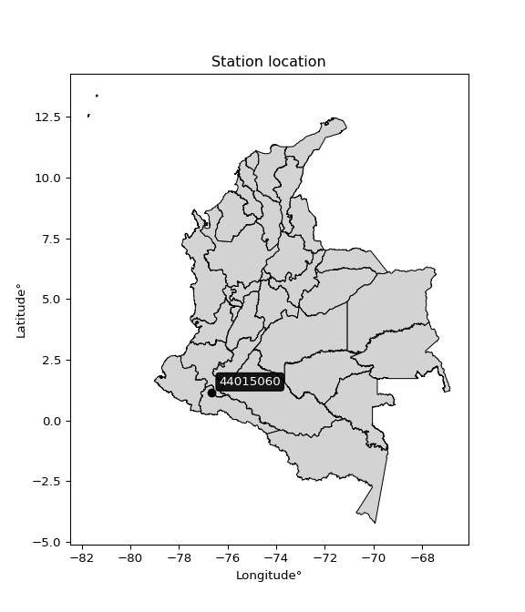</img>

</div>


## A. General information


### 1. General running parameters

• app_version: _v20260312_. • runtime: _2026-03-12 07:15:23.203550_. • Python version: _3.14.0_. • SciPy version: _1.16.3_. • Pandas version: _2.3.3_. • NumPy version: _2.3.5_. • Stations dataset (station_dataset_file): _dataset/pmax24h_in/automatic_colombia_2003_2025.csv_. • Stations catalog (station_catalog_file): _dataset/CNE.xls_. • Minimum year to eval til year_max (date_min): _1900_. • Maximum year to eval since year_min (date_max): _2025_. • Creates, save and include plots into reports (create_plot): _True_. • Plot only fit distributions with Δo > Δ (plot_only_fit): _True_. • Plot only simple graphs avoiding multiple CDFs and multiple Extreme values plots (plot_only_simple): _True_. • Eval low extreme values, if False, evaluates high extreme values (low_extreme): _False_. • Eval every SciPy distribution as logarithmic (pdist_logarithmic_on): _True_. • Standard deviation normalized (ddof): _1.0_. • Return periods to eval in years (Tr): _[2, 2.33, 5, 10, 15, 20, 25, 50, 75, 100, 200, 250, 500, 750, 1000]_. • Minimum data sample per station, 0 means any (minimum_sample): _5_. • Z-Score maximum threshold to adjust a value, 0 means disable (zscore_max): _3.5_. • Z-Score minimum threshold to adjust a value, 0 means disable (zscore_min): _-2.5_. • Avoid zeros, e.g. rain = 0 (avoid_zeros): _True_. • Avoid null values (avoid_nans): _True_. 

:file_folder:Table: [dataset.csv](../../dataset/pmax24h_in/automatic_colombia_2003_2025.csv)

> Delta Degrees of Freedom (DDOF): is a parameter used in the formulas for calculating variance and standard deviation. When ddof=0, the divisor is $N$ (the total number of observations) and this is used when your data set is the entire population. When ddof=1, the divisor is $N-1$ and this is used when your data set is a sample drawn from a larger population. Using $N-1$ provides an unbiased estimate of the population variance (known as Bessel´s correction).


### 2. Station info and location

|   id |   CODIGO | NOMBRE                           | CATEGORIA               | TECNOLOGIA                              | ESTADO   | FECHA_INSTALACION   |   FECHA_SUSPENSION |   ALTITUD |   LATITUD |   LONGITUD | DEPARTAMENTO   | MUNICIPIO   | AREA_OPERATIVA                      | ENTIDAD                                                     | AREA_HIDROGRAFICA   | ZONA_HIDROGRAFICA   | SUBZONA_HIDROGRAFICA   |   CORRIENTE | Catalogo   |   Version |
|-----:|---------:|:---------------------------------|:------------------------|:----------------------------------------|:---------|:--------------------|-------------------:|----------:|----------:|-----------:|:---------------|:------------|:------------------------------------|:------------------------------------------------------------|:--------------------|:--------------------|:-----------------------|------------:|:-----------|----------:|
|    0 | 44015060 | ACUEDUCTO MOCOA - AUT [44015060] | Climatológica Principal | Automática con Telemetría, Convencional | Activa   | 29/03/2006          |                nan |       650 |   1.15733 |   -76.6518 | Putumayo       | Mocoa       | Area Operativa 07 - Nariño-Putumayo | INSTITUTO DE HIDROLOGIA METEOROLOGIA Y ESTUDIOS AMBIENTALES | Amazonas            | Caquetá             | Alto Caqueta           |         nan | CNE_IDEAM  |  20251226 |

<div align="center">

Dynamic map: [:earth_americas:Google](http://maps.google.com/maps?q=1.157333333,-76.65183333) [:earth_americas:OSM](https://www.openstreetmap.org/#map=18/1.157333333/-76.65183333&layers=P) [:earth_americas:Bing](https://www.bing.com/maps?cp=1.157333333~-76.65183333&lvl=18) [:earth_americas:Apple](https://maps.apple.com/frame?center=1.157333333%2C-76.65183333&span=0.003%2C0.006)

</div>


<div align="center">

```geojson
{
  "type": "Feature",
  "geometry": {
    "type": "Point", 
    "coordinates": [-76.65183333, 1.157333333]
  }, 
  "properties": {
    "Name": "44015060"
  }
}
```

</div>


### 3. Discrete values table and plot

<div align="center">

|               |          0 |           1 |           2 |          3 |           4 |           5 |           6 |           7 |           8 |           9 |
|:--------------|-----------:|------------:|------------:|-----------:|------------:|------------:|------------:|------------:|------------:|------------:|
| Date          | 2016       | 2017        | 2018        | 2019       | 2020        | 2021        | 2022        | 2023        | 2024        | 2025        |
| Value         |   14.1     |   95.3      |   72.9      |  135.3     |   56.5      |   72.4      |   70.8      |   88.5      |  111.4      |  111.2      |
| Value_initial |   14.1     |   95.3      |   72.9      |  135.3     |   56.5      |   72.4      |   70.8      |   88.5      |  111.4      |  111.2      |
| count         |   10       |   10        |   10        |   10       |   10        |   10        |   10        |   10        |   10        |   10        |
| mean          |   82.84    |   82.84     |   82.84     |   82.84    |   82.84     |   82.84     |   82.84     |   82.84     |   82.84     |   82.84     |
| std           |   33.8806  |   33.8806   |   33.8806   |   33.8806  |   33.8806   |   33.8806   |   33.8806   |   33.8806   |   33.8806   |   33.8806   |
| zscore        |   -2.02889 |    0.367762 |   -0.293383 |    1.54838 |   -0.777436 |   -0.308141 |   -0.355366 |    0.167057 |    0.842961 |    0.837058 |


</div>


<div align="center">

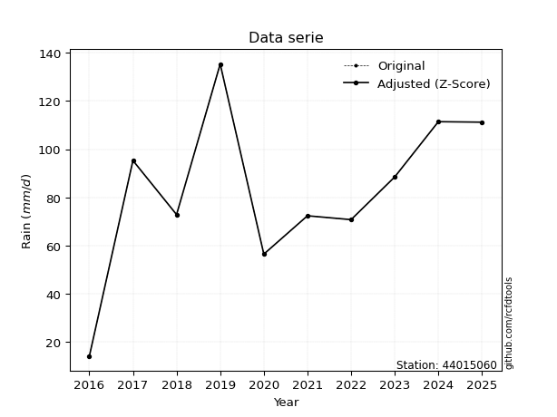</img>

</div>


> The initial value (value_initial) correspond to the initial obtained or null completed value, and value (value) is adjusted only when the initial value is outside the valid range (outlier) definite through the Z-Score value. If Z-Score is active, values out of range or outliers are replaced with the station mean value. A Z-Score (or standard score) measures how many standard deviations a data point is from the mean of a dataset, indicating its relative position; positive scores mean above the mean, negative mean below, and a score of zero is exactly at the mean, allowing for comparison of values from different distributions. It´s calculated using the formula $z=(x–μ)/σ$, where $x$ is the data point, $μ$ is the mean, and $σ$ is the standard deviation, helping identify outliers and understand probability.
>
> <sub>**Note**: In this study, "completing" (filling gaps in) and "extending" (forecasting or lengthening the historical record) rainfall data series are avoided for certain critical analyses because they introduce artificial bias and uncertainty, which can distort the statistics of rare events (extremes), alter day-to-day variability, and compromise the integrity and homogeneity of the original data. Some reasons against Completing/Extending rainfall data are: **Distortion of Extremes and Variability**: The primary issue is that most gap-filling or extension methods rely on averaging or regression with nearby stations, which inherently smooths the data. Rainfall is highly variable in space and time, with a large percentage of zero values and occasional large storms. Infilling methods often underestimate the highest values and overestimate the lowest (zero) values, which severely distorts analyses focused on flood frequency, drought severity, and intensity-duration-frequency (IDF) curves, **Loss of Data Homogeneity**: Infilled or extended data are synthetic estimates, not actual measurements. Combining these estimates with observed data can violate the assumption of data homogeneity, which requires that the data properties do not change over time. Inhomogeneity can lead to incorrect conclusions about long-term trends or changes in climate patterns, **Propagation of Errors**: Errors and biases from the original data (e.g., wind-induced undercatch, instrument errors, site changes) or the data used for imputation can propagate through the analysis, leading to unreliable hydrological models and inaccurate predictions, **Compromised Statistical Integrity**: For statistical analyses, especially those involving the frequency of events, using artificial data can introduce time bias or autocorrelation that doesn´t exist in reality, making it difficult to assess the true probability of events, **Difficulty in Validation**: It is difficult to accurately validate the quality of filled or extended data, especially for past periods where ground-truth measurements are unavailable. The reliability of imputation techniques heavily depends on the density of the surrounding station network and the complexity of the local topography.</sub>


### 4. Active continuous probability distributions from SciPy (80 of 104 available)

A Probability Density Function (PDF) describes the relative likelihood of a continuous random variable falling within a specific range, where the total area under its curve equals 1, and the area over any interval gives the actual probability for that range. Unlike discrete probabilities (like rolling a die), a PDF shows density, not direct probability for a single point (which is zero), with higher points indicating higher likelihood, often visualized as a bell curve for normal distributions.

A log of a probability density function (log-PDF) is simply the logarithm of the PDF´s value, denoted as $log(f(x))$, useful for converting multiplication of probabilities into addition, improving numerical stability with tiny numbers, and connecting to information theory concepts like entropy. Instead of dealing with very small probabilities (e.g., 0.000001), log-PDFs use negative numbers (e.g., $log(0.00001) ≈ -11.51$ that are easier for computers to handle, preventing underflow errors and simplifying complex calculations. In this study, each active probability distribution from SciPy is also evaluated in the $log$ form.

[scipy.stats](https://docs.scipy.org/doc/scipy/reference/stats.html) is a Python´s powerful submodule within the SciPy library for comprehensive statistical analysis, offering over 130 probability distributions (like Normal, Poisson, etc.), functions for descriptive stats (mean, variance), hypothesis testing (t-tests, chi-square), random variable generation, and statistical tests, making it essential for data science, modeling, and research. It provides tools to explore, model, and draw conclusions from data efficiently, working seamlessly with [NumPy](https://numpy.org/).

<div align="center">

|   id | p_dist           |   n_parameter | fit_method   | label                                                                       | active   | ref                                                                                                      |
|-----:|:-----------------|--------------:|:-------------|:----------------------------------------------------------------------------|:---------|:---------------------------------------------------------------------------------------------------------|
|    0 | alpha            |             3 | MLE          | Alpha                                                                       | True     | [:mortar_board:](https://docs.scipy.org/doc/scipy/reference/generated/scipy.stats.alpha.html)            |
|    1 | anglit           |             2 | MM           | Anglit                                                                      | True     | [:mortar_board:](https://docs.scipy.org/doc/scipy/reference/generated/scipy.stats.anglit.html)           |
|    2 | arcsine          |             2 | MM           | Arcsine                                                                     | True     | [:mortar_board:](https://docs.scipy.org/doc/scipy/reference/generated/scipy.stats.arcsine.html)          |
|    3 | argus            |             3 | MLE          | Argus                                                                       | True     | [:mortar_board:](https://docs.scipy.org/doc/scipy/reference/generated/scipy.stats.argus.html)            |
|    4 | beta             |             4 | MLE          | Beta                                                                        | True     | [:mortar_board:](https://docs.scipy.org/doc/scipy/reference/generated/scipy.stats.beta.html)             |
|    5 | betaprime        |             4 | MLE          | Beta prime                                                                  | True     | [:mortar_board:](https://docs.scipy.org/doc/scipy/reference/generated/scipy.stats.betaprime.html)        |
|    6 | bradford         |             3 | MLE          | Bradford                                                                    | True     | [:mortar_board:](https://docs.scipy.org/doc/scipy/reference/generated/scipy.stats.bradford.html)         |
|    7 | burr             |             4 | MLE          | Burr (Type III)                                                             | True     | [:mortar_board:](https://docs.scipy.org/doc/scipy/reference/generated/scipy.stats.burr.html)             |
|    8 | burr12           |             4 | MLE          | Burr (Type III) 12                                                          | True     | [:mortar_board:](https://docs.scipy.org/doc/scipy/reference/generated/scipy.stats.burr12.html)           |
|    9 | cosine           |             2 | MLE          | Cosine                                                                      | True     | [:mortar_board:](https://docs.scipy.org/doc/scipy/reference/generated/scipy.stats.cosine.html)           |
|   10 | crystalball      |             4 | MLE          | Crystalball                                                                 | True     | [:mortar_board:](https://docs.scipy.org/doc/scipy/reference/generated/scipy.stats.crystalball.html)      |
|   11 | dgamma           |             3 | MLE          | Double gamma                                                                | True     | [:mortar_board:](https://docs.scipy.org/doc/scipy/reference/generated/scipy.stats.dgamma.html)           |
|   12 | dweibull         |             3 | MLE          | Double Weibull                                                              | True     | [:mortar_board:](https://docs.scipy.org/doc/scipy/reference/generated/scipy.stats.dweibull.html)         |
|   13 | erlang           |             3 | MLE          | Erlang                                                                      | True     | [:mortar_board:](https://docs.scipy.org/doc/scipy/reference/generated/scipy.stats.erlang.html)           |
|   14 | exponnorm        |             3 | MLE          | Exponentially modified Normal                                               | True     | [:mortar_board:](https://docs.scipy.org/doc/scipy/reference/generated/scipy.stats.exponnorm.html)        |
|   15 | exponpow         |             3 | MLE          | Exponential power                                                           | True     | [:mortar_board:](https://docs.scipy.org/doc/scipy/reference/generated/scipy.stats.exponpow.html)         |
|   16 | exponweib        |             4 | MLE          | Exponentiated Weibull                                                       | True     | [:mortar_board:](https://docs.scipy.org/doc/scipy/reference/generated/scipy.stats.exponweib.html)        |
|   17 | f                |             4 | MLE          | F                                                                           | True     | [:mortar_board:](https://docs.scipy.org/doc/scipy/reference/generated/scipy.stats.f.html)                |
|   18 | fatiguelife      |             3 | MLE          | Fatigue-life (Birnbaum-Saunders)                                            | True     | [:mortar_board:](https://docs.scipy.org/doc/scipy/reference/generated/scipy.stats.fatiguelife.html)      |
|   19 | foldnorm         |             3 | MM           | Fold Normal                                                                 | True     | [:mortar_board:](https://docs.scipy.org/doc/scipy/reference/generated/scipy.stats.foldnorm.html)         |
|   20 | gamma            |             3 | MLE          | Gamma                                                                       | True     | [:mortar_board:](https://docs.scipy.org/doc/scipy/reference/generated/scipy.stats.gamma.html)            |
|   21 | gausshyper       |             6 | MLE          | Gauss hypergeometric                                                        | True     | [:mortar_board:](https://docs.scipy.org/doc/scipy/reference/generated/scipy.stats.gausshyper.html)       |
|   22 | genexpon         |             5 | MLE          | Generalized exponential                                                     | True     | [:mortar_board:](https://docs.scipy.org/doc/scipy/reference/generated/scipy.stats.genexpon.html)         |
|   23 | genextreme       |             3 | MLE          | Generalized exponential                                                     | True     | [:mortar_board:](https://docs.scipy.org/doc/scipy/reference/generated/scipy.stats.genextreme.html)       |
|   24 | gengamma         |             4 | MLE          | Generalized gamma                                                           | True     | [:mortar_board:](https://docs.scipy.org/doc/scipy/reference/generated/scipy.stats.gengamma.html)         |
|   25 | genhalflogistic  |             3 | MLE          | Generalized half-logistic                                                   | True     | [:mortar_board:](https://docs.scipy.org/doc/scipy/reference/generated/scipy.stats.genhalflogistic.html)  |
|   26 | genlogistic      |             3 | MLE          | Generalized logistic                                                        | True     | [:mortar_board:](https://docs.scipy.org/doc/scipy/reference/generated/scipy.stats.genlogistic.html)      |
|   27 | gennorm          |             3 | MLE          | Generalized Normal                                                          | True     | [:mortar_board:](https://docs.scipy.org/doc/scipy/reference/generated/scipy.stats.gennorm.html)          |
|   28 | genpareto        |             3 | MLE          | Generalized Pareto                                                          | True     | [:mortar_board:](https://docs.scipy.org/doc/scipy/reference/generated/scipy.stats.genpareto.html)        |
|   29 | gompertz         |             3 | MLE          | Gompertz (or truncated Gumbel)                                              | True     | [:mortar_board:](https://docs.scipy.org/doc/scipy/reference/generated/scipy.stats.gompertz.html)         |
|   30 | gumbel_l         |             2 | MM           | Gumbel Left Skew                                                            | True     | [:mortar_board:](https://docs.scipy.org/doc/scipy/reference/generated/scipy.stats.gumbel_l.html)         |
|   31 | gumbel_r         |             2 | MM           | Gumbel Right Skew                                                           | True     | [:mortar_board:](https://docs.scipy.org/doc/scipy/reference/generated/scipy.stats.gumbel_r.html)         |
|   32 | halfgennorm      |             3 | MLE          | Upper half of a generalized normal                                          | True     | [:mortar_board:](https://docs.scipy.org/doc/scipy/reference/generated/scipy.stats.halfgennorm.html)      |
|   33 | halflogistic     |             2 | MM           | Half-logistic                                                               | True     | [:mortar_board:](https://docs.scipy.org/doc/scipy/reference/generated/scipy.stats.halflogistic.html)     |
|   34 | halfnorm         |             2 | MM           | Half Normal                                                                 | True     | [:mortar_board:](https://docs.scipy.org/doc/scipy/reference/generated/scipy.stats.halfnorm.html)         |
|   35 | hypsecant        |             2 | MM           | hyperbolic secant                                                           | True     | [:mortar_board:](https://docs.scipy.org/doc/scipy/reference/generated/scipy.stats.hypsecant.html)        |
|   36 | invgamma         |             3 | MLE          | Inverted gamma                                                              | True     | [:mortar_board:](https://docs.scipy.org/doc/scipy/reference/generated/scipy.stats.invgamma.html)         |
|   37 | invgauss         |             3 | MLE          | Inverse Gaussian                                                            | True     | [:mortar_board:](https://docs.scipy.org/doc/scipy/reference/generated/scipy.stats.invgauss.html)         |
|   38 | invweibull       |             3 | MLE          | Inverted Weibull                                                            | True     | [:mortar_board:](https://docs.scipy.org/doc/scipy/reference/generated/scipy.stats.invweibull.html)       |
|   39 | johnsonsb        |             4 | MLE          | Johnson SB                                                                  | True     | [:mortar_board:](https://docs.scipy.org/doc/scipy/reference/generated/scipy.stats.johnsonsb.html)        |
|   40 | johnsonsu        |             4 | MLE          | Johnson Su                                                                  | True     | [:mortar_board:](https://docs.scipy.org/doc/scipy/reference/generated/scipy.stats.johnsonsu.html)        |
|   41 | kappa3           |             3 | MLE          | Kappa 3                                                                     | True     | [:mortar_board:](https://docs.scipy.org/doc/scipy/reference/generated/scipy.stats.kappa3.html)           |
|   42 | kappa4           |             4 | MLE          | Kappa 4                                                                     | True     | [:mortar_board:](https://docs.scipy.org/doc/scipy/reference/generated/scipy.stats.kappa4.html)           |
|   43 | ksone            |             3 | MLE          | Kolmogorov-Smirnov one-sided test statistic distribution                    | True     | [:mortar_board:](https://docs.scipy.org/doc/scipy/reference/generated/scipy.stats.ksone.html)            |
|   44 | kstwobign        |             2 | MLE          | Limiting distribution of scaled Kolmogorov-Smirnov two-sided test statistic | True     | [:mortar_board:](https://docs.scipy.org/doc/scipy/reference/generated/scipy.stats.kstwobign.html)        |
|   45 | laplace          |             2 | MM           | Laplace                                                                     | True     | [:mortar_board:](https://docs.scipy.org/doc/scipy/reference/generated/scipy.stats.laplace.html)          |
|   46 | levy_l           |             2 | MLE          | Left-skewed Levy                                                            | True     | [:mortar_board:](https://docs.scipy.org/doc/scipy/reference/generated/scipy.stats.levy_l.html)           |
|   47 | loggamma         |             3 | MLE          | Log gamma                                                                   | True     | [:mortar_board:](https://docs.scipy.org/doc/scipy/reference/generated/scipy.stats.loggamma.html)         |
|   48 | logistic         |             2 | MM           | Logistic (or Sech-squared)                                                  | True     | [:mortar_board:](https://docs.scipy.org/doc/scipy/reference/generated/scipy.stats.logistic.html)         |
|   49 | loglaplace       |             3 | MLE          | Log-Laplace                                                                 | True     | [:mortar_board:](https://docs.scipy.org/doc/scipy/reference/generated/scipy.stats.loglaplace.html)       |
|   50 | lomax            |             3 | MLE          | Lomax (Pareto of the second kind)                                           | True     | [:mortar_board:](https://docs.scipy.org/doc/scipy/reference/generated/scipy.stats.lomax.html)            |
|   51 | maxwell          |             2 | MM           | Maxwell                                                                     | True     | [:mortar_board:](https://docs.scipy.org/doc/scipy/reference/generated/scipy.stats.maxwell.html)          |
|   52 | mielke           |             4 | MLE          | Mielke Beta-Kappa / Dagum                                                   | True     | [:mortar_board:](https://docs.scipy.org/doc/scipy/reference/generated/scipy.stats.mielke.html)           |
|   53 | moyal            |             2 | MM           | Moyal                                                                       | True     | [:mortar_board:](https://docs.scipy.org/doc/scipy/reference/generated/scipy.stats.moyal.html)            |
|   54 | nakagami         |             3 | MLE          | Nakagami                                                                    | True     | [:mortar_board:](https://docs.scipy.org/doc/scipy/reference/generated/scipy.stats.nakagami.html)         |
|   55 | ncf              |             5 | MLE          | Non-central F distribution                                                  | True     | [:mortar_board:](https://docs.scipy.org/doc/scipy/reference/generated/scipy.stats.ncf.html)              |
|   56 | nct              |             4 | MLE          | Non-central Student’s t                                                     | True     | [:mortar_board:](https://docs.scipy.org/doc/scipy/reference/generated/scipy.stats.nct.html)              |
|   57 | norm             |             2 | MM           | Normal                                                                      | True     | [:mortar_board:](https://docs.scipy.org/doc/scipy/reference/generated/scipy.stats.norm.html)             |
|   58 | pearson3         |             3 | MM           | Pearson type III                                                            | True     | [:mortar_board:](https://docs.scipy.org/doc/scipy/reference/generated/scipy.stats.pearson3.html)         |
|   59 | powerlaw         |             3 | MLE          | Power-function                                                              | True     | [:mortar_board:](https://docs.scipy.org/doc/scipy/reference/generated/scipy.stats.powerlaw.html)         |
|   60 | rayleigh         |             2 | MM           | Rayleigh                                                                    | True     | [:mortar_board:](https://docs.scipy.org/doc/scipy/reference/generated/scipy.stats.rayleigh.html)         |
|   61 | rdist            |             3 | MLE          | R-distributed (symmetric beta)                                              | True     | [:mortar_board:](https://docs.scipy.org/doc/scipy/reference/generated/scipy.stats.rdist.html)            |
|   62 | rice             |             3 | MLE          | Rice                                                                        | True     | [:mortar_board:](https://docs.scipy.org/doc/scipy/reference/generated/scipy.stats.rice.html)             |
|   63 | semicircular     |             2 | MM           | Semicircular                                                                | True     | [:mortar_board:](https://docs.scipy.org/doc/scipy/reference/generated/scipy.stats.semicircular.html)     |
|   64 | skewnorm         |             3 | MLE          | Skew normal                                                                 | True     | [:mortar_board:](https://docs.scipy.org/doc/scipy/reference/generated/scipy.stats.skewnorm.html)         |
|   65 | t                |             3 | MLE          | Student’s t                                                                 | True     | [:mortar_board:](https://docs.scipy.org/doc/scipy/reference/generated/scipy.stats.t.html)                |
|   66 | trapezoid        |             4 | MLE          | Trapezoid                                                                   | True     | [:mortar_board:](https://docs.scipy.org/doc/scipy/reference/generated/scipy.stats.trapezoid.html)        |
|   67 | triang           |             3 | MLE          | Triangular                                                                  | True     | [:mortar_board:](https://docs.scipy.org/doc/scipy/reference/generated/scipy.stats.triang.html)           |
|   68 | truncexpon       |             3 | MLE          | Truncated exponential                                                       | True     | [:mortar_board:](https://docs.scipy.org/doc/scipy/reference/generated/scipy.stats.truncexpon.html)       |
|   69 | truncnorm        |             4 | MLE          | Truncated normal                                                            | True     | [:mortar_board:](https://docs.scipy.org/doc/scipy/reference/generated/scipy.stats.truncnorm.html)        |
|   70 | truncpareto      |             4 | MLE          | Upper truncated Pareto                                                      | True     | [:mortar_board:](https://docs.scipy.org/doc/scipy/reference/generated/scipy.stats.truncpareto.html)      |
|   71 | truncweibull_min |             5 | MLE          | Doubly truncated Weibull minimum                                            | True     | [:mortar_board:](https://docs.scipy.org/doc/scipy/reference/generated/scipy.stats.truncweibull_min.html) |
|   72 | tukeylambda      |             3 | MLE          | Tukey-Lamdba                                                                | True     | [:mortar_board:](https://docs.scipy.org/doc/scipy/reference/generated/scipy.stats.tukeylambda.html)      |
|   73 | uniform          |             2 | MLE          | Uniform                                                                     | True     | [:mortar_board:](https://docs.scipy.org/doc/scipy/reference/generated/scipy.stats.uniform.html)          |
|   74 | vonmises         |             3 | MLE          | Von Mises                                                                   | True     | [:mortar_board:](https://docs.scipy.org/doc/scipy/reference/generated/scipy.stats.vonmises.html)         |
|   75 | vonmises_line    |             3 | MLE          | Von Mises line                                                              | True     | [:mortar_board:](https://docs.scipy.org/doc/scipy/reference/generated/scipy.stats.vonmises_line.html)    |
|   76 | wald             |             2 | MM           | Wald                                                                        | True     | [:mortar_board:](https://docs.scipy.org/doc/scipy/reference/generated/scipy.stats.wald.html)             |
|   77 | weibull_max      |             3 | MLE          | Weibull maximum                                                             | True     | [:mortar_board:](https://docs.scipy.org/doc/scipy/reference/generated/scipy.stats.weibull_max.html)      |
|   78 | weibull_min      |             3 | MLE          | Weibull minimum                                                             | True     | [:mortar_board:](https://docs.scipy.org/doc/scipy/reference/generated/scipy.stats.weibull_min.html)      |
|   79 | wrapcauchy       |             3 | MLE          | Wrapped  Cauchy                                                             | True     | [:mortar_board:](https://docs.scipy.org/doc/scipy/reference/generated/scipy.stats.wrapcauchy.html)       |

</div>

> **n_parameter:** # arguments & localization & scale.
>
> **Fit methods:** (MLE) maximum likelihood, (MM) L-moments.
>
>**Inactive** (With the only purpose of prevent loops, zero divisions, infinite values, over high estimated values or horizontal trending for recurrence intervals estimations, the follow distributions were disabled.)**:** lognorm, norminvgauss, powernorm, powerlognorm, cauchy, halfcauchy, foldcauchy, skewcauchy, chi2, expon, fisk, genhyperbolic, geninvgauss, gibrat, kstwo, laplace_asymmetric, levy, levy_stable, ncx2, pareto, rel_breitwigner, recipinvgauss, studentized_range, loguniform, 


## B. Probability (PDF) vs. Empirical (EDF) distributions functions

A continuous probability distribution (CPD) describes probabilities for variables that can take any value within a range (like rain any time), unlike discrete variables with specific outcomes (like temperature). It uses a Probability Density Function (PDF), a curve where the total area under it equals 1, and the probability of the variable falling within an interval (a to b) is found by calculating the area under the curve between those points. A key feature is that the probability of hitting any single exact value is zero, so probabilities are always expressed for ranges, e.g., $P(a ≤ X ≤ b)$.

<div align="center">

Distributions parameters from station values
|     |   station | p_dist              |   n |              loc |           scale | shape                  | shape1                | shape2                | shape3             |
|----:|----------:|:--------------------|----:|-----------------:|----------------:|:-----------------------|:----------------------|:----------------------|:-------------------|
|   0 |  44015060 | alpha               |  10 |     -0.102635    |    39.8981      | 1.8704113838162508e-11 |                       |                       |                    |
|   1 |  44015060 | anglit              |  10 |     82.84        |    94.028       |                        |                       |                       |                    |
|   2 |  44015060 | arcsine             |  10 |     37.3844      |    90.9111      |                        |                       |                       |                    |
|   3 |  44015060 | argus               |  10 |     -3.10748     |   142.98        | 0.5864201690414985     |                       |                       |                    |
|   4 |  44015060 | beta                |  10 |     14.0411      |   121.259       | 0.9031222791626357     | 0.9388283686746367    |                       |                    |
|   5 |  44015060 | betaprime           |  10 |   -569.799       | 83364           | 382.5927557615561      | 48862.53625139376     |                       |                    |
|   6 |  44015060 | bradford            |  10 |     14.1         |   121.2         | 1.0075643181794436     |                       |                       |                    |
|   7 |  44015060 | burr                |  10 |     -0.561058    |   124.339       | 13.736507124492805     | 0.13508716422031872   |                       |                    |
|   8 |  44015060 | burr12              |  10 |     -0.63245     |    14.5522      | 317.65909665387517     | 0.001941167451888332  |                       |                    |
|   9 |  44015060 | cosine              |  10 |     79.9563      |    28.5806      |                        |                       |                       |                    |
|  10 |  44015060 | crystalball         |  10 |     82.84        |    32.1419      | 7692.366742773511      | 12.09687964546531     |                       |                    |
|  11 |  44015060 | dgamma              |  10 |     82.6284      |    13.3499      | 1.9101270382261575     |                       |                       |                    |
|  12 |  44015060 | dweibull            |  10 |     82.8103      |    28.1721      | 1.392919993467586      |                       |                       |                    |
|  13 |  44015060 | erlang              |  10 |   -491.74        |     1.85329     | 309.8412675741048      |                       |                       |                    |
|  14 |  44015060 | exponnorm           |  10 |     82.8213      |    32.1417      | 0.0005869020513343396  |                       |                       |                    |
|  15 |  44015060 | exponpow            |  10 |    -17.0569      |   130.492       | 2.657866404068712      |                       |                       |                    |
|  16 |  44015060 | exponweib           |  10 |     -1.19542e+09 |     1.19542e+09 | 13.529240277264506     | 13621827.898520106    |                       |                    |
|  17 |  44015060 | f                   |  10 | -12603.2         | 12686           | 356646.0736329886      | 2466578.7452239133    |                       |                    |
|  18 |  44015060 | fatiguelife         |  10 |  -2204.29        |  2287.1         | 0.014157849786978614   |                       |                       |                    |
|  19 |  44015060 | foldnorm            |  10 |   -153.344       |    30.8273      | 7.670691372475549      |                       |                       |                    |
|  20 |  44015060 | gamma               |  10 |   -514.091       |     1.79947     | 331.48787195148054     |                       |                       |                    |
|  21 |  44015060 | gausshyper          |  10 |      2.39911     |   132.901       | 1.3773659686713264     | 0.7022957615927702    | 0.8747065657895643    | 0.8128320588415784 |
|  22 |  44015060 | genexpon            |  10 |      9.74344     |     1.18781     | 0.0023396770870840445  | 0.3469876795133579    | 0.0011162069603994952 |                    |
|  23 |  44015060 | genextreme          |  10 |     74.6834      |    34.7504      | 0.4805929893334674     |                       |                       |                    |
|  24 |  44015060 | gengamma            |  10 |   -917.852       |   285.472       | 80.01506954548361      | 3.4902672530703427    |                       |                    |
|  25 |  44015060 | genhalflogistic     |  10 |      2.0302      |   138.406       | 1.0385382581946032     |                       |                       |                    |
|  26 |  44015060 | genlogistic         |  10 |     95.0948      |    15.1461      | 0.6487188188335739     |                       |                       |                    |
|  27 |  44015060 | gennorm             |  10 |     83.1031      |    42.5347      | 1.7824479286223192     |                       |                       |                    |
|  28 |  44015060 | genpareto           |  10 |     -1.23688     |   192.474       | -1.4096867899384415    |                       |                       |                    |
|  29 |  44015060 | gompertz            |  10 |     14.1         |    33.3581      | 0.09344706300635247    |                       |                       |                    |
|  30 |  44015060 | gumbel_l            |  10 |     97.3056      |    25.061       |                        |                       |                       |                    |
|  31 |  44015060 | gumbel_r            |  10 |     68.3744      |    25.061       |                        |                       |                       |                    |
|  32 |  44015060 | halfgennorm         |  10 |     13.9331      |   122.809       | 202.02474384209665     |                       |                       |                    |
|  33 |  44015060 | halflogistic        |  10 |     44.7444      |    27.4802      |                        |                       |                       |                    |
|  34 |  44015060 | halfnorm            |  10 |     40.2967      |    53.3202      |                        |                       |                       |                    |
|  35 |  44015060 | hypsecant           |  10 |     82.84        |    20.4622      |                        |                       |                       |                    |
|  36 |  44015060 | invgamma            |  10 |   -336.978       | 64906.1         | 155.52039155309836     |                       |                       |                    |
|  37 |  44015060 | invgauss            |  10 |   -142.657       |  9339.06        | 0.023980509652502105   |                       |                       |                    |
|  38 |  44015060 | invweibull          |  10 |     -4.59701e+09 |     4.59701e+09 | 135567014.8706847      |                       |                       |                    |
|  39 |  44015060 | johnsonsb           |  10 |    -14.5072      |   161.988       | -0.48484105726331167   | 0.9839256889006622    |                       |                    |
|  40 |  44015060 | johnsonsu           |  10 |    246.382       |    36.5803      | 11.449443746454818     | 5.239754496476422     |                       |                    |
|  41 |  44015060 | kappa3              |  10 |     14.1         |   121.012       | 1525.195074054933      |                       |                       |                    |
|  42 |  44015060 | kappa4              |  10 |      1.92731     |   135.691       | 1.0986219997027096     | 1.014397170939223     |                       |                    |
|  43 |  44015060 | ksone               |  10 |      1.98        |   145.44        | 1.0                    |                       |                       |                    |
|  44 |  44015060 | kstwobign           |  10 |    -59.2761      |   163.075       |                        |                       |                       |                    |
|  45 |  44015060 | laplace             |  10 |     82.84        |    22.7278      |                        |                       |                       |                    |
|  46 |  44015060 | levy_l              |  10 |    140.674       |    27.8665      |                        |                       |                       |                    |
|  47 |  44015060 | loggamma            |  10 |     20.535       |    56.2728      | 3.512250594741849      |                       |                       |                    |
|  48 |  44015060 | logistic            |  10 |     82.84        |    17.7208      |                        |                       |                       |                    |
|  49 |  44015060 | loglaplace          |  10 |     -0.208273    |    88.7083      | 2.6019964022059785     |                       |                       |                    |
|  50 |  44015060 | lomax               |  10 |     14.1         |     1.73411e+10 | 263588345.02095068     |                       |                       |                    |
|  51 |  44015060 | maxwell             |  10 |      6.67709     |    47.728       |                        |                       |                       |                    |
|  52 |  44015060 | mielke              |  10 |     -0.513785    |   124.313       | 1.8536099487875348     | 13.741302858920657    |                       |                    |
|  53 |  44015060 | moyal               |  10 |     64.4592      |    14.469       |                        |                       |                       |                    |
|  54 |  44015060 | nakagami            |  10 |     56.5         |    38.6845      | 0.3823110929897212     |                       |                       |                    |
|  55 |  44015060 | ncf                 |  10 |     -2.50898     |     1.61753e-06 | 4.368224099449585e-07  | 1036.0044285632925    | 23.08591973678486     |                    |
|  56 |  44015060 | nct                 |  10 |  -1509.42        |    32.1085      | 406463.26962914015     | 49.58981734867834     |                       |                    |
|  57 |  44015060 | norm                |  10 |     82.84        |    32.1419      |                        |                       |                       |                    |
|  58 |  44015060 | pearson3            |  10 |     82.84        |    32.142       | -0.46484863353608397   |                       |                       |                    |
|  59 |  44015060 | powerlaw            |  10 |     14.1         |   121.2         | 0.2306453257826304     |                       |                       |                    |
|  60 |  44015060 | rayleigh            |  10 |     21.3506      |    49.0615      |                        |                       |                       |                    |
|  61 |  44015060 | rdist               |  10 |      2.91162     |    69.9884      | 1.0146445556522035     |                       |                       |                    |
|  62 |  44015060 | rice                |  10 |  -3986.92        |    32.1307      | 126.65869885578513     |                       |                       |                    |
|  63 |  44015060 | semicircular        |  10 |     82.84        |    64.284       |                        |                       |                       |                    |
|  64 |  44015060 | skewnorm            |  10 |    115.722       |    45.9819      | -2.0299245201641156    |                       |                       |                    |
|  65 |  44015060 | t                   |  10 |     82.8413      |    32.1416      | 697667.4817106825      |                       |                       |                    |
|  66 |  44015060 | trapezoid           |  10 |      1.98        |   145.44        | 1.0                    | 1.0                   |                       |                    |
|  67 |  44015060 | triang              |  10 |      2.22709     |   133.073       | 0.9999998529344347     |                       |                       |                    |
|  68 |  44015060 | truncexpon          |  10 |      2.11447     |   177.189       | 0.7516591011745621     |                       |                       |                    |
|  69 |  44015060 | truncnorm           |  10 |     84.6329      |    33.1211      | -2.1295538268583973    | 1.5298191633184457    |                       |                    |
|  70 |  44015060 | truncpareto         |  10 |     14.0967      |     0.0033184   | 0.11116435451112701    | 36524.582146377914    |                       |                    |
|  71 |  44015060 | truncweibull_min    |  10 |      2.98856     |   214.519       | 1.709946142024069      | 0.0006389706248418367 | 0.6167806256895019    |                    |
|  72 |  44015060 | tukeylambda         |  10 |      2.94974     |    71.3121      | 1.019469010745452      |                       |                       |                    |
|  73 |  44015060 | uniform             |  10 |     14.1         |   121.2         |                        |                       |                       |                    |
|  74 |  44015060 | vonmises            |  10 |      2.71038     |     1           | 0.20733254366666232    |                       |                       |                    |
|  75 |  44015060 | vonmises_line       |  10 |     74.7         |    19.2896      | 0.44501241808317893    |                       |                       |                    |
|  76 |  44015060 | wald                |  10 |     50.6981      |    32.1419      |                        |                       |                       |                    |
|  77 |  44015060 | weibull_max         |  10 |    135.3         |     1.55857     | 0.27913081772670234    |                       |                       |                    |
|  78 |  44015060 | weibull_min         |  10 |   -103.253       |   199.24        | 6.85728181794014       |                       |                       |                    |
|  79 |  44015060 | wrapcauchy          |  10 |     13.9622      |    19.3116      | 3.985737589790111e-06  |                       |                       |                    |
|  80 |  44015060 | logalpha            |  10 |    -18.0859      |   782.571       | 35.01023225258615      |                       |                       |                    |
|  81 |  44015060 | loganglit           |  10 |      4.28835     |     1.7589      |                        |                       |                       |                    |
|  82 |  44015060 | logarcsine          |  10 |      3.43805     |     1.7006      |                        |                       |                       |                    |
|  83 |  44015060 | logargus            |  10 |      1.718       |     3.22173     | 2.848212623815798      |                       |                       |                    |
|  84 |  44015060 | logbeta             |  10 |      2.22445     |     2.68305     | 1.4020195383453173     | 0.2422756589583421    |                       |                    |
|  85 |  44015060 | logbetaprime        |  10 |    -14.2773      |    38.6464      | 1256.7859041945912     | 2616.915153086211     |                       |                    |
|  86 |  44015060 | logbradford         |  10 |      2.55946     |     2.37833     | 2.9886121395180764e-06 |                       |                       |                    |
|  87 |  44015060 | logburr             |  10 |   -423.164       |   428.083       | 92057.06191146068      | 0.007378964763544394  |                       |                    |
|  88 |  44015060 | logburr12           |  10 |  -1463.06        |  1472.17        | 4082.5288926261946     | 337685.6620226328     |                       |                    |
|  89 |  44015060 | logcosine           |  10 |      4.11787     |     0.592899    |                        |                       |                       |                    |
|  90 |  44015060 | logcrystalball      |  10 |      4.28836     |     0.601243    | 14.8589284472759       | 2186.8791828041385    |                       |                    |
|  91 |  44015060 | logdgamma           |  10 |      4.483       |     0.398421    | 0.980141697540413      |                       |                       |                    |
|  92 |  44015060 | logdweibull         |  10 |      4.39912     |     0.389685    | 1.0184846986509126     |                       |                       |                    |
|  93 |  44015060 | logerlang           |  10 |     -7.83767     |     0.0351207   | 345.0397665248579      |                       |                       |                    |
|  94 |  44015060 | logexponnorm        |  10 |      4.28803     |     0.601244    | 0.0005391078220424895  |                       |                       |                    |
|  95 |  44015060 | logexponpow         |  10 |      2.64617     |     1.58565     | 0.5954293086472373     |                       |                       |                    |
|  96 |  44015060 | logexponweib        |  10 |      2.64617     |     1.20722     | 1.1873867582576696     | 0.8041587667052028    |                       |                    |
|  97 |  44015060 | logf                |  10 |  -1093.32        |  1097.6         | 9083274.844138764      | 24279614.10414035     |                       |                    |
|  98 |  44015060 | logfatiguelife      |  10 |   -719.609       |   723.899       | 0.0008313709410297547  |                       |                       |                    |
|  99 |  44015060 | logfoldnorm         |  10 |      1.9208      |     0.563293    | 4.2090471220303325     |                       |                       |                    |
| 100 |  44015060 | loggamma            |  10 |     -7.24999     |     0.0349697   | 329.6141994670582      |                       |                       |                    |
| 101 |  44015060 | loggausshyper       |  10 |      2.59022     |     2.31727     | 1.2590748899958828     | 0.6063045560551433    | 1.0928228291758377    | 0.886814018292934  |
| 102 |  44015060 | loggenexpon         |  10 |      2.64617     |     0.222408    | 0.027846743912893657   | 4.833032958947353     | 0.005328257421731255  |                    |
| 103 |  44015060 | loggenextreme       |  10 |      4.33941     |     0.63812     | 1.123273173474706      |                       |                       |                    |
| 104 |  44015060 | loggengamma         |  10 |     -3.02658e+07 |     3.02658e+07 | 0.6344474605184833     | 108533141.19183144    |                       |                    |
| 105 |  44015060 | loggenhalflogistic  |  10 |      2.63162     |     2.4146      | 1.0609548702571738     |                       |                       |                    |
| 106 |  44015060 | loggenlogistic      |  10 |      4.82037     |     0.0725559   | 0.13292643450412395    |                       |                       |                    |
| 107 |  44015060 | loggennorm          |  10 |      4.483       |     0.159122    | 0.6484466613633727     |                       |                       |                    |
| 108 |  44015060 | loggenpareto        |  10 |     -0.01234     |    13.6023      | -2.7647890118639857    |                       |                       |                    |
| 109 |  44015060 | loggompertz         |  10 |      2.64617     |     0.367917    | 0.006132382397090019   |                       |                       |                    |
| 110 |  44015060 | loggumbel_l         |  10 |      4.55895     |     0.468787    |                        |                       |                       |                    |
| 111 |  44015060 | loggumbel_r         |  10 |      4.01776     |     0.468787    |                        |                       |                       |                    |
| 112 |  44015060 | loghalfgennorm      |  10 |      2.64617     |     2.26163     | 63827.383072357654     |                       |                       |                    |
| 113 |  44015060 | loghalflogistic     |  10 |      3.57579     |     0.514013    |                        |                       |                       |                    |
| 114 |  44015060 | loghalfnorm         |  10 |      3.49253     |     0.99742     |                        |                       |                       |                    |
| 115 |  44015060 | loghypsecant        |  10 |      4.28836     |     0.382763    |                        |                       |                       |                    |
| 116 |  44015060 | loginvgamma         |  10 |    -12.1445      | 10329.4         | 629.9520121784449      |                       |                       |                    |
| 117 |  44015060 | loginvgauss         |  10 |     -3.96172     |  1201.16        | 0.006855924256710594   |                       |                       |                    |
| 118 |  44015060 | loginvweibull       |  10 |     -1.29963e+08 |     1.29963e+08 | 154631010.87593043     |                       |                       |                    |
| 119 |  44015060 | logjohnsonsb        |  10 |    -23.0743      |    28.1233      | -5.184993842272043     | 1.350630353694819     |                       |                    |
| 120 |  44015060 | logjohnsonsu        |  10 |      5.06124     |     0.0155437   | 6.209962413792608      | 1.4261623484448425    |                       |                    |
| 121 |  44015060 | logkappa3           |  10 |      2.64617     |     2.25896     | 2210.624922643152      |                       |                       |                    |
| 122 |  44015060 | logkappa4           |  10 |      3.34447     |     1.91274     | 0.6360606398547859     | 1.223745379297784     |                       |                    |
| 123 |  44015060 | logksone            |  10 |      2.42004     |     2.71358     | 1.0                    |                       |                       |                    |
| 124 |  44015060 | logkstwobign        |  10 |      0.989277    |     3.7913      |                        |                       |                       |                    |
| 125 |  44015060 | loglaplace          |  10 |      4.28836     |     0.425143    |                        |                       |                       |                    |
| 126 |  44015060 | loglevy_l           |  10 |      4.95798     |     0.259937    |                        |                       |                       |                    |
| 127 |  44015060 | logloggamma         |  10 |      4.86071     |     0.118942    | 0.2198798579539607     |                       |                       |                    |
| 128 |  44015060 | loglogistic         |  10 |      4.28836     |     0.331482    |                        |                       |                       |                    |
| 129 |  44015060 | logloglaplace       |  10 |     -3.73205     |     8.21511     | 19.98677260998612      |                       |                       |                    |
| 130 |  44015060 | loglomax            |  10 |      2.64617     |    16.7605      | 10.101856691134222     |                       |                       |                    |
| 131 |  44015060 | logmaxwell          |  10 |      2.86368     |     0.892784    |                        |                       |                       |                    |
| 132 |  44015060 | logmielke           |  10 |     -2.62629e+07 |     2.62629e+07 | 42383816.82467717      | 4018545451.430048     |                       |                    |
| 133 |  44015060 | logmoyal            |  10 |      3.94453     |     0.270654    |                        |                       |                       |                    |
| 134 |  44015060 | lognakagami         |  10 |      4.03424     |     0.487353    | 0.4713002915634962     |                       |                       |                    |
| 135 |  44015060 | logncf              |  10 |    -41.2807      |    11.8149      | 6838.1425420787        | 42082.87800241736     | 19543.14911992856     |                    |
| 136 |  44015060 | lognct              |  10 |    -43.8243      |     0.592512    | 87145.01792099304      | 81.19981832043324     |                       |                    |
| 137 |  44015060 | lognorm             |  10 |      4.28836     |     0.601243    |                        |                       |                       |                    |
| 138 |  44015060 | logpearson3         |  10 |      4.28836     |     0.601241    | -1.8534654649473894    |                       |                       |                    |
| 139 |  44015060 | logpowerlaw         |  10 |      2.64617     |     2.26132     | 0.26183496806869416    |                       |                       |                    |
| 140 |  44015060 | lograyleigh         |  10 |      3.13817     |     0.917719    |                        |                       |                       |                    |
| 141 |  44015060 | logrdist            |  10 |      3.76374     |     1.14376     | 1.0257127111574964     |                       |                       |                    |
| 142 |  44015060 | logrice             |  10 |   -411.421       |     0.60128     | 691.3736591126863      |                       |                       |                    |
| 143 |  44015060 | logsemicircular     |  10 |      4.28835     |     1.2025      |                        |                       |                       |                    |
| 144 |  44015060 | logskewnorm         |  10 |      4.90749     |     0.862983    | -17141262.185263097    |                       |                       |                    |
| 145 |  44015060 | logt                |  10 |      4.31155     |     0.610937    | 6.73828277470551       |                       |                       |                    |
| 146 |  44015060 | logtrapezoid        |  10 |      2.58778     |     2.55086     | 1.0                    | 1.0                   |                       |                    |
| 147 |  44015060 | logtriang           |  10 |      2.36228     |     2.54522     | 0.9999999823183834     |                       |                       |                    |
| 148 |  44015060 | logtruncexpon       |  10 |      2.6433      |     3.32461     | 0.6810408502078122     |                       |                       |                    |
| 149 |  44015060 | logtruncnorm        |  10 |     -0.20971     |     1.53563     | 2.7636475257308346     | 3.332309920023805     |                       |                    |
| 150 |  44015060 | logtruncpareto      |  10 |      2.64609     |     8.23562e-05 | 0.11116233483954964    | 27458.812053945643    |                       |                    |
| 151 |  44015060 | logtruncweibull_min |  10 |      2.53595     |     4.66178     | 1.595412093257306      | 4.040870979967037e-10 | 0.5087221091701751    |                    |
| 152 |  44015060 | logtukeylambda      |  10 |      3.77683     |     1.34349     | 1.188236738695708      |                       |                       |                    |
| 153 |  44015060 | loguniform          |  10 |      2.64617     |     2.26132     |                        |                       |                       |                    |
| 154 |  44015060 | logvonmises         |  10 |     -1.92664     |     1           | 3.6772089070222083     |                       |                       |                    |
| 155 |  44015060 | logvonmises_line    |  10 |      4.42593     |     0.566514    | 1.5986799134967344     |                       |                       |                    |
| 156 |  44015060 | logwald             |  10 |      3.68713     |     0.601222    |                        |                       |                       |                    |
| 157 |  44015060 | logweibull_max      |  10 |      4.90749     |     0.985382    | 0.2732136483898891     |                       |                       |                    |
| 158 |  44015060 | logweibull_min      |  10 |      2.64617     |     1.19027     | 0.8813936137067788     |                       |                       |                    |
| 159 |  44015060 | logwrapcauchy       |  10 |      2.64617     |     0.3599      | 0.5                    |                       |                       |                    |

</div>

> **loc** (Location parameter): This shifts the distribution along the x-axis. For many common distributions, like the normal (Gaussian) distribution, loc represents the mean $μ$. For others, like the uniform distribution, it might represent the minimum value, or for the beta distribution, the left end of the support interval.
>
> **scale** (Scale parameter): This determines the width or spread of the distribution. For the normal distribution, scale represents the standard deviation $σ$. For a uniform distribution, it defines the length of the interval (from $loc$ to $loc + scale$).
>
> **shape** (Shape parameters): Refers to parameters that define the specific form of a probability distribution, distinct from its location (loc) and scale (scale). These parameters are required arguments for most distribution functions. For example, a normal (Gaussian) distribution is fully defined by its location (mean) and scale (standard deviation), so it has no specific shape parameters beyond loc and scale. However, other distributions have intrinsic properties that need specification, as Gamma distribution that takes a shape parameter, often named $a$ or $alpha$.


### 0. Cumulative distribution values - CDF (160 evaluated)

Cumulative Distribution Function (CDF), denoted as $F$<sub>$X$</sub>$(x)$, is a function that gives the probability that a random variable $X$ will take a value less than or equal to a specific value, $x$ (i.e., $(P(X≥x)$. It essentially "accumulates" probabilities from a given point up to the far right (positive infinity), providing a complete picture of the distribution´s probabilities for both discrete (like rain) and continuous (like temperature) variables, helping to find probabilities over ranges or above certain values. Each station is evaluated separately ordering the $x$ values ascending, calculating the CDF and PDF values for the activated distributions and their logarithmic forms.

<div align="center">

CDF ordered by x ascending and calculating $log(f(x))$ separately
|   id |   Station |   date |     x |   count |   mean |     std |    zscore |   Value_initial |   station |   m |      alpha |   alpha_pdf |     anglit |   anglit_pdf |   arcsine |   arcsine_pdf |     argus |   argus_pdf |       beta |   beta_pdf |   betaprime |   betaprime_pdf |    bradford |   bradford_pdf |      burr |   burr_pdf |    burr12 |   burr12_pdf |    cosine |   cosine_pdf |   crystalball |   crystalball_pdf |    dgamma |   dgamma_pdf |   dweibull |   dweibull_pdf |    erlang |   erlang_pdf |   exponnorm |   exponnorm_pdf |   exponpow |   exponpow_pdf |   exponweib |   exponweib_pdf |         f |      f_pdf |   fatiguelife |   fatiguelife_pdf |   foldnorm |   foldnorm_pdf |     gamma |   gamma_pdf |   gausshyper |   gausshyper_pdf |   genexpon |   genexpon_pdf |   genextreme |   genextreme_pdf |   gengamma |   gengamma_pdf |   genhalflogistic |   genhalflogistic_pdf |   genlogistic |   genlogistic_pdf |   gennorm |   gennorm_pdf |   genpareto |   genpareto_pdf |    gompertz |   gompertz_pdf |   gumbel_l |   gumbel_l_pdf |    gumbel_r |   gumbel_r_pdf |   halfgennorm |   halfgennorm_pdf |   halflogistic |   halflogistic_pdf |   halfnorm |   halfnorm_pdf |   hypsecant |   hypsecant_pdf |   invgamma |   invgamma_pdf |   invgauss |   invgauss_pdf |   invweibull |   invweibull_pdf |   johnsonsb |   johnsonsb_pdf |   johnsonsu |   johnsonsu_pdf |      kappa3 |   kappa3_pdf |      kappa4 |   kappa4_pdf |     ksone |   ksone_pdf |   kstwobign |   kstwobign_pdf |   laplace |   laplace_pdf |   levy_l |   levy_l_pdf |   loggamma |   loggamma_pdf |   logistic |   logistic_pdf |   loglaplace |   loglaplace_pdf |       lomax |   lomax_pdf |     maxwell |   maxwell_pdf |   mielke |   mielke_pdf |       moyal |   moyal_pdf |    nakagami |   nakagami_pdf |      ncf |    ncf_pdf |       nct |    nct_pdf |      norm |   norm_pdf |   pearson3 |   pearson3_pdf |    powerlaw |   powerlaw_pdf |   rayleigh |   rayleigh_pdf |    rdist |       rdist_pdf |      rice |   rice_pdf |   semicircular |   semicircular_pdf |   skewnorm |   skewnorm_pdf |        t |      t_pdf |   trapezoid |   trapezoid_pdf |    triang |   triang_pdf |   truncexpon |   truncexpon_pdf |   truncnorm |   truncnorm_pdf |   truncpareto |   truncpareto_pdf |   truncweibull_min |   truncweibull_min_pdf |   tukeylambda |   tukeylambda_pdf |   uniform |   uniform_pdf |   vonmises |   vonmises_pdf |   vonmises_line |   vonmises_line_pdf |      wald |   wald_pdf |   weibull_max |   weibull_max_pdf |   weibull_min |   weibull_min_pdf |   wrapcauchy |   wrapcauchy_pdf |   logalpha |   logalpha_pdf |   loganglit |   loganglit_pdf |   logarcsine |   logarcsine_pdf |   logargus |   logargus_pdf |   logbeta |   logbeta_pdf |   logbetaprime |   logbetaprime_pdf |   logbradford |   logbradford_pdf |   logburr |   logburr_pdf |   logburr12 |   logburr12_pdf |   logcosine |   logcosine_pdf |   logcrystalball |   logcrystalball_pdf |   logdgamma |   logdgamma_pdf |   logdweibull |   logdweibull_pdf |   logerlang |   logerlang_pdf |   logexponnorm |   logexponnorm_pdf |   logexponpow |   logexponpow_pdf |   logexponweib |   logexponweib_pdf |       logf |   logf_pdf |   logfatiguelife |   logfatiguelife_pdf |   logfoldnorm |   logfoldnorm_pdf |   loggausshyper |   loggausshyper_pdf |   loggenexpon |   loggenexpon_pdf |   loggenextreme |   loggenextreme_pdf |   loggengamma |   loggengamma_pdf |   loggenhalflogistic |   loggenhalflogistic_pdf |   loggenlogistic |   loggenlogistic_pdf |   loggennorm |   loggennorm_pdf |   loggenpareto |   loggenpareto_pdf |   loggompertz |   loggompertz_pdf |   loggumbel_l |   loggumbel_l_pdf |   loggumbel_r |   loggumbel_r_pdf |   loghalfgennorm |   loghalfgennorm_pdf |   loghalflogistic |   loghalflogistic_pdf |   loghalfnorm |   loghalfnorm_pdf |   loghypsecant |   loghypsecant_pdf |   loginvgamma |   loginvgamma_pdf |   loginvgauss |   loginvgauss_pdf |   loginvweibull |   loginvweibull_pdf |   logjohnsonsb |   logjohnsonsb_pdf |   logjohnsonsu |   logjohnsonsu_pdf |   logkappa3 |   logkappa3_pdf |   logkappa4 |   logkappa4_pdf |   logksone |   logksone_pdf |   logkstwobign |   logkstwobign_pdf |   loglevy_l |   loglevy_l_pdf |   logloggamma |   logloggamma_pdf |   loglogistic |   loglogistic_pdf |   logloglaplace |   logloglaplace_pdf |    loglomax |   loglomax_pdf |   logmaxwell |   logmaxwell_pdf |   logmielke |   logmielke_pdf |    logmoyal |   logmoyal_pdf |   lognakagami |   lognakagami_pdf |     logncf |   logncf_pdf |     lognct |   lognct_pdf |    lognorm |   lognorm_pdf |   logpearson3 |   logpearson3_pdf |   logpowerlaw |   logpowerlaw_pdf |   lograyleigh |   lograyleigh_pdf |   logrdist |   logrdist_pdf |    logrice |   logrice_pdf |   logsemicircular |   logsemicircular_pdf |   logskewnorm |   logskewnorm_pdf |      logt |   logt_pdf |   logtrapezoid |   logtrapezoid_pdf |   logtriang |   logtriang_pdf |   logtruncexpon |   logtruncexpon_pdf |   logtruncnorm |   logtruncnorm_pdf |   logtruncpareto |   logtruncpareto_pdf |   logtruncweibull_min |   logtruncweibull_min_pdf |   logtukeylambda |   logtukeylambda_pdf |   loguniform |   loguniform_pdf |   logvonmises |   logvonmises_pdf |   logvonmises_line |   logvonmises_line_pdf |   logwald |   logwald_pdf |   logweibull_max |   logweibull_max_pdf |   logweibull_min |   logweibull_min_pdf |   logwrapcauchy |   logwrapcauchy_pdf |
|-----:|----------:|-------:|------:|--------:|-------:|--------:|----------:|----------------:|----------:|----:|-----------:|------------:|-----------:|-------------:|----------:|--------------:|----------:|------------:|-----------:|-----------:|------------:|----------------:|------------:|---------------:|----------:|-----------:|----------:|-------------:|----------:|-------------:|--------------:|------------------:|----------:|-------------:|-----------:|---------------:|----------:|-------------:|------------:|----------------:|-----------:|---------------:|------------:|----------------:|----------:|-----------:|--------------:|------------------:|-----------:|---------------:|----------:|------------:|-------------:|-----------------:|-----------:|---------------:|-------------:|-----------------:|-----------:|---------------:|------------------:|----------------------:|--------------:|------------------:|----------:|--------------:|------------:|----------------:|------------:|---------------:|-----------:|---------------:|------------:|---------------:|--------------:|------------------:|---------------:|-------------------:|-----------:|---------------:|------------:|----------------:|-----------:|---------------:|-----------:|---------------:|-------------:|-----------------:|------------:|----------------:|------------:|----------------:|------------:|-------------:|------------:|-------------:|----------:|------------:|------------:|----------------:|----------:|--------------:|---------:|-------------:|-----------:|---------------:|-----------:|---------------:|-------------:|-----------------:|------------:|------------:|------------:|--------------:|---------:|-------------:|------------:|------------:|------------:|---------------:|---------:|-----------:|----------:|-----------:|----------:|-----------:|-----------:|---------------:|------------:|---------------:|-----------:|---------------:|---------:|----------------:|----------:|-----------:|---------------:|-------------------:|-----------:|---------------:|---------:|-----------:|------------:|----------------:|----------:|-------------:|-------------:|-----------------:|------------:|----------------:|--------------:|------------------:|-------------------:|-----------------------:|--------------:|------------------:|----------:|--------------:|-----------:|---------------:|----------------:|--------------------:|----------:|-----------:|--------------:|------------------:|--------------:|------------------:|-------------:|-----------------:|-----------:|---------------:|------------:|----------------:|-------------:|-----------------:|-----------:|---------------:|----------:|--------------:|---------------:|-------------------:|--------------:|------------------:|----------:|--------------:|------------:|----------------:|------------:|----------------:|-----------------:|---------------------:|------------:|----------------:|--------------:|------------------:|------------:|----------------:|---------------:|-------------------:|--------------:|------------------:|---------------:|-------------------:|-----------:|-----------:|-----------------:|---------------------:|--------------:|------------------:|----------------:|--------------------:|--------------:|------------------:|----------------:|--------------------:|--------------:|------------------:|---------------------:|-------------------------:|-----------------:|---------------------:|-------------:|-----------------:|---------------:|-------------------:|--------------:|------------------:|--------------:|------------------:|--------------:|------------------:|-----------------:|---------------------:|------------------:|----------------------:|--------------:|------------------:|---------------:|-------------------:|--------------:|------------------:|--------------:|------------------:|----------------:|--------------------:|---------------:|-------------------:|---------------:|-------------------:|------------:|----------------:|------------:|----------------:|-----------:|---------------:|---------------:|-------------------:|------------:|----------------:|--------------:|------------------:|--------------:|------------------:|----------------:|--------------------:|------------:|---------------:|-------------:|-----------------:|------------:|----------------:|------------:|---------------:|--------------:|------------------:|-----------:|-------------:|-----------:|-------------:|-----------:|--------------:|--------------:|------------------:|--------------:|------------------:|--------------:|------------------:|-----------:|---------------:|-----------:|--------------:|------------------:|----------------------:|--------------:|------------------:|----------:|-----------:|---------------:|-------------------:|------------:|----------------:|----------------:|--------------------:|---------------:|-------------------:|-----------------:|---------------------:|----------------------:|--------------------------:|-----------------:|---------------------:|-------------:|-----------------:|--------------:|------------------:|-------------------:|-----------------------:|----------:|--------------:|-----------------:|---------------------:|-----------------:|---------------------:|----------------:|--------------------:|
|    0 |  44015060 |   2016 |  14.1 |      10 |  82.84 | 33.8806 | -2.02889  |            14.1 |  44015060 |   1 | 0.00496647 |  0.0030515  | 0.00294986 |   0.00115354 |  0        |    0          | 0.0202128 |  0.00234364 | 0.00095871 | 0.0147028  |   0.0171956 |      0.00136994 | 6.22048e-08 |     0.0119285  | 0.0189303 | 0.00239597 | 0.0076007 |   0.0407215  | 0.0150372 |   0.00184085 |     0.0162325 |        0.00126083 | 0.0159017 |   0.00101402 |  0.0156816 |     0.00110062 | 0.0151302 |   0.00127316 |   0.0162316 |      0.00126078 |  0.0222173 |     0.00189496 |   0.0188357 |      0.00135629 | 0.0161141 | 0.00125814 |     0.0156008 |        0.00124728 |  0.0125774 |     0.00105529 | 0.0157032 |  0.00130426 |    0.0322861 |       0.00375014 |  0.0111205 |     0.00312806 |    0.0287852 |       0.00159907 |  0.0165261 |     0.00126906 |         0.0456736 |            0.00396404 |     0.0310501 |        0.0013236  | 0.0176897 |    0.0012365  |   0.0810506 |      0.00537856 | 4.99654e-08 |     0.00280133 |  0.0355027 |     0.0013912  | 0.000163179 |    5.67828e-05 |      0        |        0.00816584 |       0        |         0          |   0        |     0          |   0.0221183 |      0.00108006 |  0.0123306 |     0.00120409 |  0.0123489 |     0.00134433 |    0.0100649 |       0.00136497 |   0.0227693 |      0.00225686 |    0.028714 |      0.00146202 | 2.80685e-09 |   0.00822404 | 3.00355e-15 |   0.199647   | 0.0833333 |  0.00687569 |   0.0125746 |      0.00191718 | 0.0242913 |    0.00106879 | 0.361081 |   0.00132472 | 0.00366456 |      0.0191082 |  0.0202516 |     0.00111967 |    0.0105061 |        0.0247118 | 4.91599e-11 |  0.0152002  | 0.000993279 |   0.000399499 | 0.018906 |   0.00239804 | 1.20681e-08 | 1.39381e-08 | 0           |     0          | 0.005702 | 0.00100376 | 0.0162688 | 0.00126297 | 0.0162325 | 0.00126083 |  0.0264382 |     0.00146041 | 0.000131016 |    1.70113e+10 |   0        |     0          | 0.551618 |      0.00465301 | 0.0162023 | 0.00125928 |       0        |         0          |   0.027102 |     0.00150918 | 0.01623  | 0.00126067 |  0.00694444 |      0.00114595 | 0.0079604 |   0.00134093 |     0.123777 |       0.00998184 | 2.94121e-07 |      0.00135547 |      0        |      48.6224      |          0.0177976 |             0.00273172 |      0.579248 |        0.00710842 |  0        |    0.00825083 |    2.28181 |       0.170505 |     1.15463e-07 |          0.00503489 | 0         | 0          |     0.0343512 |       0.000266699 |     0.0261742 |        0.00150925 |   0.00113608 |       0.00824148 | 0.00310341 |      0.0171742 |    0        |        0        |     0        |         0        |  0.0161049 |       0.040028 | 0.0155227 |    0.0545359  |     0.00378375 |          0.0191888 |      0.036461 |          0.420464 | 0.0268819 |      0.042884 |  0.00532549 |       0.0147939 |  0.00744145 |       0.0562737 |       0.00315415 |            0.0159195 |  0.00475205 |       0.0119705 |    0.00490111 |         0.0131706 |  0.00453772 |       0.0224002 |     0.00315414 |          0.0159194 |   5.48839e-10 |    735876         |    1.83055e-15 |           3.93592  | 0.00323817 |  0.0162538 |       0.00312156 |            0.0157919 |    0.00174283 |        0.00993223 |      0.00836164 |            0.187036 |   3.12597e-09 |          0.125206 |       0.0326922 |           0.0440252 |     0.0107785 |         0.0245125 |           0.00302376 |                 0.208405 |         0.018625 |            0.0341221 |    0.0110863 |        0.0173377 |       0.245087 |         0.120746   |   3.92836e-08 |         0.0166679 |     0.0167611 |         0.0354528 |   7.95366e-09 |       3.16418e-07 |         0        |             0.442164 |          0        |              0        |      0        |          0        |     0.00872138 |          0.0227825 |    0.00406753 |         0.0211262 |    0.00433283 |         0.0234199 |      0.00811236 |           0.0464688 |      0.0236774 |          0.0343189 |      0.0241475 |          0.0335224 | 4.08865e-09 |        0.441142 |   0.0453811 |        0.158563 |  0.0833333 |       0.368516 |     0.00898029 |          0.0645994 |    0.262616 |       0.0547017 |     0.0182611 |         0.0337581 |    0.00700536 |         0.0209854 |      0.00317802 |          0.00995864 | 3.21536e-11 |       0.602719 |     0        |         0        |   0.0254242 |       0.0410303 | 3.53123e-28 |    7.96785e-26 |   0           |          0        | 0.00301243 |    0.0154747 | 0.00323613 |    0.0162665 | 0.00315415 |     0.0159195 |     0.0230191 |          0.03995  |    7.7159e-05 |       4.54929e+10 |      0        |          0        |  0.0650884 |    1.27913     | 0.00315586 |     0.0159263 |          0        |              0        |    0.00878386 |         0.0298504 | 0.0153126 |  0.0354758 |    0.000523977 |          0.0179473 |   0.0124416 |       0.0876483 |      0.00175117 |            0.608465 |     0          |           0        |         0        |         1988.06      |            0.00880959 |                  0.127346 |      7.10543e-15 |             0.742716 |     0        |          0.44222 |       1.00343 |         0.0111333 |        3.75937e-08 |              0.0324813 |  0        |      0        |         0.285142 |          0.043228    |      2.52176e-14 |            50.05     |        0        |            1.32666  |
|    1 |  44015060 |   2020 |  56.5 |      10 |  82.84 | 33.8806 | -0.777436 |            56.5 |  44015060 |   2 | 0.480885   |  0.00775046 | 0.234297   |   0.00900921 |  0.303261 |    0.00859227 | 0.235684  |  0.0076398  | 0.369646   | 0.00797936 |   0.21672   |      0.00900859 | 0.433249    |     0.00881971 | 0.235667  | 0.00766372 | 0.569721  |   0.00464399 | 0.252938  |   0.00936481 |     0.206253  |        0.00887176 | 0.195493  |   0.0100987  |  0.201432  |     0.00969544 | 0.2148    |   0.00923238 |   0.20625   |      0.00887175 |  0.216111  |     0.00767543 |   0.210752  |      0.0087941  | 0.206503  | 0.00889252 |     0.206918  |        0.00892605 |  0.1939    |     0.00891293 | 0.216456  |  0.00922217 |    0.253607  |       0.00628527 |  0.321465  |     0.0098572  |    0.202946  |       0.00744233 |  0.206033  |     0.00883876 |         0.24772   |            0.0057348  |     0.182336  |        0.00724301 | 0.196709  |    0.0085669  |   0.322897  |      0.00609545 | 0.213101    |     0.0078577  |  0.178212  |     0.00643608 | 0.200665    |    0.0128603   |      0.347594 |        0.00816584 |       0.21069  |         0.0173872  |   0.238786 |     0.0142888  |   0.171456  |      0.0079798  |  0.221137  |     0.00959788 |  0.247149  |     0.0102901  |    0.267927  |       0.0104063  |   0.233084  |      0.00754723 |    0.194968 |      0.00747004 | 0.348699    |   0.00822404 | 0.379315    |   0.00816959 | 0.374862  |  0.00687569 |   0.305395  |      0.010275   | 0.15691   |    0.0069039  | 0.434963 |   0.00231096 | 0.357213   |      0.596018  |  0.184464  |     0.0084893  |    0.275033  |        0.64692   | 0.475069    |  0.00797905 | 0.220441    |   0.0105645   | 0.235768 |   0.00766504 | 0.187977    | 0.0152588   | 7.23944e-13 |    77.9044     | 0.243161 | 0.0104126  | 0.206398  | 0.00887213 | 0.206253  | 0.00887176 |  0.197944  |     0.00770117 | 0.784864    |    0.00426946  |   0.226354 |     0.0112974  | 0.779837 |      0.00709617 | 0.206179  | 0.00887311 |       0.246644 |         0.00903374 |   0.197567 |     0.00753711 | 0.206239 | 0.00887148 |  0.140522   |      0.00515487 | 0.166336  |   0.00612962 |     0.500177 |       0.00785755 | 0.196907    |      0.00912388 |      0.944094 |       0.00133006  |          0.25075   |             0.00764581 |      0.881445 |        0.00716592 |  0.349835 |    0.00825083 |    9.0492  |       0.129906 |     0.290189    |          0.0102022  | 0.0470479 | 0.0251893  |     0.050318  |       0.000532829 |     0.197386  |        0.00757531 |   0.350573   |       0.00824138 | 0.356442   |      0.596284  |    0.357529 |        0.544969 |     0.403396 |         0.392277 |  0.236937  |       0.421372 | 0.172527  |    0.201422   |     0.34881    |          0.587689  |      0.620092 |          0.420463 | 0.245231  |      0.38994  |  0.22476    |       0.549208  |  0.455177   |       0.534204  |       0.336276   |            0.606835  |  0.158099   |       0.401156  |    0.196253   |         0.512305  |  0.358726   |       0.580616  |     0.336274   |          0.606833  |   0.781045    |         0.21856   |    0.625228    |           0.233453 | 0.336571   |  0.60465   |       0.335314   |            0.605782  |    0.323798   |        0.637976   |      0.455191   |            0.399585 |   0.488192    |          0.427845 |       0.230771  |           0.344974  |     0.244345  |         0.523635  |           0.423074   |                 0.443078 |         0.236872 |            0.433954  |    0.141252  |        0.323487  |       0.464896 |         0.221634   |   0.229433    |         0.558705  |     0.278565  |         0.502484  |   0.380807    |       0.784269    |         0        |             0.442164 |          0.418569 |              0.802314 |      0.412949 |          0.690255 |     0.302681   |          0.676881  |    0.362938   |         0.584588  |    0.376461   |         0.573998  |      0.39725    |           0.436345  |      0.227271  |          0.416491  |      0.225023  |          0.416457  | 0.612334    |        0.441142 |   0.453492  |        0.436096 |  0.594858  |       0.368516 |     0.460967   |          0.427695  |    0.404212 |       0.199028  |     0.237608  |         0.438904  |    0.317215   |         0.653397  |      0.162668   |          0.418631   | 0.552362    |       0.249164 |     0.367299 |         0.650424 |   0.238842  |       0.385449  | 0.396845    |    0.872236    |   1.01263e-14 |         10.7468   | 0.331604   |    0.596878  | 0.337231   |    0.605345  | 0.336276   |     0.606835  |     0.247634  |          0.41396  |    0.880042   |       0.166005    |      0.379167 |          0.660541 |  0.577329  |    0.291285    | 0.336289   |     0.606807  |          0.366477 |              0.517457 |    0.311585   |         0.554103  | 0.332074  |  0.560077  |    0.321543    |          0.444594  |   0.431523  |       0.516187  |      0.692203   |            0.400786 |     2.5466e-07 |           2.34952  |         0.973638 |            0.0399794 |            0.523089   |                  0.5127   |      0.609283    |             0.425619 |     0.61383  |          0.44222 |       1.27755 |         0.607512  |        0.223476    |              0.550534  |  0.429042 |      1.29581  |         0.380019 |          0.115036    |      0.68181     |             0.231362 |        0.539445 |            0.165423 |
|    2 |  44015060 |   2022 |  70.8 |      10 |  82.84 | 33.8806 | -0.355366 |            70.8 |  44015060 |   3 | 0.573628   |  0.00540515 | 0.373348   |   0.0102883  |  0.41467  |    0.00726204 | 0.355461  |  0.00906558 | 0.48275    | 0.00785372 |   0.363997  |      0.0113508  | 0.554133    |     0.00810712 | 0.356856  | 0.00927492 | 0.625088  |   0.00323637 | 0.398892  |   0.0108539  |     0.353983  |        0.0115709  | 0.376838  |   0.0143289  |  0.368575  |     0.0130361  | 0.366296  |   0.0116941  |   0.35398   |      0.011571   |  0.341806  |     0.00986787 |   0.356486  |      0.0113711  | 0.354507  | 0.011586   |     0.355021  |        0.0115584  |  0.344675  |     0.0119475  | 0.367548  |  0.0116502  |    0.347813  |       0.00689404 |  0.463291  |     0.00979969 |    0.327916  |       0.0099852  |  0.353363  |     0.0115531  |         0.335835  |            0.00662242 |     0.313666  |        0.0111854  | 0.343644  |    0.0118408  |   0.412561  |      0.00646071 | 0.3416      |     0.0100935  |  0.293388  |     0.00979162 | 0.403431    |    0.0146129   |      0.464366 |        0.00816584 |       0.44149  |         0.0146485  |   0.432731 |     0.0127052  |   0.322663  |      0.0132036  |  0.375583  |     0.0116905  |  0.407516  |     0.011782   |    0.421525  |       0.0107388  |   0.351991  |      0.00904344 |    0.323664 |      0.0104971  | 0.466303    |   0.00822404 | 0.494707    |   0.0079809  | 0.473185  |  0.00687569 |   0.452021  |      0.0100016  | 0.294377  |    0.0129523  | 0.472295 |   0.00295375 | 0.496854   |      0.628903  |  0.336389  |     0.0125972  |    0.467585  |        1.09983   | 0.57762     |  0.00642025 | 0.386155    |   0.0122375   | 0.356958 |   0.00927369 | 0.421844    | 0.0160403   | 0.358974    |     0.0184804  | 0.402732 | 0.0115506  | 0.354106  | 0.0115674  | 0.353983  | 0.0115709  |  0.32951   |     0.010637   | 0.839278    |    0.00341403  |   0.398266 |     0.0123619  | 0.923764 |      0.0185085  | 0.353947  | 0.0115748  |       0.381466 |         0.00972799 |   0.326772 |     0.0105122  | 0.353966 | 0.0115709  |  0.223904   |      0.00650694 | 0.265537  |   0.00774467 |     0.608126 |       0.00724832 | 0.349316    |      0.0119941  |      0.960222 |       0.000963017 |          0.367476  |             0.00863502 |      0.984536 |        0.00729699 |  0.467822 |    0.00825083 |   11.308   |       0.175338 |     0.452327    |          0.0121503  | 0.465087  | 0.0224322  |     0.0591971 |       0.000724196 |     0.326876  |        0.0104971  |   0.468425   |       0.00824135 | 0.495698   |      0.625199  |    0.483803 |        0.568239 |     0.489331 |         0.37456  |  0.353808  |       0.627332 | 0.224529  |    0.264837   |     0.487217   |          0.626633  |      0.714956 |          0.420463 | 0.351026  |      0.557869 |  0.379327   |       0.823648  |  0.575867   |       0.529209  |       0.481099   |            0.662785  |  0.28067    |       0.716592  |    0.352121   |         0.902968  |  0.49462    |       0.612108  |     0.481096   |          0.662783  |   0.825695    |         0.178527  |    0.673837    |           0.198592 | 0.480563   |  0.660035  |       0.479932   |            0.662073  |    0.477444   |        0.7071     |      0.549562   |            0.43991  |   0.581553    |          0.397214 |       0.32506   |           0.502129  |     0.390193  |         0.77523   |           0.531543   |                 0.522085 |         0.358099 |            0.655767  |    0.246227  |        0.660353  |       0.519728 |         0.268222   |   0.385172    |         0.823094  |     0.410421  |         0.664485  |   0.550654    |       0.700844    |         0        |             0.442164 |          0.581961 |              0.643292 |      0.558294 |          0.595037 |     0.476324   |          0.829312  |    0.499089   |         0.61027   |    0.508605   |         0.586398  |      0.493693   |           0.41461   |      0.345675  |          0.649293  |      0.343984  |          0.65484   | 0.711864    |        0.441142 |   0.558498  |        0.496861 |  0.678002  |       0.368516 |     0.553701   |          0.392036  |    0.458267 |       0.289463  |     0.360225  |         0.662437  |    0.478522   |         0.752796  |      0.28832    |          0.721053   | 0.604886    |       0.217228 |     0.514802 |         0.643462 |   0.343748  |       0.554751  | 0.576517    |    0.704327    |   0.371225    |          1.44738  | 0.47406    |    0.652336  | 0.481585   |    0.660242  | 0.481099   |     0.662785  |     0.360044  |          0.591955 |    0.91544    |       0.148538    |      0.526197 |          0.631035 |  0.645217  |    0.313501    | 0.481104   |     0.662744  |          0.484916 |              0.529264 |    0.452976   |         0.697657  | 0.467513  |  0.62672   |    0.429674    |          0.513941  |   0.555842  |       0.585842  |      0.779628   |            0.374489 |     0.434269   |           1.54864  |         0.981926 |            0.033819  |            0.641407   |                  0.534965 |      0.705747    |             0.430044 |     0.713603 |          0.44222 |       1.42942 |         0.721652  |        0.370963    |              0.742352  |  0.6485   |      0.712848 |         0.409974 |          0.154216    |      0.729549    |             0.193168 |        0.582355 |            0.224598 |
|    3 |  44015060 |   2021 |  72.4 |      10 |  82.84 | 33.8806 | -0.308141 |            72.4 |  44015060 |   4 | 0.582115   |  0.00520506 | 0.38988    |   0.010374   |  0.426234 |    0.007195   | 0.370079  |  0.00920614 | 0.495308   | 0.00784464 |   0.382289  |      0.0115104  | 0.567046    |     0.00803449 | 0.371836  | 0.00945071 | 0.630174  |   0.00312252 | 0.416332  |   0.0109438  |     0.372663  |        0.0117741  | 0.399659  |   0.014152   |  0.38944   |     0.0130217  | 0.385141  |   0.0118571  |   0.37266   |      0.0117742  |  0.357776  |     0.0100927  |   0.374836  |      0.0115621  | 0.373209  | 0.0117876  |     0.373672  |        0.011751   |  0.363982  |     0.0121815  | 0.38632   |  0.0118106  |    0.3589    |       0.00696465 |  0.478917  |     0.00973034 |    0.344098  |       0.0102403  |  0.372016  |     0.0117598  |         0.34652   |            0.00673507 |     0.331911  |        0.0116193  | 0.362824  |    0.0121296  |   0.422936  |      0.00650805 | 0.357937    |     0.0103266  |  0.309381  |     0.0102009  | 0.426729    |    0.0145008   |      0.477431 |        0.00816584 |       0.464624 |         0.0142671  |   0.452883 |     0.0124833  |   0.344215  |      0.0137299  |  0.394378  |     0.011798   |  0.426396  |     0.0118126  |    0.438646  |       0.0106599  |   0.366582  |      0.00919456 |    0.340709 |      0.0108076  | 0.479461    |   0.00822404 | 0.507463    |   0.00796371 | 0.484186  |  0.00687569 |   0.46794   |      0.00989515 | 0.315847  |    0.013897   | 0.477092 |   0.00304393 | 0.510898   |      0.627876  |  0.356832  |     0.0129511  |    0.49282   |        1.15919   | 0.587769    |  0.00626599 | 0.405775    |   0.0122828   | 0.371937 |   0.00944917 | 0.447242    | 0.0156988   | 0.387995    |     0.0178036  | 0.421214 | 0.0115478  | 0.372779  | 0.0117702  | 0.372663  | 0.0117741  |  0.346762  |     0.0109259  | 0.844682    |    0.00334171  |   0.418033 |     0.0123427  | 0.96326  |      0.0373219  | 0.372632  | 0.0117781  |       0.397067 |         0.00977176 |   0.34384  |     0.0108221  | 0.372646 | 0.0117741  |  0.234436   |      0.00665822 | 0.278073  |   0.00792538 |     0.619671 |       0.00718316 | 0.368694    |      0.0122243  |      0.961739 |       0.000933697 |          0.381368  |             0.00872947 |      0.99627  |        0.00739296 |  0.481023 |    0.00825083 |   11.6101  |       0.187391 |     0.47183     |          0.0122222  | 0.499567  | 0.0206904  |     0.0603779 |       0.000752139 |     0.343911  |        0.0107948  |   0.481611   |       0.00824135 | 0.509656   |      0.623804  |    0.496505 |        0.568524 |     0.497698 |         0.37436  |  0.368102  |       0.652    | 0.23054   |    0.273175   |     0.501218   |          0.626285  |      0.724352 |          0.420463 | 0.363716  |      0.578008 |  0.398029   |       0.850061  |  0.587666   |       0.526625  |       0.49592    |            0.663495  |  0.297159   |       0.759524  |    0.372856   |         0.953053  |  0.508291   |       0.611279  |     0.495918   |          0.663493  |   0.829645    |         0.174961  |    0.67824     |           0.195497 | 0.494657   |  0.660747  |       0.494738   |            0.662833  |    0.493259   |        0.708131   |      0.559449   |            0.445034 |   0.590387    |          0.393411 |       0.336499  |           0.521807  |     0.407806  |         0.800961  |           0.543311   |                 0.53121  |         0.373056 |            0.683049  |    0.261605  |        0.717038  |       0.525789 |         0.274302   |   0.403846    |         0.848072  |     0.425435  |         0.67918   |   0.566163    |       0.687039    |         0        |             0.442164 |          0.596155 |              0.627025 |      0.571477 |          0.584722 |     0.494887   |          0.831504  |    0.512712   |         0.608855  |    0.521684   |         0.58408   |      0.502921   |           0.411278  |      0.360501  |          0.677793  |      0.358942  |          0.684059  | 0.721722    |        0.441142 |   0.569677  |        0.503681 |  0.686238  |       0.368516 |     0.562415   |          0.387845  |    0.464875 |       0.302074  |     0.375329  |         0.689464  |    0.495363   |         0.754123  |      0.304869   |          0.760313   | 0.609708    |       0.214316 |     0.529127 |         0.638527 |   0.356372  |       0.575123  | 0.592033    |    0.684246    |   0.40315     |          1.40963  | 0.488649   |    0.653204  | 0.496348   |    0.660897  | 0.49592    |     0.663495  |     0.373504  |          0.61279  |    0.918742   |       0.147038    |      0.540227 |          0.624548 |  0.652259  |    0.316815    | 0.495924   |     0.663454  |          0.496745 |              0.529405 |    0.468718   |         0.711109  | 0.481539  |  0.628468  |    0.441236    |          0.52081   |   0.569011  |       0.592741  |      0.787969   |            0.371981 |     0.468153   |           1.48426  |         0.982676 |            0.0333061 |            0.653383   |                  0.536799 |      0.715364    |             0.430682 |     0.723485 |          0.44222 |       1.44561 |         0.726734  |        0.387698    |              0.7551    |  0.663989 |      0.673831 |         0.413479 |          0.159555    |      0.733828    |             0.189802 |        0.58748  |            0.234255 |
|    4 |  44015060 |   2018 |  72.9 |      10 |  82.84 | 33.8806 | -0.293383 |            72.9 |  44015060 |   5 | 0.584702   |  0.00514463 | 0.395073   |   0.0103983  |  0.429826 |    0.00717635 | 0.374693  |  0.00924915 | 0.49923    | 0.00784199 |   0.388056  |      0.0115552  | 0.571057    |     0.00801206 | 0.376575  | 0.00950539 | 0.631727  |   0.00308827 | 0.42181   |   0.0109684  |     0.378564  |        0.0118323  | 0.406707  |   0.014037   |  0.395943  |     0.0129855  | 0.391081  |   0.0119024  |   0.378562  |      0.0118324  |  0.362839  |     0.0101615  |   0.380631  |      0.0116167  | 0.379117  | 0.0118453  |     0.379561  |        0.0118059  |  0.370089  |     0.0122488  | 0.392236  |  0.0118552  |    0.362388  |       0.00698691 |  0.483776  |     0.00970639 |    0.349237  |       0.010318   |  0.377911  |     0.0118191  |         0.349897  |            0.00677089 |     0.337754  |        0.0117518  | 0.36891   |    0.0122146  |   0.426194  |      0.00652316 | 0.363118    |     0.010398   |  0.314514  |     0.0103291  | 0.433968    |    0.0144555   |      0.481514 |        0.00816584 |       0.471727 |         0.0141461  |   0.459107 |     0.0124125  |   0.351119  |      0.0138852  |  0.400284  |     0.0118259  |  0.432303  |     0.0118165  |    0.443969  |       0.0106313  |   0.37119   |      0.00924098 |    0.346137 |      0.010902   | 0.483573    |   0.00822404 | 0.511443    |   0.00795847 | 0.487624  |  0.00687569 |   0.472879  |      0.00985952 | 0.322873  |    0.0142061  | 0.478622 |   0.00307305 | 0.515218   |      0.627403  |  0.363334  |     0.0130537  |    0.500862  |        1.17405   | 0.59089     |  0.00621855 | 0.411918    |   0.0122911   | 0.376675 |   0.00950376 | 0.455062    | 0.015582    | 0.396846    |     0.0176016  | 0.426986 | 0.0115418  | 0.378679  | 0.0118283  | 0.378564  | 0.0118323  |  0.352247  |     0.0110132  | 0.846347    |    0.00331983  |   0.424201 |     0.0123314  | 1        | 168285          | 0.378536  | 0.0118364  |       0.401956 |         0.00978413 |   0.349275 |     0.0109166  | 0.378547 | 0.0118323  |  0.237777   |      0.0067055  | 0.28205   |   0.00798185 |     0.623257 |       0.00716292 | 0.374823    |      0.0122912  |      0.962204 |       0.000924879 |          0.38574   |             0.00875835 |      1        |        0.00916331 |  0.485149 |    0.00825083 |   11.7006  |       0.173794 |     0.477945    |          0.0122372  | 0.509783  | 0.0201742  |     0.0607562 |       0.000761219 |     0.349331  |        0.0108854  |   0.485731   |       0.00824135 | 0.513947   |      0.623222  |    0.500418 |        0.568538 |     0.500275 |         0.37435  |  0.372616  |       0.659755 | 0.232429  |    0.275846   |     0.505528   |          0.626023  |      0.727246 |          0.420463 | 0.367716  |      0.584355 |  0.403907   |       0.85803   |  0.591287   |       0.525754  |       0.500486   |            0.663529  |  0.302433   |       0.773293  |    0.37947    |         0.96887   |  0.512497   |       0.61088   |     0.500484   |          0.663528  |   0.830845    |         0.173877  |    0.679582    |           0.194555 | 0.507751   |  0.660784  |       0.4993     |            0.662884  |    0.498133   |        0.708225   |      0.562518   |            0.446667 |   0.593091    |          0.392216 |       0.340112  |           0.52805   |     0.413345  |         0.808813  |           0.546977   |                 0.534077 |         0.377787 |            0.69167   |    0.266605  |        0.735927  |       0.527684 |         0.276247   |   0.409709    |         0.855588  |     0.430125  |         0.683599  |   0.570877    |       0.682662    |         0        |             0.442164 |          0.600454 |              0.622022 |      0.57549  |          0.581522 |     0.50061    |          0.831609  |    0.516901   |         0.608278  |    0.525701   |         0.583243  |      0.505748   |           0.410217  |      0.365197  |          0.686769  |      0.363682  |          0.693261  | 0.724759    |        0.441142 |   0.573151  |        0.50582  |  0.688774  |       0.368516 |     0.56508    |          0.386537  |    0.466968 |       0.306142  |     0.380103  |         0.697971  |    0.500553   |         0.754187  |      0.310144   |          0.772806   | 0.61118     |       0.213428 |     0.533516 |         0.63687  |   0.360352  |       0.581546  | 0.596721    |    0.678042    |   0.412811    |          1.39779  | 0.493145   |    0.653295  | 0.500897   |    0.660916  | 0.500487   |     0.663529  |     0.377744  |          0.61933  |    0.919753   |       0.146583    |      0.544518 |          0.622441 |  0.654443  |    0.317887    | 0.500491   |     0.663488  |          0.500389 |              0.529412 |    0.473626   |         0.715208  | 0.485866  |  0.628813  |    0.444828    |          0.522926  |   0.573098  |       0.594866  |      0.790526   |            0.371211 |     0.478301   |           1.46491  |         0.982905 |            0.0331511 |            0.657079   |                  0.537351 |      0.718329    |             0.430887 |     0.726529 |          0.44222 |       1.45062 |         0.728038  |        0.392907    |              0.758704  |  0.668587 |      0.662342 |         0.414583 |          0.161273    |      0.735131    |             0.188779 |        0.589103 |            0.237422 |
|    5 |  44015060 |   2023 |  88.5 |      10 |  82.84 | 33.8806 |  0.167057 |            88.5 |  44015060 |   6 | 0.652492   |  0.0036641  | 0.56005    |   0.0105582  |  0.539738 |    0.00705759 | 0.528123  |  0.0103297  | 0.621143   | 0.00780148 |   0.572332  |      0.0116445  | 0.690899    |     0.00737007 | 0.537632  | 0.0110885  | 0.672926  |   0.00226274 | 0.594448  |   0.0108903  |     0.56989   |        0.0122209  | 0.542557  |   0.011835   |  0.551061  |     0.0118392  | 0.580302  |   0.0118966  |   0.569889  |      0.012221   |  0.535477  |     0.011761   |   0.567972  |      0.0119468  | 0.570497  | 0.0122142  |     0.569691  |        0.0121019  |  0.569236  |     0.0127458  | 0.580646  |  0.0118457  |    0.477163  |       0.00775753 |  0.626882  |     0.0085104  |    0.525588  |       0.0120269  |  0.569341  |     0.0122475  |         0.465124  |            0.00806175 |     0.545452  |        0.0141847  | 0.570663  |    0.012883   |   0.532118  |      0.00709199 | 0.539708    |     0.0119956  |  0.505261  |     0.0138925  | 0.638934    |    0.0114207   |      0.608901 |        0.00816584 |       0.661868 |         0.0102243  |   0.634024 |     0.0099444  |   0.586945  |      0.0149793  |  0.584353  |     0.0113555  |  0.611049  |     0.010743   |    0.59895   |       0.00905376 |   0.525426  |      0.0104446  |    0.534386 |      0.0128504  | 0.611868    |   0.00822404 | 0.634471    |   0.00782272 | 0.594884  |  0.00687569 |   0.615751  |      0.00835392 | 0.610223  |    0.0171498  | 0.535113 |   0.00427845 | 0.633692   |      0.585728  |  0.579178  |     0.013754   |    0.683675  |        0.744043  | 0.677255    |  0.00490578 | 0.598877    |   0.0113024   | 0.537683 |   0.0110841  | 0.663045    | 0.0109257   | 0.62887     |     0.0124008  | 0.59999  | 0.0103425  | 0.56992   | 0.0122148  | 0.56989   | 0.0122209  |  0.540112  |     0.0126797  | 0.893551    |    0.00277007  |   0.608058 |     0.0109341  | 1        |      0          | 0.569931  | 0.0122252  |       0.55598  |         0.00986477 |   0.53796  |     0.0128921  | 0.569874 | 0.0122211  |  0.353888   |      0.00818048 | 0.42031   |   0.00974373 |     0.730221 |       0.00655925 | 0.575716    |      0.0129983  |      0.974835 |       0.00071209  |          0.528612  |             0.00951198 |      1        |        0          |  0.613861 |    0.00825083 |   14.1276  |       0.139963 |     0.663141    |          0.0109936  | 0.729989  | 0.00960396 |     0.0754138 |       0.00116261  |     0.536524  |        0.0127457  |   0.614297   |       0.00824137 | 0.631367   |      0.579394  |    0.609764 |        0.554669 |     0.573518 |         0.384561 |  0.523612  |       0.905484 | 0.294964  |    0.380325   |     0.624296   |          0.590003  |      0.80878  |          0.420463 | 0.500396  |      0.794841 |  0.588247   |       1.01639   |  0.689951   |       0.487555  |       0.626933   |            0.629653  |  0.5        |       2.42364   |    0.594397   |         1.03041   |  0.628105   |       0.573301  |     0.626931   |          0.629653  |   0.861758    |         0.1457    |    0.714878    |           0.170135 | 0.626077   |  0.627411  |       0.625672   |            0.629548  |    0.63291    |        0.668554   |      0.654503   |            0.507691 |   0.665619    |          0.354686 |       0.462315  |           0.748038  |     0.589238  |         0.98589   |           0.659187   |                 0.62779  |         0.538299 |            0.976851  |    0.5       |        2.2937    |       0.587778 |         0.351237   |   0.59229     |         1.00103   |     0.572773  |         0.775045  |   0.690268    |       0.545802    |         0        |             0.442164 |          0.707661 |              0.485606 |      0.679308 |          0.488572 |     0.655314   |          0.734565  |    0.631565   |         0.566482  |    0.635056   |         0.53803   |      0.582016   |           0.374813  |      0.525064  |          0.969676  |      0.525393  |          0.981605  | 0.810302    |        0.441142 |   0.67768   |        0.575905 |  0.760234  |       0.368516 |     0.636278   |          0.347089  |    0.54056  |       0.472601  |     0.540729  |         0.965902  |    0.642723   |         0.692737  |      0.499935   |          1.21631    | 0.650245    |       0.189983 |     0.65094  |         0.567531 |   0.492762  |       0.795233  | 0.711525    |    0.509068    |   0.649188    |          1.03218  | 0.617868   |    0.622602  | 0.626824   |    0.627049  | 0.626933   |     0.629653  |     0.517278  |          0.827338 |    0.947017   |       0.134995    |      0.658264 |          0.545684 |  0.719855  |    0.361927    | 0.626929   |     0.629616  |          0.602598 |              0.522431 |    0.622797   |         0.819215  | 0.606294  |  0.601635  |    0.552009    |          0.582528  |   0.694255  |       0.654733  |      0.86045    |            0.350179 |     0.715174   |           1.00389  |         0.988944 |            0.029286  |            0.762628   |                  0.550508 |      0.802577    |             0.438801 |     0.812281 |          0.44222 |       1.59194 |         0.712908  |        0.545235    |              0.788332  |  0.771191 |      0.418767 |         0.451822 |          0.231034    |      0.769107    |             0.162401 |        0.647106 |            0.381844 |
|    6 |  44015060 |   2017 |  95.3 |      10 |  82.84 | 33.8806 |  0.367762 |            95.3 |  44015060 |   7 | 0.675796   |  0.00320474 | 0.630968   |   0.0102638  |  0.588384 |    0.00728157 | 0.599366  |  0.0105993  | 0.674213   | 0.00781036 |   0.649298  |      0.0109249  | 0.74016     |     0.00712134 | 0.614827  | 0.0115765  | 0.687423  |   0.00200917 | 0.666842  |   0.0103539  |     0.650864  |        0.0115135  | 0.635247  |   0.0143219  |  0.63767   |     0.0130138  | 0.658676  |   0.0110835  |   0.650864  |      0.0115136  |  0.616296  |     0.0119398  |   0.647138  |      0.011261   | 0.651399  | 0.0114992  |     0.649792  |        0.0113794  |  0.653583  |     0.0119699  | 0.658699  |  0.0110409  |    0.531282  |       0.0081709  |  0.682362  |     0.00779385 |    0.608122  |       0.0121755  |  0.650543  |     0.0115527  |         0.522243  |            0.00875344 |     0.640646  |        0.0136268  | 0.655098  |    0.0118607  |   0.581431  |      0.00742308 | 0.62185     |     0.0120832  |  0.602711  |     0.0146337  | 0.710702    |    0.00968462  |      0.664429 |        0.00816584 |       0.725829 |         0.00860933 |   0.697725 |     0.00878973 |   0.682853  |      0.0130591  |  0.658715  |     0.010461   |  0.680779  |     0.00972747 |    0.657415  |       0.00813182 |   0.597625  |      0.0107632  |    0.622012 |      0.0128135  | 0.667792    |   0.00822404 | 0.68751     |   0.00777818 | 0.641639  |  0.00687569 |   0.669908  |      0.00756932 | 0.711013  |    0.0127151  | 0.566769 |   0.00506845 | 0.676029   |      0.557118  |  0.668881  |     0.0124983  |    0.734226  |        0.62514   | 0.708948    |  0.00442404 | 0.672407    |   0.0102808   | 0.614845 |   0.0115716  | 0.730495    | 0.00895063  | 0.706576    |     0.0104794  | 0.667146 | 0.00938024 | 0.650853  | 0.0115076  | 0.650864  | 0.0115135  |  0.626192  |     0.0125359  | 0.911759    |    0.00258981  |   0.678883 |     0.00986547 | 1        |      0          | 0.650931  | 0.0115169  |       0.622618 |         0.00971543 |   0.625826 |     0.0128351  | 0.650851 | 0.0115137  |  0.411701   |      0.00882342 | 0.489178  |   0.0105117  |     0.773979 |       0.00631229 | 0.662447    |      0.0124257  |      0.979446 |       0.000646147 |          0.594151  |             0.00975591 |      1        |        0          |  0.669967 |    0.00825083 |   15.2036  |       0.154636 |     0.73374     |          0.00973639 | 0.786611  | 0.00719283 |     0.0842526 |       0.00145452  |     0.623402  |        0.0127017  |   0.670338   |       0.00824138 | 0.673227   |      0.550583  |    0.650388 |        0.542212 |     0.602332 |         0.394565 |  0.594406  |       1.007    | 0.325397  |    0.445499   |     0.667019   |          0.563203  |      0.839905 |          0.420463 | 0.562829  |      0.893857 |  0.663863   |       1.01942   |  0.725285   |       0.466539  |       0.672514   |            0.60048   |  0.588473   |       1.06495   |    0.664342   |         0.862751  |  0.669608   |       0.547055  |     0.672511   |          0.600481  |   0.872184    |         0.136066  |    0.727161    |           0.16179  | 0.671505   |  0.598616  |       0.671253   |            0.600606  |    0.681176   |        0.633878   |      0.693338   |            0.543184 |   0.691292    |          0.338828 |       0.521783  |           0.862203  |     0.663228  |         1.00668   |           0.707263   |                 0.672057 |         0.615122 |            1.09781   |    0.618864  |        1.24777   |       0.615382 |         0.396938   |   0.66664     |         1.00091   |     0.630616  |         0.784741  |   0.728674    |       0.492006    |         0        |             0.442164 |          0.74181  |              0.437457 |      0.714143 |          0.45261  |     0.707064   |          0.661774  |    0.672524   |         0.539217  |    0.673928   |         0.511452  |      0.609191   |           0.359237  |      0.600955  |          1.07892   |      0.602177  |          1.09068   | 0.842959    |        0.441142 |   0.721546  |        0.610212 |  0.787515  |       0.368516 |     0.661386   |          0.331199  |    0.579278 |       0.579332  |     0.6161    |         1.06833   |    0.692221   |         0.642722  |      0.582017   |          1.00785    | 0.664003    |       0.181786 |     0.691665 |         0.532117 |   0.555291  |       0.896145  | 0.747043    |    0.451326    |   0.720212    |          0.887094 | 0.662995   |    0.595344  | 0.672219   |    0.598092  | 0.672514   |     0.60048   |     0.581837  |          0.917656 |    0.956866   |       0.131115    |      0.69735  |          0.509874 |  0.747626  |    0.38987     | 0.672507   |     0.600447  |          0.641048 |              0.516029 |    0.684663   |         0.851383  | 0.649866  |  0.574213  |    0.595974    |          0.605282  |   0.743569  |       0.677588  |      0.886087   |            0.342468 |     0.784249   |           0.865377 |         0.991065 |            0.0280282 |            0.803527   |                  0.554366 |      0.835222    |             0.443354 |     0.845018 |          0.44222 |       1.64365 |         0.682021  |        0.602726    |              0.76159   |  0.799784 |      0.355841 |         0.470508 |          0.276543    |      0.780794    |             0.153459 |        0.678868 |            0.482193 |
|    7 |  44015060 |   2025 | 111.2 |      10 |  82.84 | 33.8806 |  0.837058 |           111.2 |  44015060 |   8 | 0.719996   |  0.00240978 | 0.78365    |   0.00875814 |  0.714455 |    0.00896055 | 0.768662  |  0.0104889  | 0.799057   | 0.00791795 |   0.801878  |      0.00807579 | 0.849143    |     0.00660048 | 0.797728  | 0.010759   | 0.715627  |   0.001568   | 0.815329  |   0.00812834 |     0.811202  |        0.00840979 | 0.827983  |   0.00912254 |  0.818032  |     0.00902435 | 0.811877  |   0.00800291 |   0.811203  |      0.00840984 |  0.797898  |     0.0103964  |   0.804574  |      0.00831733 | 0.811439  | 0.00838971 |     0.808247  |        0.00832472 |  0.818797  |     0.00854758 | 0.811444  |  0.00798876 |    0.671194  |       0.00956785 |  0.791713  |     0.00594337 |    0.79336   |       0.0106766  |  0.811561  |     0.00844888 |         0.67689   |            0.0108239  |     0.824957  |        0.00906923 | 0.815811  |    0.00819557 |   0.707804  |      0.0086007  | 0.802768    |     0.0101508  |  0.824644  |     0.0121816  | 0.834375    |    0.0060286   |      0.794266 |        0.00816584 |       0.836426 |         0.00546561 |   0.816405 |     0.00618119 |   0.843993  |      0.00732256 |  0.802744  |     0.0075438  |  0.813061  |     0.00686698 |    0.769172  |       0.00595296 |   0.769694  |      0.0106193  |    0.809268 |      0.0101772  | 0.798554    |   0.00822404 | 0.810554    |   0.00770744 | 0.750963  |  0.00687569 |   0.775511  |      0.00573174 | 0.856434  |    0.00631677 | 0.669119 |   0.00820319 | 0.756393   |      0.481573  |  0.832072  |     0.007885   |    0.81512   |        0.434866  | 0.771436    |  0.00347422 | 0.812638    |   0.00728806  | 0.797691 |   0.0107581  | 0.842381    | 0.00537539  | 0.841223    |     0.00661125 | 0.795828 | 0.0067779  | 0.811121  | 0.00840716 | 0.811202  | 0.00840979 |  0.808425  |     0.00988856 | 0.950151    |    0.00225693  |   0.813056 |     0.00697822 | 1        |      0          | 0.8113    | 0.00841018 |       0.771459 |         0.00888741 |   0.812022 |     0.0100004  | 0.811194 | 0.00841011 |  0.563945   |      0.0103268  | 0.670591  |   0.0123075  |     0.869973 |       0.00577053 | 0.838965    |      0.0094871  |      0.988736 |       0.000529709 |          0.752679  |             0.0101437  |      1        |        0          |  0.801155 |    0.00825083 |   17.7991  |       0.154084 |     0.864357    |          0.00682655 | 0.871647  | 0.00390825 |     0.116756  |       0.00290427  |     0.809144  |        0.0101076  |   0.801376   |       0.00824144 | 0.752623   |      0.47582   |    0.731314 |        0.504039 |     0.665728 |         0.431529 |  0.764488  |       1.18067  | 0.411111  |    0.709571   |     0.748552   |          0.490385  |      0.904783 |          0.420463 | 0.719088  |      1.14161  |  0.812623   |       0.872783  |  0.793312   |       0.413257  |       0.759128   |            0.518073  |  0.72302    |       0.707005  |    0.774866   |         0.586006  |  0.748841   |       0.477035  |     0.759126   |          0.518075  |   0.891736    |         0.117752  |    0.750874    |           0.145902 | 0.757905   |  0.517182  |       0.757924   |            0.518671  |    0.771839   |        0.536637   |      0.78567    |            0.671335 |   0.740922    |          0.304199 |       0.678381  |           1.19468   |     0.813024  |         0.895836  |           0.81946    |                 0.789169 |         0.797342 |            1.19491   |    0.757164  |        0.648131  |       0.688201 |         0.5749     |   0.812523    |         0.856184  |     0.749454  |         0.739747  |   0.79632     |       0.386881    |         0        |             0.442164 |          0.802141 |              0.34685  |      0.778275 |          0.379161 |     0.796395   |          0.496397  |    0.750461   |         0.468379  |    0.747874   |         0.445013  |      0.661995   |           0.324901  |      0.779851  |          1.1993    |      0.782195  |          1.1987    | 0.911027    |        0.441142 |   0.822805  |        0.711732 |  0.844377  |       0.368516 |     0.709906   |          0.297689  |    0.69538  |       0.980331  |     0.791353  |         1.15529   |    0.78177    |         0.514675  |      0.710889   |          0.684369   | 0.690808    |       0.165913 |     0.767517 |         0.449678 |   0.712306  |       1.14954   | 0.808359    |    0.347145    |   0.83483     |          0.605301 | 0.749172   |    0.51764   | 0.758518   |    0.516414  | 0.759128   |     0.518073  |     0.738464  |          1.11115  |    0.97652    |       0.12381     |      0.769905 |          0.429796 |  0.814866  |    0.498284    | 0.759118   |     0.518053  |          0.719222 |              0.49558  |    0.820183   |         0.900986  | 0.732718  |  0.495831  |    0.693029    |          0.652709  |   0.851797  |       0.725225  |      0.937722   |            0.326937 |     0.898782   |           0.630314 |         0.995206 |            0.0257112 |            0.889571   |                  0.560485 |      0.904661    |             0.458387 |     0.913252 |          0.44222 |       1.7418  |         0.583883  |        0.71254     |              0.651587  |  0.846656 |      0.258085 |         0.525502 |          0.470911    |      0.80314     |             0.136552 |        0.777901 |            0.839871 |
|    8 |  44015060 |   2024 | 111.4 |      10 |  82.84 | 33.8806 |  0.842961 |           111.4 |  44015060 |   9 | 0.720477   |  0.0024017  | 0.785399   |   0.0087324  |  0.716251 |    0.00900124 | 0.770759  |  0.0104786  | 0.80064    | 0.00792041 |   0.80349   |      0.00803442 | 0.850463    |     0.00659442 | 0.799876  | 0.0107186  | 0.71594   |   0.00156347 | 0.816952  |   0.00809367 |     0.81288   |        0.00836358 | 0.8298    |   0.00904412 |  0.81983   |     0.00895984 | 0.813473  |   0.00795911 |   0.812881  |      0.00836363 |  0.799974  |     0.0103573  |   0.806233  |      0.00827373 | 0.813113  | 0.00834354 |     0.809908  |        0.00827971 |  0.820501  |     0.00849704 | 0.813038  |  0.00794531 |    0.67311   |       0.0095921  |  0.7929    |     0.00591985 |    0.795492  |       0.0106406  |  0.813246  |     0.00840241 |         0.679058  |            0.0108553  |     0.826764  |        0.00900017 | 0.817446  |    0.00814593 |   0.709527  |      0.00862156 | 0.804794    |     0.010107   |  0.827073  |     0.0121091  | 0.835576    |    0.0059893   |      0.795899 |        0.00816584 |       0.837516 |         0.00543241 |   0.817638 |     0.00615039 |   0.845451  |      0.00725961 |  0.804249  |     0.00750443 |  0.814431  |     0.00683054 |    0.77036   |       0.00592709 |   0.771817  |      0.010606   |    0.811298 |      0.0101244  | 0.800199    |   0.00822404 | 0.812096    |   0.00770689 | 0.752338  |  0.00687569 |   0.776655  |      0.00570959 | 0.857692  |    0.00626143 | 0.670766 |   0.00826068 | 0.757258   |      0.480601  |  0.833643  |     0.00782598 |    0.8159    |        0.433032  | 0.772129    |  0.00346367 | 0.814092    |   0.00724908  | 0.799838 |   0.0107179  | 0.843453    | 0.00533981  | 0.842541    |     0.00656869 | 0.79718  | 0.00674504 | 0.812798  | 0.008361   | 0.81288   | 0.00836358 |  0.810398  |     0.0098381  | 0.950602    |    0.00225336  |   0.814448 |     0.00694168 | 1        |      0          | 0.812978  | 0.00836394 |       0.773235 |         0.0088722  |   0.814016 |     0.0099449  | 0.812871 | 0.0083639  |  0.566012   |      0.0103457  | 0.673055  |   0.0123301  |     0.871127 |       0.00576402 | 0.840858    |      0.00944109 |      0.988842 |       0.0005285   |          0.754708  |             0.0101471  |      1        |        0          |  0.802805 |    0.00825083 |   17.8293  |       0.147963 |     0.86572     |          0.00679678 | 0.872426  | 0.00388026 |     0.11734   |       0.00293639  |     0.81116   |        0.0100556  |   0.803025   |       0.00824144 | 0.753477   |      0.474865  |    0.732219 |        0.5035   |     0.666504 |         0.432134 |  0.76661   |       1.18185  | 0.41239   |    0.714744   |     0.749432   |          0.489435  |      0.905538 |          0.420463 | 0.721142  |      1.14486  |  0.814189   |       0.869826  |  0.794054   |       0.412571  |       0.760058   |            0.516983  |  0.724287   |       0.703714  |    0.775917   |         0.583333  |  0.749697   |       0.476128  |     0.760056   |          0.516984  |   0.891948    |         0.117552  |    0.751136    |           0.145728 | 0.758833   |  0.516104  |       0.758855   |            0.517585  |    0.772802   |        0.535361   |      0.786878   |            0.67364  |   0.741469    |          0.303787 |       0.680533  |           1.19968   |     0.814631  |         0.893129  |           0.820879   |                 0.790818 |         0.799487 |            1.19268   |    0.758325  |        0.643969  |       0.689237 |         0.578287   |   0.814058    |         0.853327  |     0.750782  |         0.738651  |   0.797015    |       0.385737    |         0        |             0.442164 |          0.802763 |              0.345878 |      0.778956 |          0.378326 |     0.797285   |          0.494529  |    0.751302   |         0.467472  |    0.748673   |         0.444177  |      0.662579   |           0.324493  |      0.782006  |          1.19884   |      0.784348  |          1.19798   | 0.91182     |        0.441142 |   0.824086  |        0.713334 |  0.845039  |       0.368516 |     0.71044    |          0.297299  |    0.697148 |       0.987317  |     0.793428  |         1.15412   |    0.782693   |         0.513103  |      0.712116   |          0.681319   | 0.691106    |       0.165737 |     0.768324 |         0.448679 |   0.714374  |       1.15288   | 0.808982    |    0.346061    |   0.835915    |          0.60229  | 0.750102   |    0.516606  | 0.759445   |    0.515334  | 0.760058   |     0.516983  |     0.740462  |          1.11327  |    0.976743   |       0.123731    |      0.770676 |          0.428845 |  0.815764  |    0.500313    | 0.760048   |     0.516963  |          0.720112 |              0.495282 |    0.821802   |         0.901411  | 0.733608  |  0.4948    |    0.694202    |          0.653261  |   0.8531    |       0.72578   |      0.938309   |            0.32676  |     0.899912   |           0.627954 |         0.995252 |            0.0256864 |            0.890578   |                  0.560542 |      0.905485    |             0.458636 |     0.914047 |          0.44222 |       1.74285 |         0.582541  |        0.713709    |              0.649989  |  0.847119 |      0.257155 |         0.526352 |          0.474838    |      0.803385    |             0.136368 |        0.779416 |            0.84539  |
|    9 |  44015060 |   2019 | 135.3 |      10 |  82.84 | 33.8806 |  1.54838  |           135.3 |  44015060 |  10 | 0.768252   |  0.00166258 | 0.94914    |   0.00467334 |  1        |    0          | 0.982627  |  0.00558258 | 1          | 0.0664254  |   0.938145  |      0.00345771 | 1           |     0.00594178 | 0.965578  | 0.0030123  | 0.747869  |   0.00114374 | 0.956825  |   0.00357772 |     0.948675  |        0.00327632 | 0.957146  |   0.0026174  |  0.953691  |     0.0029239  | 0.944157  |   0.003255   |   0.948675  |      0.0032763  |  0.970525  |     0.00351143 |   0.943228  |      0.00342894 | 0.948583  | 0.00327101 |     0.945515  |        0.00333374 |  0.954731  |     0.00308957 | 0.943759  |  0.00326583 |    1         |     263.494      |  0.902553  |     0.00336007 |    0.977689  |       0.00392635 |  0.949442  |     0.00327041 |         1         |            0.0564835  |     0.956864  |        0.00269311 | 0.947477  |    0.00312927 |   1         |    225.108      | 0.96801     |     0.00339073 |  0.989478  |     0.00191207 | 0.933124    |    0.00257723  |      0.990624 |        0.00744866 |       0.928535 |         0.00250768 |   0.92521  |     0.00305974 |   0.951067  |      0.00238197 |  0.931074  |     0.00336283 |  0.930392  |     0.0031325  |    0.879031  |       0.00334236 |   0.976388  |      0.00486572 |    0.968616 |      0.00316451 | 0.996749    |   0.00816672 | 0.996814    |   0.00800815 | 0.916667  |  0.00687569 |   0.884021  |      0.00339233 | 0.950279  |    0.00218766 | 0.977218 |   0.0126484  | 0.840022   |      0.369824  |  0.950751  |     0.00264229 |    0.883452  |        0.274137  | 0.841541    |  0.0024086  | 0.936016    |   0.00321523  | 0.965584 |   0.0030134  | 0.931098    | 0.00237511  | 0.948242    |     0.00266687 | 0.915412 | 0.0033603  | 0.948593  | 0.00327824 | 0.948675  | 0.00327632 |  0.965689  |     0.00326662 | 1           |    0.00190301  |   0.932606 |     0.00319045 | 1        |      0          | 0.948742  | 0.00327412 |       0.953981 |         0.00572366 |   0.966365 |     0.00307007 | 0.948672 | 0.00327649 |  0.840278   |      0.0126054  | 1         |   0.0150294  |     1        |       0.0050367  | 0.999991    |      0.00406153 |      1        |       0.000414051 |          1         |             0.0103013  |      1        |        0          |  1        |    0.00825083 |   21.6228  |       0.185884 |     1           |          0.00503489 | 0.935791  | 0.00175231 |     0.999854  |       1.4358e+09  |     0.967867  |        0.00317545 |   0.999996   |       0.00824148 | 0.835375   |      0.366892  |    0.82364  |        0.433369 |     0.759616 |         0.546156 |  0.982793  |       0.77111  | 0.999848  |    1.2378e+11 |     0.834066   |          0.37982   |      0.987263 |          0.420462 | 0.981178  |      1.43842  |  0.944411   |       0.446748  |  0.866595   |       0.33198   |       0.84844    |            0.390475  |  0.831857   |       0.426823  |    0.865226   |         0.353983  |  0.832248   |       0.371866  |     0.848438   |          0.390478  |   0.912801    |         0.0975596 |    0.777722    |           0.128269 | 0.847168   |  0.390837  |       0.847402   |            0.391534  |    0.862839   |        0.389659   |      1          |       361555        |   0.796171    |          0.259092 |       1         |          88.3137    |     0.949234  |         0.455179  |           1          |                 6.8363   |         0.965632 |            0.409252  |    0.85062   |        0.346721  |       0.999998 |         1.1229e+09 |   0.94259     |         0.446848  |     0.877948  |         0.547612  |   0.860814    |       0.275213    |         0.999875 |             0.442076 |          0.860535 |              0.252405 |      0.843992 |          0.292451 |     0.875324   |          0.317462  |    0.83226    |         0.364493  |    0.825953   |         0.35033   |      0.72135    |           0.280336  |      0.97477   |          0.565102  |      0.974385  |          0.55049   | 0.997561    |        0.439144 |   1         |      431.943    |  0.916667  |       0.368516 |     0.764172   |          0.255867  |    0.976733 |       1.36642   |     0.970784  |         0.501506  |    0.866202   |         0.349629  |      0.817314   |          0.422628   | 0.721548    |       0.147877 |     0.845004 |         0.340861 |   0.976447  |       1.41136   | 0.865944    |    0.245309    |   0.924497    |          0.326245 | 0.838996   |    0.395951  | 0.847617   |    0.389974  | 0.84844    |     0.390475  |     0.970477  |          1.13165  |    1          |       0.115789    |      0.844097 |          0.327524 |  1         |    6.08672e+06 | 0.848427   |     0.390473  |          0.81266  |              0.453846 |    1          |         0.924566  | 0.818478  |  0.377489  |    0.826981    |          0.713003  |   1         |       0.785787  |      1          |            0.308204 |     0.999999   |           0.415176 |         1        |            0.0232452 |            1          |                  0.564779 |      1           |             0.706067 |     1        |          0.44222 |       1.8411  |         0.426063  |        0.821991    |              0.461458  |  0.888695 |      0.176703 |         0.999922 |          2.38474e+10 |      0.828057    |             0.117992 |        1        |            1.32666  |


</div>

An Empirical Distribution Function (EDF) is a step-function estimate of a true cumulative distribution function (CDF) based on observed sample data, representing the proportion of data points less than or equal to a given value. It is calculated by ordering your data and jumping up by $1/n$ (where $n$ is sample size) at each unique data point, allowing analysis without assuming an underlying population distribution, and it gets closer to the true CDF as the sample size grows. For the empirical probability calculations, the parameter $m$ correspond to the order number which means the position of the $x$ values in an ascending order list.

The Kolmogorov-Smirnov (K-S) test is a non-parametric statistical test used to determine if a sample data set comes from a specific theoretical distribution (one-sample) or if two different samples come from the same underlying distribution (two-sample), by comparing their cumulative distribution functions (CDFs). It calculates the maximum vertical difference (D statistic) between these functions, with a small p-value indicating a significant difference and rejection of the null hypothesis (that the data/samples match).


### 1. EDF California (1923)

California´s estimates the true probability distribution of water-related data (like rainfall, streamflow) using observed samples, crucial for risk assessment.

<div align="center">


$P=m/n$


</div>


**1.1. Empirical values**

<div align="center">

|                | 0                  | 1              | 2                  | 3                  | 4              | 5              | 6                 | 7                 | 8                  | 9              |
|:---------------|:-------------------|:---------------|:-------------------|:-------------------|:---------------|:---------------|:------------------|:------------------|:-------------------|:---------------|
| date           | 2016               | 2020           | 2022               | 2021               | 2018           | 2023           | 2017              | 2025              | 2024               | 2019           |
| x              | 14.1               | 56.5           | 70.8               | 72.4               | 72.9           | 88.5           | 95.3              | 111.2             | 111.4              | 135.3          |
| m              | 1                  | 2              | 3                  | 4                  | 5              | 6              | 7                 | 8                 | 9                  | 10             |
| empirical_dist | edf_california     | edf_california | edf_california     | edf_california     | edf_california | edf_california | edf_california    | edf_california    | edf_california     | edf_california |
| empirical      | 0.1                | 0.2            | 0.3                | 0.4                | 0.5            | 0.6            | 0.7               | 0.8               | 0.9                | 1.0            |
| empirical_tr   | 1.1111111111111112 | 1.25           | 1.4285714285714286 | 1.6666666666666667 | 2.0            | 2.5            | 3.333333333333333 | 5.000000000000001 | 10.000000000000002 | inf            |

</div>


**1.2. Kolmogorov-Smirnov fit test (sorted by Δ)**


<div align="center">

|                | 0                   | 1                   | 2                   | 3                   | 4                  | 5                   | 6                   | 7                  | 8                  | 9                   | 10                 | 11                 | 12                  | 13                  | 14                  | 15                  | 16                  | 17                  | 18                  | 19                  | 20                 | 21                  | 22                  | 23                  | 24                  | 25                  | 26                  | 27                  | 28                  | 29                  | 30                  | 31                  | 32                  | 33                  | 34                  | 35                  | 36                 | 37                  | 38                  | 39                  | 40                  | 41                 | 42                  | 43                 | 44                  | 45                 | 46                 | 47                 | 48                  | 49                  | 50                  | 51                  | 52                 | 53                  | 54                 | 55                  | 56                  | 57                  | 58                  | 59                  | 60                  | 61                 | 62                 | 63                 | 64                  | 65                  | 66                  | 67                  | 68                 | 69                  | 70                  | 71                  | 72                  | 73                  | 74                  | 75                  | 76                  | 77                  | 78                  | 79                 | 80                  | 81                  | 82                 | 83                  | 84                  | 85                  | 86                 | 87                  | 88                  | 89                  | 90                 | 91                 | 92                  | 93                  | 94                  | 95                  | 96                  | 97                  | 98                 | 99                 | 100                 | 101                 | 102                 | 103                 | 104                 | 105                 | 106                 | 107                 | 108                | 109                 | 110                 | 111                 | 112                | 113                 | 114                 | 115                 | 116                | 117                | 118                | 119                | 120                 | 121                 | 122                 | 123                 | 124                 | 125                 | 126                | 127                | 128                | 129                | 130                | 131                 | 132                | 133                | 134                 | 135                | 136                | 137                 | 138                | 139                 | 140                 | 141                | 142                | 143                 | 144                 | 145                | 146                | 147                | 148                | 149                | 150                | 151                | 152                | 153                | 154                | 155                | 156                | 157                | 158                | 159                |
|:---------------|:--------------------|:--------------------|:--------------------|:--------------------|:-------------------|:--------------------|:--------------------|:-------------------|:-------------------|:--------------------|:-------------------|:-------------------|:--------------------|:--------------------|:--------------------|:--------------------|:--------------------|:--------------------|:--------------------|:--------------------|:-------------------|:--------------------|:--------------------|:--------------------|:--------------------|:--------------------|:--------------------|:--------------------|:--------------------|:--------------------|:--------------------|:--------------------|:--------------------|:--------------------|:--------------------|:--------------------|:-------------------|:--------------------|:--------------------|:--------------------|:--------------------|:-------------------|:--------------------|:-------------------|:--------------------|:-------------------|:-------------------|:-------------------|:--------------------|:--------------------|:--------------------|:--------------------|:-------------------|:--------------------|:-------------------|:--------------------|:--------------------|:--------------------|:--------------------|:--------------------|:--------------------|:-------------------|:-------------------|:-------------------|:--------------------|:--------------------|:--------------------|:--------------------|:-------------------|:--------------------|:--------------------|:--------------------|:--------------------|:--------------------|:--------------------|:--------------------|:--------------------|:--------------------|:--------------------|:-------------------|:--------------------|:--------------------|:-------------------|:--------------------|:--------------------|:--------------------|:-------------------|:--------------------|:--------------------|:--------------------|:-------------------|:-------------------|:--------------------|:--------------------|:--------------------|:--------------------|:--------------------|:--------------------|:-------------------|:-------------------|:--------------------|:--------------------|:--------------------|:--------------------|:--------------------|:--------------------|:--------------------|:--------------------|:-------------------|:--------------------|:--------------------|:--------------------|:-------------------|:--------------------|:--------------------|:--------------------|:-------------------|:-------------------|:-------------------|:-------------------|:--------------------|:--------------------|:--------------------|:--------------------|:--------------------|:--------------------|:-------------------|:-------------------|:-------------------|:-------------------|:-------------------|:--------------------|:-------------------|:-------------------|:--------------------|:-------------------|:-------------------|:--------------------|:-------------------|:--------------------|:--------------------|:-------------------|:-------------------|:--------------------|:--------------------|:-------------------|:-------------------|:-------------------|:-------------------|:-------------------|:-------------------|:-------------------|:-------------------|:-------------------|:-------------------|:-------------------|:-------------------|:-------------------|:-------------------|:-------------------|
| station        | 44015060            | 44015060            | 44015060            | 44015060            | 44015060           | 44015060            | 44015060            | 44015060           | 44015060           | 44015060            | 44015060           | 44015060           | 44015060            | 44015060            | 44015060            | 44015060            | 44015060            | 44015060            | 44015060            | 44015060            | 44015060           | 44015060            | 44015060            | 44015060            | 44015060            | 44015060            | 44015060            | 44015060            | 44015060            | 44015060            | 44015060            | 44015060            | 44015060            | 44015060            | 44015060            | 44015060            | 44015060           | 44015060            | 44015060            | 44015060            | 44015060            | 44015060           | 44015060            | 44015060           | 44015060            | 44015060           | 44015060           | 44015060           | 44015060            | 44015060            | 44015060            | 44015060            | 44015060           | 44015060            | 44015060           | 44015060            | 44015060            | 44015060            | 44015060            | 44015060            | 44015060            | 44015060           | 44015060           | 44015060           | 44015060            | 44015060            | 44015060            | 44015060            | 44015060           | 44015060            | 44015060            | 44015060            | 44015060            | 44015060            | 44015060            | 44015060            | 44015060            | 44015060            | 44015060            | 44015060           | 44015060            | 44015060            | 44015060           | 44015060            | 44015060            | 44015060            | 44015060           | 44015060            | 44015060            | 44015060            | 44015060           | 44015060           | 44015060            | 44015060            | 44015060            | 44015060            | 44015060            | 44015060            | 44015060           | 44015060           | 44015060            | 44015060            | 44015060            | 44015060            | 44015060            | 44015060            | 44015060            | 44015060            | 44015060           | 44015060            | 44015060            | 44015060            | 44015060           | 44015060            | 44015060            | 44015060            | 44015060           | 44015060           | 44015060           | 44015060           | 44015060            | 44015060            | 44015060            | 44015060            | 44015060            | 44015060            | 44015060           | 44015060           | 44015060           | 44015060           | 44015060           | 44015060            | 44015060           | 44015060           | 44015060            | 44015060           | 44015060           | 44015060            | 44015060           | 44015060            | 44015060            | 44015060           | 44015060           | 44015060            | 44015060            | 44015060           | 44015060           | 44015060           | 44015060           | 44015060           | 44015060           | 44015060           | 44015060           | 44015060           | 44015060           | 44015060           | 44015060           | 44015060           | 44015060           | 44015060           |
| empirical_dist | edf_california      | edf_california      | edf_california      | edf_california      | edf_california     | edf_california      | edf_california      | edf_california     | edf_california     | edf_california      | edf_california     | edf_california     | edf_california      | edf_california      | edf_california      | edf_california      | edf_california      | edf_california      | edf_california      | edf_california      | edf_california     | edf_california      | edf_california      | edf_california      | edf_california      | edf_california      | edf_california      | edf_california      | edf_california      | edf_california      | edf_california      | edf_california      | edf_california      | edf_california      | edf_california      | edf_california      | edf_california     | edf_california      | edf_california      | edf_california      | edf_california      | edf_california     | edf_california      | edf_california     | edf_california      | edf_california     | edf_california     | edf_california     | edf_california      | edf_california      | edf_california      | edf_california      | edf_california     | edf_california      | edf_california     | edf_california      | edf_california      | edf_california      | edf_california      | edf_california      | edf_california      | edf_california     | edf_california     | edf_california     | edf_california      | edf_california      | edf_california      | edf_california      | edf_california     | edf_california      | edf_california      | edf_california      | edf_california      | edf_california      | edf_california      | edf_california      | edf_california      | edf_california      | edf_california      | edf_california     | edf_california      | edf_california      | edf_california     | edf_california      | edf_california      | edf_california      | edf_california     | edf_california      | edf_california      | edf_california      | edf_california     | edf_california     | edf_california      | edf_california      | edf_california      | edf_california      | edf_california      | edf_california      | edf_california     | edf_california     | edf_california      | edf_california      | edf_california      | edf_california      | edf_california      | edf_california      | edf_california      | edf_california      | edf_california     | edf_california      | edf_california      | edf_california      | edf_california     | edf_california      | edf_california      | edf_california      | edf_california     | edf_california     | edf_california     | edf_california     | edf_california      | edf_california      | edf_california      | edf_california      | edf_california      | edf_california      | edf_california     | edf_california     | edf_california     | edf_california     | edf_california     | edf_california      | edf_california     | edf_california     | edf_california      | edf_california     | edf_california     | edf_california      | edf_california     | edf_california      | edf_california      | edf_california     | edf_california     | edf_california      | edf_california      | edf_california     | edf_california     | edf_california     | edf_california     | edf_california     | edf_california     | edf_california     | edf_california     | edf_california     | edf_california     | edf_california     | edf_california     | edf_california     | edf_california     | edf_california     |
| p_dist         | loggengamma         | dgamma              | logburr12           | cosine              | maxwell            | invgamma            | loggompertz         | rayleigh           | ncf                | gumbel_r            | dweibull           | invgauss           | gamma               | erlang              | betaprime           | anglit              | exponweib           | logloggamma         | fatiguelife         | f                   | nct                | crystalball         | norm                | exponnorm           | t                   | rice                | moyal               | gengamma            | loggenlogistic      | mielke              | burr                | truncnorm           | semicircular        | johnsonsb           | argus               | invweibull          | foldnorm           | gennorm             | halfnorm            | logargus            | logdweibull         | logjohnsonsb       | logjohnsonsu        | logistic           | gompertz            | exponpow           | halflogistic       | truncweibull_min   | pearson3            | hypsecant           | loggumbel_l         | weibull_min         | skewnorm           | genextreme          | kstwobign          | vonmises_line       | logskewnorm         | johnsonsu           | logpearson3         | genlogistic         | genexpon            | halfgennorm        | wald               | kappa3             | loglaplace          | loglaplace          | uniform             | wrapcauchy          | logncf             | ksone               | loghypsecant        | laplace             | logfoldnorm         | loglogistic         | logburr             | logfatiguelife      | logf                | logexponnorm        | logcrystalball      | lognorm            | logrice             | logt                | lognct             | beta                | arcsine             | loganglit           | gumbel_l           | logmielke           | logvonmises_line    | logbetaprime        | logsemicircular    | logloglaplace      | genpareto           | logerlang           | kappa4              | logalpha            | loggamma            | loggamma            | logdgamma          | loginvgamma        | logtruncnorm        | nakagami            | lognakagami         | loglevy_l           | logtrapezoid        | loginvgauss         | logmaxwell          | loggenextreme       | genhalflogistic    | lograyleigh         | gausshyper          | triang              | loggenhalflogistic | loggennorm          | logarcsine          | loggumbel_r         | bradford           | loggausshyper      | logtriang          | loghalfnorm        | logkappa4           | logkstwobign        | levy_l              | loggenpareto        | logcosine           | logmoyal            | lomax              | loginvweibull      | alpha              | loghalflogistic    | loggenexpon        | truncexpon          | trapezoid          | logwrapcauchy      | logtruncweibull_min | logwald            | loglomax           | burr12              | logweibull_max     | logrdist            | logksone            | logtukeylambda     | logkappa3          | loguniform          | logbradford         | logexponweib       | logweibull_min     | logbeta            | logtruncexpon      | logexponpow        | powerlaw           | rdist              | logpowerlaw        | tukeylambda        | truncpareto        | logtruncpareto     | weibull_max        | loghalfgennorm     | logvonmises        | vonmises           |
| delta          | 0.09019349040309449 | 0.09329261949573331 | 0.09609265559681335 | 0.09889170884387405 | 0.0990067214444447 | 0.09971633446623535 | 0.09999996071636118 | 0.1                | 0.1028199660106267 | 0.10343130564855063 | 0.1040574042243782 | 0.1075163099021344 | 0.10776361717232019 | 0.10891941224406787 | 0.11194415490729992 | 0.11460052149345079 | 0.11936896807486225 | 0.11989709239816093 | 0.12043874132105503 | 0.12088250221608465 | 0.1213211284709187 | 0.12143555502141717 | 0.12143555668011646 | 0.12143837091176363 | 0.12145256968069579 | 0.12146384439753738 | 0.12184370499378111 | 0.12208879879008872 | 0.12221328726708836 | 0.12332501173838029 | 0.12342475289117305 | 0.12517686909570236 | 0.12676486144858956 | 0.12880950393068186 | 0.12924140462532197 | 0.12963953987279064 | 0.1299105930483455 | 0.13108995281719693 | 0.13273132154807715 | 0.13338958508494125 | 0.13477428620804077 | 0.1348033024461628 | 0.13631831801469985 | 0.1366661602248183 | 0.13688201320390986 | 0.1371606828217129 | 0.1414901537607896 | 0.1452919393052473 | 0.14775296739258237 | 0.14888112887797728 | 0.14921754281364208 | 0.15066882230143963 | 0.1507247968248664 | 0.15076255032978703 | 0.152021366934542  | 0.15232669420837663 | 0.15297643803027955 | 0.15386307051418624 | 0.15953782275778117 | 0.16224567870396267 | 0.16329119503460526 | 0.1643659486208482 | 0.165087195871084  | 0.1663029225247608 | 0.16758458780156021 | 0.16758458780156021 | 0.16782178217821775 | 0.16842461491760718 | 0.1740595573712349 | 0.17486248624862483 | 0.17632394497430853 | 0.17712735690816794 | 0.17744394963217042 | 0.17852159306456422 | 0.17885758371660798 | 0.17993247715390337 | 0.18056340812678434 | 0.18109649474895562 | 0.18109883093846368 | 0.1810988751053172 | 0.18110404955406117 | 0.18152227080294425 | 0.1815845479487082 | 0.18274985576469222 | 0.18374865300424326 | 0.18380271811979287 | 0.1854861473322792 | 0.18562557956259274 | 0.18629081412517368 | 0.18721723491671427 | 0.1873403644863192 | 0.1898555041156344 | 0.19047329522709988 | 0.19462025356408247 | 0.19470733795323203 | 0.19569819840553015 | 0.19685410131476927 | 0.19685410131476927 | 0.1975665873806931 | 0.1990890596500679 | 0.19999974533978485 | 0.19999999999927606 | 0.19999999999998988 | 0.20421218389073043 | 0.20579783590053025 | 0.20860479185420472 | 0.21480158755271378 | 0.21946730794633162 | 0.2209422461965509 | 0.22619666771681995 | 0.22688969316795193 | 0.22694527942936882 | 0.2315426369877462 | 0.23339543502528537 | 0.24038390791567787 | 0.25065440286323576 | 0.254132583313948  | 0.2551910420171247 | 0.2558420630652016 | 0.2582941722900031 | 0.25849791554543017 | 0.26096728270112624 | 0.26108136199050824 | 0.26489550016830604 | 0.27586730082233796 | 0.27651719817726134 | 0.2776200839741734 | 0.2786504623241214 | 0.2808850405670995 | 0.2819614428757467 | 0.288192231835592  | 0.30812580777180304 | 0.3339879343407388 | 0.3394448612212985 | 0.34140690042509253 | 0.348500132797778  | 0.3523623851005548 | 0.36972096937626514 | 0.3736477839679041 | 0.37732861783869526 | 0.39485831347731365 | 0.4092832398051584 | 0.4123343673597644 | 0.41382997617277634 | 0.42009180112452077 | 0.4252278339985029 | 0.4818096076049421 | 0.4876095157302909 | 0.4922034075733876 | 0.5810446720249078 | 0.5848635992359328 | 0.6237642611520793 | 0.680042364570449  | 0.6845358550155012 | 0.7440941849457086 | 0.7736380399332949 | 0.7826600727744094 | 0.9                | 1.129423434830835  | 20.622800450952397 |
| deltao         | 0.3942745923300002  | 0.3942745923300002  | 0.3942745923300002  | 0.3942745923300002  | 0.3942745923300002 | 0.3942745923300002  | 0.3942745923300002  | 0.3942745923300002 | 0.3942745923300002 | 0.3942745923300002  | 0.3942745923300002 | 0.3942745923300002 | 0.3942745923300002  | 0.3942745923300002  | 0.3942745923300002  | 0.3942745923300002  | 0.3942745923300002  | 0.3942745923300002  | 0.3942745923300002  | 0.3942745923300002  | 0.3942745923300002 | 0.3942745923300002  | 0.3942745923300002  | 0.3942745923300002  | 0.3942745923300002  | 0.3942745923300002  | 0.3942745923300002  | 0.3942745923300002  | 0.3942745923300002  | 0.3942745923300002  | 0.3942745923300002  | 0.3942745923300002  | 0.3942745923300002  | 0.3942745923300002  | 0.3942745923300002  | 0.3942745923300002  | 0.3942745923300002 | 0.3942745923300002  | 0.3942745923300002  | 0.3942745923300002  | 0.3942745923300002  | 0.3942745923300002 | 0.3942745923300002  | 0.3942745923300002 | 0.3942745923300002  | 0.3942745923300002 | 0.3942745923300002 | 0.3942745923300002 | 0.3942745923300002  | 0.3942745923300002  | 0.3942745923300002  | 0.3942745923300002  | 0.3942745923300002 | 0.3942745923300002  | 0.3942745923300002 | 0.3942745923300002  | 0.3942745923300002  | 0.3942745923300002  | 0.3942745923300002  | 0.3942745923300002  | 0.3942745923300002  | 0.3942745923300002 | 0.3942745923300002 | 0.3942745923300002 | 0.3942745923300002  | 0.3942745923300002  | 0.3942745923300002  | 0.3942745923300002  | 0.3942745923300002 | 0.3942745923300002  | 0.3942745923300002  | 0.3942745923300002  | 0.3942745923300002  | 0.3942745923300002  | 0.3942745923300002  | 0.3942745923300002  | 0.3942745923300002  | 0.3942745923300002  | 0.3942745923300002  | 0.3942745923300002 | 0.3942745923300002  | 0.3942745923300002  | 0.3942745923300002 | 0.3942745923300002  | 0.3942745923300002  | 0.3942745923300002  | 0.3942745923300002 | 0.3942745923300002  | 0.3942745923300002  | 0.3942745923300002  | 0.3942745923300002 | 0.3942745923300002 | 0.3942745923300002  | 0.3942745923300002  | 0.3942745923300002  | 0.3942745923300002  | 0.3942745923300002  | 0.3942745923300002  | 0.3942745923300002 | 0.3942745923300002 | 0.3942745923300002  | 0.3942745923300002  | 0.3942745923300002  | 0.3942745923300002  | 0.3942745923300002  | 0.3942745923300002  | 0.3942745923300002  | 0.3942745923300002  | 0.3942745923300002 | 0.3942745923300002  | 0.3942745923300002  | 0.3942745923300002  | 0.3942745923300002 | 0.3942745923300002  | 0.3942745923300002  | 0.3942745923300002  | 0.3942745923300002 | 0.3942745923300002 | 0.3942745923300002 | 0.3942745923300002 | 0.3942745923300002  | 0.3942745923300002  | 0.3942745923300002  | 0.3942745923300002  | 0.3942745923300002  | 0.3942745923300002  | 0.3942745923300002 | 0.3942745923300002 | 0.3942745923300002 | 0.3942745923300002 | 0.3942745923300002 | 0.3942745923300002  | 0.3942745923300002 | 0.3942745923300002 | 0.3942745923300002  | 0.3942745923300002 | 0.3942745923300002 | 0.3942745923300002  | 0.3942745923300002 | 0.3942745923300002  | 0.3942745923300002  | 0.3942745923300002 | 0.3942745923300002 | 0.3942745923300002  | 0.3942745923300002  | 0.3942745923300002 | 0.3942745923300002 | 0.3942745923300002 | 0.3942745923300002 | 0.3942745923300002 | 0.3942745923300002 | 0.3942745923300002 | 0.3942745923300002 | 0.3942745923300002 | 0.3942745923300002 | 0.3942745923300002 | 0.3942745923300002 | 0.3942745923300002 | 0.3942745923300002 | 0.3942745923300002 |
| eval           | Δo > Δ              | Δo > Δ              | Δo > Δ              | Δo > Δ              | Δo > Δ             | Δo > Δ              | Δo > Δ              | Δo > Δ             | Δo > Δ             | Δo > Δ              | Δo > Δ             | Δo > Δ             | Δo > Δ              | Δo > Δ              | Δo > Δ              | Δo > Δ              | Δo > Δ              | Δo > Δ              | Δo > Δ              | Δo > Δ              | Δo > Δ             | Δo > Δ              | Δo > Δ              | Δo > Δ              | Δo > Δ              | Δo > Δ              | Δo > Δ              | Δo > Δ              | Δo > Δ              | Δo > Δ              | Δo > Δ              | Δo > Δ              | Δo > Δ              | Δo > Δ              | Δo > Δ              | Δo > Δ              | Δo > Δ             | Δo > Δ              | Δo > Δ              | Δo > Δ              | Δo > Δ              | Δo > Δ             | Δo > Δ              | Δo > Δ             | Δo > Δ              | Δo > Δ             | Δo > Δ             | Δo > Δ             | Δo > Δ              | Δo > Δ              | Δo > Δ              | Δo > Δ              | Δo > Δ             | Δo > Δ              | Δo > Δ             | Δo > Δ              | Δo > Δ              | Δo > Δ              | Δo > Δ              | Δo > Δ              | Δo > Δ              | Δo > Δ             | Δo > Δ             | Δo > Δ             | Δo > Δ              | Δo > Δ              | Δo > Δ              | Δo > Δ              | Δo > Δ             | Δo > Δ              | Δo > Δ              | Δo > Δ              | Δo > Δ              | Δo > Δ              | Δo > Δ              | Δo > Δ              | Δo > Δ              | Δo > Δ              | Δo > Δ              | Δo > Δ             | Δo > Δ              | Δo > Δ              | Δo > Δ             | Δo > Δ              | Δo > Δ              | Δo > Δ              | Δo > Δ             | Δo > Δ              | Δo > Δ              | Δo > Δ              | Δo > Δ             | Δo > Δ             | Δo > Δ              | Δo > Δ              | Δo > Δ              | Δo > Δ              | Δo > Δ              | Δo > Δ              | Δo > Δ             | Δo > Δ             | Δo > Δ              | Δo > Δ              | Δo > Δ              | Δo > Δ              | Δo > Δ              | Δo > Δ              | Δo > Δ              | Δo > Δ              | Δo > Δ             | Δo > Δ              | Δo > Δ              | Δo > Δ              | Δo > Δ             | Δo > Δ              | Δo > Δ              | Δo > Δ              | Δo > Δ             | Δo > Δ             | Δo > Δ             | Δo > Δ             | Δo > Δ              | Δo > Δ              | Δo > Δ              | Δo > Δ              | Δo > Δ              | Δo > Δ              | Δo > Δ             | Δo > Δ             | Δo > Δ             | Δo > Δ             | Δo > Δ             | Δo > Δ              | Δo > Δ             | Δo > Δ             | Δo > Δ              | Δo > Δ             | Δo > Δ             | Δo > Δ              | Δo > Δ             | Δo > Δ              | Δo <= Δ             | Δo <= Δ            | Δo <= Δ            | Δo <= Δ             | Δo <= Δ             | Δo <= Δ            | Δo <= Δ            | Δo <= Δ            | Δo <= Δ            | Δo <= Δ            | Δo <= Δ            | Δo <= Δ            | Δo <= Δ            | Δo <= Δ            | Δo <= Δ            | Δo <= Δ            | Δo <= Δ            | Δo <= Δ            | Δo <= Δ            | Δo <= Δ            |
| fit            | 1                   | 1                   | 1                   | 1                   | 1                  | 1                   | 1                   | 1                  | 1                  | 1                   | 1                  | 1                  | 1                   | 1                   | 1                   | 1                   | 1                   | 1                   | 1                   | 1                   | 1                  | 1                   | 1                   | 1                   | 1                   | 1                   | 1                   | 1                   | 1                   | 1                   | 1                   | 1                   | 1                   | 1                   | 1                   | 1                   | 1                  | 1                   | 1                   | 1                   | 1                   | 1                  | 1                   | 1                  | 1                   | 1                  | 1                  | 1                  | 1                   | 1                   | 1                   | 1                   | 1                  | 1                   | 1                  | 1                   | 1                   | 1                   | 1                   | 1                   | 1                   | 1                  | 1                  | 1                  | 1                   | 1                   | 1                   | 1                   | 1                  | 1                   | 1                   | 1                   | 1                   | 1                   | 1                   | 1                   | 1                   | 1                   | 1                   | 1                  | 1                   | 1                   | 1                  | 1                   | 1                   | 1                   | 1                  | 1                   | 1                   | 1                   | 1                  | 1                  | 1                   | 1                   | 1                   | 1                   | 1                   | 1                   | 1                  | 1                  | 1                   | 1                   | 1                   | 1                   | 1                   | 1                   | 1                   | 1                   | 1                  | 1                   | 1                   | 1                   | 1                  | 1                   | 1                   | 1                   | 1                  | 1                  | 1                  | 1                  | 1                   | 1                   | 1                   | 1                   | 1                   | 1                   | 1                  | 1                  | 1                  | 1                  | 1                  | 1                   | 1                  | 1                  | 1                   | 1                  | 1                  | 1                   | 1                  | 1                   | 0                   | 0                  | 0                  | 0                   | 0                   | 0                  | 0                  | 0                  | 0                  | 0                  | 0                  | 0                  | 0                  | 0                  | 0                  | 0                  | 0                  | 0                  | 0                  | 0                  |
| n              | 10                  | 10                  | 10                  | 10                  | 10                 | 10                  | 10                  | 10                 | 10                 | 10                  | 10                 | 10                 | 10                  | 10                  | 10                  | 10                  | 10                  | 10                  | 10                  | 10                  | 10                 | 10                  | 10                  | 10                  | 10                  | 10                  | 10                  | 10                  | 10                  | 10                  | 10                  | 10                  | 10                  | 10                  | 10                  | 10                  | 10                 | 10                  | 10                  | 10                  | 10                  | 10                 | 10                  | 10                 | 10                  | 10                 | 10                 | 10                 | 10                  | 10                  | 10                  | 10                  | 10                 | 10                  | 10                 | 10                  | 10                  | 10                  | 10                  | 10                  | 10                  | 10                 | 10                 | 10                 | 10                  | 10                  | 10                  | 10                  | 10                 | 10                  | 10                  | 10                  | 10                  | 10                  | 10                  | 10                  | 10                  | 10                  | 10                  | 10                 | 10                  | 10                  | 10                 | 10                  | 10                  | 10                  | 10                 | 10                  | 10                  | 10                  | 10                 | 10                 | 10                  | 10                  | 10                  | 10                  | 10                  | 10                  | 10                 | 10                 | 10                  | 10                  | 10                  | 10                  | 10                  | 10                  | 10                  | 10                  | 10                 | 10                  | 10                  | 10                  | 10                 | 10                  | 10                  | 10                  | 10                 | 10                 | 10                 | 10                 | 10                  | 10                  | 10                  | 10                  | 10                  | 10                  | 10                 | 10                 | 10                 | 10                 | 10                 | 10                  | 10                 | 10                 | 10                  | 10                 | 10                 | 10                  | 10                 | 10                  | 10                  | 10                 | 10                 | 10                  | 10                  | 10                 | 10                 | 10                 | 10                 | 10                 | 10                 | 10                 | 10                 | 10                 | 10                 | 10                 | 10                 | 10                 | 10                 | 10                 |
| best_fit       | 1                   | 0                   | 0                   | 0                   | 0                  | 0                   | 0                   | 0                  | 0                  | 0                   | 0                  | 0                  | 0                   | 0                   | 0                   | 0                   | 0                   | 0                   | 0                   | 0                   | 0                  | 0                   | 0                   | 0                   | 0                   | 0                   | 0                   | 0                   | 0                   | 0                   | 0                   | 0                   | 0                   | 0                   | 0                   | 0                   | 0                  | 0                   | 0                   | 0                   | 0                   | 0                  | 0                   | 0                  | 0                   | 0                  | 0                  | 0                  | 0                   | 0                   | 0                   | 0                   | 0                  | 0                   | 0                  | 0                   | 0                   | 0                   | 0                   | 0                   | 0                   | 0                  | 0                  | 0                  | 0                   | 0                   | 0                   | 0                   | 0                  | 0                   | 0                   | 0                   | 0                   | 0                   | 0                   | 0                   | 0                   | 0                   | 0                   | 0                  | 0                   | 0                   | 0                  | 0                   | 0                   | 0                   | 0                  | 0                   | 0                   | 0                   | 0                  | 0                  | 0                   | 0                   | 0                   | 0                   | 0                   | 0                   | 0                  | 0                  | 0                   | 0                   | 0                   | 0                   | 0                   | 0                   | 0                   | 0                   | 0                  | 0                   | 0                   | 0                   | 0                  | 0                   | 0                   | 0                   | 0                  | 0                  | 0                  | 0                  | 0                   | 0                   | 0                   | 0                   | 0                   | 0                   | 0                  | 0                  | 0                  | 0                  | 0                  | 0                   | 0                  | 0                  | 0                   | 0                  | 0                  | 0                   | 0                  | 0                   | 0                   | 0                  | 0                  | 0                   | 0                   | 0                  | 0                  | 0                  | 0                  | 0                  | 0                  | 0                  | 0                  | 0                  | 0                  | 0                  | 0                  | 0                  | 0                  | 0                  |
| best_fit_sort  | 1                   | 2                   | 3                   | 4                   | 5                  | 6                   | 7                   | 8                  | 9                  | 10                  | 11                 | 12                 | 13                  | 14                  | 15                  | 16                  | 17                  | 18                  | 19                  | 20                  | 21                 | 22                  | 23                  | 24                  | 25                  | 26                  | 27                  | 28                  | 29                  | 30                  | 31                  | 32                  | 33                  | 34                  | 35                  | 36                  | 37                 | 38                  | 39                  | 40                  | 41                  | 42                 | 43                  | 44                 | 45                  | 46                 | 47                 | 48                 | 49                  | 50                  | 51                  | 52                  | 53                 | 54                  | 55                 | 56                  | 57                  | 58                  | 59                  | 60                  | 61                  | 62                 | 63                 | 64                 | 65                  | 66                  | 67                  | 68                  | 69                 | 70                  | 71                  | 72                  | 73                  | 74                  | 75                  | 76                  | 77                  | 78                  | 79                  | 80                 | 81                  | 82                  | 83                 | 84                  | 85                  | 86                  | 87                 | 88                  | 89                  | 90                  | 91                 | 92                 | 93                  | 94                  | 95                  | 96                  | 97                  | 98                  | 99                 | 100                | 101                 | 102                 | 103                 | 104                 | 105                 | 106                 | 107                 | 108                 | 109                | 110                 | 111                 | 112                 | 113                | 114                 | 115                 | 116                 | 117                | 118                | 119                | 120                | 121                 | 122                 | 123                 | 124                 | 125                 | 126                 | 127                | 128                | 129                | 130                | 131                | 132                 | 133                | 134                | 135                 | 136                | 137                | 138                 | 139                | 140                 | 141                 | 142                | 143                | 144                 | 145                 | 146                | 147                | 148                | 149                | 150                | 151                | 152                | 153                | 154                | 155                | 156                | 157                | 158                | 159                | 160                |

</div>


**1.3. Best fit**

<div align="center">

|   id |   station | empirical_dist   | p_dist      |     delta |   deltao | eval   |   fit |   n |   best_fit |   best_fit_sort |
|-----:|----------:|:-----------------|:------------|----------:|---------:|:-------|------:|----:|-----------:|----------------:|
|    0 |  44015060 | edf_california   | loggengamma | 0.0901935 | 0.394275 | Δo > Δ |     1 |  10 |          1 |               1 |

</div>


<div align="center">

</img>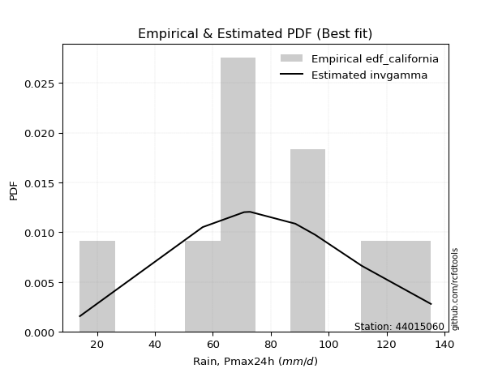</img>

</div>


### 2. EDF Hazen (1930)

Hazen method for plotting positions is a formula used to estimate the empirical cumulative probability distribution of flood events or other hydrological data. This formula often results in biased estimations, particularly when extrapolating to extreme events (high return periods).

<div align="center">


$P=(m-0.5)/n$


</div>


**2.1. Empirical values**

<div align="center">

|                | 0                  | 1                  | 2                  | 3                  | 4                  | 5                  | 6                 | 7         | 8                 | 9                  |
|:---------------|:-------------------|:-------------------|:-------------------|:-------------------|:-------------------|:-------------------|:------------------|:----------|:------------------|:-------------------|
| date           | 2016               | 2020               | 2022               | 2021               | 2018               | 2023               | 2017              | 2025      | 2024              | 2019               |
| x              | 14.1               | 56.5               | 70.8               | 72.4               | 72.9               | 88.5               | 95.3              | 111.2     | 111.4             | 135.3              |
| m              | 1                  | 2                  | 3                  | 4                  | 5                  | 6                  | 7                 | 8         | 9                 | 10                 |
| empirical_dist | edf_hazen          | edf_hazen          | edf_hazen          | edf_hazen          | edf_hazen          | edf_hazen          | edf_hazen         | edf_hazen | edf_hazen         | edf_hazen          |
| empirical      | 0.05               | 0.15               | 0.25               | 0.35               | 0.45               | 0.55               | 0.65              | 0.75      | 0.85              | 0.95               |
| empirical_tr   | 1.0526315789473684 | 1.1764705882352942 | 1.3333333333333333 | 1.5384615384615383 | 1.8181818181818181 | 2.2222222222222223 | 2.857142857142857 | 4.0       | 6.666666666666666 | 19.999999999999982 |

</div>


**2.2. Kolmogorov-Smirnov fit test (sorted by Δ)**


<div align="center">

|                | 0                   | 1                   | 2                  | 3                   | 4                   | 5                  | 6                   | 7                   | 8                   | 9                   | 10                  | 11                 | 12                  | 13                  | 14                  | 15                  | 16                 | 17                  | 18                  | 19                 | 20                  | 21                  | 22                  | 23                  | 24                  | 25                 | 26                  | 27                  | 28                  | 29                 | 30                  | 31                  | 32                  | 33                  | 34                 | 35                  | 36                  | 37                  | 38                 | 39                  | 40                  | 41                  | 42                  | 43                  | 44                  | 45                  | 46                 | 47                 | 48                 | 49                  | 50                  | 51                 | 52                  | 53                  | 54                 | 55                  | 56                  | 57                  | 58                  | 59                  | 60                 | 61                 | 62                  | 63                  | 64                  | 65                 | 66                 | 67                  | 68                 | 69                  | 70                 | 71                  | 72                  | 73                  | 74                 | 75                  | 76                  | 77                  | 78                  | 79                  | 80                 | 81                 | 82                 | 83                 | 84                 | 85                  | 86                  | 87                 | 88                  | 89                  | 90                 | 91                 | 92                  | 93                  | 94                 | 95                  | 96                  | 97                  | 98                 | 99                 | 100                 | 101                 | 102                 | 103                 | 104                 | 105                 | 106                 | 107                 | 108                 | 109                | 110                 | 111                | 112                | 113                 | 114                 | 115                | 116                 | 117                 | 118                | 119                 | 120                 | 121                | 122                 | 123                | 124                 | 125                 | 126                 | 127                 | 128                | 129                | 130                 | 131                | 132                | 133                 | 134                | 135                 | 136                 | 137                | 138                 | 139                 | 140                 | 141                 | 142                | 143                | 144                | 145                 | 146                | 147                | 148                | 149                | 150                | 151                | 152                | 153                | 154                | 155                | 156                | 157                | 158                | 159                |
|:---------------|:--------------------|:--------------------|:-------------------|:--------------------|:--------------------|:-------------------|:--------------------|:--------------------|:--------------------|:--------------------|:--------------------|:-------------------|:--------------------|:--------------------|:--------------------|:--------------------|:-------------------|:--------------------|:--------------------|:-------------------|:--------------------|:--------------------|:--------------------|:--------------------|:--------------------|:-------------------|:--------------------|:--------------------|:--------------------|:-------------------|:--------------------|:--------------------|:--------------------|:--------------------|:-------------------|:--------------------|:--------------------|:--------------------|:-------------------|:--------------------|:--------------------|:--------------------|:--------------------|:--------------------|:--------------------|:--------------------|:-------------------|:-------------------|:-------------------|:--------------------|:--------------------|:-------------------|:--------------------|:--------------------|:-------------------|:--------------------|:--------------------|:--------------------|:--------------------|:--------------------|:-------------------|:-------------------|:--------------------|:--------------------|:--------------------|:-------------------|:-------------------|:--------------------|:-------------------|:--------------------|:-------------------|:--------------------|:--------------------|:--------------------|:-------------------|:--------------------|:--------------------|:--------------------|:--------------------|:--------------------|:-------------------|:-------------------|:-------------------|:-------------------|:-------------------|:--------------------|:--------------------|:-------------------|:--------------------|:--------------------|:-------------------|:-------------------|:--------------------|:--------------------|:-------------------|:--------------------|:--------------------|:--------------------|:-------------------|:-------------------|:--------------------|:--------------------|:--------------------|:--------------------|:--------------------|:--------------------|:--------------------|:--------------------|:--------------------|:-------------------|:--------------------|:-------------------|:-------------------|:--------------------|:--------------------|:-------------------|:--------------------|:--------------------|:-------------------|:--------------------|:--------------------|:-------------------|:--------------------|:-------------------|:--------------------|:--------------------|:--------------------|:--------------------|:-------------------|:-------------------|:--------------------|:-------------------|:-------------------|:--------------------|:-------------------|:--------------------|:--------------------|:-------------------|:--------------------|:--------------------|:--------------------|:--------------------|:-------------------|:-------------------|:-------------------|:--------------------|:-------------------|:-------------------|:-------------------|:-------------------|:-------------------|:-------------------|:-------------------|:-------------------|:-------------------|:-------------------|:-------------------|:-------------------|:-------------------|:-------------------|
| station        | 44015060            | 44015060            | 44015060           | 44015060            | 44015060            | 44015060           | 44015060            | 44015060            | 44015060            | 44015060            | 44015060            | 44015060           | 44015060            | 44015060            | 44015060            | 44015060            | 44015060           | 44015060            | 44015060            | 44015060           | 44015060            | 44015060            | 44015060            | 44015060            | 44015060            | 44015060           | 44015060            | 44015060            | 44015060            | 44015060           | 44015060            | 44015060            | 44015060            | 44015060            | 44015060           | 44015060            | 44015060            | 44015060            | 44015060           | 44015060            | 44015060            | 44015060            | 44015060            | 44015060            | 44015060            | 44015060            | 44015060           | 44015060           | 44015060           | 44015060            | 44015060            | 44015060           | 44015060            | 44015060            | 44015060           | 44015060            | 44015060            | 44015060            | 44015060            | 44015060            | 44015060           | 44015060           | 44015060            | 44015060            | 44015060            | 44015060           | 44015060           | 44015060            | 44015060           | 44015060            | 44015060           | 44015060            | 44015060            | 44015060            | 44015060           | 44015060            | 44015060            | 44015060            | 44015060            | 44015060            | 44015060           | 44015060           | 44015060           | 44015060           | 44015060           | 44015060            | 44015060            | 44015060           | 44015060            | 44015060            | 44015060           | 44015060           | 44015060            | 44015060            | 44015060           | 44015060            | 44015060            | 44015060            | 44015060           | 44015060           | 44015060            | 44015060            | 44015060            | 44015060            | 44015060            | 44015060            | 44015060            | 44015060            | 44015060            | 44015060           | 44015060            | 44015060           | 44015060           | 44015060            | 44015060            | 44015060           | 44015060            | 44015060            | 44015060           | 44015060            | 44015060            | 44015060           | 44015060            | 44015060           | 44015060            | 44015060            | 44015060            | 44015060            | 44015060           | 44015060           | 44015060            | 44015060           | 44015060           | 44015060            | 44015060           | 44015060            | 44015060            | 44015060           | 44015060            | 44015060            | 44015060            | 44015060            | 44015060           | 44015060           | 44015060           | 44015060            | 44015060           | 44015060           | 44015060           | 44015060           | 44015060           | 44015060           | 44015060           | 44015060           | 44015060           | 44015060           | 44015060           | 44015060           | 44015060           | 44015060           |
| empirical_dist | edf_hazen           | edf_hazen           | edf_hazen          | edf_hazen           | edf_hazen           | edf_hazen          | edf_hazen           | edf_hazen           | edf_hazen           | edf_hazen           | edf_hazen           | edf_hazen          | edf_hazen           | edf_hazen           | edf_hazen           | edf_hazen           | edf_hazen          | edf_hazen           | edf_hazen           | edf_hazen          | edf_hazen           | edf_hazen           | edf_hazen           | edf_hazen           | edf_hazen           | edf_hazen          | edf_hazen           | edf_hazen           | edf_hazen           | edf_hazen          | edf_hazen           | edf_hazen           | edf_hazen           | edf_hazen           | edf_hazen          | edf_hazen           | edf_hazen           | edf_hazen           | edf_hazen          | edf_hazen           | edf_hazen           | edf_hazen           | edf_hazen           | edf_hazen           | edf_hazen           | edf_hazen           | edf_hazen          | edf_hazen          | edf_hazen          | edf_hazen           | edf_hazen           | edf_hazen          | edf_hazen           | edf_hazen           | edf_hazen          | edf_hazen           | edf_hazen           | edf_hazen           | edf_hazen           | edf_hazen           | edf_hazen          | edf_hazen          | edf_hazen           | edf_hazen           | edf_hazen           | edf_hazen          | edf_hazen          | edf_hazen           | edf_hazen          | edf_hazen           | edf_hazen          | edf_hazen           | edf_hazen           | edf_hazen           | edf_hazen          | edf_hazen           | edf_hazen           | edf_hazen           | edf_hazen           | edf_hazen           | edf_hazen          | edf_hazen          | edf_hazen          | edf_hazen          | edf_hazen          | edf_hazen           | edf_hazen           | edf_hazen          | edf_hazen           | edf_hazen           | edf_hazen          | edf_hazen          | edf_hazen           | edf_hazen           | edf_hazen          | edf_hazen           | edf_hazen           | edf_hazen           | edf_hazen          | edf_hazen          | edf_hazen           | edf_hazen           | edf_hazen           | edf_hazen           | edf_hazen           | edf_hazen           | edf_hazen           | edf_hazen           | edf_hazen           | edf_hazen          | edf_hazen           | edf_hazen          | edf_hazen          | edf_hazen           | edf_hazen           | edf_hazen          | edf_hazen           | edf_hazen           | edf_hazen          | edf_hazen           | edf_hazen           | edf_hazen          | edf_hazen           | edf_hazen          | edf_hazen           | edf_hazen           | edf_hazen           | edf_hazen           | edf_hazen          | edf_hazen          | edf_hazen           | edf_hazen          | edf_hazen          | edf_hazen           | edf_hazen          | edf_hazen           | edf_hazen           | edf_hazen          | edf_hazen           | edf_hazen           | edf_hazen           | edf_hazen           | edf_hazen          | edf_hazen          | edf_hazen          | edf_hazen           | edf_hazen          | edf_hazen          | edf_hazen          | edf_hazen          | edf_hazen          | edf_hazen          | edf_hazen          | edf_hazen          | edf_hazen          | edf_hazen          | edf_hazen          | edf_hazen          | edf_hazen          | edf_hazen          |
| p_dist         | logistic            | gompertz            | exponpow           | gennorm             | logjohnsonsu        | foldnorm           | logjohnsonsb        | pearson3            | hypsecant           | truncnorm           | weibull_min         | skewnorm           | genextreme          | johnsonsb           | logdweibull         | gengamma            | logargus           | johnsonsu           | rice                | t                  | exponnorm           | norm                | crystalball         | nct                 | f                   | fatiguelife        | argus               | exponweib           | burr                | mielke             | loggenlogistic      | logpearson3         | logloggamma         | genlogistic         | betaprime          | erlang              | truncweibull_min    | gamma               | dweibull           | anglit              | invgamma            | dgamma              | laplace             | logburr             | logburr12           | semicircular        | loggompertz        | gumbel_l           | logmielke          | maxwell             | logvonmises_line    | logloglaplace      | loggengamma         | logdgamma           | rayleigh           | cosine              | nakagami            | lognakagami         | ncf                 | gumbel_r            | invgauss           | loggumbel_l        | arcsine             | loggenextreme       | genhalflogistic     | invweibull         | moyal              | genpareto           | gausshyper         | triang              | logtrapezoid       | halfnorm            | loggennorm          | logtruncnorm        | halflogistic       | kstwobign           | vonmises_line       | logskewnorm         | genexpon            | halfgennorm         | wald               | kappa3             | logt               | loglaplace         | loglaplace         | uniform             | wrapcauchy          | logncf             | ksone               | loghypsecant        | logfoldnorm        | loglogistic        | logfatiguelife      | logf                | logexponnorm       | logcrystalball      | lognorm             | logrice             | lognct             | beta               | loganglit           | logsemicircular     | logbetaprime        | logerlang           | kappa4              | logalpha            | loggamma            | loggamma            | loginvweibull       | loginvgamma        | logarcsine          | loglevy_l          | loginvgauss        | logmaxwell          | lograyleigh         | loggenhalflogistic | trapezoid           | loggumbel_r         | bradford           | loggausshyper       | logtriang           | loghalfnorm        | logkappa4           | logkstwobign       | levy_l              | loggenpareto        | logweibull_max      | logcosine           | logmoyal           | lomax              | alpha               | loghalflogistic    | loggenexpon        | truncexpon          | logwrapcauchy      | logtruncweibull_min | logwald             | loglomax           | burr12              | logrdist            | logbeta             | logksone            | logtukeylambda     | logkappa3          | loguniform         | logbradford         | logexponweib       | logweibull_min     | logtruncexpon      | logexponpow        | powerlaw           | rdist              | logpowerlaw        | weibull_max        | tukeylambda        | truncpareto        | logtruncpareto     | loghalfgennorm     | logvonmises        | vonmises           |
| delta          | 0.08666616022481832 | 0.09159980304167609 | 0.0918063675137673 | 0.09364432006440526 | 0.09398364099847517 | 0.0946747515606039 | 0.09567452778623509 | 0.09775296739258238 | 0.09888112887797729 | 0.09931621611001212 | 0.10066882230143964 | 0.1007247968248664 | 0.10076255032978704 | 0.10199068154617585 | 0.10212138511905089 | 0.10336273875297064 | 0.1038082956276386 | 0.10386307051418625 | 0.10394671869543731 | 0.1039663890398782 | 0.10398033026073578 | 0.10398328240587379 | 0.10398328443885602 | 0.10410562182854782 | 0.10450686125898112 | 0.105020950536995  | 0.10546111142314996 | 0.10648630679752447 | 0.10685556132477492 | 0.1069583075992368 | 0.10809866284481262 | 0.11004371379017924 | 0.11022458614733899 | 0.11224567870396268 | 0.1139970692853835 | 0.11629609404917324 | 0.11747584845756359 | 0.11754760923799279 | 0.1185745924759124 | 0.12334810422932801 | 0.12558301402552813 | 0.12683780525295546 | 0.12712735690816795 | 0.12885758371660794 | 0.12932662404324863 | 0.13146614373761867 | 0.1351718598290373 | 0.1354861473322792 | 0.1356255795625927 | 0.13615458159414767 | 0.13629081412517363 | 0.1398555041156344 | 0.14019349040309448 | 0.14756658738069311 | 0.1482655662384006 | 0.14889170884387404 | 0.14999999999927605 | 0.14999999999998986 | 0.15273157488447675 | 0.15343130564855062 | 0.1575163099021344 | 0.1604208978490711 | 0.16466956291804857 | 0.16946730794633158 | 0.17094224619655085 | 0.1715246373352844 | 0.1718437049937811 | 0.17289698439066023 | 0.1768896931679519 | 0.17694527942936877 | 0.1796741692568513 | 0.18273132154807714 | 0.18339543502528538 | 0.18426860867571038 | 0.1914901537607896 | 0.20202136693454198 | 0.20232669420837662 | 0.20297643803027954 | 0.21329119503460525 | 0.21436594862084818 | 0.215087195871084  | 0.2163029225247608 | 0.2175125816611737 | 0.2175845878015602 | 0.2175845878015602 | 0.21782178217821774 | 0.21842461491760717 | 0.2240595573712349 | 0.22486248624862484 | 0.22632394497430852 | 0.2274439496321704 | 0.2285215930645642 | 0.22993247715390336 | 0.23056340812678433 | 0.2310964947489556 | 0.23109883093846367 | 0.23109887510531718 | 0.23110404955406116 | 0.2315845479487082 | 0.2327498557646922 | 0.23380271811979286 | 0.23491588062029956 | 0.23721723491671426 | 0.24462025356408246 | 0.24470733795323202 | 0.24569819840553014 | 0.24685410131476926 | 0.24685410131476926 | 0.24725036375219558 | 0.2490890596500679 | 0.25339644811986684 | 0.2542121838907304 | 0.2586047918542047 | 0.26480158755271377 | 0.27619666771681994 | 0.2815426369877462 | 0.28398793434073877 | 0.30065440286323575 | 0.304132583313948  | 0.30519104201712477 | 0.30584206306520156 | 0.3082941722900031 | 0.30849791554543016 | 0.3109672827011263 | 0.31108136199050823 | 0.31489550016830603 | 0.32364778396790406 | 0.32586730082233795 | 0.3265171981772613 | 0.3276200839741734 | 0.33088504056709955 | 0.3319614428757467 | 0.338192231835592  | 0.35812580777180303 | 0.3894448612212985 | 0.3914069004250925  | 0.39850013279777796 | 0.4023623851005548 | 0.41972096937626513 | 0.42732861783869525 | 0.43760951573029083 | 0.44485831347731364 | 0.4592832398051584 | 0.4623343673597644 | 0.4638299761727763 | 0.47009180112452076 | 0.4752278339985029 | 0.5318096076049421 | 0.5422034075733876 | 0.6310446720249078 | 0.6348635992359328 | 0.6737642611520793 | 0.730042364570449  | 0.7326600727744094 | 0.7345358550155012 | 0.7940941849457086 | 0.8236380399332949 | 0.85               | 1.179423434830835  | 20.672800450952398 |
| deltao         | 0.3942745923300002  | 0.3942745923300002  | 0.3942745923300002 | 0.3942745923300002  | 0.3942745923300002  | 0.3942745923300002 | 0.3942745923300002  | 0.3942745923300002  | 0.3942745923300002  | 0.3942745923300002  | 0.3942745923300002  | 0.3942745923300002 | 0.3942745923300002  | 0.3942745923300002  | 0.3942745923300002  | 0.3942745923300002  | 0.3942745923300002 | 0.3942745923300002  | 0.3942745923300002  | 0.3942745923300002 | 0.3942745923300002  | 0.3942745923300002  | 0.3942745923300002  | 0.3942745923300002  | 0.3942745923300002  | 0.3942745923300002 | 0.3942745923300002  | 0.3942745923300002  | 0.3942745923300002  | 0.3942745923300002 | 0.3942745923300002  | 0.3942745923300002  | 0.3942745923300002  | 0.3942745923300002  | 0.3942745923300002 | 0.3942745923300002  | 0.3942745923300002  | 0.3942745923300002  | 0.3942745923300002 | 0.3942745923300002  | 0.3942745923300002  | 0.3942745923300002  | 0.3942745923300002  | 0.3942745923300002  | 0.3942745923300002  | 0.3942745923300002  | 0.3942745923300002 | 0.3942745923300002 | 0.3942745923300002 | 0.3942745923300002  | 0.3942745923300002  | 0.3942745923300002 | 0.3942745923300002  | 0.3942745923300002  | 0.3942745923300002 | 0.3942745923300002  | 0.3942745923300002  | 0.3942745923300002  | 0.3942745923300002  | 0.3942745923300002  | 0.3942745923300002 | 0.3942745923300002 | 0.3942745923300002  | 0.3942745923300002  | 0.3942745923300002  | 0.3942745923300002 | 0.3942745923300002 | 0.3942745923300002  | 0.3942745923300002 | 0.3942745923300002  | 0.3942745923300002 | 0.3942745923300002  | 0.3942745923300002  | 0.3942745923300002  | 0.3942745923300002 | 0.3942745923300002  | 0.3942745923300002  | 0.3942745923300002  | 0.3942745923300002  | 0.3942745923300002  | 0.3942745923300002 | 0.3942745923300002 | 0.3942745923300002 | 0.3942745923300002 | 0.3942745923300002 | 0.3942745923300002  | 0.3942745923300002  | 0.3942745923300002 | 0.3942745923300002  | 0.3942745923300002  | 0.3942745923300002 | 0.3942745923300002 | 0.3942745923300002  | 0.3942745923300002  | 0.3942745923300002 | 0.3942745923300002  | 0.3942745923300002  | 0.3942745923300002  | 0.3942745923300002 | 0.3942745923300002 | 0.3942745923300002  | 0.3942745923300002  | 0.3942745923300002  | 0.3942745923300002  | 0.3942745923300002  | 0.3942745923300002  | 0.3942745923300002  | 0.3942745923300002  | 0.3942745923300002  | 0.3942745923300002 | 0.3942745923300002  | 0.3942745923300002 | 0.3942745923300002 | 0.3942745923300002  | 0.3942745923300002  | 0.3942745923300002 | 0.3942745923300002  | 0.3942745923300002  | 0.3942745923300002 | 0.3942745923300002  | 0.3942745923300002  | 0.3942745923300002 | 0.3942745923300002  | 0.3942745923300002 | 0.3942745923300002  | 0.3942745923300002  | 0.3942745923300002  | 0.3942745923300002  | 0.3942745923300002 | 0.3942745923300002 | 0.3942745923300002  | 0.3942745923300002 | 0.3942745923300002 | 0.3942745923300002  | 0.3942745923300002 | 0.3942745923300002  | 0.3942745923300002  | 0.3942745923300002 | 0.3942745923300002  | 0.3942745923300002  | 0.3942745923300002  | 0.3942745923300002  | 0.3942745923300002 | 0.3942745923300002 | 0.3942745923300002 | 0.3942745923300002  | 0.3942745923300002 | 0.3942745923300002 | 0.3942745923300002 | 0.3942745923300002 | 0.3942745923300002 | 0.3942745923300002 | 0.3942745923300002 | 0.3942745923300002 | 0.3942745923300002 | 0.3942745923300002 | 0.3942745923300002 | 0.3942745923300002 | 0.3942745923300002 | 0.3942745923300002 |
| eval           | Δo > Δ              | Δo > Δ              | Δo > Δ             | Δo > Δ              | Δo > Δ              | Δo > Δ             | Δo > Δ              | Δo > Δ              | Δo > Δ              | Δo > Δ              | Δo > Δ              | Δo > Δ             | Δo > Δ              | Δo > Δ              | Δo > Δ              | Δo > Δ              | Δo > Δ             | Δo > Δ              | Δo > Δ              | Δo > Δ             | Δo > Δ              | Δo > Δ              | Δo > Δ              | Δo > Δ              | Δo > Δ              | Δo > Δ             | Δo > Δ              | Δo > Δ              | Δo > Δ              | Δo > Δ             | Δo > Δ              | Δo > Δ              | Δo > Δ              | Δo > Δ              | Δo > Δ             | Δo > Δ              | Δo > Δ              | Δo > Δ              | Δo > Δ             | Δo > Δ              | Δo > Δ              | Δo > Δ              | Δo > Δ              | Δo > Δ              | Δo > Δ              | Δo > Δ              | Δo > Δ             | Δo > Δ             | Δo > Δ             | Δo > Δ              | Δo > Δ              | Δo > Δ             | Δo > Δ              | Δo > Δ              | Δo > Δ             | Δo > Δ              | Δo > Δ              | Δo > Δ              | Δo > Δ              | Δo > Δ              | Δo > Δ             | Δo > Δ             | Δo > Δ              | Δo > Δ              | Δo > Δ              | Δo > Δ             | Δo > Δ             | Δo > Δ              | Δo > Δ             | Δo > Δ              | Δo > Δ             | Δo > Δ              | Δo > Δ              | Δo > Δ              | Δo > Δ             | Δo > Δ              | Δo > Δ              | Δo > Δ              | Δo > Δ              | Δo > Δ              | Δo > Δ             | Δo > Δ             | Δo > Δ             | Δo > Δ             | Δo > Δ             | Δo > Δ              | Δo > Δ              | Δo > Δ             | Δo > Δ              | Δo > Δ              | Δo > Δ             | Δo > Δ             | Δo > Δ              | Δo > Δ              | Δo > Δ             | Δo > Δ              | Δo > Δ              | Δo > Δ              | Δo > Δ             | Δo > Δ             | Δo > Δ              | Δo > Δ              | Δo > Δ              | Δo > Δ              | Δo > Δ              | Δo > Δ              | Δo > Δ              | Δo > Δ              | Δo > Δ              | Δo > Δ             | Δo > Δ              | Δo > Δ             | Δo > Δ             | Δo > Δ              | Δo > Δ              | Δo > Δ             | Δo > Δ              | Δo > Δ              | Δo > Δ             | Δo > Δ              | Δo > Δ              | Δo > Δ             | Δo > Δ              | Δo > Δ             | Δo > Δ              | Δo > Δ              | Δo > Δ              | Δo > Δ              | Δo > Δ             | Δo > Δ             | Δo > Δ              | Δo > Δ             | Δo > Δ             | Δo > Δ              | Δo > Δ             | Δo > Δ              | Δo <= Δ             | Δo <= Δ            | Δo <= Δ             | Δo <= Δ             | Δo <= Δ             | Δo <= Δ             | Δo <= Δ            | Δo <= Δ            | Δo <= Δ            | Δo <= Δ             | Δo <= Δ            | Δo <= Δ            | Δo <= Δ            | Δo <= Δ            | Δo <= Δ            | Δo <= Δ            | Δo <= Δ            | Δo <= Δ            | Δo <= Δ            | Δo <= Δ            | Δo <= Δ            | Δo <= Δ            | Δo <= Δ            | Δo <= Δ            |
| fit            | 1                   | 1                   | 1                  | 1                   | 1                   | 1                  | 1                   | 1                   | 1                   | 1                   | 1                   | 1                  | 1                   | 1                   | 1                   | 1                   | 1                  | 1                   | 1                   | 1                  | 1                   | 1                   | 1                   | 1                   | 1                   | 1                  | 1                   | 1                   | 1                   | 1                  | 1                   | 1                   | 1                   | 1                   | 1                  | 1                   | 1                   | 1                   | 1                  | 1                   | 1                   | 1                   | 1                   | 1                   | 1                   | 1                   | 1                  | 1                  | 1                  | 1                   | 1                   | 1                  | 1                   | 1                   | 1                  | 1                   | 1                   | 1                   | 1                   | 1                   | 1                  | 1                  | 1                   | 1                   | 1                   | 1                  | 1                  | 1                   | 1                  | 1                   | 1                  | 1                   | 1                   | 1                   | 1                  | 1                   | 1                   | 1                   | 1                   | 1                   | 1                  | 1                  | 1                  | 1                  | 1                  | 1                   | 1                   | 1                  | 1                   | 1                   | 1                  | 1                  | 1                   | 1                   | 1                  | 1                   | 1                   | 1                   | 1                  | 1                  | 1                   | 1                   | 1                   | 1                   | 1                   | 1                   | 1                   | 1                   | 1                   | 1                  | 1                   | 1                  | 1                  | 1                   | 1                   | 1                  | 1                   | 1                   | 1                  | 1                   | 1                   | 1                  | 1                   | 1                  | 1                   | 1                   | 1                   | 1                   | 1                  | 1                  | 1                   | 1                  | 1                  | 1                   | 1                  | 1                   | 0                   | 0                  | 0                   | 0                   | 0                   | 0                   | 0                  | 0                  | 0                  | 0                   | 0                  | 0                  | 0                  | 0                  | 0                  | 0                  | 0                  | 0                  | 0                  | 0                  | 0                  | 0                  | 0                  | 0                  |
| n              | 10                  | 10                  | 10                 | 10                  | 10                  | 10                 | 10                  | 10                  | 10                  | 10                  | 10                  | 10                 | 10                  | 10                  | 10                  | 10                  | 10                 | 10                  | 10                  | 10                 | 10                  | 10                  | 10                  | 10                  | 10                  | 10                 | 10                  | 10                  | 10                  | 10                 | 10                  | 10                  | 10                  | 10                  | 10                 | 10                  | 10                  | 10                  | 10                 | 10                  | 10                  | 10                  | 10                  | 10                  | 10                  | 10                  | 10                 | 10                 | 10                 | 10                  | 10                  | 10                 | 10                  | 10                  | 10                 | 10                  | 10                  | 10                  | 10                  | 10                  | 10                 | 10                 | 10                  | 10                  | 10                  | 10                 | 10                 | 10                  | 10                 | 10                  | 10                 | 10                  | 10                  | 10                  | 10                 | 10                  | 10                  | 10                  | 10                  | 10                  | 10                 | 10                 | 10                 | 10                 | 10                 | 10                  | 10                  | 10                 | 10                  | 10                  | 10                 | 10                 | 10                  | 10                  | 10                 | 10                  | 10                  | 10                  | 10                 | 10                 | 10                  | 10                  | 10                  | 10                  | 10                  | 10                  | 10                  | 10                  | 10                  | 10                 | 10                  | 10                 | 10                 | 10                  | 10                  | 10                 | 10                  | 10                  | 10                 | 10                  | 10                  | 10                 | 10                  | 10                 | 10                  | 10                  | 10                  | 10                  | 10                 | 10                 | 10                  | 10                 | 10                 | 10                  | 10                 | 10                  | 10                  | 10                 | 10                  | 10                  | 10                  | 10                  | 10                 | 10                 | 10                 | 10                  | 10                 | 10                 | 10                 | 10                 | 10                 | 10                 | 10                 | 10                 | 10                 | 10                 | 10                 | 10                 | 10                 | 10                 |
| best_fit       | 1                   | 0                   | 0                  | 0                   | 0                   | 0                  | 0                   | 0                   | 0                   | 0                   | 0                   | 0                  | 0                   | 0                   | 0                   | 0                   | 0                  | 0                   | 0                   | 0                  | 0                   | 0                   | 0                   | 0                   | 0                   | 0                  | 0                   | 0                   | 0                   | 0                  | 0                   | 0                   | 0                   | 0                   | 0                  | 0                   | 0                   | 0                   | 0                  | 0                   | 0                   | 0                   | 0                   | 0                   | 0                   | 0                   | 0                  | 0                  | 0                  | 0                   | 0                   | 0                  | 0                   | 0                   | 0                  | 0                   | 0                   | 0                   | 0                   | 0                   | 0                  | 0                  | 0                   | 0                   | 0                   | 0                  | 0                  | 0                   | 0                  | 0                   | 0                  | 0                   | 0                   | 0                   | 0                  | 0                   | 0                   | 0                   | 0                   | 0                   | 0                  | 0                  | 0                  | 0                  | 0                  | 0                   | 0                   | 0                  | 0                   | 0                   | 0                  | 0                  | 0                   | 0                   | 0                  | 0                   | 0                   | 0                   | 0                  | 0                  | 0                   | 0                   | 0                   | 0                   | 0                   | 0                   | 0                   | 0                   | 0                   | 0                  | 0                   | 0                  | 0                  | 0                   | 0                   | 0                  | 0                   | 0                   | 0                  | 0                   | 0                   | 0                  | 0                   | 0                  | 0                   | 0                   | 0                   | 0                   | 0                  | 0                  | 0                   | 0                  | 0                  | 0                   | 0                  | 0                   | 0                   | 0                  | 0                   | 0                   | 0                   | 0                   | 0                  | 0                  | 0                  | 0                   | 0                  | 0                  | 0                  | 0                  | 0                  | 0                  | 0                  | 0                  | 0                  | 0                  | 0                  | 0                  | 0                  | 0                  |
| best_fit_sort  | 1                   | 2                   | 3                  | 4                   | 5                   | 6                  | 7                   | 8                   | 9                   | 10                  | 11                  | 12                 | 13                  | 14                  | 15                  | 16                  | 17                 | 18                  | 19                  | 20                 | 21                  | 22                  | 23                  | 24                  | 25                  | 26                 | 27                  | 28                  | 29                  | 30                 | 31                  | 32                  | 33                  | 34                  | 35                 | 36                  | 37                  | 38                  | 39                 | 40                  | 41                  | 42                  | 43                  | 44                  | 45                  | 46                  | 47                 | 48                 | 49                 | 50                  | 51                  | 52                 | 53                  | 54                  | 55                 | 56                  | 57                  | 58                  | 59                  | 60                  | 61                 | 62                 | 63                  | 64                  | 65                  | 66                 | 67                 | 68                  | 69                 | 70                  | 71                 | 72                  | 73                  | 74                  | 75                 | 76                  | 77                  | 78                  | 79                  | 80                  | 81                 | 82                 | 83                 | 84                 | 85                 | 86                  | 87                  | 88                 | 89                  | 90                  | 91                 | 92                 | 93                  | 94                  | 95                 | 96                  | 97                  | 98                  | 99                 | 100                | 101                 | 102                 | 103                 | 104                 | 105                 | 106                 | 107                 | 108                 | 109                 | 110                | 111                 | 112                | 113                | 114                 | 115                 | 116                | 117                 | 118                 | 119                | 120                 | 121                 | 122                | 123                 | 124                | 125                 | 126                 | 127                 | 128                 | 129                | 130                | 131                 | 132                | 133                | 134                 | 135                | 136                 | 137                 | 138                | 139                 | 140                 | 141                 | 142                 | 143                | 144                | 145                | 146                 | 147                | 148                | 149                | 150                | 151                | 152                | 153                | 154                | 155                | 156                | 157                | 158                | 159                | 160                |

</div>


**2.3. Best fit**

<div align="center">

|   id |   station | empirical_dist   | p_dist   |     delta |   deltao | eval   |   fit |   n |   best_fit |   best_fit_sort |
|-----:|----------:|:-----------------|:---------|----------:|---------:|:-------|------:|----:|-----------:|----------------:|
|    0 |  44015060 | edf_hazen        | logistic | 0.0866662 | 0.394275 | Δo > Δ |     1 |  10 |          1 |               1 |

</div>


<div align="center">

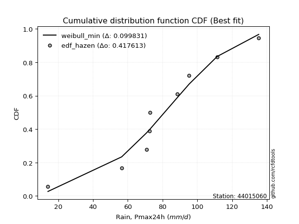</img></img>

</div>


### 3. EDF Weibull (1939)

Weibull plotting position formula is an empirical method used to estimate the non-exceedance probability or plotting position for a set of observed data, is often recommended or widely used in practice, particularly in flood frequency analysis.

<div align="center">


$P=m/(n+1)$


</div>


**3.1. Empirical values**

<div align="center">

|                | 0                   | 1                   | 2                  | 3                   | 4                   | 5                  | 6                  | 7                  | 8                  | 9                  |
|:---------------|:--------------------|:--------------------|:-------------------|:--------------------|:--------------------|:-------------------|:-------------------|:-------------------|:-------------------|:-------------------|
| date           | 2016                | 2020                | 2022               | 2021                | 2018                | 2023               | 2017               | 2025               | 2024               | 2019               |
| x              | 14.1                | 56.5                | 70.8               | 72.4                | 72.9                | 88.5               | 95.3               | 111.2              | 111.4              | 135.3              |
| m              | 1                   | 2                   | 3                  | 4                   | 5                   | 6                  | 7                  | 8                  | 9                  | 10                 |
| empirical_dist | edf_weibull         | edf_weibull         | edf_weibull        | edf_weibull         | edf_weibull         | edf_weibull        | edf_weibull        | edf_weibull        | edf_weibull        | edf_weibull        |
| empirical      | 0.09090909090909091 | 0.18181818181818182 | 0.2727272727272727 | 0.36363636363636365 | 0.45454545454545453 | 0.5454545454545454 | 0.6363636363636364 | 0.7272727272727273 | 0.8181818181818182 | 0.9090909090909091 |
| empirical_tr   | 1.1                 | 1.2222222222222223  | 1.375              | 1.5714285714285714  | 1.8333333333333335  | 2.1999999999999997 | 2.75               | 3.666666666666667  | 5.500000000000002  | 10.999999999999996 |

</div>


**3.2. Kolmogorov-Smirnov fit test (sorted by Δ)**


<div align="center">

|                | 0                  | 1                  | 2                   | 3                   | 4                   | 5                   | 6                  | 7                   | 8                   | 9                   | 10                  | 11                  | 12                  | 13                 | 14                  | 15                  | 16                  | 17                  | 18                  | 19                 | 20                  | 21                  | 22                 | 23                  | 24                  | 25                  | 26                  | 27                  | 28                  | 29                  | 30                  | 31                  | 32                 | 33                  | 34                  | 35                  | 36                  | 37                  | 38                  | 39                  | 40                  | 41                  | 42                  | 43                  | 44                  | 45                  | 46                  | 47                  | 48                 | 49                  | 50                  | 51                  | 52                  | 53                 | 54                  | 55                  | 56                  | 57                 | 58                 | 59                  | 60                 | 61                  | 62                  | 63                  | 64                  | 65                 | 66                  | 67                 | 68                  | 69                 | 70                 | 71                  | 72                  | 73                  | 74                  | 75                  | 76                 | 77                 | 78                  | 79                  | 80                  | 81                 | 82                 | 83                 | 84                 | 85                  | 86                  | 87                  | 88                 | 89                  | 90                 | 91                 | 92                  | 93                  | 94                 | 95                  | 96                  | 97                  | 98                 | 99                 | 100                 | 101                 | 102                 | 103                 | 104                 | 105                 | 106                | 107                | 108                 | 109                 | 110                 | 111                 | 112                | 113                 | 114                | 115                 | 116                 | 117                | 118                | 119                 | 120                | 121                | 122                 | 123                 | 124                | 125                 | 126                | 127                | 128                 | 129                | 130                | 131                 | 132                | 133                | 134                | 135                 | 136                | 137                 | 138                 | 139                 | 140                | 141                 | 142                 | 143                | 144                | 145                 | 146                | 147                | 148                | 149                | 150                | 151                | 152                | 153                | 154                | 155                | 156                | 157                | 158                | 159                |
|:---------------|:-------------------|:-------------------|:--------------------|:--------------------|:--------------------|:--------------------|:-------------------|:--------------------|:--------------------|:--------------------|:--------------------|:--------------------|:--------------------|:-------------------|:--------------------|:--------------------|:--------------------|:--------------------|:--------------------|:-------------------|:--------------------|:--------------------|:-------------------|:--------------------|:--------------------|:--------------------|:--------------------|:--------------------|:--------------------|:--------------------|:--------------------|:--------------------|:-------------------|:--------------------|:--------------------|:--------------------|:--------------------|:--------------------|:--------------------|:--------------------|:--------------------|:--------------------|:--------------------|:--------------------|:--------------------|:--------------------|:--------------------|:--------------------|:-------------------|:--------------------|:--------------------|:--------------------|:--------------------|:-------------------|:--------------------|:--------------------|:--------------------|:-------------------|:-------------------|:--------------------|:-------------------|:--------------------|:--------------------|:--------------------|:--------------------|:-------------------|:--------------------|:-------------------|:--------------------|:-------------------|:-------------------|:--------------------|:--------------------|:--------------------|:--------------------|:--------------------|:-------------------|:-------------------|:--------------------|:--------------------|:--------------------|:-------------------|:-------------------|:-------------------|:-------------------|:--------------------|:--------------------|:--------------------|:-------------------|:--------------------|:-------------------|:-------------------|:--------------------|:--------------------|:-------------------|:--------------------|:--------------------|:--------------------|:-------------------|:-------------------|:--------------------|:--------------------|:--------------------|:--------------------|:--------------------|:--------------------|:-------------------|:-------------------|:--------------------|:--------------------|:--------------------|:--------------------|:-------------------|:--------------------|:-------------------|:--------------------|:--------------------|:-------------------|:-------------------|:--------------------|:-------------------|:-------------------|:--------------------|:--------------------|:-------------------|:--------------------|:-------------------|:-------------------|:--------------------|:-------------------|:-------------------|:--------------------|:-------------------|:-------------------|:-------------------|:--------------------|:-------------------|:--------------------|:--------------------|:--------------------|:-------------------|:--------------------|:--------------------|:-------------------|:-------------------|:--------------------|:-------------------|:-------------------|:-------------------|:-------------------|:-------------------|:-------------------|:-------------------|:-------------------|:-------------------|:-------------------|:-------------------|:-------------------|:-------------------|:-------------------|
| station        | 44015060           | 44015060           | 44015060            | 44015060            | 44015060            | 44015060            | 44015060           | 44015060            | 44015060            | 44015060            | 44015060            | 44015060            | 44015060            | 44015060           | 44015060            | 44015060            | 44015060            | 44015060            | 44015060            | 44015060           | 44015060            | 44015060            | 44015060           | 44015060            | 44015060            | 44015060            | 44015060            | 44015060            | 44015060            | 44015060            | 44015060            | 44015060            | 44015060           | 44015060            | 44015060            | 44015060            | 44015060            | 44015060            | 44015060            | 44015060            | 44015060            | 44015060            | 44015060            | 44015060            | 44015060            | 44015060            | 44015060            | 44015060            | 44015060           | 44015060            | 44015060            | 44015060            | 44015060            | 44015060           | 44015060            | 44015060            | 44015060            | 44015060           | 44015060           | 44015060            | 44015060           | 44015060            | 44015060            | 44015060            | 44015060            | 44015060           | 44015060            | 44015060           | 44015060            | 44015060           | 44015060           | 44015060            | 44015060            | 44015060            | 44015060            | 44015060            | 44015060           | 44015060           | 44015060            | 44015060            | 44015060            | 44015060           | 44015060           | 44015060           | 44015060           | 44015060            | 44015060            | 44015060            | 44015060           | 44015060            | 44015060           | 44015060           | 44015060            | 44015060            | 44015060           | 44015060            | 44015060            | 44015060            | 44015060           | 44015060           | 44015060            | 44015060            | 44015060            | 44015060            | 44015060            | 44015060            | 44015060           | 44015060           | 44015060            | 44015060            | 44015060            | 44015060            | 44015060           | 44015060            | 44015060           | 44015060            | 44015060            | 44015060           | 44015060           | 44015060            | 44015060           | 44015060           | 44015060            | 44015060            | 44015060           | 44015060            | 44015060           | 44015060           | 44015060            | 44015060           | 44015060           | 44015060            | 44015060           | 44015060           | 44015060           | 44015060            | 44015060           | 44015060            | 44015060            | 44015060            | 44015060           | 44015060            | 44015060            | 44015060           | 44015060           | 44015060            | 44015060           | 44015060           | 44015060           | 44015060           | 44015060           | 44015060           | 44015060           | 44015060           | 44015060           | 44015060           | 44015060           | 44015060           | 44015060           | 44015060           |
| empirical_dist | edf_weibull        | edf_weibull        | edf_weibull         | edf_weibull         | edf_weibull         | edf_weibull         | edf_weibull        | edf_weibull         | edf_weibull         | edf_weibull         | edf_weibull         | edf_weibull         | edf_weibull         | edf_weibull        | edf_weibull         | edf_weibull         | edf_weibull         | edf_weibull         | edf_weibull         | edf_weibull        | edf_weibull         | edf_weibull         | edf_weibull        | edf_weibull         | edf_weibull         | edf_weibull         | edf_weibull         | edf_weibull         | edf_weibull         | edf_weibull         | edf_weibull         | edf_weibull         | edf_weibull        | edf_weibull         | edf_weibull         | edf_weibull         | edf_weibull         | edf_weibull         | edf_weibull         | edf_weibull         | edf_weibull         | edf_weibull         | edf_weibull         | edf_weibull         | edf_weibull         | edf_weibull         | edf_weibull         | edf_weibull         | edf_weibull        | edf_weibull         | edf_weibull         | edf_weibull         | edf_weibull         | edf_weibull        | edf_weibull         | edf_weibull         | edf_weibull         | edf_weibull        | edf_weibull        | edf_weibull         | edf_weibull        | edf_weibull         | edf_weibull         | edf_weibull         | edf_weibull         | edf_weibull        | edf_weibull         | edf_weibull        | edf_weibull         | edf_weibull        | edf_weibull        | edf_weibull         | edf_weibull         | edf_weibull         | edf_weibull         | edf_weibull         | edf_weibull        | edf_weibull        | edf_weibull         | edf_weibull         | edf_weibull         | edf_weibull        | edf_weibull        | edf_weibull        | edf_weibull        | edf_weibull         | edf_weibull         | edf_weibull         | edf_weibull        | edf_weibull         | edf_weibull        | edf_weibull        | edf_weibull         | edf_weibull         | edf_weibull        | edf_weibull         | edf_weibull         | edf_weibull         | edf_weibull        | edf_weibull        | edf_weibull         | edf_weibull         | edf_weibull         | edf_weibull         | edf_weibull         | edf_weibull         | edf_weibull        | edf_weibull        | edf_weibull         | edf_weibull         | edf_weibull         | edf_weibull         | edf_weibull        | edf_weibull         | edf_weibull        | edf_weibull         | edf_weibull         | edf_weibull        | edf_weibull        | edf_weibull         | edf_weibull        | edf_weibull        | edf_weibull         | edf_weibull         | edf_weibull        | edf_weibull         | edf_weibull        | edf_weibull        | edf_weibull         | edf_weibull        | edf_weibull        | edf_weibull         | edf_weibull        | edf_weibull        | edf_weibull        | edf_weibull         | edf_weibull        | edf_weibull         | edf_weibull         | edf_weibull         | edf_weibull        | edf_weibull         | edf_weibull         | edf_weibull        | edf_weibull        | edf_weibull         | edf_weibull        | edf_weibull        | edf_weibull        | edf_weibull        | edf_weibull        | edf_weibull        | edf_weibull        | edf_weibull        | edf_weibull        | edf_weibull        | edf_weibull        | edf_weibull        | edf_weibull        | edf_weibull        |
| p_dist         | logargus           | fatiguelife        | argus               | johnsonsb           | exponweib           | nct                 | t                  | crystalball         | norm                | exponnorm           | rice                | burr                | f                   | mielke             | gengamma            | loggenlogistic      | logdweibull         | logpearson3         | logloggamma         | gennorm            | logjohnsonsb        | logjohnsonsu        | betaprime          | gompertz            | foldnorm            | exponpow            | erlang              | truncweibull_min    | gamma               | dweibull            | logburr             | anglit              | pearson3           | invgamma            | logmielke           | dgamma              | logvonmises_line    | logistic            | weibull_min         | skewnorm            | genextreme          | logburr12           | johnsonsu           | semicircular        | truncnorm           | loggompertz         | maxwell             | hypsecant           | genlogistic        | loggengamma         | rayleigh            | cosine              | ncf                 | gumbel_r           | laplace             | invgauss            | loggenextreme       | loggumbel_l        | genhalflogistic    | gumbel_l            | genpareto          | arcsine             | logloglaplace       | gausshyper          | invweibull          | moyal              | logdgamma           | logtrapezoid       | halfnorm            | halflogistic       | triang             | kstwobign           | vonmises_line       | logskewnorm         | logtruncnorm        | nakagami            | lognakagami        | loggennorm         | genexpon            | halfgennorm         | wald                | kappa3             | logt               | loglaplace         | loglaplace         | uniform             | wrapcauchy          | ksone               | logncf             | loghypsecant        | logfoldnorm        | loglogistic        | logfatiguelife      | logf                | logexponnorm       | logcrystalball      | lognorm             | logrice             | lognct             | beta               | loganglit           | logsemicircular     | logbetaprime        | loginvweibull       | logarcsine          | logerlang           | kappa4             | loglevy_l          | logalpha            | loggamma            | loggamma            | loginvgamma         | loginvgauss        | logmaxwell          | trapezoid          | lograyleigh         | loggenhalflogistic  | levy_l             | loggausshyper      | loggumbel_r         | logkstwobign       | bradford           | loggenpareto        | logtriang           | loghalfnorm        | logkappa4           | logweibull_max     | alpha              | logcosine           | logmoyal           | lomax              | loggenexpon         | loghalflogistic    | truncexpon         | logwrapcauchy      | logtruncweibull_min | loglomax           | logwald             | burr12              | logrdist            | logbeta            | logksone            | logtukeylambda      | logkappa3          | loguniform         | logbradford         | logexponweib       | logweibull_min     | logtruncexpon      | logexponpow        | powerlaw           | rdist              | logpowerlaw        | weibull_max        | tukeylambda        | truncpareto        | logtruncpareto     | loghalfgennorm     | logvonmises        | vonmises           |
| delta          | 0.0819299017335266 | 0.0822936778097223 | 0.08273383869587725 | 0.08335495847613639 | 0.08375903407025176 | 0.08384806983345827 | 0.0839210482706716 | 0.08392976830545806 | 0.08392977257357792 | 0.08393042457862909 | 0.08402760893678562 | 0.08412828859750221 | 0.08416662593385227 | 0.0842310348719641 | 0.08428809714062191 | 0.08537139011753991 | 0.08600797900467629 | 0.08731644106290654 | 0.08749731342006628 | 0.0885386428291216 | 0.08934875699161732 | 0.09086377256015438 | 0.0912697965581108 | 0.09142746774936439 | 0.09152391265211524 | 0.09170613736716743 | 0.09356882132190053 | 0.09474857573029088 | 0.09482033651072008 | 0.09584731974863969 | 0.09703940189842619 | 0.10062083150205531 | 0.1022984219380369 | 0.10285574129825542 | 0.10380739774441095 | 0.10411053252568275 | 0.10447263230699189 | 0.10479889058520908 | 0.10521427684689416 | 0.10527025137032092 | 0.10530800487524156 | 0.10659935131597592 | 0.10840852505964077 | 0.10873887101034596 | 0.11169219224097282 | 0.11244458710176458 | 0.11342730886687497 | 0.11672049839902066 | 0.1167911332494172 | 0.11746621767582177 | 0.12553829351112789 | 0.12616443611660133 | 0.13000430215720404 | 0.1307040329212779 | 0.13167281145362247 | 0.13478903717486168 | 0.13764912612814983 | 0.1376936251217984 | 0.1391240643783691 | 0.14003160187773372 | 0.1410788025724784 | 0.14194229019077587 | 0.14440095866108893 | 0.14507151134977014 | 0.14879736460801168 | 0.1491164322665084 | 0.15211204192614763 | 0.1569468965295786 | 0.16000404882080443 | 0.1687628810335169 | 0.1724951728032713 | 0.17929409420726927 | 0.17959942148110392 | 0.18024916530300683 | 0.18181792715796666 | 0.18181818181745787 | 0.1818181818181717 | 0.1879408895707399 | 0.19056392230733255 | 0.19163867589357547 | 0.19235992314381128 | 0.1935756497974881 | 0.194785308933901  | 0.1948573150742875 | 0.1948573150742875 | 0.19509450945094503 | 0.19569734219033447 | 0.20045754575457536 | 0.2013322846439622 | 0.20359667224703581 | 0.2047166769048977 | 0.2057943203372915 | 0.20720520442663065 | 0.20783613539951162 | 0.2083692220216829 | 0.20837155821119097 | 0.20837160237804447 | 0.20837677682678846 | 0.2088572752214355 | 0.2100225830374195 | 0.21107544539252016 | 0.21218860789302685 | 0.21448996218944155 | 0.22096527979547675 | 0.22157826630168498 | 0.22189298083680975 | 0.2219800652259593 | 0.2223940020725486 | 0.22297092567825744 | 0.22412682858749655 | 0.22412682858749655 | 0.22636178692279518 | 0.235877519126932  | 0.24207431482544106 | 0.252169752522557  | 0.25346939498954724 | 0.25881536426047347 | 0.2701722710814173 | 0.2768346250400172 | 0.27792713013596304 | 0.2809733935129828 | 0.2814053105866753 | 0.28307731835012423 | 0.28311479033792886 | 0.2855668995627304 | 0.28577064281815745 | 0.2918296021497223 | 0.3009009467003474 | 0.30314002809506524 | 0.3037899254499886 | 0.3048928112469007 | 0.30882578587545473 | 0.309234170148474  | 0.3353985350445303 | 0.3576266794031167 | 0.3686796276978198  | 0.370544203282373  | 0.37577286007050525 | 0.38790278755808333 | 0.39551043602051345 | 0.4057913339121091 | 0.41304013165913184 | 0.43301968041458916 | 0.439136866430776  | 0.4408755744714802 | 0.44222867834489876 | 0.4434096521803211 | 0.4999914257867603 | 0.5103852257552057 | 0.5992264902067259 | 0.6030454174177511 | 0.6510369884248066 | 0.6982241827522673 | 0.7008418909562276 | 0.7118085822882285 | 0.7622760031275269 | 0.791819858115113  | 0.8181818181818182 | 1.1566961621035623 | 20.713709541861487 |
| deltao         | 0.3942745923300002 | 0.3942745923300002 | 0.3942745923300002  | 0.3942745923300002  | 0.3942745923300002  | 0.3942745923300002  | 0.3942745923300002 | 0.3942745923300002  | 0.3942745923300002  | 0.3942745923300002  | 0.3942745923300002  | 0.3942745923300002  | 0.3942745923300002  | 0.3942745923300002 | 0.3942745923300002  | 0.3942745923300002  | 0.3942745923300002  | 0.3942745923300002  | 0.3942745923300002  | 0.3942745923300002 | 0.3942745923300002  | 0.3942745923300002  | 0.3942745923300002 | 0.3942745923300002  | 0.3942745923300002  | 0.3942745923300002  | 0.3942745923300002  | 0.3942745923300002  | 0.3942745923300002  | 0.3942745923300002  | 0.3942745923300002  | 0.3942745923300002  | 0.3942745923300002 | 0.3942745923300002  | 0.3942745923300002  | 0.3942745923300002  | 0.3942745923300002  | 0.3942745923300002  | 0.3942745923300002  | 0.3942745923300002  | 0.3942745923300002  | 0.3942745923300002  | 0.3942745923300002  | 0.3942745923300002  | 0.3942745923300002  | 0.3942745923300002  | 0.3942745923300002  | 0.3942745923300002  | 0.3942745923300002 | 0.3942745923300002  | 0.3942745923300002  | 0.3942745923300002  | 0.3942745923300002  | 0.3942745923300002 | 0.3942745923300002  | 0.3942745923300002  | 0.3942745923300002  | 0.3942745923300002 | 0.3942745923300002 | 0.3942745923300002  | 0.3942745923300002 | 0.3942745923300002  | 0.3942745923300002  | 0.3942745923300002  | 0.3942745923300002  | 0.3942745923300002 | 0.3942745923300002  | 0.3942745923300002 | 0.3942745923300002  | 0.3942745923300002 | 0.3942745923300002 | 0.3942745923300002  | 0.3942745923300002  | 0.3942745923300002  | 0.3942745923300002  | 0.3942745923300002  | 0.3942745923300002 | 0.3942745923300002 | 0.3942745923300002  | 0.3942745923300002  | 0.3942745923300002  | 0.3942745923300002 | 0.3942745923300002 | 0.3942745923300002 | 0.3942745923300002 | 0.3942745923300002  | 0.3942745923300002  | 0.3942745923300002  | 0.3942745923300002 | 0.3942745923300002  | 0.3942745923300002 | 0.3942745923300002 | 0.3942745923300002  | 0.3942745923300002  | 0.3942745923300002 | 0.3942745923300002  | 0.3942745923300002  | 0.3942745923300002  | 0.3942745923300002 | 0.3942745923300002 | 0.3942745923300002  | 0.3942745923300002  | 0.3942745923300002  | 0.3942745923300002  | 0.3942745923300002  | 0.3942745923300002  | 0.3942745923300002 | 0.3942745923300002 | 0.3942745923300002  | 0.3942745923300002  | 0.3942745923300002  | 0.3942745923300002  | 0.3942745923300002 | 0.3942745923300002  | 0.3942745923300002 | 0.3942745923300002  | 0.3942745923300002  | 0.3942745923300002 | 0.3942745923300002 | 0.3942745923300002  | 0.3942745923300002 | 0.3942745923300002 | 0.3942745923300002  | 0.3942745923300002  | 0.3942745923300002 | 0.3942745923300002  | 0.3942745923300002 | 0.3942745923300002 | 0.3942745923300002  | 0.3942745923300002 | 0.3942745923300002 | 0.3942745923300002  | 0.3942745923300002 | 0.3942745923300002 | 0.3942745923300002 | 0.3942745923300002  | 0.3942745923300002 | 0.3942745923300002  | 0.3942745923300002  | 0.3942745923300002  | 0.3942745923300002 | 0.3942745923300002  | 0.3942745923300002  | 0.3942745923300002 | 0.3942745923300002 | 0.3942745923300002  | 0.3942745923300002 | 0.3942745923300002 | 0.3942745923300002 | 0.3942745923300002 | 0.3942745923300002 | 0.3942745923300002 | 0.3942745923300002 | 0.3942745923300002 | 0.3942745923300002 | 0.3942745923300002 | 0.3942745923300002 | 0.3942745923300002 | 0.3942745923300002 | 0.3942745923300002 |
| eval           | Δo > Δ             | Δo > Δ             | Δo > Δ              | Δo > Δ              | Δo > Δ              | Δo > Δ              | Δo > Δ             | Δo > Δ              | Δo > Δ              | Δo > Δ              | Δo > Δ              | Δo > Δ              | Δo > Δ              | Δo > Δ             | Δo > Δ              | Δo > Δ              | Δo > Δ              | Δo > Δ              | Δo > Δ              | Δo > Δ             | Δo > Δ              | Δo > Δ              | Δo > Δ             | Δo > Δ              | Δo > Δ              | Δo > Δ              | Δo > Δ              | Δo > Δ              | Δo > Δ              | Δo > Δ              | Δo > Δ              | Δo > Δ              | Δo > Δ             | Δo > Δ              | Δo > Δ              | Δo > Δ              | Δo > Δ              | Δo > Δ              | Δo > Δ              | Δo > Δ              | Δo > Δ              | Δo > Δ              | Δo > Δ              | Δo > Δ              | Δo > Δ              | Δo > Δ              | Δo > Δ              | Δo > Δ              | Δo > Δ             | Δo > Δ              | Δo > Δ              | Δo > Δ              | Δo > Δ              | Δo > Δ             | Δo > Δ              | Δo > Δ              | Δo > Δ              | Δo > Δ             | Δo > Δ             | Δo > Δ              | Δo > Δ             | Δo > Δ              | Δo > Δ              | Δo > Δ              | Δo > Δ              | Δo > Δ             | Δo > Δ              | Δo > Δ             | Δo > Δ              | Δo > Δ             | Δo > Δ             | Δo > Δ              | Δo > Δ              | Δo > Δ              | Δo > Δ              | Δo > Δ              | Δo > Δ             | Δo > Δ             | Δo > Δ              | Δo > Δ              | Δo > Δ              | Δo > Δ             | Δo > Δ             | Δo > Δ             | Δo > Δ             | Δo > Δ              | Δo > Δ              | Δo > Δ              | Δo > Δ             | Δo > Δ              | Δo > Δ             | Δo > Δ             | Δo > Δ              | Δo > Δ              | Δo > Δ             | Δo > Δ              | Δo > Δ              | Δo > Δ              | Δo > Δ             | Δo > Δ             | Δo > Δ              | Δo > Δ              | Δo > Δ              | Δo > Δ              | Δo > Δ              | Δo > Δ              | Δo > Δ             | Δo > Δ             | Δo > Δ              | Δo > Δ              | Δo > Δ              | Δo > Δ              | Δo > Δ             | Δo > Δ              | Δo > Δ             | Δo > Δ              | Δo > Δ              | Δo > Δ             | Δo > Δ             | Δo > Δ              | Δo > Δ             | Δo > Δ             | Δo > Δ              | Δo > Δ              | Δo > Δ             | Δo > Δ              | Δo > Δ             | Δo > Δ             | Δo > Δ              | Δo > Δ             | Δo > Δ             | Δo > Δ              | Δo > Δ             | Δo > Δ             | Δo > Δ             | Δo > Δ              | Δo > Δ             | Δo > Δ              | Δo > Δ              | Δo <= Δ             | Δo <= Δ            | Δo <= Δ             | Δo <= Δ             | Δo <= Δ            | Δo <= Δ            | Δo <= Δ             | Δo <= Δ            | Δo <= Δ            | Δo <= Δ            | Δo <= Δ            | Δo <= Δ            | Δo <= Δ            | Δo <= Δ            | Δo <= Δ            | Δo <= Δ            | Δo <= Δ            | Δo <= Δ            | Δo <= Δ            | Δo <= Δ            | Δo <= Δ            |
| fit            | 1                  | 1                  | 1                   | 1                   | 1                   | 1                   | 1                  | 1                   | 1                   | 1                   | 1                   | 1                   | 1                   | 1                  | 1                   | 1                   | 1                   | 1                   | 1                   | 1                  | 1                   | 1                   | 1                  | 1                   | 1                   | 1                   | 1                   | 1                   | 1                   | 1                   | 1                   | 1                   | 1                  | 1                   | 1                   | 1                   | 1                   | 1                   | 1                   | 1                   | 1                   | 1                   | 1                   | 1                   | 1                   | 1                   | 1                   | 1                   | 1                  | 1                   | 1                   | 1                   | 1                   | 1                  | 1                   | 1                   | 1                   | 1                  | 1                  | 1                   | 1                  | 1                   | 1                   | 1                   | 1                   | 1                  | 1                   | 1                  | 1                   | 1                  | 1                  | 1                   | 1                   | 1                   | 1                   | 1                   | 1                  | 1                  | 1                   | 1                   | 1                   | 1                  | 1                  | 1                  | 1                  | 1                   | 1                   | 1                   | 1                  | 1                   | 1                  | 1                  | 1                   | 1                   | 1                  | 1                   | 1                   | 1                   | 1                  | 1                  | 1                   | 1                   | 1                   | 1                   | 1                   | 1                   | 1                  | 1                  | 1                   | 1                   | 1                   | 1                   | 1                  | 1                   | 1                  | 1                   | 1                   | 1                  | 1                  | 1                   | 1                  | 1                  | 1                   | 1                   | 1                  | 1                   | 1                  | 1                  | 1                   | 1                  | 1                  | 1                   | 1                  | 1                  | 1                  | 1                   | 1                  | 1                   | 1                   | 0                   | 0                  | 0                   | 0                   | 0                  | 0                  | 0                   | 0                  | 0                  | 0                  | 0                  | 0                  | 0                  | 0                  | 0                  | 0                  | 0                  | 0                  | 0                  | 0                  | 0                  |
| n              | 10                 | 10                 | 10                  | 10                  | 10                  | 10                  | 10                 | 10                  | 10                  | 10                  | 10                  | 10                  | 10                  | 10                 | 10                  | 10                  | 10                  | 10                  | 10                  | 10                 | 10                  | 10                  | 10                 | 10                  | 10                  | 10                  | 10                  | 10                  | 10                  | 10                  | 10                  | 10                  | 10                 | 10                  | 10                  | 10                  | 10                  | 10                  | 10                  | 10                  | 10                  | 10                  | 10                  | 10                  | 10                  | 10                  | 10                  | 10                  | 10                 | 10                  | 10                  | 10                  | 10                  | 10                 | 10                  | 10                  | 10                  | 10                 | 10                 | 10                  | 10                 | 10                  | 10                  | 10                  | 10                  | 10                 | 10                  | 10                 | 10                  | 10                 | 10                 | 10                  | 10                  | 10                  | 10                  | 10                  | 10                 | 10                 | 10                  | 10                  | 10                  | 10                 | 10                 | 10                 | 10                 | 10                  | 10                  | 10                  | 10                 | 10                  | 10                 | 10                 | 10                  | 10                  | 10                 | 10                  | 10                  | 10                  | 10                 | 10                 | 10                  | 10                  | 10                  | 10                  | 10                  | 10                  | 10                 | 10                 | 10                  | 10                  | 10                  | 10                  | 10                 | 10                  | 10                 | 10                  | 10                  | 10                 | 10                 | 10                  | 10                 | 10                 | 10                  | 10                  | 10                 | 10                  | 10                 | 10                 | 10                  | 10                 | 10                 | 10                  | 10                 | 10                 | 10                 | 10                  | 10                 | 10                  | 10                  | 10                  | 10                 | 10                  | 10                  | 10                 | 10                 | 10                  | 10                 | 10                 | 10                 | 10                 | 10                 | 10                 | 10                 | 10                 | 10                 | 10                 | 10                 | 10                 | 10                 | 10                 |
| best_fit       | 1                  | 0                  | 0                   | 0                   | 0                   | 0                   | 0                  | 0                   | 0                   | 0                   | 0                   | 0                   | 0                   | 0                  | 0                   | 0                   | 0                   | 0                   | 0                   | 0                  | 0                   | 0                   | 0                  | 0                   | 0                   | 0                   | 0                   | 0                   | 0                   | 0                   | 0                   | 0                   | 0                  | 0                   | 0                   | 0                   | 0                   | 0                   | 0                   | 0                   | 0                   | 0                   | 0                   | 0                   | 0                   | 0                   | 0                   | 0                   | 0                  | 0                   | 0                   | 0                   | 0                   | 0                  | 0                   | 0                   | 0                   | 0                  | 0                  | 0                   | 0                  | 0                   | 0                   | 0                   | 0                   | 0                  | 0                   | 0                  | 0                   | 0                  | 0                  | 0                   | 0                   | 0                   | 0                   | 0                   | 0                  | 0                  | 0                   | 0                   | 0                   | 0                  | 0                  | 0                  | 0                  | 0                   | 0                   | 0                   | 0                  | 0                   | 0                  | 0                  | 0                   | 0                   | 0                  | 0                   | 0                   | 0                   | 0                  | 0                  | 0                   | 0                   | 0                   | 0                   | 0                   | 0                   | 0                  | 0                  | 0                   | 0                   | 0                   | 0                   | 0                  | 0                   | 0                  | 0                   | 0                   | 0                  | 0                  | 0                   | 0                  | 0                  | 0                   | 0                   | 0                  | 0                   | 0                  | 0                  | 0                   | 0                  | 0                  | 0                   | 0                  | 0                  | 0                  | 0                   | 0                  | 0                   | 0                   | 0                   | 0                  | 0                   | 0                   | 0                  | 0                  | 0                   | 0                  | 0                  | 0                  | 0                  | 0                  | 0                  | 0                  | 0                  | 0                  | 0                  | 0                  | 0                  | 0                  | 0                  |
| best_fit_sort  | 1                  | 2                  | 3                   | 4                   | 5                   | 6                   | 7                  | 8                   | 9                   | 10                  | 11                  | 12                  | 13                  | 14                 | 15                  | 16                  | 17                  | 18                  | 19                  | 20                 | 21                  | 22                  | 23                 | 24                  | 25                  | 26                  | 27                  | 28                  | 29                  | 30                  | 31                  | 32                  | 33                 | 34                  | 35                  | 36                  | 37                  | 38                  | 39                  | 40                  | 41                  | 42                  | 43                  | 44                  | 45                  | 46                  | 47                  | 48                  | 49                 | 50                  | 51                  | 52                  | 53                  | 54                 | 55                  | 56                  | 57                  | 58                 | 59                 | 60                  | 61                 | 62                  | 63                  | 64                  | 65                  | 66                 | 67                  | 68                 | 69                  | 70                 | 71                 | 72                  | 73                  | 74                  | 75                  | 76                  | 77                 | 78                 | 79                  | 80                  | 81                  | 82                 | 83                 | 84                 | 85                 | 86                  | 87                  | 88                  | 89                 | 90                  | 91                 | 92                 | 93                  | 94                  | 95                 | 96                  | 97                  | 98                  | 99                 | 100                | 101                 | 102                 | 103                 | 104                 | 105                 | 106                 | 107                | 108                | 109                 | 110                 | 111                 | 112                 | 113                | 114                 | 115                | 116                 | 117                 | 118                | 119                | 120                 | 121                | 122                | 123                 | 124                 | 125                | 126                 | 127                | 128                | 129                 | 130                | 131                | 132                 | 133                | 134                | 135                | 136                 | 137                | 138                 | 139                 | 140                 | 141                | 142                 | 143                 | 144                | 145                | 146                 | 147                | 148                | 149                | 150                | 151                | 152                | 153                | 154                | 155                | 156                | 157                | 158                | 159                | 160                |

</div>


**3.3. Best fit**

<div align="center">

|   id |   station | empirical_dist   | p_dist   |     delta |   deltao | eval   |   fit |   n |   best_fit |   best_fit_sort |
|-----:|----------:|:-----------------|:---------|----------:|---------:|:-------|------:|----:|-----------:|----------------:|
|    0 |  44015060 | edf_weibull      | logargus | 0.0819299 | 0.394275 | Δo > Δ |     1 |  10 |          1 |               1 |

</div>


<div align="center">

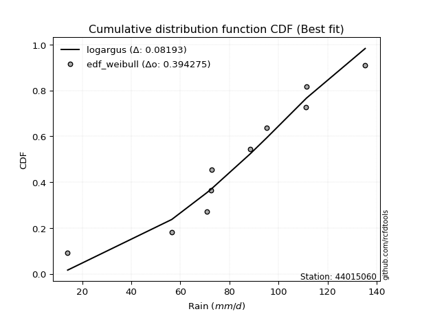</img>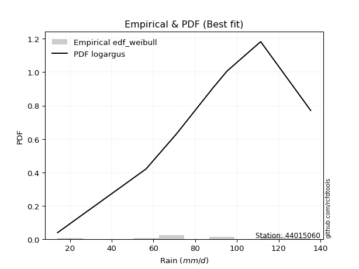</img>

</div>


### 4. EDF Beard (1943)

The Beard formula (or Beard´s plotting position formula) in hydrology is used to estimate the empirical non-exceedance probability _(P)_ of a flood event (or other extreme hydrological data point) within a given dataset.

<div align="center">


$P=(m-0.31)/(n+0.38)$


</div>


**4.1. Empirical values**

<div align="center">

|                | 0                   | 1                   | 2                  | 3                   | 4                   | 5                  | 6                  | 7                  | 8                  | 9                  |
|:---------------|:--------------------|:--------------------|:-------------------|:--------------------|:--------------------|:-------------------|:-------------------|:-------------------|:-------------------|:-------------------|
| date           | 2016                | 2020                | 2022               | 2021                | 2018                | 2023               | 2017               | 2025               | 2024               | 2019               |
| x              | 14.1                | 56.5                | 70.8               | 72.4                | 72.9                | 88.5               | 95.3               | 111.2              | 111.4              | 135.3              |
| m              | 1                   | 2                   | 3                  | 4                   | 5                   | 6                  | 7                  | 8                  | 9                  | 10                 |
| empirical_dist | edf_beard           | edf_beard           | edf_beard          | edf_beard           | edf_beard           | edf_beard          | edf_beard          | edf_beard          | edf_beard          | edf_beard          |
| empirical      | 0.06647398843930635 | 0.16281310211946048 | 0.2591522157996146 | 0.35549132947976875 | 0.45183044315992293 | 0.5481695568400771 | 0.6445086705202312 | 0.7408477842003853 | 0.8371868978805393 | 0.9335260115606935 |
| empirical_tr   | 1.0712074303405574  | 1.1944764096662832  | 1.3498049414824447 | 1.5515695067264574  | 1.8242530755711774  | 2.213219616204691  | 2.813008130081301  | 3.8587360594795537 | 6.142011834319521  | 15.043478260869529 |

</div>


**4.2. Kolmogorov-Smirnov fit test (sorted by Δ)**


<div align="center">

|                | 0                   | 1                   | 2                   | 3                   | 4                   | 5                   | 6                   | 7                   | 8                   | 9                   | 10                  | 11                 | 12                  | 13                  | 14                  | 15                 | 16                  | 17                 | 18                  | 19                  | 20                  | 21                 | 22                  | 23                  | 24                 | 25                 | 26                  | 27                  | 28                  | 29                  | 30                  | 31                  | 32                  | 33                  | 34                  | 35                  | 36                  | 37                  | 38                 | 39                 | 40                  | 41                  | 42                  | 43                  | 44                  | 45                  | 46                 | 47                  | 48                  | 49                  | 50                  | 51                  | 52                  | 53                  | 54                  | 55                  | 56                 | 57                  | 58                  | 59                  | 60                  | 61                  | 62                  | 63                  | 64                  | 65                  | 66                  | 67                  | 68                  | 69                  | 70                 | 71                  | 72                  | 73                  | 74                 | 75                  | 76                 | 77                  | 78                  | 79                  | 80                  | 81                  | 82                 | 83                 | 84                 | 85                  | 86                  | 87                  | 88                  | 89                 | 90                 | 91                 | 92                  | 93                  | 94                 | 95                  | 96                  | 97                  | 98                  | 99                 | 100                 | 101                 | 102                 | 103                 | 104                 | 105                | 106                 | 107                 | 108                 | 109                 | 110                 | 111                 | 112                | 113                 | 114                | 115                 | 116                 | 117                 | 118                 | 119                 | 120                | 121                 | 122                 | 123                | 124                 | 125                 | 126                 | 127                 | 128                | 129                 | 130                | 131                | 132                 | 133                | 134                 | 135                 | 136                 | 137                | 138                 | 139                | 140                | 141                | 142                 | 143                | 144                 | 145                | 146                | 147                | 148                | 149                | 150                | 151                | 152                | 153                | 154                | 155                | 156                | 157                | 158                | 159                |
|:---------------|:--------------------|:--------------------|:--------------------|:--------------------|:--------------------|:--------------------|:--------------------|:--------------------|:--------------------|:--------------------|:--------------------|:-------------------|:--------------------|:--------------------|:--------------------|:-------------------|:--------------------|:-------------------|:--------------------|:--------------------|:--------------------|:-------------------|:--------------------|:--------------------|:-------------------|:-------------------|:--------------------|:--------------------|:--------------------|:--------------------|:--------------------|:--------------------|:--------------------|:--------------------|:--------------------|:--------------------|:--------------------|:--------------------|:-------------------|:-------------------|:--------------------|:--------------------|:--------------------|:--------------------|:--------------------|:--------------------|:-------------------|:--------------------|:--------------------|:--------------------|:--------------------|:--------------------|:--------------------|:--------------------|:--------------------|:--------------------|:-------------------|:--------------------|:--------------------|:--------------------|:--------------------|:--------------------|:--------------------|:--------------------|:--------------------|:--------------------|:--------------------|:--------------------|:--------------------|:--------------------|:-------------------|:--------------------|:--------------------|:--------------------|:-------------------|:--------------------|:-------------------|:--------------------|:--------------------|:--------------------|:--------------------|:--------------------|:-------------------|:-------------------|:-------------------|:--------------------|:--------------------|:--------------------|:--------------------|:-------------------|:-------------------|:-------------------|:--------------------|:--------------------|:-------------------|:--------------------|:--------------------|:--------------------|:--------------------|:-------------------|:--------------------|:--------------------|:--------------------|:--------------------|:--------------------|:-------------------|:--------------------|:--------------------|:--------------------|:--------------------|:--------------------|:--------------------|:-------------------|:--------------------|:-------------------|:--------------------|:--------------------|:--------------------|:--------------------|:--------------------|:-------------------|:--------------------|:--------------------|:-------------------|:--------------------|:--------------------|:--------------------|:--------------------|:-------------------|:--------------------|:-------------------|:-------------------|:--------------------|:-------------------|:--------------------|:--------------------|:--------------------|:-------------------|:--------------------|:-------------------|:-------------------|:-------------------|:--------------------|:-------------------|:--------------------|:-------------------|:-------------------|:-------------------|:-------------------|:-------------------|:-------------------|:-------------------|:-------------------|:-------------------|:-------------------|:-------------------|:-------------------|:-------------------|:-------------------|:-------------------|
| station        | 44015060            | 44015060            | 44015060            | 44015060            | 44015060            | 44015060            | 44015060            | 44015060            | 44015060            | 44015060            | 44015060            | 44015060           | 44015060            | 44015060            | 44015060            | 44015060           | 44015060            | 44015060           | 44015060            | 44015060            | 44015060            | 44015060           | 44015060            | 44015060            | 44015060           | 44015060           | 44015060            | 44015060            | 44015060            | 44015060            | 44015060            | 44015060            | 44015060            | 44015060            | 44015060            | 44015060            | 44015060            | 44015060            | 44015060           | 44015060           | 44015060            | 44015060            | 44015060            | 44015060            | 44015060            | 44015060            | 44015060           | 44015060            | 44015060            | 44015060            | 44015060            | 44015060            | 44015060            | 44015060            | 44015060            | 44015060            | 44015060           | 44015060            | 44015060            | 44015060            | 44015060            | 44015060            | 44015060            | 44015060            | 44015060            | 44015060            | 44015060            | 44015060            | 44015060            | 44015060            | 44015060           | 44015060            | 44015060            | 44015060            | 44015060           | 44015060            | 44015060           | 44015060            | 44015060            | 44015060            | 44015060            | 44015060            | 44015060           | 44015060           | 44015060           | 44015060            | 44015060            | 44015060            | 44015060            | 44015060           | 44015060           | 44015060           | 44015060            | 44015060            | 44015060           | 44015060            | 44015060            | 44015060            | 44015060            | 44015060           | 44015060            | 44015060            | 44015060            | 44015060            | 44015060            | 44015060           | 44015060            | 44015060            | 44015060            | 44015060            | 44015060            | 44015060            | 44015060           | 44015060            | 44015060           | 44015060            | 44015060            | 44015060            | 44015060            | 44015060            | 44015060           | 44015060            | 44015060            | 44015060           | 44015060            | 44015060            | 44015060            | 44015060            | 44015060           | 44015060            | 44015060           | 44015060           | 44015060            | 44015060           | 44015060            | 44015060            | 44015060            | 44015060           | 44015060            | 44015060           | 44015060           | 44015060           | 44015060            | 44015060           | 44015060            | 44015060           | 44015060           | 44015060           | 44015060           | 44015060           | 44015060           | 44015060           | 44015060           | 44015060           | 44015060           | 44015060           | 44015060           | 44015060           | 44015060           | 44015060           |
| empirical_dist | edf_beard           | edf_beard           | edf_beard           | edf_beard           | edf_beard           | edf_beard           | edf_beard           | edf_beard           | edf_beard           | edf_beard           | edf_beard           | edf_beard          | edf_beard           | edf_beard           | edf_beard           | edf_beard          | edf_beard           | edf_beard          | edf_beard           | edf_beard           | edf_beard           | edf_beard          | edf_beard           | edf_beard           | edf_beard          | edf_beard          | edf_beard           | edf_beard           | edf_beard           | edf_beard           | edf_beard           | edf_beard           | edf_beard           | edf_beard           | edf_beard           | edf_beard           | edf_beard           | edf_beard           | edf_beard          | edf_beard          | edf_beard           | edf_beard           | edf_beard           | edf_beard           | edf_beard           | edf_beard           | edf_beard          | edf_beard           | edf_beard           | edf_beard           | edf_beard           | edf_beard           | edf_beard           | edf_beard           | edf_beard           | edf_beard           | edf_beard          | edf_beard           | edf_beard           | edf_beard           | edf_beard           | edf_beard           | edf_beard           | edf_beard           | edf_beard           | edf_beard           | edf_beard           | edf_beard           | edf_beard           | edf_beard           | edf_beard          | edf_beard           | edf_beard           | edf_beard           | edf_beard          | edf_beard           | edf_beard          | edf_beard           | edf_beard           | edf_beard           | edf_beard           | edf_beard           | edf_beard          | edf_beard          | edf_beard          | edf_beard           | edf_beard           | edf_beard           | edf_beard           | edf_beard          | edf_beard          | edf_beard          | edf_beard           | edf_beard           | edf_beard          | edf_beard           | edf_beard           | edf_beard           | edf_beard           | edf_beard          | edf_beard           | edf_beard           | edf_beard           | edf_beard           | edf_beard           | edf_beard          | edf_beard           | edf_beard           | edf_beard           | edf_beard           | edf_beard           | edf_beard           | edf_beard          | edf_beard           | edf_beard          | edf_beard           | edf_beard           | edf_beard           | edf_beard           | edf_beard           | edf_beard          | edf_beard           | edf_beard           | edf_beard          | edf_beard           | edf_beard           | edf_beard           | edf_beard           | edf_beard          | edf_beard           | edf_beard          | edf_beard          | edf_beard           | edf_beard          | edf_beard           | edf_beard           | edf_beard           | edf_beard          | edf_beard           | edf_beard          | edf_beard          | edf_beard          | edf_beard           | edf_beard          | edf_beard           | edf_beard          | edf_beard          | edf_beard          | edf_beard          | edf_beard          | edf_beard          | edf_beard          | edf_beard          | edf_beard          | edf_beard          | edf_beard          | edf_beard          | edf_beard          | edf_beard          | edf_beard          |
| p_dist         | gennorm             | foldnorm            | logjohnsonsb        | logjohnsonsu        | gompertz            | exponpow            | logistic            | johnsonsb           | logdweibull         | gengamma            | logargus            | rice               | t                   | exponnorm           | norm                | crystalball        | nct                 | f                  | fatiguelife         | argus               | exponweib           | burr               | mielke              | truncnorm           | loggenlogistic     | pearson3           | logpearson3         | logloggamma         | weibull_min         | skewnorm            | genextreme          | hypsecant           | betaprime           | johnsonsu           | erlang              | truncweibull_min    | gamma               | dweibull            | genlogistic        | anglit             | logburr             | invgamma            | dgamma              | logburr12           | semicircular        | logmielke           | logvonmises_line   | loggompertz         | maxwell             | laplace             | loggengamma         | gumbel_l            | rayleigh            | cosine              | logloglaplace       | ncf                 | gumbel_r           | invgauss            | logdgamma           | loggumbel_l         | arcsine             | loggenextreme       | genhalflogistic     | genpareto           | invweibull          | moyal               | nakagami            | lognakagami         | gausshyper          | triang              | logtrapezoid       | halfnorm            | logtruncnorm        | halflogistic        | loggennorm         | kstwobign           | vonmises_line      | logskewnorm         | genexpon            | halfgennorm         | wald                | kappa3              | logt               | loglaplace         | loglaplace         | uniform             | wrapcauchy          | ksone               | logncf              | loghypsecant       | logfoldnorm        | loglogistic        | logfatiguelife      | logf                | logexponnorm       | logcrystalball      | lognorm             | logrice             | lognct              | beta               | loganglit           | logsemicircular     | logbetaprime        | loginvweibull       | logerlang           | kappa4             | logalpha            | loggamma            | loggamma            | loginvgamma         | logarcsine          | loglevy_l           | loginvgauss        | logmaxwell          | lograyleigh        | trapezoid           | loggenhalflogistic  | loggumbel_r         | loggausshyper       | levy_l              | bradford           | logtriang           | logkstwobign        | loghalfnorm        | logkappa4           | loggenpareto        | logweibull_max      | logcosine           | logmoyal           | alpha               | lomax              | loghalflogistic    | loggenexpon         | truncexpon         | logwrapcauchy       | logtruncweibull_min | logwald             | loglomax           | burr12              | logrdist           | logbeta            | logksone           | logtukeylambda      | logkappa3          | loguniform          | logbradford        | logexponweib       | logweibull_min     | logtruncexpon      | logexponpow        | powerlaw           | rdist              | logpowerlaw        | weibull_max        | tukeylambda        | truncpareto        | logtruncpareto     | loghalfgennorm     | logvonmises        | vonmises           |
| delta          | 0.08449210426479065 | 0.08552253576098928 | 0.08663374560608572 | 0.08814876117462278 | 0.08871245636383279 | 0.08899112598163583 | 0.09122383365755105 | 0.09283846574656124 | 0.09296916931943627 | 0.09421052295335602 | 0.09465607982802399 | 0.0947945028958227 | 0.09481417324026359 | 0.09482811446112116 | 0.09483106660625917 | 0.0948310686392414 | 0.09495340602893321 | 0.0953546454593665 | 0.09586873473738039 | 0.09630889562353534 | 0.09733409099790985 | 0.0977033455251603 | 0.09780609179962219 | 0.09811713531331478 | 0.098946447045198  | 0.0995834105525053 | 0.10089149799056463 | 0.10107237034772437 | 0.10249926546136257 | 0.10255523998478933 | 0.10259299348970996 | 0.10314544147136262 | 0.10484485348576889 | 0.10569351367410917 | 0.10714387824955862 | 0.10832363265794898 | 0.10839539343837817 | 0.10942237667629778 | 0.1140761218638856 | 0.1141958884297134 | 0.11604448159714731 | 0.11643079822591351 | 0.11768558945334084 | 0.12017440824363401 | 0.12231392793800405 | 0.12281247744313206 | 0.123477712005713  | 0.12601964402942267 | 0.12700236579453306 | 0.12895780006809088 | 0.13104127460347986 | 0.13731659049220213 | 0.13911335043878598 | 0.13973949304425942 | 0.14168594727555733 | 0.14357935908486213 | 0.144279089848936  | 0.14836409410251977 | 0.14939703054061604 | 0.15126868204945648 | 0.15551734711843396 | 0.15665420582687095 | 0.15812914407709022 | 0.16008388227119974 | 0.16237242153566978 | 0.16269148919416648 | 0.16281310211873654 | 0.16281310211945035 | 0.16407659104849126 | 0.16978016141773972 | 0.1705219534572367 | 0.17357910574846253 | 0.17511639287609576 | 0.18233793796117498 | 0.1852258781852083 | 0.19286915113492736 | 0.193174478408762  | 0.19382422223066492 | 0.20413897923499064 | 0.20521373282123356 | 0.20593498007146938 | 0.20715070672514618 | 0.2083603658615591 | 0.2084323720019456 | 0.2084323720019456 | 0.20866956637860312 | 0.20927239911799256 | 0.21403260268223345 | 0.21490734157162028 | 0.2171717291746939 | 0.2182917338325558 | 0.2193693772649496 | 0.22078026135428874 | 0.22141119232716971 | 0.221944278949341  | 0.22194661513884906 | 0.22194665930570256 | 0.22195183375444655 | 0.22243233214909358 | 0.2235976399650776 | 0.22465050232017825 | 0.22576366482068494 | 0.22806501911709964 | 0.23454033672313485 | 0.23546803776446784 | 0.2355551221536174 | 0.23654598260591553 | 0.23770188551515464 | 0.23770188551515464 | 0.23993684385045327 | 0.24058334600040632 | 0.24139908177126995 | 0.2494525760545901 | 0.25564937175309915 | 0.2670444519172053 | 0.27117483222127814 | 0.27239042118813156 | 0.29150218706362113 | 0.29237793989766425 | 0.29460737355120187 | 0.2949803675143334 | 0.29668984726558695 | 0.29815418058166576 | 0.2991419564903885 | 0.29934569974581554 | 0.30208239804884557 | 0.31083468184844343 | 0.31671508502272333 | 0.3173649823776467 | 0.31807193844763904 | 0.3184678681745588 | 0.3228092270761321 | 0.32537912971613153 | 0.3489735919721884 | 0.37663175910183805 | 0.3822546846254779  | 0.38934791699816335 | 0.3895492829810943 | 0.40690786725680467 | 0.4145155157192348 | 0.4247964136108302 | 0.4320452113578532 | 0.44659473734224725 | 0.4527119233584341 | 0.45445063139913827 | 0.4572786990050603 | 0.4624147318790424 | 0.5189965054854817 | 0.5293903054539271 | 0.6182315699054473 | 0.6220504971164724 | 0.6646120453524647 | 0.7172292624509886 | 0.7198469706549487 | 0.7253836392158866 | 0.7812810828262482 | 0.8108249378138344 | 0.8371868978805393 | 1.1702712190312203 | 20.689274439391703 |
| deltao         | 0.3942745923300002  | 0.3942745923300002  | 0.3942745923300002  | 0.3942745923300002  | 0.3942745923300002  | 0.3942745923300002  | 0.3942745923300002  | 0.3942745923300002  | 0.3942745923300002  | 0.3942745923300002  | 0.3942745923300002  | 0.3942745923300002 | 0.3942745923300002  | 0.3942745923300002  | 0.3942745923300002  | 0.3942745923300002 | 0.3942745923300002  | 0.3942745923300002 | 0.3942745923300002  | 0.3942745923300002  | 0.3942745923300002  | 0.3942745923300002 | 0.3942745923300002  | 0.3942745923300002  | 0.3942745923300002 | 0.3942745923300002 | 0.3942745923300002  | 0.3942745923300002  | 0.3942745923300002  | 0.3942745923300002  | 0.3942745923300002  | 0.3942745923300002  | 0.3942745923300002  | 0.3942745923300002  | 0.3942745923300002  | 0.3942745923300002  | 0.3942745923300002  | 0.3942745923300002  | 0.3942745923300002 | 0.3942745923300002 | 0.3942745923300002  | 0.3942745923300002  | 0.3942745923300002  | 0.3942745923300002  | 0.3942745923300002  | 0.3942745923300002  | 0.3942745923300002 | 0.3942745923300002  | 0.3942745923300002  | 0.3942745923300002  | 0.3942745923300002  | 0.3942745923300002  | 0.3942745923300002  | 0.3942745923300002  | 0.3942745923300002  | 0.3942745923300002  | 0.3942745923300002 | 0.3942745923300002  | 0.3942745923300002  | 0.3942745923300002  | 0.3942745923300002  | 0.3942745923300002  | 0.3942745923300002  | 0.3942745923300002  | 0.3942745923300002  | 0.3942745923300002  | 0.3942745923300002  | 0.3942745923300002  | 0.3942745923300002  | 0.3942745923300002  | 0.3942745923300002 | 0.3942745923300002  | 0.3942745923300002  | 0.3942745923300002  | 0.3942745923300002 | 0.3942745923300002  | 0.3942745923300002 | 0.3942745923300002  | 0.3942745923300002  | 0.3942745923300002  | 0.3942745923300002  | 0.3942745923300002  | 0.3942745923300002 | 0.3942745923300002 | 0.3942745923300002 | 0.3942745923300002  | 0.3942745923300002  | 0.3942745923300002  | 0.3942745923300002  | 0.3942745923300002 | 0.3942745923300002 | 0.3942745923300002 | 0.3942745923300002  | 0.3942745923300002  | 0.3942745923300002 | 0.3942745923300002  | 0.3942745923300002  | 0.3942745923300002  | 0.3942745923300002  | 0.3942745923300002 | 0.3942745923300002  | 0.3942745923300002  | 0.3942745923300002  | 0.3942745923300002  | 0.3942745923300002  | 0.3942745923300002 | 0.3942745923300002  | 0.3942745923300002  | 0.3942745923300002  | 0.3942745923300002  | 0.3942745923300002  | 0.3942745923300002  | 0.3942745923300002 | 0.3942745923300002  | 0.3942745923300002 | 0.3942745923300002  | 0.3942745923300002  | 0.3942745923300002  | 0.3942745923300002  | 0.3942745923300002  | 0.3942745923300002 | 0.3942745923300002  | 0.3942745923300002  | 0.3942745923300002 | 0.3942745923300002  | 0.3942745923300002  | 0.3942745923300002  | 0.3942745923300002  | 0.3942745923300002 | 0.3942745923300002  | 0.3942745923300002 | 0.3942745923300002 | 0.3942745923300002  | 0.3942745923300002 | 0.3942745923300002  | 0.3942745923300002  | 0.3942745923300002  | 0.3942745923300002 | 0.3942745923300002  | 0.3942745923300002 | 0.3942745923300002 | 0.3942745923300002 | 0.3942745923300002  | 0.3942745923300002 | 0.3942745923300002  | 0.3942745923300002 | 0.3942745923300002 | 0.3942745923300002 | 0.3942745923300002 | 0.3942745923300002 | 0.3942745923300002 | 0.3942745923300002 | 0.3942745923300002 | 0.3942745923300002 | 0.3942745923300002 | 0.3942745923300002 | 0.3942745923300002 | 0.3942745923300002 | 0.3942745923300002 | 0.3942745923300002 |
| eval           | Δo > Δ              | Δo > Δ              | Δo > Δ              | Δo > Δ              | Δo > Δ              | Δo > Δ              | Δo > Δ              | Δo > Δ              | Δo > Δ              | Δo > Δ              | Δo > Δ              | Δo > Δ             | Δo > Δ              | Δo > Δ              | Δo > Δ              | Δo > Δ             | Δo > Δ              | Δo > Δ             | Δo > Δ              | Δo > Δ              | Δo > Δ              | Δo > Δ             | Δo > Δ              | Δo > Δ              | Δo > Δ             | Δo > Δ             | Δo > Δ              | Δo > Δ              | Δo > Δ              | Δo > Δ              | Δo > Δ              | Δo > Δ              | Δo > Δ              | Δo > Δ              | Δo > Δ              | Δo > Δ              | Δo > Δ              | Δo > Δ              | Δo > Δ             | Δo > Δ             | Δo > Δ              | Δo > Δ              | Δo > Δ              | Δo > Δ              | Δo > Δ              | Δo > Δ              | Δo > Δ             | Δo > Δ              | Δo > Δ              | Δo > Δ              | Δo > Δ              | Δo > Δ              | Δo > Δ              | Δo > Δ              | Δo > Δ              | Δo > Δ              | Δo > Δ             | Δo > Δ              | Δo > Δ              | Δo > Δ              | Δo > Δ              | Δo > Δ              | Δo > Δ              | Δo > Δ              | Δo > Δ              | Δo > Δ              | Δo > Δ              | Δo > Δ              | Δo > Δ              | Δo > Δ              | Δo > Δ             | Δo > Δ              | Δo > Δ              | Δo > Δ              | Δo > Δ             | Δo > Δ              | Δo > Δ             | Δo > Δ              | Δo > Δ              | Δo > Δ              | Δo > Δ              | Δo > Δ              | Δo > Δ             | Δo > Δ             | Δo > Δ             | Δo > Δ              | Δo > Δ              | Δo > Δ              | Δo > Δ              | Δo > Δ             | Δo > Δ             | Δo > Δ             | Δo > Δ              | Δo > Δ              | Δo > Δ             | Δo > Δ              | Δo > Δ              | Δo > Δ              | Δo > Δ              | Δo > Δ             | Δo > Δ              | Δo > Δ              | Δo > Δ              | Δo > Δ              | Δo > Δ              | Δo > Δ             | Δo > Δ              | Δo > Δ              | Δo > Δ              | Δo > Δ              | Δo > Δ              | Δo > Δ              | Δo > Δ             | Δo > Δ              | Δo > Δ             | Δo > Δ              | Δo > Δ              | Δo > Δ              | Δo > Δ              | Δo > Δ              | Δo > Δ             | Δo > Δ              | Δo > Δ              | Δo > Δ             | Δo > Δ              | Δo > Δ              | Δo > Δ              | Δo > Δ              | Δo > Δ             | Δo > Δ              | Δo > Δ             | Δo > Δ             | Δo > Δ              | Δo > Δ             | Δo > Δ              | Δo > Δ              | Δo > Δ              | Δo > Δ             | Δo <= Δ             | Δo <= Δ            | Δo <= Δ            | Δo <= Δ            | Δo <= Δ             | Δo <= Δ            | Δo <= Δ             | Δo <= Δ            | Δo <= Δ            | Δo <= Δ            | Δo <= Δ            | Δo <= Δ            | Δo <= Δ            | Δo <= Δ            | Δo <= Δ            | Δo <= Δ            | Δo <= Δ            | Δo <= Δ            | Δo <= Δ            | Δo <= Δ            | Δo <= Δ            | Δo <= Δ            |
| fit            | 1                   | 1                   | 1                   | 1                   | 1                   | 1                   | 1                   | 1                   | 1                   | 1                   | 1                   | 1                  | 1                   | 1                   | 1                   | 1                  | 1                   | 1                  | 1                   | 1                   | 1                   | 1                  | 1                   | 1                   | 1                  | 1                  | 1                   | 1                   | 1                   | 1                   | 1                   | 1                   | 1                   | 1                   | 1                   | 1                   | 1                   | 1                   | 1                  | 1                  | 1                   | 1                   | 1                   | 1                   | 1                   | 1                   | 1                  | 1                   | 1                   | 1                   | 1                   | 1                   | 1                   | 1                   | 1                   | 1                   | 1                  | 1                   | 1                   | 1                   | 1                   | 1                   | 1                   | 1                   | 1                   | 1                   | 1                   | 1                   | 1                   | 1                   | 1                  | 1                   | 1                   | 1                   | 1                  | 1                   | 1                  | 1                   | 1                   | 1                   | 1                   | 1                   | 1                  | 1                  | 1                  | 1                   | 1                   | 1                   | 1                   | 1                  | 1                  | 1                  | 1                   | 1                   | 1                  | 1                   | 1                   | 1                   | 1                   | 1                  | 1                   | 1                   | 1                   | 1                   | 1                   | 1                  | 1                   | 1                   | 1                   | 1                   | 1                   | 1                   | 1                  | 1                   | 1                  | 1                   | 1                   | 1                   | 1                   | 1                   | 1                  | 1                   | 1                   | 1                  | 1                   | 1                   | 1                   | 1                   | 1                  | 1                   | 1                  | 1                  | 1                   | 1                  | 1                   | 1                   | 1                   | 1                  | 0                   | 0                  | 0                  | 0                  | 0                   | 0                  | 0                   | 0                  | 0                  | 0                  | 0                  | 0                  | 0                  | 0                  | 0                  | 0                  | 0                  | 0                  | 0                  | 0                  | 0                  | 0                  |
| n              | 10                  | 10                  | 10                  | 10                  | 10                  | 10                  | 10                  | 10                  | 10                  | 10                  | 10                  | 10                 | 10                  | 10                  | 10                  | 10                 | 10                  | 10                 | 10                  | 10                  | 10                  | 10                 | 10                  | 10                  | 10                 | 10                 | 10                  | 10                  | 10                  | 10                  | 10                  | 10                  | 10                  | 10                  | 10                  | 10                  | 10                  | 10                  | 10                 | 10                 | 10                  | 10                  | 10                  | 10                  | 10                  | 10                  | 10                 | 10                  | 10                  | 10                  | 10                  | 10                  | 10                  | 10                  | 10                  | 10                  | 10                 | 10                  | 10                  | 10                  | 10                  | 10                  | 10                  | 10                  | 10                  | 10                  | 10                  | 10                  | 10                  | 10                  | 10                 | 10                  | 10                  | 10                  | 10                 | 10                  | 10                 | 10                  | 10                  | 10                  | 10                  | 10                  | 10                 | 10                 | 10                 | 10                  | 10                  | 10                  | 10                  | 10                 | 10                 | 10                 | 10                  | 10                  | 10                 | 10                  | 10                  | 10                  | 10                  | 10                 | 10                  | 10                  | 10                  | 10                  | 10                  | 10                 | 10                  | 10                  | 10                  | 10                  | 10                  | 10                  | 10                 | 10                  | 10                 | 10                  | 10                  | 10                  | 10                  | 10                  | 10                 | 10                  | 10                  | 10                 | 10                  | 10                  | 10                  | 10                  | 10                 | 10                  | 10                 | 10                 | 10                  | 10                 | 10                  | 10                  | 10                  | 10                 | 10                  | 10                 | 10                 | 10                 | 10                  | 10                 | 10                  | 10                 | 10                 | 10                 | 10                 | 10                 | 10                 | 10                 | 10                 | 10                 | 10                 | 10                 | 10                 | 10                 | 10                 | 10                 |
| best_fit       | 1                   | 0                   | 0                   | 0                   | 0                   | 0                   | 0                   | 0                   | 0                   | 0                   | 0                   | 0                  | 0                   | 0                   | 0                   | 0                  | 0                   | 0                  | 0                   | 0                   | 0                   | 0                  | 0                   | 0                   | 0                  | 0                  | 0                   | 0                   | 0                   | 0                   | 0                   | 0                   | 0                   | 0                   | 0                   | 0                   | 0                   | 0                   | 0                  | 0                  | 0                   | 0                   | 0                   | 0                   | 0                   | 0                   | 0                  | 0                   | 0                   | 0                   | 0                   | 0                   | 0                   | 0                   | 0                   | 0                   | 0                  | 0                   | 0                   | 0                   | 0                   | 0                   | 0                   | 0                   | 0                   | 0                   | 0                   | 0                   | 0                   | 0                   | 0                  | 0                   | 0                   | 0                   | 0                  | 0                   | 0                  | 0                   | 0                   | 0                   | 0                   | 0                   | 0                  | 0                  | 0                  | 0                   | 0                   | 0                   | 0                   | 0                  | 0                  | 0                  | 0                   | 0                   | 0                  | 0                   | 0                   | 0                   | 0                   | 0                  | 0                   | 0                   | 0                   | 0                   | 0                   | 0                  | 0                   | 0                   | 0                   | 0                   | 0                   | 0                   | 0                  | 0                   | 0                  | 0                   | 0                   | 0                   | 0                   | 0                   | 0                  | 0                   | 0                   | 0                  | 0                   | 0                   | 0                   | 0                   | 0                  | 0                   | 0                  | 0                  | 0                   | 0                  | 0                   | 0                   | 0                   | 0                  | 0                   | 0                  | 0                  | 0                  | 0                   | 0                  | 0                   | 0                  | 0                  | 0                  | 0                  | 0                  | 0                  | 0                  | 0                  | 0                  | 0                  | 0                  | 0                  | 0                  | 0                  | 0                  |
| best_fit_sort  | 1                   | 2                   | 3                   | 4                   | 5                   | 6                   | 7                   | 8                   | 9                   | 10                  | 11                  | 12                 | 13                  | 14                  | 15                  | 16                 | 17                  | 18                 | 19                  | 20                  | 21                  | 22                 | 23                  | 24                  | 25                 | 26                 | 27                  | 28                  | 29                  | 30                  | 31                  | 32                  | 33                  | 34                  | 35                  | 36                  | 37                  | 38                  | 39                 | 40                 | 41                  | 42                  | 43                  | 44                  | 45                  | 46                  | 47                 | 48                  | 49                  | 50                  | 51                  | 52                  | 53                  | 54                  | 55                  | 56                  | 57                 | 58                  | 59                  | 60                  | 61                  | 62                  | 63                  | 64                  | 65                  | 66                  | 67                  | 68                  | 69                  | 70                  | 71                 | 72                  | 73                  | 74                  | 75                 | 76                  | 77                 | 78                  | 79                  | 80                  | 81                  | 82                  | 83                 | 84                 | 85                 | 86                  | 87                  | 88                  | 89                  | 90                 | 91                 | 92                 | 93                  | 94                  | 95                 | 96                  | 97                  | 98                  | 99                  | 100                | 101                 | 102                 | 103                 | 104                 | 105                 | 106                | 107                 | 108                 | 109                 | 110                 | 111                 | 112                 | 113                | 114                 | 115                | 116                 | 117                 | 118                 | 119                 | 120                 | 121                | 122                 | 123                 | 124                | 125                 | 126                 | 127                 | 128                 | 129                | 130                 | 131                | 132                | 133                 | 134                | 135                 | 136                 | 137                 | 138                | 139                 | 140                | 141                | 142                | 143                 | 144                | 145                 | 146                | 147                | 148                | 149                | 150                | 151                | 152                | 153                | 154                | 155                | 156                | 157                | 158                | 159                | 160                |

</div>


**4.3. Best fit**

<div align="center">

|   id |   station | empirical_dist   | p_dist   |     delta |   deltao | eval   |   fit |   n |   best_fit |   best_fit_sort |
|-----:|----------:|:-----------------|:---------|----------:|---------:|:-------|------:|----:|-----------:|----------------:|
|    0 |  44015060 | edf_beard        | gennorm  | 0.0844921 | 0.394275 | Δo > Δ |     1 |  10 |          1 |               1 |

</div>


<div align="center">

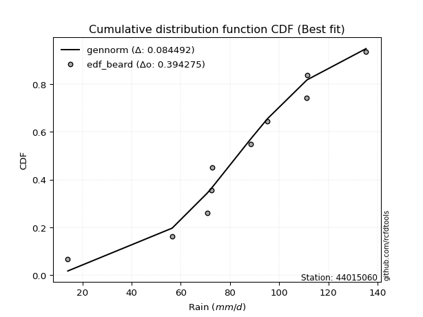</img></img>

</div>


### 5. EDF Chegodayev (1955)

The Chegodayev formula is an empirical plotting position formula used in hydrological frequency analysis to estimate the exceedance probability or return period of a specific event from a set of observed data. It is primarily used for plotting observed data points on probability paper to fit a theoretical distribution, particularly for analyzing extreme events like maximum flood flows or rainfall intensities. The constant _b_ value in the generalized plotting position formula is 0.3.

<div align="center">


$P=(m-b)/(n+1-2b)$


</div>


**5.1. Empirical values**

<div align="center">

|                | 0                  | 1                   | 2                   | 3                  | 4                  | 5                  | 6                  | 7                  | 8                  | 9                  |
|:---------------|:-------------------|:--------------------|:--------------------|:-------------------|:-------------------|:-------------------|:-------------------|:-------------------|:-------------------|:-------------------|
| date           | 2016               | 2020                | 2022                | 2021               | 2018               | 2023               | 2017               | 2025               | 2024               | 2019               |
| x              | 14.1               | 56.5                | 70.8                | 72.4               | 72.9               | 88.5               | 95.3               | 111.2              | 111.4              | 135.3              |
| m              | 1                  | 2                   | 3                   | 4                  | 5                  | 6                  | 7                  | 8                  | 9                  | 10                 |
| empirical_dist | edf_chegodayev     | edf_chegodayev      | edf_chegodayev      | edf_chegodayev     | edf_chegodayev     | edf_chegodayev     | edf_chegodayev     | edf_chegodayev     | edf_chegodayev     | edf_chegodayev     |
| empirical      | 0.0673076923076923 | 0.16346153846153846 | 0.25961538461538464 | 0.3557692307692308 | 0.4519230769230769 | 0.5480769230769231 | 0.6442307692307693 | 0.7403846153846154 | 0.8365384615384615 | 0.9326923076923076 |
| empirical_tr   | 1.0721649484536082 | 1.1954022988505746  | 1.3506493506493507  | 1.5522388059701495 | 1.8245614035087718 | 2.2127659574468086 | 2.810810810810811  | 3.8518518518518525 | 6.117647058823526  | 14.857142857142836 |

</div>


**5.2. Kolmogorov-Smirnov fit test (sorted by Δ)**


<div align="center">

|                | 0                   | 1                   | 2                   | 3                   | 4                   | 5                   | 6                   | 7                   | 8                   | 9                  | 10                  | 11                  | 12                  | 13                  | 14                  | 15                  | 16                  | 17                  | 18                  | 19                  | 20                  | 21                  | 22                  | 23                  | 24                 | 25                 | 26                 | 27                  | 28                  | 29                  | 30                  | 31                  | 32                  | 33                  | 34                 | 35                  | 36                  | 37                  | 38                  | 39                 | 40                  | 41                  | 42                  | 43                  | 44                  | 45                  | 46                 | 47                  | 48                  | 49                  | 50                  | 51                  | 52                  | 53                 | 54                  | 55                  | 56                  | 57                  | 58                  | 59                  | 60                  | 61                  | 62                  | 63                  | 64                  | 65                  | 66                  | 67                  | 68                  | 69                 | 70                  | 71                 | 72                  | 73                  | 74                 | 75                  | 76                 | 77                 | 78                  | 79                  | 80                  | 81                  | 82                  | 83                  | 84                  | 85                 | 86                  | 87                  | 88                  | 89                  | 90                  | 91                  | 92                  | 93                 | 94                  | 95                  | 96                  | 97                  | 98                  | 99                  | 100                 | 101                 | 102                 | 103                 | 104                 | 105                 | 106                | 107                 | 108                 | 109                 | 110                 | 111                 | 112                 | 113                 | 114                | 115                 | 116                 | 117                | 118                 | 119                 | 120                 | 121                | 122                 | 123                | 124                | 125                | 126                 | 127                | 128                | 129                 | 130                | 131                 | 132                | 133                | 134                | 135                 | 136                | 137                 | 138                | 139                 | 140                | 141                | 142                 | 143                 | 144                 | 145                 | 146                 | 147                | 148                | 149                | 150                | 151                | 152                | 153                | 154                | 155                | 156                | 157                | 158                | 159                |
|:---------------|:--------------------|:--------------------|:--------------------|:--------------------|:--------------------|:--------------------|:--------------------|:--------------------|:--------------------|:-------------------|:--------------------|:--------------------|:--------------------|:--------------------|:--------------------|:--------------------|:--------------------|:--------------------|:--------------------|:--------------------|:--------------------|:--------------------|:--------------------|:--------------------|:-------------------|:-------------------|:-------------------|:--------------------|:--------------------|:--------------------|:--------------------|:--------------------|:--------------------|:--------------------|:-------------------|:--------------------|:--------------------|:--------------------|:--------------------|:-------------------|:--------------------|:--------------------|:--------------------|:--------------------|:--------------------|:--------------------|:-------------------|:--------------------|:--------------------|:--------------------|:--------------------|:--------------------|:--------------------|:-------------------|:--------------------|:--------------------|:--------------------|:--------------------|:--------------------|:--------------------|:--------------------|:--------------------|:--------------------|:--------------------|:--------------------|:--------------------|:--------------------|:--------------------|:--------------------|:-------------------|:--------------------|:-------------------|:--------------------|:--------------------|:-------------------|:--------------------|:-------------------|:-------------------|:--------------------|:--------------------|:--------------------|:--------------------|:--------------------|:--------------------|:--------------------|:-------------------|:--------------------|:--------------------|:--------------------|:--------------------|:--------------------|:--------------------|:--------------------|:-------------------|:--------------------|:--------------------|:--------------------|:--------------------|:--------------------|:--------------------|:--------------------|:--------------------|:--------------------|:--------------------|:--------------------|:--------------------|:-------------------|:--------------------|:--------------------|:--------------------|:--------------------|:--------------------|:--------------------|:--------------------|:-------------------|:--------------------|:--------------------|:-------------------|:--------------------|:--------------------|:--------------------|:-------------------|:--------------------|:-------------------|:-------------------|:-------------------|:--------------------|:-------------------|:-------------------|:--------------------|:-------------------|:--------------------|:-------------------|:-------------------|:-------------------|:--------------------|:-------------------|:--------------------|:-------------------|:--------------------|:-------------------|:-------------------|:--------------------|:--------------------|:--------------------|:--------------------|:--------------------|:-------------------|:-------------------|:-------------------|:-------------------|:-------------------|:-------------------|:-------------------|:-------------------|:-------------------|:-------------------|:-------------------|:-------------------|:-------------------|
| station        | 44015060            | 44015060            | 44015060            | 44015060            | 44015060            | 44015060            | 44015060            | 44015060            | 44015060            | 44015060           | 44015060            | 44015060            | 44015060            | 44015060            | 44015060            | 44015060            | 44015060            | 44015060            | 44015060            | 44015060            | 44015060            | 44015060            | 44015060            | 44015060            | 44015060           | 44015060           | 44015060           | 44015060            | 44015060            | 44015060            | 44015060            | 44015060            | 44015060            | 44015060            | 44015060           | 44015060            | 44015060            | 44015060            | 44015060            | 44015060           | 44015060            | 44015060            | 44015060            | 44015060            | 44015060            | 44015060            | 44015060           | 44015060            | 44015060            | 44015060            | 44015060            | 44015060            | 44015060            | 44015060           | 44015060            | 44015060            | 44015060            | 44015060            | 44015060            | 44015060            | 44015060            | 44015060            | 44015060            | 44015060            | 44015060            | 44015060            | 44015060            | 44015060            | 44015060            | 44015060           | 44015060            | 44015060           | 44015060            | 44015060            | 44015060           | 44015060            | 44015060           | 44015060           | 44015060            | 44015060            | 44015060            | 44015060            | 44015060            | 44015060            | 44015060            | 44015060           | 44015060            | 44015060            | 44015060            | 44015060            | 44015060            | 44015060            | 44015060            | 44015060           | 44015060            | 44015060            | 44015060            | 44015060            | 44015060            | 44015060            | 44015060            | 44015060            | 44015060            | 44015060            | 44015060            | 44015060            | 44015060           | 44015060            | 44015060            | 44015060            | 44015060            | 44015060            | 44015060            | 44015060            | 44015060           | 44015060            | 44015060            | 44015060           | 44015060            | 44015060            | 44015060            | 44015060           | 44015060            | 44015060           | 44015060           | 44015060           | 44015060            | 44015060           | 44015060           | 44015060            | 44015060           | 44015060            | 44015060           | 44015060           | 44015060           | 44015060            | 44015060           | 44015060            | 44015060           | 44015060            | 44015060           | 44015060           | 44015060            | 44015060            | 44015060            | 44015060            | 44015060            | 44015060           | 44015060           | 44015060           | 44015060           | 44015060           | 44015060           | 44015060           | 44015060           | 44015060           | 44015060           | 44015060           | 44015060           | 44015060           |
| empirical_dist | edf_chegodayev      | edf_chegodayev      | edf_chegodayev      | edf_chegodayev      | edf_chegodayev      | edf_chegodayev      | edf_chegodayev      | edf_chegodayev      | edf_chegodayev      | edf_chegodayev     | edf_chegodayev      | edf_chegodayev      | edf_chegodayev      | edf_chegodayev      | edf_chegodayev      | edf_chegodayev      | edf_chegodayev      | edf_chegodayev      | edf_chegodayev      | edf_chegodayev      | edf_chegodayev      | edf_chegodayev      | edf_chegodayev      | edf_chegodayev      | edf_chegodayev     | edf_chegodayev     | edf_chegodayev     | edf_chegodayev      | edf_chegodayev      | edf_chegodayev      | edf_chegodayev      | edf_chegodayev      | edf_chegodayev      | edf_chegodayev      | edf_chegodayev     | edf_chegodayev      | edf_chegodayev      | edf_chegodayev      | edf_chegodayev      | edf_chegodayev     | edf_chegodayev      | edf_chegodayev      | edf_chegodayev      | edf_chegodayev      | edf_chegodayev      | edf_chegodayev      | edf_chegodayev     | edf_chegodayev      | edf_chegodayev      | edf_chegodayev      | edf_chegodayev      | edf_chegodayev      | edf_chegodayev      | edf_chegodayev     | edf_chegodayev      | edf_chegodayev      | edf_chegodayev      | edf_chegodayev      | edf_chegodayev      | edf_chegodayev      | edf_chegodayev      | edf_chegodayev      | edf_chegodayev      | edf_chegodayev      | edf_chegodayev      | edf_chegodayev      | edf_chegodayev      | edf_chegodayev      | edf_chegodayev      | edf_chegodayev     | edf_chegodayev      | edf_chegodayev     | edf_chegodayev      | edf_chegodayev      | edf_chegodayev     | edf_chegodayev      | edf_chegodayev     | edf_chegodayev     | edf_chegodayev      | edf_chegodayev      | edf_chegodayev      | edf_chegodayev      | edf_chegodayev      | edf_chegodayev      | edf_chegodayev      | edf_chegodayev     | edf_chegodayev      | edf_chegodayev      | edf_chegodayev      | edf_chegodayev      | edf_chegodayev      | edf_chegodayev      | edf_chegodayev      | edf_chegodayev     | edf_chegodayev      | edf_chegodayev      | edf_chegodayev      | edf_chegodayev      | edf_chegodayev      | edf_chegodayev      | edf_chegodayev      | edf_chegodayev      | edf_chegodayev      | edf_chegodayev      | edf_chegodayev      | edf_chegodayev      | edf_chegodayev     | edf_chegodayev      | edf_chegodayev      | edf_chegodayev      | edf_chegodayev      | edf_chegodayev      | edf_chegodayev      | edf_chegodayev      | edf_chegodayev     | edf_chegodayev      | edf_chegodayev      | edf_chegodayev     | edf_chegodayev      | edf_chegodayev      | edf_chegodayev      | edf_chegodayev     | edf_chegodayev      | edf_chegodayev     | edf_chegodayev     | edf_chegodayev     | edf_chegodayev      | edf_chegodayev     | edf_chegodayev     | edf_chegodayev      | edf_chegodayev     | edf_chegodayev      | edf_chegodayev     | edf_chegodayev     | edf_chegodayev     | edf_chegodayev      | edf_chegodayev     | edf_chegodayev      | edf_chegodayev     | edf_chegodayev      | edf_chegodayev     | edf_chegodayev     | edf_chegodayev      | edf_chegodayev      | edf_chegodayev      | edf_chegodayev      | edf_chegodayev      | edf_chegodayev     | edf_chegodayev     | edf_chegodayev     | edf_chegodayev     | edf_chegodayev     | edf_chegodayev     | edf_chegodayev     | edf_chegodayev     | edf_chegodayev     | edf_chegodayev     | edf_chegodayev     | edf_chegodayev     | edf_chegodayev     |
| p_dist         | gennorm             | foldnorm            | logjohnsonsb        | logjohnsonsu        | gompertz            | exponpow            | logistic            | johnsonsb           | logdweibull         | gengamma           | logargus            | rice                | t                   | exponnorm           | norm                | crystalball         | nct                 | f                   | fatiguelife         | argus               | exponweib           | burr                | mielke              | loggenlogistic      | truncnorm          | pearson3           | logpearson3        | logloggamma         | weibull_min         | skewnorm            | genextreme          | hypsecant           | betaprime           | johnsonsu           | erlang             | truncweibull_min    | gamma               | dweibull            | anglit              | genlogistic        | logburr             | invgamma            | dgamma              | logburr12           | semicircular        | logmielke           | logvonmises_line   | loggompertz         | maxwell             | laplace             | loggengamma         | gumbel_l            | rayleigh            | cosine             | logloglaplace       | ncf                 | gumbel_r            | invgauss            | logdgamma           | loggumbel_l         | arcsine             | loggenextreme       | genhalflogistic     | genpareto           | invweibull          | moyal               | gausshyper          | nakagami            | lognakagami         | triang             | logtrapezoid        | halfnorm           | logtruncnorm        | halflogistic        | loggennorm         | kstwobign           | vonmises_line      | logskewnorm        | genexpon            | halfgennorm         | wald                | kappa3              | logt                | loglaplace          | loglaplace          | uniform            | wrapcauchy          | ksone               | logncf              | loghypsecant        | logfoldnorm         | loglogistic         | logfatiguelife      | logf               | logexponnorm        | logcrystalball      | lognorm             | logrice             | lognct              | beta                | loganglit           | logsemicircular     | logbetaprime        | loginvweibull       | logerlang           | kappa4              | logalpha           | loggamma            | loggamma            | loginvgamma         | logarcsine          | loglevy_l           | loginvgauss         | logmaxwell          | lograyleigh        | trapezoid           | loggenhalflogistic  | loggumbel_r        | loggausshyper       | levy_l              | bradford            | logtriang          | logkstwobign        | loghalfnorm        | logkappa4          | loggenpareto       | logweibull_max      | logcosine          | logmoyal           | alpha               | lomax              | loghalflogistic     | loggenexpon        | truncexpon         | logwrapcauchy      | logtruncweibull_min | logwald            | loglomax            | burr12             | logrdist            | logbeta            | logksone           | logtukeylambda      | logkappa3           | loguniform          | logbradford         | logexponweib        | logweibull_min     | logtruncexpon      | logexponpow        | powerlaw           | rdist              | logpowerlaw        | weibull_max        | tukeylambda        | truncpareto        | logtruncpareto     | loghalfgennorm     | logvonmises        | vonmises           |
| delta          | 0.08402893544902063 | 0.08505936694521926 | 0.08672637936923971 | 0.08824139493777677 | 0.08880509012698679 | 0.08908375974478983 | 0.09168700247332096 | 0.09237529693079122 | 0.09250600050366625 | 0.093747354137586  | 0.09419291101225397 | 0.09433133408005268 | 0.09435100442449357 | 0.09436494564535114 | 0.09436789779048915 | 0.09436789982347138 | 0.09449023721316319 | 0.09489147664359648 | 0.09540556592161037 | 0.09584572680776532 | 0.09687092218213983 | 0.09724017670939028 | 0.09734292298385216 | 0.09848327822942798 | 0.0985803041290847 | 0.0996760443156593 | 0.1004283291747946 | 0.10060920153195435 | 0.10259189922451656 | 0.10264787374794332 | 0.10268562725286395 | 0.10360861028713253 | 0.10438168466999886 | 0.10578614743726317 | 0.1066807094337886 | 0.10786046384217896 | 0.10793222462260815 | 0.10895920786052776 | 0.11373271961394338 | 0.1141687556270396 | 0.11539604525506941 | 0.11596762941014349 | 0.11722242063757082 | 0.11971123942786399 | 0.12185075912223403 | 0.12216404110105417 | 0.1228292756636351 | 0.12555647521365265 | 0.12653919697876304 | 0.12905043383124487 | 0.13057810578770984 | 0.13740922425535612 | 0.13865018162301596 | 0.1392763242284894 | 0.14177858103871133 | 0.14311619026909211 | 0.14381592103316598 | 0.14790092528674975 | 0.14948966430377003 | 0.15080551323368646 | 0.15505417830266394 | 0.15600576948479306 | 0.15748070773501233 | 0.15943544592912176 | 0.16190925271989975 | 0.16222832037839646 | 0.16342815470641336 | 0.16346153846081451 | 0.16346153846152833 | 0.1698727951808937 | 0.17005878464146668 | 0.1731159369326925 | 0.17465322406032574 | 0.18187476914540496 | 0.1853185119483623 | 0.19240598231915734 | 0.192711309592992  | 0.1933610534148949 | 0.20367581041922062 | 0.20475056400546354 | 0.20547181125569935 | 0.20668753790937616 | 0.20789719704578907 | 0.20796920318617557 | 0.20796920318617557 | 0.2082063975628331 | 0.20880923030222254 | 0.21356943386646343 | 0.21444417275585026 | 0.21670856035892389 | 0.21782856501678577 | 0.21890620844917957 | 0.22031709253851872 | 0.2209480235113997 | 0.22148111013357097 | 0.22148344632307904 | 0.22148349048993254 | 0.22148866493867653 | 0.22196916333332356 | 0.22313447114930757 | 0.22418733350440823 | 0.22530049600491492 | 0.22760185030132962 | 0.23407716790736482 | 0.23500486894869782 | 0.23509195333784738 | 0.2360828137901455 | 0.23723871669938462 | 0.23723871669938462 | 0.23947367503468325 | 0.23993490965832834 | 0.24075064542919197 | 0.24898940723882007 | 0.25518620293732913 | 0.2665812831014353 | 0.27052639587920024 | 0.27192725237236154 | 0.2910390182478511 | 0.29172950355558624 | 0.29377366968281593 | 0.29451719869856335 | 0.2962266784498169 | 0.29750574423958775 | 0.2986787876746185 | 0.2988825309300455 | 0.3014339617067676 | 0.31018624550636553 | 0.3162519162069533 | 0.3169018135618767 | 0.31742350210556103 | 0.3180046993587888 | 0.32234605826036206 | 0.3247306933740536 | 0.3485104231564184 | 0.3759833227597601 | 0.3817915158097079  | 0.3888847481823933 | 0.38890084663901636 | 0.4062594309147267 | 0.41386707937715683 | 0.4241479772687523 | 0.4313967750157752 | 0.44613156852647723 | 0.45224875454266406 | 0.45398746258336825 | 0.45663026266298234 | 0.46176629553696447 | 0.5183480691434037 | 0.5287418691118492 | 0.6175831335633694 | 0.6214020607743944 | 0.6641488765366947 | 0.7165808261089106 | 0.7191985343128708 | 0.7249204704001166 | 0.7806326464841702 | 0.8101765014717565 | 0.8365384615384615 | 1.1698080502154504 | 20.69010814326009  |
| deltao         | 0.3942745923300002  | 0.3942745923300002  | 0.3942745923300002  | 0.3942745923300002  | 0.3942745923300002  | 0.3942745923300002  | 0.3942745923300002  | 0.3942745923300002  | 0.3942745923300002  | 0.3942745923300002 | 0.3942745923300002  | 0.3942745923300002  | 0.3942745923300002  | 0.3942745923300002  | 0.3942745923300002  | 0.3942745923300002  | 0.3942745923300002  | 0.3942745923300002  | 0.3942745923300002  | 0.3942745923300002  | 0.3942745923300002  | 0.3942745923300002  | 0.3942745923300002  | 0.3942745923300002  | 0.3942745923300002 | 0.3942745923300002 | 0.3942745923300002 | 0.3942745923300002  | 0.3942745923300002  | 0.3942745923300002  | 0.3942745923300002  | 0.3942745923300002  | 0.3942745923300002  | 0.3942745923300002  | 0.3942745923300002 | 0.3942745923300002  | 0.3942745923300002  | 0.3942745923300002  | 0.3942745923300002  | 0.3942745923300002 | 0.3942745923300002  | 0.3942745923300002  | 0.3942745923300002  | 0.3942745923300002  | 0.3942745923300002  | 0.3942745923300002  | 0.3942745923300002 | 0.3942745923300002  | 0.3942745923300002  | 0.3942745923300002  | 0.3942745923300002  | 0.3942745923300002  | 0.3942745923300002  | 0.3942745923300002 | 0.3942745923300002  | 0.3942745923300002  | 0.3942745923300002  | 0.3942745923300002  | 0.3942745923300002  | 0.3942745923300002  | 0.3942745923300002  | 0.3942745923300002  | 0.3942745923300002  | 0.3942745923300002  | 0.3942745923300002  | 0.3942745923300002  | 0.3942745923300002  | 0.3942745923300002  | 0.3942745923300002  | 0.3942745923300002 | 0.3942745923300002  | 0.3942745923300002 | 0.3942745923300002  | 0.3942745923300002  | 0.3942745923300002 | 0.3942745923300002  | 0.3942745923300002 | 0.3942745923300002 | 0.3942745923300002  | 0.3942745923300002  | 0.3942745923300002  | 0.3942745923300002  | 0.3942745923300002  | 0.3942745923300002  | 0.3942745923300002  | 0.3942745923300002 | 0.3942745923300002  | 0.3942745923300002  | 0.3942745923300002  | 0.3942745923300002  | 0.3942745923300002  | 0.3942745923300002  | 0.3942745923300002  | 0.3942745923300002 | 0.3942745923300002  | 0.3942745923300002  | 0.3942745923300002  | 0.3942745923300002  | 0.3942745923300002  | 0.3942745923300002  | 0.3942745923300002  | 0.3942745923300002  | 0.3942745923300002  | 0.3942745923300002  | 0.3942745923300002  | 0.3942745923300002  | 0.3942745923300002 | 0.3942745923300002  | 0.3942745923300002  | 0.3942745923300002  | 0.3942745923300002  | 0.3942745923300002  | 0.3942745923300002  | 0.3942745923300002  | 0.3942745923300002 | 0.3942745923300002  | 0.3942745923300002  | 0.3942745923300002 | 0.3942745923300002  | 0.3942745923300002  | 0.3942745923300002  | 0.3942745923300002 | 0.3942745923300002  | 0.3942745923300002 | 0.3942745923300002 | 0.3942745923300002 | 0.3942745923300002  | 0.3942745923300002 | 0.3942745923300002 | 0.3942745923300002  | 0.3942745923300002 | 0.3942745923300002  | 0.3942745923300002 | 0.3942745923300002 | 0.3942745923300002 | 0.3942745923300002  | 0.3942745923300002 | 0.3942745923300002  | 0.3942745923300002 | 0.3942745923300002  | 0.3942745923300002 | 0.3942745923300002 | 0.3942745923300002  | 0.3942745923300002  | 0.3942745923300002  | 0.3942745923300002  | 0.3942745923300002  | 0.3942745923300002 | 0.3942745923300002 | 0.3942745923300002 | 0.3942745923300002 | 0.3942745923300002 | 0.3942745923300002 | 0.3942745923300002 | 0.3942745923300002 | 0.3942745923300002 | 0.3942745923300002 | 0.3942745923300002 | 0.3942745923300002 | 0.3942745923300002 |
| eval           | Δo > Δ              | Δo > Δ              | Δo > Δ              | Δo > Δ              | Δo > Δ              | Δo > Δ              | Δo > Δ              | Δo > Δ              | Δo > Δ              | Δo > Δ             | Δo > Δ              | Δo > Δ              | Δo > Δ              | Δo > Δ              | Δo > Δ              | Δo > Δ              | Δo > Δ              | Δo > Δ              | Δo > Δ              | Δo > Δ              | Δo > Δ              | Δo > Δ              | Δo > Δ              | Δo > Δ              | Δo > Δ             | Δo > Δ             | Δo > Δ             | Δo > Δ              | Δo > Δ              | Δo > Δ              | Δo > Δ              | Δo > Δ              | Δo > Δ              | Δo > Δ              | Δo > Δ             | Δo > Δ              | Δo > Δ              | Δo > Δ              | Δo > Δ              | Δo > Δ             | Δo > Δ              | Δo > Δ              | Δo > Δ              | Δo > Δ              | Δo > Δ              | Δo > Δ              | Δo > Δ             | Δo > Δ              | Δo > Δ              | Δo > Δ              | Δo > Δ              | Δo > Δ              | Δo > Δ              | Δo > Δ             | Δo > Δ              | Δo > Δ              | Δo > Δ              | Δo > Δ              | Δo > Δ              | Δo > Δ              | Δo > Δ              | Δo > Δ              | Δo > Δ              | Δo > Δ              | Δo > Δ              | Δo > Δ              | Δo > Δ              | Δo > Δ              | Δo > Δ              | Δo > Δ             | Δo > Δ              | Δo > Δ             | Δo > Δ              | Δo > Δ              | Δo > Δ             | Δo > Δ              | Δo > Δ             | Δo > Δ             | Δo > Δ              | Δo > Δ              | Δo > Δ              | Δo > Δ              | Δo > Δ              | Δo > Δ              | Δo > Δ              | Δo > Δ             | Δo > Δ              | Δo > Δ              | Δo > Δ              | Δo > Δ              | Δo > Δ              | Δo > Δ              | Δo > Δ              | Δo > Δ             | Δo > Δ              | Δo > Δ              | Δo > Δ              | Δo > Δ              | Δo > Δ              | Δo > Δ              | Δo > Δ              | Δo > Δ              | Δo > Δ              | Δo > Δ              | Δo > Δ              | Δo > Δ              | Δo > Δ             | Δo > Δ              | Δo > Δ              | Δo > Δ              | Δo > Δ              | Δo > Δ              | Δo > Δ              | Δo > Δ              | Δo > Δ             | Δo > Δ              | Δo > Δ              | Δo > Δ             | Δo > Δ              | Δo > Δ              | Δo > Δ              | Δo > Δ             | Δo > Δ              | Δo > Δ             | Δo > Δ             | Δo > Δ             | Δo > Δ              | Δo > Δ             | Δo > Δ             | Δo > Δ              | Δo > Δ             | Δo > Δ              | Δo > Δ             | Δo > Δ             | Δo > Δ             | Δo > Δ              | Δo > Δ             | Δo > Δ              | Δo <= Δ            | Δo <= Δ             | Δo <= Δ            | Δo <= Δ            | Δo <= Δ             | Δo <= Δ             | Δo <= Δ             | Δo <= Δ             | Δo <= Δ             | Δo <= Δ            | Δo <= Δ            | Δo <= Δ            | Δo <= Δ            | Δo <= Δ            | Δo <= Δ            | Δo <= Δ            | Δo <= Δ            | Δo <= Δ            | Δo <= Δ            | Δo <= Δ            | Δo <= Δ            | Δo <= Δ            |
| fit            | 1                   | 1                   | 1                   | 1                   | 1                   | 1                   | 1                   | 1                   | 1                   | 1                  | 1                   | 1                   | 1                   | 1                   | 1                   | 1                   | 1                   | 1                   | 1                   | 1                   | 1                   | 1                   | 1                   | 1                   | 1                  | 1                  | 1                  | 1                   | 1                   | 1                   | 1                   | 1                   | 1                   | 1                   | 1                  | 1                   | 1                   | 1                   | 1                   | 1                  | 1                   | 1                   | 1                   | 1                   | 1                   | 1                   | 1                  | 1                   | 1                   | 1                   | 1                   | 1                   | 1                   | 1                  | 1                   | 1                   | 1                   | 1                   | 1                   | 1                   | 1                   | 1                   | 1                   | 1                   | 1                   | 1                   | 1                   | 1                   | 1                   | 1                  | 1                   | 1                  | 1                   | 1                   | 1                  | 1                   | 1                  | 1                  | 1                   | 1                   | 1                   | 1                   | 1                   | 1                   | 1                   | 1                  | 1                   | 1                   | 1                   | 1                   | 1                   | 1                   | 1                   | 1                  | 1                   | 1                   | 1                   | 1                   | 1                   | 1                   | 1                   | 1                   | 1                   | 1                   | 1                   | 1                   | 1                  | 1                   | 1                   | 1                   | 1                   | 1                   | 1                   | 1                   | 1                  | 1                   | 1                   | 1                  | 1                   | 1                   | 1                   | 1                  | 1                   | 1                  | 1                  | 1                  | 1                   | 1                  | 1                  | 1                   | 1                  | 1                   | 1                  | 1                  | 1                  | 1                   | 1                  | 1                   | 0                  | 0                   | 0                  | 0                  | 0                   | 0                   | 0                   | 0                   | 0                   | 0                  | 0                  | 0                  | 0                  | 0                  | 0                  | 0                  | 0                  | 0                  | 0                  | 0                  | 0                  | 0                  |
| n              | 10                  | 10                  | 10                  | 10                  | 10                  | 10                  | 10                  | 10                  | 10                  | 10                 | 10                  | 10                  | 10                  | 10                  | 10                  | 10                  | 10                  | 10                  | 10                  | 10                  | 10                  | 10                  | 10                  | 10                  | 10                 | 10                 | 10                 | 10                  | 10                  | 10                  | 10                  | 10                  | 10                  | 10                  | 10                 | 10                  | 10                  | 10                  | 10                  | 10                 | 10                  | 10                  | 10                  | 10                  | 10                  | 10                  | 10                 | 10                  | 10                  | 10                  | 10                  | 10                  | 10                  | 10                 | 10                  | 10                  | 10                  | 10                  | 10                  | 10                  | 10                  | 10                  | 10                  | 10                  | 10                  | 10                  | 10                  | 10                  | 10                  | 10                 | 10                  | 10                 | 10                  | 10                  | 10                 | 10                  | 10                 | 10                 | 10                  | 10                  | 10                  | 10                  | 10                  | 10                  | 10                  | 10                 | 10                  | 10                  | 10                  | 10                  | 10                  | 10                  | 10                  | 10                 | 10                  | 10                  | 10                  | 10                  | 10                  | 10                  | 10                  | 10                  | 10                  | 10                  | 10                  | 10                  | 10                 | 10                  | 10                  | 10                  | 10                  | 10                  | 10                  | 10                  | 10                 | 10                  | 10                  | 10                 | 10                  | 10                  | 10                  | 10                 | 10                  | 10                 | 10                 | 10                 | 10                  | 10                 | 10                 | 10                  | 10                 | 10                  | 10                 | 10                 | 10                 | 10                  | 10                 | 10                  | 10                 | 10                  | 10                 | 10                 | 10                  | 10                  | 10                  | 10                  | 10                  | 10                 | 10                 | 10                 | 10                 | 10                 | 10                 | 10                 | 10                 | 10                 | 10                 | 10                 | 10                 | 10                 |
| best_fit       | 1                   | 0                   | 0                   | 0                   | 0                   | 0                   | 0                   | 0                   | 0                   | 0                  | 0                   | 0                   | 0                   | 0                   | 0                   | 0                   | 0                   | 0                   | 0                   | 0                   | 0                   | 0                   | 0                   | 0                   | 0                  | 0                  | 0                  | 0                   | 0                   | 0                   | 0                   | 0                   | 0                   | 0                   | 0                  | 0                   | 0                   | 0                   | 0                   | 0                  | 0                   | 0                   | 0                   | 0                   | 0                   | 0                   | 0                  | 0                   | 0                   | 0                   | 0                   | 0                   | 0                   | 0                  | 0                   | 0                   | 0                   | 0                   | 0                   | 0                   | 0                   | 0                   | 0                   | 0                   | 0                   | 0                   | 0                   | 0                   | 0                   | 0                  | 0                   | 0                  | 0                   | 0                   | 0                  | 0                   | 0                  | 0                  | 0                   | 0                   | 0                   | 0                   | 0                   | 0                   | 0                   | 0                  | 0                   | 0                   | 0                   | 0                   | 0                   | 0                   | 0                   | 0                  | 0                   | 0                   | 0                   | 0                   | 0                   | 0                   | 0                   | 0                   | 0                   | 0                   | 0                   | 0                   | 0                  | 0                   | 0                   | 0                   | 0                   | 0                   | 0                   | 0                   | 0                  | 0                   | 0                   | 0                  | 0                   | 0                   | 0                   | 0                  | 0                   | 0                  | 0                  | 0                  | 0                   | 0                  | 0                  | 0                   | 0                  | 0                   | 0                  | 0                  | 0                  | 0                   | 0                  | 0                   | 0                  | 0                   | 0                  | 0                  | 0                   | 0                   | 0                   | 0                   | 0                   | 0                  | 0                  | 0                  | 0                  | 0                  | 0                  | 0                  | 0                  | 0                  | 0                  | 0                  | 0                  | 0                  |
| best_fit_sort  | 1                   | 2                   | 3                   | 4                   | 5                   | 6                   | 7                   | 8                   | 9                   | 10                 | 11                  | 12                  | 13                  | 14                  | 15                  | 16                  | 17                  | 18                  | 19                  | 20                  | 21                  | 22                  | 23                  | 24                  | 25                 | 26                 | 27                 | 28                  | 29                  | 30                  | 31                  | 32                  | 33                  | 34                  | 35                 | 36                  | 37                  | 38                  | 39                  | 40                 | 41                  | 42                  | 43                  | 44                  | 45                  | 46                  | 47                 | 48                  | 49                  | 50                  | 51                  | 52                  | 53                  | 54                 | 55                  | 56                  | 57                  | 58                  | 59                  | 60                  | 61                  | 62                  | 63                  | 64                  | 65                  | 66                  | 67                  | 68                  | 69                  | 70                 | 71                  | 72                 | 73                  | 74                  | 75                 | 76                  | 77                 | 78                 | 79                  | 80                  | 81                  | 82                  | 83                  | 84                  | 85                  | 86                 | 87                  | 88                  | 89                  | 90                  | 91                  | 92                  | 93                  | 94                 | 95                  | 96                  | 97                  | 98                  | 99                  | 100                 | 101                 | 102                 | 103                 | 104                 | 105                 | 106                 | 107                | 108                 | 109                 | 110                 | 111                 | 112                 | 113                 | 114                 | 115                | 116                 | 117                 | 118                | 119                 | 120                 | 121                 | 122                | 123                 | 124                | 125                | 126                | 127                 | 128                | 129                | 130                 | 131                | 132                 | 133                | 134                | 135                | 136                 | 137                | 138                 | 139                | 140                 | 141                | 142                | 143                 | 144                 | 145                 | 146                 | 147                 | 148                | 149                | 150                | 151                | 152                | 153                | 154                | 155                | 156                | 157                | 158                | 159                | 160                |

</div>


**5.3. Best fit**

<div align="center">

|   id |   station | empirical_dist   | p_dist   |     delta |   deltao | eval   |   fit |   n |   best_fit |   best_fit_sort |
|-----:|----------:|:-----------------|:---------|----------:|---------:|:-------|------:|----:|-----------:|----------------:|
|    0 |  44015060 | edf_chegodayev   | gennorm  | 0.0840289 | 0.394275 | Δo > Δ |     1 |  10 |          1 |               1 |

</div>


<div align="center">

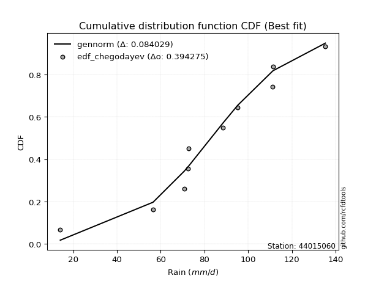</img></img>

</div>


### 6. EDF Blom (1958)

The Blom formula is a specific "plotting position" formula used in hydrology and statistical analysis to estimate the empirical cumulative probability (or non-exceedance probability) of a data series. It is particularly recommended for data that are approximately normally distributed. The constant _a_ is set to 0.375 (or 3/8).

<div align="center">


$P=(m-a)/(n+1-2a)$


</div>


**6.1. Empirical values**

<div align="center">

|                | 0                   | 1                   | 2                   | 3                   | 4                   | 5                  | 6                  | 7                  | 8                  | 9                  |
|:---------------|:--------------------|:--------------------|:--------------------|:--------------------|:--------------------|:-------------------|:-------------------|:-------------------|:-------------------|:-------------------|
| date           | 2016                | 2020                | 2022                | 2021                | 2018                | 2023               | 2017               | 2025               | 2024               | 2019               |
| x              | 14.1                | 56.5                | 70.8                | 72.4                | 72.9                | 88.5               | 95.3               | 111.2              | 111.4              | 135.3              |
| m              | 1                   | 2                   | 3                   | 4                   | 5                   | 6                  | 7                  | 8                  | 9                  | 10                 |
| empirical_dist | edf_blom            | edf_blom            | edf_blom            | edf_blom            | edf_blom            | edf_blom           | edf_blom           | edf_blom           | edf_blom           | edf_blom           |
| empirical      | 0.06097560975609756 | 0.15853658536585366 | 0.25609756097560976 | 0.35365853658536583 | 0.45121951219512196 | 0.5487804878048781 | 0.6463414634146342 | 0.7439024390243902 | 0.8414634146341463 | 0.9390243902439024 |
| empirical_tr   | 1.064935064935065   | 1.1884057971014492  | 1.3442622950819672  | 1.5471698113207546  | 1.8222222222222222  | 2.2162162162162162 | 2.827586206896552  | 3.9047619047619047 | 6.307692307692307  | 16.399999999999984 |

</div>


**6.2. Kolmogorov-Smirnov fit test (sorted by Δ)**


<div align="center">

|                | 0                  | 1                   | 2                   | 3                   | 4                   | 5                   | 6                   | 7                   | 8                   | 9                   | 10                  | 11                  | 12                  | 13                  | 14                  | 15                  | 16                  | 17                  | 18                  | 19                  | 20                  | 21                 | 22                  | 23                 | 24                  | 25                  | 26                 | 27                  | 28                  | 29                  | 30                  | 31                  | 32                 | 33                  | 34                  | 35                  | 36                  | 37                  | 38                  | 39                  | 40                  | 41                  | 42                 | 43                  | 44                 | 45                  | 46                  | 47                 | 48                  | 49                 | 50                  | 51                  | 52                  | 53                  | 54                  | 55                 | 56                  | 57                  | 58                  | 59                  | 60                 | 61                  | 62                 | 63                  | 64                  | 65                  | 66                  | 67                  | 68                  | 69                  | 70                  | 71                  | 72                  | 73                  | 74                  | 75                  | 76                  | 77                  | 78                 | 79                  | 80                  | 81                  | 82                  | 83                  | 84                  | 85                  | 86                 | 87                 | 88                  | 89                  | 90                  | 91                  | 92                 | 93                  | 94                  | 95                 | 96                  | 97                 | 98                  | 99                  | 100                | 101                | 102                | 103                | 104                 | 105                 | 106                 | 107                | 108                | 109                 | 110                 | 111                 | 112                 | 113                | 114                | 115                | 116                | 117                | 118                | 119                 | 120                | 121                 | 122                 | 123                | 124                | 125                 | 126                | 127                | 128                 | 129                 | 130                | 131                 | 132                 | 133                 | 134                 | 135                 | 136                | 137                | 138                 | 139                | 140                 | 141                 | 142                 | 143                 | 144                | 145                | 146                | 147                | 148                | 149                | 150                | 151                | 152                | 153                | 154                | 155                | 156                | 157                | 158                | 159                |
|:---------------|:-------------------|:--------------------|:--------------------|:--------------------|:--------------------|:--------------------|:--------------------|:--------------------|:--------------------|:--------------------|:--------------------|:--------------------|:--------------------|:--------------------|:--------------------|:--------------------|:--------------------|:--------------------|:--------------------|:--------------------|:--------------------|:-------------------|:--------------------|:-------------------|:--------------------|:--------------------|:-------------------|:--------------------|:--------------------|:--------------------|:--------------------|:--------------------|:-------------------|:--------------------|:--------------------|:--------------------|:--------------------|:--------------------|:--------------------|:--------------------|:--------------------|:--------------------|:-------------------|:--------------------|:-------------------|:--------------------|:--------------------|:-------------------|:--------------------|:-------------------|:--------------------|:--------------------|:--------------------|:--------------------|:--------------------|:-------------------|:--------------------|:--------------------|:--------------------|:--------------------|:-------------------|:--------------------|:-------------------|:--------------------|:--------------------|:--------------------|:--------------------|:--------------------|:--------------------|:--------------------|:--------------------|:--------------------|:--------------------|:--------------------|:--------------------|:--------------------|:--------------------|:--------------------|:-------------------|:--------------------|:--------------------|:--------------------|:--------------------|:--------------------|:--------------------|:--------------------|:-------------------|:-------------------|:--------------------|:--------------------|:--------------------|:--------------------|:-------------------|:--------------------|:--------------------|:-------------------|:--------------------|:-------------------|:--------------------|:--------------------|:-------------------|:-------------------|:-------------------|:-------------------|:--------------------|:--------------------|:--------------------|:-------------------|:-------------------|:--------------------|:--------------------|:--------------------|:--------------------|:-------------------|:-------------------|:-------------------|:-------------------|:-------------------|:-------------------|:--------------------|:-------------------|:--------------------|:--------------------|:-------------------|:-------------------|:--------------------|:-------------------|:-------------------|:--------------------|:--------------------|:-------------------|:--------------------|:--------------------|:--------------------|:--------------------|:--------------------|:-------------------|:-------------------|:--------------------|:-------------------|:--------------------|:--------------------|:--------------------|:--------------------|:-------------------|:-------------------|:-------------------|:-------------------|:-------------------|:-------------------|:-------------------|:-------------------|:-------------------|:-------------------|:-------------------|:-------------------|:-------------------|:-------------------|:-------------------|:-------------------|
| station        | 44015060           | 44015060            | 44015060            | 44015060            | 44015060            | 44015060            | 44015060            | 44015060            | 44015060            | 44015060            | 44015060            | 44015060            | 44015060            | 44015060            | 44015060            | 44015060            | 44015060            | 44015060            | 44015060            | 44015060            | 44015060            | 44015060           | 44015060            | 44015060           | 44015060            | 44015060            | 44015060           | 44015060            | 44015060            | 44015060            | 44015060            | 44015060            | 44015060           | 44015060            | 44015060            | 44015060            | 44015060            | 44015060            | 44015060            | 44015060            | 44015060            | 44015060            | 44015060           | 44015060            | 44015060           | 44015060            | 44015060            | 44015060           | 44015060            | 44015060           | 44015060            | 44015060            | 44015060            | 44015060            | 44015060            | 44015060           | 44015060            | 44015060            | 44015060            | 44015060            | 44015060           | 44015060            | 44015060           | 44015060            | 44015060            | 44015060            | 44015060            | 44015060            | 44015060            | 44015060            | 44015060            | 44015060            | 44015060            | 44015060            | 44015060            | 44015060            | 44015060            | 44015060            | 44015060           | 44015060            | 44015060            | 44015060            | 44015060            | 44015060            | 44015060            | 44015060            | 44015060           | 44015060           | 44015060            | 44015060            | 44015060            | 44015060            | 44015060           | 44015060            | 44015060            | 44015060           | 44015060            | 44015060           | 44015060            | 44015060            | 44015060           | 44015060           | 44015060           | 44015060           | 44015060            | 44015060            | 44015060            | 44015060           | 44015060           | 44015060            | 44015060            | 44015060            | 44015060            | 44015060           | 44015060           | 44015060           | 44015060           | 44015060           | 44015060           | 44015060            | 44015060           | 44015060            | 44015060            | 44015060           | 44015060           | 44015060            | 44015060           | 44015060           | 44015060            | 44015060            | 44015060           | 44015060            | 44015060            | 44015060            | 44015060            | 44015060            | 44015060           | 44015060           | 44015060            | 44015060           | 44015060            | 44015060            | 44015060            | 44015060            | 44015060           | 44015060           | 44015060           | 44015060           | 44015060           | 44015060           | 44015060           | 44015060           | 44015060           | 44015060           | 44015060           | 44015060           | 44015060           | 44015060           | 44015060           | 44015060           |
| empirical_dist | edf_blom           | edf_blom            | edf_blom            | edf_blom            | edf_blom            | edf_blom            | edf_blom            | edf_blom            | edf_blom            | edf_blom            | edf_blom            | edf_blom            | edf_blom            | edf_blom            | edf_blom            | edf_blom            | edf_blom            | edf_blom            | edf_blom            | edf_blom            | edf_blom            | edf_blom           | edf_blom            | edf_blom           | edf_blom            | edf_blom            | edf_blom           | edf_blom            | edf_blom            | edf_blom            | edf_blom            | edf_blom            | edf_blom           | edf_blom            | edf_blom            | edf_blom            | edf_blom            | edf_blom            | edf_blom            | edf_blom            | edf_blom            | edf_blom            | edf_blom           | edf_blom            | edf_blom           | edf_blom            | edf_blom            | edf_blom           | edf_blom            | edf_blom           | edf_blom            | edf_blom            | edf_blom            | edf_blom            | edf_blom            | edf_blom           | edf_blom            | edf_blom            | edf_blom            | edf_blom            | edf_blom           | edf_blom            | edf_blom           | edf_blom            | edf_blom            | edf_blom            | edf_blom            | edf_blom            | edf_blom            | edf_blom            | edf_blom            | edf_blom            | edf_blom            | edf_blom            | edf_blom            | edf_blom            | edf_blom            | edf_blom            | edf_blom           | edf_blom            | edf_blom            | edf_blom            | edf_blom            | edf_blom            | edf_blom            | edf_blom            | edf_blom           | edf_blom           | edf_blom            | edf_blom            | edf_blom            | edf_blom            | edf_blom           | edf_blom            | edf_blom            | edf_blom           | edf_blom            | edf_blom           | edf_blom            | edf_blom            | edf_blom           | edf_blom           | edf_blom           | edf_blom           | edf_blom            | edf_blom            | edf_blom            | edf_blom           | edf_blom           | edf_blom            | edf_blom            | edf_blom            | edf_blom            | edf_blom           | edf_blom           | edf_blom           | edf_blom           | edf_blom           | edf_blom           | edf_blom            | edf_blom           | edf_blom            | edf_blom            | edf_blom           | edf_blom           | edf_blom            | edf_blom           | edf_blom           | edf_blom            | edf_blom            | edf_blom           | edf_blom            | edf_blom            | edf_blom            | edf_blom            | edf_blom            | edf_blom           | edf_blom           | edf_blom            | edf_blom           | edf_blom            | edf_blom            | edf_blom            | edf_blom            | edf_blom           | edf_blom           | edf_blom           | edf_blom           | edf_blom           | edf_blom           | edf_blom           | edf_blom           | edf_blom           | edf_blom           | edf_blom           | edf_blom           | edf_blom           | edf_blom           | edf_blom           | edf_blom           |
| p_dist         | gennorm            | logjohnsonsu        | gompertz            | logistic            | exponpow            | foldnorm            | logjohnsonsb        | truncnorm           | johnsonsb           | logdweibull         | gengamma            | logargus            | rice                | t                   | exponnorm           | norm                | crystalball         | nct                 | f                   | fatiguelife         | pearson3            | argus              | hypsecant           | exponweib          | burr                | mielke              | weibull_min        | skewnorm            | genextreme          | loggenlogistic      | logpearson3         | logloggamma         | johnsonsu          | betaprime           | erlang              | truncweibull_min    | gamma               | dweibull            | genlogistic         | anglit              | invgamma            | logburr             | dgamma             | logburr12           | semicircular       | logmielke           | logvonmises_line    | laplace            | loggompertz         | maxwell            | loggengamma         | gumbel_l            | logloglaplace       | rayleigh            | cosine              | ncf                | gumbel_r            | logdgamma           | invgauss            | loggumbel_l         | nakagami           | lognakagami         | arcsine            | loggenextreme       | genhalflogistic     | genpareto           | invweibull          | moyal               | gausshyper          | triang              | logtrapezoid        | halfnorm            | logtruncnorm        | loggennorm          | halflogistic        | kstwobign           | vonmises_line       | logskewnorm         | genexpon           | halfgennorm         | wald                | kappa3              | logt                | loglaplace          | loglaplace          | uniform             | wrapcauchy         | ksone              | logncf              | loghypsecant        | logfoldnorm         | loglogistic         | logfatiguelife     | logf                | logexponnorm        | logcrystalball     | lognorm             | logrice            | lognct              | beta                | loganglit          | logsemicircular    | logbetaprime       | logerlang          | kappa4              | loginvweibull       | logalpha            | loggamma           | loggamma           | loginvgamma         | logarcsine          | loglevy_l           | loginvgauss         | logmaxwell         | lograyleigh        | loggenhalflogistic | trapezoid          | loggumbel_r        | loggausshyper      | bradford            | logtriang          | levy_l              | loghalfnorm         | logkappa4          | logkstwobign       | loggenpareto        | logweibull_max     | logcosine          | logmoyal            | lomax               | alpha              | loghalflogistic     | loggenexpon         | truncexpon          | logwrapcauchy       | logtruncweibull_min | logwald            | loglomax           | burr12              | logrdist           | logbeta             | logksone            | logtukeylambda      | logkappa3           | loguniform         | logbradford        | logexponweib       | logweibull_min     | logtruncexpon      | logexponpow        | powerlaw           | rdist              | logpowerlaw        | weibull_max        | tukeylambda        | truncpareto        | logtruncpareto     | loghalfgennorm     | logvonmises        | vonmises           |
| delta          | 0.0875467590887955 | 0.08788608002286541 | 0.08810152539903182 | 0.08816917883354614 | 0.08838019501683486 | 0.08857719058499414 | 0.08957696681062532 | 0.09506248048930988 | 0.09589312057056609 | 0.09602382414344113 | 0.09726517777736088 | 0.09771073465202884 | 0.09784915771982755 | 0.09786882806426844 | 0.09788276928512601 | 0.09788572143026403 | 0.09788572346324625 | 0.09800806085293806 | 0.09840930028337136 | 0.09892338956138524 | 0.09897247958770433 | 0.0993635504475402 | 0.10010064107309924 | 0.1003887458219147 | 0.10075800034916516 | 0.10086074662362704 | 0.1018883344965616 | 0.10194430901998836 | 0.10198206252490899 | 0.10200110186920286 | 0.10394615281456948 | 0.10412702517172923 | 0.1050825827093082 | 0.10789950830977374 | 0.11019853307356348 | 0.11137828748195383 | 0.11145004826238303 | 0.11247703150030264 | 0.11346519089908463 | 0.11725054325371825 | 0.11948545304991837 | 0.12032099835075427 | 0.1207402442773457 | 0.12322906306763887 | 0.1253685827620089 | 0.12708899419673902 | 0.12775422875931997 | 0.1283468691032899 | 0.12907429885342753 | 0.1300570206185379 | 0.13409592942748472 | 0.13670565952740116 | 0.14107501631075636 | 0.14216800526279083 | 0.14279414786826428 | 0.146634013908867  | 0.14733374467294086 | 0.14878609957581507 | 0.15141874892652463 | 0.15432333687346134 | 0.1585365853651297 | 0.15853658536584353 | 0.1585720019424388 | 0.16093072258047791 | 0.16240566083069718 | 0.16436039902480656 | 0.16542707635967463 | 0.16574614401817134 | 0.16835310780209822 | 0.16916923045293875 | 0.17357660828124155 | 0.17663376057246738 | 0.17817104770010062 | 0.18461494722040733 | 0.18539259278517983 | 0.19592380595893222 | 0.19622913323276686 | 0.19687887705466978 | 0.2071936340589955 | 0.20826838764523842 | 0.20898963489547423 | 0.21020536154915104 | 0.21141502068556395 | 0.21148702682595044 | 0.21148702682595044 | 0.21172422120260798 | 0.2123270539419974 | 0.2170872575062383 | 0.21796199639562513 | 0.22022638399869876 | 0.22134638865656064 | 0.22242403208895445 | 0.2238349161782936 | 0.22446584715117457 | 0.22499893377334584 | 0.2250012699628539 | 0.22500131412970742 | 0.2250064885784514 | 0.22548698697309844 | 0.22665229478908244 | 0.2277051571441831 | 0.2288183196446898 | 0.2311196739411045 | 0.2385226925884727 | 0.23860977697762226 | 0.23871377838634192 | 0.23960063742992038 | 0.2407565403391595 | 0.2407565403391595 | 0.24299149867445813 | 0.24485986275401314 | 0.24567559852487678 | 0.25250723087859495 | 0.258704026577104  | 0.2700991067412102 | 0.2754450760121364 | 0.2754513489748851 | 0.294556841887626  | 0.2966544566512711 | 0.29803502233833823 | 0.2997445020895918 | 0.30010575223441066 | 0.30219661131439335 | 0.3024003545698204 | 0.3024306973352726 | 0.30635891480245236 | 0.3151111986020504 | 0.3197697398467282 | 0.32041963720165156 | 0.32152252299856365 | 0.3223484552012459 | 0.32586388190013693 | 0.32965564646973833 | 0.35202824679619327 | 0.38090827585544484 | 0.38530933944948276 | 0.3924025718221682 | 0.3938257997347011 | 0.41118438401041146 | 0.4187920324728416 | 0.42907293036443717 | 0.43632172811145997 | 0.45074665443930473 | 0.45576657818243893 | 0.4575052862231431 | 0.4615552157586671 | 0.4666912486326492 | 0.5232730222390884 | 0.5336668222075339 | 0.6225080866590541 | 0.6263270138700792 | 0.6676667001764696 | 0.7215057792045954 | 0.7241234874085557 | 0.7284382940398915 | 0.7855575995798549 | 0.8151014545674412 | 0.8414634146341463 | 1.1733258738552252 | 20.683776060708496 |
| deltao         | 0.3942745923300002 | 0.3942745923300002  | 0.3942745923300002  | 0.3942745923300002  | 0.3942745923300002  | 0.3942745923300002  | 0.3942745923300002  | 0.3942745923300002  | 0.3942745923300002  | 0.3942745923300002  | 0.3942745923300002  | 0.3942745923300002  | 0.3942745923300002  | 0.3942745923300002  | 0.3942745923300002  | 0.3942745923300002  | 0.3942745923300002  | 0.3942745923300002  | 0.3942745923300002  | 0.3942745923300002  | 0.3942745923300002  | 0.3942745923300002 | 0.3942745923300002  | 0.3942745923300002 | 0.3942745923300002  | 0.3942745923300002  | 0.3942745923300002 | 0.3942745923300002  | 0.3942745923300002  | 0.3942745923300002  | 0.3942745923300002  | 0.3942745923300002  | 0.3942745923300002 | 0.3942745923300002  | 0.3942745923300002  | 0.3942745923300002  | 0.3942745923300002  | 0.3942745923300002  | 0.3942745923300002  | 0.3942745923300002  | 0.3942745923300002  | 0.3942745923300002  | 0.3942745923300002 | 0.3942745923300002  | 0.3942745923300002 | 0.3942745923300002  | 0.3942745923300002  | 0.3942745923300002 | 0.3942745923300002  | 0.3942745923300002 | 0.3942745923300002  | 0.3942745923300002  | 0.3942745923300002  | 0.3942745923300002  | 0.3942745923300002  | 0.3942745923300002 | 0.3942745923300002  | 0.3942745923300002  | 0.3942745923300002  | 0.3942745923300002  | 0.3942745923300002 | 0.3942745923300002  | 0.3942745923300002 | 0.3942745923300002  | 0.3942745923300002  | 0.3942745923300002  | 0.3942745923300002  | 0.3942745923300002  | 0.3942745923300002  | 0.3942745923300002  | 0.3942745923300002  | 0.3942745923300002  | 0.3942745923300002  | 0.3942745923300002  | 0.3942745923300002  | 0.3942745923300002  | 0.3942745923300002  | 0.3942745923300002  | 0.3942745923300002 | 0.3942745923300002  | 0.3942745923300002  | 0.3942745923300002  | 0.3942745923300002  | 0.3942745923300002  | 0.3942745923300002  | 0.3942745923300002  | 0.3942745923300002 | 0.3942745923300002 | 0.3942745923300002  | 0.3942745923300002  | 0.3942745923300002  | 0.3942745923300002  | 0.3942745923300002 | 0.3942745923300002  | 0.3942745923300002  | 0.3942745923300002 | 0.3942745923300002  | 0.3942745923300002 | 0.3942745923300002  | 0.3942745923300002  | 0.3942745923300002 | 0.3942745923300002 | 0.3942745923300002 | 0.3942745923300002 | 0.3942745923300002  | 0.3942745923300002  | 0.3942745923300002  | 0.3942745923300002 | 0.3942745923300002 | 0.3942745923300002  | 0.3942745923300002  | 0.3942745923300002  | 0.3942745923300002  | 0.3942745923300002 | 0.3942745923300002 | 0.3942745923300002 | 0.3942745923300002 | 0.3942745923300002 | 0.3942745923300002 | 0.3942745923300002  | 0.3942745923300002 | 0.3942745923300002  | 0.3942745923300002  | 0.3942745923300002 | 0.3942745923300002 | 0.3942745923300002  | 0.3942745923300002 | 0.3942745923300002 | 0.3942745923300002  | 0.3942745923300002  | 0.3942745923300002 | 0.3942745923300002  | 0.3942745923300002  | 0.3942745923300002  | 0.3942745923300002  | 0.3942745923300002  | 0.3942745923300002 | 0.3942745923300002 | 0.3942745923300002  | 0.3942745923300002 | 0.3942745923300002  | 0.3942745923300002  | 0.3942745923300002  | 0.3942745923300002  | 0.3942745923300002 | 0.3942745923300002 | 0.3942745923300002 | 0.3942745923300002 | 0.3942745923300002 | 0.3942745923300002 | 0.3942745923300002 | 0.3942745923300002 | 0.3942745923300002 | 0.3942745923300002 | 0.3942745923300002 | 0.3942745923300002 | 0.3942745923300002 | 0.3942745923300002 | 0.3942745923300002 | 0.3942745923300002 |
| eval           | Δo > Δ             | Δo > Δ              | Δo > Δ              | Δo > Δ              | Δo > Δ              | Δo > Δ              | Δo > Δ              | Δo > Δ              | Δo > Δ              | Δo > Δ              | Δo > Δ              | Δo > Δ              | Δo > Δ              | Δo > Δ              | Δo > Δ              | Δo > Δ              | Δo > Δ              | Δo > Δ              | Δo > Δ              | Δo > Δ              | Δo > Δ              | Δo > Δ             | Δo > Δ              | Δo > Δ             | Δo > Δ              | Δo > Δ              | Δo > Δ             | Δo > Δ              | Δo > Δ              | Δo > Δ              | Δo > Δ              | Δo > Δ              | Δo > Δ             | Δo > Δ              | Δo > Δ              | Δo > Δ              | Δo > Δ              | Δo > Δ              | Δo > Δ              | Δo > Δ              | Δo > Δ              | Δo > Δ              | Δo > Δ             | Δo > Δ              | Δo > Δ             | Δo > Δ              | Δo > Δ              | Δo > Δ             | Δo > Δ              | Δo > Δ             | Δo > Δ              | Δo > Δ              | Δo > Δ              | Δo > Δ              | Δo > Δ              | Δo > Δ             | Δo > Δ              | Δo > Δ              | Δo > Δ              | Δo > Δ              | Δo > Δ             | Δo > Δ              | Δo > Δ             | Δo > Δ              | Δo > Δ              | Δo > Δ              | Δo > Δ              | Δo > Δ              | Δo > Δ              | Δo > Δ              | Δo > Δ              | Δo > Δ              | Δo > Δ              | Δo > Δ              | Δo > Δ              | Δo > Δ              | Δo > Δ              | Δo > Δ              | Δo > Δ             | Δo > Δ              | Δo > Δ              | Δo > Δ              | Δo > Δ              | Δo > Δ              | Δo > Δ              | Δo > Δ              | Δo > Δ             | Δo > Δ             | Δo > Δ              | Δo > Δ              | Δo > Δ              | Δo > Δ              | Δo > Δ             | Δo > Δ              | Δo > Δ              | Δo > Δ             | Δo > Δ              | Δo > Δ             | Δo > Δ              | Δo > Δ              | Δo > Δ             | Δo > Δ             | Δo > Δ             | Δo > Δ             | Δo > Δ              | Δo > Δ              | Δo > Δ              | Δo > Δ             | Δo > Δ             | Δo > Δ              | Δo > Δ              | Δo > Δ              | Δo > Δ              | Δo > Δ             | Δo > Δ             | Δo > Δ             | Δo > Δ             | Δo > Δ             | Δo > Δ             | Δo > Δ              | Δo > Δ             | Δo > Δ              | Δo > Δ              | Δo > Δ             | Δo > Δ             | Δo > Δ              | Δo > Δ             | Δo > Δ             | Δo > Δ              | Δo > Δ              | Δo > Δ             | Δo > Δ              | Δo > Δ              | Δo > Δ              | Δo > Δ              | Δo > Δ              | Δo > Δ             | Δo > Δ             | Δo <= Δ             | Δo <= Δ            | Δo <= Δ             | Δo <= Δ             | Δo <= Δ             | Δo <= Δ             | Δo <= Δ            | Δo <= Δ            | Δo <= Δ            | Δo <= Δ            | Δo <= Δ            | Δo <= Δ            | Δo <= Δ            | Δo <= Δ            | Δo <= Δ            | Δo <= Δ            | Δo <= Δ            | Δo <= Δ            | Δo <= Δ            | Δo <= Δ            | Δo <= Δ            | Δo <= Δ            |
| fit            | 1                  | 1                   | 1                   | 1                   | 1                   | 1                   | 1                   | 1                   | 1                   | 1                   | 1                   | 1                   | 1                   | 1                   | 1                   | 1                   | 1                   | 1                   | 1                   | 1                   | 1                   | 1                  | 1                   | 1                  | 1                   | 1                   | 1                  | 1                   | 1                   | 1                   | 1                   | 1                   | 1                  | 1                   | 1                   | 1                   | 1                   | 1                   | 1                   | 1                   | 1                   | 1                   | 1                  | 1                   | 1                  | 1                   | 1                   | 1                  | 1                   | 1                  | 1                   | 1                   | 1                   | 1                   | 1                   | 1                  | 1                   | 1                   | 1                   | 1                   | 1                  | 1                   | 1                  | 1                   | 1                   | 1                   | 1                   | 1                   | 1                   | 1                   | 1                   | 1                   | 1                   | 1                   | 1                   | 1                   | 1                   | 1                   | 1                  | 1                   | 1                   | 1                   | 1                   | 1                   | 1                   | 1                   | 1                  | 1                  | 1                   | 1                   | 1                   | 1                   | 1                  | 1                   | 1                   | 1                  | 1                   | 1                  | 1                   | 1                   | 1                  | 1                  | 1                  | 1                  | 1                   | 1                   | 1                   | 1                  | 1                  | 1                   | 1                   | 1                   | 1                   | 1                  | 1                  | 1                  | 1                  | 1                  | 1                  | 1                   | 1                  | 1                   | 1                   | 1                  | 1                  | 1                   | 1                  | 1                  | 1                   | 1                   | 1                  | 1                   | 1                   | 1                   | 1                   | 1                   | 1                  | 1                  | 0                   | 0                  | 0                   | 0                   | 0                   | 0                   | 0                  | 0                  | 0                  | 0                  | 0                  | 0                  | 0                  | 0                  | 0                  | 0                  | 0                  | 0                  | 0                  | 0                  | 0                  | 0                  |
| n              | 10                 | 10                  | 10                  | 10                  | 10                  | 10                  | 10                  | 10                  | 10                  | 10                  | 10                  | 10                  | 10                  | 10                  | 10                  | 10                  | 10                  | 10                  | 10                  | 10                  | 10                  | 10                 | 10                  | 10                 | 10                  | 10                  | 10                 | 10                  | 10                  | 10                  | 10                  | 10                  | 10                 | 10                  | 10                  | 10                  | 10                  | 10                  | 10                  | 10                  | 10                  | 10                  | 10                 | 10                  | 10                 | 10                  | 10                  | 10                 | 10                  | 10                 | 10                  | 10                  | 10                  | 10                  | 10                  | 10                 | 10                  | 10                  | 10                  | 10                  | 10                 | 10                  | 10                 | 10                  | 10                  | 10                  | 10                  | 10                  | 10                  | 10                  | 10                  | 10                  | 10                  | 10                  | 10                  | 10                  | 10                  | 10                  | 10                 | 10                  | 10                  | 10                  | 10                  | 10                  | 10                  | 10                  | 10                 | 10                 | 10                  | 10                  | 10                  | 10                  | 10                 | 10                  | 10                  | 10                 | 10                  | 10                 | 10                  | 10                  | 10                 | 10                 | 10                 | 10                 | 10                  | 10                  | 10                  | 10                 | 10                 | 10                  | 10                  | 10                  | 10                  | 10                 | 10                 | 10                 | 10                 | 10                 | 10                 | 10                  | 10                 | 10                  | 10                  | 10                 | 10                 | 10                  | 10                 | 10                 | 10                  | 10                  | 10                 | 10                  | 10                  | 10                  | 10                  | 10                  | 10                 | 10                 | 10                  | 10                 | 10                  | 10                  | 10                  | 10                  | 10                 | 10                 | 10                 | 10                 | 10                 | 10                 | 10                 | 10                 | 10                 | 10                 | 10                 | 10                 | 10                 | 10                 | 10                 | 10                 |
| best_fit       | 1                  | 0                   | 0                   | 0                   | 0                   | 0                   | 0                   | 0                   | 0                   | 0                   | 0                   | 0                   | 0                   | 0                   | 0                   | 0                   | 0                   | 0                   | 0                   | 0                   | 0                   | 0                  | 0                   | 0                  | 0                   | 0                   | 0                  | 0                   | 0                   | 0                   | 0                   | 0                   | 0                  | 0                   | 0                   | 0                   | 0                   | 0                   | 0                   | 0                   | 0                   | 0                   | 0                  | 0                   | 0                  | 0                   | 0                   | 0                  | 0                   | 0                  | 0                   | 0                   | 0                   | 0                   | 0                   | 0                  | 0                   | 0                   | 0                   | 0                   | 0                  | 0                   | 0                  | 0                   | 0                   | 0                   | 0                   | 0                   | 0                   | 0                   | 0                   | 0                   | 0                   | 0                   | 0                   | 0                   | 0                   | 0                   | 0                  | 0                   | 0                   | 0                   | 0                   | 0                   | 0                   | 0                   | 0                  | 0                  | 0                   | 0                   | 0                   | 0                   | 0                  | 0                   | 0                   | 0                  | 0                   | 0                  | 0                   | 0                   | 0                  | 0                  | 0                  | 0                  | 0                   | 0                   | 0                   | 0                  | 0                  | 0                   | 0                   | 0                   | 0                   | 0                  | 0                  | 0                  | 0                  | 0                  | 0                  | 0                   | 0                  | 0                   | 0                   | 0                  | 0                  | 0                   | 0                  | 0                  | 0                   | 0                   | 0                  | 0                   | 0                   | 0                   | 0                   | 0                   | 0                  | 0                  | 0                   | 0                  | 0                   | 0                   | 0                   | 0                   | 0                  | 0                  | 0                  | 0                  | 0                  | 0                  | 0                  | 0                  | 0                  | 0                  | 0                  | 0                  | 0                  | 0                  | 0                  | 0                  |
| best_fit_sort  | 1                  | 2                   | 3                   | 4                   | 5                   | 6                   | 7                   | 8                   | 9                   | 10                  | 11                  | 12                  | 13                  | 14                  | 15                  | 16                  | 17                  | 18                  | 19                  | 20                  | 21                  | 22                 | 23                  | 24                 | 25                  | 26                  | 27                 | 28                  | 29                  | 30                  | 31                  | 32                  | 33                 | 34                  | 35                  | 36                  | 37                  | 38                  | 39                  | 40                  | 41                  | 42                  | 43                 | 44                  | 45                 | 46                  | 47                  | 48                 | 49                  | 50                 | 51                  | 52                  | 53                  | 54                  | 55                  | 56                 | 57                  | 58                  | 59                  | 60                  | 61                 | 62                  | 63                 | 64                  | 65                  | 66                  | 67                  | 68                  | 69                  | 70                  | 71                  | 72                  | 73                  | 74                  | 75                  | 76                  | 77                  | 78                  | 79                 | 80                  | 81                  | 82                  | 83                  | 84                  | 85                  | 86                  | 87                 | 88                 | 89                  | 90                  | 91                  | 92                  | 93                 | 94                  | 95                  | 96                 | 97                  | 98                 | 99                  | 100                 | 101                | 102                | 103                | 104                | 105                 | 106                 | 107                 | 108                | 109                | 110                 | 111                 | 112                 | 113                 | 114                | 115                | 116                | 117                | 118                | 119                | 120                 | 121                | 122                 | 123                 | 124                | 125                | 126                 | 127                | 128                | 129                 | 130                 | 131                | 132                 | 133                 | 134                 | 135                 | 136                 | 137                | 138                | 139                 | 140                | 141                 | 142                 | 143                 | 144                 | 145                | 146                | 147                | 148                | 149                | 150                | 151                | 152                | 153                | 154                | 155                | 156                | 157                | 158                | 159                | 160                |

</div>


**6.3. Best fit**

<div align="center">

|   id |   station | empirical_dist   | p_dist   |     delta |   deltao | eval   |   fit |   n |   best_fit |   best_fit_sort |
|-----:|----------:|:-----------------|:---------|----------:|---------:|:-------|------:|----:|-----------:|----------------:|
|    0 |  44015060 | edf_blom         | gennorm  | 0.0875468 | 0.394275 | Δo > Δ |     1 |  10 |          1 |               1 |

</div>


<div align="center">

</img></img>

</div>


### 7. EDF Tukey (1962)

In hydrology, the Tukey formula is used as a plotting position formula to estimate the empirical probability or frequency of a flood event (or other hydrological data). The formula parameter is given as _c=0.333_ (or 1/3).

<div align="center">


$P=(m-c)/(n+1-2c)$


</div>


**7.1. Empirical values**

<div align="center">

|                | 0                   | 1                   | 2                   | 3                  | 4                   | 5                  | 6                  | 7                  | 8                  | 9                  |
|:---------------|:--------------------|:--------------------|:--------------------|:-------------------|:--------------------|:-------------------|:-------------------|:-------------------|:-------------------|:-------------------|
| date           | 2016                | 2020                | 2022                | 2021               | 2018                | 2023               | 2017               | 2025               | 2024               | 2019               |
| x              | 14.1                | 56.5                | 70.8                | 72.4               | 72.9                | 88.5               | 95.3               | 111.2              | 111.4              | 135.3              |
| m              | 1                   | 2                   | 3                   | 4                  | 5                   | 6                  | 7                  | 8                  | 9                  | 10                 |
| empirical_dist | edf_tukey           | edf_tukey           | edf_tukey           | edf_tukey          | edf_tukey           | edf_tukey          | edf_tukey          | edf_tukey          | edf_tukey          | edf_tukey          |
| empirical      | 0.06451612903225806 | 0.16129032258064516 | 0.25806451612903225 | 0.3548387096774194 | 0.45161290322580644 | 0.5483870967741935 | 0.6451612903225806 | 0.7419354838709677 | 0.8387096774193549 | 0.9354838709677419 |
| empirical_tr   | 1.0689655172413792  | 1.1923076923076923  | 1.3478260869565217  | 1.55               | 1.823529411764706   | 2.214285714285714  | 2.818181818181818  | 3.875              | 6.200000000000001  | 15.499999999999988 |

</div>


**7.2. Kolmogorov-Smirnov fit test (sorted by Δ)**


<div align="center">

|                | 0                   | 1                   | 2                   | 3                   | 4                  | 5                   | 6                   | 7                  | 8                   | 9                   | 10                  | 11                  | 12                  | 13                  | 14                  | 15                  | 16                  | 17                  | 18                  | 19                  | 20                 | 21                  | 22                  | 23                  | 24                  | 25                  | 26                  | 27                 | 28                  | 29                  | 30                  | 31                  | 32                  | 33                  | 34                  | 35                  | 36                  | 37                  | 38                  | 39                  | 40                  | 41                  | 42                  | 43                  | 44                  | 45                  | 46                  | 47                  | 48                  | 49                  | 50                  | 51                  | 52                  | 53                 | 54                  | 55                 | 56                  | 57                  | 58                  | 59                  | 60                  | 61                  | 62                  | 63                 | 64                  | 65                  | 66                  | 67                  | 68                  | 69                  | 70                  | 71                 | 72                  | 73                  | 74                 | 75                  | 76                  | 77                 | 78                 | 79                  | 80                  | 81                  | 82                  | 83                  | 84                  | 85                 | 86                  | 87                  | 88                  | 89                  | 90                  | 91                  | 92                 | 93                  | 94                  | 95                  | 96                  | 97                 | 98                  | 99                  | 100                | 101                | 102                | 103                 | 104                | 105                 | 106                | 107                | 108                | 109                 | 110                 | 111                 | 112                 | 113                | 114                | 115                 | 116                | 117                | 118                 | 119                 | 120                 | 121                | 122                 | 123                 | 124                | 125                | 126                 | 127                | 128                | 129                 | 130                 | 131                 | 132                | 133                | 134                | 135                 | 136                | 137                 | 138                | 139                 | 140                | 141                 | 142                | 143                 | 144                 | 145                 | 146                | 147                | 148                | 149                | 150                | 151                | 152                | 153                | 154                | 155                | 156                | 157                | 158                | 159                |
|:---------------|:--------------------|:--------------------|:--------------------|:--------------------|:-------------------|:--------------------|:--------------------|:-------------------|:--------------------|:--------------------|:--------------------|:--------------------|:--------------------|:--------------------|:--------------------|:--------------------|:--------------------|:--------------------|:--------------------|:--------------------|:-------------------|:--------------------|:--------------------|:--------------------|:--------------------|:--------------------|:--------------------|:-------------------|:--------------------|:--------------------|:--------------------|:--------------------|:--------------------|:--------------------|:--------------------|:--------------------|:--------------------|:--------------------|:--------------------|:--------------------|:--------------------|:--------------------|:--------------------|:--------------------|:--------------------|:--------------------|:--------------------|:--------------------|:--------------------|:--------------------|:--------------------|:--------------------|:--------------------|:-------------------|:--------------------|:-------------------|:--------------------|:--------------------|:--------------------|:--------------------|:--------------------|:--------------------|:--------------------|:-------------------|:--------------------|:--------------------|:--------------------|:--------------------|:--------------------|:--------------------|:--------------------|:-------------------|:--------------------|:--------------------|:-------------------|:--------------------|:--------------------|:-------------------|:-------------------|:--------------------|:--------------------|:--------------------|:--------------------|:--------------------|:--------------------|:-------------------|:--------------------|:--------------------|:--------------------|:--------------------|:--------------------|:--------------------|:-------------------|:--------------------|:--------------------|:--------------------|:--------------------|:-------------------|:--------------------|:--------------------|:-------------------|:-------------------|:-------------------|:--------------------|:-------------------|:--------------------|:-------------------|:-------------------|:-------------------|:--------------------|:--------------------|:--------------------|:--------------------|:-------------------|:-------------------|:--------------------|:-------------------|:-------------------|:--------------------|:--------------------|:--------------------|:-------------------|:--------------------|:--------------------|:-------------------|:-------------------|:--------------------|:-------------------|:-------------------|:--------------------|:--------------------|:--------------------|:-------------------|:-------------------|:-------------------|:--------------------|:-------------------|:--------------------|:-------------------|:--------------------|:-------------------|:--------------------|:-------------------|:--------------------|:--------------------|:--------------------|:-------------------|:-------------------|:-------------------|:-------------------|:-------------------|:-------------------|:-------------------|:-------------------|:-------------------|:-------------------|:-------------------|:-------------------|:-------------------|:-------------------|
| station        | 44015060            | 44015060            | 44015060            | 44015060            | 44015060           | 44015060            | 44015060            | 44015060           | 44015060            | 44015060            | 44015060            | 44015060            | 44015060            | 44015060            | 44015060            | 44015060            | 44015060            | 44015060            | 44015060            | 44015060            | 44015060           | 44015060            | 44015060            | 44015060            | 44015060            | 44015060            | 44015060            | 44015060           | 44015060            | 44015060            | 44015060            | 44015060            | 44015060            | 44015060            | 44015060            | 44015060            | 44015060            | 44015060            | 44015060            | 44015060            | 44015060            | 44015060            | 44015060            | 44015060            | 44015060            | 44015060            | 44015060            | 44015060            | 44015060            | 44015060            | 44015060            | 44015060            | 44015060            | 44015060           | 44015060            | 44015060           | 44015060            | 44015060            | 44015060            | 44015060            | 44015060            | 44015060            | 44015060            | 44015060           | 44015060            | 44015060            | 44015060            | 44015060            | 44015060            | 44015060            | 44015060            | 44015060           | 44015060            | 44015060            | 44015060           | 44015060            | 44015060            | 44015060           | 44015060           | 44015060            | 44015060            | 44015060            | 44015060            | 44015060            | 44015060            | 44015060           | 44015060            | 44015060            | 44015060            | 44015060            | 44015060            | 44015060            | 44015060           | 44015060            | 44015060            | 44015060            | 44015060            | 44015060           | 44015060            | 44015060            | 44015060           | 44015060           | 44015060           | 44015060            | 44015060           | 44015060            | 44015060           | 44015060           | 44015060           | 44015060            | 44015060            | 44015060            | 44015060            | 44015060           | 44015060           | 44015060            | 44015060           | 44015060           | 44015060            | 44015060            | 44015060            | 44015060           | 44015060            | 44015060            | 44015060           | 44015060           | 44015060            | 44015060           | 44015060           | 44015060            | 44015060            | 44015060            | 44015060           | 44015060           | 44015060           | 44015060            | 44015060           | 44015060            | 44015060           | 44015060            | 44015060           | 44015060            | 44015060           | 44015060            | 44015060            | 44015060            | 44015060           | 44015060           | 44015060           | 44015060           | 44015060           | 44015060           | 44015060           | 44015060           | 44015060           | 44015060           | 44015060           | 44015060           | 44015060           | 44015060           |
| empirical_dist | edf_tukey           | edf_tukey           | edf_tukey           | edf_tukey           | edf_tukey          | edf_tukey           | edf_tukey           | edf_tukey          | edf_tukey           | edf_tukey           | edf_tukey           | edf_tukey           | edf_tukey           | edf_tukey           | edf_tukey           | edf_tukey           | edf_tukey           | edf_tukey           | edf_tukey           | edf_tukey           | edf_tukey          | edf_tukey           | edf_tukey           | edf_tukey           | edf_tukey           | edf_tukey           | edf_tukey           | edf_tukey          | edf_tukey           | edf_tukey           | edf_tukey           | edf_tukey           | edf_tukey           | edf_tukey           | edf_tukey           | edf_tukey           | edf_tukey           | edf_tukey           | edf_tukey           | edf_tukey           | edf_tukey           | edf_tukey           | edf_tukey           | edf_tukey           | edf_tukey           | edf_tukey           | edf_tukey           | edf_tukey           | edf_tukey           | edf_tukey           | edf_tukey           | edf_tukey           | edf_tukey           | edf_tukey          | edf_tukey           | edf_tukey          | edf_tukey           | edf_tukey           | edf_tukey           | edf_tukey           | edf_tukey           | edf_tukey           | edf_tukey           | edf_tukey          | edf_tukey           | edf_tukey           | edf_tukey           | edf_tukey           | edf_tukey           | edf_tukey           | edf_tukey           | edf_tukey          | edf_tukey           | edf_tukey           | edf_tukey          | edf_tukey           | edf_tukey           | edf_tukey          | edf_tukey          | edf_tukey           | edf_tukey           | edf_tukey           | edf_tukey           | edf_tukey           | edf_tukey           | edf_tukey          | edf_tukey           | edf_tukey           | edf_tukey           | edf_tukey           | edf_tukey           | edf_tukey           | edf_tukey          | edf_tukey           | edf_tukey           | edf_tukey           | edf_tukey           | edf_tukey          | edf_tukey           | edf_tukey           | edf_tukey          | edf_tukey          | edf_tukey          | edf_tukey           | edf_tukey          | edf_tukey           | edf_tukey          | edf_tukey          | edf_tukey          | edf_tukey           | edf_tukey           | edf_tukey           | edf_tukey           | edf_tukey          | edf_tukey          | edf_tukey           | edf_tukey          | edf_tukey          | edf_tukey           | edf_tukey           | edf_tukey           | edf_tukey          | edf_tukey           | edf_tukey           | edf_tukey          | edf_tukey          | edf_tukey           | edf_tukey          | edf_tukey          | edf_tukey           | edf_tukey           | edf_tukey           | edf_tukey          | edf_tukey          | edf_tukey          | edf_tukey           | edf_tukey          | edf_tukey           | edf_tukey          | edf_tukey           | edf_tukey          | edf_tukey           | edf_tukey          | edf_tukey           | edf_tukey           | edf_tukey           | edf_tukey          | edf_tukey          | edf_tukey          | edf_tukey          | edf_tukey          | edf_tukey          | edf_tukey          | edf_tukey          | edf_tukey          | edf_tukey          | edf_tukey          | edf_tukey          | edf_tukey          | edf_tukey          |
| p_dist         | gennorm             | foldnorm            | logjohnsonsb        | logjohnsonsu        | gompertz           | exponpow            | logistic            | johnsonsb          | logdweibull         | gengamma            | logargus            | rice                | t                   | exponnorm           | norm                | crystalball         | nct                 | f                   | fatiguelife         | truncnorm           | argus              | exponweib           | burr                | mielke              | pearson3            | loggenlogistic      | logpearson3         | hypsecant          | logloggamma         | weibull_min         | skewnorm            | genextreme          | johnsonsu           | betaprime           | erlang              | truncweibull_min    | gamma               | dweibull            | genlogistic         | anglit              | invgamma            | logburr             | dgamma              | logburr12           | semicircular        | logmielke           | logvonmises_line    | loggompertz         | maxwell             | laplace             | loggengamma         | gumbel_l            | rayleigh            | cosine             | logloglaplace       | ncf                | gumbel_r            | logdgamma           | invgauss            | loggumbel_l         | arcsine             | loggenextreme       | genhalflogistic     | nakagami           | lognakagami         | genpareto           | invweibull          | moyal               | gausshyper          | triang              | logtrapezoid        | halfnorm           | logtruncnorm        | halflogistic        | loggennorm         | kstwobign           | vonmises_line       | logskewnorm        | genexpon           | halfgennorm         | wald                | kappa3              | logt                | loglaplace          | loglaplace          | uniform            | wrapcauchy          | ksone               | logncf              | loghypsecant        | logfoldnorm         | loglogistic         | logfatiguelife     | logf                | logexponnorm        | logcrystalball      | lognorm             | logrice            | lognct              | beta                | loganglit          | logsemicircular    | logbetaprime       | loginvweibull       | logerlang          | kappa4              | logalpha           | loggamma           | loggamma           | loginvgamma         | logarcsine          | loglevy_l           | loginvgauss         | logmaxwell         | lograyleigh        | trapezoid           | loggenhalflogistic | loggumbel_r        | loggausshyper       | bradford            | levy_l              | logtriang          | logkstwobign        | loghalfnorm         | logkappa4          | loggenpareto       | logweibull_max      | logcosine          | logmoyal           | lomax               | alpha               | loghalflogistic     | loggenexpon        | truncexpon         | logwrapcauchy      | logtruncweibull_min | logwald            | loglomax            | burr12             | logrdist            | logbeta            | logksone            | logtukeylambda     | logkappa3           | loguniform          | logbradford         | logexponweib       | logweibull_min     | logtruncexpon      | logexponpow        | powerlaw           | rdist              | logpowerlaw        | weibull_max        | tukeylambda        | truncpareto        | logtruncpareto     | loghalfgennorm     | logvonmises        | vonmises           |
| delta          | 0.08557980393537301 | 0.08661023543157165 | 0.08761001165720284 | 0.08793122124050629 | 0.0884949164297163 | 0.08877358604751934 | 0.09013613398696863 | 0.0939261654171436 | 0.09405686899001864 | 0.09529822262393839 | 0.09574377949860635 | 0.09588220256640506 | 0.09590187291084595 | 0.09591581413170353 | 0.09591876627684154 | 0.09591876830982377 | 0.09604110569951557 | 0.09644234512994887 | 0.09695643440796275 | 0.09702943564273236 | 0.0973965952941177 | 0.09842179066849222 | 0.09879104519574267 | 0.09889379147020455 | 0.09936587061838881 | 0.10003414671578037 | 0.10197919766114699 | 0.1020577418007802 | 0.10216007001830674 | 0.10228172552724607 | 0.10233770005067283 | 0.10237545355559347 | 0.10547597373999268 | 0.10593255315635125 | 0.10823157792014099 | 0.10941133232853134 | 0.10948309310896054 | 0.11051007634688015 | 0.11385858192976911 | 0.11528358810029576 | 0.11751849789649588 | 0.11756726113596283 | 0.11877328912392321 | 0.12126210791421638 | 0.12340162760858642 | 0.12433525698194758 | 0.12500049154452852 | 0.12710734370000504 | 0.12809006546511542 | 0.12874026013397438 | 0.13212897427406223 | 0.13709905055808563 | 0.14020105010936834 | 0.1408271927148418 | 0.14146840734144084 | 0.1446670587554445 | 0.14536678951951837 | 0.14917949060649954 | 0.14945179377310214 | 0.15235638172003885 | 0.15660504678901632 | 0.15817698536568647 | 0.15965192361590574 | 0.1612903225799212 | 0.16129032258063503 | 0.16160666181001507 | 0.16346012120625214 | 0.16377918886474885 | 0.16559937058730678 | 0.16956262148362322 | 0.17160965312781906 | 0.1746668054190449 | 0.17620409254667813 | 0.18342563763175734 | 0.1850083382510918 | 0.19395685080550973 | 0.19426217807934437 | 0.1949119219012473 | 0.205226678905573  | 0.20630143249181593 | 0.20702267974205174 | 0.20823840639572855 | 0.20944806553214146 | 0.20952007167252795 | 0.20952007167252795 | 0.2097572660491855 | 0.21036009878857492 | 0.21512030235281582 | 0.21599504124220265 | 0.21825942884527627 | 0.21937943350313815 | 0.22045707693553196 | 0.2218679610248711 | 0.22249889199775208 | 0.22303197861992335 | 0.22303431480943142 | 0.22303435897628493 | 0.2230395334250289 | 0.22352003181967595 | 0.22468533963565995 | 0.2257382019907606 | 0.2268513644912673 | 0.229152718787682  | 0.23596004117155042 | 0.2365557374350502 | 0.23664282182419977 | 0.2376336822764979 | 0.238789585185737  | 0.238789585185737  | 0.24102454352103564 | 0.24210612553922164 | 0.24292186131008528 | 0.25054027572517246 | 0.2567370714236815 | 0.2681321515877877 | 0.27269761176009366 | 0.2734781208587139 | 0.2925898867342035 | 0.29390071943647955 | 0.29606806718491574 | 0.29656523295825016 | 0.2977775469361693 | 0.29967696012048106 | 0.30022965616097086 | 0.3004333994163979 | 0.3036051775876609 | 0.31235746138725895 | 0.3178027846933057 | 0.3184526820482291 | 0.31955556784514116 | 0.31959471798645434 | 0.32389692674671444 | 0.3269019092549469 | 0.3500612916427708 | 0.3781545386406534 | 0.38334238429606027 | 0.3904356166687457 | 0.39107206251990967 | 0.40843064679562   | 0.41603829525805014 | 0.4263191931496457 | 0.43356799089666853 | 0.4479929172245133 | 0.45379962302901644 | 0.45553833106972064 | 0.45880147854387565 | 0.4639375114178578 | 0.520519285024297  | 0.5309130849927425 | 0.6197543494442627 | 0.6235732766552877 | 0.6656997450230471 | 0.7187520419898039 | 0.7213697501937643 | 0.726471338886469  | 0.7828038623650635 | 0.8123477173526498 | 0.8387096774193549 | 1.1713589187018028 | 20.687316579984657 |
| deltao         | 0.3942745923300002  | 0.3942745923300002  | 0.3942745923300002  | 0.3942745923300002  | 0.3942745923300002 | 0.3942745923300002  | 0.3942745923300002  | 0.3942745923300002 | 0.3942745923300002  | 0.3942745923300002  | 0.3942745923300002  | 0.3942745923300002  | 0.3942745923300002  | 0.3942745923300002  | 0.3942745923300002  | 0.3942745923300002  | 0.3942745923300002  | 0.3942745923300002  | 0.3942745923300002  | 0.3942745923300002  | 0.3942745923300002 | 0.3942745923300002  | 0.3942745923300002  | 0.3942745923300002  | 0.3942745923300002  | 0.3942745923300002  | 0.3942745923300002  | 0.3942745923300002 | 0.3942745923300002  | 0.3942745923300002  | 0.3942745923300002  | 0.3942745923300002  | 0.3942745923300002  | 0.3942745923300002  | 0.3942745923300002  | 0.3942745923300002  | 0.3942745923300002  | 0.3942745923300002  | 0.3942745923300002  | 0.3942745923300002  | 0.3942745923300002  | 0.3942745923300002  | 0.3942745923300002  | 0.3942745923300002  | 0.3942745923300002  | 0.3942745923300002  | 0.3942745923300002  | 0.3942745923300002  | 0.3942745923300002  | 0.3942745923300002  | 0.3942745923300002  | 0.3942745923300002  | 0.3942745923300002  | 0.3942745923300002 | 0.3942745923300002  | 0.3942745923300002 | 0.3942745923300002  | 0.3942745923300002  | 0.3942745923300002  | 0.3942745923300002  | 0.3942745923300002  | 0.3942745923300002  | 0.3942745923300002  | 0.3942745923300002 | 0.3942745923300002  | 0.3942745923300002  | 0.3942745923300002  | 0.3942745923300002  | 0.3942745923300002  | 0.3942745923300002  | 0.3942745923300002  | 0.3942745923300002 | 0.3942745923300002  | 0.3942745923300002  | 0.3942745923300002 | 0.3942745923300002  | 0.3942745923300002  | 0.3942745923300002 | 0.3942745923300002 | 0.3942745923300002  | 0.3942745923300002  | 0.3942745923300002  | 0.3942745923300002  | 0.3942745923300002  | 0.3942745923300002  | 0.3942745923300002 | 0.3942745923300002  | 0.3942745923300002  | 0.3942745923300002  | 0.3942745923300002  | 0.3942745923300002  | 0.3942745923300002  | 0.3942745923300002 | 0.3942745923300002  | 0.3942745923300002  | 0.3942745923300002  | 0.3942745923300002  | 0.3942745923300002 | 0.3942745923300002  | 0.3942745923300002  | 0.3942745923300002 | 0.3942745923300002 | 0.3942745923300002 | 0.3942745923300002  | 0.3942745923300002 | 0.3942745923300002  | 0.3942745923300002 | 0.3942745923300002 | 0.3942745923300002 | 0.3942745923300002  | 0.3942745923300002  | 0.3942745923300002  | 0.3942745923300002  | 0.3942745923300002 | 0.3942745923300002 | 0.3942745923300002  | 0.3942745923300002 | 0.3942745923300002 | 0.3942745923300002  | 0.3942745923300002  | 0.3942745923300002  | 0.3942745923300002 | 0.3942745923300002  | 0.3942745923300002  | 0.3942745923300002 | 0.3942745923300002 | 0.3942745923300002  | 0.3942745923300002 | 0.3942745923300002 | 0.3942745923300002  | 0.3942745923300002  | 0.3942745923300002  | 0.3942745923300002 | 0.3942745923300002 | 0.3942745923300002 | 0.3942745923300002  | 0.3942745923300002 | 0.3942745923300002  | 0.3942745923300002 | 0.3942745923300002  | 0.3942745923300002 | 0.3942745923300002  | 0.3942745923300002 | 0.3942745923300002  | 0.3942745923300002  | 0.3942745923300002  | 0.3942745923300002 | 0.3942745923300002 | 0.3942745923300002 | 0.3942745923300002 | 0.3942745923300002 | 0.3942745923300002 | 0.3942745923300002 | 0.3942745923300002 | 0.3942745923300002 | 0.3942745923300002 | 0.3942745923300002 | 0.3942745923300002 | 0.3942745923300002 | 0.3942745923300002 |
| eval           | Δo > Δ              | Δo > Δ              | Δo > Δ              | Δo > Δ              | Δo > Δ             | Δo > Δ              | Δo > Δ              | Δo > Δ             | Δo > Δ              | Δo > Δ              | Δo > Δ              | Δo > Δ              | Δo > Δ              | Δo > Δ              | Δo > Δ              | Δo > Δ              | Δo > Δ              | Δo > Δ              | Δo > Δ              | Δo > Δ              | Δo > Δ             | Δo > Δ              | Δo > Δ              | Δo > Δ              | Δo > Δ              | Δo > Δ              | Δo > Δ              | Δo > Δ             | Δo > Δ              | Δo > Δ              | Δo > Δ              | Δo > Δ              | Δo > Δ              | Δo > Δ              | Δo > Δ              | Δo > Δ              | Δo > Δ              | Δo > Δ              | Δo > Δ              | Δo > Δ              | Δo > Δ              | Δo > Δ              | Δo > Δ              | Δo > Δ              | Δo > Δ              | Δo > Δ              | Δo > Δ              | Δo > Δ              | Δo > Δ              | Δo > Δ              | Δo > Δ              | Δo > Δ              | Δo > Δ              | Δo > Δ             | Δo > Δ              | Δo > Δ             | Δo > Δ              | Δo > Δ              | Δo > Δ              | Δo > Δ              | Δo > Δ              | Δo > Δ              | Δo > Δ              | Δo > Δ             | Δo > Δ              | Δo > Δ              | Δo > Δ              | Δo > Δ              | Δo > Δ              | Δo > Δ              | Δo > Δ              | Δo > Δ             | Δo > Δ              | Δo > Δ              | Δo > Δ             | Δo > Δ              | Δo > Δ              | Δo > Δ             | Δo > Δ             | Δo > Δ              | Δo > Δ              | Δo > Δ              | Δo > Δ              | Δo > Δ              | Δo > Δ              | Δo > Δ             | Δo > Δ              | Δo > Δ              | Δo > Δ              | Δo > Δ              | Δo > Δ              | Δo > Δ              | Δo > Δ             | Δo > Δ              | Δo > Δ              | Δo > Δ              | Δo > Δ              | Δo > Δ             | Δo > Δ              | Δo > Δ              | Δo > Δ             | Δo > Δ             | Δo > Δ             | Δo > Δ              | Δo > Δ             | Δo > Δ              | Δo > Δ             | Δo > Δ             | Δo > Δ             | Δo > Δ              | Δo > Δ              | Δo > Δ              | Δo > Δ              | Δo > Δ             | Δo > Δ             | Δo > Δ              | Δo > Δ             | Δo > Δ             | Δo > Δ              | Δo > Δ              | Δo > Δ              | Δo > Δ             | Δo > Δ              | Δo > Δ              | Δo > Δ             | Δo > Δ             | Δo > Δ              | Δo > Δ             | Δo > Δ             | Δo > Δ              | Δo > Δ              | Δo > Δ              | Δo > Δ             | Δo > Δ             | Δo > Δ             | Δo > Δ              | Δo > Δ             | Δo > Δ              | Δo <= Δ            | Δo <= Δ             | Δo <= Δ            | Δo <= Δ             | Δo <= Δ            | Δo <= Δ             | Δo <= Δ             | Δo <= Δ             | Δo <= Δ            | Δo <= Δ            | Δo <= Δ            | Δo <= Δ            | Δo <= Δ            | Δo <= Δ            | Δo <= Δ            | Δo <= Δ            | Δo <= Δ            | Δo <= Δ            | Δo <= Δ            | Δo <= Δ            | Δo <= Δ            | Δo <= Δ            |
| fit            | 1                   | 1                   | 1                   | 1                   | 1                  | 1                   | 1                   | 1                  | 1                   | 1                   | 1                   | 1                   | 1                   | 1                   | 1                   | 1                   | 1                   | 1                   | 1                   | 1                   | 1                  | 1                   | 1                   | 1                   | 1                   | 1                   | 1                   | 1                  | 1                   | 1                   | 1                   | 1                   | 1                   | 1                   | 1                   | 1                   | 1                   | 1                   | 1                   | 1                   | 1                   | 1                   | 1                   | 1                   | 1                   | 1                   | 1                   | 1                   | 1                   | 1                   | 1                   | 1                   | 1                   | 1                  | 1                   | 1                  | 1                   | 1                   | 1                   | 1                   | 1                   | 1                   | 1                   | 1                  | 1                   | 1                   | 1                   | 1                   | 1                   | 1                   | 1                   | 1                  | 1                   | 1                   | 1                  | 1                   | 1                   | 1                  | 1                  | 1                   | 1                   | 1                   | 1                   | 1                   | 1                   | 1                  | 1                   | 1                   | 1                   | 1                   | 1                   | 1                   | 1                  | 1                   | 1                   | 1                   | 1                   | 1                  | 1                   | 1                   | 1                  | 1                  | 1                  | 1                   | 1                  | 1                   | 1                  | 1                  | 1                  | 1                   | 1                   | 1                   | 1                   | 1                  | 1                  | 1                   | 1                  | 1                  | 1                   | 1                   | 1                   | 1                  | 1                   | 1                   | 1                  | 1                  | 1                   | 1                  | 1                  | 1                   | 1                   | 1                   | 1                  | 1                  | 1                  | 1                   | 1                  | 1                   | 0                  | 0                   | 0                  | 0                   | 0                  | 0                   | 0                   | 0                   | 0                  | 0                  | 0                  | 0                  | 0                  | 0                  | 0                  | 0                  | 0                  | 0                  | 0                  | 0                  | 0                  | 0                  |
| n              | 10                  | 10                  | 10                  | 10                  | 10                 | 10                  | 10                  | 10                 | 10                  | 10                  | 10                  | 10                  | 10                  | 10                  | 10                  | 10                  | 10                  | 10                  | 10                  | 10                  | 10                 | 10                  | 10                  | 10                  | 10                  | 10                  | 10                  | 10                 | 10                  | 10                  | 10                  | 10                  | 10                  | 10                  | 10                  | 10                  | 10                  | 10                  | 10                  | 10                  | 10                  | 10                  | 10                  | 10                  | 10                  | 10                  | 10                  | 10                  | 10                  | 10                  | 10                  | 10                  | 10                  | 10                 | 10                  | 10                 | 10                  | 10                  | 10                  | 10                  | 10                  | 10                  | 10                  | 10                 | 10                  | 10                  | 10                  | 10                  | 10                  | 10                  | 10                  | 10                 | 10                  | 10                  | 10                 | 10                  | 10                  | 10                 | 10                 | 10                  | 10                  | 10                  | 10                  | 10                  | 10                  | 10                 | 10                  | 10                  | 10                  | 10                  | 10                  | 10                  | 10                 | 10                  | 10                  | 10                  | 10                  | 10                 | 10                  | 10                  | 10                 | 10                 | 10                 | 10                  | 10                 | 10                  | 10                 | 10                 | 10                 | 10                  | 10                  | 10                  | 10                  | 10                 | 10                 | 10                  | 10                 | 10                 | 10                  | 10                  | 10                  | 10                 | 10                  | 10                  | 10                 | 10                 | 10                  | 10                 | 10                 | 10                  | 10                  | 10                  | 10                 | 10                 | 10                 | 10                  | 10                 | 10                  | 10                 | 10                  | 10                 | 10                  | 10                 | 10                  | 10                  | 10                  | 10                 | 10                 | 10                 | 10                 | 10                 | 10                 | 10                 | 10                 | 10                 | 10                 | 10                 | 10                 | 10                 | 10                 |
| best_fit       | 1                   | 0                   | 0                   | 0                   | 0                  | 0                   | 0                   | 0                  | 0                   | 0                   | 0                   | 0                   | 0                   | 0                   | 0                   | 0                   | 0                   | 0                   | 0                   | 0                   | 0                  | 0                   | 0                   | 0                   | 0                   | 0                   | 0                   | 0                  | 0                   | 0                   | 0                   | 0                   | 0                   | 0                   | 0                   | 0                   | 0                   | 0                   | 0                   | 0                   | 0                   | 0                   | 0                   | 0                   | 0                   | 0                   | 0                   | 0                   | 0                   | 0                   | 0                   | 0                   | 0                   | 0                  | 0                   | 0                  | 0                   | 0                   | 0                   | 0                   | 0                   | 0                   | 0                   | 0                  | 0                   | 0                   | 0                   | 0                   | 0                   | 0                   | 0                   | 0                  | 0                   | 0                   | 0                  | 0                   | 0                   | 0                  | 0                  | 0                   | 0                   | 0                   | 0                   | 0                   | 0                   | 0                  | 0                   | 0                   | 0                   | 0                   | 0                   | 0                   | 0                  | 0                   | 0                   | 0                   | 0                   | 0                  | 0                   | 0                   | 0                  | 0                  | 0                  | 0                   | 0                  | 0                   | 0                  | 0                  | 0                  | 0                   | 0                   | 0                   | 0                   | 0                  | 0                  | 0                   | 0                  | 0                  | 0                   | 0                   | 0                   | 0                  | 0                   | 0                   | 0                  | 0                  | 0                   | 0                  | 0                  | 0                   | 0                   | 0                   | 0                  | 0                  | 0                  | 0                   | 0                  | 0                   | 0                  | 0                   | 0                  | 0                   | 0                  | 0                   | 0                   | 0                   | 0                  | 0                  | 0                  | 0                  | 0                  | 0                  | 0                  | 0                  | 0                  | 0                  | 0                  | 0                  | 0                  | 0                  |
| best_fit_sort  | 1                   | 2                   | 3                   | 4                   | 5                  | 6                   | 7                   | 8                  | 9                   | 10                  | 11                  | 12                  | 13                  | 14                  | 15                  | 16                  | 17                  | 18                  | 19                  | 20                  | 21                 | 22                  | 23                  | 24                  | 25                  | 26                  | 27                  | 28                 | 29                  | 30                  | 31                  | 32                  | 33                  | 34                  | 35                  | 36                  | 37                  | 38                  | 39                  | 40                  | 41                  | 42                  | 43                  | 44                  | 45                  | 46                  | 47                  | 48                  | 49                  | 50                  | 51                  | 52                  | 53                  | 54                 | 55                  | 56                 | 57                  | 58                  | 59                  | 60                  | 61                  | 62                  | 63                  | 64                 | 65                  | 66                  | 67                  | 68                  | 69                  | 70                  | 71                  | 72                 | 73                  | 74                  | 75                 | 76                  | 77                  | 78                 | 79                 | 80                  | 81                  | 82                  | 83                  | 84                  | 85                  | 86                 | 87                  | 88                  | 89                  | 90                  | 91                  | 92                  | 93                 | 94                  | 95                  | 96                  | 97                  | 98                 | 99                  | 100                 | 101                | 102                | 103                | 104                 | 105                | 106                 | 107                | 108                | 109                | 110                 | 111                 | 112                 | 113                 | 114                | 115                | 116                 | 117                | 118                | 119                 | 120                 | 121                 | 122                | 123                 | 124                 | 125                | 126                | 127                 | 128                | 129                | 130                 | 131                 | 132                 | 133                | 134                | 135                | 136                 | 137                | 138                 | 139                | 140                 | 141                | 142                 | 143                | 144                 | 145                 | 146                 | 147                | 148                | 149                | 150                | 151                | 152                | 153                | 154                | 155                | 156                | 157                | 158                | 159                | 160                |

</div>


**7.3. Best fit**

<div align="center">

|   id |   station | empirical_dist   | p_dist   |     delta |   deltao | eval   |   fit |   n |   best_fit |   best_fit_sort |
|-----:|----------:|:-----------------|:---------|----------:|---------:|:-------|------:|----:|-----------:|----------------:|
|    0 |  44015060 | edf_tukey        | gennorm  | 0.0855798 | 0.394275 | Δo > Δ |     1 |  10 |          1 |               1 |

</div>


<div align="center">

</img>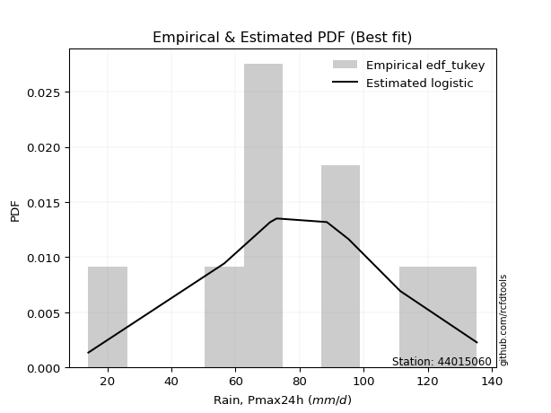</img>

</div>


### 8. EDF Gringorten (1963)

Gringorten plotting position formula is essential for estimating the probability and return periods of extreme events like floods and heavy rainfall. The constant _a=0.44_.

<div align="center">


$P=(m-a)/(n+1-2a)$


</div>


**8.1. Empirical values**

<div align="center">

|                | 0                   | 1                   | 2                  | 3                   | 4                  | 5                 | 6                  | 7                  | 8                  | 9                  |
|:---------------|:--------------------|:--------------------|:-------------------|:--------------------|:-------------------|:------------------|:-------------------|:-------------------|:-------------------|:-------------------|
| date           | 2016                | 2020                | 2022               | 2021                | 2018               | 2023              | 2017               | 2025               | 2024               | 2019               |
| x              | 14.1                | 56.5                | 70.8               | 72.4                | 72.9               | 88.5              | 95.3               | 111.2              | 111.4              | 135.3              |
| m              | 1                   | 2                   | 3                  | 4                   | 5                  | 6                 | 7                  | 8                  | 9                  | 10                 |
| empirical_dist | edf_gringorten      | edf_gringorten      | edf_gringorten     | edf_gringorten      | edf_gringorten     | edf_gringorten    | edf_gringorten     | edf_gringorten     | edf_gringorten     | edf_gringorten     |
| empirical      | 0.05533596837944665 | 0.15415019762845852 | 0.2529644268774704 | 0.35177865612648224 | 0.4505928853754941 | 0.549407114624506 | 0.6482213438735178 | 0.7470355731225297 | 0.8458498023715416 | 0.9446640316205535 |
| empirical_tr   | 1.0585774058577406  | 1.1822429906542056  | 1.3386243386243388 | 1.542682926829268   | 1.8201438848920866 | 2.219298245614035 | 2.842696629213483  | 3.9531250000000004 | 6.487179487179492  | 18.071428571428605 |

</div>


**8.2. Kolmogorov-Smirnov fit test (sorted by Δ)**


<div align="center">

|                | 0                   | 1                   | 2                   | 3                   | 4                   | 5                  | 6                   | 7                   | 8                   | 9                   | 10                 | 11                  | 12                  | 13                  | 14                  | 15                  | 16                  | 17                 | 18                  | 19                  | 20                  | 21                  | 22                 | 23                  | 24                  | 25                  | 26                  | 27                  | 28                  | 29                  | 30                  | 31                  | 32                 | 33                 | 34                  | 35                  | 36                 | 37                 | 38                 | 39                  | 40                  | 41                  | 42                  | 43                  | 44                  | 45                  | 46                  | 47                  | 48                 | 49                  | 50                  | 51                  | 52                  | 53                 | 54                  | 55                  | 56                  | 57                  | 58                  | 59                 | 60                 | 61                 | 62                  | 63                  | 64                 | 65                 | 66                 | 67                 | 68                  | 69                 | 70                  | 71                  | 72                  | 73                  | 74                 | 75                  | 76                  | 77                  | 78                  | 79                  | 80                 | 81                 | 82                  | 83                 | 84                 | 85                  | 86                  | 87                 | 88                 | 89                  | 90                 | 91                  | 92                  | 93                  | 94                 | 95                  | 96                 | 97                  | 98                 | 99                 | 100                 | 101                 | 102                 | 103                 | 104                 | 105                 | 106                 | 107                 | 108                 | 109                | 110                 | 111                 | 112                | 113                | 114                 | 115                | 116                | 117                 | 118                | 119                | 120                 | 121                | 122                 | 123                 | 124                | 125                 | 126                | 127                 | 128                 | 129                | 130                 | 131                | 132                | 133                 | 134                 | 135                 | 136                 | 137                | 138                 | 139                 | 140                 | 141                 | 142                | 143                | 144                | 145                | 146                | 147                | 148                | 149                | 150                | 151                | 152                | 153                | 154                | 155                | 156                | 157                | 158                | 159                |
|:---------------|:--------------------|:--------------------|:--------------------|:--------------------|:--------------------|:-------------------|:--------------------|:--------------------|:--------------------|:--------------------|:-------------------|:--------------------|:--------------------|:--------------------|:--------------------|:--------------------|:--------------------|:-------------------|:--------------------|:--------------------|:--------------------|:--------------------|:-------------------|:--------------------|:--------------------|:--------------------|:--------------------|:--------------------|:--------------------|:--------------------|:--------------------|:--------------------|:-------------------|:-------------------|:--------------------|:--------------------|:-------------------|:-------------------|:-------------------|:--------------------|:--------------------|:--------------------|:--------------------|:--------------------|:--------------------|:--------------------|:--------------------|:--------------------|:-------------------|:--------------------|:--------------------|:--------------------|:--------------------|:-------------------|:--------------------|:--------------------|:--------------------|:--------------------|:--------------------|:-------------------|:-------------------|:-------------------|:--------------------|:--------------------|:-------------------|:-------------------|:-------------------|:-------------------|:--------------------|:-------------------|:--------------------|:--------------------|:--------------------|:--------------------|:-------------------|:--------------------|:--------------------|:--------------------|:--------------------|:--------------------|:-------------------|:-------------------|:--------------------|:-------------------|:-------------------|:--------------------|:--------------------|:-------------------|:-------------------|:--------------------|:-------------------|:--------------------|:--------------------|:--------------------|:-------------------|:--------------------|:-------------------|:--------------------|:-------------------|:-------------------|:--------------------|:--------------------|:--------------------|:--------------------|:--------------------|:--------------------|:--------------------|:--------------------|:--------------------|:-------------------|:--------------------|:--------------------|:-------------------|:-------------------|:--------------------|:-------------------|:-------------------|:--------------------|:-------------------|:-------------------|:--------------------|:-------------------|:--------------------|:--------------------|:-------------------|:--------------------|:-------------------|:--------------------|:--------------------|:-------------------|:--------------------|:-------------------|:-------------------|:--------------------|:--------------------|:--------------------|:--------------------|:-------------------|:--------------------|:--------------------|:--------------------|:--------------------|:-------------------|:-------------------|:-------------------|:-------------------|:-------------------|:-------------------|:-------------------|:-------------------|:-------------------|:-------------------|:-------------------|:-------------------|:-------------------|:-------------------|:-------------------|:-------------------|:-------------------|:-------------------|
| station        | 44015060            | 44015060            | 44015060            | 44015060            | 44015060            | 44015060           | 44015060            | 44015060            | 44015060            | 44015060            | 44015060           | 44015060            | 44015060            | 44015060            | 44015060            | 44015060            | 44015060            | 44015060           | 44015060            | 44015060            | 44015060            | 44015060            | 44015060           | 44015060            | 44015060            | 44015060            | 44015060            | 44015060            | 44015060            | 44015060            | 44015060            | 44015060            | 44015060           | 44015060           | 44015060            | 44015060            | 44015060           | 44015060           | 44015060           | 44015060            | 44015060            | 44015060            | 44015060            | 44015060            | 44015060            | 44015060            | 44015060            | 44015060            | 44015060           | 44015060            | 44015060            | 44015060            | 44015060            | 44015060           | 44015060            | 44015060            | 44015060            | 44015060            | 44015060            | 44015060           | 44015060           | 44015060           | 44015060            | 44015060            | 44015060           | 44015060           | 44015060           | 44015060           | 44015060            | 44015060           | 44015060            | 44015060            | 44015060            | 44015060            | 44015060           | 44015060            | 44015060            | 44015060            | 44015060            | 44015060            | 44015060           | 44015060           | 44015060            | 44015060           | 44015060           | 44015060            | 44015060            | 44015060           | 44015060           | 44015060            | 44015060           | 44015060            | 44015060            | 44015060            | 44015060           | 44015060            | 44015060           | 44015060            | 44015060           | 44015060           | 44015060            | 44015060            | 44015060            | 44015060            | 44015060            | 44015060            | 44015060            | 44015060            | 44015060            | 44015060           | 44015060            | 44015060            | 44015060           | 44015060           | 44015060            | 44015060           | 44015060           | 44015060            | 44015060           | 44015060           | 44015060            | 44015060           | 44015060            | 44015060            | 44015060           | 44015060            | 44015060           | 44015060            | 44015060            | 44015060           | 44015060            | 44015060           | 44015060           | 44015060            | 44015060            | 44015060            | 44015060            | 44015060           | 44015060            | 44015060            | 44015060            | 44015060            | 44015060           | 44015060           | 44015060           | 44015060           | 44015060           | 44015060           | 44015060           | 44015060           | 44015060           | 44015060           | 44015060           | 44015060           | 44015060           | 44015060           | 44015060           | 44015060           | 44015060           | 44015060           |
| empirical_dist | edf_gringorten      | edf_gringorten      | edf_gringorten      | edf_gringorten      | edf_gringorten      | edf_gringorten     | edf_gringorten      | edf_gringorten      | edf_gringorten      | edf_gringorten      | edf_gringorten     | edf_gringorten      | edf_gringorten      | edf_gringorten      | edf_gringorten      | edf_gringorten      | edf_gringorten      | edf_gringorten     | edf_gringorten      | edf_gringorten      | edf_gringorten      | edf_gringorten      | edf_gringorten     | edf_gringorten      | edf_gringorten      | edf_gringorten      | edf_gringorten      | edf_gringorten      | edf_gringorten      | edf_gringorten      | edf_gringorten      | edf_gringorten      | edf_gringorten     | edf_gringorten     | edf_gringorten      | edf_gringorten      | edf_gringorten     | edf_gringorten     | edf_gringorten     | edf_gringorten      | edf_gringorten      | edf_gringorten      | edf_gringorten      | edf_gringorten      | edf_gringorten      | edf_gringorten      | edf_gringorten      | edf_gringorten      | edf_gringorten     | edf_gringorten      | edf_gringorten      | edf_gringorten      | edf_gringorten      | edf_gringorten     | edf_gringorten      | edf_gringorten      | edf_gringorten      | edf_gringorten      | edf_gringorten      | edf_gringorten     | edf_gringorten     | edf_gringorten     | edf_gringorten      | edf_gringorten      | edf_gringorten     | edf_gringorten     | edf_gringorten     | edf_gringorten     | edf_gringorten      | edf_gringorten     | edf_gringorten      | edf_gringorten      | edf_gringorten      | edf_gringorten      | edf_gringorten     | edf_gringorten      | edf_gringorten      | edf_gringorten      | edf_gringorten      | edf_gringorten      | edf_gringorten     | edf_gringorten     | edf_gringorten      | edf_gringorten     | edf_gringorten     | edf_gringorten      | edf_gringorten      | edf_gringorten     | edf_gringorten     | edf_gringorten      | edf_gringorten     | edf_gringorten      | edf_gringorten      | edf_gringorten      | edf_gringorten     | edf_gringorten      | edf_gringorten     | edf_gringorten      | edf_gringorten     | edf_gringorten     | edf_gringorten      | edf_gringorten      | edf_gringorten      | edf_gringorten      | edf_gringorten      | edf_gringorten      | edf_gringorten      | edf_gringorten      | edf_gringorten      | edf_gringorten     | edf_gringorten      | edf_gringorten      | edf_gringorten     | edf_gringorten     | edf_gringorten      | edf_gringorten     | edf_gringorten     | edf_gringorten      | edf_gringorten     | edf_gringorten     | edf_gringorten      | edf_gringorten     | edf_gringorten      | edf_gringorten      | edf_gringorten     | edf_gringorten      | edf_gringorten     | edf_gringorten      | edf_gringorten      | edf_gringorten     | edf_gringorten      | edf_gringorten     | edf_gringorten     | edf_gringorten      | edf_gringorten      | edf_gringorten      | edf_gringorten      | edf_gringorten     | edf_gringorten      | edf_gringorten      | edf_gringorten      | edf_gringorten      | edf_gringorten     | edf_gringorten     | edf_gringorten     | edf_gringorten     | edf_gringorten     | edf_gringorten     | edf_gringorten     | edf_gringorten     | edf_gringorten     | edf_gringorten     | edf_gringorten     | edf_gringorten     | edf_gringorten     | edf_gringorten     | edf_gringorten     | edf_gringorten     | edf_gringorten     | edf_gringorten     |
| p_dist         | logistic            | gompertz            | exponpow            | gennorm             | logjohnsonsu        | foldnorm           | logjohnsonsb        | truncnorm           | pearson3            | johnsonsb           | logdweibull        | hypsecant           | gengamma            | logargus            | rice                | t                   | exponnorm           | norm               | crystalball         | nct                 | weibull_min         | skewnorm            | genextreme         | f                   | fatiguelife         | argus               | exponweib           | burr                | mielke              | johnsonsu           | loggenlogistic      | logpearson3         | logloggamma        | betaprime          | genlogistic         | erlang              | truncweibull_min   | gamma              | dweibull           | anglit              | invgamma            | dgamma              | logburr             | logburr12           | laplace             | semicircular        | logmielke           | logvonmises_line    | loggompertz        | maxwell             | gumbel_l            | loggengamma         | logloglaplace       | rayleigh           | cosine              | logdgamma           | ncf                 | gumbel_r            | nakagami            | lognakagami        | invgauss           | loggumbel_l        | arcsine             | loggenextreme       | genhalflogistic    | invweibull         | genpareto          | moyal              | gausshyper          | triang             | logtrapezoid        | halfnorm            | logtruncnorm        | loggennorm          | halflogistic       | kstwobign           | vonmises_line       | logskewnorm         | genexpon            | halfgennorm         | wald               | kappa3             | logt                | loglaplace         | loglaplace         | uniform             | wrapcauchy          | ksone              | logncf             | loghypsecant        | logfoldnorm        | loglogistic         | logfatiguelife      | logf                | logexponnorm       | logcrystalball      | lognorm            | logrice             | lognct             | beta               | loganglit           | logsemicircular     | logbetaprime        | logerlang           | kappa4              | logalpha            | loginvweibull       | loggamma            | loggamma            | loginvgamma        | logarcsine          | loglevy_l           | loginvgauss        | logmaxwell         | lograyleigh         | loggenhalflogistic | trapezoid          | loggumbel_r         | loggausshyper      | bradford           | logtriang           | loghalfnorm        | logkappa4           | levy_l              | logkstwobign       | loggenpareto        | logweibull_max     | logcosine           | logmoyal            | lomax              | alpha               | loghalflogistic    | loggenexpon        | truncexpon          | logwrapcauchy       | logtruncweibull_min | logwald             | loglomax           | burr12              | logrdist            | logbeta             | logksone            | logtukeylambda     | logkappa3          | loguniform         | logbradford        | logexponweib       | logweibull_min     | logtruncexpon      | logexponpow        | powerlaw           | rdist              | logpowerlaw        | weibull_max        | tukeylambda        | truncpareto        | logtruncpareto     | loghalfgennorm     | logvonmises        | vonmises           |
| delta          | 0.08725904560031239 | 0.08863537616420569 | 0.08884194063629691 | 0.09067989318693487 | 0.09101921412100478 | 0.0917103246831335 | 0.09271010090876469 | 0.09635178923254173 | 0.09834585276807645 | 0.09902625466870546 | 0.0991569582415805 | 0.09947401425347135 | 0.10039831187550025 | 0.10084386875016821 | 0.10098229181796692 | 0.10100196216240781 | 0.10101590338326538 | 0.1010188555284034 | 0.10101885756138562 | 0.10114119495107743 | 0.10126170767693371 | 0.10131768220036047 | 0.1013554357052811 | 0.10154243438151073 | 0.10205652365952461 | 0.10249668454567956 | 0.10352187992005407 | 0.10389113444730452 | 0.10399388072176641 | 0.10445595588968032 | 0.10513423596734223 | 0.10707928691270885 | 0.1072601592698686 | 0.1110326424079131 | 0.11283856407945675 | 0.11333166717170284 | 0.1145114215800932 | 0.1145831823605224 | 0.115610165598442  | 0.12038367735185762 | 0.12261858714805773 | 0.12387337837548507 | 0.12470738608814957 | 0.12636219716577823 | 0.12772024228366202 | 0.12850171686014827 | 0.13147538193413433 | 0.13214061649671527 | 0.1322074329515669 | 0.13319015471667728 | 0.13607903270777327 | 0.13722906352562408 | 0.14044838949112848 | 0.1453011393609302 | 0.14592728196640364 | 0.14815947275618718 | 0.14976714800700636 | 0.15046687877108023 | 0.15415019762773458 | 0.1541501976284484 | 0.154551883024664  | 0.1574564709716007 | 0.16170513604057818 | 0.16531711031787322 | 0.1667920485680925 | 0.168560210457814  | 0.1687467867622017 | 0.1688792781163107 | 0.17273949553949353 | 0.1727950818009104 | 0.17670974237938092 | 0.17976689467060675 | 0.18130418179823998 | 0.18398832040077945 | 0.1885257268833192 | 0.19905694005707159 | 0.19936226733090623 | 0.20001201115280914 | 0.21032676815713486 | 0.21140152174337778 | 0.2121227689936136 | 0.2133384956472904 | 0.21454815478370332 | 0.2146201609240898 | 0.2146201609240898 | 0.21485735530074734 | 0.21546018804013678 | 0.2207122886201663 | 0.2210951304937645 | 0.22335951809683813 | 0.2244795227547    | 0.22555716618709382 | 0.22696805027643296 | 0.22759898124931394 | 0.2281320678714852 | 0.22813440406099328 | 0.2281344482278468 | 0.22813962267659077 | 0.2286201210712378 | 0.2297854288872218 | 0.23083829124232247 | 0.23195145374282916 | 0.23425280803924386 | 0.24165582668661206 | 0.24174291107576162 | 0.24273377152805975 | 0.24310016612373705 | 0.24388967443729886 | 0.24388967443729886 | 0.2461246327725975 | 0.24924625049140828 | 0.25006198626227194 | 0.2556403649767343 | 0.2618371606752434 | 0.27323224083934955 | 0.2785782101102758 | 0.2798377367122804 | 0.29768997598576535 | 0.3010408443886662 | 0.3011681564364776 | 0.30287763618773117 | 0.3053297454125327 | 0.30553348866795976 | 0.30574539361106157 | 0.3068170850726677 | 0.31074530253984756 | 0.3194975863394457 | 0.32290287394486755 | 0.32355277129979093 | 0.324655657096703  | 0.32673484293864097 | 0.3289970159982763 | 0.3340420342071335 | 0.35516138089433263 | 0.38529466359284004 | 0.3884424735476221  | 0.39553570592030757 | 0.3982121874720963 | 0.41557077174780666 | 0.42317842021023677 | 0.43345931810183247 | 0.44070811584885516 | 0.4551330421766999 | 0.4588997122805783 | 0.4606384203212825 | 0.4659416034960623 | 0.4710776363700444 | 0.5276594099764836 | 0.5380532099449291 | 0.6268944743964493 | 0.6307134016074744 | 0.6707998342746089 | 0.7258921669419905 | 0.728509875145951  | 0.7315714281380308 | 0.7899439873172501 | 0.8194878423048364 | 0.8458498023715416 | 1.1764590079533646 | 20.678136419331842 |
| deltao         | 0.3942745923300002  | 0.3942745923300002  | 0.3942745923300002  | 0.3942745923300002  | 0.3942745923300002  | 0.3942745923300002 | 0.3942745923300002  | 0.3942745923300002  | 0.3942745923300002  | 0.3942745923300002  | 0.3942745923300002 | 0.3942745923300002  | 0.3942745923300002  | 0.3942745923300002  | 0.3942745923300002  | 0.3942745923300002  | 0.3942745923300002  | 0.3942745923300002 | 0.3942745923300002  | 0.3942745923300002  | 0.3942745923300002  | 0.3942745923300002  | 0.3942745923300002 | 0.3942745923300002  | 0.3942745923300002  | 0.3942745923300002  | 0.3942745923300002  | 0.3942745923300002  | 0.3942745923300002  | 0.3942745923300002  | 0.3942745923300002  | 0.3942745923300002  | 0.3942745923300002 | 0.3942745923300002 | 0.3942745923300002  | 0.3942745923300002  | 0.3942745923300002 | 0.3942745923300002 | 0.3942745923300002 | 0.3942745923300002  | 0.3942745923300002  | 0.3942745923300002  | 0.3942745923300002  | 0.3942745923300002  | 0.3942745923300002  | 0.3942745923300002  | 0.3942745923300002  | 0.3942745923300002  | 0.3942745923300002 | 0.3942745923300002  | 0.3942745923300002  | 0.3942745923300002  | 0.3942745923300002  | 0.3942745923300002 | 0.3942745923300002  | 0.3942745923300002  | 0.3942745923300002  | 0.3942745923300002  | 0.3942745923300002  | 0.3942745923300002 | 0.3942745923300002 | 0.3942745923300002 | 0.3942745923300002  | 0.3942745923300002  | 0.3942745923300002 | 0.3942745923300002 | 0.3942745923300002 | 0.3942745923300002 | 0.3942745923300002  | 0.3942745923300002 | 0.3942745923300002  | 0.3942745923300002  | 0.3942745923300002  | 0.3942745923300002  | 0.3942745923300002 | 0.3942745923300002  | 0.3942745923300002  | 0.3942745923300002  | 0.3942745923300002  | 0.3942745923300002  | 0.3942745923300002 | 0.3942745923300002 | 0.3942745923300002  | 0.3942745923300002 | 0.3942745923300002 | 0.3942745923300002  | 0.3942745923300002  | 0.3942745923300002 | 0.3942745923300002 | 0.3942745923300002  | 0.3942745923300002 | 0.3942745923300002  | 0.3942745923300002  | 0.3942745923300002  | 0.3942745923300002 | 0.3942745923300002  | 0.3942745923300002 | 0.3942745923300002  | 0.3942745923300002 | 0.3942745923300002 | 0.3942745923300002  | 0.3942745923300002  | 0.3942745923300002  | 0.3942745923300002  | 0.3942745923300002  | 0.3942745923300002  | 0.3942745923300002  | 0.3942745923300002  | 0.3942745923300002  | 0.3942745923300002 | 0.3942745923300002  | 0.3942745923300002  | 0.3942745923300002 | 0.3942745923300002 | 0.3942745923300002  | 0.3942745923300002 | 0.3942745923300002 | 0.3942745923300002  | 0.3942745923300002 | 0.3942745923300002 | 0.3942745923300002  | 0.3942745923300002 | 0.3942745923300002  | 0.3942745923300002  | 0.3942745923300002 | 0.3942745923300002  | 0.3942745923300002 | 0.3942745923300002  | 0.3942745923300002  | 0.3942745923300002 | 0.3942745923300002  | 0.3942745923300002 | 0.3942745923300002 | 0.3942745923300002  | 0.3942745923300002  | 0.3942745923300002  | 0.3942745923300002  | 0.3942745923300002 | 0.3942745923300002  | 0.3942745923300002  | 0.3942745923300002  | 0.3942745923300002  | 0.3942745923300002 | 0.3942745923300002 | 0.3942745923300002 | 0.3942745923300002 | 0.3942745923300002 | 0.3942745923300002 | 0.3942745923300002 | 0.3942745923300002 | 0.3942745923300002 | 0.3942745923300002 | 0.3942745923300002 | 0.3942745923300002 | 0.3942745923300002 | 0.3942745923300002 | 0.3942745923300002 | 0.3942745923300002 | 0.3942745923300002 | 0.3942745923300002 |
| eval           | Δo > Δ              | Δo > Δ              | Δo > Δ              | Δo > Δ              | Δo > Δ              | Δo > Δ             | Δo > Δ              | Δo > Δ              | Δo > Δ              | Δo > Δ              | Δo > Δ             | Δo > Δ              | Δo > Δ              | Δo > Δ              | Δo > Δ              | Δo > Δ              | Δo > Δ              | Δo > Δ             | Δo > Δ              | Δo > Δ              | Δo > Δ              | Δo > Δ              | Δo > Δ             | Δo > Δ              | Δo > Δ              | Δo > Δ              | Δo > Δ              | Δo > Δ              | Δo > Δ              | Δo > Δ              | Δo > Δ              | Δo > Δ              | Δo > Δ             | Δo > Δ             | Δo > Δ              | Δo > Δ              | Δo > Δ             | Δo > Δ             | Δo > Δ             | Δo > Δ              | Δo > Δ              | Δo > Δ              | Δo > Δ              | Δo > Δ              | Δo > Δ              | Δo > Δ              | Δo > Δ              | Δo > Δ              | Δo > Δ             | Δo > Δ              | Δo > Δ              | Δo > Δ              | Δo > Δ              | Δo > Δ             | Δo > Δ              | Δo > Δ              | Δo > Δ              | Δo > Δ              | Δo > Δ              | Δo > Δ             | Δo > Δ             | Δo > Δ             | Δo > Δ              | Δo > Δ              | Δo > Δ             | Δo > Δ             | Δo > Δ             | Δo > Δ             | Δo > Δ              | Δo > Δ             | Δo > Δ              | Δo > Δ              | Δo > Δ              | Δo > Δ              | Δo > Δ             | Δo > Δ              | Δo > Δ              | Δo > Δ              | Δo > Δ              | Δo > Δ              | Δo > Δ             | Δo > Δ             | Δo > Δ              | Δo > Δ             | Δo > Δ             | Δo > Δ              | Δo > Δ              | Δo > Δ             | Δo > Δ             | Δo > Δ              | Δo > Δ             | Δo > Δ              | Δo > Δ              | Δo > Δ              | Δo > Δ             | Δo > Δ              | Δo > Δ             | Δo > Δ              | Δo > Δ             | Δo > Δ             | Δo > Δ              | Δo > Δ              | Δo > Δ              | Δo > Δ              | Δo > Δ              | Δo > Δ              | Δo > Δ              | Δo > Δ              | Δo > Δ              | Δo > Δ             | Δo > Δ              | Δo > Δ              | Δo > Δ             | Δo > Δ             | Δo > Δ              | Δo > Δ             | Δo > Δ             | Δo > Δ              | Δo > Δ             | Δo > Δ             | Δo > Δ              | Δo > Δ             | Δo > Δ              | Δo > Δ              | Δo > Δ             | Δo > Δ              | Δo > Δ             | Δo > Δ              | Δo > Δ              | Δo > Δ             | Δo > Δ              | Δo > Δ             | Δo > Δ             | Δo > Δ              | Δo > Δ              | Δo > Δ              | Δo <= Δ             | Δo <= Δ            | Δo <= Δ             | Δo <= Δ             | Δo <= Δ             | Δo <= Δ             | Δo <= Δ            | Δo <= Δ            | Δo <= Δ            | Δo <= Δ            | Δo <= Δ            | Δo <= Δ            | Δo <= Δ            | Δo <= Δ            | Δo <= Δ            | Δo <= Δ            | Δo <= Δ            | Δo <= Δ            | Δo <= Δ            | Δo <= Δ            | Δo <= Δ            | Δo <= Δ            | Δo <= Δ            | Δo <= Δ            |
| fit            | 1                   | 1                   | 1                   | 1                   | 1                   | 1                  | 1                   | 1                   | 1                   | 1                   | 1                  | 1                   | 1                   | 1                   | 1                   | 1                   | 1                   | 1                  | 1                   | 1                   | 1                   | 1                   | 1                  | 1                   | 1                   | 1                   | 1                   | 1                   | 1                   | 1                   | 1                   | 1                   | 1                  | 1                  | 1                   | 1                   | 1                  | 1                  | 1                  | 1                   | 1                   | 1                   | 1                   | 1                   | 1                   | 1                   | 1                   | 1                   | 1                  | 1                   | 1                   | 1                   | 1                   | 1                  | 1                   | 1                   | 1                   | 1                   | 1                   | 1                  | 1                  | 1                  | 1                   | 1                   | 1                  | 1                  | 1                  | 1                  | 1                   | 1                  | 1                   | 1                   | 1                   | 1                   | 1                  | 1                   | 1                   | 1                   | 1                   | 1                   | 1                  | 1                  | 1                   | 1                  | 1                  | 1                   | 1                   | 1                  | 1                  | 1                   | 1                  | 1                   | 1                   | 1                   | 1                  | 1                   | 1                  | 1                   | 1                  | 1                  | 1                   | 1                   | 1                   | 1                   | 1                   | 1                   | 1                   | 1                   | 1                   | 1                  | 1                   | 1                   | 1                  | 1                  | 1                   | 1                  | 1                  | 1                   | 1                  | 1                  | 1                   | 1                  | 1                   | 1                   | 1                  | 1                   | 1                  | 1                   | 1                   | 1                  | 1                   | 1                  | 1                  | 1                   | 1                   | 1                   | 0                   | 0                  | 0                   | 0                   | 0                   | 0                   | 0                  | 0                  | 0                  | 0                  | 0                  | 0                  | 0                  | 0                  | 0                  | 0                  | 0                  | 0                  | 0                  | 0                  | 0                  | 0                  | 0                  | 0                  |
| n              | 10                  | 10                  | 10                  | 10                  | 10                  | 10                 | 10                  | 10                  | 10                  | 10                  | 10                 | 10                  | 10                  | 10                  | 10                  | 10                  | 10                  | 10                 | 10                  | 10                  | 10                  | 10                  | 10                 | 10                  | 10                  | 10                  | 10                  | 10                  | 10                  | 10                  | 10                  | 10                  | 10                 | 10                 | 10                  | 10                  | 10                 | 10                 | 10                 | 10                  | 10                  | 10                  | 10                  | 10                  | 10                  | 10                  | 10                  | 10                  | 10                 | 10                  | 10                  | 10                  | 10                  | 10                 | 10                  | 10                  | 10                  | 10                  | 10                  | 10                 | 10                 | 10                 | 10                  | 10                  | 10                 | 10                 | 10                 | 10                 | 10                  | 10                 | 10                  | 10                  | 10                  | 10                  | 10                 | 10                  | 10                  | 10                  | 10                  | 10                  | 10                 | 10                 | 10                  | 10                 | 10                 | 10                  | 10                  | 10                 | 10                 | 10                  | 10                 | 10                  | 10                  | 10                  | 10                 | 10                  | 10                 | 10                  | 10                 | 10                 | 10                  | 10                  | 10                  | 10                  | 10                  | 10                  | 10                  | 10                  | 10                  | 10                 | 10                  | 10                  | 10                 | 10                 | 10                  | 10                 | 10                 | 10                  | 10                 | 10                 | 10                  | 10                 | 10                  | 10                  | 10                 | 10                  | 10                 | 10                  | 10                  | 10                 | 10                  | 10                 | 10                 | 10                  | 10                  | 10                  | 10                  | 10                 | 10                  | 10                  | 10                  | 10                  | 10                 | 10                 | 10                 | 10                 | 10                 | 10                 | 10                 | 10                 | 10                 | 10                 | 10                 | 10                 | 10                 | 10                 | 10                 | 10                 | 10                 | 10                 |
| best_fit       | 1                   | 0                   | 0                   | 0                   | 0                   | 0                  | 0                   | 0                   | 0                   | 0                   | 0                  | 0                   | 0                   | 0                   | 0                   | 0                   | 0                   | 0                  | 0                   | 0                   | 0                   | 0                   | 0                  | 0                   | 0                   | 0                   | 0                   | 0                   | 0                   | 0                   | 0                   | 0                   | 0                  | 0                  | 0                   | 0                   | 0                  | 0                  | 0                  | 0                   | 0                   | 0                   | 0                   | 0                   | 0                   | 0                   | 0                   | 0                   | 0                  | 0                   | 0                   | 0                   | 0                   | 0                  | 0                   | 0                   | 0                   | 0                   | 0                   | 0                  | 0                  | 0                  | 0                   | 0                   | 0                  | 0                  | 0                  | 0                  | 0                   | 0                  | 0                   | 0                   | 0                   | 0                   | 0                  | 0                   | 0                   | 0                   | 0                   | 0                   | 0                  | 0                  | 0                   | 0                  | 0                  | 0                   | 0                   | 0                  | 0                  | 0                   | 0                  | 0                   | 0                   | 0                   | 0                  | 0                   | 0                  | 0                   | 0                  | 0                  | 0                   | 0                   | 0                   | 0                   | 0                   | 0                   | 0                   | 0                   | 0                   | 0                  | 0                   | 0                   | 0                  | 0                  | 0                   | 0                  | 0                  | 0                   | 0                  | 0                  | 0                   | 0                  | 0                   | 0                   | 0                  | 0                   | 0                  | 0                   | 0                   | 0                  | 0                   | 0                  | 0                  | 0                   | 0                   | 0                   | 0                   | 0                  | 0                   | 0                   | 0                   | 0                   | 0                  | 0                  | 0                  | 0                  | 0                  | 0                  | 0                  | 0                  | 0                  | 0                  | 0                  | 0                  | 0                  | 0                  | 0                  | 0                  | 0                  | 0                  |
| best_fit_sort  | 1                   | 2                   | 3                   | 4                   | 5                   | 6                  | 7                   | 8                   | 9                   | 10                  | 11                 | 12                  | 13                  | 14                  | 15                  | 16                  | 17                  | 18                 | 19                  | 20                  | 21                  | 22                  | 23                 | 24                  | 25                  | 26                  | 27                  | 28                  | 29                  | 30                  | 31                  | 32                  | 33                 | 34                 | 35                  | 36                  | 37                 | 38                 | 39                 | 40                  | 41                  | 42                  | 43                  | 44                  | 45                  | 46                  | 47                  | 48                  | 49                 | 50                  | 51                  | 52                  | 53                  | 54                 | 55                  | 56                  | 57                  | 58                  | 59                  | 60                 | 61                 | 62                 | 63                  | 64                  | 65                 | 66                 | 67                 | 68                 | 69                  | 70                 | 71                  | 72                  | 73                  | 74                  | 75                 | 76                  | 77                  | 78                  | 79                  | 80                  | 81                 | 82                 | 83                  | 84                 | 85                 | 86                  | 87                  | 88                 | 89                 | 90                  | 91                 | 92                  | 93                  | 94                  | 95                 | 96                  | 97                 | 98                  | 99                 | 100                | 101                 | 102                 | 103                 | 104                 | 105                 | 106                 | 107                 | 108                 | 109                 | 110                | 111                 | 112                 | 113                | 114                | 115                 | 116                | 117                | 118                 | 119                | 120                | 121                 | 122                | 123                 | 124                 | 125                | 126                 | 127                | 128                 | 129                 | 130                | 131                 | 132                | 133                | 134                 | 135                 | 136                 | 137                 | 138                | 139                 | 140                 | 141                 | 142                 | 143                | 144                | 145                | 146                | 147                | 148                | 149                | 150                | 151                | 152                | 153                | 154                | 155                | 156                | 157                | 158                | 159                | 160                |

</div>


**8.3. Best fit**

<div align="center">

|   id |   station | empirical_dist   | p_dist   |    delta |   deltao | eval   |   fit |   n |   best_fit |   best_fit_sort |
|-----:|----------:|:-----------------|:---------|---------:|---------:|:-------|------:|----:|-----------:|----------------:|
|    0 |  44015060 | edf_gringorten   | logistic | 0.087259 | 0.394275 | Δo > Δ |     1 |  10 |          1 |               1 |

</div>


<div align="center">

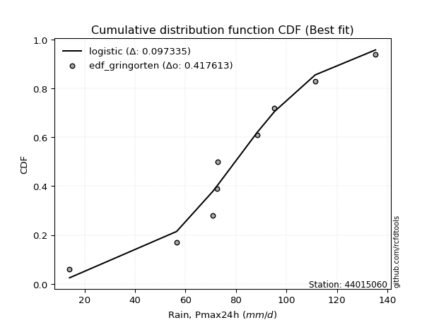</img></img>

</div>


### 9. EDF Filliben (1975)

The specific values of the constants (0.3175) (often denoted as $alpha$) and (0.365) are derived from a method proposed by James J. Filliben in a 1975 paper. This particular formula is the mean value of the $i$-th order statistic of the normal distribution and is considered a robust and effective plotting position formula for the normal probability plot correlation coefficient test for normality.

<div align="center">


$P=(m-0.3175)/(n+0.365)$


</div>


**9.1. Empirical values**

<div align="center">

|                | 0                   | 1                  | 2                   | 3                  | 4                  | 5                  | 6                  | 7                  | 8                  | 9                  |
|:---------------|:--------------------|:-------------------|:--------------------|:-------------------|:-------------------|:-------------------|:-------------------|:-------------------|:-------------------|:-------------------|
| date           | 2016                | 2020               | 2022                | 2021               | 2018               | 2023               | 2017               | 2025               | 2024               | 2019               |
| x              | 14.1                | 56.5               | 70.8                | 72.4               | 72.9               | 88.5               | 95.3               | 111.2              | 111.4              | 135.3              |
| m              | 1                   | 2                  | 3                   | 4                  | 5                  | 6                  | 7                  | 8                  | 9                  | 10                 |
| empirical_dist | edf_filliben        | edf_filliben       | edf_filliben        | edf_filliben       | edf_filliben       | edf_filliben       | edf_filliben       | edf_filliben       | edf_filliben       | edf_filliben       |
| empirical      | 0.06584659913169319 | 0.1623251326579836 | 0.25880366618427403 | 0.3552821997105644 | 0.4517607332368548 | 0.5482392667631452 | 0.6447178002894356 | 0.741196333815726  | 0.8376748673420163 | 0.9341534008683067 |
| empirical_tr   | 1.0704879938032532  | 1.193780593147135  | 1.3491701919947936  | 1.5510662177328844 | 1.8240211174659038 | 2.2135611318739987 | 2.814663951120163  | 3.8639328984156576 | 6.1604754829123305 | 15.186813186813156 |

</div>


**9.2. Kolmogorov-Smirnov fit test (sorted by Δ)**


<div align="center">

|                | 0                   | 1                   | 2                   | 3                   | 4                   | 5                   | 6                   | 7                   | 8                   | 9                   | 10                  | 11                  | 12                  | 13                  | 14                  | 15                  | 16                 | 17                  | 18                  | 19                  | 20                  | 21                  | 22                  | 23                  | 24                  | 25                  | 26                  | 27                  | 28                  | 29                  | 30                  | 31                  | 32                  | 33                  | 34                  | 35                  | 36                  | 37                  | 38                  | 39                  | 40                  | 41                 | 42                  | 43                 | 44                  | 45                  | 46                 | 47                  | 48                  | 49                  | 50                  | 51                  | 52                  | 53                 | 54                  | 55                  | 56                 | 57                  | 58                 | 59                  | 60                  | 61                  | 62                  | 63                  | 64                  | 65                  | 66                  | 67                  | 68                  | 69                  | 70                  | 71                 | 72                  | 73                  | 74                  | 75                  | 76                 | 77                 | 78                  | 79                  | 80                  | 81                  | 82                  | 83                  | 84                  | 85                 | 86                  | 87                  | 88                  | 89                 | 90                  | 91                  | 92                  | 93                 | 94                  | 95                  | 96                  | 97                  | 98                  | 99                  | 100                 | 101                 | 102                 | 103                 | 104                 | 105                | 106                 | 107                 | 108                 | 109                 | 110                | 111                 | 112                 | 113                 | 114                | 115                 | 116                 | 117                | 118                 | 119                | 120                 | 121                 | 122                 | 123                | 124                 | 125                 | 126                 | 127                | 128                | 129                | 130                | 131                 | 132                | 133                | 134                 | 135                 | 136                 | 137                | 138                 | 139                | 140                | 141                 | 142                | 143                 | 144                 | 145                | 146                | 147                | 148                | 149                | 150                | 151                | 152                | 153                | 154                | 155                | 156                | 157                | 158                | 159                |
|:---------------|:--------------------|:--------------------|:--------------------|:--------------------|:--------------------|:--------------------|:--------------------|:--------------------|:--------------------|:--------------------|:--------------------|:--------------------|:--------------------|:--------------------|:--------------------|:--------------------|:-------------------|:--------------------|:--------------------|:--------------------|:--------------------|:--------------------|:--------------------|:--------------------|:--------------------|:--------------------|:--------------------|:--------------------|:--------------------|:--------------------|:--------------------|:--------------------|:--------------------|:--------------------|:--------------------|:--------------------|:--------------------|:--------------------|:--------------------|:--------------------|:--------------------|:-------------------|:--------------------|:-------------------|:--------------------|:--------------------|:-------------------|:--------------------|:--------------------|:--------------------|:--------------------|:--------------------|:--------------------|:-------------------|:--------------------|:--------------------|:-------------------|:--------------------|:-------------------|:--------------------|:--------------------|:--------------------|:--------------------|:--------------------|:--------------------|:--------------------|:--------------------|:--------------------|:--------------------|:--------------------|:--------------------|:-------------------|:--------------------|:--------------------|:--------------------|:--------------------|:-------------------|:-------------------|:--------------------|:--------------------|:--------------------|:--------------------|:--------------------|:--------------------|:--------------------|:-------------------|:--------------------|:--------------------|:--------------------|:-------------------|:--------------------|:--------------------|:--------------------|:-------------------|:--------------------|:--------------------|:--------------------|:--------------------|:--------------------|:--------------------|:--------------------|:--------------------|:--------------------|:--------------------|:--------------------|:-------------------|:--------------------|:--------------------|:--------------------|:--------------------|:-------------------|:--------------------|:--------------------|:--------------------|:-------------------|:--------------------|:--------------------|:-------------------|:--------------------|:-------------------|:--------------------|:--------------------|:--------------------|:-------------------|:--------------------|:--------------------|:--------------------|:-------------------|:-------------------|:-------------------|:-------------------|:--------------------|:-------------------|:-------------------|:--------------------|:--------------------|:--------------------|:-------------------|:--------------------|:-------------------|:-------------------|:--------------------|:-------------------|:--------------------|:--------------------|:-------------------|:-------------------|:-------------------|:-------------------|:-------------------|:-------------------|:-------------------|:-------------------|:-------------------|:-------------------|:-------------------|:-------------------|:-------------------|:-------------------|:-------------------|
| station        | 44015060            | 44015060            | 44015060            | 44015060            | 44015060            | 44015060            | 44015060            | 44015060            | 44015060            | 44015060            | 44015060            | 44015060            | 44015060            | 44015060            | 44015060            | 44015060            | 44015060           | 44015060            | 44015060            | 44015060            | 44015060            | 44015060            | 44015060            | 44015060            | 44015060            | 44015060            | 44015060            | 44015060            | 44015060            | 44015060            | 44015060            | 44015060            | 44015060            | 44015060            | 44015060            | 44015060            | 44015060            | 44015060            | 44015060            | 44015060            | 44015060            | 44015060           | 44015060            | 44015060           | 44015060            | 44015060            | 44015060           | 44015060            | 44015060            | 44015060            | 44015060            | 44015060            | 44015060            | 44015060           | 44015060            | 44015060            | 44015060           | 44015060            | 44015060           | 44015060            | 44015060            | 44015060            | 44015060            | 44015060            | 44015060            | 44015060            | 44015060            | 44015060            | 44015060            | 44015060            | 44015060            | 44015060           | 44015060            | 44015060            | 44015060            | 44015060            | 44015060           | 44015060           | 44015060            | 44015060            | 44015060            | 44015060            | 44015060            | 44015060            | 44015060            | 44015060           | 44015060            | 44015060            | 44015060            | 44015060           | 44015060            | 44015060            | 44015060            | 44015060           | 44015060            | 44015060            | 44015060            | 44015060            | 44015060            | 44015060            | 44015060            | 44015060            | 44015060            | 44015060            | 44015060            | 44015060           | 44015060            | 44015060            | 44015060            | 44015060            | 44015060           | 44015060            | 44015060            | 44015060            | 44015060           | 44015060            | 44015060            | 44015060           | 44015060            | 44015060           | 44015060            | 44015060            | 44015060            | 44015060           | 44015060            | 44015060            | 44015060            | 44015060           | 44015060           | 44015060           | 44015060           | 44015060            | 44015060           | 44015060           | 44015060            | 44015060            | 44015060            | 44015060           | 44015060            | 44015060           | 44015060           | 44015060            | 44015060           | 44015060            | 44015060            | 44015060           | 44015060           | 44015060           | 44015060           | 44015060           | 44015060           | 44015060           | 44015060           | 44015060           | 44015060           | 44015060           | 44015060           | 44015060           | 44015060           | 44015060           |
| empirical_dist | edf_filliben        | edf_filliben        | edf_filliben        | edf_filliben        | edf_filliben        | edf_filliben        | edf_filliben        | edf_filliben        | edf_filliben        | edf_filliben        | edf_filliben        | edf_filliben        | edf_filliben        | edf_filliben        | edf_filliben        | edf_filliben        | edf_filliben       | edf_filliben        | edf_filliben        | edf_filliben        | edf_filliben        | edf_filliben        | edf_filliben        | edf_filliben        | edf_filliben        | edf_filliben        | edf_filliben        | edf_filliben        | edf_filliben        | edf_filliben        | edf_filliben        | edf_filliben        | edf_filliben        | edf_filliben        | edf_filliben        | edf_filliben        | edf_filliben        | edf_filliben        | edf_filliben        | edf_filliben        | edf_filliben        | edf_filliben       | edf_filliben        | edf_filliben       | edf_filliben        | edf_filliben        | edf_filliben       | edf_filliben        | edf_filliben        | edf_filliben        | edf_filliben        | edf_filliben        | edf_filliben        | edf_filliben       | edf_filliben        | edf_filliben        | edf_filliben       | edf_filliben        | edf_filliben       | edf_filliben        | edf_filliben        | edf_filliben        | edf_filliben        | edf_filliben        | edf_filliben        | edf_filliben        | edf_filliben        | edf_filliben        | edf_filliben        | edf_filliben        | edf_filliben        | edf_filliben       | edf_filliben        | edf_filliben        | edf_filliben        | edf_filliben        | edf_filliben       | edf_filliben       | edf_filliben        | edf_filliben        | edf_filliben        | edf_filliben        | edf_filliben        | edf_filliben        | edf_filliben        | edf_filliben       | edf_filliben        | edf_filliben        | edf_filliben        | edf_filliben       | edf_filliben        | edf_filliben        | edf_filliben        | edf_filliben       | edf_filliben        | edf_filliben        | edf_filliben        | edf_filliben        | edf_filliben        | edf_filliben        | edf_filliben        | edf_filliben        | edf_filliben        | edf_filliben        | edf_filliben        | edf_filliben       | edf_filliben        | edf_filliben        | edf_filliben        | edf_filliben        | edf_filliben       | edf_filliben        | edf_filliben        | edf_filliben        | edf_filliben       | edf_filliben        | edf_filliben        | edf_filliben       | edf_filliben        | edf_filliben       | edf_filliben        | edf_filliben        | edf_filliben        | edf_filliben       | edf_filliben        | edf_filliben        | edf_filliben        | edf_filliben       | edf_filliben       | edf_filliben       | edf_filliben       | edf_filliben        | edf_filliben       | edf_filliben       | edf_filliben        | edf_filliben        | edf_filliben        | edf_filliben       | edf_filliben        | edf_filliben       | edf_filliben       | edf_filliben        | edf_filliben       | edf_filliben        | edf_filliben        | edf_filliben       | edf_filliben       | edf_filliben       | edf_filliben       | edf_filliben       | edf_filliben       | edf_filliben       | edf_filliben       | edf_filliben       | edf_filliben       | edf_filliben       | edf_filliben       | edf_filliben       | edf_filliben       | edf_filliben       |
| p_dist         | gennorm             | foldnorm            | logjohnsonsb        | logjohnsonsu        | gompertz            | exponpow            | logistic            | johnsonsb           | logdweibull         | gengamma            | logargus            | rice                | t                   | exponnorm           | norm                | crystalball         | nct                | f                   | fatiguelife         | argus               | exponweib           | truncnorm           | burr                | mielke              | loggenlogistic      | pearson3            | logpearson3         | logloggamma         | weibull_min         | skewnorm            | genextreme          | hypsecant           | betaprime           | johnsonsu           | erlang              | truncweibull_min    | gamma               | dweibull            | genlogistic         | anglit              | logburr             | invgamma           | dgamma              | logburr12          | semicircular        | logmielke           | logvonmises_line   | loggompertz         | maxwell             | laplace             | loggengamma         | gumbel_l            | rayleigh            | cosine             | logloglaplace       | ncf                 | gumbel_r           | invgauss            | logdgamma          | loggumbel_l         | arcsine             | loggenextreme       | genhalflogistic     | genpareto           | nakagami            | lognakagami         | invweibull          | moyal               | gausshyper          | triang              | logtrapezoid        | halfnorm           | logtruncnorm        | halflogistic        | loggennorm          | kstwobign           | vonmises_line      | logskewnorm        | genexpon            | halfgennorm         | wald                | kappa3              | logt                | loglaplace          | loglaplace          | uniform            | wrapcauchy          | ksone               | logncf              | loghypsecant       | logfoldnorm         | loglogistic         | logfatiguelife      | logf               | logexponnorm        | logcrystalball      | lognorm             | logrice             | lognct              | beta                | loganglit           | logsemicircular     | logbetaprime        | loginvweibull       | logerlang           | kappa4             | logalpha            | loggamma            | loggamma            | loginvgamma         | logarcsine         | loglevy_l           | loginvgauss         | logmaxwell          | lograyleigh        | trapezoid           | loggenhalflogistic  | loggumbel_r        | loggausshyper       | levy_l             | bradford            | logtriang           | logkstwobign        | loghalfnorm        | logkappa4           | loggenpareto        | logweibull_max      | logcosine          | logmoyal           | alpha              | lomax              | loghalflogistic     | loggenexpon        | truncexpon         | logwrapcauchy       | logtruncweibull_min | logwald             | loglomax           | burr12              | logrdist           | logbeta            | logksone            | logtukeylambda     | logkappa3           | loguniform          | logbradford        | logexponweib       | logweibull_min     | logtruncexpon      | logexponpow        | powerlaw           | rdist              | logpowerlaw        | weibull_max        | tukeylambda        | truncpareto        | logtruncpareto     | loghalfgennorm     | logvonmises        | vonmises           |
| delta          | 0.08484065388013123 | 0.08587108537632987 | 0.08687086160196106 | 0.08807905125155463 | 0.08864274644076464 | 0.08892141605856768 | 0.09087528404221035 | 0.09318701536190183 | 0.09331771893477686 | 0.09455907256869661 | 0.09500462944336457 | 0.09514305251116328 | 0.09516272285560418 | 0.09517666407646175 | 0.09517961622159976 | 0.09517961825458199 | 0.0953019556442738 | 0.09570319507470709 | 0.09621728435272098 | 0.09665744523887593 | 0.09768264061325044 | 0.09776858569797409 | 0.09805189514050089 | 0.09815464141496277 | 0.09929499666053859 | 0.09951370062943715 | 0.10124004760590521 | 0.10142091996306496 | 0.10242955553829441 | 0.10248553006172118 | 0.10252328356664181 | 0.10279689185602192 | 0.10519340310110947 | 0.10562380375104102 | 0.10749242786489921 | 0.10867218227328956 | 0.10874394305371876 | 0.10977092629163837 | 0.11400641194081745 | 0.11454443804505399 | 0.11653245105862431 | 0.1167793478412541 | 0.11803413906868143 | 0.1205229578589746 | 0.12266247755334464 | 0.12330044690460906 | 0.12396568146719   | 0.12636819364476326 | 0.12735091540987364 | 0.12888809014502273 | 0.13138982421882045 | 0.13724688056913398 | 0.13946190005412656 | 0.1400880426596    | 0.14161623735248918 | 0.14392790870020272 | 0.1446276394642766 | 0.14871264371786036 | 0.1493273206175479 | 0.15161723166479707 | 0.15586589673377454 | 0.15714217528834795 | 0.15861711353856722 | 0.16057185173267663 | 0.16232513265725965 | 0.16232513265797346 | 0.16272097115101036 | 0.16304003880950707 | 0.16456456050996826 | 0.16971045149467157 | 0.17087050307257728 | 0.1739276553638031 | 0.17546494249143635 | 0.18268648757651557 | 0.18515616826214015 | 0.19321770075026795 | 0.1935230280241026 | 0.1941727718460055 | 0.20448752885033122 | 0.20556228243657415 | 0.20628352968680996 | 0.20749925634048677 | 0.20870891547689968 | 0.20878092161728617 | 0.20878092161728617 | 0.2090181159939437 | 0.20962094873333315 | 0.21438115229757404 | 0.21525589118696087 | 0.2175202787900345 | 0.21864028344789638 | 0.21971792688029018 | 0.22112881096962933 | 0.2217597419425103 | 0.22229282856468158 | 0.22229516475418964 | 0.22229520892104315 | 0.22230038336978714 | 0.22278088176443417 | 0.22394618958041818 | 0.22499905193551883 | 0.22611221443602553 | 0.22841356873244023 | 0.23492523109421198 | 0.23581658737980843 | 0.235903671768958  | 0.23689453222125612 | 0.23805043513049523 | 0.23805043513049523 | 0.24028539346579386 | 0.2410713154618832 | 0.24188705123274684 | 0.24980112566993068 | 0.25599792136843974 | 0.2673930015325459 | 0.27166280168275514 | 0.27273897080347215 | 0.2918507366789617 | 0.29286590935914114 | 0.295234762858815  | 0.29532891712967396 | 0.29703839688092754 | 0.29864215004314265 | 0.2994905061057291 | 0.29969424936115613 | 0.30257036751032246 | 0.31132265130992043 | 0.3170636346380639 | 0.3177135319929873 | 0.3185599079091159 | 0.3188164177898994 | 0.32315777669147266 | 0.3258670991776084 | 0.349322141587529  | 0.37711972856331494 | 0.3826032342408185  | 0.38969646661350393 | 0.3900372524425712 | 0.40739583671828156 | 0.4150034851807117 | 0.4252843830723072 | 0.43253318081933007 | 0.4469581071471748 | 0.45306047297377466 | 0.45479918101447886 | 0.4577666684665372 | 0.4629027013405193 | 0.5194844749469585 | 0.5298782749154041 | 0.6187195393669243 | 0.6225384665779492 | 0.6649605949678052 | 0.7177172319124654 | 0.7203349401164257 | 0.7257321888312271 | 0.781769052287725  | 0.8113129072753114 | 0.8376748673420163 | 1.170619768646561  | 20.68864705008409  |
| deltao         | 0.3942745923300002  | 0.3942745923300002  | 0.3942745923300002  | 0.3942745923300002  | 0.3942745923300002  | 0.3942745923300002  | 0.3942745923300002  | 0.3942745923300002  | 0.3942745923300002  | 0.3942745923300002  | 0.3942745923300002  | 0.3942745923300002  | 0.3942745923300002  | 0.3942745923300002  | 0.3942745923300002  | 0.3942745923300002  | 0.3942745923300002 | 0.3942745923300002  | 0.3942745923300002  | 0.3942745923300002  | 0.3942745923300002  | 0.3942745923300002  | 0.3942745923300002  | 0.3942745923300002  | 0.3942745923300002  | 0.3942745923300002  | 0.3942745923300002  | 0.3942745923300002  | 0.3942745923300002  | 0.3942745923300002  | 0.3942745923300002  | 0.3942745923300002  | 0.3942745923300002  | 0.3942745923300002  | 0.3942745923300002  | 0.3942745923300002  | 0.3942745923300002  | 0.3942745923300002  | 0.3942745923300002  | 0.3942745923300002  | 0.3942745923300002  | 0.3942745923300002 | 0.3942745923300002  | 0.3942745923300002 | 0.3942745923300002  | 0.3942745923300002  | 0.3942745923300002 | 0.3942745923300002  | 0.3942745923300002  | 0.3942745923300002  | 0.3942745923300002  | 0.3942745923300002  | 0.3942745923300002  | 0.3942745923300002 | 0.3942745923300002  | 0.3942745923300002  | 0.3942745923300002 | 0.3942745923300002  | 0.3942745923300002 | 0.3942745923300002  | 0.3942745923300002  | 0.3942745923300002  | 0.3942745923300002  | 0.3942745923300002  | 0.3942745923300002  | 0.3942745923300002  | 0.3942745923300002  | 0.3942745923300002  | 0.3942745923300002  | 0.3942745923300002  | 0.3942745923300002  | 0.3942745923300002 | 0.3942745923300002  | 0.3942745923300002  | 0.3942745923300002  | 0.3942745923300002  | 0.3942745923300002 | 0.3942745923300002 | 0.3942745923300002  | 0.3942745923300002  | 0.3942745923300002  | 0.3942745923300002  | 0.3942745923300002  | 0.3942745923300002  | 0.3942745923300002  | 0.3942745923300002 | 0.3942745923300002  | 0.3942745923300002  | 0.3942745923300002  | 0.3942745923300002 | 0.3942745923300002  | 0.3942745923300002  | 0.3942745923300002  | 0.3942745923300002 | 0.3942745923300002  | 0.3942745923300002  | 0.3942745923300002  | 0.3942745923300002  | 0.3942745923300002  | 0.3942745923300002  | 0.3942745923300002  | 0.3942745923300002  | 0.3942745923300002  | 0.3942745923300002  | 0.3942745923300002  | 0.3942745923300002 | 0.3942745923300002  | 0.3942745923300002  | 0.3942745923300002  | 0.3942745923300002  | 0.3942745923300002 | 0.3942745923300002  | 0.3942745923300002  | 0.3942745923300002  | 0.3942745923300002 | 0.3942745923300002  | 0.3942745923300002  | 0.3942745923300002 | 0.3942745923300002  | 0.3942745923300002 | 0.3942745923300002  | 0.3942745923300002  | 0.3942745923300002  | 0.3942745923300002 | 0.3942745923300002  | 0.3942745923300002  | 0.3942745923300002  | 0.3942745923300002 | 0.3942745923300002 | 0.3942745923300002 | 0.3942745923300002 | 0.3942745923300002  | 0.3942745923300002 | 0.3942745923300002 | 0.3942745923300002  | 0.3942745923300002  | 0.3942745923300002  | 0.3942745923300002 | 0.3942745923300002  | 0.3942745923300002 | 0.3942745923300002 | 0.3942745923300002  | 0.3942745923300002 | 0.3942745923300002  | 0.3942745923300002  | 0.3942745923300002 | 0.3942745923300002 | 0.3942745923300002 | 0.3942745923300002 | 0.3942745923300002 | 0.3942745923300002 | 0.3942745923300002 | 0.3942745923300002 | 0.3942745923300002 | 0.3942745923300002 | 0.3942745923300002 | 0.3942745923300002 | 0.3942745923300002 | 0.3942745923300002 | 0.3942745923300002 |
| eval           | Δo > Δ              | Δo > Δ              | Δo > Δ              | Δo > Δ              | Δo > Δ              | Δo > Δ              | Δo > Δ              | Δo > Δ              | Δo > Δ              | Δo > Δ              | Δo > Δ              | Δo > Δ              | Δo > Δ              | Δo > Δ              | Δo > Δ              | Δo > Δ              | Δo > Δ             | Δo > Δ              | Δo > Δ              | Δo > Δ              | Δo > Δ              | Δo > Δ              | Δo > Δ              | Δo > Δ              | Δo > Δ              | Δo > Δ              | Δo > Δ              | Δo > Δ              | Δo > Δ              | Δo > Δ              | Δo > Δ              | Δo > Δ              | Δo > Δ              | Δo > Δ              | Δo > Δ              | Δo > Δ              | Δo > Δ              | Δo > Δ              | Δo > Δ              | Δo > Δ              | Δo > Δ              | Δo > Δ             | Δo > Δ              | Δo > Δ             | Δo > Δ              | Δo > Δ              | Δo > Δ             | Δo > Δ              | Δo > Δ              | Δo > Δ              | Δo > Δ              | Δo > Δ              | Δo > Δ              | Δo > Δ             | Δo > Δ              | Δo > Δ              | Δo > Δ             | Δo > Δ              | Δo > Δ             | Δo > Δ              | Δo > Δ              | Δo > Δ              | Δo > Δ              | Δo > Δ              | Δo > Δ              | Δo > Δ              | Δo > Δ              | Δo > Δ              | Δo > Δ              | Δo > Δ              | Δo > Δ              | Δo > Δ             | Δo > Δ              | Δo > Δ              | Δo > Δ              | Δo > Δ              | Δo > Δ             | Δo > Δ             | Δo > Δ              | Δo > Δ              | Δo > Δ              | Δo > Δ              | Δo > Δ              | Δo > Δ              | Δo > Δ              | Δo > Δ             | Δo > Δ              | Δo > Δ              | Δo > Δ              | Δo > Δ             | Δo > Δ              | Δo > Δ              | Δo > Δ              | Δo > Δ             | Δo > Δ              | Δo > Δ              | Δo > Δ              | Δo > Δ              | Δo > Δ              | Δo > Δ              | Δo > Δ              | Δo > Δ              | Δo > Δ              | Δo > Δ              | Δo > Δ              | Δo > Δ             | Δo > Δ              | Δo > Δ              | Δo > Δ              | Δo > Δ              | Δo > Δ             | Δo > Δ              | Δo > Δ              | Δo > Δ              | Δo > Δ             | Δo > Δ              | Δo > Δ              | Δo > Δ             | Δo > Δ              | Δo > Δ             | Δo > Δ              | Δo > Δ              | Δo > Δ              | Δo > Δ             | Δo > Δ              | Δo > Δ              | Δo > Δ              | Δo > Δ             | Δo > Δ             | Δo > Δ             | Δo > Δ             | Δo > Δ              | Δo > Δ             | Δo > Δ             | Δo > Δ              | Δo > Δ              | Δo > Δ              | Δo > Δ             | Δo <= Δ             | Δo <= Δ            | Δo <= Δ            | Δo <= Δ             | Δo <= Δ            | Δo <= Δ             | Δo <= Δ             | Δo <= Δ            | Δo <= Δ            | Δo <= Δ            | Δo <= Δ            | Δo <= Δ            | Δo <= Δ            | Δo <= Δ            | Δo <= Δ            | Δo <= Δ            | Δo <= Δ            | Δo <= Δ            | Δo <= Δ            | Δo <= Δ            | Δo <= Δ            | Δo <= Δ            |
| fit            | 1                   | 1                   | 1                   | 1                   | 1                   | 1                   | 1                   | 1                   | 1                   | 1                   | 1                   | 1                   | 1                   | 1                   | 1                   | 1                   | 1                  | 1                   | 1                   | 1                   | 1                   | 1                   | 1                   | 1                   | 1                   | 1                   | 1                   | 1                   | 1                   | 1                   | 1                   | 1                   | 1                   | 1                   | 1                   | 1                   | 1                   | 1                   | 1                   | 1                   | 1                   | 1                  | 1                   | 1                  | 1                   | 1                   | 1                  | 1                   | 1                   | 1                   | 1                   | 1                   | 1                   | 1                  | 1                   | 1                   | 1                  | 1                   | 1                  | 1                   | 1                   | 1                   | 1                   | 1                   | 1                   | 1                   | 1                   | 1                   | 1                   | 1                   | 1                   | 1                  | 1                   | 1                   | 1                   | 1                   | 1                  | 1                  | 1                   | 1                   | 1                   | 1                   | 1                   | 1                   | 1                   | 1                  | 1                   | 1                   | 1                   | 1                  | 1                   | 1                   | 1                   | 1                  | 1                   | 1                   | 1                   | 1                   | 1                   | 1                   | 1                   | 1                   | 1                   | 1                   | 1                   | 1                  | 1                   | 1                   | 1                   | 1                   | 1                  | 1                   | 1                   | 1                   | 1                  | 1                   | 1                   | 1                  | 1                   | 1                  | 1                   | 1                   | 1                   | 1                  | 1                   | 1                   | 1                   | 1                  | 1                  | 1                  | 1                  | 1                   | 1                  | 1                  | 1                   | 1                   | 1                   | 1                  | 0                   | 0                  | 0                  | 0                   | 0                  | 0                   | 0                   | 0                  | 0                  | 0                  | 0                  | 0                  | 0                  | 0                  | 0                  | 0                  | 0                  | 0                  | 0                  | 0                  | 0                  | 0                  |
| n              | 10                  | 10                  | 10                  | 10                  | 10                  | 10                  | 10                  | 10                  | 10                  | 10                  | 10                  | 10                  | 10                  | 10                  | 10                  | 10                  | 10                 | 10                  | 10                  | 10                  | 10                  | 10                  | 10                  | 10                  | 10                  | 10                  | 10                  | 10                  | 10                  | 10                  | 10                  | 10                  | 10                  | 10                  | 10                  | 10                  | 10                  | 10                  | 10                  | 10                  | 10                  | 10                 | 10                  | 10                 | 10                  | 10                  | 10                 | 10                  | 10                  | 10                  | 10                  | 10                  | 10                  | 10                 | 10                  | 10                  | 10                 | 10                  | 10                 | 10                  | 10                  | 10                  | 10                  | 10                  | 10                  | 10                  | 10                  | 10                  | 10                  | 10                  | 10                  | 10                 | 10                  | 10                  | 10                  | 10                  | 10                 | 10                 | 10                  | 10                  | 10                  | 10                  | 10                  | 10                  | 10                  | 10                 | 10                  | 10                  | 10                  | 10                 | 10                  | 10                  | 10                  | 10                 | 10                  | 10                  | 10                  | 10                  | 10                  | 10                  | 10                  | 10                  | 10                  | 10                  | 10                  | 10                 | 10                  | 10                  | 10                  | 10                  | 10                 | 10                  | 10                  | 10                  | 10                 | 10                  | 10                  | 10                 | 10                  | 10                 | 10                  | 10                  | 10                  | 10                 | 10                  | 10                  | 10                  | 10                 | 10                 | 10                 | 10                 | 10                  | 10                 | 10                 | 10                  | 10                  | 10                  | 10                 | 10                  | 10                 | 10                 | 10                  | 10                 | 10                  | 10                  | 10                 | 10                 | 10                 | 10                 | 10                 | 10                 | 10                 | 10                 | 10                 | 10                 | 10                 | 10                 | 10                 | 10                 | 10                 |
| best_fit       | 1                   | 0                   | 0                   | 0                   | 0                   | 0                   | 0                   | 0                   | 0                   | 0                   | 0                   | 0                   | 0                   | 0                   | 0                   | 0                   | 0                  | 0                   | 0                   | 0                   | 0                   | 0                   | 0                   | 0                   | 0                   | 0                   | 0                   | 0                   | 0                   | 0                   | 0                   | 0                   | 0                   | 0                   | 0                   | 0                   | 0                   | 0                   | 0                   | 0                   | 0                   | 0                  | 0                   | 0                  | 0                   | 0                   | 0                  | 0                   | 0                   | 0                   | 0                   | 0                   | 0                   | 0                  | 0                   | 0                   | 0                  | 0                   | 0                  | 0                   | 0                   | 0                   | 0                   | 0                   | 0                   | 0                   | 0                   | 0                   | 0                   | 0                   | 0                   | 0                  | 0                   | 0                   | 0                   | 0                   | 0                  | 0                  | 0                   | 0                   | 0                   | 0                   | 0                   | 0                   | 0                   | 0                  | 0                   | 0                   | 0                   | 0                  | 0                   | 0                   | 0                   | 0                  | 0                   | 0                   | 0                   | 0                   | 0                   | 0                   | 0                   | 0                   | 0                   | 0                   | 0                   | 0                  | 0                   | 0                   | 0                   | 0                   | 0                  | 0                   | 0                   | 0                   | 0                  | 0                   | 0                   | 0                  | 0                   | 0                  | 0                   | 0                   | 0                   | 0                  | 0                   | 0                   | 0                   | 0                  | 0                  | 0                  | 0                  | 0                   | 0                  | 0                  | 0                   | 0                   | 0                   | 0                  | 0                   | 0                  | 0                  | 0                   | 0                  | 0                   | 0                   | 0                  | 0                  | 0                  | 0                  | 0                  | 0                  | 0                  | 0                  | 0                  | 0                  | 0                  | 0                  | 0                  | 0                  | 0                  |
| best_fit_sort  | 1                   | 2                   | 3                   | 4                   | 5                   | 6                   | 7                   | 8                   | 9                   | 10                  | 11                  | 12                  | 13                  | 14                  | 15                  | 16                  | 17                 | 18                  | 19                  | 20                  | 21                  | 22                  | 23                  | 24                  | 25                  | 26                  | 27                  | 28                  | 29                  | 30                  | 31                  | 32                  | 33                  | 34                  | 35                  | 36                  | 37                  | 38                  | 39                  | 40                  | 41                  | 42                 | 43                  | 44                 | 45                  | 46                  | 47                 | 48                  | 49                  | 50                  | 51                  | 52                  | 53                  | 54                 | 55                  | 56                  | 57                 | 58                  | 59                 | 60                  | 61                  | 62                  | 63                  | 64                  | 65                  | 66                  | 67                  | 68                  | 69                  | 70                  | 71                  | 72                 | 73                  | 74                  | 75                  | 76                  | 77                 | 78                 | 79                  | 80                  | 81                  | 82                  | 83                  | 84                  | 85                  | 86                 | 87                  | 88                  | 89                  | 90                 | 91                  | 92                  | 93                  | 94                 | 95                  | 96                  | 97                  | 98                  | 99                  | 100                 | 101                 | 102                 | 103                 | 104                 | 105                 | 106                | 107                 | 108                 | 109                 | 110                 | 111                | 112                 | 113                 | 114                 | 115                | 116                 | 117                 | 118                | 119                 | 120                | 121                 | 122                 | 123                 | 124                | 125                 | 126                 | 127                 | 128                | 129                | 130                | 131                | 132                 | 133                | 134                | 135                 | 136                 | 137                 | 138                | 139                 | 140                | 141                | 142                 | 143                | 144                 | 145                 | 146                | 147                | 148                | 149                | 150                | 151                | 152                | 153                | 154                | 155                | 156                | 157                | 158                | 159                | 160                |

</div>


**9.3. Best fit**

<div align="center">

|   id |   station | empirical_dist   | p_dist   |     delta |   deltao | eval   |   fit |   n |   best_fit |   best_fit_sort |
|-----:|----------:|:-----------------|:---------|----------:|---------:|:-------|------:|----:|-----------:|----------------:|
|    0 |  44015060 | edf_filliben     | gennorm  | 0.0848407 | 0.394275 | Δo > Δ |     1 |  10 |          1 |               1 |

</div>


<div align="center">

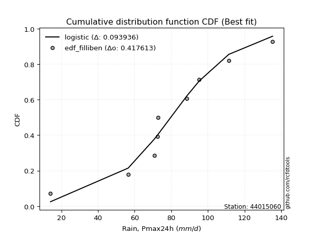</img>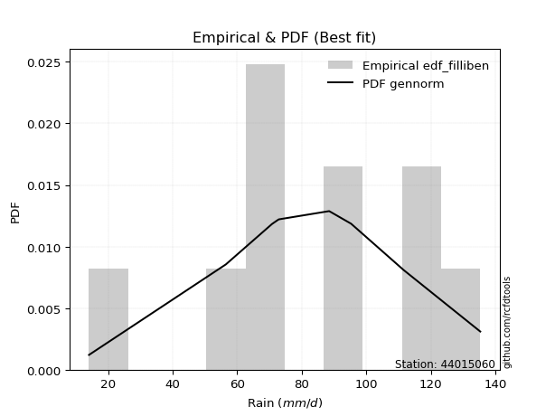</img>

</div>


### 10. EDF Jenkinson (1977)

The Jenkinson formula in hydrology is an empirical plotting position formula used to estimate the non-exceedance probability _(P)_ or return period _(T)_ of a given ordered observation within a sample. It is a widely used method in the frequency analysis of extreme events such as floods and rainfall, as it provides a distribution-free way to plot data. _a≈0.31_ and _b≈0.38_ are constants derived to approximate the median of the probability distribution for the given rank.

<div align="center">


$P=(m-a)/(n+b)$


</div>


**10.1. Empirical values**

<div align="center">

|                | 0                   | 1                   | 2                  | 3                   | 4                   | 5                  | 6                  | 7                  | 8                  | 9                  |
|:---------------|:--------------------|:--------------------|:-------------------|:--------------------|:--------------------|:-------------------|:-------------------|:-------------------|:-------------------|:-------------------|
| date           | 2016                | 2020                | 2022               | 2021                | 2018                | 2023               | 2017               | 2025               | 2024               | 2019               |
| x              | 14.1                | 56.5                | 70.8               | 72.4                | 72.9                | 88.5               | 95.3               | 111.2              | 111.4              | 135.3              |
| m              | 1                   | 2                   | 3                  | 4                   | 5                   | 6                  | 7                  | 8                  | 9                  | 10                 |
| empirical_dist | edf_jenkinson       | edf_jenkinson       | edf_jenkinson      | edf_jenkinson       | edf_jenkinson       | edf_jenkinson      | edf_jenkinson      | edf_jenkinson      | edf_jenkinson      | edf_jenkinson      |
| empirical      | 0.06647398843930635 | 0.16281310211946048 | 0.2591522157996146 | 0.35549132947976875 | 0.45183044315992293 | 0.5481695568400771 | 0.6445086705202312 | 0.7408477842003853 | 0.8371868978805393 | 0.9335260115606935 |
| empirical_tr   | 1.0712074303405574  | 1.1944764096662832  | 1.3498049414824447 | 1.5515695067264574  | 1.8242530755711774  | 2.213219616204691  | 2.813008130081301  | 3.8587360594795537 | 6.142011834319521  | 15.043478260869529 |

</div>


**10.2. Kolmogorov-Smirnov fit test (sorted by Δ)**


<div align="center">

|                | 0                   | 1                   | 2                   | 3                   | 4                   | 5                   | 6                   | 7                   | 8                   | 9                   | 10                  | 11                 | 12                  | 13                  | 14                  | 15                 | 16                  | 17                 | 18                  | 19                  | 20                  | 21                 | 22                  | 23                  | 24                 | 25                 | 26                  | 27                  | 28                  | 29                  | 30                  | 31                  | 32                  | 33                  | 34                  | 35                  | 36                  | 37                  | 38                 | 39                 | 40                  | 41                  | 42                  | 43                  | 44                  | 45                  | 46                 | 47                  | 48                  | 49                  | 50                  | 51                  | 52                  | 53                  | 54                  | 55                  | 56                 | 57                  | 58                  | 59                  | 60                  | 61                  | 62                  | 63                  | 64                  | 65                  | 66                  | 67                  | 68                  | 69                  | 70                 | 71                  | 72                  | 73                  | 74                 | 75                  | 76                 | 77                  | 78                  | 79                  | 80                  | 81                  | 82                 | 83                 | 84                 | 85                  | 86                  | 87                  | 88                  | 89                 | 90                 | 91                 | 92                  | 93                  | 94                 | 95                  | 96                  | 97                  | 98                  | 99                 | 100                 | 101                 | 102                 | 103                 | 104                 | 105                | 106                 | 107                 | 108                 | 109                 | 110                 | 111                 | 112                | 113                 | 114                | 115                 | 116                 | 117                 | 118                 | 119                 | 120                | 121                 | 122                 | 123                | 124                 | 125                 | 126                 | 127                 | 128                | 129                 | 130                | 131                | 132                 | 133                | 134                 | 135                 | 136                 | 137                | 138                 | 139                | 140                | 141                | 142                 | 143                | 144                 | 145                | 146                | 147                | 148                | 149                | 150                | 151                | 152                | 153                | 154                | 155                | 156                | 157                | 158                | 159                |
|:---------------|:--------------------|:--------------------|:--------------------|:--------------------|:--------------------|:--------------------|:--------------------|:--------------------|:--------------------|:--------------------|:--------------------|:-------------------|:--------------------|:--------------------|:--------------------|:-------------------|:--------------------|:-------------------|:--------------------|:--------------------|:--------------------|:-------------------|:--------------------|:--------------------|:-------------------|:-------------------|:--------------------|:--------------------|:--------------------|:--------------------|:--------------------|:--------------------|:--------------------|:--------------------|:--------------------|:--------------------|:--------------------|:--------------------|:-------------------|:-------------------|:--------------------|:--------------------|:--------------------|:--------------------|:--------------------|:--------------------|:-------------------|:--------------------|:--------------------|:--------------------|:--------------------|:--------------------|:--------------------|:--------------------|:--------------------|:--------------------|:-------------------|:--------------------|:--------------------|:--------------------|:--------------------|:--------------------|:--------------------|:--------------------|:--------------------|:--------------------|:--------------------|:--------------------|:--------------------|:--------------------|:-------------------|:--------------------|:--------------------|:--------------------|:-------------------|:--------------------|:-------------------|:--------------------|:--------------------|:--------------------|:--------------------|:--------------------|:-------------------|:-------------------|:-------------------|:--------------------|:--------------------|:--------------------|:--------------------|:-------------------|:-------------------|:-------------------|:--------------------|:--------------------|:-------------------|:--------------------|:--------------------|:--------------------|:--------------------|:-------------------|:--------------------|:--------------------|:--------------------|:--------------------|:--------------------|:-------------------|:--------------------|:--------------------|:--------------------|:--------------------|:--------------------|:--------------------|:-------------------|:--------------------|:-------------------|:--------------------|:--------------------|:--------------------|:--------------------|:--------------------|:-------------------|:--------------------|:--------------------|:-------------------|:--------------------|:--------------------|:--------------------|:--------------------|:-------------------|:--------------------|:-------------------|:-------------------|:--------------------|:-------------------|:--------------------|:--------------------|:--------------------|:-------------------|:--------------------|:-------------------|:-------------------|:-------------------|:--------------------|:-------------------|:--------------------|:-------------------|:-------------------|:-------------------|:-------------------|:-------------------|:-------------------|:-------------------|:-------------------|:-------------------|:-------------------|:-------------------|:-------------------|:-------------------|:-------------------|:-------------------|
| station        | 44015060            | 44015060            | 44015060            | 44015060            | 44015060            | 44015060            | 44015060            | 44015060            | 44015060            | 44015060            | 44015060            | 44015060           | 44015060            | 44015060            | 44015060            | 44015060           | 44015060            | 44015060           | 44015060            | 44015060            | 44015060            | 44015060           | 44015060            | 44015060            | 44015060           | 44015060           | 44015060            | 44015060            | 44015060            | 44015060            | 44015060            | 44015060            | 44015060            | 44015060            | 44015060            | 44015060            | 44015060            | 44015060            | 44015060           | 44015060           | 44015060            | 44015060            | 44015060            | 44015060            | 44015060            | 44015060            | 44015060           | 44015060            | 44015060            | 44015060            | 44015060            | 44015060            | 44015060            | 44015060            | 44015060            | 44015060            | 44015060           | 44015060            | 44015060            | 44015060            | 44015060            | 44015060            | 44015060            | 44015060            | 44015060            | 44015060            | 44015060            | 44015060            | 44015060            | 44015060            | 44015060           | 44015060            | 44015060            | 44015060            | 44015060           | 44015060            | 44015060           | 44015060            | 44015060            | 44015060            | 44015060            | 44015060            | 44015060           | 44015060           | 44015060           | 44015060            | 44015060            | 44015060            | 44015060            | 44015060           | 44015060           | 44015060           | 44015060            | 44015060            | 44015060           | 44015060            | 44015060            | 44015060            | 44015060            | 44015060           | 44015060            | 44015060            | 44015060            | 44015060            | 44015060            | 44015060           | 44015060            | 44015060            | 44015060            | 44015060            | 44015060            | 44015060            | 44015060           | 44015060            | 44015060           | 44015060            | 44015060            | 44015060            | 44015060            | 44015060            | 44015060           | 44015060            | 44015060            | 44015060           | 44015060            | 44015060            | 44015060            | 44015060            | 44015060           | 44015060            | 44015060           | 44015060           | 44015060            | 44015060           | 44015060            | 44015060            | 44015060            | 44015060           | 44015060            | 44015060           | 44015060           | 44015060           | 44015060            | 44015060           | 44015060            | 44015060           | 44015060           | 44015060           | 44015060           | 44015060           | 44015060           | 44015060           | 44015060           | 44015060           | 44015060           | 44015060           | 44015060           | 44015060           | 44015060           | 44015060           |
| empirical_dist | edf_jenkinson       | edf_jenkinson       | edf_jenkinson       | edf_jenkinson       | edf_jenkinson       | edf_jenkinson       | edf_jenkinson       | edf_jenkinson       | edf_jenkinson       | edf_jenkinson       | edf_jenkinson       | edf_jenkinson      | edf_jenkinson       | edf_jenkinson       | edf_jenkinson       | edf_jenkinson      | edf_jenkinson       | edf_jenkinson      | edf_jenkinson       | edf_jenkinson       | edf_jenkinson       | edf_jenkinson      | edf_jenkinson       | edf_jenkinson       | edf_jenkinson      | edf_jenkinson      | edf_jenkinson       | edf_jenkinson       | edf_jenkinson       | edf_jenkinson       | edf_jenkinson       | edf_jenkinson       | edf_jenkinson       | edf_jenkinson       | edf_jenkinson       | edf_jenkinson       | edf_jenkinson       | edf_jenkinson       | edf_jenkinson      | edf_jenkinson      | edf_jenkinson       | edf_jenkinson       | edf_jenkinson       | edf_jenkinson       | edf_jenkinson       | edf_jenkinson       | edf_jenkinson      | edf_jenkinson       | edf_jenkinson       | edf_jenkinson       | edf_jenkinson       | edf_jenkinson       | edf_jenkinson       | edf_jenkinson       | edf_jenkinson       | edf_jenkinson       | edf_jenkinson      | edf_jenkinson       | edf_jenkinson       | edf_jenkinson       | edf_jenkinson       | edf_jenkinson       | edf_jenkinson       | edf_jenkinson       | edf_jenkinson       | edf_jenkinson       | edf_jenkinson       | edf_jenkinson       | edf_jenkinson       | edf_jenkinson       | edf_jenkinson      | edf_jenkinson       | edf_jenkinson       | edf_jenkinson       | edf_jenkinson      | edf_jenkinson       | edf_jenkinson      | edf_jenkinson       | edf_jenkinson       | edf_jenkinson       | edf_jenkinson       | edf_jenkinson       | edf_jenkinson      | edf_jenkinson      | edf_jenkinson      | edf_jenkinson       | edf_jenkinson       | edf_jenkinson       | edf_jenkinson       | edf_jenkinson      | edf_jenkinson      | edf_jenkinson      | edf_jenkinson       | edf_jenkinson       | edf_jenkinson      | edf_jenkinson       | edf_jenkinson       | edf_jenkinson       | edf_jenkinson       | edf_jenkinson      | edf_jenkinson       | edf_jenkinson       | edf_jenkinson       | edf_jenkinson       | edf_jenkinson       | edf_jenkinson      | edf_jenkinson       | edf_jenkinson       | edf_jenkinson       | edf_jenkinson       | edf_jenkinson       | edf_jenkinson       | edf_jenkinson      | edf_jenkinson       | edf_jenkinson      | edf_jenkinson       | edf_jenkinson       | edf_jenkinson       | edf_jenkinson       | edf_jenkinson       | edf_jenkinson      | edf_jenkinson       | edf_jenkinson       | edf_jenkinson      | edf_jenkinson       | edf_jenkinson       | edf_jenkinson       | edf_jenkinson       | edf_jenkinson      | edf_jenkinson       | edf_jenkinson      | edf_jenkinson      | edf_jenkinson       | edf_jenkinson      | edf_jenkinson       | edf_jenkinson       | edf_jenkinson       | edf_jenkinson      | edf_jenkinson       | edf_jenkinson      | edf_jenkinson      | edf_jenkinson      | edf_jenkinson       | edf_jenkinson      | edf_jenkinson       | edf_jenkinson      | edf_jenkinson      | edf_jenkinson      | edf_jenkinson      | edf_jenkinson      | edf_jenkinson      | edf_jenkinson      | edf_jenkinson      | edf_jenkinson      | edf_jenkinson      | edf_jenkinson      | edf_jenkinson      | edf_jenkinson      | edf_jenkinson      | edf_jenkinson      |
| p_dist         | gennorm             | foldnorm            | logjohnsonsb        | logjohnsonsu        | gompertz            | exponpow            | logistic            | johnsonsb           | logdweibull         | gengamma            | logargus            | rice               | t                   | exponnorm           | norm                | crystalball        | nct                 | f                  | fatiguelife         | argus               | exponweib           | burr               | mielke              | truncnorm           | loggenlogistic     | pearson3           | logpearson3         | logloggamma         | weibull_min         | skewnorm            | genextreme          | hypsecant           | betaprime           | johnsonsu           | erlang              | truncweibull_min    | gamma               | dweibull            | genlogistic        | anglit             | logburr             | invgamma            | dgamma              | logburr12           | semicircular        | logmielke           | logvonmises_line   | loggompertz         | maxwell             | laplace             | loggengamma         | gumbel_l            | rayleigh            | cosine              | logloglaplace       | ncf                 | gumbel_r           | invgauss            | logdgamma           | loggumbel_l         | arcsine             | loggenextreme       | genhalflogistic     | genpareto           | invweibull          | moyal               | nakagami            | lognakagami         | gausshyper          | triang              | logtrapezoid       | halfnorm            | logtruncnorm        | halflogistic        | loggennorm         | kstwobign           | vonmises_line      | logskewnorm         | genexpon            | halfgennorm         | wald                | kappa3              | logt               | loglaplace         | loglaplace         | uniform             | wrapcauchy          | ksone               | logncf              | loghypsecant       | logfoldnorm        | loglogistic        | logfatiguelife      | logf                | logexponnorm       | logcrystalball      | lognorm             | logrice             | lognct              | beta               | loganglit           | logsemicircular     | logbetaprime        | loginvweibull       | logerlang           | kappa4             | logalpha            | loggamma            | loggamma            | loginvgamma         | logarcsine          | loglevy_l           | loginvgauss        | logmaxwell          | lograyleigh        | trapezoid           | loggenhalflogistic  | loggumbel_r         | loggausshyper       | levy_l              | bradford           | logtriang           | logkstwobign        | loghalfnorm        | logkappa4           | loggenpareto        | logweibull_max      | logcosine           | logmoyal           | alpha               | lomax              | loghalflogistic    | loggenexpon         | truncexpon         | logwrapcauchy       | logtruncweibull_min | logwald             | loglomax           | burr12              | logrdist           | logbeta            | logksone           | logtukeylambda      | logkappa3          | loguniform          | logbradford        | logexponweib       | logweibull_min     | logtruncexpon      | logexponpow        | powerlaw           | rdist              | logpowerlaw        | weibull_max        | tukeylambda        | truncpareto        | logtruncpareto     | loghalfgennorm     | logvonmises        | vonmises           |
| delta          | 0.08449210426479065 | 0.08552253576098928 | 0.08663374560608572 | 0.08814876117462278 | 0.08871245636383279 | 0.08899112598163583 | 0.09122383365755105 | 0.09283846574656124 | 0.09296916931943627 | 0.09421052295335602 | 0.09465607982802399 | 0.0947945028958227 | 0.09481417324026359 | 0.09482811446112116 | 0.09483106660625917 | 0.0948310686392414 | 0.09495340602893321 | 0.0953546454593665 | 0.09586873473738039 | 0.09630889562353534 | 0.09733409099790985 | 0.0977033455251603 | 0.09780609179962219 | 0.09811713531331478 | 0.098946447045198  | 0.0995834105525053 | 0.10089149799056463 | 0.10107237034772437 | 0.10249926546136257 | 0.10255523998478933 | 0.10259299348970996 | 0.10314544147136262 | 0.10484485348576889 | 0.10569351367410917 | 0.10714387824955862 | 0.10832363265794898 | 0.10839539343837817 | 0.10942237667629778 | 0.1140761218638856 | 0.1141958884297134 | 0.11604448159714731 | 0.11643079822591351 | 0.11768558945334084 | 0.12017440824363401 | 0.12231392793800405 | 0.12281247744313206 | 0.123477712005713  | 0.12601964402942267 | 0.12700236579453306 | 0.12895780006809088 | 0.13104127460347986 | 0.13731659049220213 | 0.13911335043878598 | 0.13973949304425942 | 0.14168594727555733 | 0.14357935908486213 | 0.144279089848936  | 0.14836409410251977 | 0.14939703054061604 | 0.15126868204945648 | 0.15551734711843396 | 0.15665420582687095 | 0.15812914407709022 | 0.16008388227119974 | 0.16237242153566978 | 0.16269148919416648 | 0.16281310211873654 | 0.16281310211945035 | 0.16407659104849126 | 0.16978016141773972 | 0.1705219534572367 | 0.17357910574846253 | 0.17511639287609576 | 0.18233793796117498 | 0.1852258781852083 | 0.19286915113492736 | 0.193174478408762  | 0.19382422223066492 | 0.20413897923499064 | 0.20521373282123356 | 0.20593498007146938 | 0.20715070672514618 | 0.2083603658615591 | 0.2084323720019456 | 0.2084323720019456 | 0.20866956637860312 | 0.20927239911799256 | 0.21403260268223345 | 0.21490734157162028 | 0.2171717291746939 | 0.2182917338325558 | 0.2193693772649496 | 0.22078026135428874 | 0.22141119232716971 | 0.221944278949341  | 0.22194661513884906 | 0.22194665930570256 | 0.22195183375444655 | 0.22243233214909358 | 0.2235976399650776 | 0.22465050232017825 | 0.22576366482068494 | 0.22806501911709964 | 0.23454033672313485 | 0.23546803776446784 | 0.2355551221536174 | 0.23654598260591553 | 0.23770188551515464 | 0.23770188551515464 | 0.23993684385045327 | 0.24058334600040632 | 0.24139908177126995 | 0.2494525760545901 | 0.25564937175309915 | 0.2670444519172053 | 0.27117483222127814 | 0.27239042118813156 | 0.29150218706362113 | 0.29237793989766425 | 0.29460737355120187 | 0.2949803675143334 | 0.29668984726558695 | 0.29815418058166576 | 0.2991419564903885 | 0.29934569974581554 | 0.30208239804884557 | 0.31083468184844343 | 0.31671508502272333 | 0.3173649823776467 | 0.31807193844763904 | 0.3184678681745588 | 0.3228092270761321 | 0.32537912971613153 | 0.3489735919721884 | 0.37663175910183805 | 0.3822546846254779  | 0.38934791699816335 | 0.3895492829810943 | 0.40690786725680467 | 0.4145155157192348 | 0.4247964136108302 | 0.4320452113578532 | 0.44659473734224725 | 0.4527119233584341 | 0.45445063139913827 | 0.4572786990050603 | 0.4624147318790424 | 0.5189965054854817 | 0.5293903054539271 | 0.6182315699054473 | 0.6220504971164724 | 0.6646120453524647 | 0.7172292624509886 | 0.7198469706549487 | 0.7253836392158866 | 0.7812810828262482 | 0.8108249378138344 | 0.8371868978805393 | 1.1702712190312203 | 20.689274439391703 |
| deltao         | 0.3942745923300002  | 0.3942745923300002  | 0.3942745923300002  | 0.3942745923300002  | 0.3942745923300002  | 0.3942745923300002  | 0.3942745923300002  | 0.3942745923300002  | 0.3942745923300002  | 0.3942745923300002  | 0.3942745923300002  | 0.3942745923300002 | 0.3942745923300002  | 0.3942745923300002  | 0.3942745923300002  | 0.3942745923300002 | 0.3942745923300002  | 0.3942745923300002 | 0.3942745923300002  | 0.3942745923300002  | 0.3942745923300002  | 0.3942745923300002 | 0.3942745923300002  | 0.3942745923300002  | 0.3942745923300002 | 0.3942745923300002 | 0.3942745923300002  | 0.3942745923300002  | 0.3942745923300002  | 0.3942745923300002  | 0.3942745923300002  | 0.3942745923300002  | 0.3942745923300002  | 0.3942745923300002  | 0.3942745923300002  | 0.3942745923300002  | 0.3942745923300002  | 0.3942745923300002  | 0.3942745923300002 | 0.3942745923300002 | 0.3942745923300002  | 0.3942745923300002  | 0.3942745923300002  | 0.3942745923300002  | 0.3942745923300002  | 0.3942745923300002  | 0.3942745923300002 | 0.3942745923300002  | 0.3942745923300002  | 0.3942745923300002  | 0.3942745923300002  | 0.3942745923300002  | 0.3942745923300002  | 0.3942745923300002  | 0.3942745923300002  | 0.3942745923300002  | 0.3942745923300002 | 0.3942745923300002  | 0.3942745923300002  | 0.3942745923300002  | 0.3942745923300002  | 0.3942745923300002  | 0.3942745923300002  | 0.3942745923300002  | 0.3942745923300002  | 0.3942745923300002  | 0.3942745923300002  | 0.3942745923300002  | 0.3942745923300002  | 0.3942745923300002  | 0.3942745923300002 | 0.3942745923300002  | 0.3942745923300002  | 0.3942745923300002  | 0.3942745923300002 | 0.3942745923300002  | 0.3942745923300002 | 0.3942745923300002  | 0.3942745923300002  | 0.3942745923300002  | 0.3942745923300002  | 0.3942745923300002  | 0.3942745923300002 | 0.3942745923300002 | 0.3942745923300002 | 0.3942745923300002  | 0.3942745923300002  | 0.3942745923300002  | 0.3942745923300002  | 0.3942745923300002 | 0.3942745923300002 | 0.3942745923300002 | 0.3942745923300002  | 0.3942745923300002  | 0.3942745923300002 | 0.3942745923300002  | 0.3942745923300002  | 0.3942745923300002  | 0.3942745923300002  | 0.3942745923300002 | 0.3942745923300002  | 0.3942745923300002  | 0.3942745923300002  | 0.3942745923300002  | 0.3942745923300002  | 0.3942745923300002 | 0.3942745923300002  | 0.3942745923300002  | 0.3942745923300002  | 0.3942745923300002  | 0.3942745923300002  | 0.3942745923300002  | 0.3942745923300002 | 0.3942745923300002  | 0.3942745923300002 | 0.3942745923300002  | 0.3942745923300002  | 0.3942745923300002  | 0.3942745923300002  | 0.3942745923300002  | 0.3942745923300002 | 0.3942745923300002  | 0.3942745923300002  | 0.3942745923300002 | 0.3942745923300002  | 0.3942745923300002  | 0.3942745923300002  | 0.3942745923300002  | 0.3942745923300002 | 0.3942745923300002  | 0.3942745923300002 | 0.3942745923300002 | 0.3942745923300002  | 0.3942745923300002 | 0.3942745923300002  | 0.3942745923300002  | 0.3942745923300002  | 0.3942745923300002 | 0.3942745923300002  | 0.3942745923300002 | 0.3942745923300002 | 0.3942745923300002 | 0.3942745923300002  | 0.3942745923300002 | 0.3942745923300002  | 0.3942745923300002 | 0.3942745923300002 | 0.3942745923300002 | 0.3942745923300002 | 0.3942745923300002 | 0.3942745923300002 | 0.3942745923300002 | 0.3942745923300002 | 0.3942745923300002 | 0.3942745923300002 | 0.3942745923300002 | 0.3942745923300002 | 0.3942745923300002 | 0.3942745923300002 | 0.3942745923300002 |
| eval           | Δo > Δ              | Δo > Δ              | Δo > Δ              | Δo > Δ              | Δo > Δ              | Δo > Δ              | Δo > Δ              | Δo > Δ              | Δo > Δ              | Δo > Δ              | Δo > Δ              | Δo > Δ             | Δo > Δ              | Δo > Δ              | Δo > Δ              | Δo > Δ             | Δo > Δ              | Δo > Δ             | Δo > Δ              | Δo > Δ              | Δo > Δ              | Δo > Δ             | Δo > Δ              | Δo > Δ              | Δo > Δ             | Δo > Δ             | Δo > Δ              | Δo > Δ              | Δo > Δ              | Δo > Δ              | Δo > Δ              | Δo > Δ              | Δo > Δ              | Δo > Δ              | Δo > Δ              | Δo > Δ              | Δo > Δ              | Δo > Δ              | Δo > Δ             | Δo > Δ             | Δo > Δ              | Δo > Δ              | Δo > Δ              | Δo > Δ              | Δo > Δ              | Δo > Δ              | Δo > Δ             | Δo > Δ              | Δo > Δ              | Δo > Δ              | Δo > Δ              | Δo > Δ              | Δo > Δ              | Δo > Δ              | Δo > Δ              | Δo > Δ              | Δo > Δ             | Δo > Δ              | Δo > Δ              | Δo > Δ              | Δo > Δ              | Δo > Δ              | Δo > Δ              | Δo > Δ              | Δo > Δ              | Δo > Δ              | Δo > Δ              | Δo > Δ              | Δo > Δ              | Δo > Δ              | Δo > Δ             | Δo > Δ              | Δo > Δ              | Δo > Δ              | Δo > Δ             | Δo > Δ              | Δo > Δ             | Δo > Δ              | Δo > Δ              | Δo > Δ              | Δo > Δ              | Δo > Δ              | Δo > Δ             | Δo > Δ             | Δo > Δ             | Δo > Δ              | Δo > Δ              | Δo > Δ              | Δo > Δ              | Δo > Δ             | Δo > Δ             | Δo > Δ             | Δo > Δ              | Δo > Δ              | Δo > Δ             | Δo > Δ              | Δo > Δ              | Δo > Δ              | Δo > Δ              | Δo > Δ             | Δo > Δ              | Δo > Δ              | Δo > Δ              | Δo > Δ              | Δo > Δ              | Δo > Δ             | Δo > Δ              | Δo > Δ              | Δo > Δ              | Δo > Δ              | Δo > Δ              | Δo > Δ              | Δo > Δ             | Δo > Δ              | Δo > Δ             | Δo > Δ              | Δo > Δ              | Δo > Δ              | Δo > Δ              | Δo > Δ              | Δo > Δ             | Δo > Δ              | Δo > Δ              | Δo > Δ             | Δo > Δ              | Δo > Δ              | Δo > Δ              | Δo > Δ              | Δo > Δ             | Δo > Δ              | Δo > Δ             | Δo > Δ             | Δo > Δ              | Δo > Δ             | Δo > Δ              | Δo > Δ              | Δo > Δ              | Δo > Δ             | Δo <= Δ             | Δo <= Δ            | Δo <= Δ            | Δo <= Δ            | Δo <= Δ             | Δo <= Δ            | Δo <= Δ             | Δo <= Δ            | Δo <= Δ            | Δo <= Δ            | Δo <= Δ            | Δo <= Δ            | Δo <= Δ            | Δo <= Δ            | Δo <= Δ            | Δo <= Δ            | Δo <= Δ            | Δo <= Δ            | Δo <= Δ            | Δo <= Δ            | Δo <= Δ            | Δo <= Δ            |
| fit            | 1                   | 1                   | 1                   | 1                   | 1                   | 1                   | 1                   | 1                   | 1                   | 1                   | 1                   | 1                  | 1                   | 1                   | 1                   | 1                  | 1                   | 1                  | 1                   | 1                   | 1                   | 1                  | 1                   | 1                   | 1                  | 1                  | 1                   | 1                   | 1                   | 1                   | 1                   | 1                   | 1                   | 1                   | 1                   | 1                   | 1                   | 1                   | 1                  | 1                  | 1                   | 1                   | 1                   | 1                   | 1                   | 1                   | 1                  | 1                   | 1                   | 1                   | 1                   | 1                   | 1                   | 1                   | 1                   | 1                   | 1                  | 1                   | 1                   | 1                   | 1                   | 1                   | 1                   | 1                   | 1                   | 1                   | 1                   | 1                   | 1                   | 1                   | 1                  | 1                   | 1                   | 1                   | 1                  | 1                   | 1                  | 1                   | 1                   | 1                   | 1                   | 1                   | 1                  | 1                  | 1                  | 1                   | 1                   | 1                   | 1                   | 1                  | 1                  | 1                  | 1                   | 1                   | 1                  | 1                   | 1                   | 1                   | 1                   | 1                  | 1                   | 1                   | 1                   | 1                   | 1                   | 1                  | 1                   | 1                   | 1                   | 1                   | 1                   | 1                   | 1                  | 1                   | 1                  | 1                   | 1                   | 1                   | 1                   | 1                   | 1                  | 1                   | 1                   | 1                  | 1                   | 1                   | 1                   | 1                   | 1                  | 1                   | 1                  | 1                  | 1                   | 1                  | 1                   | 1                   | 1                   | 1                  | 0                   | 0                  | 0                  | 0                  | 0                   | 0                  | 0                   | 0                  | 0                  | 0                  | 0                  | 0                  | 0                  | 0                  | 0                  | 0                  | 0                  | 0                  | 0                  | 0                  | 0                  | 0                  |
| n              | 10                  | 10                  | 10                  | 10                  | 10                  | 10                  | 10                  | 10                  | 10                  | 10                  | 10                  | 10                 | 10                  | 10                  | 10                  | 10                 | 10                  | 10                 | 10                  | 10                  | 10                  | 10                 | 10                  | 10                  | 10                 | 10                 | 10                  | 10                  | 10                  | 10                  | 10                  | 10                  | 10                  | 10                  | 10                  | 10                  | 10                  | 10                  | 10                 | 10                 | 10                  | 10                  | 10                  | 10                  | 10                  | 10                  | 10                 | 10                  | 10                  | 10                  | 10                  | 10                  | 10                  | 10                  | 10                  | 10                  | 10                 | 10                  | 10                  | 10                  | 10                  | 10                  | 10                  | 10                  | 10                  | 10                  | 10                  | 10                  | 10                  | 10                  | 10                 | 10                  | 10                  | 10                  | 10                 | 10                  | 10                 | 10                  | 10                  | 10                  | 10                  | 10                  | 10                 | 10                 | 10                 | 10                  | 10                  | 10                  | 10                  | 10                 | 10                 | 10                 | 10                  | 10                  | 10                 | 10                  | 10                  | 10                  | 10                  | 10                 | 10                  | 10                  | 10                  | 10                  | 10                  | 10                 | 10                  | 10                  | 10                  | 10                  | 10                  | 10                  | 10                 | 10                  | 10                 | 10                  | 10                  | 10                  | 10                  | 10                  | 10                 | 10                  | 10                  | 10                 | 10                  | 10                  | 10                  | 10                  | 10                 | 10                  | 10                 | 10                 | 10                  | 10                 | 10                  | 10                  | 10                  | 10                 | 10                  | 10                 | 10                 | 10                 | 10                  | 10                 | 10                  | 10                 | 10                 | 10                 | 10                 | 10                 | 10                 | 10                 | 10                 | 10                 | 10                 | 10                 | 10                 | 10                 | 10                 | 10                 |
| best_fit       | 1                   | 0                   | 0                   | 0                   | 0                   | 0                   | 0                   | 0                   | 0                   | 0                   | 0                   | 0                  | 0                   | 0                   | 0                   | 0                  | 0                   | 0                  | 0                   | 0                   | 0                   | 0                  | 0                   | 0                   | 0                  | 0                  | 0                   | 0                   | 0                   | 0                   | 0                   | 0                   | 0                   | 0                   | 0                   | 0                   | 0                   | 0                   | 0                  | 0                  | 0                   | 0                   | 0                   | 0                   | 0                   | 0                   | 0                  | 0                   | 0                   | 0                   | 0                   | 0                   | 0                   | 0                   | 0                   | 0                   | 0                  | 0                   | 0                   | 0                   | 0                   | 0                   | 0                   | 0                   | 0                   | 0                   | 0                   | 0                   | 0                   | 0                   | 0                  | 0                   | 0                   | 0                   | 0                  | 0                   | 0                  | 0                   | 0                   | 0                   | 0                   | 0                   | 0                  | 0                  | 0                  | 0                   | 0                   | 0                   | 0                   | 0                  | 0                  | 0                  | 0                   | 0                   | 0                  | 0                   | 0                   | 0                   | 0                   | 0                  | 0                   | 0                   | 0                   | 0                   | 0                   | 0                  | 0                   | 0                   | 0                   | 0                   | 0                   | 0                   | 0                  | 0                   | 0                  | 0                   | 0                   | 0                   | 0                   | 0                   | 0                  | 0                   | 0                   | 0                  | 0                   | 0                   | 0                   | 0                   | 0                  | 0                   | 0                  | 0                  | 0                   | 0                  | 0                   | 0                   | 0                   | 0                  | 0                   | 0                  | 0                  | 0                  | 0                   | 0                  | 0                   | 0                  | 0                  | 0                  | 0                  | 0                  | 0                  | 0                  | 0                  | 0                  | 0                  | 0                  | 0                  | 0                  | 0                  | 0                  |
| best_fit_sort  | 1                   | 2                   | 3                   | 4                   | 5                   | 6                   | 7                   | 8                   | 9                   | 10                  | 11                  | 12                 | 13                  | 14                  | 15                  | 16                 | 17                  | 18                 | 19                  | 20                  | 21                  | 22                 | 23                  | 24                  | 25                 | 26                 | 27                  | 28                  | 29                  | 30                  | 31                  | 32                  | 33                  | 34                  | 35                  | 36                  | 37                  | 38                  | 39                 | 40                 | 41                  | 42                  | 43                  | 44                  | 45                  | 46                  | 47                 | 48                  | 49                  | 50                  | 51                  | 52                  | 53                  | 54                  | 55                  | 56                  | 57                 | 58                  | 59                  | 60                  | 61                  | 62                  | 63                  | 64                  | 65                  | 66                  | 67                  | 68                  | 69                  | 70                  | 71                 | 72                  | 73                  | 74                  | 75                 | 76                  | 77                 | 78                  | 79                  | 80                  | 81                  | 82                  | 83                 | 84                 | 85                 | 86                  | 87                  | 88                  | 89                  | 90                 | 91                 | 92                 | 93                  | 94                  | 95                 | 96                  | 97                  | 98                  | 99                  | 100                | 101                 | 102                 | 103                 | 104                 | 105                 | 106                | 107                 | 108                 | 109                 | 110                 | 111                 | 112                 | 113                | 114                 | 115                | 116                 | 117                 | 118                 | 119                 | 120                 | 121                | 122                 | 123                 | 124                | 125                 | 126                 | 127                 | 128                 | 129                | 130                 | 131                | 132                | 133                 | 134                | 135                 | 136                 | 137                 | 138                | 139                 | 140                | 141                | 142                | 143                 | 144                | 145                 | 146                | 147                | 148                | 149                | 150                | 151                | 152                | 153                | 154                | 155                | 156                | 157                | 158                | 159                | 160                |

</div>


**10.3. Best fit**

<div align="center">

|   id |   station | empirical_dist   | p_dist   |     delta |   deltao | eval   |   fit |   n |   best_fit |   best_fit_sort |
|-----:|----------:|:-----------------|:---------|----------:|---------:|:-------|------:|----:|-----------:|----------------:|
|    0 |  44015060 | edf_jenkinson    | gennorm  | 0.0844921 | 0.394275 | Δo > Δ |     1 |  10 |          1 |               1 |

</div>


<div align="center">

</img>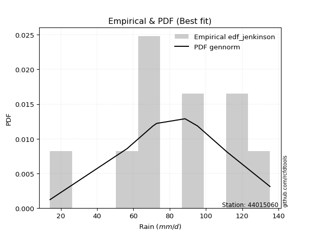</img>

</div>


### 11. EDF Cunnane (1978)

Cunnane´s work in statistical hydrology has focused on the performance and evaluation of different probability distributions (such as GEV, Gumbel, Lognormal) for flood frequency estimation. _b_ is a constant, typically set to 0.4.

<div align="center">


$P=(m-b)/(n+1-2b)$


</div>


**11.1. Empirical values**

<div align="center">

|                | 0                    | 1                   | 2                   | 3                   | 4                   | 5                  | 6                  | 7                  | 8                  | 9                  |
|:---------------|:---------------------|:--------------------|:--------------------|:--------------------|:--------------------|:-------------------|:-------------------|:-------------------|:-------------------|:-------------------|
| date           | 2016                 | 2020                | 2022                | 2021                | 2018                | 2023               | 2017               | 2025               | 2024               | 2019               |
| x              | 14.1                 | 56.5                | 70.8                | 72.4                | 72.9                | 88.5               | 95.3               | 111.2              | 111.4              | 135.3              |
| m              | 1                    | 2                   | 3                   | 4                   | 5                   | 6                  | 7                  | 8                  | 9                  | 10                 |
| empirical_dist | edf_cunnane          | edf_cunnane         | edf_cunnane         | edf_cunnane         | edf_cunnane         | edf_cunnane        | edf_cunnane        | edf_cunnane        | edf_cunnane        | edf_cunnane        |
| empirical      | 0.058823529411764705 | 0.15686274509803924 | 0.25490196078431376 | 0.35294117647058826 | 0.45098039215686275 | 0.5490196078431373 | 0.6470588235294118 | 0.7450980392156863 | 0.8431372549019608 | 0.9411764705882353 |
| empirical_tr   | 1.0625               | 1.1860465116279069  | 1.3421052631578947  | 1.5454545454545456  | 1.8214285714285712  | 2.217391304347826  | 2.8333333333333335 | 3.9230769230769234 | 6.375              | 16.999999999999996 |

</div>


**11.2. Kolmogorov-Smirnov fit test (sorted by Δ)**


<div align="center">

|                | 0                   | 1                   | 2                   | 3                  | 4                   | 5                   | 6                   | 7                   | 8                   | 9                   | 10                  | 11                  | 12                  | 13                  | 14                  | 15                  | 16                  | 17                  | 18                  | 19                  | 20                  | 21                  | 22                  | 23                 | 24                  | 25                  | 26                  | 27                  | 28                  | 29                  | 30                  | 31                  | 32                  | 33                  | 34                  | 35                  | 36                  | 37                  | 38                  | 39                  | 40                  | 41                 | 42                  | 43                  | 44                 | 45                 | 46                 | 47                  | 48                  | 49                 | 50                  | 51                  | 52                  | 53                  | 54                  | 55                 | 56                  | 57                  | 58                  | 59                  | 60                 | 61                 | 62                 | 63                 | 64                  | 65                  | 66                  | 67                  | 68                 | 69                  | 70                  | 71                  | 72                 | 73                  | 74                  | 75                  | 76                  | 77                  | 78                 | 79                  | 80                  | 81                  | 82                  | 83                  | 84                  | 85                  | 86                 | 87                 | 88                  | 89                  | 90                  | 91                  | 92                 | 93                  | 94                  | 95                 | 96                  | 97                 | 98                  | 99                  | 100                | 101                | 102                | 103                | 104                 | 105                 | 106                 | 107                | 108                | 109                 | 110                 | 111                | 112                 | 113                | 114                | 115                | 116                | 117                | 118                 | 119                | 120                | 121                | 122                 | 123                | 124                | 125                 | 126                 | 127                | 128                 | 129                 | 130                 | 131                 | 132                | 133                 | 134                | 135                 | 136                | 137                | 138                 | 139                 | 140                 | 141                 | 142                | 143                 | 144                | 145                 | 146                | 147                | 148                | 149                | 150                | 151                | 152                | 153                | 154                | 155                | 156                | 157                | 158                | 159                |
|:---------------|:--------------------|:--------------------|:--------------------|:-------------------|:--------------------|:--------------------|:--------------------|:--------------------|:--------------------|:--------------------|:--------------------|:--------------------|:--------------------|:--------------------|:--------------------|:--------------------|:--------------------|:--------------------|:--------------------|:--------------------|:--------------------|:--------------------|:--------------------|:-------------------|:--------------------|:--------------------|:--------------------|:--------------------|:--------------------|:--------------------|:--------------------|:--------------------|:--------------------|:--------------------|:--------------------|:--------------------|:--------------------|:--------------------|:--------------------|:--------------------|:--------------------|:-------------------|:--------------------|:--------------------|:-------------------|:-------------------|:-------------------|:--------------------|:--------------------|:-------------------|:--------------------|:--------------------|:--------------------|:--------------------|:--------------------|:-------------------|:--------------------|:--------------------|:--------------------|:--------------------|:-------------------|:-------------------|:-------------------|:-------------------|:--------------------|:--------------------|:--------------------|:--------------------|:-------------------|:--------------------|:--------------------|:--------------------|:-------------------|:--------------------|:--------------------|:--------------------|:--------------------|:--------------------|:-------------------|:--------------------|:--------------------|:--------------------|:--------------------|:--------------------|:--------------------|:--------------------|:-------------------|:-------------------|:--------------------|:--------------------|:--------------------|:--------------------|:-------------------|:--------------------|:--------------------|:-------------------|:--------------------|:-------------------|:--------------------|:--------------------|:-------------------|:-------------------|:-------------------|:-------------------|:--------------------|:--------------------|:--------------------|:-------------------|:-------------------|:--------------------|:--------------------|:-------------------|:--------------------|:-------------------|:-------------------|:-------------------|:-------------------|:-------------------|:--------------------|:-------------------|:-------------------|:-------------------|:--------------------|:-------------------|:-------------------|:--------------------|:--------------------|:-------------------|:--------------------|:--------------------|:--------------------|:--------------------|:-------------------|:--------------------|:-------------------|:--------------------|:-------------------|:-------------------|:--------------------|:--------------------|:--------------------|:--------------------|:-------------------|:--------------------|:-------------------|:--------------------|:-------------------|:-------------------|:-------------------|:-------------------|:-------------------|:-------------------|:-------------------|:-------------------|:-------------------|:-------------------|:-------------------|:-------------------|:-------------------|:-------------------|
| station        | 44015060            | 44015060            | 44015060            | 44015060           | 44015060            | 44015060            | 44015060            | 44015060            | 44015060            | 44015060            | 44015060            | 44015060            | 44015060            | 44015060            | 44015060            | 44015060            | 44015060            | 44015060            | 44015060            | 44015060            | 44015060            | 44015060            | 44015060            | 44015060           | 44015060            | 44015060            | 44015060            | 44015060            | 44015060            | 44015060            | 44015060            | 44015060            | 44015060            | 44015060            | 44015060            | 44015060            | 44015060            | 44015060            | 44015060            | 44015060            | 44015060            | 44015060           | 44015060            | 44015060            | 44015060           | 44015060           | 44015060           | 44015060            | 44015060            | 44015060           | 44015060            | 44015060            | 44015060            | 44015060            | 44015060            | 44015060           | 44015060            | 44015060            | 44015060            | 44015060            | 44015060           | 44015060           | 44015060           | 44015060           | 44015060            | 44015060            | 44015060            | 44015060            | 44015060           | 44015060            | 44015060            | 44015060            | 44015060           | 44015060            | 44015060            | 44015060            | 44015060            | 44015060            | 44015060           | 44015060            | 44015060            | 44015060            | 44015060            | 44015060            | 44015060            | 44015060            | 44015060           | 44015060           | 44015060            | 44015060            | 44015060            | 44015060            | 44015060           | 44015060            | 44015060            | 44015060           | 44015060            | 44015060           | 44015060            | 44015060            | 44015060           | 44015060           | 44015060           | 44015060           | 44015060            | 44015060            | 44015060            | 44015060           | 44015060           | 44015060            | 44015060            | 44015060           | 44015060            | 44015060           | 44015060           | 44015060           | 44015060           | 44015060           | 44015060            | 44015060           | 44015060           | 44015060           | 44015060            | 44015060           | 44015060           | 44015060            | 44015060            | 44015060           | 44015060            | 44015060            | 44015060            | 44015060            | 44015060           | 44015060            | 44015060           | 44015060            | 44015060           | 44015060           | 44015060            | 44015060            | 44015060            | 44015060            | 44015060           | 44015060            | 44015060           | 44015060            | 44015060           | 44015060           | 44015060           | 44015060           | 44015060           | 44015060           | 44015060           | 44015060           | 44015060           | 44015060           | 44015060           | 44015060           | 44015060           | 44015060           |
| empirical_dist | edf_cunnane         | edf_cunnane         | edf_cunnane         | edf_cunnane        | edf_cunnane         | edf_cunnane         | edf_cunnane         | edf_cunnane         | edf_cunnane         | edf_cunnane         | edf_cunnane         | edf_cunnane         | edf_cunnane         | edf_cunnane         | edf_cunnane         | edf_cunnane         | edf_cunnane         | edf_cunnane         | edf_cunnane         | edf_cunnane         | edf_cunnane         | edf_cunnane         | edf_cunnane         | edf_cunnane        | edf_cunnane         | edf_cunnane         | edf_cunnane         | edf_cunnane         | edf_cunnane         | edf_cunnane         | edf_cunnane         | edf_cunnane         | edf_cunnane         | edf_cunnane         | edf_cunnane         | edf_cunnane         | edf_cunnane         | edf_cunnane         | edf_cunnane         | edf_cunnane         | edf_cunnane         | edf_cunnane        | edf_cunnane         | edf_cunnane         | edf_cunnane        | edf_cunnane        | edf_cunnane        | edf_cunnane         | edf_cunnane         | edf_cunnane        | edf_cunnane         | edf_cunnane         | edf_cunnane         | edf_cunnane         | edf_cunnane         | edf_cunnane        | edf_cunnane         | edf_cunnane         | edf_cunnane         | edf_cunnane         | edf_cunnane        | edf_cunnane        | edf_cunnane        | edf_cunnane        | edf_cunnane         | edf_cunnane         | edf_cunnane         | edf_cunnane         | edf_cunnane        | edf_cunnane         | edf_cunnane         | edf_cunnane         | edf_cunnane        | edf_cunnane         | edf_cunnane         | edf_cunnane         | edf_cunnane         | edf_cunnane         | edf_cunnane        | edf_cunnane         | edf_cunnane         | edf_cunnane         | edf_cunnane         | edf_cunnane         | edf_cunnane         | edf_cunnane         | edf_cunnane        | edf_cunnane        | edf_cunnane         | edf_cunnane         | edf_cunnane         | edf_cunnane         | edf_cunnane        | edf_cunnane         | edf_cunnane         | edf_cunnane        | edf_cunnane         | edf_cunnane        | edf_cunnane         | edf_cunnane         | edf_cunnane        | edf_cunnane        | edf_cunnane        | edf_cunnane        | edf_cunnane         | edf_cunnane         | edf_cunnane         | edf_cunnane        | edf_cunnane        | edf_cunnane         | edf_cunnane         | edf_cunnane        | edf_cunnane         | edf_cunnane        | edf_cunnane        | edf_cunnane        | edf_cunnane        | edf_cunnane        | edf_cunnane         | edf_cunnane        | edf_cunnane        | edf_cunnane        | edf_cunnane         | edf_cunnane        | edf_cunnane        | edf_cunnane         | edf_cunnane         | edf_cunnane        | edf_cunnane         | edf_cunnane         | edf_cunnane         | edf_cunnane         | edf_cunnane        | edf_cunnane         | edf_cunnane        | edf_cunnane         | edf_cunnane        | edf_cunnane        | edf_cunnane         | edf_cunnane         | edf_cunnane         | edf_cunnane         | edf_cunnane        | edf_cunnane         | edf_cunnane        | edf_cunnane         | edf_cunnane        | edf_cunnane        | edf_cunnane        | edf_cunnane        | edf_cunnane        | edf_cunnane        | edf_cunnane        | edf_cunnane        | edf_cunnane        | edf_cunnane        | edf_cunnane        | edf_cunnane        | edf_cunnane        | edf_cunnane        |
| p_dist         | logistic            | gompertz            | exponpow            | gennorm            | logjohnsonsu        | foldnorm            | logjohnsonsb        | truncnorm           | johnsonsb           | logdweibull         | gengamma            | pearson3            | logargus            | rice                | t                   | exponnorm           | norm                | crystalball         | nct                 | f                   | hypsecant           | fatiguelife         | argus               | exponweib          | weibull_min         | skewnorm            | genextreme          | burr                | mielke              | loggenlogistic      | johnsonsu           | logpearson3         | logloggamma         | betaprime           | erlang              | truncweibull_min    | gamma               | genlogistic         | dweibull            | anglit              | invgamma            | dgamma             | logburr             | logburr12           | semicircular       | laplace            | logmielke          | logvonmises_line    | loggompertz         | maxwell            | loggengamma         | gumbel_l            | logloglaplace       | rayleigh            | cosine              | ncf                | gumbel_r            | logdgamma           | invgauss            | loggumbel_l         | nakagami           | lognakagami        | arcsine            | loggenextreme      | genhalflogistic     | genpareto           | invweibull          | moyal               | gausshyper         | triang              | logtrapezoid        | halfnorm            | logtruncnorm       | loggennorm          | halflogistic        | kstwobign           | vonmises_line       | logskewnorm         | genexpon           | halfgennorm         | wald                | kappa3              | logt                | loglaplace          | loglaplace          | uniform             | wrapcauchy         | ksone              | logncf              | loghypsecant        | logfoldnorm         | loglogistic         | logfatiguelife     | logf                | logexponnorm        | logcrystalball     | lognorm             | logrice            | lognct              | beta                | loganglit          | logsemicircular    | logbetaprime       | logerlang          | kappa4              | loginvweibull       | logalpha            | loggamma           | loggamma           | loginvgamma         | logarcsine          | loglevy_l          | loginvgauss         | logmaxwell         | lograyleigh        | loggenhalflogistic | trapezoid          | loggumbel_r        | loggausshyper       | bradford           | logtriang          | levy_l             | loghalfnorm         | logkappa4          | logkstwobign       | loggenpareto        | logweibull_max      | logcosine          | logmoyal            | lomax               | alpha               | loghalflogistic     | loggenexpon        | truncexpon          | logwrapcauchy      | logtruncweibull_min | logwald            | loglomax           | burr12              | logrdist            | logbeta             | logksone            | logtukeylambda     | logkappa3           | loguniform         | logbradford         | logexponweib       | logweibull_min     | logtruncexpon      | logexponpow        | powerlaw           | rdist              | logpowerlaw        | weibull_max        | tukeylambda        | truncpareto        | logtruncpareto     | loghalfgennorm     | logvonmises        | vonmises           |
| delta          | 0.08764655238168106 | 0.08786240536077261 | 0.08814107497857565 | 0.0887423592800915 | 0.08908168021416141 | 0.08977279077629013 | 0.09077256700192132 | 0.09441425532569836 | 0.09708872076186209 | 0.09721942433473713 | 0.09846077796865688 | 0.09873335954944512 | 0.09890633484332484 | 0.09904475791112355 | 0.09906442825556444 | 0.09907836947642201 | 0.09908132162156003 | 0.09908132365454225 | 0.09920366104423406 | 0.09960490047466736 | 0.09986152103484003 | 0.10011898975268124 | 0.10055915063883619 | 0.1015843460132107 | 0.10164921445830238 | 0.10170518898172914 | 0.10174294248664978 | 0.10195360054046115 | 0.10205634681492304 | 0.10319670206049886 | 0.10484346267104899 | 0.10514175300586548 | 0.10532262536302522 | 0.10909510850106974 | 0.11139413326485947 | 0.11257388767324983 | 0.11264564845367903 | 0.11322607086082542 | 0.11367263169159864 | 0.11844614344501425 | 0.12068105324121436 | 0.1219358444686417 | 0.12199483861856875 | 0.12442466325893486 | 0.1265641829533049 | 0.1281077490650307 | 0.1287628344645535 | 0.12942806902713444 | 0.13026989904472352 | 0.1312526208098339 | 0.13529152961878071 | 0.13646653948914195 | 0.14083589627249715 | 0.14336360545408683 | 0.14398974805956027 | 0.147829614100163  | 0.14852934486423686 | 0.14854697953755586 | 0.15261434911782062 | 0.15551893706475733 | 0.1568627450973153 | 0.1568627450980291 | 0.1597676021337348 | 0.1626045628482924 | 0.16407950109851166 | 0.16603423929262098 | 0.16662267655097063 | 0.16694174420946734 | 0.1700269480699127 | 0.17008253433132958 | 0.17477220847253755 | 0.17782936076376338 | 0.1793666478913966 | 0.18437582718214812 | 0.18658819297647583 | 0.19711940615022822 | 0.19742473342406286 | 0.19807447724596577 | 0.2083892342502915 | 0.20946398783653442 | 0.21018523508677023 | 0.21140096174044704 | 0.21261062087685995 | 0.21268262701724644 | 0.21268262701724644 | 0.21291982139390397 | 0.2135226541332934 | 0.2182828576975343 | 0.21915759658692113 | 0.22142198418999476 | 0.22254198884785664 | 0.22361963228025045 | 0.2250305163695896 | 0.22566144734247057 | 0.22619453396464184 | 0.2261968701541499 | 0.22619691432100342 | 0.2262020887697474 | 0.22668258716439443 | 0.22784789498037844 | 0.2289007573354791 | 0.2300139198359858 | 0.2323152741324005 | 0.2397182927797687 | 0.23980537716891825 | 0.24038761865415634 | 0.24079623762121638 | 0.2419521405304555 | 0.2419521405304555 | 0.24418709886575413 | 0.24653370302182756 | 0.2473494387926912 | 0.25370283106989094 | 0.2598996267684    | 0.2712947069325062 | 0.2766406762034324 | 0.2771251892426996 | 0.295752442078922  | 0.29832829691908547 | 0.2992306225296342 | 0.3009401022808878 | 0.3022578325787435 | 0.30339221150568935 | 0.3035959547611164 | 0.304104537603087  | 0.30803275507026684 | 0.31678503886986487 | 0.3209653400380242 | 0.32161523739294756 | 0.32271812318985965 | 0.32402229546906025 | 0.32705948209143293 | 0.3313294867375528 | 0.35322384698748927 | 0.3825821161232593 | 0.38650493964077876 | 0.3935981720134642 | 0.3954996400025156 | 0.41285822427822594 | 0.42046587274065605 | 0.43074677063225164 | 0.43799556837927445 | 0.4524204947071192 | 0.45696217837373493 | 0.4587008864144391 | 0.46322905602648157 | 0.4683650889004637 | 0.5249468625069029 | 0.5353406624753484 | 0.6241819269268686 | 0.6280008541378936 | 0.6688623003677656 | 0.7231796194724098 | 0.7257973276763702 | 0.7296338942311875 | 0.7872314398476694 | 0.8167752948352557 | 0.8431372549019608 | 1.1745214740465213 | 20.68162398036416  |
| deltao         | 0.3942745923300002  | 0.3942745923300002  | 0.3942745923300002  | 0.3942745923300002 | 0.3942745923300002  | 0.3942745923300002  | 0.3942745923300002  | 0.3942745923300002  | 0.3942745923300002  | 0.3942745923300002  | 0.3942745923300002  | 0.3942745923300002  | 0.3942745923300002  | 0.3942745923300002  | 0.3942745923300002  | 0.3942745923300002  | 0.3942745923300002  | 0.3942745923300002  | 0.3942745923300002  | 0.3942745923300002  | 0.3942745923300002  | 0.3942745923300002  | 0.3942745923300002  | 0.3942745923300002 | 0.3942745923300002  | 0.3942745923300002  | 0.3942745923300002  | 0.3942745923300002  | 0.3942745923300002  | 0.3942745923300002  | 0.3942745923300002  | 0.3942745923300002  | 0.3942745923300002  | 0.3942745923300002  | 0.3942745923300002  | 0.3942745923300002  | 0.3942745923300002  | 0.3942745923300002  | 0.3942745923300002  | 0.3942745923300002  | 0.3942745923300002  | 0.3942745923300002 | 0.3942745923300002  | 0.3942745923300002  | 0.3942745923300002 | 0.3942745923300002 | 0.3942745923300002 | 0.3942745923300002  | 0.3942745923300002  | 0.3942745923300002 | 0.3942745923300002  | 0.3942745923300002  | 0.3942745923300002  | 0.3942745923300002  | 0.3942745923300002  | 0.3942745923300002 | 0.3942745923300002  | 0.3942745923300002  | 0.3942745923300002  | 0.3942745923300002  | 0.3942745923300002 | 0.3942745923300002 | 0.3942745923300002 | 0.3942745923300002 | 0.3942745923300002  | 0.3942745923300002  | 0.3942745923300002  | 0.3942745923300002  | 0.3942745923300002 | 0.3942745923300002  | 0.3942745923300002  | 0.3942745923300002  | 0.3942745923300002 | 0.3942745923300002  | 0.3942745923300002  | 0.3942745923300002  | 0.3942745923300002  | 0.3942745923300002  | 0.3942745923300002 | 0.3942745923300002  | 0.3942745923300002  | 0.3942745923300002  | 0.3942745923300002  | 0.3942745923300002  | 0.3942745923300002  | 0.3942745923300002  | 0.3942745923300002 | 0.3942745923300002 | 0.3942745923300002  | 0.3942745923300002  | 0.3942745923300002  | 0.3942745923300002  | 0.3942745923300002 | 0.3942745923300002  | 0.3942745923300002  | 0.3942745923300002 | 0.3942745923300002  | 0.3942745923300002 | 0.3942745923300002  | 0.3942745923300002  | 0.3942745923300002 | 0.3942745923300002 | 0.3942745923300002 | 0.3942745923300002 | 0.3942745923300002  | 0.3942745923300002  | 0.3942745923300002  | 0.3942745923300002 | 0.3942745923300002 | 0.3942745923300002  | 0.3942745923300002  | 0.3942745923300002 | 0.3942745923300002  | 0.3942745923300002 | 0.3942745923300002 | 0.3942745923300002 | 0.3942745923300002 | 0.3942745923300002 | 0.3942745923300002  | 0.3942745923300002 | 0.3942745923300002 | 0.3942745923300002 | 0.3942745923300002  | 0.3942745923300002 | 0.3942745923300002 | 0.3942745923300002  | 0.3942745923300002  | 0.3942745923300002 | 0.3942745923300002  | 0.3942745923300002  | 0.3942745923300002  | 0.3942745923300002  | 0.3942745923300002 | 0.3942745923300002  | 0.3942745923300002 | 0.3942745923300002  | 0.3942745923300002 | 0.3942745923300002 | 0.3942745923300002  | 0.3942745923300002  | 0.3942745923300002  | 0.3942745923300002  | 0.3942745923300002 | 0.3942745923300002  | 0.3942745923300002 | 0.3942745923300002  | 0.3942745923300002 | 0.3942745923300002 | 0.3942745923300002 | 0.3942745923300002 | 0.3942745923300002 | 0.3942745923300002 | 0.3942745923300002 | 0.3942745923300002 | 0.3942745923300002 | 0.3942745923300002 | 0.3942745923300002 | 0.3942745923300002 | 0.3942745923300002 | 0.3942745923300002 |
| eval           | Δo > Δ              | Δo > Δ              | Δo > Δ              | Δo > Δ             | Δo > Δ              | Δo > Δ              | Δo > Δ              | Δo > Δ              | Δo > Δ              | Δo > Δ              | Δo > Δ              | Δo > Δ              | Δo > Δ              | Δo > Δ              | Δo > Δ              | Δo > Δ              | Δo > Δ              | Δo > Δ              | Δo > Δ              | Δo > Δ              | Δo > Δ              | Δo > Δ              | Δo > Δ              | Δo > Δ             | Δo > Δ              | Δo > Δ              | Δo > Δ              | Δo > Δ              | Δo > Δ              | Δo > Δ              | Δo > Δ              | Δo > Δ              | Δo > Δ              | Δo > Δ              | Δo > Δ              | Δo > Δ              | Δo > Δ              | Δo > Δ              | Δo > Δ              | Δo > Δ              | Δo > Δ              | Δo > Δ             | Δo > Δ              | Δo > Δ              | Δo > Δ             | Δo > Δ             | Δo > Δ             | Δo > Δ              | Δo > Δ              | Δo > Δ             | Δo > Δ              | Δo > Δ              | Δo > Δ              | Δo > Δ              | Δo > Δ              | Δo > Δ             | Δo > Δ              | Δo > Δ              | Δo > Δ              | Δo > Δ              | Δo > Δ             | Δo > Δ             | Δo > Δ             | Δo > Δ             | Δo > Δ              | Δo > Δ              | Δo > Δ              | Δo > Δ              | Δo > Δ             | Δo > Δ              | Δo > Δ              | Δo > Δ              | Δo > Δ             | Δo > Δ              | Δo > Δ              | Δo > Δ              | Δo > Δ              | Δo > Δ              | Δo > Δ             | Δo > Δ              | Δo > Δ              | Δo > Δ              | Δo > Δ              | Δo > Δ              | Δo > Δ              | Δo > Δ              | Δo > Δ             | Δo > Δ             | Δo > Δ              | Δo > Δ              | Δo > Δ              | Δo > Δ              | Δo > Δ             | Δo > Δ              | Δo > Δ              | Δo > Δ             | Δo > Δ              | Δo > Δ             | Δo > Δ              | Δo > Δ              | Δo > Δ             | Δo > Δ             | Δo > Δ             | Δo > Δ             | Δo > Δ              | Δo > Δ              | Δo > Δ              | Δo > Δ             | Δo > Δ             | Δo > Δ              | Δo > Δ              | Δo > Δ             | Δo > Δ              | Δo > Δ             | Δo > Δ             | Δo > Δ             | Δo > Δ             | Δo > Δ             | Δo > Δ              | Δo > Δ             | Δo > Δ             | Δo > Δ             | Δo > Δ              | Δo > Δ             | Δo > Δ             | Δo > Δ              | Δo > Δ              | Δo > Δ             | Δo > Δ              | Δo > Δ              | Δo > Δ              | Δo > Δ              | Δo > Δ             | Δo > Δ              | Δo > Δ             | Δo > Δ              | Δo > Δ             | Δo <= Δ            | Δo <= Δ             | Δo <= Δ             | Δo <= Δ             | Δo <= Δ             | Δo <= Δ            | Δo <= Δ             | Δo <= Δ            | Δo <= Δ             | Δo <= Δ            | Δo <= Δ            | Δo <= Δ            | Δo <= Δ            | Δo <= Δ            | Δo <= Δ            | Δo <= Δ            | Δo <= Δ            | Δo <= Δ            | Δo <= Δ            | Δo <= Δ            | Δo <= Δ            | Δo <= Δ            | Δo <= Δ            |
| fit            | 1                   | 1                   | 1                   | 1                  | 1                   | 1                   | 1                   | 1                   | 1                   | 1                   | 1                   | 1                   | 1                   | 1                   | 1                   | 1                   | 1                   | 1                   | 1                   | 1                   | 1                   | 1                   | 1                   | 1                  | 1                   | 1                   | 1                   | 1                   | 1                   | 1                   | 1                   | 1                   | 1                   | 1                   | 1                   | 1                   | 1                   | 1                   | 1                   | 1                   | 1                   | 1                  | 1                   | 1                   | 1                  | 1                  | 1                  | 1                   | 1                   | 1                  | 1                   | 1                   | 1                   | 1                   | 1                   | 1                  | 1                   | 1                   | 1                   | 1                   | 1                  | 1                  | 1                  | 1                  | 1                   | 1                   | 1                   | 1                   | 1                  | 1                   | 1                   | 1                   | 1                  | 1                   | 1                   | 1                   | 1                   | 1                   | 1                  | 1                   | 1                   | 1                   | 1                   | 1                   | 1                   | 1                   | 1                  | 1                  | 1                   | 1                   | 1                   | 1                   | 1                  | 1                   | 1                   | 1                  | 1                   | 1                  | 1                   | 1                   | 1                  | 1                  | 1                  | 1                  | 1                   | 1                   | 1                   | 1                  | 1                  | 1                   | 1                   | 1                  | 1                   | 1                  | 1                  | 1                  | 1                  | 1                  | 1                   | 1                  | 1                  | 1                  | 1                   | 1                  | 1                  | 1                   | 1                   | 1                  | 1                   | 1                   | 1                   | 1                   | 1                  | 1                   | 1                  | 1                   | 1                  | 0                  | 0                   | 0                   | 0                   | 0                   | 0                  | 0                   | 0                  | 0                   | 0                  | 0                  | 0                  | 0                  | 0                  | 0                  | 0                  | 0                  | 0                  | 0                  | 0                  | 0                  | 0                  | 0                  |
| n              | 10                  | 10                  | 10                  | 10                 | 10                  | 10                  | 10                  | 10                  | 10                  | 10                  | 10                  | 10                  | 10                  | 10                  | 10                  | 10                  | 10                  | 10                  | 10                  | 10                  | 10                  | 10                  | 10                  | 10                 | 10                  | 10                  | 10                  | 10                  | 10                  | 10                  | 10                  | 10                  | 10                  | 10                  | 10                  | 10                  | 10                  | 10                  | 10                  | 10                  | 10                  | 10                 | 10                  | 10                  | 10                 | 10                 | 10                 | 10                  | 10                  | 10                 | 10                  | 10                  | 10                  | 10                  | 10                  | 10                 | 10                  | 10                  | 10                  | 10                  | 10                 | 10                 | 10                 | 10                 | 10                  | 10                  | 10                  | 10                  | 10                 | 10                  | 10                  | 10                  | 10                 | 10                  | 10                  | 10                  | 10                  | 10                  | 10                 | 10                  | 10                  | 10                  | 10                  | 10                  | 10                  | 10                  | 10                 | 10                 | 10                  | 10                  | 10                  | 10                  | 10                 | 10                  | 10                  | 10                 | 10                  | 10                 | 10                  | 10                  | 10                 | 10                 | 10                 | 10                 | 10                  | 10                  | 10                  | 10                 | 10                 | 10                  | 10                  | 10                 | 10                  | 10                 | 10                 | 10                 | 10                 | 10                 | 10                  | 10                 | 10                 | 10                 | 10                  | 10                 | 10                 | 10                  | 10                  | 10                 | 10                  | 10                  | 10                  | 10                  | 10                 | 10                  | 10                 | 10                  | 10                 | 10                 | 10                  | 10                  | 10                  | 10                  | 10                 | 10                  | 10                 | 10                  | 10                 | 10                 | 10                 | 10                 | 10                 | 10                 | 10                 | 10                 | 10                 | 10                 | 10                 | 10                 | 10                 | 10                 |
| best_fit       | 1                   | 0                   | 0                   | 0                  | 0                   | 0                   | 0                   | 0                   | 0                   | 0                   | 0                   | 0                   | 0                   | 0                   | 0                   | 0                   | 0                   | 0                   | 0                   | 0                   | 0                   | 0                   | 0                   | 0                  | 0                   | 0                   | 0                   | 0                   | 0                   | 0                   | 0                   | 0                   | 0                   | 0                   | 0                   | 0                   | 0                   | 0                   | 0                   | 0                   | 0                   | 0                  | 0                   | 0                   | 0                  | 0                  | 0                  | 0                   | 0                   | 0                  | 0                   | 0                   | 0                   | 0                   | 0                   | 0                  | 0                   | 0                   | 0                   | 0                   | 0                  | 0                  | 0                  | 0                  | 0                   | 0                   | 0                   | 0                   | 0                  | 0                   | 0                   | 0                   | 0                  | 0                   | 0                   | 0                   | 0                   | 0                   | 0                  | 0                   | 0                   | 0                   | 0                   | 0                   | 0                   | 0                   | 0                  | 0                  | 0                   | 0                   | 0                   | 0                   | 0                  | 0                   | 0                   | 0                  | 0                   | 0                  | 0                   | 0                   | 0                  | 0                  | 0                  | 0                  | 0                   | 0                   | 0                   | 0                  | 0                  | 0                   | 0                   | 0                  | 0                   | 0                  | 0                  | 0                  | 0                  | 0                  | 0                   | 0                  | 0                  | 0                  | 0                   | 0                  | 0                  | 0                   | 0                   | 0                  | 0                   | 0                   | 0                   | 0                   | 0                  | 0                   | 0                  | 0                   | 0                  | 0                  | 0                   | 0                   | 0                   | 0                   | 0                  | 0                   | 0                  | 0                   | 0                  | 0                  | 0                  | 0                  | 0                  | 0                  | 0                  | 0                  | 0                  | 0                  | 0                  | 0                  | 0                  | 0                  |
| best_fit_sort  | 1                   | 2                   | 3                   | 4                  | 5                   | 6                   | 7                   | 8                   | 9                   | 10                  | 11                  | 12                  | 13                  | 14                  | 15                  | 16                  | 17                  | 18                  | 19                  | 20                  | 21                  | 22                  | 23                  | 24                 | 25                  | 26                  | 27                  | 28                  | 29                  | 30                  | 31                  | 32                  | 33                  | 34                  | 35                  | 36                  | 37                  | 38                  | 39                  | 40                  | 41                  | 42                 | 43                  | 44                  | 45                 | 46                 | 47                 | 48                  | 49                  | 50                 | 51                  | 52                  | 53                  | 54                  | 55                  | 56                 | 57                  | 58                  | 59                  | 60                  | 61                 | 62                 | 63                 | 64                 | 65                  | 66                  | 67                  | 68                  | 69                 | 70                  | 71                  | 72                  | 73                 | 74                  | 75                  | 76                  | 77                  | 78                  | 79                 | 80                  | 81                  | 82                  | 83                  | 84                  | 85                  | 86                  | 87                 | 88                 | 89                  | 90                  | 91                  | 92                  | 93                 | 94                  | 95                  | 96                 | 97                  | 98                 | 99                  | 100                 | 101                | 102                | 103                | 104                | 105                 | 106                 | 107                 | 108                | 109                | 110                 | 111                 | 112                | 113                 | 114                | 115                | 116                | 117                | 118                | 119                 | 120                | 121                | 122                | 123                 | 124                | 125                | 126                 | 127                 | 128                | 129                 | 130                 | 131                 | 132                 | 133                | 134                 | 135                | 136                 | 137                | 138                | 139                 | 140                 | 141                 | 142                 | 143                | 144                 | 145                | 146                 | 147                | 148                | 149                | 150                | 151                | 152                | 153                | 154                | 155                | 156                | 157                | 158                | 159                | 160                |

</div>


**11.3. Best fit**

<div align="center">

|   id |   station | empirical_dist   | p_dist   |     delta |   deltao | eval   |   fit |   n |   best_fit |   best_fit_sort |
|-----:|----------:|:-----------------|:---------|----------:|---------:|:-------|------:|----:|-----------:|----------------:|
|    0 |  44015060 | edf_cunnane      | logistic | 0.0876466 | 0.394275 | Δo > Δ |     1 |  10 |          1 |               1 |

</div>


<div align="center">

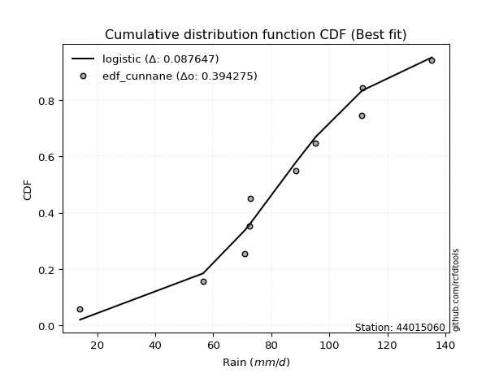</img></img>

</div>


### 12. EDF Adamowski (1981)

The Adamowski formula in hydrology refers to a specific plotting position formula used for estimating the non-parametric empirical distribution of hydrological events (like flood peaks) to calculate their return periods. This formula provides an alternative to traditional parametric methods (like the Gumbel or Log Pearson Type III distributions). 

<div align="center">


$P=(m-0.25)/(n+0.5)$


</div>


**12.1. Empirical values**

<div align="center">

|                | 0                   | 1                   | 2                  | 3                   | 4                  | 5                  | 6                  | 7                  | 8                  | 9                  |
|:---------------|:--------------------|:--------------------|:-------------------|:--------------------|:-------------------|:-------------------|:-------------------|:-------------------|:-------------------|:-------------------|
| date           | 2016                | 2020                | 2022               | 2021                | 2018               | 2023               | 2017               | 2025               | 2024               | 2019               |
| x              | 14.1                | 56.5                | 70.8               | 72.4                | 72.9               | 88.5               | 95.3               | 111.2              | 111.4              | 135.3              |
| m              | 1                   | 2                   | 3                  | 4                   | 5                  | 6                  | 7                  | 8                  | 9                  | 10                 |
| empirical_dist | edf_adamowski       | edf_adamowski       | edf_adamowski      | edf_adamowski       | edf_adamowski      | edf_adamowski      | edf_adamowski      | edf_adamowski      | edf_adamowski      | edf_adamowski      |
| empirical      | 0.07142857142857142 | 0.16666666666666666 | 0.2619047619047619 | 0.35714285714285715 | 0.4523809523809524 | 0.5476190476190477 | 0.6428571428571429 | 0.7380952380952381 | 0.8333333333333334 | 0.9285714285714286 |
| empirical_tr   | 1.0769230769230769  | 1.2                 | 1.3548387096774193 | 1.5555555555555558  | 1.826086956521739  | 2.210526315789474  | 2.8000000000000003 | 3.818181818181819  | 6.000000000000002  | 14.000000000000007 |

</div>


**12.2. Kolmogorov-Smirnov fit test (sorted by Δ)**


<div align="center">

|                | 0                   | 1                   | 2                   | 3                   | 4                   | 5                   | 6                   | 7                   | 8                   | 9                   | 10                 | 11                  | 12                  | 13                  | 14                 | 15                 | 16                 | 17                  | 18                  | 19                  | 20                  | 21                 | 22                  | 23                 | 24                  | 25                  | 26                  | 27                  | 28                  | 29                  | 30                  | 31                  | 32                  | 33                  | 34                  | 35                  | 36                  | 37                  | 38                 | 39                  | 40                  | 41                  | 42                  | 43                  | 44                  | 45                  | 46                  | 47                  | 48                  | 49                  | 50                  | 51                  | 52                  | 53                  | 54                  | 55                 | 56                  | 57                  | 58                  | 59                 | 60                  | 61                  | 62                  | 63                  | 64                  | 65                  | 66                  | 67                 | 68                  | 69                 | 70                  | 71                  | 72                  | 73                  | 74                  | 75                  | 76                 | 77                  | 78                  | 79                  | 80                  | 81                  | 82                 | 83                  | 84                  | 85                  | 86                  | 87                  | 88                  | 89                 | 90                 | 91                 | 92                  | 93                 | 94                 | 95                  | 96                  | 97                  | 98                  | 99                  | 100                 | 101                 | 102                 | 103                 | 104                 | 105                | 106                 | 107                 | 108                 | 109                 | 110                 | 111                 | 112                | 113                 | 114                | 115                 | 116                 | 117                 | 118                 | 119                | 120                | 121                 | 122                 | 123                | 124                 | 125                | 126                 | 127                 | 128                 | 129                | 130                | 131                | 132                | 133                | 134                | 135                 | 136                 | 137                 | 138                | 139                 | 140                | 141                 | 142                 | 143                | 144                 | 145                 | 146                | 147                | 148                | 149                | 150                | 151                | 152                | 153                | 154                | 155                | 156                | 157                | 158                | 159                |
|:---------------|:--------------------|:--------------------|:--------------------|:--------------------|:--------------------|:--------------------|:--------------------|:--------------------|:--------------------|:--------------------|:-------------------|:--------------------|:--------------------|:--------------------|:-------------------|:-------------------|:-------------------|:--------------------|:--------------------|:--------------------|:--------------------|:-------------------|:--------------------|:-------------------|:--------------------|:--------------------|:--------------------|:--------------------|:--------------------|:--------------------|:--------------------|:--------------------|:--------------------|:--------------------|:--------------------|:--------------------|:--------------------|:--------------------|:-------------------|:--------------------|:--------------------|:--------------------|:--------------------|:--------------------|:--------------------|:--------------------|:--------------------|:--------------------|:--------------------|:--------------------|:--------------------|:--------------------|:--------------------|:--------------------|:--------------------|:-------------------|:--------------------|:--------------------|:--------------------|:-------------------|:--------------------|:--------------------|:--------------------|:--------------------|:--------------------|:--------------------|:--------------------|:-------------------|:--------------------|:-------------------|:--------------------|:--------------------|:--------------------|:--------------------|:--------------------|:--------------------|:-------------------|:--------------------|:--------------------|:--------------------|:--------------------|:--------------------|:-------------------|:--------------------|:--------------------|:--------------------|:--------------------|:--------------------|:--------------------|:-------------------|:-------------------|:-------------------|:--------------------|:-------------------|:-------------------|:--------------------|:--------------------|:--------------------|:--------------------|:--------------------|:--------------------|:--------------------|:--------------------|:--------------------|:--------------------|:-------------------|:--------------------|:--------------------|:--------------------|:--------------------|:--------------------|:--------------------|:-------------------|:--------------------|:-------------------|:--------------------|:--------------------|:--------------------|:--------------------|:-------------------|:-------------------|:--------------------|:--------------------|:-------------------|:--------------------|:-------------------|:--------------------|:--------------------|:--------------------|:-------------------|:-------------------|:-------------------|:-------------------|:-------------------|:-------------------|:--------------------|:--------------------|:--------------------|:-------------------|:--------------------|:-------------------|:--------------------|:--------------------|:-------------------|:--------------------|:--------------------|:-------------------|:-------------------|:-------------------|:-------------------|:-------------------|:-------------------|:-------------------|:-------------------|:-------------------|:-------------------|:-------------------|:-------------------|:-------------------|:-------------------|
| station        | 44015060            | 44015060            | 44015060            | 44015060            | 44015060            | 44015060            | 44015060            | 44015060            | 44015060            | 44015060            | 44015060           | 44015060            | 44015060            | 44015060            | 44015060           | 44015060           | 44015060           | 44015060            | 44015060            | 44015060            | 44015060            | 44015060           | 44015060            | 44015060           | 44015060            | 44015060            | 44015060            | 44015060            | 44015060            | 44015060            | 44015060            | 44015060            | 44015060            | 44015060            | 44015060            | 44015060            | 44015060            | 44015060            | 44015060           | 44015060            | 44015060            | 44015060            | 44015060            | 44015060            | 44015060            | 44015060            | 44015060            | 44015060            | 44015060            | 44015060            | 44015060            | 44015060            | 44015060            | 44015060            | 44015060            | 44015060           | 44015060            | 44015060            | 44015060            | 44015060           | 44015060            | 44015060            | 44015060            | 44015060            | 44015060            | 44015060            | 44015060            | 44015060           | 44015060            | 44015060           | 44015060            | 44015060            | 44015060            | 44015060            | 44015060            | 44015060            | 44015060           | 44015060            | 44015060            | 44015060            | 44015060            | 44015060            | 44015060           | 44015060            | 44015060            | 44015060            | 44015060            | 44015060            | 44015060            | 44015060           | 44015060           | 44015060           | 44015060            | 44015060           | 44015060           | 44015060            | 44015060            | 44015060            | 44015060            | 44015060            | 44015060            | 44015060            | 44015060            | 44015060            | 44015060            | 44015060           | 44015060            | 44015060            | 44015060            | 44015060            | 44015060            | 44015060            | 44015060           | 44015060            | 44015060           | 44015060            | 44015060            | 44015060            | 44015060            | 44015060           | 44015060           | 44015060            | 44015060            | 44015060           | 44015060            | 44015060           | 44015060            | 44015060            | 44015060            | 44015060           | 44015060           | 44015060           | 44015060           | 44015060           | 44015060           | 44015060            | 44015060            | 44015060            | 44015060           | 44015060            | 44015060           | 44015060            | 44015060            | 44015060           | 44015060            | 44015060            | 44015060           | 44015060           | 44015060           | 44015060           | 44015060           | 44015060           | 44015060           | 44015060           | 44015060           | 44015060           | 44015060           | 44015060           | 44015060           | 44015060           |
| empirical_dist | edf_adamowski       | edf_adamowski       | edf_adamowski       | edf_adamowski       | edf_adamowski       | edf_adamowski       | edf_adamowski       | edf_adamowski       | edf_adamowski       | edf_adamowski       | edf_adamowski      | edf_adamowski       | edf_adamowski       | edf_adamowski       | edf_adamowski      | edf_adamowski      | edf_adamowski      | edf_adamowski       | edf_adamowski       | edf_adamowski       | edf_adamowski       | edf_adamowski      | edf_adamowski       | edf_adamowski      | edf_adamowski       | edf_adamowski       | edf_adamowski       | edf_adamowski       | edf_adamowski       | edf_adamowski       | edf_adamowski       | edf_adamowski       | edf_adamowski       | edf_adamowski       | edf_adamowski       | edf_adamowski       | edf_adamowski       | edf_adamowski       | edf_adamowski      | edf_adamowski       | edf_adamowski       | edf_adamowski       | edf_adamowski       | edf_adamowski       | edf_adamowski       | edf_adamowski       | edf_adamowski       | edf_adamowski       | edf_adamowski       | edf_adamowski       | edf_adamowski       | edf_adamowski       | edf_adamowski       | edf_adamowski       | edf_adamowski       | edf_adamowski      | edf_adamowski       | edf_adamowski       | edf_adamowski       | edf_adamowski      | edf_adamowski       | edf_adamowski       | edf_adamowski       | edf_adamowski       | edf_adamowski       | edf_adamowski       | edf_adamowski       | edf_adamowski      | edf_adamowski       | edf_adamowski      | edf_adamowski       | edf_adamowski       | edf_adamowski       | edf_adamowski       | edf_adamowski       | edf_adamowski       | edf_adamowski      | edf_adamowski       | edf_adamowski       | edf_adamowski       | edf_adamowski       | edf_adamowski       | edf_adamowski      | edf_adamowski       | edf_adamowski       | edf_adamowski       | edf_adamowski       | edf_adamowski       | edf_adamowski       | edf_adamowski      | edf_adamowski      | edf_adamowski      | edf_adamowski       | edf_adamowski      | edf_adamowski      | edf_adamowski       | edf_adamowski       | edf_adamowski       | edf_adamowski       | edf_adamowski       | edf_adamowski       | edf_adamowski       | edf_adamowski       | edf_adamowski       | edf_adamowski       | edf_adamowski      | edf_adamowski       | edf_adamowski       | edf_adamowski       | edf_adamowski       | edf_adamowski       | edf_adamowski       | edf_adamowski      | edf_adamowski       | edf_adamowski      | edf_adamowski       | edf_adamowski       | edf_adamowski       | edf_adamowski       | edf_adamowski      | edf_adamowski      | edf_adamowski       | edf_adamowski       | edf_adamowski      | edf_adamowski       | edf_adamowski      | edf_adamowski       | edf_adamowski       | edf_adamowski       | edf_adamowski      | edf_adamowski      | edf_adamowski      | edf_adamowski      | edf_adamowski      | edf_adamowski      | edf_adamowski       | edf_adamowski       | edf_adamowski       | edf_adamowski      | edf_adamowski       | edf_adamowski      | edf_adamowski       | edf_adamowski       | edf_adamowski      | edf_adamowski       | edf_adamowski       | edf_adamowski      | edf_adamowski      | edf_adamowski      | edf_adamowski      | edf_adamowski      | edf_adamowski      | edf_adamowski      | edf_adamowski      | edf_adamowski      | edf_adamowski      | edf_adamowski      | edf_adamowski      | edf_adamowski      | edf_adamowski      |
| p_dist         | foldnorm            | gennorm             | logjohnsonsb        | logjohnsonsu        | gompertz            | exponpow            | johnsonsb           | logdweibull         | gengamma            | logargus            | rice               | t                   | exponnorm           | norm                | crystalball        | nct                | f                  | fatiguelife         | argus               | logistic            | exponweib           | burr               | mielke              | loggenlogistic     | logpearson3         | logloggamma         | pearson3            | truncnorm           | betaprime           | weibull_min         | skewnorm            | genextreme          | erlang              | truncweibull_min    | gamma               | hypsecant           | johnsonsu           | dweibull            | anglit             | logburr             | invgamma            | genlogistic         | dgamma              | logburr12           | logmielke           | semicircular        | logvonmises_line    | loggompertz         | maxwell             | loggengamma         | laplace             | rayleigh            | cosine              | gumbel_l            | ncf                 | gumbel_r           | logloglaplace       | invgauss            | loggumbel_l         | logdgamma          | arcsine             | loggenextreme       | genhalflogistic     | genpareto           | invweibull          | moyal               | gausshyper          | nakagami           | lognakagami         | logtrapezoid       | triang              | halfnorm            | logtruncnorm        | halflogistic        | loggennorm          | kstwobign           | vonmises_line      | logskewnorm         | genexpon            | halfgennorm         | wald                | kappa3              | logt               | loglaplace          | loglaplace          | uniform             | wrapcauchy          | ksone               | logncf              | loghypsecant       | logfoldnorm        | loglogistic        | logfatiguelife      | logf               | logexponnorm       | logcrystalball      | lognorm             | logrice             | lognct              | beta                | loganglit           | logsemicircular     | logbetaprime        | loginvweibull       | logerlang           | kappa4             | logalpha            | loggamma            | loggamma            | logarcsine          | loginvgamma         | loglevy_l           | loginvgauss        | logmaxwell          | lograyleigh        | trapezoid           | loggenhalflogistic  | loggausshyper       | loggumbel_r         | levy_l             | bradford           | logtriang           | logkstwobign        | loghalfnorm        | logkappa4           | loggenpareto       | logweibull_max      | logcosine           | alpha               | logmoyal           | lomax              | loghalflogistic    | loggenexpon        | truncexpon         | logwrapcauchy      | logtruncweibull_min | loglomax            | logwald             | burr12             | logrdist            | logbeta            | logksone            | logtukeylambda      | logkappa3          | loguniform          | logbradford         | logexponweib       | logweibull_min     | logtruncexpon      | logexponpow        | powerlaw           | rdist              | logpowerlaw        | weibull_max        | tukeylambda        | truncpareto        | logtruncpareto     | loghalfgennorm     | logvonmises        | vonmises           |
| delta          | 0.08276998965584198 | 0.08347090519814931 | 0.08718425482711517 | 0.08869927039565223 | 0.08926296558486224 | 0.08954163520266528 | 0.09008591964141394 | 0.09021662321428897 | 0.09145797684820872 | 0.09190353372287668 | 0.0920419567906754 | 0.09206162713511629 | 0.09207556835597386 | 0.09207852050111187 | 0.0920785225340941 | 0.0922008599237859 | 0.0926020993542192 | 0.09311618863223309 | 0.09355634951838804 | 0.09397637976269824 | 0.09458154489276255 | 0.094950799420013  | 0.09505354569447488 | 0.0961939009400507 | 0.09813895188541732 | 0.09831982424257707 | 0.10013391977353475 | 0.10086968141846198 | 0.10209230738062158 | 0.10304977468239201 | 0.10310574920581878 | 0.10314350271073941 | 0.10439133214441132 | 0.10557108655280167 | 0.10564284733323087 | 0.10589798757650981 | 0.10624402289513862 | 0.10666983057115048 | 0.1114433423245661 | 0.11219091704994133 | 0.11367825212076621 | 0.11462663108491505 | 0.11493304334819354 | 0.11742186213848671 | 0.11895891289592608 | 0.11956138183285675 | 0.11962414745850702 | 0.12326709792427537 | 0.12424981968938575 | 0.12828872849833256 | 0.12950830928912033 | 0.13636080433363867 | 0.13698694693911212 | 0.13786709971323158 | 0.14082681297971483 | 0.1415265437437887 | 0.14223645649658678 | 0.14561154799737247 | 0.14851613594430918 | 0.1499475397616455 | 0.15276480101328666 | 0.15280064127966497 | 0.15427557952988424 | 0.15623031772399357 | 0.15961987543052247 | 0.15993894308901918 | 0.16022302650128528 | 0.1666666666659427 | 0.16666666666665653 | 0.1677694073520894 | 0.17033067063876917 | 0.17082655964331522 | 0.17236384677094846 | 0.17958539185602768 | 0.18577638740623775 | 0.19011660502978006 | 0.1904219323036147 | 0.19107167612551762 | 0.20138643312984333 | 0.20246118671608626 | 0.20318243396632207 | 0.20439816061999888 | 0.2056078197564118 | 0.20567982589679829 | 0.20567982589679829 | 0.20591702027345582 | 0.20651985301284526 | 0.21128005657708615 | 0.21215479546647298 | 0.2144191830695466 | 0.2155391877274085 | 0.2166168311598023 | 0.21802771524914144 | 0.2186586462220224 | 0.2191917328441937 | 0.21919406903370175 | 0.21919411320055526 | 0.21919928764929925 | 0.21967978604394628 | 0.22084509385993029 | 0.22189795621503094 | 0.22301111871553764 | 0.22531247301195234 | 0.23178779061798754 | 0.23271549165932054 | 0.2328025760484701 | 0.23379343650076823 | 0.23494933941000734 | 0.23494933941000734 | 0.23672978145320014 | 0.23718429774530597 | 0.23754551722406378 | 0.2467000299494428 | 0.25289682564795185 | 0.264291905812058  | 0.26732126767407216 | 0.26963787508298426 | 0.28852437535045805 | 0.28874964095847383 | 0.2896527905619368 | 0.2922278214091861 | 0.29393730116043965 | 0.29430061603445956 | 0.2963894103852412 | 0.29659315364066824 | 0.2982288335016394 | 0.30698111730123745 | 0.31396253891757603 | 0.31421837390043283 | 0.3146124362724994 | 0.3157153220694115 | 0.3200566809709848 | 0.3215255651689254 | 0.3462210458670411 | 0.3727781945546319 | 0.3795021385203306  | 0.38569571843388817 | 0.38659537089301604 | 0.4030543027095985 | 0.41066195117202864 | 0.4209428490636242 | 0.42819164681064703 | 0.44384219123709995 | 0.4499593772532868 | 0.45169808529399097 | 0.45342513445785415 | 0.4585611673318363 | 0.5151429409382755 | 0.525536740906721  | 0.6143780053582412 | 0.6181969325692662 | 0.6618594992473175 | 0.7133756979037824 | 0.7159934061077428 | 0.7226310931107394 | 0.777427518279042  | 0.8069713732666283 | 0.8333333333333334 | 1.1675186729260731 | 20.69422902238097  |
| deltao         | 0.3942745923300002  | 0.3942745923300002  | 0.3942745923300002  | 0.3942745923300002  | 0.3942745923300002  | 0.3942745923300002  | 0.3942745923300002  | 0.3942745923300002  | 0.3942745923300002  | 0.3942745923300002  | 0.3942745923300002 | 0.3942745923300002  | 0.3942745923300002  | 0.3942745923300002  | 0.3942745923300002 | 0.3942745923300002 | 0.3942745923300002 | 0.3942745923300002  | 0.3942745923300002  | 0.3942745923300002  | 0.3942745923300002  | 0.3942745923300002 | 0.3942745923300002  | 0.3942745923300002 | 0.3942745923300002  | 0.3942745923300002  | 0.3942745923300002  | 0.3942745923300002  | 0.3942745923300002  | 0.3942745923300002  | 0.3942745923300002  | 0.3942745923300002  | 0.3942745923300002  | 0.3942745923300002  | 0.3942745923300002  | 0.3942745923300002  | 0.3942745923300002  | 0.3942745923300002  | 0.3942745923300002 | 0.3942745923300002  | 0.3942745923300002  | 0.3942745923300002  | 0.3942745923300002  | 0.3942745923300002  | 0.3942745923300002  | 0.3942745923300002  | 0.3942745923300002  | 0.3942745923300002  | 0.3942745923300002  | 0.3942745923300002  | 0.3942745923300002  | 0.3942745923300002  | 0.3942745923300002  | 0.3942745923300002  | 0.3942745923300002  | 0.3942745923300002 | 0.3942745923300002  | 0.3942745923300002  | 0.3942745923300002  | 0.3942745923300002 | 0.3942745923300002  | 0.3942745923300002  | 0.3942745923300002  | 0.3942745923300002  | 0.3942745923300002  | 0.3942745923300002  | 0.3942745923300002  | 0.3942745923300002 | 0.3942745923300002  | 0.3942745923300002 | 0.3942745923300002  | 0.3942745923300002  | 0.3942745923300002  | 0.3942745923300002  | 0.3942745923300002  | 0.3942745923300002  | 0.3942745923300002 | 0.3942745923300002  | 0.3942745923300002  | 0.3942745923300002  | 0.3942745923300002  | 0.3942745923300002  | 0.3942745923300002 | 0.3942745923300002  | 0.3942745923300002  | 0.3942745923300002  | 0.3942745923300002  | 0.3942745923300002  | 0.3942745923300002  | 0.3942745923300002 | 0.3942745923300002 | 0.3942745923300002 | 0.3942745923300002  | 0.3942745923300002 | 0.3942745923300002 | 0.3942745923300002  | 0.3942745923300002  | 0.3942745923300002  | 0.3942745923300002  | 0.3942745923300002  | 0.3942745923300002  | 0.3942745923300002  | 0.3942745923300002  | 0.3942745923300002  | 0.3942745923300002  | 0.3942745923300002 | 0.3942745923300002  | 0.3942745923300002  | 0.3942745923300002  | 0.3942745923300002  | 0.3942745923300002  | 0.3942745923300002  | 0.3942745923300002 | 0.3942745923300002  | 0.3942745923300002 | 0.3942745923300002  | 0.3942745923300002  | 0.3942745923300002  | 0.3942745923300002  | 0.3942745923300002 | 0.3942745923300002 | 0.3942745923300002  | 0.3942745923300002  | 0.3942745923300002 | 0.3942745923300002  | 0.3942745923300002 | 0.3942745923300002  | 0.3942745923300002  | 0.3942745923300002  | 0.3942745923300002 | 0.3942745923300002 | 0.3942745923300002 | 0.3942745923300002 | 0.3942745923300002 | 0.3942745923300002 | 0.3942745923300002  | 0.3942745923300002  | 0.3942745923300002  | 0.3942745923300002 | 0.3942745923300002  | 0.3942745923300002 | 0.3942745923300002  | 0.3942745923300002  | 0.3942745923300002 | 0.3942745923300002  | 0.3942745923300002  | 0.3942745923300002 | 0.3942745923300002 | 0.3942745923300002 | 0.3942745923300002 | 0.3942745923300002 | 0.3942745923300002 | 0.3942745923300002 | 0.3942745923300002 | 0.3942745923300002 | 0.3942745923300002 | 0.3942745923300002 | 0.3942745923300002 | 0.3942745923300002 | 0.3942745923300002 |
| eval           | Δo > Δ              | Δo > Δ              | Δo > Δ              | Δo > Δ              | Δo > Δ              | Δo > Δ              | Δo > Δ              | Δo > Δ              | Δo > Δ              | Δo > Δ              | Δo > Δ             | Δo > Δ              | Δo > Δ              | Δo > Δ              | Δo > Δ             | Δo > Δ             | Δo > Δ             | Δo > Δ              | Δo > Δ              | Δo > Δ              | Δo > Δ              | Δo > Δ             | Δo > Δ              | Δo > Δ             | Δo > Δ              | Δo > Δ              | Δo > Δ              | Δo > Δ              | Δo > Δ              | Δo > Δ              | Δo > Δ              | Δo > Δ              | Δo > Δ              | Δo > Δ              | Δo > Δ              | Δo > Δ              | Δo > Δ              | Δo > Δ              | Δo > Δ             | Δo > Δ              | Δo > Δ              | Δo > Δ              | Δo > Δ              | Δo > Δ              | Δo > Δ              | Δo > Δ              | Δo > Δ              | Δo > Δ              | Δo > Δ              | Δo > Δ              | Δo > Δ              | Δo > Δ              | Δo > Δ              | Δo > Δ              | Δo > Δ              | Δo > Δ             | Δo > Δ              | Δo > Δ              | Δo > Δ              | Δo > Δ             | Δo > Δ              | Δo > Δ              | Δo > Δ              | Δo > Δ              | Δo > Δ              | Δo > Δ              | Δo > Δ              | Δo > Δ             | Δo > Δ              | Δo > Δ             | Δo > Δ              | Δo > Δ              | Δo > Δ              | Δo > Δ              | Δo > Δ              | Δo > Δ              | Δo > Δ             | Δo > Δ              | Δo > Δ              | Δo > Δ              | Δo > Δ              | Δo > Δ              | Δo > Δ             | Δo > Δ              | Δo > Δ              | Δo > Δ              | Δo > Δ              | Δo > Δ              | Δo > Δ              | Δo > Δ             | Δo > Δ             | Δo > Δ             | Δo > Δ              | Δo > Δ             | Δo > Δ             | Δo > Δ              | Δo > Δ              | Δo > Δ              | Δo > Δ              | Δo > Δ              | Δo > Δ              | Δo > Δ              | Δo > Δ              | Δo > Δ              | Δo > Δ              | Δo > Δ             | Δo > Δ              | Δo > Δ              | Δo > Δ              | Δo > Δ              | Δo > Δ              | Δo > Δ              | Δo > Δ             | Δo > Δ              | Δo > Δ             | Δo > Δ              | Δo > Δ              | Δo > Δ              | Δo > Δ              | Δo > Δ             | Δo > Δ             | Δo > Δ              | Δo > Δ              | Δo > Δ             | Δo > Δ              | Δo > Δ             | Δo > Δ              | Δo > Δ              | Δo > Δ              | Δo > Δ             | Δo > Δ             | Δo > Δ             | Δo > Δ             | Δo > Δ             | Δo > Δ             | Δo > Δ              | Δo > Δ              | Δo > Δ              | Δo <= Δ            | Δo <= Δ             | Δo <= Δ            | Δo <= Δ             | Δo <= Δ             | Δo <= Δ            | Δo <= Δ             | Δo <= Δ             | Δo <= Δ            | Δo <= Δ            | Δo <= Δ            | Δo <= Δ            | Δo <= Δ            | Δo <= Δ            | Δo <= Δ            | Δo <= Δ            | Δo <= Δ            | Δo <= Δ            | Δo <= Δ            | Δo <= Δ            | Δo <= Δ            | Δo <= Δ            |
| fit            | 1                   | 1                   | 1                   | 1                   | 1                   | 1                   | 1                   | 1                   | 1                   | 1                   | 1                  | 1                   | 1                   | 1                   | 1                  | 1                  | 1                  | 1                   | 1                   | 1                   | 1                   | 1                  | 1                   | 1                  | 1                   | 1                   | 1                   | 1                   | 1                   | 1                   | 1                   | 1                   | 1                   | 1                   | 1                   | 1                   | 1                   | 1                   | 1                  | 1                   | 1                   | 1                   | 1                   | 1                   | 1                   | 1                   | 1                   | 1                   | 1                   | 1                   | 1                   | 1                   | 1                   | 1                   | 1                   | 1                  | 1                   | 1                   | 1                   | 1                  | 1                   | 1                   | 1                   | 1                   | 1                   | 1                   | 1                   | 1                  | 1                   | 1                  | 1                   | 1                   | 1                   | 1                   | 1                   | 1                   | 1                  | 1                   | 1                   | 1                   | 1                   | 1                   | 1                  | 1                   | 1                   | 1                   | 1                   | 1                   | 1                   | 1                  | 1                  | 1                  | 1                   | 1                  | 1                  | 1                   | 1                   | 1                   | 1                   | 1                   | 1                   | 1                   | 1                   | 1                   | 1                   | 1                  | 1                   | 1                   | 1                   | 1                   | 1                   | 1                   | 1                  | 1                   | 1                  | 1                   | 1                   | 1                   | 1                   | 1                  | 1                  | 1                   | 1                   | 1                  | 1                   | 1                  | 1                   | 1                   | 1                   | 1                  | 1                  | 1                  | 1                  | 1                  | 1                  | 1                   | 1                   | 1                   | 0                  | 0                   | 0                  | 0                   | 0                   | 0                  | 0                   | 0                   | 0                  | 0                  | 0                  | 0                  | 0                  | 0                  | 0                  | 0                  | 0                  | 0                  | 0                  | 0                  | 0                  | 0                  |
| n              | 10                  | 10                  | 10                  | 10                  | 10                  | 10                  | 10                  | 10                  | 10                  | 10                  | 10                 | 10                  | 10                  | 10                  | 10                 | 10                 | 10                 | 10                  | 10                  | 10                  | 10                  | 10                 | 10                  | 10                 | 10                  | 10                  | 10                  | 10                  | 10                  | 10                  | 10                  | 10                  | 10                  | 10                  | 10                  | 10                  | 10                  | 10                  | 10                 | 10                  | 10                  | 10                  | 10                  | 10                  | 10                  | 10                  | 10                  | 10                  | 10                  | 10                  | 10                  | 10                  | 10                  | 10                  | 10                  | 10                 | 10                  | 10                  | 10                  | 10                 | 10                  | 10                  | 10                  | 10                  | 10                  | 10                  | 10                  | 10                 | 10                  | 10                 | 10                  | 10                  | 10                  | 10                  | 10                  | 10                  | 10                 | 10                  | 10                  | 10                  | 10                  | 10                  | 10                 | 10                  | 10                  | 10                  | 10                  | 10                  | 10                  | 10                 | 10                 | 10                 | 10                  | 10                 | 10                 | 10                  | 10                  | 10                  | 10                  | 10                  | 10                  | 10                  | 10                  | 10                  | 10                  | 10                 | 10                  | 10                  | 10                  | 10                  | 10                  | 10                  | 10                 | 10                  | 10                 | 10                  | 10                  | 10                  | 10                  | 10                 | 10                 | 10                  | 10                  | 10                 | 10                  | 10                 | 10                  | 10                  | 10                  | 10                 | 10                 | 10                 | 10                 | 10                 | 10                 | 10                  | 10                  | 10                  | 10                 | 10                  | 10                 | 10                  | 10                  | 10                 | 10                  | 10                  | 10                 | 10                 | 10                 | 10                 | 10                 | 10                 | 10                 | 10                 | 10                 | 10                 | 10                 | 10                 | 10                 | 10                 |
| best_fit       | 1                   | 0                   | 0                   | 0                   | 0                   | 0                   | 0                   | 0                   | 0                   | 0                   | 0                  | 0                   | 0                   | 0                   | 0                  | 0                  | 0                  | 0                   | 0                   | 0                   | 0                   | 0                  | 0                   | 0                  | 0                   | 0                   | 0                   | 0                   | 0                   | 0                   | 0                   | 0                   | 0                   | 0                   | 0                   | 0                   | 0                   | 0                   | 0                  | 0                   | 0                   | 0                   | 0                   | 0                   | 0                   | 0                   | 0                   | 0                   | 0                   | 0                   | 0                   | 0                   | 0                   | 0                   | 0                   | 0                  | 0                   | 0                   | 0                   | 0                  | 0                   | 0                   | 0                   | 0                   | 0                   | 0                   | 0                   | 0                  | 0                   | 0                  | 0                   | 0                   | 0                   | 0                   | 0                   | 0                   | 0                  | 0                   | 0                   | 0                   | 0                   | 0                   | 0                  | 0                   | 0                   | 0                   | 0                   | 0                   | 0                   | 0                  | 0                  | 0                  | 0                   | 0                  | 0                  | 0                   | 0                   | 0                   | 0                   | 0                   | 0                   | 0                   | 0                   | 0                   | 0                   | 0                  | 0                   | 0                   | 0                   | 0                   | 0                   | 0                   | 0                  | 0                   | 0                  | 0                   | 0                   | 0                   | 0                   | 0                  | 0                  | 0                   | 0                   | 0                  | 0                   | 0                  | 0                   | 0                   | 0                   | 0                  | 0                  | 0                  | 0                  | 0                  | 0                  | 0                   | 0                   | 0                   | 0                  | 0                   | 0                  | 0                   | 0                   | 0                  | 0                   | 0                   | 0                  | 0                  | 0                  | 0                  | 0                  | 0                  | 0                  | 0                  | 0                  | 0                  | 0                  | 0                  | 0                  | 0                  |
| best_fit_sort  | 1                   | 2                   | 3                   | 4                   | 5                   | 6                   | 7                   | 8                   | 9                   | 10                  | 11                 | 12                  | 13                  | 14                  | 15                 | 16                 | 17                 | 18                  | 19                  | 20                  | 21                  | 22                 | 23                  | 24                 | 25                  | 26                  | 27                  | 28                  | 29                  | 30                  | 31                  | 32                  | 33                  | 34                  | 35                  | 36                  | 37                  | 38                  | 39                 | 40                  | 41                  | 42                  | 43                  | 44                  | 45                  | 46                  | 47                  | 48                  | 49                  | 50                  | 51                  | 52                  | 53                  | 54                  | 55                  | 56                 | 57                  | 58                  | 59                  | 60                 | 61                  | 62                  | 63                  | 64                  | 65                  | 66                  | 67                  | 68                 | 69                  | 70                 | 71                  | 72                  | 73                  | 74                  | 75                  | 76                  | 77                 | 78                  | 79                  | 80                  | 81                  | 82                  | 83                 | 84                  | 85                  | 86                  | 87                  | 88                  | 89                  | 90                 | 91                 | 92                 | 93                  | 94                 | 95                 | 96                  | 97                  | 98                  | 99                  | 100                 | 101                 | 102                 | 103                 | 104                 | 105                 | 106                | 107                 | 108                 | 109                 | 110                 | 111                 | 112                 | 113                | 114                 | 115                | 116                 | 117                 | 118                 | 119                 | 120                | 121                | 122                 | 123                 | 124                | 125                 | 126                | 127                 | 128                 | 129                 | 130                | 131                | 132                | 133                | 134                | 135                | 136                 | 137                 | 138                 | 139                | 140                 | 141                | 142                 | 143                 | 144                | 145                 | 146                 | 147                | 148                | 149                | 150                | 151                | 152                | 153                | 154                | 155                | 156                | 157                | 158                | 159                | 160                |

</div>


**12.3. Best fit**

<div align="center">

|   id |   station | empirical_dist   | p_dist   |   delta |   deltao | eval   |   fit |   n |   best_fit |   best_fit_sort |
|-----:|----------:|:-----------------|:---------|--------:|---------:|:-------|------:|----:|-----------:|----------------:|
|    0 |  44015060 | edf_adamowski    | foldnorm | 0.08277 | 0.394275 | Δo > Δ |     1 |  10 |          1 |               1 |

</div>


<div align="center">

</img>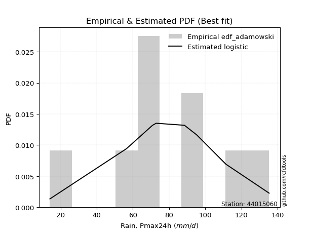</img>

</div>


## C. Best fit & Estimate extreme values for specific return periods - Tr

Best fit in probability distribution analysis means finding the theoretical distribution (like Normal, Poisson, Exponential, etc.) that most accurately mirrors your real-world data´s patterns (shape, center, spread) for better predictions, using methods like visual checks (Q-Q plots), goodness-of-fit tests (Kolmogorov-Smirnov, Chi-Squared), and information criteria (AIC) to score and select the simplest, most representative model.


### 1. Best fit (ordered by delta Δ)

:file_folder:Table: [bestfit_44015060.csv](table/bestfit_44015060.csv)

<div align="center">

|   id |   station | empirical_dist   | p_dist      |     delta |   deltao | eval   |   fit |   n |   best_fit |   best_fit_sort |
|-----:|----------:|:-----------------|:------------|----------:|---------:|:-------|------:|----:|-----------:|----------------:|
|    0 |  44015060 | edf_weibull      | logargus    | 0.0819299 | 0.394275 | Δo > Δ |     1 |  10 |          1 |               1 |
|    1 |  44015060 | edf_adamowski    | foldnorm    | 0.08277   | 0.394275 | Δo > Δ |     1 |  10 |          1 |               2 |
|    2 |  44015060 | edf_chegodayev   | gennorm     | 0.0840289 | 0.394275 | Δo > Δ |     1 |  10 |          1 |               3 |
|    3 |  44015060 | edf_jenkinson    | gennorm     | 0.0844921 | 0.394275 | Δo > Δ |     1 |  10 |          1 |               4 |
|    4 |  44015060 | edf_beard        | gennorm     | 0.0844921 | 0.394275 | Δo > Δ |     1 |  10 |          1 |               5 |
|    5 |  44015060 | edf_filliben     | gennorm     | 0.0848407 | 0.394275 | Δo > Δ |     1 |  10 |          1 |               6 |
|    6 |  44015060 | edf_tukey        | gennorm     | 0.0855798 | 0.394275 | Δo > Δ |     1 |  10 |          1 |               7 |
|    7 |  44015060 | edf_hazen        | logistic    | 0.0866662 | 0.394275 | Δo > Δ |     1 |  10 |          1 |               8 |
|    8 |  44015060 | edf_gringorten   | logistic    | 0.087259  | 0.394275 | Δo > Δ |     1 |  10 |          1 |               9 |
|    9 |  44015060 | edf_blom         | gennorm     | 0.0875468 | 0.394275 | Δo > Δ |     1 |  10 |          1 |              10 |
|   10 |  44015060 | edf_cunnane      | logistic    | 0.0876466 | 0.394275 | Δo > Δ |     1 |  10 |          1 |              11 |
|   11 |  44015060 | edf_california   | loggengamma | 0.0901935 | 0.394275 | Δo > Δ |     1 |  10 |          1 |              12 |

</div>


### 2. Extreme values and % difference analysis

In hydrology, a return period (or recurrence interval $Tr$) is the statistical average time between extreme events like floods or droughts of a specific magnitude, indicating how rare an event is, with a 100-year flood, for example, having a 1% chance of occurring in any given year, not that it happens exactly every century. It is a key tool for infrastructure design (like bridges or dams) and risk assessment, calculated from historical data to determine the probability of future events, although it is important to remember it is statistical average, and events can cluster or be missed.

The extreme value porcentage difference is evaluated as $pdiff = 1 - (ETrBf / ETr) * 100$, where _ETrBf_ correspond to the bestfit extreme value for a specific recurrence interval and _ETr_ correspond to the extreme value for one of the most used PDFsused in hydrology.

> risk_rate: assuming the return period as the project useful life.

:file_folder:Table: [extreme_44015060.csv](table/extreme_44015060.csv), all PDFs.  
:file_folder:Table: [extremepdiff_44015060.csv](table/extremepdiff_44015060.csv), % difference between bestfit and most used PDFs in Hydrology.

<div align="center">

Extreme values table for only best fit PDFs
|   id |      tr |   prob_l |     prob_g |      alpha |   anglit |   arcsine |    argus |     beta |   betaprime |   bradford |     burr |   burr12 |   cosine |   crystalball |   dgamma |   dweibull |   erlang |   exponnorm |   exponpow |   exponweib |        f |   fatiguelife |   foldnorm |    gamma |   gausshyper |   genexpon |   genextreme |   gengamma |   genhalflogistic |   genlogistic |   gennorm |   genpareto |   gompertz |   gumbel_l |   gumbel_r |   halfgennorm |   halflogistic |   halfnorm |   hypsecant |   invgamma |   invgauss |   invweibull |   johnsonsb |   johnsonsu |   kappa3 |   kappa4 |    ksone |   kstwobign |   laplace |   levy_l |   loggamma |   logistic |   loglaplace |    lomax |   maxwell |   mielke |    moyal |   nakagami |      ncf |      nct |     norm |   pearson3 |   powerlaw |   rayleigh |    rdist |     rice |   semicircular |   skewnorm |        t |   trapezoid |   triang |   truncexpon |   truncnorm |   truncpareto |   truncweibull_min |   tukeylambda |   uniform |   vonmises |   vonmises_line |     wald |   weibull_max |   weibull_min |   wrapcauchy |   logalpha |   loganglit |   logarcsine |   logargus |   logbeta |   logbetaprime |   logbradford |   logburr |   logburr12 |   logcosine |   logcrystalball |   logdgamma |   logdweibull |   logerlang |   logexponnorm |   logexponpow |     logexponweib |     logf |   logfatiguelife |   logfoldnorm |   loggausshyper |   loggenexpon |   loggenextreme |   loggengamma |   loggenhalflogistic |   loggenlogistic |   loggennorm |   loggenpareto |   loggompertz |   loggumbel_l |   loggumbel_r |   loghalfgennorm |   loghalflogistic |   loghalfnorm |   loghypsecant |   loginvgamma |   loginvgauss |   loginvweibull |   logjohnsonsb |   logjohnsonsu |   logkappa3 |   logkappa4 |   logksone |   logkstwobign |   loglevy_l |   logloggamma |   loglogistic |   logloglaplace |         loglomax |   logmaxwell |   logmielke |   logmoyal |   lognakagami |   logncf |   lognct |   lognorm |   logpearson3 |   logpowerlaw |   lograyleigh |   logrdist |   logrice |   logsemicircular |   logskewnorm |      logt |   logtrapezoid |   logtriang |   logtruncexpon |   logtruncnorm |   logtruncpareto |   logtruncweibull_min |   logtukeylambda |   loguniform |   logvonmises |   logvonmises_line |   logwald |   logweibull_max |   logweibull_min |   logwrapcauchy |   station |   n |   risk_rate |
|-----:|--------:|---------:|-----------:|-----------:|---------:|----------:|---------:|---------:|------------:|-----------:|---------:|---------:|---------:|--------------:|---------:|-----------:|---------:|------------:|-----------:|------------:|---------:|--------------:|-----------:|---------:|-------------:|-----------:|-------------:|-----------:|------------------:|--------------:|----------:|------------:|-----------:|-----------:|-----------:|--------------:|---------------:|-----------:|------------:|-----------:|-----------:|-------------:|------------:|------------:|---------:|---------:|---------:|------------:|----------:|---------:|-----------:|-----------:|-------------:|---------:|----------:|---------:|---------:|-----------:|---------:|---------:|---------:|-----------:|-----------:|-----------:|---------:|---------:|---------------:|-----------:|---------:|------------:|---------:|-------------:|------------:|--------------:|-------------------:|--------------:|----------:|-----------:|----------------:|---------:|--------------:|--------------:|-------------:|-----------:|------------:|-------------:|-----------:|----------:|---------------:|--------------:|----------:|------------:|------------:|-----------------:|------------:|--------------:|------------:|---------------:|--------------:|-----------------:|---------:|-----------------:|--------------:|----------------:|--------------:|----------------:|--------------:|---------------------:|-----------------:|-------------:|---------------:|--------------:|--------------:|--------------:|-----------------:|------------------:|--------------:|---------------:|--------------:|--------------:|----------------:|---------------:|---------------:|------------:|------------:|-----------:|---------------:|------------:|--------------:|--------------:|----------------:|-----------------:|-------------:|------------:|-----------:|--------------:|---------:|---------:|----------:|--------------:|--------------:|--------------:|-----------:|----------:|------------------:|--------------:|----------:|---------------:|------------:|----------------:|---------------:|-----------------:|----------------------:|-----------------:|-------------:|--------------:|-------------------:|----------:|-----------------:|-----------------:|----------------:|----------:|----:|------------:|
|    0 |    2    | 0.5      | 0.5        |    59.0503 |  82.84   |   82.84   |  85.7583 |  72.9982 |     82.376  |    64.2472 |  85.058  |  44.1507 |  79.9563 |       82.84   |  82.6284 |    82.8103 |  81.8673 |     82.8402 |    85.4587 |     82.8708 |  82.7898 |       82.8074 |    83.1228 |  81.8103 |      91.4124 |    74.5789 |      86.3612 |    82.8931 |           92.7183 |       85.286  |   83.1031 |     83.9084 |    85.1634 |    88.1204 |    77.5596 |       75.1638 |        74.9344 |    76.2606 |     82.84   |    81.2663 |    78.6497 |      78.2665 |     86.0482 |     85.8093 |   14.1   |  71.4635 |  74.7    |     75.6806 |    82.84  |  79.4207 |    71.1551 |    82.84   |      72.8466 |  59.7013 |   80.091  |  85.0519 |  75.8549 |    79.1796 |  79.2851 |  82.8348 |  82.84   |    85.3221 |    20.1026 |    79.116  |  2.91162 |  82.8388 |        82.84   |    85.5369 |  82.8413 |     104.822 |  96.3239 |      56.4774 |     82.7046 |       14.2449 |            85.4724 |       2.94974 |   74.7    |    2.71038 |         74.7    |  72.4209 |       134.881 |       85.6179 |      74.6313 |    71.289  |     72.8464 |      72.8465 |    86.176  |   122.59  |        72.2593 |       42.4626 |   88.4559 |     80.9818 |     61.4282 |          72.8466 |     88.5    |       81.3791 |     71.4251 |        72.8468 |       24.1968 |     36.0049      |  72.8895 |          72.977  |       73.0924 |         63.0584 |       58.0864 |         92.8625 |       80.5948 |              66.5536 |          84.9805 |      88.5    |        65.6026 |       80.5438 |       80.4093 |       65.9951 |          14.0999 |           62.8334 |       64.4106 |        72.8466 |       70.9058 |       69.7697 |         71.8883 |        86.1943 |        86.1925 |     14.1    |     62.6651 |    43.6776 |        61.9826 |     80.3677 |       84.7248 |       72.8466 |         88.5048 |     46.3667      |      69.1955 |     89.3033 |    63.9239 |       77.8007 |  73.669  |  72.8011 |   72.8466 |       86.6432 |       16.5498 |       67.9449 |    43.1093 |   72.8461 |           72.8465 |       75.5974 |   74.5563 |        80.7625 |     64.2009 |         36.0988 |        74.0037 |          14.1474 |               53.9994 |          43.6776 |      43.6776 |      0.145636 |            83.5906 |   59.9473 |          104.57  |          30.9231 |         43.6776 |  44015060 |  10 |    0.75     |
|    1 |    2.33 | 0.570815 | 0.429185   |    70.2828 |  89.5211 |   92.8694 |  92.5956 |  82.0508 |     88.3698 |    72.8698 |  91.4597 |  56.7365 |  86.3412 |       88.5757 |  90.7234 |    90.1205 |  87.7048 |     88.5759 |    91.4867 |     88.7382 |  88.5261 |       88.593  |    88.624  |  87.6725 |     100.043  |    82.1356 |      92.2362 |    88.6204 |          100.663  |       90.2896 |   88.5118 |     93.8625 |    91.0824 |    93.1106 |    82.8744 |       83.8359 |        80.3989 |    82.4509 |     87.4303 |    87.3142 |    84.8319 |      85.4578 |     92.7982 |     91.326  |   14.1   |  80.3949 |  84.9994 |     83.2994 |    86.311 |  96.09   |    79.7153 |    87.8936 |      77.7333 |  69.7486 |   86.0501 |  91.4564 |  80.886  |    84.0567 |  85.7249 |  88.5733 |  88.5757 |    90.9185 |    24.7598 |    85.1632 | 18.2037  |  88.5724 |        90.0056 |    91.0411 |  88.577  |     111.863 | 102.767  |      65.7259 |     88.1232 |       14.3939 |            92.8983 |      12.9137  |   83.2828 |    3.07759 |         80.5145 |  76.1819 |       135.104 |       91.1827 |      83.224  |    79.9386 |     82.5439 |      87.8795 |    93.0577 |   128.416 |        80.9823 |       50.2517 |   96.1493 |     86.9906 |     70.128  |          81.0971 |     93.7679 |       86.5478 |     80.2682 |        81.0974 |       28.3072 |     45.5686      |  81.1756 |          81.2515 |       80.8216 |         74.26   |       68.9221 |        100.575  |       86.8529 |              76.169  |          91.4144 |      92.0391 |        84.1783 |       86.6155 |       88.2766 |       72.8935 |          14.0999 |           69.5955 |       72.3182 |        79.378  |       79.7245 |       78.8273 |         85.9149 |        92.6254 |        92.5477 |     14.1    |     72.5637 |    52.9315 |        73.9939 |     93.888  |       91.2371 |       80.0689 |         94.2612 |     60.9484      |      77.3549 |     96.9423 |    70.2321 |       82.4247 |  82.1593 |  81.0816 |   81.0971 |       94.1529 |       18.391  |       76.0821 |    55.2478 |   81.0972 |           83.2955 |       82.9562 |   83.4981 |        91.379  |     72.6205 |         42.2827 |        77.9763 |          14.1947 |               61.9555 |          51.612  |      51.2631 |      0.160473 |            91.4352 |   64.3165 |          120.175 |          37.734  |         67.089  |  44015060 |  10 |    0.729209 |
|    2 |    5    | 0.8      | 0.2        |   157.381  | 113.094  |  119.614  | 114.213  | 111.319  |    110.968  |   103.881  | 111.412  | inf      | 109.35   |      109.891  | 108.314  |   109.269  | 109.745  |    109.891  |   111.403  |    110.654  | 109.861  |      110.222  |   109.068  | 109.794  |     123.43   |   112.614  |     111.825  |   109.856  |          121.695  |      108.579  |  109.324  |    121.177  |   110.928  |   109.232  |   105.964  |      111.902  |       105.125  |   108.629  |    105.843  |   110.838  |   109.344  |     116.7    |    114.083  |    110.3    |  111.376 | 109.831  | 118.332  |    115.663  |   103.665 | 123.707  |   122.384  |   107.406  |     107.545  | 119.983  |  109.504  | 111.415  | 104.191  |   105.506  | 111.82   | 109.9    | 109.891  |   110.357  |    60.161  |   109.373  | 59.2343  | 109.88   |       114.459  |   110.017  | 109.892  |     132.065 | 121.251  |      99.471  |    107.276  |       18.5711 |           115.849  |      45.1089  |  111.06   |    4.39165 |        102.654  |  97.236  |       135.293 |      110.305  |     111.033  |   123.633  |    128.288  |     144.932  |   114.571  |   135     |       124.364  |       86.6712 |  118.926  |    109.624  |    113.028  |         120.829  |    126.367  |      116.367  |    124.676  |       120.829  |       61.8378 |    162.667       | 121.161  |         121.126  |      117.425  |        113.55   |      137.328  |        121.769  |      109.613  |             108.453  |         111.448  |     119.868  |       127.743  |      109.606  |      119.347  |      112.271  |          14.0999 |          110.519  |      118.01   |       112.017  |      124.478  |      126.076  |        186.369  |       113.089  |       112.869  |     86.4572 |    107.625  |    98.5841 |       157.022  |    121.476  |      112.037  |      115.34   |        130.118  |    254.92        |     119.957  |    119.495  |   108.607  |      105.409  | 123.446  | 121.019  |  120.829  |      117.358  |       36.9862 |      119.661  |   107.825  |  120.832  |          131.607  |      108.729  |  129.068  |       130.235  |    103.419  |         74.7918 |        97.0838 |          15.4992 |               94.6954 |          87.9816 |      86.076  |      0.23119  |           129.288  |   95.3579 |          134.751 |         108.694  |        114.03   |  44015060 |  10 |    0.67232  |
|    3 |   10    | 0.9      | 0.1        |   317.402  | 126.436  |  126.071  | 124.449  | 123.773  |    126.242  |   119.043  | 122.279  | inf      | 123.251  |      124.032  | 121.013  |   122.456  | 124.669  |    124.031  |   122.468  |    125.283  | 124.029  |      124.683  |   122.63   | 124.763  |     130.875  |   134.548  |     122.473  |   123.9    |          129.038  |      121.378  |  123.803  |    129.984  |   122.32   |   118.207  |   124.771  |      124.148  |       125.658  |   128.001  |    120.546  |   127.408  |   127.005  |     142.147  |    124.409  |    121.665  |  123.535 | 122.819  | 132.876  |    140.303  |   119.419 | 130.375  |   163.575  |   121.777  |     144.401  | 165.584  |  126.01   | 122.282  | 124.481  |   121.77   | 131.029  | 124.049  | 124.032  |   122.103  |    90.8562 |   126.635  | 69.3274  | 124.015  |       127.006  |   121.61   | 124.032  |     139.956 | 128.471  |     116.481  |    118.249  |       34.1326 |           125.595  |      59.0876  |  123.18   |    5.08591 |        116.731  | 119.579  |       135.3   |      121.756  |     123.167  |   166.676  |    164.657  |     163.537  |   124.648  |   135.283 |       166.099  |      109.942  |  128.087  |    124.689  |    150.809  |         157.414  |    166.087  |      151.548  |    167.933  |       157.415  |      119.577  |    575.569       | 158.041  |         157.879  |      150.447  |        127.89   |      225.308  |        129.301  |      124.056  |             122.412  |         122.314  |     162.148  |       134.161  |      124.991  |      141.165  |      159.606  |          14.0999 |          162.271  |      169.548  |       147.479  |      168.773  |      174.639  |        350.179  |       123.546  |       123.379  |    108.455  |    122.97   |   129.317  |       278.452  |    129.271  |      122.984  |      150.912  |        176.257  |   1029.63        |     163.349  |    128.542  |   158.743  |      126.559  | 161.976  | 157.867  |  157.414  |      127.543  |       63.9665 |      165.266  |   127.393  |  157.42   |          166.423  |      121.395  |  177.59   |       149.566  |    118.734  |         99.2763 |       111.416  |          21.0885 |              113.287  |         110.073  |     107.917  |      0.297427 |           167.688  |  144.832  |          135.265 |         302.596  |        125.191  |  44015060 |  10 |    0.651322 |
|    4 |   15    | 0.933333 | 0.0666667  |   476.852  | 132.133  |  127.302  | 128.307  | 127.803  |    133.95   |   124.337  | 127.505  | inf      | 129.583  |      131.088  | 127.964  |   129.396  | 132.207  |    131.088  |   127.41   |    132.592  | 131.103  |      131.932  |   129.397  | 132.321  |     132.816  |   145.912  |     126.987  |   130.895  |          131.264  |      128.225  |  131.211  |    132.299  |   127.535  |   122.272  |   135.381  |      128.23   |       137.278  |   138.081  |    128.937  |   135.981  |   136.256  |     156.504  |    128.482  |    127.002  |  127.588 | 127.145  | 137.724  |    153.384  |   128.634 | 132.389  |   189.381  |   129.606  |     171.568  | 192.259  |  134.479  | 127.507  | 136.257  |   130.284  | 141.187  | 131.11   | 131.088  |   127.632  |   103.965  |   135.529  | 71.286   | 131.069  |       131.899  |   127.178  | 131.089  |     142.488 | 130.788  |     122.535  |    122.832  |       49.2045 |           128.831  |      63.7252  |  127.22   |    5.33576 |        122.482  | 133.927  |       135.3   |      127.141  |     127.211  |   194.039  |    183.175  |     167.348  |   128.431  |   135.297 |       192.181  |      119.013  |  131.056  |    132.177  |    171.979  |         179.625  |    194.961  |      176.687  |    195.18   |       179.626  |      171.281  |   1253.54        | 180.455  |         180.207  |      170.251  |        131.444  |      291.067  |        131.539  |      131.039  |             126.923  |         127.525  |     197.691  |       134.928  |      132.657  |      152.317  |      194.646  |          14.0999 |          201.668  |      204.734  |       172.543  |      196.998  |      206.376  |        499.84   |       127.897  |       127.796  |    116.967  |    127.711  |   141.56   |       377.423  |    131.722  |      127.746  |      174.715  |        211.541  |   2438.39        |     191.389  |    131.473  |   197.861  |      139.209  | 185.578  | 180.267  |  179.625  |      131.094  |       80.1325 |      195.181  |   131.638  |  179.634  |          182.374  |      125.877  |  211.483  |       156.358  |    124.113  |        109.72   |       117.867  |          28.121  |              120.212  |         118.3    |     116.366  |      0.339025 |           194.312  |  189.418  |          135.293 |         562.229  |        128.584  |  44015060 |  10 |    0.644736 |
|    5 |   20    | 0.95     | 0.05       |   636.161  | 135.485  |  127.736  | 130.416  | 129.777  |    139.028  |   127.03   | 130.971  | inf      | 133.478  |      135.709  | 132.763  |   134.08   | 137.176  |    135.709  |   130.456  |    137.375  | 135.738  |      136.692  |   133.829  | 137.303  |     133.651  |   153.488  |     129.643  |   135.471  |          132.333  |      132.924  |  136.123  |    133.299  |   130.796  |   124.802  |   142.81   |      130.271  |       145.42   |   144.802  |    134.857  |   141.71   |   142.476  |     166.556  |    130.799  |    130.384  |  129.615 | 129.303  | 140.148  |    162.196  |   135.173 | 133.42   |   208.577  |   135.018  |     193.888  | 211.185  |  140.1    | 130.971  | 144.597  |   135.969  | 148.047  | 135.734  | 135.709  |   131.135  |   111.133  |   141.441  | 71.9831  | 135.688  |       134.613  |   130.758  | 135.71   |     143.737 | 131.931  |     125.641  |    125.425  |       61.21   |           130.448  |      66.0368  |  129.24   |    5.46329 |        125.555  | 144.619  |       135.3   |      130.559  |     129.234  |   214.581  |    195.026  |     168.711  |   130.496  |   135.299 |       211.554  |      123.825  |  132.526  |    137.063  |    186.449  |         195.843  |    218.467  |      196.945  |    215.51   |       195.844  |      218.553  |   2211.88        | 196.831  |         196.515  |      184.612  |        132.886  |      345.196  |        132.594  |      135.529  |             129.13   |         130.976  |     229.502  |       135.132  |      137.667  |      159.7    |      223.666  |          14.0999 |          234.84   |      232.162  |       192.746  |      218.21   |      230.592  |        641.264  |       130.46   |       130.413  |    121.471  |    129.938  |   148.109  |       463.234  |    132.996  |      130.65   |      193.327  |        241.327  |   4592.22        |     212.606  |    132.928  |   231.265  |      148.341  | 202.902  | 196.634  |  195.843  |      132.935  |       90.4859 |      218.003  |   133.194  |  195.853  |          191.872  |      128.173  |  238.847  |       159.821  |    126.855  |        115.48   |       121.562  |          35.2225 |              123.824  |         122.545  |     120.835  |      0.370322 |           215.866  |  231.354  |          135.297 |         879.385  |        130.259  |  44015060 |  10 |    0.641514 |
|    6 |   25    | 0.96     | 0.04       |   795.415  | 137.756  |  127.937  | 131.772  | 130.943  |    142.781  |   128.661  | 133.575  | inf      | 136.208  |      139.11   | 136.426  |   137.6    | 140.851  |    139.11   |   132.607  |    140.89   | 139.15   |      140.202  |   137.092  | 140.986  |     134.1    |   159.13   |     131.446  |   138.837  |          132.959  |      136.506  |  139.768  |    133.839  |   133.122  |   126.603  |   148.533  |      131.496  |       151.692  |   149.803  |    139.438  |   145.986  |   147.139  |     174.299  |    132.341  |    132.817  |  130.831 | 130.594  | 141.602  |    168.796  |   140.244 | 134.068  |   224.011  |   139.158  |     213.183  | 225.866  |  144.273  | 133.574  | 151.061  |   140.202  | 153.203  | 139.138  | 139.11   |   133.655  |   115.64   |   145.833  | 72.3089  | 139.089  |       136.374  |   133.365  | 139.111  |     144.482 | 132.611  |     127.531  |    127.109  |       70.5698 |           131.418  |      67.4206  |  130.452  |    5.54045 |        127.452  | 153.183  |       135.3   |      133.021  |     130.447  |   231.208  |    203.491  |     169.347  |   131.823  |   135.3   |       227.113  |      126.806  |  133.406  |    140.65   |    197.316  |         208.709  |    238.647  |      214.208  |    231.891  |       208.711  |      262.435  |   3464.86        | 209.828  |         209.458  |      195.953  |        133.624  |      391.902  |        133.201  |      138.793  |             130.433  |         133.567  |     258.854  |       135.209  |      141.347  |      165.17   |      248.936  |          14.0999 |          264.075  |      254.927  |       209.992  |      235.392  |      250.421  |        776.934  |       132.211  |       132.208  |    124.256  |    131.209  |   152.183  |       540.062  |    133.801  |      132.689  |      208.893  |        267.641  |   7598.42        |     229.866  |    133.805  |   260.99   |      155.523  | 216.698  | 209.626  |  208.709  |      134.072  |       97.6165 |      236.67   |   133.932  |  208.722  |          198.297  |      129.569  |  262.35   |       161.92   |    128.518  |        119.126  |       123.961  |          41.904  |              126.041  |         125.121  |     123.599  |      0.395816 |           234.36   |  271.549  |          135.299 |        1249.16   |        131.263  |  44015060 |  10 |    0.639603 |
|    7 |   50    | 0.98     | 0.02       |  1591.43   | 143.347  |  128.206  | 134.84   | 133.216  |    153.604  |   131.957  | 141.439  | inf      | 143.359  |      148.851  | 147.546  |   148.019  | 151.453  |    148.851  |   138.372  |    150.917  | 148.926  |      150.282  |   146.434  | 151.61   |     134.853  |   175.563  |     135.905  |   148.464  |          134.172  |      147.403  |  150.336  |    134.75   |   139.461  |   131.49   |   166.161  |      133.951  |       171.019  |   164.338  |    153.641  |   158.514  |   160.887  |     198.151  |    136.072  |    139.532  |  133.263 | 133.166  | 144.511  |    188.179  |   155.998 | 135.525  |   275.229  |   151.806  |     286.242  | 271.467  |  156.374  | 141.433  | 171.128  |   152.511  | 168.464  | 148.886  | 148.851  |   140.601  |   125.136  |   158.583  | 72.7491  | 148.826  |       140.396  |   140.707  | 148.852  |     145.958 | 133.963  |     131.373  |    130.852  |       96.1619 |           133.359  |      70.1776  |  132.876  |    5.69582 |        131.34   | 181.145  |       135.3   |      139.837  |     132.874  |   287.06   |    225.926  |     170.201  |   134.821  |   135.3   |       278.644  |      132.983  |  135.19   |    150.868  |    228.869  |         250.424  |    314.08   |      277.865  |    286.441  |       250.426  |      449.128  |  14583.9         | 251.999  |         251.44   |      232.429  |        134.763  |      566.914  |        134.343  |      147.95   |             132.97   |         141.384  |     385.385  |       135.287  |      151.842  |      180.982  |      346.174  |          14.0999 |          379.077  |      334.579  |       273.899  |      293.159  |      318.381  |       1403.25   |       136.636  |       136.781  |    130.019  |    133.541  |   160.67   |       847.501  |    135.633  |      138.117  |      264.655  |        371.89   |  39058.4         |     288.261  |    135.648  |   379.881  |      178.438  | 261.722  | 251.787  |  250.424  |      136.465  |      114.386  |      300.414  |   134.944  |  250.442  |          213.792  |      132.404  |  351.567  |       166.169  |    131.883  |        126.878  |       129.24   |          66.9535 |              130.591  |         130.301  |     129.317  |      0.483476 |           301.333  |  458.14   |          135.3   |        3792.28   |        133.273  |  44015060 |  10 |    0.63583  |
|    8 |   75    | 0.986667 | 0.0133333  |  2387.34   | 145.808  |  128.256  | 136.052  | 133.946  |    159.456  |   133.066  | 146.002  | inf      | 146.774  |      154.078  | 153.911  |   153.817  | 157.19   |    154.078  |   141.242  |    156.261  | 154.174  |      155.709  |   151.447  | 157.357  |     135.049  |   184.539  |     137.882  |   153.623  |          134.562  |      153.675  |  156.082  |    134.99   |   142.677  |   133.962  |   176.407  |      134.785  |       182.254  |   172.25   |    161.942  |   165.414  |   168.511  |     212.015  |    137.705  |    142.986  |  134.074 | 134.017  | 145.481  |    198.842  |   165.213 | 136.124  |   307.66   |   159.111  |     340.093  | 298.142  |  162.954  | 145.993  | 182.863  |   159.212  | 176.959  | 154.116  | 154.078  |   144.164  |   128.448  |   165.519  | 72.8321  | 154.051  |       142.003  |   144.581  | 154.079  |     146.447 | 134.41   |     132.672  |    132.241  |      107.379  |           134.006  |      71.0918  |  133.684  |    5.74782 |        132.656  | 198.351  |       135.3   |      143.358  |     133.683  |   322.93   |    236.568  |     170.359  |   136.006  |   135.3   |       311.199  |      135.108  |  135.838  |    156.314  |    245.671  |         276.145  |    368.866  |      323.386  |    321.115  |       276.147  |      602.956  |  34763.4         | 278.021  |         277.34   |      254.725  |        135.025  |      693.377  |        134.695  |      152.749  |             133.785  |         145.916  |     494.202  |       135.296  |      157.444  |      189.545  |      419.307  |          14.0999 |          467.725  |      387.953  |       319.905  |      330.291  |      363.026  |       1978.66   |       138.683  |       138.917  |    131.999  |    134.228  |   163.603  |      1085.95   |    136.393  |      140.807  |      303.408  |        453.219  | 107350           |     326.013  |    136.37   |   473.131  |      192.301  | 289.693  | 277.809  |  276.145  |      137.323  |      120.843  |      342.035  |   135.139  |  276.166  |          220.315  |      133.363  |  418.593  |       167.6    |    133.016  |        129.608  |       131.164  |          82.026  |              132.142  |         132.015  |     131.281  |      0.542294 |           343.564  |  632.085  |          135.3   |        7354.44   |        133.946  |  44015060 |  10 |    0.634587 |
|    9 |  100    | 0.99     | 0.01       |  3183.22   | 147.271  |  128.273  | 136.729  | 134.303  |    163.432  |   133.623  | 149.26   | inf      | 148.915  |      157.613  | 158.378  |   157.819  | 161.089  |    157.613  |   143.101  |    159.857  | 157.724  |      159.386  |   154.838  | 161.263  |     135.133  |   190.669  |     139.065  |   157.109  |          134.754  |      158.097  |  159.996  |    135.093  |   144.785  |   135.578  |   183.659  |      135.217  |       190.205  |   177.64   |    167.83   |   170.153  |   173.767  |     221.827  |    138.683  |    145.265  |  134.479 | 134.441  | 145.966  |    206.149  |   171.752 | 136.474  |   331.854  |   164.269  |     384.339  | 317.068  |  167.435  | 149.25   | 191.189  |   163.777  | 182.826  | 157.654  | 157.613  |   146.511  |   130.132  |   170.245  | 72.8615  | 157.585  |       142.903  |   147.178  | 157.614  |     146.691 | 134.633  |     133.326  |    132.968  |      113.619  |           134.329  |      71.5474  |  134.088  |    5.77384 |        133.315  | 210.896  |       135.3   |      145.689  |     134.087  |   349.932  |    243.132  |     170.415  |   136.666  |   135.3   |       335.452  |      136.184  |  136.203  |    159.983  |    256.825  |         295.024  |    413.458  |      360.071  |    347.043  |       295.025  |      737.193  |  65134.9         | 297.13   |         296.356  |      271.006  |        135.129  |      795.492  |        134.863  |      155.951  |             134.184  |         149.152  |     593.548  |       135.298  |      161.22   |      195.365  |      480.225  |         132.312  |          542.731  |      429.109  |       357.153  |      358.252  |      397.1    |       2523.44   |       139.951  |       140.246  |    133      |    134.546  |   165.09   |      1287.01   |    136.839  |      142.549  |      334.139  |        522.778  | 225530           |     354.521  |    136.797  |   552.861  |      202.356  | 310.318  | 296.92   |  295.024  |      137.773  |      124.256  |      373.646  |   135.208  |  295.047  |          224.055  |      133.844  |  474.905  |       168.318  |    133.585  |        131.001  |       132.161  |          91.7855 |              132.925  |         132.863  |     132.275  |      0.588369 |           371.844  |  799.256  |          135.3   |       11827.1    |        134.284  |  44015060 |  10 |    0.633968 |
|   10 |  200    | 0.995    | 0.005      |  6366.66   | 150.035  |  128.29   | 137.902  | 134.824  |    172.504  |   134.46   | 157.259  | inf      | 153.267  |      165.632  | 169.002  |   167.139  | 169.991  |    165.632  |   147.094  |    167.943  | 165.78   |      167.748  |   162.529  | 170.177  |     135.238  |   204.738  |     141.317  |   165.007  |          135.035  |      168.692  |  168.954  |    135.222  |   149.375  |   139.092  |   201.093  |      135.93   |       209.322  |   189.968  |    182.014  |   181.124  |   185.991  |     245.416  |    140.569  |    150.272  |  135.087 | 135.073  | 146.693  |    222.977  |   187.505 | 137.138  |   394.446  |   176.641  |     516.053  | 362.669  |  177.688  | 157.243  | 211.247  |   174.212  | 196.501  | 165.679  | 165.632  |   151.647  |   132.694  |   181.058  | 72.8902  | 165.601  |       144.471  |   153.008  | 165.633  |     147.056 | 134.967  |     134.31   |    134.104  |      123.866  |           134.815  |      72.228   |  134.694  |    5.8129  |        134.307  | 242.145  |       135.3   |      150.832  |     134.694  |   420.696  |    256.034  |     170.468  |   137.811  |   135.3   |       398.074  |      137.813  |  136.897  |    168.256  |    281.091  |         342.768  |    544.376  |      466.207  |    414.328  |       342.77   |     1167.46   | 306791           | 345.49   |         344.472  |      311.896  |        135.245  |     1090      |        135.1    |      163.088  |             134.765  |         157.091  |     943.177  |       135.3    |      169.744  |      208.637  |      665.389  |         133.816  |          776.03   |      540.406  |       465.68   |      431.55   |      488.13   |       4528.13   |       142.507  |       142.949  |    134.516  |    134.977  |   167.345  |      1903.26   |    137.688  |      146.288  |      421.152  |        743.771  |      1.47495e+06 |     429.473  |    137.661  |   804.583  |      227.373  | 362.815  | 345.294  |  342.768  |      138.491  |      129.621  |      457.404  |   135.276  |  342.799  |          230.727  |      134.57   |  650.737  |       169.399  |    134.441  |        133.128  |       133.701  |         110.315  |              134.107  |         134.115  |     133.779  |      0.718989 |           426.091  | 1433.95   |          135.3   |       37757.3    |        134.791  |  44015060 |  10 |    0.633042 |
|   11 |  250    | 0.996    | 0.004      |  7958.37   | 150.739  |  128.292  | 138.177  | 134.924  |    175.291  |   134.628  | 159.893  | inf      | 154.46   |      168.083  | 172.387  |   170.053  | 172.727  |    168.082  |   148.256  |    170.392  | 168.242  |      170.31   |   164.879  | 172.917  |     135.255  |   209.081  |     141.895  |   167.418  |          135.09   |      172.092  |  171.713  |    135.243  |   150.728  |   140.126  |   206.697  |      136.095  |       215.468  |   193.761  |    186.581  |   184.539  |   189.812  |     253      |    141.064  |    151.758  |  135.209 | 135.198  | 146.838  |    228.185  |   192.577 | 137.31   |   415.959  |   180.614  |     567.408  | 377.35   |  180.845  | 159.875  | 217.705  |   177.421  | 200.782  | 168.132  | 168.083  |   153.166  |   133.212  |   184.386  | 72.8937  | 168.05   |       144.839  |   154.774  | 168.083  |     147.129 | 135.034  |     134.508  |    134.339  |      126.054  |           134.912  |      72.3635  |  134.815  |    5.82071 |        134.506  | 252.483  |       135.3   |      152.365  |     134.815  |   445.305  |    259.426  |     170.475  |   138.079  |   135.3   |       419.558  |      138.141  |  137.087  |    170.771  |    288.134  |         358.846  |    594.801  |      506.557  |    437.516  |       358.848  |     1344.55   | 510574           | 361.785  |         360.682  |      325.583  |        135.262  |     1201.17   |        135.144  |      165.235  |             134.878  |         159.705  |    1101.75   |       135.3    |      172.337  |      212.711  |      738.938  |         134.119  |          870.57   |      580.137  |       507.203  |      457.044  |      520.329  |       5464.52   |       143.207  |       143.695  |    134.821  |    135.054  |   167.8    |      2148.24   |    137.91   |      147.377  |      453.636  |        835.361  |      2.77631e+06 |     455.591  |    137.908  |   907.883  |      235.674  | 380.595  | 361.597  |  358.846  |      138.644  |      130.731  |      486.787  |   135.285  |  358.879  |          232.321  |      134.716  |  723.005  |       169.616  |    134.612  |        133.559  |       134.016  |         114.717  |              134.345  |         134.36   |     134.082  |      0.768662 |           438.802  | 1739.86   |          135.3   |       55112.6    |        134.893  |  44015060 |  10 |    0.632858 |
|   12 |  500    | 0.998    | 0.002      | 15916.9    | 152.483  |  128.295  | 138.807  | 135.12   |    183.597  |   134.964  | 168.302  | inf      | 157.634  |      175.35   | 182.813  |   178.872  | 180.885  |    175.349  |   151.552  |    177.586  | 175.547  |      177.921  |   171.849  | 181.083  |     135.283  |   222.075  |     143.341  |   174.562  |          135.198  |      182.629  |  179.949  |    135.279  |   154.611  |   143.09   |   224.093  |      136.491  |       234.543  |   205.068  |    200.764  |   194.843  |   201.378  |     276.538  |    142.34   |    156.049  |  135.455 | 135.448  | 147.129  |    243.793  |   208.331 | 137.756  |   487.304  |   192.932  |     761.861  | 422.951  |  190.263  | 168.277  | 237.763  |   186.984  | 213.759  | 175.405  | 175.35   |   157.531  |   134.253  |   194.317  | 72.8984  | 175.315  |       145.687  |   159.974  | 175.35   |     147.274 | 135.167  |     134.903  |    134.815  |      130.575  |           135.106  |      72.6334  |  135.058  |    5.83634 |        134.903  | 285.354  |       135.3   |      156.812  |     135.058  |   527.913  |    268.031  |     170.483  |   138.694  |   135.3   |       490.683  |      138.8    |  137.624  |    178.191  |    307.75   |         411.097  |    783.27   |      655.273  |    514.621  |       411.1    |     2046.02   |      2.56096e+06 | 414.771  |         413.384  |      369.804  |        135.288  |     1605.7    |        135.228  |      171.511  |             135.098  |         168.047  |    1818.98   |       135.3    |      179.993  |      224.837  |     1023.13   |         134.727  |         1243.83   |      716.794  |       661.313  |      542.616  |      630.264  |       9793.24   |       145.084  |       145.709  |    135.436  |    135.195  |   168.713  |      3087.92   |    138.485  |      150.474  |      571.192  |       1208.31   |      2.17009e+07 |     543.358  |    138.625  |  1321.24   |      262.262  | 438.712  | 414.617  |  411.097  |      138.97   |      132.99   |      586.159  |   135.296  |  411.138  |          236.032  |      135.008  | 1017.51   |       170.049  |    134.956  |        134.426  |       134.654  |         124.368  |              134.822  |         134.842  |     134.689  |      0.957398 |           466.057  | 3217.7    |          135.3   |      180733      |        135.096  |  44015060 |  10 |    0.632489 |
|   13 |  750    | 0.998667 | 0.00133333 | 23875.4    | 153.255  |  128.295  | 139.06   | 135.183  |    188.238  |   135.076  | 173.396  | inf      | 159.173  |      179.387  | 188.856  |   183.886  | 185.446  |    179.386  |   153.292  |    181.534  | 179.607  |      182.16   |   175.721  | 185.648  |     135.291  |   229.364  |     143.988  |   178.526  |          135.233  |      188.783  |  184.559  |    135.288  |   156.689  |   144.673  |   234.263  |      136.667  |       245.695  |   211.385  |    209.061  |   200.683  |   207.959  |     290.299  |    142.939  |    158.36   |  135.544 | 135.53   | 147.226  |    252.561  |   217.546 | 137.968  |   532.381  |   200.129  |     905.19   | 449.626  |  195.53   | 173.367  | 249.496  |   192.324  | 221.152  | 179.445  | 179.387  |   159.868  |   134.601  |   199.871  | 72.8993  | 179.35   |       146.028  |   162.84   | 179.387  |     147.323 | 135.211  |     135.035  |    134.976  |      132.127  |           135.171  |      72.7229  |  135.138  |    5.84155 |        135.035  | 305.062  |       135.3   |      159.22   |     135.139  |   580.856  |    271.931  |     170.485  |   138.941  |   135.3   |       535.529  |      139.02   |  137.914  |    182.288  |    317.731  |         443.343  |    920.149  |      761.549  |    563.482  |       443.346  |     2584.07   |      6.71191e+06 | 447.493  |         445.925  |      396.914  |        135.294  |     1889.24   |        135.255  |      174.94   |             135.169  |         173.1    |    2469.98   |       135.3    |      184.224  |      231.598  |     1237.51   |         134.931  |         1532.32   |      806.704  |       772.34   |      597.448  |      702.101  |      13773.6    |       146.008  |       146.71   |    135.646  |    135.236  |   169.019  |      3786.11   |    138.759  |      152.116  |      653.506  |       1508.56   |      7.72638e+07 |     599.623  |    139.023  |  1645.51   |      278.399  | 474.817  | 447.365  |  443.343  |      139.088  |      133.754  |      650.323  |   135.298  |  443.39   |          237.543  |      135.105  | 1257.1    |       170.194  |    135.071  |        134.716  |       134.868  |         127.86   |              134.981  |         134.999  |     134.893  |      1.10134  |           475.657  | 4652.12   |          135.3   |      365110      |        135.164  |  44015060 |  10 |    0.632366 |
|   14 | 1000    | 0.999    | 0.001      | 31833.9    | 153.716  |  128.295  | 139.202  | 135.214  |    191.444  |   135.132  | 177.096  | inf      | 160.143  |      182.166  | 193.123  |   187.384  | 188.597  |    182.165  |   154.455  |    184.231  | 182.402  |      185.083  |   178.386  | 188.802  |     135.294  |   234.411  |     144.376  |   181.253  |          135.25   |      193.146  |  187.747  |    135.292  |   158.088  |   145.74   |   241.477  |      136.774  |       253.605  |   215.748  |    214.947  |   204.754  |   212.554  |     300.06   |    143.311  |    159.921  |  135.593 | 135.571  | 147.275  |    258.635  |   224.084 | 138.101  |   565.944  |   205.233  |    1022.96   | 468.552  |  199.171  | 177.064  | 257.821  |   196.009  | 226.318  | 182.227  | 182.166  |   161.441  |   134.775  |   203.708  | 72.8996  | 182.128  |       146.219  |   164.804  | 182.167  |     147.347 | 135.233  |     135.102  |    135.057  |      132.911  |           135.203  |      72.7675  |  135.179  |    5.84415 |        135.101  | 319.239  |       135.3   |      160.853  |     135.179  |   620.633  |    274.282  |     170.486  |   139.08   |   135.3   |       568.876  |      139.13   |  138.113  |    185.098  |    324.193  |         467.003  |   1031.56   |      847.152  |    599.927  |       467.006  |     3034.52   |      1.3411e+07  | 471.511  |         469.808  |      416.727  |        135.296  |     2114.21   |        135.267  |      177.279  |             135.203  |         176.769  |    3085.57   |       135.3    |      187.127  |      236.263  |     1416.29   |         135.032  |         1776.66   |      875.299  |       862.245  |      638.634  |      756.728  |      17543.5    |       146.599  |       147.354  |    135.757  |    135.255  |   169.171  |      4360.37   |    138.931  |      153.216  |      718.973  |       1770.69   |      1.96297e+08 |     641.882  |    139.299  |  1922.79   |      290.119  | 501.418  | 471.407  |  467.003  |      139.15   |      134.138  |      698.723  |   135.299  |  467.053  |          238.396  |      135.154  | 1469.09   |       170.267  |    135.128  |        134.862  |       134.976  |         129.661  |              135.061  |         135.077  |     134.994  |      1.22431  |           480.548  | 6064.83   |          135.3   |      603447      |        135.198  |  44015060 |  10 |    0.632305 |


</div>


<div align="center">

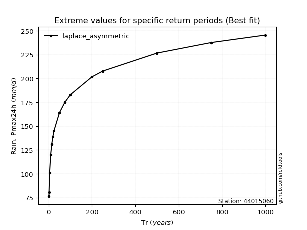</img>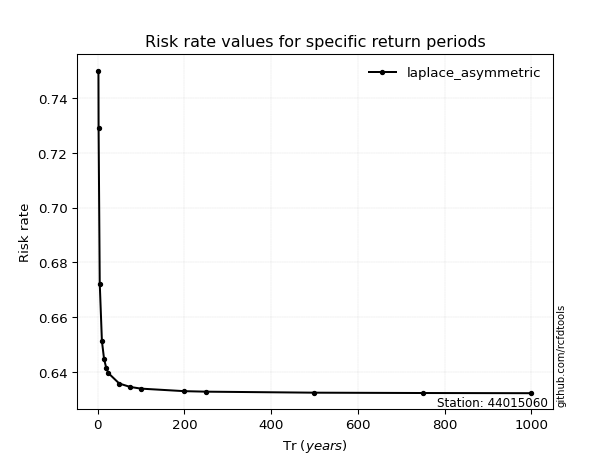</img>

</div>


<sub>**APP DISCLAIMER**: NO WARRANTY - This software is provided by [github.com/rcfdtools](https://github.com/rcfdtools) "as is", without any express or implied warranty, including warranties of merchantability, fitness for a particular purpose, or non-infringement. There is no guarantee that the software will be error-free or operate without interruption. LIMITATION OF LIABILITY - Neither the authors nor copyright holders will be liable for claims or damages arising from the software or its use. You are responsible for determining if the software is appropriate for your use and assume all associated risks, including errors, legal compliance, and data loss. NO PROFESSIONAL ADVICE - The software provides general information and does not offer professional advice. It should not replace consultation with professional advisors.</sub>