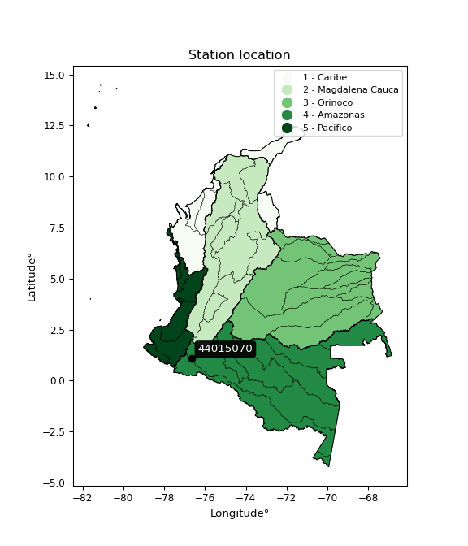

<div align="center">


</div>

# PMax24h Station (Rain): 44015070

Maximum Precipitation in 24 hours (PMax24h) is the greatest amount of rainfall for a specific duration that is meteorologically possible for a given location, acting as a "worst-case" scenario for extreme storms, crucial for designing safety-critical infrastructure like bridges, river deviations, dams, spillways, and nuclear plants to prevent catastrophic failure. The PMax24h is related with the Probable Maximum Precipitation (PMP) and it is calculated by hydrologists using meteorological data to determine the upper limit of extreme rainfall, often leading to the Probable Maximum Flood (PMF) for flood control design, and is increasingly being studied for climate change impacts. Probable Maximum Precipitation (PMP) is the theoretical upper limit of rainfall, a deterministic estimate for extreme events, while probability distributions (like GEV, Gumbel) describe the likelihood and frequency of various precipitation amounts, including rare ones, showing how often events occur, with PMP representing the extreme end of these distributions, used for critical infrastructure design to ensure safety against the worst conceivable weather, unlike standard statistical forecasts which cover typical probabilities.

The most common probability distributions in hydrology, used for analyzing floods, rainfall, and streamflow, include the Normal, Log-Normal, Gumbel, Gamma (including Log-Pearson Type III), and Generalized Extreme Value (GEV) distributions, often chosen based on the data´s skewness and whether modeling extremes or general conditions, with Gumbel and GEV popular for extreme events like floods, while the Normal distribution serves as a baseline, though often requiring transformations for skewed hydrological data. These distributions help in designing water infrastructure, managing water resources, and forecasting hydrologic events.

> Hydrological data often isn´t perfectly normal (it´s skewed), so different distributions are needed for different applications, such as: **Flood Frequency Analysis**: Using Gumbel, GEV, or Log-Pearson Type III for predicting extreme flood magnitudes and their return periods, **Rainfall Analysis**: Normal for annual totals, but Log-Normal, Weibull, or GEV for intensity or extreme daily rainfall, **Streamflow Modeling**: Gamma and Log-Normal for maximum flows, GEV for minimum flows, and Kappa for daily flows.

<div align="center">

</img>

</div>


## A. General information


### 1. General running parameters

• app_version: _v20260225_. • runtime: _2026-02-28 16:54:07.457399_. • Python version: _3.14.0_. • SciPy version: _1.16.3_. • Pandas version: _2.3.3_. • NumPy version: _2.3.5_. • Stations dataset (station_dataset_file): _dataset/pmax24h_in/automatic_colombia_2003_2025.csv_. • Stations catalog (station_catalog_file): _dataset/CNE.xls_. • Minimum year to eval til year_max (date_min): _1900_. • Maximum year to eval since year_min (date_max): _2025_. • Creates, save and include plots into reports (create_plot): _False_. • Plot only fit distributions with Δo > Δ (plot_only_fit): _True_. • Plot only simple graphs avoiding multiple CDFs and multiple Extreme values plots (plot_only_simple): _False_. • Eval low extreme values, if False, evaluates high extreme values (low_extreme): _False_. • Eval every SciPy distribution as logarithmic (pdist_logarithmic_on): _True_. • Standard deviation normalized (ddof): _1.0_. • Return periods to eval in years (Tr): _[2, 2.33, 5, 10, 15, 20, 25, 50, 75, 100, 200, 250, 500, 750, 1000]_. • Minimum data sample per station, 0 means any (minimum_sample): _5_. • Z-Score maximum threshold to adjust a value, 0 means disable (zscore_max): _3.5_. • Z-Score minimum threshold to adjust a value, 0 means disable (zscore_min): _-2.5_. • Avoid zeros, e.g. rain = 0 (avoid_zeros): _True_. • Avoid null values (avoid_nans): _True_. 

:file_folder:Table: [dataset.csv](../../dataset/pmax24h_in/automatic_colombia_2003_2025.csv)

> Delta Degrees of Freedom (DDOF): is a parameter used in the formulas for calculating variance and standard deviation. When ddof=0, the divisor is $N$ (the total number of observations) and this is used when your data set is the entire population. When ddof=1, the divisor is $N-1$ and this is used when your data set is a sample drawn from a larger population. Using $N-1$ provides an unbiased estimate of the population variance (known as Bessel´s correction).


### 2. Station info and location

|   id |   CODIGO | NOMBRE                     | CATEGORIA               | TECNOLOGIA                              | ESTADO   | FECHA_INSTALACION   |   FECHA_SUSPENSION |   ALTITUD |   LATITUD |   LONGITUD | DEPARTAMENTO   | MUNICIPIO   | AREA_OPERATIVA                      | ENTIDAD                                                     | AREA_HIDROGRAFICA   | ZONA_HIDROGRAFICA   | SUBZONA_HIDROGRAFICA   |   CORRIENTE | Catalogo   |   Version |
|-----:|---------:|:---------------------------|:------------------------|:----------------------------------------|:---------|:--------------------|-------------------:|----------:|----------:|-----------:|:---------------|:------------|:------------------------------------|:------------------------------------------------------------|:--------------------|:--------------------|:-----------------------|------------:|:-----------|----------:|
|    0 | 44015070 | EL PEPINO - AUT [44015070] | Climatológica Principal | Automática con Telemetría, Convencional | Activa   | 11/11/2005          |                nan |       760 |   1.08289 |   -76.6671 | Putumayo       | Mocoa       | Area Operativa 07 - Nariño-Putumayo | INSTITUTO DE HIDROLOGIA METEOROLOGIA Y ESTUDIOS AMBIENTALES | Amazonas            | Caquetá             | Alto Caqueta           |         nan | CNE_IDEAM  |  20251226 |

<div align="center">

Dynamic map: [:earth_americas:Google](http://maps.google.com/maps?q=1.082888889,-76.66711111) [:earth_americas:OSM](https://www.openstreetmap.org/#map=18/1.082888889/-76.66711111&layers=P) [:earth_americas:Bing](https://www.bing.com/maps?cp=1.082888889~-76.66711111&lvl=18) [:earth_americas:Apple](https://maps.apple.com/frame?center=1.082888889%2C-76.66711111&span=0.003%2C0.006)

</div>


<div align="center">

```geojson
{
  "type": "Feature",
  "geometry": {
    "type": "Point", 
    "coordinates": [-76.66711111, 1.082888889]
  }, 
  "properties": {
    "Name": "44015070"
  }
}
```

</div>


### 3. Discrete values table and plot

<div align="center">

|               |          0 |            1 |            2 |          3 |            4 |           5 |           6 |           7 |
|:--------------|-----------:|-------------:|-------------:|-----------:|-------------:|------------:|------------:|------------:|
| Date          | 2016       | 2017         | 2018         | 2019       | 2020         | 2021        | 2022        | 2025        |
| Value         |    1.6     |   72.4       |   73.6       |  153.3     |   74.1       |   51.8      |   55.2      |   86.6      |
| Value_initial |    1.6     |   72.4       |   73.6       |  153.3     |   74.1       |   51.8      |   55.2      |   86.6      |
| count         |    8       |    8         |    8         |    8       |    8         |    8        |    8        |    8        |
| mean          |   71.075   |   71.075     |   71.075     |   71.075   |   71.075     |   71.075    |   71.075    |   71.075    |
| std           |   42.2063  |   42.2063    |   42.2063    |   42.2063  |   42.2063    |   42.2063   |   42.2063   |   42.2063   |
| zscore        |   -1.64608 |    0.0313935 |    0.0598253 |    1.94817 |    0.0716718 |   -0.456686 |   -0.376129 |    0.367836 |


</div>


> The initial value (value_initial) correspond to the initial obtained or null completed value, and value (value) is adjusted only when the initial value is outside the valid range (outlier) definite through the Z-Score value. If Z-Score is active, values out of range or outliers are replaced with the station mean value. A Z-Score (or standard score) measures how many standard deviations a data point is from the mean of a dataset, indicating its relative position; positive scores mean above the mean, negative mean below, and a score of zero is exactly at the mean, allowing for comparison of values from different distributions. It´s calculated using the formula $z=(x–μ)/σ$, where $x$ is the data point, $μ$ is the mean, and $σ$ is the standard deviation, helping identify outliers and understand probability.
>
> <sub>**Note**: In this study, "completing" (filling gaps in) and "extending" (forecasting or lengthening the historical record) rainfall data series are avoided for certain critical analyses because they introduce artificial bias and uncertainty, which can distort the statistics of rare events (extremes), alter day-to-day variability, and compromise the integrity and homogeneity of the original data. Some reasons against Completing/Extending rainfall data are: **Distortion of Extremes and Variability**: The primary issue is that most gap-filling or extension methods rely on averaging or regression with nearby stations, which inherently smooths the data. Rainfall is highly variable in space and time, with a large percentage of zero values and occasional large storms. Infilling methods often underestimate the highest values and overestimate the lowest (zero) values, which severely distorts analyses focused on flood frequency, drought severity, and intensity-duration-frequency (IDF) curves, **Loss of Data Homogeneity**: Infilled or extended data are synthetic estimates, not actual measurements. Combining these estimates with observed data can violate the assumption of data homogeneity, which requires that the data properties do not change over time. Inhomogeneity can lead to incorrect conclusions about long-term trends or changes in climate patterns, **Propagation of Errors**: Errors and biases from the original data (e.g., wind-induced undercatch, instrument errors, site changes) or the data used for imputation can propagate through the analysis, leading to unreliable hydrological models and inaccurate predictions, **Compromised Statistical Integrity**: For statistical analyses, especially those involving the frequency of events, using artificial data can introduce time bias or autocorrelation that doesn´t exist in reality, making it difficult to assess the true probability of events, **Difficulty in Validation**: It is difficult to accurately validate the quality of filled or extended data, especially for past periods where ground-truth measurements are unavailable. The reliability of imputation techniques heavily depends on the density of the surrounding station network and the complexity of the local topography.</sub>


### 4. Active continuous probability distributions from SciPy (80 of 104 available)

A Probability Density Function (PDF) describes the relative likelihood of a continuous random variable falling within a specific range, where the total area under its curve equals 1, and the area over any interval gives the actual probability for that range. Unlike discrete probabilities (like rolling a die), a PDF shows density, not direct probability for a single point (which is zero), with higher points indicating higher likelihood, often visualized as a bell curve for normal distributions.

A log of a probability density function (log-PDF) is simply the logarithm of the PDF´s value, denoted as $log(f(x))$, useful for converting multiplication of probabilities into addition, improving numerical stability with tiny numbers, and connecting to information theory concepts like entropy. Instead of dealing with very small probabilities (e.g., 0.000001), log-PDFs use negative numbers (e.g., $log(0.00001) ≈ -11.51$ that are easier for computers to handle, preventing underflow errors and simplifying complex calculations. In this study, each active probability distribution from SciPy is also evaluated in the $log$ form.

[scipy.stats](https://docs.scipy.org/doc/scipy/reference/stats.html) is a Python´s powerful submodule within the SciPy library for comprehensive statistical analysis, offering over 130 probability distributions (like Normal, Poisson, etc.), functions for descriptive stats (mean, variance), hypothesis testing (t-tests, chi-square), random variable generation, and statistical tests, making it essential for data science, modeling, and research. It provides tools to explore, model, and draw conclusions from data efficiently, working seamlessly with [NumPy](https://numpy.org/).

<div align="center">

|   id | p_dist           |   n_parameter | fit_method   | label                                                                       | active   | ref                                                                                                      |
|-----:|:-----------------|--------------:|:-------------|:----------------------------------------------------------------------------|:---------|:---------------------------------------------------------------------------------------------------------|
|    0 | alpha            |             3 | MLE          | Alpha                                                                       | True     | [:mortar_board:](https://docs.scipy.org/doc/scipy/reference/generated/scipy.stats.alpha.html)            |
|    1 | anglit           |             2 | MM           | Anglit                                                                      | True     | [:mortar_board:](https://docs.scipy.org/doc/scipy/reference/generated/scipy.stats.anglit.html)           |
|    2 | arcsine          |             2 | MM           | Arcsine                                                                     | True     | [:mortar_board:](https://docs.scipy.org/doc/scipy/reference/generated/scipy.stats.arcsine.html)          |
|    3 | argus            |             3 | MLE          | Argus                                                                       | True     | [:mortar_board:](https://docs.scipy.org/doc/scipy/reference/generated/scipy.stats.argus.html)            |
|    4 | beta             |             4 | MLE          | Beta                                                                        | True     | [:mortar_board:](https://docs.scipy.org/doc/scipy/reference/generated/scipy.stats.beta.html)             |
|    5 | betaprime        |             4 | MLE          | Beta prime                                                                  | True     | [:mortar_board:](https://docs.scipy.org/doc/scipy/reference/generated/scipy.stats.betaprime.html)        |
|    6 | bradford         |             3 | MLE          | Bradford                                                                    | True     | [:mortar_board:](https://docs.scipy.org/doc/scipy/reference/generated/scipy.stats.bradford.html)         |
|    7 | burr             |             4 | MLE          | Burr (Type III)                                                             | True     | [:mortar_board:](https://docs.scipy.org/doc/scipy/reference/generated/scipy.stats.burr.html)             |
|    8 | burr12           |             4 | MLE          | Burr (Type III) 12                                                          | True     | [:mortar_board:](https://docs.scipy.org/doc/scipy/reference/generated/scipy.stats.burr12.html)           |
|    9 | cosine           |             2 | MLE          | Cosine                                                                      | True     | [:mortar_board:](https://docs.scipy.org/doc/scipy/reference/generated/scipy.stats.cosine.html)           |
|   10 | crystalball      |             4 | MLE          | Crystalball                                                                 | True     | [:mortar_board:](https://docs.scipy.org/doc/scipy/reference/generated/scipy.stats.crystalball.html)      |
|   11 | dgamma           |             3 | MLE          | Double gamma                                                                | True     | [:mortar_board:](https://docs.scipy.org/doc/scipy/reference/generated/scipy.stats.dgamma.html)           |
|   12 | dweibull         |             3 | MLE          | Double Weibull                                                              | True     | [:mortar_board:](https://docs.scipy.org/doc/scipy/reference/generated/scipy.stats.dweibull.html)         |
|   13 | erlang           |             3 | MLE          | Erlang                                                                      | True     | [:mortar_board:](https://docs.scipy.org/doc/scipy/reference/generated/scipy.stats.erlang.html)           |
|   14 | exponnorm        |             3 | MLE          | Exponentially modified Normal                                               | True     | [:mortar_board:](https://docs.scipy.org/doc/scipy/reference/generated/scipy.stats.exponnorm.html)        |
|   15 | exponpow         |             3 | MLE          | Exponential power                                                           | True     | [:mortar_board:](https://docs.scipy.org/doc/scipy/reference/generated/scipy.stats.exponpow.html)         |
|   16 | exponweib        |             4 | MLE          | Exponentiated Weibull                                                       | True     | [:mortar_board:](https://docs.scipy.org/doc/scipy/reference/generated/scipy.stats.exponweib.html)        |
|   17 | f                |             4 | MLE          | F                                                                           | True     | [:mortar_board:](https://docs.scipy.org/doc/scipy/reference/generated/scipy.stats.f.html)                |
|   18 | fatiguelife      |             3 | MLE          | Fatigue-life (Birnbaum-Saunders)                                            | True     | [:mortar_board:](https://docs.scipy.org/doc/scipy/reference/generated/scipy.stats.fatiguelife.html)      |
|   19 | foldnorm         |             3 | MM           | Fold Normal                                                                 | True     | [:mortar_board:](https://docs.scipy.org/doc/scipy/reference/generated/scipy.stats.foldnorm.html)         |
|   20 | gamma            |             3 | MLE          | Gamma                                                                       | True     | [:mortar_board:](https://docs.scipy.org/doc/scipy/reference/generated/scipy.stats.gamma.html)            |
|   21 | gausshyper       |             6 | MLE          | Gauss hypergeometric                                                        | True     | [:mortar_board:](https://docs.scipy.org/doc/scipy/reference/generated/scipy.stats.gausshyper.html)       |
|   22 | genexpon         |             5 | MLE          | Generalized exponential                                                     | True     | [:mortar_board:](https://docs.scipy.org/doc/scipy/reference/generated/scipy.stats.genexpon.html)         |
|   23 | genextreme       |             3 | MLE          | Generalized exponential                                                     | True     | [:mortar_board:](https://docs.scipy.org/doc/scipy/reference/generated/scipy.stats.genextreme.html)       |
|   24 | gengamma         |             4 | MLE          | Generalized gamma                                                           | True     | [:mortar_board:](https://docs.scipy.org/doc/scipy/reference/generated/scipy.stats.gengamma.html)         |
|   25 | genhalflogistic  |             3 | MLE          | Generalized half-logistic                                                   | True     | [:mortar_board:](https://docs.scipy.org/doc/scipy/reference/generated/scipy.stats.genhalflogistic.html)  |
|   26 | genlogistic      |             3 | MLE          | Generalized logistic                                                        | True     | [:mortar_board:](https://docs.scipy.org/doc/scipy/reference/generated/scipy.stats.genlogistic.html)      |
|   27 | gennorm          |             3 | MLE          | Generalized Normal                                                          | True     | [:mortar_board:](https://docs.scipy.org/doc/scipy/reference/generated/scipy.stats.gennorm.html)          |
|   28 | genpareto        |             3 | MLE          | Generalized Pareto                                                          | True     | [:mortar_board:](https://docs.scipy.org/doc/scipy/reference/generated/scipy.stats.genpareto.html)        |
|   29 | gompertz         |             3 | MLE          | Gompertz (or truncated Gumbel)                                              | True     | [:mortar_board:](https://docs.scipy.org/doc/scipy/reference/generated/scipy.stats.gompertz.html)         |
|   30 | gumbel_l         |             2 | MM           | Gumbel Left Skew                                                            | True     | [:mortar_board:](https://docs.scipy.org/doc/scipy/reference/generated/scipy.stats.gumbel_l.html)         |
|   31 | gumbel_r         |             2 | MM           | Gumbel Right Skew                                                           | True     | [:mortar_board:](https://docs.scipy.org/doc/scipy/reference/generated/scipy.stats.gumbel_r.html)         |
|   32 | halfgennorm      |             3 | MLE          | Upper half of a generalized normal                                          | True     | [:mortar_board:](https://docs.scipy.org/doc/scipy/reference/generated/scipy.stats.halfgennorm.html)      |
|   33 | halflogistic     |             2 | MM           | Half-logistic                                                               | True     | [:mortar_board:](https://docs.scipy.org/doc/scipy/reference/generated/scipy.stats.halflogistic.html)     |
|   34 | halfnorm         |             2 | MM           | Half Normal                                                                 | True     | [:mortar_board:](https://docs.scipy.org/doc/scipy/reference/generated/scipy.stats.halfnorm.html)         |
|   35 | hypsecant        |             2 | MM           | hyperbolic secant                                                           | True     | [:mortar_board:](https://docs.scipy.org/doc/scipy/reference/generated/scipy.stats.hypsecant.html)        |
|   36 | invgamma         |             3 | MLE          | Inverted gamma                                                              | True     | [:mortar_board:](https://docs.scipy.org/doc/scipy/reference/generated/scipy.stats.invgamma.html)         |
|   37 | invgauss         |             3 | MLE          | Inverse Gaussian                                                            | True     | [:mortar_board:](https://docs.scipy.org/doc/scipy/reference/generated/scipy.stats.invgauss.html)         |
|   38 | invweibull       |             3 | MLE          | Inverted Weibull                                                            | True     | [:mortar_board:](https://docs.scipy.org/doc/scipy/reference/generated/scipy.stats.invweibull.html)       |
|   39 | johnsonsb        |             4 | MLE          | Johnson SB                                                                  | True     | [:mortar_board:](https://docs.scipy.org/doc/scipy/reference/generated/scipy.stats.johnsonsb.html)        |
|   40 | johnsonsu        |             4 | MLE          | Johnson Su                                                                  | True     | [:mortar_board:](https://docs.scipy.org/doc/scipy/reference/generated/scipy.stats.johnsonsu.html)        |
|   41 | kappa3           |             3 | MLE          | Kappa 3                                                                     | True     | [:mortar_board:](https://docs.scipy.org/doc/scipy/reference/generated/scipy.stats.kappa3.html)           |
|   42 | kappa4           |             4 | MLE          | Kappa 4                                                                     | True     | [:mortar_board:](https://docs.scipy.org/doc/scipy/reference/generated/scipy.stats.kappa4.html)           |
|   43 | ksone            |             3 | MLE          | Kolmogorov-Smirnov one-sided test statistic distribution                    | True     | [:mortar_board:](https://docs.scipy.org/doc/scipy/reference/generated/scipy.stats.ksone.html)            |
|   44 | kstwobign        |             2 | MLE          | Limiting distribution of scaled Kolmogorov-Smirnov two-sided test statistic | True     | [:mortar_board:](https://docs.scipy.org/doc/scipy/reference/generated/scipy.stats.kstwobign.html)        |
|   45 | laplace          |             2 | MM           | Laplace                                                                     | True     | [:mortar_board:](https://docs.scipy.org/doc/scipy/reference/generated/scipy.stats.laplace.html)          |
|   46 | levy_l           |             2 | MLE          | Left-skewed Levy                                                            | True     | [:mortar_board:](https://docs.scipy.org/doc/scipy/reference/generated/scipy.stats.levy_l.html)           |
|   47 | loggamma         |             3 | MLE          | Log gamma                                                                   | True     | [:mortar_board:](https://docs.scipy.org/doc/scipy/reference/generated/scipy.stats.loggamma.html)         |
|   48 | logistic         |             2 | MM           | Logistic (or Sech-squared)                                                  | True     | [:mortar_board:](https://docs.scipy.org/doc/scipy/reference/generated/scipy.stats.logistic.html)         |
|   49 | loglaplace       |             3 | MLE          | Log-Laplace                                                                 | True     | [:mortar_board:](https://docs.scipy.org/doc/scipy/reference/generated/scipy.stats.loglaplace.html)       |
|   50 | lomax            |             3 | MLE          | Lomax (Pareto of the second kind)                                           | True     | [:mortar_board:](https://docs.scipy.org/doc/scipy/reference/generated/scipy.stats.lomax.html)            |
|   51 | maxwell          |             2 | MM           | Maxwell                                                                     | True     | [:mortar_board:](https://docs.scipy.org/doc/scipy/reference/generated/scipy.stats.maxwell.html)          |
|   52 | mielke           |             4 | MLE          | Mielke Beta-Kappa / Dagum                                                   | True     | [:mortar_board:](https://docs.scipy.org/doc/scipy/reference/generated/scipy.stats.mielke.html)           |
|   53 | moyal            |             2 | MM           | Moyal                                                                       | True     | [:mortar_board:](https://docs.scipy.org/doc/scipy/reference/generated/scipy.stats.moyal.html)            |
|   54 | nakagami         |             3 | MLE          | Nakagami                                                                    | True     | [:mortar_board:](https://docs.scipy.org/doc/scipy/reference/generated/scipy.stats.nakagami.html)         |
|   55 | ncf              |             5 | MLE          | Non-central F distribution                                                  | True     | [:mortar_board:](https://docs.scipy.org/doc/scipy/reference/generated/scipy.stats.ncf.html)              |
|   56 | nct              |             4 | MLE          | Non-central Student’s t                                                     | True     | [:mortar_board:](https://docs.scipy.org/doc/scipy/reference/generated/scipy.stats.nct.html)              |
|   57 | norm             |             2 | MM           | Normal                                                                      | True     | [:mortar_board:](https://docs.scipy.org/doc/scipy/reference/generated/scipy.stats.norm.html)             |
|   58 | pearson3         |             3 | MM           | Pearson type III                                                            | True     | [:mortar_board:](https://docs.scipy.org/doc/scipy/reference/generated/scipy.stats.pearson3.html)         |
|   59 | powerlaw         |             3 | MLE          | Power-function                                                              | True     | [:mortar_board:](https://docs.scipy.org/doc/scipy/reference/generated/scipy.stats.powerlaw.html)         |
|   60 | rayleigh         |             2 | MM           | Rayleigh                                                                    | True     | [:mortar_board:](https://docs.scipy.org/doc/scipy/reference/generated/scipy.stats.rayleigh.html)         |
|   61 | rdist            |             3 | MLE          | R-distributed (symmetric beta)                                              | True     | [:mortar_board:](https://docs.scipy.org/doc/scipy/reference/generated/scipy.stats.rdist.html)            |
|   62 | rice             |             3 | MLE          | Rice                                                                        | True     | [:mortar_board:](https://docs.scipy.org/doc/scipy/reference/generated/scipy.stats.rice.html)             |
|   63 | semicircular     |             2 | MM           | Semicircular                                                                | True     | [:mortar_board:](https://docs.scipy.org/doc/scipy/reference/generated/scipy.stats.semicircular.html)     |
|   64 | skewnorm         |             3 | MLE          | Skew normal                                                                 | True     | [:mortar_board:](https://docs.scipy.org/doc/scipy/reference/generated/scipy.stats.skewnorm.html)         |
|   65 | t                |             3 | MLE          | Student’s t                                                                 | True     | [:mortar_board:](https://docs.scipy.org/doc/scipy/reference/generated/scipy.stats.t.html)                |
|   66 | trapezoid        |             4 | MLE          | Trapezoid                                                                   | True     | [:mortar_board:](https://docs.scipy.org/doc/scipy/reference/generated/scipy.stats.trapezoid.html)        |
|   67 | triang           |             3 | MLE          | Triangular                                                                  | True     | [:mortar_board:](https://docs.scipy.org/doc/scipy/reference/generated/scipy.stats.triang.html)           |
|   68 | truncexpon       |             3 | MLE          | Truncated exponential                                                       | True     | [:mortar_board:](https://docs.scipy.org/doc/scipy/reference/generated/scipy.stats.truncexpon.html)       |
|   69 | truncnorm        |             4 | MLE          | Truncated normal                                                            | True     | [:mortar_board:](https://docs.scipy.org/doc/scipy/reference/generated/scipy.stats.truncnorm.html)        |
|   70 | truncpareto      |             4 | MLE          | Upper truncated Pareto                                                      | True     | [:mortar_board:](https://docs.scipy.org/doc/scipy/reference/generated/scipy.stats.truncpareto.html)      |
|   71 | truncweibull_min |             5 | MLE          | Doubly truncated Weibull minimum                                            | True     | [:mortar_board:](https://docs.scipy.org/doc/scipy/reference/generated/scipy.stats.truncweibull_min.html) |
|   72 | tukeylambda      |             3 | MLE          | Tukey-Lamdba                                                                | True     | [:mortar_board:](https://docs.scipy.org/doc/scipy/reference/generated/scipy.stats.tukeylambda.html)      |
|   73 | uniform          |             2 | MLE          | Uniform                                                                     | True     | [:mortar_board:](https://docs.scipy.org/doc/scipy/reference/generated/scipy.stats.uniform.html)          |
|   74 | vonmises         |             3 | MLE          | Von Mises                                                                   | True     | [:mortar_board:](https://docs.scipy.org/doc/scipy/reference/generated/scipy.stats.vonmises.html)         |
|   75 | vonmises_line    |             3 | MLE          | Von Mises line                                                              | True     | [:mortar_board:](https://docs.scipy.org/doc/scipy/reference/generated/scipy.stats.vonmises_line.html)    |
|   76 | wald             |             2 | MM           | Wald                                                                        | True     | [:mortar_board:](https://docs.scipy.org/doc/scipy/reference/generated/scipy.stats.wald.html)             |
|   77 | weibull_max      |             3 | MLE          | Weibull maximum                                                             | True     | [:mortar_board:](https://docs.scipy.org/doc/scipy/reference/generated/scipy.stats.weibull_max.html)      |
|   78 | weibull_min      |             3 | MLE          | Weibull minimum                                                             | True     | [:mortar_board:](https://docs.scipy.org/doc/scipy/reference/generated/scipy.stats.weibull_min.html)      |
|   79 | wrapcauchy       |             3 | MLE          | Wrapped  Cauchy                                                             | True     | [:mortar_board:](https://docs.scipy.org/doc/scipy/reference/generated/scipy.stats.wrapcauchy.html)       |

</div>

> **n_parameter:** # arguments & localization & scale.
>
> **Fit methods:** (MLE) maximum likelihood, (MM) L-moments.
>
>**Inactive** (With the only purpose of prevent loops, zero divisions, infinite values, over high estimated values or horizontal trending for recurrence intervals estimations, the follow distributions were disabled.)**:** lognorm, norminvgauss, powernorm, powerlognorm, cauchy, halfcauchy, foldcauchy, skewcauchy, chi2, expon, fisk, genhyperbolic, geninvgauss, gibrat, kstwo, laplace_asymmetric, levy, levy_stable, ncx2, pareto, rel_breitwigner, recipinvgauss, studentized_range, loguniform, 


## B. Probability (PDF) vs. Empirical (EDF) distributions functions

A continuous probability distribution (CPD) describes probabilities for variables that can take any value within a range (like rain any time), unlike discrete variables with specific outcomes (like temperature). It uses a Probability Density Function (PDF), a curve where the total area under it equals 1, and the probability of the variable falling within an interval (a to b) is found by calculating the area under the curve between those points. A key feature is that the probability of hitting any single exact value is zero, so probabilities are always expressed for ranges, e.g., $P(a ≤ X ≤ b)$.

<div align="center">

Distributions parameters from station values
|     |   station | p_dist              |   n |              loc |            scale | shape                  | shape1                | shape2                | shape3             |
|----:|----------:|:--------------------|----:|-----------------:|-----------------:|:-----------------------|:----------------------|:----------------------|:-------------------|
|   0 |  44015070 | alpha               |   8 |     -0.0067995   |      4.54699     | 4.829959719197308e-12  |                       |                       |                    |
|   1 |  44015070 | anglit              |   8 |     71.075       |    115.496       |                        |                       |                       |                    |
|   2 |  44015070 | arcsine             |   8 |     15.2414      |    111.667       |                        |                       |                       |                    |
|   3 |  44015070 | argus               |   8 |    -30.2464      |    190.167       | 1.096655985311381e-06  |                       |                       |                    |
|   4 |  44015070 | beta                |   8 |   -171.32        |      1.77387e+07 | 37.9194156360616       | 2774958.559220557     |                       |                    |
|   5 |  44015070 | betaprime           |   8 |   -171.684       | 102385           | 38.125933173999655     | 16080.84292027956     |                       |                    |
|   6 |  44015070 | bradford            |   8 |      1.59999     |    151.7         | 2.0592219077972063     |                       |                       |                    |
|   7 |  44015070 | burr                |   8 |      1.6         |    120.674       | 5.003707826311974      | 0.14996784575657918   |                       |                    |
|   8 |  44015070 | burr12              |   8 |    -23.5788      |   1593.16        | 2.533692657707235      | 951.8121972375252     |                       |                    |
|   9 |  44015070 | cosine              |   8 |     73.8231      |     35.895       |                        |                       |                       |                    |
|  10 |  44015070 | crystalball         |   8 |     71.0749      |     39.4804      | 5990.332193305621      | 874.1188309253625     |                       |                    |
|  11 |  44015070 | dgamma              |   8 |     73.6         |     34.2972      | 0.5725264434913369     |                       |                       |                    |
|  12 |  44015070 | dweibull            |   8 |     74.1         |     28.3091      | 0.9281439568220418     |                       |                       |                    |
|  13 |  44015070 | erlang              |   8 |   -171.258       |      6.39401     | 37.89996344385844      |                       |                       |                    |
|  14 |  44015070 | exponnorm           |   8 |     43.1547      |     28.2152      | 0.9895453365832423     |                       |                       |                    |
|  15 |  44015070 | exponpow            |   8 |      1.6         |      3.63862     | 0.09310823481908592    |                       |                       |                    |
|  16 |  44015070 | exponweib           |   8 |  -1328.12        |    967.421       | 1134.1511226177072     | 5.467224565297961     |                       |                    |
|  17 |  44015070 | f                   |   8 |   -171.584       |    242.649       | 76.13197157072078      | 46836.97260352233     |                       |                    |
|  18 |  44015070 | fatiguelife         |   8 |   -281.026       |    349.921       | 0.11163740780181086    |                       |                       |                    |
|  19 |  44015070 | foldnorm            |   8 |      4.51607     |     44.0342      | 1.4451899309922875     |                       |                       |                    |
|  20 |  44015070 | gamma               |   8 |   -171.258       |      6.39402     | 37.89994445014445      |                       |                       |                    |
|  21 |  44015070 | gausshyper          |   8 |      1.6         |    159.84        | 0.3613469828698931     | 1.2288474321487417    | -0.7130715837945398   | 2.025647273900111  |
|  22 |  44015070 | genexpon            |   8 |      1.59987     |      2.4063      | 0.03438576422632757    | 5.560340233172415e-08 | 1.764190741889228     |                    |
|  23 |  44015070 | genextreme          |   8 |     55.7244      |     37.2369      | 0.1876255016126206     |                       |                       |                    |
|  24 |  44015070 | gengamma            |   8 |   -126.543       |     33.0076      | 12.646596559375602     | 1.4118054193661047    |                       |                    |
|  25 |  44015070 | genhalflogistic     |   8 |    -14.0091      |    174.262       | 1.0415577641867966     |                       |                       |                    |
|  26 |  44015070 | genlogistic         |   8 |     63.0976      |     22.0133      | 1.2313662419938745     |                       |                       |                    |
|  27 |  44015070 | gennorm             |   8 |     72.4         |      1.15535     | 0.3938105146078196     |                       |                       |                    |
|  28 |  44015070 | genpareto           |   8 |     -0.376877    |    214.906       | -1.3984249389717642    |                       |                       |                    |
|  29 |  44015070 | gompertz            |   8 |     51.8         |      8.31578     | 3.4198918557703695e-05 |                       |                       |                    |
|  30 |  44015070 | gumbel_l            |   8 |     88.8433      |     30.7827      |                        |                       |                       |                    |
|  31 |  44015070 | gumbel_r            |   8 |     53.3067      |     30.7827      |                        |                       |                       |                    |
|  32 |  44015070 | halfgennorm         |   8 |      1.6         |      4.73026     | 0.39184055035595844    |                       |                       |                    |
|  33 |  44015070 | halflogistic        |   8 |     24.2816      |     33.7543      |                        |                       |                       |                    |
|  34 |  44015070 | halfnorm            |   8 |     18.8185      |     65.4938      |                        |                       |                       |                    |
|  35 |  44015070 | hypsecant           |   8 |     71.075       |     25.134       |                        |                       |                       |                    |
|  36 |  44015070 | invgamma            |   8 |   -274.499       |  26233.2         | 76.81513560272953      |                       |                       |                    |
|  37 |  44015070 | invgauss            |   8 |   -151.407       |   6625.04        | 0.03363432202919521    |                       |                       |                    |
|  38 |  44015070 | invweibull          |   8 |      1.6         |      3.00427     | 0.04654334754845338    |                       |                       |                    |
|  39 |  44015070 | johnsonsb           |   8 |   -244.499       |   3726.32        | 17.539172573342086     | 7.344012438961094     |                       |                    |
|  40 |  44015070 | johnsonsu           |   8 |     73.723       |      0.484971    | 0.1948531908299872     | 0.25832417766306714   |                       |                    |
|  41 |  44015070 | kappa3              |   8 |      1.59999     |     83.7003      | 5.460980791287911      |                       |                       |                    |
|  42 |  44015070 | kappa4              |   8 |    -13.4941      |    168.312       | 1.098508771300238      | 0.9989517520120468    |                       |                    |
|  43 |  44015070 | ksone               |   8 |    -13.57        |    182.04        | 1.0                    |                       |                       |                    |
|  44 |  44015070 | kstwobign           |   8 |    -81.7254      |    175.832       |                        |                       |                       |                    |
|  45 |  44015070 | laplace             |   8 |     71.075       |     27.9168      |                        |                       |                       |                    |
|  46 |  44015070 | levy_l              |   8 |    163.013       |     45.9842      |                        |                       |                       |                    |
|  47 |  44015070 | loggamma            |   8 |  -8489.03        |   1247.6         | 954.9099423452299      |                       |                       |                    |
|  48 |  44015070 | logistic            |   8 |     71.075       |     21.7666      |                        |                       |                       |                    |
|  49 |  44015070 | loglaplace          |   8 |     -0.205361    |     73.8053      | 1.5188597188131623     |                       |                       |                    |
|  50 |  44015070 | lomax               |   8 |      1.6         |      5.88078e+11 | 8723753876.98158       |                       |                       |                    |
|  51 |  44015070 | maxwell             |   8 |    -22.4768      |     58.6249      |                        |                       |                       |                    |
|  52 |  44015070 | mielke              |   8 |      1.6         |    106.989       | 0.9478012040612009     | 5.986767931405717     |                       |                    |
|  53 |  44015070 | moyal               |   8 |     48.4976      |     17.7724      |                        |                       |                       |                    |
|  54 |  44015070 | nakagami            |   8 |      1.6         |     74.6824      | 0.26911759790816664    |                       |                       |                    |
|  55 |  44015070 | ncf                 |   8 |     -0.00755397  |      7.76809e-05 | 5.897857517788719e-06  | 4.828512198877786     | 4.082255283223886     |                    |
|  56 |  44015070 | nct                 |   8 |     73.7524      |     11.7098      | 1.021405343889091      | -0.21689803048079623  |                       |                    |
|  57 |  44015070 | norm                |   8 |     71.075       |     39.4803      |                        |                       |                       |                    |
|  58 |  44015070 | pearson3            |   8 |     71.075       |     39.4803      | 0.43308533601333143    |                       |                       |                    |
|  59 |  44015070 | powerlaw            |   8 |      1.6         |    151.7         | 0.17377455059847144    |                       |                       |                    |
|  60 |  44015070 | rayleigh            |   8 |     -4.45319     |     60.2628      |                        |                       |                       |                    |
|  61 |  44015070 | rdist               |   8 |    -13.7453      |     87.8453      | 0.9576813005010925     |                       |                       |                    |
|  62 |  44015070 | rice                |   8 |    -18.8113      |     44.0395      | 1.7232252704410391     |                       |                       |                    |
|  63 |  44015070 | semicircular        |   8 |     71.075       |     78.9607      |                        |                       |                       |                    |
|  64 |  44015070 | skewnorm            |   8 |     35.5453      |     53.1136      | 1.582437087993778      |                       |                       |                    |
|  65 |  44015070 | t                   |   8 |     67.3778      |     31.6815      | 3.1806702517340746     |                       |                       |                    |
|  66 |  44015070 | trapezoid           |   8 |    -14.2485      |    182.04        | 1.0                    | 1.0                   |                       |                    |
|  67 |  44015070 | triang              |   8 |    -15.068       |    168.368       | 0.9999998612314946     |                       |                       |                    |
|  68 |  44015070 | truncexpon          |   8 |      1.59887     |    151.684       | 1.0001126378285923     |                       |                       |                    |
|  69 |  44015070 | truncnorm           |   8 |     38.3378      |     21.4943      | -22.620967049662706    | 5.3484976835557365    |                       |                    |
|  70 |  44015070 | truncpareto         |   8 |      1.57439     |      0.0256083   | 0.1432699563018946     | 5924.870853499543     |                       |                    |
|  71 |  44015070 | truncweibull_min    |   8 |     -3.56596     |    148.652       | 1.2861170727596156     | 0.0011826069369586523 | 1.0552589013884983    |                    |
|  72 |  44015070 | tukeylambda         |   8 |     -5.34805     |    107.754       | 1.356276802772481      |                       |                       |                    |
|  73 |  44015070 | uniform             |   8 |      1.6         |    151.7         |                        |                       |                       |                    |
|  74 |  44015070 | vonmises            |   8 |     -2.31169     |      1           | 0.5031455028071545     |                       |                       |                    |
|  75 |  44015070 | vonmises_line       |   8 |     77.4398      |     24.1471      | 0.8026315283953371     |                       |                       |                    |
|  76 |  44015070 | wald                |   8 |     31.5947      |     39.4803      |                        |                       |                       |                    |
|  77 |  44015070 | weibull_max         |   8 |    153.3         |      1.66031     | 0.20799283542301567    |                       |                       |                    |
|  78 |  44015070 | weibull_min         |   8 |    -23.5178      |    106.308       | 2.5300132121315526     |                       |                       |                    |
|  79 |  44015070 | wrapcauchy          |   8 |      1.26325     |     24.1974      | 4.260182205803664e-06  |                       |                       |                    |
|  80 |  44015070 | logalpha            |   8 |    -34.7783      |   1055.67        | 27.318866400438523     |                       |                       |                    |
|  81 |  44015070 | loganglit           |   8 |      3.85104     |      3.84597     |                        |                       |                       |                    |
|  82 |  44015070 | logarcsine          |   8 |      1.99181     |      3.71847     |                        |                       |                       |                    |
|  83 |  44015070 | logargus            |   8 |     -1.6609      |      6.76143     | 3.056974694028585      |                       |                       |                    |
|  84 |  44015070 | logbeta             |   8 |      0.0134037   |      5.01899     | 0.39991925621557267    | 0.07054098844836036   |                       |                    |
|  85 |  44015070 | logbetaprime        |   8 |    -25.7089      |     78.9808      | 602.5393955833174      | 1611.8843634195641    |                       |                    |
|  86 |  44015070 | logbradford         |   8 |      0.470001    |      4.56251     | 0.9975862099285968     |                       |                       |                    |
|  87 |  44015070 | logburr             |   8 | -39319.7         |  39324.5         | 232253.40815933957     | 0.1793554800445185    |                       |                    |
|  88 |  44015070 | logburr12           |   8 | -12766.5         |  12783.1         | 15257.121104562197     | 2255407.114268508     |                       |                    |
|  89 |  44015070 | logcosine           |   8 |      3.48084     |      1.26208     |                        |                       |                       |                    |
|  90 |  44015070 | logcrystalball      |   8 |      3.85104     |      1.31468     | 19.30263303464472      | 178.88506348864024    |                       |                    |
|  91 |  44015070 | logdgamma           |   8 |      4.29865     |      0.957114    | 0.6788522302876945     |                       |                       |                    |
|  92 |  44015070 | logdweibull         |   8 |      4.30542     |      0.92377     | 0.8197044035736047     |                       |                       |                    |
|  93 |  44015070 | logerlang           |   8 |     -7.68694     |      0.218951    | 52.868007025672554     |                       |                       |                    |
|  94 |  44015070 | logexponnorm        |   8 |      3.85009     |      1.31468     | 0.0007254984570620322  |                       |                       |                    |
|  95 |  44015070 | logexponpow         |   8 |     -1.21828e+08 |      1.21828e+08 | 136188117.7159186      |                       |                       |                    |
|  96 |  44015070 | logexponweib        |   8 |     -4.29128e+07 |      4.29129e+07 | 0.006060141692419299   | 5908476679.433958     |                       |                    |
|  97 |  44015070 | logf                |   8 |  -3564.34        |   3568.19        | 40734437.90490181      | 22891371.988965377    |                       |                    |
|  98 |  44015070 | logfatiguelife      |   8 |   -805.459       |    809.315       | 0.0016178698250305145  |                       |                       |                    |
|  99 |  44015070 | logfoldnorm         |   8 |      0.00928692  |      1.08989     | 3.5633531240772918     |                       |                       |                    |
| 100 |  44015070 | loggamma            |   8 |    -18.8541      |      0.0896967   | 253.1164537008205      |                       |                       |                    |
| 101 |  44015070 | loggausshyper       |   8 |      0.0162958   |      5.0161      | 1.634956050236685      | 0.4992647743180929    | 0.8853389069797379    | 0.5722478619165303 |
| 102 |  44015070 | loggenexpon         |   8 |      0.0326529   |      0.0951415   | 0.0006370642702228169  | 14.794458102440098    | 7.298491652054703e-05 |                    |
| 103 |  44015070 | loggenextreme       |   8 |      3.77646     |      1.42543     | 1.1349537536356613     |                       |                       |                    |
| 104 |  44015070 | loggengamma         |   8 |     -9.84817e+07 |      9.84817e+07 | 0.0036352604910547728  | 22686037069.7425      |                       |                    |
| 105 |  44015070 | loggenhalflogistic  |   8 |      0.0125949   |      5.5249      | 1.1006217111531607     |                       |                       |                    |
| 106 |  44015070 | loggenlogistic      |   8 |      4.73211     |      0.182058    | 0.19493690347841458    |                       |                       |                    |
| 107 |  44015070 | loggennorm          |   8 |      4.30542     |      0.00237563  | 0.28949473611466425    |                       |                       |                    |
| 108 |  44015070 | loggenpareto        |   8 |     -0.00645974  |      9.23895     | -1.8335405675339005    |                       |                       |                    |
| 109 |  44015070 | loggompertz         |   8 |      0.0207363   |      0.684325    | 0.0018318820636204522  |                       |                       |                    |
| 110 |  44015070 | loggumbel_l         |   8 |      4.44271     |      1.02505     |                        |                       |                       |                    |
| 111 |  44015070 | loggumbel_r         |   8 |      3.25937     |      1.02505     |                        |                       |                       |                    |
| 112 |  44015070 | loghalfgennorm      |   8 |      0.469946    |      4.64141     | 133.7572710428749      |                       |                       |                    |
| 113 |  44015070 | loghalflogistic     |   8 |      2.29285     |      1.12399     |                        |                       |                       |                    |
| 114 |  44015070 | loghalfnorm         |   8 |      2.1109      |      2.18094     |                        |                       |                       |                    |
| 115 |  44015070 | loghypsecant        |   8 |      3.85104     |      0.836949    |                        |                       |                       |                    |
| 116 |  44015070 | loginvgamma         |   8 |    -31.8689      |  22634           | 635.1682866543945      |                       |                       |                    |
| 117 |  44015070 | loginvgauss         |   8 |    -11.9137      |   1722.9         | 0.009126805761861971   |                       |                       |                    |
| 118 |  44015070 | loginvweibull       |   8 |     -8.77801e+07 |      8.77801e+07 | 50693309.002681516     |                       |                       |                    |
| 119 |  44015070 | logjohnsonsb        |   8 |      0.0368932   |      4.9955      | -0.5154482406645287    | 0.1657397651062239    |                       |                    |
| 120 |  44015070 | logjohnsonsu        |   8 |      4.30077     |      0.00554096  | 0.2577970301804742     | 0.238990708461861     |                       |                    |
| 121 |  44015070 | logkappa3           |   8 |      0.459977    |      4.56745     | 1910.3763565769987     |                       |                       |                    |
| 122 |  44015070 | logkappa4           |   8 |      0.0107184   |      6.00148     | 1.0797206817354725     | 1.1951150937913044    |                       |                    |
| 123 |  44015070 | logksone            |   8 |      0.0137643   |      5.47487     | 1.0                    |                       |                       |                    |
| 124 |  44015070 | logkstwobign        |   8 |     -3.25213     |      8.14309     |                        |                       |                       |                    |
| 125 |  44015070 | loglaplace          |   8 |      3.85104     |      0.929617    |                        |                       |                       |                    |
| 126 |  44015070 | loglevy_l           |   8 |      5.13141     |      0.466944    |                        |                       |                       |                    |
| 127 |  44015070 | logloggamma         |   8 |      4.92025     |      0.256824    | 0.253787969524947      |                       |                       |                    |
| 128 |  44015070 | loglogistic         |   8 |      3.85104     |      0.724819    |                        |                       |                       |                    |
| 129 |  44015070 | logloglaplace       |   8 |     -7.60808e+07 |      7.60808e+07 | 111775251.91540855     |                       |                       |                    |
| 130 |  44015070 | loglomax            |   8 |      0.470004    |      7.48506e+11 | 264137366208.15942     |                       |                       |                    |
| 131 |  44015070 | logmaxwell          |   8 |      0.735793    |      1.95219     |                        |                       |                       |                    |
| 132 |  44015070 | logmielke           |   8 | -12485.2         |  12490.3         | 10614.085506534448     | 492584.8407199844     |                       |                    |
| 133 |  44015070 | logmoyal            |   8 |      3.09922     |      0.591812    |                        |                       |                       |                    |
| 134 |  44015070 | lognakagami         |   8 |  -2038.49        |   2042.34        | 600592.020012164       |                       |                       |                    |
| 135 |  44015070 | logncf              |   8 |     -0.625917    |      3.83327e-07 | 2.8794941877633134e-06 | 412.359389429664      | 33.716978938296975    |                    |
| 136 |  44015070 | lognct              |   8 |    -79.8306      |      1.30263     | 86512.39193861891      | 64.23914426582778     |                       |                    |
| 137 |  44015070 | lognorm             |   8 |      3.85104     |      1.31468     |                        |                       |                       |                    |
| 138 |  44015070 | logpearson3         |   8 |      3.85104     |      1.31467     | -2.008184711000716     |                       |                       |                    |
| 139 |  44015070 | logpowerlaw         |   8 |      0.470004    |      4.56239     | 0.19932682287648767    |                       |                       |                    |
| 140 |  44015070 | lograyleigh         |   8 |      1.33597     |      2.00673     |                        |                       |                       |                    |
| 141 |  44015070 | logrdist            |   8 |      1.18023     |      0.710227    | 1.4898647544107044     |                       |                       |                    |
| 142 |  44015070 | logrice             |   8 |   -318.262       |      1.31457     | 245.02992955516675     |                       |                       |                    |
| 143 |  44015070 | logsemicircular     |   8 |      3.85104     |      2.62937     |                        |                       |                       |                    |
| 144 |  44015070 | logskewnorm         |   8 |      5.0324      |      1.76749     | -89016203.94015217     |                       |                       |                    |
| 145 |  44015070 | logt                |   8 |      4.29907     |      0.0167361   | 0.31820695461935855    |                       |                       |                    |
| 146 |  44015070 | logtrapezoid        |   8 |      0.132573    |      5.5777      | 1.0                    | 1.0                   |                       |                    |
| 147 |  44015070 | logtriang           |   8 |      0.162472    |      4.86993     | 0.9999996377406519     |                       |                       |                    |
| 148 |  44015070 | logtruncexpon       |   8 |      0.013422    |      8.6996      | 0.5769203171798212     |                       |                       |                    |
| 149 |  44015070 | logtruncnorm        |   8 |      2.28297     |      3.12809     | -0.5799149400730474    | 46.363630010531836    |                       |                    |
| 150 |  44015070 | logtruncpareto      |   8 |      0.468683    |      0.00132088  | 0.14325048296639764    | 3455.050585470959     |                       |                    |
| 151 |  44015070 | logtruncweibull_min |   8 |     -0.0139361   |      9.82927     | 2.549885763230824      | 0.005835426521381188  | 0.5133984545515853    |                    |
| 152 |  44015070 | logtukeylambda      |   8 |      0.432903    |      0.0609086   | 1.6416991282326725     |                       |                       |                    |
| 153 |  44015070 | loguniform          |   8 |      0.470004    |      4.56239     |                        |                       |                       |                    |
| 154 |  44015070 | logvonmises         |   8 |     -1.84397     |      1           | 2.2819273331301937     |                       |                       |                    |
| 155 |  44015070 | logvonmises_line    |   8 |      4.15026     |      1.17146     | 2.052404636747383      |                       |                       |                    |
| 156 |  44015070 | logwald             |   8 |      2.53633     |      1.3147      |                        |                       |                       |                    |
| 157 |  44015070 | logweibull_max      |   8 |      5.0324      |      1.55869     | 0.914348409247955      |                       |                       |                    |
| 158 |  44015070 | logweibull_min      |   8 |     -5.31436e+07 |      5.31436e+07 | 78457181.14233604      |                       |                       |                    |
| 159 |  44015070 | logwrapcauchy       |   8 |      0.469967    |      0.726133    | 0.4024409238157176     |                       |                       |                    |

</div>

> **loc** (Location parameter): This shifts the distribution along the x-axis. For many common distributions, like the normal (Gaussian) distribution, loc represents the mean $μ$. For others, like the uniform distribution, it might represent the minimum value, or for the beta distribution, the left end of the support interval.
>
> **scale** (Scale parameter): This determines the width or spread of the distribution. For the normal distribution, scale represents the standard deviation $σ$. For a uniform distribution, it defines the length of the interval (from $loc$ to $loc + scale$).
>
> **shape** (Shape parameters): Refers to parameters that define the specific form of a probability distribution, distinct from its location (loc) and scale (scale). These parameters are required arguments for most distribution functions. For example, a normal (Gaussian) distribution is fully defined by its location (mean) and scale (standard deviation), so it has no specific shape parameters beyond loc and scale. However, other distributions have intrinsic properties that need specification, as Gamma distribution that takes a shape parameter, often named $a$ or $alpha$.


### 0. Cumulative distribution values - CDF (160 evaluated)

Cumulative Distribution Function (CDF), denoted as $F$<sub>$X$</sub>$(x)$, is a function that gives the probability that a random variable $X$ will take a value less than or equal to a specific value, $x$ (i.e., $(P(X≥x)$. It essentially "accumulates" probabilities from a given point up to the far right (positive infinity), providing a complete picture of the distribution´s probabilities for both discrete (like rain) and continuous (like temperature) variables, helping to find probabilities over ranges or above certain values. Each station is evaluated separately ordering the $x$ values ascending, calculating the CDF and PDF values for the activated distributions and their logarithmic forms.

<div align="center">

CDF ordered by x ascending and calculating $log(f(x))$ separately
|   id |   Station |   date |     x |   count |   mean |     std |     zscore |   Value_initial |   station |   m |      alpha |   alpha_pdf |    anglit |   anglit_pdf |   arcsine |   arcsine_pdf |     argus |   argus_pdf |      beta |   beta_pdf |   betaprime |   betaprime_pdf |    bradford |   bradford_pdf |        burr |   burr_pdf |    burr12 |   burr12_pdf |    cosine |   cosine_pdf |   crystalball |   crystalball_pdf |    dgamma |      dgamma_pdf |   dweibull |   dweibull_pdf |   erlang |   erlang_pdf |   exponnorm |   exponnorm_pdf |   exponpow |   exponpow_pdf |   exponweib |   exponweib_pdf |         f |      f_pdf |   fatiguelife |   fatiguelife_pdf |   foldnorm |   foldnorm_pdf |    gamma |   gamma_pdf |   gausshyper |   gausshyper_pdf |   genexpon |   genexpon_pdf |   genextreme |   genextreme_pdf |   gengamma |   gengamma_pdf |   genhalflogistic |   genhalflogistic_pdf |   genlogistic |   genlogistic_pdf |   gennorm |   gennorm_pdf |   genpareto |   genpareto_pdf |    gompertz |   gompertz_pdf |   gumbel_l |   gumbel_l_pdf |   gumbel_r |   gumbel_r_pdf |   halfgennorm |   halfgennorm_pdf |   halflogistic |   halflogistic_pdf |   halfnorm |   halfnorm_pdf |   hypsecant |   hypsecant_pdf |   invgamma |   invgamma_pdf |   invgauss |   invgauss_pdf |   invweibull |   invweibull_pdf |   johnsonsb |   johnsonsb_pdf |   johnsonsu |   johnsonsu_pdf |      kappa3 |   kappa3_pdf |      kappa4 |   kappa4_pdf |     ksone |   ksone_pdf |   kstwobign |   kstwobign_pdf |   laplace |   laplace_pdf |   levy_l |   levy_l_pdf |   loggamma |   loggamma_pdf |   logistic |   logistic_pdf |   loglaplace |   loglaplace_pdf |       lomax |   lomax_pdf |   maxwell |   maxwell_pdf |      mielke |   mielke_pdf |       moyal |   moyal_pdf |    nakagami |    nakagami_pdf |      ncf |    ncf_pdf |       nct |     nct_pdf |      norm |   norm_pdf |   pearson3 |   pearson3_pdf |    powerlaw |   powerlaw_pdf |   rayleigh |   rayleigh_pdf |    rdist |       rdist_pdf |      rice |   rice_pdf |   semicircular |   semicircular_pdf |   skewnorm |   skewnorm_pdf |         t |       t_pdf |   trapezoid |   trapezoid_pdf |     triang |   triang_pdf |   truncexpon |   truncexpon_pdf |   truncnorm |   truncnorm_pdf |   truncpareto |   truncpareto_pdf |   truncweibull_min |   truncweibull_min_pdf |   tukeylambda |   tukeylambda_pdf |   uniform |   uniform_pdf |   vonmises |   vonmises_pdf |   vonmises_line |   vonmises_line_pdf |     wald |    wald_pdf |   weibull_max |   weibull_max_pdf |   weibull_min |   weibull_min_pdf |   wrapcauchy |   wrapcauchy_pdf |   logalpha |   logalpha_pdf |   loganglit |   loganglit_pdf |   logarcsine |   logarcsine_pdf |   logargus |   logargus_pdf |   logbeta |   logbeta_pdf |   logbetaprime |   logbetaprime_pdf |   logbradford |   logbradford_pdf |   logburr |   logburr_pdf |   logburr12 |   logburr12_pdf |   logcosine |   logcosine_pdf |   logcrystalball |   logcrystalball_pdf |   logdgamma |   logdgamma_pdf |   logdweibull |   logdweibull_pdf |   logerlang |   logerlang_pdf |   logexponnorm |   logexponnorm_pdf |   logexponpow |   logexponpow_pdf |   logexponweib |   logexponweib_pdf |       logf |   logf_pdf |   logfatiguelife |   logfatiguelife_pdf |   logfoldnorm |   logfoldnorm_pdf |   loggausshyper |   loggausshyper_pdf |   loggenexpon |   loggenexpon_pdf |   loggenextreme |   loggenextreme_pdf |   loggengamma |   loggengamma_pdf |   loggenhalflogistic |   loggenhalflogistic_pdf |   loggenlogistic |   loggenlogistic_pdf |   loggennorm |   loggennorm_pdf |   loggenpareto |   loggenpareto_pdf |   loggompertz |   loggompertz_pdf |   loggumbel_l |   loggumbel_l_pdf |   loggumbel_r |   loggumbel_r_pdf |   loghalfgennorm |   loghalfgennorm_pdf |   loghalflogistic |   loghalflogistic_pdf |   loghalfnorm |   loghalfnorm_pdf |   loghypsecant |   loghypsecant_pdf |   loginvgamma |   loginvgamma_pdf |   loginvgauss |   loginvgauss_pdf |   loginvweibull |   loginvweibull_pdf |   logjohnsonsb |   logjohnsonsb_pdf |   logjohnsonsu |   logjohnsonsu_pdf |   logkappa3 |   logkappa3_pdf |   logkappa4 |   logkappa4_pdf |   logksone |   logksone_pdf |   logkstwobign |   logkstwobign_pdf |   loglevy_l |   loglevy_l_pdf |   logloggamma |   logloggamma_pdf |   loglogistic |   loglogistic_pdf |   logloglaplace |   logloglaplace_pdf |    loglomax |   loglomax_pdf |   logmaxwell |   logmaxwell_pdf |   logmielke |   logmielke_pdf |    logmoyal |   logmoyal_pdf |   lognakagami |   lognakagami_pdf |     logncf |   logncf_pdf |     lognct |   lognct_pdf |    lognorm |   lognorm_pdf |   logpearson3 |   logpearson3_pdf |   logpowerlaw |   logpowerlaw_pdf |   lograyleigh |   lograyleigh_pdf |    logrdist |   logrdist_pdf |    logrice |   logrice_pdf |   logsemicircular |   logsemicircular_pdf |   logskewnorm |   logskewnorm_pdf |      logt |    logt_pdf |   logtrapezoid |   logtrapezoid_pdf |   logtriang |   logtriang_pdf |   logtruncexpon |   logtruncexpon_pdf |   logtruncnorm |   logtruncnorm_pdf |   logtruncpareto |   logtruncpareto_pdf |   logtruncweibull_min |   logtruncweibull_min_pdf |   logtukeylambda |   logtukeylambda_pdf |   loguniform |   loguniform_pdf |   logvonmises |   logvonmises_pdf |   logvonmises_line |   logvonmises_line_pdf |   logwald |   logwald_pdf |   logweibull_max |   logweibull_max_pdf |   logweibull_min |   logweibull_min_pdf |   logwrapcauchy |   logwrapcauchy_pdf |
|-----:|----------:|-------:|------:|--------:|-------:|--------:|-----------:|----------------:|----------:|----:|-----------:|------------:|----------:|-------------:|----------:|--------------:|----------:|------------:|----------:|-----------:|------------:|----------------:|------------:|---------------:|------------:|-----------:|----------:|-------------:|----------:|-------------:|--------------:|------------------:|----------:|----------------:|-----------:|---------------:|---------:|-------------:|------------:|----------------:|-----------:|---------------:|------------:|----------------:|----------:|-----------:|--------------:|------------------:|-----------:|---------------:|---------:|------------:|-------------:|-----------------:|-----------:|---------------:|-------------:|-----------------:|-----------:|---------------:|------------------:|----------------------:|--------------:|------------------:|----------:|--------------:|------------:|----------------:|------------:|---------------:|-----------:|---------------:|-----------:|---------------:|--------------:|------------------:|---------------:|-------------------:|-----------:|---------------:|------------:|----------------:|-----------:|---------------:|-----------:|---------------:|-------------:|-----------------:|------------:|----------------:|------------:|----------------:|------------:|-------------:|------------:|-------------:|----------:|------------:|------------:|----------------:|----------:|--------------:|---------:|-------------:|-----------:|---------------:|-----------:|---------------:|-------------:|-----------------:|------------:|------------:|----------:|--------------:|------------:|-------------:|------------:|------------:|------------:|----------------:|---------:|-----------:|----------:|------------:|----------:|-----------:|-----------:|---------------:|------------:|---------------:|-----------:|---------------:|---------:|----------------:|----------:|-----------:|---------------:|-------------------:|-----------:|---------------:|----------:|------------:|------------:|----------------:|-----------:|-------------:|-------------:|-----------------:|------------:|----------------:|--------------:|------------------:|-------------------:|-----------------------:|--------------:|------------------:|----------:|--------------:|-----------:|---------------:|----------------:|--------------------:|---------:|------------:|--------------:|------------------:|--------------:|------------------:|-------------:|-----------------:|-----------:|---------------:|------------:|----------------:|-------------:|-----------------:|-----------:|---------------:|----------:|--------------:|---------------:|-------------------:|--------------:|------------------:|----------:|--------------:|------------:|----------------:|------------:|----------------:|-----------------:|---------------------:|------------:|----------------:|--------------:|------------------:|------------:|----------------:|---------------:|-------------------:|--------------:|------------------:|---------------:|-------------------:|-----------:|-----------:|-----------------:|---------------------:|--------------:|------------------:|----------------:|--------------------:|--------------:|------------------:|----------------:|--------------------:|--------------:|------------------:|---------------------:|-------------------------:|-----------------:|---------------------:|-------------:|-----------------:|---------------:|-------------------:|--------------:|------------------:|--------------:|------------------:|--------------:|------------------:|-----------------:|---------------------:|------------------:|----------------------:|--------------:|------------------:|---------------:|-------------------:|--------------:|------------------:|--------------:|------------------:|----------------:|--------------------:|---------------:|-------------------:|---------------:|-------------------:|------------:|----------------:|------------:|----------------:|-----------:|---------------:|---------------:|-------------------:|------------:|----------------:|--------------:|------------------:|--------------:|------------------:|----------------:|--------------------:|------------:|---------------:|-------------:|-----------------:|------------:|----------------:|------------:|---------------:|--------------:|------------------:|-----------:|-------------:|-----------:|-------------:|-----------:|--------------:|--------------:|------------------:|--------------:|------------------:|--------------:|------------------:|------------:|---------------:|-----------:|--------------:|------------------:|----------------------:|--------------:|------------------:|----------:|------------:|---------------:|-------------------:|------------:|----------------:|----------------:|--------------------:|---------------:|-------------------:|-----------------:|---------------------:|----------------------:|--------------------------:|-----------------:|---------------------:|-------------:|-----------------:|--------------:|------------------:|-------------------:|-----------------------:|----------:|--------------:|-----------------:|---------------------:|-----------------:|---------------------:|----------------:|--------------------:|
|    0 |  44015070 |   2016 |   1.6 |       8 | 71.075 | 42.2063 | -1.64608   |             1.6 |  44015070 |   1 | 0.00465708 | 0.0256344   | 0.0334256 |   0.00311259 |  0        |    0          | 0.0417707 |  0.00260456 | 0.0278485 | 0.00204026 |   0.0278398 |      0.00203988 | 1.55353e-07 |     0.0121398  | 2.14283e-07 | 1.02801    | 0.0256545 |   0.00254812 | 0.0358599 |   0.00254023 |     0.0392266 |        0.00214831 | 0.0248823 |     0.000836328 |  0.0456468 |     0.00139879 | 0.027845 |   0.00204017 |   0.0223691 |      0.00172048 |  0.0309191 |    1.29609e+13 |   0.0216684 |      0.00194646 | 0.0278423 | 0.00203995 |     0.0276311 |        0.00202547 |   0        |     0          | 0.027845 |  0.00204017 |  2.99857e-07 |      4.87976e+08 | 1.8024e-06 |     0.0142899  |    0.0268975 |       0.00205211 |  0.0282202 |     0.00207738 |         0.0469806 |            0.00315749 |     0.0298027 |       0.00157095  | 0.0376585 |   0.000793706 |  0.00921577 |      0.0046704  | 0           |    0           |  0.0570741 |    0.00180015  | 0.00468152 |    0.000815793 |   4.76388e-12 |        0.0600314  |       0        |         0          |   0        |     0          |   0.0400714 |     0.0015901   |   0.02446  |     0.00195711 |  0.0238664 |     0.00204777 |   0.00357481 |      4.22159e+12 |   0.0276831 |      0.00203355 |    0.100915 |     0.000632763 | 6.29285e-08 |   0.0087552  | 2.99322e-15 |   0.160166   | 0.0833333 |   0.0054933 |   0.0217567 |      0.00260769 | 0.0415112 |   0.00148696  | 0.406483 |   0.00114405 | 0.00664401 |      0.0145283 |  0.0394751 |     0.00174197 |    0.0131653 |        0.0141621 | 7.30818e-12 |  0.0148344  | 0.0175186 |    0.00210992 | 6.46785e-17 |  0.0690204   | 0.000183175 | 7.67225e-05 | 2.86769e-10 | 695126          | 0.146065 | 0.0100659  | 0.0640815 | 0.000888908 | 0.0392262 | 0.0021483  |  0.0240341 |     0.0019823  | 0.000795811 |     6.2281e+11 | 0.00503205 |     0.00165842 | 0.554246 |      0.00357336 | 0.0249274 | 0.00249688 |      0.0245362 |         0.00383144 |  0.0268584 |     0.00190966 | 0.0621449 | 0.0019444   |  0.00757954 |     0.000956499 | 0.00980051 |   0.00117597 |  1.18147e-05 |       0.0104287  |    0.043708 |     0.00430753  |      0        |       7.8584      |          0.0198218 |             0.00496678 |      0.541282 |        0.00594469 |  0        |    0.00659196 |    1.07314 |       0.104208 |      5.1605e-05 |          0.00252966 | 0        | 0           |     0.077491  |       0.000271735 |     0.0256511 |        0.00255031 |   0.00221495 |       0.00657741 |  0.0042598 |      0.0106492 |    0        |        0        |     0        |         0        |  0.0134359 |      0.0153777 | 0.0610465 |    0.0569736  |     0.00643619 |          0.0142016 |   8.80677e-07 |          0.315994 | 0.0107779 |     0.0114182 |    0.01026  |        0.012198 |   0.0111372 |       0.0343509 |       0.00505911 |            0.0111144 |  0.00412548 |      0.00459843 |     0.0201372 |         0.0138237 |  0.00919389 |       0.0197012 |     0.00505909 |          0.0111144 |    0.00891562 |        0.00996623 |      0.0219036 |          0.0182763 | 0.00513582 |  0.0112464 |       0.00478076 |            0.0106553 |   0.000809319 |        0.00277024 |       0.0110027 |         0.0397137   |     0.0142333 |         0.0580196 |       0.0443304 |           0.0266772 |      0        |          0.018155 |            0.0433769 |                0.0993851 |        0.0104243 |            0.0111618 |   0.00832747 |       0.00397676 |      0.0527336 |        0.113237    |    0.00169864 |        0.00515248 |     0.0205277 |         0.0198191 |   2.50822e-07 |       3.71897e-06 |         0        |             0.216374 |          0        |              0        |      0        |          0        |      0.0112049 |          0.0133851 |    0.00622381 |         0.0141409 |     0.0069224 |         0.0164464 |       0.0107388 |           0.0281179 |       0.182547 |        0.110918    |      0.0707083 |         0.00844169 |  0.00218648 |        0.218077 |   0.0053823 |        0.256703 |  0.0833333 |       0.182653 |      0.0149509 |          0.0434195 |    0.248377 |       0.0257641 |     0.0135888 |         0.0134282 |    0.00933448 |         0.0127581 |      0.00182789 |          0.00268547 | 2.71172e-13 |      0.352886  |     0        |         0        |   0.0200269 |       0.0170249 | 2.98287e-20 |    2.16675e-18 |    0.00516189 |         0.0112957 | 0.00251973 |    0.0100811 | 0.00513747 |    0.0112589 | 0.00505911 |     0.0111144 |     0.0281537 |         0.0213673 |   0.000425034 |       1.52619e+12 |      0        |          0        | 1.38038e-12 |        4346.97 | 0.00505576 |     0.0111088 |          0        |              0        |    0.00984336 |         0.0161334 | 0.0613741 |  0.00510035 |     0.00365981 |          0.0216922 |   0.0039878 |       0.0259343 |        0.116635 |            0.248807 |     0.00015914 |           0.149952 |         0        |          157.461     |            0.00275945 |                 0.0145997 |                1 |               16.418 |     0        |         0.219183 |      0.993645 |         0.0121715 |        7.57342e-11 |             0.00737753 |  0        |     0         |        0.0692642 |            0.0370605 |       0.00331122 |           0.00488033 |     1.86828e-05 |            0.514408 |
|    1 |  44015070 |   2021 |  51.8 |       8 | 71.075 | 42.2063 | -0.456686  |            51.8 |  44015070 |   2 | 0.930061   | 0.00134654  | 0.336192  |   0.00818049 |  0.387804 |    0.0060745  | 0.265788  |  0.00614022 | 0.326811  | 0.00967949 |   0.32681   |      0.00968022 | 0.464731    |     0.00721995 | 0.516849    | 0.00763115 | 0.341707  |   0.00924941 | 0.310715  |   0.00805913 |     0.312699  |        0.00896955 | 0.150319  |     0.00602349  |  0.22436   |     0.0074831  | 0.326809 |   0.00967952 |   0.326113  |      0.0105385  |  0.924614  |    0.000640031 |   0.344416  |      0.0101431  | 0.326806  | 0.00967993 |     0.326825  |        0.00971183 |   0.349289 |     0.0088356  | 0.326809 |  0.00967952 |  0.609456    |      0.00524877  | 0.511959   |     0.00697407 |    0.329558  |       0.00963337 |  0.328276  |     0.0096448  |         0.235422  |            0.00446743 |     0.298317  |       0.0104388   | 0.147046  |   0.0055619   |  0.25667    |      0.00523693 | 4.00185e-11 |    4.11254e-06 |  0.259314  |    0.00722282  | 0.34988    |    0.0119363   |   0.576253    |        0.0048148  |       0.386457 |         0.0126006  |   0.385445 |     0.0107318  |   0.276808  |     0.00967676  |   0.329854 |     0.00987146 |  0.339491  |     0.00987869 |   0.415962   |      0.000338288 |   0.327807  |      0.0097254  |    0.166332 |     0.00293952  | 0.438613    |   0.00864031 | 0.362021    |   0.00656342 | 0.359097  |   0.0054933 |   0.388616  |      0.00954238 | 0.250677  |   0.00897942  | 0.479791 |   0.00187584 | 0.535599   |      0.277618  |  0.292033  |     0.00949847 |    0.549227  |        0.484902  | 0.525116    |  0.0070446  | 0.3418    |    0.00979095 | 0.487284    |  0.00910206  | 0.362149    | 0.0135049   | 0.612692    |      0.00596579 | 0.547063 | 0.0055504  | 0.197425  | 0.00757785  | 0.312698  | 0.00896955 |  0.33227   |     0.00990003 | 0.825162    |     0.00285642 | 0.353174   |     0.0100193  | 0.761566 |      0.00537286 | 0.328182  | 0.00920864 |      0.346153  |         0.00781858 |  0.32221   |     0.00983246 | 0.327439  | 0.00999931  |  0.131641   |     0.0039862   | 0.157731   |   0.00471769 |  0.445717    |       0.00749028 |    0.734446 |     0.0152548   |      0.930557 |       0.00135228  |          0.372124  |             0.00749268 |      0.846671 |        0.0063778  |  0.330916 |    0.00659196 |    9.06639 |       0.101925 |      0.217834   |          0.00834637 | 0.375238 | 0.0218659   |     0.0951294 |       0.000458596 |     0.341742  |        0.00924618 |   0.332399   |       0.00657733 |  0.523359  |      0.280347  |    0.525041 |        0.259686 |     0.516503 |         0.171435 |  0.389515  |      0.372837  | 0.202435  |    0.0594538  |     0.54023    |          0.280445  |   0.817267    |          0.179509 | 0.428246  |     0.449635  |    0.481863 |        0.40702  |   0.616339  |       0.243692  |       0.529212   |            0.302639  |  0.257322   |      0.374674   |     0.315705  |         0.332348  |  0.532968   |       0.248763  |     0.529211   |          0.302639  |    0.420033   |        0.435548   |      0.398681  |          0.332657  | 0.530233   |  0.301843  |       0.527865   |            0.303905  |   0.519915    |        0.365582   |       0.443358  |         0.241906    |     0.609116  |         0.184877  |       0.415173  |           0.296372  |      0.398772 |          0.333936 |            0.601747  |                0.267087  |        0.430489  |            0.454834  |   0.139424   |       0.269157   |      0.56721   |        0.217548    |    0.432697   |        0.471445   |     0.460328  |         0.324732  |   0.599842    |       0.299081    |         0.752428 |             0.216374 |          0.626728 |              0.270114 |      0.600248 |          0.25664  |      0.536563  |          0.377815  |    0.54569    |         0.278393  |     0.554992  |         0.261072  |       0.544122  |           0.191236  |       0.380961 |        0.0743569   |      0.183803  |         0.179776   |  0.760523   |        0.218077 |   0.719067  |        0.219683 |  0.718487  |       0.182653 |      0.584983  |          0.175232  |    0.469989 |       0.173727  |     0.420297  |         0.407888  |    0.533184   |         0.343394  |      0.30248    |          0.444394   | 0.706865    |      0.103441  |     0.560865 |         0.285838 |   0.384828  |       0.327052  | 0.625254    |    0.292224    |    0.529872   |         0.301908  | 0.553482   |    0.246076  | 0.529551   |    0.301822  | 0.529212   |     0.302639  |     0.395317  |         0.301011  |   0.947309    |       0.0543005   |      0.571184 |          0.278079 | 1           |           0    | 0.529207   |     0.302664  |          0.523322 |              0.241956 |    0.539302   |         0.373899  | 0.131196  |  0.118659   |     0.467775   |          0.245241  |   0.604043  |       0.319184  |        0.829824 |            0.166827 |     0.586473   |           0.153963 |         0.982079 |            0.0193474 |            0.562025   |                 0.344249  |                1 |                0     |     0.762185 |         0.219183 |      1.24842  |         0.426056  |        0.410176    |             0.433785   |  0.695805 |     0.272219  |        0.487707  |            0.295112  |       0.430324   |           0.473235   |     0.637243    |            0.166926 |
|    2 |  44015070 |   2022 |  55.2 |       8 | 71.075 | 42.2063 | -0.376129  |            55.2 |  44015070 |   3 | 0.934358   | 0.00118633  | 0.364274  |   0.00833322 |  0.40823  |    0.00594647 | 0.286994  |  0.00633251 | 0.360184  | 0.00993908 |   0.360186  |      0.0099398  | 0.488948    |     0.00702706 | 0.542514    | 0.00746646 | 0.373459  |   0.00941905 | 0.338508  |   0.00828433 |     0.343806  |        0.00932008 | 0.172638  |     0.00715122  |  0.251467  |     0.00848748 | 0.360182 |   0.00993909 |   0.362495  |      0.0108445  |  0.926705  |    0.000590975 |   0.379147  |      0.0102714  | 0.36018   | 0.00993953 |     0.36031   |        0.009972   |   0.379598 |     0.00898768 | 0.360182 |  0.00993909 |  0.62703     |      0.00509096  | 0.535104   |     0.00664333 |    0.362705  |       0.00985241 |  0.361519  |     0.00989742 |         0.25081   |            0.00458565 |     0.334838  |       0.0110271   | 0.168084  |   0.00688384  |  0.274561   |      0.00528801 | 1.72739e-05 |    6.18968e-06 |  0.284829  |    0.00778845  | 0.390491   |    0.0119287   |   0.592094    |        0.00450894 |       0.428446 |         0.0120938  |   0.421444 |     0.0104408  |   0.311122  |     0.0104996   |   0.363821 |     0.0100956  |  0.373382  |     0.0100435  |   0.417075   |      0.00031671  |   0.361331  |      0.0099821  |    0.177421 |     0.00362512  | 0.467912    |   0.00859173 | 0.38427     |   0.00652474 | 0.377774  |   0.0054933 |   0.420891  |      0.00943319 | 0.283144  |   0.0101424   | 0.486298 |   0.0019525  | 0.553191   |      0.275736  |  0.325342  |     0.010084   |    0.579023  |        0.45285   | 0.548474    |  0.0066981  | 0.37535   |    0.00993251 | 0.518091    |  0.00901744  | 0.407586    | 0.0131931   | 0.632502    |      0.00569023 | 0.565453 | 0.00526948 | 0.226536  | 0.00965382  | 0.343806  | 0.00932009 |  0.366324  |     0.0101183  | 0.834613    |     0.00270587 | 0.387334   |     0.0100637  | 0.780511 |      0.00579008 | 0.359923  | 0.00945335 |      0.372876  |         0.00789786 |  0.356141  |     0.0101131  | 0.362483  | 0.0105988   |  0.145543   |     0.0041914   | 0.174179   |   0.00495756 |  0.4709      |       0.00732426 |    0.783625 |     0.0136442   |      0.934985 |       0.00125471  |          0.397535  |             0.00745296 |      0.868493 |        0.00646085 |  0.353329 |    0.00659196 |    9.7216  |       0.199313 |      0.247617   |          0.0091735  | 0.444804 | 0.0190926   |     0.096723  |       0.000479031 |     0.373483  |        0.00941538 |   0.354762   |       0.00657732 |  0.541123  |      0.278421  |    0.541534 |        0.259114 |     0.527413 |         0.171842 |  0.41393   |      0.395407  | 0.206303  |    0.0622836  |     0.557996   |          0.278389  |   0.828634    |          0.178102 | 0.457749  |     0.478682  |    0.508061 |        0.416933 |   0.631755  |       0.241249  |       0.54841    |            0.301216  |  0.282739   |      0.42692    |     0.337946  |         0.368525  |  0.548724   |       0.246854  |     0.548409   |          0.301216  |    0.448473   |        0.45917    |      0.4204    |          0.350779  | 0.548418   |  0.300429  |       0.547144   |            0.302496  |   0.543109    |        0.363899   |       0.459014  |         0.250772    |     0.620785  |         0.182225  |       0.434519  |           0.312417  |      0.420577 |          0.352196 |            0.618956  |                0.274367  |        0.460317  |            0.48367   |   0.158661   |       0.340463   |      0.581229  |        0.223602    |    0.463251   |        0.489478   |     0.481211  |         0.33214   |   0.618564    |       0.289869    |         0.766183 |             0.216374 |          0.643596 |              0.260582 |      0.616362 |          0.250311 |      0.560455  |          0.373483  |    0.563316   |         0.276043  |     0.571503  |         0.258302  |       0.556191  |           0.188431  |       0.385802 |        0.0780141   |      0.19667   |         0.228505   |  0.774387   |        0.218077 |   0.73309   |        0.221518 |  0.730099  |       0.182653 |      0.596035  |          0.172467  |    0.481435 |       0.18662   |     0.446977  |         0.431581  |    0.554937   |         0.34075   |      0.332093   |          0.4879     | 0.713368    |      0.10115   |     0.578905 |         0.281611 |   0.406192  |       0.345206  | 0.643453    |    0.280328    |    0.549023   |         0.300466  | 0.569023   |    0.242784  | 0.548697   |    0.300385  | 0.54841    |     0.301216  |     0.414926  |         0.316     |   0.950736    |       0.0535186   |      0.588709 |          0.273207 | 1           |           0    | 0.548407   |     0.301241  |          0.538696 |              0.241671 |    0.563331   |         0.381999  | 0.139785  |  0.154293   |     0.483496   |          0.249328  |   0.624504  |       0.324545  |        0.840391 |            0.165613 |     0.596207   |           0.152275 |         0.983297 |            0.018951  |            0.584138   |                 0.351411  |                1 |                0     |     0.776119 |         0.219183 |      1.27642  |         0.454396  |        0.437992    |             0.440873   |  0.712515 |     0.253765  |        0.506884  |            0.308306  |       0.461008   |           0.491803   |     0.648208    |            0.178255 |
|    3 |  44015070 |   2017 |  72.4 |       8 | 71.075 | 42.2063 |  0.0313935 |            72.4 |  44015070 |   4 | 0.949927   | 0.000690636 | 0.511471  |   0.00865605 |  0.507555 |    0.00570265 | 0.403451  |  0.0071682  | 0.534967  | 0.010052   |   0.534978  |      0.0100523  | 0.602315    |     0.00619044 | 0.663521    | 0.00657626 | 0.537451  |   0.00941058 | 0.487381  |   0.00886433 |     0.513387  |        0.0100991  | 0.418702  |     0.037932    |  0.464568  |     0.0186427  | 0.534964 |   0.0100519  |   0.55167   |      0.0106857  |  0.935248  |    0.000419545 |   0.553328  |      0.00966467 | 0.534969  | 0.0100523  |     0.535575  |        0.0100711  |   0.537    |     0.0091225  | 0.534964 |  0.0100519  |  0.708879    |      0.00446527  | 0.63641    |     0.00519567 |    0.534511  |       0.00981639 |  0.535446  |     0.0100018  |         0.335327  |            0.00526664 |     0.537608  |       0.0119056   | 0.5       |   0.12465     |  0.367977   |      0.00558657 | 0.000372975 |    4.89541e-05 |  0.443537  |    0.010596    | 0.584029   |    0.0102036   |   0.658869    |        0.00334601 |       0.612414 |         0.00925734 |   0.586709 |     0.00871768 |   0.516773  |     0.012647    |   0.539328 |     0.00997455 |  0.545796  |     0.00969552 |   0.421796   |      0.000239362 |   0.536604  |      0.0100621  |    0.400629 |     0.0708567   | 0.611879    |   0.00805132 | 0.495033    |   0.0063627  | 0.472259  |   0.0054933 |   0.574086  |      0.00823714 | 0.523177  |   0.0170801   | 0.523768 |   0.0024335  | 0.626328   |      0.262078  |  0.515214  |     0.0114748  |    0.685559  |        0.338248  | 0.650157    |  0.00518969 | 0.545853  |    0.00962229 | 0.667544    |  0.00824061  | 0.609735    | 0.0100586   | 0.719808    |      0.00451315 | 0.645194 | 0.00405928 | 0.549393  | 0.0271457   | 0.513386  | 0.0100991  |  0.542089  |     0.00998722 | 0.875969    |     0.00215002 | 0.556562   |     0.00938419 | 0.931918 |      0.0192426  | 0.52744   | 0.00975646 |      0.510682  |         0.00806135 |  0.533997  |     0.0102011  | 0.558209  | 0.0114639   |  0.226563   |     0.00522947  | 0.269885   |   0.00617106 |  0.589997    |       0.00653909 |    0.943484 |     0.00528768  |      0.953335 |       0.000912884 |          0.523163  |             0.00712402 |      0.986366 |        0.00765968 |  0.466711 |    0.00659196 |   12.3365  |       0.220682 |      0.436888   |          0.0123781  | 0.681161 | 0.00961144  |     0.106023  |       0.000611705 |     0.537402  |        0.00940641 |   0.467892   |       0.0065773  |  0.614954  |      0.264495  |    0.611171 |        0.253504 |     0.574496 |         0.176003 |  0.535203  |      0.500837  | 0.225326  |    0.0797716  |     0.631737   |          0.263841  |   0.876153    |          0.172341 | 0.604719  |     0.601798  |    0.625028 |        0.43942  |   0.695459  |       0.227632  |       0.62853    |            0.287564  |  0.465233   |      1.4211     |     0.476179  |         0.820954  |  0.614187   |       0.234842  |     0.62853    |          0.287564  |    0.586017   |        0.550679   |      0.527174  |          0.43987   | 0.628114   |  0.286874  |       0.62761    |            0.288808  |   0.639506    |        0.343423   |       0.53317   |         0.29952     |     0.66858   |         0.169948  |       0.529905  |           0.395241  |      0.527827 |          0.442008 |            0.698067  |                0.310474  |        0.608024  |            0.60032   |   0.393344   |       2.78526    |      0.646107  |        0.257283    |    0.603775   |        0.537085   |     0.574742  |         0.354735  |   0.691652    |       0.248762    |         0.824873 |             0.216374 |          0.70889  |              0.221298 |      0.680547 |          0.222876 |      0.657176  |          0.334891  |    0.636272   |         0.260471  |     0.63953   |         0.2422    |       0.60557   |           0.175414  |       0.409753 |        0.101048    |      0.419988  |         4.82287    |  0.833538   |        0.218077 |   0.794435  |        0.231478 |  0.779642  |       0.182653 |      0.641166  |          0.160196  |    0.541625 |       0.26462   |     0.578103  |         0.534382  |    0.64448    |         0.316114  |      0.494683   |          0.726771   | 0.739532    |      0.0919168 |     0.652379 |         0.25902  |   0.511497  |       0.434692  | 0.712814    |    0.231872    |    0.628935   |         0.286789  | 0.632664   |    0.225727  | 0.628591   |    0.286738  | 0.62853    |     0.287564  |     0.510183  |         0.388935  |   0.964826    |       0.0504474   |      0.659645 |          0.249011 | 1           |           0    | 0.628534   |     0.287587  |          0.603923 |              0.238841 |    0.671246   |         0.412539  | 0.336279  |  5.43695    |     0.553489   |          0.266765  |   0.715637  |       0.347419  |        0.884619 |            0.160529 |     0.636487   |           0.144608 |         0.988224 |            0.017418  |            0.683569   |                 0.381637  |                1 |                0     |     0.835571 |         0.219183 |      1.41314  |         0.542927  |        0.558766    |             0.441529   |  0.77225  |     0.190421  |        0.599052  |            0.374127  |       0.602451   |           0.541389   |     0.704861    |            0.244992 |
|    4 |  44015070 |   2018 |  73.6 |       8 | 71.075 | 42.2063 |  0.0598253 |            73.6 |  44015070 |   5 | 0.950743   | 0.000668343 | 0.521855  |   0.00865005 |  0.5144   |    0.00570688 | 0.412082  |  0.00721685 | 0.546992  | 0.00998798 |   0.547003  |      0.00998827 | 0.609712    |     0.00613945 | 0.67137     | 0.00650612 | 0.548712  |   0.00935786 | 0.498021  |   0.00886773 |     0.525498  |        0.0100842  | 0.5       | 26227.4         |  0.488336  |     0.0213978  | 0.546989 |   0.00998787 |   0.564428  |      0.0105761  |  0.935746  |    0.000410867 |   0.564863  |      0.0095586  | 0.546995  | 0.00998822 |     0.547621  |        0.0100053  |   0.547926 |     0.00908727 | 0.546989 |  0.00998787 |  0.714216    |      0.00442905  | 0.642592   |     0.00510734 |    0.546251  |       0.0097484  |  0.547411  |     0.00993876 |         0.341679  |            0.00532004 |     0.551846  |       0.0118209   | 0.573988  |   0.0451768   |  0.374695   |      0.00561041 | 0.000436168 |    5.65499e-05 |  0.456353  |    0.0107635   | 0.596162   |    0.0100173   |   0.662846    |        0.00328278 |       0.623402 |         0.00905619 |   0.597091 |     0.00858653 |   0.531924  |     0.0126009   |   0.55125  |     0.00989484 |  0.557378  |     0.00960728 |   0.42208    |      0.000235347 |   0.54864   |      0.00999517 |    0.551726 |     0.204246    | 0.621504    |   0.00798914 | 0.502662    |   0.00635302 | 0.478851  |   0.0054933 |   0.583905  |      0.00812754 | 0.543239  |   0.0163615   | 0.526713 |   0.00247422 | 0.630628   |      0.260979  |  0.528968  |     0.0114469  |    0.69107   |        0.332319  | 0.65633     |  0.00509812 | 0.557353  |    0.00954372 | 0.677383    |  0.00815547  | 0.621655    | 0.00980779  | 0.72518     |      0.00444139 | 0.650021 | 0.00398702 | 0.581786  | 0.0267489   | 0.525497  | 0.0100842  |  0.554026  |     0.00990785 | 0.878531    |     0.00212037 | 0.567767   |     0.00928989 | 0.962153 |      0.0362823  | 0.539126  | 0.0097173  |      0.520354  |         0.00805837 |  0.546195  |     0.0101288  | 0.571908  | 0.0113641   |  0.232882   |     0.00530189  | 0.277341   |   0.00625572 |  0.597813    |       0.00648756 |    0.949553 |     0.00483242  |      0.95442  |       0.000895517 |          0.531695  |             0.00709486 |      0.995798 |        0.00813478 |  0.474621 |    0.00659196 |   12.6243  |       0.231789 |      0.451798   |          0.0124687  | 0.692439 | 0.00918986  |     0.106764  |       0.000623314 |     0.548659  |        0.00935377 |   0.475785   |       0.0065773  |  0.619292  |      0.263379  |    0.615335 |        0.253001 |     0.577392 |         0.176393 |  0.543491  |      0.507522  | 0.22665   |    0.0812438  |     0.636065   |          0.262682  |   0.878983    |          0.172004 | 0.614662  |     0.607941  |    0.632252 |        0.4395   |   0.699193  |       0.22665   |       0.633248   |            0.286365  |  0.5        |  26355.4        |     0.491188  |         1.05745   |  0.61804    |       0.23393   |     0.633247   |          0.286365  |    0.595106   |        0.555049   |      0.534455  |          0.445945  | 0.63282    |  0.285683  |       0.632348   |            0.287602  |   0.645137    |        0.341539   |       0.538124  |         0.303264    |     0.671367  |         0.169161  |       0.536451  |           0.401178  |      0.535143 |          0.448135 |            0.703191  |                0.312984  |        0.617937  |            0.605649  |   0.452875   |       4.97614    |      0.650357  |        0.259887    |    0.612611   |        0.537874   |     0.580579  |         0.355521  |   0.69572     |       0.246244    |         0.82843  |             0.216374 |          0.712509 |              0.21901  |      0.684197 |          0.221204 |      0.662655  |          0.331739  |    0.640544   |         0.259264  |     0.643502  |         0.241025  |       0.608446  |           0.174582  |       0.41143  |        0.103014    |      0.566856  |        15.8429     |  0.837123   |        0.218077 |   0.798247  |        0.232228 |  0.782645  |       0.182653 |      0.643793  |          0.159434  |    0.546027 |       0.271019  |     0.586936  |         0.540149  |    0.649659   |         0.314012  |      0.506685   |          0.724761   | 0.741038    |      0.0913847 |     0.656624 |         0.257449 |   0.518693  |       0.440807  | 0.716603    |    0.229098    |    0.63364    |         0.285591  | 0.636365   |    0.224559  | 0.633294   |    0.285542  | 0.633248   |     0.286365  |     0.516617  |         0.39387   |   0.965654    |       0.0502739   |      0.663725 |          0.247399 | 1           |           0    | 0.633252   |     0.286387  |          0.607847 |              0.238585 |    0.678041   |         0.414152  | 0.494012  | 13.9639     |     0.557883   |          0.267822  |   0.72136   |       0.348805  |        0.887256 |            0.160226 |     0.63886    |           0.144121 |         0.988509 |            0.0173325 |            0.689858   |                 0.383448  |                1 |                0     |     0.839174 |         0.219183 |      1.42209  |         0.545955  |        0.566012    |             0.440013   |  0.775354 |     0.187249  |        0.60524   |            0.37871   |       0.611359   |           0.54226    |     0.70893     |            0.250178 |
|    5 |  44015070 |   2020 |  74.1 |       8 | 71.075 | 42.2063 |  0.0716718 |            74.1 |  44015070 |   6 | 0.951075   | 0.000659372 | 0.526179  |   0.00864645 |  0.517254 |    0.00570943 | 0.415695  |  0.00723671 | 0.551979  | 0.00995881 |   0.55199   |      0.00995908 | 0.612777    |     0.00611845 | 0.674616    | 0.00647647 | 0.553385  |   0.00933404 | 0.502455  |   0.00886768 |     0.530538  |        0.0100752  | 0.549614  |     0.056286    |  0.5       |     0.196054   | 0.551975 |   0.0099587  |   0.569704  |      0.0105272  |  0.935951  |    0.000407343 |   0.569631  |      0.00951254 | 0.551981  | 0.00995904 |     0.552617  |        0.0099754  |   0.552466 |     0.00907082 | 0.551975 |  0.0099587  |  0.716426    |      0.00441416  | 0.645136   |     0.00507098 |    0.551118  |       0.00971789 |  0.552373  |     0.00991006 |         0.344345  |            0.00534254 |     0.557746  |       0.0117802   | 0.594916  |   0.038914    |  0.377503   |      0.00562048 | 0.00046531  |    6.00526e-05 |  0.461752  |    0.0108311   | 0.601151   |    0.00993842  |   0.664481    |        0.00325698 |       0.627909 |         0.00897264 |   0.601371 |     0.00853163 |   0.538218  |     0.0125734   |   0.556189 |     0.00985928 |  0.562172  |     0.0095685  |   0.422198   |      0.000233714 |   0.55363   |      0.00996478 |    0.647853 |     0.156111    | 0.625491    |   0.00796211 | 0.505838    |   0.00634904 | 0.481597  |   0.0054933 |   0.587958  |      0.00808126 | 0.551347  |   0.0160711   | 0.527954 |   0.00249151 | 0.632393   |      0.260519  |  0.534688  |     0.0114302  |    0.693312  |        0.329908  | 0.65887     |  0.00506045 | 0.562117  |    0.00950912 | 0.681451    |  0.00811855  | 0.626532    | 0.00970352  | 0.727394    |      0.00441181 | 0.652007 | 0.00395734 | 0.595082  | 0.0264232   | 0.530537  | 0.0100752  |  0.558971  |     0.00987246 | 0.879589    |     0.00210828 | 0.572401   |     0.00924915 | 1        | 245636          | 0.54398   | 0.00969873 |      0.524383  |         0.00805657 |  0.551252  |     0.0100961  | 0.577579  | 0.0113167   |  0.23554    |     0.00533207  | 0.280478   |   0.006291   |  0.601052    |       0.00646621 |    0.951924 |     0.00465023  |      0.954866 |       0.000888462 |          0.535239  |             0.00708251 |      1        |        0.00927961 |  0.477917 |    0.00659196 |   12.7316  |       0.195134 |      0.45804    |          0.0124994  | 0.696992 | 0.00902093  |     0.107077  |       0.000628265 |     0.55333   |        0.00932998 |   0.479073   |       0.0065773  |  0.621074  |      0.262911  |    0.617047 |        0.252788 |     0.578587 |         0.176558 |  0.546937  |      0.510277  | 0.227202  |    0.0818693  |     0.637842   |          0.262196  |   0.880147    |          0.171866 | 0.618787  |     0.610369  |    0.635228 |        0.439484 |   0.700726  |       0.22624   |       0.635185   |            0.285859  |  0.519117   |      1.90868    |     0.5       |       226.242     |  0.619623   |       0.233549  |     0.635184   |          0.28586   |    0.59887    |        0.556785   |      0.537482  |          0.448472  | 0.634752   |  0.285181  |       0.634293   |            0.287094  |   0.647446    |        0.340744   |       0.540182  |         0.30484     |     0.672511  |         0.168835  |       0.539175  |           0.403661  |      0.538186 |          0.450683 |            0.705314  |                0.314031  |        0.622044  |            0.607726  |   0.5        |      19.2652     |      0.65212   |        0.260985    |    0.616254   |        0.538115   |     0.582988  |         0.355822  |   0.697384    |       0.245208    |         0.829895 |             0.216374 |          0.713989 |              0.218071 |      0.685693 |          0.220515 |      0.664897  |          0.330421  |    0.642298   |         0.258759  |     0.645132  |         0.240536  |       0.609627  |           0.174238  |       0.41213  |        0.10385     |      0.670067  |        11.9656     |  0.8386     |        0.218077 |   0.79982   |        0.232543 |  0.783882  |       0.182653 |      0.644871  |          0.15912   |    0.547871 |       0.273728  |     0.590601  |         0.542485  |    0.651782   |         0.313129  |      0.511568   |          0.717588   | 0.741656    |      0.0911652 |     0.658365 |         0.256796 |   0.521686  |       0.44335   | 0.71815     |    0.227962    |    0.635571   |         0.285086  | 0.637884   |    0.224075  | 0.635226   |    0.285038  | 0.635185   |     0.285859  |     0.519291  |         0.39592   |   0.965994    |       0.0502028   |      0.665398 |          0.246731 | 1           |           0    | 0.635189   |     0.285882  |          0.609462 |              0.238476 |    0.680847   |         0.414808  | 0.581434  | 10.9392     |     0.559698   |          0.268257  |   0.723723  |       0.349376  |        0.88834  |            0.160101 |     0.639835   |           0.14392  |         0.988626 |            0.0172976 |            0.692456   |                 0.384193  |                1 |                0     |     0.840658 |         0.219183 |      1.42579  |         0.54711   |        0.568989    |             0.43934    |  0.776617 |     0.185962  |        0.607811  |            0.38062   |       0.615031   |           0.542532   |     0.710632    |            0.252357 |
|    6 |  44015070 |   2025 |  86.6 |       8 | 71.075 | 42.2063 |  0.367836  |            86.6 |  44015070 |   7 | 0.958129   | 0.000483016 | 0.632807  |   0.00834732 |  0.589691 |    0.0059351  | 0.5089    |  0.00764755 | 0.6701    | 0.00882062 |   0.670112  |      0.00882046 | 0.686162    |     0.00563643 | 0.750572    | 0.00564812 | 0.664949  |   0.00842025 | 0.612114  |   0.00858988 |     0.652927  |        0.00935299 | 0.78238   |     0.00971076  |  0.686957  |     0.0108844  | 0.670096 |   0.00882049 |   0.691526  |      0.00883469 |  0.940556  |    0.000333784 |   0.680122  |      0.00809376 | 0.670104  | 0.0088206  |     0.670825  |        0.00881793 |   0.661889 |     0.00833672 | 0.670095 |  0.0088205  |  0.769417    |      0.00407328  | 0.703185   |     0.00424147 |    0.666268  |       0.00860413 |  0.669993  |     0.00879087 |         0.414864  |            0.00595844 |     0.694971  |       0.00994616  | 0.808976  |   0.00849736  |  0.449456   |      0.00590238 | 0.00220959  |    0.000269519 |  0.605335  |    0.0119199   | 0.712435   |    0.00784737  |   0.70155     |        0.00270037 |       0.727369 |         0.00697592 |   0.699298 |     0.00713113 |   0.685189  |     0.010581    |   0.672232 |     0.00860208 |  0.674335  |     0.00829043 |   0.424891   |      0.000199136 |   0.671643  |      0.00879839 |    0.888971 |     0.00379473  | 0.719845    |   0.00706205 | 0.584616    |   0.00625806 | 0.550264  |   0.0054933 |   0.681401  |      0.00685284 | 0.713284  |   0.0102704   | 0.562103 |   0.0029977  | 0.672109   |      0.248652  |  0.671118  |     0.0101402  |    0.740659  |        0.278976  | 0.716607    |  0.00420396 | 0.674248  |    0.00834527 | 0.775944    |  0.00690946  | 0.732096    | 0.00724722  | 0.778161    |      0.00372788 | 0.697167 | 0.00329183 | 0.820449  | 0.00997668  | 0.652927  | 0.009353   |  0.675215  |     0.00862097 | 0.904241    |     0.00184864 | 0.680649   |     0.00800692 | 1        |      0          | 0.660588  | 0.00883771 |      0.624359  |         0.00790511 |  0.670467  |     0.00885761 | 0.707694  | 0.00926952  |  0.306906   |     0.00608647  | 0.364627   |   0.0071729  |  0.678639    |       0.00595471 |    0.987627 |     0.00149217  |      0.964996 |       0.000740775 |          0.621706  |             0.00674308 |      1        |        0          |  0.560316 |    0.00659196 |   14.7184  |       0.200622 |      0.613211   |          0.011897   | 0.787896 | 0.0058129   |     0.115811  |       0.000778539 |     0.664851  |        0.00841773 |   0.56129    |       0.0065773  |  0.661151  |      0.25089   |    0.656025 |        0.247029 |     0.606452 |         0.181246 |  0.631389  |      0.572676  | 0.241286  |    0.100287   |     0.677773   |          0.249736  |   0.906693    |          0.168738 | 0.717049  |     0.640669  |    0.703266 |        0.430688 |   0.735217  |       0.216033  |       0.678744   |            0.272459  |  0.655104   |      0.584264   |     0.603755  |         0.484599  |  0.655299   |       0.223923  |     0.678743   |          0.27246   |    0.688096   |        0.583111   |      0.612142  |          0.510768  | 0.678213   |  0.271879  |       0.678039   |            0.273609  |   0.698978    |        0.319506   |       0.590887  |         0.348206    |     0.698236  |         0.161166  |       0.606902  |           0.467593  |      0.613232 |          0.513528 |            0.756267  |                0.340508  |        0.719155  |            0.628114  |   0.775515   |       0.671196   |      0.695025  |        0.291249    |    0.699788   |        0.528675   |     0.63879   |         0.35883   |   0.73376     |       0.221601    |         0.863624 |             0.216374 |          0.74633  |              0.197062 |      0.718833 |          0.204688 |      0.713901  |          0.297634  |    0.681664   |         0.245937  |     0.681702  |         0.228388  |       0.636163  |           0.166169  |       0.430098 |        0.128711    |      0.890285  |         0.279248   |  0.872594   |        0.218077 |   0.836698  |        0.241021 |  0.812354  |       0.182653 |      0.669109  |          0.151832  |    0.596144 |       0.35076   |     0.678882  |         0.586403  |    0.698875   |         0.290346  |      0.611543   |          0.570707   | 0.755484    |      0.0862853 |     0.697179 |         0.240945 |   0.595584  |       0.506145  | 0.751703    |    0.202869    |    0.679012   |         0.271718  | 0.671914   |    0.212367  | 0.678661   |    0.271693  | 0.678744   |     0.272459  |     0.584854  |         0.446277  |   0.973696    |       0.0486267   |      0.70263  |          0.230788 | 1           |           0    | 0.678752   |     0.272479  |          0.646417 |              0.235507 |    0.74661    |         0.428462  | 0.832219  |  0.328469   |     0.602296   |          0.278279  |   0.77921   |       0.362522  |        0.913075 |            0.157258 |     0.661904   |           0.139184 |         0.991262 |            0.0165277 |            0.753675   |                 0.401203  |                1 |                0     |     0.874825 |         0.219183 |      1.51233  |         0.558073  |        0.635859    |             0.416267   |  0.803447 |     0.159122  |        0.670789  |            0.428832  |       0.699291   |           0.533448   |     0.754251    |            0.309521 |
|    7 |  44015070 |   2019 | 153.3 |       8 | 71.075 | 42.2063 |  1.94817   |           153.3 |  44015070 |   8 | 0.976339   | 0.000154294 | 0.994612  |   0.00126763 |  1        |    0          | 0.982104  |  0.00398273 | 0.974019  | 0.00126414 |   0.97401   |      0.00126417 | 0.999999    |     0.00396828 | 0.95941     | 0.00114573 | 0.973305  |   0.00138288 | 0.979731  |   0.00177408 |     0.98136   |        0.00115515 | 0.980765  |     0.000639751 |  0.962801  |     0.0011327  | 0.974015 |   0.00126425 |   0.967769  |      0.00115271 |  0.955737  |    0.000158317 |   0.961637  |      0.00142647 | 0.974013  | 0.00126418 |     0.973774  |        0.001262   |   0.97342  |     0.00139715 | 0.974015 |  0.00126425 |  0.985747    |      0.00216027  | 0.885569   |     0.00163521 |    0.973207  |       0.00139628 |  0.974199  |     0.00126884 |         1         |            0.049706   |     0.979917  |       0.000895686 | 0.969345  |   0.000604292 |  1          |    163.445      | 0.998927    |    0.000882278 |  0.999701  |    7.87083e-05 | 0.961907   |    0.00121362  |   0.823219    |        0.00122522 |       0.957181 |         0.00124139 |   0.959961 |     0.00147978 |   0.975851  |     0.000959871 |   0.968855 |     0.0013353  |  0.964938  |     0.00140677 |   0.434676   |      0.000111113 |   0.973689  |      0.00126075 |    0.954626 |     0.000309748 | 0.965362    |   0.00111436 | 0.989987    |   0.00591861 | 0.916667  |   0.0054933 |   0.943871  |      0.0017066  | 0.973708  |   0.000941785 | 0.970434 |   0.00837797 | 0.798343   |      0.190587  |  0.977633  |     0.00100458 |    0.859696  |        0.150926  | 0.89464     |  0.00156295 | 0.970576  |    0.00136605 | 0.981715    |  0.000674872 | 0.958194    | 0.00117508  | 0.936941    |      0.00133187 | 0.841104 | 0.00136603 | 0.966334  | 0.000426781 | 0.98136   | 0.00115515 |  0.971449  |     0.00129376 | 1           |     0.00114551 | 0.967494   |     0.00141204 | 1        |      0          | 0.976872  | 0.00127957 |      1         |         0          |  0.973381  |     0.00128619 | 0.965742  | 0.000953189 |  0.847125   |     0.010112    | 0.999999   |   0.0118787  |  1           |       0.00383609 |    1        |     1.13967e-08 |      1        |       0.000382071 |          1         |             0.00457699 |      1        |        0          |  1        |    0.00659196 |   25.1884  |       0.157468 |      1          |          0.00252966 | 0.956324 | 0.000923833 |     0.998631  |       1.00106e+10 |     0.97329   |        0.00138453 |   1          |       0.00657741 |  0.788591  |      0.192721  |    0.788208 |        0.212471 |     0.719164 |         0.221715 |  0.979075  |      0.441345  | 0.930754  |    4.3831e+12 |     0.803998   |          0.189535  |   0.999982    |          0.15819  | 0.97005   |     0.160243  |    0.909601 |        0.259562 |   0.845628  |       0.16833   |       0.815565   |            0.202653  |  0.847182   |      0.198313   |     0.78016   |         0.203685  |  0.770834   |       0.178706  |     0.815564   |          0.202653  |    0.963746   |        0.255905   |      0.985549  |          0.78393   | 0.814833   |  0.202545  |       0.815382   |            0.203304  |   0.852094    |        0.211928   |       1         |         8.40741e+06 |     0.781835  |         0.131326  |       1         |          55.3557    |      0.989186 |          0.804669 |            1         |               10.4068    |        0.966316  |            0.16678   |   0.921575   |       0.101821   |      1         |        1.93842e+06 |    0.937614   |        0.253094   |     0.830959  |         0.293147  |   0.837498    |       0.14489     |         0.986475 |             0.195633 |          0.83926  |              0.131514 |      0.819611 |          0.149157 |      0.847776  |          0.175026  |    0.805629   |         0.185755  |     0.797255  |         0.174663  |       0.72236   |           0.135675  |       1        |        2.02097e+07 |      0.944136  |         0.0367867  |  0.997135   |        0.217168 |   1         |       67.065    |  0.916667  |       0.182653 |      0.748155  |          0.125099  |    0.970115 |       0.827847  |     0.96807   |         0.259367  |    0.836151   |         0.189016  |      0.832137   |          0.246618   | 0.800113    |      0.070537  |     0.816418 |         0.175694 |   0.963554  |       0.672637  | 0.845165    |    0.129159    |    0.815484   |         0.202208  | 0.779711   |    0.164384  | 0.815146   |    0.202281  | 0.815565   |     0.202653  |     0.905504  |         0.697419  |   1           |       0.0436891   |      0.816676 |          0.168276 | 1           |           0    | 0.81558    |     0.202659  |          0.77609  |              0.216305 |    1          |         0.451422  | 0.896155  |  0.0450568  |     0.771704   |          0.314992  |   0.999998  |       0.410683  |        1        |            0.147266 |     0.736146   |           0.120541 |         1        |            0.0141851 |            1          |                 0.460551  |                1 |                0     |     1        |         0.219183 |      1.79235  |         0.378123  |        0.831187    |             0.256808   |  0.87367  |     0.0937751 |        1         |           11.859     |       0.938707   |           0.252652   |     1           |            0.514408 |


</div>

An Empirical Distribution Function (EDF) is a step-function estimate of a true cumulative distribution function (CDF) based on observed sample data, representing the proportion of data points less than or equal to a given value. It is calculated by ordering your data and jumping up by $1/n$ (where $n$ is sample size) at each unique data point, allowing analysis without assuming an underlying population distribution, and it gets closer to the true CDF as the sample size grows. For the empirical probability calculations, the parameter $m$ correspond to the order number which means the position of the $x$ values in an ascending order list.

The Kolmogorov-Smirnov (K-S) test is a non-parametric statistical test used to determine if a sample data set comes from a specific theoretical distribution (one-sample) or if two different samples come from the same underlying distribution (two-sample), by comparing their cumulative distribution functions (CDFs). It calculates the maximum vertical difference (D statistic) between these functions, with a small p-value indicating a significant difference and rejection of the null hypothesis (that the data/samples match).


### 1. EDF California (1923)

California´s estimates the true probability distribution of water-related data (like rainfall, streamflow) using observed samples, crucial for risk assessment.

<div align="center">


$P=m/n$


</div>


**1.1. Empirical values**

<div align="center">

|                | 0                  | 1                  | 2              | 3              | 4                  | 5              | 6              | 7              |
|:---------------|:-------------------|:-------------------|:---------------|:---------------|:-------------------|:---------------|:---------------|:---------------|
| date           | 2016               | 2021               | 2022           | 2017           | 2018               | 2020           | 2025           | 2019           |
| x              | 1.6                | 51.8               | 55.2           | 72.4           | 73.6               | 74.1           | 86.6           | 153.3          |
| m              | 1                  | 2                  | 3              | 4              | 5                  | 6              | 7              | 8              |
| empirical_dist | edf_california     | edf_california     | edf_california | edf_california | edf_california     | edf_california | edf_california | edf_california |
| empirical      | 0.125              | 0.25               | 0.375          | 0.5            | 0.625              | 0.75           | 0.875          | 1.0            |
| empirical_tr   | 1.1428571428571428 | 1.3333333333333333 | 1.6            | 2.0            | 2.6666666666666665 | 4.0            | 8.0            | inf            |

</div>


**1.2. Kolmogorov-Smirnov fit test (sorted by Δ)**


<div align="center">

|                | 0                   | 1                   | 2                  | 3                  | 4                  | 5                  | 6                   | 7                   | 8                  | 9                   | 10                  | 11                 | 12                  | 13                  | 14                  | 15                  | 16                  | 17                  | 18                  | 19                  | 20                  | 21                 | 22                  | 23                  | 24                 | 25                  | 26                 | 27                  | 28                  | 29                  | 30                  | 31                  | 32                  | 33                  | 34                  | 35                  | 36                  | 37                  | 38                  | 39                  | 40                  | 41                  | 42                  | 43                 | 44                  | 45                  | 46                  | 47                  | 48                  | 49                 | 50                 | 51                  | 52                  | 53                  | 54                  | 55                  | 56                  | 57                 | 58                 | 59                 | 60                  | 61                 | 62                  | 63                  | 64                 | 65                  | 66                  | 67                  | 68                 | 69                  | 70                  | 71                 | 72                 | 73                 | 74                  | 75                 | 76                 | 77                  | 78                 | 79                 | 80                  | 81                  | 82                 | 83                 | 84                  | 85                  | 86                  | 87                 | 88                  | 89                  | 90                 | 91                 | 92                 | 93                 | 94                 | 95                 | 96                 | 97                  | 98                 | 99                  | 100                 | 101                | 102                 | 103                 | 104                | 105                 | 106                 | 107                 | 108                 | 109                 | 110                 | 111                 | 112                | 113                | 114                 | 115                | 116                 | 117                 | 118                 | 119                | 120                | 121                | 122                | 123                | 124                | 125                 | 126                 | 127                | 128                | 129                 | 130                 | 131                | 132                 | 133                | 134                | 135                 | 136                | 137                | 138                | 139                | 140                | 141                | 142                | 143                | 144                | 145                | 146                | 147                | 148                | 149                | 150                | 151                | 152                | 153                | 154                | 155                | 156                | 157                | 158                | 159                |
|:---------------|:--------------------|:--------------------|:-------------------|:-------------------|:-------------------|:-------------------|:--------------------|:--------------------|:-------------------|:--------------------|:--------------------|:-------------------|:--------------------|:--------------------|:--------------------|:--------------------|:--------------------|:--------------------|:--------------------|:--------------------|:--------------------|:-------------------|:--------------------|:--------------------|:-------------------|:--------------------|:-------------------|:--------------------|:--------------------|:--------------------|:--------------------|:--------------------|:--------------------|:--------------------|:--------------------|:--------------------|:--------------------|:--------------------|:--------------------|:--------------------|:--------------------|:--------------------|:--------------------|:-------------------|:--------------------|:--------------------|:--------------------|:--------------------|:--------------------|:-------------------|:-------------------|:--------------------|:--------------------|:--------------------|:--------------------|:--------------------|:--------------------|:-------------------|:-------------------|:-------------------|:--------------------|:-------------------|:--------------------|:--------------------|:-------------------|:--------------------|:--------------------|:--------------------|:-------------------|:--------------------|:--------------------|:-------------------|:-------------------|:-------------------|:--------------------|:-------------------|:-------------------|:--------------------|:-------------------|:-------------------|:--------------------|:--------------------|:-------------------|:-------------------|:--------------------|:--------------------|:--------------------|:-------------------|:--------------------|:--------------------|:-------------------|:-------------------|:-------------------|:-------------------|:-------------------|:-------------------|:-------------------|:--------------------|:-------------------|:--------------------|:--------------------|:-------------------|:--------------------|:--------------------|:-------------------|:--------------------|:--------------------|:--------------------|:--------------------|:--------------------|:--------------------|:--------------------|:-------------------|:-------------------|:--------------------|:-------------------|:--------------------|:--------------------|:--------------------|:-------------------|:-------------------|:-------------------|:-------------------|:-------------------|:-------------------|:--------------------|:--------------------|:-------------------|:-------------------|:--------------------|:--------------------|:-------------------|:--------------------|:-------------------|:-------------------|:--------------------|:-------------------|:-------------------|:-------------------|:-------------------|:-------------------|:-------------------|:-------------------|:-------------------|:-------------------|:-------------------|:-------------------|:-------------------|:-------------------|:-------------------|:-------------------|:-------------------|:-------------------|:-------------------|:-------------------|:-------------------|:-------------------|:-------------------|:-------------------|:-------------------|
| station        | 44015070            | 44015070            | 44015070           | 44015070           | 44015070           | 44015070           | 44015070            | 44015070            | 44015070           | 44015070            | 44015070            | 44015070           | 44015070            | 44015070            | 44015070            | 44015070            | 44015070            | 44015070            | 44015070            | 44015070            | 44015070            | 44015070           | 44015070            | 44015070            | 44015070           | 44015070            | 44015070           | 44015070            | 44015070            | 44015070            | 44015070            | 44015070            | 44015070            | 44015070            | 44015070            | 44015070            | 44015070            | 44015070            | 44015070            | 44015070            | 44015070            | 44015070            | 44015070            | 44015070           | 44015070            | 44015070            | 44015070            | 44015070            | 44015070            | 44015070           | 44015070           | 44015070            | 44015070            | 44015070            | 44015070            | 44015070            | 44015070            | 44015070           | 44015070           | 44015070           | 44015070            | 44015070           | 44015070            | 44015070            | 44015070           | 44015070            | 44015070            | 44015070            | 44015070           | 44015070            | 44015070            | 44015070           | 44015070           | 44015070           | 44015070            | 44015070           | 44015070           | 44015070            | 44015070           | 44015070           | 44015070            | 44015070            | 44015070           | 44015070           | 44015070            | 44015070            | 44015070            | 44015070           | 44015070            | 44015070            | 44015070           | 44015070           | 44015070           | 44015070           | 44015070           | 44015070           | 44015070           | 44015070            | 44015070           | 44015070            | 44015070            | 44015070           | 44015070            | 44015070            | 44015070           | 44015070            | 44015070            | 44015070            | 44015070            | 44015070            | 44015070            | 44015070            | 44015070           | 44015070           | 44015070            | 44015070           | 44015070            | 44015070            | 44015070            | 44015070           | 44015070           | 44015070           | 44015070           | 44015070           | 44015070           | 44015070            | 44015070            | 44015070           | 44015070           | 44015070            | 44015070            | 44015070           | 44015070            | 44015070           | 44015070           | 44015070            | 44015070           | 44015070           | 44015070           | 44015070           | 44015070           | 44015070           | 44015070           | 44015070           | 44015070           | 44015070           | 44015070           | 44015070           | 44015070           | 44015070           | 44015070           | 44015070           | 44015070           | 44015070           | 44015070           | 44015070           | 44015070           | 44015070           | 44015070           | 44015070           |
| empirical_dist | edf_california      | edf_california      | edf_california     | edf_california     | edf_california     | edf_california     | edf_california      | edf_california      | edf_california     | edf_california      | edf_california      | edf_california     | edf_california      | edf_california      | edf_california      | edf_california      | edf_california      | edf_california      | edf_california      | edf_california      | edf_california      | edf_california     | edf_california      | edf_california      | edf_california     | edf_california      | edf_california     | edf_california      | edf_california      | edf_california      | edf_california      | edf_california      | edf_california      | edf_california      | edf_california      | edf_california      | edf_california      | edf_california      | edf_california      | edf_california      | edf_california      | edf_california      | edf_california      | edf_california     | edf_california      | edf_california      | edf_california      | edf_california      | edf_california      | edf_california     | edf_california     | edf_california      | edf_california      | edf_california      | edf_california      | edf_california      | edf_california      | edf_california     | edf_california     | edf_california     | edf_california      | edf_california     | edf_california      | edf_california      | edf_california     | edf_california      | edf_california      | edf_california      | edf_california     | edf_california      | edf_california      | edf_california     | edf_california     | edf_california     | edf_california      | edf_california     | edf_california     | edf_california      | edf_california     | edf_california     | edf_california      | edf_california      | edf_california     | edf_california     | edf_california      | edf_california      | edf_california      | edf_california     | edf_california      | edf_california      | edf_california     | edf_california     | edf_california     | edf_california     | edf_california     | edf_california     | edf_california     | edf_california      | edf_california     | edf_california      | edf_california      | edf_california     | edf_california      | edf_california      | edf_california     | edf_california      | edf_california      | edf_california      | edf_california      | edf_california      | edf_california      | edf_california      | edf_california     | edf_california     | edf_california      | edf_california     | edf_california      | edf_california      | edf_california      | edf_california     | edf_california     | edf_california     | edf_california     | edf_california     | edf_california     | edf_california      | edf_california      | edf_california     | edf_california     | edf_california      | edf_california      | edf_california     | edf_california      | edf_california     | edf_california     | edf_california      | edf_california     | edf_california     | edf_california     | edf_california     | edf_california     | edf_california     | edf_california     | edf_california     | edf_california     | edf_california     | edf_california     | edf_california     | edf_california     | edf_california     | edf_california     | edf_california     | edf_california     | edf_california     | edf_california     | edf_california     | edf_california     | edf_california     | edf_california     | edf_california     |
| p_dist         | moyal               | halflogistic        | nct                | gumbel_r           | t                  | halfnorm           | logburr             | logjohnsonsu        | logweibull_min     | loggenlogistic      | wald                | loggompertz        | exponnorm           | logexponpow         | kappa3              | genlogistic         | kstwobign           | rayleigh            | exponweib           | logloggamma         | truncexpon          | johnsonsu          | laplace             | pearson3            | invgauss           | maxwell             | dgamma             | invgamma            | johnsonsb           | fatiguelife         | skewnorm            | betaprime           | f                   | beta                | erlang              | gamma               | gengamma            | gennorm             | genextreme          | burr12              | weibull_min         | hypsecant           | foldnorm            | rice               | bradford            | logistic            | crystalball         | norm                | logdgamma           | logburr12          | logt               | loggumbel_l         | mielke              | logweibull_max      | logvonmises_line    | anglit              | logargus            | dweibull           | loggennorm         | semicircular       | truncweibull_min    | loggengamma        | genexpon            | logexponweib        | cosine             | logloglaplace       | burr                | loggenextreme       | logfoldnorm        | logdweibull         | logtrapezoid        | logsemicircular    | logalpha           | loganglit          | lomax               | logfatiguelife     | loglevy_l          | logrice             | logexponnorm       | logcrystalball     | lognorm             | logmielke           | lognct             | lognakagami        | logf                | logarcsine          | logerlang           | loglogistic        | loggausshyper       | arcsine             | loggamma           | loggamma           | loghypsecant       | gumbel_l           | logskewnorm        | logpearson3        | logbetaprime       | kappa4              | vonmises_line      | loginvweibull       | loginvgamma         | ncf                | loglaplace          | loglaplace          | logncf             | loginvgauss         | logmaxwell          | logtruncweibull_min | levy_l              | wrapcauchy          | uniform             | loggenpareto        | lograyleigh        | ksone              | halfgennorm         | logkstwobign       | logtruncnorm        | loggumbel_r         | loghalfnorm         | loggenhalflogistic | logtriang          | loggenexpon        | gausshyper         | nakagami           | argus              | logcosine           | logmoyal            | loghalflogistic    | logwrapcauchy      | genpareto           | logjohnsonsb        | logwald            | loglomax            | genhalflogistic    | logksone           | logkappa4           | truncnorm          | loghalfgennorm     | triang             | logkappa3          | rdist              | loguniform         | invweibull         | logbradford        | trapezoid          | powerlaw           | logtruncexpon      | tukeylambda        | logbeta            | exponpow           | alpha              | truncpareto        | logpowerlaw        | logtruncpareto     | logrdist           | weibull_max        | gompertz           | logtukeylambda     | logvonmises        | vonmises           |
| delta          | 0.14290408508442998 | 0.14763080054483724 | 0.1549175880349435 | 0.1625652896351817 | 0.1724214596776531 | 0.1757016340177734 | 0.17824640559281113 | 0.17832995185511363 | 0.1803236504643616 | 0.18048911352669772 | 0.18116073217475537 | 0.1826970185174298 | 0.18347353961441037 | 0.18690430425669913 | 0.18861324343521674 | 0.19225373372430488 | 0.19359924894023295 | 0.19435127807112773 | 0.19487773176274426 | 0.19611802730829442 | 0.19636136082657873 | 0.1975794181966405 | 0.19865331238428563 | 0.19978501777979307 | 0.200664955483288  | 0.20075190252156905 | 0.2023616599468006 | 0.20276770822284762 | 0.20335716761768297 | 0.20417521931846327 | 0.20453292689061808 | 0.20488759142474344 | 0.20489551861107724 | 0.20489971206721602 | 0.20490446914967153 | 0.20490450178203712 | 0.20500720594250676 | 0.20691647800273108 | 0.20873245900637893 | 0.21005125937215474 | 0.21014870453013146 | 0.21178194428652264 | 0.21311100981467823 | 0.2144120551672153 | 0.21473090162873842 | 0.21531229256470474 | 0.22207307437522872 | 0.22207342505695915 | 0.23088340658903495 | 0.2318629113677495 | 0.2352153066244796 | 0.23620972678825114 | 0.23728362323316815 | 0.23770706584514212 | 0.23914099239894637 | 0.24219283470252417 | 0.24361127916369152 | 0.249999999999994  | 0.2500000000002225 | 0.250641024184437  | 0.25329406006248645 | 0.2617677912930616 | 0.26195898421395847 | 0.26285758034665707 | 0.2628859193302827 | 0.26345654404659347 | 0.26684858577414394 | 0.26809775014913384 | 0.269914544882919  | 0.27124493594520027 | 0.27270402024806106 | 0.2733222909483747 | 0.2733588055534526 | 0.2750414251701967 | 0.27511588886341487 | 0.277864666193836  | 0.2788562806146242 | 0.27920710274254956 | 0.2792107954427058 | 0.2792115549422004 | 0.27921156009721304 | 0.27941647458175345 | 0.2795513659989617 | 0.2798721350279165 | 0.28023309713136757 | 0.28083570855808093 | 0.28296786022122344 | 0.2831836171560407 | 0.28411304694298767 | 0.28530917186364835 | 0.2855994291722047 | 0.2855994291722047 | 0.2865633662395669 | 0.2882480110915536 | 0.2893020884654862 | 0.2901463157858444 | 0.2902300398967863 | 0.29038418873782956 | 0.2919595530157685 | 0.29412168672062855 | 0.29568967897653975 | 0.2970629358632585 | 0.29922735164374215 | 0.29922735164374215 | 0.3034823787931641 | 0.30499217671556456 | 0.31086502485233847 | 0.31202543569917485 | 0.31289722708275614 | 0.31371045404353115 | 0.31468358602504953 | 0.31720952225826016 | 0.3211836103320914 | 0.3247363216875413 | 0.32625275323828573 | 0.3349825644551139 | 0.33647262437383907 | 0.34984191512840257 | 0.35024784754832883 | 0.3517470319195536 | 0.354042522155092  | 0.359115589112867  | 0.3594563733855797 | 0.3626918408349914 | 0.3660997172138254 | 0.36633904070995427 | 0.37525390762310806 | 0.376727921811825  | 0.3872427740360864 | 0.42554417484464097 | 0.44490167654396834 | 0.4458047087384275 | 0.45686488465163233 | 0.4601358337648585 | 0.4684872976084322 | 0.46906666536482955 | 0.4844456691373521 | 0.5024276971510209 | 0.5103726114642649 | 0.5105227706494345 | 0.511565778040321  | 0.5121847571301187 | 0.5653237927943795 | 0.5672667728269729 | 0.5680941036303158 | 0.5751620288102348 | 0.5798239978298452 | 0.5966714230694166 | 0.633713600293456  | 0.6746142414022923 | 0.6800608858718047 | 0.6805569899272617 | 0.6973085261761797 | 0.732079297505616  | 0.75               | 0.7591888312548455 | 0.8727904148732077 | 0.8749999997849969 | 0.9984248435669145 | 24.188407594838488 |
| deltao         | 0.4472608134160001  | 0.4472608134160001  | 0.4472608134160001 | 0.4472608134160001 | 0.4472608134160001 | 0.4472608134160001 | 0.4472608134160001  | 0.4472608134160001  | 0.4472608134160001 | 0.4472608134160001  | 0.4472608134160001  | 0.4472608134160001 | 0.4472608134160001  | 0.4472608134160001  | 0.4472608134160001  | 0.4472608134160001  | 0.4472608134160001  | 0.4472608134160001  | 0.4472608134160001  | 0.4472608134160001  | 0.4472608134160001  | 0.4472608134160001 | 0.4472608134160001  | 0.4472608134160001  | 0.4472608134160001 | 0.4472608134160001  | 0.4472608134160001 | 0.4472608134160001  | 0.4472608134160001  | 0.4472608134160001  | 0.4472608134160001  | 0.4472608134160001  | 0.4472608134160001  | 0.4472608134160001  | 0.4472608134160001  | 0.4472608134160001  | 0.4472608134160001  | 0.4472608134160001  | 0.4472608134160001  | 0.4472608134160001  | 0.4472608134160001  | 0.4472608134160001  | 0.4472608134160001  | 0.4472608134160001 | 0.4472608134160001  | 0.4472608134160001  | 0.4472608134160001  | 0.4472608134160001  | 0.4472608134160001  | 0.4472608134160001 | 0.4472608134160001 | 0.4472608134160001  | 0.4472608134160001  | 0.4472608134160001  | 0.4472608134160001  | 0.4472608134160001  | 0.4472608134160001  | 0.4472608134160001 | 0.4472608134160001 | 0.4472608134160001 | 0.4472608134160001  | 0.4472608134160001 | 0.4472608134160001  | 0.4472608134160001  | 0.4472608134160001 | 0.4472608134160001  | 0.4472608134160001  | 0.4472608134160001  | 0.4472608134160001 | 0.4472608134160001  | 0.4472608134160001  | 0.4472608134160001 | 0.4472608134160001 | 0.4472608134160001 | 0.4472608134160001  | 0.4472608134160001 | 0.4472608134160001 | 0.4472608134160001  | 0.4472608134160001 | 0.4472608134160001 | 0.4472608134160001  | 0.4472608134160001  | 0.4472608134160001 | 0.4472608134160001 | 0.4472608134160001  | 0.4472608134160001  | 0.4472608134160001  | 0.4472608134160001 | 0.4472608134160001  | 0.4472608134160001  | 0.4472608134160001 | 0.4472608134160001 | 0.4472608134160001 | 0.4472608134160001 | 0.4472608134160001 | 0.4472608134160001 | 0.4472608134160001 | 0.4472608134160001  | 0.4472608134160001 | 0.4472608134160001  | 0.4472608134160001  | 0.4472608134160001 | 0.4472608134160001  | 0.4472608134160001  | 0.4472608134160001 | 0.4472608134160001  | 0.4472608134160001  | 0.4472608134160001  | 0.4472608134160001  | 0.4472608134160001  | 0.4472608134160001  | 0.4472608134160001  | 0.4472608134160001 | 0.4472608134160001 | 0.4472608134160001  | 0.4472608134160001 | 0.4472608134160001  | 0.4472608134160001  | 0.4472608134160001  | 0.4472608134160001 | 0.4472608134160001 | 0.4472608134160001 | 0.4472608134160001 | 0.4472608134160001 | 0.4472608134160001 | 0.4472608134160001  | 0.4472608134160001  | 0.4472608134160001 | 0.4472608134160001 | 0.4472608134160001  | 0.4472608134160001  | 0.4472608134160001 | 0.4472608134160001  | 0.4472608134160001 | 0.4472608134160001 | 0.4472608134160001  | 0.4472608134160001 | 0.4472608134160001 | 0.4472608134160001 | 0.4472608134160001 | 0.4472608134160001 | 0.4472608134160001 | 0.4472608134160001 | 0.4472608134160001 | 0.4472608134160001 | 0.4472608134160001 | 0.4472608134160001 | 0.4472608134160001 | 0.4472608134160001 | 0.4472608134160001 | 0.4472608134160001 | 0.4472608134160001 | 0.4472608134160001 | 0.4472608134160001 | 0.4472608134160001 | 0.4472608134160001 | 0.4472608134160001 | 0.4472608134160001 | 0.4472608134160001 | 0.4472608134160001 |
| eval           | Δo > Δ              | Δo > Δ              | Δo > Δ             | Δo > Δ             | Δo > Δ             | Δo > Δ             | Δo > Δ              | Δo > Δ              | Δo > Δ             | Δo > Δ              | Δo > Δ              | Δo > Δ             | Δo > Δ              | Δo > Δ              | Δo > Δ              | Δo > Δ              | Δo > Δ              | Δo > Δ              | Δo > Δ              | Δo > Δ              | Δo > Δ              | Δo > Δ             | Δo > Δ              | Δo > Δ              | Δo > Δ             | Δo > Δ              | Δo > Δ             | Δo > Δ              | Δo > Δ              | Δo > Δ              | Δo > Δ              | Δo > Δ              | Δo > Δ              | Δo > Δ              | Δo > Δ              | Δo > Δ              | Δo > Δ              | Δo > Δ              | Δo > Δ              | Δo > Δ              | Δo > Δ              | Δo > Δ              | Δo > Δ              | Δo > Δ             | Δo > Δ              | Δo > Δ              | Δo > Δ              | Δo > Δ              | Δo > Δ              | Δo > Δ             | Δo > Δ             | Δo > Δ              | Δo > Δ              | Δo > Δ              | Δo > Δ              | Δo > Δ              | Δo > Δ              | Δo > Δ             | Δo > Δ             | Δo > Δ             | Δo > Δ              | Δo > Δ             | Δo > Δ              | Δo > Δ              | Δo > Δ             | Δo > Δ              | Δo > Δ              | Δo > Δ              | Δo > Δ             | Δo > Δ              | Δo > Δ              | Δo > Δ             | Δo > Δ             | Δo > Δ             | Δo > Δ              | Δo > Δ             | Δo > Δ             | Δo > Δ              | Δo > Δ             | Δo > Δ             | Δo > Δ              | Δo > Δ              | Δo > Δ             | Δo > Δ             | Δo > Δ              | Δo > Δ              | Δo > Δ              | Δo > Δ             | Δo > Δ              | Δo > Δ              | Δo > Δ             | Δo > Δ             | Δo > Δ             | Δo > Δ             | Δo > Δ             | Δo > Δ             | Δo > Δ             | Δo > Δ              | Δo > Δ             | Δo > Δ              | Δo > Δ              | Δo > Δ             | Δo > Δ              | Δo > Δ              | Δo > Δ             | Δo > Δ              | Δo > Δ              | Δo > Δ              | Δo > Δ              | Δo > Δ              | Δo > Δ              | Δo > Δ              | Δo > Δ             | Δo > Δ             | Δo > Δ              | Δo > Δ             | Δo > Δ              | Δo > Δ              | Δo > Δ              | Δo > Δ             | Δo > Δ             | Δo > Δ             | Δo > Δ             | Δo > Δ             | Δo > Δ             | Δo > Δ              | Δo > Δ              | Δo > Δ             | Δo > Δ             | Δo > Δ              | Δo > Δ              | Δo > Δ             | Δo <= Δ             | Δo <= Δ            | Δo <= Δ            | Δo <= Δ             | Δo <= Δ            | Δo <= Δ            | Δo <= Δ            | Δo <= Δ            | Δo <= Δ            | Δo <= Δ            | Δo <= Δ            | Δo <= Δ            | Δo <= Δ            | Δo <= Δ            | Δo <= Δ            | Δo <= Δ            | Δo <= Δ            | Δo <= Δ            | Δo <= Δ            | Δo <= Δ            | Δo <= Δ            | Δo <= Δ            | Δo <= Δ            | Δo <= Δ            | Δo <= Δ            | Δo <= Δ            | Δo <= Δ            | Δo <= Δ            |
| fit            | 1                   | 1                   | 1                  | 1                  | 1                  | 1                  | 1                   | 1                   | 1                  | 1                   | 1                   | 1                  | 1                   | 1                   | 1                   | 1                   | 1                   | 1                   | 1                   | 1                   | 1                   | 1                  | 1                   | 1                   | 1                  | 1                   | 1                  | 1                   | 1                   | 1                   | 1                   | 1                   | 1                   | 1                   | 1                   | 1                   | 1                   | 1                   | 1                   | 1                   | 1                   | 1                   | 1                   | 1                  | 1                   | 1                   | 1                   | 1                   | 1                   | 1                  | 1                  | 1                   | 1                   | 1                   | 1                   | 1                   | 1                   | 1                  | 1                  | 1                  | 1                   | 1                  | 1                   | 1                   | 1                  | 1                   | 1                   | 1                   | 1                  | 1                   | 1                   | 1                  | 1                  | 1                  | 1                   | 1                  | 1                  | 1                   | 1                  | 1                  | 1                   | 1                   | 1                  | 1                  | 1                   | 1                   | 1                   | 1                  | 1                   | 1                   | 1                  | 1                  | 1                  | 1                  | 1                  | 1                  | 1                  | 1                   | 1                  | 1                   | 1                   | 1                  | 1                   | 1                   | 1                  | 1                   | 1                   | 1                   | 1                   | 1                   | 1                   | 1                   | 1                  | 1                  | 1                   | 1                  | 1                   | 1                   | 1                   | 1                  | 1                  | 1                  | 1                  | 1                  | 1                  | 1                   | 1                   | 1                  | 1                  | 1                   | 1                   | 1                  | 0                   | 0                  | 0                  | 0                   | 0                  | 0                  | 0                  | 0                  | 0                  | 0                  | 0                  | 0                  | 0                  | 0                  | 0                  | 0                  | 0                  | 0                  | 0                  | 0                  | 0                  | 0                  | 0                  | 0                  | 0                  | 0                  | 0                  | 0                  |
| n              | 8                   | 8                   | 8                  | 8                  | 8                  | 8                  | 8                   | 8                   | 8                  | 8                   | 8                   | 8                  | 8                   | 8                   | 8                   | 8                   | 8                   | 8                   | 8                   | 8                   | 8                   | 8                  | 8                   | 8                   | 8                  | 8                   | 8                  | 8                   | 8                   | 8                   | 8                   | 8                   | 8                   | 8                   | 8                   | 8                   | 8                   | 8                   | 8                   | 8                   | 8                   | 8                   | 8                   | 8                  | 8                   | 8                   | 8                   | 8                   | 8                   | 8                  | 8                  | 8                   | 8                   | 8                   | 8                   | 8                   | 8                   | 8                  | 8                  | 8                  | 8                   | 8                  | 8                   | 8                   | 8                  | 8                   | 8                   | 8                   | 8                  | 8                   | 8                   | 8                  | 8                  | 8                  | 8                   | 8                  | 8                  | 8                   | 8                  | 8                  | 8                   | 8                   | 8                  | 8                  | 8                   | 8                   | 8                   | 8                  | 8                   | 8                   | 8                  | 8                  | 8                  | 8                  | 8                  | 8                  | 8                  | 8                   | 8                  | 8                   | 8                   | 8                  | 8                   | 8                   | 8                  | 8                   | 8                   | 8                   | 8                   | 8                   | 8                   | 8                   | 8                  | 8                  | 8                   | 8                  | 8                   | 8                   | 8                   | 8                  | 8                  | 8                  | 8                  | 8                  | 8                  | 8                   | 8                   | 8                  | 8                  | 8                   | 8                   | 8                  | 8                   | 8                  | 8                  | 8                   | 8                  | 8                  | 8                  | 8                  | 8                  | 8                  | 8                  | 8                  | 8                  | 8                  | 8                  | 8                  | 8                  | 8                  | 8                  | 8                  | 8                  | 8                  | 8                  | 8                  | 8                  | 8                  | 8                  | 8                  |
| best_fit       | 1                   | 0                   | 0                  | 0                  | 0                  | 0                  | 0                   | 0                   | 0                  | 0                   | 0                   | 0                  | 0                   | 0                   | 0                   | 0                   | 0                   | 0                   | 0                   | 0                   | 0                   | 0                  | 0                   | 0                   | 0                  | 0                   | 0                  | 0                   | 0                   | 0                   | 0                   | 0                   | 0                   | 0                   | 0                   | 0                   | 0                   | 0                   | 0                   | 0                   | 0                   | 0                   | 0                   | 0                  | 0                   | 0                   | 0                   | 0                   | 0                   | 0                  | 0                  | 0                   | 0                   | 0                   | 0                   | 0                   | 0                   | 0                  | 0                  | 0                  | 0                   | 0                  | 0                   | 0                   | 0                  | 0                   | 0                   | 0                   | 0                  | 0                   | 0                   | 0                  | 0                  | 0                  | 0                   | 0                  | 0                  | 0                   | 0                  | 0                  | 0                   | 0                   | 0                  | 0                  | 0                   | 0                   | 0                   | 0                  | 0                   | 0                   | 0                  | 0                  | 0                  | 0                  | 0                  | 0                  | 0                  | 0                   | 0                  | 0                   | 0                   | 0                  | 0                   | 0                   | 0                  | 0                   | 0                   | 0                   | 0                   | 0                   | 0                   | 0                   | 0                  | 0                  | 0                   | 0                  | 0                   | 0                   | 0                   | 0                  | 0                  | 0                  | 0                  | 0                  | 0                  | 0                   | 0                   | 0                  | 0                  | 0                   | 0                   | 0                  | 0                   | 0                  | 0                  | 0                   | 0                  | 0                  | 0                  | 0                  | 0                  | 0                  | 0                  | 0                  | 0                  | 0                  | 0                  | 0                  | 0                  | 0                  | 0                  | 0                  | 0                  | 0                  | 0                  | 0                  | 0                  | 0                  | 0                  | 0                  |
| best_fit_sort  | 1                   | 2                   | 3                  | 4                  | 5                  | 6                  | 7                   | 8                   | 9                  | 10                  | 11                  | 12                 | 13                  | 14                  | 15                  | 16                  | 17                  | 18                  | 19                  | 20                  | 21                  | 22                 | 23                  | 24                  | 25                 | 26                  | 27                 | 28                  | 29                  | 30                  | 31                  | 32                  | 33                  | 34                  | 35                  | 36                  | 37                  | 38                  | 39                  | 40                  | 41                  | 42                  | 43                  | 44                 | 45                  | 46                  | 47                  | 48                  | 49                  | 50                 | 51                 | 52                  | 53                  | 54                  | 55                  | 56                  | 57                  | 58                 | 59                 | 60                 | 61                  | 62                 | 63                  | 64                  | 65                 | 66                  | 67                  | 68                  | 69                 | 70                  | 71                  | 72                 | 73                 | 74                 | 75                  | 76                 | 77                 | 78                  | 79                 | 80                 | 81                  | 82                  | 83                 | 84                 | 85                  | 86                  | 87                  | 88                 | 89                  | 90                  | 91                 | 92                 | 93                 | 94                 | 95                 | 96                 | 97                 | 98                  | 99                 | 100                 | 101                 | 102                | 103                 | 104                 | 105                | 106                 | 107                 | 108                 | 109                 | 110                 | 111                 | 112                 | 113                | 114                | 115                 | 116                | 117                 | 118                 | 119                 | 120                | 121                | 122                | 123                | 124                | 125                | 126                 | 127                 | 128                | 129                | 130                 | 131                 | 132                | 133                 | 134                | 135                | 136                 | 137                | 138                | 139                | 140                | 141                | 142                | 143                | 144                | 145                | 146                | 147                | 148                | 149                | 150                | 151                | 152                | 153                | 154                | 155                | 156                | 157                | 158                | 159                | 160                |

</div>


**1.3. Best fit**

<div align="center">

|   id |   station | empirical_dist   | p_dist   |    delta |   deltao | eval   |   fit |   n |   best_fit |   best_fit_sort |
|-----:|----------:|:-----------------|:---------|---------:|---------:|:-------|------:|----:|-----------:|----------------:|
|    0 |  44015070 | edf_california   | moyal    | 0.142904 | 0.447261 | Δo > Δ |     1 |   8 |          1 |               1 |

</div>


### 2. EDF Hazen (1930)

Hazen method for plotting positions is a formula used to estimate the empirical cumulative probability distribution of flood events or other hydrological data. This formula often results in biased estimations, particularly when extrapolating to extreme events (high return periods).

<div align="center">


$P=(m-0.5)/n$


</div>


**2.1. Empirical values**

<div align="center">

|                | 0                  | 1                  | 2                  | 3                  | 4                  | 5         | 6                 | 7         |
|:---------------|:-------------------|:-------------------|:-------------------|:-------------------|:-------------------|:----------|:------------------|:----------|
| date           | 2016               | 2021               | 2022               | 2017               | 2018               | 2020      | 2025              | 2019      |
| x              | 1.6                | 51.8               | 55.2               | 72.4               | 73.6               | 74.1      | 86.6              | 153.3     |
| m              | 1                  | 2                  | 3                  | 4                  | 5                  | 6         | 7                 | 8         |
| empirical_dist | edf_hazen          | edf_hazen          | edf_hazen          | edf_hazen          | edf_hazen          | edf_hazen | edf_hazen         | edf_hazen |
| empirical      | 0.0625             | 0.1875             | 0.3125             | 0.4375             | 0.5625             | 0.6875    | 0.8125            | 0.9375    |
| empirical_tr   | 1.0666666666666667 | 1.2307692307692308 | 1.4545454545454546 | 1.7777777777777777 | 2.2857142857142856 | 3.2       | 5.333333333333333 | 16.0      |

</div>


**2.2. Kolmogorov-Smirnov fit test (sorted by Δ)**


<div align="center">

|                | 0                  | 1                   | 2                   | 3                  | 4                   | 5                   | 6                  | 7                   | 8                   | 9                   | 10                  | 11                  | 12                  | 13                  | 14                  | 15                  | 16                  | 17                  | 18                  | 19                  | 20                  | 21                  | 22                 | 23                  | 24                  | 25                  | 26                  | 27                 | 28                  | 29                  | 30                  | 31                  | 32                  | 33                  | 34                  | 35                 | 36                 | 37                  | 38                 | 39                 | 40                 | 41                  | 42                  | 43                 | 44                 | 45                  | 46                 | 47                 | 48                  | 49                  | 50                 | 51                  | 52                  | 53                  | 54                  | 55                  | 56                 | 57                  | 58                  | 59                  | 60                 | 61                  | 62                 | 63                  | 64                  | 65                 | 66                  | 67                  | 68                  | 69                  | 70                 | 71                 | 72                 | 73                 | 74                  | 75                  | 76                 | 77                  | 78                 | 79                 | 80                  | 81                  | 82                  | 83                 | 84                 | 85                 | 86                 | 87                  | 88                 | 89                  | 90                 | 91                 | 92                  | 93                 | 94                 | 95                  | 96                 | 97                  | 98                 | 99                 | 100                | 101                | 102                | 103                | 104                 | 105                 | 106                | 107                 | 108                 | 109                 | 110                | 111                 | 112                 | 113                 | 114                 | 115                 | 116                | 117                 | 118                | 119                | 120                 | 121                 | 122                 | 123                | 124                | 125                | 126                | 127                | 128                 | 129                 | 130                | 131                 | 132                | 133                | 134                | 135                | 136                | 137                | 138                | 139                | 140                | 141                | 142                | 143                | 144                | 145                | 146                | 147                | 148                | 149                | 150                | 151                | 152                | 153                | 154                | 155                | 156                | 157                | 158                | 159                |
|:---------------|:-------------------|:--------------------|:--------------------|:-------------------|:--------------------|:--------------------|:-------------------|:--------------------|:--------------------|:--------------------|:--------------------|:--------------------|:--------------------|:--------------------|:--------------------|:--------------------|:--------------------|:--------------------|:--------------------|:--------------------|:--------------------|:--------------------|:-------------------|:--------------------|:--------------------|:--------------------|:--------------------|:-------------------|:--------------------|:--------------------|:--------------------|:--------------------|:--------------------|:--------------------|:--------------------|:-------------------|:-------------------|:--------------------|:-------------------|:-------------------|:-------------------|:--------------------|:--------------------|:-------------------|:-------------------|:--------------------|:-------------------|:-------------------|:--------------------|:--------------------|:-------------------|:--------------------|:--------------------|:--------------------|:--------------------|:--------------------|:-------------------|:--------------------|:--------------------|:--------------------|:-------------------|:--------------------|:-------------------|:--------------------|:--------------------|:-------------------|:--------------------|:--------------------|:--------------------|:--------------------|:-------------------|:-------------------|:-------------------|:-------------------|:--------------------|:--------------------|:-------------------|:--------------------|:-------------------|:-------------------|:--------------------|:--------------------|:--------------------|:-------------------|:-------------------|:-------------------|:-------------------|:--------------------|:-------------------|:--------------------|:-------------------|:-------------------|:--------------------|:-------------------|:-------------------|:--------------------|:-------------------|:--------------------|:-------------------|:-------------------|:-------------------|:-------------------|:-------------------|:-------------------|:--------------------|:--------------------|:-------------------|:--------------------|:--------------------|:--------------------|:-------------------|:--------------------|:--------------------|:--------------------|:--------------------|:--------------------|:-------------------|:--------------------|:-------------------|:-------------------|:--------------------|:--------------------|:--------------------|:-------------------|:-------------------|:-------------------|:-------------------|:-------------------|:--------------------|:--------------------|:-------------------|:--------------------|:-------------------|:-------------------|:-------------------|:-------------------|:-------------------|:-------------------|:-------------------|:-------------------|:-------------------|:-------------------|:-------------------|:-------------------|:-------------------|:-------------------|:-------------------|:-------------------|:-------------------|:-------------------|:-------------------|:-------------------|:-------------------|:-------------------|:-------------------|:-------------------|:-------------------|:-------------------|:-------------------|:-------------------|
| station        | 44015070           | 44015070            | 44015070            | 44015070           | 44015070            | 44015070            | 44015070           | 44015070            | 44015070            | 44015070            | 44015070            | 44015070            | 44015070            | 44015070            | 44015070            | 44015070            | 44015070            | 44015070            | 44015070            | 44015070            | 44015070            | 44015070            | 44015070           | 44015070            | 44015070            | 44015070            | 44015070            | 44015070           | 44015070            | 44015070            | 44015070            | 44015070            | 44015070            | 44015070            | 44015070            | 44015070           | 44015070           | 44015070            | 44015070           | 44015070           | 44015070           | 44015070            | 44015070            | 44015070           | 44015070           | 44015070            | 44015070           | 44015070           | 44015070            | 44015070            | 44015070           | 44015070            | 44015070            | 44015070            | 44015070            | 44015070            | 44015070           | 44015070            | 44015070            | 44015070            | 44015070           | 44015070            | 44015070           | 44015070            | 44015070            | 44015070           | 44015070            | 44015070            | 44015070            | 44015070            | 44015070           | 44015070           | 44015070           | 44015070           | 44015070            | 44015070            | 44015070           | 44015070            | 44015070           | 44015070           | 44015070            | 44015070            | 44015070            | 44015070           | 44015070           | 44015070           | 44015070           | 44015070            | 44015070           | 44015070            | 44015070           | 44015070           | 44015070            | 44015070           | 44015070           | 44015070            | 44015070           | 44015070            | 44015070           | 44015070           | 44015070           | 44015070           | 44015070           | 44015070           | 44015070            | 44015070            | 44015070           | 44015070            | 44015070            | 44015070            | 44015070           | 44015070            | 44015070            | 44015070            | 44015070            | 44015070            | 44015070           | 44015070            | 44015070           | 44015070           | 44015070            | 44015070            | 44015070            | 44015070           | 44015070           | 44015070           | 44015070           | 44015070           | 44015070            | 44015070            | 44015070           | 44015070            | 44015070           | 44015070           | 44015070           | 44015070           | 44015070           | 44015070           | 44015070           | 44015070           | 44015070           | 44015070           | 44015070           | 44015070           | 44015070           | 44015070           | 44015070           | 44015070           | 44015070           | 44015070           | 44015070           | 44015070           | 44015070           | 44015070           | 44015070           | 44015070           | 44015070           | 44015070           | 44015070           | 44015070           |
| empirical_dist | edf_hazen          | edf_hazen           | edf_hazen           | edf_hazen          | edf_hazen           | edf_hazen           | edf_hazen          | edf_hazen           | edf_hazen           | edf_hazen           | edf_hazen           | edf_hazen           | edf_hazen           | edf_hazen           | edf_hazen           | edf_hazen           | edf_hazen           | edf_hazen           | edf_hazen           | edf_hazen           | edf_hazen           | edf_hazen           | edf_hazen          | edf_hazen           | edf_hazen           | edf_hazen           | edf_hazen           | edf_hazen          | edf_hazen           | edf_hazen           | edf_hazen           | edf_hazen           | edf_hazen           | edf_hazen           | edf_hazen           | edf_hazen          | edf_hazen          | edf_hazen           | edf_hazen          | edf_hazen          | edf_hazen          | edf_hazen           | edf_hazen           | edf_hazen          | edf_hazen          | edf_hazen           | edf_hazen          | edf_hazen          | edf_hazen           | edf_hazen           | edf_hazen          | edf_hazen           | edf_hazen           | edf_hazen           | edf_hazen           | edf_hazen           | edf_hazen          | edf_hazen           | edf_hazen           | edf_hazen           | edf_hazen          | edf_hazen           | edf_hazen          | edf_hazen           | edf_hazen           | edf_hazen          | edf_hazen           | edf_hazen           | edf_hazen           | edf_hazen           | edf_hazen          | edf_hazen          | edf_hazen          | edf_hazen          | edf_hazen           | edf_hazen           | edf_hazen          | edf_hazen           | edf_hazen          | edf_hazen          | edf_hazen           | edf_hazen           | edf_hazen           | edf_hazen          | edf_hazen          | edf_hazen          | edf_hazen          | edf_hazen           | edf_hazen          | edf_hazen           | edf_hazen          | edf_hazen          | edf_hazen           | edf_hazen          | edf_hazen          | edf_hazen           | edf_hazen          | edf_hazen           | edf_hazen          | edf_hazen          | edf_hazen          | edf_hazen          | edf_hazen          | edf_hazen          | edf_hazen           | edf_hazen           | edf_hazen          | edf_hazen           | edf_hazen           | edf_hazen           | edf_hazen          | edf_hazen           | edf_hazen           | edf_hazen           | edf_hazen           | edf_hazen           | edf_hazen          | edf_hazen           | edf_hazen          | edf_hazen          | edf_hazen           | edf_hazen           | edf_hazen           | edf_hazen          | edf_hazen          | edf_hazen          | edf_hazen          | edf_hazen          | edf_hazen           | edf_hazen           | edf_hazen          | edf_hazen           | edf_hazen          | edf_hazen          | edf_hazen          | edf_hazen          | edf_hazen          | edf_hazen          | edf_hazen          | edf_hazen          | edf_hazen          | edf_hazen          | edf_hazen          | edf_hazen          | edf_hazen          | edf_hazen          | edf_hazen          | edf_hazen          | edf_hazen          | edf_hazen          | edf_hazen          | edf_hazen          | edf_hazen          | edf_hazen          | edf_hazen          | edf_hazen          | edf_hazen          | edf_hazen          | edf_hazen          | edf_hazen          |
| p_dist         | nct                | logjohnsonsu        | genlogistic         | johnsonsu          | laplace             | exponnorm           | dgamma             | t                   | johnsonsb           | fatiguelife         | skewnorm            | invgamma            | betaprime           | f                   | beta                | erlang              | gamma               | gengamma            | gennorm             | pearson3            | genextreme          | hypsecant           | rice               | invgauss            | logistic            | burr12              | weibull_min         | maxwell            | exponweib           | crystalball         | norm                | foldnorm            | gumbel_r            | rayleigh            | logdgamma           | logt               | moyal              | anglit              | dweibull           | loggennorm         | semicircular       | truncweibull_min    | halfnorm            | halflogistic       | cosine             | logloglaplace       | kstwobign          | logargus           | logdweibull         | logexponweib        | loggengamma        | logmielke           | logvonmises_line    | arcsine             | gumbel_l            | logpearson3         | loggenextreme      | kappa4              | vonmises_line       | logexponpow         | logloggamma        | logburr             | logweibull_min     | loggenlogistic      | wald                | loggompertz        | kappa3              | wrapcauchy          | uniform             | loggausshyper       | truncexpon         | ksone              | loggumbel_l        | bradford           | logtrapezoid        | loglevy_l           | logburr12          | mielke              | logweibull_max     | argus              | genexpon            | logarcsine          | burr                | logfoldnorm        | logsemicircular    | logalpha           | loganglit          | lomax               | logfatiguelife     | logrice             | logexponnorm       | logcrystalball     | lognorm             | lognct             | lognakagami        | logf                | levy_l             | logerlang           | loglogistic        | loggamma           | loggamma           | loghypsecant       | logskewnorm        | logbetaprime       | loginvweibull       | loginvgamma         | ncf                | loglaplace          | loglaplace          | genpareto           | logncf             | loginvgauss         | logmaxwell          | logtruncweibull_min | loggenpareto        | logjohnsonsb        | lograyleigh        | halfgennorm         | logkstwobign       | genhalflogistic    | logtruncnorm        | loggumbel_r         | loghalfnorm         | loggenhalflogistic | logtriang          | loggenexpon        | gausshyper         | nakagami           | logcosine           | logmoyal            | loghalflogistic    | triang              | logwrapcauchy      | invweibull         | trapezoid          | logwald            | loglomax           | logksone           | logkappa4          | truncnorm          | loghalfgennorm     | logbeta            | logkappa3          | rdist              | loguniform         | logbradford        | powerlaw           | logtruncexpon      | tukeylambda        | weibull_max        | exponpow           | alpha              | truncpareto        | logpowerlaw        | logtruncpareto     | gompertz           | logrdist           | logtukeylambda     | logvonmises        | vonmises           |
| delta          | 0.11189321214059   | 0.11582995185511363 | 0.12975373372430488 | 0.1350794181966405 | 0.13615331238428563 | 0.13861295741156665 | 0.1398616599468006 | 0.13993931948213778 | 0.14085716761768297 | 0.14167521931846327 | 0.14203292689061808 | 0.14235357662852127 | 0.14238759142474344 | 0.14239551861107724 | 0.14239971206721602 | 0.14240446914967153 | 0.14240450178203712 | 0.14250720594250676 | 0.14441647800273108 | 0.14476965637178102 | 0.14623245900637893 | 0.14928194428652264 | 0.1519120551672153 | 0.15199081324820868 | 0.15281229256470474 | 0.15420698556267948 | 0.15424231068454491 | 0.1542996218441423 | 0.15691616451682622 | 0.15957307437522872 | 0.15957342505695915 | 0.16178868744909836 | 0.16237978722244817 | 0.16567428459730782 | 0.16838340658903495 | 0.1727153066244796 | 0.1746491977666127 | 0.17969283470252417 | 0.187499999999994  | 0.1875000000002225 | 0.188141024184437  | 0.19079406006248645 | 0.19794457531339565 | 0.1989568255022613 | 0.2003859193302827 | 0.20095654404659347 | 0.2011162704325989 | 0.2020150220635034 | 0.20874493594520027 | 0.21118119297202803 | 0.2112720474311804 | 0.21691647458175345 | 0.22267629306034853 | 0.22280917186364835 | 0.22574801109155362 | 0.22764631578584438 | 0.2276732367815078 | 0.22788418873782956 | 0.22945955301576848 | 0.23253329525827837 | 0.2327968373271443 | 0.24074640559281113 | 0.2428236504643616 | 0.24298911352669772 | 0.24366073217475537 | 0.2451970185174298 | 0.25111324343521674 | 0.25121045404353115 | 0.25218358602504953 | 0.25585759856515367 | 0.2582165453006606 | 0.2622363216875413 | 0.2728281880734036 | 0.2772309016287384 | 0.28027506160018373 | 0.28248917401449036 | 0.2943629113677495 | 0.29978362323316815 | 0.3002070658451421 | 0.3035997172138254 | 0.32445898421395847 | 0.32900278526753435 | 0.32934858577414394 | 0.332414544882919  | 0.3358222909483747 | 0.3358588055534526 | 0.3375414251701967 | 0.33761588886341487 | 0.340364666193836  | 0.34170710274254956 | 0.3417107954427058 | 0.3417115549422004 | 0.34171156009721304 | 0.3420513659989617 | 0.3423721350279165 | 0.34273309713136757 | 0.3439833070625613 | 0.34546786022122344 | 0.3456836171560407 | 0.3480994291722047 | 0.3480994291722047 | 0.3490633662395669 | 0.3518020884654862 | 0.3527300398967863 | 0.35662168672062855 | 0.35818967897653975 | 0.3595629358632585 | 0.36172735164374215 | 0.36172735164374215 | 0.36304417484464097 | 0.3659823787931641 | 0.36749217671556456 | 0.37336502485233847 | 0.37452543569917485 | 0.37970952225826016 | 0.38240167654396834 | 0.3836836103320914 | 0.38875275323828573 | 0.3974825644551139 | 0.3976358337648585 | 0.39897262437383907 | 0.41234191512840257 | 0.41274784754832883 | 0.4142470319195536 | 0.416542522155092  | 0.421615589112867  | 0.4219563733855797 | 0.4251918408349914 | 0.42883904070995427 | 0.43775390762310806 | 0.439227921811825  | 0.44787261146426494 | 0.4497427740360864 | 0.5028237927943795 | 0.5055941036303158 | 0.5083047087384275 | 0.5193648846516323 | 0.5309872976084322 | 0.5315666653648295 | 0.5469456691373521 | 0.5649276971510209 | 0.571213600293456  | 0.5730227706494345 | 0.574065778040321  | 0.5746847571301187 | 0.6297667728269729 | 0.6376620288102348 | 0.6423239978298452 | 0.6591714230694166 | 0.6966888312548455 | 0.7371142414022923 | 0.7425608858718047 | 0.7430569899272617 | 0.7598085261761797 | 0.794579297505616  | 0.8102904148732077 | 0.8125             | 0.9374999997849969 | 1.0609248435669145 | 24.250907594838488 |
| deltao         | 0.4472608134160001 | 0.4472608134160001  | 0.4472608134160001  | 0.4472608134160001 | 0.4472608134160001  | 0.4472608134160001  | 0.4472608134160001 | 0.4472608134160001  | 0.4472608134160001  | 0.4472608134160001  | 0.4472608134160001  | 0.4472608134160001  | 0.4472608134160001  | 0.4472608134160001  | 0.4472608134160001  | 0.4472608134160001  | 0.4472608134160001  | 0.4472608134160001  | 0.4472608134160001  | 0.4472608134160001  | 0.4472608134160001  | 0.4472608134160001  | 0.4472608134160001 | 0.4472608134160001  | 0.4472608134160001  | 0.4472608134160001  | 0.4472608134160001  | 0.4472608134160001 | 0.4472608134160001  | 0.4472608134160001  | 0.4472608134160001  | 0.4472608134160001  | 0.4472608134160001  | 0.4472608134160001  | 0.4472608134160001  | 0.4472608134160001 | 0.4472608134160001 | 0.4472608134160001  | 0.4472608134160001 | 0.4472608134160001 | 0.4472608134160001 | 0.4472608134160001  | 0.4472608134160001  | 0.4472608134160001 | 0.4472608134160001 | 0.4472608134160001  | 0.4472608134160001 | 0.4472608134160001 | 0.4472608134160001  | 0.4472608134160001  | 0.4472608134160001 | 0.4472608134160001  | 0.4472608134160001  | 0.4472608134160001  | 0.4472608134160001  | 0.4472608134160001  | 0.4472608134160001 | 0.4472608134160001  | 0.4472608134160001  | 0.4472608134160001  | 0.4472608134160001 | 0.4472608134160001  | 0.4472608134160001 | 0.4472608134160001  | 0.4472608134160001  | 0.4472608134160001 | 0.4472608134160001  | 0.4472608134160001  | 0.4472608134160001  | 0.4472608134160001  | 0.4472608134160001 | 0.4472608134160001 | 0.4472608134160001 | 0.4472608134160001 | 0.4472608134160001  | 0.4472608134160001  | 0.4472608134160001 | 0.4472608134160001  | 0.4472608134160001 | 0.4472608134160001 | 0.4472608134160001  | 0.4472608134160001  | 0.4472608134160001  | 0.4472608134160001 | 0.4472608134160001 | 0.4472608134160001 | 0.4472608134160001 | 0.4472608134160001  | 0.4472608134160001 | 0.4472608134160001  | 0.4472608134160001 | 0.4472608134160001 | 0.4472608134160001  | 0.4472608134160001 | 0.4472608134160001 | 0.4472608134160001  | 0.4472608134160001 | 0.4472608134160001  | 0.4472608134160001 | 0.4472608134160001 | 0.4472608134160001 | 0.4472608134160001 | 0.4472608134160001 | 0.4472608134160001 | 0.4472608134160001  | 0.4472608134160001  | 0.4472608134160001 | 0.4472608134160001  | 0.4472608134160001  | 0.4472608134160001  | 0.4472608134160001 | 0.4472608134160001  | 0.4472608134160001  | 0.4472608134160001  | 0.4472608134160001  | 0.4472608134160001  | 0.4472608134160001 | 0.4472608134160001  | 0.4472608134160001 | 0.4472608134160001 | 0.4472608134160001  | 0.4472608134160001  | 0.4472608134160001  | 0.4472608134160001 | 0.4472608134160001 | 0.4472608134160001 | 0.4472608134160001 | 0.4472608134160001 | 0.4472608134160001  | 0.4472608134160001  | 0.4472608134160001 | 0.4472608134160001  | 0.4472608134160001 | 0.4472608134160001 | 0.4472608134160001 | 0.4472608134160001 | 0.4472608134160001 | 0.4472608134160001 | 0.4472608134160001 | 0.4472608134160001 | 0.4472608134160001 | 0.4472608134160001 | 0.4472608134160001 | 0.4472608134160001 | 0.4472608134160001 | 0.4472608134160001 | 0.4472608134160001 | 0.4472608134160001 | 0.4472608134160001 | 0.4472608134160001 | 0.4472608134160001 | 0.4472608134160001 | 0.4472608134160001 | 0.4472608134160001 | 0.4472608134160001 | 0.4472608134160001 | 0.4472608134160001 | 0.4472608134160001 | 0.4472608134160001 | 0.4472608134160001 |
| eval           | Δo > Δ             | Δo > Δ              | Δo > Δ              | Δo > Δ             | Δo > Δ              | Δo > Δ              | Δo > Δ             | Δo > Δ              | Δo > Δ              | Δo > Δ              | Δo > Δ              | Δo > Δ              | Δo > Δ              | Δo > Δ              | Δo > Δ              | Δo > Δ              | Δo > Δ              | Δo > Δ              | Δo > Δ              | Δo > Δ              | Δo > Δ              | Δo > Δ              | Δo > Δ             | Δo > Δ              | Δo > Δ              | Δo > Δ              | Δo > Δ              | Δo > Δ             | Δo > Δ              | Δo > Δ              | Δo > Δ              | Δo > Δ              | Δo > Δ              | Δo > Δ              | Δo > Δ              | Δo > Δ             | Δo > Δ             | Δo > Δ              | Δo > Δ             | Δo > Δ             | Δo > Δ             | Δo > Δ              | Δo > Δ              | Δo > Δ             | Δo > Δ             | Δo > Δ              | Δo > Δ             | Δo > Δ             | Δo > Δ              | Δo > Δ              | Δo > Δ             | Δo > Δ              | Δo > Δ              | Δo > Δ              | Δo > Δ              | Δo > Δ              | Δo > Δ             | Δo > Δ              | Δo > Δ              | Δo > Δ              | Δo > Δ             | Δo > Δ              | Δo > Δ             | Δo > Δ              | Δo > Δ              | Δo > Δ             | Δo > Δ              | Δo > Δ              | Δo > Δ              | Δo > Δ              | Δo > Δ             | Δo > Δ             | Δo > Δ             | Δo > Δ             | Δo > Δ              | Δo > Δ              | Δo > Δ             | Δo > Δ              | Δo > Δ             | Δo > Δ             | Δo > Δ              | Δo > Δ              | Δo > Δ              | Δo > Δ             | Δo > Δ             | Δo > Δ             | Δo > Δ             | Δo > Δ              | Δo > Δ             | Δo > Δ              | Δo > Δ             | Δo > Δ             | Δo > Δ              | Δo > Δ             | Δo > Δ             | Δo > Δ              | Δo > Δ             | Δo > Δ              | Δo > Δ             | Δo > Δ             | Δo > Δ             | Δo > Δ             | Δo > Δ             | Δo > Δ             | Δo > Δ              | Δo > Δ              | Δo > Δ             | Δo > Δ              | Δo > Δ              | Δo > Δ              | Δo > Δ             | Δo > Δ              | Δo > Δ              | Δo > Δ              | Δo > Δ              | Δo > Δ              | Δo > Δ             | Δo > Δ              | Δo > Δ             | Δo > Δ             | Δo > Δ              | Δo > Δ              | Δo > Δ              | Δo > Δ             | Δo > Δ             | Δo > Δ             | Δo > Δ             | Δo > Δ             | Δo > Δ              | Δo > Δ              | Δo > Δ             | Δo <= Δ             | Δo <= Δ            | Δo <= Δ            | Δo <= Δ            | Δo <= Δ            | Δo <= Δ            | Δo <= Δ            | Δo <= Δ            | Δo <= Δ            | Δo <= Δ            | Δo <= Δ            | Δo <= Δ            | Δo <= Δ            | Δo <= Δ            | Δo <= Δ            | Δo <= Δ            | Δo <= Δ            | Δo <= Δ            | Δo <= Δ            | Δo <= Δ            | Δo <= Δ            | Δo <= Δ            | Δo <= Δ            | Δo <= Δ            | Δo <= Δ            | Δo <= Δ            | Δo <= Δ            | Δo <= Δ            | Δo <= Δ            |
| fit            | 1                  | 1                   | 1                   | 1                  | 1                   | 1                   | 1                  | 1                   | 1                   | 1                   | 1                   | 1                   | 1                   | 1                   | 1                   | 1                   | 1                   | 1                   | 1                   | 1                   | 1                   | 1                   | 1                  | 1                   | 1                   | 1                   | 1                   | 1                  | 1                   | 1                   | 1                   | 1                   | 1                   | 1                   | 1                   | 1                  | 1                  | 1                   | 1                  | 1                  | 1                  | 1                   | 1                   | 1                  | 1                  | 1                   | 1                  | 1                  | 1                   | 1                   | 1                  | 1                   | 1                   | 1                   | 1                   | 1                   | 1                  | 1                   | 1                   | 1                   | 1                  | 1                   | 1                  | 1                   | 1                   | 1                  | 1                   | 1                   | 1                   | 1                   | 1                  | 1                  | 1                  | 1                  | 1                   | 1                   | 1                  | 1                   | 1                  | 1                  | 1                   | 1                   | 1                   | 1                  | 1                  | 1                  | 1                  | 1                   | 1                  | 1                   | 1                  | 1                  | 1                   | 1                  | 1                  | 1                   | 1                  | 1                   | 1                  | 1                  | 1                  | 1                  | 1                  | 1                  | 1                   | 1                   | 1                  | 1                   | 1                   | 1                   | 1                  | 1                   | 1                   | 1                   | 1                   | 1                   | 1                  | 1                   | 1                  | 1                  | 1                   | 1                   | 1                   | 1                  | 1                  | 1                  | 1                  | 1                  | 1                   | 1                   | 1                  | 0                   | 0                  | 0                  | 0                  | 0                  | 0                  | 0                  | 0                  | 0                  | 0                  | 0                  | 0                  | 0                  | 0                  | 0                  | 0                  | 0                  | 0                  | 0                  | 0                  | 0                  | 0                  | 0                  | 0                  | 0                  | 0                  | 0                  | 0                  | 0                  |
| n              | 8                  | 8                   | 8                   | 8                  | 8                   | 8                   | 8                  | 8                   | 8                   | 8                   | 8                   | 8                   | 8                   | 8                   | 8                   | 8                   | 8                   | 8                   | 8                   | 8                   | 8                   | 8                   | 8                  | 8                   | 8                   | 8                   | 8                   | 8                  | 8                   | 8                   | 8                   | 8                   | 8                   | 8                   | 8                   | 8                  | 8                  | 8                   | 8                  | 8                  | 8                  | 8                   | 8                   | 8                  | 8                  | 8                   | 8                  | 8                  | 8                   | 8                   | 8                  | 8                   | 8                   | 8                   | 8                   | 8                   | 8                  | 8                   | 8                   | 8                   | 8                  | 8                   | 8                  | 8                   | 8                   | 8                  | 8                   | 8                   | 8                   | 8                   | 8                  | 8                  | 8                  | 8                  | 8                   | 8                   | 8                  | 8                   | 8                  | 8                  | 8                   | 8                   | 8                   | 8                  | 8                  | 8                  | 8                  | 8                   | 8                  | 8                   | 8                  | 8                  | 8                   | 8                  | 8                  | 8                   | 8                  | 8                   | 8                  | 8                  | 8                  | 8                  | 8                  | 8                  | 8                   | 8                   | 8                  | 8                   | 8                   | 8                   | 8                  | 8                   | 8                   | 8                   | 8                   | 8                   | 8                  | 8                   | 8                  | 8                  | 8                   | 8                   | 8                   | 8                  | 8                  | 8                  | 8                  | 8                  | 8                   | 8                   | 8                  | 8                   | 8                  | 8                  | 8                  | 8                  | 8                  | 8                  | 8                  | 8                  | 8                  | 8                  | 8                  | 8                  | 8                  | 8                  | 8                  | 8                  | 8                  | 8                  | 8                  | 8                  | 8                  | 8                  | 8                  | 8                  | 8                  | 8                  | 8                  | 8                  |
| best_fit       | 1                  | 0                   | 0                   | 0                  | 0                   | 0                   | 0                  | 0                   | 0                   | 0                   | 0                   | 0                   | 0                   | 0                   | 0                   | 0                   | 0                   | 0                   | 0                   | 0                   | 0                   | 0                   | 0                  | 0                   | 0                   | 0                   | 0                   | 0                  | 0                   | 0                   | 0                   | 0                   | 0                   | 0                   | 0                   | 0                  | 0                  | 0                   | 0                  | 0                  | 0                  | 0                   | 0                   | 0                  | 0                  | 0                   | 0                  | 0                  | 0                   | 0                   | 0                  | 0                   | 0                   | 0                   | 0                   | 0                   | 0                  | 0                   | 0                   | 0                   | 0                  | 0                   | 0                  | 0                   | 0                   | 0                  | 0                   | 0                   | 0                   | 0                   | 0                  | 0                  | 0                  | 0                  | 0                   | 0                   | 0                  | 0                   | 0                  | 0                  | 0                   | 0                   | 0                   | 0                  | 0                  | 0                  | 0                  | 0                   | 0                  | 0                   | 0                  | 0                  | 0                   | 0                  | 0                  | 0                   | 0                  | 0                   | 0                  | 0                  | 0                  | 0                  | 0                  | 0                  | 0                   | 0                   | 0                  | 0                   | 0                   | 0                   | 0                  | 0                   | 0                   | 0                   | 0                   | 0                   | 0                  | 0                   | 0                  | 0                  | 0                   | 0                   | 0                   | 0                  | 0                  | 0                  | 0                  | 0                  | 0                   | 0                   | 0                  | 0                   | 0                  | 0                  | 0                  | 0                  | 0                  | 0                  | 0                  | 0                  | 0                  | 0                  | 0                  | 0                  | 0                  | 0                  | 0                  | 0                  | 0                  | 0                  | 0                  | 0                  | 0                  | 0                  | 0                  | 0                  | 0                  | 0                  | 0                  | 0                  |
| best_fit_sort  | 1                  | 2                   | 3                   | 4                  | 5                   | 6                   | 7                  | 8                   | 9                   | 10                  | 11                  | 12                  | 13                  | 14                  | 15                  | 16                  | 17                  | 18                  | 19                  | 20                  | 21                  | 22                  | 23                 | 24                  | 25                  | 26                  | 27                  | 28                 | 29                  | 30                  | 31                  | 32                  | 33                  | 34                  | 35                  | 36                 | 37                 | 38                  | 39                 | 40                 | 41                 | 42                  | 43                  | 44                 | 45                 | 46                  | 47                 | 48                 | 49                  | 50                  | 51                 | 52                  | 53                  | 54                  | 55                  | 56                  | 57                 | 58                  | 59                  | 60                  | 61                 | 62                  | 63                 | 64                  | 65                  | 66                 | 67                  | 68                  | 69                  | 70                  | 71                 | 72                 | 73                 | 74                 | 75                  | 76                  | 77                 | 78                  | 79                 | 80                 | 81                  | 82                  | 83                  | 84                 | 85                 | 86                 | 87                 | 88                  | 89                 | 90                  | 91                 | 92                 | 93                  | 94                 | 95                 | 96                  | 97                 | 98                  | 99                 | 100                | 101                | 102                | 103                | 104                | 105                 | 106                 | 107                | 108                 | 109                 | 110                 | 111                | 112                 | 113                 | 114                 | 115                 | 116                 | 117                | 118                 | 119                | 120                | 121                 | 122                 | 123                 | 124                | 125                | 126                | 127                | 128                | 129                 | 130                 | 131                | 132                 | 133                | 134                | 135                | 136                | 137                | 138                | 139                | 140                | 141                | 142                | 143                | 144                | 145                | 146                | 147                | 148                | 149                | 150                | 151                | 152                | 153                | 154                | 155                | 156                | 157                | 158                | 159                | 160                |

</div>


**2.3. Best fit**

<div align="center">

|   id |   station | empirical_dist   | p_dist   |    delta |   deltao | eval   |   fit |   n |   best_fit |   best_fit_sort |
|-----:|----------:|:-----------------|:---------|---------:|---------:|:-------|------:|----:|-----------:|----------------:|
|    0 |  44015070 | edf_hazen        | nct      | 0.111893 | 0.447261 | Δo > Δ |     1 |   8 |          1 |               1 |

</div>


### 3. EDF Weibull (1939)

Weibull plotting position formula is an empirical method used to estimate the non-exceedance probability or plotting position for a set of observed data, is often recommended or widely used in practice, particularly in flood frequency analysis.

<div align="center">


$P=m/(n+1)$


</div>


**3.1. Empirical values**

<div align="center">

|                | 0                  | 1                  | 2                  | 3                  | 4                  | 5                  | 6                  | 7                  |
|:---------------|:-------------------|:-------------------|:-------------------|:-------------------|:-------------------|:-------------------|:-------------------|:-------------------|
| date           | 2016               | 2021               | 2022               | 2017               | 2018               | 2020               | 2025               | 2019               |
| x              | 1.6                | 51.8               | 55.2               | 72.4               | 73.6               | 74.1               | 86.6               | 153.3              |
| m              | 1                  | 2                  | 3                  | 4                  | 5                  | 6                  | 7                  | 8                  |
| empirical_dist | edf_weibull        | edf_weibull        | edf_weibull        | edf_weibull        | edf_weibull        | edf_weibull        | edf_weibull        | edf_weibull        |
| empirical      | 0.1111111111111111 | 0.2222222222222222 | 0.3333333333333333 | 0.4444444444444444 | 0.5555555555555556 | 0.6666666666666666 | 0.7777777777777778 | 0.8888888888888888 |
| empirical_tr   | 1.125              | 1.2857142857142856 | 1.4999999999999998 | 1.7999999999999998 | 2.25               | 2.9999999999999996 | 4.5                | 8.999999999999996  |

</div>


**3.2. Kolmogorov-Smirnov fit test (sorted by Δ)**


<div align="center">

|                | 0                  | 1                   | 2                  | 3                   | 4                   | 5                   | 6                   | 7                  | 8                   | 9                   | 10                  | 11                 | 12                  | 13                  | 14                  | 15                  | 16                  | 17                  | 18                  | 19                 | 20                 | 21                  | 22                  | 23                  | 24                  | 25                 | 26                  | 27                  | 28                  | 29                  | 30                 | 31                  | 32                  | 33                 | 34                 | 35                  | 36                  | 37                  | 38                 | 39                  | 40                 | 41                  | 42                  | 43                  | 44                 | 45                  | 46                  | 47                  | 48                  | 49                  | 50                  | 51                  | 52                  | 53                  | 54                 | 55                  | 56                 | 57                  | 58                  | 59                  | 60                  | 61                 | 62                 | 63                 | 64                 | 65                  | 66                  | 67                  | 68                  | 69                  | 70                 | 71                  | 72                  | 73                  | 74                  | 75                  | 76                 | 77                  | 78                 | 79                 | 80                  | 81                  | 82                  | 83                 | 84                 | 85                  | 86                 | 87                 | 88                  | 89                 | 90                  | 91                  | 92                 | 93                  | 94                 | 95                 | 96                  | 97                  | 98                  | 99                 | 100                | 101                | 102                | 103                | 104                 | 105                 | 106                | 107                 | 108                 | 109                 | 110                | 111                 | 112                 | 113                 | 114                 | 115                 | 116                | 117                | 118                 | 119                | 120                 | 121                 | 122                | 123                | 124                | 125                | 126                 | 127                | 128                 | 129                 | 130                | 131                | 132                | 133                | 134                | 135                 | 136                | 137                | 138                 | 139                | 140                | 141                | 142                | 143                | 144                | 145                | 146                | 147                | 148                | 149                | 150                | 151                | 152                | 153                | 154                | 155                | 156                | 157                | 158                | 159                |
|:---------------|:-------------------|:--------------------|:-------------------|:--------------------|:--------------------|:--------------------|:--------------------|:-------------------|:--------------------|:--------------------|:--------------------|:-------------------|:--------------------|:--------------------|:--------------------|:--------------------|:--------------------|:--------------------|:--------------------|:-------------------|:-------------------|:--------------------|:--------------------|:--------------------|:--------------------|:-------------------|:--------------------|:--------------------|:--------------------|:--------------------|:-------------------|:--------------------|:--------------------|:-------------------|:-------------------|:--------------------|:--------------------|:--------------------|:-------------------|:--------------------|:-------------------|:--------------------|:--------------------|:--------------------|:-------------------|:--------------------|:--------------------|:--------------------|:--------------------|:--------------------|:--------------------|:--------------------|:--------------------|:--------------------|:-------------------|:--------------------|:-------------------|:--------------------|:--------------------|:--------------------|:--------------------|:-------------------|:-------------------|:-------------------|:-------------------|:--------------------|:--------------------|:--------------------|:--------------------|:--------------------|:-------------------|:--------------------|:--------------------|:--------------------|:--------------------|:--------------------|:-------------------|:--------------------|:-------------------|:-------------------|:--------------------|:--------------------|:--------------------|:-------------------|:-------------------|:--------------------|:-------------------|:-------------------|:--------------------|:-------------------|:--------------------|:--------------------|:-------------------|:--------------------|:-------------------|:-------------------|:--------------------|:--------------------|:--------------------|:-------------------|:-------------------|:-------------------|:-------------------|:-------------------|:--------------------|:--------------------|:-------------------|:--------------------|:--------------------|:--------------------|:-------------------|:--------------------|:--------------------|:--------------------|:--------------------|:--------------------|:-------------------|:-------------------|:--------------------|:-------------------|:--------------------|:--------------------|:-------------------|:-------------------|:-------------------|:-------------------|:--------------------|:-------------------|:--------------------|:--------------------|:-------------------|:-------------------|:-------------------|:-------------------|:-------------------|:--------------------|:-------------------|:-------------------|:--------------------|:-------------------|:-------------------|:-------------------|:-------------------|:-------------------|:-------------------|:-------------------|:-------------------|:-------------------|:-------------------|:-------------------|:-------------------|:-------------------|:-------------------|:-------------------|:-------------------|:-------------------|:-------------------|:-------------------|:-------------------|:-------------------|
| station        | 44015070           | 44015070            | 44015070           | 44015070            | 44015070            | 44015070            | 44015070            | 44015070           | 44015070            | 44015070            | 44015070            | 44015070           | 44015070            | 44015070            | 44015070            | 44015070            | 44015070            | 44015070            | 44015070            | 44015070           | 44015070           | 44015070            | 44015070            | 44015070            | 44015070            | 44015070           | 44015070            | 44015070            | 44015070            | 44015070            | 44015070           | 44015070            | 44015070            | 44015070           | 44015070           | 44015070            | 44015070            | 44015070            | 44015070           | 44015070            | 44015070           | 44015070            | 44015070            | 44015070            | 44015070           | 44015070            | 44015070            | 44015070            | 44015070            | 44015070            | 44015070            | 44015070            | 44015070            | 44015070            | 44015070           | 44015070            | 44015070           | 44015070            | 44015070            | 44015070            | 44015070            | 44015070           | 44015070           | 44015070           | 44015070           | 44015070            | 44015070            | 44015070            | 44015070            | 44015070            | 44015070           | 44015070            | 44015070            | 44015070            | 44015070            | 44015070            | 44015070           | 44015070            | 44015070           | 44015070           | 44015070            | 44015070            | 44015070            | 44015070           | 44015070           | 44015070            | 44015070           | 44015070           | 44015070            | 44015070           | 44015070            | 44015070            | 44015070           | 44015070            | 44015070           | 44015070           | 44015070            | 44015070            | 44015070            | 44015070           | 44015070           | 44015070           | 44015070           | 44015070           | 44015070            | 44015070            | 44015070           | 44015070            | 44015070            | 44015070            | 44015070           | 44015070            | 44015070            | 44015070            | 44015070            | 44015070            | 44015070           | 44015070           | 44015070            | 44015070           | 44015070            | 44015070            | 44015070           | 44015070           | 44015070           | 44015070           | 44015070            | 44015070           | 44015070            | 44015070            | 44015070           | 44015070           | 44015070           | 44015070           | 44015070           | 44015070            | 44015070           | 44015070           | 44015070            | 44015070           | 44015070           | 44015070           | 44015070           | 44015070           | 44015070           | 44015070           | 44015070           | 44015070           | 44015070           | 44015070           | 44015070           | 44015070           | 44015070           | 44015070           | 44015070           | 44015070           | 44015070           | 44015070           | 44015070           | 44015070           |
| empirical_dist | edf_weibull        | edf_weibull         | edf_weibull        | edf_weibull         | edf_weibull         | edf_weibull         | edf_weibull         | edf_weibull        | edf_weibull         | edf_weibull         | edf_weibull         | edf_weibull        | edf_weibull         | edf_weibull         | edf_weibull         | edf_weibull         | edf_weibull         | edf_weibull         | edf_weibull         | edf_weibull        | edf_weibull        | edf_weibull         | edf_weibull         | edf_weibull         | edf_weibull         | edf_weibull        | edf_weibull         | edf_weibull         | edf_weibull         | edf_weibull         | edf_weibull        | edf_weibull         | edf_weibull         | edf_weibull        | edf_weibull        | edf_weibull         | edf_weibull         | edf_weibull         | edf_weibull        | edf_weibull         | edf_weibull        | edf_weibull         | edf_weibull         | edf_weibull         | edf_weibull        | edf_weibull         | edf_weibull         | edf_weibull         | edf_weibull         | edf_weibull         | edf_weibull         | edf_weibull         | edf_weibull         | edf_weibull         | edf_weibull        | edf_weibull         | edf_weibull        | edf_weibull         | edf_weibull         | edf_weibull         | edf_weibull         | edf_weibull        | edf_weibull        | edf_weibull        | edf_weibull        | edf_weibull         | edf_weibull         | edf_weibull         | edf_weibull         | edf_weibull         | edf_weibull        | edf_weibull         | edf_weibull         | edf_weibull         | edf_weibull         | edf_weibull         | edf_weibull        | edf_weibull         | edf_weibull        | edf_weibull        | edf_weibull         | edf_weibull         | edf_weibull         | edf_weibull        | edf_weibull        | edf_weibull         | edf_weibull        | edf_weibull        | edf_weibull         | edf_weibull        | edf_weibull         | edf_weibull         | edf_weibull        | edf_weibull         | edf_weibull        | edf_weibull        | edf_weibull         | edf_weibull         | edf_weibull         | edf_weibull        | edf_weibull        | edf_weibull        | edf_weibull        | edf_weibull        | edf_weibull         | edf_weibull         | edf_weibull        | edf_weibull         | edf_weibull         | edf_weibull         | edf_weibull        | edf_weibull         | edf_weibull         | edf_weibull         | edf_weibull         | edf_weibull         | edf_weibull        | edf_weibull        | edf_weibull         | edf_weibull        | edf_weibull         | edf_weibull         | edf_weibull        | edf_weibull        | edf_weibull        | edf_weibull        | edf_weibull         | edf_weibull        | edf_weibull         | edf_weibull         | edf_weibull        | edf_weibull        | edf_weibull        | edf_weibull        | edf_weibull        | edf_weibull         | edf_weibull        | edf_weibull        | edf_weibull         | edf_weibull        | edf_weibull        | edf_weibull        | edf_weibull        | edf_weibull        | edf_weibull        | edf_weibull        | edf_weibull        | edf_weibull        | edf_weibull        | edf_weibull        | edf_weibull        | edf_weibull        | edf_weibull        | edf_weibull        | edf_weibull        | edf_weibull        | edf_weibull        | edf_weibull        | edf_weibull        | edf_weibull        |
| p_dist         | nct                | exponnorm           | genlogistic        | pearson3            | invgamma            | johnsonsb           | t                   | fatiguelife        | gengamma            | betaprime           | f                   | beta               | erlang              | gamma               | laplace             | skewnorm            | genextreme          | invgauss            | burr12              | weibull_min        | maxwell            | exponweib           | rice                | foldnorm            | hypsecant           | rayleigh           | logistic            | crystalball         | norm                | logjohnsonsu        | gumbel_r           | anglit              | logdgamma           | semicircular       | johnsonsu          | truncweibull_min    | dgamma              | halfnorm            | gennorm            | moyal               | cosine             | logloglaplace       | kstwobign           | dweibull            | logargus           | halflogistic        | logdweibull         | loggennorm          | logexponweib        | loggengamma         | logmielke           | logvonmises_line    | arcsine             | logpearson3         | loggenextreme      | kappa4              | logt               | logexponpow         | logloggamma         | gumbel_l            | logburr             | logweibull_min     | loggenlogistic     | vonmises_line      | loggompertz        | kappa3              | wrapcauchy          | uniform             | loggausshyper       | truncexpon          | ksone              | wald                | loggumbel_l         | bradford            | logtrapezoid        | loglevy_l           | logburr12          | mielke              | logweibull_max     | argus              | genexpon            | logarcsine          | burr                | levy_l             | logfoldnorm        | logsemicircular     | logalpha           | loganglit          | lomax               | logfatiguelife     | logrice             | logexponnorm        | logcrystalball     | lognorm             | lognct             | lognakagami        | logf                | logerlang           | loglogistic         | loggamma           | loggamma           | loghypsecant       | logskewnorm        | logbetaprime       | loginvweibull       | loginvgamma         | ncf                | loglaplace          | loglaplace          | genpareto           | logncf             | loginvgauss         | logmaxwell          | logtruncweibull_min | loggenpareto        | logjohnsonsb        | lograyleigh        | halfgennorm        | logkstwobign        | genhalflogistic    | logtruncnorm        | loggumbel_r         | loghalfnorm        | loggenhalflogistic | logtriang          | loggenexpon        | gausshyper          | nakagami           | logcosine           | logmoyal            | loghalflogistic    | triang             | logwrapcauchy      | invweibull         | trapezoid          | logwald             | loglomax           | logksone           | logkappa4           | truncnorm          | loghalfgennorm     | logbeta            | logkappa3          | rdist              | loguniform         | logbradford        | powerlaw           | logtruncexpon      | tukeylambda        | weibull_max        | exponpow           | alpha              | truncpareto        | logpowerlaw        | logtruncpareto     | gompertz           | logrdist           | logtukeylambda     | logvonmises        | vonmises           |
| delta          | 0.1067972421104329 | 0.10722591618242916 | 0.1089204003909715 | 0.11004743414955881 | 0.11047787513311724 | 0.11303698691537867 | 0.11376492718620235 | 0.1140501375872569 | 0.11429340286465162 | 0.11467659440749156 | 0.11468520501272261 | 0.1146880670188325 | 0.11469129212835594 | 0.11469133344734816 | 0.11531997905095226 | 0.11541493511716427 | 0.11554908356762184 | 0.11726859102598647 | 0.11948476334045727 | 0.1195200884623227 | 0.1195773996219201 | 0.12219394229460401 | 0.12268708620160218 | 0.12706646522687615 | 0.12844861095318927 | 0.1309520623750856 | 0.13197895923137137 | 0.13612883985033786 | 0.13612942232459369 | 0.13666328518844695 | 0.1395843756464743 | 0.14497061248030196 | 0.14755007325570157 | 0.1534188019622148 | 0.1559127515299738 | 0.15607183784026424 | 0.16069499328013392 | 0.16322235309117344 | 0.1652498113360644 | 0.16529026957592818 | 0.1656636971080605 | 0.16623432182437126 | 0.16639404821037668 | 0.16666666666666063 | 0.1672927998412812 | 0.16796925537127716 | 0.17402271372297806 | 0.17467278277697498 | 0.17645897074980582 | 0.17654982520895818 | 0.18219425235953124 | 0.18795407083812632 | 0.18808694964142614 | 0.19292409356362217 | 0.1929510145592856 | 0.19316196651560735 | 0.1935486399578129 | 0.19781107303605616 | 0.19807461510492208 | 0.20491467775822025 | 0.20602418337058892 | 0.2081014282421394 | 0.2082668913044755 | 0.2086262196824351 | 0.2104747962952076 | 0.21639102121299453 | 0.21648823182130894 | 0.21746136380282732 | 0.22113537634293146 | 0.22349432307843842 | 0.2275140994653191 | 0.23671628773031095 | 0.23810596585118138 | 0.24250867940651621 | 0.24555283937796152 | 0.24776695179226815 | 0.2596406891455273 | 0.26506140101094594 | 0.2654848436229199 | 0.2688774949916032 | 0.28973676199173626 | 0.29428056304531214 | 0.29462636355192173 | 0.2953721959514502 | 0.2976923226606968 | 0.30110006872615247 | 0.3011365833312304 | 0.3028192029479745 | 0.30289366664119266 | 0.3056424439716138 | 0.30698488052032735 | 0.30698857322048356 | 0.3069893327199782 | 0.30698933787499083 | 0.3073291437767395 | 0.3076499128056943 | 0.30801087490914536 | 0.31074563799900123 | 0.31096139493381847 | 0.3133772069499825 | 0.3133772069499825 | 0.3143411440173447 | 0.317079866243264  | 0.3180078176745641 | 0.32189946449840634 | 0.32346745675431754 | 0.3248407136410363 | 0.32700512942151994 | 0.32700512942151994 | 0.32832195262241876 | 0.3312601565709419 | 0.33276995449334235 | 0.33864280263011626 | 0.33980321347695264 | 0.34498730003603795 | 0.34767945432174613 | 0.3489613881098692 | 0.3540305310160635 | 0.36276034223289166 | 0.3629136115426363 | 0.36425040215161686 | 0.37761969290618036 | 0.3780256253261066 | 0.3795248096973314 | 0.3818202999328698 | 0.3868933668906448 | 0.38723415116335747 | 0.3904696186127692 | 0.39411681848773206 | 0.40303168540088585 | 0.4045056995896028 | 0.4131503892420427 | 0.4150205518138642 | 0.4542126816832683 | 0.4708718814080936 | 0.47358248651620527 | 0.4846426624294101 | 0.49626507538621   | 0.49684444314260734 | 0.5122234469151299 | 0.5302054749287987 | 0.5364913780712338 | 0.5383005484272123 | 0.5393435558180988 | 0.5399625349078965 | 0.5950445506047507 | 0.6029398065880126 | 0.607601775607623  | 0.6244492008471944 | 0.6619666090326233 | 0.7023920191800701 | 0.7078386636495825 | 0.7083347677050394 | 0.7250863039539575 | 0.7598570752833937 | 0.7755681926509855 | 0.7777777777777778 | 0.8888888886738857 | 1.0262026213446922 | 24.2995187059496   |
| deltao         | 0.4472608134160001 | 0.4472608134160001  | 0.4472608134160001 | 0.4472608134160001  | 0.4472608134160001  | 0.4472608134160001  | 0.4472608134160001  | 0.4472608134160001 | 0.4472608134160001  | 0.4472608134160001  | 0.4472608134160001  | 0.4472608134160001 | 0.4472608134160001  | 0.4472608134160001  | 0.4472608134160001  | 0.4472608134160001  | 0.4472608134160001  | 0.4472608134160001  | 0.4472608134160001  | 0.4472608134160001 | 0.4472608134160001 | 0.4472608134160001  | 0.4472608134160001  | 0.4472608134160001  | 0.4472608134160001  | 0.4472608134160001 | 0.4472608134160001  | 0.4472608134160001  | 0.4472608134160001  | 0.4472608134160001  | 0.4472608134160001 | 0.4472608134160001  | 0.4472608134160001  | 0.4472608134160001 | 0.4472608134160001 | 0.4472608134160001  | 0.4472608134160001  | 0.4472608134160001  | 0.4472608134160001 | 0.4472608134160001  | 0.4472608134160001 | 0.4472608134160001  | 0.4472608134160001  | 0.4472608134160001  | 0.4472608134160001 | 0.4472608134160001  | 0.4472608134160001  | 0.4472608134160001  | 0.4472608134160001  | 0.4472608134160001  | 0.4472608134160001  | 0.4472608134160001  | 0.4472608134160001  | 0.4472608134160001  | 0.4472608134160001 | 0.4472608134160001  | 0.4472608134160001 | 0.4472608134160001  | 0.4472608134160001  | 0.4472608134160001  | 0.4472608134160001  | 0.4472608134160001 | 0.4472608134160001 | 0.4472608134160001 | 0.4472608134160001 | 0.4472608134160001  | 0.4472608134160001  | 0.4472608134160001  | 0.4472608134160001  | 0.4472608134160001  | 0.4472608134160001 | 0.4472608134160001  | 0.4472608134160001  | 0.4472608134160001  | 0.4472608134160001  | 0.4472608134160001  | 0.4472608134160001 | 0.4472608134160001  | 0.4472608134160001 | 0.4472608134160001 | 0.4472608134160001  | 0.4472608134160001  | 0.4472608134160001  | 0.4472608134160001 | 0.4472608134160001 | 0.4472608134160001  | 0.4472608134160001 | 0.4472608134160001 | 0.4472608134160001  | 0.4472608134160001 | 0.4472608134160001  | 0.4472608134160001  | 0.4472608134160001 | 0.4472608134160001  | 0.4472608134160001 | 0.4472608134160001 | 0.4472608134160001  | 0.4472608134160001  | 0.4472608134160001  | 0.4472608134160001 | 0.4472608134160001 | 0.4472608134160001 | 0.4472608134160001 | 0.4472608134160001 | 0.4472608134160001  | 0.4472608134160001  | 0.4472608134160001 | 0.4472608134160001  | 0.4472608134160001  | 0.4472608134160001  | 0.4472608134160001 | 0.4472608134160001  | 0.4472608134160001  | 0.4472608134160001  | 0.4472608134160001  | 0.4472608134160001  | 0.4472608134160001 | 0.4472608134160001 | 0.4472608134160001  | 0.4472608134160001 | 0.4472608134160001  | 0.4472608134160001  | 0.4472608134160001 | 0.4472608134160001 | 0.4472608134160001 | 0.4472608134160001 | 0.4472608134160001  | 0.4472608134160001 | 0.4472608134160001  | 0.4472608134160001  | 0.4472608134160001 | 0.4472608134160001 | 0.4472608134160001 | 0.4472608134160001 | 0.4472608134160001 | 0.4472608134160001  | 0.4472608134160001 | 0.4472608134160001 | 0.4472608134160001  | 0.4472608134160001 | 0.4472608134160001 | 0.4472608134160001 | 0.4472608134160001 | 0.4472608134160001 | 0.4472608134160001 | 0.4472608134160001 | 0.4472608134160001 | 0.4472608134160001 | 0.4472608134160001 | 0.4472608134160001 | 0.4472608134160001 | 0.4472608134160001 | 0.4472608134160001 | 0.4472608134160001 | 0.4472608134160001 | 0.4472608134160001 | 0.4472608134160001 | 0.4472608134160001 | 0.4472608134160001 | 0.4472608134160001 |
| eval           | Δo > Δ             | Δo > Δ              | Δo > Δ             | Δo > Δ              | Δo > Δ              | Δo > Δ              | Δo > Δ              | Δo > Δ             | Δo > Δ              | Δo > Δ              | Δo > Δ              | Δo > Δ             | Δo > Δ              | Δo > Δ              | Δo > Δ              | Δo > Δ              | Δo > Δ              | Δo > Δ              | Δo > Δ              | Δo > Δ             | Δo > Δ             | Δo > Δ              | Δo > Δ              | Δo > Δ              | Δo > Δ              | Δo > Δ             | Δo > Δ              | Δo > Δ              | Δo > Δ              | Δo > Δ              | Δo > Δ             | Δo > Δ              | Δo > Δ              | Δo > Δ             | Δo > Δ             | Δo > Δ              | Δo > Δ              | Δo > Δ              | Δo > Δ             | Δo > Δ              | Δo > Δ             | Δo > Δ              | Δo > Δ              | Δo > Δ              | Δo > Δ             | Δo > Δ              | Δo > Δ              | Δo > Δ              | Δo > Δ              | Δo > Δ              | Δo > Δ              | Δo > Δ              | Δo > Δ              | Δo > Δ              | Δo > Δ             | Δo > Δ              | Δo > Δ             | Δo > Δ              | Δo > Δ              | Δo > Δ              | Δo > Δ              | Δo > Δ             | Δo > Δ             | Δo > Δ             | Δo > Δ             | Δo > Δ              | Δo > Δ              | Δo > Δ              | Δo > Δ              | Δo > Δ              | Δo > Δ             | Δo > Δ              | Δo > Δ              | Δo > Δ              | Δo > Δ              | Δo > Δ              | Δo > Δ             | Δo > Δ              | Δo > Δ             | Δo > Δ             | Δo > Δ              | Δo > Δ              | Δo > Δ              | Δo > Δ             | Δo > Δ             | Δo > Δ              | Δo > Δ             | Δo > Δ             | Δo > Δ              | Δo > Δ             | Δo > Δ              | Δo > Δ              | Δo > Δ             | Δo > Δ              | Δo > Δ             | Δo > Δ             | Δo > Δ              | Δo > Δ              | Δo > Δ              | Δo > Δ             | Δo > Δ             | Δo > Δ             | Δo > Δ             | Δo > Δ             | Δo > Δ              | Δo > Δ              | Δo > Δ             | Δo > Δ              | Δo > Δ              | Δo > Δ              | Δo > Δ             | Δo > Δ              | Δo > Δ              | Δo > Δ              | Δo > Δ              | Δo > Δ              | Δo > Δ             | Δo > Δ             | Δo > Δ              | Δo > Δ             | Δo > Δ              | Δo > Δ              | Δo > Δ             | Δo > Δ             | Δo > Δ             | Δo > Δ             | Δo > Δ              | Δo > Δ             | Δo > Δ              | Δo > Δ              | Δo > Δ             | Δo > Δ             | Δo > Δ             | Δo <= Δ            | Δo <= Δ            | Δo <= Δ             | Δo <= Δ            | Δo <= Δ            | Δo <= Δ             | Δo <= Δ            | Δo <= Δ            | Δo <= Δ            | Δo <= Δ            | Δo <= Δ            | Δo <= Δ            | Δo <= Δ            | Δo <= Δ            | Δo <= Δ            | Δo <= Δ            | Δo <= Δ            | Δo <= Δ            | Δo <= Δ            | Δo <= Δ            | Δo <= Δ            | Δo <= Δ            | Δo <= Δ            | Δo <= Δ            | Δo <= Δ            | Δo <= Δ            | Δo <= Δ            |
| fit            | 1                  | 1                   | 1                  | 1                   | 1                   | 1                   | 1                   | 1                  | 1                   | 1                   | 1                   | 1                  | 1                   | 1                   | 1                   | 1                   | 1                   | 1                   | 1                   | 1                  | 1                  | 1                   | 1                   | 1                   | 1                   | 1                  | 1                   | 1                   | 1                   | 1                   | 1                  | 1                   | 1                   | 1                  | 1                  | 1                   | 1                   | 1                   | 1                  | 1                   | 1                  | 1                   | 1                   | 1                   | 1                  | 1                   | 1                   | 1                   | 1                   | 1                   | 1                   | 1                   | 1                   | 1                   | 1                  | 1                   | 1                  | 1                   | 1                   | 1                   | 1                   | 1                  | 1                  | 1                  | 1                  | 1                   | 1                   | 1                   | 1                   | 1                   | 1                  | 1                   | 1                   | 1                   | 1                   | 1                   | 1                  | 1                   | 1                  | 1                  | 1                   | 1                   | 1                   | 1                  | 1                  | 1                   | 1                  | 1                  | 1                   | 1                  | 1                   | 1                   | 1                  | 1                   | 1                  | 1                  | 1                   | 1                   | 1                   | 1                  | 1                  | 1                  | 1                  | 1                  | 1                   | 1                   | 1                  | 1                   | 1                   | 1                   | 1                  | 1                   | 1                   | 1                   | 1                   | 1                   | 1                  | 1                  | 1                   | 1                  | 1                   | 1                   | 1                  | 1                  | 1                  | 1                  | 1                   | 1                  | 1                   | 1                   | 1                  | 1                  | 1                  | 0                  | 0                  | 0                   | 0                  | 0                  | 0                   | 0                  | 0                  | 0                  | 0                  | 0                  | 0                  | 0                  | 0                  | 0                  | 0                  | 0                  | 0                  | 0                  | 0                  | 0                  | 0                  | 0                  | 0                  | 0                  | 0                  | 0                  |
| n              | 8                  | 8                   | 8                  | 8                   | 8                   | 8                   | 8                   | 8                  | 8                   | 8                   | 8                   | 8                  | 8                   | 8                   | 8                   | 8                   | 8                   | 8                   | 8                   | 8                  | 8                  | 8                   | 8                   | 8                   | 8                   | 8                  | 8                   | 8                   | 8                   | 8                   | 8                  | 8                   | 8                   | 8                  | 8                  | 8                   | 8                   | 8                   | 8                  | 8                   | 8                  | 8                   | 8                   | 8                   | 8                  | 8                   | 8                   | 8                   | 8                   | 8                   | 8                   | 8                   | 8                   | 8                   | 8                  | 8                   | 8                  | 8                   | 8                   | 8                   | 8                   | 8                  | 8                  | 8                  | 8                  | 8                   | 8                   | 8                   | 8                   | 8                   | 8                  | 8                   | 8                   | 8                   | 8                   | 8                   | 8                  | 8                   | 8                  | 8                  | 8                   | 8                   | 8                   | 8                  | 8                  | 8                   | 8                  | 8                  | 8                   | 8                  | 8                   | 8                   | 8                  | 8                   | 8                  | 8                  | 8                   | 8                   | 8                   | 8                  | 8                  | 8                  | 8                  | 8                  | 8                   | 8                   | 8                  | 8                   | 8                   | 8                   | 8                  | 8                   | 8                   | 8                   | 8                   | 8                   | 8                  | 8                  | 8                   | 8                  | 8                   | 8                   | 8                  | 8                  | 8                  | 8                  | 8                   | 8                  | 8                   | 8                   | 8                  | 8                  | 8                  | 8                  | 8                  | 8                   | 8                  | 8                  | 8                   | 8                  | 8                  | 8                  | 8                  | 8                  | 8                  | 8                  | 8                  | 8                  | 8                  | 8                  | 8                  | 8                  | 8                  | 8                  | 8                  | 8                  | 8                  | 8                  | 8                  | 8                  |
| best_fit       | 1                  | 0                   | 0                  | 0                   | 0                   | 0                   | 0                   | 0                  | 0                   | 0                   | 0                   | 0                  | 0                   | 0                   | 0                   | 0                   | 0                   | 0                   | 0                   | 0                  | 0                  | 0                   | 0                   | 0                   | 0                   | 0                  | 0                   | 0                   | 0                   | 0                   | 0                  | 0                   | 0                   | 0                  | 0                  | 0                   | 0                   | 0                   | 0                  | 0                   | 0                  | 0                   | 0                   | 0                   | 0                  | 0                   | 0                   | 0                   | 0                   | 0                   | 0                   | 0                   | 0                   | 0                   | 0                  | 0                   | 0                  | 0                   | 0                   | 0                   | 0                   | 0                  | 0                  | 0                  | 0                  | 0                   | 0                   | 0                   | 0                   | 0                   | 0                  | 0                   | 0                   | 0                   | 0                   | 0                   | 0                  | 0                   | 0                  | 0                  | 0                   | 0                   | 0                   | 0                  | 0                  | 0                   | 0                  | 0                  | 0                   | 0                  | 0                   | 0                   | 0                  | 0                   | 0                  | 0                  | 0                   | 0                   | 0                   | 0                  | 0                  | 0                  | 0                  | 0                  | 0                   | 0                   | 0                  | 0                   | 0                   | 0                   | 0                  | 0                   | 0                   | 0                   | 0                   | 0                   | 0                  | 0                  | 0                   | 0                  | 0                   | 0                   | 0                  | 0                  | 0                  | 0                  | 0                   | 0                  | 0                   | 0                   | 0                  | 0                  | 0                  | 0                  | 0                  | 0                   | 0                  | 0                  | 0                   | 0                  | 0                  | 0                  | 0                  | 0                  | 0                  | 0                  | 0                  | 0                  | 0                  | 0                  | 0                  | 0                  | 0                  | 0                  | 0                  | 0                  | 0                  | 0                  | 0                  | 0                  |
| best_fit_sort  | 1                  | 2                   | 3                  | 4                   | 5                   | 6                   | 7                   | 8                  | 9                   | 10                  | 11                  | 12                 | 13                  | 14                  | 15                  | 16                  | 17                  | 18                  | 19                  | 20                 | 21                 | 22                  | 23                  | 24                  | 25                  | 26                 | 27                  | 28                  | 29                  | 30                  | 31                 | 32                  | 33                  | 34                 | 35                 | 36                  | 37                  | 38                  | 39                 | 40                  | 41                 | 42                  | 43                  | 44                  | 45                 | 46                  | 47                  | 48                  | 49                  | 50                  | 51                  | 52                  | 53                  | 54                  | 55                 | 56                  | 57                 | 58                  | 59                  | 60                  | 61                  | 62                 | 63                 | 64                 | 65                 | 66                  | 67                  | 68                  | 69                  | 70                  | 71                 | 72                  | 73                  | 74                  | 75                  | 76                  | 77                 | 78                  | 79                 | 80                 | 81                  | 82                  | 83                  | 84                 | 85                 | 86                  | 87                 | 88                 | 89                  | 90                 | 91                  | 92                  | 93                 | 94                  | 95                 | 96                 | 97                  | 98                  | 99                  | 100                | 101                | 102                | 103                | 104                | 105                 | 106                 | 107                | 108                 | 109                 | 110                 | 111                | 112                 | 113                 | 114                 | 115                 | 116                 | 117                | 118                | 119                 | 120                | 121                 | 122                 | 123                | 124                | 125                | 126                | 127                 | 128                | 129                 | 130                 | 131                | 132                | 133                | 134                | 135                | 136                 | 137                | 138                | 139                 | 140                | 141                | 142                | 143                | 144                | 145                | 146                | 147                | 148                | 149                | 150                | 151                | 152                | 153                | 154                | 155                | 156                | 157                | 158                | 159                | 160                |

</div>


**3.3. Best fit**

<div align="center">

|   id |   station | empirical_dist   | p_dist   |    delta |   deltao | eval   |   fit |   n |   best_fit |   best_fit_sort |
|-----:|----------:|:-----------------|:---------|---------:|---------:|:-------|------:|----:|-----------:|----------------:|
|    0 |  44015070 | edf_weibull      | nct      | 0.106797 | 0.447261 | Δo > Δ |     1 |   8 |          1 |               1 |

</div>


### 4. EDF Beard (1943)

The Beard formula (or Beard´s plotting position formula) in hydrology is used to estimate the empirical non-exceedance probability _(P)_ of a flood event (or other extreme hydrological data point) within a given dataset.

<div align="center">


$P=(m-0.31)/(n+0.38)$


</div>


**4.1. Empirical values**

<div align="center">

|                | 0                   | 1                   | 2                  | 3                   | 4                  | 5                  | 6                  | 7                  |
|:---------------|:--------------------|:--------------------|:-------------------|:--------------------|:-------------------|:-------------------|:-------------------|:-------------------|
| date           | 2016                | 2021                | 2022               | 2017                | 2018               | 2020               | 2025               | 2019               |
| x              | 1.6                 | 51.8                | 55.2               | 72.4                | 73.6               | 74.1               | 86.6               | 153.3              |
| m              | 1                   | 2                   | 3                  | 4                   | 5                  | 6                  | 7                  | 8                  |
| empirical_dist | edf_beard           | edf_beard           | edf_beard          | edf_beard           | edf_beard          | edf_beard          | edf_beard          | edf_beard          |
| empirical      | 0.08233890214797135 | 0.20167064439140808 | 0.3210023866348448 | 0.44033412887828155 | 0.5596658711217184 | 0.6789976133651551 | 0.7983293556085919 | 0.9176610978520287 |
| empirical_tr   | 1.0897269180754225  | 1.2526158445440956  | 1.4727592267135323 | 1.7867803837953091  | 2.2710027100271004 | 3.115241635687732  | 4.958579881656804  | 12.144927536231886 |

</div>


**4.2. Kolmogorov-Smirnov fit test (sorted by Δ)**


<div align="center">

|                | 0                   | 1                   | 2                   | 3                   | 4                  | 5                   | 6                   | 7                  | 8                   | 9                  | 10                 | 11                 | 12                  | 13                 | 14                  | 15                  | 16                  | 17                 | 18                  | 19                 | 20                 | 21                  | 22                  | 23                 | 24                  | 25                 | 26                  | 27                  | 28                  | 29                  | 30                 | 31                  | 32                  | 33                 | 34                  | 35                  | 36                  | 37                  | 38                 | 39                  | 40                  | 41                 | 42                  | 43                 | 44                  | 45                  | 46                 | 47                  | 48                  | 49                  | 50                 | 51                 | 52                  | 53                 | 54                  | 55                  | 56                  | 57                 | 58                 | 59                 | 60                  | 61                  | 62                  | 63                  | 64                  | 65                  | 66                 | 67                 | 68                  | 69                  | 70                  | 71                  | 72                 | 73                  | 74                  | 75                 | 76                 | 77                  | 78                  | 79                  | 80                 | 81                  | 82                  | 83                 | 84                 | 85                 | 86                 | 87                 | 88                  | 89                 | 90                 | 91                 | 92                 | 93                  | 94                 | 95                  | 96                 | 97                  | 98                 | 99                  | 100                 | 101                | 102                 | 103                | 104                 | 105                 | 106                | 107                 | 108                 | 109                | 110                | 111                | 112                | 113                 | 114                | 115                | 116                 | 117                 | 118                | 119                 | 120                | 121                | 122                 | 123                | 124                 | 125                | 126                | 127                | 128                | 129                | 130                 | 131                | 132                 | 133                | 134                | 135                | 136                | 137                | 138                | 139                | 140                | 141                | 142                | 143                | 144                | 145                | 146                | 147                | 148                | 149                | 150                | 151                | 152                | 153                | 154                | 155                | 156                | 157                | 158                | 159                |
|:---------------|:--------------------|:--------------------|:--------------------|:--------------------|:-------------------|:--------------------|:--------------------|:-------------------|:--------------------|:-------------------|:-------------------|:-------------------|:--------------------|:-------------------|:--------------------|:--------------------|:--------------------|:-------------------|:--------------------|:-------------------|:-------------------|:--------------------|:--------------------|:-------------------|:--------------------|:-------------------|:--------------------|:--------------------|:--------------------|:--------------------|:-------------------|:--------------------|:--------------------|:-------------------|:--------------------|:--------------------|:--------------------|:--------------------|:-------------------|:--------------------|:--------------------|:-------------------|:--------------------|:-------------------|:--------------------|:--------------------|:-------------------|:--------------------|:--------------------|:--------------------|:-------------------|:-------------------|:--------------------|:-------------------|:--------------------|:--------------------|:--------------------|:-------------------|:-------------------|:-------------------|:--------------------|:--------------------|:--------------------|:--------------------|:--------------------|:--------------------|:-------------------|:-------------------|:--------------------|:--------------------|:--------------------|:--------------------|:-------------------|:--------------------|:--------------------|:-------------------|:-------------------|:--------------------|:--------------------|:--------------------|:-------------------|:--------------------|:--------------------|:-------------------|:-------------------|:-------------------|:-------------------|:-------------------|:--------------------|:-------------------|:-------------------|:-------------------|:-------------------|:--------------------|:-------------------|:--------------------|:-------------------|:--------------------|:-------------------|:--------------------|:--------------------|:-------------------|:--------------------|:-------------------|:--------------------|:--------------------|:-------------------|:--------------------|:--------------------|:-------------------|:-------------------|:-------------------|:-------------------|:--------------------|:-------------------|:-------------------|:--------------------|:--------------------|:-------------------|:--------------------|:-------------------|:-------------------|:--------------------|:-------------------|:--------------------|:-------------------|:-------------------|:-------------------|:-------------------|:-------------------|:--------------------|:-------------------|:--------------------|:-------------------|:-------------------|:-------------------|:-------------------|:-------------------|:-------------------|:-------------------|:-------------------|:-------------------|:-------------------|:-------------------|:-------------------|:-------------------|:-------------------|:-------------------|:-------------------|:-------------------|:-------------------|:-------------------|:-------------------|:-------------------|:-------------------|:-------------------|:-------------------|:-------------------|:-------------------|:-------------------|
| station        | 44015070            | 44015070            | 44015070            | 44015070            | 44015070           | 44015070            | 44015070            | 44015070           | 44015070            | 44015070           | 44015070           | 44015070           | 44015070            | 44015070           | 44015070            | 44015070            | 44015070            | 44015070           | 44015070            | 44015070           | 44015070           | 44015070            | 44015070            | 44015070           | 44015070            | 44015070           | 44015070            | 44015070            | 44015070            | 44015070            | 44015070           | 44015070            | 44015070            | 44015070           | 44015070            | 44015070            | 44015070            | 44015070            | 44015070           | 44015070            | 44015070            | 44015070           | 44015070            | 44015070           | 44015070            | 44015070            | 44015070           | 44015070            | 44015070            | 44015070            | 44015070           | 44015070           | 44015070            | 44015070           | 44015070            | 44015070            | 44015070            | 44015070           | 44015070           | 44015070           | 44015070            | 44015070            | 44015070            | 44015070            | 44015070            | 44015070            | 44015070           | 44015070           | 44015070            | 44015070            | 44015070            | 44015070            | 44015070           | 44015070            | 44015070            | 44015070           | 44015070           | 44015070            | 44015070            | 44015070            | 44015070           | 44015070            | 44015070            | 44015070           | 44015070           | 44015070           | 44015070           | 44015070           | 44015070            | 44015070           | 44015070           | 44015070           | 44015070           | 44015070            | 44015070           | 44015070            | 44015070           | 44015070            | 44015070           | 44015070            | 44015070            | 44015070           | 44015070            | 44015070           | 44015070            | 44015070            | 44015070           | 44015070            | 44015070            | 44015070           | 44015070           | 44015070           | 44015070           | 44015070            | 44015070           | 44015070           | 44015070            | 44015070            | 44015070           | 44015070            | 44015070           | 44015070           | 44015070            | 44015070           | 44015070            | 44015070           | 44015070           | 44015070           | 44015070           | 44015070           | 44015070            | 44015070           | 44015070            | 44015070           | 44015070           | 44015070           | 44015070           | 44015070           | 44015070           | 44015070           | 44015070           | 44015070           | 44015070           | 44015070           | 44015070           | 44015070           | 44015070           | 44015070           | 44015070           | 44015070           | 44015070           | 44015070           | 44015070           | 44015070           | 44015070           | 44015070           | 44015070           | 44015070           | 44015070           | 44015070           |
| empirical_dist | edf_beard           | edf_beard           | edf_beard           | edf_beard           | edf_beard          | edf_beard           | edf_beard           | edf_beard          | edf_beard           | edf_beard          | edf_beard          | edf_beard          | edf_beard           | edf_beard          | edf_beard           | edf_beard           | edf_beard           | edf_beard          | edf_beard           | edf_beard          | edf_beard          | edf_beard           | edf_beard           | edf_beard          | edf_beard           | edf_beard          | edf_beard           | edf_beard           | edf_beard           | edf_beard           | edf_beard          | edf_beard           | edf_beard           | edf_beard          | edf_beard           | edf_beard           | edf_beard           | edf_beard           | edf_beard          | edf_beard           | edf_beard           | edf_beard          | edf_beard           | edf_beard          | edf_beard           | edf_beard           | edf_beard          | edf_beard           | edf_beard           | edf_beard           | edf_beard          | edf_beard          | edf_beard           | edf_beard          | edf_beard           | edf_beard           | edf_beard           | edf_beard          | edf_beard          | edf_beard          | edf_beard           | edf_beard           | edf_beard           | edf_beard           | edf_beard           | edf_beard           | edf_beard          | edf_beard          | edf_beard           | edf_beard           | edf_beard           | edf_beard           | edf_beard          | edf_beard           | edf_beard           | edf_beard          | edf_beard          | edf_beard           | edf_beard           | edf_beard           | edf_beard          | edf_beard           | edf_beard           | edf_beard          | edf_beard          | edf_beard          | edf_beard          | edf_beard          | edf_beard           | edf_beard          | edf_beard          | edf_beard          | edf_beard          | edf_beard           | edf_beard          | edf_beard           | edf_beard          | edf_beard           | edf_beard          | edf_beard           | edf_beard           | edf_beard          | edf_beard           | edf_beard          | edf_beard           | edf_beard           | edf_beard          | edf_beard           | edf_beard           | edf_beard          | edf_beard          | edf_beard          | edf_beard          | edf_beard           | edf_beard          | edf_beard          | edf_beard           | edf_beard           | edf_beard          | edf_beard           | edf_beard          | edf_beard          | edf_beard           | edf_beard          | edf_beard           | edf_beard          | edf_beard          | edf_beard          | edf_beard          | edf_beard          | edf_beard           | edf_beard          | edf_beard           | edf_beard          | edf_beard          | edf_beard          | edf_beard          | edf_beard          | edf_beard          | edf_beard          | edf_beard          | edf_beard          | edf_beard          | edf_beard          | edf_beard          | edf_beard          | edf_beard          | edf_beard          | edf_beard          | edf_beard          | edf_beard          | edf_beard          | edf_beard          | edf_beard          | edf_beard          | edf_beard          | edf_beard          | edf_beard          | edf_beard          | edf_beard          |
| p_dist         | nct                 | genlogistic         | logjohnsonsu        | exponnorm           | t                  | johnsonsb           | fatiguelife         | laplace            | skewnorm            | invgamma           | betaprime          | f                  | beta                | erlang             | gamma               | gengamma            | pearson3            | genextreme         | rice                | invgauss           | burr12             | weibull_min         | maxwell             | hypsecant          | exponweib           | johnsonsu          | logistic            | foldnorm            | gumbel_r            | dgamma              | crystalball        | norm                | rayleigh            | gennorm            | logdgamma           | anglit              | moyal               | semicircular        | truncweibull_min   | dweibull            | loggennorm          | logt               | halfnorm            | halflogistic       | cosine              | logloglaplace       | kstwobign          | logargus            | logdweibull         | logexponweib        | loggengamma        | logmielke          | logvonmises_line    | arcsine            | logpearson3         | loggenextreme       | kappa4              | gumbel_l           | logexponpow        | logloggamma        | vonmises_line       | logburr             | logweibull_min      | loggenlogistic      | loggompertz         | kappa3              | wrapcauchy         | uniform            | wald                | loggausshyper       | truncexpon          | ksone               | loggumbel_l        | bradford            | logtrapezoid        | loglevy_l          | logburr12          | mielke              | logweibull_max      | argus               | genexpon           | logarcsine          | burr                | logfoldnorm        | logsemicircular    | logalpha           | loganglit          | lomax              | levy_l              | logfatiguelife     | logrice            | logexponnorm       | logcrystalball     | lognorm             | lognct             | lognakagami         | logf               | logerlang           | loglogistic        | loggamma            | loggamma            | loghypsecant       | logskewnorm         | logbetaprime       | loginvweibull       | loginvgamma         | ncf                | loglaplace          | loglaplace          | genpareto          | logncf             | loginvgauss        | logmaxwell         | logtruncweibull_min | loggenpareto       | logjohnsonsb       | lograyleigh         | halfgennorm         | logkstwobign       | genhalflogistic     | logtruncnorm       | loggumbel_r        | loghalfnorm         | loggenhalflogistic | logtriang           | loggenexpon        | gausshyper         | nakagami           | logcosine          | logmoyal           | loghalflogistic     | triang             | logwrapcauchy       | invweibull         | trapezoid          | logwald            | loglomax           | logksone           | logkappa4          | truncnorm          | loghalfgennorm     | logbeta            | logkappa3          | rdist              | loguniform         | logbradford        | powerlaw           | logtruncexpon      | tukeylambda        | weibull_max        | exponpow           | alpha              | truncpareto        | logpowerlaw        | logtruncpareto     | gompertz           | logrdist           | logtukeylambda     | logvonmises        | vonmises           |
| delta          | 0.10905908326230845 | 0.12125134708945995 | 0.12433233848995845 | 0.12444231302015857 | 0.1257686750907297 | 0.12668652322627483 | 0.12750457492705514 | 0.1276509257494407 | 0.12786228249920994 | 0.1281829322371132 | 0.1282169470333353 | 0.1282248742196691 | 0.12822906767580788 | 0.1282338247582634 | 0.12823385739062898 | 0.12833656155109863 | 0.13059901198037294 | 0.1320618146149708 | 0.13774141077580715 | 0.1378201688568006 | 0.1400363411712714 | 0.14007166629313683 | 0.14012897745273423 | 0.1407795576516777 | 0.14274552012541813 | 0.1435818048314853 | 0.14430990592985982 | 0.14761804305769027 | 0.14820914283104009 | 0.14836404658164543 | 0.1484597865488263 | 0.14846036902308213 | 0.15150364020589974 | 0.1529188646375759 | 0.15988101995419002 | 0.16552219031111604 | 0.16940058514209105 | 0.17397037979302887 | 0.1766234156710783 | 0.17899761336514908 | 0.17899761336537756 | 0.1812176932593244 | 0.18377393092198757 | 0.1847861811108532 | 0.18621527493887458 | 0.18678589965518533 | 0.1869456260411908 | 0.18784437767209533 | 0.19457429155379213 | 0.19701054858061995 | 0.1971014030397723 | 0.2027458301903453 | 0.20850564866894045 | 0.2086385274722402 | 0.21347567139443624 | 0.21350259239009972 | 0.21371354434642142 | 0.2172456244567087 | 0.2183626508668703 | 0.2186261929357362 | 0.22095716638092355 | 0.22657576120140305 | 0.22865300607295352 | 0.22881846913528964 | 0.23102637412602173 | 0.23694259904380865 | 0.237039809652123  | 0.2380129416336414 | 0.24082660329647382 | 0.24168695417374558 | 0.24404590090925254 | 0.24806567729613316 | 0.2586575436819955 | 0.26306025723733034 | 0.26610441720877565 | 0.2683185296230823 | 0.2801922669763414 | 0.28561297884176007 | 0.28603642145373404 | 0.28942907282241725 | 0.3102883398225504 | 0.31483214087612627 | 0.31517794138273586 | 0.3182439004915109 | 0.3216516465569666 | 0.3216881611620445 | 0.3233707807787886 | 0.3234452444720068 | 0.32414440491458996 | 0.3261940218024279 | 0.3275364583511415 | 0.3275401510512977 | 0.3275409105507923 | 0.32754091570580496 | 0.3278807216075536 | 0.32820149063650844 | 0.3285624527399595 | 0.33129721582981536 | 0.3315129727646326 | 0.33392878478079663 | 0.33392878478079663 | 0.3348927218481588 | 0.33763144407407814 | 0.3385593955053782 | 0.34245104232922047 | 0.34401903458513167 | 0.3453922914718504 | 0.34755670725233406 | 0.34755670725233406 | 0.3488735304532328 | 0.351811734401756  | 0.3533215323241565 | 0.3591943804609304 | 0.36035479130776676 | 0.3655388778668521 | 0.3682310321525602 | 0.36951296594068334 | 0.37458210884687765 | 0.3833119200637058 | 0.38346518937345037 | 0.384801979982431  | 0.3981712707369945 | 0.39857720315692075 | 0.4000763875281455 | 0.40237187776368394 | 0.4074449447214589 | 0.4077857289941716 | 0.4110211964435833 | 0.4146683963185462 | 0.4235832632317    | 0.42505727742041693 | 0.4337019670728568 | 0.43557212964467834 | 0.4829848906464081 | 0.4914234592389077 | 0.4941340643470194 | 0.5051942402602243 | 0.5168166532170242 | 0.5173960209734214 | 0.532775024745944  | 0.5507570527596128 | 0.5570429559020479 | 0.5588521262580264 | 0.5598951336489129 | 0.5605141127387105 | 0.6155961284355649 | 0.6234913844188268 | 0.6281533534384371 | 0.6450007786780085 | 0.6825181868634373 | 0.7229435970108842 | 0.7283902414803967 | 0.7288863455358536 | 0.7456378817847715 | 0.7804086531142078 | 0.7961197704817996 | 0.798329355608592  | 0.9176610976370255 | 1.0467541991755065 | 24.270746496986458 |
| deltao         | 0.4472608134160001  | 0.4472608134160001  | 0.4472608134160001  | 0.4472608134160001  | 0.4472608134160001 | 0.4472608134160001  | 0.4472608134160001  | 0.4472608134160001 | 0.4472608134160001  | 0.4472608134160001 | 0.4472608134160001 | 0.4472608134160001 | 0.4472608134160001  | 0.4472608134160001 | 0.4472608134160001  | 0.4472608134160001  | 0.4472608134160001  | 0.4472608134160001 | 0.4472608134160001  | 0.4472608134160001 | 0.4472608134160001 | 0.4472608134160001  | 0.4472608134160001  | 0.4472608134160001 | 0.4472608134160001  | 0.4472608134160001 | 0.4472608134160001  | 0.4472608134160001  | 0.4472608134160001  | 0.4472608134160001  | 0.4472608134160001 | 0.4472608134160001  | 0.4472608134160001  | 0.4472608134160001 | 0.4472608134160001  | 0.4472608134160001  | 0.4472608134160001  | 0.4472608134160001  | 0.4472608134160001 | 0.4472608134160001  | 0.4472608134160001  | 0.4472608134160001 | 0.4472608134160001  | 0.4472608134160001 | 0.4472608134160001  | 0.4472608134160001  | 0.4472608134160001 | 0.4472608134160001  | 0.4472608134160001  | 0.4472608134160001  | 0.4472608134160001 | 0.4472608134160001 | 0.4472608134160001  | 0.4472608134160001 | 0.4472608134160001  | 0.4472608134160001  | 0.4472608134160001  | 0.4472608134160001 | 0.4472608134160001 | 0.4472608134160001 | 0.4472608134160001  | 0.4472608134160001  | 0.4472608134160001  | 0.4472608134160001  | 0.4472608134160001  | 0.4472608134160001  | 0.4472608134160001 | 0.4472608134160001 | 0.4472608134160001  | 0.4472608134160001  | 0.4472608134160001  | 0.4472608134160001  | 0.4472608134160001 | 0.4472608134160001  | 0.4472608134160001  | 0.4472608134160001 | 0.4472608134160001 | 0.4472608134160001  | 0.4472608134160001  | 0.4472608134160001  | 0.4472608134160001 | 0.4472608134160001  | 0.4472608134160001  | 0.4472608134160001 | 0.4472608134160001 | 0.4472608134160001 | 0.4472608134160001 | 0.4472608134160001 | 0.4472608134160001  | 0.4472608134160001 | 0.4472608134160001 | 0.4472608134160001 | 0.4472608134160001 | 0.4472608134160001  | 0.4472608134160001 | 0.4472608134160001  | 0.4472608134160001 | 0.4472608134160001  | 0.4472608134160001 | 0.4472608134160001  | 0.4472608134160001  | 0.4472608134160001 | 0.4472608134160001  | 0.4472608134160001 | 0.4472608134160001  | 0.4472608134160001  | 0.4472608134160001 | 0.4472608134160001  | 0.4472608134160001  | 0.4472608134160001 | 0.4472608134160001 | 0.4472608134160001 | 0.4472608134160001 | 0.4472608134160001  | 0.4472608134160001 | 0.4472608134160001 | 0.4472608134160001  | 0.4472608134160001  | 0.4472608134160001 | 0.4472608134160001  | 0.4472608134160001 | 0.4472608134160001 | 0.4472608134160001  | 0.4472608134160001 | 0.4472608134160001  | 0.4472608134160001 | 0.4472608134160001 | 0.4472608134160001 | 0.4472608134160001 | 0.4472608134160001 | 0.4472608134160001  | 0.4472608134160001 | 0.4472608134160001  | 0.4472608134160001 | 0.4472608134160001 | 0.4472608134160001 | 0.4472608134160001 | 0.4472608134160001 | 0.4472608134160001 | 0.4472608134160001 | 0.4472608134160001 | 0.4472608134160001 | 0.4472608134160001 | 0.4472608134160001 | 0.4472608134160001 | 0.4472608134160001 | 0.4472608134160001 | 0.4472608134160001 | 0.4472608134160001 | 0.4472608134160001 | 0.4472608134160001 | 0.4472608134160001 | 0.4472608134160001 | 0.4472608134160001 | 0.4472608134160001 | 0.4472608134160001 | 0.4472608134160001 | 0.4472608134160001 | 0.4472608134160001 | 0.4472608134160001 |
| eval           | Δo > Δ              | Δo > Δ              | Δo > Δ              | Δo > Δ              | Δo > Δ             | Δo > Δ              | Δo > Δ              | Δo > Δ             | Δo > Δ              | Δo > Δ             | Δo > Δ             | Δo > Δ             | Δo > Δ              | Δo > Δ             | Δo > Δ              | Δo > Δ              | Δo > Δ              | Δo > Δ             | Δo > Δ              | Δo > Δ             | Δo > Δ             | Δo > Δ              | Δo > Δ              | Δo > Δ             | Δo > Δ              | Δo > Δ             | Δo > Δ              | Δo > Δ              | Δo > Δ              | Δo > Δ              | Δo > Δ             | Δo > Δ              | Δo > Δ              | Δo > Δ             | Δo > Δ              | Δo > Δ              | Δo > Δ              | Δo > Δ              | Δo > Δ             | Δo > Δ              | Δo > Δ              | Δo > Δ             | Δo > Δ              | Δo > Δ             | Δo > Δ              | Δo > Δ              | Δo > Δ             | Δo > Δ              | Δo > Δ              | Δo > Δ              | Δo > Δ             | Δo > Δ             | Δo > Δ              | Δo > Δ             | Δo > Δ              | Δo > Δ              | Δo > Δ              | Δo > Δ             | Δo > Δ             | Δo > Δ             | Δo > Δ              | Δo > Δ              | Δo > Δ              | Δo > Δ              | Δo > Δ              | Δo > Δ              | Δo > Δ             | Δo > Δ             | Δo > Δ              | Δo > Δ              | Δo > Δ              | Δo > Δ              | Δo > Δ             | Δo > Δ              | Δo > Δ              | Δo > Δ             | Δo > Δ             | Δo > Δ              | Δo > Δ              | Δo > Δ              | Δo > Δ             | Δo > Δ              | Δo > Δ              | Δo > Δ             | Δo > Δ             | Δo > Δ             | Δo > Δ             | Δo > Δ             | Δo > Δ              | Δo > Δ             | Δo > Δ             | Δo > Δ             | Δo > Δ             | Δo > Δ              | Δo > Δ             | Δo > Δ              | Δo > Δ             | Δo > Δ              | Δo > Δ             | Δo > Δ              | Δo > Δ              | Δo > Δ             | Δo > Δ              | Δo > Δ             | Δo > Δ              | Δo > Δ              | Δo > Δ             | Δo > Δ              | Δo > Δ              | Δo > Δ             | Δo > Δ             | Δo > Δ             | Δo > Δ             | Δo > Δ              | Δo > Δ             | Δo > Δ             | Δo > Δ              | Δo > Δ              | Δo > Δ             | Δo > Δ              | Δo > Δ             | Δo > Δ             | Δo > Δ              | Δo > Δ             | Δo > Δ              | Δo > Δ             | Δo > Δ             | Δo > Δ             | Δo > Δ             | Δo > Δ             | Δo > Δ              | Δo > Δ             | Δo > Δ              | Δo <= Δ            | Δo <= Δ            | Δo <= Δ            | Δo <= Δ            | Δo <= Δ            | Δo <= Δ            | Δo <= Δ            | Δo <= Δ            | Δo <= Δ            | Δo <= Δ            | Δo <= Δ            | Δo <= Δ            | Δo <= Δ            | Δo <= Δ            | Δo <= Δ            | Δo <= Δ            | Δo <= Δ            | Δo <= Δ            | Δo <= Δ            | Δo <= Δ            | Δo <= Δ            | Δo <= Δ            | Δo <= Δ            | Δo <= Δ            | Δo <= Δ            | Δo <= Δ            | Δo <= Δ            |
| fit            | 1                   | 1                   | 1                   | 1                   | 1                  | 1                   | 1                   | 1                  | 1                   | 1                  | 1                  | 1                  | 1                   | 1                  | 1                   | 1                   | 1                   | 1                  | 1                   | 1                  | 1                  | 1                   | 1                   | 1                  | 1                   | 1                  | 1                   | 1                   | 1                   | 1                   | 1                  | 1                   | 1                   | 1                  | 1                   | 1                   | 1                   | 1                   | 1                  | 1                   | 1                   | 1                  | 1                   | 1                  | 1                   | 1                   | 1                  | 1                   | 1                   | 1                   | 1                  | 1                  | 1                   | 1                  | 1                   | 1                   | 1                   | 1                  | 1                  | 1                  | 1                   | 1                   | 1                   | 1                   | 1                   | 1                   | 1                  | 1                  | 1                   | 1                   | 1                   | 1                   | 1                  | 1                   | 1                   | 1                  | 1                  | 1                   | 1                   | 1                   | 1                  | 1                   | 1                   | 1                  | 1                  | 1                  | 1                  | 1                  | 1                   | 1                  | 1                  | 1                  | 1                  | 1                   | 1                  | 1                   | 1                  | 1                   | 1                  | 1                   | 1                   | 1                  | 1                   | 1                  | 1                   | 1                   | 1                  | 1                   | 1                   | 1                  | 1                  | 1                  | 1                  | 1                   | 1                  | 1                  | 1                   | 1                   | 1                  | 1                   | 1                  | 1                  | 1                   | 1                  | 1                   | 1                  | 1                  | 1                  | 1                  | 1                  | 1                   | 1                  | 1                   | 0                  | 0                  | 0                  | 0                  | 0                  | 0                  | 0                  | 0                  | 0                  | 0                  | 0                  | 0                  | 0                  | 0                  | 0                  | 0                  | 0                  | 0                  | 0                  | 0                  | 0                  | 0                  | 0                  | 0                  | 0                  | 0                  | 0                  |
| n              | 8                   | 8                   | 8                   | 8                   | 8                  | 8                   | 8                   | 8                  | 8                   | 8                  | 8                  | 8                  | 8                   | 8                  | 8                   | 8                   | 8                   | 8                  | 8                   | 8                  | 8                  | 8                   | 8                   | 8                  | 8                   | 8                  | 8                   | 8                   | 8                   | 8                   | 8                  | 8                   | 8                   | 8                  | 8                   | 8                   | 8                   | 8                   | 8                  | 8                   | 8                   | 8                  | 8                   | 8                  | 8                   | 8                   | 8                  | 8                   | 8                   | 8                   | 8                  | 8                  | 8                   | 8                  | 8                   | 8                   | 8                   | 8                  | 8                  | 8                  | 8                   | 8                   | 8                   | 8                   | 8                   | 8                   | 8                  | 8                  | 8                   | 8                   | 8                   | 8                   | 8                  | 8                   | 8                   | 8                  | 8                  | 8                   | 8                   | 8                   | 8                  | 8                   | 8                   | 8                  | 8                  | 8                  | 8                  | 8                  | 8                   | 8                  | 8                  | 8                  | 8                  | 8                   | 8                  | 8                   | 8                  | 8                   | 8                  | 8                   | 8                   | 8                  | 8                   | 8                  | 8                   | 8                   | 8                  | 8                   | 8                   | 8                  | 8                  | 8                  | 8                  | 8                   | 8                  | 8                  | 8                   | 8                   | 8                  | 8                   | 8                  | 8                  | 8                   | 8                  | 8                   | 8                  | 8                  | 8                  | 8                  | 8                  | 8                   | 8                  | 8                   | 8                  | 8                  | 8                  | 8                  | 8                  | 8                  | 8                  | 8                  | 8                  | 8                  | 8                  | 8                  | 8                  | 8                  | 8                  | 8                  | 8                  | 8                  | 8                  | 8                  | 8                  | 8                  | 8                  | 8                  | 8                  | 8                  | 8                  |
| best_fit       | 1                   | 0                   | 0                   | 0                   | 0                  | 0                   | 0                   | 0                  | 0                   | 0                  | 0                  | 0                  | 0                   | 0                  | 0                   | 0                   | 0                   | 0                  | 0                   | 0                  | 0                  | 0                   | 0                   | 0                  | 0                   | 0                  | 0                   | 0                   | 0                   | 0                   | 0                  | 0                   | 0                   | 0                  | 0                   | 0                   | 0                   | 0                   | 0                  | 0                   | 0                   | 0                  | 0                   | 0                  | 0                   | 0                   | 0                  | 0                   | 0                   | 0                   | 0                  | 0                  | 0                   | 0                  | 0                   | 0                   | 0                   | 0                  | 0                  | 0                  | 0                   | 0                   | 0                   | 0                   | 0                   | 0                   | 0                  | 0                  | 0                   | 0                   | 0                   | 0                   | 0                  | 0                   | 0                   | 0                  | 0                  | 0                   | 0                   | 0                   | 0                  | 0                   | 0                   | 0                  | 0                  | 0                  | 0                  | 0                  | 0                   | 0                  | 0                  | 0                  | 0                  | 0                   | 0                  | 0                   | 0                  | 0                   | 0                  | 0                   | 0                   | 0                  | 0                   | 0                  | 0                   | 0                   | 0                  | 0                   | 0                   | 0                  | 0                  | 0                  | 0                  | 0                   | 0                  | 0                  | 0                   | 0                   | 0                  | 0                   | 0                  | 0                  | 0                   | 0                  | 0                   | 0                  | 0                  | 0                  | 0                  | 0                  | 0                   | 0                  | 0                   | 0                  | 0                  | 0                  | 0                  | 0                  | 0                  | 0                  | 0                  | 0                  | 0                  | 0                  | 0                  | 0                  | 0                  | 0                  | 0                  | 0                  | 0                  | 0                  | 0                  | 0                  | 0                  | 0                  | 0                  | 0                  | 0                  | 0                  |
| best_fit_sort  | 1                   | 2                   | 3                   | 4                   | 5                  | 6                   | 7                   | 8                  | 9                   | 10                 | 11                 | 12                 | 13                  | 14                 | 15                  | 16                  | 17                  | 18                 | 19                  | 20                 | 21                 | 22                  | 23                  | 24                 | 25                  | 26                 | 27                  | 28                  | 29                  | 30                  | 31                 | 32                  | 33                  | 34                 | 35                  | 36                  | 37                  | 38                  | 39                 | 40                  | 41                  | 42                 | 43                  | 44                 | 45                  | 46                  | 47                 | 48                  | 49                  | 50                  | 51                 | 52                 | 53                  | 54                 | 55                  | 56                  | 57                  | 58                 | 59                 | 60                 | 61                  | 62                  | 63                  | 64                  | 65                  | 66                  | 67                 | 68                 | 69                  | 70                  | 71                  | 72                  | 73                 | 74                  | 75                  | 76                 | 77                 | 78                  | 79                  | 80                  | 81                 | 82                  | 83                  | 84                 | 85                 | 86                 | 87                 | 88                 | 89                  | 90                 | 91                 | 92                 | 93                 | 94                  | 95                 | 96                  | 97                 | 98                  | 99                 | 100                 | 101                 | 102                | 103                 | 104                | 105                 | 106                 | 107                | 108                 | 109                 | 110                | 111                | 112                | 113                | 114                 | 115                | 116                | 117                 | 118                 | 119                | 120                 | 121                | 122                | 123                 | 124                | 125                 | 126                | 127                | 128                | 129                | 130                | 131                 | 132                | 133                 | 134                | 135                | 136                | 137                | 138                | 139                | 140                | 141                | 142                | 143                | 144                | 145                | 146                | 147                | 148                | 149                | 150                | 151                | 152                | 153                | 154                | 155                | 156                | 157                | 158                | 159                | 160                |

</div>


**4.3. Best fit**

<div align="center">

|   id |   station | empirical_dist   | p_dist   |    delta |   deltao | eval   |   fit |   n |   best_fit |   best_fit_sort |
|-----:|----------:|:-----------------|:---------|---------:|---------:|:-------|------:|----:|-----------:|----------------:|
|    0 |  44015070 | edf_beard        | nct      | 0.109059 | 0.447261 | Δo > Δ |     1 |   8 |          1 |               1 |

</div>


### 5. EDF Chegodayev (1955)

The Chegodayev formula is an empirical plotting position formula used in hydrological frequency analysis to estimate the exceedance probability or return period of a specific event from a set of observed data. It is primarily used for plotting observed data points on probability paper to fit a theoretical distribution, particularly for analyzing extreme events like maximum flood flows or rainfall intensities. The constant _b_ value in the generalized plotting position formula is 0.3.

<div align="center">


$P=(m-b)/(n+1-2b)$


</div>


**5.1. Empirical values**

<div align="center">

|                | 0                   | 1                   | 2                   | 3                   | 4                  | 5                  | 6                  | 7                  |
|:---------------|:--------------------|:--------------------|:--------------------|:--------------------|:-------------------|:-------------------|:-------------------|:-------------------|
| date           | 2016                | 2021                | 2022                | 2017                | 2018               | 2020               | 2025               | 2019               |
| x              | 1.6                 | 51.8                | 55.2                | 72.4                | 73.6               | 74.1               | 86.6               | 153.3              |
| m              | 1                   | 2                   | 3                   | 4                   | 5                  | 6                  | 7                  | 8                  |
| empirical_dist | edf_chegodayev      | edf_chegodayev      | edf_chegodayev      | edf_chegodayev      | edf_chegodayev     | edf_chegodayev     | edf_chegodayev     | edf_chegodayev     |
| empirical      | 0.08333333333333333 | 0.20238095238095236 | 0.32142857142857145 | 0.44047619047619047 | 0.5595238095238095 | 0.6785714285714286 | 0.7976190476190476 | 0.9166666666666666 |
| empirical_tr   | 1.090909090909091   | 1.253731343283582   | 1.4736842105263157  | 1.7872340425531914  | 2.27027027027027   | 3.1111111111111116 | 4.941176470588234  | 11.999999999999995 |

</div>


**5.2. Kolmogorov-Smirnov fit test (sorted by Δ)**


<div align="center">

|                | 0                   | 1                   | 2                  | 3                   | 4                   | 5                   | 6                   | 7                   | 8                   | 9                   | 10                 | 11                 | 12                  | 13                 | 14                  | 15                  | 16                  | 17                 | 18                  | 19                  | 20                  | 21                  | 22                  | 23                  | 24                  | 25                  | 26                  | 27                 | 28                 | 29                  | 30                  | 31                  | 32                  | 33                  | 34                  | 35                  | 36                  | 37                  | 38                 | 39                 | 40                 | 41                  | 42                 | 43                  | 44                  | 45                  | 46                  | 47                  | 48                  | 49                  | 50                  | 51                 | 52                  | 53                 | 54                  | 55                  | 56                  | 57                  | 58                  | 59                  | 60                  | 61                  | 62                  | 63                  | 64                  | 65                  | 66                 | 67                 | 68                 | 69                 | 70                  | 71                  | 72                  | 73                 | 74                  | 75                  | 76                 | 77                  | 78                 | 79                  | 80                  | 81                 | 82                 | 83                  | 84                  | 85                  | 86                  | 87                  | 88                 | 89                  | 90                  | 91                  | 92                 | 93                 | 94                  | 95                 | 96                  | 97                 | 98                  | 99                 | 100                | 101                | 102                | 103                | 104                | 105                | 106                 | 107                | 108                | 109                | 110                 | 111                | 112                 | 113                 | 114                 | 115                | 116                | 117                | 118                 | 119                 | 120                 | 121                 | 122                | 123                 | 124                | 125                | 126                 | 127                 | 128                 | 129                 | 130                | 131                | 132                | 133                | 134                | 135                 | 136                | 137                | 138                | 139                | 140                | 141                | 142                | 143                | 144                | 145                | 146                | 147                | 148                | 149                | 150                | 151                | 152                | 153                | 154                | 155                | 156                | 157                | 158                | 159                |
|:---------------|:--------------------|:--------------------|:-------------------|:--------------------|:--------------------|:--------------------|:--------------------|:--------------------|:--------------------|:--------------------|:-------------------|:-------------------|:--------------------|:-------------------|:--------------------|:--------------------|:--------------------|:-------------------|:--------------------|:--------------------|:--------------------|:--------------------|:--------------------|:--------------------|:--------------------|:--------------------|:--------------------|:-------------------|:-------------------|:--------------------|:--------------------|:--------------------|:--------------------|:--------------------|:--------------------|:--------------------|:--------------------|:--------------------|:-------------------|:-------------------|:-------------------|:--------------------|:-------------------|:--------------------|:--------------------|:--------------------|:--------------------|:--------------------|:--------------------|:--------------------|:--------------------|:-------------------|:--------------------|:-------------------|:--------------------|:--------------------|:--------------------|:--------------------|:--------------------|:--------------------|:--------------------|:--------------------|:--------------------|:--------------------|:--------------------|:--------------------|:-------------------|:-------------------|:-------------------|:-------------------|:--------------------|:--------------------|:--------------------|:-------------------|:--------------------|:--------------------|:-------------------|:--------------------|:-------------------|:--------------------|:--------------------|:-------------------|:-------------------|:--------------------|:--------------------|:--------------------|:--------------------|:--------------------|:-------------------|:--------------------|:--------------------|:--------------------|:-------------------|:-------------------|:--------------------|:-------------------|:--------------------|:-------------------|:--------------------|:-------------------|:-------------------|:-------------------|:-------------------|:-------------------|:-------------------|:-------------------|:--------------------|:-------------------|:-------------------|:-------------------|:--------------------|:-------------------|:--------------------|:--------------------|:--------------------|:-------------------|:-------------------|:-------------------|:--------------------|:--------------------|:--------------------|:--------------------|:-------------------|:--------------------|:-------------------|:-------------------|:--------------------|:--------------------|:--------------------|:--------------------|:-------------------|:-------------------|:-------------------|:-------------------|:-------------------|:--------------------|:-------------------|:-------------------|:-------------------|:-------------------|:-------------------|:-------------------|:-------------------|:-------------------|:-------------------|:-------------------|:-------------------|:-------------------|:-------------------|:-------------------|:-------------------|:-------------------|:-------------------|:-------------------|:-------------------|:-------------------|:-------------------|:-------------------|:-------------------|:-------------------|
| station        | 44015070            | 44015070            | 44015070           | 44015070            | 44015070            | 44015070            | 44015070            | 44015070            | 44015070            | 44015070            | 44015070           | 44015070           | 44015070            | 44015070           | 44015070            | 44015070            | 44015070            | 44015070           | 44015070            | 44015070            | 44015070            | 44015070            | 44015070            | 44015070            | 44015070            | 44015070            | 44015070            | 44015070           | 44015070           | 44015070            | 44015070            | 44015070            | 44015070            | 44015070            | 44015070            | 44015070            | 44015070            | 44015070            | 44015070           | 44015070           | 44015070           | 44015070            | 44015070           | 44015070            | 44015070            | 44015070            | 44015070            | 44015070            | 44015070            | 44015070            | 44015070            | 44015070           | 44015070            | 44015070           | 44015070            | 44015070            | 44015070            | 44015070            | 44015070            | 44015070            | 44015070            | 44015070            | 44015070            | 44015070            | 44015070            | 44015070            | 44015070           | 44015070           | 44015070           | 44015070           | 44015070            | 44015070            | 44015070            | 44015070           | 44015070            | 44015070            | 44015070           | 44015070            | 44015070           | 44015070            | 44015070            | 44015070           | 44015070           | 44015070            | 44015070            | 44015070            | 44015070            | 44015070            | 44015070           | 44015070            | 44015070            | 44015070            | 44015070           | 44015070           | 44015070            | 44015070           | 44015070            | 44015070           | 44015070            | 44015070           | 44015070           | 44015070           | 44015070           | 44015070           | 44015070           | 44015070           | 44015070            | 44015070           | 44015070           | 44015070           | 44015070            | 44015070           | 44015070            | 44015070            | 44015070            | 44015070           | 44015070           | 44015070           | 44015070            | 44015070            | 44015070            | 44015070            | 44015070           | 44015070            | 44015070           | 44015070           | 44015070            | 44015070            | 44015070            | 44015070            | 44015070           | 44015070           | 44015070           | 44015070           | 44015070           | 44015070            | 44015070           | 44015070           | 44015070           | 44015070           | 44015070           | 44015070           | 44015070           | 44015070           | 44015070           | 44015070           | 44015070           | 44015070           | 44015070           | 44015070           | 44015070           | 44015070           | 44015070           | 44015070           | 44015070           | 44015070           | 44015070           | 44015070           | 44015070           | 44015070           |
| empirical_dist | edf_chegodayev      | edf_chegodayev      | edf_chegodayev     | edf_chegodayev      | edf_chegodayev      | edf_chegodayev      | edf_chegodayev      | edf_chegodayev      | edf_chegodayev      | edf_chegodayev      | edf_chegodayev     | edf_chegodayev     | edf_chegodayev      | edf_chegodayev     | edf_chegodayev      | edf_chegodayev      | edf_chegodayev      | edf_chegodayev     | edf_chegodayev      | edf_chegodayev      | edf_chegodayev      | edf_chegodayev      | edf_chegodayev      | edf_chegodayev      | edf_chegodayev      | edf_chegodayev      | edf_chegodayev      | edf_chegodayev     | edf_chegodayev     | edf_chegodayev      | edf_chegodayev      | edf_chegodayev      | edf_chegodayev      | edf_chegodayev      | edf_chegodayev      | edf_chegodayev      | edf_chegodayev      | edf_chegodayev      | edf_chegodayev     | edf_chegodayev     | edf_chegodayev     | edf_chegodayev      | edf_chegodayev     | edf_chegodayev      | edf_chegodayev      | edf_chegodayev      | edf_chegodayev      | edf_chegodayev      | edf_chegodayev      | edf_chegodayev      | edf_chegodayev      | edf_chegodayev     | edf_chegodayev      | edf_chegodayev     | edf_chegodayev      | edf_chegodayev      | edf_chegodayev      | edf_chegodayev      | edf_chegodayev      | edf_chegodayev      | edf_chegodayev      | edf_chegodayev      | edf_chegodayev      | edf_chegodayev      | edf_chegodayev      | edf_chegodayev      | edf_chegodayev     | edf_chegodayev     | edf_chegodayev     | edf_chegodayev     | edf_chegodayev      | edf_chegodayev      | edf_chegodayev      | edf_chegodayev     | edf_chegodayev      | edf_chegodayev      | edf_chegodayev     | edf_chegodayev      | edf_chegodayev     | edf_chegodayev      | edf_chegodayev      | edf_chegodayev     | edf_chegodayev     | edf_chegodayev      | edf_chegodayev      | edf_chegodayev      | edf_chegodayev      | edf_chegodayev      | edf_chegodayev     | edf_chegodayev      | edf_chegodayev      | edf_chegodayev      | edf_chegodayev     | edf_chegodayev     | edf_chegodayev      | edf_chegodayev     | edf_chegodayev      | edf_chegodayev     | edf_chegodayev      | edf_chegodayev     | edf_chegodayev     | edf_chegodayev     | edf_chegodayev     | edf_chegodayev     | edf_chegodayev     | edf_chegodayev     | edf_chegodayev      | edf_chegodayev     | edf_chegodayev     | edf_chegodayev     | edf_chegodayev      | edf_chegodayev     | edf_chegodayev      | edf_chegodayev      | edf_chegodayev      | edf_chegodayev     | edf_chegodayev     | edf_chegodayev     | edf_chegodayev      | edf_chegodayev      | edf_chegodayev      | edf_chegodayev      | edf_chegodayev     | edf_chegodayev      | edf_chegodayev     | edf_chegodayev     | edf_chegodayev      | edf_chegodayev      | edf_chegodayev      | edf_chegodayev      | edf_chegodayev     | edf_chegodayev     | edf_chegodayev     | edf_chegodayev     | edf_chegodayev     | edf_chegodayev      | edf_chegodayev     | edf_chegodayev     | edf_chegodayev     | edf_chegodayev     | edf_chegodayev     | edf_chegodayev     | edf_chegodayev     | edf_chegodayev     | edf_chegodayev     | edf_chegodayev     | edf_chegodayev     | edf_chegodayev     | edf_chegodayev     | edf_chegodayev     | edf_chegodayev     | edf_chegodayev     | edf_chegodayev     | edf_chegodayev     | edf_chegodayev     | edf_chegodayev     | edf_chegodayev     | edf_chegodayev     | edf_chegodayev     | edf_chegodayev     |
| p_dist         | nct                 | genlogistic         | exponnorm          | logjohnsonsu        | t                   | johnsonsb           | fatiguelife         | laplace             | skewnorm            | invgamma            | betaprime          | f                  | beta                | erlang             | gamma               | gengamma            | pearson3            | genextreme         | rice                | invgauss            | burr12              | weibull_min         | maxwell             | hypsecant           | exponweib           | logistic            | johnsonsu           | foldnorm           | gumbel_r           | crystalball         | norm                | dgamma              | rayleigh            | gennorm             | logdgamma           | anglit              | moyal               | semicircular        | truncweibull_min   | dweibull           | loggennorm         | logt                | halfnorm           | halflogistic        | cosine              | logloglaplace       | kstwobign           | logargus            | logdweibull         | logexponweib        | loggengamma         | logmielke          | logvonmises_line    | arcsine            | logpearson3         | loggenextreme       | kappa4              | gumbel_l            | logexponpow         | logloggamma         | vonmises_line       | logburr             | logweibull_min      | loggenlogistic      | loggompertz         | kappa3              | wrapcauchy         | uniform            | wald               | loggausshyper      | truncexpon          | ksone               | loggumbel_l         | bradford           | logtrapezoid        | loglevy_l           | logburr12          | mielke              | logweibull_max     | argus               | genexpon            | logarcsine         | burr               | logfoldnorm         | logsemicircular     | logalpha            | loganglit           | lomax               | levy_l             | logfatiguelife      | logrice             | logexponnorm        | logcrystalball     | lognorm            | lognct              | lognakagami        | logf                | logerlang          | loglogistic         | loggamma           | loggamma           | loghypsecant       | logskewnorm        | logbetaprime       | loginvweibull      | loginvgamma        | ncf                 | loglaplace         | loglaplace         | genpareto          | logncf              | loginvgauss        | logmaxwell          | logtruncweibull_min | loggenpareto        | logjohnsonsb       | lograyleigh        | halfgennorm        | logkstwobign        | genhalflogistic     | logtruncnorm        | loggumbel_r         | loghalfnorm        | loggenhalflogistic  | logtriang          | loggenexpon        | gausshyper          | nakagami            | logcosine           | logmoyal            | loghalflogistic    | triang             | logwrapcauchy      | invweibull         | trapezoid          | logwald             | loglomax           | logksone           | logkappa4          | truncnorm          | loghalfgennorm     | logbeta            | logkappa3          | rdist              | loguniform         | logbradford        | powerlaw           | logtruncexpon      | tukeylambda        | weibull_max        | exponpow           | alpha              | truncpareto        | logpowerlaw        | logtruncpareto     | gompertz           | logrdist           | logtukeylambda     | logvonmises        | vonmises           |
| delta          | 0.10891702166439954 | 0.12082516229573348 | 0.1237320050306143 | 0.12475852328368509 | 0.12505836710118542 | 0.12597621523673053 | 0.12679426693751084 | 0.12722474095571423 | 0.12731969702192625 | 0.12747262424756892 | 0.127506639043791  | 0.1275145662301248 | 0.12751875968626358 | 0.1275235167687191 | 0.12752354940108468 | 0.12762625356155433 | 0.12988870399082866 | 0.1313515066254265 | 0.13703110278626285 | 0.13710986086725632 | 0.13932603318172712 | 0.13936135830359256 | 0.13941866946318995 | 0.14035337285795124 | 0.14203521213587386 | 0.14388372113613335 | 0.14400798962521194 | 0.146907735068146  | 0.1474988348414958 | 0.14803360175509983 | 0.14803418422935566 | 0.14879023137537206 | 0.15079333221635546 | 0.15334504943130253 | 0.15945483516046355 | 0.16481188232157173 | 0.16925852354418214 | 0.17326007180348457 | 0.175913107681534  | 0.1785714285714226 | 0.1785714285716511 | 0.18164387805305104 | 0.1830636229324433 | 0.18407587312130894 | 0.18550496694933027 | 0.18607559166564103 | 0.18623531805164653 | 0.18713406968255106 | 0.19386398356424783 | 0.19630024059107568 | 0.19639109505022803 | 0.202035522200801  | 0.20779534067939617 | 0.2079282194826959 | 0.21276536340489194 | 0.21279228440055545 | 0.21300323635687712 | 0.21681943966298223 | 0.21765234287732602 | 0.21791588494619193 | 0.22053098158719708 | 0.22586545321185877 | 0.22794269808340925 | 0.22810816114574536 | 0.23031606613647745 | 0.23623229105426438 | 0.2363295016625787 | 0.2373026336440971 | 0.2406845416985649 | 0.2409766461842013 | 0.24333559291970827 | 0.24735536930658886 | 0.25794723569245126 | 0.2623499492477861 | 0.26539410921923134 | 0.26760822163353803 | 0.2794819589867972 | 0.28490267085221577 | 0.2853261134641898 | 0.28871876483287295 | 0.30957803183300614 | 0.314121832886582  | 0.3144676333931916 | 0.31753359250196667 | 0.32094133856742235 | 0.32097785317250027 | 0.32266047278924437 | 0.32273493648246254 | 0.323149973729228  | 0.32548371381288366 | 0.32682615036159723 | 0.32682984306175344 | 0.3268306025612481 | 0.3268306077162607 | 0.32717041361800936 | 0.3274911826469642 | 0.32785214475041524 | 0.3305869078402711 | 0.33080266477508835 | 0.3332184767912524 | 0.3332184767912524 | 0.3341824138586146 | 0.3369211360845339 | 0.337849087515834  | 0.3417407343396762 | 0.3433087265955874 | 0.34468198348230616 | 0.3468463992627898 | 0.3468463992627898 | 0.3481632224636885 | 0.35110142641221176 | 0.3526112243346122 | 0.35848407247138614 | 0.3596444833182225  | 0.36482856987730783 | 0.3675207241630159 | 0.3688026579511391 | 0.3738718008573334 | 0.38260161207416155 | 0.38275488138390606 | 0.38409167199288674 | 0.39746096274745024 | 0.3978668951673765 | 0.39936607953860126 | 0.4016615697741397 | 0.4067346367319147 | 0.40707542100462735 | 0.41031088845403907 | 0.41395808832900194 | 0.42287295524215573 | 0.4243469694308727 | 0.4329916590833125 | 0.4348618216551341 | 0.4819904594610461 | 0.4907131512493634 | 0.49342375635747515 | 0.50448393227068   | 0.5161063452274799 | 0.5166857129838772 | 0.5320647167563998 | 0.5500467447700685 | 0.5563326479125036 | 0.5581418182684822 | 0.5591848256593687 | 0.5598038047491664 | 0.6148858204460206 | 0.6227810764292825 | 0.6274430454488928 | 0.6442904706884642 | 0.681807878873893  | 0.72223328902134   | 0.7276799334908524 | 0.7281760375463093 | 0.7449275737952273 | 0.7796983451246636 | 0.7954094624922553 | 0.7976190476190477 | 0.9166666664516635 | 1.0460438911859622 | 24.27174092817182  |
| deltao         | 0.4472608134160001  | 0.4472608134160001  | 0.4472608134160001 | 0.4472608134160001  | 0.4472608134160001  | 0.4472608134160001  | 0.4472608134160001  | 0.4472608134160001  | 0.4472608134160001  | 0.4472608134160001  | 0.4472608134160001 | 0.4472608134160001 | 0.4472608134160001  | 0.4472608134160001 | 0.4472608134160001  | 0.4472608134160001  | 0.4472608134160001  | 0.4472608134160001 | 0.4472608134160001  | 0.4472608134160001  | 0.4472608134160001  | 0.4472608134160001  | 0.4472608134160001  | 0.4472608134160001  | 0.4472608134160001  | 0.4472608134160001  | 0.4472608134160001  | 0.4472608134160001 | 0.4472608134160001 | 0.4472608134160001  | 0.4472608134160001  | 0.4472608134160001  | 0.4472608134160001  | 0.4472608134160001  | 0.4472608134160001  | 0.4472608134160001  | 0.4472608134160001  | 0.4472608134160001  | 0.4472608134160001 | 0.4472608134160001 | 0.4472608134160001 | 0.4472608134160001  | 0.4472608134160001 | 0.4472608134160001  | 0.4472608134160001  | 0.4472608134160001  | 0.4472608134160001  | 0.4472608134160001  | 0.4472608134160001  | 0.4472608134160001  | 0.4472608134160001  | 0.4472608134160001 | 0.4472608134160001  | 0.4472608134160001 | 0.4472608134160001  | 0.4472608134160001  | 0.4472608134160001  | 0.4472608134160001  | 0.4472608134160001  | 0.4472608134160001  | 0.4472608134160001  | 0.4472608134160001  | 0.4472608134160001  | 0.4472608134160001  | 0.4472608134160001  | 0.4472608134160001  | 0.4472608134160001 | 0.4472608134160001 | 0.4472608134160001 | 0.4472608134160001 | 0.4472608134160001  | 0.4472608134160001  | 0.4472608134160001  | 0.4472608134160001 | 0.4472608134160001  | 0.4472608134160001  | 0.4472608134160001 | 0.4472608134160001  | 0.4472608134160001 | 0.4472608134160001  | 0.4472608134160001  | 0.4472608134160001 | 0.4472608134160001 | 0.4472608134160001  | 0.4472608134160001  | 0.4472608134160001  | 0.4472608134160001  | 0.4472608134160001  | 0.4472608134160001 | 0.4472608134160001  | 0.4472608134160001  | 0.4472608134160001  | 0.4472608134160001 | 0.4472608134160001 | 0.4472608134160001  | 0.4472608134160001 | 0.4472608134160001  | 0.4472608134160001 | 0.4472608134160001  | 0.4472608134160001 | 0.4472608134160001 | 0.4472608134160001 | 0.4472608134160001 | 0.4472608134160001 | 0.4472608134160001 | 0.4472608134160001 | 0.4472608134160001  | 0.4472608134160001 | 0.4472608134160001 | 0.4472608134160001 | 0.4472608134160001  | 0.4472608134160001 | 0.4472608134160001  | 0.4472608134160001  | 0.4472608134160001  | 0.4472608134160001 | 0.4472608134160001 | 0.4472608134160001 | 0.4472608134160001  | 0.4472608134160001  | 0.4472608134160001  | 0.4472608134160001  | 0.4472608134160001 | 0.4472608134160001  | 0.4472608134160001 | 0.4472608134160001 | 0.4472608134160001  | 0.4472608134160001  | 0.4472608134160001  | 0.4472608134160001  | 0.4472608134160001 | 0.4472608134160001 | 0.4472608134160001 | 0.4472608134160001 | 0.4472608134160001 | 0.4472608134160001  | 0.4472608134160001 | 0.4472608134160001 | 0.4472608134160001 | 0.4472608134160001 | 0.4472608134160001 | 0.4472608134160001 | 0.4472608134160001 | 0.4472608134160001 | 0.4472608134160001 | 0.4472608134160001 | 0.4472608134160001 | 0.4472608134160001 | 0.4472608134160001 | 0.4472608134160001 | 0.4472608134160001 | 0.4472608134160001 | 0.4472608134160001 | 0.4472608134160001 | 0.4472608134160001 | 0.4472608134160001 | 0.4472608134160001 | 0.4472608134160001 | 0.4472608134160001 | 0.4472608134160001 |
| eval           | Δo > Δ              | Δo > Δ              | Δo > Δ             | Δo > Δ              | Δo > Δ              | Δo > Δ              | Δo > Δ              | Δo > Δ              | Δo > Δ              | Δo > Δ              | Δo > Δ             | Δo > Δ             | Δo > Δ              | Δo > Δ             | Δo > Δ              | Δo > Δ              | Δo > Δ              | Δo > Δ             | Δo > Δ              | Δo > Δ              | Δo > Δ              | Δo > Δ              | Δo > Δ              | Δo > Δ              | Δo > Δ              | Δo > Δ              | Δo > Δ              | Δo > Δ             | Δo > Δ             | Δo > Δ              | Δo > Δ              | Δo > Δ              | Δo > Δ              | Δo > Δ              | Δo > Δ              | Δo > Δ              | Δo > Δ              | Δo > Δ              | Δo > Δ             | Δo > Δ             | Δo > Δ             | Δo > Δ              | Δo > Δ             | Δo > Δ              | Δo > Δ              | Δo > Δ              | Δo > Δ              | Δo > Δ              | Δo > Δ              | Δo > Δ              | Δo > Δ              | Δo > Δ             | Δo > Δ              | Δo > Δ             | Δo > Δ              | Δo > Δ              | Δo > Δ              | Δo > Δ              | Δo > Δ              | Δo > Δ              | Δo > Δ              | Δo > Δ              | Δo > Δ              | Δo > Δ              | Δo > Δ              | Δo > Δ              | Δo > Δ             | Δo > Δ             | Δo > Δ             | Δo > Δ             | Δo > Δ              | Δo > Δ              | Δo > Δ              | Δo > Δ             | Δo > Δ              | Δo > Δ              | Δo > Δ             | Δo > Δ              | Δo > Δ             | Δo > Δ              | Δo > Δ              | Δo > Δ             | Δo > Δ             | Δo > Δ              | Δo > Δ              | Δo > Δ              | Δo > Δ              | Δo > Δ              | Δo > Δ             | Δo > Δ              | Δo > Δ              | Δo > Δ              | Δo > Δ             | Δo > Δ             | Δo > Δ              | Δo > Δ             | Δo > Δ              | Δo > Δ             | Δo > Δ              | Δo > Δ             | Δo > Δ             | Δo > Δ             | Δo > Δ             | Δo > Δ             | Δo > Δ             | Δo > Δ             | Δo > Δ              | Δo > Δ             | Δo > Δ             | Δo > Δ             | Δo > Δ              | Δo > Δ             | Δo > Δ              | Δo > Δ              | Δo > Δ              | Δo > Δ             | Δo > Δ             | Δo > Δ             | Δo > Δ              | Δo > Δ              | Δo > Δ              | Δo > Δ              | Δo > Δ             | Δo > Δ              | Δo > Δ             | Δo > Δ             | Δo > Δ              | Δo > Δ              | Δo > Δ              | Δo > Δ              | Δo > Δ             | Δo > Δ             | Δo > Δ             | Δo <= Δ            | Δo <= Δ            | Δo <= Δ             | Δo <= Δ            | Δo <= Δ            | Δo <= Δ            | Δo <= Δ            | Δo <= Δ            | Δo <= Δ            | Δo <= Δ            | Δo <= Δ            | Δo <= Δ            | Δo <= Δ            | Δo <= Δ            | Δo <= Δ            | Δo <= Δ            | Δo <= Δ            | Δo <= Δ            | Δo <= Δ            | Δo <= Δ            | Δo <= Δ            | Δo <= Δ            | Δo <= Δ            | Δo <= Δ            | Δo <= Δ            | Δo <= Δ            | Δo <= Δ            |
| fit            | 1                   | 1                   | 1                  | 1                   | 1                   | 1                   | 1                   | 1                   | 1                   | 1                   | 1                  | 1                  | 1                   | 1                  | 1                   | 1                   | 1                   | 1                  | 1                   | 1                   | 1                   | 1                   | 1                   | 1                   | 1                   | 1                   | 1                   | 1                  | 1                  | 1                   | 1                   | 1                   | 1                   | 1                   | 1                   | 1                   | 1                   | 1                   | 1                  | 1                  | 1                  | 1                   | 1                  | 1                   | 1                   | 1                   | 1                   | 1                   | 1                   | 1                   | 1                   | 1                  | 1                   | 1                  | 1                   | 1                   | 1                   | 1                   | 1                   | 1                   | 1                   | 1                   | 1                   | 1                   | 1                   | 1                   | 1                  | 1                  | 1                  | 1                  | 1                   | 1                   | 1                   | 1                  | 1                   | 1                   | 1                  | 1                   | 1                  | 1                   | 1                   | 1                  | 1                  | 1                   | 1                   | 1                   | 1                   | 1                   | 1                  | 1                   | 1                   | 1                   | 1                  | 1                  | 1                   | 1                  | 1                   | 1                  | 1                   | 1                  | 1                  | 1                  | 1                  | 1                  | 1                  | 1                  | 1                   | 1                  | 1                  | 1                  | 1                   | 1                  | 1                   | 1                   | 1                   | 1                  | 1                  | 1                  | 1                   | 1                   | 1                   | 1                   | 1                  | 1                   | 1                  | 1                  | 1                   | 1                   | 1                   | 1                   | 1                  | 1                  | 1                  | 0                  | 0                  | 0                   | 0                  | 0                  | 0                  | 0                  | 0                  | 0                  | 0                  | 0                  | 0                  | 0                  | 0                  | 0                  | 0                  | 0                  | 0                  | 0                  | 0                  | 0                  | 0                  | 0                  | 0                  | 0                  | 0                  | 0                  |
| n              | 8                   | 8                   | 8                  | 8                   | 8                   | 8                   | 8                   | 8                   | 8                   | 8                   | 8                  | 8                  | 8                   | 8                  | 8                   | 8                   | 8                   | 8                  | 8                   | 8                   | 8                   | 8                   | 8                   | 8                   | 8                   | 8                   | 8                   | 8                  | 8                  | 8                   | 8                   | 8                   | 8                   | 8                   | 8                   | 8                   | 8                   | 8                   | 8                  | 8                  | 8                  | 8                   | 8                  | 8                   | 8                   | 8                   | 8                   | 8                   | 8                   | 8                   | 8                   | 8                  | 8                   | 8                  | 8                   | 8                   | 8                   | 8                   | 8                   | 8                   | 8                   | 8                   | 8                   | 8                   | 8                   | 8                   | 8                  | 8                  | 8                  | 8                  | 8                   | 8                   | 8                   | 8                  | 8                   | 8                   | 8                  | 8                   | 8                  | 8                   | 8                   | 8                  | 8                  | 8                   | 8                   | 8                   | 8                   | 8                   | 8                  | 8                   | 8                   | 8                   | 8                  | 8                  | 8                   | 8                  | 8                   | 8                  | 8                   | 8                  | 8                  | 8                  | 8                  | 8                  | 8                  | 8                  | 8                   | 8                  | 8                  | 8                  | 8                   | 8                  | 8                   | 8                   | 8                   | 8                  | 8                  | 8                  | 8                   | 8                   | 8                   | 8                   | 8                  | 8                   | 8                  | 8                  | 8                   | 8                   | 8                   | 8                   | 8                  | 8                  | 8                  | 8                  | 8                  | 8                   | 8                  | 8                  | 8                  | 8                  | 8                  | 8                  | 8                  | 8                  | 8                  | 8                  | 8                  | 8                  | 8                  | 8                  | 8                  | 8                  | 8                  | 8                  | 8                  | 8                  | 8                  | 8                  | 8                  | 8                  |
| best_fit       | 1                   | 0                   | 0                  | 0                   | 0                   | 0                   | 0                   | 0                   | 0                   | 0                   | 0                  | 0                  | 0                   | 0                  | 0                   | 0                   | 0                   | 0                  | 0                   | 0                   | 0                   | 0                   | 0                   | 0                   | 0                   | 0                   | 0                   | 0                  | 0                  | 0                   | 0                   | 0                   | 0                   | 0                   | 0                   | 0                   | 0                   | 0                   | 0                  | 0                  | 0                  | 0                   | 0                  | 0                   | 0                   | 0                   | 0                   | 0                   | 0                   | 0                   | 0                   | 0                  | 0                   | 0                  | 0                   | 0                   | 0                   | 0                   | 0                   | 0                   | 0                   | 0                   | 0                   | 0                   | 0                   | 0                   | 0                  | 0                  | 0                  | 0                  | 0                   | 0                   | 0                   | 0                  | 0                   | 0                   | 0                  | 0                   | 0                  | 0                   | 0                   | 0                  | 0                  | 0                   | 0                   | 0                   | 0                   | 0                   | 0                  | 0                   | 0                   | 0                   | 0                  | 0                  | 0                   | 0                  | 0                   | 0                  | 0                   | 0                  | 0                  | 0                  | 0                  | 0                  | 0                  | 0                  | 0                   | 0                  | 0                  | 0                  | 0                   | 0                  | 0                   | 0                   | 0                   | 0                  | 0                  | 0                  | 0                   | 0                   | 0                   | 0                   | 0                  | 0                   | 0                  | 0                  | 0                   | 0                   | 0                   | 0                   | 0                  | 0                  | 0                  | 0                  | 0                  | 0                   | 0                  | 0                  | 0                  | 0                  | 0                  | 0                  | 0                  | 0                  | 0                  | 0                  | 0                  | 0                  | 0                  | 0                  | 0                  | 0                  | 0                  | 0                  | 0                  | 0                  | 0                  | 0                  | 0                  | 0                  |
| best_fit_sort  | 1                   | 2                   | 3                  | 4                   | 5                   | 6                   | 7                   | 8                   | 9                   | 10                  | 11                 | 12                 | 13                  | 14                 | 15                  | 16                  | 17                  | 18                 | 19                  | 20                  | 21                  | 22                  | 23                  | 24                  | 25                  | 26                  | 27                  | 28                 | 29                 | 30                  | 31                  | 32                  | 33                  | 34                  | 35                  | 36                  | 37                  | 38                  | 39                 | 40                 | 41                 | 42                  | 43                 | 44                  | 45                  | 46                  | 47                  | 48                  | 49                  | 50                  | 51                  | 52                 | 53                  | 54                 | 55                  | 56                  | 57                  | 58                  | 59                  | 60                  | 61                  | 62                  | 63                  | 64                  | 65                  | 66                  | 67                 | 68                 | 69                 | 70                 | 71                  | 72                  | 73                  | 74                 | 75                  | 76                  | 77                 | 78                  | 79                 | 80                  | 81                  | 82                 | 83                 | 84                  | 85                  | 86                  | 87                  | 88                  | 89                 | 90                  | 91                  | 92                  | 93                 | 94                 | 95                  | 96                 | 97                  | 98                 | 99                  | 100                | 101                | 102                | 103                | 104                | 105                | 106                | 107                 | 108                | 109                | 110                | 111                 | 112                | 113                 | 114                 | 115                 | 116                | 117                | 118                | 119                 | 120                 | 121                 | 122                 | 123                | 124                 | 125                | 126                | 127                 | 128                 | 129                 | 130                 | 131                | 132                | 133                | 134                | 135                | 136                 | 137                | 138                | 139                | 140                | 141                | 142                | 143                | 144                | 145                | 146                | 147                | 148                | 149                | 150                | 151                | 152                | 153                | 154                | 155                | 156                | 157                | 158                | 159                | 160                |

</div>


**5.3. Best fit**

<div align="center">

|   id |   station | empirical_dist   | p_dist   |    delta |   deltao | eval   |   fit |   n |   best_fit |   best_fit_sort |
|-----:|----------:|:-----------------|:---------|---------:|---------:|:-------|------:|----:|-----------:|----------------:|
|    0 |  44015070 | edf_chegodayev   | nct      | 0.108917 | 0.447261 | Δo > Δ |     1 |   8 |          1 |               1 |

</div>


### 6. EDF Blom (1958)

The Blom formula is a specific "plotting position" formula used in hydrology and statistical analysis to estimate the empirical cumulative probability (or non-exceedance probability) of a data series. It is particularly recommended for data that are approximately normally distributed. The constant _a_ is set to 0.375 (or 3/8).

<div align="center">


$P=(m-a)/(n+1-2a)$


</div>


**6.1. Empirical values**

<div align="center">

|                | 0                   | 1                   | 2                  | 3                  | 4                  | 5                  | 6                 | 7                  |
|:---------------|:--------------------|:--------------------|:-------------------|:-------------------|:-------------------|:-------------------|:------------------|:-------------------|
| date           | 2016                | 2021                | 2022               | 2017               | 2018               | 2020               | 2025              | 2019               |
| x              | 1.6                 | 51.8                | 55.2               | 72.4               | 73.6               | 74.1               | 86.6              | 153.3              |
| m              | 1                   | 2                   | 3                  | 4                  | 5                  | 6                  | 7                 | 8                  |
| empirical_dist | edf_blom            | edf_blom            | edf_blom           | edf_blom           | edf_blom           | edf_blom           | edf_blom          | edf_blom           |
| empirical      | 0.07575757575757576 | 0.19696969696969696 | 0.3181818181818182 | 0.4393939393939394 | 0.5606060606060606 | 0.6818181818181818 | 0.803030303030303 | 0.9242424242424242 |
| empirical_tr   | 1.0819672131147542  | 1.2452830188679247  | 1.4666666666666666 | 1.783783783783784  | 2.275862068965517  | 3.1428571428571423 | 5.076923076923076 | 13.199999999999992 |

</div>


**6.2. Kolmogorov-Smirnov fit test (sorted by Δ)**


<div align="center">

|                | 0                   | 1                   | 2                   | 3                  | 4                   | 5                  | 6                   | 7                   | 8                   | 9                  | 10                  | 11                  | 12                 | 13                  | 14                 | 15                  | 16                  | 17                  | 18                  | 19                  | 20                  | 21                 | 22                  | 23                  | 24                  | 25                 | 26                 | 27                  | 28                  | 29                 | 30                  | 31                 | 32                 | 33                  | 34                 | 35                  | 36                 | 37                  | 38                 | 39                  | 40                  | 41                  | 42                 | 43                  | 44                 | 45                  | 46                  | 47                  | 48                  | 49                  | 50                  | 51                  | 52                  | 53                  | 54                  | 55                  | 56                  | 57                 | 58                 | 59                  | 60                  | 61                  | 62                  | 63                  | 64                  | 65                  | 66                  | 67                  | 68                  | 69                 | 70                  | 71                 | 72                 | 73                  | 74                  | 75                 | 76                  | 77                 | 78                  | 79                 | 80                 | 81                 | 82                 | 83                  | 84                 | 85                  | 86                  | 87                 | 88                  | 89                 | 90                 | 91                 | 92                  | 93                 | 94                 | 95                  | 96                 | 97                 | 98                 | 99                  | 100                 | 101                 | 102                 | 103                 | 104                | 105                | 106                 | 107                | 108                | 109                 | 110                | 111                | 112                | 113                 | 114                | 115                | 116                 | 117                 | 118                | 119                | 120                | 121                | 122                 | 123                | 124                 | 125                 | 126                | 127                 | 128                | 129                | 130                 | 131                | 132                 | 133                 | 134                | 135                | 136                | 137                | 138                | 139                | 140                | 141                | 142                | 143                | 144                | 145                | 146                | 147                | 148                | 149                | 150                | 151                | 152                | 153                | 154                | 155                | 156                | 157                | 158                | 159                |
|:---------------|:--------------------|:--------------------|:--------------------|:-------------------|:--------------------|:-------------------|:--------------------|:--------------------|:--------------------|:-------------------|:--------------------|:--------------------|:-------------------|:--------------------|:-------------------|:--------------------|:--------------------|:--------------------|:--------------------|:--------------------|:--------------------|:-------------------|:--------------------|:--------------------|:--------------------|:-------------------|:-------------------|:--------------------|:--------------------|:-------------------|:--------------------|:-------------------|:-------------------|:--------------------|:-------------------|:--------------------|:-------------------|:--------------------|:-------------------|:--------------------|:--------------------|:--------------------|:-------------------|:--------------------|:-------------------|:--------------------|:--------------------|:--------------------|:--------------------|:--------------------|:--------------------|:--------------------|:--------------------|:--------------------|:--------------------|:--------------------|:--------------------|:-------------------|:-------------------|:--------------------|:--------------------|:--------------------|:--------------------|:--------------------|:--------------------|:--------------------|:--------------------|:--------------------|:--------------------|:-------------------|:--------------------|:-------------------|:-------------------|:--------------------|:--------------------|:-------------------|:--------------------|:-------------------|:--------------------|:-------------------|:-------------------|:-------------------|:-------------------|:--------------------|:-------------------|:--------------------|:--------------------|:-------------------|:--------------------|:-------------------|:-------------------|:-------------------|:--------------------|:-------------------|:-------------------|:--------------------|:-------------------|:-------------------|:-------------------|:--------------------|:--------------------|:--------------------|:--------------------|:--------------------|:-------------------|:-------------------|:--------------------|:-------------------|:-------------------|:--------------------|:-------------------|:-------------------|:-------------------|:--------------------|:-------------------|:-------------------|:--------------------|:--------------------|:-------------------|:-------------------|:-------------------|:-------------------|:--------------------|:-------------------|:--------------------|:--------------------|:-------------------|:--------------------|:-------------------|:-------------------|:--------------------|:-------------------|:--------------------|:--------------------|:-------------------|:-------------------|:-------------------|:-------------------|:-------------------|:-------------------|:-------------------|:-------------------|:-------------------|:-------------------|:-------------------|:-------------------|:-------------------|:-------------------|:-------------------|:-------------------|:-------------------|:-------------------|:-------------------|:-------------------|:-------------------|:-------------------|:-------------------|:-------------------|:-------------------|:-------------------|
| station        | 44015070            | 44015070            | 44015070            | 44015070           | 44015070            | 44015070           | 44015070            | 44015070            | 44015070            | 44015070           | 44015070            | 44015070            | 44015070           | 44015070            | 44015070           | 44015070            | 44015070            | 44015070            | 44015070            | 44015070            | 44015070            | 44015070           | 44015070            | 44015070            | 44015070            | 44015070           | 44015070           | 44015070            | 44015070            | 44015070           | 44015070            | 44015070           | 44015070           | 44015070            | 44015070           | 44015070            | 44015070           | 44015070            | 44015070           | 44015070            | 44015070            | 44015070            | 44015070           | 44015070            | 44015070           | 44015070            | 44015070            | 44015070            | 44015070            | 44015070            | 44015070            | 44015070            | 44015070            | 44015070            | 44015070            | 44015070            | 44015070            | 44015070           | 44015070           | 44015070            | 44015070            | 44015070            | 44015070            | 44015070            | 44015070            | 44015070            | 44015070            | 44015070            | 44015070            | 44015070           | 44015070            | 44015070           | 44015070           | 44015070            | 44015070            | 44015070           | 44015070            | 44015070           | 44015070            | 44015070           | 44015070           | 44015070           | 44015070           | 44015070            | 44015070           | 44015070            | 44015070            | 44015070           | 44015070            | 44015070           | 44015070           | 44015070           | 44015070            | 44015070           | 44015070           | 44015070            | 44015070           | 44015070           | 44015070           | 44015070            | 44015070            | 44015070            | 44015070            | 44015070            | 44015070           | 44015070           | 44015070            | 44015070           | 44015070           | 44015070            | 44015070           | 44015070           | 44015070           | 44015070            | 44015070           | 44015070           | 44015070            | 44015070            | 44015070           | 44015070           | 44015070           | 44015070           | 44015070            | 44015070           | 44015070            | 44015070            | 44015070           | 44015070            | 44015070           | 44015070           | 44015070            | 44015070           | 44015070            | 44015070            | 44015070           | 44015070           | 44015070           | 44015070           | 44015070           | 44015070           | 44015070           | 44015070           | 44015070           | 44015070           | 44015070           | 44015070           | 44015070           | 44015070           | 44015070           | 44015070           | 44015070           | 44015070           | 44015070           | 44015070           | 44015070           | 44015070           | 44015070           | 44015070           | 44015070           | 44015070           |
| empirical_dist | edf_blom            | edf_blom            | edf_blom            | edf_blom           | edf_blom            | edf_blom           | edf_blom            | edf_blom            | edf_blom            | edf_blom           | edf_blom            | edf_blom            | edf_blom           | edf_blom            | edf_blom           | edf_blom            | edf_blom            | edf_blom            | edf_blom            | edf_blom            | edf_blom            | edf_blom           | edf_blom            | edf_blom            | edf_blom            | edf_blom           | edf_blom           | edf_blom            | edf_blom            | edf_blom           | edf_blom            | edf_blom           | edf_blom           | edf_blom            | edf_blom           | edf_blom            | edf_blom           | edf_blom            | edf_blom           | edf_blom            | edf_blom            | edf_blom            | edf_blom           | edf_blom            | edf_blom           | edf_blom            | edf_blom            | edf_blom            | edf_blom            | edf_blom            | edf_blom            | edf_blom            | edf_blom            | edf_blom            | edf_blom            | edf_blom            | edf_blom            | edf_blom           | edf_blom           | edf_blom            | edf_blom            | edf_blom            | edf_blom            | edf_blom            | edf_blom            | edf_blom            | edf_blom            | edf_blom            | edf_blom            | edf_blom           | edf_blom            | edf_blom           | edf_blom           | edf_blom            | edf_blom            | edf_blom           | edf_blom            | edf_blom           | edf_blom            | edf_blom           | edf_blom           | edf_blom           | edf_blom           | edf_blom            | edf_blom           | edf_blom            | edf_blom            | edf_blom           | edf_blom            | edf_blom           | edf_blom           | edf_blom           | edf_blom            | edf_blom           | edf_blom           | edf_blom            | edf_blom           | edf_blom           | edf_blom           | edf_blom            | edf_blom            | edf_blom            | edf_blom            | edf_blom            | edf_blom           | edf_blom           | edf_blom            | edf_blom           | edf_blom           | edf_blom            | edf_blom           | edf_blom           | edf_blom           | edf_blom            | edf_blom           | edf_blom           | edf_blom            | edf_blom            | edf_blom           | edf_blom           | edf_blom           | edf_blom           | edf_blom            | edf_blom           | edf_blom            | edf_blom            | edf_blom           | edf_blom            | edf_blom           | edf_blom           | edf_blom            | edf_blom           | edf_blom            | edf_blom            | edf_blom           | edf_blom           | edf_blom           | edf_blom           | edf_blom           | edf_blom           | edf_blom           | edf_blom           | edf_blom           | edf_blom           | edf_blom           | edf_blom           | edf_blom           | edf_blom           | edf_blom           | edf_blom           | edf_blom           | edf_blom           | edf_blom           | edf_blom           | edf_blom           | edf_blom           | edf_blom           | edf_blom           | edf_blom           | edf_blom           |
| p_dist         | nct                 | logjohnsonsu        | genlogistic         | exponnorm          | t                   | laplace            | johnsonsb           | fatiguelife         | skewnorm            | invgamma           | betaprime           | f                   | beta               | erlang              | gamma              | gengamma            | pearson3            | genextreme          | johnsonsu           | rice                | invgauss            | hypsecant          | burr12              | weibull_min         | maxwell             | dgamma             | logistic           | exponweib           | gennorm             | crystalball        | norm                | foldnorm           | gumbel_r           | rayleigh            | logdgamma          | anglit              | moyal              | logt                | semicircular       | truncweibull_min    | dweibull            | loggennorm          | halfnorm           | halflogistic        | cosine             | logloglaplace       | kstwobign           | logargus            | logdweibull         | logexponweib        | loggengamma         | logmielke           | logvonmises_line    | arcsine             | logpearson3         | loggenextreme       | kappa4              | gumbel_l           | logexponpow        | logloggamma         | vonmises_line       | logburr             | logweibull_min      | loggenlogistic      | loggompertz         | kappa3              | wrapcauchy          | wald                | uniform             | loggausshyper      | truncexpon          | ksone              | loggumbel_l        | bradford            | logtrapezoid        | loglevy_l          | logburr12           | mielke             | logweibull_max      | argus              | genexpon           | logarcsine         | burr               | logfoldnorm         | logsemicircular    | logalpha            | loganglit           | lomax              | levy_l              | logfatiguelife     | logrice            | logexponnorm       | logcrystalball      | lognorm            | lognct             | lognakagami         | logf               | logerlang          | loglogistic        | loggamma            | loggamma            | loghypsecant        | logskewnorm         | logbetaprime        | loginvweibull      | loginvgamma        | ncf                 | loglaplace         | loglaplace         | genpareto           | logncf             | loginvgauss        | logmaxwell         | logtruncweibull_min | loggenpareto       | logjohnsonsb       | lograyleigh         | halfgennorm         | logkstwobign       | genhalflogistic    | logtruncnorm       | loggumbel_r        | loghalfnorm         | loggenhalflogistic | logtriang           | loggenexpon         | gausshyper         | nakagami            | logcosine          | logmoyal           | loghalflogistic     | triang             | logwrapcauchy       | invweibull          | trapezoid          | logwald            | loglomax           | logksone           | logkappa4          | truncnorm          | loghalfgennorm     | logbeta            | logkappa3          | rdist              | loguniform         | logbradford        | powerlaw           | logtruncexpon      | tukeylambda        | weibull_max        | exponpow           | alpha              | truncpareto        | logpowerlaw        | logtruncpareto     | gompertz           | logrdist           | logtukeylambda     | logvonmises        | vonmises           |
| delta          | 0.10999927274665061 | 0.12151177003693181 | 0.12407191554248664 | 0.1291432604418697 | 0.13046962251244082 | 0.1304714942024674 | 0.13138747064798595 | 0.13220552234876626 | 0.13256322992092107 | 0.1328838796588243 | 0.13291789445504643 | 0.13292582164138023 | 0.132930015097519  | 0.13293477217997451 | 0.1329348048123401 | 0.13303750897280975 | 0.13529995940208406 | 0.13676276203668192 | 0.14076123637845867 | 0.14244235819751827 | 0.14252111627851172 | 0.1436001261047044 | 0.14473728859298252 | 0.14477261371484795 | 0.14482992487444535 | 0.1455434781286188 | 0.1471304743828865 | 0.14744646754712926 | 0.15009829618454926 | 0.151280355001853  | 0.15128093747610882 | 0.1523189904794014 | 0.1529100902527512 | 0.15620458762761086 | 0.1627015884072167 | 0.17022313773282716 | 0.1703407746264332 | 0.17839712480629777 | 0.17867132721474   | 0.18132436309278943 | 0.18181818181817577 | 0.18181818181840426 | 0.1884748783436987 | 0.18948712853256433 | 0.1909162223605857 | 0.19148684707689645 | 0.19164657346290193 | 0.19254532509380645 | 0.19927523897550325 | 0.20171149600233107 | 0.20180235046148343 | 0.20744677761205643 | 0.21320659609065157 | 0.21333947489395133 | 0.21817661881614736 | 0.21820353981181084 | 0.21841449176813255 | 0.2200661929097354 | 0.2230635982885814 | 0.22332714035744733 | 0.22377773483395025 | 0.23127670862311417 | 0.23335395349466465 | 0.23351941655700076 | 0.23572732154773285 | 0.24164354646551978 | 0.24174075707383413 | 0.24176679278081598 | 0.24271388905535252 | 0.2463879015954567 | 0.24874684833096367 | 0.2527666247178443 | 0.2633584911037066 | 0.26776120465904146 | 0.27080536463048677 | 0.2730194770447934 | 0.28489321439805254 | 0.2903139262634712 | 0.29073736887544516 | 0.2941300202441284 | 0.3149892872442615 | 0.3195330882978374 | 0.319878888804447  | 0.32294484791322203 | 0.3263525939786777 | 0.32638910858375564 | 0.32807172820049973 | 0.3281461918937179 | 0.33072573130498556 | 0.330894969224139  | 0.3322374057728526 | 0.3322410984730088 | 0.33224185797250344 | 0.3322418631275161 | 0.3325816690292647 | 0.33290243805821956 | 0.3332634001616706 | 0.3359981632515265 | 0.3362139201863437 | 0.33862973220250775 | 0.33862973220250775 | 0.33959366926986995 | 0.34233239149578926 | 0.34326034292708935 | 0.3471519897509316 | 0.3487199820068428 | 0.35009323889356153 | 0.3522576546740452 | 0.3522576546740452 | 0.35357447787494395 | 0.3565126818234671 | 0.3580224797458676 | 0.3638953278826415 | 0.3650557387294779  | 0.3702398252885632 | 0.3729319795742713 | 0.37421391336239446 | 0.37928305626858877 | 0.3880128674854169 | 0.3881661367951615 | 0.3895029274041421 | 0.4028722181587056 | 0.40327815057863187 | 0.4047773349498566 | 0.40707282518539506 | 0.41214589214317005 | 0.4124866764158827 | 0.41572214386529444 | 0.4193693437402573 | 0.4282842106534111 | 0.42975822484212806 | 0.4384029144945679 | 0.44027307706638946 | 0.48956621703680364 | 0.4961244066606188 | 0.4988350117687305 | 0.5098951876819353 | 0.5215176006387352 | 0.5220969683951326 | 0.5374759721676552 | 0.5554580001813239 | 0.561743903323759  | 0.5635530736797376 | 0.5645960810706241 | 0.5652150601604218 | 0.6202970758572759 | 0.6281923318405378 | 0.6328543008601482 | 0.6497017260997195 | 0.6872191342851485 | 0.7276445444325954 | 0.7330911889021077 | 0.7335872929575646 | 0.7503388292064828 | 0.785109600535919  | 0.8008207179035107 | 0.803030303030303  | 0.9242424240274211 | 1.0514551465972175 | 24.264165170596062 |
| deltao         | 0.4472608134160001  | 0.4472608134160001  | 0.4472608134160001  | 0.4472608134160001 | 0.4472608134160001  | 0.4472608134160001 | 0.4472608134160001  | 0.4472608134160001  | 0.4472608134160001  | 0.4472608134160001 | 0.4472608134160001  | 0.4472608134160001  | 0.4472608134160001 | 0.4472608134160001  | 0.4472608134160001 | 0.4472608134160001  | 0.4472608134160001  | 0.4472608134160001  | 0.4472608134160001  | 0.4472608134160001  | 0.4472608134160001  | 0.4472608134160001 | 0.4472608134160001  | 0.4472608134160001  | 0.4472608134160001  | 0.4472608134160001 | 0.4472608134160001 | 0.4472608134160001  | 0.4472608134160001  | 0.4472608134160001 | 0.4472608134160001  | 0.4472608134160001 | 0.4472608134160001 | 0.4472608134160001  | 0.4472608134160001 | 0.4472608134160001  | 0.4472608134160001 | 0.4472608134160001  | 0.4472608134160001 | 0.4472608134160001  | 0.4472608134160001  | 0.4472608134160001  | 0.4472608134160001 | 0.4472608134160001  | 0.4472608134160001 | 0.4472608134160001  | 0.4472608134160001  | 0.4472608134160001  | 0.4472608134160001  | 0.4472608134160001  | 0.4472608134160001  | 0.4472608134160001  | 0.4472608134160001  | 0.4472608134160001  | 0.4472608134160001  | 0.4472608134160001  | 0.4472608134160001  | 0.4472608134160001 | 0.4472608134160001 | 0.4472608134160001  | 0.4472608134160001  | 0.4472608134160001  | 0.4472608134160001  | 0.4472608134160001  | 0.4472608134160001  | 0.4472608134160001  | 0.4472608134160001  | 0.4472608134160001  | 0.4472608134160001  | 0.4472608134160001 | 0.4472608134160001  | 0.4472608134160001 | 0.4472608134160001 | 0.4472608134160001  | 0.4472608134160001  | 0.4472608134160001 | 0.4472608134160001  | 0.4472608134160001 | 0.4472608134160001  | 0.4472608134160001 | 0.4472608134160001 | 0.4472608134160001 | 0.4472608134160001 | 0.4472608134160001  | 0.4472608134160001 | 0.4472608134160001  | 0.4472608134160001  | 0.4472608134160001 | 0.4472608134160001  | 0.4472608134160001 | 0.4472608134160001 | 0.4472608134160001 | 0.4472608134160001  | 0.4472608134160001 | 0.4472608134160001 | 0.4472608134160001  | 0.4472608134160001 | 0.4472608134160001 | 0.4472608134160001 | 0.4472608134160001  | 0.4472608134160001  | 0.4472608134160001  | 0.4472608134160001  | 0.4472608134160001  | 0.4472608134160001 | 0.4472608134160001 | 0.4472608134160001  | 0.4472608134160001 | 0.4472608134160001 | 0.4472608134160001  | 0.4472608134160001 | 0.4472608134160001 | 0.4472608134160001 | 0.4472608134160001  | 0.4472608134160001 | 0.4472608134160001 | 0.4472608134160001  | 0.4472608134160001  | 0.4472608134160001 | 0.4472608134160001 | 0.4472608134160001 | 0.4472608134160001 | 0.4472608134160001  | 0.4472608134160001 | 0.4472608134160001  | 0.4472608134160001  | 0.4472608134160001 | 0.4472608134160001  | 0.4472608134160001 | 0.4472608134160001 | 0.4472608134160001  | 0.4472608134160001 | 0.4472608134160001  | 0.4472608134160001  | 0.4472608134160001 | 0.4472608134160001 | 0.4472608134160001 | 0.4472608134160001 | 0.4472608134160001 | 0.4472608134160001 | 0.4472608134160001 | 0.4472608134160001 | 0.4472608134160001 | 0.4472608134160001 | 0.4472608134160001 | 0.4472608134160001 | 0.4472608134160001 | 0.4472608134160001 | 0.4472608134160001 | 0.4472608134160001 | 0.4472608134160001 | 0.4472608134160001 | 0.4472608134160001 | 0.4472608134160001 | 0.4472608134160001 | 0.4472608134160001 | 0.4472608134160001 | 0.4472608134160001 | 0.4472608134160001 | 0.4472608134160001 |
| eval           | Δo > Δ              | Δo > Δ              | Δo > Δ              | Δo > Δ             | Δo > Δ              | Δo > Δ             | Δo > Δ              | Δo > Δ              | Δo > Δ              | Δo > Δ             | Δo > Δ              | Δo > Δ              | Δo > Δ             | Δo > Δ              | Δo > Δ             | Δo > Δ              | Δo > Δ              | Δo > Δ              | Δo > Δ              | Δo > Δ              | Δo > Δ              | Δo > Δ             | Δo > Δ              | Δo > Δ              | Δo > Δ              | Δo > Δ             | Δo > Δ             | Δo > Δ              | Δo > Δ              | Δo > Δ             | Δo > Δ              | Δo > Δ             | Δo > Δ             | Δo > Δ              | Δo > Δ             | Δo > Δ              | Δo > Δ             | Δo > Δ              | Δo > Δ             | Δo > Δ              | Δo > Δ              | Δo > Δ              | Δo > Δ             | Δo > Δ              | Δo > Δ             | Δo > Δ              | Δo > Δ              | Δo > Δ              | Δo > Δ              | Δo > Δ              | Δo > Δ              | Δo > Δ              | Δo > Δ              | Δo > Δ              | Δo > Δ              | Δo > Δ              | Δo > Δ              | Δo > Δ             | Δo > Δ             | Δo > Δ              | Δo > Δ              | Δo > Δ              | Δo > Δ              | Δo > Δ              | Δo > Δ              | Δo > Δ              | Δo > Δ              | Δo > Δ              | Δo > Δ              | Δo > Δ             | Δo > Δ              | Δo > Δ             | Δo > Δ             | Δo > Δ              | Δo > Δ              | Δo > Δ             | Δo > Δ              | Δo > Δ             | Δo > Δ              | Δo > Δ             | Δo > Δ             | Δo > Δ             | Δo > Δ             | Δo > Δ              | Δo > Δ             | Δo > Δ              | Δo > Δ              | Δo > Δ             | Δo > Δ              | Δo > Δ             | Δo > Δ             | Δo > Δ             | Δo > Δ              | Δo > Δ             | Δo > Δ             | Δo > Δ              | Δo > Δ             | Δo > Δ             | Δo > Δ             | Δo > Δ              | Δo > Δ              | Δo > Δ              | Δo > Δ              | Δo > Δ              | Δo > Δ             | Δo > Δ             | Δo > Δ              | Δo > Δ             | Δo > Δ             | Δo > Δ              | Δo > Δ             | Δo > Δ             | Δo > Δ             | Δo > Δ              | Δo > Δ             | Δo > Δ             | Δo > Δ              | Δo > Δ              | Δo > Δ             | Δo > Δ             | Δo > Δ             | Δo > Δ             | Δo > Δ              | Δo > Δ             | Δo > Δ              | Δo > Δ              | Δo > Δ             | Δo > Δ              | Δo > Δ             | Δo > Δ             | Δo > Δ              | Δo > Δ             | Δo > Δ              | Δo <= Δ             | Δo <= Δ            | Δo <= Δ            | Δo <= Δ            | Δo <= Δ            | Δo <= Δ            | Δo <= Δ            | Δo <= Δ            | Δo <= Δ            | Δo <= Δ            | Δo <= Δ            | Δo <= Δ            | Δo <= Δ            | Δo <= Δ            | Δo <= Δ            | Δo <= Δ            | Δo <= Δ            | Δo <= Δ            | Δo <= Δ            | Δo <= Δ            | Δo <= Δ            | Δo <= Δ            | Δo <= Δ            | Δo <= Δ            | Δo <= Δ            | Δo <= Δ            | Δo <= Δ            |
| fit            | 1                   | 1                   | 1                   | 1                  | 1                   | 1                  | 1                   | 1                   | 1                   | 1                  | 1                   | 1                   | 1                  | 1                   | 1                  | 1                   | 1                   | 1                   | 1                   | 1                   | 1                   | 1                  | 1                   | 1                   | 1                   | 1                  | 1                  | 1                   | 1                   | 1                  | 1                   | 1                  | 1                  | 1                   | 1                  | 1                   | 1                  | 1                   | 1                  | 1                   | 1                   | 1                   | 1                  | 1                   | 1                  | 1                   | 1                   | 1                   | 1                   | 1                   | 1                   | 1                   | 1                   | 1                   | 1                   | 1                   | 1                   | 1                  | 1                  | 1                   | 1                   | 1                   | 1                   | 1                   | 1                   | 1                   | 1                   | 1                   | 1                   | 1                  | 1                   | 1                  | 1                  | 1                   | 1                   | 1                  | 1                   | 1                  | 1                   | 1                  | 1                  | 1                  | 1                  | 1                   | 1                  | 1                   | 1                   | 1                  | 1                   | 1                  | 1                  | 1                  | 1                   | 1                  | 1                  | 1                   | 1                  | 1                  | 1                  | 1                   | 1                   | 1                   | 1                   | 1                   | 1                  | 1                  | 1                   | 1                  | 1                  | 1                   | 1                  | 1                  | 1                  | 1                   | 1                  | 1                  | 1                   | 1                   | 1                  | 1                  | 1                  | 1                  | 1                   | 1                  | 1                   | 1                   | 1                  | 1                   | 1                  | 1                  | 1                   | 1                  | 1                   | 0                   | 0                  | 0                  | 0                  | 0                  | 0                  | 0                  | 0                  | 0                  | 0                  | 0                  | 0                  | 0                  | 0                  | 0                  | 0                  | 0                  | 0                  | 0                  | 0                  | 0                  | 0                  | 0                  | 0                  | 0                  | 0                  | 0                  |
| n              | 8                   | 8                   | 8                   | 8                  | 8                   | 8                  | 8                   | 8                   | 8                   | 8                  | 8                   | 8                   | 8                  | 8                   | 8                  | 8                   | 8                   | 8                   | 8                   | 8                   | 8                   | 8                  | 8                   | 8                   | 8                   | 8                  | 8                  | 8                   | 8                   | 8                  | 8                   | 8                  | 8                  | 8                   | 8                  | 8                   | 8                  | 8                   | 8                  | 8                   | 8                   | 8                   | 8                  | 8                   | 8                  | 8                   | 8                   | 8                   | 8                   | 8                   | 8                   | 8                   | 8                   | 8                   | 8                   | 8                   | 8                   | 8                  | 8                  | 8                   | 8                   | 8                   | 8                   | 8                   | 8                   | 8                   | 8                   | 8                   | 8                   | 8                  | 8                   | 8                  | 8                  | 8                   | 8                   | 8                  | 8                   | 8                  | 8                   | 8                  | 8                  | 8                  | 8                  | 8                   | 8                  | 8                   | 8                   | 8                  | 8                   | 8                  | 8                  | 8                  | 8                   | 8                  | 8                  | 8                   | 8                  | 8                  | 8                  | 8                   | 8                   | 8                   | 8                   | 8                   | 8                  | 8                  | 8                   | 8                  | 8                  | 8                   | 8                  | 8                  | 8                  | 8                   | 8                  | 8                  | 8                   | 8                   | 8                  | 8                  | 8                  | 8                  | 8                   | 8                  | 8                   | 8                   | 8                  | 8                   | 8                  | 8                  | 8                   | 8                  | 8                   | 8                   | 8                  | 8                  | 8                  | 8                  | 8                  | 8                  | 8                  | 8                  | 8                  | 8                  | 8                  | 8                  | 8                  | 8                  | 8                  | 8                  | 8                  | 8                  | 8                  | 8                  | 8                  | 8                  | 8                  | 8                  | 8                  | 8                  |
| best_fit       | 1                   | 0                   | 0                   | 0                  | 0                   | 0                  | 0                   | 0                   | 0                   | 0                  | 0                   | 0                   | 0                  | 0                   | 0                  | 0                   | 0                   | 0                   | 0                   | 0                   | 0                   | 0                  | 0                   | 0                   | 0                   | 0                  | 0                  | 0                   | 0                   | 0                  | 0                   | 0                  | 0                  | 0                   | 0                  | 0                   | 0                  | 0                   | 0                  | 0                   | 0                   | 0                   | 0                  | 0                   | 0                  | 0                   | 0                   | 0                   | 0                   | 0                   | 0                   | 0                   | 0                   | 0                   | 0                   | 0                   | 0                   | 0                  | 0                  | 0                   | 0                   | 0                   | 0                   | 0                   | 0                   | 0                   | 0                   | 0                   | 0                   | 0                  | 0                   | 0                  | 0                  | 0                   | 0                   | 0                  | 0                   | 0                  | 0                   | 0                  | 0                  | 0                  | 0                  | 0                   | 0                  | 0                   | 0                   | 0                  | 0                   | 0                  | 0                  | 0                  | 0                   | 0                  | 0                  | 0                   | 0                  | 0                  | 0                  | 0                   | 0                   | 0                   | 0                   | 0                   | 0                  | 0                  | 0                   | 0                  | 0                  | 0                   | 0                  | 0                  | 0                  | 0                   | 0                  | 0                  | 0                   | 0                   | 0                  | 0                  | 0                  | 0                  | 0                   | 0                  | 0                   | 0                   | 0                  | 0                   | 0                  | 0                  | 0                   | 0                  | 0                   | 0                   | 0                  | 0                  | 0                  | 0                  | 0                  | 0                  | 0                  | 0                  | 0                  | 0                  | 0                  | 0                  | 0                  | 0                  | 0                  | 0                  | 0                  | 0                  | 0                  | 0                  | 0                  | 0                  | 0                  | 0                  | 0                  | 0                  |
| best_fit_sort  | 1                   | 2                   | 3                   | 4                  | 5                   | 6                  | 7                   | 8                   | 9                   | 10                 | 11                  | 12                  | 13                 | 14                  | 15                 | 16                  | 17                  | 18                  | 19                  | 20                  | 21                  | 22                 | 23                  | 24                  | 25                  | 26                 | 27                 | 28                  | 29                  | 30                 | 31                  | 32                 | 33                 | 34                  | 35                 | 36                  | 37                 | 38                  | 39                 | 40                  | 41                  | 42                  | 43                 | 44                  | 45                 | 46                  | 47                  | 48                  | 49                  | 50                  | 51                  | 52                  | 53                  | 54                  | 55                  | 56                  | 57                  | 58                 | 59                 | 60                  | 61                  | 62                  | 63                  | 64                  | 65                  | 66                  | 67                  | 68                  | 69                  | 70                 | 71                  | 72                 | 73                 | 74                  | 75                  | 76                 | 77                  | 78                 | 79                  | 80                 | 81                 | 82                 | 83                 | 84                  | 85                 | 86                  | 87                  | 88                 | 89                  | 90                 | 91                 | 92                 | 93                  | 94                 | 95                 | 96                  | 97                 | 98                 | 99                 | 100                 | 101                 | 102                 | 103                 | 104                 | 105                | 106                | 107                 | 108                | 109                | 110                 | 111                | 112                | 113                | 114                 | 115                | 116                | 117                 | 118                 | 119                | 120                | 121                | 122                | 123                 | 124                | 125                 | 126                 | 127                | 128                 | 129                | 130                | 131                 | 132                | 133                 | 134                 | 135                | 136                | 137                | 138                | 139                | 140                | 141                | 142                | 143                | 144                | 145                | 146                | 147                | 148                | 149                | 150                | 151                | 152                | 153                | 154                | 155                | 156                | 157                | 158                | 159                | 160                |

</div>


**6.3. Best fit**

<div align="center">

|   id |   station | empirical_dist   | p_dist   |    delta |   deltao | eval   |   fit |   n |   best_fit |   best_fit_sort |
|-----:|----------:|:-----------------|:---------|---------:|---------:|:-------|------:|----:|-----------:|----------------:|
|    0 |  44015070 | edf_blom         | nct      | 0.109999 | 0.447261 | Δo > Δ |     1 |   8 |          1 |               1 |

</div>


### 7. EDF Tukey (1962)

In hydrology, the Tukey formula is used as a plotting position formula to estimate the empirical probability or frequency of a flood event (or other hydrological data). The formula parameter is given as _c=0.333_ (or 1/3).

<div align="center">


$P=(m-c)/(n+1-2c)$


</div>


**7.1. Empirical values**

<div align="center">

|                | 0                  | 1         | 2                  | 3                  | 4                 | 5                  | 6                 | 7                  |
|:---------------|:-------------------|:----------|:-------------------|:-------------------|:------------------|:-------------------|:------------------|:-------------------|
| date           | 2016               | 2021      | 2022               | 2017               | 2018              | 2020               | 2025              | 2019               |
| x              | 1.6                | 51.8      | 55.2               | 72.4               | 73.6              | 74.1               | 86.6              | 153.3              |
| m              | 1                  | 2         | 3                  | 4                  | 5                 | 6                  | 7                 | 8                  |
| empirical_dist | edf_tukey          | edf_tukey | edf_tukey          | edf_tukey          | edf_tukey         | edf_tukey          | edf_tukey         | edf_tukey          |
| empirical      | 0.08               | 0.2       | 0.32               | 0.44               | 0.56              | 0.68               | 0.8               | 0.92               |
| empirical_tr   | 1.0869565217391304 | 1.25      | 1.4705882352941178 | 1.7857142857142856 | 2.272727272727273 | 3.1250000000000004 | 5.000000000000001 | 12.500000000000007 |

</div>


**7.2. Kolmogorov-Smirnov fit test (sorted by Δ)**


<div align="center">

|                | 0                  | 1                   | 2                   | 3                   | 4                   | 5                  | 6                   | 7                   | 8                   | 9                   | 10                 | 11                 | 12                  | 13                  | 14                  | 15                 | 16                 | 17                  | 18                  | 19                  | 20                  | 21                 | 22                 | 23                 | 24                 | 25                 | 26                 | 27                  | 28                  | 29                  | 30                 | 31                  | 32                 | 33                 | 34                 | 35                  | 36                 | 37                  | 38                 | 39                  | 40                  | 41                 | 42                  | 43                  | 44                  | 45                 | 46                  | 47                 | 48                  | 49                  | 50                  | 51                 | 52                  | 53                 | 54                  | 55                 | 56                 | 57                  | 58                  | 59                  | 60                  | 61                  | 62                 | 63                 | 64                 | 65                  | 66                 | 67                  | 68                  | 69                  | 70                  | 71                  | 72                 | 73                 | 74                 | 75                  | 76                 | 77                  | 78                 | 79                  | 80                  | 81                  | 82                  | 83                 | 84                  | 85                 | 86                 | 87                  | 88                 | 89                 | 90                  | 91                  | 92                 | 93                  | 94                 | 95                 | 96                  | 97                  | 98                  | 99                 | 100                | 101                | 102                | 103                | 104                 | 105                 | 106                | 107                 | 108                 | 109                | 110                | 111                 | 112                 | 113                 | 114                 | 115                | 116                | 117                | 118                 | 119                 | 120                 | 121                 | 122                | 123                | 124                | 125                | 126                 | 127                | 128                 | 129                 | 130                | 131                | 132                | 133                | 134                 | 135                 | 136                | 137                | 138                | 139                | 140                | 141                | 142                | 143                | 144                | 145                | 146                | 147                | 148                | 149                | 150                | 151                | 152                | 153                | 154                | 155                | 156                | 157                | 158                | 159                |
|:---------------|:-------------------|:--------------------|:--------------------|:--------------------|:--------------------|:-------------------|:--------------------|:--------------------|:--------------------|:--------------------|:-------------------|:-------------------|:--------------------|:--------------------|:--------------------|:-------------------|:-------------------|:--------------------|:--------------------|:--------------------|:--------------------|:-------------------|:-------------------|:-------------------|:-------------------|:-------------------|:-------------------|:--------------------|:--------------------|:--------------------|:-------------------|:--------------------|:-------------------|:-------------------|:-------------------|:--------------------|:-------------------|:--------------------|:-------------------|:--------------------|:--------------------|:-------------------|:--------------------|:--------------------|:--------------------|:-------------------|:--------------------|:-------------------|:--------------------|:--------------------|:--------------------|:-------------------|:--------------------|:-------------------|:--------------------|:-------------------|:-------------------|:--------------------|:--------------------|:--------------------|:--------------------|:--------------------|:-------------------|:-------------------|:-------------------|:--------------------|:-------------------|:--------------------|:--------------------|:--------------------|:--------------------|:--------------------|:-------------------|:-------------------|:-------------------|:--------------------|:-------------------|:--------------------|:-------------------|:--------------------|:--------------------|:--------------------|:--------------------|:-------------------|:--------------------|:-------------------|:-------------------|:--------------------|:-------------------|:-------------------|:--------------------|:--------------------|:-------------------|:--------------------|:-------------------|:-------------------|:--------------------|:--------------------|:--------------------|:-------------------|:-------------------|:-------------------|:-------------------|:-------------------|:--------------------|:--------------------|:-------------------|:--------------------|:--------------------|:-------------------|:-------------------|:--------------------|:--------------------|:--------------------|:--------------------|:-------------------|:-------------------|:-------------------|:--------------------|:--------------------|:--------------------|:--------------------|:-------------------|:-------------------|:-------------------|:-------------------|:--------------------|:-------------------|:--------------------|:--------------------|:-------------------|:-------------------|:-------------------|:-------------------|:--------------------|:--------------------|:-------------------|:-------------------|:-------------------|:-------------------|:-------------------|:-------------------|:-------------------|:-------------------|:-------------------|:-------------------|:-------------------|:-------------------|:-------------------|:-------------------|:-------------------|:-------------------|:-------------------|:-------------------|:-------------------|:-------------------|:-------------------|:-------------------|:-------------------|:-------------------|
| station        | 44015070           | 44015070            | 44015070            | 44015070            | 44015070            | 44015070           | 44015070            | 44015070            | 44015070            | 44015070            | 44015070           | 44015070           | 44015070            | 44015070            | 44015070            | 44015070           | 44015070           | 44015070            | 44015070            | 44015070            | 44015070            | 44015070           | 44015070           | 44015070           | 44015070           | 44015070           | 44015070           | 44015070            | 44015070            | 44015070            | 44015070           | 44015070            | 44015070           | 44015070           | 44015070           | 44015070            | 44015070           | 44015070            | 44015070           | 44015070            | 44015070            | 44015070           | 44015070            | 44015070            | 44015070            | 44015070           | 44015070            | 44015070           | 44015070            | 44015070            | 44015070            | 44015070           | 44015070            | 44015070           | 44015070            | 44015070           | 44015070           | 44015070            | 44015070            | 44015070            | 44015070            | 44015070            | 44015070           | 44015070           | 44015070           | 44015070            | 44015070           | 44015070            | 44015070            | 44015070            | 44015070            | 44015070            | 44015070           | 44015070           | 44015070           | 44015070            | 44015070           | 44015070            | 44015070           | 44015070            | 44015070            | 44015070            | 44015070            | 44015070           | 44015070            | 44015070           | 44015070           | 44015070            | 44015070           | 44015070           | 44015070            | 44015070            | 44015070           | 44015070            | 44015070           | 44015070           | 44015070            | 44015070            | 44015070            | 44015070           | 44015070           | 44015070           | 44015070           | 44015070           | 44015070            | 44015070            | 44015070           | 44015070            | 44015070            | 44015070           | 44015070           | 44015070            | 44015070            | 44015070            | 44015070            | 44015070           | 44015070           | 44015070           | 44015070            | 44015070            | 44015070            | 44015070            | 44015070           | 44015070           | 44015070           | 44015070           | 44015070            | 44015070           | 44015070            | 44015070            | 44015070           | 44015070           | 44015070           | 44015070           | 44015070            | 44015070            | 44015070           | 44015070           | 44015070           | 44015070           | 44015070           | 44015070           | 44015070           | 44015070           | 44015070           | 44015070           | 44015070           | 44015070           | 44015070           | 44015070           | 44015070           | 44015070           | 44015070           | 44015070           | 44015070           | 44015070           | 44015070           | 44015070           | 44015070           | 44015070           |
| empirical_dist | edf_tukey          | edf_tukey           | edf_tukey           | edf_tukey           | edf_tukey           | edf_tukey          | edf_tukey           | edf_tukey           | edf_tukey           | edf_tukey           | edf_tukey          | edf_tukey          | edf_tukey           | edf_tukey           | edf_tukey           | edf_tukey          | edf_tukey          | edf_tukey           | edf_tukey           | edf_tukey           | edf_tukey           | edf_tukey          | edf_tukey          | edf_tukey          | edf_tukey          | edf_tukey          | edf_tukey          | edf_tukey           | edf_tukey           | edf_tukey           | edf_tukey          | edf_tukey           | edf_tukey          | edf_tukey          | edf_tukey          | edf_tukey           | edf_tukey          | edf_tukey           | edf_tukey          | edf_tukey           | edf_tukey           | edf_tukey          | edf_tukey           | edf_tukey           | edf_tukey           | edf_tukey          | edf_tukey           | edf_tukey          | edf_tukey           | edf_tukey           | edf_tukey           | edf_tukey          | edf_tukey           | edf_tukey          | edf_tukey           | edf_tukey          | edf_tukey          | edf_tukey           | edf_tukey           | edf_tukey           | edf_tukey           | edf_tukey           | edf_tukey          | edf_tukey          | edf_tukey          | edf_tukey           | edf_tukey          | edf_tukey           | edf_tukey           | edf_tukey           | edf_tukey           | edf_tukey           | edf_tukey          | edf_tukey          | edf_tukey          | edf_tukey           | edf_tukey          | edf_tukey           | edf_tukey          | edf_tukey           | edf_tukey           | edf_tukey           | edf_tukey           | edf_tukey          | edf_tukey           | edf_tukey          | edf_tukey          | edf_tukey           | edf_tukey          | edf_tukey          | edf_tukey           | edf_tukey           | edf_tukey          | edf_tukey           | edf_tukey          | edf_tukey          | edf_tukey           | edf_tukey           | edf_tukey           | edf_tukey          | edf_tukey          | edf_tukey          | edf_tukey          | edf_tukey          | edf_tukey           | edf_tukey           | edf_tukey          | edf_tukey           | edf_tukey           | edf_tukey          | edf_tukey          | edf_tukey           | edf_tukey           | edf_tukey           | edf_tukey           | edf_tukey          | edf_tukey          | edf_tukey          | edf_tukey           | edf_tukey           | edf_tukey           | edf_tukey           | edf_tukey          | edf_tukey          | edf_tukey          | edf_tukey          | edf_tukey           | edf_tukey          | edf_tukey           | edf_tukey           | edf_tukey          | edf_tukey          | edf_tukey          | edf_tukey          | edf_tukey           | edf_tukey           | edf_tukey          | edf_tukey          | edf_tukey          | edf_tukey          | edf_tukey          | edf_tukey          | edf_tukey          | edf_tukey          | edf_tukey          | edf_tukey          | edf_tukey          | edf_tukey          | edf_tukey          | edf_tukey          | edf_tukey          | edf_tukey          | edf_tukey          | edf_tukey          | edf_tukey          | edf_tukey          | edf_tukey          | edf_tukey          | edf_tukey          | edf_tukey          |
| p_dist         | nct                | genlogistic         | logjohnsonsu        | exponnorm           | t                   | johnsonsb          | laplace             | fatiguelife         | skewnorm            | invgamma            | betaprime          | f                  | beta                | erlang              | gamma               | gengamma           | pearson3           | genextreme          | rice                | invgauss            | burr12              | weibull_min        | hypsecant          | maxwell            | johnsonsu          | exponweib          | logistic           | dgamma              | foldnorm            | crystalball         | norm               | gumbel_r            | gennorm            | rayleigh           | logdgamma          | anglit              | moyal              | semicircular        | truncweibull_min   | dweibull            | loggennorm          | logt               | halfnorm            | halflogistic        | cosine              | logloglaplace      | kstwobign           | logargus           | logdweibull         | logexponweib        | loggengamma         | logmielke          | logvonmises_line    | arcsine            | logpearson3         | loggenextreme      | kappa4             | gumbel_l            | logexponpow         | logloggamma         | vonmises_line       | logburr             | logweibull_min     | loggenlogistic     | loggompertz        | kappa3              | wrapcauchy         | uniform             | wald                | loggausshyper       | truncexpon          | ksone               | loggumbel_l        | bradford           | logtrapezoid       | loglevy_l           | logburr12          | mielke              | logweibull_max     | argus               | genexpon            | logarcsine          | burr                | logfoldnorm        | logsemicircular     | logalpha           | loganglit          | lomax               | levy_l             | logfatiguelife     | logrice             | logexponnorm        | logcrystalball     | lognorm             | lognct             | lognakagami        | logf                | logerlang           | loglogistic         | loggamma           | loggamma           | loghypsecant       | logskewnorm        | logbetaprime       | loginvweibull       | loginvgamma         | ncf                | loglaplace          | loglaplace          | genpareto          | logncf             | loginvgauss         | logmaxwell          | logtruncweibull_min | loggenpareto        | logjohnsonsb       | lograyleigh        | halfgennorm        | logkstwobign        | genhalflogistic     | logtruncnorm        | loggumbel_r         | loghalfnorm        | loggenhalflogistic | logtriang          | loggenexpon        | gausshyper          | nakagami           | logcosine           | logmoyal            | loghalflogistic    | triang             | logwrapcauchy      | invweibull         | trapezoid           | logwald             | loglomax           | logksone           | logkappa4          | truncnorm          | loghalfgennorm     | logbeta            | logkappa3          | rdist              | loguniform         | logbradford        | powerlaw           | logtruncexpon      | tukeylambda        | weibull_max        | exponpow           | alpha              | truncpareto        | logpowerlaw        | logtruncpareto     | gompertz           | logrdist           | logtukeylambda     | logvonmises        | vonmises           |
| delta          | 0.10939321214059   | 0.12225373372430492 | 0.12332995185511364 | 0.12611295741156664 | 0.12743931948213777 | 0.128357167617683  | 0.12865331238428568 | 0.12917521931846332 | 0.12953292689061813 | 0.12985357662852126 | 0.1298875914247435 | 0.1298955186110773 | 0.12989971206721607 | 0.12990446914967158 | 0.12990450178203716 | 0.1300072059425068 | 0.132269656371781  | 0.13373245900637898 | 0.13941205516721533 | 0.13949081324820867 | 0.14170698556267947 | 0.1417423106845449 | 0.1417819442865227 | 0.1417996218441423 | 0.1425794181966405 | 0.1444161645168262 | 0.1453122925647048 | 0.14736165994680062 | 0.14928868744909835 | 0.14946217318367128 | 0.1494627556579271 | 0.14987978722244816 | 0.1519164780027311 | 0.1531742845973078 | 0.160883406589035  | 0.16719283470252422 | 0.1697347140203726 | 0.17564102418443706 | 0.1782940600624865 | 0.17999999999999405 | 0.18000000000022254 | 0.1802153066244796 | 0.18544457531339564 | 0.18645682550226128 | 0.18788591933028276 | 0.1884565440465935 | 0.18861627043259888 | 0.1895150220635034 | 0.19624493594520032 | 0.19868119297202802 | 0.19877204743118038 | 0.2044164745817535 | 0.21017629306034852 | 0.2103091718636484 | 0.21514631578584442 | 0.2151732367815078 | 0.2153841887378296 | 0.21824801109155367 | 0.22003329525827836 | 0.22029683732714428 | 0.22195955301576853 | 0.22824640559281112 | 0.2303236504643616 | 0.2304891135266977 | 0.2326970185174298 | 0.23861324343521673 | 0.2387104540435312 | 0.23968358602504958 | 0.24116073217475537 | 0.24335759856515365 | 0.24571654530066062 | 0.24973632168754134 | 0.2603281880734036 | 0.2647309016287384 | 0.2677750616001837 | 0.26998917401449035 | 0.2818629113677495 | 0.28728362323316814 | 0.2877070658451421 | 0.29109971721382544 | 0.31195898421395846 | 0.31650278526753434 | 0.31684858577414393 | 0.319914544882919  | 0.32332229094837467 | 0.3233588055534526 | 0.3250414251701967 | 0.32511588886341486 | 0.3264833070625613 | 0.327864666193836  | 0.32920710274254955 | 0.32921079544270576 | 0.3292115549422004 | 0.32921156009721303 | 0.3295513659989617 | 0.3298721350279165 | 0.33023309713136756 | 0.33296786022122343 | 0.33318361715604067 | 0.3355994291722047 | 0.3355994291722047 | 0.3365633662395669 | 0.3393020884654862 | 0.3402300398967863 | 0.34412168672062854 | 0.34568967897653974 | 0.3470629358632585 | 0.34922735164374213 | 0.34922735164374213 | 0.350544174844641  | 0.3534823787931641 | 0.35499217671556454 | 0.36086502485233846 | 0.36202543569917484 | 0.36720952225826015 | 0.3699016765439684 | 0.3711836103320914 | 0.3762527532382857 | 0.38498256445511386 | 0.38513583376485855 | 0.38647262437383906 | 0.39984191512840256 | 0.4002478475483288 | 0.4017470319195536 | 0.404042522155092  | 0.409115589112867  | 0.40945637338557966 | 0.4126918408349914 | 0.41633904070995426 | 0.42525390762310805 | 0.426727921811825  | 0.435372611464265  | 0.4372427740360864 | 0.4853237927943795 | 0.49309410363031586 | 0.49580470873842747 | 0.5068648846516324 | 0.5184872976084323 | 0.5190666653648295 | 0.534445669137352  | 0.5524276971510209 | 0.5587136002934561 | 0.5605227706494345 | 0.5615657780403209 | 0.5621847571301186 | 0.617266772826973  | 0.6251620288102349 | 0.6298239978298452 | 0.6466714230694166 | 0.6841888312548455 | 0.7246142414022922 | 0.7300608858718047 | 0.7305569899272617 | 0.7473085261761796 | 0.7820792975056159 | 0.7977904148732078 | 0.8                | 0.9199999997849969 | 1.0484248435669146 | 24.268407594838486 |
| deltao         | 0.4472608134160001 | 0.4472608134160001  | 0.4472608134160001  | 0.4472608134160001  | 0.4472608134160001  | 0.4472608134160001 | 0.4472608134160001  | 0.4472608134160001  | 0.4472608134160001  | 0.4472608134160001  | 0.4472608134160001 | 0.4472608134160001 | 0.4472608134160001  | 0.4472608134160001  | 0.4472608134160001  | 0.4472608134160001 | 0.4472608134160001 | 0.4472608134160001  | 0.4472608134160001  | 0.4472608134160001  | 0.4472608134160001  | 0.4472608134160001 | 0.4472608134160001 | 0.4472608134160001 | 0.4472608134160001 | 0.4472608134160001 | 0.4472608134160001 | 0.4472608134160001  | 0.4472608134160001  | 0.4472608134160001  | 0.4472608134160001 | 0.4472608134160001  | 0.4472608134160001 | 0.4472608134160001 | 0.4472608134160001 | 0.4472608134160001  | 0.4472608134160001 | 0.4472608134160001  | 0.4472608134160001 | 0.4472608134160001  | 0.4472608134160001  | 0.4472608134160001 | 0.4472608134160001  | 0.4472608134160001  | 0.4472608134160001  | 0.4472608134160001 | 0.4472608134160001  | 0.4472608134160001 | 0.4472608134160001  | 0.4472608134160001  | 0.4472608134160001  | 0.4472608134160001 | 0.4472608134160001  | 0.4472608134160001 | 0.4472608134160001  | 0.4472608134160001 | 0.4472608134160001 | 0.4472608134160001  | 0.4472608134160001  | 0.4472608134160001  | 0.4472608134160001  | 0.4472608134160001  | 0.4472608134160001 | 0.4472608134160001 | 0.4472608134160001 | 0.4472608134160001  | 0.4472608134160001 | 0.4472608134160001  | 0.4472608134160001  | 0.4472608134160001  | 0.4472608134160001  | 0.4472608134160001  | 0.4472608134160001 | 0.4472608134160001 | 0.4472608134160001 | 0.4472608134160001  | 0.4472608134160001 | 0.4472608134160001  | 0.4472608134160001 | 0.4472608134160001  | 0.4472608134160001  | 0.4472608134160001  | 0.4472608134160001  | 0.4472608134160001 | 0.4472608134160001  | 0.4472608134160001 | 0.4472608134160001 | 0.4472608134160001  | 0.4472608134160001 | 0.4472608134160001 | 0.4472608134160001  | 0.4472608134160001  | 0.4472608134160001 | 0.4472608134160001  | 0.4472608134160001 | 0.4472608134160001 | 0.4472608134160001  | 0.4472608134160001  | 0.4472608134160001  | 0.4472608134160001 | 0.4472608134160001 | 0.4472608134160001 | 0.4472608134160001 | 0.4472608134160001 | 0.4472608134160001  | 0.4472608134160001  | 0.4472608134160001 | 0.4472608134160001  | 0.4472608134160001  | 0.4472608134160001 | 0.4472608134160001 | 0.4472608134160001  | 0.4472608134160001  | 0.4472608134160001  | 0.4472608134160001  | 0.4472608134160001 | 0.4472608134160001 | 0.4472608134160001 | 0.4472608134160001  | 0.4472608134160001  | 0.4472608134160001  | 0.4472608134160001  | 0.4472608134160001 | 0.4472608134160001 | 0.4472608134160001 | 0.4472608134160001 | 0.4472608134160001  | 0.4472608134160001 | 0.4472608134160001  | 0.4472608134160001  | 0.4472608134160001 | 0.4472608134160001 | 0.4472608134160001 | 0.4472608134160001 | 0.4472608134160001  | 0.4472608134160001  | 0.4472608134160001 | 0.4472608134160001 | 0.4472608134160001 | 0.4472608134160001 | 0.4472608134160001 | 0.4472608134160001 | 0.4472608134160001 | 0.4472608134160001 | 0.4472608134160001 | 0.4472608134160001 | 0.4472608134160001 | 0.4472608134160001 | 0.4472608134160001 | 0.4472608134160001 | 0.4472608134160001 | 0.4472608134160001 | 0.4472608134160001 | 0.4472608134160001 | 0.4472608134160001 | 0.4472608134160001 | 0.4472608134160001 | 0.4472608134160001 | 0.4472608134160001 | 0.4472608134160001 |
| eval           | Δo > Δ             | Δo > Δ              | Δo > Δ              | Δo > Δ              | Δo > Δ              | Δo > Δ             | Δo > Δ              | Δo > Δ              | Δo > Δ              | Δo > Δ              | Δo > Δ             | Δo > Δ             | Δo > Δ              | Δo > Δ              | Δo > Δ              | Δo > Δ             | Δo > Δ             | Δo > Δ              | Δo > Δ              | Δo > Δ              | Δo > Δ              | Δo > Δ             | Δo > Δ             | Δo > Δ             | Δo > Δ             | Δo > Δ             | Δo > Δ             | Δo > Δ              | Δo > Δ              | Δo > Δ              | Δo > Δ             | Δo > Δ              | Δo > Δ             | Δo > Δ             | Δo > Δ             | Δo > Δ              | Δo > Δ             | Δo > Δ              | Δo > Δ             | Δo > Δ              | Δo > Δ              | Δo > Δ             | Δo > Δ              | Δo > Δ              | Δo > Δ              | Δo > Δ             | Δo > Δ              | Δo > Δ             | Δo > Δ              | Δo > Δ              | Δo > Δ              | Δo > Δ             | Δo > Δ              | Δo > Δ             | Δo > Δ              | Δo > Δ             | Δo > Δ             | Δo > Δ              | Δo > Δ              | Δo > Δ              | Δo > Δ              | Δo > Δ              | Δo > Δ             | Δo > Δ             | Δo > Δ             | Δo > Δ              | Δo > Δ             | Δo > Δ              | Δo > Δ              | Δo > Δ              | Δo > Δ              | Δo > Δ              | Δo > Δ             | Δo > Δ             | Δo > Δ             | Δo > Δ              | Δo > Δ             | Δo > Δ              | Δo > Δ             | Δo > Δ              | Δo > Δ              | Δo > Δ              | Δo > Δ              | Δo > Δ             | Δo > Δ              | Δo > Δ             | Δo > Δ             | Δo > Δ              | Δo > Δ             | Δo > Δ             | Δo > Δ              | Δo > Δ              | Δo > Δ             | Δo > Δ              | Δo > Δ             | Δo > Δ             | Δo > Δ              | Δo > Δ              | Δo > Δ              | Δo > Δ             | Δo > Δ             | Δo > Δ             | Δo > Δ             | Δo > Δ             | Δo > Δ              | Δo > Δ              | Δo > Δ             | Δo > Δ              | Δo > Δ              | Δo > Δ             | Δo > Δ             | Δo > Δ              | Δo > Δ              | Δo > Δ              | Δo > Δ              | Δo > Δ             | Δo > Δ             | Δo > Δ             | Δo > Δ              | Δo > Δ              | Δo > Δ              | Δo > Δ              | Δo > Δ             | Δo > Δ             | Δo > Δ             | Δo > Δ             | Δo > Δ              | Δo > Δ             | Δo > Δ              | Δo > Δ              | Δo > Δ             | Δo > Δ             | Δo > Δ             | Δo <= Δ            | Δo <= Δ             | Δo <= Δ             | Δo <= Δ            | Δo <= Δ            | Δo <= Δ            | Δo <= Δ            | Δo <= Δ            | Δo <= Δ            | Δo <= Δ            | Δo <= Δ            | Δo <= Δ            | Δo <= Δ            | Δo <= Δ            | Δo <= Δ            | Δo <= Δ            | Δo <= Δ            | Δo <= Δ            | Δo <= Δ            | Δo <= Δ            | Δo <= Δ            | Δo <= Δ            | Δo <= Δ            | Δo <= Δ            | Δo <= Δ            | Δo <= Δ            | Δo <= Δ            |
| fit            | 1                  | 1                   | 1                   | 1                   | 1                   | 1                  | 1                   | 1                   | 1                   | 1                   | 1                  | 1                  | 1                   | 1                   | 1                   | 1                  | 1                  | 1                   | 1                   | 1                   | 1                   | 1                  | 1                  | 1                  | 1                  | 1                  | 1                  | 1                   | 1                   | 1                   | 1                  | 1                   | 1                  | 1                  | 1                  | 1                   | 1                  | 1                   | 1                  | 1                   | 1                   | 1                  | 1                   | 1                   | 1                   | 1                  | 1                   | 1                  | 1                   | 1                   | 1                   | 1                  | 1                   | 1                  | 1                   | 1                  | 1                  | 1                   | 1                   | 1                   | 1                   | 1                   | 1                  | 1                  | 1                  | 1                   | 1                  | 1                   | 1                   | 1                   | 1                   | 1                   | 1                  | 1                  | 1                  | 1                   | 1                  | 1                   | 1                  | 1                   | 1                   | 1                   | 1                   | 1                  | 1                   | 1                  | 1                  | 1                   | 1                  | 1                  | 1                   | 1                   | 1                  | 1                   | 1                  | 1                  | 1                   | 1                   | 1                   | 1                  | 1                  | 1                  | 1                  | 1                  | 1                   | 1                   | 1                  | 1                   | 1                   | 1                  | 1                  | 1                   | 1                   | 1                   | 1                   | 1                  | 1                  | 1                  | 1                   | 1                   | 1                   | 1                   | 1                  | 1                  | 1                  | 1                  | 1                   | 1                  | 1                   | 1                   | 1                  | 1                  | 1                  | 0                  | 0                   | 0                   | 0                  | 0                  | 0                  | 0                  | 0                  | 0                  | 0                  | 0                  | 0                  | 0                  | 0                  | 0                  | 0                  | 0                  | 0                  | 0                  | 0                  | 0                  | 0                  | 0                  | 0                  | 0                  | 0                  | 0                  |
| n              | 8                  | 8                   | 8                   | 8                   | 8                   | 8                  | 8                   | 8                   | 8                   | 8                   | 8                  | 8                  | 8                   | 8                   | 8                   | 8                  | 8                  | 8                   | 8                   | 8                   | 8                   | 8                  | 8                  | 8                  | 8                  | 8                  | 8                  | 8                   | 8                   | 8                   | 8                  | 8                   | 8                  | 8                  | 8                  | 8                   | 8                  | 8                   | 8                  | 8                   | 8                   | 8                  | 8                   | 8                   | 8                   | 8                  | 8                   | 8                  | 8                   | 8                   | 8                   | 8                  | 8                   | 8                  | 8                   | 8                  | 8                  | 8                   | 8                   | 8                   | 8                   | 8                   | 8                  | 8                  | 8                  | 8                   | 8                  | 8                   | 8                   | 8                   | 8                   | 8                   | 8                  | 8                  | 8                  | 8                   | 8                  | 8                   | 8                  | 8                   | 8                   | 8                   | 8                   | 8                  | 8                   | 8                  | 8                  | 8                   | 8                  | 8                  | 8                   | 8                   | 8                  | 8                   | 8                  | 8                  | 8                   | 8                   | 8                   | 8                  | 8                  | 8                  | 8                  | 8                  | 8                   | 8                   | 8                  | 8                   | 8                   | 8                  | 8                  | 8                   | 8                   | 8                   | 8                   | 8                  | 8                  | 8                  | 8                   | 8                   | 8                   | 8                   | 8                  | 8                  | 8                  | 8                  | 8                   | 8                  | 8                   | 8                   | 8                  | 8                  | 8                  | 8                  | 8                   | 8                   | 8                  | 8                  | 8                  | 8                  | 8                  | 8                  | 8                  | 8                  | 8                  | 8                  | 8                  | 8                  | 8                  | 8                  | 8                  | 8                  | 8                  | 8                  | 8                  | 8                  | 8                  | 8                  | 8                  | 8                  |
| best_fit       | 1                  | 0                   | 0                   | 0                   | 0                   | 0                  | 0                   | 0                   | 0                   | 0                   | 0                  | 0                  | 0                   | 0                   | 0                   | 0                  | 0                  | 0                   | 0                   | 0                   | 0                   | 0                  | 0                  | 0                  | 0                  | 0                  | 0                  | 0                   | 0                   | 0                   | 0                  | 0                   | 0                  | 0                  | 0                  | 0                   | 0                  | 0                   | 0                  | 0                   | 0                   | 0                  | 0                   | 0                   | 0                   | 0                  | 0                   | 0                  | 0                   | 0                   | 0                   | 0                  | 0                   | 0                  | 0                   | 0                  | 0                  | 0                   | 0                   | 0                   | 0                   | 0                   | 0                  | 0                  | 0                  | 0                   | 0                  | 0                   | 0                   | 0                   | 0                   | 0                   | 0                  | 0                  | 0                  | 0                   | 0                  | 0                   | 0                  | 0                   | 0                   | 0                   | 0                   | 0                  | 0                   | 0                  | 0                  | 0                   | 0                  | 0                  | 0                   | 0                   | 0                  | 0                   | 0                  | 0                  | 0                   | 0                   | 0                   | 0                  | 0                  | 0                  | 0                  | 0                  | 0                   | 0                   | 0                  | 0                   | 0                   | 0                  | 0                  | 0                   | 0                   | 0                   | 0                   | 0                  | 0                  | 0                  | 0                   | 0                   | 0                   | 0                   | 0                  | 0                  | 0                  | 0                  | 0                   | 0                  | 0                   | 0                   | 0                  | 0                  | 0                  | 0                  | 0                   | 0                   | 0                  | 0                  | 0                  | 0                  | 0                  | 0                  | 0                  | 0                  | 0                  | 0                  | 0                  | 0                  | 0                  | 0                  | 0                  | 0                  | 0                  | 0                  | 0                  | 0                  | 0                  | 0                  | 0                  | 0                  |
| best_fit_sort  | 1                  | 2                   | 3                   | 4                   | 5                   | 6                  | 7                   | 8                   | 9                   | 10                  | 11                 | 12                 | 13                  | 14                  | 15                  | 16                 | 17                 | 18                  | 19                  | 20                  | 21                  | 22                 | 23                 | 24                 | 25                 | 26                 | 27                 | 28                  | 29                  | 30                  | 31                 | 32                  | 33                 | 34                 | 35                 | 36                  | 37                 | 38                  | 39                 | 40                  | 41                  | 42                 | 43                  | 44                  | 45                  | 46                 | 47                  | 48                 | 49                  | 50                  | 51                  | 52                 | 53                  | 54                 | 55                  | 56                 | 57                 | 58                  | 59                  | 60                  | 61                  | 62                  | 63                 | 64                 | 65                 | 66                  | 67                 | 68                  | 69                  | 70                  | 71                  | 72                  | 73                 | 74                 | 75                 | 76                  | 77                 | 78                  | 79                 | 80                  | 81                  | 82                  | 83                  | 84                 | 85                  | 86                 | 87                 | 88                  | 89                 | 90                 | 91                  | 92                  | 93                 | 94                  | 95                 | 96                 | 97                  | 98                  | 99                  | 100                | 101                | 102                | 103                | 104                | 105                 | 106                 | 107                | 108                 | 109                 | 110                | 111                | 112                 | 113                 | 114                 | 115                 | 116                | 117                | 118                | 119                 | 120                 | 121                 | 122                 | 123                | 124                | 125                | 126                | 127                 | 128                | 129                 | 130                 | 131                | 132                | 133                | 134                | 135                 | 136                 | 137                | 138                | 139                | 140                | 141                | 142                | 143                | 144                | 145                | 146                | 147                | 148                | 149                | 150                | 151                | 152                | 153                | 154                | 155                | 156                | 157                | 158                | 159                | 160                |

</div>


**7.3. Best fit**

<div align="center">

|   id |   station | empirical_dist   | p_dist   |    delta |   deltao | eval   |   fit |   n |   best_fit |   best_fit_sort |
|-----:|----------:|:-----------------|:---------|---------:|---------:|:-------|------:|----:|-----------:|----------------:|
|    0 |  44015070 | edf_tukey        | nct      | 0.109393 | 0.447261 | Δo > Δ |     1 |   8 |          1 |               1 |

</div>


### 8. EDF Gringorten (1963)

Gringorten plotting position formula is essential for estimating the probability and return periods of extreme events like floods and heavy rainfall. The constant _a=0.44_.

<div align="center">


$P=(m-a)/(n+1-2a)$


</div>


**8.1. Empirical values**

<div align="center">

|                | 0                   | 1                   | 2                  | 3                  | 4                  | 5                  | 6                  | 7                  |
|:---------------|:--------------------|:--------------------|:-------------------|:-------------------|:-------------------|:-------------------|:-------------------|:-------------------|
| date           | 2016                | 2021                | 2022               | 2017               | 2018               | 2020               | 2025               | 2019               |
| x              | 1.6                 | 51.8                | 55.2               | 72.4               | 73.6               | 74.1               | 86.6               | 153.3              |
| m              | 1                   | 2                   | 3                  | 4                  | 5                  | 6                  | 7                  | 8                  |
| empirical_dist | edf_gringorten      | edf_gringorten      | edf_gringorten     | edf_gringorten     | edf_gringorten     | edf_gringorten     | edf_gringorten     | edf_gringorten     |
| empirical      | 0.06896551724137932 | 0.19211822660098524 | 0.3152709359605912 | 0.4384236453201971 | 0.5615763546798029 | 0.6847290640394089 | 0.8078817733990148 | 0.9310344827586208 |
| empirical_tr   | 1.0740740740740742  | 1.2378048780487805  | 1.460431654676259  | 1.780701754385965  | 2.2808988764044944 | 3.1718750000000004 | 5.205128205128205  | 14.500000000000018 |

</div>


**8.2. Kolmogorov-Smirnov fit test (sorted by Δ)**


<div align="center">

|                | 0                   | 1                   | 2                  | 3                   | 4                   | 5                   | 6                   | 7                   | 8                   | 9                   | 10                  | 11                  | 12                 | 13                  | 14                 | 15                  | 16                  | 17                  | 18                  | 19                 | 20                  | 21                  | 22                  | 23                  | 24                  | 25                  | 26                  | 27                  | 28                  | 29                 | 30                  | 31                  | 32                  | 33                  | 34                  | 35                  | 36                  | 37                  | 38                 | 39                  | 40                 | 41                  | 42                  | 43                  | 44                 | 45                  | 46                  | 47                  | 48                  | 49                 | 50                  | 51                  | 52                 | 53                  | 54                  | 55                  | 56                  | 57                  | 58                 | 59                  | 60                  | 61                 | 62                  | 63                  | 64                  | 65                  | 66                 | 67                  | 68                  | 69                  | 70                 | 71                 | 72                 | 73                 | 74                  | 75                  | 76                 | 77                 | 78                 | 79                 | 80                  | 81                  | 82                  | 83                 | 84                  | 85                 | 86                 | 87                  | 88                 | 89                  | 90                  | 91                 | 92                  | 93                 | 94                  | 95                 | 96                  | 97                  | 98                  | 99                 | 100                | 101                | 102                | 103                | 104                 | 105                 | 106                | 107                 | 108                 | 109                 | 110                | 111                 | 112                 | 113                 | 114                 | 115                 | 116                | 117                | 118                 | 119                | 120                 | 121                 | 122                | 123                | 124                | 125                | 126                 | 127                | 128                 | 129                 | 130                | 131                | 132                | 133                | 134                | 135                | 136                | 137                | 138                | 139                | 140                | 141                | 142                | 143                | 144                | 145                | 146                | 147                | 148                | 149                | 150                | 151                | 152                | 153                | 154                | 155                | 156                | 157                | 158                | 159                |
|:---------------|:--------------------|:--------------------|:-------------------|:--------------------|:--------------------|:--------------------|:--------------------|:--------------------|:--------------------|:--------------------|:--------------------|:--------------------|:-------------------|:--------------------|:-------------------|:--------------------|:--------------------|:--------------------|:--------------------|:-------------------|:--------------------|:--------------------|:--------------------|:--------------------|:--------------------|:--------------------|:--------------------|:--------------------|:--------------------|:-------------------|:--------------------|:--------------------|:--------------------|:--------------------|:--------------------|:--------------------|:--------------------|:--------------------|:-------------------|:--------------------|:-------------------|:--------------------|:--------------------|:--------------------|:-------------------|:--------------------|:--------------------|:--------------------|:--------------------|:-------------------|:--------------------|:--------------------|:-------------------|:--------------------|:--------------------|:--------------------|:--------------------|:--------------------|:-------------------|:--------------------|:--------------------|:-------------------|:--------------------|:--------------------|:--------------------|:--------------------|:-------------------|:--------------------|:--------------------|:--------------------|:-------------------|:-------------------|:-------------------|:-------------------|:--------------------|:--------------------|:-------------------|:-------------------|:-------------------|:-------------------|:--------------------|:--------------------|:--------------------|:-------------------|:--------------------|:-------------------|:-------------------|:--------------------|:-------------------|:--------------------|:--------------------|:-------------------|:--------------------|:-------------------|:--------------------|:-------------------|:--------------------|:--------------------|:--------------------|:-------------------|:-------------------|:-------------------|:-------------------|:-------------------|:--------------------|:--------------------|:-------------------|:--------------------|:--------------------|:--------------------|:-------------------|:--------------------|:--------------------|:--------------------|:--------------------|:--------------------|:-------------------|:-------------------|:--------------------|:-------------------|:--------------------|:--------------------|:-------------------|:-------------------|:-------------------|:-------------------|:--------------------|:-------------------|:--------------------|:--------------------|:-------------------|:-------------------|:-------------------|:-------------------|:-------------------|:-------------------|:-------------------|:-------------------|:-------------------|:-------------------|:-------------------|:-------------------|:-------------------|:-------------------|:-------------------|:-------------------|:-------------------|:-------------------|:-------------------|:-------------------|:-------------------|:-------------------|:-------------------|:-------------------|:-------------------|:-------------------|:-------------------|:-------------------|:-------------------|:-------------------|
| station        | 44015070            | 44015070            | 44015070           | 44015070            | 44015070            | 44015070            | 44015070            | 44015070            | 44015070            | 44015070            | 44015070            | 44015070            | 44015070           | 44015070            | 44015070           | 44015070            | 44015070            | 44015070            | 44015070            | 44015070           | 44015070            | 44015070            | 44015070            | 44015070            | 44015070            | 44015070            | 44015070            | 44015070            | 44015070            | 44015070           | 44015070            | 44015070            | 44015070            | 44015070            | 44015070            | 44015070            | 44015070            | 44015070            | 44015070           | 44015070            | 44015070           | 44015070            | 44015070            | 44015070            | 44015070           | 44015070            | 44015070            | 44015070            | 44015070            | 44015070           | 44015070            | 44015070            | 44015070           | 44015070            | 44015070            | 44015070            | 44015070            | 44015070            | 44015070           | 44015070            | 44015070            | 44015070           | 44015070            | 44015070            | 44015070            | 44015070            | 44015070           | 44015070            | 44015070            | 44015070            | 44015070           | 44015070           | 44015070           | 44015070           | 44015070            | 44015070            | 44015070           | 44015070           | 44015070           | 44015070           | 44015070            | 44015070            | 44015070            | 44015070           | 44015070            | 44015070           | 44015070           | 44015070            | 44015070           | 44015070            | 44015070            | 44015070           | 44015070            | 44015070           | 44015070            | 44015070           | 44015070            | 44015070            | 44015070            | 44015070           | 44015070           | 44015070           | 44015070           | 44015070           | 44015070            | 44015070            | 44015070           | 44015070            | 44015070            | 44015070            | 44015070           | 44015070            | 44015070            | 44015070            | 44015070            | 44015070            | 44015070           | 44015070           | 44015070            | 44015070           | 44015070            | 44015070            | 44015070           | 44015070           | 44015070           | 44015070           | 44015070            | 44015070           | 44015070            | 44015070            | 44015070           | 44015070           | 44015070           | 44015070           | 44015070           | 44015070           | 44015070           | 44015070           | 44015070           | 44015070           | 44015070           | 44015070           | 44015070           | 44015070           | 44015070           | 44015070           | 44015070           | 44015070           | 44015070           | 44015070           | 44015070           | 44015070           | 44015070           | 44015070           | 44015070           | 44015070           | 44015070           | 44015070           | 44015070           | 44015070           |
| empirical_dist | edf_gringorten      | edf_gringorten      | edf_gringorten     | edf_gringorten      | edf_gringorten      | edf_gringorten      | edf_gringorten      | edf_gringorten      | edf_gringorten      | edf_gringorten      | edf_gringorten      | edf_gringorten      | edf_gringorten     | edf_gringorten      | edf_gringorten     | edf_gringorten      | edf_gringorten      | edf_gringorten      | edf_gringorten      | edf_gringorten     | edf_gringorten      | edf_gringorten      | edf_gringorten      | edf_gringorten      | edf_gringorten      | edf_gringorten      | edf_gringorten      | edf_gringorten      | edf_gringorten      | edf_gringorten     | edf_gringorten      | edf_gringorten      | edf_gringorten      | edf_gringorten      | edf_gringorten      | edf_gringorten      | edf_gringorten      | edf_gringorten      | edf_gringorten     | edf_gringorten      | edf_gringorten     | edf_gringorten      | edf_gringorten      | edf_gringorten      | edf_gringorten     | edf_gringorten      | edf_gringorten      | edf_gringorten      | edf_gringorten      | edf_gringorten     | edf_gringorten      | edf_gringorten      | edf_gringorten     | edf_gringorten      | edf_gringorten      | edf_gringorten      | edf_gringorten      | edf_gringorten      | edf_gringorten     | edf_gringorten      | edf_gringorten      | edf_gringorten     | edf_gringorten      | edf_gringorten      | edf_gringorten      | edf_gringorten      | edf_gringorten     | edf_gringorten      | edf_gringorten      | edf_gringorten      | edf_gringorten     | edf_gringorten     | edf_gringorten     | edf_gringorten     | edf_gringorten      | edf_gringorten      | edf_gringorten     | edf_gringorten     | edf_gringorten     | edf_gringorten     | edf_gringorten      | edf_gringorten      | edf_gringorten      | edf_gringorten     | edf_gringorten      | edf_gringorten     | edf_gringorten     | edf_gringorten      | edf_gringorten     | edf_gringorten      | edf_gringorten      | edf_gringorten     | edf_gringorten      | edf_gringorten     | edf_gringorten      | edf_gringorten     | edf_gringorten      | edf_gringorten      | edf_gringorten      | edf_gringorten     | edf_gringorten     | edf_gringorten     | edf_gringorten     | edf_gringorten     | edf_gringorten      | edf_gringorten      | edf_gringorten     | edf_gringorten      | edf_gringorten      | edf_gringorten      | edf_gringorten     | edf_gringorten      | edf_gringorten      | edf_gringorten      | edf_gringorten      | edf_gringorten      | edf_gringorten     | edf_gringorten     | edf_gringorten      | edf_gringorten     | edf_gringorten      | edf_gringorten      | edf_gringorten     | edf_gringorten     | edf_gringorten     | edf_gringorten     | edf_gringorten      | edf_gringorten     | edf_gringorten      | edf_gringorten      | edf_gringorten     | edf_gringorten     | edf_gringorten     | edf_gringorten     | edf_gringorten     | edf_gringorten     | edf_gringorten     | edf_gringorten     | edf_gringorten     | edf_gringorten     | edf_gringorten     | edf_gringorten     | edf_gringorten     | edf_gringorten     | edf_gringorten     | edf_gringorten     | edf_gringorten     | edf_gringorten     | edf_gringorten     | edf_gringorten     | edf_gringorten     | edf_gringorten     | edf_gringorten     | edf_gringorten     | edf_gringorten     | edf_gringorten     | edf_gringorten     | edf_gringorten     | edf_gringorten     | edf_gringorten     |
| p_dist         | nct                 | logjohnsonsu        | genlogistic        | laplace             | exponnorm           | t                   | johnsonsb           | fatiguelife         | skewnorm            | invgamma            | betaprime           | f                   | beta               | erlang              | gamma              | johnsonsu           | gengamma            | pearson3            | genextreme          | dgamma             | hypsecant           | gennorm             | rice                | invgauss            | burr12              | weibull_min         | maxwell             | logistic            | exponweib           | crystalball        | norm                | foldnorm            | gumbel_r            | rayleigh            | logdgamma           | moyal               | anglit              | logt                | semicircular       | dweibull            | loggennorm         | truncweibull_min    | halfnorm            | halflogistic        | cosine             | logloglaplace       | kstwobign           | logargus            | logdweibull         | logexponweib       | loggengamma         | logmielke           | logvonmises_line   | arcsine             | gumbel_l            | logpearson3         | loggenextreme       | kappa4              | vonmises_line      | logexponpow         | logloggamma         | logburr            | logweibull_min      | loggenlogistic      | loggompertz         | wald                | kappa3             | wrapcauchy          | uniform             | loggausshyper       | truncexpon         | ksone              | loggumbel_l        | bradford           | logtrapezoid        | loglevy_l           | logburr12          | mielke             | logweibull_max     | argus              | genexpon            | logarcsine          | burr                | logfoldnorm        | logsemicircular     | logalpha           | loganglit          | lomax               | logfatiguelife     | logrice             | logexponnorm        | logcrystalball     | lognorm             | lognct             | levy_l              | lognakagami        | logf                | logerlang           | loglogistic         | loggamma           | loggamma           | loghypsecant       | logskewnorm        | logbetaprime       | loginvweibull       | loginvgamma         | ncf                | loglaplace          | loglaplace          | genpareto           | logncf             | loginvgauss         | logmaxwell          | logtruncweibull_min | loggenpareto        | logjohnsonsb        | lograyleigh        | halfgennorm        | logkstwobign        | genhalflogistic    | logtruncnorm        | loggumbel_r         | loghalfnorm        | loggenhalflogistic | logtriang          | loggenexpon        | gausshyper          | nakagami           | logcosine           | logmoyal            | loghalflogistic    | triang             | logwrapcauchy      | invweibull         | trapezoid          | logwald            | loglomax           | logksone           | logkappa4          | truncnorm          | loghalfgennorm     | logbeta            | logkappa3          | rdist              | loguniform         | logbradford        | powerlaw           | logtruncexpon      | tukeylambda        | weibull_max        | exponpow           | alpha              | truncpareto        | logpowerlaw        | logtruncpareto     | gompertz           | logrdist           | logtukeylambda     | logvonmises        | vonmises           |
| delta          | 0.11096956682039288 | 0.11860088781570483 | 0.1269827977637138 | 0.13338237642369455 | 0.13399473081058141 | 0.13532109288115254 | 0.13623894101669776 | 0.13705699271747807 | 0.13741470028963287 | 0.13773535002753604 | 0.13776936482375823 | 0.13777729201009203 | 0.1377814854662308 | 0.13778624254868632 | 0.1377862751810519 | 0.13785035415723168 | 0.13788897934152156 | 0.14015142977079578 | 0.14161423240539373 | 0.1426325959073918 | 0.14651100832593156 | 0.14718741396332227 | 0.14729382856623008 | 0.14737258664722344 | 0.14958875896169424 | 0.14962408408355968 | 0.14968139524315707 | 0.15004135660411366 | 0.15229793791584098 | 0.1549548477742435 | 0.15495519845597394 | 0.15717046084811312 | 0.15776156062146293 | 0.16105605799632258 | 0.16561247062844386 | 0.17131106870017548 | 0.17507460810153896 | 0.17548624258507078 | 0.1835227975834518 | 0.18472906403940292 | 0.1847290640396314 | 0.18617583346150124 | 0.19332634871241042 | 0.19433859890127606 | 0.1957676927292975 | 0.19633831744560826 | 0.19649804383161365 | 0.19739679546251818 | 0.20412670934421506 | 0.2065629663710428 | 0.20665382083019515 | 0.21229824798076824 | 0.2180580664593633 | 0.21819094526266314 | 0.22297707513096254 | 0.22302808918485917 | 0.22305501018052257 | 0.22326596213684435 | 0.2266886170551774 | 0.22791506865729314 | 0.22817861072615905 | 0.2361281789918259 | 0.23820542386337637 | 0.23837088692571248 | 0.24057879191644457 | 0.24273708685455825 | 0.2464950168342315 | 0.24659222744254594 | 0.24756535942406432 | 0.25123937196416846 | 0.2535983186996754 | 0.2576180950865561 | 0.2682099614724184 | 0.2726126750277532 | 0.27565683499919846 | 0.27787094741350515 | 0.2897446847667643 | 0.2951653966321829 | 0.2955888392441569 | 0.2989814906128402 | 0.31984075761297326 | 0.32438455866654914 | 0.32473035917315873 | 0.3277963182819338 | 0.33120406434738947 | 0.3312405789524674 | 0.3329231985692115 | 0.33299766226242966 | 0.3357464395928508 | 0.33708887614156435 | 0.33709256884172056 | 0.3370933283412152 | 0.33709333349622783 | 0.3374331393979765 | 0.33751778982118197 | 0.3377539084269313 | 0.33811487053038236 | 0.34084963362023823 | 0.34106539055505547 | 0.3434812025712195 | 0.3434812025712195 | 0.3444451396385817 | 0.347183861864501  | 0.3481118132958011 | 0.35200346011964334 | 0.35357145237555454 | 0.3549447092622733 | 0.35710912504275694 | 0.35710912504275694 | 0.35842594824365576 | 0.3613641521921789 | 0.36287395011457935 | 0.36874679825135326 | 0.36990720909818964 | 0.37509129565727495 | 0.37778344994298313 | 0.3790653837311062 | 0.3841345266373005 | 0.39286433785412866 | 0.3930176071638733 | 0.39435439777285386 | 0.40772368852741736 | 0.4081296209473436 | 0.4096288053185684 | 0.4119242955541068 | 0.4169973625118818 | 0.41733814678459447 | 0.4205736142340062 | 0.42422081410896906 | 0.43313568102212285 | 0.4346096952108398 | 0.4432543848632797 | 0.4451245474351012 | 0.4963582755530002 | 0.5009758770293307 | 0.5036864821374423 | 0.5147466580506471 | 0.526369071007447  | 0.5269484387638443 | 0.5423274425363669 | 0.5603094705500357 | 0.5665953736924708 | 0.5684045440484493 | 0.5694475514393358 | 0.5700665305291335 | 0.6251485462259877 | 0.6330438022092496 | 0.63770577122886   | 0.6545531964684314 | 0.6920706046538603 | 0.7324960148013071 | 0.7379426592708195 | 0.7384387633262764 | 0.7551902995751945 | 0.7899610709046307 | 0.8056721882722225 | 0.8078817733990148 | 0.9310344825436175 | 1.0563066169659292 | 24.25737311207987  |
| deltao         | 0.4472608134160001  | 0.4472608134160001  | 0.4472608134160001 | 0.4472608134160001  | 0.4472608134160001  | 0.4472608134160001  | 0.4472608134160001  | 0.4472608134160001  | 0.4472608134160001  | 0.4472608134160001  | 0.4472608134160001  | 0.4472608134160001  | 0.4472608134160001 | 0.4472608134160001  | 0.4472608134160001 | 0.4472608134160001  | 0.4472608134160001  | 0.4472608134160001  | 0.4472608134160001  | 0.4472608134160001 | 0.4472608134160001  | 0.4472608134160001  | 0.4472608134160001  | 0.4472608134160001  | 0.4472608134160001  | 0.4472608134160001  | 0.4472608134160001  | 0.4472608134160001  | 0.4472608134160001  | 0.4472608134160001 | 0.4472608134160001  | 0.4472608134160001  | 0.4472608134160001  | 0.4472608134160001  | 0.4472608134160001  | 0.4472608134160001  | 0.4472608134160001  | 0.4472608134160001  | 0.4472608134160001 | 0.4472608134160001  | 0.4472608134160001 | 0.4472608134160001  | 0.4472608134160001  | 0.4472608134160001  | 0.4472608134160001 | 0.4472608134160001  | 0.4472608134160001  | 0.4472608134160001  | 0.4472608134160001  | 0.4472608134160001 | 0.4472608134160001  | 0.4472608134160001  | 0.4472608134160001 | 0.4472608134160001  | 0.4472608134160001  | 0.4472608134160001  | 0.4472608134160001  | 0.4472608134160001  | 0.4472608134160001 | 0.4472608134160001  | 0.4472608134160001  | 0.4472608134160001 | 0.4472608134160001  | 0.4472608134160001  | 0.4472608134160001  | 0.4472608134160001  | 0.4472608134160001 | 0.4472608134160001  | 0.4472608134160001  | 0.4472608134160001  | 0.4472608134160001 | 0.4472608134160001 | 0.4472608134160001 | 0.4472608134160001 | 0.4472608134160001  | 0.4472608134160001  | 0.4472608134160001 | 0.4472608134160001 | 0.4472608134160001 | 0.4472608134160001 | 0.4472608134160001  | 0.4472608134160001  | 0.4472608134160001  | 0.4472608134160001 | 0.4472608134160001  | 0.4472608134160001 | 0.4472608134160001 | 0.4472608134160001  | 0.4472608134160001 | 0.4472608134160001  | 0.4472608134160001  | 0.4472608134160001 | 0.4472608134160001  | 0.4472608134160001 | 0.4472608134160001  | 0.4472608134160001 | 0.4472608134160001  | 0.4472608134160001  | 0.4472608134160001  | 0.4472608134160001 | 0.4472608134160001 | 0.4472608134160001 | 0.4472608134160001 | 0.4472608134160001 | 0.4472608134160001  | 0.4472608134160001  | 0.4472608134160001 | 0.4472608134160001  | 0.4472608134160001  | 0.4472608134160001  | 0.4472608134160001 | 0.4472608134160001  | 0.4472608134160001  | 0.4472608134160001  | 0.4472608134160001  | 0.4472608134160001  | 0.4472608134160001 | 0.4472608134160001 | 0.4472608134160001  | 0.4472608134160001 | 0.4472608134160001  | 0.4472608134160001  | 0.4472608134160001 | 0.4472608134160001 | 0.4472608134160001 | 0.4472608134160001 | 0.4472608134160001  | 0.4472608134160001 | 0.4472608134160001  | 0.4472608134160001  | 0.4472608134160001 | 0.4472608134160001 | 0.4472608134160001 | 0.4472608134160001 | 0.4472608134160001 | 0.4472608134160001 | 0.4472608134160001 | 0.4472608134160001 | 0.4472608134160001 | 0.4472608134160001 | 0.4472608134160001 | 0.4472608134160001 | 0.4472608134160001 | 0.4472608134160001 | 0.4472608134160001 | 0.4472608134160001 | 0.4472608134160001 | 0.4472608134160001 | 0.4472608134160001 | 0.4472608134160001 | 0.4472608134160001 | 0.4472608134160001 | 0.4472608134160001 | 0.4472608134160001 | 0.4472608134160001 | 0.4472608134160001 | 0.4472608134160001 | 0.4472608134160001 | 0.4472608134160001 | 0.4472608134160001 |
| eval           | Δo > Δ              | Δo > Δ              | Δo > Δ             | Δo > Δ              | Δo > Δ              | Δo > Δ              | Δo > Δ              | Δo > Δ              | Δo > Δ              | Δo > Δ              | Δo > Δ              | Δo > Δ              | Δo > Δ             | Δo > Δ              | Δo > Δ             | Δo > Δ              | Δo > Δ              | Δo > Δ              | Δo > Δ              | Δo > Δ             | Δo > Δ              | Δo > Δ              | Δo > Δ              | Δo > Δ              | Δo > Δ              | Δo > Δ              | Δo > Δ              | Δo > Δ              | Δo > Δ              | Δo > Δ             | Δo > Δ              | Δo > Δ              | Δo > Δ              | Δo > Δ              | Δo > Δ              | Δo > Δ              | Δo > Δ              | Δo > Δ              | Δo > Δ             | Δo > Δ              | Δo > Δ             | Δo > Δ              | Δo > Δ              | Δo > Δ              | Δo > Δ             | Δo > Δ              | Δo > Δ              | Δo > Δ              | Δo > Δ              | Δo > Δ             | Δo > Δ              | Δo > Δ              | Δo > Δ             | Δo > Δ              | Δo > Δ              | Δo > Δ              | Δo > Δ              | Δo > Δ              | Δo > Δ             | Δo > Δ              | Δo > Δ              | Δo > Δ             | Δo > Δ              | Δo > Δ              | Δo > Δ              | Δo > Δ              | Δo > Δ             | Δo > Δ              | Δo > Δ              | Δo > Δ              | Δo > Δ             | Δo > Δ             | Δo > Δ             | Δo > Δ             | Δo > Δ              | Δo > Δ              | Δo > Δ             | Δo > Δ             | Δo > Δ             | Δo > Δ             | Δo > Δ              | Δo > Δ              | Δo > Δ              | Δo > Δ             | Δo > Δ              | Δo > Δ             | Δo > Δ             | Δo > Δ              | Δo > Δ             | Δo > Δ              | Δo > Δ              | Δo > Δ             | Δo > Δ              | Δo > Δ             | Δo > Δ              | Δo > Δ             | Δo > Δ              | Δo > Δ              | Δo > Δ              | Δo > Δ             | Δo > Δ             | Δo > Δ             | Δo > Δ             | Δo > Δ             | Δo > Δ              | Δo > Δ              | Δo > Δ             | Δo > Δ              | Δo > Δ              | Δo > Δ              | Δo > Δ             | Δo > Δ              | Δo > Δ              | Δo > Δ              | Δo > Δ              | Δo > Δ              | Δo > Δ             | Δo > Δ             | Δo > Δ              | Δo > Δ             | Δo > Δ              | Δo > Δ              | Δo > Δ             | Δo > Δ             | Δo > Δ             | Δo > Δ             | Δo > Δ              | Δo > Δ             | Δo > Δ              | Δo > Δ              | Δo > Δ             | Δo > Δ             | Δo > Δ             | Δo <= Δ            | Δo <= Δ            | Δo <= Δ            | Δo <= Δ            | Δo <= Δ            | Δo <= Δ            | Δo <= Δ            | Δo <= Δ            | Δo <= Δ            | Δo <= Δ            | Δo <= Δ            | Δo <= Δ            | Δo <= Δ            | Δo <= Δ            | Δo <= Δ            | Δo <= Δ            | Δo <= Δ            | Δo <= Δ            | Δo <= Δ            | Δo <= Δ            | Δo <= Δ            | Δo <= Δ            | Δo <= Δ            | Δo <= Δ            | Δo <= Δ            | Δo <= Δ            | Δo <= Δ            |
| fit            | 1                   | 1                   | 1                  | 1                   | 1                   | 1                   | 1                   | 1                   | 1                   | 1                   | 1                   | 1                   | 1                  | 1                   | 1                  | 1                   | 1                   | 1                   | 1                   | 1                  | 1                   | 1                   | 1                   | 1                   | 1                   | 1                   | 1                   | 1                   | 1                   | 1                  | 1                   | 1                   | 1                   | 1                   | 1                   | 1                   | 1                   | 1                   | 1                  | 1                   | 1                  | 1                   | 1                   | 1                   | 1                  | 1                   | 1                   | 1                   | 1                   | 1                  | 1                   | 1                   | 1                  | 1                   | 1                   | 1                   | 1                   | 1                   | 1                  | 1                   | 1                   | 1                  | 1                   | 1                   | 1                   | 1                   | 1                  | 1                   | 1                   | 1                   | 1                  | 1                  | 1                  | 1                  | 1                   | 1                   | 1                  | 1                  | 1                  | 1                  | 1                   | 1                   | 1                   | 1                  | 1                   | 1                  | 1                  | 1                   | 1                  | 1                   | 1                   | 1                  | 1                   | 1                  | 1                   | 1                  | 1                   | 1                   | 1                   | 1                  | 1                  | 1                  | 1                  | 1                  | 1                   | 1                   | 1                  | 1                   | 1                   | 1                   | 1                  | 1                   | 1                   | 1                   | 1                   | 1                   | 1                  | 1                  | 1                   | 1                  | 1                   | 1                   | 1                  | 1                  | 1                  | 1                  | 1                   | 1                  | 1                   | 1                   | 1                  | 1                  | 1                  | 0                  | 0                  | 0                  | 0                  | 0                  | 0                  | 0                  | 0                  | 0                  | 0                  | 0                  | 0                  | 0                  | 0                  | 0                  | 0                  | 0                  | 0                  | 0                  | 0                  | 0                  | 0                  | 0                  | 0                  | 0                  | 0                  | 0                  |
| n              | 8                   | 8                   | 8                  | 8                   | 8                   | 8                   | 8                   | 8                   | 8                   | 8                   | 8                   | 8                   | 8                  | 8                   | 8                  | 8                   | 8                   | 8                   | 8                   | 8                  | 8                   | 8                   | 8                   | 8                   | 8                   | 8                   | 8                   | 8                   | 8                   | 8                  | 8                   | 8                   | 8                   | 8                   | 8                   | 8                   | 8                   | 8                   | 8                  | 8                   | 8                  | 8                   | 8                   | 8                   | 8                  | 8                   | 8                   | 8                   | 8                   | 8                  | 8                   | 8                   | 8                  | 8                   | 8                   | 8                   | 8                   | 8                   | 8                  | 8                   | 8                   | 8                  | 8                   | 8                   | 8                   | 8                   | 8                  | 8                   | 8                   | 8                   | 8                  | 8                  | 8                  | 8                  | 8                   | 8                   | 8                  | 8                  | 8                  | 8                  | 8                   | 8                   | 8                   | 8                  | 8                   | 8                  | 8                  | 8                   | 8                  | 8                   | 8                   | 8                  | 8                   | 8                  | 8                   | 8                  | 8                   | 8                   | 8                   | 8                  | 8                  | 8                  | 8                  | 8                  | 8                   | 8                   | 8                  | 8                   | 8                   | 8                   | 8                  | 8                   | 8                   | 8                   | 8                   | 8                   | 8                  | 8                  | 8                   | 8                  | 8                   | 8                   | 8                  | 8                  | 8                  | 8                  | 8                   | 8                  | 8                   | 8                   | 8                  | 8                  | 8                  | 8                  | 8                  | 8                  | 8                  | 8                  | 8                  | 8                  | 8                  | 8                  | 8                  | 8                  | 8                  | 8                  | 8                  | 8                  | 8                  | 8                  | 8                  | 8                  | 8                  | 8                  | 8                  | 8                  | 8                  | 8                  | 8                  | 8                  |
| best_fit       | 1                   | 0                   | 0                  | 0                   | 0                   | 0                   | 0                   | 0                   | 0                   | 0                   | 0                   | 0                   | 0                  | 0                   | 0                  | 0                   | 0                   | 0                   | 0                   | 0                  | 0                   | 0                   | 0                   | 0                   | 0                   | 0                   | 0                   | 0                   | 0                   | 0                  | 0                   | 0                   | 0                   | 0                   | 0                   | 0                   | 0                   | 0                   | 0                  | 0                   | 0                  | 0                   | 0                   | 0                   | 0                  | 0                   | 0                   | 0                   | 0                   | 0                  | 0                   | 0                   | 0                  | 0                   | 0                   | 0                   | 0                   | 0                   | 0                  | 0                   | 0                   | 0                  | 0                   | 0                   | 0                   | 0                   | 0                  | 0                   | 0                   | 0                   | 0                  | 0                  | 0                  | 0                  | 0                   | 0                   | 0                  | 0                  | 0                  | 0                  | 0                   | 0                   | 0                   | 0                  | 0                   | 0                  | 0                  | 0                   | 0                  | 0                   | 0                   | 0                  | 0                   | 0                  | 0                   | 0                  | 0                   | 0                   | 0                   | 0                  | 0                  | 0                  | 0                  | 0                  | 0                   | 0                   | 0                  | 0                   | 0                   | 0                   | 0                  | 0                   | 0                   | 0                   | 0                   | 0                   | 0                  | 0                  | 0                   | 0                  | 0                   | 0                   | 0                  | 0                  | 0                  | 0                  | 0                   | 0                  | 0                   | 0                   | 0                  | 0                  | 0                  | 0                  | 0                  | 0                  | 0                  | 0                  | 0                  | 0                  | 0                  | 0                  | 0                  | 0                  | 0                  | 0                  | 0                  | 0                  | 0                  | 0                  | 0                  | 0                  | 0                  | 0                  | 0                  | 0                  | 0                  | 0                  | 0                  | 0                  |
| best_fit_sort  | 1                   | 2                   | 3                  | 4                   | 5                   | 6                   | 7                   | 8                   | 9                   | 10                  | 11                  | 12                  | 13                 | 14                  | 15                 | 16                  | 17                  | 18                  | 19                  | 20                 | 21                  | 22                  | 23                  | 24                  | 25                  | 26                  | 27                  | 28                  | 29                  | 30                 | 31                  | 32                  | 33                  | 34                  | 35                  | 36                  | 37                  | 38                  | 39                 | 40                  | 41                 | 42                  | 43                  | 44                  | 45                 | 46                  | 47                  | 48                  | 49                  | 50                 | 51                  | 52                  | 53                 | 54                  | 55                  | 56                  | 57                  | 58                  | 59                 | 60                  | 61                  | 62                 | 63                  | 64                  | 65                  | 66                  | 67                 | 68                  | 69                  | 70                  | 71                 | 72                 | 73                 | 74                 | 75                  | 76                  | 77                 | 78                 | 79                 | 80                 | 81                  | 82                  | 83                  | 84                 | 85                  | 86                 | 87                 | 88                  | 89                 | 90                  | 91                  | 92                 | 93                  | 94                 | 95                  | 96                 | 97                  | 98                  | 99                  | 100                | 101                | 102                | 103                | 104                | 105                 | 106                 | 107                | 108                 | 109                 | 110                 | 111                | 112                 | 113                 | 114                 | 115                 | 116                 | 117                | 118                | 119                 | 120                | 121                 | 122                 | 123                | 124                | 125                | 126                | 127                 | 128                | 129                 | 130                 | 131                | 132                | 133                | 134                | 135                | 136                | 137                | 138                | 139                | 140                | 141                | 142                | 143                | 144                | 145                | 146                | 147                | 148                | 149                | 150                | 151                | 152                | 153                | 154                | 155                | 156                | 157                | 158                | 159                | 160                |

</div>


**8.3. Best fit**

<div align="center">

|   id |   station | empirical_dist   | p_dist   |   delta |   deltao | eval   |   fit |   n |   best_fit |   best_fit_sort |
|-----:|----------:|:-----------------|:---------|--------:|---------:|:-------|------:|----:|-----------:|----------------:|
|    0 |  44015070 | edf_gringorten   | nct      | 0.11097 | 0.447261 | Δo > Δ |     1 |   8 |          1 |               1 |

</div>


### 9. EDF Filliben (1975)

The specific values of the constants (0.3175) (often denoted as $alpha$) and (0.365) are derived from a method proposed by James J. Filliben in a 1975 paper. This particular formula is the mean value of the $i$-th order statistic of the normal distribution and is considered a robust and effective plotting position formula for the normal probability plot correlation coefficient test for normality.

<div align="center">


$P=(m-0.3175)/(n+0.365)$


</div>


**9.1. Empirical values**

<div align="center">

|                | 0                  | 1                   | 2                  | 3                   | 4                  | 5                  | 6                  | 7                  |
|:---------------|:-------------------|:--------------------|:-------------------|:--------------------|:-------------------|:-------------------|:-------------------|:-------------------|
| date           | 2016               | 2021                | 2022               | 2017                | 2018               | 2020               | 2025               | 2019               |
| x              | 1.6                | 51.8                | 55.2               | 72.4                | 73.6               | 74.1               | 86.6               | 153.3              |
| m              | 1                  | 2                   | 3                  | 4                   | 5                  | 6                  | 7                  | 8                  |
| empirical_dist | edf_filliben       | edf_filliben        | edf_filliben       | edf_filliben        | edf_filliben       | edf_filliben       | edf_filliben       | edf_filliben       |
| empirical      | 0.0815899581589958 | 0.20113568439928273 | 0.3206814106395696 | 0.44022713687985654 | 0.5597728631201434 | 0.6793185893604303 | 0.7988643156007172 | 0.9184100418410042 |
| empirical_tr   | 1.0888382687927107 | 1.2517770295548074  | 1.4720633523977125 | 1.7864388681260008  | 2.271554650373387  | 3.118359739049394  | 4.971768202080237  | 12.256410256410254 |

</div>


**9.2. Kolmogorov-Smirnov fit test (sorted by Δ)**


<div align="center">

|                | 0                   | 1                  | 2                   | 3                   | 4                   | 5                  | 6                   | 7                   | 8                   | 9                   | 10                 | 11                 | 12                  | 13                  | 14                  | 15                 | 16                 | 17                  | 18                  | 19                  | 20                  | 21                 | 22                  | 23                  | 24                 | 25                 | 26                  | 27                  | 28                  | 29                  | 30                  | 31                  | 32                 | 33                 | 34                  | 35                  | 36                  | 37                  | 38                 | 39                  | 40                 | 41                 | 42                  | 43                  | 44                  | 45                 | 46                  | 47                 | 48                  | 49                 | 50                  | 51                 | 52                 | 53                 | 54                  | 55                  | 56                 | 57                  | 58                  | 59                  | 60                 | 61                 | 62                  | 63                 | 64                  | 65                 | 66                 | 67                  | 68                  | 69                  | 70                 | 71                  | 72                  | 73                  | 74                  | 75                 | 76                  | 77                  | 78                  | 79                  | 80                 | 81                 | 82                 | 83                  | 84                 | 85                  | 86                  | 87                 | 88                  | 89                  | 90                 | 91                 | 92                  | 93                 | 94                  | 95                  | 96                 | 97                 | 98                 | 99                  | 100                 | 101                 | 102                 | 103                 | 104                | 105                | 106                 | 107                | 108                | 109                | 110                 | 111                | 112                | 113                 | 114                | 115                | 116                 | 117                | 118                | 119                 | 120                | 121                | 122                | 123                 | 124                 | 125                 | 126                | 127                 | 128                | 129                | 130                 | 131                | 132                 | 133                | 134                 | 135                | 136                | 137                | 138                | 139                | 140                | 141                | 142                | 143                | 144                | 145                | 146                | 147                | 148                | 149                | 150                | 151                | 152                | 153                | 154                | 155                | 156                | 157                | 158                | 159                |
|:---------------|:--------------------|:-------------------|:--------------------|:--------------------|:--------------------|:-------------------|:--------------------|:--------------------|:--------------------|:--------------------|:-------------------|:-------------------|:--------------------|:--------------------|:--------------------|:-------------------|:-------------------|:--------------------|:--------------------|:--------------------|:--------------------|:-------------------|:--------------------|:--------------------|:-------------------|:-------------------|:--------------------|:--------------------|:--------------------|:--------------------|:--------------------|:--------------------|:-------------------|:-------------------|:--------------------|:--------------------|:--------------------|:--------------------|:-------------------|:--------------------|:-------------------|:-------------------|:--------------------|:--------------------|:--------------------|:-------------------|:--------------------|:-------------------|:--------------------|:-------------------|:--------------------|:-------------------|:-------------------|:-------------------|:--------------------|:--------------------|:-------------------|:--------------------|:--------------------|:--------------------|:-------------------|:-------------------|:--------------------|:-------------------|:--------------------|:-------------------|:-------------------|:--------------------|:--------------------|:--------------------|:-------------------|:--------------------|:--------------------|:--------------------|:--------------------|:-------------------|:--------------------|:--------------------|:--------------------|:--------------------|:-------------------|:-------------------|:-------------------|:--------------------|:-------------------|:--------------------|:--------------------|:-------------------|:--------------------|:--------------------|:-------------------|:-------------------|:--------------------|:-------------------|:--------------------|:--------------------|:-------------------|:-------------------|:-------------------|:--------------------|:--------------------|:--------------------|:--------------------|:--------------------|:-------------------|:-------------------|:--------------------|:-------------------|:-------------------|:-------------------|:--------------------|:-------------------|:-------------------|:--------------------|:-------------------|:-------------------|:--------------------|:-------------------|:-------------------|:--------------------|:-------------------|:-------------------|:-------------------|:--------------------|:--------------------|:--------------------|:-------------------|:--------------------|:-------------------|:-------------------|:--------------------|:-------------------|:--------------------|:-------------------|:--------------------|:-------------------|:-------------------|:-------------------|:-------------------|:-------------------|:-------------------|:-------------------|:-------------------|:-------------------|:-------------------|:-------------------|:-------------------|:-------------------|:-------------------|:-------------------|:-------------------|:-------------------|:-------------------|:-------------------|:-------------------|:-------------------|:-------------------|:-------------------|:-------------------|:-------------------|
| station        | 44015070            | 44015070           | 44015070            | 44015070            | 44015070            | 44015070           | 44015070            | 44015070            | 44015070            | 44015070            | 44015070           | 44015070           | 44015070            | 44015070            | 44015070            | 44015070           | 44015070           | 44015070            | 44015070            | 44015070            | 44015070            | 44015070           | 44015070            | 44015070            | 44015070           | 44015070           | 44015070            | 44015070            | 44015070            | 44015070            | 44015070            | 44015070            | 44015070           | 44015070           | 44015070            | 44015070            | 44015070            | 44015070            | 44015070           | 44015070            | 44015070           | 44015070           | 44015070            | 44015070            | 44015070            | 44015070           | 44015070            | 44015070           | 44015070            | 44015070           | 44015070            | 44015070           | 44015070           | 44015070           | 44015070            | 44015070            | 44015070           | 44015070            | 44015070            | 44015070            | 44015070           | 44015070           | 44015070            | 44015070           | 44015070            | 44015070           | 44015070           | 44015070            | 44015070            | 44015070            | 44015070           | 44015070            | 44015070            | 44015070            | 44015070            | 44015070           | 44015070            | 44015070            | 44015070            | 44015070            | 44015070           | 44015070           | 44015070           | 44015070            | 44015070           | 44015070            | 44015070            | 44015070           | 44015070            | 44015070            | 44015070           | 44015070           | 44015070            | 44015070           | 44015070            | 44015070            | 44015070           | 44015070           | 44015070           | 44015070            | 44015070            | 44015070            | 44015070            | 44015070            | 44015070           | 44015070           | 44015070            | 44015070           | 44015070           | 44015070           | 44015070            | 44015070           | 44015070           | 44015070            | 44015070           | 44015070           | 44015070            | 44015070           | 44015070           | 44015070            | 44015070           | 44015070           | 44015070           | 44015070            | 44015070            | 44015070            | 44015070           | 44015070            | 44015070           | 44015070           | 44015070            | 44015070           | 44015070            | 44015070           | 44015070            | 44015070           | 44015070           | 44015070           | 44015070           | 44015070           | 44015070           | 44015070           | 44015070           | 44015070           | 44015070           | 44015070           | 44015070           | 44015070           | 44015070           | 44015070           | 44015070           | 44015070           | 44015070           | 44015070           | 44015070           | 44015070           | 44015070           | 44015070           | 44015070           | 44015070           |
| empirical_dist | edf_filliben        | edf_filliben       | edf_filliben        | edf_filliben        | edf_filliben        | edf_filliben       | edf_filliben        | edf_filliben        | edf_filliben        | edf_filliben        | edf_filliben       | edf_filliben       | edf_filliben        | edf_filliben        | edf_filliben        | edf_filliben       | edf_filliben       | edf_filliben        | edf_filliben        | edf_filliben        | edf_filliben        | edf_filliben       | edf_filliben        | edf_filliben        | edf_filliben       | edf_filliben       | edf_filliben        | edf_filliben        | edf_filliben        | edf_filliben        | edf_filliben        | edf_filliben        | edf_filliben       | edf_filliben       | edf_filliben        | edf_filliben        | edf_filliben        | edf_filliben        | edf_filliben       | edf_filliben        | edf_filliben       | edf_filliben       | edf_filliben        | edf_filliben        | edf_filliben        | edf_filliben       | edf_filliben        | edf_filliben       | edf_filliben        | edf_filliben       | edf_filliben        | edf_filliben       | edf_filliben       | edf_filliben       | edf_filliben        | edf_filliben        | edf_filliben       | edf_filliben        | edf_filliben        | edf_filliben        | edf_filliben       | edf_filliben       | edf_filliben        | edf_filliben       | edf_filliben        | edf_filliben       | edf_filliben       | edf_filliben        | edf_filliben        | edf_filliben        | edf_filliben       | edf_filliben        | edf_filliben        | edf_filliben        | edf_filliben        | edf_filliben       | edf_filliben        | edf_filliben        | edf_filliben        | edf_filliben        | edf_filliben       | edf_filliben       | edf_filliben       | edf_filliben        | edf_filliben       | edf_filliben        | edf_filliben        | edf_filliben       | edf_filliben        | edf_filliben        | edf_filliben       | edf_filliben       | edf_filliben        | edf_filliben       | edf_filliben        | edf_filliben        | edf_filliben       | edf_filliben       | edf_filliben       | edf_filliben        | edf_filliben        | edf_filliben        | edf_filliben        | edf_filliben        | edf_filliben       | edf_filliben       | edf_filliben        | edf_filliben       | edf_filliben       | edf_filliben       | edf_filliben        | edf_filliben       | edf_filliben       | edf_filliben        | edf_filliben       | edf_filliben       | edf_filliben        | edf_filliben       | edf_filliben       | edf_filliben        | edf_filliben       | edf_filliben       | edf_filliben       | edf_filliben        | edf_filliben        | edf_filliben        | edf_filliben       | edf_filliben        | edf_filliben       | edf_filliben       | edf_filliben        | edf_filliben       | edf_filliben        | edf_filliben       | edf_filliben        | edf_filliben       | edf_filliben       | edf_filliben       | edf_filliben       | edf_filliben       | edf_filliben       | edf_filliben       | edf_filliben       | edf_filliben       | edf_filliben       | edf_filliben       | edf_filliben       | edf_filliben       | edf_filliben       | edf_filliben       | edf_filliben       | edf_filliben       | edf_filliben       | edf_filliben       | edf_filliben       | edf_filliben       | edf_filliben       | edf_filliben       | edf_filliben       | edf_filliben       |
| p_dist         | nct                 | genlogistic        | logjohnsonsu        | exponnorm           | t                   | johnsonsb          | laplace             | fatiguelife         | skewnorm            | invgamma            | betaprime          | f                  | beta                | erlang              | gamma               | gengamma           | pearson3           | genextreme          | rice                | invgauss            | burr12              | weibull_min        | maxwell             | hypsecant           | johnsonsu          | exponweib          | logistic            | dgamma              | foldnorm            | gumbel_r            | crystalball         | norm                | rayleigh           | gennorm            | logdgamma           | anglit              | moyal               | semicircular        | truncweibull_min   | dweibull            | loggennorm         | logt               | halfnorm            | halflogistic        | cosine              | logloglaplace      | kstwobign           | logargus           | logdweibull         | logexponweib       | loggengamma         | logmielke          | logvonmises_line   | arcsine            | logpearson3         | loggenextreme       | kappa4             | gumbel_l            | logexponpow         | logloggamma         | vonmises_line      | logburr            | logweibull_min      | loggenlogistic     | loggompertz         | kappa3             | wrapcauchy         | uniform             | wald                | loggausshyper       | truncexpon         | ksone               | loggumbel_l         | bradford            | logtrapezoid        | loglevy_l          | logburr12           | mielke              | logweibull_max      | argus               | genexpon           | logarcsine         | burr               | logfoldnorm         | logsemicircular    | logalpha            | loganglit           | lomax              | levy_l              | logfatiguelife      | logrice            | logexponnorm       | logcrystalball      | lognorm            | lognct              | lognakagami         | logf               | logerlang          | loglogistic        | loggamma            | loggamma            | loghypsecant        | logskewnorm         | logbetaprime        | loginvweibull      | loginvgamma        | ncf                 | loglaplace         | loglaplace         | genpareto          | logncf              | loginvgauss        | logmaxwell         | logtruncweibull_min | loggenpareto       | logjohnsonsb       | lograyleigh         | halfgennorm        | logkstwobign       | genhalflogistic     | logtruncnorm       | loggumbel_r        | loghalfnorm        | loggenhalflogistic  | logtriang           | loggenexpon         | gausshyper         | nakagami            | logcosine          | logmoyal           | loghalflogistic     | triang             | logwrapcauchy       | invweibull         | trapezoid           | logwald            | loglomax           | logksone           | logkappa4          | truncnorm          | loghalfgennorm     | logbeta            | logkappa3          | rdist              | loguniform         | logbradford        | powerlaw           | logtruncexpon      | tukeylambda        | weibull_max        | exponpow           | alpha              | truncpareto        | logpowerlaw        | logtruncpareto     | gompertz           | logrdist           | logtukeylambda     | logvonmises        | vonmises           |
| delta          | 0.10916607526073346 | 0.1215723230847352 | 0.12401136249468325 | 0.12497727301228392 | 0.12630363508285505 | 0.1272214832184002 | 0.12797190174471595 | 0.12803953491918052 | 0.12839724249133533 | 0.12871789222923855 | 0.1287519070254607 | 0.1287598342117945 | 0.12876402766793327 | 0.12876878475038878 | 0.12876881738275436 | 0.128871521543224  | 0.1311339719724983 | 0.13259677460709618 | 0.13827637076793253 | 0.13835512884892595 | 0.14057130116339675 | 0.1406066262852622 | 0.14066393744485958 | 0.14110053364695296 | 0.1432608288362101 | 0.1432804801175435 | 0.14463088192513507 | 0.14804307058637023 | 0.14815300304981563 | 0.14874410282316544 | 0.14878076254410155 | 0.14878134501835738 | 0.1520386001980251 | 0.1525978886423007 | 0.16020199594946527 | 0.16605715030324142 | 0.16950757714051606 | 0.17450533978515426 | 0.1771583756632037 | 0.17931858936042433 | 0.1793185893606528 | 0.1808967172640492 | 0.18430889091411293 | 0.18532114110297856 | 0.18675023493099996 | 0.1873208596473107 | 0.18748058603331616 | 0.1883793376642207 | 0.19510925154591752 | 0.1975455085727453 | 0.19763636303189766 | 0.2032807901824707 | 0.2090406086610658 | 0.2091734874643656 | 0.21401063138656162 | 0.21403755238222508 | 0.2142485043385468 | 0.21756660045198395 | 0.21889761085899564 | 0.21916115292786156 | 0.2212781423761988 | 0.2271107211935284 | 0.22918796606507888 | 0.229353429127415  | 0.23156133411814708 | 0.237477559035934  | 0.2375747696442484 | 0.23854790162576678 | 0.24093359529489883 | 0.24222191416587094 | 0.2445808609013779 | 0.24860063728825854 | 0.25919250367412083 | 0.26359521722945567 | 0.26663937720090103 | 0.2688534896152076 | 0.28072722696846675 | 0.28614793883388545 | 0.28657138144585936 | 0.28996403281454264 | 0.3108232998146757 | 0.3153671008682516 | 0.3157129013748612 | 0.31877886048363624 | 0.3221866065490919 | 0.32222312115416984 | 0.32390574077091394 | 0.3239802044641321 | 0.32489334890356547 | 0.32672898179455323 | 0.3280714183432668 | 0.328075111043423  | 0.32807587054291765 | 0.3280758756979303 | 0.32841568159967893 | 0.32873645062863377 | 0.3290974127320848 | 0.3318321758219407 | 0.3320479327567579 | 0.33446374477292196 | 0.33446374477292196 | 0.33542768184028415 | 0.33816640406620346 | 0.33909435549750355 | 0.3429860023213458 | 0.344553994577257  | 0.34592725146397574 | 0.3480916672444594 | 0.3480916672444594 | 0.3494084904453582 | 0.35234669439388133 | 0.3538564923162818 | 0.3597293404530557 | 0.3608897512998921  | 0.3660738378589774 | 0.3687659921446856 | 0.37004792593280866 | 0.375117068839003  | 0.3838468800558311 | 0.38400014936557575 | 0.3853369399745563 | 0.3987062307291198 | 0.3991121631490461 | 0.40061134752027083 | 0.40290683775580927 | 0.40797990471358425 | 0.4083206889862969 | 0.41155615643570864 | 0.4152033563106715 | 0.4241182232238253 | 0.42559223741254226 | 0.4342369270649822 | 0.43610708963680367 | 0.4837338346353836 | 0.49195841923103306 | 0.4946690243391447 | 0.5057292002523496 | 0.5173516132091495 | 0.5179309809655468 | 0.5333099847380693 | 0.5512920127517381 | 0.5575779158941733 | 0.5593870862501518 | 0.5604300936410382 | 0.5610490727308359 | 0.6161310884276902 | 0.6240263444109521 | 0.6286883134305624 | 0.6455357386701338 | 0.6830531468555627 | 0.7234785570030096 | 0.7289252014725219 | 0.7294213055279789 | 0.7461728417768969 | 0.7809436131063332 | 0.796654730473925  | 0.7988643156007172 | 0.918410041626001  | 1.0472891591676319 | 24.269997552997484 |
| deltao         | 0.4472608134160001  | 0.4472608134160001 | 0.4472608134160001  | 0.4472608134160001  | 0.4472608134160001  | 0.4472608134160001 | 0.4472608134160001  | 0.4472608134160001  | 0.4472608134160001  | 0.4472608134160001  | 0.4472608134160001 | 0.4472608134160001 | 0.4472608134160001  | 0.4472608134160001  | 0.4472608134160001  | 0.4472608134160001 | 0.4472608134160001 | 0.4472608134160001  | 0.4472608134160001  | 0.4472608134160001  | 0.4472608134160001  | 0.4472608134160001 | 0.4472608134160001  | 0.4472608134160001  | 0.4472608134160001 | 0.4472608134160001 | 0.4472608134160001  | 0.4472608134160001  | 0.4472608134160001  | 0.4472608134160001  | 0.4472608134160001  | 0.4472608134160001  | 0.4472608134160001 | 0.4472608134160001 | 0.4472608134160001  | 0.4472608134160001  | 0.4472608134160001  | 0.4472608134160001  | 0.4472608134160001 | 0.4472608134160001  | 0.4472608134160001 | 0.4472608134160001 | 0.4472608134160001  | 0.4472608134160001  | 0.4472608134160001  | 0.4472608134160001 | 0.4472608134160001  | 0.4472608134160001 | 0.4472608134160001  | 0.4472608134160001 | 0.4472608134160001  | 0.4472608134160001 | 0.4472608134160001 | 0.4472608134160001 | 0.4472608134160001  | 0.4472608134160001  | 0.4472608134160001 | 0.4472608134160001  | 0.4472608134160001  | 0.4472608134160001  | 0.4472608134160001 | 0.4472608134160001 | 0.4472608134160001  | 0.4472608134160001 | 0.4472608134160001  | 0.4472608134160001 | 0.4472608134160001 | 0.4472608134160001  | 0.4472608134160001  | 0.4472608134160001  | 0.4472608134160001 | 0.4472608134160001  | 0.4472608134160001  | 0.4472608134160001  | 0.4472608134160001  | 0.4472608134160001 | 0.4472608134160001  | 0.4472608134160001  | 0.4472608134160001  | 0.4472608134160001  | 0.4472608134160001 | 0.4472608134160001 | 0.4472608134160001 | 0.4472608134160001  | 0.4472608134160001 | 0.4472608134160001  | 0.4472608134160001  | 0.4472608134160001 | 0.4472608134160001  | 0.4472608134160001  | 0.4472608134160001 | 0.4472608134160001 | 0.4472608134160001  | 0.4472608134160001 | 0.4472608134160001  | 0.4472608134160001  | 0.4472608134160001 | 0.4472608134160001 | 0.4472608134160001 | 0.4472608134160001  | 0.4472608134160001  | 0.4472608134160001  | 0.4472608134160001  | 0.4472608134160001  | 0.4472608134160001 | 0.4472608134160001 | 0.4472608134160001  | 0.4472608134160001 | 0.4472608134160001 | 0.4472608134160001 | 0.4472608134160001  | 0.4472608134160001 | 0.4472608134160001 | 0.4472608134160001  | 0.4472608134160001 | 0.4472608134160001 | 0.4472608134160001  | 0.4472608134160001 | 0.4472608134160001 | 0.4472608134160001  | 0.4472608134160001 | 0.4472608134160001 | 0.4472608134160001 | 0.4472608134160001  | 0.4472608134160001  | 0.4472608134160001  | 0.4472608134160001 | 0.4472608134160001  | 0.4472608134160001 | 0.4472608134160001 | 0.4472608134160001  | 0.4472608134160001 | 0.4472608134160001  | 0.4472608134160001 | 0.4472608134160001  | 0.4472608134160001 | 0.4472608134160001 | 0.4472608134160001 | 0.4472608134160001 | 0.4472608134160001 | 0.4472608134160001 | 0.4472608134160001 | 0.4472608134160001 | 0.4472608134160001 | 0.4472608134160001 | 0.4472608134160001 | 0.4472608134160001 | 0.4472608134160001 | 0.4472608134160001 | 0.4472608134160001 | 0.4472608134160001 | 0.4472608134160001 | 0.4472608134160001 | 0.4472608134160001 | 0.4472608134160001 | 0.4472608134160001 | 0.4472608134160001 | 0.4472608134160001 | 0.4472608134160001 | 0.4472608134160001 |
| eval           | Δo > Δ              | Δo > Δ             | Δo > Δ              | Δo > Δ              | Δo > Δ              | Δo > Δ             | Δo > Δ              | Δo > Δ              | Δo > Δ              | Δo > Δ              | Δo > Δ             | Δo > Δ             | Δo > Δ              | Δo > Δ              | Δo > Δ              | Δo > Δ             | Δo > Δ             | Δo > Δ              | Δo > Δ              | Δo > Δ              | Δo > Δ              | Δo > Δ             | Δo > Δ              | Δo > Δ              | Δo > Δ             | Δo > Δ             | Δo > Δ              | Δo > Δ              | Δo > Δ              | Δo > Δ              | Δo > Δ              | Δo > Δ              | Δo > Δ             | Δo > Δ             | Δo > Δ              | Δo > Δ              | Δo > Δ              | Δo > Δ              | Δo > Δ             | Δo > Δ              | Δo > Δ             | Δo > Δ             | Δo > Δ              | Δo > Δ              | Δo > Δ              | Δo > Δ             | Δo > Δ              | Δo > Δ             | Δo > Δ              | Δo > Δ             | Δo > Δ              | Δo > Δ             | Δo > Δ             | Δo > Δ             | Δo > Δ              | Δo > Δ              | Δo > Δ             | Δo > Δ              | Δo > Δ              | Δo > Δ              | Δo > Δ             | Δo > Δ             | Δo > Δ              | Δo > Δ             | Δo > Δ              | Δo > Δ             | Δo > Δ             | Δo > Δ              | Δo > Δ              | Δo > Δ              | Δo > Δ             | Δo > Δ              | Δo > Δ              | Δo > Δ              | Δo > Δ              | Δo > Δ             | Δo > Δ              | Δo > Δ              | Δo > Δ              | Δo > Δ              | Δo > Δ             | Δo > Δ             | Δo > Δ             | Δo > Δ              | Δo > Δ             | Δo > Δ              | Δo > Δ              | Δo > Δ             | Δo > Δ              | Δo > Δ              | Δo > Δ             | Δo > Δ             | Δo > Δ              | Δo > Δ             | Δo > Δ              | Δo > Δ              | Δo > Δ             | Δo > Δ             | Δo > Δ             | Δo > Δ              | Δo > Δ              | Δo > Δ              | Δo > Δ              | Δo > Δ              | Δo > Δ             | Δo > Δ             | Δo > Δ              | Δo > Δ             | Δo > Δ             | Δo > Δ             | Δo > Δ              | Δo > Δ             | Δo > Δ             | Δo > Δ              | Δo > Δ             | Δo > Δ             | Δo > Δ              | Δo > Δ             | Δo > Δ             | Δo > Δ              | Δo > Δ             | Δo > Δ             | Δo > Δ             | Δo > Δ              | Δo > Δ              | Δo > Δ              | Δo > Δ             | Δo > Δ              | Δo > Δ             | Δo > Δ             | Δo > Δ              | Δo > Δ             | Δo > Δ              | Δo <= Δ            | Δo <= Δ             | Δo <= Δ            | Δo <= Δ            | Δo <= Δ            | Δo <= Δ            | Δo <= Δ            | Δo <= Δ            | Δo <= Δ            | Δo <= Δ            | Δo <= Δ            | Δo <= Δ            | Δo <= Δ            | Δo <= Δ            | Δo <= Δ            | Δo <= Δ            | Δo <= Δ            | Δo <= Δ            | Δo <= Δ            | Δo <= Δ            | Δo <= Δ            | Δo <= Δ            | Δo <= Δ            | Δo <= Δ            | Δo <= Δ            | Δo <= Δ            | Δo <= Δ            |
| fit            | 1                   | 1                  | 1                   | 1                   | 1                   | 1                  | 1                   | 1                   | 1                   | 1                   | 1                  | 1                  | 1                   | 1                   | 1                   | 1                  | 1                  | 1                   | 1                   | 1                   | 1                   | 1                  | 1                   | 1                   | 1                  | 1                  | 1                   | 1                   | 1                   | 1                   | 1                   | 1                   | 1                  | 1                  | 1                   | 1                   | 1                   | 1                   | 1                  | 1                   | 1                  | 1                  | 1                   | 1                   | 1                   | 1                  | 1                   | 1                  | 1                   | 1                  | 1                   | 1                  | 1                  | 1                  | 1                   | 1                   | 1                  | 1                   | 1                   | 1                   | 1                  | 1                  | 1                   | 1                  | 1                   | 1                  | 1                  | 1                   | 1                   | 1                   | 1                  | 1                   | 1                   | 1                   | 1                   | 1                  | 1                   | 1                   | 1                   | 1                   | 1                  | 1                  | 1                  | 1                   | 1                  | 1                   | 1                   | 1                  | 1                   | 1                   | 1                  | 1                  | 1                   | 1                  | 1                   | 1                   | 1                  | 1                  | 1                  | 1                   | 1                   | 1                   | 1                   | 1                   | 1                  | 1                  | 1                   | 1                  | 1                  | 1                  | 1                   | 1                  | 1                  | 1                   | 1                  | 1                  | 1                   | 1                  | 1                  | 1                   | 1                  | 1                  | 1                  | 1                   | 1                   | 1                   | 1                  | 1                   | 1                  | 1                  | 1                   | 1                  | 1                   | 0                  | 0                   | 0                  | 0                  | 0                  | 0                  | 0                  | 0                  | 0                  | 0                  | 0                  | 0                  | 0                  | 0                  | 0                  | 0                  | 0                  | 0                  | 0                  | 0                  | 0                  | 0                  | 0                  | 0                  | 0                  | 0                  | 0                  |
| n              | 8                   | 8                  | 8                   | 8                   | 8                   | 8                  | 8                   | 8                   | 8                   | 8                   | 8                  | 8                  | 8                   | 8                   | 8                   | 8                  | 8                  | 8                   | 8                   | 8                   | 8                   | 8                  | 8                   | 8                   | 8                  | 8                  | 8                   | 8                   | 8                   | 8                   | 8                   | 8                   | 8                  | 8                  | 8                   | 8                   | 8                   | 8                   | 8                  | 8                   | 8                  | 8                  | 8                   | 8                   | 8                   | 8                  | 8                   | 8                  | 8                   | 8                  | 8                   | 8                  | 8                  | 8                  | 8                   | 8                   | 8                  | 8                   | 8                   | 8                   | 8                  | 8                  | 8                   | 8                  | 8                   | 8                  | 8                  | 8                   | 8                   | 8                   | 8                  | 8                   | 8                   | 8                   | 8                   | 8                  | 8                   | 8                   | 8                   | 8                   | 8                  | 8                  | 8                  | 8                   | 8                  | 8                   | 8                   | 8                  | 8                   | 8                   | 8                  | 8                  | 8                   | 8                  | 8                   | 8                   | 8                  | 8                  | 8                  | 8                   | 8                   | 8                   | 8                   | 8                   | 8                  | 8                  | 8                   | 8                  | 8                  | 8                  | 8                   | 8                  | 8                  | 8                   | 8                  | 8                  | 8                   | 8                  | 8                  | 8                   | 8                  | 8                  | 8                  | 8                   | 8                   | 8                   | 8                  | 8                   | 8                  | 8                  | 8                   | 8                  | 8                   | 8                  | 8                   | 8                  | 8                  | 8                  | 8                  | 8                  | 8                  | 8                  | 8                  | 8                  | 8                  | 8                  | 8                  | 8                  | 8                  | 8                  | 8                  | 8                  | 8                  | 8                  | 8                  | 8                  | 8                  | 8                  | 8                  | 8                  |
| best_fit       | 1                   | 0                  | 0                   | 0                   | 0                   | 0                  | 0                   | 0                   | 0                   | 0                   | 0                  | 0                  | 0                   | 0                   | 0                   | 0                  | 0                  | 0                   | 0                   | 0                   | 0                   | 0                  | 0                   | 0                   | 0                  | 0                  | 0                   | 0                   | 0                   | 0                   | 0                   | 0                   | 0                  | 0                  | 0                   | 0                   | 0                   | 0                   | 0                  | 0                   | 0                  | 0                  | 0                   | 0                   | 0                   | 0                  | 0                   | 0                  | 0                   | 0                  | 0                   | 0                  | 0                  | 0                  | 0                   | 0                   | 0                  | 0                   | 0                   | 0                   | 0                  | 0                  | 0                   | 0                  | 0                   | 0                  | 0                  | 0                   | 0                   | 0                   | 0                  | 0                   | 0                   | 0                   | 0                   | 0                  | 0                   | 0                   | 0                   | 0                   | 0                  | 0                  | 0                  | 0                   | 0                  | 0                   | 0                   | 0                  | 0                   | 0                   | 0                  | 0                  | 0                   | 0                  | 0                   | 0                   | 0                  | 0                  | 0                  | 0                   | 0                   | 0                   | 0                   | 0                   | 0                  | 0                  | 0                   | 0                  | 0                  | 0                  | 0                   | 0                  | 0                  | 0                   | 0                  | 0                  | 0                   | 0                  | 0                  | 0                   | 0                  | 0                  | 0                  | 0                   | 0                   | 0                   | 0                  | 0                   | 0                  | 0                  | 0                   | 0                  | 0                   | 0                  | 0                   | 0                  | 0                  | 0                  | 0                  | 0                  | 0                  | 0                  | 0                  | 0                  | 0                  | 0                  | 0                  | 0                  | 0                  | 0                  | 0                  | 0                  | 0                  | 0                  | 0                  | 0                  | 0                  | 0                  | 0                  | 0                  |
| best_fit_sort  | 1                   | 2                  | 3                   | 4                   | 5                   | 6                  | 7                   | 8                   | 9                   | 10                  | 11                 | 12                 | 13                  | 14                  | 15                  | 16                 | 17                 | 18                  | 19                  | 20                  | 21                  | 22                 | 23                  | 24                  | 25                 | 26                 | 27                  | 28                  | 29                  | 30                  | 31                  | 32                  | 33                 | 34                 | 35                  | 36                  | 37                  | 38                  | 39                 | 40                  | 41                 | 42                 | 43                  | 44                  | 45                  | 46                 | 47                  | 48                 | 49                  | 50                 | 51                  | 52                 | 53                 | 54                 | 55                  | 56                  | 57                 | 58                  | 59                  | 60                  | 61                 | 62                 | 63                  | 64                 | 65                  | 66                 | 67                 | 68                  | 69                  | 70                  | 71                 | 72                  | 73                  | 74                  | 75                  | 76                 | 77                  | 78                  | 79                  | 80                  | 81                 | 82                 | 83                 | 84                  | 85                 | 86                  | 87                  | 88                 | 89                  | 90                  | 91                 | 92                 | 93                  | 94                 | 95                  | 96                  | 97                 | 98                 | 99                 | 100                 | 101                 | 102                 | 103                 | 104                 | 105                | 106                | 107                 | 108                | 109                | 110                | 111                 | 112                | 113                | 114                 | 115                | 116                | 117                 | 118                | 119                | 120                 | 121                | 122                | 123                | 124                 | 125                 | 126                 | 127                | 128                 | 129                | 130                | 131                 | 132                | 133                 | 134                | 135                 | 136                | 137                | 138                | 139                | 140                | 141                | 142                | 143                | 144                | 145                | 146                | 147                | 148                | 149                | 150                | 151                | 152                | 153                | 154                | 155                | 156                | 157                | 158                | 159                | 160                |

</div>


**9.3. Best fit**

<div align="center">

|   id |   station | empirical_dist   | p_dist   |    delta |   deltao | eval   |   fit |   n |   best_fit |   best_fit_sort |
|-----:|----------:|:-----------------|:---------|---------:|---------:|:-------|------:|----:|-----------:|----------------:|
|    0 |  44015070 | edf_filliben     | nct      | 0.109166 | 0.447261 | Δo > Δ |     1 |   8 |          1 |               1 |

</div>


### 10. EDF Jenkinson (1977)

The Jenkinson formula in hydrology is an empirical plotting position formula used to estimate the non-exceedance probability _(P)_ or return period _(T)_ of a given ordered observation within a sample. It is a widely used method in the frequency analysis of extreme events such as floods and rainfall, as it provides a distribution-free way to plot data. _a≈0.31_ and _b≈0.38_ are constants derived to approximate the median of the probability distribution for the given rank.

<div align="center">


$P=(m-a)/(n+b)$


</div>


**10.1. Empirical values**

<div align="center">

|                | 0                   | 1                   | 2                  | 3                   | 4                  | 5                  | 6                  | 7                  |
|:---------------|:--------------------|:--------------------|:-------------------|:--------------------|:-------------------|:-------------------|:-------------------|:-------------------|
| date           | 2016                | 2021                | 2022               | 2017                | 2018               | 2020               | 2025               | 2019               |
| x              | 1.6                 | 51.8                | 55.2               | 72.4                | 73.6               | 74.1               | 86.6               | 153.3              |
| m              | 1                   | 2                   | 3                  | 4                   | 5                  | 6                  | 7                  | 8                  |
| empirical_dist | edf_jenkinson       | edf_jenkinson       | edf_jenkinson      | edf_jenkinson       | edf_jenkinson      | edf_jenkinson      | edf_jenkinson      | edf_jenkinson      |
| empirical      | 0.08233890214797135 | 0.20167064439140808 | 0.3210023866348448 | 0.44033412887828155 | 0.5596658711217184 | 0.6789976133651551 | 0.7983293556085919 | 0.9176610978520287 |
| empirical_tr   | 1.0897269180754225  | 1.2526158445440956  | 1.4727592267135323 | 1.7867803837953091  | 2.2710027100271004 | 3.115241635687732  | 4.958579881656804  | 12.144927536231886 |

</div>


**10.2. Kolmogorov-Smirnov fit test (sorted by Δ)**


<div align="center">

|                | 0                   | 1                   | 2                   | 3                   | 4                  | 5                   | 6                   | 7                  | 8                   | 9                  | 10                 | 11                 | 12                  | 13                 | 14                  | 15                  | 16                  | 17                 | 18                  | 19                 | 20                 | 21                  | 22                  | 23                 | 24                  | 25                 | 26                  | 27                  | 28                  | 29                  | 30                 | 31                  | 32                  | 33                 | 34                  | 35                  | 36                  | 37                  | 38                 | 39                  | 40                  | 41                 | 42                  | 43                 | 44                  | 45                  | 46                 | 47                  | 48                  | 49                  | 50                 | 51                 | 52                  | 53                 | 54                  | 55                  | 56                  | 57                 | 58                 | 59                 | 60                  | 61                  | 62                  | 63                  | 64                  | 65                  | 66                 | 67                 | 68                  | 69                  | 70                  | 71                  | 72                 | 73                  | 74                  | 75                 | 76                 | 77                  | 78                  | 79                  | 80                 | 81                  | 82                  | 83                 | 84                 | 85                 | 86                 | 87                 | 88                  | 89                 | 90                 | 91                 | 92                 | 93                  | 94                 | 95                  | 96                 | 97                  | 98                 | 99                  | 100                 | 101                | 102                 | 103                | 104                 | 105                 | 106                | 107                 | 108                 | 109                | 110                | 111                | 112                | 113                 | 114                | 115                | 116                 | 117                 | 118                | 119                 | 120                | 121                | 122                 | 123                | 124                 | 125                | 126                | 127                | 128                | 129                | 130                 | 131                | 132                 | 133                | 134                | 135                | 136                | 137                | 138                | 139                | 140                | 141                | 142                | 143                | 144                | 145                | 146                | 147                | 148                | 149                | 150                | 151                | 152                | 153                | 154                | 155                | 156                | 157                | 158                | 159                |
|:---------------|:--------------------|:--------------------|:--------------------|:--------------------|:-------------------|:--------------------|:--------------------|:-------------------|:--------------------|:-------------------|:-------------------|:-------------------|:--------------------|:-------------------|:--------------------|:--------------------|:--------------------|:-------------------|:--------------------|:-------------------|:-------------------|:--------------------|:--------------------|:-------------------|:--------------------|:-------------------|:--------------------|:--------------------|:--------------------|:--------------------|:-------------------|:--------------------|:--------------------|:-------------------|:--------------------|:--------------------|:--------------------|:--------------------|:-------------------|:--------------------|:--------------------|:-------------------|:--------------------|:-------------------|:--------------------|:--------------------|:-------------------|:--------------------|:--------------------|:--------------------|:-------------------|:-------------------|:--------------------|:-------------------|:--------------------|:--------------------|:--------------------|:-------------------|:-------------------|:-------------------|:--------------------|:--------------------|:--------------------|:--------------------|:--------------------|:--------------------|:-------------------|:-------------------|:--------------------|:--------------------|:--------------------|:--------------------|:-------------------|:--------------------|:--------------------|:-------------------|:-------------------|:--------------------|:--------------------|:--------------------|:-------------------|:--------------------|:--------------------|:-------------------|:-------------------|:-------------------|:-------------------|:-------------------|:--------------------|:-------------------|:-------------------|:-------------------|:-------------------|:--------------------|:-------------------|:--------------------|:-------------------|:--------------------|:-------------------|:--------------------|:--------------------|:-------------------|:--------------------|:-------------------|:--------------------|:--------------------|:-------------------|:--------------------|:--------------------|:-------------------|:-------------------|:-------------------|:-------------------|:--------------------|:-------------------|:-------------------|:--------------------|:--------------------|:-------------------|:--------------------|:-------------------|:-------------------|:--------------------|:-------------------|:--------------------|:-------------------|:-------------------|:-------------------|:-------------------|:-------------------|:--------------------|:-------------------|:--------------------|:-------------------|:-------------------|:-------------------|:-------------------|:-------------------|:-------------------|:-------------------|:-------------------|:-------------------|:-------------------|:-------------------|:-------------------|:-------------------|:-------------------|:-------------------|:-------------------|:-------------------|:-------------------|:-------------------|:-------------------|:-------------------|:-------------------|:-------------------|:-------------------|:-------------------|:-------------------|:-------------------|
| station        | 44015070            | 44015070            | 44015070            | 44015070            | 44015070           | 44015070            | 44015070            | 44015070           | 44015070            | 44015070           | 44015070           | 44015070           | 44015070            | 44015070           | 44015070            | 44015070            | 44015070            | 44015070           | 44015070            | 44015070           | 44015070           | 44015070            | 44015070            | 44015070           | 44015070            | 44015070           | 44015070            | 44015070            | 44015070            | 44015070            | 44015070           | 44015070            | 44015070            | 44015070           | 44015070            | 44015070            | 44015070            | 44015070            | 44015070           | 44015070            | 44015070            | 44015070           | 44015070            | 44015070           | 44015070            | 44015070            | 44015070           | 44015070            | 44015070            | 44015070            | 44015070           | 44015070           | 44015070            | 44015070           | 44015070            | 44015070            | 44015070            | 44015070           | 44015070           | 44015070           | 44015070            | 44015070            | 44015070            | 44015070            | 44015070            | 44015070            | 44015070           | 44015070           | 44015070            | 44015070            | 44015070            | 44015070            | 44015070           | 44015070            | 44015070            | 44015070           | 44015070           | 44015070            | 44015070            | 44015070            | 44015070           | 44015070            | 44015070            | 44015070           | 44015070           | 44015070           | 44015070           | 44015070           | 44015070            | 44015070           | 44015070           | 44015070           | 44015070           | 44015070            | 44015070           | 44015070            | 44015070           | 44015070            | 44015070           | 44015070            | 44015070            | 44015070           | 44015070            | 44015070           | 44015070            | 44015070            | 44015070           | 44015070            | 44015070            | 44015070           | 44015070           | 44015070           | 44015070           | 44015070            | 44015070           | 44015070           | 44015070            | 44015070            | 44015070           | 44015070            | 44015070           | 44015070           | 44015070            | 44015070           | 44015070            | 44015070           | 44015070           | 44015070           | 44015070           | 44015070           | 44015070            | 44015070           | 44015070            | 44015070           | 44015070           | 44015070           | 44015070           | 44015070           | 44015070           | 44015070           | 44015070           | 44015070           | 44015070           | 44015070           | 44015070           | 44015070           | 44015070           | 44015070           | 44015070           | 44015070           | 44015070           | 44015070           | 44015070           | 44015070           | 44015070           | 44015070           | 44015070           | 44015070           | 44015070           | 44015070           |
| empirical_dist | edf_jenkinson       | edf_jenkinson       | edf_jenkinson       | edf_jenkinson       | edf_jenkinson      | edf_jenkinson       | edf_jenkinson       | edf_jenkinson      | edf_jenkinson       | edf_jenkinson      | edf_jenkinson      | edf_jenkinson      | edf_jenkinson       | edf_jenkinson      | edf_jenkinson       | edf_jenkinson       | edf_jenkinson       | edf_jenkinson      | edf_jenkinson       | edf_jenkinson      | edf_jenkinson      | edf_jenkinson       | edf_jenkinson       | edf_jenkinson      | edf_jenkinson       | edf_jenkinson      | edf_jenkinson       | edf_jenkinson       | edf_jenkinson       | edf_jenkinson       | edf_jenkinson      | edf_jenkinson       | edf_jenkinson       | edf_jenkinson      | edf_jenkinson       | edf_jenkinson       | edf_jenkinson       | edf_jenkinson       | edf_jenkinson      | edf_jenkinson       | edf_jenkinson       | edf_jenkinson      | edf_jenkinson       | edf_jenkinson      | edf_jenkinson       | edf_jenkinson       | edf_jenkinson      | edf_jenkinson       | edf_jenkinson       | edf_jenkinson       | edf_jenkinson      | edf_jenkinson      | edf_jenkinson       | edf_jenkinson      | edf_jenkinson       | edf_jenkinson       | edf_jenkinson       | edf_jenkinson      | edf_jenkinson      | edf_jenkinson      | edf_jenkinson       | edf_jenkinson       | edf_jenkinson       | edf_jenkinson       | edf_jenkinson       | edf_jenkinson       | edf_jenkinson      | edf_jenkinson      | edf_jenkinson       | edf_jenkinson       | edf_jenkinson       | edf_jenkinson       | edf_jenkinson      | edf_jenkinson       | edf_jenkinson       | edf_jenkinson      | edf_jenkinson      | edf_jenkinson       | edf_jenkinson       | edf_jenkinson       | edf_jenkinson      | edf_jenkinson       | edf_jenkinson       | edf_jenkinson      | edf_jenkinson      | edf_jenkinson      | edf_jenkinson      | edf_jenkinson      | edf_jenkinson       | edf_jenkinson      | edf_jenkinson      | edf_jenkinson      | edf_jenkinson      | edf_jenkinson       | edf_jenkinson      | edf_jenkinson       | edf_jenkinson      | edf_jenkinson       | edf_jenkinson      | edf_jenkinson       | edf_jenkinson       | edf_jenkinson      | edf_jenkinson       | edf_jenkinson      | edf_jenkinson       | edf_jenkinson       | edf_jenkinson      | edf_jenkinson       | edf_jenkinson       | edf_jenkinson      | edf_jenkinson      | edf_jenkinson      | edf_jenkinson      | edf_jenkinson       | edf_jenkinson      | edf_jenkinson      | edf_jenkinson       | edf_jenkinson       | edf_jenkinson      | edf_jenkinson       | edf_jenkinson      | edf_jenkinson      | edf_jenkinson       | edf_jenkinson      | edf_jenkinson       | edf_jenkinson      | edf_jenkinson      | edf_jenkinson      | edf_jenkinson      | edf_jenkinson      | edf_jenkinson       | edf_jenkinson      | edf_jenkinson       | edf_jenkinson      | edf_jenkinson      | edf_jenkinson      | edf_jenkinson      | edf_jenkinson      | edf_jenkinson      | edf_jenkinson      | edf_jenkinson      | edf_jenkinson      | edf_jenkinson      | edf_jenkinson      | edf_jenkinson      | edf_jenkinson      | edf_jenkinson      | edf_jenkinson      | edf_jenkinson      | edf_jenkinson      | edf_jenkinson      | edf_jenkinson      | edf_jenkinson      | edf_jenkinson      | edf_jenkinson      | edf_jenkinson      | edf_jenkinson      | edf_jenkinson      | edf_jenkinson      | edf_jenkinson      |
| p_dist         | nct                 | genlogistic         | logjohnsonsu        | exponnorm           | t                  | johnsonsb           | fatiguelife         | laplace            | skewnorm            | invgamma           | betaprime          | f                  | beta                | erlang             | gamma               | gengamma            | pearson3            | genextreme         | rice                | invgauss           | burr12             | weibull_min         | maxwell             | hypsecant          | exponweib           | johnsonsu          | logistic            | foldnorm            | gumbel_r            | dgamma              | crystalball        | norm                | rayleigh            | gennorm            | logdgamma           | anglit              | moyal               | semicircular        | truncweibull_min   | dweibull            | loggennorm          | logt               | halfnorm            | halflogistic       | cosine              | logloglaplace       | kstwobign          | logargus            | logdweibull         | logexponweib        | loggengamma        | logmielke          | logvonmises_line    | arcsine            | logpearson3         | loggenextreme       | kappa4              | gumbel_l           | logexponpow        | logloggamma        | vonmises_line       | logburr             | logweibull_min      | loggenlogistic      | loggompertz         | kappa3              | wrapcauchy         | uniform            | wald                | loggausshyper       | truncexpon          | ksone               | loggumbel_l        | bradford            | logtrapezoid        | loglevy_l          | logburr12          | mielke              | logweibull_max      | argus               | genexpon           | logarcsine          | burr                | logfoldnorm        | logsemicircular    | logalpha           | loganglit          | lomax              | levy_l              | logfatiguelife     | logrice            | logexponnorm       | logcrystalball     | lognorm             | lognct             | lognakagami         | logf               | logerlang           | loglogistic        | loggamma            | loggamma            | loghypsecant       | logskewnorm         | logbetaprime       | loginvweibull       | loginvgamma         | ncf                | loglaplace          | loglaplace          | genpareto          | logncf             | loginvgauss        | logmaxwell         | logtruncweibull_min | loggenpareto       | logjohnsonsb       | lograyleigh         | halfgennorm         | logkstwobign       | genhalflogistic     | logtruncnorm       | loggumbel_r        | loghalfnorm         | loggenhalflogistic | logtriang           | loggenexpon        | gausshyper         | nakagami           | logcosine          | logmoyal           | loghalflogistic     | triang             | logwrapcauchy       | invweibull         | trapezoid          | logwald            | loglomax           | logksone           | logkappa4          | truncnorm          | loghalfgennorm     | logbeta            | logkappa3          | rdist              | loguniform         | logbradford        | powerlaw           | logtruncexpon      | tukeylambda        | weibull_max        | exponpow           | alpha              | truncpareto        | logpowerlaw        | logtruncpareto     | gompertz           | logrdist           | logtukeylambda     | logvonmises        | vonmises           |
| delta          | 0.10905908326230845 | 0.12125134708945995 | 0.12433233848995845 | 0.12444231302015857 | 0.1257686750907297 | 0.12668652322627483 | 0.12750457492705514 | 0.1276509257494407 | 0.12786228249920994 | 0.1281829322371132 | 0.1282169470333353 | 0.1282248742196691 | 0.12822906767580788 | 0.1282338247582634 | 0.12823385739062898 | 0.12833656155109863 | 0.13059901198037294 | 0.1320618146149708 | 0.13774141077580715 | 0.1378201688568006 | 0.1400363411712714 | 0.14007166629313683 | 0.14012897745273423 | 0.1407795576516777 | 0.14274552012541813 | 0.1435818048314853 | 0.14430990592985982 | 0.14761804305769027 | 0.14820914283104009 | 0.14836404658164543 | 0.1484597865488263 | 0.14846036902308213 | 0.15150364020589974 | 0.1529188646375759 | 0.15988101995419002 | 0.16552219031111604 | 0.16940058514209105 | 0.17397037979302887 | 0.1766234156710783 | 0.17899761336514908 | 0.17899761336537756 | 0.1812176932593244 | 0.18377393092198757 | 0.1847861811108532 | 0.18621527493887458 | 0.18678589965518533 | 0.1869456260411908 | 0.18784437767209533 | 0.19457429155379213 | 0.19701054858061995 | 0.1971014030397723 | 0.2027458301903453 | 0.20850564866894045 | 0.2086385274722402 | 0.21347567139443624 | 0.21350259239009972 | 0.21371354434642142 | 0.2172456244567087 | 0.2183626508668703 | 0.2186261929357362 | 0.22095716638092355 | 0.22657576120140305 | 0.22865300607295352 | 0.22881846913528964 | 0.23102637412602173 | 0.23694259904380865 | 0.237039809652123  | 0.2380129416336414 | 0.24082660329647382 | 0.24168695417374558 | 0.24404590090925254 | 0.24806567729613316 | 0.2586575436819955 | 0.26306025723733034 | 0.26610441720877565 | 0.2683185296230823 | 0.2801922669763414 | 0.28561297884176007 | 0.28603642145373404 | 0.28942907282241725 | 0.3102883398225504 | 0.31483214087612627 | 0.31517794138273586 | 0.3182439004915109 | 0.3216516465569666 | 0.3216881611620445 | 0.3233707807787886 | 0.3234452444720068 | 0.32414440491458996 | 0.3261940218024279 | 0.3275364583511415 | 0.3275401510512977 | 0.3275409105507923 | 0.32754091570580496 | 0.3278807216075536 | 0.32820149063650844 | 0.3285624527399595 | 0.33129721582981536 | 0.3315129727646326 | 0.33392878478079663 | 0.33392878478079663 | 0.3348927218481588 | 0.33763144407407814 | 0.3385593955053782 | 0.34245104232922047 | 0.34401903458513167 | 0.3453922914718504 | 0.34755670725233406 | 0.34755670725233406 | 0.3488735304532328 | 0.351811734401756  | 0.3533215323241565 | 0.3591943804609304 | 0.36035479130776676 | 0.3655388778668521 | 0.3682310321525602 | 0.36951296594068334 | 0.37458210884687765 | 0.3833119200637058 | 0.38346518937345037 | 0.384801979982431  | 0.3981712707369945 | 0.39857720315692075 | 0.4000763875281455 | 0.40237187776368394 | 0.4074449447214589 | 0.4077857289941716 | 0.4110211964435833 | 0.4146683963185462 | 0.4235832632317    | 0.42505727742041693 | 0.4337019670728568 | 0.43557212964467834 | 0.4829848906464081 | 0.4914234592389077 | 0.4941340643470194 | 0.5051942402602243 | 0.5168166532170242 | 0.5173960209734214 | 0.532775024745944  | 0.5507570527596128 | 0.5570429559020479 | 0.5588521262580264 | 0.5598951336489129 | 0.5605141127387105 | 0.6155961284355649 | 0.6234913844188268 | 0.6281533534384371 | 0.6450007786780085 | 0.6825181868634373 | 0.7229435970108842 | 0.7283902414803967 | 0.7288863455358536 | 0.7456378817847715 | 0.7804086531142078 | 0.7961197704817996 | 0.798329355608592  | 0.9176610976370255 | 1.0467541991755065 | 24.270746496986458 |
| deltao         | 0.4472608134160001  | 0.4472608134160001  | 0.4472608134160001  | 0.4472608134160001  | 0.4472608134160001 | 0.4472608134160001  | 0.4472608134160001  | 0.4472608134160001 | 0.4472608134160001  | 0.4472608134160001 | 0.4472608134160001 | 0.4472608134160001 | 0.4472608134160001  | 0.4472608134160001 | 0.4472608134160001  | 0.4472608134160001  | 0.4472608134160001  | 0.4472608134160001 | 0.4472608134160001  | 0.4472608134160001 | 0.4472608134160001 | 0.4472608134160001  | 0.4472608134160001  | 0.4472608134160001 | 0.4472608134160001  | 0.4472608134160001 | 0.4472608134160001  | 0.4472608134160001  | 0.4472608134160001  | 0.4472608134160001  | 0.4472608134160001 | 0.4472608134160001  | 0.4472608134160001  | 0.4472608134160001 | 0.4472608134160001  | 0.4472608134160001  | 0.4472608134160001  | 0.4472608134160001  | 0.4472608134160001 | 0.4472608134160001  | 0.4472608134160001  | 0.4472608134160001 | 0.4472608134160001  | 0.4472608134160001 | 0.4472608134160001  | 0.4472608134160001  | 0.4472608134160001 | 0.4472608134160001  | 0.4472608134160001  | 0.4472608134160001  | 0.4472608134160001 | 0.4472608134160001 | 0.4472608134160001  | 0.4472608134160001 | 0.4472608134160001  | 0.4472608134160001  | 0.4472608134160001  | 0.4472608134160001 | 0.4472608134160001 | 0.4472608134160001 | 0.4472608134160001  | 0.4472608134160001  | 0.4472608134160001  | 0.4472608134160001  | 0.4472608134160001  | 0.4472608134160001  | 0.4472608134160001 | 0.4472608134160001 | 0.4472608134160001  | 0.4472608134160001  | 0.4472608134160001  | 0.4472608134160001  | 0.4472608134160001 | 0.4472608134160001  | 0.4472608134160001  | 0.4472608134160001 | 0.4472608134160001 | 0.4472608134160001  | 0.4472608134160001  | 0.4472608134160001  | 0.4472608134160001 | 0.4472608134160001  | 0.4472608134160001  | 0.4472608134160001 | 0.4472608134160001 | 0.4472608134160001 | 0.4472608134160001 | 0.4472608134160001 | 0.4472608134160001  | 0.4472608134160001 | 0.4472608134160001 | 0.4472608134160001 | 0.4472608134160001 | 0.4472608134160001  | 0.4472608134160001 | 0.4472608134160001  | 0.4472608134160001 | 0.4472608134160001  | 0.4472608134160001 | 0.4472608134160001  | 0.4472608134160001  | 0.4472608134160001 | 0.4472608134160001  | 0.4472608134160001 | 0.4472608134160001  | 0.4472608134160001  | 0.4472608134160001 | 0.4472608134160001  | 0.4472608134160001  | 0.4472608134160001 | 0.4472608134160001 | 0.4472608134160001 | 0.4472608134160001 | 0.4472608134160001  | 0.4472608134160001 | 0.4472608134160001 | 0.4472608134160001  | 0.4472608134160001  | 0.4472608134160001 | 0.4472608134160001  | 0.4472608134160001 | 0.4472608134160001 | 0.4472608134160001  | 0.4472608134160001 | 0.4472608134160001  | 0.4472608134160001 | 0.4472608134160001 | 0.4472608134160001 | 0.4472608134160001 | 0.4472608134160001 | 0.4472608134160001  | 0.4472608134160001 | 0.4472608134160001  | 0.4472608134160001 | 0.4472608134160001 | 0.4472608134160001 | 0.4472608134160001 | 0.4472608134160001 | 0.4472608134160001 | 0.4472608134160001 | 0.4472608134160001 | 0.4472608134160001 | 0.4472608134160001 | 0.4472608134160001 | 0.4472608134160001 | 0.4472608134160001 | 0.4472608134160001 | 0.4472608134160001 | 0.4472608134160001 | 0.4472608134160001 | 0.4472608134160001 | 0.4472608134160001 | 0.4472608134160001 | 0.4472608134160001 | 0.4472608134160001 | 0.4472608134160001 | 0.4472608134160001 | 0.4472608134160001 | 0.4472608134160001 | 0.4472608134160001 |
| eval           | Δo > Δ              | Δo > Δ              | Δo > Δ              | Δo > Δ              | Δo > Δ             | Δo > Δ              | Δo > Δ              | Δo > Δ             | Δo > Δ              | Δo > Δ             | Δo > Δ             | Δo > Δ             | Δo > Δ              | Δo > Δ             | Δo > Δ              | Δo > Δ              | Δo > Δ              | Δo > Δ             | Δo > Δ              | Δo > Δ             | Δo > Δ             | Δo > Δ              | Δo > Δ              | Δo > Δ             | Δo > Δ              | Δo > Δ             | Δo > Δ              | Δo > Δ              | Δo > Δ              | Δo > Δ              | Δo > Δ             | Δo > Δ              | Δo > Δ              | Δo > Δ             | Δo > Δ              | Δo > Δ              | Δo > Δ              | Δo > Δ              | Δo > Δ             | Δo > Δ              | Δo > Δ              | Δo > Δ             | Δo > Δ              | Δo > Δ             | Δo > Δ              | Δo > Δ              | Δo > Δ             | Δo > Δ              | Δo > Δ              | Δo > Δ              | Δo > Δ             | Δo > Δ             | Δo > Δ              | Δo > Δ             | Δo > Δ              | Δo > Δ              | Δo > Δ              | Δo > Δ             | Δo > Δ             | Δo > Δ             | Δo > Δ              | Δo > Δ              | Δo > Δ              | Δo > Δ              | Δo > Δ              | Δo > Δ              | Δo > Δ             | Δo > Δ             | Δo > Δ              | Δo > Δ              | Δo > Δ              | Δo > Δ              | Δo > Δ             | Δo > Δ              | Δo > Δ              | Δo > Δ             | Δo > Δ             | Δo > Δ              | Δo > Δ              | Δo > Δ              | Δo > Δ             | Δo > Δ              | Δo > Δ              | Δo > Δ             | Δo > Δ             | Δo > Δ             | Δo > Δ             | Δo > Δ             | Δo > Δ              | Δo > Δ             | Δo > Δ             | Δo > Δ             | Δo > Δ             | Δo > Δ              | Δo > Δ             | Δo > Δ              | Δo > Δ             | Δo > Δ              | Δo > Δ             | Δo > Δ              | Δo > Δ              | Δo > Δ             | Δo > Δ              | Δo > Δ             | Δo > Δ              | Δo > Δ              | Δo > Δ             | Δo > Δ              | Δo > Δ              | Δo > Δ             | Δo > Δ             | Δo > Δ             | Δo > Δ             | Δo > Δ              | Δo > Δ             | Δo > Δ             | Δo > Δ              | Δo > Δ              | Δo > Δ             | Δo > Δ              | Δo > Δ             | Δo > Δ             | Δo > Δ              | Δo > Δ             | Δo > Δ              | Δo > Δ             | Δo > Δ             | Δo > Δ             | Δo > Δ             | Δo > Δ             | Δo > Δ              | Δo > Δ             | Δo > Δ              | Δo <= Δ            | Δo <= Δ            | Δo <= Δ            | Δo <= Δ            | Δo <= Δ            | Δo <= Δ            | Δo <= Δ            | Δo <= Δ            | Δo <= Δ            | Δo <= Δ            | Δo <= Δ            | Δo <= Δ            | Δo <= Δ            | Δo <= Δ            | Δo <= Δ            | Δo <= Δ            | Δo <= Δ            | Δo <= Δ            | Δo <= Δ            | Δo <= Δ            | Δo <= Δ            | Δo <= Δ            | Δo <= Δ            | Δo <= Δ            | Δo <= Δ            | Δo <= Δ            | Δo <= Δ            |
| fit            | 1                   | 1                   | 1                   | 1                   | 1                  | 1                   | 1                   | 1                  | 1                   | 1                  | 1                  | 1                  | 1                   | 1                  | 1                   | 1                   | 1                   | 1                  | 1                   | 1                  | 1                  | 1                   | 1                   | 1                  | 1                   | 1                  | 1                   | 1                   | 1                   | 1                   | 1                  | 1                   | 1                   | 1                  | 1                   | 1                   | 1                   | 1                   | 1                  | 1                   | 1                   | 1                  | 1                   | 1                  | 1                   | 1                   | 1                  | 1                   | 1                   | 1                   | 1                  | 1                  | 1                   | 1                  | 1                   | 1                   | 1                   | 1                  | 1                  | 1                  | 1                   | 1                   | 1                   | 1                   | 1                   | 1                   | 1                  | 1                  | 1                   | 1                   | 1                   | 1                   | 1                  | 1                   | 1                   | 1                  | 1                  | 1                   | 1                   | 1                   | 1                  | 1                   | 1                   | 1                  | 1                  | 1                  | 1                  | 1                  | 1                   | 1                  | 1                  | 1                  | 1                  | 1                   | 1                  | 1                   | 1                  | 1                   | 1                  | 1                   | 1                   | 1                  | 1                   | 1                  | 1                   | 1                   | 1                  | 1                   | 1                   | 1                  | 1                  | 1                  | 1                  | 1                   | 1                  | 1                  | 1                   | 1                   | 1                  | 1                   | 1                  | 1                  | 1                   | 1                  | 1                   | 1                  | 1                  | 1                  | 1                  | 1                  | 1                   | 1                  | 1                   | 0                  | 0                  | 0                  | 0                  | 0                  | 0                  | 0                  | 0                  | 0                  | 0                  | 0                  | 0                  | 0                  | 0                  | 0                  | 0                  | 0                  | 0                  | 0                  | 0                  | 0                  | 0                  | 0                  | 0                  | 0                  | 0                  | 0                  |
| n              | 8                   | 8                   | 8                   | 8                   | 8                  | 8                   | 8                   | 8                  | 8                   | 8                  | 8                  | 8                  | 8                   | 8                  | 8                   | 8                   | 8                   | 8                  | 8                   | 8                  | 8                  | 8                   | 8                   | 8                  | 8                   | 8                  | 8                   | 8                   | 8                   | 8                   | 8                  | 8                   | 8                   | 8                  | 8                   | 8                   | 8                   | 8                   | 8                  | 8                   | 8                   | 8                  | 8                   | 8                  | 8                   | 8                   | 8                  | 8                   | 8                   | 8                   | 8                  | 8                  | 8                   | 8                  | 8                   | 8                   | 8                   | 8                  | 8                  | 8                  | 8                   | 8                   | 8                   | 8                   | 8                   | 8                   | 8                  | 8                  | 8                   | 8                   | 8                   | 8                   | 8                  | 8                   | 8                   | 8                  | 8                  | 8                   | 8                   | 8                   | 8                  | 8                   | 8                   | 8                  | 8                  | 8                  | 8                  | 8                  | 8                   | 8                  | 8                  | 8                  | 8                  | 8                   | 8                  | 8                   | 8                  | 8                   | 8                  | 8                   | 8                   | 8                  | 8                   | 8                  | 8                   | 8                   | 8                  | 8                   | 8                   | 8                  | 8                  | 8                  | 8                  | 8                   | 8                  | 8                  | 8                   | 8                   | 8                  | 8                   | 8                  | 8                  | 8                   | 8                  | 8                   | 8                  | 8                  | 8                  | 8                  | 8                  | 8                   | 8                  | 8                   | 8                  | 8                  | 8                  | 8                  | 8                  | 8                  | 8                  | 8                  | 8                  | 8                  | 8                  | 8                  | 8                  | 8                  | 8                  | 8                  | 8                  | 8                  | 8                  | 8                  | 8                  | 8                  | 8                  | 8                  | 8                  | 8                  | 8                  |
| best_fit       | 1                   | 0                   | 0                   | 0                   | 0                  | 0                   | 0                   | 0                  | 0                   | 0                  | 0                  | 0                  | 0                   | 0                  | 0                   | 0                   | 0                   | 0                  | 0                   | 0                  | 0                  | 0                   | 0                   | 0                  | 0                   | 0                  | 0                   | 0                   | 0                   | 0                   | 0                  | 0                   | 0                   | 0                  | 0                   | 0                   | 0                   | 0                   | 0                  | 0                   | 0                   | 0                  | 0                   | 0                  | 0                   | 0                   | 0                  | 0                   | 0                   | 0                   | 0                  | 0                  | 0                   | 0                  | 0                   | 0                   | 0                   | 0                  | 0                  | 0                  | 0                   | 0                   | 0                   | 0                   | 0                   | 0                   | 0                  | 0                  | 0                   | 0                   | 0                   | 0                   | 0                  | 0                   | 0                   | 0                  | 0                  | 0                   | 0                   | 0                   | 0                  | 0                   | 0                   | 0                  | 0                  | 0                  | 0                  | 0                  | 0                   | 0                  | 0                  | 0                  | 0                  | 0                   | 0                  | 0                   | 0                  | 0                   | 0                  | 0                   | 0                   | 0                  | 0                   | 0                  | 0                   | 0                   | 0                  | 0                   | 0                   | 0                  | 0                  | 0                  | 0                  | 0                   | 0                  | 0                  | 0                   | 0                   | 0                  | 0                   | 0                  | 0                  | 0                   | 0                  | 0                   | 0                  | 0                  | 0                  | 0                  | 0                  | 0                   | 0                  | 0                   | 0                  | 0                  | 0                  | 0                  | 0                  | 0                  | 0                  | 0                  | 0                  | 0                  | 0                  | 0                  | 0                  | 0                  | 0                  | 0                  | 0                  | 0                  | 0                  | 0                  | 0                  | 0                  | 0                  | 0                  | 0                  | 0                  | 0                  |
| best_fit_sort  | 1                   | 2                   | 3                   | 4                   | 5                  | 6                   | 7                   | 8                  | 9                   | 10                 | 11                 | 12                 | 13                  | 14                 | 15                  | 16                  | 17                  | 18                 | 19                  | 20                 | 21                 | 22                  | 23                  | 24                 | 25                  | 26                 | 27                  | 28                  | 29                  | 30                  | 31                 | 32                  | 33                  | 34                 | 35                  | 36                  | 37                  | 38                  | 39                 | 40                  | 41                  | 42                 | 43                  | 44                 | 45                  | 46                  | 47                 | 48                  | 49                  | 50                  | 51                 | 52                 | 53                  | 54                 | 55                  | 56                  | 57                  | 58                 | 59                 | 60                 | 61                  | 62                  | 63                  | 64                  | 65                  | 66                  | 67                 | 68                 | 69                  | 70                  | 71                  | 72                  | 73                 | 74                  | 75                  | 76                 | 77                 | 78                  | 79                  | 80                  | 81                 | 82                  | 83                  | 84                 | 85                 | 86                 | 87                 | 88                 | 89                  | 90                 | 91                 | 92                 | 93                 | 94                  | 95                 | 96                  | 97                 | 98                  | 99                 | 100                 | 101                 | 102                | 103                 | 104                | 105                 | 106                 | 107                | 108                 | 109                 | 110                | 111                | 112                | 113                | 114                 | 115                | 116                | 117                 | 118                 | 119                | 120                 | 121                | 122                | 123                 | 124                | 125                 | 126                | 127                | 128                | 129                | 130                | 131                 | 132                | 133                 | 134                | 135                | 136                | 137                | 138                | 139                | 140                | 141                | 142                | 143                | 144                | 145                | 146                | 147                | 148                | 149                | 150                | 151                | 152                | 153                | 154                | 155                | 156                | 157                | 158                | 159                | 160                |

</div>


**10.3. Best fit**

<div align="center">

|   id |   station | empirical_dist   | p_dist   |    delta |   deltao | eval   |   fit |   n |   best_fit |   best_fit_sort |
|-----:|----------:|:-----------------|:---------|---------:|---------:|:-------|------:|----:|-----------:|----------------:|
|    0 |  44015070 | edf_jenkinson    | nct      | 0.109059 | 0.447261 | Δo > Δ |     1 |   8 |          1 |               1 |

</div>


### 11. EDF Cunnane (1978)

Cunnane´s work in statistical hydrology has focused on the performance and evaluation of different probability distributions (such as GEV, Gumbel, Lognormal) for flood frequency estimation. _b_ is a constant, typically set to 0.4.

<div align="center">


$P=(m-b)/(n+1-2b)$


</div>


**11.1. Empirical values**

<div align="center">

|                | 0                   | 1                   | 2                  | 3                  | 4                  | 5                  | 6                  | 7                  |
|:---------------|:--------------------|:--------------------|:-------------------|:-------------------|:-------------------|:-------------------|:-------------------|:-------------------|
| date           | 2016                | 2021                | 2022               | 2017               | 2018               | 2020               | 2025               | 2019               |
| x              | 1.6                 | 51.8                | 55.2               | 72.4               | 73.6               | 74.1               | 86.6               | 153.3              |
| m              | 1                   | 2                   | 3                  | 4                  | 5                  | 6                  | 7                  | 8                  |
| empirical_dist | edf_cunnane         | edf_cunnane         | edf_cunnane        | edf_cunnane        | edf_cunnane        | edf_cunnane        | edf_cunnane        | edf_cunnane        |
| empirical      | 0.07317073170731708 | 0.19512195121951223 | 0.3170731707317074 | 0.4390243902439025 | 0.5609756097560976 | 0.6829268292682927 | 0.8048780487804879 | 0.926829268292683  |
| empirical_tr   | 1.0789473684210527  | 1.2424242424242424  | 1.4642857142857144 | 1.782608695652174  | 2.277777777777778  | 3.153846153846154  | 5.125000000000001  | 13.666666666666675 |

</div>


**11.2. Kolmogorov-Smirnov fit test (sorted by Δ)**


<div align="center">

|                | 0                   | 1                   | 2                  | 3                   | 4                   | 5                   | 6                   | 7                   | 8                   | 9                   | 10                 | 11                 | 12                  | 13                  | 14                  | 15                  | 16                 | 17                 | 18                  | 19                  | 20                  | 21                  | 22                  | 23                  | 24                  | 25                  | 26                  | 27                  | 28                 | 29                  | 30                 | 31                  | 32                  | 33                 | 34                  | 35                 | 36                  | 37                  | 38                  | 39                  | 40                  | 41                 | 42                  | 43                  | 44                  | 45                  | 46                  | 47                  | 48                  | 49                 | 50                  | 51                 | 52                 | 53                 | 54                  | 55                  | 56                  | 57                  | 58                  | 59                  | 60                  | 61                 | 62                  | 63                 | 64                  | 65                  | 66                 | 67                 | 68                 | 69                  | 70                  | 71                  | 72                  | 73                  | 74                 | 75                 | 76                  | 77                  | 78                  | 79                  | 80                 | 81                 | 82                 | 83                  | 84                 | 85                  | 86                  | 87                 | 88                  | 89                 | 90                 | 91                 | 92                  | 93                 | 94                  | 95                  | 96                 | 97                 | 98                 | 99                  | 100                 | 101                 | 102                 | 103                 | 104                | 105                | 106                 | 107                | 108                | 109                | 110                 | 111                | 112                | 113                 | 114                | 115                | 116                 | 117                | 118                | 119                 | 120                | 121                | 122                 | 123                 | 124                 | 125                 | 126                | 127                 | 128                | 129                | 130                 | 131                | 132                 | 133                | 134                 | 135                | 136                | 137                | 138                | 139                | 140                | 141                | 142                | 143                | 144                | 145                | 146                | 147                | 148                | 149                | 150                | 151                | 152                | 153                | 154                | 155                | 156                | 157                | 158                | 159                |
|:---------------|:--------------------|:--------------------|:-------------------|:--------------------|:--------------------|:--------------------|:--------------------|:--------------------|:--------------------|:--------------------|:-------------------|:-------------------|:--------------------|:--------------------|:--------------------|:--------------------|:-------------------|:-------------------|:--------------------|:--------------------|:--------------------|:--------------------|:--------------------|:--------------------|:--------------------|:--------------------|:--------------------|:--------------------|:-------------------|:--------------------|:-------------------|:--------------------|:--------------------|:-------------------|:--------------------|:-------------------|:--------------------|:--------------------|:--------------------|:--------------------|:--------------------|:-------------------|:--------------------|:--------------------|:--------------------|:--------------------|:--------------------|:--------------------|:--------------------|:-------------------|:--------------------|:-------------------|:-------------------|:-------------------|:--------------------|:--------------------|:--------------------|:--------------------|:--------------------|:--------------------|:--------------------|:-------------------|:--------------------|:-------------------|:--------------------|:--------------------|:-------------------|:-------------------|:-------------------|:--------------------|:--------------------|:--------------------|:--------------------|:--------------------|:-------------------|:-------------------|:--------------------|:--------------------|:--------------------|:--------------------|:-------------------|:-------------------|:-------------------|:--------------------|:-------------------|:--------------------|:--------------------|:-------------------|:--------------------|:-------------------|:-------------------|:-------------------|:--------------------|:-------------------|:--------------------|:--------------------|:-------------------|:-------------------|:-------------------|:--------------------|:--------------------|:--------------------|:--------------------|:--------------------|:-------------------|:-------------------|:--------------------|:-------------------|:-------------------|:-------------------|:--------------------|:-------------------|:-------------------|:--------------------|:-------------------|:-------------------|:--------------------|:-------------------|:-------------------|:--------------------|:-------------------|:-------------------|:--------------------|:--------------------|:--------------------|:--------------------|:-------------------|:--------------------|:-------------------|:-------------------|:--------------------|:-------------------|:--------------------|:-------------------|:--------------------|:-------------------|:-------------------|:-------------------|:-------------------|:-------------------|:-------------------|:-------------------|:-------------------|:-------------------|:-------------------|:-------------------|:-------------------|:-------------------|:-------------------|:-------------------|:-------------------|:-------------------|:-------------------|:-------------------|:-------------------|:-------------------|:-------------------|:-------------------|:-------------------|:-------------------|
| station        | 44015070            | 44015070            | 44015070           | 44015070            | 44015070            | 44015070            | 44015070            | 44015070            | 44015070            | 44015070            | 44015070           | 44015070           | 44015070            | 44015070            | 44015070            | 44015070            | 44015070           | 44015070           | 44015070            | 44015070            | 44015070            | 44015070            | 44015070            | 44015070            | 44015070            | 44015070            | 44015070            | 44015070            | 44015070           | 44015070            | 44015070           | 44015070            | 44015070            | 44015070           | 44015070            | 44015070           | 44015070            | 44015070            | 44015070            | 44015070            | 44015070            | 44015070           | 44015070            | 44015070            | 44015070            | 44015070            | 44015070            | 44015070            | 44015070            | 44015070           | 44015070            | 44015070           | 44015070           | 44015070           | 44015070            | 44015070            | 44015070            | 44015070            | 44015070            | 44015070            | 44015070            | 44015070           | 44015070            | 44015070           | 44015070            | 44015070            | 44015070           | 44015070           | 44015070           | 44015070            | 44015070            | 44015070            | 44015070            | 44015070            | 44015070           | 44015070           | 44015070            | 44015070            | 44015070            | 44015070            | 44015070           | 44015070           | 44015070           | 44015070            | 44015070           | 44015070            | 44015070            | 44015070           | 44015070            | 44015070           | 44015070           | 44015070           | 44015070            | 44015070           | 44015070            | 44015070            | 44015070           | 44015070           | 44015070           | 44015070            | 44015070            | 44015070            | 44015070            | 44015070            | 44015070           | 44015070           | 44015070            | 44015070           | 44015070           | 44015070           | 44015070            | 44015070           | 44015070           | 44015070            | 44015070           | 44015070           | 44015070            | 44015070           | 44015070           | 44015070            | 44015070           | 44015070           | 44015070            | 44015070            | 44015070            | 44015070            | 44015070           | 44015070            | 44015070           | 44015070           | 44015070            | 44015070           | 44015070            | 44015070           | 44015070            | 44015070           | 44015070           | 44015070           | 44015070           | 44015070           | 44015070           | 44015070           | 44015070           | 44015070           | 44015070           | 44015070           | 44015070           | 44015070           | 44015070           | 44015070           | 44015070           | 44015070           | 44015070           | 44015070           | 44015070           | 44015070           | 44015070           | 44015070           | 44015070           | 44015070           |
| empirical_dist | edf_cunnane         | edf_cunnane         | edf_cunnane        | edf_cunnane         | edf_cunnane         | edf_cunnane         | edf_cunnane         | edf_cunnane         | edf_cunnane         | edf_cunnane         | edf_cunnane        | edf_cunnane        | edf_cunnane         | edf_cunnane         | edf_cunnane         | edf_cunnane         | edf_cunnane        | edf_cunnane        | edf_cunnane         | edf_cunnane         | edf_cunnane         | edf_cunnane         | edf_cunnane         | edf_cunnane         | edf_cunnane         | edf_cunnane         | edf_cunnane         | edf_cunnane         | edf_cunnane        | edf_cunnane         | edf_cunnane        | edf_cunnane         | edf_cunnane         | edf_cunnane        | edf_cunnane         | edf_cunnane        | edf_cunnane         | edf_cunnane         | edf_cunnane         | edf_cunnane         | edf_cunnane         | edf_cunnane        | edf_cunnane         | edf_cunnane         | edf_cunnane         | edf_cunnane         | edf_cunnane         | edf_cunnane         | edf_cunnane         | edf_cunnane        | edf_cunnane         | edf_cunnane        | edf_cunnane        | edf_cunnane        | edf_cunnane         | edf_cunnane         | edf_cunnane         | edf_cunnane         | edf_cunnane         | edf_cunnane         | edf_cunnane         | edf_cunnane        | edf_cunnane         | edf_cunnane        | edf_cunnane         | edf_cunnane         | edf_cunnane        | edf_cunnane        | edf_cunnane        | edf_cunnane         | edf_cunnane         | edf_cunnane         | edf_cunnane         | edf_cunnane         | edf_cunnane        | edf_cunnane        | edf_cunnane         | edf_cunnane         | edf_cunnane         | edf_cunnane         | edf_cunnane        | edf_cunnane        | edf_cunnane        | edf_cunnane         | edf_cunnane        | edf_cunnane         | edf_cunnane         | edf_cunnane        | edf_cunnane         | edf_cunnane        | edf_cunnane        | edf_cunnane        | edf_cunnane         | edf_cunnane        | edf_cunnane         | edf_cunnane         | edf_cunnane        | edf_cunnane        | edf_cunnane        | edf_cunnane         | edf_cunnane         | edf_cunnane         | edf_cunnane         | edf_cunnane         | edf_cunnane        | edf_cunnane        | edf_cunnane         | edf_cunnane        | edf_cunnane        | edf_cunnane        | edf_cunnane         | edf_cunnane        | edf_cunnane        | edf_cunnane         | edf_cunnane        | edf_cunnane        | edf_cunnane         | edf_cunnane        | edf_cunnane        | edf_cunnane         | edf_cunnane        | edf_cunnane        | edf_cunnane         | edf_cunnane         | edf_cunnane         | edf_cunnane         | edf_cunnane        | edf_cunnane         | edf_cunnane        | edf_cunnane        | edf_cunnane         | edf_cunnane        | edf_cunnane         | edf_cunnane        | edf_cunnane         | edf_cunnane        | edf_cunnane        | edf_cunnane        | edf_cunnane        | edf_cunnane        | edf_cunnane        | edf_cunnane        | edf_cunnane        | edf_cunnane        | edf_cunnane        | edf_cunnane        | edf_cunnane        | edf_cunnane        | edf_cunnane        | edf_cunnane        | edf_cunnane        | edf_cunnane        | edf_cunnane        | edf_cunnane        | edf_cunnane        | edf_cunnane        | edf_cunnane        | edf_cunnane        | edf_cunnane        | edf_cunnane        |
| p_dist         | nct                 | logjohnsonsu        | genlogistic        | exponnorm           | laplace             | t                   | johnsonsb           | fatiguelife         | skewnorm            | invgamma            | betaprime          | f                  | beta                | erlang              | gamma               | gengamma            | pearson3           | genextreme         | johnsonsu           | rice                | invgauss            | dgamma              | hypsecant           | burr12              | weibull_min         | maxwell             | logistic            | gennorm             | exponweib          | crystalball         | norm               | foldnorm            | gumbel_r            | rayleigh           | logdgamma           | moyal              | anglit              | logt                | semicircular        | dweibull            | loggennorm          | truncweibull_min   | halfnorm            | halflogistic        | cosine              | logloglaplace       | kstwobign           | logargus            | logdweibull         | logexponweib       | loggengamma         | logmielke          | logvonmises_line   | arcsine            | logpearson3         | loggenextreme       | kappa4              | gumbel_l            | vonmises_line       | logexponpow         | logloggamma         | logburr            | logweibull_min      | loggenlogistic     | loggompertz         | wald                | kappa3             | wrapcauchy         | uniform            | loggausshyper       | truncexpon          | ksone               | loggumbel_l         | bradford            | logtrapezoid       | loglevy_l          | logburr12           | mielke              | logweibull_max      | argus               | genexpon           | logarcsine         | burr               | logfoldnorm         | logsemicircular    | logalpha            | loganglit           | lomax              | logfatiguelife      | levy_l             | logrice            | logexponnorm       | logcrystalball      | lognorm            | lognct              | lognakagami         | logf               | logerlang          | loglogistic        | loggamma            | loggamma            | loghypsecant        | logskewnorm         | logbetaprime        | loginvweibull      | loginvgamma        | ncf                 | loglaplace         | loglaplace         | genpareto          | logncf              | loginvgauss        | logmaxwell         | logtruncweibull_min | loggenpareto       | logjohnsonsb       | lograyleigh         | halfgennorm        | logkstwobign       | genhalflogistic     | logtruncnorm       | loggumbel_r        | loghalfnorm         | loggenhalflogistic  | logtriang           | loggenexpon         | gausshyper         | nakagami            | logcosine          | logmoyal           | loghalflogistic     | triang             | logwrapcauchy       | invweibull         | trapezoid           | logwald            | loglomax           | logksone           | logkappa4          | truncnorm          | loghalfgennorm     | logbeta            | logkappa3          | rdist              | loguniform         | logbradford        | powerlaw           | logtruncexpon      | tukeylambda        | weibull_max        | exponpow           | alpha              | truncpareto        | logpowerlaw        | logtruncpareto     | gompertz           | logrdist           | logtukeylambda     | logvonmises        | vonmises           |
| delta          | 0.11036882189668751 | 0.12040312258682101 | 0.1251805629925976 | 0.13099100619205442 | 0.13158014165257836 | 0.13231736826262555 | 0.13323521639817082 | 0.13405326809895113 | 0.13441097567110594 | 0.13473162540900904 | 0.1347656402052313 | 0.1347735673915651 | 0.13477776084770388 | 0.13478251793015938 | 0.13478255056252497 | 0.13488525472299462 | 0.1371477051522688 | 0.1386105077868668 | 0.13965258892834786 | 0.14429010394770314 | 0.14436886202869645 | 0.14443483067850799 | 0.14470877355481537 | 0.14658503434316725 | 0.14662035946503268 | 0.14667767062463008 | 0.14823912183299748 | 0.14898964873443846 | 0.149294213297314  | 0.15238900245196396 | 0.1523895849262198 | 0.15416673622958613 | 0.15475783600293594 | 0.1580523333777956 | 0.16381023585732768 | 0.1707103237764701 | 0.17207088348301203 | 0.17728847735618697 | 0.18051907296492486 | 0.18292682926828674 | 0.18292682926851522 | 0.1831721088429743 | 0.19032262409388342 | 0.19133487428274906 | 0.19276396811077057 | 0.19333459282708132 | 0.19349431921308666 | 0.19439307084399118 | 0.20112298472568813 | 0.2035592417525158 | 0.20365009621166816 | 0.2092945233622413 | 0.2150543418408363 | 0.2151872206441362 | 0.22002436456633223 | 0.22005128556199557 | 0.22026223751831742 | 0.22117484035984636 | 0.22488638228406121 | 0.22491134403876614 | 0.22517488610763206 | 0.2331244543732989 | 0.23520169924484938 | 0.2353671623071855 | 0.23757506729791758 | 0.24213634193085287 | 0.2434912922157045 | 0.243588502824019  | 0.2445616348055374 | 0.24823564734564144 | 0.25059459408114837 | 0.25461437046802915 | 0.26520623685389133 | 0.26960895040922617 | 0.2726531103806715 | 0.2748672227949781 | 0.28674096014823724 | 0.29216167201365595 | 0.29258511462562986 | 0.29597776599431325 | 0.3168370329944462 | 0.3213808340480221 | 0.3217266345546317 | 0.32479259366340674 | 0.3282003397288624 | 0.32823685433394034 | 0.32991947395068444 | 0.3299939376439026 | 0.33274271497432373 | 0.3333125753552442 | 0.3340851515230373 | 0.3340888442231935 | 0.33408960372268814 | 0.3340896088777008 | 0.33442941477944943 | 0.33475018380840427 | 0.3351111459118553 | 0.3378459090017112 | 0.3380616659365284 | 0.34047747795269245 | 0.34047747795269245 | 0.34144141502005465 | 0.34418013724597396 | 0.34510808867727405 | 0.3489997355011163 | 0.3505677277570275 | 0.35194098464374624 | 0.3541054004242299 | 0.3541054004242299 | 0.3554222236251288 | 0.35836042757365183 | 0.3598702254960523 | 0.3657430736328262 | 0.3669034844796626  | 0.3720875710387479 | 0.3747797253244562 | 0.37606165911257916 | 0.3811308020187735 | 0.3898606132356016 | 0.39001388254534636 | 0.3913506731543268 | 0.4047199639088903 | 0.40512589632881657 | 0.40662508070004133 | 0.40892057093557976 | 0.41399363789335475 | 0.4143344221660674 | 0.41756988961547914 | 0.421217089490442  | 0.4301319564035958 | 0.43160597059231276 | 0.4402506602447528 | 0.44212082281657417 | 0.4921530610870624 | 0.49797215241080367 | 0.5006827575189152 | 0.5117429334321201 | 0.52336534638892   | 0.5239447141453173 | 0.5393237179178398 | 0.5573057459315086 | 0.5635916490739439 | 0.5654008194299223 | 0.5664438268208087 | 0.5670628059106064 | 0.6221448216074607 | 0.6300400775907226 | 0.6347020466103329 | 0.6515494718499043 | 0.6890668800353333 | 0.7294922901827801 | 0.7349389346522924 | 0.7354350387077494 | 0.7521865749566674 | 0.7869573462861037 | 0.8026684636536956 | 0.8048780487804877 | 0.9268292680776797 | 1.0533028923474024 | 24.261578326545806 |
| deltao         | 0.4472608134160001  | 0.4472608134160001  | 0.4472608134160001 | 0.4472608134160001  | 0.4472608134160001  | 0.4472608134160001  | 0.4472608134160001  | 0.4472608134160001  | 0.4472608134160001  | 0.4472608134160001  | 0.4472608134160001 | 0.4472608134160001 | 0.4472608134160001  | 0.4472608134160001  | 0.4472608134160001  | 0.4472608134160001  | 0.4472608134160001 | 0.4472608134160001 | 0.4472608134160001  | 0.4472608134160001  | 0.4472608134160001  | 0.4472608134160001  | 0.4472608134160001  | 0.4472608134160001  | 0.4472608134160001  | 0.4472608134160001  | 0.4472608134160001  | 0.4472608134160001  | 0.4472608134160001 | 0.4472608134160001  | 0.4472608134160001 | 0.4472608134160001  | 0.4472608134160001  | 0.4472608134160001 | 0.4472608134160001  | 0.4472608134160001 | 0.4472608134160001  | 0.4472608134160001  | 0.4472608134160001  | 0.4472608134160001  | 0.4472608134160001  | 0.4472608134160001 | 0.4472608134160001  | 0.4472608134160001  | 0.4472608134160001  | 0.4472608134160001  | 0.4472608134160001  | 0.4472608134160001  | 0.4472608134160001  | 0.4472608134160001 | 0.4472608134160001  | 0.4472608134160001 | 0.4472608134160001 | 0.4472608134160001 | 0.4472608134160001  | 0.4472608134160001  | 0.4472608134160001  | 0.4472608134160001  | 0.4472608134160001  | 0.4472608134160001  | 0.4472608134160001  | 0.4472608134160001 | 0.4472608134160001  | 0.4472608134160001 | 0.4472608134160001  | 0.4472608134160001  | 0.4472608134160001 | 0.4472608134160001 | 0.4472608134160001 | 0.4472608134160001  | 0.4472608134160001  | 0.4472608134160001  | 0.4472608134160001  | 0.4472608134160001  | 0.4472608134160001 | 0.4472608134160001 | 0.4472608134160001  | 0.4472608134160001  | 0.4472608134160001  | 0.4472608134160001  | 0.4472608134160001 | 0.4472608134160001 | 0.4472608134160001 | 0.4472608134160001  | 0.4472608134160001 | 0.4472608134160001  | 0.4472608134160001  | 0.4472608134160001 | 0.4472608134160001  | 0.4472608134160001 | 0.4472608134160001 | 0.4472608134160001 | 0.4472608134160001  | 0.4472608134160001 | 0.4472608134160001  | 0.4472608134160001  | 0.4472608134160001 | 0.4472608134160001 | 0.4472608134160001 | 0.4472608134160001  | 0.4472608134160001  | 0.4472608134160001  | 0.4472608134160001  | 0.4472608134160001  | 0.4472608134160001 | 0.4472608134160001 | 0.4472608134160001  | 0.4472608134160001 | 0.4472608134160001 | 0.4472608134160001 | 0.4472608134160001  | 0.4472608134160001 | 0.4472608134160001 | 0.4472608134160001  | 0.4472608134160001 | 0.4472608134160001 | 0.4472608134160001  | 0.4472608134160001 | 0.4472608134160001 | 0.4472608134160001  | 0.4472608134160001 | 0.4472608134160001 | 0.4472608134160001  | 0.4472608134160001  | 0.4472608134160001  | 0.4472608134160001  | 0.4472608134160001 | 0.4472608134160001  | 0.4472608134160001 | 0.4472608134160001 | 0.4472608134160001  | 0.4472608134160001 | 0.4472608134160001  | 0.4472608134160001 | 0.4472608134160001  | 0.4472608134160001 | 0.4472608134160001 | 0.4472608134160001 | 0.4472608134160001 | 0.4472608134160001 | 0.4472608134160001 | 0.4472608134160001 | 0.4472608134160001 | 0.4472608134160001 | 0.4472608134160001 | 0.4472608134160001 | 0.4472608134160001 | 0.4472608134160001 | 0.4472608134160001 | 0.4472608134160001 | 0.4472608134160001 | 0.4472608134160001 | 0.4472608134160001 | 0.4472608134160001 | 0.4472608134160001 | 0.4472608134160001 | 0.4472608134160001 | 0.4472608134160001 | 0.4472608134160001 | 0.4472608134160001 |
| eval           | Δo > Δ              | Δo > Δ              | Δo > Δ             | Δo > Δ              | Δo > Δ              | Δo > Δ              | Δo > Δ              | Δo > Δ              | Δo > Δ              | Δo > Δ              | Δo > Δ             | Δo > Δ             | Δo > Δ              | Δo > Δ              | Δo > Δ              | Δo > Δ              | Δo > Δ             | Δo > Δ             | Δo > Δ              | Δo > Δ              | Δo > Δ              | Δo > Δ              | Δo > Δ              | Δo > Δ              | Δo > Δ              | Δo > Δ              | Δo > Δ              | Δo > Δ              | Δo > Δ             | Δo > Δ              | Δo > Δ             | Δo > Δ              | Δo > Δ              | Δo > Δ             | Δo > Δ              | Δo > Δ             | Δo > Δ              | Δo > Δ              | Δo > Δ              | Δo > Δ              | Δo > Δ              | Δo > Δ             | Δo > Δ              | Δo > Δ              | Δo > Δ              | Δo > Δ              | Δo > Δ              | Δo > Δ              | Δo > Δ              | Δo > Δ             | Δo > Δ              | Δo > Δ             | Δo > Δ             | Δo > Δ             | Δo > Δ              | Δo > Δ              | Δo > Δ              | Δo > Δ              | Δo > Δ              | Δo > Δ              | Δo > Δ              | Δo > Δ             | Δo > Δ              | Δo > Δ             | Δo > Δ              | Δo > Δ              | Δo > Δ             | Δo > Δ             | Δo > Δ             | Δo > Δ              | Δo > Δ              | Δo > Δ              | Δo > Δ              | Δo > Δ              | Δo > Δ             | Δo > Δ             | Δo > Δ              | Δo > Δ              | Δo > Δ              | Δo > Δ              | Δo > Δ             | Δo > Δ             | Δo > Δ             | Δo > Δ              | Δo > Δ             | Δo > Δ              | Δo > Δ              | Δo > Δ             | Δo > Δ              | Δo > Δ             | Δo > Δ             | Δo > Δ             | Δo > Δ              | Δo > Δ             | Δo > Δ              | Δo > Δ              | Δo > Δ             | Δo > Δ             | Δo > Δ             | Δo > Δ              | Δo > Δ              | Δo > Δ              | Δo > Δ              | Δo > Δ              | Δo > Δ             | Δo > Δ             | Δo > Δ              | Δo > Δ             | Δo > Δ             | Δo > Δ             | Δo > Δ              | Δo > Δ             | Δo > Δ             | Δo > Δ              | Δo > Δ             | Δo > Δ             | Δo > Δ              | Δo > Δ             | Δo > Δ             | Δo > Δ              | Δo > Δ             | Δo > Δ             | Δo > Δ              | Δo > Δ              | Δo > Δ              | Δo > Δ              | Δo > Δ             | Δo > Δ              | Δo > Δ             | Δo > Δ             | Δo > Δ              | Δo > Δ             | Δo > Δ              | Δo <= Δ            | Δo <= Δ             | Δo <= Δ            | Δo <= Δ            | Δo <= Δ            | Δo <= Δ            | Δo <= Δ            | Δo <= Δ            | Δo <= Δ            | Δo <= Δ            | Δo <= Δ            | Δo <= Δ            | Δo <= Δ            | Δo <= Δ            | Δo <= Δ            | Δo <= Δ            | Δo <= Δ            | Δo <= Δ            | Δo <= Δ            | Δo <= Δ            | Δo <= Δ            | Δo <= Δ            | Δo <= Δ            | Δo <= Δ            | Δo <= Δ            | Δo <= Δ            | Δo <= Δ            |
| fit            | 1                   | 1                   | 1                  | 1                   | 1                   | 1                   | 1                   | 1                   | 1                   | 1                   | 1                  | 1                  | 1                   | 1                   | 1                   | 1                   | 1                  | 1                  | 1                   | 1                   | 1                   | 1                   | 1                   | 1                   | 1                   | 1                   | 1                   | 1                   | 1                  | 1                   | 1                  | 1                   | 1                   | 1                  | 1                   | 1                  | 1                   | 1                   | 1                   | 1                   | 1                   | 1                  | 1                   | 1                   | 1                   | 1                   | 1                   | 1                   | 1                   | 1                  | 1                   | 1                  | 1                  | 1                  | 1                   | 1                   | 1                   | 1                   | 1                   | 1                   | 1                   | 1                  | 1                   | 1                  | 1                   | 1                   | 1                  | 1                  | 1                  | 1                   | 1                   | 1                   | 1                   | 1                   | 1                  | 1                  | 1                   | 1                   | 1                   | 1                   | 1                  | 1                  | 1                  | 1                   | 1                  | 1                   | 1                   | 1                  | 1                   | 1                  | 1                  | 1                  | 1                   | 1                  | 1                   | 1                   | 1                  | 1                  | 1                  | 1                   | 1                   | 1                   | 1                   | 1                   | 1                  | 1                  | 1                   | 1                  | 1                  | 1                  | 1                   | 1                  | 1                  | 1                   | 1                  | 1                  | 1                   | 1                  | 1                  | 1                   | 1                  | 1                  | 1                   | 1                   | 1                   | 1                   | 1                  | 1                   | 1                  | 1                  | 1                   | 1                  | 1                   | 0                  | 0                   | 0                  | 0                  | 0                  | 0                  | 0                  | 0                  | 0                  | 0                  | 0                  | 0                  | 0                  | 0                  | 0                  | 0                  | 0                  | 0                  | 0                  | 0                  | 0                  | 0                  | 0                  | 0                  | 0                  | 0                  | 0                  |
| n              | 8                   | 8                   | 8                  | 8                   | 8                   | 8                   | 8                   | 8                   | 8                   | 8                   | 8                  | 8                  | 8                   | 8                   | 8                   | 8                   | 8                  | 8                  | 8                   | 8                   | 8                   | 8                   | 8                   | 8                   | 8                   | 8                   | 8                   | 8                   | 8                  | 8                   | 8                  | 8                   | 8                   | 8                  | 8                   | 8                  | 8                   | 8                   | 8                   | 8                   | 8                   | 8                  | 8                   | 8                   | 8                   | 8                   | 8                   | 8                   | 8                   | 8                  | 8                   | 8                  | 8                  | 8                  | 8                   | 8                   | 8                   | 8                   | 8                   | 8                   | 8                   | 8                  | 8                   | 8                  | 8                   | 8                   | 8                  | 8                  | 8                  | 8                   | 8                   | 8                   | 8                   | 8                   | 8                  | 8                  | 8                   | 8                   | 8                   | 8                   | 8                  | 8                  | 8                  | 8                   | 8                  | 8                   | 8                   | 8                  | 8                   | 8                  | 8                  | 8                  | 8                   | 8                  | 8                   | 8                   | 8                  | 8                  | 8                  | 8                   | 8                   | 8                   | 8                   | 8                   | 8                  | 8                  | 8                   | 8                  | 8                  | 8                  | 8                   | 8                  | 8                  | 8                   | 8                  | 8                  | 8                   | 8                  | 8                  | 8                   | 8                  | 8                  | 8                   | 8                   | 8                   | 8                   | 8                  | 8                   | 8                  | 8                  | 8                   | 8                  | 8                   | 8                  | 8                   | 8                  | 8                  | 8                  | 8                  | 8                  | 8                  | 8                  | 8                  | 8                  | 8                  | 8                  | 8                  | 8                  | 8                  | 8                  | 8                  | 8                  | 8                  | 8                  | 8                  | 8                  | 8                  | 8                  | 8                  | 8                  |
| best_fit       | 1                   | 0                   | 0                  | 0                   | 0                   | 0                   | 0                   | 0                   | 0                   | 0                   | 0                  | 0                  | 0                   | 0                   | 0                   | 0                   | 0                  | 0                  | 0                   | 0                   | 0                   | 0                   | 0                   | 0                   | 0                   | 0                   | 0                   | 0                   | 0                  | 0                   | 0                  | 0                   | 0                   | 0                  | 0                   | 0                  | 0                   | 0                   | 0                   | 0                   | 0                   | 0                  | 0                   | 0                   | 0                   | 0                   | 0                   | 0                   | 0                   | 0                  | 0                   | 0                  | 0                  | 0                  | 0                   | 0                   | 0                   | 0                   | 0                   | 0                   | 0                   | 0                  | 0                   | 0                  | 0                   | 0                   | 0                  | 0                  | 0                  | 0                   | 0                   | 0                   | 0                   | 0                   | 0                  | 0                  | 0                   | 0                   | 0                   | 0                   | 0                  | 0                  | 0                  | 0                   | 0                  | 0                   | 0                   | 0                  | 0                   | 0                  | 0                  | 0                  | 0                   | 0                  | 0                   | 0                   | 0                  | 0                  | 0                  | 0                   | 0                   | 0                   | 0                   | 0                   | 0                  | 0                  | 0                   | 0                  | 0                  | 0                  | 0                   | 0                  | 0                  | 0                   | 0                  | 0                  | 0                   | 0                  | 0                  | 0                   | 0                  | 0                  | 0                   | 0                   | 0                   | 0                   | 0                  | 0                   | 0                  | 0                  | 0                   | 0                  | 0                   | 0                  | 0                   | 0                  | 0                  | 0                  | 0                  | 0                  | 0                  | 0                  | 0                  | 0                  | 0                  | 0                  | 0                  | 0                  | 0                  | 0                  | 0                  | 0                  | 0                  | 0                  | 0                  | 0                  | 0                  | 0                  | 0                  | 0                  |
| best_fit_sort  | 1                   | 2                   | 3                  | 4                   | 5                   | 6                   | 7                   | 8                   | 9                   | 10                  | 11                 | 12                 | 13                  | 14                  | 15                  | 16                  | 17                 | 18                 | 19                  | 20                  | 21                  | 22                  | 23                  | 24                  | 25                  | 26                  | 27                  | 28                  | 29                 | 30                  | 31                 | 32                  | 33                  | 34                 | 35                  | 36                 | 37                  | 38                  | 39                  | 40                  | 41                  | 42                 | 43                  | 44                  | 45                  | 46                  | 47                  | 48                  | 49                  | 50                 | 51                  | 52                 | 53                 | 54                 | 55                  | 56                  | 57                  | 58                  | 59                  | 60                  | 61                  | 62                 | 63                  | 64                 | 65                  | 66                  | 67                 | 68                 | 69                 | 70                  | 71                  | 72                  | 73                  | 74                  | 75                 | 76                 | 77                  | 78                  | 79                  | 80                  | 81                 | 82                 | 83                 | 84                  | 85                 | 86                  | 87                  | 88                 | 89                  | 90                 | 91                 | 92                 | 93                  | 94                 | 95                  | 96                  | 97                 | 98                 | 99                 | 100                 | 101                 | 102                 | 103                 | 104                 | 105                | 106                | 107                 | 108                | 109                | 110                | 111                 | 112                | 113                | 114                 | 115                | 116                | 117                 | 118                | 119                | 120                 | 121                | 122                | 123                 | 124                 | 125                 | 126                 | 127                | 128                 | 129                | 130                | 131                 | 132                | 133                 | 134                | 135                 | 136                | 137                | 138                | 139                | 140                | 141                | 142                | 143                | 144                | 145                | 146                | 147                | 148                | 149                | 150                | 151                | 152                | 153                | 154                | 155                | 156                | 157                | 158                | 159                | 160                |

</div>


**11.3. Best fit**

<div align="center">

|   id |   station | empirical_dist   | p_dist   |    delta |   deltao | eval   |   fit |   n |   best_fit |   best_fit_sort |
|-----:|----------:|:-----------------|:---------|---------:|---------:|:-------|------:|----:|-----------:|----------------:|
|    0 |  44015070 | edf_cunnane      | nct      | 0.110369 | 0.447261 | Δo > Δ |     1 |   8 |          1 |               1 |

</div>


### 12. EDF Adamowski (1981)

The Adamowski formula in hydrology refers to a specific plotting position formula used for estimating the non-parametric empirical distribution of hydrological events (like flood peaks) to calculate their return periods. This formula provides an alternative to traditional parametric methods (like the Gumbel or Log Pearson Type III distributions). 

<div align="center">


$P=(m-0.25)/(n+0.5)$


</div>


**12.1. Empirical values**

<div align="center">

|                | 0                   | 1                   | 2                  | 3                  | 4                  | 5                  | 6                  | 7                  |
|:---------------|:--------------------|:--------------------|:-------------------|:-------------------|:-------------------|:-------------------|:-------------------|:-------------------|
| date           | 2016                | 2021                | 2022               | 2017               | 2018               | 2020               | 2025               | 2019               |
| x              | 1.6                 | 51.8                | 55.2               | 72.4               | 73.6               | 74.1               | 86.6               | 153.3              |
| m              | 1                   | 2                   | 3                  | 4                  | 5                  | 6                  | 7                  | 8                  |
| empirical_dist | edf_adamowski       | edf_adamowski       | edf_adamowski      | edf_adamowski      | edf_adamowski      | edf_adamowski      | edf_adamowski      | edf_adamowski      |
| empirical      | 0.08823529411764706 | 0.20588235294117646 | 0.3235294117647059 | 0.4411764705882353 | 0.5588235294117647 | 0.6764705882352942 | 0.7941176470588235 | 0.9117647058823529 |
| empirical_tr   | 1.096774193548387   | 1.259259259259259   | 1.4782608695652173 | 1.7894736842105263 | 2.2666666666666666 | 3.0909090909090913 | 4.857142857142856  | 11.33333333333333  |

</div>


**12.2. Kolmogorov-Smirnov fit test (sorted by Δ)**


<div align="center">

|                | 0                   | 1                   | 2                   | 3                   | 4                  | 5                   | 6                   | 7                   | 8                   | 9                   | 10                  | 11                  | 12                  | 13                 | 14                 | 15                  | 16                  | 17                  | 18                  | 19                  | 20                  | 21                  | 22                  | 23                 | 24                  | 25                 | 26                 | 27                 | 28                  | 29                 | 30                 | 31                  | 32                 | 33                  | 34                 | 35                  | 36                  | 37                 | 38                  | 39                  | 40                  | 41                 | 42                  | 43                 | 44                  | 45                  | 46                  | 47                 | 48                  | 49                  | 50                  | 51                  | 52                  | 53                  | 54                  | 55                  | 56                  | 57                 | 58                  | 59                  | 60                  | 61                  | 62                  | 63                  | 64                  | 65                  | 66                  | 67                  | 68                 | 69                  | 70                 | 71                  | 72                 | 73                  | 74                  | 75                 | 76                  | 77                 | 78                  | 79                 | 80                 | 81                 | 82                 | 83                  | 84                 | 85                  | 86                 | 87                  | 88                 | 89                 | 90                 | 91                 | 92                  | 93                 | 94                 | 95                  | 96                 | 97                 | 98                 | 99                  | 100                 | 101                 | 102                 | 103                 | 104                | 105                | 106                 | 107                | 108                | 109                 | 110                | 111                | 112                | 113                 | 114                | 115                | 116                 | 117                 | 118                | 119                | 120                | 121                | 122                 | 123                | 124                 | 125                 | 126                | 127                 | 128                | 129                | 130                 | 131                | 132                 | 133                 | 134                | 135                | 136                | 137                | 138                | 139                | 140                | 141                | 142                | 143                | 144                | 145                | 146                | 147                | 148                | 149                | 150                | 151                | 152                | 153                | 154                | 155                | 156                | 157                | 158                | 159                |
|:---------------|:--------------------|:--------------------|:--------------------|:--------------------|:-------------------|:--------------------|:--------------------|:--------------------|:--------------------|:--------------------|:--------------------|:--------------------|:--------------------|:-------------------|:-------------------|:--------------------|:--------------------|:--------------------|:--------------------|:--------------------|:--------------------|:--------------------|:--------------------|:-------------------|:--------------------|:-------------------|:-------------------|:-------------------|:--------------------|:-------------------|:-------------------|:--------------------|:-------------------|:--------------------|:-------------------|:--------------------|:--------------------|:-------------------|:--------------------|:--------------------|:--------------------|:-------------------|:--------------------|:-------------------|:--------------------|:--------------------|:--------------------|:-------------------|:--------------------|:--------------------|:--------------------|:--------------------|:--------------------|:--------------------|:--------------------|:--------------------|:--------------------|:-------------------|:--------------------|:--------------------|:--------------------|:--------------------|:--------------------|:--------------------|:--------------------|:--------------------|:--------------------|:--------------------|:-------------------|:--------------------|:-------------------|:--------------------|:-------------------|:--------------------|:--------------------|:-------------------|:--------------------|:-------------------|:--------------------|:-------------------|:-------------------|:-------------------|:-------------------|:--------------------|:-------------------|:--------------------|:-------------------|:--------------------|:-------------------|:-------------------|:-------------------|:-------------------|:--------------------|:-------------------|:-------------------|:--------------------|:-------------------|:-------------------|:-------------------|:--------------------|:--------------------|:--------------------|:--------------------|:--------------------|:-------------------|:-------------------|:--------------------|:-------------------|:-------------------|:--------------------|:-------------------|:-------------------|:-------------------|:--------------------|:-------------------|:-------------------|:--------------------|:--------------------|:-------------------|:-------------------|:-------------------|:-------------------|:--------------------|:-------------------|:--------------------|:--------------------|:-------------------|:--------------------|:-------------------|:-------------------|:--------------------|:-------------------|:--------------------|:--------------------|:-------------------|:-------------------|:-------------------|:-------------------|:-------------------|:-------------------|:-------------------|:-------------------|:-------------------|:-------------------|:-------------------|:-------------------|:-------------------|:-------------------|:-------------------|:-------------------|:-------------------|:-------------------|:-------------------|:-------------------|:-------------------|:-------------------|:-------------------|:-------------------|:-------------------|:-------------------|
| station        | 44015070            | 44015070            | 44015070            | 44015070            | 44015070           | 44015070            | 44015070            | 44015070            | 44015070            | 44015070            | 44015070            | 44015070            | 44015070            | 44015070           | 44015070           | 44015070            | 44015070            | 44015070            | 44015070            | 44015070            | 44015070            | 44015070            | 44015070            | 44015070           | 44015070            | 44015070           | 44015070           | 44015070           | 44015070            | 44015070           | 44015070           | 44015070            | 44015070           | 44015070            | 44015070           | 44015070            | 44015070            | 44015070           | 44015070            | 44015070            | 44015070            | 44015070           | 44015070            | 44015070           | 44015070            | 44015070            | 44015070            | 44015070           | 44015070            | 44015070            | 44015070            | 44015070            | 44015070            | 44015070            | 44015070            | 44015070            | 44015070            | 44015070           | 44015070            | 44015070            | 44015070            | 44015070            | 44015070            | 44015070            | 44015070            | 44015070            | 44015070            | 44015070            | 44015070           | 44015070            | 44015070           | 44015070            | 44015070           | 44015070            | 44015070            | 44015070           | 44015070            | 44015070           | 44015070            | 44015070           | 44015070           | 44015070           | 44015070           | 44015070            | 44015070           | 44015070            | 44015070           | 44015070            | 44015070           | 44015070           | 44015070           | 44015070           | 44015070            | 44015070           | 44015070           | 44015070            | 44015070           | 44015070           | 44015070           | 44015070            | 44015070            | 44015070            | 44015070            | 44015070            | 44015070           | 44015070           | 44015070            | 44015070           | 44015070           | 44015070            | 44015070           | 44015070           | 44015070           | 44015070            | 44015070           | 44015070           | 44015070            | 44015070            | 44015070           | 44015070           | 44015070           | 44015070           | 44015070            | 44015070           | 44015070            | 44015070            | 44015070           | 44015070            | 44015070           | 44015070           | 44015070            | 44015070           | 44015070            | 44015070            | 44015070           | 44015070           | 44015070           | 44015070           | 44015070           | 44015070           | 44015070           | 44015070           | 44015070           | 44015070           | 44015070           | 44015070           | 44015070           | 44015070           | 44015070           | 44015070           | 44015070           | 44015070           | 44015070           | 44015070           | 44015070           | 44015070           | 44015070           | 44015070           | 44015070           | 44015070           |
| empirical_dist | edf_adamowski       | edf_adamowski       | edf_adamowski       | edf_adamowski       | edf_adamowski      | edf_adamowski       | edf_adamowski       | edf_adamowski       | edf_adamowski       | edf_adamowski       | edf_adamowski       | edf_adamowski       | edf_adamowski       | edf_adamowski      | edf_adamowski      | edf_adamowski       | edf_adamowski       | edf_adamowski       | edf_adamowski       | edf_adamowski       | edf_adamowski       | edf_adamowski       | edf_adamowski       | edf_adamowski      | edf_adamowski       | edf_adamowski      | edf_adamowski      | edf_adamowski      | edf_adamowski       | edf_adamowski      | edf_adamowski      | edf_adamowski       | edf_adamowski      | edf_adamowski       | edf_adamowski      | edf_adamowski       | edf_adamowski       | edf_adamowski      | edf_adamowski       | edf_adamowski       | edf_adamowski       | edf_adamowski      | edf_adamowski       | edf_adamowski      | edf_adamowski       | edf_adamowski       | edf_adamowski       | edf_adamowski      | edf_adamowski       | edf_adamowski       | edf_adamowski       | edf_adamowski       | edf_adamowski       | edf_adamowski       | edf_adamowski       | edf_adamowski       | edf_adamowski       | edf_adamowski      | edf_adamowski       | edf_adamowski       | edf_adamowski       | edf_adamowski       | edf_adamowski       | edf_adamowski       | edf_adamowski       | edf_adamowski       | edf_adamowski       | edf_adamowski       | edf_adamowski      | edf_adamowski       | edf_adamowski      | edf_adamowski       | edf_adamowski      | edf_adamowski       | edf_adamowski       | edf_adamowski      | edf_adamowski       | edf_adamowski      | edf_adamowski       | edf_adamowski      | edf_adamowski      | edf_adamowski      | edf_adamowski      | edf_adamowski       | edf_adamowski      | edf_adamowski       | edf_adamowski      | edf_adamowski       | edf_adamowski      | edf_adamowski      | edf_adamowski      | edf_adamowski      | edf_adamowski       | edf_adamowski      | edf_adamowski      | edf_adamowski       | edf_adamowski      | edf_adamowski      | edf_adamowski      | edf_adamowski       | edf_adamowski       | edf_adamowski       | edf_adamowski       | edf_adamowski       | edf_adamowski      | edf_adamowski      | edf_adamowski       | edf_adamowski      | edf_adamowski      | edf_adamowski       | edf_adamowski      | edf_adamowski      | edf_adamowski      | edf_adamowski       | edf_adamowski      | edf_adamowski      | edf_adamowski       | edf_adamowski       | edf_adamowski      | edf_adamowski      | edf_adamowski      | edf_adamowski      | edf_adamowski       | edf_adamowski      | edf_adamowski       | edf_adamowski       | edf_adamowski      | edf_adamowski       | edf_adamowski      | edf_adamowski      | edf_adamowski       | edf_adamowski      | edf_adamowski       | edf_adamowski       | edf_adamowski      | edf_adamowski      | edf_adamowski      | edf_adamowski      | edf_adamowski      | edf_adamowski      | edf_adamowski      | edf_adamowski      | edf_adamowski      | edf_adamowski      | edf_adamowski      | edf_adamowski      | edf_adamowski      | edf_adamowski      | edf_adamowski      | edf_adamowski      | edf_adamowski      | edf_adamowski      | edf_adamowski      | edf_adamowski      | edf_adamowski      | edf_adamowski      | edf_adamowski      | edf_adamowski      | edf_adamowski      | edf_adamowski      |
| p_dist         | nct                 | genlogistic         | exponnorm           | t                   | johnsonsb          | fatiguelife         | invgamma            | gengamma            | betaprime           | f                   | beta                | erlang              | gamma               | laplace            | skewnorm           | pearson3            | logjohnsonsu        | genextreme          | rice                | invgauss            | burr12              | weibull_min         | maxwell             | hypsecant          | exponweib           | logistic           | foldnorm           | gumbel_r           | crystalball         | norm               | johnsonsu          | rayleigh            | dgamma             | gennorm             | logdgamma          | anglit              | moyal               | semicircular       | truncweibull_min    | dweibull            | loggennorm          | halfnorm           | halflogistic        | cosine             | logloglaplace       | kstwobign           | logargus            | logt               | logdweibull         | logexponweib        | loggengamma         | logmielke           | logvonmises_line    | arcsine             | logpearson3         | loggenextreme       | kappa4              | logexponpow        | logloggamma         | gumbel_l            | vonmises_line       | logburr             | logweibull_min      | loggenlogistic      | loggompertz         | kappa3              | wrapcauchy          | uniform             | loggausshyper      | truncexpon          | wald               | ksone               | loggumbel_l        | bradford            | logtrapezoid        | loglevy_l          | logburr12           | mielke             | logweibull_max      | argus              | genexpon           | logarcsine         | burr               | logfoldnorm         | logsemicircular    | logalpha            | levy_l             | loganglit           | lomax              | logfatiguelife     | logrice            | logexponnorm       | logcrystalball      | lognorm            | lognct             | lognakagami         | logf               | logerlang          | loglogistic        | loggamma            | loggamma            | loghypsecant        | logskewnorm         | logbetaprime        | loginvweibull      | loginvgamma        | ncf                 | loglaplace         | loglaplace         | genpareto           | logncf             | loginvgauss        | logmaxwell         | logtruncweibull_min | loggenpareto       | logjohnsonsb       | lograyleigh         | halfgennorm         | logkstwobign       | genhalflogistic    | logtruncnorm       | loggumbel_r        | loghalfnorm         | loggenhalflogistic | logtriang           | loggenexpon         | gausshyper         | nakagami            | logcosine          | logmoyal           | loghalflogistic     | triang             | logwrapcauchy       | invweibull          | trapezoid          | logwald            | loglomax           | logksone           | logkappa4          | truncnorm          | loghalfgennorm     | logbeta            | logkappa3          | rdist              | loguniform         | logbradford        | powerlaw           | logtruncexpon      | tukeylambda        | weibull_max        | exponpow           | alpha              | truncpareto        | logpowerlaw        | logtruncpareto     | gompertz           | logrdist           | logtukeylambda     | logvonmises        | vonmises           |
| delta          | 0.10821674155235472 | 0.11872432195959903 | 0.12023060447039019 | 0.12155696654096132 | 0.1228409084840062 | 0.12385405915588443 | 0.12397122368734481 | 0.12412485300133025 | 0.12448051597611909 | 0.12448912658135014 | 0.12449198858746002 | 0.12449521369698346 | 0.12449525501597569 | 0.1251239006195798 | 0.1252188566857918 | 0.12638730343060456 | 0.12685936361981953 | 0.12785010606520242 | 0.13352970222603877 | 0.13360846030703222 | 0.13582463262150302 | 0.13585995774336845 | 0.13591726890296585 | 0.1382525325218168 | 0.13853381157564976 | 0.1417828807999989 | 0.1434063345079219 | 0.1439974342812717 | 0.14593276141896538 | 0.1459333438932212 | 0.1461088299613464 | 0.14729193165613136 | 0.1508910717115065 | 0.15544588976743698 | 0.1573539948243291 | 0.16131048176134766 | 0.16855824343213732 | 0.1697586712432605 | 0.17241170712130993 | 0.17647058823528816 | 0.17647058823551665 | 0.1795622223722192 | 0.18057447256108483 | 0.1820035663891062 | 0.18257419110541695 | 0.18273391749142243 | 0.18363266912232695 | 0.1837447183891855 | 0.19036258300402376 | 0.19279884003085157 | 0.19288969449000393 | 0.19853412164057693 | 0.20429394011917207 | 0.20442681892247183 | 0.20926396284466786 | 0.20929088384033134 | 0.20950183579665305 | 0.2141509423171019 | 0.21441448438596783 | 0.21471859932684778 | 0.21843014125106264 | 0.22236405265163467 | 0.22444129752318515 | 0.22460676058552126 | 0.22681466557625335 | 0.23273089049404028 | 0.23282810110235463 | 0.23380123308387302 | 0.2374752456239772 | 0.23983419235948417 | 0.2399842615865201 | 0.24385396874636478 | 0.2544458351322271 | 0.25884854868756196 | 0.26189270865900727 | 0.2641068210733139 | 0.27598055842657304 | 0.2814012702919917 | 0.28182471290396566 | 0.2852173642726489 | 0.306076631272782  | 0.3106204323263579 | 0.3109662328329675 | 0.31403219194174253 | 0.3174399380071982 | 0.31747645261227614 | 0.3182480129449142 | 0.31915907222902024 | 0.3192335359222384 | 0.3219823132526595 | 0.3233247498013731 | 0.3233284425015293 | 0.32332920200102394 | 0.3233292071560366 | 0.3236690130577852 | 0.32398978208674006 | 0.3243507441901911 | 0.327085507280047  | 0.3273012642148642 | 0.32971707623102825 | 0.32971707623102825 | 0.33068101329839045 | 0.33341973552430976 | 0.33434768695560985 | 0.3382393337794521 | 0.3398073260353633 | 0.34118058292208203 | 0.3433449987025657 | 0.3433449987025657 | 0.34466182190346445 | 0.3476000258519876 | 0.3491098237743881 | 0.354982671911162  | 0.3561430827579984  | 0.3613271693170837 | 0.3640193236027918 | 0.36530125739091496 | 0.37037040029710927 | 0.3791002115139374 | 0.379253480823682  | 0.3805902714326626 | 0.3939595621872261 | 0.39436549460715237 | 0.3958646789783771 | 0.39816016921391556 | 0.40323323617169055 | 0.4035740204444032 | 0.40680948789381494 | 0.4104566877687778 | 0.4193715546819316 | 0.42084556887064856 | 0.4294902585230884 | 0.43136042109490996 | 0.47708849867673236 | 0.4872117506891393 | 0.489922355797251  | 0.5009825317104559 | 0.5126049446672558 | 0.513184312423653  | 0.5285633161961756 | 0.5465453442098445 | 0.5528312473522795 | 0.554640417708258  | 0.5556834250991445 | 0.5563024041889422 | 0.6113844198857965 | 0.6192796758690584 | 0.6239416448886688 | 0.6407890701282402 | 0.678306478313669  | 0.7187318884611158 | 0.7241785329306283 | 0.7246746369860853 | 0.7414261732350031 | 0.7761969445644394 | 0.7919080619320312 | 0.7941176470588236 | 0.9117647056673498 | 1.0425424906257381 | 24.276642888956136 |
| deltao         | 0.4472608134160001  | 0.4472608134160001  | 0.4472608134160001  | 0.4472608134160001  | 0.4472608134160001 | 0.4472608134160001  | 0.4472608134160001  | 0.4472608134160001  | 0.4472608134160001  | 0.4472608134160001  | 0.4472608134160001  | 0.4472608134160001  | 0.4472608134160001  | 0.4472608134160001 | 0.4472608134160001 | 0.4472608134160001  | 0.4472608134160001  | 0.4472608134160001  | 0.4472608134160001  | 0.4472608134160001  | 0.4472608134160001  | 0.4472608134160001  | 0.4472608134160001  | 0.4472608134160001 | 0.4472608134160001  | 0.4472608134160001 | 0.4472608134160001 | 0.4472608134160001 | 0.4472608134160001  | 0.4472608134160001 | 0.4472608134160001 | 0.4472608134160001  | 0.4472608134160001 | 0.4472608134160001  | 0.4472608134160001 | 0.4472608134160001  | 0.4472608134160001  | 0.4472608134160001 | 0.4472608134160001  | 0.4472608134160001  | 0.4472608134160001  | 0.4472608134160001 | 0.4472608134160001  | 0.4472608134160001 | 0.4472608134160001  | 0.4472608134160001  | 0.4472608134160001  | 0.4472608134160001 | 0.4472608134160001  | 0.4472608134160001  | 0.4472608134160001  | 0.4472608134160001  | 0.4472608134160001  | 0.4472608134160001  | 0.4472608134160001  | 0.4472608134160001  | 0.4472608134160001  | 0.4472608134160001 | 0.4472608134160001  | 0.4472608134160001  | 0.4472608134160001  | 0.4472608134160001  | 0.4472608134160001  | 0.4472608134160001  | 0.4472608134160001  | 0.4472608134160001  | 0.4472608134160001  | 0.4472608134160001  | 0.4472608134160001 | 0.4472608134160001  | 0.4472608134160001 | 0.4472608134160001  | 0.4472608134160001 | 0.4472608134160001  | 0.4472608134160001  | 0.4472608134160001 | 0.4472608134160001  | 0.4472608134160001 | 0.4472608134160001  | 0.4472608134160001 | 0.4472608134160001 | 0.4472608134160001 | 0.4472608134160001 | 0.4472608134160001  | 0.4472608134160001 | 0.4472608134160001  | 0.4472608134160001 | 0.4472608134160001  | 0.4472608134160001 | 0.4472608134160001 | 0.4472608134160001 | 0.4472608134160001 | 0.4472608134160001  | 0.4472608134160001 | 0.4472608134160001 | 0.4472608134160001  | 0.4472608134160001 | 0.4472608134160001 | 0.4472608134160001 | 0.4472608134160001  | 0.4472608134160001  | 0.4472608134160001  | 0.4472608134160001  | 0.4472608134160001  | 0.4472608134160001 | 0.4472608134160001 | 0.4472608134160001  | 0.4472608134160001 | 0.4472608134160001 | 0.4472608134160001  | 0.4472608134160001 | 0.4472608134160001 | 0.4472608134160001 | 0.4472608134160001  | 0.4472608134160001 | 0.4472608134160001 | 0.4472608134160001  | 0.4472608134160001  | 0.4472608134160001 | 0.4472608134160001 | 0.4472608134160001 | 0.4472608134160001 | 0.4472608134160001  | 0.4472608134160001 | 0.4472608134160001  | 0.4472608134160001  | 0.4472608134160001 | 0.4472608134160001  | 0.4472608134160001 | 0.4472608134160001 | 0.4472608134160001  | 0.4472608134160001 | 0.4472608134160001  | 0.4472608134160001  | 0.4472608134160001 | 0.4472608134160001 | 0.4472608134160001 | 0.4472608134160001 | 0.4472608134160001 | 0.4472608134160001 | 0.4472608134160001 | 0.4472608134160001 | 0.4472608134160001 | 0.4472608134160001 | 0.4472608134160001 | 0.4472608134160001 | 0.4472608134160001 | 0.4472608134160001 | 0.4472608134160001 | 0.4472608134160001 | 0.4472608134160001 | 0.4472608134160001 | 0.4472608134160001 | 0.4472608134160001 | 0.4472608134160001 | 0.4472608134160001 | 0.4472608134160001 | 0.4472608134160001 | 0.4472608134160001 | 0.4472608134160001 |
| eval           | Δo > Δ              | Δo > Δ              | Δo > Δ              | Δo > Δ              | Δo > Δ             | Δo > Δ              | Δo > Δ              | Δo > Δ              | Δo > Δ              | Δo > Δ              | Δo > Δ              | Δo > Δ              | Δo > Δ              | Δo > Δ             | Δo > Δ             | Δo > Δ              | Δo > Δ              | Δo > Δ              | Δo > Δ              | Δo > Δ              | Δo > Δ              | Δo > Δ              | Δo > Δ              | Δo > Δ             | Δo > Δ              | Δo > Δ             | Δo > Δ             | Δo > Δ             | Δo > Δ              | Δo > Δ             | Δo > Δ             | Δo > Δ              | Δo > Δ             | Δo > Δ              | Δo > Δ             | Δo > Δ              | Δo > Δ              | Δo > Δ             | Δo > Δ              | Δo > Δ              | Δo > Δ              | Δo > Δ             | Δo > Δ              | Δo > Δ             | Δo > Δ              | Δo > Δ              | Δo > Δ              | Δo > Δ             | Δo > Δ              | Δo > Δ              | Δo > Δ              | Δo > Δ              | Δo > Δ              | Δo > Δ              | Δo > Δ              | Δo > Δ              | Δo > Δ              | Δo > Δ             | Δo > Δ              | Δo > Δ              | Δo > Δ              | Δo > Δ              | Δo > Δ              | Δo > Δ              | Δo > Δ              | Δo > Δ              | Δo > Δ              | Δo > Δ              | Δo > Δ             | Δo > Δ              | Δo > Δ             | Δo > Δ              | Δo > Δ             | Δo > Δ              | Δo > Δ              | Δo > Δ             | Δo > Δ              | Δo > Δ             | Δo > Δ              | Δo > Δ             | Δo > Δ             | Δo > Δ             | Δo > Δ             | Δo > Δ              | Δo > Δ             | Δo > Δ              | Δo > Δ             | Δo > Δ              | Δo > Δ             | Δo > Δ             | Δo > Δ             | Δo > Δ             | Δo > Δ              | Δo > Δ             | Δo > Δ             | Δo > Δ              | Δo > Δ             | Δo > Δ             | Δo > Δ             | Δo > Δ              | Δo > Δ              | Δo > Δ              | Δo > Δ              | Δo > Δ              | Δo > Δ             | Δo > Δ             | Δo > Δ              | Δo > Δ             | Δo > Δ             | Δo > Δ              | Δo > Δ             | Δo > Δ             | Δo > Δ             | Δo > Δ              | Δo > Δ             | Δo > Δ             | Δo > Δ              | Δo > Δ              | Δo > Δ             | Δo > Δ             | Δo > Δ             | Δo > Δ             | Δo > Δ              | Δo > Δ             | Δo > Δ              | Δo > Δ              | Δo > Δ             | Δo > Δ              | Δo > Δ             | Δo > Δ             | Δo > Δ              | Δo > Δ             | Δo > Δ              | Δo <= Δ             | Δo <= Δ            | Δo <= Δ            | Δo <= Δ            | Δo <= Δ            | Δo <= Δ            | Δo <= Δ            | Δo <= Δ            | Δo <= Δ            | Δo <= Δ            | Δo <= Δ            | Δo <= Δ            | Δo <= Δ            | Δo <= Δ            | Δo <= Δ            | Δo <= Δ            | Δo <= Δ            | Δo <= Δ            | Δo <= Δ            | Δo <= Δ            | Δo <= Δ            | Δo <= Δ            | Δo <= Δ            | Δo <= Δ            | Δo <= Δ            | Δo <= Δ            | Δo <= Δ            |
| fit            | 1                   | 1                   | 1                   | 1                   | 1                  | 1                   | 1                   | 1                   | 1                   | 1                   | 1                   | 1                   | 1                   | 1                  | 1                  | 1                   | 1                   | 1                   | 1                   | 1                   | 1                   | 1                   | 1                   | 1                  | 1                   | 1                  | 1                  | 1                  | 1                   | 1                  | 1                  | 1                   | 1                  | 1                   | 1                  | 1                   | 1                   | 1                  | 1                   | 1                   | 1                   | 1                  | 1                   | 1                  | 1                   | 1                   | 1                   | 1                  | 1                   | 1                   | 1                   | 1                   | 1                   | 1                   | 1                   | 1                   | 1                   | 1                  | 1                   | 1                   | 1                   | 1                   | 1                   | 1                   | 1                   | 1                   | 1                   | 1                   | 1                  | 1                   | 1                  | 1                   | 1                  | 1                   | 1                   | 1                  | 1                   | 1                  | 1                   | 1                  | 1                  | 1                  | 1                  | 1                   | 1                  | 1                   | 1                  | 1                   | 1                  | 1                  | 1                  | 1                  | 1                   | 1                  | 1                  | 1                   | 1                  | 1                  | 1                  | 1                   | 1                   | 1                   | 1                   | 1                   | 1                  | 1                  | 1                   | 1                  | 1                  | 1                   | 1                  | 1                  | 1                  | 1                   | 1                  | 1                  | 1                   | 1                   | 1                  | 1                  | 1                  | 1                  | 1                   | 1                  | 1                   | 1                   | 1                  | 1                   | 1                  | 1                  | 1                   | 1                  | 1                   | 0                   | 0                  | 0                  | 0                  | 0                  | 0                  | 0                  | 0                  | 0                  | 0                  | 0                  | 0                  | 0                  | 0                  | 0                  | 0                  | 0                  | 0                  | 0                  | 0                  | 0                  | 0                  | 0                  | 0                  | 0                  | 0                  | 0                  |
| n              | 8                   | 8                   | 8                   | 8                   | 8                  | 8                   | 8                   | 8                   | 8                   | 8                   | 8                   | 8                   | 8                   | 8                  | 8                  | 8                   | 8                   | 8                   | 8                   | 8                   | 8                   | 8                   | 8                   | 8                  | 8                   | 8                  | 8                  | 8                  | 8                   | 8                  | 8                  | 8                   | 8                  | 8                   | 8                  | 8                   | 8                   | 8                  | 8                   | 8                   | 8                   | 8                  | 8                   | 8                  | 8                   | 8                   | 8                   | 8                  | 8                   | 8                   | 8                   | 8                   | 8                   | 8                   | 8                   | 8                   | 8                   | 8                  | 8                   | 8                   | 8                   | 8                   | 8                   | 8                   | 8                   | 8                   | 8                   | 8                   | 8                  | 8                   | 8                  | 8                   | 8                  | 8                   | 8                   | 8                  | 8                   | 8                  | 8                   | 8                  | 8                  | 8                  | 8                  | 8                   | 8                  | 8                   | 8                  | 8                   | 8                  | 8                  | 8                  | 8                  | 8                   | 8                  | 8                  | 8                   | 8                  | 8                  | 8                  | 8                   | 8                   | 8                   | 8                   | 8                   | 8                  | 8                  | 8                   | 8                  | 8                  | 8                   | 8                  | 8                  | 8                  | 8                   | 8                  | 8                  | 8                   | 8                   | 8                  | 8                  | 8                  | 8                  | 8                   | 8                  | 8                   | 8                   | 8                  | 8                   | 8                  | 8                  | 8                   | 8                  | 8                   | 8                   | 8                  | 8                  | 8                  | 8                  | 8                  | 8                  | 8                  | 8                  | 8                  | 8                  | 8                  | 8                  | 8                  | 8                  | 8                  | 8                  | 8                  | 8                  | 8                  | 8                  | 8                  | 8                  | 8                  | 8                  | 8                  | 8                  |
| best_fit       | 1                   | 0                   | 0                   | 0                   | 0                  | 0                   | 0                   | 0                   | 0                   | 0                   | 0                   | 0                   | 0                   | 0                  | 0                  | 0                   | 0                   | 0                   | 0                   | 0                   | 0                   | 0                   | 0                   | 0                  | 0                   | 0                  | 0                  | 0                  | 0                   | 0                  | 0                  | 0                   | 0                  | 0                   | 0                  | 0                   | 0                   | 0                  | 0                   | 0                   | 0                   | 0                  | 0                   | 0                  | 0                   | 0                   | 0                   | 0                  | 0                   | 0                   | 0                   | 0                   | 0                   | 0                   | 0                   | 0                   | 0                   | 0                  | 0                   | 0                   | 0                   | 0                   | 0                   | 0                   | 0                   | 0                   | 0                   | 0                   | 0                  | 0                   | 0                  | 0                   | 0                  | 0                   | 0                   | 0                  | 0                   | 0                  | 0                   | 0                  | 0                  | 0                  | 0                  | 0                   | 0                  | 0                   | 0                  | 0                   | 0                  | 0                  | 0                  | 0                  | 0                   | 0                  | 0                  | 0                   | 0                  | 0                  | 0                  | 0                   | 0                   | 0                   | 0                   | 0                   | 0                  | 0                  | 0                   | 0                  | 0                  | 0                   | 0                  | 0                  | 0                  | 0                   | 0                  | 0                  | 0                   | 0                   | 0                  | 0                  | 0                  | 0                  | 0                   | 0                  | 0                   | 0                   | 0                  | 0                   | 0                  | 0                  | 0                   | 0                  | 0                   | 0                   | 0                  | 0                  | 0                  | 0                  | 0                  | 0                  | 0                  | 0                  | 0                  | 0                  | 0                  | 0                  | 0                  | 0                  | 0                  | 0                  | 0                  | 0                  | 0                  | 0                  | 0                  | 0                  | 0                  | 0                  | 0                  | 0                  |
| best_fit_sort  | 1                   | 2                   | 3                   | 4                   | 5                  | 6                   | 7                   | 8                   | 9                   | 10                  | 11                  | 12                  | 13                  | 14                 | 15                 | 16                  | 17                  | 18                  | 19                  | 20                  | 21                  | 22                  | 23                  | 24                 | 25                  | 26                 | 27                 | 28                 | 29                  | 30                 | 31                 | 32                  | 33                 | 34                  | 35                 | 36                  | 37                  | 38                 | 39                  | 40                  | 41                  | 42                 | 43                  | 44                 | 45                  | 46                  | 47                  | 48                 | 49                  | 50                  | 51                  | 52                  | 53                  | 54                  | 55                  | 56                  | 57                  | 58                 | 59                  | 60                  | 61                  | 62                  | 63                  | 64                  | 65                  | 66                  | 67                  | 68                  | 69                 | 70                  | 71                 | 72                  | 73                 | 74                  | 75                  | 76                 | 77                  | 78                 | 79                  | 80                 | 81                 | 82                 | 83                 | 84                  | 85                 | 86                  | 87                 | 88                  | 89                 | 90                 | 91                 | 92                 | 93                  | 94                 | 95                 | 96                  | 97                 | 98                 | 99                 | 100                 | 101                 | 102                 | 103                 | 104                 | 105                | 106                | 107                 | 108                | 109                | 110                 | 111                | 112                | 113                | 114                 | 115                | 116                | 117                 | 118                 | 119                | 120                | 121                | 122                | 123                 | 124                | 125                 | 126                 | 127                | 128                 | 129                | 130                | 131                 | 132                | 133                 | 134                 | 135                | 136                | 137                | 138                | 139                | 140                | 141                | 142                | 143                | 144                | 145                | 146                | 147                | 148                | 149                | 150                | 151                | 152                | 153                | 154                | 155                | 156                | 157                | 158                | 159                | 160                |

</div>


**12.3. Best fit**

<div align="center">

|   id |   station | empirical_dist   | p_dist   |    delta |   deltao | eval   |   fit |   n |   best_fit |   best_fit_sort |
|-----:|----------:|:-----------------|:---------|---------:|---------:|:-------|------:|----:|-----------:|----------------:|
|    0 |  44015070 | edf_adamowski    | nct      | 0.108217 | 0.447261 | Δo > Δ |     1 |   8 |          1 |               1 |

</div>


## C. Best fit & Estimate extreme values for specific return periods - Tr

Best fit in probability distribution analysis means finding the theoretical distribution (like Normal, Poisson, Exponential, etc.) that most accurately mirrors your real-world data´s patterns (shape, center, spread) for better predictions, using methods like visual checks (Q-Q plots), goodness-of-fit tests (Kolmogorov-Smirnov, Chi-Squared), and information criteria (AIC) to score and select the simplest, most representative model.


### 1. Best fit (ordered by delta Δ)

:file_folder:Table: [bestfit_44015070.csv](table/bestfit_44015070.csv)

<div align="center">

|   id |   station | empirical_dist   | p_dist   |    delta |   deltao | eval   |   fit |   n |   best_fit |   best_fit_sort |
|-----:|----------:|:-----------------|:---------|---------:|---------:|:-------|------:|----:|-----------:|----------------:|
|    0 |  44015070 | edf_weibull      | nct      | 0.106797 | 0.447261 | Δo > Δ |     1 |   8 |          1 |               1 |
|    1 |  44015070 | edf_adamowski    | nct      | 0.108217 | 0.447261 | Δo > Δ |     1 |   8 |          1 |               2 |
|    2 |  44015070 | edf_chegodayev   | nct      | 0.108917 | 0.447261 | Δo > Δ |     1 |   8 |          1 |               3 |
|    3 |  44015070 | edf_jenkinson    | nct      | 0.109059 | 0.447261 | Δo > Δ |     1 |   8 |          1 |               4 |
|    4 |  44015070 | edf_beard        | nct      | 0.109059 | 0.447261 | Δo > Δ |     1 |   8 |          1 |               5 |
|    5 |  44015070 | edf_filliben     | nct      | 0.109166 | 0.447261 | Δo > Δ |     1 |   8 |          1 |               6 |
|    6 |  44015070 | edf_tukey        | nct      | 0.109393 | 0.447261 | Δo > Δ |     1 |   8 |          1 |               7 |
|    7 |  44015070 | edf_blom         | nct      | 0.109999 | 0.447261 | Δo > Δ |     1 |   8 |          1 |               8 |
|    8 |  44015070 | edf_cunnane      | nct      | 0.110369 | 0.447261 | Δo > Δ |     1 |   8 |          1 |               9 |
|    9 |  44015070 | edf_gringorten   | nct      | 0.11097  | 0.447261 | Δo > Δ |     1 |   8 |          1 |              10 |
|   10 |  44015070 | edf_hazen        | nct      | 0.111893 | 0.447261 | Δo > Δ |     1 |   8 |          1 |              11 |
|   11 |  44015070 | edf_california   | moyal    | 0.142904 | 0.447261 | Δo > Δ |     1 |   8 |          1 |              12 |

</div>


### 2. Extreme values and % difference analysis

In hydrology, a return period (or recurrence interval $Tr$) is the statistical average time between extreme events like floods or droughts of a specific magnitude, indicating how rare an event is, with a 100-year flood, for example, having a 1% chance of occurring in any given year, not that it happens exactly every century. It is a key tool for infrastructure design (like bridges or dams) and risk assessment, calculated from historical data to determine the probability of future events, although it is important to remember it is statistical average, and events can cluster or be missed.

The extreme value porcentage difference is evaluated as $pdiff = 1 - (ETrBf / ETr) * 100$, where _ETrBf_ correspond to the bestfit extreme value for a specific recurrence interval and _ETr_ correspond to the extreme value for one of the most used PDFsused in hydrology.

> risk_rate: assuming the return period as the project useful life.

:file_folder:Table: [extreme_44015070.csv](table/extreme_44015070.csv), all PDFs.  
:file_folder:Table: [extremepdiff_44015070.csv](table/extremepdiff_44015070.csv), % difference between bestfit and most used PDFs in Hydrology.

<div align="center">

Extreme values table for only best fit PDFs
|   id |      tr |   prob_l |     prob_g |      alpha |   anglit |   arcsine |    argus |     beta |   betaprime |   bradford |     burr |   burr12 |   cosine |   crystalball |   dgamma |   dweibull |   erlang |   exponnorm |   exponpow |   exponweib |        f |   fatiguelife |   foldnorm |    gamma |   gausshyper |   genexpon |   genextreme |   gengamma |   genhalflogistic |   genlogistic |   gennorm |   genpareto |   gompertz |   gumbel_l |   gumbel_r |   halfgennorm |   halflogistic |   halfnorm |   hypsecant |   invgamma |   invgauss |       invweibull |   johnsonsb |   johnsonsu |   kappa3 |   kappa4 |    ksone |   kstwobign |   laplace |   levy_l |   loggamma |   logistic |   loglaplace |    lomax |   maxwell |   mielke |    moyal |   nakagami |       ncf |       nct |     norm |   pearson3 |   powerlaw |   rayleigh |     rdist |     rice |   semicircular |   skewnorm |        t |   trapezoid |   triang |   truncexpon |   truncnorm |   truncpareto |   truncweibull_min |   tukeylambda |   uniform |   vonmises |   vonmises_line |     wald |   weibull_max |   weibull_min |   wrapcauchy |   logalpha |   loganglit |   logarcsine |   logargus |   logbeta |   logbetaprime |   logbradford |   logburr |   logburr12 |   logcosine |   logcrystalball |   logdgamma |   logdweibull |   logerlang |   logexponnorm |   logexponpow |   logexponweib |      logf |   logfatiguelife |   logfoldnorm |   loggausshyper |   loggenexpon |   loggenextreme |   loggengamma |   loggenhalflogistic |   loggenlogistic |       loggennorm |   loggenpareto |   loggompertz |   loggumbel_l |   loggumbel_r |   loghalfgennorm |   loghalflogistic |   loghalfnorm |   loghypsecant |   loginvgamma |   loginvgauss |    loginvweibull |   logjohnsonsb |     logjohnsonsu |   logkappa3 |   logkappa4 |   logksone |   logkstwobign |   loglevy_l |   logloggamma |   loglogistic |   logloglaplace |         loglomax |   logmaxwell |   logmielke |   logmoyal |   lognakagami |     logncf |    lognct |   lognorm |   logpearson3 |   logpowerlaw |   lograyleigh |   logrdist |   logrice |   logsemicircular |   logskewnorm |              logt |   logtrapezoid |   logtriang |   logtruncexpon |   logtruncnorm |   logtruncpareto |   logtruncweibull_min |   logtukeylambda |   loguniform |   logvonmises |   logvonmises_line |     logwald |   logweibull_max |   logweibull_min |   logwrapcauchy |   station |   n |   risk_rate |
|-----:|--------:|---------:|-----------:|-----------:|---------:|----------:|---------:|---------:|------------:|-----------:|---------:|---------:|---------:|--------------:|---------:|-----------:|---------:|------------:|-----------:|------------:|---------:|--------------:|-----------:|---------:|-------------:|-----------:|-------------:|-----------:|------------------:|--------------:|----------:|------------:|-----------:|-----------:|-----------:|--------------:|---------------:|-----------:|------------:|-----------:|-----------:|-----------------:|------------:|------------:|---------:|---------:|---------:|------------:|----------:|---------:|-----------:|-----------:|-------------:|---------:|----------:|---------:|---------:|-----------:|----------:|----------:|---------:|-----------:|-----------:|-----------:|----------:|---------:|---------------:|-----------:|---------:|------------:|---------:|-------------:|------------:|--------------:|-------------------:|--------------:|----------:|-----------:|----------------:|---------:|--------------:|--------------:|-------------:|-----------:|------------:|-------------:|-----------:|----------:|---------------:|--------------:|----------:|------------:|------------:|-----------------:|------------:|--------------:|------------:|---------------:|--------------:|---------------:|----------:|-----------------:|--------------:|----------------:|--------------:|----------------:|--------------:|---------------------:|-----------------:|-----------------:|---------------:|--------------:|--------------:|--------------:|-----------------:|------------------:|--------------:|---------------:|--------------:|--------------:|-----------------:|---------------:|-----------------:|------------:|------------:|-----------:|---------------:|------------:|--------------:|--------------:|----------------:|-----------------:|-------------:|------------:|-----------:|--------------:|-----------:|----------:|----------:|--------------:|--------------:|--------------:|-----------:|----------:|------------------:|--------------:|------------------:|---------------:|------------:|----------------:|---------------:|-----------------:|----------------------:|-----------------:|-------------:|--------------:|-------------------:|------------:|-----------------:|-----------------:|----------------:|----------:|----:|------------:|
|    0 |    2    | 0.5      | 0.5        |    6.73458 |  71.075  |   71.075  |  85.4339 |  68.9468 |     68.9458 |    56.7826 |  49.6075 |  68.4497 |  73.8231 |       71.0749 |  73.6    |    74.1    |  68.947  |     67.6428 |    1.60371 |     66.9981 |  68.9466 |       68.8945 |    68.3631 |  68.947  |      33.0082 |    50.1059 |      68.9136 |     68.882 |           100.019 |       69.2616 |   72.4    |     95.0037 |    134.266 |    77.561  |    64.589  |       38.1239 |        61.3645 |    62.9934 |     71.075  |    68.4995 |    67.7466 |   7902.19        |     68.7912 |     73.3215 |  58.9496 |  73.1811 |  77.45   |     63.7889 |   71.075  |  61.9345 |    45.5923 |    71.075  |       47.042 |  48.3258 |   67.6984 |  53.1996 |  62.4951 |    35.1373 |   43.8253 |   70.5721 |  71.075  |    68.2334 |    4.40985 |    66.5008 | -13.7453  |  69.5973 |        71.075  |    69.0938 |  67.3778 |     114.473 |  103.986 |      59.226  |     38.3378 |       2.12669 |            69.1658 |      -5.34805 |   77.45   |  -2.31169  |         77.4398 |  58.2771 |       153.015 |       68.453  |      77.2817 |    47.6719 |     47.042  |      47.042  |    67.343  |   153.047 |        44.9126 |       10.5965 |   60.0821 |     54.1394 |     32.4869 |          47.042  |     73.6    |       74.1    |     45.4069 |        47.0421 |       61.4704 |        67.9505 |   47.0534 |          47.2691 |        49.056 |         64.5096 |       29.5899 |         66.944  |       67.8656 |              34.269  |          59.7419 |     74.1         |        37.286  |       59.4196 |       58.3828 |       37.9041 |          16.1313 |           34.0451 |       35.9425 |        47.042  |       44.013  |       42.0754 |     41.3508      |        123.854 |    73.2268       |     1.58404 |     18.2114 |    15.6614 |        32.6838 |     60.6439 |       62.0401 |       47.042  |         72.9288 |     11.407       |      42.0391 |      70.489 |    35.3512 |       46.9288 |    41.8494 |   46.9772 |   47.042  |       70.5102 |       1.84212 |       40.3956 |    3.25513 |   47.043  |           47.0421 |       46.5368 |     73.6315       |        58.9449 |     36.8197 |         8.72225 |        30.2163 |          1.6386  |               43.0145 |          1.54173 |      15.6614 |      0.158189 |            63.4504 |     30.7183 |          53.9718 |          59.6582 |         15.6611 |  44015070 |   8 |    0.75     |
|    1 |    2.33 | 0.570815 | 0.429185   |    8.01469 |  79.2815 |   83.3943 |  94.6025 |  76.003  |     76.0018 |    67.4002 |  59.0383 |  75.9771 |  81.8421 |       78.1202 |  74.5384 |    77.838  |  76.0034 |     74.2056 |    1.61896 |     74.2246 |  76.0027 |       75.9353 |    76.1313 |  76.0034 |      44.6913 |    60.7932 |      76.141  |     75.972 |           109.987 |       75.2141 |   73.5306 |    106.214  |    135.922 |    83.6905 |    71.1173 |       50.6831 |        68.0766 |    70.5971 |     76.7133 |    75.592  |    75.0067 | 752539           |     75.8345 |     73.6922 |  67.3721 |  84.3974 |  90.3412 |     72.0038 |   75.3385 |  89.4415 |    58.8594 |    77.2824 |       54.218 |  58.6209 |   75.018  |  61.1054 |  68.6749 |    45.1102 |   56.2257 |   73.1915 |  78.1203 |    75.3052 |    7.62171 |    73.9287 |   6.21168 |  76.8842 |        79.8766 |    76.0511 |  73.5039 |     123.287 |  112.138 |      69.4946 |     42.1735 |       2.55    |            79.1694 |       6.5645  |   88.1927 |  -2.02338  |         83.1033 |  62.8968 |       153.197 |       75.9839 |      88.0483 |    61.4621 |     61.8254 |      70.8998 |    77.5846 |   153.271 |        57.8098 |       14.6604 |   68.3584 |     63.9584 |     43.0682 |          59.4803 |     77.2033 |       81.3477 |     60.4031 |        59.4804 |       70.4149 |        79.6409 |   59.5286 |          59.7128 |        59.588 |         81.6192 |       42.2915 |         79.9257 |       79.4959 |              46.004  |          67.9671 |     75.0098      |        52.6627 |       68.0718 |       71.6025 |       47.1082 |          22.3773 |           42.5718 |       46.2992 |        56.7579 |       56.7234 |       55.0532 |     59.6993      |        142.255 |    73.6183       |     1.58404 |     25.7551 |    23.0786 |        47.8142 |     80.185  |       71.4148 |       57.8436 |         80.9178 |     17.5843      |      53.6423 |      82.378 |    43.4286 |       59.3692 |    55.6094 |   59.4354 |   59.4803 |       83.8858 |       2.10409 |       51.7315 |    3.67289 |   59.4805 |           63.0629 |       56.2887 |     74.0302       |        77.2198 |     46.6101 |        12.4139  |        46.8311 |          1.66837 |               53.1341 |          1.55027 |      21.6345 |      0.179719 |            74.4088 |     35.8267 |          66.9914 |          68.2726 |         31.817  |  44015070 |   8 |    0.729209 |
|    2 |    5    | 0.8      | 0.2        |   17.9409  | 108.236  |  116.245  | 124.012  | 103.431  |    103.43   |   108.138  |  95.9377 | 104.772  | 110.739  |      104.302  |  88.5221 |    99.8644 | 103.432  |    100.802  |    3.92445 |    103.833  | 103.43   |      103.353  |   105.229  | 103.432  |      94.288  |   114.227  |     104.406  |    103.484 |           136.332 |       98.673  |   85.5837 |    137.114  |    141.271 |   103.492  |    99.4789 |      135.989  |        98.4474 |   102.752  |     99.33   |   103.727  |   104.136  |      2.97599e+14 |    103.282  |     76.6682 |  99.0309 | 121.594  | 132.062  |    106.899  |   96.6549 | 135.014  |   154.642  |   101.25   |      110.26  | 110.094  |  103.827  |  90.195  |  97.3004 |    92.7069 |  127.675  |   84.7235 | 104.302  |   103.203  |   43.6058  |   103.666  |  58.4267  | 104.439  |       109.913  |   103.408  |  98.1009 |     148.573 |  135.525 |     108.486  |     56.4279 |      10.769   |           114.885  |      44.3976  |  122.96   |  -0.916052 |        105.287  |  88.7578 |       153.299 |      104.79   |     122.893  |   162.822  |    162.144  |     211.705  |   113.803  |   153.3   |       150.12   |       47.0765 |   98.8273 |    109.584  |    118.965  |         142.238  |    125.151  |      169.99   |    181.773  |       142.238  |      105.103  |       119.351  |  142.721  |         142.394  |       122.761 |        134.131  |      176.763  |        121.936  |      118.96   |              98.0301 |          98.8372 |     90.2307      |       117.792  |      105.644  |      138.451  |      121.132  |          64.5378 |          117.04   |      135.082  |       120.532  |      148.765  |      155.739  |    294.337       |        153.087 |    76.127        |    62.0794  |     74.1573 |    80.9362 |       240.656  |    127.371  |      106.194  |      128.49   |        136.069  |    153.054       |     140.005  |     122.55  |   112.655  |      142.268  |   174.18   |  142.498  |  142.238  |      130.463  |       7.09497 |      139.254  |    5.30482 |  142.228  |          171.456  |       97.9648 |     80.826        |       167.573  |     91.6769 |        43.3987  |       272.964  |          2.27555 |               97.0307 |          1.57772 |      61.5542 |      0.292211 |           136.832  |     84.7636 |         113.316  |         105.556  |         99.1277 |  44015070 |   8 |    0.67232  |
|    3 |   10    | 0.9      | 0.1        |   36.1777  | 124.624  |  124.176  | 138.194  | 122.69   |    122.691  |   129.458  | 121.823  | 124.281  | 128.198  |      121.671  | 105.962  |   121.372  | 122.692  |    121.376  |   26.1885  |    126.078  | 122.691  |      122.666  |   124.59   | 122.692  |     122.396  |   162.733  |     124.078  |    122.732 |           145.508 |      116.269  |  104.319  |    147.16   |    144.25  |   114.517  |   122.579  |      246.138  |       123.669  |   126.546  |    117.39   |   124.068  |   125.434  |      2.99119e+21 |    122.636  |     89.9989 | 121.197  | 138.191  | 150.266  |    133.467  |  116.005  | 146.017  |   297.849  |   118.901  |      210.02  | 156.82   |  124.102  | 109.596  | 122.223  |   130.6    |  212.317  |   99.8308 | 121.671  |   123.147  |   84.3314  |   124.869  |  70.3216  | 122.996  |       125.325  |   122.873  | 118.479  |     158.45  |  144.66  |     129.244  |     65.8839 |      34.0512  |           132.923  |      60.023   |  138.13   |  -0.18615  |        121.77   | 116.202  |       153.3   |      124.302  |     138.097  |   319.362  |    279.839  |     275.69   |   132.931  |   153.3   |       286.788  |       83.2397 |  119.628  |    147.892  |    219.792  |         253.627  |    214.359  |      386.149  |    391.474  |       253.628  |      127.92   |       137.446  |  254.941  |         253.564  |       198.287 |        148.296  |      490.264  |        139.035  |      136.926  |             125.957  |         120.629  |    128.869       |       142.376  |      134.953  |      199.864  |      261.413  |         102.454  |          271.071  |      298.337  |       219.93   |      287.459  |      322.003  |   1079.4         |        153.285 |    90.1615       |    98.1964  |    111.446  |   139.931  |       823.676  |    142.426  |      127.75   |      231.28   |        218.102  |   1091.18        |     275.012  |     140.795 |   258.335  |      254.05   |   400.878  |  254.588  |  253.627  |      152.091  |      23.5532  |      282.127  |    6.05973 |  253.598  |          286.445  |      122.767  |    168.128        |       226.795  |    119.402  |        79.7224  |       949.114  |          4.94907 |              122.716  |          1.58925 |      97.1404 |      0.414393 |           213.186  |    211.404  |         134.207  |         134.536  |        125.538  |  44015070 |   8 |    0.651322 |
|    4 |   15    | 0.933333 | 0.0666667  |   54.3494  | 131.623  |  125.689  | 143.586  | 132.623  |    132.626  |   137.111  | 135.961  | 134.069  | 136.151  |      130.338  | 117.066  |   134.319  | 132.625  |    132.908  |   68.0131  |    137.987  | 132.625  |      132.652  |   134.255  | 132.626  |     133.18   |   191.108  |     134.014  |    132.63  |           148.284 |      125.918  |  118.667  |    149.817  |    145.598 |   119.51   |   135.612  |      325.355  |       137.942  |   138.929  |    127.697  |   134.762  |   136.683  |      2.66953e+25 |    132.649  |    111.804  | 133.399  | 143.768  | 156.334  |    147.571  |  127.325  | 149.34   |   414.923  |   128.518  |      306.166 | 184.153  |  134.504  | 119.962  | 136.688  |   150.654  |  273.672  |  113.763  | 130.338  |   133.536  |  103.591   |   135.793  |  72.4727  | 132.314  |       131.335  |   132.938  | 130.924  |     161.619 |  147.591 |     136.847  |     70.6026 |      53.9019  |           139.414  |      64.9847  |  143.187  |   0.122591 |        130.023  | 133.826  |       153.3   |      134.089  |     143.164  |   450.828  |    353.277  |     289.932  |   140.463  |   153.3   |       397.857  |      101.559  |  130.925  |    169.399  |    290.703  |         338.486  |    298.944  |      649.896  |    580.408  |       338.487  |      138.957  |       143.569  |  340.554  |         338.227  |       251.888 |        151.06   |      829.374  |        144.314  |      143.003  |             135.51   |         132.694  |    174.822       |       148.005  |      150.783  |      236.016  |      403.466  |         119.519  |          436.011  |      450.589  |       309.984  |      401.678  |      467.907  |   2246.86        |        153.296 |   122.009        |   114.414   |    125.922  |   167.946  |      1582.84   |    147.315  |      137.889  |      318.582  |        287.42   |   3442.69        |     388.858  |     147.078 |   418.178  |      339.303  |   622.052  |  340.124  |  338.486  |      159.438  |      40.3478  |      405.917  |    6.28856 |  338.439  |          349.913  |      132.23   |   1410.41         |       249.921  |    129.966  |        98.6014  |      1793.5    |          9.16214 |              132.33   |          1.59296 |     113.096  |      0.501155 |           272.266  |    380.179  |         140.989  |         150.159  |        134.455  |  44015070 |   8 |    0.644736 |
|    5 |   20    | 0.95     | 0.05       |   72.5052  | 135.739  |  126.221  | 146.545  | 139.246  |    139.25   |   141.046  | 145.966  | 140.488  | 141.042  |      136.014  | 125.206  |   143.632  | 139.249  |    141.004  |  122.075   |    146.076  | 139.249  |      139.319  |   140.585  | 139.249  |     139.004  |   211.239  |     140.516  |    139.216 |           149.616 |      132.603  |  130.385  |    150.971  |    146.438 |   122.618  |   144.737  |      388.33   |       147.943  |   147.184  |    134.968  |   141.971  |   144.281  |      1.55789e+28 |    139.337  |    140.162  | 142.056  | 146.565  | 159.368  |    157.072  |  135.356  | 151.042  |   516.349  |   135.166  |      400.039 | 203.546  |  141.408  | 127.211  | 146.931  |   164.085  |  323.696  |  127.352  | 136.014  |   140.5    |  114.526   |   143.055  |  73.2063  | 138.433  |       134.669  |   139.639  | 140.241  |     163.182 |  149.037 |     140.796  |     73.6928 |      68.8521  |           142.766  |      67.3946  |  145.715  |   0.290176 |        134.997  | 146.959  |       153.3   |      140.505  |     145.698  |   566.827  |    405.183  |     295.121  |   144.656  |   153.3   |       493.756  |      112.374  |  138.883  |    184.338  |    345.247  |         408.908  |    380.454  |      954.092  |    754.174  |       408.909  |      146.024  |       146.647  |  411.661  |         408.479  |       294.617 |        152.037  |     1176.32   |        146.826  |      146.058  |             140.242  |         141.274  |    227.732       |       150.153  |      161.561  |      261.749  |      546.734  |         129.091  |          608.3    |      593.158  |       394.903  |      501.15   |      600.117  |   3754.11        |        153.298 |   184.812        |   123.501   |    133.325  |   183.992  |      2457.73   |    149.884  |      144.306  |      397.512  |        349.589  |   7779.4         |     489.366  |     150.385 |   588.172  |      410.098  |   836.609  |  411.18   |  408.908  |      163.131  |      54.4477  |      516.952  |    6.39325 |  408.845  |          390.994  |      137.217  | 108105            |       262.183  |    135.516  |       109.874   |      2731.81   |         14.3306  |              137.349  |          1.59478 |     122.031  |      0.572438 |           323.619  |    588.736  |         144.296  |         160.787  |        139.009  |  44015070 |   8 |    0.641514 |
|    6 |   25    | 0.96     | 0.04       |   90.6545  | 138.529  |  126.468  | 148.454  | 144.181  |    144.186  |   143.442  | 153.819  | 145.214  | 144.471  |      140.193  | 131.639  |   150.918  | 144.184  |    147.258  |  183.73    |    152.174  | 144.184  |      144.293  |   145.245  | 144.184  |     142.692  |   226.855  |     145.283  |    144.118 |           150.395 |      137.723  |  140.367  |    151.595  |    147.035 |   124.829  |   151.766  |      441.108  |       155.647  |   153.326  |    140.595  |   147.386  |   149.993  |      2.10455e+30 |    144.327  |    173.803  | 148.854  | 148.246  | 161.188  |    164.189  |  141.585  | 152.111  |   607.03   |   140.251  |      492.256 | 218.588  |  146.534  | 132.853  | 154.871  |   174.097  |  366.727  |  140.773  | 140.193  |   145.708  |  121.54    |   148.45   |  73.5388  | 142.945  |       136.831  |   144.624  | 147.824  |     164.114 |  149.898 |     143.215  |     75.9676 |      80.151   |           144.813  |      68.8114  |  147.232  |   0.394454 |        138.285  | 157.478  |       153.3   |      145.23   |     147.219  |   671.996  |    444.629  |     297.56   |   147.381  |   153.3   |       579.296  |      119.476  |  145.104  |    195.764  |    389.495  |         469.95   |    459.757  |     1294.67   |    916.388  |       469.951  |      151.138  |       148.499  |  473.333  |         469.372  |       330.638 |        152.491  |     1525.11   |        148.28   |      147.896  |             143.043  |         148.021  |    287.886       |       151.202  |      169.698  |      281.753  |      690.918  |         135.205  |          786.214  |      727.781  |       476.287  |      590.447  |      722.287  |   5574.71        |        153.299 |   308.306        |   129.296   |    137.746  |   194.346  |      3417.22   |    151.518  |      148.919  |      470.857  |        406.93   |  14640.9         |     580.439  |     152.505 |   766.18   |      471.491  |  1045.13   |  472.814  |  469.95   |      165.352  |      65.8573  |      618.69   |    6.45163 |  469.871  |          420.191  |      140.296  |      1.7872e+08   |       269.773  |    138.935  |       117.323   |      3730.28   |         19.9511  |              140.431  |          1.59586 |     127.728  |      0.634783 |           370.485  |    835.702  |         146.239  |         168.805  |        141.783  |  44015070 |   8 |    0.639603 |
|    7 |   50    | 0.98     | 0.02       |  181.373   | 145.397  |  126.798  | 152.781  | 158.595  |    158.603  |   148.316  | 179.301  | 158.746  | 153.452  |      152.158  | 152.129  |   173.855  | 158.598  |    166.634  |  537.301   |    170.285  | 158.6    |      158.845  |   158.59   | 158.598  |     150.73   |   275.361  |     158.748  |    158.398 |           151.904 |      153.393  |  176.437  |    152.653  |    148.657 |   130.833  |   173.419  |      627.412  |       179.387  |   171.18   |    158.041  |   163.416  |   166.92   |      7.702e+36   |    158.935  |    397.212  | 170.881  | 151.614  | 164.829  |    185.088  |  160.936  | 154.516  |   968.458  |   155.787  |      937.635 | 265.314  |  161.398  | 150.883  | 179.52   |   203.238  |  528.406  |  206.748  | 152.158  |   161.004  |  136.65    |   164.111  |  73.9679  | 155.898  |       141.772  |   159.105  | 173.901  |     165.962 |  151.608 |     148.174  |     82.4817 |     109.92    |           148.995  |      71.5584  |  150.266  |   0.609596 |        145.503  | 191.824  |       153.3   |      158.752  |     150.259  |  1102.7    |    558.875  |     300.849  |   153.624  |   153.3   |       918.856  |      135.226  |  165.101  |    230.48   |    534.12   |         699.983  |    836.106  |     3466.11   |   1616.29   |       699.985  |      165.348  |       152.234  |  705.979  |         698.851  |       460.047 |        153.098  |     3241.25   |        151.02   |      151.584  |             148.482  |         169.915  |    711.812       |       152.709  |      193.913  |      344.102  |     1420.9    |         148.481  |         1733.21   |     1318.86   |       851.481  |      949.236  |     1240.21   |  18845           |        153.3   | 11899.7          |   141.714   |    146.295  |   216.835  |      8994.96   |    155.265  |      161.64   |      789.9    |        652.257  | 104380           |     952.196  |     157.579 |  1741      |      703.032  |  2018.47   |  705.376  |  699.983  |      169.801  |      98.7547  |     1042.22   |    6.55441 |  699.843  |          495.33   |      146.656  |      1.79979e+58  |       285.492  |    145.978  |       133.973   |      9166.61   |         46.6089  |              146.755  |          1.59797 |     139.931  |      0.883339 |           572.505  |   2622.77   |         149.987  |         192.644  |        147.448  |  44015070 |   8 |    0.63583  |
|    8 |   75    | 0.986667 | 0.0133333  |  272.079   | 148.419  |  126.86   | 154.497  | 166.502  |    166.513  |   149.965  | 195.32   | 165.998  | 157.741  |      158.578  | 164.391  |   187.457  | 166.506  |    177.956  |  904.726   |    180.378  | 166.509  |      166.846  |   165.75   | 166.506  |     153.728  |   303.735  |     165.795  |    166.209 |           152.388 |      162.453  |  201.166  |    152.933  |    149.477 |   133.868  |   186.004  |      752.43   |       193.186  |   180.899  |    168.237  |   172.35   |   176.357  |      5.02953e+40 |    166.97   |    680.804  | 184.67   | 152.739  | 166.043  |    196.586  |  172.255  | 155.504  |  1247.23   |   164.76   |     1366.88  | 292.647  |  169.48   | 162.017  | 193.934  |   219.104  |  646.654  |  271.808  | 158.578  |   169.448  |  142.023   |   172.631  |  74.0434  | 162.866  |       143.745  |   166.987  | 191.342  |     166.574 |  152.174 |     149.863  |     85.9769 |     122.573   |           150.416  |      72.4392  |  151.277  |   0.6827   |        148.062  | 212.959  |       153.3   |      165.997  |     151.273  |  1445.48   |    618.05   |     301.462  |   156.123  |   153.3   |      1179.67   |      140.979  |  177.511  |    250.315  |    621.055  |         866.828  |   1192.73   |     6308.44   |   2204.48   |       866.831  |      172.7    |       153.52   |  874.908  |         865.317  |       549.254 |        153.21   |     4885      |        151.862  |      152.824  |             150.21   |         183.633  |   1383.49        |       153.019  |      207.445  |      380.706  |     2160.58   |         153.451  |         2744.22   |     1822.85   |      1195.7    |     1228.61   |     1667.86   |  38252.3         |        153.3   |     1.68821e+06  |   146.113   |    148.945  |   224.896  |     15320      |    156.831  |      168.182  |     1064.98   |        859.561  | 329323           |    1246.24   |     159.939 |  2813.55   |      871.113  |  2910.97   |  874.29   |  866.828  |      171.283  |     113.895   |     1384.13   |    6.58285 |  866.639  |          528.977  |      148.838  |      3.20445e+203 |       290.896  |    148.387  |       140.096   |     14903.9    |         66.2881  |              148.912  |          1.59866 |     144.252  |      1.08359  |           746.745  |   5301.68   |         151.173  |         205.953  |        149.376  |  44015070 |   8 |    0.634587 |
|    9 |  100    | 0.99     | 0.01       |  362.781   | 150.216  |  126.881  | 155.455  | 171.919  |    171.932  |   150.794  | 207.321  | 170.898  | 160.429  |      162.92   | 173.187  |   197.181  | 171.924  |    185.989  | 1262.12    |    187.344  | 171.928  |      172.335  |   170.593  | 171.924  |     155.333  |   323.867  |     170.466  |    171.551 |           152.625 |      168.854  |  220.374  |    153.055  |    150.014 |   135.854  |   194.912  |      848.479  |       202.953  |   187.519  |    175.469  |   178.528  |   182.883  |      2.52107e+43 |    172.484  |   1003.02   | 194.962  | 153.302  | 166.65   |    204.464  |  180.286  | 156.082  |  1481.36   |   171.095  |     1785.98  | 312.04   |  174.984  | 170.264  | 204.161  |   229.907  |  743.372  |  336.357  | 162.92   |   175.254  |  144.775   |   178.436  |  74.0689  | 167.584  |       144.851  |   172.357  | 204.9    |     166.879 |  152.456 |     150.715  |     88.341  |     129.528   |           151.132  |      72.8704  |  151.783  |   0.719412 |        149.361  | 228.368  |       153.3   |      170.891  |     151.78   |  1739.35   |    656.167  |     301.677  |   157.524  |   153.3   |      1398.17   |      143.957  |  186.725  |    264.204  |    682.618  |        1001.68   |   1537.54   |     9736.88   |   2725.75   |      1001.68   |      177.563  |       154.194  | 1011.54   |         999.881  |       619.203 |        153.25   |     6460.2    |        152.263  |      153.456  |             151.047  |         193.875  |   2367.1         |       153.134  |      216.803  |      406.73   |     2906.62   |         156.182  |         3798.98   |     2272.48   |      1521.29   |     1464.72   |     2042.94   |  63134.3         |        153.3   |     5.95936e+08  |   148.364   |    150.199  |   229.038  |     22065.3    |    157.754  |      172.502  |     1315.1    |       1045.48   | 744166           |    1496.96   |     161.466 |  3954.99   |     1007.04   |  3748.47   | 1010.93   | 1001.68   |      172.022  |     122.493   |     1679.28   |    6.59549 | 1001.45   |          548.808  |      149.941  |    inf            |       293.628  |    149.604  |       143.274   |     20730.1    |         80.3004  |              150      |          1.599   |     146.463  |      1.25919  |           901.724  |   8856.51   |         151.747  |         215.151  |        150.348  |  44015070 |   8 |    0.633968 |
|   10 |  200    | 0.995    | 0.005      |  725.583   | 153.612  |  126.902  | 157.12   | 184.415  |    184.433  |   152.044  | 238.807  | 181.993  | 165.895  |      172.77   | 194.649  |   220.83   | 184.42   |    205.342  | 2547.53    |    203.528  | 184.426  |      185.02   |   181.579  | 184.42   |     157.961  |   372.373  |     180.711  |    183.84  |           152.973 |      184.212  |  272.45   |    153.207  |    151.18  |   140.17   |   216.326  |     1105.51   |       226.435  |   202.662  |    192.892  |   192.967  |   198.122  |      7.81254e+49 |    185.231  |   2514.8    | 221.789  | 154.148  | 167.56   |    222.609  |  199.637  | 157.177  |  2194.5    |   186.293  |     3401.88  | 358.765  |  187.578  | 191.555  | 228.799  |   254.59   | 1029.5    |  591.616  | 172.77   |   188.707  |  148.987   |   191.717  |  74.0927  | 178.305  |       146.777  |   184.637  | 242.38   |     167.336 |  152.879 |     152.002  |     93.7034 |     140.835   |           152.212  |      73.5016  |  152.542  |   0.774613 |        151.325  | 266.751  |       153.3   |      181.969  |     152.54   |  2662.88   |    734.712  |     301.885  |   159.968  |   153.3   |      2061.47   |      148.555  |  210.571  |    297.108  |    827.256  |        1390.51   |   2849.84   |    28504.3    |   4442.56   |      1390.51   |      188.27   |       155.319  | 1405.86   |        1387.97   |       812.683 |        153.287  |    12246.5    |        152.828  |      154.464  |             152.248  |         220.573  |  10987.7         |       153.253  |      238.628  |      469.595  |     5930.32   |         161.018  |         8303.23   |     3762.61   |      2717.57   |     2190.92   |     3260.92   | 210581           |        153.3   |     3.06633e+21  |   151.805   |    151.937  |   235.394  |     51127.9    |    159.517  |      182.006  |     2181.42   |       1675.78   |      5.30544e+06 |    2276.89   |     164.856 |  8983.85   |     1399.23   |  6758.03   | 1405.39   | 1390.51   |      173.13   |     136.879   |     2613.35   |    6.61177 | 1390.15   |          585.175  |      151.611  |    inf            |       297.767  |    151.443  |       148.192   |     43957.4    |        109.396   |              151.643  |          1.5995  |     149.843  |      1.80901  |          1359.9    |  31794.8    |         152.572  |         236.586  |        151.817  |  44015070 |   8 |    0.633042 |
|   11 |  250    | 0.996    | 0.004      |  906.983   | 154.476  |  126.904  | 157.509  | 188.291  |    188.311  |   152.295  | 249.817  | 185.377  | 167.393  |      175.78   | 201.626  |   228.505  | 188.297  |    211.572  | 3115.22    |    208.572  | 188.304  |      188.961  |   184.936  | 188.297  |     158.538  |   387.988  |     183.731  |    187.644 |           153.041 |      189.145  |  290.992  |    153.232  |    151.523 |   141.44   |   223.211  |     1196.11   |       233.984  |   207.32   |    198.501  |   197.5    |   202.901  |      9.54159e+51 |    189.193  |   3352.84   | 231.109  | 154.317  | 167.742  |    228.224  |  205.866  | 157.462  |  2476.44   |   191.171  |     4186.09  | 373.808  |  191.455  | 198.891  | 236.731  |   262.174  | 1140.46   |  718.096  | 175.78   |   192.898  |  149.841   |   195.805  |  74.0954  | 181.585  |       147.229  |   188.415  | 256.116  |     167.427 |  152.963 |     152.261  |     95.3421 |     143.232   |           152.429  |      73.6248  |  152.693  |   0.785666 |        151.72   | 279.449  |       153.3   |      185.347  |     152.692  |  3038.24   |    756.16   |     301.91   |   160.542  |   153.3   |      2322.97   |      149.494  |  218.802  |    307.547  |    872.006  |        1537.1    |   3480.75   |    40600      |   5167.9    |      1537.11   |      191.453  |       155.582  | 1554.65   |        1534.33   |       883.097 |        153.292  |    14911.6    |        152.934  |      154.69   |             152.477  |         229.848  |  19455.5         |       153.269  |      245.458  |      489.878  |     7458.29   |         162.214  |        10676.2    |     4393.99   |      3275.61   |     2480.51   |     3769.72   | 310173           |        153.3   |     7.22262e+28  |   152.503   |    152.255  |   236.687  |     66313.3    |    159.979  |      184.832  |     2566.24   |       1950.65   |      9.98487e+06 |    2590.64   |     165.895 | 11699.5    |     1547.19   |  8127.69   | 1554.27   | 1537.1    |      173.35   |     139.99    |     2994.49   |    6.61452 | 1536.7    |          594.049  |      151.948  |    inf            |       298.601  |    151.813  |       149.198   |     55351.3    |        116.759   |              151.973  |          1.5996  |     150.528  |      2.01442  |          1514.16   |  48528.5    |         152.73   |         243.29   |        152.113  |  44015070 |   8 |    0.632858 |
|   12 |  500    | 0.998    | 0.002      | 1813.98    | 156.618  |  126.908  | 158.405  | 199.946  |    199.972  |   152.797  | 287.137  | 195.393  | 171.381  |      184.706  | 223.468  |   252.514  | 199.953  |    230.925  | 5471.74    |    223.775  | 199.963  |      200.832  |   194.892  | 199.953  |     159.788  |   436.494  |     192.335  |    199.054 |           153.174 |      204.443  |  354.246  |    153.274  |    152.506 |   145.08   |   244.578  |     1502.51   |       257.414  |   221.209  |    215.923  |   211.287  |   217.417  |      2.86226e+58 |    201.131  |   7941.69   | 262.48   | 154.655  | 168.106  |    245.052  |  225.217  | 158.197  |  3551.55   |   206.303  |     7973.53  | 420.534  |  203.024  | 223.38   | 261.369  |   284.759  | 1558.35   | 1343.95   | 184.706  |   205.543  |  151.562   |   208.004  |  74.0989  | 191.324  |       148.27   |   199.679  | 305.022  |     167.609 |  153.132 |     152.78   |    100.202  |     148.167   |           152.864  |      73.8672  |  152.997  |   0.80778  |        152.509  | 319.825  |       153.3   |      195.341  |     152.996  |  4513.99   |    812.083  |     301.943  |   161.864  |   153.3   |      3317.41   |      151.392  |  246.324  |    339.553  |   1003.24   |        2069.15   |   6500.12   |   124588      |   8136.52   |      2069.16   |      200.653  |       156.214  | 2095.11   |        2065.67   |      1129.86  |        153.298  |    26834.5    |        153.133  |      155.216  |             152.916  |         261.055  | 148729           |       153.291  |      266.142  |      553.012  |    15193.4    |         165.213  |        23295      |     6977.92   |      5851.17   |     3595.46   |     5828.69   |      1.03186e+06 |        153.3   |     2.40862e+71  |   153.916   |    152.843  |   239.292  |    144566      |    161.179  |      193.016  |     4247.38   |       3126.64   |      7.11858e+07 |    3808.1    |     169.045 | 26575.2    |     2084.5    | 14224.1    | 2095.17   | 2069.15   |      173.791  |     146.467   |     4495.06   |    6.61929 | 2068.55   |          614.999  |      152.622  |    inf            |       300.273  |    152.556  |       151.234   |    109843      |        133.468   |              152.635  |          1.5998  |     151.908  |      2.63269  |          1927.91   | 186172      |         153.033  |         263.581  |        152.705  |  44015070 |   8 |    0.632489 |
|   13 |  750    | 0.998667 | 0.00133333 | 2720.97    | 157.567  |  126.908  | 158.765  | 206.524  |    206.553  |   152.965  | 311.397  | 200.943  | 173.313  |      189.665  | 236.348  |   266.669  | 206.532  |    242.245  | 7335.03    |    232.363  | 206.544  |      207.546  |   200.422  | 206.532  |     160.252  |   464.869  |     196.869  |    205.476 |           153.218 |      213.382  |  395.293  |    153.285  |    153.032 |   147.026  |   257.07   |     1699.6    |       271.112  |   228.969  |    226.114  |   219.174  |   225.704  |      1.75068e+62 |    207.884  |  12868      | 282.698  | 154.768  | 168.227  |    254.506  |  236.536  | 158.547  |  4345.15   |   215.143  |    11623.8   | 447.866  |  209.494  | 239.018  | 275.781  |   297.356  | 1864.5    | 1962.95   | 189.664  |   212.711  |  152.14    |   214.825  |  74.0995  | 196.74   |       148.689  |   205.971  | 338.705  |     167.67  |  153.188 |     152.953  |    102.901  |     149.856   |           153.009  |      73.9463  |  153.098  |   0.815153 |        152.773  | 344.034  |       153.3   |      200.878  |     153.097  |  5642.29   |    838.144  |     301.949  |   162.397  |   153.3   |      4049.29   |      152.031  |  263.927  |    358.002  |   1073.77   |        2440.63   |   9385.79   |   243636      |  10506.7    |      2440.64   |      205.612  |       156.493  | 2472.82   |        2436.81   |      1295.61  |        153.299  |    37273.4    |        153.195  |      155.442  |             153.054  |         281.16   | 592940           |       153.296  |      277.902  |      590.026  |    23030.7    |         166.605  |        36757.9    |     9035.28   |      8215.29   |     4427.67   |     7453.4    |      2.08348e+06 |        153.3   |     2.75881e+119 |   154.409   |    153.018  |   240.167  |    223979      |    161.751  |      197.441  |     5701.19   |       4120.36   |      2.24593e+08 |    4723.67   |     170.861 | 42944.1    |     2459.92   | 19568.7    | 2473.29   | 2440.63   |      173.937  |     148.704   |     5641.36   |    6.6206  | 2439.89   |          623.638  |      152.848  |    inf            |       300.833  |    152.804  |       151.919   |    160912      |        139.7     |              152.857  |          1.59987 |     152.37   |      2.92381  |          2103.23   | 416887      |         153.129  |         275.11   |        152.903  |  44015070 |   8 |    0.632366 |
|   14 | 1000    | 0.999    | 0.001      | 3627.97    | 158.132  |  126.908  | 158.967  | 211.097  |    211.128  |   153.048  | 329.814  | 204.758  | 174.532  |      193.079  | 245.526  |   276.759  | 211.105  |    250.278  | 8907.06    |    238.33   | 211.118  |      212.218  |   204.23   | 211.105  |     160.5    |   485      |     199.883  |    209.932 |           153.239 |      219.721  |  426.265  |    153.29   |    153.385 |   148.335  |   265.931  |     1847.59   |       280.828  |   234.328  |    233.344  |   224.703  |   231.505  |      8.49405e+64 |    212.585  |  17954.9    | 297.962  | 154.825  | 168.288  |    261.056  |  244.567  | 158.766  |  4995.24   |   221.412  |    15187.7   | 467.259  |  213.966  | 250.756  | 286.007  |   306.048  | 2115.07   | 2577.56   | 193.078  |   217.705  |  152.429   |   219.539  |  74.0997  | 200.472  |       148.924  |   210.317  | 365.244  |     167.7   |  153.216 |     153.04   |    104.76   |     150.708   |           153.082  |      73.9855  |  153.148  |   0.818839 |        152.905  | 361.447  |       153.3   |      204.683  |     153.148  |  6587.98   |    854.072  |     301.952  |   162.696  |   153.3   |      4647.76   |      152.351  |  277.153  |    370.981  |   1120.79   |        2734.48   |  12190.2    |   394541      |  12547.1    |      2734.49   |      208.966  |       156.663  | 2771.76   |        2730.48   |      1423.66  |        153.299  |    46775.9    |        153.224  |      155.578  |             153.121  |         296.333  |      1.73398e+06 |       153.298  |      286.108  |      616.323  |    30935      |         167.476  |        50799.8    |    10800.4    |     10451.8    |     5114.38   |     8842.27   |      3.4297e+06  |        153.3   |     4.97586e+170 |   154.674   |    153.1    |   240.606  |    303344      |    162.112  |      200.439  |     7024.71   |       5011.6    |      5.0751e+08  |    5482.18   |     172.147 | 60364.8    |     2757.02   | 24458.3    | 2772.62   | 2734.48   |      174.01   |     149.838   |     6600.16   |    6.62118 | 2733.62   |          628.544  |      152.961  |    inf            |       301.113  |    152.928  |       152.263   |    209377      |        142.953   |              152.967  |          1.5999  |     152.602  |      3.08845  |          2198.61   | 744488      |         153.175  |         283.152  |        153.002  |  44015070 |   8 |    0.632305 |


</div>


<sub>**APP DISCLAIMER**: NO WARRANTY - This software is provided by [github.com/rcfdtools](https://github.com/rcfdtools) "as is", without any express or implied warranty, including warranties of merchantability, fitness for a particular purpose, or non-infringement. There is no guarantee that the software will be error-free or operate without interruption. LIMITATION OF LIABILITY - Neither the authors nor copyright holders will be liable for claims or damages arising from the software or its use. You are responsible for determining if the software is appropriate for your use and assume all associated risks, including errors, legal compliance, and data loss. NO PROFESSIONAL ADVICE - The software provides general information and does not offer professional advice. It should not replace consultation with professional advisors.</sub>