<div align="center">


</div>

# PMP Station (Rain, Pmax24h): 44017070

Probable Maximum Precipitation (PMP) is the greatest amount of rainfall for a specific duration that is meteorologically possible for a given location, acting as a "worst-case" scenario for extreme storms, crucial for designing safety-critical infrastructure like bridges, river deviations, dams, spillways, and nuclear plants to prevent catastrophic failure. PMP is calculated by hydrologists using meteorological data to determine the upper limit of extreme rainfall, often leading to the Probable Maximum Flood (PMF) for flood control design, and is increasingly being studied for climate change impacts. Probable Maximum Precipitation (PMP) is the theoretical upper limit of rainfall, a deterministic estimate for extreme events, while probability distributions (like GEV, Gumbel) describe the likelihood and frequency of various precipitation amounts, including rare ones, showing how often events occur, with PMP representing the extreme end of these distributions, used for critical infrastructure design to ensure safety against the worst conceivable weather, unlike standard statistical forecasts which cover typical probabilities.

The most common probability distributions in hydrology, used for analyzing floods, rainfall, and streamflow, include the Normal, Log-Normal, Gumbel, Gamma (including Log-Pearson Type III), and Generalized Extreme Value (GEV) distributions, often chosen based on the data´s skewness and whether modeling extremes or general conditions, with Gumbel and GEV popular for extreme events like floods, while the Normal distribution serves as a baseline, though often requiring transformations for skewed hydrological data. These distributions help in designing water infrastructure, managing water resources, and forecasting hydrologic events.

> Hydrological data often isn´t perfectly normal (it´s skewed), so different distributions are needed for different applications, such as: **Flood Frequency Analysis**: Using Gumbel, GEV, or Log-Pearson Type III for predicting extreme flood magnitudes and their return periods, **Rainfall Analysis**: Normal for annual totals, but Log-Normal, Weibull, or GEV for intensity or extreme daily rainfall, **Streamflow Modeling**: Gamma and Log-Normal for maximum flows, GEV for minimum flows, and Kappa for daily flows.

<div align="center">

</img>

</div>


## A. General information


### 1. General running parameters

• app_version: _v20260103_. • runtime: _2026-01-05 16:20:51.132608_. • Python version: _3.14.0_. • SciPy version: _1.16.3_. • Pandas version: _2.3.3_. • NumPy version: _2.3.5_. • Stations dataset (station_dataset_file): _dataset/pmax24h_in/automatic_colombia_2003_2024.csv_. • Stations catalog (station_catalog_file): _dataset/CNE.xls_. • Minimum year to eval til year_max (date_min): _1900_. • Maximum year to eval since year_min (date_max): _2024_. • Creates, save and include plots into reports (create_plot): _True_. • Plot only fit distributions with Δo > Δ (plot_only_fit): _True_. • Plot only simple graphs avoiding multiple CDFs and multiple Extreme values plots (plot_only_simple): _True_. • Eval low extreme values, if False, evaluates high extreme values (low_extreme): _False_. • Eval every SciPy distribution as logarithmic (pdist_logarithmic_on): _True_. • Standard deviation normalized (ddof): _1.0_. • Return periods to eval in years (Tr): _[2, 2.33, 5, 10, 15, 20, 25, 50, 75, 100, 200, 250, 500, 750, 1000]_. • Minimum data sample per station, 0 means any (minimum_sample): _5_. • Z-Score maximum threshold to adjust a value, 0 means disable (zscore_max): _3.5_. • Z-Score minimum threshold to adjust a value, 0 means disable (zscore_min): _-2.5_. • Avoid zeros, e.g. rain = 0 (avoid_zeros): _True_. • Avoid null values (avoid_nans): _True_. 

[:file_folder:Dataset file](../../dataset/pmax24h_in/automatic_colombia_2003_2024.csv)

> Delta Degrees of Freedom (DDOF): is a parameter used in the formulas for calculating variance and standard deviation. When ddof=0, the divisor is $N$ (the total number of observations) and this is used when your data set is the entire population. When ddof=1, the divisor is $N-1$ and this is used when your data set is a sample drawn from a larger population. Using $N-1$ provides an unbiased estimate of the population variance (known as Bessel´s correction).


### 2. Station info and location

|   id |   CODIGO | NOMBRE                       | CATEGORIA    | TECNOLOGIA                              | ESTADO   | FECHA_INSTALACION   |   FECHA_SUSPENSION |   ALTITUD |   LATITUD |   LONGITUD | DEPARTAMENTO   | MUNICIPIO   | AREA_OPERATIVA                      | ENTIDAD                                                     | AREA_HIDROGRAFICA   | ZONA_HIDROGRAFICA   | SUBZONA_HIDROGRAFICA   | CORRIENTE   | Catalogo   |   Version |
|-----:|---------:|:-----------------------------|:-------------|:----------------------------------------|:---------|:--------------------|-------------------:|----------:|----------:|-----------:|:---------------|:------------|:------------------------------------|:------------------------------------------------------------|:--------------------|:--------------------|:-----------------------|:------------|:-----------|----------:|
|    0 | 44017070 | SANTA ROSA  - AUT [44017070] | Limnigráfica | Automática con Telemetría, Convencional | Activa   | 15/12/1980          |                nan |      1620 |     1.705 |   -76.5622 | Cauca          | Santa Rosa  | Area Operativa 07 - Nariño-Putumayo | INSTITUTO DE HIDROLOGIA METEOROLOGIA Y ESTUDIOS AMBIENTALES | Amazonas            | Caquetá             | Alto Caqueta           | Caqueta     | CNE_IDEAM  |  20251226 |

<div align="center">

Dynamic map: [:earth_americas:Google](http://maps.google.com/maps?q=1.705,-76.56222222) [:earth_americas:OSM](https://www.openstreetmap.org/#map=18/1.705/-76.56222222&layers=P) [:earth_americas:Bing](https://www.bing.com/maps?cp=1.705~-76.56222222&lvl=18) [:earth_americas:Apple](https://maps.apple.com/frame?center=1.705%2C-76.56222222&span=0.003%2C0.006)

</div>


<div align="center">

```geojson
{
  "type": "Feature",
  "geometry": {
    "type": "Point", 
    "coordinates": [-76.56222222, 1.705]
  }, 
  "properties": {
    "Name": "44017070"
  }
}
```

</div>


### 3. Discrete values table and plot

<div align="center">

|               |           0 |          1 |           2 |           3 |           4 |
|:--------------|------------:|-----------:|------------:|------------:|------------:|
| Date          | 2019        | 2020       | 2021        | 2022        | 2023        |
| Value         |   55        |   16.4     |   48.2      |   46.6      |   34        |
| Value_initial |   55        |   16.4     |   48.2      |   46.6      |   34        |
| count         |    5        |    5       |    5        |    5        |    5        |
| mean          |   40.04     |   40.04    |   40.04     |   40.04     |   40.04     |
| std           |   15.2377   |   15.2377  |   15.2377   |   15.2377   |   15.2377   |
| zscore        |    0.981774 |   -1.55141 |    0.535513 |    0.430511 |   -0.396385 |


</div>


<div align="center">

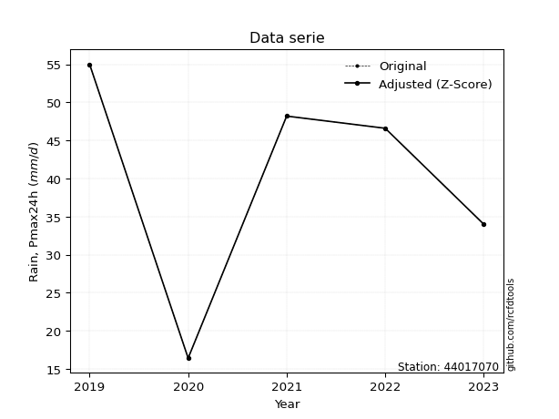</img>

</div>


> The initial value (value_initial) correspond to the initial obtained or null completed value, and value (value) is adjusted only when the initial value is outside the valid range (outlier) definite through the Z-Score value. If Z-Score is active, values out of range or outliers are replaced with the station mean value. A Z-Score (or standard score) measures how many standard deviations a data point is from the mean of a dataset, indicating its relative position; positive scores mean above the mean, negative mean below, and a score of zero is exactly at the mean, allowing for comparison of values from different distributions. It´s calculated using the formula $z=(x–μ)/σ$, where $x$ is the data point, $μ$ is the mean, and $σ$ is the standard deviation, helping identify outliers and understand probability.
>
> <sub>**Note**: In this study, "completing" (filling gaps in) and "extending" (forecasting or lengthening the historical record) rainfall data series are avoided for certain critical analyses because they introduce artificial bias and uncertainty, which can distort the statistics of rare events (extremes), alter day-to-day variability, and compromise the integrity and homogeneity of the original data. Some reasons against Completing/Extending rainfall data are: **Distortion of Extremes and Variability**: The primary issue is that most gap-filling or extension methods rely on averaging or regression with nearby stations, which inherently smooths the data. Rainfall is highly variable in space and time, with a large percentage of zero values and occasional large storms. Infilling methods often underestimate the highest values and overestimate the lowest (zero) values, which severely distorts analyses focused on flood frequency, drought severity, and intensity-duration-frequency (IDF) curves, **Loss of Data Homogeneity**: Infilled or extended data are synthetic estimates, not actual measurements. Combining these estimates with observed data can violate the assumption of data homogeneity, which requires that the data properties do not change over time. Inhomogeneity can lead to incorrect conclusions about long-term trends or changes in climate patterns, **Propagation of Errors**: Errors and biases from the original data (e.g., wind-induced undercatch, instrument errors, site changes) or the data used for imputation can propagate through the analysis, leading to unreliable hydrological models and inaccurate predictions, **Compromised Statistical Integrity**: For statistical analyses, especially those involving the frequency of events, using artificial data can introduce time bias or autocorrelation that doesn´t exist in reality, making it difficult to assess the true probability of events, **Difficulty in Validation**: It is difficult to accurately validate the quality of filled or extended data, especially for past periods where ground-truth measurements are unavailable. The reliability of imputation techniques heavily depends on the density of the surrounding station network and the complexity of the local topography.</sub>


### 4. Active continuous probability distributions from SciPy (44 of 104 available)

A Probability Density Function (PDF) describes the relative likelihood of a continuous random variable falling within a specific range, where the total area under its curve equals 1, and the area over any interval gives the actual probability for that range. Unlike discrete probabilities (like rolling a die), a PDF shows density, not direct probability for a single point (which is zero), with higher points indicating higher likelihood, often visualized as a bell curve for normal distributions.

A log of a probability density function (log-PDF) is simply the logarithm of the PDF´s value, denoted as $log(f(x))$, useful for converting multiplication of probabilities into addition, improving numerical stability with tiny numbers, and connecting to information theory concepts like entropy. Instead of dealing with very small probabilities (e.g., 0.000001), log-PDFs use negative numbers (e.g., $log(0.00001) ≈ -11.51$ that are easier for computers to handle, preventing underflow errors and simplifying complex calculations. In this study, each active probability distribution from SciPy is also evaluated in the $log$ form.

[scipy.stats](https://docs.scipy.org/doc/scipy/reference/stats.html) is a Python´s powerful submodule within the SciPy library for comprehensive statistical analysis, offering over 130 probability distributions (like Normal, Poisson), functions for descriptive stats (mean, variance), hypothesis testing (t-tests, chi-square), random variable generation, and statistical tests, making it essential for data science, modeling, and research. It provides tools to explore, model, and draw conclusions from data efficiently, working seamlessly with NumPy.

<div align="center">

|   id | p_dist             |   n_parameter | fit_method   | label                                                                       | active   | ref                                                                                                        |
|-----:|:-------------------|--------------:|:-------------|:----------------------------------------------------------------------------|:---------|:-----------------------------------------------------------------------------------------------------------|
|    0 | alpha              |             3 | MLE          | Alpha                                                                       | True     | [:mortar_board:](https://docs.scipy.org/doc/scipy/reference/generated/scipy.stats.alpha.html)              |
|    1 | betaprime          |             4 | MLE          | Beta prime                                                                  | True     | [:mortar_board:](https://docs.scipy.org/doc/scipy/reference/generated/scipy.stats.betaprime.html)          |
|    2 | chi2               |             3 | MLE          | Chi²                                                                        | True     | [:mortar_board:](https://docs.scipy.org/doc/scipy/reference/generated/scipy.stats.chi2.html)               |
|    3 | crystalball        |             4 | MLE          | Crystalball                                                                 | True     | [:mortar_board:](https://docs.scipy.org/doc/scipy/reference/generated/scipy.stats.crystalball.html)        |
|    4 | erlang             |             3 | MLE          | Erlang                                                                      | True     | [:mortar_board:](https://docs.scipy.org/doc/scipy/reference/generated/scipy.stats.erlang.html)             |
|    5 | expon              |             2 | MLE          | Exponential                                                                 | True     | [:mortar_board:](https://docs.scipy.org/doc/scipy/reference/generated/scipy.stats.expon.html)              |
|    6 | exponnorm          |             3 | MLE          | Exponentially modified Normal                                               | True     | [:mortar_board:](https://docs.scipy.org/doc/scipy/reference/generated/scipy.stats.exponnorm.html)          |
|    7 | f                  |             4 | MLE          | F                                                                           | True     | [:mortar_board:](https://docs.scipy.org/doc/scipy/reference/generated/scipy.stats.f.html)                  |
|    8 | fatiguelife        |             3 | MLE          | Fatigue-life (Birnbaum-Saunders)                                            | True     | [:mortar_board:](https://docs.scipy.org/doc/scipy/reference/generated/scipy.stats.fatiguelife.html)        |
|    9 | fisk               |             3 | MLE          | Fisk                                                                        | True     | [:mortar_board:](https://docs.scipy.org/doc/scipy/reference/generated/scipy.stats.fisk.html)               |
|   10 | gamma              |             3 | MLE          | Gamma                                                                       | True     | [:mortar_board:](https://docs.scipy.org/doc/scipy/reference/generated/scipy.stats.gamma.html)              |
|   11 | genexpon           |             5 | MLE          | Generalized exponential                                                     | True     | [:mortar_board:](https://docs.scipy.org/doc/scipy/reference/generated/scipy.stats.genexpon.html)           |
|   12 | genlogistic        |             3 | MLE          | Generalized logistic                                                        | True     | [:mortar_board:](https://docs.scipy.org/doc/scipy/reference/generated/scipy.stats.genlogistic.html)        |
|   13 | gibrat             |             2 | MM           | Gibrat                                                                      | True     | [:mortar_board:](https://docs.scipy.org/doc/scipy/reference/generated/scipy.stats.gibrat.html)             |
|   14 | gompertz           |             3 | MLE          | Gompertz (or truncated Gumbel)                                              | True     | [:mortar_board:](https://docs.scipy.org/doc/scipy/reference/generated/scipy.stats.gompertz.html)           |
|   15 | gumbel_l           |             2 | MM           | Gumbel Left Skew                                                            | True     | [:mortar_board:](https://docs.scipy.org/doc/scipy/reference/generated/scipy.stats.gumbel_l.html)           |
|   16 | gumbel_r           |             2 | MM           | Gumbel Right Skew                                                           | True     | [:mortar_board:](https://docs.scipy.org/doc/scipy/reference/generated/scipy.stats.gumbel_r.html)           |
|   17 | halflogistic       |             2 | MM           | Half-logistic                                                               | True     | [:mortar_board:](https://docs.scipy.org/doc/scipy/reference/generated/scipy.stats.halflogistic.html)       |
|   18 | halfnorm           |             2 | MM           | Half Normal                                                                 | True     | [:mortar_board:](https://docs.scipy.org/doc/scipy/reference/generated/scipy.stats.halfnorm.html)           |
|   19 | hypsecant          |             2 | MM           | hyperbolic secant                                                           | True     | [:mortar_board:](https://docs.scipy.org/doc/scipy/reference/generated/scipy.stats.hypsecant.html)          |
|   20 | invgamma           |             3 | MLE          | Inverted gamma                                                              | True     | [:mortar_board:](https://docs.scipy.org/doc/scipy/reference/generated/scipy.stats.invgamma.html)           |
|   21 | invgauss           |             3 | MLE          | Inverse Gaussian                                                            | True     | [:mortar_board:](https://docs.scipy.org/doc/scipy/reference/generated/scipy.stats.invgauss.html)           |
|   22 | invweibull         |             3 | MLE          | Inverted Weibull                                                            | True     | [:mortar_board:](https://docs.scipy.org/doc/scipy/reference/generated/scipy.stats.invweibull.html)         |
|   23 | johnsonsu          |             4 | MLE          | Johnson Su                                                                  | True     | [:mortar_board:](https://docs.scipy.org/doc/scipy/reference/generated/scipy.stats.johnsonsu.html)          |
|   24 | kstwobign          |             2 | MLE          | Limiting distribution of scaled Kolmogorov-Smirnov two-sided test statistic | True     | [:mortar_board:](https://docs.scipy.org/doc/scipy/reference/generated/scipy.stats.kstwobign.html)          |
|   25 | laplace            |             2 | MM           | Laplace                                                                     | True     | [:mortar_board:](https://docs.scipy.org/doc/scipy/reference/generated/scipy.stats.laplace.html)            |
|   26 | laplace_asymmetric |             3 | MLE          | Asymmetric Laplace                                                          | True     | [:mortar_board:](https://docs.scipy.org/doc/scipy/reference/generated/scipy.stats.laplace_asymmetric.html) |
|   27 | loggamma           |             3 | MLE          | Log gamma                                                                   | True     | [:mortar_board:](https://docs.scipy.org/doc/scipy/reference/generated/scipy.stats.loggamma.html)           |
|   28 | logistic           |             2 | MM           | Logistic (or Sech-squared)                                                  | True     | [:mortar_board:](https://docs.scipy.org/doc/scipy/reference/generated/scipy.stats.logistic.html)           |
|   29 | lognorm            |             3 | MLE          | Log Normal                                                                  | True     | [:mortar_board:](https://docs.scipy.org/doc/scipy/reference/generated/scipy.stats.lognorm.html)            |
|   30 | maxwell            |             2 | MM           | Maxwell                                                                     | True     | [:mortar_board:](https://docs.scipy.org/doc/scipy/reference/generated/scipy.stats.maxwell.html)            |
|   31 | mielke             |             4 | MLE          | Mielke Beta-Kappa / Dagum                                                   | True     | [:mortar_board:](https://docs.scipy.org/doc/scipy/reference/generated/scipy.stats.mielke.html)             |
|   32 | moyal              |             2 | MM           | Moyal                                                                       | True     | [:mortar_board:](https://docs.scipy.org/doc/scipy/reference/generated/scipy.stats.moyal.html)              |
|   33 | nakagami           |             3 | MLE          | Nakagami                                                                    | True     | [:mortar_board:](https://docs.scipy.org/doc/scipy/reference/generated/scipy.stats.nakagami.html)           |
|   34 | ncf                |             5 | MLE          | Non-central F distribution                                                  | True     | [:mortar_board:](https://docs.scipy.org/doc/scipy/reference/generated/scipy.stats.ncf.html)                |
|   35 | nct                |             4 | MLE          | Non-central Student’s t                                                     | True     | [:mortar_board:](https://docs.scipy.org/doc/scipy/reference/generated/scipy.stats.nct.html)                |
|   36 | norm               |             2 | MM           | Normal                                                                      | True     | [:mortar_board:](https://docs.scipy.org/doc/scipy/reference/generated/scipy.stats.norm.html)               |
|   37 | pearson3           |             3 | MM           | Pearson type III                                                            | True     | [:mortar_board:](https://docs.scipy.org/doc/scipy/reference/generated/scipy.stats.pearson3.html)           |
|   38 | rayleigh           |             2 | MM           | Rayleigh                                                                    | True     | [:mortar_board:](https://docs.scipy.org/doc/scipy/reference/generated/scipy.stats.rayleigh.html)           |
|   39 | rice               |             3 | MLE          | Rice                                                                        | True     | [:mortar_board:](https://docs.scipy.org/doc/scipy/reference/generated/scipy.stats.rice.html)               |
|   40 | t                  |             3 | MLE          | Student’s t                                                                 | True     | [:mortar_board:](https://docs.scipy.org/doc/scipy/reference/generated/scipy.stats.t.html)                  |
|   41 | truncnorm          |             4 | MLE          | Truncated normal                                                            | True     | [:mortar_board:](https://docs.scipy.org/doc/scipy/reference/generated/scipy.stats.truncnorm.html)          |
|   42 | wald               |             2 | MM           | Wald                                                                        | True     | [:mortar_board:](https://docs.scipy.org/doc/scipy/reference/generated/scipy.stats.wald.html)               |
|   43 | weibull_min        |             3 | MLE          | Weibull minimum                                                             | True     | [:mortar_board:](https://docs.scipy.org/doc/scipy/reference/generated/scipy.stats.weibull_min.html)        |

</div>

> **n_parameter:** # arguments & localization & scale.
>
> **Fit methods:** (MLE) maximum likelihood, (MM) L-moments.
>
>**Inactive** (With the only purpose of prevent loops, zero divisions, infinite values, over high estimated values or horizontal trending for recurrence intervals estimations, the follow distributions were disabled.)**:** foldnorm, gennorm, norminvgauss, powernorm, powerlognorm, skewnorm, genextreme, anglit, arcsine, argus, beta, bradford, burr, burr12, cauchy, cosine, halfcauchy, foldcauchy, skewcauchy, wrapcauchy, dgamma, gengamma, exponweib, exponpow, truncexpon, gausshyper, genhalflogistic, genhyperbolic, geninvgauss, halfgennorm, johnsonsb, kappa4, kappa3, ksone, kstwo, loglaplace, levy, levy_l, levy_stable, ncx2, pareto, genpareto, truncpareto, lomax, powerlaw, rdist, rel_breitwigner, recipinvgauss, semicircular, studentized_range, trapezoid, triang, truncweibull_min, tukeylambda, uniform, loguniform, vonmises, vonmises_line, weibull_max, dweibull, 


## B. Probability (PDF) vs. Empirical (EDF) distributions functions

A continuous probability distribution (CPD) describes probabilities for variables that can take any value within a range (like rain any time), unlike discrete variables with specific outcomes (like temperature). It uses a Probability Density Function (PDF), a curve where the total area under it equals 1, and the probability of the variable falling within an interval (a to b) is found by calculating the area under the curve between those points. A key feature is that the probability of hitting any single exact value is zero, so probabilities are always expressed for ranges, e.g., $P(a ≤ X ≤ b)$.

<div align="center">

Distributions parameters from station values
|    |   station | p_dist                |   n |             loc |           scale | shape                  | shape1                 | shape2                | shape3   |
|---:|----------:|:----------------------|----:|----------------:|----------------:|:-----------------------|:-----------------------|:----------------------|:---------|
|  0 |  44017070 | alpha                 |   5 |  -242.835       |  5688.33        | 20.146097103655492     |                        |                       |          |
|  1 |  44017070 | betaprime             |   5 |  -134.679       | 13025           | 145.51754262694385     | 10859.070282919227     |                       |          |
|  2 |  44017070 | chi2                  |   5 |  -128.375       |     0.59989     | 281.04193071712837     |                        |                       |          |
|  3 |  44017070 | crystalball           |   5 |    40.04        |    13.629       | 799.7552446999512      | 8713.943638760808      |                       |          |
|  4 |  44017070 | erlang                |   5 |  -159.479       |     0.980851    | 203.25490396639577     |                        |                       |          |
|  5 |  44017070 | expon                 |   5 |    16.4         |    23.64        |                        |                        |                       |          |
|  6 |  44017070 | exponnorm             |   5 |    40.0285      |    13.629       | 0.000839677801387562   |                        |                       |          |
|  7 |  44017070 | f                     |   5 | -5587           |  5627.08        | 527419.8145021034      | 941143.2381229061      |                       |          |
|  8 |  44017070 | fatiguelife           |   5 |    16.4         |     0.000183773 | 331.67941338096375     |                        |                       |          |
|  9 |  44017070 | fisk                  |   5 |    -9.03434e+08 |     9.03434e+08 | 113487469.68804094     |                        |                       |          |
| 10 |  44017070 | gamma                 |   5 |  -179.299       |     0.877069    | 249.9310429367344      |                        |                       |          |
| 11 |  44017070 | genexpon              |   5 |    16.3999      |     2.13436     | 0.09067644347318506    | 1.5301694165897647e-06 | 1.040028213630715     |          |
| 12 |  44017070 | genlogistic           |   5 |    55.0002      |     1.10257e-05 | 7.367179076409908e-07  |                        |                       |          |
| 13 |  44017070 | gibrat                |   5 |    29.6427      |     6.30627     |                        |                        |                       |          |
| 14 |  44017070 | gompertz              |   5 |    16.4         |     4.12169     | 0.0003229939955574416  |                        |                       |          |
| 15 |  44017070 | gumbel_l              |   5 |    46.1738      |    10.6265      |                        |                        |                       |          |
| 16 |  44017070 | gumbel_r              |   5 |    33.9062      |    10.6265      |                        |                        |                       |          |
| 17 |  44017070 | halflogistic          |   5 |    23.8864      |    11.6523      |                        |                        |                       |          |
| 18 |  44017070 | halfnorm              |   5 |    22.0005      |    22.6091      |                        |                        |                       |          |
| 19 |  44017070 | hypsecant             |   5 |    40.04        |     8.67651     |                        |                        |                       |          |
| 20 |  44017070 | invgamma              |   5 |  -120.569       | 18662.9         | 117.45039862118549     |                        |                       |          |
| 21 |  44017070 | invgauss              |   5 |   -64.0768      |  5230.41        | 0.01986430213147014    |                        |                       |          |
| 22 |  44017070 | invweibull            |   5 |    16.4         |     1.89297     | 0.05393958823438466    |                        |                       |          |
| 23 |  44017070 | johnsonsu             |   5 |    57.6606      |     0.080699    | 6.144377226564018      | 1.0755540842250788     |                       |          |
| 24 |  44017070 | kstwobign             |   5 |   -16.9362      |    64.9262      |                        |                        |                       |          |
| 25 |  44017070 | laplace               |   5 |    40.04        |     9.63718     |                        |                        |                       |          |
| 26 |  44017070 | laplace_asymmetric    |   5 |    48.2         |     8.06284     | 1.6267838633890865     |                        |                       |          |
| 27 |  44017070 | loggamma              |   5 |    55.095       |     2.83206e-05 | 1.8811117897483476e-06 |                        |                       |          |
| 28 |  44017070 | logistic              |   5 |    40.04        |     7.51408     |                        |                        |                       |          |
| 29 |  44017070 | lognorm               |   5 |    16.4         |     0.0187508   | 14.649590680078822     |                        |                       |          |
| 30 |  44017070 | maxwell               |   5 |     7.74493     |    20.2379      |                        |                        |                       |          |
| 31 |  44017070 | mielke                |   5 |   -28.8495      |    83.951       | 4.538910096144516      | 4565.814209308475      |                       |          |
| 32 |  44017070 | moyal                 |   5 |    32.246       |     6.13522     |                        |                        |                       |          |
| 33 |  44017070 | nakagami              |   5 |    34           |    10.2625      | 0.20562128244291064    |                        |                       |          |
| 34 |  44017070 | ncf                   |   5 |     0.492559    |     0.0105009   | 0.007434181853998323   | 644.2998580564756      | 27.932545513537725    |          |
| 35 |  44017070 | nct                   |   5 |  -764.723       |    13.5565      | 145617.21296489472     | 59.362754333182366     |                       |          |
| 36 |  44017070 | norm                  |   5 |    40.04        |    13.629       |                        |                        |                       |          |
| 37 |  44017070 | pearson3              |   5 |    40.04        |    13.6291      | -0.73139527988339      |                        |                       |          |
| 38 |  44017070 | rayleigh              |   5 |    13.9669      |    20.8033      |                        |                        |                       |          |
| 39 |  44017070 | rice                  |   5 |     7.27827     |    14.9978      | 1.8967335279662647     |                        |                       |          |
| 40 |  44017070 | t                     |   5 |    40.04        |    13.6291      | 413220179.9517468      |                        |                       |          |
| 41 |  44017070 | truncnorm             |   5 |    40.04        |    13.629       | -535.4553861110247     | 935.1962066296187      |                       |          |
| 42 |  44017070 | wald                  |   5 |    26.411       |    13.629       |                        |                        |                       |          |
| 43 |  44017070 | weibull_min           |   5 |    -4.49222e+08 |     4.49222e+08 | 45119103.3611566       |                        |                       |          |
| 44 |  44017070 | logalpha              |   5 |    -8.68603     |   326.434       | 26.59347691707258      |                        |                       |          |
| 45 |  44017070 | logbetaprime          |   5 |    -5.71989     |    23.9371      | 554.8991705793615      | 1425.3276730895368     |                       |          |
| 46 |  44017070 | logchi2               |   5 |     2.79728     |     0.954273    | 1.0923359463322115     |                        |                       |          |
| 47 |  44017070 | logcrystalball        |   5 |     3.60959     |     0.43576     | 112.85726576636891     | 1460.8843544743816     |                       |          |
| 48 |  44017070 | logerlang             |   5 |     2.79728     |     1.07951     | 0.150080361711726      |                        |                       |          |
| 49 |  44017070 | logexpon              |   5 |     2.79728     |     0.812306    |                        |                        |                       |          |
| 50 |  44017070 | logexponnorm          |   5 |     3.60927     |     0.435761    | 0.0007093995591666268  |                        |                       |          |
| 51 |  44017070 | logf                  |   5 |  -478.623       |   482.233       | 5939756.01322688       | 4119948.9459760766     |                       |          |
| 52 |  44017070 | logfatiguelife        |   5 |  -207.017       |   210.626       | 0.0020657075173049254  |                        |                       |          |
| 53 |  44017070 | logfisk               |   5 |    -4.43754e+07 |     4.43754e+07 | 183989507.06456992     |                        |                       |          |
| 54 |  44017070 | loggamma              |   5 |    -3.18037     |     0.0303396   | 223.7589728784722      |                        |                       |          |
| 55 |  44017070 | loggenexpon           |   5 |     2.79563     |     0.00194319  | 0.0009989010356631182  | 0.5579628050138505     | 9.238977451961037e-06 |          |
| 56 |  44017070 | loggenlogistic        |   5 |     4.00765     |     1.45744e-06 | 3.6745975595167304e-06 |                        |                       |          |
| 57 |  44017070 | loggibrat             |   5 |     3.27717     |     0.201622    |                        |                        |                       |          |
| 58 |  44017070 | loggompertz           |   5 |     2.79507     |     0.321364    | 0.04807039457285832    |                        |                       |          |
| 59 |  44017070 | loggumbel_l           |   5 |     3.8057      |     0.339761    |                        |                        |                       |          |
| 60 |  44017070 | loggumbel_r           |   5 |     3.41347     |     0.339761    |                        |                        |                       |          |
| 61 |  44017070 | loghalflogistic       |   5 |     3.0931      |     0.372567    |                        |                        |                       |          |
| 62 |  44017070 | loghalfnorm           |   5 |     3.03281     |     0.722878    |                        |                        |                       |          |
| 63 |  44017070 | loghypsecant          |   5 |     3.60959     |     0.277413    |                        |                        |                       |          |
| 64 |  44017070 | loginvgamma           |   5 |    -6.93684     |  5655.78        | 537.401147315082       |                        |                       |          |
| 65 |  44017070 | loginvgauss           |   5 |    -1.09497     |   456.431       | 0.010289767480225073   |                        |                       |          |
| 66 |  44017070 | loginvweibull         |   5 |    -3.00898e+07 |     3.00898e+07 | 62010552.1309209       |                        |                       |          |
| 67 |  44017070 | logjohnsonsu          |   5 |     4.00733     |     5.0402e-13  | 1.99593748861118       | 0.10247188444831563    |                       |          |
| 68 |  44017070 | logkstwobign          |   5 |     1.67634     |     2.20314     |                        |                        |                       |          |
| 69 |  44017070 | loglaplace            |   5 |     3.60959     |     0.308129    |                        |                        |                       |          |
| 70 |  44017070 | loglaplace_asymmetric |   5 |     3.87536     |     0.208322    | 1.824016599095999      |                        |                       |          |
| 71 |  44017070 | logloggamma           |   5 |     4.00742     |     7.2223e-06  | 1.8057584799241818e-05 |                        |                       |          |
| 72 |  44017070 | loglogistic           |   5 |     3.60959     |     0.240247    |                        |                        |                       |          |
| 73 |  44017070 | loglognorm            |   5 |     2.79728     |     0.000848998 | 14.14054233627627      |                        |                       |          |
| 74 |  44017070 | logmaxwell            |   5 |     2.57702     |     0.647066    |                        |                        |                       |          |
| 75 |  44017070 | logmielke             |   5 |    -3.43532e+07 |     3.43532e+07 | 81634747.25516385      | 2580957927.9762564     |                       |          |
| 76 |  44017070 | logmoyal              |   5 |     3.36039     |     0.196161    |                        |                        |                       |          |
| 77 |  44017070 | lognakagami           |   5 |     3.52636     |     0.369203    | 0.14461981851803596    |                        |                       |          |
| 78 |  44017070 | logncf                |   5 |    -2.07467     |     0.000145231 | 0.012534858466811735   | 378.41258281217813     | 489.1212404625117     |          |
| 79 |  44017070 | lognct                |   5 |   -17.4229      |     0.418075    | 12982.295990234234     | 50.30382592533766      |                       |          |
| 80 |  44017070 | lognorm               |   5 |     3.60959     |     0.43576     |                        |                        |                       |          |
| 81 |  44017070 | logpearson3           |   5 |     3.60959     |     0.43576     | -1.0692651161112694    |                        |                       |          |
| 82 |  44017070 | lograyleigh           |   5 |     2.77595     |     0.665144    |                        |                        |                       |          |
| 83 |  44017070 | logrice               |   5 |     2.47437     |     0.471844    | 2.154377840664773      |                        |                       |          |
| 84 |  44017070 | logt                  |   5 |     3.60959     |     0.435761    | 2039019450.5698886     |                        |                       |          |
| 85 |  44017070 | logtruncnorm          |   5 |    -0.138709    |     1.26161     | 2.9050810542995857     | 3.2863236827525917     |                       |          |
| 86 |  44017070 | logwald               |   5 |     3.17383     |     0.435756    |                        |                        |                       |          |
| 87 |  44017070 | logweibull_min        |   5 |    -8.56912e+07 |     8.56912e+07 | 304786122.1821786      |                        |                       |          |

</div>

> **loc** (Location parameter): This shifts the distribution along the x-axis. For many common distributions, like the normal (Gaussian) distribution, loc represents the mean $μ$. For others, like the uniform distribution, it might represent the minimum value, or for the beta distribution, the left end of the support interval.
>
> **scale** (Scale parameter): This determines the width or spread of the distribution. For the normal distribution, scale represents the standard deviation $σ$. For a uniform distribution, it defines the length of the interval (from $loc$ to $loc + scale$).
>
> **shape** (Shape parameters): Refers to parameters that define the specific form of a probability distribution, distinct from its location (loc) and scale (scale). These parameters are required arguments for most distribution functions. For example, a normal (Gaussian) distribution is fully defined by its location (mean) and scale (standard deviation), so it has no specific shape parameters beyond loc and scale. However, other distributions have intrinsic properties that need specification, as Gamma distribution that takes a shape parameter, often named $a$ or $alpha$.


### 0. Cumulative distribution values - CDF (88 evaluated)

Cumulative Distribution Function (CDF), denoted as $F$<sub>$X$</sub>$(x)$, is a function that gives the probability that a random variable $X$ will take a value less than or equal to a specific value, $x$ (i.e., $(P(X≥x)$. It essentially "accumulates" probabilities from a given point up to the far right (positive infinity), providing a complete picture of the distribution´s probabilities for both discrete (like rain) and continuous (like temperature) variables, helping to find probabilities over ranges or above certain values. Each station is evaluated separately ordering the $x$ values ascending, calculating the CDF and PDF values for the activated distributions and their logarithmic forms.

<div align="center">

CDF ordered by x ascending and calculating $log(f(x))$ separately
|   id |   Station |   date |    x |   count |   mean |     std |    zscore |   Value_initial |   station |   m |     alpha |   alpha_pdf |   betaprime |   betaprime_pdf |      chi2 |   chi2_pdf |   crystalball |   crystalball_pdf |    erlang |   erlang_pdf |    expon |   expon_pdf |   exponnorm |   exponnorm_pdf |         f |      f_pdf |   fatiguelife |   fatiguelife_pdf |     fisk |   fisk_pdf |     gamma |   gamma_pdf |    genexpon |   genexpon_pdf |   genlogistic |   genlogistic_pdf |   gibrat |   gibrat_pdf |   gompertz |   gompertz_pdf |   gumbel_l |   gumbel_l_pdf |   gumbel_r |   gumbel_r_pdf |   halflogistic |   halflogistic_pdf |   halfnorm |   halfnorm_pdf |   hypsecant |   hypsecant_pdf |   invgamma |   invgamma_pdf |   invgauss |   invgauss_pdf |   invweibull |   invweibull_pdf |   johnsonsu |   johnsonsu_pdf |   kstwobign |   kstwobign_pdf |   laplace |   laplace_pdf |   laplace_asymmetric |   laplace_asymmetric_pdf |   loggamma |   loggamma_pdf |   logistic |   logistic_pdf |   lognorm |   lognorm_pdf |   maxwell |   maxwell_pdf |    mielke |   mielke_pdf |       moyal |   moyal_pdf |   nakagami |   nakagami_pdf |       ncf |   ncf_pdf |       nct |    nct_pdf |      norm |   norm_pdf |   pearson3 |   pearson3_pdf |   rayleigh |   rayleigh_pdf |      rice |   rice_pdf |         t |      t_pdf |   truncnorm |   truncnorm_pdf |     wald |   wald_pdf |   weibull_min |   weibull_min_pdf |   logalpha |   logalpha_pdf |   logbetaprime |   logbetaprime_pdf |     logchi2 |   logchi2_pdf |   logcrystalball |   logcrystalball_pdf |   logerlang |   logerlang_pdf |   logexpon |   logexpon_pdf |   logexponnorm |   logexponnorm_pdf |      logf |   logf_pdf |   logfatiguelife |   logfatiguelife_pdf |   logfisk |   logfisk_pdf |   loggenexpon |   loggenexpon_pdf |   loggenlogistic |   loggenlogistic_pdf |   loggibrat |   loggibrat_pdf |   loggompertz |   loggompertz_pdf |   loggumbel_l |   loggumbel_l_pdf |   loggumbel_r |   loggumbel_r_pdf |   loghalflogistic |   loghalflogistic_pdf |   loghalfnorm |   loghalfnorm_pdf |   loghypsecant |   loghypsecant_pdf |   loginvgamma |   loginvgamma_pdf |   loginvgauss |   loginvgauss_pdf |   loginvweibull |   loginvweibull_pdf |   logjohnsonsu |   logjohnsonsu_pdf |   logkstwobign |   logkstwobign_pdf |   loglaplace |   loglaplace_pdf |   loglaplace_asymmetric |   loglaplace_asymmetric_pdf |   logloggamma |   logloggamma_pdf |   loglogistic |   loglogistic_pdf |   loglognorm |   loglognorm_pdf |   logmaxwell |   logmaxwell_pdf |   logmielke |   logmielke_pdf |   logmoyal |   logmoyal_pdf |   lognakagami |   lognakagami_pdf |   logncf |   logncf_pdf |    lognct |   lognct_pdf |   logpearson3 |   logpearson3_pdf |   lograyleigh |   lograyleigh_pdf |   logrice |   logrice_pdf |      logt |   logt_pdf |   logtruncnorm |   logtruncnorm_pdf |   logwald |   logwald_pdf |   logweibull_min |   logweibull_min_pdf |
|-----:|----------:|-------:|-----:|--------:|-------:|--------:|----------:|----------------:|----------:|----:|----------:|------------:|------------:|----------------:|----------:|-----------:|--------------:|------------------:|----------:|-------------:|---------:|------------:|------------:|----------------:|----------:|-----------:|--------------:|------------------:|---------:|-----------:|----------:|------------:|------------:|---------------:|--------------:|------------------:|---------:|-------------:|-----------:|---------------:|-----------:|---------------:|-----------:|---------------:|---------------:|-------------------:|-----------:|---------------:|------------:|----------------:|-----------:|---------------:|-----------:|---------------:|-------------:|-----------------:|------------:|----------------:|------------:|----------------:|----------:|--------------:|---------------------:|-------------------------:|-----------:|---------------:|-----------:|---------------:|----------:|--------------:|----------:|--------------:|----------:|-------------:|------------:|------------:|-----------:|---------------:|----------:|----------:|----------:|-----------:|----------:|-----------:|-----------:|---------------:|-----------:|---------------:|----------:|-----------:|----------:|-----------:|------------:|----------------:|---------:|-----------:|--------------:|------------------:|-----------:|---------------:|---------------:|-------------------:|------------:|--------------:|-----------------:|---------------------:|------------:|----------------:|-----------:|---------------:|---------------:|-------------------:|----------:|-----------:|-----------------:|---------------------:|----------:|--------------:|--------------:|------------------:|-----------------:|---------------------:|------------:|----------------:|--------------:|------------------:|--------------:|------------------:|--------------:|------------------:|------------------:|----------------------:|--------------:|------------------:|---------------:|-------------------:|--------------:|------------------:|--------------:|------------------:|----------------:|--------------------:|---------------:|-------------------:|---------------:|-------------------:|-------------:|-----------------:|------------------------:|----------------------------:|--------------:|------------------:|--------------:|------------------:|-------------:|-----------------:|-------------:|-----------------:|------------:|----------------:|-----------:|---------------:|--------------:|------------------:|---------:|-------------:|----------:|-------------:|--------------:|------------------:|--------------:|------------------:|----------:|--------------:|----------:|-----------:|---------------:|-------------------:|----------:|--------------:|-----------------:|---------------------:|
|    0 |  44017070 |   2020 | 16.4 |       5 |  40.04 | 15.2377 | -1.55141  |            16.4 |  44017070 |   1 | 0.0361911 |  0.00672241 |   0.0481705 |      0.00757911 | 0.0416046 | 0.00692719 |     0.0414118 |        0.00650332 | 0.0421208 |   0.00698818 | 0        |  0.0423012  |   0.0414119 |      0.00650334 | 0.0415456 | 0.00651712 |     0.0244501 |       1.31164e+08 | 0.040005 | 0.00482431 | 0.0410352 |  0.00684528 | 3.15424e-06 |      0.042484  |      0        |        0.00506713 | 0        |   0          | 1.8956e-09 |     7.8365e-05 |  0.0588928 |     0.00537557 | 0.00555249 |     0.00271368 |       0        |          0         |   0        |      0         |   0.0416851 |      0.00479064 |  0.0463925 |     0.00807899 |  0.0399035 |     0.00766444 |   0.00197347 |      1.86605e+11 |   0.0952157 |      0.00441322 |   0.0453129 |       0.0113627 | 0.0430175 |    0.00446371 |            0.0642505 |               0.00489845 |  0.0327915 |       0.175715 |  0.0412454 |     0.00526269 |  0.031153 |      0.1611   | 0.0196983 |    0.00658062 | 0.0604925 |   0.00606791 | 0.000274894 |  0.00031635 | 0          |    0           | 0.0355365 | 0.0081172 | 0.0415371 | 0.00651931 | 0.0414118 | 0.00650332 |  0.0570843 |     0.00607569 |  0.0068163 |     0.00558377 | 0.0327044 |  0.0075942 | 0.0414127 | 0.00650339 |   0.0414118 |      0.00650332 | 0        | 0          |     0.0486376 |        0.00476431 |  0.0333785 |       0.183965 |      0.0376534 |           0.189872 | 4.75706e-09 |   2.92526e+06 |         0.031153 |             0.1611   |  0.00583701 |     9.86312e+11 |   0        |       1.23106  |      0.0311539 |           0.161104 | 0.0313042 |   0.161482 |        0.0308015 |             0.160457 | 0.0245235 |     0.0991857 |   0.000849236 |          0.515864 |          0       |             0.119208 |    0        |        0        |   0.000331296 |          0.150564 |     0.0501055 |          0.143715 |    0.00217117 |         0.0391884 |          0        |              0        |      0        |          0        |      0.0340245 |           0.122415 |      0.032337 |          0.176982 |     0.0354313 |          0.198823 |       0.0380687 |            0.256416 |       0.159567 |        0.0205681   |      0.0419605 |           0.319355 |    0.0358146 |         0.116233 |               0.0450501 |                    0.118559 |     0.0485264 |          0.121328 |     0.0328906 |          0.1324   |    0.0227579 |      8.60022e+12 |    0.0101333 |         0.134839 |   0.0534207 |        0.126946 | 2.6572e-05 |     0.00125696 |   0           |       0           | 0.099798 |     0.302686 | 0.0315956 |     0.163235 |     0.0516325 |          0.153953 |      0.000514 |         0.0481852 | 0.0263547 |      0.18279  | 0.0311534 |   0.161101 |    0           |            0       |  0        |      0        |         0.02806  |            0.0983901 |
|    1 |  44017070 |   2023 | 34   |       5 |  40.04 | 15.2377 | -0.396385 |            34   |  44017070 |   2 | 0.343962  |  0.0273162  |   0.351966  |      0.0260714  | 0.339238  | 0.0263897  |     0.328821  |        0.0265337  | 0.344026  |   0.0268476  | 0.525029 |  0.0200918  |   0.328822  |      0.0265337  | 0.328473  | 0.026434   |     0.824596  |       0.00684282  | 0.275469 | 0.0250715  | 0.341337  |  0.0269492  | 0.526562    |      0.0201139 |      0        |        0.0164246  | 0.355807 |   0.0855095  | 0.0225229  |     0.00547908 |  0.27242   |     0.0217751  | 0.371126   |     0.0346177  |       0.408635 |          0.0357446 |   0.404398 |      0.0306542 |   0.294408  |      0.0292965  |  0.370081  |     0.0267142  |  0.366921  |     0.0273194  |   0.412022   |      0.00111965  |   0.238482  |      0.0140826  |   0.430484  |       0.0254298 | 0.267166  |    0.0277224  |            0.245823  |               0.0187415  |  0.436781  |       0.87494  |  0.309208  |     0.0284264  |  0.424266 |      0.898963 | 0.359289  |    0.0286023  | 0.268751  |   0.0194088  | 0.386049    |  0.0387122  | 4.5944e-07 |    2.65911e+07 | 0.376296  | 0.0270888 | 0.329217  | 0.0265332  | 0.328821  | 0.0265337  |  0.293914  |     0.022795   |  0.371024  |     0.029115   | 0.343172  |  0.0268132 | 0.328822  | 0.0265335  |   0.328821  |      0.0265337  | 0.412802 | 0.0590573  |     0.253272  |        0.0219041  |  0.44582   |       0.865115 |      0.440664  |           0.85163  | 0.585079    |   0.340162    |         0.424266 |             0.898962 |  0.935328   |     0.105868    |   0.59243  |       0.501744 |      0.42427   |           0.898963 | 0.423513  |   0.895725 |        0.424698  |             0.900884 | 0.340653  |     0.931273  |   0.52274     |          0.72062  |          0       |             0.749246 |    0.583873 |        1.56546  |   0.342837    |          0.956806 |     0.355626  |          0.833489 |    0.488068   |         1.03041   |          0.52372  |              0.973943 |      0.505238 |          0.874281 |      0.405905  |           1.09765  |      0.440573 |          0.875712 |     0.45668   |          0.847116 |       0.483148  |            0.724301 |       0.183609 |        0.0566032   |      0.518936  |           0.701037 |    0.381651  |         1.23861  |               0.306892  |                    0.807647 |     0.300363  |          0.750983 |     0.414251  |          1.00999  |    0.683582  |      0.034523    |    0.45864   |         0.904742 |   0.302094  |        0.717876 | 0.512435   |     1.07497    |   3.91218e-05 |       2.54804e+10 | 0.461671 |     0.60937  | 0.425785  |     0.895662 |     0.358416  |          0.797445 |      0.470809 |         0.897592  | 0.435645  |      0.883552 | 0.424267  |   0.898961 |    1.07163e-06 |            3.50015 |  0.579589 |      1.23011  |         0.316543 |            0.925187  |
|    2 |  44017070 |   2022 | 46.6 |       5 |  40.04 | 15.2377 |  0.430511 |            46.6 |  44017070 |   3 | 0.688936  |  0.0239912  |   0.685668  |      0.0237469  | 0.681239  | 0.0244854  |     0.684857  |        0.0260698  | 0.690879  |   0.0246444  | 0.721266 |  0.0117908  |   0.684859  |      0.0260698  | 0.683088  | 0.0259922  |     0.889183  |       0.00382519  | 0.649248 | 0.0286063  | 0.691061  |  0.024899   | 0.722807    |      0.0117765 |      0        |        0.0381181  | 0.838706 |   0.0144242  | 0.38795    |     0.0729503  |  0.646872  |     0.0345908  | 0.738715   |     0.0210525  |       0.750734 |          0.0187258 |   0.723419 |      0.0195251 |   0.720549  |      0.028227   |  0.696449  |     0.0222767  |  0.698388  |     0.0224086  |   0.422643   |      0.000650118 |   0.542475  |      0.0385728  |   0.706339  |       0.0175343 | 0.746868  |    0.0262662  |            0.642415  |               0.0489776  |  0.702066  |       0.746642 |  0.705375  |     0.0276575  |  0.702787 |      0.794519 | 0.70258   |    0.0230101  | 0.615932  |   0.0370534  | 0.756235    |  0.0192361  | 0.815643   |    0.0205253   | 0.695145  | 0.0212022 | 0.685021  | 0.0260412  | 0.684857  | 0.0260698  |  0.651269  |     0.0308015  |  0.707803  |     0.0220327  | 0.689249  |  0.0247399 | 0.684856  | 0.0260697  |   0.684857  |      0.0260698  | 0.806992 | 0.0150144  |     0.644886  |        0.0369267  |  0.704154  |       0.718607 |      0.698992  |           0.730458 | 0.676044    |   0.244978    |         0.702787 |             0.794519 |  0.960225   |     0.0582511   |   0.723522 |       0.340362 |      0.702791  |           0.794514 | 0.701223  |   0.793297 |        0.703464  |             0.794032 | 0.656259  |     0.935314  |   0.722863    |          0.53722  |          0       |             1.65883  |    0.848359 |        0.416093 |   0.698743    |          1.16979  |     0.670916  |          1.07652  |    0.753046   |         0.628635  |          0.763485 |              0.559753 |      0.736793 |          0.590266 |      0.739704  |           0.837164 |      0.704197 |          0.737106 |     0.706299  |          0.6887   |       0.683943  |            0.535444 |       0.214029 |        0.180185    |      0.711115  |           0.510764 |    0.764519  |         0.76423  |               0.703531  |                    1.85148  |     0.660614  |          1.6517   |     0.724267  |          0.831245 |    0.692571  |      0.0238033   |    0.718364  |         0.697611 |   0.638967  |        1.5184   | 0.769295   |     0.571382   |   0.762612    |       0.63796     | 0.646582 |     0.543859 | 0.7027    |     0.789049 |     0.659001  |          1.04797  |      0.72291  |         0.667427  | 0.704791  |      0.76045  | 0.702787  |   0.794517 |    0.777833    |            1.64163 |  0.817118 |      0.439965 |         0.688984 |            1.29197   |
|    3 |  44017070 |   2021 | 48.2 |       5 |  40.04 | 15.2377 |  0.535513 |            48.2 |  44017070 |   4 | 0.726041  |  0.0223667  |   0.72252   |      0.0222918  | 0.719233  | 0.0229771  |     0.725321  |        0.0244684  | 0.729057  |   0.0230475  | 0.739507 |  0.0110192  |   0.725322  |      0.0244683  | 0.723444  | 0.0244128  |     0.895107  |       0.00358309  | 0.693541 | 0.0266991  | 0.729627  |  0.0232775  | 0.741024    |      0.0110026 |      0        |        0.0424191  | 0.859777 |   0.012007   | 0.515168   |     0.0851962  |  0.701823  |     0.0339542  | 0.770657   |     0.0188929  |       0.779184 |          0.016858  |   0.753463 |      0.0180329 |   0.763024  |      0.0248584  |  0.730902  |     0.0207726  |  0.733001  |     0.0208431  |   0.423656   |      0.000617167 |   0.608236  |      0.0436736  |   0.73345   |       0.0163567 | 0.785591  |    0.0222482  |            0.725759  |               0.0553318  |  0.726732  |       0.714267 |  0.747621  |     0.0251107  |  0.729038 |      0.760129 | 0.738092  |    0.0213644  | 0.677483  |   0.0399098  | 0.785254    |  0.0170722  | 0.846082   |    0.017594    | 0.727907  | 0.0197416 | 0.725439  | 0.0244406  | 0.725321  | 0.0244684  |  0.700001  |     0.0300234  |  0.741777  |     0.0204256  | 0.727624  |  0.0231969 | 0.72532   | 0.0244683  |   0.725321  |      0.0244684  | 0.829309 | 0.0129448  |     0.703529  |        0.0362031  |  0.72788   |       0.686715 |      0.723145  |           0.700141 | 0.684183    |   0.237233    |         0.729037 |             0.760129 |  0.962135   |     0.0549515   |   0.734776 |       0.326507 |      0.729041  |           0.760124 | 0.727439  |   0.75931  |        0.729694  |             0.759414 | 0.687108  |     0.891395  |   0.740619    |          0.514694 |          0       |             1.80621  |    0.861594 |        0.369198 |   0.737632    |          1.13162  |     0.706989  |          1.05864  |    0.773521   |         0.584653  |          0.781737 |              0.521902 |      0.756201 |          0.559605 |      0.766788  |           0.767449 |      0.728535 |          0.704451 |     0.729035  |          0.658063 |       0.701629  |            0.512374 |       0.220893 |        0.230438    |      0.727992  |           0.489174 |    0.788955  |         0.684925 |               0.768895  |                    2.0235   |     0.718794  |          1.79717  |     0.751428  |          0.777465 |    0.693361  |      0.0230318   |    0.741336  |         0.663169 |   0.692338  |        1.64521  | 0.787841   |     0.527849   |   0.783137    |       0.579507    | 0.66472  |     0.530573 | 0.72877   |     0.75495  |     0.694332  |          1.04367  |      0.744878 |         0.633978  | 0.729915  |      0.72762  | 0.729037  |   0.760127 |    0.830971    |            1.50819 |  0.83127  |      0.399289 |         0.732038 |            1.25513   |
|    4 |  44017070 |   2019 | 55   |       5 |  40.04 | 15.2377 |  0.981774 |            55   |  44017070 |   5 | 0.85248   |  0.0147859  |   0.850154  |      0.0151218  | 0.850436  | 0.0154705  |     0.863823  |        0.0160256  | 0.8595    |   0.0151968  | 0.804623 |  0.00826467 |   0.863824  |      0.0160256  | 0.861917  | 0.0160703  |     0.916477  |       0.00274878  | 0.841699 | 0.0167375  | 0.861129  |  0.0152711  | 0.806004    |      0.0082419 |      0.999986 |        0.0668175  | 0.917966 |   0.00597499 | 0.976954   |     0.0210831  |  0.899204  |     0.0217656  | 0.87164    |     0.0112685  |       0.870485 |          0.0103952 |   0.85559  |      0.0121636 |   0.887661  |      0.0126804  |  0.849046  |     0.0139812  |  0.850998  |     0.0138956  |   0.427457   |      0.00050767  |   0.949386  |      0.0420811  |   0.828414  |       0.0116902 | 0.894122  |    0.0109864  |            0.930452  |               0.0140322  |  0.811816  |       0.572187 |  0.879841  |     0.0140697  |  0.819317 |      0.603599 | 0.858469  |    0.0140743  | 0.99452   |   0.053621   | 0.875599    |  0.0100558  | 0.932852   |    0.0087571   | 0.840586  | 0.0134639 | 0.863789  | 0.0160103  | 0.863823  | 0.0160256  |  0.878189  |     0.0209661  |  0.857047  |     0.0135538  | 0.859531  |  0.0154342 | 0.863821  | 0.0160257  |   0.863823  |      0.0160256  | 0.895638 | 0.00722967 |     0.909916  |        0.0217783  |  0.809649  |       0.550412 |      0.806921  |           0.566474 | 0.713648    |   0.210079    |         0.819317 |             0.6036   |  0.968638   |     0.0440817   |   0.774549 |       0.277545 |      0.819319  |           0.603594 | 0.817715  |   0.604342 |        0.819834  |             0.6023   | 0.791473  |     0.684304  |   0.802726    |          0.426804 |          0.99921 |             2.51927  |    0.90093  |        0.23872  |   0.870218    |          0.844031 |     0.836382  |          0.871744 |    0.840177   |         0.430628  |          0.841689 |              0.391286 |      0.822377 |          0.444867 |      0.851005  |           0.517686 |      0.812339 |          0.56304  |     0.807501  |          0.529634 |       0.763403  |            0.424732 |       0.981307 |        6.78672e+09 |      0.787101  |           0.407482 |    0.862481  |         0.446304 |               0.927228  |                    0.637179 |     0.999789  |          2.49971  |     0.839643  |          0.560435 |    0.696223  |      0.0204346   |    0.819673  |         0.523535 |   0.942398  |        1.89626  | 0.847554   |     0.383811   |   0.847649    |       0.410754    | 0.730944 |     0.471353 | 0.818477  |     0.600263 |     0.826176  |          0.925578 |      0.819794 |         0.501568  | 0.816535  |      0.581581 | 0.819317  |   0.603598 |    0.999994    |            1.07531 |  0.875405 |      0.278346 |         0.878251 |            0.911884  |


</div>

An Empirical Distribution Function (EDF) is a step-function estimate of a true cumulative distribution function (CDF) based on observed sample data, representing the proportion of data points less than or equal to a given value. It is calculated by ordering your data and jumping up by $1/n$ (where $n$ is sample size) at each unique data point, allowing analysis without assuming an underlying population distribution, and it gets closer to the true CDF as the sample size grows. For the empirical probability calculations, the parameter $m$ correspond to the order number which means the position of the $x$ values in an ascending order list.

The Kolmogorov-Smirnov (K-S) test is a non-parametric statistical test used to determine if a sample data set comes from a specific theoretical distribution (one-sample) or if two different samples come from the same underlying distribution (two-sample), by comparing their cumulative distribution functions (CDFs). It calculates the maximum vertical difference (D statistic) between these functions, with a small p-value indicating a significant difference and rejection of the null hypothesis (that the data/samples match).


### 1. EDF California (1923)

California´s estimates the true probability distribution of water-related data (like rainfall, streamflow) using observed samples, crucial for risk assessment.

<div align="center">


$P=m/n$


</div>


**1.1. Empirical values**

<div align="center">

|                | 0              | 1                  | 2              | 3                 | 4              |
|:---------------|:---------------|:-------------------|:---------------|:------------------|:---------------|
| date           | 2020           | 2023               | 2022           | 2021              | 2019           |
| x              | 16.4           | 34.0               | 46.6           | 48.2              | 55.0           |
| m              | 1              | 2                  | 3              | 4                 | 5              |
| empirical_dist | edf_california | edf_california     | edf_california | edf_california    | edf_california |
| empirical      | 0.2            | 0.4                | 0.6            | 0.8               | 1.0            |
| empirical_tr   | 1.25           | 1.6666666666666667 | 2.5            | 5.000000000000001 | inf            |

</div>


**1.2. Kolmogorov-Smirnov fit test (sorted by Δ)**


<div align="center">

|                | 0                  | 1                   | 2                   | 3                  | 4                  | 5                   | 6                   | 7                  | 8                   | 9                     | 10                  | 11                 | 12                  | 13                  | 14                  | 15                 | 16                  | 17                 | 18                  | 19                  | 20                  | 21                  | 22                  | 23                  | 24                 | 25                 | 26                  | 27                  | 28                  | 29                  | 30                  | 31                  | 32                  | 33                  | 34                  | 35                  | 36                  | 37                 | 38                  | 39                  | 40                  | 41                  | 42                 | 43                  | 44                 | 45                  | 46                 | 47                 | 48                 | 49                  | 50                 | 51                 | 52                  | 53                 | 54                  | 55                  | 56                  | 57                 | 58                  | 59                  | 60                  | 61                  | 62                 | 63                 | 64                 | 65                 | 66                 | 67                  | 68                  | 69                 | 70                  | 71                 | 72                  | 73                 | 74                  | 75                  | 76                 | 77                  | 78                 | 79                 | 80                 | 81                 | 82                 | 83                 | 84                 | 85                 | 86                 | 87                 |
|:---------------|:-------------------|:--------------------|:--------------------|:-------------------|:-------------------|:--------------------|:--------------------|:-------------------|:--------------------|:----------------------|:--------------------|:-------------------|:--------------------|:--------------------|:--------------------|:-------------------|:--------------------|:-------------------|:--------------------|:--------------------|:--------------------|:--------------------|:--------------------|:--------------------|:-------------------|:-------------------|:--------------------|:--------------------|:--------------------|:--------------------|:--------------------|:--------------------|:--------------------|:--------------------|:--------------------|:--------------------|:--------------------|:-------------------|:--------------------|:--------------------|:--------------------|:--------------------|:-------------------|:--------------------|:-------------------|:--------------------|:-------------------|:-------------------|:-------------------|:--------------------|:-------------------|:-------------------|:--------------------|:-------------------|:--------------------|:--------------------|:--------------------|:-------------------|:--------------------|:--------------------|:--------------------|:--------------------|:-------------------|:-------------------|:-------------------|:-------------------|:-------------------|:--------------------|:--------------------|:-------------------|:--------------------|:-------------------|:--------------------|:-------------------|:--------------------|:--------------------|:-------------------|:--------------------|:-------------------|:-------------------|:-------------------|:-------------------|:-------------------|:-------------------|:-------------------|:-------------------|:-------------------|:-------------------|
| station        | 44017070           | 44017070            | 44017070            | 44017070           | 44017070           | 44017070            | 44017070            | 44017070           | 44017070            | 44017070              | 44017070            | 44017070           | 44017070            | 44017070            | 44017070            | 44017070           | 44017070            | 44017070           | 44017070            | 44017070            | 44017070            | 44017070            | 44017070            | 44017070            | 44017070           | 44017070           | 44017070            | 44017070            | 44017070            | 44017070            | 44017070            | 44017070            | 44017070            | 44017070            | 44017070            | 44017070            | 44017070            | 44017070           | 44017070            | 44017070            | 44017070            | 44017070            | 44017070           | 44017070            | 44017070           | 44017070            | 44017070           | 44017070           | 44017070           | 44017070            | 44017070           | 44017070           | 44017070            | 44017070           | 44017070            | 44017070            | 44017070            | 44017070           | 44017070            | 44017070            | 44017070            | 44017070            | 44017070           | 44017070           | 44017070           | 44017070           | 44017070           | 44017070            | 44017070            | 44017070           | 44017070            | 44017070           | 44017070            | 44017070           | 44017070            | 44017070            | 44017070           | 44017070            | 44017070           | 44017070           | 44017070           | 44017070           | 44017070           | 44017070           | 44017070           | 44017070           | 44017070           | 44017070           |
| empirical_dist | edf_california     | edf_california      | edf_california      | edf_california     | edf_california     | edf_california      | edf_california      | edf_california     | edf_california      | edf_california        | edf_california      | edf_california     | edf_california      | edf_california      | edf_california      | edf_california     | edf_california      | edf_california     | edf_california      | edf_california      | edf_california      | edf_california      | edf_california      | edf_california      | edf_california     | edf_california     | edf_california      | edf_california      | edf_california      | edf_california      | edf_california      | edf_california      | edf_california      | edf_california      | edf_california      | edf_california      | edf_california      | edf_california     | edf_california      | edf_california      | edf_california      | edf_california      | edf_california     | edf_california      | edf_california     | edf_california      | edf_california     | edf_california     | edf_california     | edf_california      | edf_california     | edf_california     | edf_california      | edf_california     | edf_california      | edf_california      | edf_california      | edf_california     | edf_california      | edf_california      | edf_california      | edf_california      | edf_california     | edf_california     | edf_california     | edf_california     | edf_california     | edf_california      | edf_california      | edf_california     | edf_california      | edf_california     | edf_california      | edf_california     | edf_california      | edf_california      | edf_california     | edf_california      | edf_california     | edf_california     | edf_california     | edf_california     | edf_california     | edf_california     | edf_california     | edf_california     | edf_california     | edf_california     |
| p_dist         | mielke             | gumbel_l            | pearson3            | logmielke          | weibull_min        | logloggamma         | betaprime           | invgamma           | laplace_asymmetric  | loglaplace_asymmetric | laplace             | erlang             | hypsecant           | chi2                | f                   | nct                | t                   | exponnorm          | crystalball         | norm                | truncnorm           | logistic            | gamma               | fisk                | invgauss           | loggumbel_l        | alpha               | ncf                 | loglaplace          | loghypsecant        | loglogistic         | rice                | kstwobign           | logweibull_min      | logpearson3         | logfatiguelife      | maxwell             | logexponnorm       | lognorm             | lognorm             | logcrystalball      | logt                | lognct             | logf                | logrice            | loginvgamma         | loggamma           | loggamma           | logmaxwell         | logalpha            | johnsonsu          | loginvgauss        | logbetaprime        | rayleigh           | gumbel_r            | loggumbel_r         | loggenexpon         | lograyleigh        | loggompertz         | moyal               | logmoyal            | genexpon            | halflogistic       | expon              | halfnorm           | loghalflogistic    | loghalfnorm        | wald                | logfisk             | logkstwobign       | logwald             | logexpon           | loginvweibull       | gibrat             | loggibrat           | logncf              | logchi2            | loglognorm          | gompertz           | lognakagami        | logtruncnorm       | nakagami           | fatiguelife        | logerlang          | invweibull         | logjohnsonsu       | loggenlogistic     | genlogistic        |
| delta          | 0.139507491658392  | 0.14110719851996764 | 0.14291571124994512 | 0.1465792836020104 | 0.1513623606944003 | 0.15147363826153942 | 0.15182949539637394 | 0.1536074589184876 | 0.15417706782336463 | 0.1549498557747416    | 0.15698246361311646 | 0.1578791764376019 | 0.15831489991910005 | 0.15839541806777002 | 0.15845442388876044 | 0.1584628896339563 | 0.15858729600654337 | 0.158588061562701  | 0.15858822647233523 | 0.15858823152247922 | 0.15858824233601096 | 0.15875457966496173 | 0.15896477416317853 | 0.15999496601431504 | 0.1600965466948545 | 0.1636176283475851 | 0.16380886410716788 | 0.16446345575757537 | 0.16451852178881876 | 0.16597554551810173 | 0.16710941404036095 | 0.16729557832074657 | 0.17158609238392164 | 0.17194000638383794 | 0.17382436537553048 | 0.18016577600783812 | 0.18030174273754887 | 0.1806809678044563 | 0.18068324490868726 | 0.18068324490868726 | 0.18068330533445165 | 0.18068349129966832 | 0.1815229692610375 | 0.18228506335586125 | 0.1834647586405872 | 0.18766141154214677 | 0.1881843128959988 | 0.1881843128959988 | 0.1898667400246077 | 0.19035087420702013 | 0.191763941791964  | 0.1924990501674928 | 0.19307882044048652 | 0.1931837032214399 | 0.19444750818060616 | 0.19782883195901332 | 0.19915076358959086 | 0.1994860002004267 | 0.19966870439430404 | 0.19972510610777738 | 0.19997342803230636 | 0.19999684576231386 | 0.2                | 0.2                | 0.2                | 0.2                | 0.2                | 0.20699198089240434 | 0.20852711266456259 | 0.2128986671446571 | 0.21711807553983586 | 0.2254513184662057 | 0.23659720612990587 | 0.238706214887055  | 0.24835855517118455 | 0.26905558709923283 | 0.2863517031492503 | 0.30377734009573265 | 0.3774770896833075 | 0.3999608781673022 | 0.399998928368882  | 0.3999995405600824 | 0.4245957153645904 | 0.5353278958484545 | 0.5725434276174901 | 0.579106765622786  | 0.8                | 0.8                |
| deltao         | 0.5865427407550001 | 0.5865427407550001  | 0.5865427407550001  | 0.5865427407550001 | 0.5865427407550001 | 0.5865427407550001  | 0.5865427407550001  | 0.5865427407550001 | 0.5865427407550001  | 0.5865427407550001    | 0.5865427407550001  | 0.5865427407550001 | 0.5865427407550001  | 0.5865427407550001  | 0.5865427407550001  | 0.5865427407550001 | 0.5865427407550001  | 0.5865427407550001 | 0.5865427407550001  | 0.5865427407550001  | 0.5865427407550001  | 0.5865427407550001  | 0.5865427407550001  | 0.5865427407550001  | 0.5865427407550001 | 0.5865427407550001 | 0.5865427407550001  | 0.5865427407550001  | 0.5865427407550001  | 0.5865427407550001  | 0.5865427407550001  | 0.5865427407550001  | 0.5865427407550001  | 0.5865427407550001  | 0.5865427407550001  | 0.5865427407550001  | 0.5865427407550001  | 0.5865427407550001 | 0.5865427407550001  | 0.5865427407550001  | 0.5865427407550001  | 0.5865427407550001  | 0.5865427407550001 | 0.5865427407550001  | 0.5865427407550001 | 0.5865427407550001  | 0.5865427407550001 | 0.5865427407550001 | 0.5865427407550001 | 0.5865427407550001  | 0.5865427407550001 | 0.5865427407550001 | 0.5865427407550001  | 0.5865427407550001 | 0.5865427407550001  | 0.5865427407550001  | 0.5865427407550001  | 0.5865427407550001 | 0.5865427407550001  | 0.5865427407550001  | 0.5865427407550001  | 0.5865427407550001  | 0.5865427407550001 | 0.5865427407550001 | 0.5865427407550001 | 0.5865427407550001 | 0.5865427407550001 | 0.5865427407550001  | 0.5865427407550001  | 0.5865427407550001 | 0.5865427407550001  | 0.5865427407550001 | 0.5865427407550001  | 0.5865427407550001 | 0.5865427407550001  | 0.5865427407550001  | 0.5865427407550001 | 0.5865427407550001  | 0.5865427407550001 | 0.5865427407550001 | 0.5865427407550001 | 0.5865427407550001 | 0.5865427407550001 | 0.5865427407550001 | 0.5865427407550001 | 0.5865427407550001 | 0.5865427407550001 | 0.5865427407550001 |
| eval           | Δo > Δ             | Δo > Δ              | Δo > Δ              | Δo > Δ             | Δo > Δ             | Δo > Δ              | Δo > Δ              | Δo > Δ             | Δo > Δ              | Δo > Δ                | Δo > Δ              | Δo > Δ             | Δo > Δ              | Δo > Δ              | Δo > Δ              | Δo > Δ             | Δo > Δ              | Δo > Δ             | Δo > Δ              | Δo > Δ              | Δo > Δ              | Δo > Δ              | Δo > Δ              | Δo > Δ              | Δo > Δ             | Δo > Δ             | Δo > Δ              | Δo > Δ              | Δo > Δ              | Δo > Δ              | Δo > Δ              | Δo > Δ              | Δo > Δ              | Δo > Δ              | Δo > Δ              | Δo > Δ              | Δo > Δ              | Δo > Δ             | Δo > Δ              | Δo > Δ              | Δo > Δ              | Δo > Δ              | Δo > Δ             | Δo > Δ              | Δo > Δ             | Δo > Δ              | Δo > Δ             | Δo > Δ             | Δo > Δ             | Δo > Δ              | Δo > Δ             | Δo > Δ             | Δo > Δ              | Δo > Δ             | Δo > Δ              | Δo > Δ              | Δo > Δ              | Δo > Δ             | Δo > Δ              | Δo > Δ              | Δo > Δ              | Δo > Δ              | Δo > Δ             | Δo > Δ             | Δo > Δ             | Δo > Δ             | Δo > Δ             | Δo > Δ              | Δo > Δ              | Δo > Δ             | Δo > Δ              | Δo > Δ             | Δo > Δ              | Δo > Δ             | Δo > Δ              | Δo > Δ              | Δo > Δ             | Δo > Δ              | Δo > Δ             | Δo > Δ             | Δo > Δ             | Δo > Δ             | Δo > Δ             | Δo > Δ             | Δo > Δ             | Δo > Δ             | Δo <= Δ            | Δo <= Δ            |
| fit            | 1                  | 1                   | 1                   | 1                  | 1                  | 1                   | 1                   | 1                  | 1                   | 1                     | 1                   | 1                  | 1                   | 1                   | 1                   | 1                  | 1                   | 1                  | 1                   | 1                   | 1                   | 1                   | 1                   | 1                   | 1                  | 1                  | 1                   | 1                   | 1                   | 1                   | 1                   | 1                   | 1                   | 1                   | 1                   | 1                   | 1                   | 1                  | 1                   | 1                   | 1                   | 1                   | 1                  | 1                   | 1                  | 1                   | 1                  | 1                  | 1                  | 1                   | 1                  | 1                  | 1                   | 1                  | 1                   | 1                   | 1                   | 1                  | 1                   | 1                   | 1                   | 1                   | 1                  | 1                  | 1                  | 1                  | 1                  | 1                   | 1                   | 1                  | 1                   | 1                  | 1                   | 1                  | 1                   | 1                   | 1                  | 1                   | 1                  | 1                  | 1                  | 1                  | 1                  | 1                  | 1                  | 1                  | 0                  | 0                  |
| n              | 5                  | 5                   | 5                   | 5                  | 5                  | 5                   | 5                   | 5                  | 5                   | 5                     | 5                   | 5                  | 5                   | 5                   | 5                   | 5                  | 5                   | 5                  | 5                   | 5                   | 5                   | 5                   | 5                   | 5                   | 5                  | 5                  | 5                   | 5                   | 5                   | 5                   | 5                   | 5                   | 5                   | 5                   | 5                   | 5                   | 5                   | 5                  | 5                   | 5                   | 5                   | 5                   | 5                  | 5                   | 5                  | 5                   | 5                  | 5                  | 5                  | 5                   | 5                  | 5                  | 5                   | 5                  | 5                   | 5                   | 5                   | 5                  | 5                   | 5                   | 5                   | 5                   | 5                  | 5                  | 5                  | 5                  | 5                  | 5                   | 5                   | 5                  | 5                   | 5                  | 5                   | 5                  | 5                   | 5                   | 5                  | 5                   | 5                  | 5                  | 5                  | 5                  | 5                  | 5                  | 5                  | 5                  | 5                  | 5                  |
| best_fit       | 1                  | 0                   | 0                   | 0                  | 0                  | 0                   | 0                   | 0                  | 0                   | 0                     | 0                   | 0                  | 0                   | 0                   | 0                   | 0                  | 0                   | 0                  | 0                   | 0                   | 0                   | 0                   | 0                   | 0                   | 0                  | 0                  | 0                   | 0                   | 0                   | 0                   | 0                   | 0                   | 0                   | 0                   | 0                   | 0                   | 0                   | 0                  | 0                   | 0                   | 0                   | 0                   | 0                  | 0                   | 0                  | 0                   | 0                  | 0                  | 0                  | 0                   | 0                  | 0                  | 0                   | 0                  | 0                   | 0                   | 0                   | 0                  | 0                   | 0                   | 0                   | 0                   | 0                  | 0                  | 0                  | 0                  | 0                  | 0                   | 0                   | 0                  | 0                   | 0                  | 0                   | 0                  | 0                   | 0                   | 0                  | 0                   | 0                  | 0                  | 0                  | 0                  | 0                  | 0                  | 0                  | 0                  | 0                  | 0                  |
| best_fit_sort  | 1                  | 2                   | 3                   | 4                  | 5                  | 6                   | 7                   | 8                  | 9                   | 10                    | 11                  | 12                 | 13                  | 14                  | 15                  | 16                 | 17                  | 18                 | 19                  | 20                  | 21                  | 22                  | 23                  | 24                  | 25                 | 26                 | 27                  | 28                  | 29                  | 30                  | 31                  | 32                  | 33                  | 34                  | 35                  | 36                  | 37                  | 38                 | 39                  | 40                  | 41                  | 42                  | 43                 | 44                  | 45                 | 46                  | 47                 | 48                 | 49                 | 50                  | 51                 | 52                 | 53                  | 54                 | 55                  | 56                  | 57                  | 58                 | 59                  | 60                  | 61                  | 62                  | 63                 | 64                 | 65                 | 66                 | 67                 | 68                  | 69                  | 70                 | 71                  | 72                 | 73                  | 74                 | 75                  | 76                  | 77                 | 78                  | 79                 | 80                 | 81                 | 82                 | 83                 | 84                 | 85                 | 86                 | 87                 | 88                 |

</div>


**1.3. Best fit**

<div align="center">

|   id |   station | empirical_dist   | p_dist   |    delta |   deltao | eval   |   fit |   n |   best_fit |   best_fit_sort |
|-----:|----------:|:-----------------|:---------|---------:|---------:|:-------|------:|----:|-----------:|----------------:|
|    0 |  44017070 | edf_california   | mielke   | 0.139507 | 0.586543 | Δo > Δ |     1 |   5 |          1 |               1 |

</div>


<div align="center">

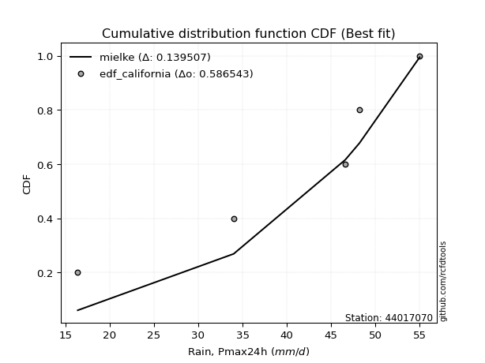</img>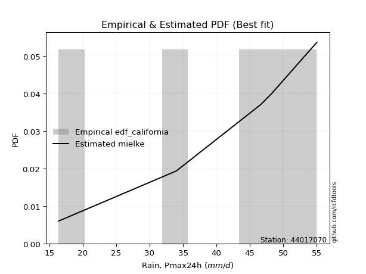</img>

</div>


### 2. EDF Hazen (1930)

Hazen method for plotting positions is a formula used to estimate the empirical cumulative probability distribution of flood events or other hydrological data. This formula often results in biased estimations, particularly when extrapolating to extreme events (high return periods).

<div align="center">


$P=(m-0.5)/n$


</div>


**2.1. Empirical values**

<div align="center">

|                | 0                  | 1                  | 2         | 3                 | 4                  |
|:---------------|:-------------------|:-------------------|:----------|:------------------|:-------------------|
| date           | 2020               | 2023               | 2022      | 2021              | 2019               |
| x              | 16.4               | 34.0               | 46.6      | 48.2              | 55.0               |
| m              | 1                  | 2                  | 3         | 4                 | 5                  |
| empirical_dist | edf_hazen          | edf_hazen          | edf_hazen | edf_hazen         | edf_hazen          |
| empirical      | 0.1                | 0.3                | 0.5       | 0.7               | 0.9                |
| empirical_tr   | 1.1111111111111112 | 1.4285714285714286 | 2.0       | 3.333333333333333 | 10.000000000000002 |

</div>


**2.2. Kolmogorov-Smirnov fit test (sorted by Δ)**


<div align="center">

|                | 0                  | 1                   | 2                   | 3                   | 4                   | 5                  | 6                  | 7                  | 8                  | 9                  | 10                 | 11                  | 12                  | 13                  | 14                  | 15                  | 16                  | 17                 | 18                 | 19                 | 20                  | 21                  | 22                 | 23                  | 24                  | 25                  | 26                  | 27                 | 28                 | 29                  | 30                  | 31                  | 32                 | 33                  | 34                  | 35                  | 36                 | 37                 | 38                 | 39                  | 40                  | 41                 | 42                  | 43                  | 44                    | 45                  | 46                  | 47                  | 48                 | 49                 | 50                 | 51                 | 52                  | 53                  | 54                 | 55                 | 56                 | 57                  | 58                  | 59                  | 60                  | 61                 | 62                  | 63                  | 64                 | 65                 | 66                  | 67                  | 68                 | 69                  | 70                 | 71                 | 72                  | 73                  | 74                  | 75                 | 76                 | 77                  | 78                  | 79                 | 80                 | 81                 | 82                 | 83                 | 84                 | 85                 | 86                 | 87                 |
|:---------------|:-------------------|:--------------------|:--------------------|:--------------------|:--------------------|:-------------------|:-------------------|:-------------------|:-------------------|:-------------------|:-------------------|:--------------------|:--------------------|:--------------------|:--------------------|:--------------------|:--------------------|:-------------------|:-------------------|:-------------------|:--------------------|:--------------------|:-------------------|:--------------------|:--------------------|:--------------------|:--------------------|:-------------------|:-------------------|:--------------------|:--------------------|:--------------------|:-------------------|:--------------------|:--------------------|:--------------------|:-------------------|:-------------------|:-------------------|:--------------------|:--------------------|:-------------------|:--------------------|:--------------------|:----------------------|:--------------------|:--------------------|:--------------------|:-------------------|:-------------------|:-------------------|:-------------------|:--------------------|:--------------------|:-------------------|:-------------------|:-------------------|:--------------------|:--------------------|:--------------------|:--------------------|:-------------------|:--------------------|:--------------------|:-------------------|:-------------------|:--------------------|:--------------------|:-------------------|:--------------------|:-------------------|:-------------------|:--------------------|:--------------------|:--------------------|:-------------------|:-------------------|:--------------------|:--------------------|:-------------------|:-------------------|:-------------------|:-------------------|:-------------------|:-------------------|:-------------------|:-------------------|:-------------------|
| station        | 44017070           | 44017070            | 44017070            | 44017070            | 44017070            | 44017070           | 44017070           | 44017070           | 44017070           | 44017070           | 44017070           | 44017070            | 44017070            | 44017070            | 44017070            | 44017070            | 44017070            | 44017070           | 44017070           | 44017070           | 44017070            | 44017070            | 44017070           | 44017070            | 44017070            | 44017070            | 44017070            | 44017070           | 44017070           | 44017070            | 44017070            | 44017070            | 44017070           | 44017070            | 44017070            | 44017070            | 44017070           | 44017070           | 44017070           | 44017070            | 44017070            | 44017070           | 44017070            | 44017070            | 44017070              | 44017070            | 44017070            | 44017070            | 44017070           | 44017070           | 44017070           | 44017070           | 44017070            | 44017070            | 44017070           | 44017070           | 44017070           | 44017070            | 44017070            | 44017070            | 44017070            | 44017070           | 44017070            | 44017070            | 44017070           | 44017070           | 44017070            | 44017070            | 44017070           | 44017070            | 44017070           | 44017070           | 44017070            | 44017070            | 44017070            | 44017070           | 44017070           | 44017070            | 44017070            | 44017070           | 44017070           | 44017070           | 44017070           | 44017070           | 44017070           | 44017070           | 44017070           | 44017070           |
| empirical_dist | edf_hazen          | edf_hazen           | edf_hazen           | edf_hazen           | edf_hazen           | edf_hazen          | edf_hazen          | edf_hazen          | edf_hazen          | edf_hazen          | edf_hazen          | edf_hazen           | edf_hazen           | edf_hazen           | edf_hazen           | edf_hazen           | edf_hazen           | edf_hazen          | edf_hazen          | edf_hazen          | edf_hazen           | edf_hazen           | edf_hazen          | edf_hazen           | edf_hazen           | edf_hazen           | edf_hazen           | edf_hazen          | edf_hazen          | edf_hazen           | edf_hazen           | edf_hazen           | edf_hazen          | edf_hazen           | edf_hazen           | edf_hazen           | edf_hazen          | edf_hazen          | edf_hazen          | edf_hazen           | edf_hazen           | edf_hazen          | edf_hazen           | edf_hazen           | edf_hazen             | edf_hazen           | edf_hazen           | edf_hazen           | edf_hazen          | edf_hazen          | edf_hazen          | edf_hazen          | edf_hazen           | edf_hazen           | edf_hazen          | edf_hazen          | edf_hazen          | edf_hazen           | edf_hazen           | edf_hazen           | edf_hazen           | edf_hazen          | edf_hazen           | edf_hazen           | edf_hazen          | edf_hazen          | edf_hazen           | edf_hazen           | edf_hazen          | edf_hazen           | edf_hazen          | edf_hazen          | edf_hazen           | edf_hazen           | edf_hazen           | edf_hazen          | edf_hazen          | edf_hazen           | edf_hazen           | edf_hazen          | edf_hazen          | edf_hazen          | edf_hazen          | edf_hazen          | edf_hazen          | edf_hazen          | edf_hazen          | edf_hazen          |
| p_dist         | johnsonsu          | mielke              | logmielke           | laplace_asymmetric  | weibull_min         | gumbel_l           | fisk               | pearson3           | logfisk            | logpearson3        | logloggamma        | logncf              | loggumbel_l         | chi2                | f                   | loginvweibull       | t                   | truncnorm          | norm               | crystalball        | exponnorm           | nct                 | betaprime          | alpha               | logweibull_min      | rice                | erlang              | gamma              | ncf                | invgamma            | invgauss            | loggompertz         | logbetaprime       | logf                | loggamma            | loggamma            | maxwell            | lognct             | logcrystalball     | lognorm             | lognorm             | logt               | logexponnorm        | logfatiguelife      | loglaplace_asymmetric | logalpha            | loginvgamma         | logrice             | logistic           | loginvgauss        | kstwobign          | rayleigh           | logmaxwell          | logkstwobign        | hypsecant          | loggenexpon        | lograyleigh        | halfnorm            | loglogistic         | expon               | genexpon            | loghalfnorm        | gumbel_r            | loghypsecant        | laplace            | halflogistic       | loggumbel_r         | moyal               | loghalflogistic    | loglaplace          | logmoyal           | gompertz           | logchi2             | logexpon            | lognakagami         | logtruncnorm       | wald               | nakagami            | logwald             | gibrat             | loggibrat          | loglognorm         | invweibull         | logjohnsonsu       | fatiguelife        | logerlang          | loggenlogistic     | genlogistic        |
| delta          | 0.0917639417919639 | 0.11593231441187324 | 0.13896720108433158 | 0.14241466417693216 | 0.14488562223397095 | 0.1468716199880189 | 0.1492480960567344 | 0.151268645260501  | 0.1562585612560755 | 0.1590010434312168 | 0.1606143914041408 | 0.16905558709923285 | 0.17091577813993042 | 0.18123883077988523 | 0.18308774486778778 | 0.18394252534193578 | 0.18485626059339566 | 0.1848574022362417 | 0.1848574472299308 | 0.1848574480498697 | 0.18485891729704396 | 0.18502082822187393 | 0.1856676662679868 | 0.18893586737872714 | 0.18898399034911584 | 0.18924888958884267 | 0.19087890361710014 | 0.1910605104805556 | 0.1951447321764851 | 0.19644930704519026 | 0.19838810983823985 | 0.19874296253068402 | 0.1989918379707013 | 0.20122347068039703 | 0.20206646942972928 | 0.20206646942972928 | 0.202580320911802  | 0.2026995280964431 | 0.2027873129067952 | 0.20278738988272815 | 0.20278738988272815 | 0.2027873965746405 | 0.20279062509068613 | 0.20346400148191823 | 0.2035311314526317    | 0.20415413202225707 | 0.20419653665330229 | 0.20479077566373927 | 0.2053753847977876 | 0.206299060280969  | 0.2063393978720761 | 0.2078033801955832 | 0.21836369836650027 | 0.21893574599212845 | 0.2205494299461107 | 0.2228633978407275 | 0.2229098121279065 | 0.22341943225790972 | 0.22426738521260603 | 0.22502867539560062 | 0.22656198618825912 | 0.2367932312028208 | 0.23871483541817629 | 0.23970391659781942 | 0.2468680466533818 | 0.2507342669017397 | 0.25304618207042107 | 0.25623466810488904 | 0.2634848369792113 | 0.26451852178881874 | 0.2692946378049671 | 0.2774770896833075 | 0.28507894937852846 | 0.29243016875580247 | 0.29996087816730216 | 0.299998928368882  | 0.3069919808924043 | 0.31564260541430456 | 0.31711807553983584 | 0.338706214887055  | 0.3483585551711845 | 0.3835818264860646 | 0.4725434276174902 | 0.4791067656227858 | 0.5245957153645904 | 0.6353278958484545 | 0.7                | 0.7                |
| deltao         | 0.5865427407550001 | 0.5865427407550001  | 0.5865427407550001  | 0.5865427407550001  | 0.5865427407550001  | 0.5865427407550001 | 0.5865427407550001 | 0.5865427407550001 | 0.5865427407550001 | 0.5865427407550001 | 0.5865427407550001 | 0.5865427407550001  | 0.5865427407550001  | 0.5865427407550001  | 0.5865427407550001  | 0.5865427407550001  | 0.5865427407550001  | 0.5865427407550001 | 0.5865427407550001 | 0.5865427407550001 | 0.5865427407550001  | 0.5865427407550001  | 0.5865427407550001 | 0.5865427407550001  | 0.5865427407550001  | 0.5865427407550001  | 0.5865427407550001  | 0.5865427407550001 | 0.5865427407550001 | 0.5865427407550001  | 0.5865427407550001  | 0.5865427407550001  | 0.5865427407550001 | 0.5865427407550001  | 0.5865427407550001  | 0.5865427407550001  | 0.5865427407550001 | 0.5865427407550001 | 0.5865427407550001 | 0.5865427407550001  | 0.5865427407550001  | 0.5865427407550001 | 0.5865427407550001  | 0.5865427407550001  | 0.5865427407550001    | 0.5865427407550001  | 0.5865427407550001  | 0.5865427407550001  | 0.5865427407550001 | 0.5865427407550001 | 0.5865427407550001 | 0.5865427407550001 | 0.5865427407550001  | 0.5865427407550001  | 0.5865427407550001 | 0.5865427407550001 | 0.5865427407550001 | 0.5865427407550001  | 0.5865427407550001  | 0.5865427407550001  | 0.5865427407550001  | 0.5865427407550001 | 0.5865427407550001  | 0.5865427407550001  | 0.5865427407550001 | 0.5865427407550001 | 0.5865427407550001  | 0.5865427407550001  | 0.5865427407550001 | 0.5865427407550001  | 0.5865427407550001 | 0.5865427407550001 | 0.5865427407550001  | 0.5865427407550001  | 0.5865427407550001  | 0.5865427407550001 | 0.5865427407550001 | 0.5865427407550001  | 0.5865427407550001  | 0.5865427407550001 | 0.5865427407550001 | 0.5865427407550001 | 0.5865427407550001 | 0.5865427407550001 | 0.5865427407550001 | 0.5865427407550001 | 0.5865427407550001 | 0.5865427407550001 |
| eval           | Δo > Δ             | Δo > Δ              | Δo > Δ              | Δo > Δ              | Δo > Δ              | Δo > Δ             | Δo > Δ             | Δo > Δ             | Δo > Δ             | Δo > Δ             | Δo > Δ             | Δo > Δ              | Δo > Δ              | Δo > Δ              | Δo > Δ              | Δo > Δ              | Δo > Δ              | Δo > Δ             | Δo > Δ             | Δo > Δ             | Δo > Δ              | Δo > Δ              | Δo > Δ             | Δo > Δ              | Δo > Δ              | Δo > Δ              | Δo > Δ              | Δo > Δ             | Δo > Δ             | Δo > Δ              | Δo > Δ              | Δo > Δ              | Δo > Δ             | Δo > Δ              | Δo > Δ              | Δo > Δ              | Δo > Δ             | Δo > Δ             | Δo > Δ             | Δo > Δ              | Δo > Δ              | Δo > Δ             | Δo > Δ              | Δo > Δ              | Δo > Δ                | Δo > Δ              | Δo > Δ              | Δo > Δ              | Δo > Δ             | Δo > Δ             | Δo > Δ             | Δo > Δ             | Δo > Δ              | Δo > Δ              | Δo > Δ             | Δo > Δ             | Δo > Δ             | Δo > Δ              | Δo > Δ              | Δo > Δ              | Δo > Δ              | Δo > Δ             | Δo > Δ              | Δo > Δ              | Δo > Δ             | Δo > Δ             | Δo > Δ              | Δo > Δ              | Δo > Δ             | Δo > Δ              | Δo > Δ             | Δo > Δ             | Δo > Δ              | Δo > Δ              | Δo > Δ              | Δo > Δ             | Δo > Δ             | Δo > Δ              | Δo > Δ              | Δo > Δ             | Δo > Δ             | Δo > Δ             | Δo > Δ             | Δo > Δ             | Δo > Δ             | Δo <= Δ            | Δo <= Δ            | Δo <= Δ            |
| fit            | 1                  | 1                   | 1                   | 1                   | 1                   | 1                  | 1                  | 1                  | 1                  | 1                  | 1                  | 1                   | 1                   | 1                   | 1                   | 1                   | 1                   | 1                  | 1                  | 1                  | 1                   | 1                   | 1                  | 1                   | 1                   | 1                   | 1                   | 1                  | 1                  | 1                   | 1                   | 1                   | 1                  | 1                   | 1                   | 1                   | 1                  | 1                  | 1                  | 1                   | 1                   | 1                  | 1                   | 1                   | 1                     | 1                   | 1                   | 1                   | 1                  | 1                  | 1                  | 1                  | 1                   | 1                   | 1                  | 1                  | 1                  | 1                   | 1                   | 1                   | 1                   | 1                  | 1                   | 1                   | 1                  | 1                  | 1                   | 1                   | 1                  | 1                   | 1                  | 1                  | 1                   | 1                   | 1                   | 1                  | 1                  | 1                   | 1                   | 1                  | 1                  | 1                  | 1                  | 1                  | 1                  | 0                  | 0                  | 0                  |
| n              | 5                  | 5                   | 5                   | 5                   | 5                   | 5                  | 5                  | 5                  | 5                  | 5                  | 5                  | 5                   | 5                   | 5                   | 5                   | 5                   | 5                   | 5                  | 5                  | 5                  | 5                   | 5                   | 5                  | 5                   | 5                   | 5                   | 5                   | 5                  | 5                  | 5                   | 5                   | 5                   | 5                  | 5                   | 5                   | 5                   | 5                  | 5                  | 5                  | 5                   | 5                   | 5                  | 5                   | 5                   | 5                     | 5                   | 5                   | 5                   | 5                  | 5                  | 5                  | 5                  | 5                   | 5                   | 5                  | 5                  | 5                  | 5                   | 5                   | 5                   | 5                   | 5                  | 5                   | 5                   | 5                  | 5                  | 5                   | 5                   | 5                  | 5                   | 5                  | 5                  | 5                   | 5                   | 5                   | 5                  | 5                  | 5                   | 5                   | 5                  | 5                  | 5                  | 5                  | 5                  | 5                  | 5                  | 5                  | 5                  |
| best_fit       | 1                  | 0                   | 0                   | 0                   | 0                   | 0                  | 0                  | 0                  | 0                  | 0                  | 0                  | 0                   | 0                   | 0                   | 0                   | 0                   | 0                   | 0                  | 0                  | 0                  | 0                   | 0                   | 0                  | 0                   | 0                   | 0                   | 0                   | 0                  | 0                  | 0                   | 0                   | 0                   | 0                  | 0                   | 0                   | 0                   | 0                  | 0                  | 0                  | 0                   | 0                   | 0                  | 0                   | 0                   | 0                     | 0                   | 0                   | 0                   | 0                  | 0                  | 0                  | 0                  | 0                   | 0                   | 0                  | 0                  | 0                  | 0                   | 0                   | 0                   | 0                   | 0                  | 0                   | 0                   | 0                  | 0                  | 0                   | 0                   | 0                  | 0                   | 0                  | 0                  | 0                   | 0                   | 0                   | 0                  | 0                  | 0                   | 0                   | 0                  | 0                  | 0                  | 0                  | 0                  | 0                  | 0                  | 0                  | 0                  |
| best_fit_sort  | 1                  | 2                   | 3                   | 4                   | 5                   | 6                  | 7                  | 8                  | 9                  | 10                 | 11                 | 12                  | 13                  | 14                  | 15                  | 16                  | 17                  | 18                 | 19                 | 20                 | 21                  | 22                  | 23                 | 24                  | 25                  | 26                  | 27                  | 28                 | 29                 | 30                  | 31                  | 32                  | 33                 | 34                  | 35                  | 36                  | 37                 | 38                 | 39                 | 40                  | 41                  | 42                 | 43                  | 44                  | 45                    | 46                  | 47                  | 48                  | 49                 | 50                 | 51                 | 52                 | 53                  | 54                  | 55                 | 56                 | 57                 | 58                  | 59                  | 60                  | 61                  | 62                 | 63                  | 64                  | 65                 | 66                 | 67                  | 68                  | 69                 | 70                  | 71                 | 72                 | 73                  | 74                  | 75                  | 76                 | 77                 | 78                  | 79                  | 80                 | 81                 | 82                 | 83                 | 84                 | 85                 | 86                 | 87                 | 88                 |

</div>


**2.3. Best fit**

<div align="center">

|   id |   station | empirical_dist   | p_dist    |     delta |   deltao | eval   |   fit |   n |   best_fit |   best_fit_sort |
|-----:|----------:|:-----------------|:----------|----------:|---------:|:-------|------:|----:|-----------:|----------------:|
|    0 |  44017070 | edf_hazen        | johnsonsu | 0.0917639 | 0.586543 | Δo > Δ |     1 |   5 |          1 |               1 |

</div>


<div align="center">

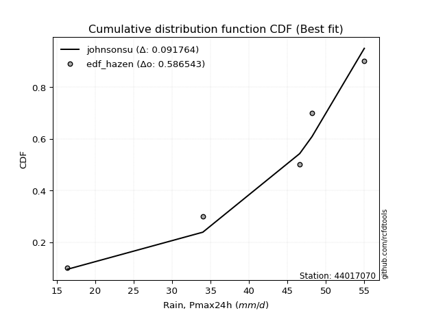</img></img>

</div>


### 3. EDF Weibull (1939)

Weibull plotting position formula is an empirical method used to estimate the non-exceedance probability or plotting position for a set of observed data, is often recommended or widely used in practice, particularly in flood frequency analysis.

<div align="center">


$P=m/(n+1)$


</div>


**3.1. Empirical values**

<div align="center">

|                | 0                   | 1                  | 2           | 3                  | 4                  |
|:---------------|:--------------------|:-------------------|:------------|:-------------------|:-------------------|
| date           | 2020                | 2023               | 2022        | 2021               | 2019               |
| x              | 16.4                | 34.0               | 46.6        | 48.2               | 55.0               |
| m              | 1                   | 2                  | 3           | 4                  | 5                  |
| empirical_dist | edf_weibull         | edf_weibull        | edf_weibull | edf_weibull        | edf_weibull        |
| empirical      | 0.16666666666666666 | 0.3333333333333333 | 0.5         | 0.6666666666666666 | 0.8333333333333334 |
| empirical_tr   | 1.2                 | 1.4999999999999998 | 2.0         | 2.9999999999999996 | 6.000000000000002  |

</div>


**3.2. Kolmogorov-Smirnov fit test (sorted by Δ)**


<div align="center">

|                | 0                   | 1                   | 2                   | 3                   | 4                   | 5                  | 6                  | 7                  | 8                  | 9                  | 10                  | 11                  | 12                  | 13                  | 14                  | 15                  | 16                  | 17                 | 18                 | 19                 | 20                  | 21                  | 22                 | 23                  | 24                  | 25                  | 26                  | 27                 | 28                 | 29                  | 30                  | 31                  | 32                 | 33                  | 34                  | 35                  | 36                 | 37                 | 38                 | 39                  | 40                  | 41                 | 42                  | 43                  | 44                    | 45                  | 46                  | 47                  | 48                 | 49                 | 50                 | 51                 | 52                  | 53                  | 54                 | 55                 | 56                  | 57                 | 58                 | 59                  | 60                  | 61                 | 62                  | 63                  | 64                 | 65                 | 66                  | 67                  | 68                  | 69                  | 70                 | 71                  | 72                 | 73                 | 74                 | 75                  | 76                 | 77                 | 78                 | 79                 | 80                 | 81                  | 82                  | 83                 | 84                 | 85                 | 86                 | 87                 |
|:---------------|:--------------------|:--------------------|:--------------------|:--------------------|:--------------------|:-------------------|:-------------------|:-------------------|:-------------------|:-------------------|:--------------------|:--------------------|:--------------------|:--------------------|:--------------------|:--------------------|:--------------------|:-------------------|:-------------------|:-------------------|:--------------------|:--------------------|:-------------------|:--------------------|:--------------------|:--------------------|:--------------------|:-------------------|:-------------------|:--------------------|:--------------------|:--------------------|:-------------------|:--------------------|:--------------------|:--------------------|:-------------------|:-------------------|:-------------------|:--------------------|:--------------------|:-------------------|:--------------------|:--------------------|:----------------------|:--------------------|:--------------------|:--------------------|:-------------------|:-------------------|:-------------------|:-------------------|:--------------------|:--------------------|:-------------------|:-------------------|:--------------------|:-------------------|:-------------------|:--------------------|:--------------------|:-------------------|:--------------------|:--------------------|:-------------------|:-------------------|:--------------------|:--------------------|:--------------------|:--------------------|:-------------------|:--------------------|:-------------------|:-------------------|:-------------------|:--------------------|:-------------------|:-------------------|:-------------------|:-------------------|:-------------------|:--------------------|:--------------------|:-------------------|:-------------------|:-------------------|:-------------------|:-------------------|
| station        | 44017070            | 44017070            | 44017070            | 44017070            | 44017070            | 44017070           | 44017070           | 44017070           | 44017070           | 44017070           | 44017070            | 44017070            | 44017070            | 44017070            | 44017070            | 44017070            | 44017070            | 44017070           | 44017070           | 44017070           | 44017070            | 44017070            | 44017070           | 44017070            | 44017070            | 44017070            | 44017070            | 44017070           | 44017070           | 44017070            | 44017070            | 44017070            | 44017070           | 44017070            | 44017070            | 44017070            | 44017070           | 44017070           | 44017070           | 44017070            | 44017070            | 44017070           | 44017070            | 44017070            | 44017070              | 44017070            | 44017070            | 44017070            | 44017070           | 44017070           | 44017070           | 44017070           | 44017070            | 44017070            | 44017070           | 44017070           | 44017070            | 44017070           | 44017070           | 44017070            | 44017070            | 44017070           | 44017070            | 44017070            | 44017070           | 44017070           | 44017070            | 44017070            | 44017070            | 44017070            | 44017070           | 44017070            | 44017070           | 44017070           | 44017070           | 44017070            | 44017070           | 44017070           | 44017070           | 44017070           | 44017070           | 44017070            | 44017070            | 44017070           | 44017070           | 44017070           | 44017070           | 44017070           |
| empirical_dist | edf_weibull         | edf_weibull         | edf_weibull         | edf_weibull         | edf_weibull         | edf_weibull        | edf_weibull        | edf_weibull        | edf_weibull        | edf_weibull        | edf_weibull         | edf_weibull         | edf_weibull         | edf_weibull         | edf_weibull         | edf_weibull         | edf_weibull         | edf_weibull        | edf_weibull        | edf_weibull        | edf_weibull         | edf_weibull         | edf_weibull        | edf_weibull         | edf_weibull         | edf_weibull         | edf_weibull         | edf_weibull        | edf_weibull        | edf_weibull         | edf_weibull         | edf_weibull         | edf_weibull        | edf_weibull         | edf_weibull         | edf_weibull         | edf_weibull        | edf_weibull        | edf_weibull        | edf_weibull         | edf_weibull         | edf_weibull        | edf_weibull         | edf_weibull         | edf_weibull           | edf_weibull         | edf_weibull         | edf_weibull         | edf_weibull        | edf_weibull        | edf_weibull        | edf_weibull        | edf_weibull         | edf_weibull         | edf_weibull        | edf_weibull        | edf_weibull         | edf_weibull        | edf_weibull        | edf_weibull         | edf_weibull         | edf_weibull        | edf_weibull         | edf_weibull         | edf_weibull        | edf_weibull        | edf_weibull         | edf_weibull         | edf_weibull         | edf_weibull         | edf_weibull        | edf_weibull         | edf_weibull        | edf_weibull        | edf_weibull        | edf_weibull         | edf_weibull        | edf_weibull        | edf_weibull        | edf_weibull        | edf_weibull        | edf_weibull         | edf_weibull         | edf_weibull        | edf_weibull        | edf_weibull        | edf_weibull        | edf_weibull        |
| p_dist         | johnsonsu           | logmielke           | laplace_asymmetric  | weibull_min         | logncf              | gumbel_l           | fisk               | pearson3           | logfisk            | logpearson3        | mielke              | logloggamma         | loggumbel_l         | chi2                | f                   | loginvweibull       | t                   | truncnorm          | norm               | crystalball        | exponnorm           | nct                 | betaprime          | alpha               | logweibull_min      | rice                | erlang              | gamma              | ncf                | invgamma            | invgauss            | loggompertz         | logbetaprime       | logf                | loggamma            | loggamma            | maxwell            | lognct             | logcrystalball     | lognorm             | lognorm             | logt               | logexponnorm        | logfatiguelife      | loglaplace_asymmetric | logalpha            | loginvgamma         | logrice             | logistic           | loginvgauss        | kstwobign          | rayleigh           | logkstwobign        | logmaxwell          | hypsecant          | expon              | genexpon            | loggenexpon        | lograyleigh        | halfnorm            | loglogistic         | loghalfnorm        | gumbel_r            | loghypsecant        | laplace            | halflogistic       | logchi2             | loggumbel_r         | moyal               | logexpon            | loghalflogistic    | loglaplace          | logmoyal           | wald               | gompertz           | logwald             | lognakagami        | logtruncnorm       | nakagami           | gibrat             | loggibrat          | loglognorm          | invweibull          | logjohnsonsu       | fatiguelife        | logerlang          | loggenlogistic     | genlogistic        |
| delta          | 0.11605281294694125 | 0.13896720108433158 | 0.14241466417693216 | 0.14488562223397095 | 0.14658185966716253 | 0.1468716199880189 | 0.1492480960567344 | 0.151268645260501  | 0.1562585612560755 | 0.1590010434312168 | 0.16118680320908507 | 0.16645538798913573 | 0.17091577813993042 | 0.18123883077988523 | 0.18308774486778778 | 0.18394252534193578 | 0.18485626059339566 | 0.1848574022362417 | 0.1848574472299308 | 0.1848574480498697 | 0.18485891729704396 | 0.18502082822187393 | 0.1856676662679868 | 0.18893586737872714 | 0.18898399034911584 | 0.18924888958884267 | 0.19087890361710014 | 0.1910605104805556 | 0.1951447321764851 | 0.19644930704519026 | 0.19838810983823985 | 0.19874296253068402 | 0.1989918379707013 | 0.20122347068039703 | 0.20206646942972928 | 0.20206646942972928 | 0.202580320911802  | 0.2026995280964431 | 0.2027873129067952 | 0.20278738988272815 | 0.20278738988272815 | 0.2027873965746405 | 0.20279062509068613 | 0.20346400148191823 | 0.2035311314526317    | 0.20415413202225707 | 0.20419653665330229 | 0.20479077566373927 | 0.2053753847977876 | 0.206299060280969  | 0.2063393978720761 | 0.2078033801955832 | 0.21111471323056819 | 0.21836369836650027 | 0.2205494299461107 | 0.2212655576273891 | 0.22280744026878052 | 0.2228633978407275 | 0.2229098121279065 | 0.22341943225790972 | 0.22426738521260603 | 0.2367932312028208 | 0.23871483541817629 | 0.23970391659781942 | 0.2468680466533818 | 0.2507342669017397 | 0.25174561604519513 | 0.25304618207042107 | 0.25623466810488904 | 0.25909683542246914 | 0.2634848369792113 | 0.26451852178881874 | 0.2692946378049671 | 0.3069919808924043 | 0.3108104230166408 | 0.31711807553983584 | 0.3332942115006355 | 0.3333322617022153 | 0.3333328738934157 | 0.338706214887055  | 0.3483585551711845 | 0.35024849315273127 | 0.40587676095082353 | 0.4457734322894525 | 0.4912623820312571 | 0.6019945625151213 | 0.6666666666666666 | 0.6666666666666666 |
| deltao         | 0.5865427407550001  | 0.5865427407550001  | 0.5865427407550001  | 0.5865427407550001  | 0.5865427407550001  | 0.5865427407550001 | 0.5865427407550001 | 0.5865427407550001 | 0.5865427407550001 | 0.5865427407550001 | 0.5865427407550001  | 0.5865427407550001  | 0.5865427407550001  | 0.5865427407550001  | 0.5865427407550001  | 0.5865427407550001  | 0.5865427407550001  | 0.5865427407550001 | 0.5865427407550001 | 0.5865427407550001 | 0.5865427407550001  | 0.5865427407550001  | 0.5865427407550001 | 0.5865427407550001  | 0.5865427407550001  | 0.5865427407550001  | 0.5865427407550001  | 0.5865427407550001 | 0.5865427407550001 | 0.5865427407550001  | 0.5865427407550001  | 0.5865427407550001  | 0.5865427407550001 | 0.5865427407550001  | 0.5865427407550001  | 0.5865427407550001  | 0.5865427407550001 | 0.5865427407550001 | 0.5865427407550001 | 0.5865427407550001  | 0.5865427407550001  | 0.5865427407550001 | 0.5865427407550001  | 0.5865427407550001  | 0.5865427407550001    | 0.5865427407550001  | 0.5865427407550001  | 0.5865427407550001  | 0.5865427407550001 | 0.5865427407550001 | 0.5865427407550001 | 0.5865427407550001 | 0.5865427407550001  | 0.5865427407550001  | 0.5865427407550001 | 0.5865427407550001 | 0.5865427407550001  | 0.5865427407550001 | 0.5865427407550001 | 0.5865427407550001  | 0.5865427407550001  | 0.5865427407550001 | 0.5865427407550001  | 0.5865427407550001  | 0.5865427407550001 | 0.5865427407550001 | 0.5865427407550001  | 0.5865427407550001  | 0.5865427407550001  | 0.5865427407550001  | 0.5865427407550001 | 0.5865427407550001  | 0.5865427407550001 | 0.5865427407550001 | 0.5865427407550001 | 0.5865427407550001  | 0.5865427407550001 | 0.5865427407550001 | 0.5865427407550001 | 0.5865427407550001 | 0.5865427407550001 | 0.5865427407550001  | 0.5865427407550001  | 0.5865427407550001 | 0.5865427407550001 | 0.5865427407550001 | 0.5865427407550001 | 0.5865427407550001 |
| eval           | Δo > Δ              | Δo > Δ              | Δo > Δ              | Δo > Δ              | Δo > Δ              | Δo > Δ             | Δo > Δ             | Δo > Δ             | Δo > Δ             | Δo > Δ             | Δo > Δ              | Δo > Δ              | Δo > Δ              | Δo > Δ              | Δo > Δ              | Δo > Δ              | Δo > Δ              | Δo > Δ             | Δo > Δ             | Δo > Δ             | Δo > Δ              | Δo > Δ              | Δo > Δ             | Δo > Δ              | Δo > Δ              | Δo > Δ              | Δo > Δ              | Δo > Δ             | Δo > Δ             | Δo > Δ              | Δo > Δ              | Δo > Δ              | Δo > Δ             | Δo > Δ              | Δo > Δ              | Δo > Δ              | Δo > Δ             | Δo > Δ             | Δo > Δ             | Δo > Δ              | Δo > Δ              | Δo > Δ             | Δo > Δ              | Δo > Δ              | Δo > Δ                | Δo > Δ              | Δo > Δ              | Δo > Δ              | Δo > Δ             | Δo > Δ             | Δo > Δ             | Δo > Δ             | Δo > Δ              | Δo > Δ              | Δo > Δ             | Δo > Δ             | Δo > Δ              | Δo > Δ             | Δo > Δ             | Δo > Δ              | Δo > Δ              | Δo > Δ             | Δo > Δ              | Δo > Δ              | Δo > Δ             | Δo > Δ             | Δo > Δ              | Δo > Δ              | Δo > Δ              | Δo > Δ              | Δo > Δ             | Δo > Δ              | Δo > Δ             | Δo > Δ             | Δo > Δ             | Δo > Δ              | Δo > Δ             | Δo > Δ             | Δo > Δ             | Δo > Δ             | Δo > Δ             | Δo > Δ              | Δo > Δ              | Δo > Δ             | Δo > Δ             | Δo <= Δ            | Δo <= Δ            | Δo <= Δ            |
| fit            | 1                   | 1                   | 1                   | 1                   | 1                   | 1                  | 1                  | 1                  | 1                  | 1                  | 1                   | 1                   | 1                   | 1                   | 1                   | 1                   | 1                   | 1                  | 1                  | 1                  | 1                   | 1                   | 1                  | 1                   | 1                   | 1                   | 1                   | 1                  | 1                  | 1                   | 1                   | 1                   | 1                  | 1                   | 1                   | 1                   | 1                  | 1                  | 1                  | 1                   | 1                   | 1                  | 1                   | 1                   | 1                     | 1                   | 1                   | 1                   | 1                  | 1                  | 1                  | 1                  | 1                   | 1                   | 1                  | 1                  | 1                   | 1                  | 1                  | 1                   | 1                   | 1                  | 1                   | 1                   | 1                  | 1                  | 1                   | 1                   | 1                   | 1                   | 1                  | 1                   | 1                  | 1                  | 1                  | 1                   | 1                  | 1                  | 1                  | 1                  | 1                  | 1                   | 1                   | 1                  | 1                  | 0                  | 0                  | 0                  |
| n              | 5                   | 5                   | 5                   | 5                   | 5                   | 5                  | 5                  | 5                  | 5                  | 5                  | 5                   | 5                   | 5                   | 5                   | 5                   | 5                   | 5                   | 5                  | 5                  | 5                  | 5                   | 5                   | 5                  | 5                   | 5                   | 5                   | 5                   | 5                  | 5                  | 5                   | 5                   | 5                   | 5                  | 5                   | 5                   | 5                   | 5                  | 5                  | 5                  | 5                   | 5                   | 5                  | 5                   | 5                   | 5                     | 5                   | 5                   | 5                   | 5                  | 5                  | 5                  | 5                  | 5                   | 5                   | 5                  | 5                  | 5                   | 5                  | 5                  | 5                   | 5                   | 5                  | 5                   | 5                   | 5                  | 5                  | 5                   | 5                   | 5                   | 5                   | 5                  | 5                   | 5                  | 5                  | 5                  | 5                   | 5                  | 5                  | 5                  | 5                  | 5                  | 5                   | 5                   | 5                  | 5                  | 5                  | 5                  | 5                  |
| best_fit       | 1                   | 0                   | 0                   | 0                   | 0                   | 0                  | 0                  | 0                  | 0                  | 0                  | 0                   | 0                   | 0                   | 0                   | 0                   | 0                   | 0                   | 0                  | 0                  | 0                  | 0                   | 0                   | 0                  | 0                   | 0                   | 0                   | 0                   | 0                  | 0                  | 0                   | 0                   | 0                   | 0                  | 0                   | 0                   | 0                   | 0                  | 0                  | 0                  | 0                   | 0                   | 0                  | 0                   | 0                   | 0                     | 0                   | 0                   | 0                   | 0                  | 0                  | 0                  | 0                  | 0                   | 0                   | 0                  | 0                  | 0                   | 0                  | 0                  | 0                   | 0                   | 0                  | 0                   | 0                   | 0                  | 0                  | 0                   | 0                   | 0                   | 0                   | 0                  | 0                   | 0                  | 0                  | 0                  | 0                   | 0                  | 0                  | 0                  | 0                  | 0                  | 0                   | 0                   | 0                  | 0                  | 0                  | 0                  | 0                  |
| best_fit_sort  | 1                   | 2                   | 3                   | 4                   | 5                   | 6                  | 7                  | 8                  | 9                  | 10                 | 11                  | 12                  | 13                  | 14                  | 15                  | 16                  | 17                  | 18                 | 19                 | 20                 | 21                  | 22                  | 23                 | 24                  | 25                  | 26                  | 27                  | 28                 | 29                 | 30                  | 31                  | 32                  | 33                 | 34                  | 35                  | 36                  | 37                 | 38                 | 39                 | 40                  | 41                  | 42                 | 43                  | 44                  | 45                    | 46                  | 47                  | 48                  | 49                 | 50                 | 51                 | 52                 | 53                  | 54                  | 55                 | 56                 | 57                  | 58                 | 59                 | 60                  | 61                  | 62                 | 63                  | 64                  | 65                 | 66                 | 67                  | 68                  | 69                  | 70                  | 71                 | 72                  | 73                 | 74                 | 75                 | 76                  | 77                 | 78                 | 79                 | 80                 | 81                 | 82                  | 83                  | 84                 | 85                 | 86                 | 87                 | 88                 |

</div>


**3.3. Best fit**

<div align="center">

|   id |   station | empirical_dist   | p_dist    |    delta |   deltao | eval   |   fit |   n |   best_fit |   best_fit_sort |
|-----:|----------:|:-----------------|:----------|---------:|---------:|:-------|------:|----:|-----------:|----------------:|
|    0 |  44017070 | edf_weibull      | johnsonsu | 0.116053 | 0.586543 | Δo > Δ |     1 |   5 |          1 |               1 |

</div>


<div align="center">

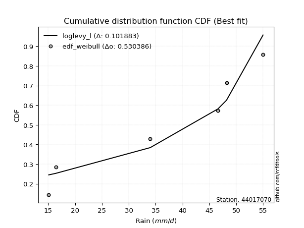</img></img>

</div>


### 4. EDF Beard (1943)

The Beard formula (or Beard´s plotting position formula) in hydrology is used to estimate the empirical non-exceedance probability _(P)_ of a flood event (or other extreme hydrological data point) within a given dataset.

<div align="center">


$P=(m-0.31)/(n+0.38)$


</div>


**4.1. Empirical values**

<div align="center">

|                | 0                   | 1                  | 2         | 3                  | 4                  |
|:---------------|:--------------------|:-------------------|:----------|:-------------------|:-------------------|
| date           | 2020                | 2023               | 2022      | 2021               | 2019               |
| x              | 16.4                | 34.0               | 46.6      | 48.2               | 55.0               |
| m              | 1                   | 2                  | 3         | 4                  | 5                  |
| empirical_dist | edf_beard           | edf_beard          | edf_beard | edf_beard          | edf_beard          |
| empirical      | 0.12825278810408922 | 0.3141263940520446 | 0.5       | 0.6858736059479554 | 0.8717472118959109 |
| empirical_tr   | 1.1471215351812367  | 1.4579945799457996 | 2.0       | 3.183431952662722  | 7.797101449275368  |

</div>


**4.2. Kolmogorov-Smirnov fit test (sorted by Δ)**


<div align="center">

|                | 0                   | 1                   | 2                   | 3                   | 4                   | 5                  | 6                   | 7                  | 8                  | 9                  | 10                 | 11                 | 12                  | 13                  | 14                  | 15                  | 16                  | 17                 | 18                 | 19                 | 20                  | 21                  | 22                 | 23                  | 24                  | 25                  | 26                  | 27                 | 28                 | 29                  | 30                  | 31                  | 32                 | 33                  | 34                  | 35                  | 36                 | 37                 | 38                 | 39                  | 40                  | 41                 | 42                  | 43                  | 44                    | 45                  | 46                  | 47                  | 48                 | 49                 | 50                 | 51                 | 52                  | 53                  | 54                 | 55                 | 56                  | 57                 | 58                 | 59                  | 60                  | 61                 | 62                  | 63                  | 64                 | 65                 | 66                  | 67                  | 68                 | 69                  | 70                 | 71                 | 72                  | 73                 | 74                 | 75                 | 76                 | 77                  | 78                  | 79                 | 80                 | 81                  | 82                  | 83                 | 84                 | 85                 | 86                 | 87                 |
|:---------------|:--------------------|:--------------------|:--------------------|:--------------------|:--------------------|:-------------------|:--------------------|:-------------------|:-------------------|:-------------------|:-------------------|:-------------------|:--------------------|:--------------------|:--------------------|:--------------------|:--------------------|:-------------------|:-------------------|:-------------------|:--------------------|:--------------------|:-------------------|:--------------------|:--------------------|:--------------------|:--------------------|:-------------------|:-------------------|:--------------------|:--------------------|:--------------------|:-------------------|:--------------------|:--------------------|:--------------------|:-------------------|:-------------------|:-------------------|:--------------------|:--------------------|:-------------------|:--------------------|:--------------------|:----------------------|:--------------------|:--------------------|:--------------------|:-------------------|:-------------------|:-------------------|:-------------------|:--------------------|:--------------------|:-------------------|:-------------------|:--------------------|:-------------------|:-------------------|:--------------------|:--------------------|:-------------------|:--------------------|:--------------------|:-------------------|:-------------------|:--------------------|:--------------------|:-------------------|:--------------------|:-------------------|:-------------------|:--------------------|:-------------------|:-------------------|:-------------------|:-------------------|:--------------------|:--------------------|:-------------------|:-------------------|:--------------------|:--------------------|:-------------------|:-------------------|:-------------------|:-------------------|:-------------------|
| station        | 44017070            | 44017070            | 44017070            | 44017070            | 44017070            | 44017070           | 44017070            | 44017070           | 44017070           | 44017070           | 44017070           | 44017070           | 44017070            | 44017070            | 44017070            | 44017070            | 44017070            | 44017070           | 44017070           | 44017070           | 44017070            | 44017070            | 44017070           | 44017070            | 44017070            | 44017070            | 44017070            | 44017070           | 44017070           | 44017070            | 44017070            | 44017070            | 44017070           | 44017070            | 44017070            | 44017070            | 44017070           | 44017070           | 44017070           | 44017070            | 44017070            | 44017070           | 44017070            | 44017070            | 44017070              | 44017070            | 44017070            | 44017070            | 44017070           | 44017070           | 44017070           | 44017070           | 44017070            | 44017070            | 44017070           | 44017070           | 44017070            | 44017070           | 44017070           | 44017070            | 44017070            | 44017070           | 44017070            | 44017070            | 44017070           | 44017070           | 44017070            | 44017070            | 44017070           | 44017070            | 44017070           | 44017070           | 44017070            | 44017070           | 44017070           | 44017070           | 44017070           | 44017070            | 44017070            | 44017070           | 44017070           | 44017070            | 44017070            | 44017070           | 44017070           | 44017070           | 44017070           | 44017070           |
| empirical_dist | edf_beard           | edf_beard           | edf_beard           | edf_beard           | edf_beard           | edf_beard          | edf_beard           | edf_beard          | edf_beard          | edf_beard          | edf_beard          | edf_beard          | edf_beard           | edf_beard           | edf_beard           | edf_beard           | edf_beard           | edf_beard          | edf_beard          | edf_beard          | edf_beard           | edf_beard           | edf_beard          | edf_beard           | edf_beard           | edf_beard           | edf_beard           | edf_beard          | edf_beard          | edf_beard           | edf_beard           | edf_beard           | edf_beard          | edf_beard           | edf_beard           | edf_beard           | edf_beard          | edf_beard          | edf_beard          | edf_beard           | edf_beard           | edf_beard          | edf_beard           | edf_beard           | edf_beard             | edf_beard           | edf_beard           | edf_beard           | edf_beard          | edf_beard          | edf_beard          | edf_beard          | edf_beard           | edf_beard           | edf_beard          | edf_beard          | edf_beard           | edf_beard          | edf_beard          | edf_beard           | edf_beard           | edf_beard          | edf_beard           | edf_beard           | edf_beard          | edf_beard          | edf_beard           | edf_beard           | edf_beard          | edf_beard           | edf_beard          | edf_beard          | edf_beard           | edf_beard          | edf_beard          | edf_beard          | edf_beard          | edf_beard           | edf_beard           | edf_beard          | edf_beard          | edf_beard           | edf_beard           | edf_beard          | edf_beard          | edf_beard          | edf_beard          | edf_beard          |
| p_dist         | johnsonsu           | mielke              | logmielke           | laplace_asymmetric  | weibull_min         | gumbel_l           | logncf              | fisk               | pearson3           | logfisk            | logpearson3        | logloggamma        | loggumbel_l         | chi2                | f                   | loginvweibull       | t                   | truncnorm          | norm               | crystalball        | exponnorm           | nct                 | betaprime          | alpha               | logweibull_min      | rice                | erlang              | gamma              | ncf                | invgamma            | invgauss            | loggompertz         | logbetaprime       | logf                | loggamma            | loggamma            | maxwell            | lognct             | logcrystalball     | lognorm             | lognorm             | logt               | logexponnorm        | logfatiguelife      | loglaplace_asymmetric | logalpha            | loginvgamma         | logrice             | logistic           | loginvgauss        | kstwobign          | rayleigh           | logkstwobign        | logmaxwell          | hypsecant          | expon              | genexpon            | loggenexpon        | lograyleigh        | halfnorm            | loglogistic         | loghalfnorm        | gumbel_r            | loghypsecant        | laplace            | halflogistic       | loggumbel_r         | moyal               | loghalflogistic    | loglaplace          | logmoyal           | logchi2            | logexpon            | gompertz           | wald               | lognakagami        | logtruncnorm       | nakagami            | logwald             | gibrat             | loggibrat          | loglognorm          | invweibull          | logjohnsonsu       | fatiguelife        | logerlang          | loggenlogistic     | genlogistic        |
| delta          | 0.07763893438436376 | 0.12277292464650758 | 0.13896720108433158 | 0.14241466417693216 | 0.14488562223397095 | 0.1468716199880189 | 0.14754413111345976 | 0.1492480960567344 | 0.151268645260501  | 0.1562585612560755 | 0.1590010434312168 | 0.1606143914041408 | 0.17091577813993042 | 0.18123883077988523 | 0.18308774486778778 | 0.18394252534193578 | 0.18485626059339566 | 0.1848574022362417 | 0.1848574472299308 | 0.1848574480498697 | 0.18485891729704396 | 0.18502082822187393 | 0.1856676662679868 | 0.18893586737872714 | 0.18898399034911584 | 0.18924888958884267 | 0.19087890361710014 | 0.1910605104805556 | 0.1951447321764851 | 0.19644930704519026 | 0.19838810983823985 | 0.19874296253068402 | 0.1989918379707013 | 0.20122347068039703 | 0.20206646942972928 | 0.20206646942972928 | 0.202580320911802  | 0.2026995280964431 | 0.2027873129067952 | 0.20278738988272815 | 0.20278738988272815 | 0.2027873965746405 | 0.20279062509068613 | 0.20346400148191823 | 0.2035311314526317    | 0.20415413202225707 | 0.20419653665330229 | 0.20479077566373927 | 0.2053753847977876 | 0.206299060280969  | 0.2063393978720761 | 0.2078033801955832 | 0.21111471323056819 | 0.21836369836650027 | 0.2205494299461107 | 0.2212655576273891 | 0.22280744026878052 | 0.2228633978407275 | 0.2229098121279065 | 0.22341943225790972 | 0.22426738521260603 | 0.2367932312028208 | 0.23871483541817629 | 0.23970391659781942 | 0.2468680466533818 | 0.2507342669017397 | 0.25304618207042107 | 0.25623466810488904 | 0.2634848369792113 | 0.26451852178881874 | 0.2692946378049671 | 0.2709525553264838 | 0.27830377470375783 | 0.2916034837353521 | 0.3069919808924043 | 0.3140872722193468 | 0.3141253224209266 | 0.31564260541430456 | 0.31711807553983584 | 0.338706214887055  | 0.3483585551711845 | 0.36945543243401996 | 0.44429063951340103 | 0.4649803715707413 | 0.5104693213125457 | 0.6212015017964099 | 0.6858736059479554 | 0.6858736059479554 |
| deltao         | 0.5865427407550001  | 0.5865427407550001  | 0.5865427407550001  | 0.5865427407550001  | 0.5865427407550001  | 0.5865427407550001 | 0.5865427407550001  | 0.5865427407550001 | 0.5865427407550001 | 0.5865427407550001 | 0.5865427407550001 | 0.5865427407550001 | 0.5865427407550001  | 0.5865427407550001  | 0.5865427407550001  | 0.5865427407550001  | 0.5865427407550001  | 0.5865427407550001 | 0.5865427407550001 | 0.5865427407550001 | 0.5865427407550001  | 0.5865427407550001  | 0.5865427407550001 | 0.5865427407550001  | 0.5865427407550001  | 0.5865427407550001  | 0.5865427407550001  | 0.5865427407550001 | 0.5865427407550001 | 0.5865427407550001  | 0.5865427407550001  | 0.5865427407550001  | 0.5865427407550001 | 0.5865427407550001  | 0.5865427407550001  | 0.5865427407550001  | 0.5865427407550001 | 0.5865427407550001 | 0.5865427407550001 | 0.5865427407550001  | 0.5865427407550001  | 0.5865427407550001 | 0.5865427407550001  | 0.5865427407550001  | 0.5865427407550001    | 0.5865427407550001  | 0.5865427407550001  | 0.5865427407550001  | 0.5865427407550001 | 0.5865427407550001 | 0.5865427407550001 | 0.5865427407550001 | 0.5865427407550001  | 0.5865427407550001  | 0.5865427407550001 | 0.5865427407550001 | 0.5865427407550001  | 0.5865427407550001 | 0.5865427407550001 | 0.5865427407550001  | 0.5865427407550001  | 0.5865427407550001 | 0.5865427407550001  | 0.5865427407550001  | 0.5865427407550001 | 0.5865427407550001 | 0.5865427407550001  | 0.5865427407550001  | 0.5865427407550001 | 0.5865427407550001  | 0.5865427407550001 | 0.5865427407550001 | 0.5865427407550001  | 0.5865427407550001 | 0.5865427407550001 | 0.5865427407550001 | 0.5865427407550001 | 0.5865427407550001  | 0.5865427407550001  | 0.5865427407550001 | 0.5865427407550001 | 0.5865427407550001  | 0.5865427407550001  | 0.5865427407550001 | 0.5865427407550001 | 0.5865427407550001 | 0.5865427407550001 | 0.5865427407550001 |
| eval           | Δo > Δ              | Δo > Δ              | Δo > Δ              | Δo > Δ              | Δo > Δ              | Δo > Δ             | Δo > Δ              | Δo > Δ             | Δo > Δ             | Δo > Δ             | Δo > Δ             | Δo > Δ             | Δo > Δ              | Δo > Δ              | Δo > Δ              | Δo > Δ              | Δo > Δ              | Δo > Δ             | Δo > Δ             | Δo > Δ             | Δo > Δ              | Δo > Δ              | Δo > Δ             | Δo > Δ              | Δo > Δ              | Δo > Δ              | Δo > Δ              | Δo > Δ             | Δo > Δ             | Δo > Δ              | Δo > Δ              | Δo > Δ              | Δo > Δ             | Δo > Δ              | Δo > Δ              | Δo > Δ              | Δo > Δ             | Δo > Δ             | Δo > Δ             | Δo > Δ              | Δo > Δ              | Δo > Δ             | Δo > Δ              | Δo > Δ              | Δo > Δ                | Δo > Δ              | Δo > Δ              | Δo > Δ              | Δo > Δ             | Δo > Δ             | Δo > Δ             | Δo > Δ             | Δo > Δ              | Δo > Δ              | Δo > Δ             | Δo > Δ             | Δo > Δ              | Δo > Δ             | Δo > Δ             | Δo > Δ              | Δo > Δ              | Δo > Δ             | Δo > Δ              | Δo > Δ              | Δo > Δ             | Δo > Δ             | Δo > Δ              | Δo > Δ              | Δo > Δ             | Δo > Δ              | Δo > Δ             | Δo > Δ             | Δo > Δ              | Δo > Δ             | Δo > Δ             | Δo > Δ             | Δo > Δ             | Δo > Δ              | Δo > Δ              | Δo > Δ             | Δo > Δ             | Δo > Δ              | Δo > Δ              | Δo > Δ             | Δo > Δ             | Δo <= Δ            | Δo <= Δ            | Δo <= Δ            |
| fit            | 1                   | 1                   | 1                   | 1                   | 1                   | 1                  | 1                   | 1                  | 1                  | 1                  | 1                  | 1                  | 1                   | 1                   | 1                   | 1                   | 1                   | 1                  | 1                  | 1                  | 1                   | 1                   | 1                  | 1                   | 1                   | 1                   | 1                   | 1                  | 1                  | 1                   | 1                   | 1                   | 1                  | 1                   | 1                   | 1                   | 1                  | 1                  | 1                  | 1                   | 1                   | 1                  | 1                   | 1                   | 1                     | 1                   | 1                   | 1                   | 1                  | 1                  | 1                  | 1                  | 1                   | 1                   | 1                  | 1                  | 1                   | 1                  | 1                  | 1                   | 1                   | 1                  | 1                   | 1                   | 1                  | 1                  | 1                   | 1                   | 1                  | 1                   | 1                  | 1                  | 1                   | 1                  | 1                  | 1                  | 1                  | 1                   | 1                   | 1                  | 1                  | 1                   | 1                   | 1                  | 1                  | 0                  | 0                  | 0                  |
| n              | 5                   | 5                   | 5                   | 5                   | 5                   | 5                  | 5                   | 5                  | 5                  | 5                  | 5                  | 5                  | 5                   | 5                   | 5                   | 5                   | 5                   | 5                  | 5                  | 5                  | 5                   | 5                   | 5                  | 5                   | 5                   | 5                   | 5                   | 5                  | 5                  | 5                   | 5                   | 5                   | 5                  | 5                   | 5                   | 5                   | 5                  | 5                  | 5                  | 5                   | 5                   | 5                  | 5                   | 5                   | 5                     | 5                   | 5                   | 5                   | 5                  | 5                  | 5                  | 5                  | 5                   | 5                   | 5                  | 5                  | 5                   | 5                  | 5                  | 5                   | 5                   | 5                  | 5                   | 5                   | 5                  | 5                  | 5                   | 5                   | 5                  | 5                   | 5                  | 5                  | 5                   | 5                  | 5                  | 5                  | 5                  | 5                   | 5                   | 5                  | 5                  | 5                   | 5                   | 5                  | 5                  | 5                  | 5                  | 5                  |
| best_fit       | 1                   | 0                   | 0                   | 0                   | 0                   | 0                  | 0                   | 0                  | 0                  | 0                  | 0                  | 0                  | 0                   | 0                   | 0                   | 0                   | 0                   | 0                  | 0                  | 0                  | 0                   | 0                   | 0                  | 0                   | 0                   | 0                   | 0                   | 0                  | 0                  | 0                   | 0                   | 0                   | 0                  | 0                   | 0                   | 0                   | 0                  | 0                  | 0                  | 0                   | 0                   | 0                  | 0                   | 0                   | 0                     | 0                   | 0                   | 0                   | 0                  | 0                  | 0                  | 0                  | 0                   | 0                   | 0                  | 0                  | 0                   | 0                  | 0                  | 0                   | 0                   | 0                  | 0                   | 0                   | 0                  | 0                  | 0                   | 0                   | 0                  | 0                   | 0                  | 0                  | 0                   | 0                  | 0                  | 0                  | 0                  | 0                   | 0                   | 0                  | 0                  | 0                   | 0                   | 0                  | 0                  | 0                  | 0                  | 0                  |
| best_fit_sort  | 1                   | 2                   | 3                   | 4                   | 5                   | 6                  | 7                   | 8                  | 9                  | 10                 | 11                 | 12                 | 13                  | 14                  | 15                  | 16                  | 17                  | 18                 | 19                 | 20                 | 21                  | 22                  | 23                 | 24                  | 25                  | 26                  | 27                  | 28                 | 29                 | 30                  | 31                  | 32                  | 33                 | 34                  | 35                  | 36                  | 37                 | 38                 | 39                 | 40                  | 41                  | 42                 | 43                  | 44                  | 45                    | 46                  | 47                  | 48                  | 49                 | 50                 | 51                 | 52                 | 53                  | 54                  | 55                 | 56                 | 57                  | 58                 | 59                 | 60                  | 61                  | 62                 | 63                  | 64                  | 65                 | 66                 | 67                  | 68                  | 69                 | 70                  | 71                 | 72                 | 73                  | 74                 | 75                 | 76                 | 77                 | 78                  | 79                  | 80                 | 81                 | 82                  | 83                  | 84                 | 85                 | 86                 | 87                 | 88                 |

</div>


**4.3. Best fit**

<div align="center">

|   id |   station | empirical_dist   | p_dist    |     delta |   deltao | eval   |   fit |   n |   best_fit |   best_fit_sort |
|-----:|----------:|:-----------------|:----------|----------:|---------:|:-------|------:|----:|-----------:|----------------:|
|    0 |  44017070 | edf_beard        | johnsonsu | 0.0776389 | 0.586543 | Δo > Δ |     1 |   5 |          1 |               1 |

</div>


<div align="center">

</img>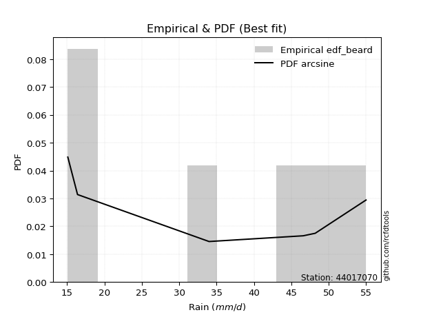</img>

</div>


### 5. EDF Chegodayev (1955)

The Chegodayev formula is an empirical plotting position formula used in hydrological frequency analysis to estimate the exceedance probability or return period of a specific event from a set of observed data. It is primarily used for plotting observed data points on probability paper to fit a theoretical distribution, particularly for analyzing extreme events like maximum flood flows or rainfall intensities. The constant _b_ value in the generalized plotting position formula is 0.3.

<div align="center">


$P=(m-b)/(n+1-2b)$


</div>


**5.1. Empirical values**

<div align="center">

|                | 0                   | 1                   | 2              | 3                  | 4                  |
|:---------------|:--------------------|:--------------------|:---------------|:-------------------|:-------------------|
| date           | 2020                | 2023                | 2022           | 2021               | 2019               |
| x              | 16.4                | 34.0                | 46.6           | 48.2               | 55.0               |
| m              | 1                   | 2                   | 3              | 4                  | 5                  |
| empirical_dist | edf_chegodayev      | edf_chegodayev      | edf_chegodayev | edf_chegodayev     | edf_chegodayev     |
| empirical      | 0.12962962962962962 | 0.31481481481481477 | 0.5            | 0.6851851851851851 | 0.8703703703703703 |
| empirical_tr   | 1.148936170212766   | 1.4594594594594594  | 2.0            | 3.1764705882352935 | 7.714285714285713  |

</div>


**5.2. Kolmogorov-Smirnov fit test (sorted by Δ)**


<div align="center">

|                | 0                   | 1                   | 2                   | 3                   | 4                   | 5                   | 6                  | 7                  | 8                  | 9                  | 10                 | 11                 | 12                  | 13                  | 14                  | 15                  | 16                  | 17                 | 18                 | 19                 | 20                  | 21                  | 22                 | 23                  | 24                  | 25                  | 26                  | 27                 | 28                 | 29                  | 30                  | 31                  | 32                 | 33                  | 34                  | 35                  | 36                 | 37                 | 38                 | 39                  | 40                  | 41                 | 42                  | 43                  | 44                    | 45                  | 46                  | 47                  | 48                 | 49                 | 50                 | 51                 | 52                  | 53                  | 54                 | 55                 | 56                  | 57                 | 58                 | 59                  | 60                  | 61                 | 62                  | 63                  | 64                 | 65                 | 66                  | 67                  | 68                 | 69                  | 70                 | 71                 | 72                 | 73                  | 74                 | 75                  | 76                  | 77                  | 78                  | 79                 | 80                 | 81                 | 82                 | 83                 | 84                 | 85                 | 86                 | 87                 |
|:---------------|:--------------------|:--------------------|:--------------------|:--------------------|:--------------------|:--------------------|:-------------------|:-------------------|:-------------------|:-------------------|:-------------------|:-------------------|:--------------------|:--------------------|:--------------------|:--------------------|:--------------------|:-------------------|:-------------------|:-------------------|:--------------------|:--------------------|:-------------------|:--------------------|:--------------------|:--------------------|:--------------------|:-------------------|:-------------------|:--------------------|:--------------------|:--------------------|:-------------------|:--------------------|:--------------------|:--------------------|:-------------------|:-------------------|:-------------------|:--------------------|:--------------------|:-------------------|:--------------------|:--------------------|:----------------------|:--------------------|:--------------------|:--------------------|:-------------------|:-------------------|:-------------------|:-------------------|:--------------------|:--------------------|:-------------------|:-------------------|:--------------------|:-------------------|:-------------------|:--------------------|:--------------------|:-------------------|:--------------------|:--------------------|:-------------------|:-------------------|:--------------------|:--------------------|:-------------------|:--------------------|:-------------------|:-------------------|:-------------------|:--------------------|:-------------------|:--------------------|:--------------------|:--------------------|:--------------------|:-------------------|:-------------------|:-------------------|:-------------------|:-------------------|:-------------------|:-------------------|:-------------------|:-------------------|
| station        | 44017070            | 44017070            | 44017070            | 44017070            | 44017070            | 44017070            | 44017070           | 44017070           | 44017070           | 44017070           | 44017070           | 44017070           | 44017070            | 44017070            | 44017070            | 44017070            | 44017070            | 44017070           | 44017070           | 44017070           | 44017070            | 44017070            | 44017070           | 44017070            | 44017070            | 44017070            | 44017070            | 44017070           | 44017070           | 44017070            | 44017070            | 44017070            | 44017070           | 44017070            | 44017070            | 44017070            | 44017070           | 44017070           | 44017070           | 44017070            | 44017070            | 44017070           | 44017070            | 44017070            | 44017070              | 44017070            | 44017070            | 44017070            | 44017070           | 44017070           | 44017070           | 44017070           | 44017070            | 44017070            | 44017070           | 44017070           | 44017070            | 44017070           | 44017070           | 44017070            | 44017070            | 44017070           | 44017070            | 44017070            | 44017070           | 44017070           | 44017070            | 44017070            | 44017070           | 44017070            | 44017070           | 44017070           | 44017070           | 44017070            | 44017070           | 44017070            | 44017070            | 44017070            | 44017070            | 44017070           | 44017070           | 44017070           | 44017070           | 44017070           | 44017070           | 44017070           | 44017070           | 44017070           |
| empirical_dist | edf_chegodayev      | edf_chegodayev      | edf_chegodayev      | edf_chegodayev      | edf_chegodayev      | edf_chegodayev      | edf_chegodayev     | edf_chegodayev     | edf_chegodayev     | edf_chegodayev     | edf_chegodayev     | edf_chegodayev     | edf_chegodayev      | edf_chegodayev      | edf_chegodayev      | edf_chegodayev      | edf_chegodayev      | edf_chegodayev     | edf_chegodayev     | edf_chegodayev     | edf_chegodayev      | edf_chegodayev      | edf_chegodayev     | edf_chegodayev      | edf_chegodayev      | edf_chegodayev      | edf_chegodayev      | edf_chegodayev     | edf_chegodayev     | edf_chegodayev      | edf_chegodayev      | edf_chegodayev      | edf_chegodayev     | edf_chegodayev      | edf_chegodayev      | edf_chegodayev      | edf_chegodayev     | edf_chegodayev     | edf_chegodayev     | edf_chegodayev      | edf_chegodayev      | edf_chegodayev     | edf_chegodayev      | edf_chegodayev      | edf_chegodayev        | edf_chegodayev      | edf_chegodayev      | edf_chegodayev      | edf_chegodayev     | edf_chegodayev     | edf_chegodayev     | edf_chegodayev     | edf_chegodayev      | edf_chegodayev      | edf_chegodayev     | edf_chegodayev     | edf_chegodayev      | edf_chegodayev     | edf_chegodayev     | edf_chegodayev      | edf_chegodayev      | edf_chegodayev     | edf_chegodayev      | edf_chegodayev      | edf_chegodayev     | edf_chegodayev     | edf_chegodayev      | edf_chegodayev      | edf_chegodayev     | edf_chegodayev      | edf_chegodayev     | edf_chegodayev     | edf_chegodayev     | edf_chegodayev      | edf_chegodayev     | edf_chegodayev      | edf_chegodayev      | edf_chegodayev      | edf_chegodayev      | edf_chegodayev     | edf_chegodayev     | edf_chegodayev     | edf_chegodayev     | edf_chegodayev     | edf_chegodayev     | edf_chegodayev     | edf_chegodayev     | edf_chegodayev     |
| p_dist         | johnsonsu           | mielke              | logmielke           | laplace_asymmetric  | weibull_min         | logncf              | gumbel_l           | fisk               | pearson3           | logfisk            | logpearson3        | logloggamma        | loggumbel_l         | chi2                | f                   | loginvweibull       | t                   | truncnorm          | norm               | crystalball        | exponnorm           | nct                 | betaprime          | alpha               | logweibull_min      | rice                | erlang              | gamma              | ncf                | invgamma            | invgauss            | loggompertz         | logbetaprime       | logf                | loggamma            | loggamma            | maxwell            | lognct             | logcrystalball     | lognorm             | lognorm             | logt               | logexponnorm        | logfatiguelife      | loglaplace_asymmetric | logalpha            | loginvgamma         | logrice             | logistic           | loginvgauss        | kstwobign          | rayleigh           | logkstwobign        | logmaxwell          | hypsecant          | expon              | genexpon            | loggenexpon        | lograyleigh        | halfnorm            | loglogistic         | loghalfnorm        | gumbel_r            | loghypsecant        | laplace            | halflogistic       | loggumbel_r         | moyal               | loghalflogistic    | loglaplace          | logmoyal           | logchi2            | logexpon           | gompertz            | wald               | lognakagami         | logtruncnorm        | nakagami            | logwald             | gibrat             | loggibrat          | loglognorm         | invweibull         | logjohnsonsu       | fatiguelife        | logerlang          | loggenlogistic     | genlogistic        |
| delta          | 0.07901577590990427 | 0.12414976617204809 | 0.13896720108433158 | 0.14241466417693216 | 0.14488562223397095 | 0.14685571035068962 | 0.1468716199880189 | 0.1492480960567344 | 0.151268645260501  | 0.1562585612560755 | 0.1590010434312168 | 0.1606143914041408 | 0.17091577813993042 | 0.18123883077988523 | 0.18308774486778778 | 0.18394252534193578 | 0.18485626059339566 | 0.1848574022362417 | 0.1848574472299308 | 0.1848574480498697 | 0.18485891729704396 | 0.18502082822187393 | 0.1856676662679868 | 0.18893586737872714 | 0.18898399034911584 | 0.18924888958884267 | 0.19087890361710014 | 0.1910605104805556 | 0.1951447321764851 | 0.19644930704519026 | 0.19838810983823985 | 0.19874296253068402 | 0.1989918379707013 | 0.20122347068039703 | 0.20206646942972928 | 0.20206646942972928 | 0.202580320911802  | 0.2026995280964431 | 0.2027873129067952 | 0.20278738988272815 | 0.20278738988272815 | 0.2027873965746405 | 0.20279062509068613 | 0.20346400148191823 | 0.2035311314526317    | 0.20415413202225707 | 0.20419653665330229 | 0.20479077566373927 | 0.2053753847977876 | 0.206299060280969  | 0.2063393978720761 | 0.2078033801955832 | 0.21111471323056819 | 0.21836369836650027 | 0.2205494299461107 | 0.2212655576273891 | 0.22280744026878052 | 0.2228633978407275 | 0.2229098121279065 | 0.22341943225790972 | 0.22426738521260603 | 0.2367932312028208 | 0.23871483541817629 | 0.23970391659781942 | 0.2468680466533818 | 0.2507342669017397 | 0.25304618207042107 | 0.25623466810488904 | 0.2634848369792113 | 0.26451852178881874 | 0.2692946378049671 | 0.2702641345637137 | 0.2776153539409877 | 0.29229190449812226 | 0.3069919808924043 | 0.31477569298211694 | 0.31481374318369676 | 0.31564260541430456 | 0.31711807553983584 | 0.338706214887055  | 0.3483585551711845 | 0.3687670116712498 | 0.4429137979878605 | 0.464291950807971  | 0.5097809005497757 | 0.6205130810336398 | 0.6851851851851851 | 0.6851851851851851 |
| deltao         | 0.5865427407550001  | 0.5865427407550001  | 0.5865427407550001  | 0.5865427407550001  | 0.5865427407550001  | 0.5865427407550001  | 0.5865427407550001 | 0.5865427407550001 | 0.5865427407550001 | 0.5865427407550001 | 0.5865427407550001 | 0.5865427407550001 | 0.5865427407550001  | 0.5865427407550001  | 0.5865427407550001  | 0.5865427407550001  | 0.5865427407550001  | 0.5865427407550001 | 0.5865427407550001 | 0.5865427407550001 | 0.5865427407550001  | 0.5865427407550001  | 0.5865427407550001 | 0.5865427407550001  | 0.5865427407550001  | 0.5865427407550001  | 0.5865427407550001  | 0.5865427407550001 | 0.5865427407550001 | 0.5865427407550001  | 0.5865427407550001  | 0.5865427407550001  | 0.5865427407550001 | 0.5865427407550001  | 0.5865427407550001  | 0.5865427407550001  | 0.5865427407550001 | 0.5865427407550001 | 0.5865427407550001 | 0.5865427407550001  | 0.5865427407550001  | 0.5865427407550001 | 0.5865427407550001  | 0.5865427407550001  | 0.5865427407550001    | 0.5865427407550001  | 0.5865427407550001  | 0.5865427407550001  | 0.5865427407550001 | 0.5865427407550001 | 0.5865427407550001 | 0.5865427407550001 | 0.5865427407550001  | 0.5865427407550001  | 0.5865427407550001 | 0.5865427407550001 | 0.5865427407550001  | 0.5865427407550001 | 0.5865427407550001 | 0.5865427407550001  | 0.5865427407550001  | 0.5865427407550001 | 0.5865427407550001  | 0.5865427407550001  | 0.5865427407550001 | 0.5865427407550001 | 0.5865427407550001  | 0.5865427407550001  | 0.5865427407550001 | 0.5865427407550001  | 0.5865427407550001 | 0.5865427407550001 | 0.5865427407550001 | 0.5865427407550001  | 0.5865427407550001 | 0.5865427407550001  | 0.5865427407550001  | 0.5865427407550001  | 0.5865427407550001  | 0.5865427407550001 | 0.5865427407550001 | 0.5865427407550001 | 0.5865427407550001 | 0.5865427407550001 | 0.5865427407550001 | 0.5865427407550001 | 0.5865427407550001 | 0.5865427407550001 |
| eval           | Δo > Δ              | Δo > Δ              | Δo > Δ              | Δo > Δ              | Δo > Δ              | Δo > Δ              | Δo > Δ             | Δo > Δ             | Δo > Δ             | Δo > Δ             | Δo > Δ             | Δo > Δ             | Δo > Δ              | Δo > Δ              | Δo > Δ              | Δo > Δ              | Δo > Δ              | Δo > Δ             | Δo > Δ             | Δo > Δ             | Δo > Δ              | Δo > Δ              | Δo > Δ             | Δo > Δ              | Δo > Δ              | Δo > Δ              | Δo > Δ              | Δo > Δ             | Δo > Δ             | Δo > Δ              | Δo > Δ              | Δo > Δ              | Δo > Δ             | Δo > Δ              | Δo > Δ              | Δo > Δ              | Δo > Δ             | Δo > Δ             | Δo > Δ             | Δo > Δ              | Δo > Δ              | Δo > Δ             | Δo > Δ              | Δo > Δ              | Δo > Δ                | Δo > Δ              | Δo > Δ              | Δo > Δ              | Δo > Δ             | Δo > Δ             | Δo > Δ             | Δo > Δ             | Δo > Δ              | Δo > Δ              | Δo > Δ             | Δo > Δ             | Δo > Δ              | Δo > Δ             | Δo > Δ             | Δo > Δ              | Δo > Δ              | Δo > Δ             | Δo > Δ              | Δo > Δ              | Δo > Δ             | Δo > Δ             | Δo > Δ              | Δo > Δ              | Δo > Δ             | Δo > Δ              | Δo > Δ             | Δo > Δ             | Δo > Δ             | Δo > Δ              | Δo > Δ             | Δo > Δ              | Δo > Δ              | Δo > Δ              | Δo > Δ              | Δo > Δ             | Δo > Δ             | Δo > Δ             | Δo > Δ             | Δo > Δ             | Δo > Δ             | Δo <= Δ            | Δo <= Δ            | Δo <= Δ            |
| fit            | 1                   | 1                   | 1                   | 1                   | 1                   | 1                   | 1                  | 1                  | 1                  | 1                  | 1                  | 1                  | 1                   | 1                   | 1                   | 1                   | 1                   | 1                  | 1                  | 1                  | 1                   | 1                   | 1                  | 1                   | 1                   | 1                   | 1                   | 1                  | 1                  | 1                   | 1                   | 1                   | 1                  | 1                   | 1                   | 1                   | 1                  | 1                  | 1                  | 1                   | 1                   | 1                  | 1                   | 1                   | 1                     | 1                   | 1                   | 1                   | 1                  | 1                  | 1                  | 1                  | 1                   | 1                   | 1                  | 1                  | 1                   | 1                  | 1                  | 1                   | 1                   | 1                  | 1                   | 1                   | 1                  | 1                  | 1                   | 1                   | 1                  | 1                   | 1                  | 1                  | 1                  | 1                   | 1                  | 1                   | 1                   | 1                   | 1                   | 1                  | 1                  | 1                  | 1                  | 1                  | 1                  | 0                  | 0                  | 0                  |
| n              | 5                   | 5                   | 5                   | 5                   | 5                   | 5                   | 5                  | 5                  | 5                  | 5                  | 5                  | 5                  | 5                   | 5                   | 5                   | 5                   | 5                   | 5                  | 5                  | 5                  | 5                   | 5                   | 5                  | 5                   | 5                   | 5                   | 5                   | 5                  | 5                  | 5                   | 5                   | 5                   | 5                  | 5                   | 5                   | 5                   | 5                  | 5                  | 5                  | 5                   | 5                   | 5                  | 5                   | 5                   | 5                     | 5                   | 5                   | 5                   | 5                  | 5                  | 5                  | 5                  | 5                   | 5                   | 5                  | 5                  | 5                   | 5                  | 5                  | 5                   | 5                   | 5                  | 5                   | 5                   | 5                  | 5                  | 5                   | 5                   | 5                  | 5                   | 5                  | 5                  | 5                  | 5                   | 5                  | 5                   | 5                   | 5                   | 5                   | 5                  | 5                  | 5                  | 5                  | 5                  | 5                  | 5                  | 5                  | 5                  |
| best_fit       | 1                   | 0                   | 0                   | 0                   | 0                   | 0                   | 0                  | 0                  | 0                  | 0                  | 0                  | 0                  | 0                   | 0                   | 0                   | 0                   | 0                   | 0                  | 0                  | 0                  | 0                   | 0                   | 0                  | 0                   | 0                   | 0                   | 0                   | 0                  | 0                  | 0                   | 0                   | 0                   | 0                  | 0                   | 0                   | 0                   | 0                  | 0                  | 0                  | 0                   | 0                   | 0                  | 0                   | 0                   | 0                     | 0                   | 0                   | 0                   | 0                  | 0                  | 0                  | 0                  | 0                   | 0                   | 0                  | 0                  | 0                   | 0                  | 0                  | 0                   | 0                   | 0                  | 0                   | 0                   | 0                  | 0                  | 0                   | 0                   | 0                  | 0                   | 0                  | 0                  | 0                  | 0                   | 0                  | 0                   | 0                   | 0                   | 0                   | 0                  | 0                  | 0                  | 0                  | 0                  | 0                  | 0                  | 0                  | 0                  |
| best_fit_sort  | 1                   | 2                   | 3                   | 4                   | 5                   | 6                   | 7                  | 8                  | 9                  | 10                 | 11                 | 12                 | 13                  | 14                  | 15                  | 16                  | 17                  | 18                 | 19                 | 20                 | 21                  | 22                  | 23                 | 24                  | 25                  | 26                  | 27                  | 28                 | 29                 | 30                  | 31                  | 32                  | 33                 | 34                  | 35                  | 36                  | 37                 | 38                 | 39                 | 40                  | 41                  | 42                 | 43                  | 44                  | 45                    | 46                  | 47                  | 48                  | 49                 | 50                 | 51                 | 52                 | 53                  | 54                  | 55                 | 56                 | 57                  | 58                 | 59                 | 60                  | 61                  | 62                 | 63                  | 64                  | 65                 | 66                 | 67                  | 68                  | 69                 | 70                  | 71                 | 72                 | 73                 | 74                  | 75                 | 76                  | 77                  | 78                  | 79                  | 80                 | 81                 | 82                 | 83                 | 84                 | 85                 | 86                 | 87                 | 88                 |

</div>


**5.3. Best fit**

<div align="center">

|   id |   station | empirical_dist   | p_dist    |     delta |   deltao | eval   |   fit |   n |   best_fit |   best_fit_sort |
|-----:|----------:|:-----------------|:----------|----------:|---------:|:-------|------:|----:|-----------:|----------------:|
|    0 |  44017070 | edf_chegodayev   | johnsonsu | 0.0790158 | 0.586543 | Δo > Δ |     1 |   5 |          1 |               1 |

</div>


<div align="center">

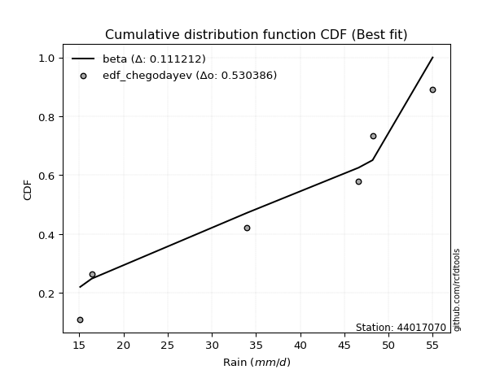</img>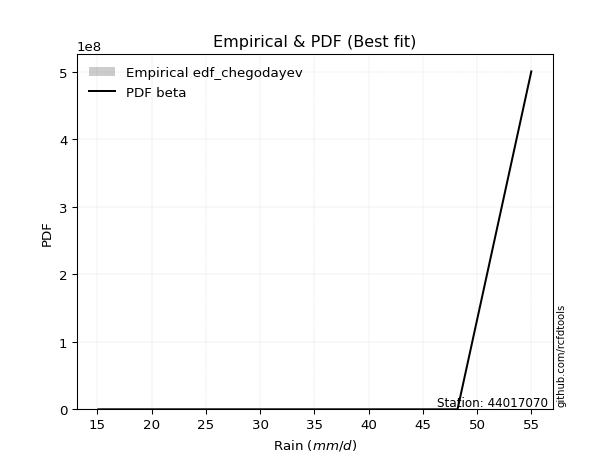</img>

</div>


### 6. EDF Blom (1958)

The Blom formula is a specific "plotting position" formula used in hydrology and statistical analysis to estimate the empirical cumulative probability (or non-exceedance probability) of a data series. It is particularly recommended for data that are approximately normally distributed. The constant _a_ is set to 0.375 (or 3/8).

<div align="center">


$P=(m-a)/(n+1-2a)$


</div>


**6.1. Empirical values**

<div align="center">

|                | 0                   | 1                   | 2        | 3                  | 4                  |
|:---------------|:--------------------|:--------------------|:---------|:-------------------|:-------------------|
| date           | 2020                | 2023                | 2022     | 2021               | 2019               |
| x              | 16.4                | 34.0                | 46.6     | 48.2               | 55.0               |
| m              | 1                   | 2                   | 3        | 4                  | 5                  |
| empirical_dist | edf_blom            | edf_blom            | edf_blom | edf_blom           | edf_blom           |
| empirical      | 0.11904761904761904 | 0.30952380952380953 | 0.5      | 0.6904761904761905 | 0.8809523809523809 |
| empirical_tr   | 1.135135135135135   | 1.4482758620689655  | 2.0      | 3.230769230769231  | 8.399999999999999  |

</div>


**6.2. Kolmogorov-Smirnov fit test (sorted by Δ)**


<div align="center">

|                | 0                   | 1                   | 2                   | 3                   | 4                   | 5                  | 6                  | 7                  | 8                   | 9                  | 10                 | 11                 | 12                  | 13                  | 14                  | 15                  | 16                  | 17                 | 18                 | 19                 | 20                  | 21                  | 22                 | 23                  | 24                  | 25                  | 26                  | 27                 | 28                 | 29                  | 30                  | 31                  | 32                 | 33                  | 34                  | 35                  | 36                 | 37                 | 38                 | 39                  | 40                  | 41                 | 42                  | 43                  | 44                    | 45                  | 46                  | 47                  | 48                 | 49                 | 50                 | 51                 | 52                  | 53                  | 54                 | 55                 | 56                  | 57                 | 58                 | 59                  | 60                  | 61                 | 62                  | 63                  | 64                 | 65                 | 66                  | 67                  | 68                 | 69                  | 70                 | 71                 | 72                 | 73                 | 74                 | 75                 | 76                 | 77                  | 78                  | 79                 | 80                 | 81                  | 82                 | 83                 | 84                 | 85                 | 86                 | 87                 |
|:---------------|:--------------------|:--------------------|:--------------------|:--------------------|:--------------------|:-------------------|:-------------------|:-------------------|:--------------------|:-------------------|:-------------------|:-------------------|:--------------------|:--------------------|:--------------------|:--------------------|:--------------------|:-------------------|:-------------------|:-------------------|:--------------------|:--------------------|:-------------------|:--------------------|:--------------------|:--------------------|:--------------------|:-------------------|:-------------------|:--------------------|:--------------------|:--------------------|:-------------------|:--------------------|:--------------------|:--------------------|:-------------------|:-------------------|:-------------------|:--------------------|:--------------------|:-------------------|:--------------------|:--------------------|:----------------------|:--------------------|:--------------------|:--------------------|:-------------------|:-------------------|:-------------------|:-------------------|:--------------------|:--------------------|:-------------------|:-------------------|:--------------------|:-------------------|:-------------------|:--------------------|:--------------------|:-------------------|:--------------------|:--------------------|:-------------------|:-------------------|:--------------------|:--------------------|:-------------------|:--------------------|:-------------------|:-------------------|:-------------------|:-------------------|:-------------------|:-------------------|:-------------------|:--------------------|:--------------------|:-------------------|:-------------------|:--------------------|:-------------------|:-------------------|:-------------------|:-------------------|:-------------------|:-------------------|
| station        | 44017070            | 44017070            | 44017070            | 44017070            | 44017070            | 44017070           | 44017070           | 44017070           | 44017070            | 44017070           | 44017070           | 44017070           | 44017070            | 44017070            | 44017070            | 44017070            | 44017070            | 44017070           | 44017070           | 44017070           | 44017070            | 44017070            | 44017070           | 44017070            | 44017070            | 44017070            | 44017070            | 44017070           | 44017070           | 44017070            | 44017070            | 44017070            | 44017070           | 44017070            | 44017070            | 44017070            | 44017070           | 44017070           | 44017070           | 44017070            | 44017070            | 44017070           | 44017070            | 44017070            | 44017070              | 44017070            | 44017070            | 44017070            | 44017070           | 44017070           | 44017070           | 44017070           | 44017070            | 44017070            | 44017070           | 44017070           | 44017070            | 44017070           | 44017070           | 44017070            | 44017070            | 44017070           | 44017070            | 44017070            | 44017070           | 44017070           | 44017070            | 44017070            | 44017070           | 44017070            | 44017070           | 44017070           | 44017070           | 44017070           | 44017070           | 44017070           | 44017070           | 44017070            | 44017070            | 44017070           | 44017070           | 44017070            | 44017070           | 44017070           | 44017070           | 44017070           | 44017070           | 44017070           |
| empirical_dist | edf_blom            | edf_blom            | edf_blom            | edf_blom            | edf_blom            | edf_blom           | edf_blom           | edf_blom           | edf_blom            | edf_blom           | edf_blom           | edf_blom           | edf_blom            | edf_blom            | edf_blom            | edf_blom            | edf_blom            | edf_blom           | edf_blom           | edf_blom           | edf_blom            | edf_blom            | edf_blom           | edf_blom            | edf_blom            | edf_blom            | edf_blom            | edf_blom           | edf_blom           | edf_blom            | edf_blom            | edf_blom            | edf_blom           | edf_blom            | edf_blom            | edf_blom            | edf_blom           | edf_blom           | edf_blom           | edf_blom            | edf_blom            | edf_blom           | edf_blom            | edf_blom            | edf_blom              | edf_blom            | edf_blom            | edf_blom            | edf_blom           | edf_blom           | edf_blom           | edf_blom           | edf_blom            | edf_blom            | edf_blom           | edf_blom           | edf_blom            | edf_blom           | edf_blom           | edf_blom            | edf_blom            | edf_blom           | edf_blom            | edf_blom            | edf_blom           | edf_blom           | edf_blom            | edf_blom            | edf_blom           | edf_blom            | edf_blom           | edf_blom           | edf_blom           | edf_blom           | edf_blom           | edf_blom           | edf_blom           | edf_blom            | edf_blom            | edf_blom           | edf_blom           | edf_blom            | edf_blom           | edf_blom           | edf_blom           | edf_blom           | edf_blom           | edf_blom           |
| p_dist         | johnsonsu           | mielke              | logmielke           | laplace_asymmetric  | weibull_min         | gumbel_l           | fisk               | pearson3           | logncf              | logfisk            | logpearson3        | logloggamma        | loggumbel_l         | chi2                | f                   | loginvweibull       | t                   | truncnorm          | norm               | crystalball        | exponnorm           | nct                 | betaprime          | alpha               | logweibull_min      | rice                | erlang              | gamma              | ncf                | invgamma            | invgauss            | loggompertz         | logbetaprime       | logf                | loggamma            | loggamma            | maxwell            | lognct             | logcrystalball     | lognorm             | lognorm             | logt               | logexponnorm        | logfatiguelife      | loglaplace_asymmetric | logalpha            | loginvgamma         | logrice             | logistic           | loginvgauss        | kstwobign          | rayleigh           | logkstwobign        | logmaxwell          | hypsecant          | expon              | genexpon            | loggenexpon        | lograyleigh        | halfnorm            | loglogistic         | loghalfnorm        | gumbel_r            | loghypsecant        | laplace            | halflogistic       | loggumbel_r         | moyal               | loghalflogistic    | loglaplace          | logmoyal           | logchi2            | logexpon           | gompertz           | wald               | lognakagami        | logtruncnorm       | nakagami            | logwald             | gibrat             | loggibrat          | loglognorm          | invweibull         | logjohnsonsu       | fatiguelife        | logerlang          | loggenlogistic     | genlogistic        |
| delta          | 0.08224013226815441 | 0.11593231441187324 | 0.13896720108433158 | 0.14241466417693216 | 0.14488562223397095 | 0.1468716199880189 | 0.1492480960567344 | 0.151268645260501  | 0.15214671564169485 | 0.1562585612560755 | 0.1590010434312168 | 0.1606143914041408 | 0.17091577813993042 | 0.18123883077988523 | 0.18308774486778778 | 0.18394252534193578 | 0.18485626059339566 | 0.1848574022362417 | 0.1848574472299308 | 0.1848574480498697 | 0.18485891729704396 | 0.18502082822187393 | 0.1856676662679868 | 0.18893586737872714 | 0.18898399034911584 | 0.18924888958884267 | 0.19087890361710014 | 0.1910605104805556 | 0.1951447321764851 | 0.19644930704519026 | 0.19838810983823985 | 0.19874296253068402 | 0.1989918379707013 | 0.20122347068039703 | 0.20206646942972928 | 0.20206646942972928 | 0.202580320911802  | 0.2026995280964431 | 0.2027873129067952 | 0.20278738988272815 | 0.20278738988272815 | 0.2027873965746405 | 0.20279062509068613 | 0.20346400148191823 | 0.2035311314526317    | 0.20415413202225707 | 0.20419653665330229 | 0.20479077566373927 | 0.2053753847977876 | 0.206299060280969  | 0.2063393978720761 | 0.2078033801955832 | 0.21111471323056819 | 0.21836369836650027 | 0.2205494299461107 | 0.2212655576273891 | 0.22280744026878052 | 0.2228633978407275 | 0.2229098121279065 | 0.22341943225790972 | 0.22426738521260603 | 0.2367932312028208 | 0.23871483541817629 | 0.23970391659781942 | 0.2468680466533818 | 0.2507342669017397 | 0.25304618207042107 | 0.25623466810488904 | 0.2634848369792113 | 0.26451852178881874 | 0.2692946378049671 | 0.2755551398547189 | 0.2829063592319929 | 0.287000899207117  | 0.3069919808924043 | 0.3094846876911117 | 0.3095227378926915 | 0.31564260541430456 | 0.31711807553983584 | 0.338706214887055  | 0.3483585551711845 | 0.37405801696225505 | 0.4534958085698711 | 0.4695829560989763 | 0.5150719058407809 | 0.625804086324645  | 0.6904761904761905 | 0.6904761904761905 |
| deltao         | 0.5865427407550001  | 0.5865427407550001  | 0.5865427407550001  | 0.5865427407550001  | 0.5865427407550001  | 0.5865427407550001 | 0.5865427407550001 | 0.5865427407550001 | 0.5865427407550001  | 0.5865427407550001 | 0.5865427407550001 | 0.5865427407550001 | 0.5865427407550001  | 0.5865427407550001  | 0.5865427407550001  | 0.5865427407550001  | 0.5865427407550001  | 0.5865427407550001 | 0.5865427407550001 | 0.5865427407550001 | 0.5865427407550001  | 0.5865427407550001  | 0.5865427407550001 | 0.5865427407550001  | 0.5865427407550001  | 0.5865427407550001  | 0.5865427407550001  | 0.5865427407550001 | 0.5865427407550001 | 0.5865427407550001  | 0.5865427407550001  | 0.5865427407550001  | 0.5865427407550001 | 0.5865427407550001  | 0.5865427407550001  | 0.5865427407550001  | 0.5865427407550001 | 0.5865427407550001 | 0.5865427407550001 | 0.5865427407550001  | 0.5865427407550001  | 0.5865427407550001 | 0.5865427407550001  | 0.5865427407550001  | 0.5865427407550001    | 0.5865427407550001  | 0.5865427407550001  | 0.5865427407550001  | 0.5865427407550001 | 0.5865427407550001 | 0.5865427407550001 | 0.5865427407550001 | 0.5865427407550001  | 0.5865427407550001  | 0.5865427407550001 | 0.5865427407550001 | 0.5865427407550001  | 0.5865427407550001 | 0.5865427407550001 | 0.5865427407550001  | 0.5865427407550001  | 0.5865427407550001 | 0.5865427407550001  | 0.5865427407550001  | 0.5865427407550001 | 0.5865427407550001 | 0.5865427407550001  | 0.5865427407550001  | 0.5865427407550001 | 0.5865427407550001  | 0.5865427407550001 | 0.5865427407550001 | 0.5865427407550001 | 0.5865427407550001 | 0.5865427407550001 | 0.5865427407550001 | 0.5865427407550001 | 0.5865427407550001  | 0.5865427407550001  | 0.5865427407550001 | 0.5865427407550001 | 0.5865427407550001  | 0.5865427407550001 | 0.5865427407550001 | 0.5865427407550001 | 0.5865427407550001 | 0.5865427407550001 | 0.5865427407550001 |
| eval           | Δo > Δ              | Δo > Δ              | Δo > Δ              | Δo > Δ              | Δo > Δ              | Δo > Δ             | Δo > Δ             | Δo > Δ             | Δo > Δ              | Δo > Δ             | Δo > Δ             | Δo > Δ             | Δo > Δ              | Δo > Δ              | Δo > Δ              | Δo > Δ              | Δo > Δ              | Δo > Δ             | Δo > Δ             | Δo > Δ             | Δo > Δ              | Δo > Δ              | Δo > Δ             | Δo > Δ              | Δo > Δ              | Δo > Δ              | Δo > Δ              | Δo > Δ             | Δo > Δ             | Δo > Δ              | Δo > Δ              | Δo > Δ              | Δo > Δ             | Δo > Δ              | Δo > Δ              | Δo > Δ              | Δo > Δ             | Δo > Δ             | Δo > Δ             | Δo > Δ              | Δo > Δ              | Δo > Δ             | Δo > Δ              | Δo > Δ              | Δo > Δ                | Δo > Δ              | Δo > Δ              | Δo > Δ              | Δo > Δ             | Δo > Δ             | Δo > Δ             | Δo > Δ             | Δo > Δ              | Δo > Δ              | Δo > Δ             | Δo > Δ             | Δo > Δ              | Δo > Δ             | Δo > Δ             | Δo > Δ              | Δo > Δ              | Δo > Δ             | Δo > Δ              | Δo > Δ              | Δo > Δ             | Δo > Δ             | Δo > Δ              | Δo > Δ              | Δo > Δ             | Δo > Δ              | Δo > Δ             | Δo > Δ             | Δo > Δ             | Δo > Δ             | Δo > Δ             | Δo > Δ             | Δo > Δ             | Δo > Δ              | Δo > Δ              | Δo > Δ             | Δo > Δ             | Δo > Δ              | Δo > Δ             | Δo > Δ             | Δo > Δ             | Δo <= Δ            | Δo <= Δ            | Δo <= Δ            |
| fit            | 1                   | 1                   | 1                   | 1                   | 1                   | 1                  | 1                  | 1                  | 1                   | 1                  | 1                  | 1                  | 1                   | 1                   | 1                   | 1                   | 1                   | 1                  | 1                  | 1                  | 1                   | 1                   | 1                  | 1                   | 1                   | 1                   | 1                   | 1                  | 1                  | 1                   | 1                   | 1                   | 1                  | 1                   | 1                   | 1                   | 1                  | 1                  | 1                  | 1                   | 1                   | 1                  | 1                   | 1                   | 1                     | 1                   | 1                   | 1                   | 1                  | 1                  | 1                  | 1                  | 1                   | 1                   | 1                  | 1                  | 1                   | 1                  | 1                  | 1                   | 1                   | 1                  | 1                   | 1                   | 1                  | 1                  | 1                   | 1                   | 1                  | 1                   | 1                  | 1                  | 1                  | 1                  | 1                  | 1                  | 1                  | 1                   | 1                   | 1                  | 1                  | 1                   | 1                  | 1                  | 1                  | 0                  | 0                  | 0                  |
| n              | 5                   | 5                   | 5                   | 5                   | 5                   | 5                  | 5                  | 5                  | 5                   | 5                  | 5                  | 5                  | 5                   | 5                   | 5                   | 5                   | 5                   | 5                  | 5                  | 5                  | 5                   | 5                   | 5                  | 5                   | 5                   | 5                   | 5                   | 5                  | 5                  | 5                   | 5                   | 5                   | 5                  | 5                   | 5                   | 5                   | 5                  | 5                  | 5                  | 5                   | 5                   | 5                  | 5                   | 5                   | 5                     | 5                   | 5                   | 5                   | 5                  | 5                  | 5                  | 5                  | 5                   | 5                   | 5                  | 5                  | 5                   | 5                  | 5                  | 5                   | 5                   | 5                  | 5                   | 5                   | 5                  | 5                  | 5                   | 5                   | 5                  | 5                   | 5                  | 5                  | 5                  | 5                  | 5                  | 5                  | 5                  | 5                   | 5                   | 5                  | 5                  | 5                   | 5                  | 5                  | 5                  | 5                  | 5                  | 5                  |
| best_fit       | 1                   | 0                   | 0                   | 0                   | 0                   | 0                  | 0                  | 0                  | 0                   | 0                  | 0                  | 0                  | 0                   | 0                   | 0                   | 0                   | 0                   | 0                  | 0                  | 0                  | 0                   | 0                   | 0                  | 0                   | 0                   | 0                   | 0                   | 0                  | 0                  | 0                   | 0                   | 0                   | 0                  | 0                   | 0                   | 0                   | 0                  | 0                  | 0                  | 0                   | 0                   | 0                  | 0                   | 0                   | 0                     | 0                   | 0                   | 0                   | 0                  | 0                  | 0                  | 0                  | 0                   | 0                   | 0                  | 0                  | 0                   | 0                  | 0                  | 0                   | 0                   | 0                  | 0                   | 0                   | 0                  | 0                  | 0                   | 0                   | 0                  | 0                   | 0                  | 0                  | 0                  | 0                  | 0                  | 0                  | 0                  | 0                   | 0                   | 0                  | 0                  | 0                   | 0                  | 0                  | 0                  | 0                  | 0                  | 0                  |
| best_fit_sort  | 1                   | 2                   | 3                   | 4                   | 5                   | 6                  | 7                  | 8                  | 9                   | 10                 | 11                 | 12                 | 13                  | 14                  | 15                  | 16                  | 17                  | 18                 | 19                 | 20                 | 21                  | 22                  | 23                 | 24                  | 25                  | 26                  | 27                  | 28                 | 29                 | 30                  | 31                  | 32                  | 33                 | 34                  | 35                  | 36                  | 37                 | 38                 | 39                 | 40                  | 41                  | 42                 | 43                  | 44                  | 45                    | 46                  | 47                  | 48                  | 49                 | 50                 | 51                 | 52                 | 53                  | 54                  | 55                 | 56                 | 57                  | 58                 | 59                 | 60                  | 61                  | 62                 | 63                  | 64                  | 65                 | 66                 | 67                  | 68                  | 69                 | 70                  | 71                 | 72                 | 73                 | 74                 | 75                 | 76                 | 77                 | 78                  | 79                  | 80                 | 81                 | 82                  | 83                 | 84                 | 85                 | 86                 | 87                 | 88                 |

</div>


**6.3. Best fit**

<div align="center">

|   id |   station | empirical_dist   | p_dist    |     delta |   deltao | eval   |   fit |   n |   best_fit |   best_fit_sort |
|-----:|----------:|:-----------------|:----------|----------:|---------:|:-------|------:|----:|-----------:|----------------:|
|    0 |  44017070 | edf_blom         | johnsonsu | 0.0822401 | 0.586543 | Δo > Δ |     1 |   5 |          1 |               1 |

</div>


<div align="center">

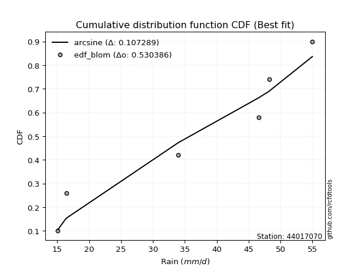</img>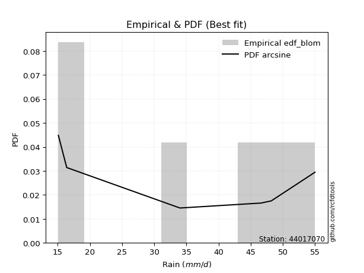</img>

</div>


### 7. EDF Tukey (1962)

In hydrology, the Tukey formula is used as a plotting position formula to estimate the empirical probability or frequency of a flood event (or other hydrological data). The formula parameter is given as _c=0.333_ (or 1/3).

<div align="center">


$P=(m-c)/(n+1-2c)$


</div>


**7.1. Empirical values**

<div align="center">

|                | 0                  | 1                  | 2         | 3         | 4         |
|:---------------|:-------------------|:-------------------|:----------|:----------|:----------|
| date           | 2020               | 2023               | 2022      | 2021      | 2019      |
| x              | 16.4               | 34.0               | 46.6      | 48.2      | 55.0      |
| m              | 1                  | 2                  | 3         | 4         | 5         |
| empirical_dist | edf_tukey          | edf_tukey          | edf_tukey | edf_tukey | edf_tukey |
| empirical      | 0.125              | 0.3125             | 0.5       | 0.6875    | 0.875     |
| empirical_tr   | 1.1428571428571428 | 1.4545454545454546 | 2.0       | 3.2       | 8.0       |

</div>


**7.2. Kolmogorov-Smirnov fit test (sorted by Δ)**


<div align="center">

|                | 0                   | 1                   | 2                   | 3                   | 4                   | 5                  | 6                  | 7                  | 8                  | 9                  | 10                 | 11                 | 12                  | 13                  | 14                  | 15                  | 16                  | 17                 | 18                 | 19                 | 20                  | 21                  | 22                 | 23                  | 24                  | 25                  | 26                  | 27                 | 28                 | 29                  | 30                  | 31                  | 32                 | 33                  | 34                  | 35                  | 36                 | 37                 | 38                 | 39                  | 40                  | 41                 | 42                  | 43                  | 44                    | 45                  | 46                  | 47                  | 48                 | 49                 | 50                 | 51                 | 52                  | 53                  | 54                 | 55                 | 56                  | 57                 | 58                 | 59                  | 60                  | 61                 | 62                  | 63                  | 64                 | 65                 | 66                  | 67                  | 68                 | 69                  | 70                 | 71                  | 72                  | 73                 | 74                 | 75                  | 76                 | 77                  | 78                  | 79                 | 80                 | 81                 | 82                  | 83                  | 84                 | 85                 | 86                 | 87                 |
|:---------------|:--------------------|:--------------------|:--------------------|:--------------------|:--------------------|:-------------------|:-------------------|:-------------------|:-------------------|:-------------------|:-------------------|:-------------------|:--------------------|:--------------------|:--------------------|:--------------------|:--------------------|:-------------------|:-------------------|:-------------------|:--------------------|:--------------------|:-------------------|:--------------------|:--------------------|:--------------------|:--------------------|:-------------------|:-------------------|:--------------------|:--------------------|:--------------------|:-------------------|:--------------------|:--------------------|:--------------------|:-------------------|:-------------------|:-------------------|:--------------------|:--------------------|:-------------------|:--------------------|:--------------------|:----------------------|:--------------------|:--------------------|:--------------------|:-------------------|:-------------------|:-------------------|:-------------------|:--------------------|:--------------------|:-------------------|:-------------------|:--------------------|:-------------------|:-------------------|:--------------------|:--------------------|:-------------------|:--------------------|:--------------------|:-------------------|:-------------------|:--------------------|:--------------------|:-------------------|:--------------------|:-------------------|:--------------------|:--------------------|:-------------------|:-------------------|:--------------------|:-------------------|:--------------------|:--------------------|:-------------------|:-------------------|:-------------------|:--------------------|:--------------------|:-------------------|:-------------------|:-------------------|:-------------------|
| station        | 44017070            | 44017070            | 44017070            | 44017070            | 44017070            | 44017070           | 44017070           | 44017070           | 44017070           | 44017070           | 44017070           | 44017070           | 44017070            | 44017070            | 44017070            | 44017070            | 44017070            | 44017070           | 44017070           | 44017070           | 44017070            | 44017070            | 44017070           | 44017070            | 44017070            | 44017070            | 44017070            | 44017070           | 44017070           | 44017070            | 44017070            | 44017070            | 44017070           | 44017070            | 44017070            | 44017070            | 44017070           | 44017070           | 44017070           | 44017070            | 44017070            | 44017070           | 44017070            | 44017070            | 44017070              | 44017070            | 44017070            | 44017070            | 44017070           | 44017070           | 44017070           | 44017070           | 44017070            | 44017070            | 44017070           | 44017070           | 44017070            | 44017070           | 44017070           | 44017070            | 44017070            | 44017070           | 44017070            | 44017070            | 44017070           | 44017070           | 44017070            | 44017070            | 44017070           | 44017070            | 44017070           | 44017070            | 44017070            | 44017070           | 44017070           | 44017070            | 44017070           | 44017070            | 44017070            | 44017070           | 44017070           | 44017070           | 44017070            | 44017070            | 44017070           | 44017070           | 44017070           | 44017070           |
| empirical_dist | edf_tukey           | edf_tukey           | edf_tukey           | edf_tukey           | edf_tukey           | edf_tukey          | edf_tukey          | edf_tukey          | edf_tukey          | edf_tukey          | edf_tukey          | edf_tukey          | edf_tukey           | edf_tukey           | edf_tukey           | edf_tukey           | edf_tukey           | edf_tukey          | edf_tukey          | edf_tukey          | edf_tukey           | edf_tukey           | edf_tukey          | edf_tukey           | edf_tukey           | edf_tukey           | edf_tukey           | edf_tukey          | edf_tukey          | edf_tukey           | edf_tukey           | edf_tukey           | edf_tukey          | edf_tukey           | edf_tukey           | edf_tukey           | edf_tukey          | edf_tukey          | edf_tukey          | edf_tukey           | edf_tukey           | edf_tukey          | edf_tukey           | edf_tukey           | edf_tukey             | edf_tukey           | edf_tukey           | edf_tukey           | edf_tukey          | edf_tukey          | edf_tukey          | edf_tukey          | edf_tukey           | edf_tukey           | edf_tukey          | edf_tukey          | edf_tukey           | edf_tukey          | edf_tukey          | edf_tukey           | edf_tukey           | edf_tukey          | edf_tukey           | edf_tukey           | edf_tukey          | edf_tukey          | edf_tukey           | edf_tukey           | edf_tukey          | edf_tukey           | edf_tukey          | edf_tukey           | edf_tukey           | edf_tukey          | edf_tukey          | edf_tukey           | edf_tukey          | edf_tukey           | edf_tukey           | edf_tukey          | edf_tukey          | edf_tukey          | edf_tukey           | edf_tukey           | edf_tukey          | edf_tukey          | edf_tukey          | edf_tukey          |
| p_dist         | johnsonsu           | mielke              | logmielke           | laplace_asymmetric  | weibull_min         | gumbel_l           | logncf             | fisk               | pearson3           | logfisk            | logpearson3        | logloggamma        | loggumbel_l         | chi2                | f                   | loginvweibull       | t                   | truncnorm          | norm               | crystalball        | exponnorm           | nct                 | betaprime          | alpha               | logweibull_min      | rice                | erlang              | gamma              | ncf                | invgamma            | invgauss            | loggompertz         | logbetaprime       | logf                | loggamma            | loggamma            | maxwell            | lognct             | logcrystalball     | lognorm             | lognorm             | logt               | logexponnorm        | logfatiguelife      | loglaplace_asymmetric | logalpha            | loginvgamma         | logrice             | logistic           | loginvgauss        | kstwobign          | rayleigh           | logkstwobign        | logmaxwell          | hypsecant          | expon              | genexpon            | loggenexpon        | lograyleigh        | halfnorm            | loglogistic         | loghalfnorm        | gumbel_r            | loghypsecant        | laplace            | halflogistic       | loggumbel_r         | moyal               | loghalflogistic    | loglaplace          | logmoyal           | logchi2             | logexpon            | gompertz           | wald               | lognakagami         | logtruncnorm       | nakagami            | logwald             | gibrat             | loggibrat          | loglognorm         | invweibull          | logjohnsonsu        | fatiguelife        | logerlang          | loggenlogistic     | genlogistic        |
| delta          | 0.07926394179196394 | 0.11952013654241844 | 0.13896720108433158 | 0.14241466417693216 | 0.14488562223397095 | 0.1468716199880189 | 0.1491705251655044 | 0.1492480960567344 | 0.151268645260501  | 0.1562585612560755 | 0.1590010434312168 | 0.1606143914041408 | 0.17091577813993042 | 0.18123883077988523 | 0.18308774486778778 | 0.18394252534193578 | 0.18485626059339566 | 0.1848574022362417 | 0.1848574472299308 | 0.1848574480498697 | 0.18485891729704396 | 0.18502082822187393 | 0.1856676662679868 | 0.18893586737872714 | 0.18898399034911584 | 0.18924888958884267 | 0.19087890361710014 | 0.1910605104805556 | 0.1951447321764851 | 0.19644930704519026 | 0.19838810983823985 | 0.19874296253068402 | 0.1989918379707013 | 0.20122347068039703 | 0.20206646942972928 | 0.20206646942972928 | 0.202580320911802  | 0.2026995280964431 | 0.2027873129067952 | 0.20278738988272815 | 0.20278738988272815 | 0.2027873965746405 | 0.20279062509068613 | 0.20346400148191823 | 0.2035311314526317    | 0.20415413202225707 | 0.20419653665330229 | 0.20479077566373927 | 0.2053753847977876 | 0.206299060280969  | 0.2063393978720761 | 0.2078033801955832 | 0.21111471323056819 | 0.21836369836650027 | 0.2205494299461107 | 0.2212655576273891 | 0.22280744026878052 | 0.2228633978407275 | 0.2229098121279065 | 0.22341943225790972 | 0.22426738521260603 | 0.2367932312028208 | 0.23871483541817629 | 0.23970391659781942 | 0.2468680466533818 | 0.2507342669017397 | 0.25304618207042107 | 0.25623466810488904 | 0.2634848369792113 | 0.26451852178881874 | 0.2692946378049671 | 0.27257894937852845 | 0.27993016875580246 | 0.2899770896833075 | 0.3069919808924043 | 0.31246087816730217 | 0.312498928368882  | 0.31564260541430456 | 0.31711807553983584 | 0.338706214887055  | 0.3483585551711845 | 0.3710818264860646 | 0.44754342761749016 | 0.46660676562278586 | 0.5120957153645904 | 0.6228278958484545 | 0.6875             | 0.6875             |
| deltao         | 0.5865427407550001  | 0.5865427407550001  | 0.5865427407550001  | 0.5865427407550001  | 0.5865427407550001  | 0.5865427407550001 | 0.5865427407550001 | 0.5865427407550001 | 0.5865427407550001 | 0.5865427407550001 | 0.5865427407550001 | 0.5865427407550001 | 0.5865427407550001  | 0.5865427407550001  | 0.5865427407550001  | 0.5865427407550001  | 0.5865427407550001  | 0.5865427407550001 | 0.5865427407550001 | 0.5865427407550001 | 0.5865427407550001  | 0.5865427407550001  | 0.5865427407550001 | 0.5865427407550001  | 0.5865427407550001  | 0.5865427407550001  | 0.5865427407550001  | 0.5865427407550001 | 0.5865427407550001 | 0.5865427407550001  | 0.5865427407550001  | 0.5865427407550001  | 0.5865427407550001 | 0.5865427407550001  | 0.5865427407550001  | 0.5865427407550001  | 0.5865427407550001 | 0.5865427407550001 | 0.5865427407550001 | 0.5865427407550001  | 0.5865427407550001  | 0.5865427407550001 | 0.5865427407550001  | 0.5865427407550001  | 0.5865427407550001    | 0.5865427407550001  | 0.5865427407550001  | 0.5865427407550001  | 0.5865427407550001 | 0.5865427407550001 | 0.5865427407550001 | 0.5865427407550001 | 0.5865427407550001  | 0.5865427407550001  | 0.5865427407550001 | 0.5865427407550001 | 0.5865427407550001  | 0.5865427407550001 | 0.5865427407550001 | 0.5865427407550001  | 0.5865427407550001  | 0.5865427407550001 | 0.5865427407550001  | 0.5865427407550001  | 0.5865427407550001 | 0.5865427407550001 | 0.5865427407550001  | 0.5865427407550001  | 0.5865427407550001 | 0.5865427407550001  | 0.5865427407550001 | 0.5865427407550001  | 0.5865427407550001  | 0.5865427407550001 | 0.5865427407550001 | 0.5865427407550001  | 0.5865427407550001 | 0.5865427407550001  | 0.5865427407550001  | 0.5865427407550001 | 0.5865427407550001 | 0.5865427407550001 | 0.5865427407550001  | 0.5865427407550001  | 0.5865427407550001 | 0.5865427407550001 | 0.5865427407550001 | 0.5865427407550001 |
| eval           | Δo > Δ              | Δo > Δ              | Δo > Δ              | Δo > Δ              | Δo > Δ              | Δo > Δ             | Δo > Δ             | Δo > Δ             | Δo > Δ             | Δo > Δ             | Δo > Δ             | Δo > Δ             | Δo > Δ              | Δo > Δ              | Δo > Δ              | Δo > Δ              | Δo > Δ              | Δo > Δ             | Δo > Δ             | Δo > Δ             | Δo > Δ              | Δo > Δ              | Δo > Δ             | Δo > Δ              | Δo > Δ              | Δo > Δ              | Δo > Δ              | Δo > Δ             | Δo > Δ             | Δo > Δ              | Δo > Δ              | Δo > Δ              | Δo > Δ             | Δo > Δ              | Δo > Δ              | Δo > Δ              | Δo > Δ             | Δo > Δ             | Δo > Δ             | Δo > Δ              | Δo > Δ              | Δo > Δ             | Δo > Δ              | Δo > Δ              | Δo > Δ                | Δo > Δ              | Δo > Δ              | Δo > Δ              | Δo > Δ             | Δo > Δ             | Δo > Δ             | Δo > Δ             | Δo > Δ              | Δo > Δ              | Δo > Δ             | Δo > Δ             | Δo > Δ              | Δo > Δ             | Δo > Δ             | Δo > Δ              | Δo > Δ              | Δo > Δ             | Δo > Δ              | Δo > Δ              | Δo > Δ             | Δo > Δ             | Δo > Δ              | Δo > Δ              | Δo > Δ             | Δo > Δ              | Δo > Δ             | Δo > Δ              | Δo > Δ              | Δo > Δ             | Δo > Δ             | Δo > Δ              | Δo > Δ             | Δo > Δ              | Δo > Δ              | Δo > Δ             | Δo > Δ             | Δo > Δ             | Δo > Δ              | Δo > Δ              | Δo > Δ             | Δo <= Δ            | Δo <= Δ            | Δo <= Δ            |
| fit            | 1                   | 1                   | 1                   | 1                   | 1                   | 1                  | 1                  | 1                  | 1                  | 1                  | 1                  | 1                  | 1                   | 1                   | 1                   | 1                   | 1                   | 1                  | 1                  | 1                  | 1                   | 1                   | 1                  | 1                   | 1                   | 1                   | 1                   | 1                  | 1                  | 1                   | 1                   | 1                   | 1                  | 1                   | 1                   | 1                   | 1                  | 1                  | 1                  | 1                   | 1                   | 1                  | 1                   | 1                   | 1                     | 1                   | 1                   | 1                   | 1                  | 1                  | 1                  | 1                  | 1                   | 1                   | 1                  | 1                  | 1                   | 1                  | 1                  | 1                   | 1                   | 1                  | 1                   | 1                   | 1                  | 1                  | 1                   | 1                   | 1                  | 1                   | 1                  | 1                   | 1                   | 1                  | 1                  | 1                   | 1                  | 1                   | 1                   | 1                  | 1                  | 1                  | 1                   | 1                   | 1                  | 0                  | 0                  | 0                  |
| n              | 5                   | 5                   | 5                   | 5                   | 5                   | 5                  | 5                  | 5                  | 5                  | 5                  | 5                  | 5                  | 5                   | 5                   | 5                   | 5                   | 5                   | 5                  | 5                  | 5                  | 5                   | 5                   | 5                  | 5                   | 5                   | 5                   | 5                   | 5                  | 5                  | 5                   | 5                   | 5                   | 5                  | 5                   | 5                   | 5                   | 5                  | 5                  | 5                  | 5                   | 5                   | 5                  | 5                   | 5                   | 5                     | 5                   | 5                   | 5                   | 5                  | 5                  | 5                  | 5                  | 5                   | 5                   | 5                  | 5                  | 5                   | 5                  | 5                  | 5                   | 5                   | 5                  | 5                   | 5                   | 5                  | 5                  | 5                   | 5                   | 5                  | 5                   | 5                  | 5                   | 5                   | 5                  | 5                  | 5                   | 5                  | 5                   | 5                   | 5                  | 5                  | 5                  | 5                   | 5                   | 5                  | 5                  | 5                  | 5                  |
| best_fit       | 1                   | 0                   | 0                   | 0                   | 0                   | 0                  | 0                  | 0                  | 0                  | 0                  | 0                  | 0                  | 0                   | 0                   | 0                   | 0                   | 0                   | 0                  | 0                  | 0                  | 0                   | 0                   | 0                  | 0                   | 0                   | 0                   | 0                   | 0                  | 0                  | 0                   | 0                   | 0                   | 0                  | 0                   | 0                   | 0                   | 0                  | 0                  | 0                  | 0                   | 0                   | 0                  | 0                   | 0                   | 0                     | 0                   | 0                   | 0                   | 0                  | 0                  | 0                  | 0                  | 0                   | 0                   | 0                  | 0                  | 0                   | 0                  | 0                  | 0                   | 0                   | 0                  | 0                   | 0                   | 0                  | 0                  | 0                   | 0                   | 0                  | 0                   | 0                  | 0                   | 0                   | 0                  | 0                  | 0                   | 0                  | 0                   | 0                   | 0                  | 0                  | 0                  | 0                   | 0                   | 0                  | 0                  | 0                  | 0                  |
| best_fit_sort  | 1                   | 2                   | 3                   | 4                   | 5                   | 6                  | 7                  | 8                  | 9                  | 10                 | 11                 | 12                 | 13                  | 14                  | 15                  | 16                  | 17                  | 18                 | 19                 | 20                 | 21                  | 22                  | 23                 | 24                  | 25                  | 26                  | 27                  | 28                 | 29                 | 30                  | 31                  | 32                  | 33                 | 34                  | 35                  | 36                  | 37                 | 38                 | 39                 | 40                  | 41                  | 42                 | 43                  | 44                  | 45                    | 46                  | 47                  | 48                  | 49                 | 50                 | 51                 | 52                 | 53                  | 54                  | 55                 | 56                 | 57                  | 58                 | 59                 | 60                  | 61                  | 62                 | 63                  | 64                  | 65                 | 66                 | 67                  | 68                  | 69                 | 70                  | 71                 | 72                  | 73                  | 74                 | 75                 | 76                  | 77                 | 78                  | 79                  | 80                 | 81                 | 82                 | 83                  | 84                  | 85                 | 86                 | 87                 | 88                 |

</div>


**7.3. Best fit**

<div align="center">

|   id |   station | empirical_dist   | p_dist    |     delta |   deltao | eval   |   fit |   n |   best_fit |   best_fit_sort |
|-----:|----------:|:-----------------|:----------|----------:|---------:|:-------|------:|----:|-----------:|----------------:|
|    0 |  44017070 | edf_tukey        | johnsonsu | 0.0792639 | 0.586543 | Δo > Δ |     1 |   5 |          1 |               1 |

</div>


<div align="center">

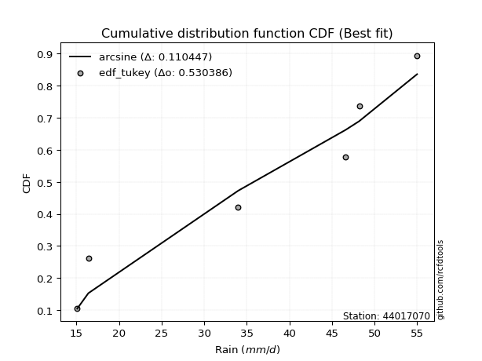</img></img>

</div>


### 8. EDF Gringorten (1963)

Gringorten plotting position formula is essential for estimating the probability and return periods of extreme events like floods and heavy rainfall. The constant _a=0.44_.

<div align="center">


$P=(m-a)/(n+1-2a)$


</div>


**8.1. Empirical values**

<div align="center">

|                | 0                   | 1                  | 2              | 3                 | 4                  |
|:---------------|:--------------------|:-------------------|:---------------|:------------------|:-------------------|
| date           | 2020                | 2023               | 2022           | 2021              | 2019               |
| x              | 16.4                | 34.0               | 46.6           | 48.2              | 55.0               |
| m              | 1                   | 2                  | 3              | 4                 | 5                  |
| empirical_dist | edf_gringorten      | edf_gringorten     | edf_gringorten | edf_gringorten    | edf_gringorten     |
| empirical      | 0.10937500000000001 | 0.3046875          | 0.5            | 0.6953125         | 0.8906249999999999 |
| empirical_tr   | 1.1228070175438596  | 1.4382022471910112 | 2.0            | 3.282051282051282 | 9.142857142857133  |

</div>


**8.2. Kolmogorov-Smirnov fit test (sorted by Δ)**


<div align="center">

|                | 0                   | 1                   | 2                   | 3                   | 4                   | 5                  | 6                  | 7                  | 8                  | 9                  | 10                  | 11                 | 12                  | 13                  | 14                  | 15                  | 16                  | 17                 | 18                 | 19                 | 20                  | 21                  | 22                 | 23                  | 24                  | 25                  | 26                  | 27                 | 28                 | 29                  | 30                  | 31                  | 32                 | 33                  | 34                  | 35                  | 36                 | 37                 | 38                 | 39                  | 40                  | 41                 | 42                  | 43                  | 44                    | 45                  | 46                  | 47                  | 48                 | 49                 | 50                 | 51                 | 52                  | 53                  | 54                 | 55                 | 56                  | 57                 | 58                 | 59                  | 60                  | 61                 | 62                  | 63                  | 64                 | 65                 | 66                  | 67                  | 68                 | 69                  | 70                 | 71                  | 72                 | 73                  | 74                  | 75                 | 76                 | 77                  | 78                  | 79                 | 80                 | 81                 | 82                  | 83                  | 84                 | 85                 | 86                 | 87                 |
|:---------------|:--------------------|:--------------------|:--------------------|:--------------------|:--------------------|:-------------------|:-------------------|:-------------------|:-------------------|:-------------------|:--------------------|:-------------------|:--------------------|:--------------------|:--------------------|:--------------------|:--------------------|:-------------------|:-------------------|:-------------------|:--------------------|:--------------------|:-------------------|:--------------------|:--------------------|:--------------------|:--------------------|:-------------------|:-------------------|:--------------------|:--------------------|:--------------------|:-------------------|:--------------------|:--------------------|:--------------------|:-------------------|:-------------------|:-------------------|:--------------------|:--------------------|:-------------------|:--------------------|:--------------------|:----------------------|:--------------------|:--------------------|:--------------------|:-------------------|:-------------------|:-------------------|:-------------------|:--------------------|:--------------------|:-------------------|:-------------------|:--------------------|:-------------------|:-------------------|:--------------------|:--------------------|:-------------------|:--------------------|:--------------------|:-------------------|:-------------------|:--------------------|:--------------------|:-------------------|:--------------------|:-------------------|:--------------------|:-------------------|:--------------------|:--------------------|:-------------------|:-------------------|:--------------------|:--------------------|:-------------------|:-------------------|:-------------------|:--------------------|:--------------------|:-------------------|:-------------------|:-------------------|:-------------------|
| station        | 44017070            | 44017070            | 44017070            | 44017070            | 44017070            | 44017070           | 44017070           | 44017070           | 44017070           | 44017070           | 44017070            | 44017070           | 44017070            | 44017070            | 44017070            | 44017070            | 44017070            | 44017070           | 44017070           | 44017070           | 44017070            | 44017070            | 44017070           | 44017070            | 44017070            | 44017070            | 44017070            | 44017070           | 44017070           | 44017070            | 44017070            | 44017070            | 44017070           | 44017070            | 44017070            | 44017070            | 44017070           | 44017070           | 44017070           | 44017070            | 44017070            | 44017070           | 44017070            | 44017070            | 44017070              | 44017070            | 44017070            | 44017070            | 44017070           | 44017070           | 44017070           | 44017070           | 44017070            | 44017070            | 44017070           | 44017070           | 44017070            | 44017070           | 44017070           | 44017070            | 44017070            | 44017070           | 44017070            | 44017070            | 44017070           | 44017070           | 44017070            | 44017070            | 44017070           | 44017070            | 44017070           | 44017070            | 44017070           | 44017070            | 44017070            | 44017070           | 44017070           | 44017070            | 44017070            | 44017070           | 44017070           | 44017070           | 44017070            | 44017070            | 44017070           | 44017070           | 44017070           | 44017070           |
| empirical_dist | edf_gringorten      | edf_gringorten      | edf_gringorten      | edf_gringorten      | edf_gringorten      | edf_gringorten     | edf_gringorten     | edf_gringorten     | edf_gringorten     | edf_gringorten     | edf_gringorten      | edf_gringorten     | edf_gringorten      | edf_gringorten      | edf_gringorten      | edf_gringorten      | edf_gringorten      | edf_gringorten     | edf_gringorten     | edf_gringorten     | edf_gringorten      | edf_gringorten      | edf_gringorten     | edf_gringorten      | edf_gringorten      | edf_gringorten      | edf_gringorten      | edf_gringorten     | edf_gringorten     | edf_gringorten      | edf_gringorten      | edf_gringorten      | edf_gringorten     | edf_gringorten      | edf_gringorten      | edf_gringorten      | edf_gringorten     | edf_gringorten     | edf_gringorten     | edf_gringorten      | edf_gringorten      | edf_gringorten     | edf_gringorten      | edf_gringorten      | edf_gringorten        | edf_gringorten      | edf_gringorten      | edf_gringorten      | edf_gringorten     | edf_gringorten     | edf_gringorten     | edf_gringorten     | edf_gringorten      | edf_gringorten      | edf_gringorten     | edf_gringorten     | edf_gringorten      | edf_gringorten     | edf_gringorten     | edf_gringorten      | edf_gringorten      | edf_gringorten     | edf_gringorten      | edf_gringorten      | edf_gringorten     | edf_gringorten     | edf_gringorten      | edf_gringorten      | edf_gringorten     | edf_gringorten      | edf_gringorten     | edf_gringorten      | edf_gringorten     | edf_gringorten      | edf_gringorten      | edf_gringorten     | edf_gringorten     | edf_gringorten      | edf_gringorten      | edf_gringorten     | edf_gringorten     | edf_gringorten     | edf_gringorten      | edf_gringorten      | edf_gringorten     | edf_gringorten     | edf_gringorten     | edf_gringorten     |
| p_dist         | johnsonsu           | mielke              | logmielke           | laplace_asymmetric  | weibull_min         | gumbel_l           | fisk               | pearson3           | logfisk            | logpearson3        | logncf              | logloggamma        | loggumbel_l         | chi2                | f                   | loginvweibull       | t                   | truncnorm          | norm               | crystalball        | exponnorm           | nct                 | betaprime          | alpha               | logweibull_min      | rice                | erlang              | gamma              | ncf                | invgamma            | invgauss            | loggompertz         | logbetaprime       | logf                | loggamma            | loggamma            | maxwell            | lognct             | logcrystalball     | lognorm             | lognorm             | logt               | logexponnorm        | logfatiguelife      | loglaplace_asymmetric | logalpha            | loginvgamma         | logrice             | logistic           | loginvgauss        | kstwobign          | rayleigh           | logkstwobign        | logmaxwell          | hypsecant          | expon              | genexpon            | loggenexpon        | lograyleigh        | halfnorm            | loglogistic         | loghalfnorm        | gumbel_r            | loghypsecant        | laplace            | halflogistic       | loggumbel_r         | moyal               | loghalflogistic    | loglaplace          | logmoyal           | logchi2             | gompertz           | logexpon            | lognakagami         | logtruncnorm       | wald               | nakagami            | logwald             | gibrat             | loggibrat          | loglognorm         | invweibull          | logjohnsonsu        | fatiguelife        | logerlang          | loggenlogistic     | genlogistic        |
| delta          | 0.08707644179196394 | 0.11593231441187324 | 0.13896720108433158 | 0.14241466417693216 | 0.14488562223397095 | 0.1468716199880189 | 0.1492480960567344 | 0.151268645260501  | 0.1562585612560755 | 0.1590010434312168 | 0.15968058709923272 | 0.1606143914041408 | 0.17091577813993042 | 0.18123883077988523 | 0.18308774486778778 | 0.18394252534193578 | 0.18485626059339566 | 0.1848574022362417 | 0.1848574472299308 | 0.1848574480498697 | 0.18485891729704396 | 0.18502082822187393 | 0.1856676662679868 | 0.18893586737872714 | 0.18898399034911584 | 0.18924888958884267 | 0.19087890361710014 | 0.1910605104805556 | 0.1951447321764851 | 0.19644930704519026 | 0.19838810983823985 | 0.19874296253068402 | 0.1989918379707013 | 0.20122347068039703 | 0.20206646942972928 | 0.20206646942972928 | 0.202580320911802  | 0.2026995280964431 | 0.2027873129067952 | 0.20278738988272815 | 0.20278738988272815 | 0.2027873965746405 | 0.20279062509068613 | 0.20346400148191823 | 0.2035311314526317    | 0.20415413202225707 | 0.20419653665330229 | 0.20479077566373927 | 0.2053753847977876 | 0.206299060280969  | 0.2063393978720761 | 0.2078033801955832 | 0.21424824599212844 | 0.21836369836650027 | 0.2205494299461107 | 0.2212655576273891 | 0.22280744026878052 | 0.2228633978407275 | 0.2229098121279065 | 0.22341943225790972 | 0.22426738521260603 | 0.2367932312028208 | 0.23871483541817629 | 0.23970391659781942 | 0.2468680466533818 | 0.2507342669017397 | 0.25304618207042107 | 0.25623466810488904 | 0.2634848369792113 | 0.26451852178881874 | 0.2692946378049671 | 0.28039144937852845 | 0.2821645896833075 | 0.28774266875580246 | 0.30464837816730217 | 0.304686428368882  | 0.3069919808924043 | 0.31564260541430456 | 0.31711807553983584 | 0.338706214887055  | 0.3483585551711845 | 0.3788943264860646 | 0.46316842761749005 | 0.47441926562278586 | 0.5199082153645904 | 0.6306403958484545 | 0.6953125          | 0.6953125          |
| deltao         | 0.5865427407550001  | 0.5865427407550001  | 0.5865427407550001  | 0.5865427407550001  | 0.5865427407550001  | 0.5865427407550001 | 0.5865427407550001 | 0.5865427407550001 | 0.5865427407550001 | 0.5865427407550001 | 0.5865427407550001  | 0.5865427407550001 | 0.5865427407550001  | 0.5865427407550001  | 0.5865427407550001  | 0.5865427407550001  | 0.5865427407550001  | 0.5865427407550001 | 0.5865427407550001 | 0.5865427407550001 | 0.5865427407550001  | 0.5865427407550001  | 0.5865427407550001 | 0.5865427407550001  | 0.5865427407550001  | 0.5865427407550001  | 0.5865427407550001  | 0.5865427407550001 | 0.5865427407550001 | 0.5865427407550001  | 0.5865427407550001  | 0.5865427407550001  | 0.5865427407550001 | 0.5865427407550001  | 0.5865427407550001  | 0.5865427407550001  | 0.5865427407550001 | 0.5865427407550001 | 0.5865427407550001 | 0.5865427407550001  | 0.5865427407550001  | 0.5865427407550001 | 0.5865427407550001  | 0.5865427407550001  | 0.5865427407550001    | 0.5865427407550001  | 0.5865427407550001  | 0.5865427407550001  | 0.5865427407550001 | 0.5865427407550001 | 0.5865427407550001 | 0.5865427407550001 | 0.5865427407550001  | 0.5865427407550001  | 0.5865427407550001 | 0.5865427407550001 | 0.5865427407550001  | 0.5865427407550001 | 0.5865427407550001 | 0.5865427407550001  | 0.5865427407550001  | 0.5865427407550001 | 0.5865427407550001  | 0.5865427407550001  | 0.5865427407550001 | 0.5865427407550001 | 0.5865427407550001  | 0.5865427407550001  | 0.5865427407550001 | 0.5865427407550001  | 0.5865427407550001 | 0.5865427407550001  | 0.5865427407550001 | 0.5865427407550001  | 0.5865427407550001  | 0.5865427407550001 | 0.5865427407550001 | 0.5865427407550001  | 0.5865427407550001  | 0.5865427407550001 | 0.5865427407550001 | 0.5865427407550001 | 0.5865427407550001  | 0.5865427407550001  | 0.5865427407550001 | 0.5865427407550001 | 0.5865427407550001 | 0.5865427407550001 |
| eval           | Δo > Δ              | Δo > Δ              | Δo > Δ              | Δo > Δ              | Δo > Δ              | Δo > Δ             | Δo > Δ             | Δo > Δ             | Δo > Δ             | Δo > Δ             | Δo > Δ              | Δo > Δ             | Δo > Δ              | Δo > Δ              | Δo > Δ              | Δo > Δ              | Δo > Δ              | Δo > Δ             | Δo > Δ             | Δo > Δ             | Δo > Δ              | Δo > Δ              | Δo > Δ             | Δo > Δ              | Δo > Δ              | Δo > Δ              | Δo > Δ              | Δo > Δ             | Δo > Δ             | Δo > Δ              | Δo > Δ              | Δo > Δ              | Δo > Δ             | Δo > Δ              | Δo > Δ              | Δo > Δ              | Δo > Δ             | Δo > Δ             | Δo > Δ             | Δo > Δ              | Δo > Δ              | Δo > Δ             | Δo > Δ              | Δo > Δ              | Δo > Δ                | Δo > Δ              | Δo > Δ              | Δo > Δ              | Δo > Δ             | Δo > Δ             | Δo > Δ             | Δo > Δ             | Δo > Δ              | Δo > Δ              | Δo > Δ             | Δo > Δ             | Δo > Δ              | Δo > Δ             | Δo > Δ             | Δo > Δ              | Δo > Δ              | Δo > Δ             | Δo > Δ              | Δo > Δ              | Δo > Δ             | Δo > Δ             | Δo > Δ              | Δo > Δ              | Δo > Δ             | Δo > Δ              | Δo > Δ             | Δo > Δ              | Δo > Δ             | Δo > Δ              | Δo > Δ              | Δo > Δ             | Δo > Δ             | Δo > Δ              | Δo > Δ              | Δo > Δ             | Δo > Δ             | Δo > Δ             | Δo > Δ              | Δo > Δ              | Δo > Δ             | Δo <= Δ            | Δo <= Δ            | Δo <= Δ            |
| fit            | 1                   | 1                   | 1                   | 1                   | 1                   | 1                  | 1                  | 1                  | 1                  | 1                  | 1                   | 1                  | 1                   | 1                   | 1                   | 1                   | 1                   | 1                  | 1                  | 1                  | 1                   | 1                   | 1                  | 1                   | 1                   | 1                   | 1                   | 1                  | 1                  | 1                   | 1                   | 1                   | 1                  | 1                   | 1                   | 1                   | 1                  | 1                  | 1                  | 1                   | 1                   | 1                  | 1                   | 1                   | 1                     | 1                   | 1                   | 1                   | 1                  | 1                  | 1                  | 1                  | 1                   | 1                   | 1                  | 1                  | 1                   | 1                  | 1                  | 1                   | 1                   | 1                  | 1                   | 1                   | 1                  | 1                  | 1                   | 1                   | 1                  | 1                   | 1                  | 1                   | 1                  | 1                   | 1                   | 1                  | 1                  | 1                   | 1                   | 1                  | 1                  | 1                  | 1                   | 1                   | 1                  | 0                  | 0                  | 0                  |
| n              | 5                   | 5                   | 5                   | 5                   | 5                   | 5                  | 5                  | 5                  | 5                  | 5                  | 5                   | 5                  | 5                   | 5                   | 5                   | 5                   | 5                   | 5                  | 5                  | 5                  | 5                   | 5                   | 5                  | 5                   | 5                   | 5                   | 5                   | 5                  | 5                  | 5                   | 5                   | 5                   | 5                  | 5                   | 5                   | 5                   | 5                  | 5                  | 5                  | 5                   | 5                   | 5                  | 5                   | 5                   | 5                     | 5                   | 5                   | 5                   | 5                  | 5                  | 5                  | 5                  | 5                   | 5                   | 5                  | 5                  | 5                   | 5                  | 5                  | 5                   | 5                   | 5                  | 5                   | 5                   | 5                  | 5                  | 5                   | 5                   | 5                  | 5                   | 5                  | 5                   | 5                  | 5                   | 5                   | 5                  | 5                  | 5                   | 5                   | 5                  | 5                  | 5                  | 5                   | 5                   | 5                  | 5                  | 5                  | 5                  |
| best_fit       | 1                   | 0                   | 0                   | 0                   | 0                   | 0                  | 0                  | 0                  | 0                  | 0                  | 0                   | 0                  | 0                   | 0                   | 0                   | 0                   | 0                   | 0                  | 0                  | 0                  | 0                   | 0                   | 0                  | 0                   | 0                   | 0                   | 0                   | 0                  | 0                  | 0                   | 0                   | 0                   | 0                  | 0                   | 0                   | 0                   | 0                  | 0                  | 0                  | 0                   | 0                   | 0                  | 0                   | 0                   | 0                     | 0                   | 0                   | 0                   | 0                  | 0                  | 0                  | 0                  | 0                   | 0                   | 0                  | 0                  | 0                   | 0                  | 0                  | 0                   | 0                   | 0                  | 0                   | 0                   | 0                  | 0                  | 0                   | 0                   | 0                  | 0                   | 0                  | 0                   | 0                  | 0                   | 0                   | 0                  | 0                  | 0                   | 0                   | 0                  | 0                  | 0                  | 0                   | 0                   | 0                  | 0                  | 0                  | 0                  |
| best_fit_sort  | 1                   | 2                   | 3                   | 4                   | 5                   | 6                  | 7                  | 8                  | 9                  | 10                 | 11                  | 12                 | 13                  | 14                  | 15                  | 16                  | 17                  | 18                 | 19                 | 20                 | 21                  | 22                  | 23                 | 24                  | 25                  | 26                  | 27                  | 28                 | 29                 | 30                  | 31                  | 32                  | 33                 | 34                  | 35                  | 36                  | 37                 | 38                 | 39                 | 40                  | 41                  | 42                 | 43                  | 44                  | 45                    | 46                  | 47                  | 48                  | 49                 | 50                 | 51                 | 52                 | 53                  | 54                  | 55                 | 56                 | 57                  | 58                 | 59                 | 60                  | 61                  | 62                 | 63                  | 64                  | 65                 | 66                 | 67                  | 68                  | 69                 | 70                  | 71                 | 72                  | 73                 | 74                  | 75                  | 76                 | 77                 | 78                  | 79                  | 80                 | 81                 | 82                 | 83                  | 84                  | 85                 | 86                 | 87                 | 88                 |

</div>


**8.3. Best fit**

<div align="center">

|   id |   station | empirical_dist   | p_dist    |     delta |   deltao | eval   |   fit |   n |   best_fit |   best_fit_sort |
|-----:|----------:|:-----------------|:----------|----------:|---------:|:-------|------:|----:|-----------:|----------------:|
|    0 |  44017070 | edf_gringorten   | johnsonsu | 0.0870764 | 0.586543 | Δo > Δ |     1 |   5 |          1 |               1 |

</div>


<div align="center">

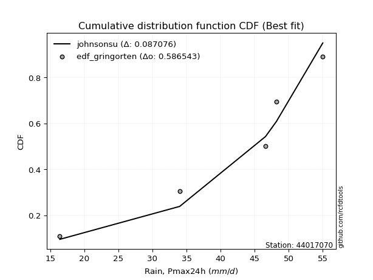</img></img>

</div>


### 9. EDF Filliben (1975)

The specific values of the constants (0.3175) (often denoted as $alpha$) and (0.365) are derived from a method proposed by James J. Filliben in a 1975 paper. This particular formula is the mean value of the $i$-th order statistic of the normal distribution and is considered a robust and effective plotting position formula for the normal probability plot correlation coefficient test for normality.

<div align="center">


$P=(m-0.3175)/(n+0.365)$


</div>


**9.1. Empirical values**

<div align="center">

|                | 0                   | 1                  | 2            | 3                  | 4                  |
|:---------------|:--------------------|:-------------------|:-------------|:-------------------|:-------------------|
| date           | 2020                | 2023               | 2022         | 2021               | 2019               |
| x              | 16.4                | 34.0               | 46.6         | 48.2               | 55.0               |
| m              | 1                   | 2                  | 3            | 4                  | 5                  |
| empirical_dist | edf_filliben        | edf_filliben       | edf_filliben | edf_filliben       | edf_filliben       |
| empirical      | 0.12721342031686858 | 0.3136067101584343 | 0.5          | 0.6863932898415657 | 0.8727865796831314 |
| empirical_tr   | 1.1457554725040042  | 1.456890699253225  | 2.0          | 3.188707280832095  | 7.860805860805863  |

</div>


**9.2. Kolmogorov-Smirnov fit test (sorted by Δ)**


<div align="center">

|                | 0                   | 1                  | 2                   | 3                   | 4                   | 5                  | 6                  | 7                  | 8                  | 9                  | 10                 | 11                 | 12                  | 13                  | 14                  | 15                  | 16                  | 17                 | 18                 | 19                 | 20                  | 21                  | 22                 | 23                  | 24                  | 25                  | 26                  | 27                 | 28                 | 29                  | 30                  | 31                  | 32                 | 33                  | 34                  | 35                  | 36                 | 37                 | 38                 | 39                  | 40                  | 41                 | 42                  | 43                  | 44                    | 45                  | 46                  | 47                  | 48                 | 49                 | 50                 | 51                 | 52                  | 53                  | 54                 | 55                 | 56                  | 57                 | 58                 | 59                  | 60                  | 61                 | 62                  | 63                  | 64                 | 65                 | 66                  | 67                  | 68                 | 69                  | 70                 | 71                  | 72                 | 73                  | 74                 | 75                  | 76                  | 77                  | 78                  | 79                 | 80                 | 81                 | 82                 | 83                 | 84                 | 85                 | 86                 | 87                 |
|:---------------|:--------------------|:-------------------|:--------------------|:--------------------|:--------------------|:-------------------|:-------------------|:-------------------|:-------------------|:-------------------|:-------------------|:-------------------|:--------------------|:--------------------|:--------------------|:--------------------|:--------------------|:-------------------|:-------------------|:-------------------|:--------------------|:--------------------|:-------------------|:--------------------|:--------------------|:--------------------|:--------------------|:-------------------|:-------------------|:--------------------|:--------------------|:--------------------|:-------------------|:--------------------|:--------------------|:--------------------|:-------------------|:-------------------|:-------------------|:--------------------|:--------------------|:-------------------|:--------------------|:--------------------|:----------------------|:--------------------|:--------------------|:--------------------|:-------------------|:-------------------|:-------------------|:-------------------|:--------------------|:--------------------|:-------------------|:-------------------|:--------------------|:-------------------|:-------------------|:--------------------|:--------------------|:-------------------|:--------------------|:--------------------|:-------------------|:-------------------|:--------------------|:--------------------|:-------------------|:--------------------|:-------------------|:--------------------|:-------------------|:--------------------|:-------------------|:--------------------|:--------------------|:--------------------|:--------------------|:-------------------|:-------------------|:-------------------|:-------------------|:-------------------|:-------------------|:-------------------|:-------------------|:-------------------|
| station        | 44017070            | 44017070           | 44017070            | 44017070            | 44017070            | 44017070           | 44017070           | 44017070           | 44017070           | 44017070           | 44017070           | 44017070           | 44017070            | 44017070            | 44017070            | 44017070            | 44017070            | 44017070           | 44017070           | 44017070           | 44017070            | 44017070            | 44017070           | 44017070            | 44017070            | 44017070            | 44017070            | 44017070           | 44017070           | 44017070            | 44017070            | 44017070            | 44017070           | 44017070            | 44017070            | 44017070            | 44017070           | 44017070           | 44017070           | 44017070            | 44017070            | 44017070           | 44017070            | 44017070            | 44017070              | 44017070            | 44017070            | 44017070            | 44017070           | 44017070           | 44017070           | 44017070           | 44017070            | 44017070            | 44017070           | 44017070           | 44017070            | 44017070           | 44017070           | 44017070            | 44017070            | 44017070           | 44017070            | 44017070            | 44017070           | 44017070           | 44017070            | 44017070            | 44017070           | 44017070            | 44017070           | 44017070            | 44017070           | 44017070            | 44017070           | 44017070            | 44017070            | 44017070            | 44017070            | 44017070           | 44017070           | 44017070           | 44017070           | 44017070           | 44017070           | 44017070           | 44017070           | 44017070           |
| empirical_dist | edf_filliben        | edf_filliben       | edf_filliben        | edf_filliben        | edf_filliben        | edf_filliben       | edf_filliben       | edf_filliben       | edf_filliben       | edf_filliben       | edf_filliben       | edf_filliben       | edf_filliben        | edf_filliben        | edf_filliben        | edf_filliben        | edf_filliben        | edf_filliben       | edf_filliben       | edf_filliben       | edf_filliben        | edf_filliben        | edf_filliben       | edf_filliben        | edf_filliben        | edf_filliben        | edf_filliben        | edf_filliben       | edf_filliben       | edf_filliben        | edf_filliben        | edf_filliben        | edf_filliben       | edf_filliben        | edf_filliben        | edf_filliben        | edf_filliben       | edf_filliben       | edf_filliben       | edf_filliben        | edf_filliben        | edf_filliben       | edf_filliben        | edf_filliben        | edf_filliben          | edf_filliben        | edf_filliben        | edf_filliben        | edf_filliben       | edf_filliben       | edf_filliben       | edf_filliben       | edf_filliben        | edf_filliben        | edf_filliben       | edf_filliben       | edf_filliben        | edf_filliben       | edf_filliben       | edf_filliben        | edf_filliben        | edf_filliben       | edf_filliben        | edf_filliben        | edf_filliben       | edf_filliben       | edf_filliben        | edf_filliben        | edf_filliben       | edf_filliben        | edf_filliben       | edf_filliben        | edf_filliben       | edf_filliben        | edf_filliben       | edf_filliben        | edf_filliben        | edf_filliben        | edf_filliben        | edf_filliben       | edf_filliben       | edf_filliben       | edf_filliben       | edf_filliben       | edf_filliben       | edf_filliben       | edf_filliben       | edf_filliben       |
| p_dist         | johnsonsu           | mielke             | logmielke           | laplace_asymmetric  | weibull_min         | gumbel_l           | logncf             | fisk               | pearson3           | logfisk            | logpearson3        | logloggamma        | loggumbel_l         | chi2                | f                   | loginvweibull       | t                   | truncnorm          | norm               | crystalball        | exponnorm           | nct                 | betaprime          | alpha               | logweibull_min      | rice                | erlang              | gamma              | ncf                | invgamma            | invgauss            | loggompertz         | logbetaprime       | logf                | loggamma            | loggamma            | maxwell            | lognct             | logcrystalball     | lognorm             | lognorm             | logt               | logexponnorm        | logfatiguelife      | loglaplace_asymmetric | logalpha            | loginvgamma         | logrice             | logistic           | loginvgauss        | kstwobign          | rayleigh           | logkstwobign        | logmaxwell          | hypsecant          | expon              | genexpon            | loggenexpon        | lograyleigh        | halfnorm            | loglogistic         | loghalfnorm        | gumbel_r            | loghypsecant        | laplace            | halflogistic       | loggumbel_r         | moyal               | loghalflogistic    | loglaplace          | logmoyal           | logchi2             | logexpon           | gompertz            | wald               | lognakagami         | logtruncnorm        | nakagami            | logwald             | gibrat             | loggibrat          | loglognorm         | invweibull         | logjohnsonsu       | fatiguelife        | logerlang          | loggenlogistic     | genlogistic        |
| delta          | 0.07815723163352961 | 0.121733556859287  | 0.13896720108433158 | 0.14241466417693216 | 0.14488562223397095 | 0.1468716199880189 | 0.1480638150070701 | 0.1492480960567344 | 0.151268645260501  | 0.1562585612560755 | 0.1590010434312168 | 0.1606143914041408 | 0.17091577813993042 | 0.18123883077988523 | 0.18308774486778778 | 0.18394252534193578 | 0.18485626059339566 | 0.1848574022362417 | 0.1848574472299308 | 0.1848574480498697 | 0.18485891729704396 | 0.18502082822187393 | 0.1856676662679868 | 0.18893586737872714 | 0.18898399034911584 | 0.18924888958884267 | 0.19087890361710014 | 0.1910605104805556 | 0.1951447321764851 | 0.19644930704519026 | 0.19838810983823985 | 0.19874296253068402 | 0.1989918379707013 | 0.20122347068039703 | 0.20206646942972928 | 0.20206646942972928 | 0.202580320911802  | 0.2026995280964431 | 0.2027873129067952 | 0.20278738988272815 | 0.20278738988272815 | 0.2027873965746405 | 0.20279062509068613 | 0.20346400148191823 | 0.2035311314526317    | 0.20415413202225707 | 0.20419653665330229 | 0.20479077566373927 | 0.2053753847977876 | 0.206299060280969  | 0.2063393978720761 | 0.2078033801955832 | 0.21111471323056819 | 0.21836369836650027 | 0.2205494299461107 | 0.2212655576273891 | 0.22280744026878052 | 0.2228633978407275 | 0.2229098121279065 | 0.22341943225790972 | 0.22426738521260603 | 0.2367932312028208 | 0.23871483541817629 | 0.23970391659781942 | 0.2468680466533818 | 0.2507342669017397 | 0.25304618207042107 | 0.25623466810488904 | 0.2634848369792113 | 0.26451852178881874 | 0.2692946378049671 | 0.27147223922009417 | 0.2788234585973682 | 0.29108379984174176 | 0.3069919808924043 | 0.31356758832573645 | 0.31360563852731627 | 0.31564260541430456 | 0.31711807553983584 | 0.338706214887055  | 0.3483585551711845 | 0.3699751163276303 | 0.4453300073006216 | 0.4655000554643515 | 0.5109890052061561 | 0.6217211856900202 | 0.6863932898415657 | 0.6863932898415657 |
| deltao         | 0.5865427407550001  | 0.5865427407550001 | 0.5865427407550001  | 0.5865427407550001  | 0.5865427407550001  | 0.5865427407550001 | 0.5865427407550001 | 0.5865427407550001 | 0.5865427407550001 | 0.5865427407550001 | 0.5865427407550001 | 0.5865427407550001 | 0.5865427407550001  | 0.5865427407550001  | 0.5865427407550001  | 0.5865427407550001  | 0.5865427407550001  | 0.5865427407550001 | 0.5865427407550001 | 0.5865427407550001 | 0.5865427407550001  | 0.5865427407550001  | 0.5865427407550001 | 0.5865427407550001  | 0.5865427407550001  | 0.5865427407550001  | 0.5865427407550001  | 0.5865427407550001 | 0.5865427407550001 | 0.5865427407550001  | 0.5865427407550001  | 0.5865427407550001  | 0.5865427407550001 | 0.5865427407550001  | 0.5865427407550001  | 0.5865427407550001  | 0.5865427407550001 | 0.5865427407550001 | 0.5865427407550001 | 0.5865427407550001  | 0.5865427407550001  | 0.5865427407550001 | 0.5865427407550001  | 0.5865427407550001  | 0.5865427407550001    | 0.5865427407550001  | 0.5865427407550001  | 0.5865427407550001  | 0.5865427407550001 | 0.5865427407550001 | 0.5865427407550001 | 0.5865427407550001 | 0.5865427407550001  | 0.5865427407550001  | 0.5865427407550001 | 0.5865427407550001 | 0.5865427407550001  | 0.5865427407550001 | 0.5865427407550001 | 0.5865427407550001  | 0.5865427407550001  | 0.5865427407550001 | 0.5865427407550001  | 0.5865427407550001  | 0.5865427407550001 | 0.5865427407550001 | 0.5865427407550001  | 0.5865427407550001  | 0.5865427407550001 | 0.5865427407550001  | 0.5865427407550001 | 0.5865427407550001  | 0.5865427407550001 | 0.5865427407550001  | 0.5865427407550001 | 0.5865427407550001  | 0.5865427407550001  | 0.5865427407550001  | 0.5865427407550001  | 0.5865427407550001 | 0.5865427407550001 | 0.5865427407550001 | 0.5865427407550001 | 0.5865427407550001 | 0.5865427407550001 | 0.5865427407550001 | 0.5865427407550001 | 0.5865427407550001 |
| eval           | Δo > Δ              | Δo > Δ             | Δo > Δ              | Δo > Δ              | Δo > Δ              | Δo > Δ             | Δo > Δ             | Δo > Δ             | Δo > Δ             | Δo > Δ             | Δo > Δ             | Δo > Δ             | Δo > Δ              | Δo > Δ              | Δo > Δ              | Δo > Δ              | Δo > Δ              | Δo > Δ             | Δo > Δ             | Δo > Δ             | Δo > Δ              | Δo > Δ              | Δo > Δ             | Δo > Δ              | Δo > Δ              | Δo > Δ              | Δo > Δ              | Δo > Δ             | Δo > Δ             | Δo > Δ              | Δo > Δ              | Δo > Δ              | Δo > Δ             | Δo > Δ              | Δo > Δ              | Δo > Δ              | Δo > Δ             | Δo > Δ             | Δo > Δ             | Δo > Δ              | Δo > Δ              | Δo > Δ             | Δo > Δ              | Δo > Δ              | Δo > Δ                | Δo > Δ              | Δo > Δ              | Δo > Δ              | Δo > Δ             | Δo > Δ             | Δo > Δ             | Δo > Δ             | Δo > Δ              | Δo > Δ              | Δo > Δ             | Δo > Δ             | Δo > Δ              | Δo > Δ             | Δo > Δ             | Δo > Δ              | Δo > Δ              | Δo > Δ             | Δo > Δ              | Δo > Δ              | Δo > Δ             | Δo > Δ             | Δo > Δ              | Δo > Δ              | Δo > Δ             | Δo > Δ              | Δo > Δ             | Δo > Δ              | Δo > Δ             | Δo > Δ              | Δo > Δ             | Δo > Δ              | Δo > Δ              | Δo > Δ              | Δo > Δ              | Δo > Δ             | Δo > Δ             | Δo > Δ             | Δo > Δ             | Δo > Δ             | Δo > Δ             | Δo <= Δ            | Δo <= Δ            | Δo <= Δ            |
| fit            | 1                   | 1                  | 1                   | 1                   | 1                   | 1                  | 1                  | 1                  | 1                  | 1                  | 1                  | 1                  | 1                   | 1                   | 1                   | 1                   | 1                   | 1                  | 1                  | 1                  | 1                   | 1                   | 1                  | 1                   | 1                   | 1                   | 1                   | 1                  | 1                  | 1                   | 1                   | 1                   | 1                  | 1                   | 1                   | 1                   | 1                  | 1                  | 1                  | 1                   | 1                   | 1                  | 1                   | 1                   | 1                     | 1                   | 1                   | 1                   | 1                  | 1                  | 1                  | 1                  | 1                   | 1                   | 1                  | 1                  | 1                   | 1                  | 1                  | 1                   | 1                   | 1                  | 1                   | 1                   | 1                  | 1                  | 1                   | 1                   | 1                  | 1                   | 1                  | 1                   | 1                  | 1                   | 1                  | 1                   | 1                   | 1                   | 1                   | 1                  | 1                  | 1                  | 1                  | 1                  | 1                  | 0                  | 0                  | 0                  |
| n              | 5                   | 5                  | 5                   | 5                   | 5                   | 5                  | 5                  | 5                  | 5                  | 5                  | 5                  | 5                  | 5                   | 5                   | 5                   | 5                   | 5                   | 5                  | 5                  | 5                  | 5                   | 5                   | 5                  | 5                   | 5                   | 5                   | 5                   | 5                  | 5                  | 5                   | 5                   | 5                   | 5                  | 5                   | 5                   | 5                   | 5                  | 5                  | 5                  | 5                   | 5                   | 5                  | 5                   | 5                   | 5                     | 5                   | 5                   | 5                   | 5                  | 5                  | 5                  | 5                  | 5                   | 5                   | 5                  | 5                  | 5                   | 5                  | 5                  | 5                   | 5                   | 5                  | 5                   | 5                   | 5                  | 5                  | 5                   | 5                   | 5                  | 5                   | 5                  | 5                   | 5                  | 5                   | 5                  | 5                   | 5                   | 5                   | 5                   | 5                  | 5                  | 5                  | 5                  | 5                  | 5                  | 5                  | 5                  | 5                  |
| best_fit       | 1                   | 0                  | 0                   | 0                   | 0                   | 0                  | 0                  | 0                  | 0                  | 0                  | 0                  | 0                  | 0                   | 0                   | 0                   | 0                   | 0                   | 0                  | 0                  | 0                  | 0                   | 0                   | 0                  | 0                   | 0                   | 0                   | 0                   | 0                  | 0                  | 0                   | 0                   | 0                   | 0                  | 0                   | 0                   | 0                   | 0                  | 0                  | 0                  | 0                   | 0                   | 0                  | 0                   | 0                   | 0                     | 0                   | 0                   | 0                   | 0                  | 0                  | 0                  | 0                  | 0                   | 0                   | 0                  | 0                  | 0                   | 0                  | 0                  | 0                   | 0                   | 0                  | 0                   | 0                   | 0                  | 0                  | 0                   | 0                   | 0                  | 0                   | 0                  | 0                   | 0                  | 0                   | 0                  | 0                   | 0                   | 0                   | 0                   | 0                  | 0                  | 0                  | 0                  | 0                  | 0                  | 0                  | 0                  | 0                  |
| best_fit_sort  | 1                   | 2                  | 3                   | 4                   | 5                   | 6                  | 7                  | 8                  | 9                  | 10                 | 11                 | 12                 | 13                  | 14                  | 15                  | 16                  | 17                  | 18                 | 19                 | 20                 | 21                  | 22                  | 23                 | 24                  | 25                  | 26                  | 27                  | 28                 | 29                 | 30                  | 31                  | 32                  | 33                 | 34                  | 35                  | 36                  | 37                 | 38                 | 39                 | 40                  | 41                  | 42                 | 43                  | 44                  | 45                    | 46                  | 47                  | 48                  | 49                 | 50                 | 51                 | 52                 | 53                  | 54                  | 55                 | 56                 | 57                  | 58                 | 59                 | 60                  | 61                  | 62                 | 63                  | 64                  | 65                 | 66                 | 67                  | 68                  | 69                 | 70                  | 71                 | 72                  | 73                 | 74                  | 75                 | 76                  | 77                  | 78                  | 79                  | 80                 | 81                 | 82                 | 83                 | 84                 | 85                 | 86                 | 87                 | 88                 |

</div>


**9.3. Best fit**

<div align="center">

|   id |   station | empirical_dist   | p_dist    |     delta |   deltao | eval   |   fit |   n |   best_fit |   best_fit_sort |
|-----:|----------:|:-----------------|:----------|----------:|---------:|:-------|------:|----:|-----------:|----------------:|
|    0 |  44017070 | edf_filliben     | johnsonsu | 0.0781572 | 0.586543 | Δo > Δ |     1 |   5 |          1 |               1 |

</div>


<div align="center">

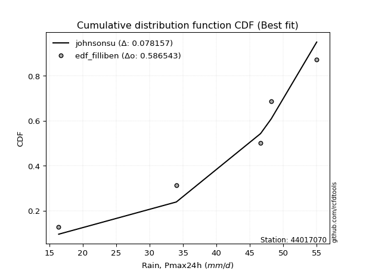</img></img>

</div>


### 10. EDF Jenkinson (1977)

The Jenkinson formula in hydrology is an empirical plotting position formula used to estimate the non-exceedance probability _(P)_ or return period _(T)_ of a given ordered observation within a sample. It is a widely used method in the frequency analysis of extreme events such as floods and rainfall, as it provides a distribution-free way to plot data. _a≈0.31_ and _b≈0.38_ are constants derived to approximate the median of the probability distribution for the given rank.

<div align="center">


$P=(m-a)/(n+b)$


</div>


**10.1. Empirical values**

<div align="center">

|                | 0                   | 1                  | 2             | 3                  | 4                  |
|:---------------|:--------------------|:-------------------|:--------------|:-------------------|:-------------------|
| date           | 2020                | 2023               | 2022          | 2021               | 2019               |
| x              | 16.4                | 34.0               | 46.6          | 48.2               | 55.0               |
| m              | 1                   | 2                  | 3             | 4                  | 5                  |
| empirical_dist | edf_jenkinson       | edf_jenkinson      | edf_jenkinson | edf_jenkinson      | edf_jenkinson      |
| empirical      | 0.12825278810408922 | 0.3141263940520446 | 0.5           | 0.6858736059479554 | 0.8717472118959109 |
| empirical_tr   | 1.1471215351812367  | 1.4579945799457996 | 2.0           | 3.183431952662722  | 7.797101449275368  |

</div>


**10.2. Kolmogorov-Smirnov fit test (sorted by Δ)**


<div align="center">

|                | 0                   | 1                   | 2                   | 3                   | 4                   | 5                  | 6                   | 7                  | 8                  | 9                  | 10                 | 11                 | 12                  | 13                  | 14                  | 15                  | 16                  | 17                 | 18                 | 19                 | 20                  | 21                  | 22                 | 23                  | 24                  | 25                  | 26                  | 27                 | 28                 | 29                  | 30                  | 31                  | 32                 | 33                  | 34                  | 35                  | 36                 | 37                 | 38                 | 39                  | 40                  | 41                 | 42                  | 43                  | 44                    | 45                  | 46                  | 47                  | 48                 | 49                 | 50                 | 51                 | 52                  | 53                  | 54                 | 55                 | 56                  | 57                 | 58                 | 59                  | 60                  | 61                 | 62                  | 63                  | 64                 | 65                 | 66                  | 67                  | 68                 | 69                  | 70                 | 71                 | 72                  | 73                 | 74                 | 75                 | 76                 | 77                  | 78                  | 79                 | 80                 | 81                  | 82                  | 83                 | 84                 | 85                 | 86                 | 87                 |
|:---------------|:--------------------|:--------------------|:--------------------|:--------------------|:--------------------|:-------------------|:--------------------|:-------------------|:-------------------|:-------------------|:-------------------|:-------------------|:--------------------|:--------------------|:--------------------|:--------------------|:--------------------|:-------------------|:-------------------|:-------------------|:--------------------|:--------------------|:-------------------|:--------------------|:--------------------|:--------------------|:--------------------|:-------------------|:-------------------|:--------------------|:--------------------|:--------------------|:-------------------|:--------------------|:--------------------|:--------------------|:-------------------|:-------------------|:-------------------|:--------------------|:--------------------|:-------------------|:--------------------|:--------------------|:----------------------|:--------------------|:--------------------|:--------------------|:-------------------|:-------------------|:-------------------|:-------------------|:--------------------|:--------------------|:-------------------|:-------------------|:--------------------|:-------------------|:-------------------|:--------------------|:--------------------|:-------------------|:--------------------|:--------------------|:-------------------|:-------------------|:--------------------|:--------------------|:-------------------|:--------------------|:-------------------|:-------------------|:--------------------|:-------------------|:-------------------|:-------------------|:-------------------|:--------------------|:--------------------|:-------------------|:-------------------|:--------------------|:--------------------|:-------------------|:-------------------|:-------------------|:-------------------|:-------------------|
| station        | 44017070            | 44017070            | 44017070            | 44017070            | 44017070            | 44017070           | 44017070            | 44017070           | 44017070           | 44017070           | 44017070           | 44017070           | 44017070            | 44017070            | 44017070            | 44017070            | 44017070            | 44017070           | 44017070           | 44017070           | 44017070            | 44017070            | 44017070           | 44017070            | 44017070            | 44017070            | 44017070            | 44017070           | 44017070           | 44017070            | 44017070            | 44017070            | 44017070           | 44017070            | 44017070            | 44017070            | 44017070           | 44017070           | 44017070           | 44017070            | 44017070            | 44017070           | 44017070            | 44017070            | 44017070              | 44017070            | 44017070            | 44017070            | 44017070           | 44017070           | 44017070           | 44017070           | 44017070            | 44017070            | 44017070           | 44017070           | 44017070            | 44017070           | 44017070           | 44017070            | 44017070            | 44017070           | 44017070            | 44017070            | 44017070           | 44017070           | 44017070            | 44017070            | 44017070           | 44017070            | 44017070           | 44017070           | 44017070            | 44017070           | 44017070           | 44017070           | 44017070           | 44017070            | 44017070            | 44017070           | 44017070           | 44017070            | 44017070            | 44017070           | 44017070           | 44017070           | 44017070           | 44017070           |
| empirical_dist | edf_jenkinson       | edf_jenkinson       | edf_jenkinson       | edf_jenkinson       | edf_jenkinson       | edf_jenkinson      | edf_jenkinson       | edf_jenkinson      | edf_jenkinson      | edf_jenkinson      | edf_jenkinson      | edf_jenkinson      | edf_jenkinson       | edf_jenkinson       | edf_jenkinson       | edf_jenkinson       | edf_jenkinson       | edf_jenkinson      | edf_jenkinson      | edf_jenkinson      | edf_jenkinson       | edf_jenkinson       | edf_jenkinson      | edf_jenkinson       | edf_jenkinson       | edf_jenkinson       | edf_jenkinson       | edf_jenkinson      | edf_jenkinson      | edf_jenkinson       | edf_jenkinson       | edf_jenkinson       | edf_jenkinson      | edf_jenkinson       | edf_jenkinson       | edf_jenkinson       | edf_jenkinson      | edf_jenkinson      | edf_jenkinson      | edf_jenkinson       | edf_jenkinson       | edf_jenkinson      | edf_jenkinson       | edf_jenkinson       | edf_jenkinson         | edf_jenkinson       | edf_jenkinson       | edf_jenkinson       | edf_jenkinson      | edf_jenkinson      | edf_jenkinson      | edf_jenkinson      | edf_jenkinson       | edf_jenkinson       | edf_jenkinson      | edf_jenkinson      | edf_jenkinson       | edf_jenkinson      | edf_jenkinson      | edf_jenkinson       | edf_jenkinson       | edf_jenkinson      | edf_jenkinson       | edf_jenkinson       | edf_jenkinson      | edf_jenkinson      | edf_jenkinson       | edf_jenkinson       | edf_jenkinson      | edf_jenkinson       | edf_jenkinson      | edf_jenkinson      | edf_jenkinson       | edf_jenkinson      | edf_jenkinson      | edf_jenkinson      | edf_jenkinson      | edf_jenkinson       | edf_jenkinson       | edf_jenkinson      | edf_jenkinson      | edf_jenkinson       | edf_jenkinson       | edf_jenkinson      | edf_jenkinson      | edf_jenkinson      | edf_jenkinson      | edf_jenkinson      |
| p_dist         | johnsonsu           | mielke              | logmielke           | laplace_asymmetric  | weibull_min         | gumbel_l           | logncf              | fisk               | pearson3           | logfisk            | logpearson3        | logloggamma        | loggumbel_l         | chi2                | f                   | loginvweibull       | t                   | truncnorm          | norm               | crystalball        | exponnorm           | nct                 | betaprime          | alpha               | logweibull_min      | rice                | erlang              | gamma              | ncf                | invgamma            | invgauss            | loggompertz         | logbetaprime       | logf                | loggamma            | loggamma            | maxwell            | lognct             | logcrystalball     | lognorm             | lognorm             | logt               | logexponnorm        | logfatiguelife      | loglaplace_asymmetric | logalpha            | loginvgamma         | logrice             | logistic           | loginvgauss        | kstwobign          | rayleigh           | logkstwobign        | logmaxwell          | hypsecant          | expon              | genexpon            | loggenexpon        | lograyleigh        | halfnorm            | loglogistic         | loghalfnorm        | gumbel_r            | loghypsecant        | laplace            | halflogistic       | loggumbel_r         | moyal               | loghalflogistic    | loglaplace          | logmoyal           | logchi2            | logexpon            | gompertz           | wald               | lognakagami        | logtruncnorm       | nakagami            | logwald             | gibrat             | loggibrat          | loglognorm          | invweibull          | logjohnsonsu       | fatiguelife        | logerlang          | loggenlogistic     | genlogistic        |
| delta          | 0.07763893438436376 | 0.12277292464650758 | 0.13896720108433158 | 0.14241466417693216 | 0.14488562223397095 | 0.1468716199880189 | 0.14754413111345976 | 0.1492480960567344 | 0.151268645260501  | 0.1562585612560755 | 0.1590010434312168 | 0.1606143914041408 | 0.17091577813993042 | 0.18123883077988523 | 0.18308774486778778 | 0.18394252534193578 | 0.18485626059339566 | 0.1848574022362417 | 0.1848574472299308 | 0.1848574480498697 | 0.18485891729704396 | 0.18502082822187393 | 0.1856676662679868 | 0.18893586737872714 | 0.18898399034911584 | 0.18924888958884267 | 0.19087890361710014 | 0.1910605104805556 | 0.1951447321764851 | 0.19644930704519026 | 0.19838810983823985 | 0.19874296253068402 | 0.1989918379707013 | 0.20122347068039703 | 0.20206646942972928 | 0.20206646942972928 | 0.202580320911802  | 0.2026995280964431 | 0.2027873129067952 | 0.20278738988272815 | 0.20278738988272815 | 0.2027873965746405 | 0.20279062509068613 | 0.20346400148191823 | 0.2035311314526317    | 0.20415413202225707 | 0.20419653665330229 | 0.20479077566373927 | 0.2053753847977876 | 0.206299060280969  | 0.2063393978720761 | 0.2078033801955832 | 0.21111471323056819 | 0.21836369836650027 | 0.2205494299461107 | 0.2212655576273891 | 0.22280744026878052 | 0.2228633978407275 | 0.2229098121279065 | 0.22341943225790972 | 0.22426738521260603 | 0.2367932312028208 | 0.23871483541817629 | 0.23970391659781942 | 0.2468680466533818 | 0.2507342669017397 | 0.25304618207042107 | 0.25623466810488904 | 0.2634848369792113 | 0.26451852178881874 | 0.2692946378049671 | 0.2709525553264838 | 0.27830377470375783 | 0.2916034837353521 | 0.3069919808924043 | 0.3140872722193468 | 0.3141253224209266 | 0.31564260541430456 | 0.31711807553983584 | 0.338706214887055  | 0.3483585551711845 | 0.36945543243401996 | 0.44429063951340103 | 0.4649803715707413 | 0.5104693213125457 | 0.6212015017964099 | 0.6858736059479554 | 0.6858736059479554 |
| deltao         | 0.5865427407550001  | 0.5865427407550001  | 0.5865427407550001  | 0.5865427407550001  | 0.5865427407550001  | 0.5865427407550001 | 0.5865427407550001  | 0.5865427407550001 | 0.5865427407550001 | 0.5865427407550001 | 0.5865427407550001 | 0.5865427407550001 | 0.5865427407550001  | 0.5865427407550001  | 0.5865427407550001  | 0.5865427407550001  | 0.5865427407550001  | 0.5865427407550001 | 0.5865427407550001 | 0.5865427407550001 | 0.5865427407550001  | 0.5865427407550001  | 0.5865427407550001 | 0.5865427407550001  | 0.5865427407550001  | 0.5865427407550001  | 0.5865427407550001  | 0.5865427407550001 | 0.5865427407550001 | 0.5865427407550001  | 0.5865427407550001  | 0.5865427407550001  | 0.5865427407550001 | 0.5865427407550001  | 0.5865427407550001  | 0.5865427407550001  | 0.5865427407550001 | 0.5865427407550001 | 0.5865427407550001 | 0.5865427407550001  | 0.5865427407550001  | 0.5865427407550001 | 0.5865427407550001  | 0.5865427407550001  | 0.5865427407550001    | 0.5865427407550001  | 0.5865427407550001  | 0.5865427407550001  | 0.5865427407550001 | 0.5865427407550001 | 0.5865427407550001 | 0.5865427407550001 | 0.5865427407550001  | 0.5865427407550001  | 0.5865427407550001 | 0.5865427407550001 | 0.5865427407550001  | 0.5865427407550001 | 0.5865427407550001 | 0.5865427407550001  | 0.5865427407550001  | 0.5865427407550001 | 0.5865427407550001  | 0.5865427407550001  | 0.5865427407550001 | 0.5865427407550001 | 0.5865427407550001  | 0.5865427407550001  | 0.5865427407550001 | 0.5865427407550001  | 0.5865427407550001 | 0.5865427407550001 | 0.5865427407550001  | 0.5865427407550001 | 0.5865427407550001 | 0.5865427407550001 | 0.5865427407550001 | 0.5865427407550001  | 0.5865427407550001  | 0.5865427407550001 | 0.5865427407550001 | 0.5865427407550001  | 0.5865427407550001  | 0.5865427407550001 | 0.5865427407550001 | 0.5865427407550001 | 0.5865427407550001 | 0.5865427407550001 |
| eval           | Δo > Δ              | Δo > Δ              | Δo > Δ              | Δo > Δ              | Δo > Δ              | Δo > Δ             | Δo > Δ              | Δo > Δ             | Δo > Δ             | Δo > Δ             | Δo > Δ             | Δo > Δ             | Δo > Δ              | Δo > Δ              | Δo > Δ              | Δo > Δ              | Δo > Δ              | Δo > Δ             | Δo > Δ             | Δo > Δ             | Δo > Δ              | Δo > Δ              | Δo > Δ             | Δo > Δ              | Δo > Δ              | Δo > Δ              | Δo > Δ              | Δo > Δ             | Δo > Δ             | Δo > Δ              | Δo > Δ              | Δo > Δ              | Δo > Δ             | Δo > Δ              | Δo > Δ              | Δo > Δ              | Δo > Δ             | Δo > Δ             | Δo > Δ             | Δo > Δ              | Δo > Δ              | Δo > Δ             | Δo > Δ              | Δo > Δ              | Δo > Δ                | Δo > Δ              | Δo > Δ              | Δo > Δ              | Δo > Δ             | Δo > Δ             | Δo > Δ             | Δo > Δ             | Δo > Δ              | Δo > Δ              | Δo > Δ             | Δo > Δ             | Δo > Δ              | Δo > Δ             | Δo > Δ             | Δo > Δ              | Δo > Δ              | Δo > Δ             | Δo > Δ              | Δo > Δ              | Δo > Δ             | Δo > Δ             | Δo > Δ              | Δo > Δ              | Δo > Δ             | Δo > Δ              | Δo > Δ             | Δo > Δ             | Δo > Δ              | Δo > Δ             | Δo > Δ             | Δo > Δ             | Δo > Δ             | Δo > Δ              | Δo > Δ              | Δo > Δ             | Δo > Δ             | Δo > Δ              | Δo > Δ              | Δo > Δ             | Δo > Δ             | Δo <= Δ            | Δo <= Δ            | Δo <= Δ            |
| fit            | 1                   | 1                   | 1                   | 1                   | 1                   | 1                  | 1                   | 1                  | 1                  | 1                  | 1                  | 1                  | 1                   | 1                   | 1                   | 1                   | 1                   | 1                  | 1                  | 1                  | 1                   | 1                   | 1                  | 1                   | 1                   | 1                   | 1                   | 1                  | 1                  | 1                   | 1                   | 1                   | 1                  | 1                   | 1                   | 1                   | 1                  | 1                  | 1                  | 1                   | 1                   | 1                  | 1                   | 1                   | 1                     | 1                   | 1                   | 1                   | 1                  | 1                  | 1                  | 1                  | 1                   | 1                   | 1                  | 1                  | 1                   | 1                  | 1                  | 1                   | 1                   | 1                  | 1                   | 1                   | 1                  | 1                  | 1                   | 1                   | 1                  | 1                   | 1                  | 1                  | 1                   | 1                  | 1                  | 1                  | 1                  | 1                   | 1                   | 1                  | 1                  | 1                   | 1                   | 1                  | 1                  | 0                  | 0                  | 0                  |
| n              | 5                   | 5                   | 5                   | 5                   | 5                   | 5                  | 5                   | 5                  | 5                  | 5                  | 5                  | 5                  | 5                   | 5                   | 5                   | 5                   | 5                   | 5                  | 5                  | 5                  | 5                   | 5                   | 5                  | 5                   | 5                   | 5                   | 5                   | 5                  | 5                  | 5                   | 5                   | 5                   | 5                  | 5                   | 5                   | 5                   | 5                  | 5                  | 5                  | 5                   | 5                   | 5                  | 5                   | 5                   | 5                     | 5                   | 5                   | 5                   | 5                  | 5                  | 5                  | 5                  | 5                   | 5                   | 5                  | 5                  | 5                   | 5                  | 5                  | 5                   | 5                   | 5                  | 5                   | 5                   | 5                  | 5                  | 5                   | 5                   | 5                  | 5                   | 5                  | 5                  | 5                   | 5                  | 5                  | 5                  | 5                  | 5                   | 5                   | 5                  | 5                  | 5                   | 5                   | 5                  | 5                  | 5                  | 5                  | 5                  |
| best_fit       | 1                   | 0                   | 0                   | 0                   | 0                   | 0                  | 0                   | 0                  | 0                  | 0                  | 0                  | 0                  | 0                   | 0                   | 0                   | 0                   | 0                   | 0                  | 0                  | 0                  | 0                   | 0                   | 0                  | 0                   | 0                   | 0                   | 0                   | 0                  | 0                  | 0                   | 0                   | 0                   | 0                  | 0                   | 0                   | 0                   | 0                  | 0                  | 0                  | 0                   | 0                   | 0                  | 0                   | 0                   | 0                     | 0                   | 0                   | 0                   | 0                  | 0                  | 0                  | 0                  | 0                   | 0                   | 0                  | 0                  | 0                   | 0                  | 0                  | 0                   | 0                   | 0                  | 0                   | 0                   | 0                  | 0                  | 0                   | 0                   | 0                  | 0                   | 0                  | 0                  | 0                   | 0                  | 0                  | 0                  | 0                  | 0                   | 0                   | 0                  | 0                  | 0                   | 0                   | 0                  | 0                  | 0                  | 0                  | 0                  |
| best_fit_sort  | 1                   | 2                   | 3                   | 4                   | 5                   | 6                  | 7                   | 8                  | 9                  | 10                 | 11                 | 12                 | 13                  | 14                  | 15                  | 16                  | 17                  | 18                 | 19                 | 20                 | 21                  | 22                  | 23                 | 24                  | 25                  | 26                  | 27                  | 28                 | 29                 | 30                  | 31                  | 32                  | 33                 | 34                  | 35                  | 36                  | 37                 | 38                 | 39                 | 40                  | 41                  | 42                 | 43                  | 44                  | 45                    | 46                  | 47                  | 48                  | 49                 | 50                 | 51                 | 52                 | 53                  | 54                  | 55                 | 56                 | 57                  | 58                 | 59                 | 60                  | 61                  | 62                 | 63                  | 64                  | 65                 | 66                 | 67                  | 68                  | 69                 | 70                  | 71                 | 72                 | 73                  | 74                 | 75                 | 76                 | 77                 | 78                  | 79                  | 80                 | 81                 | 82                  | 83                  | 84                 | 85                 | 86                 | 87                 | 88                 |

</div>


**10.3. Best fit**

<div align="center">

|   id |   station | empirical_dist   | p_dist    |     delta |   deltao | eval   |   fit |   n |   best_fit |   best_fit_sort |
|-----:|----------:|:-----------------|:----------|----------:|---------:|:-------|------:|----:|-----------:|----------------:|
|    0 |  44017070 | edf_jenkinson    | johnsonsu | 0.0776389 | 0.586543 | Δo > Δ |     1 |   5 |          1 |               1 |

</div>


<div align="center">

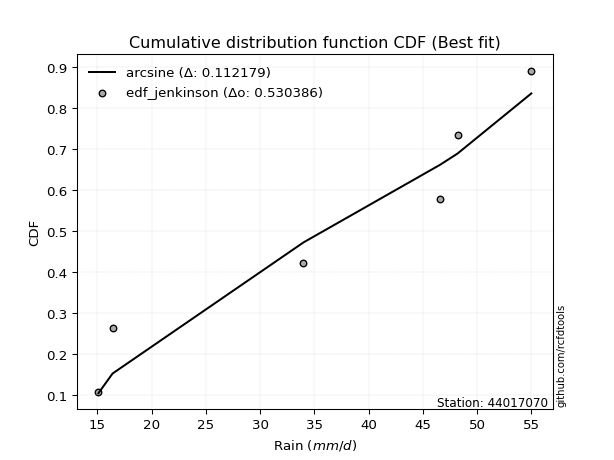</img></img>

</div>


### 11. EDF Cunnane (1978)

Cunnane´s work in statistical hydrology has focused on the performance and evaluation of different probability distributions (such as GEV, Gumbel, Lognormal) for flood frequency estimation. _b_ is a constant, typically set to 0.4.

<div align="center">


$P=(m-b)/(n+1-2b)$


</div>


**11.1. Empirical values**

<div align="center">

|                | 0                   | 1                  | 2           | 3                  | 4                  |
|:---------------|:--------------------|:-------------------|:------------|:-------------------|:-------------------|
| date           | 2020                | 2023               | 2022        | 2021               | 2019               |
| x              | 16.4                | 34.0               | 46.6        | 48.2               | 55.0               |
| m              | 1                   | 2                  | 3           | 4                  | 5                  |
| empirical_dist | edf_cunnane         | edf_cunnane        | edf_cunnane | edf_cunnane        | edf_cunnane        |
| empirical      | 0.11538461538461538 | 0.3076923076923077 | 0.5         | 0.6923076923076923 | 0.8846153846153845 |
| empirical_tr   | 1.1304347826086958  | 1.4444444444444444 | 2.0         | 3.25               | 8.666666666666655  |

</div>


**11.2. Kolmogorov-Smirnov fit test (sorted by Δ)**


<div align="center">

|                | 0                   | 1                   | 2                   | 3                   | 4                   | 5                  | 6                  | 7                  | 8                   | 9                  | 10                 | 11                 | 12                  | 13                  | 14                  | 15                  | 16                  | 17                 | 18                 | 19                 | 20                  | 21                  | 22                 | 23                  | 24                  | 25                  | 26                  | 27                 | 28                 | 29                  | 30                  | 31                  | 32                 | 33                  | 34                  | 35                  | 36                 | 37                 | 38                 | 39                  | 40                  | 41                 | 42                  | 43                  | 44                    | 45                  | 46                  | 47                  | 48                 | 49                 | 50                 | 51                 | 52                  | 53                  | 54                 | 55                 | 56                  | 57                 | 58                 | 59                  | 60                  | 61                 | 62                  | 63                  | 64                 | 65                 | 66                  | 67                  | 68                 | 69                  | 70                 | 71                  | 72                  | 73                 | 74                 | 75                 | 76                 | 77                  | 78                  | 79                 | 80                 | 81                  | 82                  | 83                  | 84                 | 85                 | 86                 | 87                 |
|:---------------|:--------------------|:--------------------|:--------------------|:--------------------|:--------------------|:-------------------|:-------------------|:-------------------|:--------------------|:-------------------|:-------------------|:-------------------|:--------------------|:--------------------|:--------------------|:--------------------|:--------------------|:-------------------|:-------------------|:-------------------|:--------------------|:--------------------|:-------------------|:--------------------|:--------------------|:--------------------|:--------------------|:-------------------|:-------------------|:--------------------|:--------------------|:--------------------|:-------------------|:--------------------|:--------------------|:--------------------|:-------------------|:-------------------|:-------------------|:--------------------|:--------------------|:-------------------|:--------------------|:--------------------|:----------------------|:--------------------|:--------------------|:--------------------|:-------------------|:-------------------|:-------------------|:-------------------|:--------------------|:--------------------|:-------------------|:-------------------|:--------------------|:-------------------|:-------------------|:--------------------|:--------------------|:-------------------|:--------------------|:--------------------|:-------------------|:-------------------|:--------------------|:--------------------|:-------------------|:--------------------|:-------------------|:--------------------|:--------------------|:-------------------|:-------------------|:-------------------|:-------------------|:--------------------|:--------------------|:-------------------|:-------------------|:--------------------|:--------------------|:--------------------|:-------------------|:-------------------|:-------------------|:-------------------|
| station        | 44017070            | 44017070            | 44017070            | 44017070            | 44017070            | 44017070           | 44017070           | 44017070           | 44017070            | 44017070           | 44017070           | 44017070           | 44017070            | 44017070            | 44017070            | 44017070            | 44017070            | 44017070           | 44017070           | 44017070           | 44017070            | 44017070            | 44017070           | 44017070            | 44017070            | 44017070            | 44017070            | 44017070           | 44017070           | 44017070            | 44017070            | 44017070            | 44017070           | 44017070            | 44017070            | 44017070            | 44017070           | 44017070           | 44017070           | 44017070            | 44017070            | 44017070           | 44017070            | 44017070            | 44017070              | 44017070            | 44017070            | 44017070            | 44017070           | 44017070           | 44017070           | 44017070           | 44017070            | 44017070            | 44017070           | 44017070           | 44017070            | 44017070           | 44017070           | 44017070            | 44017070            | 44017070           | 44017070            | 44017070            | 44017070           | 44017070           | 44017070            | 44017070            | 44017070           | 44017070            | 44017070           | 44017070            | 44017070            | 44017070           | 44017070           | 44017070           | 44017070           | 44017070            | 44017070            | 44017070           | 44017070           | 44017070            | 44017070            | 44017070            | 44017070           | 44017070           | 44017070           | 44017070           |
| empirical_dist | edf_cunnane         | edf_cunnane         | edf_cunnane         | edf_cunnane         | edf_cunnane         | edf_cunnane        | edf_cunnane        | edf_cunnane        | edf_cunnane         | edf_cunnane        | edf_cunnane        | edf_cunnane        | edf_cunnane         | edf_cunnane         | edf_cunnane         | edf_cunnane         | edf_cunnane         | edf_cunnane        | edf_cunnane        | edf_cunnane        | edf_cunnane         | edf_cunnane         | edf_cunnane        | edf_cunnane         | edf_cunnane         | edf_cunnane         | edf_cunnane         | edf_cunnane        | edf_cunnane        | edf_cunnane         | edf_cunnane         | edf_cunnane         | edf_cunnane        | edf_cunnane         | edf_cunnane         | edf_cunnane         | edf_cunnane        | edf_cunnane        | edf_cunnane        | edf_cunnane         | edf_cunnane         | edf_cunnane        | edf_cunnane         | edf_cunnane         | edf_cunnane           | edf_cunnane         | edf_cunnane         | edf_cunnane         | edf_cunnane        | edf_cunnane        | edf_cunnane        | edf_cunnane        | edf_cunnane         | edf_cunnane         | edf_cunnane        | edf_cunnane        | edf_cunnane         | edf_cunnane        | edf_cunnane        | edf_cunnane         | edf_cunnane         | edf_cunnane        | edf_cunnane         | edf_cunnane         | edf_cunnane        | edf_cunnane        | edf_cunnane         | edf_cunnane         | edf_cunnane        | edf_cunnane         | edf_cunnane        | edf_cunnane         | edf_cunnane         | edf_cunnane        | edf_cunnane        | edf_cunnane        | edf_cunnane        | edf_cunnane         | edf_cunnane         | edf_cunnane        | edf_cunnane        | edf_cunnane         | edf_cunnane         | edf_cunnane         | edf_cunnane        | edf_cunnane        | edf_cunnane        | edf_cunnane        |
| p_dist         | johnsonsu           | mielke              | logmielke           | laplace_asymmetric  | weibull_min         | gumbel_l           | fisk               | pearson3           | logncf              | logfisk            | logpearson3        | logloggamma        | loggumbel_l         | chi2                | f                   | loginvweibull       | t                   | truncnorm          | norm               | crystalball        | exponnorm           | nct                 | betaprime          | alpha               | logweibull_min      | rice                | erlang              | gamma              | ncf                | invgamma            | invgauss            | loggompertz         | logbetaprime       | logf                | loggamma            | loggamma            | maxwell            | lognct             | logcrystalball     | lognorm             | lognorm             | logt               | logexponnorm        | logfatiguelife      | loglaplace_asymmetric | logalpha            | loginvgamma         | logrice             | logistic           | loginvgauss        | kstwobign          | rayleigh           | logkstwobign        | logmaxwell          | hypsecant          | expon              | genexpon            | loggenexpon        | lograyleigh        | halfnorm            | loglogistic         | loghalfnorm        | gumbel_r            | loghypsecant        | laplace            | halflogistic       | loggumbel_r         | moyal               | loghalflogistic    | loglaplace          | logmoyal           | logchi2             | logexpon            | gompertz           | wald               | lognakagami        | logtruncnorm       | nakagami            | logwald             | gibrat             | loggibrat          | loglognorm          | invweibull          | logjohnsonsu        | fatiguelife        | logerlang          | loggenlogistic     | genlogistic        |
| delta          | 0.08407163409965623 | 0.11593231441187324 | 0.13896720108433158 | 0.14241466417693216 | 0.14488562223397095 | 0.1468716199880189 | 0.1492480960567344 | 0.151268645260501  | 0.15397821747319668 | 0.1562585612560755 | 0.1590010434312168 | 0.1606143914041408 | 0.17091577813993042 | 0.18123883077988523 | 0.18308774486778778 | 0.18394252534193578 | 0.18485626059339566 | 0.1848574022362417 | 0.1848574472299308 | 0.1848574480498697 | 0.18485891729704396 | 0.18502082822187393 | 0.1856676662679868 | 0.18893586737872714 | 0.18898399034911584 | 0.18924888958884267 | 0.19087890361710014 | 0.1910605104805556 | 0.1951447321764851 | 0.19644930704519026 | 0.19838810983823985 | 0.19874296253068402 | 0.1989918379707013 | 0.20122347068039703 | 0.20206646942972928 | 0.20206646942972928 | 0.202580320911802  | 0.2026995280964431 | 0.2027873129067952 | 0.20278738988272815 | 0.20278738988272815 | 0.2027873965746405 | 0.20279062509068613 | 0.20346400148191823 | 0.2035311314526317    | 0.20415413202225707 | 0.20419653665330229 | 0.20479077566373927 | 0.2053753847977876 | 0.206299060280969  | 0.2063393978720761 | 0.2078033801955832 | 0.21124343829982073 | 0.21836369836650027 | 0.2205494299461107 | 0.2212655576273891 | 0.22280744026878052 | 0.2228633978407275 | 0.2229098121279065 | 0.22341943225790972 | 0.22426738521260603 | 0.2367932312028208 | 0.23871483541817629 | 0.23970391659781942 | 0.2468680466533818 | 0.2507342669017397 | 0.25304618207042107 | 0.25623466810488904 | 0.2634848369792113 | 0.26451852178881874 | 0.2692946378049671 | 0.27738664168622074 | 0.28473786106349475 | 0.2851693973756152 | 0.3069919808924043 | 0.3076531858596099 | 0.3076912360611897 | 0.31564260541430456 | 0.31711807553983584 | 0.338706214887055  | 0.3483585551711845 | 0.37588951879375687 | 0.45715881223287463 | 0.47141445793047815 | 0.5169034076722827 | 0.6276355881561468 | 0.6923076923076923 | 0.6923076923076923 |
| deltao         | 0.5865427407550001  | 0.5865427407550001  | 0.5865427407550001  | 0.5865427407550001  | 0.5865427407550001  | 0.5865427407550001 | 0.5865427407550001 | 0.5865427407550001 | 0.5865427407550001  | 0.5865427407550001 | 0.5865427407550001 | 0.5865427407550001 | 0.5865427407550001  | 0.5865427407550001  | 0.5865427407550001  | 0.5865427407550001  | 0.5865427407550001  | 0.5865427407550001 | 0.5865427407550001 | 0.5865427407550001 | 0.5865427407550001  | 0.5865427407550001  | 0.5865427407550001 | 0.5865427407550001  | 0.5865427407550001  | 0.5865427407550001  | 0.5865427407550001  | 0.5865427407550001 | 0.5865427407550001 | 0.5865427407550001  | 0.5865427407550001  | 0.5865427407550001  | 0.5865427407550001 | 0.5865427407550001  | 0.5865427407550001  | 0.5865427407550001  | 0.5865427407550001 | 0.5865427407550001 | 0.5865427407550001 | 0.5865427407550001  | 0.5865427407550001  | 0.5865427407550001 | 0.5865427407550001  | 0.5865427407550001  | 0.5865427407550001    | 0.5865427407550001  | 0.5865427407550001  | 0.5865427407550001  | 0.5865427407550001 | 0.5865427407550001 | 0.5865427407550001 | 0.5865427407550001 | 0.5865427407550001  | 0.5865427407550001  | 0.5865427407550001 | 0.5865427407550001 | 0.5865427407550001  | 0.5865427407550001 | 0.5865427407550001 | 0.5865427407550001  | 0.5865427407550001  | 0.5865427407550001 | 0.5865427407550001  | 0.5865427407550001  | 0.5865427407550001 | 0.5865427407550001 | 0.5865427407550001  | 0.5865427407550001  | 0.5865427407550001 | 0.5865427407550001  | 0.5865427407550001 | 0.5865427407550001  | 0.5865427407550001  | 0.5865427407550001 | 0.5865427407550001 | 0.5865427407550001 | 0.5865427407550001 | 0.5865427407550001  | 0.5865427407550001  | 0.5865427407550001 | 0.5865427407550001 | 0.5865427407550001  | 0.5865427407550001  | 0.5865427407550001  | 0.5865427407550001 | 0.5865427407550001 | 0.5865427407550001 | 0.5865427407550001 |
| eval           | Δo > Δ              | Δo > Δ              | Δo > Δ              | Δo > Δ              | Δo > Δ              | Δo > Δ             | Δo > Δ             | Δo > Δ             | Δo > Δ              | Δo > Δ             | Δo > Δ             | Δo > Δ             | Δo > Δ              | Δo > Δ              | Δo > Δ              | Δo > Δ              | Δo > Δ              | Δo > Δ             | Δo > Δ             | Δo > Δ             | Δo > Δ              | Δo > Δ              | Δo > Δ             | Δo > Δ              | Δo > Δ              | Δo > Δ              | Δo > Δ              | Δo > Δ             | Δo > Δ             | Δo > Δ              | Δo > Δ              | Δo > Δ              | Δo > Δ             | Δo > Δ              | Δo > Δ              | Δo > Δ              | Δo > Δ             | Δo > Δ             | Δo > Δ             | Δo > Δ              | Δo > Δ              | Δo > Δ             | Δo > Δ              | Δo > Δ              | Δo > Δ                | Δo > Δ              | Δo > Δ              | Δo > Δ              | Δo > Δ             | Δo > Δ             | Δo > Δ             | Δo > Δ             | Δo > Δ              | Δo > Δ              | Δo > Δ             | Δo > Δ             | Δo > Δ              | Δo > Δ             | Δo > Δ             | Δo > Δ              | Δo > Δ              | Δo > Δ             | Δo > Δ              | Δo > Δ              | Δo > Δ             | Δo > Δ             | Δo > Δ              | Δo > Δ              | Δo > Δ             | Δo > Δ              | Δo > Δ             | Δo > Δ              | Δo > Δ              | Δo > Δ             | Δo > Δ             | Δo > Δ             | Δo > Δ             | Δo > Δ              | Δo > Δ              | Δo > Δ             | Δo > Δ             | Δo > Δ              | Δo > Δ              | Δo > Δ              | Δo > Δ             | Δo <= Δ            | Δo <= Δ            | Δo <= Δ            |
| fit            | 1                   | 1                   | 1                   | 1                   | 1                   | 1                  | 1                  | 1                  | 1                   | 1                  | 1                  | 1                  | 1                   | 1                   | 1                   | 1                   | 1                   | 1                  | 1                  | 1                  | 1                   | 1                   | 1                  | 1                   | 1                   | 1                   | 1                   | 1                  | 1                  | 1                   | 1                   | 1                   | 1                  | 1                   | 1                   | 1                   | 1                  | 1                  | 1                  | 1                   | 1                   | 1                  | 1                   | 1                   | 1                     | 1                   | 1                   | 1                   | 1                  | 1                  | 1                  | 1                  | 1                   | 1                   | 1                  | 1                  | 1                   | 1                  | 1                  | 1                   | 1                   | 1                  | 1                   | 1                   | 1                  | 1                  | 1                   | 1                   | 1                  | 1                   | 1                  | 1                   | 1                   | 1                  | 1                  | 1                  | 1                  | 1                   | 1                   | 1                  | 1                  | 1                   | 1                   | 1                   | 1                  | 0                  | 0                  | 0                  |
| n              | 5                   | 5                   | 5                   | 5                   | 5                   | 5                  | 5                  | 5                  | 5                   | 5                  | 5                  | 5                  | 5                   | 5                   | 5                   | 5                   | 5                   | 5                  | 5                  | 5                  | 5                   | 5                   | 5                  | 5                   | 5                   | 5                   | 5                   | 5                  | 5                  | 5                   | 5                   | 5                   | 5                  | 5                   | 5                   | 5                   | 5                  | 5                  | 5                  | 5                   | 5                   | 5                  | 5                   | 5                   | 5                     | 5                   | 5                   | 5                   | 5                  | 5                  | 5                  | 5                  | 5                   | 5                   | 5                  | 5                  | 5                   | 5                  | 5                  | 5                   | 5                   | 5                  | 5                   | 5                   | 5                  | 5                  | 5                   | 5                   | 5                  | 5                   | 5                  | 5                   | 5                   | 5                  | 5                  | 5                  | 5                  | 5                   | 5                   | 5                  | 5                  | 5                   | 5                   | 5                   | 5                  | 5                  | 5                  | 5                  |
| best_fit       | 1                   | 0                   | 0                   | 0                   | 0                   | 0                  | 0                  | 0                  | 0                   | 0                  | 0                  | 0                  | 0                   | 0                   | 0                   | 0                   | 0                   | 0                  | 0                  | 0                  | 0                   | 0                   | 0                  | 0                   | 0                   | 0                   | 0                   | 0                  | 0                  | 0                   | 0                   | 0                   | 0                  | 0                   | 0                   | 0                   | 0                  | 0                  | 0                  | 0                   | 0                   | 0                  | 0                   | 0                   | 0                     | 0                   | 0                   | 0                   | 0                  | 0                  | 0                  | 0                  | 0                   | 0                   | 0                  | 0                  | 0                   | 0                  | 0                  | 0                   | 0                   | 0                  | 0                   | 0                   | 0                  | 0                  | 0                   | 0                   | 0                  | 0                   | 0                  | 0                   | 0                   | 0                  | 0                  | 0                  | 0                  | 0                   | 0                   | 0                  | 0                  | 0                   | 0                   | 0                   | 0                  | 0                  | 0                  | 0                  |
| best_fit_sort  | 1                   | 2                   | 3                   | 4                   | 5                   | 6                  | 7                  | 8                  | 9                   | 10                 | 11                 | 12                 | 13                  | 14                  | 15                  | 16                  | 17                  | 18                 | 19                 | 20                 | 21                  | 22                  | 23                 | 24                  | 25                  | 26                  | 27                  | 28                 | 29                 | 30                  | 31                  | 32                  | 33                 | 34                  | 35                  | 36                  | 37                 | 38                 | 39                 | 40                  | 41                  | 42                 | 43                  | 44                  | 45                    | 46                  | 47                  | 48                  | 49                 | 50                 | 51                 | 52                 | 53                  | 54                  | 55                 | 56                 | 57                  | 58                 | 59                 | 60                  | 61                  | 62                 | 63                  | 64                  | 65                 | 66                 | 67                  | 68                  | 69                 | 70                  | 71                 | 72                  | 73                  | 74                 | 75                 | 76                 | 77                 | 78                  | 79                  | 80                 | 81                 | 82                  | 83                  | 84                  | 85                 | 86                 | 87                 | 88                 |

</div>


**11.3. Best fit**

<div align="center">

|   id |   station | empirical_dist   | p_dist    |     delta |   deltao | eval   |   fit |   n |   best_fit |   best_fit_sort |
|-----:|----------:|:-----------------|:----------|----------:|---------:|:-------|------:|----:|-----------:|----------------:|
|    0 |  44017070 | edf_cunnane      | johnsonsu | 0.0840716 | 0.586543 | Δo > Δ |     1 |   5 |          1 |               1 |

</div>


<div align="center">

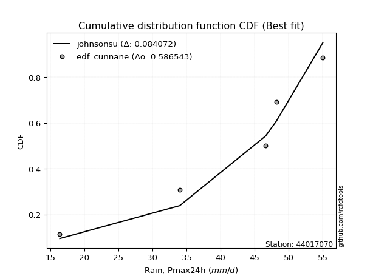</img>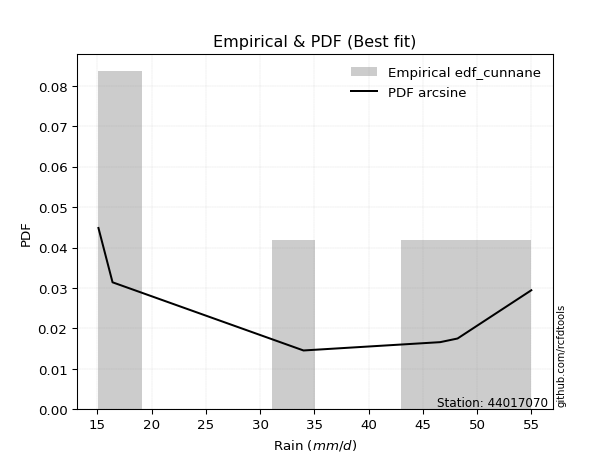</img>

</div>


### 12. EDF Adamowski (1981)

The Adamowski formula in hydrology refers to a specific plotting position formula used for estimating the non-parametric empirical distribution of hydrological events (like flood peaks) to calculate their return periods. This formula provides an alternative to traditional parametric methods (like the Gumbel or Log Pearson Type III distributions). 

<div align="center">


$P=(m-0.25)/(n+0.5)$


</div>


**12.1. Empirical values**

<div align="center">

|                | 0                   | 1                  | 2             | 3                  | 4                  |
|:---------------|:--------------------|:-------------------|:--------------|:-------------------|:-------------------|
| date           | 2020                | 2023               | 2022          | 2021               | 2019               |
| x              | 16.4                | 34.0               | 46.6          | 48.2               | 55.0               |
| m              | 1                   | 2                  | 3             | 4                  | 5                  |
| empirical_dist | edf_adamowski       | edf_adamowski      | edf_adamowski | edf_adamowski      | edf_adamowski      |
| empirical      | 0.13636363636363635 | 0.3181818181818182 | 0.5           | 0.6818181818181818 | 0.8636363636363636 |
| empirical_tr   | 1.1578947368421053  | 1.4666666666666666 | 2.0           | 3.1428571428571423 | 7.333333333333334  |

</div>


**12.2. Kolmogorov-Smirnov fit test (sorted by Δ)**


<div align="center">

|                | 0                   | 1                  | 2                   | 3                   | 4                   | 5                   | 6                  | 7                  | 8                  | 9                  | 10                 | 11                 | 12                  | 13                  | 14                  | 15                  | 16                  | 17                 | 18                 | 19                 | 20                  | 21                  | 22                 | 23                  | 24                  | 25                  | 26                  | 27                 | 28                 | 29                  | 30                  | 31                  | 32                 | 33                  | 34                  | 35                  | 36                 | 37                 | 38                 | 39                  | 40                  | 41                 | 42                  | 43                  | 44                    | 45                  | 46                  | 47                  | 48                 | 49                 | 50                 | 51                 | 52                  | 53                  | 54                 | 55                 | 56                  | 57                 | 58                 | 59                  | 60                  | 61                 | 62                  | 63                  | 64                 | 65                 | 66                  | 67                  | 68                 | 69                  | 70                  | 71                 | 72                 | 73                  | 74                 | 75                  | 76                  | 77                  | 78                  | 79                 | 80                 | 81                 | 82                 | 83                 | 84                 | 85                 | 86                 | 87                 |
|:---------------|:--------------------|:-------------------|:--------------------|:--------------------|:--------------------|:--------------------|:-------------------|:-------------------|:-------------------|:-------------------|:-------------------|:-------------------|:--------------------|:--------------------|:--------------------|:--------------------|:--------------------|:-------------------|:-------------------|:-------------------|:--------------------|:--------------------|:-------------------|:--------------------|:--------------------|:--------------------|:--------------------|:-------------------|:-------------------|:--------------------|:--------------------|:--------------------|:-------------------|:--------------------|:--------------------|:--------------------|:-------------------|:-------------------|:-------------------|:--------------------|:--------------------|:-------------------|:--------------------|:--------------------|:----------------------|:--------------------|:--------------------|:--------------------|:-------------------|:-------------------|:-------------------|:-------------------|:--------------------|:--------------------|:-------------------|:-------------------|:--------------------|:-------------------|:-------------------|:--------------------|:--------------------|:-------------------|:--------------------|:--------------------|:-------------------|:-------------------|:--------------------|:--------------------|:-------------------|:--------------------|:--------------------|:-------------------|:-------------------|:--------------------|:-------------------|:--------------------|:--------------------|:--------------------|:--------------------|:-------------------|:-------------------|:-------------------|:-------------------|:-------------------|:-------------------|:-------------------|:-------------------|:-------------------|
| station        | 44017070            | 44017070           | 44017070            | 44017070            | 44017070            | 44017070            | 44017070           | 44017070           | 44017070           | 44017070           | 44017070           | 44017070           | 44017070            | 44017070            | 44017070            | 44017070            | 44017070            | 44017070           | 44017070           | 44017070           | 44017070            | 44017070            | 44017070           | 44017070            | 44017070            | 44017070            | 44017070            | 44017070           | 44017070           | 44017070            | 44017070            | 44017070            | 44017070           | 44017070            | 44017070            | 44017070            | 44017070           | 44017070           | 44017070           | 44017070            | 44017070            | 44017070           | 44017070            | 44017070            | 44017070              | 44017070            | 44017070            | 44017070            | 44017070           | 44017070           | 44017070           | 44017070           | 44017070            | 44017070            | 44017070           | 44017070           | 44017070            | 44017070           | 44017070           | 44017070            | 44017070            | 44017070           | 44017070            | 44017070            | 44017070           | 44017070           | 44017070            | 44017070            | 44017070           | 44017070            | 44017070            | 44017070           | 44017070           | 44017070            | 44017070           | 44017070            | 44017070            | 44017070            | 44017070            | 44017070           | 44017070           | 44017070           | 44017070           | 44017070           | 44017070           | 44017070           | 44017070           | 44017070           |
| empirical_dist | edf_adamowski       | edf_adamowski      | edf_adamowski       | edf_adamowski       | edf_adamowski       | edf_adamowski       | edf_adamowski      | edf_adamowski      | edf_adamowski      | edf_adamowski      | edf_adamowski      | edf_adamowski      | edf_adamowski       | edf_adamowski       | edf_adamowski       | edf_adamowski       | edf_adamowski       | edf_adamowski      | edf_adamowski      | edf_adamowski      | edf_adamowski       | edf_adamowski       | edf_adamowski      | edf_adamowski       | edf_adamowski       | edf_adamowski       | edf_adamowski       | edf_adamowski      | edf_adamowski      | edf_adamowski       | edf_adamowski       | edf_adamowski       | edf_adamowski      | edf_adamowski       | edf_adamowski       | edf_adamowski       | edf_adamowski      | edf_adamowski      | edf_adamowski      | edf_adamowski       | edf_adamowski       | edf_adamowski      | edf_adamowski       | edf_adamowski       | edf_adamowski         | edf_adamowski       | edf_adamowski       | edf_adamowski       | edf_adamowski      | edf_adamowski      | edf_adamowski      | edf_adamowski      | edf_adamowski       | edf_adamowski       | edf_adamowski      | edf_adamowski      | edf_adamowski       | edf_adamowski      | edf_adamowski      | edf_adamowski       | edf_adamowski       | edf_adamowski      | edf_adamowski       | edf_adamowski       | edf_adamowski      | edf_adamowski      | edf_adamowski       | edf_adamowski       | edf_adamowski      | edf_adamowski       | edf_adamowski       | edf_adamowski      | edf_adamowski      | edf_adamowski       | edf_adamowski      | edf_adamowski       | edf_adamowski       | edf_adamowski       | edf_adamowski       | edf_adamowski      | edf_adamowski      | edf_adamowski      | edf_adamowski      | edf_adamowski      | edf_adamowski      | edf_adamowski      | edf_adamowski      | edf_adamowski      |
| p_dist         | johnsonsu           | mielke             | logmielke           | laplace_asymmetric  | weibull_min         | logncf              | gumbel_l           | fisk               | pearson3           | logfisk            | logpearson3        | logloggamma        | loggumbel_l         | chi2                | f                   | loginvweibull       | t                   | truncnorm          | norm               | crystalball        | exponnorm           | nct                 | betaprime          | alpha               | logweibull_min      | rice                | erlang              | gamma              | ncf                | invgamma            | invgauss            | loggompertz         | logbetaprime       | logf                | loggamma            | loggamma            | maxwell            | lognct             | logcrystalball     | lognorm             | lognorm             | logt               | logexponnorm        | logfatiguelife      | loglaplace_asymmetric | logalpha            | loginvgamma         | logrice             | logistic           | loginvgauss        | kstwobign          | rayleigh           | logkstwobign        | logmaxwell          | hypsecant          | expon              | genexpon            | loggenexpon        | lograyleigh        | halfnorm            | loglogistic         | loghalfnorm        | gumbel_r            | loghypsecant        | laplace            | halflogistic       | loggumbel_r         | moyal               | loghalflogistic    | loglaplace          | logchi2             | logmoyal           | logexpon           | gompertz            | wald               | logwald             | lognakagami         | logtruncnorm        | nakagami            | gibrat             | loggibrat          | loglognorm         | invweibull         | logjohnsonsu       | fatiguelife        | logerlang          | loggenlogistic     | genlogistic        |
| delta          | 0.08574978264391098 | 0.1308837729060548 | 0.13896720108433158 | 0.14241466417693216 | 0.14488562223397095 | 0.14658185966716253 | 0.1468716199880189 | 0.1492480960567344 | 0.151268645260501  | 0.1562585612560755 | 0.1590010434312168 | 0.1606143914041408 | 0.17091577813993042 | 0.18123883077988523 | 0.18308774486778778 | 0.18394252534193578 | 0.18485626059339566 | 0.1848574022362417 | 0.1848574472299308 | 0.1848574480498697 | 0.18485891729704396 | 0.18502082822187393 | 0.1856676662679868 | 0.18893586737872714 | 0.18898399034911584 | 0.18924888958884267 | 0.19087890361710014 | 0.1910605104805556 | 0.1951447321764851 | 0.19644930704519026 | 0.19838810983823985 | 0.19874296253068402 | 0.1989918379707013 | 0.20122347068039703 | 0.20206646942972928 | 0.20206646942972928 | 0.202580320911802  | 0.2026995280964431 | 0.2027873129067952 | 0.20278738988272815 | 0.20278738988272815 | 0.2027873965746405 | 0.20279062509068613 | 0.20346400148191823 | 0.2035311314526317    | 0.20415413202225707 | 0.20419653665330229 | 0.20479077566373927 | 0.2053753847977876 | 0.206299060280969  | 0.2063393978720761 | 0.2078033801955832 | 0.21111471323056819 | 0.21836369836650027 | 0.2205494299461107 | 0.2212655576273891 | 0.22280744026878052 | 0.2228633978407275 | 0.2229098121279065 | 0.22341943225790972 | 0.22426738521260603 | 0.2367932312028208 | 0.23871483541817629 | 0.23970391659781942 | 0.2468680466533818 | 0.2507342669017397 | 0.25304618207042107 | 0.25623466810488904 | 0.2634848369792113 | 0.26451852178881874 | 0.26689713119671027 | 0.2692946378049671 | 0.2742483505739843 | 0.29565890786512566 | 0.3069919808924043 | 0.31711807553983584 | 0.31814269634912035 | 0.31818074655070017 | 0.31818135874190057 | 0.338706214887055  | 0.3483585551711845 | 0.3654000083042464 | 0.4361797912538538 | 0.4609249474409676 | 0.5064138971827723 | 0.6171460776666364 | 0.6818181818181818 | 0.6818181818181818 |
| deltao         | 0.5865427407550001  | 0.5865427407550001 | 0.5865427407550001  | 0.5865427407550001  | 0.5865427407550001  | 0.5865427407550001  | 0.5865427407550001 | 0.5865427407550001 | 0.5865427407550001 | 0.5865427407550001 | 0.5865427407550001 | 0.5865427407550001 | 0.5865427407550001  | 0.5865427407550001  | 0.5865427407550001  | 0.5865427407550001  | 0.5865427407550001  | 0.5865427407550001 | 0.5865427407550001 | 0.5865427407550001 | 0.5865427407550001  | 0.5865427407550001  | 0.5865427407550001 | 0.5865427407550001  | 0.5865427407550001  | 0.5865427407550001  | 0.5865427407550001  | 0.5865427407550001 | 0.5865427407550001 | 0.5865427407550001  | 0.5865427407550001  | 0.5865427407550001  | 0.5865427407550001 | 0.5865427407550001  | 0.5865427407550001  | 0.5865427407550001  | 0.5865427407550001 | 0.5865427407550001 | 0.5865427407550001 | 0.5865427407550001  | 0.5865427407550001  | 0.5865427407550001 | 0.5865427407550001  | 0.5865427407550001  | 0.5865427407550001    | 0.5865427407550001  | 0.5865427407550001  | 0.5865427407550001  | 0.5865427407550001 | 0.5865427407550001 | 0.5865427407550001 | 0.5865427407550001 | 0.5865427407550001  | 0.5865427407550001  | 0.5865427407550001 | 0.5865427407550001 | 0.5865427407550001  | 0.5865427407550001 | 0.5865427407550001 | 0.5865427407550001  | 0.5865427407550001  | 0.5865427407550001 | 0.5865427407550001  | 0.5865427407550001  | 0.5865427407550001 | 0.5865427407550001 | 0.5865427407550001  | 0.5865427407550001  | 0.5865427407550001 | 0.5865427407550001  | 0.5865427407550001  | 0.5865427407550001 | 0.5865427407550001 | 0.5865427407550001  | 0.5865427407550001 | 0.5865427407550001  | 0.5865427407550001  | 0.5865427407550001  | 0.5865427407550001  | 0.5865427407550001 | 0.5865427407550001 | 0.5865427407550001 | 0.5865427407550001 | 0.5865427407550001 | 0.5865427407550001 | 0.5865427407550001 | 0.5865427407550001 | 0.5865427407550001 |
| eval           | Δo > Δ              | Δo > Δ             | Δo > Δ              | Δo > Δ              | Δo > Δ              | Δo > Δ              | Δo > Δ             | Δo > Δ             | Δo > Δ             | Δo > Δ             | Δo > Δ             | Δo > Δ             | Δo > Δ              | Δo > Δ              | Δo > Δ              | Δo > Δ              | Δo > Δ              | Δo > Δ             | Δo > Δ             | Δo > Δ             | Δo > Δ              | Δo > Δ              | Δo > Δ             | Δo > Δ              | Δo > Δ              | Δo > Δ              | Δo > Δ              | Δo > Δ             | Δo > Δ             | Δo > Δ              | Δo > Δ              | Δo > Δ              | Δo > Δ             | Δo > Δ              | Δo > Δ              | Δo > Δ              | Δo > Δ             | Δo > Δ             | Δo > Δ             | Δo > Δ              | Δo > Δ              | Δo > Δ             | Δo > Δ              | Δo > Δ              | Δo > Δ                | Δo > Δ              | Δo > Δ              | Δo > Δ              | Δo > Δ             | Δo > Δ             | Δo > Δ             | Δo > Δ             | Δo > Δ              | Δo > Δ              | Δo > Δ             | Δo > Δ             | Δo > Δ              | Δo > Δ             | Δo > Δ             | Δo > Δ              | Δo > Δ              | Δo > Δ             | Δo > Δ              | Δo > Δ              | Δo > Δ             | Δo > Δ             | Δo > Δ              | Δo > Δ              | Δo > Δ             | Δo > Δ              | Δo > Δ              | Δo > Δ             | Δo > Δ             | Δo > Δ              | Δo > Δ             | Δo > Δ              | Δo > Δ              | Δo > Δ              | Δo > Δ              | Δo > Δ             | Δo > Δ             | Δo > Δ             | Δo > Δ             | Δo > Δ             | Δo > Δ             | Δo <= Δ            | Δo <= Δ            | Δo <= Δ            |
| fit            | 1                   | 1                  | 1                   | 1                   | 1                   | 1                   | 1                  | 1                  | 1                  | 1                  | 1                  | 1                  | 1                   | 1                   | 1                   | 1                   | 1                   | 1                  | 1                  | 1                  | 1                   | 1                   | 1                  | 1                   | 1                   | 1                   | 1                   | 1                  | 1                  | 1                   | 1                   | 1                   | 1                  | 1                   | 1                   | 1                   | 1                  | 1                  | 1                  | 1                   | 1                   | 1                  | 1                   | 1                   | 1                     | 1                   | 1                   | 1                   | 1                  | 1                  | 1                  | 1                  | 1                   | 1                   | 1                  | 1                  | 1                   | 1                  | 1                  | 1                   | 1                   | 1                  | 1                   | 1                   | 1                  | 1                  | 1                   | 1                   | 1                  | 1                   | 1                   | 1                  | 1                  | 1                   | 1                  | 1                   | 1                   | 1                   | 1                   | 1                  | 1                  | 1                  | 1                  | 1                  | 1                  | 0                  | 0                  | 0                  |
| n              | 5                   | 5                  | 5                   | 5                   | 5                   | 5                   | 5                  | 5                  | 5                  | 5                  | 5                  | 5                  | 5                   | 5                   | 5                   | 5                   | 5                   | 5                  | 5                  | 5                  | 5                   | 5                   | 5                  | 5                   | 5                   | 5                   | 5                   | 5                  | 5                  | 5                   | 5                   | 5                   | 5                  | 5                   | 5                   | 5                   | 5                  | 5                  | 5                  | 5                   | 5                   | 5                  | 5                   | 5                   | 5                     | 5                   | 5                   | 5                   | 5                  | 5                  | 5                  | 5                  | 5                   | 5                   | 5                  | 5                  | 5                   | 5                  | 5                  | 5                   | 5                   | 5                  | 5                   | 5                   | 5                  | 5                  | 5                   | 5                   | 5                  | 5                   | 5                   | 5                  | 5                  | 5                   | 5                  | 5                   | 5                   | 5                   | 5                   | 5                  | 5                  | 5                  | 5                  | 5                  | 5                  | 5                  | 5                  | 5                  |
| best_fit       | 1                   | 0                  | 0                   | 0                   | 0                   | 0                   | 0                  | 0                  | 0                  | 0                  | 0                  | 0                  | 0                   | 0                   | 0                   | 0                   | 0                   | 0                  | 0                  | 0                  | 0                   | 0                   | 0                  | 0                   | 0                   | 0                   | 0                   | 0                  | 0                  | 0                   | 0                   | 0                   | 0                  | 0                   | 0                   | 0                   | 0                  | 0                  | 0                  | 0                   | 0                   | 0                  | 0                   | 0                   | 0                     | 0                   | 0                   | 0                   | 0                  | 0                  | 0                  | 0                  | 0                   | 0                   | 0                  | 0                  | 0                   | 0                  | 0                  | 0                   | 0                   | 0                  | 0                   | 0                   | 0                  | 0                  | 0                   | 0                   | 0                  | 0                   | 0                   | 0                  | 0                  | 0                   | 0                  | 0                   | 0                   | 0                   | 0                   | 0                  | 0                  | 0                  | 0                  | 0                  | 0                  | 0                  | 0                  | 0                  |
| best_fit_sort  | 1                   | 2                  | 3                   | 4                   | 5                   | 6                   | 7                  | 8                  | 9                  | 10                 | 11                 | 12                 | 13                  | 14                  | 15                  | 16                  | 17                  | 18                 | 19                 | 20                 | 21                  | 22                  | 23                 | 24                  | 25                  | 26                  | 27                  | 28                 | 29                 | 30                  | 31                  | 32                  | 33                 | 34                  | 35                  | 36                  | 37                 | 38                 | 39                 | 40                  | 41                  | 42                 | 43                  | 44                  | 45                    | 46                  | 47                  | 48                  | 49                 | 50                 | 51                 | 52                 | 53                  | 54                  | 55                 | 56                 | 57                  | 58                 | 59                 | 60                  | 61                  | 62                 | 63                  | 64                  | 65                 | 66                 | 67                  | 68                  | 69                 | 70                  | 71                  | 72                 | 73                 | 74                  | 75                 | 76                  | 77                  | 78                  | 79                  | 80                 | 81                 | 82                 | 83                 | 84                 | 85                 | 86                 | 87                 | 88                 |

</div>


**12.3. Best fit**

<div align="center">

|   id |   station | empirical_dist   | p_dist    |     delta |   deltao | eval   |   fit |   n |   best_fit |   best_fit_sort |
|-----:|----------:|:-----------------|:----------|----------:|---------:|:-------|------:|----:|-----------:|----------------:|
|    0 |  44017070 | edf_adamowski    | johnsonsu | 0.0857498 | 0.586543 | Δo > Δ |     1 |   5 |          1 |               1 |

</div>


<div align="center">

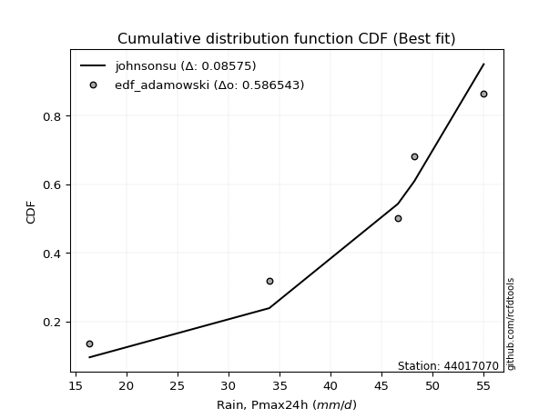</img>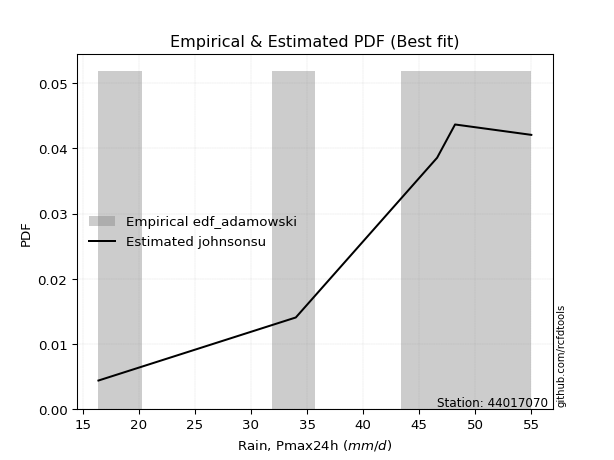</img>

</div>


## C. Best fit & Estimate extreme values for specific return periods - Tr

Best fit in probability distribution analysis means finding the theoretical distribution (like Normal, Poisson, Exponential) that most accurately mirrors your real-world data´s patterns (shape, center, spread) for better predictions, using methods like visual checks (Q-Q plots), goodness-of-fit tests (Kolmogorov-Smirnov, Chi-Squared), and information criteria (AIC) to score and select the simplest, most representative model.


### 1. Best fit (ordered by delta Δ)

<div align="center">

|   id |   station | empirical_dist   | p_dist    |     delta |   deltao | eval   |   fit |   n |   best_fit |   best_fit_sort |
|-----:|----------:|:-----------------|:----------|----------:|---------:|:-------|------:|----:|-----------:|----------------:|
|    0 |  44017070 | edf_jenkinson    | johnsonsu | 0.0776389 | 0.586543 | Δo > Δ |     1 |   5 |          1 |               1 |
|    1 |  44017070 | edf_beard        | johnsonsu | 0.0776389 | 0.586543 | Δo > Δ |     1 |   5 |          1 |               2 |
|    2 |  44017070 | edf_filliben     | johnsonsu | 0.0781572 | 0.586543 | Δo > Δ |     1 |   5 |          1 |               3 |
|    3 |  44017070 | edf_chegodayev   | johnsonsu | 0.0790158 | 0.586543 | Δo > Δ |     1 |   5 |          1 |               4 |
|    4 |  44017070 | edf_tukey        | johnsonsu | 0.0792639 | 0.586543 | Δo > Δ |     1 |   5 |          1 |               5 |
|    5 |  44017070 | edf_blom         | johnsonsu | 0.0822401 | 0.586543 | Δo > Δ |     1 |   5 |          1 |               6 |
|    6 |  44017070 | edf_cunnane      | johnsonsu | 0.0840716 | 0.586543 | Δo > Δ |     1 |   5 |          1 |               7 |
|    7 |  44017070 | edf_adamowski    | johnsonsu | 0.0857498 | 0.586543 | Δo > Δ |     1 |   5 |          1 |               8 |
|    8 |  44017070 | edf_gringorten   | johnsonsu | 0.0870764 | 0.586543 | Δo > Δ |     1 |   5 |          1 |               9 |
|    9 |  44017070 | edf_hazen        | johnsonsu | 0.0917639 | 0.586543 | Δo > Δ |     1 |   5 |          1 |              10 |
|   10 |  44017070 | edf_weibull      | johnsonsu | 0.116053  | 0.586543 | Δo > Δ |     1 |   5 |          1 |              11 |
|   11 |  44017070 | edf_california   | mielke    | 0.139507  | 0.586543 | Δo > Δ |     1 |   5 |          1 |              12 |

</div>

:file_folder:Tables: [bestfit_44017070.csv](table/bestfit_44017070.csv) | [extreme_44017070.csv](table/extreme_44017070.csv)


### 2. Extreme values

In hydrology, a return period (or recurrence interval $Tr$) is the statistical average time between extreme events like floods or droughts of a specific magnitude, indicating how rare an event is, with a 100-year flood, for example, having a 1% chance of occurring in any given year, not that it happens exactly every century. It is a key tool for infrastructure design (like bridges or dams) and risk assessment, calculated from historical data to determine the probability of future events, although it is important to remember it is statistical average, and events can cluster or be missed.

> risk_rate: assuming the return period as the project useful life.

|   id |      tr |   prob_l |     prob_g |   alpha |   betaprime |    chi2 |   crystalball |   erlang |    expon |   exponnorm |       f |   fatiguelife |    fisk |   gamma |   genexpon |   genlogistic |   gibrat |   gompertz |   gumbel_l |   gumbel_r |   halflogistic |   halfnorm |   hypsecant |   invgamma |   invgauss |      invweibull |   johnsonsu |   kstwobign |   laplace |   laplace_asymmetric |   loggamma |   logistic |   lognorm |   maxwell |   mielke |    moyal |   nakagami |     ncf |     nct |    norm |   pearson3 |   rayleigh |    rice |       t |   truncnorm |     wald |   weibull_min |   logalpha |   logbetaprime |     logchi2 |   logcrystalball |   logerlang |   logexpon |   logexponnorm |     logf |   logfatiguelife |   logfisk |   loggenexpon |   loggenlogistic |   loggibrat |   loggompertz |   loggumbel_l |   loggumbel_r |   loghalflogistic |   loghalfnorm |   loghypsecant |   loginvgamma |   loginvgauss |   loginvweibull |   logjohnsonsu |   logkstwobign |   loglaplace |   loglaplace_asymmetric |   logloggamma |   loglogistic |    loglognorm |   logmaxwell |   logmielke |   logmoyal |   lognakagami |   logncf |   lognct |   logpearson3 |   lograyleigh |   logrice |     logt |   logtruncnorm |   logwald |   logweibull_min |   station |   n |   risk_rate |
|-----:|--------:|---------:|-----------:|--------:|------------:|--------:|--------------:|---------:|---------:|------------:|--------:|--------------:|--------:|--------:|-----------:|--------------:|---------:|-----------:|-----------:|-----------:|---------------:|-----------:|------------:|-----------:|-----------:|----------------:|------------:|------------:|----------:|---------------------:|-----------:|-----------:|----------:|----------:|---------:|---------:|-----------:|--------:|--------:|--------:|-----------:|-----------:|--------:|--------:|------------:|---------:|--------------:|-----------:|---------------:|------------:|-----------------:|------------:|-----------:|---------------:|---------:|-----------------:|----------:|--------------:|-----------------:|------------:|--------------:|--------------:|--------------:|------------------:|--------------:|---------------:|--------------:|--------------:|----------------:|---------------:|---------------:|-------------:|------------------------:|--------------:|--------------:|--------------:|-------------:|------------:|-----------:|--------------:|---------:|---------:|--------------:|--------------:|----------:|---------:|---------------:|----------:|-----------------:|----------:|----:|------------:|
|    0 |    2    | 0.5      | 0.5        | 39.5195 |     39.4689 | 39.8191 |       40.04   |  39.5565 |  32.786  |     40.04   | 40.0763 |       16.4002 | 41.6983 | 39.6154 |    32.7151 |           inf |  35.949  |    48.0209 |    42.279  |    37.801  |        36.6878 |    37.2501 |     40.04   |    38.7841 |    38.8015 |  1707.31        |     45.4468 |     36.7951 |   40.04   |              43.3127 |    36.5347 |    40.04   |   36.9508 |   38.8744 |  43.2121 |  37.0781 |    37.4275 | 38.5665 | 40.0286 | 40.04   |    41.6875 |    38.4609 | 39.6072 | 40.04   |     40.04   |  35.622  |       42.6053 |    36.195  |        36.4426 |     27.3335 |          36.9508 |     16.511  |    28.7987 |        36.9506 |  36.9913 |          36.9277 |   39.8704 |       32.9533 |         inf      |     32.4206 |       39.4173 |       39.693  |       34.398  |           33.1953 |       33.7975 |        36.9508 |       36.3796 |       35.7868 |         34.8059 |        54.996  |        33.1021 |      36.9508 |                 40.9288 |       41.6869 |       36.9508 |  16.4139      |      35.599  |     42.0306 |    33.6121 |       36.4718 |  36.2113 |  36.9028 |       39.8766 |       35.1316 |   36.5529 |  36.9508 |        40.4554 |   32.0831 |          40.2422 |  44017070 |   5 |    0.75     |
|    1 |    2.33 | 0.570815 | 0.429185   | 42.0429 |     42.0778 | 42.3663 |       42.4721 |  42.06   |  36.3963 |     42.4721 | 42.5194 |       17.0442 | 43.9686 | 42.0971 |    36.3099 |           inf |  37.181  |    48.8412 |    44.395  |    40.0546 |        39.0049 |    39.875  |     41.9864 |    41.4402 |    41.4152 | 86244           |     47.3141 |     39.8284 |   41.5118 |              45.05   |    39.6267 |    42.1829 |   39.9388 |   41.4012 |  45.346  |  39.2115 |    38.7718 | 41.2845 | 42.4625 | 42.4721 |    44.0035 |    41.0251 | 42.1206 | 42.4721 |     42.4721 |  37.2168 |       44.5878 |    39.3244 |        39.6168 |     32.636  |          39.9388 |     16.6718 |    32.6024 |        39.9386 |  39.9944 |          39.9097 |   42.7093 |       36.4005 |         inf      |     33.7231 |       41.8633 |       42.4713 |       36.968  |           35.7479 |       36.7564 |        39.3234 |       39.4688 |       38.9711 |         38.5785 |        54.9993 |        36.6908 |      38.7312 |                 43.0416 |       43.9549 |       39.5712 |  16.5746      |      38.5944 |     44.4399 |    35.9848 |       38.0037 |  40.7662 |  39.9038 |       42.8084 |       38.1331 |   39.6036 |  39.9388 |        41.7567 |   33.7614 |          42.5593 |  44017070 |   5 |    0.729209 |
|    2 |    5    | 0.8      | 0.2        | 51.8294 |     52.0041 | 52.0573 |       51.5105 |  51.547  |  54.4471 |     51.5104 | 51.6071 |       30.7207 | 52.7341 | 51.484  |    54.2826 |           inf |  44.274  |    51.4919 |    51.2308 |    49.8453 |        49.4892 |    50.9753 |     49.7939 |    51.844  |    51.7187 |     2.25895e+12 |     52.0759 |     52.7134 |   48.8705 |              49.7647 |    53.8976 |    50.4567 |   53.3211 |   51.3464 |  51.0741 |  49.0933 |    45.8645 | 52.2389 | 51.5089 | 51.5105 |    51.7176 |    51.2906 | 51.5875 | 51.5106 |     51.5105 |  46.1443 |       50.9925 |    54.0597 |        54.3395 |     91.2911 |          53.3211 |     19.5646 |    60.6207 |        53.3209 |  53.4559 |          53.2749 |   55.7004 |       54.6515 |         inf      |     42.3073 |       51.0513 |       52.8464 |       50.5565 |           49.9845 |       52.4163 |        50.4735 |       53.8323 |       54.2365 |         60.3263 |        55      |        56.8122 |      49.005  |                 49.0024 |       50.3083 |       51.5545 |   3.69427e+55 |      53.0421 |     51.2233 |    49.3554 |       49.6841 |  64.5465 |  53.382  |       53.4989 |       52.9476 |   53.4992 |  53.3211 |        47.2445 |   44.9142 |          50.9965 |  44017070 |   5 |    0.67232  |
|    3 |   10    | 0.9      | 0.1        | 58.7011 |     58.7918 | 58.6831 |       57.5063 |  58.0012 |  70.8331 |     57.5062 | 57.6429 |       49.6045 | 59.1897 | 57.8546 |    70.5978 |           inf |  52.3593 |    52.9678 |    55.0366 |    57.8198 |        58.196  |    59.1892 |     56.0285 |    59.2401 |    59.0892 |     2.48869e+18 |     53.951  |     62.5237 |   55.5504 |              53.2001 |    66.4266 |    56.5501 |   64.5885 |   58.3454 |  53.1752 |  57.697  |    51.8477 | 60.2599 | 57.5114 | 57.5063 |    56.0951 |    58.6101 | 57.9437 | 57.5064 |     57.5063 |  55.6184 |       54.5584 |    67.3838 |        67.3473 |    261.176  |          64.5885 |     26.5157 |   106.451  |        64.5882 |  64.8071 |          64.5407 |   67.7329 |       73.3585 |         inf      |     54.7874 |       57.1174 |       59.6846 |       65.239  |           66.0295 |       68.1589 |        61.6076 |       66.5834 |       68.3718 |         86.8257 |        55      |        79.2528 |      60.6732 |                 53.0393 |       52.7349 |       62.6437 | inf           |      66.3447 |     53.8516 |    64.9834 |       64.0977 |  89.1038 |  64.7746 |       60.0304 |       66.9087 |   65.4285 |  64.5885 |        50.6027 |   60.8048 |          56.399  |  44017070 |   5 |    0.651322 |
|    4 |   15    | 0.933333 | 0.0666667  | 62.2515 |     62.2401 | 62.0489 |       60.4983 |  61.2703 |  80.4183 |     60.4983 | 60.6571 |       61.9548 | 62.707  | 61.0767 |    80.1416 |           inf |  57.9361 |    53.6362 |    56.7602 |    62.3189 |        63.1233 |    63.4637 |     59.5865 |    63.0887 |    62.9339 |     6.38048e+21 |     54.636  |     67.7317 |   59.458  |              55.2097 |    73.8394 |    59.8701 |   71.0725 |   61.9365 |  53.8351 |  62.6901 |    55.0551 | 64.4916 | 60.5072 | 60.4983 |    58.0707 |    62.3815 | 61.1317 | 60.4985 |     60.4983 |  61.7023 |       56.1733 |    75.4324 |        75.0739 |    497.684  |          71.0725 |     33.3776 |   147.975  |        71.0722 |  71.3456 |          71.029  |   75.3493 |       85.4497 |         inf      |     65.481  |       60.1142 |       63.066  |       75.3322 |           77.2961 |       78.1406 |        69.0302 |       74.1877 |       77.0407 |        106.628  |        55      |        94.5726 |      68.7473 |                 55.5532 |       53.5076 |       69.6591 | inf           |      74.4168 |     54.7428 |    76.2318 |       73.7473 | 105.237  |  71.3477 |       63.0225 |       75.4832 |   72.37   |  71.0726 |        51.9274 |   73.8611 |          59.0304 |  44017070 |   5 |    0.644736 |
|    5 |   20    | 0.95     | 0.05       | 64.6222 |     64.5204 | 64.2746 |       62.4578 |  63.4286 |  87.2191 |     62.4577 | 62.6318 |       71.0987 | 65.138  | 63.2025 |    86.913  |           inf |  62.3108 |    54.0523 |    57.8331 |    65.469  |        66.5755 |    66.3136 |     62.0965 |    65.6684 |    65.5133 |     1.55476e+24 |     55.0146 |     71.2401 |   62.2304 |              56.6356 |    79.1793 |    62.1647 |   75.6675 |   64.3197 |  54.1581 |  66.2264 |    57.2104 | 67.3465 | 62.4692 | 62.4578 |    59.292  |    64.8882 | 63.2241 | 62.4579 |     62.4578 |  66.236  |       57.1785 |    81.3047 |        80.6526 |    794.01   |          75.6675 |     40.0005 |   186.929  |        75.6672 |  75.9818 |          75.6293 |   81.1085 |       94.5936 |         inf      |     75.3108 |       62.0632 |       65.2668 |       83.3149 |           86.3166 |       85.5951 |        74.7984 |       79.6926 |       83.4214 |        123.124  |        55      |       106.529  |      75.1195 |                 57.4088 |       53.8877 |       74.9619 | inf           |      80.309  |     55.2258 |    85.357  |       81.0875 | 117.595  |  76.0129 |       64.869  |       81.782  |   77.3193 |  75.6676 |        52.638  |   85.3824 |          60.73   |  44017070 |   5 |    0.641514 |
|    6 |   25    | 0.96     | 0.04       | 66.3911 |     66.2103 | 65.9239 |       63.9001 |  65.0263 |  92.4942 |     63.9001 | 64.0859 |       78.3639 | 66.9977 | 64.7752 |    92.1653 |           inf |  65.9577 |    54.3484 |    58.5965 |    67.8955 |        69.2353 |    68.434  |     64.039  |    67.5981 |    67.4437 |     1.07185e+26 |     55.2627 |     73.8679 |   64.3809 |              57.7415 |    83.3783 |    63.9201 |   79.2388 |   66.0891 |  54.3498 |  68.9674 |    58.8191 | 69.4906 | 63.9136 | 63.9001 |    60.1552 |    66.7506 | 64.7667 | 63.9003 |     63.9002 |  69.8674 |       57.8938 |    85.9653 |        85.0464 |   1145.98   |          79.2388 |     46.4209 |   224.078  |        79.2385 |  79.5866 |          79.206  |   85.8097 |      102.027  |         inf      |     84.6244 |       63.4904 |       66.8796 |       90.0359 |           93.9783 |       91.5993 |        79.5914 |       84.0369 |       88.5169 |        137.55   |        55      |       116.465  |      80.4662 |                 58.8907 |       54.1139 |       79.2895 | inf           |      84.9831 |     55.5447 |    93.175  |       87.056  | 127.746  |  79.6427 |       66.1677 |       86.7998 |   81.1821 |  79.2389 |        53.0815 |   95.8942 |          61.9692 |  44017070 |   5 |    0.639603 |
|    7 |   50    | 0.98     | 0.02       | 71.5709 |     71.1026 | 70.6982 |       68.0306 |  69.6433 | 108.88   |     68.0305 | 68.2516 |      101.674  | 72.6798 | 69.3161 |   108.48   |           inf |  78.8132 |    55.1521 |    60.6689 |    75.3702 |        77.4304 |    74.5972 |     70.0617 |    73.2726 |    73.1223 |     4.93849e+31 |     55.8519 |     81.5847 |   71.0609 |              61.177  |    96.8004 |    69.2834 |   90.4257 |   71.2205 |  54.7287 |  77.4764 |    63.5063 | 75.8323 | 68.0501 | 68.0306 |    62.4638 |    72.1569 | 69.1931 | 68.0308 |     68.0306 |  81.7239 |       59.8355 |   101.111  |        99.1297 |   3657.14   |          90.4257 |     76.5533 |   393.484  |        90.4255 |  90.8858 |          90.4169 |  101.93   |      127.141  |         inf      |    127.642  |       67.5402 |       71.4612 |      114.342  |          122.13   |      111.551  |        96.4928 |       98.0126 |      105.252  |        193.505  |        55      |       151.326  |      99.6252 |                 63.7423 |       54.562  |       94.1214 | inf           |     100.135  |     56.3496 |   122.308  |      107.119  | 162.751  |  91.0342 |       69.5875 |      103.178  |   93.3658 |  90.4259 |        54.0103 |  140.096  |          65.4619 |  44017070 |   5 |    0.63583  |
|    8 |   75    | 0.986667 | 0.0133333  | 74.4224 |     73.7601 | 73.2915 |       70.2469 |  72.1462 | 118.465  |     70.2468 | 70.488  |      115.712  | 75.9615 | 71.7755 |   118.024  |           inf |  87.4958 |    55.5586 |    61.7169 |    79.7148 |        82.1941 |    77.9522 |     73.5813 |    76.4109 |    76.2628 |     9.6697e+34  |     56.106  |     85.8303 |   74.9684 |              63.1866 |   104.955  |    72.3811 |   97.0658 |   74.0104 |  54.8536 |  82.4524 |    66.0588 | 79.3594 | 70.2698 | 70.2469 |    63.6059 |    75.0982 | 71.5732 | 70.2471 |     70.2469 |  89.0199 |       60.8174 |   110.493  |       107.713  |   7294.94   |          97.0658 |    104.768  |   546.974  |        97.0656 |  97.5977 |          97.0762 |  112.585  |      143.346  |         inf      |    168.482  |       69.6894 |       73.8962 |      131.382  |          142.224  |      124.182  |       107.986  |      106.568  |      115.743  |        235.967  |        55      |       174.776  |     112.883  |                 66.7635 |       54.7101 |      103.92   | inf           |     109.477  |     56.7451 |   143.4    |      119.936  | 185.924  |  97.8104 |       71.2344 |      113.352  |  100.653  |  97.066  |        54.3332 |  176.903  |          67.3023 |  44017070 |   5 |    0.634587 |
|    9 |  100    | 0.99     | 0.01       | 76.3805 |     75.5704 | 75.058  |       71.7459 |  73.8492 | 125.266  |     71.7458 | 72.001  |      125.813  | 78.2785 | 73.4479 |   124.796  |           inf |  94.2219 |    55.8244 |    62.4024 |    82.7897 |        85.5659 |    80.2378 |     76.0779 |    78.5716 |    78.4246 |     2.0665e+37  |     56.2573 |     88.7393 |   77.7409 |              64.6124 |   110.891  |    74.5681 |  101.831  |   75.9106 |  54.9158 |  85.9826 |    67.7963 | 81.7946 | 71.7712 | 71.7459 |    64.3414 |    77.102  | 73.1848 | 71.7461 |     71.7459 |  94.3393 |       61.4596 |   117.407  |       113.973  |  11957.4    |         101.831  |    131.879  |   690.963  |       101.831  | 102.417  |         101.858  |  120.772  |      155.568  |         inf      |    208.904  |       71.1334 |       75.5336 |      144.955  |          158.414  |      133.596  |       116.959  |      112.825  |      123.528  |        271.538  |        55      |       192.909  |     123.346  |                 68.9935 |       54.784  |      111.447  | inf           |     116.335  |     57.007  |   160.534  |      129.524  | 203.703  | 102.68   |       72.273  |      120.852  |  105.906  | 101.831  |        54.4972 |  209.7    |          68.534  |  44017070 |   5 |    0.633968 |
|   10 |  200    | 0.995    | 0.005      | 80.9131 |     79.7157 | 79.1025 |       75.146  |  77.7428 | 141.652  |     75.146  | 75.4344 |      150.539  | 83.8365 | 77.2688 |   141.111  |           inf | 112.521  |    56.4023 |    63.8923 |    90.1822 |        93.6719 |    85.4651 |     82.0926 |    83.5901 |    83.4424 |     8.24829e+42 |     56.5483 |     95.4394 |   84.4208 |              68.0479 |   125.749  |    79.8143 |  113.526  |   80.2582 |  55.009  |  94.4881 |    71.7637 | 87.4686 | 75.1772 | 75.146  |    65.9028 |    81.6869 | 76.8453 | 75.1463 |     75.1461 | 107.589  |       62.8556 |   135.014  |       129.681  |  39807.6    |         113.526  |    234.475  |  1213.34   |       113.526  | 114.251  |         113.599  |  142.922  |      187.64   |         inf      |    375.001  |       74.3796 |       79.219  |      183.604  |          205.283  |      157.899  |       141.759  |      128.594  |      143.55   |        380.568  |        55      |       242.153  |     152.715  |                 74.6774 |       54.8945 |      131.8    | inf           |     133.684  |     57.6008 |   210.703  |      154.365  | 251.576  | 114.652  |       74.4055 |      139.933  |  118.876  | 113.526  |        54.7467 |  320.32   |          71.2896 |  44017070 |   5 |    0.633042 |
|   11 |  250    | 0.996    | 0.004      | 82.324  |     80.9933 | 80.349  |       76.1851 |  78.9411 | 146.927  |     76.185  | 76.484  |      158.597  | 85.6209 | 78.4439 |   146.363  |           inf | 119.087  |    56.5723 |    64.3307 |    92.5588 |        96.2779 |    87.0733 |     84.0287 |    85.157  |    85.0078 |     5.21248e+44 |     56.6247 |     97.5129 |   86.5713 |              69.1538 |   130.709  |    81.4986 |  117.361  |   81.5965 |  55.0277 |  97.2262 |    72.9819 | 89.2444 | 76.2181 | 76.1851 |    66.3511 |    83.0982 | 77.9652 | 76.1854 |     76.1851 | 111.973  |       63.2663 |   140.986  |       134.938  |  58813.3    |         117.361  |    283.705  |  1454.47   |       117.361  | 118.134  |         117.451  |  150.861  |      198.797  |         inf      |    462.593  |       75.3634 |       80.3371 |      198.099  |          223.12   |      166.23   |       150.812  |      133.891  |      150.4    |        424.191  |        55      |       259.804  |     163.585  |                 76.605  |       54.9165 |      139.092  | inf           |     139.529  |     57.785  |   229.981  |      162.901  | 268.637  | 118.584  |       74.9963 |      146.392  |  123.152  | 117.361  |        54.7971 |  368.512  |          72.1213 |  44017070 |   5 |    0.632858 |
|   12 |  500    | 0.998    | 0.002      | 86.5814 |     84.8117 | 84.074  |       79.2665 |  82.518  | 163.313  |     79.2665 | 79.5977 |      183.875  | 91.1547 | 81.9497 |   162.678  |           inf | 141.778  |    57.0597 |    65.5874 |    99.9352 |       104.366  |    91.868  |     90.0429 |    89.8979 |    89.7394 |     2.02297e+50 |     56.8217 |    103.727  |   93.2513 |              72.5893 |   146.704  |    86.722  |  129.512  |   85.59   |  55.0671 | 105.731  |    76.6069 | 94.6268 | 79.3052 | 79.2665 |    67.6044 |    87.3093 | 81.2893 | 79.2668 |     79.2665 | 125.911  |       64.4438 |   160.556  |       151.928  | 199308      |         129.512  |    519.794  |  2554.07   |       129.512  | 130.443  |         129.666  |  178.398  |      236.221  |          54.9736 |    955.582  |       78.2584 |       83.6308 |      250.789  |          288.972  |      193.771  |       182.788  |      151.081  |      173.038  |        594.079  |        55      |       320.789  |     202.534  |                 82.9159 |       54.9606 |      164.375  | inf           |     158.532  |     58.3464 |   301.851  |      191.162  | 327.36   | 131.064  |       76.5865 |      167.49   |  136.768  | 129.513  |        54.8983 |  575.427  |          74.5596 |  44017070 |   5 |    0.632489 |
|   13 |  750    | 0.998667 | 0.00133333 | 88.9949 |     86.9522 | 86.162  |       80.9783 |  84.5201 | 172.899  |     80.9782 | 81.328  |      198.811  | 94.3878 | 83.9107 |   172.222  |           inf | 156.784  |    57.3202 |    66.259  |   104.247  |       109.095  |    94.5466 |     93.5609 |    92.5938 |    92.4262 |     3.74351e+53 |     56.9146 |    107.217  |   97.1588 |              74.5989 |   156.494  |    89.7737 |  136.798  |   87.8236 |  55.0824 | 110.707  |    78.6271 | 97.6926 | 81.0203 | 80.9783 |    68.2529 |    89.664  | 83.1378 | 80.9786 |     80.9783 | 134.268  |       65.073  |   172.765  |       162.354  | 409003      |         136.798  |    746.737  |  3550.36   |       136.798  | 137.829  |         136.994  |  196.757  |      260.162  |          54.9881 |   1543.96   |       79.8522 |       85.4461 |      287.863  |          336.136  |      211.097  |       204.549  |      161.68   |      187.295  |        723.37   |        55      |       361.129  |     229.486  |                 86.8459 |       54.9753 |      181.221  | inf           |     170.267  |     58.6707 |   353.898  |      208.962  | 366.112  | 138.562  |       77.3692 |      180.587  |  144.98   | 136.798  |        54.9322 |  751.678  |          75.8963 |  44017070 |   5 |    0.632366 |
|   14 | 1000    | 0.999    | 0.001      | 90.6773 |     88.434  | 87.6074 |       82.1569 |  85.9049 | 179.699  |     82.1568 | 82.5196 |      209.465  | 96.6806 | 85.2664 |   178.994  |           inf | 168.268  |    57.4955 |    66.7111 |   107.306  |       112.449  |    96.3965 |     96.057  |    94.4764 |    94.3006 |     7.77846e+55 |     56.9726 |    109.636  |   99.9313 |              76.0247 |   163.643  |    91.9379 |  142.051  |   89.3674 |  55.0914 | 114.237  |    80.0202 | 99.8352 | 82.2011 | 82.1569 |    68.6801 |    91.2913 | 84.4112 | 82.1571 |     82.1569 | 140.28   |       65.4966 |   181.789  |       169.98   | 682449      |         142.051  |    968.598  |  4484.98   |       142.051  | 143.156  |         142.28   |  210.911  |      278.12   |          54.9954 |   2228.89   |       80.9434 |       86.69   |      317.439  |          374.188  |      223.959  |       221.543  |      169.457  |      197.896  |        831.802  |        55      |       392.015  |     250.758  |                 89.7468 |       54.9826 |      194.205  | inf           |     178.882  |     58.9    |   396.181  |      222.182  | 395.77   | 143.974  |       77.868  |      190.231  |  150.921  | 142.051  |        54.9492 |  910.97   |          76.8095 |  44017070 |   5 |    0.632305 |

<div align="center">

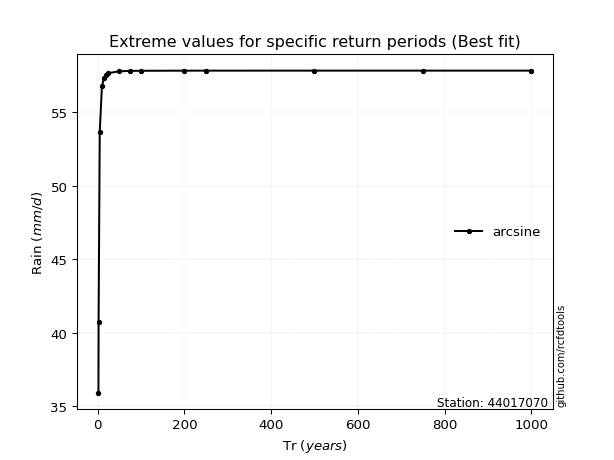</img>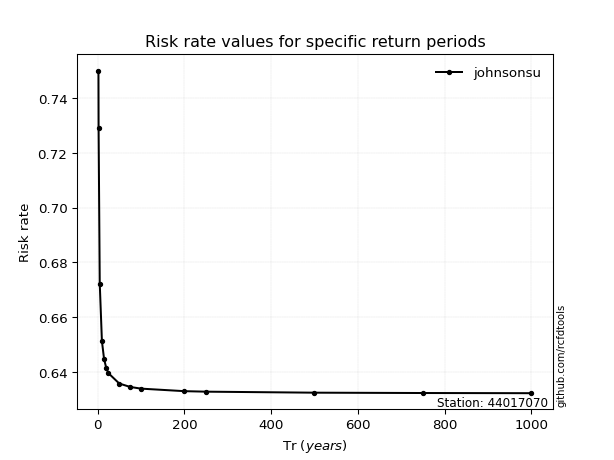</img>

</div>


<sub>**APP DISCLAIMER**: NO WARRANTY - This software is provided by [github.com/rcfdtools](https://github.com/rcfdtools) "as is", without any express or implied warranty, including warranties of merchantability, fitness for a particular purpose, or non-infringement. There is no guarantee that the software will be error-free or operate without interruption. LIMITATION OF LIABILITY - Neither the authors nor copyright holders will be liable for claims or damages arising from the software or its use. You are responsible for determining if the software is appropriate for your use and assume all associated risks, including errors, legal compliance, and data loss. NO PROFESSIONAL ADVICE - The software provides general information and does not offer professional advice. It should not replace consultation with professional advisors.</sub>