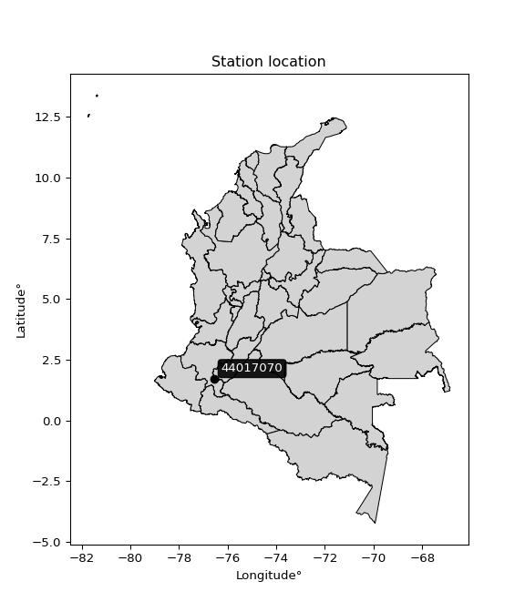

<div align="center">


</div>

# PMax24h Station (Rain, Pmax24h): 44017070

Maximum Precipitation in 24 hours (PMax24h) is the greatest amount of rainfall for a specific duration that is meteorologically possible for a given location, acting as a "worst-case" scenario for extreme storms, crucial for designing safety-critical infrastructure like bridges, river deviations, dams, spillways, and nuclear plants to prevent catastrophic failure. The PMax24h is related with the Probable Maximum Precipitation (PMP) and it is calculated by hydrologists using meteorological data to determine the upper limit of extreme rainfall, often leading to the Probable Maximum Flood (PMF) for flood control design, and is increasingly being studied for climate change impacts. Probable Maximum Precipitation (PMP) is the theoretical upper limit of rainfall, a deterministic estimate for extreme events, while probability distributions (like GEV, Gumbel) describe the likelihood and frequency of various precipitation amounts, including rare ones, showing how often events occur, with PMP representing the extreme end of these distributions, used for critical infrastructure design to ensure safety against the worst conceivable weather, unlike standard statistical forecasts which cover typical probabilities.

The most common probability distributions in hydrology, used for analyzing floods, rainfall, and streamflow, include the Normal, Log-Normal, Gumbel, Gamma (including Log-Pearson Type III), and Generalized Extreme Value (GEV) distributions, often chosen based on the data´s skewness and whether modeling extremes or general conditions, with Gumbel and GEV popular for extreme events like floods, while the Normal distribution serves as a baseline, though often requiring transformations for skewed hydrological data. These distributions help in designing water infrastructure, managing water resources, and forecasting hydrologic events.

> Hydrological data often isn´t perfectly normal (it´s skewed), so different distributions are needed for different applications, such as: **Flood Frequency Analysis**: Using Gumbel, GEV, or Log-Pearson Type III for predicting extreme flood magnitudes and their return periods, **Rainfall Analysis**: Normal for annual totals, but Log-Normal, Weibull, or GEV for intensity or extreme daily rainfall, **Streamflow Modeling**: Gamma and Log-Normal for maximum flows, GEV for minimum flows, and Kappa for daily flows.

<div align="center">

</img>

</div>


## A. General information


### 1. General running parameters

• app_version: _v20260225_. • runtime: _2026-02-27 14:50:08.749431_. • Python version: _3.14.0_. • SciPy version: _1.16.3_. • Pandas version: _2.3.3_. • NumPy version: _2.3.5_. • Stations dataset (station_dataset_file): _dataset/pmax24h_in/automatic_colombia_2003_2025.csv_. • Stations catalog (station_catalog_file): _dataset/CNE.xls_. • Minimum year to eval til year_max (date_min): _1900_. • Maximum year to eval since year_min (date_max): _2025_. • Creates, save and include plots into reports (create_plot): _False_. • Plot only fit distributions with Δo > Δ (plot_only_fit): _True_. • Plot only simple graphs avoiding multiple CDFs and multiple Extreme values plots (plot_only_simple): _False_. • Eval low extreme values, if False, evaluates high extreme values (low_extreme): _False_. • Eval every SciPy distribution as logarithmic (pdist_logarithmic_on): _True_. • Standard deviation normalized (ddof): _1.0_. • Return periods to eval in years (Tr): _[2, 2.33, 5, 10, 15, 20, 25, 50, 75, 100, 200, 250, 500, 750, 1000]_. • Minimum data sample per station, 0 means any (minimum_sample): _5_. • Z-Score maximum threshold to adjust a value, 0 means disable (zscore_max): _3.5_. • Z-Score minimum threshold to adjust a value, 0 means disable (zscore_min): _-2.5_. • Avoid zeros, e.g. rain = 0 (avoid_zeros): _True_. • Avoid null values (avoid_nans): _True_. 

:file_folder:Table: [dataset.csv](../../dataset/pmax24h_in/automatic_colombia_2003_2025.csv)

> Delta Degrees of Freedom (DDOF): is a parameter used in the formulas for calculating variance and standard deviation. When ddof=0, the divisor is $N$ (the total number of observations) and this is used when your data set is the entire population. When ddof=1, the divisor is $N-1$ and this is used when your data set is a sample drawn from a larger population. Using $N-1$ provides an unbiased estimate of the population variance (known as Bessel´s correction).


### 2. Station info and location

|   id |   CODIGO | NOMBRE                       | CATEGORIA    | TECNOLOGIA                              | ESTADO   | FECHA_INSTALACION   |   FECHA_SUSPENSION |   ALTITUD |   LATITUD |   LONGITUD | DEPARTAMENTO   | MUNICIPIO   | AREA_OPERATIVA                      | ENTIDAD                                                     | AREA_HIDROGRAFICA   | ZONA_HIDROGRAFICA   | SUBZONA_HIDROGRAFICA   | CORRIENTE   | Catalogo   |   Version |
|-----:|---------:|:-----------------------------|:-------------|:----------------------------------------|:---------|:--------------------|-------------------:|----------:|----------:|-----------:|:---------------|:------------|:------------------------------------|:------------------------------------------------------------|:--------------------|:--------------------|:-----------------------|:------------|:-----------|----------:|
|    0 | 44017070 | SANTA ROSA  - AUT [44017070] | Limnigráfica | Automática con Telemetría, Convencional | Activa   | 15/12/1980          |                nan |      1620 |     1.705 |   -76.5622 | Cauca          | Santa Rosa  | Area Operativa 07 - Nariño-Putumayo | INSTITUTO DE HIDROLOGIA METEOROLOGIA Y ESTUDIOS AMBIENTALES | Amazonas            | Caquetá             | Alto Caqueta           | Caqueta     | CNE_IDEAM  |  20251226 |

<div align="center">

Dynamic map: [:earth_americas:Google](http://maps.google.com/maps?q=1.705,-76.56222222) [:earth_americas:OSM](https://www.openstreetmap.org/#map=18/1.705/-76.56222222&layers=P) [:earth_americas:Bing](https://www.bing.com/maps?cp=1.705~-76.56222222&lvl=18) [:earth_americas:Apple](https://maps.apple.com/frame?center=1.705%2C-76.56222222&span=0.003%2C0.006)

</div>


<div align="center">

```geojson
{
  "type": "Feature",
  "geometry": {
    "type": "Point", 
    "coordinates": [-76.56222222, 1.705]
  }, 
  "properties": {
    "Name": "44017070"
  }
}
```

</div>


### 3. Discrete values table and plot

<div align="center">

|               |         0 |          1 |           2 |           3 |           4 |          5 |
|:--------------|----------:|-----------:|------------:|------------:|------------:|-----------:|
| Date          | 2019      | 2020       | 2021        | 2022        | 2023        | 2025       |
| Value         |   55      |   16.4     |   48.2      |   46.6      |   34        |   15.1     |
| Value_initial |   55      |   16.4     |   48.2      |   46.6      |   34        |   15.1     |
| count         |    6      |    6       |    6        |    6        |    6        |    6       |
| mean          |   35.8833 |   35.8833  |   35.8833   |   35.8833   |   35.8833   |   35.8833  |
| std           |   17.0123 |   17.0123  |   17.0123   |   17.0123   |   17.0123   |   17.0123  |
| zscore        |    1.1237 |   -1.14525 |    0.723987 |    0.629937 |   -0.110704 |   -1.22167 |


</div>


> The initial value (value_initial) correspond to the initial obtained or null completed value, and value (value) is adjusted only when the initial value is outside the valid range (outlier) definite through the Z-Score value. If Z-Score is active, values out of range or outliers are replaced with the station mean value. A Z-Score (or standard score) measures how many standard deviations a data point is from the mean of a dataset, indicating its relative position; positive scores mean above the mean, negative mean below, and a score of zero is exactly at the mean, allowing for comparison of values from different distributions. It´s calculated using the formula $z=(x–μ)/σ$, where $x$ is the data point, $μ$ is the mean, and $σ$ is the standard deviation, helping identify outliers and understand probability.
>
> <sub>**Note**: In this study, "completing" (filling gaps in) and "extending" (forecasting or lengthening the historical record) rainfall data series are avoided for certain critical analyses because they introduce artificial bias and uncertainty, which can distort the statistics of rare events (extremes), alter day-to-day variability, and compromise the integrity and homogeneity of the original data. Some reasons against Completing/Extending rainfall data are: **Distortion of Extremes and Variability**: The primary issue is that most gap-filling or extension methods rely on averaging or regression with nearby stations, which inherently smooths the data. Rainfall is highly variable in space and time, with a large percentage of zero values and occasional large storms. Infilling methods often underestimate the highest values and overestimate the lowest (zero) values, which severely distorts analyses focused on flood frequency, drought severity, and intensity-duration-frequency (IDF) curves, **Loss of Data Homogeneity**: Infilled or extended data are synthetic estimates, not actual measurements. Combining these estimates with observed data can violate the assumption of data homogeneity, which requires that the data properties do not change over time. Inhomogeneity can lead to incorrect conclusions about long-term trends or changes in climate patterns, **Propagation of Errors**: Errors and biases from the original data (e.g., wind-induced undercatch, instrument errors, site changes) or the data used for imputation can propagate through the analysis, leading to unreliable hydrological models and inaccurate predictions, **Compromised Statistical Integrity**: For statistical analyses, especially those involving the frequency of events, using artificial data can introduce time bias or autocorrelation that doesn´t exist in reality, making it difficult to assess the true probability of events, **Difficulty in Validation**: It is difficult to accurately validate the quality of filled or extended data, especially for past periods where ground-truth measurements are unavailable. The reliability of imputation techniques heavily depends on the density of the surrounding station network and the complexity of the local topography.</sub>


### 4. Active continuous probability distributions from SciPy (80 of 104 available)

A Probability Density Function (PDF) describes the relative likelihood of a continuous random variable falling within a specific range, where the total area under its curve equals 1, and the area over any interval gives the actual probability for that range. Unlike discrete probabilities (like rolling a die), a PDF shows density, not direct probability for a single point (which is zero), with higher points indicating higher likelihood, often visualized as a bell curve for normal distributions.

A log of a probability density function (log-PDF) is simply the logarithm of the PDF´s value, denoted as $log(f(x))$, useful for converting multiplication of probabilities into addition, improving numerical stability with tiny numbers, and connecting to information theory concepts like entropy. Instead of dealing with very small probabilities (e.g., 0.000001), log-PDFs use negative numbers (e.g., $log(0.00001) ≈ -11.51$ that are easier for computers to handle, preventing underflow errors and simplifying complex calculations. In this study, each active probability distribution from SciPy is also evaluated in the $log$ form.

[scipy.stats](https://docs.scipy.org/doc/scipy/reference/stats.html) is a Python´s powerful submodule within the SciPy library for comprehensive statistical analysis, offering over 130 probability distributions (like Normal, Poisson, etc.), functions for descriptive stats (mean, variance), hypothesis testing (t-tests, chi-square), random variable generation, and statistical tests, making it essential for data science, modeling, and research. It provides tools to explore, model, and draw conclusions from data efficiently, working seamlessly with [NumPy](https://numpy.org/).

<div align="center">

|   id | p_dist           |   n_parameter | fit_method   | label                                                                       | active   | ref                                                                                                      |
|-----:|:-----------------|--------------:|:-------------|:----------------------------------------------------------------------------|:---------|:---------------------------------------------------------------------------------------------------------|
|    0 | alpha            |             3 | MLE          | Alpha                                                                       | True     | [:mortar_board:](https://docs.scipy.org/doc/scipy/reference/generated/scipy.stats.alpha.html)            |
|    1 | anglit           |             2 | MM           | Anglit                                                                      | True     | [:mortar_board:](https://docs.scipy.org/doc/scipy/reference/generated/scipy.stats.anglit.html)           |
|    2 | arcsine          |             2 | MM           | Arcsine                                                                     | True     | [:mortar_board:](https://docs.scipy.org/doc/scipy/reference/generated/scipy.stats.arcsine.html)          |
|    3 | argus            |             3 | MLE          | Argus                                                                       | True     | [:mortar_board:](https://docs.scipy.org/doc/scipy/reference/generated/scipy.stats.argus.html)            |
|    4 | beta             |             4 | MLE          | Beta                                                                        | True     | [:mortar_board:](https://docs.scipy.org/doc/scipy/reference/generated/scipy.stats.beta.html)             |
|    5 | betaprime        |             4 | MLE          | Beta prime                                                                  | True     | [:mortar_board:](https://docs.scipy.org/doc/scipy/reference/generated/scipy.stats.betaprime.html)        |
|    6 | bradford         |             3 | MLE          | Bradford                                                                    | True     | [:mortar_board:](https://docs.scipy.org/doc/scipy/reference/generated/scipy.stats.bradford.html)         |
|    7 | burr             |             4 | MLE          | Burr (Type III)                                                             | True     | [:mortar_board:](https://docs.scipy.org/doc/scipy/reference/generated/scipy.stats.burr.html)             |
|    8 | burr12           |             4 | MLE          | Burr (Type III) 12                                                          | True     | [:mortar_board:](https://docs.scipy.org/doc/scipy/reference/generated/scipy.stats.burr12.html)           |
|    9 | cosine           |             2 | MLE          | Cosine                                                                      | True     | [:mortar_board:](https://docs.scipy.org/doc/scipy/reference/generated/scipy.stats.cosine.html)           |
|   10 | crystalball      |             4 | MLE          | Crystalball                                                                 | True     | [:mortar_board:](https://docs.scipy.org/doc/scipy/reference/generated/scipy.stats.crystalball.html)      |
|   11 | dgamma           |             3 | MLE          | Double gamma                                                                | True     | [:mortar_board:](https://docs.scipy.org/doc/scipy/reference/generated/scipy.stats.dgamma.html)           |
|   12 | dweibull         |             3 | MLE          | Double Weibull                                                              | True     | [:mortar_board:](https://docs.scipy.org/doc/scipy/reference/generated/scipy.stats.dweibull.html)         |
|   13 | erlang           |             3 | MLE          | Erlang                                                                      | True     | [:mortar_board:](https://docs.scipy.org/doc/scipy/reference/generated/scipy.stats.erlang.html)           |
|   14 | exponnorm        |             3 | MLE          | Exponentially modified Normal                                               | True     | [:mortar_board:](https://docs.scipy.org/doc/scipy/reference/generated/scipy.stats.exponnorm.html)        |
|   15 | exponpow         |             3 | MLE          | Exponential power                                                           | True     | [:mortar_board:](https://docs.scipy.org/doc/scipy/reference/generated/scipy.stats.exponpow.html)         |
|   16 | exponweib        |             4 | MLE          | Exponentiated Weibull                                                       | True     | [:mortar_board:](https://docs.scipy.org/doc/scipy/reference/generated/scipy.stats.exponweib.html)        |
|   17 | f                |             4 | MLE          | F                                                                           | True     | [:mortar_board:](https://docs.scipy.org/doc/scipy/reference/generated/scipy.stats.f.html)                |
|   18 | fatiguelife      |             3 | MLE          | Fatigue-life (Birnbaum-Saunders)                                            | True     | [:mortar_board:](https://docs.scipy.org/doc/scipy/reference/generated/scipy.stats.fatiguelife.html)      |
|   19 | foldnorm         |             3 | MM           | Fold Normal                                                                 | True     | [:mortar_board:](https://docs.scipy.org/doc/scipy/reference/generated/scipy.stats.foldnorm.html)         |
|   20 | gamma            |             3 | MLE          | Gamma                                                                       | True     | [:mortar_board:](https://docs.scipy.org/doc/scipy/reference/generated/scipy.stats.gamma.html)            |
|   21 | gausshyper       |             6 | MLE          | Gauss hypergeometric                                                        | True     | [:mortar_board:](https://docs.scipy.org/doc/scipy/reference/generated/scipy.stats.gausshyper.html)       |
|   22 | genexpon         |             5 | MLE          | Generalized exponential                                                     | True     | [:mortar_board:](https://docs.scipy.org/doc/scipy/reference/generated/scipy.stats.genexpon.html)         |
|   23 | genextreme       |             3 | MLE          | Generalized exponential                                                     | True     | [:mortar_board:](https://docs.scipy.org/doc/scipy/reference/generated/scipy.stats.genextreme.html)       |
|   24 | gengamma         |             4 | MLE          | Generalized gamma                                                           | True     | [:mortar_board:](https://docs.scipy.org/doc/scipy/reference/generated/scipy.stats.gengamma.html)         |
|   25 | genhalflogistic  |             3 | MLE          | Generalized half-logistic                                                   | True     | [:mortar_board:](https://docs.scipy.org/doc/scipy/reference/generated/scipy.stats.genhalflogistic.html)  |
|   26 | genlogistic      |             3 | MLE          | Generalized logistic                                                        | True     | [:mortar_board:](https://docs.scipy.org/doc/scipy/reference/generated/scipy.stats.genlogistic.html)      |
|   27 | gennorm          |             3 | MLE          | Generalized Normal                                                          | True     | [:mortar_board:](https://docs.scipy.org/doc/scipy/reference/generated/scipy.stats.gennorm.html)          |
|   28 | genpareto        |             3 | MLE          | Generalized Pareto                                                          | True     | [:mortar_board:](https://docs.scipy.org/doc/scipy/reference/generated/scipy.stats.genpareto.html)        |
|   29 | gompertz         |             3 | MLE          | Gompertz (or truncated Gumbel)                                              | True     | [:mortar_board:](https://docs.scipy.org/doc/scipy/reference/generated/scipy.stats.gompertz.html)         |
|   30 | gumbel_l         |             2 | MM           | Gumbel Left Skew                                                            | True     | [:mortar_board:](https://docs.scipy.org/doc/scipy/reference/generated/scipy.stats.gumbel_l.html)         |
|   31 | gumbel_r         |             2 | MM           | Gumbel Right Skew                                                           | True     | [:mortar_board:](https://docs.scipy.org/doc/scipy/reference/generated/scipy.stats.gumbel_r.html)         |
|   32 | halfgennorm      |             3 | MLE          | Upper half of a generalized normal                                          | True     | [:mortar_board:](https://docs.scipy.org/doc/scipy/reference/generated/scipy.stats.halfgennorm.html)      |
|   33 | halflogistic     |             2 | MM           | Half-logistic                                                               | True     | [:mortar_board:](https://docs.scipy.org/doc/scipy/reference/generated/scipy.stats.halflogistic.html)     |
|   34 | halfnorm         |             2 | MM           | Half Normal                                                                 | True     | [:mortar_board:](https://docs.scipy.org/doc/scipy/reference/generated/scipy.stats.halfnorm.html)         |
|   35 | hypsecant        |             2 | MM           | hyperbolic secant                                                           | True     | [:mortar_board:](https://docs.scipy.org/doc/scipy/reference/generated/scipy.stats.hypsecant.html)        |
|   36 | invgamma         |             3 | MLE          | Inverted gamma                                                              | True     | [:mortar_board:](https://docs.scipy.org/doc/scipy/reference/generated/scipy.stats.invgamma.html)         |
|   37 | invgauss         |             3 | MLE          | Inverse Gaussian                                                            | True     | [:mortar_board:](https://docs.scipy.org/doc/scipy/reference/generated/scipy.stats.invgauss.html)         |
|   38 | invweibull       |             3 | MLE          | Inverted Weibull                                                            | True     | [:mortar_board:](https://docs.scipy.org/doc/scipy/reference/generated/scipy.stats.invweibull.html)       |
|   39 | johnsonsb        |             4 | MLE          | Johnson SB                                                                  | True     | [:mortar_board:](https://docs.scipy.org/doc/scipy/reference/generated/scipy.stats.johnsonsb.html)        |
|   40 | johnsonsu        |             4 | MLE          | Johnson Su                                                                  | True     | [:mortar_board:](https://docs.scipy.org/doc/scipy/reference/generated/scipy.stats.johnsonsu.html)        |
|   41 | kappa3           |             3 | MLE          | Kappa 3                                                                     | True     | [:mortar_board:](https://docs.scipy.org/doc/scipy/reference/generated/scipy.stats.kappa3.html)           |
|   42 | kappa4           |             4 | MLE          | Kappa 4                                                                     | True     | [:mortar_board:](https://docs.scipy.org/doc/scipy/reference/generated/scipy.stats.kappa4.html)           |
|   43 | ksone            |             3 | MLE          | Kolmogorov-Smirnov one-sided test statistic distribution                    | True     | [:mortar_board:](https://docs.scipy.org/doc/scipy/reference/generated/scipy.stats.ksone.html)            |
|   44 | kstwobign        |             2 | MLE          | Limiting distribution of scaled Kolmogorov-Smirnov two-sided test statistic | True     | [:mortar_board:](https://docs.scipy.org/doc/scipy/reference/generated/scipy.stats.kstwobign.html)        |
|   45 | laplace          |             2 | MM           | Laplace                                                                     | True     | [:mortar_board:](https://docs.scipy.org/doc/scipy/reference/generated/scipy.stats.laplace.html)          |
|   46 | levy_l           |             2 | MLE          | Left-skewed Levy                                                            | True     | [:mortar_board:](https://docs.scipy.org/doc/scipy/reference/generated/scipy.stats.levy_l.html)           |
|   47 | loggamma         |             3 | MLE          | Log gamma                                                                   | True     | [:mortar_board:](https://docs.scipy.org/doc/scipy/reference/generated/scipy.stats.loggamma.html)         |
|   48 | logistic         |             2 | MM           | Logistic (or Sech-squared)                                                  | True     | [:mortar_board:](https://docs.scipy.org/doc/scipy/reference/generated/scipy.stats.logistic.html)         |
|   49 | loglaplace       |             3 | MLE          | Log-Laplace                                                                 | True     | [:mortar_board:](https://docs.scipy.org/doc/scipy/reference/generated/scipy.stats.loglaplace.html)       |
|   50 | lomax            |             3 | MLE          | Lomax (Pareto of the second kind)                                           | True     | [:mortar_board:](https://docs.scipy.org/doc/scipy/reference/generated/scipy.stats.lomax.html)            |
|   51 | maxwell          |             2 | MM           | Maxwell                                                                     | True     | [:mortar_board:](https://docs.scipy.org/doc/scipy/reference/generated/scipy.stats.maxwell.html)          |
|   52 | mielke           |             4 | MLE          | Mielke Beta-Kappa / Dagum                                                   | True     | [:mortar_board:](https://docs.scipy.org/doc/scipy/reference/generated/scipy.stats.mielke.html)           |
|   53 | moyal            |             2 | MM           | Moyal                                                                       | True     | [:mortar_board:](https://docs.scipy.org/doc/scipy/reference/generated/scipy.stats.moyal.html)            |
|   54 | nakagami         |             3 | MLE          | Nakagami                                                                    | True     | [:mortar_board:](https://docs.scipy.org/doc/scipy/reference/generated/scipy.stats.nakagami.html)         |
|   55 | ncf              |             5 | MLE          | Non-central F distribution                                                  | True     | [:mortar_board:](https://docs.scipy.org/doc/scipy/reference/generated/scipy.stats.ncf.html)              |
|   56 | nct              |             4 | MLE          | Non-central Student’s t                                                     | True     | [:mortar_board:](https://docs.scipy.org/doc/scipy/reference/generated/scipy.stats.nct.html)              |
|   57 | norm             |             2 | MM           | Normal                                                                      | True     | [:mortar_board:](https://docs.scipy.org/doc/scipy/reference/generated/scipy.stats.norm.html)             |
|   58 | pearson3         |             3 | MM           | Pearson type III                                                            | True     | [:mortar_board:](https://docs.scipy.org/doc/scipy/reference/generated/scipy.stats.pearson3.html)         |
|   59 | powerlaw         |             3 | MLE          | Power-function                                                              | True     | [:mortar_board:](https://docs.scipy.org/doc/scipy/reference/generated/scipy.stats.powerlaw.html)         |
|   60 | rayleigh         |             2 | MM           | Rayleigh                                                                    | True     | [:mortar_board:](https://docs.scipy.org/doc/scipy/reference/generated/scipy.stats.rayleigh.html)         |
|   61 | rdist            |             3 | MLE          | R-distributed (symmetric beta)                                              | True     | [:mortar_board:](https://docs.scipy.org/doc/scipy/reference/generated/scipy.stats.rdist.html)            |
|   62 | rice             |             3 | MLE          | Rice                                                                        | True     | [:mortar_board:](https://docs.scipy.org/doc/scipy/reference/generated/scipy.stats.rice.html)             |
|   63 | semicircular     |             2 | MM           | Semicircular                                                                | True     | [:mortar_board:](https://docs.scipy.org/doc/scipy/reference/generated/scipy.stats.semicircular.html)     |
|   64 | skewnorm         |             3 | MLE          | Skew normal                                                                 | True     | [:mortar_board:](https://docs.scipy.org/doc/scipy/reference/generated/scipy.stats.skewnorm.html)         |
|   65 | t                |             3 | MLE          | Student’s t                                                                 | True     | [:mortar_board:](https://docs.scipy.org/doc/scipy/reference/generated/scipy.stats.t.html)                |
|   66 | trapezoid        |             4 | MLE          | Trapezoid                                                                   | True     | [:mortar_board:](https://docs.scipy.org/doc/scipy/reference/generated/scipy.stats.trapezoid.html)        |
|   67 | triang           |             3 | MLE          | Triangular                                                                  | True     | [:mortar_board:](https://docs.scipy.org/doc/scipy/reference/generated/scipy.stats.triang.html)           |
|   68 | truncexpon       |             3 | MLE          | Truncated exponential                                                       | True     | [:mortar_board:](https://docs.scipy.org/doc/scipy/reference/generated/scipy.stats.truncexpon.html)       |
|   69 | truncnorm        |             4 | MLE          | Truncated normal                                                            | True     | [:mortar_board:](https://docs.scipy.org/doc/scipy/reference/generated/scipy.stats.truncnorm.html)        |
|   70 | truncpareto      |             4 | MLE          | Upper truncated Pareto                                                      | True     | [:mortar_board:](https://docs.scipy.org/doc/scipy/reference/generated/scipy.stats.truncpareto.html)      |
|   71 | truncweibull_min |             5 | MLE          | Doubly truncated Weibull minimum                                            | True     | [:mortar_board:](https://docs.scipy.org/doc/scipy/reference/generated/scipy.stats.truncweibull_min.html) |
|   72 | tukeylambda      |             3 | MLE          | Tukey-Lamdba                                                                | True     | [:mortar_board:](https://docs.scipy.org/doc/scipy/reference/generated/scipy.stats.tukeylambda.html)      |
|   73 | uniform          |             2 | MLE          | Uniform                                                                     | True     | [:mortar_board:](https://docs.scipy.org/doc/scipy/reference/generated/scipy.stats.uniform.html)          |
|   74 | vonmises         |             3 | MLE          | Von Mises                                                                   | True     | [:mortar_board:](https://docs.scipy.org/doc/scipy/reference/generated/scipy.stats.vonmises.html)         |
|   75 | vonmises_line    |             3 | MLE          | Von Mises line                                                              | True     | [:mortar_board:](https://docs.scipy.org/doc/scipy/reference/generated/scipy.stats.vonmises_line.html)    |
|   76 | wald             |             2 | MM           | Wald                                                                        | True     | [:mortar_board:](https://docs.scipy.org/doc/scipy/reference/generated/scipy.stats.wald.html)             |
|   77 | weibull_max      |             3 | MLE          | Weibull maximum                                                             | True     | [:mortar_board:](https://docs.scipy.org/doc/scipy/reference/generated/scipy.stats.weibull_max.html)      |
|   78 | weibull_min      |             3 | MLE          | Weibull minimum                                                             | True     | [:mortar_board:](https://docs.scipy.org/doc/scipy/reference/generated/scipy.stats.weibull_min.html)      |
|   79 | wrapcauchy       |             3 | MLE          | Wrapped  Cauchy                                                             | True     | [:mortar_board:](https://docs.scipy.org/doc/scipy/reference/generated/scipy.stats.wrapcauchy.html)       |

</div>

> **n_parameter:** # arguments & localization & scale.
>
> **Fit methods:** (MLE) maximum likelihood, (MM) L-moments.
>
>**Inactive** (With the only purpose of prevent loops, zero divisions, infinite values, over high estimated values or horizontal trending for recurrence intervals estimations, the follow distributions were disabled.)**:** lognorm, norminvgauss, powernorm, powerlognorm, cauchy, halfcauchy, foldcauchy, skewcauchy, chi2, expon, fisk, genhyperbolic, geninvgauss, gibrat, kstwo, laplace_asymmetric, levy, levy_stable, ncx2, pareto, rel_breitwigner, recipinvgauss, studentized_range, loguniform, 


## B. Probability (PDF) vs. Empirical (EDF) distributions functions

A continuous probability distribution (CPD) describes probabilities for variables that can take any value within a range (like rain any time), unlike discrete variables with specific outcomes (like temperature). It uses a Probability Density Function (PDF), a curve where the total area under it equals 1, and the probability of the variable falling within an interval (a to b) is found by calculating the area under the curve between those points. A key feature is that the probability of hitting any single exact value is zero, so probabilities are always expressed for ranges, e.g., $P(a ≤ X ≤ b)$.

<div align="center">

Distributions parameters from station values
|     |   station | p_dist              |   n |             loc |           scale | shape                  | shape1                 | shape2                | shape3             |
|----:|----------:|:--------------------|----:|----------------:|----------------:|:-----------------------|:-----------------------|:----------------------|:-------------------|
|   0 |  44017070 | alpha               |   6 |  -243.576       |  4862.94        | 17.47943951343639      |                        |                       |                    |
|   1 |  44017070 | anglit              |   6 |    35.8833      |    45.4315      |                        |                        |                       |                    |
|   2 |  44017070 | arcsine             |   6 |    13.9206      |    43.9255      |                        |                        |                       |                    |
|   3 |  44017070 | argus               |   6 |    -0.166216    |    57.3735      | 1.387193069774311      |                        |                       |                    |
|   4 |  44017070 | beta                |   6 |    11.7362      |    43.2638      | 0.3472244405617867     | 0.3060011016227205     |                       |                    |
|   5 |  44017070 | betaprime           |   6 |  -182.511       | 15902.3         | 190.76482520310066     | 13900.842593158517     |                       |                    |
|   6 |  44017070 | bradford            |   6 |    15.1         |    39.9001      | 1.0571651150199122     |                        |                       |                    |
|   7 |  44017070 | burr                |   6 |    -0.49318     |     1.08987     | 2.021063107052698      | 554.6520399453278      |                       |                    |
|   8 |  44017070 | burr12              |   6 |    -9.99414     |    24.9535      | 741.4544307935525      | 0.0024885567579311296  |                       |                    |
|   9 |  44017070 | cosine              |   6 |    35.3255      |    12.2741      |                        |                        |                       |                    |
|  10 |  44017070 | crystalball         |   6 |    35.8833      |    15.53        | 3929.4101439745173     | 29.538018659178547     |                       |                    |
|  11 |  44017070 | dgamma              |   6 |    38.7855      |     4.16427     | 3.3739247026822765     |                        |                       |                    |
|  12 |  44017070 | dweibull            |   6 |    37.6509      |    15.8679      | 2.1849512008816268     |                        |                       |                    |
|  13 |  44017070 | erlang              |   6 |  -218.836       |     0.966265    | 263.6121525396097      |                        |                       |                    |
|  14 |  44017070 | exponnorm           |   6 |    35.8731      |    15.53        | 0.0006608911467207527  |                        |                       |                    |
|  15 |  44017070 | exponpow            |   6 |    15.1         |    36.8222      | 0.614518413341862      |                        |                       |                    |
|  16 |  44017070 | exponweib           |   6 |    15.1         |     1.00131     | 1.2869654863353237     | 0.2079044614713313     |                       |                    |
|  17 |  44017070 | f                   |   6 | -3149.73        |  3185.59        | 97437.47001355382      | 585055.6220750344      |                       |                    |
|  18 |  44017070 | fatiguelife         |   6 |    15.1         |     8.49924e-06 | 1410.042426225918      |                        |                       |                    |
|  19 |  44017070 | foldnorm            |   6 |   -72.855       |    15.1157      | 7.200020925292691      |                        |                       |                    |
|  20 |  44017070 | gamma               |   6 |  -243.185       |     0.877074    | 318.1018733694701      |                        |                       |                    |
|  21 |  44017070 | gausshyper          |   6 |    15.0435      |    39.9565      | 0.9180394370061546     | 0.8609505867020866     | 1.029582510036436     | 1.1706831668271347 |
|  22 |  44017070 | genexpon            |   6 |    12.4522      |     6.60339     | 0.58745381948848       | 2.3437159970645698e-06 | 0.0001769491683760596 |                    |
|  23 |  44017070 | genextreme          |   6 |    35.5114      |    20.8975      | 1.0722909361917943     |                        |                       |                    |
|  24 |  44017070 | gengamma            |   6 |    15.1         |     0.805202    | 1.3329154285317308     | 0.2708586539867498     |                       |                    |
|  25 |  44017070 | genhalflogistic     |   6 |     2.65996     |    60.0577      | 1.1474526014043152     |                        |                       |                    |
|  26 |  44017070 | genlogistic         |   6 |    55.0002      |     1.65995e-05 | 8.666504931136939e-07  |                        |                       |                    |
|  27 |  44017070 | gennorm             |   6 |    35.05        |    19.95        | 6835544.21541087       |                        |                       |                    |
|  28 |  44017070 | genpareto           |   6 |    -0.209653    |    80.5796      | -1.4595209185365388    |                        |                       |                    |
|  29 |  44017070 | gompertz            |   6 |    15.1         |    34.5908      | 0.9913560594857564     |                        |                       |                    |
|  30 |  44017070 | gumbel_l            |   6 |    42.8727      |    12.1087      |                        |                        |                       |                    |
|  31 |  44017070 | gumbel_r            |   6 |    28.894       |    12.1087      |                        |                        |                       |                    |
|  32 |  44017070 | halfgennorm         |   6 |    15.1         |     1.12677     | 0.3839710139722944     |                        |                       |                    |
|  33 |  44017070 | halflogistic        |   6 |    17.4767      |    13.2776      |                        |                        |                       |                    |
|  34 |  44017070 | halfnorm            |   6 |    15.3277      |    25.7627      |                        |                        |                       |                    |
|  35 |  44017070 | hypsecant           |   6 |    35.8833      |     9.88672     |                        |                        |                       |                    |
|  36 |  44017070 | invgamma            |   6 |  -118.394       | 13976.9         | 91.77022977669424      |                        |                       |                    |
|  37 |  44017070 | invgauss            |   6 |   -38.9586      |  1475.36        | 0.050820326560400905   |                        |                       |                    |
|  38 |  44017070 | invweibull          |   6 |    15.1         |     1.52208     | 0.04556520532837799    |                        |                       |                    |
|  39 |  44017070 | johnsonsb           |   6 |    15.1         |    82.6025      | 0.8118097902110453     | 0.16109074539348298    |                       |                    |
|  40 |  44017070 | johnsonsu           |   6 |    60.42        |     0.201397    | 6.921844240427544      | 1.319989583488943      |                       |                    |
|  41 |  44017070 | kappa3              |   6 |    15.1         |    37.892       | 52.06678491247976      |                        |                       |                    |
|  42 |  44017070 | kappa4              |   6 |     8.73249     |    48.6391      | 1.1512023076862197     | 1.047692276393895      |                       |                    |
|  43 |  44017070 | ksone               |   6 |     8.98456     |    53.7976      | 1.0                    |                        |                       |                    |
|  44 |  44017070 | kstwobign           |   6 |   -20.756       |    64.3925      |                        |                        |                       |                    |
|  45 |  44017070 | laplace             |   6 |    35.8833      |    10.9814      |                        |                        |                       |                    |
|  46 |  44017070 | levy_l              |   6 |    56.4355      |     5.92039     |                        |                        |                       |                    |
|  47 |  44017070 | loggamma            |   6 |    55.0001      |     6.58239e-06 | 3.439452811453437e-07  |                        |                       |                    |
|  48 |  44017070 | logistic            |   6 |    35.8833      |     8.56215     |                        |                        |                       |                    |
|  49 |  44017070 | loglaplace          |   6 |    -0.0864549   |    34.0865      | 2.240728944997363      |                        |                       |                    |
|  50 |  44017070 | lomax               |   6 |    15.1         |     2.09363e+08 | 6037412.200907363      |                        |                       |                    |
|  51 |  44017070 | maxwell             |   6 |    -0.916283    |    23.0607      |                        |                        |                       |                    |
|  52 |  44017070 | mielke              |   6 |    -7.85517     |     2.05623     | 3385.7851863551223     | 2.5869912986257475     |                       |                    |
|  53 |  44017070 | moyal               |   6 |    27.0023      |     6.99096     |                        |                        |                       |                    |
|  54 |  44017070 | nakagami            |   6 |    15.1         |    29.9265      | 0.28591147626248803    |                        |                       |                    |
|  55 |  44017070 | ncf                 |   6 |     0.00818663  |     2.49092e-06 | 1.3587364798372845e-06 | 365.3175922079597      | 19.495492842313915    |                    |
|  56 |  44017070 | nct                 |   6 | -1017.43        |    15.4844      | 354469.12128581025     | 68.02371680004796      |                       |                    |
|  57 |  44017070 | norm                |   6 |    35.8833      |    15.53        |                        |                        |                       |                    |
|  58 |  44017070 | pearson3            |   6 |    35.8833      |    15.5301      | -0.2801118975610978    |                        |                       |                    |
|  59 |  44017070 | powerlaw            |   6 |    15.1         |    39.9         | 0.14202848626982584    |                        |                       |                    |
|  60 |  44017070 | rayleigh            |   6 |     6.17351     |    23.705       |                        |                        |                       |                    |
|  61 |  44017070 | rdist               |   6 |    35.8291      |    20.7291      | 1.0472711377354764     |                        |                       |                    |
|  62 |  44017070 | rice                |   6 |     5.27571     |    18.3027      | 1.2314954696418763     |                        |                       |                    |
|  63 |  44017070 | semicircular        |   6 |    35.8833      |    31.06        |                        |                        |                       |                    |
|  64 |  44017070 | skewnorm            |   6 |    55           |    24.6284      | -9156650.580003724     |                        |                       |                    |
|  65 |  44017070 | t                   |   6 |    35.8833      |    15.5298      | 455217740.44418883     |                        |                       |                    |
|  66 |  44017070 | trapezoid           |   6 |    -8.44429     |    65.8883      | 1.0                    | 1.0                    |                       |                    |
|  67 |  44017070 | triang              |   6 |    -1.58386     |    57.1442      | 0.9901948443435971     |                        |                       |                    |
|  68 |  44017070 | truncexpon          |   6 |    15.1         |    48.3521      | 0.8251976523664393     |                        |                       |                    |
|  69 |  44017070 | truncnorm           |   6 |     9.37503     |    30.4967      | -162.88323792012574    | 1.4960608990108268     |                       |                    |
|  70 |  44017070 | truncpareto         |   6 |    -4.29494e+09 |     4.29494e+09 | 81728466.81856705      | 1.0000000092899939     |                       |                    |
|  71 |  44017070 | truncweibull_min    |   6 |    15.0656      |    61.7106      | 0.9686266664191676     | 0.000557187608067716   | 0.6471236411404935    |                    |
|  72 |  44017070 | tukeylambda         |   6 |    35.0511      |    22.0047      | 1.102933981575648      |                        |                       |                    |
|  73 |  44017070 | uniform             |   6 |    15.1         |    39.9         |                        |                        |                       |                    |
|  74 |  44017070 | vonmises            |   6 |    -2.90213     |     1           | 1.7137258220943477     |                        |                       |                    |
|  75 |  44017070 | vonmises_line       |   6 |    41.9962      |     8.56133     | 0.7166998277599272     |                        |                       |                    |
|  76 |  44017070 | wald                |   6 |    20.3533      |    15.53        |                        |                        |                       |                    |
|  77 |  44017070 | weibull_max         |   6 |    55           |     1.33024     | 0.24642888235210514    |                        |                       |                    |
|  78 |  44017070 | weibull_min         |   6 |    -2.7845e+08  |     2.7845e+08  | 22222501.320415683     |                        |                       |                    |
|  79 |  44017070 | wrapcauchy          |   6 |    15.1         |     6.35028     | 0.6467989378591672     |                        |                       |                    |
|  80 |  44017070 | logalpha            |   6 |    -9.34266     |   308.202       | 24.127059867296225     |                        |                       |                    |
|  81 |  44017070 | loganglit           |   6 |     3.46044     |     1.51858     |                        |                        |                       |                    |
|  82 |  44017070 | logarcsine          |   6 |     2.72633     |     1.46821     |                        |                        |                       |                    |
|  83 |  44017070 | logargus            |   6 |     2.12851     |     1.93658     | 2.017488024146563      |                        |                       |                    |
|  84 |  44017070 | logbeta             |   6 |     2.57042     |     1.43691     | 0.23826015763117356    | 0.14547540098042416    |                       |                    |
|  85 |  44017070 | logbetaprime        |   6 |    -6.73693     |   214.322       | 379.9521341617674      | 7992.237964360589      |                       |                    |
|  86 |  44017070 | logbradford         |   6 |     2.70644     |     1.30272     | 1.2543734810563367e-05 |                        |                       |                    |
|  87 |  44017070 | logburr             |   6 |    -6.51402     |    10.5311      | 3918.4244933407426     | 0.004499516814547981   |                       |                    |
|  88 |  44017070 | logburr12           |   6 |  -561.022       |   569.175       | 1463.786645274131      | 97696.71049343611      |                       |                    |
|  89 |  44017070 | logcosine           |   6 |     3.4263      |     0.410043    |                        |                        |                       |                    |
|  90 |  44017070 | logcrystalball      |   6 |     3.46044     |     0.519101    | 1710.2176296579337     | 22.977470540012913     |                       |                    |
|  91 |  44017070 | logdgamma           |   6 |     3.63352     |     0.227143    | 1.9708045645524717     |                        |                       |                    |
|  92 |  44017070 | logdweibull         |   6 |     3.29249     |     0.577157    | 4.528086748448144      |                        |                       |                    |
|  93 |  44017070 | logerlang           |   6 |    -4.42755     |     0.0356135   | 221.43568435138832     |                        |                       |                    |
|  94 |  44017070 | logexponnorm        |   6 |     3.4601      |     0.519097    | 0.0006598791893803844  |                        |                       |                    |
|  95 |  44017070 | logexponpow         |   6 |     2.71469     |     1.74886     | 0.16343639161191947    |                        |                       |                    |
|  96 |  44017070 | logexponweib        |   6 |     2.71469     |     1.0722      | 0.0794757392835371     | 1.8805921456467678     |                       |                    |
|  97 |  44017070 | logf                |   6 |  -296.702       |   300.163       | 2066561.4138004296     | 979926.6724084979      |                       |                    |
|  98 |  44017070 | logfatiguelife      |   6 |     2.71469     |     4.84907e-07 | 1028.9966570275953     |                        |                       |                    |
|  99 |  44017070 | logfoldnorm         |   6 |     2.74493     |     0.631837    | 0.9539812235952304     |                        |                       |                    |
| 100 |  44017070 | loggamma            |   6 |    -4.83086     |     0.0339282   | 244.22603234411065     |                        |                       |                    |
| 101 |  44017070 | loggausshyper       |   6 |     2.71091     |     1.29643     | 1.103494519972576      | 0.7325675099865343     | 1.0563767354870612    | 1.4388757286644915 |
| 102 |  44017070 | loggenexpon         |   6 |     2.71442     |     0.00692879  | 0.005888581548460375   | 0.7794688040337465     | 5.436152740770958e-05 |                    |
| 103 |  44017070 | loggenextreme       |   6 |     3.57833     |     0.52773     | 1.2301354983285098     |                        |                       |                    |
| 104 |  44017070 | loggengamma         |   6 |     2.71469     |     1.3657      | 0.10807361620646158    | 1.4321917822085077     |                       |                    |
| 105 |  44017070 | loggenhalflogistic  |   6 |     2.44073     |     1.69384     | 1.0812201315343883     |                        |                       |                    |
| 106 |  44017070 | loggenlogistic      |   6 |     4.00741     |     4.81924e-06 | 8.831797676453347e-06  |                        |                       |                    |
| 107 |  44017070 | loggennorm          |   6 |     3.8416      |     0.00452028  | 0.31507713400254467    |                        |                       |                    |
| 108 |  44017070 | loggenpareto        |   6 |    -0.00413379  |    13.9022      | -3.465619007020707     |                        |                       |                    |
| 109 |  44017070 | loggompertz         |   6 |     2.71469     |     1.11366     | 0.88388534559584       |                        |                       |                    |
| 110 |  44017070 | loggumbel_l         |   6 |     3.69406     |     0.404741    |                        |                        |                       |                    |
| 111 |  44017070 | loggumbel_r         |   6 |     3.22682     |     0.404741    |                        |                        |                       |                    |
| 112 |  44017070 | loghalfgennorm      |   6 |     2.71468     |     1.2927      | 285536.21693652944     |                        |                       |                    |
| 113 |  44017070 | loghalflogistic     |   6 |     2.84518     |     0.44381     |                        |                        |                       |                    |
| 114 |  44017070 | loghalfnorm         |   6 |     2.77338     |     0.861106    |                        |                        |                       |                    |
| 115 |  44017070 | loghypsecant        |   6 |     3.46044     |     0.33047     |                        |                        |                       |                    |
| 116 |  44017070 | loginvgamma         |   6 |    -7.27975     |  4424.03        | 413.10785366774127     |                        |                       |                    |
| 117 |  44017070 | loginvgauss         |   6 |    -0.115889    |   148.913       | 0.02401171933860066    |                        |                       |                    |
| 118 |  44017070 | loginvweibull       |   6 |    -3.28912e+07 |     3.28912e+07 | 65403872.88157107      |                        |                       |                    |
| 119 |  44017070 | logjohnsonsb        |   6 |     2.7143      |     1.29303     | -0.5053909130062901    | 0.1506798491658484     |                       |                    |
| 120 |  44017070 | logjohnsonsu        |   6 |     4.00733     |     5.73507e-10 | 4.627272540979847      | 0.25272998812132486    |                       |                    |
| 121 |  44017070 | logkappa3           |   6 |     2.71468     |     1.29265     | 579429.8835071198      |                        |                       |                    |
| 122 |  44017070 | logkappa4           |   6 |     2.4523      |     1.67886     | 1.1866819923809957     | 1.0782782603320398     |                       |                    |
| 123 |  44017070 | logksone            |   6 |     2.56133     |     1.79822     | 1.0                    |                        |                       |                    |
| 124 |  44017070 | logkstwobign        |   6 |     1.49214     |     2.23558     |                        |                        |                       |                    |
| 125 |  44017070 | loglaplace          |   6 |     3.46044     |     0.36706     |                        |                        |                       |                    |
| 126 |  44017070 | loglevy_l           |   6 |     4.03865     |     0.128641    |                        |                        |                       |                    |
| 127 |  44017070 | logloggamma         |   6 |     4.00876     |     1.96621e-06 | 3.579410858738213e-06  |                        |                       |                    |
| 128 |  44017070 | loglogistic         |   6 |     3.46044     |     0.286195    |                        |                        |                       |                    |
| 129 |  44017070 | logloglaplace       |   6 |    -0.022893    |     3.86449     | 7.542880966037606      |                        |                       |                    |
| 130 |  44017070 | loglomax            |   6 |     2.71469     |     3.34274e+09 | 4505446377.720855      |                        |                       |                    |
| 131 |  44017070 | logmaxwell          |   6 |     2.23039     |     0.77082     |                        |                        |                       |                    |
| 132 |  44017070 | logmielke           |   6 |    -1.63872e+07 |     1.63872e+07 | 29124070.086828105     | 2776658579.031953      |                       |                    |
| 133 |  44017070 | logmoyal            |   6 |     3.16358     |     0.233677    |                        |                        |                       |                    |
| 134 |  44017070 | lognakagami         |   6 |     2.71469     |     1.02338     | 0.0687856189537577     |                        |                       |                    |
| 135 |  44017070 | logncf              |   6 |  -119.633       |   121.936       | 167247.74953172362     | 332492.3343203396      | 1582.5876958110684    |                    |
| 136 |  44017070 | lognct              |   6 |   -22.2381      |     0.486133    | 9366.48261674463       | 52.86146702544133      |                       |                    |
| 137 |  44017070 | lognorm             |   6 |     3.46044     |     0.519101    |                        |                        |                       |                    |
| 138 |  44017070 | logpearson3         |   6 |     3.46044     |     0.519102    | -0.49535282595396424   |                        |                       |                    |
| 139 |  44017070 | logpowerlaw         |   6 |     2.71469     |     1.29264     | 0.15357821968218632    |                        |                       |                    |
| 140 |  44017070 | lograyleigh         |   6 |     2.46737     |     0.792355    |                        |                        |                       |                    |
| 141 |  44017070 | logrdist            |   6 |     3.1946      |     0.812738    | 1.0665284477445969     |                        |                       |                    |
| 142 |  44017070 | logrice             |   6 |     2.38795     |     0.598002    | 1.4035463266094834     |                        |                       |                    |
| 143 |  44017070 | logsemicircular     |   6 |     3.46044     |     1.0382      |                        |                        |                       |                    |
| 144 |  44017070 | logskewnorm         |   6 |     4.00733     |     0.754021    | -11647810.748401463    |                        |                       |                    |
| 145 |  44017070 | logt                |   6 |     3.46045     |     0.519094    | 152027692.29867727     |                        |                       |                    |
| 146 |  44017070 | logtrapezoid        |   6 |     1.9922      |     2.20236     | 1.0                    | 1.0                    |                       |                    |
| 147 |  44017070 | logtriang           |   6 |     2.28929     |     1.71804     | 0.9999993006484471     |                        |                       |                    |
| 148 |  44017070 | logtruncexpon       |   6 |     2.71467     |     1.44301     | 0.8958098222321054     |                        |                       |                    |
| 149 |  44017070 | logtruncnorm        |   6 |    -0.10853     |     1.1218      | 3.2402331671707403     | 3.668984884447386      |                       |                    |
| 150 |  44017070 | logtruncpareto      |   6 |     2.71188     |     0.00200679  | 2.98179014036034e-09   | 645.5339094985752      |                       |                    |
| 151 |  44017070 | logtruncweibull_min |   6 |     2.71469     |     1.91066     | 0.5577463910357596     | 2.254859122951114e-16  | 0.6799776793222971    |                    |
| 152 |  44017070 | logtukeylambda      |   6 |     3.35856     |     0.807261    | 1.244297537490369      |                        |                       |                    |
| 153 |  44017070 | loguniform          |   6 |     2.71469     |     1.29264     |                        |                        |                       |                    |
| 154 |  44017070 | logvonmises         |   6 |    -2.80993     |     1           | 4.169472536570906      |                        |                       |                    |
| 155 |  44017070 | logvonmises_line    |   6 |     3.33792     |     0.213081    | 2.031865675714249e-05  |                        |                       |                    |
| 156 |  44017070 | logwald             |   6 |     2.94135     |     0.51909     |                        |                        |                       |                    |
| 157 |  44017070 | logweibull_max      |   6 |     4.00733     |     0.927984    | 0.1686758136240542     |                        |                       |                    |
| 158 |  44017070 | logweibull_min      |   6 |    -2.35779e+07 |     2.35779e+07 | 61277610.46300506      |                        |                       |                    |
| 159 |  44017070 | logwrapcauchy       |   6 |     2.71469     |     0.20573     | 0.525                  |                        |                       |                    |

</div>

> **loc** (Location parameter): This shifts the distribution along the x-axis. For many common distributions, like the normal (Gaussian) distribution, loc represents the mean $μ$. For others, like the uniform distribution, it might represent the minimum value, or for the beta distribution, the left end of the support interval.
>
> **scale** (Scale parameter): This determines the width or spread of the distribution. For the normal distribution, scale represents the standard deviation $σ$. For a uniform distribution, it defines the length of the interval (from $loc$ to $loc + scale$).
>
> **shape** (Shape parameters): Refers to parameters that define the specific form of a probability distribution, distinct from its location (loc) and scale (scale). These parameters are required arguments for most distribution functions. For example, a normal (Gaussian) distribution is fully defined by its location (mean) and scale (standard deviation), so it has no specific shape parameters beyond loc and scale. However, other distributions have intrinsic properties that need specification, as Gamma distribution that takes a shape parameter, often named $a$ or $alpha$.


### 0. Cumulative distribution values - CDF (160 evaluated)

Cumulative Distribution Function (CDF), denoted as $F$<sub>$X$</sub>$(x)$, is a function that gives the probability that a random variable $X$ will take a value less than or equal to a specific value, $x$ (i.e., $(P(X≥x)$. It essentially "accumulates" probabilities from a given point up to the far right (positive infinity), providing a complete picture of the distribution´s probabilities for both discrete (like rain) and continuous (like temperature) variables, helping to find probabilities over ranges or above certain values. Each station is evaluated separately ordering the $x$ values ascending, calculating the CDF and PDF values for the activated distributions and their logarithmic forms.

<div align="center">

CDF ordered by x ascending and calculating $log(f(x))$ separately
|   id |   Station |   date |    x |   count |    mean |     std |    zscore |   Value_initial |   station |   m |     alpha |   alpha_pdf |   anglit |   anglit_pdf |   arcsine |   arcsine_pdf |     argus |   argus_pdf |     beta |    beta_pdf |   betaprime |   betaprime_pdf |    bradford |   bradford_pdf |      burr |   burr_pdf |    burr12 |   burr12_pdf |    cosine |   cosine_pdf |   crystalball |   crystalball_pdf |    dgamma |   dgamma_pdf |   dweibull |   dweibull_pdf |    erlang |   erlang_pdf |   exponnorm |   exponnorm_pdf |    exponpow |   exponpow_pdf |   exponweib |   exponweib_pdf |         f |     f_pdf |   fatiguelife |   fatiguelife_pdf |   foldnorm |   foldnorm_pdf |     gamma |   gamma_pdf |   gausshyper |   gausshyper_pdf |   genexpon |   genexpon_pdf |   genextreme |   genextreme_pdf |    gengamma |   gengamma_pdf |   genhalflogistic |   genhalflogistic_pdf |   genlogistic |   genlogistic_pdf |     gennorm |   gennorm_pdf |   genpareto |   genpareto_pdf |    gompertz |   gompertz_pdf |   gumbel_l |   gumbel_l_pdf |   gumbel_r |   gumbel_r_pdf |   halfgennorm |   halfgennorm_pdf |   halflogistic |   halflogistic_pdf |   halfnorm |   halfnorm_pdf |   hypsecant |   hypsecant_pdf |   invgamma |   invgamma_pdf |   invgauss |   invgauss_pdf |   invweibull |   invweibull_pdf |   johnsonsb |   johnsonsb_pdf |   johnsonsu |   johnsonsu_pdf |      kappa3 |   kappa3_pdf |      kappa4 |   kappa4_pdf |    ksone |   ksone_pdf |   kstwobign |   kstwobign_pdf |   laplace |   laplace_pdf |   levy_l |   levy_l_pdf |   loggamma |   loggamma_pdf |   logistic |   logistic_pdf |   loglaplace |   loglaplace_pdf |       lomax |   lomax_pdf |   maxwell |   maxwell_pdf |   mielke |   mielke_pdf |     moyal |   moyal_pdf |    nakagami |    nakagami_pdf |       ncf |   ncf_pdf |       nct |   nct_pdf |      norm |   norm_pdf |   pearson3 |   pearson3_pdf |   powerlaw |   powerlaw_pdf |   rayleigh |   rayleigh_pdf |       rdist |      rdist_pdf |      rice |   rice_pdf |   semicircular |   semicircular_pdf |   skewnorm |   skewnorm_pdf |         t |     t_pdf |   trapezoid |   trapezoid_pdf |    triang |   triang_pdf |   truncexpon |   truncexpon_pdf |   truncnorm |   truncnorm_pdf |   truncpareto |   truncpareto_pdf |   truncweibull_min |   truncweibull_min_pdf |   tukeylambda |   tukeylambda_pdf |   uniform |   uniform_pdf |   vonmises |   vonmises_pdf |   vonmises_line |   vonmises_line_pdf |     wald |   wald_pdf |   weibull_max |   weibull_max_pdf |   weibull_min |   weibull_min_pdf |   wrapcauchy |   wrapcauchy_pdf |   logalpha |   logalpha_pdf |   loganglit |   loganglit_pdf |   logarcsine |   logarcsine_pdf |   logargus |   logargus_pdf |   logbeta |   logbeta_pdf |   logbetaprime |   logbetaprime_pdf |   logbradford |   logbradford_pdf |   logburr |   logburr_pdf |   logburr12 |   logburr12_pdf |   logcosine |   logcosine_pdf |   logcrystalball |   logcrystalball_pdf |   logdgamma |   logdgamma_pdf |   logdweibull |   logdweibull_pdf |   logerlang |   logerlang_pdf |   logexponnorm |   logexponnorm_pdf |   logexponpow |   logexponpow_pdf |   logexponweib |   logexponweib_pdf |     logf |   logf_pdf |   logfatiguelife |   logfatiguelife_pdf |   logfoldnorm |   logfoldnorm_pdf |   loggausshyper |   loggausshyper_pdf |   loggenexpon |   loggenexpon_pdf |   loggenextreme |   loggenextreme_pdf |   loggengamma |   loggengamma_pdf |   loggenhalflogistic |   loggenhalflogistic_pdf |   loggenlogistic |   loggenlogistic_pdf |   loggennorm |   loggennorm_pdf |   loggenpareto |   loggenpareto_pdf |   loggompertz |   loggompertz_pdf |   loggumbel_l |   loggumbel_l_pdf |   loggumbel_r |   loggumbel_r_pdf |   loghalfgennorm |   loghalfgennorm_pdf |   loghalflogistic |   loghalflogistic_pdf |   loghalfnorm |   loghalfnorm_pdf |   loghypsecant |   loghypsecant_pdf |   loginvgamma |   loginvgamma_pdf |   loginvgauss |   loginvgauss_pdf |   loginvweibull |   loginvweibull_pdf |   logjohnsonsb |   logjohnsonsb_pdf |   logjohnsonsu |   logjohnsonsu_pdf |   logkappa3 |   logkappa3_pdf |   logkappa4 |   logkappa4_pdf |   logksone |   logksone_pdf |   logkstwobign |   logkstwobign_pdf |   loglevy_l |   loglevy_l_pdf |   logloggamma |   logloggamma_pdf |   loglogistic |   loglogistic_pdf |   logloglaplace |   logloglaplace_pdf |    loglomax |   loglomax_pdf |   logmaxwell |   logmaxwell_pdf |   logmielke |   logmielke_pdf |   logmoyal |   logmoyal_pdf |   lognakagami |   lognakagami_pdf |    logncf |   logncf_pdf |    lognct |   lognct_pdf |   lognorm |   lognorm_pdf |   logpearson3 |   logpearson3_pdf |   logpowerlaw |   logpowerlaw_pdf |   lograyleigh |   lograyleigh_pdf |   logrdist |   logrdist_pdf |   logrice |   logrice_pdf |   logsemicircular |   logsemicircular_pdf |   logskewnorm |   logskewnorm_pdf |     logt |   logt_pdf |   logtrapezoid |   logtrapezoid_pdf |   logtriang |   logtriang_pdf |   logtruncexpon |   logtruncexpon_pdf |   logtruncnorm |   logtruncnorm_pdf |   logtruncpareto |   logtruncpareto_pdf |   logtruncweibull_min |   logtruncweibull_min_pdf |   logtukeylambda |   logtukeylambda_pdf |   loguniform |   loguniform_pdf |   logvonmises |   logvonmises_pdf |   logvonmises_line |   logvonmises_line_pdf |   logwald |   logwald_pdf |   logweibull_max |   logweibull_max_pdf |   logweibull_min |   logweibull_min_pdf |   logwrapcauchy |   logwrapcauchy_pdf |
|-----:|----------:|-------:|-----:|--------:|--------:|--------:|----------:|----------------:|----------:|----:|----------:|------------:|---------:|-------------:|----------:|--------------:|----------:|------------:|---------:|------------:|------------:|----------------:|------------:|---------------:|----------:|-----------:|----------:|-------------:|----------:|-------------:|--------------:|------------------:|----------:|-------------:|-----------:|---------------:|----------:|-------------:|------------:|----------------:|------------:|---------------:|------------:|----------------:|----------:|----------:|--------------:|------------------:|-----------:|---------------:|----------:|------------:|-------------:|-----------------:|-----------:|---------------:|-------------:|-----------------:|------------:|---------------:|------------------:|----------------------:|--------------:|------------------:|------------:|--------------:|------------:|----------------:|------------:|---------------:|-----------:|---------------:|-----------:|---------------:|--------------:|------------------:|---------------:|-------------------:|-----------:|---------------:|------------:|----------------:|-----------:|---------------:|-----------:|---------------:|-------------:|-----------------:|------------:|----------------:|------------:|----------------:|------------:|-------------:|------------:|-------------:|---------:|------------:|------------:|----------------:|----------:|--------------:|---------:|-------------:|-----------:|---------------:|-----------:|---------------:|-------------:|-----------------:|------------:|------------:|----------:|--------------:|---------:|-------------:|----------:|------------:|------------:|----------------:|----------:|----------:|----------:|----------:|----------:|-----------:|-----------:|---------------:|-----------:|---------------:|-----------:|---------------:|------------:|---------------:|----------:|-----------:|---------------:|-------------------:|-----------:|---------------:|----------:|----------:|------------:|----------------:|----------:|-------------:|-------------:|-----------------:|------------:|----------------:|--------------:|------------------:|-------------------:|-----------------------:|--------------:|------------------:|----------:|--------------:|-----------:|---------------:|----------------:|--------------------:|---------:|-----------:|--------------:|------------------:|--------------:|------------------:|-------------:|-----------------:|-----------:|---------------:|------------:|----------------:|-------------:|-----------------:|-----------:|---------------:|----------:|--------------:|---------------:|-------------------:|--------------:|------------------:|----------:|--------------:|------------:|----------------:|------------:|----------------:|-----------------:|---------------------:|------------:|----------------:|--------------:|------------------:|------------:|----------------:|---------------:|-------------------:|--------------:|------------------:|---------------:|-------------------:|---------:|-----------:|-----------------:|---------------------:|--------------:|------------------:|----------------:|--------------------:|--------------:|------------------:|----------------:|--------------------:|--------------:|------------------:|---------------------:|-------------------------:|-----------------:|---------------------:|-------------:|-----------------:|---------------:|-------------------:|--------------:|------------------:|--------------:|------------------:|--------------:|------------------:|-----------------:|---------------------:|------------------:|----------------------:|--------------:|------------------:|---------------:|-------------------:|--------------:|------------------:|--------------:|------------------:|----------------:|--------------------:|---------------:|-------------------:|---------------:|-------------------:|------------:|----------------:|------------:|----------------:|-----------:|---------------:|---------------:|-------------------:|------------:|----------------:|--------------:|------------------:|--------------:|------------------:|----------------:|--------------------:|------------:|---------------:|-------------:|-----------------:|------------:|----------------:|-----------:|---------------:|--------------:|------------------:|----------:|-------------:|----------:|-------------:|----------:|--------------:|--------------:|------------------:|--------------:|------------------:|--------------:|------------------:|-----------:|---------------:|----------:|--------------:|------------------:|----------------------:|--------------:|------------------:|---------:|-----------:|---------------:|-------------------:|------------:|----------------:|----------------:|--------------------:|---------------:|-------------------:|-----------------:|---------------------:|----------------------:|--------------------------:|-----------------:|---------------------:|-------------:|-----------------:|--------------:|------------------:|-------------------:|-----------------------:|----------:|--------------:|-----------------:|---------------------:|-----------------:|---------------------:|----------------:|--------------------:|
|    0 |  44017070 |   2025 | 15.1 |       6 | 35.8833 | 17.0123 | -1.22167  |            15.1 |  44017070 |   1 | 0.0934366 |   0.012134  | 0.10374  |    0.0134234 |  0.10479  |     0.0448298 | 0.0710921 |  0.00945854 | 0.220587 | 0.023742    |   0.0940593 |       0.0112792 | 1.26864e-06 |      0.0367312 | 0.0776152 | 0.0256538  | 0.010357  |   0.0716583  | 0.0790593 |    0.011969  |     0.0904044 |         0.0104914 | 0.0551695 |   0.00869174 |  0.0579302 |      0.0120977 | 0.0898116 |    0.0109393 |   0.0904038 |       0.0104914 | 9.40073e-11 | 32521.2        |  0.00011295 |     1.70059e+10 | 0.0910881 | 0.0105634 |     0.0356677 |       5.38303e+10 |  0.0836004 |      0.010167  | 0.0901799 |   0.010946  |   0.00323453 |        0.0525335 |   0.209865 |     0.0702923  |     0.142161 |       0.00648197 | 4.29427e-06 |     8.7274e+08 |          0.117707 |             0.0107697 |      0        |        0.00650193 | 9.81568e-07 |     0.0250626 |    0.199495 |       0.0137461 | 3.58256e-10 |      0.0286595 |  0.0959778 |     0.00753318 |  0.0439718 |     0.0113453  |   1.22359e-11 |        0.237558   |       0        |         0          |  0         |     0          |   0.0774072 |      0.00775248 |  0.0925038 |      0.0124292 |  0.0876327 |      0.0133267 |   0.00830463 |      1.02057e+12 | 3.92438e-08 |     1.97362e+07 |    0.126629 |      0.00605    | 6.34687e-11 |    0.0244616 | 1.38335e-14 |    2.57901   | 0.113675 |   0.0185882 |   0.0842126 |      0.016341   | 0.0753399 |    0.0068607  | 0.294907 |   0.00340015 |  0.0779216 |       0.292591 |  0.0811107 |     0.0087048  |    0.0655583 |         0.178604 | 1.54451e-08 |  0.028837   | 0.077252  |     0.0131129 |      nan |          nan | 0.0191499 |  0.00859837 | 4.09002e-10 | 131661          | 0.0808554 | 0.0139046 | 0.0904946 | 0.0104986 | 0.0904044 |  0.0104914 |  0.0953061 |     0.00973124 | 0.00476025 |    3.80605e+11 |  0.0684457 |      0.0147982 | 2.86751e-09 | 326222         | 0.0662628 |  0.013231  |       0.108382 |          0.0152317 |   0.105214 |     0.00872096 | 0.0904018 | 0.0104914 |    0.127689 |       0.0108467 | 0.0860852 |    0.0103196 |   1.1628e-07 |        0.0368098 |    0.615916 |      0.0137807  |     0         |         0.0357697 |        1.70333e-08 |              0.0413039 |   7.10543e-15 |         0.0439095 | 0         |     0.0250627 |    3.16862 |       0.263141 |       5.583e-12 |          0.00801576 | 0        | 0          |      0.099064 |       0.00141456  |     0.0996315 |        0.00754142 |  1.36798e-07 |       0.116855   |  0.0757516 |       0.302384 |   0.0841505 |        0.365623 |     0        |         0        |  0.0564046 |       0.205993 |  0.233261 |   0.414452    |      0.0810118 |           0.295605 |    0.00633435 |          0.767628 | 0.0975319 |      0.18633  |   0.0741266 |        0.185159 |   0.0667945 |        0.324528 |        0.0754149 |             0.273843 |   0.042615  |        0.151476 |      0.183012 |          1.44148  |   0.0766796 |        0.290244 |       0.075413 |           0.27384  |    0.00282594 |       1.04002e+12 |     0.00502185 |        1.69014e+12 | 0.075497 |   0.274014 |        0.0958483 |          4.13355e+11 |     0         |          0        |      0.00207444 |            0.6034   |    0.00023319 |          0.849916 |       0.0861784 |            0.132853 |    0.00422549 |       1.47274e+12 |            0.0886586 |                 0.354937 |         0        |             0.171478 |    0.0458328 |        0.0498461 |       0.278753 |        0.161       |   2.32204e-08 |          0.793678 |     0.0851043 |          0.201056 |     0.0288927 |          0.253002 |         0        |             0.773575 |          0        |              0        |      0        |          0        |      0.0664148 |           0.199516 |     0.0754343 |          0.295896 |     0.0750868 |          0.326244 |       0.0761496 |            0.389923 |      0.0421523 |       34.6186      |       0.16092  |          0.0477496 | 8.66425e-06 |        0.77359  | 3.59166e-14 |      195.294    |  0.0852875 |       0.556106 |      0.0740699 |           0.439277 |    0.24474  |       0.0894725 |     0.0948191 |          0.172614 |     0.0687715 |          0.22377  |       0.0371207 |            0.102279 | 3.11249e-13 |       1.34783  |    0.0586778 |         0.33543  |   0.0977067 |        0.173649 | 0.00897597 |       0.146836 |    0.00664043 |       2.05709e+12 | 0.0769199 |     0.278033 | 0.0755028 |     0.274999 |  0.075415 |      0.273843 |      0.084542 |          0.243926 |     0.0042176 |       1.45856e+12 |     0.0475485 |          0.37521  |   0.290783 |    0.500121    | 0.0555882 |      0.338733 |         0.0858453 |              0.426618 |     0.0864686 |          0.243433 | 0.07541  |   0.273833 |       0.10762  |           0.297913 |   0.06131   |        0.288245 |     2.60761e-05 |            1.17113  |     0          |            0       |        0.0523031 |            54.9061   |           5.77667e-11 |                4.3267e+06 |       0.00497606 |             0.973458 |    0         |         0.773612 |       1.07288 |          0.250719 |          0.0344982 |               0.746907 |  0        |      0        |         0.347324 |          0.0479281   |        0.073693  |             0.184287 |        0        |            2.4837   |
|    1 |  44017070 |   2020 | 16.4 |       6 | 35.8833 | 17.0123 | -1.14525  |            16.4 |  44017070 |   2 | 0.110122  |   0.0135399 | 0.121829 |    0.0143992 |  0.152711 |     0.0314002 | 0.0839458 |  0.0103184  | 0.248528 | 0.0196275   |   0.109542  |       0.0125468 | 0.0469479   |      0.0355081 | 0.113629  | 0.0295072  | 0.0983844 |   0.0630298  | 0.0955106 |    0.0133413 |     0.104819  |         0.0116941 | 0.0675457 |   0.0103869  |  0.0753002 |      0.0146568 | 0.104854  |    0.0122105 |   0.104819  |       0.011694  | 0.127759    |     0.0600464  |  0.576779   |     0.0668731   | 0.105598  | 0.0117679 |     0.609249  |       0.0409528   |  0.0976167 |      0.0114072 | 0.105231  |   0.0122168 |   0.0588997  |        0.0391382 |   0.296159 |     0.0626154  |     0.150852 |       0.00689363 | 0.546949    |     0.0888341  |          0.131916 |             0.0110924 |      0        |        0.00695855 | 0.5         |     0.0250626 |    0.217458 |       0.0138903 | 0.0372547   |      0.0286485 |  0.106257  |     0.0082916  |  0.0604362 |     0.014006   |   0.147697    |        0.082605   |       0        |         0          |  0.0332003 |     0.0309437  |   0.0881548 |      0.00880294 |  0.109606  |      0.0138844 |  0.106008  |      0.0149392 |   0.365236   |      0.0128939   | 0.557869    |     0.0496964   |    0.134784 |      0.00650333 | 0.0318      |    0.0244616 | 0.0489216   |    0.032714  | 0.13784  |   0.0185882 |   0.106834  |      0.0184322  | 0.0848082 |    0.00772291 | 0.299429 |   0.00355882 |  0.104924  |       0.362229 |  0.0931708 |     0.00986785 |    0.0820998 |         0.223669 | 0.0367942   |  0.027776   | 0.0953439 |     0.0147161 |      nan |          nan | 0.0327928 |  0.0124809  | 0.129267    |      0.0568358  | 0.100065  | 0.0156396 | 0.104919  | 0.0117012 | 0.104819  |  0.0116941 |  0.108628  |     0.0107737  | 0.614893   |    0.0671787   |  0.0888573 |      0.0165818 | 0.10636     |      0.0432712 | 0.0844958 |  0.014809  |       0.128667 |          0.0159625 |   0.117045 |     0.00948633 | 0.104817  | 0.011694  |    0.14218  |       0.0114456 | 0.100023  |    0.0111237 |   0.0472153  |        0.0358333 |    0.633754 |      0.0136584  |     0.0459302 |         0.0348957 |        0.0486852   |              0.0359631 |   0.0359788   |         0.0266318 | 0.0325815 |     0.0250627 |    3.70088 |       0.395257 |       0.0104492 |          0.00808214 | 0        | 0          |      0.100944 |       0.00147783  |     0.109903  |        0.00827043 |  0.14217     |       0.096056   |  0.103771  |       0.377031 |   0.116744  |        0.422916 |     0.141097 |         1.01097  |  0.0749926 |       0.2448   |  0.262604 |   0.310627    |      0.108205  |           0.363783 |    0.0697301  |          0.767627 | 0.114121  |      0.216088 |   0.091024  |        0.225219 |   0.0968054 |        0.402412 |        0.100711  |             0.339834 |   0.0570031 |        0.198857 |      0.303298 |          1.38633  |   0.103491  |        0.359981 |       0.100709 |           0.339831 |    0.566223   |       0.95654     |     0.681484   |        1.22836     | 0.100803 |   0.339885 |        0.655812  |          0.893834    |     0.0419361 |          0.8009   |      0.0628432  |            0.77402  |    0.0708179  |          0.857619 |       0.0979558 |            0.152886 |    0.681981   |       1.25757     |            0.118859  |                 0.376767 |         0        |             0.199498 |    0.0502373 |        0.0570415 |       0.292363 |        0.168743    |   0.0657758   |          0.79855  |     0.10334   |          0.241652 |     0.0555764 |          0.396835 |         0        |             0.773575 |          0        |              0        |      0.022148 |          0.926224 |      0.085071  |           0.254371 |     0.102839  |          0.368681 |     0.105354  |          0.407185 |       0.11247   |            0.488681 |      0.181625  |        0.512044    |       0.165029 |          0.0518515 | 0.0638968   |        0.77359  | 0.0924886   |        0.946008 |  0.131214  |       0.556106 |      0.11503   |           0.549912 |    0.252482 |       0.0982301 |     0.110202  |          0.200619 |     0.0897127 |          0.285345 |       0.0464492 |            0.124234 | 0.105341    |       1.20585  |    0.0901764 |         0.427204 |   0.113154  |        0.201102 | 0.0285442  |       0.340004 |    0.609886   |       1.01551     | 0.102573  |     0.34424  | 0.100902  |     0.341167 |  0.100711 |      0.339834 |      0.106765 |          0.295277 |     0.655451  |       1.21888     |     0.0830315 |          0.481853 |   0.330539 |    0.465083    | 0.0869753 |      0.420845 |         0.123012  |              0.471798 |     0.108538  |          0.291958 | 0.100705 |   0.339824 |       0.13363  |           0.331966 |   0.0874259 |        0.344205 |     0.0940301   |            1.10599  |     0          |            0       |        0.579719  |             1.80978  |           0.287612    |                1.77883    |       0.0763618  |             0.818079 |    0.0638899 |         0.773612 |       1.09616 |          0.314384 |          0.0961828 |               0.746909 |  0        |      0        |         0.351416 |          0.0512286   |        0.0905148 |             0.22426  |        0.184181 |            1.81297  |
|    2 |  44017070 |   2023 | 34   |       6 | 35.8833 | 17.0123 | -0.110704 |            34   |  44017070 |   3 | 0.484106  |   0.0251594 | 0.458593 |    0.0219356 |  0.472671 |     0.0145467 | 0.375751  |  0.0231814  | 0.472392 | 0.0107943   |   0.466216  |       0.0251175 | 0.562812    |      0.024475  | 0.597719  | 0.0180153  | 0.648759  |   0.0147314  | 0.465659  |    0.0258579 |     0.451738  |         0.0255003 | 0.465542  |   0.0182545  |  0.480231  |      0.011594  | 0.460258  |    0.0254257 |   0.451737  |       0.0255003 | 0.610179    |     0.0163384  |  0.800821   |     0.00393369  | 0.452904  | 0.0254255 |     0.854874  |       0.00638056  |  0.447926  |      0.0261673 | 0.461153  |   0.0254904 |   0.55765    |        0.0226671 |   0.852944 |     0.0130825  |     0.342276 |       0.0162965  | 0.841712    |     0.00477819 |          0.378187 |             0.0177821 |      0        |        0.0174415  | 0.5         |     0.0250626 |    0.484327 |       0.0168246 | 0.513598    |      0.0240745 |  0.381578  |     0.0245447  |  0.518952  |     0.0281123  |   0.660162    |        0.0124014  |       0.552676 |         0.0261549  |  0.531414  |     0.0238166  |   0.439728  |      0.0316203  |  0.48841   |      0.0250548 |  0.495885  |      0.0244095 |   0.410016   |      0.000881297 | 0.731077    |     0.00364702  |    0.333531 |      0.0181698  | 0.462323    |    0.0244616 | 0.505782    |    0.0236217 | 0.464992 |   0.0185882 |   0.535209  |      0.0235791  | 0.421199  |    0.0383558  | 0.392536 |   0.00800532 |  0.561582  |       0.739122 |  0.445231  |     0.0288479  |    0.582196  |         1.13825  | 0.42017     |  0.0167206  | 0.486041  |     0.0252096 |      nan |          nan | 0.544357  |  0.0287878  | 0.582764    |      0.0161275  | 0.501366  | 0.0246048 | 0.451873  | 0.0254939 | 0.451738  |  0.0255003 |  0.433594  |     0.0250354  | 0.899312   |    0.00675809  |  0.497912  |      0.0248633 | 0.470967    |      0.0159122 | 0.474089  |  0.0255087 |       0.461422 |          0.0204587 |   0.393839 |     0.022523   | 0.451738  | 0.0255006 |    0.414975 |       0.0195539 | 0.391599  |    0.0220099 |   0.575847   |        0.0249003 |    0.847342 |      0.0101238  |     0.567831  |         0.0249645 |        0.566199    |              0.0246617 |   0.47435     |         0.0244058 | 0.473684  |     0.0250627 |    6.18233 |       0.280344 |       0.255848  |          0.0251355  | 0.614975 | 0.0309258  |      0.138934 |       0.00321792  |     0.377686  |        0.0235569  |  0.494344    |       0.00541057 |  0.570616  |       0.730766 |   0.543356  |        0.656031 |     0.528622 |         0.435361 |  0.440949  |       0.854719 |  0.42473  |   0.228453    |      0.561445  |           0.73304  |    0.629389   |          0.767622 | 0.431121  |      0.757054 |   0.46887   |        0.871379 |   0.577294  |        0.764784 |        0.550527  |             0.762353 |   0.457007  |        0.670313 |      0.508296 |          0.15928  |   0.55961   |        0.740039 |       0.550526 |           0.762359 |    0.757305   |       0.104144    |     0.938015   |        0.126585    | 0.549691 |   0.760093 |        0.895681  |          0.140175    |     0.597091  |          0.663953 |      0.595914   |            0.696831 |    0.624825   |          0.586861 |       0.333733  |            0.619008 |    0.933098   |       0.115441    |            0.497573  |                 0.72343  |         0        |             0.758941 |    0.150631  |        0.32709   |       0.457757 |        0.325306    |   0.612524    |          0.637405 |     0.48355   |          0.843151 |     0.620599  |          0.731503 |         0        |             0.773575 |          0.645427 |              0.65729  |      0.618121 |          0.632183 |      0.56308   |           0.944353 |     0.566127  |          0.737765 |     0.577902  |          0.695413 |       0.598894  |            0.610538 |      0.334882  |        0.181707    |       0.229399 |          0.15932   | 0.627905    |        0.77359  | 0.649554    |        0.702869 |  0.53666   |       0.556106 |      0.620837  |           0.604346 |    0.383704 |       0.344188  |     0.415539  |          0.756473 |     0.557332  |          0.862044 |       0.263159  |            0.559267 | 0.665121    |       0.451359 |    0.580883  |         0.711957 |   0.413436  |        0.734778 | 0.645419   |       0.706648 |    0.83291    |       0.135567    | 0.552955  |     0.757387 | 0.550396  |     0.758896 |  0.550527 |      0.762353 |      0.518128 |          0.782961 |     0.931026  |       0.176163    |     0.590628  |          0.690511 |   0.639641 |    0.445781    | 0.567899  |      0.729684 |         0.540396  |              0.611957 |     0.523553  |          0.86338  | 0.550521 |   0.762364 |       0.485251 |           0.632594 |   0.518465  |        0.838217 |     0.727055    |            0.667303 |     1.4742e-06 |            3.92718 |        0.928275  |             0.189762 |           0.835028    |                0.414109   |       0.62334    |             0.737914 |    0.627914  |         0.773612 |       1.54168 |          0.781819 |          0.640752  |               0.746931 |  0.714291 |      0.637789 |         0.408579 |          0.128252    |        0.467976  |             0.872575 |        0.541891 |            0.279582 |
|    3 |  44017070 |   2022 | 46.6 |       6 | 35.8833 | 17.0123 |  0.629937 |            46.6 |  44017070 |   4 | 0.764505  |   0.0177682 | 0.727233 |    0.0196068 |  0.662254 |     0.016604  | 0.722835  |  0.030826   | 0.625387 | 0.0152132   |   0.756854  |       0.0190417 | 0.841264    |      0.0200213 | 0.76007   | 0.00894672 | 0.779307  |   0.00719532 | 0.772678  |    0.020837  |     0.754922  |         0.0202458 | 0.607143  |   0.0282529  |  0.624405  |      0.0262359 | 0.756227  |    0.0194412 |   0.754921  |       0.0202459 | 0.772512    |     0.010002   |  0.837206   |     0.00215649  | 0.754627  | 0.0201318 |     0.913923  |       0.00340425  |  0.758868  |      0.020619  | 0.75786   |   0.0194696 |   0.820965   |        0.0198318 |   0.952063 |     0.00426459 |     0.633698 |       0.0320944  | 0.884422    |     0.00243224 |          0.662476 |             0.0291082 |      0        |        0.0336728  | 0.5         |     0.0250626 |    0.724753 |       0.0224509 | 0.770783    |      0.0163307 |  0.743457  |     0.0288236  |  0.793173  |     0.0151782  |   0.77367     |        0.00654011 |       0.799314 |         0.013598   |  0.775199  |     0.0148249  |   0.79235   |      0.0195447  |  0.764739  |      0.0173809 |  0.758388  |      0.0163079 |   0.418513   |      0.000527319 | 0.768485    |     0.00251927  |    0.664626 |      0.0348081  | 0.770539    |    0.0244615 | 0.797628    |    0.022977  | 0.699204 |   0.0185882 |   0.776108  |      0.0144865  | 0.811572  |    0.0171588  | 0.562161 |   0.0232905  |  0.769991  |       0.555527 |  0.777582  |     0.0201991  |    0.822993  |         0.482229 | 0.596818    |  0.0116266  | 0.763863  |     0.0175827 |      nan |          nan | 0.805534  |  0.0136296  | 0.748434    |      0.0105811  | 0.763372  | 0.0161421 | 0.754935  | 0.0202362 | 0.754922  |  0.0202458 |  0.747467  |     0.0220081  | 0.966983   |    0.00435997  |  0.766411  |      0.016805  | 0.679119    |      0.018417  | 0.76106   |  0.0184918 |       0.715214 |          0.0192378 |   0.73305  |     0.0305664  | 0.754926  | 0.020246  |    0.697924 |       0.0253586 | 0.718024  |    0.0298035 |   0.852044   |        0.0191881 |    0.953043 |      0.00665874 |     0.847515  |         0.0196424 |        0.844936    |              0.0198019 |   0.783374    |         0.02484   | 0.789474  |     0.0250627 |    8.19195 |       0.291942 |       0.64962   |          0.0303762  | 0.84455  | 0.0101555  |      0.207046 |       0.00956552  |     0.726519  |        0.0282978  |  0.585589    |       0.013243   |  0.773546  |       0.533705 |   0.74059   |        0.577266 |     0.673777 |         0.507349 |  0.770769  |       1.20177  |  0.520172 |   0.456993    |      0.768732  |           0.55458  |    0.871374   |          0.767619 | 0.743555  |      1.26594  |   0.7613    |        0.886121 |   0.796214  |        0.593648 |        0.768609  |             0.586924 |   0.620573  |        0.818669 |      0.774893 |          1.48139  |   0.768445  |        0.557195 |       0.76861  |           0.586927 |    0.784816   |       0.0736667   |     0.96827    |        0.0705636   | 0.767258 |   0.586239 |        0.930763  |          0.087517    |     0.779229  |          0.482132 |      0.825622   |            0.802062 |    0.780634   |          0.403714 |       0.630303  |            1.42696  |    0.960819   |       0.0658029   |            0.777404  |                 1.10396  |         0        |             1.3524   |    0.5       |       14.7532    |       0.60127  |        0.694208    |   0.787224    |          0.464544 |     0.763033  |          0.842991 |     0.80337   |          0.434573 |         0        |             0.773575 |          0.808462 |              0.390245 |      0.785219 |          0.429254 |      0.805402  |           0.552851 |     0.772288  |          0.544914 |     0.768543  |          0.498968 |       0.760404  |            0.414161 |      0.414296  |        0.406395    |       0.31862  |          0.544341  | 0.871771    |        0.77359  | 0.871802    |        0.718399 |  0.711967  |       0.556106 |      0.780663  |           0.410801 |    0.580896 |       1.18024   |     0.737642  |          1.34285  |     0.791142  |          0.577354 |       0.5       |            0.975921 | 0.781042    |       0.295118 |    0.77574   |         0.508899 |   0.723978  |        1.28669  | 0.81468    |       0.389321 |    0.869187   |       0.0981338   | 0.769211  |     0.581394 | 0.767371  |     0.584136 |  0.768609 |      0.586924 |      0.758101 |          0.687182 |     0.979148  |       0.133441    |     0.777763  |          0.486449 |   0.803253 |    0.654291    | 0.771883  |      0.541983 |         0.728364  |              0.570373 |     0.826028  |          1.03292  | 0.768607 |   0.586934 |       0.705158 |           0.76258  |   0.816373  |        1.05182  |     0.916024    |            0.536348 |     0.804368   |            1.51875 |        0.978843  |             0.13681  |           0.948825    |                0.316215   |       0.861146   |             0.783287 |    0.871787  |         0.773612 |       1.76468 |          0.594569 |          0.876212  |               0.746911 |  0.851342 |      0.288055 |         0.473388 |          0.360305    |        0.761126  |             0.888901 |        0.700929 |            1.02204  |
|    4 |  44017070 |   2021 | 48.2 |       6 | 35.8833 | 17.0123 |  0.723987 |            48.2 |  44017070 |   5 | 0.791824  |   0.0163781 | 0.758014 |    0.0188541 |  0.689505 |     0.0175048 | 0.772309  |  0.0309496  | 0.651145 | 0.0171076   |   0.786199  |       0.0176307 | 0.872933    |      0.0195692 | 0.773805  | 0.00823417 | 0.790372  |   0.00664663 | 0.804909  |    0.0194307 |     0.786137  |         0.0187566 | 0.654004  |   0.0299391  |  0.668117  |      0.0281716 | 0.78618   |    0.017989  |   0.786136  |       0.0187567 | 0.788032    |     0.00940375 |  0.840555   |     0.0020318   | 0.785669  | 0.0186555 |     0.919177  |       0.0031674   |  0.790603  |      0.0190341 | 0.787848  |   0.0180045 |   0.852686   |        0.0198427 |   0.958423 |     0.00369879 |     0.687572 |       0.0353225  | 0.888183    |     0.00227205 |          0.711043 |             0.0316825 |      0        |        0.0366065  | 0.5         |     0.0250626 |    0.761852 |       0.0239953 | 0.796025    |      0.0152203 |  0.788312  |     0.0271437  |  0.816252  |     0.0136865  |   0.78378     |        0.00610407 |       0.820047 |         0.0123337  |  0.798033  |     0.0137219  |   0.821651  |      0.0171101  |  0.791459  |      0.0160172 |  0.783482  |      0.0150621 |   0.419336   |      0.000501682 | 0.77246     |     0.00245108  |    0.721572 |      0.0362573  | 0.809677    |    0.0244611 | 0.834432    |    0.0230368 | 0.728945 |   0.0185882 |   0.798388  |      0.0133702  | 0.83712   |    0.0148324  | 0.60349  |   0.0286711  |  0.788289  |       0.528406 |  0.808223  |     0.0181028  |    0.838546  |         0.439856 | 0.614998    |  0.0111023  | 0.790927  |     0.016245  |      nan |          nan | 0.826205  |  0.0122315  | 0.764914    |      0.0100228  | 0.788194  | 0.0148891 | 0.786135  | 0.018748  | 0.786137  |  0.0187566 |  0.781527  |     0.0205372  | 0.973812   |    0.00417852  |  0.792283  |      0.0155351 | 0.709446    |      0.0195526 | 0.78955   |  0.0171143 |       0.745666 |          0.018816  |   0.782467 |     0.0311853  | 0.78614   | 0.0187567 |    0.739088 |       0.0260958 | 0.766501  |    0.0307931 |   0.882242   |        0.0185636 |    0.963358 |      0.0062371  |     0.87847   |         0.0190533 |        0.876192    |              0.0192709 |   0.82325     |         0.0250137 | 0.829574  |     0.0250627 |    8.82853 |       0.266789 |       0.696432  |          0.028071   | 0.859833 | 0.00897768 |      0.22427  |       0.0121497   |     0.77079   |        0.0269474  |  0.610432    |       0.0182635  |  0.79111   |       0.506809 |   0.759833  |        0.562612 |     0.691203 |         0.525609 |  0.811496  |       1.20855  |  0.536966 |   0.544212    |      0.787007  |           0.52795  |    0.897287   |          0.767619 | 0.787469  |      1.33635  |   0.7906    |        0.848364 |   0.815789  |        0.565874 |        0.787944  |             0.558374 |   0.648224  |        0.816489 |      0.824253 |          1.42753  |   0.786799  |        0.530113 |       0.787944 |           0.558377 |    0.787263   |       0.0713729   |     0.970577   |        0.0661722   | 0.786573 |   0.557941 |        0.933648  |          0.0834459   |     0.795135  |          0.460177 |      0.853306   |            0.84028  |    0.79395    |          0.385291 |       0.681445  |            1.6099   |    0.962978   |       0.0621111   |            0.815792  |                 1.17204  |         0        |             1.43871  |    0.627396  |        2.24228   |       0.626633 |        0.816331    |   0.802566    |          0.444317 |     0.790928  |          0.808451 |     0.81757   |          0.406863 |         0        |             0.773575 |          0.821237 |              0.366789 |      0.79936  |          0.408563 |      0.823297  |           0.50766  |     0.790225  |          0.517684 |     0.784975  |          0.474536 |       0.774048  |            0.39422  |      0.429463  |        0.499312    |       0.339439 |          0.701229  | 0.897887    |        0.77359  | 0.896183    |        0.726469 |  0.73074   |       0.556106 |      0.794199  |           0.391259 |    0.625231 |       1.46245   |     0.784397  |          1.42796  |     0.809965  |          0.537821 |       0.53175   |            0.906036 | 0.790782    |       0.281991 |    0.792492  |         0.483581 |   0.768745  |        1.36625  | 0.827383   |       0.363532 |    0.87245    |       0.0951832   | 0.788364  |     0.55314  | 0.786617  |     0.555906 |  0.787944 |      0.558374 |      0.780833 |          0.659127 |     0.983597  |       0.130149    |     0.79378   |          0.462479 |   0.826385 |    0.719955    | 0.78974   |      0.515848 |         0.747482  |              0.562095 |     0.861058  |          1.04209  | 0.787942 |   0.558384 |       0.731136 |           0.776499 |   0.852267  |        1.07469  |     0.93392     |            0.523946 |     0.853009   |            1.36543 |        0.983393  |             0.132841 |           0.959365    |                0.308278   |       0.887784   |             0.795408 |    0.897903  |         0.773612 |       1.78424 |          0.56394  |          0.901426  |               0.746909 |  0.860699 |      0.266623 |         0.486921 |          0.447863    |        0.790518  |             0.85101  |        0.739746 |            1.29014  |
|    5 |  44017070 |   2019 | 55   |       6 | 35.8833 | 17.0123 |  1.1237   |            55   |  44017070 |   6 | 0.883437  |   0.0106901 | 0.872842 |    0.014666  |  0.836148 |     0.0294383 | 0.965773  |  0.0221472  | 0.999992 | 5.00576e+08 |   0.885112  |       0.011515  | 0.999998    |      0.0178553 | 0.821267  | 0.00588856 | 0.829042  |   0.00485343 | 0.914186  |    0.0125502 |     0.890829  |         0.0120423 | 0.836834  |   0.0212598  |  0.851689  |      0.0226997 | 0.886808  |    0.0116577 |   0.890829  |       0.0120423 | 0.844215    |     0.00720724 |  0.852877   |     0.00161963  | 0.889916  | 0.0120144 |     0.937806  |       0.00235911  |  0.895872  |      0.0119571 | 0.888393  |   0.0116197 |   1          |        2.07775   |   0.977295 |     0.00201993 |     1        |       0.569535   | 0.901732    |     0.00174937 |          1        |             3.73848   |      0.999989 |        0.0522086  | 0.999999    |     0.0250626 |    1        |    1309.11      | 0.883571    |      0.0105751 |  0.934288  |     0.0147745  |  0.890661  |     0.00851705 |   0.820021    |        0.00464882 |       0.888136 |         0.00795379 |  0.876419  |     0.00946281 |   0.908559  |      0.00912217 |  0.881199  |      0.0105113 |  0.868789  |      0.010173  |   0.422437   |      0.000415706 | 0.788398    |     0.00226084  |    0.95157  |      0.0244688  | 0.971363    |    0.018982  | 0.995603    |    0.026651  | 0.855345 |   0.0185882 |   0.874478  |      0.00916648 | 0.912312  |    0.00798513 | 0.957725 |   0.0717814  |  0.850857  |       0.419624 |  0.903147  |     0.0102161  |    0.887306  |         0.307017 | 0.683552    |  0.00912541 | 0.882371  |     0.0107575 |      nan |          nan | 0.892606  |  0.00763438 | 0.825625    |      0.00789625 | 0.87233   | 0.0100096 | 0.890786  | 0.012039  | 0.890829  |  0.0120423 |  0.896592  |     0.0131427  | 1          |    0.00355961  |  0.880124  |      0.0104162 | 0.882935    |      0.0398158 | 0.885775  |  0.011255  |       0.865445 |          0.0161544 |   1        |     0.032397   | 0.890832  | 0.0120422 |    0.92719  |       0.0292285 | 0.990195  |    0.0349992 |   1          |        0.0161282 |    1        |      0.00458042 |     1         |         0.0167407 |        1           |              0.0171883 |   0.999928    |         0.0330586 | 1         |     0.0250627 |    9.92601 |       0.122469 |       0.84915   |          0.0170353  | 0.907861 | 0.00548933 |      0.999696 |       1.05403e+10 |     0.920714  |        0.0160386  |  1           |       0.116855   |  0.851011  |       0.401388 |   0.829795  |        0.494954 |     0.767541 |         0.649992 |  0.961171  |       0.946318 |  0.996899 |   2.82744e+12 |      0.849622  |           0.420671 |    0.998593   |          0.767618 | 0.98364   |      1.60616  |   0.889296  |        0.631195 |   0.882802  |        0.447596 |        0.853954  |             0.4412   |   0.749427  |        0.696984 |      0.964128 |          0.598669 |   0.8496    |        0.421412 |       0.853955 |           0.441201 |    0.796148   |       0.0635465   |     0.978284   |        0.0511571   | 0.852591 |   0.441732 |        0.94371   |          0.0695351   |     0.85018   |          0.374214 |      1          |         6633.49     |    0.840232   |          0.317182 |       1         |         1489.82     |    0.970322   |       0.0496895   |            1         |                18.6487   |         0.999862 |             1.83236  |    0.780386  |        0.657715  |       0.999966 |        7.38551e+09 |   0.85596     |          0.364938 |     0.885643  |          0.612674 |     0.864698  |          0.310583 |         0.999965 |             0.773556 |          0.864095 |              0.285414 |      0.84814  |          0.331879 |      0.879785  |           0.355185 |     0.851424  |          0.40995  |     0.841359  |          0.380725 |       0.821188  |            0.321693 |      1         |        1.12839e+09 |       0.998165 |       5676.62      | 0.99998     |        0.773581 | 0.997967    |        0.967983 |  0.804132  |       0.556106 |      0.841017  |           0.319557 |    0.957304 |       3.31109   |     0.997417  |          1.81576  |     0.871122  |          0.392279 |       0.63574   |            0.681741 | 0.824875    |       0.236039 |    0.84982   |         0.385881 |   0.9713    |        1.61875  | 0.869406   |       0.276923 |    0.884313   |       0.0849159   | 0.85378   |     0.437506 | 0.852396  |     0.440195 |  0.853954 |      0.4412   |      0.859409 |          0.526511 |     1         |       0.11881     |     0.848724  |          0.371057 |   1        |    4.33757e+06 | 0.850949  |      0.411699 |         0.819124  |              0.52122  |     1         |          1.05817  | 0.853953 |   0.441207 |       0.837205 |           0.830917 |   0.999999  |        1.16412  |     0.999999    |            0.478154 |     1          |            0.89293 |        1         |             0.119308 |           0.998162    |                0.280478   |       1          |             1.23832  |    1         |         0.773612 |       1.85051 |          0.440038 |          0.999999  |               0.746907 |  0.891186 |      0.199311 |         0.997076 |          5.54539e+11 |        0.889494  |             0.63261  |        1        |            2.4837   |


</div>

An Empirical Distribution Function (EDF) is a step-function estimate of a true cumulative distribution function (CDF) based on observed sample data, representing the proportion of data points less than or equal to a given value. It is calculated by ordering your data and jumping up by $1/n$ (where $n$ is sample size) at each unique data point, allowing analysis without assuming an underlying population distribution, and it gets closer to the true CDF as the sample size grows. For the empirical probability calculations, the parameter $m$ correspond to the order number which means the position of the $x$ values in an ascending order list.

The Kolmogorov-Smirnov (K-S) test is a non-parametric statistical test used to determine if a sample data set comes from a specific theoretical distribution (one-sample) or if two different samples come from the same underlying distribution (two-sample), by comparing their cumulative distribution functions (CDFs). It calculates the maximum vertical difference (D statistic) between these functions, with a small p-value indicating a significant difference and rejection of the null hypothesis (that the data/samples match).


### 1. EDF California (1923)

California´s estimates the true probability distribution of water-related data (like rainfall, streamflow) using observed samples, crucial for risk assessment.

<div align="center">


$P=m/n$


</div>


**1.1. Empirical values**

<div align="center">

|                | 0                   | 1                  | 2              | 3                  | 4                  | 5              |
|:---------------|:--------------------|:-------------------|:---------------|:-------------------|:-------------------|:---------------|
| date           | 2025                | 2020               | 2023           | 2022               | 2021               | 2019           |
| x              | 15.1                | 16.4               | 34.0           | 46.6               | 48.2               | 55.0           |
| m              | 1                   | 2                  | 3              | 4                  | 5                  | 6              |
| empirical_dist | edf_california      | edf_california     | edf_california | edf_california     | edf_california     | edf_california |
| empirical      | 0.16666666666666666 | 0.3333333333333333 | 0.5            | 0.6666666666666666 | 0.8333333333333334 | 1.0            |
| empirical_tr   | 1.2                 | 1.4999999999999998 | 2.0            | 2.9999999999999996 | 6.000000000000002  | inf            |

</div>


**1.2. Kolmogorov-Smirnov fit test (sorted by Δ)**


<div align="center">

|                | 0                   | 1                   | 2                   | 3                   | 4                  | 5                   | 6                  | 7                   | 8                   | 9                  | 10                  | 11                  | 12                  | 13                  | 14                  | 15                  | 16                  | 17                  | 18                 | 19                  | 20                  | 21                  | 22                  | 23                  | 24                  | 25                 | 26                  | 27                 | 28                  | 29                  | 30                  | 31                  | 32                  | 33                 | 34                 | 35                 | 36                  | 37                  | 38                  | 39                 | 40                 | 41                  | 42                 | 43                  | 44                  | 45                  | 46                  | 47                  | 48                  | 49                  | 50                 | 51                 | 52                 | 53                  | 54                  | 55                  | 56                  | 57                  | 58                | 59                  | 60                  | 61                  | 62                 | 63                 | 64                  | 65                  | 66                 | 67                  | 68                  | 69                  | 70                  | 71                 | 72                  | 73                  | 74                 | 75                 | 76                  | 77                  | 78                  | 79                  | 80                  | 81                  | 82                  | 83                  | 84                 | 85                  | 86                  | 87                  | 88                  | 89                  | 90                  | 91                 | 92                  | 93                 | 94                 | 95                 | 96                  | 97                  | 98                | 99                  | 100                 | 101                | 102                | 103                | 104                | 105                 | 106                | 107                 | 108                | 109                 | 110                 | 111                 | 112                | 113                | 114                | 115                 | 116                | 117                | 118                | 119                 | 120                | 121                 | 122                | 123                | 124                 | 125                | 126                | 127                | 128                 | 129                | 130                | 131                | 132                | 133                | 134                 | 135                 | 136                 | 137                | 138                | 139                 | 140                | 141                | 142                | 143                | 144                 | 145                 | 146                | 147                 | 148                 | 149                | 150                | 151                 | 152                | 153                | 154                | 155                | 156                | 157                | 158               | 159            |
|:---------------|:--------------------|:--------------------|:--------------------|:--------------------|:-------------------|:--------------------|:-------------------|:--------------------|:--------------------|:-------------------|:--------------------|:--------------------|:--------------------|:--------------------|:--------------------|:--------------------|:--------------------|:--------------------|:-------------------|:--------------------|:--------------------|:--------------------|:--------------------|:--------------------|:--------------------|:-------------------|:--------------------|:-------------------|:--------------------|:--------------------|:--------------------|:--------------------|:--------------------|:-------------------|:-------------------|:-------------------|:--------------------|:--------------------|:--------------------|:-------------------|:-------------------|:--------------------|:-------------------|:--------------------|:--------------------|:--------------------|:--------------------|:--------------------|:--------------------|:--------------------|:-------------------|:-------------------|:-------------------|:--------------------|:--------------------|:--------------------|:--------------------|:--------------------|:------------------|:--------------------|:--------------------|:--------------------|:-------------------|:-------------------|:--------------------|:--------------------|:-------------------|:--------------------|:--------------------|:--------------------|:--------------------|:-------------------|:--------------------|:--------------------|:-------------------|:-------------------|:--------------------|:--------------------|:--------------------|:--------------------|:--------------------|:--------------------|:--------------------|:--------------------|:-------------------|:--------------------|:--------------------|:--------------------|:--------------------|:--------------------|:--------------------|:-------------------|:--------------------|:-------------------|:-------------------|:-------------------|:--------------------|:--------------------|:------------------|:--------------------|:--------------------|:-------------------|:-------------------|:-------------------|:-------------------|:--------------------|:-------------------|:--------------------|:-------------------|:--------------------|:--------------------|:--------------------|:-------------------|:-------------------|:-------------------|:--------------------|:-------------------|:-------------------|:-------------------|:--------------------|:-------------------|:--------------------|:-------------------|:-------------------|:--------------------|:-------------------|:-------------------|:-------------------|:--------------------|:-------------------|:-------------------|:-------------------|:-------------------|:-------------------|:--------------------|:--------------------|:--------------------|:-------------------|:-------------------|:--------------------|:-------------------|:-------------------|:-------------------|:-------------------|:--------------------|:--------------------|:-------------------|:--------------------|:--------------------|:-------------------|:-------------------|:--------------------|:-------------------|:-------------------|:-------------------|:-------------------|:-------------------|:-------------------|:------------------|:---------------|
| station        | 44017070            | 44017070            | 44017070            | 44017070            | 44017070           | 44017070            | 44017070           | 44017070            | 44017070            | 44017070           | 44017070            | 44017070            | 44017070            | 44017070            | 44017070            | 44017070            | 44017070            | 44017070            | 44017070           | 44017070            | 44017070            | 44017070            | 44017070            | 44017070            | 44017070            | 44017070           | 44017070            | 44017070           | 44017070            | 44017070            | 44017070            | 44017070            | 44017070            | 44017070           | 44017070           | 44017070           | 44017070            | 44017070            | 44017070            | 44017070           | 44017070           | 44017070            | 44017070           | 44017070            | 44017070            | 44017070            | 44017070            | 44017070            | 44017070            | 44017070            | 44017070           | 44017070           | 44017070           | 44017070            | 44017070            | 44017070            | 44017070            | 44017070            | 44017070          | 44017070            | 44017070            | 44017070            | 44017070           | 44017070           | 44017070            | 44017070            | 44017070           | 44017070            | 44017070            | 44017070            | 44017070            | 44017070           | 44017070            | 44017070            | 44017070           | 44017070           | 44017070            | 44017070            | 44017070            | 44017070            | 44017070            | 44017070            | 44017070            | 44017070            | 44017070           | 44017070            | 44017070            | 44017070            | 44017070            | 44017070            | 44017070            | 44017070           | 44017070            | 44017070           | 44017070           | 44017070           | 44017070            | 44017070            | 44017070          | 44017070            | 44017070            | 44017070           | 44017070           | 44017070           | 44017070           | 44017070            | 44017070           | 44017070            | 44017070           | 44017070            | 44017070            | 44017070            | 44017070           | 44017070           | 44017070           | 44017070            | 44017070           | 44017070           | 44017070           | 44017070            | 44017070           | 44017070            | 44017070           | 44017070           | 44017070            | 44017070           | 44017070           | 44017070           | 44017070            | 44017070           | 44017070           | 44017070           | 44017070           | 44017070           | 44017070            | 44017070            | 44017070            | 44017070           | 44017070           | 44017070            | 44017070           | 44017070           | 44017070           | 44017070           | 44017070            | 44017070            | 44017070           | 44017070            | 44017070            | 44017070           | 44017070           | 44017070            | 44017070           | 44017070           | 44017070           | 44017070           | 44017070           | 44017070           | 44017070          | 44017070       |
| empirical_dist | edf_california      | edf_california      | edf_california      | edf_california      | edf_california     | edf_california      | edf_california     | edf_california      | edf_california      | edf_california     | edf_california      | edf_california      | edf_california      | edf_california      | edf_california      | edf_california      | edf_california      | edf_california      | edf_california     | edf_california      | edf_california      | edf_california      | edf_california      | edf_california      | edf_california      | edf_california     | edf_california      | edf_california     | edf_california      | edf_california      | edf_california      | edf_california      | edf_california      | edf_california     | edf_california     | edf_california     | edf_california      | edf_california      | edf_california      | edf_california     | edf_california     | edf_california      | edf_california     | edf_california      | edf_california      | edf_california      | edf_california      | edf_california      | edf_california      | edf_california      | edf_california     | edf_california     | edf_california     | edf_california      | edf_california      | edf_california      | edf_california      | edf_california      | edf_california    | edf_california      | edf_california      | edf_california      | edf_california     | edf_california     | edf_california      | edf_california      | edf_california     | edf_california      | edf_california      | edf_california      | edf_california      | edf_california     | edf_california      | edf_california      | edf_california     | edf_california     | edf_california      | edf_california      | edf_california      | edf_california      | edf_california      | edf_california      | edf_california      | edf_california      | edf_california     | edf_california      | edf_california      | edf_california      | edf_california      | edf_california      | edf_california      | edf_california     | edf_california      | edf_california     | edf_california     | edf_california     | edf_california      | edf_california      | edf_california    | edf_california      | edf_california      | edf_california     | edf_california     | edf_california     | edf_california     | edf_california      | edf_california     | edf_california      | edf_california     | edf_california      | edf_california      | edf_california      | edf_california     | edf_california     | edf_california     | edf_california      | edf_california     | edf_california     | edf_california     | edf_california      | edf_california     | edf_california      | edf_california     | edf_california     | edf_california      | edf_california     | edf_california     | edf_california     | edf_california      | edf_california     | edf_california     | edf_california     | edf_california     | edf_california     | edf_california      | edf_california      | edf_california      | edf_california     | edf_california     | edf_california      | edf_california     | edf_california     | edf_california     | edf_california     | edf_california      | edf_california      | edf_california     | edf_california      | edf_california      | edf_california     | edf_california     | edf_california      | edf_california     | edf_california     | edf_california     | edf_california     | edf_california     | edf_california     | edf_california    | edf_california |
| p_dist         | logdweibull         | genpareto           | logrdist            | logwrapcauchy       | arcsine            | beta                | genextreme         | halfgennorm         | trapezoid           | ksone              | johnsonsu           | logtrapezoid        | genhalflogistic     | logksone            | nakagami            | semicircular        | exponpow            | loggenpareto        | loglevy_l          | logsemicircular     | anglit              | loggenhalflogistic  | skewnorm            | loganglit           | logkstwobign        | logburr            | burr                | logmielke          | loginvweibull       | wrapcauchy          | logloggamma         | alpha               | weibull_min         | invgamma           | betaprime          | pearson3           | logskewnorm         | logbetaprime        | kstwobign           | logpearson3        | rdist              | gumbel_l            | invgauss           | f                   | loginvgauss         | loglomax            | gamma               | loggamma            | loggamma            | nct                 | erlang             | norm               | crystalball        | exponnorm           | t                   | logalpha            | logerlang           | levy_l              | loggumbel_l       | loginvgamma         | logncf              | johnsonsb           | lognct             | logarcsine         | logf                | lognorm             | logcrystalball     | logexponnorm        | logt                | ncf                 | triang              | burr12             | loggenextreme       | foldnorm            | logcosine          | logvonmises_line   | cosine              | maxwell             | logistic            | logkappa4           | logburr12           | logweibull_min      | logmaxwell          | loglogistic         | rayleigh           | hypsecant           | logtriang           | logrice             | loghypsecant        | laplace             | rice                | logtruncexpon      | argus               | lograyleigh        | loglaplace         | loglaplace         | logtukeylambda      | logexponpow         | dweibull          | logargus            | loggenexpon         | logbradford        | dgamma             | loggompertz        | logkappa3          | loguniform          | loggausshyper      | gumbel_r            | gausshyper         | logdgamma           | loggumbel_r         | kappa4              | truncweibull_min   | truncexpon         | bradford           | truncpareto         | logfoldnorm        | gompertz           | logbeta            | tukeylambda         | halfnorm           | moyal               | uniform            | exponweib          | kappa3              | logmoyal           | loghalfnorm        | lomax              | vonmises_line       | lognakagami        | loghalflogistic    | wald               | halflogistic       | logwald            | gennorm             | logtruncweibull_min | gengamma            | logweibull_max     | loggennorm         | genexpon            | fatiguelife        | logloglaplace      | logfatiguelife     | powerlaw           | logjohnsonsb        | logtruncpareto      | logpowerlaw        | loggengamma         | logexponweib        | truncnorm          | logjohnsonsu       | logtruncnorm        | invweibull         | weibull_max        | loghalfgennorm     | genlogistic        | loggenlogistic     | logvonmises        | vonmises          | mielke         |
| delta          | 0.10822679616467534 | 0.11587544464120725 | 0.13964052121746773 | 0.16666666666666666 | 0.1806223704647248 | 0.18218828701368983 | 0.1824810043355831 | 0.18563619996384653 | 0.19115382407959342 | 0.1954935504553125 | 0.19854903000703228 | 0.19970323090804645 | 0.20141734768418204 | 0.20211889849538686 | 0.20406674269606762 | 0.20466642693538245 | 0.20557433986570772 | 0.20670022208194538 | 0.2081026177634323 | 0.21032179475120671 | 0.21150383980906187 | 0.21447445185894679 | 0.21628850801649802 | 0.21658935128072898 | 0.21830319062968045 | 0.2192127500489407 | 0.21970452027082943 | 0.2201796758157979 | 0.22086353759209393 | 0.22290133787620448 | 0.22313117605820554 | 0.22321150219414926 | 0.22343042080730793 | 0.2237276848296173 | 0.2237913030337219 | 0.2247050761955232 | 0.22479529892771868 | 0.22512819179594112 | 0.22649905941386522 | 0.2265687045271103 | 0.2269736169580776 | 0.22707626008283838 | 0.2273257589180223 | 0.22773541104492837 | 0.22797948327039758 | 0.22799239791010656 | 0.22810267785075417 | 0.22840958577159126 | 0.22840958577159126 | 0.22841456590835507 | 0.2284793813751026 | 0.2285140298376488 | 0.2285140352518395 | 0.22851469111828784 | 0.22851675884874023 | 0.22956197430459124 | 0.22984213918760976 | 0.22984363628902005 | 0.229993290591603 | 0.23049433167250688 | 0.23076070825866013 | 0.23107735145718789 | 0.2324309807618341 | 0.2324593050864504 | 0.23253060829913916 | 0.23262232574693853 | 0.2326223580479953 | 0.23262457858421798 | 0.23262812143850997 | 0.23326882834727186 | 0.23331001794214634 | 0.2349489275424942 | 0.23537754904241012 | 0.23571659831429786 | 0.2365279370721331 | 0.2371505728990966 | 0.23782270176694498 | 0.23798940799918256 | 0.24016253364462042 | 0.24084469943433776 | 0.24230928436983024 | 0.24281857972331833 | 0.24315691107407023 | 0.24362064334980882 | 0.2444760524615348 | 0.24517853902212178 | 0.24590744200047193 | 0.24635799866314334 | 0.24826232329067277 | 0.24852510042628195 | 0.24883755171781913 | 0.2493570282259796 | 0.24938753070348313 | 0.2503018275672352 | 0.2512335661963599 | 0.2512335661963599 | 0.25697156329678467 | 0.25730472537480387 | 0.258033093185254 | 0.25834077690696816 | 0.26251540876153323 | 0.2636032714321891 | 0.2657876191282422 | 0.2675575442739655 | 0.2694365372064087 | 0.26944339445832394 | 0.2704901482356568 | 0.27289718145678565 | 0.2744336421727531 | 0.27633023721031647 | 0.27775694858576305 | 0.28441175660631235 | 0.2846480984131758 | 0.2861180454413166 | 0.2863854771803339 | 0.28740313401388085 | 0.2913972672733228 | 0.2960786663817726 | 0.2963674047752388 | 0.29735449518602525 | 0.3001329995227214 | 0.30054048689649543 | 0.3007518796992481 | 0.3008213411635411 | 0.30153331275005585 | 0.3047891788930009 | 0.3111853658291828 | 0.3164476967455607 | 0.32288410103135234 | 0.3329102348493612 | 0.3333333333333333 | 0.3333333333333333 | 0.3333333333333333 | 0.3333333333333333 | 0.33333333333333337 | 0.33502789031265756 | 0.34171245215492063 | 0.3464119649521071 | 0.3493685762061232 | 0.35294395997208516 | 0.3548738619042302 | 0.3642601414891118 | 0.3956806767161415 | 0.3993115701541099 | 0.40387005115228647 | 0.42827512868041584 | 0.4310261254670197 | 0.43309836615110875 | 0.43801468609734195 | 0.4492496194481935 | 0.4938947760403834 | 0.49999852579918386 | 0.5775633836582117 | 0.6090637382380424 | 0.8333333333333334 | 0.8333333333333334 | 0.8333333333333334 | 1.0980166377022247 | 8.926006563904078 | nan            |
| deltao         | 0.530385761606      | 0.530385761606      | 0.530385761606      | 0.530385761606      | 0.530385761606     | 0.530385761606      | 0.530385761606     | 0.530385761606      | 0.530385761606      | 0.530385761606     | 0.530385761606      | 0.530385761606      | 0.530385761606      | 0.530385761606      | 0.530385761606      | 0.530385761606      | 0.530385761606      | 0.530385761606      | 0.530385761606     | 0.530385761606      | 0.530385761606      | 0.530385761606      | 0.530385761606      | 0.530385761606      | 0.530385761606      | 0.530385761606     | 0.530385761606      | 0.530385761606     | 0.530385761606      | 0.530385761606      | 0.530385761606      | 0.530385761606      | 0.530385761606      | 0.530385761606     | 0.530385761606     | 0.530385761606     | 0.530385761606      | 0.530385761606      | 0.530385761606      | 0.530385761606     | 0.530385761606     | 0.530385761606      | 0.530385761606     | 0.530385761606      | 0.530385761606      | 0.530385761606      | 0.530385761606      | 0.530385761606      | 0.530385761606      | 0.530385761606      | 0.530385761606     | 0.530385761606     | 0.530385761606     | 0.530385761606      | 0.530385761606      | 0.530385761606      | 0.530385761606      | 0.530385761606      | 0.530385761606    | 0.530385761606      | 0.530385761606      | 0.530385761606      | 0.530385761606     | 0.530385761606     | 0.530385761606      | 0.530385761606      | 0.530385761606     | 0.530385761606      | 0.530385761606      | 0.530385761606      | 0.530385761606      | 0.530385761606     | 0.530385761606      | 0.530385761606      | 0.530385761606     | 0.530385761606     | 0.530385761606      | 0.530385761606      | 0.530385761606      | 0.530385761606      | 0.530385761606      | 0.530385761606      | 0.530385761606      | 0.530385761606      | 0.530385761606     | 0.530385761606      | 0.530385761606      | 0.530385761606      | 0.530385761606      | 0.530385761606      | 0.530385761606      | 0.530385761606     | 0.530385761606      | 0.530385761606     | 0.530385761606     | 0.530385761606     | 0.530385761606      | 0.530385761606      | 0.530385761606    | 0.530385761606      | 0.530385761606      | 0.530385761606     | 0.530385761606     | 0.530385761606     | 0.530385761606     | 0.530385761606      | 0.530385761606     | 0.530385761606      | 0.530385761606     | 0.530385761606      | 0.530385761606      | 0.530385761606      | 0.530385761606     | 0.530385761606     | 0.530385761606     | 0.530385761606      | 0.530385761606     | 0.530385761606     | 0.530385761606     | 0.530385761606      | 0.530385761606     | 0.530385761606      | 0.530385761606     | 0.530385761606     | 0.530385761606      | 0.530385761606     | 0.530385761606     | 0.530385761606     | 0.530385761606      | 0.530385761606     | 0.530385761606     | 0.530385761606     | 0.530385761606     | 0.530385761606     | 0.530385761606      | 0.530385761606      | 0.530385761606      | 0.530385761606     | 0.530385761606     | 0.530385761606      | 0.530385761606     | 0.530385761606     | 0.530385761606     | 0.530385761606     | 0.530385761606      | 0.530385761606      | 0.530385761606     | 0.530385761606      | 0.530385761606      | 0.530385761606     | 0.530385761606     | 0.530385761606      | 0.530385761606     | 0.530385761606     | 0.530385761606     | 0.530385761606     | 0.530385761606     | 0.530385761606     | 0.530385761606    | 0.530385761606 |
| eval           | Δo > Δ              | Δo > Δ              | Δo > Δ              | Δo > Δ              | Δo > Δ             | Δo > Δ              | Δo > Δ             | Δo > Δ              | Δo > Δ              | Δo > Δ             | Δo > Δ              | Δo > Δ              | Δo > Δ              | Δo > Δ              | Δo > Δ              | Δo > Δ              | Δo > Δ              | Δo > Δ              | Δo > Δ             | Δo > Δ              | Δo > Δ              | Δo > Δ              | Δo > Δ              | Δo > Δ              | Δo > Δ              | Δo > Δ             | Δo > Δ              | Δo > Δ             | Δo > Δ              | Δo > Δ              | Δo > Δ              | Δo > Δ              | Δo > Δ              | Δo > Δ             | Δo > Δ             | Δo > Δ             | Δo > Δ              | Δo > Δ              | Δo > Δ              | Δo > Δ             | Δo > Δ             | Δo > Δ              | Δo > Δ             | Δo > Δ              | Δo > Δ              | Δo > Δ              | Δo > Δ              | Δo > Δ              | Δo > Δ              | Δo > Δ              | Δo > Δ             | Δo > Δ             | Δo > Δ             | Δo > Δ              | Δo > Δ              | Δo > Δ              | Δo > Δ              | Δo > Δ              | Δo > Δ            | Δo > Δ              | Δo > Δ              | Δo > Δ              | Δo > Δ             | Δo > Δ             | Δo > Δ              | Δo > Δ              | Δo > Δ             | Δo > Δ              | Δo > Δ              | Δo > Δ              | Δo > Δ              | Δo > Δ             | Δo > Δ              | Δo > Δ              | Δo > Δ             | Δo > Δ             | Δo > Δ              | Δo > Δ              | Δo > Δ              | Δo > Δ              | Δo > Δ              | Δo > Δ              | Δo > Δ              | Δo > Δ              | Δo > Δ             | Δo > Δ              | Δo > Δ              | Δo > Δ              | Δo > Δ              | Δo > Δ              | Δo > Δ              | Δo > Δ             | Δo > Δ              | Δo > Δ             | Δo > Δ             | Δo > Δ             | Δo > Δ              | Δo > Δ              | Δo > Δ            | Δo > Δ              | Δo > Δ              | Δo > Δ             | Δo > Δ             | Δo > Δ             | Δo > Δ             | Δo > Δ              | Δo > Δ             | Δo > Δ              | Δo > Δ             | Δo > Δ              | Δo > Δ              | Δo > Δ              | Δo > Δ             | Δo > Δ             | Δo > Δ             | Δo > Δ              | Δo > Δ             | Δo > Δ             | Δo > Δ             | Δo > Δ              | Δo > Δ             | Δo > Δ              | Δo > Δ             | Δo > Δ             | Δo > Δ              | Δo > Δ             | Δo > Δ             | Δo > Δ             | Δo > Δ              | Δo > Δ             | Δo > Δ             | Δo > Δ             | Δo > Δ             | Δo > Δ             | Δo > Δ              | Δo > Δ              | Δo > Δ              | Δo > Δ             | Δo > Δ             | Δo > Δ              | Δo > Δ             | Δo > Δ             | Δo > Δ             | Δo > Δ             | Δo > Δ              | Δo > Δ              | Δo > Δ             | Δo > Δ              | Δo > Δ              | Δo > Δ             | Δo > Δ             | Δo > Δ              | Δo <= Δ            | Δo <= Δ            | Δo <= Δ            | Δo <= Δ            | Δo <= Δ            | Δo <= Δ            | Δo <= Δ           | Δo <= Δ        |
| fit            | 1                   | 1                   | 1                   | 1                   | 1                  | 1                   | 1                  | 1                   | 1                   | 1                  | 1                   | 1                   | 1                   | 1                   | 1                   | 1                   | 1                   | 1                   | 1                  | 1                   | 1                   | 1                   | 1                   | 1                   | 1                   | 1                  | 1                   | 1                  | 1                   | 1                   | 1                   | 1                   | 1                   | 1                  | 1                  | 1                  | 1                   | 1                   | 1                   | 1                  | 1                  | 1                   | 1                  | 1                   | 1                   | 1                   | 1                   | 1                   | 1                   | 1                   | 1                  | 1                  | 1                  | 1                   | 1                   | 1                   | 1                   | 1                   | 1                 | 1                   | 1                   | 1                   | 1                  | 1                  | 1                   | 1                   | 1                  | 1                   | 1                   | 1                   | 1                   | 1                  | 1                   | 1                   | 1                  | 1                  | 1                   | 1                   | 1                   | 1                   | 1                   | 1                   | 1                   | 1                   | 1                  | 1                   | 1                   | 1                   | 1                   | 1                   | 1                   | 1                  | 1                   | 1                  | 1                  | 1                  | 1                   | 1                   | 1                 | 1                   | 1                   | 1                  | 1                  | 1                  | 1                  | 1                   | 1                  | 1                   | 1                  | 1                   | 1                   | 1                   | 1                  | 1                  | 1                  | 1                   | 1                  | 1                  | 1                  | 1                   | 1                  | 1                   | 1                  | 1                  | 1                   | 1                  | 1                  | 1                  | 1                   | 1                  | 1                  | 1                  | 1                  | 1                  | 1                   | 1                   | 1                   | 1                  | 1                  | 1                   | 1                  | 1                  | 1                  | 1                  | 1                   | 1                   | 1                  | 1                   | 1                   | 1                  | 1                  | 1                   | 0                  | 0                  | 0                  | 0                  | 0                  | 0                  | 0                 | 0              |
| n              | 6                   | 6                   | 6                   | 6                   | 6                  | 6                   | 6                  | 6                   | 6                   | 6                  | 6                   | 6                   | 6                   | 6                   | 6                   | 6                   | 6                   | 6                   | 6                  | 6                   | 6                   | 6                   | 6                   | 6                   | 6                   | 6                  | 6                   | 6                  | 6                   | 6                   | 6                   | 6                   | 6                   | 6                  | 6                  | 6                  | 6                   | 6                   | 6                   | 6                  | 6                  | 6                   | 6                  | 6                   | 6                   | 6                   | 6                   | 6                   | 6                   | 6                   | 6                  | 6                  | 6                  | 6                   | 6                   | 6                   | 6                   | 6                   | 6                 | 6                   | 6                   | 6                   | 6                  | 6                  | 6                   | 6                   | 6                  | 6                   | 6                   | 6                   | 6                   | 6                  | 6                   | 6                   | 6                  | 6                  | 6                   | 6                   | 6                   | 6                   | 6                   | 6                   | 6                   | 6                   | 6                  | 6                   | 6                   | 6                   | 6                   | 6                   | 6                   | 6                  | 6                   | 6                  | 6                  | 6                  | 6                   | 6                   | 6                 | 6                   | 6                   | 6                  | 6                  | 6                  | 6                  | 6                   | 6                  | 6                   | 6                  | 6                   | 6                   | 6                   | 6                  | 6                  | 6                  | 6                   | 6                  | 6                  | 6                  | 6                   | 6                  | 6                   | 6                  | 6                  | 6                   | 6                  | 6                  | 6                  | 6                   | 6                  | 6                  | 6                  | 6                  | 6                  | 6                   | 6                   | 6                   | 6                  | 6                  | 6                   | 6                  | 6                  | 6                  | 6                  | 6                   | 6                   | 6                  | 6                   | 6                   | 6                  | 6                  | 6                   | 6                  | 6                  | 6                  | 6                  | 6                  | 6                  | 6                 | 6              |
| best_fit       | 1                   | 0                   | 0                   | 0                   | 0                  | 0                   | 0                  | 0                   | 0                   | 0                  | 0                   | 0                   | 0                   | 0                   | 0                   | 0                   | 0                   | 0                   | 0                  | 0                   | 0                   | 0                   | 0                   | 0                   | 0                   | 0                  | 0                   | 0                  | 0                   | 0                   | 0                   | 0                   | 0                   | 0                  | 0                  | 0                  | 0                   | 0                   | 0                   | 0                  | 0                  | 0                   | 0                  | 0                   | 0                   | 0                   | 0                   | 0                   | 0                   | 0                   | 0                  | 0                  | 0                  | 0                   | 0                   | 0                   | 0                   | 0                   | 0                 | 0                   | 0                   | 0                   | 0                  | 0                  | 0                   | 0                   | 0                  | 0                   | 0                   | 0                   | 0                   | 0                  | 0                   | 0                   | 0                  | 0                  | 0                   | 0                   | 0                   | 0                   | 0                   | 0                   | 0                   | 0                   | 0                  | 0                   | 0                   | 0                   | 0                   | 0                   | 0                   | 0                  | 0                   | 0                  | 0                  | 0                  | 0                   | 0                   | 0                 | 0                   | 0                   | 0                  | 0                  | 0                  | 0                  | 0                   | 0                  | 0                   | 0                  | 0                   | 0                   | 0                   | 0                  | 0                  | 0                  | 0                   | 0                  | 0                  | 0                  | 0                   | 0                  | 0                   | 0                  | 0                  | 0                   | 0                  | 0                  | 0                  | 0                   | 0                  | 0                  | 0                  | 0                  | 0                  | 0                   | 0                   | 0                   | 0                  | 0                  | 0                   | 0                  | 0                  | 0                  | 0                  | 0                   | 0                   | 0                  | 0                   | 0                   | 0                  | 0                  | 0                   | 0                  | 0                  | 0                  | 0                  | 0                  | 0                  | 0                 | 0              |
| best_fit_sort  | 1                   | 2                   | 3                   | 4                   | 5                  | 6                   | 7                  | 8                   | 9                   | 10                 | 11                  | 12                  | 13                  | 14                  | 15                  | 16                  | 17                  | 18                  | 19                 | 20                  | 21                  | 22                  | 23                  | 24                  | 25                  | 26                 | 27                  | 28                 | 29                  | 30                  | 31                  | 32                  | 33                  | 34                 | 35                 | 36                 | 37                  | 38                  | 39                  | 40                 | 41                 | 42                  | 43                 | 44                  | 45                  | 46                  | 47                  | 48                  | 49                  | 50                  | 51                 | 52                 | 53                 | 54                  | 55                  | 56                  | 57                  | 58                  | 59                | 60                  | 61                  | 62                  | 63                 | 64                 | 65                  | 66                  | 67                 | 68                  | 69                  | 70                  | 71                  | 72                 | 73                  | 74                  | 75                 | 76                 | 77                  | 78                  | 79                  | 80                  | 81                  | 82                  | 83                  | 84                  | 85                 | 86                  | 87                  | 88                  | 89                  | 90                  | 91                  | 92                 | 93                  | 94                 | 95                 | 96                 | 97                  | 98                  | 99                | 100                 | 101                 | 102                | 103                | 104                | 105                | 106                 | 107                | 108                 | 109                | 110                 | 111                 | 112                 | 113                | 114                | 115                | 116                 | 117                | 118                | 119                | 120                 | 121                | 122                 | 123                | 124                | 125                 | 126                | 127                | 128                | 129                 | 130                | 131                | 132                | 133                | 134                | 135                 | 136                 | 137                 | 138                | 139                | 140                 | 141                | 142                | 143                | 144                | 145                 | 146                 | 147                | 148                 | 149                 | 150                | 151                | 152                 | 153                | 154                | 155                | 156                | 157                | 158                | 159               | 160            |

</div>


**1.3. Best fit**

<div align="center">

|   id |   station | empirical_dist   | p_dist      |    delta |   deltao | eval   |   fit |   n |   best_fit |   best_fit_sort |
|-----:|----------:|:-----------------|:------------|---------:|---------:|:-------|------:|----:|-----------:|----------------:|
|    0 |  44017070 | edf_california   | logdweibull | 0.108227 | 0.530386 | Δo > Δ |     1 |   6 |          1 |               1 |

</div>


### 2. EDF Hazen (1930)

Hazen method for plotting positions is a formula used to estimate the empirical cumulative probability distribution of flood events or other hydrological data. This formula often results in biased estimations, particularly when extrapolating to extreme events (high return periods).

<div align="center">


$P=(m-0.5)/n$


</div>


**2.1. Empirical values**

<div align="center">

|                | 0                   | 1                  | 2                  | 3                  | 4         | 5                  |
|:---------------|:--------------------|:-------------------|:-------------------|:-------------------|:----------|:-------------------|
| date           | 2025                | 2020               | 2023               | 2022               | 2021      | 2019               |
| x              | 15.1                | 16.4               | 34.0               | 46.6               | 48.2      | 55.0               |
| m              | 1                   | 2                  | 3                  | 4                  | 5         | 6                  |
| empirical_dist | edf_hazen           | edf_hazen          | edf_hazen          | edf_hazen          | edf_hazen | edf_hazen          |
| empirical      | 0.08333333333333333 | 0.25               | 0.4166666666666667 | 0.5833333333333334 | 0.75      | 0.9166666666666666 |
| empirical_tr   | 1.090909090909091   | 1.3333333333333333 | 1.7142857142857144 | 2.4000000000000004 | 4.0       | 11.999999999999995 |

</div>


**2.2. Kolmogorov-Smirnov fit test (sorted by Δ)**


<div align="center">

|                | 0                   | 1                   | 2                  | 3                   | 4                 | 5                   | 6                   | 7                  | 8                   | 9                   | 10                  | 11                 | 12                  | 13                 | 14                  | 15                 | 16                  | 17                  | 18                  | 19                  | 20                  | 21                 | 22                  | 23                  | 24                  | 25                  | 26                  | 27                  | 28                  | 29                 | 30                  | 31                  | 32                  | 33                 | 34                  | 35                  | 36                  | 37                  | 38                  | 39                  | 40                  | 41                  | 42                  | 43                  | 44                  | 45                  | 46                  | 47                  | 48                  | 49                  | 50                  | 51                 | 52                  | 53                  | 54                  | 55                 | 56                  | 57                 | 58                  | 59                  | 60                  | 61                  | 62                  | 63                  | 64                 | 65                  | 66                  | 67                  | 68                  | 69                  | 70                | 71                 | 72                 | 73                 | 74                  | 75                  | 76                  | 77                  | 78                  | 79                 | 80                  | 81                  | 82                  | 83                  | 84                 | 85                  | 86                  | 87                  | 88                  | 89                  | 90                 | 91                  | 92                  | 93                  | 94                  | 95                  | 96                 | 97                 | 98                  | 99                  | 100                 | 101                | 102                 | 103                | 104                 | 105                 | 106                 | 107                 | 108                 | 109                 | 110                 | 111                | 112                 | 113                | 114                 | 115             | 116            | 117            | 118                | 119                 | 120                | 121                 | 122                | 123                | 124                 | 125                | 126                | 127                 | 128                | 129                | 130                | 131                 | 132                | 133                | 134                | 135                 | 136                | 137                | 138                 | 139                 | 140                 | 141                 | 142                 | 143                | 144                | 145                | 146                | 147                 | 148                | 149               | 150               | 151                | 152                | 153                | 154            | 155            | 156            | 157                | 158               | 159            |
|:---------------|:--------------------|:--------------------|:-------------------|:--------------------|:------------------|:--------------------|:--------------------|:-------------------|:--------------------|:--------------------|:--------------------|:-------------------|:--------------------|:-------------------|:--------------------|:-------------------|:--------------------|:--------------------|:--------------------|:--------------------|:--------------------|:-------------------|:--------------------|:--------------------|:--------------------|:--------------------|:--------------------|:--------------------|:--------------------|:-------------------|:--------------------|:--------------------|:--------------------|:-------------------|:--------------------|:--------------------|:--------------------|:--------------------|:--------------------|:--------------------|:--------------------|:--------------------|:--------------------|:--------------------|:--------------------|:--------------------|:--------------------|:--------------------|:--------------------|:--------------------|:--------------------|:-------------------|:--------------------|:--------------------|:--------------------|:-------------------|:--------------------|:-------------------|:--------------------|:--------------------|:--------------------|:--------------------|:--------------------|:--------------------|:-------------------|:--------------------|:--------------------|:--------------------|:--------------------|:--------------------|:------------------|:-------------------|:-------------------|:-------------------|:--------------------|:--------------------|:--------------------|:--------------------|:--------------------|:-------------------|:--------------------|:--------------------|:--------------------|:--------------------|:-------------------|:--------------------|:--------------------|:--------------------|:--------------------|:--------------------|:-------------------|:--------------------|:--------------------|:--------------------|:--------------------|:--------------------|:-------------------|:-------------------|:--------------------|:--------------------|:--------------------|:-------------------|:--------------------|:-------------------|:--------------------|:--------------------|:--------------------|:--------------------|:--------------------|:--------------------|:--------------------|:-------------------|:--------------------|:-------------------|:--------------------|:----------------|:---------------|:---------------|:-------------------|:--------------------|:-------------------|:--------------------|:-------------------|:-------------------|:--------------------|:-------------------|:-------------------|:--------------------|:-------------------|:-------------------|:-------------------|:--------------------|:-------------------|:-------------------|:-------------------|:--------------------|:-------------------|:-------------------|:--------------------|:--------------------|:--------------------|:--------------------|:--------------------|:-------------------|:-------------------|:-------------------|:-------------------|:--------------------|:-------------------|:------------------|:------------------|:-------------------|:-------------------|:-------------------|:---------------|:---------------|:---------------|:-------------------|:------------------|:---------------|
| station        | 44017070            | 44017070            | 44017070           | 44017070            | 44017070          | 44017070            | 44017070            | 44017070           | 44017070            | 44017070            | 44017070            | 44017070           | 44017070            | 44017070           | 44017070            | 44017070           | 44017070            | 44017070            | 44017070            | 44017070            | 44017070            | 44017070           | 44017070            | 44017070            | 44017070            | 44017070            | 44017070            | 44017070            | 44017070            | 44017070           | 44017070            | 44017070            | 44017070            | 44017070           | 44017070            | 44017070            | 44017070            | 44017070            | 44017070            | 44017070            | 44017070            | 44017070            | 44017070            | 44017070            | 44017070            | 44017070            | 44017070            | 44017070            | 44017070            | 44017070            | 44017070            | 44017070           | 44017070            | 44017070            | 44017070            | 44017070           | 44017070            | 44017070           | 44017070            | 44017070            | 44017070            | 44017070            | 44017070            | 44017070            | 44017070           | 44017070            | 44017070            | 44017070            | 44017070            | 44017070            | 44017070          | 44017070           | 44017070           | 44017070           | 44017070            | 44017070            | 44017070            | 44017070            | 44017070            | 44017070           | 44017070            | 44017070            | 44017070            | 44017070            | 44017070           | 44017070            | 44017070            | 44017070            | 44017070            | 44017070            | 44017070           | 44017070            | 44017070            | 44017070            | 44017070            | 44017070            | 44017070           | 44017070           | 44017070            | 44017070            | 44017070            | 44017070           | 44017070            | 44017070           | 44017070            | 44017070            | 44017070            | 44017070            | 44017070            | 44017070            | 44017070            | 44017070           | 44017070            | 44017070           | 44017070            | 44017070        | 44017070       | 44017070       | 44017070           | 44017070            | 44017070           | 44017070            | 44017070           | 44017070           | 44017070            | 44017070           | 44017070           | 44017070            | 44017070           | 44017070           | 44017070           | 44017070            | 44017070           | 44017070           | 44017070           | 44017070            | 44017070           | 44017070           | 44017070            | 44017070            | 44017070            | 44017070            | 44017070            | 44017070           | 44017070           | 44017070           | 44017070           | 44017070            | 44017070           | 44017070          | 44017070          | 44017070           | 44017070           | 44017070           | 44017070       | 44017070       | 44017070       | 44017070           | 44017070          | 44017070       |
| empirical_dist | edf_hazen           | edf_hazen           | edf_hazen          | edf_hazen           | edf_hazen         | edf_hazen           | edf_hazen           | edf_hazen          | edf_hazen           | edf_hazen           | edf_hazen           | edf_hazen          | edf_hazen           | edf_hazen          | edf_hazen           | edf_hazen          | edf_hazen           | edf_hazen           | edf_hazen           | edf_hazen           | edf_hazen           | edf_hazen          | edf_hazen           | edf_hazen           | edf_hazen           | edf_hazen           | edf_hazen           | edf_hazen           | edf_hazen           | edf_hazen          | edf_hazen           | edf_hazen           | edf_hazen           | edf_hazen          | edf_hazen           | edf_hazen           | edf_hazen           | edf_hazen           | edf_hazen           | edf_hazen           | edf_hazen           | edf_hazen           | edf_hazen           | edf_hazen           | edf_hazen           | edf_hazen           | edf_hazen           | edf_hazen           | edf_hazen           | edf_hazen           | edf_hazen           | edf_hazen          | edf_hazen           | edf_hazen           | edf_hazen           | edf_hazen          | edf_hazen           | edf_hazen          | edf_hazen           | edf_hazen           | edf_hazen           | edf_hazen           | edf_hazen           | edf_hazen           | edf_hazen          | edf_hazen           | edf_hazen           | edf_hazen           | edf_hazen           | edf_hazen           | edf_hazen         | edf_hazen          | edf_hazen          | edf_hazen          | edf_hazen           | edf_hazen           | edf_hazen           | edf_hazen           | edf_hazen           | edf_hazen          | edf_hazen           | edf_hazen           | edf_hazen           | edf_hazen           | edf_hazen          | edf_hazen           | edf_hazen           | edf_hazen           | edf_hazen           | edf_hazen           | edf_hazen          | edf_hazen           | edf_hazen           | edf_hazen           | edf_hazen           | edf_hazen           | edf_hazen          | edf_hazen          | edf_hazen           | edf_hazen           | edf_hazen           | edf_hazen          | edf_hazen           | edf_hazen          | edf_hazen           | edf_hazen           | edf_hazen           | edf_hazen           | edf_hazen           | edf_hazen           | edf_hazen           | edf_hazen          | edf_hazen           | edf_hazen          | edf_hazen           | edf_hazen       | edf_hazen      | edf_hazen      | edf_hazen          | edf_hazen           | edf_hazen          | edf_hazen           | edf_hazen          | edf_hazen          | edf_hazen           | edf_hazen          | edf_hazen          | edf_hazen           | edf_hazen          | edf_hazen          | edf_hazen          | edf_hazen           | edf_hazen          | edf_hazen          | edf_hazen          | edf_hazen           | edf_hazen          | edf_hazen          | edf_hazen           | edf_hazen           | edf_hazen           | edf_hazen           | edf_hazen           | edf_hazen          | edf_hazen          | edf_hazen          | edf_hazen          | edf_hazen           | edf_hazen          | edf_hazen         | edf_hazen         | edf_hazen          | edf_hazen          | edf_hazen          | edf_hazen      | edf_hazen      | edf_hazen      | edf_hazen          | edf_hazen         | edf_hazen      |
| p_dist         | arcsine             | genextreme          | trapezoid          | johnsonsu           | ksone             | genhalflogistic     | logtrapezoid        | logwrapcauchy      | logksone            | semicircular        | beta                | wrapcauchy         | logmielke           | genpareto          | weibull_min         | rdist              | anglit              | logsemicircular     | logarcsine          | skewnorm            | triang              | loggenextreme      | logloggamma         | loganglit           | gumbel_l            | logburr             | loglevy_l           | pearson3            | argus               | nakagami           | f                   | exponnorm           | norm                | crystalball        | t                   | nct                 | erlang              | betaprime           | gamma               | dweibull            | logpearson3         | invgauss            | foldnorm            | rice                | logweibull_min      | logburr12           | loggumbel_l         | ncf                 | maxwell             | burr                | alpha               | invgamma           | loginvweibull       | dgamma              | rayleigh            | logf               | lognct              | logerlang          | loginvgauss         | logt                | logcrystalball      | lognorm             | logexponnorm        | logbetaprime        | logncf             | loggamma            | loggamma            | logargus            | logrice             | loginvgamma         | cosine            | logalpha           | logdweibull        | logmaxwell         | kstwobign           | logdgamma           | exponpow            | loggenhalflogistic  | logistic            | lograyleigh        | loggenpareto        | loggompertz         | logkstwobign        | loglogistic         | logfoldnorm        | loggenexpon         | hypsecant           | gumbel_r            | levy_l              | gompertz            | logcosine          | logbeta             | tukeylambda         | kappa4              | halfnorm            | uniform             | kappa3             | loggumbel_r        | loghypsecant        | moyal               | logrdist            | loghalfnorm        | laplace             | logmoyal           | burr12              | logtriang           | lomax               | gausshyper          | vonmises_line       | loglaplace          | loglaplace          | loggausshyper      | logskewnorm         | halfgennorm        | loglomax            | loghalflogistic | halflogistic   | gennorm        | bradford           | wald                | truncweibull_min   | logweibull_max      | truncpareto        | loggennorm         | truncexpon          | logtukeylambda     | logloglaplace      | logbradford         | logkappa3          | loguniform         | logkappa4          | logvonmises_line    | logwald            | johnsonsb          | logjohnsonsb       | logtruncexpon       | logexponpow        | exponweib          | logjohnsonsu        | lognakagami         | logtruncnorm        | logtruncweibull_min | gengamma            | genexpon           | fatiguelife        | logfatiguelife     | powerlaw           | invweibull          | logtruncpareto     | logpowerlaw       | loggengamma       | logexponweib       | weibull_max        | truncnorm          | loghalfgennorm | genlogistic    | loggenlogistic | logvonmises        | vonmises          | mielke         |
| delta          | 0.09728903713139148 | 0.09914767100224978 | 0.1145909500339104 | 0.11521569667369896 | 0.115870276255574 | 0.11808401435084873 | 0.12182444398856018 | 0.1252247315833261 | 0.12863334030024987 | 0.13188058920515988 | 0.13725324515751186 | 0.1395680045428711 | 0.14064502815477198 | 0.1414192924517118 | 0.14318595939551593 | 0.1436402836247443 | 0.14389963945574913 | 0.14503108178696833 | 0.14912597175311704 | 0.14971701329144393 | 0.14997668460881303 | 0.1520442157090768 | 0.15430902123432033 | 0.15725621204754803 | 0.16012384816833813 | 0.16022126364786138 | 0.16140668326417112 | 0.16413415631659412 | 0.16605419737014981 | 0.1660969716276926 | 0.17129399459950634 | 0.17158799311482242 | 0.17158892450360408 | 0.1715889265873204 | 0.17159231162118516 | 0.17160159900957084 | 0.17289374801322577 | 0.17352018134149239 | 0.17452712776818435 | 0.17469975985192068 | 0.17476722960382596 | 0.17505437437462645 | 0.17553427519350795 | 0.17772674685947665 | 0.17779282717669476 | 0.17796635261490945 | 0.17969944631354007 | 0.18003883567406342 | 0.18053013674642637 | 0.18105191480689825 | 0.18117185334396801 | 0.1814060166006327 | 0.18222719375285762 | 0.18245428579490894 | 0.18307766755026234 | 0.1839244616234914 | 0.18403798930616133 | 0.1851113892901397 | 0.18520961176924067 | 0.18527347683918727 | 0.18527581465898957 | 0.18527581569849327 | 0.18527646120557872 | 0.18539903250470557 | 0.1858778824088405 | 0.18665774235341126 | 0.18665774235341126 | 0.18743554077094915 | 0.18854965033955395 | 0.18895472535161184 | 0.189345002540253 | 0.1902123304985298 | 0.1915601294980086 | 0.1924064896331461 | 0.19277445083840583 | 0.19299690387698315 | 0.19351191575999221 | 0.19407046887246493 | 0.19424911331019978 | 0.1944292248689503 | 0.19541939615550996 | 0.20389113775111967 | 0.20417071606862752 | 0.20780916458081677 | 0.2080639339399895 | 0.20815804030042734 | 0.20901641425742667 | 0.20984007490133472 | 0.21157353627617076 | 0.21274533304843926 | 0.2128803615644711 | 0.21303407144190545 | 0.21402116185269193 | 0.21429475980904233 | 0.21679966618938806 | 0.21741854636591482 | 0.2181999794167225 | 0.2200368007424397 | 0.22206889776381644 | 0.22220094746473917 | 0.22297385455080104 | 0.2278520324958495 | 0.22823909429628841 | 0.2313463410630865 | 0.23209190432939503 | 0.23303954464777132 | 0.23311436341222735 | 0.23763153606560183 | 0.23955076769801903 | 0.23965994406241997 | 0.23965994406241997 | 0.2422891134236218 | 0.24269444944649232 | 0.2434952060717977 | 0.24845444071273942 | 0.25            | 0.25           | 0.25           | 0.2579303478631929 | 0.26121656660774417 | 0.2616022264592749 | 0.26399116074485446 | 0.2641821343620452 | 0.2660352428727899 | 0.26871018434488914 | 0.2778125196417017 | 0.2809268081557784 | 0.28804021014324377 | 0.2884379901155244 | 0.2884539826002025 | 0.2884690390564443 | 0.29287824438330545 | 0.2976248194613171 | 0.3144106847905212 | 0.3205367178189531 | 0.33269036155931286 | 0.3406380587081372 | 0.3841546744968744 | 0.41056144270705003 | 0.41624356818269453 | 0.41666519246585054 | 0.4183612236459909  | 0.42504578548825395 | 0.4362772933054185 | 0.4382071952375635 | 0.4790140100494748 | 0.4826449034874432 | 0.49423005032487827 | 0.5116084620137491 | 0.514359458800353 | 0.516431699484442 | 0.5213480194306752 | 0.5257304049047091 | 0.5325829527815268 | 0.75           | 0.75           | 0.75           | 1.1813499710355577 | 9.009339897237412 | nan            |
| deltao         | 0.530385761606      | 0.530385761606      | 0.530385761606     | 0.530385761606      | 0.530385761606    | 0.530385761606      | 0.530385761606      | 0.530385761606     | 0.530385761606      | 0.530385761606      | 0.530385761606      | 0.530385761606     | 0.530385761606      | 0.530385761606     | 0.530385761606      | 0.530385761606     | 0.530385761606      | 0.530385761606      | 0.530385761606      | 0.530385761606      | 0.530385761606      | 0.530385761606     | 0.530385761606      | 0.530385761606      | 0.530385761606      | 0.530385761606      | 0.530385761606      | 0.530385761606      | 0.530385761606      | 0.530385761606     | 0.530385761606      | 0.530385761606      | 0.530385761606      | 0.530385761606     | 0.530385761606      | 0.530385761606      | 0.530385761606      | 0.530385761606      | 0.530385761606      | 0.530385761606      | 0.530385761606      | 0.530385761606      | 0.530385761606      | 0.530385761606      | 0.530385761606      | 0.530385761606      | 0.530385761606      | 0.530385761606      | 0.530385761606      | 0.530385761606      | 0.530385761606      | 0.530385761606     | 0.530385761606      | 0.530385761606      | 0.530385761606      | 0.530385761606     | 0.530385761606      | 0.530385761606     | 0.530385761606      | 0.530385761606      | 0.530385761606      | 0.530385761606      | 0.530385761606      | 0.530385761606      | 0.530385761606     | 0.530385761606      | 0.530385761606      | 0.530385761606      | 0.530385761606      | 0.530385761606      | 0.530385761606    | 0.530385761606     | 0.530385761606     | 0.530385761606     | 0.530385761606      | 0.530385761606      | 0.530385761606      | 0.530385761606      | 0.530385761606      | 0.530385761606     | 0.530385761606      | 0.530385761606      | 0.530385761606      | 0.530385761606      | 0.530385761606     | 0.530385761606      | 0.530385761606      | 0.530385761606      | 0.530385761606      | 0.530385761606      | 0.530385761606     | 0.530385761606      | 0.530385761606      | 0.530385761606      | 0.530385761606      | 0.530385761606      | 0.530385761606     | 0.530385761606     | 0.530385761606      | 0.530385761606      | 0.530385761606      | 0.530385761606     | 0.530385761606      | 0.530385761606     | 0.530385761606      | 0.530385761606      | 0.530385761606      | 0.530385761606      | 0.530385761606      | 0.530385761606      | 0.530385761606      | 0.530385761606     | 0.530385761606      | 0.530385761606     | 0.530385761606      | 0.530385761606  | 0.530385761606 | 0.530385761606 | 0.530385761606     | 0.530385761606      | 0.530385761606     | 0.530385761606      | 0.530385761606     | 0.530385761606     | 0.530385761606      | 0.530385761606     | 0.530385761606     | 0.530385761606      | 0.530385761606     | 0.530385761606     | 0.530385761606     | 0.530385761606      | 0.530385761606     | 0.530385761606     | 0.530385761606     | 0.530385761606      | 0.530385761606     | 0.530385761606     | 0.530385761606      | 0.530385761606      | 0.530385761606      | 0.530385761606      | 0.530385761606      | 0.530385761606     | 0.530385761606     | 0.530385761606     | 0.530385761606     | 0.530385761606      | 0.530385761606     | 0.530385761606    | 0.530385761606    | 0.530385761606     | 0.530385761606     | 0.530385761606     | 0.530385761606 | 0.530385761606 | 0.530385761606 | 0.530385761606     | 0.530385761606    | 0.530385761606 |
| eval           | Δo > Δ              | Δo > Δ              | Δo > Δ             | Δo > Δ              | Δo > Δ            | Δo > Δ              | Δo > Δ              | Δo > Δ             | Δo > Δ              | Δo > Δ              | Δo > Δ              | Δo > Δ             | Δo > Δ              | Δo > Δ             | Δo > Δ              | Δo > Δ             | Δo > Δ              | Δo > Δ              | Δo > Δ              | Δo > Δ              | Δo > Δ              | Δo > Δ             | Δo > Δ              | Δo > Δ              | Δo > Δ              | Δo > Δ              | Δo > Δ              | Δo > Δ              | Δo > Δ              | Δo > Δ             | Δo > Δ              | Δo > Δ              | Δo > Δ              | Δo > Δ             | Δo > Δ              | Δo > Δ              | Δo > Δ              | Δo > Δ              | Δo > Δ              | Δo > Δ              | Δo > Δ              | Δo > Δ              | Δo > Δ              | Δo > Δ              | Δo > Δ              | Δo > Δ              | Δo > Δ              | Δo > Δ              | Δo > Δ              | Δo > Δ              | Δo > Δ              | Δo > Δ             | Δo > Δ              | Δo > Δ              | Δo > Δ              | Δo > Δ             | Δo > Δ              | Δo > Δ             | Δo > Δ              | Δo > Δ              | Δo > Δ              | Δo > Δ              | Δo > Δ              | Δo > Δ              | Δo > Δ             | Δo > Δ              | Δo > Δ              | Δo > Δ              | Δo > Δ              | Δo > Δ              | Δo > Δ            | Δo > Δ             | Δo > Δ             | Δo > Δ             | Δo > Δ              | Δo > Δ              | Δo > Δ              | Δo > Δ              | Δo > Δ              | Δo > Δ             | Δo > Δ              | Δo > Δ              | Δo > Δ              | Δo > Δ              | Δo > Δ             | Δo > Δ              | Δo > Δ              | Δo > Δ              | Δo > Δ              | Δo > Δ              | Δo > Δ             | Δo > Δ              | Δo > Δ              | Δo > Δ              | Δo > Δ              | Δo > Δ              | Δo > Δ             | Δo > Δ             | Δo > Δ              | Δo > Δ              | Δo > Δ              | Δo > Δ             | Δo > Δ              | Δo > Δ             | Δo > Δ              | Δo > Δ              | Δo > Δ              | Δo > Δ              | Δo > Δ              | Δo > Δ              | Δo > Δ              | Δo > Δ             | Δo > Δ              | Δo > Δ             | Δo > Δ              | Δo > Δ          | Δo > Δ         | Δo > Δ         | Δo > Δ             | Δo > Δ              | Δo > Δ             | Δo > Δ              | Δo > Δ             | Δo > Δ             | Δo > Δ              | Δo > Δ             | Δo > Δ             | Δo > Δ              | Δo > Δ             | Δo > Δ             | Δo > Δ             | Δo > Δ              | Δo > Δ             | Δo > Δ             | Δo > Δ             | Δo > Δ              | Δo > Δ             | Δo > Δ             | Δo > Δ              | Δo > Δ              | Δo > Δ              | Δo > Δ              | Δo > Δ              | Δo > Δ             | Δo > Δ             | Δo > Δ             | Δo > Δ             | Δo > Δ              | Δo > Δ             | Δo > Δ            | Δo > Δ            | Δo > Δ             | Δo > Δ             | Δo <= Δ            | Δo <= Δ        | Δo <= Δ        | Δo <= Δ        | Δo <= Δ            | Δo <= Δ           | Δo <= Δ        |
| fit            | 1                   | 1                   | 1                  | 1                   | 1                 | 1                   | 1                   | 1                  | 1                   | 1                   | 1                   | 1                  | 1                   | 1                  | 1                   | 1                  | 1                   | 1                   | 1                   | 1                   | 1                   | 1                  | 1                   | 1                   | 1                   | 1                   | 1                   | 1                   | 1                   | 1                  | 1                   | 1                   | 1                   | 1                  | 1                   | 1                   | 1                   | 1                   | 1                   | 1                   | 1                   | 1                   | 1                   | 1                   | 1                   | 1                   | 1                   | 1                   | 1                   | 1                   | 1                   | 1                  | 1                   | 1                   | 1                   | 1                  | 1                   | 1                  | 1                   | 1                   | 1                   | 1                   | 1                   | 1                   | 1                  | 1                   | 1                   | 1                   | 1                   | 1                   | 1                 | 1                  | 1                  | 1                  | 1                   | 1                   | 1                   | 1                   | 1                   | 1                  | 1                   | 1                   | 1                   | 1                   | 1                  | 1                   | 1                   | 1                   | 1                   | 1                   | 1                  | 1                   | 1                   | 1                   | 1                   | 1                   | 1                  | 1                  | 1                   | 1                   | 1                   | 1                  | 1                   | 1                  | 1                   | 1                   | 1                   | 1                   | 1                   | 1                   | 1                   | 1                  | 1                   | 1                  | 1                   | 1               | 1              | 1              | 1                  | 1                   | 1                  | 1                   | 1                  | 1                  | 1                   | 1                  | 1                  | 1                   | 1                  | 1                  | 1                  | 1                   | 1                  | 1                  | 1                  | 1                   | 1                  | 1                  | 1                   | 1                   | 1                   | 1                   | 1                   | 1                  | 1                  | 1                  | 1                  | 1                   | 1                  | 1                 | 1                 | 1                  | 1                  | 0                  | 0              | 0              | 0              | 0                  | 0                 | 0              |
| n              | 6                   | 6                   | 6                  | 6                   | 6                 | 6                   | 6                   | 6                  | 6                   | 6                   | 6                   | 6                  | 6                   | 6                  | 6                   | 6                  | 6                   | 6                   | 6                   | 6                   | 6                   | 6                  | 6                   | 6                   | 6                   | 6                   | 6                   | 6                   | 6                   | 6                  | 6                   | 6                   | 6                   | 6                  | 6                   | 6                   | 6                   | 6                   | 6                   | 6                   | 6                   | 6                   | 6                   | 6                   | 6                   | 6                   | 6                   | 6                   | 6                   | 6                   | 6                   | 6                  | 6                   | 6                   | 6                   | 6                  | 6                   | 6                  | 6                   | 6                   | 6                   | 6                   | 6                   | 6                   | 6                  | 6                   | 6                   | 6                   | 6                   | 6                   | 6                 | 6                  | 6                  | 6                  | 6                   | 6                   | 6                   | 6                   | 6                   | 6                  | 6                   | 6                   | 6                   | 6                   | 6                  | 6                   | 6                   | 6                   | 6                   | 6                   | 6                  | 6                   | 6                   | 6                   | 6                   | 6                   | 6                  | 6                  | 6                   | 6                   | 6                   | 6                  | 6                   | 6                  | 6                   | 6                   | 6                   | 6                   | 6                   | 6                   | 6                   | 6                  | 6                   | 6                  | 6                   | 6               | 6              | 6              | 6                  | 6                   | 6                  | 6                   | 6                  | 6                  | 6                   | 6                  | 6                  | 6                   | 6                  | 6                  | 6                  | 6                   | 6                  | 6                  | 6                  | 6                   | 6                  | 6                  | 6                   | 6                   | 6                   | 6                   | 6                   | 6                  | 6                  | 6                  | 6                  | 6                   | 6                  | 6                 | 6                 | 6                  | 6                  | 6                  | 6              | 6              | 6              | 6                  | 6                 | 6              |
| best_fit       | 1                   | 0                   | 0                  | 0                   | 0                 | 0                   | 0                   | 0                  | 0                   | 0                   | 0                   | 0                  | 0                   | 0                  | 0                   | 0                  | 0                   | 0                   | 0                   | 0                   | 0                   | 0                  | 0                   | 0                   | 0                   | 0                   | 0                   | 0                   | 0                   | 0                  | 0                   | 0                   | 0                   | 0                  | 0                   | 0                   | 0                   | 0                   | 0                   | 0                   | 0                   | 0                   | 0                   | 0                   | 0                   | 0                   | 0                   | 0                   | 0                   | 0                   | 0                   | 0                  | 0                   | 0                   | 0                   | 0                  | 0                   | 0                  | 0                   | 0                   | 0                   | 0                   | 0                   | 0                   | 0                  | 0                   | 0                   | 0                   | 0                   | 0                   | 0                 | 0                  | 0                  | 0                  | 0                   | 0                   | 0                   | 0                   | 0                   | 0                  | 0                   | 0                   | 0                   | 0                   | 0                  | 0                   | 0                   | 0                   | 0                   | 0                   | 0                  | 0                   | 0                   | 0                   | 0                   | 0                   | 0                  | 0                  | 0                   | 0                   | 0                   | 0                  | 0                   | 0                  | 0                   | 0                   | 0                   | 0                   | 0                   | 0                   | 0                   | 0                  | 0                   | 0                  | 0                   | 0               | 0              | 0              | 0                  | 0                   | 0                  | 0                   | 0                  | 0                  | 0                   | 0                  | 0                  | 0                   | 0                  | 0                  | 0                  | 0                   | 0                  | 0                  | 0                  | 0                   | 0                  | 0                  | 0                   | 0                   | 0                   | 0                   | 0                   | 0                  | 0                  | 0                  | 0                  | 0                   | 0                  | 0                 | 0                 | 0                  | 0                  | 0                  | 0              | 0              | 0              | 0                  | 0                 | 0              |
| best_fit_sort  | 1                   | 2                   | 3                  | 4                   | 5                 | 6                   | 7                   | 8                  | 9                   | 10                  | 11                  | 12                 | 13                  | 14                 | 15                  | 16                 | 17                  | 18                  | 19                  | 20                  | 21                  | 22                 | 23                  | 24                  | 25                  | 26                  | 27                  | 28                  | 29                  | 30                 | 31                  | 32                  | 33                  | 34                 | 35                  | 36                  | 37                  | 38                  | 39                  | 40                  | 41                  | 42                  | 43                  | 44                  | 45                  | 46                  | 47                  | 48                  | 49                  | 50                  | 51                  | 52                 | 53                  | 54                  | 55                  | 56                 | 57                  | 58                 | 59                  | 60                  | 61                  | 62                  | 63                  | 64                  | 65                 | 66                  | 67                  | 68                  | 69                  | 70                  | 71                | 72                 | 73                 | 74                 | 75                  | 76                  | 77                  | 78                  | 79                  | 80                 | 81                  | 82                  | 83                  | 84                  | 85                 | 86                  | 87                  | 88                  | 89                  | 90                  | 91                 | 92                  | 93                  | 94                  | 95                  | 96                  | 97                 | 98                 | 99                  | 100                 | 101                 | 102                | 103                 | 104                | 105                 | 106                 | 107                 | 108                 | 109                 | 110                 | 111                 | 112                | 113                 | 114                | 115                 | 116             | 117            | 118            | 119                | 120                 | 121                | 122                 | 123                | 124                | 125                 | 126                | 127                | 128                 | 129                | 130                | 131                | 132                 | 133                | 134                | 135                | 136                 | 137                | 138                | 139                 | 140                 | 141                 | 142                 | 143                 | 144                | 145                | 146                | 147                | 148                 | 149                | 150               | 151               | 152                | 153                | 154                | 155            | 156            | 157            | 158                | 159               | 160            |

</div>


**2.3. Best fit**

<div align="center">

|   id |   station | empirical_dist   | p_dist   |    delta |   deltao | eval   |   fit |   n |   best_fit |   best_fit_sort |
|-----:|----------:|:-----------------|:---------|---------:|---------:|:-------|------:|----:|-----------:|----------------:|
|    0 |  44017070 | edf_hazen        | arcsine  | 0.097289 | 0.530386 | Δo > Δ |     1 |   6 |          1 |               1 |

</div>


### 3. EDF Weibull (1939)

Weibull plotting position formula is an empirical method used to estimate the non-exceedance probability or plotting position for a set of observed data, is often recommended or widely used in practice, particularly in flood frequency analysis.

<div align="center">


$P=m/(n+1)$


</div>


**3.1. Empirical values**

<div align="center">

|                | 0                   | 1                  | 2                   | 3                  | 4                  | 5                  |
|:---------------|:--------------------|:-------------------|:--------------------|:-------------------|:-------------------|:-------------------|
| date           | 2025                | 2020               | 2023                | 2022               | 2021               | 2019               |
| x              | 15.1                | 16.4               | 34.0                | 46.6               | 48.2               | 55.0               |
| m              | 1                   | 2                  | 3                   | 4                  | 5                  | 6                  |
| empirical_dist | edf_weibull         | edf_weibull        | edf_weibull         | edf_weibull        | edf_weibull        | edf_weibull        |
| empirical      | 0.14285714285714285 | 0.2857142857142857 | 0.42857142857142855 | 0.5714285714285714 | 0.7142857142857143 | 0.8571428571428571 |
| empirical_tr   | 1.1666666666666665  | 1.4                | 1.75                | 2.333333333333333  | 3.5                | 6.999999999999997  |

</div>


**3.2. Kolmogorov-Smirnov fit test (sorted by Δ)**


<div align="center">

|                | 0                   | 1                   | 2                   | 3                   | 4                   | 5                  | 6                  | 7                   | 8                   | 9                   | 10                  | 11                  | 12                  | 13                  | 14                  | 15                  | 16                  | 17                 | 18                  | 19                 | 20               | 21                  | 22                  | 23                  | 24                  | 25                  | 26                 | 27                  | 28               | 29                  | 30                 | 31                 | 32                  | 33                  | 34                  | 35                 | 36                  | 37                  | 38                  | 39                  | 40                  | 41                  | 42                 | 43                  | 44                  | 45                  | 46                  | 47                 | 48                  | 49               | 50                 | 51                  | 52                 | 53                  | 54                 | 55                 | 56                  | 57                  | 58                  | 59                  | 60                  | 61                 | 62                  | 63                  | 64                  | 65                  | 66                  | 67                  | 68                 | 69                 | 70                  | 71                 | 72                 | 73                  | 74                  | 75                 | 76                 | 77                  | 78                  | 79                  | 80                  | 81                  | 82                 | 83                 | 84                  | 85                  | 86                  | 87                  | 88                  | 89                  | 90                  | 91                | 92                  | 93                  | 94                  | 95                  | 96                  | 97                  | 98                  | 99                 | 100                | 101                | 102                | 103                 | 104                 | 105                | 106                 | 107                 | 108                 | 109                 | 110                | 111                | 112                 | 113                | 114                | 115                | 116                | 117                | 118                 | 119                | 120                 | 121                 | 122                | 123                | 124                | 125                | 126                | 127                | 128                | 129                 | 130                | 131                 | 132                 | 133                 | 134                | 135                | 136                 | 137                 | 138                 | 139                 | 140                 | 141                | 142                | 143                 | 144                | 145                 | 146                 | 147                 | 148                | 149                 | 150                | 151                | 152                | 153                | 154                | 155                | 156                | 157                | 158              | 159            |
|:---------------|:--------------------|:--------------------|:--------------------|:--------------------|:--------------------|:-------------------|:-------------------|:--------------------|:--------------------|:--------------------|:--------------------|:--------------------|:--------------------|:--------------------|:--------------------|:--------------------|:--------------------|:-------------------|:--------------------|:-------------------|:-----------------|:--------------------|:--------------------|:--------------------|:--------------------|:--------------------|:-------------------|:--------------------|:-----------------|:--------------------|:-------------------|:-------------------|:--------------------|:--------------------|:--------------------|:-------------------|:--------------------|:--------------------|:--------------------|:--------------------|:--------------------|:--------------------|:-------------------|:--------------------|:--------------------|:--------------------|:--------------------|:-------------------|:--------------------|:-----------------|:-------------------|:--------------------|:-------------------|:--------------------|:-------------------|:-------------------|:--------------------|:--------------------|:--------------------|:--------------------|:--------------------|:-------------------|:--------------------|:--------------------|:--------------------|:--------------------|:--------------------|:--------------------|:-------------------|:-------------------|:--------------------|:-------------------|:-------------------|:--------------------|:--------------------|:-------------------|:-------------------|:--------------------|:--------------------|:--------------------|:--------------------|:--------------------|:-------------------|:-------------------|:--------------------|:--------------------|:--------------------|:--------------------|:--------------------|:--------------------|:--------------------|:------------------|:--------------------|:--------------------|:--------------------|:--------------------|:--------------------|:--------------------|:--------------------|:-------------------|:-------------------|:-------------------|:-------------------|:--------------------|:--------------------|:-------------------|:--------------------|:--------------------|:--------------------|:--------------------|:-------------------|:-------------------|:--------------------|:-------------------|:-------------------|:-------------------|:-------------------|:-------------------|:--------------------|:-------------------|:--------------------|:--------------------|:-------------------|:-------------------|:-------------------|:-------------------|:-------------------|:-------------------|:-------------------|:--------------------|:-------------------|:--------------------|:--------------------|:--------------------|:-------------------|:-------------------|:--------------------|:--------------------|:--------------------|:--------------------|:--------------------|:-------------------|:-------------------|:--------------------|:-------------------|:--------------------|:--------------------|:--------------------|:-------------------|:--------------------|:-------------------|:-------------------|:-------------------|:-------------------|:-------------------|:-------------------|:-------------------|:-------------------|:-----------------|:---------------|
| station        | 44017070            | 44017070            | 44017070            | 44017070            | 44017070            | 44017070           | 44017070           | 44017070            | 44017070            | 44017070            | 44017070            | 44017070            | 44017070            | 44017070            | 44017070            | 44017070            | 44017070            | 44017070           | 44017070            | 44017070           | 44017070         | 44017070            | 44017070            | 44017070            | 44017070            | 44017070            | 44017070           | 44017070            | 44017070         | 44017070            | 44017070           | 44017070           | 44017070            | 44017070            | 44017070            | 44017070           | 44017070            | 44017070            | 44017070            | 44017070            | 44017070            | 44017070            | 44017070           | 44017070            | 44017070            | 44017070            | 44017070            | 44017070           | 44017070            | 44017070         | 44017070           | 44017070            | 44017070           | 44017070            | 44017070           | 44017070           | 44017070            | 44017070            | 44017070            | 44017070            | 44017070            | 44017070           | 44017070            | 44017070            | 44017070            | 44017070            | 44017070            | 44017070            | 44017070           | 44017070           | 44017070            | 44017070           | 44017070           | 44017070            | 44017070            | 44017070           | 44017070           | 44017070            | 44017070            | 44017070            | 44017070            | 44017070            | 44017070           | 44017070           | 44017070            | 44017070            | 44017070            | 44017070            | 44017070            | 44017070            | 44017070            | 44017070          | 44017070            | 44017070            | 44017070            | 44017070            | 44017070            | 44017070            | 44017070            | 44017070           | 44017070           | 44017070           | 44017070           | 44017070            | 44017070            | 44017070           | 44017070            | 44017070            | 44017070            | 44017070            | 44017070           | 44017070           | 44017070            | 44017070           | 44017070           | 44017070           | 44017070           | 44017070           | 44017070            | 44017070           | 44017070            | 44017070            | 44017070           | 44017070           | 44017070           | 44017070           | 44017070           | 44017070           | 44017070           | 44017070            | 44017070           | 44017070            | 44017070            | 44017070            | 44017070           | 44017070           | 44017070            | 44017070            | 44017070            | 44017070            | 44017070            | 44017070           | 44017070           | 44017070            | 44017070           | 44017070            | 44017070            | 44017070            | 44017070           | 44017070            | 44017070           | 44017070           | 44017070           | 44017070           | 44017070           | 44017070           | 44017070           | 44017070           | 44017070         | 44017070       |
| empirical_dist | edf_weibull         | edf_weibull         | edf_weibull         | edf_weibull         | edf_weibull         | edf_weibull        | edf_weibull        | edf_weibull         | edf_weibull         | edf_weibull         | edf_weibull         | edf_weibull         | edf_weibull         | edf_weibull         | edf_weibull         | edf_weibull         | edf_weibull         | edf_weibull        | edf_weibull         | edf_weibull        | edf_weibull      | edf_weibull         | edf_weibull         | edf_weibull         | edf_weibull         | edf_weibull         | edf_weibull        | edf_weibull         | edf_weibull      | edf_weibull         | edf_weibull        | edf_weibull        | edf_weibull         | edf_weibull         | edf_weibull         | edf_weibull        | edf_weibull         | edf_weibull         | edf_weibull         | edf_weibull         | edf_weibull         | edf_weibull         | edf_weibull        | edf_weibull         | edf_weibull         | edf_weibull         | edf_weibull         | edf_weibull        | edf_weibull         | edf_weibull      | edf_weibull        | edf_weibull         | edf_weibull        | edf_weibull         | edf_weibull        | edf_weibull        | edf_weibull         | edf_weibull         | edf_weibull         | edf_weibull         | edf_weibull         | edf_weibull        | edf_weibull         | edf_weibull         | edf_weibull         | edf_weibull         | edf_weibull         | edf_weibull         | edf_weibull        | edf_weibull        | edf_weibull         | edf_weibull        | edf_weibull        | edf_weibull         | edf_weibull         | edf_weibull        | edf_weibull        | edf_weibull         | edf_weibull         | edf_weibull         | edf_weibull         | edf_weibull         | edf_weibull        | edf_weibull        | edf_weibull         | edf_weibull         | edf_weibull         | edf_weibull         | edf_weibull         | edf_weibull         | edf_weibull         | edf_weibull       | edf_weibull         | edf_weibull         | edf_weibull         | edf_weibull         | edf_weibull         | edf_weibull         | edf_weibull         | edf_weibull        | edf_weibull        | edf_weibull        | edf_weibull        | edf_weibull         | edf_weibull         | edf_weibull        | edf_weibull         | edf_weibull         | edf_weibull         | edf_weibull         | edf_weibull        | edf_weibull        | edf_weibull         | edf_weibull        | edf_weibull        | edf_weibull        | edf_weibull        | edf_weibull        | edf_weibull         | edf_weibull        | edf_weibull         | edf_weibull         | edf_weibull        | edf_weibull        | edf_weibull        | edf_weibull        | edf_weibull        | edf_weibull        | edf_weibull        | edf_weibull         | edf_weibull        | edf_weibull         | edf_weibull         | edf_weibull         | edf_weibull        | edf_weibull        | edf_weibull         | edf_weibull         | edf_weibull         | edf_weibull         | edf_weibull         | edf_weibull        | edf_weibull        | edf_weibull         | edf_weibull        | edf_weibull         | edf_weibull         | edf_weibull         | edf_weibull        | edf_weibull         | edf_weibull        | edf_weibull        | edf_weibull        | edf_weibull        | edf_weibull        | edf_weibull        | edf_weibull        | edf_weibull        | edf_weibull      | edf_weibull    |
| p_dist         | loglevy_l           | arcsine             | loggenpareto        | beta                | genextreme          | logwrapcauchy      | trapezoid          | wrapcauchy          | logarcsine          | ksone               | johnsonsu           | levy_l              | logtrapezoid        | genpareto           | genhalflogistic     | logksone            | semicircular        | logsemicircular    | anglit              | skewnorm           | loganglit        | logburr             | logmielke           | logloggamma         | weibull_min         | nakagami            | pearson3           | logbeta             | rdist            | gumbel_l            | f                  | exponnorm          | norm                | crystalball         | t                   | nct                | erlang              | betaprime           | triang              | gamma               | logpearson3         | invgauss            | loggenextreme      | foldnorm            | burr                | loginvweibull       | loggumbel_l         | ncf                | maxwell             | alpha            | invgamma           | logburr12           | logweibull_min     | logf                | lognct             | rayleigh           | logerlang           | loginvgauss         | logt                | logcrystalball      | lognorm             | logexponnorm       | logbetaprime        | logncf              | loggamma            | loggamma            | logrice             | loginvgamma         | exponpow           | rice               | cosine              | argus              | logalpha           | logdweibull         | logmaxwell          | kstwobign          | loggenhalflogistic | logistic            | lograyleigh         | logkstwobign        | dweibull            | logargus            | gennorm            | loggenexpon        | dgamma              | loglogistic         | loggompertz         | burr12              | hypsecant           | logcosine           | gumbel_r            | logweibull_max    | logdgamma           | halfgennorm         | logrdist            | loggumbel_r         | loghypsecant        | loglomax            | kappa4              | logloglaplace      | laplace            | logfoldnorm        | logtriang          | gompertz            | lomax               | gausshyper         | tukeylambda         | loglaplace          | loglaplace          | halfnorm            | moyal              | uniform            | kappa3              | loggausshyper      | logskewnorm        | logmoyal           | loghalfnorm        | bradford           | truncweibull_min    | vonmises_line      | truncpareto         | loggennorm          | truncexpon         | logjohnsonsb       | halflogistic       | loghalflogistic    | wald               | logwald            | logtukeylambda     | logbradford         | logkappa3          | loguniform          | logkappa4           | johnsonsb           | logvonmises_line   | logexponpow        | logtruncexpon       | exponweib           | logjohnsonsu        | lognakagami         | logtruncweibull_min | gengamma           | genexpon           | fatiguelife         | logtruncnorm       | invweibull          | logfatiguelife      | powerlaw            | truncnorm          | weibull_max         | logtruncpareto     | logpowerlaw        | loggengamma        | logexponweib       | loghalfgennorm     | genlogistic        | loggenlogistic     | logvonmises        | vonmises         | mielke         |
| delta          | 0.10188287374036159 | 0.13300332284567717 | 0.14282294523167383 | 0.14284928539144193 | 0.14285714285714157 | 0.1428571428571429 | 0.1435347764605458 | 0.14354470243893996 | 0.14461696254564918 | 0.14787450283626488 | 0.15092998238798466 | 0.15204972675236123 | 0.15208418328899884 | 0.15332405435647378 | 0.15379830006513442 | 0.15449985087633925 | 0.15704737931633483 | 0.1627027471321591 | 0.16388479219001426 | 0.1686694603974504 | 0.16916097395231 | 0.17212602555262335 | 0.17256062819675028 | 0.17551212843915792 | 0.17581137318826032 | 0.17700535689429742 | 0.1770860285764756 | 0.17731978572761975 | 0.17935456933903 | 0.17945721246379076 | 0.1831987565042683 | 0.1834927550195844 | 0.18349368640836605 | 0.18349368849208236 | 0.18349707352594713 | 0.1835063609143328 | 0.18479850991798774 | 0.18542494324625436 | 0.18569097032309873 | 0.18643188967294633 | 0.18667199150858793 | 0.18695913627938843 | 0.1877585014233625 | 0.18809755069525025 | 0.18864184095246828 | 0.18897573272988133 | 0.19160420821830204 | 0.1919435975788254 | 0.19243489865118835 | 0.19307661524873 | 0.1933107785053947 | 0.19469023675078262 | 0.1951995321042707 | 0.19582922352825338 | 0.1959427512109233 | 0.1968570048424872 | 0.19701615119490168 | 0.19711437367400264 | 0.19717823874394924 | 0.19718057656375154 | 0.19718057760325525 | 0.1971812231103407 | 0.19730379440946755 | 0.19778264431360248 | 0.19856250425817323 | 0.19856250425817323 | 0.20045441224431593 | 0.20085948725637381 | 0.2010835589266513 | 0.2012185040987715 | 0.20124976444501497 | 0.2017684830844355 | 0.2021170924032918 | 0.20346489140277058 | 0.20431125153790808 | 0.2046792127431678 | 0.2059752307772269 | 0.20615387521496176 | 0.20633398677371229 | 0.20923394161318254 | 0.21041404556620638 | 0.21072172928792055 | 0.2142857142857143 | 0.2148963611424856 | 0.21816857150919464 | 0.21971392648557875 | 0.21993849665491785 | 0.22018714242463316 | 0.22092117616218865 | 0.22478512346923307 | 0.22527813383773804 | 0.227364345904488 | 0.22871118959126885 | 0.23159044416703584 | 0.23182471475613053 | 0.23194156264720167 | 0.23397365966857842 | 0.23654967880797756 | 0.23679270898726473 | 0.2392650527945122 | 0.2401438562010504 | 0.2437782196542752 | 0.2449443065525333 | 0.24845961876272496 | 0.24892011621884386 | 0.2495362979703638 | 0.24973544756697763 | 0.25156470596718195 | 0.25156470596718195 | 0.25251395190367376 | 0.2529214392774478 | 0.2531328320802005 | 0.25391426513100823 | 0.2541938753283838 | 0.2545992113512543 | 0.2571701312739533 | 0.2635663182101352 | 0.2698351097679549 | 0.27350698836403686 | 0.2752650534123047 | 0.27608689626680716 | 0.27794000477755176 | 0.2806149462496511 | 0.2848224321046674 | 0.2857142857142857 | 0.2857142857142857 | 0.2857142857142857 | 0.2857200575565552 | 0.2897172815464637 | 0.29994497204800574 | 0.3003427520202864 | 0.30035874450496447 | 0.30037380096120625 | 0.30250592288575934 | 0.3047830062880674 | 0.3287332968033753 | 0.34459512346407484 | 0.37224991259211254 | 0.37484715699276433 | 0.40433880627793267 | 0.406456461741229   | 0.4131410235834921 | 0.4243725314006566 | 0.42630243333280166 | 0.4285699543706124 | 0.43470624080106873 | 0.46710924814471294 | 0.47074014158268135 | 0.4730591432577173 | 0.49001611919042337 | 0.4997037001089873 | 0.5024546968955912 | 0.5045269375796801 | 0.5094432575259134 | 0.7142857142857143 | 0.7142857142857143 | 0.7142857142857143 | 1.1932547329403198 | 9.06886370676122 | nan            |
| deltao         | 0.530385761606      | 0.530385761606      | 0.530385761606      | 0.530385761606      | 0.530385761606      | 0.530385761606     | 0.530385761606     | 0.530385761606      | 0.530385761606      | 0.530385761606      | 0.530385761606      | 0.530385761606      | 0.530385761606      | 0.530385761606      | 0.530385761606      | 0.530385761606      | 0.530385761606      | 0.530385761606     | 0.530385761606      | 0.530385761606     | 0.530385761606   | 0.530385761606      | 0.530385761606      | 0.530385761606      | 0.530385761606      | 0.530385761606      | 0.530385761606     | 0.530385761606      | 0.530385761606   | 0.530385761606      | 0.530385761606     | 0.530385761606     | 0.530385761606      | 0.530385761606      | 0.530385761606      | 0.530385761606     | 0.530385761606      | 0.530385761606      | 0.530385761606      | 0.530385761606      | 0.530385761606      | 0.530385761606      | 0.530385761606     | 0.530385761606      | 0.530385761606      | 0.530385761606      | 0.530385761606      | 0.530385761606     | 0.530385761606      | 0.530385761606   | 0.530385761606     | 0.530385761606      | 0.530385761606     | 0.530385761606      | 0.530385761606     | 0.530385761606     | 0.530385761606      | 0.530385761606      | 0.530385761606      | 0.530385761606      | 0.530385761606      | 0.530385761606     | 0.530385761606      | 0.530385761606      | 0.530385761606      | 0.530385761606      | 0.530385761606      | 0.530385761606      | 0.530385761606     | 0.530385761606     | 0.530385761606      | 0.530385761606     | 0.530385761606     | 0.530385761606      | 0.530385761606      | 0.530385761606     | 0.530385761606     | 0.530385761606      | 0.530385761606      | 0.530385761606      | 0.530385761606      | 0.530385761606      | 0.530385761606     | 0.530385761606     | 0.530385761606      | 0.530385761606      | 0.530385761606      | 0.530385761606      | 0.530385761606      | 0.530385761606      | 0.530385761606      | 0.530385761606    | 0.530385761606      | 0.530385761606      | 0.530385761606      | 0.530385761606      | 0.530385761606      | 0.530385761606      | 0.530385761606      | 0.530385761606     | 0.530385761606     | 0.530385761606     | 0.530385761606     | 0.530385761606      | 0.530385761606      | 0.530385761606     | 0.530385761606      | 0.530385761606      | 0.530385761606      | 0.530385761606      | 0.530385761606     | 0.530385761606     | 0.530385761606      | 0.530385761606     | 0.530385761606     | 0.530385761606     | 0.530385761606     | 0.530385761606     | 0.530385761606      | 0.530385761606     | 0.530385761606      | 0.530385761606      | 0.530385761606     | 0.530385761606     | 0.530385761606     | 0.530385761606     | 0.530385761606     | 0.530385761606     | 0.530385761606     | 0.530385761606      | 0.530385761606     | 0.530385761606      | 0.530385761606      | 0.530385761606      | 0.530385761606     | 0.530385761606     | 0.530385761606      | 0.530385761606      | 0.530385761606      | 0.530385761606      | 0.530385761606      | 0.530385761606     | 0.530385761606     | 0.530385761606      | 0.530385761606     | 0.530385761606      | 0.530385761606      | 0.530385761606      | 0.530385761606     | 0.530385761606      | 0.530385761606     | 0.530385761606     | 0.530385761606     | 0.530385761606     | 0.530385761606     | 0.530385761606     | 0.530385761606     | 0.530385761606     | 0.530385761606   | 0.530385761606 |
| eval           | Δo > Δ              | Δo > Δ              | Δo > Δ              | Δo > Δ              | Δo > Δ              | Δo > Δ             | Δo > Δ             | Δo > Δ              | Δo > Δ              | Δo > Δ              | Δo > Δ              | Δo > Δ              | Δo > Δ              | Δo > Δ              | Δo > Δ              | Δo > Δ              | Δo > Δ              | Δo > Δ             | Δo > Δ              | Δo > Δ             | Δo > Δ           | Δo > Δ              | Δo > Δ              | Δo > Δ              | Δo > Δ              | Δo > Δ              | Δo > Δ             | Δo > Δ              | Δo > Δ           | Δo > Δ              | Δo > Δ             | Δo > Δ             | Δo > Δ              | Δo > Δ              | Δo > Δ              | Δo > Δ             | Δo > Δ              | Δo > Δ              | Δo > Δ              | Δo > Δ              | Δo > Δ              | Δo > Δ              | Δo > Δ             | Δo > Δ              | Δo > Δ              | Δo > Δ              | Δo > Δ              | Δo > Δ             | Δo > Δ              | Δo > Δ           | Δo > Δ             | Δo > Δ              | Δo > Δ             | Δo > Δ              | Δo > Δ             | Δo > Δ             | Δo > Δ              | Δo > Δ              | Δo > Δ              | Δo > Δ              | Δo > Δ              | Δo > Δ             | Δo > Δ              | Δo > Δ              | Δo > Δ              | Δo > Δ              | Δo > Δ              | Δo > Δ              | Δo > Δ             | Δo > Δ             | Δo > Δ              | Δo > Δ             | Δo > Δ             | Δo > Δ              | Δo > Δ              | Δo > Δ             | Δo > Δ             | Δo > Δ              | Δo > Δ              | Δo > Δ              | Δo > Δ              | Δo > Δ              | Δo > Δ             | Δo > Δ             | Δo > Δ              | Δo > Δ              | Δo > Δ              | Δo > Δ              | Δo > Δ              | Δo > Δ              | Δo > Δ              | Δo > Δ            | Δo > Δ              | Δo > Δ              | Δo > Δ              | Δo > Δ              | Δo > Δ              | Δo > Δ              | Δo > Δ              | Δo > Δ             | Δo > Δ             | Δo > Δ             | Δo > Δ             | Δo > Δ              | Δo > Δ              | Δo > Δ             | Δo > Δ              | Δo > Δ              | Δo > Δ              | Δo > Δ              | Δo > Δ             | Δo > Δ             | Δo > Δ              | Δo > Δ             | Δo > Δ             | Δo > Δ             | Δo > Δ             | Δo > Δ             | Δo > Δ              | Δo > Δ             | Δo > Δ              | Δo > Δ              | Δo > Δ             | Δo > Δ             | Δo > Δ             | Δo > Δ             | Δo > Δ             | Δo > Δ             | Δo > Δ             | Δo > Δ              | Δo > Δ             | Δo > Δ              | Δo > Δ              | Δo > Δ              | Δo > Δ             | Δo > Δ             | Δo > Δ              | Δo > Δ              | Δo > Δ              | Δo > Δ              | Δo > Δ              | Δo > Δ             | Δo > Δ             | Δo > Δ              | Δo > Δ             | Δo > Δ              | Δo > Δ              | Δo > Δ              | Δo > Δ             | Δo > Δ              | Δo > Δ             | Δo > Δ             | Δo > Δ             | Δo > Δ             | Δo <= Δ            | Δo <= Δ            | Δo <= Δ            | Δo <= Δ            | Δo <= Δ          | Δo <= Δ        |
| fit            | 1                   | 1                   | 1                   | 1                   | 1                   | 1                  | 1                  | 1                   | 1                   | 1                   | 1                   | 1                   | 1                   | 1                   | 1                   | 1                   | 1                   | 1                  | 1                   | 1                  | 1                | 1                   | 1                   | 1                   | 1                   | 1                   | 1                  | 1                   | 1                | 1                   | 1                  | 1                  | 1                   | 1                   | 1                   | 1                  | 1                   | 1                   | 1                   | 1                   | 1                   | 1                   | 1                  | 1                   | 1                   | 1                   | 1                   | 1                  | 1                   | 1                | 1                  | 1                   | 1                  | 1                   | 1                  | 1                  | 1                   | 1                   | 1                   | 1                   | 1                   | 1                  | 1                   | 1                   | 1                   | 1                   | 1                   | 1                   | 1                  | 1                  | 1                   | 1                  | 1                  | 1                   | 1                   | 1                  | 1                  | 1                   | 1                   | 1                   | 1                   | 1                   | 1                  | 1                  | 1                   | 1                   | 1                   | 1                   | 1                   | 1                   | 1                   | 1                 | 1                   | 1                   | 1                   | 1                   | 1                   | 1                   | 1                   | 1                  | 1                  | 1                  | 1                  | 1                   | 1                   | 1                  | 1                   | 1                   | 1                   | 1                   | 1                  | 1                  | 1                   | 1                  | 1                  | 1                  | 1                  | 1                  | 1                   | 1                  | 1                   | 1                   | 1                  | 1                  | 1                  | 1                  | 1                  | 1                  | 1                  | 1                   | 1                  | 1                   | 1                   | 1                   | 1                  | 1                  | 1                   | 1                   | 1                   | 1                   | 1                   | 1                  | 1                  | 1                   | 1                  | 1                   | 1                   | 1                   | 1                  | 1                   | 1                  | 1                  | 1                  | 1                  | 0                  | 0                  | 0                  | 0                  | 0                | 0              |
| n              | 6                   | 6                   | 6                   | 6                   | 6                   | 6                  | 6                  | 6                   | 6                   | 6                   | 6                   | 6                   | 6                   | 6                   | 6                   | 6                   | 6                   | 6                  | 6                   | 6                  | 6                | 6                   | 6                   | 6                   | 6                   | 6                   | 6                  | 6                   | 6                | 6                   | 6                  | 6                  | 6                   | 6                   | 6                   | 6                  | 6                   | 6                   | 6                   | 6                   | 6                   | 6                   | 6                  | 6                   | 6                   | 6                   | 6                   | 6                  | 6                   | 6                | 6                  | 6                   | 6                  | 6                   | 6                  | 6                  | 6                   | 6                   | 6                   | 6                   | 6                   | 6                  | 6                   | 6                   | 6                   | 6                   | 6                   | 6                   | 6                  | 6                  | 6                   | 6                  | 6                  | 6                   | 6                   | 6                  | 6                  | 6                   | 6                   | 6                   | 6                   | 6                   | 6                  | 6                  | 6                   | 6                   | 6                   | 6                   | 6                   | 6                   | 6                   | 6                 | 6                   | 6                   | 6                   | 6                   | 6                   | 6                   | 6                   | 6                  | 6                  | 6                  | 6                  | 6                   | 6                   | 6                  | 6                   | 6                   | 6                   | 6                   | 6                  | 6                  | 6                   | 6                  | 6                  | 6                  | 6                  | 6                  | 6                   | 6                  | 6                   | 6                   | 6                  | 6                  | 6                  | 6                  | 6                  | 6                  | 6                  | 6                   | 6                  | 6                   | 6                   | 6                   | 6                  | 6                  | 6                   | 6                   | 6                   | 6                   | 6                   | 6                  | 6                  | 6                   | 6                  | 6                   | 6                   | 6                   | 6                  | 6                   | 6                  | 6                  | 6                  | 6                  | 6                  | 6                  | 6                  | 6                  | 6                | 6              |
| best_fit       | 1                   | 0                   | 0                   | 0                   | 0                   | 0                  | 0                  | 0                   | 0                   | 0                   | 0                   | 0                   | 0                   | 0                   | 0                   | 0                   | 0                   | 0                  | 0                   | 0                  | 0                | 0                   | 0                   | 0                   | 0                   | 0                   | 0                  | 0                   | 0                | 0                   | 0                  | 0                  | 0                   | 0                   | 0                   | 0                  | 0                   | 0                   | 0                   | 0                   | 0                   | 0                   | 0                  | 0                   | 0                   | 0                   | 0                   | 0                  | 0                   | 0                | 0                  | 0                   | 0                  | 0                   | 0                  | 0                  | 0                   | 0                   | 0                   | 0                   | 0                   | 0                  | 0                   | 0                   | 0                   | 0                   | 0                   | 0                   | 0                  | 0                  | 0                   | 0                  | 0                  | 0                   | 0                   | 0                  | 0                  | 0                   | 0                   | 0                   | 0                   | 0                   | 0                  | 0                  | 0                   | 0                   | 0                   | 0                   | 0                   | 0                   | 0                   | 0                 | 0                   | 0                   | 0                   | 0                   | 0                   | 0                   | 0                   | 0                  | 0                  | 0                  | 0                  | 0                   | 0                   | 0                  | 0                   | 0                   | 0                   | 0                   | 0                  | 0                  | 0                   | 0                  | 0                  | 0                  | 0                  | 0                  | 0                   | 0                  | 0                   | 0                   | 0                  | 0                  | 0                  | 0                  | 0                  | 0                  | 0                  | 0                   | 0                  | 0                   | 0                   | 0                   | 0                  | 0                  | 0                   | 0                   | 0                   | 0                   | 0                   | 0                  | 0                  | 0                   | 0                  | 0                   | 0                   | 0                   | 0                  | 0                   | 0                  | 0                  | 0                  | 0                  | 0                  | 0                  | 0                  | 0                  | 0                | 0              |
| best_fit_sort  | 1                   | 2                   | 3                   | 4                   | 5                   | 6                  | 7                  | 8                   | 9                   | 10                  | 11                  | 12                  | 13                  | 14                  | 15                  | 16                  | 17                  | 18                 | 19                  | 20                 | 21               | 22                  | 23                  | 24                  | 25                  | 26                  | 27                 | 28                  | 29               | 30                  | 31                 | 32                 | 33                  | 34                  | 35                  | 36                 | 37                  | 38                  | 39                  | 40                  | 41                  | 42                  | 43                 | 44                  | 45                  | 46                  | 47                  | 48                 | 49                  | 50               | 51                 | 52                  | 53                 | 54                  | 55                 | 56                 | 57                  | 58                  | 59                  | 60                  | 61                  | 62                 | 63                  | 64                  | 65                  | 66                  | 67                  | 68                  | 69                 | 70                 | 71                  | 72                 | 73                 | 74                  | 75                  | 76                 | 77                 | 78                  | 79                  | 80                  | 81                  | 82                  | 83                 | 84                 | 85                  | 86                  | 87                  | 88                  | 89                  | 90                  | 91                  | 92                | 93                  | 94                  | 95                  | 96                  | 97                  | 98                  | 99                  | 100                | 101                | 102                | 103                | 104                 | 105                 | 106                | 107                 | 108                 | 109                 | 110                 | 111                | 112                | 113                 | 114                | 115                | 116                | 117                | 118                | 119                 | 120                | 121                 | 122                 | 123                | 124                | 125                | 126                | 127                | 128                | 129                | 130                 | 131                | 132                 | 133                 | 134                 | 135                | 136                | 137                 | 138                 | 139                 | 140                 | 141                 | 142                | 143                | 144                 | 145                | 146                 | 147                 | 148                 | 149                | 150                 | 151                | 152                | 153                | 154                | 155                | 156                | 157                | 158                | 159              | 160            |

</div>


**3.3. Best fit**

<div align="center">

|   id |   station | empirical_dist   | p_dist    |    delta |   deltao | eval   |   fit |   n |   best_fit |   best_fit_sort |
|-----:|----------:|:-----------------|:----------|---------:|---------:|:-------|------:|----:|-----------:|----------------:|
|    0 |  44017070 | edf_weibull      | loglevy_l | 0.101883 | 0.530386 | Δo > Δ |     1 |   6 |          1 |               1 |

</div>


### 4. EDF Beard (1943)

The Beard formula (or Beard´s plotting position formula) in hydrology is used to estimate the empirical non-exceedance probability _(P)_ of a flood event (or other extreme hydrological data point) within a given dataset.

<div align="center">


$P=(m-0.31)/(n+0.38)$


</div>


**4.1. Empirical values**

<div align="center">

|                | 0                   | 1                   | 2                  | 3                  | 4                  | 5                  |
|:---------------|:--------------------|:--------------------|:-------------------|:-------------------|:-------------------|:-------------------|
| date           | 2025                | 2020                | 2023               | 2022               | 2021               | 2019               |
| x              | 15.1                | 16.4                | 34.0               | 46.6               | 48.2               | 55.0               |
| m              | 1                   | 2                   | 3                  | 4                  | 5                  | 6                  |
| empirical_dist | edf_beard           | edf_beard           | edf_beard          | edf_beard          | edf_beard          | edf_beard          |
| empirical      | 0.10815047021943573 | 0.26489028213166144 | 0.4216300940438871 | 0.5783699059561128 | 0.7351097178683387 | 0.8918495297805643 |
| empirical_tr   | 1.1212653778558874  | 1.3603411513859276  | 1.7289972899728996 | 2.3717472118959106 | 3.7751479289940844 | 9.246376811594207  |

</div>


**4.2. Kolmogorov-Smirnov fit test (sorted by Δ)**


<div align="center">

|                | 0                   | 1                   | 2                   | 3                   | 4                   | 5                   | 6                   | 7                   | 8                  | 9                   | 10                  | 11                  | 12                 | 13                  | 14                  | 15                  | 16                  | 17                  | 18                 | 19                  | 20                  | 21                  | 22                  | 23                  | 24                 | 25                  | 26                  | 27                  | 28                | 29                  | 30                 | 31                  | 32                  | 33                  | 34                 | 35                 | 36                  | 37                  | 38                 | 39                 | 40                | 41                 | 42                  | 43                  | 44                 | 45                 | 46                 | 47               | 48                  | 49                  | 50                  | 51                  | 52                  | 53                  | 54                 | 55                  | 56                  | 57                  | 58                  | 59                  | 60                  | 61                  | 62                  | 63                  | 64                  | 65                  | 66                 | 67                 | 68                 | 69                 | 70                 | 71                 | 72                  | 73                  | 74                  | 75                  | 76                  | 77                  | 78                  | 79                  | 80                  | 81                  | 82                  | 83                 | 84                 | 85                  | 86                  | 87                  | 88                  | 89                  | 90                 | 91                  | 92                 | 93                  | 94                | 95                  | 96                 | 97                 | 98                  | 99                 | 100                 | 101                 | 102                 | 103                 | 104                 | 105               | 106                 | 107                 | 108                | 109                 | 110                 | 111                 | 112                 | 113                 | 114                 | 115                 | 116                 | 117                | 118                 | 119                 | 120                 | 121                | 122                 | 123                 | 124                 | 125                | 126                | 127                 | 128                | 129                 | 130                 | 131                 | 132               | 133                | 134                 | 135                 | 136                | 137                 | 138                | 139                | 140                 | 141                | 142               | 143                 | 144                | 145                 | 146                 | 147                 | 148                | 149                | 150                | 151                | 152                | 153                | 154                | 155                | 156                | 157                | 158               | 159            |
|:---------------|:--------------------|:--------------------|:--------------------|:--------------------|:--------------------|:--------------------|:--------------------|:--------------------|:-------------------|:--------------------|:--------------------|:--------------------|:-------------------|:--------------------|:--------------------|:--------------------|:--------------------|:--------------------|:-------------------|:--------------------|:--------------------|:--------------------|:--------------------|:--------------------|:-------------------|:--------------------|:--------------------|:--------------------|:------------------|:--------------------|:-------------------|:--------------------|:--------------------|:--------------------|:-------------------|:-------------------|:--------------------|:--------------------|:-------------------|:-------------------|:------------------|:-------------------|:--------------------|:--------------------|:-------------------|:-------------------|:-------------------|:-----------------|:--------------------|:--------------------|:--------------------|:--------------------|:--------------------|:--------------------|:-------------------|:--------------------|:--------------------|:--------------------|:--------------------|:--------------------|:--------------------|:--------------------|:--------------------|:--------------------|:--------------------|:--------------------|:-------------------|:-------------------|:-------------------|:-------------------|:-------------------|:-------------------|:--------------------|:--------------------|:--------------------|:--------------------|:--------------------|:--------------------|:--------------------|:--------------------|:--------------------|:--------------------|:--------------------|:-------------------|:-------------------|:--------------------|:--------------------|:--------------------|:--------------------|:--------------------|:-------------------|:--------------------|:-------------------|:--------------------|:------------------|:--------------------|:-------------------|:-------------------|:--------------------|:-------------------|:--------------------|:--------------------|:--------------------|:--------------------|:--------------------|:------------------|:--------------------|:--------------------|:-------------------|:--------------------|:--------------------|:--------------------|:--------------------|:--------------------|:--------------------|:--------------------|:--------------------|:-------------------|:--------------------|:--------------------|:--------------------|:-------------------|:--------------------|:--------------------|:--------------------|:-------------------|:-------------------|:--------------------|:-------------------|:--------------------|:--------------------|:--------------------|:------------------|:-------------------|:--------------------|:--------------------|:-------------------|:--------------------|:-------------------|:-------------------|:--------------------|:-------------------|:------------------|:--------------------|:-------------------|:--------------------|:--------------------|:--------------------|:-------------------|:-------------------|:-------------------|:-------------------|:-------------------|:-------------------|:-------------------|:-------------------|:-------------------|:-------------------|:------------------|:---------------|
| station        | 44017070            | 44017070            | 44017070            | 44017070            | 44017070            | 44017070            | 44017070            | 44017070            | 44017070           | 44017070            | 44017070            | 44017070            | 44017070           | 44017070            | 44017070            | 44017070            | 44017070            | 44017070            | 44017070           | 44017070            | 44017070            | 44017070            | 44017070            | 44017070            | 44017070           | 44017070            | 44017070            | 44017070            | 44017070          | 44017070            | 44017070           | 44017070            | 44017070            | 44017070            | 44017070           | 44017070           | 44017070            | 44017070            | 44017070           | 44017070           | 44017070          | 44017070           | 44017070            | 44017070            | 44017070           | 44017070           | 44017070           | 44017070         | 44017070            | 44017070            | 44017070            | 44017070            | 44017070            | 44017070            | 44017070           | 44017070            | 44017070            | 44017070            | 44017070            | 44017070            | 44017070            | 44017070            | 44017070            | 44017070            | 44017070            | 44017070            | 44017070           | 44017070           | 44017070           | 44017070           | 44017070           | 44017070           | 44017070            | 44017070            | 44017070            | 44017070            | 44017070            | 44017070            | 44017070            | 44017070            | 44017070            | 44017070            | 44017070            | 44017070           | 44017070           | 44017070            | 44017070            | 44017070            | 44017070            | 44017070            | 44017070           | 44017070            | 44017070           | 44017070            | 44017070          | 44017070            | 44017070           | 44017070           | 44017070            | 44017070           | 44017070            | 44017070            | 44017070            | 44017070            | 44017070            | 44017070          | 44017070            | 44017070            | 44017070           | 44017070            | 44017070            | 44017070            | 44017070            | 44017070            | 44017070            | 44017070            | 44017070            | 44017070           | 44017070            | 44017070            | 44017070            | 44017070           | 44017070            | 44017070            | 44017070            | 44017070           | 44017070           | 44017070            | 44017070           | 44017070            | 44017070            | 44017070            | 44017070          | 44017070           | 44017070            | 44017070            | 44017070           | 44017070            | 44017070           | 44017070           | 44017070            | 44017070           | 44017070          | 44017070            | 44017070           | 44017070            | 44017070            | 44017070            | 44017070           | 44017070           | 44017070           | 44017070           | 44017070           | 44017070           | 44017070           | 44017070           | 44017070           | 44017070           | 44017070          | 44017070       |
| empirical_dist | edf_beard           | edf_beard           | edf_beard           | edf_beard           | edf_beard           | edf_beard           | edf_beard           | edf_beard           | edf_beard          | edf_beard           | edf_beard           | edf_beard           | edf_beard          | edf_beard           | edf_beard           | edf_beard           | edf_beard           | edf_beard           | edf_beard          | edf_beard           | edf_beard           | edf_beard           | edf_beard           | edf_beard           | edf_beard          | edf_beard           | edf_beard           | edf_beard           | edf_beard         | edf_beard           | edf_beard          | edf_beard           | edf_beard           | edf_beard           | edf_beard          | edf_beard          | edf_beard           | edf_beard           | edf_beard          | edf_beard          | edf_beard         | edf_beard          | edf_beard           | edf_beard           | edf_beard          | edf_beard          | edf_beard          | edf_beard        | edf_beard           | edf_beard           | edf_beard           | edf_beard           | edf_beard           | edf_beard           | edf_beard          | edf_beard           | edf_beard           | edf_beard           | edf_beard           | edf_beard           | edf_beard           | edf_beard           | edf_beard           | edf_beard           | edf_beard           | edf_beard           | edf_beard          | edf_beard          | edf_beard          | edf_beard          | edf_beard          | edf_beard          | edf_beard           | edf_beard           | edf_beard           | edf_beard           | edf_beard           | edf_beard           | edf_beard           | edf_beard           | edf_beard           | edf_beard           | edf_beard           | edf_beard          | edf_beard          | edf_beard           | edf_beard           | edf_beard           | edf_beard           | edf_beard           | edf_beard          | edf_beard           | edf_beard          | edf_beard           | edf_beard         | edf_beard           | edf_beard          | edf_beard          | edf_beard           | edf_beard          | edf_beard           | edf_beard           | edf_beard           | edf_beard           | edf_beard           | edf_beard         | edf_beard           | edf_beard           | edf_beard          | edf_beard           | edf_beard           | edf_beard           | edf_beard           | edf_beard           | edf_beard           | edf_beard           | edf_beard           | edf_beard          | edf_beard           | edf_beard           | edf_beard           | edf_beard          | edf_beard           | edf_beard           | edf_beard           | edf_beard          | edf_beard          | edf_beard           | edf_beard          | edf_beard           | edf_beard           | edf_beard           | edf_beard         | edf_beard          | edf_beard           | edf_beard           | edf_beard          | edf_beard           | edf_beard          | edf_beard          | edf_beard           | edf_beard          | edf_beard         | edf_beard           | edf_beard          | edf_beard           | edf_beard           | edf_beard           | edf_beard          | edf_beard          | edf_beard          | edf_beard          | edf_beard          | edf_beard          | edf_beard          | edf_beard          | edf_beard          | edf_beard          | edf_beard         | edf_beard      |
| p_dist         | arcsine             | beta                | genextreme          | logwrapcauchy       | trapezoid           | logarcsine          | wrapcauchy          | ksone               | johnsonsu          | logtrapezoid        | genhalflogistic     | logksone            | loglevy_l          | semicircular        | genpareto           | anglit              | logsemicircular     | logmielke           | skewnorm           | weibull_min         | rdist               | logloggamma         | loganglit           | triang              | gumbel_l           | logburr             | loggenextreme       | pearson3            | nakagami          | loggenpareto        | f                  | exponnorm           | norm                | crystalball         | t                  | nct                | erlang              | betaprime           | gamma              | logpearson3        | invgauss          | foldnorm           | argus               | burr                | loginvweibull      | rice               | logweibull_min     | logburr12        | loggumbel_l         | ncf                 | maxwell             | alpha               | invgamma            | levy_l              | rayleigh           | logf                | lognct              | dweibull            | logerlang           | loginvgauss         | logt                | logcrystalball      | lognorm             | logexponnorm        | logbetaprime        | logncf              | loggamma           | loggamma           | logargus           | logrice            | loginvgamma        | exponpow           | cosine              | logalpha            | logdweibull         | dgamma              | logmaxwell          | kstwobign           | logbeta             | loggenhalflogistic  | logistic            | lograyleigh         | logkstwobign        | loggenexpon        | logdgamma          | loggompertz         | loglogistic         | hypsecant           | gumbel_r            | logcosine           | kappa4             | logfoldnorm         | logrdist           | loggumbel_r         | loghypsecant      | burr12              | gompertz           | lomax              | tukeylambda         | halfnorm           | moyal               | uniform             | kappa3              | laplace             | gennorm             | logmoyal          | logtriang           | halfgennorm         | gausshyper         | loghalfnorm         | loglomax            | loglaplace          | loglaplace          | loggausshyper       | logskewnorm         | logweibull_max      | vonmises_line       | logloglaplace      | bradford            | halflogistic        | loghalflogistic     | wald               | truncweibull_min    | truncpareto         | loggennorm          | truncexpon         | logtukeylambda     | logwald             | logbradford        | logkappa3           | loguniform          | logkappa4           | logvonmises_line  | logjohnsonsb       | johnsonsb           | logexponpow         | logtruncexpon      | exponweib           | logjohnsonsu       | lognakagami        | logtruncweibull_min | gengamma           | logtruncnorm      | genexpon            | fatiguelife        | invweibull          | logfatiguelife      | powerlaw            | logtruncpareto     | truncnorm          | logpowerlaw        | weibull_max        | loggengamma        | logexponweib       | loghalfgennorm     | genlogistic        | loggenlogistic     | logvonmises        | vonmises          | mielke         |
| delta          | 0.11217931926305291 | 0.11243610827140947 | 0.11403795313391121 | 0.12255917397139304 | 0.12271077287792154 | 0.12430883486701472 | 0.12467772241120978 | 0.12705049925364062 | 0.1301059788053604 | 0.13126017970637457 | 0.13297429648251016 | 0.13367584729371498 | 0.1365895463780687 | 0.13684401658238043 | 0.14638271982893236 | 0.14886306683296968 | 0.14999450916418888 | 0.15173662461412601 | 0.1546804406686645 | 0.15498736960563606 | 0.15853056575640573 | 0.15927244861154088 | 0.16221963942476858 | 0.16486696674047446 | 0.1650872755455587 | 0.16518469102508193 | 0.16693449784073824 | 0.16909758369381467 | 0.170064022366756 | 0.17060225926940753 | 0.1762574219767269 | 0.17655142049204298 | 0.17655235188082463 | 0.17655235396454094 | 0.1765557389984057 | 0.1765650263867914 | 0.17785717539044632 | 0.17848360871871294 | 0.1794905551454049 | 0.1797306569810465 | 0.180017801751847 | 0.1804977025707285 | 0.18094447950181125 | 0.18170050642492686 | 0.1820343982023399 | 0.1826901742366972 | 0.1827562545539153 | 0.18292977999213 | 0.18466287369076062 | 0.18500226305128398 | 0.18549356412364693 | 0.18613528072118857 | 0.18636944397785327 | 0.18675639939006833 | 0.1880410949274829 | 0.18888788900071196 | 0.18900141668338188 | 0.18959004198358212 | 0.19007481666736026 | 0.19017303914646122 | 0.19023690421640782 | 0.19023924203621012 | 0.19023924307571383 | 0.19023988858279928 | 0.19036245988192613 | 0.19084130978606106 | 0.1916211697306318 | 0.1916211697306318 | 0.1923989681481697 | 0.1935130777167745 | 0.1939181527288324 | 0.1941422243991099 | 0.19430842991747355 | 0.19517575787575037 | 0.19652355687522916 | 0.19734456792657037 | 0.19736991701036666 | 0.19773787821562638 | 0.19814378931024412 | 0.19903389624968548 | 0.19921254068742034 | 0.19939265224617087 | 0.20229260708564112 | 0.2031946129232069 | 0.2078871860086446 | 0.20885456512834022 | 0.21277259195803733 | 0.21397984163464723 | 0.21480350227855527 | 0.21784378894169165 | 0.2192581871862629 | 0.22295421607165095 | 0.2248833802285891 | 0.22500022811966025 | 0.227032325141037 | 0.22712847695217458 | 0.2276356151801007 | 0.2280961126362196 | 0.22891144398435337 | 0.2316899483210495 | 0.23209743569482355 | 0.23230882849757625 | 0.23309026154838394 | 0.23320252167350897 | 0.23510971786833867 | 0.236346127691329 | 0.23800297202499188 | 0.23853177869457726 | 0.2425949634428224 | 0.24274231462751095 | 0.24349101333551898 | 0.24462337143964052 | 0.24462337143964052 | 0.24725254080084236 | 0.24765787682371287 | 0.24818834948711238 | 0.25444104982968047 | 0.2561096712696761 | 0.26289377524041346 | 0.26489028213166144 | 0.26489028213166144 | 0.2661799939849647 | 0.26656565383649544 | 0.26914556173926574 | 0.27099867025001034 | 0.2736736117221097 | 0.2827759470189223 | 0.29266139208409664 | 0.2930036375204643 | 0.29340141749274495 | 0.29341740997742305 | 0.29343246643366483 | 0.297841671760526 | 0.3056464356872918 | 0.30944725741330076 | 0.33567463133091674 | 0.3376537889365334 | 0.37919124711965396 | 0.3956711605753887 | 0.4112801408054741 | 0.41339779626877043 | 0.4200823581110335 | 0.421628619843071 | 0.43131386592819804 | 0.4332437678603431 | 0.46941291343877595 | 0.47405058267225436 | 0.47768147611022277 | 0.5066450346365288 | 0.5077658158954245 | 0.5093960314231325 | 0.5108401227730477 | 0.5114682721072217 | 0.5163845920534549 | 0.7351097178683387 | 0.7351097178683387 | 0.7351097178683387 | 1.1863133984127785 | 9.034157034123513 | nan            |
| deltao         | 0.530385761606      | 0.530385761606      | 0.530385761606      | 0.530385761606      | 0.530385761606      | 0.530385761606      | 0.530385761606      | 0.530385761606      | 0.530385761606     | 0.530385761606      | 0.530385761606      | 0.530385761606      | 0.530385761606     | 0.530385761606      | 0.530385761606      | 0.530385761606      | 0.530385761606      | 0.530385761606      | 0.530385761606     | 0.530385761606      | 0.530385761606      | 0.530385761606      | 0.530385761606      | 0.530385761606      | 0.530385761606     | 0.530385761606      | 0.530385761606      | 0.530385761606      | 0.530385761606    | 0.530385761606      | 0.530385761606     | 0.530385761606      | 0.530385761606      | 0.530385761606      | 0.530385761606     | 0.530385761606     | 0.530385761606      | 0.530385761606      | 0.530385761606     | 0.530385761606     | 0.530385761606    | 0.530385761606     | 0.530385761606      | 0.530385761606      | 0.530385761606     | 0.530385761606     | 0.530385761606     | 0.530385761606   | 0.530385761606      | 0.530385761606      | 0.530385761606      | 0.530385761606      | 0.530385761606      | 0.530385761606      | 0.530385761606     | 0.530385761606      | 0.530385761606      | 0.530385761606      | 0.530385761606      | 0.530385761606      | 0.530385761606      | 0.530385761606      | 0.530385761606      | 0.530385761606      | 0.530385761606      | 0.530385761606      | 0.530385761606     | 0.530385761606     | 0.530385761606     | 0.530385761606     | 0.530385761606     | 0.530385761606     | 0.530385761606      | 0.530385761606      | 0.530385761606      | 0.530385761606      | 0.530385761606      | 0.530385761606      | 0.530385761606      | 0.530385761606      | 0.530385761606      | 0.530385761606      | 0.530385761606      | 0.530385761606     | 0.530385761606     | 0.530385761606      | 0.530385761606      | 0.530385761606      | 0.530385761606      | 0.530385761606      | 0.530385761606     | 0.530385761606      | 0.530385761606     | 0.530385761606      | 0.530385761606    | 0.530385761606      | 0.530385761606     | 0.530385761606     | 0.530385761606      | 0.530385761606     | 0.530385761606      | 0.530385761606      | 0.530385761606      | 0.530385761606      | 0.530385761606      | 0.530385761606    | 0.530385761606      | 0.530385761606      | 0.530385761606     | 0.530385761606      | 0.530385761606      | 0.530385761606      | 0.530385761606      | 0.530385761606      | 0.530385761606      | 0.530385761606      | 0.530385761606      | 0.530385761606     | 0.530385761606      | 0.530385761606      | 0.530385761606      | 0.530385761606     | 0.530385761606      | 0.530385761606      | 0.530385761606      | 0.530385761606     | 0.530385761606     | 0.530385761606      | 0.530385761606     | 0.530385761606      | 0.530385761606      | 0.530385761606      | 0.530385761606    | 0.530385761606     | 0.530385761606      | 0.530385761606      | 0.530385761606     | 0.530385761606      | 0.530385761606     | 0.530385761606     | 0.530385761606      | 0.530385761606     | 0.530385761606    | 0.530385761606      | 0.530385761606     | 0.530385761606      | 0.530385761606      | 0.530385761606      | 0.530385761606     | 0.530385761606     | 0.530385761606     | 0.530385761606     | 0.530385761606     | 0.530385761606     | 0.530385761606     | 0.530385761606     | 0.530385761606     | 0.530385761606     | 0.530385761606    | 0.530385761606 |
| eval           | Δo > Δ              | Δo > Δ              | Δo > Δ              | Δo > Δ              | Δo > Δ              | Δo > Δ              | Δo > Δ              | Δo > Δ              | Δo > Δ             | Δo > Δ              | Δo > Δ              | Δo > Δ              | Δo > Δ             | Δo > Δ              | Δo > Δ              | Δo > Δ              | Δo > Δ              | Δo > Δ              | Δo > Δ             | Δo > Δ              | Δo > Δ              | Δo > Δ              | Δo > Δ              | Δo > Δ              | Δo > Δ             | Δo > Δ              | Δo > Δ              | Δo > Δ              | Δo > Δ            | Δo > Δ              | Δo > Δ             | Δo > Δ              | Δo > Δ              | Δo > Δ              | Δo > Δ             | Δo > Δ             | Δo > Δ              | Δo > Δ              | Δo > Δ             | Δo > Δ             | Δo > Δ            | Δo > Δ             | Δo > Δ              | Δo > Δ              | Δo > Δ             | Δo > Δ             | Δo > Δ             | Δo > Δ           | Δo > Δ              | Δo > Δ              | Δo > Δ              | Δo > Δ              | Δo > Δ              | Δo > Δ              | Δo > Δ             | Δo > Δ              | Δo > Δ              | Δo > Δ              | Δo > Δ              | Δo > Δ              | Δo > Δ              | Δo > Δ              | Δo > Δ              | Δo > Δ              | Δo > Δ              | Δo > Δ              | Δo > Δ             | Δo > Δ             | Δo > Δ             | Δo > Δ             | Δo > Δ             | Δo > Δ             | Δo > Δ              | Δo > Δ              | Δo > Δ              | Δo > Δ              | Δo > Δ              | Δo > Δ              | Δo > Δ              | Δo > Δ              | Δo > Δ              | Δo > Δ              | Δo > Δ              | Δo > Δ             | Δo > Δ             | Δo > Δ              | Δo > Δ              | Δo > Δ              | Δo > Δ              | Δo > Δ              | Δo > Δ             | Δo > Δ              | Δo > Δ             | Δo > Δ              | Δo > Δ            | Δo > Δ              | Δo > Δ             | Δo > Δ             | Δo > Δ              | Δo > Δ             | Δo > Δ              | Δo > Δ              | Δo > Δ              | Δo > Δ              | Δo > Δ              | Δo > Δ            | Δo > Δ              | Δo > Δ              | Δo > Δ             | Δo > Δ              | Δo > Δ              | Δo > Δ              | Δo > Δ              | Δo > Δ              | Δo > Δ              | Δo > Δ              | Δo > Δ              | Δo > Δ             | Δo > Δ              | Δo > Δ              | Δo > Δ              | Δo > Δ             | Δo > Δ              | Δo > Δ              | Δo > Δ              | Δo > Δ             | Δo > Δ             | Δo > Δ              | Δo > Δ             | Δo > Δ              | Δo > Δ              | Δo > Δ              | Δo > Δ            | Δo > Δ             | Δo > Δ              | Δo > Δ              | Δo > Δ             | Δo > Δ              | Δo > Δ             | Δo > Δ             | Δo > Δ              | Δo > Δ             | Δo > Δ            | Δo > Δ              | Δo > Δ             | Δo > Δ              | Δo > Δ              | Δo > Δ              | Δo > Δ             | Δo > Δ             | Δo > Δ             | Δo > Δ             | Δo > Δ             | Δo > Δ             | Δo <= Δ            | Δo <= Δ            | Δo <= Δ            | Δo <= Δ            | Δo <= Δ           | Δo <= Δ        |
| fit            | 1                   | 1                   | 1                   | 1                   | 1                   | 1                   | 1                   | 1                   | 1                  | 1                   | 1                   | 1                   | 1                  | 1                   | 1                   | 1                   | 1                   | 1                   | 1                  | 1                   | 1                   | 1                   | 1                   | 1                   | 1                  | 1                   | 1                   | 1                   | 1                 | 1                   | 1                  | 1                   | 1                   | 1                   | 1                  | 1                  | 1                   | 1                   | 1                  | 1                  | 1                 | 1                  | 1                   | 1                   | 1                  | 1                  | 1                  | 1                | 1                   | 1                   | 1                   | 1                   | 1                   | 1                   | 1                  | 1                   | 1                   | 1                   | 1                   | 1                   | 1                   | 1                   | 1                   | 1                   | 1                   | 1                   | 1                  | 1                  | 1                  | 1                  | 1                  | 1                  | 1                   | 1                   | 1                   | 1                   | 1                   | 1                   | 1                   | 1                   | 1                   | 1                   | 1                   | 1                  | 1                  | 1                   | 1                   | 1                   | 1                   | 1                   | 1                  | 1                   | 1                  | 1                   | 1                 | 1                   | 1                  | 1                  | 1                   | 1                  | 1                   | 1                   | 1                   | 1                   | 1                   | 1                 | 1                   | 1                   | 1                  | 1                   | 1                   | 1                   | 1                   | 1                   | 1                   | 1                   | 1                   | 1                  | 1                   | 1                   | 1                   | 1                  | 1                   | 1                   | 1                   | 1                  | 1                  | 1                   | 1                  | 1                   | 1                   | 1                   | 1                 | 1                  | 1                   | 1                   | 1                  | 1                   | 1                  | 1                  | 1                   | 1                  | 1                 | 1                   | 1                  | 1                   | 1                   | 1                   | 1                  | 1                  | 1                  | 1                  | 1                  | 1                  | 0                  | 0                  | 0                  | 0                  | 0                 | 0              |
| n              | 6                   | 6                   | 6                   | 6                   | 6                   | 6                   | 6                   | 6                   | 6                  | 6                   | 6                   | 6                   | 6                  | 6                   | 6                   | 6                   | 6                   | 6                   | 6                  | 6                   | 6                   | 6                   | 6                   | 6                   | 6                  | 6                   | 6                   | 6                   | 6                 | 6                   | 6                  | 6                   | 6                   | 6                   | 6                  | 6                  | 6                   | 6                   | 6                  | 6                  | 6                 | 6                  | 6                   | 6                   | 6                  | 6                  | 6                  | 6                | 6                   | 6                   | 6                   | 6                   | 6                   | 6                   | 6                  | 6                   | 6                   | 6                   | 6                   | 6                   | 6                   | 6                   | 6                   | 6                   | 6                   | 6                   | 6                  | 6                  | 6                  | 6                  | 6                  | 6                  | 6                   | 6                   | 6                   | 6                   | 6                   | 6                   | 6                   | 6                   | 6                   | 6                   | 6                   | 6                  | 6                  | 6                   | 6                   | 6                   | 6                   | 6                   | 6                  | 6                   | 6                  | 6                   | 6                 | 6                   | 6                  | 6                  | 6                   | 6                  | 6                   | 6                   | 6                   | 6                   | 6                   | 6                 | 6                   | 6                   | 6                  | 6                   | 6                   | 6                   | 6                   | 6                   | 6                   | 6                   | 6                   | 6                  | 6                   | 6                   | 6                   | 6                  | 6                   | 6                   | 6                   | 6                  | 6                  | 6                   | 6                  | 6                   | 6                   | 6                   | 6                 | 6                  | 6                   | 6                   | 6                  | 6                   | 6                  | 6                  | 6                   | 6                  | 6                 | 6                   | 6                  | 6                   | 6                   | 6                   | 6                  | 6                  | 6                  | 6                  | 6                  | 6                  | 6                  | 6                  | 6                  | 6                  | 6                 | 6              |
| best_fit       | 1                   | 0                   | 0                   | 0                   | 0                   | 0                   | 0                   | 0                   | 0                  | 0                   | 0                   | 0                   | 0                  | 0                   | 0                   | 0                   | 0                   | 0                   | 0                  | 0                   | 0                   | 0                   | 0                   | 0                   | 0                  | 0                   | 0                   | 0                   | 0                 | 0                   | 0                  | 0                   | 0                   | 0                   | 0                  | 0                  | 0                   | 0                   | 0                  | 0                  | 0                 | 0                  | 0                   | 0                   | 0                  | 0                  | 0                  | 0                | 0                   | 0                   | 0                   | 0                   | 0                   | 0                   | 0                  | 0                   | 0                   | 0                   | 0                   | 0                   | 0                   | 0                   | 0                   | 0                   | 0                   | 0                   | 0                  | 0                  | 0                  | 0                  | 0                  | 0                  | 0                   | 0                   | 0                   | 0                   | 0                   | 0                   | 0                   | 0                   | 0                   | 0                   | 0                   | 0                  | 0                  | 0                   | 0                   | 0                   | 0                   | 0                   | 0                  | 0                   | 0                  | 0                   | 0                 | 0                   | 0                  | 0                  | 0                   | 0                  | 0                   | 0                   | 0                   | 0                   | 0                   | 0                 | 0                   | 0                   | 0                  | 0                   | 0                   | 0                   | 0                   | 0                   | 0                   | 0                   | 0                   | 0                  | 0                   | 0                   | 0                   | 0                  | 0                   | 0                   | 0                   | 0                  | 0                  | 0                   | 0                  | 0                   | 0                   | 0                   | 0                 | 0                  | 0                   | 0                   | 0                  | 0                   | 0                  | 0                  | 0                   | 0                  | 0                 | 0                   | 0                  | 0                   | 0                   | 0                   | 0                  | 0                  | 0                  | 0                  | 0                  | 0                  | 0                  | 0                  | 0                  | 0                  | 0                 | 0              |
| best_fit_sort  | 1                   | 2                   | 3                   | 4                   | 5                   | 6                   | 7                   | 8                   | 9                  | 10                  | 11                  | 12                  | 13                 | 14                  | 15                  | 16                  | 17                  | 18                  | 19                 | 20                  | 21                  | 22                  | 23                  | 24                  | 25                 | 26                  | 27                  | 28                  | 29                | 30                  | 31                 | 32                  | 33                  | 34                  | 35                 | 36                 | 37                  | 38                  | 39                 | 40                 | 41                | 42                 | 43                  | 44                  | 45                 | 46                 | 47                 | 48               | 49                  | 50                  | 51                  | 52                  | 53                  | 54                  | 55                 | 56                  | 57                  | 58                  | 59                  | 60                  | 61                  | 62                  | 63                  | 64                  | 65                  | 66                  | 67                 | 68                 | 69                 | 70                 | 71                 | 72                 | 73                  | 74                  | 75                  | 76                  | 77                  | 78                  | 79                  | 80                  | 81                  | 82                  | 83                  | 84                 | 85                 | 86                  | 87                  | 88                  | 89                  | 90                  | 91                 | 92                  | 93                 | 94                  | 95                | 96                  | 97                 | 98                 | 99                  | 100                | 101                 | 102                 | 103                 | 104                 | 105                 | 106               | 107                 | 108                 | 109                | 110                 | 111                 | 112                 | 113                 | 114                 | 115                 | 116                 | 117                 | 118                | 119                 | 120                 | 121                 | 122                | 123                 | 124                 | 125                 | 126                | 127                | 128                 | 129                | 130                 | 131                 | 132                 | 133               | 134                | 135                 | 136                 | 137                | 138                 | 139                | 140                | 141                 | 142                | 143               | 144                 | 145                | 146                 | 147                 | 148                 | 149                | 150                | 151                | 152                | 153                | 154                | 155                | 156                | 157                | 158                | 159               | 160            |

</div>


**4.3. Best fit**

<div align="center">

|   id |   station | empirical_dist   | p_dist   |    delta |   deltao | eval   |   fit |   n |   best_fit |   best_fit_sort |
|-----:|----------:|:-----------------|:---------|---------:|---------:|:-------|------:|----:|-----------:|----------------:|
|    0 |  44017070 | edf_beard        | arcsine  | 0.112179 | 0.530386 | Δo > Δ |     1 |   6 |          1 |               1 |

</div>


### 5. EDF Chegodayev (1955)

The Chegodayev formula is an empirical plotting position formula used in hydrological frequency analysis to estimate the exceedance probability or return period of a specific event from a set of observed data. It is primarily used for plotting observed data points on probability paper to fit a theoretical distribution, particularly for analyzing extreme events like maximum flood flows or rainfall intensities. The constant _b_ value in the generalized plotting position formula is 0.3.

<div align="center">


$P=(m-b)/(n+1-2b)$


</div>


**5.1. Empirical values**

<div align="center">

|                | 0                   | 1                  | 2                  | 3                  | 4                 | 5                 |
|:---------------|:--------------------|:-------------------|:-------------------|:-------------------|:------------------|:------------------|
| date           | 2025                | 2020               | 2023               | 2022               | 2021              | 2019              |
| x              | 15.1                | 16.4               | 34.0               | 46.6               | 48.2              | 55.0              |
| m              | 1                   | 2                  | 3                  | 4                  | 5                 | 6                 |
| empirical_dist | edf_chegodayev      | edf_chegodayev     | edf_chegodayev     | edf_chegodayev     | edf_chegodayev    | edf_chegodayev    |
| empirical      | 0.10937499999999999 | 0.265625           | 0.421875           | 0.578125           | 0.734375          | 0.890625          |
| empirical_tr   | 1.1228070175438596  | 1.3617021276595744 | 1.7297297297297298 | 2.3703703703703702 | 3.764705882352941 | 9.142857142857142 |

</div>


**5.2. Kolmogorov-Smirnov fit test (sorted by Δ)**


<div align="center">

|                | 0                   | 1                   | 2                   | 3                   | 4                  | 5                  | 6                   | 7                   | 8                   | 9                   | 10                  | 11                  | 12                  | 13                  | 14                  | 15                 | 16                 | 17                  | 18                 | 19                  | 20                 | 21                 | 22                 | 23                 | 24                  | 25                  | 26                 | 27                  | 28                  | 29                 | 30                 | 31                 | 32                  | 33                  | 34                  | 35                 | 36                  | 37                  | 38                  | 39                  | 40                  | 41                  | 42                  | 43                  | 44                  | 45                  | 46                  | 47                  | 48                  | 49                 | 50                  | 51                  | 52                  | 53                  | 54                 | 55                  | 56                 | 57                  | 58                  | 59                  | 60                  | 61                  | 62                  | 63                 | 64                  | 65                  | 66                  | 67                  | 68                  | 69                  | 70                 | 71                 | 72                  | 73                  | 74                  | 75                  | 76                  | 77                 | 78                  | 79                 | 80                  | 81                  | 82                  | 83                  | 84                  | 85                  | 86                  | 87                  | 88                 | 89                  | 90                 | 91                 | 92                  | 93                  | 94                 | 95                 | 96                  | 97                  | 98                  | 99                  | 100                 | 101                 | 102                 | 103                | 104            | 105                 | 106                | 107                 | 108                | 109                | 110                | 111                 | 112                 | 113                | 114                 | 115                | 116                | 117                 | 118                | 119            | 120             | 121                 | 122                 | 123                 | 124                | 125                | 126                | 127                 | 128                 | 129                 | 130                 | 131                 | 132                | 133                | 134                | 135                 | 136                 | 137                | 138                 | 139                | 140                 | 141                 | 142                 | 143                 | 144                | 145                 | 146                | 147                | 148                | 149                | 150                | 151                | 152                | 153               | 154            | 155            | 156            | 157                | 158               | 159            |
|:---------------|:--------------------|:--------------------|:--------------------|:--------------------|:-------------------|:-------------------|:--------------------|:--------------------|:--------------------|:--------------------|:--------------------|:--------------------|:--------------------|:--------------------|:--------------------|:-------------------|:-------------------|:--------------------|:-------------------|:--------------------|:-------------------|:-------------------|:-------------------|:-------------------|:--------------------|:--------------------|:-------------------|:--------------------|:--------------------|:-------------------|:-------------------|:-------------------|:--------------------|:--------------------|:--------------------|:-------------------|:--------------------|:--------------------|:--------------------|:--------------------|:--------------------|:--------------------|:--------------------|:--------------------|:--------------------|:--------------------|:--------------------|:--------------------|:--------------------|:-------------------|:--------------------|:--------------------|:--------------------|:--------------------|:-------------------|:--------------------|:-------------------|:--------------------|:--------------------|:--------------------|:--------------------|:--------------------|:--------------------|:-------------------|:--------------------|:--------------------|:--------------------|:--------------------|:--------------------|:--------------------|:-------------------|:-------------------|:--------------------|:--------------------|:--------------------|:--------------------|:--------------------|:-------------------|:--------------------|:-------------------|:--------------------|:--------------------|:--------------------|:--------------------|:--------------------|:--------------------|:--------------------|:--------------------|:-------------------|:--------------------|:-------------------|:-------------------|:--------------------|:--------------------|:-------------------|:-------------------|:--------------------|:--------------------|:--------------------|:--------------------|:--------------------|:--------------------|:--------------------|:-------------------|:---------------|:--------------------|:-------------------|:--------------------|:-------------------|:-------------------|:-------------------|:--------------------|:--------------------|:-------------------|:--------------------|:-------------------|:-------------------|:--------------------|:-------------------|:---------------|:----------------|:--------------------|:--------------------|:--------------------|:-------------------|:-------------------|:-------------------|:--------------------|:--------------------|:--------------------|:--------------------|:--------------------|:-------------------|:-------------------|:-------------------|:--------------------|:--------------------|:-------------------|:--------------------|:-------------------|:--------------------|:--------------------|:--------------------|:--------------------|:-------------------|:--------------------|:-------------------|:-------------------|:-------------------|:-------------------|:-------------------|:-------------------|:-------------------|:------------------|:---------------|:---------------|:---------------|:-------------------|:------------------|:---------------|
| station        | 44017070            | 44017070            | 44017070            | 44017070            | 44017070           | 44017070           | 44017070            | 44017070            | 44017070            | 44017070            | 44017070            | 44017070            | 44017070            | 44017070            | 44017070            | 44017070           | 44017070           | 44017070            | 44017070           | 44017070            | 44017070           | 44017070           | 44017070           | 44017070           | 44017070            | 44017070            | 44017070           | 44017070            | 44017070            | 44017070           | 44017070           | 44017070           | 44017070            | 44017070            | 44017070            | 44017070           | 44017070            | 44017070            | 44017070            | 44017070            | 44017070            | 44017070            | 44017070            | 44017070            | 44017070            | 44017070            | 44017070            | 44017070            | 44017070            | 44017070           | 44017070            | 44017070            | 44017070            | 44017070            | 44017070           | 44017070            | 44017070           | 44017070            | 44017070            | 44017070            | 44017070            | 44017070            | 44017070            | 44017070           | 44017070            | 44017070            | 44017070            | 44017070            | 44017070            | 44017070            | 44017070           | 44017070           | 44017070            | 44017070            | 44017070            | 44017070            | 44017070            | 44017070           | 44017070            | 44017070           | 44017070            | 44017070            | 44017070            | 44017070            | 44017070            | 44017070            | 44017070            | 44017070            | 44017070           | 44017070            | 44017070           | 44017070           | 44017070            | 44017070            | 44017070           | 44017070           | 44017070            | 44017070            | 44017070            | 44017070            | 44017070            | 44017070            | 44017070            | 44017070           | 44017070       | 44017070            | 44017070           | 44017070            | 44017070           | 44017070           | 44017070           | 44017070            | 44017070            | 44017070           | 44017070            | 44017070           | 44017070           | 44017070            | 44017070           | 44017070       | 44017070        | 44017070            | 44017070            | 44017070            | 44017070           | 44017070           | 44017070           | 44017070            | 44017070            | 44017070            | 44017070            | 44017070            | 44017070           | 44017070           | 44017070           | 44017070            | 44017070            | 44017070           | 44017070            | 44017070           | 44017070            | 44017070            | 44017070            | 44017070            | 44017070           | 44017070            | 44017070           | 44017070           | 44017070           | 44017070           | 44017070           | 44017070           | 44017070           | 44017070          | 44017070       | 44017070       | 44017070       | 44017070           | 44017070          | 44017070       |
| empirical_dist | edf_chegodayev      | edf_chegodayev      | edf_chegodayev      | edf_chegodayev      | edf_chegodayev     | edf_chegodayev     | edf_chegodayev      | edf_chegodayev      | edf_chegodayev      | edf_chegodayev      | edf_chegodayev      | edf_chegodayev      | edf_chegodayev      | edf_chegodayev      | edf_chegodayev      | edf_chegodayev     | edf_chegodayev     | edf_chegodayev      | edf_chegodayev     | edf_chegodayev      | edf_chegodayev     | edf_chegodayev     | edf_chegodayev     | edf_chegodayev     | edf_chegodayev      | edf_chegodayev      | edf_chegodayev     | edf_chegodayev      | edf_chegodayev      | edf_chegodayev     | edf_chegodayev     | edf_chegodayev     | edf_chegodayev      | edf_chegodayev      | edf_chegodayev      | edf_chegodayev     | edf_chegodayev      | edf_chegodayev      | edf_chegodayev      | edf_chegodayev      | edf_chegodayev      | edf_chegodayev      | edf_chegodayev      | edf_chegodayev      | edf_chegodayev      | edf_chegodayev      | edf_chegodayev      | edf_chegodayev      | edf_chegodayev      | edf_chegodayev     | edf_chegodayev      | edf_chegodayev      | edf_chegodayev      | edf_chegodayev      | edf_chegodayev     | edf_chegodayev      | edf_chegodayev     | edf_chegodayev      | edf_chegodayev      | edf_chegodayev      | edf_chegodayev      | edf_chegodayev      | edf_chegodayev      | edf_chegodayev     | edf_chegodayev      | edf_chegodayev      | edf_chegodayev      | edf_chegodayev      | edf_chegodayev      | edf_chegodayev      | edf_chegodayev     | edf_chegodayev     | edf_chegodayev      | edf_chegodayev      | edf_chegodayev      | edf_chegodayev      | edf_chegodayev      | edf_chegodayev     | edf_chegodayev      | edf_chegodayev     | edf_chegodayev      | edf_chegodayev      | edf_chegodayev      | edf_chegodayev      | edf_chegodayev      | edf_chegodayev      | edf_chegodayev      | edf_chegodayev      | edf_chegodayev     | edf_chegodayev      | edf_chegodayev     | edf_chegodayev     | edf_chegodayev      | edf_chegodayev      | edf_chegodayev     | edf_chegodayev     | edf_chegodayev      | edf_chegodayev      | edf_chegodayev      | edf_chegodayev      | edf_chegodayev      | edf_chegodayev      | edf_chegodayev      | edf_chegodayev     | edf_chegodayev | edf_chegodayev      | edf_chegodayev     | edf_chegodayev      | edf_chegodayev     | edf_chegodayev     | edf_chegodayev     | edf_chegodayev      | edf_chegodayev      | edf_chegodayev     | edf_chegodayev      | edf_chegodayev     | edf_chegodayev     | edf_chegodayev      | edf_chegodayev     | edf_chegodayev | edf_chegodayev  | edf_chegodayev      | edf_chegodayev      | edf_chegodayev      | edf_chegodayev     | edf_chegodayev     | edf_chegodayev     | edf_chegodayev      | edf_chegodayev      | edf_chegodayev      | edf_chegodayev      | edf_chegodayev      | edf_chegodayev     | edf_chegodayev     | edf_chegodayev     | edf_chegodayev      | edf_chegodayev      | edf_chegodayev     | edf_chegodayev      | edf_chegodayev     | edf_chegodayev      | edf_chegodayev      | edf_chegodayev      | edf_chegodayev      | edf_chegodayev     | edf_chegodayev      | edf_chegodayev     | edf_chegodayev     | edf_chegodayev     | edf_chegodayev     | edf_chegodayev     | edf_chegodayev     | edf_chegodayev     | edf_chegodayev    | edf_chegodayev | edf_chegodayev | edf_chegodayev | edf_chegodayev     | edf_chegodayev    | edf_chegodayev |
| p_dist         | beta                | arcsine             | genextreme          | logwrapcauchy       | trapezoid          | wrapcauchy         | logarcsine          | ksone               | johnsonsu           | logtrapezoid        | genhalflogistic     | logksone            | loglevy_l           | semicircular        | genpareto           | anglit             | logsemicircular    | logmielke           | skewnorm           | weibull_min         | rdist              | logloggamma        | loganglit          | gumbel_l           | logburr             | triang              | loggenextreme      | pearson3            | loggenpareto        | nakagami           | f                  | exponnorm          | norm                | crystalball         | t                   | nct                | erlang              | betaprime           | gamma               | logpearson3         | invgauss            | foldnorm            | argus               | burr                | loginvweibull       | rice                | logweibull_min      | logburr12           | loggumbel_l         | ncf                | levy_l              | maxwell             | alpha               | invgamma            | rayleigh           | logf                | lognct             | logerlang           | dweibull            | loginvgauss         | logt                | logcrystalball      | lognorm             | logexponnorm       | logbetaprime        | logncf              | loggamma            | loggamma            | logargus            | logrice             | loginvgamma        | exponpow           | cosine              | logalpha            | logdweibull         | logbeta             | logmaxwell          | kstwobign          | dgamma              | loggenhalflogistic | logistic            | lograyleigh         | logkstwobign        | loggenexpon         | logdgamma           | loggompertz         | loglogistic         | hypsecant           | gumbel_r           | logcosine           | kappa4             | logfoldnorm        | logrdist            | loggumbel_r         | burr12             | loghypsecant       | gompertz            | lomax               | tukeylambda         | halfnorm            | moyal               | uniform             | laplace             | kappa3             | gennorm        | logmoyal            | logtriang          | halfgennorm         | gausshyper         | loglomax           | loghalfnorm        | loglaplace          | loglaplace          | logweibull_max     | loggausshyper       | logskewnorm        | logloglaplace      | vonmises_line       | bradford           | halflogistic   | loghalflogistic | wald                | truncweibull_min    | truncpareto         | loggennorm         | truncexpon         | logtukeylambda     | logwald             | logbradford         | logkappa3           | loguniform          | logkappa4           | logvonmises_line   | logjohnsonsb       | johnsonsb          | logexponpow         | logtruncexpon       | exponweib          | logjohnsonsu        | lognakagami        | logtruncweibull_min | gengamma            | logtruncnorm        | genexpon            | fatiguelife        | invweibull          | logfatiguelife     | powerlaw           | logtruncpareto     | truncnorm          | logpowerlaw        | weibull_max        | loggengamma        | logexponweib      | loghalfgennorm | genlogistic    | loggenlogistic | logvonmises        | vonmises          | mielke         |
| delta          | 0.11121157849084522 | 0.11291403713139148 | 0.11477267100224978 | 0.12280407992750586 | 0.1234454907462601 | 0.1239430045428711 | 0.12452767683136348 | 0.12778521712197918 | 0.13084069667369896 | 0.13199489757471314 | 0.13370901435084873 | 0.13441056516205355 | 0.13536501659750444 | 0.13708892253849325 | 0.14662762578504518 | 0.1491079727890825 | 0.1502394151203017 | 0.15247134248246458 | 0.1549253466247773 | 0.15572208747397462 | 0.1592652836247443 | 0.1595173545676537 | 0.1624645453808814 | 0.1653321815016715 | 0.16542959698119475 | 0.16560168460881303 | 0.1676692157090768 | 0.16934248964992749 | 0.16937772948884328 | 0.1703089283228688 | 0.1765023279328397 | 0.1767963264481558 | 0.17679725783693745 | 0.17679725992065376 | 0.17680064495451853 | 0.1768099323429042 | 0.17810208134655914 | 0.17872851467482576 | 0.17973546110151772 | 0.17997556293715933 | 0.18026270770795982 | 0.18074260852684132 | 0.18167919737014981 | 0.18194541238103967 | 0.18227930415845273 | 0.18293508019281002 | 0.18300116051002813 | 0.18317468594824282 | 0.18490777964687344 | 0.1852471690073968 | 0.18553186960950407 | 0.18573847007975974 | 0.18638018667730138 | 0.18661434993396608 | 0.1882860008835957 | 0.18913279495682478 | 0.1892463226394947 | 0.19031972262347308 | 0.19032475985192068 | 0.19041794510257404 | 0.19048181017252064 | 0.19048414799232294 | 0.19048414903182664 | 0.1904847945389121 | 0.19060736583803894 | 0.19108621574217388 | 0.19186607568674463 | 0.19186607568674463 | 0.19264387410428252 | 0.19375798367288732 | 0.1941630586849452 | 0.1943871303552227 | 0.19455333587358636 | 0.19542066383186318 | 0.19676846283134197 | 0.19740907144190545 | 0.19761482296647948 | 0.1979827841717392 | 0.19807928579490894 | 0.1992788022057983 | 0.19945744664353315 | 0.19963755820228368 | 0.20253751304175394 | 0.20294970696709402 | 0.20862190387698315 | 0.20909947108445304 | 0.21301749791415014 | 0.21422474759076005 | 0.2150484082346681 | 0.21808869489780447 | 0.2195030931423757 | 0.2236889339399895 | 0.22512828618470193 | 0.22524513407577307 | 0.2268835709960617 | 0.2272772310971498 | 0.22837033304843926 | 0.22883083050455816 | 0.22964616185269193 | 0.23242466618938806 | 0.23283215356316211 | 0.23304354636591482 | 0.23344742762962178 | 0.2338249794167225 | 0.234375       | 0.23708084555966757 | 0.2382478779811047 | 0.23828687273846438 | 0.2428398693989352 | 0.2432461073794061 | 0.2434770324958495 | 0.24486827739575334 | 0.24486827739575334 | 0.2474536316187737 | 0.24749744675695518 | 0.2479027827798257 | 0.2548851414891118 | 0.25517576769801903 | 0.2631386811965263 | 0.265625       | 0.265625        | 0.26642489994107754 | 0.26681055979260826 | 0.26939046769537855 | 0.2712435762061232 | 0.2739185176782225 | 0.2830208529750351 | 0.29241648612798377 | 0.29324854347657714 | 0.29364632344885777 | 0.29366231593353587 | 0.29367737238977765 | 0.2980865777166388 | 0.3049117178189531 | 0.3092023514571879 | 0.33542972537480387 | 0.33789869489264623 | 0.3789463411635411 | 0.39493644270705003 | 0.4110352348493612 | 0.41315289031265756 | 0.41983745215492063 | 0.42187352579918386 | 0.43106895997208516 | 0.4329988619042302 | 0.46818838365821164 | 0.4738056767161415 | 0.4774365701541099 | 0.5064001286804158 | 0.5065412861148602 | 0.5091511254670197 | 0.5101054049047091 | 0.5112233661511087 | 0.516139686097342 | 0.734375       | 0.734375       | 0.734375       | 1.1865583043688912 | 9.035381563904078 | nan            |
| deltao         | 0.530385761606      | 0.530385761606      | 0.530385761606      | 0.530385761606      | 0.530385761606     | 0.530385761606     | 0.530385761606      | 0.530385761606      | 0.530385761606      | 0.530385761606      | 0.530385761606      | 0.530385761606      | 0.530385761606      | 0.530385761606      | 0.530385761606      | 0.530385761606     | 0.530385761606     | 0.530385761606      | 0.530385761606     | 0.530385761606      | 0.530385761606     | 0.530385761606     | 0.530385761606     | 0.530385761606     | 0.530385761606      | 0.530385761606      | 0.530385761606     | 0.530385761606      | 0.530385761606      | 0.530385761606     | 0.530385761606     | 0.530385761606     | 0.530385761606      | 0.530385761606      | 0.530385761606      | 0.530385761606     | 0.530385761606      | 0.530385761606      | 0.530385761606      | 0.530385761606      | 0.530385761606      | 0.530385761606      | 0.530385761606      | 0.530385761606      | 0.530385761606      | 0.530385761606      | 0.530385761606      | 0.530385761606      | 0.530385761606      | 0.530385761606     | 0.530385761606      | 0.530385761606      | 0.530385761606      | 0.530385761606      | 0.530385761606     | 0.530385761606      | 0.530385761606     | 0.530385761606      | 0.530385761606      | 0.530385761606      | 0.530385761606      | 0.530385761606      | 0.530385761606      | 0.530385761606     | 0.530385761606      | 0.530385761606      | 0.530385761606      | 0.530385761606      | 0.530385761606      | 0.530385761606      | 0.530385761606     | 0.530385761606     | 0.530385761606      | 0.530385761606      | 0.530385761606      | 0.530385761606      | 0.530385761606      | 0.530385761606     | 0.530385761606      | 0.530385761606     | 0.530385761606      | 0.530385761606      | 0.530385761606      | 0.530385761606      | 0.530385761606      | 0.530385761606      | 0.530385761606      | 0.530385761606      | 0.530385761606     | 0.530385761606      | 0.530385761606     | 0.530385761606     | 0.530385761606      | 0.530385761606      | 0.530385761606     | 0.530385761606     | 0.530385761606      | 0.530385761606      | 0.530385761606      | 0.530385761606      | 0.530385761606      | 0.530385761606      | 0.530385761606      | 0.530385761606     | 0.530385761606 | 0.530385761606      | 0.530385761606     | 0.530385761606      | 0.530385761606     | 0.530385761606     | 0.530385761606     | 0.530385761606      | 0.530385761606      | 0.530385761606     | 0.530385761606      | 0.530385761606     | 0.530385761606     | 0.530385761606      | 0.530385761606     | 0.530385761606 | 0.530385761606  | 0.530385761606      | 0.530385761606      | 0.530385761606      | 0.530385761606     | 0.530385761606     | 0.530385761606     | 0.530385761606      | 0.530385761606      | 0.530385761606      | 0.530385761606      | 0.530385761606      | 0.530385761606     | 0.530385761606     | 0.530385761606     | 0.530385761606      | 0.530385761606      | 0.530385761606     | 0.530385761606      | 0.530385761606     | 0.530385761606      | 0.530385761606      | 0.530385761606      | 0.530385761606      | 0.530385761606     | 0.530385761606      | 0.530385761606     | 0.530385761606     | 0.530385761606     | 0.530385761606     | 0.530385761606     | 0.530385761606     | 0.530385761606     | 0.530385761606    | 0.530385761606 | 0.530385761606 | 0.530385761606 | 0.530385761606     | 0.530385761606    | 0.530385761606 |
| eval           | Δo > Δ              | Δo > Δ              | Δo > Δ              | Δo > Δ              | Δo > Δ             | Δo > Δ             | Δo > Δ              | Δo > Δ              | Δo > Δ              | Δo > Δ              | Δo > Δ              | Δo > Δ              | Δo > Δ              | Δo > Δ              | Δo > Δ              | Δo > Δ             | Δo > Δ             | Δo > Δ              | Δo > Δ             | Δo > Δ              | Δo > Δ             | Δo > Δ             | Δo > Δ             | Δo > Δ             | Δo > Δ              | Δo > Δ              | Δo > Δ             | Δo > Δ              | Δo > Δ              | Δo > Δ             | Δo > Δ             | Δo > Δ             | Δo > Δ              | Δo > Δ              | Δo > Δ              | Δo > Δ             | Δo > Δ              | Δo > Δ              | Δo > Δ              | Δo > Δ              | Δo > Δ              | Δo > Δ              | Δo > Δ              | Δo > Δ              | Δo > Δ              | Δo > Δ              | Δo > Δ              | Δo > Δ              | Δo > Δ              | Δo > Δ             | Δo > Δ              | Δo > Δ              | Δo > Δ              | Δo > Δ              | Δo > Δ             | Δo > Δ              | Δo > Δ             | Δo > Δ              | Δo > Δ              | Δo > Δ              | Δo > Δ              | Δo > Δ              | Δo > Δ              | Δo > Δ             | Δo > Δ              | Δo > Δ              | Δo > Δ              | Δo > Δ              | Δo > Δ              | Δo > Δ              | Δo > Δ             | Δo > Δ             | Δo > Δ              | Δo > Δ              | Δo > Δ              | Δo > Δ              | Δo > Δ              | Δo > Δ             | Δo > Δ              | Δo > Δ             | Δo > Δ              | Δo > Δ              | Δo > Δ              | Δo > Δ              | Δo > Δ              | Δo > Δ              | Δo > Δ              | Δo > Δ              | Δo > Δ             | Δo > Δ              | Δo > Δ             | Δo > Δ             | Δo > Δ              | Δo > Δ              | Δo > Δ             | Δo > Δ             | Δo > Δ              | Δo > Δ              | Δo > Δ              | Δo > Δ              | Δo > Δ              | Δo > Δ              | Δo > Δ              | Δo > Δ             | Δo > Δ         | Δo > Δ              | Δo > Δ             | Δo > Δ              | Δo > Δ             | Δo > Δ             | Δo > Δ             | Δo > Δ              | Δo > Δ              | Δo > Δ             | Δo > Δ              | Δo > Δ             | Δo > Δ             | Δo > Δ              | Δo > Δ             | Δo > Δ         | Δo > Δ          | Δo > Δ              | Δo > Δ              | Δo > Δ              | Δo > Δ             | Δo > Δ             | Δo > Δ             | Δo > Δ              | Δo > Δ              | Δo > Δ              | Δo > Δ              | Δo > Δ              | Δo > Δ             | Δo > Δ             | Δo > Δ             | Δo > Δ              | Δo > Δ              | Δo > Δ             | Δo > Δ              | Δo > Δ             | Δo > Δ              | Δo > Δ              | Δo > Δ              | Δo > Δ              | Δo > Δ             | Δo > Δ              | Δo > Δ             | Δo > Δ             | Δo > Δ             | Δo > Δ             | Δo > Δ             | Δo > Δ             | Δo > Δ             | Δo > Δ            | Δo <= Δ        | Δo <= Δ        | Δo <= Δ        | Δo <= Δ            | Δo <= Δ           | Δo <= Δ        |
| fit            | 1                   | 1                   | 1                   | 1                   | 1                  | 1                  | 1                   | 1                   | 1                   | 1                   | 1                   | 1                   | 1                   | 1                   | 1                   | 1                  | 1                  | 1                   | 1                  | 1                   | 1                  | 1                  | 1                  | 1                  | 1                   | 1                   | 1                  | 1                   | 1                   | 1                  | 1                  | 1                  | 1                   | 1                   | 1                   | 1                  | 1                   | 1                   | 1                   | 1                   | 1                   | 1                   | 1                   | 1                   | 1                   | 1                   | 1                   | 1                   | 1                   | 1                  | 1                   | 1                   | 1                   | 1                   | 1                  | 1                   | 1                  | 1                   | 1                   | 1                   | 1                   | 1                   | 1                   | 1                  | 1                   | 1                   | 1                   | 1                   | 1                   | 1                   | 1                  | 1                  | 1                   | 1                   | 1                   | 1                   | 1                   | 1                  | 1                   | 1                  | 1                   | 1                   | 1                   | 1                   | 1                   | 1                   | 1                   | 1                   | 1                  | 1                   | 1                  | 1                  | 1                   | 1                   | 1                  | 1                  | 1                   | 1                   | 1                   | 1                   | 1                   | 1                   | 1                   | 1                  | 1              | 1                   | 1                  | 1                   | 1                  | 1                  | 1                  | 1                   | 1                   | 1                  | 1                   | 1                  | 1                  | 1                   | 1                  | 1              | 1               | 1                   | 1                   | 1                   | 1                  | 1                  | 1                  | 1                   | 1                   | 1                   | 1                   | 1                   | 1                  | 1                  | 1                  | 1                   | 1                   | 1                  | 1                   | 1                  | 1                   | 1                   | 1                   | 1                   | 1                  | 1                   | 1                  | 1                  | 1                  | 1                  | 1                  | 1                  | 1                  | 1                 | 0              | 0              | 0              | 0                  | 0                 | 0              |
| n              | 6                   | 6                   | 6                   | 6                   | 6                  | 6                  | 6                   | 6                   | 6                   | 6                   | 6                   | 6                   | 6                   | 6                   | 6                   | 6                  | 6                  | 6                   | 6                  | 6                   | 6                  | 6                  | 6                  | 6                  | 6                   | 6                   | 6                  | 6                   | 6                   | 6                  | 6                  | 6                  | 6                   | 6                   | 6                   | 6                  | 6                   | 6                   | 6                   | 6                   | 6                   | 6                   | 6                   | 6                   | 6                   | 6                   | 6                   | 6                   | 6                   | 6                  | 6                   | 6                   | 6                   | 6                   | 6                  | 6                   | 6                  | 6                   | 6                   | 6                   | 6                   | 6                   | 6                   | 6                  | 6                   | 6                   | 6                   | 6                   | 6                   | 6                   | 6                  | 6                  | 6                   | 6                   | 6                   | 6                   | 6                   | 6                  | 6                   | 6                  | 6                   | 6                   | 6                   | 6                   | 6                   | 6                   | 6                   | 6                   | 6                  | 6                   | 6                  | 6                  | 6                   | 6                   | 6                  | 6                  | 6                   | 6                   | 6                   | 6                   | 6                   | 6                   | 6                   | 6                  | 6              | 6                   | 6                  | 6                   | 6                  | 6                  | 6                  | 6                   | 6                   | 6                  | 6                   | 6                  | 6                  | 6                   | 6                  | 6              | 6               | 6                   | 6                   | 6                   | 6                  | 6                  | 6                  | 6                   | 6                   | 6                   | 6                   | 6                   | 6                  | 6                  | 6                  | 6                   | 6                   | 6                  | 6                   | 6                  | 6                   | 6                   | 6                   | 6                   | 6                  | 6                   | 6                  | 6                  | 6                  | 6                  | 6                  | 6                  | 6                  | 6                 | 6              | 6              | 6              | 6                  | 6                 | 6              |
| best_fit       | 1                   | 0                   | 0                   | 0                   | 0                  | 0                  | 0                   | 0                   | 0                   | 0                   | 0                   | 0                   | 0                   | 0                   | 0                   | 0                  | 0                  | 0                   | 0                  | 0                   | 0                  | 0                  | 0                  | 0                  | 0                   | 0                   | 0                  | 0                   | 0                   | 0                  | 0                  | 0                  | 0                   | 0                   | 0                   | 0                  | 0                   | 0                   | 0                   | 0                   | 0                   | 0                   | 0                   | 0                   | 0                   | 0                   | 0                   | 0                   | 0                   | 0                  | 0                   | 0                   | 0                   | 0                   | 0                  | 0                   | 0                  | 0                   | 0                   | 0                   | 0                   | 0                   | 0                   | 0                  | 0                   | 0                   | 0                   | 0                   | 0                   | 0                   | 0                  | 0                  | 0                   | 0                   | 0                   | 0                   | 0                   | 0                  | 0                   | 0                  | 0                   | 0                   | 0                   | 0                   | 0                   | 0                   | 0                   | 0                   | 0                  | 0                   | 0                  | 0                  | 0                   | 0                   | 0                  | 0                  | 0                   | 0                   | 0                   | 0                   | 0                   | 0                   | 0                   | 0                  | 0              | 0                   | 0                  | 0                   | 0                  | 0                  | 0                  | 0                   | 0                   | 0                  | 0                   | 0                  | 0                  | 0                   | 0                  | 0              | 0               | 0                   | 0                   | 0                   | 0                  | 0                  | 0                  | 0                   | 0                   | 0                   | 0                   | 0                   | 0                  | 0                  | 0                  | 0                   | 0                   | 0                  | 0                   | 0                  | 0                   | 0                   | 0                   | 0                   | 0                  | 0                   | 0                  | 0                  | 0                  | 0                  | 0                  | 0                  | 0                  | 0                 | 0              | 0              | 0              | 0                  | 0                 | 0              |
| best_fit_sort  | 1                   | 2                   | 3                   | 4                   | 5                  | 6                  | 7                   | 8                   | 9                   | 10                  | 11                  | 12                  | 13                  | 14                  | 15                  | 16                 | 17                 | 18                  | 19                 | 20                  | 21                 | 22                 | 23                 | 24                 | 25                  | 26                  | 27                 | 28                  | 29                  | 30                 | 31                 | 32                 | 33                  | 34                  | 35                  | 36                 | 37                  | 38                  | 39                  | 40                  | 41                  | 42                  | 43                  | 44                  | 45                  | 46                  | 47                  | 48                  | 49                  | 50                 | 51                  | 52                  | 53                  | 54                  | 55                 | 56                  | 57                 | 58                  | 59                  | 60                  | 61                  | 62                  | 63                  | 64                 | 65                  | 66                  | 67                  | 68                  | 69                  | 70                  | 71                 | 72                 | 73                  | 74                  | 75                  | 76                  | 77                  | 78                 | 79                  | 80                 | 81                  | 82                  | 83                  | 84                  | 85                  | 86                  | 87                  | 88                  | 89                 | 90                  | 91                 | 92                 | 93                  | 94                  | 95                 | 96                 | 97                  | 98                  | 99                  | 100                 | 101                 | 102                 | 103                 | 104                | 105            | 106                 | 107                | 108                 | 109                | 110                | 111                | 112                 | 113                 | 114                | 115                 | 116                | 117                | 118                 | 119                | 120            | 121             | 122                 | 123                 | 124                 | 125                | 126                | 127                | 128                 | 129                 | 130                 | 131                 | 132                 | 133                | 134                | 135                | 136                 | 137                 | 138                | 139                 | 140                | 141                 | 142                 | 143                 | 144                 | 145                | 146                 | 147                | 148                | 149                | 150                | 151                | 152                | 153                | 154               | 155            | 156            | 157            | 158                | 159               | 160            |

</div>


**5.3. Best fit**

<div align="center">

|   id |   station | empirical_dist   | p_dist   |    delta |   deltao | eval   |   fit |   n |   best_fit |   best_fit_sort |
|-----:|----------:|:-----------------|:---------|---------:|---------:|:-------|------:|----:|-----------:|----------------:|
|    0 |  44017070 | edf_chegodayev   | beta     | 0.111212 | 0.530386 | Δo > Δ |     1 |   6 |          1 |               1 |

</div>


### 6. EDF Blom (1958)

The Blom formula is a specific "plotting position" formula used in hydrology and statistical analysis to estimate the empirical cumulative probability (or non-exceedance probability) of a data series. It is particularly recommended for data that are approximately normally distributed. The constant _a_ is set to 0.375 (or 3/8).

<div align="center">


$P=(m-a)/(n+1-2a)$


</div>


**6.1. Empirical values**

<div align="center">

|                | 0                  | 1                  | 2                  | 3                 | 4                 | 5                  |
|:---------------|:-------------------|:-------------------|:-------------------|:------------------|:------------------|:-------------------|
| date           | 2025               | 2020               | 2023               | 2022              | 2021              | 2019               |
| x              | 15.1               | 16.4               | 34.0               | 46.6              | 48.2              | 55.0               |
| m              | 1                  | 2                  | 3                  | 4                 | 5                 | 6                  |
| empirical_dist | edf_blom           | edf_blom           | edf_blom           | edf_blom          | edf_blom          | edf_blom           |
| empirical      | 0.1                | 0.26               | 0.42               | 0.58              | 0.74              | 0.9                |
| empirical_tr   | 1.1111111111111112 | 1.3513513513513513 | 1.7241379310344827 | 2.380952380952381 | 3.846153846153846 | 10.000000000000002 |

</div>


**6.2. Kolmogorov-Smirnov fit test (sorted by Δ)**


<div align="center">

|                | 0                   | 1                   | 2                   | 3                  | 4                   | 5                   | 6                   | 7                   | 8                   | 9                  | 10                  | 11                  | 12                 | 13                  | 14                  | 15                 | 16                  | 17                  | 18                  | 19                  | 20                 | 21                  | 22                  | 23                  | 24                  | 25                  | 26                 | 27                  | 28                  | 29                  | 30                  | 31                 | 32                 | 33                  | 34                  | 35                  | 36                  | 37                 | 38                  | 39                  | 40                  | 41                  | 42                  | 43                 | 44                  | 45                  | 46                  | 47                  | 48                  | 49                  | 50                  | 51                  | 52                 | 53                  | 54                  | 55                  | 56                  | 57                  | 58                  | 59                  | 60                  | 61                  | 62                  | 63                  | 64                  | 65                  | 66                  | 67                  | 68                  | 69                  | 70                  | 71                  | 72                 | 73                  | 74                | 75                  | 76                  | 77                  | 78                  | 79                 | 80                  | 81                  | 82                  | 83                  | 84                  | 85                  | 86                  | 87                  | 88                  | 89                 | 90                  | 91                  | 92                  | 93                  | 94                  | 95                 | 96                  | 97                  | 98                  | 99                  | 100                 | 101                 | 102                 | 103                 | 104                | 105                 | 106                 | 107            | 108                | 109                 | 110                 | 111                 | 112                 | 113                 | 114                 | 115                 | 116                | 117             | 118            | 119                | 120                | 121                | 122                | 123                | 124                | 125                 | 126                 | 127                | 128                | 129                | 130                | 131                | 132                 | 133                | 134                | 135                | 136                | 137                | 138              | 139                 | 140                 | 141                 | 142                 | 143                | 144                | 145                | 146                 | 147                | 148                | 149                | 150                | 151                | 152                | 153               | 154            | 155            | 156            | 157                | 158               | 159            |
|:---------------|:--------------------|:--------------------|:--------------------|:-------------------|:--------------------|:--------------------|:--------------------|:--------------------|:--------------------|:-------------------|:--------------------|:--------------------|:-------------------|:--------------------|:--------------------|:-------------------|:--------------------|:--------------------|:--------------------|:--------------------|:-------------------|:--------------------|:--------------------|:--------------------|:--------------------|:--------------------|:-------------------|:--------------------|:--------------------|:--------------------|:--------------------|:-------------------|:-------------------|:--------------------|:--------------------|:--------------------|:--------------------|:-------------------|:--------------------|:--------------------|:--------------------|:--------------------|:--------------------|:-------------------|:--------------------|:--------------------|:--------------------|:--------------------|:--------------------|:--------------------|:--------------------|:--------------------|:-------------------|:--------------------|:--------------------|:--------------------|:--------------------|:--------------------|:--------------------|:--------------------|:--------------------|:--------------------|:--------------------|:--------------------|:--------------------|:--------------------|:--------------------|:--------------------|:--------------------|:--------------------|:--------------------|:--------------------|:-------------------|:--------------------|:------------------|:--------------------|:--------------------|:--------------------|:--------------------|:-------------------|:--------------------|:--------------------|:--------------------|:--------------------|:--------------------|:--------------------|:--------------------|:--------------------|:--------------------|:-------------------|:--------------------|:--------------------|:--------------------|:--------------------|:--------------------|:-------------------|:--------------------|:--------------------|:--------------------|:--------------------|:--------------------|:--------------------|:--------------------|:--------------------|:-------------------|:--------------------|:--------------------|:---------------|:-------------------|:--------------------|:--------------------|:--------------------|:--------------------|:--------------------|:--------------------|:--------------------|:-------------------|:----------------|:---------------|:-------------------|:-------------------|:-------------------|:-------------------|:-------------------|:-------------------|:--------------------|:--------------------|:-------------------|:-------------------|:-------------------|:-------------------|:-------------------|:--------------------|:-------------------|:-------------------|:-------------------|:-------------------|:-------------------|:-----------------|:--------------------|:--------------------|:--------------------|:--------------------|:-------------------|:-------------------|:-------------------|:--------------------|:-------------------|:-------------------|:-------------------|:-------------------|:-------------------|:-------------------|:------------------|:---------------|:---------------|:---------------|:-------------------|:------------------|:---------------|
| station        | 44017070            | 44017070            | 44017070            | 44017070           | 44017070            | 44017070            | 44017070            | 44017070            | 44017070            | 44017070           | 44017070            | 44017070            | 44017070           | 44017070            | 44017070            | 44017070           | 44017070            | 44017070            | 44017070            | 44017070            | 44017070           | 44017070            | 44017070            | 44017070            | 44017070            | 44017070            | 44017070           | 44017070            | 44017070            | 44017070            | 44017070            | 44017070           | 44017070           | 44017070            | 44017070            | 44017070            | 44017070            | 44017070           | 44017070            | 44017070            | 44017070            | 44017070            | 44017070            | 44017070           | 44017070            | 44017070            | 44017070            | 44017070            | 44017070            | 44017070            | 44017070            | 44017070            | 44017070           | 44017070            | 44017070            | 44017070            | 44017070            | 44017070            | 44017070            | 44017070            | 44017070            | 44017070            | 44017070            | 44017070            | 44017070            | 44017070            | 44017070            | 44017070            | 44017070            | 44017070            | 44017070            | 44017070            | 44017070           | 44017070            | 44017070          | 44017070            | 44017070            | 44017070            | 44017070            | 44017070           | 44017070            | 44017070            | 44017070            | 44017070            | 44017070            | 44017070            | 44017070            | 44017070            | 44017070            | 44017070           | 44017070            | 44017070            | 44017070            | 44017070            | 44017070            | 44017070           | 44017070            | 44017070            | 44017070            | 44017070            | 44017070            | 44017070            | 44017070            | 44017070            | 44017070           | 44017070            | 44017070            | 44017070       | 44017070           | 44017070            | 44017070            | 44017070            | 44017070            | 44017070            | 44017070            | 44017070            | 44017070           | 44017070        | 44017070       | 44017070           | 44017070           | 44017070           | 44017070           | 44017070           | 44017070           | 44017070            | 44017070            | 44017070           | 44017070           | 44017070           | 44017070           | 44017070           | 44017070            | 44017070           | 44017070           | 44017070           | 44017070           | 44017070           | 44017070         | 44017070            | 44017070            | 44017070            | 44017070            | 44017070           | 44017070           | 44017070           | 44017070            | 44017070           | 44017070           | 44017070           | 44017070           | 44017070           | 44017070           | 44017070          | 44017070       | 44017070       | 44017070       | 44017070           | 44017070          | 44017070       |
| empirical_dist | edf_blom            | edf_blom            | edf_blom            | edf_blom           | edf_blom            | edf_blom            | edf_blom            | edf_blom            | edf_blom            | edf_blom           | edf_blom            | edf_blom            | edf_blom           | edf_blom            | edf_blom            | edf_blom           | edf_blom            | edf_blom            | edf_blom            | edf_blom            | edf_blom           | edf_blom            | edf_blom            | edf_blom            | edf_blom            | edf_blom            | edf_blom           | edf_blom            | edf_blom            | edf_blom            | edf_blom            | edf_blom           | edf_blom           | edf_blom            | edf_blom            | edf_blom            | edf_blom            | edf_blom           | edf_blom            | edf_blom            | edf_blom            | edf_blom            | edf_blom            | edf_blom           | edf_blom            | edf_blom            | edf_blom            | edf_blom            | edf_blom            | edf_blom            | edf_blom            | edf_blom            | edf_blom           | edf_blom            | edf_blom            | edf_blom            | edf_blom            | edf_blom            | edf_blom            | edf_blom            | edf_blom            | edf_blom            | edf_blom            | edf_blom            | edf_blom            | edf_blom            | edf_blom            | edf_blom            | edf_blom            | edf_blom            | edf_blom            | edf_blom            | edf_blom           | edf_blom            | edf_blom          | edf_blom            | edf_blom            | edf_blom            | edf_blom            | edf_blom           | edf_blom            | edf_blom            | edf_blom            | edf_blom            | edf_blom            | edf_blom            | edf_blom            | edf_blom            | edf_blom            | edf_blom           | edf_blom            | edf_blom            | edf_blom            | edf_blom            | edf_blom            | edf_blom           | edf_blom            | edf_blom            | edf_blom            | edf_blom            | edf_blom            | edf_blom            | edf_blom            | edf_blom            | edf_blom           | edf_blom            | edf_blom            | edf_blom       | edf_blom           | edf_blom            | edf_blom            | edf_blom            | edf_blom            | edf_blom            | edf_blom            | edf_blom            | edf_blom           | edf_blom        | edf_blom       | edf_blom           | edf_blom           | edf_blom           | edf_blom           | edf_blom           | edf_blom           | edf_blom            | edf_blom            | edf_blom           | edf_blom           | edf_blom           | edf_blom           | edf_blom           | edf_blom            | edf_blom           | edf_blom           | edf_blom           | edf_blom           | edf_blom           | edf_blom         | edf_blom            | edf_blom            | edf_blom            | edf_blom            | edf_blom           | edf_blom           | edf_blom           | edf_blom            | edf_blom           | edf_blom           | edf_blom           | edf_blom           | edf_blom           | edf_blom           | edf_blom          | edf_blom       | edf_blom       | edf_blom       | edf_blom           | edf_blom          | edf_blom       |
| p_dist         | arcsine             | genextreme          | trapezoid           | beta               | logwrapcauchy       | ksone               | johnsonsu           | logtrapezoid        | genhalflogistic     | wrapcauchy         | logksone            | logarcsine          | semicircular       | loglevy_l           | genpareto           | logmielke          | anglit              | logsemicircular     | weibull_min         | skewnorm            | rdist              | logloggamma         | triang              | loganglit           | loggenextreme       | gumbel_l            | logburr            | pearson3            | nakagami            | f                   | exponnorm           | norm               | crystalball        | t                   | nct                 | argus               | erlang              | betaprime          | gamma               | logpearson3         | invgauss            | loggenpareto        | foldnorm            | burr               | loginvweibull       | rice                | logweibull_min      | logburr12           | loggumbel_l         | ncf                 | maxwell             | alpha               | dweibull           | invgamma            | rayleigh            | logf                | lognct              | logerlang           | loginvgauss         | logt                | logcrystalball      | lognorm             | logexponnorm        | logbetaprime        | logncf              | loggamma            | loggamma            | logargus            | logrice             | loginvgamma         | dgamma              | exponpow            | cosine             | logalpha            | logdweibull       | levy_l              | logmaxwell          | kstwobign           | loggenhalflogistic  | logistic           | lograyleigh         | logkstwobign        | logdgamma           | logbeta             | loggenexpon         | loggompertz         | loglogistic         | hypsecant           | gumbel_r            | logcosine          | kappa4              | logfoldnorm         | gompertz            | lomax               | logrdist            | loggumbel_r        | tukeylambda         | loghypsecant        | halfnorm            | moyal               | uniform             | kappa3              | burr12              | laplace             | logmoyal           | logtriang           | loghalfnorm         | gennorm        | halfgennorm        | gausshyper          | loglaplace          | loglaplace          | loglomax            | loggausshyper       | logskewnorm         | vonmises_line       | logweibull_max     | loghalflogistic | halflogistic   | bradford           | logloglaplace      | wald               | truncweibull_min   | truncpareto        | loggennorm         | truncexpon          | logtukeylambda      | logbradford        | logkappa3          | loguniform         | logkappa4          | logwald            | logvonmises_line    | logjohnsonsb       | johnsonsb          | logtruncexpon      | logexponpow        | exponweib          | logjohnsonsu     | lognakagami         | logtruncweibull_min | logtruncnorm        | gengamma            | genexpon           | fatiguelife        | logfatiguelife     | invweibull          | powerlaw           | logtruncpareto     | logpowerlaw        | loggengamma        | weibull_max        | truncnorm          | logexponweib      | loghalfgennorm | genlogistic    | loggenlogistic | logvonmises        | vonmises          | mielke         |
| delta          | 0.10728903713139148 | 0.10914767100224979 | 0.11792428336724381 | 0.1205865784908452 | 0.12189139824999279 | 0.12216021712197919 | 0.12521569667369897 | 0.12636989757471315 | 0.12808401435084873 | 0.1295680045428711 | 0.13196667363358328 | 0.13245930508645043 | 0.1352139225384933 | 0.14474001659750443 | 0.14475262578504522 | 0.1468463424824646 | 0.14723297278908254 | 0.14836441512030174 | 0.15009708747397463 | 0.15305034662477734 | 0.1536402836247443 | 0.15764235456765374 | 0.15997668460881304 | 0.16058954538088144 | 0.16204421570907682 | 0.16345718150167154 | 0.1635545969811948 | 0.16746748964992753 | 0.16843392832286885 | 0.17462732793283975 | 0.17492132644815583 | 0.1749222578369375 | 0.1749222599206538 | 0.17492564495451857 | 0.17493493234290425 | 0.17605419737014982 | 0.17622708134655918 | 0.1768535146748258 | 0.17786046110151776 | 0.17810056293715937 | 0.17838770770795986 | 0.17875272948884327 | 0.17886760852684136 | 0.1800704123810397 | 0.18040430415845277 | 0.18106008019281006 | 0.18112616051002817 | 0.18129968594824286 | 0.18303277964687348 | 0.18337216900739683 | 0.18386347007975978 | 0.18450518667730142 | 0.1846997598519207 | 0.18473934993396612 | 0.18641100088359575 | 0.18725779495682482 | 0.18737132263949474 | 0.18844472262347312 | 0.18854294510257408 | 0.18860681017252068 | 0.18860914799232298 | 0.18860914903182668 | 0.18860979453891213 | 0.18873236583803898 | 0.18921121574217392 | 0.18999107568674467 | 0.18999107568674467 | 0.19076887410428256 | 0.19188298367288736 | 0.19228805868494525 | 0.19245428579490895 | 0.19251213035522274 | 0.1926783358735864 | 0.19354566383186322 | 0.194893462831342 | 0.19490686960950407 | 0.19573982296647952 | 0.19610778417173924 | 0.19740380220579834 | 0.1975824466435332 | 0.19776255820228372 | 0.20083738273529422 | 0.20299690387698316 | 0.20303407144190544 | 0.20482470696709404 | 0.20722447108445308 | 0.21114249791415018 | 0.21234974759076009 | 0.21317340823466813 | 0.2162136948978045 | 0.21762809314237574 | 0.21806393393998952 | 0.22274533304843927 | 0.22320583050455817 | 0.22325328618470197 | 0.2233701340757731 | 0.22402116185269194 | 0.22540223109714985 | 0.22679966618938807 | 0.22720715356316212 | 0.22741854636591483 | 0.22819997941672251 | 0.22875857099606173 | 0.23157242762962182 | 0.2346796743964199 | 0.23637287798110473 | 0.23785203249584952 | 0.24           | 0.2401618727384644 | 0.24096486939893524 | 0.24299327739575338 | 0.24299327739575338 | 0.24512110737940612 | 0.24562244675695522 | 0.24602778277982573 | 0.24955076769801904 | 0.2530786316187737 | 0.26            | 0.26           | 0.2612636811965263 | 0.2642601414891118 | 0.2645498999410776 | 0.2649355597926083 | 0.2675154676953786 | 0.2693685762061232 | 0.27204351767822255 | 0.28114585297503514 | 0.2913735434765772 | 0.2917713234488578 | 0.2917873159335359 | 0.2918023723897777 | 0.2942914861279838 | 0.29621157771663886 | 0.3105367178189531 | 0.3110773514571879 | 0.3360236948926463 | 0.3373047253748039 | 0.3808213411635411 | 0.40056144270705 | 0.41291023484936124 | 0.4150278903126576  | 0.41999852579918384 | 0.42171245215492065 | 0.4329439599720852 | 0.4348738619042302 | 0.4756806767161415 | 0.47756338365821166 | 0.4793115701541099 | 0.5082751286804159 | 0.5110261254670196 | 0.5130983661511088 | 0.5157304049047091 | 0.5159162861148602 | 0.518014686097342 | 0.74           | 0.74           | 0.74           | 1.1846833043688911 | 9.026006563904078 | nan            |
| deltao         | 0.530385761606      | 0.530385761606      | 0.530385761606      | 0.530385761606     | 0.530385761606      | 0.530385761606      | 0.530385761606      | 0.530385761606      | 0.530385761606      | 0.530385761606     | 0.530385761606      | 0.530385761606      | 0.530385761606     | 0.530385761606      | 0.530385761606      | 0.530385761606     | 0.530385761606      | 0.530385761606      | 0.530385761606      | 0.530385761606      | 0.530385761606     | 0.530385761606      | 0.530385761606      | 0.530385761606      | 0.530385761606      | 0.530385761606      | 0.530385761606     | 0.530385761606      | 0.530385761606      | 0.530385761606      | 0.530385761606      | 0.530385761606     | 0.530385761606     | 0.530385761606      | 0.530385761606      | 0.530385761606      | 0.530385761606      | 0.530385761606     | 0.530385761606      | 0.530385761606      | 0.530385761606      | 0.530385761606      | 0.530385761606      | 0.530385761606     | 0.530385761606      | 0.530385761606      | 0.530385761606      | 0.530385761606      | 0.530385761606      | 0.530385761606      | 0.530385761606      | 0.530385761606      | 0.530385761606     | 0.530385761606      | 0.530385761606      | 0.530385761606      | 0.530385761606      | 0.530385761606      | 0.530385761606      | 0.530385761606      | 0.530385761606      | 0.530385761606      | 0.530385761606      | 0.530385761606      | 0.530385761606      | 0.530385761606      | 0.530385761606      | 0.530385761606      | 0.530385761606      | 0.530385761606      | 0.530385761606      | 0.530385761606      | 0.530385761606     | 0.530385761606      | 0.530385761606    | 0.530385761606      | 0.530385761606      | 0.530385761606      | 0.530385761606      | 0.530385761606     | 0.530385761606      | 0.530385761606      | 0.530385761606      | 0.530385761606      | 0.530385761606      | 0.530385761606      | 0.530385761606      | 0.530385761606      | 0.530385761606      | 0.530385761606     | 0.530385761606      | 0.530385761606      | 0.530385761606      | 0.530385761606      | 0.530385761606      | 0.530385761606     | 0.530385761606      | 0.530385761606      | 0.530385761606      | 0.530385761606      | 0.530385761606      | 0.530385761606      | 0.530385761606      | 0.530385761606      | 0.530385761606     | 0.530385761606      | 0.530385761606      | 0.530385761606 | 0.530385761606     | 0.530385761606      | 0.530385761606      | 0.530385761606      | 0.530385761606      | 0.530385761606      | 0.530385761606      | 0.530385761606      | 0.530385761606     | 0.530385761606  | 0.530385761606 | 0.530385761606     | 0.530385761606     | 0.530385761606     | 0.530385761606     | 0.530385761606     | 0.530385761606     | 0.530385761606      | 0.530385761606      | 0.530385761606     | 0.530385761606     | 0.530385761606     | 0.530385761606     | 0.530385761606     | 0.530385761606      | 0.530385761606     | 0.530385761606     | 0.530385761606     | 0.530385761606     | 0.530385761606     | 0.530385761606   | 0.530385761606      | 0.530385761606      | 0.530385761606      | 0.530385761606      | 0.530385761606     | 0.530385761606     | 0.530385761606     | 0.530385761606      | 0.530385761606     | 0.530385761606     | 0.530385761606     | 0.530385761606     | 0.530385761606     | 0.530385761606     | 0.530385761606    | 0.530385761606 | 0.530385761606 | 0.530385761606 | 0.530385761606     | 0.530385761606    | 0.530385761606 |
| eval           | Δo > Δ              | Δo > Δ              | Δo > Δ              | Δo > Δ             | Δo > Δ              | Δo > Δ              | Δo > Δ              | Δo > Δ              | Δo > Δ              | Δo > Δ             | Δo > Δ              | Δo > Δ              | Δo > Δ             | Δo > Δ              | Δo > Δ              | Δo > Δ             | Δo > Δ              | Δo > Δ              | Δo > Δ              | Δo > Δ              | Δo > Δ             | Δo > Δ              | Δo > Δ              | Δo > Δ              | Δo > Δ              | Δo > Δ              | Δo > Δ             | Δo > Δ              | Δo > Δ              | Δo > Δ              | Δo > Δ              | Δo > Δ             | Δo > Δ             | Δo > Δ              | Δo > Δ              | Δo > Δ              | Δo > Δ              | Δo > Δ             | Δo > Δ              | Δo > Δ              | Δo > Δ              | Δo > Δ              | Δo > Δ              | Δo > Δ             | Δo > Δ              | Δo > Δ              | Δo > Δ              | Δo > Δ              | Δo > Δ              | Δo > Δ              | Δo > Δ              | Δo > Δ              | Δo > Δ             | Δo > Δ              | Δo > Δ              | Δo > Δ              | Δo > Δ              | Δo > Δ              | Δo > Δ              | Δo > Δ              | Δo > Δ              | Δo > Δ              | Δo > Δ              | Δo > Δ              | Δo > Δ              | Δo > Δ              | Δo > Δ              | Δo > Δ              | Δo > Δ              | Δo > Δ              | Δo > Δ              | Δo > Δ              | Δo > Δ             | Δo > Δ              | Δo > Δ            | Δo > Δ              | Δo > Δ              | Δo > Δ              | Δo > Δ              | Δo > Δ             | Δo > Δ              | Δo > Δ              | Δo > Δ              | Δo > Δ              | Δo > Δ              | Δo > Δ              | Δo > Δ              | Δo > Δ              | Δo > Δ              | Δo > Δ             | Δo > Δ              | Δo > Δ              | Δo > Δ              | Δo > Δ              | Δo > Δ              | Δo > Δ             | Δo > Δ              | Δo > Δ              | Δo > Δ              | Δo > Δ              | Δo > Δ              | Δo > Δ              | Δo > Δ              | Δo > Δ              | Δo > Δ             | Δo > Δ              | Δo > Δ              | Δo > Δ         | Δo > Δ             | Δo > Δ              | Δo > Δ              | Δo > Δ              | Δo > Δ              | Δo > Δ              | Δo > Δ              | Δo > Δ              | Δo > Δ             | Δo > Δ          | Δo > Δ         | Δo > Δ             | Δo > Δ             | Δo > Δ             | Δo > Δ             | Δo > Δ             | Δo > Δ             | Δo > Δ              | Δo > Δ              | Δo > Δ             | Δo > Δ             | Δo > Δ             | Δo > Δ             | Δo > Δ             | Δo > Δ              | Δo > Δ             | Δo > Δ             | Δo > Δ             | Δo > Δ             | Δo > Δ             | Δo > Δ           | Δo > Δ              | Δo > Δ              | Δo > Δ              | Δo > Δ              | Δo > Δ             | Δo > Δ             | Δo > Δ             | Δo > Δ              | Δo > Δ             | Δo > Δ             | Δo > Δ             | Δo > Δ             | Δo > Δ             | Δo > Δ             | Δo > Δ            | Δo <= Δ        | Δo <= Δ        | Δo <= Δ        | Δo <= Δ            | Δo <= Δ           | Δo <= Δ        |
| fit            | 1                   | 1                   | 1                   | 1                  | 1                   | 1                   | 1                   | 1                   | 1                   | 1                  | 1                   | 1                   | 1                  | 1                   | 1                   | 1                  | 1                   | 1                   | 1                   | 1                   | 1                  | 1                   | 1                   | 1                   | 1                   | 1                   | 1                  | 1                   | 1                   | 1                   | 1                   | 1                  | 1                  | 1                   | 1                   | 1                   | 1                   | 1                  | 1                   | 1                   | 1                   | 1                   | 1                   | 1                  | 1                   | 1                   | 1                   | 1                   | 1                   | 1                   | 1                   | 1                   | 1                  | 1                   | 1                   | 1                   | 1                   | 1                   | 1                   | 1                   | 1                   | 1                   | 1                   | 1                   | 1                   | 1                   | 1                   | 1                   | 1                   | 1                   | 1                   | 1                   | 1                  | 1                   | 1                 | 1                   | 1                   | 1                   | 1                   | 1                  | 1                   | 1                   | 1                   | 1                   | 1                   | 1                   | 1                   | 1                   | 1                   | 1                  | 1                   | 1                   | 1                   | 1                   | 1                   | 1                  | 1                   | 1                   | 1                   | 1                   | 1                   | 1                   | 1                   | 1                   | 1                  | 1                   | 1                   | 1              | 1                  | 1                   | 1                   | 1                   | 1                   | 1                   | 1                   | 1                   | 1                  | 1               | 1              | 1                  | 1                  | 1                  | 1                  | 1                  | 1                  | 1                   | 1                   | 1                  | 1                  | 1                  | 1                  | 1                  | 1                   | 1                  | 1                  | 1                  | 1                  | 1                  | 1                | 1                   | 1                   | 1                   | 1                   | 1                  | 1                  | 1                  | 1                   | 1                  | 1                  | 1                  | 1                  | 1                  | 1                  | 1                 | 0              | 0              | 0              | 0                  | 0                 | 0              |
| n              | 6                   | 6                   | 6                   | 6                  | 6                   | 6                   | 6                   | 6                   | 6                   | 6                  | 6                   | 6                   | 6                  | 6                   | 6                   | 6                  | 6                   | 6                   | 6                   | 6                   | 6                  | 6                   | 6                   | 6                   | 6                   | 6                   | 6                  | 6                   | 6                   | 6                   | 6                   | 6                  | 6                  | 6                   | 6                   | 6                   | 6                   | 6                  | 6                   | 6                   | 6                   | 6                   | 6                   | 6                  | 6                   | 6                   | 6                   | 6                   | 6                   | 6                   | 6                   | 6                   | 6                  | 6                   | 6                   | 6                   | 6                   | 6                   | 6                   | 6                   | 6                   | 6                   | 6                   | 6                   | 6                   | 6                   | 6                   | 6                   | 6                   | 6                   | 6                   | 6                   | 6                  | 6                   | 6                 | 6                   | 6                   | 6                   | 6                   | 6                  | 6                   | 6                   | 6                   | 6                   | 6                   | 6                   | 6                   | 6                   | 6                   | 6                  | 6                   | 6                   | 6                   | 6                   | 6                   | 6                  | 6                   | 6                   | 6                   | 6                   | 6                   | 6                   | 6                   | 6                   | 6                  | 6                   | 6                   | 6              | 6                  | 6                   | 6                   | 6                   | 6                   | 6                   | 6                   | 6                   | 6                  | 6               | 6              | 6                  | 6                  | 6                  | 6                  | 6                  | 6                  | 6                   | 6                   | 6                  | 6                  | 6                  | 6                  | 6                  | 6                   | 6                  | 6                  | 6                  | 6                  | 6                  | 6                | 6                   | 6                   | 6                   | 6                   | 6                  | 6                  | 6                  | 6                   | 6                  | 6                  | 6                  | 6                  | 6                  | 6                  | 6                 | 6              | 6              | 6              | 6                  | 6                 | 6              |
| best_fit       | 1                   | 0                   | 0                   | 0                  | 0                   | 0                   | 0                   | 0                   | 0                   | 0                  | 0                   | 0                   | 0                  | 0                   | 0                   | 0                  | 0                   | 0                   | 0                   | 0                   | 0                  | 0                   | 0                   | 0                   | 0                   | 0                   | 0                  | 0                   | 0                   | 0                   | 0                   | 0                  | 0                  | 0                   | 0                   | 0                   | 0                   | 0                  | 0                   | 0                   | 0                   | 0                   | 0                   | 0                  | 0                   | 0                   | 0                   | 0                   | 0                   | 0                   | 0                   | 0                   | 0                  | 0                   | 0                   | 0                   | 0                   | 0                   | 0                   | 0                   | 0                   | 0                   | 0                   | 0                   | 0                   | 0                   | 0                   | 0                   | 0                   | 0                   | 0                   | 0                   | 0                  | 0                   | 0                 | 0                   | 0                   | 0                   | 0                   | 0                  | 0                   | 0                   | 0                   | 0                   | 0                   | 0                   | 0                   | 0                   | 0                   | 0                  | 0                   | 0                   | 0                   | 0                   | 0                   | 0                  | 0                   | 0                   | 0                   | 0                   | 0                   | 0                   | 0                   | 0                   | 0                  | 0                   | 0                   | 0              | 0                  | 0                   | 0                   | 0                   | 0                   | 0                   | 0                   | 0                   | 0                  | 0               | 0              | 0                  | 0                  | 0                  | 0                  | 0                  | 0                  | 0                   | 0                   | 0                  | 0                  | 0                  | 0                  | 0                  | 0                   | 0                  | 0                  | 0                  | 0                  | 0                  | 0                | 0                   | 0                   | 0                   | 0                   | 0                  | 0                  | 0                  | 0                   | 0                  | 0                  | 0                  | 0                  | 0                  | 0                  | 0                 | 0              | 0              | 0              | 0                  | 0                 | 0              |
| best_fit_sort  | 1                   | 2                   | 3                   | 4                  | 5                   | 6                   | 7                   | 8                   | 9                   | 10                 | 11                  | 12                  | 13                 | 14                  | 15                  | 16                 | 17                  | 18                  | 19                  | 20                  | 21                 | 22                  | 23                  | 24                  | 25                  | 26                  | 27                 | 28                  | 29                  | 30                  | 31                  | 32                 | 33                 | 34                  | 35                  | 36                  | 37                  | 38                 | 39                  | 40                  | 41                  | 42                  | 43                  | 44                 | 45                  | 46                  | 47                  | 48                  | 49                  | 50                  | 51                  | 52                  | 53                 | 54                  | 55                  | 56                  | 57                  | 58                  | 59                  | 60                  | 61                  | 62                  | 63                  | 64                  | 65                  | 66                  | 67                  | 68                  | 69                  | 70                  | 71                  | 72                  | 73                 | 74                  | 75                | 76                  | 77                  | 78                  | 79                  | 80                 | 81                  | 82                  | 83                  | 84                  | 85                  | 86                  | 87                  | 88                  | 89                  | 90                 | 91                  | 92                  | 93                  | 94                  | 95                  | 96                 | 97                  | 98                  | 99                  | 100                 | 101                 | 102                 | 103                 | 104                 | 105                | 106                 | 107                 | 108            | 109                | 110                 | 111                 | 112                 | 113                 | 114                 | 115                 | 116                 | 117                | 118             | 119            | 120                | 121                | 122                | 123                | 124                | 125                | 126                 | 127                 | 128                | 129                | 130                | 131                | 132                | 133                 | 134                | 135                | 136                | 137                | 138                | 139              | 140                 | 141                 | 142                 | 143                 | 144                | 145                | 146                | 147                 | 148                | 149                | 150                | 151                | 152                | 153                | 154               | 155            | 156            | 157            | 158                | 159               | 160            |

</div>


**6.3. Best fit**

<div align="center">

|   id |   station | empirical_dist   | p_dist   |    delta |   deltao | eval   |   fit |   n |   best_fit |   best_fit_sort |
|-----:|----------:|:-----------------|:---------|---------:|---------:|:-------|------:|----:|-----------:|----------------:|
|    0 |  44017070 | edf_blom         | arcsine  | 0.107289 | 0.530386 | Δo > Δ |     1 |   6 |          1 |               1 |

</div>


### 7. EDF Tukey (1962)

In hydrology, the Tukey formula is used as a plotting position formula to estimate the empirical probability or frequency of a flood event (or other hydrological data). The formula parameter is given as _c=0.333_ (or 1/3).

<div align="center">


$P=(m-c)/(n+1-2c)$


</div>


**7.1. Empirical values**

<div align="center">

|                | 0                   | 1                  | 2                   | 3                  | 4                  | 5                  |
|:---------------|:--------------------|:-------------------|:--------------------|:-------------------|:-------------------|:-------------------|
| date           | 2025                | 2020               | 2023                | 2022               | 2021               | 2019               |
| x              | 15.1                | 16.4               | 34.0                | 46.6               | 48.2               | 55.0               |
| m              | 1                   | 2                  | 3                   | 4                  | 5                  | 6                  |
| empirical_dist | edf_tukey           | edf_tukey          | edf_tukey           | edf_tukey          | edf_tukey          | edf_tukey          |
| empirical      | 0.10526315789473684 | 0.2631578947368421 | 0.42105263157894735 | 0.5789473684210527 | 0.7368421052631579 | 0.8947368421052632 |
| empirical_tr   | 1.1176470588235294  | 1.357142857142857  | 1.7272727272727273  | 2.375              | 3.7999999999999994 | 9.5                |

</div>


**7.2. Kolmogorov-Smirnov fit test (sorted by Δ)**


<div align="center">

|                | 0                   | 1                   | 2                   | 3                   | 4                  | 5                   | 6                   | 7                   | 8                   | 9                   | 10                  | 11                  | 12                 | 13                 | 14                  | 15                  | 16                  | 17                  | 18                 | 19                  | 20                  | 21                  | 22                  | 23                  | 24                  | 25                 | 26                 | 27                  | 28                  | 29                  | 30                  | 31                  | 32                 | 33                 | 34                  | 35                  | 36                  | 37                 | 38                  | 39                  | 40                 | 41                  | 42                  | 43                  | 44                  | 45                  | 46                  | 47                  | 48                  | 49                  | 50                 | 51                  | 52                  | 53                  | 54                  | 55                  | 56                  | 57                  | 58                  | 59                  | 60                  | 61                  | 62                | 63                  | 64                 | 65                  | 66                  | 67                  | 68                  | 69                  | 70                  | 71                  | 72                 | 73                  | 74                  | 75                  | 76                  | 77                  | 78                  | 79                 | 80                  | 81                 | 82                  | 83                  | 84                  | 85                  | 86                 | 87                 | 88                  | 89                  | 90                  | 91                 | 92                  | 93                 | 94                  | 95                  | 96                  | 97                  | 98                  | 99                  | 100                | 101                | 102                | 103                 | 104                | 105                | 106                 | 107                 | 108                | 109                 | 110                | 111                | 112                 | 113                 | 114                 | 115                 | 116                | 117                 | 118                | 119                | 120                | 121                | 122                | 123                | 124                 | 125                 | 126                 | 127                | 128                | 129                | 130               | 131                | 132                 | 133                 | 134                 | 135                | 136                | 137                 | 138                | 139                | 140                 | 141                | 142                | 143                | 144                 | 145                | 146                 | 147                 | 148                | 149                | 150                | 151                | 152                | 153                | 154                | 155                | 156                | 157                | 158               | 159            |
|:---------------|:--------------------|:--------------------|:--------------------|:--------------------|:-------------------|:--------------------|:--------------------|:--------------------|:--------------------|:--------------------|:--------------------|:--------------------|:-------------------|:-------------------|:--------------------|:--------------------|:--------------------|:--------------------|:-------------------|:--------------------|:--------------------|:--------------------|:--------------------|:--------------------|:--------------------|:-------------------|:-------------------|:--------------------|:--------------------|:--------------------|:--------------------|:--------------------|:-------------------|:-------------------|:--------------------|:--------------------|:--------------------|:-------------------|:--------------------|:--------------------|:-------------------|:--------------------|:--------------------|:--------------------|:--------------------|:--------------------|:--------------------|:--------------------|:--------------------|:--------------------|:-------------------|:--------------------|:--------------------|:--------------------|:--------------------|:--------------------|:--------------------|:--------------------|:--------------------|:--------------------|:--------------------|:--------------------|:------------------|:--------------------|:-------------------|:--------------------|:--------------------|:--------------------|:--------------------|:--------------------|:--------------------|:--------------------|:-------------------|:--------------------|:--------------------|:--------------------|:--------------------|:--------------------|:--------------------|:-------------------|:--------------------|:-------------------|:--------------------|:--------------------|:--------------------|:--------------------|:-------------------|:-------------------|:--------------------|:--------------------|:--------------------|:-------------------|:--------------------|:-------------------|:--------------------|:--------------------|:--------------------|:--------------------|:--------------------|:--------------------|:-------------------|:-------------------|:-------------------|:--------------------|:-------------------|:-------------------|:--------------------|:--------------------|:-------------------|:--------------------|:-------------------|:-------------------|:--------------------|:--------------------|:--------------------|:--------------------|:-------------------|:--------------------|:-------------------|:-------------------|:-------------------|:-------------------|:-------------------|:-------------------|:--------------------|:--------------------|:--------------------|:-------------------|:-------------------|:-------------------|:------------------|:-------------------|:--------------------|:--------------------|:--------------------|:-------------------|:-------------------|:--------------------|:-------------------|:-------------------|:--------------------|:-------------------|:-------------------|:-------------------|:--------------------|:-------------------|:--------------------|:--------------------|:-------------------|:-------------------|:-------------------|:-------------------|:-------------------|:-------------------|:-------------------|:-------------------|:-------------------|:-------------------|:------------------|:---------------|
| station        | 44017070            | 44017070            | 44017070            | 44017070            | 44017070           | 44017070            | 44017070            | 44017070            | 44017070            | 44017070            | 44017070            | 44017070            | 44017070           | 44017070           | 44017070            | 44017070            | 44017070            | 44017070            | 44017070           | 44017070            | 44017070            | 44017070            | 44017070            | 44017070            | 44017070            | 44017070           | 44017070           | 44017070            | 44017070            | 44017070            | 44017070            | 44017070            | 44017070           | 44017070           | 44017070            | 44017070            | 44017070            | 44017070           | 44017070            | 44017070            | 44017070           | 44017070            | 44017070            | 44017070            | 44017070            | 44017070            | 44017070            | 44017070            | 44017070            | 44017070            | 44017070           | 44017070            | 44017070            | 44017070            | 44017070            | 44017070            | 44017070            | 44017070            | 44017070            | 44017070            | 44017070            | 44017070            | 44017070          | 44017070            | 44017070           | 44017070            | 44017070            | 44017070            | 44017070            | 44017070            | 44017070            | 44017070            | 44017070           | 44017070            | 44017070            | 44017070            | 44017070            | 44017070            | 44017070            | 44017070           | 44017070            | 44017070           | 44017070            | 44017070            | 44017070            | 44017070            | 44017070           | 44017070           | 44017070            | 44017070            | 44017070            | 44017070           | 44017070            | 44017070           | 44017070            | 44017070            | 44017070            | 44017070            | 44017070            | 44017070            | 44017070           | 44017070           | 44017070           | 44017070            | 44017070           | 44017070           | 44017070            | 44017070            | 44017070           | 44017070            | 44017070           | 44017070           | 44017070            | 44017070            | 44017070            | 44017070            | 44017070           | 44017070            | 44017070           | 44017070           | 44017070           | 44017070           | 44017070           | 44017070           | 44017070            | 44017070            | 44017070            | 44017070           | 44017070           | 44017070           | 44017070          | 44017070           | 44017070            | 44017070            | 44017070            | 44017070           | 44017070           | 44017070            | 44017070           | 44017070           | 44017070            | 44017070           | 44017070           | 44017070           | 44017070            | 44017070           | 44017070            | 44017070            | 44017070           | 44017070           | 44017070           | 44017070           | 44017070           | 44017070           | 44017070           | 44017070           | 44017070           | 44017070           | 44017070          | 44017070       |
| empirical_dist | edf_tukey           | edf_tukey           | edf_tukey           | edf_tukey           | edf_tukey          | edf_tukey           | edf_tukey           | edf_tukey           | edf_tukey           | edf_tukey           | edf_tukey           | edf_tukey           | edf_tukey          | edf_tukey          | edf_tukey           | edf_tukey           | edf_tukey           | edf_tukey           | edf_tukey          | edf_tukey           | edf_tukey           | edf_tukey           | edf_tukey           | edf_tukey           | edf_tukey           | edf_tukey          | edf_tukey          | edf_tukey           | edf_tukey           | edf_tukey           | edf_tukey           | edf_tukey           | edf_tukey          | edf_tukey          | edf_tukey           | edf_tukey           | edf_tukey           | edf_tukey          | edf_tukey           | edf_tukey           | edf_tukey          | edf_tukey           | edf_tukey           | edf_tukey           | edf_tukey           | edf_tukey           | edf_tukey           | edf_tukey           | edf_tukey           | edf_tukey           | edf_tukey          | edf_tukey           | edf_tukey           | edf_tukey           | edf_tukey           | edf_tukey           | edf_tukey           | edf_tukey           | edf_tukey           | edf_tukey           | edf_tukey           | edf_tukey           | edf_tukey         | edf_tukey           | edf_tukey          | edf_tukey           | edf_tukey           | edf_tukey           | edf_tukey           | edf_tukey           | edf_tukey           | edf_tukey           | edf_tukey          | edf_tukey           | edf_tukey           | edf_tukey           | edf_tukey           | edf_tukey           | edf_tukey           | edf_tukey          | edf_tukey           | edf_tukey          | edf_tukey           | edf_tukey           | edf_tukey           | edf_tukey           | edf_tukey          | edf_tukey          | edf_tukey           | edf_tukey           | edf_tukey           | edf_tukey          | edf_tukey           | edf_tukey          | edf_tukey           | edf_tukey           | edf_tukey           | edf_tukey           | edf_tukey           | edf_tukey           | edf_tukey          | edf_tukey          | edf_tukey          | edf_tukey           | edf_tukey          | edf_tukey          | edf_tukey           | edf_tukey           | edf_tukey          | edf_tukey           | edf_tukey          | edf_tukey          | edf_tukey           | edf_tukey           | edf_tukey           | edf_tukey           | edf_tukey          | edf_tukey           | edf_tukey          | edf_tukey          | edf_tukey          | edf_tukey          | edf_tukey          | edf_tukey          | edf_tukey           | edf_tukey           | edf_tukey           | edf_tukey          | edf_tukey          | edf_tukey          | edf_tukey         | edf_tukey          | edf_tukey           | edf_tukey           | edf_tukey           | edf_tukey          | edf_tukey          | edf_tukey           | edf_tukey          | edf_tukey          | edf_tukey           | edf_tukey          | edf_tukey          | edf_tukey          | edf_tukey           | edf_tukey          | edf_tukey           | edf_tukey           | edf_tukey          | edf_tukey          | edf_tukey          | edf_tukey          | edf_tukey          | edf_tukey          | edf_tukey          | edf_tukey          | edf_tukey          | edf_tukey          | edf_tukey         | edf_tukey      |
| p_dist         | arcsine             | genextreme          | beta                | trapezoid           | logwrapcauchy      | ksone               | wrapcauchy          | logarcsine          | johnsonsu           | logtrapezoid        | genhalflogistic     | logksone            | semicircular       | loglevy_l          | genpareto           | anglit              | logsemicircular     | logmielke           | weibull_min        | skewnorm            | rdist               | logloggamma         | loganglit           | triang              | gumbel_l            | logburr            | loggenextreme      | pearson3            | nakagami            | loggenpareto        | f                   | exponnorm           | norm               | crystalball        | t                   | nct                 | erlang              | betaprime          | gamma               | logpearson3         | argus              | invgauss            | foldnorm            | burr                | loginvweibull       | rice                | logweibull_min      | logburr12           | loggumbel_l         | ncf                 | maxwell            | alpha               | invgamma            | rayleigh            | dweibull            | logf                | lognct              | logerlang           | loginvgauss         | levy_l              | logt                | logcrystalball      | lognorm           | logexponnorm        | logbetaprime       | logncf              | loggamma            | loggamma            | logargus            | logrice             | loginvgamma         | exponpow            | cosine             | logalpha            | dgamma              | logdweibull         | logmaxwell          | kstwobign           | loggenhalflogistic  | logistic           | lograyleigh         | logbeta            | logkstwobign        | loggenexpon         | logdgamma           | loggompertz         | loglogistic        | hypsecant          | gumbel_r            | logcosine           | kappa4              | logfoldnorm        | logrdist            | loggumbel_r        | gompertz            | lomax               | loghypsecant        | tukeylambda         | burr12              | halfnorm            | moyal              | uniform            | kappa3             | laplace             | logmoyal           | gennorm            | logtriang           | halfgennorm         | loghalfnorm        | gausshyper          | loglaplace         | loglaplace         | loglomax            | loggausshyper       | logskewnorm         | logweibull_max      | vonmises_line      | logloglaplace       | bradford           | halflogistic       | loghalflogistic    | wald               | truncweibull_min   | truncpareto        | loggennorm          | truncexpon          | logtukeylambda      | logbradford        | logkappa3          | loguniform         | logkappa4         | logwald            | logvonmises_line    | logjohnsonsb        | johnsonsb           | logexponpow        | logtruncexpon      | exponweib           | logjohnsonsu       | lognakagami        | logtruncweibull_min | gengamma           | logtruncnorm       | genexpon           | fatiguelife         | invweibull         | logfatiguelife      | powerlaw            | logtruncpareto     | logpowerlaw        | truncnorm          | loggengamma        | weibull_max        | logexponweib       | loghalfgennorm     | genlogistic        | loggenlogistic     | logvonmises        | vonmises          | mielke         |
| delta          | 0.11044693186823357 | 0.11230556573909187 | 0.11532342059610837 | 0.12097838548310219 | 0.1219817115064532 | 0.12531811185882127 | 0.12641010980602896 | 0.12719614719171357 | 0.12837359141054105 | 0.12952779231155523 | 0.13124190908769082 | 0.13301930521253058 | 0.1362665541174406 | 0.1394768587027676 | 0.14580525736399252 | 0.14828560436802984 | 0.14941704669924905 | 0.15000423721930667 | 0.1532549822108167 | 0.15410297820372465 | 0.15679817836158638 | 0.15869498614660105 | 0.16164217695982874 | 0.16313457934565512 | 0.16450981308061885 | 0.1646072285601421 | 0.1652021104459189 | 0.16852012122887483 | 0.16948655990181616 | 0.17348957159410644 | 0.17567995951178705 | 0.17597395802710314 | 0.1759748894158848 | 0.1759748914996011 | 0.17597827653346587 | 0.17598756392185155 | 0.17727971292550648 | 0.1779061462537731 | 0.17891309268046507 | 0.17915319451610667 | 0.1792120921069919 | 0.17944033928690717 | 0.17992024010578866 | 0.18112304395998702 | 0.18145693573740007 | 0.18211271177175736 | 0.18217879208897547 | 0.18235231752719017 | 0.18408541122582078 | 0.18442480058634414 | 0.1849161016587071 | 0.18555781825624873 | 0.18579198151291343 | 0.18746363246254305 | 0.18785765458876277 | 0.18831042653577212 | 0.18842395421844205 | 0.18949735420242042 | 0.18959557668152138 | 0.18964371171476724 | 0.18965944175146798 | 0.18966177957127028 | 0.189661780610774 | 0.18966242611785944 | 0.1897849974169863 | 0.19026384732112123 | 0.19104370726569198 | 0.19104370726569198 | 0.19182150568322986 | 0.19293561525183467 | 0.19334069026389256 | 0.19356476193417005 | 0.1937309674525337 | 0.19459829541081053 | 0.19561218053175103 | 0.19594609441028932 | 0.19679245454542682 | 0.19716041575068655 | 0.19845643378474564 | 0.1986350782224805 | 0.19881518978123103 | 0.1998761767050633 | 0.20171514462070128 | 0.20377207538814668 | 0.20615479861382524 | 0.20827710266340038 | 0.2121951294930975 | 0.2134023791697074 | 0.21422603981361543 | 0.21726632647675181 | 0.21868072472132305 | 0.2212218286768316 | 0.22430591776364928 | 0.2244227656547204 | 0.22590322778528135 | 0.22636372524140025 | 0.22645486267609716 | 0.22717905658953402 | 0.22770593941711437 | 0.22995756092623015 | 0.2303650483000042 | 0.2305764411027569 | 0.2313578741535646 | 0.23262505920856913 | 0.2357323059753672 | 0.2368421052631579 | 0.23742550956005204 | 0.23910924115951704 | 0.2410099272326916 | 0.24201750097788255 | 0.2440459089747007 | 0.2440459089747007 | 0.24406847580045876 | 0.24667507833590252 | 0.24708041435877304 | 0.24992073688193156 | 0.2527086624348611 | 0.25899698359437495 | 0.2623163127754736 | 0.2631578947368421 | 0.2631578947368421 | 0.2656025315200249 | 0.2659881913715556 | 0.2685680992743259 | 0.27042120778507056 | 0.27309614925716985 | 0.28219848455398244 | 0.2924261750555245 | 0.2928239550278051 | 0.2928399475124832 | 0.292855003968725 | 0.2932388545490364 | 0.29726420929558617 | 0.30737882308211095 | 0.31002471987824054 | 0.3362520937958565 | 0.3370763264715936 | 0.37976870958459374 | 0.3974035479702079 | 0.4118576032704139 | 0.4139752587337102  | 0.4206598205759733 | 0.4210511573781312 | 0.4318913283931378 | 0.43382123032528286 | 0.4723002257634748 | 0.47462804513719414 | 0.47825893857516255 | 0.5072224971014685 | 0.5099734938880723 | 0.5106531282201233 | 0.5120457345721614 | 0.5125725101678669 | 0.5169620545183946 | 0.7368421052631579 | 0.7368421052631579 | 0.7368421052631579 | 1.1857359359478385 | 9.031269721798814 | nan            |
| deltao         | 0.530385761606      | 0.530385761606      | 0.530385761606      | 0.530385761606      | 0.530385761606     | 0.530385761606      | 0.530385761606      | 0.530385761606      | 0.530385761606      | 0.530385761606      | 0.530385761606      | 0.530385761606      | 0.530385761606     | 0.530385761606     | 0.530385761606      | 0.530385761606      | 0.530385761606      | 0.530385761606      | 0.530385761606     | 0.530385761606      | 0.530385761606      | 0.530385761606      | 0.530385761606      | 0.530385761606      | 0.530385761606      | 0.530385761606     | 0.530385761606     | 0.530385761606      | 0.530385761606      | 0.530385761606      | 0.530385761606      | 0.530385761606      | 0.530385761606     | 0.530385761606     | 0.530385761606      | 0.530385761606      | 0.530385761606      | 0.530385761606     | 0.530385761606      | 0.530385761606      | 0.530385761606     | 0.530385761606      | 0.530385761606      | 0.530385761606      | 0.530385761606      | 0.530385761606      | 0.530385761606      | 0.530385761606      | 0.530385761606      | 0.530385761606      | 0.530385761606     | 0.530385761606      | 0.530385761606      | 0.530385761606      | 0.530385761606      | 0.530385761606      | 0.530385761606      | 0.530385761606      | 0.530385761606      | 0.530385761606      | 0.530385761606      | 0.530385761606      | 0.530385761606    | 0.530385761606      | 0.530385761606     | 0.530385761606      | 0.530385761606      | 0.530385761606      | 0.530385761606      | 0.530385761606      | 0.530385761606      | 0.530385761606      | 0.530385761606     | 0.530385761606      | 0.530385761606      | 0.530385761606      | 0.530385761606      | 0.530385761606      | 0.530385761606      | 0.530385761606     | 0.530385761606      | 0.530385761606     | 0.530385761606      | 0.530385761606      | 0.530385761606      | 0.530385761606      | 0.530385761606     | 0.530385761606     | 0.530385761606      | 0.530385761606      | 0.530385761606      | 0.530385761606     | 0.530385761606      | 0.530385761606     | 0.530385761606      | 0.530385761606      | 0.530385761606      | 0.530385761606      | 0.530385761606      | 0.530385761606      | 0.530385761606     | 0.530385761606     | 0.530385761606     | 0.530385761606      | 0.530385761606     | 0.530385761606     | 0.530385761606      | 0.530385761606      | 0.530385761606     | 0.530385761606      | 0.530385761606     | 0.530385761606     | 0.530385761606      | 0.530385761606      | 0.530385761606      | 0.530385761606      | 0.530385761606     | 0.530385761606      | 0.530385761606     | 0.530385761606     | 0.530385761606     | 0.530385761606     | 0.530385761606     | 0.530385761606     | 0.530385761606      | 0.530385761606      | 0.530385761606      | 0.530385761606     | 0.530385761606     | 0.530385761606     | 0.530385761606    | 0.530385761606     | 0.530385761606      | 0.530385761606      | 0.530385761606      | 0.530385761606     | 0.530385761606     | 0.530385761606      | 0.530385761606     | 0.530385761606     | 0.530385761606      | 0.530385761606     | 0.530385761606     | 0.530385761606     | 0.530385761606      | 0.530385761606     | 0.530385761606      | 0.530385761606      | 0.530385761606     | 0.530385761606     | 0.530385761606     | 0.530385761606     | 0.530385761606     | 0.530385761606     | 0.530385761606     | 0.530385761606     | 0.530385761606     | 0.530385761606     | 0.530385761606    | 0.530385761606 |
| eval           | Δo > Δ              | Δo > Δ              | Δo > Δ              | Δo > Δ              | Δo > Δ             | Δo > Δ              | Δo > Δ              | Δo > Δ              | Δo > Δ              | Δo > Δ              | Δo > Δ              | Δo > Δ              | Δo > Δ             | Δo > Δ             | Δo > Δ              | Δo > Δ              | Δo > Δ              | Δo > Δ              | Δo > Δ             | Δo > Δ              | Δo > Δ              | Δo > Δ              | Δo > Δ              | Δo > Δ              | Δo > Δ              | Δo > Δ             | Δo > Δ             | Δo > Δ              | Δo > Δ              | Δo > Δ              | Δo > Δ              | Δo > Δ              | Δo > Δ             | Δo > Δ             | Δo > Δ              | Δo > Δ              | Δo > Δ              | Δo > Δ             | Δo > Δ              | Δo > Δ              | Δo > Δ             | Δo > Δ              | Δo > Δ              | Δo > Δ              | Δo > Δ              | Δo > Δ              | Δo > Δ              | Δo > Δ              | Δo > Δ              | Δo > Δ              | Δo > Δ             | Δo > Δ              | Δo > Δ              | Δo > Δ              | Δo > Δ              | Δo > Δ              | Δo > Δ              | Δo > Δ              | Δo > Δ              | Δo > Δ              | Δo > Δ              | Δo > Δ              | Δo > Δ            | Δo > Δ              | Δo > Δ             | Δo > Δ              | Δo > Δ              | Δo > Δ              | Δo > Δ              | Δo > Δ              | Δo > Δ              | Δo > Δ              | Δo > Δ             | Δo > Δ              | Δo > Δ              | Δo > Δ              | Δo > Δ              | Δo > Δ              | Δo > Δ              | Δo > Δ             | Δo > Δ              | Δo > Δ             | Δo > Δ              | Δo > Δ              | Δo > Δ              | Δo > Δ              | Δo > Δ             | Δo > Δ             | Δo > Δ              | Δo > Δ              | Δo > Δ              | Δo > Δ             | Δo > Δ              | Δo > Δ             | Δo > Δ              | Δo > Δ              | Δo > Δ              | Δo > Δ              | Δo > Δ              | Δo > Δ              | Δo > Δ             | Δo > Δ             | Δo > Δ             | Δo > Δ              | Δo > Δ             | Δo > Δ             | Δo > Δ              | Δo > Δ              | Δo > Δ             | Δo > Δ              | Δo > Δ             | Δo > Δ             | Δo > Δ              | Δo > Δ              | Δo > Δ              | Δo > Δ              | Δo > Δ             | Δo > Δ              | Δo > Δ             | Δo > Δ             | Δo > Δ             | Δo > Δ             | Δo > Δ             | Δo > Δ             | Δo > Δ              | Δo > Δ              | Δo > Δ              | Δo > Δ             | Δo > Δ             | Δo > Δ             | Δo > Δ            | Δo > Δ             | Δo > Δ              | Δo > Δ              | Δo > Δ              | Δo > Δ             | Δo > Δ             | Δo > Δ              | Δo > Δ             | Δo > Δ             | Δo > Δ              | Δo > Δ             | Δo > Δ             | Δo > Δ             | Δo > Δ              | Δo > Δ             | Δo > Δ              | Δo > Δ              | Δo > Δ             | Δo > Δ             | Δo > Δ             | Δo > Δ             | Δo > Δ             | Δo > Δ             | Δo <= Δ            | Δo <= Δ            | Δo <= Δ            | Δo <= Δ            | Δo <= Δ           | Δo <= Δ        |
| fit            | 1                   | 1                   | 1                   | 1                   | 1                  | 1                   | 1                   | 1                   | 1                   | 1                   | 1                   | 1                   | 1                  | 1                  | 1                   | 1                   | 1                   | 1                   | 1                  | 1                   | 1                   | 1                   | 1                   | 1                   | 1                   | 1                  | 1                  | 1                   | 1                   | 1                   | 1                   | 1                   | 1                  | 1                  | 1                   | 1                   | 1                   | 1                  | 1                   | 1                   | 1                  | 1                   | 1                   | 1                   | 1                   | 1                   | 1                   | 1                   | 1                   | 1                   | 1                  | 1                   | 1                   | 1                   | 1                   | 1                   | 1                   | 1                   | 1                   | 1                   | 1                   | 1                   | 1                 | 1                   | 1                  | 1                   | 1                   | 1                   | 1                   | 1                   | 1                   | 1                   | 1                  | 1                   | 1                   | 1                   | 1                   | 1                   | 1                   | 1                  | 1                   | 1                  | 1                   | 1                   | 1                   | 1                   | 1                  | 1                  | 1                   | 1                   | 1                   | 1                  | 1                   | 1                  | 1                   | 1                   | 1                   | 1                   | 1                   | 1                   | 1                  | 1                  | 1                  | 1                   | 1                  | 1                  | 1                   | 1                   | 1                  | 1                   | 1                  | 1                  | 1                   | 1                   | 1                   | 1                   | 1                  | 1                   | 1                  | 1                  | 1                  | 1                  | 1                  | 1                  | 1                   | 1                   | 1                   | 1                  | 1                  | 1                  | 1                 | 1                  | 1                   | 1                   | 1                   | 1                  | 1                  | 1                   | 1                  | 1                  | 1                   | 1                  | 1                  | 1                  | 1                   | 1                  | 1                   | 1                   | 1                  | 1                  | 1                  | 1                  | 1                  | 1                  | 0                  | 0                  | 0                  | 0                  | 0                 | 0              |
| n              | 6                   | 6                   | 6                   | 6                   | 6                  | 6                   | 6                   | 6                   | 6                   | 6                   | 6                   | 6                   | 6                  | 6                  | 6                   | 6                   | 6                   | 6                   | 6                  | 6                   | 6                   | 6                   | 6                   | 6                   | 6                   | 6                  | 6                  | 6                   | 6                   | 6                   | 6                   | 6                   | 6                  | 6                  | 6                   | 6                   | 6                   | 6                  | 6                   | 6                   | 6                  | 6                   | 6                   | 6                   | 6                   | 6                   | 6                   | 6                   | 6                   | 6                   | 6                  | 6                   | 6                   | 6                   | 6                   | 6                   | 6                   | 6                   | 6                   | 6                   | 6                   | 6                   | 6                 | 6                   | 6                  | 6                   | 6                   | 6                   | 6                   | 6                   | 6                   | 6                   | 6                  | 6                   | 6                   | 6                   | 6                   | 6                   | 6                   | 6                  | 6                   | 6                  | 6                   | 6                   | 6                   | 6                   | 6                  | 6                  | 6                   | 6                   | 6                   | 6                  | 6                   | 6                  | 6                   | 6                   | 6                   | 6                   | 6                   | 6                   | 6                  | 6                  | 6                  | 6                   | 6                  | 6                  | 6                   | 6                   | 6                  | 6                   | 6                  | 6                  | 6                   | 6                   | 6                   | 6                   | 6                  | 6                   | 6                  | 6                  | 6                  | 6                  | 6                  | 6                  | 6                   | 6                   | 6                   | 6                  | 6                  | 6                  | 6                 | 6                  | 6                   | 6                   | 6                   | 6                  | 6                  | 6                   | 6                  | 6                  | 6                   | 6                  | 6                  | 6                  | 6                   | 6                  | 6                   | 6                   | 6                  | 6                  | 6                  | 6                  | 6                  | 6                  | 6                  | 6                  | 6                  | 6                  | 6                 | 6              |
| best_fit       | 1                   | 0                   | 0                   | 0                   | 0                  | 0                   | 0                   | 0                   | 0                   | 0                   | 0                   | 0                   | 0                  | 0                  | 0                   | 0                   | 0                   | 0                   | 0                  | 0                   | 0                   | 0                   | 0                   | 0                   | 0                   | 0                  | 0                  | 0                   | 0                   | 0                   | 0                   | 0                   | 0                  | 0                  | 0                   | 0                   | 0                   | 0                  | 0                   | 0                   | 0                  | 0                   | 0                   | 0                   | 0                   | 0                   | 0                   | 0                   | 0                   | 0                   | 0                  | 0                   | 0                   | 0                   | 0                   | 0                   | 0                   | 0                   | 0                   | 0                   | 0                   | 0                   | 0                 | 0                   | 0                  | 0                   | 0                   | 0                   | 0                   | 0                   | 0                   | 0                   | 0                  | 0                   | 0                   | 0                   | 0                   | 0                   | 0                   | 0                  | 0                   | 0                  | 0                   | 0                   | 0                   | 0                   | 0                  | 0                  | 0                   | 0                   | 0                   | 0                  | 0                   | 0                  | 0                   | 0                   | 0                   | 0                   | 0                   | 0                   | 0                  | 0                  | 0                  | 0                   | 0                  | 0                  | 0                   | 0                   | 0                  | 0                   | 0                  | 0                  | 0                   | 0                   | 0                   | 0                   | 0                  | 0                   | 0                  | 0                  | 0                  | 0                  | 0                  | 0                  | 0                   | 0                   | 0                   | 0                  | 0                  | 0                  | 0                 | 0                  | 0                   | 0                   | 0                   | 0                  | 0                  | 0                   | 0                  | 0                  | 0                   | 0                  | 0                  | 0                  | 0                   | 0                  | 0                   | 0                   | 0                  | 0                  | 0                  | 0                  | 0                  | 0                  | 0                  | 0                  | 0                  | 0                  | 0                 | 0              |
| best_fit_sort  | 1                   | 2                   | 3                   | 4                   | 5                  | 6                   | 7                   | 8                   | 9                   | 10                  | 11                  | 12                  | 13                 | 14                 | 15                  | 16                  | 17                  | 18                  | 19                 | 20                  | 21                  | 22                  | 23                  | 24                  | 25                  | 26                 | 27                 | 28                  | 29                  | 30                  | 31                  | 32                  | 33                 | 34                 | 35                  | 36                  | 37                  | 38                 | 39                  | 40                  | 41                 | 42                  | 43                  | 44                  | 45                  | 46                  | 47                  | 48                  | 49                  | 50                  | 51                 | 52                  | 53                  | 54                  | 55                  | 56                  | 57                  | 58                  | 59                  | 60                  | 61                  | 62                  | 63                | 64                  | 65                 | 66                  | 67                  | 68                  | 69                  | 70                  | 71                  | 72                  | 73                 | 74                  | 75                  | 76                  | 77                  | 78                  | 79                  | 80                 | 81                  | 82                 | 83                  | 84                  | 85                  | 86                  | 87                 | 88                 | 89                  | 90                  | 91                  | 92                 | 93                  | 94                 | 95                  | 96                  | 97                  | 98                  | 99                  | 100                 | 101                | 102                | 103                | 104                 | 105                | 106                | 107                 | 108                 | 109                | 110                 | 111                | 112                | 113                 | 114                 | 115                 | 116                 | 117                | 118                 | 119                | 120                | 121                | 122                | 123                | 124                | 125                 | 126                 | 127                 | 128                | 129                | 130                | 131               | 132                | 133                 | 134                 | 135                 | 136                | 137                | 138                 | 139                | 140                | 141                 | 142                | 143                | 144                | 145                 | 146                | 147                 | 148                 | 149                | 150                | 151                | 152                | 153                | 154                | 155                | 156                | 157                | 158                | 159               | 160            |

</div>


**7.3. Best fit**

<div align="center">

|   id |   station | empirical_dist   | p_dist   |    delta |   deltao | eval   |   fit |   n |   best_fit |   best_fit_sort |
|-----:|----------:|:-----------------|:---------|---------:|---------:|:-------|------:|----:|-----------:|----------------:|
|    0 |  44017070 | edf_tukey        | arcsine  | 0.110447 | 0.530386 | Δo > Δ |     1 |   6 |          1 |               1 |

</div>


### 8. EDF Gringorten (1963)

Gringorten plotting position formula is essential for estimating the probability and return periods of extreme events like floods and heavy rainfall. The constant _a=0.44_.

<div align="center">


$P=(m-a)/(n+1-2a)$


</div>


**8.1. Empirical values**

<div align="center">

|                | 0                   | 1                  | 2                   | 3                  | 4                  | 5                  |
|:---------------|:--------------------|:-------------------|:--------------------|:-------------------|:-------------------|:-------------------|
| date           | 2025                | 2020               | 2023                | 2022               | 2021               | 2019               |
| x              | 15.1                | 16.4               | 34.0                | 46.6               | 48.2               | 55.0               |
| m              | 1                   | 2                  | 3                   | 4                  | 5                  | 6                  |
| empirical_dist | edf_gringorten      | edf_gringorten     | edf_gringorten      | edf_gringorten     | edf_gringorten     | edf_gringorten     |
| empirical      | 0.09150326797385622 | 0.2549019607843137 | 0.41830065359477125 | 0.5816993464052288 | 0.7450980392156862 | 0.9084967320261437 |
| empirical_tr   | 1.1007194244604317  | 1.3421052631578947 | 1.7191011235955058  | 2.3906250000000004 | 3.9230769230769216 | 10.928571428571415 |

</div>


**8.2. Kolmogorov-Smirnov fit test (sorted by Δ)**


<div align="center">

|                | 0                   | 1                   | 2                   | 3                   | 4                   | 5                   | 6                   | 7                   | 8                   | 9                   | 10                  | 11                  | 12                  | 13                  | 14                  | 15                  | 16                 | 17                 | 18                | 19                 | 20                  | 21                  | 22                 | 23                  | 24                 | 25                 | 26                  | 27                  | 28               | 29                  | 30                 | 31                | 32                  | 33                  | 34                  | 35                 | 36                  | 37                  | 38                  | 39                  | 40                  | 41                  | 42                  | 43                  | 44                  | 45                  | 46                 | 47                  | 48                  | 49                | 50                  | 51                  | 52                  | 53                 | 54                  | 55                 | 56                  | 57                  | 58                  | 59                  | 60                  | 61                 | 62                  | 63                  | 64                  | 65                  | 66                  | 67                  | 68                  | 69                  | 70                 | 71                  | 72                  | 73                  | 74                  | 75                  | 76                 | 77                 | 78                  | 79                  | 80                  | 81                  | 82                  | 83                  | 84                  | 85                  | 86                  | 87                  | 88                  | 89                  | 90                  | 91                 | 92                  | 93                  | 94                  | 95                  | 96                  | 97                  | 98                  | 99                | 100                 | 101                | 102                 | 103                 | 104                 | 105                 | 106                | 107                | 108                 | 109                 | 110                 | 111                 | 112                | 113                 | 114                | 115                 | 116                | 117                | 118                | 119                | 120                 | 121                 | 122                 | 123                 | 124                | 125                 | 126                | 127                 | 128                 | 129                 | 130                 | 131              | 132                | 133                 | 134                | 135                 | 136                | 137                 | 138                | 139                 | 140                 | 141                | 142                | 143                | 144                 | 145                 | 146                 | 147                | 148                | 149                | 150                | 151                | 152                | 153                | 154                | 155                | 156                | 157                | 158               | 159            |
|:---------------|:--------------------|:--------------------|:--------------------|:--------------------|:--------------------|:--------------------|:--------------------|:--------------------|:--------------------|:--------------------|:--------------------|:--------------------|:--------------------|:--------------------|:--------------------|:--------------------|:-------------------|:-------------------|:------------------|:-------------------|:--------------------|:--------------------|:-------------------|:--------------------|:-------------------|:-------------------|:--------------------|:--------------------|:-----------------|:--------------------|:-------------------|:------------------|:--------------------|:--------------------|:--------------------|:-------------------|:--------------------|:--------------------|:--------------------|:--------------------|:--------------------|:--------------------|:--------------------|:--------------------|:--------------------|:--------------------|:-------------------|:--------------------|:--------------------|:------------------|:--------------------|:--------------------|:--------------------|:-------------------|:--------------------|:-------------------|:--------------------|:--------------------|:--------------------|:--------------------|:--------------------|:-------------------|:--------------------|:--------------------|:--------------------|:--------------------|:--------------------|:--------------------|:--------------------|:--------------------|:-------------------|:--------------------|:--------------------|:--------------------|:--------------------|:--------------------|:-------------------|:-------------------|:--------------------|:--------------------|:--------------------|:--------------------|:--------------------|:--------------------|:--------------------|:--------------------|:--------------------|:--------------------|:--------------------|:--------------------|:--------------------|:-------------------|:--------------------|:--------------------|:--------------------|:--------------------|:--------------------|:--------------------|:--------------------|:------------------|:--------------------|:-------------------|:--------------------|:--------------------|:--------------------|:--------------------|:-------------------|:-------------------|:--------------------|:--------------------|:--------------------|:--------------------|:-------------------|:--------------------|:-------------------|:--------------------|:-------------------|:-------------------|:-------------------|:-------------------|:--------------------|:--------------------|:--------------------|:--------------------|:-------------------|:--------------------|:-------------------|:--------------------|:--------------------|:--------------------|:--------------------|:-----------------|:-------------------|:--------------------|:-------------------|:--------------------|:-------------------|:--------------------|:-------------------|:--------------------|:--------------------|:-------------------|:-------------------|:-------------------|:--------------------|:--------------------|:--------------------|:-------------------|:-------------------|:-------------------|:-------------------|:-------------------|:-------------------|:-------------------|:-------------------|:-------------------|:-------------------|:-------------------|:------------------|:---------------|
| station        | 44017070            | 44017070            | 44017070            | 44017070            | 44017070            | 44017070            | 44017070            | 44017070            | 44017070            | 44017070            | 44017070            | 44017070            | 44017070            | 44017070            | 44017070            | 44017070            | 44017070           | 44017070           | 44017070          | 44017070           | 44017070            | 44017070            | 44017070           | 44017070            | 44017070           | 44017070           | 44017070            | 44017070            | 44017070         | 44017070            | 44017070           | 44017070          | 44017070            | 44017070            | 44017070            | 44017070           | 44017070            | 44017070            | 44017070            | 44017070            | 44017070            | 44017070            | 44017070            | 44017070            | 44017070            | 44017070            | 44017070           | 44017070            | 44017070            | 44017070          | 44017070            | 44017070            | 44017070            | 44017070           | 44017070            | 44017070           | 44017070            | 44017070            | 44017070            | 44017070            | 44017070            | 44017070           | 44017070            | 44017070            | 44017070            | 44017070            | 44017070            | 44017070            | 44017070            | 44017070            | 44017070           | 44017070            | 44017070            | 44017070            | 44017070            | 44017070            | 44017070           | 44017070           | 44017070            | 44017070            | 44017070            | 44017070            | 44017070            | 44017070            | 44017070            | 44017070            | 44017070            | 44017070            | 44017070            | 44017070            | 44017070            | 44017070           | 44017070            | 44017070            | 44017070            | 44017070            | 44017070            | 44017070            | 44017070            | 44017070          | 44017070            | 44017070           | 44017070            | 44017070            | 44017070            | 44017070            | 44017070           | 44017070           | 44017070            | 44017070            | 44017070            | 44017070            | 44017070           | 44017070            | 44017070           | 44017070            | 44017070           | 44017070           | 44017070           | 44017070           | 44017070            | 44017070            | 44017070            | 44017070            | 44017070           | 44017070            | 44017070           | 44017070            | 44017070            | 44017070            | 44017070            | 44017070         | 44017070           | 44017070            | 44017070           | 44017070            | 44017070           | 44017070            | 44017070           | 44017070            | 44017070            | 44017070           | 44017070           | 44017070           | 44017070            | 44017070            | 44017070            | 44017070           | 44017070           | 44017070           | 44017070           | 44017070           | 44017070           | 44017070           | 44017070           | 44017070           | 44017070           | 44017070           | 44017070          | 44017070       |
| empirical_dist | edf_gringorten      | edf_gringorten      | edf_gringorten      | edf_gringorten      | edf_gringorten      | edf_gringorten      | edf_gringorten      | edf_gringorten      | edf_gringorten      | edf_gringorten      | edf_gringorten      | edf_gringorten      | edf_gringorten      | edf_gringorten      | edf_gringorten      | edf_gringorten      | edf_gringorten     | edf_gringorten     | edf_gringorten    | edf_gringorten     | edf_gringorten      | edf_gringorten      | edf_gringorten     | edf_gringorten      | edf_gringorten     | edf_gringorten     | edf_gringorten      | edf_gringorten      | edf_gringorten   | edf_gringorten      | edf_gringorten     | edf_gringorten    | edf_gringorten      | edf_gringorten      | edf_gringorten      | edf_gringorten     | edf_gringorten      | edf_gringorten      | edf_gringorten      | edf_gringorten      | edf_gringorten      | edf_gringorten      | edf_gringorten      | edf_gringorten      | edf_gringorten      | edf_gringorten      | edf_gringorten     | edf_gringorten      | edf_gringorten      | edf_gringorten    | edf_gringorten      | edf_gringorten      | edf_gringorten      | edf_gringorten     | edf_gringorten      | edf_gringorten     | edf_gringorten      | edf_gringorten      | edf_gringorten      | edf_gringorten      | edf_gringorten      | edf_gringorten     | edf_gringorten      | edf_gringorten      | edf_gringorten      | edf_gringorten      | edf_gringorten      | edf_gringorten      | edf_gringorten      | edf_gringorten      | edf_gringorten     | edf_gringorten      | edf_gringorten      | edf_gringorten      | edf_gringorten      | edf_gringorten      | edf_gringorten     | edf_gringorten     | edf_gringorten      | edf_gringorten      | edf_gringorten      | edf_gringorten      | edf_gringorten      | edf_gringorten      | edf_gringorten      | edf_gringorten      | edf_gringorten      | edf_gringorten      | edf_gringorten      | edf_gringorten      | edf_gringorten      | edf_gringorten     | edf_gringorten      | edf_gringorten      | edf_gringorten      | edf_gringorten      | edf_gringorten      | edf_gringorten      | edf_gringorten      | edf_gringorten    | edf_gringorten      | edf_gringorten     | edf_gringorten      | edf_gringorten      | edf_gringorten      | edf_gringorten      | edf_gringorten     | edf_gringorten     | edf_gringorten      | edf_gringorten      | edf_gringorten      | edf_gringorten      | edf_gringorten     | edf_gringorten      | edf_gringorten     | edf_gringorten      | edf_gringorten     | edf_gringorten     | edf_gringorten     | edf_gringorten     | edf_gringorten      | edf_gringorten      | edf_gringorten      | edf_gringorten      | edf_gringorten     | edf_gringorten      | edf_gringorten     | edf_gringorten      | edf_gringorten      | edf_gringorten      | edf_gringorten      | edf_gringorten   | edf_gringorten     | edf_gringorten      | edf_gringorten     | edf_gringorten      | edf_gringorten     | edf_gringorten      | edf_gringorten     | edf_gringorten      | edf_gringorten      | edf_gringorten     | edf_gringorten     | edf_gringorten     | edf_gringorten      | edf_gringorten      | edf_gringorten      | edf_gringorten     | edf_gringorten     | edf_gringorten     | edf_gringorten     | edf_gringorten     | edf_gringorten     | edf_gringorten     | edf_gringorten     | edf_gringorten     | edf_gringorten     | edf_gringorten     | edf_gringorten    | edf_gringorten |
| p_dist         | arcsine             | genextreme          | trapezoid           | ksone               | johnsonsu           | genhalflogistic     | logtrapezoid        | logwrapcauchy       | beta                | logksone            | semicircular        | wrapcauchy          | logarcsine          | logmielke           | genpareto           | weibull_min         | anglit             | logsemicircular    | rdist             | skewnorm           | loglevy_l           | triang              | logloggamma        | loggenextreme       | loganglit          | gumbel_l           | logburr             | pearson3            | nakagami         | argus               | f                  | exponnorm         | norm                | crystalball         | t                   | nct                | erlang              | betaprime           | gamma               | logpearson3         | invgauss            | foldnorm            | rice                | burr                | logweibull_min      | logburr12           | dweibull           | loginvweibull       | loggumbel_l         | ncf               | maxwell             | alpha               | invgamma            | rayleigh           | logf                | lognct             | logerlang           | loginvgauss         | logt                | logcrystalball      | lognorm             | logexponnorm       | logbetaprime        | loggenpareto        | dgamma              | logncf              | loggamma            | loggamma            | logargus            | logrice             | loginvgamma        | cosine              | logalpha            | exponpow            | logdweibull         | logmaxwell          | kstwobign          | loggenhalflogistic | logistic            | lograyleigh         | logdgamma           | logkstwobign        | levy_l              | loggompertz         | loggenexpon         | logbeta             | loglogistic         | hypsecant           | gumbel_r            | logfoldnorm         | logcosine           | kappa4             | gompertz            | tukeylambda         | logrdist            | loggumbel_r         | halfnorm            | uniform             | kappa3              | loghypsecant      | moyal               | lomax              | laplace             | burr12              | loghalfnorm         | logmoyal            | logtriang          | gausshyper         | loglaplace          | loglaplace          | halfgennorm         | loggausshyper       | logskewnorm        | vonmises_line       | gennorm            | loglomax            | loghalflogistic    | halflogistic       | logweibull_max     | bradford           | wald                | truncweibull_min    | truncpareto         | loggennorm          | truncexpon         | logloglaplace       | logtukeylambda     | logbradford         | logkappa3           | loguniform          | logkappa4           | logvonmises_line | logwald            | johnsonsb           | logjohnsonsb       | logtruncexpon       | logexponpow        | exponweib           | logjohnsonsu       | lognakagami         | logtruncweibull_min | logtruncnorm       | gengamma           | genexpon           | fatiguelife         | logfatiguelife      | powerlaw            | invweibull         | logtruncpareto     | logpowerlaw        | loggengamma        | logexponweib       | weibull_max        | truncnorm          | loghalfgennorm     | genlogistic        | loggenlogistic     | logvonmises        | vonmises          | mielke         |
| delta          | 0.10219099791570518 | 0.10404963178656348 | 0.11622493696201497 | 0.11750426318367857 | 0.12011765745801267 | 0.12298597513516243 | 0.12345843091666475 | 0.12359074465522152 | 0.12908331051698899 | 0.13026732722835443 | 0.13351457613326445 | 0.13466604375855729 | 0.14095603711259408 | 0.14227901508287655 | 0.14305327937981638 | 0.14499904825828833 | 0.1455336263838537 | 0.1466650687150729 | 0.148542244409058 | 0.1513510002195485 | 0.15323674862364822 | 0.15487864539312673 | 0.1559430081624249 | 0.15694617649339052 | 0.1588901989756526 | 0.1617578350964427 | 0.16185525057596595 | 0.16576814324469868 | 0.16673458191764 | 0.17095615815446352 | 0.1729279815276109 | 0.173221980042927 | 0.17322291143170865 | 0.17322291351542496 | 0.17322629854928973 | 0.1732355859376754 | 0.17452773494133034 | 0.17515416826959695 | 0.17616111469628892 | 0.17640121653193053 | 0.17668836130273102 | 0.17716826212161252 | 0.17936073378758122 | 0.17941792787879368 | 0.17942681410479933 | 0.17960033954301402 | 0.1796017206362344 | 0.18059320682475305 | 0.18133343324164464 | 0.181672822602168 | 0.18216412367453094 | 0.18280584027207258 | 0.18304000352873728 | 0.1847116544783669 | 0.18555844855159598 | 0.1856719762342659 | 0.18674537621824427 | 0.18684359869734524 | 0.18690746376729184 | 0.18690980158709414 | 0.18690980262659784 | 0.1869104481336833 | 0.18703301943281014 | 0.18724946151498706 | 0.18735624657922265 | 0.18751186933694508 | 0.18829172928151583 | 0.18829172928151583 | 0.18906952769905372 | 0.19018363726765852 | 0.1905887122797164 | 0.19097898946835756 | 0.19184631742663438 | 0.19187792883188765 | 0.19319411642611317 | 0.19404047656125067 | 0.1944084377665104 | 0.1957044558005695 | 0.19588310023830435 | 0.19606321179705488 | 0.19789886466129686 | 0.20253672914052295 | 0.20340360163564786 | 0.20552512467922424 | 0.20652405337232277 | 0.20813211065759163 | 0.20944315150892134 | 0.21065040118553124 | 0.21147406182943929 | 0.21296589472430322 | 0.21451434849257567 | 0.2159287467371469 | 0.21764729383275297 | 0.21892312263700564 | 0.22155393977947313 | 0.22167078767054427 | 0.22170162697370177 | 0.22232050715022852 | 0.22310194020103621 | 0.223702884691921 | 0.22383493439284374 | 0.2249444287717044 | 0.22987308122439298 | 0.23045791740129046 | 0.23275399328016322 | 0.23298032799119106 | 0.2346735315758759 | 0.2392655229937064 | 0.24129393099052454 | 0.24129393099052454 | 0.24186121914369313 | 0.24392310035172637 | 0.2443284363745969 | 0.24445272848233274 | 0.2450980392156863 | 0.24682045378463485 | 0.2549019607843137 | 0.2549019607843137 | 0.2581766708344599 | 0.2595643347912975 | 0.26285055353584874 | 0.26323621338737946 | 0.26581612129014975 | 0.26766922980089447 | 0.2703441712729937 | 0.27275687351525546 | 0.2794465065698063 | 0.28967419707134834 | 0.29007197704362897 | 0.29008796952830707 | 0.29010302598454885 | 0.29451223131141 | 0.2959908325332125 | 0.31277669786241663 | 0.3156347570346393 | 0.33432434848741743 | 0.3390040717800326 | 0.38252068756876983 | 0.4056594819227362 | 0.41460958125458997 | 0.4167272367178863  | 0.4182991793939551 | 0.4234117985601494 | 0.4346433063773139 | 0.43657320830945895 | 0.47738002312137023 | 0.48101091655933864 | 0.4860601156843553 | 0.5099744750856445 | 0.5127254718722485 | 0.5147977125563374 | 0.5197140325025706 | 0.5208284441203952 | 0.5244130181410039 | 0.7450980392156862 | 0.7450980392156862 | 0.7450980392156862 | 1.1829839579636623 | 9.017509831877934 | nan            |
| deltao         | 0.530385761606      | 0.530385761606      | 0.530385761606      | 0.530385761606      | 0.530385761606      | 0.530385761606      | 0.530385761606      | 0.530385761606      | 0.530385761606      | 0.530385761606      | 0.530385761606      | 0.530385761606      | 0.530385761606      | 0.530385761606      | 0.530385761606      | 0.530385761606      | 0.530385761606     | 0.530385761606     | 0.530385761606    | 0.530385761606     | 0.530385761606      | 0.530385761606      | 0.530385761606     | 0.530385761606      | 0.530385761606     | 0.530385761606     | 0.530385761606      | 0.530385761606      | 0.530385761606   | 0.530385761606      | 0.530385761606     | 0.530385761606    | 0.530385761606      | 0.530385761606      | 0.530385761606      | 0.530385761606     | 0.530385761606      | 0.530385761606      | 0.530385761606      | 0.530385761606      | 0.530385761606      | 0.530385761606      | 0.530385761606      | 0.530385761606      | 0.530385761606      | 0.530385761606      | 0.530385761606     | 0.530385761606      | 0.530385761606      | 0.530385761606    | 0.530385761606      | 0.530385761606      | 0.530385761606      | 0.530385761606     | 0.530385761606      | 0.530385761606     | 0.530385761606      | 0.530385761606      | 0.530385761606      | 0.530385761606      | 0.530385761606      | 0.530385761606     | 0.530385761606      | 0.530385761606      | 0.530385761606      | 0.530385761606      | 0.530385761606      | 0.530385761606      | 0.530385761606      | 0.530385761606      | 0.530385761606     | 0.530385761606      | 0.530385761606      | 0.530385761606      | 0.530385761606      | 0.530385761606      | 0.530385761606     | 0.530385761606     | 0.530385761606      | 0.530385761606      | 0.530385761606      | 0.530385761606      | 0.530385761606      | 0.530385761606      | 0.530385761606      | 0.530385761606      | 0.530385761606      | 0.530385761606      | 0.530385761606      | 0.530385761606      | 0.530385761606      | 0.530385761606     | 0.530385761606      | 0.530385761606      | 0.530385761606      | 0.530385761606      | 0.530385761606      | 0.530385761606      | 0.530385761606      | 0.530385761606    | 0.530385761606      | 0.530385761606     | 0.530385761606      | 0.530385761606      | 0.530385761606      | 0.530385761606      | 0.530385761606     | 0.530385761606     | 0.530385761606      | 0.530385761606      | 0.530385761606      | 0.530385761606      | 0.530385761606     | 0.530385761606      | 0.530385761606     | 0.530385761606      | 0.530385761606     | 0.530385761606     | 0.530385761606     | 0.530385761606     | 0.530385761606      | 0.530385761606      | 0.530385761606      | 0.530385761606      | 0.530385761606     | 0.530385761606      | 0.530385761606     | 0.530385761606      | 0.530385761606      | 0.530385761606      | 0.530385761606      | 0.530385761606   | 0.530385761606     | 0.530385761606      | 0.530385761606     | 0.530385761606      | 0.530385761606     | 0.530385761606      | 0.530385761606     | 0.530385761606      | 0.530385761606      | 0.530385761606     | 0.530385761606     | 0.530385761606     | 0.530385761606      | 0.530385761606      | 0.530385761606      | 0.530385761606     | 0.530385761606     | 0.530385761606     | 0.530385761606     | 0.530385761606     | 0.530385761606     | 0.530385761606     | 0.530385761606     | 0.530385761606     | 0.530385761606     | 0.530385761606     | 0.530385761606    | 0.530385761606 |
| eval           | Δo > Δ              | Δo > Δ              | Δo > Δ              | Δo > Δ              | Δo > Δ              | Δo > Δ              | Δo > Δ              | Δo > Δ              | Δo > Δ              | Δo > Δ              | Δo > Δ              | Δo > Δ              | Δo > Δ              | Δo > Δ              | Δo > Δ              | Δo > Δ              | Δo > Δ             | Δo > Δ             | Δo > Δ            | Δo > Δ             | Δo > Δ              | Δo > Δ              | Δo > Δ             | Δo > Δ              | Δo > Δ             | Δo > Δ             | Δo > Δ              | Δo > Δ              | Δo > Δ           | Δo > Δ              | Δo > Δ             | Δo > Δ            | Δo > Δ              | Δo > Δ              | Δo > Δ              | Δo > Δ             | Δo > Δ              | Δo > Δ              | Δo > Δ              | Δo > Δ              | Δo > Δ              | Δo > Δ              | Δo > Δ              | Δo > Δ              | Δo > Δ              | Δo > Δ              | Δo > Δ             | Δo > Δ              | Δo > Δ              | Δo > Δ            | Δo > Δ              | Δo > Δ              | Δo > Δ              | Δo > Δ             | Δo > Δ              | Δo > Δ             | Δo > Δ              | Δo > Δ              | Δo > Δ              | Δo > Δ              | Δo > Δ              | Δo > Δ             | Δo > Δ              | Δo > Δ              | Δo > Δ              | Δo > Δ              | Δo > Δ              | Δo > Δ              | Δo > Δ              | Δo > Δ              | Δo > Δ             | Δo > Δ              | Δo > Δ              | Δo > Δ              | Δo > Δ              | Δo > Δ              | Δo > Δ             | Δo > Δ             | Δo > Δ              | Δo > Δ              | Δo > Δ              | Δo > Δ              | Δo > Δ              | Δo > Δ              | Δo > Δ              | Δo > Δ              | Δo > Δ              | Δo > Δ              | Δo > Δ              | Δo > Δ              | Δo > Δ              | Δo > Δ             | Δo > Δ              | Δo > Δ              | Δo > Δ              | Δo > Δ              | Δo > Δ              | Δo > Δ              | Δo > Δ              | Δo > Δ            | Δo > Δ              | Δo > Δ             | Δo > Δ              | Δo > Δ              | Δo > Δ              | Δo > Δ              | Δo > Δ             | Δo > Δ             | Δo > Δ              | Δo > Δ              | Δo > Δ              | Δo > Δ              | Δo > Δ             | Δo > Δ              | Δo > Δ             | Δo > Δ              | Δo > Δ             | Δo > Δ             | Δo > Δ             | Δo > Δ             | Δo > Δ              | Δo > Δ              | Δo > Δ              | Δo > Δ              | Δo > Δ             | Δo > Δ              | Δo > Δ             | Δo > Δ              | Δo > Δ              | Δo > Δ              | Δo > Δ              | Δo > Δ           | Δo > Δ             | Δo > Δ              | Δo > Δ             | Δo > Δ              | Δo > Δ             | Δo > Δ              | Δo > Δ             | Δo > Δ              | Δo > Δ              | Δo > Δ             | Δo > Δ             | Δo > Δ             | Δo > Δ              | Δo > Δ              | Δo > Δ              | Δo > Δ             | Δo > Δ             | Δo > Δ             | Δo > Δ             | Δo > Δ             | Δo > Δ             | Δo > Δ             | Δo <= Δ            | Δo <= Δ            | Δo <= Δ            | Δo <= Δ            | Δo <= Δ           | Δo <= Δ        |
| fit            | 1                   | 1                   | 1                   | 1                   | 1                   | 1                   | 1                   | 1                   | 1                   | 1                   | 1                   | 1                   | 1                   | 1                   | 1                   | 1                   | 1                  | 1                  | 1                 | 1                  | 1                   | 1                   | 1                  | 1                   | 1                  | 1                  | 1                   | 1                   | 1                | 1                   | 1                  | 1                 | 1                   | 1                   | 1                   | 1                  | 1                   | 1                   | 1                   | 1                   | 1                   | 1                   | 1                   | 1                   | 1                   | 1                   | 1                  | 1                   | 1                   | 1                 | 1                   | 1                   | 1                   | 1                  | 1                   | 1                  | 1                   | 1                   | 1                   | 1                   | 1                   | 1                  | 1                   | 1                   | 1                   | 1                   | 1                   | 1                   | 1                   | 1                   | 1                  | 1                   | 1                   | 1                   | 1                   | 1                   | 1                  | 1                  | 1                   | 1                   | 1                   | 1                   | 1                   | 1                   | 1                   | 1                   | 1                   | 1                   | 1                   | 1                   | 1                   | 1                  | 1                   | 1                   | 1                   | 1                   | 1                   | 1                   | 1                   | 1                 | 1                   | 1                  | 1                   | 1                   | 1                   | 1                   | 1                  | 1                  | 1                   | 1                   | 1                   | 1                   | 1                  | 1                   | 1                  | 1                   | 1                  | 1                  | 1                  | 1                  | 1                   | 1                   | 1                   | 1                   | 1                  | 1                   | 1                  | 1                   | 1                   | 1                   | 1                   | 1                | 1                  | 1                   | 1                  | 1                   | 1                  | 1                   | 1                  | 1                   | 1                   | 1                  | 1                  | 1                  | 1                   | 1                   | 1                   | 1                  | 1                  | 1                  | 1                  | 1                  | 1                  | 1                  | 0                  | 0                  | 0                  | 0                  | 0                 | 0              |
| n              | 6                   | 6                   | 6                   | 6                   | 6                   | 6                   | 6                   | 6                   | 6                   | 6                   | 6                   | 6                   | 6                   | 6                   | 6                   | 6                   | 6                  | 6                  | 6                 | 6                  | 6                   | 6                   | 6                  | 6                   | 6                  | 6                  | 6                   | 6                   | 6                | 6                   | 6                  | 6                 | 6                   | 6                   | 6                   | 6                  | 6                   | 6                   | 6                   | 6                   | 6                   | 6                   | 6                   | 6                   | 6                   | 6                   | 6                  | 6                   | 6                   | 6                 | 6                   | 6                   | 6                   | 6                  | 6                   | 6                  | 6                   | 6                   | 6                   | 6                   | 6                   | 6                  | 6                   | 6                   | 6                   | 6                   | 6                   | 6                   | 6                   | 6                   | 6                  | 6                   | 6                   | 6                   | 6                   | 6                   | 6                  | 6                  | 6                   | 6                   | 6                   | 6                   | 6                   | 6                   | 6                   | 6                   | 6                   | 6                   | 6                   | 6                   | 6                   | 6                  | 6                   | 6                   | 6                   | 6                   | 6                   | 6                   | 6                   | 6                 | 6                   | 6                  | 6                   | 6                   | 6                   | 6                   | 6                  | 6                  | 6                   | 6                   | 6                   | 6                   | 6                  | 6                   | 6                  | 6                   | 6                  | 6                  | 6                  | 6                  | 6                   | 6                   | 6                   | 6                   | 6                  | 6                   | 6                  | 6                   | 6                   | 6                   | 6                   | 6                | 6                  | 6                   | 6                  | 6                   | 6                  | 6                   | 6                  | 6                   | 6                   | 6                  | 6                  | 6                  | 6                   | 6                   | 6                   | 6                  | 6                  | 6                  | 6                  | 6                  | 6                  | 6                  | 6                  | 6                  | 6                  | 6                  | 6                 | 6              |
| best_fit       | 1                   | 0                   | 0                   | 0                   | 0                   | 0                   | 0                   | 0                   | 0                   | 0                   | 0                   | 0                   | 0                   | 0                   | 0                   | 0                   | 0                  | 0                  | 0                 | 0                  | 0                   | 0                   | 0                  | 0                   | 0                  | 0                  | 0                   | 0                   | 0                | 0                   | 0                  | 0                 | 0                   | 0                   | 0                   | 0                  | 0                   | 0                   | 0                   | 0                   | 0                   | 0                   | 0                   | 0                   | 0                   | 0                   | 0                  | 0                   | 0                   | 0                 | 0                   | 0                   | 0                   | 0                  | 0                   | 0                  | 0                   | 0                   | 0                   | 0                   | 0                   | 0                  | 0                   | 0                   | 0                   | 0                   | 0                   | 0                   | 0                   | 0                   | 0                  | 0                   | 0                   | 0                   | 0                   | 0                   | 0                  | 0                  | 0                   | 0                   | 0                   | 0                   | 0                   | 0                   | 0                   | 0                   | 0                   | 0                   | 0                   | 0                   | 0                   | 0                  | 0                   | 0                   | 0                   | 0                   | 0                   | 0                   | 0                   | 0                 | 0                   | 0                  | 0                   | 0                   | 0                   | 0                   | 0                  | 0                  | 0                   | 0                   | 0                   | 0                   | 0                  | 0                   | 0                  | 0                   | 0                  | 0                  | 0                  | 0                  | 0                   | 0                   | 0                   | 0                   | 0                  | 0                   | 0                  | 0                   | 0                   | 0                   | 0                   | 0                | 0                  | 0                   | 0                  | 0                   | 0                  | 0                   | 0                  | 0                   | 0                   | 0                  | 0                  | 0                  | 0                   | 0                   | 0                   | 0                  | 0                  | 0                  | 0                  | 0                  | 0                  | 0                  | 0                  | 0                  | 0                  | 0                  | 0                 | 0              |
| best_fit_sort  | 1                   | 2                   | 3                   | 4                   | 5                   | 6                   | 7                   | 8                   | 9                   | 10                  | 11                  | 12                  | 13                  | 14                  | 15                  | 16                  | 17                 | 18                 | 19                | 20                 | 21                  | 22                  | 23                 | 24                  | 25                 | 26                 | 27                  | 28                  | 29               | 30                  | 31                 | 32                | 33                  | 34                  | 35                  | 36                 | 37                  | 38                  | 39                  | 40                  | 41                  | 42                  | 43                  | 44                  | 45                  | 46                  | 47                 | 48                  | 49                  | 50                | 51                  | 52                  | 53                  | 54                 | 55                  | 56                 | 57                  | 58                  | 59                  | 60                  | 61                  | 62                 | 63                  | 64                  | 65                  | 66                  | 67                  | 68                  | 69                  | 70                  | 71                 | 72                  | 73                  | 74                  | 75                  | 76                  | 77                 | 78                 | 79                  | 80                  | 81                  | 82                  | 83                  | 84                  | 85                  | 86                  | 87                  | 88                  | 89                  | 90                  | 91                  | 92                 | 93                  | 94                  | 95                  | 96                  | 97                  | 98                  | 99                  | 100               | 101                 | 102                | 103                 | 104                 | 105                 | 106                 | 107                | 108                | 109                 | 110                 | 111                 | 112                 | 113                | 114                 | 115                | 116                 | 117                | 118                | 119                | 120                | 121                 | 122                 | 123                 | 124                 | 125                | 126                 | 127                | 128                 | 129                 | 130                 | 131                 | 132              | 133                | 134                 | 135                | 136                 | 137                | 138                 | 139                | 140                 | 141                 | 142                | 143                | 144                | 145                 | 146                 | 147                 | 148                | 149                | 150                | 151                | 152                | 153                | 154                | 155                | 156                | 157                | 158                | 159               | 160            |

</div>


**8.3. Best fit**

<div align="center">

|   id |   station | empirical_dist   | p_dist   |    delta |   deltao | eval   |   fit |   n |   best_fit |   best_fit_sort |
|-----:|----------:|:-----------------|:---------|---------:|---------:|:-------|------:|----:|-----------:|----------------:|
|    0 |  44017070 | edf_gringorten   | arcsine  | 0.102191 | 0.530386 | Δo > Δ |     1 |   6 |          1 |               1 |

</div>


### 9. EDF Filliben (1975)

The specific values of the constants (0.3175) (often denoted as $alpha$) and (0.365) are derived from a method proposed by James J. Filliben in a 1975 paper. This particular formula is the mean value of the $i$-th order statistic of the normal distribution and is considered a robust and effective plotting position formula for the normal probability plot correlation coefficient test for normality.

<div align="center">


$P=(m-0.3175)/(n+0.365)$


</div>


**9.1. Empirical values**

<div align="center">

|                | 0                   | 1                   | 2                  | 3                  | 4                  | 5                  |
|:---------------|:--------------------|:--------------------|:-------------------|:-------------------|:-------------------|:-------------------|
| date           | 2025                | 2020                | 2023               | 2022               | 2021               | 2019               |
| x              | 15.1                | 16.4                | 34.0               | 46.6               | 48.2               | 55.0               |
| m              | 1                   | 2                   | 3                  | 4                  | 5                  | 6                  |
| empirical_dist | edf_filliben        | edf_filliben        | edf_filliben       | edf_filliben       | edf_filliben       | edf_filliben       |
| empirical      | 0.10722702278083267 | 0.26433621366849963 | 0.4214454045561665 | 0.5785545954438335 | 0.7356637863315004 | 0.8927729772191673 |
| empirical_tr   | 1.1201055873295205  | 1.3593166043780034  | 1.7284453496266123 | 2.3727865796831313 | 3.783060921248143  | 9.326007326007321  |

</div>


**9.2. Kolmogorov-Smirnov fit test (sorted by Δ)**


<div align="center">

|                | 0                   | 1                   | 2                   | 3                   | 4                   | 5                   | 6                   | 7                   | 8                  | 9                   | 10                  | 11                  | 12                  | 13                  | 14                 | 15                  | 16                  | 17                 | 18                  | 19                  | 20                  | 21                  | 22                  | 23                  | 24                  | 25                  | 26                  | 27                | 28                  | 29                 | 30                  | 31                  | 32                  | 33                  | 34                  | 35                  | 36                  | 37                  | 38                  | 39                  | 40                  | 41                  | 42                  | 43                 | 44                  | 45                  | 46                  | 47                  | 48                  | 49                  | 50                  | 51                 | 52                 | 53                 | 54                  | 55                 | 56                  | 57                  | 58                 | 59                  | 60                  | 61                  | 62                  | 63                  | 64                  | 65                 | 66                  | 67                  | 68                  | 69                  | 70                  | 71                  | 72                 | 73                 | 74                 | 75                  | 76                | 77                  | 78                  | 79                  | 80                  | 81                 | 82                  | 83                 | 84                  | 85                  | 86                  | 87                  | 88                 | 89                | 90                  | 91                  | 92                  | 93                 | 94                  | 95                 | 96                 | 97                 | 98                  | 99                 | 100                 | 101                 | 102                 | 103                | 104                 | 105                | 106                 | 107                 | 108                 | 109                 | 110                 | 111                 | 112                 | 113                | 114                 | 115                 | 116                 | 117                 | 118                | 119                 | 120                 | 121                 | 122                | 123                | 124                 | 125                 | 126                | 127                 | 128                 | 129                | 130                | 131                 | 132                 | 133                | 134                 | 135                 | 136                 | 137                 | 138                 | 139                | 140                 | 141                | 142                | 143                 | 144                | 145                | 146                 | 147                 | 148                | 149                | 150                | 151                | 152                | 153                | 154                | 155                | 156                | 157                | 158               | 159            |
|:---------------|:--------------------|:--------------------|:--------------------|:--------------------|:--------------------|:--------------------|:--------------------|:--------------------|:-------------------|:--------------------|:--------------------|:--------------------|:--------------------|:--------------------|:-------------------|:--------------------|:--------------------|:-------------------|:--------------------|:--------------------|:--------------------|:--------------------|:--------------------|:--------------------|:--------------------|:--------------------|:--------------------|:------------------|:--------------------|:-------------------|:--------------------|:--------------------|:--------------------|:--------------------|:--------------------|:--------------------|:--------------------|:--------------------|:--------------------|:--------------------|:--------------------|:--------------------|:--------------------|:-------------------|:--------------------|:--------------------|:--------------------|:--------------------|:--------------------|:--------------------|:--------------------|:-------------------|:-------------------|:-------------------|:--------------------|:-------------------|:--------------------|:--------------------|:-------------------|:--------------------|:--------------------|:--------------------|:--------------------|:--------------------|:--------------------|:-------------------|:--------------------|:--------------------|:--------------------|:--------------------|:--------------------|:--------------------|:-------------------|:-------------------|:-------------------|:--------------------|:------------------|:--------------------|:--------------------|:--------------------|:--------------------|:-------------------|:--------------------|:-------------------|:--------------------|:--------------------|:--------------------|:--------------------|:-------------------|:------------------|:--------------------|:--------------------|:--------------------|:-------------------|:--------------------|:-------------------|:-------------------|:-------------------|:--------------------|:-------------------|:--------------------|:--------------------|:--------------------|:-------------------|:--------------------|:-------------------|:--------------------|:--------------------|:--------------------|:--------------------|:--------------------|:--------------------|:--------------------|:-------------------|:--------------------|:--------------------|:--------------------|:--------------------|:-------------------|:--------------------|:--------------------|:--------------------|:-------------------|:-------------------|:--------------------|:--------------------|:-------------------|:--------------------|:--------------------|:-------------------|:-------------------|:--------------------|:--------------------|:-------------------|:--------------------|:--------------------|:--------------------|:--------------------|:--------------------|:-------------------|:--------------------|:-------------------|:-------------------|:--------------------|:-------------------|:-------------------|:--------------------|:--------------------|:-------------------|:-------------------|:-------------------|:-------------------|:-------------------|:-------------------|:-------------------|:-------------------|:-------------------|:-------------------|:------------------|:---------------|
| station        | 44017070            | 44017070            | 44017070            | 44017070            | 44017070            | 44017070            | 44017070            | 44017070            | 44017070           | 44017070            | 44017070            | 44017070            | 44017070            | 44017070            | 44017070           | 44017070            | 44017070            | 44017070           | 44017070            | 44017070            | 44017070            | 44017070            | 44017070            | 44017070            | 44017070            | 44017070            | 44017070            | 44017070          | 44017070            | 44017070           | 44017070            | 44017070            | 44017070            | 44017070            | 44017070            | 44017070            | 44017070            | 44017070            | 44017070            | 44017070            | 44017070            | 44017070            | 44017070            | 44017070           | 44017070            | 44017070            | 44017070            | 44017070            | 44017070            | 44017070            | 44017070            | 44017070           | 44017070           | 44017070           | 44017070            | 44017070           | 44017070            | 44017070            | 44017070           | 44017070            | 44017070            | 44017070            | 44017070            | 44017070            | 44017070            | 44017070           | 44017070            | 44017070            | 44017070            | 44017070            | 44017070            | 44017070            | 44017070           | 44017070           | 44017070           | 44017070            | 44017070          | 44017070            | 44017070            | 44017070            | 44017070            | 44017070           | 44017070            | 44017070           | 44017070            | 44017070            | 44017070            | 44017070            | 44017070           | 44017070          | 44017070            | 44017070            | 44017070            | 44017070           | 44017070            | 44017070           | 44017070           | 44017070           | 44017070            | 44017070           | 44017070            | 44017070            | 44017070            | 44017070           | 44017070            | 44017070           | 44017070            | 44017070            | 44017070            | 44017070            | 44017070            | 44017070            | 44017070            | 44017070           | 44017070            | 44017070            | 44017070            | 44017070            | 44017070           | 44017070            | 44017070            | 44017070            | 44017070           | 44017070           | 44017070            | 44017070            | 44017070           | 44017070            | 44017070            | 44017070           | 44017070           | 44017070            | 44017070            | 44017070           | 44017070            | 44017070            | 44017070            | 44017070            | 44017070            | 44017070           | 44017070            | 44017070           | 44017070           | 44017070            | 44017070           | 44017070           | 44017070            | 44017070            | 44017070           | 44017070           | 44017070           | 44017070           | 44017070           | 44017070           | 44017070           | 44017070           | 44017070           | 44017070           | 44017070          | 44017070       |
| empirical_dist | edf_filliben        | edf_filliben        | edf_filliben        | edf_filliben        | edf_filliben        | edf_filliben        | edf_filliben        | edf_filliben        | edf_filliben       | edf_filliben        | edf_filliben        | edf_filliben        | edf_filliben        | edf_filliben        | edf_filliben       | edf_filliben        | edf_filliben        | edf_filliben       | edf_filliben        | edf_filliben        | edf_filliben        | edf_filliben        | edf_filliben        | edf_filliben        | edf_filliben        | edf_filliben        | edf_filliben        | edf_filliben      | edf_filliben        | edf_filliben       | edf_filliben        | edf_filliben        | edf_filliben        | edf_filliben        | edf_filliben        | edf_filliben        | edf_filliben        | edf_filliben        | edf_filliben        | edf_filliben        | edf_filliben        | edf_filliben        | edf_filliben        | edf_filliben       | edf_filliben        | edf_filliben        | edf_filliben        | edf_filliben        | edf_filliben        | edf_filliben        | edf_filliben        | edf_filliben       | edf_filliben       | edf_filliben       | edf_filliben        | edf_filliben       | edf_filliben        | edf_filliben        | edf_filliben       | edf_filliben        | edf_filliben        | edf_filliben        | edf_filliben        | edf_filliben        | edf_filliben        | edf_filliben       | edf_filliben        | edf_filliben        | edf_filliben        | edf_filliben        | edf_filliben        | edf_filliben        | edf_filliben       | edf_filliben       | edf_filliben       | edf_filliben        | edf_filliben      | edf_filliben        | edf_filliben        | edf_filliben        | edf_filliben        | edf_filliben       | edf_filliben        | edf_filliben       | edf_filliben        | edf_filliben        | edf_filliben        | edf_filliben        | edf_filliben       | edf_filliben      | edf_filliben        | edf_filliben        | edf_filliben        | edf_filliben       | edf_filliben        | edf_filliben       | edf_filliben       | edf_filliben       | edf_filliben        | edf_filliben       | edf_filliben        | edf_filliben        | edf_filliben        | edf_filliben       | edf_filliben        | edf_filliben       | edf_filliben        | edf_filliben        | edf_filliben        | edf_filliben        | edf_filliben        | edf_filliben        | edf_filliben        | edf_filliben       | edf_filliben        | edf_filliben        | edf_filliben        | edf_filliben        | edf_filliben       | edf_filliben        | edf_filliben        | edf_filliben        | edf_filliben       | edf_filliben       | edf_filliben        | edf_filliben        | edf_filliben       | edf_filliben        | edf_filliben        | edf_filliben       | edf_filliben       | edf_filliben        | edf_filliben        | edf_filliben       | edf_filliben        | edf_filliben        | edf_filliben        | edf_filliben        | edf_filliben        | edf_filliben       | edf_filliben        | edf_filliben       | edf_filliben       | edf_filliben        | edf_filliben       | edf_filliben       | edf_filliben        | edf_filliben        | edf_filliben       | edf_filliben       | edf_filliben       | edf_filliben       | edf_filliben       | edf_filliben       | edf_filliben       | edf_filliben       | edf_filliben       | edf_filliben       | edf_filliben      | edf_filliben   |
| p_dist         | arcsine             | beta                | genextreme          | trapezoid           | logwrapcauchy       | wrapcauchy          | logarcsine          | ksone               | johnsonsu          | logtrapezoid        | genhalflogistic     | logksone            | semicircular        | loglevy_l           | genpareto          | anglit              | logsemicircular     | logmielke          | weibull_min         | skewnorm            | rdist               | logloggamma         | loganglit           | triang              | gumbel_l            | logburr             | loggenextreme       | pearson3          | nakagami            | loggenpareto       | f                   | exponnorm           | norm                | crystalball         | t                   | nct                 | erlang              | betaprime           | gamma               | logpearson3         | invgauss            | foldnorm            | argus               | burr               | loginvweibull       | rice                | logweibull_min      | logburr12           | loggumbel_l         | ncf                 | maxwell             | alpha              | invgamma           | levy_l             | rayleigh            | logf               | lognct              | dweibull            | logerlang          | loginvgauss         | logt                | logcrystalball      | lognorm             | logexponnorm        | logbetaprime        | logncf             | loggamma            | loggamma            | logargus            | logrice             | loginvgamma         | exponpow            | cosine             | logalpha           | logdweibull        | dgamma              | logmaxwell        | kstwobign           | logbeta             | loggenhalflogistic  | logistic            | lograyleigh        | logkstwobign        | loggenexpon        | logdgamma           | loggompertz         | loglogistic         | hypsecant           | gumbel_r           | logcosine         | kappa4              | logfoldnorm         | logrdist            | loggumbel_r        | loghypsecant        | gompertz           | burr12             | lomax              | tukeylambda         | halfnorm           | moyal               | uniform             | kappa3              | laplace            | gennorm             | logmoyal           | logtriang           | halfgennorm         | loghalfnorm         | gausshyper          | loglomax            | loglaplace          | loglaplace          | loggausshyper      | logskewnorm         | logweibull_max      | vonmises_line       | logloglaplace       | bradford           | halflogistic        | loghalflogistic     | wald                | truncweibull_min   | truncpareto        | loggennorm          | truncexpon          | logtukeylambda     | logbradford         | logwald             | logkappa3          | loguniform         | logkappa4           | logvonmises_line    | logjohnsonsb       | johnsonsb           | logexponpow         | logtruncexpon       | exponweib           | logjohnsonsu        | lognakagami        | logtruncweibull_min | gengamma           | logtruncnorm       | genexpon            | fatiguelife        | invweibull         | logfatiguelife      | powerlaw            | logtruncpareto     | truncnorm          | logpowerlaw        | weibull_max        | loggengamma        | logexponweib       | loghalfgennorm     | genlogistic        | loggenlogistic     | logvonmises        | vonmises          | mielke         |
| delta          | 0.11162525079989111 | 0.11335955571001254 | 0.11348388467074941 | 0.12215670441475973 | 0.12237448448367239 | 0.12523179087437153 | 0.12523228230561767 | 0.12649643079047881 | 0.1295519103421986 | 0.13070611124321277 | 0.13242022801934836 | 0.13341207818974976 | 0.13665932709465978 | 0.13751299381667176 | 0.1461980303412117 | 0.14867837734524902 | 0.14980981967646823 | 0.1511825561509642 | 0.15443330114247425 | 0.15449575118094383 | 0.15797649729324392 | 0.15908775912382023 | 0.16203494993704792 | 0.16431289827731266 | 0.16490258605783803 | 0.16500000153736127 | 0.16638042937757644 | 0.168912894206094 | 0.16987933287903534 | 0.1715257067080106 | 0.17607273248900623 | 0.17636673100432232 | 0.17636766239310397 | 0.17636766447682029 | 0.17637104951068505 | 0.17638033689907073 | 0.17767248590272566 | 0.17829891923099228 | 0.17930586565768425 | 0.17954596749332585 | 0.17983311226412635 | 0.18031301308300784 | 0.18039041103864945 | 0.1815158169372062 | 0.18184970871461925 | 0.18250548474897654 | 0.18257156506619465 | 0.18274509050440935 | 0.18447818420303996 | 0.18481757356356332 | 0.18530887463592627 | 0.1859505912334679 | 0.1861847544901326 | 0.1876798468286714 | 0.18785640543976223 | 0.1887031995129913 | 0.18881672719566123 | 0.18903597352042031 | 0.1898901271796396 | 0.18998834965874056 | 0.19005221472868716 | 0.19005455254848946 | 0.19005455358799317 | 0.19005519909507862 | 0.19017777039420547 | 0.1906566202983404 | 0.19143648024291116 | 0.19143648024291116 | 0.19221427866044904 | 0.19332838822905385 | 0.19373346324111174 | 0.19395753491138923 | 0.1941237404297529 | 0.1949910683880297 | 0.1963388673875085 | 0.19679049946340857 | 0.197185227522646 | 0.19755318872790573 | 0.19869785777340587 | 0.19884920676196483 | 0.19902785119969968 | 0.1992079627584502 | 0.20210791759792046 | 0.2033793024109275 | 0.20733311754548278 | 0.20866987564061956 | 0.21258790247031667 | 0.21379515214692657 | 0.2146188127908346 | 0.217659099453971 | 0.21907349769854223 | 0.22240014760848914 | 0.22469869074086846 | 0.2248155386319396 | 0.22684763565331634 | 0.2270815467169389 | 0.2273131664398952 | 0.2275420441730578 | 0.22835737552119156 | 0.2311358798578877 | 0.23154336723166175 | 0.23175476003441445 | 0.23253619308522214 | 0.2330178321857883 | 0.23566378633150042 | 0.2361250789525864 | 0.23781828253727122 | 0.23871646818229786 | 0.24218824616434914 | 0.24241027395510173 | 0.24367570282323958 | 0.24443868195191987 | 0.24443868195191987 | 0.2470678513131217 | 0.24747318733599222 | 0.24874241795027413 | 0.25388698136651866 | 0.25703311870827905 | 0.2627090857526928 | 0.26433621366849963 | 0.26433621366849963 | 0.26599530449724407 | 0.2663809643487748 | 0.2689608722515451 | 0.27081398076228974 | 0.27348892223438903 | 0.2825912575312016 | 0.29281894803274366 | 0.29284608157181724 | 0.2932167280050243 | 0.2932327204897024 | 0.29324777694594417 | 0.29765698227280535 | 0.3062005041504535 | 0.30963194690102136 | 0.33585932081863734 | 0.33746909944881276 | 0.37937593660737456 | 0.39622522903855045 | 0.4114648302931947 | 0.41358248575649104 | 0.4202670475987541 | 0.4214439303553504 | 0.43149855541591864 | 0.4334284573480637 | 0.4703363608773789 | 0.47423527215997496 | 0.47786616559794337 | 0.5068297241242493 | 0.5086892633340275 | 0.5095807209108532 | 0.5113941912362094 | 0.5116529615949422 | 0.5165692815411754 | 0.7356637863315004 | 0.7356637863315004 | 0.7356637863315004 | 1.1861287089250578 | 9.033233586684911 | nan            |
| deltao         | 0.530385761606      | 0.530385761606      | 0.530385761606      | 0.530385761606      | 0.530385761606      | 0.530385761606      | 0.530385761606      | 0.530385761606      | 0.530385761606     | 0.530385761606      | 0.530385761606      | 0.530385761606      | 0.530385761606      | 0.530385761606      | 0.530385761606     | 0.530385761606      | 0.530385761606      | 0.530385761606     | 0.530385761606      | 0.530385761606      | 0.530385761606      | 0.530385761606      | 0.530385761606      | 0.530385761606      | 0.530385761606      | 0.530385761606      | 0.530385761606      | 0.530385761606    | 0.530385761606      | 0.530385761606     | 0.530385761606      | 0.530385761606      | 0.530385761606      | 0.530385761606      | 0.530385761606      | 0.530385761606      | 0.530385761606      | 0.530385761606      | 0.530385761606      | 0.530385761606      | 0.530385761606      | 0.530385761606      | 0.530385761606      | 0.530385761606     | 0.530385761606      | 0.530385761606      | 0.530385761606      | 0.530385761606      | 0.530385761606      | 0.530385761606      | 0.530385761606      | 0.530385761606     | 0.530385761606     | 0.530385761606     | 0.530385761606      | 0.530385761606     | 0.530385761606      | 0.530385761606      | 0.530385761606     | 0.530385761606      | 0.530385761606      | 0.530385761606      | 0.530385761606      | 0.530385761606      | 0.530385761606      | 0.530385761606     | 0.530385761606      | 0.530385761606      | 0.530385761606      | 0.530385761606      | 0.530385761606      | 0.530385761606      | 0.530385761606     | 0.530385761606     | 0.530385761606     | 0.530385761606      | 0.530385761606    | 0.530385761606      | 0.530385761606      | 0.530385761606      | 0.530385761606      | 0.530385761606     | 0.530385761606      | 0.530385761606     | 0.530385761606      | 0.530385761606      | 0.530385761606      | 0.530385761606      | 0.530385761606     | 0.530385761606    | 0.530385761606      | 0.530385761606      | 0.530385761606      | 0.530385761606     | 0.530385761606      | 0.530385761606     | 0.530385761606     | 0.530385761606     | 0.530385761606      | 0.530385761606     | 0.530385761606      | 0.530385761606      | 0.530385761606      | 0.530385761606     | 0.530385761606      | 0.530385761606     | 0.530385761606      | 0.530385761606      | 0.530385761606      | 0.530385761606      | 0.530385761606      | 0.530385761606      | 0.530385761606      | 0.530385761606     | 0.530385761606      | 0.530385761606      | 0.530385761606      | 0.530385761606      | 0.530385761606     | 0.530385761606      | 0.530385761606      | 0.530385761606      | 0.530385761606     | 0.530385761606     | 0.530385761606      | 0.530385761606      | 0.530385761606     | 0.530385761606      | 0.530385761606      | 0.530385761606     | 0.530385761606     | 0.530385761606      | 0.530385761606      | 0.530385761606     | 0.530385761606      | 0.530385761606      | 0.530385761606      | 0.530385761606      | 0.530385761606      | 0.530385761606     | 0.530385761606      | 0.530385761606     | 0.530385761606     | 0.530385761606      | 0.530385761606     | 0.530385761606     | 0.530385761606      | 0.530385761606      | 0.530385761606     | 0.530385761606     | 0.530385761606     | 0.530385761606     | 0.530385761606     | 0.530385761606     | 0.530385761606     | 0.530385761606     | 0.530385761606     | 0.530385761606     | 0.530385761606    | 0.530385761606 |
| eval           | Δo > Δ              | Δo > Δ              | Δo > Δ              | Δo > Δ              | Δo > Δ              | Δo > Δ              | Δo > Δ              | Δo > Δ              | Δo > Δ             | Δo > Δ              | Δo > Δ              | Δo > Δ              | Δo > Δ              | Δo > Δ              | Δo > Δ             | Δo > Δ              | Δo > Δ              | Δo > Δ             | Δo > Δ              | Δo > Δ              | Δo > Δ              | Δo > Δ              | Δo > Δ              | Δo > Δ              | Δo > Δ              | Δo > Δ              | Δo > Δ              | Δo > Δ            | Δo > Δ              | Δo > Δ             | Δo > Δ              | Δo > Δ              | Δo > Δ              | Δo > Δ              | Δo > Δ              | Δo > Δ              | Δo > Δ              | Δo > Δ              | Δo > Δ              | Δo > Δ              | Δo > Δ              | Δo > Δ              | Δo > Δ              | Δo > Δ             | Δo > Δ              | Δo > Δ              | Δo > Δ              | Δo > Δ              | Δo > Δ              | Δo > Δ              | Δo > Δ              | Δo > Δ             | Δo > Δ             | Δo > Δ             | Δo > Δ              | Δo > Δ             | Δo > Δ              | Δo > Δ              | Δo > Δ             | Δo > Δ              | Δo > Δ              | Δo > Δ              | Δo > Δ              | Δo > Δ              | Δo > Δ              | Δo > Δ             | Δo > Δ              | Δo > Δ              | Δo > Δ              | Δo > Δ              | Δo > Δ              | Δo > Δ              | Δo > Δ             | Δo > Δ             | Δo > Δ             | Δo > Δ              | Δo > Δ            | Δo > Δ              | Δo > Δ              | Δo > Δ              | Δo > Δ              | Δo > Δ             | Δo > Δ              | Δo > Δ             | Δo > Δ              | Δo > Δ              | Δo > Δ              | Δo > Δ              | Δo > Δ             | Δo > Δ            | Δo > Δ              | Δo > Δ              | Δo > Δ              | Δo > Δ             | Δo > Δ              | Δo > Δ             | Δo > Δ             | Δo > Δ             | Δo > Δ              | Δo > Δ             | Δo > Δ              | Δo > Δ              | Δo > Δ              | Δo > Δ             | Δo > Δ              | Δo > Δ             | Δo > Δ              | Δo > Δ              | Δo > Δ              | Δo > Δ              | Δo > Δ              | Δo > Δ              | Δo > Δ              | Δo > Δ             | Δo > Δ              | Δo > Δ              | Δo > Δ              | Δo > Δ              | Δo > Δ             | Δo > Δ              | Δo > Δ              | Δo > Δ              | Δo > Δ             | Δo > Δ             | Δo > Δ              | Δo > Δ              | Δo > Δ             | Δo > Δ              | Δo > Δ              | Δo > Δ             | Δo > Δ             | Δo > Δ              | Δo > Δ              | Δo > Δ             | Δo > Δ              | Δo > Δ              | Δo > Δ              | Δo > Δ              | Δo > Δ              | Δo > Δ             | Δo > Δ              | Δo > Δ             | Δo > Δ             | Δo > Δ              | Δo > Δ             | Δo > Δ             | Δo > Δ              | Δo > Δ              | Δo > Δ             | Δo > Δ             | Δo > Δ             | Δo > Δ             | Δo > Δ             | Δo > Δ             | Δo <= Δ            | Δo <= Δ            | Δo <= Δ            | Δo <= Δ            | Δo <= Δ           | Δo <= Δ        |
| fit            | 1                   | 1                   | 1                   | 1                   | 1                   | 1                   | 1                   | 1                   | 1                  | 1                   | 1                   | 1                   | 1                   | 1                   | 1                  | 1                   | 1                   | 1                  | 1                   | 1                   | 1                   | 1                   | 1                   | 1                   | 1                   | 1                   | 1                   | 1                 | 1                   | 1                  | 1                   | 1                   | 1                   | 1                   | 1                   | 1                   | 1                   | 1                   | 1                   | 1                   | 1                   | 1                   | 1                   | 1                  | 1                   | 1                   | 1                   | 1                   | 1                   | 1                   | 1                   | 1                  | 1                  | 1                  | 1                   | 1                  | 1                   | 1                   | 1                  | 1                   | 1                   | 1                   | 1                   | 1                   | 1                   | 1                  | 1                   | 1                   | 1                   | 1                   | 1                   | 1                   | 1                  | 1                  | 1                  | 1                   | 1                 | 1                   | 1                   | 1                   | 1                   | 1                  | 1                   | 1                  | 1                   | 1                   | 1                   | 1                   | 1                  | 1                 | 1                   | 1                   | 1                   | 1                  | 1                   | 1                  | 1                  | 1                  | 1                   | 1                  | 1                   | 1                   | 1                   | 1                  | 1                   | 1                  | 1                   | 1                   | 1                   | 1                   | 1                   | 1                   | 1                   | 1                  | 1                   | 1                   | 1                   | 1                   | 1                  | 1                   | 1                   | 1                   | 1                  | 1                  | 1                   | 1                   | 1                  | 1                   | 1                   | 1                  | 1                  | 1                   | 1                   | 1                  | 1                   | 1                   | 1                   | 1                   | 1                   | 1                  | 1                   | 1                  | 1                  | 1                   | 1                  | 1                  | 1                   | 1                   | 1                  | 1                  | 1                  | 1                  | 1                  | 1                  | 0                  | 0                  | 0                  | 0                  | 0                 | 0              |
| n              | 6                   | 6                   | 6                   | 6                   | 6                   | 6                   | 6                   | 6                   | 6                  | 6                   | 6                   | 6                   | 6                   | 6                   | 6                  | 6                   | 6                   | 6                  | 6                   | 6                   | 6                   | 6                   | 6                   | 6                   | 6                   | 6                   | 6                   | 6                 | 6                   | 6                  | 6                   | 6                   | 6                   | 6                   | 6                   | 6                   | 6                   | 6                   | 6                   | 6                   | 6                   | 6                   | 6                   | 6                  | 6                   | 6                   | 6                   | 6                   | 6                   | 6                   | 6                   | 6                  | 6                  | 6                  | 6                   | 6                  | 6                   | 6                   | 6                  | 6                   | 6                   | 6                   | 6                   | 6                   | 6                   | 6                  | 6                   | 6                   | 6                   | 6                   | 6                   | 6                   | 6                  | 6                  | 6                  | 6                   | 6                 | 6                   | 6                   | 6                   | 6                   | 6                  | 6                   | 6                  | 6                   | 6                   | 6                   | 6                   | 6                  | 6                 | 6                   | 6                   | 6                   | 6                  | 6                   | 6                  | 6                  | 6                  | 6                   | 6                  | 6                   | 6                   | 6                   | 6                  | 6                   | 6                  | 6                   | 6                   | 6                   | 6                   | 6                   | 6                   | 6                   | 6                  | 6                   | 6                   | 6                   | 6                   | 6                  | 6                   | 6                   | 6                   | 6                  | 6                  | 6                   | 6                   | 6                  | 6                   | 6                   | 6                  | 6                  | 6                   | 6                   | 6                  | 6                   | 6                   | 6                   | 6                   | 6                   | 6                  | 6                   | 6                  | 6                  | 6                   | 6                  | 6                  | 6                   | 6                   | 6                  | 6                  | 6                  | 6                  | 6                  | 6                  | 6                  | 6                  | 6                  | 6                  | 6                 | 6              |
| best_fit       | 1                   | 0                   | 0                   | 0                   | 0                   | 0                   | 0                   | 0                   | 0                  | 0                   | 0                   | 0                   | 0                   | 0                   | 0                  | 0                   | 0                   | 0                  | 0                   | 0                   | 0                   | 0                   | 0                   | 0                   | 0                   | 0                   | 0                   | 0                 | 0                   | 0                  | 0                   | 0                   | 0                   | 0                   | 0                   | 0                   | 0                   | 0                   | 0                   | 0                   | 0                   | 0                   | 0                   | 0                  | 0                   | 0                   | 0                   | 0                   | 0                   | 0                   | 0                   | 0                  | 0                  | 0                  | 0                   | 0                  | 0                   | 0                   | 0                  | 0                   | 0                   | 0                   | 0                   | 0                   | 0                   | 0                  | 0                   | 0                   | 0                   | 0                   | 0                   | 0                   | 0                  | 0                  | 0                  | 0                   | 0                 | 0                   | 0                   | 0                   | 0                   | 0                  | 0                   | 0                  | 0                   | 0                   | 0                   | 0                   | 0                  | 0                 | 0                   | 0                   | 0                   | 0                  | 0                   | 0                  | 0                  | 0                  | 0                   | 0                  | 0                   | 0                   | 0                   | 0                  | 0                   | 0                  | 0                   | 0                   | 0                   | 0                   | 0                   | 0                   | 0                   | 0                  | 0                   | 0                   | 0                   | 0                   | 0                  | 0                   | 0                   | 0                   | 0                  | 0                  | 0                   | 0                   | 0                  | 0                   | 0                   | 0                  | 0                  | 0                   | 0                   | 0                  | 0                   | 0                   | 0                   | 0                   | 0                   | 0                  | 0                   | 0                  | 0                  | 0                   | 0                  | 0                  | 0                   | 0                   | 0                  | 0                  | 0                  | 0                  | 0                  | 0                  | 0                  | 0                  | 0                  | 0                  | 0                 | 0              |
| best_fit_sort  | 1                   | 2                   | 3                   | 4                   | 5                   | 6                   | 7                   | 8                   | 9                  | 10                  | 11                  | 12                  | 13                  | 14                  | 15                 | 16                  | 17                  | 18                 | 19                  | 20                  | 21                  | 22                  | 23                  | 24                  | 25                  | 26                  | 27                  | 28                | 29                  | 30                 | 31                  | 32                  | 33                  | 34                  | 35                  | 36                  | 37                  | 38                  | 39                  | 40                  | 41                  | 42                  | 43                  | 44                 | 45                  | 46                  | 47                  | 48                  | 49                  | 50                  | 51                  | 52                 | 53                 | 54                 | 55                  | 56                 | 57                  | 58                  | 59                 | 60                  | 61                  | 62                  | 63                  | 64                  | 65                  | 66                 | 67                  | 68                  | 69                  | 70                  | 71                  | 72                  | 73                 | 74                 | 75                 | 76                  | 77                | 78                  | 79                  | 80                  | 81                  | 82                 | 83                  | 84                 | 85                  | 86                  | 87                  | 88                  | 89                 | 90                | 91                  | 92                  | 93                  | 94                 | 95                  | 96                 | 97                 | 98                 | 99                  | 100                | 101                 | 102                 | 103                 | 104                | 105                 | 106                | 107                 | 108                 | 109                 | 110                 | 111                 | 112                 | 113                 | 114                | 115                 | 116                 | 117                 | 118                 | 119                | 120                 | 121                 | 122                 | 123                | 124                | 125                 | 126                 | 127                | 128                 | 129                 | 130                | 131                | 132                 | 133                 | 134                | 135                 | 136                 | 137                 | 138                 | 139                 | 140                | 141                 | 142                | 143                | 144                 | 145                | 146                | 147                 | 148                 | 149                | 150                | 151                | 152                | 153                | 154                | 155                | 156                | 157                | 158                | 159               | 160            |

</div>


**9.3. Best fit**

<div align="center">

|   id |   station | empirical_dist   | p_dist   |    delta |   deltao | eval   |   fit |   n |   best_fit |   best_fit_sort |
|-----:|----------:|:-----------------|:---------|---------:|---------:|:-------|------:|----:|-----------:|----------------:|
|    0 |  44017070 | edf_filliben     | arcsine  | 0.111625 | 0.530386 | Δo > Δ |     1 |   6 |          1 |               1 |

</div>


### 10. EDF Jenkinson (1977)

The Jenkinson formula in hydrology is an empirical plotting position formula used to estimate the non-exceedance probability _(P)_ or return period _(T)_ of a given ordered observation within a sample. It is a widely used method in the frequency analysis of extreme events such as floods and rainfall, as it provides a distribution-free way to plot data. _a≈0.31_ and _b≈0.38_ are constants derived to approximate the median of the probability distribution for the given rank.

<div align="center">


$P=(m-a)/(n+b)$


</div>


**10.1. Empirical values**

<div align="center">

|                | 0                   | 1                   | 2                  | 3                  | 4                  | 5                  |
|:---------------|:--------------------|:--------------------|:-------------------|:-------------------|:-------------------|:-------------------|
| date           | 2025                | 2020                | 2023               | 2022               | 2021               | 2019               |
| x              | 15.1                | 16.4                | 34.0               | 46.6               | 48.2               | 55.0               |
| m              | 1                   | 2                   | 3                  | 4                  | 5                  | 6                  |
| empirical_dist | edf_jenkinson       | edf_jenkinson       | edf_jenkinson      | edf_jenkinson      | edf_jenkinson      | edf_jenkinson      |
| empirical      | 0.10815047021943573 | 0.26489028213166144 | 0.4216300940438871 | 0.5783699059561128 | 0.7351097178683387 | 0.8918495297805643 |
| empirical_tr   | 1.1212653778558874  | 1.3603411513859276  | 1.7289972899728996 | 2.3717472118959106 | 3.7751479289940844 | 9.246376811594207  |

</div>


**10.2. Kolmogorov-Smirnov fit test (sorted by Δ)**


<div align="center">

|                | 0                   | 1                   | 2                   | 3                   | 4                   | 5                   | 6                   | 7                   | 8                  | 9                   | 10                  | 11                  | 12                 | 13                  | 14                  | 15                  | 16                  | 17                  | 18                 | 19                  | 20                  | 21                  | 22                  | 23                  | 24                 | 25                  | 26                  | 27                  | 28                | 29                  | 30                 | 31                  | 32                  | 33                  | 34                 | 35                 | 36                  | 37                  | 38                 | 39                 | 40                | 41                 | 42                  | 43                  | 44                 | 45                 | 46                 | 47               | 48                  | 49                  | 50                  | 51                  | 52                  | 53                  | 54                 | 55                  | 56                  | 57                  | 58                  | 59                  | 60                  | 61                  | 62                  | 63                  | 64                  | 65                  | 66                 | 67                 | 68                 | 69                 | 70                 | 71                 | 72                  | 73                  | 74                  | 75                  | 76                  | 77                  | 78                  | 79                  | 80                  | 81                  | 82                  | 83                 | 84                 | 85                  | 86                  | 87                  | 88                  | 89                  | 90                 | 91                  | 92                 | 93                  | 94                | 95                  | 96                 | 97                 | 98                  | 99                 | 100                 | 101                 | 102                 | 103                 | 104                 | 105               | 106                 | 107                 | 108                | 109                 | 110                 | 111                 | 112                 | 113                 | 114                 | 115                 | 116                 | 117                | 118                 | 119                 | 120                 | 121                | 122                 | 123                 | 124                 | 125                | 126                | 127                 | 128                | 129                 | 130                 | 131                 | 132               | 133                | 134                 | 135                 | 136                | 137                 | 138                | 139                | 140                 | 141                | 142               | 143                 | 144                | 145                 | 146                 | 147                 | 148                | 149                | 150                | 151                | 152                | 153                | 154                | 155                | 156                | 157                | 158               | 159            |
|:---------------|:--------------------|:--------------------|:--------------------|:--------------------|:--------------------|:--------------------|:--------------------|:--------------------|:-------------------|:--------------------|:--------------------|:--------------------|:-------------------|:--------------------|:--------------------|:--------------------|:--------------------|:--------------------|:-------------------|:--------------------|:--------------------|:--------------------|:--------------------|:--------------------|:-------------------|:--------------------|:--------------------|:--------------------|:------------------|:--------------------|:-------------------|:--------------------|:--------------------|:--------------------|:-------------------|:-------------------|:--------------------|:--------------------|:-------------------|:-------------------|:------------------|:-------------------|:--------------------|:--------------------|:-------------------|:-------------------|:-------------------|:-----------------|:--------------------|:--------------------|:--------------------|:--------------------|:--------------------|:--------------------|:-------------------|:--------------------|:--------------------|:--------------------|:--------------------|:--------------------|:--------------------|:--------------------|:--------------------|:--------------------|:--------------------|:--------------------|:-------------------|:-------------------|:-------------------|:-------------------|:-------------------|:-------------------|:--------------------|:--------------------|:--------------------|:--------------------|:--------------------|:--------------------|:--------------------|:--------------------|:--------------------|:--------------------|:--------------------|:-------------------|:-------------------|:--------------------|:--------------------|:--------------------|:--------------------|:--------------------|:-------------------|:--------------------|:-------------------|:--------------------|:------------------|:--------------------|:-------------------|:-------------------|:--------------------|:-------------------|:--------------------|:--------------------|:--------------------|:--------------------|:--------------------|:------------------|:--------------------|:--------------------|:-------------------|:--------------------|:--------------------|:--------------------|:--------------------|:--------------------|:--------------------|:--------------------|:--------------------|:-------------------|:--------------------|:--------------------|:--------------------|:-------------------|:--------------------|:--------------------|:--------------------|:-------------------|:-------------------|:--------------------|:-------------------|:--------------------|:--------------------|:--------------------|:------------------|:-------------------|:--------------------|:--------------------|:-------------------|:--------------------|:-------------------|:-------------------|:--------------------|:-------------------|:------------------|:--------------------|:-------------------|:--------------------|:--------------------|:--------------------|:-------------------|:-------------------|:-------------------|:-------------------|:-------------------|:-------------------|:-------------------|:-------------------|:-------------------|:-------------------|:------------------|:---------------|
| station        | 44017070            | 44017070            | 44017070            | 44017070            | 44017070            | 44017070            | 44017070            | 44017070            | 44017070           | 44017070            | 44017070            | 44017070            | 44017070           | 44017070            | 44017070            | 44017070            | 44017070            | 44017070            | 44017070           | 44017070            | 44017070            | 44017070            | 44017070            | 44017070            | 44017070           | 44017070            | 44017070            | 44017070            | 44017070          | 44017070            | 44017070           | 44017070            | 44017070            | 44017070            | 44017070           | 44017070           | 44017070            | 44017070            | 44017070           | 44017070           | 44017070          | 44017070           | 44017070            | 44017070            | 44017070           | 44017070           | 44017070           | 44017070         | 44017070            | 44017070            | 44017070            | 44017070            | 44017070            | 44017070            | 44017070           | 44017070            | 44017070            | 44017070            | 44017070            | 44017070            | 44017070            | 44017070            | 44017070            | 44017070            | 44017070            | 44017070            | 44017070           | 44017070           | 44017070           | 44017070           | 44017070           | 44017070           | 44017070            | 44017070            | 44017070            | 44017070            | 44017070            | 44017070            | 44017070            | 44017070            | 44017070            | 44017070            | 44017070            | 44017070           | 44017070           | 44017070            | 44017070            | 44017070            | 44017070            | 44017070            | 44017070           | 44017070            | 44017070           | 44017070            | 44017070          | 44017070            | 44017070           | 44017070           | 44017070            | 44017070           | 44017070            | 44017070            | 44017070            | 44017070            | 44017070            | 44017070          | 44017070            | 44017070            | 44017070           | 44017070            | 44017070            | 44017070            | 44017070            | 44017070            | 44017070            | 44017070            | 44017070            | 44017070           | 44017070            | 44017070            | 44017070            | 44017070           | 44017070            | 44017070            | 44017070            | 44017070           | 44017070           | 44017070            | 44017070           | 44017070            | 44017070            | 44017070            | 44017070          | 44017070           | 44017070            | 44017070            | 44017070           | 44017070            | 44017070           | 44017070           | 44017070            | 44017070           | 44017070          | 44017070            | 44017070           | 44017070            | 44017070            | 44017070            | 44017070           | 44017070           | 44017070           | 44017070           | 44017070           | 44017070           | 44017070           | 44017070           | 44017070           | 44017070           | 44017070          | 44017070       |
| empirical_dist | edf_jenkinson       | edf_jenkinson       | edf_jenkinson       | edf_jenkinson       | edf_jenkinson       | edf_jenkinson       | edf_jenkinson       | edf_jenkinson       | edf_jenkinson      | edf_jenkinson       | edf_jenkinson       | edf_jenkinson       | edf_jenkinson      | edf_jenkinson       | edf_jenkinson       | edf_jenkinson       | edf_jenkinson       | edf_jenkinson       | edf_jenkinson      | edf_jenkinson       | edf_jenkinson       | edf_jenkinson       | edf_jenkinson       | edf_jenkinson       | edf_jenkinson      | edf_jenkinson       | edf_jenkinson       | edf_jenkinson       | edf_jenkinson     | edf_jenkinson       | edf_jenkinson      | edf_jenkinson       | edf_jenkinson       | edf_jenkinson       | edf_jenkinson      | edf_jenkinson      | edf_jenkinson       | edf_jenkinson       | edf_jenkinson      | edf_jenkinson      | edf_jenkinson     | edf_jenkinson      | edf_jenkinson       | edf_jenkinson       | edf_jenkinson      | edf_jenkinson      | edf_jenkinson      | edf_jenkinson    | edf_jenkinson       | edf_jenkinson       | edf_jenkinson       | edf_jenkinson       | edf_jenkinson       | edf_jenkinson       | edf_jenkinson      | edf_jenkinson       | edf_jenkinson       | edf_jenkinson       | edf_jenkinson       | edf_jenkinson       | edf_jenkinson       | edf_jenkinson       | edf_jenkinson       | edf_jenkinson       | edf_jenkinson       | edf_jenkinson       | edf_jenkinson      | edf_jenkinson      | edf_jenkinson      | edf_jenkinson      | edf_jenkinson      | edf_jenkinson      | edf_jenkinson       | edf_jenkinson       | edf_jenkinson       | edf_jenkinson       | edf_jenkinson       | edf_jenkinson       | edf_jenkinson       | edf_jenkinson       | edf_jenkinson       | edf_jenkinson       | edf_jenkinson       | edf_jenkinson      | edf_jenkinson      | edf_jenkinson       | edf_jenkinson       | edf_jenkinson       | edf_jenkinson       | edf_jenkinson       | edf_jenkinson      | edf_jenkinson       | edf_jenkinson      | edf_jenkinson       | edf_jenkinson     | edf_jenkinson       | edf_jenkinson      | edf_jenkinson      | edf_jenkinson       | edf_jenkinson      | edf_jenkinson       | edf_jenkinson       | edf_jenkinson       | edf_jenkinson       | edf_jenkinson       | edf_jenkinson     | edf_jenkinson       | edf_jenkinson       | edf_jenkinson      | edf_jenkinson       | edf_jenkinson       | edf_jenkinson       | edf_jenkinson       | edf_jenkinson       | edf_jenkinson       | edf_jenkinson       | edf_jenkinson       | edf_jenkinson      | edf_jenkinson       | edf_jenkinson       | edf_jenkinson       | edf_jenkinson      | edf_jenkinson       | edf_jenkinson       | edf_jenkinson       | edf_jenkinson      | edf_jenkinson      | edf_jenkinson       | edf_jenkinson      | edf_jenkinson       | edf_jenkinson       | edf_jenkinson       | edf_jenkinson     | edf_jenkinson      | edf_jenkinson       | edf_jenkinson       | edf_jenkinson      | edf_jenkinson       | edf_jenkinson      | edf_jenkinson      | edf_jenkinson       | edf_jenkinson      | edf_jenkinson     | edf_jenkinson       | edf_jenkinson      | edf_jenkinson       | edf_jenkinson       | edf_jenkinson       | edf_jenkinson      | edf_jenkinson      | edf_jenkinson      | edf_jenkinson      | edf_jenkinson      | edf_jenkinson      | edf_jenkinson      | edf_jenkinson      | edf_jenkinson      | edf_jenkinson      | edf_jenkinson     | edf_jenkinson  |
| p_dist         | arcsine             | beta                | genextreme          | logwrapcauchy       | trapezoid           | logarcsine          | wrapcauchy          | ksone               | johnsonsu          | logtrapezoid        | genhalflogistic     | logksone            | loglevy_l          | semicircular        | genpareto           | anglit              | logsemicircular     | logmielke           | skewnorm           | weibull_min         | rdist               | logloggamma         | loganglit           | triang              | gumbel_l           | logburr             | loggenextreme       | pearson3            | nakagami          | loggenpareto        | f                  | exponnorm           | norm                | crystalball         | t                  | nct                | erlang              | betaprime           | gamma              | logpearson3        | invgauss          | foldnorm           | argus               | burr                | loginvweibull      | rice               | logweibull_min     | logburr12        | loggumbel_l         | ncf                 | maxwell             | alpha               | invgamma            | levy_l              | rayleigh           | logf                | lognct              | dweibull            | logerlang           | loginvgauss         | logt                | logcrystalball      | lognorm             | logexponnorm        | logbetaprime        | logncf              | loggamma           | loggamma           | logargus           | logrice            | loginvgamma        | exponpow           | cosine              | logalpha            | logdweibull         | dgamma              | logmaxwell          | kstwobign           | logbeta             | loggenhalflogistic  | logistic            | lograyleigh         | logkstwobign        | loggenexpon        | logdgamma          | loggompertz         | loglogistic         | hypsecant           | gumbel_r            | logcosine           | kappa4             | logfoldnorm         | logrdist           | loggumbel_r         | loghypsecant      | burr12              | gompertz           | lomax              | tukeylambda         | halfnorm           | moyal               | uniform             | kappa3              | laplace             | gennorm             | logmoyal          | logtriang           | halfgennorm         | gausshyper         | loghalfnorm         | loglomax            | loglaplace          | loglaplace          | loggausshyper       | logskewnorm         | logweibull_max      | vonmises_line       | logloglaplace      | bradford            | halflogistic        | loghalflogistic     | wald               | truncweibull_min    | truncpareto         | loggennorm          | truncexpon         | logtukeylambda     | logwald             | logbradford        | logkappa3           | loguniform          | logkappa4           | logvonmises_line  | logjohnsonsb       | johnsonsb           | logexponpow         | logtruncexpon      | exponweib           | logjohnsonsu       | lognakagami        | logtruncweibull_min | gengamma           | logtruncnorm      | genexpon            | fatiguelife        | invweibull          | logfatiguelife      | powerlaw            | logtruncpareto     | truncnorm          | logpowerlaw        | weibull_max        | loggengamma        | logexponweib       | loghalfgennorm     | genlogistic        | loggenlogistic     | logvonmises        | vonmises          | mielke         |
| delta          | 0.11217931926305291 | 0.11243610827140947 | 0.11403795313391121 | 0.12255917397139304 | 0.12271077287792154 | 0.12430883486701472 | 0.12467772241120978 | 0.12705049925364062 | 0.1301059788053604 | 0.13126017970637457 | 0.13297429648251016 | 0.13367584729371498 | 0.1365895463780687 | 0.13684401658238043 | 0.14638271982893236 | 0.14886306683296968 | 0.14999450916418888 | 0.15173662461412601 | 0.1546804406686645 | 0.15498736960563606 | 0.15853056575640573 | 0.15927244861154088 | 0.16221963942476858 | 0.16486696674047446 | 0.1650872755455587 | 0.16518469102508193 | 0.16693449784073824 | 0.16909758369381467 | 0.170064022366756 | 0.17060225926940753 | 0.1762574219767269 | 0.17655142049204298 | 0.17655235188082463 | 0.17655235396454094 | 0.1765557389984057 | 0.1765650263867914 | 0.17785717539044632 | 0.17848360871871294 | 0.1794905551454049 | 0.1797306569810465 | 0.180017801751847 | 0.1804977025707285 | 0.18094447950181125 | 0.18170050642492686 | 0.1820343982023399 | 0.1826901742366972 | 0.1827562545539153 | 0.18292977999213 | 0.18466287369076062 | 0.18500226305128398 | 0.18549356412364693 | 0.18613528072118857 | 0.18636944397785327 | 0.18675639939006833 | 0.1880410949274829 | 0.18888788900071196 | 0.18900141668338188 | 0.18959004198358212 | 0.19007481666736026 | 0.19017303914646122 | 0.19023690421640782 | 0.19023924203621012 | 0.19023924307571383 | 0.19023988858279928 | 0.19036245988192613 | 0.19084130978606106 | 0.1916211697306318 | 0.1916211697306318 | 0.1923989681481697 | 0.1935130777167745 | 0.1939181527288324 | 0.1941422243991099 | 0.19430842991747355 | 0.19517575787575037 | 0.19652355687522916 | 0.19734456792657037 | 0.19736991701036666 | 0.19773787821562638 | 0.19814378931024412 | 0.19903389624968548 | 0.19921254068742034 | 0.19939265224617087 | 0.20229260708564112 | 0.2031946129232069 | 0.2078871860086446 | 0.20885456512834022 | 0.21277259195803733 | 0.21397984163464723 | 0.21480350227855527 | 0.21784378894169165 | 0.2192581871862629 | 0.22295421607165095 | 0.2248833802285891 | 0.22500022811966025 | 0.227032325141037 | 0.22712847695217458 | 0.2276356151801007 | 0.2280961126362196 | 0.22891144398435337 | 0.2316899483210495 | 0.23209743569482355 | 0.23230882849757625 | 0.23309026154838394 | 0.23320252167350897 | 0.23510971786833867 | 0.236346127691329 | 0.23800297202499188 | 0.23853177869457726 | 0.2425949634428224 | 0.24274231462751095 | 0.24349101333551898 | 0.24462337143964052 | 0.24462337143964052 | 0.24725254080084236 | 0.24765787682371287 | 0.24818834948711238 | 0.25444104982968047 | 0.2561096712696761 | 0.26289377524041346 | 0.26489028213166144 | 0.26489028213166144 | 0.2661799939849647 | 0.26656565383649544 | 0.26914556173926574 | 0.27099867025001034 | 0.2736736117221097 | 0.2827759470189223 | 0.29266139208409664 | 0.2930036375204643 | 0.29340141749274495 | 0.29341740997742305 | 0.29343246643366483 | 0.297841671760526 | 0.3056464356872918 | 0.30944725741330076 | 0.33567463133091674 | 0.3376537889365334 | 0.37919124711965396 | 0.3956711605753887 | 0.4112801408054741 | 0.41339779626877043 | 0.4200823581110335 | 0.421628619843071 | 0.43131386592819804 | 0.4332437678603431 | 0.46941291343877595 | 0.47405058267225436 | 0.47768147611022277 | 0.5066450346365288 | 0.5077658158954245 | 0.5093960314231325 | 0.5108401227730477 | 0.5114682721072217 | 0.5163845920534549 | 0.7351097178683387 | 0.7351097178683387 | 0.7351097178683387 | 1.1863133984127785 | 9.034157034123513 | nan            |
| deltao         | 0.530385761606      | 0.530385761606      | 0.530385761606      | 0.530385761606      | 0.530385761606      | 0.530385761606      | 0.530385761606      | 0.530385761606      | 0.530385761606     | 0.530385761606      | 0.530385761606      | 0.530385761606      | 0.530385761606     | 0.530385761606      | 0.530385761606      | 0.530385761606      | 0.530385761606      | 0.530385761606      | 0.530385761606     | 0.530385761606      | 0.530385761606      | 0.530385761606      | 0.530385761606      | 0.530385761606      | 0.530385761606     | 0.530385761606      | 0.530385761606      | 0.530385761606      | 0.530385761606    | 0.530385761606      | 0.530385761606     | 0.530385761606      | 0.530385761606      | 0.530385761606      | 0.530385761606     | 0.530385761606     | 0.530385761606      | 0.530385761606      | 0.530385761606     | 0.530385761606     | 0.530385761606    | 0.530385761606     | 0.530385761606      | 0.530385761606      | 0.530385761606     | 0.530385761606     | 0.530385761606     | 0.530385761606   | 0.530385761606      | 0.530385761606      | 0.530385761606      | 0.530385761606      | 0.530385761606      | 0.530385761606      | 0.530385761606     | 0.530385761606      | 0.530385761606      | 0.530385761606      | 0.530385761606      | 0.530385761606      | 0.530385761606      | 0.530385761606      | 0.530385761606      | 0.530385761606      | 0.530385761606      | 0.530385761606      | 0.530385761606     | 0.530385761606     | 0.530385761606     | 0.530385761606     | 0.530385761606     | 0.530385761606     | 0.530385761606      | 0.530385761606      | 0.530385761606      | 0.530385761606      | 0.530385761606      | 0.530385761606      | 0.530385761606      | 0.530385761606      | 0.530385761606      | 0.530385761606      | 0.530385761606      | 0.530385761606     | 0.530385761606     | 0.530385761606      | 0.530385761606      | 0.530385761606      | 0.530385761606      | 0.530385761606      | 0.530385761606     | 0.530385761606      | 0.530385761606     | 0.530385761606      | 0.530385761606    | 0.530385761606      | 0.530385761606     | 0.530385761606     | 0.530385761606      | 0.530385761606     | 0.530385761606      | 0.530385761606      | 0.530385761606      | 0.530385761606      | 0.530385761606      | 0.530385761606    | 0.530385761606      | 0.530385761606      | 0.530385761606     | 0.530385761606      | 0.530385761606      | 0.530385761606      | 0.530385761606      | 0.530385761606      | 0.530385761606      | 0.530385761606      | 0.530385761606      | 0.530385761606     | 0.530385761606      | 0.530385761606      | 0.530385761606      | 0.530385761606     | 0.530385761606      | 0.530385761606      | 0.530385761606      | 0.530385761606     | 0.530385761606     | 0.530385761606      | 0.530385761606     | 0.530385761606      | 0.530385761606      | 0.530385761606      | 0.530385761606    | 0.530385761606     | 0.530385761606      | 0.530385761606      | 0.530385761606     | 0.530385761606      | 0.530385761606     | 0.530385761606     | 0.530385761606      | 0.530385761606     | 0.530385761606    | 0.530385761606      | 0.530385761606     | 0.530385761606      | 0.530385761606      | 0.530385761606      | 0.530385761606     | 0.530385761606     | 0.530385761606     | 0.530385761606     | 0.530385761606     | 0.530385761606     | 0.530385761606     | 0.530385761606     | 0.530385761606     | 0.530385761606     | 0.530385761606    | 0.530385761606 |
| eval           | Δo > Δ              | Δo > Δ              | Δo > Δ              | Δo > Δ              | Δo > Δ              | Δo > Δ              | Δo > Δ              | Δo > Δ              | Δo > Δ             | Δo > Δ              | Δo > Δ              | Δo > Δ              | Δo > Δ             | Δo > Δ              | Δo > Δ              | Δo > Δ              | Δo > Δ              | Δo > Δ              | Δo > Δ             | Δo > Δ              | Δo > Δ              | Δo > Δ              | Δo > Δ              | Δo > Δ              | Δo > Δ             | Δo > Δ              | Δo > Δ              | Δo > Δ              | Δo > Δ            | Δo > Δ              | Δo > Δ             | Δo > Δ              | Δo > Δ              | Δo > Δ              | Δo > Δ             | Δo > Δ             | Δo > Δ              | Δo > Δ              | Δo > Δ             | Δo > Δ             | Δo > Δ            | Δo > Δ             | Δo > Δ              | Δo > Δ              | Δo > Δ             | Δo > Δ             | Δo > Δ             | Δo > Δ           | Δo > Δ              | Δo > Δ              | Δo > Δ              | Δo > Δ              | Δo > Δ              | Δo > Δ              | Δo > Δ             | Δo > Δ              | Δo > Δ              | Δo > Δ              | Δo > Δ              | Δo > Δ              | Δo > Δ              | Δo > Δ              | Δo > Δ              | Δo > Δ              | Δo > Δ              | Δo > Δ              | Δo > Δ             | Δo > Δ             | Δo > Δ             | Δo > Δ             | Δo > Δ             | Δo > Δ             | Δo > Δ              | Δo > Δ              | Δo > Δ              | Δo > Δ              | Δo > Δ              | Δo > Δ              | Δo > Δ              | Δo > Δ              | Δo > Δ              | Δo > Δ              | Δo > Δ              | Δo > Δ             | Δo > Δ             | Δo > Δ              | Δo > Δ              | Δo > Δ              | Δo > Δ              | Δo > Δ              | Δo > Δ             | Δo > Δ              | Δo > Δ             | Δo > Δ              | Δo > Δ            | Δo > Δ              | Δo > Δ             | Δo > Δ             | Δo > Δ              | Δo > Δ             | Δo > Δ              | Δo > Δ              | Δo > Δ              | Δo > Δ              | Δo > Δ              | Δo > Δ            | Δo > Δ              | Δo > Δ              | Δo > Δ             | Δo > Δ              | Δo > Δ              | Δo > Δ              | Δo > Δ              | Δo > Δ              | Δo > Δ              | Δo > Δ              | Δo > Δ              | Δo > Δ             | Δo > Δ              | Δo > Δ              | Δo > Δ              | Δo > Δ             | Δo > Δ              | Δo > Δ              | Δo > Δ              | Δo > Δ             | Δo > Δ             | Δo > Δ              | Δo > Δ             | Δo > Δ              | Δo > Δ              | Δo > Δ              | Δo > Δ            | Δo > Δ             | Δo > Δ              | Δo > Δ              | Δo > Δ             | Δo > Δ              | Δo > Δ             | Δo > Δ             | Δo > Δ              | Δo > Δ             | Δo > Δ            | Δo > Δ              | Δo > Δ             | Δo > Δ              | Δo > Δ              | Δo > Δ              | Δo > Δ             | Δo > Δ             | Δo > Δ             | Δo > Δ             | Δo > Δ             | Δo > Δ             | Δo <= Δ            | Δo <= Δ            | Δo <= Δ            | Δo <= Δ            | Δo <= Δ           | Δo <= Δ        |
| fit            | 1                   | 1                   | 1                   | 1                   | 1                   | 1                   | 1                   | 1                   | 1                  | 1                   | 1                   | 1                   | 1                  | 1                   | 1                   | 1                   | 1                   | 1                   | 1                  | 1                   | 1                   | 1                   | 1                   | 1                   | 1                  | 1                   | 1                   | 1                   | 1                 | 1                   | 1                  | 1                   | 1                   | 1                   | 1                  | 1                  | 1                   | 1                   | 1                  | 1                  | 1                 | 1                  | 1                   | 1                   | 1                  | 1                  | 1                  | 1                | 1                   | 1                   | 1                   | 1                   | 1                   | 1                   | 1                  | 1                   | 1                   | 1                   | 1                   | 1                   | 1                   | 1                   | 1                   | 1                   | 1                   | 1                   | 1                  | 1                  | 1                  | 1                  | 1                  | 1                  | 1                   | 1                   | 1                   | 1                   | 1                   | 1                   | 1                   | 1                   | 1                   | 1                   | 1                   | 1                  | 1                  | 1                   | 1                   | 1                   | 1                   | 1                   | 1                  | 1                   | 1                  | 1                   | 1                 | 1                   | 1                  | 1                  | 1                   | 1                  | 1                   | 1                   | 1                   | 1                   | 1                   | 1                 | 1                   | 1                   | 1                  | 1                   | 1                   | 1                   | 1                   | 1                   | 1                   | 1                   | 1                   | 1                  | 1                   | 1                   | 1                   | 1                  | 1                   | 1                   | 1                   | 1                  | 1                  | 1                   | 1                  | 1                   | 1                   | 1                   | 1                 | 1                  | 1                   | 1                   | 1                  | 1                   | 1                  | 1                  | 1                   | 1                  | 1                 | 1                   | 1                  | 1                   | 1                   | 1                   | 1                  | 1                  | 1                  | 1                  | 1                  | 1                  | 0                  | 0                  | 0                  | 0                  | 0                 | 0              |
| n              | 6                   | 6                   | 6                   | 6                   | 6                   | 6                   | 6                   | 6                   | 6                  | 6                   | 6                   | 6                   | 6                  | 6                   | 6                   | 6                   | 6                   | 6                   | 6                  | 6                   | 6                   | 6                   | 6                   | 6                   | 6                  | 6                   | 6                   | 6                   | 6                 | 6                   | 6                  | 6                   | 6                   | 6                   | 6                  | 6                  | 6                   | 6                   | 6                  | 6                  | 6                 | 6                  | 6                   | 6                   | 6                  | 6                  | 6                  | 6                | 6                   | 6                   | 6                   | 6                   | 6                   | 6                   | 6                  | 6                   | 6                   | 6                   | 6                   | 6                   | 6                   | 6                   | 6                   | 6                   | 6                   | 6                   | 6                  | 6                  | 6                  | 6                  | 6                  | 6                  | 6                   | 6                   | 6                   | 6                   | 6                   | 6                   | 6                   | 6                   | 6                   | 6                   | 6                   | 6                  | 6                  | 6                   | 6                   | 6                   | 6                   | 6                   | 6                  | 6                   | 6                  | 6                   | 6                 | 6                   | 6                  | 6                  | 6                   | 6                  | 6                   | 6                   | 6                   | 6                   | 6                   | 6                 | 6                   | 6                   | 6                  | 6                   | 6                   | 6                   | 6                   | 6                   | 6                   | 6                   | 6                   | 6                  | 6                   | 6                   | 6                   | 6                  | 6                   | 6                   | 6                   | 6                  | 6                  | 6                   | 6                  | 6                   | 6                   | 6                   | 6                 | 6                  | 6                   | 6                   | 6                  | 6                   | 6                  | 6                  | 6                   | 6                  | 6                 | 6                   | 6                  | 6                   | 6                   | 6                   | 6                  | 6                  | 6                  | 6                  | 6                  | 6                  | 6                  | 6                  | 6                  | 6                  | 6                 | 6              |
| best_fit       | 1                   | 0                   | 0                   | 0                   | 0                   | 0                   | 0                   | 0                   | 0                  | 0                   | 0                   | 0                   | 0                  | 0                   | 0                   | 0                   | 0                   | 0                   | 0                  | 0                   | 0                   | 0                   | 0                   | 0                   | 0                  | 0                   | 0                   | 0                   | 0                 | 0                   | 0                  | 0                   | 0                   | 0                   | 0                  | 0                  | 0                   | 0                   | 0                  | 0                  | 0                 | 0                  | 0                   | 0                   | 0                  | 0                  | 0                  | 0                | 0                   | 0                   | 0                   | 0                   | 0                   | 0                   | 0                  | 0                   | 0                   | 0                   | 0                   | 0                   | 0                   | 0                   | 0                   | 0                   | 0                   | 0                   | 0                  | 0                  | 0                  | 0                  | 0                  | 0                  | 0                   | 0                   | 0                   | 0                   | 0                   | 0                   | 0                   | 0                   | 0                   | 0                   | 0                   | 0                  | 0                  | 0                   | 0                   | 0                   | 0                   | 0                   | 0                  | 0                   | 0                  | 0                   | 0                 | 0                   | 0                  | 0                  | 0                   | 0                  | 0                   | 0                   | 0                   | 0                   | 0                   | 0                 | 0                   | 0                   | 0                  | 0                   | 0                   | 0                   | 0                   | 0                   | 0                   | 0                   | 0                   | 0                  | 0                   | 0                   | 0                   | 0                  | 0                   | 0                   | 0                   | 0                  | 0                  | 0                   | 0                  | 0                   | 0                   | 0                   | 0                 | 0                  | 0                   | 0                   | 0                  | 0                   | 0                  | 0                  | 0                   | 0                  | 0                 | 0                   | 0                  | 0                   | 0                   | 0                   | 0                  | 0                  | 0                  | 0                  | 0                  | 0                  | 0                  | 0                  | 0                  | 0                  | 0                 | 0              |
| best_fit_sort  | 1                   | 2                   | 3                   | 4                   | 5                   | 6                   | 7                   | 8                   | 9                  | 10                  | 11                  | 12                  | 13                 | 14                  | 15                  | 16                  | 17                  | 18                  | 19                 | 20                  | 21                  | 22                  | 23                  | 24                  | 25                 | 26                  | 27                  | 28                  | 29                | 30                  | 31                 | 32                  | 33                  | 34                  | 35                 | 36                 | 37                  | 38                  | 39                 | 40                 | 41                | 42                 | 43                  | 44                  | 45                 | 46                 | 47                 | 48               | 49                  | 50                  | 51                  | 52                  | 53                  | 54                  | 55                 | 56                  | 57                  | 58                  | 59                  | 60                  | 61                  | 62                  | 63                  | 64                  | 65                  | 66                  | 67                 | 68                 | 69                 | 70                 | 71                 | 72                 | 73                  | 74                  | 75                  | 76                  | 77                  | 78                  | 79                  | 80                  | 81                  | 82                  | 83                  | 84                 | 85                 | 86                  | 87                  | 88                  | 89                  | 90                  | 91                 | 92                  | 93                 | 94                  | 95                | 96                  | 97                 | 98                 | 99                  | 100                | 101                 | 102                 | 103                 | 104                 | 105                 | 106               | 107                 | 108                 | 109                | 110                 | 111                 | 112                 | 113                 | 114                 | 115                 | 116                 | 117                 | 118                | 119                 | 120                 | 121                 | 122                | 123                 | 124                 | 125                 | 126                | 127                | 128                 | 129                | 130                 | 131                 | 132                 | 133               | 134                | 135                 | 136                 | 137                | 138                 | 139                | 140                | 141                 | 142                | 143               | 144                 | 145                | 146                 | 147                 | 148                 | 149                | 150                | 151                | 152                | 153                | 154                | 155                | 156                | 157                | 158                | 159               | 160            |

</div>


**10.3. Best fit**

<div align="center">

|   id |   station | empirical_dist   | p_dist   |    delta |   deltao | eval   |   fit |   n |   best_fit |   best_fit_sort |
|-----:|----------:|:-----------------|:---------|---------:|---------:|:-------|------:|----:|-----------:|----------------:|
|    0 |  44017070 | edf_jenkinson    | arcsine  | 0.112179 | 0.530386 | Δo > Δ |     1 |   6 |          1 |               1 |

</div>


### 11. EDF Cunnane (1978)

Cunnane´s work in statistical hydrology has focused on the performance and evaluation of different probability distributions (such as GEV, Gumbel, Lognormal) for flood frequency estimation. _b_ is a constant, typically set to 0.4.

<div align="center">


$P=(m-b)/(n+1-2b)$


</div>


**11.1. Empirical values**

<div align="center">

|                | 0                  | 1                   | 2                   | 3                  | 4                  | 5                  |
|:---------------|:-------------------|:--------------------|:--------------------|:-------------------|:-------------------|:-------------------|
| date           | 2025               | 2020                | 2023                | 2022               | 2021               | 2019               |
| x              | 15.1               | 16.4                | 34.0                | 46.6               | 48.2               | 55.0               |
| m              | 1                  | 2                   | 3                   | 4                  | 5                  | 6                  |
| empirical_dist | edf_cunnane        | edf_cunnane         | edf_cunnane         | edf_cunnane        | edf_cunnane        | edf_cunnane        |
| empirical      | 0.0967741935483871 | 0.25806451612903225 | 0.41935483870967744 | 0.5806451612903226 | 0.7419354838709676 | 0.9032258064516128 |
| empirical_tr   | 1.1071428571428572 | 1.3478260869565217  | 1.7222222222222225  | 2.384615384615385  | 3.8749999999999982 | 10.333333333333318 |

</div>


**11.2. Kolmogorov-Smirnov fit test (sorted by Δ)**


<div align="center">

|                | 0                   | 1                   | 2                   | 3                   | 4                   | 5                   | 6                   | 7                   | 8                   | 9                   | 10                  | 11                  | 12                  | 13                  | 14                  | 15                  | 16                  | 17                  | 18                  | 19                  | 20                  | 21                  | 22                  | 23                  | 24                  | 25                  | 26                  | 27                  | 28                 | 29                 | 30                  | 31                  | 32                  | 33                  | 34                 | 35                 | 36                  | 37                  | 38                 | 39                 | 40                 | 41                 | 42                  | 43                 | 44                 | 45                 | 46                 | 47                  | 48                  | 49                  | 50                  | 51                  | 52                  | 53                  | 54                  | 55                  | 56                  | 57                  | 58                  | 59                  | 60                  | 61                  | 62                  | 63                  | 64                  | 65                | 66                | 67                 | 68                 | 69                 | 70                 | 71                  | 72                  | 73                  | 74                  | 75                  | 76                  | 77                  | 78                  | 79                  | 80                  | 81                 | 82                  | 83                 | 84                 | 85                  | 86                  | 87                  | 88                  | 89                  | 90                  | 91                  | 92                 | 93                 | 94                  | 95                 | 96                  | 97                 | 98                 | 99                  | 100                 | 101                 | 102                 | 103                 | 104                 | 105                 | 106                 | 107                 | 108                 | 109                 | 110                 | 111                 | 112                 | 113                 | 114                 | 115                 | 116                 | 117                 | 118                 | 119                 | 120                | 121                 | 122                 | 123                 | 124                 | 125                | 126                | 127                | 128                 | 129                 | 130               | 131                 | 132                | 133                 | 134                 | 135                | 136                 | 137                 | 138                 | 139                | 140                 | 141                | 142                | 143                 | 144                 | 145                 | 146                 | 147                | 148                | 149                | 150                | 151                | 152                | 153               | 154                | 155                | 156                | 157                | 158               | 159            |
|:---------------|:--------------------|:--------------------|:--------------------|:--------------------|:--------------------|:--------------------|:--------------------|:--------------------|:--------------------|:--------------------|:--------------------|:--------------------|:--------------------|:--------------------|:--------------------|:--------------------|:--------------------|:--------------------|:--------------------|:--------------------|:--------------------|:--------------------|:--------------------|:--------------------|:--------------------|:--------------------|:--------------------|:--------------------|:-------------------|:-------------------|:--------------------|:--------------------|:--------------------|:--------------------|:-------------------|:-------------------|:--------------------|:--------------------|:-------------------|:-------------------|:-------------------|:-------------------|:--------------------|:-------------------|:-------------------|:-------------------|:-------------------|:--------------------|:--------------------|:--------------------|:--------------------|:--------------------|:--------------------|:--------------------|:--------------------|:--------------------|:--------------------|:--------------------|:--------------------|:--------------------|:--------------------|:--------------------|:--------------------|:--------------------|:--------------------|:------------------|:------------------|:-------------------|:-------------------|:-------------------|:-------------------|:--------------------|:--------------------|:--------------------|:--------------------|:--------------------|:--------------------|:--------------------|:--------------------|:--------------------|:--------------------|:-------------------|:--------------------|:-------------------|:-------------------|:--------------------|:--------------------|:--------------------|:--------------------|:--------------------|:--------------------|:--------------------|:-------------------|:-------------------|:--------------------|:-------------------|:--------------------|:-------------------|:-------------------|:--------------------|:--------------------|:--------------------|:--------------------|:--------------------|:--------------------|:--------------------|:--------------------|:--------------------|:--------------------|:--------------------|:--------------------|:--------------------|:--------------------|:--------------------|:--------------------|:--------------------|:--------------------|:--------------------|:--------------------|:--------------------|:-------------------|:--------------------|:--------------------|:--------------------|:--------------------|:-------------------|:-------------------|:-------------------|:--------------------|:--------------------|:------------------|:--------------------|:-------------------|:--------------------|:--------------------|:-------------------|:--------------------|:--------------------|:--------------------|:-------------------|:--------------------|:-------------------|:-------------------|:--------------------|:--------------------|:--------------------|:--------------------|:-------------------|:-------------------|:-------------------|:-------------------|:-------------------|:-------------------|:------------------|:-------------------|:-------------------|:-------------------|:-------------------|:------------------|:---------------|
| station        | 44017070            | 44017070            | 44017070            | 44017070            | 44017070            | 44017070            | 44017070            | 44017070            | 44017070            | 44017070            | 44017070            | 44017070            | 44017070            | 44017070            | 44017070            | 44017070            | 44017070            | 44017070            | 44017070            | 44017070            | 44017070            | 44017070            | 44017070            | 44017070            | 44017070            | 44017070            | 44017070            | 44017070            | 44017070           | 44017070           | 44017070            | 44017070            | 44017070            | 44017070            | 44017070           | 44017070           | 44017070            | 44017070            | 44017070           | 44017070           | 44017070           | 44017070           | 44017070            | 44017070           | 44017070           | 44017070           | 44017070           | 44017070            | 44017070            | 44017070            | 44017070            | 44017070            | 44017070            | 44017070            | 44017070            | 44017070            | 44017070            | 44017070            | 44017070            | 44017070            | 44017070            | 44017070            | 44017070            | 44017070            | 44017070            | 44017070          | 44017070          | 44017070           | 44017070           | 44017070           | 44017070           | 44017070            | 44017070            | 44017070            | 44017070            | 44017070            | 44017070            | 44017070            | 44017070            | 44017070            | 44017070            | 44017070           | 44017070            | 44017070           | 44017070           | 44017070            | 44017070            | 44017070            | 44017070            | 44017070            | 44017070            | 44017070            | 44017070           | 44017070           | 44017070            | 44017070           | 44017070            | 44017070           | 44017070           | 44017070            | 44017070            | 44017070            | 44017070            | 44017070            | 44017070            | 44017070            | 44017070            | 44017070            | 44017070            | 44017070            | 44017070            | 44017070            | 44017070            | 44017070            | 44017070            | 44017070            | 44017070            | 44017070            | 44017070            | 44017070            | 44017070           | 44017070            | 44017070            | 44017070            | 44017070            | 44017070           | 44017070           | 44017070           | 44017070            | 44017070            | 44017070          | 44017070            | 44017070           | 44017070            | 44017070            | 44017070           | 44017070            | 44017070            | 44017070            | 44017070           | 44017070            | 44017070           | 44017070           | 44017070            | 44017070            | 44017070            | 44017070            | 44017070           | 44017070           | 44017070           | 44017070           | 44017070           | 44017070           | 44017070          | 44017070           | 44017070           | 44017070           | 44017070           | 44017070          | 44017070       |
| empirical_dist | edf_cunnane         | edf_cunnane         | edf_cunnane         | edf_cunnane         | edf_cunnane         | edf_cunnane         | edf_cunnane         | edf_cunnane         | edf_cunnane         | edf_cunnane         | edf_cunnane         | edf_cunnane         | edf_cunnane         | edf_cunnane         | edf_cunnane         | edf_cunnane         | edf_cunnane         | edf_cunnane         | edf_cunnane         | edf_cunnane         | edf_cunnane         | edf_cunnane         | edf_cunnane         | edf_cunnane         | edf_cunnane         | edf_cunnane         | edf_cunnane         | edf_cunnane         | edf_cunnane        | edf_cunnane        | edf_cunnane         | edf_cunnane         | edf_cunnane         | edf_cunnane         | edf_cunnane        | edf_cunnane        | edf_cunnane         | edf_cunnane         | edf_cunnane        | edf_cunnane        | edf_cunnane        | edf_cunnane        | edf_cunnane         | edf_cunnane        | edf_cunnane        | edf_cunnane        | edf_cunnane        | edf_cunnane         | edf_cunnane         | edf_cunnane         | edf_cunnane         | edf_cunnane         | edf_cunnane         | edf_cunnane         | edf_cunnane         | edf_cunnane         | edf_cunnane         | edf_cunnane         | edf_cunnane         | edf_cunnane         | edf_cunnane         | edf_cunnane         | edf_cunnane         | edf_cunnane         | edf_cunnane         | edf_cunnane       | edf_cunnane       | edf_cunnane        | edf_cunnane        | edf_cunnane        | edf_cunnane        | edf_cunnane         | edf_cunnane         | edf_cunnane         | edf_cunnane         | edf_cunnane         | edf_cunnane         | edf_cunnane         | edf_cunnane         | edf_cunnane         | edf_cunnane         | edf_cunnane        | edf_cunnane         | edf_cunnane        | edf_cunnane        | edf_cunnane         | edf_cunnane         | edf_cunnane         | edf_cunnane         | edf_cunnane         | edf_cunnane         | edf_cunnane         | edf_cunnane        | edf_cunnane        | edf_cunnane         | edf_cunnane        | edf_cunnane         | edf_cunnane        | edf_cunnane        | edf_cunnane         | edf_cunnane         | edf_cunnane         | edf_cunnane         | edf_cunnane         | edf_cunnane         | edf_cunnane         | edf_cunnane         | edf_cunnane         | edf_cunnane         | edf_cunnane         | edf_cunnane         | edf_cunnane         | edf_cunnane         | edf_cunnane         | edf_cunnane         | edf_cunnane         | edf_cunnane         | edf_cunnane         | edf_cunnane         | edf_cunnane         | edf_cunnane        | edf_cunnane         | edf_cunnane         | edf_cunnane         | edf_cunnane         | edf_cunnane        | edf_cunnane        | edf_cunnane        | edf_cunnane         | edf_cunnane         | edf_cunnane       | edf_cunnane         | edf_cunnane        | edf_cunnane         | edf_cunnane         | edf_cunnane        | edf_cunnane         | edf_cunnane         | edf_cunnane         | edf_cunnane        | edf_cunnane         | edf_cunnane        | edf_cunnane        | edf_cunnane         | edf_cunnane         | edf_cunnane         | edf_cunnane         | edf_cunnane        | edf_cunnane        | edf_cunnane        | edf_cunnane        | edf_cunnane        | edf_cunnane        | edf_cunnane       | edf_cunnane        | edf_cunnane        | edf_cunnane        | edf_cunnane        | edf_cunnane       | edf_cunnane    |
| p_dist         | arcsine             | genextreme          | trapezoid           | ksone               | logwrapcauchy       | johnsonsu           | beta                | logtrapezoid        | genhalflogistic     | logksone            | wrapcauchy          | semicircular        | logarcsine          | genpareto           | logmielke           | anglit              | logsemicircular     | loglevy_l           | weibull_min         | rdist               | skewnorm            | logloggamma         | triang              | loganglit           | loggenextreme       | gumbel_l            | logburr             | pearson3            | nakagami           | f                  | argus               | exponnorm           | norm                | crystalball         | t                  | nct                | erlang              | betaprime           | gamma              | logpearson3        | invgauss           | foldnorm           | burr                | loginvweibull      | rice               | logweibull_min     | logburr12          | loggenpareto        | loggumbel_l         | ncf                 | dweibull            | maxwell             | alpha               | invgamma            | rayleigh            | logf                | lognct              | logerlang           | loginvgauss         | logt                | logcrystalball      | lognorm             | logexponnorm        | logbetaprime        | logncf              | loggamma          | loggamma          | logargus           | dgamma             | logrice            | loginvgamma        | exponpow            | cosine              | logalpha            | logdweibull         | logmaxwell          | kstwobign           | loggenhalflogistic  | logistic            | lograyleigh         | levy_l              | logdgamma          | logkstwobign        | logbeta            | loggenexpon        | loggompertz         | loglogistic         | hypsecant           | gumbel_r            | logcosine           | logfoldnorm         | kappa4              | gompertz           | lomax              | tukeylambda         | logrdist           | loggumbel_r         | loghypsecant       | halfnorm           | moyal               | uniform             | kappa3              | burr12              | laplace             | logmoyal            | logtriang           | loghalfnorm         | gausshyper          | halfgennorm         | gennorm             | loglaplace          | loglaplace          | loggausshyper       | logskewnorm         | loglomax            | vonmises_line       | logweibull_max      | loghalflogistic     | halflogistic        | bradford            | wald               | truncweibull_min    | truncpareto         | logloglaplace       | loggennorm          | truncexpon         | logtukeylambda     | logbradford        | logkappa3           | loguniform          | logkappa4         | logwald             | logvonmises_line   | johnsonsb           | logjohnsonsb        | logtruncexpon      | logexponpow         | exponweib           | logjohnsonsu        | lognakagami        | logtruncweibull_min | logtruncnorm       | gengamma           | genexpon            | fatiguelife         | logfatiguelife      | powerlaw            | invweibull         | logtruncpareto     | logpowerlaw        | loggengamma        | weibull_max        | logexponweib       | truncnorm         | loghalfgennorm     | genlogistic        | loggenlogistic     | logvonmises        | vonmises          | mielke         |
| delta          | 0.10535355326042373 | 0.10721218713128203 | 0.11727912207692115 | 0.12022473325101143 | 0.12253655954031534 | 0.12328021280273121 | 0.12381238494245811 | 0.12451261603157093 | 0.12614853047988098 | 0.13132151234326062 | 0.13150348841383874 | 0.13456876124817063 | 0.13568511153806317 | 0.14410746449472256 | 0.14491085861149683 | 0.14658781149875988 | 0.14771925382997908 | 0.14796582304911735 | 0.14816160360300687 | 0.15170479975377654 | 0.15240518533445468 | 0.15699719327733108 | 0.15804120073784528 | 0.15994438409055878 | 0.16010873183810906 | 0.16281202021134888 | 0.16290943569087213 | 0.16682232835960487 | 0.1677887670325462 | 0.1739821666425171 | 0.17411871349918207 | 0.17427616515783317 | 0.17427709654661483 | 0.17427709863033114 | 0.1742804836641959 | 0.1742897710525816 | 0.17558192005623652 | 0.17620835338450314 | 0.1772152998111951 | 0.1774554016468367 | 0.1777425464176372 | 0.1782224472365187 | 0.17942525109071705 | 0.1797591428681301 | 0.1804149189024874 | 0.1804809992197055 | 0.1806545246579202 | 0.18197853594045618 | 0.18238761835655082 | 0.18272700771707417 | 0.18276427598095293 | 0.18321830878943712 | 0.18386002538697876 | 0.18409418864364346 | 0.18576583959327309 | 0.18661263366650216 | 0.18672616134917208 | 0.18779956133315046 | 0.18789778381225142 | 0.18796164888219802 | 0.18796398670200032 | 0.18796398774150402 | 0.18796463324858947 | 0.18808720454771632 | 0.18856605445185126 | 0.189345914396422 | 0.189345914396422 | 0.1901237128139599 | 0.1905188019239412 | 0.1912378223825647 | 0.1916428973946226 | 0.19186696906490008 | 0.19203317458326374 | 0.19290050254154056 | 0.19424830154101935 | 0.19509466167615686 | 0.19546262288141658 | 0.19675864091547568 | 0.19693728535321053 | 0.19711739691196106 | 0.19813267606111698 | 0.2010614200060154 | 0.20148254402561677 | 0.2049695553128731 | 0.2054698682574166 | 0.20657930979413042 | 0.21049733662382752 | 0.21170458630043743 | 0.21252824694434547 | 0.21556853360748185 | 0.21612845006902176 | 0.21698293185205308 | 0.2208098491774715 | 0.2212703466335904 | 0.22208567798172418 | 0.2226081248943793 | 0.22272497278545045 | 0.2247570698068272 | 0.2248641823184203 | 0.22527166969219437 | 0.22548306249494707 | 0.22626449554575476 | 0.22940373228638428 | 0.23092726633929916 | 0.23403451310609724 | 0.23572771669078207 | 0.23591654862488176 | 0.24031970810861258 | 0.24080703402878695 | 0.24193548387096775 | 0.24234811610543072 | 0.24234811610543072 | 0.24497728546663255 | 0.24538262148950307 | 0.24576626866972867 | 0.24761528382705128 | 0.25501411548974134 | 0.25806451612903225 | 0.25806451612903225 | 0.26061851990620366 | 0.2639047386507549 | 0.26429039850228564 | 0.26687030640505593 | 0.26748594794072456 | 0.26872341491580065 | 0.2713983563878999 | 0.2805006916847125 | 0.2907283821862545 | 0.29112616215853515 | 0.29114215464321325 | 0.291157211099455 | 0.29493664741830633 | 0.2955664164263162 | 0.31172251274751045 | 0.31247220168992074 | 0.3353785336023236 | 0.33794988666512643 | 0.38146650245386365 | 0.40249692657801767 | 0.4135553961396838 | 0.4156730516029801  | 0.4193533645088613 | 0.4223576134452432 | 0.43358912126240773 | 0.43551902319455277 | 0.47632583800646405 | 0.47995673144443246 | 0.4807891901098244 | 0.5089202899707383 | 0.5116712867573423 | 0.5137435274414313 | 0.5176658887756767 | 0.5186598473876645 | 0.519142092566473 | 0.7419354838709676 | 0.7419354838709676 | 0.7419354838709676 | 1.1840381430785687 | 9.022780757452466 | nan            |
| deltao         | 0.530385761606      | 0.530385761606      | 0.530385761606      | 0.530385761606      | 0.530385761606      | 0.530385761606      | 0.530385761606      | 0.530385761606      | 0.530385761606      | 0.530385761606      | 0.530385761606      | 0.530385761606      | 0.530385761606      | 0.530385761606      | 0.530385761606      | 0.530385761606      | 0.530385761606      | 0.530385761606      | 0.530385761606      | 0.530385761606      | 0.530385761606      | 0.530385761606      | 0.530385761606      | 0.530385761606      | 0.530385761606      | 0.530385761606      | 0.530385761606      | 0.530385761606      | 0.530385761606     | 0.530385761606     | 0.530385761606      | 0.530385761606      | 0.530385761606      | 0.530385761606      | 0.530385761606     | 0.530385761606     | 0.530385761606      | 0.530385761606      | 0.530385761606     | 0.530385761606     | 0.530385761606     | 0.530385761606     | 0.530385761606      | 0.530385761606     | 0.530385761606     | 0.530385761606     | 0.530385761606     | 0.530385761606      | 0.530385761606      | 0.530385761606      | 0.530385761606      | 0.530385761606      | 0.530385761606      | 0.530385761606      | 0.530385761606      | 0.530385761606      | 0.530385761606      | 0.530385761606      | 0.530385761606      | 0.530385761606      | 0.530385761606      | 0.530385761606      | 0.530385761606      | 0.530385761606      | 0.530385761606      | 0.530385761606    | 0.530385761606    | 0.530385761606     | 0.530385761606     | 0.530385761606     | 0.530385761606     | 0.530385761606      | 0.530385761606      | 0.530385761606      | 0.530385761606      | 0.530385761606      | 0.530385761606      | 0.530385761606      | 0.530385761606      | 0.530385761606      | 0.530385761606      | 0.530385761606     | 0.530385761606      | 0.530385761606     | 0.530385761606     | 0.530385761606      | 0.530385761606      | 0.530385761606      | 0.530385761606      | 0.530385761606      | 0.530385761606      | 0.530385761606      | 0.530385761606     | 0.530385761606     | 0.530385761606      | 0.530385761606     | 0.530385761606      | 0.530385761606     | 0.530385761606     | 0.530385761606      | 0.530385761606      | 0.530385761606      | 0.530385761606      | 0.530385761606      | 0.530385761606      | 0.530385761606      | 0.530385761606      | 0.530385761606      | 0.530385761606      | 0.530385761606      | 0.530385761606      | 0.530385761606      | 0.530385761606      | 0.530385761606      | 0.530385761606      | 0.530385761606      | 0.530385761606      | 0.530385761606      | 0.530385761606      | 0.530385761606      | 0.530385761606     | 0.530385761606      | 0.530385761606      | 0.530385761606      | 0.530385761606      | 0.530385761606     | 0.530385761606     | 0.530385761606     | 0.530385761606      | 0.530385761606      | 0.530385761606    | 0.530385761606      | 0.530385761606     | 0.530385761606      | 0.530385761606      | 0.530385761606     | 0.530385761606      | 0.530385761606      | 0.530385761606      | 0.530385761606     | 0.530385761606      | 0.530385761606     | 0.530385761606     | 0.530385761606      | 0.530385761606      | 0.530385761606      | 0.530385761606      | 0.530385761606     | 0.530385761606     | 0.530385761606     | 0.530385761606     | 0.530385761606     | 0.530385761606     | 0.530385761606    | 0.530385761606     | 0.530385761606     | 0.530385761606     | 0.530385761606     | 0.530385761606    | 0.530385761606 |
| eval           | Δo > Δ              | Δo > Δ              | Δo > Δ              | Δo > Δ              | Δo > Δ              | Δo > Δ              | Δo > Δ              | Δo > Δ              | Δo > Δ              | Δo > Δ              | Δo > Δ              | Δo > Δ              | Δo > Δ              | Δo > Δ              | Δo > Δ              | Δo > Δ              | Δo > Δ              | Δo > Δ              | Δo > Δ              | Δo > Δ              | Δo > Δ              | Δo > Δ              | Δo > Δ              | Δo > Δ              | Δo > Δ              | Δo > Δ              | Δo > Δ              | Δo > Δ              | Δo > Δ             | Δo > Δ             | Δo > Δ              | Δo > Δ              | Δo > Δ              | Δo > Δ              | Δo > Δ             | Δo > Δ             | Δo > Δ              | Δo > Δ              | Δo > Δ             | Δo > Δ             | Δo > Δ             | Δo > Δ             | Δo > Δ              | Δo > Δ             | Δo > Δ             | Δo > Δ             | Δo > Δ             | Δo > Δ              | Δo > Δ              | Δo > Δ              | Δo > Δ              | Δo > Δ              | Δo > Δ              | Δo > Δ              | Δo > Δ              | Δo > Δ              | Δo > Δ              | Δo > Δ              | Δo > Δ              | Δo > Δ              | Δo > Δ              | Δo > Δ              | Δo > Δ              | Δo > Δ              | Δo > Δ              | Δo > Δ            | Δo > Δ            | Δo > Δ             | Δo > Δ             | Δo > Δ             | Δo > Δ             | Δo > Δ              | Δo > Δ              | Δo > Δ              | Δo > Δ              | Δo > Δ              | Δo > Δ              | Δo > Δ              | Δo > Δ              | Δo > Δ              | Δo > Δ              | Δo > Δ             | Δo > Δ              | Δo > Δ             | Δo > Δ             | Δo > Δ              | Δo > Δ              | Δo > Δ              | Δo > Δ              | Δo > Δ              | Δo > Δ              | Δo > Δ              | Δo > Δ             | Δo > Δ             | Δo > Δ              | Δo > Δ             | Δo > Δ              | Δo > Δ             | Δo > Δ             | Δo > Δ              | Δo > Δ              | Δo > Δ              | Δo > Δ              | Δo > Δ              | Δo > Δ              | Δo > Δ              | Δo > Δ              | Δo > Δ              | Δo > Δ              | Δo > Δ              | Δo > Δ              | Δo > Δ              | Δo > Δ              | Δo > Δ              | Δo > Δ              | Δo > Δ              | Δo > Δ              | Δo > Δ              | Δo > Δ              | Δo > Δ              | Δo > Δ             | Δo > Δ              | Δo > Δ              | Δo > Δ              | Δo > Δ              | Δo > Δ             | Δo > Δ             | Δo > Δ             | Δo > Δ              | Δo > Δ              | Δo > Δ            | Δo > Δ              | Δo > Δ             | Δo > Δ              | Δo > Δ              | Δo > Δ             | Δo > Δ              | Δo > Δ              | Δo > Δ              | Δo > Δ             | Δo > Δ              | Δo > Δ             | Δo > Δ             | Δo > Δ              | Δo > Δ              | Δo > Δ              | Δo > Δ              | Δo > Δ             | Δo > Δ             | Δo > Δ             | Δo > Δ             | Δo > Δ             | Δo > Δ             | Δo > Δ            | Δo <= Δ            | Δo <= Δ            | Δo <= Δ            | Δo <= Δ            | Δo <= Δ           | Δo <= Δ        |
| fit            | 1                   | 1                   | 1                   | 1                   | 1                   | 1                   | 1                   | 1                   | 1                   | 1                   | 1                   | 1                   | 1                   | 1                   | 1                   | 1                   | 1                   | 1                   | 1                   | 1                   | 1                   | 1                   | 1                   | 1                   | 1                   | 1                   | 1                   | 1                   | 1                  | 1                  | 1                   | 1                   | 1                   | 1                   | 1                  | 1                  | 1                   | 1                   | 1                  | 1                  | 1                  | 1                  | 1                   | 1                  | 1                  | 1                  | 1                  | 1                   | 1                   | 1                   | 1                   | 1                   | 1                   | 1                   | 1                   | 1                   | 1                   | 1                   | 1                   | 1                   | 1                   | 1                   | 1                   | 1                   | 1                   | 1                 | 1                 | 1                  | 1                  | 1                  | 1                  | 1                   | 1                   | 1                   | 1                   | 1                   | 1                   | 1                   | 1                   | 1                   | 1                   | 1                  | 1                   | 1                  | 1                  | 1                   | 1                   | 1                   | 1                   | 1                   | 1                   | 1                   | 1                  | 1                  | 1                   | 1                  | 1                   | 1                  | 1                  | 1                   | 1                   | 1                   | 1                   | 1                   | 1                   | 1                   | 1                   | 1                   | 1                   | 1                   | 1                   | 1                   | 1                   | 1                   | 1                   | 1                   | 1                   | 1                   | 1                   | 1                   | 1                  | 1                   | 1                   | 1                   | 1                   | 1                  | 1                  | 1                  | 1                   | 1                   | 1                 | 1                   | 1                  | 1                   | 1                   | 1                  | 1                   | 1                   | 1                   | 1                  | 1                   | 1                  | 1                  | 1                   | 1                   | 1                   | 1                   | 1                  | 1                  | 1                  | 1                  | 1                  | 1                  | 1                 | 0                  | 0                  | 0                  | 0                  | 0                 | 0              |
| n              | 6                   | 6                   | 6                   | 6                   | 6                   | 6                   | 6                   | 6                   | 6                   | 6                   | 6                   | 6                   | 6                   | 6                   | 6                   | 6                   | 6                   | 6                   | 6                   | 6                   | 6                   | 6                   | 6                   | 6                   | 6                   | 6                   | 6                   | 6                   | 6                  | 6                  | 6                   | 6                   | 6                   | 6                   | 6                  | 6                  | 6                   | 6                   | 6                  | 6                  | 6                  | 6                  | 6                   | 6                  | 6                  | 6                  | 6                  | 6                   | 6                   | 6                   | 6                   | 6                   | 6                   | 6                   | 6                   | 6                   | 6                   | 6                   | 6                   | 6                   | 6                   | 6                   | 6                   | 6                   | 6                   | 6                 | 6                 | 6                  | 6                  | 6                  | 6                  | 6                   | 6                   | 6                   | 6                   | 6                   | 6                   | 6                   | 6                   | 6                   | 6                   | 6                  | 6                   | 6                  | 6                  | 6                   | 6                   | 6                   | 6                   | 6                   | 6                   | 6                   | 6                  | 6                  | 6                   | 6                  | 6                   | 6                  | 6                  | 6                   | 6                   | 6                   | 6                   | 6                   | 6                   | 6                   | 6                   | 6                   | 6                   | 6                   | 6                   | 6                   | 6                   | 6                   | 6                   | 6                   | 6                   | 6                   | 6                   | 6                   | 6                  | 6                   | 6                   | 6                   | 6                   | 6                  | 6                  | 6                  | 6                   | 6                   | 6                 | 6                   | 6                  | 6                   | 6                   | 6                  | 6                   | 6                   | 6                   | 6                  | 6                   | 6                  | 6                  | 6                   | 6                   | 6                   | 6                   | 6                  | 6                  | 6                  | 6                  | 6                  | 6                  | 6                 | 6                  | 6                  | 6                  | 6                  | 6                 | 6              |
| best_fit       | 1                   | 0                   | 0                   | 0                   | 0                   | 0                   | 0                   | 0                   | 0                   | 0                   | 0                   | 0                   | 0                   | 0                   | 0                   | 0                   | 0                   | 0                   | 0                   | 0                   | 0                   | 0                   | 0                   | 0                   | 0                   | 0                   | 0                   | 0                   | 0                  | 0                  | 0                   | 0                   | 0                   | 0                   | 0                  | 0                  | 0                   | 0                   | 0                  | 0                  | 0                  | 0                  | 0                   | 0                  | 0                  | 0                  | 0                  | 0                   | 0                   | 0                   | 0                   | 0                   | 0                   | 0                   | 0                   | 0                   | 0                   | 0                   | 0                   | 0                   | 0                   | 0                   | 0                   | 0                   | 0                   | 0                 | 0                 | 0                  | 0                  | 0                  | 0                  | 0                   | 0                   | 0                   | 0                   | 0                   | 0                   | 0                   | 0                   | 0                   | 0                   | 0                  | 0                   | 0                  | 0                  | 0                   | 0                   | 0                   | 0                   | 0                   | 0                   | 0                   | 0                  | 0                  | 0                   | 0                  | 0                   | 0                  | 0                  | 0                   | 0                   | 0                   | 0                   | 0                   | 0                   | 0                   | 0                   | 0                   | 0                   | 0                   | 0                   | 0                   | 0                   | 0                   | 0                   | 0                   | 0                   | 0                   | 0                   | 0                   | 0                  | 0                   | 0                   | 0                   | 0                   | 0                  | 0                  | 0                  | 0                   | 0                   | 0                 | 0                   | 0                  | 0                   | 0                   | 0                  | 0                   | 0                   | 0                   | 0                  | 0                   | 0                  | 0                  | 0                   | 0                   | 0                   | 0                   | 0                  | 0                  | 0                  | 0                  | 0                  | 0                  | 0                 | 0                  | 0                  | 0                  | 0                  | 0                 | 0              |
| best_fit_sort  | 1                   | 2                   | 3                   | 4                   | 5                   | 6                   | 7                   | 8                   | 9                   | 10                  | 11                  | 12                  | 13                  | 14                  | 15                  | 16                  | 17                  | 18                  | 19                  | 20                  | 21                  | 22                  | 23                  | 24                  | 25                  | 26                  | 27                  | 28                  | 29                 | 30                 | 31                  | 32                  | 33                  | 34                  | 35                 | 36                 | 37                  | 38                  | 39                 | 40                 | 41                 | 42                 | 43                  | 44                 | 45                 | 46                 | 47                 | 48                  | 49                  | 50                  | 51                  | 52                  | 53                  | 54                  | 55                  | 56                  | 57                  | 58                  | 59                  | 60                  | 61                  | 62                  | 63                  | 64                  | 65                  | 66                | 67                | 68                 | 69                 | 70                 | 71                 | 72                  | 73                  | 74                  | 75                  | 76                  | 77                  | 78                  | 79                  | 80                  | 81                  | 82                 | 83                  | 84                 | 85                 | 86                  | 87                  | 88                  | 89                  | 90                  | 91                  | 92                  | 93                 | 94                 | 95                  | 96                 | 97                  | 98                 | 99                 | 100                 | 101                 | 102                 | 103                 | 104                 | 105                 | 106                 | 107                 | 108                 | 109                 | 110                 | 111                 | 112                 | 113                 | 114                 | 115                 | 116                 | 117                 | 118                 | 119                 | 120                 | 121                | 122                 | 123                 | 124                 | 125                 | 126                | 127                | 128                | 129                 | 130                 | 131               | 132                 | 133                | 134                 | 135                 | 136                | 137                 | 138                 | 139                 | 140                | 141                 | 142                | 143                | 144                 | 145                 | 146                 | 147                 | 148                | 149                | 150                | 151                | 152                | 153                | 154               | 155                | 156                | 157                | 158                | 159               | 160            |

</div>


**11.3. Best fit**

<div align="center">

|   id |   station | empirical_dist   | p_dist   |    delta |   deltao | eval   |   fit |   n |   best_fit |   best_fit_sort |
|-----:|----------:|:-----------------|:---------|---------:|---------:|:-------|------:|----:|-----------:|----------------:|
|    0 |  44017070 | edf_cunnane      | arcsine  | 0.105354 | 0.530386 | Δo > Δ |     1 |   6 |          1 |               1 |

</div>


### 12. EDF Adamowski (1981)

The Adamowski formula in hydrology refers to a specific plotting position formula used for estimating the non-parametric empirical distribution of hydrological events (like flood peaks) to calculate their return periods. This formula provides an alternative to traditional parametric methods (like the Gumbel or Log Pearson Type III distributions). 

<div align="center">


$P=(m-0.25)/(n+0.5)$


</div>


**12.1. Empirical values**

<div align="center">

|                | 0                   | 1                  | 2                  | 3                  | 4                  | 5                  |
|:---------------|:--------------------|:-------------------|:-------------------|:-------------------|:-------------------|:-------------------|
| date           | 2025                | 2020               | 2023               | 2022               | 2021               | 2019               |
| x              | 15.1                | 16.4               | 34.0               | 46.6               | 48.2               | 55.0               |
| m              | 1                   | 2                  | 3                  | 4                  | 5                  | 6                  |
| empirical_dist | edf_adamowski       | edf_adamowski      | edf_adamowski      | edf_adamowski      | edf_adamowski      | edf_adamowski      |
| empirical      | 0.11538461538461539 | 0.2692307692307692 | 0.4230769230769231 | 0.5769230769230769 | 0.7307692307692307 | 0.8846153846153846 |
| empirical_tr   | 1.1304347826086958  | 1.3684210526315788 | 1.7333333333333334 | 2.3636363636363633 | 3.7142857142857135 | 8.666666666666664  |

</div>


**12.2. Kolmogorov-Smirnov fit test (sorted by Δ)**


<div align="center">

|                | 0                   | 1                  | 2                 | 3                   | 4                   | 5                   | 6                  | 7                   | 8                  | 9                   | 10                  | 11                  | 12                  | 13                  | 14                 | 15                  | 16                  | 17                 | 18                  | 19                  | 20                  | 21                 | 22                  | 23                  | 24                  | 25                  | 26                  | 27                 | 28                  | 29                  | 30                  | 31                  | 32                  | 33                 | 34                  | 35                  | 36                  | 37                  | 38                  | 39                  | 40                  | 41                  | 42                  | 43                 | 44                  | 45                  | 46                  | 47                  | 48                  | 49                  | 50                  | 51                  | 52                 | 53                 | 54                  | 55                 | 56                  | 57                 | 58                  | 59                  | 60                  | 61                  | 62                  | 63                  | 64                | 65                  | 66                  | 67                  | 68                 | 69                  | 70                  | 71                  | 72                  | 73                 | 74                 | 75                 | 76                 | 77                  | 78                  | 79                  | 80                 | 81                  | 82                  | 83                  | 84                  | 85                  | 86                  | 87                  | 88                  | 89                 | 90                  | 91                  | 92                  | 93                 | 94                  | 95                  | 96                  | 97                  | 98                  | 99                  | 100                | 101                 | 102                 | 103                 | 104                | 105                 | 106                 | 107                | 108                 | 109                 | 110                 | 111                 | 112                 | 113                 | 114                | 115                 | 116                 | 117                 | 118                | 119                | 120                | 121                | 122                | 123                | 124                | 125                 | 126                | 127                | 128                 | 129                | 130               | 131                | 132                 | 133                | 134                | 135                | 136                 | 137               | 138                 | 139                 | 140                 | 141                 | 142                 | 143                | 144                 | 145                | 146                | 147                | 148                | 149                | 150                | 151                | 152                | 153                | 154                | 155                | 156                | 157                | 158               | 159            |
|:---------------|:--------------------|:-------------------|:------------------|:--------------------|:--------------------|:--------------------|:-------------------|:--------------------|:-------------------|:--------------------|:--------------------|:--------------------|:--------------------|:--------------------|:-------------------|:--------------------|:--------------------|:-------------------|:--------------------|:--------------------|:--------------------|:-------------------|:--------------------|:--------------------|:--------------------|:--------------------|:--------------------|:-------------------|:--------------------|:--------------------|:--------------------|:--------------------|:--------------------|:-------------------|:--------------------|:--------------------|:--------------------|:--------------------|:--------------------|:--------------------|:--------------------|:--------------------|:--------------------|:-------------------|:--------------------|:--------------------|:--------------------|:--------------------|:--------------------|:--------------------|:--------------------|:--------------------|:-------------------|:-------------------|:--------------------|:-------------------|:--------------------|:-------------------|:--------------------|:--------------------|:--------------------|:--------------------|:--------------------|:--------------------|:------------------|:--------------------|:--------------------|:--------------------|:-------------------|:--------------------|:--------------------|:--------------------|:--------------------|:-------------------|:-------------------|:-------------------|:-------------------|:--------------------|:--------------------|:--------------------|:-------------------|:--------------------|:--------------------|:--------------------|:--------------------|:--------------------|:--------------------|:--------------------|:--------------------|:-------------------|:--------------------|:--------------------|:--------------------|:-------------------|:--------------------|:--------------------|:--------------------|:--------------------|:--------------------|:--------------------|:-------------------|:--------------------|:--------------------|:--------------------|:-------------------|:--------------------|:--------------------|:-------------------|:--------------------|:--------------------|:--------------------|:--------------------|:--------------------|:--------------------|:-------------------|:--------------------|:--------------------|:--------------------|:-------------------|:-------------------|:-------------------|:-------------------|:-------------------|:-------------------|:-------------------|:--------------------|:-------------------|:-------------------|:--------------------|:-------------------|:------------------|:-------------------|:--------------------|:-------------------|:-------------------|:-------------------|:--------------------|:------------------|:--------------------|:--------------------|:--------------------|:--------------------|:--------------------|:-------------------|:--------------------|:-------------------|:-------------------|:-------------------|:-------------------|:-------------------|:-------------------|:-------------------|:-------------------|:-------------------|:-------------------|:-------------------|:-------------------|:-------------------|:------------------|:---------------|
| station        | 44017070            | 44017070           | 44017070          | 44017070            | 44017070            | 44017070            | 44017070           | 44017070            | 44017070           | 44017070            | 44017070            | 44017070            | 44017070            | 44017070            | 44017070           | 44017070            | 44017070            | 44017070           | 44017070            | 44017070            | 44017070            | 44017070           | 44017070            | 44017070            | 44017070            | 44017070            | 44017070            | 44017070           | 44017070            | 44017070            | 44017070            | 44017070            | 44017070            | 44017070           | 44017070            | 44017070            | 44017070            | 44017070            | 44017070            | 44017070            | 44017070            | 44017070            | 44017070            | 44017070           | 44017070            | 44017070            | 44017070            | 44017070            | 44017070            | 44017070            | 44017070            | 44017070            | 44017070           | 44017070           | 44017070            | 44017070           | 44017070            | 44017070           | 44017070            | 44017070            | 44017070            | 44017070            | 44017070            | 44017070            | 44017070          | 44017070            | 44017070            | 44017070            | 44017070           | 44017070            | 44017070            | 44017070            | 44017070            | 44017070           | 44017070           | 44017070           | 44017070           | 44017070            | 44017070            | 44017070            | 44017070           | 44017070            | 44017070            | 44017070            | 44017070            | 44017070            | 44017070            | 44017070            | 44017070            | 44017070           | 44017070            | 44017070            | 44017070            | 44017070           | 44017070            | 44017070            | 44017070            | 44017070            | 44017070            | 44017070            | 44017070           | 44017070            | 44017070            | 44017070            | 44017070           | 44017070            | 44017070            | 44017070           | 44017070            | 44017070            | 44017070            | 44017070            | 44017070            | 44017070            | 44017070           | 44017070            | 44017070            | 44017070            | 44017070           | 44017070           | 44017070           | 44017070           | 44017070           | 44017070           | 44017070           | 44017070            | 44017070           | 44017070           | 44017070            | 44017070           | 44017070          | 44017070           | 44017070            | 44017070           | 44017070           | 44017070           | 44017070            | 44017070          | 44017070            | 44017070            | 44017070            | 44017070            | 44017070            | 44017070           | 44017070            | 44017070           | 44017070           | 44017070           | 44017070           | 44017070           | 44017070           | 44017070           | 44017070           | 44017070           | 44017070           | 44017070           | 44017070           | 44017070           | 44017070          | 44017070       |
| empirical_dist | edf_adamowski       | edf_adamowski      | edf_adamowski     | edf_adamowski       | edf_adamowski       | edf_adamowski       | edf_adamowski      | edf_adamowski       | edf_adamowski      | edf_adamowski       | edf_adamowski       | edf_adamowski       | edf_adamowski       | edf_adamowski       | edf_adamowski      | edf_adamowski       | edf_adamowski       | edf_adamowski      | edf_adamowski       | edf_adamowski       | edf_adamowski       | edf_adamowski      | edf_adamowski       | edf_adamowski       | edf_adamowski       | edf_adamowski       | edf_adamowski       | edf_adamowski      | edf_adamowski       | edf_adamowski       | edf_adamowski       | edf_adamowski       | edf_adamowski       | edf_adamowski      | edf_adamowski       | edf_adamowski       | edf_adamowski       | edf_adamowski       | edf_adamowski       | edf_adamowski       | edf_adamowski       | edf_adamowski       | edf_adamowski       | edf_adamowski      | edf_adamowski       | edf_adamowski       | edf_adamowski       | edf_adamowski       | edf_adamowski       | edf_adamowski       | edf_adamowski       | edf_adamowski       | edf_adamowski      | edf_adamowski      | edf_adamowski       | edf_adamowski      | edf_adamowski       | edf_adamowski      | edf_adamowski       | edf_adamowski       | edf_adamowski       | edf_adamowski       | edf_adamowski       | edf_adamowski       | edf_adamowski     | edf_adamowski       | edf_adamowski       | edf_adamowski       | edf_adamowski      | edf_adamowski       | edf_adamowski       | edf_adamowski       | edf_adamowski       | edf_adamowski      | edf_adamowski      | edf_adamowski      | edf_adamowski      | edf_adamowski       | edf_adamowski       | edf_adamowski       | edf_adamowski      | edf_adamowski       | edf_adamowski       | edf_adamowski       | edf_adamowski       | edf_adamowski       | edf_adamowski       | edf_adamowski       | edf_adamowski       | edf_adamowski      | edf_adamowski       | edf_adamowski       | edf_adamowski       | edf_adamowski      | edf_adamowski       | edf_adamowski       | edf_adamowski       | edf_adamowski       | edf_adamowski       | edf_adamowski       | edf_adamowski      | edf_adamowski       | edf_adamowski       | edf_adamowski       | edf_adamowski      | edf_adamowski       | edf_adamowski       | edf_adamowski      | edf_adamowski       | edf_adamowski       | edf_adamowski       | edf_adamowski       | edf_adamowski       | edf_adamowski       | edf_adamowski      | edf_adamowski       | edf_adamowski       | edf_adamowski       | edf_adamowski      | edf_adamowski      | edf_adamowski      | edf_adamowski      | edf_adamowski      | edf_adamowski      | edf_adamowski      | edf_adamowski       | edf_adamowski      | edf_adamowski      | edf_adamowski       | edf_adamowski      | edf_adamowski     | edf_adamowski      | edf_adamowski       | edf_adamowski      | edf_adamowski      | edf_adamowski      | edf_adamowski       | edf_adamowski     | edf_adamowski       | edf_adamowski       | edf_adamowski       | edf_adamowski       | edf_adamowski       | edf_adamowski      | edf_adamowski       | edf_adamowski      | edf_adamowski      | edf_adamowski      | edf_adamowski      | edf_adamowski      | edf_adamowski      | edf_adamowski      | edf_adamowski      | edf_adamowski      | edf_adamowski      | edf_adamowski      | edf_adamowski      | edf_adamowski      | edf_adamowski     | edf_adamowski  |
| p_dist         | beta                | arcsine            | genextreme        | logwrapcauchy       | trapezoid           | wrapcauchy          | logarcsine         | loglevy_l           | ksone              | johnsonsu           | logtrapezoid        | genhalflogistic     | logksone            | semicircular        | genpareto          | anglit              | logsemicircular     | logmielke          | skewnorm            | weibull_min         | logloggamma         | rdist              | loggenpareto        | loganglit           | gumbel_l            | logburr             | triang              | pearson3           | loggenextreme       | nakagami            | f                   | exponnorm           | norm                | crystalball        | t                   | nct                 | erlang              | levy_l              | betaprime           | gamma               | logpearson3         | invgauss            | foldnorm            | burr               | loginvweibull       | logweibull_min      | logburr12           | rice                | argus               | loggumbel_l         | ncf                 | maxwell             | alpha              | invgamma           | rayleigh            | logf               | lognct              | logerlang          | loginvgauss         | logt                | logcrystalball      | lognorm             | logexponnorm        | logbetaprime        | logncf            | loggamma            | loggamma            | logbeta             | dweibull           | logargus            | logrice             | loginvgamma         | exponpow            | cosine             | logalpha           | logdweibull        | logmaxwell         | kstwobign           | loggenhalflogistic  | logistic            | lograyleigh        | dgamma              | loggenexpon         | logkstwobign        | loggompertz         | logdgamma           | loglogistic         | hypsecant           | gumbel_r            | logcosine          | kappa4              | burr12              | logrdist            | loggumbel_r        | logfoldnorm         | loghypsecant        | gennorm             | gompertz            | lomax               | tukeylambda         | laplace            | halfnorm            | moyal               | uniform             | halfgennorm        | kappa3              | logtriang           | logmoyal           | loglomax            | logweibull_max      | gausshyper          | loglaplace          | loglaplace          | loghalfnorm         | loggausshyper      | logloglaplace       | logskewnorm         | vonmises_line       | bradford           | truncweibull_min   | halflogistic       | wald               | loghalflogistic    | truncpareto        | loggennorm         | truncexpon          | logtukeylambda     | logwald            | logbradford         | logkappa3          | loguniform        | logkappa4          | logvonmises_line    | logjohnsonsb       | johnsonsb          | logexponpow        | logtruncexpon       | exponweib         | logjohnsonsu        | lognakagami         | logtruncweibull_min | gengamma            | logtruncnorm        | genexpon           | fatiguelife         | invweibull         | logfatiguelife     | powerlaw           | truncnorm          | logtruncpareto     | weibull_max        | logpowerlaw        | loggengamma        | logexponweib       | loghalfgennorm     | genlogistic        | loggenlogistic     | logvonmises        | vonmises          | mielke         |
| delta          | 0.11537675791891444 | 0.1165198063621607 | 0.118378440233019 | 0.12400600300442899 | 0.12705125997702932 | 0.12706118595542348 | 0.1281334460621327 | 0.12935540121288905 | 0.1313909863527484 | 0.13444646590446818 | 0.13560066680548236 | 0.13731478358161794 | 0.13801633439282276 | 0.14056386283281835 | 0.1478295488619683 | 0.15030989586600563 | 0.15144133819722483 | 0.1560771117132338 | 0.15612726970170043 | 0.15932785670474384 | 0.16071927764457683 | 0.1628710528555135 | 0.16336811410422789 | 0.16366646845780453 | 0.16653410457859463 | 0.16663152005811788 | 0.16920745383958224 | 0.1705444127268506 | 0.17127498493984603 | 0.17151085139979194 | 0.17770425100976284 | 0.17799824952507892 | 0.17799918091386058 | 0.1779991829975769 | 0.17800256803144165 | 0.17801185541982734 | 0.17930400442348227 | 0.17952225422488868 | 0.17993043775174888 | 0.18093738417844085 | 0.18117748601408246 | 0.18146463078488295 | 0.18194453160376445 | 0.1831473354579628 | 0.18348122723537585 | 0.18420308358695126 | 0.18437660902516595 | 0.18473498761525503 | 0.18528496660091903 | 0.18610970272379657 | 0.18644909208431992 | 0.18694039315668287 | 0.1875821097542245 | 0.1878162730108892 | 0.18948792396051883 | 0.1903347180337479 | 0.19044824571641783 | 0.1915216457003962 | 0.19161986817949717 | 0.19168373324944377 | 0.19168607106924607 | 0.19168607210874977 | 0.19168671761583522 | 0.19180928891496207 | 0.192288138819097 | 0.19306799876366776 | 0.19306799876366776 | 0.19380330221113617 | 0.1939305290826899 | 0.19423821280440406 | 0.19495990674981045 | 0.19536498176186834 | 0.19558905343214583 | 0.1957552589505095 | 0.1966225869087863 | 0.1979703859082651 | 0.1988167460434026 | 0.19918470724866233 | 0.20048072528272143 | 0.20065936972045628 | 0.2008394812792068 | 0.20168505502567816 | 0.20371056158590695 | 0.20373943611867706 | 0.21030139416137617 | 0.21222767310775237 | 0.21421942099107327 | 0.21542667066768317 | 0.21625033131159122 | 0.2192906179747276 | 0.22070501621929883 | 0.22568164791913864 | 0.22633020926162506 | 0.2264470571526962 | 0.22729470317075873 | 0.22847915417407294 | 0.23076923076923078 | 0.23197610227920848 | 0.23243659973532738 | 0.23325193108346115 | 0.2346493507065449 | 0.23603043542015728 | 0.23643792279393133 | 0.23664931559668403 | 0.2370849496615413 | 0.23743074864749172 | 0.23944980105802782 | 0.2406866147904368 | 0.24204418430248303 | 0.24384786238800443 | 0.24404179247585833 | 0.24607020047267647 | 0.24607020047267647 | 0.24708280172661873 | 0.2486993698338783 | 0.24887552610449637 | 0.24910470585674882 | 0.25878153692878825 | 0.2643406042734494 | 0.2680124828695314 | 0.2692307692307692 | 0.2692307692307692 | 0.2692307692307692 | 0.2705923907723017 | 0.2724454992830463 | 0.27512044075514563 | 0.2842227760519582 | 0.2912145630510607 | 0.29445046655350027 | 0.2948482465257809 | 0.294864239010459 | 0.2948792954667008 | 0.29928850079356195 | 0.3013059485881838 | 0.3080004283802648 | 0.3342278022978808 | 0.33910061796956936 | 0.377744418086618 | 0.39133067347628075 | 0.40983331177243815 | 0.4119509672357345  | 0.41863552907799756 | 0.42307544887610693 | 0.4298670368951621 | 0.43179693882730713 | 0.4621787682735962 | 0.4726037536392184 | 0.4762346470771868 | 0.5005316707302447 | 0.5051982056034927 | 0.5064996356739397 | 0.5079492023900967 | 0.5100214430741856 | 0.5149377630204188 | 0.7307692307692307 | 0.7307692307692307 | 0.7307692307692307 | 1.1877602274458143 | 9.041391179288693 | nan            |
| deltao         | 0.530385761606      | 0.530385761606     | 0.530385761606    | 0.530385761606      | 0.530385761606      | 0.530385761606      | 0.530385761606     | 0.530385761606      | 0.530385761606     | 0.530385761606      | 0.530385761606      | 0.530385761606      | 0.530385761606      | 0.530385761606      | 0.530385761606     | 0.530385761606      | 0.530385761606      | 0.530385761606     | 0.530385761606      | 0.530385761606      | 0.530385761606      | 0.530385761606     | 0.530385761606      | 0.530385761606      | 0.530385761606      | 0.530385761606      | 0.530385761606      | 0.530385761606     | 0.530385761606      | 0.530385761606      | 0.530385761606      | 0.530385761606      | 0.530385761606      | 0.530385761606     | 0.530385761606      | 0.530385761606      | 0.530385761606      | 0.530385761606      | 0.530385761606      | 0.530385761606      | 0.530385761606      | 0.530385761606      | 0.530385761606      | 0.530385761606     | 0.530385761606      | 0.530385761606      | 0.530385761606      | 0.530385761606      | 0.530385761606      | 0.530385761606      | 0.530385761606      | 0.530385761606      | 0.530385761606     | 0.530385761606     | 0.530385761606      | 0.530385761606     | 0.530385761606      | 0.530385761606     | 0.530385761606      | 0.530385761606      | 0.530385761606      | 0.530385761606      | 0.530385761606      | 0.530385761606      | 0.530385761606    | 0.530385761606      | 0.530385761606      | 0.530385761606      | 0.530385761606     | 0.530385761606      | 0.530385761606      | 0.530385761606      | 0.530385761606      | 0.530385761606     | 0.530385761606     | 0.530385761606     | 0.530385761606     | 0.530385761606      | 0.530385761606      | 0.530385761606      | 0.530385761606     | 0.530385761606      | 0.530385761606      | 0.530385761606      | 0.530385761606      | 0.530385761606      | 0.530385761606      | 0.530385761606      | 0.530385761606      | 0.530385761606     | 0.530385761606      | 0.530385761606      | 0.530385761606      | 0.530385761606     | 0.530385761606      | 0.530385761606      | 0.530385761606      | 0.530385761606      | 0.530385761606      | 0.530385761606      | 0.530385761606     | 0.530385761606      | 0.530385761606      | 0.530385761606      | 0.530385761606     | 0.530385761606      | 0.530385761606      | 0.530385761606     | 0.530385761606      | 0.530385761606      | 0.530385761606      | 0.530385761606      | 0.530385761606      | 0.530385761606      | 0.530385761606     | 0.530385761606      | 0.530385761606      | 0.530385761606      | 0.530385761606     | 0.530385761606     | 0.530385761606     | 0.530385761606     | 0.530385761606     | 0.530385761606     | 0.530385761606     | 0.530385761606      | 0.530385761606     | 0.530385761606     | 0.530385761606      | 0.530385761606     | 0.530385761606    | 0.530385761606     | 0.530385761606      | 0.530385761606     | 0.530385761606     | 0.530385761606     | 0.530385761606      | 0.530385761606    | 0.530385761606      | 0.530385761606      | 0.530385761606      | 0.530385761606      | 0.530385761606      | 0.530385761606     | 0.530385761606      | 0.530385761606     | 0.530385761606     | 0.530385761606     | 0.530385761606     | 0.530385761606     | 0.530385761606     | 0.530385761606     | 0.530385761606     | 0.530385761606     | 0.530385761606     | 0.530385761606     | 0.530385761606     | 0.530385761606     | 0.530385761606    | 0.530385761606 |
| eval           | Δo > Δ              | Δo > Δ             | Δo > Δ            | Δo > Δ              | Δo > Δ              | Δo > Δ              | Δo > Δ             | Δo > Δ              | Δo > Δ             | Δo > Δ              | Δo > Δ              | Δo > Δ              | Δo > Δ              | Δo > Δ              | Δo > Δ             | Δo > Δ              | Δo > Δ              | Δo > Δ             | Δo > Δ              | Δo > Δ              | Δo > Δ              | Δo > Δ             | Δo > Δ              | Δo > Δ              | Δo > Δ              | Δo > Δ              | Δo > Δ              | Δo > Δ             | Δo > Δ              | Δo > Δ              | Δo > Δ              | Δo > Δ              | Δo > Δ              | Δo > Δ             | Δo > Δ              | Δo > Δ              | Δo > Δ              | Δo > Δ              | Δo > Δ              | Δo > Δ              | Δo > Δ              | Δo > Δ              | Δo > Δ              | Δo > Δ             | Δo > Δ              | Δo > Δ              | Δo > Δ              | Δo > Δ              | Δo > Δ              | Δo > Δ              | Δo > Δ              | Δo > Δ              | Δo > Δ             | Δo > Δ             | Δo > Δ              | Δo > Δ             | Δo > Δ              | Δo > Δ             | Δo > Δ              | Δo > Δ              | Δo > Δ              | Δo > Δ              | Δo > Δ              | Δo > Δ              | Δo > Δ            | Δo > Δ              | Δo > Δ              | Δo > Δ              | Δo > Δ             | Δo > Δ              | Δo > Δ              | Δo > Δ              | Δo > Δ              | Δo > Δ             | Δo > Δ             | Δo > Δ             | Δo > Δ             | Δo > Δ              | Δo > Δ              | Δo > Δ              | Δo > Δ             | Δo > Δ              | Δo > Δ              | Δo > Δ              | Δo > Δ              | Δo > Δ              | Δo > Δ              | Δo > Δ              | Δo > Δ              | Δo > Δ             | Δo > Δ              | Δo > Δ              | Δo > Δ              | Δo > Δ             | Δo > Δ              | Δo > Δ              | Δo > Δ              | Δo > Δ              | Δo > Δ              | Δo > Δ              | Δo > Δ             | Δo > Δ              | Δo > Δ              | Δo > Δ              | Δo > Δ             | Δo > Δ              | Δo > Δ              | Δo > Δ             | Δo > Δ              | Δo > Δ              | Δo > Δ              | Δo > Δ              | Δo > Δ              | Δo > Δ              | Δo > Δ             | Δo > Δ              | Δo > Δ              | Δo > Δ              | Δo > Δ             | Δo > Δ             | Δo > Δ             | Δo > Δ             | Δo > Δ             | Δo > Δ             | Δo > Δ             | Δo > Δ              | Δo > Δ             | Δo > Δ             | Δo > Δ              | Δo > Δ             | Δo > Δ            | Δo > Δ             | Δo > Δ              | Δo > Δ             | Δo > Δ             | Δo > Δ             | Δo > Δ              | Δo > Δ            | Δo > Δ              | Δo > Δ              | Δo > Δ              | Δo > Δ              | Δo > Δ              | Δo > Δ             | Δo > Δ              | Δo > Δ             | Δo > Δ             | Δo > Δ             | Δo > Δ             | Δo > Δ             | Δo > Δ             | Δo > Δ             | Δo > Δ             | Δo > Δ             | Δo <= Δ            | Δo <= Δ            | Δo <= Δ            | Δo <= Δ            | Δo <= Δ           | Δo <= Δ        |
| fit            | 1                   | 1                  | 1                 | 1                   | 1                   | 1                   | 1                  | 1                   | 1                  | 1                   | 1                   | 1                   | 1                   | 1                   | 1                  | 1                   | 1                   | 1                  | 1                   | 1                   | 1                   | 1                  | 1                   | 1                   | 1                   | 1                   | 1                   | 1                  | 1                   | 1                   | 1                   | 1                   | 1                   | 1                  | 1                   | 1                   | 1                   | 1                   | 1                   | 1                   | 1                   | 1                   | 1                   | 1                  | 1                   | 1                   | 1                   | 1                   | 1                   | 1                   | 1                   | 1                   | 1                  | 1                  | 1                   | 1                  | 1                   | 1                  | 1                   | 1                   | 1                   | 1                   | 1                   | 1                   | 1                 | 1                   | 1                   | 1                   | 1                  | 1                   | 1                   | 1                   | 1                   | 1                  | 1                  | 1                  | 1                  | 1                   | 1                   | 1                   | 1                  | 1                   | 1                   | 1                   | 1                   | 1                   | 1                   | 1                   | 1                   | 1                  | 1                   | 1                   | 1                   | 1                  | 1                   | 1                   | 1                   | 1                   | 1                   | 1                   | 1                  | 1                   | 1                   | 1                   | 1                  | 1                   | 1                   | 1                  | 1                   | 1                   | 1                   | 1                   | 1                   | 1                   | 1                  | 1                   | 1                   | 1                   | 1                  | 1                  | 1                  | 1                  | 1                  | 1                  | 1                  | 1                   | 1                  | 1                  | 1                   | 1                  | 1                 | 1                  | 1                   | 1                  | 1                  | 1                  | 1                   | 1                 | 1                   | 1                   | 1                   | 1                   | 1                   | 1                  | 1                   | 1                  | 1                  | 1                  | 1                  | 1                  | 1                  | 1                  | 1                  | 1                  | 0                  | 0                  | 0                  | 0                  | 0                 | 0              |
| n              | 6                   | 6                  | 6                 | 6                   | 6                   | 6                   | 6                  | 6                   | 6                  | 6                   | 6                   | 6                   | 6                   | 6                   | 6                  | 6                   | 6                   | 6                  | 6                   | 6                   | 6                   | 6                  | 6                   | 6                   | 6                   | 6                   | 6                   | 6                  | 6                   | 6                   | 6                   | 6                   | 6                   | 6                  | 6                   | 6                   | 6                   | 6                   | 6                   | 6                   | 6                   | 6                   | 6                   | 6                  | 6                   | 6                   | 6                   | 6                   | 6                   | 6                   | 6                   | 6                   | 6                  | 6                  | 6                   | 6                  | 6                   | 6                  | 6                   | 6                   | 6                   | 6                   | 6                   | 6                   | 6                 | 6                   | 6                   | 6                   | 6                  | 6                   | 6                   | 6                   | 6                   | 6                  | 6                  | 6                  | 6                  | 6                   | 6                   | 6                   | 6                  | 6                   | 6                   | 6                   | 6                   | 6                   | 6                   | 6                   | 6                   | 6                  | 6                   | 6                   | 6                   | 6                  | 6                   | 6                   | 6                   | 6                   | 6                   | 6                   | 6                  | 6                   | 6                   | 6                   | 6                  | 6                   | 6                   | 6                  | 6                   | 6                   | 6                   | 6                   | 6                   | 6                   | 6                  | 6                   | 6                   | 6                   | 6                  | 6                  | 6                  | 6                  | 6                  | 6                  | 6                  | 6                   | 6                  | 6                  | 6                   | 6                  | 6                 | 6                  | 6                   | 6                  | 6                  | 6                  | 6                   | 6                 | 6                   | 6                   | 6                   | 6                   | 6                   | 6                  | 6                   | 6                  | 6                  | 6                  | 6                  | 6                  | 6                  | 6                  | 6                  | 6                  | 6                  | 6                  | 6                  | 6                  | 6                 | 6              |
| best_fit       | 1                   | 0                  | 0                 | 0                   | 0                   | 0                   | 0                  | 0                   | 0                  | 0                   | 0                   | 0                   | 0                   | 0                   | 0                  | 0                   | 0                   | 0                  | 0                   | 0                   | 0                   | 0                  | 0                   | 0                   | 0                   | 0                   | 0                   | 0                  | 0                   | 0                   | 0                   | 0                   | 0                   | 0                  | 0                   | 0                   | 0                   | 0                   | 0                   | 0                   | 0                   | 0                   | 0                   | 0                  | 0                   | 0                   | 0                   | 0                   | 0                   | 0                   | 0                   | 0                   | 0                  | 0                  | 0                   | 0                  | 0                   | 0                  | 0                   | 0                   | 0                   | 0                   | 0                   | 0                   | 0                 | 0                   | 0                   | 0                   | 0                  | 0                   | 0                   | 0                   | 0                   | 0                  | 0                  | 0                  | 0                  | 0                   | 0                   | 0                   | 0                  | 0                   | 0                   | 0                   | 0                   | 0                   | 0                   | 0                   | 0                   | 0                  | 0                   | 0                   | 0                   | 0                  | 0                   | 0                   | 0                   | 0                   | 0                   | 0                   | 0                  | 0                   | 0                   | 0                   | 0                  | 0                   | 0                   | 0                  | 0                   | 0                   | 0                   | 0                   | 0                   | 0                   | 0                  | 0                   | 0                   | 0                   | 0                  | 0                  | 0                  | 0                  | 0                  | 0                  | 0                  | 0                   | 0                  | 0                  | 0                   | 0                  | 0                 | 0                  | 0                   | 0                  | 0                  | 0                  | 0                   | 0                 | 0                   | 0                   | 0                   | 0                   | 0                   | 0                  | 0                   | 0                  | 0                  | 0                  | 0                  | 0                  | 0                  | 0                  | 0                  | 0                  | 0                  | 0                  | 0                  | 0                  | 0                 | 0              |
| best_fit_sort  | 1                   | 2                  | 3                 | 4                   | 5                   | 6                   | 7                  | 8                   | 9                  | 10                  | 11                  | 12                  | 13                  | 14                  | 15                 | 16                  | 17                  | 18                 | 19                  | 20                  | 21                  | 22                 | 23                  | 24                  | 25                  | 26                  | 27                  | 28                 | 29                  | 30                  | 31                  | 32                  | 33                  | 34                 | 35                  | 36                  | 37                  | 38                  | 39                  | 40                  | 41                  | 42                  | 43                  | 44                 | 45                  | 46                  | 47                  | 48                  | 49                  | 50                  | 51                  | 52                  | 53                 | 54                 | 55                  | 56                 | 57                  | 58                 | 59                  | 60                  | 61                  | 62                  | 63                  | 64                  | 65                | 66                  | 67                  | 68                  | 69                 | 70                  | 71                  | 72                  | 73                  | 74                 | 75                 | 76                 | 77                 | 78                  | 79                  | 80                  | 81                 | 82                  | 83                  | 84                  | 85                  | 86                  | 87                  | 88                  | 89                  | 90                 | 91                  | 92                  | 93                  | 94                 | 95                  | 96                  | 97                  | 98                  | 99                  | 100                 | 101                | 102                 | 103                 | 104                 | 105                | 106                 | 107                 | 108                | 109                 | 110                 | 111                 | 112                 | 113                 | 114                 | 115                | 116                 | 117                 | 118                 | 119                | 120                | 121                | 122                | 123                | 124                | 125                | 126                 | 127                | 128                | 129                 | 130                | 131               | 132                | 133                 | 134                | 135                | 136                | 137                 | 138               | 139                 | 140                 | 141                 | 142                 | 143                 | 144                | 145                 | 146                | 147                | 148                | 149                | 150                | 151                | 152                | 153                | 154                | 155                | 156                | 157                | 158                | 159               | 160            |

</div>


**12.3. Best fit**

<div align="center">

|   id |   station | empirical_dist   | p_dist   |    delta |   deltao | eval   |   fit |   n |   best_fit |   best_fit_sort |
|-----:|----------:|:-----------------|:---------|---------:|---------:|:-------|------:|----:|-----------:|----------------:|
|    0 |  44017070 | edf_adamowski    | beta     | 0.115377 | 0.530386 | Δo > Δ |     1 |   6 |          1 |               1 |

</div>


## C. Best fit & Estimate extreme values for specific return periods - Tr

Best fit in probability distribution analysis means finding the theoretical distribution (like Normal, Poisson, Exponential, etc.) that most accurately mirrors your real-world data´s patterns (shape, center, spread) for better predictions, using methods like visual checks (Q-Q plots), goodness-of-fit tests (Kolmogorov-Smirnov, Chi-Squared), and information criteria (AIC) to score and select the simplest, most representative model.


### 1. Best fit (ordered by delta Δ)

:file_folder:Table: [bestfit_44017070.csv](table/bestfit_44017070.csv)

<div align="center">

|   id |   station | empirical_dist   | p_dist      |    delta |   deltao | eval   |   fit |   n |   best_fit |   best_fit_sort |
|-----:|----------:|:-----------------|:------------|---------:|---------:|:-------|------:|----:|-----------:|----------------:|
|    0 |  44017070 | edf_hazen        | arcsine     | 0.097289 | 0.530386 | Δo > Δ |     1 |   6 |          1 |               1 |
|    1 |  44017070 | edf_weibull      | loglevy_l   | 0.101883 | 0.530386 | Δo > Δ |     1 |   6 |          1 |               2 |
|    2 |  44017070 | edf_gringorten   | arcsine     | 0.102191 | 0.530386 | Δo > Δ |     1 |   6 |          1 |               3 |
|    3 |  44017070 | edf_cunnane      | arcsine     | 0.105354 | 0.530386 | Δo > Δ |     1 |   6 |          1 |               4 |
|    4 |  44017070 | edf_blom         | arcsine     | 0.107289 | 0.530386 | Δo > Δ |     1 |   6 |          1 |               5 |
|    5 |  44017070 | edf_california   | logdweibull | 0.108227 | 0.530386 | Δo > Δ |     1 |   6 |          1 |               6 |
|    6 |  44017070 | edf_tukey        | arcsine     | 0.110447 | 0.530386 | Δo > Δ |     1 |   6 |          1 |               7 |
|    7 |  44017070 | edf_chegodayev   | beta        | 0.111212 | 0.530386 | Δo > Δ |     1 |   6 |          1 |               8 |
|    8 |  44017070 | edf_filliben     | arcsine     | 0.111625 | 0.530386 | Δo > Δ |     1 |   6 |          1 |               9 |
|    9 |  44017070 | edf_jenkinson    | arcsine     | 0.112179 | 0.530386 | Δo > Δ |     1 |   6 |          1 |              10 |
|   10 |  44017070 | edf_beard        | arcsine     | 0.112179 | 0.530386 | Δo > Δ |     1 |   6 |          1 |              11 |
|   11 |  44017070 | edf_adamowski    | beta        | 0.115377 | 0.530386 | Δo > Δ |     1 |   6 |          1 |              12 |

</div>


### 2. Extreme values and % difference analysis

In hydrology, a return period (or recurrence interval $Tr$) is the statistical average time between extreme events like floods or droughts of a specific magnitude, indicating how rare an event is, with a 100-year flood, for example, having a 1% chance of occurring in any given year, not that it happens exactly every century. It is a key tool for infrastructure design (like bridges or dams) and risk assessment, calculated from historical data to determine the probability of future events, although it is important to remember it is statistical average, and events can cluster or be missed.

The extreme value porcentage difference is evaluated as $pdiff = 1 - (ETrBf / ETr) * 100$, where _ETrBf_ correspond to the bestfit extreme value for a specific recurrence interval and _ETr_ correspond to the extreme value for one of the most used PDFsused in hydrology.

> risk_rate: assuming the return period as the project useful life.

:file_folder:Table: [extreme_44017070.csv](table/extreme_44017070.csv), all PDFs.  
:file_folder:Table: [extremepdiff_44017070.csv](table/extremepdiff_44017070.csv), % difference between bestfit and most used PDFs in Hydrology.

<div align="center">

Extreme values table for only best fit PDFs
|   id |      tr |   prob_l |     prob_g |   alpha |   anglit |   arcsine |   argus |    beta |   betaprime |   bradford |     burr |   burr12 |   cosine |   crystalball |   dgamma |   dweibull |   erlang |   exponnorm |   exponpow |   exponweib |       f |   fatiguelife |   foldnorm |   gamma |   gausshyper |   genexpon |   genextreme |   gengamma |   genhalflogistic |   genlogistic |   gennorm |   genpareto |   gompertz |   gumbel_l |   gumbel_r |   halfgennorm |   halflogistic |   halfnorm |   hypsecant |   invgamma |   invgauss |       invweibull |   johnsonsb |   johnsonsu |   kappa3 |   kappa4 |   ksone |   kstwobign |   laplace |   levy_l |   loggamma |   logistic |   loglaplace |    lomax |   maxwell |   mielke |    moyal |   nakagami |      ncf |     nct |    norm |   pearson3 |   powerlaw |   rayleigh |   rdist |    rice |   semicircular |   skewnorm |       t |   trapezoid |   triang |   truncexpon |   truncnorm |   truncpareto |   truncweibull_min |   tukeylambda |   uniform |   vonmises |   vonmises_line |     wald |   weibull_max |   weibull_min |   wrapcauchy |   logalpha |   loganglit |   logarcsine |   logargus |   logbeta |   logbetaprime |   logbradford |   logburr |   logburr12 |   logcosine |   logcrystalball |   logdgamma |   logdweibull |   logerlang |   logexponnorm |      logexponpow |   logexponweib |     logf |   logfatiguelife |   logfoldnorm |   loggausshyper |   loggenexpon |   loggenextreme |   loggengamma |   loggenhalflogistic |   loggenlogistic |   loggennorm |   loggenpareto |   loggompertz |   loggumbel_l |   loggumbel_r |   loghalfgennorm |   loghalflogistic |   loghalfnorm |   loghypsecant |   loginvgamma |   loginvgauss |   loginvweibull |   logjohnsonsb |   logjohnsonsu |   logkappa3 |   logkappa4 |   logksone |   logkstwobign |   loglevy_l |   logloggamma |   loglogistic |   logloglaplace |   loglomax |   logmaxwell |   logmielke |   logmoyal |   lognakagami |   logncf |   lognct |   lognorm |   logpearson3 |   logpowerlaw |   lograyleigh |   logrdist |   logrice |   logsemicircular |   logskewnorm |     logt |   logtrapezoid |   logtriang |   logtruncexpon |   logtruncnorm |   logtruncpareto |   logtruncweibull_min |   logtukeylambda |   loguniform |   logvonmises |   logvonmises_line |   logwald |   logweibull_max |   logweibull_min |   logwrapcauchy |   station |   n |   risk_rate |
|-----:|--------:|---------:|-----------:|--------:|---------:|----------:|--------:|--------:|------------:|-----------:|---------:|---------:|---------:|--------------:|---------:|-----------:|---------:|------------:|-----------:|------------:|--------:|--------------:|-----------:|--------:|-------------:|-----------:|-------------:|-----------:|------------------:|--------------:|----------:|------------:|-----------:|-----------:|-----------:|--------------:|---------------:|-----------:|------------:|-----------:|-----------:|-----------------:|------------:|------------:|---------:|---------:|--------:|------------:|----------:|---------:|-----------:|-----------:|-------------:|---------:|----------:|---------:|---------:|-----------:|---------:|--------:|--------:|-----------:|-----------:|-----------:|--------:|--------:|---------------:|-----------:|--------:|------------:|---------:|-------------:|------------:|--------------:|-------------------:|--------------:|----------:|-----------:|----------------:|---------:|--------------:|--------------:|-------------:|-----------:|------------:|-------------:|-----------:|----------:|---------------:|--------------:|----------:|------------:|------------:|-----------------:|------------:|--------------:|------------:|---------------:|-----------------:|---------------:|---------:|-----------------:|--------------:|----------------:|--------------:|----------------:|--------------:|---------------------:|-----------------:|-------------:|---------------:|--------------:|--------------:|--------------:|-----------------:|------------------:|--------------:|---------------:|--------------:|--------------:|----------------:|---------------:|---------------:|------------:|------------:|-----------:|---------------:|------------:|--------------:|--------------:|----------------:|-----------:|-------------:|------------:|-----------:|--------------:|---------:|---------:|----------:|--------------:|--------------:|--------------:|-----------:|----------:|------------------:|--------------:|---------:|---------------:|------------:|----------------:|---------------:|-----------------:|----------------------:|-----------------:|-------------:|--------------:|-------------------:|----------:|-----------------:|-----------------:|----------------:|----------:|----:|------------:|
|    0 |    2    | 0.5      | 0.5        | 34.6328 |  35.8833 |   35.8833 | 38.959  | 36.5375 |     35.3446 |    31.4909 |  29.2721 |  26.3369 |  35.3255 |       35.8833 |  38.7855 |    37.6509 |  35.5611 |     35.8834 |    28.0677 |     15.6298 | 35.8441 |       15.1    |    35.9787 | 35.5219 |      31.5127 |    20.2437 |      41.8447 |    15.9611 |           40.1625 |           inf |     35.05 |     34.925  |    33.4384 |    38.4347 |    33.332  |       24.7355 |        32.0636 |    32.7044 |     35.8833 |    34.4634 |    34.1688 |   4755.03        |     15.6316 |     41.3483 |  35.5402 |  33.7554 | 35.8833 |     32.5335 |   35.8833 |  43.4219 |    31.3113 |    35.8833 |      31.8309 |  39.1367 |   34.5551 |  30.1095 |  32.5083 |    29.2898 |  33.9445 | 35.8786 | 35.8833 |    36.6075 |    15.403  |    34.084  | 35.8291 | 35.0188 |        35.8833 |    38.3884 | 35.8833 |     38.1458 |  38.6246 |      31.0461 |     6.79891 |       31.3508 |            31.3787 |       35.0511 |   35.05   | -2.90213   |         41.9962 |  30.8491 |       54.6994 |       38.7537 |      35.05   |    30.9214 |     31.8309 |      31.831  |    36.3158 |   44.3845 |        31.2944 |       28.726  |   37.0076 |     35.2168 |     30.7625 |          31.8309 |     37.8457 |       26.9099 |     31.396  |        31.831  |     15.631       |        15.2576 |  31.8594 |          15.1    |       29.5609 |         29.6247 |       27.999  |         41.8472 |       15.267  |              34.1141 |         inf      |      46.6    |        38.2527 |       28.774  |       34.6646 |       29.2289 |          15.0998 |           28.0155 |       28.6222 |        31.8309 |       31.1258 |       30.491  |         29.215  |        52.6506 |        53.6072 |     15.0998 |     27.5379 |    31.8309 |        28.2824 |     42.7721 |       37.6375 |       31.8309 |         46.6    |    25.2535 |      30.4486 |     37.8385 |    28.4352 |       15.3971 |  31.7176 |  31.8274 |   31.8309 |       33.2194 |       15.3155 |       29.9729 |    24.4003 |   31.0282 |           31.8309 |       33.0742 |  31.8312 |        34.796  |     33.2525 |         25.0494 |        39.8725 |          15.8452 |               19.4538 |          28.7479 |      28.8184 |     0.0602094 |            28.1605 |   26.9012 |          49.4857 |          35.25   |         28.8184 |  44017070 |   6 |    0.75     |
|    1 |    2.33 | 0.570815 | 0.429185   | 37.5024 |  39.1114 |   40.7293 | 41.5114 | 42.624  |     38.1931 |    34.3279 |  32.5671 |  29.4719 |  38.0675 |       38.6547 |  45.2405 |    44.3653 |  38.3689 |     38.6547 |    31.703  |     16.3138 | 38.6267 |       15.6381 |    38.6761 | 38.321  |      34.5837 |    21.9604 |      44.5205 |    16.6969 |           43.1896 |           inf |     35.05 |     38.9361 |    36.4404 |    40.8458 |    35.9    |       28.0843 |        34.7039 |    35.6954 |     38.1012 |    37.351  |    37.1515 | 497890           |     16.6887 |     43.76   |  38.4352 |  36.7703 | 39.693  |     35.5419 |   37.5604 |  46.9633 |    34.4284 |    38.3251 |      33.6663 |  44.4327 |   37.4343 |  33.3536 |  34.9392 |    33.2685 |  36.8991 | 38.6509 | 38.6547 |    39.3452 |    15.87   |    37.0059 | 40.2632 | 37.8587 |        39.3455 |    41.0394 | 38.6546 |     41.3358 |  41.3777 |      33.7983 |    11.8537  |       34.1197 |            34.1875 |       37.9521 |   37.8755 | -2.75037   |         44.1186 |  32.6663 |       54.8729 |       41.2487 |      45.3633 |    34.0093 |     35.4577 |      37.4278 |    39.0261 |   50.7541 |        34.4384 |       31.5021 |   39.9439 |     38.0283 |     33.7136 |          34.9204 |     43.7842 |       39.3941 |     34.5202 |        34.9205 |     16.4811      |        15.4851 |  34.9619 |          15.3489 |       32.698  |         32.7961 |       31.1309 |         44.5577 |       15.4966 |              37.4165 |         inf      |      47.2345 |        44.4091 |       31.8938 |       37.5739 |       31.8486 |          15.0998 |           30.6003 |       31.6316 |        34.2804 |       34.217  |       33.6563 |         32.5031 |        54.2529 |        54.3081 |     15.0998 |     30.4103 |    36.1537 |        31.3961 |     46.1934 |       40.4781 |       34.5378 |         50.4328 |    28.2833 |      33.5247 |     40.7663 |    30.8421 |       15.8906 |  34.8141 |  34.9309 |   34.9204 |       36.354  |       15.6155 |       33.0479 |    28.9724 |   34.1363 |           35.7362 |       35.8705 |  34.9207 |        38.7113 |     36.1368 |         27.3683 |        41.0949 |          16.3218 |               21.1455 |          31.6592 |      31.5809 |     0.0659165 |            30.961  |   28.5858 |          53.3719 |          38.0568 |         37.3178 |  44017070 |   6 |    0.729209 |
|    2 |    5    | 0.8      | 0.2        | 48.706  |  50.5009 |   53.6516 | 49.0962 | 53.816  |     48.9991 |    44.5694 |  51.6691 |  49.7019 |  47.9488 |       48.9537 |  53.3881 |    52.8964 |  48.9842 |     48.9538 |    49.5051 |     33.7925 | 48.9839 |       27.0696 |    48.7004 | 48.8872 |      45.5443 |    30.5434 |      51.0981 |    27.3087 |           50.7938 |           inf |     35.05 |     49.7295 |    48.4628 |    48.635  |    47.0563 |       51.0166 |        46.6506 |    48.3439 |     46.9978 |    48.741  |    49.3292 |      3.01145e+14 |     60.212  |     50.3402 |  47.8044 |  46.7032 | 52.0226 |     48.321  |   45.9455 |  52.8308 |    49.2995 |    47.753  |      44.5571 |  70.9115 |   48.7668 |  50.9865 |  46.1994 |    51.93   |  49.0099 | 48.9542 | 48.9537 |    49.1199 |    23.3917 |    48.7032 | 52.3163 | 48.8204 |        51.1606 |    48.7605 | 48.9535 |     50.488  |  49.2762 |      43.9611 |    29.5763  |       44.235  |            44.3736 |       47.2685 |   47.02   | -2.16592   |         52.4119 |  42.839  |       54.997  |       49.309  |      53.0367 |    49.0653 |     51.8856 |      57.6473 |    47.7437 |   54.9759 |        49.4246 |       42.4625 |   48.6507 |     48.7416 |     46.8995 |          49.2705 |     59.4792 |       47.3997 |     49.4398 |        49.2704 |     58.5291      |        19.2906 |  49.3968 |          21.7231 |       48.7162 |         45.1092 |       48.9714 |         51.3954 |       19.2179 |              47.5469 |         inf      |      56.8265 |        54.172  |       47.9235 |       48.7484 |       46.2427 |          15.0998 |           45.6194 |       48.2756 |        46.1522 |       49.133  |       49.7905 |         51.6596 |        54.9907 |        54.9496 |     15.0998 |     42.1231 |    54.5929 |        48.9279 |     52.4744 |       48.7243 |       47.3321 |         76.7654 |    49.8387 |      48.9635 |     49.293  |    44.9369 |       27.5152 |  49.2421 |  49.3973 |   49.2705 |       49.6519 |       20.4302 |       48.8596 |    46.3674 |   49.1835 |           53.0423 |       45.436  |  49.2706 |        52.5649 |     45.8766 |         38.0932 |        46.4668 |          21.4785 |               31.3481 |          43.0547 |      42.4703 |     0.0926238 |            42.0797 |   40.1625 |          54.993  |          48.7446 |         50.1873 |  44017070 |   6 |    0.67232  |
|    3 |   10    | 0.9      | 0.1        | 56.6443 |  56.9475 |   56.7712 | 52.4422 | 54.8756 |     56.3606 |    49.5967 |  75.1263 | inf      |  53.9188 |       55.7858 |  58.5474 |    57.3801 |  56.1842 |     55.7859 |    64.2853 |    104.328  | 55.8688 |       42.8534 |    55.3503 | 56.0399 |      50.5681 |    38.3349 |      53.2549 |    54.0272 |           53.2155 |           inf |     35.05 |     53.0836 |    56.6355 |    52.9717 |    56.143  |       80.8974 |        56.5718 |    57.7035 |     54.1019 |    56.914  |    58.4243 |      4.27863e+21 |     93.4594 |     53.1978 |  51.8954 |  51.0318 | 57.4024 |     58.0506 |   53.5572 |  54.2473 |    62.906  |    54.6963 |      57.4663 |  94.9482 |   56.742  |  70.7899 |  56.0031 |    66.636  |  58.0512 | 55.7899 | 55.7858 |    55.2622 |    34.1021 |    57.0437 | 55.4013 | 56.3267 |        57.2231 |    51.9052 | 55.7856 |     54.0628 |  52.3614 |      49.1662 |    39.6293  |       49.3423 |            49.4486 |       51.2392 |   51.01   | -1.73078   |         58.4306 |  53.6347 |       54.9999 |       53.7966 |      54.1164 |    63.3092 |     64.362  |      63.9829 |    51.9256 |   54.9998 |        63.113  |       48.3706 |   52.1626 |     55.9673 |     57.251  |          61.9107 |     74.0608 |       51.0911 |     63.1101 |        61.9105 |   2720.21        |        26.8059 |  62.1413 |          35.0912 |       64.0689 |         50.8111 |       68.8705 |         53.5387 |       27.0816 |              51.5431 |         inf      |      79.4664 |        54.9245 |       62.9779 |       56.3526 |       62.6543 |          15.0998 |           63.558  |       66.0075 |        58.5221 |       63.0216 |       66.0235 |         75.3438 |        54.9995 |        54.9912 |     15.0998 |     48.4537 |    65.3479 |        68.5896 |     54.1147 |       51.981  |       59.6965 |        116.834  |    83.351  |      63.9212 |     52.6705 |    62.3619 |       67.1901 |  62.0064 |  62.2052 |   61.9107 |       59.8672 |       28.9516 |       64.5691 |    52.4391 |   63.0398 |           64.9575 |       50.028  |  61.9107 |        59.2366 |     50.3586 |         45.2422 |        49.989  |          29.6717 |               40.281  |          48.9429 |      48.3308 |     0.116953  |            48.1081 |   57.6146 |          54.9999 |          55.9468 |         52.7642 |  44017070 |   6 |    0.651322 |
|    4 |   15    | 0.933333 | 0.0666667  | 60.7692 |  59.7004 |   57.3662 | 53.6642 | 54.9669 |     60.0922 |    51.3547 |  92.7506 | inf      |  56.6382 |       59.1952 |  61.256  |    59.5169 |  59.8246 |     59.1953 |    72.2764 |    198.034  | 59.3086 |       53.1764 |    58.6687 | 59.6523 |      52.192  |    42.8926 |      53.8917 |    81.3414 |           53.9015 |           inf |     35.05 |     53.9396 |    60.651  |    54.9357 |    61.2697 |      102.503  |        62.1863 |    62.5742 |     58.1562 |    61.1911 |    63.2863 |      4.64196e+25 |     96.5733 |     54.3049 |  53.2756 |  52.4522 | 59.1956 |     63.2158 |   58.0097 |  54.6752 |    71.1603 |    58.4793 |      66.6882 | 109.009  |   60.8339 |  84.7745 |  61.6927 |    74.4013 |  62.8716 | 59.2012 | 59.1952 |    58.2272 |    39.6475 |    61.341  | 56.0223 | 60.1181 |        59.5873 |    52.9398 | 59.1949 |     55.2098 |  53.3513 |      51.0337 |    43.7988  |       51.1614 |            51.2421 |       52.5338 |   52.34   | -1.48562   |         61.3152 |  60.5672 |       55      |       55.8289 |      54.4214 |    72.163  |     70.5653 |      65.2681 |    53.5079 |   55      |        71.4056 |       50.5174 |   53.3024 |     59.5838 |     62.6957 |          69.3838 |     83.4799 |       52.7849 |     71.4113 |        69.3835 | 141846           |        32.8054 |  69.6876 |          48.0192 |       73.5315 |         52.5323 |       82.4056 |         54.1272 |       34.0694 |              52.7856 |         inf      |     104.926  |        54.9815 |       71.9647 |       60.1762 |       74.3656 |          15.0998 |           76.6785 |       77.6779 |        67.0153 |       71.5552 |       76.5407 |         93.2215 |        54.9999 |        54.9963 |     15.0998 |     50.6979 |    69.3847 |        82.0614 |     54.6202 |       53.0299 |       67.7432 |        152.16   |   112.605  |      73.2903 |     53.7598 |    75.4247 |      118.045  |  69.5745 |  69.8037 |   69.3838 |       65.3533 |       34.4513 |       74.5432 |    53.7818 |   71.4356 |           70.299  |       51.638  |  69.3837 |        61.5518 |     51.8875 |         48.1461 |        51.444  |          34.9339 |               44.4121 |          50.9906 |      50.4588 |     0.131908  |            50.3037 |   72.6384 |          55      |          59.5496 |         53.5241 |  44017070 |   6 |    0.644736 |
|    5 |   20    | 0.95     | 0.05       | 63.5324 |  61.3197 |   57.5757 | 54.3237 | 54.9871 |     62.5571 |    52.2497 | 107.482  | inf      |  58.3106 |       61.4279 |  63.0921 |    60.8941 |  62.2258 |     61.428  |    77.6756 |    302.014  | 61.5629 |       60.8193 |    60.8419 | 62.0335 |      52.9756 |    46.1264 |      54.1935 |   107.511  |           54.2181 |           inf |     35.05 |     54.3032 |    63.2415 |    56.1582 |    64.8592 |      119.73   |        66.12   |    65.8216 |     61.0163 |    64.0672 |    66.5914 |      3.10587e+28 |     97.2362 |     54.9363 |  53.99   |  53.1534 | 60.0922 |     66.6953 |   61.1689 |  54.8944 |    77.1908 |    61.0941 |      74.1155 | 118.985  |   63.5496 |  96.0212 |  65.7222 |    79.5989 |  66.1418 | 61.4353 | 61.4279 |    60.1331 |    42.9053 |    64.1974 | 56.2483 | 62.6141 |        60.8986 |    53.4556 | 61.4276 |     55.7757 |  53.8397 |      51.9952 |    46.1471  |       52.0951 |            52.1596 |       53.1719 |   53.005  | -1.3106    |         62.9975 |  65.7332 |       55      |       57.094  |      54.5687 |    78.7307 |     74.4901 |      65.7268 |    54.3743 |   55      |        77.4588 |       51.6262 |   53.867  |     61.9521 |     66.2981 |          74.76   |     90.6641 |       53.8595 |     77.4798 |        74.7597 |      5.70929e+06 |        37.7286 |  75.1214 |          60.5713 |       80.4899 |         53.3156 |       92.9447 |         54.3924 |       40.3229 |              53.3835 |         inf      |     132.966  |        54.9932 |       78.412  |       62.686  |       83.8455 |          15.0998 |           87.4535 |       86.5838 |        73.7383 |       77.8398 |       84.539  |        108.208  |        55      |        54.9979 |     15.0998 |     51.8326 |    71.4956 |        92.5981 |     54.8809 |       53.548  |       73.9303 |        185.151  |   139.398  |      80.2545 |     54.2999 |    86.2994 |      175.283  |  75.0284 |  75.2814 |   74.76   |       69.0768 |       38.1034 |       82.011  |    54.2851 |   77.557  |           73.4488 |       52.46   |  74.7599 |        62.727  |     52.6587 |         49.7187 |        52.2425 |          38.447  |               46.7738 |          52.0194 |      51.5577 |     0.142998  |            51.4388 |   86.3293 |          55      |          61.9084 |         53.8957 |  44017070 |   6 |    0.641514 |
|    6 |   25    | 0.96     | 0.04       | 65.5988 |  62.4172 |   57.6729 | 54.7447 | 54.9938 |     64.3822 |    52.7919 | 120.397  | inf      |  59.4833 |       63.0715 |  64.4777 |    61.8992 |  64.0021 |     63.0716 |    81.7192 |    410.901  | 63.2231 |       66.8918 |    62.4416 | 63.7943 |      53.4316 |    48.6347 |      54.3687 |   132.327  |           54.3983 |           inf |     35.05 |     54.4969 |    65.1252 |    57.0281 |    67.6241 |      134.198  |        69.1507 |    68.2378 |     63.2297 |    66.2235 |    69.0868 |      4.6617e+30  |     97.4601 |     55.3591 |  54.4412 |  53.5699 | 60.6302 |     69.3016 |   63.6193 |  55.0319 |    81.9794 |    63.0943 |      80.4416 | 126.723  |   65.5658 | 105.607  |  68.8455 |    83.4724 |  68.607  | 63.08   | 63.0715 |    61.5181 |    45.0328 |    66.3196 | 56.3556 | 64.4574 |        61.7493 |    53.7648 | 63.0711 |     56.1128 |  54.1306 |      52.5814 |    47.6675  |       52.6633 |            52.717  |       53.5508 |   53.404  | -1.17323   |         64.0864 |  69.8711 |       55      |       57.9942 |      54.656  |    84.0045 |     77.2733 |      65.9408 |    54.9322 |   55      |        82.2622 |       52.3032 |   54.2041 |     63.6946 |     68.9471 |          78.9821 |     96.5562 |       54.6363 |     82.3007 |        78.9817 |      1.72683e+08 |        41.9168 |  79.3913 |          72.8446 |       86.0359 |         53.7505 |      101.689  |         54.5406 |       46.0295 |              53.7329 |         inf      |     163.635  |        54.9968 |       83.4508 |       64.5356 |       91.9637 |          15.0998 |           96.7771 |       93.8663 |        79.4009 |       82.8593 |       91.0773 |        121.375  |        55      |        54.9986 |     15.0998 |     52.5135 |    72.7929 |       101.368  |     55.0451 |       53.8569 |       79.0422 |        216.724  |   164.496  |      85.8492 |     54.625  |    95.7959 |      236.708  |  79.3166 |  79.5895 |   78.9821 |       71.8808 |       40.6751 |       88.0399 |    54.5281 |   82.4084 |           75.5673 |       52.9589 |  78.9819 |        63.4379 |     53.1237 |         50.7045 |        52.7477 |          40.933  |               48.2995 |          52.635  |      52.2285 |     0.151928  |            52.1321 |   99.1345 |          55      |          63.6436 |         54.1172 |  44017070 |   6 |    0.639603 |
|    7 |   50    | 0.98     | 0.02       | 71.6731 |  65.1186 |   57.8028 | 55.6874 | 54.9994 |     69.6591 |    53.888  | 170.724  | inf      |  62.5543 |       67.7781 |  68.617  |    64.7455 |  69.1299 |     67.7781 |    93.5495 |    968.738  | 67.9808 |       86.3753 |    67.0227 | 68.8737 |      54.2936 |    56.4261 |      54.703  |   239.567  |           54.7315 |           inf |     35.05 |     54.817  |    70.3971 |    59.3896 |    76.1414 |      185.444  |        78.4889 |    75.2606 |     70.0925 |    72.5876 |    76.5325 |      2.35985e+37 |     97.6655 |     56.3982 |  55.4948 |  54.3883 | 61.7062 |     76.9549 |   71.231  |  55.3416 |    97.5401 |    69.2057 |     103.747  | 150.76   |   71.4129 | 141.059  |  78.5414 |    94.7447 |  75.942  | 67.7898 | 67.7781 |    65.4006 |    49.7096 |    72.48   | 56.5042 | 69.7594 |        63.6927 |    54.3826 | 67.7776 |     56.7818 |  54.708  |      53.7756 |    51.033   |       53.8187 |            53.8476 |       54.2957 |   54.202  | -0.742141  |         66.422  |  83.3814 |       55      |       60.4378 |      54.8286 |   101.492  |     84.5755 |      66.2276 |    56.1947 |   55      |        97.8521 |       53.6838 |   54.8763 |     68.6764 |     76.3962 |          92.4383 |    116.875  |       56.8071 |     97.9785 |        92.4377 |      1.69556e+14 |        56.9437 |  93.0154 |         131.672  |      104.148  |         54.5099 |      132.284  |         54.8061 |       69.6061 |              54.404  |         inf      |     359.191  |        54.9997 |       99.2957 |       69.8361 |      122.253  |          15.0998 |          132.23   |      118.701  |        99.8731 |       99.343  |      113.453  |        172.885  |        55      |        54.9996 |     15.0998 |     53.8608 |    75.4585 |       132.219  |     55.4168 |       54.4703 |       96.9562 |        364.496  |   275.106  |     104.38   |     55.3071 |   132.464  |      575.737  |  93.0124 |  93.3557 |   92.4383 |       80.1846 |       46.8992 |      108.17   |    54.8708 |   98.1069 |           80.639  |       53.9701 |  92.4378 |        64.8724 |     54.0585 |         52.7784 |        53.8238 |          46.9974 |               51.6246 |          53.8519 |      53.5963 |     0.181927  |            53.5469 |  155.72   |          55      |          68.6031 |         54.5584 |  44017070 |   6 |    0.63583  |
|    8 |   75    | 0.986667 | 0.0133333  | 75.0318 |  66.3074 |   57.8268 | 56.0567 | 54.9998 |     72.5213 |    54.2569 | 209.112  | inf      |  64.0209 |       70.3035 |  70.9483 |    66.2574 |  71.9064 |     70.3035 |   100.01   |   1507.6    | 70.5359 |       98.1092 |    69.4807 | 71.6219 |      54.5579 |    60.9838 |      54.8084 |   327.531  |           54.832  |           inf |     35.05 |     54.8988 |    73.1453 |    60.5837 |    81.092  |      219.96   |        83.9171 |    79.0836 |     74.103  |    76.1222 |    80.7151 |      1.86081e+41 |     97.689  |     56.865  |  55.9715 |  54.6542 | 62.0648 |     81.1657 |   75.6836 |  55.4688 |   107.168  |    72.7354 |     120.396  | 164.82   |   74.5919 | 166.555  |  84.2114 |   100.882  |  80.0484 | 70.317  | 70.3035 |    67.4331 |    51.4018 |    75.8315 | 56.5333 | 72.617  |        64.469  |    54.5884 | 70.303  |     57.0033 |  54.8991 |      54.1803 |    52.2755  |       54.2095 |            54.2293 |       54.5384 |   54.468  | -0.503487  |         67.2364 |  91.695  |       55      |       61.6735 |      54.8858 |   112.573  |     88.0041 |      66.2809 |    56.6945 |   55      |       107.484  |       54.1521 |   55.1048 |     71.3424 |     80.2323 |         100.58   |    130.361  |       57.9451 |    107.688  |       100.579  |      5.6472e+18  |        67.1421 | 101.269  |         188.073  |      115.401  |         54.7174 |      152.802  |         54.8827 |       88.5372 |              54.6162 |         inf      |     632.524  |        54.9999 |      108.689  |       72.68   |      144.253  |          15.0998 |          158.536  |      134.88   |       114.2    |      109.67   |      128.151  |        212.349  |        55      |        54.9998 |     15.0998 |     54.2984 |    76.3686 |       153.032  |     55.5702 |       54.6736 |      109.097  |        505.49   |   371.663  |     116.082  |     55.5737 |   160.106  |      937.295  | 101.319  | 101.71   |  100.58   |       84.7933 |       49.3605 |      120.993  |    54.9396 |  107.765  |           82.759  |       54.3113 | 100.579  |        65.3545 |     54.3716 |         53.5018 |        54.204  |          49.4154 |               52.8216 |          54.2485 |      54.0602 |     0.201437  |            54.027  |  205.601  |          55      |          71.2563 |         54.7054 |  44017070 |   6 |    0.634587 |
|    9 |  100    | 0.99     | 0.01       | 77.3443 |  67.0144 |   57.8353 | 56.2618 | 54.9999 |     74.4695 |    54.442  | 241.378  | inf      |  64.9401 |       72.0116 |  72.5706 |    67.2751 |  73.7943 |     72.0116 |   104.409  |   2017.95   | 72.2649 |      106.552  |    71.1432 | 73.4897 |      54.6831 |    64.2176 |      54.8595 |   403.265  |           54.8795 |           inf |     35.05 |     54.9335 |    74.9707 |    61.3648 |    84.5958 |      246.535  |        87.7591 |    81.6879 |     76.9479 |    78.5619 |    83.6199 |      1.06591e+44 |     97.6957 |     57.1497 |  56.2757 |  54.7851 | 62.2441 |     84.0507 |   78.8427 |  55.5432 |   114.253  |    75.2274 |     133.805  | 174.796  |   76.7572 | 187.197  |  88.2341 |   105.061  |  82.8944 | 72.0264 | 72.0116 |    68.7879 |    52.2741 |    78.1148 | 56.5438 | 74.5542 |        64.9037 |    54.6913 | 72.011  |     57.1137 |  54.9944 |      54.3839 |    52.9244  |       54.406  |            54.421  |       54.658  |   54.601  | -0.352531  |         67.648  |  97.7564 |       55      |       62.4818 |      54.9144 |   120.852  |     90.1085 |      66.2996 |    56.9732 |   55      |       114.566  |       54.3877 |   55.2249 |     73.142  |     82.7343 |         106.49   |    140.739  |       58.7061 |    114.837  |       106.489  |      2.67797e+22 |        75.0155 | 107.265  |         243.072  |      123.697  |         54.809  |      168.639  |         54.9178 |      104.867  |              54.719  |         inf      |     994.053  |        55      |      115.404  |       74.6025 |      162.177  |          15.0998 |          180.261  |      147.148  |       125.593  |      117.329  |      139.379  |        245.611  |        55      |        54.9999 |     15.0998 |     54.5128 |    76.8277 |       169.154  |     55.6601 |       54.775  |      118.574  |        644.48   |   460.093  |     124.795  |     55.7311 |   183.148  |     1306.11   | 107.357  | 107.785  |  106.49   |       87.9648 |       50.6759 |      130.589  |    54.9647 |  114.844  |           83.9704 |       54.4827 | 106.489  |        65.5962 |     54.5284 |         53.8698 |        54.3984 |          50.7124 |               53.438  |          54.4435 |      54.2936 |     0.216369  |            54.2686 |  251.777  |          55      |          73.0471 |         54.7789 |  44017070 |   6 |    0.633968 |
|   10 |  200    | 0.995    | 0.005      | 82.7164 |  68.35   |   57.8434 | 56.6163 | 55      |     78.9254 |    54.7206 | 340.756  | inf      |  66.8091 |       75.886  |  76.3907 |    69.5715 |  78.1065 |     75.886  |   114.447  |   3821.92   | 76.1895 |      127.219  |    74.9143 | 77.7535 |      54.8581 |    72.009  |      54.9334 |   638.551  |           54.9458 |           inf |     35.05 |     54.9758 |    79.0096 |    63.0626 |    93.0194 |      317.857  |        96.9958 |    87.6444 |     83.8014 |    84.2473 |    90.4403 |      4.55277e+50 |     97.701  |     57.7141 |  56.9416 |  54.9773 | 62.5131 |     90.6957 |   86.4545 |  55.6842 |   132.249  |    81.2054 |     172.571  | 198.833  |   81.7112 | 247.377  |  97.9259 |   114.61   |  89.5581 | 75.9039 | 75.886  |    71.802  |    53.6164 |    83.3392 | 56.5544 | 78.9599 |        65.6617 |    54.8457 | 75.8854 |     57.2791 |  55.1602 |      54.691  |    53.9364  |       54.7022 |            54.7098 |       54.8343 |   54.8005 | -0.0789798 |         68.269  | 112.855  |       55      |       64.2386 |      54.9572 |   142.341  |     94.2223 |      66.3176 |    57.4572 |   55      |       132.53   |       54.7432 |   55.4337 |     77.212  |     88.0647 |         121.213  |    168.848  |       60.4102 |    133.009  |       121.213  |      7.82611e+32 |        96.2195 | 122.219  |         455.453  |      144.8    |         54.9257 |      211.542  |         54.9651 |      156.718  |              54.8674 |          54.8539 |    3548.35   |        55      |      131.746  |       78.9585 |      214.916  |          15.0998 |          245.462  |      179.564  |       157.927  |      137.002  |      169.448  |        348.485  |        55      |        55      |     15.0998 |     54.8248 |    77.5216 |       213.047  |     55.8308 |       54.9267 |      144.801  |       1203.79   |   769.466  |     147.27   |     56.0492 |   253.218  |     2781.42   | 122.432  | 122.96   |  121.213  |       95.3028 |       52.7638 |      155.505  |    54.9904 |  132.716  |           86.1249 |       54.7407 | 121.213  |        65.9598 |     54.764  |         54.43   |        54.6957 |          52.7781 |               54.3858 |          54.7299 |      54.6457 |     0.257038  |            54.6331 |  417.048  |          55      |          77.0961 |         54.8894 |  44017070 |   6 |    0.633042 |
|   11 |  250    | 0.996    | 0.004      | 84.3942 |  68.6899 |   57.8444 | 56.6989 | 55      |     80.2973 |    54.7764 | 380.686  | inf      |  67.3214 |       77.07   |  77.5977 |    70.2703 |  79.4325 |     77.0701 |   117.523  |   4617.08   | 77.3895 |      133.954  |    76.0667 | 79.064  |      54.8905 |    74.5173 |      54.9476 |   732.202  |           54.958  |           inf |     35.05 |     54.9825 |    80.2156 |    63.5621 |    95.7275 |      343.057  |        99.9652 |    89.4768 |     86.0076 |    86.0278 |    92.5896 |      6.16456e+52 |     97.7016 |     57.8664 |  57.1437 |  55.0149 | 62.5669 |     92.7521 |   88.9049 |  55.7208 |   138.335  |    83.1246 |     187.301  | 206.571  |   83.2362 | 270.424  | 101.046  |   117.545  |  91.6527 | 77.0889 | 77.07   |    72.7068 |    53.8898 |    84.9474 | 56.5557 | 80.3093 |        65.8395 |    54.8765 | 77.0694 |     57.3121 |  55.2024 |      54.7526 |    54.1448  |       54.7616 |            54.7677 |       54.8689 |   54.8404 | -0.0178918 |         68.3936 | 117.85   |       55      |       64.7556 |      54.9658 |   149.754  |     95.2989 |      66.3197 |    57.5704 |   55      |       138.597  |       54.8145 |   55.4864 |     78.4522 |     89.585  |         126.107  |    178.929  |       60.9255 |    139.159  |       126.106  |      5.58655e+36 |       103.74   | 127.194  |         558.882  |      151.943  |         54.9452 |      226.888  |         54.9735 |      178      |              54.8958 |          54.884  |    5663.41   |        55      |      137.052  |       80.2879 |      235.278  |          15.0998 |          271.076  |      190.905  |       170.013  |      143.724  |      180.115  |        389.968  |        55      |        55      |     15.0998 |     54.885  |    77.6611 |       228.814  |     55.8753 |       54.9571 |      154.394  |       1490.53   |   908.01   |     154.971  |     56.1402 |   281.052  |     3505.49   | 127.451  | 128.015  |  126.107  |       97.5806 |       53.1987 |      164.093  |    54.9937 |  138.725  |           86.6383 |       54.7925 | 126.106  |        66.0326 |     54.8112 |         54.5432 |        54.756  |          53.2095 |               54.5788 |          54.7859 |      54.7164 |     0.27187   |            54.7063 |  492.827  |          55      |          78.3296 |         54.9115 |  44017070 |   6 |    0.632858 |
|   12 |  500    | 0.998    | 0.002      | 89.4726 |  69.5327 |   57.8457 | 56.8883 | 55      |     84.394  |    54.8882 | 536.899  | inf      |  68.6849 |       80.5812 |  81.2889 |    72.3357 |  83.388  |     80.5813 |   126.652  |   7955.9    | 80.9503 |      155.083  |    79.4843 | 82.971  |      54.951  |    82.3088 |      54.9751 |  1087.57   |           54.9811 |           inf |     35.05 |     54.9936 |    83.714  |    64.9941 |   104.133  |      428.488  |       109.182  |    94.9403 |     92.8607 |    91.4305 |    99.1461 |      2.54702e+59 |     97.7023 |     58.2697 |  57.7518 |  55.0885 | 62.6745 |     98.9149 |   96.5166 |  55.8156 |   158.207  |    89.0766 |     241.566  | 230.608  |   87.7867 | 356.07   | 110.737  |   126.285  |  98.0272 | 80.6031 | 80.5812 |    75.3458 |    54.4415 |    89.7457 | 56.5575 | 84.318  |        66.2489 |    54.9383 | 80.5806 |     57.3781 |  55.3073 |      54.8762 |    54.568   |       54.8807 |            54.8838 |       54.9371 |   54.9202 |  0.108953  |         68.6429 | 133.732  |       55      |       66.2374 |      54.9829 |   174.461  |     98.0219 |      66.3226 |    57.8305 |   55      |       158.385  |       54.9575 |   55.627  |     82.1191 |     93.7599 |         141.811  |    213.9    |       62.4411 |    159.255  |       141.81   |      1.62698e+50 |       129.37   | 143.174  |        1062      |      175.266  |         54.9787 |      279.794  |         54.9887 |      262.671  |              54.9508 |          54.9441 |   29308.3    |        55      |      153.667  |       84.2244 |      311.599  |          54.8605 |          368.879  |      229.154  |       213.779  |      165.904  |      216.682  |        552.884  |        55      |        55      |     15.0998 |     55.0019 |    77.9409 |       283.402  |     55.9905 |       55.0177 |      188.379  |       3018.07   |  1518.57   |     180.43   |     56.404  |   388.575  |     6960.15   | 143.589  | 144.276  |  141.811  |      104.417  |       54.0869 |      192.64   |    54.9983 |  158.222  |           87.832  |       54.8962 | 141.809  |        66.1784 |     54.9056 |         54.7708 |        54.8774 |          54.0916 |               54.9682 |          54.8957 |      54.858  |     0.325294  |            54.853  |  838.004  |          55      |          81.9762 |         54.9557 |  44017070 |   6 |    0.632489 |
|   13 |  750    | 0.998667 | 0.00133333 | 92.3623 |  69.9059 |   57.8459 | 56.9643 | 55      |     86.688  |    54.9254 | 656.395  | inf      |  69.3456 |       82.5318 |  83.4126 |    73.4791 |  85.6001 |     82.5318 |   131.719  |  10654.6    | 82.9297 |      167.567  |    81.3828 | 85.1548 |      54.9694 |    86.8665 |      54.9839 |  1346      |           54.9881 |           inf |     35.05 |     54.9965 |    85.6075 |    65.7594 |   109.046  |      483.587  |       114.57   |    97.9926 |     96.8694 |    94.5132 |   102.908  |      1.87851e+63 |     97.7024 |     58.4658 |  58.1001 |  55.1124 | 62.7104 |    102.377  |  100.969  |  55.8605 |   170.543  |    92.5539 |     280.332  | 244.669  |   90.3319 | 417.877  | 116.407  |   131.161  | 101.675  | 82.5554 | 82.5318 |    76.7833 |    54.6269 |    92.429  | 56.5579 | 86.5493 |        66.4137 |    54.9589 | 82.5311 |     57.4    |  55.3537 |      54.9174 |    54.711   |       54.9204 |            54.9225 |       54.9593 |   54.9468 |  0.15222   |         68.7261 | 143.255  |       55      |       67.0293 |      54.9886 |   190.174  |     99.2521 |      66.3232 |    57.935  |   55      |       170.651  |       55.0053 |   55.6995 |     84.1488 |     95.8525 |         151.365  |    237.213  |       63.2756 |    171.741  |       151.363  |      1.32792e+59 |       146.037  | 152.907  |        1551.86   |      189.738  |         54.9878 |      314.706  |         54.9931 |      328.336  |              54.9683 |          54.9641 |   88278.1    |        55      |      163.473  |       86.4067 |      367.22   |          54.9078 |          441.671  |      253.766  |       244.432  |      179.846  |      240.707  |        678.05   |        55      |        55      |     15.0998 |     55.0392 |    78.0344 |       319.598  |     56.0452 |       55.0378 |      211.598  |       4703.8    |  2051.55   |     196.452  |     56.5502 |   469.647  |    10182.2    | 153.427  | 154.195  |  151.365  |      108.258  |       54.3885 |      210.716  |    54.9992 |  170.233  |           88.3171 |       54.9308 | 151.363  |        66.227  |     54.9371 |         54.8471 |        54.9181 |          54.3914 |               55.0991 |          54.9314 |      54.9053 |     0.363364  |            54.902  | 1152.07   |          55      |          83.9942 |         54.9705 |  44017070 |   6 |    0.632366 |
|   14 | 1000    | 0.999    | 0.001      | 94.3811 |  70.1282 |   57.846  | 57.0069 | 55      |     88.2751 |    54.9441 | 756.942  | inf      |  69.7624 |       83.8747 |  84.9056 |    74.2648 |  87.1293 |     83.8747 |   135.201  |  12974.8    | 84.293  |      176.471  |    82.6899 | 86.6639 |      54.9781 |    90.1002 |      54.9882 |  1554.62   |           54.9915 |           inf |     35.05 |     54.9977 |    86.8908 |    66.2745 |   112.532  |      525.024  |       118.392  |   100.1    |     99.7137 |    96.6702 |   105.548  |      1.04083e+66 |     97.7024 |     58.5904 |  58.3458 |  55.1241 | 62.7283 |    104.776  |  104.128  |  55.8887 |   179.631  |    95.02   |     311.553  | 254.645  |   92.091  | 467.983  | 120.429  |   134.526  | 104.231  | 83.8996 | 83.8747 |    77.7613 |    54.7199 |    94.2832 | 56.558  | 88.0871 |        66.5062 |    54.9691 | 83.874  |     57.411  |  55.3814 |      54.938  |    54.7828  |       54.9403 |            54.9418 |       54.9703 |   54.9601 |  0.173967  |         68.7677 | 150.105  |       55      |       67.5623 |      54.9914 |   201.929  |     99.9926 |      66.3233 |    57.9936 |   55      |       179.678  |       55.0292 |   55.7484 |     85.543  |     97.1965 |         158.314  |    255.182  |       63.8474 |    180.943  |       158.312  |      7.99124e+65 |       158.653  | 159.991  |        2034.03   |      200.391  |         54.9917 |      341.396  |         54.9952 |      383.904  |              54.9768 |          54.9741 |  206252      |        55      |      170.468  |       87.9073 |      412.595  |          54.9314 |          501.857  |      272.29   |       268.811  |      190.197  |      259.05   |        783.663  |        55      |        55      |     54.9303 |     55.0573 |    78.0812 |       347.351  |     56.0796 |       55.0479 |      229.779  |       6540.43   |  2539.68   |     208.349  |     56.6518 |   537.233  |    13226.4    | 160.592  | 161.423  |  158.314  |      110.918  |       54.5403 |      224.189  |    54.9995 |  179.037  |           88.5908 |       54.9481 | 158.312  |        66.2514 |     54.9528 |         54.8852 |        54.9386 |          54.5424 |               55.1647 |          54.949  |      54.929  |     0.394522  |            54.9265 | 1448.49   |          55      |          85.3803 |         54.9779 |  44017070 |   6 |    0.632305 |


</div>


<sub>**APP DISCLAIMER**: NO WARRANTY - This software is provided by [github.com/rcfdtools](https://github.com/rcfdtools) "as is", without any express or implied warranty, including warranties of merchantability, fitness for a particular purpose, or non-infringement. There is no guarantee that the software will be error-free or operate without interruption. LIMITATION OF LIABILITY - Neither the authors nor copyright holders will be liable for claims or damages arising from the software or its use. You are responsible for determining if the software is appropriate for your use and assume all associated risks, including errors, legal compliance, and data loss. NO PROFESSIONAL ADVICE - The software provides general information and does not offer professional advice. It should not replace consultation with professional advisors.</sub>