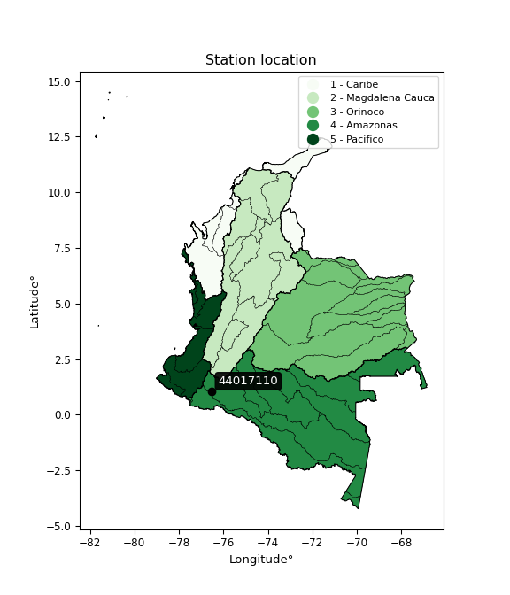

<div align="center">


</div>

# PMax24h Station (Rain, Pmax24h): 44017110

Maximum Precipitation in 24 hours (PMax24h) is the greatest amount of rainfall for a specific duration that is meteorologically possible for a given location, acting as a "worst-case" scenario for extreme storms, crucial for designing safety-critical infrastructure like bridges, river deviations, dams, spillways, and nuclear plants to prevent catastrophic failure. The PMax24h is related with the Probable Maximum Precipitation (PMP) and it is calculated by hydrologists using meteorological data to determine the upper limit of extreme rainfall, often leading to the Probable Maximum Flood (PMF) for flood control design, and is increasingly being studied for climate change impacts. Probable Maximum Precipitation (PMP) is the theoretical upper limit of rainfall, a deterministic estimate for extreme events, while probability distributions (like GEV, Gumbel) describe the likelihood and frequency of various precipitation amounts, including rare ones, showing how often events occur, with PMP representing the extreme end of these distributions, used for critical infrastructure design to ensure safety against the worst conceivable weather, unlike standard statistical forecasts which cover typical probabilities.

The most common probability distributions in hydrology, used for analyzing floods, rainfall, and streamflow, include the Normal, Log-Normal, Gumbel, Gamma (including Log-Pearson Type III), and Generalized Extreme Value (GEV) distributions, often chosen based on the data´s skewness and whether modeling extremes or general conditions, with Gumbel and GEV popular for extreme events like floods, while the Normal distribution serves as a baseline, though often requiring transformations for skewed hydrological data. These distributions help in designing water infrastructure, managing water resources, and forecasting hydrologic events.

> Hydrological data often isn´t perfectly normal (it´s skewed), so different distributions are needed for different applications, such as: **Flood Frequency Analysis**: Using Gumbel, GEV, or Log-Pearson Type III for predicting extreme flood magnitudes and their return periods, **Rainfall Analysis**: Normal for annual totals, but Log-Normal, Weibull, or GEV for intensity or extreme daily rainfall, **Streamflow Modeling**: Gamma and Log-Normal for maximum flows, GEV for minimum flows, and Kappa for daily flows.

<div align="center">

</img>

</div>


## A. General information


### 1. General running parameters

• app_version: _v20260225_. • runtime: _2026-02-27 14:50:08.749431_. • Python version: _3.14.0_. • SciPy version: _1.16.3_. • Pandas version: _2.3.3_. • NumPy version: _2.3.5_. • Stations dataset (station_dataset_file): _dataset/pmax24h_in/automatic_colombia_2003_2025.csv_. • Stations catalog (station_catalog_file): _dataset/CNE.xls_. • Minimum year to eval til year_max (date_min): _1900_. • Maximum year to eval since year_min (date_max): _2025_. • Creates, save and include plots into reports (create_plot): _False_. • Plot only fit distributions with Δo > Δ (plot_only_fit): _True_. • Plot only simple graphs avoiding multiple CDFs and multiple Extreme values plots (plot_only_simple): _False_. • Eval low extreme values, if False, evaluates high extreme values (low_extreme): _False_. • Eval every SciPy distribution as logarithmic (pdist_logarithmic_on): _True_. • Standard deviation normalized (ddof): _1.0_. • Return periods to eval in years (Tr): _[2, 2.33, 5, 10, 15, 20, 25, 50, 75, 100, 200, 250, 500, 750, 1000]_. • Minimum data sample per station, 0 means any (minimum_sample): _5_. • Z-Score maximum threshold to adjust a value, 0 means disable (zscore_max): _3.5_. • Z-Score minimum threshold to adjust a value, 0 means disable (zscore_min): _-2.5_. • Avoid zeros, e.g. rain = 0 (avoid_zeros): _True_. • Avoid null values (avoid_nans): _True_. 

:file_folder:Table: [dataset.csv](../../dataset/pmax24h_in/automatic_colombia_2003_2025.csv)

> Delta Degrees of Freedom (DDOF): is a parameter used in the formulas for calculating variance and standard deviation. When ddof=0, the divisor is $N$ (the total number of observations) and this is used when your data set is the entire population. When ddof=1, the divisor is $N-1$ and this is used when your data set is a sample drawn from a larger population. Using $N-1$ provides an unbiased estimate of the population variance (known as Bessel´s correction).


### 2. Station info and location

|   id |   CODIGO | NOMBRE                    | CATEGORIA    | TECNOLOGIA                              | ESTADO   | FECHA_INSTALACION   |   FECHA_SUSPENSION |   ALTITUD |   LATITUD |   LONGITUD | DEPARTAMENTO   | MUNICIPIO   | AREA_OPERATIVA                      | ENTIDAD                                                     | AREA_HIDROGRAFICA   | ZONA_HIDROGRAFICA   | SUBZONA_HIDROGRAFICA   | CORRIENTE   | Catalogo   |   Version |
|-----:|---------:|:--------------------------|:-------------|:----------------------------------------|:---------|:--------------------|-------------------:|----------:|----------:|-----------:|:---------------|:------------|:------------------------------------|:------------------------------------------------------------|:--------------------|:--------------------|:-----------------------|:------------|:-----------|----------:|
|    0 | 44017110 | ANDAQUI  - AUT [44017110] | Limnigráfica | Automática con Telemetría, Convencional | Activa   | 15/04/1983          |                nan |       460 |   1.05092 |   -76.5489 | Putumayo       | Mocoa       | Area Operativa 07 - Nariño-Putumayo | INSTITUTO DE HIDROLOGIA METEOROLOGIA Y ESTUDIOS AMBIENTALES | Amazonas            | Caquetá             | Alto Caqueta           | Caqueta     | CNE_IDEAM  |  20251226 |

<div align="center">

Dynamic map: [:earth_americas:Google](http://maps.google.com/maps?q=1.050916667,-76.54888889) [:earth_americas:OSM](https://www.openstreetmap.org/#map=18/1.050916667/-76.54888889&layers=P) [:earth_americas:Bing](https://www.bing.com/maps?cp=1.050916667~-76.54888889&lvl=18) [:earth_americas:Apple](https://maps.apple.com/frame?center=1.050916667%2C-76.54888889&span=0.003%2C0.006)

</div>


<div align="center">

```geojson
{
  "type": "Feature",
  "geometry": {
    "type": "Point", 
    "coordinates": [-76.54888889, 1.050916667]
  }, 
  "properties": {
    "Name": "44017110"
  }
}
```

</div>


### 3. Discrete values table and plot

<div align="center">

|               |           0 |           1 |           2 |         3 |           4 |
|:--------------|------------:|------------:|------------:|----------:|------------:|
| Date          | 2019        | 2020        | 2022        | 2023      | 2025        |
| Value         |  127.8      |  105.4      |  104.8      |   51.1    |  112        |
| Value_initial |  127.8      |  105.4      |  104.8      |   51.1    |  112        |
| count         |    5        |    5        |    5        |    5      |    5        |
| mean          |  100.22     |  100.22     |  100.22     |  100.22   |  100.22     |
| std           |   28.9828   |   28.9828   |   28.9828   |   28.9828 |   28.9828   |
| zscore        |    0.951599 |    0.178727 |    0.158025 |   -1.6948 |    0.406448 |


</div>


> The initial value (value_initial) correspond to the initial obtained or null completed value, and value (value) is adjusted only when the initial value is outside the valid range (outlier) definite through the Z-Score value. If Z-Score is active, values out of range or outliers are replaced with the station mean value. A Z-Score (or standard score) measures how many standard deviations a data point is from the mean of a dataset, indicating its relative position; positive scores mean above the mean, negative mean below, and a score of zero is exactly at the mean, allowing for comparison of values from different distributions. It´s calculated using the formula $z=(x–μ)/σ$, where $x$ is the data point, $μ$ is the mean, and $σ$ is the standard deviation, helping identify outliers and understand probability.
>
> <sub>**Note**: In this study, "completing" (filling gaps in) and "extending" (forecasting or lengthening the historical record) rainfall data series are avoided for certain critical analyses because they introduce artificial bias and uncertainty, which can distort the statistics of rare events (extremes), alter day-to-day variability, and compromise the integrity and homogeneity of the original data. Some reasons against Completing/Extending rainfall data are: **Distortion of Extremes and Variability**: The primary issue is that most gap-filling or extension methods rely on averaging or regression with nearby stations, which inherently smooths the data. Rainfall is highly variable in space and time, with a large percentage of zero values and occasional large storms. Infilling methods often underestimate the highest values and overestimate the lowest (zero) values, which severely distorts analyses focused on flood frequency, drought severity, and intensity-duration-frequency (IDF) curves, **Loss of Data Homogeneity**: Infilled or extended data are synthetic estimates, not actual measurements. Combining these estimates with observed data can violate the assumption of data homogeneity, which requires that the data properties do not change over time. Inhomogeneity can lead to incorrect conclusions about long-term trends or changes in climate patterns, **Propagation of Errors**: Errors and biases from the original data (e.g., wind-induced undercatch, instrument errors, site changes) or the data used for imputation can propagate through the analysis, leading to unreliable hydrological models and inaccurate predictions, **Compromised Statistical Integrity**: For statistical analyses, especially those involving the frequency of events, using artificial data can introduce time bias or autocorrelation that doesn´t exist in reality, making it difficult to assess the true probability of events, **Difficulty in Validation**: It is difficult to accurately validate the quality of filled or extended data, especially for past periods where ground-truth measurements are unavailable. The reliability of imputation techniques heavily depends on the density of the surrounding station network and the complexity of the local topography.</sub>


### 4. Active continuous probability distributions from SciPy (80 of 104 available)

A Probability Density Function (PDF) describes the relative likelihood of a continuous random variable falling within a specific range, where the total area under its curve equals 1, and the area over any interval gives the actual probability for that range. Unlike discrete probabilities (like rolling a die), a PDF shows density, not direct probability for a single point (which is zero), with higher points indicating higher likelihood, often visualized as a bell curve for normal distributions.

A log of a probability density function (log-PDF) is simply the logarithm of the PDF´s value, denoted as $log(f(x))$, useful for converting multiplication of probabilities into addition, improving numerical stability with tiny numbers, and connecting to information theory concepts like entropy. Instead of dealing with very small probabilities (e.g., 0.000001), log-PDFs use negative numbers (e.g., $log(0.00001) ≈ -11.51$ that are easier for computers to handle, preventing underflow errors and simplifying complex calculations. In this study, each active probability distribution from SciPy is also evaluated in the $log$ form.

[scipy.stats](https://docs.scipy.org/doc/scipy/reference/stats.html) is a Python´s powerful submodule within the SciPy library for comprehensive statistical analysis, offering over 130 probability distributions (like Normal, Poisson, etc.), functions for descriptive stats (mean, variance), hypothesis testing (t-tests, chi-square), random variable generation, and statistical tests, making it essential for data science, modeling, and research. It provides tools to explore, model, and draw conclusions from data efficiently, working seamlessly with [NumPy](https://numpy.org/).

<div align="center">

|   id | p_dist           |   n_parameter | fit_method   | label                                                                       | active   | ref                                                                                                      |
|-----:|:-----------------|--------------:|:-------------|:----------------------------------------------------------------------------|:---------|:---------------------------------------------------------------------------------------------------------|
|    0 | alpha            |             3 | MLE          | Alpha                                                                       | True     | [:mortar_board:](https://docs.scipy.org/doc/scipy/reference/generated/scipy.stats.alpha.html)            |
|    1 | anglit           |             2 | MM           | Anglit                                                                      | True     | [:mortar_board:](https://docs.scipy.org/doc/scipy/reference/generated/scipy.stats.anglit.html)           |
|    2 | arcsine          |             2 | MM           | Arcsine                                                                     | True     | [:mortar_board:](https://docs.scipy.org/doc/scipy/reference/generated/scipy.stats.arcsine.html)          |
|    3 | argus            |             3 | MLE          | Argus                                                                       | True     | [:mortar_board:](https://docs.scipy.org/doc/scipy/reference/generated/scipy.stats.argus.html)            |
|    4 | beta             |             4 | MLE          | Beta                                                                        | True     | [:mortar_board:](https://docs.scipy.org/doc/scipy/reference/generated/scipy.stats.beta.html)             |
|    5 | betaprime        |             4 | MLE          | Beta prime                                                                  | True     | [:mortar_board:](https://docs.scipy.org/doc/scipy/reference/generated/scipy.stats.betaprime.html)        |
|    6 | bradford         |             3 | MLE          | Bradford                                                                    | True     | [:mortar_board:](https://docs.scipy.org/doc/scipy/reference/generated/scipy.stats.bradford.html)         |
|    7 | burr             |             4 | MLE          | Burr (Type III)                                                             | True     | [:mortar_board:](https://docs.scipy.org/doc/scipy/reference/generated/scipy.stats.burr.html)             |
|    8 | burr12           |             4 | MLE          | Burr (Type III) 12                                                          | True     | [:mortar_board:](https://docs.scipy.org/doc/scipy/reference/generated/scipy.stats.burr12.html)           |
|    9 | cosine           |             2 | MLE          | Cosine                                                                      | True     | [:mortar_board:](https://docs.scipy.org/doc/scipy/reference/generated/scipy.stats.cosine.html)           |
|   10 | crystalball      |             4 | MLE          | Crystalball                                                                 | True     | [:mortar_board:](https://docs.scipy.org/doc/scipy/reference/generated/scipy.stats.crystalball.html)      |
|   11 | dgamma           |             3 | MLE          | Double gamma                                                                | True     | [:mortar_board:](https://docs.scipy.org/doc/scipy/reference/generated/scipy.stats.dgamma.html)           |
|   12 | dweibull         |             3 | MLE          | Double Weibull                                                              | True     | [:mortar_board:](https://docs.scipy.org/doc/scipy/reference/generated/scipy.stats.dweibull.html)         |
|   13 | erlang           |             3 | MLE          | Erlang                                                                      | True     | [:mortar_board:](https://docs.scipy.org/doc/scipy/reference/generated/scipy.stats.erlang.html)           |
|   14 | exponnorm        |             3 | MLE          | Exponentially modified Normal                                               | True     | [:mortar_board:](https://docs.scipy.org/doc/scipy/reference/generated/scipy.stats.exponnorm.html)        |
|   15 | exponpow         |             3 | MLE          | Exponential power                                                           | True     | [:mortar_board:](https://docs.scipy.org/doc/scipy/reference/generated/scipy.stats.exponpow.html)         |
|   16 | exponweib        |             4 | MLE          | Exponentiated Weibull                                                       | True     | [:mortar_board:](https://docs.scipy.org/doc/scipy/reference/generated/scipy.stats.exponweib.html)        |
|   17 | f                |             4 | MLE          | F                                                                           | True     | [:mortar_board:](https://docs.scipy.org/doc/scipy/reference/generated/scipy.stats.f.html)                |
|   18 | fatiguelife      |             3 | MLE          | Fatigue-life (Birnbaum-Saunders)                                            | True     | [:mortar_board:](https://docs.scipy.org/doc/scipy/reference/generated/scipy.stats.fatiguelife.html)      |
|   19 | foldnorm         |             3 | MM           | Fold Normal                                                                 | True     | [:mortar_board:](https://docs.scipy.org/doc/scipy/reference/generated/scipy.stats.foldnorm.html)         |
|   20 | gamma            |             3 | MLE          | Gamma                                                                       | True     | [:mortar_board:](https://docs.scipy.org/doc/scipy/reference/generated/scipy.stats.gamma.html)            |
|   21 | gausshyper       |             6 | MLE          | Gauss hypergeometric                                                        | True     | [:mortar_board:](https://docs.scipy.org/doc/scipy/reference/generated/scipy.stats.gausshyper.html)       |
|   22 | genexpon         |             5 | MLE          | Generalized exponential                                                     | True     | [:mortar_board:](https://docs.scipy.org/doc/scipy/reference/generated/scipy.stats.genexpon.html)         |
|   23 | genextreme       |             3 | MLE          | Generalized exponential                                                     | True     | [:mortar_board:](https://docs.scipy.org/doc/scipy/reference/generated/scipy.stats.genextreme.html)       |
|   24 | gengamma         |             4 | MLE          | Generalized gamma                                                           | True     | [:mortar_board:](https://docs.scipy.org/doc/scipy/reference/generated/scipy.stats.gengamma.html)         |
|   25 | genhalflogistic  |             3 | MLE          | Generalized half-logistic                                                   | True     | [:mortar_board:](https://docs.scipy.org/doc/scipy/reference/generated/scipy.stats.genhalflogistic.html)  |
|   26 | genlogistic      |             3 | MLE          | Generalized logistic                                                        | True     | [:mortar_board:](https://docs.scipy.org/doc/scipy/reference/generated/scipy.stats.genlogistic.html)      |
|   27 | gennorm          |             3 | MLE          | Generalized Normal                                                          | True     | [:mortar_board:](https://docs.scipy.org/doc/scipy/reference/generated/scipy.stats.gennorm.html)          |
|   28 | genpareto        |             3 | MLE          | Generalized Pareto                                                          | True     | [:mortar_board:](https://docs.scipy.org/doc/scipy/reference/generated/scipy.stats.genpareto.html)        |
|   29 | gompertz         |             3 | MLE          | Gompertz (or truncated Gumbel)                                              | True     | [:mortar_board:](https://docs.scipy.org/doc/scipy/reference/generated/scipy.stats.gompertz.html)         |
|   30 | gumbel_l         |             2 | MM           | Gumbel Left Skew                                                            | True     | [:mortar_board:](https://docs.scipy.org/doc/scipy/reference/generated/scipy.stats.gumbel_l.html)         |
|   31 | gumbel_r         |             2 | MM           | Gumbel Right Skew                                                           | True     | [:mortar_board:](https://docs.scipy.org/doc/scipy/reference/generated/scipy.stats.gumbel_r.html)         |
|   32 | halfgennorm      |             3 | MLE          | Upper half of a generalized normal                                          | True     | [:mortar_board:](https://docs.scipy.org/doc/scipy/reference/generated/scipy.stats.halfgennorm.html)      |
|   33 | halflogistic     |             2 | MM           | Half-logistic                                                               | True     | [:mortar_board:](https://docs.scipy.org/doc/scipy/reference/generated/scipy.stats.halflogistic.html)     |
|   34 | halfnorm         |             2 | MM           | Half Normal                                                                 | True     | [:mortar_board:](https://docs.scipy.org/doc/scipy/reference/generated/scipy.stats.halfnorm.html)         |
|   35 | hypsecant        |             2 | MM           | hyperbolic secant                                                           | True     | [:mortar_board:](https://docs.scipy.org/doc/scipy/reference/generated/scipy.stats.hypsecant.html)        |
|   36 | invgamma         |             3 | MLE          | Inverted gamma                                                              | True     | [:mortar_board:](https://docs.scipy.org/doc/scipy/reference/generated/scipy.stats.invgamma.html)         |
|   37 | invgauss         |             3 | MLE          | Inverse Gaussian                                                            | True     | [:mortar_board:](https://docs.scipy.org/doc/scipy/reference/generated/scipy.stats.invgauss.html)         |
|   38 | invweibull       |             3 | MLE          | Inverted Weibull                                                            | True     | [:mortar_board:](https://docs.scipy.org/doc/scipy/reference/generated/scipy.stats.invweibull.html)       |
|   39 | johnsonsb        |             4 | MLE          | Johnson SB                                                                  | True     | [:mortar_board:](https://docs.scipy.org/doc/scipy/reference/generated/scipy.stats.johnsonsb.html)        |
|   40 | johnsonsu        |             4 | MLE          | Johnson Su                                                                  | True     | [:mortar_board:](https://docs.scipy.org/doc/scipy/reference/generated/scipy.stats.johnsonsu.html)        |
|   41 | kappa3           |             3 | MLE          | Kappa 3                                                                     | True     | [:mortar_board:](https://docs.scipy.org/doc/scipy/reference/generated/scipy.stats.kappa3.html)           |
|   42 | kappa4           |             4 | MLE          | Kappa 4                                                                     | True     | [:mortar_board:](https://docs.scipy.org/doc/scipy/reference/generated/scipy.stats.kappa4.html)           |
|   43 | ksone            |             3 | MLE          | Kolmogorov-Smirnov one-sided test statistic distribution                    | True     | [:mortar_board:](https://docs.scipy.org/doc/scipy/reference/generated/scipy.stats.ksone.html)            |
|   44 | kstwobign        |             2 | MLE          | Limiting distribution of scaled Kolmogorov-Smirnov two-sided test statistic | True     | [:mortar_board:](https://docs.scipy.org/doc/scipy/reference/generated/scipy.stats.kstwobign.html)        |
|   45 | laplace          |             2 | MM           | Laplace                                                                     | True     | [:mortar_board:](https://docs.scipy.org/doc/scipy/reference/generated/scipy.stats.laplace.html)          |
|   46 | levy_l           |             2 | MLE          | Left-skewed Levy                                                            | True     | [:mortar_board:](https://docs.scipy.org/doc/scipy/reference/generated/scipy.stats.levy_l.html)           |
|   47 | loggamma         |             3 | MLE          | Log gamma                                                                   | True     | [:mortar_board:](https://docs.scipy.org/doc/scipy/reference/generated/scipy.stats.loggamma.html)         |
|   48 | logistic         |             2 | MM           | Logistic (or Sech-squared)                                                  | True     | [:mortar_board:](https://docs.scipy.org/doc/scipy/reference/generated/scipy.stats.logistic.html)         |
|   49 | loglaplace       |             3 | MLE          | Log-Laplace                                                                 | True     | [:mortar_board:](https://docs.scipy.org/doc/scipy/reference/generated/scipy.stats.loglaplace.html)       |
|   50 | lomax            |             3 | MLE          | Lomax (Pareto of the second kind)                                           | True     | [:mortar_board:](https://docs.scipy.org/doc/scipy/reference/generated/scipy.stats.lomax.html)            |
|   51 | maxwell          |             2 | MM           | Maxwell                                                                     | True     | [:mortar_board:](https://docs.scipy.org/doc/scipy/reference/generated/scipy.stats.maxwell.html)          |
|   52 | mielke           |             4 | MLE          | Mielke Beta-Kappa / Dagum                                                   | True     | [:mortar_board:](https://docs.scipy.org/doc/scipy/reference/generated/scipy.stats.mielke.html)           |
|   53 | moyal            |             2 | MM           | Moyal                                                                       | True     | [:mortar_board:](https://docs.scipy.org/doc/scipy/reference/generated/scipy.stats.moyal.html)            |
|   54 | nakagami         |             3 | MLE          | Nakagami                                                                    | True     | [:mortar_board:](https://docs.scipy.org/doc/scipy/reference/generated/scipy.stats.nakagami.html)         |
|   55 | ncf              |             5 | MLE          | Non-central F distribution                                                  | True     | [:mortar_board:](https://docs.scipy.org/doc/scipy/reference/generated/scipy.stats.ncf.html)              |
|   56 | nct              |             4 | MLE          | Non-central Student’s t                                                     | True     | [:mortar_board:](https://docs.scipy.org/doc/scipy/reference/generated/scipy.stats.nct.html)              |
|   57 | norm             |             2 | MM           | Normal                                                                      | True     | [:mortar_board:](https://docs.scipy.org/doc/scipy/reference/generated/scipy.stats.norm.html)             |
|   58 | pearson3         |             3 | MM           | Pearson type III                                                            | True     | [:mortar_board:](https://docs.scipy.org/doc/scipy/reference/generated/scipy.stats.pearson3.html)         |
|   59 | powerlaw         |             3 | MLE          | Power-function                                                              | True     | [:mortar_board:](https://docs.scipy.org/doc/scipy/reference/generated/scipy.stats.powerlaw.html)         |
|   60 | rayleigh         |             2 | MM           | Rayleigh                                                                    | True     | [:mortar_board:](https://docs.scipy.org/doc/scipy/reference/generated/scipy.stats.rayleigh.html)         |
|   61 | rdist            |             3 | MLE          | R-distributed (symmetric beta)                                              | True     | [:mortar_board:](https://docs.scipy.org/doc/scipy/reference/generated/scipy.stats.rdist.html)            |
|   62 | rice             |             3 | MLE          | Rice                                                                        | True     | [:mortar_board:](https://docs.scipy.org/doc/scipy/reference/generated/scipy.stats.rice.html)             |
|   63 | semicircular     |             2 | MM           | Semicircular                                                                | True     | [:mortar_board:](https://docs.scipy.org/doc/scipy/reference/generated/scipy.stats.semicircular.html)     |
|   64 | skewnorm         |             3 | MLE          | Skew normal                                                                 | True     | [:mortar_board:](https://docs.scipy.org/doc/scipy/reference/generated/scipy.stats.skewnorm.html)         |
|   65 | t                |             3 | MLE          | Student’s t                                                                 | True     | [:mortar_board:](https://docs.scipy.org/doc/scipy/reference/generated/scipy.stats.t.html)                |
|   66 | trapezoid        |             4 | MLE          | Trapezoid                                                                   | True     | [:mortar_board:](https://docs.scipy.org/doc/scipy/reference/generated/scipy.stats.trapezoid.html)        |
|   67 | triang           |             3 | MLE          | Triangular                                                                  | True     | [:mortar_board:](https://docs.scipy.org/doc/scipy/reference/generated/scipy.stats.triang.html)           |
|   68 | truncexpon       |             3 | MLE          | Truncated exponential                                                       | True     | [:mortar_board:](https://docs.scipy.org/doc/scipy/reference/generated/scipy.stats.truncexpon.html)       |
|   69 | truncnorm        |             4 | MLE          | Truncated normal                                                            | True     | [:mortar_board:](https://docs.scipy.org/doc/scipy/reference/generated/scipy.stats.truncnorm.html)        |
|   70 | truncpareto      |             4 | MLE          | Upper truncated Pareto                                                      | True     | [:mortar_board:](https://docs.scipy.org/doc/scipy/reference/generated/scipy.stats.truncpareto.html)      |
|   71 | truncweibull_min |             5 | MLE          | Doubly truncated Weibull minimum                                            | True     | [:mortar_board:](https://docs.scipy.org/doc/scipy/reference/generated/scipy.stats.truncweibull_min.html) |
|   72 | tukeylambda      |             3 | MLE          | Tukey-Lamdba                                                                | True     | [:mortar_board:](https://docs.scipy.org/doc/scipy/reference/generated/scipy.stats.tukeylambda.html)      |
|   73 | uniform          |             2 | MLE          | Uniform                                                                     | True     | [:mortar_board:](https://docs.scipy.org/doc/scipy/reference/generated/scipy.stats.uniform.html)          |
|   74 | vonmises         |             3 | MLE          | Von Mises                                                                   | True     | [:mortar_board:](https://docs.scipy.org/doc/scipy/reference/generated/scipy.stats.vonmises.html)         |
|   75 | vonmises_line    |             3 | MLE          | Von Mises line                                                              | True     | [:mortar_board:](https://docs.scipy.org/doc/scipy/reference/generated/scipy.stats.vonmises_line.html)    |
|   76 | wald             |             2 | MM           | Wald                                                                        | True     | [:mortar_board:](https://docs.scipy.org/doc/scipy/reference/generated/scipy.stats.wald.html)             |
|   77 | weibull_max      |             3 | MLE          | Weibull maximum                                                             | True     | [:mortar_board:](https://docs.scipy.org/doc/scipy/reference/generated/scipy.stats.weibull_max.html)      |
|   78 | weibull_min      |             3 | MLE          | Weibull minimum                                                             | True     | [:mortar_board:](https://docs.scipy.org/doc/scipy/reference/generated/scipy.stats.weibull_min.html)      |
|   79 | wrapcauchy       |             3 | MLE          | Wrapped  Cauchy                                                             | True     | [:mortar_board:](https://docs.scipy.org/doc/scipy/reference/generated/scipy.stats.wrapcauchy.html)       |

</div>

> **n_parameter:** # arguments & localization & scale.
>
> **Fit methods:** (MLE) maximum likelihood, (MM) L-moments.
>
>**Inactive** (With the only purpose of prevent loops, zero divisions, infinite values, over high estimated values or horizontal trending for recurrence intervals estimations, the follow distributions were disabled.)**:** lognorm, norminvgauss, powernorm, powerlognorm, cauchy, halfcauchy, foldcauchy, skewcauchy, chi2, expon, fisk, genhyperbolic, geninvgauss, gibrat, kstwo, laplace_asymmetric, levy, levy_stable, ncx2, pareto, rel_breitwigner, recipinvgauss, studentized_range, loguniform, 


## B. Probability (PDF) vs. Empirical (EDF) distributions functions

A continuous probability distribution (CPD) describes probabilities for variables that can take any value within a range (like rain any time), unlike discrete variables with specific outcomes (like temperature). It uses a Probability Density Function (PDF), a curve where the total area under it equals 1, and the probability of the variable falling within an interval (a to b) is found by calculating the area under the curve between those points. A key feature is that the probability of hitting any single exact value is zero, so probabilities are always expressed for ranges, e.g., $P(a ≤ X ≤ b)$.

<div align="center">

Distributions parameters from station values
|     |   station | p_dist              |   n |               loc |            scale | shape                  | shape1                 | shape2                 | shape3             |
|----:|----------:|:--------------------|----:|------------------:|-----------------:|:-----------------------|:-----------------------|:-----------------------|:-------------------|
|   0 |  44017110 | alpha               |   5 |    -572.394       |  16637.1         | 24.79071750802902      |                        |                        |                    |
|   1 |  44017110 | anglit              |   5 |     100.22        |     75.8351      |                        |                        |                        |                    |
|   2 |  44017110 | arcsine             |   5 |      63.5593      |     73.3213      |                        |                        |                        |                    |
|   3 |  44017110 | argus               |   5 |      18.8286      |    111.66        | 2.2915834617510527     |                        |                        |                    |
|   4 |  44017110 | beta                |   5 |      44.2145      |     83.5855      | 0.7385097490499841     | 0.25511311667960446    |                        |                    |
|   5 |  44017110 | betaprime           |   5 |   -1045.59        |      6.65388     | 329852.66725798947     | 1916.4842603222328     |                        |                    |
|   6 |  44017110 | bradford            |   5 |      51.1         |     76.7001      | 1.070584657365428      |                        |                        |                    |
|   7 |  44017110 | burr                |   5 |      -3.23448     |    132.243       | 358.8699112279711      | 0.009834559597899944   |                        |                    |
|   8 |  44017110 | burr12              |   5 |      -4.62048     |     55.4097      | 814.6931133853527      | 0.002054422536734069   |                        |                    |
|   9 |  44017110 | cosine              |   5 |      96.3085      |     22.1095      |                        |                        |                        |                    |
|  10 |  44017110 | crystalball         |   5 |     100.22        |     25.923       | 8601.169266356852      | 26.561802136747403     |                        |                    |
|  11 |  44017110 | dgamma              |   5 |     104.8         |     24.3257      | 0.5382301960080175     |                        |                        |                    |
|  12 |  44017110 | dweibull            |   5 |     105.4         |     23.2237      | 0.6656773512596457     |                        |                        |                    |
|  13 |  44017110 | erlang              |   5 |    -275.258       |      1.97622     | 189.7716503300815      |                        |                        |                    |
|  14 |  44017110 | exponnorm           |   5 |     100.203       |     25.9231      | 0.0006561276412566005  |                        |                        |                    |
|  15 |  44017110 | exponpow            |   5 |      51.1         |      1.63795     | 0.10517446463617436    |                        |                        |                    |
|  16 |  44017110 | exponweib           |   5 |      51.1         |      1.36142     | 1.183709036662636      | 0.24134388089422812    |                        |                    |
|  17 |  44017110 | f                   |   5 |   -6913.75        |   7014.06        | 153578.70776842523     | 2692619.9102257676     |                        |                    |
|  18 |  44017110 | fatiguelife         |   5 |      51.1         |      1.47119e-05 | 1651.4029320546683     |                        |                        |                    |
|  19 |  44017110 | foldnorm            |   5 |     103.283       |      1.83788     | 6.348265905870806e-08  |                        |                        |                    |
|  20 |  44017110 | gamma               |   5 |    -341.558       |      1.64289     | 268.8974083688171      |                        |                        |                    |
|  21 |  44017110 | gausshyper          |   5 |      50.8641      |     76.9359      | 1.0554501343782015     | 0.599513294655684      | 1.0385719269895581     | 1.136641677422836  |
|  22 |  44017110 | genexpon            |   5 |      50.9476      |      0.930458    | 0.018855924580825398   | 9.192432241793606e-08  | 1.4272293157576508     |                    |
|  23 |  44017110 | genextreme          |   5 |     105.809       |     23.9537      | 1.089240864314892      |                        |                        |                    |
|  24 |  44017110 | gengamma            |   5 |      51.1         |      1.3606      | 1.350986796174078      | 0.11050082617418829    |                        |                    |
|  25 |  44017110 | genhalflogistic     |   5 |      46.1675      |     85.9727      | 1.0531679611350695     |                        |                        |                    |
|  26 |  44017110 | genlogistic         |   5 |     123.822       |      4.85092     | 0.1950208687572123     |                        |                        |                    |
|  27 |  44017110 | gennorm             |   5 |     105.4         |      0.00219681  | 0.21019097491935412    |                        |                        |                    |
|  28 |  44017110 | genpareto           |   5 |      -0.860051    |    211.366       | -1.642822895462174     |                        |                        |                    |
|  29 |  44017110 | gompertz            |   5 |      60.1555      |      2.16913     | 1.1400379432063364e-13 |                        |                        |                    |
|  30 |  44017110 | gumbel_l            |   5 |     111.887       |     20.2121      |                        |                        |                        |                    |
|  31 |  44017110 | gumbel_r            |   5 |      88.5533      |     20.2121      |                        |                        |                        |                    |
|  32 |  44017110 | halfgennorm         |   5 |      51.1         |      1.39935     | 0.33924001486246325    |                        |                        |                    |
|  33 |  44017110 | halflogistic        |   5 |      69.4952      |     22.1632      |                        |                        |                        |                    |
|  34 |  44017110 | halfnorm            |   5 |      65.9081      |     43.0036      |                        |                        |                        |                    |
|  35 |  44017110 | hypsecant           |   5 |     100.22        |     16.5031      |                        |                        |                        |                    |
|  36 |  44017110 | invgamma            |   5 |    -311.962       |  91841.9         | 223.74289944537838     |                        |                        |                    |
|  37 |  44017110 | invgauss            |   5 |    -110.625       |  10513.8         | 0.019966097959283592   |                        |                        |                    |
|  38 |  44017110 | invweibull          |   5 |      51.1         |      1.37973     | 0.04462206241397591    |                        |                        |                    |
|  39 |  44017110 | johnsonsb           |   5 |     -27.1928      |    154.993       | -0.9906738629797052    | 0.10991804613751716    |                        |                    |
|  40 |  44017110 | johnsonsu           |   5 |     105.4         |      8.01334e-13 | -0.014821993977158991  | 0.07161126597250353    |                        |                    |
|  41 |  44017110 | kappa3              |   5 |      51.1         |     76.6891      | 12646.845114820677     |                        |                        |                    |
|  42 |  44017110 | kappa4              |   5 |      44.3964      |     84.8978      | 1.0857791007106736     | 1.0129652328887995     |                        |                    |
|  43 |  44017110 | ksone               |   5 |      43.43        |     92.04        | 1.0                    |                        |                        |                    |
|  44 |  44017110 | kstwobign           |   5 |     -16.317       |    132.869       |                        |                        |                        |                    |
|  45 |  44017110 | laplace             |   5 |     100.22        |     18.3303      |                        |                        |                        |                    |
|  46 |  44017110 | levy_l              |   5 |     129.868       |      7.89809     |                        |                        |                        |                    |
|  47 |  44017110 | loggamma            |   5 |     128.035       |      0.00027564  | 9.890372333637389e-06  |                        |                        |                    |
|  48 |  44017110 | logistic            |   5 |     100.22        |     14.2921      |                        |                        |                        |                    |
|  49 |  44017110 | loglaplace          |   5 |      -0.337875    |    105.738       | 5.107515026560668      |                        |                        |                    |
|  50 |  44017110 | lomax               |   5 |      51.1         |   9156.75        | 186.59032462081552     |                        |                        |                    |
|  51 |  44017110 | maxwell             |   5 |      38.7934      |     38.4934      |                        |                        |                        |                    |
|  52 |  44017110 | mielke              |   5 |    -127.653       |    255.494       | 8.226215911986664      | 42895.49495676461      |                        |                    |
|  53 |  44017110 | moyal               |   5 |      85.3956      |     11.6694      |                        |                        |                        |                    |
|  54 |  44017110 | nakagami            |   5 |     104.8         |     12.871       | 0.18452142799777532    |                        |                        |                    |
|  55 |  44017110 | ncf                 |   5 |     -11.2125      |     82.4193      | 27.111297728684363     | 1613.471448877516      | 8.88423733642082       |                    |
|  56 |  44017110 | nct                 |   5 |   -1625.04        |     25.8223      | 210180.4240670697      | 66.81255804009525      |                        |                    |
|  57 |  44017110 | norm                |   5 |     100.22        |     25.923       |                        |                        |                        |                    |
|  58 |  44017110 | pearson3            |   5 |     100.22        |     25.923       | -1.098331062824033     |                        |                        |                    |
|  59 |  44017110 | powerlaw            |   5 |      51.1         |     76.7         | 0.13209916110723358    |                        |                        |                    |
|  60 |  44017110 | rayleigh            |   5 |      50.6278      |     39.5689      |                        |                        |                        |                    |
|  61 |  44017110 | rdist               |   5 |      51.1         |      7.10543e-15 | 1.720642138520108      |                        |                        |                    |
|  62 |  44017110 | rice                |   5 |      31.3101      |     27.9673      | 2.2204055969189764     |                        |                        |                    |
|  63 |  44017110 | semicircular        |   5 |     100.22        |     51.846       |                        |                        |                        |                    |
|  64 |  44017110 | skewnorm            |   5 |     127.8         |     37.8505      | -21605054.647922605    |                        |                        |                    |
|  65 |  44017110 | t                   |   5 |     100.211       |     25.9279      | 105565.72612764547     |                        |                        |                    |
|  66 |  44017110 | trapezoid           |   5 |      26.8987      |    109.982       | 1.0                    | 1.0                    |                        |                    |
|  67 |  44017110 | triang              |   5 |      29.8453      |     97.9547      | 0.9999999942125073     |                        |                        |                    |
|  68 |  44017110 | truncexpon          |   5 |      51.1         |    107.608       | 0.7127728401277118     |                        |                        |                    |
|  69 |  44017110 | truncnorm           |   5 |    -105.468       |     10.1618      | 20.679378205245214     | 3244.38417120584       |                        |                    |
|  70 |  44017110 | truncpareto         |   5 |      50.5952      |      0.504822    | 0.26048867682474636    | 152.93460414902836     |                        |                    |
|  71 |  44017110 | truncweibull_min    |   5 |      50.8936      |    116.594       | 0.9046385221342367     | 0.0017644706511215774  | 0.6596058968542208     |                    |
|  72 |  44017110 | tukeylambda         |   5 |      51.1         |      1.22709e-14 | 1.726957821322336      |                        |                        |                    |
|  73 |  44017110 | uniform             |   5 |      51.1         |     76.7         |                        |                        |                        |                    |
|  74 |  44017110 | vonmises            |   5 |      -1.31033     |      1           | 0.5109905192497374     |                        |                        |                    |
|  75 |  44017110 | vonmises_line       |   5 |     106.169       |     17.5289      | 1.0225339339234991     |                        |                        |                    |
|  76 |  44017110 | wald                |   5 |      74.297       |     25.923       |                        |                        |                        |                    |
|  77 |  44017110 | weibull_max         |   5 |     127.8         |      1.49574     | 0.13230259329214744    |                        |                        |                    |
|  78 |  44017110 | weibull_min         |   5 |      -1.87754e+09 |      1.87754e+09 | 107122903.84866974     |                        |                        |                    |
|  79 |  44017110 | wrapcauchy          |   5 |      51.0999      |     12.2072      | 0.3596874032241349     |                        |                        |                    |
|  80 |  44017110 | logalpha            |   5 |      -7.33691     |    421.207       | 35.43091826061908      |                        |                        |                    |
|  81 |  44017110 | loganglit           |   5 |       4.56251     |      0.943085    |                        |                        |                        |                    |
|  82 |  44017110 | logarcsine          |   5 |       4.10657     |      0.91188     |                        |                        |                        |                    |
|  83 |  44017110 | logargus            |   5 |       3.47691     |      1.39985     | 2.738189411006051      |                        |                        |                    |
|  84 |  44017110 | logbeta             |   5 |       3.73283     |      1.11764     | 0.2982779031141532     | 0.08838601053904283    |                        |                    |
|  85 |  44017110 | logbetaprime        |   5 |     -32.6973      |     22.2953      | 35419.7261925638       | 21193.606306243033     |                        |                    |
|  86 |  44017110 | logbradford         |   5 |       3.93274     |      0.944322    | 1.0323243901592353e-05 |                        |                        |                    |
|  87 |  44017110 | logburr             |   5 |      -1.59995     |      6.45569     | 4605.992443029347      | 0.004530818028574432   |                        |                    |
|  88 |  44017110 | logburr12           |   5 |    -494.672       |    501.451       | 2610.227177732754      | 52293.4284306452       |                        |                    |
|  89 |  44017110 | logcosine           |   5 |       4.50528     |      0.276134    |                        |                        |                        |                    |
|  90 |  44017110 | logcrystalball      |   5 |       4.56251     |      0.322378    | 7.722145285219902      | 7.573370784925834      |                        |                    |
|  91 |  44017110 | logdgamma           |   5 |       4.65776     |      0.261439    | 0.8221707205345336     |                        |                        |                    |
|  92 |  44017110 | logdweibull         |   5 |       4.65205     |      0.26299     | 0.798744721094947      |                        |                        |                    |
|  93 |  44017110 | logerlang           |   5 |       3.93378     |      1.02417     | 0.6547000625805586     |                        |                        |                    |
|  94 |  44017110 | logexponnorm        |   5 |       4.56231     |      0.322378    | 0.0006132323956166829  |                        |                        |                    |
|  95 |  44017110 | logexponpow         |   5 |      -1.6693e+07  |      1.66931e+07 | 71216254.43970008      |                        |                        |                    |
|  96 |  44017110 | logexponweib        |   5 |       3.93378     |      0.771371    | 0.38298441204437045    | 1.5473262569545074     |                        |                    |
|  97 |  44017110 | logf                |   5 |    -608.887       |    613.45        | 23376786.98874271      | 10356619.430365063     |                        |                    |
|  98 |  44017110 | logfatiguelife      |   5 |    -240.328       |    244.889       | 0.00131246800786535    |                        |                        |                    |
|  99 |  44017110 | logfoldnorm         |   5 |       4.15029     |      0.479382    | 0.40065793388747895    |                        |                        |                    |
| 100 |  44017110 | loggamma            |   5 |      -0.423095    |      0.0230277   | 216.52598186838839     |                        |                        |                    |
| 101 |  44017110 | loggausshyper       |   5 |       3.90303     |      0.947438    | 1.1813950019848183     | 0.781768097051649      | 1.1051790579511303     | 0.9838159684970502 |
| 102 |  44017110 | loggenexpon         |   5 |       3.91406     |      0.0060992   | 0.0034063591717101178  | 4.113812298461731      | 2.1936669578931974e-05 |                    |
| 103 |  44017110 | loggenextreme       |   5 |       4.55806     |      0.315991    | 1.0806377939369494     |                        |                        |                    |
| 104 |  44017110 | loggengamma         |   5 |       3.93378     |      0.908354    | 0.4930682087622059     | 1.3823838631891632     |                        |                    |
| 105 |  44017110 | loggenhalflogistic  |   5 |       3.78176     |      1.13086     | 1.0581512586437318     |                        |                        |                    |
| 106 |  44017110 | loggenlogistic      |   5 |       4.85051     |      4.7051e-06  | 1.636541859116418e-05  |                        |                        |                    |
| 107 |  44017110 | loggennorm          |   5 |       4.65776     |      0.00534343  | 0.38325516996802267    |                        |                        |                    |
| 108 |  44017110 | loggenpareto        |   5 |      -0.0132207   |     13.0741      | -2.6881080674998765    |                        |                        |                    |
| 109 |  44017110 | loggompertz         |   5 |       3.92503     |      0.2089      | 0.026251696438052474   |                        |                        |                    |
| 110 |  44017110 | loggumbel_l         |   5 |       4.7076      |      0.251357    |                        |                        |                        |                    |
| 111 |  44017110 | loggumbel_r         |   5 |       4.41743     |      0.251357    |                        |                        |                        |                    |
| 112 |  44017110 | loghalfgennorm      |   5 |       3.93378     |      1.004       | 21.920212632014376     |                        |                        |                    |
| 113 |  44017110 | loghalflogistic     |   5 |       4.18046     |      0.275597    |                        |                        |                        |                    |
| 114 |  44017110 | loghalfnorm         |   5 |       4.13578     |      0.534828    |                        |                        |                        |                    |
| 115 |  44017110 | loghypsecant        |   5 |       4.56251     |      0.205232    |                        |                        |                        |                    |
| 116 |  44017110 | loginvgamma         |   5 |      -3.59292     |   4766.36        | 585.851898582109       |                        |                        |                    |
| 117 |  44017110 | loginvgauss         |   5 |       1.4539      |    227.111       | 0.013671555407362495   |                        |                        |                    |
| 118 |  44017110 | loginvweibull       |   5 | -147869           | 147874           | 396371.7909425029      |                        |                        |                    |
| 119 |  44017110 | logjohnsonsb        |   5 |       2.86779     |      1.98267     | -0.5208214290122707    | 0.15514404635361173    |                        |                    |
| 120 |  44017110 | logjohnsonsu        |   5 |       4.87361     |      0.000677339 | 5.26452851615994       | 0.843275403947656      |                        |                    |
| 121 |  44017110 | logkappa3           |   5 |       3.93378     |      0.91638     | 4892.1722243521435     |                        |                        |                    |
| 122 |  44017110 | logkappa4           |   5 |       3.93076     |      1.04915     | 0.988568057805721      | 1.1407438084063086     |                        |                    |
| 123 |  44017110 | logksone            |   5 |       3.84212     |      1.10002     | 1.0                    |                        |                        |                    |
| 124 |  44017110 | logkstwobign        |   5 |       3.07598     |      1.69428     |                        |                        |                        |                    |
| 125 |  44017110 | loglaplace          |   5 |       4.56251     |      0.227956    |                        |                        |                        |                    |
| 126 |  44017110 | loglevy_l           |   5 |       4.86858     |      0.0691656   |                        |                        |                        |                    |
| 127 |  44017110 | logloggamma         |   5 |       4.85049     |      9.7688e-07  | 3.3917680878703283e-06 |                        |                        |                    |
| 128 |  44017110 | loglogistic         |   5 |       4.56251     |      0.177736    |                        |                        |                        |                    |
| 129 |  44017110 | logloglaplace       |   5 |       0.00832922  |      4.64943     | 22.308411348005905     |                        |                        |                    |
| 130 |  44017110 | loglomax            |   5 |       3.93378     |  25449.9         | 39980.98182941581      |                        |                        |                    |
| 131 |  44017110 | logmaxwell          |   5 |       3.79861     |      0.478704    |                        |                        |                        |                    |
| 132 |  44017110 | logmielke           |   5 |      -3.65967e+07 |      3.65967e+07 | 123512385.1325588      | 12400121378.56427      |                        |                    |
| 133 |  44017110 | logmoyal            |   5 |       4.37816     |      0.145121    |                        |                        |                        |                    |
| 134 |  44017110 | lognakagami         |   5 |       4.65205     |      0.087424    | 0.23754190316388324    |                        |                        |                    |
| 135 |  44017110 | logncf              |   5 |     -32.6232      |     29.5874      | 40823.259565995395     | 67274.84065210333      | 10483.623695144459     |                    |
| 136 |  44017110 | lognct              |   5 |     -14.2848      |      0.294608    | 9140.843156470255      | 63.966447111699864     |                        |                    |
| 137 |  44017110 | lognorm             |   5 |       4.56251     |      0.322378    |                        |                        |                        |                    |
| 138 |  44017110 | logpearson3         |   5 |       4.56251     |      0.322378    | -1.3089944625510581    |                        |                        |                    |
| 139 |  44017110 | logpowerlaw         |   5 |       3.93378     |      0.916682    | 0.1392801573601346     |                        |                        |                    |
| 140 |  44017110 | lograyleigh         |   5 |       3.94582     |      0.49205     |                        |                        |                        |                    |
| 141 |  44017110 | logrdist            |   5 |       5.17292     |      0.520867    | 1.035254332681207      |                        |                        |                    |
| 142 |  44017110 | logrice             |   5 |       3.6604      |      0.344746    | 2.392038935536207      |                        |                        |                    |
| 143 |  44017110 | logsemicircular     |   5 |       4.56251     |      0.644756    |                        |                        |                        |                    |
| 144 |  44017110 | logskewnorm         |   5 |       4.85047     |      0.432354    | -2121869.533456273     |                        |                        |                    |
| 145 |  44017110 | logt                |   5 |       4.72252     |      0.244525    | 1.988237905776403      |                        |                        |                    |
| 146 |  44017110 | logtrapezoid        |   5 |       3.65069     |      1.36773     | 1.0                    | 1.0                    |                        |                    |
| 147 |  44017110 | logtriang           |   5 |       3.72747     |      1.123       | 0.9999999788300907     |                        |                        |                    |
| 148 |  44017110 | logtruncexpon       |   5 |       3.93368     |      0.985855    | 0.929937267175142      |                        |                        |                    |
| 149 |  44017110 | logtruncnorm        |   5 |      -0.0981529   |      1.20234     | 3.950803669367591      | 4.1158282972199505     |                        |                    |
| 150 |  44017110 | logtruncpareto      |   5 |       3.92729     |      0.00649037  | 0.2604218239353368     | 142.23721770088517     |                        |                    |
| 151 |  44017110 | logtruncweibull_min |   5 |       3.92477     |      1.14349     | 1.059615626232628      | 0.00011683843833854672 | 0.8095353841940056     |                    |
| 152 |  44017110 | logtukeylambda      |   5 |       4.75126     |      0.193302    | 1.9484562452274474     |                        |                        |                    |
| 153 |  44017110 | loguniform          |   5 |       3.93378     |      0.916682    |                        |                        |                        |                    |
| 154 |  44017110 | logvonmises         |   5 |      -1.71314     |      1           | 10.155662504131353     |                        |                        |                    |
| 155 |  44017110 | logvonmises_line    |   5 |       4.64597     |      0.226695    | 1.1193465653049524     |                        |                        |                    |
| 156 |  44017110 | logwald             |   5 |       4.24014     |      0.322374    |                        |                        |                        |                    |
| 157 |  44017110 | logweibull_max      |   5 |       4.85047     |      0.322164    | 0.44149727279464474    |                        |                        |                    |
| 158 |  44017110 | logweibull_min      |   5 |      -3.43001e+07 |      3.43001e+07 | 179309950.33283678     |                        |                        |                    |
| 159 |  44017110 | logwrapcauchy       |   5 |       3.93378     |      0.145894    | 0.5249999999999986     |                        |                        |                    |

</div>

> **loc** (Location parameter): This shifts the distribution along the x-axis. For many common distributions, like the normal (Gaussian) distribution, loc represents the mean $μ$. For others, like the uniform distribution, it might represent the minimum value, or for the beta distribution, the left end of the support interval.
>
> **scale** (Scale parameter): This determines the width or spread of the distribution. For the normal distribution, scale represents the standard deviation $σ$. For a uniform distribution, it defines the length of the interval (from $loc$ to $loc + scale$).
>
> **shape** (Shape parameters): Refers to parameters that define the specific form of a probability distribution, distinct from its location (loc) and scale (scale). These parameters are required arguments for most distribution functions. For example, a normal (Gaussian) distribution is fully defined by its location (mean) and scale (standard deviation), so it has no specific shape parameters beyond loc and scale. However, other distributions have intrinsic properties that need specification, as Gamma distribution that takes a shape parameter, often named $a$ or $alpha$.


### 0. Cumulative distribution values - CDF (160 evaluated)

Cumulative Distribution Function (CDF), denoted as $F$<sub>$X$</sub>$(x)$, is a function that gives the probability that a random variable $X$ will take a value less than or equal to a specific value, $x$ (i.e., $(P(X≥x)$. It essentially "accumulates" probabilities from a given point up to the far right (positive infinity), providing a complete picture of the distribution´s probabilities for both discrete (like rain) and continuous (like temperature) variables, helping to find probabilities over ranges or above certain values. Each station is evaluated separately ordering the $x$ values ascending, calculating the CDF and PDF values for the activated distributions and their logarithmic forms.

<div align="center">

CDF ordered by x ascending and calculating $log(f(x))$ separately
|   id |   Station |   date |     x |   count |   mean |     std |    zscore |   Value_initial |   station |   m |     alpha |   alpha_pdf |    anglit |   anglit_pdf |   arcsine |   arcsine_pdf |     argus |   argus_pdf |      beta |    beta_pdf |   betaprime |   betaprime_pdf |    bradford |   bradford_pdf |      burr |   burr_pdf |     burr12 |   burr12_pdf |    cosine |   cosine_pdf |   crystalball |   crystalball_pdf |    dgamma |       dgamma_pdf |   dweibull |   dweibull_pdf |    erlang |   erlang_pdf |   exponnorm |   exponnorm_pdf |   exponpow |   exponpow_pdf |   exponweib |   exponweib_pdf |         f |      f_pdf |   fatiguelife |   fatiguelife_pdf |   foldnorm |   foldnorm_pdf |    gamma |   gamma_pdf |   gausshyper |   gausshyper_pdf |   genexpon |   genexpon_pdf |   genextreme |   genextreme_pdf |   gengamma |   gengamma_pdf |   genhalflogistic |   genhalflogistic_pdf |   genlogistic |   genlogistic_pdf |   gennorm |   gennorm_pdf |   genpareto |   genpareto_pdf |    gompertz |   gompertz_pdf |   gumbel_l |   gumbel_l_pdf |   gumbel_r |   gumbel_r_pdf |   halfgennorm |   halfgennorm_pdf |   halflogistic |   halflogistic_pdf |   halfnorm |   halfnorm_pdf |   hypsecant |   hypsecant_pdf |   invgamma |   invgamma_pdf |   invgauss |   invgauss_pdf |   invweibull |   invweibull_pdf |   johnsonsb |   johnsonsb_pdf |   johnsonsu |   johnsonsu_pdf |      kappa3 |   kappa3_pdf |      kappa4 |   kappa4_pdf |     ksone |   ksone_pdf |   kstwobign |   kstwobign_pdf |   laplace |   laplace_pdf |   levy_l |   levy_l_pdf |   loggamma |   loggamma_pdf |   logistic |   logistic_pdf |   loglaplace |   loglaplace_pdf |       lomax |   lomax_pdf |   maxwell |   maxwell_pdf |    mielke |   mielke_pdf |       moyal |   moyal_pdf |   nakagami |   nakagami_pdf |       ncf |    ncf_pdf |       nct |    nct_pdf |      norm |   norm_pdf |   pearson3 |   pearson3_pdf |   powerlaw |   powerlaw_pdf |    rayleigh |   rayleigh_pdf |   rdist |   rdist_pdf |      rice |   rice_pdf |   semicircular |   semicircular_pdf |   skewnorm |   skewnorm_pdf |         t |      t_pdf |   trapezoid |   trapezoid_pdf |    triang |   triang_pdf |   truncexpon |   truncexpon_pdf |   truncnorm |   truncnorm_pdf |   truncpareto |   truncpareto_pdf |   truncweibull_min |   truncweibull_min_pdf |   tukeylambda |   tukeylambda_pdf |   uniform |   uniform_pdf |   vonmises |   vonmises_pdf |   vonmises_line |   vonmises_line_pdf |     wald |   wald_pdf |   weibull_max |   weibull_max_pdf |   weibull_min |   weibull_min_pdf |   wrapcauchy |   wrapcauchy_pdf |   logalpha |   logalpha_pdf |   loganglit |   loganglit_pdf |   logarcsine |   logarcsine_pdf |   logargus |   logargus_pdf |   logbeta |   logbeta_pdf |   logbetaprime |   logbetaprime_pdf |   logbradford |   logbradford_pdf |   logburr |   logburr_pdf |   logburr12 |   logburr12_pdf |   logcosine |   logcosine_pdf |   logcrystalball |   logcrystalball_pdf |   logdgamma |   logdgamma_pdf |   logdweibull |   logdweibull_pdf |   logerlang |   logerlang_pdf |   logexponnorm |   logexponnorm_pdf |   logexponpow |   logexponpow_pdf |   logexponweib |   logexponweib_pdf |      logf |   logf_pdf |   logfatiguelife |   logfatiguelife_pdf |   logfoldnorm |   logfoldnorm_pdf |   loggausshyper |   loggausshyper_pdf |   loggenexpon |   loggenexpon_pdf |   loggenextreme |   loggenextreme_pdf |   loggengamma |   loggengamma_pdf |   loggenhalflogistic |   loggenhalflogistic_pdf |   loggenlogistic |   loggenlogistic_pdf |   loggennorm |   loggennorm_pdf |   loggenpareto |   loggenpareto_pdf |   loggompertz |   loggompertz_pdf |   loggumbel_l |   loggumbel_l_pdf |   loggumbel_r |   loggumbel_r_pdf |   loghalfgennorm |   loghalfgennorm_pdf |   loghalflogistic |   loghalflogistic_pdf |   loghalfnorm |   loghalfnorm_pdf |   loghypsecant |   loghypsecant_pdf |   loginvgamma |   loginvgamma_pdf |   loginvgauss |   loginvgauss_pdf |   loginvweibull |   loginvweibull_pdf |   logjohnsonsb |   logjohnsonsb_pdf |   logjohnsonsu |   logjohnsonsu_pdf |   logkappa3 |   logkappa3_pdf |   logkappa4 |   logkappa4_pdf |   logksone |   logksone_pdf |   logkstwobign |   logkstwobign_pdf |   loglevy_l |   loglevy_l_pdf |   logloggamma |   logloggamma_pdf |   loglogistic |   loglogistic_pdf |   logloglaplace |   logloglaplace_pdf |    loglomax |   loglomax_pdf |   logmaxwell |   logmaxwell_pdf |   logmielke |   logmielke_pdf |    logmoyal |   logmoyal_pdf |   lognakagami |   lognakagami_pdf |    logncf |   logncf_pdf |    lognct |   lognct_pdf |   lognorm |   lognorm_pdf |   logpearson3 |   logpearson3_pdf |   logpowerlaw |   logpowerlaw_pdf |   lograyleigh |   lograyleigh_pdf |    logrdist |   logrdist_pdf |   logrice |   logrice_pdf |   logsemicircular |   logsemicircular_pdf |   logskewnorm |   logskewnorm_pdf |      logt |   logt_pdf |   logtrapezoid |   logtrapezoid_pdf |   logtriang |   logtriang_pdf |   logtruncexpon |   logtruncexpon_pdf |   logtruncnorm |   logtruncnorm_pdf |   logtruncpareto |   logtruncpareto_pdf |   logtruncweibull_min |   logtruncweibull_min_pdf |   logtukeylambda |   logtukeylambda_pdf |   loguniform |   loguniform_pdf |   logvonmises |   logvonmises_pdf |   logvonmises_line |   logvonmises_line_pdf |   logwald |   logwald_pdf |   logweibull_max |   logweibull_max_pdf |   logweibull_min |   logweibull_min_pdf |   logwrapcauchy |   logwrapcauchy_pdf |
|-----:|----------:|-------:|------:|--------:|-------:|--------:|----------:|----------------:|----------:|----:|----------:|------------:|----------:|-------------:|----------:|--------------:|----------:|------------:|----------:|------------:|------------:|----------------:|------------:|---------------:|----------:|-----------:|-----------:|-------------:|----------:|-------------:|--------------:|------------------:|----------:|-----------------:|-----------:|---------------:|----------:|-------------:|------------:|----------------:|-----------:|---------------:|------------:|----------------:|----------:|-----------:|--------------:|------------------:|-----------:|---------------:|---------:|------------:|-------------:|-----------------:|-----------:|---------------:|-------------:|-----------------:|-----------:|---------------:|------------------:|----------------------:|--------------:|------------------:|----------:|--------------:|------------:|----------------:|------------:|---------------:|-----------:|---------------:|-----------:|---------------:|--------------:|------------------:|---------------:|-------------------:|-----------:|---------------:|------------:|----------------:|-----------:|---------------:|-----------:|---------------:|-------------:|-----------------:|------------:|----------------:|------------:|----------------:|------------:|-------------:|------------:|-------------:|----------:|------------:|------------:|----------------:|----------:|--------------:|---------:|-------------:|-----------:|---------------:|-----------:|---------------:|-------------:|-----------------:|------------:|------------:|----------:|--------------:|----------:|-------------:|------------:|------------:|-----------:|---------------:|----------:|-----------:|----------:|-----------:|----------:|-----------:|-----------:|---------------:|-----------:|---------------:|------------:|---------------:|--------:|------------:|----------:|-----------:|---------------:|-------------------:|-----------:|---------------:|----------:|-----------:|------------:|----------------:|----------:|-------------:|-------------:|-----------------:|------------:|----------------:|--------------:|------------------:|-------------------:|-----------------------:|--------------:|------------------:|----------:|--------------:|-----------:|---------------:|----------------:|--------------------:|---------:|-----------:|--------------:|------------------:|--------------:|------------------:|-------------:|-----------------:|-----------:|---------------:|------------:|----------------:|-------------:|-----------------:|-----------:|---------------:|----------:|--------------:|---------------:|-------------------:|--------------:|------------------:|----------:|--------------:|------------:|----------------:|------------:|----------------:|-----------------:|---------------------:|------------:|----------------:|--------------:|------------------:|------------:|----------------:|---------------:|-------------------:|--------------:|------------------:|---------------:|-------------------:|----------:|-----------:|-----------------:|---------------------:|--------------:|------------------:|----------------:|--------------------:|--------------:|------------------:|----------------:|--------------------:|--------------:|------------------:|---------------------:|-------------------------:|-----------------:|---------------------:|-------------:|-----------------:|---------------:|-------------------:|--------------:|------------------:|--------------:|------------------:|--------------:|------------------:|-----------------:|---------------------:|------------------:|----------------------:|--------------:|------------------:|---------------:|-------------------:|--------------:|------------------:|--------------:|------------------:|----------------:|--------------------:|---------------:|-------------------:|---------------:|-------------------:|------------:|----------------:|------------:|----------------:|-----------:|---------------:|---------------:|-------------------:|------------:|----------------:|--------------:|------------------:|--------------:|------------------:|----------------:|--------------------:|------------:|---------------:|-------------:|-----------------:|------------:|----------------:|------------:|---------------:|--------------:|------------------:|----------:|-------------:|----------:|-------------:|----------:|--------------:|--------------:|------------------:|--------------:|------------------:|--------------:|------------------:|------------:|---------------:|----------:|--------------:|------------------:|----------------------:|--------------:|------------------:|----------:|-----------:|---------------:|-------------------:|------------:|----------------:|----------------:|--------------------:|---------------:|-------------------:|-----------------:|---------------------:|----------------------:|--------------------------:|-----------------:|---------------------:|-------------:|-----------------:|--------------:|------------------:|-------------------:|-----------------------:|----------:|--------------:|-----------------:|---------------------:|-----------------:|---------------------:|----------------:|--------------------:|
|    0 |  44017110 |   2023 |  51.1 |       5 | 100.22 | 28.9828 | -1.6948   |            51.1 |  44017110 |   1 | 0.0291864 |  0.00284629 | 0.0188355 |   0.00358525 |  0        |    0          | 0.0375381 |  0.00253596 | 0.0501663 | 0.00558384  |   0.0279887 |      0.00259328 | 4.08704e-07 |     0.0191776  | 0.0433147 | 0.00281353 | 0.00933794 |   0.0294481  | 0.0329561 |   0.00391301 |     0.0290566 |        0.00255607 | 0.0199512 |      0.000950382 |  0.0860104 |     0.00185593 | 0.0323578 |   0.00292029 |   0.0290565 |      0.00255606 |   0.030856 |    4.56584e+11 | 8.31186e-05 |     3.34127e+09 | 0.0290731 | 0.00256004 |     0.0331095 |       4.24104e+10 |   0        |    0           | 0.030416 |  0.00276424 |   0.00220208 |       0.00984184 | 0.00308281 |     0.0202028  |    0.0429189 |       0.00161743 | 0.00603606 |    1.25398e+11 |         0.0295811 |            0.00618439 |     0.0537371 |        0.00216039 |  0.032784 |   0.000652866 |    0.270115 |      0.00579253 | 0           |    0           |  0.0482165 |     0.00232707 | 0.00169678 |    0.000535512 |    1.2736e-13 |        0.127121   |       0        |         0          |   0        |     0          |   0.0324239 |      0.00196132 |  0.0289453 |     0.00283572 |  0.0370871 |     0.00358519 |    0.0130262 |      3.55096e+11 |    0.161475 |     0.00069443  |  0.00951189 |     3.36455e-05 | 2.70053e-07 |    0.0130299 | 2.02237e-15 |    0.214792  | 0.0833333 |   0.0108648 |   0.0409826 |      0.00521821 | 0.0342914 |    0.00187075 | 0.248495 |   0.00152537 |  0.0275288 |       0.204621 |   0.031163 |     0.00211249 |    0.0317055 |         0.139086 | 5.27947e-12 |  0.0203773  | 0.0084294 |    0.00201309 | 0.0529521 |   0.00243686 | 1.38084e-05 | 1.17206e-05 | 0          |    0           | 0.0326749 | 0.00364966 | 0.0292126 | 0.0025654  | 0.0290566 | 0.00255607 |  0.0499247 |     0.00248423 | 0.00762126 |    1.41689e+11 | 7.12033e-05 |     0.00030157 |       1 | 6.76822e+14 | 0.0249823 | 0.00287841 |     0.00717896 |         0.00392916 |  0.0427247 |     0.00270523 | 0.0291056 | 0.0025591  |   0.0484211 |      0.00400153 | 0.0470826 |   0.00443032 |  2.83225e-07 |       0.0182317  |    0        |     0           |   1.52033e-16 |        0.706608   |        1.83186e-05 |             0.0286867  |      0.999996 |       8.14842e+13 |  0        |     0.0130378 |    8.90303 |      0.113086  |     1.90816e-12 |          0.00255342 | 0        | 0          |      0.185711 |       0.000539312 |     0.0314656 |        0.00176672 |  1.78278e-06 |       0.0276854  |  0.0261312 |       0.20111  |   0.0140297 |        0.249422 |     0        |         0        |  0.0260165 |       0.134465 |  0.14769  |   0.252085    |      0.0246881 |           0.182055 |    0.00110373 |           1.05897 | 0.0401198 |     nan       |   0.0183841 |       0.0953516 |   0.0308475 |        0.300632 |        0.0255712 |             0.184758 |   0.0218485 |       0.0877598 |     0.0537017 |          0.133242 | 9.71096e-11 |   143164        |      0.0255715 |           0.184759 |     0.0257607 |          0.109876 |     9.3083e-10 |        1.24212e+06 | 0.0259202 |   0.186241 |        0.0253477 |             0.18443  |      0        |          0        |       0.0210056 |            0.796804 |     0.0114195 |          0.599405 |       0.0562079 |            0.163341 |   4.13598e-11 |      63481        |            0.0723809 |                  0.51277 |         0        |             0.143409 |    0.0128314 |        0.0351866 |       0.462489 |        0.218133    |    0.00112278 |          0.130897 |     0.0449828 |          0.174873 |    0.00106039 |         0.0288941 |      3.78696e-08 |             1.02088  |          0        |              0        |      0        |          0        |      0.0297238 |            0.14462 |     0.0273123 |          0.207721 |     0.0306282 |          0.240664 |       0.0354272 |            0.317199 |       0.30945  |        0.110968    |      0.0776121 |           0.130365 | 4.34185e-11 |         1.08936 |   0.0135973 |        0.907823 |  0.0833333 |       0.909076 |       0.040225 |           0.404484 |    0.214386 |        0.111869 |     0.0414685 |           0.14398 |      0.028266 |          0.154538 |       0.0114572 |           0.0651114 | 5.97942e-07 |       1.57096  |   0.00584675 |         0.127703 |   0.0440141 |        0.148546 | 3.78273e-06 |    0.000290569 |   0           |       0           | 0.0258942 |     0.187765 | 0.0265077 |     0.190531 | 0.0255712 |      0.184758 |     0.0485562 |          0.181868 |    0.00736138 |       2.30876e+12 |      0        |          0        | 0           |    0           | 0.0230506 |      0.204053 |        0.00234361 |              0.218786 |      0.033988 |          0.194965 | 0.0424055 |  0.0938574 |      0.0428409 |           0.302662 |   0.0337519 |        0.327191 |     0.000168965 |            1.67527  |    0           |            0       |      1.53131e-16 |            55.3427   |             0.0105746 |                  1.2541   |      0           |              0       |     0        |          1.09089 |       1.02462 |          0.172021 |        1.59826e-08 |               0.171234 |  0        |      0        |         0.204594 |           0.156352   |        0.0184292 |            0.0954484 |        0        |            3.50233  |
|    1 |  44017110 |   2022 | 104.8 |       5 | 100.22 | 28.9828 |  0.158025 |           104.8 |  44017110 |   2 | 0.588257  |  0.0141174  | 0.560247  |   0.0130904  |  0.53987  |    0.00875116 | 0.461046  |  0.0171497  | 0.346774  | 0.00775532  |   0.574914  |      0.0148477  | 0.768527    |     0.0109615  | 0.489884  | 0.0160038  | 0.67982    |   0.00489755 | 0.62076   |   0.0138726  |     0.570119  |        0.0151512  | 0.5       | 134826           |  0.458013  |     0.0445698  | 0.582377  |   0.0142118  |   0.570116  |      0.0151512  |   0.960656 |    0.000471112 | 0.896409    |     0.00112051  | 0.5689    | 0.0150941  |     0.876346  |       0.00220073  |   0.590715 |    0.308868    | 0.575381 |  0.014442   |   0.591872   |       0.0117657  | 0.664232   |     0.00680444 |    0.352736  |       0.0146717  | 0.659938   |    0.000891045 |         0.538039  |            0.0146662  |     0.46367   |        0.0182787  |  0.366641 |   0.110435    |    0.649362 |      0.00927984 | 9.89583e-05 |    4.5619e-05  |  0.505522  |     0.0172292  | 0.639148   |    0.0141547   |    0.680284   |        0.00405016 |       0.662059 |         0.0126714  |   0.63421  |     0.0123261  |   0.587226  |      0.0185682  |  0.580948  |     0.0139502  |  0.600256  |     0.0127221  |    0.427729  |      0.000301847 |    0.212256 |     0.00162749  |  0.0215659  |     0.00615969  | 0.699708    |    0.0130299 | 0.712198    |    0.0123264 | 0.666775  |   0.0108648 |   0.623021  |      0.0101316  | 0.610545  |    0.0212465  | 0.425415 |   0.00763104 |  0.611758  |       1.11744  |   0.579436 |     0.0170507  |    0.662417  |         1.48091  | 0.664142    |  0.00680399 | 0.599089  |    0.0140108  | 0.459563  |   0.0162634  | 0.66325     | 0.0135397   | 2.3981e-06 |    6.22764e+07 | 0.619407  | 0.0125784  | 0.570128  | 0.0151292  | 0.570119  | 0.0151512  |  0.498837  |     0.0163461  | 0.954      |    0.00234679  | 0.608263    |     0.0135539  |       1 | 0           | 0.576961  | 0.0146258  |     0.556165   |         0.0122311  |  0.543417  |     0.0175262  | 0.570248  | 0.0151474  |   0.501703  |      0.0128805  | 0.585527  |   0.0156235  |  0.770786    |       0.0110688  |    0.22941  |     1.57276     |   0.96435     |        0.00194649 |        0.788111    |             0.0102915  |      1        |       0           |  0.70013  |     0.0130378 |   17.3318  |      0.220347  |     0.473018    |          0.0196757  | 0.730169 | 0.0118981  |      0.237978 |       0.00196519  |     0.495655  |        0.0196965  |  0.605019    |       0.00840125 |  0.617154  |       1.1183   |   0.594375  |        1.04129  |     0.562921 |         0.712005 |  0.500441  |       1.87246  |  0.307421 |   0.350017    |      0.607214  |           1.18503  |    0.761724   |           1.05896 | 0.512189  |       1.70966 |   0.548373  |       1.87665   |   0.665264  |        1.07322  |        0.609398  |             1.19067  |   0.477235  |       3.23944   |     0.5       |       1241.35     | 0.681228    |        0.397787 |      0.609399  |           1.19067  |     0.521187  |          1.95742  |     0.817881   |        0.417151    | 0.608212  |   1.18614  |        0.611471  |             1.19201  |      0.666973 |          0.967432 |       0.735642  |            1.08854  |     0.657738  |          0.803081 |       0.497349  |            1.62015  |   0.774374    |          0.442972 |            0.661604  |                  1.33908 |         0        |             1.74412  |    0.430597  |        8.93205   |       0.695819 |        0.570317    |    0.562236   |          1.78611  |     0.551446  |          1.4307   |    0.674896   |         1.05574   |      0.733249    |             1.02022  |          0.693979 |              0.940491 |      0.665608 |          0.936236 |      0.634668  |            1.41423 |     0.621042  |          1.11183  |     0.622344  |          1.0181   |       0.614395  |            0.802217 |       0.428552 |        0.341058    |      0.419654  |           1.48751  | 0.782451    |         1.08936 |   0.739751  |        1.14775  |  0.736294  |       0.909076 |       0.647639 |           0.760872 |    0.428048 |        0.887598 |     0.502098  |           1.74331 |      0.623348 |          1.32097  |       0.486482  |           2.33705   | 0.676437    |       0.508292 |   0.635076   |         1.08118  |   0.497026  |        1.67744  | 0.697135    |    0.991862    |   1.75877e-07 |       9.40763e+07 | 0.608658  |     1.17686  | 0.610275  |     1.17494  | 0.609398  |      1.19067  |     0.529254  |          1.39688  |    0.966598   |       0.187434    |      0.643001 |          1.04135  | 3.55888e-09 |    1.59281e+07 | 0.613781  |      1.151    |        0.588126   |              0.977813 |      0.646295 |          1.661    | 0.400234  |  1.35921   |      0.536019  |           1.07058  |   0.677852  |        1.46629  |     0.854699    |            0.808479 |    1.18107e-05 |            6.88634 |      0.97533     |             0.145148 |             0.838578  |                  0.882482 |      1.80245e-06 |              5.17325 |     0.783553 |          1.09089 |       1.60176 |          1.21283  |        0.509774    |               1.60571  |  0.759242 |      0.831319 |         0.446039 |           0.801295   |        0.548331  |            1.87668   |        0.617033 |            0.748381 |
|    2 |  44017110 |   2020 | 105.4 |       5 | 100.22 | 28.9828 |  0.178727 |           105.4 |  44017110 |   3 | 0.596699  |  0.0140209  | 0.568094  |   0.0130636  |  0.545127 |    0.00877059 | 0.471432  |  0.0174692  | 0.351467  | 0.00788918  |   0.5838    |      0.0147701  | 0.775088    |     0.0109092  | 0.499554  | 0.0162296  | 0.682738   |   0.00482646 | 0.629061  |   0.0137969  |     0.57919   |        0.0150853  | 0.576096  |      0.0671743   |  0.5       |  1747.66       | 0.59088   |   0.0141292  |   0.579188  |      0.0150853  |   0.960936 |    0.000463908 | 0.897077    |     0.00110401  | 0.577937  | 0.015029   |     0.877657  |       0.00217223  |   0.750521 |    0.223686    | 0.584023 |  0.014365   |   0.598953   |       0.0118375  | 0.66829    |     0.00672221 |    0.361659  |       0.0150755  | 0.66047    |    0.000881036 |         0.546896  |            0.0148554  |     0.474754  |        0.0186679  |  0.5      |   2.8528      |    0.654959 |      0.00937632 | 0.000130489 |    6.01536e-05 |  0.515904  |     0.0173757  | 0.647571   |    0.0139217   |    0.682699   |        0.00399779 |       0.669594 |         0.012445   |   0.641559 |     0.0121704  |   0.59831   |      0.0183753  |  0.589292  |     0.0138596  |  0.607859  |     0.0126211  |    0.42791   |      0.00029849  |    0.213244 |     0.00166804  |  0.497121   |     3.54505e+10 | 0.707525    |    0.0130299 | 0.719592    |    0.0123196 | 0.673294  |   0.0108648 |   0.629069  |      0.0100287  | 0.623086  |    0.0205623  | 0.430068 |   0.00788294 |  0.61812   |       1.11119  |   0.589631 |     0.0169301  |    0.670767  |         1.44429  | 0.6682      |  0.00672135 | 0.607459  |    0.0138887  | 0.469412  |   0.0165691  | 0.671289    | 0.0132589   | 0.256003   |    0.157407    | 0.626918  | 0.0124587  | 0.579186  | 0.0150634  | 0.57919   | 0.0150853  |  0.508691  |     0.0164991  | 0.955401   |    0.00232427  | 0.616356    |     0.0134209  |       1 | 0           | 0.585715  | 0.0145511  |     0.5635     |         0.0122176  |  0.553984  |     0.0176936  | 0.579317  | 0.0150815  |   0.509461  |      0.0129797  | 0.594939  |   0.0157486  |  0.777409    |       0.0110072  |    0.773933 |     0.462708    |   0.96551     |        0.00191967 |        0.794268    |             0.0102293  |      1        |       0           |  0.707953 |     0.0130378 |   17.4742  |      0.248111  |     0.484837    |          0.0197177  | 0.737193 | 0.0115166  |      0.239174 |       0.00202088  |     0.507535  |        0.0199024  |  0.610124    |       0.00861741 |  0.623519  |       1.11152  |   0.600312  |        1.03879  |     0.566991 |         0.713892 |  0.511232  |       1.90803  |  0.309441 |   0.357899    |      0.613962  |           1.179    |    0.767769   |           1.05896 | 0.522038  |       1.74095 |   0.559118  |       1.88748   |   0.671373  |        1.06707  |        0.616178  |             1.18465  |   0.5       |     627.48      |     0.522919  |          3.13204  | 0.683489    |        0.394496 |      0.616179  |           1.18464  |     0.532442  |          1.98536  |     0.820249   |        0.412438    | 0.614967  |   1.18021  |        0.618259  |             1.18582  |      0.672466 |          0.957198 |       0.741869  |            1.09298  |     0.662305  |          0.797028 |       0.506695  |            1.65419  |   0.776889    |          0.438356 |            0.66929   |                  1.35366 |         0        |             1.7791   |    0.5       |       24.903     |       0.699105 |        0.580869    |    0.572452   |          1.79275  |     0.559632  |          1.43686  |    0.680881   |         1.04118   |      0.739073    |             1.0201   |          0.69931  |              0.927016 |      0.670925 |          0.926585 |      0.642695  |            1.39772 |     0.62737   |          1.10495  |     0.628137  |          1.01135  |       0.618957  |            0.795901 |       0.430525 |        0.350354    |      0.428276  |           1.53332  | 0.78867     |         1.08936 |   0.746315  |        1.15201  |  0.741484  |       0.909076 |       0.651966 |           0.75473  |    0.433207 |        0.919907 |     0.512149  |           1.77821 |      0.630859 |          1.31023  |       0.5       |           2.39905   | 0.679326    |       0.503754 |   0.641224   |         1.07257  |   0.506695  |        1.71008  | 0.70275     |    0.975389    |   0.213807    |      17.7782      | 0.61536   |     1.17085  | 0.616966  |     1.1689   | 0.616178  |      1.18465  |     0.537261  |          1.40813  |    0.967664   |       0.186161    |      0.648921 |          1.03236  | 0.0436287   |    3.96276     | 0.620334  |      1.14479  |        0.593704   |              0.976547 |      0.655806 |          1.67095  | 0.408031  |  1.37197   |      0.542148  |           1.07668  |   0.686248  |        1.47534  |     0.859301    |            0.803811 |    0.0389584   |            6.75829 |      0.976155    |             0.14372  |             0.843605  |                  0.878358 |      0.0294132   |              5.13547 |     0.789781 |          1.09089 |       1.60866 |          1.20689  |        0.518936    |               1.60393  |  0.763931 |      0.811482 |         0.450675 |           0.822932   |        0.559077  |            1.88753   |        0.621388 |            0.777846 |
|    3 |  44017110 |   2025 | 112   |       5 | 100.22 | 28.9828 |  0.406448 |           112   |  44017110 |   4 | 0.684927  |  0.012619   | 0.65285   |   0.0125552  |  0.604128 |    0.00916883 | 0.598578  |  0.0210623  | 0.409653  | 0.00996131  |   0.677444  |      0.0134817  | 0.845266    |     0.010366   | 0.615156  | 0.0188406  | 0.712213   |   0.00413029 | 0.716663  |   0.0126589  |     0.675238  |        0.0138798  | 0.764633  |      0.0162569   |  0.675653  |     0.0141583  | 0.680266  |   0.0128519  |   0.675235  |      0.0138798  |   0.963761 |    0.000395246 | 0.90382     |     0.000946257 | 0.673654  | 0.0138376  |     0.891031  |       0.0018892   |   0.999998 |    5.66577e-06 | 0.675112 |  0.0131243  |   0.680421   |       0.0129718  | 0.709818   |     0.00588064 |    0.477975  |       0.020502   | 0.665952   |    0.000783948 |         0.652509  |            0.0172545  |     0.611624  |        0.0226125  |  0.832624 |   0.0131111   |    0.721005 |      0.0107485  | 0.00273172  |    0.00125764  |  0.634182  |     0.0182007  | 0.730903   |    0.0113358   |    0.707332   |        0.003485   |       0.743787 |         0.0100793  |   0.716197 |     0.0104467  |   0.710061  |      0.0152382  |  0.676697  |     0.0125341  |  0.686976  |     0.0112945  |    0.429768  |      0.000265932 |    0.226173 |     0.00233013  |  0.984787   |     0.000415907 | 0.793523    |    0.0130299 | 0.80069     |    0.0122608 | 0.745002  |   0.0108648 |   0.691454  |      0.00887024 | 0.737052  |    0.014345   | 0.493857 |   0.011901   |  0.68326   |       1.02943  |   0.695134 |     0.014828   |    0.747773  |         1.10647  | 0.709709    |  0.00587628 | 0.694077  |    0.0122885  | 0.590641  |   0.0202741  | 0.749086    | 0.0103893   | 0.634852   |    0.0309887   | 0.704377  | 0.0109671  | 0.675097  | 0.013861   | 0.675238  | 0.0138798  |  0.622007  |     0.0176593  | 0.969988   |    0.00210402  | 0.699659    |     0.0117728  |       1 | 0           | 0.678077  | 0.0133186  |     0.643393   |         0.0119579  |  0.676363  |     0.019321   | 0.675337  | 0.0138754  |   0.598728  |      0.0140709  | 0.703419  |   0.0171243  |  0.847874    |       0.0103524  |    1        |     5.25383e-07 |   0.977297    |        0.00166333 |        0.859602    |             0.00957923 |      1        |       0           |  0.794003 |     0.0130378 |   18.5528  |      0.245938  |     0.612974    |          0.018661   | 0.80139  | 0.00817257 |      0.255125 |       0.0029182   |     0.643787  |        0.0209786  |  0.677381    |       0.0121661  |  0.688518  |       1.02459  |   0.662399  |        1.00286  |     0.611145 |         0.742974 |  0.638698  |       2.28626  |  0.334518 |   0.483358    |      0.683206  |           1.09553  |    0.832086   |           1.05896 | 0.638623  |       2.10928 |   0.675345  |       1.909     |   0.733932  |        0.989283 |        0.685757  |             1.10079  |   0.644986  |       1.72364   |     0.641704  |          1.43534  | 0.706431    |        0.361582 |      0.685758  |           1.10079  |     0.660635  |          2.20718  |     0.843836   |        0.365095    | 0.684315  |   1.09768  |        0.687856  |             1.10023  |      0.727293 |          0.848318 |       0.810045  |            1.15854  |     0.708707  |          0.730311 |       0.619456  |            2.08027  |   0.802081    |          0.392013 |            0.756659  |                  1.53059 |         0        |             2.19759  |    0.782597  |        1.96765   |       0.738634 |        0.736774    |    0.681855   |          1.78414  |     0.648066  |          1.46218  |    0.739441   |         0.888012  |      0.800945    |             1.01629  |          0.751389 |              0.789947 |      0.724085 |          0.824044 |      0.721523  |            1.1903  |     0.691944  |          1.01727  |     0.687169  |          0.929725 |       0.665214  |            0.726869 |       0.45576  |        0.499356    |      0.538984  |           2.15848  | 0.854834    |         1.08936 |   0.817876  |        1.20836  |  0.796698  |       0.909076 |       0.695806 |           0.688778 |    0.50277  |        1.43311  |     0.632383  |           2.19566 |      0.706329 |          1.16705  |       0.625693  |           1.7728    | 0.708507    |       0.457911 |   0.703374   |         0.971327 |   0.62197   |        2.09913  | 0.756898    |    0.811169    |   0.668875    |       4.2778      | 0.684126  |     1.08807  | 0.685603  |     1.08581  | 0.685757  |      1.10079  |     0.625962  |          1.5049   |    0.978583   |       0.17369     |      0.708571 |          0.930064 | 0.156961    |    1.24878     | 0.687488  |      1.06158  |        0.652501   |              0.958049 |      0.760189 |          1.76145  | 0.494187  |  1.44461   |      0.609513  |           1.14162  |   0.77878   |        1.57166  |     0.906648    |            0.755784 |    0.410872    |            5.52718 |      0.984453    |             0.129956 |             0.895639  |                  0.835357 |      0.336316    |              5.00507 |     0.856038 |          1.09089 |       1.67959 |          1.12231  |        0.614334    |               1.51765  |  0.807511 |      0.632697 |         0.509499 |           1.14941    |        0.675316  |            1.90935   |        0.681462 |            1.26096  |
|    4 |  44017110 |   2019 | 127.8 |       5 | 100.22 | 28.9828 |  0.951599 |           127.8 |  44017110 |   5 | 0.84851   |  0.00796435 | 0.832453  |   0.00984936 |  0.771058 |    0.0131791  | 0.963546  |  0.019102   | 0.999909  | 1.24666e+09 |   0.852892  |      0.00849324 | 1           |     0.00926194 | 0.967781  | 0.0251336  | 0.767344   |   0.00294065 | 0.884142  |   0.00824897 |     0.856318  |        0.00873837 | 0.907498  |      0.00496639  |  0.811639  |     0.00546471 | 0.848246  |   0.00822609 |   0.856316  |      0.00873843 |   0.969055 |    0.000284608 | 0.91657     |     0.000689817 | 0.854512  | 0.00875411 |     0.916613  |       0.00138253  |   1        |    9.94197e-40 | 0.847025 |  0.00842134 |   1          |   11483.5        | 0.789325   |     0.0042694  |    1         |       0.846793   | 0.676939   |    0.00061944  |         1         |            0.148634   |     0.9313    |        0.0114484  |  0.924715 |   0.00271054  |    1        |   8276.82       | 0.981411    |    0.0341528   |  0.888918  |     0.012077   | 0.866361   |    0.00614891  |    0.75489    |        0.00260051 |       0.865623 |         0.00565571 |   0.849914 |     0.00658631 |   0.881684  |      0.0070054  |  0.840524  |     0.00807079 |  0.835035  |     0.00739953 |    0.433501  |      0.000210804 |    0.998517 |     1.54269e+10 |  0.987839   |     0.000101011 | 0.999396    |    0.0130237 | 0.994793    |    0.0126155 | 0.916667  |   0.0108648 |   0.809988  |      0.00618852 | 0.888948  |    0.00605837 | 0.949351 |   0.0558455  |  0.803767  |       0.786793 |   0.87322  |     0.007746   |    0.858626  |         0.620182 | 0.789113    |  0.00426162 | 0.851888  |    0.00764966 | 0.998668  |   0.0321287  | 0.870889    | 0.00548345  | 0.905706   |    0.00875253  | 0.845979  | 0.00697133 | 0.856003  | 0.00873612 | 0.856318  | 0.00873837 |  0.884979  |     0.0136443  | 1          |    0.00172228  | 0.850713    |     0.00735825 |       1 | 0           | 0.852346  | 0.0084963  |     0.821926   |         0.0103975  |  1         |     0.0210799  | 0.856353  | 0.00873518 |   0.841687  |      0.0166834  | 1         |   0.0204176  |  1           |       0.00893867 |    1        |     5.55476e-22 |   1           |        0.00124633 |        1           |             0.00823802 |      1        |       0           |  1        |     0.0130378 |   21.0275  |      0.0916735 |     0.842723    |          0.00995256 | 0.892252 | 0.00394543 |      0.986139 |       1.28147e+11 |     0.921338  |        0.0114113  |  1           |       0.0276854  |  0.807846  |       0.774876 |   0.786705  |        0.868711 |     0.717586 |         0.900447 |  0.961728  |       2.04423  |  0.967    |   1.17531e+13 |      0.811086  |           0.828745 |    0.971834   |           1.05896 | 0.982982  |       3.10824 |   0.893773  |       1.24457   |   0.849994  |        0.758073 |        0.814129  |             0.830418 |   0.804674  |       0.847336  |     0.774991  |          0.723262 | 0.750016    |        0.301257 |      0.81413   |           0.830416 |     0.927221  |          1.4462   |     0.886046   |        0.277933    | 0.812501  |   0.830722 |        0.815939  |             0.826896 |      0.824056 |          0.621767 |       1         |         2169.45     |     0.795123  |          0.579038 |       1         |           49.0757   |   0.847972    |          0.306736 |            1         |                 13.3173  |         0.999851 |             3.47733  |    0.910696  |        0.478971  |       0.999999 |        7.99703e+08 |    0.886638   |          1.19571  |     0.828882  |          1.20184  |    0.836471   |         0.594227  |      0.930457    |             0.890983 |          0.83834  |              0.539169 |      0.818545 |          0.610904 |      0.846535  |            0.71913 |     0.810288  |          0.767627 |     0.796033  |          0.715166 |       0.751118  |            0.576205 |       1        |        4.22069e+08 |      0.955615  |           3.41398  | 0.998593    |         1.08824 |   1         |       88.6388   |  0.916667  |       0.909076 |       0.777336 |           0.548281 |    0.949288 |        6.37847  |     0.999938  |           3.47183 |      0.834811 |          0.775877 |       0.797924  |           0.930993  | 0.763084    |       0.372173 |   0.815175   |         0.719846 |   0.970464  |        3.11383  | 0.84425     |    0.529753    |   0.953887    |       0.812914    | 0.811205  |     0.824274 | 0.812358  |     0.821698 | 0.814129  |      0.830418 |     0.826193  |          1.44771  |    1          |       0.151939    |      0.815496 |          0.689391 | 0.282957    |    0.790251    | 0.811486  |      0.805607 |        0.774563   |              0.883439 |      0.999998 |          1.84544  | 0.673363  |  1.19159   |      0.769479  |           1.2827   |   0.999998  |        1.78095  |     1           |            0.661093 |    0.999996    |            3.53938 |      1           |             0.106993 |             1         |                  0.747556 |      0.999988    |              5.1732  |     1        |          1.09089 |       1.81033 |          0.844    |        0.78622     |               1.04979  |  0.873007 |      0.384799 |         1        |           1.8553e+08 |        0.893805  |            1.24492   |        1        |            3.50233  |


</div>

An Empirical Distribution Function (EDF) is a step-function estimate of a true cumulative distribution function (CDF) based on observed sample data, representing the proportion of data points less than or equal to a given value. It is calculated by ordering your data and jumping up by $1/n$ (where $n$ is sample size) at each unique data point, allowing analysis without assuming an underlying population distribution, and it gets closer to the true CDF as the sample size grows. For the empirical probability calculations, the parameter $m$ correspond to the order number which means the position of the $x$ values in an ascending order list.

The Kolmogorov-Smirnov (K-S) test is a non-parametric statistical test used to determine if a sample data set comes from a specific theoretical distribution (one-sample) or if two different samples come from the same underlying distribution (two-sample), by comparing their cumulative distribution functions (CDFs). It calculates the maximum vertical difference (D statistic) between these functions, with a small p-value indicating a significant difference and rejection of the null hypothesis (that the data/samples match).


### 1. EDF California (1923)

California´s estimates the true probability distribution of water-related data (like rainfall, streamflow) using observed samples, crucial for risk assessment.

<div align="center">


$P=m/n$


</div>


**1.1. Empirical values**

<div align="center">

|                | 0              | 1                  | 2              | 3                 | 4              |
|:---------------|:---------------|:-------------------|:---------------|:------------------|:---------------|
| date           | 2023           | 2022               | 2020           | 2025              | 2019           |
| x              | 51.1           | 104.8              | 105.4          | 112.0             | 127.8          |
| m              | 1              | 2                  | 3              | 4                 | 5              |
| empirical_dist | edf_california | edf_california     | edf_california | edf_california    | edf_california |
| empirical      | 0.2            | 0.4                | 0.6            | 0.8               | 1.0            |
| empirical_tr   | 1.25           | 1.6666666666666667 | 2.5            | 5.000000000000001 | inf            |

</div>


**1.2. Kolmogorov-Smirnov fit test (sorted by Δ)**


<div align="center">

|                | 0                  | 1                   | 2                  | 3                  | 4                   | 5                   | 6                  | 7                   | 8                   | 9                  | 10                 | 11                  | 12                  | 13                  | 14                 | 15                  | 16                  | 17                  | 18                  | 19                  | 20                 | 21                  | 22                 | 23                 | 24                  | 25                  | 26                 | 27                  | 28                 | 29                 | 30                  | 31                 | 32                  | 33                 | 34                  | 35                  | 36                 | 37                  | 38                  | 39                 | 40                  | 41                 | 42                  | 43                 | 44                 | 45                  | 46                  | 47                 | 48                 | 49                 | 50                  | 51                  | 52                 | 53                  | 54                  | 55                  | 56                  | 57                 | 58                  | 59                  | 60                 | 61                  | 62                  | 63                 | 64                  | 65                  | 66                  | 67                 | 68                 | 69                  | 70                  | 71                  | 72                 | 73                 | 74                  | 75                 | 76                  | 77                  | 78                  | 79                 | 80                  | 81                 | 82                  | 83                 | 84                 | 85                  | 86                  | 87                  | 88                 | 89                 | 90                  | 91                  | 92                  | 93                 | 94                 | 95                 | 96                 | 97                 | 98                  | 99                  | 100                 | 101                | 102                | 103                | 104                | 105                 | 106                | 107                | 108                 | 109                | 110                | 111                 | 112                | 113                | 114                | 115                | 116                | 117                 | 118                | 119                 | 120                | 121                 | 122                | 123                | 124                | 125                 | 126                | 127                 | 128                 | 129                 | 130                | 131                 | 132                | 133                 | 134                | 135                 | 136                 | 137                 | 138                 | 139                 | 140                | 141                | 142                | 143                | 144                | 145                | 146                | 147                | 148                | 149                | 150                | 151                | 152                | 153                | 154                | 155                | 156                | 157                | 158                | 159                |
|:---------------|:-------------------|:--------------------|:-------------------|:-------------------|:--------------------|:--------------------|:-------------------|:--------------------|:--------------------|:-------------------|:-------------------|:--------------------|:--------------------|:--------------------|:-------------------|:--------------------|:--------------------|:--------------------|:--------------------|:--------------------|:-------------------|:--------------------|:-------------------|:-------------------|:--------------------|:--------------------|:-------------------|:--------------------|:-------------------|:-------------------|:--------------------|:-------------------|:--------------------|:-------------------|:--------------------|:--------------------|:-------------------|:--------------------|:--------------------|:-------------------|:--------------------|:-------------------|:--------------------|:-------------------|:-------------------|:--------------------|:--------------------|:-------------------|:-------------------|:-------------------|:--------------------|:--------------------|:-------------------|:--------------------|:--------------------|:--------------------|:--------------------|:-------------------|:--------------------|:--------------------|:-------------------|:--------------------|:--------------------|:-------------------|:--------------------|:--------------------|:--------------------|:-------------------|:-------------------|:--------------------|:--------------------|:--------------------|:-------------------|:-------------------|:--------------------|:-------------------|:--------------------|:--------------------|:--------------------|:-------------------|:--------------------|:-------------------|:--------------------|:-------------------|:-------------------|:--------------------|:--------------------|:--------------------|:-------------------|:-------------------|:--------------------|:--------------------|:--------------------|:-------------------|:-------------------|:-------------------|:-------------------|:-------------------|:--------------------|:--------------------|:--------------------|:-------------------|:-------------------|:-------------------|:-------------------|:--------------------|:-------------------|:-------------------|:--------------------|:-------------------|:-------------------|:--------------------|:-------------------|:-------------------|:-------------------|:-------------------|:-------------------|:--------------------|:-------------------|:--------------------|:-------------------|:--------------------|:-------------------|:-------------------|:-------------------|:--------------------|:-------------------|:--------------------|:--------------------|:--------------------|:-------------------|:--------------------|:-------------------|:--------------------|:-------------------|:--------------------|:--------------------|:--------------------|:--------------------|:--------------------|:-------------------|:-------------------|:-------------------|:-------------------|:-------------------|:-------------------|:-------------------|:-------------------|:-------------------|:-------------------|:-------------------|:-------------------|:-------------------|:-------------------|:-------------------|:-------------------|:-------------------|:-------------------|:-------------------|:-------------------|
| station        | 44017110           | 44017110            | 44017110           | 44017110           | 44017110            | 44017110            | 44017110           | 44017110            | 44017110            | 44017110           | 44017110           | 44017110            | 44017110            | 44017110            | 44017110           | 44017110            | 44017110            | 44017110            | 44017110            | 44017110            | 44017110           | 44017110            | 44017110           | 44017110           | 44017110            | 44017110            | 44017110           | 44017110            | 44017110           | 44017110           | 44017110            | 44017110           | 44017110            | 44017110           | 44017110            | 44017110            | 44017110           | 44017110            | 44017110            | 44017110           | 44017110            | 44017110           | 44017110            | 44017110           | 44017110           | 44017110            | 44017110            | 44017110           | 44017110           | 44017110           | 44017110            | 44017110            | 44017110           | 44017110            | 44017110            | 44017110            | 44017110            | 44017110           | 44017110            | 44017110            | 44017110           | 44017110            | 44017110            | 44017110           | 44017110            | 44017110            | 44017110            | 44017110           | 44017110           | 44017110            | 44017110            | 44017110            | 44017110           | 44017110           | 44017110            | 44017110           | 44017110            | 44017110            | 44017110            | 44017110           | 44017110            | 44017110           | 44017110            | 44017110           | 44017110           | 44017110            | 44017110            | 44017110            | 44017110           | 44017110           | 44017110            | 44017110            | 44017110            | 44017110           | 44017110           | 44017110           | 44017110           | 44017110           | 44017110            | 44017110            | 44017110            | 44017110           | 44017110           | 44017110           | 44017110           | 44017110            | 44017110           | 44017110           | 44017110            | 44017110           | 44017110           | 44017110            | 44017110           | 44017110           | 44017110           | 44017110           | 44017110           | 44017110            | 44017110           | 44017110            | 44017110           | 44017110            | 44017110           | 44017110           | 44017110           | 44017110            | 44017110           | 44017110            | 44017110            | 44017110            | 44017110           | 44017110            | 44017110           | 44017110            | 44017110           | 44017110            | 44017110            | 44017110            | 44017110            | 44017110            | 44017110           | 44017110           | 44017110           | 44017110           | 44017110           | 44017110           | 44017110           | 44017110           | 44017110           | 44017110           | 44017110           | 44017110           | 44017110           | 44017110           | 44017110           | 44017110           | 44017110           | 44017110           | 44017110           | 44017110           |
| empirical_dist | edf_california     | edf_california      | edf_california     | edf_california     | edf_california      | edf_california      | edf_california     | edf_california      | edf_california      | edf_california     | edf_california     | edf_california      | edf_california      | edf_california      | edf_california     | edf_california      | edf_california      | edf_california      | edf_california      | edf_california      | edf_california     | edf_california      | edf_california     | edf_california     | edf_california      | edf_california      | edf_california     | edf_california      | edf_california     | edf_california     | edf_california      | edf_california     | edf_california      | edf_california     | edf_california      | edf_california      | edf_california     | edf_california      | edf_california      | edf_california     | edf_california      | edf_california     | edf_california      | edf_california     | edf_california     | edf_california      | edf_california      | edf_california     | edf_california     | edf_california     | edf_california      | edf_california      | edf_california     | edf_california      | edf_california      | edf_california      | edf_california      | edf_california     | edf_california      | edf_california      | edf_california     | edf_california      | edf_california      | edf_california     | edf_california      | edf_california      | edf_california      | edf_california     | edf_california     | edf_california      | edf_california      | edf_california      | edf_california     | edf_california     | edf_california      | edf_california     | edf_california      | edf_california      | edf_california      | edf_california     | edf_california      | edf_california     | edf_california      | edf_california     | edf_california     | edf_california      | edf_california      | edf_california      | edf_california     | edf_california     | edf_california      | edf_california      | edf_california      | edf_california     | edf_california     | edf_california     | edf_california     | edf_california     | edf_california      | edf_california      | edf_california      | edf_california     | edf_california     | edf_california     | edf_california     | edf_california      | edf_california     | edf_california     | edf_california      | edf_california     | edf_california     | edf_california      | edf_california     | edf_california     | edf_california     | edf_california     | edf_california     | edf_california      | edf_california     | edf_california      | edf_california     | edf_california      | edf_california     | edf_california     | edf_california     | edf_california      | edf_california     | edf_california      | edf_california      | edf_california      | edf_california     | edf_california      | edf_california     | edf_california      | edf_california     | edf_california      | edf_california      | edf_california      | edf_california      | edf_california      | edf_california     | edf_california     | edf_california     | edf_california     | edf_california     | edf_california     | edf_california     | edf_california     | edf_california     | edf_california     | edf_california     | edf_california     | edf_california     | edf_california     | edf_california     | edf_california     | edf_california     | edf_california     | edf_california     | edf_california     |
| p_dist         | skewnorm           | logburr             | gumbel_l           | gennorm            | logloggamma         | weibull_min         | genhalflogistic    | nct                 | t                   | f                  | crystalball        | norm                | exponnorm           | loggumbel_l         | logargus           | logpearson3         | logexponpow         | betaprime           | gamma               | rice                | pearson3           | logmielke           | logistic           | dgamma             | loggenextreme       | invgamma            | anglit             | logweibull_min      | logburr12          | erlang             | burr                | triang             | loggennorm          | hypsecant          | alpha               | dweibull            | genlogistic        | semicircular        | logdgamma           | gausshyper         | loggompertz         | maxwell            | vonmises_line       | truncnorm          | foldnorm           | invgauss            | trapezoid           | argus              | logloglaplace      | wrapcauchy         | logbetaprime        | logf                | rayleigh           | logncf              | mielke              | logcrystalball      | lognorm             | logexponnorm       | lognct              | laplace             | logfatiguelife     | loggamma            | loggamma            | loganglit          | logvonmises_line    | logrice             | logwrapcauchy       | logalpha           | ncf                | cosine              | loginvgamma         | loginvgauss         | kstwobign          | loglogistic        | logdweibull         | logsemicircular    | arcsine             | logtrapezoid        | halfnorm            | loghypsecant       | logmaxwell          | gumbel_r           | lograyleigh         | logskewnorm        | logkstwobign       | loginvweibull       | genpareto           | loggenexpon         | logjohnsonsu       | loggenhalflogistic | halflogistic        | loglaplace          | loglaplace          | moyal              | lomax              | genexpon           | logcosine          | loghalfnorm        | ksone               | logfoldnorm         | loggumbel_r         | loglomax           | logtriang          | burr12             | halfgennorm        | logerlang           | logarcsine         | logweibull_max     | loghalflogistic     | loggenpareto       | logmoyal           | loglevy_l           | kappa3             | uniform            | levy_l             | kappa4             | genextreme         | gengamma            | logt               | wald                | loghalfgennorm     | loggausshyper       | logksone           | logkappa4          | logjohnsonsb       | logwald             | logbradford        | bradford            | truncexpon          | loggengamma         | johnsonsu          | logkappa3           | loguniform         | truncweibull_min    | beta               | nakagami            | lognakagami         | logexponweib        | logtruncweibull_min | logtruncexpon       | logbeta            | fatiguelife        | exponweib          | weibull_max        | powerlaw           | exponpow           | logtruncnorm       | truncpareto        | invweibull         | logpowerlaw        | logtukeylambda     | johnsonsb          | logtruncpareto     | logrdist           | gompertz           | tukeylambda        | rdist              | loggenlogistic     | logvonmises        | vonmises           |
| delta          | 0.1572752641234153 | 0.16137692283074645 | 0.1658177629999682 | 0.1672160293785158 | 0.16761689394407575 | 0.16853444848240484 | 0.1704189231739508 | 0.17078743606346228 | 0.17089437675647576 | 0.170926936539226  | 0.1709433889570826 | 0.17094338989826652 | 0.17094345215110715 | 0.17111807069421825 | 0.1739834656615446 | 0.17403763606436073 | 0.17423926376857155 | 0.17491440064352493 | 0.17538063028757278 | 0.17696114562929788 | 0.1779925816584218 | 0.17803006024932544 | 0.1794355878303221 | 0.1800487578407433 | 0.18054384933003154 | 0.18094835170412427 | 0.1811644995285817 | 0.18157084708073357 | 0.1816159111110972 | 0.1823772696913798 | 0.18484408718458156 | 0.1855274179467341 | 0.18716860705430952 | 0.1872259555447564 | 0.18825696829656224 | 0.18836107567600102 | 0.1883763839313578 | 0.19282103656090965 | 0.19532590445172215 | 0.1977979171981117 | 0.19887721844764997 | 0.1990892661506537 | 0.19999999999809184 | 0.2                | 0.2                | 0.20025569153313083 | 0.20127201164941622 | 0.2014219314107577 | 0.2020761301476922 | 0.2050190426669224 | 0.20721435984471348 | 0.20821220948447283 | 0.2082631778019043 | 0.20865815116212627 | 0.20935903803574596 | 0.20939782443614252 | 0.20939782975776067 | 0.2093989500196457 | 0.21027540065689332 | 0.21054477191518062 | 0.2114710562914417 | 0.21175826689813249 | 0.21175826689813249 | 0.2132948119802932 | 0.21378012592362294 | 0.21378059236721325 | 0.21703274080193868 | 0.2171540126416186 | 0.2194069818195764 | 0.22076010373677557 | 0.22104193589774235 | 0.22234447747190322 | 0.2230212420728409 | 0.2233478483474427 | 0.22500855624886051 | 0.2254373688284994 | 0.22894199473506693 | 0.23052076504642705 | 0.23420995437965553 | 0.2346679217427866 | 0.23507644939209038 | 0.2391481608809718 | 0.24300120855226737 | 0.2462951327574262 | 0.2476394506136833 | 0.24888225982866463 | 0.24936189875525316 | 0.25773802224525955 | 0.261015956158241  | 0.2616040416998576 | 0.26205949330699396 | 0.26241733928552213 | 0.26241733928552213 | 0.2632500664892582 | 0.2641421925528801 | 0.2642320586844079 | 0.2652638422735777 | 0.2656079413673802 | 0.26677531508039987 | 0.26697250788084903 | 0.27489558137296966 | 0.2764368077391227 | 0.2778515237072221 | 0.279820485427967  | 0.2802843241732317 | 0.28122761674174346 | 0.2824144522088303 | 0.2905014558084559 | 0.29397907981576754 | 0.2958187921638795 | 0.2971345611297055 | 0.29722960799676046 | 0.2997075339842079 | 0.3001303780964798 | 0.3061429527464037 | 0.3121978415879153 | 0.322025139760316  | 0.32306117067976325 | 0.3266374560040788 | 0.33016913375748136 | 0.3332489439074622 | 0.33564232841053454 | 0.3362944470983248 | 0.3397505961296188 | 0.3442403460397023 | 0.35924245758068774 | 0.3617235105181815 | 0.36852699788738597 | 0.37078639082034315 | 0.37437352182701966 | 0.3784340770872706 | 0.38245142489292827 | 0.3835533365179896 | 0.38811141892269796 | 0.390346574085261  | 0.39999760190206096 | 0.39999982412252405 | 0.41788147572801493 | 0.4385784157745719  | 0.45469920101364225 | 0.4654823062004434 | 0.4763456282328994 | 0.4964093780240727 | 0.5448751339533768 | 0.5539997599866565 | 0.5606555188121356 | 0.5610416021088548 | 0.5643496864515011 | 0.5664992520974307 | 0.5665979126668907 | 0.5705868183869555 | 0.5738266995721959 | 0.5753301644670709 | 0.7170429198973425 | 0.7972682781467502 | 0.7999958766326174 | 0.7999998689154704 | 0.8                | 1.2017568522126196 | 20.027528052174656 |
| deltao         | 0.5865427407550001 | 0.5865427407550001  | 0.5865427407550001 | 0.5865427407550001 | 0.5865427407550001  | 0.5865427407550001  | 0.5865427407550001 | 0.5865427407550001  | 0.5865427407550001  | 0.5865427407550001 | 0.5865427407550001 | 0.5865427407550001  | 0.5865427407550001  | 0.5865427407550001  | 0.5865427407550001 | 0.5865427407550001  | 0.5865427407550001  | 0.5865427407550001  | 0.5865427407550001  | 0.5865427407550001  | 0.5865427407550001 | 0.5865427407550001  | 0.5865427407550001 | 0.5865427407550001 | 0.5865427407550001  | 0.5865427407550001  | 0.5865427407550001 | 0.5865427407550001  | 0.5865427407550001 | 0.5865427407550001 | 0.5865427407550001  | 0.5865427407550001 | 0.5865427407550001  | 0.5865427407550001 | 0.5865427407550001  | 0.5865427407550001  | 0.5865427407550001 | 0.5865427407550001  | 0.5865427407550001  | 0.5865427407550001 | 0.5865427407550001  | 0.5865427407550001 | 0.5865427407550001  | 0.5865427407550001 | 0.5865427407550001 | 0.5865427407550001  | 0.5865427407550001  | 0.5865427407550001 | 0.5865427407550001 | 0.5865427407550001 | 0.5865427407550001  | 0.5865427407550001  | 0.5865427407550001 | 0.5865427407550001  | 0.5865427407550001  | 0.5865427407550001  | 0.5865427407550001  | 0.5865427407550001 | 0.5865427407550001  | 0.5865427407550001  | 0.5865427407550001 | 0.5865427407550001  | 0.5865427407550001  | 0.5865427407550001 | 0.5865427407550001  | 0.5865427407550001  | 0.5865427407550001  | 0.5865427407550001 | 0.5865427407550001 | 0.5865427407550001  | 0.5865427407550001  | 0.5865427407550001  | 0.5865427407550001 | 0.5865427407550001 | 0.5865427407550001  | 0.5865427407550001 | 0.5865427407550001  | 0.5865427407550001  | 0.5865427407550001  | 0.5865427407550001 | 0.5865427407550001  | 0.5865427407550001 | 0.5865427407550001  | 0.5865427407550001 | 0.5865427407550001 | 0.5865427407550001  | 0.5865427407550001  | 0.5865427407550001  | 0.5865427407550001 | 0.5865427407550001 | 0.5865427407550001  | 0.5865427407550001  | 0.5865427407550001  | 0.5865427407550001 | 0.5865427407550001 | 0.5865427407550001 | 0.5865427407550001 | 0.5865427407550001 | 0.5865427407550001  | 0.5865427407550001  | 0.5865427407550001  | 0.5865427407550001 | 0.5865427407550001 | 0.5865427407550001 | 0.5865427407550001 | 0.5865427407550001  | 0.5865427407550001 | 0.5865427407550001 | 0.5865427407550001  | 0.5865427407550001 | 0.5865427407550001 | 0.5865427407550001  | 0.5865427407550001 | 0.5865427407550001 | 0.5865427407550001 | 0.5865427407550001 | 0.5865427407550001 | 0.5865427407550001  | 0.5865427407550001 | 0.5865427407550001  | 0.5865427407550001 | 0.5865427407550001  | 0.5865427407550001 | 0.5865427407550001 | 0.5865427407550001 | 0.5865427407550001  | 0.5865427407550001 | 0.5865427407550001  | 0.5865427407550001  | 0.5865427407550001  | 0.5865427407550001 | 0.5865427407550001  | 0.5865427407550001 | 0.5865427407550001  | 0.5865427407550001 | 0.5865427407550001  | 0.5865427407550001  | 0.5865427407550001  | 0.5865427407550001  | 0.5865427407550001  | 0.5865427407550001 | 0.5865427407550001 | 0.5865427407550001 | 0.5865427407550001 | 0.5865427407550001 | 0.5865427407550001 | 0.5865427407550001 | 0.5865427407550001 | 0.5865427407550001 | 0.5865427407550001 | 0.5865427407550001 | 0.5865427407550001 | 0.5865427407550001 | 0.5865427407550001 | 0.5865427407550001 | 0.5865427407550001 | 0.5865427407550001 | 0.5865427407550001 | 0.5865427407550001 | 0.5865427407550001 |
| eval           | Δo > Δ             | Δo > Δ              | Δo > Δ             | Δo > Δ             | Δo > Δ              | Δo > Δ              | Δo > Δ             | Δo > Δ              | Δo > Δ              | Δo > Δ             | Δo > Δ             | Δo > Δ              | Δo > Δ              | Δo > Δ              | Δo > Δ             | Δo > Δ              | Δo > Δ              | Δo > Δ              | Δo > Δ              | Δo > Δ              | Δo > Δ             | Δo > Δ              | Δo > Δ             | Δo > Δ             | Δo > Δ              | Δo > Δ              | Δo > Δ             | Δo > Δ              | Δo > Δ             | Δo > Δ             | Δo > Δ              | Δo > Δ             | Δo > Δ              | Δo > Δ             | Δo > Δ              | Δo > Δ              | Δo > Δ             | Δo > Δ              | Δo > Δ              | Δo > Δ             | Δo > Δ              | Δo > Δ             | Δo > Δ              | Δo > Δ             | Δo > Δ             | Δo > Δ              | Δo > Δ              | Δo > Δ             | Δo > Δ             | Δo > Δ             | Δo > Δ              | Δo > Δ              | Δo > Δ             | Δo > Δ              | Δo > Δ              | Δo > Δ              | Δo > Δ              | Δo > Δ             | Δo > Δ              | Δo > Δ              | Δo > Δ             | Δo > Δ              | Δo > Δ              | Δo > Δ             | Δo > Δ              | Δo > Δ              | Δo > Δ              | Δo > Δ             | Δo > Δ             | Δo > Δ              | Δo > Δ              | Δo > Δ              | Δo > Δ             | Δo > Δ             | Δo > Δ              | Δo > Δ             | Δo > Δ              | Δo > Δ              | Δo > Δ              | Δo > Δ             | Δo > Δ              | Δo > Δ             | Δo > Δ              | Δo > Δ             | Δo > Δ             | Δo > Δ              | Δo > Δ              | Δo > Δ              | Δo > Δ             | Δo > Δ             | Δo > Δ              | Δo > Δ              | Δo > Δ              | Δo > Δ             | Δo > Δ             | Δo > Δ             | Δo > Δ             | Δo > Δ             | Δo > Δ              | Δo > Δ              | Δo > Δ              | Δo > Δ             | Δo > Δ             | Δo > Δ             | Δo > Δ             | Δo > Δ              | Δo > Δ             | Δo > Δ             | Δo > Δ              | Δo > Δ             | Δo > Δ             | Δo > Δ              | Δo > Δ             | Δo > Δ             | Δo > Δ             | Δo > Δ             | Δo > Δ             | Δo > Δ              | Δo > Δ             | Δo > Δ              | Δo > Δ             | Δo > Δ              | Δo > Δ             | Δo > Δ             | Δo > Δ             | Δo > Δ              | Δo > Δ             | Δo > Δ              | Δo > Δ              | Δo > Δ              | Δo > Δ             | Δo > Δ              | Δo > Δ             | Δo > Δ              | Δo > Δ             | Δo > Δ              | Δo > Δ              | Δo > Δ              | Δo > Δ              | Δo > Δ              | Δo > Δ             | Δo > Δ             | Δo > Δ             | Δo > Δ             | Δo > Δ             | Δo > Δ             | Δo > Δ             | Δo > Δ             | Δo > Δ             | Δo > Δ             | Δo > Δ             | Δo > Δ             | Δo > Δ             | Δo <= Δ            | Δo <= Δ            | Δo <= Δ            | Δo <= Δ            | Δo <= Δ            | Δo <= Δ            | Δo <= Δ            |
| fit            | 1                  | 1                   | 1                  | 1                  | 1                   | 1                   | 1                  | 1                   | 1                   | 1                  | 1                  | 1                   | 1                   | 1                   | 1                  | 1                   | 1                   | 1                   | 1                   | 1                   | 1                  | 1                   | 1                  | 1                  | 1                   | 1                   | 1                  | 1                   | 1                  | 1                  | 1                   | 1                  | 1                   | 1                  | 1                   | 1                   | 1                  | 1                   | 1                   | 1                  | 1                   | 1                  | 1                   | 1                  | 1                  | 1                   | 1                   | 1                  | 1                  | 1                  | 1                   | 1                   | 1                  | 1                   | 1                   | 1                   | 1                   | 1                  | 1                   | 1                   | 1                  | 1                   | 1                   | 1                  | 1                   | 1                   | 1                   | 1                  | 1                  | 1                   | 1                   | 1                   | 1                  | 1                  | 1                   | 1                  | 1                   | 1                   | 1                   | 1                  | 1                   | 1                  | 1                   | 1                  | 1                  | 1                   | 1                   | 1                   | 1                  | 1                  | 1                   | 1                   | 1                   | 1                  | 1                  | 1                  | 1                  | 1                  | 1                   | 1                   | 1                   | 1                  | 1                  | 1                  | 1                  | 1                   | 1                  | 1                  | 1                   | 1                  | 1                  | 1                   | 1                  | 1                  | 1                  | 1                  | 1                  | 1                   | 1                  | 1                   | 1                  | 1                   | 1                  | 1                  | 1                  | 1                   | 1                  | 1                   | 1                   | 1                   | 1                  | 1                   | 1                  | 1                   | 1                  | 1                   | 1                   | 1                   | 1                   | 1                   | 1                  | 1                  | 1                  | 1                  | 1                  | 1                  | 1                  | 1                  | 1                  | 1                  | 1                  | 1                  | 1                  | 0                  | 0                  | 0                  | 0                  | 0                  | 0                  | 0                  |
| n              | 5                  | 5                   | 5                  | 5                  | 5                   | 5                   | 5                  | 5                   | 5                   | 5                  | 5                  | 5                   | 5                   | 5                   | 5                  | 5                   | 5                   | 5                   | 5                   | 5                   | 5                  | 5                   | 5                  | 5                  | 5                   | 5                   | 5                  | 5                   | 5                  | 5                  | 5                   | 5                  | 5                   | 5                  | 5                   | 5                   | 5                  | 5                   | 5                   | 5                  | 5                   | 5                  | 5                   | 5                  | 5                  | 5                   | 5                   | 5                  | 5                  | 5                  | 5                   | 5                   | 5                  | 5                   | 5                   | 5                   | 5                   | 5                  | 5                   | 5                   | 5                  | 5                   | 5                   | 5                  | 5                   | 5                   | 5                   | 5                  | 5                  | 5                   | 5                   | 5                   | 5                  | 5                  | 5                   | 5                  | 5                   | 5                   | 5                   | 5                  | 5                   | 5                  | 5                   | 5                  | 5                  | 5                   | 5                   | 5                   | 5                  | 5                  | 5                   | 5                   | 5                   | 5                  | 5                  | 5                  | 5                  | 5                  | 5                   | 5                   | 5                   | 5                  | 5                  | 5                  | 5                  | 5                   | 5                  | 5                  | 5                   | 5                  | 5                  | 5                   | 5                  | 5                  | 5                  | 5                  | 5                  | 5                   | 5                  | 5                   | 5                  | 5                   | 5                  | 5                  | 5                  | 5                   | 5                  | 5                   | 5                   | 5                   | 5                  | 5                   | 5                  | 5                   | 5                  | 5                   | 5                   | 5                   | 5                   | 5                   | 5                  | 5                  | 5                  | 5                  | 5                  | 5                  | 5                  | 5                  | 5                  | 5                  | 5                  | 5                  | 5                  | 5                  | 5                  | 5                  | 5                  | 5                  | 5                  | 5                  |
| best_fit       | 1                  | 0                   | 0                  | 0                  | 0                   | 0                   | 0                  | 0                   | 0                   | 0                  | 0                  | 0                   | 0                   | 0                   | 0                  | 0                   | 0                   | 0                   | 0                   | 0                   | 0                  | 0                   | 0                  | 0                  | 0                   | 0                   | 0                  | 0                   | 0                  | 0                  | 0                   | 0                  | 0                   | 0                  | 0                   | 0                   | 0                  | 0                   | 0                   | 0                  | 0                   | 0                  | 0                   | 0                  | 0                  | 0                   | 0                   | 0                  | 0                  | 0                  | 0                   | 0                   | 0                  | 0                   | 0                   | 0                   | 0                   | 0                  | 0                   | 0                   | 0                  | 0                   | 0                   | 0                  | 0                   | 0                   | 0                   | 0                  | 0                  | 0                   | 0                   | 0                   | 0                  | 0                  | 0                   | 0                  | 0                   | 0                   | 0                   | 0                  | 0                   | 0                  | 0                   | 0                  | 0                  | 0                   | 0                   | 0                   | 0                  | 0                  | 0                   | 0                   | 0                   | 0                  | 0                  | 0                  | 0                  | 0                  | 0                   | 0                   | 0                   | 0                  | 0                  | 0                  | 0                  | 0                   | 0                  | 0                  | 0                   | 0                  | 0                  | 0                   | 0                  | 0                  | 0                  | 0                  | 0                  | 0                   | 0                  | 0                   | 0                  | 0                   | 0                  | 0                  | 0                  | 0                   | 0                  | 0                   | 0                   | 0                   | 0                  | 0                   | 0                  | 0                   | 0                  | 0                   | 0                   | 0                   | 0                   | 0                   | 0                  | 0                  | 0                  | 0                  | 0                  | 0                  | 0                  | 0                  | 0                  | 0                  | 0                  | 0                  | 0                  | 0                  | 0                  | 0                  | 0                  | 0                  | 0                  | 0                  |
| best_fit_sort  | 1                  | 2                   | 3                  | 4                  | 5                   | 6                   | 7                  | 8                   | 9                   | 10                 | 11                 | 12                  | 13                  | 14                  | 15                 | 16                  | 17                  | 18                  | 19                  | 20                  | 21                 | 22                  | 23                 | 24                 | 25                  | 26                  | 27                 | 28                  | 29                 | 30                 | 31                  | 32                 | 33                  | 34                 | 35                  | 36                  | 37                 | 38                  | 39                  | 40                 | 41                  | 42                 | 43                  | 44                 | 45                 | 46                  | 47                  | 48                 | 49                 | 50                 | 51                  | 52                  | 53                 | 54                  | 55                  | 56                  | 57                  | 58                 | 59                  | 60                  | 61                 | 62                  | 63                  | 64                 | 65                  | 66                  | 67                  | 68                 | 69                 | 70                  | 71                  | 72                  | 73                 | 74                 | 75                  | 76                 | 77                  | 78                  | 79                  | 80                 | 81                  | 82                 | 83                  | 84                 | 85                 | 86                  | 87                  | 88                  | 89                 | 90                 | 91                  | 92                  | 93                  | 94                 | 95                 | 96                 | 97                 | 98                 | 99                  | 100                 | 101                 | 102                | 103                | 104                | 105                | 106                 | 107                | 108                | 109                 | 110                | 111                | 112                 | 113                | 114                | 115                | 116                | 117                | 118                 | 119                | 120                 | 121                | 122                 | 123                | 124                | 125                | 126                 | 127                | 128                 | 129                 | 130                 | 131                | 132                 | 133                | 134                 | 135                | 136                 | 137                 | 138                 | 139                 | 140                 | 141                | 142                | 143                | 144                | 145                | 146                | 147                | 148                | 149                | 150                | 151                | 152                | 153                | 154                | 155                | 156                | 157                | 158                | 159                | 160                |

</div>


**1.3. Best fit**

<div align="center">

|   id |   station | empirical_dist   | p_dist   |    delta |   deltao | eval   |   fit |   n |   best_fit |   best_fit_sort |
|-----:|----------:|:-----------------|:---------|---------:|---------:|:-------|------:|----:|-----------:|----------------:|
|    0 |  44017110 | edf_california   | skewnorm | 0.157275 | 0.586543 | Δo > Δ |     1 |   5 |          1 |               1 |

</div>


### 2. EDF Hazen (1930)

Hazen method for plotting positions is a formula used to estimate the empirical cumulative probability distribution of flood events or other hydrological data. This formula often results in biased estimations, particularly when extrapolating to extreme events (high return periods).

<div align="center">


$P=(m-0.5)/n$


</div>


**2.1. Empirical values**

<div align="center">

|                | 0                  | 1                  | 2         | 3                 | 4                  |
|:---------------|:-------------------|:-------------------|:----------|:------------------|:-------------------|
| date           | 2023               | 2022               | 2020      | 2025              | 2019               |
| x              | 51.1               | 104.8              | 105.4     | 112.0             | 127.8              |
| m              | 1                  | 2                  | 3         | 4                 | 5                  |
| empirical_dist | edf_hazen          | edf_hazen          | edf_hazen | edf_hazen         | edf_hazen          |
| empirical      | 0.1                | 0.3                | 0.5       | 0.7               | 0.9                |
| empirical_tr   | 1.1111111111111112 | 1.4285714285714286 | 2.0       | 3.333333333333333 | 10.000000000000002 |

</div>


**2.2. Kolmogorov-Smirnov fit test (sorted by Δ)**


<div align="center">

|                | 0                   | 1                   | 2                  | 3                   | 4                   | 5                   | 6                  | 7                   | 8                  | 9                   | 10                  | 11                 | 12                  | 13                 | 14                  | 15                 | 16                  | 17                 | 18                  | 19                  | 20                 | 21                  | 22                 | 23                 | 24                  | 25                  | 26                 | 27                 | 28                 | 29                  | 30                 | 31                  | 32                 | 33                  | 34                  | 35                  | 36                  | 37                 | 38                  | 39                 | 40                  | 41                  | 42                 | 43                  | 44                 | 45                  | 46                  | 47                  | 48                  | 49                 | 50                 | 51                  | 52                 | 53                  | 54                 | 55                  | 56                  | 57                 | 58                 | 59                  | 60                 | 61                  | 62                  | 63                  | 64                 | 65                 | 66                 | 67                  | 68                 | 69                 | 70                  | 71                 | 72                 | 73                  | 74                 | 75                  | 76                  | 77                  | 78                  | 79                 | 80                 | 81                 | 82                 | 83                 | 84                  | 85                  | 86                 | 87                 | 88                  | 89                  | 90                  | 91                  | 92                  | 93                 | 94                 | 95                 | 96                  | 97                  | 98                 | 99                 | 100                | 101                 | 102                | 103                 | 104                 | 105                | 106                | 107                 | 108                | 109                | 110                 | 111                | 112                 | 113                | 114                 | 115                 | 116                 | 117                | 118                | 119                | 120                 | 121                | 122                 | 123                 | 124                 | 125                | 126                | 127                | 128                | 129                | 130                | 131                 | 132                | 133                 | 134                | 135                | 136                | 137                | 138                | 139                | 140                | 141                 | 142                | 143                | 144                 | 145                | 146                | 147                | 148                | 149                | 150                | 151                | 152                | 153                | 154                | 155                | 156                | 157                | 158                | 159                |
|:---------------|:--------------------|:--------------------|:-------------------|:--------------------|:--------------------|:--------------------|:-------------------|:--------------------|:-------------------|:--------------------|:--------------------|:-------------------|:--------------------|:-------------------|:--------------------|:-------------------|:--------------------|:-------------------|:--------------------|:--------------------|:-------------------|:--------------------|:-------------------|:-------------------|:--------------------|:--------------------|:-------------------|:-------------------|:-------------------|:--------------------|:-------------------|:--------------------|:-------------------|:--------------------|:--------------------|:--------------------|:--------------------|:-------------------|:--------------------|:-------------------|:--------------------|:--------------------|:-------------------|:--------------------|:-------------------|:--------------------|:--------------------|:--------------------|:--------------------|:-------------------|:-------------------|:--------------------|:-------------------|:--------------------|:-------------------|:--------------------|:--------------------|:-------------------|:-------------------|:--------------------|:-------------------|:--------------------|:--------------------|:--------------------|:-------------------|:-------------------|:-------------------|:--------------------|:-------------------|:-------------------|:--------------------|:-------------------|:-------------------|:--------------------|:-------------------|:--------------------|:--------------------|:--------------------|:--------------------|:-------------------|:-------------------|:-------------------|:-------------------|:-------------------|:--------------------|:--------------------|:-------------------|:-------------------|:--------------------|:--------------------|:--------------------|:--------------------|:--------------------|:-------------------|:-------------------|:-------------------|:--------------------|:--------------------|:-------------------|:-------------------|:-------------------|:--------------------|:-------------------|:--------------------|:--------------------|:-------------------|:-------------------|:--------------------|:-------------------|:-------------------|:--------------------|:-------------------|:--------------------|:-------------------|:--------------------|:--------------------|:--------------------|:-------------------|:-------------------|:-------------------|:--------------------|:-------------------|:--------------------|:--------------------|:--------------------|:-------------------|:-------------------|:-------------------|:-------------------|:-------------------|:-------------------|:--------------------|:-------------------|:--------------------|:-------------------|:-------------------|:-------------------|:-------------------|:-------------------|:-------------------|:-------------------|:--------------------|:-------------------|:-------------------|:--------------------|:-------------------|:-------------------|:-------------------|:-------------------|:-------------------|:-------------------|:-------------------|:-------------------|:-------------------|:-------------------|:-------------------|:-------------------|:-------------------|:-------------------|:-------------------|
| station        | 44017110            | 44017110            | 44017110           | 44017110            | 44017110            | 44017110            | 44017110           | 44017110            | 44017110           | 44017110            | 44017110            | 44017110           | 44017110            | 44017110           | 44017110            | 44017110           | 44017110            | 44017110           | 44017110            | 44017110            | 44017110           | 44017110            | 44017110           | 44017110           | 44017110            | 44017110            | 44017110           | 44017110           | 44017110           | 44017110            | 44017110           | 44017110            | 44017110           | 44017110            | 44017110            | 44017110            | 44017110            | 44017110           | 44017110            | 44017110           | 44017110            | 44017110            | 44017110           | 44017110            | 44017110           | 44017110            | 44017110            | 44017110            | 44017110            | 44017110           | 44017110           | 44017110            | 44017110           | 44017110            | 44017110           | 44017110            | 44017110            | 44017110           | 44017110           | 44017110            | 44017110           | 44017110            | 44017110            | 44017110            | 44017110           | 44017110           | 44017110           | 44017110            | 44017110           | 44017110           | 44017110            | 44017110           | 44017110           | 44017110            | 44017110           | 44017110            | 44017110            | 44017110            | 44017110            | 44017110           | 44017110           | 44017110           | 44017110           | 44017110           | 44017110            | 44017110            | 44017110           | 44017110           | 44017110            | 44017110            | 44017110            | 44017110            | 44017110            | 44017110           | 44017110           | 44017110           | 44017110            | 44017110            | 44017110           | 44017110           | 44017110           | 44017110            | 44017110           | 44017110            | 44017110            | 44017110           | 44017110           | 44017110            | 44017110           | 44017110           | 44017110            | 44017110           | 44017110            | 44017110           | 44017110            | 44017110            | 44017110            | 44017110           | 44017110           | 44017110           | 44017110            | 44017110           | 44017110            | 44017110            | 44017110            | 44017110           | 44017110           | 44017110           | 44017110           | 44017110           | 44017110           | 44017110            | 44017110           | 44017110            | 44017110           | 44017110           | 44017110           | 44017110           | 44017110           | 44017110           | 44017110           | 44017110            | 44017110           | 44017110           | 44017110            | 44017110           | 44017110           | 44017110           | 44017110           | 44017110           | 44017110           | 44017110           | 44017110           | 44017110           | 44017110           | 44017110           | 44017110           | 44017110           | 44017110           | 44017110           |
| empirical_dist | edf_hazen           | edf_hazen           | edf_hazen          | edf_hazen           | edf_hazen           | edf_hazen           | edf_hazen          | edf_hazen           | edf_hazen          | edf_hazen           | edf_hazen           | edf_hazen          | edf_hazen           | edf_hazen          | edf_hazen           | edf_hazen          | edf_hazen           | edf_hazen          | edf_hazen           | edf_hazen           | edf_hazen          | edf_hazen           | edf_hazen          | edf_hazen          | edf_hazen           | edf_hazen           | edf_hazen          | edf_hazen          | edf_hazen          | edf_hazen           | edf_hazen          | edf_hazen           | edf_hazen          | edf_hazen           | edf_hazen           | edf_hazen           | edf_hazen           | edf_hazen          | edf_hazen           | edf_hazen          | edf_hazen           | edf_hazen           | edf_hazen          | edf_hazen           | edf_hazen          | edf_hazen           | edf_hazen           | edf_hazen           | edf_hazen           | edf_hazen          | edf_hazen          | edf_hazen           | edf_hazen          | edf_hazen           | edf_hazen          | edf_hazen           | edf_hazen           | edf_hazen          | edf_hazen          | edf_hazen           | edf_hazen          | edf_hazen           | edf_hazen           | edf_hazen           | edf_hazen          | edf_hazen          | edf_hazen          | edf_hazen           | edf_hazen          | edf_hazen          | edf_hazen           | edf_hazen          | edf_hazen          | edf_hazen           | edf_hazen          | edf_hazen           | edf_hazen           | edf_hazen           | edf_hazen           | edf_hazen          | edf_hazen          | edf_hazen          | edf_hazen          | edf_hazen          | edf_hazen           | edf_hazen           | edf_hazen          | edf_hazen          | edf_hazen           | edf_hazen           | edf_hazen           | edf_hazen           | edf_hazen           | edf_hazen          | edf_hazen          | edf_hazen          | edf_hazen           | edf_hazen           | edf_hazen          | edf_hazen          | edf_hazen          | edf_hazen           | edf_hazen          | edf_hazen           | edf_hazen           | edf_hazen          | edf_hazen          | edf_hazen           | edf_hazen          | edf_hazen          | edf_hazen           | edf_hazen          | edf_hazen           | edf_hazen          | edf_hazen           | edf_hazen           | edf_hazen           | edf_hazen          | edf_hazen          | edf_hazen          | edf_hazen           | edf_hazen          | edf_hazen           | edf_hazen           | edf_hazen           | edf_hazen          | edf_hazen          | edf_hazen          | edf_hazen          | edf_hazen          | edf_hazen          | edf_hazen           | edf_hazen          | edf_hazen           | edf_hazen          | edf_hazen          | edf_hazen          | edf_hazen          | edf_hazen          | edf_hazen          | edf_hazen          | edf_hazen           | edf_hazen          | edf_hazen          | edf_hazen           | edf_hazen          | edf_hazen          | edf_hazen          | edf_hazen          | edf_hazen          | edf_hazen          | edf_hazen          | edf_hazen          | edf_hazen          | edf_hazen          | edf_hazen          | edf_hazen          | edf_hazen          | edf_hazen          | edf_hazen          |
| p_dist         | loggennorm          | gennorm             | dweibull           | mielke              | logjohnsonsu        | argus               | genlogistic        | vonmises_line       | logdgamma          | logloglaplace       | burr                | logweibull_max     | weibull_min         | logmielke          | loglevy_l           | loggenextreme      | pearson3            | dgamma             | logdweibull         | logargus            | trapezoid          | logloggamma         | gumbel_l           | levy_l             | logvonmises_line    | logburr             | logexponpow        | genextreme         | logt               | logpearson3         | logtrapezoid       | genhalflogistic     | arcsine            | skewnorm            | logjohnsonsb        | logweibull_min      | logburr12           | loggumbel_l        | semicircular        | anglit             | loggompertz         | logarcsine          | f                  | exponnorm           | crystalball        | norm                | nct                 | t                   | betaprime           | gamma              | rice               | logistic            | invgamma           | erlang              | johnsonsu          | triang              | hypsecant           | logsemicircular    | alpha              | beta                | gausshyper         | loganglit           | maxwell             | nakagami            | foldnorm           | truncnorm          | lognakagami        | invgauss            | wrapcauchy         | logbetaprime       | logf                | rayleigh           | logncf             | logcrystalball      | lognorm            | logexponnorm        | lognct              | laplace             | logfatiguelife      | loggamma           | loggamma           | logrice            | loginvweibull      | logwrapcauchy      | logalpha            | ncf                 | cosine             | loginvgamma        | loginvgauss         | kstwobign           | loglogistic         | halfnorm            | loghypsecant        | logmaxwell         | gumbel_r           | lograyleigh        | logskewnorm         | logkstwobign        | genpareto          | loggenexpon        | gengamma           | loggenhalflogistic  | halflogistic       | loglaplace          | loglaplace          | moyal              | lomax              | genexpon            | logcosine          | logbeta            | loghalfnorm         | ksone              | logfoldnorm         | loggumbel_r        | loglomax            | logtriang           | burr12              | halfgennorm        | logerlang          | loghalflogistic    | loggenpareto        | logmoyal           | kappa3              | uniform             | kappa4              | wald               | loghalfgennorm     | loggausshyper      | logksone           | logkappa4          | weibull_max        | logwald             | logtruncnorm       | logbradford         | invweibull         | bradford           | logtukeylambda     | truncexpon         | johnsonsb          | loggengamma        | logkappa3          | loguniform          | truncweibull_min   | logexponweib       | logtruncweibull_min | logtruncexpon      | fatiguelife        | exponweib          | logrdist           | powerlaw           | exponpow           | truncpareto        | logpowerlaw        | logtruncpareto     | gompertz           | loggenlogistic     | tukeylambda        | rdist              | logvonmises        | vonmises           |
| delta          | 0.13059739755338962 | 0.13262404823386498 | 0.1580130995630824 | 0.15956292487153445 | 0.16101595615824094 | 0.16104639852699726 | 0.1636697285484826 | 0.17301754473226078 | 0.1772347970477689 | 0.18648185151336605 | 0.18988396995062523 | 0.1905014558084558 | 0.19565452795177102 | 0.1970258674246506 | 0.19722960799676037 | 0.1973490112298985 | 0.19883733154674893 | 0.199999996440198  | 0.20000000000138035 | 0.20044079084987848 | 0.2017028641170729 | 0.20209791304082186 | 0.2055218978381657 | 0.2061429527464036 | 0.20977410223955034 | 0.21218909188070895 | 0.2211870141828282 | 0.2220251397603159 | 0.2266374560040788 | 0.22925375316716062 | 0.2360186558563862 | 0.23803927105167505 | 0.2398704955420184 | 0.24341746078014764 | 0.24424034603970224 | 0.24833129884181432 | 0.24837294306548435 | 0.251446202732374  | 0.25616484561706104 | 0.2602474448024928 | 0.26223591001748486 | 0.26292131900124444 | 0.2688999540110704 | 0.27011638991379855 | 0.2701189879759131 | 0.27011899524830224 | 0.27012752876273954 | 0.27024774673927904 | 0.27491440064352496 | 0.2753806302875728 | 0.2769611456292979 | 0.27943558783032213 | 0.2809483517041243 | 0.28237726969137983 | 0.2847871290438736 | 0.28552741794673414 | 0.28722595554475644 | 0.2881255314486639 | 0.2882569682965623 | 0.29034657408526093 | 0.291872290154426  | 0.29437472954473703 | 0.29908926615065373 | 0.29999760190206093 | 0.2999978912521918 | 0.2999997510678857 | 0.299999824122524  | 0.30025569153313086 | 0.3050190426669224 | 0.3072143598447135 | 0.30821220948447287 | 0.3082631778019043 | 0.3086581511621263 | 0.30939782443614255 | 0.3093978297577607 | 0.30939895001964574 | 0.31027540065689335 | 0.31054477191518065 | 0.31147105629144173 | 0.3117582668981325 | 0.3117582668981325 | 0.3137805923672133 | 0.314394962438812  | 0.3170327408019387 | 0.31715401264161863 | 0.31940698181957644 | 0.3207601037367756 | 0.3210419358977424 | 0.32234447747190326 | 0.32302124207284094 | 0.32334784834744273 | 0.33420995437965556 | 0.33466792174278664 | 0.3350764493920904 | 0.3391481608809718 | 0.3430012085522674 | 0.34629513275742624 | 0.34763945061368334 | 0.3493618987552532 | 0.3577380222452596 | 0.3599381289588626 | 0.36160404169985766 | 0.362059493306994  | 0.36241733928552217 | 0.36241733928552217 | 0.3632500664892582 | 0.3641421925528801 | 0.36423205868440794 | 0.3652638422735777 | 0.3654823062004433 | 0.36560794136738023 | 0.3667753150803999 | 0.36697250788084906 | 0.3748955813729697 | 0.37643680773912275 | 0.37785152370722214 | 0.37982048542796704 | 0.3802843241732317 | 0.3812276167417435 | 0.3939790798157676 | 0.39581879216387955 | 0.3971345611297055 | 0.39970753398420794 | 0.40013037809647983 | 0.41219784158791534 | 0.4301691337574814 | 0.4332489439074622 | 0.4356423284105346 | 0.4362944470983248 | 0.4397505961296188 | 0.4448751339533768 | 0.45924245758068777 | 0.4610416021088548 | 0.46172351051818156 | 0.4664992520974307 | 0.468526997887386  | 0.4705868183869555 | 0.4707863908203432 | 0.4738266995721958 | 0.4743735218270197 | 0.4824514248929283 | 0.48355333651798965 | 0.488111418922698  | 0.517881475728015  | 0.5385784157745719  | 0.5546992010136422 | 0.5763456282328994 | 0.5964093780240727 | 0.6170429198973426 | 0.6539997599866565 | 0.6606555188121357 | 0.664349686451501  | 0.6665979126668908 | 0.6753301644670708 | 0.6972682781467501 | 0.7                | 0.8999958766326174 | 0.8999998689154703 | 1.3017568522126195 | 20.127528052174657 |
| deltao         | 0.5865427407550001  | 0.5865427407550001  | 0.5865427407550001 | 0.5865427407550001  | 0.5865427407550001  | 0.5865427407550001  | 0.5865427407550001 | 0.5865427407550001  | 0.5865427407550001 | 0.5865427407550001  | 0.5865427407550001  | 0.5865427407550001 | 0.5865427407550001  | 0.5865427407550001 | 0.5865427407550001  | 0.5865427407550001 | 0.5865427407550001  | 0.5865427407550001 | 0.5865427407550001  | 0.5865427407550001  | 0.5865427407550001 | 0.5865427407550001  | 0.5865427407550001 | 0.5865427407550001 | 0.5865427407550001  | 0.5865427407550001  | 0.5865427407550001 | 0.5865427407550001 | 0.5865427407550001 | 0.5865427407550001  | 0.5865427407550001 | 0.5865427407550001  | 0.5865427407550001 | 0.5865427407550001  | 0.5865427407550001  | 0.5865427407550001  | 0.5865427407550001  | 0.5865427407550001 | 0.5865427407550001  | 0.5865427407550001 | 0.5865427407550001  | 0.5865427407550001  | 0.5865427407550001 | 0.5865427407550001  | 0.5865427407550001 | 0.5865427407550001  | 0.5865427407550001  | 0.5865427407550001  | 0.5865427407550001  | 0.5865427407550001 | 0.5865427407550001 | 0.5865427407550001  | 0.5865427407550001 | 0.5865427407550001  | 0.5865427407550001 | 0.5865427407550001  | 0.5865427407550001  | 0.5865427407550001 | 0.5865427407550001 | 0.5865427407550001  | 0.5865427407550001 | 0.5865427407550001  | 0.5865427407550001  | 0.5865427407550001  | 0.5865427407550001 | 0.5865427407550001 | 0.5865427407550001 | 0.5865427407550001  | 0.5865427407550001 | 0.5865427407550001 | 0.5865427407550001  | 0.5865427407550001 | 0.5865427407550001 | 0.5865427407550001  | 0.5865427407550001 | 0.5865427407550001  | 0.5865427407550001  | 0.5865427407550001  | 0.5865427407550001  | 0.5865427407550001 | 0.5865427407550001 | 0.5865427407550001 | 0.5865427407550001 | 0.5865427407550001 | 0.5865427407550001  | 0.5865427407550001  | 0.5865427407550001 | 0.5865427407550001 | 0.5865427407550001  | 0.5865427407550001  | 0.5865427407550001  | 0.5865427407550001  | 0.5865427407550001  | 0.5865427407550001 | 0.5865427407550001 | 0.5865427407550001 | 0.5865427407550001  | 0.5865427407550001  | 0.5865427407550001 | 0.5865427407550001 | 0.5865427407550001 | 0.5865427407550001  | 0.5865427407550001 | 0.5865427407550001  | 0.5865427407550001  | 0.5865427407550001 | 0.5865427407550001 | 0.5865427407550001  | 0.5865427407550001 | 0.5865427407550001 | 0.5865427407550001  | 0.5865427407550001 | 0.5865427407550001  | 0.5865427407550001 | 0.5865427407550001  | 0.5865427407550001  | 0.5865427407550001  | 0.5865427407550001 | 0.5865427407550001 | 0.5865427407550001 | 0.5865427407550001  | 0.5865427407550001 | 0.5865427407550001  | 0.5865427407550001  | 0.5865427407550001  | 0.5865427407550001 | 0.5865427407550001 | 0.5865427407550001 | 0.5865427407550001 | 0.5865427407550001 | 0.5865427407550001 | 0.5865427407550001  | 0.5865427407550001 | 0.5865427407550001  | 0.5865427407550001 | 0.5865427407550001 | 0.5865427407550001 | 0.5865427407550001 | 0.5865427407550001 | 0.5865427407550001 | 0.5865427407550001 | 0.5865427407550001  | 0.5865427407550001 | 0.5865427407550001 | 0.5865427407550001  | 0.5865427407550001 | 0.5865427407550001 | 0.5865427407550001 | 0.5865427407550001 | 0.5865427407550001 | 0.5865427407550001 | 0.5865427407550001 | 0.5865427407550001 | 0.5865427407550001 | 0.5865427407550001 | 0.5865427407550001 | 0.5865427407550001 | 0.5865427407550001 | 0.5865427407550001 | 0.5865427407550001 |
| eval           | Δo > Δ              | Δo > Δ              | Δo > Δ             | Δo > Δ              | Δo > Δ              | Δo > Δ              | Δo > Δ             | Δo > Δ              | Δo > Δ             | Δo > Δ              | Δo > Δ              | Δo > Δ             | Δo > Δ              | Δo > Δ             | Δo > Δ              | Δo > Δ             | Δo > Δ              | Δo > Δ             | Δo > Δ              | Δo > Δ              | Δo > Δ             | Δo > Δ              | Δo > Δ             | Δo > Δ             | Δo > Δ              | Δo > Δ              | Δo > Δ             | Δo > Δ             | Δo > Δ             | Δo > Δ              | Δo > Δ             | Δo > Δ              | Δo > Δ             | Δo > Δ              | Δo > Δ              | Δo > Δ              | Δo > Δ              | Δo > Δ             | Δo > Δ              | Δo > Δ             | Δo > Δ              | Δo > Δ              | Δo > Δ             | Δo > Δ              | Δo > Δ             | Δo > Δ              | Δo > Δ              | Δo > Δ              | Δo > Δ              | Δo > Δ             | Δo > Δ             | Δo > Δ              | Δo > Δ             | Δo > Δ              | Δo > Δ             | Δo > Δ              | Δo > Δ              | Δo > Δ             | Δo > Δ             | Δo > Δ              | Δo > Δ             | Δo > Δ              | Δo > Δ              | Δo > Δ              | Δo > Δ             | Δo > Δ             | Δo > Δ             | Δo > Δ              | Δo > Δ             | Δo > Δ             | Δo > Δ              | Δo > Δ             | Δo > Δ             | Δo > Δ              | Δo > Δ             | Δo > Δ              | Δo > Δ              | Δo > Δ              | Δo > Δ              | Δo > Δ             | Δo > Δ             | Δo > Δ             | Δo > Δ             | Δo > Δ             | Δo > Δ              | Δo > Δ              | Δo > Δ             | Δo > Δ             | Δo > Δ              | Δo > Δ              | Δo > Δ              | Δo > Δ              | Δo > Δ              | Δo > Δ             | Δo > Δ             | Δo > Δ             | Δo > Δ              | Δo > Δ              | Δo > Δ             | Δo > Δ             | Δo > Δ             | Δo > Δ              | Δo > Δ             | Δo > Δ              | Δo > Δ              | Δo > Δ             | Δo > Δ             | Δo > Δ              | Δo > Δ             | Δo > Δ             | Δo > Δ              | Δo > Δ             | Δo > Δ              | Δo > Δ             | Δo > Δ              | Δo > Δ              | Δo > Δ              | Δo > Δ             | Δo > Δ             | Δo > Δ             | Δo > Δ              | Δo > Δ             | Δo > Δ              | Δo > Δ              | Δo > Δ              | Δo > Δ             | Δo > Δ             | Δo > Δ             | Δo > Δ             | Δo > Δ             | Δo > Δ             | Δo > Δ              | Δo > Δ             | Δo > Δ              | Δo > Δ             | Δo > Δ             | Δo > Δ             | Δo > Δ             | Δo > Δ             | Δo > Δ             | Δo > Δ             | Δo > Δ              | Δo > Δ             | Δo > Δ             | Δo > Δ              | Δo > Δ             | Δo > Δ             | Δo <= Δ            | Δo <= Δ            | Δo <= Δ            | Δo <= Δ            | Δo <= Δ            | Δo <= Δ            | Δo <= Δ            | Δo <= Δ            | Δo <= Δ            | Δo <= Δ            | Δo <= Δ            | Δo <= Δ            | Δo <= Δ            |
| fit            | 1                   | 1                   | 1                  | 1                   | 1                   | 1                   | 1                  | 1                   | 1                  | 1                   | 1                   | 1                  | 1                   | 1                  | 1                   | 1                  | 1                   | 1                  | 1                   | 1                   | 1                  | 1                   | 1                  | 1                  | 1                   | 1                   | 1                  | 1                  | 1                  | 1                   | 1                  | 1                   | 1                  | 1                   | 1                   | 1                   | 1                   | 1                  | 1                   | 1                  | 1                   | 1                   | 1                  | 1                   | 1                  | 1                   | 1                   | 1                   | 1                   | 1                  | 1                  | 1                   | 1                  | 1                   | 1                  | 1                   | 1                   | 1                  | 1                  | 1                   | 1                  | 1                   | 1                   | 1                   | 1                  | 1                  | 1                  | 1                   | 1                  | 1                  | 1                   | 1                  | 1                  | 1                   | 1                  | 1                   | 1                   | 1                   | 1                   | 1                  | 1                  | 1                  | 1                  | 1                  | 1                   | 1                   | 1                  | 1                  | 1                   | 1                   | 1                   | 1                   | 1                   | 1                  | 1                  | 1                  | 1                   | 1                   | 1                  | 1                  | 1                  | 1                   | 1                  | 1                   | 1                   | 1                  | 1                  | 1                   | 1                  | 1                  | 1                   | 1                  | 1                   | 1                  | 1                   | 1                   | 1                   | 1                  | 1                  | 1                  | 1                   | 1                  | 1                   | 1                   | 1                   | 1                  | 1                  | 1                  | 1                  | 1                  | 1                  | 1                   | 1                  | 1                   | 1                  | 1                  | 1                  | 1                  | 1                  | 1                  | 1                  | 1                   | 1                  | 1                  | 1                   | 1                  | 1                  | 0                  | 0                  | 0                  | 0                  | 0                  | 0                  | 0                  | 0                  | 0                  | 0                  | 0                  | 0                  | 0                  |
| n              | 5                   | 5                   | 5                  | 5                   | 5                   | 5                   | 5                  | 5                   | 5                  | 5                   | 5                   | 5                  | 5                   | 5                  | 5                   | 5                  | 5                   | 5                  | 5                   | 5                   | 5                  | 5                   | 5                  | 5                  | 5                   | 5                   | 5                  | 5                  | 5                  | 5                   | 5                  | 5                   | 5                  | 5                   | 5                   | 5                   | 5                   | 5                  | 5                   | 5                  | 5                   | 5                   | 5                  | 5                   | 5                  | 5                   | 5                   | 5                   | 5                   | 5                  | 5                  | 5                   | 5                  | 5                   | 5                  | 5                   | 5                   | 5                  | 5                  | 5                   | 5                  | 5                   | 5                   | 5                   | 5                  | 5                  | 5                  | 5                   | 5                  | 5                  | 5                   | 5                  | 5                  | 5                   | 5                  | 5                   | 5                   | 5                   | 5                   | 5                  | 5                  | 5                  | 5                  | 5                  | 5                   | 5                   | 5                  | 5                  | 5                   | 5                   | 5                   | 5                   | 5                   | 5                  | 5                  | 5                  | 5                   | 5                   | 5                  | 5                  | 5                  | 5                   | 5                  | 5                   | 5                   | 5                  | 5                  | 5                   | 5                  | 5                  | 5                   | 5                  | 5                   | 5                  | 5                   | 5                   | 5                   | 5                  | 5                  | 5                  | 5                   | 5                  | 5                   | 5                   | 5                   | 5                  | 5                  | 5                  | 5                  | 5                  | 5                  | 5                   | 5                  | 5                   | 5                  | 5                  | 5                  | 5                  | 5                  | 5                  | 5                  | 5                   | 5                  | 5                  | 5                   | 5                  | 5                  | 5                  | 5                  | 5                  | 5                  | 5                  | 5                  | 5                  | 5                  | 5                  | 5                  | 5                  | 5                  | 5                  |
| best_fit       | 1                   | 0                   | 0                  | 0                   | 0                   | 0                   | 0                  | 0                   | 0                  | 0                   | 0                   | 0                  | 0                   | 0                  | 0                   | 0                  | 0                   | 0                  | 0                   | 0                   | 0                  | 0                   | 0                  | 0                  | 0                   | 0                   | 0                  | 0                  | 0                  | 0                   | 0                  | 0                   | 0                  | 0                   | 0                   | 0                   | 0                   | 0                  | 0                   | 0                  | 0                   | 0                   | 0                  | 0                   | 0                  | 0                   | 0                   | 0                   | 0                   | 0                  | 0                  | 0                   | 0                  | 0                   | 0                  | 0                   | 0                   | 0                  | 0                  | 0                   | 0                  | 0                   | 0                   | 0                   | 0                  | 0                  | 0                  | 0                   | 0                  | 0                  | 0                   | 0                  | 0                  | 0                   | 0                  | 0                   | 0                   | 0                   | 0                   | 0                  | 0                  | 0                  | 0                  | 0                  | 0                   | 0                   | 0                  | 0                  | 0                   | 0                   | 0                   | 0                   | 0                   | 0                  | 0                  | 0                  | 0                   | 0                   | 0                  | 0                  | 0                  | 0                   | 0                  | 0                   | 0                   | 0                  | 0                  | 0                   | 0                  | 0                  | 0                   | 0                  | 0                   | 0                  | 0                   | 0                   | 0                   | 0                  | 0                  | 0                  | 0                   | 0                  | 0                   | 0                   | 0                   | 0                  | 0                  | 0                  | 0                  | 0                  | 0                  | 0                   | 0                  | 0                   | 0                  | 0                  | 0                  | 0                  | 0                  | 0                  | 0                  | 0                   | 0                  | 0                  | 0                   | 0                  | 0                  | 0                  | 0                  | 0                  | 0                  | 0                  | 0                  | 0                  | 0                  | 0                  | 0                  | 0                  | 0                  | 0                  |
| best_fit_sort  | 1                   | 2                   | 3                  | 4                   | 5                   | 6                   | 7                  | 8                   | 9                  | 10                  | 11                  | 12                 | 13                  | 14                 | 15                  | 16                 | 17                  | 18                 | 19                  | 20                  | 21                 | 22                  | 23                 | 24                 | 25                  | 26                  | 27                 | 28                 | 29                 | 30                  | 31                 | 32                  | 33                 | 34                  | 35                  | 36                  | 37                  | 38                 | 39                  | 40                 | 41                  | 42                  | 43                 | 44                  | 45                 | 46                  | 47                  | 48                  | 49                  | 50                 | 51                 | 52                  | 53                 | 54                  | 55                 | 56                  | 57                  | 58                 | 59                 | 60                  | 61                 | 62                  | 63                  | 64                  | 65                 | 66                 | 67                 | 68                  | 69                 | 70                 | 71                  | 72                 | 73                 | 74                  | 75                 | 76                  | 77                  | 78                  | 79                  | 80                 | 81                 | 82                 | 83                 | 84                 | 85                  | 86                  | 87                 | 88                 | 89                  | 90                  | 91                  | 92                  | 93                  | 94                 | 95                 | 96                 | 97                  | 98                  | 99                 | 100                | 101                | 102                 | 103                | 104                 | 105                 | 106                | 107                | 108                 | 109                | 110                | 111                 | 112                | 113                 | 114                | 115                 | 116                 | 117                 | 118                | 119                | 120                | 121                 | 122                | 123                 | 124                 | 125                 | 126                | 127                | 128                | 129                | 130                | 131                | 132                 | 133                | 134                 | 135                | 136                | 137                | 138                | 139                | 140                | 141                | 142                 | 143                | 144                | 145                 | 146                | 147                | 148                | 149                | 150                | 151                | 152                | 153                | 154                | 155                | 156                | 157                | 158                | 159                | 160                |

</div>


**2.3. Best fit**

<div align="center">

|   id |   station | empirical_dist   | p_dist     |    delta |   deltao | eval   |   fit |   n |   best_fit |   best_fit_sort |
|-----:|----------:|:-----------------|:-----------|---------:|---------:|:-------|------:|----:|-----------:|----------------:|
|    0 |  44017110 | edf_hazen        | loggennorm | 0.130597 | 0.586543 | Δo > Δ |     1 |   5 |          1 |               1 |

</div>


### 3. EDF Weibull (1939)

Weibull plotting position formula is an empirical method used to estimate the non-exceedance probability or plotting position for a set of observed data, is often recommended or widely used in practice, particularly in flood frequency analysis.

<div align="center">


$P=m/(n+1)$


</div>


**3.1. Empirical values**

<div align="center">

|                | 0                   | 1                  | 2           | 3                  | 4                  |
|:---------------|:--------------------|:-------------------|:------------|:-------------------|:-------------------|
| date           | 2023                | 2022               | 2020        | 2025               | 2019               |
| x              | 51.1                | 104.8              | 105.4       | 112.0              | 127.8              |
| m              | 1                   | 2                  | 3           | 4                  | 5                  |
| empirical_dist | edf_weibull         | edf_weibull        | edf_weibull | edf_weibull        | edf_weibull        |
| empirical      | 0.16666666666666666 | 0.3333333333333333 | 0.5         | 0.6666666666666666 | 0.8333333333333334 |
| empirical_tr   | 1.2                 | 1.4999999999999998 | 2.0         | 2.9999999999999996 | 6.000000000000002  |

</div>


**3.2. Kolmogorov-Smirnov fit test (sorted by Δ)**


<div align="center">

|                | 0                   | 1                  | 2                   | 3                   | 4                   | 5                   | 6                  | 7                  | 8                  | 9                  | 10                  | 11                  | 12                 | 13                 | 14                 | 15                  | 16                 | 17                  | 18                  | 19                  | 20                  | 21                  | 22                 | 23                  | 24                  | 25                  | 26                  | 27                 | 28                  | 29                 | 30                  | 31                  | 32                  | 33                  | 34                 | 35                 | 36                  | 37                  | 38                  | 39                  | 40                  | 41                 | 42                 | 43                  | 44                  | 45                  | 46                  | 47                 | 48                  | 49                 | 50                  | 51                 | 52                  | 53                 | 54                 | 55                 | 56                  | 57                  | 58                 | 59                 | 60                 | 61                 | 62                  | 63                 | 64                 | 65                  | 66                 | 67                 | 68                  | 69                 | 70                 | 71                 | 72                 | 73                 | 74                 | 75                 | 76                  | 77                  | 78                 | 79                 | 80                 | 81                 | 82                  | 83                  | 84                 | 85                 | 86                  | 87                 | 88                 | 89                 | 90                 | 91                 | 92                 | 93                  | 94                 | 95                  | 96                 | 97                  | 98                  | 99                  | 100                 | 101                | 102                | 103                | 104                | 105                | 106                | 107                 | 108                | 109                | 110                 | 111                | 112                 | 113                 | 114                | 115                | 116                | 117                | 118                 | 119                 | 120                | 121                | 122                | 123                | 124                | 125                 | 126                 | 127                | 128                 | 129                | 130                | 131                | 132                 | 133                 | 134                | 135                 | 136                | 137                 | 138                | 139                | 140                 | 141                | 142                | 143                 | 144                 | 145                | 146                | 147                | 148                | 149                | 150                | 151                | 152                | 153                | 154                | 155                | 156                | 157                | 158                | 159                |
|:---------------|:--------------------|:-------------------|:--------------------|:--------------------|:--------------------|:--------------------|:-------------------|:-------------------|:-------------------|:-------------------|:--------------------|:--------------------|:-------------------|:-------------------|:-------------------|:--------------------|:-------------------|:--------------------|:--------------------|:--------------------|:--------------------|:--------------------|:-------------------|:--------------------|:--------------------|:--------------------|:--------------------|:-------------------|:--------------------|:-------------------|:--------------------|:--------------------|:--------------------|:--------------------|:-------------------|:-------------------|:--------------------|:--------------------|:--------------------|:--------------------|:--------------------|:-------------------|:-------------------|:--------------------|:--------------------|:--------------------|:--------------------|:-------------------|:--------------------|:-------------------|:--------------------|:-------------------|:--------------------|:-------------------|:-------------------|:-------------------|:--------------------|:--------------------|:-------------------|:-------------------|:-------------------|:-------------------|:--------------------|:-------------------|:-------------------|:--------------------|:-------------------|:-------------------|:--------------------|:-------------------|:-------------------|:-------------------|:-------------------|:-------------------|:-------------------|:-------------------|:--------------------|:--------------------|:-------------------|:-------------------|:-------------------|:-------------------|:--------------------|:--------------------|:-------------------|:-------------------|:--------------------|:-------------------|:-------------------|:-------------------|:-------------------|:-------------------|:-------------------|:--------------------|:-------------------|:--------------------|:-------------------|:--------------------|:--------------------|:--------------------|:--------------------|:-------------------|:-------------------|:-------------------|:-------------------|:-------------------|:-------------------|:--------------------|:-------------------|:-------------------|:--------------------|:-------------------|:--------------------|:--------------------|:-------------------|:-------------------|:-------------------|:-------------------|:--------------------|:--------------------|:-------------------|:-------------------|:-------------------|:-------------------|:-------------------|:--------------------|:--------------------|:-------------------|:--------------------|:-------------------|:-------------------|:-------------------|:--------------------|:--------------------|:-------------------|:--------------------|:-------------------|:--------------------|:-------------------|:-------------------|:--------------------|:-------------------|:-------------------|:--------------------|:--------------------|:-------------------|:-------------------|:-------------------|:-------------------|:-------------------|:-------------------|:-------------------|:-------------------|:-------------------|:-------------------|:-------------------|:-------------------|:-------------------|:-------------------|:-------------------|
| station        | 44017110            | 44017110           | 44017110            | 44017110            | 44017110            | 44017110            | 44017110           | 44017110           | 44017110           | 44017110           | 44017110            | 44017110            | 44017110           | 44017110           | 44017110           | 44017110            | 44017110           | 44017110            | 44017110            | 44017110            | 44017110            | 44017110            | 44017110           | 44017110            | 44017110            | 44017110            | 44017110            | 44017110           | 44017110            | 44017110           | 44017110            | 44017110            | 44017110            | 44017110            | 44017110           | 44017110           | 44017110            | 44017110            | 44017110            | 44017110            | 44017110            | 44017110           | 44017110           | 44017110            | 44017110            | 44017110            | 44017110            | 44017110           | 44017110            | 44017110           | 44017110            | 44017110           | 44017110            | 44017110           | 44017110           | 44017110           | 44017110            | 44017110            | 44017110           | 44017110           | 44017110           | 44017110           | 44017110            | 44017110           | 44017110           | 44017110            | 44017110           | 44017110           | 44017110            | 44017110           | 44017110           | 44017110           | 44017110           | 44017110           | 44017110           | 44017110           | 44017110            | 44017110            | 44017110           | 44017110           | 44017110           | 44017110           | 44017110            | 44017110            | 44017110           | 44017110           | 44017110            | 44017110           | 44017110           | 44017110           | 44017110           | 44017110           | 44017110           | 44017110            | 44017110           | 44017110            | 44017110           | 44017110            | 44017110            | 44017110            | 44017110            | 44017110           | 44017110           | 44017110           | 44017110           | 44017110           | 44017110           | 44017110            | 44017110           | 44017110           | 44017110            | 44017110           | 44017110            | 44017110            | 44017110           | 44017110           | 44017110           | 44017110           | 44017110            | 44017110            | 44017110           | 44017110           | 44017110           | 44017110           | 44017110           | 44017110            | 44017110            | 44017110           | 44017110            | 44017110           | 44017110           | 44017110           | 44017110            | 44017110            | 44017110           | 44017110            | 44017110           | 44017110            | 44017110           | 44017110           | 44017110            | 44017110           | 44017110           | 44017110            | 44017110            | 44017110           | 44017110           | 44017110           | 44017110           | 44017110           | 44017110           | 44017110           | 44017110           | 44017110           | 44017110           | 44017110           | 44017110           | 44017110           | 44017110           | 44017110           |
| empirical_dist | edf_weibull         | edf_weibull        | edf_weibull         | edf_weibull         | edf_weibull         | edf_weibull         | edf_weibull        | edf_weibull        | edf_weibull        | edf_weibull        | edf_weibull         | edf_weibull         | edf_weibull        | edf_weibull        | edf_weibull        | edf_weibull         | edf_weibull        | edf_weibull         | edf_weibull         | edf_weibull         | edf_weibull         | edf_weibull         | edf_weibull        | edf_weibull         | edf_weibull         | edf_weibull         | edf_weibull         | edf_weibull        | edf_weibull         | edf_weibull        | edf_weibull         | edf_weibull         | edf_weibull         | edf_weibull         | edf_weibull        | edf_weibull        | edf_weibull         | edf_weibull         | edf_weibull         | edf_weibull         | edf_weibull         | edf_weibull        | edf_weibull        | edf_weibull         | edf_weibull         | edf_weibull         | edf_weibull         | edf_weibull        | edf_weibull         | edf_weibull        | edf_weibull         | edf_weibull        | edf_weibull         | edf_weibull        | edf_weibull        | edf_weibull        | edf_weibull         | edf_weibull         | edf_weibull        | edf_weibull        | edf_weibull        | edf_weibull        | edf_weibull         | edf_weibull        | edf_weibull        | edf_weibull         | edf_weibull        | edf_weibull        | edf_weibull         | edf_weibull        | edf_weibull        | edf_weibull        | edf_weibull        | edf_weibull        | edf_weibull        | edf_weibull        | edf_weibull         | edf_weibull         | edf_weibull        | edf_weibull        | edf_weibull        | edf_weibull        | edf_weibull         | edf_weibull         | edf_weibull        | edf_weibull        | edf_weibull         | edf_weibull        | edf_weibull        | edf_weibull        | edf_weibull        | edf_weibull        | edf_weibull        | edf_weibull         | edf_weibull        | edf_weibull         | edf_weibull        | edf_weibull         | edf_weibull         | edf_weibull         | edf_weibull         | edf_weibull        | edf_weibull        | edf_weibull        | edf_weibull        | edf_weibull        | edf_weibull        | edf_weibull         | edf_weibull        | edf_weibull        | edf_weibull         | edf_weibull        | edf_weibull         | edf_weibull         | edf_weibull        | edf_weibull        | edf_weibull        | edf_weibull        | edf_weibull         | edf_weibull         | edf_weibull        | edf_weibull        | edf_weibull        | edf_weibull        | edf_weibull        | edf_weibull         | edf_weibull         | edf_weibull        | edf_weibull         | edf_weibull        | edf_weibull        | edf_weibull        | edf_weibull         | edf_weibull         | edf_weibull        | edf_weibull         | edf_weibull        | edf_weibull         | edf_weibull        | edf_weibull        | edf_weibull         | edf_weibull        | edf_weibull        | edf_weibull         | edf_weibull         | edf_weibull        | edf_weibull        | edf_weibull        | edf_weibull        | edf_weibull        | edf_weibull        | edf_weibull        | edf_weibull        | edf_weibull        | edf_weibull        | edf_weibull        | edf_weibull        | edf_weibull        | edf_weibull        | edf_weibull        |
| p_dist         | dweibull            | logjohnsonsu       | argus               | genlogistic         | logdgamma           | loggennorm          | logloglaplace      | burr               | weibull_min        | logmielke          | loglevy_l           | mielke              | pearson3           | gennorm            | logweibull_max     | dgamma              | vonmises_line      | loggenextreme       | logdweibull         | logargus            | trapezoid           | logloggamma         | gumbel_l           | logt                | levy_l              | logvonmises_line    | logburr             | logexponpow        | genextreme          | logpearson3        | logtrapezoid        | genhalflogistic     | arcsine             | skewnorm            | logjohnsonsb       | logweibull_min     | logburr12           | loggumbel_l         | semicircular        | anglit              | loggompertz         | logarcsine         | f                  | exponnorm           | crystalball         | norm                | nct                 | t                  | betaprime           | gamma              | rice                | logistic           | invgamma            | erlang             | triang             | hypsecant          | logsemicircular     | alpha               | beta               | gausshyper         | loganglit          | maxwell            | invgauss            | wrapcauchy         | logbetaprime       | logf                | rayleigh           | logncf             | logcrystalball      | lognorm            | logexponnorm       | lognct             | laplace            | logfatiguelife     | loggamma           | loggamma           | logrice             | loginvweibull       | logwrapcauchy      | logalpha           | ncf                | cosine             | loginvgamma         | loginvgauss         | kstwobign          | loglogistic        | halfnorm            | loghypsecant       | logmaxwell         | gumbel_r           | lograyleigh        | logskewnorm        | logkstwobign       | genpareto           | johnsonsu          | loggenexpon         | gengamma           | loggenhalflogistic  | halflogistic        | loglaplace          | loglaplace          | moyal              | lomax              | genexpon           | logcosine          | logbeta            | loghalfnorm        | nakagami            | foldnorm           | truncnorm          | lognakagami         | ksone              | logfoldnorm         | loggumbel_r         | loglomax           | logtriang          | burr12             | halfgennorm        | logerlang           | loghalflogistic     | loggenpareto       | logmoyal           | kappa3             | uniform            | kappa4             | wald                | invweibull          | loghalfgennorm     | loggausshyper       | logksone           | logkappa4          | weibull_max        | logwald             | logbradford         | bradford           | truncexpon          | johnsonsb          | loggengamma         | logkappa3          | loguniform         | truncweibull_min    | logtruncnorm       | logtukeylambda     | logexponweib        | logtruncweibull_min | logtruncexpon      | fatiguelife        | logrdist           | exponweib          | powerlaw           | exponpow           | truncpareto        | logpowerlaw        | logtruncpareto     | gompertz           | loggenlogistic     | tukeylambda        | rdist              | logvonmises        | vonmises           |
| delta          | 0.12467976622974908 | 0.1276826228249076 | 0.13021294684846507 | 0.13033639521514928 | 0.14481819424862213 | 0.15383527372097616 | 0.1552094610585566 | 0.1565506366172919 | 0.1623211946184377 | 0.1636925340913173 | 0.16389627466342704 | 0.16533473932584086 | 0.1655039982134156 | 0.1659573815671983 | 0.1666662934282257 | 0.16666666310686468 | 0.1666666666647585 | 0.16666666666666485 | 0.16666666666804703 | 0.16710745751654515 | 0.16836953078373956 | 0.16876457970748854 | 0.1721885645048324 | 0.17247919562126157 | 0.17280961941307027 | 0.17644076890621702 | 0.17885575854737562 | 0.1878536808494949 | 0.18869180642698258 | 0.1959204198338273 | 0.20268532252305288 | 0.20470593771834172 | 0.20653716220868507 | 0.21008412744681432 | 0.2109070127063689 | 0.214997965508481  | 0.21503960973215103 | 0.21811286939904068 | 0.22283151228372772 | 0.22691411146915946 | 0.22890257668415154 | 0.2295879856679111 | 0.2355666206777371 | 0.23678305658046522 | 0.23678565464257978 | 0.23678566191496891 | 0.23679419542940622 | 0.2369144134059457 | 0.24158106731019163 | 0.2420472969542395 | 0.24362781229596459 | 0.2461022544969888 | 0.24761501837079097 | 0.2490439363580465 | 0.2521940846134008 | 0.2538926222114231 | 0.25479219811533055 | 0.25492363496322895 | 0.2570132407519276 | 0.2585389568210927 | 0.2610413962114037 | 0.2657559328173204 | 0.26692235819979754 | 0.2716857093335891 | 0.2738810265113802 | 0.27487887615113954 | 0.274929844468571  | 0.275324817828793  | 0.27606449110280923 | 0.2760644964244274 | 0.2760656166863124 | 0.27694206732356   | 0.2772114385818473 | 0.2781377229581084 | 0.2784249335647992 | 0.2784249335647992 | 0.28044725903387996 | 0.28106162910547866 | 0.2836994074686054 | 0.2838206793082853 | 0.2860736484862431 | 0.2874267704034423 | 0.28770860256440906 | 0.28901114413856993 | 0.2896879087395076 | 0.2900145150141094 | 0.30087662104632223 | 0.3013345884094533 | 0.3017431160587571 | 0.3058148275476385 | 0.3096678752189341 | 0.3129617994240929 | 0.31430611728035   | 0.31602856542191987 | 0.3181204623772069 | 0.32440468891192625 | 0.3266047956255293 | 0.32827070836652433 | 0.32872615997366067 | 0.32908400595218884 | 0.32908400595218884 | 0.3299167331559249 | 0.3308088592195468 | 0.3308987253510746 | 0.3319305089402444 | 0.33214897286711   | 0.3322746080340469 | 0.33333093523539425 | 0.3333312245855251 | 0.333333084401219  | 0.33333315745585734 | 0.3334419817470666 | 0.33363917454751574 | 0.34156224803963636 | 0.3431034744057894 | 0.3445181903738888 | 0.3464871520946337 | 0.3469509908398984 | 0.34789428340841017 | 0.36064574648243425 | 0.3624854588305462 | 0.3638012277963722 | 0.3663742006508746 | 0.3667970447631465 | 0.378864508254582  | 0.39683580042414807 | 0.39983258543076405 | 0.3999156105741289 | 0.40230899507720125 | 0.4029611137649915 | 0.4064172627962855 | 0.4115418006200435 | 0.42590912424735444 | 0.42839017718484823 | 0.4351936645540527 | 0.43745305748700986 | 0.4404933662388625 | 0.44104018849368637 | 0.449118091559595  | 0.4502200031846563 | 0.45477808558936467 | 0.4610416021088548 | 0.4705868183869555 | 0.48454814239468164 | 0.5052450824412387  | 0.521365867680309  | 0.5430122948995662 | 0.550376253230676  | 0.5630760446907395 | 0.6206664266533233 | 0.6273221854788023 | 0.6310163531181678 | 0.6332645793335574 | 0.6419968311337376 | 0.6639349448134167 | 0.6666666666666666 | 0.8333292099659507 | 0.8333332022488037 | 1.2684235188792863 | 20.194194718841324 |
| deltao         | 0.5865427407550001  | 0.5865427407550001 | 0.5865427407550001  | 0.5865427407550001  | 0.5865427407550001  | 0.5865427407550001  | 0.5865427407550001 | 0.5865427407550001 | 0.5865427407550001 | 0.5865427407550001 | 0.5865427407550001  | 0.5865427407550001  | 0.5865427407550001 | 0.5865427407550001 | 0.5865427407550001 | 0.5865427407550001  | 0.5865427407550001 | 0.5865427407550001  | 0.5865427407550001  | 0.5865427407550001  | 0.5865427407550001  | 0.5865427407550001  | 0.5865427407550001 | 0.5865427407550001  | 0.5865427407550001  | 0.5865427407550001  | 0.5865427407550001  | 0.5865427407550001 | 0.5865427407550001  | 0.5865427407550001 | 0.5865427407550001  | 0.5865427407550001  | 0.5865427407550001  | 0.5865427407550001  | 0.5865427407550001 | 0.5865427407550001 | 0.5865427407550001  | 0.5865427407550001  | 0.5865427407550001  | 0.5865427407550001  | 0.5865427407550001  | 0.5865427407550001 | 0.5865427407550001 | 0.5865427407550001  | 0.5865427407550001  | 0.5865427407550001  | 0.5865427407550001  | 0.5865427407550001 | 0.5865427407550001  | 0.5865427407550001 | 0.5865427407550001  | 0.5865427407550001 | 0.5865427407550001  | 0.5865427407550001 | 0.5865427407550001 | 0.5865427407550001 | 0.5865427407550001  | 0.5865427407550001  | 0.5865427407550001 | 0.5865427407550001 | 0.5865427407550001 | 0.5865427407550001 | 0.5865427407550001  | 0.5865427407550001 | 0.5865427407550001 | 0.5865427407550001  | 0.5865427407550001 | 0.5865427407550001 | 0.5865427407550001  | 0.5865427407550001 | 0.5865427407550001 | 0.5865427407550001 | 0.5865427407550001 | 0.5865427407550001 | 0.5865427407550001 | 0.5865427407550001 | 0.5865427407550001  | 0.5865427407550001  | 0.5865427407550001 | 0.5865427407550001 | 0.5865427407550001 | 0.5865427407550001 | 0.5865427407550001  | 0.5865427407550001  | 0.5865427407550001 | 0.5865427407550001 | 0.5865427407550001  | 0.5865427407550001 | 0.5865427407550001 | 0.5865427407550001 | 0.5865427407550001 | 0.5865427407550001 | 0.5865427407550001 | 0.5865427407550001  | 0.5865427407550001 | 0.5865427407550001  | 0.5865427407550001 | 0.5865427407550001  | 0.5865427407550001  | 0.5865427407550001  | 0.5865427407550001  | 0.5865427407550001 | 0.5865427407550001 | 0.5865427407550001 | 0.5865427407550001 | 0.5865427407550001 | 0.5865427407550001 | 0.5865427407550001  | 0.5865427407550001 | 0.5865427407550001 | 0.5865427407550001  | 0.5865427407550001 | 0.5865427407550001  | 0.5865427407550001  | 0.5865427407550001 | 0.5865427407550001 | 0.5865427407550001 | 0.5865427407550001 | 0.5865427407550001  | 0.5865427407550001  | 0.5865427407550001 | 0.5865427407550001 | 0.5865427407550001 | 0.5865427407550001 | 0.5865427407550001 | 0.5865427407550001  | 0.5865427407550001  | 0.5865427407550001 | 0.5865427407550001  | 0.5865427407550001 | 0.5865427407550001 | 0.5865427407550001 | 0.5865427407550001  | 0.5865427407550001  | 0.5865427407550001 | 0.5865427407550001  | 0.5865427407550001 | 0.5865427407550001  | 0.5865427407550001 | 0.5865427407550001 | 0.5865427407550001  | 0.5865427407550001 | 0.5865427407550001 | 0.5865427407550001  | 0.5865427407550001  | 0.5865427407550001 | 0.5865427407550001 | 0.5865427407550001 | 0.5865427407550001 | 0.5865427407550001 | 0.5865427407550001 | 0.5865427407550001 | 0.5865427407550001 | 0.5865427407550001 | 0.5865427407550001 | 0.5865427407550001 | 0.5865427407550001 | 0.5865427407550001 | 0.5865427407550001 | 0.5865427407550001 |
| eval           | Δo > Δ              | Δo > Δ             | Δo > Δ              | Δo > Δ              | Δo > Δ              | Δo > Δ              | Δo > Δ             | Δo > Δ             | Δo > Δ             | Δo > Δ             | Δo > Δ              | Δo > Δ              | Δo > Δ             | Δo > Δ             | Δo > Δ             | Δo > Δ              | Δo > Δ             | Δo > Δ              | Δo > Δ              | Δo > Δ              | Δo > Δ              | Δo > Δ              | Δo > Δ             | Δo > Δ              | Δo > Δ              | Δo > Δ              | Δo > Δ              | Δo > Δ             | Δo > Δ              | Δo > Δ             | Δo > Δ              | Δo > Δ              | Δo > Δ              | Δo > Δ              | Δo > Δ             | Δo > Δ             | Δo > Δ              | Δo > Δ              | Δo > Δ              | Δo > Δ              | Δo > Δ              | Δo > Δ             | Δo > Δ             | Δo > Δ              | Δo > Δ              | Δo > Δ              | Δo > Δ              | Δo > Δ             | Δo > Δ              | Δo > Δ             | Δo > Δ              | Δo > Δ             | Δo > Δ              | Δo > Δ             | Δo > Δ             | Δo > Δ             | Δo > Δ              | Δo > Δ              | Δo > Δ             | Δo > Δ             | Δo > Δ             | Δo > Δ             | Δo > Δ              | Δo > Δ             | Δo > Δ             | Δo > Δ              | Δo > Δ             | Δo > Δ             | Δo > Δ              | Δo > Δ             | Δo > Δ             | Δo > Δ             | Δo > Δ             | Δo > Δ             | Δo > Δ             | Δo > Δ             | Δo > Δ              | Δo > Δ              | Δo > Δ             | Δo > Δ             | Δo > Δ             | Δo > Δ             | Δo > Δ              | Δo > Δ              | Δo > Δ             | Δo > Δ             | Δo > Δ              | Δo > Δ             | Δo > Δ             | Δo > Δ             | Δo > Δ             | Δo > Δ             | Δo > Δ             | Δo > Δ              | Δo > Δ             | Δo > Δ              | Δo > Δ             | Δo > Δ              | Δo > Δ              | Δo > Δ              | Δo > Δ              | Δo > Δ             | Δo > Δ             | Δo > Δ             | Δo > Δ             | Δo > Δ             | Δo > Δ             | Δo > Δ              | Δo > Δ             | Δo > Δ             | Δo > Δ              | Δo > Δ             | Δo > Δ              | Δo > Δ              | Δo > Δ             | Δo > Δ             | Δo > Δ             | Δo > Δ             | Δo > Δ              | Δo > Δ              | Δo > Δ             | Δo > Δ             | Δo > Δ             | Δo > Δ             | Δo > Δ             | Δo > Δ              | Δo > Δ              | Δo > Δ             | Δo > Δ              | Δo > Δ             | Δo > Δ             | Δo > Δ             | Δo > Δ              | Δo > Δ              | Δo > Δ             | Δo > Δ              | Δo > Δ             | Δo > Δ              | Δo > Δ             | Δo > Δ             | Δo > Δ              | Δo > Δ             | Δo > Δ             | Δo > Δ              | Δo > Δ              | Δo > Δ             | Δo > Δ             | Δo > Δ             | Δo > Δ             | Δo <= Δ            | Δo <= Δ            | Δo <= Δ            | Δo <= Δ            | Δo <= Δ            | Δo <= Δ            | Δo <= Δ            | Δo <= Δ            | Δo <= Δ            | Δo <= Δ            | Δo <= Δ            |
| fit            | 1                   | 1                  | 1                   | 1                   | 1                   | 1                   | 1                  | 1                  | 1                  | 1                  | 1                   | 1                   | 1                  | 1                  | 1                  | 1                   | 1                  | 1                   | 1                   | 1                   | 1                   | 1                   | 1                  | 1                   | 1                   | 1                   | 1                   | 1                  | 1                   | 1                  | 1                   | 1                   | 1                   | 1                   | 1                  | 1                  | 1                   | 1                   | 1                   | 1                   | 1                   | 1                  | 1                  | 1                   | 1                   | 1                   | 1                   | 1                  | 1                   | 1                  | 1                   | 1                  | 1                   | 1                  | 1                  | 1                  | 1                   | 1                   | 1                  | 1                  | 1                  | 1                  | 1                   | 1                  | 1                  | 1                   | 1                  | 1                  | 1                   | 1                  | 1                  | 1                  | 1                  | 1                  | 1                  | 1                  | 1                   | 1                   | 1                  | 1                  | 1                  | 1                  | 1                   | 1                   | 1                  | 1                  | 1                   | 1                  | 1                  | 1                  | 1                  | 1                  | 1                  | 1                   | 1                  | 1                   | 1                  | 1                   | 1                   | 1                   | 1                   | 1                  | 1                  | 1                  | 1                  | 1                  | 1                  | 1                   | 1                  | 1                  | 1                   | 1                  | 1                   | 1                   | 1                  | 1                  | 1                  | 1                  | 1                   | 1                   | 1                  | 1                  | 1                  | 1                  | 1                  | 1                   | 1                   | 1                  | 1                   | 1                  | 1                  | 1                  | 1                   | 1                   | 1                  | 1                   | 1                  | 1                   | 1                  | 1                  | 1                   | 1                  | 1                  | 1                   | 1                   | 1                  | 1                  | 1                  | 1                  | 0                  | 0                  | 0                  | 0                  | 0                  | 0                  | 0                  | 0                  | 0                  | 0                  | 0                  |
| n              | 5                   | 5                  | 5                   | 5                   | 5                   | 5                   | 5                  | 5                  | 5                  | 5                  | 5                   | 5                   | 5                  | 5                  | 5                  | 5                   | 5                  | 5                   | 5                   | 5                   | 5                   | 5                   | 5                  | 5                   | 5                   | 5                   | 5                   | 5                  | 5                   | 5                  | 5                   | 5                   | 5                   | 5                   | 5                  | 5                  | 5                   | 5                   | 5                   | 5                   | 5                   | 5                  | 5                  | 5                   | 5                   | 5                   | 5                   | 5                  | 5                   | 5                  | 5                   | 5                  | 5                   | 5                  | 5                  | 5                  | 5                   | 5                   | 5                  | 5                  | 5                  | 5                  | 5                   | 5                  | 5                  | 5                   | 5                  | 5                  | 5                   | 5                  | 5                  | 5                  | 5                  | 5                  | 5                  | 5                  | 5                   | 5                   | 5                  | 5                  | 5                  | 5                  | 5                   | 5                   | 5                  | 5                  | 5                   | 5                  | 5                  | 5                  | 5                  | 5                  | 5                  | 5                   | 5                  | 5                   | 5                  | 5                   | 5                   | 5                   | 5                   | 5                  | 5                  | 5                  | 5                  | 5                  | 5                  | 5                   | 5                  | 5                  | 5                   | 5                  | 5                   | 5                   | 5                  | 5                  | 5                  | 5                  | 5                   | 5                   | 5                  | 5                  | 5                  | 5                  | 5                  | 5                   | 5                   | 5                  | 5                   | 5                  | 5                  | 5                  | 5                   | 5                   | 5                  | 5                   | 5                  | 5                   | 5                  | 5                  | 5                   | 5                  | 5                  | 5                   | 5                   | 5                  | 5                  | 5                  | 5                  | 5                  | 5                  | 5                  | 5                  | 5                  | 5                  | 5                  | 5                  | 5                  | 5                  | 5                  |
| best_fit       | 1                   | 0                  | 0                   | 0                   | 0                   | 0                   | 0                  | 0                  | 0                  | 0                  | 0                   | 0                   | 0                  | 0                  | 0                  | 0                   | 0                  | 0                   | 0                   | 0                   | 0                   | 0                   | 0                  | 0                   | 0                   | 0                   | 0                   | 0                  | 0                   | 0                  | 0                   | 0                   | 0                   | 0                   | 0                  | 0                  | 0                   | 0                   | 0                   | 0                   | 0                   | 0                  | 0                  | 0                   | 0                   | 0                   | 0                   | 0                  | 0                   | 0                  | 0                   | 0                  | 0                   | 0                  | 0                  | 0                  | 0                   | 0                   | 0                  | 0                  | 0                  | 0                  | 0                   | 0                  | 0                  | 0                   | 0                  | 0                  | 0                   | 0                  | 0                  | 0                  | 0                  | 0                  | 0                  | 0                  | 0                   | 0                   | 0                  | 0                  | 0                  | 0                  | 0                   | 0                   | 0                  | 0                  | 0                   | 0                  | 0                  | 0                  | 0                  | 0                  | 0                  | 0                   | 0                  | 0                   | 0                  | 0                   | 0                   | 0                   | 0                   | 0                  | 0                  | 0                  | 0                  | 0                  | 0                  | 0                   | 0                  | 0                  | 0                   | 0                  | 0                   | 0                   | 0                  | 0                  | 0                  | 0                  | 0                   | 0                   | 0                  | 0                  | 0                  | 0                  | 0                  | 0                   | 0                   | 0                  | 0                   | 0                  | 0                  | 0                  | 0                   | 0                   | 0                  | 0                   | 0                  | 0                   | 0                  | 0                  | 0                   | 0                  | 0                  | 0                   | 0                   | 0                  | 0                  | 0                  | 0                  | 0                  | 0                  | 0                  | 0                  | 0                  | 0                  | 0                  | 0                  | 0                  | 0                  | 0                  |
| best_fit_sort  | 1                   | 2                  | 3                   | 4                   | 5                   | 6                   | 7                  | 8                  | 9                  | 10                 | 11                  | 12                  | 13                 | 14                 | 15                 | 16                  | 17                 | 18                  | 19                  | 20                  | 21                  | 22                  | 23                 | 24                  | 25                  | 26                  | 27                  | 28                 | 29                  | 30                 | 31                  | 32                  | 33                  | 34                  | 35                 | 36                 | 37                  | 38                  | 39                  | 40                  | 41                  | 42                 | 43                 | 44                  | 45                  | 46                  | 47                  | 48                 | 49                  | 50                 | 51                  | 52                 | 53                  | 54                 | 55                 | 56                 | 57                  | 58                  | 59                 | 60                 | 61                 | 62                 | 63                  | 64                 | 65                 | 66                  | 67                 | 68                 | 69                  | 70                 | 71                 | 72                 | 73                 | 74                 | 75                 | 76                 | 77                  | 78                  | 79                 | 80                 | 81                 | 82                 | 83                  | 84                  | 85                 | 86                 | 87                  | 88                 | 89                 | 90                 | 91                 | 92                 | 93                 | 94                  | 95                 | 96                  | 97                 | 98                  | 99                  | 100                 | 101                 | 102                | 103                | 104                | 105                | 106                | 107                | 108                 | 109                | 110                | 111                 | 112                | 113                 | 114                 | 115                | 116                | 117                | 118                | 119                 | 120                 | 121                | 122                | 123                | 124                | 125                | 126                 | 127                 | 128                | 129                 | 130                | 131                | 132                | 133                 | 134                 | 135                | 136                 | 137                | 138                 | 139                | 140                | 141                 | 142                | 143                | 144                 | 145                 | 146                | 147                | 148                | 149                | 150                | 151                | 152                | 153                | 154                | 155                | 156                | 157                | 158                | 159                | 160                |

</div>


**3.3. Best fit**

<div align="center">

|   id |   station | empirical_dist   | p_dist   |   delta |   deltao | eval   |   fit |   n |   best_fit |   best_fit_sort |
|-----:|----------:|:-----------------|:---------|--------:|---------:|:-------|------:|----:|-----------:|----------------:|
|    0 |  44017110 | edf_weibull      | dweibull | 0.12468 | 0.586543 | Δo > Δ |     1 |   5 |          1 |               1 |

</div>


### 4. EDF Beard (1943)

The Beard formula (or Beard´s plotting position formula) in hydrology is used to estimate the empirical non-exceedance probability _(P)_ of a flood event (or other extreme hydrological data point) within a given dataset.

<div align="center">


$P=(m-0.31)/(n+0.38)$


</div>


**4.1. Empirical values**

<div align="center">

|                | 0                   | 1                  | 2         | 3                  | 4                  |
|:---------------|:--------------------|:-------------------|:----------|:-------------------|:-------------------|
| date           | 2023                | 2022               | 2020      | 2025               | 2019               |
| x              | 51.1                | 104.8              | 105.4     | 112.0              | 127.8              |
| m              | 1                   | 2                  | 3         | 4                  | 5                  |
| empirical_dist | edf_beard           | edf_beard          | edf_beard | edf_beard          | edf_beard          |
| empirical      | 0.12825278810408922 | 0.3141263940520446 | 0.5       | 0.6858736059479554 | 0.8717472118959109 |
| empirical_tr   | 1.1471215351812367  | 1.4579945799457996 | 2.0       | 3.183431952662722  | 7.797101449275368  |

</div>


**4.2. Kolmogorov-Smirnov fit test (sorted by Δ)**


<div align="center">

|                | 0                   | 1                   | 2                   | 3                  | 4                   | 5                   | 6                   | 7                   | 8                   | 9                   | 10                 | 11                  | 12                  | 13                  | 14                  | 15                  | 16                 | 17                  | 18                  | 19                  | 20                  | 21                  | 22                  | 23                  | 24                 | 25                 | 26                  | 27                  | 28                  | 29                 | 30                  | 31                  | 32                  | 33                 | 34                  | 35                  | 36                  | 37                  | 38                 | 39                  | 40                  | 41                 | 42                 | 43                 | 44                  | 45                 | 46                 | 47                 | 48                 | 49                 | 50                 | 51                 | 52                  | 53                 | 54                 | 55                 | 56                  | 57                  | 58                 | 59                 | 60                 | 61                 | 62                  | 63                 | 64                 | 65                  | 66                 | 67                  | 68                 | 69                  | 70                 | 71                 | 72                 | 73                 | 74                 | 75                 | 76                 | 77                  | 78                  | 79                 | 80                 | 81                 | 82                  | 83                  | 84                 | 85                 | 86                 | 87                  | 88                 | 89                 | 90                  | 91                 | 92                 | 93                 | 94                 | 95                  | 96                 | 97                 | 98                  | 99                  | 100                | 101                | 102                 | 103                 | 104                 | 105                | 106                | 107                | 108                | 109                | 110                | 111                 | 112                 | 113                 | 114                | 115                | 116                | 117                | 118                 | 119                 | 120                | 121                | 122                | 123                | 124                | 125                 | 126                | 127                 | 128                | 129                | 130                | 131                 | 132                 | 133                | 134                 | 135                 | 136                | 137                 | 138                | 139                 | 140                | 141                | 142                 | 143                | 144                 | 145                | 146                | 147                | 148                | 149                | 150                | 151                | 152                | 153                | 154                | 155                | 156                | 157                | 158                | 159                |
|:---------------|:--------------------|:--------------------|:--------------------|:-------------------|:--------------------|:--------------------|:--------------------|:--------------------|:--------------------|:--------------------|:-------------------|:--------------------|:--------------------|:--------------------|:--------------------|:--------------------|:-------------------|:--------------------|:--------------------|:--------------------|:--------------------|:--------------------|:--------------------|:--------------------|:-------------------|:-------------------|:--------------------|:--------------------|:--------------------|:-------------------|:--------------------|:--------------------|:--------------------|:-------------------|:--------------------|:--------------------|:--------------------|:--------------------|:-------------------|:--------------------|:--------------------|:-------------------|:-------------------|:-------------------|:--------------------|:-------------------|:-------------------|:-------------------|:-------------------|:-------------------|:-------------------|:-------------------|:--------------------|:-------------------|:-------------------|:-------------------|:--------------------|:--------------------|:-------------------|:-------------------|:-------------------|:-------------------|:--------------------|:-------------------|:-------------------|:--------------------|:-------------------|:--------------------|:-------------------|:--------------------|:-------------------|:-------------------|:-------------------|:-------------------|:-------------------|:-------------------|:-------------------|:--------------------|:--------------------|:-------------------|:-------------------|:-------------------|:--------------------|:--------------------|:-------------------|:-------------------|:-------------------|:--------------------|:-------------------|:-------------------|:--------------------|:-------------------|:-------------------|:-------------------|:-------------------|:--------------------|:-------------------|:-------------------|:--------------------|:--------------------|:-------------------|:-------------------|:--------------------|:--------------------|:--------------------|:-------------------|:-------------------|:-------------------|:-------------------|:-------------------|:-------------------|:--------------------|:--------------------|:--------------------|:-------------------|:-------------------|:-------------------|:-------------------|:--------------------|:--------------------|:-------------------|:-------------------|:-------------------|:-------------------|:-------------------|:--------------------|:-------------------|:--------------------|:-------------------|:-------------------|:-------------------|:--------------------|:--------------------|:-------------------|:--------------------|:--------------------|:-------------------|:--------------------|:-------------------|:--------------------|:-------------------|:-------------------|:--------------------|:-------------------|:--------------------|:-------------------|:-------------------|:-------------------|:-------------------|:-------------------|:-------------------|:-------------------|:-------------------|:-------------------|:-------------------|:-------------------|:-------------------|:-------------------|:-------------------|:-------------------|
| station        | 44017110            | 44017110            | 44017110            | 44017110           | 44017110            | 44017110            | 44017110            | 44017110            | 44017110            | 44017110            | 44017110           | 44017110            | 44017110            | 44017110            | 44017110            | 44017110            | 44017110           | 44017110            | 44017110            | 44017110            | 44017110            | 44017110            | 44017110            | 44017110            | 44017110           | 44017110           | 44017110            | 44017110            | 44017110            | 44017110           | 44017110            | 44017110            | 44017110            | 44017110           | 44017110            | 44017110            | 44017110            | 44017110            | 44017110           | 44017110            | 44017110            | 44017110           | 44017110           | 44017110           | 44017110            | 44017110           | 44017110           | 44017110           | 44017110           | 44017110           | 44017110           | 44017110           | 44017110            | 44017110           | 44017110           | 44017110           | 44017110            | 44017110            | 44017110           | 44017110           | 44017110           | 44017110           | 44017110            | 44017110           | 44017110           | 44017110            | 44017110           | 44017110            | 44017110           | 44017110            | 44017110           | 44017110           | 44017110           | 44017110           | 44017110           | 44017110           | 44017110           | 44017110            | 44017110            | 44017110           | 44017110           | 44017110           | 44017110            | 44017110            | 44017110           | 44017110           | 44017110           | 44017110            | 44017110           | 44017110           | 44017110            | 44017110           | 44017110           | 44017110           | 44017110           | 44017110            | 44017110           | 44017110           | 44017110            | 44017110            | 44017110           | 44017110           | 44017110            | 44017110            | 44017110            | 44017110           | 44017110           | 44017110           | 44017110           | 44017110           | 44017110           | 44017110            | 44017110            | 44017110            | 44017110           | 44017110           | 44017110           | 44017110           | 44017110            | 44017110            | 44017110           | 44017110           | 44017110           | 44017110           | 44017110           | 44017110            | 44017110           | 44017110            | 44017110           | 44017110           | 44017110           | 44017110            | 44017110            | 44017110           | 44017110            | 44017110            | 44017110           | 44017110            | 44017110           | 44017110            | 44017110           | 44017110           | 44017110            | 44017110           | 44017110            | 44017110           | 44017110           | 44017110           | 44017110           | 44017110           | 44017110           | 44017110           | 44017110           | 44017110           | 44017110           | 44017110           | 44017110           | 44017110           | 44017110           | 44017110           |
| empirical_dist | edf_beard           | edf_beard           | edf_beard           | edf_beard          | edf_beard           | edf_beard           | edf_beard           | edf_beard           | edf_beard           | edf_beard           | edf_beard          | edf_beard           | edf_beard           | edf_beard           | edf_beard           | edf_beard           | edf_beard          | edf_beard           | edf_beard           | edf_beard           | edf_beard           | edf_beard           | edf_beard           | edf_beard           | edf_beard          | edf_beard          | edf_beard           | edf_beard           | edf_beard           | edf_beard          | edf_beard           | edf_beard           | edf_beard           | edf_beard          | edf_beard           | edf_beard           | edf_beard           | edf_beard           | edf_beard          | edf_beard           | edf_beard           | edf_beard          | edf_beard          | edf_beard          | edf_beard           | edf_beard          | edf_beard          | edf_beard          | edf_beard          | edf_beard          | edf_beard          | edf_beard          | edf_beard           | edf_beard          | edf_beard          | edf_beard          | edf_beard           | edf_beard           | edf_beard          | edf_beard          | edf_beard          | edf_beard          | edf_beard           | edf_beard          | edf_beard          | edf_beard           | edf_beard          | edf_beard           | edf_beard          | edf_beard           | edf_beard          | edf_beard          | edf_beard          | edf_beard          | edf_beard          | edf_beard          | edf_beard          | edf_beard           | edf_beard           | edf_beard          | edf_beard          | edf_beard          | edf_beard           | edf_beard           | edf_beard          | edf_beard          | edf_beard          | edf_beard           | edf_beard          | edf_beard          | edf_beard           | edf_beard          | edf_beard          | edf_beard          | edf_beard          | edf_beard           | edf_beard          | edf_beard          | edf_beard           | edf_beard           | edf_beard          | edf_beard          | edf_beard           | edf_beard           | edf_beard           | edf_beard          | edf_beard          | edf_beard          | edf_beard          | edf_beard          | edf_beard          | edf_beard           | edf_beard           | edf_beard           | edf_beard          | edf_beard          | edf_beard          | edf_beard          | edf_beard           | edf_beard           | edf_beard          | edf_beard          | edf_beard          | edf_beard          | edf_beard          | edf_beard           | edf_beard          | edf_beard           | edf_beard          | edf_beard          | edf_beard          | edf_beard           | edf_beard           | edf_beard          | edf_beard           | edf_beard           | edf_beard          | edf_beard           | edf_beard          | edf_beard           | edf_beard          | edf_beard          | edf_beard           | edf_beard          | edf_beard           | edf_beard          | edf_beard          | edf_beard          | edf_beard          | edf_beard          | edf_beard          | edf_beard          | edf_beard          | edf_beard          | edf_beard          | edf_beard          | edf_beard          | edf_beard          | edf_beard          | edf_beard          |
| p_dist         | loggennorm          | dweibull            | mielke              | gennorm            | logjohnsonsu        | argus               | genlogistic         | vonmises_line       | logdgamma           | logloglaplace       | burr               | logweibull_max      | weibull_min         | logmielke           | loglevy_l           | loggenextreme       | pearson3           | dgamma              | logdweibull         | logargus            | trapezoid           | logloggamma         | gumbel_l            | levy_l              | logvonmises_line   | logburr            | logt                | logexponpow         | genextreme          | logpearson3        | logtrapezoid        | genhalflogistic     | arcsine             | skewnorm           | logjohnsonsb        | logweibull_min      | logburr12           | loggumbel_l         | semicircular       | anglit              | loggompertz         | logarcsine         | f                  | exponnorm          | crystalball         | norm               | nct                | t                  | betaprime          | gamma              | rice               | logistic           | invgamma            | erlang             | triang             | hypsecant          | logsemicircular     | alpha               | beta               | gausshyper         | loganglit          | maxwell            | invgauss            | wrapcauchy         | logbetaprime       | logf                | rayleigh           | logncf              | logcrystalball     | lognorm             | logexponnorm       | lognct             | laplace            | logfatiguelife     | loggamma           | loggamma           | johnsonsu          | logrice             | loginvweibull       | logwrapcauchy      | logalpha           | ncf                | cosine              | loginvgamma         | loginvgauss        | kstwobign          | loglogistic        | nakagami            | foldnorm           | truncnorm          | lognakagami         | halfnorm           | loghypsecant       | logmaxwell         | gumbel_r           | lograyleigh         | logskewnorm        | logkstwobign       | genpareto           | loggenexpon         | gengamma           | loggenhalflogistic | halflogistic        | loglaplace          | loglaplace          | moyal              | lomax              | genexpon           | logcosine          | logbeta            | loghalfnorm        | ksone               | logfoldnorm         | loggumbel_r         | loglomax           | logtriang          | burr12             | halfgennorm        | logerlang           | loghalflogistic     | loggenpareto       | logmoyal           | kappa3             | uniform            | kappa4             | wald                | loghalfgennorm     | loggausshyper       | logksone           | logkappa4          | weibull_max        | invweibull          | logwald             | logbradford        | bradford            | truncexpon          | johnsonsb          | loggengamma         | logtruncnorm       | logkappa3           | loguniform         | logtukeylambda     | truncweibull_min    | logexponweib       | logtruncweibull_min | logtruncexpon      | fatiguelife        | exponweib          | logrdist           | powerlaw           | exponpow           | truncpareto        | logpowerlaw        | logtruncpareto     | gompertz           | loggenlogistic     | tukeylambda        | rdist              | logvonmises        | vonmises           |
| delta          | 0.11647100350134498 | 0.14388670551103777 | 0.14543653081948982 | 0.1467504422859095 | 0.14688956210619641 | 0.14692000447495263 | 0.14954333449643797 | 0.15889115068021614 | 0.16310840299572427 | 0.17235545746132142 | 0.1757575758985806 | 0.17637506175641127 | 0.18152813389972638 | 0.18289947337260598 | 0.18310321394471585 | 0.18322261717785387 | 0.1847109374947043 | 0.18587360238815337 | 0.18587360594933572 | 0.18631439679783385 | 0.18757647006502826 | 0.18797151898877723 | 0.19139550378612108 | 0.19201655869435907 | 0.1956477081875057 | 0.1980626978286643 | 0.19838466789998965 | 0.20706062013078358 | 0.20789874570827138 | 0.215127359115116  | 0.22189226180434157 | 0.22391287699963042 | 0.22574410148997376 | 0.229291066728103  | 0.23011395198765772 | 0.23420490478976969 | 0.23424654901343972 | 0.23731980868032937 | 0.2420384515650164 | 0.24612105075044816 | 0.24810951596544023 | 0.2487949249491998 | 0.2547735599590258 | 0.2559899958617539 | 0.25599259392386847 | 0.2559926011962576 | 0.2560011347106949 | 0.2561213526872344 | 0.2607880065914803 | 0.2612542362355282 | 0.2628347515772533 | 0.2653091937782775 | 0.26682195765207967 | 0.2682508756393352 | 0.2714010238946895 | 0.2730995614927118 | 0.27399913739661924 | 0.27413057424451764 | 0.2762201800332164 | 0.2777458961023814 | 0.2802483354926924 | 0.2849628720986091 | 0.28612929748108623 | 0.2908926486148778 | 0.2930879657926689 | 0.29408581543242823 | 0.2941367837498597 | 0.29453175711008167 | 0.2952714303840979 | 0.29527143570571607 | 0.2952725559676011 | 0.2961490066048487 | 0.296418377863136  | 0.2973446622393971 | 0.2976318728460879 | 0.2976318728460879 | 0.2989135230959181 | 0.29965419831516865 | 0.30026856838676735 | 0.3029063467498941 | 0.303027618589574  | 0.3052805877675318 | 0.30663370968473097 | 0.30691554184569775 | 0.3082180834198586 | 0.3088948480207963 | 0.3092214542953981 | 0.31412399595410556 | 0.3141242853042363 | 0.3141261451199302 | 0.31412621817456865 | 0.3200835603276109 | 0.320541527690742  | 0.3209500553400458 | 0.3250217668289272 | 0.32887481450022277 | 0.3321687387053816 | 0.3335130565616387 | 0.33523550470320856 | 0.34361162819321495 | 0.345811734906818  | 0.347477647647813  | 0.34793309925494936 | 0.34829094523347753 | 0.34829094523347753 | 0.3491236724372136 | 0.3500157985008355 | 0.3501056646323633 | 0.3511374482215331 | 0.3513559121483988 | 0.3514815473153356 | 0.35264892102835527 | 0.35284611382880443 | 0.36076918732092506 | 0.3623104136870781 | 0.3637251296551775 | 0.3656940913759224 | 0.3661579301211871 | 0.36710122268969886 | 0.37985268576372294 | 0.3816923981118349 | 0.3830081670776609 | 0.3855811399321633 | 0.3860039840444352 | 0.3980714475358707 | 0.41604273970543676 | 0.4191225498554176 | 0.42151593435848994 | 0.4221680530462802 | 0.4256242020775742 | 0.4307487399013323 | 0.43824646399334155 | 0.44511606352864314 | 0.4475971164661369 | 0.45440060383534137 | 0.45665999676829855 | 0.4597003055201513 | 0.46024712777497506 | 0.4610416021088548 | 0.46832503084088367 | 0.469426942465945  | 0.4705868183869555 | 0.47398502487065336 | 0.5037550816759704 | 0.5244520217225273  | 0.5405728069615976 | 0.5622192341808547 | 0.582282983972028  | 0.5887901317932533 | 0.6398733659346119 | 0.6465291247600911 | 0.6502232923994564 | 0.6524715186148462 | 0.6612037704150262 | 0.6831418840947056 | 0.6858736059479554 | 0.8717430885285281 | 0.8717470808113811 | 1.2876304581605749 | 20.155780840278744 |
| deltao         | 0.5865427407550001  | 0.5865427407550001  | 0.5865427407550001  | 0.5865427407550001 | 0.5865427407550001  | 0.5865427407550001  | 0.5865427407550001  | 0.5865427407550001  | 0.5865427407550001  | 0.5865427407550001  | 0.5865427407550001 | 0.5865427407550001  | 0.5865427407550001  | 0.5865427407550001  | 0.5865427407550001  | 0.5865427407550001  | 0.5865427407550001 | 0.5865427407550001  | 0.5865427407550001  | 0.5865427407550001  | 0.5865427407550001  | 0.5865427407550001  | 0.5865427407550001  | 0.5865427407550001  | 0.5865427407550001 | 0.5865427407550001 | 0.5865427407550001  | 0.5865427407550001  | 0.5865427407550001  | 0.5865427407550001 | 0.5865427407550001  | 0.5865427407550001  | 0.5865427407550001  | 0.5865427407550001 | 0.5865427407550001  | 0.5865427407550001  | 0.5865427407550001  | 0.5865427407550001  | 0.5865427407550001 | 0.5865427407550001  | 0.5865427407550001  | 0.5865427407550001 | 0.5865427407550001 | 0.5865427407550001 | 0.5865427407550001  | 0.5865427407550001 | 0.5865427407550001 | 0.5865427407550001 | 0.5865427407550001 | 0.5865427407550001 | 0.5865427407550001 | 0.5865427407550001 | 0.5865427407550001  | 0.5865427407550001 | 0.5865427407550001 | 0.5865427407550001 | 0.5865427407550001  | 0.5865427407550001  | 0.5865427407550001 | 0.5865427407550001 | 0.5865427407550001 | 0.5865427407550001 | 0.5865427407550001  | 0.5865427407550001 | 0.5865427407550001 | 0.5865427407550001  | 0.5865427407550001 | 0.5865427407550001  | 0.5865427407550001 | 0.5865427407550001  | 0.5865427407550001 | 0.5865427407550001 | 0.5865427407550001 | 0.5865427407550001 | 0.5865427407550001 | 0.5865427407550001 | 0.5865427407550001 | 0.5865427407550001  | 0.5865427407550001  | 0.5865427407550001 | 0.5865427407550001 | 0.5865427407550001 | 0.5865427407550001  | 0.5865427407550001  | 0.5865427407550001 | 0.5865427407550001 | 0.5865427407550001 | 0.5865427407550001  | 0.5865427407550001 | 0.5865427407550001 | 0.5865427407550001  | 0.5865427407550001 | 0.5865427407550001 | 0.5865427407550001 | 0.5865427407550001 | 0.5865427407550001  | 0.5865427407550001 | 0.5865427407550001 | 0.5865427407550001  | 0.5865427407550001  | 0.5865427407550001 | 0.5865427407550001 | 0.5865427407550001  | 0.5865427407550001  | 0.5865427407550001  | 0.5865427407550001 | 0.5865427407550001 | 0.5865427407550001 | 0.5865427407550001 | 0.5865427407550001 | 0.5865427407550001 | 0.5865427407550001  | 0.5865427407550001  | 0.5865427407550001  | 0.5865427407550001 | 0.5865427407550001 | 0.5865427407550001 | 0.5865427407550001 | 0.5865427407550001  | 0.5865427407550001  | 0.5865427407550001 | 0.5865427407550001 | 0.5865427407550001 | 0.5865427407550001 | 0.5865427407550001 | 0.5865427407550001  | 0.5865427407550001 | 0.5865427407550001  | 0.5865427407550001 | 0.5865427407550001 | 0.5865427407550001 | 0.5865427407550001  | 0.5865427407550001  | 0.5865427407550001 | 0.5865427407550001  | 0.5865427407550001  | 0.5865427407550001 | 0.5865427407550001  | 0.5865427407550001 | 0.5865427407550001  | 0.5865427407550001 | 0.5865427407550001 | 0.5865427407550001  | 0.5865427407550001 | 0.5865427407550001  | 0.5865427407550001 | 0.5865427407550001 | 0.5865427407550001 | 0.5865427407550001 | 0.5865427407550001 | 0.5865427407550001 | 0.5865427407550001 | 0.5865427407550001 | 0.5865427407550001 | 0.5865427407550001 | 0.5865427407550001 | 0.5865427407550001 | 0.5865427407550001 | 0.5865427407550001 | 0.5865427407550001 |
| eval           | Δo > Δ              | Δo > Δ              | Δo > Δ              | Δo > Δ             | Δo > Δ              | Δo > Δ              | Δo > Δ              | Δo > Δ              | Δo > Δ              | Δo > Δ              | Δo > Δ             | Δo > Δ              | Δo > Δ              | Δo > Δ              | Δo > Δ              | Δo > Δ              | Δo > Δ             | Δo > Δ              | Δo > Δ              | Δo > Δ              | Δo > Δ              | Δo > Δ              | Δo > Δ              | Δo > Δ              | Δo > Δ             | Δo > Δ             | Δo > Δ              | Δo > Δ              | Δo > Δ              | Δo > Δ             | Δo > Δ              | Δo > Δ              | Δo > Δ              | Δo > Δ             | Δo > Δ              | Δo > Δ              | Δo > Δ              | Δo > Δ              | Δo > Δ             | Δo > Δ              | Δo > Δ              | Δo > Δ             | Δo > Δ             | Δo > Δ             | Δo > Δ              | Δo > Δ             | Δo > Δ             | Δo > Δ             | Δo > Δ             | Δo > Δ             | Δo > Δ             | Δo > Δ             | Δo > Δ              | Δo > Δ             | Δo > Δ             | Δo > Δ             | Δo > Δ              | Δo > Δ              | Δo > Δ             | Δo > Δ             | Δo > Δ             | Δo > Δ             | Δo > Δ              | Δo > Δ             | Δo > Δ             | Δo > Δ              | Δo > Δ             | Δo > Δ              | Δo > Δ             | Δo > Δ              | Δo > Δ             | Δo > Δ             | Δo > Δ             | Δo > Δ             | Δo > Δ             | Δo > Δ             | Δo > Δ             | Δo > Δ              | Δo > Δ              | Δo > Δ             | Δo > Δ             | Δo > Δ             | Δo > Δ              | Δo > Δ              | Δo > Δ             | Δo > Δ             | Δo > Δ             | Δo > Δ              | Δo > Δ             | Δo > Δ             | Δo > Δ              | Δo > Δ             | Δo > Δ             | Δo > Δ             | Δo > Δ             | Δo > Δ              | Δo > Δ             | Δo > Δ             | Δo > Δ              | Δo > Δ              | Δo > Δ             | Δo > Δ             | Δo > Δ              | Δo > Δ              | Δo > Δ              | Δo > Δ             | Δo > Δ             | Δo > Δ             | Δo > Δ             | Δo > Δ             | Δo > Δ             | Δo > Δ              | Δo > Δ              | Δo > Δ              | Δo > Δ             | Δo > Δ             | Δo > Δ             | Δo > Δ             | Δo > Δ              | Δo > Δ              | Δo > Δ             | Δo > Δ             | Δo > Δ             | Δo > Δ             | Δo > Δ             | Δo > Δ              | Δo > Δ             | Δo > Δ              | Δo > Δ             | Δo > Δ             | Δo > Δ             | Δo > Δ              | Δo > Δ              | Δo > Δ             | Δo > Δ              | Δo > Δ              | Δo > Δ             | Δo > Δ              | Δo > Δ             | Δo > Δ              | Δo > Δ             | Δo > Δ             | Δo > Δ              | Δo > Δ             | Δo > Δ              | Δo > Δ             | Δo > Δ             | Δo > Δ             | Δo <= Δ            | Δo <= Δ            | Δo <= Δ            | Δo <= Δ            | Δo <= Δ            | Δo <= Δ            | Δo <= Δ            | Δo <= Δ            | Δo <= Δ            | Δo <= Δ            | Δo <= Δ            | Δo <= Δ            |
| fit            | 1                   | 1                   | 1                   | 1                  | 1                   | 1                   | 1                   | 1                   | 1                   | 1                   | 1                  | 1                   | 1                   | 1                   | 1                   | 1                   | 1                  | 1                   | 1                   | 1                   | 1                   | 1                   | 1                   | 1                   | 1                  | 1                  | 1                   | 1                   | 1                   | 1                  | 1                   | 1                   | 1                   | 1                  | 1                   | 1                   | 1                   | 1                   | 1                  | 1                   | 1                   | 1                  | 1                  | 1                  | 1                   | 1                  | 1                  | 1                  | 1                  | 1                  | 1                  | 1                  | 1                   | 1                  | 1                  | 1                  | 1                   | 1                   | 1                  | 1                  | 1                  | 1                  | 1                   | 1                  | 1                  | 1                   | 1                  | 1                   | 1                  | 1                   | 1                  | 1                  | 1                  | 1                  | 1                  | 1                  | 1                  | 1                   | 1                   | 1                  | 1                  | 1                  | 1                   | 1                   | 1                  | 1                  | 1                  | 1                   | 1                  | 1                  | 1                   | 1                  | 1                  | 1                  | 1                  | 1                   | 1                  | 1                  | 1                   | 1                   | 1                  | 1                  | 1                   | 1                   | 1                   | 1                  | 1                  | 1                  | 1                  | 1                  | 1                  | 1                   | 1                   | 1                   | 1                  | 1                  | 1                  | 1                  | 1                   | 1                   | 1                  | 1                  | 1                  | 1                  | 1                  | 1                   | 1                  | 1                   | 1                  | 1                  | 1                  | 1                   | 1                   | 1                  | 1                   | 1                   | 1                  | 1                   | 1                  | 1                   | 1                  | 1                  | 1                   | 1                  | 1                   | 1                  | 1                  | 1                  | 0                  | 0                  | 0                  | 0                  | 0                  | 0                  | 0                  | 0                  | 0                  | 0                  | 0                  | 0                  |
| n              | 5                   | 5                   | 5                   | 5                  | 5                   | 5                   | 5                   | 5                   | 5                   | 5                   | 5                  | 5                   | 5                   | 5                   | 5                   | 5                   | 5                  | 5                   | 5                   | 5                   | 5                   | 5                   | 5                   | 5                   | 5                  | 5                  | 5                   | 5                   | 5                   | 5                  | 5                   | 5                   | 5                   | 5                  | 5                   | 5                   | 5                   | 5                   | 5                  | 5                   | 5                   | 5                  | 5                  | 5                  | 5                   | 5                  | 5                  | 5                  | 5                  | 5                  | 5                  | 5                  | 5                   | 5                  | 5                  | 5                  | 5                   | 5                   | 5                  | 5                  | 5                  | 5                  | 5                   | 5                  | 5                  | 5                   | 5                  | 5                   | 5                  | 5                   | 5                  | 5                  | 5                  | 5                  | 5                  | 5                  | 5                  | 5                   | 5                   | 5                  | 5                  | 5                  | 5                   | 5                   | 5                  | 5                  | 5                  | 5                   | 5                  | 5                  | 5                   | 5                  | 5                  | 5                  | 5                  | 5                   | 5                  | 5                  | 5                   | 5                   | 5                  | 5                  | 5                   | 5                   | 5                   | 5                  | 5                  | 5                  | 5                  | 5                  | 5                  | 5                   | 5                   | 5                   | 5                  | 5                  | 5                  | 5                  | 5                   | 5                   | 5                  | 5                  | 5                  | 5                  | 5                  | 5                   | 5                  | 5                   | 5                  | 5                  | 5                  | 5                   | 5                   | 5                  | 5                   | 5                   | 5                  | 5                   | 5                  | 5                   | 5                  | 5                  | 5                   | 5                  | 5                   | 5                  | 5                  | 5                  | 5                  | 5                  | 5                  | 5                  | 5                  | 5                  | 5                  | 5                  | 5                  | 5                  | 5                  | 5                  |
| best_fit       | 1                   | 0                   | 0                   | 0                  | 0                   | 0                   | 0                   | 0                   | 0                   | 0                   | 0                  | 0                   | 0                   | 0                   | 0                   | 0                   | 0                  | 0                   | 0                   | 0                   | 0                   | 0                   | 0                   | 0                   | 0                  | 0                  | 0                   | 0                   | 0                   | 0                  | 0                   | 0                   | 0                   | 0                  | 0                   | 0                   | 0                   | 0                   | 0                  | 0                   | 0                   | 0                  | 0                  | 0                  | 0                   | 0                  | 0                  | 0                  | 0                  | 0                  | 0                  | 0                  | 0                   | 0                  | 0                  | 0                  | 0                   | 0                   | 0                  | 0                  | 0                  | 0                  | 0                   | 0                  | 0                  | 0                   | 0                  | 0                   | 0                  | 0                   | 0                  | 0                  | 0                  | 0                  | 0                  | 0                  | 0                  | 0                   | 0                   | 0                  | 0                  | 0                  | 0                   | 0                   | 0                  | 0                  | 0                  | 0                   | 0                  | 0                  | 0                   | 0                  | 0                  | 0                  | 0                  | 0                   | 0                  | 0                  | 0                   | 0                   | 0                  | 0                  | 0                   | 0                   | 0                   | 0                  | 0                  | 0                  | 0                  | 0                  | 0                  | 0                   | 0                   | 0                   | 0                  | 0                  | 0                  | 0                  | 0                   | 0                   | 0                  | 0                  | 0                  | 0                  | 0                  | 0                   | 0                  | 0                   | 0                  | 0                  | 0                  | 0                   | 0                   | 0                  | 0                   | 0                   | 0                  | 0                   | 0                  | 0                   | 0                  | 0                  | 0                   | 0                  | 0                   | 0                  | 0                  | 0                  | 0                  | 0                  | 0                  | 0                  | 0                  | 0                  | 0                  | 0                  | 0                  | 0                  | 0                  | 0                  |
| best_fit_sort  | 1                   | 2                   | 3                   | 4                  | 5                   | 6                   | 7                   | 8                   | 9                   | 10                  | 11                 | 12                  | 13                  | 14                  | 15                  | 16                  | 17                 | 18                  | 19                  | 20                  | 21                  | 22                  | 23                  | 24                  | 25                 | 26                 | 27                  | 28                  | 29                  | 30                 | 31                  | 32                  | 33                  | 34                 | 35                  | 36                  | 37                  | 38                  | 39                 | 40                  | 41                  | 42                 | 43                 | 44                 | 45                  | 46                 | 47                 | 48                 | 49                 | 50                 | 51                 | 52                 | 53                  | 54                 | 55                 | 56                 | 57                  | 58                  | 59                 | 60                 | 61                 | 62                 | 63                  | 64                 | 65                 | 66                  | 67                 | 68                  | 69                 | 70                  | 71                 | 72                 | 73                 | 74                 | 75                 | 76                 | 77                 | 78                  | 79                  | 80                 | 81                 | 82                 | 83                  | 84                  | 85                 | 86                 | 87                 | 88                  | 89                 | 90                 | 91                  | 92                 | 93                 | 94                 | 95                 | 96                  | 97                 | 98                 | 99                  | 100                 | 101                | 102                | 103                 | 104                 | 105                 | 106                | 107                | 108                | 109                | 110                | 111                | 112                 | 113                 | 114                 | 115                | 116                | 117                | 118                | 119                 | 120                 | 121                | 122                | 123                | 124                | 125                | 126                 | 127                | 128                 | 129                | 130                | 131                | 132                 | 133                 | 134                | 135                 | 136                 | 137                | 138                 | 139                | 140                 | 141                | 142                | 143                 | 144                | 145                 | 146                | 147                | 148                | 149                | 150                | 151                | 152                | 153                | 154                | 155                | 156                | 157                | 158                | 159                | 160                |

</div>


**4.3. Best fit**

<div align="center">

|   id |   station | empirical_dist   | p_dist     |    delta |   deltao | eval   |   fit |   n |   best_fit |   best_fit_sort |
|-----:|----------:|:-----------------|:-----------|---------:|---------:|:-------|------:|----:|-----------:|----------------:|
|    0 |  44017110 | edf_beard        | loggennorm | 0.116471 | 0.586543 | Δo > Δ |     1 |   5 |          1 |               1 |

</div>


### 5. EDF Chegodayev (1955)

The Chegodayev formula is an empirical plotting position formula used in hydrological frequency analysis to estimate the exceedance probability or return period of a specific event from a set of observed data. It is primarily used for plotting observed data points on probability paper to fit a theoretical distribution, particularly for analyzing extreme events like maximum flood flows or rainfall intensities. The constant _b_ value in the generalized plotting position formula is 0.3.

<div align="center">


$P=(m-b)/(n+1-2b)$


</div>


**5.1. Empirical values**

<div align="center">

|                | 0                   | 1                   | 2              | 3                  | 4                  |
|:---------------|:--------------------|:--------------------|:---------------|:-------------------|:-------------------|
| date           | 2023                | 2022                | 2020           | 2025               | 2019               |
| x              | 51.1                | 104.8               | 105.4          | 112.0              | 127.8              |
| m              | 1                   | 2                   | 3              | 4                  | 5                  |
| empirical_dist | edf_chegodayev      | edf_chegodayev      | edf_chegodayev | edf_chegodayev     | edf_chegodayev     |
| empirical      | 0.12962962962962962 | 0.31481481481481477 | 0.5            | 0.6851851851851851 | 0.8703703703703703 |
| empirical_tr   | 1.148936170212766   | 1.4594594594594594  | 2.0            | 3.1764705882352935 | 7.714285714285713  |

</div>


**5.2. Kolmogorov-Smirnov fit test (sorted by Δ)**


<div align="center">

|                | 0                   | 1                   | 2                   | 3                  | 4                   | 5                  | 6                   | 7                  | 8                   | 9                   | 10                  | 11                  | 12                  | 13                  | 14                  | 15                  | 16                  | 17                  | 18                  | 19                 | 20                 | 21                  | 22                  | 23                  | 24                  | 25                  | 26                  | 27                  | 28                  | 29                  | 30                  | 31                  | 32                 | 33                  | 34                 | 35                  | 36                  | 37                  | 38                  | 39                 | 40                  | 41                  | 42                  | 43                  | 44                 | 45                  | 46                  | 47                  | 48                 | 49                  | 50                  | 51                  | 52                 | 53                  | 54                  | 55                  | 56                 | 57                 | 58                 | 59                 | 60                  | 61                  | 62                 | 63                  | 64                  | 65                 | 66                  | 67                 | 68                 | 69                 | 70                  | 71                  | 72                  | 73                  | 74                  | 75                  | 76                 | 77                 | 78                  | 79                  | 80                  | 81                  | 82                 | 83                 | 84                 | 85                  | 86                  | 87                 | 88                 | 89                 | 90                 | 91                 | 92                  | 93                  | 94                  | 95                 | 96                  | 97                  | 98                 | 99                 | 100                 | 101                | 102                | 103                | 104                | 105                 | 106                | 107                 | 108                 | 109                 | 110                 | 111                | 112                | 113                | 114                 | 115                 | 116                 | 117                 | 118                | 119                | 120                 | 121                 | 122                 | 123                 | 124                 | 125                | 126                 | 127                | 128                 | 129                 | 130                 | 131                 | 132                | 133                | 134                | 135                | 136                | 137                | 138                | 139                | 140                 | 141                | 142                | 143                | 144                 | 145                | 146                | 147                | 148                | 149                | 150                | 151                | 152                | 153                | 154                | 155                | 156                | 157                | 158                | 159                |
|:---------------|:--------------------|:--------------------|:--------------------|:-------------------|:--------------------|:-------------------|:--------------------|:-------------------|:--------------------|:--------------------|:--------------------|:--------------------|:--------------------|:--------------------|:--------------------|:--------------------|:--------------------|:--------------------|:--------------------|:-------------------|:-------------------|:--------------------|:--------------------|:--------------------|:--------------------|:--------------------|:--------------------|:--------------------|:--------------------|:--------------------|:--------------------|:--------------------|:-------------------|:--------------------|:-------------------|:--------------------|:--------------------|:--------------------|:--------------------|:-------------------|:--------------------|:--------------------|:--------------------|:--------------------|:-------------------|:--------------------|:--------------------|:--------------------|:-------------------|:--------------------|:--------------------|:--------------------|:-------------------|:--------------------|:--------------------|:--------------------|:-------------------|:-------------------|:-------------------|:-------------------|:--------------------|:--------------------|:-------------------|:--------------------|:--------------------|:-------------------|:--------------------|:-------------------|:-------------------|:-------------------|:--------------------|:--------------------|:--------------------|:--------------------|:--------------------|:--------------------|:-------------------|:-------------------|:--------------------|:--------------------|:--------------------|:--------------------|:-------------------|:-------------------|:-------------------|:--------------------|:--------------------|:-------------------|:-------------------|:-------------------|:-------------------|:-------------------|:--------------------|:--------------------|:--------------------|:-------------------|:--------------------|:--------------------|:-------------------|:-------------------|:--------------------|:-------------------|:-------------------|:-------------------|:-------------------|:--------------------|:-------------------|:--------------------|:--------------------|:--------------------|:--------------------|:-------------------|:-------------------|:-------------------|:--------------------|:--------------------|:--------------------|:--------------------|:-------------------|:-------------------|:--------------------|:--------------------|:--------------------|:--------------------|:--------------------|:-------------------|:--------------------|:-------------------|:--------------------|:--------------------|:--------------------|:--------------------|:-------------------|:-------------------|:-------------------|:-------------------|:-------------------|:-------------------|:-------------------|:-------------------|:--------------------|:-------------------|:-------------------|:-------------------|:--------------------|:-------------------|:-------------------|:-------------------|:-------------------|:-------------------|:-------------------|:-------------------|:-------------------|:-------------------|:-------------------|:-------------------|:-------------------|:-------------------|:-------------------|:-------------------|
| station        | 44017110            | 44017110            | 44017110            | 44017110           | 44017110            | 44017110           | 44017110            | 44017110           | 44017110            | 44017110            | 44017110            | 44017110            | 44017110            | 44017110            | 44017110            | 44017110            | 44017110            | 44017110            | 44017110            | 44017110           | 44017110           | 44017110            | 44017110            | 44017110            | 44017110            | 44017110            | 44017110            | 44017110            | 44017110            | 44017110            | 44017110            | 44017110            | 44017110           | 44017110            | 44017110           | 44017110            | 44017110            | 44017110            | 44017110            | 44017110           | 44017110            | 44017110            | 44017110            | 44017110            | 44017110           | 44017110            | 44017110            | 44017110            | 44017110           | 44017110            | 44017110            | 44017110            | 44017110           | 44017110            | 44017110            | 44017110            | 44017110           | 44017110           | 44017110           | 44017110           | 44017110            | 44017110            | 44017110           | 44017110            | 44017110            | 44017110           | 44017110            | 44017110           | 44017110           | 44017110           | 44017110            | 44017110            | 44017110            | 44017110            | 44017110            | 44017110            | 44017110           | 44017110           | 44017110            | 44017110            | 44017110            | 44017110            | 44017110           | 44017110           | 44017110           | 44017110            | 44017110            | 44017110           | 44017110           | 44017110           | 44017110           | 44017110           | 44017110            | 44017110            | 44017110            | 44017110           | 44017110            | 44017110            | 44017110           | 44017110           | 44017110            | 44017110           | 44017110           | 44017110           | 44017110           | 44017110            | 44017110           | 44017110            | 44017110            | 44017110            | 44017110            | 44017110           | 44017110           | 44017110           | 44017110            | 44017110            | 44017110            | 44017110            | 44017110           | 44017110           | 44017110            | 44017110            | 44017110            | 44017110            | 44017110            | 44017110           | 44017110            | 44017110           | 44017110            | 44017110            | 44017110            | 44017110            | 44017110           | 44017110           | 44017110           | 44017110           | 44017110           | 44017110           | 44017110           | 44017110           | 44017110            | 44017110           | 44017110           | 44017110           | 44017110            | 44017110           | 44017110           | 44017110           | 44017110           | 44017110           | 44017110           | 44017110           | 44017110           | 44017110           | 44017110           | 44017110           | 44017110           | 44017110           | 44017110           | 44017110           |
| empirical_dist | edf_chegodayev      | edf_chegodayev      | edf_chegodayev      | edf_chegodayev     | edf_chegodayev      | edf_chegodayev     | edf_chegodayev      | edf_chegodayev     | edf_chegodayev      | edf_chegodayev      | edf_chegodayev      | edf_chegodayev      | edf_chegodayev      | edf_chegodayev      | edf_chegodayev      | edf_chegodayev      | edf_chegodayev      | edf_chegodayev      | edf_chegodayev      | edf_chegodayev     | edf_chegodayev     | edf_chegodayev      | edf_chegodayev      | edf_chegodayev      | edf_chegodayev      | edf_chegodayev      | edf_chegodayev      | edf_chegodayev      | edf_chegodayev      | edf_chegodayev      | edf_chegodayev      | edf_chegodayev      | edf_chegodayev     | edf_chegodayev      | edf_chegodayev     | edf_chegodayev      | edf_chegodayev      | edf_chegodayev      | edf_chegodayev      | edf_chegodayev     | edf_chegodayev      | edf_chegodayev      | edf_chegodayev      | edf_chegodayev      | edf_chegodayev     | edf_chegodayev      | edf_chegodayev      | edf_chegodayev      | edf_chegodayev     | edf_chegodayev      | edf_chegodayev      | edf_chegodayev      | edf_chegodayev     | edf_chegodayev      | edf_chegodayev      | edf_chegodayev      | edf_chegodayev     | edf_chegodayev     | edf_chegodayev     | edf_chegodayev     | edf_chegodayev      | edf_chegodayev      | edf_chegodayev     | edf_chegodayev      | edf_chegodayev      | edf_chegodayev     | edf_chegodayev      | edf_chegodayev     | edf_chegodayev     | edf_chegodayev     | edf_chegodayev      | edf_chegodayev      | edf_chegodayev      | edf_chegodayev      | edf_chegodayev      | edf_chegodayev      | edf_chegodayev     | edf_chegodayev     | edf_chegodayev      | edf_chegodayev      | edf_chegodayev      | edf_chegodayev      | edf_chegodayev     | edf_chegodayev     | edf_chegodayev     | edf_chegodayev      | edf_chegodayev      | edf_chegodayev     | edf_chegodayev     | edf_chegodayev     | edf_chegodayev     | edf_chegodayev     | edf_chegodayev      | edf_chegodayev      | edf_chegodayev      | edf_chegodayev     | edf_chegodayev      | edf_chegodayev      | edf_chegodayev     | edf_chegodayev     | edf_chegodayev      | edf_chegodayev     | edf_chegodayev     | edf_chegodayev     | edf_chegodayev     | edf_chegodayev      | edf_chegodayev     | edf_chegodayev      | edf_chegodayev      | edf_chegodayev      | edf_chegodayev      | edf_chegodayev     | edf_chegodayev     | edf_chegodayev     | edf_chegodayev      | edf_chegodayev      | edf_chegodayev      | edf_chegodayev      | edf_chegodayev     | edf_chegodayev     | edf_chegodayev      | edf_chegodayev      | edf_chegodayev      | edf_chegodayev      | edf_chegodayev      | edf_chegodayev     | edf_chegodayev      | edf_chegodayev     | edf_chegodayev      | edf_chegodayev      | edf_chegodayev      | edf_chegodayev      | edf_chegodayev     | edf_chegodayev     | edf_chegodayev     | edf_chegodayev     | edf_chegodayev     | edf_chegodayev     | edf_chegodayev     | edf_chegodayev     | edf_chegodayev      | edf_chegodayev     | edf_chegodayev     | edf_chegodayev     | edf_chegodayev      | edf_chegodayev     | edf_chegodayev     | edf_chegodayev     | edf_chegodayev     | edf_chegodayev     | edf_chegodayev     | edf_chegodayev     | edf_chegodayev     | edf_chegodayev     | edf_chegodayev     | edf_chegodayev     | edf_chegodayev     | edf_chegodayev     | edf_chegodayev     | edf_chegodayev     |
| p_dist         | loggennorm          | dweibull            | mielke              | logjohnsonsu       | argus               | gennorm            | genlogistic         | vonmises_line      | logdgamma           | logloglaplace       | burr                | logweibull_max      | weibull_min         | logmielke           | loglevy_l           | loggenextreme       | pearson3            | dgamma              | logdweibull         | logargus           | trapezoid          | logloggamma         | gumbel_l            | levy_l              | logvonmises_line    | logt                | logburr             | logexponpow         | genextreme          | logpearson3         | logtrapezoid        | genhalflogistic     | arcsine            | skewnorm            | logjohnsonsb       | logweibull_min      | logburr12           | loggumbel_l         | semicircular        | anglit             | loggompertz         | logarcsine          | f                   | exponnorm           | crystalball        | norm                | nct                 | t                   | betaprime          | gamma               | rice                | logistic            | invgamma           | erlang              | triang              | hypsecant           | logsemicircular    | alpha              | beta               | gausshyper         | loganglit           | maxwell             | invgauss           | wrapcauchy          | logbetaprime        | logf               | rayleigh            | logncf             | logcrystalball     | lognorm            | logexponnorm        | lognct              | laplace             | logfatiguelife      | loggamma            | loggamma            | logrice            | loginvweibull      | johnsonsu           | logwrapcauchy       | logalpha            | ncf                 | cosine             | loginvgamma        | loginvgauss        | kstwobign           | loglogistic         | nakagami           | foldnorm           | truncnorm          | lognakagami        | halfnorm           | loghypsecant        | logmaxwell          | gumbel_r            | lograyleigh        | logskewnorm         | logkstwobign        | genpareto          | loggenexpon        | gengamma            | loggenhalflogistic | halflogistic       | loglaplace         | loglaplace         | moyal               | lomax              | genexpon            | logcosine           | logbeta             | loghalfnorm         | ksone              | logfoldnorm        | loggumbel_r        | loglomax            | logtriang           | burr12              | halfgennorm         | logerlang          | loghalflogistic    | loggenpareto        | logmoyal            | kappa3              | uniform             | kappa4              | wald               | loghalfgennorm      | loggausshyper      | logksone            | logkappa4           | weibull_max         | invweibull          | logwald            | logbradford        | bradford           | truncexpon         | johnsonsb          | loggengamma        | logtruncnorm       | logkappa3          | loguniform          | logtukeylambda     | truncweibull_min   | logexponweib       | logtruncweibull_min | logtruncexpon      | fatiguelife        | exponweib          | logrdist           | powerlaw           | exponpow           | truncpareto        | logpowerlaw        | logtruncpareto     | gompertz           | loggenlogistic     | tukeylambda        | rdist              | logvonmises        | vonmises           |
| delta          | 0.11679823668393914 | 0.14319828474826762 | 0.14474811005671967 | 0.1462011413434261 | 0.14623158371218248 | 0.1474388630486798 | 0.14885491373366783 | 0.158202729917446  | 0.16241998223295412 | 0.17166703669855127 | 0.17506915513581045 | 0.17568664099364095 | 0.18083971313695624 | 0.18221105260983583 | 0.18241479318194553 | 0.18253419641508373 | 0.18402251673193415 | 0.18518518162538322 | 0.18518518518656557 | 0.1856259760350637 | 0.1868880493022581 | 0.18728309822600708 | 0.19070708302335093 | 0.19132813793158876 | 0.19495928742473556 | 0.19700782637444914 | 0.19737427706589417 | 0.20637219936801343 | 0.20721032494550107 | 0.21443893835234584 | 0.22120384104157143 | 0.22322445623686027 | 0.2250556807272036 | 0.22860264596533286 | 0.2294255312248874 | 0.23351648402699954 | 0.23355812825066957 | 0.23663138791755922 | 0.24135003080224626 | 0.245432629987678  | 0.24742109520267008 | 0.24810650418642965 | 0.25408513919625564 | 0.25530157509898377 | 0.2553041731610983 | 0.25530418043348746 | 0.25531271394792476 | 0.25543293192446426 | 0.2600995858287102 | 0.26056581547275803 | 0.26214633081448313 | 0.26462077301550735 | 0.2661335368893095 | 0.26756245487656505 | 0.27071260313191936 | 0.27241114072994166 | 0.2733107166338491 | 0.2734421534817475 | 0.2755317592704461 | 0.2770574753396112 | 0.27955991472992225 | 0.28427445133583895 | 0.2854408767183161 | 0.29020422785210764 | 0.29239954502989873 | 0.2933973946696581 | 0.29344836298708954 | 0.2938433363473115 | 0.2945830096213278 | 0.2945830149429459 | 0.29458413520483095 | 0.29546058584207857 | 0.29572995710036587 | 0.29665624147662695 | 0.29694345208331774 | 0.29694345208331774 | 0.2989657775523985 | 0.2995801476239972 | 0.29960194385868844 | 0.30221792598712394 | 0.30233919782680385 | 0.30459216700476166 | 0.3059452889219608 | 0.3062271210829276 | 0.3075296626570885 | 0.30820642725802616 | 0.30853303353262795 | 0.3148124167168757 | 0.3148127060670066 | 0.3148145658827005 | 0.3148146389373388 | 0.3193951395648408 | 0.31985310692797186 | 0.32026163457727563 | 0.32433334606615705 | 0.3281863937374526 | 0.33148031794261146 | 0.33282463579886856 | 0.3345470839404384 | 0.3429232074304448 | 0.34512331414404784 | 0.3467892268850429 | 0.3472446784921792 | 0.3476025244707074 | 0.3476025244707074 | 0.34843525167444345 | 0.3493273777380653 | 0.34941724386959316 | 0.35044902745876294 | 0.35066749138562847 | 0.35079312655256545 | 0.3519605002655851 | 0.3521576930660343 | 0.3600807665581549 | 0.36162199292430797 | 0.36303670889240736 | 0.36500567061315226 | 0.36546950935841693 | 0.3664128019269287 | 0.3791642650009528 | 0.38100397734906477 | 0.38231974631489074 | 0.38489271916939316 | 0.38531556328166505 | 0.39738302677310056 | 0.4153543189426666 | 0.41843412909264743 | 0.4208275135957198 | 0.42147963228351004 | 0.42493578131480403 | 0.43006031913856196 | 0.43686962246780103 | 0.444427642765873  | 0.4469086957033668 | 0.4537121830725712 | 0.4559715760055284 | 0.459011884757381  | 0.4595587070122049 | 0.4610416021088548 | 0.4676366100781135 | 0.46873852170317487 | 0.4705868183869555 | 0.4732966041078832 | 0.5030666609132002 | 0.5237636009597572  | 0.5398843861988275 | 0.5615308134180846 | 0.581594563209258  | 0.5874132902677129 | 0.6391849451718418 | 0.6458407039973209 | 0.6495348716366863 | 0.651783097852076  | 0.6605153496522561 | 0.6824534633319352 | 0.6851851851851851 | 0.8703662470029877 | 0.8703702392858407 | 1.2869420373978047 | 20.157157681804286 |
| deltao         | 0.5865427407550001  | 0.5865427407550001  | 0.5865427407550001  | 0.5865427407550001 | 0.5865427407550001  | 0.5865427407550001 | 0.5865427407550001  | 0.5865427407550001 | 0.5865427407550001  | 0.5865427407550001  | 0.5865427407550001  | 0.5865427407550001  | 0.5865427407550001  | 0.5865427407550001  | 0.5865427407550001  | 0.5865427407550001  | 0.5865427407550001  | 0.5865427407550001  | 0.5865427407550001  | 0.5865427407550001 | 0.5865427407550001 | 0.5865427407550001  | 0.5865427407550001  | 0.5865427407550001  | 0.5865427407550001  | 0.5865427407550001  | 0.5865427407550001  | 0.5865427407550001  | 0.5865427407550001  | 0.5865427407550001  | 0.5865427407550001  | 0.5865427407550001  | 0.5865427407550001 | 0.5865427407550001  | 0.5865427407550001 | 0.5865427407550001  | 0.5865427407550001  | 0.5865427407550001  | 0.5865427407550001  | 0.5865427407550001 | 0.5865427407550001  | 0.5865427407550001  | 0.5865427407550001  | 0.5865427407550001  | 0.5865427407550001 | 0.5865427407550001  | 0.5865427407550001  | 0.5865427407550001  | 0.5865427407550001 | 0.5865427407550001  | 0.5865427407550001  | 0.5865427407550001  | 0.5865427407550001 | 0.5865427407550001  | 0.5865427407550001  | 0.5865427407550001  | 0.5865427407550001 | 0.5865427407550001 | 0.5865427407550001 | 0.5865427407550001 | 0.5865427407550001  | 0.5865427407550001  | 0.5865427407550001 | 0.5865427407550001  | 0.5865427407550001  | 0.5865427407550001 | 0.5865427407550001  | 0.5865427407550001 | 0.5865427407550001 | 0.5865427407550001 | 0.5865427407550001  | 0.5865427407550001  | 0.5865427407550001  | 0.5865427407550001  | 0.5865427407550001  | 0.5865427407550001  | 0.5865427407550001 | 0.5865427407550001 | 0.5865427407550001  | 0.5865427407550001  | 0.5865427407550001  | 0.5865427407550001  | 0.5865427407550001 | 0.5865427407550001 | 0.5865427407550001 | 0.5865427407550001  | 0.5865427407550001  | 0.5865427407550001 | 0.5865427407550001 | 0.5865427407550001 | 0.5865427407550001 | 0.5865427407550001 | 0.5865427407550001  | 0.5865427407550001  | 0.5865427407550001  | 0.5865427407550001 | 0.5865427407550001  | 0.5865427407550001  | 0.5865427407550001 | 0.5865427407550001 | 0.5865427407550001  | 0.5865427407550001 | 0.5865427407550001 | 0.5865427407550001 | 0.5865427407550001 | 0.5865427407550001  | 0.5865427407550001 | 0.5865427407550001  | 0.5865427407550001  | 0.5865427407550001  | 0.5865427407550001  | 0.5865427407550001 | 0.5865427407550001 | 0.5865427407550001 | 0.5865427407550001  | 0.5865427407550001  | 0.5865427407550001  | 0.5865427407550001  | 0.5865427407550001 | 0.5865427407550001 | 0.5865427407550001  | 0.5865427407550001  | 0.5865427407550001  | 0.5865427407550001  | 0.5865427407550001  | 0.5865427407550001 | 0.5865427407550001  | 0.5865427407550001 | 0.5865427407550001  | 0.5865427407550001  | 0.5865427407550001  | 0.5865427407550001  | 0.5865427407550001 | 0.5865427407550001 | 0.5865427407550001 | 0.5865427407550001 | 0.5865427407550001 | 0.5865427407550001 | 0.5865427407550001 | 0.5865427407550001 | 0.5865427407550001  | 0.5865427407550001 | 0.5865427407550001 | 0.5865427407550001 | 0.5865427407550001  | 0.5865427407550001 | 0.5865427407550001 | 0.5865427407550001 | 0.5865427407550001 | 0.5865427407550001 | 0.5865427407550001 | 0.5865427407550001 | 0.5865427407550001 | 0.5865427407550001 | 0.5865427407550001 | 0.5865427407550001 | 0.5865427407550001 | 0.5865427407550001 | 0.5865427407550001 | 0.5865427407550001 |
| eval           | Δo > Δ              | Δo > Δ              | Δo > Δ              | Δo > Δ             | Δo > Δ              | Δo > Δ             | Δo > Δ              | Δo > Δ             | Δo > Δ              | Δo > Δ              | Δo > Δ              | Δo > Δ              | Δo > Δ              | Δo > Δ              | Δo > Δ              | Δo > Δ              | Δo > Δ              | Δo > Δ              | Δo > Δ              | Δo > Δ             | Δo > Δ             | Δo > Δ              | Δo > Δ              | Δo > Δ              | Δo > Δ              | Δo > Δ              | Δo > Δ              | Δo > Δ              | Δo > Δ              | Δo > Δ              | Δo > Δ              | Δo > Δ              | Δo > Δ             | Δo > Δ              | Δo > Δ             | Δo > Δ              | Δo > Δ              | Δo > Δ              | Δo > Δ              | Δo > Δ             | Δo > Δ              | Δo > Δ              | Δo > Δ              | Δo > Δ              | Δo > Δ             | Δo > Δ              | Δo > Δ              | Δo > Δ              | Δo > Δ             | Δo > Δ              | Δo > Δ              | Δo > Δ              | Δo > Δ             | Δo > Δ              | Δo > Δ              | Δo > Δ              | Δo > Δ             | Δo > Δ             | Δo > Δ             | Δo > Δ             | Δo > Δ              | Δo > Δ              | Δo > Δ             | Δo > Δ              | Δo > Δ              | Δo > Δ             | Δo > Δ              | Δo > Δ             | Δo > Δ             | Δo > Δ             | Δo > Δ              | Δo > Δ              | Δo > Δ              | Δo > Δ              | Δo > Δ              | Δo > Δ              | Δo > Δ             | Δo > Δ             | Δo > Δ              | Δo > Δ              | Δo > Δ              | Δo > Δ              | Δo > Δ             | Δo > Δ             | Δo > Δ             | Δo > Δ              | Δo > Δ              | Δo > Δ             | Δo > Δ             | Δo > Δ             | Δo > Δ             | Δo > Δ             | Δo > Δ              | Δo > Δ              | Δo > Δ              | Δo > Δ             | Δo > Δ              | Δo > Δ              | Δo > Δ             | Δo > Δ             | Δo > Δ              | Δo > Δ             | Δo > Δ             | Δo > Δ             | Δo > Δ             | Δo > Δ              | Δo > Δ             | Δo > Δ              | Δo > Δ              | Δo > Δ              | Δo > Δ              | Δo > Δ             | Δo > Δ             | Δo > Δ             | Δo > Δ              | Δo > Δ              | Δo > Δ              | Δo > Δ              | Δo > Δ             | Δo > Δ             | Δo > Δ              | Δo > Δ              | Δo > Δ              | Δo > Δ              | Δo > Δ              | Δo > Δ             | Δo > Δ              | Δo > Δ             | Δo > Δ              | Δo > Δ              | Δo > Δ              | Δo > Δ              | Δo > Δ             | Δo > Δ             | Δo > Δ             | Δo > Δ             | Δo > Δ             | Δo > Δ             | Δo > Δ             | Δo > Δ             | Δo > Δ              | Δo > Δ             | Δo > Δ             | Δo > Δ             | Δo > Δ              | Δo > Δ             | Δo > Δ             | Δo > Δ             | Δo <= Δ            | Δo <= Δ            | Δo <= Δ            | Δo <= Δ            | Δo <= Δ            | Δo <= Δ            | Δo <= Δ            | Δo <= Δ            | Δo <= Δ            | Δo <= Δ            | Δo <= Δ            | Δo <= Δ            |
| fit            | 1                   | 1                   | 1                   | 1                  | 1                   | 1                  | 1                   | 1                  | 1                   | 1                   | 1                   | 1                   | 1                   | 1                   | 1                   | 1                   | 1                   | 1                   | 1                   | 1                  | 1                  | 1                   | 1                   | 1                   | 1                   | 1                   | 1                   | 1                   | 1                   | 1                   | 1                   | 1                   | 1                  | 1                   | 1                  | 1                   | 1                   | 1                   | 1                   | 1                  | 1                   | 1                   | 1                   | 1                   | 1                  | 1                   | 1                   | 1                   | 1                  | 1                   | 1                   | 1                   | 1                  | 1                   | 1                   | 1                   | 1                  | 1                  | 1                  | 1                  | 1                   | 1                   | 1                  | 1                   | 1                   | 1                  | 1                   | 1                  | 1                  | 1                  | 1                   | 1                   | 1                   | 1                   | 1                   | 1                   | 1                  | 1                  | 1                   | 1                   | 1                   | 1                   | 1                  | 1                  | 1                  | 1                   | 1                   | 1                  | 1                  | 1                  | 1                  | 1                  | 1                   | 1                   | 1                   | 1                  | 1                   | 1                   | 1                  | 1                  | 1                   | 1                  | 1                  | 1                  | 1                  | 1                   | 1                  | 1                   | 1                   | 1                   | 1                   | 1                  | 1                  | 1                  | 1                   | 1                   | 1                   | 1                   | 1                  | 1                  | 1                   | 1                   | 1                   | 1                   | 1                   | 1                  | 1                   | 1                  | 1                   | 1                   | 1                   | 1                   | 1                  | 1                  | 1                  | 1                  | 1                  | 1                  | 1                  | 1                  | 1                   | 1                  | 1                  | 1                  | 1                   | 1                  | 1                  | 1                  | 0                  | 0                  | 0                  | 0                  | 0                  | 0                  | 0                  | 0                  | 0                  | 0                  | 0                  | 0                  |
| n              | 5                   | 5                   | 5                   | 5                  | 5                   | 5                  | 5                   | 5                  | 5                   | 5                   | 5                   | 5                   | 5                   | 5                   | 5                   | 5                   | 5                   | 5                   | 5                   | 5                  | 5                  | 5                   | 5                   | 5                   | 5                   | 5                   | 5                   | 5                   | 5                   | 5                   | 5                   | 5                   | 5                  | 5                   | 5                  | 5                   | 5                   | 5                   | 5                   | 5                  | 5                   | 5                   | 5                   | 5                   | 5                  | 5                   | 5                   | 5                   | 5                  | 5                   | 5                   | 5                   | 5                  | 5                   | 5                   | 5                   | 5                  | 5                  | 5                  | 5                  | 5                   | 5                   | 5                  | 5                   | 5                   | 5                  | 5                   | 5                  | 5                  | 5                  | 5                   | 5                   | 5                   | 5                   | 5                   | 5                   | 5                  | 5                  | 5                   | 5                   | 5                   | 5                   | 5                  | 5                  | 5                  | 5                   | 5                   | 5                  | 5                  | 5                  | 5                  | 5                  | 5                   | 5                   | 5                   | 5                  | 5                   | 5                   | 5                  | 5                  | 5                   | 5                  | 5                  | 5                  | 5                  | 5                   | 5                  | 5                   | 5                   | 5                   | 5                   | 5                  | 5                  | 5                  | 5                   | 5                   | 5                   | 5                   | 5                  | 5                  | 5                   | 5                   | 5                   | 5                   | 5                   | 5                  | 5                   | 5                  | 5                   | 5                   | 5                   | 5                   | 5                  | 5                  | 5                  | 5                  | 5                  | 5                  | 5                  | 5                  | 5                   | 5                  | 5                  | 5                  | 5                   | 5                  | 5                  | 5                  | 5                  | 5                  | 5                  | 5                  | 5                  | 5                  | 5                  | 5                  | 5                  | 5                  | 5                  | 5                  |
| best_fit       | 1                   | 0                   | 0                   | 0                  | 0                   | 0                  | 0                   | 0                  | 0                   | 0                   | 0                   | 0                   | 0                   | 0                   | 0                   | 0                   | 0                   | 0                   | 0                   | 0                  | 0                  | 0                   | 0                   | 0                   | 0                   | 0                   | 0                   | 0                   | 0                   | 0                   | 0                   | 0                   | 0                  | 0                   | 0                  | 0                   | 0                   | 0                   | 0                   | 0                  | 0                   | 0                   | 0                   | 0                   | 0                  | 0                   | 0                   | 0                   | 0                  | 0                   | 0                   | 0                   | 0                  | 0                   | 0                   | 0                   | 0                  | 0                  | 0                  | 0                  | 0                   | 0                   | 0                  | 0                   | 0                   | 0                  | 0                   | 0                  | 0                  | 0                  | 0                   | 0                   | 0                   | 0                   | 0                   | 0                   | 0                  | 0                  | 0                   | 0                   | 0                   | 0                   | 0                  | 0                  | 0                  | 0                   | 0                   | 0                  | 0                  | 0                  | 0                  | 0                  | 0                   | 0                   | 0                   | 0                  | 0                   | 0                   | 0                  | 0                  | 0                   | 0                  | 0                  | 0                  | 0                  | 0                   | 0                  | 0                   | 0                   | 0                   | 0                   | 0                  | 0                  | 0                  | 0                   | 0                   | 0                   | 0                   | 0                  | 0                  | 0                   | 0                   | 0                   | 0                   | 0                   | 0                  | 0                   | 0                  | 0                   | 0                   | 0                   | 0                   | 0                  | 0                  | 0                  | 0                  | 0                  | 0                  | 0                  | 0                  | 0                   | 0                  | 0                  | 0                  | 0                   | 0                  | 0                  | 0                  | 0                  | 0                  | 0                  | 0                  | 0                  | 0                  | 0                  | 0                  | 0                  | 0                  | 0                  | 0                  |
| best_fit_sort  | 1                   | 2                   | 3                   | 4                  | 5                   | 6                  | 7                   | 8                  | 9                   | 10                  | 11                  | 12                  | 13                  | 14                  | 15                  | 16                  | 17                  | 18                  | 19                  | 20                 | 21                 | 22                  | 23                  | 24                  | 25                  | 26                  | 27                  | 28                  | 29                  | 30                  | 31                  | 32                  | 33                 | 34                  | 35                 | 36                  | 37                  | 38                  | 39                  | 40                 | 41                  | 42                  | 43                  | 44                  | 45                 | 46                  | 47                  | 48                  | 49                 | 50                  | 51                  | 52                  | 53                 | 54                  | 55                  | 56                  | 57                 | 58                 | 59                 | 60                 | 61                  | 62                  | 63                 | 64                  | 65                  | 66                 | 67                  | 68                 | 69                 | 70                 | 71                  | 72                  | 73                  | 74                  | 75                  | 76                  | 77                 | 78                 | 79                  | 80                  | 81                  | 82                  | 83                 | 84                 | 85                 | 86                  | 87                  | 88                 | 89                 | 90                 | 91                 | 92                 | 93                  | 94                  | 95                  | 96                 | 97                  | 98                  | 99                 | 100                | 101                 | 102                | 103                | 104                | 105                | 106                 | 107                | 108                 | 109                 | 110                 | 111                 | 112                | 113                | 114                | 115                 | 116                 | 117                 | 118                 | 119                | 120                | 121                 | 122                 | 123                 | 124                 | 125                 | 126                | 127                 | 128                | 129                 | 130                 | 131                 | 132                 | 133                | 134                | 135                | 136                | 137                | 138                | 139                | 140                | 141                 | 142                | 143                | 144                | 145                 | 146                | 147                | 148                | 149                | 150                | 151                | 152                | 153                | 154                | 155                | 156                | 157                | 158                | 159                | 160                |

</div>


**5.3. Best fit**

<div align="center">

|   id |   station | empirical_dist   | p_dist     |    delta |   deltao | eval   |   fit |   n |   best_fit |   best_fit_sort |
|-----:|----------:|:-----------------|:-----------|---------:|---------:|:-------|------:|----:|-----------:|----------------:|
|    0 |  44017110 | edf_chegodayev   | loggennorm | 0.116798 | 0.586543 | Δo > Δ |     1 |   5 |          1 |               1 |

</div>


### 6. EDF Blom (1958)

The Blom formula is a specific "plotting position" formula used in hydrology and statistical analysis to estimate the empirical cumulative probability (or non-exceedance probability) of a data series. It is particularly recommended for data that are approximately normally distributed. The constant _a_ is set to 0.375 (or 3/8).

<div align="center">


$P=(m-a)/(n+1-2a)$


</div>


**6.1. Empirical values**

<div align="center">

|                | 0                   | 1                   | 2        | 3                  | 4                  |
|:---------------|:--------------------|:--------------------|:---------|:-------------------|:-------------------|
| date           | 2023                | 2022                | 2020     | 2025               | 2019               |
| x              | 51.1                | 104.8               | 105.4    | 112.0              | 127.8              |
| m              | 1                   | 2                   | 3        | 4                  | 5                  |
| empirical_dist | edf_blom            | edf_blom            | edf_blom | edf_blom           | edf_blom           |
| empirical      | 0.11904761904761904 | 0.30952380952380953 | 0.5      | 0.6904761904761905 | 0.8809523809523809 |
| empirical_tr   | 1.135135135135135   | 1.4482758620689655  | 2.0      | 3.230769230769231  | 8.399999999999999  |

</div>


**6.2. Kolmogorov-Smirnov fit test (sorted by Δ)**


<div align="center">

|                | 0                   | 1                   | 2                   | 3                  | 4                   | 5                  | 6                   | 7                   | 8                   | 9                  | 10                  | 11                 | 12                  | 13                  | 14                  | 15                  | 16                  | 17                  | 18                 | 19                  | 20                  | 21                  | 22                  | 23                 | 24                 | 25                 | 26                  | 27                  | 28                 | 29                  | 30                  | 31                 | 32                  | 33                 | 34                  | 35                  | 36                 | 37                  | 38                 | 39                  | 40                 | 41                 | 42                 | 43                 | 44                  | 45                 | 46                 | 47                 | 48                 | 49                  | 50                  | 51                 | 52                  | 53                 | 54                 | 55                 | 56                  | 57                  | 58                  | 59                  | 60                 | 61                 | 62                 | 63                 | 64                 | 65                  | 66                 | 67                 | 68                  | 69                 | 70                  | 71                 | 72                 | 73                 | 74                 | 75                 | 76                 | 77                  | 78                  | 79                  | 80                 | 81                 | 82                 | 83                  | 84                  | 85                 | 86                  | 87                  | 88                 | 89                 | 90                 | 91                 | 92                 | 93                  | 94                 | 95                  | 96                 | 97                 | 98                  | 99                  | 100                | 101                | 102                 | 103                | 104                | 105                | 106                 | 107                | 108                | 109                | 110                | 111                 | 112                | 113                 | 114                | 115                | 116                | 117                 | 118                 | 119                 | 120                | 121                | 122                | 123                | 124                | 125                 | 126                 | 127                 | 128                | 129                 | 130                | 131                | 132                | 133                | 134                 | 135                | 136                 | 137                | 138                 | 139                | 140                 | 141                | 142                 | 143                | 144                 | 145                | 146                | 147                | 148                | 149                | 150                | 151                | 152                | 153                | 154                | 155                | 156                | 157                | 158                | 159                |
|:---------------|:--------------------|:--------------------|:--------------------|:-------------------|:--------------------|:-------------------|:--------------------|:--------------------|:--------------------|:-------------------|:--------------------|:-------------------|:--------------------|:--------------------|:--------------------|:--------------------|:--------------------|:--------------------|:-------------------|:--------------------|:--------------------|:--------------------|:--------------------|:-------------------|:-------------------|:-------------------|:--------------------|:--------------------|:-------------------|:--------------------|:--------------------|:-------------------|:--------------------|:-------------------|:--------------------|:--------------------|:-------------------|:--------------------|:-------------------|:--------------------|:-------------------|:-------------------|:-------------------|:-------------------|:--------------------|:-------------------|:-------------------|:-------------------|:-------------------|:--------------------|:--------------------|:-------------------|:--------------------|:-------------------|:-------------------|:-------------------|:--------------------|:--------------------|:--------------------|:--------------------|:-------------------|:-------------------|:-------------------|:-------------------|:-------------------|:--------------------|:-------------------|:-------------------|:--------------------|:-------------------|:--------------------|:-------------------|:-------------------|:-------------------|:-------------------|:-------------------|:-------------------|:--------------------|:--------------------|:--------------------|:-------------------|:-------------------|:-------------------|:--------------------|:--------------------|:-------------------|:--------------------|:--------------------|:-------------------|:-------------------|:-------------------|:-------------------|:-------------------|:--------------------|:-------------------|:--------------------|:-------------------|:-------------------|:--------------------|:--------------------|:-------------------|:-------------------|:--------------------|:-------------------|:-------------------|:-------------------|:--------------------|:-------------------|:-------------------|:-------------------|:-------------------|:--------------------|:-------------------|:--------------------|:-------------------|:-------------------|:-------------------|:--------------------|:--------------------|:--------------------|:-------------------|:-------------------|:-------------------|:-------------------|:-------------------|:--------------------|:--------------------|:--------------------|:-------------------|:--------------------|:-------------------|:-------------------|:-------------------|:-------------------|:--------------------|:-------------------|:--------------------|:-------------------|:--------------------|:-------------------|:--------------------|:-------------------|:--------------------|:-------------------|:--------------------|:-------------------|:-------------------|:-------------------|:-------------------|:-------------------|:-------------------|:-------------------|:-------------------|:-------------------|:-------------------|:-------------------|:-------------------|:-------------------|:-------------------|:-------------------|
| station        | 44017110            | 44017110            | 44017110            | 44017110           | 44017110            | 44017110           | 44017110            | 44017110            | 44017110            | 44017110           | 44017110            | 44017110           | 44017110            | 44017110            | 44017110            | 44017110            | 44017110            | 44017110            | 44017110           | 44017110            | 44017110            | 44017110            | 44017110            | 44017110           | 44017110           | 44017110           | 44017110            | 44017110            | 44017110           | 44017110            | 44017110            | 44017110           | 44017110            | 44017110           | 44017110            | 44017110            | 44017110           | 44017110            | 44017110           | 44017110            | 44017110           | 44017110           | 44017110           | 44017110           | 44017110            | 44017110           | 44017110           | 44017110           | 44017110           | 44017110            | 44017110            | 44017110           | 44017110            | 44017110           | 44017110           | 44017110           | 44017110            | 44017110            | 44017110            | 44017110            | 44017110           | 44017110           | 44017110           | 44017110           | 44017110           | 44017110            | 44017110           | 44017110           | 44017110            | 44017110           | 44017110            | 44017110           | 44017110           | 44017110           | 44017110           | 44017110           | 44017110           | 44017110            | 44017110            | 44017110            | 44017110           | 44017110           | 44017110           | 44017110            | 44017110            | 44017110           | 44017110            | 44017110            | 44017110           | 44017110           | 44017110           | 44017110           | 44017110           | 44017110            | 44017110           | 44017110            | 44017110           | 44017110           | 44017110            | 44017110            | 44017110           | 44017110           | 44017110            | 44017110           | 44017110           | 44017110           | 44017110            | 44017110           | 44017110           | 44017110           | 44017110           | 44017110            | 44017110           | 44017110            | 44017110           | 44017110           | 44017110           | 44017110            | 44017110            | 44017110            | 44017110           | 44017110           | 44017110           | 44017110           | 44017110           | 44017110            | 44017110            | 44017110            | 44017110           | 44017110            | 44017110           | 44017110           | 44017110           | 44017110           | 44017110            | 44017110           | 44017110            | 44017110           | 44017110            | 44017110           | 44017110            | 44017110           | 44017110            | 44017110           | 44017110            | 44017110           | 44017110           | 44017110           | 44017110           | 44017110           | 44017110           | 44017110           | 44017110           | 44017110           | 44017110           | 44017110           | 44017110           | 44017110           | 44017110           | 44017110           |
| empirical_dist | edf_blom            | edf_blom            | edf_blom            | edf_blom           | edf_blom            | edf_blom           | edf_blom            | edf_blom            | edf_blom            | edf_blom           | edf_blom            | edf_blom           | edf_blom            | edf_blom            | edf_blom            | edf_blom            | edf_blom            | edf_blom            | edf_blom           | edf_blom            | edf_blom            | edf_blom            | edf_blom            | edf_blom           | edf_blom           | edf_blom           | edf_blom            | edf_blom            | edf_blom           | edf_blom            | edf_blom            | edf_blom           | edf_blom            | edf_blom           | edf_blom            | edf_blom            | edf_blom           | edf_blom            | edf_blom           | edf_blom            | edf_blom           | edf_blom           | edf_blom           | edf_blom           | edf_blom            | edf_blom           | edf_blom           | edf_blom           | edf_blom           | edf_blom            | edf_blom            | edf_blom           | edf_blom            | edf_blom           | edf_blom           | edf_blom           | edf_blom            | edf_blom            | edf_blom            | edf_blom            | edf_blom           | edf_blom           | edf_blom           | edf_blom           | edf_blom           | edf_blom            | edf_blom           | edf_blom           | edf_blom            | edf_blom           | edf_blom            | edf_blom           | edf_blom           | edf_blom           | edf_blom           | edf_blom           | edf_blom           | edf_blom            | edf_blom            | edf_blom            | edf_blom           | edf_blom           | edf_blom           | edf_blom            | edf_blom            | edf_blom           | edf_blom            | edf_blom            | edf_blom           | edf_blom           | edf_blom           | edf_blom           | edf_blom           | edf_blom            | edf_blom           | edf_blom            | edf_blom           | edf_blom           | edf_blom            | edf_blom            | edf_blom           | edf_blom           | edf_blom            | edf_blom           | edf_blom           | edf_blom           | edf_blom            | edf_blom           | edf_blom           | edf_blom           | edf_blom           | edf_blom            | edf_blom           | edf_blom            | edf_blom           | edf_blom           | edf_blom           | edf_blom            | edf_blom            | edf_blom            | edf_blom           | edf_blom           | edf_blom           | edf_blom           | edf_blom           | edf_blom            | edf_blom            | edf_blom            | edf_blom           | edf_blom            | edf_blom           | edf_blom           | edf_blom           | edf_blom           | edf_blom            | edf_blom           | edf_blom            | edf_blom           | edf_blom            | edf_blom           | edf_blom            | edf_blom           | edf_blom            | edf_blom           | edf_blom            | edf_blom           | edf_blom           | edf_blom           | edf_blom           | edf_blom           | edf_blom           | edf_blom           | edf_blom           | edf_blom           | edf_blom           | edf_blom           | edf_blom           | edf_blom           | edf_blom           | edf_blom           |
| p_dist         | loggennorm          | gennorm             | dweibull            | mielke             | logjohnsonsu        | argus              | genlogistic         | vonmises_line       | logdgamma           | logloglaplace      | burr                | logweibull_max     | weibull_min         | logmielke           | loglevy_l           | loggenextreme       | pearson3            | dgamma              | logdweibull        | logargus            | trapezoid           | logloggamma         | gumbel_l            | levy_l             | logvonmises_line   | logburr            | logt                | logexponpow         | genextreme         | logpearson3         | logtrapezoid        | genhalflogistic    | arcsine             | skewnorm           | logjohnsonsb        | logweibull_min      | logburr12          | loggumbel_l         | semicircular       | anglit              | loggompertz        | logarcsine         | f                  | exponnorm          | crystalball         | norm               | nct                | t                  | betaprime          | gamma               | rice                | logistic           | invgamma            | erlang             | triang             | hypsecant          | logsemicircular     | alpha               | beta                | gausshyper          | loganglit          | maxwell            | invgauss           | johnsonsu          | wrapcauchy         | logbetaprime        | logf               | rayleigh           | logncf              | logcrystalball     | lognorm             | logexponnorm       | lognct             | laplace            | logfatiguelife     | loggamma           | loggamma           | logrice             | loginvweibull       | logwrapcauchy       | logalpha           | nakagami           | foldnorm           | truncnorm           | lognakagami         | ncf                | cosine              | loginvgamma         | loginvgauss        | kstwobign          | loglogistic        | halfnorm           | loghypsecant       | logmaxwell          | gumbel_r           | lograyleigh         | logskewnorm        | logkstwobign       | genpareto           | loggenexpon         | gengamma           | loggenhalflogistic | halflogistic        | loglaplace         | loglaplace         | moyal              | lomax               | genexpon           | logcosine          | logbeta            | loghalfnorm        | ksone               | logfoldnorm        | loggumbel_r         | loglomax           | logtriang          | burr12             | halfgennorm         | logerlang           | loghalflogistic     | loggenpareto       | logmoyal           | kappa3             | uniform            | kappa4             | wald                | loghalfgennorm      | loggausshyper       | logksone           | logkappa4           | weibull_max        | invweibull         | logwald            | logbradford        | bradford            | logtruncnorm       | truncexpon          | johnsonsb          | loggengamma         | logtukeylambda     | logkappa3           | loguniform         | truncweibull_min    | logexponweib       | logtruncweibull_min | logtruncexpon      | fatiguelife        | exponweib          | logrdist           | powerlaw           | exponpow           | truncpareto        | logpowerlaw        | logtruncpareto     | gompertz           | loggenlogistic     | tukeylambda        | rdist              | logvonmises        | vonmises           |
| delta          | 0.12107358802958007 | 0.14214785775767447 | 0.14848929003927286 | 0.1500391153477249 | 0.15149214663443145 | 0.1515225890031877 | 0.15414591902467306 | 0.16349373520845123 | 0.16771098752395935 | 0.1769580419895565 | 0.18036016042681569 | 0.1809776462846463 | 0.18613071842796147 | 0.18750205790084107 | 0.18770579847295088 | 0.18782520170608896 | 0.18931352202293938 | 0.19047618691638846 | 0.1904761904775708 | 0.19091698132606894 | 0.19217905459326334 | 0.19257410351701232 | 0.19599808831435617 | 0.1966191432225941 | 0.2002502927157408 | 0.2026652823568994 | 0.20758983695645972 | 0.21166320465901867 | 0.2125013302365064 | 0.21972994364335108 | 0.22649484633257666 | 0.2285154615278655 | 0.23034668601820885 | 0.2338936512563381 | 0.23471653651589275 | 0.23880748931800477 | 0.2388491335416748 | 0.24192239320856446 | 0.2466410360932515 | 0.25072363527868324 | 0.2527121004936753 | 0.2533975094774349 | 0.2593761444872609 | 0.260592580389989  | 0.26059517845210356 | 0.2605951857244927 | 0.26060371923893   | 0.2607239372154695 | 0.2653905911197154 | 0.26585682076376327 | 0.26743733610548837 | 0.2699117783065126 | 0.27142454218031475 | 0.2728534601675703 | 0.2760036084229246 | 0.2777021460209469 | 0.27860172192485433 | 0.27873315877275273 | 0.28082276456145144 | 0.28234848063061646 | 0.2848509200209275 | 0.2895654566268442 | 0.2907318820093213 | 0.2943109385676831 | 0.2954952331431129 | 0.29769055032090397 | 0.2986883999606633 | 0.2987393682780948 | 0.29913434163831676 | 0.299874014912333  | 0.29987402023395116 | 0.2998751404958362 | 0.3007515911330838 | 0.3010209623913711 | 0.3019472467676322 | 0.302234457374323  | 0.302234457374323  | 0.30425678284340374 | 0.30487115291500244 | 0.30750893127812917 | 0.3076302031178091 | 0.3095214114258705 | 0.3095217007760013 | 0.30952356059169517 | 0.30952363364633356 | 0.3098831722957669 | 0.31123629421296606 | 0.31151812637393284 | 0.3128206679480937 | 0.3134974325490314 | 0.3138240388236332 | 0.324686144855846  | 0.3251441122189771 | 0.32555263986828087 | 0.3296243513571623 | 0.33347739902845785 | 0.3367713232336167 | 0.3381156410898738 | 0.33983808923144365 | 0.34821421272145003 | 0.3504143194350531 | 0.3520802321760481 | 0.35253568378318445 | 0.3528935297617126 | 0.3528935297617126 | 0.3537262569654487 | 0.35461838302907056 | 0.3547082491605984 | 0.3557400327497682 | 0.3559584966766338 | 0.3560841318435707 | 0.35725150555659035 | 0.3574486983570395 | 0.36537177184916014 | 0.3669129982153132 | 0.3683277141834126 | 0.3702966759041575 | 0.37076051464942217 | 0.37170380721793395 | 0.38445527029195803 | 0.38629498264007   | 0.387610751605896  | 0.3901837244603984 | 0.3906065685726703 | 0.4026740320641058 | 0.42064532423367185 | 0.42372513438365267 | 0.42611851888672503 | 0.4267706375745153 | 0.43022678660580926 | 0.4353513244295673 | 0.4474516330498116 | 0.4497186480568782 | 0.452199700994372  | 0.45900318836357645 | 0.4610416021088548 | 0.46126258129653364 | 0.4643028900483863 | 0.46484971230321015 | 0.4705868183869555 | 0.47292761536911876 | 0.4740295269941801 | 0.47858760939888845 | 0.5083576662042054 | 0.5290546062507624  | 0.5451753914898327 | 0.5668218187090899 | 0.5868855685002632 | 0.5979953008497234 | 0.644475950462847  | 0.6511317092883261 | 0.6548258769276916 | 0.6570741031430812 | 0.6658063549432613 | 0.6877444686229406 | 0.6904761904761905 | 0.8809482575849983 | 0.8809522498678513 | 1.29223304268881   | 20.146575671222276 |
| deltao         | 0.5865427407550001  | 0.5865427407550001  | 0.5865427407550001  | 0.5865427407550001 | 0.5865427407550001  | 0.5865427407550001 | 0.5865427407550001  | 0.5865427407550001  | 0.5865427407550001  | 0.5865427407550001 | 0.5865427407550001  | 0.5865427407550001 | 0.5865427407550001  | 0.5865427407550001  | 0.5865427407550001  | 0.5865427407550001  | 0.5865427407550001  | 0.5865427407550001  | 0.5865427407550001 | 0.5865427407550001  | 0.5865427407550001  | 0.5865427407550001  | 0.5865427407550001  | 0.5865427407550001 | 0.5865427407550001 | 0.5865427407550001 | 0.5865427407550001  | 0.5865427407550001  | 0.5865427407550001 | 0.5865427407550001  | 0.5865427407550001  | 0.5865427407550001 | 0.5865427407550001  | 0.5865427407550001 | 0.5865427407550001  | 0.5865427407550001  | 0.5865427407550001 | 0.5865427407550001  | 0.5865427407550001 | 0.5865427407550001  | 0.5865427407550001 | 0.5865427407550001 | 0.5865427407550001 | 0.5865427407550001 | 0.5865427407550001  | 0.5865427407550001 | 0.5865427407550001 | 0.5865427407550001 | 0.5865427407550001 | 0.5865427407550001  | 0.5865427407550001  | 0.5865427407550001 | 0.5865427407550001  | 0.5865427407550001 | 0.5865427407550001 | 0.5865427407550001 | 0.5865427407550001  | 0.5865427407550001  | 0.5865427407550001  | 0.5865427407550001  | 0.5865427407550001 | 0.5865427407550001 | 0.5865427407550001 | 0.5865427407550001 | 0.5865427407550001 | 0.5865427407550001  | 0.5865427407550001 | 0.5865427407550001 | 0.5865427407550001  | 0.5865427407550001 | 0.5865427407550001  | 0.5865427407550001 | 0.5865427407550001 | 0.5865427407550001 | 0.5865427407550001 | 0.5865427407550001 | 0.5865427407550001 | 0.5865427407550001  | 0.5865427407550001  | 0.5865427407550001  | 0.5865427407550001 | 0.5865427407550001 | 0.5865427407550001 | 0.5865427407550001  | 0.5865427407550001  | 0.5865427407550001 | 0.5865427407550001  | 0.5865427407550001  | 0.5865427407550001 | 0.5865427407550001 | 0.5865427407550001 | 0.5865427407550001 | 0.5865427407550001 | 0.5865427407550001  | 0.5865427407550001 | 0.5865427407550001  | 0.5865427407550001 | 0.5865427407550001 | 0.5865427407550001  | 0.5865427407550001  | 0.5865427407550001 | 0.5865427407550001 | 0.5865427407550001  | 0.5865427407550001 | 0.5865427407550001 | 0.5865427407550001 | 0.5865427407550001  | 0.5865427407550001 | 0.5865427407550001 | 0.5865427407550001 | 0.5865427407550001 | 0.5865427407550001  | 0.5865427407550001 | 0.5865427407550001  | 0.5865427407550001 | 0.5865427407550001 | 0.5865427407550001 | 0.5865427407550001  | 0.5865427407550001  | 0.5865427407550001  | 0.5865427407550001 | 0.5865427407550001 | 0.5865427407550001 | 0.5865427407550001 | 0.5865427407550001 | 0.5865427407550001  | 0.5865427407550001  | 0.5865427407550001  | 0.5865427407550001 | 0.5865427407550001  | 0.5865427407550001 | 0.5865427407550001 | 0.5865427407550001 | 0.5865427407550001 | 0.5865427407550001  | 0.5865427407550001 | 0.5865427407550001  | 0.5865427407550001 | 0.5865427407550001  | 0.5865427407550001 | 0.5865427407550001  | 0.5865427407550001 | 0.5865427407550001  | 0.5865427407550001 | 0.5865427407550001  | 0.5865427407550001 | 0.5865427407550001 | 0.5865427407550001 | 0.5865427407550001 | 0.5865427407550001 | 0.5865427407550001 | 0.5865427407550001 | 0.5865427407550001 | 0.5865427407550001 | 0.5865427407550001 | 0.5865427407550001 | 0.5865427407550001 | 0.5865427407550001 | 0.5865427407550001 | 0.5865427407550001 |
| eval           | Δo > Δ              | Δo > Δ              | Δo > Δ              | Δo > Δ             | Δo > Δ              | Δo > Δ             | Δo > Δ              | Δo > Δ              | Δo > Δ              | Δo > Δ             | Δo > Δ              | Δo > Δ             | Δo > Δ              | Δo > Δ              | Δo > Δ              | Δo > Δ              | Δo > Δ              | Δo > Δ              | Δo > Δ             | Δo > Δ              | Δo > Δ              | Δo > Δ              | Δo > Δ              | Δo > Δ             | Δo > Δ             | Δo > Δ             | Δo > Δ              | Δo > Δ              | Δo > Δ             | Δo > Δ              | Δo > Δ              | Δo > Δ             | Δo > Δ              | Δo > Δ             | Δo > Δ              | Δo > Δ              | Δo > Δ             | Δo > Δ              | Δo > Δ             | Δo > Δ              | Δo > Δ             | Δo > Δ             | Δo > Δ             | Δo > Δ             | Δo > Δ              | Δo > Δ             | Δo > Δ             | Δo > Δ             | Δo > Δ             | Δo > Δ              | Δo > Δ              | Δo > Δ             | Δo > Δ              | Δo > Δ             | Δo > Δ             | Δo > Δ             | Δo > Δ              | Δo > Δ              | Δo > Δ              | Δo > Δ              | Δo > Δ             | Δo > Δ             | Δo > Δ             | Δo > Δ             | Δo > Δ             | Δo > Δ              | Δo > Δ             | Δo > Δ             | Δo > Δ              | Δo > Δ             | Δo > Δ              | Δo > Δ             | Δo > Δ             | Δo > Δ             | Δo > Δ             | Δo > Δ             | Δo > Δ             | Δo > Δ              | Δo > Δ              | Δo > Δ              | Δo > Δ             | Δo > Δ             | Δo > Δ             | Δo > Δ              | Δo > Δ              | Δo > Δ             | Δo > Δ              | Δo > Δ              | Δo > Δ             | Δo > Δ             | Δo > Δ             | Δo > Δ             | Δo > Δ             | Δo > Δ              | Δo > Δ             | Δo > Δ              | Δo > Δ             | Δo > Δ             | Δo > Δ              | Δo > Δ              | Δo > Δ             | Δo > Δ             | Δo > Δ              | Δo > Δ             | Δo > Δ             | Δo > Δ             | Δo > Δ              | Δo > Δ             | Δo > Δ             | Δo > Δ             | Δo > Δ             | Δo > Δ              | Δo > Δ             | Δo > Δ              | Δo > Δ             | Δo > Δ             | Δo > Δ             | Δo > Δ              | Δo > Δ              | Δo > Δ              | Δo > Δ             | Δo > Δ             | Δo > Δ             | Δo > Δ             | Δo > Δ             | Δo > Δ              | Δo > Δ              | Δo > Δ              | Δo > Δ             | Δo > Δ              | Δo > Δ             | Δo > Δ             | Δo > Δ             | Δo > Δ             | Δo > Δ              | Δo > Δ             | Δo > Δ              | Δo > Δ             | Δo > Δ              | Δo > Δ             | Δo > Δ              | Δo > Δ             | Δo > Δ              | Δo > Δ             | Δo > Δ              | Δo > Δ             | Δo > Δ             | Δo <= Δ            | Δo <= Δ            | Δo <= Δ            | Δo <= Δ            | Δo <= Δ            | Δo <= Δ            | Δo <= Δ            | Δo <= Δ            | Δo <= Δ            | Δo <= Δ            | Δo <= Δ            | Δo <= Δ            | Δo <= Δ            |
| fit            | 1                   | 1                   | 1                   | 1                  | 1                   | 1                  | 1                   | 1                   | 1                   | 1                  | 1                   | 1                  | 1                   | 1                   | 1                   | 1                   | 1                   | 1                   | 1                  | 1                   | 1                   | 1                   | 1                   | 1                  | 1                  | 1                  | 1                   | 1                   | 1                  | 1                   | 1                   | 1                  | 1                   | 1                  | 1                   | 1                   | 1                  | 1                   | 1                  | 1                   | 1                  | 1                  | 1                  | 1                  | 1                   | 1                  | 1                  | 1                  | 1                  | 1                   | 1                   | 1                  | 1                   | 1                  | 1                  | 1                  | 1                   | 1                   | 1                   | 1                   | 1                  | 1                  | 1                  | 1                  | 1                  | 1                   | 1                  | 1                  | 1                   | 1                  | 1                   | 1                  | 1                  | 1                  | 1                  | 1                  | 1                  | 1                   | 1                   | 1                   | 1                  | 1                  | 1                  | 1                   | 1                   | 1                  | 1                   | 1                   | 1                  | 1                  | 1                  | 1                  | 1                  | 1                   | 1                  | 1                   | 1                  | 1                  | 1                   | 1                   | 1                  | 1                  | 1                   | 1                  | 1                  | 1                  | 1                   | 1                  | 1                  | 1                  | 1                  | 1                   | 1                  | 1                   | 1                  | 1                  | 1                  | 1                   | 1                   | 1                   | 1                  | 1                  | 1                  | 1                  | 1                  | 1                   | 1                   | 1                   | 1                  | 1                   | 1                  | 1                  | 1                  | 1                  | 1                   | 1                  | 1                   | 1                  | 1                   | 1                  | 1                   | 1                  | 1                   | 1                  | 1                   | 1                  | 1                  | 0                  | 0                  | 0                  | 0                  | 0                  | 0                  | 0                  | 0                  | 0                  | 0                  | 0                  | 0                  | 0                  |
| n              | 5                   | 5                   | 5                   | 5                  | 5                   | 5                  | 5                   | 5                   | 5                   | 5                  | 5                   | 5                  | 5                   | 5                   | 5                   | 5                   | 5                   | 5                   | 5                  | 5                   | 5                   | 5                   | 5                   | 5                  | 5                  | 5                  | 5                   | 5                   | 5                  | 5                   | 5                   | 5                  | 5                   | 5                  | 5                   | 5                   | 5                  | 5                   | 5                  | 5                   | 5                  | 5                  | 5                  | 5                  | 5                   | 5                  | 5                  | 5                  | 5                  | 5                   | 5                   | 5                  | 5                   | 5                  | 5                  | 5                  | 5                   | 5                   | 5                   | 5                   | 5                  | 5                  | 5                  | 5                  | 5                  | 5                   | 5                  | 5                  | 5                   | 5                  | 5                   | 5                  | 5                  | 5                  | 5                  | 5                  | 5                  | 5                   | 5                   | 5                   | 5                  | 5                  | 5                  | 5                   | 5                   | 5                  | 5                   | 5                   | 5                  | 5                  | 5                  | 5                  | 5                  | 5                   | 5                  | 5                   | 5                  | 5                  | 5                   | 5                   | 5                  | 5                  | 5                   | 5                  | 5                  | 5                  | 5                   | 5                  | 5                  | 5                  | 5                  | 5                   | 5                  | 5                   | 5                  | 5                  | 5                  | 5                   | 5                   | 5                   | 5                  | 5                  | 5                  | 5                  | 5                  | 5                   | 5                   | 5                   | 5                  | 5                   | 5                  | 5                  | 5                  | 5                  | 5                   | 5                  | 5                   | 5                  | 5                   | 5                  | 5                   | 5                  | 5                   | 5                  | 5                   | 5                  | 5                  | 5                  | 5                  | 5                  | 5                  | 5                  | 5                  | 5                  | 5                  | 5                  | 5                  | 5                  | 5                  | 5                  |
| best_fit       | 1                   | 0                   | 0                   | 0                  | 0                   | 0                  | 0                   | 0                   | 0                   | 0                  | 0                   | 0                  | 0                   | 0                   | 0                   | 0                   | 0                   | 0                   | 0                  | 0                   | 0                   | 0                   | 0                   | 0                  | 0                  | 0                  | 0                   | 0                   | 0                  | 0                   | 0                   | 0                  | 0                   | 0                  | 0                   | 0                   | 0                  | 0                   | 0                  | 0                   | 0                  | 0                  | 0                  | 0                  | 0                   | 0                  | 0                  | 0                  | 0                  | 0                   | 0                   | 0                  | 0                   | 0                  | 0                  | 0                  | 0                   | 0                   | 0                   | 0                   | 0                  | 0                  | 0                  | 0                  | 0                  | 0                   | 0                  | 0                  | 0                   | 0                  | 0                   | 0                  | 0                  | 0                  | 0                  | 0                  | 0                  | 0                   | 0                   | 0                   | 0                  | 0                  | 0                  | 0                   | 0                   | 0                  | 0                   | 0                   | 0                  | 0                  | 0                  | 0                  | 0                  | 0                   | 0                  | 0                   | 0                  | 0                  | 0                   | 0                   | 0                  | 0                  | 0                   | 0                  | 0                  | 0                  | 0                   | 0                  | 0                  | 0                  | 0                  | 0                   | 0                  | 0                   | 0                  | 0                  | 0                  | 0                   | 0                   | 0                   | 0                  | 0                  | 0                  | 0                  | 0                  | 0                   | 0                   | 0                   | 0                  | 0                   | 0                  | 0                  | 0                  | 0                  | 0                   | 0                  | 0                   | 0                  | 0                   | 0                  | 0                   | 0                  | 0                   | 0                  | 0                   | 0                  | 0                  | 0                  | 0                  | 0                  | 0                  | 0                  | 0                  | 0                  | 0                  | 0                  | 0                  | 0                  | 0                  | 0                  |
| best_fit_sort  | 1                   | 2                   | 3                   | 4                  | 5                   | 6                  | 7                   | 8                   | 9                   | 10                 | 11                  | 12                 | 13                  | 14                  | 15                  | 16                  | 17                  | 18                  | 19                 | 20                  | 21                  | 22                  | 23                  | 24                 | 25                 | 26                 | 27                  | 28                  | 29                 | 30                  | 31                  | 32                 | 33                  | 34                 | 35                  | 36                  | 37                 | 38                  | 39                 | 40                  | 41                 | 42                 | 43                 | 44                 | 45                  | 46                 | 47                 | 48                 | 49                 | 50                  | 51                  | 52                 | 53                  | 54                 | 55                 | 56                 | 57                  | 58                  | 59                  | 60                  | 61                 | 62                 | 63                 | 64                 | 65                 | 66                  | 67                 | 68                 | 69                  | 70                 | 71                  | 72                 | 73                 | 74                 | 75                 | 76                 | 77                 | 78                  | 79                  | 80                  | 81                 | 82                 | 83                 | 84                  | 85                  | 86                 | 87                  | 88                  | 89                 | 90                 | 91                 | 92                 | 93                 | 94                  | 95                 | 96                  | 97                 | 98                 | 99                  | 100                 | 101                | 102                | 103                 | 104                | 105                | 106                | 107                 | 108                | 109                | 110                | 111                | 112                 | 113                | 114                 | 115                | 116                | 117                | 118                 | 119                 | 120                 | 121                | 122                | 123                | 124                | 125                | 126                 | 127                 | 128                 | 129                | 130                 | 131                | 132                | 133                | 134                | 135                 | 136                | 137                 | 138                | 139                 | 140                | 141                 | 142                | 143                 | 144                | 145                 | 146                | 147                | 148                | 149                | 150                | 151                | 152                | 153                | 154                | 155                | 156                | 157                | 158                | 159                | 160                |

</div>


**6.3. Best fit**

<div align="center">

|   id |   station | empirical_dist   | p_dist     |    delta |   deltao | eval   |   fit |   n |   best_fit |   best_fit_sort |
|-----:|----------:|:-----------------|:-----------|---------:|---------:|:-------|------:|----:|-----------:|----------------:|
|    0 |  44017110 | edf_blom         | loggennorm | 0.121074 | 0.586543 | Δo > Δ |     1 |   5 |          1 |               1 |

</div>


### 7. EDF Tukey (1962)

In hydrology, the Tukey formula is used as a plotting position formula to estimate the empirical probability or frequency of a flood event (or other hydrological data). The formula parameter is given as _c=0.333_ (or 1/3).

<div align="center">


$P=(m-c)/(n+1-2c)$


</div>


**7.1. Empirical values**

<div align="center">

|                | 0                  | 1                  | 2         | 3         | 4         |
|:---------------|:-------------------|:-------------------|:----------|:----------|:----------|
| date           | 2023               | 2022               | 2020      | 2025      | 2019      |
| x              | 51.1               | 104.8              | 105.4     | 112.0     | 127.8     |
| m              | 1                  | 2                  | 3         | 4         | 5         |
| empirical_dist | edf_tukey          | edf_tukey          | edf_tukey | edf_tukey | edf_tukey |
| empirical      | 0.125              | 0.3125             | 0.5       | 0.6875    | 0.875     |
| empirical_tr   | 1.1428571428571428 | 1.4545454545454546 | 2.0       | 3.2       | 8.0       |

</div>


**7.2. Kolmogorov-Smirnov fit test (sorted by Δ)**


<div align="center">

|                | 0                  | 1                   | 2                  | 3                   | 4                   | 5                   | 6                  | 7                   | 8                  | 9                   | 10                  | 11                  | 12                 | 13                 | 14                  | 15                 | 16                  | 17                 | 18                  | 19                  | 20                  | 21                  | 22                 | 23                  | 24                  | 25                  | 26                  | 27                 | 28                  | 29                 | 30                 | 31                  | 32                  | 33                  | 34                  | 35                 | 36                  | 37                 | 38                  | 39                  | 40                  | 41                 | 42                 | 43                  | 44                 | 45                  | 46                  | 47                 | 48                  | 49                 | 50                 | 51                 | 52                 | 53                 | 54                  | 55                  | 56                  | 57                  | 58                 | 59                 | 60                 | 61                 | 62                  | 63                 | 64                 | 65                  | 66                 | 67                 | 68                  | 69                 | 70                 | 71                  | 72                  | 73                  | 74                 | 75                 | 76                 | 77                 | 78                 | 79                 | 80                 | 81                  | 82                 | 83                  | 84                  | 85                  | 86                 | 87                  | 88                  | 89                  | 90                  | 91                  | 92                  | 93                 | 94                 | 95                 | 96                 | 97                  | 98                 | 99                  | 100                | 101                 | 102                | 103                 | 104                 | 105                | 106                | 107                 | 108                | 109                 | 110                | 111                | 112                 | 113                | 114                 | 115                | 116                | 117                | 118                | 119                 | 120                 | 121                | 122                 | 123                | 124                | 125                | 126                | 127                 | 128                | 129                | 130                 | 131                | 132                 | 133                 | 134                | 135                 | 136                | 137                 | 138                | 139                | 140                | 141                 | 142                | 143                | 144                 | 145                | 146                | 147                | 148                | 149                | 150                | 151                | 152                | 153                | 154                | 155                | 156                | 157                | 158                | 159                |
|:---------------|:-------------------|:--------------------|:-------------------|:--------------------|:--------------------|:--------------------|:-------------------|:--------------------|:-------------------|:--------------------|:--------------------|:--------------------|:-------------------|:-------------------|:--------------------|:-------------------|:--------------------|:-------------------|:--------------------|:--------------------|:--------------------|:--------------------|:-------------------|:--------------------|:--------------------|:--------------------|:--------------------|:-------------------|:--------------------|:-------------------|:-------------------|:--------------------|:--------------------|:--------------------|:--------------------|:-------------------|:--------------------|:-------------------|:--------------------|:--------------------|:--------------------|:-------------------|:-------------------|:--------------------|:-------------------|:--------------------|:--------------------|:-------------------|:--------------------|:-------------------|:-------------------|:-------------------|:-------------------|:-------------------|:--------------------|:--------------------|:--------------------|:--------------------|:-------------------|:-------------------|:-------------------|:-------------------|:--------------------|:-------------------|:-------------------|:--------------------|:-------------------|:-------------------|:--------------------|:-------------------|:-------------------|:--------------------|:--------------------|:--------------------|:-------------------|:-------------------|:-------------------|:-------------------|:-------------------|:-------------------|:-------------------|:--------------------|:-------------------|:--------------------|:--------------------|:--------------------|:-------------------|:--------------------|:--------------------|:--------------------|:--------------------|:--------------------|:--------------------|:-------------------|:-------------------|:-------------------|:-------------------|:--------------------|:-------------------|:--------------------|:-------------------|:--------------------|:-------------------|:--------------------|:--------------------|:-------------------|:-------------------|:--------------------|:-------------------|:--------------------|:-------------------|:-------------------|:--------------------|:-------------------|:--------------------|:-------------------|:-------------------|:-------------------|:-------------------|:--------------------|:--------------------|:-------------------|:--------------------|:-------------------|:-------------------|:-------------------|:-------------------|:--------------------|:-------------------|:-------------------|:--------------------|:-------------------|:--------------------|:--------------------|:-------------------|:--------------------|:-------------------|:--------------------|:-------------------|:-------------------|:-------------------|:--------------------|:-------------------|:-------------------|:--------------------|:-------------------|:-------------------|:-------------------|:-------------------|:-------------------|:-------------------|:-------------------|:-------------------|:-------------------|:-------------------|:-------------------|:-------------------|:-------------------|:-------------------|:-------------------|
| station        | 44017110           | 44017110            | 44017110           | 44017110            | 44017110            | 44017110            | 44017110           | 44017110            | 44017110           | 44017110            | 44017110            | 44017110            | 44017110           | 44017110           | 44017110            | 44017110           | 44017110            | 44017110           | 44017110            | 44017110            | 44017110            | 44017110            | 44017110           | 44017110            | 44017110            | 44017110            | 44017110            | 44017110           | 44017110            | 44017110           | 44017110           | 44017110            | 44017110            | 44017110            | 44017110            | 44017110           | 44017110            | 44017110           | 44017110            | 44017110            | 44017110            | 44017110           | 44017110           | 44017110            | 44017110           | 44017110            | 44017110            | 44017110           | 44017110            | 44017110           | 44017110           | 44017110           | 44017110           | 44017110           | 44017110            | 44017110            | 44017110            | 44017110            | 44017110           | 44017110           | 44017110           | 44017110           | 44017110            | 44017110           | 44017110           | 44017110            | 44017110           | 44017110           | 44017110            | 44017110           | 44017110           | 44017110            | 44017110            | 44017110            | 44017110           | 44017110           | 44017110           | 44017110           | 44017110           | 44017110           | 44017110           | 44017110            | 44017110           | 44017110            | 44017110            | 44017110            | 44017110           | 44017110            | 44017110            | 44017110            | 44017110            | 44017110            | 44017110            | 44017110           | 44017110           | 44017110           | 44017110           | 44017110            | 44017110           | 44017110            | 44017110           | 44017110            | 44017110           | 44017110            | 44017110            | 44017110           | 44017110           | 44017110            | 44017110           | 44017110            | 44017110           | 44017110           | 44017110            | 44017110           | 44017110            | 44017110           | 44017110           | 44017110           | 44017110           | 44017110            | 44017110            | 44017110           | 44017110            | 44017110           | 44017110           | 44017110           | 44017110           | 44017110            | 44017110           | 44017110           | 44017110            | 44017110           | 44017110            | 44017110            | 44017110           | 44017110            | 44017110           | 44017110            | 44017110           | 44017110           | 44017110           | 44017110            | 44017110           | 44017110           | 44017110            | 44017110           | 44017110           | 44017110           | 44017110           | 44017110           | 44017110           | 44017110           | 44017110           | 44017110           | 44017110           | 44017110           | 44017110           | 44017110           | 44017110           | 44017110           |
| empirical_dist | edf_tukey          | edf_tukey           | edf_tukey          | edf_tukey           | edf_tukey           | edf_tukey           | edf_tukey          | edf_tukey           | edf_tukey          | edf_tukey           | edf_tukey           | edf_tukey           | edf_tukey          | edf_tukey          | edf_tukey           | edf_tukey          | edf_tukey           | edf_tukey          | edf_tukey           | edf_tukey           | edf_tukey           | edf_tukey           | edf_tukey          | edf_tukey           | edf_tukey           | edf_tukey           | edf_tukey           | edf_tukey          | edf_tukey           | edf_tukey          | edf_tukey          | edf_tukey           | edf_tukey           | edf_tukey           | edf_tukey           | edf_tukey          | edf_tukey           | edf_tukey          | edf_tukey           | edf_tukey           | edf_tukey           | edf_tukey          | edf_tukey          | edf_tukey           | edf_tukey          | edf_tukey           | edf_tukey           | edf_tukey          | edf_tukey           | edf_tukey          | edf_tukey          | edf_tukey          | edf_tukey          | edf_tukey          | edf_tukey           | edf_tukey           | edf_tukey           | edf_tukey           | edf_tukey          | edf_tukey          | edf_tukey          | edf_tukey          | edf_tukey           | edf_tukey          | edf_tukey          | edf_tukey           | edf_tukey          | edf_tukey          | edf_tukey           | edf_tukey          | edf_tukey          | edf_tukey           | edf_tukey           | edf_tukey           | edf_tukey          | edf_tukey          | edf_tukey          | edf_tukey          | edf_tukey          | edf_tukey          | edf_tukey          | edf_tukey           | edf_tukey          | edf_tukey           | edf_tukey           | edf_tukey           | edf_tukey          | edf_tukey           | edf_tukey           | edf_tukey           | edf_tukey           | edf_tukey           | edf_tukey           | edf_tukey          | edf_tukey          | edf_tukey          | edf_tukey          | edf_tukey           | edf_tukey          | edf_tukey           | edf_tukey          | edf_tukey           | edf_tukey          | edf_tukey           | edf_tukey           | edf_tukey          | edf_tukey          | edf_tukey           | edf_tukey          | edf_tukey           | edf_tukey          | edf_tukey          | edf_tukey           | edf_tukey          | edf_tukey           | edf_tukey          | edf_tukey          | edf_tukey          | edf_tukey          | edf_tukey           | edf_tukey           | edf_tukey          | edf_tukey           | edf_tukey          | edf_tukey          | edf_tukey          | edf_tukey          | edf_tukey           | edf_tukey          | edf_tukey          | edf_tukey           | edf_tukey          | edf_tukey           | edf_tukey           | edf_tukey          | edf_tukey           | edf_tukey          | edf_tukey           | edf_tukey          | edf_tukey          | edf_tukey          | edf_tukey           | edf_tukey          | edf_tukey          | edf_tukey           | edf_tukey          | edf_tukey          | edf_tukey          | edf_tukey          | edf_tukey          | edf_tukey          | edf_tukey          | edf_tukey          | edf_tukey          | edf_tukey          | edf_tukey          | edf_tukey          | edf_tukey          | edf_tukey          | edf_tukey          |
| p_dist         | loggennorm         | gennorm             | dweibull           | mielke              | logjohnsonsu        | argus               | genlogistic        | vonmises_line       | logdgamma          | logloglaplace       | burr                | logweibull_max      | weibull_min        | logmielke          | loglevy_l           | loggenextreme      | pearson3            | dgamma             | logdweibull         | logargus            | trapezoid           | logloggamma         | gumbel_l           | levy_l              | logvonmises_line    | logburr             | logt                | logexponpow        | genextreme          | logpearson3        | logtrapezoid       | genhalflogistic     | arcsine             | skewnorm            | logjohnsonsb        | logweibull_min     | logburr12           | loggumbel_l        | semicircular        | anglit              | loggompertz         | logarcsine         | f                  | exponnorm           | crystalball        | norm                | nct                 | t                  | betaprime           | gamma              | rice               | logistic           | invgamma           | erlang             | triang              | hypsecant           | logsemicircular     | alpha               | beta               | gausshyper         | loganglit          | maxwell            | invgauss            | wrapcauchy         | logbetaprime       | logf                | rayleigh           | logncf             | logcrystalball      | lognorm            | logexponnorm       | johnsonsu           | lognct              | laplace             | logfatiguelife     | loggamma           | loggamma           | logrice            | loginvweibull      | logwrapcauchy      | logalpha           | ncf                 | cosine             | loginvgamma         | loginvgauss         | kstwobign           | loglogistic        | nakagami            | foldnorm            | truncnorm           | lognakagami         | halfnorm            | loghypsecant        | logmaxwell         | gumbel_r           | lograyleigh        | logskewnorm        | logkstwobign        | genpareto          | loggenexpon         | gengamma           | loggenhalflogistic  | halflogistic       | loglaplace          | loglaplace          | moyal              | lomax              | genexpon            | logcosine          | logbeta             | loghalfnorm        | ksone              | logfoldnorm         | loggumbel_r        | loglomax            | logtriang          | burr12             | halfgennorm        | logerlang          | loghalflogistic     | loggenpareto        | logmoyal           | kappa3              | uniform            | kappa4             | wald               | loghalfgennorm     | loggausshyper       | logksone           | logkappa4          | weibull_max         | invweibull         | logwald             | logbradford         | bradford           | truncexpon          | logtruncnorm       | johnsonsb           | loggengamma        | logkappa3          | logtukeylambda     | loguniform          | truncweibull_min   | logexponweib       | logtruncweibull_min | logtruncexpon      | fatiguelife        | exponweib          | logrdist           | powerlaw           | exponpow           | truncpareto        | logpowerlaw        | logtruncpareto     | gompertz           | loggenlogistic     | tukeylambda        | rdist              | logvonmises        | vonmises           |
| delta          | 0.1180973975533896 | 0.14512404823386493 | 0.1455130995630824 | 0.14706292487153444 | 0.14851595615824098 | 0.14854639852699725 | 0.1511697285484826 | 0.16051754473226076 | 0.1647347970477689 | 0.17398185151336604 | 0.17738396995062522 | 0.17800145580845583 | 0.183154527951771  | 0.1845258674246506 | 0.18472960799676041 | 0.1848490112298985 | 0.18633733154674892 | 0.187499996440198  | 0.18750000000138034 | 0.18794079084987847 | 0.18920286411707288 | 0.18959791304082185 | 0.1930218978381657 | 0.19364295274640364 | 0.19727410223955033 | 0.19968909188070894 | 0.20163745600407879 | 0.2086870141828282 | 0.20952513976031595 | 0.2167537531671606 | 0.2235186558563862 | 0.22553927105167504 | 0.22737049554201838 | 0.23091746078014763 | 0.23174034603970228 | 0.2358312988418143 | 0.23587294306548434 | 0.238946202732374  | 0.24366484561706103 | 0.24774744480249278 | 0.24973591001748485 | 0.2504213190012444 | 0.2563999540110704 | 0.25761638991379854 | 0.2576189879759131 | 0.25761899524830223 | 0.25762752876273953 | 0.257747746739279  | 0.26241440064352495 | 0.2628806302875728 | 0.2644611456292979 | 0.2669355878303221 | 0.2684483517041243 | 0.2698772696913798 | 0.27302741794673413 | 0.27472595554475643 | 0.27562553144866386 | 0.27575696829656227 | 0.277846574085261  | 0.279372290154426  | 0.281874729544737  | 0.2865892661506537 | 0.28775569153313085 | 0.2925190426669224 | 0.2947143598447135 | 0.29571220948447285 | 0.2957631778019043 | 0.2961581511621263 | 0.29689782443614254 | 0.2968978297577607 | 0.2968989500196457 | 0.29728712904387355 | 0.29777540065689334 | 0.29804477191518064 | 0.2989710562914417 | 0.2992582668981325 | 0.2992582668981325 | 0.3012805923672133 | 0.301894962438812  | 0.3045327408019387 | 0.3046540126416186 | 0.30690698181957643 | 0.3082601037367756 | 0.30854193589774237 | 0.30984447747190325 | 0.31052124207284093 | 0.3108478483474427 | 0.31249760190206094 | 0.31249789125219174 | 0.31249975106788563 | 0.31249982412252403 | 0.32170995437965555 | 0.32216792174278663 | 0.3225764493920904 | 0.3266481608809718 | 0.3305012085522674 | 0.3337951327574262 | 0.33513945061368333 | 0.3368618987552532 | 0.34523802224525957 | 0.3474381289588626 | 0.34910404169985765 | 0.349559493306994  | 0.34991733928552216 | 0.34991733928552216 | 0.3507500664892582 | 0.3516421925528801 | 0.35173205868440793 | 0.3527638422735777 | 0.35298230620044335 | 0.3531079413673802 | 0.3542753150803999 | 0.35447250788084905 | 0.3623955813729697 | 0.36393680773912274 | 0.3653515237072221 | 0.367320485427967  | 0.3677843241732317 | 0.3687276167417435 | 0.38147907981576756 | 0.38331879216387954 | 0.3846345611297055 | 0.38720753398420793 | 0.3876303780964798 | 0.3996978415879153 | 0.4176691337574814 | 0.4207489439074622 | 0.42314232841053456 | 0.4237944470983248 | 0.4272505961296188 | 0.43237513395337684 | 0.4414992520974307 | 0.44674245758068776 | 0.44922351051818155 | 0.456026997887386  | 0.45828639082034317 | 0.4610416021088548 | 0.46132669957219585 | 0.4618735218270197 | 0.4699514248929283 | 0.4705868183869555 | 0.47105333651798964 | 0.475611418922698  | 0.505381475728015  | 0.5260784157745719  | 0.5421992010136423 | 0.5638456282328994 | 0.5839093780240727 | 0.5920429198973425 | 0.6414997599866565 | 0.6481555188121356 | 0.6518496864515011 | 0.6540979126668908 | 0.6628301644670709 | 0.6847682781467501 | 0.6875             | 0.8749958766326174 | 0.8749998689154703 | 1.2892568522126195 | 20.152528052174656 |
| deltao         | 0.5865427407550001 | 0.5865427407550001  | 0.5865427407550001 | 0.5865427407550001  | 0.5865427407550001  | 0.5865427407550001  | 0.5865427407550001 | 0.5865427407550001  | 0.5865427407550001 | 0.5865427407550001  | 0.5865427407550001  | 0.5865427407550001  | 0.5865427407550001 | 0.5865427407550001 | 0.5865427407550001  | 0.5865427407550001 | 0.5865427407550001  | 0.5865427407550001 | 0.5865427407550001  | 0.5865427407550001  | 0.5865427407550001  | 0.5865427407550001  | 0.5865427407550001 | 0.5865427407550001  | 0.5865427407550001  | 0.5865427407550001  | 0.5865427407550001  | 0.5865427407550001 | 0.5865427407550001  | 0.5865427407550001 | 0.5865427407550001 | 0.5865427407550001  | 0.5865427407550001  | 0.5865427407550001  | 0.5865427407550001  | 0.5865427407550001 | 0.5865427407550001  | 0.5865427407550001 | 0.5865427407550001  | 0.5865427407550001  | 0.5865427407550001  | 0.5865427407550001 | 0.5865427407550001 | 0.5865427407550001  | 0.5865427407550001 | 0.5865427407550001  | 0.5865427407550001  | 0.5865427407550001 | 0.5865427407550001  | 0.5865427407550001 | 0.5865427407550001 | 0.5865427407550001 | 0.5865427407550001 | 0.5865427407550001 | 0.5865427407550001  | 0.5865427407550001  | 0.5865427407550001  | 0.5865427407550001  | 0.5865427407550001 | 0.5865427407550001 | 0.5865427407550001 | 0.5865427407550001 | 0.5865427407550001  | 0.5865427407550001 | 0.5865427407550001 | 0.5865427407550001  | 0.5865427407550001 | 0.5865427407550001 | 0.5865427407550001  | 0.5865427407550001 | 0.5865427407550001 | 0.5865427407550001  | 0.5865427407550001  | 0.5865427407550001  | 0.5865427407550001 | 0.5865427407550001 | 0.5865427407550001 | 0.5865427407550001 | 0.5865427407550001 | 0.5865427407550001 | 0.5865427407550001 | 0.5865427407550001  | 0.5865427407550001 | 0.5865427407550001  | 0.5865427407550001  | 0.5865427407550001  | 0.5865427407550001 | 0.5865427407550001  | 0.5865427407550001  | 0.5865427407550001  | 0.5865427407550001  | 0.5865427407550001  | 0.5865427407550001  | 0.5865427407550001 | 0.5865427407550001 | 0.5865427407550001 | 0.5865427407550001 | 0.5865427407550001  | 0.5865427407550001 | 0.5865427407550001  | 0.5865427407550001 | 0.5865427407550001  | 0.5865427407550001 | 0.5865427407550001  | 0.5865427407550001  | 0.5865427407550001 | 0.5865427407550001 | 0.5865427407550001  | 0.5865427407550001 | 0.5865427407550001  | 0.5865427407550001 | 0.5865427407550001 | 0.5865427407550001  | 0.5865427407550001 | 0.5865427407550001  | 0.5865427407550001 | 0.5865427407550001 | 0.5865427407550001 | 0.5865427407550001 | 0.5865427407550001  | 0.5865427407550001  | 0.5865427407550001 | 0.5865427407550001  | 0.5865427407550001 | 0.5865427407550001 | 0.5865427407550001 | 0.5865427407550001 | 0.5865427407550001  | 0.5865427407550001 | 0.5865427407550001 | 0.5865427407550001  | 0.5865427407550001 | 0.5865427407550001  | 0.5865427407550001  | 0.5865427407550001 | 0.5865427407550001  | 0.5865427407550001 | 0.5865427407550001  | 0.5865427407550001 | 0.5865427407550001 | 0.5865427407550001 | 0.5865427407550001  | 0.5865427407550001 | 0.5865427407550001 | 0.5865427407550001  | 0.5865427407550001 | 0.5865427407550001 | 0.5865427407550001 | 0.5865427407550001 | 0.5865427407550001 | 0.5865427407550001 | 0.5865427407550001 | 0.5865427407550001 | 0.5865427407550001 | 0.5865427407550001 | 0.5865427407550001 | 0.5865427407550001 | 0.5865427407550001 | 0.5865427407550001 | 0.5865427407550001 |
| eval           | Δo > Δ             | Δo > Δ              | Δo > Δ             | Δo > Δ              | Δo > Δ              | Δo > Δ              | Δo > Δ             | Δo > Δ              | Δo > Δ             | Δo > Δ              | Δo > Δ              | Δo > Δ              | Δo > Δ             | Δo > Δ             | Δo > Δ              | Δo > Δ             | Δo > Δ              | Δo > Δ             | Δo > Δ              | Δo > Δ              | Δo > Δ              | Δo > Δ              | Δo > Δ             | Δo > Δ              | Δo > Δ              | Δo > Δ              | Δo > Δ              | Δo > Δ             | Δo > Δ              | Δo > Δ             | Δo > Δ             | Δo > Δ              | Δo > Δ              | Δo > Δ              | Δo > Δ              | Δo > Δ             | Δo > Δ              | Δo > Δ             | Δo > Δ              | Δo > Δ              | Δo > Δ              | Δo > Δ             | Δo > Δ             | Δo > Δ              | Δo > Δ             | Δo > Δ              | Δo > Δ              | Δo > Δ             | Δo > Δ              | Δo > Δ             | Δo > Δ             | Δo > Δ             | Δo > Δ             | Δo > Δ             | Δo > Δ              | Δo > Δ              | Δo > Δ              | Δo > Δ              | Δo > Δ             | Δo > Δ             | Δo > Δ             | Δo > Δ             | Δo > Δ              | Δo > Δ             | Δo > Δ             | Δo > Δ              | Δo > Δ             | Δo > Δ             | Δo > Δ              | Δo > Δ             | Δo > Δ             | Δo > Δ              | Δo > Δ              | Δo > Δ              | Δo > Δ             | Δo > Δ             | Δo > Δ             | Δo > Δ             | Δo > Δ             | Δo > Δ             | Δo > Δ             | Δo > Δ              | Δo > Δ             | Δo > Δ              | Δo > Δ              | Δo > Δ              | Δo > Δ             | Δo > Δ              | Δo > Δ              | Δo > Δ              | Δo > Δ              | Δo > Δ              | Δo > Δ              | Δo > Δ             | Δo > Δ             | Δo > Δ             | Δo > Δ             | Δo > Δ              | Δo > Δ             | Δo > Δ              | Δo > Δ             | Δo > Δ              | Δo > Δ             | Δo > Δ              | Δo > Δ              | Δo > Δ             | Δo > Δ             | Δo > Δ              | Δo > Δ             | Δo > Δ              | Δo > Δ             | Δo > Δ             | Δo > Δ              | Δo > Δ             | Δo > Δ              | Δo > Δ             | Δo > Δ             | Δo > Δ             | Δo > Δ             | Δo > Δ              | Δo > Δ              | Δo > Δ             | Δo > Δ              | Δo > Δ             | Δo > Δ             | Δo > Δ             | Δo > Δ             | Δo > Δ              | Δo > Δ             | Δo > Δ             | Δo > Δ              | Δo > Δ             | Δo > Δ              | Δo > Δ              | Δo > Δ             | Δo > Δ              | Δo > Δ             | Δo > Δ              | Δo > Δ             | Δo > Δ             | Δo > Δ             | Δo > Δ              | Δo > Δ             | Δo > Δ             | Δo > Δ              | Δo > Δ             | Δo > Δ             | Δo > Δ             | Δo <= Δ            | Δo <= Δ            | Δo <= Δ            | Δo <= Δ            | Δo <= Δ            | Δo <= Δ            | Δo <= Δ            | Δo <= Δ            | Δo <= Δ            | Δo <= Δ            | Δo <= Δ            | Δo <= Δ            |
| fit            | 1                  | 1                   | 1                  | 1                   | 1                   | 1                   | 1                  | 1                   | 1                  | 1                   | 1                   | 1                   | 1                  | 1                  | 1                   | 1                  | 1                   | 1                  | 1                   | 1                   | 1                   | 1                   | 1                  | 1                   | 1                   | 1                   | 1                   | 1                  | 1                   | 1                  | 1                  | 1                   | 1                   | 1                   | 1                   | 1                  | 1                   | 1                  | 1                   | 1                   | 1                   | 1                  | 1                  | 1                   | 1                  | 1                   | 1                   | 1                  | 1                   | 1                  | 1                  | 1                  | 1                  | 1                  | 1                   | 1                   | 1                   | 1                   | 1                  | 1                  | 1                  | 1                  | 1                   | 1                  | 1                  | 1                   | 1                  | 1                  | 1                   | 1                  | 1                  | 1                   | 1                   | 1                   | 1                  | 1                  | 1                  | 1                  | 1                  | 1                  | 1                  | 1                   | 1                  | 1                   | 1                   | 1                   | 1                  | 1                   | 1                   | 1                   | 1                   | 1                   | 1                   | 1                  | 1                  | 1                  | 1                  | 1                   | 1                  | 1                   | 1                  | 1                   | 1                  | 1                   | 1                   | 1                  | 1                  | 1                   | 1                  | 1                   | 1                  | 1                  | 1                   | 1                  | 1                   | 1                  | 1                  | 1                  | 1                  | 1                   | 1                   | 1                  | 1                   | 1                  | 1                  | 1                  | 1                  | 1                   | 1                  | 1                  | 1                   | 1                  | 1                   | 1                   | 1                  | 1                   | 1                  | 1                   | 1                  | 1                  | 1                  | 1                   | 1                  | 1                  | 1                   | 1                  | 1                  | 1                  | 0                  | 0                  | 0                  | 0                  | 0                  | 0                  | 0                  | 0                  | 0                  | 0                  | 0                  | 0                  |
| n              | 5                  | 5                   | 5                  | 5                   | 5                   | 5                   | 5                  | 5                   | 5                  | 5                   | 5                   | 5                   | 5                  | 5                  | 5                   | 5                  | 5                   | 5                  | 5                   | 5                   | 5                   | 5                   | 5                  | 5                   | 5                   | 5                   | 5                   | 5                  | 5                   | 5                  | 5                  | 5                   | 5                   | 5                   | 5                   | 5                  | 5                   | 5                  | 5                   | 5                   | 5                   | 5                  | 5                  | 5                   | 5                  | 5                   | 5                   | 5                  | 5                   | 5                  | 5                  | 5                  | 5                  | 5                  | 5                   | 5                   | 5                   | 5                   | 5                  | 5                  | 5                  | 5                  | 5                   | 5                  | 5                  | 5                   | 5                  | 5                  | 5                   | 5                  | 5                  | 5                   | 5                   | 5                   | 5                  | 5                  | 5                  | 5                  | 5                  | 5                  | 5                  | 5                   | 5                  | 5                   | 5                   | 5                   | 5                  | 5                   | 5                   | 5                   | 5                   | 5                   | 5                   | 5                  | 5                  | 5                  | 5                  | 5                   | 5                  | 5                   | 5                  | 5                   | 5                  | 5                   | 5                   | 5                  | 5                  | 5                   | 5                  | 5                   | 5                  | 5                  | 5                   | 5                  | 5                   | 5                  | 5                  | 5                  | 5                  | 5                   | 5                   | 5                  | 5                   | 5                  | 5                  | 5                  | 5                  | 5                   | 5                  | 5                  | 5                   | 5                  | 5                   | 5                   | 5                  | 5                   | 5                  | 5                   | 5                  | 5                  | 5                  | 5                   | 5                  | 5                  | 5                   | 5                  | 5                  | 5                  | 5                  | 5                  | 5                  | 5                  | 5                  | 5                  | 5                  | 5                  | 5                  | 5                  | 5                  | 5                  |
| best_fit       | 1                  | 0                   | 0                  | 0                   | 0                   | 0                   | 0                  | 0                   | 0                  | 0                   | 0                   | 0                   | 0                  | 0                  | 0                   | 0                  | 0                   | 0                  | 0                   | 0                   | 0                   | 0                   | 0                  | 0                   | 0                   | 0                   | 0                   | 0                  | 0                   | 0                  | 0                  | 0                   | 0                   | 0                   | 0                   | 0                  | 0                   | 0                  | 0                   | 0                   | 0                   | 0                  | 0                  | 0                   | 0                  | 0                   | 0                   | 0                  | 0                   | 0                  | 0                  | 0                  | 0                  | 0                  | 0                   | 0                   | 0                   | 0                   | 0                  | 0                  | 0                  | 0                  | 0                   | 0                  | 0                  | 0                   | 0                  | 0                  | 0                   | 0                  | 0                  | 0                   | 0                   | 0                   | 0                  | 0                  | 0                  | 0                  | 0                  | 0                  | 0                  | 0                   | 0                  | 0                   | 0                   | 0                   | 0                  | 0                   | 0                   | 0                   | 0                   | 0                   | 0                   | 0                  | 0                  | 0                  | 0                  | 0                   | 0                  | 0                   | 0                  | 0                   | 0                  | 0                   | 0                   | 0                  | 0                  | 0                   | 0                  | 0                   | 0                  | 0                  | 0                   | 0                  | 0                   | 0                  | 0                  | 0                  | 0                  | 0                   | 0                   | 0                  | 0                   | 0                  | 0                  | 0                  | 0                  | 0                   | 0                  | 0                  | 0                   | 0                  | 0                   | 0                   | 0                  | 0                   | 0                  | 0                   | 0                  | 0                  | 0                  | 0                   | 0                  | 0                  | 0                   | 0                  | 0                  | 0                  | 0                  | 0                  | 0                  | 0                  | 0                  | 0                  | 0                  | 0                  | 0                  | 0                  | 0                  | 0                  |
| best_fit_sort  | 1                  | 2                   | 3                  | 4                   | 5                   | 6                   | 7                  | 8                   | 9                  | 10                  | 11                  | 12                  | 13                 | 14                 | 15                  | 16                 | 17                  | 18                 | 19                  | 20                  | 21                  | 22                  | 23                 | 24                  | 25                  | 26                  | 27                  | 28                 | 29                  | 30                 | 31                 | 32                  | 33                  | 34                  | 35                  | 36                 | 37                  | 38                 | 39                  | 40                  | 41                  | 42                 | 43                 | 44                  | 45                 | 46                  | 47                  | 48                 | 49                  | 50                 | 51                 | 52                 | 53                 | 54                 | 55                  | 56                  | 57                  | 58                  | 59                 | 60                 | 61                 | 62                 | 63                  | 64                 | 65                 | 66                  | 67                 | 68                 | 69                  | 70                 | 71                 | 72                  | 73                  | 74                  | 75                 | 76                 | 77                 | 78                 | 79                 | 80                 | 81                 | 82                  | 83                 | 84                  | 85                  | 86                  | 87                 | 88                  | 89                  | 90                  | 91                  | 92                  | 93                  | 94                 | 95                 | 96                 | 97                 | 98                  | 99                 | 100                 | 101                | 102                 | 103                | 104                 | 105                 | 106                | 107                | 108                 | 109                | 110                 | 111                | 112                | 113                 | 114                | 115                 | 116                | 117                | 118                | 119                | 120                 | 121                 | 122                | 123                 | 124                | 125                | 126                | 127                | 128                 | 129                | 130                | 131                 | 132                | 133                 | 134                 | 135                | 136                 | 137                | 138                 | 139                | 140                | 141                | 142                 | 143                | 144                | 145                 | 146                | 147                | 148                | 149                | 150                | 151                | 152                | 153                | 154                | 155                | 156                | 157                | 158                | 159                | 160                |

</div>


**7.3. Best fit**

<div align="center">

|   id |   station | empirical_dist   | p_dist     |    delta |   deltao | eval   |   fit |   n |   best_fit |   best_fit_sort |
|-----:|----------:|:-----------------|:-----------|---------:|---------:|:-------|------:|----:|-----------:|----------------:|
|    0 |  44017110 | edf_tukey        | loggennorm | 0.118097 | 0.586543 | Δo > Δ |     1 |   5 |          1 |               1 |

</div>


### 8. EDF Gringorten (1963)

Gringorten plotting position formula is essential for estimating the probability and return periods of extreme events like floods and heavy rainfall. The constant _a=0.44_.

<div align="center">


$P=(m-a)/(n+1-2a)$


</div>


**8.1. Empirical values**

<div align="center">

|                | 0                   | 1                  | 2              | 3                 | 4                  |
|:---------------|:--------------------|:-------------------|:---------------|:------------------|:-------------------|
| date           | 2023                | 2022               | 2020           | 2025              | 2019               |
| x              | 51.1                | 104.8              | 105.4          | 112.0             | 127.8              |
| m              | 1                   | 2                  | 3              | 4                 | 5                  |
| empirical_dist | edf_gringorten      | edf_gringorten     | edf_gringorten | edf_gringorten    | edf_gringorten     |
| empirical      | 0.10937500000000001 | 0.3046875          | 0.5            | 0.6953125         | 0.8906249999999999 |
| empirical_tr   | 1.1228070175438596  | 1.4382022471910112 | 2.0            | 3.282051282051282 | 9.142857142857133  |

</div>


**8.2. Kolmogorov-Smirnov fit test (sorted by Δ)**


<div align="center">

|                | 0                  | 1                   | 2                  | 3                   | 4                   | 5                   | 6                  | 7                   | 8                  | 9                   | 10                  | 11                  | 12                 | 13                 | 14                  | 15                 | 16                  | 17                 | 18                  | 19                  | 20                  | 21                  | 22                 | 23                  | 24                  | 25                  | 26                 | 27                  | 28                  | 29                 | 30                 | 31                  | 32                  | 33                  | 34                  | 35                 | 36                  | 37                 | 38                  | 39                 | 40                  | 41                 | 42                 | 43                  | 44                 | 45                  | 46                  | 47                 | 48                  | 49                 | 50                 | 51                 | 52                 | 53                 | 54                  | 55                  | 56                  | 57                  | 58                 | 59                 | 60                  | 61                 | 62                 | 63                  | 64                 | 65                 | 66                  | 67                 | 68                 | 69                  | 70                  | 71                  | 72                  | 73                  | 74                 | 75                 | 76                  | 77                  | 78                 | 79                 | 80                 | 81                 | 82                 | 83                 | 84                 | 85                  | 86                 | 87                  | 88                  | 89                  | 90                 | 91                  | 92                  | 93                 | 94                 | 95                 | 96                 | 97                  | 98                 | 99                  | 100                | 101                 | 102                | 103                 | 104                 | 105                | 106                | 107                 | 108                | 109                 | 110                | 111                | 112                 | 113                | 114                 | 115                | 116                | 117                | 118                | 119                 | 120                 | 121                | 122                 | 123                | 124                | 125                | 126                | 127                 | 128                | 129                | 130                 | 131                 | 132                 | 133                | 134                | 135                | 136                 | 137                 | 138                | 139                | 140                | 141                 | 142                | 143                | 144                 | 145                | 146                | 147                | 148                | 149                | 150                | 151                | 152                | 153                | 154                | 155                | 156                | 157                | 158                | 159                |
|:---------------|:-------------------|:--------------------|:-------------------|:--------------------|:--------------------|:--------------------|:-------------------|:--------------------|:-------------------|:--------------------|:--------------------|:--------------------|:-------------------|:-------------------|:--------------------|:-------------------|:--------------------|:-------------------|:--------------------|:--------------------|:--------------------|:--------------------|:-------------------|:--------------------|:--------------------|:--------------------|:-------------------|:--------------------|:--------------------|:-------------------|:-------------------|:--------------------|:--------------------|:--------------------|:--------------------|:-------------------|:--------------------|:-------------------|:--------------------|:-------------------|:--------------------|:-------------------|:-------------------|:--------------------|:-------------------|:--------------------|:--------------------|:-------------------|:--------------------|:-------------------|:-------------------|:-------------------|:-------------------|:-------------------|:--------------------|:--------------------|:--------------------|:--------------------|:-------------------|:-------------------|:--------------------|:-------------------|:-------------------|:--------------------|:-------------------|:-------------------|:--------------------|:-------------------|:-------------------|:--------------------|:--------------------|:--------------------|:--------------------|:--------------------|:-------------------|:-------------------|:--------------------|:--------------------|:-------------------|:-------------------|:-------------------|:-------------------|:-------------------|:-------------------|:-------------------|:--------------------|:-------------------|:--------------------|:--------------------|:--------------------|:-------------------|:--------------------|:--------------------|:-------------------|:-------------------|:-------------------|:-------------------|:--------------------|:-------------------|:--------------------|:-------------------|:--------------------|:-------------------|:--------------------|:--------------------|:-------------------|:-------------------|:--------------------|:-------------------|:--------------------|:-------------------|:-------------------|:--------------------|:-------------------|:--------------------|:-------------------|:-------------------|:-------------------|:-------------------|:--------------------|:--------------------|:-------------------|:--------------------|:-------------------|:-------------------|:-------------------|:-------------------|:--------------------|:-------------------|:-------------------|:--------------------|:--------------------|:--------------------|:-------------------|:-------------------|:-------------------|:--------------------|:--------------------|:-------------------|:-------------------|:-------------------|:--------------------|:-------------------|:-------------------|:--------------------|:-------------------|:-------------------|:-------------------|:-------------------|:-------------------|:-------------------|:-------------------|:-------------------|:-------------------|:-------------------|:-------------------|:-------------------|:-------------------|:-------------------|:-------------------|
| station        | 44017110           | 44017110            | 44017110           | 44017110            | 44017110            | 44017110            | 44017110           | 44017110            | 44017110           | 44017110            | 44017110            | 44017110            | 44017110           | 44017110           | 44017110            | 44017110           | 44017110            | 44017110           | 44017110            | 44017110            | 44017110            | 44017110            | 44017110           | 44017110            | 44017110            | 44017110            | 44017110           | 44017110            | 44017110            | 44017110           | 44017110           | 44017110            | 44017110            | 44017110            | 44017110            | 44017110           | 44017110            | 44017110           | 44017110            | 44017110           | 44017110            | 44017110           | 44017110           | 44017110            | 44017110           | 44017110            | 44017110            | 44017110           | 44017110            | 44017110           | 44017110           | 44017110           | 44017110           | 44017110           | 44017110            | 44017110            | 44017110            | 44017110            | 44017110           | 44017110           | 44017110            | 44017110           | 44017110           | 44017110            | 44017110           | 44017110           | 44017110            | 44017110           | 44017110           | 44017110            | 44017110            | 44017110            | 44017110            | 44017110            | 44017110           | 44017110           | 44017110            | 44017110            | 44017110           | 44017110           | 44017110           | 44017110           | 44017110           | 44017110           | 44017110           | 44017110            | 44017110           | 44017110            | 44017110            | 44017110            | 44017110           | 44017110            | 44017110            | 44017110           | 44017110           | 44017110           | 44017110           | 44017110            | 44017110           | 44017110            | 44017110           | 44017110            | 44017110           | 44017110            | 44017110            | 44017110           | 44017110           | 44017110            | 44017110           | 44017110            | 44017110           | 44017110           | 44017110            | 44017110           | 44017110            | 44017110           | 44017110           | 44017110           | 44017110           | 44017110            | 44017110            | 44017110           | 44017110            | 44017110           | 44017110           | 44017110           | 44017110           | 44017110            | 44017110           | 44017110           | 44017110            | 44017110            | 44017110            | 44017110           | 44017110           | 44017110           | 44017110            | 44017110            | 44017110           | 44017110           | 44017110           | 44017110            | 44017110           | 44017110           | 44017110            | 44017110           | 44017110           | 44017110           | 44017110           | 44017110           | 44017110           | 44017110           | 44017110           | 44017110           | 44017110           | 44017110           | 44017110           | 44017110           | 44017110           | 44017110           |
| empirical_dist | edf_gringorten     | edf_gringorten      | edf_gringorten     | edf_gringorten      | edf_gringorten      | edf_gringorten      | edf_gringorten     | edf_gringorten      | edf_gringorten     | edf_gringorten      | edf_gringorten      | edf_gringorten      | edf_gringorten     | edf_gringorten     | edf_gringorten      | edf_gringorten     | edf_gringorten      | edf_gringorten     | edf_gringorten      | edf_gringorten      | edf_gringorten      | edf_gringorten      | edf_gringorten     | edf_gringorten      | edf_gringorten      | edf_gringorten      | edf_gringorten     | edf_gringorten      | edf_gringorten      | edf_gringorten     | edf_gringorten     | edf_gringorten      | edf_gringorten      | edf_gringorten      | edf_gringorten      | edf_gringorten     | edf_gringorten      | edf_gringorten     | edf_gringorten      | edf_gringorten     | edf_gringorten      | edf_gringorten     | edf_gringorten     | edf_gringorten      | edf_gringorten     | edf_gringorten      | edf_gringorten      | edf_gringorten     | edf_gringorten      | edf_gringorten     | edf_gringorten     | edf_gringorten     | edf_gringorten     | edf_gringorten     | edf_gringorten      | edf_gringorten      | edf_gringorten      | edf_gringorten      | edf_gringorten     | edf_gringorten     | edf_gringorten      | edf_gringorten     | edf_gringorten     | edf_gringorten      | edf_gringorten     | edf_gringorten     | edf_gringorten      | edf_gringorten     | edf_gringorten     | edf_gringorten      | edf_gringorten      | edf_gringorten      | edf_gringorten      | edf_gringorten      | edf_gringorten     | edf_gringorten     | edf_gringorten      | edf_gringorten      | edf_gringorten     | edf_gringorten     | edf_gringorten     | edf_gringorten     | edf_gringorten     | edf_gringorten     | edf_gringorten     | edf_gringorten      | edf_gringorten     | edf_gringorten      | edf_gringorten      | edf_gringorten      | edf_gringorten     | edf_gringorten      | edf_gringorten      | edf_gringorten     | edf_gringorten     | edf_gringorten     | edf_gringorten     | edf_gringorten      | edf_gringorten     | edf_gringorten      | edf_gringorten     | edf_gringorten      | edf_gringorten     | edf_gringorten      | edf_gringorten      | edf_gringorten     | edf_gringorten     | edf_gringorten      | edf_gringorten     | edf_gringorten      | edf_gringorten     | edf_gringorten     | edf_gringorten      | edf_gringorten     | edf_gringorten      | edf_gringorten     | edf_gringorten     | edf_gringorten     | edf_gringorten     | edf_gringorten      | edf_gringorten      | edf_gringorten     | edf_gringorten      | edf_gringorten     | edf_gringorten     | edf_gringorten     | edf_gringorten     | edf_gringorten      | edf_gringorten     | edf_gringorten     | edf_gringorten      | edf_gringorten      | edf_gringorten      | edf_gringorten     | edf_gringorten     | edf_gringorten     | edf_gringorten      | edf_gringorten      | edf_gringorten     | edf_gringorten     | edf_gringorten     | edf_gringorten      | edf_gringorten     | edf_gringorten     | edf_gringorten      | edf_gringorten     | edf_gringorten     | edf_gringorten     | edf_gringorten     | edf_gringorten     | edf_gringorten     | edf_gringorten     | edf_gringorten     | edf_gringorten     | edf_gringorten     | edf_gringorten     | edf_gringorten     | edf_gringorten     | edf_gringorten     | edf_gringorten     |
| p_dist         | loggennorm         | gennorm             | dweibull           | mielke              | logjohnsonsu        | argus               | genlogistic        | vonmises_line       | logdgamma          | logloglaplace       | burr                | logweibull_max      | weibull_min        | logmielke          | loglevy_l           | loggenextreme      | pearson3            | dgamma             | logdweibull         | logargus            | trapezoid           | logloggamma         | gumbel_l           | levy_l              | logvonmises_line    | logburr             | logexponpow        | logt                | genextreme          | logpearson3        | logtrapezoid       | genhalflogistic     | arcsine             | skewnorm            | logjohnsonsb        | logweibull_min     | logburr12           | loggumbel_l        | semicircular        | anglit             | loggompertz         | logarcsine         | f                  | exponnorm           | crystalball        | norm                | nct                 | t                  | betaprime           | gamma              | rice               | logistic           | invgamma           | erlang             | triang              | hypsecant           | logsemicircular     | alpha               | beta               | gausshyper         | johnsonsu           | loganglit          | maxwell            | invgauss            | wrapcauchy         | logbetaprime       | logf                | rayleigh           | logncf             | nakagami            | foldnorm            | truncnorm           | lognakagami         | logcrystalball      | lognorm            | logexponnorm       | lognct              | laplace             | logfatiguelife     | loggamma           | loggamma           | logrice            | loginvweibull      | logwrapcauchy      | logalpha           | ncf                 | cosine             | loginvgamma         | loginvgauss         | kstwobign           | loglogistic        | halfnorm            | loghypsecant        | logmaxwell         | gumbel_r           | lograyleigh        | logskewnorm        | logkstwobign        | genpareto          | loggenexpon         | gengamma           | loggenhalflogistic  | halflogistic       | loglaplace          | loglaplace          | moyal              | lomax              | genexpon            | logcosine          | logbeta             | loghalfnorm        | ksone              | logfoldnorm         | loggumbel_r        | loglomax            | logtriang          | burr12             | halfgennorm        | logerlang          | loghalflogistic     | loggenpareto        | logmoyal           | kappa3              | uniform            | kappa4             | wald               | loghalfgennorm     | loggausshyper       | logksone           | logkappa4          | weibull_max         | logwald             | logbradford         | invweibull         | logtruncnorm       | bradford           | truncexpon          | johnsonsb           | loggengamma        | logtukeylambda     | logkappa3          | loguniform          | truncweibull_min   | logexponweib       | logtruncweibull_min | logtruncexpon      | fatiguelife        | exponweib          | logrdist           | powerlaw           | exponpow           | truncpareto        | logpowerlaw        | logtruncpareto     | gompertz           | loggenlogistic     | tukeylambda        | rdist              | logvonmises        | vonmises           |
| delta          | 0.1259098975533896 | 0.13731154823386493 | 0.1533255995630824 | 0.15487542487153444 | 0.15632845615824098 | 0.15635889852699725 | 0.1589822285484826 | 0.16833004473226076 | 0.1725472970477689 | 0.18179435151336604 | 0.18519646995062522 | 0.18581395580845583 | 0.190967027951771  | 0.1923383674246506 | 0.19254210799676041 | 0.1926615112298985 | 0.19414983154674892 | 0.195312496440198  | 0.19531250000138034 | 0.19575329084987847 | 0.19701536411707288 | 0.19741041304082185 | 0.2008343978381657 | 0.20145545274640364 | 0.20508660223955033 | 0.20750159188070894 | 0.2164995141828282 | 0.21726245600407867 | 0.21733763976031595 | 0.2245662531671606 | 0.2313311558563862 | 0.23335177105167504 | 0.23518299554201838 | 0.23872996078014763 | 0.23955284603970228 | 0.2436437988418143 | 0.24368544306548434 | 0.246758702732374  | 0.25147734561706103 | 0.2555599448024928 | 0.25754841001748485 | 0.2582338190012444 | 0.2642124540110704 | 0.26542888991379854 | 0.2654314879759131 | 0.26543149524830223 | 0.26544002876273953 | 0.265560246739279  | 0.27022690064352495 | 0.2706931302875728 | 0.2722736456292979 | 0.2747480878303221 | 0.2762608517041243 | 0.2776897696913798 | 0.28083991794673413 | 0.28253845554475643 | 0.28343803144866386 | 0.28356946829656227 | 0.285659074085261  | 0.287184790154426  | 0.28947462904387355 | 0.289687229544737  | 0.2944017661506537 | 0.29556819153313085 | 0.3003315426669224 | 0.3025268598447135 | 0.30352470948447285 | 0.3035756778019043 | 0.3039706511621263 | 0.30468510190206094 | 0.30468539125219174 | 0.30468725106788563 | 0.30468732412252403 | 0.30471032443614254 | 0.3047103297577607 | 0.3047114500196457 | 0.30558790065689334 | 0.30585727191518064 | 0.3067835562914417 | 0.3070707668981325 | 0.3070707668981325 | 0.3090930923672133 | 0.309707462438812  | 0.3123452408019387 | 0.3124665126416186 | 0.31471948181957643 | 0.3160726037367756 | 0.31635443589774237 | 0.31765697747190325 | 0.31833374207284093 | 0.3186603483474427 | 0.32952245437965555 | 0.32998042174278663 | 0.3303889493920904 | 0.3344606608809718 | 0.3383137085522674 | 0.3416076327574262 | 0.34295195061368333 | 0.3446743987552532 | 0.35305052224525957 | 0.3552506289588626 | 0.35691654169985765 | 0.357371993306994  | 0.35772983928552216 | 0.35772983928552216 | 0.3585625664892582 | 0.3594546925528801 | 0.35954455868440793 | 0.3605763422735777 | 0.36079480620044335 | 0.3609204413673802 | 0.3620878150803999 | 0.36228500788084905 | 0.3702080813729697 | 0.37174930773912274 | 0.3731640237072221 | 0.375132985427967  | 0.3755968241732317 | 0.3765401167417435 | 0.38929157981576756 | 0.39113129216387954 | 0.3924470611297055 | 0.39502003398420793 | 0.3954428780964798 | 0.4075103415879153 | 0.4254816337574814 | 0.4285614439074622 | 0.43095482841053456 | 0.4316069470983248 | 0.4350630961296188 | 0.44018763395337684 | 0.45455495758068776 | 0.45703601051818155 | 0.4571242520974306 | 0.4610416021088548 | 0.463839497887386  | 0.46609889082034317 | 0.46913919957219585 | 0.4696860218270197 | 0.4705868183869555 | 0.4777639248929283 | 0.47886583651798964 | 0.483423918922698  | 0.513193975728015  | 0.5338909157745719  | 0.5500117010136423 | 0.5716581282328994 | 0.5917218780240727 | 0.6076679198973425 | 0.6493122599866565 | 0.6559680188121356 | 0.6596621864515011 | 0.6619104126668908 | 0.6706426644670709 | 0.6925807781467501 | 0.6953125          | 0.8906208766326174 | 0.8906248689154703 | 1.2970693522126195 | 20.136903052174656 |
| deltao         | 0.5865427407550001 | 0.5865427407550001  | 0.5865427407550001 | 0.5865427407550001  | 0.5865427407550001  | 0.5865427407550001  | 0.5865427407550001 | 0.5865427407550001  | 0.5865427407550001 | 0.5865427407550001  | 0.5865427407550001  | 0.5865427407550001  | 0.5865427407550001 | 0.5865427407550001 | 0.5865427407550001  | 0.5865427407550001 | 0.5865427407550001  | 0.5865427407550001 | 0.5865427407550001  | 0.5865427407550001  | 0.5865427407550001  | 0.5865427407550001  | 0.5865427407550001 | 0.5865427407550001  | 0.5865427407550001  | 0.5865427407550001  | 0.5865427407550001 | 0.5865427407550001  | 0.5865427407550001  | 0.5865427407550001 | 0.5865427407550001 | 0.5865427407550001  | 0.5865427407550001  | 0.5865427407550001  | 0.5865427407550001  | 0.5865427407550001 | 0.5865427407550001  | 0.5865427407550001 | 0.5865427407550001  | 0.5865427407550001 | 0.5865427407550001  | 0.5865427407550001 | 0.5865427407550001 | 0.5865427407550001  | 0.5865427407550001 | 0.5865427407550001  | 0.5865427407550001  | 0.5865427407550001 | 0.5865427407550001  | 0.5865427407550001 | 0.5865427407550001 | 0.5865427407550001 | 0.5865427407550001 | 0.5865427407550001 | 0.5865427407550001  | 0.5865427407550001  | 0.5865427407550001  | 0.5865427407550001  | 0.5865427407550001 | 0.5865427407550001 | 0.5865427407550001  | 0.5865427407550001 | 0.5865427407550001 | 0.5865427407550001  | 0.5865427407550001 | 0.5865427407550001 | 0.5865427407550001  | 0.5865427407550001 | 0.5865427407550001 | 0.5865427407550001  | 0.5865427407550001  | 0.5865427407550001  | 0.5865427407550001  | 0.5865427407550001  | 0.5865427407550001 | 0.5865427407550001 | 0.5865427407550001  | 0.5865427407550001  | 0.5865427407550001 | 0.5865427407550001 | 0.5865427407550001 | 0.5865427407550001 | 0.5865427407550001 | 0.5865427407550001 | 0.5865427407550001 | 0.5865427407550001  | 0.5865427407550001 | 0.5865427407550001  | 0.5865427407550001  | 0.5865427407550001  | 0.5865427407550001 | 0.5865427407550001  | 0.5865427407550001  | 0.5865427407550001 | 0.5865427407550001 | 0.5865427407550001 | 0.5865427407550001 | 0.5865427407550001  | 0.5865427407550001 | 0.5865427407550001  | 0.5865427407550001 | 0.5865427407550001  | 0.5865427407550001 | 0.5865427407550001  | 0.5865427407550001  | 0.5865427407550001 | 0.5865427407550001 | 0.5865427407550001  | 0.5865427407550001 | 0.5865427407550001  | 0.5865427407550001 | 0.5865427407550001 | 0.5865427407550001  | 0.5865427407550001 | 0.5865427407550001  | 0.5865427407550001 | 0.5865427407550001 | 0.5865427407550001 | 0.5865427407550001 | 0.5865427407550001  | 0.5865427407550001  | 0.5865427407550001 | 0.5865427407550001  | 0.5865427407550001 | 0.5865427407550001 | 0.5865427407550001 | 0.5865427407550001 | 0.5865427407550001  | 0.5865427407550001 | 0.5865427407550001 | 0.5865427407550001  | 0.5865427407550001  | 0.5865427407550001  | 0.5865427407550001 | 0.5865427407550001 | 0.5865427407550001 | 0.5865427407550001  | 0.5865427407550001  | 0.5865427407550001 | 0.5865427407550001 | 0.5865427407550001 | 0.5865427407550001  | 0.5865427407550001 | 0.5865427407550001 | 0.5865427407550001  | 0.5865427407550001 | 0.5865427407550001 | 0.5865427407550001 | 0.5865427407550001 | 0.5865427407550001 | 0.5865427407550001 | 0.5865427407550001 | 0.5865427407550001 | 0.5865427407550001 | 0.5865427407550001 | 0.5865427407550001 | 0.5865427407550001 | 0.5865427407550001 | 0.5865427407550001 | 0.5865427407550001 |
| eval           | Δo > Δ             | Δo > Δ              | Δo > Δ             | Δo > Δ              | Δo > Δ              | Δo > Δ              | Δo > Δ             | Δo > Δ              | Δo > Δ             | Δo > Δ              | Δo > Δ              | Δo > Δ              | Δo > Δ             | Δo > Δ             | Δo > Δ              | Δo > Δ             | Δo > Δ              | Δo > Δ             | Δo > Δ              | Δo > Δ              | Δo > Δ              | Δo > Δ              | Δo > Δ             | Δo > Δ              | Δo > Δ              | Δo > Δ              | Δo > Δ             | Δo > Δ              | Δo > Δ              | Δo > Δ             | Δo > Δ             | Δo > Δ              | Δo > Δ              | Δo > Δ              | Δo > Δ              | Δo > Δ             | Δo > Δ              | Δo > Δ             | Δo > Δ              | Δo > Δ             | Δo > Δ              | Δo > Δ             | Δo > Δ             | Δo > Δ              | Δo > Δ             | Δo > Δ              | Δo > Δ              | Δo > Δ             | Δo > Δ              | Δo > Δ             | Δo > Δ             | Δo > Δ             | Δo > Δ             | Δo > Δ             | Δo > Δ              | Δo > Δ              | Δo > Δ              | Δo > Δ              | Δo > Δ             | Δo > Δ             | Δo > Δ              | Δo > Δ             | Δo > Δ             | Δo > Δ              | Δo > Δ             | Δo > Δ             | Δo > Δ              | Δo > Δ             | Δo > Δ             | Δo > Δ              | Δo > Δ              | Δo > Δ              | Δo > Δ              | Δo > Δ              | Δo > Δ             | Δo > Δ             | Δo > Δ              | Δo > Δ              | Δo > Δ             | Δo > Δ             | Δo > Δ             | Δo > Δ             | Δo > Δ             | Δo > Δ             | Δo > Δ             | Δo > Δ              | Δo > Δ             | Δo > Δ              | Δo > Δ              | Δo > Δ              | Δo > Δ             | Δo > Δ              | Δo > Δ              | Δo > Δ             | Δo > Δ             | Δo > Δ             | Δo > Δ             | Δo > Δ              | Δo > Δ             | Δo > Δ              | Δo > Δ             | Δo > Δ              | Δo > Δ             | Δo > Δ              | Δo > Δ              | Δo > Δ             | Δo > Δ             | Δo > Δ              | Δo > Δ             | Δo > Δ              | Δo > Δ             | Δo > Δ             | Δo > Δ              | Δo > Δ             | Δo > Δ              | Δo > Δ             | Δo > Δ             | Δo > Δ             | Δo > Δ             | Δo > Δ              | Δo > Δ              | Δo > Δ             | Δo > Δ              | Δo > Δ             | Δo > Δ             | Δo > Δ             | Δo > Δ             | Δo > Δ              | Δo > Δ             | Δo > Δ             | Δo > Δ              | Δo > Δ              | Δo > Δ              | Δo > Δ             | Δo > Δ             | Δo > Δ             | Δo > Δ              | Δo > Δ              | Δo > Δ             | Δo > Δ             | Δo > Δ             | Δo > Δ              | Δo > Δ             | Δo > Δ             | Δo > Δ              | Δo > Δ             | Δo > Δ             | Δo <= Δ            | Δo <= Δ            | Δo <= Δ            | Δo <= Δ            | Δo <= Δ            | Δo <= Δ            | Δo <= Δ            | Δo <= Δ            | Δo <= Δ            | Δo <= Δ            | Δo <= Δ            | Δo <= Δ            | Δo <= Δ            |
| fit            | 1                  | 1                   | 1                  | 1                   | 1                   | 1                   | 1                  | 1                   | 1                  | 1                   | 1                   | 1                   | 1                  | 1                  | 1                   | 1                  | 1                   | 1                  | 1                   | 1                   | 1                   | 1                   | 1                  | 1                   | 1                   | 1                   | 1                  | 1                   | 1                   | 1                  | 1                  | 1                   | 1                   | 1                   | 1                   | 1                  | 1                   | 1                  | 1                   | 1                  | 1                   | 1                  | 1                  | 1                   | 1                  | 1                   | 1                   | 1                  | 1                   | 1                  | 1                  | 1                  | 1                  | 1                  | 1                   | 1                   | 1                   | 1                   | 1                  | 1                  | 1                   | 1                  | 1                  | 1                   | 1                  | 1                  | 1                   | 1                  | 1                  | 1                   | 1                   | 1                   | 1                   | 1                   | 1                  | 1                  | 1                   | 1                   | 1                  | 1                  | 1                  | 1                  | 1                  | 1                  | 1                  | 1                   | 1                  | 1                   | 1                   | 1                   | 1                  | 1                   | 1                   | 1                  | 1                  | 1                  | 1                  | 1                   | 1                  | 1                   | 1                  | 1                   | 1                  | 1                   | 1                   | 1                  | 1                  | 1                   | 1                  | 1                   | 1                  | 1                  | 1                   | 1                  | 1                   | 1                  | 1                  | 1                  | 1                  | 1                   | 1                   | 1                  | 1                   | 1                  | 1                  | 1                  | 1                  | 1                   | 1                  | 1                  | 1                   | 1                   | 1                   | 1                  | 1                  | 1                  | 1                   | 1                   | 1                  | 1                  | 1                  | 1                   | 1                  | 1                  | 1                   | 1                  | 1                  | 0                  | 0                  | 0                  | 0                  | 0                  | 0                  | 0                  | 0                  | 0                  | 0                  | 0                  | 0                  | 0                  |
| n              | 5                  | 5                   | 5                  | 5                   | 5                   | 5                   | 5                  | 5                   | 5                  | 5                   | 5                   | 5                   | 5                  | 5                  | 5                   | 5                  | 5                   | 5                  | 5                   | 5                   | 5                   | 5                   | 5                  | 5                   | 5                   | 5                   | 5                  | 5                   | 5                   | 5                  | 5                  | 5                   | 5                   | 5                   | 5                   | 5                  | 5                   | 5                  | 5                   | 5                  | 5                   | 5                  | 5                  | 5                   | 5                  | 5                   | 5                   | 5                  | 5                   | 5                  | 5                  | 5                  | 5                  | 5                  | 5                   | 5                   | 5                   | 5                   | 5                  | 5                  | 5                   | 5                  | 5                  | 5                   | 5                  | 5                  | 5                   | 5                  | 5                  | 5                   | 5                   | 5                   | 5                   | 5                   | 5                  | 5                  | 5                   | 5                   | 5                  | 5                  | 5                  | 5                  | 5                  | 5                  | 5                  | 5                   | 5                  | 5                   | 5                   | 5                   | 5                  | 5                   | 5                   | 5                  | 5                  | 5                  | 5                  | 5                   | 5                  | 5                   | 5                  | 5                   | 5                  | 5                   | 5                   | 5                  | 5                  | 5                   | 5                  | 5                   | 5                  | 5                  | 5                   | 5                  | 5                   | 5                  | 5                  | 5                  | 5                  | 5                   | 5                   | 5                  | 5                   | 5                  | 5                  | 5                  | 5                  | 5                   | 5                  | 5                  | 5                   | 5                   | 5                   | 5                  | 5                  | 5                  | 5                   | 5                   | 5                  | 5                  | 5                  | 5                   | 5                  | 5                  | 5                   | 5                  | 5                  | 5                  | 5                  | 5                  | 5                  | 5                  | 5                  | 5                  | 5                  | 5                  | 5                  | 5                  | 5                  | 5                  |
| best_fit       | 1                  | 0                   | 0                  | 0                   | 0                   | 0                   | 0                  | 0                   | 0                  | 0                   | 0                   | 0                   | 0                  | 0                  | 0                   | 0                  | 0                   | 0                  | 0                   | 0                   | 0                   | 0                   | 0                  | 0                   | 0                   | 0                   | 0                  | 0                   | 0                   | 0                  | 0                  | 0                   | 0                   | 0                   | 0                   | 0                  | 0                   | 0                  | 0                   | 0                  | 0                   | 0                  | 0                  | 0                   | 0                  | 0                   | 0                   | 0                  | 0                   | 0                  | 0                  | 0                  | 0                  | 0                  | 0                   | 0                   | 0                   | 0                   | 0                  | 0                  | 0                   | 0                  | 0                  | 0                   | 0                  | 0                  | 0                   | 0                  | 0                  | 0                   | 0                   | 0                   | 0                   | 0                   | 0                  | 0                  | 0                   | 0                   | 0                  | 0                  | 0                  | 0                  | 0                  | 0                  | 0                  | 0                   | 0                  | 0                   | 0                   | 0                   | 0                  | 0                   | 0                   | 0                  | 0                  | 0                  | 0                  | 0                   | 0                  | 0                   | 0                  | 0                   | 0                  | 0                   | 0                   | 0                  | 0                  | 0                   | 0                  | 0                   | 0                  | 0                  | 0                   | 0                  | 0                   | 0                  | 0                  | 0                  | 0                  | 0                   | 0                   | 0                  | 0                   | 0                  | 0                  | 0                  | 0                  | 0                   | 0                  | 0                  | 0                   | 0                   | 0                   | 0                  | 0                  | 0                  | 0                   | 0                   | 0                  | 0                  | 0                  | 0                   | 0                  | 0                  | 0                   | 0                  | 0                  | 0                  | 0                  | 0                  | 0                  | 0                  | 0                  | 0                  | 0                  | 0                  | 0                  | 0                  | 0                  | 0                  |
| best_fit_sort  | 1                  | 2                   | 3                  | 4                   | 5                   | 6                   | 7                  | 8                   | 9                  | 10                  | 11                  | 12                  | 13                 | 14                 | 15                  | 16                 | 17                  | 18                 | 19                  | 20                  | 21                  | 22                  | 23                 | 24                  | 25                  | 26                  | 27                 | 28                  | 29                  | 30                 | 31                 | 32                  | 33                  | 34                  | 35                  | 36                 | 37                  | 38                 | 39                  | 40                 | 41                  | 42                 | 43                 | 44                  | 45                 | 46                  | 47                  | 48                 | 49                  | 50                 | 51                 | 52                 | 53                 | 54                 | 55                  | 56                  | 57                  | 58                  | 59                 | 60                 | 61                  | 62                 | 63                 | 64                  | 65                 | 66                 | 67                  | 68                 | 69                 | 70                  | 71                  | 72                  | 73                  | 74                  | 75                 | 76                 | 77                  | 78                  | 79                 | 80                 | 81                 | 82                 | 83                 | 84                 | 85                 | 86                  | 87                 | 88                  | 89                  | 90                  | 91                 | 92                  | 93                  | 94                 | 95                 | 96                 | 97                 | 98                  | 99                 | 100                 | 101                | 102                 | 103                | 104                 | 105                 | 106                | 107                | 108                 | 109                | 110                 | 111                | 112                | 113                 | 114                | 115                 | 116                | 117                | 118                | 119                | 120                 | 121                 | 122                | 123                 | 124                | 125                | 126                | 127                | 128                 | 129                | 130                | 131                 | 132                 | 133                 | 134                | 135                | 136                | 137                 | 138                 | 139                | 140                | 141                | 142                 | 143                | 144                | 145                 | 146                | 147                | 148                | 149                | 150                | 151                | 152                | 153                | 154                | 155                | 156                | 157                | 158                | 159                | 160                |

</div>


**8.3. Best fit**

<div align="center">

|   id |   station | empirical_dist   | p_dist     |   delta |   deltao | eval   |   fit |   n |   best_fit |   best_fit_sort |
|-----:|----------:|:-----------------|:-----------|--------:|---------:|:-------|------:|----:|-----------:|----------------:|
|    0 |  44017110 | edf_gringorten   | loggennorm | 0.12591 | 0.586543 | Δo > Δ |     1 |   5 |          1 |               1 |

</div>


### 9. EDF Filliben (1975)

The specific values of the constants (0.3175) (often denoted as $alpha$) and (0.365) are derived from a method proposed by James J. Filliben in a 1975 paper. This particular formula is the mean value of the $i$-th order statistic of the normal distribution and is considered a robust and effective plotting position formula for the normal probability plot correlation coefficient test for normality.

<div align="center">


$P=(m-0.3175)/(n+0.365)$


</div>


**9.1. Empirical values**

<div align="center">

|                | 0                   | 1                  | 2            | 3                  | 4                  |
|:---------------|:--------------------|:-------------------|:-------------|:-------------------|:-------------------|
| date           | 2023                | 2022               | 2020         | 2025               | 2019               |
| x              | 51.1                | 104.8              | 105.4        | 112.0              | 127.8              |
| m              | 1                   | 2                  | 3            | 4                  | 5                  |
| empirical_dist | edf_filliben        | edf_filliben       | edf_filliben | edf_filliben       | edf_filliben       |
| empirical      | 0.12721342031686858 | 0.3136067101584343 | 0.5          | 0.6863932898415657 | 0.8727865796831314 |
| empirical_tr   | 1.1457554725040042  | 1.456890699253225  | 2.0          | 3.188707280832095  | 7.860805860805863  |

</div>


**9.2. Kolmogorov-Smirnov fit test (sorted by Δ)**


<div align="center">

|                | 0                   | 1                   | 2                   | 3                   | 4                   | 5                   | 6                   | 7                  | 8                  | 9                   | 10                  | 11                 | 12                  | 13                  | 14                  | 15                  | 16                  | 17                  | 18                  | 19                 | 20                 | 21                  | 22                  | 23                 | 24                  | 25                  | 26                  | 27                  | 28                  | 29                  | 30                  | 31                  | 32                 | 33                  | 34                  | 35                  | 36                  | 37                  | 38                  | 39                 | 40                  | 41                  | 42                  | 43                  | 44                 | 45                  | 46                  | 47                  | 48                  | 49                 | 50                 | 51                  | 52                 | 53                  | 54                  | 55                  | 56                 | 57                 | 58                  | 59                 | 60                  | 61                  | 62                 | 63                  | 64                 | 65                 | 66                  | 67                 | 68                  | 69                 | 70                  | 71                  | 72                  | 73                  | 74                  | 75                  | 76                 | 77                 | 78                 | 79                  | 80                  | 81                  | 82                 | 83                 | 84                  | 85                  | 86                  | 87                 | 88                  | 89                  | 90                 | 91                 | 92                  | 93                 | 94                  | 95                 | 96                  | 97                  | 98                 | 99                 | 100                 | 101                 | 102                | 103                | 104                | 105                 | 106                | 107                 | 108                 | 109                | 110                 | 111                | 112                | 113                | 114                 | 115                 | 116                 | 117                | 118                | 119                | 120                 | 121                 | 122                 | 123                 | 124                 | 125                | 126                | 127                | 128                 | 129                | 130                | 131                 | 132                | 133                 | 134                | 135                | 136                | 137                | 138                | 139                | 140                 | 141                | 142                | 143                | 144                 | 145                | 146                | 147                | 148                | 149                | 150                | 151                | 152                | 153                | 154                | 155                | 156                | 157                | 158                | 159                |
|:---------------|:--------------------|:--------------------|:--------------------|:--------------------|:--------------------|:--------------------|:--------------------|:-------------------|:-------------------|:--------------------|:--------------------|:-------------------|:--------------------|:--------------------|:--------------------|:--------------------|:--------------------|:--------------------|:--------------------|:-------------------|:-------------------|:--------------------|:--------------------|:-------------------|:--------------------|:--------------------|:--------------------|:--------------------|:--------------------|:--------------------|:--------------------|:--------------------|:-------------------|:--------------------|:--------------------|:--------------------|:--------------------|:--------------------|:--------------------|:-------------------|:--------------------|:--------------------|:--------------------|:--------------------|:-------------------|:--------------------|:--------------------|:--------------------|:--------------------|:-------------------|:-------------------|:--------------------|:-------------------|:--------------------|:--------------------|:--------------------|:-------------------|:-------------------|:--------------------|:-------------------|:--------------------|:--------------------|:-------------------|:--------------------|:-------------------|:-------------------|:--------------------|:-------------------|:--------------------|:-------------------|:--------------------|:--------------------|:--------------------|:--------------------|:--------------------|:--------------------|:-------------------|:-------------------|:-------------------|:--------------------|:--------------------|:--------------------|:-------------------|:-------------------|:--------------------|:--------------------|:--------------------|:-------------------|:--------------------|:--------------------|:-------------------|:-------------------|:--------------------|:-------------------|:--------------------|:-------------------|:--------------------|:--------------------|:-------------------|:-------------------|:--------------------|:--------------------|:-------------------|:-------------------|:-------------------|:--------------------|:-------------------|:--------------------|:--------------------|:-------------------|:--------------------|:-------------------|:-------------------|:-------------------|:--------------------|:--------------------|:--------------------|:-------------------|:-------------------|:-------------------|:--------------------|:--------------------|:--------------------|:--------------------|:--------------------|:-------------------|:-------------------|:-------------------|:--------------------|:-------------------|:-------------------|:--------------------|:-------------------|:--------------------|:-------------------|:-------------------|:-------------------|:-------------------|:-------------------|:-------------------|:--------------------|:-------------------|:-------------------|:-------------------|:--------------------|:-------------------|:-------------------|:-------------------|:-------------------|:-------------------|:-------------------|:-------------------|:-------------------|:-------------------|:-------------------|:-------------------|:-------------------|:-------------------|:-------------------|:-------------------|
| station        | 44017110            | 44017110            | 44017110            | 44017110            | 44017110            | 44017110            | 44017110            | 44017110           | 44017110           | 44017110            | 44017110            | 44017110           | 44017110            | 44017110            | 44017110            | 44017110            | 44017110            | 44017110            | 44017110            | 44017110           | 44017110           | 44017110            | 44017110            | 44017110           | 44017110            | 44017110            | 44017110            | 44017110            | 44017110            | 44017110            | 44017110            | 44017110            | 44017110           | 44017110            | 44017110            | 44017110            | 44017110            | 44017110            | 44017110            | 44017110           | 44017110            | 44017110            | 44017110            | 44017110            | 44017110           | 44017110            | 44017110            | 44017110            | 44017110            | 44017110           | 44017110           | 44017110            | 44017110           | 44017110            | 44017110            | 44017110            | 44017110           | 44017110           | 44017110            | 44017110           | 44017110            | 44017110            | 44017110           | 44017110            | 44017110           | 44017110           | 44017110            | 44017110           | 44017110            | 44017110           | 44017110            | 44017110            | 44017110            | 44017110            | 44017110            | 44017110            | 44017110           | 44017110           | 44017110           | 44017110            | 44017110            | 44017110            | 44017110           | 44017110           | 44017110            | 44017110            | 44017110            | 44017110           | 44017110            | 44017110            | 44017110           | 44017110           | 44017110            | 44017110           | 44017110            | 44017110           | 44017110            | 44017110            | 44017110           | 44017110           | 44017110            | 44017110            | 44017110           | 44017110           | 44017110           | 44017110            | 44017110           | 44017110            | 44017110            | 44017110           | 44017110            | 44017110           | 44017110           | 44017110           | 44017110            | 44017110            | 44017110            | 44017110           | 44017110           | 44017110           | 44017110            | 44017110            | 44017110            | 44017110            | 44017110            | 44017110           | 44017110           | 44017110           | 44017110            | 44017110           | 44017110           | 44017110            | 44017110           | 44017110            | 44017110           | 44017110           | 44017110           | 44017110           | 44017110           | 44017110           | 44017110            | 44017110           | 44017110           | 44017110           | 44017110            | 44017110           | 44017110           | 44017110           | 44017110           | 44017110           | 44017110           | 44017110           | 44017110           | 44017110           | 44017110           | 44017110           | 44017110           | 44017110           | 44017110           | 44017110           |
| empirical_dist | edf_filliben        | edf_filliben        | edf_filliben        | edf_filliben        | edf_filliben        | edf_filliben        | edf_filliben        | edf_filliben       | edf_filliben       | edf_filliben        | edf_filliben        | edf_filliben       | edf_filliben        | edf_filliben        | edf_filliben        | edf_filliben        | edf_filliben        | edf_filliben        | edf_filliben        | edf_filliben       | edf_filliben       | edf_filliben        | edf_filliben        | edf_filliben       | edf_filliben        | edf_filliben        | edf_filliben        | edf_filliben        | edf_filliben        | edf_filliben        | edf_filliben        | edf_filliben        | edf_filliben       | edf_filliben        | edf_filliben        | edf_filliben        | edf_filliben        | edf_filliben        | edf_filliben        | edf_filliben       | edf_filliben        | edf_filliben        | edf_filliben        | edf_filliben        | edf_filliben       | edf_filliben        | edf_filliben        | edf_filliben        | edf_filliben        | edf_filliben       | edf_filliben       | edf_filliben        | edf_filliben       | edf_filliben        | edf_filliben        | edf_filliben        | edf_filliben       | edf_filliben       | edf_filliben        | edf_filliben       | edf_filliben        | edf_filliben        | edf_filliben       | edf_filliben        | edf_filliben       | edf_filliben       | edf_filliben        | edf_filliben       | edf_filliben        | edf_filliben       | edf_filliben        | edf_filliben        | edf_filliben        | edf_filliben        | edf_filliben        | edf_filliben        | edf_filliben       | edf_filliben       | edf_filliben       | edf_filliben        | edf_filliben        | edf_filliben        | edf_filliben       | edf_filliben       | edf_filliben        | edf_filliben        | edf_filliben        | edf_filliben       | edf_filliben        | edf_filliben        | edf_filliben       | edf_filliben       | edf_filliben        | edf_filliben       | edf_filliben        | edf_filliben       | edf_filliben        | edf_filliben        | edf_filliben       | edf_filliben       | edf_filliben        | edf_filliben        | edf_filliben       | edf_filliben       | edf_filliben       | edf_filliben        | edf_filliben       | edf_filliben        | edf_filliben        | edf_filliben       | edf_filliben        | edf_filliben       | edf_filliben       | edf_filliben       | edf_filliben        | edf_filliben        | edf_filliben        | edf_filliben       | edf_filliben       | edf_filliben       | edf_filliben        | edf_filliben        | edf_filliben        | edf_filliben        | edf_filliben        | edf_filliben       | edf_filliben       | edf_filliben       | edf_filliben        | edf_filliben       | edf_filliben       | edf_filliben        | edf_filliben       | edf_filliben        | edf_filliben       | edf_filliben       | edf_filliben       | edf_filliben       | edf_filliben       | edf_filliben       | edf_filliben        | edf_filliben       | edf_filliben       | edf_filliben       | edf_filliben        | edf_filliben       | edf_filliben       | edf_filliben       | edf_filliben       | edf_filliben       | edf_filliben       | edf_filliben       | edf_filliben       | edf_filliben       | edf_filliben       | edf_filliben       | edf_filliben       | edf_filliben       | edf_filliben       | edf_filliben       |
| p_dist         | loggennorm          | dweibull            | mielke              | gennorm             | logjohnsonsu        | argus               | genlogistic         | vonmises_line      | logdgamma          | logloglaplace       | burr                | logweibull_max     | weibull_min         | logmielke           | loglevy_l           | loggenextreme       | pearson3            | dgamma              | logdweibull         | logargus           | trapezoid          | logloggamma         | gumbel_l            | levy_l             | logvonmises_line    | logburr             | logt                | logexponpow         | genextreme          | logpearson3         | logtrapezoid        | genhalflogistic     | arcsine            | skewnorm            | logjohnsonsb        | logweibull_min      | logburr12           | loggumbel_l         | semicircular        | anglit             | loggompertz         | logarcsine          | f                   | exponnorm           | crystalball        | norm                | nct                 | t                   | betaprime           | gamma              | rice               | logistic            | invgamma           | erlang              | triang              | hypsecant           | logsemicircular    | alpha              | beta                | gausshyper         | loganglit           | maxwell             | invgauss           | wrapcauchy          | logbetaprime       | logf               | rayleigh            | logncf             | logcrystalball      | lognorm            | logexponnorm        | lognct              | laplace             | logfatiguelife      | loggamma            | loggamma            | johnsonsu          | logrice            | loginvweibull      | logwrapcauchy       | logalpha            | ncf                 | cosine             | loginvgamma        | loginvgauss         | kstwobign           | loglogistic         | nakagami           | foldnorm            | truncnorm           | lognakagami        | halfnorm           | loghypsecant        | logmaxwell         | gumbel_r            | lograyleigh        | logskewnorm         | logkstwobign        | genpareto          | loggenexpon        | gengamma            | loggenhalflogistic  | halflogistic       | loglaplace         | loglaplace         | moyal               | lomax              | genexpon            | logcosine           | logbeta            | loghalfnorm         | ksone              | logfoldnorm        | loggumbel_r        | loglomax            | logtriang           | burr12              | halfgennorm        | logerlang          | loghalflogistic    | loggenpareto        | logmoyal            | kappa3              | uniform             | kappa4              | wald               | loghalfgennorm     | loggausshyper      | logksone            | logkappa4          | weibull_max        | invweibull          | logwald            | logbradford         | bradford           | truncexpon         | johnsonsb          | loggengamma        | logtruncnorm       | logkappa3          | loguniform          | logtukeylambda     | truncweibull_min   | logexponweib       | logtruncweibull_min | logtruncexpon      | fatiguelife        | exponweib          | logrdist           | powerlaw           | exponpow           | truncpareto        | logpowerlaw        | logtruncpareto     | gompertz           | loggenlogistic     | tukeylambda        | rdist              | logvonmises        | vonmises           |
| delta          | 0.11699068739495533 | 0.14440638940464812 | 0.14595621471310016 | 0.14623075839229926 | 0.14740924599980665 | 0.14743968836856297 | 0.15006301839004832 | 0.1594108345738265 | 0.1636280868893346 | 0.17287514135493176 | 0.17627725979219094 | 0.1768947456500215 | 0.18204781779333673 | 0.18341915726621633 | 0.18362289783832608 | 0.18374230107146422 | 0.18523062138831464 | 0.18639328628176371 | 0.18639328984294606 | 0.1868340806914442 | 0.1880961539586386 | 0.18849120288238758 | 0.19191518767973142 | 0.1925362425879693 | 0.19616739208111605 | 0.19858238172227466 | 0.19942403568721023 | 0.20758030402439392 | 0.20841842960188162 | 0.21564704300872634 | 0.22241194569795192 | 0.22443256089324076 | 0.2262637853835841 | 0.22981075062171336 | 0.23063363588126795 | 0.23472458868338003 | 0.23476623290705007 | 0.23783949257393971 | 0.24255813545862676 | 0.2466407346440585 | 0.24862919985905058 | 0.24931460884281015 | 0.25529324385263613 | 0.25650967975536426 | 0.2565122778174788 | 0.25651228508986795 | 0.25652081860430526 | 0.25664103658084475 | 0.26130769048509067 | 0.2617739201291385 | 0.2633544354708636 | 0.26582887767188784 | 0.26734164154569   | 0.26877055953294554 | 0.27192070778829985 | 0.27361924538632215 | 0.2745188212902296 | 0.274650258138128  | 0.27673986392682665 | 0.2782655799959917 | 0.28076801938630275 | 0.28548255599221944 | 0.2866489813746966 | 0.29141233250848814 | 0.2936076496862792 | 0.2946054993260386 | 0.29465646764347003 | 0.295051441003692  | 0.29579111427770827 | 0.2957911195993264 | 0.29579223986121145 | 0.29666869049845906 | 0.29693806175674636 | 0.29786434613300744 | 0.29815155673969823 | 0.29815155673969823 | 0.2983938392023079 | 0.300173882208779  | 0.3007882522803777 | 0.30342603064350443 | 0.30354730248318434 | 0.30580027166114215 | 0.3071533935783413 | 0.3074352257393081 | 0.30873776731346897 | 0.30941453191440665 | 0.30974113818900845 | 0.3136043120604952 | 0.31360460141062607 | 0.31360646122631997 | 0.3136065342809583 | 0.3206032442212213 | 0.32106121158435236 | 0.3214697392336561 | 0.32554145072253754 | 0.3293944983938331 | 0.33268842259899195 | 0.33403274045524906 | 0.3357551885968189 | 0.3441313120868253 | 0.34633141880042834 | 0.34799733154142337 | 0.3484527831485597 | 0.3488106291270879 | 0.3488106291270879 | 0.34964335633082394 | 0.3505354823944458 | 0.35062534852597366 | 0.35165713211514343 | 0.351875596042009  | 0.35200123120894594 | 0.3531686049219656 | 0.3533657977224148 | 0.3612888712145354 | 0.36283009758068846 | 0.36424481354878785 | 0.36621377526953275 | 0.3666776140147974 | 0.3676209065833092 | 0.3803723696573333 | 0.38221208200544526 | 0.38352785097127123 | 0.38610082382577365 | 0.38652366793804555 | 0.39859113142948105 | 0.4165624235990471 | 0.4196422337490279 | 0.4220356182521003 | 0.42268773693989053 | 0.4261438859711845 | 0.4312684237949425 | 0.43928583178056213 | 0.4456357474222535 | 0.44811680035974727 | 0.4549202877289517 | 0.4571796806619089 | 0.4602199894137615 | 0.4607668116685854 | 0.4610416021088548 | 0.468844714734494  | 0.46994662635955536 | 0.4705868183869555 | 0.4745047087642637 | 0.5042747655695807 | 0.5249717056161376  | 0.5410924908552079 | 0.5627389180744651 | 0.5828026678656384 | 0.589829499580474  | 0.6403930498282222 | 0.6470488086537014 | 0.6507429762930668 | 0.6529912025084565 | 0.6617234543086365 | 0.6836615679883158 | 0.6863932898415657 | 0.8727824563157488 | 0.8727864485986018 | 1.2881501420541852 | 20.154741472491523 |
| deltao         | 0.5865427407550001  | 0.5865427407550001  | 0.5865427407550001  | 0.5865427407550001  | 0.5865427407550001  | 0.5865427407550001  | 0.5865427407550001  | 0.5865427407550001 | 0.5865427407550001 | 0.5865427407550001  | 0.5865427407550001  | 0.5865427407550001 | 0.5865427407550001  | 0.5865427407550001  | 0.5865427407550001  | 0.5865427407550001  | 0.5865427407550001  | 0.5865427407550001  | 0.5865427407550001  | 0.5865427407550001 | 0.5865427407550001 | 0.5865427407550001  | 0.5865427407550001  | 0.5865427407550001 | 0.5865427407550001  | 0.5865427407550001  | 0.5865427407550001  | 0.5865427407550001  | 0.5865427407550001  | 0.5865427407550001  | 0.5865427407550001  | 0.5865427407550001  | 0.5865427407550001 | 0.5865427407550001  | 0.5865427407550001  | 0.5865427407550001  | 0.5865427407550001  | 0.5865427407550001  | 0.5865427407550001  | 0.5865427407550001 | 0.5865427407550001  | 0.5865427407550001  | 0.5865427407550001  | 0.5865427407550001  | 0.5865427407550001 | 0.5865427407550001  | 0.5865427407550001  | 0.5865427407550001  | 0.5865427407550001  | 0.5865427407550001 | 0.5865427407550001 | 0.5865427407550001  | 0.5865427407550001 | 0.5865427407550001  | 0.5865427407550001  | 0.5865427407550001  | 0.5865427407550001 | 0.5865427407550001 | 0.5865427407550001  | 0.5865427407550001 | 0.5865427407550001  | 0.5865427407550001  | 0.5865427407550001 | 0.5865427407550001  | 0.5865427407550001 | 0.5865427407550001 | 0.5865427407550001  | 0.5865427407550001 | 0.5865427407550001  | 0.5865427407550001 | 0.5865427407550001  | 0.5865427407550001  | 0.5865427407550001  | 0.5865427407550001  | 0.5865427407550001  | 0.5865427407550001  | 0.5865427407550001 | 0.5865427407550001 | 0.5865427407550001 | 0.5865427407550001  | 0.5865427407550001  | 0.5865427407550001  | 0.5865427407550001 | 0.5865427407550001 | 0.5865427407550001  | 0.5865427407550001  | 0.5865427407550001  | 0.5865427407550001 | 0.5865427407550001  | 0.5865427407550001  | 0.5865427407550001 | 0.5865427407550001 | 0.5865427407550001  | 0.5865427407550001 | 0.5865427407550001  | 0.5865427407550001 | 0.5865427407550001  | 0.5865427407550001  | 0.5865427407550001 | 0.5865427407550001 | 0.5865427407550001  | 0.5865427407550001  | 0.5865427407550001 | 0.5865427407550001 | 0.5865427407550001 | 0.5865427407550001  | 0.5865427407550001 | 0.5865427407550001  | 0.5865427407550001  | 0.5865427407550001 | 0.5865427407550001  | 0.5865427407550001 | 0.5865427407550001 | 0.5865427407550001 | 0.5865427407550001  | 0.5865427407550001  | 0.5865427407550001  | 0.5865427407550001 | 0.5865427407550001 | 0.5865427407550001 | 0.5865427407550001  | 0.5865427407550001  | 0.5865427407550001  | 0.5865427407550001  | 0.5865427407550001  | 0.5865427407550001 | 0.5865427407550001 | 0.5865427407550001 | 0.5865427407550001  | 0.5865427407550001 | 0.5865427407550001 | 0.5865427407550001  | 0.5865427407550001 | 0.5865427407550001  | 0.5865427407550001 | 0.5865427407550001 | 0.5865427407550001 | 0.5865427407550001 | 0.5865427407550001 | 0.5865427407550001 | 0.5865427407550001  | 0.5865427407550001 | 0.5865427407550001 | 0.5865427407550001 | 0.5865427407550001  | 0.5865427407550001 | 0.5865427407550001 | 0.5865427407550001 | 0.5865427407550001 | 0.5865427407550001 | 0.5865427407550001 | 0.5865427407550001 | 0.5865427407550001 | 0.5865427407550001 | 0.5865427407550001 | 0.5865427407550001 | 0.5865427407550001 | 0.5865427407550001 | 0.5865427407550001 | 0.5865427407550001 |
| eval           | Δo > Δ              | Δo > Δ              | Δo > Δ              | Δo > Δ              | Δo > Δ              | Δo > Δ              | Δo > Δ              | Δo > Δ             | Δo > Δ             | Δo > Δ              | Δo > Δ              | Δo > Δ             | Δo > Δ              | Δo > Δ              | Δo > Δ              | Δo > Δ              | Δo > Δ              | Δo > Δ              | Δo > Δ              | Δo > Δ             | Δo > Δ             | Δo > Δ              | Δo > Δ              | Δo > Δ             | Δo > Δ              | Δo > Δ              | Δo > Δ              | Δo > Δ              | Δo > Δ              | Δo > Δ              | Δo > Δ              | Δo > Δ              | Δo > Δ             | Δo > Δ              | Δo > Δ              | Δo > Δ              | Δo > Δ              | Δo > Δ              | Δo > Δ              | Δo > Δ             | Δo > Δ              | Δo > Δ              | Δo > Δ              | Δo > Δ              | Δo > Δ             | Δo > Δ              | Δo > Δ              | Δo > Δ              | Δo > Δ              | Δo > Δ             | Δo > Δ             | Δo > Δ              | Δo > Δ             | Δo > Δ              | Δo > Δ              | Δo > Δ              | Δo > Δ             | Δo > Δ             | Δo > Δ              | Δo > Δ             | Δo > Δ              | Δo > Δ              | Δo > Δ             | Δo > Δ              | Δo > Δ             | Δo > Δ             | Δo > Δ              | Δo > Δ             | Δo > Δ              | Δo > Δ             | Δo > Δ              | Δo > Δ              | Δo > Δ              | Δo > Δ              | Δo > Δ              | Δo > Δ              | Δo > Δ             | Δo > Δ             | Δo > Δ             | Δo > Δ              | Δo > Δ              | Δo > Δ              | Δo > Δ             | Δo > Δ             | Δo > Δ              | Δo > Δ              | Δo > Δ              | Δo > Δ             | Δo > Δ              | Δo > Δ              | Δo > Δ             | Δo > Δ             | Δo > Δ              | Δo > Δ             | Δo > Δ              | Δo > Δ             | Δo > Δ              | Δo > Δ              | Δo > Δ             | Δo > Δ             | Δo > Δ              | Δo > Δ              | Δo > Δ             | Δo > Δ             | Δo > Δ             | Δo > Δ              | Δo > Δ             | Δo > Δ              | Δo > Δ              | Δo > Δ             | Δo > Δ              | Δo > Δ             | Δo > Δ             | Δo > Δ             | Δo > Δ              | Δo > Δ              | Δo > Δ              | Δo > Δ             | Δo > Δ             | Δo > Δ             | Δo > Δ              | Δo > Δ              | Δo > Δ              | Δo > Δ              | Δo > Δ              | Δo > Δ             | Δo > Δ             | Δo > Δ             | Δo > Δ              | Δo > Δ             | Δo > Δ             | Δo > Δ              | Δo > Δ             | Δo > Δ              | Δo > Δ             | Δo > Δ             | Δo > Δ             | Δo > Δ             | Δo > Δ             | Δo > Δ             | Δo > Δ              | Δo > Δ             | Δo > Δ             | Δo > Δ             | Δo > Δ              | Δo > Δ             | Δo > Δ             | Δo > Δ             | Δo <= Δ            | Δo <= Δ            | Δo <= Δ            | Δo <= Δ            | Δo <= Δ            | Δo <= Δ            | Δo <= Δ            | Δo <= Δ            | Δo <= Δ            | Δo <= Δ            | Δo <= Δ            | Δo <= Δ            |
| fit            | 1                   | 1                   | 1                   | 1                   | 1                   | 1                   | 1                   | 1                  | 1                  | 1                   | 1                   | 1                  | 1                   | 1                   | 1                   | 1                   | 1                   | 1                   | 1                   | 1                  | 1                  | 1                   | 1                   | 1                  | 1                   | 1                   | 1                   | 1                   | 1                   | 1                   | 1                   | 1                   | 1                  | 1                   | 1                   | 1                   | 1                   | 1                   | 1                   | 1                  | 1                   | 1                   | 1                   | 1                   | 1                  | 1                   | 1                   | 1                   | 1                   | 1                  | 1                  | 1                   | 1                  | 1                   | 1                   | 1                   | 1                  | 1                  | 1                   | 1                  | 1                   | 1                   | 1                  | 1                   | 1                  | 1                  | 1                   | 1                  | 1                   | 1                  | 1                   | 1                   | 1                   | 1                   | 1                   | 1                   | 1                  | 1                  | 1                  | 1                   | 1                   | 1                   | 1                  | 1                  | 1                   | 1                   | 1                   | 1                  | 1                   | 1                   | 1                  | 1                  | 1                   | 1                  | 1                   | 1                  | 1                   | 1                   | 1                  | 1                  | 1                   | 1                   | 1                  | 1                  | 1                  | 1                   | 1                  | 1                   | 1                   | 1                  | 1                   | 1                  | 1                  | 1                  | 1                   | 1                   | 1                   | 1                  | 1                  | 1                  | 1                   | 1                   | 1                   | 1                   | 1                   | 1                  | 1                  | 1                  | 1                   | 1                  | 1                  | 1                   | 1                  | 1                   | 1                  | 1                  | 1                  | 1                  | 1                  | 1                  | 1                   | 1                  | 1                  | 1                  | 1                   | 1                  | 1                  | 1                  | 0                  | 0                  | 0                  | 0                  | 0                  | 0                  | 0                  | 0                  | 0                  | 0                  | 0                  | 0                  |
| n              | 5                   | 5                   | 5                   | 5                   | 5                   | 5                   | 5                   | 5                  | 5                  | 5                   | 5                   | 5                  | 5                   | 5                   | 5                   | 5                   | 5                   | 5                   | 5                   | 5                  | 5                  | 5                   | 5                   | 5                  | 5                   | 5                   | 5                   | 5                   | 5                   | 5                   | 5                   | 5                   | 5                  | 5                   | 5                   | 5                   | 5                   | 5                   | 5                   | 5                  | 5                   | 5                   | 5                   | 5                   | 5                  | 5                   | 5                   | 5                   | 5                   | 5                  | 5                  | 5                   | 5                  | 5                   | 5                   | 5                   | 5                  | 5                  | 5                   | 5                  | 5                   | 5                   | 5                  | 5                   | 5                  | 5                  | 5                   | 5                  | 5                   | 5                  | 5                   | 5                   | 5                   | 5                   | 5                   | 5                   | 5                  | 5                  | 5                  | 5                   | 5                   | 5                   | 5                  | 5                  | 5                   | 5                   | 5                   | 5                  | 5                   | 5                   | 5                  | 5                  | 5                   | 5                  | 5                   | 5                  | 5                   | 5                   | 5                  | 5                  | 5                   | 5                   | 5                  | 5                  | 5                  | 5                   | 5                  | 5                   | 5                   | 5                  | 5                   | 5                  | 5                  | 5                  | 5                   | 5                   | 5                   | 5                  | 5                  | 5                  | 5                   | 5                   | 5                   | 5                   | 5                   | 5                  | 5                  | 5                  | 5                   | 5                  | 5                  | 5                   | 5                  | 5                   | 5                  | 5                  | 5                  | 5                  | 5                  | 5                  | 5                   | 5                  | 5                  | 5                  | 5                   | 5                  | 5                  | 5                  | 5                  | 5                  | 5                  | 5                  | 5                  | 5                  | 5                  | 5                  | 5                  | 5                  | 5                  | 5                  |
| best_fit       | 1                   | 0                   | 0                   | 0                   | 0                   | 0                   | 0                   | 0                  | 0                  | 0                   | 0                   | 0                  | 0                   | 0                   | 0                   | 0                   | 0                   | 0                   | 0                   | 0                  | 0                  | 0                   | 0                   | 0                  | 0                   | 0                   | 0                   | 0                   | 0                   | 0                   | 0                   | 0                   | 0                  | 0                   | 0                   | 0                   | 0                   | 0                   | 0                   | 0                  | 0                   | 0                   | 0                   | 0                   | 0                  | 0                   | 0                   | 0                   | 0                   | 0                  | 0                  | 0                   | 0                  | 0                   | 0                   | 0                   | 0                  | 0                  | 0                   | 0                  | 0                   | 0                   | 0                  | 0                   | 0                  | 0                  | 0                   | 0                  | 0                   | 0                  | 0                   | 0                   | 0                   | 0                   | 0                   | 0                   | 0                  | 0                  | 0                  | 0                   | 0                   | 0                   | 0                  | 0                  | 0                   | 0                   | 0                   | 0                  | 0                   | 0                   | 0                  | 0                  | 0                   | 0                  | 0                   | 0                  | 0                   | 0                   | 0                  | 0                  | 0                   | 0                   | 0                  | 0                  | 0                  | 0                   | 0                  | 0                   | 0                   | 0                  | 0                   | 0                  | 0                  | 0                  | 0                   | 0                   | 0                   | 0                  | 0                  | 0                  | 0                   | 0                   | 0                   | 0                   | 0                   | 0                  | 0                  | 0                  | 0                   | 0                  | 0                  | 0                   | 0                  | 0                   | 0                  | 0                  | 0                  | 0                  | 0                  | 0                  | 0                   | 0                  | 0                  | 0                  | 0                   | 0                  | 0                  | 0                  | 0                  | 0                  | 0                  | 0                  | 0                  | 0                  | 0                  | 0                  | 0                  | 0                  | 0                  | 0                  |
| best_fit_sort  | 1                   | 2                   | 3                   | 4                   | 5                   | 6                   | 7                   | 8                  | 9                  | 10                  | 11                  | 12                 | 13                  | 14                  | 15                  | 16                  | 17                  | 18                  | 19                  | 20                 | 21                 | 22                  | 23                  | 24                 | 25                  | 26                  | 27                  | 28                  | 29                  | 30                  | 31                  | 32                  | 33                 | 34                  | 35                  | 36                  | 37                  | 38                  | 39                  | 40                 | 41                  | 42                  | 43                  | 44                  | 45                 | 46                  | 47                  | 48                  | 49                  | 50                 | 51                 | 52                  | 53                 | 54                  | 55                  | 56                  | 57                 | 58                 | 59                  | 60                 | 61                  | 62                  | 63                 | 64                  | 65                 | 66                 | 67                  | 68                 | 69                  | 70                 | 71                  | 72                  | 73                  | 74                  | 75                  | 76                  | 77                 | 78                 | 79                 | 80                  | 81                  | 82                  | 83                 | 84                 | 85                  | 86                  | 87                  | 88                 | 89                  | 90                  | 91                 | 92                 | 93                  | 94                 | 95                  | 96                 | 97                  | 98                  | 99                 | 100                | 101                 | 102                 | 103                | 104                | 105                | 106                 | 107                | 108                 | 109                 | 110                | 111                 | 112                | 113                | 114                | 115                 | 116                 | 117                 | 118                | 119                | 120                | 121                 | 122                 | 123                 | 124                 | 125                 | 126                | 127                | 128                | 129                 | 130                | 131                | 132                 | 133                | 134                 | 135                | 136                | 137                | 138                | 139                | 140                | 141                 | 142                | 143                | 144                | 145                 | 146                | 147                | 148                | 149                | 150                | 151                | 152                | 153                | 154                | 155                | 156                | 157                | 158                | 159                | 160                |

</div>


**9.3. Best fit**

<div align="center">

|   id |   station | empirical_dist   | p_dist     |    delta |   deltao | eval   |   fit |   n |   best_fit |   best_fit_sort |
|-----:|----------:|:-----------------|:-----------|---------:|---------:|:-------|------:|----:|-----------:|----------------:|
|    0 |  44017110 | edf_filliben     | loggennorm | 0.116991 | 0.586543 | Δo > Δ |     1 |   5 |          1 |               1 |

</div>


### 10. EDF Jenkinson (1977)

The Jenkinson formula in hydrology is an empirical plotting position formula used to estimate the non-exceedance probability _(P)_ or return period _(T)_ of a given ordered observation within a sample. It is a widely used method in the frequency analysis of extreme events such as floods and rainfall, as it provides a distribution-free way to plot data. _a≈0.31_ and _b≈0.38_ are constants derived to approximate the median of the probability distribution for the given rank.

<div align="center">


$P=(m-a)/(n+b)$


</div>


**10.1. Empirical values**

<div align="center">

|                | 0                   | 1                  | 2             | 3                  | 4                  |
|:---------------|:--------------------|:-------------------|:--------------|:-------------------|:-------------------|
| date           | 2023                | 2022               | 2020          | 2025               | 2019               |
| x              | 51.1                | 104.8              | 105.4         | 112.0              | 127.8              |
| m              | 1                   | 2                  | 3             | 4                  | 5                  |
| empirical_dist | edf_jenkinson       | edf_jenkinson      | edf_jenkinson | edf_jenkinson      | edf_jenkinson      |
| empirical      | 0.12825278810408922 | 0.3141263940520446 | 0.5           | 0.6858736059479554 | 0.8717472118959109 |
| empirical_tr   | 1.1471215351812367  | 1.4579945799457996 | 2.0           | 3.183431952662722  | 7.797101449275368  |

</div>


**10.2. Kolmogorov-Smirnov fit test (sorted by Δ)**


<div align="center">

|                | 0                   | 1                   | 2                   | 3                  | 4                   | 5                   | 6                   | 7                   | 8                   | 9                   | 10                 | 11                  | 12                  | 13                  | 14                  | 15                  | 16                 | 17                  | 18                  | 19                  | 20                  | 21                  | 22                  | 23                  | 24                 | 25                 | 26                  | 27                  | 28                  | 29                 | 30                  | 31                  | 32                  | 33                 | 34                  | 35                  | 36                  | 37                  | 38                 | 39                  | 40                  | 41                 | 42                 | 43                 | 44                  | 45                 | 46                 | 47                 | 48                 | 49                 | 50                 | 51                 | 52                  | 53                 | 54                 | 55                 | 56                  | 57                  | 58                 | 59                 | 60                 | 61                 | 62                  | 63                 | 64                 | 65                  | 66                 | 67                  | 68                 | 69                  | 70                 | 71                 | 72                 | 73                 | 74                 | 75                 | 76                 | 77                  | 78                  | 79                 | 80                 | 81                 | 82                  | 83                  | 84                 | 85                 | 86                 | 87                  | 88                 | 89                 | 90                  | 91                 | 92                 | 93                 | 94                 | 95                  | 96                 | 97                 | 98                  | 99                  | 100                | 101                | 102                 | 103                 | 104                 | 105                | 106                | 107                | 108                | 109                | 110                | 111                 | 112                 | 113                 | 114                | 115                | 116                | 117                | 118                 | 119                 | 120                | 121                | 122                | 123                | 124                | 125                 | 126                | 127                 | 128                | 129                | 130                | 131                 | 132                 | 133                | 134                 | 135                 | 136                | 137                 | 138                | 139                 | 140                | 141                | 142                 | 143                | 144                 | 145                | 146                | 147                | 148                | 149                | 150                | 151                | 152                | 153                | 154                | 155                | 156                | 157                | 158                | 159                |
|:---------------|:--------------------|:--------------------|:--------------------|:-------------------|:--------------------|:--------------------|:--------------------|:--------------------|:--------------------|:--------------------|:-------------------|:--------------------|:--------------------|:--------------------|:--------------------|:--------------------|:-------------------|:--------------------|:--------------------|:--------------------|:--------------------|:--------------------|:--------------------|:--------------------|:-------------------|:-------------------|:--------------------|:--------------------|:--------------------|:-------------------|:--------------------|:--------------------|:--------------------|:-------------------|:--------------------|:--------------------|:--------------------|:--------------------|:-------------------|:--------------------|:--------------------|:-------------------|:-------------------|:-------------------|:--------------------|:-------------------|:-------------------|:-------------------|:-------------------|:-------------------|:-------------------|:-------------------|:--------------------|:-------------------|:-------------------|:-------------------|:--------------------|:--------------------|:-------------------|:-------------------|:-------------------|:-------------------|:--------------------|:-------------------|:-------------------|:--------------------|:-------------------|:--------------------|:-------------------|:--------------------|:-------------------|:-------------------|:-------------------|:-------------------|:-------------------|:-------------------|:-------------------|:--------------------|:--------------------|:-------------------|:-------------------|:-------------------|:--------------------|:--------------------|:-------------------|:-------------------|:-------------------|:--------------------|:-------------------|:-------------------|:--------------------|:-------------------|:-------------------|:-------------------|:-------------------|:--------------------|:-------------------|:-------------------|:--------------------|:--------------------|:-------------------|:-------------------|:--------------------|:--------------------|:--------------------|:-------------------|:-------------------|:-------------------|:-------------------|:-------------------|:-------------------|:--------------------|:--------------------|:--------------------|:-------------------|:-------------------|:-------------------|:-------------------|:--------------------|:--------------------|:-------------------|:-------------------|:-------------------|:-------------------|:-------------------|:--------------------|:-------------------|:--------------------|:-------------------|:-------------------|:-------------------|:--------------------|:--------------------|:-------------------|:--------------------|:--------------------|:-------------------|:--------------------|:-------------------|:--------------------|:-------------------|:-------------------|:--------------------|:-------------------|:--------------------|:-------------------|:-------------------|:-------------------|:-------------------|:-------------------|:-------------------|:-------------------|:-------------------|:-------------------|:-------------------|:-------------------|:-------------------|:-------------------|:-------------------|:-------------------|
| station        | 44017110            | 44017110            | 44017110            | 44017110           | 44017110            | 44017110            | 44017110            | 44017110            | 44017110            | 44017110            | 44017110           | 44017110            | 44017110            | 44017110            | 44017110            | 44017110            | 44017110           | 44017110            | 44017110            | 44017110            | 44017110            | 44017110            | 44017110            | 44017110            | 44017110           | 44017110           | 44017110            | 44017110            | 44017110            | 44017110           | 44017110            | 44017110            | 44017110            | 44017110           | 44017110            | 44017110            | 44017110            | 44017110            | 44017110           | 44017110            | 44017110            | 44017110           | 44017110           | 44017110           | 44017110            | 44017110           | 44017110           | 44017110           | 44017110           | 44017110           | 44017110           | 44017110           | 44017110            | 44017110           | 44017110           | 44017110           | 44017110            | 44017110            | 44017110           | 44017110           | 44017110           | 44017110           | 44017110            | 44017110           | 44017110           | 44017110            | 44017110           | 44017110            | 44017110           | 44017110            | 44017110           | 44017110           | 44017110           | 44017110           | 44017110           | 44017110           | 44017110           | 44017110            | 44017110            | 44017110           | 44017110           | 44017110           | 44017110            | 44017110            | 44017110           | 44017110           | 44017110           | 44017110            | 44017110           | 44017110           | 44017110            | 44017110           | 44017110           | 44017110           | 44017110           | 44017110            | 44017110           | 44017110           | 44017110            | 44017110            | 44017110           | 44017110           | 44017110            | 44017110            | 44017110            | 44017110           | 44017110           | 44017110           | 44017110           | 44017110           | 44017110           | 44017110            | 44017110            | 44017110            | 44017110           | 44017110           | 44017110           | 44017110           | 44017110            | 44017110            | 44017110           | 44017110           | 44017110           | 44017110           | 44017110           | 44017110            | 44017110           | 44017110            | 44017110           | 44017110           | 44017110           | 44017110            | 44017110            | 44017110           | 44017110            | 44017110            | 44017110           | 44017110            | 44017110           | 44017110            | 44017110           | 44017110           | 44017110            | 44017110           | 44017110            | 44017110           | 44017110           | 44017110           | 44017110           | 44017110           | 44017110           | 44017110           | 44017110           | 44017110           | 44017110           | 44017110           | 44017110           | 44017110           | 44017110           | 44017110           |
| empirical_dist | edf_jenkinson       | edf_jenkinson       | edf_jenkinson       | edf_jenkinson      | edf_jenkinson       | edf_jenkinson       | edf_jenkinson       | edf_jenkinson       | edf_jenkinson       | edf_jenkinson       | edf_jenkinson      | edf_jenkinson       | edf_jenkinson       | edf_jenkinson       | edf_jenkinson       | edf_jenkinson       | edf_jenkinson      | edf_jenkinson       | edf_jenkinson       | edf_jenkinson       | edf_jenkinson       | edf_jenkinson       | edf_jenkinson       | edf_jenkinson       | edf_jenkinson      | edf_jenkinson      | edf_jenkinson       | edf_jenkinson       | edf_jenkinson       | edf_jenkinson      | edf_jenkinson       | edf_jenkinson       | edf_jenkinson       | edf_jenkinson      | edf_jenkinson       | edf_jenkinson       | edf_jenkinson       | edf_jenkinson       | edf_jenkinson      | edf_jenkinson       | edf_jenkinson       | edf_jenkinson      | edf_jenkinson      | edf_jenkinson      | edf_jenkinson       | edf_jenkinson      | edf_jenkinson      | edf_jenkinson      | edf_jenkinson      | edf_jenkinson      | edf_jenkinson      | edf_jenkinson      | edf_jenkinson       | edf_jenkinson      | edf_jenkinson      | edf_jenkinson      | edf_jenkinson       | edf_jenkinson       | edf_jenkinson      | edf_jenkinson      | edf_jenkinson      | edf_jenkinson      | edf_jenkinson       | edf_jenkinson      | edf_jenkinson      | edf_jenkinson       | edf_jenkinson      | edf_jenkinson       | edf_jenkinson      | edf_jenkinson       | edf_jenkinson      | edf_jenkinson      | edf_jenkinson      | edf_jenkinson      | edf_jenkinson      | edf_jenkinson      | edf_jenkinson      | edf_jenkinson       | edf_jenkinson       | edf_jenkinson      | edf_jenkinson      | edf_jenkinson      | edf_jenkinson       | edf_jenkinson       | edf_jenkinson      | edf_jenkinson      | edf_jenkinson      | edf_jenkinson       | edf_jenkinson      | edf_jenkinson      | edf_jenkinson       | edf_jenkinson      | edf_jenkinson      | edf_jenkinson      | edf_jenkinson      | edf_jenkinson       | edf_jenkinson      | edf_jenkinson      | edf_jenkinson       | edf_jenkinson       | edf_jenkinson      | edf_jenkinson      | edf_jenkinson       | edf_jenkinson       | edf_jenkinson       | edf_jenkinson      | edf_jenkinson      | edf_jenkinson      | edf_jenkinson      | edf_jenkinson      | edf_jenkinson      | edf_jenkinson       | edf_jenkinson       | edf_jenkinson       | edf_jenkinson      | edf_jenkinson      | edf_jenkinson      | edf_jenkinson      | edf_jenkinson       | edf_jenkinson       | edf_jenkinson      | edf_jenkinson      | edf_jenkinson      | edf_jenkinson      | edf_jenkinson      | edf_jenkinson       | edf_jenkinson      | edf_jenkinson       | edf_jenkinson      | edf_jenkinson      | edf_jenkinson      | edf_jenkinson       | edf_jenkinson       | edf_jenkinson      | edf_jenkinson       | edf_jenkinson       | edf_jenkinson      | edf_jenkinson       | edf_jenkinson      | edf_jenkinson       | edf_jenkinson      | edf_jenkinson      | edf_jenkinson       | edf_jenkinson      | edf_jenkinson       | edf_jenkinson      | edf_jenkinson      | edf_jenkinson      | edf_jenkinson      | edf_jenkinson      | edf_jenkinson      | edf_jenkinson      | edf_jenkinson      | edf_jenkinson      | edf_jenkinson      | edf_jenkinson      | edf_jenkinson      | edf_jenkinson      | edf_jenkinson      | edf_jenkinson      |
| p_dist         | loggennorm          | dweibull            | mielke              | gennorm            | logjohnsonsu        | argus               | genlogistic         | vonmises_line       | logdgamma           | logloglaplace       | burr               | logweibull_max      | weibull_min         | logmielke           | loglevy_l           | loggenextreme       | pearson3           | dgamma              | logdweibull         | logargus            | trapezoid           | logloggamma         | gumbel_l            | levy_l              | logvonmises_line   | logburr            | logt                | logexponpow         | genextreme          | logpearson3        | logtrapezoid        | genhalflogistic     | arcsine             | skewnorm           | logjohnsonsb        | logweibull_min      | logburr12           | loggumbel_l         | semicircular       | anglit              | loggompertz         | logarcsine         | f                  | exponnorm          | crystalball         | norm               | nct                | t                  | betaprime          | gamma              | rice               | logistic           | invgamma            | erlang             | triang             | hypsecant          | logsemicircular     | alpha               | beta               | gausshyper         | loganglit          | maxwell            | invgauss            | wrapcauchy         | logbetaprime       | logf                | rayleigh           | logncf              | logcrystalball     | lognorm             | logexponnorm       | lognct             | laplace            | logfatiguelife     | loggamma           | loggamma           | johnsonsu          | logrice             | loginvweibull       | logwrapcauchy      | logalpha           | ncf                | cosine              | loginvgamma         | loginvgauss        | kstwobign          | loglogistic        | nakagami            | foldnorm           | truncnorm          | lognakagami         | halfnorm           | loghypsecant       | logmaxwell         | gumbel_r           | lograyleigh         | logskewnorm        | logkstwobign       | genpareto           | loggenexpon         | gengamma           | loggenhalflogistic | halflogistic        | loglaplace          | loglaplace          | moyal              | lomax              | genexpon           | logcosine          | logbeta            | loghalfnorm        | ksone               | logfoldnorm         | loggumbel_r         | loglomax           | logtriang          | burr12             | halfgennorm        | logerlang           | loghalflogistic     | loggenpareto       | logmoyal           | kappa3             | uniform            | kappa4             | wald                | loghalfgennorm     | loggausshyper       | logksone           | logkappa4          | weibull_max        | invweibull          | logwald             | logbradford        | bradford            | truncexpon          | johnsonsb          | loggengamma         | logtruncnorm       | logkappa3           | loguniform         | logtukeylambda     | truncweibull_min    | logexponweib       | logtruncweibull_min | logtruncexpon      | fatiguelife        | exponweib          | logrdist           | powerlaw           | exponpow           | truncpareto        | logpowerlaw        | logtruncpareto     | gompertz           | loggenlogistic     | tukeylambda        | rdist              | logvonmises        | vonmises           |
| delta          | 0.11647100350134498 | 0.14388670551103777 | 0.14543653081948982 | 0.1467504422859095 | 0.14688956210619641 | 0.14692000447495263 | 0.14954333449643797 | 0.15889115068021614 | 0.16310840299572427 | 0.17235545746132142 | 0.1757575758985806 | 0.17637506175641127 | 0.18152813389972638 | 0.18289947337260598 | 0.18310321394471585 | 0.18322261717785387 | 0.1847109374947043 | 0.18587360238815337 | 0.18587360594933572 | 0.18631439679783385 | 0.18757647006502826 | 0.18797151898877723 | 0.19139550378612108 | 0.19201655869435907 | 0.1956477081875057 | 0.1980626978286643 | 0.19838466789998965 | 0.20706062013078358 | 0.20789874570827138 | 0.215127359115116  | 0.22189226180434157 | 0.22391287699963042 | 0.22574410148997376 | 0.229291066728103  | 0.23011395198765772 | 0.23420490478976969 | 0.23424654901343972 | 0.23731980868032937 | 0.2420384515650164 | 0.24612105075044816 | 0.24810951596544023 | 0.2487949249491998 | 0.2547735599590258 | 0.2559899958617539 | 0.25599259392386847 | 0.2559926011962576 | 0.2560011347106949 | 0.2561213526872344 | 0.2607880065914803 | 0.2612542362355282 | 0.2628347515772533 | 0.2653091937782775 | 0.26682195765207967 | 0.2682508756393352 | 0.2714010238946895 | 0.2730995614927118 | 0.27399913739661924 | 0.27413057424451764 | 0.2762201800332164 | 0.2777458961023814 | 0.2802483354926924 | 0.2849628720986091 | 0.28612929748108623 | 0.2908926486148778 | 0.2930879657926689 | 0.29408581543242823 | 0.2941367837498597 | 0.29453175711008167 | 0.2952714303840979 | 0.29527143570571607 | 0.2952725559676011 | 0.2961490066048487 | 0.296418377863136  | 0.2973446622393971 | 0.2976318728460879 | 0.2976318728460879 | 0.2989135230959181 | 0.29965419831516865 | 0.30026856838676735 | 0.3029063467498941 | 0.303027618589574  | 0.3052805877675318 | 0.30663370968473097 | 0.30691554184569775 | 0.3082180834198586 | 0.3088948480207963 | 0.3092214542953981 | 0.31412399595410556 | 0.3141242853042363 | 0.3141261451199302 | 0.31412621817456865 | 0.3200835603276109 | 0.320541527690742  | 0.3209500553400458 | 0.3250217668289272 | 0.32887481450022277 | 0.3321687387053816 | 0.3335130565616387 | 0.33523550470320856 | 0.34361162819321495 | 0.345811734906818  | 0.347477647647813  | 0.34793309925494936 | 0.34829094523347753 | 0.34829094523347753 | 0.3491236724372136 | 0.3500157985008355 | 0.3501056646323633 | 0.3511374482215331 | 0.3513559121483988 | 0.3514815473153356 | 0.35264892102835527 | 0.35284611382880443 | 0.36076918732092506 | 0.3623104136870781 | 0.3637251296551775 | 0.3656940913759224 | 0.3661579301211871 | 0.36710122268969886 | 0.37985268576372294 | 0.3816923981118349 | 0.3830081670776609 | 0.3855811399321633 | 0.3860039840444352 | 0.3980714475358707 | 0.41604273970543676 | 0.4191225498554176 | 0.42151593435848994 | 0.4221680530462802 | 0.4256242020775742 | 0.4307487399013323 | 0.43824646399334155 | 0.44511606352864314 | 0.4475971164661369 | 0.45440060383534137 | 0.45665999676829855 | 0.4597003055201513 | 0.46024712777497506 | 0.4610416021088548 | 0.46832503084088367 | 0.469426942465945  | 0.4705868183869555 | 0.47398502487065336 | 0.5037550816759704 | 0.5244520217225273  | 0.5405728069615976 | 0.5622192341808547 | 0.582282983972028  | 0.5887901317932533 | 0.6398733659346119 | 0.6465291247600911 | 0.6502232923994564 | 0.6524715186148462 | 0.6612037704150262 | 0.6831418840947056 | 0.6858736059479554 | 0.8717430885285281 | 0.8717470808113811 | 1.2876304581605749 | 20.155780840278744 |
| deltao         | 0.5865427407550001  | 0.5865427407550001  | 0.5865427407550001  | 0.5865427407550001 | 0.5865427407550001  | 0.5865427407550001  | 0.5865427407550001  | 0.5865427407550001  | 0.5865427407550001  | 0.5865427407550001  | 0.5865427407550001 | 0.5865427407550001  | 0.5865427407550001  | 0.5865427407550001  | 0.5865427407550001  | 0.5865427407550001  | 0.5865427407550001 | 0.5865427407550001  | 0.5865427407550001  | 0.5865427407550001  | 0.5865427407550001  | 0.5865427407550001  | 0.5865427407550001  | 0.5865427407550001  | 0.5865427407550001 | 0.5865427407550001 | 0.5865427407550001  | 0.5865427407550001  | 0.5865427407550001  | 0.5865427407550001 | 0.5865427407550001  | 0.5865427407550001  | 0.5865427407550001  | 0.5865427407550001 | 0.5865427407550001  | 0.5865427407550001  | 0.5865427407550001  | 0.5865427407550001  | 0.5865427407550001 | 0.5865427407550001  | 0.5865427407550001  | 0.5865427407550001 | 0.5865427407550001 | 0.5865427407550001 | 0.5865427407550001  | 0.5865427407550001 | 0.5865427407550001 | 0.5865427407550001 | 0.5865427407550001 | 0.5865427407550001 | 0.5865427407550001 | 0.5865427407550001 | 0.5865427407550001  | 0.5865427407550001 | 0.5865427407550001 | 0.5865427407550001 | 0.5865427407550001  | 0.5865427407550001  | 0.5865427407550001 | 0.5865427407550001 | 0.5865427407550001 | 0.5865427407550001 | 0.5865427407550001  | 0.5865427407550001 | 0.5865427407550001 | 0.5865427407550001  | 0.5865427407550001 | 0.5865427407550001  | 0.5865427407550001 | 0.5865427407550001  | 0.5865427407550001 | 0.5865427407550001 | 0.5865427407550001 | 0.5865427407550001 | 0.5865427407550001 | 0.5865427407550001 | 0.5865427407550001 | 0.5865427407550001  | 0.5865427407550001  | 0.5865427407550001 | 0.5865427407550001 | 0.5865427407550001 | 0.5865427407550001  | 0.5865427407550001  | 0.5865427407550001 | 0.5865427407550001 | 0.5865427407550001 | 0.5865427407550001  | 0.5865427407550001 | 0.5865427407550001 | 0.5865427407550001  | 0.5865427407550001 | 0.5865427407550001 | 0.5865427407550001 | 0.5865427407550001 | 0.5865427407550001  | 0.5865427407550001 | 0.5865427407550001 | 0.5865427407550001  | 0.5865427407550001  | 0.5865427407550001 | 0.5865427407550001 | 0.5865427407550001  | 0.5865427407550001  | 0.5865427407550001  | 0.5865427407550001 | 0.5865427407550001 | 0.5865427407550001 | 0.5865427407550001 | 0.5865427407550001 | 0.5865427407550001 | 0.5865427407550001  | 0.5865427407550001  | 0.5865427407550001  | 0.5865427407550001 | 0.5865427407550001 | 0.5865427407550001 | 0.5865427407550001 | 0.5865427407550001  | 0.5865427407550001  | 0.5865427407550001 | 0.5865427407550001 | 0.5865427407550001 | 0.5865427407550001 | 0.5865427407550001 | 0.5865427407550001  | 0.5865427407550001 | 0.5865427407550001  | 0.5865427407550001 | 0.5865427407550001 | 0.5865427407550001 | 0.5865427407550001  | 0.5865427407550001  | 0.5865427407550001 | 0.5865427407550001  | 0.5865427407550001  | 0.5865427407550001 | 0.5865427407550001  | 0.5865427407550001 | 0.5865427407550001  | 0.5865427407550001 | 0.5865427407550001 | 0.5865427407550001  | 0.5865427407550001 | 0.5865427407550001  | 0.5865427407550001 | 0.5865427407550001 | 0.5865427407550001 | 0.5865427407550001 | 0.5865427407550001 | 0.5865427407550001 | 0.5865427407550001 | 0.5865427407550001 | 0.5865427407550001 | 0.5865427407550001 | 0.5865427407550001 | 0.5865427407550001 | 0.5865427407550001 | 0.5865427407550001 | 0.5865427407550001 |
| eval           | Δo > Δ              | Δo > Δ              | Δo > Δ              | Δo > Δ             | Δo > Δ              | Δo > Δ              | Δo > Δ              | Δo > Δ              | Δo > Δ              | Δo > Δ              | Δo > Δ             | Δo > Δ              | Δo > Δ              | Δo > Δ              | Δo > Δ              | Δo > Δ              | Δo > Δ             | Δo > Δ              | Δo > Δ              | Δo > Δ              | Δo > Δ              | Δo > Δ              | Δo > Δ              | Δo > Δ              | Δo > Δ             | Δo > Δ             | Δo > Δ              | Δo > Δ              | Δo > Δ              | Δo > Δ             | Δo > Δ              | Δo > Δ              | Δo > Δ              | Δo > Δ             | Δo > Δ              | Δo > Δ              | Δo > Δ              | Δo > Δ              | Δo > Δ             | Δo > Δ              | Δo > Δ              | Δo > Δ             | Δo > Δ             | Δo > Δ             | Δo > Δ              | Δo > Δ             | Δo > Δ             | Δo > Δ             | Δo > Δ             | Δo > Δ             | Δo > Δ             | Δo > Δ             | Δo > Δ              | Δo > Δ             | Δo > Δ             | Δo > Δ             | Δo > Δ              | Δo > Δ              | Δo > Δ             | Δo > Δ             | Δo > Δ             | Δo > Δ             | Δo > Δ              | Δo > Δ             | Δo > Δ             | Δo > Δ              | Δo > Δ             | Δo > Δ              | Δo > Δ             | Δo > Δ              | Δo > Δ             | Δo > Δ             | Δo > Δ             | Δo > Δ             | Δo > Δ             | Δo > Δ             | Δo > Δ             | Δo > Δ              | Δo > Δ              | Δo > Δ             | Δo > Δ             | Δo > Δ             | Δo > Δ              | Δo > Δ              | Δo > Δ             | Δo > Δ             | Δo > Δ             | Δo > Δ              | Δo > Δ             | Δo > Δ             | Δo > Δ              | Δo > Δ             | Δo > Δ             | Δo > Δ             | Δo > Δ             | Δo > Δ              | Δo > Δ             | Δo > Δ             | Δo > Δ              | Δo > Δ              | Δo > Δ             | Δo > Δ             | Δo > Δ              | Δo > Δ              | Δo > Δ              | Δo > Δ             | Δo > Δ             | Δo > Δ             | Δo > Δ             | Δo > Δ             | Δo > Δ             | Δo > Δ              | Δo > Δ              | Δo > Δ              | Δo > Δ             | Δo > Δ             | Δo > Δ             | Δo > Δ             | Δo > Δ              | Δo > Δ              | Δo > Δ             | Δo > Δ             | Δo > Δ             | Δo > Δ             | Δo > Δ             | Δo > Δ              | Δo > Δ             | Δo > Δ              | Δo > Δ             | Δo > Δ             | Δo > Δ             | Δo > Δ              | Δo > Δ              | Δo > Δ             | Δo > Δ              | Δo > Δ              | Δo > Δ             | Δo > Δ              | Δo > Δ             | Δo > Δ              | Δo > Δ             | Δo > Δ             | Δo > Δ              | Δo > Δ             | Δo > Δ              | Δo > Δ             | Δo > Δ             | Δo > Δ             | Δo <= Δ            | Δo <= Δ            | Δo <= Δ            | Δo <= Δ            | Δo <= Δ            | Δo <= Δ            | Δo <= Δ            | Δo <= Δ            | Δo <= Δ            | Δo <= Δ            | Δo <= Δ            | Δo <= Δ            |
| fit            | 1                   | 1                   | 1                   | 1                  | 1                   | 1                   | 1                   | 1                   | 1                   | 1                   | 1                  | 1                   | 1                   | 1                   | 1                   | 1                   | 1                  | 1                   | 1                   | 1                   | 1                   | 1                   | 1                   | 1                   | 1                  | 1                  | 1                   | 1                   | 1                   | 1                  | 1                   | 1                   | 1                   | 1                  | 1                   | 1                   | 1                   | 1                   | 1                  | 1                   | 1                   | 1                  | 1                  | 1                  | 1                   | 1                  | 1                  | 1                  | 1                  | 1                  | 1                  | 1                  | 1                   | 1                  | 1                  | 1                  | 1                   | 1                   | 1                  | 1                  | 1                  | 1                  | 1                   | 1                  | 1                  | 1                   | 1                  | 1                   | 1                  | 1                   | 1                  | 1                  | 1                  | 1                  | 1                  | 1                  | 1                  | 1                   | 1                   | 1                  | 1                  | 1                  | 1                   | 1                   | 1                  | 1                  | 1                  | 1                   | 1                  | 1                  | 1                   | 1                  | 1                  | 1                  | 1                  | 1                   | 1                  | 1                  | 1                   | 1                   | 1                  | 1                  | 1                   | 1                   | 1                   | 1                  | 1                  | 1                  | 1                  | 1                  | 1                  | 1                   | 1                   | 1                   | 1                  | 1                  | 1                  | 1                  | 1                   | 1                   | 1                  | 1                  | 1                  | 1                  | 1                  | 1                   | 1                  | 1                   | 1                  | 1                  | 1                  | 1                   | 1                   | 1                  | 1                   | 1                   | 1                  | 1                   | 1                  | 1                   | 1                  | 1                  | 1                   | 1                  | 1                   | 1                  | 1                  | 1                  | 0                  | 0                  | 0                  | 0                  | 0                  | 0                  | 0                  | 0                  | 0                  | 0                  | 0                  | 0                  |
| n              | 5                   | 5                   | 5                   | 5                  | 5                   | 5                   | 5                   | 5                   | 5                   | 5                   | 5                  | 5                   | 5                   | 5                   | 5                   | 5                   | 5                  | 5                   | 5                   | 5                   | 5                   | 5                   | 5                   | 5                   | 5                  | 5                  | 5                   | 5                   | 5                   | 5                  | 5                   | 5                   | 5                   | 5                  | 5                   | 5                   | 5                   | 5                   | 5                  | 5                   | 5                   | 5                  | 5                  | 5                  | 5                   | 5                  | 5                  | 5                  | 5                  | 5                  | 5                  | 5                  | 5                   | 5                  | 5                  | 5                  | 5                   | 5                   | 5                  | 5                  | 5                  | 5                  | 5                   | 5                  | 5                  | 5                   | 5                  | 5                   | 5                  | 5                   | 5                  | 5                  | 5                  | 5                  | 5                  | 5                  | 5                  | 5                   | 5                   | 5                  | 5                  | 5                  | 5                   | 5                   | 5                  | 5                  | 5                  | 5                   | 5                  | 5                  | 5                   | 5                  | 5                  | 5                  | 5                  | 5                   | 5                  | 5                  | 5                   | 5                   | 5                  | 5                  | 5                   | 5                   | 5                   | 5                  | 5                  | 5                  | 5                  | 5                  | 5                  | 5                   | 5                   | 5                   | 5                  | 5                  | 5                  | 5                  | 5                   | 5                   | 5                  | 5                  | 5                  | 5                  | 5                  | 5                   | 5                  | 5                   | 5                  | 5                  | 5                  | 5                   | 5                   | 5                  | 5                   | 5                   | 5                  | 5                   | 5                  | 5                   | 5                  | 5                  | 5                   | 5                  | 5                   | 5                  | 5                  | 5                  | 5                  | 5                  | 5                  | 5                  | 5                  | 5                  | 5                  | 5                  | 5                  | 5                  | 5                  | 5                  |
| best_fit       | 1                   | 0                   | 0                   | 0                  | 0                   | 0                   | 0                   | 0                   | 0                   | 0                   | 0                  | 0                   | 0                   | 0                   | 0                   | 0                   | 0                  | 0                   | 0                   | 0                   | 0                   | 0                   | 0                   | 0                   | 0                  | 0                  | 0                   | 0                   | 0                   | 0                  | 0                   | 0                   | 0                   | 0                  | 0                   | 0                   | 0                   | 0                   | 0                  | 0                   | 0                   | 0                  | 0                  | 0                  | 0                   | 0                  | 0                  | 0                  | 0                  | 0                  | 0                  | 0                  | 0                   | 0                  | 0                  | 0                  | 0                   | 0                   | 0                  | 0                  | 0                  | 0                  | 0                   | 0                  | 0                  | 0                   | 0                  | 0                   | 0                  | 0                   | 0                  | 0                  | 0                  | 0                  | 0                  | 0                  | 0                  | 0                   | 0                   | 0                  | 0                  | 0                  | 0                   | 0                   | 0                  | 0                  | 0                  | 0                   | 0                  | 0                  | 0                   | 0                  | 0                  | 0                  | 0                  | 0                   | 0                  | 0                  | 0                   | 0                   | 0                  | 0                  | 0                   | 0                   | 0                   | 0                  | 0                  | 0                  | 0                  | 0                  | 0                  | 0                   | 0                   | 0                   | 0                  | 0                  | 0                  | 0                  | 0                   | 0                   | 0                  | 0                  | 0                  | 0                  | 0                  | 0                   | 0                  | 0                   | 0                  | 0                  | 0                  | 0                   | 0                   | 0                  | 0                   | 0                   | 0                  | 0                   | 0                  | 0                   | 0                  | 0                  | 0                   | 0                  | 0                   | 0                  | 0                  | 0                  | 0                  | 0                  | 0                  | 0                  | 0                  | 0                  | 0                  | 0                  | 0                  | 0                  | 0                  | 0                  |
| best_fit_sort  | 1                   | 2                   | 3                   | 4                  | 5                   | 6                   | 7                   | 8                   | 9                   | 10                  | 11                 | 12                  | 13                  | 14                  | 15                  | 16                  | 17                 | 18                  | 19                  | 20                  | 21                  | 22                  | 23                  | 24                  | 25                 | 26                 | 27                  | 28                  | 29                  | 30                 | 31                  | 32                  | 33                  | 34                 | 35                  | 36                  | 37                  | 38                  | 39                 | 40                  | 41                  | 42                 | 43                 | 44                 | 45                  | 46                 | 47                 | 48                 | 49                 | 50                 | 51                 | 52                 | 53                  | 54                 | 55                 | 56                 | 57                  | 58                  | 59                 | 60                 | 61                 | 62                 | 63                  | 64                 | 65                 | 66                  | 67                 | 68                  | 69                 | 70                  | 71                 | 72                 | 73                 | 74                 | 75                 | 76                 | 77                 | 78                  | 79                  | 80                 | 81                 | 82                 | 83                  | 84                  | 85                 | 86                 | 87                 | 88                  | 89                 | 90                 | 91                  | 92                 | 93                 | 94                 | 95                 | 96                  | 97                 | 98                 | 99                  | 100                 | 101                | 102                | 103                 | 104                 | 105                 | 106                | 107                | 108                | 109                | 110                | 111                | 112                 | 113                 | 114                 | 115                | 116                | 117                | 118                | 119                 | 120                 | 121                | 122                | 123                | 124                | 125                | 126                 | 127                | 128                 | 129                | 130                | 131                | 132                 | 133                 | 134                | 135                 | 136                 | 137                | 138                 | 139                | 140                 | 141                | 142                | 143                 | 144                | 145                 | 146                | 147                | 148                | 149                | 150                | 151                | 152                | 153                | 154                | 155                | 156                | 157                | 158                | 159                | 160                |

</div>


**10.3. Best fit**

<div align="center">

|   id |   station | empirical_dist   | p_dist     |    delta |   deltao | eval   |   fit |   n |   best_fit |   best_fit_sort |
|-----:|----------:|:-----------------|:-----------|---------:|---------:|:-------|------:|----:|-----------:|----------------:|
|    0 |  44017110 | edf_jenkinson    | loggennorm | 0.116471 | 0.586543 | Δo > Δ |     1 |   5 |          1 |               1 |

</div>


### 11. EDF Cunnane (1978)

Cunnane´s work in statistical hydrology has focused on the performance and evaluation of different probability distributions (such as GEV, Gumbel, Lognormal) for flood frequency estimation. _b_ is a constant, typically set to 0.4.

<div align="center">


$P=(m-b)/(n+1-2b)$


</div>


**11.1. Empirical values**

<div align="center">

|                | 0                   | 1                  | 2           | 3                  | 4                  |
|:---------------|:--------------------|:-------------------|:------------|:-------------------|:-------------------|
| date           | 2023                | 2022               | 2020        | 2025               | 2019               |
| x              | 51.1                | 104.8              | 105.4       | 112.0              | 127.8              |
| m              | 1                   | 2                  | 3           | 4                  | 5                  |
| empirical_dist | edf_cunnane         | edf_cunnane        | edf_cunnane | edf_cunnane        | edf_cunnane        |
| empirical      | 0.11538461538461538 | 0.3076923076923077 | 0.5         | 0.6923076923076923 | 0.8846153846153845 |
| empirical_tr   | 1.1304347826086958  | 1.4444444444444444 | 2.0         | 3.25               | 8.666666666666655  |

</div>


**11.2. Kolmogorov-Smirnov fit test (sorted by Δ)**


<div align="center">

|                | 0                  | 1                   | 2                   | 3                   | 4                   | 5                   | 6                  | 7                   | 8                   | 9                   | 10                 | 11                  | 12                 | 13                 | 14                 | 15                 | 16                 | 17                  | 18                  | 19                  | 20                  | 21                  | 22                 | 23                  | 24                  | 25                  | 26                  | 27                 | 28                  | 29                 | 30                  | 31                  | 32                  | 33                  | 34                  | 35                 | 36                  | 37                  | 38                  | 39                  | 40                  | 41                 | 42                 | 43                  | 44                 | 45                 | 46                 | 47                 | 48                  | 49                 | 50                 | 51                 | 52                 | 53                 | 54                 | 55                 | 56                  | 57                  | 58                  | 59                 | 60                 | 61                 | 62                  | 63                  | 64                 | 65                 | 66                  | 67                 | 68                 | 69                  | 70                 | 71                 | 72                  | 73                  | 74                 | 75                 | 76                 | 77                  | 78                  | 79                  | 80                  | 81                  | 82                  | 83                 | 84                 | 85                 | 86                 | 87                  | 88                  | 89                 | 90                 | 91                  | 92                 | 93                 | 94                 | 95                 | 96                 | 97                 | 98                 | 99                  | 100                | 101                 | 102                | 103                 | 104                 | 105                | 106                | 107                | 108                | 109                 | 110                | 111                | 112                 | 113                 | 114                | 115                | 116                | 117                | 118                 | 119                 | 120                 | 121                | 122                | 123                | 124                | 125                 | 126                | 127                 | 128                | 129                | 130                 | 131                 | 132                 | 133                 | 134                | 135                | 136                 | 137                 | 138                | 139                | 140                | 141                 | 142                 | 143                | 144                 | 145                | 146                | 147                | 148                | 149                | 150                | 151                | 152                | 153                | 154                | 155                | 156                | 157                | 158                | 159                |
|:---------------|:-------------------|:--------------------|:--------------------|:--------------------|:--------------------|:--------------------|:-------------------|:--------------------|:--------------------|:--------------------|:-------------------|:--------------------|:-------------------|:-------------------|:-------------------|:-------------------|:-------------------|:--------------------|:--------------------|:--------------------|:--------------------|:--------------------|:-------------------|:--------------------|:--------------------|:--------------------|:--------------------|:-------------------|:--------------------|:-------------------|:--------------------|:--------------------|:--------------------|:--------------------|:--------------------|:-------------------|:--------------------|:--------------------|:--------------------|:--------------------|:--------------------|:-------------------|:-------------------|:--------------------|:-------------------|:-------------------|:-------------------|:-------------------|:--------------------|:-------------------|:-------------------|:-------------------|:-------------------|:-------------------|:-------------------|:-------------------|:--------------------|:--------------------|:--------------------|:-------------------|:-------------------|:-------------------|:--------------------|:--------------------|:-------------------|:-------------------|:--------------------|:-------------------|:-------------------|:--------------------|:-------------------|:-------------------|:--------------------|:--------------------|:-------------------|:-------------------|:-------------------|:--------------------|:--------------------|:--------------------|:--------------------|:--------------------|:--------------------|:-------------------|:-------------------|:-------------------|:-------------------|:--------------------|:--------------------|:-------------------|:-------------------|:--------------------|:-------------------|:-------------------|:-------------------|:-------------------|:-------------------|:-------------------|:-------------------|:--------------------|:-------------------|:--------------------|:-------------------|:--------------------|:--------------------|:-------------------|:-------------------|:-------------------|:-------------------|:--------------------|:-------------------|:-------------------|:--------------------|:--------------------|:-------------------|:-------------------|:-------------------|:-------------------|:--------------------|:--------------------|:--------------------|:-------------------|:-------------------|:-------------------|:-------------------|:--------------------|:-------------------|:--------------------|:-------------------|:-------------------|:--------------------|:--------------------|:--------------------|:--------------------|:-------------------|:-------------------|:--------------------|:--------------------|:-------------------|:-------------------|:-------------------|:--------------------|:--------------------|:-------------------|:--------------------|:-------------------|:-------------------|:-------------------|:-------------------|:-------------------|:-------------------|:-------------------|:-------------------|:-------------------|:-------------------|:-------------------|:-------------------|:-------------------|:-------------------|:-------------------|
| station        | 44017110           | 44017110            | 44017110            | 44017110            | 44017110            | 44017110            | 44017110           | 44017110            | 44017110            | 44017110            | 44017110           | 44017110            | 44017110           | 44017110           | 44017110           | 44017110           | 44017110           | 44017110            | 44017110            | 44017110            | 44017110            | 44017110            | 44017110           | 44017110            | 44017110            | 44017110            | 44017110            | 44017110           | 44017110            | 44017110           | 44017110            | 44017110            | 44017110            | 44017110            | 44017110            | 44017110           | 44017110            | 44017110            | 44017110            | 44017110            | 44017110            | 44017110           | 44017110           | 44017110            | 44017110           | 44017110           | 44017110           | 44017110           | 44017110            | 44017110           | 44017110           | 44017110           | 44017110           | 44017110           | 44017110           | 44017110           | 44017110            | 44017110            | 44017110            | 44017110           | 44017110           | 44017110           | 44017110            | 44017110            | 44017110           | 44017110           | 44017110            | 44017110           | 44017110           | 44017110            | 44017110           | 44017110           | 44017110            | 44017110            | 44017110           | 44017110           | 44017110           | 44017110            | 44017110            | 44017110            | 44017110            | 44017110            | 44017110            | 44017110           | 44017110           | 44017110           | 44017110           | 44017110            | 44017110            | 44017110           | 44017110           | 44017110            | 44017110           | 44017110           | 44017110           | 44017110           | 44017110           | 44017110           | 44017110           | 44017110            | 44017110           | 44017110            | 44017110           | 44017110            | 44017110            | 44017110           | 44017110           | 44017110           | 44017110           | 44017110            | 44017110           | 44017110           | 44017110            | 44017110            | 44017110           | 44017110           | 44017110           | 44017110           | 44017110            | 44017110            | 44017110            | 44017110           | 44017110           | 44017110           | 44017110           | 44017110            | 44017110           | 44017110            | 44017110           | 44017110           | 44017110            | 44017110            | 44017110            | 44017110            | 44017110           | 44017110           | 44017110            | 44017110            | 44017110           | 44017110           | 44017110           | 44017110            | 44017110            | 44017110           | 44017110            | 44017110           | 44017110           | 44017110           | 44017110           | 44017110           | 44017110           | 44017110           | 44017110           | 44017110           | 44017110           | 44017110           | 44017110           | 44017110           | 44017110           | 44017110           |
| empirical_dist | edf_cunnane        | edf_cunnane         | edf_cunnane         | edf_cunnane         | edf_cunnane         | edf_cunnane         | edf_cunnane        | edf_cunnane         | edf_cunnane         | edf_cunnane         | edf_cunnane        | edf_cunnane         | edf_cunnane        | edf_cunnane        | edf_cunnane        | edf_cunnane        | edf_cunnane        | edf_cunnane         | edf_cunnane         | edf_cunnane         | edf_cunnane         | edf_cunnane         | edf_cunnane        | edf_cunnane         | edf_cunnane         | edf_cunnane         | edf_cunnane         | edf_cunnane        | edf_cunnane         | edf_cunnane        | edf_cunnane         | edf_cunnane         | edf_cunnane         | edf_cunnane         | edf_cunnane         | edf_cunnane        | edf_cunnane         | edf_cunnane         | edf_cunnane         | edf_cunnane         | edf_cunnane         | edf_cunnane        | edf_cunnane        | edf_cunnane         | edf_cunnane        | edf_cunnane        | edf_cunnane        | edf_cunnane        | edf_cunnane         | edf_cunnane        | edf_cunnane        | edf_cunnane        | edf_cunnane        | edf_cunnane        | edf_cunnane        | edf_cunnane        | edf_cunnane         | edf_cunnane         | edf_cunnane         | edf_cunnane        | edf_cunnane        | edf_cunnane        | edf_cunnane         | edf_cunnane         | edf_cunnane        | edf_cunnane        | edf_cunnane         | edf_cunnane        | edf_cunnane        | edf_cunnane         | edf_cunnane        | edf_cunnane        | edf_cunnane         | edf_cunnane         | edf_cunnane        | edf_cunnane        | edf_cunnane        | edf_cunnane         | edf_cunnane         | edf_cunnane         | edf_cunnane         | edf_cunnane         | edf_cunnane         | edf_cunnane        | edf_cunnane        | edf_cunnane        | edf_cunnane        | edf_cunnane         | edf_cunnane         | edf_cunnane        | edf_cunnane        | edf_cunnane         | edf_cunnane        | edf_cunnane        | edf_cunnane        | edf_cunnane        | edf_cunnane        | edf_cunnane        | edf_cunnane        | edf_cunnane         | edf_cunnane        | edf_cunnane         | edf_cunnane        | edf_cunnane         | edf_cunnane         | edf_cunnane        | edf_cunnane        | edf_cunnane        | edf_cunnane        | edf_cunnane         | edf_cunnane        | edf_cunnane        | edf_cunnane         | edf_cunnane         | edf_cunnane        | edf_cunnane        | edf_cunnane        | edf_cunnane        | edf_cunnane         | edf_cunnane         | edf_cunnane         | edf_cunnane        | edf_cunnane        | edf_cunnane        | edf_cunnane        | edf_cunnane         | edf_cunnane        | edf_cunnane         | edf_cunnane        | edf_cunnane        | edf_cunnane         | edf_cunnane         | edf_cunnane         | edf_cunnane         | edf_cunnane        | edf_cunnane        | edf_cunnane         | edf_cunnane         | edf_cunnane        | edf_cunnane        | edf_cunnane        | edf_cunnane         | edf_cunnane         | edf_cunnane        | edf_cunnane         | edf_cunnane        | edf_cunnane        | edf_cunnane        | edf_cunnane        | edf_cunnane        | edf_cunnane        | edf_cunnane        | edf_cunnane        | edf_cunnane        | edf_cunnane        | edf_cunnane        | edf_cunnane        | edf_cunnane        | edf_cunnane        | edf_cunnane        |
| p_dist         | loggennorm         | gennorm             | dweibull            | mielke              | logjohnsonsu        | argus               | genlogistic        | vonmises_line       | logdgamma           | logloglaplace       | burr               | logweibull_max      | weibull_min        | logmielke          | loglevy_l          | loggenextreme      | pearson3           | dgamma              | logdweibull         | logargus            | trapezoid           | logloggamma         | gumbel_l           | levy_l              | logvonmises_line    | logburr             | logt                | logexponpow        | genextreme          | logpearson3        | logtrapezoid        | genhalflogistic     | arcsine             | skewnorm            | logjohnsonsb        | logweibull_min     | logburr12           | loggumbel_l         | semicircular        | anglit              | loggompertz         | logarcsine         | f                  | exponnorm           | crystalball        | norm               | nct                | t                  | betaprime           | gamma              | rice               | logistic           | invgamma           | erlang             | triang             | hypsecant          | logsemicircular     | alpha               | beta                | gausshyper         | loganglit          | maxwell            | johnsonsu           | invgauss            | wrapcauchy         | logbetaprime       | logf                | rayleigh           | logncf             | logcrystalball      | lognorm            | logexponnorm       | lognct              | laplace             | logfatiguelife     | loggamma           | loggamma           | logrice             | loginvweibull       | nakagami            | foldnorm            | truncnorm           | lognakagami         | logwrapcauchy      | logalpha           | ncf                | cosine             | loginvgamma         | loginvgauss         | kstwobign          | loglogistic        | halfnorm            | loghypsecant       | logmaxwell         | gumbel_r           | lograyleigh        | logskewnorm        | logkstwobign       | genpareto          | loggenexpon         | gengamma           | loggenhalflogistic  | halflogistic       | loglaplace          | loglaplace          | moyal              | lomax              | genexpon           | logcosine          | logbeta             | loghalfnorm        | ksone              | logfoldnorm         | loggumbel_r         | loglomax           | logtriang          | burr12             | halfgennorm        | logerlang           | loghalflogistic     | loggenpareto        | logmoyal           | kappa3             | uniform            | kappa4             | wald                | loghalfgennorm     | loggausshyper       | logksone           | logkappa4          | weibull_max         | invweibull          | logwald             | logbradford         | bradford           | logtruncnorm       | truncexpon          | johnsonsb           | loggengamma        | logtukeylambda     | logkappa3          | loguniform          | truncweibull_min    | logexponweib       | logtruncweibull_min | logtruncexpon      | fatiguelife        | exponweib          | logrdist           | powerlaw           | exponpow           | truncpareto        | logpowerlaw        | logtruncpareto     | gompertz           | loggenlogistic     | tukeylambda        | rdist              | logvonmises        | vonmises           |
| delta          | 0.1229050898610819 | 0.14031635592617264 | 0.15032079187077468 | 0.15187061717922673 | 0.15332364846593327 | 0.15335409083468954 | 0.1559774208561749 | 0.16532523703995305 | 0.16954248935546118 | 0.17878954382105833 | 0.1821916622583175 | 0.18280914811614812 | 0.1879622202594633 | 0.1893335597323429 | 0.1895373003044527 | 0.1896567035375908 | 0.1911450238544412 | 0.19230768874789028 | 0.19230769230907263 | 0.19274848315757076 | 0.19401055642476517 | 0.19440560534851414 | 0.197829590145858  | 0.19845064505409593 | 0.20208179454724262 | 0.20449678418840123 | 0.21125284061946326 | 0.2134947064905205 | 0.21433283206800824 | 0.2215614454748529 | 0.22832634816407849 | 0.23034696335936733 | 0.23217818784971067 | 0.23572515308783992 | 0.23654803834739457 | 0.2406389911495066 | 0.24068063537317663 | 0.24375389504006628 | 0.24847253792475332 | 0.25255513711018507 | 0.25454360232517714 | 0.2552290113089367 | 0.2612076463187627 | 0.26242408222149083 | 0.2624266802836054 | 0.2624266875559945 | 0.2624352210704318 | 0.2625554390469713 | 0.26722209295121724 | 0.2676883225952651 | 0.2692688379369902 | 0.2717432801380144 | 0.2732560440118166 | 0.2746849619990721 | 0.2778351102544264 | 0.2795336478524487 | 0.28043322375635615 | 0.28056466060425456 | 0.28265426639295327 | 0.2841799824621183 | 0.2866824218524293 | 0.291396958458346  | 0.29247943673618126 | 0.29256338384082314 | 0.2973267349746147 | 0.2995220521524058 | 0.30051990179216514 | 0.3005708701095966 | 0.3009658434698186 | 0.30170551674383483 | 0.301705522065453  | 0.301706642327338  | 0.30258309296458563 | 0.30285246422287293 | 0.303778748599134  | 0.3040659592058248 | 0.3040659592058248 | 0.30608828467490556 | 0.30670265474650427 | 0.30768990959436865 | 0.30769019894449945 | 0.30769205876019334 | 0.30769213181483174 | 0.309340433109631  | 0.3094617049493109 | 0.3117146741272687 | 0.3130677960444679 | 0.31334962820543466 | 0.31465216977959554 | 0.3153289343805332 | 0.315655540655135  | 0.32651764668734784 | 0.3269756140504789 | 0.3273841416997827 | 0.3314558531886641 | 0.3353089008599597 | 0.3386028250651185 | 0.3399471429213756 | 0.3416695910629455 | 0.35004571455295186 | 0.3522458212665549 | 0.35391173400754994 | 0.3543671856146863 | 0.35472503159321445 | 0.35472503159321445 | 0.3555577587969505 | 0.3564498848605724 | 0.3565397509921002 | 0.35757153458127   | 0.35778999850813564 | 0.3579156336750725 | 0.3590830073880922 | 0.35928020018854134 | 0.36720327368066197 | 0.368744500046815  | 0.3701592160149144 | 0.3721281777356593 | 0.372592016480924  | 0.37353530904943577 | 0.38628677212345985 | 0.38812648447157183 | 0.3894422534373978 | 0.3920152262919002 | 0.3924380704041721 | 0.4045055338956076 | 0.42247682606517367 | 0.4255566362151545 | 0.42795002071822685 | 0.4286021394060171 | 0.4320582884373111 | 0.43718282626106914 | 0.45111463671281515 | 0.45155014988838005 | 0.45403120282587384 | 0.4608346901950783 | 0.4610416021088548 | 0.46309408312803546 | 0.46613439187988814 | 0.466681214134712  | 0.4705868183869555 | 0.4747591172006206 | 0.47586102882568193 | 0.48041911123039027 | 0.5101891680357072 | 0.5308861080822642  | 0.5470068933213346 | 0.5686533205405917 | 0.588717070331765  | 0.6016583045127271 | 0.6463074522943488 | 0.6529632111198279 | 0.6566573787591934 | 0.6589056049745831 | 0.6676378567747632 | 0.6895759704544424 | 0.6923076923076923 | 0.8846112612480019 | 0.8846152535308549 | 1.2940645445203118 | 20.142912667559273 |
| deltao         | 0.5865427407550001 | 0.5865427407550001  | 0.5865427407550001  | 0.5865427407550001  | 0.5865427407550001  | 0.5865427407550001  | 0.5865427407550001 | 0.5865427407550001  | 0.5865427407550001  | 0.5865427407550001  | 0.5865427407550001 | 0.5865427407550001  | 0.5865427407550001 | 0.5865427407550001 | 0.5865427407550001 | 0.5865427407550001 | 0.5865427407550001 | 0.5865427407550001  | 0.5865427407550001  | 0.5865427407550001  | 0.5865427407550001  | 0.5865427407550001  | 0.5865427407550001 | 0.5865427407550001  | 0.5865427407550001  | 0.5865427407550001  | 0.5865427407550001  | 0.5865427407550001 | 0.5865427407550001  | 0.5865427407550001 | 0.5865427407550001  | 0.5865427407550001  | 0.5865427407550001  | 0.5865427407550001  | 0.5865427407550001  | 0.5865427407550001 | 0.5865427407550001  | 0.5865427407550001  | 0.5865427407550001  | 0.5865427407550001  | 0.5865427407550001  | 0.5865427407550001 | 0.5865427407550001 | 0.5865427407550001  | 0.5865427407550001 | 0.5865427407550001 | 0.5865427407550001 | 0.5865427407550001 | 0.5865427407550001  | 0.5865427407550001 | 0.5865427407550001 | 0.5865427407550001 | 0.5865427407550001 | 0.5865427407550001 | 0.5865427407550001 | 0.5865427407550001 | 0.5865427407550001  | 0.5865427407550001  | 0.5865427407550001  | 0.5865427407550001 | 0.5865427407550001 | 0.5865427407550001 | 0.5865427407550001  | 0.5865427407550001  | 0.5865427407550001 | 0.5865427407550001 | 0.5865427407550001  | 0.5865427407550001 | 0.5865427407550001 | 0.5865427407550001  | 0.5865427407550001 | 0.5865427407550001 | 0.5865427407550001  | 0.5865427407550001  | 0.5865427407550001 | 0.5865427407550001 | 0.5865427407550001 | 0.5865427407550001  | 0.5865427407550001  | 0.5865427407550001  | 0.5865427407550001  | 0.5865427407550001  | 0.5865427407550001  | 0.5865427407550001 | 0.5865427407550001 | 0.5865427407550001 | 0.5865427407550001 | 0.5865427407550001  | 0.5865427407550001  | 0.5865427407550001 | 0.5865427407550001 | 0.5865427407550001  | 0.5865427407550001 | 0.5865427407550001 | 0.5865427407550001 | 0.5865427407550001 | 0.5865427407550001 | 0.5865427407550001 | 0.5865427407550001 | 0.5865427407550001  | 0.5865427407550001 | 0.5865427407550001  | 0.5865427407550001 | 0.5865427407550001  | 0.5865427407550001  | 0.5865427407550001 | 0.5865427407550001 | 0.5865427407550001 | 0.5865427407550001 | 0.5865427407550001  | 0.5865427407550001 | 0.5865427407550001 | 0.5865427407550001  | 0.5865427407550001  | 0.5865427407550001 | 0.5865427407550001 | 0.5865427407550001 | 0.5865427407550001 | 0.5865427407550001  | 0.5865427407550001  | 0.5865427407550001  | 0.5865427407550001 | 0.5865427407550001 | 0.5865427407550001 | 0.5865427407550001 | 0.5865427407550001  | 0.5865427407550001 | 0.5865427407550001  | 0.5865427407550001 | 0.5865427407550001 | 0.5865427407550001  | 0.5865427407550001  | 0.5865427407550001  | 0.5865427407550001  | 0.5865427407550001 | 0.5865427407550001 | 0.5865427407550001  | 0.5865427407550001  | 0.5865427407550001 | 0.5865427407550001 | 0.5865427407550001 | 0.5865427407550001  | 0.5865427407550001  | 0.5865427407550001 | 0.5865427407550001  | 0.5865427407550001 | 0.5865427407550001 | 0.5865427407550001 | 0.5865427407550001 | 0.5865427407550001 | 0.5865427407550001 | 0.5865427407550001 | 0.5865427407550001 | 0.5865427407550001 | 0.5865427407550001 | 0.5865427407550001 | 0.5865427407550001 | 0.5865427407550001 | 0.5865427407550001 | 0.5865427407550001 |
| eval           | Δo > Δ             | Δo > Δ              | Δo > Δ              | Δo > Δ              | Δo > Δ              | Δo > Δ              | Δo > Δ             | Δo > Δ              | Δo > Δ              | Δo > Δ              | Δo > Δ             | Δo > Δ              | Δo > Δ             | Δo > Δ             | Δo > Δ             | Δo > Δ             | Δo > Δ             | Δo > Δ              | Δo > Δ              | Δo > Δ              | Δo > Δ              | Δo > Δ              | Δo > Δ             | Δo > Δ              | Δo > Δ              | Δo > Δ              | Δo > Δ              | Δo > Δ             | Δo > Δ              | Δo > Δ             | Δo > Δ              | Δo > Δ              | Δo > Δ              | Δo > Δ              | Δo > Δ              | Δo > Δ             | Δo > Δ              | Δo > Δ              | Δo > Δ              | Δo > Δ              | Δo > Δ              | Δo > Δ             | Δo > Δ             | Δo > Δ              | Δo > Δ             | Δo > Δ             | Δo > Δ             | Δo > Δ             | Δo > Δ              | Δo > Δ             | Δo > Δ             | Δo > Δ             | Δo > Δ             | Δo > Δ             | Δo > Δ             | Δo > Δ             | Δo > Δ              | Δo > Δ              | Δo > Δ              | Δo > Δ             | Δo > Δ             | Δo > Δ             | Δo > Δ              | Δo > Δ              | Δo > Δ             | Δo > Δ             | Δo > Δ              | Δo > Δ             | Δo > Δ             | Δo > Δ              | Δo > Δ             | Δo > Δ             | Δo > Δ              | Δo > Δ              | Δo > Δ             | Δo > Δ             | Δo > Δ             | Δo > Δ              | Δo > Δ              | Δo > Δ              | Δo > Δ              | Δo > Δ              | Δo > Δ              | Δo > Δ             | Δo > Δ             | Δo > Δ             | Δo > Δ             | Δo > Δ              | Δo > Δ              | Δo > Δ             | Δo > Δ             | Δo > Δ              | Δo > Δ             | Δo > Δ             | Δo > Δ             | Δo > Δ             | Δo > Δ             | Δo > Δ             | Δo > Δ             | Δo > Δ              | Δo > Δ             | Δo > Δ              | Δo > Δ             | Δo > Δ              | Δo > Δ              | Δo > Δ             | Δo > Δ             | Δo > Δ             | Δo > Δ             | Δo > Δ              | Δo > Δ             | Δo > Δ             | Δo > Δ              | Δo > Δ              | Δo > Δ             | Δo > Δ             | Δo > Δ             | Δo > Δ             | Δo > Δ              | Δo > Δ              | Δo > Δ              | Δo > Δ             | Δo > Δ             | Δo > Δ             | Δo > Δ             | Δo > Δ              | Δo > Δ             | Δo > Δ              | Δo > Δ             | Δo > Δ             | Δo > Δ              | Δo > Δ              | Δo > Δ              | Δo > Δ              | Δo > Δ             | Δo > Δ             | Δo > Δ              | Δo > Δ              | Δo > Δ             | Δo > Δ             | Δo > Δ             | Δo > Δ              | Δo > Δ              | Δo > Δ             | Δo > Δ              | Δo > Δ             | Δo > Δ             | Δo <= Δ            | Δo <= Δ            | Δo <= Δ            | Δo <= Δ            | Δo <= Δ            | Δo <= Δ            | Δo <= Δ            | Δo <= Δ            | Δo <= Δ            | Δo <= Δ            | Δo <= Δ            | Δo <= Δ            | Δo <= Δ            |
| fit            | 1                  | 1                   | 1                   | 1                   | 1                   | 1                   | 1                  | 1                   | 1                   | 1                   | 1                  | 1                   | 1                  | 1                  | 1                  | 1                  | 1                  | 1                   | 1                   | 1                   | 1                   | 1                   | 1                  | 1                   | 1                   | 1                   | 1                   | 1                  | 1                   | 1                  | 1                   | 1                   | 1                   | 1                   | 1                   | 1                  | 1                   | 1                   | 1                   | 1                   | 1                   | 1                  | 1                  | 1                   | 1                  | 1                  | 1                  | 1                  | 1                   | 1                  | 1                  | 1                  | 1                  | 1                  | 1                  | 1                  | 1                   | 1                   | 1                   | 1                  | 1                  | 1                  | 1                   | 1                   | 1                  | 1                  | 1                   | 1                  | 1                  | 1                   | 1                  | 1                  | 1                   | 1                   | 1                  | 1                  | 1                  | 1                   | 1                   | 1                   | 1                   | 1                   | 1                   | 1                  | 1                  | 1                  | 1                  | 1                   | 1                   | 1                  | 1                  | 1                   | 1                  | 1                  | 1                  | 1                  | 1                  | 1                  | 1                  | 1                   | 1                  | 1                   | 1                  | 1                   | 1                   | 1                  | 1                  | 1                  | 1                  | 1                   | 1                  | 1                  | 1                   | 1                   | 1                  | 1                  | 1                  | 1                  | 1                   | 1                   | 1                   | 1                  | 1                  | 1                  | 1                  | 1                   | 1                  | 1                   | 1                  | 1                  | 1                   | 1                   | 1                   | 1                   | 1                  | 1                  | 1                   | 1                   | 1                  | 1                  | 1                  | 1                   | 1                   | 1                  | 1                   | 1                  | 1                  | 0                  | 0                  | 0                  | 0                  | 0                  | 0                  | 0                  | 0                  | 0                  | 0                  | 0                  | 0                  | 0                  |
| n              | 5                  | 5                   | 5                   | 5                   | 5                   | 5                   | 5                  | 5                   | 5                   | 5                   | 5                  | 5                   | 5                  | 5                  | 5                  | 5                  | 5                  | 5                   | 5                   | 5                   | 5                   | 5                   | 5                  | 5                   | 5                   | 5                   | 5                   | 5                  | 5                   | 5                  | 5                   | 5                   | 5                   | 5                   | 5                   | 5                  | 5                   | 5                   | 5                   | 5                   | 5                   | 5                  | 5                  | 5                   | 5                  | 5                  | 5                  | 5                  | 5                   | 5                  | 5                  | 5                  | 5                  | 5                  | 5                  | 5                  | 5                   | 5                   | 5                   | 5                  | 5                  | 5                  | 5                   | 5                   | 5                  | 5                  | 5                   | 5                  | 5                  | 5                   | 5                  | 5                  | 5                   | 5                   | 5                  | 5                  | 5                  | 5                   | 5                   | 5                   | 5                   | 5                   | 5                   | 5                  | 5                  | 5                  | 5                  | 5                   | 5                   | 5                  | 5                  | 5                   | 5                  | 5                  | 5                  | 5                  | 5                  | 5                  | 5                  | 5                   | 5                  | 5                   | 5                  | 5                   | 5                   | 5                  | 5                  | 5                  | 5                  | 5                   | 5                  | 5                  | 5                   | 5                   | 5                  | 5                  | 5                  | 5                  | 5                   | 5                   | 5                   | 5                  | 5                  | 5                  | 5                  | 5                   | 5                  | 5                   | 5                  | 5                  | 5                   | 5                   | 5                   | 5                   | 5                  | 5                  | 5                   | 5                   | 5                  | 5                  | 5                  | 5                   | 5                   | 5                  | 5                   | 5                  | 5                  | 5                  | 5                  | 5                  | 5                  | 5                  | 5                  | 5                  | 5                  | 5                  | 5                  | 5                  | 5                  | 5                  |
| best_fit       | 1                  | 0                   | 0                   | 0                   | 0                   | 0                   | 0                  | 0                   | 0                   | 0                   | 0                  | 0                   | 0                  | 0                  | 0                  | 0                  | 0                  | 0                   | 0                   | 0                   | 0                   | 0                   | 0                  | 0                   | 0                   | 0                   | 0                   | 0                  | 0                   | 0                  | 0                   | 0                   | 0                   | 0                   | 0                   | 0                  | 0                   | 0                   | 0                   | 0                   | 0                   | 0                  | 0                  | 0                   | 0                  | 0                  | 0                  | 0                  | 0                   | 0                  | 0                  | 0                  | 0                  | 0                  | 0                  | 0                  | 0                   | 0                   | 0                   | 0                  | 0                  | 0                  | 0                   | 0                   | 0                  | 0                  | 0                   | 0                  | 0                  | 0                   | 0                  | 0                  | 0                   | 0                   | 0                  | 0                  | 0                  | 0                   | 0                   | 0                   | 0                   | 0                   | 0                   | 0                  | 0                  | 0                  | 0                  | 0                   | 0                   | 0                  | 0                  | 0                   | 0                  | 0                  | 0                  | 0                  | 0                  | 0                  | 0                  | 0                   | 0                  | 0                   | 0                  | 0                   | 0                   | 0                  | 0                  | 0                  | 0                  | 0                   | 0                  | 0                  | 0                   | 0                   | 0                  | 0                  | 0                  | 0                  | 0                   | 0                   | 0                   | 0                  | 0                  | 0                  | 0                  | 0                   | 0                  | 0                   | 0                  | 0                  | 0                   | 0                   | 0                   | 0                   | 0                  | 0                  | 0                   | 0                   | 0                  | 0                  | 0                  | 0                   | 0                   | 0                  | 0                   | 0                  | 0                  | 0                  | 0                  | 0                  | 0                  | 0                  | 0                  | 0                  | 0                  | 0                  | 0                  | 0                  | 0                  | 0                  |
| best_fit_sort  | 1                  | 2                   | 3                   | 4                   | 5                   | 6                   | 7                  | 8                   | 9                   | 10                  | 11                 | 12                  | 13                 | 14                 | 15                 | 16                 | 17                 | 18                  | 19                  | 20                  | 21                  | 22                  | 23                 | 24                  | 25                  | 26                  | 27                  | 28                 | 29                  | 30                 | 31                  | 32                  | 33                  | 34                  | 35                  | 36                 | 37                  | 38                  | 39                  | 40                  | 41                  | 42                 | 43                 | 44                  | 45                 | 46                 | 47                 | 48                 | 49                  | 50                 | 51                 | 52                 | 53                 | 54                 | 55                 | 56                 | 57                  | 58                  | 59                  | 60                 | 61                 | 62                 | 63                  | 64                  | 65                 | 66                 | 67                  | 68                 | 69                 | 70                  | 71                 | 72                 | 73                  | 74                  | 75                 | 76                 | 77                 | 78                  | 79                  | 80                  | 81                  | 82                  | 83                  | 84                 | 85                 | 86                 | 87                 | 88                  | 89                  | 90                 | 91                 | 92                  | 93                 | 94                 | 95                 | 96                 | 97                 | 98                 | 99                 | 100                 | 101                | 102                 | 103                | 104                 | 105                 | 106                | 107                | 108                | 109                | 110                 | 111                | 112                | 113                 | 114                 | 115                | 116                | 117                | 118                | 119                 | 120                 | 121                 | 122                | 123                | 124                | 125                | 126                 | 127                | 128                 | 129                | 130                | 131                 | 132                 | 133                 | 134                 | 135                | 136                | 137                 | 138                 | 139                | 140                | 141                | 142                 | 143                 | 144                | 145                 | 146                | 147                | 148                | 149                | 150                | 151                | 152                | 153                | 154                | 155                | 156                | 157                | 158                | 159                | 160                |

</div>


**11.3. Best fit**

<div align="center">

|   id |   station | empirical_dist   | p_dist     |    delta |   deltao | eval   |   fit |   n |   best_fit |   best_fit_sort |
|-----:|----------:|:-----------------|:-----------|---------:|---------:|:-------|------:|----:|-----------:|----------------:|
|    0 |  44017110 | edf_cunnane      | loggennorm | 0.122905 | 0.586543 | Δo > Δ |     1 |   5 |          1 |               1 |

</div>


### 12. EDF Adamowski (1981)

The Adamowski formula in hydrology refers to a specific plotting position formula used for estimating the non-parametric empirical distribution of hydrological events (like flood peaks) to calculate their return periods. This formula provides an alternative to traditional parametric methods (like the Gumbel or Log Pearson Type III distributions). 

<div align="center">


$P=(m-0.25)/(n+0.5)$


</div>


**12.1. Empirical values**

<div align="center">

|                | 0                   | 1                  | 2             | 3                  | 4                  |
|:---------------|:--------------------|:-------------------|:--------------|:-------------------|:-------------------|
| date           | 2023                | 2022               | 2020          | 2025               | 2019               |
| x              | 51.1                | 104.8              | 105.4         | 112.0              | 127.8              |
| m              | 1                   | 2                  | 3             | 4                  | 5                  |
| empirical_dist | edf_adamowski       | edf_adamowski      | edf_adamowski | edf_adamowski      | edf_adamowski      |
| empirical      | 0.13636363636363635 | 0.3181818181818182 | 0.5           | 0.6818181818181818 | 0.8636363636363636 |
| empirical_tr   | 1.1578947368421053  | 1.4666666666666666 | 2.0           | 3.1428571428571423 | 7.333333333333334  |

</div>


**12.2. Kolmogorov-Smirnov fit test (sorted by Δ)**


<div align="center">

|                | 0                   | 1                   | 2                   | 3                   | 4                   | 5                   | 6                   | 7                  | 8                  | 9                   | 10                  | 11                 | 12                  | 13                  | 14                  | 15                  | 16                  | 17                  | 18                  | 19                 | 20                 | 21                  | 22                  | 23                 | 24                  | 25                  | 26                  | 27                  | 28                  | 29                  | 30                  | 31                  | 32                 | 33                  | 34                  | 35                  | 36                  | 37                  | 38                  | 39                 | 40                  | 41                  | 42                  | 43                  | 44                 | 45                  | 46                  | 47                  | 48                  | 49                 | 50                 | 51                  | 52                 | 53                  | 54                  | 55                  | 56                 | 57                 | 58                  | 59                 | 60                  | 61                  | 62                 | 63                  | 64                 | 65                 | 66                  | 67                 | 68                  | 69                 | 70                  | 71                  | 72                  | 73                  | 74                  | 75                  | 76                 | 77                 | 78                  | 79                  | 80                  | 81                 | 82                 | 83                 | 84                  | 85                  | 86                  | 87                 | 88                  | 89                 | 90                 | 91                  | 92                  | 93                 | 94                  | 95                 | 96                  | 97                  | 98                 | 99                 | 100                 | 101                 | 102                | 103                | 104                | 105                 | 106                | 107                 | 108                 | 109                | 110                 | 111                | 112                | 113                | 114                 | 115                 | 116                 | 117                | 118                | 119                | 120                 | 121                 | 122                 | 123                 | 124                 | 125                | 126                | 127                | 128                 | 129                | 130                | 131                 | 132                | 133                 | 134                | 135                | 136                | 137                | 138                | 139                | 140                 | 141                | 142                | 143                | 144                 | 145                | 146                | 147                | 148                | 149                | 150                | 151                | 152                | 153                | 154                | 155                | 156                | 157                | 158                | 159                |
|:---------------|:--------------------|:--------------------|:--------------------|:--------------------|:--------------------|:--------------------|:--------------------|:-------------------|:-------------------|:--------------------|:--------------------|:-------------------|:--------------------|:--------------------|:--------------------|:--------------------|:--------------------|:--------------------|:--------------------|:-------------------|:-------------------|:--------------------|:--------------------|:-------------------|:--------------------|:--------------------|:--------------------|:--------------------|:--------------------|:--------------------|:--------------------|:--------------------|:-------------------|:--------------------|:--------------------|:--------------------|:--------------------|:--------------------|:--------------------|:-------------------|:--------------------|:--------------------|:--------------------|:--------------------|:-------------------|:--------------------|:--------------------|:--------------------|:--------------------|:-------------------|:-------------------|:--------------------|:-------------------|:--------------------|:--------------------|:--------------------|:-------------------|:-------------------|:--------------------|:-------------------|:--------------------|:--------------------|:-------------------|:--------------------|:-------------------|:-------------------|:--------------------|:-------------------|:--------------------|:-------------------|:--------------------|:--------------------|:--------------------|:--------------------|:--------------------|:--------------------|:-------------------|:-------------------|:--------------------|:--------------------|:--------------------|:-------------------|:-------------------|:-------------------|:--------------------|:--------------------|:--------------------|:-------------------|:--------------------|:-------------------|:-------------------|:--------------------|:--------------------|:-------------------|:--------------------|:-------------------|:--------------------|:--------------------|:-------------------|:-------------------|:--------------------|:--------------------|:-------------------|:-------------------|:-------------------|:--------------------|:-------------------|:--------------------|:--------------------|:-------------------|:--------------------|:-------------------|:-------------------|:-------------------|:--------------------|:--------------------|:--------------------|:-------------------|:-------------------|:-------------------|:--------------------|:--------------------|:--------------------|:--------------------|:--------------------|:-------------------|:-------------------|:-------------------|:--------------------|:-------------------|:-------------------|:--------------------|:-------------------|:--------------------|:-------------------|:-------------------|:-------------------|:-------------------|:-------------------|:-------------------|:--------------------|:-------------------|:-------------------|:-------------------|:--------------------|:-------------------|:-------------------|:-------------------|:-------------------|:-------------------|:-------------------|:-------------------|:-------------------|:-------------------|:-------------------|:-------------------|:-------------------|:-------------------|:-------------------|:-------------------|
| station        | 44017110            | 44017110            | 44017110            | 44017110            | 44017110            | 44017110            | 44017110            | 44017110           | 44017110           | 44017110            | 44017110            | 44017110           | 44017110            | 44017110            | 44017110            | 44017110            | 44017110            | 44017110            | 44017110            | 44017110           | 44017110           | 44017110            | 44017110            | 44017110           | 44017110            | 44017110            | 44017110            | 44017110            | 44017110            | 44017110            | 44017110            | 44017110            | 44017110           | 44017110            | 44017110            | 44017110            | 44017110            | 44017110            | 44017110            | 44017110           | 44017110            | 44017110            | 44017110            | 44017110            | 44017110           | 44017110            | 44017110            | 44017110            | 44017110            | 44017110           | 44017110           | 44017110            | 44017110           | 44017110            | 44017110            | 44017110            | 44017110           | 44017110           | 44017110            | 44017110           | 44017110            | 44017110            | 44017110           | 44017110            | 44017110           | 44017110           | 44017110            | 44017110           | 44017110            | 44017110           | 44017110            | 44017110            | 44017110            | 44017110            | 44017110            | 44017110            | 44017110           | 44017110           | 44017110            | 44017110            | 44017110            | 44017110           | 44017110           | 44017110           | 44017110            | 44017110            | 44017110            | 44017110           | 44017110            | 44017110           | 44017110           | 44017110            | 44017110            | 44017110           | 44017110            | 44017110           | 44017110            | 44017110            | 44017110           | 44017110           | 44017110            | 44017110            | 44017110           | 44017110           | 44017110           | 44017110            | 44017110           | 44017110            | 44017110            | 44017110           | 44017110            | 44017110           | 44017110           | 44017110           | 44017110            | 44017110            | 44017110            | 44017110           | 44017110           | 44017110           | 44017110            | 44017110            | 44017110            | 44017110            | 44017110            | 44017110           | 44017110           | 44017110           | 44017110            | 44017110           | 44017110           | 44017110            | 44017110           | 44017110            | 44017110           | 44017110           | 44017110           | 44017110           | 44017110           | 44017110           | 44017110            | 44017110           | 44017110           | 44017110           | 44017110            | 44017110           | 44017110           | 44017110           | 44017110           | 44017110           | 44017110           | 44017110           | 44017110           | 44017110           | 44017110           | 44017110           | 44017110           | 44017110           | 44017110           | 44017110           |
| empirical_dist | edf_adamowski       | edf_adamowski       | edf_adamowski       | edf_adamowski       | edf_adamowski       | edf_adamowski       | edf_adamowski       | edf_adamowski      | edf_adamowski      | edf_adamowski       | edf_adamowski       | edf_adamowski      | edf_adamowski       | edf_adamowski       | edf_adamowski       | edf_adamowski       | edf_adamowski       | edf_adamowski       | edf_adamowski       | edf_adamowski      | edf_adamowski      | edf_adamowski       | edf_adamowski       | edf_adamowski      | edf_adamowski       | edf_adamowski       | edf_adamowski       | edf_adamowski       | edf_adamowski       | edf_adamowski       | edf_adamowski       | edf_adamowski       | edf_adamowski      | edf_adamowski       | edf_adamowski       | edf_adamowski       | edf_adamowski       | edf_adamowski       | edf_adamowski       | edf_adamowski      | edf_adamowski       | edf_adamowski       | edf_adamowski       | edf_adamowski       | edf_adamowski      | edf_adamowski       | edf_adamowski       | edf_adamowski       | edf_adamowski       | edf_adamowski      | edf_adamowski      | edf_adamowski       | edf_adamowski      | edf_adamowski       | edf_adamowski       | edf_adamowski       | edf_adamowski      | edf_adamowski      | edf_adamowski       | edf_adamowski      | edf_adamowski       | edf_adamowski       | edf_adamowski      | edf_adamowski       | edf_adamowski      | edf_adamowski      | edf_adamowski       | edf_adamowski      | edf_adamowski       | edf_adamowski      | edf_adamowski       | edf_adamowski       | edf_adamowski       | edf_adamowski       | edf_adamowski       | edf_adamowski       | edf_adamowski      | edf_adamowski      | edf_adamowski       | edf_adamowski       | edf_adamowski       | edf_adamowski      | edf_adamowski      | edf_adamowski      | edf_adamowski       | edf_adamowski       | edf_adamowski       | edf_adamowski      | edf_adamowski       | edf_adamowski      | edf_adamowski      | edf_adamowski       | edf_adamowski       | edf_adamowski      | edf_adamowski       | edf_adamowski      | edf_adamowski       | edf_adamowski       | edf_adamowski      | edf_adamowski      | edf_adamowski       | edf_adamowski       | edf_adamowski      | edf_adamowski      | edf_adamowski      | edf_adamowski       | edf_adamowski      | edf_adamowski       | edf_adamowski       | edf_adamowski      | edf_adamowski       | edf_adamowski      | edf_adamowski      | edf_adamowski      | edf_adamowski       | edf_adamowski       | edf_adamowski       | edf_adamowski      | edf_adamowski      | edf_adamowski      | edf_adamowski       | edf_adamowski       | edf_adamowski       | edf_adamowski       | edf_adamowski       | edf_adamowski      | edf_adamowski      | edf_adamowski      | edf_adamowski       | edf_adamowski      | edf_adamowski      | edf_adamowski       | edf_adamowski      | edf_adamowski       | edf_adamowski      | edf_adamowski      | edf_adamowski      | edf_adamowski      | edf_adamowski      | edf_adamowski      | edf_adamowski       | edf_adamowski      | edf_adamowski      | edf_adamowski      | edf_adamowski       | edf_adamowski      | edf_adamowski      | edf_adamowski      | edf_adamowski      | edf_adamowski      | edf_adamowski      | edf_adamowski      | edf_adamowski      | edf_adamowski      | edf_adamowski      | edf_adamowski      | edf_adamowski      | edf_adamowski      | edf_adamowski      | edf_adamowski      |
| p_dist         | loggennorm          | dweibull            | mielke              | logjohnsonsu        | argus               | genlogistic         | gennorm             | vonmises_line      | logdgamma          | logloglaplace       | burr                | logweibull_max     | weibull_min         | logmielke           | loglevy_l           | loggenextreme       | pearson3            | dgamma              | logdweibull         | logargus           | trapezoid          | logloggamma         | gumbel_l            | levy_l             | logt                | logvonmises_line    | logburr             | logexponpow         | genextreme          | logpearson3         | logtrapezoid        | genhalflogistic     | arcsine            | skewnorm            | logjohnsonsb        | logweibull_min      | logburr12           | loggumbel_l         | semicircular        | anglit             | loggompertz         | logarcsine          | f                   | exponnorm           | crystalball        | norm                | nct                 | t                   | betaprime           | gamma              | rice               | logistic            | invgamma           | erlang              | triang              | hypsecant           | logsemicircular    | alpha              | beta                | gausshyper         | loganglit           | maxwell             | invgauss           | wrapcauchy          | logbetaprime       | logf               | rayleigh            | logncf             | logcrystalball      | lognorm            | logexponnorm        | lognct              | laplace             | logfatiguelife      | loggamma            | loggamma            | logrice            | loginvweibull      | logwrapcauchy       | logalpha            | ncf                 | cosine             | loginvgamma        | johnsonsu          | loginvgauss         | kstwobign           | loglogistic         | halfnorm           | loghypsecant        | logmaxwell         | nakagami           | foldnorm            | truncnorm           | lognakagami        | gumbel_r            | lograyleigh        | logskewnorm         | logkstwobign        | genpareto          | loggenexpon        | gengamma            | loggenhalflogistic  | halflogistic       | loglaplace         | loglaplace         | moyal               | lomax              | genexpon            | logcosine           | logbeta            | loghalfnorm         | ksone              | logfoldnorm        | loggumbel_r        | loglomax            | logtriang           | burr12              | halfgennorm        | logerlang          | loghalflogistic    | loggenpareto        | logmoyal            | kappa3              | uniform             | kappa4              | wald               | loghalfgennorm     | loggausshyper      | logksone            | logkappa4          | weibull_max        | invweibull          | logwald            | logbradford         | bradford           | truncexpon         | johnsonsb          | loggengamma        | logtruncnorm       | logkappa3          | loguniform          | truncweibull_min   | logtukeylambda     | logexponweib       | logtruncweibull_min | logtruncexpon      | fatiguelife        | exponweib          | logrdist           | powerlaw           | exponpow           | truncpareto        | logpowerlaw        | logtruncpareto     | gompertz           | loggenlogistic     | tukeylambda        | rdist              | logvonmises        | vonmises           |
| delta          | 0.12353224341794587 | 0.13983128138126422 | 0.14138110668971626 | 0.14283413797642275 | 0.14286458034517907 | 0.14548791036666442 | 0.15080586641568317 | 0.1548357265504426 | 0.1590529788659507 | 0.16830003333154786 | 0.17170215176880704 | 0.1723196376266376 | 0.17747270976995283 | 0.17884404924283243 | 0.17904778981494218 | 0.17916719304808032 | 0.18065551336493074 | 0.18181817825837981 | 0.18181818181956216 | 0.1822589726680603 | 0.1835210459352547 | 0.18391609485900368 | 0.18734007965634752 | 0.1879611345645854 | 0.19027381964044243 | 0.19159228405773215 | 0.19400727369889076 | 0.20300519600101002 | 0.20384332157849772 | 0.21107193498534244 | 0.21783683767456802 | 0.21985745286985686 | 0.2216886773602002 | 0.22523564259832946 | 0.22605852785788405 | 0.23014948065999613 | 0.23019112488366616 | 0.23326438455055581 | 0.23798302743524286 | 0.2420656266206746 | 0.24405409183566668 | 0.24473950081942625 | 0.25071813582925223 | 0.25193457173198036 | 0.2519371697940949 | 0.25193717706648405 | 0.25194571058092136 | 0.25206592855746085 | 0.25673258246170677 | 0.2571988121057546 | 0.2587793274474797 | 0.26125376964850394 | 0.2627665335223061 | 0.26419545150956164 | 0.26734559976491595 | 0.26904413736293825 | 0.2699437132668457 | 0.2700751501147441 | 0.27216475590344275 | 0.2736904719726078 | 0.27619291136291885 | 0.28090744796883554 | 0.2820738733513127 | 0.28683722448510424 | 0.2890325416628953 | 0.2900303913026547 | 0.29008135962008613 | 0.2904763329803081 | 0.29121600625432437 | 0.2912160115759425 | 0.29121713183782755 | 0.29209358247507516 | 0.29236295373336246 | 0.29328923810962354 | 0.29357644871631433 | 0.29357644871631433 | 0.2955987741853951 | 0.2962131442569938 | 0.29885092262012053 | 0.29897219445980044 | 0.30122516363775825 | 0.3025782855549574 | 0.3028601177159242 | 0.3029689472256918 | 0.30416265929008507 | 0.30483942389102275 | 0.30516603016562455 | 0.3160281361978374 | 0.31648610356096846 | 0.3168946312102722 | 0.3181794200838791 | 0.31817970943400997 | 0.31818156924970387 | 0.3181816423043422 | 0.32096634269915364 | 0.3248193903704492 | 0.32811331457560805 | 0.32945763243186516 | 0.331180080573435  | 0.3395562040634414 | 0.34175631077704444 | 0.34342222351803947 | 0.3438776751251758 | 0.344235521103704  | 0.344235521103704  | 0.34506824830744004 | 0.3459603743710619 | 0.34605024050258976 | 0.34708202409175953 | 0.3473004880186251 | 0.34742612318556204 | 0.3485934968985817 | 0.3487906896990309 | 0.3567137631911515 | 0.35825498955730456 | 0.35966970552540395 | 0.36163866724614885 | 0.3621025059914135 | 0.3630457985599253 | 0.3757972616339494 | 0.37763697398206136 | 0.37895274294788733 | 0.38152571580238975 | 0.38194855991466165 | 0.39401602340609715 | 0.4119873155756632 | 0.415067125725644  | 0.4174605102287164 | 0.41811262891650663 | 0.4215687779478006 | 0.4266933157715586 | 0.43013561573379433 | 0.4410606393988696 | 0.44354169233636337 | 0.4503451797055678 | 0.452604572638525  | 0.4556448813903776 | 0.4561917036452015 | 0.4610416021088548 | 0.4642696067111101 | 0.46537151833617146 | 0.4699296007408798 | 0.4705868183869555 | 0.4996996575461968 | 0.5203965975927538  | 0.5365173828318242 | 0.5581638100510813 | 0.5782275598422546 | 0.5806792835337062 | 0.6358179418048384 | 0.6424737006303174 | 0.646167868269683  | 0.6484160944850725 | 0.6571483462852528 | 0.6790864599649319 | 0.6818181818181818 | 0.863632240268981  | 0.863636232551834  | 1.2835750340308014 | 20.163891688538293 |
| deltao         | 0.5865427407550001  | 0.5865427407550001  | 0.5865427407550001  | 0.5865427407550001  | 0.5865427407550001  | 0.5865427407550001  | 0.5865427407550001  | 0.5865427407550001 | 0.5865427407550001 | 0.5865427407550001  | 0.5865427407550001  | 0.5865427407550001 | 0.5865427407550001  | 0.5865427407550001  | 0.5865427407550001  | 0.5865427407550001  | 0.5865427407550001  | 0.5865427407550001  | 0.5865427407550001  | 0.5865427407550001 | 0.5865427407550001 | 0.5865427407550001  | 0.5865427407550001  | 0.5865427407550001 | 0.5865427407550001  | 0.5865427407550001  | 0.5865427407550001  | 0.5865427407550001  | 0.5865427407550001  | 0.5865427407550001  | 0.5865427407550001  | 0.5865427407550001  | 0.5865427407550001 | 0.5865427407550001  | 0.5865427407550001  | 0.5865427407550001  | 0.5865427407550001  | 0.5865427407550001  | 0.5865427407550001  | 0.5865427407550001 | 0.5865427407550001  | 0.5865427407550001  | 0.5865427407550001  | 0.5865427407550001  | 0.5865427407550001 | 0.5865427407550001  | 0.5865427407550001  | 0.5865427407550001  | 0.5865427407550001  | 0.5865427407550001 | 0.5865427407550001 | 0.5865427407550001  | 0.5865427407550001 | 0.5865427407550001  | 0.5865427407550001  | 0.5865427407550001  | 0.5865427407550001 | 0.5865427407550001 | 0.5865427407550001  | 0.5865427407550001 | 0.5865427407550001  | 0.5865427407550001  | 0.5865427407550001 | 0.5865427407550001  | 0.5865427407550001 | 0.5865427407550001 | 0.5865427407550001  | 0.5865427407550001 | 0.5865427407550001  | 0.5865427407550001 | 0.5865427407550001  | 0.5865427407550001  | 0.5865427407550001  | 0.5865427407550001  | 0.5865427407550001  | 0.5865427407550001  | 0.5865427407550001 | 0.5865427407550001 | 0.5865427407550001  | 0.5865427407550001  | 0.5865427407550001  | 0.5865427407550001 | 0.5865427407550001 | 0.5865427407550001 | 0.5865427407550001  | 0.5865427407550001  | 0.5865427407550001  | 0.5865427407550001 | 0.5865427407550001  | 0.5865427407550001 | 0.5865427407550001 | 0.5865427407550001  | 0.5865427407550001  | 0.5865427407550001 | 0.5865427407550001  | 0.5865427407550001 | 0.5865427407550001  | 0.5865427407550001  | 0.5865427407550001 | 0.5865427407550001 | 0.5865427407550001  | 0.5865427407550001  | 0.5865427407550001 | 0.5865427407550001 | 0.5865427407550001 | 0.5865427407550001  | 0.5865427407550001 | 0.5865427407550001  | 0.5865427407550001  | 0.5865427407550001 | 0.5865427407550001  | 0.5865427407550001 | 0.5865427407550001 | 0.5865427407550001 | 0.5865427407550001  | 0.5865427407550001  | 0.5865427407550001  | 0.5865427407550001 | 0.5865427407550001 | 0.5865427407550001 | 0.5865427407550001  | 0.5865427407550001  | 0.5865427407550001  | 0.5865427407550001  | 0.5865427407550001  | 0.5865427407550001 | 0.5865427407550001 | 0.5865427407550001 | 0.5865427407550001  | 0.5865427407550001 | 0.5865427407550001 | 0.5865427407550001  | 0.5865427407550001 | 0.5865427407550001  | 0.5865427407550001 | 0.5865427407550001 | 0.5865427407550001 | 0.5865427407550001 | 0.5865427407550001 | 0.5865427407550001 | 0.5865427407550001  | 0.5865427407550001 | 0.5865427407550001 | 0.5865427407550001 | 0.5865427407550001  | 0.5865427407550001 | 0.5865427407550001 | 0.5865427407550001 | 0.5865427407550001 | 0.5865427407550001 | 0.5865427407550001 | 0.5865427407550001 | 0.5865427407550001 | 0.5865427407550001 | 0.5865427407550001 | 0.5865427407550001 | 0.5865427407550001 | 0.5865427407550001 | 0.5865427407550001 | 0.5865427407550001 |
| eval           | Δo > Δ              | Δo > Δ              | Δo > Δ              | Δo > Δ              | Δo > Δ              | Δo > Δ              | Δo > Δ              | Δo > Δ             | Δo > Δ             | Δo > Δ              | Δo > Δ              | Δo > Δ             | Δo > Δ              | Δo > Δ              | Δo > Δ              | Δo > Δ              | Δo > Δ              | Δo > Δ              | Δo > Δ              | Δo > Δ             | Δo > Δ             | Δo > Δ              | Δo > Δ              | Δo > Δ             | Δo > Δ              | Δo > Δ              | Δo > Δ              | Δo > Δ              | Δo > Δ              | Δo > Δ              | Δo > Δ              | Δo > Δ              | Δo > Δ             | Δo > Δ              | Δo > Δ              | Δo > Δ              | Δo > Δ              | Δo > Δ              | Δo > Δ              | Δo > Δ             | Δo > Δ              | Δo > Δ              | Δo > Δ              | Δo > Δ              | Δo > Δ             | Δo > Δ              | Δo > Δ              | Δo > Δ              | Δo > Δ              | Δo > Δ             | Δo > Δ             | Δo > Δ              | Δo > Δ             | Δo > Δ              | Δo > Δ              | Δo > Δ              | Δo > Δ             | Δo > Δ             | Δo > Δ              | Δo > Δ             | Δo > Δ              | Δo > Δ              | Δo > Δ             | Δo > Δ              | Δo > Δ             | Δo > Δ             | Δo > Δ              | Δo > Δ             | Δo > Δ              | Δo > Δ             | Δo > Δ              | Δo > Δ              | Δo > Δ              | Δo > Δ              | Δo > Δ              | Δo > Δ              | Δo > Δ             | Δo > Δ             | Δo > Δ              | Δo > Δ              | Δo > Δ              | Δo > Δ             | Δo > Δ             | Δo > Δ             | Δo > Δ              | Δo > Δ              | Δo > Δ              | Δo > Δ             | Δo > Δ              | Δo > Δ             | Δo > Δ             | Δo > Δ              | Δo > Δ              | Δo > Δ             | Δo > Δ              | Δo > Δ             | Δo > Δ              | Δo > Δ              | Δo > Δ             | Δo > Δ             | Δo > Δ              | Δo > Δ              | Δo > Δ             | Δo > Δ             | Δo > Δ             | Δo > Δ              | Δo > Δ             | Δo > Δ              | Δo > Δ              | Δo > Δ             | Δo > Δ              | Δo > Δ             | Δo > Δ             | Δo > Δ             | Δo > Δ              | Δo > Δ              | Δo > Δ              | Δo > Δ             | Δo > Δ             | Δo > Δ             | Δo > Δ              | Δo > Δ              | Δo > Δ              | Δo > Δ              | Δo > Δ              | Δo > Δ             | Δo > Δ             | Δo > Δ             | Δo > Δ              | Δo > Δ             | Δo > Δ             | Δo > Δ              | Δo > Δ             | Δo > Δ              | Δo > Δ             | Δo > Δ             | Δo > Δ             | Δo > Δ             | Δo > Δ             | Δo > Δ             | Δo > Δ              | Δo > Δ             | Δo > Δ             | Δo > Δ             | Δo > Δ              | Δo > Δ             | Δo > Δ             | Δo > Δ             | Δo > Δ             | Δo <= Δ            | Δo <= Δ            | Δo <= Δ            | Δo <= Δ            | Δo <= Δ            | Δo <= Δ            | Δo <= Δ            | Δo <= Δ            | Δo <= Δ            | Δo <= Δ            | Δo <= Δ            |
| fit            | 1                   | 1                   | 1                   | 1                   | 1                   | 1                   | 1                   | 1                  | 1                  | 1                   | 1                   | 1                  | 1                   | 1                   | 1                   | 1                   | 1                   | 1                   | 1                   | 1                  | 1                  | 1                   | 1                   | 1                  | 1                   | 1                   | 1                   | 1                   | 1                   | 1                   | 1                   | 1                   | 1                  | 1                   | 1                   | 1                   | 1                   | 1                   | 1                   | 1                  | 1                   | 1                   | 1                   | 1                   | 1                  | 1                   | 1                   | 1                   | 1                   | 1                  | 1                  | 1                   | 1                  | 1                   | 1                   | 1                   | 1                  | 1                  | 1                   | 1                  | 1                   | 1                   | 1                  | 1                   | 1                  | 1                  | 1                   | 1                  | 1                   | 1                  | 1                   | 1                   | 1                   | 1                   | 1                   | 1                   | 1                  | 1                  | 1                   | 1                   | 1                   | 1                  | 1                  | 1                  | 1                   | 1                   | 1                   | 1                  | 1                   | 1                  | 1                  | 1                   | 1                   | 1                  | 1                   | 1                  | 1                   | 1                   | 1                  | 1                  | 1                   | 1                   | 1                  | 1                  | 1                  | 1                   | 1                  | 1                   | 1                   | 1                  | 1                   | 1                  | 1                  | 1                  | 1                   | 1                   | 1                   | 1                  | 1                  | 1                  | 1                   | 1                   | 1                   | 1                   | 1                   | 1                  | 1                  | 1                  | 1                   | 1                  | 1                  | 1                   | 1                  | 1                   | 1                  | 1                  | 1                  | 1                  | 1                  | 1                  | 1                   | 1                  | 1                  | 1                  | 1                   | 1                  | 1                  | 1                  | 1                  | 0                  | 0                  | 0                  | 0                  | 0                  | 0                  | 0                  | 0                  | 0                  | 0                  | 0                  |
| n              | 5                   | 5                   | 5                   | 5                   | 5                   | 5                   | 5                   | 5                  | 5                  | 5                   | 5                   | 5                  | 5                   | 5                   | 5                   | 5                   | 5                   | 5                   | 5                   | 5                  | 5                  | 5                   | 5                   | 5                  | 5                   | 5                   | 5                   | 5                   | 5                   | 5                   | 5                   | 5                   | 5                  | 5                   | 5                   | 5                   | 5                   | 5                   | 5                   | 5                  | 5                   | 5                   | 5                   | 5                   | 5                  | 5                   | 5                   | 5                   | 5                   | 5                  | 5                  | 5                   | 5                  | 5                   | 5                   | 5                   | 5                  | 5                  | 5                   | 5                  | 5                   | 5                   | 5                  | 5                   | 5                  | 5                  | 5                   | 5                  | 5                   | 5                  | 5                   | 5                   | 5                   | 5                   | 5                   | 5                   | 5                  | 5                  | 5                   | 5                   | 5                   | 5                  | 5                  | 5                  | 5                   | 5                   | 5                   | 5                  | 5                   | 5                  | 5                  | 5                   | 5                   | 5                  | 5                   | 5                  | 5                   | 5                   | 5                  | 5                  | 5                   | 5                   | 5                  | 5                  | 5                  | 5                   | 5                  | 5                   | 5                   | 5                  | 5                   | 5                  | 5                  | 5                  | 5                   | 5                   | 5                   | 5                  | 5                  | 5                  | 5                   | 5                   | 5                   | 5                   | 5                   | 5                  | 5                  | 5                  | 5                   | 5                  | 5                  | 5                   | 5                  | 5                   | 5                  | 5                  | 5                  | 5                  | 5                  | 5                  | 5                   | 5                  | 5                  | 5                  | 5                   | 5                  | 5                  | 5                  | 5                  | 5                  | 5                  | 5                  | 5                  | 5                  | 5                  | 5                  | 5                  | 5                  | 5                  | 5                  |
| best_fit       | 1                   | 0                   | 0                   | 0                   | 0                   | 0                   | 0                   | 0                  | 0                  | 0                   | 0                   | 0                  | 0                   | 0                   | 0                   | 0                   | 0                   | 0                   | 0                   | 0                  | 0                  | 0                   | 0                   | 0                  | 0                   | 0                   | 0                   | 0                   | 0                   | 0                   | 0                   | 0                   | 0                  | 0                   | 0                   | 0                   | 0                   | 0                   | 0                   | 0                  | 0                   | 0                   | 0                   | 0                   | 0                  | 0                   | 0                   | 0                   | 0                   | 0                  | 0                  | 0                   | 0                  | 0                   | 0                   | 0                   | 0                  | 0                  | 0                   | 0                  | 0                   | 0                   | 0                  | 0                   | 0                  | 0                  | 0                   | 0                  | 0                   | 0                  | 0                   | 0                   | 0                   | 0                   | 0                   | 0                   | 0                  | 0                  | 0                   | 0                   | 0                   | 0                  | 0                  | 0                  | 0                   | 0                   | 0                   | 0                  | 0                   | 0                  | 0                  | 0                   | 0                   | 0                  | 0                   | 0                  | 0                   | 0                   | 0                  | 0                  | 0                   | 0                   | 0                  | 0                  | 0                  | 0                   | 0                  | 0                   | 0                   | 0                  | 0                   | 0                  | 0                  | 0                  | 0                   | 0                   | 0                   | 0                  | 0                  | 0                  | 0                   | 0                   | 0                   | 0                   | 0                   | 0                  | 0                  | 0                  | 0                   | 0                  | 0                  | 0                   | 0                  | 0                   | 0                  | 0                  | 0                  | 0                  | 0                  | 0                  | 0                   | 0                  | 0                  | 0                  | 0                   | 0                  | 0                  | 0                  | 0                  | 0                  | 0                  | 0                  | 0                  | 0                  | 0                  | 0                  | 0                  | 0                  | 0                  | 0                  |
| best_fit_sort  | 1                   | 2                   | 3                   | 4                   | 5                   | 6                   | 7                   | 8                  | 9                  | 10                  | 11                  | 12                 | 13                  | 14                  | 15                  | 16                  | 17                  | 18                  | 19                  | 20                 | 21                 | 22                  | 23                  | 24                 | 25                  | 26                  | 27                  | 28                  | 29                  | 30                  | 31                  | 32                  | 33                 | 34                  | 35                  | 36                  | 37                  | 38                  | 39                  | 40                 | 41                  | 42                  | 43                  | 44                  | 45                 | 46                  | 47                  | 48                  | 49                  | 50                 | 51                 | 52                  | 53                 | 54                  | 55                  | 56                  | 57                 | 58                 | 59                  | 60                 | 61                  | 62                  | 63                 | 64                  | 65                 | 66                 | 67                  | 68                 | 69                  | 70                 | 71                  | 72                  | 73                  | 74                  | 75                  | 76                  | 77                 | 78                 | 79                  | 80                  | 81                  | 82                 | 83                 | 84                 | 85                  | 86                  | 87                  | 88                 | 89                  | 90                 | 91                 | 92                  | 93                  | 94                 | 95                  | 96                 | 97                  | 98                  | 99                 | 100                | 101                 | 102                 | 103                | 104                | 105                | 106                 | 107                | 108                 | 109                 | 110                | 111                 | 112                | 113                | 114                | 115                 | 116                 | 117                 | 118                | 119                | 120                | 121                 | 122                 | 123                 | 124                 | 125                 | 126                | 127                | 128                | 129                 | 130                | 131                | 132                 | 133                | 134                 | 135                | 136                | 137                | 138                | 139                | 140                | 141                 | 142                | 143                | 144                | 145                 | 146                | 147                | 148                | 149                | 150                | 151                | 152                | 153                | 154                | 155                | 156                | 157                | 158                | 159                | 160                |

</div>


**12.3. Best fit**

<div align="center">

|   id |   station | empirical_dist   | p_dist     |    delta |   deltao | eval   |   fit |   n |   best_fit |   best_fit_sort |
|-----:|----------:|:-----------------|:-----------|---------:|---------:|:-------|------:|----:|-----------:|----------------:|
|    0 |  44017110 | edf_adamowski    | loggennorm | 0.123532 | 0.586543 | Δo > Δ |     1 |   5 |          1 |               1 |

</div>


## C. Best fit & Estimate extreme values for specific return periods - Tr

Best fit in probability distribution analysis means finding the theoretical distribution (like Normal, Poisson, Exponential, etc.) that most accurately mirrors your real-world data´s patterns (shape, center, spread) for better predictions, using methods like visual checks (Q-Q plots), goodness-of-fit tests (Kolmogorov-Smirnov, Chi-Squared), and information criteria (AIC) to score and select the simplest, most representative model.


### 1. Best fit (ordered by delta Δ)

:file_folder:Table: [bestfit_44017110.csv](table/bestfit_44017110.csv)

<div align="center">

|   id |   station | empirical_dist   | p_dist     |    delta |   deltao | eval   |   fit |   n |   best_fit |   best_fit_sort |
|-----:|----------:|:-----------------|:-----------|---------:|---------:|:-------|------:|----:|-----------:|----------------:|
|    0 |  44017110 | edf_jenkinson    | loggennorm | 0.116471 | 0.586543 | Δo > Δ |     1 |   5 |          1 |               1 |
|    1 |  44017110 | edf_beard        | loggennorm | 0.116471 | 0.586543 | Δo > Δ |     1 |   5 |          1 |               2 |
|    2 |  44017110 | edf_chegodayev   | loggennorm | 0.116798 | 0.586543 | Δo > Δ |     1 |   5 |          1 |               3 |
|    3 |  44017110 | edf_filliben     | loggennorm | 0.116991 | 0.586543 | Δo > Δ |     1 |   5 |          1 |               4 |
|    4 |  44017110 | edf_tukey        | loggennorm | 0.118097 | 0.586543 | Δo > Δ |     1 |   5 |          1 |               5 |
|    5 |  44017110 | edf_blom         | loggennorm | 0.121074 | 0.586543 | Δo > Δ |     1 |   5 |          1 |               6 |
|    6 |  44017110 | edf_cunnane      | loggennorm | 0.122905 | 0.586543 | Δo > Δ |     1 |   5 |          1 |               7 |
|    7 |  44017110 | edf_adamowski    | loggennorm | 0.123532 | 0.586543 | Δo > Δ |     1 |   5 |          1 |               8 |
|    8 |  44017110 | edf_weibull      | dweibull   | 0.12468  | 0.586543 | Δo > Δ |     1 |   5 |          1 |               9 |
|    9 |  44017110 | edf_gringorten   | loggennorm | 0.12591  | 0.586543 | Δo > Δ |     1 |   5 |          1 |              10 |
|   10 |  44017110 | edf_hazen        | loggennorm | 0.130597 | 0.586543 | Δo > Δ |     1 |   5 |          1 |              11 |
|   11 |  44017110 | edf_california   | skewnorm   | 0.157275 | 0.586543 | Δo > Δ |     1 |   5 |          1 |              12 |

</div>


### 2. Extreme values and % difference analysis

In hydrology, a return period (or recurrence interval $Tr$) is the statistical average time between extreme events like floods or droughts of a specific magnitude, indicating how rare an event is, with a 100-year flood, for example, having a 1% chance of occurring in any given year, not that it happens exactly every century. It is a key tool for infrastructure design (like bridges or dams) and risk assessment, calculated from historical data to determine the probability of future events, although it is important to remember it is statistical average, and events can cluster or be missed.

The extreme value porcentage difference is evaluated as $pdiff = 1 - (ETrBf / ETr) * 100$, where _ETrBf_ correspond to the bestfit extreme value for a specific recurrence interval and _ETr_ correspond to the extreme value for one of the most used PDFsused in hydrology.

> risk_rate: assuming the return period as the project useful life.

:file_folder:Table: [extreme_44017110.csv](table/extreme_44017110.csv), all PDFs.  
:file_folder:Table: [extremepdiff_44017110.csv](table/extremepdiff_44017110.csv), % difference between bestfit and most used PDFs in Hydrology.

<div align="center">

Extreme values table for only best fit PDFs
|   id |      tr |   prob_l |     prob_g |    alpha |   anglit |   arcsine |   argus |    beta |   betaprime |   bradford |    burr |   burr12 |   cosine |   crystalball |   dgamma |   dweibull |   erlang |   exponnorm |   exponpow |   exponweib |       f |   fatiguelife |   foldnorm |    gamma |   gausshyper |   genexpon |   genextreme |         gengamma |   genhalflogistic |   genlogistic |   gennorm |   genpareto |   gompertz |   gumbel_l |   gumbel_r |   halfgennorm |   halflogistic |   halfnorm |   hypsecant |   invgamma |   invgauss |       invweibull |   johnsonsb |        johnsonsu |   kappa3 |   kappa4 |    ksone |   kstwobign |   laplace |   levy_l |   loggamma |   logistic |   loglaplace |    lomax |   maxwell |   mielke |    moyal |   nakagami |      ncf |     nct |    norm |   pearson3 |   powerlaw |   rayleigh |   rdist |     rice |   semicircular |   skewnorm |       t |   trapezoid |   triang |   truncexpon |   truncnorm |   truncpareto |   truncweibull_min |   tukeylambda |   uniform |   vonmises |   vonmises_line |     wald |   weibull_max |   weibull_min |   wrapcauchy |   logalpha |   loganglit |   logarcsine |   logargus |   logbeta |   logbetaprime |   logbradford |   logburr |   logburr12 |   logcosine |   logcrystalball |   logdgamma |   logdweibull |   logerlang |   logexponnorm |   logexponpow |   logexponweib |     logf |   logfatiguelife |   logfoldnorm |   loggausshyper |   loggenexpon |   loggenextreme |   loggengamma |   loggenhalflogistic |   loggenlogistic |   loggennorm |   loggenpareto |   loggompertz |   loggumbel_l |   loggumbel_r |   loghalfgennorm |   loghalflogistic |   loghalfnorm |   loghypsecant |   loginvgamma |   loginvgauss |   loginvweibull |   logjohnsonsb |   logjohnsonsu |   logkappa3 |   logkappa4 |   logksone |   logkstwobign |   loglevy_l |   logloggamma |   loglogistic |   logloglaplace |   loglomax |   logmaxwell |   logmielke |   logmoyal |   lognakagami |   logncf |   lognct |   lognorm |   logpearson3 |   logpowerlaw |   lograyleigh |   logrdist |   logrice |   logsemicircular |   logskewnorm |      logt |   logtrapezoid |   logtriang |   logtruncexpon |   logtruncnorm |   logtruncpareto |   logtruncweibull_min |   logtukeylambda |   loguniform |   logvonmises |   logvonmises_line |   logwald |   logweibull_max |   logweibull_min |   logwrapcauchy |   station |   n |   risk_rate |
|-----:|--------:|---------:|-----------:|---------:|---------:|----------:|--------:|--------:|------------:|-----------:|--------:|---------:|---------:|--------------:|---------:|-----------:|---------:|------------:|-----------:|------------:|--------:|--------------:|-----------:|---------:|-------------:|-----------:|-------------:|-----------------:|------------------:|--------------:|----------:|------------:|-----------:|-----------:|-----------:|--------------:|---------------:|-----------:|------------:|-----------:|-----------:|-----------------:|------------:|-----------------:|---------:|---------:|---------:|------------:|----------:|---------:|-----------:|-----------:|-------------:|---------:|----------:|---------:|---------:|-----------:|---------:|--------:|--------:|-----------:|-----------:|-----------:|--------:|---------:|---------------:|-----------:|--------:|------------:|---------:|-------------:|------------:|--------------:|-------------------:|--------------:|----------:|-----------:|----------------:|---------:|--------------:|--------------:|-------------:|-----------:|------------:|-------------:|-----------:|----------:|---------------:|--------------:|----------:|------------:|------------:|-----------------:|------------:|--------------:|------------:|---------------:|--------------:|---------------:|---------:|-----------------:|--------------:|----------------:|--------------:|----------------:|--------------:|---------------------:|-----------------:|-------------:|---------------:|--------------:|--------------:|--------------:|-----------------:|------------------:|--------------:|---------------:|--------------:|--------------:|----------------:|---------------:|---------------:|------------:|------------:|-----------:|---------------:|------------:|--------------:|--------------:|----------------:|-----------:|-------------:|------------:|-----------:|--------------:|---------:|---------:|----------:|--------------:|--------------:|--------------:|-----------:|----------:|------------------:|--------------:|----------:|---------------:|------------:|----------------:|---------------:|-----------------:|----------------------:|-----------------:|-------------:|--------------:|-------------------:|----------:|-----------------:|-----------------:|----------------:|----------:|----:|------------:|
|    0 |    2    | 0.5      | 0.5        |  98.7067 |  100.22  |   100.22  | 106.996 | 119.391 |     99.8285 |    82.5479 | 105.427 |  79.2178 |  96.3085 |       100.22  |  104.8   |    105.4   |  99.1153 |     100.22  |    51.1037 |     51.6795 | 100.282 |       51.1    |    104.523 |  99.6628 |      96.7359 |    85.1513 |      113.047 |     52.9758      |           102.133 |       106.722 |   105.4   |     86.5993 |    124.006 |    104.479 |    95.9613 |       75.0852 |        93.844  |    94.9136 |     100.22  |    99.1296 |    97.2237 |   5144.01        |     127.781 |    105.4         |   51.1   |  87.7637 |  89.45   |     93.6418 |   100.22  |  112.507 |    95.1372 |    100.22  |      95.824  |  85.1788 |   98.0029 | -127.653 |  94.5864 |    108.504 |  95.8316 | 100.213 | 100.22  |    104.871 |    51.5036 |    97.2166 |    51.1 |  99.6162 |        100.22  |    102.27  | 100.211 |     104.668 |  99.1097 |      82.7562 |     105.012 |       53.4832 |            80.2919 |          51.1 |   89.45   | -1.31033   |         106.169 |  91.8168 |       127.706 |       105.02  |       89.45  |    94.7472 |      95.824 |      95.8239 |    104.775 |   127.085 |        95.9573 |       81.8511 |   104.047 |     102.09  |     90.4937 |           95.824 |     105.4   |       104.8   |     74.3036 |        95.8239 |       103.656 |        65.8444 |  95.8792 |          95.6818 |       90.042  |         83.5163 |       87.7248 |         104.971 |       69.3456 |              91.4942 |          inf     |      105.4   |        60.0864 |       101.153 |       101.036 |       90.8811 |          83.3923 |           88.5203 |       89.7042 |         95.824 |       94.3945 |       93.4856 |         91.8777 |        119.548 |        109.882 |      51.1   |     84.0727 |    80.812  |        88.0688 |     111.782 |       104.674 |        95.824 |         105.4   |    79.4408 |      93.2181 |     104.985 |    89.3404 |       108.493 |  95.7885 |  95.6508 |    95.824 |       102.594 |       51.4241 |       92.3112 |    176.429 |    95.22  |            95.824 |       95.4735 |   112.451 |        101.273 |     91.978  |         72.9036 |        113.872 |          52.6602 |               74.9716 |          115.73  |       80.812 |      0.180299 |            104.164 |   86.3158 |          111.053 |          102.092 |          80.812 |  44017110 |   5 |    0.75     |
|    1 |    2.33 | 0.570815 | 0.429185   | 103.572  |  105.608 |   108.309 | 110.659 | 123.133 |    104.524  |    88.0007 | 109.583 |  87.2276 | 101.248  |       104.846 |  105.324 |    106.78  | 103.989  |     104.846 |    51.1156 |     52.3245 | 104.927 |       52.3777 |    104.736 | 104.484  |     102.995  |    92.6873 |      116.09  |     59.522       |           106.983 |       110.158 |   105.588 |     95.7415 |    124.438 |    108.503 |   100.248  |       83.9894 |        98.2512 |    99.9062 |     103.922 |   104.076  |   102.518  | 590304           |     127.796 |    105.4         |   51.1   |  93.4036 |  95.9679 |     99.8494 |   103.019 |  117.231 |   101.087  |    104.296 |      99.2187 |  92.7045 |  102.809  | -127.653 |  98.6441 |    110.14  | 101.04   | 104.845 | 104.846 |    109.073 |    52.2001 |   102.094  |    51.1 | 104.381  |        105.999 |    106.344 | 104.837 |     109.993 | 103.852  |      88.0994 |     105.087 |       54.597  |            85.7271 |          51.1 |   94.8815 | -1.02371   |         109.782 |  94.8501 |       127.781 |       108.51  |      100.383 |   100.624  |     102.465 |     105.965  |    108.585 |   127.672 |       101.666  |       87.5119 |   108.267 |     106.053 |     96.2519 |          101.498 |     107.912 |       107.455 |     83.1385 |       101.498  |       107.412 |        70.7548 | 101.584  |         101.331  |       95.6179 |         89.5498 |       94.6571 |         109.288 |       75.1047 |              97.4841 |          inf     |      106.02  |        77.4697 |       105.304 |       106.221 |       95.8571 |          89.3823 |           93.5068 |       95.4507 |        100.339 |      100.264  |       99.7551 |         99.4423 |        125.066 |        113.594 |      51.1   |     89.9165 |    87.3588 |        95.3233 |     116.504 |       108.744 |       100.806 |         108.821 |    87.5516 |      98.9594 |     109.188 |    93.9643 |       109.767 | 101.523  | 101.382  |   101.498 |       107.902 |       51.9431 |       98.0831 |    197.394 |   101.016 |           102.964 |      100.022  |   118.159 |        108.207 |     97.1175 |         77.6101 |        115.461 |          53.3979 |               79.8695 |          117.383 |       86.232 |      0.190824 |            108.893 |   89.6339 |          117.165 |          106.056 |          97.068 |  44017110 |   5 |    0.729209 |
|    2 |    5    | 0.8      | 0.2        | 122.291  |  124.62  |   129.879 | 120.733 | 127.563 |    122.201  |   107.704  | 120.906 | inf      | 119.047  |       122.037 |  114.45  |    125.766 | 122.473  |     122.038 |    52.2016 |     65.3123 | 122.208 |       79.5189 |    105.639 | 122.709  |     120.307  |   130.366  |      123.508 |   1240.81        |           119.73  |       120.132 |   109.959 |    118.656  |    125.833 |    121.505 |   118.87   |      148.192  |       118.193  |   121.019  |     118.772 |   123.17   |   123.391  |      5.474e+14   |     127.8   |    105.4         |   51.1   | 111.944  | 117.062  |    126.218  |   117.016 |  125.059 |   127.193  |    120.033 |     118.083  | 130.423  |  121.725  | -127.653 | 117.44   |    119.245 | 121.835  | 122.064 | 122.037 |    122.207 |    65.2638 |   121.619  |    51.1 | 122.242  |        125.721 |    118.211 | 122.032 |     125.27  | 117.459  |     107.472  |     105.46  |       65.258  |           105.962  |          51.1 |  112.46   |  0.0782318 |         123.935 | 111.831  |       127.8   |       119.785 |      119.751 |   126.529  |     129.794 |     138.57   |    119.619 |   127.8   |       126.131  |      108.657  |   119.951 |     119.943 |    120.214  |          125.692 |     127.106 |       132.659 |    154.151  |       125.692  |       119.298 |       100.576  | 125.929  |         125.422  |      123.171  |        111.028  |      128.89   |         120.621 |      111.41   |             115.119  |          inf     |      113.071 |       119.844  |       120.088 |       124.863 |      120.838  |         111.896  |          119.822  |      124.113  |        120.691 |      126.128  |      128.516  |        140.233  |        127.761 |        122.658 |      51.1   |    110.344  |   112.408  |       133.421  |     124.77  |       119.847 |       122.598 |         128.087 |   142.351  |     125.205  |     120.673 |   118.707  |       116.328 | 126.105  | 125.93   |   125.692 |       125.541 |       61.465  |      125.038  |    267.465 |   126.024 |           131.584 |      114.541  |   145.803 |        130.847 |    113.512  |         98.1618 |        121.364 |          60.8767 |              100.394  |          122.876 |      106.392 |      0.235804 |            129.534 |  110.708  |          126.43  |          119.943 |         119.765 |  44017110 |   5 |    0.67232  |
|    3 |   10    | 0.9      | 0.1        | 135.29   |  135.381 |   135.086 | 124.864 | 127.784 |    134.126  |   117.387  | 125.119 | inf      | 129.801  |       133.442 |  126.356 |    152.868 | 135.059  |     133.442 |    59.9899 |    108.137  | 133.688 |      116.994  |    106.307 | 135.068  |     125.392  |   164.57   |      125.905 |  20110           |           124.126 |       125.44  |   120.788 |    124.872  |    126.61  |    128.744 |   134.038  |      236.756  |       134.754  |   136.643  |     130.631 |   136.484  |   138.326  |      1.10157e+22 |     127.8   |    105.4         |   51.1   | 120.109  | 126.266  |    146.294  |   129.722 |  126.948 |   148.692  |    131.623 |     138.296  | 164.797  |  135.038  |  124.59  | 133.804  |    127.164 | 136.91   | 133.488 | 133.442 |    128.932 |    85.6468 |   135.541  |    51.1 | 134.19   |        135.841 |    123.044 | 133.439 |     131.237 | 122.773  |     117.157  |     105.798 |       81.3711 |           116.306  |          51.1 |  120.13   |  0.807886  |         134.77  | 129.851  |       127.8   |       126.062 |      124.093 |   148.02   |     148.379 |     147.841  |    124.408 |   127.8   |       145.636  |      119.418  |   124.366 |     128.452 |    137.494  |          144.844 |     149.679 |       168.889 |    282.412  |       144.844  |       125.6   |       134.769  | 145.223  |         144.5    |      148.39   |        120.474  |      161.004  |         124.558 |      156.809  |             121.884  |          inf     |      125.202 |       126.532  |       129.286 |       136.625 |      145.922  |         123.68   |          147.221  |      150.731  |        139.868 |      147.564  |      153.702  |        185.539  |        127.798 |        125.902 |     116.741 |    119.571  |   125.478  |       172.348  |     126.852 |       123.982 |       141.605 |         149.245 |   221.305  |     147.748  |     124.959 |   145.499  |       121.968 | 145.706  | 145.482  |   144.844 |       134.952 |       78.5711 |      148.672  |    288.772 |   146.089 |           149.231 |      121.042  |   178.539 |        140.926 |    120.643  |        111.023  |        124.399 |          73.9332 |              112.588  |          125.329 |      116.606 |      0.271785 |            148.003 |  138.518  |          127.549 |          128.448 |         124.094 |  44017110 |   5 |    0.651322 |
|    4 |   15    | 0.933333 | 0.0666667  | 141.961  |  139.976 |   136.08  | 126.333 | 127.797 |    140.138  |   120.774  | 126.448 | inf      | 134.699  |       139.133 |  134.028 |    171.926 | 141.436  |     139.133 |    72.5246 |    158.769  | 139.422 |      141.504  |    106.654 | 141.316  |     126.569  |   184.577  |      126.605 |  73348.3         |           125.447 |       127.98  |   131.347 |    126.296  |    126.962 |    132.023 |   142.595  |      302.993  |       144.125  |   144.773  |     137.398 |   143.331  |   146.117  |      1.45446e+26 |     127.8   |    105.401       |   51.1   | 122.829  | 129.334  |    156.952  |   137.154 |  127.519 |   160.926  |    137.938 |     151.687  | 184.964  |  141.868  |  125.708 | 143.302  |    131.438 | 144.824  | 139.189 | 139.133 |    131.754 |    96.5958 |   142.714  |    51.1 | 140.174  |        139.787 |    124.634 | 139.131 |     133.151 | 124.479  |     120.589  |     105.996 |       91.4291 |           120      |          51.1 |  122.687  |  1.11799   |         140.657 | 141.423  |       127.8   |       128.905 |      125.364 |   160.317  |     157.105 |     149.678  |    126.152 |   127.8   |       156.505  |      123.237  |   125.767 |     132.502 |    146.168  |          155.467 |     165.114 |       197.207 |    407.018  |       155.466  |       128.354 |       158.017  | 155.932  |         155.084  |      163.427  |        123.364  |      180.64   |         125.739 |      190.08   |             123.986  |          inf     |      135.463 |       127.372  |       133.695 |       142.31  |      162.308  |         128.216  |          165.418  |      166.769  |        152.149 |      159.821  |      168.628  |        217.287  |        127.799 |        127.007 |     120.369 |    122.556  |   130.165  |       197.438  |     127.487 |       125.288 |       153.173 |         163.571 |   286.476  |     160.846  |     126.313 |   163.739  |       125.08  | 156.628  | 156.37   |   155.467 |       138.89  |       89.3329 |      162.544  |    293.203 |   157.303 |           156.737 |      123.261  |   205.474 |        144.322 |    123.025  |        116.1    |        125.488 |          83.3483 |              117.272  |          126.151 |      120.224 |      0.291972 |            159.371 |  159.956  |          127.704 |          132.496 |         125.358 |  44017110 |   5 |    0.644736 |
|    5 |   20    | 0.95     | 0.05       | 146.398  |  142.679 |   136.429 | 127.118 | 127.799 |    144.097  |   122.499  | 127.102 | inf      | 137.712  |       142.86  |  139.676 |    186.695 | 145.648  |     142.86  |    87.3981 |    211.306  | 143.178 |      159.65   |    106.886 | 145.437  |     127.037  |   198.773  |      126.935 | 165110           |           126.077 |       129.649 |   141.177 |    126.862  |    127.181 |    134.063 |   148.587  |      356.818  |       150.692  |   150.194  |     142.172 |   147.89   |   151.344  |      1.11661e+29 |     127.8   |    105.405       |  124.009 | 124.186  | 130.868  |    164.132  |   142.427 |  127.812 |   169.547  |    142.302 |     161.968  | 199.299  |  146.401  |  126.253 | 150.028  |    134.315 | 150.149  | 142.923 | 142.86  |    133.422 |   103.119  |   147.482  |    51.1 | 144.099  |        141.976 |    125.427 | 142.859 |     134.096 | 125.32   |     122.347  |     106.136 |       98.0188 |           121.897  |          51.1 |  123.965  |  1.28669   |         144.502 | 150.046  |       127.8   |       130.674 |      125.982 |   169.014  |     162.476 |     150.331  |    127.092 |   127.8   |       164.072  |      125.192  |   126.456 |     135.087 |    151.772  |          162.842 |     177.147 |       221.235 |    529.447  |       162.842  |       130.033 |       176.052  | 163.371  |         162.434  |      174.262  |        124.706  |      195.024  |         126.3   |      217.206  |             125.001  |          inf     |      144.512 |       127.602  |       136.518 |       145.968 |      174.864  |         130.764  |          179.491  |      178.399  |        161.456 |      168.483  |      179.402  |        242.697  |        127.8   |        127.593 |     122.224 |    124.001  |   132.573  |       216.366  |     127.814 |       125.928 |       161.717 |         174.74  |   344.052  |     170.174  |     126.979 |   178.024  |       127.211 | 164.233  | 163.948  |   162.842 |       141.195 |       96.3572 |      172.472  |    294.819 |   165.12  |           161.062 |      124.382  |   230.309 |        146.027 |    124.217  |        118.818  |        126.049 |          90.1167 |              119.75   |          126.563 |      122.075 |      0.306105 |            167.5   |  178.063  |          127.751 |          135.08  |         125.975 |  44017110 |   5 |    0.641514 |
|    6 |   25    | 0.96     | 0.04       | 149.7    |  144.511 |   136.592 | 127.616 | 127.8   |    147.022  |   123.544  | 127.493 | inf      | 139.824  |       145.603 |  144.15  |    198.813 | 148.767  |     145.603 |   103.433  |    263.851  | 145.945 |      174.068  |    107.058 | 148.486  |     127.274  |   209.784  |      127.125 | 294875           |           126.445 |       130.892 |   150.32  |    127.15   |    127.337 |    135.515 |   153.202  |      402.613  |       155.751  |   154.227  |     145.867 |   151.284  |   155.256  |      1.86322e+31 |     127.8   |    105.42        |  124.777 | 124.998  | 131.788  |    169.51   |   146.517 |  127.995 |   176.224  |    145.641 |     170.42   | 210.434  |  149.766  |  126.577 | 155.241  |    136.464 | 154.143  | 145.672 | 145.603 |    134.564 |   107.41   |   151.025  |    51.1 | 146.991  |        143.396 |    125.902 | 145.603 |     134.659 | 125.821  |     123.416  |     106.245 |      102.622  |           123.052  |          51.1 |  124.732  |  1.39179   |         147.206 | 156.953  |       127.8   |       131.934 |      126.349 |   175.766  |     166.22  |     150.635  |    127.693 |   127.8   |       169.882  |      126.38   |   126.865 |     136.957 |    155.83   |          168.493 |     187.143 |       242.489 |    650.376  |       168.493  |       131.211 |       190.963  | 169.073  |         168.067  |      182.771  |        125.464  |      206.46   |         126.627 |      240.483  |             125.596  |          inf     |      152.722 |       127.691  |       138.565 |       148.628 |      185.193  |         132.457  |          191.145  |      187.576  |        169.048 |      175.207  |      187.89   |        264.278  |        127.8   |        127.966 |     123.352 |    124.845  |   134.039  |       231.724  |     128.02  |       126.308 |       168.573 |         184.034 |   396.567  |     177.447  |     127.377 |   189.949  |       128.824 | 170.072  | 169.764  |   168.493 |       142.756 |      101.249  |      180.24   |    295.586 |   171.128 |           163.931 |      125.059  |   254.165 |        147.053 |    124.933  |        120.511  |        126.391 |          95.1509 |              121.284  |          126.811 |      123.199 |      0.317009 |            173.631 |  194.034  |          127.771 |          136.949 |         126.342 |  44017110 |   5 |    0.639603 |
|    7 |   50    | 0.98     | 0.02       | 159.325  |  149.02  |   136.808 | 128.724 | 127.8   |    155.453  |   125.656  | 128.304 | inf      | 145.356  |       153.459 |  158.449 |    239.868 | 157.781  |     153.46  |   187.108  |    512.259  | 153.871 |      220.327  |    107.559 | 157.285  |     127.634  |   243.988  |      127.486 |      1.43804e+06 |           127.154 |       134.567 |   188.615 |    127.592  |    127.76  |    139.457 |   167.42   |      568.422  |       171.338  |   165.949  |     157.323 |   161.192  |   166.765  |      1.3071e+38  |     127.8   |    106.806       |  126.311 | 126.616  | 133.629  |    185.302  |   159.223 |  128.408 |   197.028  |    155.842 |     199.592  | 245.106  |  159.527  |  127.215 | 171.426  |    142.728 | 165.923  | 153.544 | 153.459 |    137.451 |   116.923  |   161.308  |    51.1 | 155.287  |        146.64  |    126.851 | 153.461 |     135.775 | 126.816  |     125.585  |     106.582 |      113.652  |           125.399  |          51.1 |  126.266  |  1.60883   |         153.651 | 179.505  |       127.8   |       135.352 |      127.077 |   196.902  |     175.807 |     151.041  |    129.037 |   127.8   |       187.719  |      128.789  |   127.678 |     142.167 |    166.977  |          185.786 |     222.241 |       326.538 |   1241.91   |       185.786  |       134.337 |       242.759  | 186.528  |         185.307  |      209.853  |        126.83   |      243.652  |         127.25  |      327.132  |             126.748  |          inf     |      186.679 |       127.783  |       144.284 |       156.095 |      221.01   |         136.6    |          232.028  |      217.017  |        194.93  |      196.237  |      215.135  |        343.58   |        127.8   |        128.814 |     125.637 |    126.452  |   137.021  |       283.417  |     128.484 |       127.061 |       191.374 |         216.901 |   616.531  |     200.347  |     128.205 |   232.299  |       133.639 | 187.996  | 187.61   |   185.786 |       146.613 |      112.922  |      204.826  |    296.64  |   189.593 |           170.68  |      126.422  |   370.767 |        149.109 |    126.366  |        124.048  |        127.087 |         108.326  |              124.463  |          127.306 |      125.478 |      0.350809 |            189.909 |  256.847  |          127.794 |          142.154 |         127.071 |  44017110 |   5 |    0.63583  |
|    8 |   75    | 0.986667 | 0.0133333  | 164.596  |  151.004 |   136.849 | 129.155 | 127.8   |    160.009  |   126.367  | 128.614 | inf      | 147.998  |       157.675 |  167.03  |    266.102 | 162.67   |     157.675 |   267.057  |    734.364  | 158.126 |      248.186  |    107.832 | 162.049  |     127.716  |   263.996  |      127.599 |      3.22219e+06 |           127.38  |       136.636 |   219.132 |    127.693  |    127.974 |    141.45  |   175.683  |      682.722  |       180.399  |   172.331  |     164.017 |   166.624  |   173.131  |      1.24592e+42 |     127.8   |    119.016       |  126.823 | 127.152  | 134.243  |    193.99   |   166.655 |  128.578 |   209.311  |    161.734 |     218.919  | 265.447  |  164.833  |  127.425 | 180.89   |    146.14  | 172.456  | 157.768 | 157.675 |    138.783 |   120.389  |   166.902  |    51.1 | 159.745  |        147.936 |    127.167 | 157.677 |     136.145 | 127.145  |     126.319  |     106.778 |      117.974  |           126.194  |          51.1 |  126.777  |  1.68263   |         156.092 | 193.382  |       127.8   |       137.08  |      127.318 |   209.451  |     180.2   |     151.117  |    129.563 |   127.8   |       198.073  |      129.603  |   127.953 |     144.876 |    172.578  |          195.786 |     245.935 |       391.715 |   1821.17   |       195.786  |       135.877 |       277.201  | 196.627  |         195.278  |      226.19   |        127.221  |      266.661  |         127.446 |      389.529  |             127.117  |          inf     |      214.395 |       127.794  |       147.268 |       160.013 |      244.93   |         138.477  |          259.701  |      234.943  |        211.853 |      208.711  |      231.781  |        400.194  |        127.8   |        129.159 |     126.408 |    126.949  |   138.03   |       316.623  |     128.675 |       127.309 |       205.923 |         239.357 |   798.101  |     214.014  |     128.523 |   261.315  |       136.336 | 198.401  | 197.963  |   195.786 |       148.329 |      117.477  |      219.582  |    296.845 |   200.324 |           173.453 |      126.88   |   493.016 |        149.796 |    126.844  |        125.274  |        127.323 |         113.951  |              125.558  |          127.471 |      126.247 |      0.370688 |            196.746 |  305.227  |          127.798 |          144.862 |         127.314 |  44017110 |   5 |    0.634587 |
|    9 |  100    | 0.99     | 0.01       | 168.204  |  152.185 |   136.863 | 129.394 | 127.8   |    163.104  |   126.724  | 128.796 | inf      | 149.654  |       160.526 |  173.194 |    285.641 | 165.997  |     160.526 |   341.206  |    935.316  | 161.005 |      268.232  |    108.018 | 165.288  |     127.748  |   278.192  |      127.653 |      5.4725e+06  |           127.49  |       138.082 |   245.007 |    127.733  |    128.114 |    142.754 |   181.532  |      771.933  |       186.812  |   176.678  |     168.766 |   170.344  |   177.513  |      8.16215e+44 |     127.8   |    168.651       |  127.079 | 127.418  | 134.55   |    199.944  |   171.929 |  128.677 |   218.102  |    165.894 |     233.757  | 279.907  |  168.447  |  127.529 | 187.605  |    148.462 | 176.96   | 160.625 | 160.526 |    139.603 |   122.181  |   170.713  |    51.1 | 162.763  |        148.661 |    127.326 | 160.529 |     136.329 | 127.309  |     126.687  |     106.918 |      120.276  |           126.593  |          51.1 |  127.033  |  1.7197    |         157.353 | 203.5    |       127.8   |       138.211 |      127.439 |   218.465  |     182.864 |     151.143  |    129.856 |   127.8   |       205.408  |      130.011  |   128.098 |     146.676 |    176.184  |          202.852 |     264.333 |       447.127 |   2393.41   |       202.852  |       136.869 |       303.647  | 203.767  |         202.326  |      238.018  |        127.399  |      283.581  |         127.541 |      439.924  |             127.296  |          127.437 |      238.816 |       127.797  |       149.254 |       162.628 |      263.409  |         139.638  |          281.259  |      247.995  |        224.741 |      217.664  |      243.948  |        445.815  |        127.8   |        129.358 |     126.796 |    127.187  |   138.537  |       341.594  |     128.787 |       127.433 |       216.856 |         256.967 |   958.51   |     223.853  |     128.71  |   284.073  |       138.203 | 205.77   | 205.294  |   202.852 |       149.359 |      119.899  |      230.24   |    296.918 |   207.93  |           175.025 |      127.109  |   625.972 |        150.14  |    127.083  |        125.896  |        127.441 |         117.058  |              126.111  |          127.553 |      126.634 |      0.384899 |            200.428 |  346.153  |          127.799 |          146.66  |         127.436 |  44017110 |   5 |    0.633968 |
|   10 |  200    | 0.995    | 0.005      | 176.521  |  154.414 |   136.876 | 129.805 | 127.8   |    170.163  |   127.261  | 129.159 | inf      | 153.02   |       166.993 |  188.256 |    335.692 | 173.604  |     166.994 |   591.638  |   1602.39   | 167.539 |      317.3    |    108.442 | 172.686  |     127.784  |   312.395  |      127.731 |      1.73973e+07 |           127.651 |       141.52  |   323.92  |    127.779  |    128.418 |    145.588 |   195.593  |     1015.79   |       202.23   |   186.621  |     180.206 |   178.928  |   187.684  |      4.81397e+51 |     127.8   |   2166.39        |  127.463 | 127.816  | 135.01   |    213.655  |   184.634 |  128.865 |   239.607  |    175.872 |     273.77   | 314.837  |  176.717  |  127.686 | 203.783  |    153.763 | 187.433  | 167.107 | 166.993 |    141.242 |   124.944  |   179.434  |    51.1 | 169.615  |        149.927 |    127.563 | 166.998 |     136.605 | 127.555  |     127.242  |     107.254 |      123.916  |           127.195  |          51.1 |  127.416  |  1.77544   |         159.283 | 228.702  |       127.8   |       140.668 |      127.619 |   240.625  |     188.005 |     151.169  |    130.361 |   127.8   |       223.098  |      130.627  |   128.349 |     150.666 |    183.75   |          219.841 |     314.745 |       621.14  |   4644.43   |       219.841  |       138.985 |       374.806  | 220.938  |         219.274  |      267.371  |        127.635  |      326.481  |         127.678 |      585.757  |             127.559  |          127.621 |      320.357 |       127.8    |       153.666 |       168.462 |      313.741  |         142.001  |          340.698  |      280.637  |        259.1   |      239.657  |      274.591  |        577.921  |        127.8   |        129.725 |     127.379 |    127.521  |   139.301  |       406.858  |     128.999 |       127.618 |       245.507 |         306.067 |  1490.19   |     248.099  |     129.083 |   347.379  |       142.564 | 223.545  | 222.965  |   219.841 |       151.341 |      123.725  |      256.612  |    296.991 |   226.287 |           177.801 |      127.454  |  1304.66  |        150.656 |    127.441  |        126.841  |        127.62  |         122.142  |              126.95   |          127.677 |      127.216 |      0.419665 |            206.24  |  473.566  |          127.8   |          150.647 |         127.618 |  44017110 |   5 |    0.633042 |
|   11 |  250    | 0.996    | 0.004      | 179.1    |  154.981 |   136.878 | 129.901 | 127.8   |    172.331  |   127.369  | 129.261 | inf      | 153.943  |       168.97  |  193.158 |    352.657 | 175.946  |     168.97  |   697.078  |   1882.2    | 169.537 |      333.292  |    108.573 | 174.961  |     127.789  |   323.406  |      127.746 |      2.44827e+07 |           127.682 |       142.617 |   354.909 |    127.785  |    128.507 |    146.422 |   200.113  |     1103.3    |       207.187  |   189.679  |     183.888 |   181.591  |   190.858  |      7.23076e+53 |     127.8   |   6081.87        |  127.539 | 127.896  | 135.102  |    217.898  |   188.725 |  128.914 |   246.641  |    179.076 |     288.056  | 326.11   |  179.262  |  127.717 | 208.991  |    155.391 | 190.705  | 169.088 | 168.97  |    141.685 |   125.508  |   182.119  |    51.1 | 171.711  |        150.223 |    127.61  | 168.974 |     136.66  | 127.604  |     127.353  |     107.362 |      124.673  |           127.316  |          51.1 |  127.493  |  1.7866    |         159.673 | 237.04   |       127.8   |       141.391 |      127.656 |   247.908  |     189.336 |     151.172  |    130.479 |   127.8   |       228.812  |      130.75   |   128.413 |     151.861 |    185.88   |          225.311 |     333.001 |       692.397 |   5756.24   |       225.311  |       139.597 |       400.117  | 226.47   |         224.733  |      277.087  |        127.676  |      340.96   |         127.704 |      641.093  |             127.609  |          127.658 |      355.814 |       127.8    |       154.99  |       170.218 |      331.883  |         142.66   |          362.358  |      291.518  |        271.243 |      246.879  |      284.884  |        628.209  |        127.8   |        129.817 |     127.496 |    127.584  |   139.454  |       429.479  |     129.054 |       127.655 |       255.485 |         324.168 |  1717.66   |     256.078  |     129.189 |   370.622  |       143.931 | 229.285  | 228.669  |   225.311 |       151.855 |      124.52   |      265.323  |    297     |   232.218 |           178.458 |      127.523  |  1752.68  |        150.76  |    127.513  |        127.031  |        127.656 |         123.225  |              127.12   |          127.701 |      127.332 |      0.431053 |            207.439 |  525.304  |          127.8   |          151.84  |         127.654 |  44017110 |   5 |    0.632858 |
|   12 |  500    | 0.998    | 0.002      | 186.854  |  156.388 |   136.88  | 130.12  | 127.8   |    178.79   |   127.584  | 129.558 | inf      | 156.399  |       174.831 |  208.518 |    407.859 | 182.939  |     174.831 |  1114.93   |   2999.7    | 175.463 |      383.457  |    108.963 | 181.746  |     127.796  |   357.61   |      127.775 |      6.54134e+07 |           127.743 |       146.01  |   471.181 |    127.795  |    128.764 |    148.812 |   214.143  |     1404.48   |       222.571  |   198.799  |     195.328 |   189.602  |   200.45   |      4.12245e+60 |     127.8   | 140582           |  127.693 | 128.053  | 135.286  |    230.615  |   201.43  |  129.041 |   268.887  |    189.011 |     337.364  | 361.212  |  186.858  |  127.779 | 225.168  |    160.231 | 200.606  | 174.962 | 174.831 |    142.854 |   126.646  |   190.128  |    51.1 | 177.93   |        150.907 |    127.705 | 174.837 |     136.771 | 127.702  |     127.577  |     107.697 |      126.216  |           127.557  |          51.1 |  127.647  |  1.80893   |         160.454 | 263.551  |       127.8   |       143.464 |      127.728 |   271.05   |     192.678 |     151.176  |    130.749 |   127.8   |       246.656  |      130.997  |   128.582 |     155.338 |    191.67   |          242.347 |     396.927 |       977.932 |  11246.3    |       242.347  |       141.325 |       486.96   | 243.703  |         241.735  |      308.139  |        127.749  |      388.118  |         127.755 |      844.063  |             127.709  |          127.732 |      509.664 |       127.8    |       158.849 |       175.354 |      395.148  |         144.468  |          438.754  |      326.531  |        312.709 |      269.806  |      318.296  |        813.904  |        127.8   |        130.047 |     127.73  |    127.702  |   139.761  |       505.084  |     129.197 |       127.729 |       289.085 |         388.949 |  2670.47   |     281.447  |     129.494 |   453.214  |       148.079 | 247.21   | 246.476  |   242.347 |       153.158 |      126.139  |      293.11   |    297.012 |   250.75  |           179.981 |      127.662  |  5574.51  |        150.966 |    127.657  |        127.415  |        127.728 |         125.463  |              127.459  |          127.751 |      127.566 |      0.467178 |            209.868 |  730.452  |          127.8   |          155.315 |         127.727 |  44017110 |   5 |    0.632489 |
|   13 |  750    | 0.998667 | 0.00133333 | 191.231  |  157.011 |   136.88  | 130.208 | 127.8   |    182.398  |   127.656  | 129.721 | inf      | 157.589  |       178.086 |  217.584 |    441.833 | 186.854  |     178.087 |  1430.14   |   3856.95   | 178.756 |      413.096  |    109.181 | 185.54   |     127.798  |   377.618  |      127.784 |      1.10826e+08 |           127.763 |       147.986 |   554.87  |    127.798  |    128.901 |    150.09  |   222.345  |     1601.98   |       231.565  |   203.894  |     202.019 |   194.127  |   205.897  |      3.67018e+64 |     127.8   | 811630           |  127.744 | 128.105  | 135.347  |    237.758  |   208.862 |  129.101 |   282.201  |    194.816 |     370.032  | 381.806  |  191.107  |  127.8   | 234.631  |    162.928 | 206.235  | 178.226 | 178.086 |    143.416 |   127.029  |   194.607  |    51.1 | 181.388  |        151.182 |    127.737 | 178.094 |     136.807 | 127.735  |     127.651  |     107.893 |      126.739  |           127.638  |          51.1 |  127.698  |  1.81637   |         160.715 | 279.446  |       127.8   |       144.572 |      127.752 |   284.981  |     194.176 |     151.177  |    130.858 |   127.8   |       257.181  |      131.08   |   128.669 |     157.23  |    194.54   |          252.361 |     439.995 |      1203.08  |  16671.6    |       252.361  |       142.232 |       543.994  | 253.837  |         251.733  |      326.934  |        127.769  |      417.295  |         127.771 |      987.964  |             127.74   |          127.756 |      644.091 |       127.8    |       160.952 |       178.162 |      437.581  |         145.391  |          490.672  |      347.891  |        339.844 |      283.59   |      338.915  |        946.94   |        127.8   |        130.15  |     127.809 |    127.738  |   139.864  |       553.255  |     129.265 |       127.753 |       310.724 |         433.839 |  3456.97   |     296.717  |     129.662 |   509.815  |       150.443 | 257.782  | 256.972  |   252.361 |       153.752 |      126.688  |      309.899  |    297.014 |   261.684 |           180.598 |      127.708  | 13543.4   |        151.035 |    127.704  |        127.543  |        127.752 |         126.231  |              127.572  |          127.767 |      127.644 |      0.488911 |            210.686 |  890.102  |          127.8   |          157.204 |         127.751 |  44017110 |   5 |    0.632366 |
|   14 | 1000    | 0.999    | 0.001      | 194.274  |  157.382 |   136.88  | 130.257 | 127.8   |    184.891  |   127.692  | 129.834 | inf      | 158.34   |       180.328 |  224.047 |    466.661 | 189.562  |     180.328 |  1688.85   |   4571.15   | 181.025 |      434.239  |    109.331 | 188.163  |     127.799  |   391.814  |      127.788 |      1.58156e+08 |           127.773 |       149.387 |   622.075 |    127.798  |    128.993 |    150.949 |   228.163  |     1752.01   |       237.945  |   207.413  |     206.767 |   197.273  |   209.697  |      2.32403e+67 |     127.8   |      2.71486e+06 |  127.77  | 128.131  | 135.378  |    242.708  |   214.136 |  129.138 |   291.792  |    198.932 |     395.112  | 396.445  |  194.043  |  127.81  | 241.345  |    164.787 | 210.165  | 180.473 | 180.328 |    143.77  |   127.221  |   197.702  |    51.1 | 183.77   |        151.336 |    127.753 | 180.336 |     136.826 | 127.751  |     127.688  |     108.032 |      127.003  |           127.679  |          51.1 |  127.723  |  1.8201    |         160.845 | 290.88   |       127.8   |       145.318 |      127.764 |   295.052  |     195.075 |     151.177  |    130.918 |   127.8   |       264.695  |      131.121  |   128.728 |     158.515 |    196.373  |          259.495 |     473.41  |      1396.67  |  22059.9    |       259.495  |       142.836 |       587.489  | 261.059  |         258.856  |      340.56   |        127.779  |      438.737  |         127.779 |     1103.12   |             127.756  |          127.769 |      768.831 |       127.8    |       162.383 |       180.077 |      470.415  |         145.998  |          531.182  |      363.452  |        360.513 |      293.549  |      354.054  |       1054.29   |        127.8   |        130.213 |     127.848 |    127.756  |   139.915  |       589.295  |     129.308 |       127.765 |       327.044 |         469.367 |  4151.83   |     307.752  |     129.779 |   554.211  |       152.096 | 265.329  | 264.462  |   259.495 |       154.113 |      126.964  |      322.059  |    297.015 |   269.491 |           180.945 |      127.731  | 28631.1   |        151.07  |    127.728  |        127.607  |        127.764 |         126.619  |              127.629  |          127.776 |      127.683 |      0.504635 |            211.096 | 1026.11   |          127.8   |          158.488 |         127.764 |  44017110 |   5 |    0.632305 |


</div>


<sub>**APP DISCLAIMER**: NO WARRANTY - This software is provided by [github.com/rcfdtools](https://github.com/rcfdtools) "as is", without any express or implied warranty, including warranties of merchantability, fitness for a particular purpose, or non-infringement. There is no guarantee that the software will be error-free or operate without interruption. LIMITATION OF LIABILITY - Neither the authors nor copyright holders will be liable for claims or damages arising from the software or its use. You are responsible for determining if the software is appropriate for your use and assume all associated risks, including errors, legal compliance, and data loss. NO PROFESSIONAL ADVICE - The software provides general information and does not offer professional advice. It should not replace consultation with professional advisors.</sub>