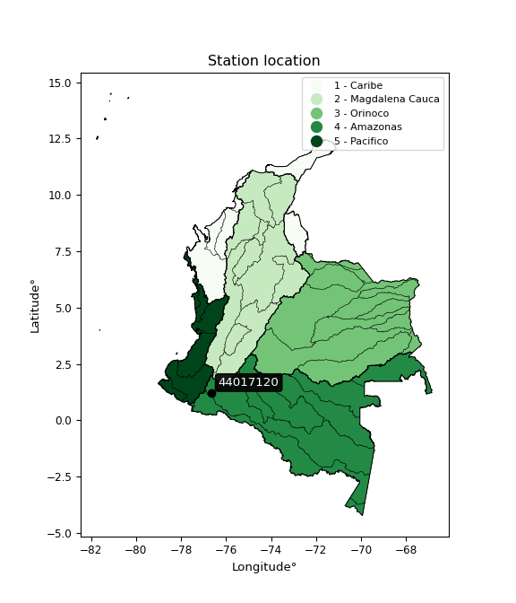

<div align="center">


</div>

# PMP Station (Rain, Pmax24h): 44017120

Probable Maximum Precipitation (PMP) is the greatest amount of rainfall for a specific duration that is meteorologically possible for a given location, acting as a "worst-case" scenario for extreme storms, crucial for designing safety-critical infrastructure like bridges, river deviations, dams, spillways, and nuclear plants to prevent catastrophic failure. PMP is calculated by hydrologists using meteorological data to determine the upper limit of extreme rainfall, often leading to the Probable Maximum Flood (PMF) for flood control design, and is increasingly being studied for climate change impacts. Probable Maximum Precipitation (PMP) is the theoretical upper limit of rainfall, a deterministic estimate for extreme events, while probability distributions (like GEV, Gumbel) describe the likelihood and frequency of various precipitation amounts, including rare ones, showing how often events occur, with PMP representing the extreme end of these distributions, used for critical infrastructure design to ensure safety against the worst conceivable weather, unlike standard statistical forecasts which cover typical probabilities.

The most common probability distributions in hydrology, used for analyzing floods, rainfall, and streamflow, include the Normal, Log-Normal, Gumbel, Gamma (including Log-Pearson Type III), and Generalized Extreme Value (GEV) distributions, often chosen based on the data´s skewness and whether modeling extremes or general conditions, with Gumbel and GEV popular for extreme events like floods, while the Normal distribution serves as a baseline, though often requiring transformations for skewed hydrological data. These distributions help in designing water infrastructure, managing water resources, and forecasting hydrologic events.

> Hydrological data often isn´t perfectly normal (it´s skewed), so different distributions are needed for different applications, such as: **Flood Frequency Analysis**: Using Gumbel, GEV, or Log-Pearson Type III for predicting extreme flood magnitudes and their return periods, **Rainfall Analysis**: Normal for annual totals, but Log-Normal, Weibull, or GEV for intensity or extreme daily rainfall, **Streamflow Modeling**: Gamma and Log-Normal for maximum flows, GEV for minimum flows, and Kappa for daily flows.

<div align="center">

</img>

</div>


## A. General information


### 1. General running parameters

• app_version: _v20260108_. • runtime: _2026-01-08 18:05:13.093906_. • Python version: _3.14.0_. • SciPy version: _1.16.3_. • Pandas version: _2.3.3_. • NumPy version: _2.3.5_. • Stations dataset (station_dataset_file): _dataset/pmax24h_in/automatic_colombia_2003_2024.csv_. • Stations catalog (station_catalog_file): _dataset/CNE.xls_. • Minimum year to eval til year_max (date_min): _1900_. • Maximum year to eval since year_min (date_max): _2024_. • Creates, save and include plots into reports (create_plot): _False_. • Plot only fit distributions with Δo > Δ (plot_only_fit): _True_. • Plot only simple graphs avoiding multiple CDFs and multiple Extreme values plots (plot_only_simple): _False_. • Eval low extreme values, if False, evaluates high extreme values (low_extreme): _False_. • Eval every SciPy distribution as logarithmic (pdist_logarithmic_on): _True_. • Standard deviation normalized (ddof): _1.0_. • Return periods to eval in years (Tr): _[2, 2.33, 5, 10, 15, 20, 25, 50, 75, 100, 200, 250, 500, 750, 1000]_. • Minimum data sample per station, 0 means any (minimum_sample): _5_. • Z-Score maximum threshold to adjust a value, 0 means disable (zscore_max): _3.5_. • Z-Score minimum threshold to adjust a value, 0 means disable (zscore_min): _-2.5_. • Avoid zeros, e.g. rain = 0 (avoid_zeros): _True_. • Avoid null values (avoid_nans): _True_. 

:file_folder:Table: [dataset.csv](../../dataset/pmax24h_in/automatic_colombia_2003_2024.csv)

> Delta Degrees of Freedom (DDOF): is a parameter used in the formulas for calculating variance and standard deviation. When ddof=0, the divisor is $N$ (the total number of observations) and this is used when your data set is the entire population. When ddof=1, the divisor is $N-1$ and this is used when your data set is a sample drawn from a larger population. Using $N-1$ provides an unbiased estimate of the population variance (known as Bessel´s correction).


### 2. Station info and location

|   id |   CODIGO | NOMBRE                           | CATEGORIA    | TECNOLOGIA                              | ESTADO   | FECHA_INSTALACION   |   FECHA_SUSPENSION |   ALTITUD |   LATITUD |   LONGITUD | DEPARTAMENTO   | MUNICIPIO   | AREA_OPERATIVA                      | ENTIDAD                                                     | AREA_HIDROGRAFICA   | ZONA_HIDROGRAFICA   | SUBZONA_HIDROGRAFICA   | CORRIENTE   | Catalogo   |   Version |
|-----:|---------:|:---------------------------------|:-------------|:----------------------------------------|:---------|:--------------------|-------------------:|----------:|----------:|-----------:|:---------------|:------------|:------------------------------------|:------------------------------------------------------------|:--------------------|:--------------------|:-----------------------|:------------|:-----------|----------:|
|    0 | 44017120 | PIEDRA LISA II  - AUT [44017120] | Limnigráfica | Automática con Telemetría, Convencional | Activa   | 15/07/1997          |                nan |       723 |   1.21361 |    -76.661 | Putumayo       | Mocoa       | Area Operativa 07 - Nariño-Putumayo | INSTITUTO DE HIDROLOGIA METEOROLOGIA Y ESTUDIOS AMBIENTALES | Amazonas            | Caquetá             | Alto Caqueta           | Mocoa       | CNE_IDEAM  |  20251226 |

<div align="center">

Dynamic map: [:earth_americas:Google](http://maps.google.com/maps?q=1.213611111,-76.66102778) [:earth_americas:OSM](https://www.openstreetmap.org/#map=18/1.213611111/-76.66102778&layers=P) [:earth_americas:Bing](https://www.bing.com/maps?cp=1.213611111~-76.66102778&lvl=18) [:earth_americas:Apple](https://maps.apple.com/frame?center=1.213611111%2C-76.66102778&span=0.003%2C0.006)

</div>


<div align="center">

```geojson
{
  "type": "Feature",
  "geometry": {
    "type": "Point", 
    "coordinates": [-76.66102778, 1.213611111]
  }, 
  "properties": {
    "Name": "44017120"
  }
}
```

</div>


### 3. Discrete values table and plot

<div align="center">

|               |          0 |            1 |           2 |           3 |           4 |           5 |
|:--------------|-----------:|-------------:|------------:|------------:|------------:|------------:|
| Date          | 2019       | 2020         | 2021        | 2022        | 2023        | 2024        |
| Value         |  181.8     |   87.4       |   47        |   38.2      |   53        |  138        |
| Value_initial |  181.8     |   87.4       |   47        |   38.2      |   53        |  138        |
| count         |    6       |    6         |    6        |    6        |    6        |    6        |
| mean          |   90.9     |   90.9       |   90.9      |   90.9      |   90.9      |   90.9      |
| std           |   57.6791  |   57.6791    |   57.6791   |   57.6791   |   57.6791   |   57.6791   |
| zscore        |    1.57596 |   -0.0606806 |   -0.761108 |   -0.913676 |   -0.657084 |    0.816587 |


</div>


> The initial value (value_initial) correspond to the initial obtained or null completed value, and value (value) is adjusted only when the initial value is outside the valid range (outlier) definite through the Z-Score value. If Z-Score is active, values out of range or outliers are replaced with the station mean value. A Z-Score (or standard score) measures how many standard deviations a data point is from the mean of a dataset, indicating its relative position; positive scores mean above the mean, negative mean below, and a score of zero is exactly at the mean, allowing for comparison of values from different distributions. It´s calculated using the formula $z=(x–μ)/σ$, where $x$ is the data point, $μ$ is the mean, and $σ$ is the standard deviation, helping identify outliers and understand probability.
>
> <sub>**Note**: In this study, "completing" (filling gaps in) and "extending" (forecasting or lengthening the historical record) rainfall data series are avoided for certain critical analyses because they introduce artificial bias and uncertainty, which can distort the statistics of rare events (extremes), alter day-to-day variability, and compromise the integrity and homogeneity of the original data. Some reasons against Completing/Extending rainfall data are: **Distortion of Extremes and Variability**: The primary issue is that most gap-filling or extension methods rely on averaging or regression with nearby stations, which inherently smooths the data. Rainfall is highly variable in space and time, with a large percentage of zero values and occasional large storms. Infilling methods often underestimate the highest values and overestimate the lowest (zero) values, which severely distorts analyses focused on flood frequency, drought severity, and intensity-duration-frequency (IDF) curves, **Loss of Data Homogeneity**: Infilled or extended data are synthetic estimates, not actual measurements. Combining these estimates with observed data can violate the assumption of data homogeneity, which requires that the data properties do not change over time. Inhomogeneity can lead to incorrect conclusions about long-term trends or changes in climate patterns, **Propagation of Errors**: Errors and biases from the original data (e.g., wind-induced undercatch, instrument errors, site changes) or the data used for imputation can propagate through the analysis, leading to unreliable hydrological models and inaccurate predictions, **Compromised Statistical Integrity**: For statistical analyses, especially those involving the frequency of events, using artificial data can introduce time bias or autocorrelation that doesn´t exist in reality, making it difficult to assess the true probability of events, **Difficulty in Validation**: It is difficult to accurately validate the quality of filled or extended data, especially for past periods where ground-truth measurements are unavailable. The reliability of imputation techniques heavily depends on the density of the surrounding station network and the complexity of the local topography.</sub>


### 4. Active continuous probability distributions from SciPy (43 of 104 available)

A Probability Density Function (PDF) describes the relative likelihood of a continuous random variable falling within a specific range, where the total area under its curve equals 1, and the area over any interval gives the actual probability for that range. Unlike discrete probabilities (like rolling a die), a PDF shows density, not direct probability for a single point (which is zero), with higher points indicating higher likelihood, often visualized as a bell curve for normal distributions.

A log of a probability density function (log-PDF) is simply the logarithm of the PDF´s value, denoted as $log(f(x))$, useful for converting multiplication of probabilities into addition, improving numerical stability with tiny numbers, and connecting to information theory concepts like entropy. Instead of dealing with very small probabilities (e.g., 0.000001), log-PDFs use negative numbers (e.g., $log(0.00001) ≈ -11.51$ that are easier for computers to handle, preventing underflow errors and simplifying complex calculations. In this study, each active probability distribution from SciPy is also evaluated in the $log$ form.

[scipy.stats](https://docs.scipy.org/doc/scipy/reference/stats.html) is a Python´s powerful submodule within the SciPy library for comprehensive statistical analysis, offering over 130 probability distributions (like Normal, Poisson), functions for descriptive stats (mean, variance), hypothesis testing (t-tests, chi-square), random variable generation, and statistical tests, making it essential for data science, modeling, and research. It provides tools to explore, model, and draw conclusions from data efficiently, working seamlessly with NumPy.

<div align="center">

|   id | p_dist             |   n_parameter | fit_method   | label                                                                       | active   | ref                                                                                                        |
|-----:|:-------------------|--------------:|:-------------|:----------------------------------------------------------------------------|:---------|:-----------------------------------------------------------------------------------------------------------|
|    0 | alpha              |             3 | MLE          | Alpha                                                                       | True     | [:mortar_board:](https://docs.scipy.org/doc/scipy/reference/generated/scipy.stats.alpha.html)              |
|    1 | betaprime          |             4 | MLE          | Beta prime                                                                  | True     | [:mortar_board:](https://docs.scipy.org/doc/scipy/reference/generated/scipy.stats.betaprime.html)          |
|    2 | chi2               |             3 | MLE          | Chi²                                                                        | True     | [:mortar_board:](https://docs.scipy.org/doc/scipy/reference/generated/scipy.stats.chi2.html)               |
|    3 | crystalball        |             4 | MLE          | Crystalball                                                                 | True     | [:mortar_board:](https://docs.scipy.org/doc/scipy/reference/generated/scipy.stats.crystalball.html)        |
|    4 | erlang             |             3 | MLE          | Erlang                                                                      | True     | [:mortar_board:](https://docs.scipy.org/doc/scipy/reference/generated/scipy.stats.erlang.html)             |
|    5 | expon              |             2 | MLE          | Exponential                                                                 | True     | [:mortar_board:](https://docs.scipy.org/doc/scipy/reference/generated/scipy.stats.expon.html)              |
|    6 | exponnorm          |             3 | MLE          | Exponentially modified Normal                                               | True     | [:mortar_board:](https://docs.scipy.org/doc/scipy/reference/generated/scipy.stats.exponnorm.html)          |
|    7 | f                  |             4 | MLE          | F                                                                           | True     | [:mortar_board:](https://docs.scipy.org/doc/scipy/reference/generated/scipy.stats.f.html)                  |
|    8 | fatiguelife        |             3 | MLE          | Fatigue-life (Birnbaum-Saunders)                                            | True     | [:mortar_board:](https://docs.scipy.org/doc/scipy/reference/generated/scipy.stats.fatiguelife.html)        |
|    9 | fisk               |             3 | MLE          | Fisk                                                                        | True     | [:mortar_board:](https://docs.scipy.org/doc/scipy/reference/generated/scipy.stats.fisk.html)               |
|   10 | gamma              |             3 | MLE          | Gamma                                                                       | True     | [:mortar_board:](https://docs.scipy.org/doc/scipy/reference/generated/scipy.stats.gamma.html)              |
|   11 | genexpon           |             5 | MLE          | Generalized exponential                                                     | True     | [:mortar_board:](https://docs.scipy.org/doc/scipy/reference/generated/scipy.stats.genexpon.html)           |
|   12 | genlogistic        |             3 | MLE          | Generalized logistic                                                        | True     | [:mortar_board:](https://docs.scipy.org/doc/scipy/reference/generated/scipy.stats.genlogistic.html)        |
|   13 | gibrat             |             2 | MM           | Gibrat                                                                      | True     | [:mortar_board:](https://docs.scipy.org/doc/scipy/reference/generated/scipy.stats.gibrat.html)             |
|   14 | gompertz           |             3 | MLE          | Gompertz (or truncated Gumbel)                                              | True     | [:mortar_board:](https://docs.scipy.org/doc/scipy/reference/generated/scipy.stats.gompertz.html)           |
|   15 | gumbel_l           |             2 | MM           | Gumbel Left Skew                                                            | True     | [:mortar_board:](https://docs.scipy.org/doc/scipy/reference/generated/scipy.stats.gumbel_l.html)           |
|   16 | gumbel_r           |             2 | MM           | Gumbel Right Skew                                                           | True     | [:mortar_board:](https://docs.scipy.org/doc/scipy/reference/generated/scipy.stats.gumbel_r.html)           |
|   17 | halflogistic       |             2 | MM           | Half-logistic                                                               | True     | [:mortar_board:](https://docs.scipy.org/doc/scipy/reference/generated/scipy.stats.halflogistic.html)       |
|   18 | halfnorm           |             2 | MM           | Half Normal                                                                 | True     | [:mortar_board:](https://docs.scipy.org/doc/scipy/reference/generated/scipy.stats.halfnorm.html)           |
|   19 | hypsecant          |             2 | MM           | hyperbolic secant                                                           | True     | [:mortar_board:](https://docs.scipy.org/doc/scipy/reference/generated/scipy.stats.hypsecant.html)          |
|   20 | invgamma           |             3 | MLE          | Inverted gamma                                                              | True     | [:mortar_board:](https://docs.scipy.org/doc/scipy/reference/generated/scipy.stats.invgamma.html)           |
|   21 | invgauss           |             3 | MLE          | Inverse Gaussian                                                            | True     | [:mortar_board:](https://docs.scipy.org/doc/scipy/reference/generated/scipy.stats.invgauss.html)           |
|   22 | invweibull         |             3 | MLE          | Inverted Weibull                                                            | True     | [:mortar_board:](https://docs.scipy.org/doc/scipy/reference/generated/scipy.stats.invweibull.html)         |
|   23 | kstwobign          |             2 | MLE          | Limiting distribution of scaled Kolmogorov-Smirnov two-sided test statistic | True     | [:mortar_board:](https://docs.scipy.org/doc/scipy/reference/generated/scipy.stats.kstwobign.html)          |
|   24 | laplace            |             2 | MM           | Laplace                                                                     | True     | [:mortar_board:](https://docs.scipy.org/doc/scipy/reference/generated/scipy.stats.laplace.html)            |
|   25 | laplace_asymmetric |             3 | MLE          | Asymmetric Laplace                                                          | True     | [:mortar_board:](https://docs.scipy.org/doc/scipy/reference/generated/scipy.stats.laplace_asymmetric.html) |
|   26 | loggamma           |             3 | MLE          | Log gamma                                                                   | True     | [:mortar_board:](https://docs.scipy.org/doc/scipy/reference/generated/scipy.stats.loggamma.html)           |
|   27 | logistic           |             2 | MM           | Logistic (or Sech-squared)                                                  | True     | [:mortar_board:](https://docs.scipy.org/doc/scipy/reference/generated/scipy.stats.logistic.html)           |
|   28 | lognorm            |             3 | MLE          | Log Normal                                                                  | True     | [:mortar_board:](https://docs.scipy.org/doc/scipy/reference/generated/scipy.stats.lognorm.html)            |
|   29 | maxwell            |             2 | MM           | Maxwell                                                                     | True     | [:mortar_board:](https://docs.scipy.org/doc/scipy/reference/generated/scipy.stats.maxwell.html)            |
|   30 | mielke             |             4 | MLE          | Mielke Beta-Kappa / Dagum                                                   | True     | [:mortar_board:](https://docs.scipy.org/doc/scipy/reference/generated/scipy.stats.mielke.html)             |
|   31 | moyal              |             2 | MM           | Moyal                                                                       | True     | [:mortar_board:](https://docs.scipy.org/doc/scipy/reference/generated/scipy.stats.moyal.html)              |
|   32 | nakagami           |             3 | MLE          | Nakagami                                                                    | True     | [:mortar_board:](https://docs.scipy.org/doc/scipy/reference/generated/scipy.stats.nakagami.html)           |
|   33 | ncf                |             5 | MLE          | Non-central F distribution                                                  | True     | [:mortar_board:](https://docs.scipy.org/doc/scipy/reference/generated/scipy.stats.ncf.html)                |
|   34 | nct                |             4 | MLE          | Non-central Student’s t                                                     | True     | [:mortar_board:](https://docs.scipy.org/doc/scipy/reference/generated/scipy.stats.nct.html)                |
|   35 | norm               |             2 | MM           | Normal                                                                      | True     | [:mortar_board:](https://docs.scipy.org/doc/scipy/reference/generated/scipy.stats.norm.html)               |
|   36 | pearson3           |             3 | MM           | Pearson type III                                                            | True     | [:mortar_board:](https://docs.scipy.org/doc/scipy/reference/generated/scipy.stats.pearson3.html)           |
|   37 | rayleigh           |             2 | MM           | Rayleigh                                                                    | True     | [:mortar_board:](https://docs.scipy.org/doc/scipy/reference/generated/scipy.stats.rayleigh.html)           |
|   38 | rice               |             3 | MLE          | Rice                                                                        | True     | [:mortar_board:](https://docs.scipy.org/doc/scipy/reference/generated/scipy.stats.rice.html)               |
|   39 | t                  |             3 | MLE          | Student’s t                                                                 | True     | [:mortar_board:](https://docs.scipy.org/doc/scipy/reference/generated/scipy.stats.t.html)                  |
|   40 | truncnorm          |             4 | MLE          | Truncated normal                                                            | True     | [:mortar_board:](https://docs.scipy.org/doc/scipy/reference/generated/scipy.stats.truncnorm.html)          |
|   41 | wald               |             2 | MM           | Wald                                                                        | True     | [:mortar_board:](https://docs.scipy.org/doc/scipy/reference/generated/scipy.stats.wald.html)               |
|   42 | weibull_min        |             3 | MLE          | Weibull minimum                                                             | True     | [:mortar_board:](https://docs.scipy.org/doc/scipy/reference/generated/scipy.stats.weibull_min.html)        |

</div>

> **n_parameter:** # arguments & localization & scale.
>
> **Fit methods:** (MLE) maximum likelihood, (MM) L-moments.
>
>**Inactive** (With the only purpose of prevent loops, zero divisions, infinite values, over high estimated values or horizontal trending for recurrence intervals estimations, the follow distributions were disabled.)**:** foldnorm, gennorm, norminvgauss, powernorm, powerlognorm, skewnorm, genextreme, anglit, arcsine, argus, beta, bradford, burr, burr12, cauchy, cosine, halfcauchy, foldcauchy, skewcauchy, wrapcauchy, dgamma, gengamma, exponweib, exponpow, truncexpon, gausshyper, genhalflogistic, genhyperbolic, geninvgauss, halfgennorm, johnsonsb, johnsonsu, kappa4, kappa3, ksone, kstwo, loglaplace, levy, levy_l, levy_stable, ncx2, pareto, genpareto, truncpareto, lomax, powerlaw, rdist, rel_breitwigner, recipinvgauss, semicircular, studentized_range, trapezoid, triang, truncweibull_min, tukeylambda, uniform, loguniform, vonmises, vonmises_line, weibull_max, dweibull, 


## B. Probability (PDF) vs. Empirical (EDF) distributions functions

A continuous probability distribution (CPD) describes probabilities for variables that can take any value within a range (like rain any time), unlike discrete variables with specific outcomes (like temperature). It uses a Probability Density Function (PDF), a curve where the total area under it equals 1, and the probability of the variable falling within an interval (a to b) is found by calculating the area under the curve between those points. A key feature is that the probability of hitting any single exact value is zero, so probabilities are always expressed for ranges, e.g., $P(a ≤ X ≤ b)$.

<div align="center">

Distributions parameters from station values
|    |   station | p_dist                |   n |           loc |          scale | shape                 | shape1             | shape2                | shape3   |
|---:|----------:|:----------------------|----:|--------------:|---------------:|:----------------------|:-------------------|:----------------------|:---------|
|  0 |  44017120 | alpha                 |   6 |     25.7887   |   23.9631      | 9.933960815845143e-10 |                    |                       |          |
|  1 |  44017120 | betaprime             |   6 |     -0.57455  |    1.1362      | 212.10821062240507    | 3.581756406667302  |                       |          |
|  2 |  44017120 | chi2                  |   6 |     38.2      |   21.2717      | 1.0579971141790274    |                    |                       |          |
|  3 |  44017120 | crystalball           |   6 |     90.9      |   52.6536      | 6377.920611933414     | 7957.284201694801  |                       |          |
|  4 |  44017120 | erlang                |   6 |     38.2      |   50.1123      | 0.4993797879786044    |                    |                       |          |
|  5 |  44017120 | expon                 |   6 |     38.2      |   52.7         |                       |                    |                       |          |
|  6 |  44017120 | exponnorm             |   6 |     38.14     |    0.0189494   | 2752.739863729842     |                    |                       |          |
|  7 |  44017120 | f                     |   6 |     38.1998   |   25.3265      | 1.0482120917977824    | 3.4482279455482274 |                       |          |
|  8 |  44017120 | fatiguelife           |   6 |     38.2      |    6.13038e-05 | 819.6543551629745     |                    |                       |          |
|  9 |  44017120 | fisk                  |   6 |     38.2      |   23.0964      | 0.9515169267298147    |                    |                       |          |
| 10 |  44017120 | gamma                 |   6 |     38.2      |   42           | 0.6251473545419568    |                    |                       |          |
| 11 |  44017120 | genexpon              |   6 |     38.2      |   53.4601      | 1.0141583008167152    | 0.1956198095081674 | 0.0013665756744073154 |          |
| 12 |  44017120 | genlogistic           |   6 |   -223.044    |   38.1936      | 1969.1000348969797    |                    |                       |          |
| 13 |  44017120 | gibrat                |   6 |     50.732    |   24.3631      |                       |                    |                       |          |
| 14 |  44017120 | gompertz              |   6 |     38.1965   | 2033.66        | 38.04351867607801     |                    |                       |          |
| 15 |  44017120 | gumbel_l              |   6 |    114.597    |   41.0538      |                       |                    |                       |          |
| 16 |  44017120 | gumbel_r              |   6 |     67.2031   |   41.0538      |                       |                    |                       |          |
| 17 |  44017120 | halflogistic          |   6 |     28.4933   |   45.0169      |                       |                    |                       |          |
| 18 |  44017120 | halfnorm              |   6 |     21.2073   |   87.3468      |                       |                    |                       |          |
| 19 |  44017120 | hypsecant             |   6 |     90.9      |   33.5203      |                       |                    |                       |          |
| 20 |  44017120 | invgamma              |   6 |     29.6887   |   28.2807      | 1.1844332688717492    |                    |                       |          |
| 21 |  44017120 | invgauss              |   6 |     32.6434   |   26.0629      | 2.2352259304133106    |                    |                       |          |
| 22 |  44017120 | invweibull            |   6 |     38.2      |    1.22052     | 0.0468644252058939    |                    |                       |          |
| 23 |  44017120 | kstwobign             |   6 |    -65.863    |  179.782       |                       |                    |                       |          |
| 24 |  44017120 | laplace               |   6 |     90.9      |   37.2317      |                       |                    |                       |          |
| 25 |  44017120 | laplace_asymmetric    |   6 |     38.2      |    0.000265878 | 5.045102248043335e-06 |                    |                       |          |
| 26 |  44017120 | loggamma              |   6 | -16866.8      | 2263.04        | 1796.5457937503043    |                    |                       |          |
| 27 |  44017120 | logistic              |   6 |     90.9      |   29.0294      |                       |                    |                       |          |
| 28 |  44017120 | lognorm               |   6 |     38.2      |    0.0931317   | 13.54339902271194     |                    |                       |          |
| 29 |  44017120 | maxwell               |   6 |    -33.8668   |   78.186       |                       |                    |                       |          |
| 30 |  44017120 | mielke                |   6 |     -0.461819 |    4.95243     | 470.62139234375445    | 2.1703149567611337 |                       |          |
| 31 |  44017120 | moyal                 |   6 |     60.7893   |   23.7024      |                       |                    |                       |          |
| 32 |  44017120 | nakagami              |   6 |     38.2      |   79.6484      | 0.23031468247381934   |                    |                       |          |
| 33 |  44017120 | ncf                   |   6 |     -1.10336  |    6.96948e-06 | 3.760874402699741e-05 | 7.370305145700356  | 368.6255826792627     |          |
| 34 |  44017120 | nct                   |   6 |     -0.245236 |    1.10902     | 2.195547637970458     | 53.74632401931666  |                       |          |
| 35 |  44017120 | norm                  |   6 |     90.9      |   52.6536      |                       |                    |                       |          |
| 36 |  44017120 | pearson3              |   6 |     90.9      |   52.6535      | 0.6509431771930532    |                    |                       |          |
| 37 |  44017120 | rayleigh              |   6 |     -9.82932  |   80.3704      |                       |                    |                       |          |
| 38 |  44017120 | rice                  |   6 |      5.88797  |   70.7087      | 0.0006856254611669339 |                    |                       |          |
| 39 |  44017120 | t                     |   6 |     90.8982   |   52.6565      | 38902192.45285753     |                    |                       |          |
| 40 |  44017120 | truncnorm             |   6 |     90.9      |   52.6536      | -1683.2465247697953   | 1767.2540716020676 |                       |          |
| 41 |  44017120 | wald                  |   6 |     38.2465   |   52.6535      |                       |                    |                       |          |
| 42 |  44017120 | weibull_min           |   6 |     38.2      |   58.8199      | 0.4980060512390078    |                    |                       |          |
| 43 |  44017120 | logalpha              |   6 |      1.58423  |   13.1191      | 4.959307121349024     |                    |                       |          |
| 44 |  44017120 | logbetaprime          |   6 |     -0.713097 |    3.03692     | 210.50804114135872    | 127.65828877815795 |                       |          |
| 45 |  44017120 | logchi2               |   6 |      3.64284  |    0.964292    | 1.0765764059786163    |                    |                       |          |
| 46 |  44017120 | logcrystalball        |   6 |      4.34399  |    0.572871    | 9.114212755443099     | 1.000339958755617  |                       |          |
| 47 |  44017120 | logerlang             |   6 |      3.64284  |    0.562922    | 0.38243472893372266   |                    |                       |          |
| 48 |  44017120 | logexpon              |   6 |      3.64284  |    0.701153    |                       |                    |                       |          |
| 49 |  44017120 | logexponnorm          |   6 |      4.22751  |    0.560952    | 0.2076562165682485    |                    |                       |          |
| 50 |  44017120 | logf                  |   6 |      3.04304  |    1.05706     | 3986.5627247305733    | 9.890767158401575  |                       |          |
| 51 |  44017120 | logfatiguelife        |   6 |      3.51385  |    0.565538    | 0.9520560739290191    |                    |                       |          |
| 52 |  44017120 | logfisk               |   6 |      3.59711  |    0.512879    | 1.4299398124628584    |                    |                       |          |
| 53 |  44017120 | loggamma              |   6 |      3.64284  |    0.60924     | 0.7549272381532262    |                    |                       |          |
| 54 |  44017120 | loggenexpon           |   6 |      3.64284  |    1.09326     | 1.3613491784507135    | 0.6499107471442167 | 0.7150024386546312    |          |
| 55 |  44017120 | loggenlogistic        |   6 |      0.924477 |    0.463298    | 883.2578889804413     |                    |                       |          |
| 56 |  44017120 | loggibrat             |   6 |      3.90696  |    0.265071    |                       |                    |                       |          |
| 57 |  44017120 | loggompertz           |   6 |      3.64284  |    1.58221     | 1.503876811291967     |                    |                       |          |
| 58 |  44017120 | loggumbel_l           |   6 |      4.60181  |    0.446666    |                       |                    |                       |          |
| 59 |  44017120 | loggumbel_r           |   6 |      4.08617  |    0.446666    |                       |                    |                       |          |
| 60 |  44017120 | loghalflogistic       |   6 |      3.665    |    0.489785    |                       |                    |                       |          |
| 61 |  44017120 | loghalfnorm           |   6 |      3.58573  |    0.950334    |                       |                    |                       |          |
| 62 |  44017120 | loghypsecant          |   6 |      4.34399  |    0.364701    |                       |                    |                       |          |
| 63 |  44017120 | loginvgamma           |   6 |      3.04168  |    5.2338      | 4.946048384676121     |                    |                       |          |
| 64 |  44017120 | loginvgauss           |   6 |      3.40234  |    1.52771     | 0.6163734392624449    |                    |                       |          |
| 65 |  44017120 | loginvweibull         |   6 |      0.744482 |    3.29186     | 7.58076534756017      |                    |                       |          |
| 66 |  44017120 | logkstwobign          |   6 |      2.47885  |    2.12997     |                       |                    |                       |          |
| 67 |  44017120 | loglaplace            |   6 |      4.34399  |    0.405081    |                       |                    |                       |          |
| 68 |  44017120 | loglaplace_asymmetric |   6 |      3.85015  |    0.335658    | 0.5049100354402978    |                    |                       |          |
| 69 |  44017120 | logloggamma           |   6 |   -124.872    |   18.6048      | 1038.7807657511821    |                    |                       |          |
| 70 |  44017120 | loglogistic           |   6 |      4.34399  |    0.31584     |                       |                    |                       |          |
| 71 |  44017120 | loglognorm            |   6 |      3.64284  |    0.00191937  | 13.031178982073511    |                    |                       |          |
| 72 |  44017120 | logmaxwell            |   6 |      2.98652  |    0.850664    |                       |                    |                       |          |
| 73 |  44017120 | logmielke             |   6 |     -1.58221  |    3.57134     | 3993.936213569099     | 12.634934378025065 |                       |          |
| 74 |  44017120 | logmoyal              |   6 |      4.01638  |    0.257883    |                       |                    |                       |          |
| 75 |  44017120 | lognakagami           |   6 |      3.64284  |    1.18449     | 0.1873047829060015    |                    |                       |          |
| 76 |  44017120 | logncf                |   6 |      3.01612  |    1.12406     | 88.2333487933864      | 11.652797160250199 | 5.297416392636663e-07 |          |
| 77 |  44017120 | lognct                |   6 |      0.371049 |    0.0803098   | 26.332468093017454    | 48.04096443738345  |                       |          |
| 78 |  44017120 | lognorm               |   6 |      4.34399  |    0.572871    |                       |                    |                       |          |
| 79 |  44017120 | logpearson3           |   6 |      4.34399  |    0.572871    | 0.28085202873152726   |                    |                       |          |
| 80 |  44017120 | lograyleigh           |   6 |      3.24805  |    0.87443     |                       |                    |                       |          |
| 81 |  44017120 | logrice               |   6 |      3.34594  |    0.763428    | 0.5217177366733248    |                    |                       |          |
| 82 |  44017120 | logt                  |   6 |      4.34399  |    0.572871    | 3120891978.104072     |                    |                       |          |
| 83 |  44017120 | logtruncnorm          |   6 |     -0.175558 |    1.12859     | 4.116684253077313     | 4.765665833257631  |                       |          |
| 84 |  44017120 | logwald               |   6 |      3.77113  |    0.572857    |                       |                    |                       |          |
| 85 |  44017120 | logweibull_min        |   6 |      3.64284  |    0.752687    | 0.404989326342176     |                    |                       |          |

</div>

> **loc** (Location parameter): This shifts the distribution along the x-axis. For many common distributions, like the normal (Gaussian) distribution, loc represents the mean $μ$. For others, like the uniform distribution, it might represent the minimum value, or for the beta distribution, the left end of the support interval.
>
> **scale** (Scale parameter): This determines the width or spread of the distribution. For the normal distribution, scale represents the standard deviation $σ$. For a uniform distribution, it defines the length of the interval (from $loc$ to $loc + scale$).
>
> **shape** (Shape parameters): Refers to parameters that define the specific form of a probability distribution, distinct from its location (loc) and scale (scale). These parameters are required arguments for most distribution functions. For example, a normal (Gaussian) distribution is fully defined by its location (mean) and scale (standard deviation), so it has no specific shape parameters beyond loc and scale. However, other distributions have intrinsic properties that need specification, as Gamma distribution that takes a shape parameter, often named $a$ or $alpha$.


### 0. Cumulative distribution values - CDF (86 evaluated)

Cumulative Distribution Function (CDF), denoted as $F$<sub>$X$</sub>$(x)$, is a function that gives the probability that a random variable $X$ will take a value less than or equal to a specific value, $x$ (i.e., $(P(X≥x)$. It essentially "accumulates" probabilities from a given point up to the far right (positive infinity), providing a complete picture of the distribution´s probabilities for both discrete (like rain) and continuous (like temperature) variables, helping to find probabilities over ranges or above certain values. Each station is evaluated separately ordering the $x$ values ascending, calculating the CDF and PDF values for the activated distributions and their logarithmic forms.

<div align="center">

CDF ordered by x ascending and calculating $log(f(x))$ separately
|   id |   Station |   date |     x |   count |   mean |     std |     zscore |   Value_initial |   station |   m |     alpha |   alpha_pdf |   betaprime |   betaprime_pdf |        chi2 |         chi2_pdf |   crystalball |   crystalball_pdf |      erlang |       erlang_pdf |    expon |   expon_pdf |   exponnorm |   exponnorm_pdf |          f |       f_pdf |   fatiguelife |   fatiguelife_pdf |        fisk |    fisk_pdf |       gamma |       gamma_pdf |    genexpon |   genexpon_pdf |   genlogistic |   genlogistic_pdf |    gibrat |   gibrat_pdf |    gompertz |   gompertz_pdf |   gumbel_l |   gumbel_l_pdf |   gumbel_r |   gumbel_r_pdf |   halflogistic |   halflogistic_pdf |   halfnorm |   halfnorm_pdf |   hypsecant |   hypsecant_pdf |   invgamma |   invgamma_pdf |   invgauss |   invgauss_pdf |   invweibull |   invweibull_pdf |   kstwobign |   kstwobign_pdf |   laplace |   laplace_pdf |   laplace_asymmetric |   laplace_asymmetric_pdf |    loggamma |   loggamma_pdf |   logistic |   logistic_pdf |   lognorm |   lognorm_pdf |   maxwell |   maxwell_pdf |   mielke |   mielke_pdf |    moyal |   moyal_pdf |    nakagami |   nakagami_pdf |       ncf |    ncf_pdf |       nct |     nct_pdf |     norm |   norm_pdf |   pearson3 |   pearson3_pdf |   rayleigh |   rayleigh_pdf |      rice |   rice_pdf |        t |      t_pdf |   truncnorm |   truncnorm_pdf |      wald |    wald_pdf |   weibull_min |   weibull_min_pdf |   logalpha |   logalpha_pdf |   logbetaprime |   logbetaprime_pdf |     logchi2 |   logchi2_pdf |   logcrystalball |   logcrystalball_pdf |   logerlang |   logerlang_pdf |   logexpon |   logexpon_pdf |   logexponnorm |   logexponnorm_pdf |      logf |   logf_pdf |   logfatiguelife |   logfatiguelife_pdf |   logfisk |   logfisk_pdf |   loggenexpon |   loggenexpon_pdf |   loggenlogistic |   loggenlogistic_pdf |   loggibrat |   loggibrat_pdf |   loggompertz |   loggompertz_pdf |   loggumbel_l |   loggumbel_l_pdf |   loggumbel_r |   loggumbel_r_pdf |   loghalflogistic |   loghalflogistic_pdf |   loghalfnorm |   loghalfnorm_pdf |   loghypsecant |   loghypsecant_pdf |   loginvgamma |   loginvgamma_pdf |   loginvgauss |   loginvgauss_pdf |   loginvweibull |   loginvweibull_pdf |   logkstwobign |   logkstwobign_pdf |   loglaplace |   loglaplace_pdf |   loglaplace_asymmetric |   loglaplace_asymmetric_pdf |   logloggamma |   logloggamma_pdf |   loglogistic |   loglogistic_pdf |   loglognorm |   loglognorm_pdf |   logmaxwell |   logmaxwell_pdf |   logmielke |   logmielke_pdf |   logmoyal |   logmoyal_pdf |   lognakagami |   lognakagami_pdf |   logncf |   logncf_pdf |    lognct |   lognct_pdf |   logpearson3 |   logpearson3_pdf |   lograyleigh |   lograyleigh_pdf |   logrice |   logrice_pdf |     logt |   logt_pdf |   logtruncnorm |   logtruncnorm_pdf |   logwald |   logwald_pdf |   logweibull_min |   logweibull_min_pdf |
|-----:|----------:|-------:|------:|--------:|-------:|--------:|-----------:|----------------:|----------:|----:|----------:|------------:|------------:|----------------:|------------:|-----------------:|--------------:|------------------:|------------:|-----------------:|---------:|------------:|------------:|----------------:|-----------:|------------:|--------------:|------------------:|------------:|------------:|------------:|----------------:|------------:|---------------:|--------------:|------------------:|----------:|-------------:|------------:|---------------:|-----------:|---------------:|-----------:|---------------:|---------------:|-------------------:|-----------:|---------------:|------------:|----------------:|-----------:|---------------:|-----------:|---------------:|-------------:|-----------------:|------------:|----------------:|----------:|--------------:|---------------------:|-------------------------:|------------:|---------------:|-----------:|---------------:|----------:|--------------:|----------:|--------------:|---------:|-------------:|---------:|------------:|------------:|---------------:|----------:|-----------:|----------:|------------:|---------:|-----------:|-----------:|---------------:|-----------:|---------------:|----------:|-----------:|---------:|-----------:|------------:|----------------:|----------:|------------:|--------------:|------------------:|-----------:|---------------:|---------------:|-------------------:|------------:|--------------:|-----------------:|---------------------:|------------:|----------------:|-----------:|---------------:|---------------:|-------------------:|----------:|-----------:|-----------------:|---------------------:|----------:|--------------:|--------------:|------------------:|-----------------:|---------------------:|------------:|----------------:|--------------:|------------------:|--------------:|------------------:|--------------:|------------------:|------------------:|----------------------:|--------------:|------------------:|---------------:|-------------------:|--------------:|------------------:|--------------:|------------------:|----------------:|--------------------:|---------------:|-------------------:|-------------:|-----------------:|------------------------:|----------------------------:|--------------:|------------------:|--------------:|------------------:|-------------:|-----------------:|-------------:|-----------------:|------------:|----------------:|-----------:|---------------:|--------------:|------------------:|---------:|-------------:|----------:|-------------:|--------------:|------------------:|--------------:|------------------:|----------:|--------------:|---------:|-----------:|---------------:|-------------------:|----------:|--------------:|-----------------:|---------------------:|
|    0 |  44017120 |   2022 |  38.2 |       6 |   90.9 | 57.6791 | -0.913676  |            38.2 |  44017120 |   1 | 0.0535145 | 0.0192473   |   0.0971895 |      0.00991348 | 5.07794e-09 | 378052           |      0.158442 |        0.00459147 | 1.37441e-08 | 965957           | 0        |  0.0189753  |  0.00114996 |      0.019134   | 0.00145696 | 4.47828     |     0.0512035 |       2.50943e+09 | 2.56086e-13 | 0.180492    | 1.54097e-10 | 13557.7         | 1.21313e-14 |     0.0189704  |      0.121717 |        0.00670808 | 0         |  0           | 6.61328e-05 |     0.0187057  |   0.144041 |     0.00324281 |   0.131755 |     0.00650468 |       0.107396 |         0.0109788  |   0.154249 |     0.00896344 |    0.130306 |      0.00377971 |  0.0510282 |    0.0190413   |  0.0466711 |    0.0228149   |   0.00959645 |      2.94088e+11 |    0.108985 |      0.00666551 |  0.121407 |    0.00326085 |          5.05548e-11 |               0.0189752  | 5.81705e-11 |    2908.43     |   0.139987 |     0.00414719 |  0.11049  |      0.329281 |  0.162429 |    0.00566939 |      nan |          nan | 0.107298 |  0.00741103 | 3.16851e-08 |    2.05408e+06 | 0.0985902 | 0.00979947 | 0.0852063 | 0.0113288   | 0.158442 | 0.00459147 |   0.152807 |     0.00583951 |   0.163528 |     0.00621965 | 0.0991464 | 0.00582201 | 0.158464 | 0.00459163 |    0.158442 |      0.00459147 | 0         | 0           |   1.18242e-08 |   828737          |  0.0787541 |       0.454789 |       0.104167 |           0.373517 | 4.30455e-09 |   5.21762e+06 |         0.11049  |             0.329281 | 8.01715e-06 |     1.56911e+08 |   0        |       1.42622  |       0.110144 |           0.330486 | 0.0628894 |   0.553812 |        0.0447811 |             0.98851  | 0.0305656 |      0.92672  |   5.02437e-10 |          1.24522  |        0.0823931 |             0.443308 |   0         |        0        |   7.36335e-11 |          0.950494 |      0.110271 |          0.232734 |      0.067336 |          0.406739 |          0        |              0        |     0.0479145 |          0.838069 |      0.0924407 |           0.249922 |     0.0628868 |          0.553778 |     0.0502362 |          0.718604 |       0.0724346 |            0.497335 |      0.0736914 |           0.459763 |    0.0885628 |         0.21863  |               0.0597803 |                    0.352734 |      0.112841 |          0.327557 |     0.0979723 |          0.279805 |    0.0127843 |      5.70145e+12 |     0.102482 |         0.414597 |         nan |             nan |  0.0390931 |       0.379904 |   1.31958e-06 |       1.11312e+09 | 0.06319  |     0.514183 | 0.0908053 |     0.398102 |      0.104829 |          0.359673 |     0.0968932 |          0.46628  | 0.0638889 |      0.416466 | 0.11049  |   0.329282 |    0           |           0        |  0        |      0        |      6.79765e-07 |          6.19915e+08 |
|    1 |  44017120 |   2021 |  47   |       6 |   90.9 | 57.6791 | -0.761108  |            47   |  44017120 |   2 | 0.25859   | 0.0224494   |   0.196026  |      0.0121287  | 0.456612    |      0.0239301   |      0.20221  |        0.00535222 | 0.447085    |      0.0225365   | 0.153786 |  0.0160572  |  0.156211   |      0.0161761  | 0.398129   | 0.0204319   |     0.678044  |       0.0094161   | 0.285337    | 0.0220492   | 0.388082    |     0.0241869   | 0.153752    |     0.0160543  |      0.187713 |        0.00821815 | 0         |  0           | 0.152144    |     0.0159296  |   0.175283 |     0.00387139 |   0.194803 |     0.00776181 |       0.202706 |         0.0106506  |   0.232228 |     0.00874497 |    0.167833 |      0.00477811 |  0.250827  |    0.0218632   |  0.268838  |    0.022361    |   0.40189    |      0.00195102  |    0.174489 |      0.00813334 |  0.153777 |    0.00413028 |          0.153785    |               0.0160571  | 0.418154    |       1.24793  |   0.180604 |     0.00509781 |  0.194331 |      0.480271 |  0.215619 |    0.00639441 |      nan |          nan | 0.181024 |  0.00920295 | 0.283698    |    0.0148161   | 0.196104  | 0.0119645  | 0.201312  | 0.0142836   | 0.20221  | 0.00535222 |   0.208238 |     0.00672608 |   0.221192 |     0.0068519  | 0.155516  | 0.00694408 | 0.202234 | 0.00535229 |    0.20221  |      0.00535222 | 0.0360717 | 0.0138158   |   0.321765    |        0.0149024  |  0.203144  |       0.722059 |       0.200348 |           0.550962 | 0.326624    |   0.790436    |         0.194331 |             0.480271 | 0.697666    |     0.9806      |   0.255969 |       1.06115  |       0.194355 |           0.482557 | 0.219538  |   0.886728 |        0.290436  |             1.10619  | 0.266926  |      1.1058   |   0.233667    |          1.01202  |        0.202599  |             0.697527 |   0         |        0        |   0.189854    |          0.877843 |      0.169599 |          0.34551  |      0.183376 |          0.696372 |          0.186787 |              0.985238 |     0.219168  |          0.807706 |      0.16085   |           0.422514 |     0.219528  |          0.886709 |     0.24874   |          1.02931  |       0.211218  |            0.801644 |      0.198468  |           0.716825 |    0.147746  |         0.364731 |               0.203145  |                    1.19866  |      0.195917 |          0.474693 |     0.173134  |          0.453262 |    0.640318  |      0.138442    |     0.206176 |         0.577431 |         nan |             nan |  0.16749   |       0.82365  |   0.412333    |       0.741486    | 0.208742 |     0.835199 | 0.195987  |     0.608344 |      0.197053 |          0.52781  |     0.211052  |          0.621245 | 0.173479  |      0.625238 | 0.194332 |   0.480272 |    0           |           0        |  0.018211 |      0.919255 |      0.447451    |          0.640325    |
|    2 |  44017120 |   2023 |  53   |       6 |   90.9 | 57.6791 | -0.657084  |            53   |  44017120 |   3 | 0.378519  | 0.017522    |   0.269947  |      0.0123735  | 0.574478    |      0.0162687   |      0.235824 |        0.00584758 | 0.558321    |      0.015412    | 0.244847 |  0.0143293  |  0.247894   |      0.0144185  | 0.49852    | 0.0138437   |     0.725564  |       0.00675066  | 0.395686    | 0.0153733   | 0.510204    |     0.0172546   | 0.244799    |     0.0143275  |      0.239372 |        0.00895738 | 0.0087944 |  0.0105022   | 0.242657    |     0.0142711  |   0.199919 |     0.00434678 |   0.243327 |     0.00837695 |       0.265665 |         0.010323   |   0.284129 |     0.00854919 |    0.198791 |      0.0055524  |  0.368594  |    0.0173786   |  0.385935  |    0.0169121   |   0.410805   |      0.00115726  |    0.225455 |      0.0088099  |  0.180667 |    0.00485252 |          0.244846    |               0.0143292  | 0.54657     |       0.915993 |   0.213229 |     0.00577904 |  0.257097 |      0.562927 |  0.25523  |    0.00679545 |      nan |          nan | 0.238563 |  0.00990483 | 0.360114    |    0.0111358   | 0.269096  | 0.0122327  | 0.287186  | 0.0141337   | 0.235824 | 0.00584758 |   0.25009  |     0.00720595 |   0.263293 |     0.00716581 | 0.199058  | 0.00754722 | 0.235848 | 0.00584756 |    0.235824 |      0.00584758 | 0.144526  | 0.0202655   |   0.395283    |        0.010235   |  0.294972  |       0.795031 |       0.271774 |           0.634232 | 0.409052    |   0.601379    |         0.257097 |             0.562927 | 0.789567    |     0.597305    |   0.373136 |       0.894047 |       0.257415 |           0.565483 | 0.327867  |   0.898979 |        0.410783  |             0.900124 | 0.388244  |      0.910091 |   0.347659    |          0.887067 |        0.291682  |             0.775157 |   0.0761177 |        2.26063  |   0.292342    |          0.827284 |      0.215889 |          0.42694  |      0.273575 |          0.793888 |          0.301942 |              0.927785 |     0.314271  |          0.773582 |      0.219377  |           0.555024 |     0.327856  |          0.89898  |     0.367325  |          0.932127 |       0.311584  |            0.853847 |      0.289126  |           0.781707 |    0.198757  |         0.490661 |               0.334894  |                    1.00048  |      0.257908 |          0.555744 |     0.234481  |          0.568323 |    0.653353  |      0.0864962   |     0.279733 |         0.642736 |         nan |             nan |  0.274182  |       0.930371 |   0.48869     |       0.552357    | 0.312151 |     0.869874 | 0.274563  |     0.693463 |      0.265598 |          0.6101   |     0.289012  |          0.671572 | 0.253451  |      0.699998 | 0.257097 |   0.562928 |    0           |           0        |  0.216593 |      1.84219  |      0.510249    |          0.432392    |
|    3 |  44017120 |   2020 |  87.4 |       6 |   90.9 | 57.6791 | -0.0606806 |            87.4 |  44017120 |   4 | 0.697321  | 0.00466996  |   0.620054  |      0.00740234 | 0.862007    |      0.00411592  |      0.473501 |        0.00756002 | 0.839117    |      0.00425165  | 0.606859 |  0.00745999 |  0.611069   |      0.00745611 | 0.751381   | 0.00397665  |     0.862796  |       0.00243851  | 0.672509    | 0.00425941  | 0.831657    |     0.0048488   | 0.606807    |     0.00746082 |      0.559327 |        0.00850752 | 0.658669  |  0.0100075   | 0.606105    |     0.00754901 |   0.402844 |     0.00749942 |   0.542577 |     0.00808075 |       0.574539 |         0.00744059 |   0.551438 |     0.00685471 |    0.466824 |      0.0094445  |  0.695679  |    0.00494392  |  0.704625  |    0.0050222   |   0.431307   |      0.000345483 |    0.538459 |      0.008415   |  0.455139 |    0.0122245  |          0.606857    |               0.00745998 | 0.825507    |       0.321095 |   0.469895 |     0.00858073 |  0.587387 |      0.679617 |  0.50741  |    0.00737334 |      nan |          nan | 0.56838  |  0.00815956 | 0.617114    |    0.00537795  | 0.617903  | 0.00743283 | 0.647844  | 0.0068511   | 0.473501 | 0.00756002 |   0.516746 |     0.00765907 |   0.518942 |     0.00724108 | 0.485448  | 0.00838891 | 0.473516 | 0.00755961 |    0.473501 |      0.00756002 | 0.640206  | 0.00838038  |   0.599445    |        0.00370943 |  0.660545  |       0.576676 |       0.616997 |           0.653971 | 0.619538    |   0.302397    |         0.587387 |             0.679617 | 0.93987     |     0.138547    |   0.692852 |       0.438061 |       0.588449 |           0.679116 | 0.68512   |   0.498759 |        0.711752  |             0.387785 | 0.681615  |      0.355308 |   0.681038    |          0.476437 |        0.65787   |             0.59447  |   0.774643  |        0.532681 |   0.644259    |          0.570512 |      0.5254   |          0.791893 |      0.655095 |          0.62035  |          0.676315 |              0.553914 |     0.648148  |          0.544312 |      0.608265  |           0.822797 |     0.685119  |          0.49878  |     0.701016  |          0.440935 |       0.676407  |            0.538033 |      0.653821  |           0.598236 |    0.634119  |         0.903229 |               0.686587  |                    0.471448 |      0.584981 |          0.676781 |     0.598817  |          0.760622 |    0.67923   |      0.0331903   |     0.614991 |         0.623287 |         nan |             nan |  0.678441  |       0.588551 |   0.683454    |       0.286336    | 0.672849 |     0.522689 | 0.631409  |     0.633843 |      0.60461  |          0.658417 |     0.623631  |          0.601717 | 0.61371   |      0.656248 | 0.587389 |   0.679616 |    1.03323e-05 |           4.04066  |  0.743376 |      0.50606  |      0.646264    |          0.179875    |
|    4 |  44017120 |   2024 | 138   |       6 |   90.9 | 57.6791 |  0.816587  |           138   |  44017120 |   5 | 0.830896  | 0.00148425  |   0.848941  |      0.00252585 | 0.966901    |      0.000897954 |      0.81448  |        0.00507839 | 0.954125    |      0.00108708  | 0.849492 |  0.00285594 |  0.852569   |      0.00282637 | 0.870507   | 0.00137264  |     0.940223  |       0.000926316 | 0.800997    | 0.00151976  | 0.958219    |     0.00111499  | 0.849487    |     0.00285668 |      0.85686  |        0.00346557 | 0.899007  |  0.00202558  | 0.85245     |     0.00289904 |   0.829389 |     0.00734896 |   0.836722 |     0.00363321 |       0.838555 |         0.00329683 |   0.818815 |     0.00373647 |    0.846838 |      0.00439494 |  0.837642  |    0.00157124  |  0.854946  |    0.00173706  |   0.443295   |      0.000169346 |    0.84725  |      0.0038486  |  0.858888 |    0.00379012 |          0.849491    |               0.00285595 | 0.923602    |       0.136226 |   0.835138 |     0.00474285 |  0.845695 |      0.41472  |  0.815479 |    0.00440234 |      nan |          nan | 0.844474 |  0.00323894 | 0.815336    |    0.00279297  | 0.848632  | 0.00255232 | 0.84951   | 0.00216445  | 0.81448  | 0.00507839 |   0.822873 |     0.00415588 |   0.815777 |     0.00421612 | 0.825435  | 0.00461269 | 0.814476 | 0.00507817 |    0.81448  |      0.00507839 | 0.873168  | 0.00235243  |   0.727796    |        0.00176744 |  0.849662  |       0.274113 |       0.851958 |           0.361189 | 0.730467    |   0.194806    |         0.845695 |             0.41472  | 0.978142    |     0.0469183   |   0.839885 |       0.228359 |       0.84586  |           0.412246 | 0.845023  |   0.232784 |        0.840399  |             0.199785 | 0.796203  |      0.174438 |   0.842191    |          0.249821 |        0.855335  |             0.288463 |   0.911146  |        0.157652 |   0.84783     |          0.325713 |      0.87409  |          0.584126 |      0.858879 |          0.292521 |          0.858753 |              0.268019 |     0.841942  |          0.309994 |      0.873087  |           0.338846 |     0.845028  |          0.23279  |     0.844562  |          0.216071 |       0.849833  |            0.250617 |      0.857715  |           0.306822 |    0.881521  |         0.292482 |               0.842339  |                    0.23716  |      0.843952 |          0.418929 |     0.86374   |          0.372635 |    0.691205  |      0.0210422   |     0.842607 |         0.361712 |         nan |             nan |  0.864219  |       0.260705 |   0.790483    |       0.191242    | 0.842154 |     0.247773 | 0.850864  |     0.329081 |      0.846041 |          0.378787 |     0.841792  |          0.34744  | 0.848656  |      0.364172 | 0.845696 |   0.414718 |    0.883437    |           0.703577 |  0.887451 |      0.187882 |      0.711089    |          0.113109    |
|    5 |  44017120 |   2019 | 181.8 |       6 |   90.9 | 57.6791 |  1.57596   |           181.8 |  44017120 |   6 | 0.877927  | 0.000776332 |   0.923188  |      0.00109403 | 0.989679    |      0.000270211 |      0.95786  |        0.00170726 | 0.983367    |      0.000378063 | 0.934444 |  0.00124394 |  0.936332   |      0.00122056 | 0.914006   | 0.000712782 |     0.969067  |       0.000453751 | 0.850529    | 0.000842378 | 0.98678     |     0.000342868 | 0.934461    |     0.00124418 |      0.952112 |        0.0012233  | 0.953778  |  0.000738934 | 0.938178    |     0.00124111 |   0.994139 |     0.0007337  |   0.940507 |     0.00140516 |       0.935754 |         0.0013813  |   0.934021 |     0.00168526 |    0.957779 |      0.00125587 |  0.887041  |    0.000806712 |  0.910089  |    0.000903813 |   0.449435   |      0.000117305 |    0.955053 |      0.00137757 |  0.956484 |    0.0011688  |          0.934444    |               0.00124395 | 0.953129    |       0.082617 |   0.958166 |     0.00138081 |  0.933105 |      0.226315 |  0.945169 |    0.00172949 |      nan |          nan | 0.937931 |  0.00130669 | 0.908543    |    0.00155862  | 0.923595  | 0.00110244 | 0.914049  | 0.000979414 | 0.95786  | 0.00170726 |   0.943435 |     0.00160864 |   0.941721 |     0.00172895 | 0.95471   | 0.00159349 | 0.957855 | 0.00170735 |    0.95786  |      0.00170726 | 0.940858  | 0.000974372 |   0.789802    |        0.00113698 |  0.908885  |       0.164186 |       0.92847  |           0.202461 | 0.778306    |   0.154362    |         0.933105 |             0.226315 | 0.987806    |     0.0254994   |   0.891934 |       0.154127 |       0.932743 |           0.225137 | 0.896462  |   0.147356 |        0.886369  |             0.13804  | 0.836449  |      0.121821 |   0.898607    |          0.164803 |        0.917417  |             0.17067  |   0.943743  |        0.087383 |   0.920125    |          0.203507 |      0.978529 |          0.18464  |      0.921207 |          0.169264 |          0.917022 |              0.162388 |     0.911187  |          0.19736  |      0.939777  |           0.164146 |     0.896468  |          0.147358 |     0.893359  |          0.143392 |       0.904564  |            0.15427  |      0.924087  |           0.182294 |    0.940006  |         0.148104 |               0.895854  |                    0.156661 |      0.932479 |          0.229703 |     0.938166  |          0.183671 |    0.69644   |      0.0171937   |     0.921046 |         0.213724 |         nan |             nan |  0.920179  |       0.154244 |   0.837647    |       0.152516    | 0.896778 |     0.155803 | 0.921128  |     0.189666 |      0.926673 |          0.213928 |     0.917825  |          0.210091 | 0.926545  |      0.208571 | 0.933106 |   0.226314 |    0.999995    |           0.226335 |  0.927791 |      0.11241  |      0.739032    |          0.0910077   |


</div>

An Empirical Distribution Function (EDF) is a step-function estimate of a true cumulative distribution function (CDF) based on observed sample data, representing the proportion of data points less than or equal to a given value. It is calculated by ordering your data and jumping up by $1/n$ (where $n$ is sample size) at each unique data point, allowing analysis without assuming an underlying population distribution, and it gets closer to the true CDF as the sample size grows. For the empirical probability calculations, the parameter $m$ correspond to the order number which means the position of the $x$ values in an ascending order list.

The Kolmogorov-Smirnov (K-S) test is a non-parametric statistical test used to determine if a sample data set comes from a specific theoretical distribution (one-sample) or if two different samples come from the same underlying distribution (two-sample), by comparing their cumulative distribution functions (CDFs). It calculates the maximum vertical difference (D statistic) between these functions, with a small p-value indicating a significant difference and rejection of the null hypothesis (that the data/samples match).


### 1. EDF California (1923)

California´s estimates the true probability distribution of water-related data (like rainfall, streamflow) using observed samples, crucial for risk assessment.

<div align="center">


$P=m/n$


</div>


**1.1. Empirical values**

<div align="center">

|                | 0                   | 1                  | 2              | 3                  | 4                  | 5              |
|:---------------|:--------------------|:-------------------|:---------------|:-------------------|:-------------------|:---------------|
| date           | 2022                | 2021               | 2023           | 2020               | 2024               | 2019           |
| x              | 38.2                | 47.0               | 53.0           | 87.4               | 138.0              | 181.8          |
| m              | 1                   | 2                  | 3              | 4                  | 5                  | 6              |
| empirical_dist | edf_california      | edf_california     | edf_california | edf_california     | edf_california     | edf_california |
| empirical      | 0.16666666666666666 | 0.3333333333333333 | 0.5            | 0.6666666666666666 | 0.8333333333333334 | 1.0            |
| empirical_tr   | 1.2                 | 1.4999999999999998 | 2.0            | 2.9999999999999996 | 6.000000000000002  | inf            |

</div>


**1.2. Kolmogorov-Smirnov fit test (sorted by Δ)**


<div align="center">

|                | 0                  | 1                   | 2                   | 3                   | 4                  | 5                  | 6                     | 7                   | 8                   | 9                   | 10                  | 11                  | 12                  | 13                  | 14                  | 15                  | 16                  | 17                  | 18                 | 19                  | 20                  | 21                 | 22                  | 23                  | 24                  | 25                 | 26                  | 27                  | 28                  | 29                  | 30                  | 31                  | 32                 | 33                  | 34                  | 35                 | 36                  | 37                 | 38                  | 39                  | 40                  | 41                  | 42                  | 43                  | 44                  | 45                  | 46                  | 47                  | 48                  | 49                  | 50                  | 51                  | 52                  | 53                  | 54                  | 55                  | 56                 | 57                  | 58                  | 59                  | 60                 | 61                 | 62                  | 63                  | 64                 | 65                  | 66                  | 67                 | 68                 | 69                 | 70                 | 71                 | 72                  | 73                  | 74                  | 75                 | 76                 | 77                 | 78                 | 79                 | 80                  | 81                  | 82                 | 83                 | 84             | 85             |
|:---------------|:-------------------|:--------------------|:--------------------|:--------------------|:-------------------|:-------------------|:----------------------|:--------------------|:--------------------|:--------------------|:--------------------|:--------------------|:--------------------|:--------------------|:--------------------|:--------------------|:--------------------|:--------------------|:-------------------|:--------------------|:--------------------|:-------------------|:--------------------|:--------------------|:--------------------|:-------------------|:--------------------|:--------------------|:--------------------|:--------------------|:--------------------|:--------------------|:-------------------|:--------------------|:--------------------|:-------------------|:--------------------|:-------------------|:--------------------|:--------------------|:--------------------|:--------------------|:--------------------|:--------------------|:--------------------|:--------------------|:--------------------|:--------------------|:--------------------|:--------------------|:--------------------|:--------------------|:--------------------|:--------------------|:--------------------|:--------------------|:-------------------|:--------------------|:--------------------|:--------------------|:-------------------|:-------------------|:--------------------|:--------------------|:-------------------|:--------------------|:--------------------|:-------------------|:-------------------|:-------------------|:-------------------|:-------------------|:--------------------|:--------------------|:--------------------|:-------------------|:-------------------|:-------------------|:-------------------|:-------------------|:--------------------|:--------------------|:-------------------|:-------------------|:---------------|:---------------|
| station        | 44017120           | 44017120            | 44017120            | 44017120            | 44017120           | 44017120           | 44017120              | 44017120            | 44017120            | 44017120            | 44017120            | 44017120            | 44017120            | 44017120            | 44017120            | 44017120            | 44017120            | 44017120            | 44017120           | 44017120            | 44017120            | 44017120           | 44017120            | 44017120            | 44017120            | 44017120           | 44017120            | 44017120            | 44017120            | 44017120            | 44017120            | 44017120            | 44017120           | 44017120            | 44017120            | 44017120           | 44017120            | 44017120           | 44017120            | 44017120            | 44017120            | 44017120            | 44017120            | 44017120            | 44017120            | 44017120            | 44017120            | 44017120            | 44017120            | 44017120            | 44017120            | 44017120            | 44017120            | 44017120            | 44017120            | 44017120            | 44017120           | 44017120            | 44017120            | 44017120            | 44017120           | 44017120           | 44017120            | 44017120            | 44017120           | 44017120            | 44017120            | 44017120           | 44017120           | 44017120           | 44017120           | 44017120           | 44017120            | 44017120            | 44017120            | 44017120           | 44017120           | 44017120           | 44017120           | 44017120           | 44017120            | 44017120            | 44017120           | 44017120           | 44017120       | 44017120       |
| empirical_dist | edf_california     | edf_california      | edf_california      | edf_california      | edf_california     | edf_california     | edf_california        | edf_california      | edf_california      | edf_california      | edf_california      | edf_california      | edf_california      | edf_california      | edf_california      | edf_california      | edf_california      | edf_california      | edf_california     | edf_california      | edf_california      | edf_california     | edf_california      | edf_california      | edf_california      | edf_california     | edf_california      | edf_california      | edf_california      | edf_california      | edf_california      | edf_california      | edf_california     | edf_california      | edf_california      | edf_california     | edf_california      | edf_california     | edf_california      | edf_california      | edf_california      | edf_california      | edf_california      | edf_california      | edf_california      | edf_california      | edf_california      | edf_california      | edf_california      | edf_california      | edf_california      | edf_california      | edf_california      | edf_california      | edf_california      | edf_california      | edf_california     | edf_california      | edf_california      | edf_california      | edf_california     | edf_california     | edf_california      | edf_california      | edf_california     | edf_california      | edf_california      | edf_california     | edf_california     | edf_california     | edf_california     | edf_california     | edf_california      | edf_california      | edf_california      | edf_california     | edf_california     | edf_california     | edf_california     | edf_california     | edf_california      | edf_california      | edf_california     | edf_california     | edf_california | edf_california |
| p_dist         | invgauss           | logfatiguelife      | alpha               | invgamma            | loginvgauss        | logfisk            | loglaplace_asymmetric | f                   | lognakagami         | nakagami            | loggenexpon         | gamma               | loggamma            | loggamma            | fisk                | logexpon            | logf                | loginvgamma         | erlang             | loghalfnorm         | logncf              | loginvweibull      | chi2                | loghalflogistic     | logalpha            | loggompertz        | loggenlogistic      | weibull_min         | logkstwobign        | lograyleigh         | nct                 | halfnorm            | logmaxwell         | logchi2             | lognct              | logmoyal           | loggumbel_r         | logbetaprime       | betaprime           | ncf                 | halflogistic        | logpearson3         | rayleigh            | logloggamma         | logexponnorm        | logt                | lognorm             | lognorm             | logcrystalball      | maxwell             | logrice             | pearson3            | exponnorm           | expon               | laplace_asymmetric  | genexpon            | gumbel_r           | gompertz            | genlogistic         | logweibull_min      | moyal              | t                  | truncnorm           | norm                | crystalball        | loglogistic         | kstwobign           | loghypsecant       | loggumbel_l        | logistic           | gumbel_l           | rice               | hypsecant           | loglaplace          | loglognorm          | logwald            | laplace            | fatiguelife        | wald               | logerlang          | loggibrat           | gibrat              | invweibull         | logtruncnorm       | mielke         | logmielke      |
| delta          | 0.1199956151049566 | 0.12188555400120964 | 0.12207348326796152 | 0.13140621639056355 | 0.1326747069751038 | 0.1635513136146547 | 0.16510592691594772   | 0.16520971069624396 | 0.16666534708964134 | 0.16666663498156586 | 0.16666666616423012 | 0.16666666651256987 | 0.16666666660849613 | 0.16666666660849613 | 0.16666666666641058 | 0.16666666666666666 | 0.17213338543098117 | 0.17214361205570916 | 0.1724499148977371 | 0.18572901007789094 | 0.18784854970032538 | 0.1884161009376531 | 0.19533994425719847 | 0.19805753955339833 | 0.20502768464181703 | 0.2076575557445185 | 0.20831784446884521 | 0.21019832205640132 | 0.21087391855210869 | 0.21098782579780567 | 0.21281413414239808 | 0.21587142016206046 | 0.2202667722313369 | 0.22169415705191353 | 0.22543657813887275 | 0.2258175637647456 | 0.22642476365487602 | 0.2282262652714257 | 0.23005265892379917 | 0.23090404504187756 | 0.23433454290365674 | 0.23440155127848722 | 0.23670743485858647 | 0.24209231615242488 | 0.24258452495491734 | 0.24290254698226754 | 0.24290341495638545 | 0.24290341495638545 | 0.24290341932726495 | 0.24477034372265266 | 0.24654928921752733 | 0.24990999140422027 | 0.25210601552757317 | 0.25515298991570246 | 0.25515396499898746 | 0.25520078664509704 | 0.2566733169517298 | 0.25734302463455816 | 0.26062795658792404 | 0.26096820839239343 | 0.2614366326710247 | 0.2641524881614642 | 0.26417576255626907 | 0.26417576609833476 | 0.2641757709376341 | 0.26551946671200116 | 0.27454452212526614 | 0.2806233800588526 | 0.2841109763693599 | 0.2867712196402381 | 0.3000810980841358 | 0.3009420380392136 | 0.30120943408665446 | 0.30124263290835956 | 0.30698494896057155 | 0.3151223280077281 | 0.3193325736352009 | 0.3447106478819661 | 0.3554744746071096 | 0.3643324821450505 | 0.42388227752430785 | 0.49120559994191965 | 0.5505652062203281 | 0.6666563343399802 | nan            | nan            |
| deltao         | 0.530385761606     | 0.530385761606      | 0.530385761606      | 0.530385761606      | 0.530385761606     | 0.530385761606     | 0.530385761606        | 0.530385761606      | 0.530385761606      | 0.530385761606      | 0.530385761606      | 0.530385761606      | 0.530385761606      | 0.530385761606      | 0.530385761606      | 0.530385761606      | 0.530385761606      | 0.530385761606      | 0.530385761606     | 0.530385761606      | 0.530385761606      | 0.530385761606     | 0.530385761606      | 0.530385761606      | 0.530385761606      | 0.530385761606     | 0.530385761606      | 0.530385761606      | 0.530385761606      | 0.530385761606      | 0.530385761606      | 0.530385761606      | 0.530385761606     | 0.530385761606      | 0.530385761606      | 0.530385761606     | 0.530385761606      | 0.530385761606     | 0.530385761606      | 0.530385761606      | 0.530385761606      | 0.530385761606      | 0.530385761606      | 0.530385761606      | 0.530385761606      | 0.530385761606      | 0.530385761606      | 0.530385761606      | 0.530385761606      | 0.530385761606      | 0.530385761606      | 0.530385761606      | 0.530385761606      | 0.530385761606      | 0.530385761606      | 0.530385761606      | 0.530385761606     | 0.530385761606      | 0.530385761606      | 0.530385761606      | 0.530385761606     | 0.530385761606     | 0.530385761606      | 0.530385761606      | 0.530385761606     | 0.530385761606      | 0.530385761606      | 0.530385761606     | 0.530385761606     | 0.530385761606     | 0.530385761606     | 0.530385761606     | 0.530385761606      | 0.530385761606      | 0.530385761606      | 0.530385761606     | 0.530385761606     | 0.530385761606     | 0.530385761606     | 0.530385761606     | 0.530385761606      | 0.530385761606      | 0.530385761606     | 0.530385761606     | 0.530385761606 | 0.530385761606 |
| eval           | Δo > Δ             | Δo > Δ              | Δo > Δ              | Δo > Δ              | Δo > Δ             | Δo > Δ             | Δo > Δ                | Δo > Δ              | Δo > Δ              | Δo > Δ              | Δo > Δ              | Δo > Δ              | Δo > Δ              | Δo > Δ              | Δo > Δ              | Δo > Δ              | Δo > Δ              | Δo > Δ              | Δo > Δ             | Δo > Δ              | Δo > Δ              | Δo > Δ             | Δo > Δ              | Δo > Δ              | Δo > Δ              | Δo > Δ             | Δo > Δ              | Δo > Δ              | Δo > Δ              | Δo > Δ              | Δo > Δ              | Δo > Δ              | Δo > Δ             | Δo > Δ              | Δo > Δ              | Δo > Δ             | Δo > Δ              | Δo > Δ             | Δo > Δ              | Δo > Δ              | Δo > Δ              | Δo > Δ              | Δo > Δ              | Δo > Δ              | Δo > Δ              | Δo > Δ              | Δo > Δ              | Δo > Δ              | Δo > Δ              | Δo > Δ              | Δo > Δ              | Δo > Δ              | Δo > Δ              | Δo > Δ              | Δo > Δ              | Δo > Δ              | Δo > Δ             | Δo > Δ              | Δo > Δ              | Δo > Δ              | Δo > Δ             | Δo > Δ             | Δo > Δ              | Δo > Δ              | Δo > Δ             | Δo > Δ              | Δo > Δ              | Δo > Δ             | Δo > Δ             | Δo > Δ             | Δo > Δ             | Δo > Δ             | Δo > Δ              | Δo > Δ              | Δo > Δ              | Δo > Δ             | Δo > Δ             | Δo > Δ             | Δo > Δ             | Δo > Δ             | Δo > Δ              | Δo > Δ              | Δo <= Δ            | Δo <= Δ            | Δo <= Δ        | Δo <= Δ        |
| fit            | 1                  | 1                   | 1                   | 1                   | 1                  | 1                  | 1                     | 1                   | 1                   | 1                   | 1                   | 1                   | 1                   | 1                   | 1                   | 1                   | 1                   | 1                   | 1                  | 1                   | 1                   | 1                  | 1                   | 1                   | 1                   | 1                  | 1                   | 1                   | 1                   | 1                   | 1                   | 1                   | 1                  | 1                   | 1                   | 1                  | 1                   | 1                  | 1                   | 1                   | 1                   | 1                   | 1                   | 1                   | 1                   | 1                   | 1                   | 1                   | 1                   | 1                   | 1                   | 1                   | 1                   | 1                   | 1                   | 1                   | 1                  | 1                   | 1                   | 1                   | 1                  | 1                  | 1                   | 1                   | 1                  | 1                   | 1                   | 1                  | 1                  | 1                  | 1                  | 1                  | 1                   | 1                   | 1                   | 1                  | 1                  | 1                  | 1                  | 1                  | 1                   | 1                   | 0                  | 0                  | 0              | 0              |
| n              | 6                  | 6                   | 6                   | 6                   | 6                  | 6                  | 6                     | 6                   | 6                   | 6                   | 6                   | 6                   | 6                   | 6                   | 6                   | 6                   | 6                   | 6                   | 6                  | 6                   | 6                   | 6                  | 6                   | 6                   | 6                   | 6                  | 6                   | 6                   | 6                   | 6                   | 6                   | 6                   | 6                  | 6                   | 6                   | 6                  | 6                   | 6                  | 6                   | 6                   | 6                   | 6                   | 6                   | 6                   | 6                   | 6                   | 6                   | 6                   | 6                   | 6                   | 6                   | 6                   | 6                   | 6                   | 6                   | 6                   | 6                  | 6                   | 6                   | 6                   | 6                  | 6                  | 6                   | 6                   | 6                  | 6                   | 6                   | 6                  | 6                  | 6                  | 6                  | 6                  | 6                   | 6                   | 6                   | 6                  | 6                  | 6                  | 6                  | 6                  | 6                   | 6                   | 6                  | 6                  | 6              | 6              |
| best_fit       | 1                  | 0                   | 0                   | 0                   | 0                  | 0                  | 0                     | 0                   | 0                   | 0                   | 0                   | 0                   | 0                   | 0                   | 0                   | 0                   | 0                   | 0                   | 0                  | 0                   | 0                   | 0                  | 0                   | 0                   | 0                   | 0                  | 0                   | 0                   | 0                   | 0                   | 0                   | 0                   | 0                  | 0                   | 0                   | 0                  | 0                   | 0                  | 0                   | 0                   | 0                   | 0                   | 0                   | 0                   | 0                   | 0                   | 0                   | 0                   | 0                   | 0                   | 0                   | 0                   | 0                   | 0                   | 0                   | 0                   | 0                  | 0                   | 0                   | 0                   | 0                  | 0                  | 0                   | 0                   | 0                  | 0                   | 0                   | 0                  | 0                  | 0                  | 0                  | 0                  | 0                   | 0                   | 0                   | 0                  | 0                  | 0                  | 0                  | 0                  | 0                   | 0                   | 0                  | 0                  | 0              | 0              |
| best_fit_sort  | 1                  | 2                   | 3                   | 4                   | 5                  | 6                  | 7                     | 8                   | 9                   | 10                  | 11                  | 12                  | 13                  | 14                  | 15                  | 16                  | 17                  | 18                  | 19                 | 20                  | 21                  | 22                 | 23                  | 24                  | 25                  | 26                 | 27                  | 28                  | 29                  | 30                  | 31                  | 32                  | 33                 | 34                  | 35                  | 36                 | 37                  | 38                 | 39                  | 40                  | 41                  | 42                  | 43                  | 44                  | 45                  | 46                  | 47                  | 48                  | 49                  | 50                  | 51                  | 52                  | 53                  | 54                  | 55                  | 56                  | 57                 | 58                  | 59                  | 60                  | 61                 | 62                 | 63                  | 64                  | 65                 | 66                  | 67                  | 68                 | 69                 | 70                 | 71                 | 72                 | 73                  | 74                  | 75                  | 76                 | 77                 | 78                 | 79                 | 80                 | 81                  | 82                  | 83                 | 84                 | 85             | 86             |

</div>


**1.3. Best fit**

<div align="center">

|   id |   station | empirical_dist   | p_dist   |    delta |   deltao | eval   |   fit |   n |   best_fit |   best_fit_sort |
|-----:|----------:|:-----------------|:---------|---------:|---------:|:-------|------:|----:|-----------:|----------------:|
|    0 |  44017120 | edf_california   | invgauss | 0.119996 | 0.530386 | Δo > Δ |     1 |   6 |          1 |               1 |

</div>


### 2. EDF Hazen (1930)

Hazen method for plotting positions is a formula used to estimate the empirical cumulative probability distribution of flood events or other hydrological data. This formula often results in biased estimations, particularly when extrapolating to extreme events (high return periods).

<div align="center">


$P=(m-0.5)/n$


</div>


**2.1. Empirical values**

<div align="center">

|                | 0                   | 1                  | 2                  | 3                  | 4         | 5                  |
|:---------------|:--------------------|:-------------------|:-------------------|:-------------------|:----------|:-------------------|
| date           | 2022                | 2021               | 2023               | 2020               | 2024      | 2019               |
| x              | 38.2                | 47.0               | 53.0               | 87.4               | 138.0     | 181.8              |
| m              | 1                   | 2                  | 3                  | 4                  | 5         | 6                  |
| empirical_dist | edf_hazen           | edf_hazen          | edf_hazen          | edf_hazen          | edf_hazen | edf_hazen          |
| empirical      | 0.08333333333333333 | 0.25               | 0.4166666666666667 | 0.5833333333333334 | 0.75      | 0.9166666666666666 |
| empirical_tr   | 1.090909090909091   | 1.3333333333333333 | 1.7142857142857144 | 2.4000000000000004 | 4.0       | 11.999999999999995 |

</div>


**2.2. Kolmogorov-Smirnov fit test (sorted by Δ)**


<div align="center">

|                | 0                   | 1                  | 2                   | 3                  | 4                   | 5                   | 6                   | 7                     | 8                   | 9                   | 10                 | 11                  | 12                 | 13                  | 14                | 15                  | 16                  | 17                  | 18                 | 19                  | 20                  | 21                  | 22                  | 23                  | 24                  | 25                  | 26                  | 27                  | 28                  | 29                 | 30                  | 31                  | 32                  | 33                  | 34                 | 35                  | 36                  | 37                  | 38                  | 39                  | 40                  | 41                  | 42                  | 43                  | 44                  | 45                  | 46                 | 47                  | 48                  | 49                  | 50                  | 51                 | 52                  | 53                  | 54                  | 55                  | 56                  | 57                  | 58                 | 59                  | 60                  | 61                 | 62                  | 63                  | 64                  | 65                  | 66                 | 67                  | 68                  | 69                 | 70                  | 71                  | 72                  | 73                  | 74                  | 75                 | 76                  | 77                  | 78                  | 79                  | 80                 | 81                 | 82                  | 83                 | 84             | 85             |
|:---------------|:--------------------|:-------------------|:--------------------|:-------------------|:--------------------|:--------------------|:--------------------|:----------------------|:--------------------|:--------------------|:-------------------|:--------------------|:-------------------|:--------------------|:------------------|:--------------------|:--------------------|:--------------------|:-------------------|:--------------------|:--------------------|:--------------------|:--------------------|:--------------------|:--------------------|:--------------------|:--------------------|:--------------------|:--------------------|:-------------------|:--------------------|:--------------------|:--------------------|:--------------------|:-------------------|:--------------------|:--------------------|:--------------------|:--------------------|:--------------------|:--------------------|:--------------------|:--------------------|:--------------------|:--------------------|:--------------------|:-------------------|:--------------------|:--------------------|:--------------------|:--------------------|:-------------------|:--------------------|:--------------------|:--------------------|:--------------------|:--------------------|:--------------------|:-------------------|:--------------------|:--------------------|:-------------------|:--------------------|:--------------------|:--------------------|:--------------------|:-------------------|:--------------------|:--------------------|:-------------------|:--------------------|:--------------------|:--------------------|:--------------------|:--------------------|:-------------------|:--------------------|:--------------------|:--------------------|:--------------------|:-------------------|:-------------------|:--------------------|:-------------------|:---------------|:---------------|
| station        | 44017120            | 44017120           | 44017120            | 44017120           | 44017120            | 44017120            | 44017120            | 44017120              | 44017120            | 44017120            | 44017120           | 44017120            | 44017120           | 44017120            | 44017120          | 44017120            | 44017120            | 44017120            | 44017120           | 44017120            | 44017120            | 44017120            | 44017120            | 44017120            | 44017120            | 44017120            | 44017120            | 44017120            | 44017120            | 44017120           | 44017120            | 44017120            | 44017120            | 44017120            | 44017120           | 44017120            | 44017120            | 44017120            | 44017120            | 44017120            | 44017120            | 44017120            | 44017120            | 44017120            | 44017120            | 44017120            | 44017120           | 44017120            | 44017120            | 44017120            | 44017120            | 44017120           | 44017120            | 44017120            | 44017120            | 44017120            | 44017120            | 44017120            | 44017120           | 44017120            | 44017120            | 44017120           | 44017120            | 44017120            | 44017120            | 44017120            | 44017120           | 44017120            | 44017120            | 44017120           | 44017120            | 44017120            | 44017120            | 44017120            | 44017120            | 44017120           | 44017120            | 44017120            | 44017120            | 44017120            | 44017120           | 44017120           | 44017120            | 44017120           | 44017120       | 44017120       |
| empirical_dist | edf_hazen           | edf_hazen          | edf_hazen           | edf_hazen          | edf_hazen           | edf_hazen           | edf_hazen           | edf_hazen             | edf_hazen           | edf_hazen           | edf_hazen          | edf_hazen           | edf_hazen          | edf_hazen           | edf_hazen         | edf_hazen           | edf_hazen           | edf_hazen           | edf_hazen          | edf_hazen           | edf_hazen           | edf_hazen           | edf_hazen           | edf_hazen           | edf_hazen           | edf_hazen           | edf_hazen           | edf_hazen           | edf_hazen           | edf_hazen          | edf_hazen           | edf_hazen           | edf_hazen           | edf_hazen           | edf_hazen          | edf_hazen           | edf_hazen           | edf_hazen           | edf_hazen           | edf_hazen           | edf_hazen           | edf_hazen           | edf_hazen           | edf_hazen           | edf_hazen           | edf_hazen           | edf_hazen          | edf_hazen           | edf_hazen           | edf_hazen           | edf_hazen           | edf_hazen          | edf_hazen           | edf_hazen           | edf_hazen           | edf_hazen           | edf_hazen           | edf_hazen           | edf_hazen          | edf_hazen           | edf_hazen           | edf_hazen          | edf_hazen           | edf_hazen           | edf_hazen           | edf_hazen           | edf_hazen          | edf_hazen           | edf_hazen           | edf_hazen          | edf_hazen           | edf_hazen           | edf_hazen           | edf_hazen           | edf_hazen           | edf_hazen          | edf_hazen           | edf_hazen           | edf_hazen           | edf_hazen           | edf_hazen          | edf_hazen          | edf_hazen           | edf_hazen          | edf_hazen      | edf_hazen      |
| p_dist         | nakagami            | fisk               | loggenexpon         | logfisk            | loginvgamma         | logf                | loghalfnorm         | loglaplace_asymmetric | logncf              | loginvweibull       | logexpon           | invgamma            | alpha              | loghalflogistic     | loginvgauss       | invgauss            | logalpha            | loggompertz         | loggenlogistic     | weibull_min         | logkstwobign        | lograyleigh         | logfatiguelife      | nct                 | halfnorm            | logmaxwell          | logchi2             | lognct              | logmoyal            | loggumbel_r        | logbetaprime        | betaprime           | ncf                 | halflogistic        | logpearson3        | rayleigh            | logloggamma         | logexponnorm        | logt                | lognorm             | lognorm             | logcrystalball      | maxwell             | lognakagami         | logrice             | pearson3            | f                  | exponnorm           | expon               | laplace_asymmetric  | genexpon            | gumbel_r           | gompertz            | genlogistic         | moyal               | t                   | truncnorm           | norm                | crystalball        | loglogistic         | kstwobign           | loghypsecant       | logweibull_min      | loggumbel_l         | logistic            | gumbel_l            | rice               | hypsecant           | loglaplace          | logwald            | laplace             | loggamma            | loggamma            | gamma               | erlang              | wald               | chi2                | loggibrat           | loglognorm          | gibrat              | fatiguelife        | logerlang          | invweibull          | logtruncnorm       | mielke         | logmielke      |
| delta          | 0.08333330164823252 | 0.0891754721617346 | 0.09770491067738774 | 0.0982816968677076 | 0.10178535584425097 | 0.10178634917741902 | 0.10239567674455763 | 0.10325402435542375   | 0.10451521636699207 | 0.10508276760431978 | 0.1095190281970363 | 0.11234573801781289 | 0.1139876264811891 | 0.11472420622006502 | 0.117682287475803 | 0.12129154821571508 | 0.12169435130848372 | 0.12432422241118518 | 0.1249845111355119 | 0.12686498872306795 | 0.12754058521877537 | 0.12765449246447236 | 0.12841821022075905 | 0.12948080080906477 | 0.13253808682872714 | 0.13693343889800358 | 0.13836082371858016 | 0.14210324480553943 | 0.14248423043141228 | 0.1430914303215427 | 0.14489293193809238 | 0.14671932559046585 | 0.14757071170854424 | 0.15100120957032342 | 0.1510682179451539 | 0.15337410152525316 | 0.15875898281909157 | 0.15925119162158402 | 0.15956921364893423 | 0.15957008162305214 | 0.15957008162305214 | 0.15957008599393163 | 0.16143701038931935 | 0.16233256396646045 | 0.16321595588419402 | 0.16657665807088695 | 0.1680479469096846 | 0.16877268219423985 | 0.17181965658236914 | 0.17182063166565414 | 0.17186745331176376 | 0.1733399836183965 | 0.17400969130122484 | 0.17729462325459075 | 0.17810329933769137 | 0.18081915482813088 | 0.18084242922293575 | 0.18084243276500145 | 0.1808424376043008 | 0.18218613337866785 | 0.19121118879193283 | 0.1972900467255193 | 0.19745050788636287 | 0.20077764303602658 | 0.20343788630690482 | 0.21674776475080249 | 0.2176087047058803 | 0.21787610075332114 | 0.21790929957502625 | 0.2317889946743948 | 0.23599924030186759 | 0.24217345871692086 | 0.24217345871692086 | 0.24832358654095776 | 0.25578324823107035 | 0.2721411412737763 | 0.27867327759053173 | 0.34054894419097453 | 0.39031828229390486 | 0.40787226660858633 | 0.4280439812152994 | 0.4476658154783838 | 0.46723187288699475 | 0.5833230010066469 | nan            | nan            |
| deltao         | 0.530385761606      | 0.530385761606     | 0.530385761606      | 0.530385761606     | 0.530385761606      | 0.530385761606      | 0.530385761606      | 0.530385761606        | 0.530385761606      | 0.530385761606      | 0.530385761606     | 0.530385761606      | 0.530385761606     | 0.530385761606      | 0.530385761606    | 0.530385761606      | 0.530385761606      | 0.530385761606      | 0.530385761606     | 0.530385761606      | 0.530385761606      | 0.530385761606      | 0.530385761606      | 0.530385761606      | 0.530385761606      | 0.530385761606      | 0.530385761606      | 0.530385761606      | 0.530385761606      | 0.530385761606     | 0.530385761606      | 0.530385761606      | 0.530385761606      | 0.530385761606      | 0.530385761606     | 0.530385761606      | 0.530385761606      | 0.530385761606      | 0.530385761606      | 0.530385761606      | 0.530385761606      | 0.530385761606      | 0.530385761606      | 0.530385761606      | 0.530385761606      | 0.530385761606      | 0.530385761606     | 0.530385761606      | 0.530385761606      | 0.530385761606      | 0.530385761606      | 0.530385761606     | 0.530385761606      | 0.530385761606      | 0.530385761606      | 0.530385761606      | 0.530385761606      | 0.530385761606      | 0.530385761606     | 0.530385761606      | 0.530385761606      | 0.530385761606     | 0.530385761606      | 0.530385761606      | 0.530385761606      | 0.530385761606      | 0.530385761606     | 0.530385761606      | 0.530385761606      | 0.530385761606     | 0.530385761606      | 0.530385761606      | 0.530385761606      | 0.530385761606      | 0.530385761606      | 0.530385761606     | 0.530385761606      | 0.530385761606      | 0.530385761606      | 0.530385761606      | 0.530385761606     | 0.530385761606     | 0.530385761606      | 0.530385761606     | 0.530385761606 | 0.530385761606 |
| eval           | Δo > Δ              | Δo > Δ             | Δo > Δ              | Δo > Δ             | Δo > Δ              | Δo > Δ              | Δo > Δ              | Δo > Δ                | Δo > Δ              | Δo > Δ              | Δo > Δ             | Δo > Δ              | Δo > Δ             | Δo > Δ              | Δo > Δ            | Δo > Δ              | Δo > Δ              | Δo > Δ              | Δo > Δ             | Δo > Δ              | Δo > Δ              | Δo > Δ              | Δo > Δ              | Δo > Δ              | Δo > Δ              | Δo > Δ              | Δo > Δ              | Δo > Δ              | Δo > Δ              | Δo > Δ             | Δo > Δ              | Δo > Δ              | Δo > Δ              | Δo > Δ              | Δo > Δ             | Δo > Δ              | Δo > Δ              | Δo > Δ              | Δo > Δ              | Δo > Δ              | Δo > Δ              | Δo > Δ              | Δo > Δ              | Δo > Δ              | Δo > Δ              | Δo > Δ              | Δo > Δ             | Δo > Δ              | Δo > Δ              | Δo > Δ              | Δo > Δ              | Δo > Δ             | Δo > Δ              | Δo > Δ              | Δo > Δ              | Δo > Δ              | Δo > Δ              | Δo > Δ              | Δo > Δ             | Δo > Δ              | Δo > Δ              | Δo > Δ             | Δo > Δ              | Δo > Δ              | Δo > Δ              | Δo > Δ              | Δo > Δ             | Δo > Δ              | Δo > Δ              | Δo > Δ             | Δo > Δ              | Δo > Δ              | Δo > Δ              | Δo > Δ              | Δo > Δ              | Δo > Δ             | Δo > Δ              | Δo > Δ              | Δo > Δ              | Δo > Δ              | Δo > Δ             | Δo > Δ             | Δo > Δ              | Δo <= Δ            | Δo <= Δ        | Δo <= Δ        |
| fit            | 1                   | 1                  | 1                   | 1                  | 1                   | 1                   | 1                   | 1                     | 1                   | 1                   | 1                  | 1                   | 1                  | 1                   | 1                 | 1                   | 1                   | 1                   | 1                  | 1                   | 1                   | 1                   | 1                   | 1                   | 1                   | 1                   | 1                   | 1                   | 1                   | 1                  | 1                   | 1                   | 1                   | 1                   | 1                  | 1                   | 1                   | 1                   | 1                   | 1                   | 1                   | 1                   | 1                   | 1                   | 1                   | 1                   | 1                  | 1                   | 1                   | 1                   | 1                   | 1                  | 1                   | 1                   | 1                   | 1                   | 1                   | 1                   | 1                  | 1                   | 1                   | 1                  | 1                   | 1                   | 1                   | 1                   | 1                  | 1                   | 1                   | 1                  | 1                   | 1                   | 1                   | 1                   | 1                   | 1                  | 1                   | 1                   | 1                   | 1                   | 1                  | 1                  | 1                   | 0                  | 0              | 0              |
| n              | 6                   | 6                  | 6                   | 6                  | 6                   | 6                   | 6                   | 6                     | 6                   | 6                   | 6                  | 6                   | 6                  | 6                   | 6                 | 6                   | 6                   | 6                   | 6                  | 6                   | 6                   | 6                   | 6                   | 6                   | 6                   | 6                   | 6                   | 6                   | 6                   | 6                  | 6                   | 6                   | 6                   | 6                   | 6                  | 6                   | 6                   | 6                   | 6                   | 6                   | 6                   | 6                   | 6                   | 6                   | 6                   | 6                   | 6                  | 6                   | 6                   | 6                   | 6                   | 6                  | 6                   | 6                   | 6                   | 6                   | 6                   | 6                   | 6                  | 6                   | 6                   | 6                  | 6                   | 6                   | 6                   | 6                   | 6                  | 6                   | 6                   | 6                  | 6                   | 6                   | 6                   | 6                   | 6                   | 6                  | 6                   | 6                   | 6                   | 6                   | 6                  | 6                  | 6                   | 6                  | 6              | 6              |
| best_fit       | 1                   | 0                  | 0                   | 0                  | 0                   | 0                   | 0                   | 0                     | 0                   | 0                   | 0                  | 0                   | 0                  | 0                   | 0                 | 0                   | 0                   | 0                   | 0                  | 0                   | 0                   | 0                   | 0                   | 0                   | 0                   | 0                   | 0                   | 0                   | 0                   | 0                  | 0                   | 0                   | 0                   | 0                   | 0                  | 0                   | 0                   | 0                   | 0                   | 0                   | 0                   | 0                   | 0                   | 0                   | 0                   | 0                   | 0                  | 0                   | 0                   | 0                   | 0                   | 0                  | 0                   | 0                   | 0                   | 0                   | 0                   | 0                   | 0                  | 0                   | 0                   | 0                  | 0                   | 0                   | 0                   | 0                   | 0                  | 0                   | 0                   | 0                  | 0                   | 0                   | 0                   | 0                   | 0                   | 0                  | 0                   | 0                   | 0                   | 0                   | 0                  | 0                  | 0                   | 0                  | 0              | 0              |
| best_fit_sort  | 1                   | 2                  | 3                   | 4                  | 5                   | 6                   | 7                   | 8                     | 9                   | 10                  | 11                 | 12                  | 13                 | 14                  | 15                | 16                  | 17                  | 18                  | 19                 | 20                  | 21                  | 22                  | 23                  | 24                  | 25                  | 26                  | 27                  | 28                  | 29                  | 30                 | 31                  | 32                  | 33                  | 34                  | 35                 | 36                  | 37                  | 38                  | 39                  | 40                  | 41                  | 42                  | 43                  | 44                  | 45                  | 46                  | 47                 | 48                  | 49                  | 50                  | 51                  | 52                 | 53                  | 54                  | 55                  | 56                  | 57                  | 58                  | 59                 | 60                  | 61                  | 62                 | 63                  | 64                  | 65                  | 66                  | 67                 | 68                  | 69                  | 70                 | 71                  | 72                  | 73                  | 74                  | 75                  | 76                 | 77                  | 78                  | 79                  | 80                  | 81                 | 82                 | 83                  | 84                 | 85             | 86             |

</div>


**2.3. Best fit**

<div align="center">

|   id |   station | empirical_dist   | p_dist   |     delta |   deltao | eval   |   fit |   n |   best_fit |   best_fit_sort |
|-----:|----------:|:-----------------|:---------|----------:|---------:|:-------|------:|----:|-----------:|----------------:|
|    0 |  44017120 | edf_hazen        | nakagami | 0.0833333 | 0.530386 | Δo > Δ |     1 |   6 |          1 |               1 |

</div>


### 3. EDF Weibull (1939)

Weibull plotting position formula is an empirical method used to estimate the non-exceedance probability or plotting position for a set of observed data, is often recommended or widely used in practice, particularly in flood frequency analysis.

<div align="center">


$P=m/(n+1)$


</div>


**3.1. Empirical values**

<div align="center">

|                | 0                   | 1                  | 2                   | 3                  | 4                  | 5                  |
|:---------------|:--------------------|:-------------------|:--------------------|:-------------------|:-------------------|:-------------------|
| date           | 2022                | 2021               | 2023                | 2020               | 2024               | 2019               |
| x              | 38.2                | 47.0               | 53.0                | 87.4               | 138.0              | 181.8              |
| m              | 1                   | 2                  | 3                   | 4                  | 5                  | 6                  |
| empirical_dist | edf_weibull         | edf_weibull        | edf_weibull         | edf_weibull        | edf_weibull        | edf_weibull        |
| empirical      | 0.14285714285714285 | 0.2857142857142857 | 0.42857142857142855 | 0.5714285714285714 | 0.7142857142857143 | 0.8571428571428571 |
| empirical_tr   | 1.1666666666666665  | 1.4                | 1.75                | 2.333333333333333  | 3.5                | 6.999999999999997  |

</div>


**3.2. Kolmogorov-Smirnov fit test (sorted by Δ)**


<div align="center">

|                | 0                   | 1                   | 2                   | 3                   | 4                  | 5                     | 6                   | 7                   | 8                   | 9                   | 10                  | 11                  | 12                  | 13                | 14                  | 15                  | 16                  | 17                  | 18                  | 19                 | 20                 | 21                  | 22                  | 23                  | 24                  | 25                | 26                  | 27                  | 28                 | 29                  | 30                  | 31                  | 32                  | 33                 | 34                  | 35                 | 36                  | 37                  | 38                  | 39                  | 40                 | 41                | 42                | 43                 | 44                 | 45                  | 46                  | 47                  | 48                  | 49                | 50                 | 51                  | 52                  | 53                 | 54                 | 55                  | 56                  | 57                  | 58                 | 59                  | 60                 | 61                 | 62                  | 63                  | 64                  | 65                  | 66                  | 67                | 68                 | 69                  | 70                  | 71                  | 72                  | 73                 | 74                 | 75                 | 76                 | 77                 | 78                  | 79                 | 80                 | 81                 | 82                 | 83                 | 84             | 85             |
|:---------------|:--------------------|:--------------------|:--------------------|:--------------------|:-------------------|:----------------------|:--------------------|:--------------------|:--------------------|:--------------------|:--------------------|:--------------------|:--------------------|:------------------|:--------------------|:--------------------|:--------------------|:--------------------|:--------------------|:-------------------|:-------------------|:--------------------|:--------------------|:--------------------|:--------------------|:------------------|:--------------------|:--------------------|:-------------------|:--------------------|:--------------------|:--------------------|:--------------------|:-------------------|:--------------------|:-------------------|:--------------------|:--------------------|:--------------------|:--------------------|:-------------------|:------------------|:------------------|:-------------------|:-------------------|:--------------------|:--------------------|:--------------------|:--------------------|:------------------|:-------------------|:--------------------|:--------------------|:-------------------|:-------------------|:--------------------|:--------------------|:--------------------|:-------------------|:--------------------|:-------------------|:-------------------|:--------------------|:--------------------|:--------------------|:--------------------|:--------------------|:------------------|:-------------------|:--------------------|:--------------------|:--------------------|:--------------------|:-------------------|:-------------------|:-------------------|:-------------------|:-------------------|:--------------------|:-------------------|:-------------------|:-------------------|:-------------------|:-------------------|:---------------|:---------------|
| station        | 44017120            | 44017120            | 44017120            | 44017120            | 44017120           | 44017120              | 44017120            | 44017120            | 44017120            | 44017120            | 44017120            | 44017120            | 44017120            | 44017120          | 44017120            | 44017120            | 44017120            | 44017120            | 44017120            | 44017120           | 44017120           | 44017120            | 44017120            | 44017120            | 44017120            | 44017120          | 44017120            | 44017120            | 44017120           | 44017120            | 44017120            | 44017120            | 44017120            | 44017120           | 44017120            | 44017120           | 44017120            | 44017120            | 44017120            | 44017120            | 44017120           | 44017120          | 44017120          | 44017120           | 44017120           | 44017120            | 44017120            | 44017120            | 44017120            | 44017120          | 44017120           | 44017120            | 44017120            | 44017120           | 44017120           | 44017120            | 44017120            | 44017120            | 44017120           | 44017120            | 44017120           | 44017120           | 44017120            | 44017120            | 44017120            | 44017120            | 44017120            | 44017120          | 44017120           | 44017120            | 44017120            | 44017120            | 44017120            | 44017120           | 44017120           | 44017120           | 44017120           | 44017120           | 44017120            | 44017120           | 44017120           | 44017120           | 44017120           | 44017120           | 44017120       | 44017120       |
| empirical_dist | edf_weibull         | edf_weibull         | edf_weibull         | edf_weibull         | edf_weibull        | edf_weibull           | edf_weibull         | edf_weibull         | edf_weibull         | edf_weibull         | edf_weibull         | edf_weibull         | edf_weibull         | edf_weibull       | edf_weibull         | edf_weibull         | edf_weibull         | edf_weibull         | edf_weibull         | edf_weibull        | edf_weibull        | edf_weibull         | edf_weibull         | edf_weibull         | edf_weibull         | edf_weibull       | edf_weibull         | edf_weibull         | edf_weibull        | edf_weibull         | edf_weibull         | edf_weibull         | edf_weibull         | edf_weibull        | edf_weibull         | edf_weibull        | edf_weibull         | edf_weibull         | edf_weibull         | edf_weibull         | edf_weibull        | edf_weibull       | edf_weibull       | edf_weibull        | edf_weibull        | edf_weibull         | edf_weibull         | edf_weibull         | edf_weibull         | edf_weibull       | edf_weibull        | edf_weibull         | edf_weibull         | edf_weibull        | edf_weibull        | edf_weibull         | edf_weibull         | edf_weibull         | edf_weibull        | edf_weibull         | edf_weibull        | edf_weibull        | edf_weibull         | edf_weibull         | edf_weibull         | edf_weibull         | edf_weibull         | edf_weibull       | edf_weibull        | edf_weibull         | edf_weibull         | edf_weibull         | edf_weibull         | edf_weibull        | edf_weibull        | edf_weibull        | edf_weibull        | edf_weibull        | edf_weibull         | edf_weibull        | edf_weibull        | edf_weibull        | edf_weibull        | edf_weibull        | edf_weibull    | edf_weibull    |
| p_dist         | logfisk             | invgamma            | alpha               | loghalfnorm         | logncf             | loglaplace_asymmetric | loginvgauss         | logf                | loginvgamma         | logalpha            | loginvweibull       | lograyleigh         | logfatiguelife      | invgauss          | loggenlogistic      | nct                 | lognakagami         | nakagami            | weibull_min         | logchi2            | loggenexpon        | loggompertz         | fisk                | logexpon            | logkstwobign        | halfnorm          | loghalflogistic     | logmaxwell          | lognct             | logmoyal            | loggumbel_r         | logbetaprime        | betaprime           | ncf                | logweibull_min      | halflogistic       | logpearson3         | rayleigh            | logloggamma         | logexponnorm        | logt               | lognorm           | lognorm           | logcrystalball     | maxwell            | logrice             | pearson3            | f                   | exponnorm           | expon             | laplace_asymmetric | genexpon            | gumbel_r            | gompertz           | genlogistic        | moyal               | t                   | truncnorm           | norm               | crystalball         | loglogistic        | kstwobign          | loghypsecant        | loggumbel_l         | logistic            | gumbel_l            | rice                | hypsecant         | loglaplace         | laplace             | loggamma            | loggamma            | gamma               | logwald            | erlang             | wald               | chi2               | loggibrat          | loglognorm          | fatiguelife        | invweibull         | logerlang          | gibrat             | logtruncnorm       | mielke         | logmielke      |
| delta          | 0.11229151124365645 | 0.12425049992257486 | 0.12589238838595107 | 0.12765600532994947 | 0.1278686412604757 | 0.1280533653266065    | 0.13027678453990832 | 0.13073711991691594 | 0.13074226381369358 | 0.13537633517210124 | 0.13554751799267484 | 0.13955925436923422 | 0.14032297212552103 | 0.140660479196676 | 0.14104950235305969 | 0.14138556271382663 | 0.14285582328011753 | 0.14285711117204206 | 0.14285713103292372 | 0.1428571385525929 | 0.1428571423547063 | 0.14285714278350936 | 0.14285714285688678 | 0.14285714285714285 | 0.14342879123336882 | 0.144442848733489 | 0.14446712772120296 | 0.14883820080276544 | 0.1540080067103013 | 0.15438899233617415 | 0.15499619222630456 | 0.15679769384285425 | 0.15862408749522772 | 0.1594754736133061 | 0.16173622217207717 | 0.1629059714750853 | 0.16297297984991577 | 0.16527886343001502 | 0.17066374472385343 | 0.17115595352634588 | 0.1714739755536961 | 0.171474843527814 | 0.171474843527814 | 0.1714748478986935 | 0.1733417722940812 | 0.17512071778895588 | 0.17848141997564881 | 0.17995270881444658 | 0.18067744409900172 | 0.183724418487131 | 0.183725393570416  | 0.18377221521652562 | 0.18524474552315837 | 0.1859144532059867 | 0.1891993851593526 | 0.19000806124245323 | 0.19272391673289274 | 0.19274719112769761 | 0.1927471946697633 | 0.19274719950906266 | 0.1940908952834297 | 0.2031159506966947 | 0.20919480863028117 | 0.21268240494078844 | 0.21534264821166668 | 0.22865252665556435 | 0.22951346661064218 | 0.229780862658083 | 0.2298140614797881 | 0.24790400220662945 | 0.25407822062168284 | 0.25407822062168284 | 0.26022834844571974 | 0.2675032803886805 | 0.2676880101358323 | 0.2840459031785382 | 0.2905780394952937 | 0.3524537060957364 | 0.35460399657961916 | 0.3923296955010137 | 0.4077080633631852 | 0.4119515297640981 | 0.4197770285133482 | 0.5714182391018849 | nan            | nan            |
| deltao         | 0.530385761606      | 0.530385761606      | 0.530385761606      | 0.530385761606      | 0.530385761606     | 0.530385761606        | 0.530385761606      | 0.530385761606      | 0.530385761606      | 0.530385761606      | 0.530385761606      | 0.530385761606      | 0.530385761606      | 0.530385761606    | 0.530385761606      | 0.530385761606      | 0.530385761606      | 0.530385761606      | 0.530385761606      | 0.530385761606     | 0.530385761606     | 0.530385761606      | 0.530385761606      | 0.530385761606      | 0.530385761606      | 0.530385761606    | 0.530385761606      | 0.530385761606      | 0.530385761606     | 0.530385761606      | 0.530385761606      | 0.530385761606      | 0.530385761606      | 0.530385761606     | 0.530385761606      | 0.530385761606     | 0.530385761606      | 0.530385761606      | 0.530385761606      | 0.530385761606      | 0.530385761606     | 0.530385761606    | 0.530385761606    | 0.530385761606     | 0.530385761606     | 0.530385761606      | 0.530385761606      | 0.530385761606      | 0.530385761606      | 0.530385761606    | 0.530385761606     | 0.530385761606      | 0.530385761606      | 0.530385761606     | 0.530385761606     | 0.530385761606      | 0.530385761606      | 0.530385761606      | 0.530385761606     | 0.530385761606      | 0.530385761606     | 0.530385761606     | 0.530385761606      | 0.530385761606      | 0.530385761606      | 0.530385761606      | 0.530385761606      | 0.530385761606    | 0.530385761606     | 0.530385761606      | 0.530385761606      | 0.530385761606      | 0.530385761606      | 0.530385761606     | 0.530385761606     | 0.530385761606     | 0.530385761606     | 0.530385761606     | 0.530385761606      | 0.530385761606     | 0.530385761606     | 0.530385761606     | 0.530385761606     | 0.530385761606     | 0.530385761606 | 0.530385761606 |
| eval           | Δo > Δ              | Δo > Δ              | Δo > Δ              | Δo > Δ              | Δo > Δ             | Δo > Δ                | Δo > Δ              | Δo > Δ              | Δo > Δ              | Δo > Δ              | Δo > Δ              | Δo > Δ              | Δo > Δ              | Δo > Δ            | Δo > Δ              | Δo > Δ              | Δo > Δ              | Δo > Δ              | Δo > Δ              | Δo > Δ             | Δo > Δ             | Δo > Δ              | Δo > Δ              | Δo > Δ              | Δo > Δ              | Δo > Δ            | Δo > Δ              | Δo > Δ              | Δo > Δ             | Δo > Δ              | Δo > Δ              | Δo > Δ              | Δo > Δ              | Δo > Δ             | Δo > Δ              | Δo > Δ             | Δo > Δ              | Δo > Δ              | Δo > Δ              | Δo > Δ              | Δo > Δ             | Δo > Δ            | Δo > Δ            | Δo > Δ             | Δo > Δ             | Δo > Δ              | Δo > Δ              | Δo > Δ              | Δo > Δ              | Δo > Δ            | Δo > Δ             | Δo > Δ              | Δo > Δ              | Δo > Δ             | Δo > Δ             | Δo > Δ              | Δo > Δ              | Δo > Δ              | Δo > Δ             | Δo > Δ              | Δo > Δ             | Δo > Δ             | Δo > Δ              | Δo > Δ              | Δo > Δ              | Δo > Δ              | Δo > Δ              | Δo > Δ            | Δo > Δ             | Δo > Δ              | Δo > Δ              | Δo > Δ              | Δo > Δ              | Δo > Δ             | Δo > Δ             | Δo > Δ             | Δo > Δ             | Δo > Δ             | Δo > Δ              | Δo > Δ             | Δo > Δ             | Δo > Δ             | Δo > Δ             | Δo <= Δ            | Δo <= Δ        | Δo <= Δ        |
| fit            | 1                   | 1                   | 1                   | 1                   | 1                  | 1                     | 1                   | 1                   | 1                   | 1                   | 1                   | 1                   | 1                   | 1                 | 1                   | 1                   | 1                   | 1                   | 1                   | 1                  | 1                  | 1                   | 1                   | 1                   | 1                   | 1                 | 1                   | 1                   | 1                  | 1                   | 1                   | 1                   | 1                   | 1                  | 1                   | 1                  | 1                   | 1                   | 1                   | 1                   | 1                  | 1                 | 1                 | 1                  | 1                  | 1                   | 1                   | 1                   | 1                   | 1                 | 1                  | 1                   | 1                   | 1                  | 1                  | 1                   | 1                   | 1                   | 1                  | 1                   | 1                  | 1                  | 1                   | 1                   | 1                   | 1                   | 1                   | 1                 | 1                  | 1                   | 1                   | 1                   | 1                   | 1                  | 1                  | 1                  | 1                  | 1                  | 1                   | 1                  | 1                  | 1                  | 1                  | 0                  | 0              | 0              |
| n              | 6                   | 6                   | 6                   | 6                   | 6                  | 6                     | 6                   | 6                   | 6                   | 6                   | 6                   | 6                   | 6                   | 6                 | 6                   | 6                   | 6                   | 6                   | 6                   | 6                  | 6                  | 6                   | 6                   | 6                   | 6                   | 6                 | 6                   | 6                   | 6                  | 6                   | 6                   | 6                   | 6                   | 6                  | 6                   | 6                  | 6                   | 6                   | 6                   | 6                   | 6                  | 6                 | 6                 | 6                  | 6                  | 6                   | 6                   | 6                   | 6                   | 6                 | 6                  | 6                   | 6                   | 6                  | 6                  | 6                   | 6                   | 6                   | 6                  | 6                   | 6                  | 6                  | 6                   | 6                   | 6                   | 6                   | 6                   | 6                 | 6                  | 6                   | 6                   | 6                   | 6                   | 6                  | 6                  | 6                  | 6                  | 6                  | 6                   | 6                  | 6                  | 6                  | 6                  | 6                  | 6              | 6              |
| best_fit       | 1                   | 0                   | 0                   | 0                   | 0                  | 0                     | 0                   | 0                   | 0                   | 0                   | 0                   | 0                   | 0                   | 0                 | 0                   | 0                   | 0                   | 0                   | 0                   | 0                  | 0                  | 0                   | 0                   | 0                   | 0                   | 0                 | 0                   | 0                   | 0                  | 0                   | 0                   | 0                   | 0                   | 0                  | 0                   | 0                  | 0                   | 0                   | 0                   | 0                   | 0                  | 0                 | 0                 | 0                  | 0                  | 0                   | 0                   | 0                   | 0                   | 0                 | 0                  | 0                   | 0                   | 0                  | 0                  | 0                   | 0                   | 0                   | 0                  | 0                   | 0                  | 0                  | 0                   | 0                   | 0                   | 0                   | 0                   | 0                 | 0                  | 0                   | 0                   | 0                   | 0                   | 0                  | 0                  | 0                  | 0                  | 0                  | 0                   | 0                  | 0                  | 0                  | 0                  | 0                  | 0              | 0              |
| best_fit_sort  | 1                   | 2                   | 3                   | 4                   | 5                  | 6                     | 7                   | 8                   | 9                   | 10                  | 11                  | 12                  | 13                  | 14                | 15                  | 16                  | 17                  | 18                  | 19                  | 20                 | 21                 | 22                  | 23                  | 24                  | 25                  | 26                | 27                  | 28                  | 29                 | 30                  | 31                  | 32                  | 33                  | 34                 | 35                  | 36                 | 37                  | 38                  | 39                  | 40                  | 41                 | 42                | 43                | 44                 | 45                 | 46                  | 47                  | 48                  | 49                  | 50                | 51                 | 52                  | 53                  | 54                 | 55                 | 56                  | 57                  | 58                  | 59                 | 60                  | 61                 | 62                 | 63                  | 64                  | 65                  | 66                  | 67                  | 68                | 69                 | 70                  | 71                  | 72                  | 73                  | 74                 | 75                 | 76                 | 77                 | 78                 | 79                  | 80                 | 81                 | 82                 | 83                 | 84                 | 85             | 86             |

</div>


**3.3. Best fit**

<div align="center">

|   id |   station | empirical_dist   | p_dist   |    delta |   deltao | eval   |   fit |   n |   best_fit |   best_fit_sort |
|-----:|----------:|:-----------------|:---------|---------:|---------:|:-------|------:|----:|-----------:|----------------:|
|    0 |  44017120 | edf_weibull      | logfisk  | 0.112292 | 0.530386 | Δo > Δ |     1 |   6 |          1 |               1 |

</div>


### 4. EDF Beard (1943)

The Beard formula (or Beard´s plotting position formula) in hydrology is used to estimate the empirical non-exceedance probability _(P)_ of a flood event (or other extreme hydrological data point) within a given dataset.

<div align="center">


$P=(m-0.31)/(n+0.38)$


</div>


**4.1. Empirical values**

<div align="center">

|                | 0                   | 1                   | 2                  | 3                  | 4                  | 5                  |
|:---------------|:--------------------|:--------------------|:-------------------|:-------------------|:-------------------|:-------------------|
| date           | 2022                | 2021                | 2023               | 2020               | 2024               | 2019               |
| x              | 38.2                | 47.0                | 53.0               | 87.4               | 138.0              | 181.8              |
| m              | 1                   | 2                   | 3                  | 4                  | 5                  | 6                  |
| empirical_dist | edf_beard           | edf_beard           | edf_beard          | edf_beard          | edf_beard          | edf_beard          |
| empirical      | 0.10815047021943573 | 0.26489028213166144 | 0.4216300940438871 | 0.5783699059561128 | 0.7351097178683387 | 0.8918495297805643 |
| empirical_tr   | 1.1212653778558874  | 1.3603411513859276  | 1.7289972899728996 | 2.3717472118959106 | 3.7751479289940844 | 9.246376811594207  |

</div>


**4.2. Kolmogorov-Smirnov fit test (sorted by Δ)**


<div align="center">

|                | 0                   | 1                   | 2                   | 3                   | 4                   | 5                   | 6                     | 7                   | 8                   | 9                   | 10                  | 11                  | 12                  | 13                  | 14                  | 15                  | 16                  | 17                  | 18                  | 19                  | 20                  | 21                 | 22                 | 23                 | 24                 | 25                  | 26                  | 27                  | 28                  | 29                  | 30                  | 31                  | 32                 | 33                 | 34                  | 35                  | 36                 | 37                | 38                  | 39                  | 40                  | 41                  | 42                  | 43                 | 44                  | 45                 | 46                  | 47                 | 48                  | 49                 | 50                 | 51                  | 52                 | 53                 | 54                  | 55                 | 56                  | 57                 | 58                 | 59                  | 60                 | 61                  | 62                  | 63                  | 64                  | 65                  | 66                  | 67                 | 68                 | 69                  | 70                  | 71                  | 72                  | 73                 | 74                 | 75                  | 76                 | 77                | 78                 | 79                 | 80                  | 81                  | 82                  | 83                 | 84             | 85             |
|:---------------|:--------------------|:--------------------|:--------------------|:--------------------|:--------------------|:--------------------|:----------------------|:--------------------|:--------------------|:--------------------|:--------------------|:--------------------|:--------------------|:--------------------|:--------------------|:--------------------|:--------------------|:--------------------|:--------------------|:--------------------|:--------------------|:-------------------|:-------------------|:-------------------|:-------------------|:--------------------|:--------------------|:--------------------|:--------------------|:--------------------|:--------------------|:--------------------|:-------------------|:-------------------|:--------------------|:--------------------|:-------------------|:------------------|:--------------------|:--------------------|:--------------------|:--------------------|:--------------------|:-------------------|:--------------------|:-------------------|:--------------------|:-------------------|:--------------------|:-------------------|:-------------------|:--------------------|:-------------------|:-------------------|:--------------------|:-------------------|:--------------------|:-------------------|:-------------------|:--------------------|:-------------------|:--------------------|:--------------------|:--------------------|:--------------------|:--------------------|:--------------------|:-------------------|:-------------------|:--------------------|:--------------------|:--------------------|:--------------------|:-------------------|:-------------------|:--------------------|:-------------------|:------------------|:-------------------|:-------------------|:--------------------|:--------------------|:--------------------|:-------------------|:---------------|:---------------|
| station        | 44017120            | 44017120            | 44017120            | 44017120            | 44017120            | 44017120            | 44017120              | 44017120            | 44017120            | 44017120            | 44017120            | 44017120            | 44017120            | 44017120            | 44017120            | 44017120            | 44017120            | 44017120            | 44017120            | 44017120            | 44017120            | 44017120           | 44017120           | 44017120           | 44017120           | 44017120            | 44017120            | 44017120            | 44017120            | 44017120            | 44017120            | 44017120            | 44017120           | 44017120           | 44017120            | 44017120            | 44017120           | 44017120          | 44017120            | 44017120            | 44017120            | 44017120            | 44017120            | 44017120           | 44017120            | 44017120           | 44017120            | 44017120           | 44017120            | 44017120           | 44017120           | 44017120            | 44017120           | 44017120           | 44017120            | 44017120           | 44017120            | 44017120           | 44017120           | 44017120            | 44017120           | 44017120            | 44017120            | 44017120            | 44017120            | 44017120            | 44017120            | 44017120           | 44017120           | 44017120            | 44017120            | 44017120            | 44017120            | 44017120           | 44017120           | 44017120            | 44017120           | 44017120          | 44017120           | 44017120           | 44017120            | 44017120            | 44017120            | 44017120           | 44017120       | 44017120       |
| empirical_dist | edf_beard           | edf_beard           | edf_beard           | edf_beard           | edf_beard           | edf_beard           | edf_beard             | edf_beard           | edf_beard           | edf_beard           | edf_beard           | edf_beard           | edf_beard           | edf_beard           | edf_beard           | edf_beard           | edf_beard           | edf_beard           | edf_beard           | edf_beard           | edf_beard           | edf_beard          | edf_beard          | edf_beard          | edf_beard          | edf_beard           | edf_beard           | edf_beard           | edf_beard           | edf_beard           | edf_beard           | edf_beard           | edf_beard          | edf_beard          | edf_beard           | edf_beard           | edf_beard          | edf_beard         | edf_beard           | edf_beard           | edf_beard           | edf_beard           | edf_beard           | edf_beard          | edf_beard           | edf_beard          | edf_beard           | edf_beard          | edf_beard           | edf_beard          | edf_beard          | edf_beard           | edf_beard          | edf_beard          | edf_beard           | edf_beard          | edf_beard           | edf_beard          | edf_beard          | edf_beard           | edf_beard          | edf_beard           | edf_beard           | edf_beard           | edf_beard           | edf_beard           | edf_beard           | edf_beard          | edf_beard          | edf_beard           | edf_beard           | edf_beard           | edf_beard           | edf_beard          | edf_beard          | edf_beard           | edf_beard          | edf_beard         | edf_beard          | edf_beard          | edf_beard           | edf_beard           | edf_beard           | edf_beard          | edf_beard      | edf_beard      |
| p_dist         | logfisk             | loghalfnorm         | nakagami            | weibull_min         | loggenexpon         | fisk                | loglaplace_asymmetric | logncf              | logf                | loginvgamma         | logchi2             | logexpon            | loginvweibull       | invgamma            | alpha               | loginvgauss         | loghalflogistic     | invgauss            | logalpha            | loggompertz         | loggenlogistic      | logkstwobign       | lograyleigh        | logfatiguelife     | nct                | halfnorm            | logmaxwell          | lognct              | lognakagami         | logmoyal            | loggumbel_r         | logbetaprime        | betaprime          | ncf                | halflogistic        | logpearson3         | rayleigh           | logloggamma       | logexponnorm        | logt                | lognorm             | lognorm             | logcrystalball      | maxwell            | logrice             | pearson3           | f                   | exponnorm          | expon               | laplace_asymmetric | genexpon           | gumbel_r            | gompertz           | genlogistic        | logweibull_min      | moyal              | t                   | truncnorm          | norm               | crystalball         | loglogistic        | kstwobign           | loghypsecant        | loggumbel_l         | logistic            | gumbel_l            | rice                | hypsecant          | loglaplace         | laplace             | logwald             | loggamma            | loggamma            | gamma              | erlang             | wald                | chi2               | loggibrat         | loglognorm         | gibrat             | fatiguelife         | logerlang           | invweibull          | logtruncnorm       | mielke         | logmielke      |
| delta          | 0.10324512424492815 | 0.10735910412177807 | 0.10815043853433493 | 0.10815045839521659 | 0.10815046971699921 | 0.10815047021917965 | 0.1082174517326443    | 0.10947864374421251 | 0.10991311633429157 | 0.10991826023106921 | 0.11354368683247784 | 0.11448245557425685 | 0.11472351441005046 | 0.11730916539503344 | 0.11895105385840965 | 0.12264571485302356 | 0.12364312413857859 | 0.12625497559293564 | 0.12665777868570416 | 0.12928764978840562 | 0.12994793851273234 | 0.1325040125959958 | 0.1326179198416928 | 0.1333816375979796 | 0.1344442281862852 | 0.13750151420594758 | 0.14189686627522402 | 0.14706667218275987 | 0.14744228183479902 | 0.14744765780863273 | 0.14805485769876314 | 0.14985635931531283 | 0.1516827529676863 | 0.1525341390857647 | 0.15596463694754387 | 0.15603164532237435 | 0.1583375289024736 | 0.163722410196312 | 0.16421461899880446 | 0.16453264102615467 | 0.16453350900027258 | 0.16453350900027258 | 0.16453351337115207 | 0.1664004377665398 | 0.16817938326141446 | 0.1715400854481074 | 0.17301137428690516 | 0.1737361095714603 | 0.17678308395958958 | 0.1767840590428746 | 0.1768308806889842 | 0.17830341099561695 | 0.1789731186784453 | 0.1822580506318112 | 0.18256022575470143 | 0.1830667267149118 | 0.18578258220535132 | 0.1858058566001562 | 0.1858058601422219 | 0.18580586498152124 | 0.1871495607558883 | 0.19617461616915327 | 0.20225347410273975 | 0.20574107041324702 | 0.20840131368412526 | 0.22171119212802293 | 0.22257213208310075 | 0.2228395281305416 | 0.2228727269522467 | 0.24096266767908803 | 0.24667927680605622 | 0.24713688609414142 | 0.24713688609414142 | 0.2532870139181783 | 0.2607466756082909 | 0.27710456865099675 | 0.2836367049677523 | 0.345512371568195 | 0.3754280001622434 | 0.4128356939858068 | 0.41315369908363797 | 0.43277553334672236 | 0.44241473600089243 | 0.5783595736294264 | nan            | nan            |
| deltao         | 0.530385761606      | 0.530385761606      | 0.530385761606      | 0.530385761606      | 0.530385761606      | 0.530385761606      | 0.530385761606        | 0.530385761606      | 0.530385761606      | 0.530385761606      | 0.530385761606      | 0.530385761606      | 0.530385761606      | 0.530385761606      | 0.530385761606      | 0.530385761606      | 0.530385761606      | 0.530385761606      | 0.530385761606      | 0.530385761606      | 0.530385761606      | 0.530385761606     | 0.530385761606     | 0.530385761606     | 0.530385761606     | 0.530385761606      | 0.530385761606      | 0.530385761606      | 0.530385761606      | 0.530385761606      | 0.530385761606      | 0.530385761606      | 0.530385761606     | 0.530385761606     | 0.530385761606      | 0.530385761606      | 0.530385761606     | 0.530385761606    | 0.530385761606      | 0.530385761606      | 0.530385761606      | 0.530385761606      | 0.530385761606      | 0.530385761606     | 0.530385761606      | 0.530385761606     | 0.530385761606      | 0.530385761606     | 0.530385761606      | 0.530385761606     | 0.530385761606     | 0.530385761606      | 0.530385761606     | 0.530385761606     | 0.530385761606      | 0.530385761606     | 0.530385761606      | 0.530385761606     | 0.530385761606     | 0.530385761606      | 0.530385761606     | 0.530385761606      | 0.530385761606      | 0.530385761606      | 0.530385761606      | 0.530385761606      | 0.530385761606      | 0.530385761606     | 0.530385761606     | 0.530385761606      | 0.530385761606      | 0.530385761606      | 0.530385761606      | 0.530385761606     | 0.530385761606     | 0.530385761606      | 0.530385761606     | 0.530385761606    | 0.530385761606     | 0.530385761606     | 0.530385761606      | 0.530385761606      | 0.530385761606      | 0.530385761606     | 0.530385761606 | 0.530385761606 |
| eval           | Δo > Δ              | Δo > Δ              | Δo > Δ              | Δo > Δ              | Δo > Δ              | Δo > Δ              | Δo > Δ                | Δo > Δ              | Δo > Δ              | Δo > Δ              | Δo > Δ              | Δo > Δ              | Δo > Δ              | Δo > Δ              | Δo > Δ              | Δo > Δ              | Δo > Δ              | Δo > Δ              | Δo > Δ              | Δo > Δ              | Δo > Δ              | Δo > Δ             | Δo > Δ             | Δo > Δ             | Δo > Δ             | Δo > Δ              | Δo > Δ              | Δo > Δ              | Δo > Δ              | Δo > Δ              | Δo > Δ              | Δo > Δ              | Δo > Δ             | Δo > Δ             | Δo > Δ              | Δo > Δ              | Δo > Δ             | Δo > Δ            | Δo > Δ              | Δo > Δ              | Δo > Δ              | Δo > Δ              | Δo > Δ              | Δo > Δ             | Δo > Δ              | Δo > Δ             | Δo > Δ              | Δo > Δ             | Δo > Δ              | Δo > Δ             | Δo > Δ             | Δo > Δ              | Δo > Δ             | Δo > Δ             | Δo > Δ              | Δo > Δ             | Δo > Δ              | Δo > Δ             | Δo > Δ             | Δo > Δ              | Δo > Δ             | Δo > Δ              | Δo > Δ              | Δo > Δ              | Δo > Δ              | Δo > Δ              | Δo > Δ              | Δo > Δ             | Δo > Δ             | Δo > Δ              | Δo > Δ              | Δo > Δ              | Δo > Δ              | Δo > Δ             | Δo > Δ             | Δo > Δ              | Δo > Δ             | Δo > Δ            | Δo > Δ             | Δo > Δ             | Δo > Δ              | Δo > Δ              | Δo > Δ              | Δo <= Δ            | Δo <= Δ        | Δo <= Δ        |
| fit            | 1                   | 1                   | 1                   | 1                   | 1                   | 1                   | 1                     | 1                   | 1                   | 1                   | 1                   | 1                   | 1                   | 1                   | 1                   | 1                   | 1                   | 1                   | 1                   | 1                   | 1                   | 1                  | 1                  | 1                  | 1                  | 1                   | 1                   | 1                   | 1                   | 1                   | 1                   | 1                   | 1                  | 1                  | 1                   | 1                   | 1                  | 1                 | 1                   | 1                   | 1                   | 1                   | 1                   | 1                  | 1                   | 1                  | 1                   | 1                  | 1                   | 1                  | 1                  | 1                   | 1                  | 1                  | 1                   | 1                  | 1                   | 1                  | 1                  | 1                   | 1                  | 1                   | 1                   | 1                   | 1                   | 1                   | 1                   | 1                  | 1                  | 1                   | 1                   | 1                   | 1                   | 1                  | 1                  | 1                   | 1                  | 1                 | 1                  | 1                  | 1                   | 1                   | 1                   | 0                  | 0              | 0              |
| n              | 6                   | 6                   | 6                   | 6                   | 6                   | 6                   | 6                     | 6                   | 6                   | 6                   | 6                   | 6                   | 6                   | 6                   | 6                   | 6                   | 6                   | 6                   | 6                   | 6                   | 6                   | 6                  | 6                  | 6                  | 6                  | 6                   | 6                   | 6                   | 6                   | 6                   | 6                   | 6                   | 6                  | 6                  | 6                   | 6                   | 6                  | 6                 | 6                   | 6                   | 6                   | 6                   | 6                   | 6                  | 6                   | 6                  | 6                   | 6                  | 6                   | 6                  | 6                  | 6                   | 6                  | 6                  | 6                   | 6                  | 6                   | 6                  | 6                  | 6                   | 6                  | 6                   | 6                   | 6                   | 6                   | 6                   | 6                   | 6                  | 6                  | 6                   | 6                   | 6                   | 6                   | 6                  | 6                  | 6                   | 6                  | 6                 | 6                  | 6                  | 6                   | 6                   | 6                   | 6                  | 6              | 6              |
| best_fit       | 1                   | 0                   | 0                   | 0                   | 0                   | 0                   | 0                     | 0                   | 0                   | 0                   | 0                   | 0                   | 0                   | 0                   | 0                   | 0                   | 0                   | 0                   | 0                   | 0                   | 0                   | 0                  | 0                  | 0                  | 0                  | 0                   | 0                   | 0                   | 0                   | 0                   | 0                   | 0                   | 0                  | 0                  | 0                   | 0                   | 0                  | 0                 | 0                   | 0                   | 0                   | 0                   | 0                   | 0                  | 0                   | 0                  | 0                   | 0                  | 0                   | 0                  | 0                  | 0                   | 0                  | 0                  | 0                   | 0                  | 0                   | 0                  | 0                  | 0                   | 0                  | 0                   | 0                   | 0                   | 0                   | 0                   | 0                   | 0                  | 0                  | 0                   | 0                   | 0                   | 0                   | 0                  | 0                  | 0                   | 0                  | 0                 | 0                  | 0                  | 0                   | 0                   | 0                   | 0                  | 0              | 0              |
| best_fit_sort  | 1                   | 2                   | 3                   | 4                   | 5                   | 6                   | 7                     | 8                   | 9                   | 10                  | 11                  | 12                  | 13                  | 14                  | 15                  | 16                  | 17                  | 18                  | 19                  | 20                  | 21                  | 22                 | 23                 | 24                 | 25                 | 26                  | 27                  | 28                  | 29                  | 30                  | 31                  | 32                  | 33                 | 34                 | 35                  | 36                  | 37                 | 38                | 39                  | 40                  | 41                  | 42                  | 43                  | 44                 | 45                  | 46                 | 47                  | 48                 | 49                  | 50                 | 51                 | 52                  | 53                 | 54                 | 55                  | 56                 | 57                  | 58                 | 59                 | 60                  | 61                 | 62                  | 63                  | 64                  | 65                  | 66                  | 67                  | 68                 | 69                 | 70                  | 71                  | 72                  | 73                  | 74                 | 75                 | 76                  | 77                 | 78                | 79                 | 80                 | 81                  | 82                  | 83                  | 84                 | 85             | 86             |

</div>


**4.3. Best fit**

<div align="center">

|   id |   station | empirical_dist   | p_dist   |    delta |   deltao | eval   |   fit |   n |   best_fit |   best_fit_sort |
|-----:|----------:|:-----------------|:---------|---------:|---------:|:-------|------:|----:|-----------:|----------------:|
|    0 |  44017120 | edf_beard        | logfisk  | 0.103245 | 0.530386 | Δo > Δ |     1 |   6 |          1 |               1 |

</div>


### 5. EDF Chegodayev (1955)

The Chegodayev formula is an empirical plotting position formula used in hydrological frequency analysis to estimate the exceedance probability or return period of a specific event from a set of observed data. It is primarily used for plotting observed data points on probability paper to fit a theoretical distribution, particularly for analyzing extreme events like maximum flood flows or rainfall intensities. The constant _b_ value in the generalized plotting position formula is 0.3.

<div align="center">


$P=(m-b)/(n+1-2b)$


</div>


**5.1. Empirical values**

<div align="center">

|                | 0                   | 1                  | 2                  | 3                  | 4                 | 5                 |
|:---------------|:--------------------|:-------------------|:-------------------|:-------------------|:------------------|:------------------|
| date           | 2022                | 2021               | 2023               | 2020               | 2024              | 2019              |
| x              | 38.2                | 47.0               | 53.0               | 87.4               | 138.0             | 181.8             |
| m              | 1                   | 2                  | 3                  | 4                  | 5                 | 6                 |
| empirical_dist | edf_chegodayev      | edf_chegodayev     | edf_chegodayev     | edf_chegodayev     | edf_chegodayev    | edf_chegodayev    |
| empirical      | 0.10937499999999999 | 0.265625           | 0.421875           | 0.578125           | 0.734375          | 0.890625          |
| empirical_tr   | 1.1228070175438596  | 1.3617021276595744 | 1.7297297297297298 | 2.3703703703703702 | 3.764705882352941 | 9.142857142857142 |

</div>


**5.2. Kolmogorov-Smirnov fit test (sorted by Δ)**


<div align="center">

|                | 0                   | 1                   | 2                     | 3                   | 4                   | 5                   | 6                  | 7                   | 8                   | 9                   | 10                  | 11                  | 12                  | 13                  | 14                  | 15                  | 16                  | 17                  | 18                  | 19                 | 20                  | 21                  | 22                  | 23                  | 24                  | 25                  | 26                 | 27                  | 28                  | 29                 | 30                  | 31                 | 32                  | 33                  | 34                  | 35                  | 36                  | 37                  | 38                  | 39                  | 40                  | 41                  | 42                  | 43                  | 44                  | 45                  | 46                  | 47                  | 48                  | 49                  | 50                  | 51                  | 52                  | 53                  | 54                  | 55                  | 56                 | 57                  | 58                  | 59                 | 60                  | 61                  | 62                  | 63                 | 64                  | 65                 | 66                  | 67                  | 68                  | 69                 | 70                  | 71                  | 72                 | 73                  | 74                 | 75                 | 76                 | 77                  | 78                  | 79                 | 80                  | 81                 | 82                 | 83                 | 84             | 85             |
|:---------------|:--------------------|:--------------------|:----------------------|:--------------------|:--------------------|:--------------------|:-------------------|:--------------------|:--------------------|:--------------------|:--------------------|:--------------------|:--------------------|:--------------------|:--------------------|:--------------------|:--------------------|:--------------------|:--------------------|:-------------------|:--------------------|:--------------------|:--------------------|:--------------------|:--------------------|:--------------------|:-------------------|:--------------------|:--------------------|:-------------------|:--------------------|:-------------------|:--------------------|:--------------------|:--------------------|:--------------------|:--------------------|:--------------------|:--------------------|:--------------------|:--------------------|:--------------------|:--------------------|:--------------------|:--------------------|:--------------------|:--------------------|:--------------------|:--------------------|:--------------------|:--------------------|:--------------------|:--------------------|:--------------------|:--------------------|:--------------------|:-------------------|:--------------------|:--------------------|:-------------------|:--------------------|:--------------------|:--------------------|:-------------------|:--------------------|:-------------------|:--------------------|:--------------------|:--------------------|:-------------------|:--------------------|:--------------------|:-------------------|:--------------------|:-------------------|:-------------------|:-------------------|:--------------------|:--------------------|:-------------------|:--------------------|:-------------------|:-------------------|:-------------------|:---------------|:---------------|
| station        | 44017120            | 44017120            | 44017120              | 44017120            | 44017120            | 44017120            | 44017120           | 44017120            | 44017120            | 44017120            | 44017120            | 44017120            | 44017120            | 44017120            | 44017120            | 44017120            | 44017120            | 44017120            | 44017120            | 44017120           | 44017120            | 44017120            | 44017120            | 44017120            | 44017120            | 44017120            | 44017120           | 44017120            | 44017120            | 44017120           | 44017120            | 44017120           | 44017120            | 44017120            | 44017120            | 44017120            | 44017120            | 44017120            | 44017120            | 44017120            | 44017120            | 44017120            | 44017120            | 44017120            | 44017120            | 44017120            | 44017120            | 44017120            | 44017120            | 44017120            | 44017120            | 44017120            | 44017120            | 44017120            | 44017120            | 44017120            | 44017120           | 44017120            | 44017120            | 44017120           | 44017120            | 44017120            | 44017120            | 44017120           | 44017120            | 44017120           | 44017120            | 44017120            | 44017120            | 44017120           | 44017120            | 44017120            | 44017120           | 44017120            | 44017120           | 44017120           | 44017120           | 44017120            | 44017120            | 44017120           | 44017120            | 44017120           | 44017120           | 44017120           | 44017120       | 44017120       |
| empirical_dist | edf_chegodayev      | edf_chegodayev      | edf_chegodayev        | edf_chegodayev      | edf_chegodayev      | edf_chegodayev      | edf_chegodayev     | edf_chegodayev      | edf_chegodayev      | edf_chegodayev      | edf_chegodayev      | edf_chegodayev      | edf_chegodayev      | edf_chegodayev      | edf_chegodayev      | edf_chegodayev      | edf_chegodayev      | edf_chegodayev      | edf_chegodayev      | edf_chegodayev     | edf_chegodayev      | edf_chegodayev      | edf_chegodayev      | edf_chegodayev      | edf_chegodayev      | edf_chegodayev      | edf_chegodayev     | edf_chegodayev      | edf_chegodayev      | edf_chegodayev     | edf_chegodayev      | edf_chegodayev     | edf_chegodayev      | edf_chegodayev      | edf_chegodayev      | edf_chegodayev      | edf_chegodayev      | edf_chegodayev      | edf_chegodayev      | edf_chegodayev      | edf_chegodayev      | edf_chegodayev      | edf_chegodayev      | edf_chegodayev      | edf_chegodayev      | edf_chegodayev      | edf_chegodayev      | edf_chegodayev      | edf_chegodayev      | edf_chegodayev      | edf_chegodayev      | edf_chegodayev      | edf_chegodayev      | edf_chegodayev      | edf_chegodayev      | edf_chegodayev      | edf_chegodayev     | edf_chegodayev      | edf_chegodayev      | edf_chegodayev     | edf_chegodayev      | edf_chegodayev      | edf_chegodayev      | edf_chegodayev     | edf_chegodayev      | edf_chegodayev     | edf_chegodayev      | edf_chegodayev      | edf_chegodayev      | edf_chegodayev     | edf_chegodayev      | edf_chegodayev      | edf_chegodayev     | edf_chegodayev      | edf_chegodayev     | edf_chegodayev     | edf_chegodayev     | edf_chegodayev      | edf_chegodayev      | edf_chegodayev     | edf_chegodayev      | edf_chegodayev     | edf_chegodayev     | edf_chegodayev     | edf_chegodayev | edf_chegodayev |
| p_dist         | logfisk             | loghalfnorm         | loglaplace_asymmetric | nakagami            | weibull_min         | loggenexpon         | fisk               | logncf              | logf                | loginvgamma         | logchi2             | logexpon            | loginvweibull       | invgamma            | alpha               | loginvgauss         | loghalflogistic     | invgauss            | logalpha            | loggompertz        | loggenlogistic      | logkstwobign        | lograyleigh         | logfatiguelife      | nct                 | halfnorm            | logmaxwell         | lognakagami         | lognct              | logmoyal           | loggumbel_r         | logbetaprime       | betaprime           | ncf                 | halflogistic        | logpearson3         | rayleigh            | logloggamma         | logexponnorm        | logt                | lognorm             | lognorm             | logcrystalball      | maxwell             | logrice             | pearson3            | f                   | exponnorm           | expon               | laplace_asymmetric  | genexpon            | gumbel_r            | gompertz            | logweibull_min      | genlogistic         | moyal               | t                  | truncnorm           | norm                | crystalball        | loglogistic         | kstwobign           | loghypsecant        | loggumbel_l        | logistic            | gumbel_l           | rice                | hypsecant           | loglaplace          | laplace            | loggamma            | loggamma            | logwald            | gamma               | erlang             | wald               | chi2               | loggibrat           | loglognorm          | fatiguelife        | gibrat              | logerlang          | invweibull         | logtruncnorm       | mielke         | logmielke      |
| delta          | 0.10349003020104097 | 0.10760401007789094 | 0.10846235768875712   | 0.10937496831489918 | 0.10937498817578084 | 0.10937499949756346 | 0.1093749999997439 | 0.10972354970032538 | 0.11064783420263025 | 0.11065297809940788 | 0.11231915705191353 | 0.11472736153036966 | 0.11545823227838914 | 0.11755407135114626 | 0.11919595981452247 | 0.12289062080913637 | 0.12437784200691726 | 0.12649988154904845 | 0.12690268464181703 | 0.1295325557445185 | 0.13019284446884521 | 0.13274891855210869 | 0.13286282579780567 | 0.13362654355409243 | 0.13468913414239808 | 0.13774642016206046 | 0.1421417722313369 | 0.14670756396646045 | 0.14731157813887275 | 0.1476925637647456 | 0.14829976365487602 | 0.1501012652714257 | 0.15192765892379917 | 0.15277904504187756 | 0.15620954290365674 | 0.15627655127848722 | 0.15858243485858647 | 0.16396731615242488 | 0.16445952495491734 | 0.16477754698226754 | 0.16477841495638545 | 0.16477841495638545 | 0.16477841932726495 | 0.16664534372265266 | 0.16842428921752733 | 0.17178499140422027 | 0.17325628024301798 | 0.17398101552757317 | 0.17702798991570246 | 0.17702896499898746 | 0.17707578664509707 | 0.17854831695172982 | 0.17921802463455816 | 0.18182550788636287 | 0.18250295658792406 | 0.18331163267102468 | 0.1860274881614642 | 0.18605076255626907 | 0.18605076609833476 | 0.1860507709376341 | 0.18739446671200116 | 0.19641952212526614 | 0.20249838005885262 | 0.2059859763693599 | 0.20864621964023813 | 0.2219560980841358 | 0.22281703803921363 | 0.22308443408665446 | 0.22311763290835956 | 0.2412075736352009 | 0.24738179205025423 | 0.24738179205025423 | 0.2474139946743948 | 0.25353191987429113 | 0.2609915815644037 | 0.2773494746071096 | 0.2838816109238651 | 0.34575727752430785 | 0.37469328229390486 | 0.4124189812152994 | 0.41308059994191965 | 0.4320408154783838 | 0.4411902062203281 | 0.5781146676733135 | nan            | nan            |
| deltao         | 0.530385761606      | 0.530385761606      | 0.530385761606        | 0.530385761606      | 0.530385761606      | 0.530385761606      | 0.530385761606     | 0.530385761606      | 0.530385761606      | 0.530385761606      | 0.530385761606      | 0.530385761606      | 0.530385761606      | 0.530385761606      | 0.530385761606      | 0.530385761606      | 0.530385761606      | 0.530385761606      | 0.530385761606      | 0.530385761606     | 0.530385761606      | 0.530385761606      | 0.530385761606      | 0.530385761606      | 0.530385761606      | 0.530385761606      | 0.530385761606     | 0.530385761606      | 0.530385761606      | 0.530385761606     | 0.530385761606      | 0.530385761606     | 0.530385761606      | 0.530385761606      | 0.530385761606      | 0.530385761606      | 0.530385761606      | 0.530385761606      | 0.530385761606      | 0.530385761606      | 0.530385761606      | 0.530385761606      | 0.530385761606      | 0.530385761606      | 0.530385761606      | 0.530385761606      | 0.530385761606      | 0.530385761606      | 0.530385761606      | 0.530385761606      | 0.530385761606      | 0.530385761606      | 0.530385761606      | 0.530385761606      | 0.530385761606      | 0.530385761606      | 0.530385761606     | 0.530385761606      | 0.530385761606      | 0.530385761606     | 0.530385761606      | 0.530385761606      | 0.530385761606      | 0.530385761606     | 0.530385761606      | 0.530385761606     | 0.530385761606      | 0.530385761606      | 0.530385761606      | 0.530385761606     | 0.530385761606      | 0.530385761606      | 0.530385761606     | 0.530385761606      | 0.530385761606     | 0.530385761606     | 0.530385761606     | 0.530385761606      | 0.530385761606      | 0.530385761606     | 0.530385761606      | 0.530385761606     | 0.530385761606     | 0.530385761606     | 0.530385761606 | 0.530385761606 |
| eval           | Δo > Δ              | Δo > Δ              | Δo > Δ                | Δo > Δ              | Δo > Δ              | Δo > Δ              | Δo > Δ             | Δo > Δ              | Δo > Δ              | Δo > Δ              | Δo > Δ              | Δo > Δ              | Δo > Δ              | Δo > Δ              | Δo > Δ              | Δo > Δ              | Δo > Δ              | Δo > Δ              | Δo > Δ              | Δo > Δ             | Δo > Δ              | Δo > Δ              | Δo > Δ              | Δo > Δ              | Δo > Δ              | Δo > Δ              | Δo > Δ             | Δo > Δ              | Δo > Δ              | Δo > Δ             | Δo > Δ              | Δo > Δ             | Δo > Δ              | Δo > Δ              | Δo > Δ              | Δo > Δ              | Δo > Δ              | Δo > Δ              | Δo > Δ              | Δo > Δ              | Δo > Δ              | Δo > Δ              | Δo > Δ              | Δo > Δ              | Δo > Δ              | Δo > Δ              | Δo > Δ              | Δo > Δ              | Δo > Δ              | Δo > Δ              | Δo > Δ              | Δo > Δ              | Δo > Δ              | Δo > Δ              | Δo > Δ              | Δo > Δ              | Δo > Δ             | Δo > Δ              | Δo > Δ              | Δo > Δ             | Δo > Δ              | Δo > Δ              | Δo > Δ              | Δo > Δ             | Δo > Δ              | Δo > Δ             | Δo > Δ              | Δo > Δ              | Δo > Δ              | Δo > Δ             | Δo > Δ              | Δo > Δ              | Δo > Δ             | Δo > Δ              | Δo > Δ             | Δo > Δ             | Δo > Δ             | Δo > Δ              | Δo > Δ              | Δo > Δ             | Δo > Δ              | Δo > Δ             | Δo > Δ             | Δo <= Δ            | Δo <= Δ        | Δo <= Δ        |
| fit            | 1                   | 1                   | 1                     | 1                   | 1                   | 1                   | 1                  | 1                   | 1                   | 1                   | 1                   | 1                   | 1                   | 1                   | 1                   | 1                   | 1                   | 1                   | 1                   | 1                  | 1                   | 1                   | 1                   | 1                   | 1                   | 1                   | 1                  | 1                   | 1                   | 1                  | 1                   | 1                  | 1                   | 1                   | 1                   | 1                   | 1                   | 1                   | 1                   | 1                   | 1                   | 1                   | 1                   | 1                   | 1                   | 1                   | 1                   | 1                   | 1                   | 1                   | 1                   | 1                   | 1                   | 1                   | 1                   | 1                   | 1                  | 1                   | 1                   | 1                  | 1                   | 1                   | 1                   | 1                  | 1                   | 1                  | 1                   | 1                   | 1                   | 1                  | 1                   | 1                   | 1                  | 1                   | 1                  | 1                  | 1                  | 1                   | 1                   | 1                  | 1                   | 1                  | 1                  | 0                  | 0              | 0              |
| n              | 6                   | 6                   | 6                     | 6                   | 6                   | 6                   | 6                  | 6                   | 6                   | 6                   | 6                   | 6                   | 6                   | 6                   | 6                   | 6                   | 6                   | 6                   | 6                   | 6                  | 6                   | 6                   | 6                   | 6                   | 6                   | 6                   | 6                  | 6                   | 6                   | 6                  | 6                   | 6                  | 6                   | 6                   | 6                   | 6                   | 6                   | 6                   | 6                   | 6                   | 6                   | 6                   | 6                   | 6                   | 6                   | 6                   | 6                   | 6                   | 6                   | 6                   | 6                   | 6                   | 6                   | 6                   | 6                   | 6                   | 6                  | 6                   | 6                   | 6                  | 6                   | 6                   | 6                   | 6                  | 6                   | 6                  | 6                   | 6                   | 6                   | 6                  | 6                   | 6                   | 6                  | 6                   | 6                  | 6                  | 6                  | 6                   | 6                   | 6                  | 6                   | 6                  | 6                  | 6                  | 6              | 6              |
| best_fit       | 1                   | 0                   | 0                     | 0                   | 0                   | 0                   | 0                  | 0                   | 0                   | 0                   | 0                   | 0                   | 0                   | 0                   | 0                   | 0                   | 0                   | 0                   | 0                   | 0                  | 0                   | 0                   | 0                   | 0                   | 0                   | 0                   | 0                  | 0                   | 0                   | 0                  | 0                   | 0                  | 0                   | 0                   | 0                   | 0                   | 0                   | 0                   | 0                   | 0                   | 0                   | 0                   | 0                   | 0                   | 0                   | 0                   | 0                   | 0                   | 0                   | 0                   | 0                   | 0                   | 0                   | 0                   | 0                   | 0                   | 0                  | 0                   | 0                   | 0                  | 0                   | 0                   | 0                   | 0                  | 0                   | 0                  | 0                   | 0                   | 0                   | 0                  | 0                   | 0                   | 0                  | 0                   | 0                  | 0                  | 0                  | 0                   | 0                   | 0                  | 0                   | 0                  | 0                  | 0                  | 0              | 0              |
| best_fit_sort  | 1                   | 2                   | 3                     | 4                   | 5                   | 6                   | 7                  | 8                   | 9                   | 10                  | 11                  | 12                  | 13                  | 14                  | 15                  | 16                  | 17                  | 18                  | 19                  | 20                 | 21                  | 22                  | 23                  | 24                  | 25                  | 26                  | 27                 | 28                  | 29                  | 30                 | 31                  | 32                 | 33                  | 34                  | 35                  | 36                  | 37                  | 38                  | 39                  | 40                  | 41                  | 42                  | 43                  | 44                  | 45                  | 46                  | 47                  | 48                  | 49                  | 50                  | 51                  | 52                  | 53                  | 54                  | 55                  | 56                  | 57                 | 58                  | 59                  | 60                 | 61                  | 62                  | 63                  | 64                 | 65                  | 66                 | 67                  | 68                  | 69                  | 70                 | 71                  | 72                  | 73                 | 74                  | 75                 | 76                 | 77                 | 78                  | 79                  | 80                 | 81                  | 82                 | 83                 | 84                 | 85             | 86             |

</div>


**5.3. Best fit**

<div align="center">

|   id |   station | empirical_dist   | p_dist   |   delta |   deltao | eval   |   fit |   n |   best_fit |   best_fit_sort |
|-----:|----------:|:-----------------|:---------|--------:|---------:|:-------|------:|----:|-----------:|----------------:|
|    0 |  44017120 | edf_chegodayev   | logfisk  | 0.10349 | 0.530386 | Δo > Δ |     1 |   6 |          1 |               1 |

</div>


### 6. EDF Blom (1958)

The Blom formula is a specific "plotting position" formula used in hydrology and statistical analysis to estimate the empirical cumulative probability (or non-exceedance probability) of a data series. It is particularly recommended for data that are approximately normally distributed. The constant _a_ is set to 0.375 (or 3/8).

<div align="center">


$P=(m-a)/(n+1-2a)$


</div>


**6.1. Empirical values**

<div align="center">

|                | 0                  | 1                  | 2                  | 3                 | 4                 | 5                  |
|:---------------|:-------------------|:-------------------|:-------------------|:------------------|:------------------|:-------------------|
| date           | 2022               | 2021               | 2023               | 2020              | 2024              | 2019               |
| x              | 38.2               | 47.0               | 53.0               | 87.4              | 138.0             | 181.8              |
| m              | 1                  | 2                  | 3                  | 4                 | 5                 | 6                  |
| empirical_dist | edf_blom           | edf_blom           | edf_blom           | edf_blom          | edf_blom          | edf_blom           |
| empirical      | 0.1                | 0.26               | 0.42               | 0.58              | 0.74              | 0.9                |
| empirical_tr   | 1.1111111111111112 | 1.3513513513513513 | 1.7241379310344827 | 2.380952380952381 | 3.846153846153846 | 10.000000000000002 |

</div>


**6.2. Kolmogorov-Smirnov fit test (sorted by Δ)**


<div align="center">

|                | 0                  | 1                   | 2                   | 3                   | 4                   | 5                   | 6                   | 7                     | 8                   | 9                   | 10                  | 11                 | 12                 | 13                  | 14                  | 15                  | 16                  | 17                 | 18                  | 19                  | 20                 | 21                  | 22                  | 23                  | 24                  | 25                  | 26                  | 27                  | 28                  | 29                | 30                  | 31                  | 32                  | 33                  | 34                  | 35                 | 36                  | 37                  | 38                  | 39                  | 40                  | 41                  | 42                  | 43                  | 44                  | 45                  | 46                  | 47                  | 48                  | 49                  | 50                  | 51                 | 52                  | 53                  | 54                  | 55                  | 56                  | 57                  | 58                 | 59                  | 60                  | 61                  | 62                 | 63                  | 64                  | 65                  | 66                 | 67                  | 68                  | 69                  | 70                 | 71                  | 72                  | 73                 | 74                  | 75                 | 76                  | 77                  | 78                  | 79                  | 80                 | 81                 | 82                  | 83                 | 84             | 85             |
|:---------------|:-------------------|:--------------------|:--------------------|:--------------------|:--------------------|:--------------------|:--------------------|:----------------------|:--------------------|:--------------------|:--------------------|:-------------------|:-------------------|:--------------------|:--------------------|:--------------------|:--------------------|:-------------------|:--------------------|:--------------------|:-------------------|:--------------------|:--------------------|:--------------------|:--------------------|:--------------------|:--------------------|:--------------------|:--------------------|:------------------|:--------------------|:--------------------|:--------------------|:--------------------|:--------------------|:-------------------|:--------------------|:--------------------|:--------------------|:--------------------|:--------------------|:--------------------|:--------------------|:--------------------|:--------------------|:--------------------|:--------------------|:--------------------|:--------------------|:--------------------|:--------------------|:-------------------|:--------------------|:--------------------|:--------------------|:--------------------|:--------------------|:--------------------|:-------------------|:--------------------|:--------------------|:--------------------|:-------------------|:--------------------|:--------------------|:--------------------|:-------------------|:--------------------|:--------------------|:--------------------|:-------------------|:--------------------|:--------------------|:-------------------|:--------------------|:-------------------|:--------------------|:--------------------|:--------------------|:--------------------|:-------------------|:-------------------|:--------------------|:-------------------|:---------------|:---------------|
| station        | 44017120           | 44017120            | 44017120            | 44017120            | 44017120            | 44017120            | 44017120            | 44017120              | 44017120            | 44017120            | 44017120            | 44017120           | 44017120           | 44017120            | 44017120            | 44017120            | 44017120            | 44017120           | 44017120            | 44017120            | 44017120           | 44017120            | 44017120            | 44017120            | 44017120            | 44017120            | 44017120            | 44017120            | 44017120            | 44017120          | 44017120            | 44017120            | 44017120            | 44017120            | 44017120            | 44017120           | 44017120            | 44017120            | 44017120            | 44017120            | 44017120            | 44017120            | 44017120            | 44017120            | 44017120            | 44017120            | 44017120            | 44017120            | 44017120            | 44017120            | 44017120            | 44017120           | 44017120            | 44017120            | 44017120            | 44017120            | 44017120            | 44017120            | 44017120           | 44017120            | 44017120            | 44017120            | 44017120           | 44017120            | 44017120            | 44017120            | 44017120           | 44017120            | 44017120            | 44017120            | 44017120           | 44017120            | 44017120            | 44017120           | 44017120            | 44017120           | 44017120            | 44017120            | 44017120            | 44017120            | 44017120           | 44017120           | 44017120            | 44017120           | 44017120       | 44017120       |
| empirical_dist | edf_blom           | edf_blom            | edf_blom            | edf_blom            | edf_blom            | edf_blom            | edf_blom            | edf_blom              | edf_blom            | edf_blom            | edf_blom            | edf_blom           | edf_blom           | edf_blom            | edf_blom            | edf_blom            | edf_blom            | edf_blom           | edf_blom            | edf_blom            | edf_blom           | edf_blom            | edf_blom            | edf_blom            | edf_blom            | edf_blom            | edf_blom            | edf_blom            | edf_blom            | edf_blom          | edf_blom            | edf_blom            | edf_blom            | edf_blom            | edf_blom            | edf_blom           | edf_blom            | edf_blom            | edf_blom            | edf_blom            | edf_blom            | edf_blom            | edf_blom            | edf_blom            | edf_blom            | edf_blom            | edf_blom            | edf_blom            | edf_blom            | edf_blom            | edf_blom            | edf_blom           | edf_blom            | edf_blom            | edf_blom            | edf_blom            | edf_blom            | edf_blom            | edf_blom           | edf_blom            | edf_blom            | edf_blom            | edf_blom           | edf_blom            | edf_blom            | edf_blom            | edf_blom           | edf_blom            | edf_blom            | edf_blom            | edf_blom           | edf_blom            | edf_blom            | edf_blom           | edf_blom            | edf_blom           | edf_blom            | edf_blom            | edf_blom            | edf_blom            | edf_blom           | edf_blom           | edf_blom            | edf_blom           | edf_blom       | edf_blom       |
| p_dist         | nakagami           | fisk                | logfisk             | loggenexpon         | loginvgamma         | logf                | loghalfnorm         | loglaplace_asymmetric | logncf              | loginvweibull       | weibull_min         | logexpon           | invgamma           | alpha               | loghalflogistic     | loginvgauss         | logchi2             | invgauss           | logalpha            | loggompertz         | loggenlogistic     | logkstwobign        | lograyleigh         | logfatiguelife      | nct                 | halfnorm            | logmaxwell          | lognct              | logmoyal            | loggumbel_r       | logbetaprime        | betaprime           | ncf                 | lognakagami         | halflogistic        | logpearson3        | rayleigh            | logloggamma         | logexponnorm        | logt                | lognorm             | lognorm             | logcrystalball      | maxwell             | logrice             | pearson3            | f                   | exponnorm           | expon               | laplace_asymmetric  | genexpon            | gumbel_r           | gompertz            | genlogistic         | moyal               | t                   | truncnorm           | norm                | crystalball        | loglogistic         | logweibull_min      | kstwobign           | loghypsecant       | loggumbel_l         | logistic            | gumbel_l            | rice               | hypsecant           | loglaplace          | laplace             | logwald            | loggamma            | loggamma            | gamma              | erlang              | wald               | chi2                | loggibrat           | loglognorm          | gibrat              | fatiguelife        | logerlang          | invweibull          | logtruncnorm       | mielke         | logmielke      |
| delta          | 0.0999999683148992 | 0.09999999999974392 | 0.10161503020104101 | 0.10219076296725726 | 0.10511868917758438 | 0.10511968251075243 | 0.10572901007789093 | 0.10658735768875716   | 0.10784854970032537 | 0.10983323227838915 | 0.11019832205640134 | 0.1128523615303697 | 0.1156790713511463 | 0.11732095981452251 | 0.11875284200691727 | 0.12101562080913641 | 0.12169415705191355 | 0.1246248815490485 | 0.12502768464181702 | 0.12765755574451848 | 0.1283178444688452 | 0.13087391855210867 | 0.13098782579780566 | 0.13175154355409247 | 0.13281413414239807 | 0.13587142016206044 | 0.14026677223133688 | 0.14543657813887273 | 0.14581756376474558 | 0.146424763654876 | 0.14822626527142568 | 0.15005265892379915 | 0.15090404504187754 | 0.15233256396646044 | 0.15433454290365672 | 0.1544015512784872 | 0.15670743485858646 | 0.16209231615242486 | 0.16258452495491732 | 0.16290254698226753 | 0.16290341495638544 | 0.16290341495638544 | 0.16290341932726493 | 0.16477034372265265 | 0.16654928921752732 | 0.16990999140422025 | 0.17138128024301802 | 0.17210601552757315 | 0.17515298991570244 | 0.17515396499898744 | 0.17520078664509706 | 0.1766733169517298 | 0.17734302463455814 | 0.18062795658792405 | 0.18143663267102467 | 0.18415248816146418 | 0.18417576255626905 | 0.18417576609833475 | 0.1841757709376341 | 0.18551946671200115 | 0.18745050788636286 | 0.19454452212526613 | 0.2006233800588526 | 0.20411097636935988 | 0.20677121964023812 | 0.22008109808413578 | 0.2209420380392136 | 0.22120943408665444 | 0.22124263290835955 | 0.23933257363520088 | 0.2417889946743948 | 0.24550679205025427 | 0.24550679205025427 | 0.2516569198742912 | 0.25911658156440376 | 0.2754744746071096 | 0.28200661092386514 | 0.34388227752430783 | 0.38031828229390485 | 0.41120559994191963 | 0.4180439812152994 | 0.4376658154783838 | 0.45056520622032814 | 0.5799896676733135 | nan            | nan            |
| deltao         | 0.530385761606     | 0.530385761606      | 0.530385761606      | 0.530385761606      | 0.530385761606      | 0.530385761606      | 0.530385761606      | 0.530385761606        | 0.530385761606      | 0.530385761606      | 0.530385761606      | 0.530385761606     | 0.530385761606     | 0.530385761606      | 0.530385761606      | 0.530385761606      | 0.530385761606      | 0.530385761606     | 0.530385761606      | 0.530385761606      | 0.530385761606     | 0.530385761606      | 0.530385761606      | 0.530385761606      | 0.530385761606      | 0.530385761606      | 0.530385761606      | 0.530385761606      | 0.530385761606      | 0.530385761606    | 0.530385761606      | 0.530385761606      | 0.530385761606      | 0.530385761606      | 0.530385761606      | 0.530385761606     | 0.530385761606      | 0.530385761606      | 0.530385761606      | 0.530385761606      | 0.530385761606      | 0.530385761606      | 0.530385761606      | 0.530385761606      | 0.530385761606      | 0.530385761606      | 0.530385761606      | 0.530385761606      | 0.530385761606      | 0.530385761606      | 0.530385761606      | 0.530385761606     | 0.530385761606      | 0.530385761606      | 0.530385761606      | 0.530385761606      | 0.530385761606      | 0.530385761606      | 0.530385761606     | 0.530385761606      | 0.530385761606      | 0.530385761606      | 0.530385761606     | 0.530385761606      | 0.530385761606      | 0.530385761606      | 0.530385761606     | 0.530385761606      | 0.530385761606      | 0.530385761606      | 0.530385761606     | 0.530385761606      | 0.530385761606      | 0.530385761606     | 0.530385761606      | 0.530385761606     | 0.530385761606      | 0.530385761606      | 0.530385761606      | 0.530385761606      | 0.530385761606     | 0.530385761606     | 0.530385761606      | 0.530385761606     | 0.530385761606 | 0.530385761606 |
| eval           | Δo > Δ             | Δo > Δ              | Δo > Δ              | Δo > Δ              | Δo > Δ              | Δo > Δ              | Δo > Δ              | Δo > Δ                | Δo > Δ              | Δo > Δ              | Δo > Δ              | Δo > Δ             | Δo > Δ             | Δo > Δ              | Δo > Δ              | Δo > Δ              | Δo > Δ              | Δo > Δ             | Δo > Δ              | Δo > Δ              | Δo > Δ             | Δo > Δ              | Δo > Δ              | Δo > Δ              | Δo > Δ              | Δo > Δ              | Δo > Δ              | Δo > Δ              | Δo > Δ              | Δo > Δ            | Δo > Δ              | Δo > Δ              | Δo > Δ              | Δo > Δ              | Δo > Δ              | Δo > Δ             | Δo > Δ              | Δo > Δ              | Δo > Δ              | Δo > Δ              | Δo > Δ              | Δo > Δ              | Δo > Δ              | Δo > Δ              | Δo > Δ              | Δo > Δ              | Δo > Δ              | Δo > Δ              | Δo > Δ              | Δo > Δ              | Δo > Δ              | Δo > Δ             | Δo > Δ              | Δo > Δ              | Δo > Δ              | Δo > Δ              | Δo > Δ              | Δo > Δ              | Δo > Δ             | Δo > Δ              | Δo > Δ              | Δo > Δ              | Δo > Δ             | Δo > Δ              | Δo > Δ              | Δo > Δ              | Δo > Δ             | Δo > Δ              | Δo > Δ              | Δo > Δ              | Δo > Δ             | Δo > Δ              | Δo > Δ              | Δo > Δ             | Δo > Δ              | Δo > Δ             | Δo > Δ              | Δo > Δ              | Δo > Δ              | Δo > Δ              | Δo > Δ             | Δo > Δ             | Δo > Δ              | Δo <= Δ            | Δo <= Δ        | Δo <= Δ        |
| fit            | 1                  | 1                   | 1                   | 1                   | 1                   | 1                   | 1                   | 1                     | 1                   | 1                   | 1                   | 1                  | 1                  | 1                   | 1                   | 1                   | 1                   | 1                  | 1                   | 1                   | 1                  | 1                   | 1                   | 1                   | 1                   | 1                   | 1                   | 1                   | 1                   | 1                 | 1                   | 1                   | 1                   | 1                   | 1                   | 1                  | 1                   | 1                   | 1                   | 1                   | 1                   | 1                   | 1                   | 1                   | 1                   | 1                   | 1                   | 1                   | 1                   | 1                   | 1                   | 1                  | 1                   | 1                   | 1                   | 1                   | 1                   | 1                   | 1                  | 1                   | 1                   | 1                   | 1                  | 1                   | 1                   | 1                   | 1                  | 1                   | 1                   | 1                   | 1                  | 1                   | 1                   | 1                  | 1                   | 1                  | 1                   | 1                   | 1                   | 1                   | 1                  | 1                  | 1                   | 0                  | 0              | 0              |
| n              | 6                  | 6                   | 6                   | 6                   | 6                   | 6                   | 6                   | 6                     | 6                   | 6                   | 6                   | 6                  | 6                  | 6                   | 6                   | 6                   | 6                   | 6                  | 6                   | 6                   | 6                  | 6                   | 6                   | 6                   | 6                   | 6                   | 6                   | 6                   | 6                   | 6                 | 6                   | 6                   | 6                   | 6                   | 6                   | 6                  | 6                   | 6                   | 6                   | 6                   | 6                   | 6                   | 6                   | 6                   | 6                   | 6                   | 6                   | 6                   | 6                   | 6                   | 6                   | 6                  | 6                   | 6                   | 6                   | 6                   | 6                   | 6                   | 6                  | 6                   | 6                   | 6                   | 6                  | 6                   | 6                   | 6                   | 6                  | 6                   | 6                   | 6                   | 6                  | 6                   | 6                   | 6                  | 6                   | 6                  | 6                   | 6                   | 6                   | 6                   | 6                  | 6                  | 6                   | 6                  | 6              | 6              |
| best_fit       | 1                  | 0                   | 0                   | 0                   | 0                   | 0                   | 0                   | 0                     | 0                   | 0                   | 0                   | 0                  | 0                  | 0                   | 0                   | 0                   | 0                   | 0                  | 0                   | 0                   | 0                  | 0                   | 0                   | 0                   | 0                   | 0                   | 0                   | 0                   | 0                   | 0                 | 0                   | 0                   | 0                   | 0                   | 0                   | 0                  | 0                   | 0                   | 0                   | 0                   | 0                   | 0                   | 0                   | 0                   | 0                   | 0                   | 0                   | 0                   | 0                   | 0                   | 0                   | 0                  | 0                   | 0                   | 0                   | 0                   | 0                   | 0                   | 0                  | 0                   | 0                   | 0                   | 0                  | 0                   | 0                   | 0                   | 0                  | 0                   | 0                   | 0                   | 0                  | 0                   | 0                   | 0                  | 0                   | 0                  | 0                   | 0                   | 0                   | 0                   | 0                  | 0                  | 0                   | 0                  | 0              | 0              |
| best_fit_sort  | 1                  | 2                   | 3                   | 4                   | 5                   | 6                   | 7                   | 8                     | 9                   | 10                  | 11                  | 12                 | 13                 | 14                  | 15                  | 16                  | 17                  | 18                 | 19                  | 20                  | 21                 | 22                  | 23                  | 24                  | 25                  | 26                  | 27                  | 28                  | 29                  | 30                | 31                  | 32                  | 33                  | 34                  | 35                  | 36                 | 37                  | 38                  | 39                  | 40                  | 41                  | 42                  | 43                  | 44                  | 45                  | 46                  | 47                  | 48                  | 49                  | 50                  | 51                  | 52                 | 53                  | 54                  | 55                  | 56                  | 57                  | 58                  | 59                 | 60                  | 61                  | 62                  | 63                 | 64                  | 65                  | 66                  | 67                 | 68                  | 69                  | 70                  | 71                 | 72                  | 73                  | 74                 | 75                  | 76                 | 77                  | 78                  | 79                  | 80                  | 81                 | 82                 | 83                  | 84                 | 85             | 86             |

</div>


**6.3. Best fit**

<div align="center">

|   id |   station | empirical_dist   | p_dist   |   delta |   deltao | eval   |   fit |   n |   best_fit |   best_fit_sort |
|-----:|----------:|:-----------------|:---------|--------:|---------:|:-------|------:|----:|-----------:|----------------:|
|    0 |  44017120 | edf_blom         | nakagami |     0.1 | 0.530386 | Δo > Δ |     1 |   6 |          1 |               1 |

</div>


### 7. EDF Tukey (1962)

In hydrology, the Tukey formula is used as a plotting position formula to estimate the empirical probability or frequency of a flood event (or other hydrological data). The formula parameter is given as _c=0.333_ (or 1/3).

<div align="center">


$P=(m-c)/(n+1-2c)$


</div>


**7.1. Empirical values**

<div align="center">

|                | 0                   | 1                  | 2                   | 3                  | 4                  | 5                  |
|:---------------|:--------------------|:-------------------|:--------------------|:-------------------|:-------------------|:-------------------|
| date           | 2022                | 2021               | 2023                | 2020               | 2024               | 2019               |
| x              | 38.2                | 47.0               | 53.0                | 87.4               | 138.0              | 181.8              |
| m              | 1                   | 2                  | 3                   | 4                  | 5                  | 6                  |
| empirical_dist | edf_tukey           | edf_tukey          | edf_tukey           | edf_tukey          | edf_tukey          | edf_tukey          |
| empirical      | 0.10526315789473684 | 0.2631578947368421 | 0.42105263157894735 | 0.5789473684210527 | 0.7368421052631579 | 0.8947368421052632 |
| empirical_tr   | 1.1176470588235294  | 1.357142857142857  | 1.7272727272727273  | 2.375              | 3.7999999999999994 | 9.5                |

</div>


**7.2. Kolmogorov-Smirnov fit test (sorted by Δ)**


<div align="center">

|                | 0                   | 1                   | 2                   | 3                   | 4                  | 5                   | 6                     | 7                   | 8                   | 9                   | 10                  | 11                  | 12                 | 13                 | 14                  | 15                  | 16                  | 17                 | 18                  | 19                  | 20                  | 21                  | 22                  | 23                  | 24                  | 25                 | 26                  | 27                 | 28                  | 29                  | 30                  | 31                  | 32                  | 33                 | 34                  | 35                  | 36                  | 37                  | 38                  | 39                 | 40                 | 41                 | 42                 | 43              | 44                  | 45                 | 46                  | 47                 | 48                 | 49                 | 50                  | 51                  | 52                 | 53                 | 54                  | 55                  | 56                  | 57                 | 58                 | 59                  | 60                 | 61                 | 62                  | 63                  | 64                  | 65                  | 66                  | 67                 | 68                 | 69                  | 70                  | 71                  | 72                  | 73                 | 74                  | 75                  | 76                  | 77                 | 78                  | 79                | 80                 | 81                 | 82                 | 83                 | 84             | 85             |
|:---------------|:--------------------|:--------------------|:--------------------|:--------------------|:-------------------|:--------------------|:----------------------|:--------------------|:--------------------|:--------------------|:--------------------|:--------------------|:-------------------|:-------------------|:--------------------|:--------------------|:--------------------|:-------------------|:--------------------|:--------------------|:--------------------|:--------------------|:--------------------|:--------------------|:--------------------|:-------------------|:--------------------|:-------------------|:--------------------|:--------------------|:--------------------|:--------------------|:--------------------|:-------------------|:--------------------|:--------------------|:--------------------|:--------------------|:--------------------|:-------------------|:-------------------|:-------------------|:-------------------|:----------------|:--------------------|:-------------------|:--------------------|:-------------------|:-------------------|:-------------------|:--------------------|:--------------------|:-------------------|:-------------------|:--------------------|:--------------------|:--------------------|:-------------------|:-------------------|:--------------------|:-------------------|:-------------------|:--------------------|:--------------------|:--------------------|:--------------------|:--------------------|:-------------------|:-------------------|:--------------------|:--------------------|:--------------------|:--------------------|:-------------------|:--------------------|:--------------------|:--------------------|:-------------------|:--------------------|:------------------|:-------------------|:-------------------|:-------------------|:-------------------|:---------------|:---------------|
| station        | 44017120            | 44017120            | 44017120            | 44017120            | 44017120           | 44017120            | 44017120              | 44017120            | 44017120            | 44017120            | 44017120            | 44017120            | 44017120           | 44017120           | 44017120            | 44017120            | 44017120            | 44017120           | 44017120            | 44017120            | 44017120            | 44017120            | 44017120            | 44017120            | 44017120            | 44017120           | 44017120            | 44017120           | 44017120            | 44017120            | 44017120            | 44017120            | 44017120            | 44017120           | 44017120            | 44017120            | 44017120            | 44017120            | 44017120            | 44017120           | 44017120           | 44017120           | 44017120           | 44017120        | 44017120            | 44017120           | 44017120            | 44017120           | 44017120           | 44017120           | 44017120            | 44017120            | 44017120           | 44017120           | 44017120            | 44017120            | 44017120            | 44017120           | 44017120           | 44017120            | 44017120           | 44017120           | 44017120            | 44017120            | 44017120            | 44017120            | 44017120            | 44017120           | 44017120           | 44017120            | 44017120            | 44017120            | 44017120            | 44017120           | 44017120            | 44017120            | 44017120            | 44017120           | 44017120            | 44017120          | 44017120           | 44017120           | 44017120           | 44017120           | 44017120       | 44017120       |
| empirical_dist | edf_tukey           | edf_tukey           | edf_tukey           | edf_tukey           | edf_tukey          | edf_tukey           | edf_tukey             | edf_tukey           | edf_tukey           | edf_tukey           | edf_tukey           | edf_tukey           | edf_tukey          | edf_tukey          | edf_tukey           | edf_tukey           | edf_tukey           | edf_tukey          | edf_tukey           | edf_tukey           | edf_tukey           | edf_tukey           | edf_tukey           | edf_tukey           | edf_tukey           | edf_tukey          | edf_tukey           | edf_tukey          | edf_tukey           | edf_tukey           | edf_tukey           | edf_tukey           | edf_tukey           | edf_tukey          | edf_tukey           | edf_tukey           | edf_tukey           | edf_tukey           | edf_tukey           | edf_tukey          | edf_tukey          | edf_tukey          | edf_tukey          | edf_tukey       | edf_tukey           | edf_tukey          | edf_tukey           | edf_tukey          | edf_tukey          | edf_tukey          | edf_tukey           | edf_tukey           | edf_tukey          | edf_tukey          | edf_tukey           | edf_tukey           | edf_tukey           | edf_tukey          | edf_tukey          | edf_tukey           | edf_tukey          | edf_tukey          | edf_tukey           | edf_tukey           | edf_tukey           | edf_tukey           | edf_tukey           | edf_tukey          | edf_tukey          | edf_tukey           | edf_tukey           | edf_tukey           | edf_tukey           | edf_tukey          | edf_tukey           | edf_tukey           | edf_tukey           | edf_tukey          | edf_tukey           | edf_tukey         | edf_tukey          | edf_tukey          | edf_tukey          | edf_tukey          | edf_tukey      | edf_tukey      |
| p_dist         | logfisk             | nakagami            | weibull_min         | fisk                | loggenexpon        | loghalfnorm         | loglaplace_asymmetric | logf                | loginvgamma         | logncf              | loginvweibull       | logexpon            | logchi2            | invgamma           | alpha               | loghalflogistic     | loginvgauss         | invgauss           | logalpha            | loggompertz         | loggenlogistic      | logkstwobign        | lograyleigh         | logfatiguelife      | nct                 | halfnorm           | logmaxwell          | lognct             | logmoyal            | loggumbel_r         | lognakagami         | logbetaprime        | betaprime           | ncf                | halflogistic        | logpearson3         | rayleigh            | logloggamma         | logexponnorm        | logt               | lognorm            | lognorm            | logcrystalball     | maxwell         | logrice             | pearson3           | f                   | exponnorm          | expon              | laplace_asymmetric | genexpon            | gumbel_r            | gompertz           | genlogistic        | moyal               | logweibull_min      | t                   | truncnorm          | norm               | crystalball         | loglogistic        | kstwobign          | loghypsecant        | loggumbel_l         | logistic            | gumbel_l            | rice                | hypsecant          | loglaplace         | laplace             | logwald             | loggamma            | loggamma            | gamma              | erlang              | wald                | chi2                | loggibrat          | loglognorm          | gibrat            | fatiguelife        | logerlang          | invweibull         | logtruncnorm       | mielke         | logmielke      |
| delta          | 0.10266766177998832 | 0.10526312620963603 | 0.10526314607051769 | 0.10526315789448075 | 0.1053486577040994 | 0.10678164165683829 | 0.10763998926770446   | 0.10818072893947239 | 0.10818587283625003 | 0.10890118127927273 | 0.11299112701523129 | 0.11390499310931701 | 0.1164309991571767 | 0.1167317029300936 | 0.11837359139346981 | 0.12191073674375941 | 0.12206825238808372 | 0.1256775131279958 | 0.12608031622076438 | 0.12871018732346584 | 0.12937047604779256 | 0.13192655013105603 | 0.13204045737675302 | 0.13280417513303977 | 0.13386676572134543 | 0.1369240517410078 | 0.14131940381028424 | 0.1464892097178201 | 0.14687019534369294 | 0.14747739523382336 | 0.14917466922961836 | 0.14927889685037304 | 0.15110529050274651 | 0.1519566766208249 | 0.15538717448260408 | 0.15545418285743456 | 0.15776006643753382 | 0.16314494773137223 | 0.16363715653386468 | 0.1639551785612149 | 0.1639560465353328 | 0.1639560465353328 | 0.1639560509062123 | 0.1658229753016 | 0.16760192079647468 | 0.1709626229831676 | 0.17243391182196532 | 0.1731586471065205 | 0.1762056214946498 | 0.1762065965779348 | 0.17625341822404442 | 0.17772594853067716 | 0.1783956562135055 | 0.1816805881668714 | 0.18248926424997203 | 0.18429261314952078 | 0.18520511974041154 | 0.1852283941352164 | 0.1852283976772821 | 0.18522840251658146 | 0.1865720982909485 | 0.1955971537042135 | 0.20167601163779997 | 0.20516360794830724 | 0.20782385121918548 | 0.22113372966308315 | 0.22199466961816097 | 0.2222620656656018 | 0.2222952644873069 | 0.24038520521414825 | 0.24494688941123688 | 0.24655942362920158 | 0.24655942362920158 | 0.2527095514532385 | 0.26016921314335106 | 0.27652710618605697 | 0.28305924250281245 | 0.3449349091032552 | 0.37716038755706277 | 0.412258231520867 | 0.4148860864784573 | 0.4345079207415417 | 0.4453020483255913 | 0.5789370360943662 | nan            | nan            |
| deltao         | 0.530385761606      | 0.530385761606      | 0.530385761606      | 0.530385761606      | 0.530385761606     | 0.530385761606      | 0.530385761606        | 0.530385761606      | 0.530385761606      | 0.530385761606      | 0.530385761606      | 0.530385761606      | 0.530385761606     | 0.530385761606     | 0.530385761606      | 0.530385761606      | 0.530385761606      | 0.530385761606     | 0.530385761606      | 0.530385761606      | 0.530385761606      | 0.530385761606      | 0.530385761606      | 0.530385761606      | 0.530385761606      | 0.530385761606     | 0.530385761606      | 0.530385761606     | 0.530385761606      | 0.530385761606      | 0.530385761606      | 0.530385761606      | 0.530385761606      | 0.530385761606     | 0.530385761606      | 0.530385761606      | 0.530385761606      | 0.530385761606      | 0.530385761606      | 0.530385761606     | 0.530385761606     | 0.530385761606     | 0.530385761606     | 0.530385761606  | 0.530385761606      | 0.530385761606     | 0.530385761606      | 0.530385761606     | 0.530385761606     | 0.530385761606     | 0.530385761606      | 0.530385761606      | 0.530385761606     | 0.530385761606     | 0.530385761606      | 0.530385761606      | 0.530385761606      | 0.530385761606     | 0.530385761606     | 0.530385761606      | 0.530385761606     | 0.530385761606     | 0.530385761606      | 0.530385761606      | 0.530385761606      | 0.530385761606      | 0.530385761606      | 0.530385761606     | 0.530385761606     | 0.530385761606      | 0.530385761606      | 0.530385761606      | 0.530385761606      | 0.530385761606     | 0.530385761606      | 0.530385761606      | 0.530385761606      | 0.530385761606     | 0.530385761606      | 0.530385761606    | 0.530385761606     | 0.530385761606     | 0.530385761606     | 0.530385761606     | 0.530385761606 | 0.530385761606 |
| eval           | Δo > Δ              | Δo > Δ              | Δo > Δ              | Δo > Δ              | Δo > Δ             | Δo > Δ              | Δo > Δ                | Δo > Δ              | Δo > Δ              | Δo > Δ              | Δo > Δ              | Δo > Δ              | Δo > Δ             | Δo > Δ             | Δo > Δ              | Δo > Δ              | Δo > Δ              | Δo > Δ             | Δo > Δ              | Δo > Δ              | Δo > Δ              | Δo > Δ              | Δo > Δ              | Δo > Δ              | Δo > Δ              | Δo > Δ             | Δo > Δ              | Δo > Δ             | Δo > Δ              | Δo > Δ              | Δo > Δ              | Δo > Δ              | Δo > Δ              | Δo > Δ             | Δo > Δ              | Δo > Δ              | Δo > Δ              | Δo > Δ              | Δo > Δ              | Δo > Δ             | Δo > Δ             | Δo > Δ             | Δo > Δ             | Δo > Δ          | Δo > Δ              | Δo > Δ             | Δo > Δ              | Δo > Δ             | Δo > Δ             | Δo > Δ             | Δo > Δ              | Δo > Δ              | Δo > Δ             | Δo > Δ             | Δo > Δ              | Δo > Δ              | Δo > Δ              | Δo > Δ             | Δo > Δ             | Δo > Δ              | Δo > Δ             | Δo > Δ             | Δo > Δ              | Δo > Δ              | Δo > Δ              | Δo > Δ              | Δo > Δ              | Δo > Δ             | Δo > Δ             | Δo > Δ              | Δo > Δ              | Δo > Δ              | Δo > Δ              | Δo > Δ             | Δo > Δ              | Δo > Δ              | Δo > Δ              | Δo > Δ             | Δo > Δ              | Δo > Δ            | Δo > Δ             | Δo > Δ             | Δo > Δ             | Δo <= Δ            | Δo <= Δ        | Δo <= Δ        |
| fit            | 1                   | 1                   | 1                   | 1                   | 1                  | 1                   | 1                     | 1                   | 1                   | 1                   | 1                   | 1                   | 1                  | 1                  | 1                   | 1                   | 1                   | 1                  | 1                   | 1                   | 1                   | 1                   | 1                   | 1                   | 1                   | 1                  | 1                   | 1                  | 1                   | 1                   | 1                   | 1                   | 1                   | 1                  | 1                   | 1                   | 1                   | 1                   | 1                   | 1                  | 1                  | 1                  | 1                  | 1               | 1                   | 1                  | 1                   | 1                  | 1                  | 1                  | 1                   | 1                   | 1                  | 1                  | 1                   | 1                   | 1                   | 1                  | 1                  | 1                   | 1                  | 1                  | 1                   | 1                   | 1                   | 1                   | 1                   | 1                  | 1                  | 1                   | 1                   | 1                   | 1                   | 1                  | 1                   | 1                   | 1                   | 1                  | 1                   | 1                 | 1                  | 1                  | 1                  | 0                  | 0              | 0              |
| n              | 6                   | 6                   | 6                   | 6                   | 6                  | 6                   | 6                     | 6                   | 6                   | 6                   | 6                   | 6                   | 6                  | 6                  | 6                   | 6                   | 6                   | 6                  | 6                   | 6                   | 6                   | 6                   | 6                   | 6                   | 6                   | 6                  | 6                   | 6                  | 6                   | 6                   | 6                   | 6                   | 6                   | 6                  | 6                   | 6                   | 6                   | 6                   | 6                   | 6                  | 6                  | 6                  | 6                  | 6               | 6                   | 6                  | 6                   | 6                  | 6                  | 6                  | 6                   | 6                   | 6                  | 6                  | 6                   | 6                   | 6                   | 6                  | 6                  | 6                   | 6                  | 6                  | 6                   | 6                   | 6                   | 6                   | 6                   | 6                  | 6                  | 6                   | 6                   | 6                   | 6                   | 6                  | 6                   | 6                   | 6                   | 6                  | 6                   | 6                 | 6                  | 6                  | 6                  | 6                  | 6              | 6              |
| best_fit       | 1                   | 0                   | 0                   | 0                   | 0                  | 0                   | 0                     | 0                   | 0                   | 0                   | 0                   | 0                   | 0                  | 0                  | 0                   | 0                   | 0                   | 0                  | 0                   | 0                   | 0                   | 0                   | 0                   | 0                   | 0                   | 0                  | 0                   | 0                  | 0                   | 0                   | 0                   | 0                   | 0                   | 0                  | 0                   | 0                   | 0                   | 0                   | 0                   | 0                  | 0                  | 0                  | 0                  | 0               | 0                   | 0                  | 0                   | 0                  | 0                  | 0                  | 0                   | 0                   | 0                  | 0                  | 0                   | 0                   | 0                   | 0                  | 0                  | 0                   | 0                  | 0                  | 0                   | 0                   | 0                   | 0                   | 0                   | 0                  | 0                  | 0                   | 0                   | 0                   | 0                   | 0                  | 0                   | 0                   | 0                   | 0                  | 0                   | 0                 | 0                  | 0                  | 0                  | 0                  | 0              | 0              |
| best_fit_sort  | 1                   | 2                   | 3                   | 4                   | 5                  | 6                   | 7                     | 8                   | 9                   | 10                  | 11                  | 12                  | 13                 | 14                 | 15                  | 16                  | 17                  | 18                 | 19                  | 20                  | 21                  | 22                  | 23                  | 24                  | 25                  | 26                 | 27                  | 28                 | 29                  | 30                  | 31                  | 32                  | 33                  | 34                 | 35                  | 36                  | 37                  | 38                  | 39                  | 40                 | 41                 | 42                 | 43                 | 44              | 45                  | 46                 | 47                  | 48                 | 49                 | 50                 | 51                  | 52                  | 53                 | 54                 | 55                  | 56                  | 57                  | 58                 | 59                 | 60                  | 61                 | 62                 | 63                  | 64                  | 65                  | 66                  | 67                  | 68                 | 69                 | 70                  | 71                  | 72                  | 73                  | 74                 | 75                  | 76                  | 77                  | 78                 | 79                  | 80                | 81                 | 82                 | 83                 | 84                 | 85             | 86             |

</div>


**7.3. Best fit**

<div align="center">

|   id |   station | empirical_dist   | p_dist   |    delta |   deltao | eval   |   fit |   n |   best_fit |   best_fit_sort |
|-----:|----------:|:-----------------|:---------|---------:|---------:|:-------|------:|----:|-----------:|----------------:|
|    0 |  44017120 | edf_tukey        | logfisk  | 0.102668 | 0.530386 | Δo > Δ |     1 |   6 |          1 |               1 |

</div>


### 8. EDF Gringorten (1963)

Gringorten plotting position formula is essential for estimating the probability and return periods of extreme events like floods and heavy rainfall. The constant _a=0.44_.

<div align="center">


$P=(m-a)/(n+1-2a)$


</div>


**8.1. Empirical values**

<div align="center">

|                | 0                   | 1                  | 2                   | 3                  | 4                  | 5                  |
|:---------------|:--------------------|:-------------------|:--------------------|:-------------------|:-------------------|:-------------------|
| date           | 2022                | 2021               | 2023                | 2020               | 2024               | 2019               |
| x              | 38.2                | 47.0               | 53.0                | 87.4               | 138.0              | 181.8              |
| m              | 1                   | 2                  | 3                   | 4                  | 5                  | 6                  |
| empirical_dist | edf_gringorten      | edf_gringorten     | edf_gringorten      | edf_gringorten     | edf_gringorten     | edf_gringorten     |
| empirical      | 0.09150326797385622 | 0.2549019607843137 | 0.41830065359477125 | 0.5816993464052288 | 0.7450980392156862 | 0.9084967320261437 |
| empirical_tr   | 1.1007194244604317  | 1.3421052631578947 | 1.7191011235955058  | 2.3906250000000004 | 3.9230769230769216 | 10.928571428571415 |

</div>


**8.2. Kolmogorov-Smirnov fit test (sorted by Δ)**


<div align="center">

|                | 0                   | 1                   | 2                  | 3                   | 4                   | 5                   | 6                  | 7                     | 8                   | 9                   | 10                  | 11                  | 12                  | 13                  | 14                  | 15                  | 16                  | 17                  | 18                  | 19                  | 20                  | 21                  | 22                  | 23                 | 24                  | 25                 | 26                  | 27                | 28                  | 29                  | 30                  | 31                  | 32                 | 33                | 34                  | 35                  | 36                  | 37                  | 38                 | 39                 | 40                 | 41                 | 42                 | 43                  | 44                 | 45                  | 46                  | 47                  | 48                 | 49                 | 50                  | 51                  | 52                  | 53                  | 54                  | 55                  | 56                  | 57                  | 58                  | 59                  | 60                  | 61                 | 62                  | 63                  | 64                 | 65                  | 66                  | 67                  | 68                  | 69                 | 70                  | 71                  | 72                  | 73                  | 74                 | 75                 | 76                 | 77                 | 78                  | 79                 | 80                 | 81                 | 82                 | 83                 | 84             | 85             |
|:---------------|:--------------------|:--------------------|:-------------------|:--------------------|:--------------------|:--------------------|:-------------------|:----------------------|:--------------------|:--------------------|:--------------------|:--------------------|:--------------------|:--------------------|:--------------------|:--------------------|:--------------------|:--------------------|:--------------------|:--------------------|:--------------------|:--------------------|:--------------------|:-------------------|:--------------------|:-------------------|:--------------------|:------------------|:--------------------|:--------------------|:--------------------|:--------------------|:-------------------|:------------------|:--------------------|:--------------------|:--------------------|:--------------------|:-------------------|:-------------------|:-------------------|:-------------------|:-------------------|:--------------------|:-------------------|:--------------------|:--------------------|:--------------------|:-------------------|:-------------------|:--------------------|:--------------------|:--------------------|:--------------------|:--------------------|:--------------------|:--------------------|:--------------------|:--------------------|:--------------------|:--------------------|:-------------------|:--------------------|:--------------------|:-------------------|:--------------------|:--------------------|:--------------------|:--------------------|:-------------------|:--------------------|:--------------------|:--------------------|:--------------------|:-------------------|:-------------------|:-------------------|:-------------------|:--------------------|:-------------------|:-------------------|:-------------------|:-------------------|:-------------------|:---------------|:---------------|
| station        | 44017120            | 44017120            | 44017120           | 44017120            | 44017120            | 44017120            | 44017120           | 44017120              | 44017120            | 44017120            | 44017120            | 44017120            | 44017120            | 44017120            | 44017120            | 44017120            | 44017120            | 44017120            | 44017120            | 44017120            | 44017120            | 44017120            | 44017120            | 44017120           | 44017120            | 44017120           | 44017120            | 44017120          | 44017120            | 44017120            | 44017120            | 44017120            | 44017120           | 44017120          | 44017120            | 44017120            | 44017120            | 44017120            | 44017120           | 44017120           | 44017120           | 44017120           | 44017120           | 44017120            | 44017120           | 44017120            | 44017120            | 44017120            | 44017120           | 44017120           | 44017120            | 44017120            | 44017120            | 44017120            | 44017120            | 44017120            | 44017120            | 44017120            | 44017120            | 44017120            | 44017120            | 44017120           | 44017120            | 44017120            | 44017120           | 44017120            | 44017120            | 44017120            | 44017120            | 44017120           | 44017120            | 44017120            | 44017120            | 44017120            | 44017120           | 44017120           | 44017120           | 44017120           | 44017120            | 44017120           | 44017120           | 44017120           | 44017120           | 44017120           | 44017120       | 44017120       |
| empirical_dist | edf_gringorten      | edf_gringorten      | edf_gringorten     | edf_gringorten      | edf_gringorten      | edf_gringorten      | edf_gringorten     | edf_gringorten        | edf_gringorten      | edf_gringorten      | edf_gringorten      | edf_gringorten      | edf_gringorten      | edf_gringorten      | edf_gringorten      | edf_gringorten      | edf_gringorten      | edf_gringorten      | edf_gringorten      | edf_gringorten      | edf_gringorten      | edf_gringorten      | edf_gringorten      | edf_gringorten     | edf_gringorten      | edf_gringorten     | edf_gringorten      | edf_gringorten    | edf_gringorten      | edf_gringorten      | edf_gringorten      | edf_gringorten      | edf_gringorten     | edf_gringorten    | edf_gringorten      | edf_gringorten      | edf_gringorten      | edf_gringorten      | edf_gringorten     | edf_gringorten     | edf_gringorten     | edf_gringorten     | edf_gringorten     | edf_gringorten      | edf_gringorten     | edf_gringorten      | edf_gringorten      | edf_gringorten      | edf_gringorten     | edf_gringorten     | edf_gringorten      | edf_gringorten      | edf_gringorten      | edf_gringorten      | edf_gringorten      | edf_gringorten      | edf_gringorten      | edf_gringorten      | edf_gringorten      | edf_gringorten      | edf_gringorten      | edf_gringorten     | edf_gringorten      | edf_gringorten      | edf_gringorten     | edf_gringorten      | edf_gringorten      | edf_gringorten      | edf_gringorten      | edf_gringorten     | edf_gringorten      | edf_gringorten      | edf_gringorten      | edf_gringorten      | edf_gringorten     | edf_gringorten     | edf_gringorten     | edf_gringorten     | edf_gringorten      | edf_gringorten     | edf_gringorten     | edf_gringorten     | edf_gringorten     | edf_gringorten     | edf_gringorten | edf_gringorten |
| p_dist         | nakagami            | fisk                | loggenexpon        | logfisk             | loginvgamma         | logf                | loghalfnorm        | loglaplace_asymmetric | logncf              | loginvweibull       | logexpon            | invgamma            | alpha               | loghalflogistic     | weibull_min         | loginvgauss         | invgauss            | logalpha            | loggompertz         | loggenlogistic      | logkstwobign        | lograyleigh         | logfatiguelife      | logchi2            | nct                 | halfnorm           | logmaxwell          | lognct            | logmoyal            | loggumbel_r         | logbetaprime        | betaprime           | ncf                | halflogistic      | logpearson3         | rayleigh            | lognakagami         | logloggamma         | logexponnorm       | logt               | lognorm            | lognorm            | logcrystalball     | maxwell             | logrice            | pearson3            | f                   | exponnorm           | expon              | laplace_asymmetric | genexpon            | gumbel_r            | gompertz            | genlogistic         | moyal               | t                   | truncnorm           | norm                | crystalball         | loglogistic         | logweibull_min      | kstwobign          | loghypsecant        | loggumbel_l         | logistic           | gumbel_l            | rice                | hypsecant           | loglaplace          | logwald            | laplace             | loggamma            | loggamma            | gamma               | erlang             | wald               | chi2               | loggibrat          | loglognorm          | gibrat             | fatiguelife        | logerlang          | invweibull         | logtruncnorm       | mielke         | logmielke      |
| delta          | 0.09150323628875541 | 0.09150326797360013 | 0.0993388976054923 | 0.09991568379581217 | 0.10341934277235554 | 0.10342033610552359 | 0.1040296636726622 | 0.10488801128352832   | 0.10614920329509664 | 0.10671675453242435 | 0.11115301512514086 | 0.11397972494591746 | 0.11562161340929367 | 0.11635819314816959 | 0.11869505408254499 | 0.11931627440390757 | 0.12292553514381965 | 0.12332833823658829 | 0.12595820933928975 | 0.12661849806361647 | 0.12917457214687994 | 0.12928847939257693 | 0.13005219714886362 | 0.1301908890780572 | 0.13111478773716934 | 0.1341720737568317 | 0.13856742582610815 | 0.143737231733644 | 0.14411821735951685 | 0.14472541724964727 | 0.14652691886619695 | 0.14835331251857042 | 0.1492046986366488 | 0.152635196498428 | 0.15270220487325847 | 0.15500808845335773 | 0.15743060318214674 | 0.16039296974719613 | 0.1608851785496886 | 0.1612032005770388 | 0.1612040685511567 | 0.1612040685511567 | 0.1612040729220362 | 0.16307099731742392 | 0.1648499428122986 | 0.16821064499899152 | 0.16968193383778918 | 0.17040666912234442 | 0.1734536435104737 | 0.1734546185937587 | 0.17350144023986833 | 0.17497397054650107 | 0.17564367822932941 | 0.17892861018269532 | 0.17973728626579594 | 0.18245314175623545 | 0.18247641615104032 | 0.18247641969310602 | 0.18247642453240537 | 0.18382012030677242 | 0.19254854710204916 | 0.1928451757200374 | 0.19892403365362388 | 0.20241162996413115 | 0.2050718732350094 | 0.21838175167890705 | 0.21924269163398488 | 0.21951008768142571 | 0.21954328650313082 | 0.2366909554587085 | 0.23763322722997215 | 0.24380744564502543 | 0.24380744564502543 | 0.24995757346906233 | 0.2574172351591749 | 0.2737751282018809 | 0.2803072645186363 | 0.3421829311190791 | 0.38541632150959115 | 0.4095062535366909 | 0.4231420204309857 | 0.4427638546940701 | 0.4590619382464718 | 0.5816890140785423 | nan            | nan            |
| deltao         | 0.530385761606      | 0.530385761606      | 0.530385761606     | 0.530385761606      | 0.530385761606      | 0.530385761606      | 0.530385761606     | 0.530385761606        | 0.530385761606      | 0.530385761606      | 0.530385761606      | 0.530385761606      | 0.530385761606      | 0.530385761606      | 0.530385761606      | 0.530385761606      | 0.530385761606      | 0.530385761606      | 0.530385761606      | 0.530385761606      | 0.530385761606      | 0.530385761606      | 0.530385761606      | 0.530385761606     | 0.530385761606      | 0.530385761606     | 0.530385761606      | 0.530385761606    | 0.530385761606      | 0.530385761606      | 0.530385761606      | 0.530385761606      | 0.530385761606     | 0.530385761606    | 0.530385761606      | 0.530385761606      | 0.530385761606      | 0.530385761606      | 0.530385761606     | 0.530385761606     | 0.530385761606     | 0.530385761606     | 0.530385761606     | 0.530385761606      | 0.530385761606     | 0.530385761606      | 0.530385761606      | 0.530385761606      | 0.530385761606     | 0.530385761606     | 0.530385761606      | 0.530385761606      | 0.530385761606      | 0.530385761606      | 0.530385761606      | 0.530385761606      | 0.530385761606      | 0.530385761606      | 0.530385761606      | 0.530385761606      | 0.530385761606      | 0.530385761606     | 0.530385761606      | 0.530385761606      | 0.530385761606     | 0.530385761606      | 0.530385761606      | 0.530385761606      | 0.530385761606      | 0.530385761606     | 0.530385761606      | 0.530385761606      | 0.530385761606      | 0.530385761606      | 0.530385761606     | 0.530385761606     | 0.530385761606     | 0.530385761606     | 0.530385761606      | 0.530385761606     | 0.530385761606     | 0.530385761606     | 0.530385761606     | 0.530385761606     | 0.530385761606 | 0.530385761606 |
| eval           | Δo > Δ              | Δo > Δ              | Δo > Δ             | Δo > Δ              | Δo > Δ              | Δo > Δ              | Δo > Δ             | Δo > Δ                | Δo > Δ              | Δo > Δ              | Δo > Δ              | Δo > Δ              | Δo > Δ              | Δo > Δ              | Δo > Δ              | Δo > Δ              | Δo > Δ              | Δo > Δ              | Δo > Δ              | Δo > Δ              | Δo > Δ              | Δo > Δ              | Δo > Δ              | Δo > Δ             | Δo > Δ              | Δo > Δ             | Δo > Δ              | Δo > Δ            | Δo > Δ              | Δo > Δ              | Δo > Δ              | Δo > Δ              | Δo > Δ             | Δo > Δ            | Δo > Δ              | Δo > Δ              | Δo > Δ              | Δo > Δ              | Δo > Δ             | Δo > Δ             | Δo > Δ             | Δo > Δ             | Δo > Δ             | Δo > Δ              | Δo > Δ             | Δo > Δ              | Δo > Δ              | Δo > Δ              | Δo > Δ             | Δo > Δ             | Δo > Δ              | Δo > Δ              | Δo > Δ              | Δo > Δ              | Δo > Δ              | Δo > Δ              | Δo > Δ              | Δo > Δ              | Δo > Δ              | Δo > Δ              | Δo > Δ              | Δo > Δ             | Δo > Δ              | Δo > Δ              | Δo > Δ             | Δo > Δ              | Δo > Δ              | Δo > Δ              | Δo > Δ              | Δo > Δ             | Δo > Δ              | Δo > Δ              | Δo > Δ              | Δo > Δ              | Δo > Δ             | Δo > Δ             | Δo > Δ             | Δo > Δ             | Δo > Δ              | Δo > Δ             | Δo > Δ             | Δo > Δ             | Δo > Δ             | Δo <= Δ            | Δo <= Δ        | Δo <= Δ        |
| fit            | 1                   | 1                   | 1                  | 1                   | 1                   | 1                   | 1                  | 1                     | 1                   | 1                   | 1                   | 1                   | 1                   | 1                   | 1                   | 1                   | 1                   | 1                   | 1                   | 1                   | 1                   | 1                   | 1                   | 1                  | 1                   | 1                  | 1                   | 1                 | 1                   | 1                   | 1                   | 1                   | 1                  | 1                 | 1                   | 1                   | 1                   | 1                   | 1                  | 1                  | 1                  | 1                  | 1                  | 1                   | 1                  | 1                   | 1                   | 1                   | 1                  | 1                  | 1                   | 1                   | 1                   | 1                   | 1                   | 1                   | 1                   | 1                   | 1                   | 1                   | 1                   | 1                  | 1                   | 1                   | 1                  | 1                   | 1                   | 1                   | 1                   | 1                  | 1                   | 1                   | 1                   | 1                   | 1                  | 1                  | 1                  | 1                  | 1                   | 1                  | 1                  | 1                  | 1                  | 0                  | 0              | 0              |
| n              | 6                   | 6                   | 6                  | 6                   | 6                   | 6                   | 6                  | 6                     | 6                   | 6                   | 6                   | 6                   | 6                   | 6                   | 6                   | 6                   | 6                   | 6                   | 6                   | 6                   | 6                   | 6                   | 6                   | 6                  | 6                   | 6                  | 6                   | 6                 | 6                   | 6                   | 6                   | 6                   | 6                  | 6                 | 6                   | 6                   | 6                   | 6                   | 6                  | 6                  | 6                  | 6                  | 6                  | 6                   | 6                  | 6                   | 6                   | 6                   | 6                  | 6                  | 6                   | 6                   | 6                   | 6                   | 6                   | 6                   | 6                   | 6                   | 6                   | 6                   | 6                   | 6                  | 6                   | 6                   | 6                  | 6                   | 6                   | 6                   | 6                   | 6                  | 6                   | 6                   | 6                   | 6                   | 6                  | 6                  | 6                  | 6                  | 6                   | 6                  | 6                  | 6                  | 6                  | 6                  | 6              | 6              |
| best_fit       | 1                   | 0                   | 0                  | 0                   | 0                   | 0                   | 0                  | 0                     | 0                   | 0                   | 0                   | 0                   | 0                   | 0                   | 0                   | 0                   | 0                   | 0                   | 0                   | 0                   | 0                   | 0                   | 0                   | 0                  | 0                   | 0                  | 0                   | 0                 | 0                   | 0                   | 0                   | 0                   | 0                  | 0                 | 0                   | 0                   | 0                   | 0                   | 0                  | 0                  | 0                  | 0                  | 0                  | 0                   | 0                  | 0                   | 0                   | 0                   | 0                  | 0                  | 0                   | 0                   | 0                   | 0                   | 0                   | 0                   | 0                   | 0                   | 0                   | 0                   | 0                   | 0                  | 0                   | 0                   | 0                  | 0                   | 0                   | 0                   | 0                   | 0                  | 0                   | 0                   | 0                   | 0                   | 0                  | 0                  | 0                  | 0                  | 0                   | 0                  | 0                  | 0                  | 0                  | 0                  | 0              | 0              |
| best_fit_sort  | 1                   | 2                   | 3                  | 4                   | 5                   | 6                   | 7                  | 8                     | 9                   | 10                  | 11                  | 12                  | 13                  | 14                  | 15                  | 16                  | 17                  | 18                  | 19                  | 20                  | 21                  | 22                  | 23                  | 24                 | 25                  | 26                 | 27                  | 28                | 29                  | 30                  | 31                  | 32                  | 33                 | 34                | 35                  | 36                  | 37                  | 38                  | 39                 | 40                 | 41                 | 42                 | 43                 | 44                  | 45                 | 46                  | 47                  | 48                  | 49                 | 50                 | 51                  | 52                  | 53                  | 54                  | 55                  | 56                  | 57                  | 58                  | 59                  | 60                  | 61                  | 62                 | 63                  | 64                  | 65                 | 66                  | 67                  | 68                  | 69                  | 70                 | 71                  | 72                  | 73                  | 74                  | 75                 | 76                 | 77                 | 78                 | 79                  | 80                 | 81                 | 82                 | 83                 | 84                 | 85             | 86             |

</div>


**8.3. Best fit**

<div align="center">

|   id |   station | empirical_dist   | p_dist   |     delta |   deltao | eval   |   fit |   n |   best_fit |   best_fit_sort |
|-----:|----------:|:-----------------|:---------|----------:|---------:|:-------|------:|----:|-----------:|----------------:|
|    0 |  44017120 | edf_gringorten   | nakagami | 0.0915032 | 0.530386 | Δo > Δ |     1 |   6 |          1 |               1 |

</div>


### 9. EDF Filliben (1975)

The specific values of the constants (0.3175) (often denoted as $alpha$) and (0.365) are derived from a method proposed by James J. Filliben in a 1975 paper. This particular formula is the mean value of the $i$-th order statistic of the normal distribution and is considered a robust and effective plotting position formula for the normal probability plot correlation coefficient test for normality.

<div align="center">


$P=(m-0.3175)/(n+0.365)$


</div>


**9.1. Empirical values**

<div align="center">

|                | 0                   | 1                   | 2                  | 3                  | 4                  | 5                  |
|:---------------|:--------------------|:--------------------|:-------------------|:-------------------|:-------------------|:-------------------|
| date           | 2022                | 2021                | 2023               | 2020               | 2024               | 2019               |
| x              | 38.2                | 47.0                | 53.0               | 87.4               | 138.0              | 181.8              |
| m              | 1                   | 2                   | 3                  | 4                  | 5                  | 6                  |
| empirical_dist | edf_filliben        | edf_filliben        | edf_filliben       | edf_filliben       | edf_filliben       | edf_filliben       |
| empirical      | 0.10722702278083267 | 0.26433621366849963 | 0.4214454045561665 | 0.5785545954438335 | 0.7356637863315004 | 0.8927729772191673 |
| empirical_tr   | 1.1201055873295205  | 1.3593166043780034  | 1.7284453496266123 | 2.3727865796831313 | 3.783060921248143  | 9.326007326007321  |

</div>


**9.2. Kolmogorov-Smirnov fit test (sorted by Δ)**


<div align="center">

|                | 0                  | 1                   | 2                   | 3                   | 4                   | 5                   | 6                     | 7                   | 8                   | 9                   | 10                  | 11                  | 12                 | 13                  | 14                  | 15                 | 16                  | 17                  | 18                  | 19                  | 20                  | 21                 | 22                 | 23                  | 24                 | 25                  | 26                  | 27                  | 28                  | 29                  | 30                  | 31                  | 32                 | 33                  | 34                  | 35                  | 36                | 37                 | 38                  | 39                  | 40                  | 41                  | 42                  | 43                 | 44                  | 45                 | 46                 | 47                 | 48                  | 49                  | 50                 | 51                  | 52                  | 53                 | 54                 | 55                  | 56                  | 57                 | 58                 | 59                  | 60                 | 61                  | 62                  | 63                  | 64                  | 65                  | 66                  | 67                  | 68                 | 69                  | 70                  | 71                  | 72                  | 73                  | 74                  | 75                  | 76                 | 77                 | 78                  | 79                  | 80                 | 81                  | 82                 | 83                | 84             | 85             |
|:---------------|:-------------------|:--------------------|:--------------------|:--------------------|:--------------------|:--------------------|:----------------------|:--------------------|:--------------------|:--------------------|:--------------------|:--------------------|:-------------------|:--------------------|:--------------------|:-------------------|:--------------------|:--------------------|:--------------------|:--------------------|:--------------------|:-------------------|:-------------------|:--------------------|:-------------------|:--------------------|:--------------------|:--------------------|:--------------------|:--------------------|:--------------------|:--------------------|:-------------------|:--------------------|:--------------------|:--------------------|:------------------|:-------------------|:--------------------|:--------------------|:--------------------|:--------------------|:--------------------|:-------------------|:--------------------|:-------------------|:-------------------|:-------------------|:--------------------|:--------------------|:-------------------|:--------------------|:--------------------|:-------------------|:-------------------|:--------------------|:--------------------|:-------------------|:-------------------|:--------------------|:-------------------|:--------------------|:--------------------|:--------------------|:--------------------|:--------------------|:--------------------|:--------------------|:-------------------|:--------------------|:--------------------|:--------------------|:--------------------|:--------------------|:--------------------|:--------------------|:-------------------|:-------------------|:--------------------|:--------------------|:-------------------|:--------------------|:-------------------|:------------------|:---------------|:---------------|
| station        | 44017120           | 44017120            | 44017120            | 44017120            | 44017120            | 44017120            | 44017120              | 44017120            | 44017120            | 44017120            | 44017120            | 44017120            | 44017120           | 44017120            | 44017120            | 44017120           | 44017120            | 44017120            | 44017120            | 44017120            | 44017120            | 44017120           | 44017120           | 44017120            | 44017120           | 44017120            | 44017120            | 44017120            | 44017120            | 44017120            | 44017120            | 44017120            | 44017120           | 44017120            | 44017120            | 44017120            | 44017120          | 44017120           | 44017120            | 44017120            | 44017120            | 44017120            | 44017120            | 44017120           | 44017120            | 44017120           | 44017120           | 44017120           | 44017120            | 44017120            | 44017120           | 44017120            | 44017120            | 44017120           | 44017120           | 44017120            | 44017120            | 44017120           | 44017120           | 44017120            | 44017120           | 44017120            | 44017120            | 44017120            | 44017120            | 44017120            | 44017120            | 44017120            | 44017120           | 44017120            | 44017120            | 44017120            | 44017120            | 44017120            | 44017120            | 44017120            | 44017120           | 44017120           | 44017120            | 44017120            | 44017120           | 44017120            | 44017120           | 44017120          | 44017120       | 44017120       |
| empirical_dist | edf_filliben       | edf_filliben        | edf_filliben        | edf_filliben        | edf_filliben        | edf_filliben        | edf_filliben          | edf_filliben        | edf_filliben        | edf_filliben        | edf_filliben        | edf_filliben        | edf_filliben       | edf_filliben        | edf_filliben        | edf_filliben       | edf_filliben        | edf_filliben        | edf_filliben        | edf_filliben        | edf_filliben        | edf_filliben       | edf_filliben       | edf_filliben        | edf_filliben       | edf_filliben        | edf_filliben        | edf_filliben        | edf_filliben        | edf_filliben        | edf_filliben        | edf_filliben        | edf_filliben       | edf_filliben        | edf_filliben        | edf_filliben        | edf_filliben      | edf_filliben       | edf_filliben        | edf_filliben        | edf_filliben        | edf_filliben        | edf_filliben        | edf_filliben       | edf_filliben        | edf_filliben       | edf_filliben       | edf_filliben       | edf_filliben        | edf_filliben        | edf_filliben       | edf_filliben        | edf_filliben        | edf_filliben       | edf_filliben       | edf_filliben        | edf_filliben        | edf_filliben       | edf_filliben       | edf_filliben        | edf_filliben       | edf_filliben        | edf_filliben        | edf_filliben        | edf_filliben        | edf_filliben        | edf_filliben        | edf_filliben        | edf_filliben       | edf_filliben        | edf_filliben        | edf_filliben        | edf_filliben        | edf_filliben        | edf_filliben        | edf_filliben        | edf_filliben       | edf_filliben       | edf_filliben        | edf_filliben        | edf_filliben       | edf_filliben        | edf_filliben       | edf_filliben      | edf_filliben   | edf_filliben   |
| p_dist         | logfisk            | loghalfnorm         | nakagami            | weibull_min         | loggenexpon         | fisk                | loglaplace_asymmetric | logncf              | logf                | loginvgamma         | loginvweibull       | logexpon            | logchi2            | invgamma            | alpha               | loginvgauss        | loghalflogistic     | invgauss            | logalpha            | loggompertz         | loggenlogistic      | logkstwobign       | lograyleigh        | logfatiguelife      | nct                | halfnorm            | logmaxwell          | lognct              | logmoyal            | loggumbel_r         | lognakagami         | logbetaprime        | betaprime          | ncf                 | halflogistic        | logpearson3         | rayleigh          | logloggamma        | logexponnorm        | logt                | lognorm             | lognorm             | logcrystalball      | maxwell            | logrice             | pearson3           | f                  | exponnorm          | expon               | laplace_asymmetric  | genexpon           | gumbel_r            | gompertz            | genlogistic        | moyal              | logweibull_min      | t                   | truncnorm          | norm               | crystalball         | loglogistic        | kstwobign           | loghypsecant        | loggumbel_l         | logistic            | gumbel_l            | rice                | hypsecant           | loglaplace         | laplace             | logwald             | loggamma            | loggamma            | gamma               | erlang              | wald                | chi2               | loggibrat          | loglognorm          | gibrat              | fatiguelife        | logerlang           | invweibull         | logtruncnorm      | mielke         | logmielke      |
| delta          | 0.1030604347572075 | 0.10717441463405747 | 0.10722699109573186 | 0.10722701095661352 | 0.10722702227839614 | 0.10722702278057658 | 0.10803276224492364   | 0.10929395425649191 | 0.10935904787112982 | 0.10936419176790746 | 0.11416944594688871 | 0.11429776608653619 | 0.1144671342710808 | 0.11712447590731279 | 0.11876636437068899 | 0.1224610253653029 | 0.12308905567541684 | 0.12607028610521498 | 0.12647308919798356 | 0.12910296030068502 | 0.12976324902501174 | 0.1323193231082752 | 0.1324332303539722 | 0.13319694811025895 | 0.1342595386985646 | 0.13731682471822698 | 0.14171217678750342 | 0.14688198269503927 | 0.14726296832091212 | 0.14787016821104254 | 0.14799635029796082 | 0.14967166982759222 | 0.1514980634799657 | 0.15234944959804408 | 0.15577994745982326 | 0.15584695583465374 | 0.158152839414753 | 0.1635377207085914 | 0.16402992951108386 | 0.16434795153843407 | 0.16434881951255198 | 0.16434881951255198 | 0.16434882388343147 | 0.1662157482788192 | 0.16799469377369386 | 0.1713553959603868 | 0.1728266847991845 | 0.1735514200837397 | 0.17659839447186898 | 0.17659936955515398 | 0.1766461912012636 | 0.17811872150789634 | 0.17878842919072468 | 0.1820733611440906 | 0.1828820372271912 | 0.18311429421786324 | 0.18559789271763072 | 0.1856211671124356 | 0.1856211706545013 | 0.18562117549380064 | 0.1869648712681677 | 0.19598992668143267 | 0.20206878461501915 | 0.20555638092552642 | 0.20821662419640466 | 0.22152650264030233 | 0.22238744259538015 | 0.22265483864282098 | 0.2226880374645261 | 0.24077797819136743 | 0.24612520834289442 | 0.24695219660642076 | 0.24695219660642076 | 0.25310232443045766 | 0.26056198612057024 | 0.27691987916327615 | 0.2834520154800316 | 0.3453276820804744 | 0.37598206862540523 | 0.41265100449808617 | 0.4137077675467998 | 0.43332960180988417 | 0.4433381834394954 | 0.578544263117147 | nan            | nan            |
| deltao         | 0.530385761606     | 0.530385761606      | 0.530385761606      | 0.530385761606      | 0.530385761606      | 0.530385761606      | 0.530385761606        | 0.530385761606      | 0.530385761606      | 0.530385761606      | 0.530385761606      | 0.530385761606      | 0.530385761606     | 0.530385761606      | 0.530385761606      | 0.530385761606     | 0.530385761606      | 0.530385761606      | 0.530385761606      | 0.530385761606      | 0.530385761606      | 0.530385761606     | 0.530385761606     | 0.530385761606      | 0.530385761606     | 0.530385761606      | 0.530385761606      | 0.530385761606      | 0.530385761606      | 0.530385761606      | 0.530385761606      | 0.530385761606      | 0.530385761606     | 0.530385761606      | 0.530385761606      | 0.530385761606      | 0.530385761606    | 0.530385761606     | 0.530385761606      | 0.530385761606      | 0.530385761606      | 0.530385761606      | 0.530385761606      | 0.530385761606     | 0.530385761606      | 0.530385761606     | 0.530385761606     | 0.530385761606     | 0.530385761606      | 0.530385761606      | 0.530385761606     | 0.530385761606      | 0.530385761606      | 0.530385761606     | 0.530385761606     | 0.530385761606      | 0.530385761606      | 0.530385761606     | 0.530385761606     | 0.530385761606      | 0.530385761606     | 0.530385761606      | 0.530385761606      | 0.530385761606      | 0.530385761606      | 0.530385761606      | 0.530385761606      | 0.530385761606      | 0.530385761606     | 0.530385761606      | 0.530385761606      | 0.530385761606      | 0.530385761606      | 0.530385761606      | 0.530385761606      | 0.530385761606      | 0.530385761606     | 0.530385761606     | 0.530385761606      | 0.530385761606      | 0.530385761606     | 0.530385761606      | 0.530385761606     | 0.530385761606    | 0.530385761606 | 0.530385761606 |
| eval           | Δo > Δ             | Δo > Δ              | Δo > Δ              | Δo > Δ              | Δo > Δ              | Δo > Δ              | Δo > Δ                | Δo > Δ              | Δo > Δ              | Δo > Δ              | Δo > Δ              | Δo > Δ              | Δo > Δ             | Δo > Δ              | Δo > Δ              | Δo > Δ             | Δo > Δ              | Δo > Δ              | Δo > Δ              | Δo > Δ              | Δo > Δ              | Δo > Δ             | Δo > Δ             | Δo > Δ              | Δo > Δ             | Δo > Δ              | Δo > Δ              | Δo > Δ              | Δo > Δ              | Δo > Δ              | Δo > Δ              | Δo > Δ              | Δo > Δ             | Δo > Δ              | Δo > Δ              | Δo > Δ              | Δo > Δ            | Δo > Δ             | Δo > Δ              | Δo > Δ              | Δo > Δ              | Δo > Δ              | Δo > Δ              | Δo > Δ             | Δo > Δ              | Δo > Δ             | Δo > Δ             | Δo > Δ             | Δo > Δ              | Δo > Δ              | Δo > Δ             | Δo > Δ              | Δo > Δ              | Δo > Δ             | Δo > Δ             | Δo > Δ              | Δo > Δ              | Δo > Δ             | Δo > Δ             | Δo > Δ              | Δo > Δ             | Δo > Δ              | Δo > Δ              | Δo > Δ              | Δo > Δ              | Δo > Δ              | Δo > Δ              | Δo > Δ              | Δo > Δ             | Δo > Δ              | Δo > Δ              | Δo > Δ              | Δo > Δ              | Δo > Δ              | Δo > Δ              | Δo > Δ              | Δo > Δ             | Δo > Δ             | Δo > Δ              | Δo > Δ              | Δo > Δ             | Δo > Δ              | Δo > Δ             | Δo <= Δ           | Δo <= Δ        | Δo <= Δ        |
| fit            | 1                  | 1                   | 1                   | 1                   | 1                   | 1                   | 1                     | 1                   | 1                   | 1                   | 1                   | 1                   | 1                  | 1                   | 1                   | 1                  | 1                   | 1                   | 1                   | 1                   | 1                   | 1                  | 1                  | 1                   | 1                  | 1                   | 1                   | 1                   | 1                   | 1                   | 1                   | 1                   | 1                  | 1                   | 1                   | 1                   | 1                 | 1                  | 1                   | 1                   | 1                   | 1                   | 1                   | 1                  | 1                   | 1                  | 1                  | 1                  | 1                   | 1                   | 1                  | 1                   | 1                   | 1                  | 1                  | 1                   | 1                   | 1                  | 1                  | 1                   | 1                  | 1                   | 1                   | 1                   | 1                   | 1                   | 1                   | 1                   | 1                  | 1                   | 1                   | 1                   | 1                   | 1                   | 1                   | 1                   | 1                  | 1                  | 1                   | 1                   | 1                  | 1                   | 1                  | 0                 | 0              | 0              |
| n              | 6                  | 6                   | 6                   | 6                   | 6                   | 6                   | 6                     | 6                   | 6                   | 6                   | 6                   | 6                   | 6                  | 6                   | 6                   | 6                  | 6                   | 6                   | 6                   | 6                   | 6                   | 6                  | 6                  | 6                   | 6                  | 6                   | 6                   | 6                   | 6                   | 6                   | 6                   | 6                   | 6                  | 6                   | 6                   | 6                   | 6                 | 6                  | 6                   | 6                   | 6                   | 6                   | 6                   | 6                  | 6                   | 6                  | 6                  | 6                  | 6                   | 6                   | 6                  | 6                   | 6                   | 6                  | 6                  | 6                   | 6                   | 6                  | 6                  | 6                   | 6                  | 6                   | 6                   | 6                   | 6                   | 6                   | 6                   | 6                   | 6                  | 6                   | 6                   | 6                   | 6                   | 6                   | 6                   | 6                   | 6                  | 6                  | 6                   | 6                   | 6                  | 6                   | 6                  | 6                 | 6              | 6              |
| best_fit       | 1                  | 0                   | 0                   | 0                   | 0                   | 0                   | 0                     | 0                   | 0                   | 0                   | 0                   | 0                   | 0                  | 0                   | 0                   | 0                  | 0                   | 0                   | 0                   | 0                   | 0                   | 0                  | 0                  | 0                   | 0                  | 0                   | 0                   | 0                   | 0                   | 0                   | 0                   | 0                   | 0                  | 0                   | 0                   | 0                   | 0                 | 0                  | 0                   | 0                   | 0                   | 0                   | 0                   | 0                  | 0                   | 0                  | 0                  | 0                  | 0                   | 0                   | 0                  | 0                   | 0                   | 0                  | 0                  | 0                   | 0                   | 0                  | 0                  | 0                   | 0                  | 0                   | 0                   | 0                   | 0                   | 0                   | 0                   | 0                   | 0                  | 0                   | 0                   | 0                   | 0                   | 0                   | 0                   | 0                   | 0                  | 0                  | 0                   | 0                   | 0                  | 0                   | 0                  | 0                 | 0              | 0              |
| best_fit_sort  | 1                  | 2                   | 3                   | 4                   | 5                   | 6                   | 7                     | 8                   | 9                   | 10                  | 11                  | 12                  | 13                 | 14                  | 15                  | 16                 | 17                  | 18                  | 19                  | 20                  | 21                  | 22                 | 23                 | 24                  | 25                 | 26                  | 27                  | 28                  | 29                  | 30                  | 31                  | 32                  | 33                 | 34                  | 35                  | 36                  | 37                | 38                 | 39                  | 40                  | 41                  | 42                  | 43                  | 44                 | 45                  | 46                 | 47                 | 48                 | 49                  | 50                  | 51                 | 52                  | 53                  | 54                 | 55                 | 56                  | 57                  | 58                 | 59                 | 60                  | 61                 | 62                  | 63                  | 64                  | 65                  | 66                  | 67                  | 68                  | 69                 | 70                  | 71                  | 72                  | 73                  | 74                  | 75                  | 76                  | 77                 | 78                 | 79                  | 80                  | 81                 | 82                  | 83                 | 84                | 85             | 86             |

</div>


**9.3. Best fit**

<div align="center">

|   id |   station | empirical_dist   | p_dist   |   delta |   deltao | eval   |   fit |   n |   best_fit |   best_fit_sort |
|-----:|----------:|:-----------------|:---------|--------:|---------:|:-------|------:|----:|-----------:|----------------:|
|    0 |  44017120 | edf_filliben     | logfisk  | 0.10306 | 0.530386 | Δo > Δ |     1 |   6 |          1 |               1 |

</div>


### 10. EDF Jenkinson (1977)

The Jenkinson formula in hydrology is an empirical plotting position formula used to estimate the non-exceedance probability _(P)_ or return period _(T)_ of a given ordered observation within a sample. It is a widely used method in the frequency analysis of extreme events such as floods and rainfall, as it provides a distribution-free way to plot data. _a≈0.31_ and _b≈0.38_ are constants derived to approximate the median of the probability distribution for the given rank.

<div align="center">


$P=(m-a)/(n+b)$


</div>


**10.1. Empirical values**

<div align="center">

|                | 0                   | 1                   | 2                  | 3                  | 4                  | 5                  |
|:---------------|:--------------------|:--------------------|:-------------------|:-------------------|:-------------------|:-------------------|
| date           | 2022                | 2021                | 2023               | 2020               | 2024               | 2019               |
| x              | 38.2                | 47.0                | 53.0               | 87.4               | 138.0              | 181.8              |
| m              | 1                   | 2                   | 3                  | 4                  | 5                  | 6                  |
| empirical_dist | edf_jenkinson       | edf_jenkinson       | edf_jenkinson      | edf_jenkinson      | edf_jenkinson      | edf_jenkinson      |
| empirical      | 0.10815047021943573 | 0.26489028213166144 | 0.4216300940438871 | 0.5783699059561128 | 0.7351097178683387 | 0.8918495297805643 |
| empirical_tr   | 1.1212653778558874  | 1.3603411513859276  | 1.7289972899728996 | 2.3717472118959106 | 3.7751479289940844 | 9.246376811594207  |

</div>


**10.2. Kolmogorov-Smirnov fit test (sorted by Δ)**


<div align="center">

|                | 0                   | 1                   | 2                   | 3                   | 4                   | 5                   | 6                     | 7                   | 8                   | 9                   | 10                  | 11                  | 12                  | 13                  | 14                  | 15                  | 16                  | 17                  | 18                  | 19                  | 20                  | 21                 | 22                 | 23                 | 24                 | 25                  | 26                  | 27                  | 28                  | 29                  | 30                  | 31                  | 32                 | 33                 | 34                  | 35                  | 36                 | 37                | 38                  | 39                  | 40                  | 41                  | 42                  | 43                 | 44                  | 45                 | 46                  | 47                 | 48                  | 49                 | 50                 | 51                  | 52                 | 53                 | 54                  | 55                 | 56                  | 57                 | 58                 | 59                  | 60                 | 61                  | 62                  | 63                  | 64                  | 65                  | 66                  | 67                 | 68                 | 69                  | 70                  | 71                  | 72                  | 73                 | 74                 | 75                  | 76                 | 77                | 78                 | 79                 | 80                  | 81                  | 82                  | 83                 | 84             | 85             |
|:---------------|:--------------------|:--------------------|:--------------------|:--------------------|:--------------------|:--------------------|:----------------------|:--------------------|:--------------------|:--------------------|:--------------------|:--------------------|:--------------------|:--------------------|:--------------------|:--------------------|:--------------------|:--------------------|:--------------------|:--------------------|:--------------------|:-------------------|:-------------------|:-------------------|:-------------------|:--------------------|:--------------------|:--------------------|:--------------------|:--------------------|:--------------------|:--------------------|:-------------------|:-------------------|:--------------------|:--------------------|:-------------------|:------------------|:--------------------|:--------------------|:--------------------|:--------------------|:--------------------|:-------------------|:--------------------|:-------------------|:--------------------|:-------------------|:--------------------|:-------------------|:-------------------|:--------------------|:-------------------|:-------------------|:--------------------|:-------------------|:--------------------|:-------------------|:-------------------|:--------------------|:-------------------|:--------------------|:--------------------|:--------------------|:--------------------|:--------------------|:--------------------|:-------------------|:-------------------|:--------------------|:--------------------|:--------------------|:--------------------|:-------------------|:-------------------|:--------------------|:-------------------|:------------------|:-------------------|:-------------------|:--------------------|:--------------------|:--------------------|:-------------------|:---------------|:---------------|
| station        | 44017120            | 44017120            | 44017120            | 44017120            | 44017120            | 44017120            | 44017120              | 44017120            | 44017120            | 44017120            | 44017120            | 44017120            | 44017120            | 44017120            | 44017120            | 44017120            | 44017120            | 44017120            | 44017120            | 44017120            | 44017120            | 44017120           | 44017120           | 44017120           | 44017120           | 44017120            | 44017120            | 44017120            | 44017120            | 44017120            | 44017120            | 44017120            | 44017120           | 44017120           | 44017120            | 44017120            | 44017120           | 44017120          | 44017120            | 44017120            | 44017120            | 44017120            | 44017120            | 44017120           | 44017120            | 44017120           | 44017120            | 44017120           | 44017120            | 44017120           | 44017120           | 44017120            | 44017120           | 44017120           | 44017120            | 44017120           | 44017120            | 44017120           | 44017120           | 44017120            | 44017120           | 44017120            | 44017120            | 44017120            | 44017120            | 44017120            | 44017120            | 44017120           | 44017120           | 44017120            | 44017120            | 44017120            | 44017120            | 44017120           | 44017120           | 44017120            | 44017120           | 44017120          | 44017120           | 44017120           | 44017120            | 44017120            | 44017120            | 44017120           | 44017120       | 44017120       |
| empirical_dist | edf_jenkinson       | edf_jenkinson       | edf_jenkinson       | edf_jenkinson       | edf_jenkinson       | edf_jenkinson       | edf_jenkinson         | edf_jenkinson       | edf_jenkinson       | edf_jenkinson       | edf_jenkinson       | edf_jenkinson       | edf_jenkinson       | edf_jenkinson       | edf_jenkinson       | edf_jenkinson       | edf_jenkinson       | edf_jenkinson       | edf_jenkinson       | edf_jenkinson       | edf_jenkinson       | edf_jenkinson      | edf_jenkinson      | edf_jenkinson      | edf_jenkinson      | edf_jenkinson       | edf_jenkinson       | edf_jenkinson       | edf_jenkinson       | edf_jenkinson       | edf_jenkinson       | edf_jenkinson       | edf_jenkinson      | edf_jenkinson      | edf_jenkinson       | edf_jenkinson       | edf_jenkinson      | edf_jenkinson     | edf_jenkinson       | edf_jenkinson       | edf_jenkinson       | edf_jenkinson       | edf_jenkinson       | edf_jenkinson      | edf_jenkinson       | edf_jenkinson      | edf_jenkinson       | edf_jenkinson      | edf_jenkinson       | edf_jenkinson      | edf_jenkinson      | edf_jenkinson       | edf_jenkinson      | edf_jenkinson      | edf_jenkinson       | edf_jenkinson      | edf_jenkinson       | edf_jenkinson      | edf_jenkinson      | edf_jenkinson       | edf_jenkinson      | edf_jenkinson       | edf_jenkinson       | edf_jenkinson       | edf_jenkinson       | edf_jenkinson       | edf_jenkinson       | edf_jenkinson      | edf_jenkinson      | edf_jenkinson       | edf_jenkinson       | edf_jenkinson       | edf_jenkinson       | edf_jenkinson      | edf_jenkinson      | edf_jenkinson       | edf_jenkinson      | edf_jenkinson     | edf_jenkinson      | edf_jenkinson      | edf_jenkinson       | edf_jenkinson       | edf_jenkinson       | edf_jenkinson      | edf_jenkinson  | edf_jenkinson  |
| p_dist         | logfisk             | loghalfnorm         | nakagami            | weibull_min         | loggenexpon         | fisk                | loglaplace_asymmetric | logncf              | logf                | loginvgamma         | logchi2             | logexpon            | loginvweibull       | invgamma            | alpha               | loginvgauss         | loghalflogistic     | invgauss            | logalpha            | loggompertz         | loggenlogistic      | logkstwobign       | lograyleigh        | logfatiguelife     | nct                | halfnorm            | logmaxwell          | lognct              | lognakagami         | logmoyal            | loggumbel_r         | logbetaprime        | betaprime          | ncf                | halflogistic        | logpearson3         | rayleigh           | logloggamma       | logexponnorm        | logt                | lognorm             | lognorm             | logcrystalball      | maxwell            | logrice             | pearson3           | f                   | exponnorm          | expon               | laplace_asymmetric | genexpon           | gumbel_r            | gompertz           | genlogistic        | logweibull_min      | moyal              | t                   | truncnorm          | norm               | crystalball         | loglogistic        | kstwobign           | loghypsecant        | loggumbel_l         | logistic            | gumbel_l            | rice                | hypsecant          | loglaplace         | laplace             | logwald             | loggamma            | loggamma            | gamma              | erlang             | wald                | chi2               | loggibrat         | loglognorm         | gibrat             | fatiguelife         | logerlang           | invweibull          | logtruncnorm       | mielke         | logmielke      |
| delta          | 0.10324512424492815 | 0.10735910412177807 | 0.10815043853433493 | 0.10815045839521659 | 0.10815046971699921 | 0.10815047021917965 | 0.1082174517326443    | 0.10947864374421251 | 0.10991311633429157 | 0.10991826023106921 | 0.11354368683247784 | 0.11448245557425685 | 0.11472351441005046 | 0.11730916539503344 | 0.11895105385840965 | 0.12264571485302356 | 0.12364312413857859 | 0.12625497559293564 | 0.12665777868570416 | 0.12928764978840562 | 0.12994793851273234 | 0.1325040125959958 | 0.1326179198416928 | 0.1333816375979796 | 0.1344442281862852 | 0.13750151420594758 | 0.14189686627522402 | 0.14706667218275987 | 0.14744228183479902 | 0.14744765780863273 | 0.14805485769876314 | 0.14985635931531283 | 0.1516827529676863 | 0.1525341390857647 | 0.15596463694754387 | 0.15603164532237435 | 0.1583375289024736 | 0.163722410196312 | 0.16421461899880446 | 0.16453264102615467 | 0.16453350900027258 | 0.16453350900027258 | 0.16453351337115207 | 0.1664004377665398 | 0.16817938326141446 | 0.1715400854481074 | 0.17301137428690516 | 0.1737361095714603 | 0.17678308395958958 | 0.1767840590428746 | 0.1768308806889842 | 0.17830341099561695 | 0.1789731186784453 | 0.1822580506318112 | 0.18256022575470143 | 0.1830667267149118 | 0.18578258220535132 | 0.1858058566001562 | 0.1858058601422219 | 0.18580586498152124 | 0.1871495607558883 | 0.19617461616915327 | 0.20225347410273975 | 0.20574107041324702 | 0.20840131368412526 | 0.22171119212802293 | 0.22257213208310075 | 0.2228395281305416 | 0.2228727269522467 | 0.24096266767908803 | 0.24667927680605622 | 0.24713688609414142 | 0.24713688609414142 | 0.2532870139181783 | 0.2607466756082909 | 0.27710456865099675 | 0.2836367049677523 | 0.345512371568195 | 0.3754280001622434 | 0.4128356939858068 | 0.41315369908363797 | 0.43277553334672236 | 0.44241473600089243 | 0.5783595736294264 | nan            | nan            |
| deltao         | 0.530385761606      | 0.530385761606      | 0.530385761606      | 0.530385761606      | 0.530385761606      | 0.530385761606      | 0.530385761606        | 0.530385761606      | 0.530385761606      | 0.530385761606      | 0.530385761606      | 0.530385761606      | 0.530385761606      | 0.530385761606      | 0.530385761606      | 0.530385761606      | 0.530385761606      | 0.530385761606      | 0.530385761606      | 0.530385761606      | 0.530385761606      | 0.530385761606     | 0.530385761606     | 0.530385761606     | 0.530385761606     | 0.530385761606      | 0.530385761606      | 0.530385761606      | 0.530385761606      | 0.530385761606      | 0.530385761606      | 0.530385761606      | 0.530385761606     | 0.530385761606     | 0.530385761606      | 0.530385761606      | 0.530385761606     | 0.530385761606    | 0.530385761606      | 0.530385761606      | 0.530385761606      | 0.530385761606      | 0.530385761606      | 0.530385761606     | 0.530385761606      | 0.530385761606     | 0.530385761606      | 0.530385761606     | 0.530385761606      | 0.530385761606     | 0.530385761606     | 0.530385761606      | 0.530385761606     | 0.530385761606     | 0.530385761606      | 0.530385761606     | 0.530385761606      | 0.530385761606     | 0.530385761606     | 0.530385761606      | 0.530385761606     | 0.530385761606      | 0.530385761606      | 0.530385761606      | 0.530385761606      | 0.530385761606      | 0.530385761606      | 0.530385761606     | 0.530385761606     | 0.530385761606      | 0.530385761606      | 0.530385761606      | 0.530385761606      | 0.530385761606     | 0.530385761606     | 0.530385761606      | 0.530385761606     | 0.530385761606    | 0.530385761606     | 0.530385761606     | 0.530385761606      | 0.530385761606      | 0.530385761606      | 0.530385761606     | 0.530385761606 | 0.530385761606 |
| eval           | Δo > Δ              | Δo > Δ              | Δo > Δ              | Δo > Δ              | Δo > Δ              | Δo > Δ              | Δo > Δ                | Δo > Δ              | Δo > Δ              | Δo > Δ              | Δo > Δ              | Δo > Δ              | Δo > Δ              | Δo > Δ              | Δo > Δ              | Δo > Δ              | Δo > Δ              | Δo > Δ              | Δo > Δ              | Δo > Δ              | Δo > Δ              | Δo > Δ             | Δo > Δ             | Δo > Δ             | Δo > Δ             | Δo > Δ              | Δo > Δ              | Δo > Δ              | Δo > Δ              | Δo > Δ              | Δo > Δ              | Δo > Δ              | Δo > Δ             | Δo > Δ             | Δo > Δ              | Δo > Δ              | Δo > Δ             | Δo > Δ            | Δo > Δ              | Δo > Δ              | Δo > Δ              | Δo > Δ              | Δo > Δ              | Δo > Δ             | Δo > Δ              | Δo > Δ             | Δo > Δ              | Δo > Δ             | Δo > Δ              | Δo > Δ             | Δo > Δ             | Δo > Δ              | Δo > Δ             | Δo > Δ             | Δo > Δ              | Δo > Δ             | Δo > Δ              | Δo > Δ             | Δo > Δ             | Δo > Δ              | Δo > Δ             | Δo > Δ              | Δo > Δ              | Δo > Δ              | Δo > Δ              | Δo > Δ              | Δo > Δ              | Δo > Δ             | Δo > Δ             | Δo > Δ              | Δo > Δ              | Δo > Δ              | Δo > Δ              | Δo > Δ             | Δo > Δ             | Δo > Δ              | Δo > Δ             | Δo > Δ            | Δo > Δ             | Δo > Δ             | Δo > Δ              | Δo > Δ              | Δo > Δ              | Δo <= Δ            | Δo <= Δ        | Δo <= Δ        |
| fit            | 1                   | 1                   | 1                   | 1                   | 1                   | 1                   | 1                     | 1                   | 1                   | 1                   | 1                   | 1                   | 1                   | 1                   | 1                   | 1                   | 1                   | 1                   | 1                   | 1                   | 1                   | 1                  | 1                  | 1                  | 1                  | 1                   | 1                   | 1                   | 1                   | 1                   | 1                   | 1                   | 1                  | 1                  | 1                   | 1                   | 1                  | 1                 | 1                   | 1                   | 1                   | 1                   | 1                   | 1                  | 1                   | 1                  | 1                   | 1                  | 1                   | 1                  | 1                  | 1                   | 1                  | 1                  | 1                   | 1                  | 1                   | 1                  | 1                  | 1                   | 1                  | 1                   | 1                   | 1                   | 1                   | 1                   | 1                   | 1                  | 1                  | 1                   | 1                   | 1                   | 1                   | 1                  | 1                  | 1                   | 1                  | 1                 | 1                  | 1                  | 1                   | 1                   | 1                   | 0                  | 0              | 0              |
| n              | 6                   | 6                   | 6                   | 6                   | 6                   | 6                   | 6                     | 6                   | 6                   | 6                   | 6                   | 6                   | 6                   | 6                   | 6                   | 6                   | 6                   | 6                   | 6                   | 6                   | 6                   | 6                  | 6                  | 6                  | 6                  | 6                   | 6                   | 6                   | 6                   | 6                   | 6                   | 6                   | 6                  | 6                  | 6                   | 6                   | 6                  | 6                 | 6                   | 6                   | 6                   | 6                   | 6                   | 6                  | 6                   | 6                  | 6                   | 6                  | 6                   | 6                  | 6                  | 6                   | 6                  | 6                  | 6                   | 6                  | 6                   | 6                  | 6                  | 6                   | 6                  | 6                   | 6                   | 6                   | 6                   | 6                   | 6                   | 6                  | 6                  | 6                   | 6                   | 6                   | 6                   | 6                  | 6                  | 6                   | 6                  | 6                 | 6                  | 6                  | 6                   | 6                   | 6                   | 6                  | 6              | 6              |
| best_fit       | 1                   | 0                   | 0                   | 0                   | 0                   | 0                   | 0                     | 0                   | 0                   | 0                   | 0                   | 0                   | 0                   | 0                   | 0                   | 0                   | 0                   | 0                   | 0                   | 0                   | 0                   | 0                  | 0                  | 0                  | 0                  | 0                   | 0                   | 0                   | 0                   | 0                   | 0                   | 0                   | 0                  | 0                  | 0                   | 0                   | 0                  | 0                 | 0                   | 0                   | 0                   | 0                   | 0                   | 0                  | 0                   | 0                  | 0                   | 0                  | 0                   | 0                  | 0                  | 0                   | 0                  | 0                  | 0                   | 0                  | 0                   | 0                  | 0                  | 0                   | 0                  | 0                   | 0                   | 0                   | 0                   | 0                   | 0                   | 0                  | 0                  | 0                   | 0                   | 0                   | 0                   | 0                  | 0                  | 0                   | 0                  | 0                 | 0                  | 0                  | 0                   | 0                   | 0                   | 0                  | 0              | 0              |
| best_fit_sort  | 1                   | 2                   | 3                   | 4                   | 5                   | 6                   | 7                     | 8                   | 9                   | 10                  | 11                  | 12                  | 13                  | 14                  | 15                  | 16                  | 17                  | 18                  | 19                  | 20                  | 21                  | 22                 | 23                 | 24                 | 25                 | 26                  | 27                  | 28                  | 29                  | 30                  | 31                  | 32                  | 33                 | 34                 | 35                  | 36                  | 37                 | 38                | 39                  | 40                  | 41                  | 42                  | 43                  | 44                 | 45                  | 46                 | 47                  | 48                 | 49                  | 50                 | 51                 | 52                  | 53                 | 54                 | 55                  | 56                 | 57                  | 58                 | 59                 | 60                  | 61                 | 62                  | 63                  | 64                  | 65                  | 66                  | 67                  | 68                 | 69                 | 70                  | 71                  | 72                  | 73                  | 74                 | 75                 | 76                  | 77                 | 78                | 79                 | 80                 | 81                  | 82                  | 83                  | 84                 | 85             | 86             |

</div>


**10.3. Best fit**

<div align="center">

|   id |   station | empirical_dist   | p_dist   |    delta |   deltao | eval   |   fit |   n |   best_fit |   best_fit_sort |
|-----:|----------:|:-----------------|:---------|---------:|---------:|:-------|------:|----:|-----------:|----------------:|
|    0 |  44017120 | edf_jenkinson    | logfisk  | 0.103245 | 0.530386 | Δo > Δ |     1 |   6 |          1 |               1 |

</div>


### 11. EDF Cunnane (1978)

Cunnane´s work in statistical hydrology has focused on the performance and evaluation of different probability distributions (such as GEV, Gumbel, Lognormal) for flood frequency estimation. _b_ is a constant, typically set to 0.4.

<div align="center">


$P=(m-b)/(n+1-2b)$


</div>


**11.1. Empirical values**

<div align="center">

|                | 0                  | 1                   | 2                   | 3                  | 4                  | 5                  |
|:---------------|:-------------------|:--------------------|:--------------------|:-------------------|:-------------------|:-------------------|
| date           | 2022               | 2021                | 2023                | 2020               | 2024               | 2019               |
| x              | 38.2               | 47.0                | 53.0                | 87.4               | 138.0              | 181.8              |
| m              | 1                  | 2                   | 3                   | 4                  | 5                  | 6                  |
| empirical_dist | edf_cunnane        | edf_cunnane         | edf_cunnane         | edf_cunnane        | edf_cunnane        | edf_cunnane        |
| empirical      | 0.0967741935483871 | 0.25806451612903225 | 0.41935483870967744 | 0.5806451612903226 | 0.7419354838709676 | 0.9032258064516128 |
| empirical_tr   | 1.1071428571428572 | 1.3478260869565217  | 1.7222222222222225  | 2.384615384615385  | 3.8749999999999982 | 10.333333333333318 |

</div>


**11.2. Kolmogorov-Smirnov fit test (sorted by Δ)**


<div align="center">

|                | 0                   | 1                   | 2                   | 3                   | 4                   | 5                   | 6                   | 7                     | 8                   | 9                  | 10                  | 11                  | 12                  | 13                  | 14                  | 15                  | 16                  | 17                  | 18                 | 19                  | 20                  | 21                  | 22                 | 23                 | 24                  | 25                 | 26                  | 27                  | 28                  | 29                  | 30                  | 31                 | 32                | 33                  | 34                  | 35                 | 36                 | 37                  | 38                  | 39                  | 40                 | 41                 | 42                  | 43                 | 44                  | 45                 | 46                  | 47                 | 48                 | 49                 | 50                 | 51                  | 52                 | 53                 | 54                  | 55                  | 56                 | 57                 | 58                  | 59                 | 60                  | 61                  | 62                  | 63                  | 64                  | 65                  | 66                  | 67                 | 68                | 69                  | 70                  | 71                  | 72                  | 73                 | 74                 | 75                  | 76                 | 77                 | 78                 | 79                 | 80                  | 81                  | 82                 | 83                 | 84             | 85             |
|:---------------|:--------------------|:--------------------|:--------------------|:--------------------|:--------------------|:--------------------|:--------------------|:----------------------|:--------------------|:-------------------|:--------------------|:--------------------|:--------------------|:--------------------|:--------------------|:--------------------|:--------------------|:--------------------|:-------------------|:--------------------|:--------------------|:--------------------|:-------------------|:-------------------|:--------------------|:-------------------|:--------------------|:--------------------|:--------------------|:--------------------|:--------------------|:-------------------|:------------------|:--------------------|:--------------------|:-------------------|:-------------------|:--------------------|:--------------------|:--------------------|:-------------------|:-------------------|:--------------------|:-------------------|:--------------------|:-------------------|:--------------------|:-------------------|:-------------------|:-------------------|:-------------------|:--------------------|:-------------------|:-------------------|:--------------------|:--------------------|:-------------------|:-------------------|:--------------------|:-------------------|:--------------------|:--------------------|:--------------------|:--------------------|:--------------------|:--------------------|:--------------------|:-------------------|:------------------|:--------------------|:--------------------|:--------------------|:--------------------|:-------------------|:-------------------|:--------------------|:-------------------|:-------------------|:-------------------|:-------------------|:--------------------|:--------------------|:-------------------|:-------------------|:---------------|:---------------|
| station        | 44017120            | 44017120            | 44017120            | 44017120            | 44017120            | 44017120            | 44017120            | 44017120              | 44017120            | 44017120           | 44017120            | 44017120            | 44017120            | 44017120            | 44017120            | 44017120            | 44017120            | 44017120            | 44017120           | 44017120            | 44017120            | 44017120            | 44017120           | 44017120           | 44017120            | 44017120           | 44017120            | 44017120            | 44017120            | 44017120            | 44017120            | 44017120           | 44017120          | 44017120            | 44017120            | 44017120           | 44017120           | 44017120            | 44017120            | 44017120            | 44017120           | 44017120           | 44017120            | 44017120           | 44017120            | 44017120           | 44017120            | 44017120           | 44017120           | 44017120           | 44017120           | 44017120            | 44017120           | 44017120           | 44017120            | 44017120            | 44017120           | 44017120           | 44017120            | 44017120           | 44017120            | 44017120            | 44017120            | 44017120            | 44017120            | 44017120            | 44017120            | 44017120           | 44017120          | 44017120            | 44017120            | 44017120            | 44017120            | 44017120           | 44017120           | 44017120            | 44017120           | 44017120           | 44017120           | 44017120           | 44017120            | 44017120            | 44017120           | 44017120           | 44017120       | 44017120       |
| empirical_dist | edf_cunnane         | edf_cunnane         | edf_cunnane         | edf_cunnane         | edf_cunnane         | edf_cunnane         | edf_cunnane         | edf_cunnane           | edf_cunnane         | edf_cunnane        | edf_cunnane         | edf_cunnane         | edf_cunnane         | edf_cunnane         | edf_cunnane         | edf_cunnane         | edf_cunnane         | edf_cunnane         | edf_cunnane        | edf_cunnane         | edf_cunnane         | edf_cunnane         | edf_cunnane        | edf_cunnane        | edf_cunnane         | edf_cunnane        | edf_cunnane         | edf_cunnane         | edf_cunnane         | edf_cunnane         | edf_cunnane         | edf_cunnane        | edf_cunnane       | edf_cunnane         | edf_cunnane         | edf_cunnane        | edf_cunnane        | edf_cunnane         | edf_cunnane         | edf_cunnane         | edf_cunnane        | edf_cunnane        | edf_cunnane         | edf_cunnane        | edf_cunnane         | edf_cunnane        | edf_cunnane         | edf_cunnane        | edf_cunnane        | edf_cunnane        | edf_cunnane        | edf_cunnane         | edf_cunnane        | edf_cunnane        | edf_cunnane         | edf_cunnane         | edf_cunnane        | edf_cunnane        | edf_cunnane         | edf_cunnane        | edf_cunnane         | edf_cunnane         | edf_cunnane         | edf_cunnane         | edf_cunnane         | edf_cunnane         | edf_cunnane         | edf_cunnane        | edf_cunnane       | edf_cunnane         | edf_cunnane         | edf_cunnane         | edf_cunnane         | edf_cunnane        | edf_cunnane        | edf_cunnane         | edf_cunnane        | edf_cunnane        | edf_cunnane        | edf_cunnane        | edf_cunnane         | edf_cunnane         | edf_cunnane        | edf_cunnane        | edf_cunnane    | edf_cunnane    |
| p_dist         | nakagami            | fisk                | loggenexpon         | logfisk             | loginvgamma         | logf                | loghalfnorm         | loglaplace_asymmetric | logncf              | loginvweibull      | logexpon            | weibull_min         | invgamma            | alpha               | loghalflogistic     | loginvgauss         | invgauss            | logalpha            | logchi2            | loggompertz         | loggenlogistic      | logkstwobign        | lograyleigh        | logfatiguelife     | nct                 | halfnorm           | logmaxwell          | lognct              | logmoyal            | loggumbel_r         | logbetaprime        | betaprime          | ncf               | halflogistic        | logpearson3         | lognakagami        | rayleigh           | logloggamma         | logexponnorm        | logt                | lognorm            | lognorm            | logcrystalball      | maxwell            | logrice             | pearson3           | f                   | exponnorm          | expon              | laplace_asymmetric | genexpon           | gumbel_r            | gompertz           | genlogistic        | moyal               | t                   | truncnorm          | norm               | crystalball         | loglogistic        | logweibull_min      | kstwobign           | loghypsecant        | loggumbel_l         | logistic            | gumbel_l            | rice                | hypsecant          | loglaplace        | laplace             | logwald             | loggamma            | loggamma            | gamma              | erlang             | wald                | chi2               | loggibrat          | loglognorm         | gibrat             | fatiguelife         | logerlang           | invweibull         | logtruncnorm       | mielke         | logmielke      |
| delta          | 0.09677416186328629 | 0.09677419354813101 | 0.10039308272039849 | 0.10096986891071835 | 0.10447352788726172 | 0.10447452122042977 | 0.10508384878756838 | 0.1059421963984345    | 0.10720338841000282 | 0.1078977484074215 | 0.11220720024004704 | 0.11342412850801409 | 0.11503391006082364 | 0.11667579852419985 | 0.11741237826307577 | 0.12037045951881375 | 0.12397972025872583 | 0.12438252335149447 | 0.1249199635035263 | 0.12701239445419593 | 0.12767268317852265 | 0.13022875726178612 | 0.1303426645074831 | 0.1311063822637698 | 0.13216897285207552 | 0.1352262588717379 | 0.13962161094101433 | 0.14479141684855018 | 0.14517240247442303 | 0.14577960236455345 | 0.14758110398110313 | 0.1494074976334766 | 0.150258883751555 | 0.15368938161333418 | 0.15375638998816465 | 0.1542680478374282 | 0.1560622735682639 | 0.16144715486210232 | 0.16193936366459477 | 0.16225738569194498 | 0.1622582536660629 | 0.1622582536660629 | 0.16225825803694238 | 0.1641251824323301 | 0.16590412792720477 | 0.1692648301138977 | 0.17073611895269536 | 0.1714608542372506 | 0.1745078286253799 | 0.1745088037086649 | 0.1745556253547745 | 0.17602815566140725 | 0.1766978633442356 | 0.1799827952976015 | 0.18079147138070212 | 0.18350732687114163 | 0.1835306012659465 | 0.1835306048080122 | 0.18353060964731155 | 0.1848743054216786 | 0.18938599175733062 | 0.19389936083494358 | 0.19997821876853006 | 0.20346581507903733 | 0.20612605834991557 | 0.21943593679381324 | 0.22029687674889106 | 0.2205642727963319 | 0.220597471618037 | 0.23868741234487834 | 0.23985351080342704 | 0.24486163075993161 | 0.24486163075993161 | 0.2510117585839685 | 0.2584714202740811 | 0.27482931331678706 | 0.2813614496335425 | 0.3432371162339853 | 0.3822537661648726 | 0.4105604386515971 | 0.41997946508626716 | 0.43960129934935155 | 0.4537910126719409 | 0.5806348289636362 | nan            | nan            |
| deltao         | 0.530385761606      | 0.530385761606      | 0.530385761606      | 0.530385761606      | 0.530385761606      | 0.530385761606      | 0.530385761606      | 0.530385761606        | 0.530385761606      | 0.530385761606     | 0.530385761606      | 0.530385761606      | 0.530385761606      | 0.530385761606      | 0.530385761606      | 0.530385761606      | 0.530385761606      | 0.530385761606      | 0.530385761606     | 0.530385761606      | 0.530385761606      | 0.530385761606      | 0.530385761606     | 0.530385761606     | 0.530385761606      | 0.530385761606     | 0.530385761606      | 0.530385761606      | 0.530385761606      | 0.530385761606      | 0.530385761606      | 0.530385761606     | 0.530385761606    | 0.530385761606      | 0.530385761606      | 0.530385761606     | 0.530385761606     | 0.530385761606      | 0.530385761606      | 0.530385761606      | 0.530385761606     | 0.530385761606     | 0.530385761606      | 0.530385761606     | 0.530385761606      | 0.530385761606     | 0.530385761606      | 0.530385761606     | 0.530385761606     | 0.530385761606     | 0.530385761606     | 0.530385761606      | 0.530385761606     | 0.530385761606     | 0.530385761606      | 0.530385761606      | 0.530385761606     | 0.530385761606     | 0.530385761606      | 0.530385761606     | 0.530385761606      | 0.530385761606      | 0.530385761606      | 0.530385761606      | 0.530385761606      | 0.530385761606      | 0.530385761606      | 0.530385761606     | 0.530385761606    | 0.530385761606      | 0.530385761606      | 0.530385761606      | 0.530385761606      | 0.530385761606     | 0.530385761606     | 0.530385761606      | 0.530385761606     | 0.530385761606     | 0.530385761606     | 0.530385761606     | 0.530385761606      | 0.530385761606      | 0.530385761606     | 0.530385761606     | 0.530385761606 | 0.530385761606 |
| eval           | Δo > Δ              | Δo > Δ              | Δo > Δ              | Δo > Δ              | Δo > Δ              | Δo > Δ              | Δo > Δ              | Δo > Δ                | Δo > Δ              | Δo > Δ             | Δo > Δ              | Δo > Δ              | Δo > Δ              | Δo > Δ              | Δo > Δ              | Δo > Δ              | Δo > Δ              | Δo > Δ              | Δo > Δ             | Δo > Δ              | Δo > Δ              | Δo > Δ              | Δo > Δ             | Δo > Δ             | Δo > Δ              | Δo > Δ             | Δo > Δ              | Δo > Δ              | Δo > Δ              | Δo > Δ              | Δo > Δ              | Δo > Δ             | Δo > Δ            | Δo > Δ              | Δo > Δ              | Δo > Δ             | Δo > Δ             | Δo > Δ              | Δo > Δ              | Δo > Δ              | Δo > Δ             | Δo > Δ             | Δo > Δ              | Δo > Δ             | Δo > Δ              | Δo > Δ             | Δo > Δ              | Δo > Δ             | Δo > Δ             | Δo > Δ             | Δo > Δ             | Δo > Δ              | Δo > Δ             | Δo > Δ             | Δo > Δ              | Δo > Δ              | Δo > Δ             | Δo > Δ             | Δo > Δ              | Δo > Δ             | Δo > Δ              | Δo > Δ              | Δo > Δ              | Δo > Δ              | Δo > Δ              | Δo > Δ              | Δo > Δ              | Δo > Δ             | Δo > Δ            | Δo > Δ              | Δo > Δ              | Δo > Δ              | Δo > Δ              | Δo > Δ             | Δo > Δ             | Δo > Δ              | Δo > Δ             | Δo > Δ             | Δo > Δ             | Δo > Δ             | Δo > Δ              | Δo > Δ              | Δo > Δ             | Δo <= Δ            | Δo <= Δ        | Δo <= Δ        |
| fit            | 1                   | 1                   | 1                   | 1                   | 1                   | 1                   | 1                   | 1                     | 1                   | 1                  | 1                   | 1                   | 1                   | 1                   | 1                   | 1                   | 1                   | 1                   | 1                  | 1                   | 1                   | 1                   | 1                  | 1                  | 1                   | 1                  | 1                   | 1                   | 1                   | 1                   | 1                   | 1                  | 1                 | 1                   | 1                   | 1                  | 1                  | 1                   | 1                   | 1                   | 1                  | 1                  | 1                   | 1                  | 1                   | 1                  | 1                   | 1                  | 1                  | 1                  | 1                  | 1                   | 1                  | 1                  | 1                   | 1                   | 1                  | 1                  | 1                   | 1                  | 1                   | 1                   | 1                   | 1                   | 1                   | 1                   | 1                   | 1                  | 1                 | 1                   | 1                   | 1                   | 1                   | 1                  | 1                  | 1                   | 1                  | 1                  | 1                  | 1                  | 1                   | 1                   | 1                  | 0                  | 0              | 0              |
| n              | 6                   | 6                   | 6                   | 6                   | 6                   | 6                   | 6                   | 6                     | 6                   | 6                  | 6                   | 6                   | 6                   | 6                   | 6                   | 6                   | 6                   | 6                   | 6                  | 6                   | 6                   | 6                   | 6                  | 6                  | 6                   | 6                  | 6                   | 6                   | 6                   | 6                   | 6                   | 6                  | 6                 | 6                   | 6                   | 6                  | 6                  | 6                   | 6                   | 6                   | 6                  | 6                  | 6                   | 6                  | 6                   | 6                  | 6                   | 6                  | 6                  | 6                  | 6                  | 6                   | 6                  | 6                  | 6                   | 6                   | 6                  | 6                  | 6                   | 6                  | 6                   | 6                   | 6                   | 6                   | 6                   | 6                   | 6                   | 6                  | 6                 | 6                   | 6                   | 6                   | 6                   | 6                  | 6                  | 6                   | 6                  | 6                  | 6                  | 6                  | 6                   | 6                   | 6                  | 6                  | 6              | 6              |
| best_fit       | 1                   | 0                   | 0                   | 0                   | 0                   | 0                   | 0                   | 0                     | 0                   | 0                  | 0                   | 0                   | 0                   | 0                   | 0                   | 0                   | 0                   | 0                   | 0                  | 0                   | 0                   | 0                   | 0                  | 0                  | 0                   | 0                  | 0                   | 0                   | 0                   | 0                   | 0                   | 0                  | 0                 | 0                   | 0                   | 0                  | 0                  | 0                   | 0                   | 0                   | 0                  | 0                  | 0                   | 0                  | 0                   | 0                  | 0                   | 0                  | 0                  | 0                  | 0                  | 0                   | 0                  | 0                  | 0                   | 0                   | 0                  | 0                  | 0                   | 0                  | 0                   | 0                   | 0                   | 0                   | 0                   | 0                   | 0                   | 0                  | 0                 | 0                   | 0                   | 0                   | 0                   | 0                  | 0                  | 0                   | 0                  | 0                  | 0                  | 0                  | 0                   | 0                   | 0                  | 0                  | 0              | 0              |
| best_fit_sort  | 1                   | 2                   | 3                   | 4                   | 5                   | 6                   | 7                   | 8                     | 9                   | 10                 | 11                  | 12                  | 13                  | 14                  | 15                  | 16                  | 17                  | 18                  | 19                 | 20                  | 21                  | 22                  | 23                 | 24                 | 25                  | 26                 | 27                  | 28                  | 29                  | 30                  | 31                  | 32                 | 33                | 34                  | 35                  | 36                 | 37                 | 38                  | 39                  | 40                  | 41                 | 42                 | 43                  | 44                 | 45                  | 46                 | 47                  | 48                 | 49                 | 50                 | 51                 | 52                  | 53                 | 54                 | 55                  | 56                  | 57                 | 58                 | 59                  | 60                 | 61                  | 62                  | 63                  | 64                  | 65                  | 66                  | 67                  | 68                 | 69                | 70                  | 71                  | 72                  | 73                  | 74                 | 75                 | 76                  | 77                 | 78                 | 79                 | 80                 | 81                  | 82                  | 83                 | 84                 | 85             | 86             |

</div>


**11.3. Best fit**

<div align="center">

|   id |   station | empirical_dist   | p_dist   |     delta |   deltao | eval   |   fit |   n |   best_fit |   best_fit_sort |
|-----:|----------:|:-----------------|:---------|----------:|---------:|:-------|------:|----:|-----------:|----------------:|
|    0 |  44017120 | edf_cunnane      | nakagami | 0.0967742 | 0.530386 | Δo > Δ |     1 |   6 |          1 |               1 |

</div>


### 12. EDF Adamowski (1981)

The Adamowski formula in hydrology refers to a specific plotting position formula used for estimating the non-parametric empirical distribution of hydrological events (like flood peaks) to calculate their return periods. This formula provides an alternative to traditional parametric methods (like the Gumbel or Log Pearson Type III distributions). 

<div align="center">


$P=(m-0.25)/(n+0.5)$


</div>


**12.1. Empirical values**

<div align="center">

|                | 0                   | 1                  | 2                  | 3                  | 4                  | 5                  |
|:---------------|:--------------------|:-------------------|:-------------------|:-------------------|:-------------------|:-------------------|
| date           | 2022                | 2021               | 2023               | 2020               | 2024               | 2019               |
| x              | 38.2                | 47.0               | 53.0               | 87.4               | 138.0              | 181.8              |
| m              | 1                   | 2                  | 3                  | 4                  | 5                  | 6                  |
| empirical_dist | edf_adamowski       | edf_adamowski      | edf_adamowski      | edf_adamowski      | edf_adamowski      | edf_adamowski      |
| empirical      | 0.11538461538461539 | 0.2692307692307692 | 0.4230769230769231 | 0.5769230769230769 | 0.7307692307692307 | 0.8846153846153846 |
| empirical_tr   | 1.1304347826086958  | 1.3684210526315788 | 1.7333333333333334 | 2.3636363636363633 | 3.7142857142857135 | 8.666666666666664  |

</div>


**12.2. Kolmogorov-Smirnov fit test (sorted by Δ)**


<div align="center">

|                | 0                  | 1                   | 2                   | 3                     | 4                   | 5                   | 6                   | 7                   | 8                   | 9                   | 10                 | 11                  | 12                  | 13                  | 14                 | 15                 | 16                  | 17                  | 18                 | 19                  | 20                 | 21                  | 22                  | 23                  | 24                  | 25                  | 26                  | 27                  | 28                  | 29                  | 30                 | 31                  | 32                  | 33                  | 34                 | 35                 | 36                  | 37                  | 38                 | 39                  | 40                  | 41                  | 42                  | 43                  | 44                 | 45                  | 46                 | 47                  | 48                  | 49                  | 50                  | 51                  | 52                 | 53                  | 54                  | 55                  | 56                  | 57                  | 58                  | 59                  | 60                  | 61                  | 62                 | 63                  | 64                 | 65                  | 66                 | 67                  | 68                  | 69                  | 70                  | 71                  | 72                | 73                  | 74                  | 75                 | 76                  | 77                 | 78                  | 79                 | 80                 | 81                 | 82                 | 83                 | 84             | 85             |
|:---------------|:-------------------|:--------------------|:--------------------|:----------------------|:--------------------|:--------------------|:--------------------|:--------------------|:--------------------|:--------------------|:-------------------|:--------------------|:--------------------|:--------------------|:-------------------|:-------------------|:--------------------|:--------------------|:-------------------|:--------------------|:-------------------|:--------------------|:--------------------|:--------------------|:--------------------|:--------------------|:--------------------|:--------------------|:--------------------|:--------------------|:-------------------|:--------------------|:--------------------|:--------------------|:-------------------|:-------------------|:--------------------|:--------------------|:-------------------|:--------------------|:--------------------|:--------------------|:--------------------|:--------------------|:-------------------|:--------------------|:-------------------|:--------------------|:--------------------|:--------------------|:--------------------|:--------------------|:-------------------|:--------------------|:--------------------|:--------------------|:--------------------|:--------------------|:--------------------|:--------------------|:--------------------|:--------------------|:-------------------|:--------------------|:-------------------|:--------------------|:-------------------|:--------------------|:--------------------|:--------------------|:--------------------|:--------------------|:------------------|:--------------------|:--------------------|:-------------------|:--------------------|:-------------------|:--------------------|:-------------------|:-------------------|:-------------------|:-------------------|:-------------------|:---------------|:---------------|
| station        | 44017120           | 44017120            | 44017120            | 44017120              | 44017120            | 44017120            | 44017120            | 44017120            | 44017120            | 44017120            | 44017120           | 44017120            | 44017120            | 44017120            | 44017120           | 44017120           | 44017120            | 44017120            | 44017120           | 44017120            | 44017120           | 44017120            | 44017120            | 44017120            | 44017120            | 44017120            | 44017120            | 44017120            | 44017120            | 44017120            | 44017120           | 44017120            | 44017120            | 44017120            | 44017120           | 44017120           | 44017120            | 44017120            | 44017120           | 44017120            | 44017120            | 44017120            | 44017120            | 44017120            | 44017120           | 44017120            | 44017120           | 44017120            | 44017120            | 44017120            | 44017120            | 44017120            | 44017120           | 44017120            | 44017120            | 44017120            | 44017120            | 44017120            | 44017120            | 44017120            | 44017120            | 44017120            | 44017120           | 44017120            | 44017120           | 44017120            | 44017120           | 44017120            | 44017120            | 44017120            | 44017120            | 44017120            | 44017120          | 44017120            | 44017120            | 44017120           | 44017120            | 44017120           | 44017120            | 44017120           | 44017120           | 44017120           | 44017120           | 44017120           | 44017120       | 44017120       |
| empirical_dist | edf_adamowski      | edf_adamowski       | edf_adamowski       | edf_adamowski         | edf_adamowski       | edf_adamowski       | edf_adamowski       | edf_adamowski       | edf_adamowski       | edf_adamowski       | edf_adamowski      | edf_adamowski       | edf_adamowski       | edf_adamowski       | edf_adamowski      | edf_adamowski      | edf_adamowski       | edf_adamowski       | edf_adamowski      | edf_adamowski       | edf_adamowski      | edf_adamowski       | edf_adamowski       | edf_adamowski       | edf_adamowski       | edf_adamowski       | edf_adamowski       | edf_adamowski       | edf_adamowski       | edf_adamowski       | edf_adamowski      | edf_adamowski       | edf_adamowski       | edf_adamowski       | edf_adamowski      | edf_adamowski      | edf_adamowski       | edf_adamowski       | edf_adamowski      | edf_adamowski       | edf_adamowski       | edf_adamowski       | edf_adamowski       | edf_adamowski       | edf_adamowski      | edf_adamowski       | edf_adamowski      | edf_adamowski       | edf_adamowski       | edf_adamowski       | edf_adamowski       | edf_adamowski       | edf_adamowski      | edf_adamowski       | edf_adamowski       | edf_adamowski       | edf_adamowski       | edf_adamowski       | edf_adamowski       | edf_adamowski       | edf_adamowski       | edf_adamowski       | edf_adamowski      | edf_adamowski       | edf_adamowski      | edf_adamowski       | edf_adamowski      | edf_adamowski       | edf_adamowski       | edf_adamowski       | edf_adamowski       | edf_adamowski       | edf_adamowski     | edf_adamowski       | edf_adamowski       | edf_adamowski      | edf_adamowski       | edf_adamowski      | edf_adamowski       | edf_adamowski      | edf_adamowski      | edf_adamowski      | edf_adamowski      | edf_adamowski      | edf_adamowski  | edf_adamowski  |
| p_dist         | logfisk            | loghalfnorm         | logncf              | loglaplace_asymmetric | logf                | loginvgamma         | nakagami            | weibull_min         | logchi2             | loggenexpon         | fisk               | logexpon            | invgamma            | loginvweibull       | alpha              | loginvgauss        | invgauss            | loghalflogistic     | logalpha           | loggompertz         | loggenlogistic     | logkstwobign        | lograyleigh         | logfatiguelife      | nct                 | halfnorm            | lognakagami         | logmaxwell          | lognct              | logmoyal            | loggumbel_r        | logbetaprime        | betaprime           | ncf                 | halflogistic       | logpearson3        | rayleigh            | logloggamma         | logexponnorm       | logt                | lognorm             | lognorm             | logcrystalball      | maxwell             | logrice            | pearson3            | f                  | exponnorm           | logweibull_min      | expon               | laplace_asymmetric  | genexpon            | gumbel_r           | gompertz            | genlogistic         | moyal               | t                   | truncnorm           | norm                | crystalball         | loglogistic         | kstwobign           | loghypsecant       | loggumbel_l         | logistic           | gumbel_l            | rice               | hypsecant           | loglaplace          | laplace             | loggamma            | loggamma            | logwald           | gamma               | erlang              | wald               | chi2                | loggibrat          | loglognorm          | fatiguelife        | gibrat             | logerlang          | invweibull         | logtruncnorm       | mielke         | logmielke      |
| delta          | 0.1046919532779641 | 0.11117248884643305 | 0.11138512477695928 | 0.11156984884309007   | 0.11425360343339952 | 0.11425874733017716 | 0.11538458369951458 | 0.11538460356039625 | 0.11538461108006545 | 0.11538461488217887 | 0.1153846153843593 | 0.11592928460729279 | 0.11875599442806939 | 0.11906400150915841 | 0.1203978828914456 | 0.1240925438860595 | 0.12770180462597158 | 0.12798361123768653 | 0.1281046077187401 | 0.13073447882144157 | 0.1313947675457683 | 0.13395084162903176 | 0.13406474887472875 | 0.13482846663101555 | 0.13589105721932115 | 0.13894834323898353 | 0.14310179473569123 | 0.14334369530825997 | 0.14851350121579582 | 0.14889448684166867 | 0.1495016867317991 | 0.15130318834834877 | 0.15312958200072224 | 0.15398096811880063 | 0.1574114659805798 | 0.1574784743554103 | 0.15978435793550955 | 0.16516923922934795 | 0.1656614480318404 | 0.16597947005919061 | 0.16598033803330853 | 0.16598033803330853 | 0.16598034240418802 | 0.16784726679957573 | 0.1696262122944504 | 0.17298691448114334 | 0.1744582033199411 | 0.17518293860449624 | 0.17821973865559365 | 0.17822991299262553 | 0.17823088807591053 | 0.17827770972202014 | 0.1797502400286529 | 0.18041994771148123 | 0.18370487966484714 | 0.18451355574794776 | 0.18722941123838727 | 0.18725268563319214 | 0.18725268917525784 | 0.18725269401455719 | 0.18859638978892423 | 0.19762144520218922 | 0.2037003031357757 | 0.20718789944628296 | 0.2098481427171612 | 0.22315802116105887 | 0.2240189611161367 | 0.22428635716357753 | 0.22431955598528264 | 0.24240949671212397 | 0.24858371512717736 | 0.24858371512717736 | 0.251019763905164 | 0.25473384295121426 | 0.26219350464132685 | 0.2785513976840327 | 0.28508353400078823 | 0.3469592006012309 | 0.37108751306313564 | 0.4088132119845302 | 0.4142825230188427 | 0.4284350462476146 | 0.4351805908357127 | 0.5769127445963904 | nan            | nan            |
| deltao         | 0.530385761606     | 0.530385761606      | 0.530385761606      | 0.530385761606        | 0.530385761606      | 0.530385761606      | 0.530385761606      | 0.530385761606      | 0.530385761606      | 0.530385761606      | 0.530385761606     | 0.530385761606      | 0.530385761606      | 0.530385761606      | 0.530385761606     | 0.530385761606     | 0.530385761606      | 0.530385761606      | 0.530385761606     | 0.530385761606      | 0.530385761606     | 0.530385761606      | 0.530385761606      | 0.530385761606      | 0.530385761606      | 0.530385761606      | 0.530385761606      | 0.530385761606      | 0.530385761606      | 0.530385761606      | 0.530385761606     | 0.530385761606      | 0.530385761606      | 0.530385761606      | 0.530385761606     | 0.530385761606     | 0.530385761606      | 0.530385761606      | 0.530385761606     | 0.530385761606      | 0.530385761606      | 0.530385761606      | 0.530385761606      | 0.530385761606      | 0.530385761606     | 0.530385761606      | 0.530385761606     | 0.530385761606      | 0.530385761606      | 0.530385761606      | 0.530385761606      | 0.530385761606      | 0.530385761606     | 0.530385761606      | 0.530385761606      | 0.530385761606      | 0.530385761606      | 0.530385761606      | 0.530385761606      | 0.530385761606      | 0.530385761606      | 0.530385761606      | 0.530385761606     | 0.530385761606      | 0.530385761606     | 0.530385761606      | 0.530385761606     | 0.530385761606      | 0.530385761606      | 0.530385761606      | 0.530385761606      | 0.530385761606      | 0.530385761606    | 0.530385761606      | 0.530385761606      | 0.530385761606     | 0.530385761606      | 0.530385761606     | 0.530385761606      | 0.530385761606     | 0.530385761606     | 0.530385761606     | 0.530385761606     | 0.530385761606     | 0.530385761606 | 0.530385761606 |
| eval           | Δo > Δ             | Δo > Δ              | Δo > Δ              | Δo > Δ                | Δo > Δ              | Δo > Δ              | Δo > Δ              | Δo > Δ              | Δo > Δ              | Δo > Δ              | Δo > Δ             | Δo > Δ              | Δo > Δ              | Δo > Δ              | Δo > Δ             | Δo > Δ             | Δo > Δ              | Δo > Δ              | Δo > Δ             | Δo > Δ              | Δo > Δ             | Δo > Δ              | Δo > Δ              | Δo > Δ              | Δo > Δ              | Δo > Δ              | Δo > Δ              | Δo > Δ              | Δo > Δ              | Δo > Δ              | Δo > Δ             | Δo > Δ              | Δo > Δ              | Δo > Δ              | Δo > Δ             | Δo > Δ             | Δo > Δ              | Δo > Δ              | Δo > Δ             | Δo > Δ              | Δo > Δ              | Δo > Δ              | Δo > Δ              | Δo > Δ              | Δo > Δ             | Δo > Δ              | Δo > Δ             | Δo > Δ              | Δo > Δ              | Δo > Δ              | Δo > Δ              | Δo > Δ              | Δo > Δ             | Δo > Δ              | Δo > Δ              | Δo > Δ              | Δo > Δ              | Δo > Δ              | Δo > Δ              | Δo > Δ              | Δo > Δ              | Δo > Δ              | Δo > Δ             | Δo > Δ              | Δo > Δ             | Δo > Δ              | Δo > Δ             | Δo > Δ              | Δo > Δ              | Δo > Δ              | Δo > Δ              | Δo > Δ              | Δo > Δ            | Δo > Δ              | Δo > Δ              | Δo > Δ             | Δo > Δ              | Δo > Δ             | Δo > Δ              | Δo > Δ             | Δo > Δ             | Δo > Δ             | Δo > Δ             | Δo <= Δ            | Δo <= Δ        | Δo <= Δ        |
| fit            | 1                  | 1                   | 1                   | 1                     | 1                   | 1                   | 1                   | 1                   | 1                   | 1                   | 1                  | 1                   | 1                   | 1                   | 1                  | 1                  | 1                   | 1                   | 1                  | 1                   | 1                  | 1                   | 1                   | 1                   | 1                   | 1                   | 1                   | 1                   | 1                   | 1                   | 1                  | 1                   | 1                   | 1                   | 1                  | 1                  | 1                   | 1                   | 1                  | 1                   | 1                   | 1                   | 1                   | 1                   | 1                  | 1                   | 1                  | 1                   | 1                   | 1                   | 1                   | 1                   | 1                  | 1                   | 1                   | 1                   | 1                   | 1                   | 1                   | 1                   | 1                   | 1                   | 1                  | 1                   | 1                  | 1                   | 1                  | 1                   | 1                   | 1                   | 1                   | 1                   | 1                 | 1                   | 1                   | 1                  | 1                   | 1                  | 1                   | 1                  | 1                  | 1                  | 1                  | 0                  | 0              | 0              |
| n              | 6                  | 6                   | 6                   | 6                     | 6                   | 6                   | 6                   | 6                   | 6                   | 6                   | 6                  | 6                   | 6                   | 6                   | 6                  | 6                  | 6                   | 6                   | 6                  | 6                   | 6                  | 6                   | 6                   | 6                   | 6                   | 6                   | 6                   | 6                   | 6                   | 6                   | 6                  | 6                   | 6                   | 6                   | 6                  | 6                  | 6                   | 6                   | 6                  | 6                   | 6                   | 6                   | 6                   | 6                   | 6                  | 6                   | 6                  | 6                   | 6                   | 6                   | 6                   | 6                   | 6                  | 6                   | 6                   | 6                   | 6                   | 6                   | 6                   | 6                   | 6                   | 6                   | 6                  | 6                   | 6                  | 6                   | 6                  | 6                   | 6                   | 6                   | 6                   | 6                   | 6                 | 6                   | 6                   | 6                  | 6                   | 6                  | 6                   | 6                  | 6                  | 6                  | 6                  | 6                  | 6              | 6              |
| best_fit       | 1                  | 0                   | 0                   | 0                     | 0                   | 0                   | 0                   | 0                   | 0                   | 0                   | 0                  | 0                   | 0                   | 0                   | 0                  | 0                  | 0                   | 0                   | 0                  | 0                   | 0                  | 0                   | 0                   | 0                   | 0                   | 0                   | 0                   | 0                   | 0                   | 0                   | 0                  | 0                   | 0                   | 0                   | 0                  | 0                  | 0                   | 0                   | 0                  | 0                   | 0                   | 0                   | 0                   | 0                   | 0                  | 0                   | 0                  | 0                   | 0                   | 0                   | 0                   | 0                   | 0                  | 0                   | 0                   | 0                   | 0                   | 0                   | 0                   | 0                   | 0                   | 0                   | 0                  | 0                   | 0                  | 0                   | 0                  | 0                   | 0                   | 0                   | 0                   | 0                   | 0                 | 0                   | 0                   | 0                  | 0                   | 0                  | 0                   | 0                  | 0                  | 0                  | 0                  | 0                  | 0              | 0              |
| best_fit_sort  | 1                  | 2                   | 3                   | 4                     | 5                   | 6                   | 7                   | 8                   | 9                   | 10                  | 11                 | 12                  | 13                  | 14                  | 15                 | 16                 | 17                  | 18                  | 19                 | 20                  | 21                 | 22                  | 23                  | 24                  | 25                  | 26                  | 27                  | 28                  | 29                  | 30                  | 31                 | 32                  | 33                  | 34                  | 35                 | 36                 | 37                  | 38                  | 39                 | 40                  | 41                  | 42                  | 43                  | 44                  | 45                 | 46                  | 47                 | 48                  | 49                  | 50                  | 51                  | 52                  | 53                 | 54                  | 55                  | 56                  | 57                  | 58                  | 59                  | 60                  | 61                  | 62                  | 63                 | 64                  | 65                 | 66                  | 67                 | 68                  | 69                  | 70                  | 71                  | 72                  | 73                | 74                  | 75                  | 76                 | 77                  | 78                 | 79                  | 80                 | 81                 | 82                 | 83                 | 84                 | 85             | 86             |

</div>


**12.3. Best fit**

<div align="center">

|   id |   station | empirical_dist   | p_dist   |    delta |   deltao | eval   |   fit |   n |   best_fit |   best_fit_sort |
|-----:|----------:|:-----------------|:---------|---------:|---------:|:-------|------:|----:|-----------:|----------------:|
|    0 |  44017120 | edf_adamowski    | logfisk  | 0.104692 | 0.530386 | Δo > Δ |     1 |   6 |          1 |               1 |

</div>


## C. Best fit & Estimate extreme values for specific return periods - Tr

Best fit in probability distribution analysis means finding the theoretical distribution (like Normal, Poisson, Exponential) that most accurately mirrors your real-world data´s patterns (shape, center, spread) for better predictions, using methods like visual checks (Q-Q plots), goodness-of-fit tests (Kolmogorov-Smirnov, Chi-Squared), and information criteria (AIC) to score and select the simplest, most representative model.


### 1. Best fit (ordered by delta Δ)

:file_folder:Table: [bestfit_44017120.csv](table/bestfit_44017120.csv)

<div align="center">

|   id |   station | empirical_dist   | p_dist   |     delta |   deltao | eval   |   fit |   n |   best_fit |   best_fit_sort |
|-----:|----------:|:-----------------|:---------|----------:|---------:|:-------|------:|----:|-----------:|----------------:|
|    0 |  44017120 | edf_hazen        | nakagami | 0.0833333 | 0.530386 | Δo > Δ |     1 |   6 |          1 |               1 |
|    1 |  44017120 | edf_gringorten   | nakagami | 0.0915032 | 0.530386 | Δo > Δ |     1 |   6 |          1 |               2 |
|    2 |  44017120 | edf_cunnane      | nakagami | 0.0967742 | 0.530386 | Δo > Δ |     1 |   6 |          1 |               3 |
|    3 |  44017120 | edf_blom         | nakagami | 0.1       | 0.530386 | Δo > Δ |     1 |   6 |          1 |               4 |
|    4 |  44017120 | edf_tukey        | logfisk  | 0.102668  | 0.530386 | Δo > Δ |     1 |   6 |          1 |               5 |
|    5 |  44017120 | edf_filliben     | logfisk  | 0.10306   | 0.530386 | Δo > Δ |     1 |   6 |          1 |               6 |
|    6 |  44017120 | edf_beard        | logfisk  | 0.103245  | 0.530386 | Δo > Δ |     1 |   6 |          1 |               7 |
|    7 |  44017120 | edf_jenkinson    | logfisk  | 0.103245  | 0.530386 | Δo > Δ |     1 |   6 |          1 |               8 |
|    8 |  44017120 | edf_chegodayev   | logfisk  | 0.10349   | 0.530386 | Δo > Δ |     1 |   6 |          1 |               9 |
|    9 |  44017120 | edf_adamowski    | logfisk  | 0.104692  | 0.530386 | Δo > Δ |     1 |   6 |          1 |              10 |
|   10 |  44017120 | edf_weibull      | logfisk  | 0.112292  | 0.530386 | Δo > Δ |     1 |   6 |          1 |              11 |
|   11 |  44017120 | edf_california   | invgauss | 0.119996  | 0.530386 | Δo > Δ |     1 |   6 |          1 |              12 |

</div>


### 2. Extreme values and % difference analysis

In hydrology, a return period (or recurrence interval $Tr$) is the statistical average time between extreme events like floods or droughts of a specific magnitude, indicating how rare an event is, with a 100-year flood, for example, having a 1% chance of occurring in any given year, not that it happens exactly every century. It is a key tool for infrastructure design (like bridges or dams) and risk assessment, calculated from historical data to determine the probability of future events, although it is important to remember it is statistical average, and events can cluster or be missed.

> risk_rate: assuming the return period as the project useful life.

:file_folder:Table: [extreme_44017120.csv](table/extreme_44017120.csv), all PDFs.  
:file_folder:Table: [extremepdiff_44017120.csv](table/extremepdiff_44017120.csv), % difference between bestfit and most used PDFs in Hydrology.

<div align="center">

Extreme values table for only best fit PDFs
|   id |      tr |   prob_l |     prob_g |      alpha |   betaprime |     chi2 |   crystalball |   erlang |    expon |   exponnorm |         f |   fatiguelife |       fisk |    gamma |   genexpon |   genlogistic |   gibrat |   gompertz |   gumbel_l |   gumbel_r |   halflogistic |   halfnorm |   hypsecant |   invgamma |   invgauss |       invweibull |   kstwobign |   laplace |   laplace_asymmetric |   loggamma |   logistic |   lognorm |   maxwell |    mielke |    moyal |   nakagami |      ncf |       nct |    norm |   pearson3 |   rayleigh |     rice |        t |   truncnorm |     wald |   weibull_min |   logalpha |   logbetaprime |          logchi2 |   logcrystalball |   logerlang |   logexpon |   logexponnorm |       logf |   logfatiguelife |         logfisk |   loggenexpon |   loggenlogistic |   loggibrat |   loggompertz |   loggumbel_l |   loggumbel_r |   loghalflogistic |   loghalfnorm |   loghypsecant |   loginvgamma |   loginvgauss |   loginvweibull |   logkstwobign |   loglaplace |   loglaplace_asymmetric |   logloggamma |   loglogistic |    loglognorm |   logmaxwell |   logmielke |   logmoyal |   lognakagami |     logncf |   lognct |   logpearson3 |   lograyleigh |   logrice |     logt |   logtruncnorm |   logwald |   logweibull_min |   station |   n |   risk_rate |
|-----:|--------:|---------:|-----------:|-----------:|------------:|---------:|--------------:|---------:|---------:|------------:|----------:|--------------:|-----------:|---------:|-----------:|--------------:|---------:|-----------:|-----------:|-----------:|---------------:|-----------:|------------:|-----------:|-----------:|-----------------:|------------:|----------:|---------------------:|-----------:|-----------:|----------:|----------:|----------:|---------:|-----------:|---------:|----------:|--------:|-----------:|-----------:|---------:|---------:|------------:|---------:|--------------:|-----------:|---------------:|-----------------:|-----------------:|------------:|-----------:|---------------:|-----------:|-----------------:|----------------:|--------------:|-----------------:|------------:|--------------:|--------------:|--------------:|------------------:|--------------:|---------------:|--------------:|--------------:|----------------:|---------------:|-------------:|------------------------:|--------------:|--------------:|--------------:|-------------:|------------:|-----------:|--------------:|-----------:|---------:|--------------:|--------------:|----------:|---------:|---------------:|----------:|-----------------:|----------:|----:|------------:|
|    0 |    2    | 0.5      | 0.5        |    61.3164 |     73.3586 |  48.9459 |        90.9   |  49.5723 |  74.7289 |     74.2964 |   53.1072 |       38.2001 |    61.2964 |  52.4171 |    74.7351 |       80.6594 |  75.0951 |    74.9159 |    99.5501 |    82.2499 |        77.9494 |    80.1219 |     90.9    |    62.0945 |    61.0161 |   3079.33        |     82.9201 |   90.9    |              74.729  |    50.5192 |    90.9    |   77.0141 |   86.3967 |   69.4016 |  79.4573 |    68.6935 |  73.5987 |   70.0982 |  90.9   |    85.2249 |    84.7996 |  89.1411 |  90.8982 |      90.9   |  73.8319 |       66.3774 |    68.6884 |        73.6944 |     63.1593      |          77.0141 |     41.135  |    62.1057 |        76.8983 |    65.0566 |          59.1091 |    60.9463      |       64.1879 |          69.1954 |     64.8473 |       69.5873 |       84.6142 |       70.0966 |           66.8925 |       68.4924 |        77.0141 |       65.0573 |       62.0179 |         66.6468 |        69.516  |      77.0141 |                 64.0703 |       77.2238 |       77.0141 |  38.2734      |      73.3317 |     67.7151 |    67.9989 |       54.1193 |    66.5919 |  72.1308 |       74.9787 |       72.0684 |   74.1796 |  77.014  |        103.106 |   63.962  |     51.7969      |  44017120 |   6 |    0.75     |
|    1 |    2.33 | 0.570815 | 0.429185   |    68.0627 |     81.1651 |  52.7763 |       100.296 |  53.8287 |  82.7773 |     82.2628 |   59.0733 |       39.5117 |    69.3678 |  56.8409 |    82.784  |       88.7606 |  79.8548 |    82.918  |   107.725  |    90.9564 |        86.9011 |    90.2627 |     98.4197 |    68.8808 |    67.7594 | 280806           |     91.3195 |   96.5861 |              82.7775 |    54.4687 |    99.1786 |   85.3037 |   96.1586 |   76.5839 |  87.6991 |    79.3033 |  81.4392 |   77.4845 | 100.296 |    94.6085 |    94.7058 |  97.8565 | 100.295  |     100.296 |  79.993  |       80.2289 |    75.8168 |        81.5699 |     75.362       |          85.3037 |     42.6109 |    69.1251 |        85.1704 |    71.8225 |          65.6262 |    68.2509      |       71.4184 |          76.342  |     68.2939 |       77.3942 |       92.4847 |       77.0613 |           73.7353 |       76.4819 |        83.5799 |       71.8231 |       68.6147 |         73.5102 |        76.7896 |      81.929  |                 70.9169 |       85.5959 |       84.2728 |  38.9575      |      81.5488 |     74.7044 |    74.3782 |       62.9607 |    73.5941 |  79.7354 |       83.0877 |       80.27   |   81.9964 |  85.3035 |        106.729 |   68.3965 |     62.8467      |  44017120 |   6 |    0.729209 |
|    2 |    5    | 0.8      | 0.2        |   120.375  |    121.709  |  75.2371 |       135.214 |  79.2983 | 123.017  |    122.093  |  102.022  |       67.3732 |   137.347  |  81.467  |   123.022  |      123.954  | 107.258  |   122.461  |   134.134  |   128.781  |       127.406  |   133.147  |    128.583  |   118.223  |   112.963  |      9.69503e+13 |    126.998  |  125.015  |             123.018  |    81.1771 |   131.143  |  124.727  |  134.581  |  117.373  | 125.876  |   132.691  | 121.937  |  119.295  | 135.214 |   132.747  |   134.365  | 132.748  | 135.215  |     135.214 | 114.483  |      191.142  |   117.951  |       121.368  |    211.043       |         124.727  |     53.9651 |   118.072  |       124.619  |   116.729  |         115.48   |   141.084       |      118.669  |         117      |     92.016  |      120.797  |      123.269  |      116.296  |          114.568  |      121.953  |       116.045  |      116.727  |      115.353  |        116.347  |       117.187  |     111.627  |                117.816  |      125.272  |      119.323  |   7.70222e+49 |     123.87   |    116.722  |   112.677  |      145.195  |   118.826  | 120.365  |      123.552  |      123.58   |  122.326  | 124.727  |        125.225 |   99.5403 |    437.151       |  44017120 |   6 |    0.67232  |
|    3 |   10    | 0.9      | 0.1        |   216.484  |    163.869  |  98.3717 |       158.378 | 105.924  | 159.546  |    158.249  |  164.391  |      105.843  |   270.692  | 105.857  |   159.542  |      152.616  | 138.493  |   157.703  |   148.837  |   159.589  |       161.043  |   164.88   |    152.669  |   199.766  |   171.404  |      8.72547e+20 |    154.163  |  150.822  |             159.547  |   118.732  |   154.684  |  160.477  |  161.62   |  166.068  | 159.115  |   176.52   | 163.734  |  168.933  | 158.378 |   160.976  |   162.643  | 157.626  | 158.38   |     158.378 | 151.085  |      352.147  |   172.669  |       160.928  |    606.748       |         160.477  |     70.5039 |   191.962  |       160.567  |   186.308  |         202.07   |   395.966       |      183.353  |         165.649  |    129.258  |      166.028  |      144.654  |      162.606  |          165.198  |      172.241  |       150.812  |      186.299  |      190.73   |        176.631  |       161.678  |     147.812  |                186.777  |      161.049  |      154.155  | inf           |     166.238  |    172.083  |   161.768  |      299.317  |   185.667  | 164.497  |      162.913  |      168.099  |  162.514  | 160.477  |        141.455 |  148.232  |  13972.1         |  44017120 |   6 |    0.651322 |
|    4 |   15    | 0.933333 | 0.0666667  |   312.251  |    191.925  | 112.605  |       169.938 | 122.397  | 180.914  |    179.399  |  214.954  |      131.003  |   408.089  | 120.638  |   180.901  |      168.787  | 160.039  |   178.038  |   155.496  |   176.971  |       180.079  |   181.394  |    166.415  |   274.722  |   212.973  |      7.31665e+24 |    168.584  |  165.918  |             180.915  |   148.978  |   167.51   |  181.984  |  175.493  |  201.948  | 178.405  |   199.875  | 191.407  |  205.359  | 169.938 |   175.962  |   177.213  | 170.445  | 169.94   |     169.938 | 174.589  |      473.013  |   216.551  |       186.353  |   1160.7         |         181.984  |     83.5907 |   255.084  |       182.279  |   250.345  |         284.365  |   938.723       |      234.678  |         201.55   |    163.403  |      194.865  |      155.523  |      196.456  |          203.213  |      206.142  |       175.14   |      250.328  |      259.586  |        227.806  |       191.802  |     174.197  |                244.561  |      182.481  |      177.241  | inf           |     193.324  |    216.448  |   199.546  |      442.104  |   244.655  | 194.85   |      187.778  |      196.974  |  188.056  | 181.983  |        150.019 |  191.426  | 255741           |  44017120 |   6 |    0.644736 |
|    5 |   20    | 0.95     | 0.05       |   407.933  |    213.645  | 122.931  |       177.507 | 134.375  | 196.075  |    194.406  |  258.937  |      149.63   |   548.064  | 131.291  |   196.055  |      180.11   | 176.939  |   192.344  |   159.641  |   189.141  |       193.416  |   192.404  |    176.112  |   345.764  |   245.528  |      4.08755e+27 |    178.299  |  176.629  |             196.076  |   175.26   |   176.375  |  197.606  |  184.701  |  231.577  | 192.067  |   215.544  | 212.765  |  235.363  | 177.507 |   186.106  |   186.897  | 178.965  | 177.51   |     177.507 | 192.104  |      570.732  |   255.284  |       205.596  |   1857.54        |         197.606  |     94.7498 |   312.093  |       198.093  |   312.475  |         364.177  |  2033.81        |      278.847  |         231.223  |    196.389  |      216.339  |      162.697  |      224.27   |          234.948  |      232.375  |       194.628  |      312.446  |      324.941  |        274.593  |       215.198  |     195.727  |                296.104  |      198.009  |      195.188  | inf           |     213.693  |    255.337  |   231.524  |      574.804  |   300.115  | 218.86   |      206.386  |      218.861  |  207.185  | 197.606  |        155.466 |  231.612  |      3.09685e+06 |  44017120 |   6 |    0.641514 |
|    6 |   25    | 0.96     | 0.04       |   503.582  |    231.641  | 131.047  |       183.08  | 143.804  | 207.835  |    206.045  |  298.555  |      164.431  |   689.951  | 139.633  |   207.808  |      188.831  | 191.028  |   203.372  |   162.59   |   198.515  |       203.691  |   200.596  |    183.616  |   414.044  |   272.418  |      5.33936e+29 |    185.576  |  184.937  |             207.836  |   198.936  |   183.157  |  209.958  |  191.536  |  257.323  | 202.656  |   227.233  | 230.422  |  261.388  | 183.08  |   193.742  |   194.092  | 185.295  | 183.083  |     183.08  | 206.133  |      653.375  |   290.886  |       221.273  |   2687.82        |         209.958  |    104.645  |   364.95   |       210.622  |   373.95   |         442.289  |  4151.48        |      318.344  |         257.025  |    228.924  |      233.557  |      168.002  |      248.351  |          262.739  |      254.037  |       211.187  |      373.908  |      387.991  |        318.695  |       234.574  |     214.243  |                343.455  |      210.262  |      210.134  | inf           |     230.192  |    290.767  |   259.796  |      699.294  |   353.592  | 239.079  |      221.418  |      236.683  |  222.629  | 209.957  |        159.275 |  269.804  |      2.7781e+07  |  44017120 |   6 |    0.639603 |
|    7 |   50    | 0.98     | 0.02       |   981.676  |    294.826  | 156.743  |       199.037 | 173.714  | 244.364  |    242.202  |  460.385  |      211.918  |  1418.14   | 165.902  |   244.313  |      215.697  | 240.693  |   237.251  |   170.597  |   227.393  |       235.351  |   224.406  |    206.884  |   730.234  |   364.25   |      1.76184e+36 |    206.944  |  210.744  |             244.365  |   295.809  |   203.877  |  249.765  |  211.361  |  356.008  | 235.53   |   261.272  | 292.168  |  360.824  | 199.037 |   216.404  |   214.979  | 203.671  | 199.041  |     199.037 | 251.939  |      948.262  |   445.588  |       274.61   |   8652.08        |         249.765  |    143.844  |   593.337  |       251.159  |   685.286  |         818.018  | 88944.7         |      477.551  |         356.048  |    392.974  |      290.065  |      183.293  |      340.028  |          370.786  |      329.158  |       272.025  |      685.157  |      684.047  |        519.206  |       302.15   |     283.693  |                544.491  |      249.617  |      263.271  | inf           |     285.603  |    440.486  |   371.504  |     1238.33   |   609.144  | 312.298  |      271.753  |      297.069  |  274.195  | 249.765  |        168.642 |  444.101  |      1.17401e+11 |  44017120 |   6 |    0.63583  |
|    8 |   75    | 0.986667 | 0.0133333  |  1459.7    |    337.628  | 172.049  |       207.599 | 191.561  | 265.732  |    263.352  |  590.163  |      240.516  |  2166.43   | 181.47   |   265.664  |      231.312  | 274.237  |   256.81   |   174.645  |   244.177  |       253.756  |   237.368  |    220.481  |  1021.56   |   423.167  |      1.08331e+40 |    218.7    |  225.84   |             265.733  |   373.739  |   215.845  |  274.151  |  222.139  |  429.905  | 254.753  |   279.806  | 333.804  |  435.024  | 207.599 |   229.056  |   226.342  | 213.668  | 207.604  |     207.599 | 280.126  |     1147.56   |   582.348  |       309.419  |  17352.9         |         274.151  |    174.208  |   788.439  |       276.114  |  1014.11   |        1179.84   |     1.20465e+06 |      603.352  |         430.301  |    566.061  |      325.165  |      191.548  |      408.154  |          452.987  |      379.009  |       315.398  |     1013.87   |      962.982  |        704.511  |       347.307  |     334.334  |                712.941  |      273.628  |      299.881  | inf           |     321.138  |    566.873  |   457.929  |     1690.44   |   860.368  | 363.771  |      303.982  |      336.163  |  307.032  | 274.15   |        172.483 |  603.482  |      4.84833e+13 |  44017120 |   6 |    0.634587 |
|    9 |  100    | 0.99     | 0.01       |  1937.71   |    370.99   | 183.007  |       213.39  | 204.351  | 280.892  |    278.358  |  702.667  |      261.094  |  2927.97   | 192.588  |   280.811  |      242.364  | 300.222  |   270.574  |   177.293  |   256.057  |       266.782  |   246.198  |    230.127  |  1297.83   |   467.025  |      5.20368e+42 |    226.755  |  236.551  |             280.894  |   441.475  |   224.294  |  291.98   |  229.48   |  491.288  | 268.392  |   292.425  | 366.165  |  496.527  | 213.39  |   237.81   |   234.083  | 220.479  | 213.396  |     213.39  | 300.677  |     1300.98   |   711.128  |       335.906  |  28558.1         |         291.98   |    199.956  |   964.649  |       294.419  |  1364.64   |        1533.67   |     1.26152e+07 |      711.357  |         492.034  |    751.009  |      350.953  |      197.147  |      464.469  |          521.958  |      417.227  |       350.295  |     1364.25   |     1232.57   |        883.315  |       382.084  |     375.656  |                863.2    |      291.139  |      328.755  | inf           |     347.841  |    681.073  |   531.18   |     2089.3    |  1114.15   | 404.888  |      328.203  |      365.703  |  331.597  | 291.979  |        174.584 |  754.688  |      5.96256e+15 |  44017120 |   6 |    0.633968 |
|   10 |  200    | 0.995    | 0.005      |  3849.72   |    463.047  | 209.694  |       226.527 | 235.529  | 317.421  |    314.515  | 1065.08   |      311.465  |  6057.3    | 219.587  |   317.303  |      268.934  | 370.918  |   303.361  |   183.05   |   284.616  |       298.098  |   266.393  |    253.363  |  2316.83   |   578.881  |      1.45561e+49 |    245.308  |  262.358  |             317.423  |   660.688  |   244.562  |  336.839  |  246.277  |  677.106  | 301.251  |   321.244  | 455.097  |  682.15   | 226.527 |   258.26   |   251.796  | 236.062  | 226.532  |     226.527 | 351.867  |     1711.6    |  1197.94   |       406.456  |  96037.3         |         336.839  |    280.271  |  1568.33   |       340.704  |  2996.36   |        2905.41   |     3.86718e+10 |     1054.16   |         679.154  |   1620.65   |      416.006  |      209.889  |      633.73   |          733.853  |      519.752  |       451.055  |     2995.12   |     2262.89   |       1578.3    |       476.011  |     497.43   |               1368.46   |      335.04   |      409.865  | inf           |     417.584  |   1077.6    |   759.464  |     3388.61   |  2184.95   | 522.653  |      391.552  |      443.43   |  395.345  | 336.839  |        178.004 | 1317.16   |      4.4375e+21  |  44017120 |   6 |    0.633042 |
|   11 |  250    | 0.996    | 0.004      |  4805.71   |    496.621  | 218.359  |       230.541 | 245.66   | 329.181  |    326.154  | 1216.37   |      327.88   |  7656.15   | 228.332  |   329.049  |      277.476  | 396.283  |   313.804  |   184.743  |   293.798  |       308.166  |   272.606  |    260.843  |  2793.68   |   616.56   |      1.72019e+51 |    251.049  |  270.666  |             329.182  |   752.611  |   251.068  |  351.877  |  251.447  |  750.653  | 311.83   |   330.097  | 487.412  |  755.43   | 230.541 |   264.675  |   257.249  | 240.859  | 230.547  |     230.541 | 368.802  |     1856.12   |  1436.87   |       431.37   | 142365           |         351.877  |    312.901  |  1833.94   |       356.293  |  3951.07   |        3575.4    |     1.31533e+12 |     1195.42   |         753.299  |   2135.73   |      437.803  |      213.792  |      700.307  |          818.806  |      556.099  |       489.299  |     3949.23   |     2761.49   |       1924.27   |       509.518  |     544.488  |               1587.29   |      349.708  |      439.933  | inf           |     441.748  |   1255.69   |   852.1    |     3930.93   |  2759.14   | 567.11   |      413.547  |      470.531  |  417.303  | 351.876  |        178.731 | 1583.65   |      6.29129e+23 |  44017120 |   6 |    0.632858 |
|   12 |  500    | 0.998    | 0.002      |  9585.66   |    615.154  | 245.461  |       242.445 | 277.369  | 365.71   |    362.311  | 1833.18   |      379.377  | 15855.1    | 255.638  |   365.532  |      303.988  | 483.947  |   345.906  |   189.598  |   322.295  |       339.414  |   291.129  |    284.078  |  5002.42   |   738.09   |      4.65897e+57 |    268.255  |  296.473  |             365.711  |  1129.39   |   271.248  |  400.536  |  266.875  | 1033.75   | 344.688  |   356.446  | 601.076  | 1036.75   | 242.445 |   284.157  |   273.517  | 255.172  | 242.452  |     242.445 | 422.65   |     2343.38   |  2664.72   |       516.391  | 487632           |         400.536  |    442.15   |  2981.63   |       406.999  | 10121.6    |        6844.05   |     5.34475e+18 |     1762.84   |        1039.05   |   5543.28   |      508.084  |      225.389  |      954.866  |         1150.36   |      680.266  |       630.031  |    10115.1    |     5176.59   |       3699.92   |       624.728  |     720.991  |               2516.39   |      397.015  |      547.948  | inf           |     522.487  |   2054.49   |  1218.29   |     6113.51   |  6028.59   | 730.166  |      487.277  |      561.642  |  490.235  | 400.535  |        180.233 | 2845.05   |      2.15141e+31 |  44017120 |   6 |    0.632489 |
|   13 |  750    | 0.998667 | 0.00133333 | 14365.6    |    695.812  | 261.431  |       249.059 | 296.065  | 387.078  |    383.461  | 2327.21   |      409.803  | 24275.8    | 271.697  |   386.87   |      319.487  | 541.922  |   364.452  |   192.193  |   338.955  |       357.682  |   301.478  |    297.67   |  7037.69   |   811.993  |      2.68438e+61 |    277.921  |  311.569  |             387.079  |  1433.14   |   283.038  |  430.417  |  275.504  | 1246.39   | 363.909  |   371.135  | 678.085  | 1247.42   | 249.059 |   295.278  |   282.614  | 263.176  | 249.066  |     249.059 | 454.935  |     2655.32   |  3994.26   |       571.976  |      1.00711e+06 |         430.417  |    542.474  |  3962.06   |       438.338  | 18684.7    |       10035.3    |     2.32377e+24 |     2209.72   |        1253.97   |  10416.1    |      550.955  |      231.842  |     1144.62   |         1403.31   |      761.336  |       730.437  |    18670.2    |     7523.45   |       5579.87   |       700.529  |     849.692  |               3294.89   |      425.952  |      622.942  | inf           |     573.917  |   2774.94   |  1501.67   |     7818.81   |  9943.99   | 846.317  |      534.462  |      620.076  |  536.37   | 430.416  |        180.749 | 4042.43   |      2.27823e+36 |  44017120 |   6 |    0.632366 |
|   14 | 1000    | 0.999    | 0.001      | 19145.5    |    758.804  | 272.806  |       253.612 | 309.388  | 402.239  |    398.467  | 2755.3    |      431.507  | 32843.8    | 283.124  |   402.009  |      330.481  | 586.287  |   377.509  |   193.939  |   350.772  |       370.64   |   308.624  |    307.313  |  8967.91   |   865.545  |      1.24839e+64 |    284.618  |  322.28   |             402.24   |  1697.52   |   291.399  |  452.276  |  281.468  | 1423.23   | 377.547  |   381.267  | 738.062  | 1422.29   | 253.612 |   303.059  |   288.901  | 268.707  | 253.619  |     253.612 | 478.16   |     2888.69   |  5447.3    |       614.285  |      1.68819e+06 |         452.276  |    627.72   |  4847.55   |       461.363  | 29772.5    |       13181.3    |     2.8483e+29  |     2592.68   |        1432.86   |  16878.7    |      582.141  |      236.289  |     1301.67   |         1615.77   |      822.897  |       811.237  |    29746.5    |     9834.21   |       7570.23   |       758.371  |     954.71   |               3989.32   |      447.07   |      682.266  | inf           |     612.393  |   3454.87   |  1741.86   |     9264.14   | 14484.8    | 939.83   |      569.886  |      663.973  |  570.735  | 452.275  |        181.009 | 5204.47   |      1.61806e+40 |  44017120 |   6 |    0.632305 |


</div>


<sub>**APP DISCLAIMER**: NO WARRANTY - This software is provided by [github.com/rcfdtools](https://github.com/rcfdtools) "as is", without any express or implied warranty, including warranties of merchantability, fitness for a particular purpose, or non-infringement. There is no guarantee that the software will be error-free or operate without interruption. LIMITATION OF LIABILITY - Neither the authors nor copyright holders will be liable for claims or damages arising from the software or its use. You are responsible for determining if the software is appropriate for your use and assume all associated risks, including errors, legal compliance, and data loss. NO PROFESSIONAL ADVICE - The software provides general information and does not offer professional advice. It should not replace consultation with professional advisors.</sub>