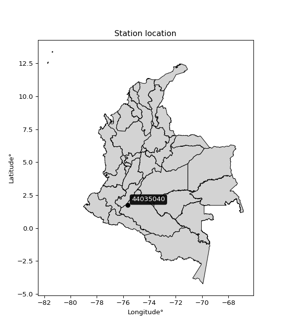

<div align="center">


</div>

# PMP Station (Rain, Pmax24h): 44035040

Probable Maximum Precipitation (PMP) is the greatest amount of rainfall for a specific duration that is meteorologically possible for a given location, acting as a "worst-case" scenario for extreme storms, crucial for designing safety-critical infrastructure like bridges, river deviations, dams, spillways, and nuclear plants to prevent catastrophic failure. PMP is calculated by hydrologists using meteorological data to determine the upper limit of extreme rainfall, often leading to the Probable Maximum Flood (PMF) for flood control design, and is increasingly being studied for climate change impacts. Probable Maximum Precipitation (PMP) is the theoretical upper limit of rainfall, a deterministic estimate for extreme events, while probability distributions (like GEV, Gumbel) describe the likelihood and frequency of various precipitation amounts, including rare ones, showing how often events occur, with PMP representing the extreme end of these distributions, used for critical infrastructure design to ensure safety against the worst conceivable weather, unlike standard statistical forecasts which cover typical probabilities.

The most common probability distributions in hydrology, used for analyzing floods, rainfall, and streamflow, include the Normal, Log-Normal, Gumbel, Gamma (including Log-Pearson Type III), and Generalized Extreme Value (GEV) distributions, often chosen based on the data´s skewness and whether modeling extremes or general conditions, with Gumbel and GEV popular for extreme events like floods, while the Normal distribution serves as a baseline, though often requiring transformations for skewed hydrological data. These distributions help in designing water infrastructure, managing water resources, and forecasting hydrologic events.

> Hydrological data often isn´t perfectly normal (it´s skewed), so different distributions are needed for different applications, such as: **Flood Frequency Analysis**: Using Gumbel, GEV, or Log-Pearson Type III for predicting extreme flood magnitudes and their return periods, **Rainfall Analysis**: Normal for annual totals, but Log-Normal, Weibull, or GEV for intensity or extreme daily rainfall, **Streamflow Modeling**: Gamma and Log-Normal for maximum flows, GEV for minimum flows, and Kappa for daily flows.

<div align="center">

</img>

</div>


## A. General information


### 1. General running parameters

• app_version: _v20260113_. • runtime: _2026-01-13 16:28:34.738620_. • Python version: _3.14.0_. • SciPy version: _1.16.3_. • Pandas version: _2.3.3_. • NumPy version: _2.3.5_. • Stations dataset (station_dataset_file): _dataset/pmax24h_in/automatic_colombia_2003_2025.csv_. • Stations catalog (station_catalog_file): _dataset/CNE.xls_. • Minimum year to eval til year_max (date_min): _1900_. • Maximum year to eval since year_min (date_max): _2025_. • Creates, save and include plots into reports (create_plot): _False_. • Plot only fit distributions with Δo > Δ (plot_only_fit): _True_. • Plot only simple graphs avoiding multiple CDFs and multiple Extreme values plots (plot_only_simple): _True_. • Eval low extreme values, if False, evaluates high extreme values (low_extreme): _False_. • Eval every SciPy distribution as logarithmic (pdist_logarithmic_on): _True_. • Standard deviation normalized (ddof): _1.0_. • Return periods to eval in years (Tr): _[2, 2.33, 5, 10, 15, 20, 25, 50, 75, 100, 200, 250, 500, 750, 1000]_. • Minimum data sample per station, 0 means any (minimum_sample): _5_. • Z-Score maximum threshold to adjust a value, 0 means disable (zscore_max): _3.5_. • Z-Score minimum threshold to adjust a value, 0 means disable (zscore_min): _-2.5_. • Avoid zeros, e.g. rain = 0 (avoid_zeros): _True_. • Avoid null values (avoid_nans): _True_. 

:file_folder:Table: [dataset.csv](../../dataset/pmax24h_in/automatic_colombia_2003_2025.csv)

> Delta Degrees of Freedom (DDOF): is a parameter used in the formulas for calculating variance and standard deviation. When ddof=0, the divisor is $N$ (the total number of observations) and this is used when your data set is the entire population. When ddof=1, the divisor is $N-1$ and this is used when your data set is a sample drawn from a larger population. Using $N-1$ provides an unbiased estimate of the population variance (known as Bessel´s correction).


### 2. Station info and location

|   id |   CODIGO | NOMBRE                     | CATEGORIA               | TECNOLOGIA                | ESTADO           | FECHA_INSTALACION   |   FECHA_SUSPENSION |   ALTITUD |   LATITUD |   LONGITUD | DEPARTAMENTO   | MUNICIPIO   | AREA_OPERATIVA                    | ENTIDAD                                                     | AREA_HIDROGRAFICA   | ZONA_HIDROGRAFICA   | SUBZONA_HIDROGRAFICA   |   CORRIENTE | Catalogo   |   Version |
|-----:|---------:|:---------------------------|:------------------------|:--------------------------|:-----------------|:--------------------|-------------------:|----------:|----------:|-----------:|:---------------|:------------|:----------------------------------|:------------------------------------------------------------|:--------------------|:--------------------|:-----------------------|------------:|:-----------|----------:|
|    0 | 44035040 | FLORENCIA - AUT [44035040] | Climatológica Principal | Automática con Telemetría | En Mantenimiento | 04/02/2006          |                nan |       600 |     1.733 |    -75.645 | Caqueta        | Florencia   | Area Operativa 04 - Huila-Caquetá | INSTITUTO DE HIDROLOGIA METEOROLOGIA Y ESTUDIOS AMBIENTALES | Amazonas            | Caquetá             | Río Orteguaza          |         nan | CNE_IDEAM  |  20251226 |

<div align="center">

Dynamic map: [:earth_americas:Google](http://maps.google.com/maps?q=1.733,-75.64502778) [:earth_americas:OSM](https://www.openstreetmap.org/#map=18/1.733/-75.64502778&layers=P) [:earth_americas:Bing](https://www.bing.com/maps?cp=1.733~-75.64502778&lvl=18) [:earth_americas:Apple](https://maps.apple.com/frame?center=1.733%2C-75.64502778&span=0.003%2C0.006)

</div>


<div align="center">

```geojson
{
  "type": "Feature",
  "geometry": {
    "type": "Point", 
    "coordinates": [-75.64502778, 1.733]
  }, 
  "properties": {
    "Name": "44035040"
  }
}
```

</div>


### 3. Discrete values table and plot

<div align="center">

|               |          0 |           1 |           2 |           3 |          4 |            5 |
|:--------------|-----------:|------------:|------------:|------------:|-----------:|-------------:|
| Date          | 2016       | 2017        | 2018        | 2022        | 2023       | 2025         |
| Value         |    9.8     |   50.9      |   60.8      |   34.7      |  120.5     |   54.2       |
| Value_initial |    9.8     |   50.9      |   60.8      |   34.7      |  120.5     |   54.2       |
| count         |    6       |    6        |    6        |    6        |    6       |    6         |
| mean          |   55.15    |   55.15     |   55.15     |   55.15     |   55.15    |   55.15      |
| std           |   36.8682  |   36.8682   |   36.8682   |   36.8682   |   36.8682  |   36.8682    |
| zscore        |   -1.23006 |   -0.115275 |    0.153248 |   -0.554678 |    1.77253 |   -0.0257674 |


</div>


> The initial value (value_initial) correspond to the initial obtained or null completed value, and value (value) is adjusted only when the initial value is outside the valid range (outlier) definite through the Z-Score value. If Z-Score is active, values out of range or outliers are replaced with the station mean value. A Z-Score (or standard score) measures how many standard deviations a data point is from the mean of a dataset, indicating its relative position; positive scores mean above the mean, negative mean below, and a score of zero is exactly at the mean, allowing for comparison of values from different distributions. It´s calculated using the formula $z=(x–μ)/σ$, where $x$ is the data point, $μ$ is the mean, and $σ$ is the standard deviation, helping identify outliers and understand probability.
>
> <sub>**Note**: In this study, "completing" (filling gaps in) and "extending" (forecasting or lengthening the historical record) rainfall data series are avoided for certain critical analyses because they introduce artificial bias and uncertainty, which can distort the statistics of rare events (extremes), alter day-to-day variability, and compromise the integrity and homogeneity of the original data. Some reasons against Completing/Extending rainfall data are: **Distortion of Extremes and Variability**: The primary issue is that most gap-filling or extension methods rely on averaging or regression with nearby stations, which inherently smooths the data. Rainfall is highly variable in space and time, with a large percentage of zero values and occasional large storms. Infilling methods often underestimate the highest values and overestimate the lowest (zero) values, which severely distorts analyses focused on flood frequency, drought severity, and intensity-duration-frequency (IDF) curves, **Loss of Data Homogeneity**: Infilled or extended data are synthetic estimates, not actual measurements. Combining these estimates with observed data can violate the assumption of data homogeneity, which requires that the data properties do not change over time. Inhomogeneity can lead to incorrect conclusions about long-term trends or changes in climate patterns, **Propagation of Errors**: Errors and biases from the original data (e.g., wind-induced undercatch, instrument errors, site changes) or the data used for imputation can propagate through the analysis, leading to unreliable hydrological models and inaccurate predictions, **Compromised Statistical Integrity**: For statistical analyses, especially those involving the frequency of events, using artificial data can introduce time bias or autocorrelation that doesn´t exist in reality, making it difficult to assess the true probability of events, **Difficulty in Validation**: It is difficult to accurately validate the quality of filled or extended data, especially for past periods where ground-truth measurements are unavailable. The reliability of imputation techniques heavily depends on the density of the surrounding station network and the complexity of the local topography.</sub>


### 4. Active continuous probability distributions from SciPy (45 of 104 available)

A Probability Density Function (PDF) describes the relative likelihood of a continuous random variable falling within a specific range, where the total area under its curve equals 1, and the area over any interval gives the actual probability for that range. Unlike discrete probabilities (like rolling a die), a PDF shows density, not direct probability for a single point (which is zero), with higher points indicating higher likelihood, often visualized as a bell curve for normal distributions.

A log of a probability density function (log-PDF) is simply the logarithm of the PDF´s value, denoted as $log(f(x))$, useful for converting multiplication of probabilities into addition, improving numerical stability with tiny numbers, and connecting to information theory concepts like entropy. Instead of dealing with very small probabilities (e.g., 0.000001), log-PDFs use negative numbers (e.g., $log(0.00001) ≈ -11.51$ that are easier for computers to handle, preventing underflow errors and simplifying complex calculations. In this study, each active probability distribution from SciPy is also evaluated in the $log$ form.

[scipy.stats](https://docs.scipy.org/doc/scipy/reference/stats.html) is a Python´s powerful submodule within the SciPy library for comprehensive statistical analysis, offering over 130 probability distributions (like Normal, Poisson), functions for descriptive stats (mean, variance), hypothesis testing (t-tests, chi-square), random variable generation, and statistical tests, making it essential for data science, modeling, and research. It provides tools to explore, model, and draw conclusions from data efficiently, working seamlessly with NumPy.

<div align="center">

|   id | p_dist             |   n_parameter | fit_method   | label                                                                       | active   | ref                                                                                                        |
|-----:|:-------------------|--------------:|:-------------|:----------------------------------------------------------------------------|:---------|:-----------------------------------------------------------------------------------------------------------|
|    0 | alpha              |             3 | MLE          | Alpha                                                                       | True     | [:mortar_board:](https://docs.scipy.org/doc/scipy/reference/generated/scipy.stats.alpha.html)              |
|    1 | betaprime          |             4 | MLE          | Beta prime                                                                  | True     | [:mortar_board:](https://docs.scipy.org/doc/scipy/reference/generated/scipy.stats.betaprime.html)          |
|    2 | chi2               |             3 | MLE          | Chi²                                                                        | True     | [:mortar_board:](https://docs.scipy.org/doc/scipy/reference/generated/scipy.stats.chi2.html)               |
|    3 | crystalball        |             4 | MLE          | Crystalball                                                                 | True     | [:mortar_board:](https://docs.scipy.org/doc/scipy/reference/generated/scipy.stats.crystalball.html)        |
|    4 | dweibull           |             3 | MLE          | Double Weibull                                                              | True     | [:mortar_board:](https://docs.scipy.org/doc/scipy/reference/generated/scipy.stats.dweibull.html)           |
|    5 | erlang             |             3 | MLE          | Erlang                                                                      | True     | [:mortar_board:](https://docs.scipy.org/doc/scipy/reference/generated/scipy.stats.erlang.html)             |
|    6 | expon              |             2 | MLE          | Exponential                                                                 | True     | [:mortar_board:](https://docs.scipy.org/doc/scipy/reference/generated/scipy.stats.expon.html)              |
|    7 | exponnorm          |             3 | MLE          | Exponentially modified Normal                                               | True     | [:mortar_board:](https://docs.scipy.org/doc/scipy/reference/generated/scipy.stats.exponnorm.html)          |
|    8 | f                  |             4 | MLE          | F                                                                           | True     | [:mortar_board:](https://docs.scipy.org/doc/scipy/reference/generated/scipy.stats.f.html)                  |
|    9 | fatiguelife        |             3 | MLE          | Fatigue-life (Birnbaum-Saunders)                                            | True     | [:mortar_board:](https://docs.scipy.org/doc/scipy/reference/generated/scipy.stats.fatiguelife.html)        |
|   10 | fisk               |             3 | MLE          | Fisk                                                                        | True     | [:mortar_board:](https://docs.scipy.org/doc/scipy/reference/generated/scipy.stats.fisk.html)               |
|   11 | gamma              |             3 | MLE          | Gamma                                                                       | True     | [:mortar_board:](https://docs.scipy.org/doc/scipy/reference/generated/scipy.stats.gamma.html)              |
|   12 | genexpon           |             5 | MLE          | Generalized exponential                                                     | True     | [:mortar_board:](https://docs.scipy.org/doc/scipy/reference/generated/scipy.stats.genexpon.html)           |
|   13 | genlogistic        |             3 | MLE          | Generalized logistic                                                        | True     | [:mortar_board:](https://docs.scipy.org/doc/scipy/reference/generated/scipy.stats.genlogistic.html)        |
|   14 | gibrat             |             2 | MM           | Gibrat                                                                      | True     | [:mortar_board:](https://docs.scipy.org/doc/scipy/reference/generated/scipy.stats.gibrat.html)             |
|   15 | gompertz           |             3 | MLE          | Gompertz (or truncated Gumbel)                                              | True     | [:mortar_board:](https://docs.scipy.org/doc/scipy/reference/generated/scipy.stats.gompertz.html)           |
|   16 | gumbel_l           |             2 | MM           | Gumbel Left Skew                                                            | True     | [:mortar_board:](https://docs.scipy.org/doc/scipy/reference/generated/scipy.stats.gumbel_l.html)           |
|   17 | gumbel_r           |             2 | MM           | Gumbel Right Skew                                                           | True     | [:mortar_board:](https://docs.scipy.org/doc/scipy/reference/generated/scipy.stats.gumbel_r.html)           |
|   18 | halflogistic       |             2 | MM           | Half-logistic                                                               | True     | [:mortar_board:](https://docs.scipy.org/doc/scipy/reference/generated/scipy.stats.halflogistic.html)       |
|   19 | halfnorm           |             2 | MM           | Half Normal                                                                 | True     | [:mortar_board:](https://docs.scipy.org/doc/scipy/reference/generated/scipy.stats.halfnorm.html)           |
|   20 | hypsecant          |             2 | MM           | hyperbolic secant                                                           | True     | [:mortar_board:](https://docs.scipy.org/doc/scipy/reference/generated/scipy.stats.hypsecant.html)          |
|   21 | invgamma           |             3 | MLE          | Inverted gamma                                                              | True     | [:mortar_board:](https://docs.scipy.org/doc/scipy/reference/generated/scipy.stats.invgamma.html)           |
|   22 | invgauss           |             3 | MLE          | Inverse Gaussian                                                            | True     | [:mortar_board:](https://docs.scipy.org/doc/scipy/reference/generated/scipy.stats.invgauss.html)           |
|   23 | invweibull         |             3 | MLE          | Inverted Weibull                                                            | True     | [:mortar_board:](https://docs.scipy.org/doc/scipy/reference/generated/scipy.stats.invweibull.html)         |
|   24 | kappa4             |             4 | MLE          | Kappa 4                                                                     | True     | [:mortar_board:](https://docs.scipy.org/doc/scipy/reference/generated/scipy.stats.kappa4.html)             |
|   25 | kstwobign          |             2 | MLE          | Limiting distribution of scaled Kolmogorov-Smirnov two-sided test statistic | True     | [:mortar_board:](https://docs.scipy.org/doc/scipy/reference/generated/scipy.stats.kstwobign.html)          |
|   26 | laplace            |             2 | MM           | Laplace                                                                     | True     | [:mortar_board:](https://docs.scipy.org/doc/scipy/reference/generated/scipy.stats.laplace.html)            |
|   27 | laplace_asymmetric |             3 | MLE          | Asymmetric Laplace                                                          | True     | [:mortar_board:](https://docs.scipy.org/doc/scipy/reference/generated/scipy.stats.laplace_asymmetric.html) |
|   28 | loggamma           |             3 | MLE          | Log gamma                                                                   | True     | [:mortar_board:](https://docs.scipy.org/doc/scipy/reference/generated/scipy.stats.loggamma.html)           |
|   29 | logistic           |             2 | MM           | Logistic (or Sech-squared)                                                  | True     | [:mortar_board:](https://docs.scipy.org/doc/scipy/reference/generated/scipy.stats.logistic.html)           |
|   30 | lognorm            |             3 | MLE          | Log Normal                                                                  | True     | [:mortar_board:](https://docs.scipy.org/doc/scipy/reference/generated/scipy.stats.lognorm.html)            |
|   31 | maxwell            |             2 | MM           | Maxwell                                                                     | True     | [:mortar_board:](https://docs.scipy.org/doc/scipy/reference/generated/scipy.stats.maxwell.html)            |
|   32 | mielke             |             4 | MLE          | Mielke Beta-Kappa / Dagum                                                   | True     | [:mortar_board:](https://docs.scipy.org/doc/scipy/reference/generated/scipy.stats.mielke.html)             |
|   33 | moyal              |             2 | MM           | Moyal                                                                       | True     | [:mortar_board:](https://docs.scipy.org/doc/scipy/reference/generated/scipy.stats.moyal.html)              |
|   34 | nakagami           |             3 | MLE          | Nakagami                                                                    | True     | [:mortar_board:](https://docs.scipy.org/doc/scipy/reference/generated/scipy.stats.nakagami.html)           |
|   35 | ncf                |             5 | MLE          | Non-central F distribution                                                  | True     | [:mortar_board:](https://docs.scipy.org/doc/scipy/reference/generated/scipy.stats.ncf.html)                |
|   36 | nct                |             4 | MLE          | Non-central Student’s t                                                     | True     | [:mortar_board:](https://docs.scipy.org/doc/scipy/reference/generated/scipy.stats.nct.html)                |
|   37 | norm               |             2 | MM           | Normal                                                                      | True     | [:mortar_board:](https://docs.scipy.org/doc/scipy/reference/generated/scipy.stats.norm.html)               |
|   38 | pearson3           |             3 | MM           | Pearson type III                                                            | True     | [:mortar_board:](https://docs.scipy.org/doc/scipy/reference/generated/scipy.stats.pearson3.html)           |
|   39 | rayleigh           |             2 | MM           | Rayleigh                                                                    | True     | [:mortar_board:](https://docs.scipy.org/doc/scipy/reference/generated/scipy.stats.rayleigh.html)           |
|   40 | rice               |             3 | MLE          | Rice                                                                        | True     | [:mortar_board:](https://docs.scipy.org/doc/scipy/reference/generated/scipy.stats.rice.html)               |
|   41 | t                  |             3 | MLE          | Student’s t                                                                 | True     | [:mortar_board:](https://docs.scipy.org/doc/scipy/reference/generated/scipy.stats.t.html)                  |
|   42 | truncnorm          |             4 | MLE          | Truncated normal                                                            | True     | [:mortar_board:](https://docs.scipy.org/doc/scipy/reference/generated/scipy.stats.truncnorm.html)          |
|   43 | wald               |             2 | MM           | Wald                                                                        | True     | [:mortar_board:](https://docs.scipy.org/doc/scipy/reference/generated/scipy.stats.wald.html)               |
|   44 | weibull_min        |             3 | MLE          | Weibull minimum                                                             | True     | [:mortar_board:](https://docs.scipy.org/doc/scipy/reference/generated/scipy.stats.weibull_min.html)        |

</div>

> **n_parameter:** # arguments & localization & scale.
>
> **Fit methods:** (MLE) maximum likelihood, (MM) L-moments.
>
>**Inactive** (With the only purpose of prevent loops, zero divisions, infinite values, over high estimated values or horizontal trending for recurrence intervals estimations, the follow distributions were disabled.)**:** foldnorm, gennorm, norminvgauss, powernorm, powerlognorm, skewnorm, genextreme, anglit, arcsine, argus, beta, bradford, burr, burr12, cauchy, cosine, halfcauchy, foldcauchy, skewcauchy, wrapcauchy, dgamma, gengamma, exponweib, exponpow, truncexpon, gausshyper, genhalflogistic, genhyperbolic, geninvgauss, halfgennorm, johnsonsb, johnsonsu, kappa3, ksone, kstwo, loglaplace, levy, levy_l, levy_stable, ncx2, pareto, genpareto, truncpareto, lomax, powerlaw, rdist, rel_breitwigner, recipinvgauss, semicircular, studentized_range, trapezoid, triang, truncweibull_min, tukeylambda, uniform, loguniform, vonmises, vonmises_line, weibull_max, 


## B. Probability (PDF) vs. Empirical (EDF) distributions functions

A continuous probability distribution (CPD) describes probabilities for variables that can take any value within a range (like rain any time), unlike discrete variables with specific outcomes (like temperature). It uses a Probability Density Function (PDF), a curve where the total area under it equals 1, and the probability of the variable falling within an interval (a to b) is found by calculating the area under the curve between those points. A key feature is that the probability of hitting any single exact value is zero, so probabilities are always expressed for ranges, e.g., $P(a ≤ X ≤ b)$.

<div align="center">

Distributions parameters from station values
|    |   station | p_dist                |   n |              loc |            scale | shape                  | shape1             | shape2                | shape3   |
|---:|----------:|:----------------------|----:|-----------------:|-----------------:|:-----------------------|:-------------------|:----------------------|:---------|
|  0 |  44035040 | alpha                 |   6 |     -0.0630276   |     22.2228      | 1.2189554166227967e-10 |                    |                       |          |
|  1 |  44035040 | betaprime             |   6 |     -7.45971     |      6.31952e+06 | 3.3300986928998615     | 337406.0560917492  |                       |          |
|  2 |  44035040 | chi2                  |   6 |      9.8         |     20.5499      | 1.3452400349653835     |                    |                       |          |
|  3 |  44035040 | crystalball           |   6 |     55.1498      |     33.656       | 55707.280794078266     | 821.1399900862579  |                       |          |
|  4 |  44035040 | dweibull              |   6 |     54.2         |     25.1511      | 0.7878933524320562     |                    |                       |          |
|  5 |  44035040 | erlang                |   6 |      0.0164005   |     24.1905      | 2.2791460121963336     |                    |                       |          |
|  6 |  44035040 | expon                 |   6 |      9.8         |     45.35        |                        |                    |                       |          |
|  7 |  44035040 | exponnorm             |   6 |     25.7297      |     17.7343      | 1.6589479837482606     |                    |                       |          |
|  8 |  44035040 | f                     |   6 |     -0.00868153  |     55.1287      | 4.564867929789336      | 31892.387131664414 |                       |          |
|  9 |  44035040 | fatiguelife           |   6 |      9.79825     |      0.44978     | 9.26738587962442       |                    |                       |          |
| 10 |  44035040 | fisk                  |   6 |    -36.5509      |     86.2464      | 4.888251855059018      |                    |                       |          |
| 11 |  44035040 | gamma                 |   6 |      0.0163959   |     24.1905      | 2.279144914030824      |                    |                       |          |
| 12 |  44035040 | genexpon              |   6 |      9.79995     |      1.63732     | 0.037642076981334815   | 0.2532238915292999 | 0.0008554914805214233 |          |
| 13 |  44035040 | genlogistic           |   6 |   -115.88        |     26.7591      | 335.1249885485048      |                    |                       |          |
| 14 |  44035040 | gibrat                |   6 |     29.4748      |     15.5728      |                        |                    |                       |          |
| 15 |  44035040 | gompertz              |   6 |      9.8         |     90.6809      | 1.2863879575115966     |                    |                       |          |
| 16 |  44035040 | gumbel_l              |   6 |     70.297       |     26.2414      |                        |                    |                       |          |
| 17 |  44035040 | gumbel_r              |   6 |     40.003       |     26.2414      |                        |                    |                       |          |
| 18 |  44035040 | halflogistic          |   6 |     15.2599      |     28.7747      |                        |                    |                       |          |
| 19 |  44035040 | halfnorm              |   6 |     10.6027      |     55.8317      |                        |                    |                       |          |
| 20 |  44035040 | hypsecant             |   6 |     55.15        |     21.426       |                        |                    |                       |          |
| 21 |  44035040 | invgamma              |   6 |    -69.7535      |   1763.78        | 15.11420748165205      |                    |                       |          |
| 22 |  44035040 | invgauss              |   6 |    -38.3244      |    690.839       | 0.1353056211452325     |                    |                       |          |
| 23 |  44035040 | invweibull            |   6 |     -5.20506e+08 |      5.20506e+08 | 19438768.40438059      |                    |                       |          |
| 24 |  44035040 | kappa4                |   6 |     -1.27612     |    120.765       | 1.1008953780715398     | 0.984315170120766  |                       |          |
| 25 |  44035040 | kstwobign             |   6 |    -56.4799      |    128.518       |                        |                    |                       |          |
| 26 |  44035040 | laplace               |   6 |     55.15        |     23.7983      |                        |                    |                       |          |
| 27 |  44035040 | laplace_asymmetric    |   6 |     50.9         |     23.0572      | 0.9120746099265993     |                    |                       |          |
| 28 |  44035040 | loggamma              |   6 | -11686.9         |   1538.22        | 2066.569987042416      |                    |                       |          |
| 29 |  44035040 | logistic              |   6 |     55.15        |     18.5555      |                        |                    |                       |          |
| 30 |  44035040 | lognorm               |   6 |      9.8         |      0.0877227   | 14.107800312353234     |                    |                       |          |
| 31 |  44035040 | maxwell               |   6 |    -24.6005      |     49.9762      |                        |                    |                       |          |
| 32 |  44035040 | mielke                |   6 |      9.7875      |     88.3462      | 0.59403668354193       | 3.735714484869092  |                       |          |
| 33 |  44035040 | moyal                 |   6 |     35.9034      |     15.1505      |                        |                    |                       |          |
| 34 |  44035040 | nakagami              |   6 |     34.7         |     30.8947      | 0.16130868741625976    |                    |                       |          |
| 35 |  44035040 | ncf                   |   6 |     -0.0107552   |      4.53821e-05 | 7.060372812653924e-06  | 5.502371630174286  | 6.8971388583458335    |          |
| 36 |  44035040 | nct                   |   6 |     -0.0662891   |     23.3421      | 5.891028467119623      | 2.046901123855488  |                       |          |
| 37 |  44035040 | norm                  |   6 |     55.15        |     33.6559      |                        |                    |                       |          |
| 38 |  44035040 | pearson3              |   6 |     55.15        |     33.656       | 0.7754147147820389     |                    |                       |          |
| 39 |  44035040 | rayleigh              |   6 |     -9.23578     |     51.3724      |                        |                    |                       |          |
| 40 |  44035040 | rice                  |   6 |     -4.74699     |     48.5817      | 0.0004923804998785966  |                    |                       |          |
| 41 |  44035040 | t                     |   6 |     55.15        |     33.6559      | 1554823692.7778006     |                    |                       |          |
| 42 |  44035040 | truncnorm             |   6 |     55.15        |     33.6559      | -456.27165592601364    | 2208.884389609416  |                       |          |
| 43 |  44035040 | wald                  |   6 |     21.4941      |     33.6559      |                        |                    |                       |          |
| 44 |  44035040 | weibull_min           |   6 |      6.93125     |     51.745       | 1.300648813094479      |                    |                       |          |
| 45 |  44035040 | logalpha              |   6 |    -18.8479      |    634.79        | 28.110361203553893     |                    |                       |          |
| 46 |  44035040 | logbetaprime          |   6 |     -0.925669    | 280330           | 29.91053706937973      | 1780728.2207316952 |                       |          |
| 47 |  44035040 | logchi2               |   6 |      2.28238     |      0.935155    | 1.1030072786576153     |                    |                       |          |
| 48 |  44035040 | logcrystalball        |   6 |      4.06111     |      0.451406    | 0.6428881194476326     | 962.375040605218   |                       |          |
| 49 |  44035040 | logdweibull           |   6 |      3.99268     |      0.63494     | 0.8020619115865937     |                    |                       |          |
| 50 |  44035040 | logerlang             |   6 |     -9.25831     |      0.0474409   | 274.53914213071096     |                    |                       |          |
| 51 |  44035040 | logexpon              |   6 |      2.28238     |      1.49277     |                        |                    |                       |          |
| 52 |  44035040 | logexponnorm          |   6 |      3.77457     |      0.763277    | 0.0007526584507715785  |                    |                       |          |
| 53 |  44035040 | logf                  |   6 |  -1082.53        |   1086.31        | 14172466.109692894     | 5610682.234780293  |                       |          |
| 54 |  44035040 | logfatiguelife        |   6 |   -253.554       |    257.33        | 0.002958472913787977   |                    |                       |          |
| 55 |  44035040 | logfisk               |   6 |     -6.21804e+07 |      6.21804e+07 | 150564876.7758929      |                    |                       |          |
| 56 |  44035040 | loggamma              |   6 |    -10.0641      |      0.0450622   | 307.1085254232479      |                    |                       |          |
| 57 |  44035040 | loggenexpon           |   6 |      2.28114     |      0.0043336   | 0.0010493032849540028  | 0.227188233789957  | 3.720458182559083e-05 |          |
| 58 |  44035040 | loggenlogistic        |   6 |      4.29369     |      0.246967    | 0.3836983045786979     |                    |                       |          |
| 59 |  44035040 | loggibrat             |   6 |      3.19286     |      0.353178    |                        |                    |                       |          |
| 60 |  44035040 | loggompertz           |   6 |      2.28238     |      0.707982    | 0.08544658018494258    |                    |                       |          |
| 61 |  44035040 | loggumbel_l           |   6 |      4.11867     |      0.595126    |                        |                    |                       |          |
| 62 |  44035040 | loggumbel_r           |   6 |      3.43163     |      0.595126    |                        |                    |                       |          |
| 63 |  44035040 | loghalflogistic       |   6 |      2.87044     |      0.652604    |                        |                    |                       |          |
| 64 |  44035040 | loghalfnorm           |   6 |      2.76487     |      1.2662      |                        |                    |                       |          |
| 65 |  44035040 | loghypsecant          |   6 |      3.77515     |      0.485919    |                        |                    |                       |          |
| 66 |  44035040 | loginvgamma           |   6 |    -12.5385      |   7018.23        | 430.904525209281       |                    |                       |          |
| 67 |  44035040 | loginvgauss           |   6 |     -4.09934     |    723.092       | 0.010880979275321098   |                    |                       |          |
| 68 |  44035040 | loginvweibull         |   6 |     -9.33183e+07 |      9.33183e+07 | 112037794.39725727     |                    |                       |          |
| 69 |  44035040 | logkappa4             |   6 |      2.05525     |      2.89998     | 1.0851977960424537     | 1.0594316020687633 |                       |          |
| 70 |  44035040 | logkstwobign          |   6 |      0.368912    |      3.89264     |                        |                    |                       |          |
| 71 |  44035040 | loglaplace            |   6 |      3.77515     |      0.53972     |                        |                    |                       |          |
| 72 |  44035040 | loglaplace_asymmetric |   6 |      3.99268     |      0.486254    | 1.248415648232461      |                    |                       |          |
| 73 |  44035040 | logloggamma           |   6 |      4.23054     |      0.541888    | 0.8571524088975714     |                    |                       |          |
| 74 |  44035040 | loglogistic           |   6 |      3.77515     |      0.420818    |                        |                    |                       |          |
| 75 |  44035040 | loglognorm            |   6 |      2.28238     |      0.00439895  | 13.383974919329697     |                    |                       |          |
| 76 |  44035040 | logmaxwell            |   6 |      1.9665      |      1.1334      |                        |                    |                       |          |
| 77 |  44035040 | logmielke             |   6 |     -5.11658e+06 |      5.11658e+06 | 7956089.806260649      | 20762052.71613487  |                       |          |
| 78 |  44035040 | logmoyal              |   6 |      3.33866     |      0.343596    |                        |                    |                       |          |
| 79 |  44035040 | lognakagami           |   6 |      3.54674     |      0.582198    | 0.22819069366039024    |                    |                       |          |
| 80 |  44035040 | logncf                |   6 |    -20.6514      |     24.4211      | 2596.9168649636213     | 7837.6578570344245 | 0.002779158696863824  |          |
| 81 |  44035040 | lognct                |   6 |    -36.229       |      0.726823    | 13211.472954986224     | 55.035735072727334 |                       |          |
| 82 |  44035040 | lognorm               |   6 |      3.77515     |      0.763279    |                        |                    |                       |          |
| 83 |  44035040 | logpearson3           |   6 |      3.77515     |      0.76328     | -0.8385608993301388    |                    |                       |          |
| 84 |  44035040 | lograyleigh           |   6 |      2.31499     |      1.16504     |                        |                    |                       |          |
| 85 |  44035040 | logrice               |   6 |      1.71971     |      0.819496    | 2.271232278779997      |                    |                       |          |
| 86 |  44035040 | logt                  |   6 |      3.9851      |      0.17366     | 0.7927072545410415     |                    |                       |          |
| 87 |  44035040 | logtruncnorm          |   6 |     -0.292966    |      1.57367     | 2.439975206460978      | 3.280421243442573  |                       |          |
| 88 |  44035040 | logwald               |   6 |      3.01186     |      0.763293    |                        |                    |                       |          |
| 89 |  44035040 | logweibull_min        |   6 |     -4.66367e+06 |      4.66367e+06 | 7821645.895035706      |                    |                       |          |

</div>

> **loc** (Location parameter): This shifts the distribution along the x-axis. For many common distributions, like the normal (Gaussian) distribution, loc represents the mean $μ$. For others, like the uniform distribution, it might represent the minimum value, or for the beta distribution, the left end of the support interval.
>
> **scale** (Scale parameter): This determines the width or spread of the distribution. For the normal distribution, scale represents the standard deviation $σ$. For a uniform distribution, it defines the length of the interval (from $loc$ to $loc + scale$).
>
> **shape** (Shape parameters): Refers to parameters that define the specific form of a probability distribution, distinct from its location (loc) and scale (scale). These parameters are required arguments for most distribution functions. For example, a normal (Gaussian) distribution is fully defined by its location (mean) and scale (standard deviation), so it has no specific shape parameters beyond loc and scale. However, other distributions have intrinsic properties that need specification, as Gamma distribution that takes a shape parameter, often named $a$ or $alpha$.


### 0. Cumulative distribution values - CDF (90 evaluated)

Cumulative Distribution Function (CDF), denoted as $F$<sub>$X$</sub>$(x)$, is a function that gives the probability that a random variable $X$ will take a value less than or equal to a specific value, $x$ (i.e., $(P(X≥x)$. It essentially "accumulates" probabilities from a given point up to the far right (positive infinity), providing a complete picture of the distribution´s probabilities for both discrete (like rain) and continuous (like temperature) variables, helping to find probabilities over ranges or above certain values. Each station is evaluated separately ordering the $x$ values ascending, calculating the CDF and PDF values for the activated distributions and their logarithmic forms.

<div align="center">

CDF ordered by x ascending and calculating $log(f(x))$ separately
|   id |   Station |   date |     x |   count |   mean |     std |     zscore |   Value_initial |   station |   m |     alpha |   alpha_pdf |   betaprime |   betaprime_pdf |        chi2 |       chi2_pdf |   crystalball |   crystalball_pdf |   dweibull |   dweibull_pdf |    erlang |   erlang_pdf |    expon |   expon_pdf |   exponnorm |   exponnorm_pdf |         f |      f_pdf |   fatiguelife |   fatiguelife_pdf |      fisk |   fisk_pdf |     gamma |   gamma_pdf |    genexpon |   genexpon_pdf |   genlogistic |   genlogistic_pdf |   gibrat |   gibrat_pdf |    gompertz |   gompertz_pdf |   gumbel_l |   gumbel_l_pdf |   gumbel_r |   gumbel_r_pdf |   halflogistic |   halflogistic_pdf |   halfnorm |   halfnorm_pdf |   hypsecant |   hypsecant_pdf |   invgamma |   invgamma_pdf |   invgauss |   invgauss_pdf |   invweibull |   invweibull_pdf |      kappa4 |   kappa4_pdf |   kstwobign |   kstwobign_pdf |   laplace |   laplace_pdf |   laplace_asymmetric |   laplace_asymmetric_pdf |   loggamma |   loggamma_pdf |   logistic |   logistic_pdf |   lognorm |   lognorm_pdf |   maxwell |   maxwell_pdf |    mielke |   mielke_pdf |     moyal |   moyal_pdf |    nakagami |   nakagami_pdf |      ncf |    ncf_pdf |       nct |    nct_pdf |      norm |   norm_pdf |   pearson3 |   pearson3_pdf |   rayleigh |   rayleigh_pdf |      rice |   rice_pdf |         t |      t_pdf |   truncnorm |   truncnorm_pdf |     wald |   wald_pdf |   weibull_min |   weibull_min_pdf |   logalpha |   logalpha_pdf |   logbetaprime |   logbetaprime_pdf |     logchi2 |   logchi2_pdf |   logcrystalball |   logcrystalball_pdf |   logdweibull |   logdweibull_pdf |   logerlang |   logerlang_pdf |   logexpon |   logexpon_pdf |   logexponnorm |   logexponnorm_pdf |      logf |   logf_pdf |   logfatiguelife |   logfatiguelife_pdf |   logfisk |   logfisk_pdf |   loggenexpon |   loggenexpon_pdf |   loggenlogistic |   loggenlogistic_pdf |   loggibrat |   loggibrat_pdf |   loggompertz |   loggompertz_pdf |   loggumbel_l |   loggumbel_l_pdf |   loggumbel_r |   loggumbel_r_pdf |   loghalflogistic |   loghalflogistic_pdf |   loghalfnorm |   loghalfnorm_pdf |   loghypsecant |   loghypsecant_pdf |   loginvgamma |   loginvgamma_pdf |   loginvgauss |   loginvgauss_pdf |   loginvweibull |   loginvweibull_pdf |   logkappa4 |   logkappa4_pdf |   logkstwobign |   logkstwobign_pdf |   loglaplace |   loglaplace_pdf |   loglaplace_asymmetric |   loglaplace_asymmetric_pdf |   logloggamma |   logloggamma_pdf |   loglogistic |   loglogistic_pdf |   loglognorm |   loglognorm_pdf |   logmaxwell |   logmaxwell_pdf |   logmielke |   logmielke_pdf |    logmoyal |   logmoyal_pdf |   lognakagami |   lognakagami_pdf |    logncf |   logncf_pdf |    lognct |   lognct_pdf |   logpearson3 |   logpearson3_pdf |   lograyleigh |   lograyleigh_pdf |   logrice |   logrice_pdf |      logt |   logt_pdf |   logtruncnorm |   logtruncnorm_pdf |   logwald |   logwald_pdf |   logweibull_min |   logweibull_min_pdf |
|-----:|----------:|-------:|------:|--------:|-------:|--------:|-----------:|----------------:|----------:|----:|----------:|------------:|------------:|----------------:|------------:|---------------:|--------------:|------------------:|-----------:|---------------:|----------:|-------------:|---------:|------------:|------------:|----------------:|----------:|-----------:|--------------:|------------------:|----------:|-----------:|----------:|------------:|------------:|---------------:|--------------:|------------------:|---------:|-------------:|------------:|---------------:|-----------:|---------------:|-----------:|---------------:|---------------:|-------------------:|-----------:|---------------:|------------:|----------------:|-----------:|---------------:|-----------:|---------------:|-------------:|-----------------:|------------:|-------------:|------------:|----------------:|----------:|--------------:|---------------------:|-------------------------:|-----------:|---------------:|-----------:|---------------:|----------:|--------------:|----------:|--------------:|----------:|-------------:|----------:|------------:|------------:|---------------:|---------:|-----------:|----------:|-----------:|----------:|-----------:|-----------:|---------------:|-----------:|---------------:|----------:|-----------:|----------:|-----------:|------------:|----------------:|---------:|-----------:|--------------:|------------------:|-----------:|---------------:|---------------:|-------------------:|------------:|--------------:|-----------------:|---------------------:|--------------:|------------------:|------------:|----------------:|-----------:|---------------:|---------------:|-------------------:|----------:|-----------:|-----------------:|---------------------:|----------:|--------------:|--------------:|------------------:|-----------------:|---------------------:|------------:|----------------:|--------------:|------------------:|--------------:|------------------:|--------------:|------------------:|------------------:|----------------------:|--------------:|------------------:|---------------:|-------------------:|--------------:|------------------:|--------------:|------------------:|----------------:|--------------------:|------------:|----------------:|---------------:|-------------------:|-------------:|-----------------:|------------------------:|----------------------------:|--------------:|------------------:|--------------:|------------------:|-------------:|-----------------:|-------------:|-----------------:|------------:|----------------:|------------:|---------------:|--------------:|------------------:|----------:|-------------:|----------:|-------------:|--------------:|------------------:|--------------:|------------------:|----------:|--------------:|----------:|-----------:|---------------:|-------------------:|----------:|--------------:|-----------------:|---------------------:|
|    0 |  44035040 |   2016 |   9.8 |       6 |  55.15 | 36.8682 | -1.23006   |             9.8 |  44035040 |   1 | 0.0242502 |  0.0143992  |   0.0412791 |      0.00634249 | 1.08892e-11 | 4123.21        |     0.0889175 |        0.00478178 |   0.10456  |     0.0029035  | 0.0366711 |   0.00752036 | 0        |  0.0220507  |   0.0471222 |      0.00467042 | 0.0367368 | 0.00752219 |     0.0423878 |      44.8504      | 0.0458497 | 0.0046137  | 0.0366711 |  0.00752037 | 1.05033e-06 |     0.02299    |     0.0476349 |        0.00539453 | 0        |  0           | 8.61812e-15 |     0.0141859  |  0.0949083 |    0.0034394   |  0.0423727 |     0.00510456 |       0        |         0          |   0        |     0          |   0.0763085 |      0.00352747 |  0.0470615 |     0.00546805 |  0.0454911 |     0.00579859 |    0.0472286 |       0.00538444 | 3.21828e-15 |   0.239673   |   0.0470127 |      0.00587087 | 0.0743671 |    0.00312488 |            0.0643275 |               0.00305886 |  0.0259911 |      0.0825255 |  0.0798769 |     0.00396091 | 0.0252484 |     0.0772083 | 0.0753931 |    0.00596888 | 0.0051693 |   0.245618   | 0.0179506 |  0.00378775 | 0           |    0           | 0.138263 | 0.0123547  | 0.0515722 | 0.0045629  | 0.0889162 | 0.00478174 |  0.0592287 |     0.00580175 |  0.0663482 |     0.00673435 | 0.0438401 | 0.00589329 | 0.0889162 | 0.00478174 |   0.0889162 |      0.00478174 | 0        | 0          |     0.0229679 |        0.0102928  |  0.0267232 |      0.0878596 |      0.0280788 |          0.0969192 | 2.71751e-09 |   3.37481e+06 |       nan        |           nan        |     0.0546366 |         0.0567255 |   0.0259463 |       0.0831679 |   0        |       0.669896 |      0.0252485 |          0.0772087 | 0.0256211 |  0.0779786 |        0.0245482 |            0.0760461 | 0.0211982 |     0.0502418 |   0.000301898 |          0.242619 |        0.0439387 |            0.0682452 |    0        |       0         |   2.01472e-08 |          0.12069  |     0.0446767 |         0.0733684 |    0.00101067 |         0.0117131 |          0        |              0        |      0        |          0        |      0.0294709 |          0.0605632 |     0.0224463 |         0.0771707 |     0.0249113 |         0.0881404 |       0.0261629 |            0.114444 | 1.98605e-15 |        6.19862  |      0.0309125 |           0.148812 |    0.0314622 |        0.0582936 |               0.0364033 |                   0.0599679 |     0.0478061 |         0.0745068 |     0.0279959 |         0.0646648 |    0.0126819 |      5.51268e+12 |   0.00562528 |        0.0525981 |   0.0438122 |       0.0681069 | 3.30276e-06 |    0.000108407 |   0           |       0           | 0.0257964 |    0.0808332 | 0.0256027 |    0.0782732 |     0.0428161 |          0.080432 |      0        |          0        | 0.0210605 |     0.0856718 | 0.0507517 |  0.0235034 |    0           |           0        |  0        |      0        |        0.0446377 |            0.0731675 |
|    1 |  44035040 |   2022 |  34.7 |       6 |  55.15 | 36.8682 | -0.554678  |            34.7 |  44035040 |   2 | 0.52265   |  0.0119609  |   0.314945  |      0.0134478  | 0.629153    |    0.0116419   |     0.271722  |        0.00985549 |   0.220588 |     0.00729346 | 0.337338  |   0.0135599  | 0.422509 |  0.0127341  |   0.285622  |      0.0138641  | 0.337486  | 0.0135651  |     0.784766  |       0.00479857  | 0.282182  | 0.0138965  | 0.337338  |  0.0135599  | 0.449757    |     0.0137501  |     0.30006   |        0.0134741  | 0.137411 |  0.0420582   | 0.334013    |     0.012433   |  0.227062  |    0.00758628  |  0.294065  |     0.0137158  |       0.325512 |         0.0155352  |   0.333972 |     0.0130199  |   0.233977  |      0.00996307 |  0.300113  |     0.0134102  |  0.3068    |     0.013399   |    0.299818  |       0.0134876  | 0.259222    |   0.00943661 |   0.304586  |      0.0130344  | 0.211728  |    0.00889677 |            0.210191  |               0.00999483 |  0.393043  |      0.492304  |  0.249347  |     0.0100872  | 0.382375  |     0.499782  | 0.29633   |    0.0111181  | 0.47077   |   0.0111272  | 0.298102  |  0.0159453  | 7.22446e-06 |    3.28022e+08 | 0.434496 | 0.0101539  | 0.283613  | 0.0135501  | 0.27172   | 0.00985547 |  0.297765  |     0.0122905  |  0.306302  |     0.0115486  | 0.280824  | 0.01202    | 0.27172   | 0.00985547 |   0.27172   |      0.00985547 | 0.262919 | 0.0301279  |     0.359214  |        0.0133578  |  0.407024  |      0.491176  |      0.413768  |          0.467897  | 0.726986    |   0.201103    |       nan        |           nan        |     0.235425  |         0.318935  |   0.397258  |       0.496137  |   0.571296 |       0.287187 |      0.382377  |          0.499785  | 0.382873  |  0.498143  |        0.38156   |            0.501205  | 0.316291  |     0.523634  |   0.486032    |          0.415627 |        0.307681  |            0.455878  |    0.500797 |       1.12732   |   0.345719    |          0.471006 |     0.317848  |         0.438437  |    0.438611   |         0.607397  |          0.476272 |              0.59237  |      0.46309  |          0.520764 |      0.355599  |          0.588811  |     0.391408  |         0.497686  |     0.411937  |         0.488673  |       0.450019  |            0.431404 | 0.512181    |        0.38154  |      0.482243  |           0.410078 |    0.327473  |        0.606746  |               0.292206  |                   0.481357  |     0.314989  |         0.426313  |     0.367541  |         0.552388  |    0.66384   |      0.021558    |   0.415871   |        0.517746  |   0.307353  |       0.455928  | 0.46006     |    0.652905    |   9.87593e-08 |       1.01493e+08 | 0.389419  |    0.494173  | 0.383982  |    0.498309  |     0.334872  |          0.439115 |      0.428161 |          0.518935 | 0.392693  |     0.495542  | 0.14469   |  0.242739  |    2.50199e-08 |           1.8926   |  0.516222 |      0.835833 |        0.31657   |            0.436283  |
|    2 |  44035040 |   2017 |  50.9 |       6 |  55.15 | 36.8682 | -0.115275  |            50.9 |  44035040 |   3 | 0.662795  |  0.00620782 |   0.525811  |      0.0120798  | 0.772694    |    0.0066618   |     0.449758  |        0.0117594  |   0.408606 |     0.0196925  | 0.541606  |   0.0113327  | 0.595977 |  0.00890899 |   0.517927  |      0.0137377  | 0.541828  | 0.0113361  |     0.846188  |       0.00300747  | 0.516941  | 0.0139582  | 0.541606  |  0.0113327  | 0.636747    |     0.00954477 |     0.518082  |        0.0127197  | 0.625153 |  0.0176962   | 0.521746    |     0.0106747  |  0.379673  |    0.0112879   |  0.516764  |     0.0130005  |       0.550639 |         0.0121078  |   0.52956  |     0.0110138  |   0.437271  |      0.0145687  |  0.517074  |     0.0126783  |  0.520186  |     0.0123423  |    0.517996  |       0.0127249  | 0.408127    |   0.00898454 |   0.512432  |      0.0120948  | 0.418227  |    0.0175738  |            0.454113  |               0.0215937  |  0.584956  |      0.489993  |  0.442988  |     0.0132979  | 0.580313  |     0.512042  | 0.48408   |    0.01164    | 0.629214  |   0.00859798 | 0.542115  |  0.0133304  | 0.646974    |    0.0124008   | 0.576048 | 0.00740399 | 0.512489  | 0.0136936  | 0.449756  | 0.0117594  |  0.500717  |     0.0122077  |  0.495978  |     0.0114848  | 0.48108   | 0.0122348  | 0.449756  | 0.0117594  |   0.449756  |      0.0117594  | 0.61256  | 0.0143822  |     0.55475   |        0.0106569  |  0.595442  |      0.474073  |      0.590837  |          0.441754  | 0.792639    |   0.145512    |         0.506549 |             0.680444 |     0.427613  |         0.853855  |   0.590026  |       0.490394  |   0.668339 |       0.222179 |      0.580316  |          0.512042  | 0.580064  |  0.510023  |        0.580016  |            0.513143  | 0.539128  |     0.601648  |   0.635071    |          0.357249 |        0.52496   |            0.663522  |    0.769021 |       0.412981  |   0.546221    |          0.561208 |     0.517198  |         0.590718  |    0.648606   |         0.471834  |          0.670519 |              0.421699 |      0.642464 |          0.412683 |      0.599677  |          0.623212  |     0.584362  |         0.48974   |     0.597467  |         0.462683  |       0.604068  |            0.365572 | 0.658146    |        0.381255 |      0.627364  |           0.343311 |    0.624614  |        0.695521  |               0.549268  |                   0.90482   |     0.510276  |         0.584154  |     0.59089   |         0.57445   |    0.671024  |      0.0164036   |   0.608493   |        0.471172  |   0.524781  |       0.664324  | 0.672275    |    0.449129    |   0.635622    |       0.698399    | 0.583014  |    0.496347  | 0.580947  |    0.50874   |     0.526885  |          0.550783 |      0.617354 |          0.455251 | 0.586295  |     0.495534  | 0.406965  |  1.56806   |    0.542146    |           1.01438  |  0.738048 |      0.389556 |        0.515048  |            0.588614  |
|    3 |  44035040 |   2025 |  54.2 |       6 |  55.15 | 36.8682 | -0.0257674 |            54.2 |  44035040 |   4 | 0.682144  |  0.00553746 |   0.564755  |      0.0115134  | 0.793553    |    0.00599432  |     0.488743  |        0.0118488  |   0.5      |    31.1114     | 0.577991  |   0.0107151  | 0.624333 |  0.00828373 |   0.562151  |      0.0130401  | 0.578223  | 0.0107179  |     0.855714  |       0.00277034  | 0.561895  | 0.0132598  | 0.577991  |  0.0107151  | 0.667061    |     0.00883506 |     0.559121  |        0.0121374  | 0.678066 |  0.0144998   | 0.556308    |     0.0102702  |  0.418123  |    0.0120071   |  0.558691  |     0.0123944  |       0.589331 |         0.0113414  |   0.565121 |     0.0105354  |   0.485891  |      0.0148416  |  0.558004  |     0.0121127  |  0.560003  |     0.0117773  |    0.559049  |       0.012141   | 0.437659    |   0.00891462 |   0.551538  |      0.0115952  | 0.480434  |    0.0201877  |            0.520917  |               0.0189511  |  0.6154    |      0.478848  |  0.487203  |     0.0134643  | 0.612176  |     0.501868  | 0.522205  |    0.011451   | 0.656863  |   0.00816075 | 0.584575  |  0.0123976  | 0.684996    |    0.0107216   | 0.599672 | 0.00691819 | 0.556714  | 0.0130851  | 0.488741  | 0.0118488  |  0.540406  |     0.0118309  |  0.533451  |     0.0112143  | 0.52103   | 0.0119625  | 0.48874   | 0.0118488  |   0.488741  |      0.0118488  | 0.656598 | 0.0123687  |     0.588925  |        0.0100554  |  0.624839  |      0.461462  |      0.618221  |          0.429811  | 0.801553    |   0.138364    |         0.550028 |             0.701713 |     0.5       |       631.319     |   0.620476  |       0.47862   |   0.682006 |       0.213023 |      0.612179  |          0.501869  | 0.611802  |  0.49993   |        0.611943  |            0.502835  | 0.576627  |     0.591137  |   0.657136    |          0.345203 |        0.567214  |            0.680195  |    0.793156 |       0.357126  |   0.581629    |          0.565426 |     0.55479   |         0.605364  |    0.677354   |         0.443386  |          0.696162 |              0.394848 |      0.667795 |          0.393785 |      0.637963  |          0.594496  |     0.614762  |         0.47768   |     0.626127  |         0.449452  |       0.626597  |            0.35166  | 0.682109    |        0.38171  |      0.648532  |           0.330621 |    0.665858  |        0.619102  |               0.609152  |                   1.00347   |     0.54753   |         0.60122   |     0.626428  |         0.556098  |    0.672034  |      0.0157815   |   0.637597   |        0.455168  |   0.56709   |       0.681122  | 0.699443    |    0.416068    |   0.676987    |       0.620913    | 0.613869  |    0.485527  | 0.612599  |    0.49848   |     0.561784  |          0.5597   |      0.645426 |          0.438264 | 0.617096  |     0.484629  | 0.513223  |  1.74258   |    0.602558    |           0.910614 |  0.761172 |      0.347651 |        0.552515  |            0.603483  |
|    4 |  44035040 |   2018 |  60.8 |       6 |  55.15 | 36.8682 |  0.153248  |            60.8 |  44035040 |   5 | 0.715016  |  0.00447798 |   0.636666  |      0.0102582  | 0.829289    |    0.0048786   |     0.566661  |        0.0116877  |   0.647133 |     0.0146811  | 0.644536  |   0.00944843 | 0.675213 |  0.00716178 |   0.642727  |      0.0113283  | 0.644783  | 0.00944991 |     0.872629  |       0.00237017  | 0.643831  | 0.0115144  | 0.644536  |  0.00944843 | 0.721031    |     0.007548   |     0.634832  |        0.0107727  | 0.757692 |  0.00997581  | 0.621332    |     0.00942688 |  0.501597  |    0.0132257   |  0.635908  |     0.0109703  |       0.659158 |         0.00982653 |   0.631391 |     0.00953956 |   0.582981  |      0.0143542  |  0.63366   |     0.0107796  |  0.633571  |     0.0104906  |    0.634777  |       0.0107741  | 0.496069    |   0.00878817 |   0.624372  |      0.010451   | 0.605667  |    0.0165698  |            0.630999  |               0.0145966  |  0.668953  |      0.451926  |  0.57554   |     0.0131656  | 0.668415  |     0.475373  | 0.595887  |    0.0108264  | 0.70789   |   0.0073045  | 0.660148  |  0.0105115  | 0.747433    |    0.00836392  | 0.642354 | 0.00603558 | 0.63814   | 0.0115336  | 0.566659  | 0.0116877  |  0.615376  |     0.0108433  |  0.605165  |     0.0104779  | 0.59755   | 0.0111768  | 0.566659  | 0.0116877  |   0.566659  |      0.0116877  | 0.727437 | 0.00927928 |     0.651357  |        0.00887001 |  0.676284  |      0.432861  |      0.666166  |          0.403869  | 0.816751    |   0.126379    |         0.631349 |             0.70607  |     0.612093  |         0.687302  |   0.673939  |       0.450602  |   0.705566 |       0.19724  |      0.668418  |          0.475373  | 0.667832  |  0.47368   |        0.668279  |            0.476072  | 0.642719  |     0.556034  |   0.695487    |          0.322101 |        0.645883  |            0.682308  |    0.829366 |       0.277302  |   0.646545    |          0.561871 |     0.625273  |         0.618047  |    0.725308   |         0.391412  |          0.73881  |              0.34796  |      0.711053 |          0.359131 |      0.702534  |          0.526879  |     0.668096  |         0.449352  |     0.676161  |         0.420458  |       0.665503  |            0.325363 | 0.72604     |        0.383004 |      0.685171  |           0.307023 |    0.729935  |        0.500379  |               0.709007  |                   0.7471    |     0.617832  |         0.619202  |     0.687828  |         0.510246  |    0.673787  |      0.0147558   |   0.688029   |        0.421832  |   0.645874  |       0.683363  | 0.743952    |    0.359537    |   0.741517    |       0.507083    | 0.668206  |    0.458813  | 0.668449  |    0.472018  |     0.626571  |          0.565498 |      0.693866 |          0.404307 | 0.671326  |     0.45788   | 0.683885  |  1.12853   |    0.697368    |           0.744412 |  0.797339 |      0.284449 |        0.622815  |            0.61679   |
|    5 |  44035040 |   2023 | 120.5 |       6 |  55.15 | 36.8682 |  1.77253   |           120.5 |  44035040 |   6 | 0.853758  |  0.00119931 |   0.95163   |      0.00183102 | 0.966759    |    0.000885661 |     0.973914  |        0.00179949 |   0.941536 |     0.00149112 | 0.940985  |   0.00192152 | 0.912928 |  0.00192001 |   0.952145  |      0.0016266  | 0.941124  | 0.00191881 |     0.9541    |       0.000739368 | 0.949301  | 0.00149801 | 0.940985  |  0.00192152 | 0.951719    |     0.00152962 |     0.952333  |        0.00173806 | 0.961269 |  0.000922185 | 0.953773    |     0.00222294 |  0.998857  |    0.000295035 |  0.954531  |     0.00169271 |       0.949698 |         0.00170416 |   0.950974 |     0.00205935 |   0.969874  |      0.00140396 |  0.952367  |     0.00173115 |  0.951362  |     0.00180953 |    0.952284  |       0.00173878 | 0.993115    |   0.00766386 |   0.954932  |      0.00193157 | 0.967908  |    0.00134851 |            0.965213  |               0.00137607 |  0.899069  |      0.213425  |  0.971304  |     0.00150214 | 0.908529  |     0.215329  | 0.962082  |    0.00198841 | 0.94467   |   0.00152513 | 0.951115  |  0.00161128 | 0.971657    |    0.00120778  | 0.853052 | 0.00191687 | 0.9548    | 0.00153525 | 0.973914  | 0.00179951 |  0.957256  |     0.00186695 |  0.958779  |     0.00202635 | 0.963963  | 0.00191235 | 0.973914  | 0.00179951 |   0.973914  |      0.00179951 | 0.950826 | 0.00123778 |     0.937955  |        0.00197531 |  0.895719  |      0.205526  |      0.876361  |          0.208495  | 0.884262    |   0.0760041   |         0.957599 |             0.19161  |     0.849762  |         0.181344  |   0.901814  |       0.209451  |   0.813803 |       0.124733 |      0.908531  |          0.215326  | 0.907582  |  0.215899  |        0.908465  |            0.215152  | 0.904095  |     0.209954  |   0.866823    |          0.181115 |        0.953171  |            0.174005  |    0.934483 |       0.0797955 |   0.943425    |          0.236345 |     0.95487   |         0.234946  |    0.903257   |         0.154429  |          0.89995  |              0.14564  |      0.890552 |          0.175012 |      0.921804  |          0.15931   |     0.895992  |         0.211892  |     0.889938  |         0.203471  |       0.836006  |            0.179784 | 0.999486    |        0.540851 |      0.848791  |           0.17631  |    0.923963  |        0.140883  |               0.949749  |                   0.129015  |     0.955121  |         0.242509  |     0.918004  |         0.178872  |    0.682313  |      0.0106158   |   0.898313   |        0.195747  |   0.953389  |       0.173622  | 0.903923    |    0.139133    |   0.942813    |       0.143111    | 0.901463  |    0.214545  | 0.907248  |    0.215272  |     0.941582  |          0.267403 |      0.895601 |          0.190493 | 0.903962  |     0.213325  | 0.908882  |  0.0875059 |    0.985586    |           0.200849 |  0.916008 |      0.100355 |        0.95362   |            0.238871  |


</div>

An Empirical Distribution Function (EDF) is a step-function estimate of a true cumulative distribution function (CDF) based on observed sample data, representing the proportion of data points less than or equal to a given value. It is calculated by ordering your data and jumping up by $1/n$ (where $n$ is sample size) at each unique data point, allowing analysis without assuming an underlying population distribution, and it gets closer to the true CDF as the sample size grows. For the empirical probability calculations, the parameter $m$ correspond to the order number which means the position of the $x$ values in an ascending order list.

The Kolmogorov-Smirnov (K-S) test is a non-parametric statistical test used to determine if a sample data set comes from a specific theoretical distribution (one-sample) or if two different samples come from the same underlying distribution (two-sample), by comparing their cumulative distribution functions (CDFs). It calculates the maximum vertical difference (D statistic) between these functions, with a small p-value indicating a significant difference and rejection of the null hypothesis (that the data/samples match).


### 1. EDF California (1923)

California´s estimates the true probability distribution of water-related data (like rainfall, streamflow) using observed samples, crucial for risk assessment.

<div align="center">


$P=m/n$


</div>


**1.1. Empirical values**

<div align="center">

|                | 0                   | 1                  | 2              | 3                  | 4                  | 5              |
|:---------------|:--------------------|:-------------------|:---------------|:-------------------|:-------------------|:---------------|
| date           | 2016                | 2022               | 2017           | 2025               | 2018               | 2023           |
| x              | 9.8                 | 34.7               | 50.9           | 54.2               | 60.8               | 120.5          |
| m              | 1                   | 2                  | 3              | 4                  | 5                  | 6              |
| empirical_dist | edf_california      | edf_california     | edf_california | edf_california     | edf_california     | edf_california |
| empirical      | 0.16666666666666666 | 0.3333333333333333 | 0.5            | 0.6666666666666666 | 0.8333333333333334 | 1.0            |
| empirical_tr   | 1.2                 | 1.4999999999999998 | 2.0            | 2.9999999999999996 | 6.000000000000002  | inf            |

</div>


**1.2. Kolmogorov-Smirnov fit test (sorted by Δ)**


<div align="center">

|                | 0                     | 1                   | 2                   | 3                   | 4                   | 5                   | 6                   | 7                   | 8                   | 9                   | 10                  | 11                  | 12                  | 13                  | 14                 | 15                  | 16                  | 17                 | 18                 | 19                 | 20                  | 21                  | 22                  | 23                  | 24                  | 25                  | 26                  | 27                  | 28                  | 29                  | 30                  | 31                 | 32                  | 33                 | 34                 | 35                  | 36                 | 37                  | 38                 | 39                  | 40                  | 41                  | 42                 | 43                  | 44                  | 45                  | 46                 | 47                  | 48                 | 49                  | 50                 | 51                 | 52                  | 53                  | 54                  | 55                 | 56                  | 57                  | 58                 | 59                 | 60                 | 61                 | 62                  | 63                 | 64                 | 65                 | 66                  | 67                  | 68                  | 69                  | 70                  | 71                  | 72                 | 73                  | 74                 | 75                 | 76                 | 77                | 78                  | 79                  | 80                 | 81                  | 82                 | 83                  | 84                 | 85                | 86                  | 87                  | 88                 | 89                 |
|:---------------|:----------------------|:--------------------|:--------------------|:--------------------|:--------------------|:--------------------|:--------------------|:--------------------|:--------------------|:--------------------|:--------------------|:--------------------|:--------------------|:--------------------|:-------------------|:--------------------|:--------------------|:-------------------|:-------------------|:-------------------|:--------------------|:--------------------|:--------------------|:--------------------|:--------------------|:--------------------|:--------------------|:--------------------|:--------------------|:--------------------|:--------------------|:-------------------|:--------------------|:-------------------|:-------------------|:--------------------|:-------------------|:--------------------|:-------------------|:--------------------|:--------------------|:--------------------|:-------------------|:--------------------|:--------------------|:--------------------|:-------------------|:--------------------|:-------------------|:--------------------|:-------------------|:-------------------|:--------------------|:--------------------|:--------------------|:-------------------|:--------------------|:--------------------|:-------------------|:-------------------|:-------------------|:-------------------|:--------------------|:-------------------|:-------------------|:-------------------|:--------------------|:--------------------|:--------------------|:--------------------|:--------------------|:--------------------|:-------------------|:--------------------|:-------------------|:-------------------|:-------------------|:------------------|:--------------------|:--------------------|:-------------------|:--------------------|:-------------------|:--------------------|:-------------------|:------------------|:--------------------|:--------------------|:-------------------|:-------------------|
| station        | 44035040              | 44035040            | 44035040            | 44035040            | 44035040            | 44035040            | 44035040            | 44035040            | 44035040            | 44035040            | 44035040            | 44035040            | 44035040            | 44035040            | 44035040           | 44035040            | 44035040            | 44035040           | 44035040           | 44035040           | 44035040            | 44035040            | 44035040            | 44035040            | 44035040            | 44035040            | 44035040            | 44035040            | 44035040            | 44035040            | 44035040            | 44035040           | 44035040            | 44035040           | 44035040           | 44035040            | 44035040           | 44035040            | 44035040           | 44035040            | 44035040            | 44035040            | 44035040           | 44035040            | 44035040            | 44035040            | 44035040           | 44035040            | 44035040           | 44035040            | 44035040           | 44035040           | 44035040            | 44035040            | 44035040            | 44035040           | 44035040            | 44035040            | 44035040           | 44035040           | 44035040           | 44035040           | 44035040            | 44035040           | 44035040           | 44035040           | 44035040            | 44035040            | 44035040            | 44035040            | 44035040            | 44035040            | 44035040           | 44035040            | 44035040           | 44035040           | 44035040           | 44035040          | 44035040            | 44035040            | 44035040           | 44035040            | 44035040           | 44035040            | 44035040           | 44035040          | 44035040            | 44035040            | 44035040           | 44035040           |
| empirical_dist | edf_california        | edf_california      | edf_california      | edf_california      | edf_california      | edf_california      | edf_california      | edf_california      | edf_california      | edf_california      | edf_california      | edf_california      | edf_california      | edf_california      | edf_california     | edf_california      | edf_california      | edf_california     | edf_california     | edf_california     | edf_california      | edf_california      | edf_california      | edf_california      | edf_california      | edf_california      | edf_california      | edf_california      | edf_california      | edf_california      | edf_california      | edf_california     | edf_california      | edf_california     | edf_california     | edf_california      | edf_california     | edf_california      | edf_california     | edf_california      | edf_california      | edf_california      | edf_california     | edf_california      | edf_california      | edf_california      | edf_california     | edf_california      | edf_california     | edf_california      | edf_california     | edf_california     | edf_california      | edf_california      | edf_california      | edf_california     | edf_california      | edf_california      | edf_california     | edf_california     | edf_california     | edf_california     | edf_california      | edf_california     | edf_california     | edf_california     | edf_california      | edf_california      | edf_california      | edf_california      | edf_california      | edf_california      | edf_california     | edf_california      | edf_california     | edf_california     | edf_california     | edf_california    | edf_california      | edf_california      | edf_california     | edf_california      | edf_california     | edf_california      | edf_california     | edf_california    | edf_california      | edf_california      | edf_california     | edf_california     |
| p_dist         | loglaplace_asymmetric | loglaplace          | loghypsecant        | loglogistic         | logkstwobign        | logalpha            | loginvgauss         | logerlang           | logmaxwell          | mielke              | logrice             | loggamma            | loggamma            | lognct              | logexponnorm       | lognorm             | lognorm             | logfatiguelife     | logncf             | loginvgamma        | logf                | loggumbel_r         | loggenexpon         | genexpon            | wald                | expon               | lograyleigh         | loghalfnorm         | logbetaprime        | loginvweibull       | loghalflogistic     | logmoyal           | moyal               | halflogistic       | logkappa4          | weibull_min         | dweibull           | loggompertz         | loggenlogistic     | logmielke           | f                   | logt                | erlang             | gamma               | alpha               | fisk                | exponnorm          | logfisk             | ncf                | nct                 | gibrat             | betaprime          | gumbel_r            | genlogistic         | invweibull          | invgamma           | invgauss            | halfnorm            | logcrystalball     | laplace_asymmetric | logpearson3        | loggumbel_l        | kstwobign           | logweibull_min     | gompertz           | logloggamma        | pearson3            | logdweibull         | laplace             | rayleigh            | rice                | maxwell             | logexpon           | logwald             | hypsecant          | logistic           | crystalball        | truncnorm         | norm                | t                   | loggibrat          | chi2                | loglognorm         | gumbel_l            | nakagami           | lognakagami       | logtruncnorm        | kappa4              | logchi2            | fatiguelife        |
| delta          | 0.13026333696581027   | 0.13520446001588082 | 0.13719577435984423 | 0.14550568233620353 | 0.15120947105154825 | 0.15704894330328356 | 0.15717279778616622 | 0.15939457840842086 | 0.16104139135063084 | 0.16149736562072467 | 0.16200725433228358 | 0.16438025811316437 | 0.16438025811316437 | 0.16488469239269266 | 0.1649152441513425 | 0.16491845132244476 | 0.16491845132244476 | 0.1650547861076772 | 0.1651273685123772 | 0.1652377597643323 | 0.16550139199513836 | 0.16565599306046358 | 0.16636476891572713 | 0.16666561633428958 | 0.16666666666666666 | 0.16666666666666666 | 0.16666666666666666 | 0.16666666666666666 | 0.16716763437557225 | 0.16783054460640823 | 0.17051922755440485 | 0.1722750857095643 | 0.17318487216101552 | 0.1741749108520806 | 0.1788481475757973 | 0.18197586698393498 | 0.1862004775478746 | 0.18678855756161095 | 0.1874500414634922 | 0.18745887445598186 | 0.18855050017489283 | 0.18864357149613922 | 0.1887969488020872 | 0.18879697798493433 | 0.18931685559093653 | 0.18950251577253074 | 0.1906062004242406 | 0.19061480489188154 | 0.1909790710813496 | 0.19519288916458943 | 0.1959222003980754 | 0.1966669725442861 | 0.19742491062594514 | 0.19850125118415363 | 0.19855672077829856 | 0.1996731966924713 | 0.19976243646971925 | 0.20194250534641112 | 0.2019839038815343 | 0.2023339486342305 | 0.2067624288304971 | 0.2080598774277146 | 0.20896152414346136 | 0.2105183551562858 | 0.2120017904996342 | 0.2155010469250317 | 0.21795698508779426 | 0.22123995362965554 | 0.22766669085844848 | 0.22816843337903203 | 0.23578341946564574 | 0.23744608905829412 | 0.2379624995591358 | 0.23804769165369233 | 0.2503519180256505 | 0.2577930713905193 | 0.2666718636680846 | 0.266674039225426 | 0.26667404225445135 | 0.26667422368754023 | 0.2690209120750322 | 0.29581978567209927 | 0.3305063070588247 | 0.33173601739415226 | 0.3333261088766347 | 0.333333234574065 | 0.33333330831344793 | 0.33726384506163415 | 0.3936527803406474 | 0.4514327200106704 |
| deltao         | 0.530385761606        | 0.530385761606      | 0.530385761606      | 0.530385761606      | 0.530385761606      | 0.530385761606      | 0.530385761606      | 0.530385761606      | 0.530385761606      | 0.530385761606      | 0.530385761606      | 0.530385761606      | 0.530385761606      | 0.530385761606      | 0.530385761606     | 0.530385761606      | 0.530385761606      | 0.530385761606     | 0.530385761606     | 0.530385761606     | 0.530385761606      | 0.530385761606      | 0.530385761606      | 0.530385761606      | 0.530385761606      | 0.530385761606      | 0.530385761606      | 0.530385761606      | 0.530385761606      | 0.530385761606      | 0.530385761606      | 0.530385761606     | 0.530385761606      | 0.530385761606     | 0.530385761606     | 0.530385761606      | 0.530385761606     | 0.530385761606      | 0.530385761606     | 0.530385761606      | 0.530385761606      | 0.530385761606      | 0.530385761606     | 0.530385761606      | 0.530385761606      | 0.530385761606      | 0.530385761606     | 0.530385761606      | 0.530385761606     | 0.530385761606      | 0.530385761606     | 0.530385761606     | 0.530385761606      | 0.530385761606      | 0.530385761606      | 0.530385761606     | 0.530385761606      | 0.530385761606      | 0.530385761606     | 0.530385761606     | 0.530385761606     | 0.530385761606     | 0.530385761606      | 0.530385761606     | 0.530385761606     | 0.530385761606     | 0.530385761606      | 0.530385761606      | 0.530385761606      | 0.530385761606      | 0.530385761606      | 0.530385761606      | 0.530385761606     | 0.530385761606      | 0.530385761606     | 0.530385761606     | 0.530385761606     | 0.530385761606    | 0.530385761606      | 0.530385761606      | 0.530385761606     | 0.530385761606      | 0.530385761606     | 0.530385761606      | 0.530385761606     | 0.530385761606    | 0.530385761606      | 0.530385761606      | 0.530385761606     | 0.530385761606     |
| eval           | Δo > Δ                | Δo > Δ              | Δo > Δ              | Δo > Δ              | Δo > Δ              | Δo > Δ              | Δo > Δ              | Δo > Δ              | Δo > Δ              | Δo > Δ              | Δo > Δ              | Δo > Δ              | Δo > Δ              | Δo > Δ              | Δo > Δ             | Δo > Δ              | Δo > Δ              | Δo > Δ             | Δo > Δ             | Δo > Δ             | Δo > Δ              | Δo > Δ              | Δo > Δ              | Δo > Δ              | Δo > Δ              | Δo > Δ              | Δo > Δ              | Δo > Δ              | Δo > Δ              | Δo > Δ              | Δo > Δ              | Δo > Δ             | Δo > Δ              | Δo > Δ             | Δo > Δ             | Δo > Δ              | Δo > Δ             | Δo > Δ              | Δo > Δ             | Δo > Δ              | Δo > Δ              | Δo > Δ              | Δo > Δ             | Δo > Δ              | Δo > Δ              | Δo > Δ              | Δo > Δ             | Δo > Δ              | Δo > Δ             | Δo > Δ              | Δo > Δ             | Δo > Δ             | Δo > Δ              | Δo > Δ              | Δo > Δ              | Δo > Δ             | Δo > Δ              | Δo > Δ              | Δo > Δ             | Δo > Δ             | Δo > Δ             | Δo > Δ             | Δo > Δ              | Δo > Δ             | Δo > Δ             | Δo > Δ             | Δo > Δ              | Δo > Δ              | Δo > Δ              | Δo > Δ              | Δo > Δ              | Δo > Δ              | Δo > Δ             | Δo > Δ              | Δo > Δ             | Δo > Δ             | Δo > Δ             | Δo > Δ            | Δo > Δ              | Δo > Δ              | Δo > Δ             | Δo > Δ              | Δo > Δ             | Δo > Δ              | Δo > Δ             | Δo > Δ            | Δo > Δ              | Δo > Δ              | Δo > Δ             | Δo > Δ             |
| fit            | 1                     | 1                   | 1                   | 1                   | 1                   | 1                   | 1                   | 1                   | 1                   | 1                   | 1                   | 1                   | 1                   | 1                   | 1                  | 1                   | 1                   | 1                  | 1                  | 1                  | 1                   | 1                   | 1                   | 1                   | 1                   | 1                   | 1                   | 1                   | 1                   | 1                   | 1                   | 1                  | 1                   | 1                  | 1                  | 1                   | 1                  | 1                   | 1                  | 1                   | 1                   | 1                   | 1                  | 1                   | 1                   | 1                   | 1                  | 1                   | 1                  | 1                   | 1                  | 1                  | 1                   | 1                   | 1                   | 1                  | 1                   | 1                   | 1                  | 1                  | 1                  | 1                  | 1                   | 1                  | 1                  | 1                  | 1                   | 1                   | 1                   | 1                   | 1                   | 1                   | 1                  | 1                   | 1                  | 1                  | 1                  | 1                 | 1                   | 1                   | 1                  | 1                   | 1                  | 1                   | 1                  | 1                 | 1                   | 1                   | 1                  | 1                  |
| n              | 6                     | 6                   | 6                   | 6                   | 6                   | 6                   | 6                   | 6                   | 6                   | 6                   | 6                   | 6                   | 6                   | 6                   | 6                  | 6                   | 6                   | 6                  | 6                  | 6                  | 6                   | 6                   | 6                   | 6                   | 6                   | 6                   | 6                   | 6                   | 6                   | 6                   | 6                   | 6                  | 6                   | 6                  | 6                  | 6                   | 6                  | 6                   | 6                  | 6                   | 6                   | 6                   | 6                  | 6                   | 6                   | 6                   | 6                  | 6                   | 6                  | 6                   | 6                  | 6                  | 6                   | 6                   | 6                   | 6                  | 6                   | 6                   | 6                  | 6                  | 6                  | 6                  | 6                   | 6                  | 6                  | 6                  | 6                   | 6                   | 6                   | 6                   | 6                   | 6                   | 6                  | 6                   | 6                  | 6                  | 6                  | 6                 | 6                   | 6                   | 6                  | 6                   | 6                  | 6                   | 6                  | 6                 | 6                   | 6                   | 6                  | 6                  |
| best_fit       | 1                     | 0                   | 0                   | 0                   | 0                   | 0                   | 0                   | 0                   | 0                   | 0                   | 0                   | 0                   | 0                   | 0                   | 0                  | 0                   | 0                   | 0                  | 0                  | 0                  | 0                   | 0                   | 0                   | 0                   | 0                   | 0                   | 0                   | 0                   | 0                   | 0                   | 0                   | 0                  | 0                   | 0                  | 0                  | 0                   | 0                  | 0                   | 0                  | 0                   | 0                   | 0                   | 0                  | 0                   | 0                   | 0                   | 0                  | 0                   | 0                  | 0                   | 0                  | 0                  | 0                   | 0                   | 0                   | 0                  | 0                   | 0                   | 0                  | 0                  | 0                  | 0                  | 0                   | 0                  | 0                  | 0                  | 0                   | 0                   | 0                   | 0                   | 0                   | 0                   | 0                  | 0                   | 0                  | 0                  | 0                  | 0                 | 0                   | 0                   | 0                  | 0                   | 0                  | 0                   | 0                  | 0                 | 0                   | 0                   | 0                  | 0                  |
| best_fit_sort  | 1                     | 2                   | 3                   | 4                   | 5                   | 6                   | 7                   | 8                   | 9                   | 10                  | 11                  | 12                  | 13                  | 14                  | 15                 | 16                  | 17                  | 18                 | 19                 | 20                 | 21                  | 22                  | 23                  | 24                  | 25                  | 26                  | 27                  | 28                  | 29                  | 30                  | 31                  | 32                 | 33                  | 34                 | 35                 | 36                  | 37                 | 38                  | 39                 | 40                  | 41                  | 42                  | 43                 | 44                  | 45                  | 46                  | 47                 | 48                  | 49                 | 50                  | 51                 | 52                 | 53                  | 54                  | 55                  | 56                 | 57                  | 58                  | 59                 | 60                 | 61                 | 62                 | 63                  | 64                 | 65                 | 66                 | 67                  | 68                  | 69                  | 70                  | 71                  | 72                  | 73                 | 74                  | 75                 | 76                 | 77                 | 78                | 79                  | 80                  | 81                 | 82                  | 83                 | 84                  | 85                 | 86                | 87                  | 88                  | 89                 | 90                 |

</div>


**1.3. Best fit**

<div align="center">

|   id |   station | empirical_dist   | p_dist                |    delta |   deltao | eval   |   fit |   n |   best_fit |   best_fit_sort |
|-----:|----------:|:-----------------|:----------------------|---------:|---------:|:-------|------:|----:|-----------:|----------------:|
|    0 |  44035040 | edf_california   | loglaplace_asymmetric | 0.130263 | 0.530386 | Δo > Δ |     1 |   6 |          1 |               1 |

</div>


### 2. EDF Hazen (1930)

Hazen method for plotting positions is a formula used to estimate the empirical cumulative probability distribution of flood events or other hydrological data. This formula often results in biased estimations, particularly when extrapolating to extreme events (high return periods).

<div align="center">


$P=(m-0.5)/n$


</div>


**2.1. Empirical values**

<div align="center">

|                | 0                   | 1                  | 2                  | 3                  | 4         | 5                  |
|:---------------|:--------------------|:-------------------|:-------------------|:-------------------|:----------|:-------------------|
| date           | 2016                | 2022               | 2017               | 2025               | 2018      | 2023               |
| x              | 9.8                 | 34.7               | 50.9               | 54.2               | 60.8      | 120.5              |
| m              | 1                   | 2                  | 3                  | 4                  | 5         | 6                  |
| empirical_dist | edf_hazen           | edf_hazen          | edf_hazen          | edf_hazen          | edf_hazen | edf_hazen          |
| empirical      | 0.08333333333333333 | 0.25               | 0.4166666666666667 | 0.5833333333333334 | 0.75      | 0.9166666666666666 |
| empirical_tr   | 1.090909090909091   | 1.3333333333333333 | 1.7142857142857144 | 2.4000000000000004 | 4.0       | 11.999999999999995 |

</div>


**2.2. Kolmogorov-Smirnov fit test (sorted by Δ)**


<div align="center">

|                | 0                   | 1                   | 2                   | 3                   | 4                   | 5                   | 6                   | 7                   | 8                   | 9                   | 10                  | 11                  | 12                  | 13                  | 14                  | 15                  | 16                  | 17                  | 18                  | 19                  | 20                 | 21                  | 22                  | 23                | 24                  | 25                  | 26                 | 27                  | 28                    | 29                  | 30                 | 31                  | 32                  | 33                 | 34                  | 35                  | 36                  | 37                  | 38                 | 39                  | 40                  | 41                  | 42                  | 43                  | 44                  | 45                  | 46                  | 47                  | 48                  | 49                  | 50                  | 51                  | 52                  | 53                  | 54                 | 55                  | 56                  | 57                  | 58                  | 59                  | 60                  | 61                | 62                 | 63                 | 64                  | 65                  | 66                 | 67                  | 68                  | 69                  | 70                  | 71                 | 72                  | 73                 | 74                 | 75                  | 76                 | 77                  | 78                  | 79                 | 80                 | 81                 | 82                  | 83                 | 84                  | 85                 | 86                 | 87                  | 88                 | 89                 |
|:---------------|:--------------------|:--------------------|:--------------------|:--------------------|:--------------------|:--------------------|:--------------------|:--------------------|:--------------------|:--------------------|:--------------------|:--------------------|:--------------------|:--------------------|:--------------------|:--------------------|:--------------------|:--------------------|:--------------------|:--------------------|:-------------------|:--------------------|:--------------------|:------------------|:--------------------|:--------------------|:-------------------|:--------------------|:----------------------|:--------------------|:-------------------|:--------------------|:--------------------|:-------------------|:--------------------|:--------------------|:--------------------|:--------------------|:-------------------|:--------------------|:--------------------|:--------------------|:--------------------|:--------------------|:--------------------|:--------------------|:--------------------|:--------------------|:--------------------|:--------------------|:--------------------|:--------------------|:--------------------|:--------------------|:-------------------|:--------------------|:--------------------|:--------------------|:--------------------|:--------------------|:--------------------|:------------------|:-------------------|:-------------------|:--------------------|:--------------------|:-------------------|:--------------------|:--------------------|:--------------------|:--------------------|:-------------------|:--------------------|:-------------------|:-------------------|:--------------------|:-------------------|:--------------------|:--------------------|:-------------------|:-------------------|:-------------------|:--------------------|:-------------------|:--------------------|:-------------------|:-------------------|:--------------------|:-------------------|:-------------------|
| station        | 44035040            | 44035040            | 44035040            | 44035040            | 44035040            | 44035040            | 44035040            | 44035040            | 44035040            | 44035040            | 44035040            | 44035040            | 44035040            | 44035040            | 44035040            | 44035040            | 44035040            | 44035040            | 44035040            | 44035040            | 44035040           | 44035040            | 44035040            | 44035040          | 44035040            | 44035040            | 44035040           | 44035040            | 44035040              | 44035040            | 44035040           | 44035040            | 44035040            | 44035040           | 44035040            | 44035040            | 44035040            | 44035040            | 44035040           | 44035040            | 44035040            | 44035040            | 44035040            | 44035040            | 44035040            | 44035040            | 44035040            | 44035040            | 44035040            | 44035040            | 44035040            | 44035040            | 44035040            | 44035040            | 44035040           | 44035040            | 44035040            | 44035040            | 44035040            | 44035040            | 44035040            | 44035040          | 44035040           | 44035040           | 44035040            | 44035040            | 44035040           | 44035040            | 44035040            | 44035040            | 44035040            | 44035040           | 44035040            | 44035040           | 44035040           | 44035040            | 44035040           | 44035040            | 44035040            | 44035040           | 44035040           | 44035040           | 44035040            | 44035040           | 44035040            | 44035040           | 44035040           | 44035040            | 44035040           | 44035040           |
| empirical_dist | edf_hazen           | edf_hazen           | edf_hazen           | edf_hazen           | edf_hazen           | edf_hazen           | edf_hazen           | edf_hazen           | edf_hazen           | edf_hazen           | edf_hazen           | edf_hazen           | edf_hazen           | edf_hazen           | edf_hazen           | edf_hazen           | edf_hazen           | edf_hazen           | edf_hazen           | edf_hazen           | edf_hazen          | edf_hazen           | edf_hazen           | edf_hazen         | edf_hazen           | edf_hazen           | edf_hazen          | edf_hazen           | edf_hazen             | edf_hazen           | edf_hazen          | edf_hazen           | edf_hazen           | edf_hazen          | edf_hazen           | edf_hazen           | edf_hazen           | edf_hazen           | edf_hazen          | edf_hazen           | edf_hazen           | edf_hazen           | edf_hazen           | edf_hazen           | edf_hazen           | edf_hazen           | edf_hazen           | edf_hazen           | edf_hazen           | edf_hazen           | edf_hazen           | edf_hazen           | edf_hazen           | edf_hazen           | edf_hazen          | edf_hazen           | edf_hazen           | edf_hazen           | edf_hazen           | edf_hazen           | edf_hazen           | edf_hazen         | edf_hazen          | edf_hazen          | edf_hazen           | edf_hazen           | edf_hazen          | edf_hazen           | edf_hazen           | edf_hazen           | edf_hazen           | edf_hazen          | edf_hazen           | edf_hazen          | edf_hazen          | edf_hazen           | edf_hazen          | edf_hazen           | edf_hazen           | edf_hazen          | edf_hazen          | edf_hazen          | edf_hazen           | edf_hazen          | edf_hazen           | edf_hazen          | edf_hazen          | edf_hazen           | edf_hazen          | edf_hazen          |
| p_dist         | dweibull            | logt                | fisk                | exponnorm           | logmielke           | loggenlogistic      | nct                 | betaprime           | gumbel_r            | genlogistic         | invweibull          | invgamma            | invgauss            | halfnorm            | logcrystalball      | laplace_asymmetric  | logfisk             | logpearson3         | loggumbel_l         | erlang              | gamma              | f                   | moyal               | kstwobign         | logweibull_min      | gompertz            | loggompertz        | logloggamma         | loglaplace_asymmetric | halflogistic        | pearson3           | logdweibull         | weibull_min         | laplace            | rayleigh            | rice                | maxwell             | logfatiguelife      | logf               | lognorm             | lognorm             | logexponnorm        | lognct              | logncf              | hypsecant           | loginvgamma         | loggamma            | loggamma            | logrice             | logerlang           | logbetaprime        | loglogistic         | logistic            | logalpha            | expon              | loginvgauss         | loghypsecant        | crystalball         | truncnorm           | norm                | t                   | ncf               | logmaxwell         | wald               | loginvweibull       | lograyleigh         | loglaplace         | gibrat              | genexpon            | mielke              | loghalfnorm         | loggumbel_r        | logkstwobign        | loggenexpon        | gumbel_l           | nakagami            | lognakagami        | logtruncnorm        | loghalflogistic     | kappa4             | logmoyal           | logkappa4          | alpha               | logexpon           | logwald             | loggibrat          | chi2               | loglognorm          | logchi2            | fatiguelife        |
| delta          | 0.10286714421454124 | 0.10531023816280591 | 0.10616918243919737 | 0.10727286709090722 | 0.10811441920046566 | 0.10829313005863078 | 0.11185955583125606 | 0.11333363921095274 | 0.11409157729261177 | 0.11516791785082026 | 0.11522338744496519 | 0.11633986335913793 | 0.11642910313638588 | 0.11860917201307775 | 0.11865057054820094 | 0.11900061530089712 | 0.12246107669826839 | 0.12342909549716374 | 0.12472654409438122 | 0.12493917020271633 | 0.1249391757439619 | 0.12516137620868367 | 0.12544791666441385 | 0.125628190810128 | 0.12718502182295244 | 0.12866845716630082 | 0.1295547557964199 | 0.13216771359169832 | 0.13260167781500126   | 0.13397212155463895 | 0.1346236517544609 | 0.13790662029632217 | 0.13808325715746833 | 0.1443333575251151 | 0.14483510004569866 | 0.15245008613231237 | 0.15411275572496075 | 0.16334900934338076 | 0.1633976588741653 | 0.16364618382497303 | 0.16364618382497303 | 0.16364935641307438 | 0.16428020196956533 | 0.16634771963605283 | 0.16701858469231712 | 0.16769562492676754 | 0.16828918521217257 | 0.16828918521217257 | 0.16962828195147267 | 0.17335966993334867 | 0.17417012678441018 | 0.17422339201113674 | 0.17445973805718595 | 0.17877556275429246 | 0.1793107302034585 | 0.18079986365200912 | 0.18301013281684692 | 0.18333853033475123 | 0.18334070589209261 | 0.18334070892111798 | 0.18334089035420686 | 0.184496224027356 | 0.1918258690449997 | 0.1958933142385711 | 0.20001934438649321 | 0.20068770511191586 | 0.2079470254880445 | 0.20848639208813996 | 0.22008054016939665 | 0.22076999313558743 | 0.22579765437856208 | 0.2319396337985719 | 0.23224345627558285 | 0.2360320161438212 | 0.2484026840608189 | 0.24999277554330138 | 0.2499999012407317 | 0.24999997498011464 | 0.25385256088773817 | 0.2539305117283008 | 0.2556084190428976 | 0.2621814809091306 | 0.27265018892426984 | 0.3212958328924691 | 0.32138102498702564 | 0.3523542454083655 | 0.3791531190054326 | 0.41383964039215804 | 0.4769861136739807 | 0.5347660533440037 |
| deltao         | 0.530385761606      | 0.530385761606      | 0.530385761606      | 0.530385761606      | 0.530385761606      | 0.530385761606      | 0.530385761606      | 0.530385761606      | 0.530385761606      | 0.530385761606      | 0.530385761606      | 0.530385761606      | 0.530385761606      | 0.530385761606      | 0.530385761606      | 0.530385761606      | 0.530385761606      | 0.530385761606      | 0.530385761606      | 0.530385761606      | 0.530385761606     | 0.530385761606      | 0.530385761606      | 0.530385761606    | 0.530385761606      | 0.530385761606      | 0.530385761606     | 0.530385761606      | 0.530385761606        | 0.530385761606      | 0.530385761606     | 0.530385761606      | 0.530385761606      | 0.530385761606     | 0.530385761606      | 0.530385761606      | 0.530385761606      | 0.530385761606      | 0.530385761606     | 0.530385761606      | 0.530385761606      | 0.530385761606      | 0.530385761606      | 0.530385761606      | 0.530385761606      | 0.530385761606      | 0.530385761606      | 0.530385761606      | 0.530385761606      | 0.530385761606      | 0.530385761606      | 0.530385761606      | 0.530385761606      | 0.530385761606      | 0.530385761606     | 0.530385761606      | 0.530385761606      | 0.530385761606      | 0.530385761606      | 0.530385761606      | 0.530385761606      | 0.530385761606    | 0.530385761606     | 0.530385761606     | 0.530385761606      | 0.530385761606      | 0.530385761606     | 0.530385761606      | 0.530385761606      | 0.530385761606      | 0.530385761606      | 0.530385761606     | 0.530385761606      | 0.530385761606     | 0.530385761606     | 0.530385761606      | 0.530385761606     | 0.530385761606      | 0.530385761606      | 0.530385761606     | 0.530385761606     | 0.530385761606     | 0.530385761606      | 0.530385761606     | 0.530385761606      | 0.530385761606     | 0.530385761606     | 0.530385761606      | 0.530385761606     | 0.530385761606     |
| eval           | Δo > Δ              | Δo > Δ              | Δo > Δ              | Δo > Δ              | Δo > Δ              | Δo > Δ              | Δo > Δ              | Δo > Δ              | Δo > Δ              | Δo > Δ              | Δo > Δ              | Δo > Δ              | Δo > Δ              | Δo > Δ              | Δo > Δ              | Δo > Δ              | Δo > Δ              | Δo > Δ              | Δo > Δ              | Δo > Δ              | Δo > Δ             | Δo > Δ              | Δo > Δ              | Δo > Δ            | Δo > Δ              | Δo > Δ              | Δo > Δ             | Δo > Δ              | Δo > Δ                | Δo > Δ              | Δo > Δ             | Δo > Δ              | Δo > Δ              | Δo > Δ             | Δo > Δ              | Δo > Δ              | Δo > Δ              | Δo > Δ              | Δo > Δ             | Δo > Δ              | Δo > Δ              | Δo > Δ              | Δo > Δ              | Δo > Δ              | Δo > Δ              | Δo > Δ              | Δo > Δ              | Δo > Δ              | Δo > Δ              | Δo > Δ              | Δo > Δ              | Δo > Δ              | Δo > Δ              | Δo > Δ              | Δo > Δ             | Δo > Δ              | Δo > Δ              | Δo > Δ              | Δo > Δ              | Δo > Δ              | Δo > Δ              | Δo > Δ            | Δo > Δ             | Δo > Δ             | Δo > Δ              | Δo > Δ              | Δo > Δ             | Δo > Δ              | Δo > Δ              | Δo > Δ              | Δo > Δ              | Δo > Δ             | Δo > Δ              | Δo > Δ             | Δo > Δ             | Δo > Δ              | Δo > Δ             | Δo > Δ              | Δo > Δ              | Δo > Δ             | Δo > Δ             | Δo > Δ             | Δo > Δ              | Δo > Δ             | Δo > Δ              | Δo > Δ             | Δo > Δ             | Δo > Δ              | Δo > Δ             | Δo <= Δ            |
| fit            | 1                   | 1                   | 1                   | 1                   | 1                   | 1                   | 1                   | 1                   | 1                   | 1                   | 1                   | 1                   | 1                   | 1                   | 1                   | 1                   | 1                   | 1                   | 1                   | 1                   | 1                  | 1                   | 1                   | 1                 | 1                   | 1                   | 1                  | 1                   | 1                     | 1                   | 1                  | 1                   | 1                   | 1                  | 1                   | 1                   | 1                   | 1                   | 1                  | 1                   | 1                   | 1                   | 1                   | 1                   | 1                   | 1                   | 1                   | 1                   | 1                   | 1                   | 1                   | 1                   | 1                   | 1                   | 1                  | 1                   | 1                   | 1                   | 1                   | 1                   | 1                   | 1                 | 1                  | 1                  | 1                   | 1                   | 1                  | 1                   | 1                   | 1                   | 1                   | 1                  | 1                   | 1                  | 1                  | 1                   | 1                  | 1                   | 1                   | 1                  | 1                  | 1                  | 1                   | 1                  | 1                   | 1                  | 1                  | 1                   | 1                  | 0                  |
| n              | 6                   | 6                   | 6                   | 6                   | 6                   | 6                   | 6                   | 6                   | 6                   | 6                   | 6                   | 6                   | 6                   | 6                   | 6                   | 6                   | 6                   | 6                   | 6                   | 6                   | 6                  | 6                   | 6                   | 6                 | 6                   | 6                   | 6                  | 6                   | 6                     | 6                   | 6                  | 6                   | 6                   | 6                  | 6                   | 6                   | 6                   | 6                   | 6                  | 6                   | 6                   | 6                   | 6                   | 6                   | 6                   | 6                   | 6                   | 6                   | 6                   | 6                   | 6                   | 6                   | 6                   | 6                   | 6                  | 6                   | 6                   | 6                   | 6                   | 6                   | 6                   | 6                 | 6                  | 6                  | 6                   | 6                   | 6                  | 6                   | 6                   | 6                   | 6                   | 6                  | 6                   | 6                  | 6                  | 6                   | 6                  | 6                   | 6                   | 6                  | 6                  | 6                  | 6                   | 6                  | 6                   | 6                  | 6                  | 6                   | 6                  | 6                  |
| best_fit       | 1                   | 0                   | 0                   | 0                   | 0                   | 0                   | 0                   | 0                   | 0                   | 0                   | 0                   | 0                   | 0                   | 0                   | 0                   | 0                   | 0                   | 0                   | 0                   | 0                   | 0                  | 0                   | 0                   | 0                 | 0                   | 0                   | 0                  | 0                   | 0                     | 0                   | 0                  | 0                   | 0                   | 0                  | 0                   | 0                   | 0                   | 0                   | 0                  | 0                   | 0                   | 0                   | 0                   | 0                   | 0                   | 0                   | 0                   | 0                   | 0                   | 0                   | 0                   | 0                   | 0                   | 0                   | 0                  | 0                   | 0                   | 0                   | 0                   | 0                   | 0                   | 0                 | 0                  | 0                  | 0                   | 0                   | 0                  | 0                   | 0                   | 0                   | 0                   | 0                  | 0                   | 0                  | 0                  | 0                   | 0                  | 0                   | 0                   | 0                  | 0                  | 0                  | 0                   | 0                  | 0                   | 0                  | 0                  | 0                   | 0                  | 0                  |
| best_fit_sort  | 1                   | 2                   | 3                   | 4                   | 5                   | 6                   | 7                   | 8                   | 9                   | 10                  | 11                  | 12                  | 13                  | 14                  | 15                  | 16                  | 17                  | 18                  | 19                  | 20                  | 21                 | 22                  | 23                  | 24                | 25                  | 26                  | 27                 | 28                  | 29                    | 30                  | 31                 | 32                  | 33                  | 34                 | 35                  | 36                  | 37                  | 38                  | 39                 | 40                  | 41                  | 42                  | 43                  | 44                  | 45                  | 46                  | 47                  | 48                  | 49                  | 50                  | 51                  | 52                  | 53                  | 54                  | 55                 | 56                  | 57                  | 58                  | 59                  | 60                  | 61                  | 62                | 63                 | 64                 | 65                  | 66                  | 67                 | 68                  | 69                  | 70                  | 71                  | 72                 | 73                  | 74                 | 75                 | 76                  | 77                 | 78                  | 79                  | 80                 | 81                 | 82                 | 83                  | 84                 | 85                  | 86                 | 87                 | 88                  | 89                 | 90                 |

</div>


**2.3. Best fit**

<div align="center">

|   id |   station | empirical_dist   | p_dist   |    delta |   deltao | eval   |   fit |   n |   best_fit |   best_fit_sort |
|-----:|----------:|:-----------------|:---------|---------:|---------:|:-------|------:|----:|-----------:|----------------:|
|    0 |  44035040 | edf_hazen        | dweibull | 0.102867 | 0.530386 | Δo > Δ |     1 |   6 |          1 |               1 |

</div>


### 3. EDF Weibull (1939)

Weibull plotting position formula is an empirical method used to estimate the non-exceedance probability or plotting position for a set of observed data, is often recommended or widely used in practice, particularly in flood frequency analysis.

<div align="center">


$P=m/(n+1)$


</div>


**3.1. Empirical values**

<div align="center">

|                | 0                   | 1                  | 2                   | 3                  | 4                  | 5                  |
|:---------------|:--------------------|:-------------------|:--------------------|:-------------------|:-------------------|:-------------------|
| date           | 2016                | 2022               | 2017                | 2025               | 2018               | 2023               |
| x              | 9.8                 | 34.7               | 50.9                | 54.2               | 60.8               | 120.5              |
| m              | 1                   | 2                  | 3                   | 4                  | 5                  | 6                  |
| empirical_dist | edf_weibull         | edf_weibull        | edf_weibull         | edf_weibull        | edf_weibull        | edf_weibull        |
| empirical      | 0.14285714285714285 | 0.2857142857142857 | 0.42857142857142855 | 0.5714285714285714 | 0.7142857142857143 | 0.8571428571428571 |
| empirical_tr   | 1.1666666666666665  | 1.4                | 1.75                | 2.333333333333333  | 3.5                | 6.999999999999997  |

</div>


**3.2. Kolmogorov-Smirnov fit test (sorted by Δ)**


<div align="center">

|                | 0                 | 1                   | 2                   | 3                   | 4                   | 5                   | 6                   | 7                   | 8                   | 9                  | 10                  | 11                 | 12                  | 13                  | 14                 | 15                 | 16                  | 17                  | 18                  | 19                  | 20                  | 21                  | 22                  | 23                  | 24                  | 25                  | 26                  | 27                  | 28                    | 29                  | 30                  | 31                  | 32                  | 33                  | 34                 | 35                  | 36                  | 37                  | 38                  | 39                  | 40                  | 41                  | 42                  | 43                 | 44                 | 45                  | 46                  | 47                  | 48                 | 49                  | 50                  | 51                  | 52                 | 53                 | 54                 | 55                 | 56                  | 57                  | 58                 | 59                  | 60                  | 61                  | 62                 | 63                  | 64                  | 65                | 66                  | 67                 | 68                  | 69                  | 70                 | 71                 | 72                 | 73                  | 74                  | 75                  | 76                  | 77                  | 78                 | 79                  | 80                 | 81                 | 82                 | 83                 | 84                 | 85                  | 86                 | 87                  | 88                | 89                  |
|:---------------|:------------------|:--------------------|:--------------------|:--------------------|:--------------------|:--------------------|:--------------------|:--------------------|:--------------------|:-------------------|:--------------------|:-------------------|:--------------------|:--------------------|:-------------------|:-------------------|:--------------------|:--------------------|:--------------------|:--------------------|:--------------------|:--------------------|:--------------------|:--------------------|:--------------------|:--------------------|:--------------------|:--------------------|:----------------------|:--------------------|:--------------------|:--------------------|:--------------------|:--------------------|:-------------------|:--------------------|:--------------------|:--------------------|:--------------------|:--------------------|:--------------------|:--------------------|:--------------------|:-------------------|:-------------------|:--------------------|:--------------------|:--------------------|:-------------------|:--------------------|:--------------------|:--------------------|:-------------------|:-------------------|:-------------------|:-------------------|:--------------------|:--------------------|:-------------------|:--------------------|:--------------------|:--------------------|:-------------------|:--------------------|:--------------------|:------------------|:--------------------|:-------------------|:--------------------|:--------------------|:-------------------|:-------------------|:-------------------|:--------------------|:--------------------|:--------------------|:--------------------|:--------------------|:-------------------|:--------------------|:-------------------|:-------------------|:-------------------|:-------------------|:-------------------|:--------------------|:-------------------|:--------------------|:------------------|:--------------------|
| station        | 44035040          | 44035040            | 44035040            | 44035040            | 44035040            | 44035040            | 44035040            | 44035040            | 44035040            | 44035040           | 44035040            | 44035040           | 44035040            | 44035040            | 44035040           | 44035040           | 44035040            | 44035040            | 44035040            | 44035040            | 44035040            | 44035040            | 44035040            | 44035040            | 44035040            | 44035040            | 44035040            | 44035040            | 44035040              | 44035040            | 44035040            | 44035040            | 44035040            | 44035040            | 44035040           | 44035040            | 44035040            | 44035040            | 44035040            | 44035040            | 44035040            | 44035040            | 44035040            | 44035040           | 44035040           | 44035040            | 44035040            | 44035040            | 44035040           | 44035040            | 44035040            | 44035040            | 44035040           | 44035040           | 44035040           | 44035040           | 44035040            | 44035040            | 44035040           | 44035040            | 44035040            | 44035040            | 44035040           | 44035040            | 44035040            | 44035040          | 44035040            | 44035040           | 44035040            | 44035040            | 44035040           | 44035040           | 44035040           | 44035040            | 44035040            | 44035040            | 44035040            | 44035040            | 44035040           | 44035040            | 44035040           | 44035040           | 44035040           | 44035040           | 44035040           | 44035040            | 44035040           | 44035040            | 44035040          | 44035040            |
| empirical_dist | edf_weibull       | edf_weibull         | edf_weibull         | edf_weibull         | edf_weibull         | edf_weibull         | edf_weibull         | edf_weibull         | edf_weibull         | edf_weibull        | edf_weibull         | edf_weibull        | edf_weibull         | edf_weibull         | edf_weibull        | edf_weibull        | edf_weibull         | edf_weibull         | edf_weibull         | edf_weibull         | edf_weibull         | edf_weibull         | edf_weibull         | edf_weibull         | edf_weibull         | edf_weibull         | edf_weibull         | edf_weibull         | edf_weibull           | edf_weibull         | edf_weibull         | edf_weibull         | edf_weibull         | edf_weibull         | edf_weibull        | edf_weibull         | edf_weibull         | edf_weibull         | edf_weibull         | edf_weibull         | edf_weibull         | edf_weibull         | edf_weibull         | edf_weibull        | edf_weibull        | edf_weibull         | edf_weibull         | edf_weibull         | edf_weibull        | edf_weibull         | edf_weibull         | edf_weibull         | edf_weibull        | edf_weibull        | edf_weibull        | edf_weibull        | edf_weibull         | edf_weibull         | edf_weibull        | edf_weibull         | edf_weibull         | edf_weibull         | edf_weibull        | edf_weibull         | edf_weibull         | edf_weibull       | edf_weibull         | edf_weibull        | edf_weibull         | edf_weibull         | edf_weibull        | edf_weibull        | edf_weibull        | edf_weibull         | edf_weibull         | edf_weibull         | edf_weibull         | edf_weibull         | edf_weibull        | edf_weibull         | edf_weibull        | edf_weibull        | edf_weibull        | edf_weibull        | edf_weibull        | edf_weibull         | edf_weibull        | edf_weibull         | edf_weibull       | edf_weibull         |
| p_dist         | dweibull          | genlogistic         | invweibull          | exponnorm           | invgamma            | fisk                | invgauss            | nct                 | kstwobign           | logloggamma        | loggumbel_l         | logweibull_min     | loggenlogistic      | logmielke           | logpearson3        | pearson3           | logcrystalball      | gumbel_r            | betaprime           | logdweibull         | laplace_asymmetric  | rayleigh            | laplace             | erlang              | gamma               | f                   | rice                | maxwell             | loglaplace_asymmetric | logfisk             | moyal               | weibull_min         | hypsecant           | logistic            | logt               | loggompertz         | gompertz            | halflogistic        | halfnorm            | crystalball         | truncnorm           | norm                | t                   | ncf                | logfatiguelife     | logf                | lognorm             | lognorm             | logexponnorm       | lognct              | logncf              | loginvgamma         | loggamma           | loggamma           | logrice            | logerlang          | logbetaprime        | loglogistic         | logalpha           | expon               | loginvgauss         | loghypsecant        | loginvweibull      | logmaxwell          | wald                | lograyleigh       | loglaplace          | gibrat             | logkstwobign        | mielke              | loggenexpon        | genexpon           | gumbel_l           | loghalfnorm         | kappa4              | loggumbel_r         | logkappa4           | alpha               | loghalflogistic    | logmoyal            | logexpon           | nakagami           | lognakagami        | logtruncnorm       | logwald            | loggibrat           | chi2               | loglognorm          | logchi2           | fatiguelife         |
| delta          | 0.084392832732745 | 0.09522222075407694 | 0.09562853321055184 | 0.09573492934740005 | 0.09579566142980919 | 0.09700739817820567 | 0.09736608826688656 | 0.09765743321463216 | 0.09778917697939338 | 0.0979776513613917 | 0.09818046170835874 | 0.0982194430061401 | 0.09891845410470468 | 0.09904495865367119 | 0.1000410673728594 | 0.1001131111312884 | 0.10045623827495442 | 0.10048440100785569 | 0.10157800318323587 | 0.10219233458203647 | 0.10807005459897645 | 0.10912081433141296 | 0.11076475414533216 | 0.11303440829795447 | 0.11303441383920004 | 0.11325661430392181 | 0.11673580041802667 | 0.11839847001067505 | 0.1206969159102394    | 0.12165889395227458 | 0.12490651697131679 | 0.12617849525270647 | 0.13130429897803142 | 0.13874545234290026 | 0.1410245238770916 | 0.14285712270996687 | 0.14285714285713422 | 0.14285714285714285 | 0.14285714285714285 | 0.14762424462046553 | 0.14762642017780692 | 0.14762642320683228 | 0.14762660463992117 | 0.1487819383130703 | 0.1514442474386189 | 0.15149289696940343 | 0.15174142192021117 | 0.15174142192021117 | 0.1517445945083125 | 0.15237544006480347 | 0.15444295773129096 | 0.15579086302200568 | 0.1563844233074107 | 0.1563844233074107 | 0.1577235200467108 | 0.1614549080285868 | 0.16226536487964832 | 0.16231863010637487 | 0.1668708008495306 | 0.16740596829869664 | 0.16889510174724726 | 0.17110537091208505 | 0.1754961258706757 | 0.17992110714023785 | 0.18398855233380923 | 0.188782943207154 | 0.19604226358328264 | 0.1965816301833781 | 0.19879219533726117 | 0.20064219773490982 | 0.2064991101248735 | 0.2081757782646348 | 0.2126883983465332 | 0.21389289247380022 | 0.21821622601401508 | 0.22003487189381005 | 0.22957493162397863 | 0.23693590320998414 | 0.2419477989829763 | 0.24370365713813574 | 0.2855815471781834 | 0.2857070612575871 | 0.2857141869550174 | 0.2857142606944003 | 0.3094762630822638 | 0.34044948350360366 | 0.3441222115226555 | 0.37812535467787234 | 0.441271827959695 | 0.49905176762971803 |
| deltao         | 0.530385761606    | 0.530385761606      | 0.530385761606      | 0.530385761606      | 0.530385761606      | 0.530385761606      | 0.530385761606      | 0.530385761606      | 0.530385761606      | 0.530385761606     | 0.530385761606      | 0.530385761606     | 0.530385761606      | 0.530385761606      | 0.530385761606     | 0.530385761606     | 0.530385761606      | 0.530385761606      | 0.530385761606      | 0.530385761606      | 0.530385761606      | 0.530385761606      | 0.530385761606      | 0.530385761606      | 0.530385761606      | 0.530385761606      | 0.530385761606      | 0.530385761606      | 0.530385761606        | 0.530385761606      | 0.530385761606      | 0.530385761606      | 0.530385761606      | 0.530385761606      | 0.530385761606     | 0.530385761606      | 0.530385761606      | 0.530385761606      | 0.530385761606      | 0.530385761606      | 0.530385761606      | 0.530385761606      | 0.530385761606      | 0.530385761606     | 0.530385761606     | 0.530385761606      | 0.530385761606      | 0.530385761606      | 0.530385761606     | 0.530385761606      | 0.530385761606      | 0.530385761606      | 0.530385761606     | 0.530385761606     | 0.530385761606     | 0.530385761606     | 0.530385761606      | 0.530385761606      | 0.530385761606     | 0.530385761606      | 0.530385761606      | 0.530385761606      | 0.530385761606     | 0.530385761606      | 0.530385761606      | 0.530385761606    | 0.530385761606      | 0.530385761606     | 0.530385761606      | 0.530385761606      | 0.530385761606     | 0.530385761606     | 0.530385761606     | 0.530385761606      | 0.530385761606      | 0.530385761606      | 0.530385761606      | 0.530385761606      | 0.530385761606     | 0.530385761606      | 0.530385761606     | 0.530385761606     | 0.530385761606     | 0.530385761606     | 0.530385761606     | 0.530385761606      | 0.530385761606     | 0.530385761606      | 0.530385761606    | 0.530385761606      |
| eval           | Δo > Δ            | Δo > Δ              | Δo > Δ              | Δo > Δ              | Δo > Δ              | Δo > Δ              | Δo > Δ              | Δo > Δ              | Δo > Δ              | Δo > Δ             | Δo > Δ              | Δo > Δ             | Δo > Δ              | Δo > Δ              | Δo > Δ             | Δo > Δ             | Δo > Δ              | Δo > Δ              | Δo > Δ              | Δo > Δ              | Δo > Δ              | Δo > Δ              | Δo > Δ              | Δo > Δ              | Δo > Δ              | Δo > Δ              | Δo > Δ              | Δo > Δ              | Δo > Δ                | Δo > Δ              | Δo > Δ              | Δo > Δ              | Δo > Δ              | Δo > Δ              | Δo > Δ             | Δo > Δ              | Δo > Δ              | Δo > Δ              | Δo > Δ              | Δo > Δ              | Δo > Δ              | Δo > Δ              | Δo > Δ              | Δo > Δ             | Δo > Δ             | Δo > Δ              | Δo > Δ              | Δo > Δ              | Δo > Δ             | Δo > Δ              | Δo > Δ              | Δo > Δ              | Δo > Δ             | Δo > Δ             | Δo > Δ             | Δo > Δ             | Δo > Δ              | Δo > Δ              | Δo > Δ             | Δo > Δ              | Δo > Δ              | Δo > Δ              | Δo > Δ             | Δo > Δ              | Δo > Δ              | Δo > Δ            | Δo > Δ              | Δo > Δ             | Δo > Δ              | Δo > Δ              | Δo > Δ             | Δo > Δ             | Δo > Δ             | Δo > Δ              | Δo > Δ              | Δo > Δ              | Δo > Δ              | Δo > Δ              | Δo > Δ             | Δo > Δ              | Δo > Δ             | Δo > Δ             | Δo > Δ             | Δo > Δ             | Δo > Δ             | Δo > Δ              | Δo > Δ             | Δo > Δ              | Δo > Δ            | Δo > Δ              |
| fit            | 1                 | 1                   | 1                   | 1                   | 1                   | 1                   | 1                   | 1                   | 1                   | 1                  | 1                   | 1                  | 1                   | 1                   | 1                  | 1                  | 1                   | 1                   | 1                   | 1                   | 1                   | 1                   | 1                   | 1                   | 1                   | 1                   | 1                   | 1                   | 1                     | 1                   | 1                   | 1                   | 1                   | 1                   | 1                  | 1                   | 1                   | 1                   | 1                   | 1                   | 1                   | 1                   | 1                   | 1                  | 1                  | 1                   | 1                   | 1                   | 1                  | 1                   | 1                   | 1                   | 1                  | 1                  | 1                  | 1                  | 1                   | 1                   | 1                  | 1                   | 1                   | 1                   | 1                  | 1                   | 1                   | 1                 | 1                   | 1                  | 1                   | 1                   | 1                  | 1                  | 1                  | 1                   | 1                   | 1                   | 1                   | 1                   | 1                  | 1                   | 1                  | 1                  | 1                  | 1                  | 1                  | 1                   | 1                  | 1                   | 1                 | 1                   |
| n              | 6                 | 6                   | 6                   | 6                   | 6                   | 6                   | 6                   | 6                   | 6                   | 6                  | 6                   | 6                  | 6                   | 6                   | 6                  | 6                  | 6                   | 6                   | 6                   | 6                   | 6                   | 6                   | 6                   | 6                   | 6                   | 6                   | 6                   | 6                   | 6                     | 6                   | 6                   | 6                   | 6                   | 6                   | 6                  | 6                   | 6                   | 6                   | 6                   | 6                   | 6                   | 6                   | 6                   | 6                  | 6                  | 6                   | 6                   | 6                   | 6                  | 6                   | 6                   | 6                   | 6                  | 6                  | 6                  | 6                  | 6                   | 6                   | 6                  | 6                   | 6                   | 6                   | 6                  | 6                   | 6                   | 6                 | 6                   | 6                  | 6                   | 6                   | 6                  | 6                  | 6                  | 6                   | 6                   | 6                   | 6                   | 6                   | 6                  | 6                   | 6                  | 6                  | 6                  | 6                  | 6                  | 6                   | 6                  | 6                   | 6                 | 6                   |
| best_fit       | 1                 | 0                   | 0                   | 0                   | 0                   | 0                   | 0                   | 0                   | 0                   | 0                  | 0                   | 0                  | 0                   | 0                   | 0                  | 0                  | 0                   | 0                   | 0                   | 0                   | 0                   | 0                   | 0                   | 0                   | 0                   | 0                   | 0                   | 0                   | 0                     | 0                   | 0                   | 0                   | 0                   | 0                   | 0                  | 0                   | 0                   | 0                   | 0                   | 0                   | 0                   | 0                   | 0                   | 0                  | 0                  | 0                   | 0                   | 0                   | 0                  | 0                   | 0                   | 0                   | 0                  | 0                  | 0                  | 0                  | 0                   | 0                   | 0                  | 0                   | 0                   | 0                   | 0                  | 0                   | 0                   | 0                 | 0                   | 0                  | 0                   | 0                   | 0                  | 0                  | 0                  | 0                   | 0                   | 0                   | 0                   | 0                   | 0                  | 0                   | 0                  | 0                  | 0                  | 0                  | 0                  | 0                   | 0                  | 0                   | 0                 | 0                   |
| best_fit_sort  | 1                 | 2                   | 3                   | 4                   | 5                   | 6                   | 7                   | 8                   | 9                   | 10                 | 11                  | 12                 | 13                  | 14                  | 15                 | 16                 | 17                  | 18                  | 19                  | 20                  | 21                  | 22                  | 23                  | 24                  | 25                  | 26                  | 27                  | 28                  | 29                    | 30                  | 31                  | 32                  | 33                  | 34                  | 35                 | 36                  | 37                  | 38                  | 39                  | 40                  | 41                  | 42                  | 43                  | 44                 | 45                 | 46                  | 47                  | 48                  | 49                 | 50                  | 51                  | 52                  | 53                 | 54                 | 55                 | 56                 | 57                  | 58                  | 59                 | 60                  | 61                  | 62                  | 63                 | 64                  | 65                  | 66                | 67                  | 68                 | 69                  | 70                  | 71                 | 72                 | 73                 | 74                  | 75                  | 76                  | 77                  | 78                  | 79                 | 80                  | 81                 | 82                 | 83                 | 84                 | 85                 | 86                  | 87                 | 88                  | 89                | 90                  |

</div>


**3.3. Best fit**

<div align="center">

|   id |   station | empirical_dist   | p_dist   |     delta |   deltao | eval   |   fit |   n |   best_fit |   best_fit_sort |
|-----:|----------:|:-----------------|:---------|----------:|---------:|:-------|------:|----:|-----------:|----------------:|
|    0 |  44035040 | edf_weibull      | dweibull | 0.0843928 | 0.530386 | Δo > Δ |     1 |   6 |          1 |               1 |

</div>


### 4. EDF Beard (1943)

The Beard formula (or Beard´s plotting position formula) in hydrology is used to estimate the empirical non-exceedance probability _(P)_ of a flood event (or other extreme hydrological data point) within a given dataset.

<div align="center">


$P=(m-0.31)/(n+0.38)$


</div>


**4.1. Empirical values**

<div align="center">

|                | 0                   | 1                   | 2                  | 3                  | 4                  | 5                  |
|:---------------|:--------------------|:--------------------|:-------------------|:-------------------|:-------------------|:-------------------|
| date           | 2016                | 2022                | 2017               | 2025               | 2018               | 2023               |
| x              | 9.8                 | 34.7                | 50.9               | 54.2               | 60.8               | 120.5              |
| m              | 1                   | 2                   | 3                  | 4                  | 5                  | 6                  |
| empirical_dist | edf_beard           | edf_beard           | edf_beard          | edf_beard          | edf_beard          | edf_beard          |
| empirical      | 0.10815047021943573 | 0.26489028213166144 | 0.4216300940438871 | 0.5783699059561128 | 0.7351097178683387 | 0.8918495297805643 |
| empirical_tr   | 1.1212653778558874  | 1.3603411513859276  | 1.7289972899728996 | 2.3717472118959106 | 3.7751479289940844 | 9.246376811594207  |

</div>


**4.2. Kolmogorov-Smirnov fit test (sorted by Δ)**


<div align="center">

|                | 0                   | 1                  | 2                 | 3                   | 4                   | 5                   | 6                   | 7                  | 8                   | 9                   | 10                  | 11                  | 12                  | 13                  | 14                  | 15                  | 16                 | 17                  | 18                  | 19                 | 20                | 21                  | 22                  | 23                  | 24                  | 25                  | 26                  | 27                  | 28                  | 29                  | 30                    | 31                 | 32                 | 33                  | 34                 | 35                  | 36                  | 37                 | 38                  | 39                  | 40                 | 41                 | 42                  | 43                 | 44                  | 45                  | 46                 | 47                  | 48                  | 49                  | 50                  | 51                 | 52                 | 53                  | 54                  | 55                  | 56                 | 57                  | 58                  | 59                  | 60                  | 61                  | 62                  | 63                  | 64                  | 65                  | 66                  | 67                  | 68                  | 69                 | 70                 | 71                  | 72                  | 73                  | 74                  | 75                  | 76                 | 77                  | 78                  | 79                 | 80                  | 81                 | 82                  | 83                  | 84                 | 85                 | 86                  | 87                 | 88                  | 89                 |
|:---------------|:--------------------|:-------------------|:------------------|:--------------------|:--------------------|:--------------------|:--------------------|:-------------------|:--------------------|:--------------------|:--------------------|:--------------------|:--------------------|:--------------------|:--------------------|:--------------------|:-------------------|:--------------------|:--------------------|:-------------------|:------------------|:--------------------|:--------------------|:--------------------|:--------------------|:--------------------|:--------------------|:--------------------|:--------------------|:--------------------|:----------------------|:-------------------|:-------------------|:--------------------|:-------------------|:--------------------|:--------------------|:-------------------|:--------------------|:--------------------|:-------------------|:-------------------|:--------------------|:-------------------|:--------------------|:--------------------|:-------------------|:--------------------|:--------------------|:--------------------|:--------------------|:-------------------|:-------------------|:--------------------|:--------------------|:--------------------|:-------------------|:--------------------|:--------------------|:--------------------|:--------------------|:--------------------|:--------------------|:--------------------|:--------------------|:--------------------|:--------------------|:--------------------|:--------------------|:-------------------|:-------------------|:--------------------|:--------------------|:--------------------|:--------------------|:--------------------|:-------------------|:--------------------|:--------------------|:-------------------|:--------------------|:-------------------|:--------------------|:--------------------|:-------------------|:-------------------|:--------------------|:-------------------|:--------------------|:-------------------|
| station        | 44035040            | 44035040           | 44035040          | 44035040            | 44035040            | 44035040            | 44035040            | 44035040           | 44035040            | 44035040            | 44035040            | 44035040            | 44035040            | 44035040            | 44035040            | 44035040            | 44035040           | 44035040            | 44035040            | 44035040           | 44035040          | 44035040            | 44035040            | 44035040            | 44035040            | 44035040            | 44035040            | 44035040            | 44035040            | 44035040            | 44035040              | 44035040           | 44035040           | 44035040            | 44035040           | 44035040            | 44035040            | 44035040           | 44035040            | 44035040            | 44035040           | 44035040           | 44035040            | 44035040           | 44035040            | 44035040            | 44035040           | 44035040            | 44035040            | 44035040            | 44035040            | 44035040           | 44035040           | 44035040            | 44035040            | 44035040            | 44035040           | 44035040            | 44035040            | 44035040            | 44035040            | 44035040            | 44035040            | 44035040            | 44035040            | 44035040            | 44035040            | 44035040            | 44035040            | 44035040           | 44035040           | 44035040            | 44035040            | 44035040            | 44035040            | 44035040            | 44035040           | 44035040            | 44035040            | 44035040           | 44035040            | 44035040           | 44035040            | 44035040            | 44035040           | 44035040           | 44035040            | 44035040           | 44035040            | 44035040           |
| empirical_dist | edf_beard           | edf_beard          | edf_beard         | edf_beard           | edf_beard           | edf_beard           | edf_beard           | edf_beard          | edf_beard           | edf_beard           | edf_beard           | edf_beard           | edf_beard           | edf_beard           | edf_beard           | edf_beard           | edf_beard          | edf_beard           | edf_beard           | edf_beard          | edf_beard         | edf_beard           | edf_beard           | edf_beard           | edf_beard           | edf_beard           | edf_beard           | edf_beard           | edf_beard           | edf_beard           | edf_beard             | edf_beard          | edf_beard          | edf_beard           | edf_beard          | edf_beard           | edf_beard           | edf_beard          | edf_beard           | edf_beard           | edf_beard          | edf_beard          | edf_beard           | edf_beard          | edf_beard           | edf_beard           | edf_beard          | edf_beard           | edf_beard           | edf_beard           | edf_beard           | edf_beard          | edf_beard          | edf_beard           | edf_beard           | edf_beard           | edf_beard          | edf_beard           | edf_beard           | edf_beard           | edf_beard           | edf_beard           | edf_beard           | edf_beard           | edf_beard           | edf_beard           | edf_beard           | edf_beard           | edf_beard           | edf_beard          | edf_beard          | edf_beard           | edf_beard           | edf_beard           | edf_beard           | edf_beard           | edf_beard          | edf_beard           | edf_beard           | edf_beard          | edf_beard           | edf_beard          | edf_beard           | edf_beard           | edf_beard          | edf_beard          | edf_beard           | edf_beard          | edf_beard           | edf_beard          |
| p_dist         | dweibull            | fisk               | exponnorm         | nct                 | gumbel_r            | genlogistic         | invweibull          | invgamma           | invgauss            | logmielke           | loggenlogistic      | logcrystalball      | laplace_asymmetric  | betaprime           | halfnorm            | logpearson3         | loggumbel_l        | kstwobign           | logweibull_min      | gompertz           | logloggamma       | logfisk             | pearson3            | erlang              | gamma               | f                   | logt                | moyal               | logdweibull         | loggompertz         | loglaplace_asymmetric | halflogistic       | laplace            | rayleigh            | weibull_min        | rice                | maxwell             | hypsecant          | logfatiguelife      | logf                | lognorm            | lognorm            | logexponnorm        | lognct             | logistic            | logncf              | loginvgamma        | loggamma            | loggamma            | logrice             | logerlang           | crystalball        | truncnorm          | norm                | t                   | logbetaprime        | loglogistic        | ncf                 | logalpha            | expon               | loginvgauss         | loghypsecant        | loginvweibull       | logmaxwell          | wald                | lograyleigh         | loglaplace          | gibrat              | mielke              | genexpon           | logkstwobign       | loghalfnorm         | loggenexpon         | loggumbel_r         | gumbel_l            | kappa4              | logkappa4          | loghalflogistic     | logmoyal            | alpha              | nakagami            | lognakagami        | logtruncnorm        | logexpon            | logwald            | loggibrat          | chi2                | loglognorm         | logchi2             | fatiguelife        |
| delta          | 0.08797686208287991 | 0.0953114012058594 | 0.096296923326111 | 0.09696927369959474 | 0.09920129516095044 | 0.10027763571915893 | 0.10033310531330386 | 0.1014495812274766 | 0.10153882100472456 | 0.10315099182324522 | 0.10332970268141034 | 0.10376028841653961 | 0.10411033316923579 | 0.10418114949808205 | 0.10815047021943573 | 0.10853881336550242 | 0.1098362619627199 | 0.11073790867846667 | 0.11229473969129111 | 0.1137781750346395 | 0.117277431460037 | 0.11749764932104795 | 0.11973336962279957 | 0.11997574282549589 | 0.11997574836674146 | 0.12019794883146323 | 0.12020052029446734 | 0.12048448928719341 | 0.12301633816466084 | 0.12459132841919945 | 0.12763825043778082   | 0.1290086941774185 | 0.1294430753934538 | 0.12994481791403734 | 0.1331198297802479 | 0.13755980400065104 | 0.13922247359329942 | 0.1521283025606558 | 0.15838558196616032 | 0.15843423149694486 | 0.1586827564477526 | 0.1586827564477526 | 0.15868592903585393 | 0.1593167745923449 | 0.15956945592552463 | 0.16138429225883238 | 0.1627321975495471 | 0.16332575783495212 | 0.16332575783495212 | 0.16466485457425223 | 0.16839624255612823 | 0.1684482482030899 | 0.1684504237604313 | 0.16845042678945665 | 0.16845060822254554 | 0.16920669940718974 | 0.1692599646339163 | 0.16960594189569456 | 0.17381213537707202 | 0.17434730282623806 | 0.17583643627478868 | 0.17804670543962647 | 0.18512906225483178 | 0.18686244166777927 | 0.19092988686135065 | 0.19572427773469542 | 0.20298359811082406 | 0.20352296471091952 | 0.20758353226245124 | 0.2151171127921762 | 0.2173531741439214 | 0.22083422700134164 | 0.22114173401215975 | 0.22697620642135147 | 0.23351240192915756 | 0.23904022959663945 | 0.2472911987774692 | 0.24888913351051772 | 0.25064499166567716 | 0.2577599067926084 | 0.26488305767496284 | 0.2648901833723931 | 0.26489025711177605 | 0.30640555076080767 | 0.3164175976098052 | 0.3473908180311451 | 0.36426283687377115 | 0.3989493582604966 | 0.46209583154231926 | 0.5198757712123423 |
| deltao         | 0.530385761606      | 0.530385761606     | 0.530385761606    | 0.530385761606      | 0.530385761606      | 0.530385761606      | 0.530385761606      | 0.530385761606     | 0.530385761606      | 0.530385761606      | 0.530385761606      | 0.530385761606      | 0.530385761606      | 0.530385761606      | 0.530385761606      | 0.530385761606      | 0.530385761606     | 0.530385761606      | 0.530385761606      | 0.530385761606     | 0.530385761606    | 0.530385761606      | 0.530385761606      | 0.530385761606      | 0.530385761606      | 0.530385761606      | 0.530385761606      | 0.530385761606      | 0.530385761606      | 0.530385761606      | 0.530385761606        | 0.530385761606     | 0.530385761606     | 0.530385761606      | 0.530385761606     | 0.530385761606      | 0.530385761606      | 0.530385761606     | 0.530385761606      | 0.530385761606      | 0.530385761606     | 0.530385761606     | 0.530385761606      | 0.530385761606     | 0.530385761606      | 0.530385761606      | 0.530385761606     | 0.530385761606      | 0.530385761606      | 0.530385761606      | 0.530385761606      | 0.530385761606     | 0.530385761606     | 0.530385761606      | 0.530385761606      | 0.530385761606      | 0.530385761606     | 0.530385761606      | 0.530385761606      | 0.530385761606      | 0.530385761606      | 0.530385761606      | 0.530385761606      | 0.530385761606      | 0.530385761606      | 0.530385761606      | 0.530385761606      | 0.530385761606      | 0.530385761606      | 0.530385761606     | 0.530385761606     | 0.530385761606      | 0.530385761606      | 0.530385761606      | 0.530385761606      | 0.530385761606      | 0.530385761606     | 0.530385761606      | 0.530385761606      | 0.530385761606     | 0.530385761606      | 0.530385761606     | 0.530385761606      | 0.530385761606      | 0.530385761606     | 0.530385761606     | 0.530385761606      | 0.530385761606     | 0.530385761606      | 0.530385761606     |
| eval           | Δo > Δ              | Δo > Δ             | Δo > Δ            | Δo > Δ              | Δo > Δ              | Δo > Δ              | Δo > Δ              | Δo > Δ             | Δo > Δ              | Δo > Δ              | Δo > Δ              | Δo > Δ              | Δo > Δ              | Δo > Δ              | Δo > Δ              | Δo > Δ              | Δo > Δ             | Δo > Δ              | Δo > Δ              | Δo > Δ             | Δo > Δ            | Δo > Δ              | Δo > Δ              | Δo > Δ              | Δo > Δ              | Δo > Δ              | Δo > Δ              | Δo > Δ              | Δo > Δ              | Δo > Δ              | Δo > Δ                | Δo > Δ             | Δo > Δ             | Δo > Δ              | Δo > Δ             | Δo > Δ              | Δo > Δ              | Δo > Δ             | Δo > Δ              | Δo > Δ              | Δo > Δ             | Δo > Δ             | Δo > Δ              | Δo > Δ             | Δo > Δ              | Δo > Δ              | Δo > Δ             | Δo > Δ              | Δo > Δ              | Δo > Δ              | Δo > Δ              | Δo > Δ             | Δo > Δ             | Δo > Δ              | Δo > Δ              | Δo > Δ              | Δo > Δ             | Δo > Δ              | Δo > Δ              | Δo > Δ              | Δo > Δ              | Δo > Δ              | Δo > Δ              | Δo > Δ              | Δo > Δ              | Δo > Δ              | Δo > Δ              | Δo > Δ              | Δo > Δ              | Δo > Δ             | Δo > Δ             | Δo > Δ              | Δo > Δ              | Δo > Δ              | Δo > Δ              | Δo > Δ              | Δo > Δ             | Δo > Δ              | Δo > Δ              | Δo > Δ             | Δo > Δ              | Δo > Δ             | Δo > Δ              | Δo > Δ              | Δo > Δ             | Δo > Δ             | Δo > Δ              | Δo > Δ             | Δo > Δ              | Δo > Δ             |
| fit            | 1                   | 1                  | 1                 | 1                   | 1                   | 1                   | 1                   | 1                  | 1                   | 1                   | 1                   | 1                   | 1                   | 1                   | 1                   | 1                   | 1                  | 1                   | 1                   | 1                  | 1                 | 1                   | 1                   | 1                   | 1                   | 1                   | 1                   | 1                   | 1                   | 1                   | 1                     | 1                  | 1                  | 1                   | 1                  | 1                   | 1                   | 1                  | 1                   | 1                   | 1                  | 1                  | 1                   | 1                  | 1                   | 1                   | 1                  | 1                   | 1                   | 1                   | 1                   | 1                  | 1                  | 1                   | 1                   | 1                   | 1                  | 1                   | 1                   | 1                   | 1                   | 1                   | 1                   | 1                   | 1                   | 1                   | 1                   | 1                   | 1                   | 1                  | 1                  | 1                   | 1                   | 1                   | 1                   | 1                   | 1                  | 1                   | 1                   | 1                  | 1                   | 1                  | 1                   | 1                   | 1                  | 1                  | 1                   | 1                  | 1                   | 1                  |
| n              | 6                   | 6                  | 6                 | 6                   | 6                   | 6                   | 6                   | 6                  | 6                   | 6                   | 6                   | 6                   | 6                   | 6                   | 6                   | 6                   | 6                  | 6                   | 6                   | 6                  | 6                 | 6                   | 6                   | 6                   | 6                   | 6                   | 6                   | 6                   | 6                   | 6                   | 6                     | 6                  | 6                  | 6                   | 6                  | 6                   | 6                   | 6                  | 6                   | 6                   | 6                  | 6                  | 6                   | 6                  | 6                   | 6                   | 6                  | 6                   | 6                   | 6                   | 6                   | 6                  | 6                  | 6                   | 6                   | 6                   | 6                  | 6                   | 6                   | 6                   | 6                   | 6                   | 6                   | 6                   | 6                   | 6                   | 6                   | 6                   | 6                   | 6                  | 6                  | 6                   | 6                   | 6                   | 6                   | 6                   | 6                  | 6                   | 6                   | 6                  | 6                   | 6                  | 6                   | 6                   | 6                  | 6                  | 6                   | 6                  | 6                   | 6                  |
| best_fit       | 1                   | 0                  | 0                 | 0                   | 0                   | 0                   | 0                   | 0                  | 0                   | 0                   | 0                   | 0                   | 0                   | 0                   | 0                   | 0                   | 0                  | 0                   | 0                   | 0                  | 0                 | 0                   | 0                   | 0                   | 0                   | 0                   | 0                   | 0                   | 0                   | 0                   | 0                     | 0                  | 0                  | 0                   | 0                  | 0                   | 0                   | 0                  | 0                   | 0                   | 0                  | 0                  | 0                   | 0                  | 0                   | 0                   | 0                  | 0                   | 0                   | 0                   | 0                   | 0                  | 0                  | 0                   | 0                   | 0                   | 0                  | 0                   | 0                   | 0                   | 0                   | 0                   | 0                   | 0                   | 0                   | 0                   | 0                   | 0                   | 0                   | 0                  | 0                  | 0                   | 0                   | 0                   | 0                   | 0                   | 0                  | 0                   | 0                   | 0                  | 0                   | 0                  | 0                   | 0                   | 0                  | 0                  | 0                   | 0                  | 0                   | 0                  |
| best_fit_sort  | 1                   | 2                  | 3                 | 4                   | 5                   | 6                   | 7                   | 8                  | 9                   | 10                  | 11                  | 12                  | 13                  | 14                  | 15                  | 16                  | 17                 | 18                  | 19                  | 20                 | 21                | 22                  | 23                  | 24                  | 25                  | 26                  | 27                  | 28                  | 29                  | 30                  | 31                    | 32                 | 33                 | 34                  | 35                 | 36                  | 37                  | 38                 | 39                  | 40                  | 41                 | 42                 | 43                  | 44                 | 45                  | 46                  | 47                 | 48                  | 49                  | 50                  | 51                  | 52                 | 53                 | 54                  | 55                  | 56                  | 57                 | 58                  | 59                  | 60                  | 61                  | 62                  | 63                  | 64                  | 65                  | 66                  | 67                  | 68                  | 69                  | 70                 | 71                 | 72                  | 73                  | 74                  | 75                  | 76                  | 77                 | 78                  | 79                  | 80                 | 81                  | 82                 | 83                  | 84                  | 85                 | 86                 | 87                  | 88                 | 89                  | 90                 |

</div>


**4.3. Best fit**

<div align="center">

|   id |   station | empirical_dist   | p_dist   |     delta |   deltao | eval   |   fit |   n |   best_fit |   best_fit_sort |
|-----:|----------:|:-----------------|:---------|----------:|---------:|:-------|------:|----:|-----------:|----------------:|
|    0 |  44035040 | edf_beard        | dweibull | 0.0879769 | 0.530386 | Δo > Δ |     1 |   6 |          1 |               1 |

</div>


### 5. EDF Chegodayev (1955)

The Chegodayev formula is an empirical plotting position formula used in hydrological frequency analysis to estimate the exceedance probability or return period of a specific event from a set of observed data. It is primarily used for plotting observed data points on probability paper to fit a theoretical distribution, particularly for analyzing extreme events like maximum flood flows or rainfall intensities. The constant _b_ value in the generalized plotting position formula is 0.3.

<div align="center">


$P=(m-b)/(n+1-2b)$


</div>


**5.1. Empirical values**

<div align="center">

|                | 0                   | 1                  | 2                  | 3                  | 4                 | 5                 |
|:---------------|:--------------------|:-------------------|:-------------------|:-------------------|:------------------|:------------------|
| date           | 2016                | 2022               | 2017               | 2025               | 2018              | 2023              |
| x              | 9.8                 | 34.7               | 50.9               | 54.2               | 60.8              | 120.5             |
| m              | 1                   | 2                  | 3                  | 4                  | 5                 | 6                 |
| empirical_dist | edf_chegodayev      | edf_chegodayev     | edf_chegodayev     | edf_chegodayev     | edf_chegodayev    | edf_chegodayev    |
| empirical      | 0.10937499999999999 | 0.265625           | 0.421875           | 0.578125           | 0.734375          | 0.890625          |
| empirical_tr   | 1.1228070175438596  | 1.3617021276595744 | 1.7297297297297298 | 2.3703703703703702 | 3.764705882352941 | 9.142857142857142 |

</div>


**5.2. Kolmogorov-Smirnov fit test (sorted by Δ)**


<div align="center">

|                | 0                   | 1                   | 2                   | 3                   | 4                   | 5                   | 6                   | 7                   | 8                   | 9                   | 10                  | 11                  | 12                  | 13                  | 14                  | 15                  | 16                  | 17                | 18                  | 19                  | 20                  | 21                  | 22                 | 23                  | 24                  | 25                  | 26                  | 27                  | 28                  | 29                  | 30                    | 31                 | 32                  | 33                  | 34                  | 35                  | 36                  | 37                  | 38                  | 39                  | 40                  | 41                  | 42                  | 43                  | 44                  | 45                 | 46                  | 47                  | 48                  | 49                  | 50                  | 51                  | 52                  | 53                  | 54                  | 55                | 56                  | 57                  | 58                  | 59                 | 60                 | 61                 | 62                  | 63                 | 64                  | 65                  | 66                 | 67                  | 68                  | 69                  | 70                  | 71                 | 72                  | 73                 | 74                 | 75                  | 76                  | 77                  | 78                 | 79                  | 80                 | 81                 | 82                 | 83                 | 84                  | 85                 | 86                 | 87                  | 88                 | 89                 |
|:---------------|:--------------------|:--------------------|:--------------------|:--------------------|:--------------------|:--------------------|:--------------------|:--------------------|:--------------------|:--------------------|:--------------------|:--------------------|:--------------------|:--------------------|:--------------------|:--------------------|:--------------------|:------------------|:--------------------|:--------------------|:--------------------|:--------------------|:-------------------|:--------------------|:--------------------|:--------------------|:--------------------|:--------------------|:--------------------|:--------------------|:----------------------|:-------------------|:--------------------|:--------------------|:--------------------|:--------------------|:--------------------|:--------------------|:--------------------|:--------------------|:--------------------|:--------------------|:--------------------|:--------------------|:--------------------|:-------------------|:--------------------|:--------------------|:--------------------|:--------------------|:--------------------|:--------------------|:--------------------|:--------------------|:--------------------|:------------------|:--------------------|:--------------------|:--------------------|:-------------------|:-------------------|:-------------------|:--------------------|:-------------------|:--------------------|:--------------------|:-------------------|:--------------------|:--------------------|:--------------------|:--------------------|:-------------------|:--------------------|:-------------------|:-------------------|:--------------------|:--------------------|:--------------------|:-------------------|:--------------------|:-------------------|:-------------------|:-------------------|:-------------------|:--------------------|:-------------------|:-------------------|:--------------------|:-------------------|:-------------------|
| station        | 44035040            | 44035040            | 44035040            | 44035040            | 44035040            | 44035040            | 44035040            | 44035040            | 44035040            | 44035040            | 44035040            | 44035040            | 44035040            | 44035040            | 44035040            | 44035040            | 44035040            | 44035040          | 44035040            | 44035040            | 44035040            | 44035040            | 44035040           | 44035040            | 44035040            | 44035040            | 44035040            | 44035040            | 44035040            | 44035040            | 44035040              | 44035040           | 44035040            | 44035040            | 44035040            | 44035040            | 44035040            | 44035040            | 44035040            | 44035040            | 44035040            | 44035040            | 44035040            | 44035040            | 44035040            | 44035040           | 44035040            | 44035040            | 44035040            | 44035040            | 44035040            | 44035040            | 44035040            | 44035040            | 44035040            | 44035040          | 44035040            | 44035040            | 44035040            | 44035040           | 44035040           | 44035040           | 44035040            | 44035040           | 44035040            | 44035040            | 44035040           | 44035040            | 44035040            | 44035040            | 44035040            | 44035040           | 44035040            | 44035040           | 44035040           | 44035040            | 44035040            | 44035040            | 44035040           | 44035040            | 44035040           | 44035040           | 44035040           | 44035040           | 44035040            | 44035040           | 44035040           | 44035040            | 44035040           | 44035040           |
| empirical_dist | edf_chegodayev      | edf_chegodayev      | edf_chegodayev      | edf_chegodayev      | edf_chegodayev      | edf_chegodayev      | edf_chegodayev      | edf_chegodayev      | edf_chegodayev      | edf_chegodayev      | edf_chegodayev      | edf_chegodayev      | edf_chegodayev      | edf_chegodayev      | edf_chegodayev      | edf_chegodayev      | edf_chegodayev      | edf_chegodayev    | edf_chegodayev      | edf_chegodayev      | edf_chegodayev      | edf_chegodayev      | edf_chegodayev     | edf_chegodayev      | edf_chegodayev      | edf_chegodayev      | edf_chegodayev      | edf_chegodayev      | edf_chegodayev      | edf_chegodayev      | edf_chegodayev        | edf_chegodayev     | edf_chegodayev      | edf_chegodayev      | edf_chegodayev      | edf_chegodayev      | edf_chegodayev      | edf_chegodayev      | edf_chegodayev      | edf_chegodayev      | edf_chegodayev      | edf_chegodayev      | edf_chegodayev      | edf_chegodayev      | edf_chegodayev      | edf_chegodayev     | edf_chegodayev      | edf_chegodayev      | edf_chegodayev      | edf_chegodayev      | edf_chegodayev      | edf_chegodayev      | edf_chegodayev      | edf_chegodayev      | edf_chegodayev      | edf_chegodayev    | edf_chegodayev      | edf_chegodayev      | edf_chegodayev      | edf_chegodayev     | edf_chegodayev     | edf_chegodayev     | edf_chegodayev      | edf_chegodayev     | edf_chegodayev      | edf_chegodayev      | edf_chegodayev     | edf_chegodayev      | edf_chegodayev      | edf_chegodayev      | edf_chegodayev      | edf_chegodayev     | edf_chegodayev      | edf_chegodayev     | edf_chegodayev     | edf_chegodayev      | edf_chegodayev      | edf_chegodayev      | edf_chegodayev     | edf_chegodayev      | edf_chegodayev     | edf_chegodayev     | edf_chegodayev     | edf_chegodayev     | edf_chegodayev      | edf_chegodayev     | edf_chegodayev     | edf_chegodayev      | edf_chegodayev     | edf_chegodayev     |
| p_dist         | dweibull            | fisk                | exponnorm           | nct                 | gumbel_r            | genlogistic         | invweibull          | invgamma            | invgauss            | logmielke           | logcrystalball      | loggenlogistic      | laplace_asymmetric  | betaprime           | logpearson3         | loggumbel_l         | halfnorm            | kstwobign         | logweibull_min      | gompertz            | logloggamma         | logfisk             | pearson3           | erlang              | gamma               | f                   | moyal               | logt                | logdweibull         | loggompertz         | loglaplace_asymmetric | laplace            | halflogistic        | rayleigh            | weibull_min         | rice                | maxwell             | hypsecant           | logfatiguelife      | logf                | lognorm             | lognorm             | logexponnorm        | logistic            | lognct              | logncf             | loginvgamma         | loggamma            | loggamma            | logrice             | crystalball         | truncnorm           | norm                | t                   | logerlang           | ncf               | logbetaprime        | loglogistic         | logalpha            | expon              | loginvgauss        | loghypsecant       | loginvweibull       | logmaxwell         | wald                | lograyleigh         | loglaplace         | gibrat              | mielke              | genexpon            | logkstwobign        | loggenexpon        | loghalfnorm         | loggumbel_r        | gumbel_l           | kappa4              | logkappa4           | loghalflogistic     | logmoyal           | alpha               | nakagami           | lognakagami        | logtruncnorm       | logexpon           | logwald             | loggibrat          | chi2               | loglognorm          | logchi2            | fatiguelife        |
| delta          | 0.08724214421454124 | 0.09506649524974653 | 0.09605201736999813 | 0.09623455583125606 | 0.09846657729261177 | 0.09954291785082026 | 0.09959838744496519 | 0.10071486335913793 | 0.10080410313638588 | 0.10290608586713235 | 0.10302557054820094 | 0.10308479672529747 | 0.10337561530089712 | 0.10393624354196918 | 0.10780409549716374 | 0.10910154409438122 | 0.10937499999999999 | 0.110003190810128 | 0.11156002182295244 | 0.11304345716630082 | 0.11654271359169832 | 0.11725274336493507 | 0.1189986517544609 | 0.11973083686938302 | 0.11973084241062859 | 0.11995304287535036 | 0.12023958333108054 | 0.12093523816280591 | 0.12228162029632217 | 0.12434642246308658 | 0.12739334448166795   | 0.1287083575251151 | 0.12876378822130563 | 0.12921010004569866 | 0.13287492382413502 | 0.13682508613231237 | 0.13848775572496075 | 0.15139358469231712 | 0.15814067601004744 | 0.15818932554083198 | 0.15843785049163972 | 0.15843785049163972 | 0.15844102307974106 | 0.15883473805718595 | 0.15907186863623202 | 0.1611393863027195 | 0.16248729159343422 | 0.16308085187883925 | 0.16308085187883925 | 0.16441994861813936 | 0.16771353033475123 | 0.16771570589209261 | 0.16771570892111798 | 0.16771589035420686 | 0.16815133660001536 | 0.168871224027356 | 0.16896179345107687 | 0.16901505867780342 | 0.17356722942095915 | 0.1741023968701252 | 0.1755915303186758 | 0.1778017994835136 | 0.18439434438649321 | 0.1866175357116664 | 0.19068498090523778 | 0.19547937177858254 | 0.2027386921547112 | 0.20327805875480665 | 0.20733862630633837 | 0.21487220683606334 | 0.21661845627558285 | 0.2204070161438212 | 0.22058932104522877 | 0.2267313004652386 | 0.2327776840608189 | 0.23830551172830078 | 0.24655648090913063 | 0.24864422755440485 | 0.2504000857095643 | 0.25702518892426984 | 0.2656177755433014 | 0.2656249012407317 | 0.2656249749801146 | 0.3056708328924691 | 0.31617269165369233 | 0.3471459120750322 | 0.3635281190054326 | 0.39821464039215804 | 0.4613611136739807 | 0.5191410533440037 |
| deltao         | 0.530385761606      | 0.530385761606      | 0.530385761606      | 0.530385761606      | 0.530385761606      | 0.530385761606      | 0.530385761606      | 0.530385761606      | 0.530385761606      | 0.530385761606      | 0.530385761606      | 0.530385761606      | 0.530385761606      | 0.530385761606      | 0.530385761606      | 0.530385761606      | 0.530385761606      | 0.530385761606    | 0.530385761606      | 0.530385761606      | 0.530385761606      | 0.530385761606      | 0.530385761606     | 0.530385761606      | 0.530385761606      | 0.530385761606      | 0.530385761606      | 0.530385761606      | 0.530385761606      | 0.530385761606      | 0.530385761606        | 0.530385761606     | 0.530385761606      | 0.530385761606      | 0.530385761606      | 0.530385761606      | 0.530385761606      | 0.530385761606      | 0.530385761606      | 0.530385761606      | 0.530385761606      | 0.530385761606      | 0.530385761606      | 0.530385761606      | 0.530385761606      | 0.530385761606     | 0.530385761606      | 0.530385761606      | 0.530385761606      | 0.530385761606      | 0.530385761606      | 0.530385761606      | 0.530385761606      | 0.530385761606      | 0.530385761606      | 0.530385761606    | 0.530385761606      | 0.530385761606      | 0.530385761606      | 0.530385761606     | 0.530385761606     | 0.530385761606     | 0.530385761606      | 0.530385761606     | 0.530385761606      | 0.530385761606      | 0.530385761606     | 0.530385761606      | 0.530385761606      | 0.530385761606      | 0.530385761606      | 0.530385761606     | 0.530385761606      | 0.530385761606     | 0.530385761606     | 0.530385761606      | 0.530385761606      | 0.530385761606      | 0.530385761606     | 0.530385761606      | 0.530385761606     | 0.530385761606     | 0.530385761606     | 0.530385761606     | 0.530385761606      | 0.530385761606     | 0.530385761606     | 0.530385761606      | 0.530385761606     | 0.530385761606     |
| eval           | Δo > Δ              | Δo > Δ              | Δo > Δ              | Δo > Δ              | Δo > Δ              | Δo > Δ              | Δo > Δ              | Δo > Δ              | Δo > Δ              | Δo > Δ              | Δo > Δ              | Δo > Δ              | Δo > Δ              | Δo > Δ              | Δo > Δ              | Δo > Δ              | Δo > Δ              | Δo > Δ            | Δo > Δ              | Δo > Δ              | Δo > Δ              | Δo > Δ              | Δo > Δ             | Δo > Δ              | Δo > Δ              | Δo > Δ              | Δo > Δ              | Δo > Δ              | Δo > Δ              | Δo > Δ              | Δo > Δ                | Δo > Δ             | Δo > Δ              | Δo > Δ              | Δo > Δ              | Δo > Δ              | Δo > Δ              | Δo > Δ              | Δo > Δ              | Δo > Δ              | Δo > Δ              | Δo > Δ              | Δo > Δ              | Δo > Δ              | Δo > Δ              | Δo > Δ             | Δo > Δ              | Δo > Δ              | Δo > Δ              | Δo > Δ              | Δo > Δ              | Δo > Δ              | Δo > Δ              | Δo > Δ              | Δo > Δ              | Δo > Δ            | Δo > Δ              | Δo > Δ              | Δo > Δ              | Δo > Δ             | Δo > Δ             | Δo > Δ             | Δo > Δ              | Δo > Δ             | Δo > Δ              | Δo > Δ              | Δo > Δ             | Δo > Δ              | Δo > Δ              | Δo > Δ              | Δo > Δ              | Δo > Δ             | Δo > Δ              | Δo > Δ             | Δo > Δ             | Δo > Δ              | Δo > Δ              | Δo > Δ              | Δo > Δ             | Δo > Δ              | Δo > Δ             | Δo > Δ             | Δo > Δ             | Δo > Δ             | Δo > Δ              | Δo > Δ             | Δo > Δ             | Δo > Δ              | Δo > Δ             | Δo > Δ             |
| fit            | 1                   | 1                   | 1                   | 1                   | 1                   | 1                   | 1                   | 1                   | 1                   | 1                   | 1                   | 1                   | 1                   | 1                   | 1                   | 1                   | 1                   | 1                 | 1                   | 1                   | 1                   | 1                   | 1                  | 1                   | 1                   | 1                   | 1                   | 1                   | 1                   | 1                   | 1                     | 1                  | 1                   | 1                   | 1                   | 1                   | 1                   | 1                   | 1                   | 1                   | 1                   | 1                   | 1                   | 1                   | 1                   | 1                  | 1                   | 1                   | 1                   | 1                   | 1                   | 1                   | 1                   | 1                   | 1                   | 1                 | 1                   | 1                   | 1                   | 1                  | 1                  | 1                  | 1                   | 1                  | 1                   | 1                   | 1                  | 1                   | 1                   | 1                   | 1                   | 1                  | 1                   | 1                  | 1                  | 1                   | 1                   | 1                   | 1                  | 1                   | 1                  | 1                  | 1                  | 1                  | 1                   | 1                  | 1                  | 1                   | 1                  | 1                  |
| n              | 6                   | 6                   | 6                   | 6                   | 6                   | 6                   | 6                   | 6                   | 6                   | 6                   | 6                   | 6                   | 6                   | 6                   | 6                   | 6                   | 6                   | 6                 | 6                   | 6                   | 6                   | 6                   | 6                  | 6                   | 6                   | 6                   | 6                   | 6                   | 6                   | 6                   | 6                     | 6                  | 6                   | 6                   | 6                   | 6                   | 6                   | 6                   | 6                   | 6                   | 6                   | 6                   | 6                   | 6                   | 6                   | 6                  | 6                   | 6                   | 6                   | 6                   | 6                   | 6                   | 6                   | 6                   | 6                   | 6                 | 6                   | 6                   | 6                   | 6                  | 6                  | 6                  | 6                   | 6                  | 6                   | 6                   | 6                  | 6                   | 6                   | 6                   | 6                   | 6                  | 6                   | 6                  | 6                  | 6                   | 6                   | 6                   | 6                  | 6                   | 6                  | 6                  | 6                  | 6                  | 6                   | 6                  | 6                  | 6                   | 6                  | 6                  |
| best_fit       | 1                   | 0                   | 0                   | 0                   | 0                   | 0                   | 0                   | 0                   | 0                   | 0                   | 0                   | 0                   | 0                   | 0                   | 0                   | 0                   | 0                   | 0                 | 0                   | 0                   | 0                   | 0                   | 0                  | 0                   | 0                   | 0                   | 0                   | 0                   | 0                   | 0                   | 0                     | 0                  | 0                   | 0                   | 0                   | 0                   | 0                   | 0                   | 0                   | 0                   | 0                   | 0                   | 0                   | 0                   | 0                   | 0                  | 0                   | 0                   | 0                   | 0                   | 0                   | 0                   | 0                   | 0                   | 0                   | 0                 | 0                   | 0                   | 0                   | 0                  | 0                  | 0                  | 0                   | 0                  | 0                   | 0                   | 0                  | 0                   | 0                   | 0                   | 0                   | 0                  | 0                   | 0                  | 0                  | 0                   | 0                   | 0                   | 0                  | 0                   | 0                  | 0                  | 0                  | 0                  | 0                   | 0                  | 0                  | 0                   | 0                  | 0                  |
| best_fit_sort  | 1                   | 2                   | 3                   | 4                   | 5                   | 6                   | 7                   | 8                   | 9                   | 10                  | 11                  | 12                  | 13                  | 14                  | 15                  | 16                  | 17                  | 18                | 19                  | 20                  | 21                  | 22                  | 23                 | 24                  | 25                  | 26                  | 27                  | 28                  | 29                  | 30                  | 31                    | 32                 | 33                  | 34                  | 35                  | 36                  | 37                  | 38                  | 39                  | 40                  | 41                  | 42                  | 43                  | 44                  | 45                  | 46                 | 47                  | 48                  | 49                  | 50                  | 51                  | 52                  | 53                  | 54                  | 55                  | 56                | 57                  | 58                  | 59                  | 60                 | 61                 | 62                 | 63                  | 64                 | 65                  | 66                  | 67                 | 68                  | 69                  | 70                  | 71                  | 72                 | 73                  | 74                 | 75                 | 76                  | 77                  | 78                  | 79                 | 80                  | 81                 | 82                 | 83                 | 84                 | 85                  | 86                 | 87                 | 88                  | 89                 | 90                 |

</div>


**5.3. Best fit**

<div align="center">

|   id |   station | empirical_dist   | p_dist   |     delta |   deltao | eval   |   fit |   n |   best_fit |   best_fit_sort |
|-----:|----------:|:-----------------|:---------|----------:|---------:|:-------|------:|----:|-----------:|----------------:|
|    0 |  44035040 | edf_chegodayev   | dweibull | 0.0872421 | 0.530386 | Δo > Δ |     1 |   6 |          1 |               1 |

</div>


### 6. EDF Blom (1958)

The Blom formula is a specific "plotting position" formula used in hydrology and statistical analysis to estimate the empirical cumulative probability (or non-exceedance probability) of a data series. It is particularly recommended for data that are approximately normally distributed. The constant _a_ is set to 0.375 (or 3/8).

<div align="center">


$P=(m-a)/(n+1-2a)$


</div>


**6.1. Empirical values**

<div align="center">

|                | 0                  | 1                  | 2                  | 3                 | 4                 | 5                  |
|:---------------|:-------------------|:-------------------|:-------------------|:------------------|:------------------|:-------------------|
| date           | 2016               | 2022               | 2017               | 2025              | 2018              | 2023               |
| x              | 9.8                | 34.7               | 50.9               | 54.2              | 60.8              | 120.5              |
| m              | 1                  | 2                  | 3                  | 4                 | 5                 | 6                  |
| empirical_dist | edf_blom           | edf_blom           | edf_blom           | edf_blom          | edf_blom          | edf_blom           |
| empirical      | 0.1                | 0.26               | 0.42               | 0.58              | 0.74              | 0.9                |
| empirical_tr   | 1.1111111111111112 | 1.3513513513513513 | 1.7241379310344827 | 2.380952380952381 | 3.846153846153846 | 10.000000000000002 |

</div>


**6.2. Kolmogorov-Smirnov fit test (sorted by Δ)**


<div align="center">

|                | 0                   | 1                   | 2                   | 3                   | 4                   | 5                   | 6                   | 7                   | 8                   | 9                   | 10                  | 11                  | 12                  | 13                  | 14                  | 15                  | 16                  | 17                  | 18                  | 19                  | 20                  | 21                  | 22                  | 23                 | 24                  | 25                  | 26                  | 27                  | 28                 | 29                  | 30                    | 31                  | 32                 | 33                  | 34                  | 35                  | 36                  | 37                 | 38                  | 39                | 40                  | 41                  | 42                  | 43                  | 44                  | 45                  | 46                  | 47                  | 48                  | 49                  | 50                  | 51                  | 52                  | 53                  | 54                 | 55                  | 56                  | 57                  | 58                  | 59                 | 60                  | 61                  | 62                 | 63                 | 64                 | 65                  | 66                 | 67                  | 68                  | 69                  | 70                  | 71                  | 72                  | 73                 | 74                  | 75                  | 76                  | 77                 | 78                 | 79                 | 80                 | 81                 | 82                  | 83                 | 84                  | 85                 | 86                 | 87                  | 88                 | 89                 |
|:---------------|:--------------------|:--------------------|:--------------------|:--------------------|:--------------------|:--------------------|:--------------------|:--------------------|:--------------------|:--------------------|:--------------------|:--------------------|:--------------------|:--------------------|:--------------------|:--------------------|:--------------------|:--------------------|:--------------------|:--------------------|:--------------------|:--------------------|:--------------------|:-------------------|:--------------------|:--------------------|:--------------------|:--------------------|:-------------------|:--------------------|:----------------------|:--------------------|:-------------------|:--------------------|:--------------------|:--------------------|:--------------------|:-------------------|:--------------------|:------------------|:--------------------|:--------------------|:--------------------|:--------------------|:--------------------|:--------------------|:--------------------|:--------------------|:--------------------|:--------------------|:--------------------|:--------------------|:--------------------|:--------------------|:-------------------|:--------------------|:--------------------|:--------------------|:--------------------|:-------------------|:--------------------|:--------------------|:-------------------|:-------------------|:-------------------|:--------------------|:-------------------|:--------------------|:--------------------|:--------------------|:--------------------|:--------------------|:--------------------|:-------------------|:--------------------|:--------------------|:--------------------|:-------------------|:-------------------|:-------------------|:-------------------|:-------------------|:--------------------|:-------------------|:--------------------|:-------------------|:-------------------|:--------------------|:-------------------|:-------------------|
| station        | 44035040            | 44035040            | 44035040            | 44035040            | 44035040            | 44035040            | 44035040            | 44035040            | 44035040            | 44035040            | 44035040            | 44035040            | 44035040            | 44035040            | 44035040            | 44035040            | 44035040            | 44035040            | 44035040            | 44035040            | 44035040            | 44035040            | 44035040            | 44035040           | 44035040            | 44035040            | 44035040            | 44035040            | 44035040           | 44035040            | 44035040              | 44035040            | 44035040           | 44035040            | 44035040            | 44035040            | 44035040            | 44035040           | 44035040            | 44035040          | 44035040            | 44035040            | 44035040            | 44035040            | 44035040            | 44035040            | 44035040            | 44035040            | 44035040            | 44035040            | 44035040            | 44035040            | 44035040            | 44035040            | 44035040           | 44035040            | 44035040            | 44035040            | 44035040            | 44035040           | 44035040            | 44035040            | 44035040           | 44035040           | 44035040           | 44035040            | 44035040           | 44035040            | 44035040            | 44035040            | 44035040            | 44035040            | 44035040            | 44035040           | 44035040            | 44035040            | 44035040            | 44035040           | 44035040           | 44035040           | 44035040           | 44035040           | 44035040            | 44035040           | 44035040            | 44035040           | 44035040           | 44035040            | 44035040           | 44035040           |
| empirical_dist | edf_blom            | edf_blom            | edf_blom            | edf_blom            | edf_blom            | edf_blom            | edf_blom            | edf_blom            | edf_blom            | edf_blom            | edf_blom            | edf_blom            | edf_blom            | edf_blom            | edf_blom            | edf_blom            | edf_blom            | edf_blom            | edf_blom            | edf_blom            | edf_blom            | edf_blom            | edf_blom            | edf_blom           | edf_blom            | edf_blom            | edf_blom            | edf_blom            | edf_blom           | edf_blom            | edf_blom              | edf_blom            | edf_blom           | edf_blom            | edf_blom            | edf_blom            | edf_blom            | edf_blom           | edf_blom            | edf_blom          | edf_blom            | edf_blom            | edf_blom            | edf_blom            | edf_blom            | edf_blom            | edf_blom            | edf_blom            | edf_blom            | edf_blom            | edf_blom            | edf_blom            | edf_blom            | edf_blom            | edf_blom           | edf_blom            | edf_blom            | edf_blom            | edf_blom            | edf_blom           | edf_blom            | edf_blom            | edf_blom           | edf_blom           | edf_blom           | edf_blom            | edf_blom           | edf_blom            | edf_blom            | edf_blom            | edf_blom            | edf_blom            | edf_blom            | edf_blom           | edf_blom            | edf_blom            | edf_blom            | edf_blom           | edf_blom           | edf_blom           | edf_blom           | edf_blom           | edf_blom            | edf_blom           | edf_blom            | edf_blom           | edf_blom           | edf_blom            | edf_blom           | edf_blom           |
| p_dist         | dweibull            | fisk                | exponnorm           | nct                 | gumbel_r            | logmielke           | loggenlogistic      | genlogistic         | invweibull          | betaprime           | invgamma            | invgauss            | logcrystalball      | laplace_asymmetric  | halfnorm            | logpearson3         | loggumbel_l         | logt                | kstwobign           | logweibull_min      | gompertz            | logfisk             | erlang              | gamma              | f                   | moyal               | logloggamma         | pearson3            | loggompertz        | logdweibull         | loglaplace_asymmetric | halflogistic        | laplace            | weibull_min         | rayleigh            | rice                | maxwell             | hypsecant          | logfatiguelife      | logf              | lognorm             | lognorm             | logexponnorm        | lognct              | logncf              | loginvgamma         | logistic            | loggamma            | loggamma            | logrice             | logerlang           | logbetaprime        | loglogistic         | crystalball         | truncnorm          | norm                | t                   | ncf                 | logalpha            | expon              | loginvgauss         | loghypsecant        | logmaxwell         | loginvweibull      | wald               | lograyleigh         | loglaplace         | gibrat              | mielke              | genexpon            | logkstwobign        | loghalfnorm         | loggenexpon         | loggumbel_r        | gumbel_l            | kappa4              | loghalflogistic     | logkappa4          | logmoyal           | nakagami           | lognakagami        | logtruncnorm       | alpha               | logexpon           | logwald             | loggibrat          | chi2               | loglognorm          | logchi2            | fatiguelife        |
| delta          | 0.09286714421454123 | 0.09694149524974655 | 0.09792701736999815 | 0.10185955583125605 | 0.10409157729261176 | 0.10478108586713236 | 0.10495979672529748 | 0.10516791785082025 | 0.10522338744496518 | 0.10581124354196919 | 0.10633986335913792 | 0.10642910313638587 | 0.10865057054820093 | 0.10900061530089711 | 0.10955987547385243 | 0.11342909549716373 | 0.11472654409438121 | 0.11531023816280592 | 0.11562819081012798 | 0.11718502182295243 | 0.11866845716630081 | 0.11912774336493509 | 0.12160583686938303 | 0.1216058424106286 | 0.12182804287535037 | 0.12211458333108055 | 0.12216771359169831 | 0.12462365175446088 | 0.1262214224630866 | 0.12790662029632216 | 0.12926834448166796   | 0.13063878822130565 | 0.1343333575251151 | 0.13474992382413503 | 0.13483510004569865 | 0.14245008613231236 | 0.14411275572496074 | 0.1570185846923171 | 0.16001567601004746 | 0.160064325540832 | 0.16031285049163974 | 0.16031285049163974 | 0.16031602307974108 | 0.16094686863623203 | 0.16301438630271953 | 0.16436229159343424 | 0.16445973805718594 | 0.16495585187883927 | 0.16495585187883927 | 0.16629494861813937 | 0.17002633660001537 | 0.17083679345107688 | 0.17089005867780344 | 0.17333853033475122 | 0.1733407058920926 | 0.17334070892111797 | 0.17334089035420686 | 0.17449622402735598 | 0.17544222942095916 | 0.1759773968701252 | 0.17746653031867582 | 0.17967679948351362 | 0.1884925357116664 | 0.1900193443864932 | 0.1925599809052378 | 0.19735437177858256 | 0.2046136921547112 | 0.20515305875480666 | 0.21076999313558742 | 0.21674720683606336 | 0.22224345627558284 | 0.22246432104522879 | 0.22603201614382118 | 0.2286063004652386 | 0.23840268406081888 | 0.24393051172830077 | 0.25051922755440487 | 0.2521814809091306 | 0.2522750857095643 | 0.2599927755433014 | 0.2599999012407317 | 0.2599999749801146 | 0.26265018892426983 | 0.3112958328924691 | 0.31804769165369234 | 0.3490209120750322 | 0.3691531190054326 | 0.40383964039215803 | 0.4669861136739807 | 0.5247660533440037 |
| deltao         | 0.530385761606      | 0.530385761606      | 0.530385761606      | 0.530385761606      | 0.530385761606      | 0.530385761606      | 0.530385761606      | 0.530385761606      | 0.530385761606      | 0.530385761606      | 0.530385761606      | 0.530385761606      | 0.530385761606      | 0.530385761606      | 0.530385761606      | 0.530385761606      | 0.530385761606      | 0.530385761606      | 0.530385761606      | 0.530385761606      | 0.530385761606      | 0.530385761606      | 0.530385761606      | 0.530385761606     | 0.530385761606      | 0.530385761606      | 0.530385761606      | 0.530385761606      | 0.530385761606     | 0.530385761606      | 0.530385761606        | 0.530385761606      | 0.530385761606     | 0.530385761606      | 0.530385761606      | 0.530385761606      | 0.530385761606      | 0.530385761606     | 0.530385761606      | 0.530385761606    | 0.530385761606      | 0.530385761606      | 0.530385761606      | 0.530385761606      | 0.530385761606      | 0.530385761606      | 0.530385761606      | 0.530385761606      | 0.530385761606      | 0.530385761606      | 0.530385761606      | 0.530385761606      | 0.530385761606      | 0.530385761606      | 0.530385761606     | 0.530385761606      | 0.530385761606      | 0.530385761606      | 0.530385761606      | 0.530385761606     | 0.530385761606      | 0.530385761606      | 0.530385761606     | 0.530385761606     | 0.530385761606     | 0.530385761606      | 0.530385761606     | 0.530385761606      | 0.530385761606      | 0.530385761606      | 0.530385761606      | 0.530385761606      | 0.530385761606      | 0.530385761606     | 0.530385761606      | 0.530385761606      | 0.530385761606      | 0.530385761606     | 0.530385761606     | 0.530385761606     | 0.530385761606     | 0.530385761606     | 0.530385761606      | 0.530385761606     | 0.530385761606      | 0.530385761606     | 0.530385761606     | 0.530385761606      | 0.530385761606     | 0.530385761606     |
| eval           | Δo > Δ              | Δo > Δ              | Δo > Δ              | Δo > Δ              | Δo > Δ              | Δo > Δ              | Δo > Δ              | Δo > Δ              | Δo > Δ              | Δo > Δ              | Δo > Δ              | Δo > Δ              | Δo > Δ              | Δo > Δ              | Δo > Δ              | Δo > Δ              | Δo > Δ              | Δo > Δ              | Δo > Δ              | Δo > Δ              | Δo > Δ              | Δo > Δ              | Δo > Δ              | Δo > Δ             | Δo > Δ              | Δo > Δ              | Δo > Δ              | Δo > Δ              | Δo > Δ             | Δo > Δ              | Δo > Δ                | Δo > Δ              | Δo > Δ             | Δo > Δ              | Δo > Δ              | Δo > Δ              | Δo > Δ              | Δo > Δ             | Δo > Δ              | Δo > Δ            | Δo > Δ              | Δo > Δ              | Δo > Δ              | Δo > Δ              | Δo > Δ              | Δo > Δ              | Δo > Δ              | Δo > Δ              | Δo > Δ              | Δo > Δ              | Δo > Δ              | Δo > Δ              | Δo > Δ              | Δo > Δ              | Δo > Δ             | Δo > Δ              | Δo > Δ              | Δo > Δ              | Δo > Δ              | Δo > Δ             | Δo > Δ              | Δo > Δ              | Δo > Δ             | Δo > Δ             | Δo > Δ             | Δo > Δ              | Δo > Δ             | Δo > Δ              | Δo > Δ              | Δo > Δ              | Δo > Δ              | Δo > Δ              | Δo > Δ              | Δo > Δ             | Δo > Δ              | Δo > Δ              | Δo > Δ              | Δo > Δ             | Δo > Δ             | Δo > Δ             | Δo > Δ             | Δo > Δ             | Δo > Δ              | Δo > Δ             | Δo > Δ              | Δo > Δ             | Δo > Δ             | Δo > Δ              | Δo > Δ             | Δo > Δ             |
| fit            | 1                   | 1                   | 1                   | 1                   | 1                   | 1                   | 1                   | 1                   | 1                   | 1                   | 1                   | 1                   | 1                   | 1                   | 1                   | 1                   | 1                   | 1                   | 1                   | 1                   | 1                   | 1                   | 1                   | 1                  | 1                   | 1                   | 1                   | 1                   | 1                  | 1                   | 1                     | 1                   | 1                  | 1                   | 1                   | 1                   | 1                   | 1                  | 1                   | 1                 | 1                   | 1                   | 1                   | 1                   | 1                   | 1                   | 1                   | 1                   | 1                   | 1                   | 1                   | 1                   | 1                   | 1                   | 1                  | 1                   | 1                   | 1                   | 1                   | 1                  | 1                   | 1                   | 1                  | 1                  | 1                  | 1                   | 1                  | 1                   | 1                   | 1                   | 1                   | 1                   | 1                   | 1                  | 1                   | 1                   | 1                   | 1                  | 1                  | 1                  | 1                  | 1                  | 1                   | 1                  | 1                   | 1                  | 1                  | 1                   | 1                  | 1                  |
| n              | 6                   | 6                   | 6                   | 6                   | 6                   | 6                   | 6                   | 6                   | 6                   | 6                   | 6                   | 6                   | 6                   | 6                   | 6                   | 6                   | 6                   | 6                   | 6                   | 6                   | 6                   | 6                   | 6                   | 6                  | 6                   | 6                   | 6                   | 6                   | 6                  | 6                   | 6                     | 6                   | 6                  | 6                   | 6                   | 6                   | 6                   | 6                  | 6                   | 6                 | 6                   | 6                   | 6                   | 6                   | 6                   | 6                   | 6                   | 6                   | 6                   | 6                   | 6                   | 6                   | 6                   | 6                   | 6                  | 6                   | 6                   | 6                   | 6                   | 6                  | 6                   | 6                   | 6                  | 6                  | 6                  | 6                   | 6                  | 6                   | 6                   | 6                   | 6                   | 6                   | 6                   | 6                  | 6                   | 6                   | 6                   | 6                  | 6                  | 6                  | 6                  | 6                  | 6                   | 6                  | 6                   | 6                  | 6                  | 6                   | 6                  | 6                  |
| best_fit       | 1                   | 0                   | 0                   | 0                   | 0                   | 0                   | 0                   | 0                   | 0                   | 0                   | 0                   | 0                   | 0                   | 0                   | 0                   | 0                   | 0                   | 0                   | 0                   | 0                   | 0                   | 0                   | 0                   | 0                  | 0                   | 0                   | 0                   | 0                   | 0                  | 0                   | 0                     | 0                   | 0                  | 0                   | 0                   | 0                   | 0                   | 0                  | 0                   | 0                 | 0                   | 0                   | 0                   | 0                   | 0                   | 0                   | 0                   | 0                   | 0                   | 0                   | 0                   | 0                   | 0                   | 0                   | 0                  | 0                   | 0                   | 0                   | 0                   | 0                  | 0                   | 0                   | 0                  | 0                  | 0                  | 0                   | 0                  | 0                   | 0                   | 0                   | 0                   | 0                   | 0                   | 0                  | 0                   | 0                   | 0                   | 0                  | 0                  | 0                  | 0                  | 0                  | 0                   | 0                  | 0                   | 0                  | 0                  | 0                   | 0                  | 0                  |
| best_fit_sort  | 1                   | 2                   | 3                   | 4                   | 5                   | 6                   | 7                   | 8                   | 9                   | 10                  | 11                  | 12                  | 13                  | 14                  | 15                  | 16                  | 17                  | 18                  | 19                  | 20                  | 21                  | 22                  | 23                  | 24                 | 25                  | 26                  | 27                  | 28                  | 29                 | 30                  | 31                    | 32                  | 33                 | 34                  | 35                  | 36                  | 37                  | 38                 | 39                  | 40                | 41                  | 42                  | 43                  | 44                  | 45                  | 46                  | 47                  | 48                  | 49                  | 50                  | 51                  | 52                  | 53                  | 54                  | 55                 | 56                  | 57                  | 58                  | 59                  | 60                 | 61                  | 62                  | 63                 | 64                 | 65                 | 66                  | 67                 | 68                  | 69                  | 70                  | 71                  | 72                  | 73                  | 74                 | 75                  | 76                  | 77                  | 78                 | 79                 | 80                 | 81                 | 82                 | 83                  | 84                 | 85                  | 86                 | 87                 | 88                  | 89                 | 90                 |

</div>


**6.3. Best fit**

<div align="center">

|   id |   station | empirical_dist   | p_dist   |     delta |   deltao | eval   |   fit |   n |   best_fit |   best_fit_sort |
|-----:|----------:|:-----------------|:---------|----------:|---------:|:-------|------:|----:|-----------:|----------------:|
|    0 |  44035040 | edf_blom         | dweibull | 0.0928671 | 0.530386 | Δo > Δ |     1 |   6 |          1 |               1 |

</div>


### 7. EDF Tukey (1962)

In hydrology, the Tukey formula is used as a plotting position formula to estimate the empirical probability or frequency of a flood event (or other hydrological data). The formula parameter is given as _c=0.333_ (or 1/3).

<div align="center">


$P=(m-c)/(n+1-2c)$


</div>


**7.1. Empirical values**

<div align="center">

|                | 0                   | 1                  | 2                   | 3                  | 4                  | 5                  |
|:---------------|:--------------------|:-------------------|:--------------------|:-------------------|:-------------------|:-------------------|
| date           | 2016                | 2022               | 2017                | 2025               | 2018               | 2023               |
| x              | 9.8                 | 34.7               | 50.9                | 54.2               | 60.8               | 120.5              |
| m              | 1                   | 2                  | 3                   | 4                  | 5                  | 6                  |
| empirical_dist | edf_tukey           | edf_tukey          | edf_tukey           | edf_tukey          | edf_tukey          | edf_tukey          |
| empirical      | 0.10526315789473684 | 0.2631578947368421 | 0.42105263157894735 | 0.5789473684210527 | 0.7368421052631579 | 0.8947368421052632 |
| empirical_tr   | 1.1176470588235294  | 1.357142857142857  | 1.7272727272727273  | 2.375              | 3.7999999999999994 | 9.5                |

</div>


**7.2. Kolmogorov-Smirnov fit test (sorted by Δ)**


<div align="center">

|                | 0                  | 1                   | 2                   | 3                   | 4                   | 5                   | 6                   | 7                   | 8                   | 9                 | 10                  | 11                  | 12                 | 13                  | 14                  | 15                 | 16                  | 17                  | 18                  | 19                  | 20                  | 21                | 22                  | 23                  | 24                  | 25                  | 26                  | 27                  | 28                  | 29                  | 30                    | 31                  | 32                  | 33                  | 34                  | 35                  | 36                 | 37                  | 38                 | 39                  | 40                  | 41                  | 42                  | 43                  | 44                 | 45                  | 46                  | 47                 | 48                 | 49                | 50                | 51                  | 52                  | 53                  | 54                  | 55                  | 56                  | 57                 | 58                 | 59                  | 60                  | 61                  | 62                  | 63                  | 64                  | 65                 | 66                  | 67                 | 68                  | 69                | 70                  | 71                  | 72                 | 73                  | 74                  | 75                  | 76                  | 77                 | 78                  | 79                  | 80                 | 81                  | 82                 | 83                | 84                | 85                  | 86                 | 87                  | 88                 | 89                 |
|:---------------|:-------------------|:--------------------|:--------------------|:--------------------|:--------------------|:--------------------|:--------------------|:--------------------|:--------------------|:------------------|:--------------------|:--------------------|:-------------------|:--------------------|:--------------------|:-------------------|:--------------------|:--------------------|:--------------------|:--------------------|:--------------------|:------------------|:--------------------|:--------------------|:--------------------|:--------------------|:--------------------|:--------------------|:--------------------|:--------------------|:----------------------|:--------------------|:--------------------|:--------------------|:--------------------|:--------------------|:-------------------|:--------------------|:-------------------|:--------------------|:--------------------|:--------------------|:--------------------|:--------------------|:-------------------|:--------------------|:--------------------|:-------------------|:-------------------|:------------------|:------------------|:--------------------|:--------------------|:--------------------|:--------------------|:--------------------|:--------------------|:-------------------|:-------------------|:--------------------|:--------------------|:--------------------|:--------------------|:--------------------|:--------------------|:-------------------|:--------------------|:-------------------|:--------------------|:------------------|:--------------------|:--------------------|:-------------------|:--------------------|:--------------------|:--------------------|:--------------------|:-------------------|:--------------------|:--------------------|:-------------------|:--------------------|:-------------------|:------------------|:------------------|:--------------------|:-------------------|:--------------------|:-------------------|:-------------------|
| station        | 44035040           | 44035040            | 44035040            | 44035040            | 44035040            | 44035040            | 44035040            | 44035040            | 44035040            | 44035040          | 44035040            | 44035040            | 44035040           | 44035040            | 44035040            | 44035040           | 44035040            | 44035040            | 44035040            | 44035040            | 44035040            | 44035040          | 44035040            | 44035040            | 44035040            | 44035040            | 44035040            | 44035040            | 44035040            | 44035040            | 44035040              | 44035040            | 44035040            | 44035040            | 44035040            | 44035040            | 44035040           | 44035040            | 44035040           | 44035040            | 44035040            | 44035040            | 44035040            | 44035040            | 44035040           | 44035040            | 44035040            | 44035040           | 44035040           | 44035040          | 44035040          | 44035040            | 44035040            | 44035040            | 44035040            | 44035040            | 44035040            | 44035040           | 44035040           | 44035040            | 44035040            | 44035040            | 44035040            | 44035040            | 44035040            | 44035040           | 44035040            | 44035040           | 44035040            | 44035040          | 44035040            | 44035040            | 44035040           | 44035040            | 44035040            | 44035040            | 44035040            | 44035040           | 44035040            | 44035040            | 44035040           | 44035040            | 44035040           | 44035040          | 44035040          | 44035040            | 44035040           | 44035040            | 44035040           | 44035040           |
| empirical_dist | edf_tukey          | edf_tukey           | edf_tukey           | edf_tukey           | edf_tukey           | edf_tukey           | edf_tukey           | edf_tukey           | edf_tukey           | edf_tukey         | edf_tukey           | edf_tukey           | edf_tukey          | edf_tukey           | edf_tukey           | edf_tukey          | edf_tukey           | edf_tukey           | edf_tukey           | edf_tukey           | edf_tukey           | edf_tukey         | edf_tukey           | edf_tukey           | edf_tukey           | edf_tukey           | edf_tukey           | edf_tukey           | edf_tukey           | edf_tukey           | edf_tukey             | edf_tukey           | edf_tukey           | edf_tukey           | edf_tukey           | edf_tukey           | edf_tukey          | edf_tukey           | edf_tukey          | edf_tukey           | edf_tukey           | edf_tukey           | edf_tukey           | edf_tukey           | edf_tukey          | edf_tukey           | edf_tukey           | edf_tukey          | edf_tukey          | edf_tukey         | edf_tukey         | edf_tukey           | edf_tukey           | edf_tukey           | edf_tukey           | edf_tukey           | edf_tukey           | edf_tukey          | edf_tukey          | edf_tukey           | edf_tukey           | edf_tukey           | edf_tukey           | edf_tukey           | edf_tukey           | edf_tukey          | edf_tukey           | edf_tukey          | edf_tukey           | edf_tukey         | edf_tukey           | edf_tukey           | edf_tukey          | edf_tukey           | edf_tukey           | edf_tukey           | edf_tukey           | edf_tukey          | edf_tukey           | edf_tukey           | edf_tukey          | edf_tukey           | edf_tukey          | edf_tukey         | edf_tukey         | edf_tukey           | edf_tukey          | edf_tukey           | edf_tukey          | edf_tukey          |
| p_dist         | dweibull           | fisk                | exponnorm           | nct                 | gumbel_r            | genlogistic         | invweibull          | invgamma            | invgauss            | logmielke         | loggenlogistic      | betaprime           | logcrystalball     | laplace_asymmetric  | halfnorm            | logpearson3        | loggumbel_l         | kstwobign           | logweibull_min      | gompertz            | logfisk             | logt              | logloggamma         | erlang              | gamma               | f                   | moyal               | pearson3            | logdweibull         | loggompertz         | loglaplace_asymmetric | halflogistic        | laplace             | rayleigh            | weibull_min         | rice                | maxwell            | hypsecant           | logfatiguelife     | logf                | lognorm             | lognorm             | logexponnorm        | lognct              | logistic           | logncf              | loginvgamma         | loggamma           | loggamma           | logrice           | logerlang         | logbetaprime        | loglogistic         | crystalball         | truncnorm           | norm                | t                   | ncf                | logalpha           | expon               | loginvgauss         | loghypsecant        | loginvweibull       | logmaxwell          | wald                | lograyleigh        | loglaplace          | gibrat             | mielke              | genexpon          | logkstwobign        | loghalfnorm         | loggenexpon        | loggumbel_r         | gumbel_l            | kappa4              | logkappa4           | loghalflogistic    | logmoyal            | alpha               | nakagami           | lognakagami         | logtruncnorm       | logexpon          | logwald           | loggibrat           | chi2               | loglognorm          | logchi2            | fatiguelife        |
| delta          | 0.0897092494776991 | 0.09588886367079918 | 0.09687438579105079 | 0.09870166109441392 | 0.10093368255576962 | 0.10201002311397811 | 0.10206549270812304 | 0.10318196862229578 | 0.10327120839954373 | 0.103728454288185 | 0.10390716514635012 | 0.10475861196302183 | 0.1054926758113588 | 0.10584272056405497 | 0.10850724389490507 | 0.1102712007603216 | 0.11156864935753907 | 0.11247029607328585 | 0.11402712708611029 | 0.11551056242945867 | 0.11807511178598773 | 0.118468132899648 | 0.11900981885485618 | 0.12055320529043567 | 0.12055321083168125 | 0.12077541129640301 | 0.12106195175213319 | 0.12146575701761875 | 0.12474872555948002 | 0.12516879088413924 | 0.1282157129027206    | 0.12958615664235829 | 0.13117546278827297 | 0.13167720530885652 | 0.13369729224518767 | 0.13929219139547022 | 0.1409548609881186 | 0.15386068995547497 | 0.1589630444311001 | 0.15901169396188464 | 0.15926021891269238 | 0.15926021891269238 | 0.15926339150079372 | 0.15989423705728467 | 0.1613018433203438 | 0.16196175472377217 | 0.16330966001448688 | 0.1639032202998919 | 0.1639032202998919 | 0.165242317039192 | 0.168973705021068 | 0.16978416187212952 | 0.16983742709885608 | 0.17018063559790908 | 0.17018281115525047 | 0.17018281418427583 | 0.17018299561736472 | 0.1713383292905139 | 0.1743895978420118 | 0.17492476529117784 | 0.17641389873972846 | 0.17862416790456626 | 0.18686144964965112 | 0.18743990413271905 | 0.19150734932629043 | 0.1963017401996352 | 0.20356106057576384 | 0.2041004271758593 | 0.20816099472739102 | 0.215694575257116 | 0.21908556153874076 | 0.22141168946628142 | 0.2228741214069791 | 0.22755366888629125 | 0.23524478932397674 | 0.24077261699145863 | 0.24902358617228854 | 0.2494665959754575 | 0.25122245413061695 | 0.25949229418742775 | 0.2631506702801435 | 0.26315779597757377 | 0.2631578697169567 | 0.308137938155627 | 0.316995060074745 | 0.34796828049608486 | 0.3659952242685905 | 0.40068174565531595 | 0.4638282189371386 | 0.5216081586071617 |
| deltao         | 0.530385761606     | 0.530385761606      | 0.530385761606      | 0.530385761606      | 0.530385761606      | 0.530385761606      | 0.530385761606      | 0.530385761606      | 0.530385761606      | 0.530385761606    | 0.530385761606      | 0.530385761606      | 0.530385761606     | 0.530385761606      | 0.530385761606      | 0.530385761606     | 0.530385761606      | 0.530385761606      | 0.530385761606      | 0.530385761606      | 0.530385761606      | 0.530385761606    | 0.530385761606      | 0.530385761606      | 0.530385761606      | 0.530385761606      | 0.530385761606      | 0.530385761606      | 0.530385761606      | 0.530385761606      | 0.530385761606        | 0.530385761606      | 0.530385761606      | 0.530385761606      | 0.530385761606      | 0.530385761606      | 0.530385761606     | 0.530385761606      | 0.530385761606     | 0.530385761606      | 0.530385761606      | 0.530385761606      | 0.530385761606      | 0.530385761606      | 0.530385761606     | 0.530385761606      | 0.530385761606      | 0.530385761606     | 0.530385761606     | 0.530385761606    | 0.530385761606    | 0.530385761606      | 0.530385761606      | 0.530385761606      | 0.530385761606      | 0.530385761606      | 0.530385761606      | 0.530385761606     | 0.530385761606     | 0.530385761606      | 0.530385761606      | 0.530385761606      | 0.530385761606      | 0.530385761606      | 0.530385761606      | 0.530385761606     | 0.530385761606      | 0.530385761606     | 0.530385761606      | 0.530385761606    | 0.530385761606      | 0.530385761606      | 0.530385761606     | 0.530385761606      | 0.530385761606      | 0.530385761606      | 0.530385761606      | 0.530385761606     | 0.530385761606      | 0.530385761606      | 0.530385761606     | 0.530385761606      | 0.530385761606     | 0.530385761606    | 0.530385761606    | 0.530385761606      | 0.530385761606     | 0.530385761606      | 0.530385761606     | 0.530385761606     |
| eval           | Δo > Δ             | Δo > Δ              | Δo > Δ              | Δo > Δ              | Δo > Δ              | Δo > Δ              | Δo > Δ              | Δo > Δ              | Δo > Δ              | Δo > Δ            | Δo > Δ              | Δo > Δ              | Δo > Δ             | Δo > Δ              | Δo > Δ              | Δo > Δ             | Δo > Δ              | Δo > Δ              | Δo > Δ              | Δo > Δ              | Δo > Δ              | Δo > Δ            | Δo > Δ              | Δo > Δ              | Δo > Δ              | Δo > Δ              | Δo > Δ              | Δo > Δ              | Δo > Δ              | Δo > Δ              | Δo > Δ                | Δo > Δ              | Δo > Δ              | Δo > Δ              | Δo > Δ              | Δo > Δ              | Δo > Δ             | Δo > Δ              | Δo > Δ             | Δo > Δ              | Δo > Δ              | Δo > Δ              | Δo > Δ              | Δo > Δ              | Δo > Δ             | Δo > Δ              | Δo > Δ              | Δo > Δ             | Δo > Δ             | Δo > Δ            | Δo > Δ            | Δo > Δ              | Δo > Δ              | Δo > Δ              | Δo > Δ              | Δo > Δ              | Δo > Δ              | Δo > Δ             | Δo > Δ             | Δo > Δ              | Δo > Δ              | Δo > Δ              | Δo > Δ              | Δo > Δ              | Δo > Δ              | Δo > Δ             | Δo > Δ              | Δo > Δ             | Δo > Δ              | Δo > Δ            | Δo > Δ              | Δo > Δ              | Δo > Δ             | Δo > Δ              | Δo > Δ              | Δo > Δ              | Δo > Δ              | Δo > Δ             | Δo > Δ              | Δo > Δ              | Δo > Δ             | Δo > Δ              | Δo > Δ             | Δo > Δ            | Δo > Δ            | Δo > Δ              | Δo > Δ             | Δo > Δ              | Δo > Δ             | Δo > Δ             |
| fit            | 1                  | 1                   | 1                   | 1                   | 1                   | 1                   | 1                   | 1                   | 1                   | 1                 | 1                   | 1                   | 1                  | 1                   | 1                   | 1                  | 1                   | 1                   | 1                   | 1                   | 1                   | 1                 | 1                   | 1                   | 1                   | 1                   | 1                   | 1                   | 1                   | 1                   | 1                     | 1                   | 1                   | 1                   | 1                   | 1                   | 1                  | 1                   | 1                  | 1                   | 1                   | 1                   | 1                   | 1                   | 1                  | 1                   | 1                   | 1                  | 1                  | 1                 | 1                 | 1                   | 1                   | 1                   | 1                   | 1                   | 1                   | 1                  | 1                  | 1                   | 1                   | 1                   | 1                   | 1                   | 1                   | 1                  | 1                   | 1                  | 1                   | 1                 | 1                   | 1                   | 1                  | 1                   | 1                   | 1                   | 1                   | 1                  | 1                   | 1                   | 1                  | 1                   | 1                  | 1                 | 1                 | 1                   | 1                  | 1                   | 1                  | 1                  |
| n              | 6                  | 6                   | 6                   | 6                   | 6                   | 6                   | 6                   | 6                   | 6                   | 6                 | 6                   | 6                   | 6                  | 6                   | 6                   | 6                  | 6                   | 6                   | 6                   | 6                   | 6                   | 6                 | 6                   | 6                   | 6                   | 6                   | 6                   | 6                   | 6                   | 6                   | 6                     | 6                   | 6                   | 6                   | 6                   | 6                   | 6                  | 6                   | 6                  | 6                   | 6                   | 6                   | 6                   | 6                   | 6                  | 6                   | 6                   | 6                  | 6                  | 6                 | 6                 | 6                   | 6                   | 6                   | 6                   | 6                   | 6                   | 6                  | 6                  | 6                   | 6                   | 6                   | 6                   | 6                   | 6                   | 6                  | 6                   | 6                  | 6                   | 6                 | 6                   | 6                   | 6                  | 6                   | 6                   | 6                   | 6                   | 6                  | 6                   | 6                   | 6                  | 6                   | 6                  | 6                 | 6                 | 6                   | 6                  | 6                   | 6                  | 6                  |
| best_fit       | 1                  | 0                   | 0                   | 0                   | 0                   | 0                   | 0                   | 0                   | 0                   | 0                 | 0                   | 0                   | 0                  | 0                   | 0                   | 0                  | 0                   | 0                   | 0                   | 0                   | 0                   | 0                 | 0                   | 0                   | 0                   | 0                   | 0                   | 0                   | 0                   | 0                   | 0                     | 0                   | 0                   | 0                   | 0                   | 0                   | 0                  | 0                   | 0                  | 0                   | 0                   | 0                   | 0                   | 0                   | 0                  | 0                   | 0                   | 0                  | 0                  | 0                 | 0                 | 0                   | 0                   | 0                   | 0                   | 0                   | 0                   | 0                  | 0                  | 0                   | 0                   | 0                   | 0                   | 0                   | 0                   | 0                  | 0                   | 0                  | 0                   | 0                 | 0                   | 0                   | 0                  | 0                   | 0                   | 0                   | 0                   | 0                  | 0                   | 0                   | 0                  | 0                   | 0                  | 0                 | 0                 | 0                   | 0                  | 0                   | 0                  | 0                  |
| best_fit_sort  | 1                  | 2                   | 3                   | 4                   | 5                   | 6                   | 7                   | 8                   | 9                   | 10                | 11                  | 12                  | 13                 | 14                  | 15                  | 16                 | 17                  | 18                  | 19                  | 20                  | 21                  | 22                | 23                  | 24                  | 25                  | 26                  | 27                  | 28                  | 29                  | 30                  | 31                    | 32                  | 33                  | 34                  | 35                  | 36                  | 37                 | 38                  | 39                 | 40                  | 41                  | 42                  | 43                  | 44                  | 45                 | 46                  | 47                  | 48                 | 49                 | 50                | 51                | 52                  | 53                  | 54                  | 55                  | 56                  | 57                  | 58                 | 59                 | 60                  | 61                  | 62                  | 63                  | 64                  | 65                  | 66                 | 67                  | 68                 | 69                  | 70                | 71                  | 72                  | 73                 | 74                  | 75                  | 76                  | 77                  | 78                 | 79                  | 80                  | 81                 | 82                  | 83                 | 84                | 85                | 86                  | 87                 | 88                  | 89                 | 90                 |

</div>


**7.3. Best fit**

<div align="center">

|   id |   station | empirical_dist   | p_dist   |     delta |   deltao | eval   |   fit |   n |   best_fit |   best_fit_sort |
|-----:|----------:|:-----------------|:---------|----------:|---------:|:-------|------:|----:|-----------:|----------------:|
|    0 |  44035040 | edf_tukey        | dweibull | 0.0897092 | 0.530386 | Δo > Δ |     1 |   6 |          1 |               1 |

</div>


### 8. EDF Gringorten (1963)

Gringorten plotting position formula is essential for estimating the probability and return periods of extreme events like floods and heavy rainfall. The constant _a=0.44_.

<div align="center">


$P=(m-a)/(n+1-2a)$


</div>


**8.1. Empirical values**

<div align="center">

|                | 0                   | 1                  | 2                   | 3                  | 4                  | 5                  |
|:---------------|:--------------------|:-------------------|:--------------------|:-------------------|:-------------------|:-------------------|
| date           | 2016                | 2022               | 2017                | 2025               | 2018               | 2023               |
| x              | 9.8                 | 34.7               | 50.9                | 54.2               | 60.8               | 120.5              |
| m              | 1                   | 2                  | 3                   | 4                  | 5                  | 6                  |
| empirical_dist | edf_gringorten      | edf_gringorten     | edf_gringorten      | edf_gringorten     | edf_gringorten     | edf_gringorten     |
| empirical      | 0.09150326797385622 | 0.2549019607843137 | 0.41830065359477125 | 0.5816993464052288 | 0.7450980392156862 | 0.9084967320261437 |
| empirical_tr   | 1.1007194244604317  | 1.3421052631578947 | 1.7191011235955058  | 2.3906250000000004 | 3.9230769230769216 | 10.928571428571415 |

</div>


**8.2. Kolmogorov-Smirnov fit test (sorted by Δ)**


<div align="center">

|                | 0                   | 1                   | 2                  | 3                   | 4                   | 5                   | 6                   | 7                   | 8                   | 9                   | 10                  | 11                  | 12                  | 13                  | 14                  | 15                 | 16                  | 17                 | 18                  | 19                  | 20                  | 21                  | 22                  | 23                 | 24                | 25                  | 26                 | 27                  | 28                  | 29                    | 30                  | 31                  | 32                  | 33                 | 34                  | 35                  | 36                  | 37                 | 38                  | 39                  | 40                  | 41                 | 42                 | 43                  | 44                  | 45                  | 46                | 47                | 48                 | 49                  | 50                 | 51                  | 52                  | 53                 | 54                  | 55                 | 56                 | 57                  | 58                  | 59                  | 60                  | 61                  | 62                  | 63                  | 64                 | 65                 | 66                  | 67                 | 68                  | 69                  | 70                  | 71                  | 72                  | 73                  | 74                  | 75                  | 76                 | 77                  | 78                 | 79                 | 80                 | 81                 | 82                  | 83                 | 84                 | 85                  | 86                 | 87                  | 88                | 89               |
|:---------------|:--------------------|:--------------------|:-------------------|:--------------------|:--------------------|:--------------------|:--------------------|:--------------------|:--------------------|:--------------------|:--------------------|:--------------------|:--------------------|:--------------------|:--------------------|:-------------------|:--------------------|:-------------------|:--------------------|:--------------------|:--------------------|:--------------------|:--------------------|:-------------------|:------------------|:--------------------|:-------------------|:--------------------|:--------------------|:----------------------|:--------------------|:--------------------|:--------------------|:-------------------|:--------------------|:--------------------|:--------------------|:-------------------|:--------------------|:--------------------|:--------------------|:-------------------|:-------------------|:--------------------|:--------------------|:--------------------|:------------------|:------------------|:-------------------|:--------------------|:-------------------|:--------------------|:--------------------|:-------------------|:--------------------|:-------------------|:-------------------|:--------------------|:--------------------|:--------------------|:--------------------|:--------------------|:--------------------|:--------------------|:-------------------|:-------------------|:--------------------|:-------------------|:--------------------|:--------------------|:--------------------|:--------------------|:--------------------|:--------------------|:--------------------|:--------------------|:-------------------|:--------------------|:-------------------|:-------------------|:-------------------|:-------------------|:--------------------|:-------------------|:-------------------|:--------------------|:-------------------|:--------------------|:------------------|:-----------------|
| station        | 44035040            | 44035040            | 44035040           | 44035040            | 44035040            | 44035040            | 44035040            | 44035040            | 44035040            | 44035040            | 44035040            | 44035040            | 44035040            | 44035040            | 44035040            | 44035040           | 44035040            | 44035040           | 44035040            | 44035040            | 44035040            | 44035040            | 44035040            | 44035040           | 44035040          | 44035040            | 44035040           | 44035040            | 44035040            | 44035040              | 44035040            | 44035040            | 44035040            | 44035040           | 44035040            | 44035040            | 44035040            | 44035040           | 44035040            | 44035040            | 44035040            | 44035040           | 44035040           | 44035040            | 44035040            | 44035040            | 44035040          | 44035040          | 44035040           | 44035040            | 44035040           | 44035040            | 44035040            | 44035040           | 44035040            | 44035040           | 44035040           | 44035040            | 44035040            | 44035040            | 44035040            | 44035040            | 44035040            | 44035040            | 44035040           | 44035040           | 44035040            | 44035040           | 44035040            | 44035040            | 44035040            | 44035040            | 44035040            | 44035040            | 44035040            | 44035040            | 44035040           | 44035040            | 44035040           | 44035040           | 44035040           | 44035040           | 44035040            | 44035040           | 44035040           | 44035040            | 44035040           | 44035040            | 44035040          | 44035040         |
| empirical_dist | edf_gringorten      | edf_gringorten      | edf_gringorten     | edf_gringorten      | edf_gringorten      | edf_gringorten      | edf_gringorten      | edf_gringorten      | edf_gringorten      | edf_gringorten      | edf_gringorten      | edf_gringorten      | edf_gringorten      | edf_gringorten      | edf_gringorten      | edf_gringorten     | edf_gringorten      | edf_gringorten     | edf_gringorten      | edf_gringorten      | edf_gringorten      | edf_gringorten      | edf_gringorten      | edf_gringorten     | edf_gringorten    | edf_gringorten      | edf_gringorten     | edf_gringorten      | edf_gringorten      | edf_gringorten        | edf_gringorten      | edf_gringorten      | edf_gringorten      | edf_gringorten     | edf_gringorten      | edf_gringorten      | edf_gringorten      | edf_gringorten     | edf_gringorten      | edf_gringorten      | edf_gringorten      | edf_gringorten     | edf_gringorten     | edf_gringorten      | edf_gringorten      | edf_gringorten      | edf_gringorten    | edf_gringorten    | edf_gringorten     | edf_gringorten      | edf_gringorten     | edf_gringorten      | edf_gringorten      | edf_gringorten     | edf_gringorten      | edf_gringorten     | edf_gringorten     | edf_gringorten      | edf_gringorten      | edf_gringorten      | edf_gringorten      | edf_gringorten      | edf_gringorten      | edf_gringorten      | edf_gringorten     | edf_gringorten     | edf_gringorten      | edf_gringorten     | edf_gringorten      | edf_gringorten      | edf_gringorten      | edf_gringorten      | edf_gringorten      | edf_gringorten      | edf_gringorten      | edf_gringorten      | edf_gringorten     | edf_gringorten      | edf_gringorten     | edf_gringorten     | edf_gringorten     | edf_gringorten     | edf_gringorten      | edf_gringorten     | edf_gringorten     | edf_gringorten      | edf_gringorten     | edf_gringorten      | edf_gringorten    | edf_gringorten   |
| p_dist         | dweibull            | fisk                | exponnorm          | logmielke           | loggenlogistic      | nct                 | betaprime           | gumbel_r            | logt                | genlogistic         | invweibull          | invgamma            | invgauss            | halfnorm            | logcrystalball      | laplace_asymmetric | logpearson3         | loggumbel_l        | kstwobign           | logfisk             | logweibull_min      | erlang              | gamma               | f                  | gompertz          | moyal               | logloggamma        | loggompertz         | pearson3            | loglaplace_asymmetric | halflogistic        | logdweibull         | weibull_min         | laplace            | rayleigh            | rice                | maxwell             | logfatiguelife     | logf                | lognorm             | lognorm             | logexponnorm       | hypsecant          | lognct              | logncf              | loginvgamma         | loggamma          | loggamma          | logrice            | logistic            | logerlang          | logbetaprime        | loglogistic         | logalpha           | expon               | crystalball        | truncnorm          | norm                | t                   | loginvgauss         | ncf                 | loghypsecant        | logmaxwell          | wald                | loginvweibull      | lograyleigh        | loglaplace          | gibrat             | mielke              | genexpon            | loghalfnorm         | logkstwobign        | loggumbel_r         | loggenexpon         | gumbel_l            | kappa4              | loghalflogistic    | logmoyal            | nakagami           | lognakagami        | logtruncnorm       | logkappa4          | alpha               | logexpon           | logwald            | loggibrat           | chi2               | loglognorm          | logchi2           | fatiguelife      |
| delta          | 0.09796518343022742 | 0.10126722165488355 | 0.1023709063065934 | 0.10648043227236109 | 0.10665914313052621 | 0.10695759504694224 | 0.10843167842663892 | 0.10918961650829795 | 0.11021219894711962 | 0.11026595706650644 | 0.11032142666065137 | 0.11143790257482411 | 0.11152714235207206 | 0.11370721122876393 | 0.11374860976388712 | 0.1140986545165833 | 0.11852713471284992 | 0.1198245833100674 | 0.12072623002581417 | 0.12082708977016382 | 0.12228306103863862 | 0.12330518327461176 | 0.12330518881585734 | 0.1235273892805791 | 0.123766496381987 | 0.12381392973630928 | 0.1272657528073845 | 0.12792076886831533 | 0.12972169097014707 | 0.1309676908868967    | 0.13233813462653438 | 0.13300465951200835 | 0.13644927022936376 | 0.1394313967408013 | 0.13993313926138484 | 0.14754812534799855 | 0.14921079494064693 | 0.1617150224152762 | 0.16176367194606073 | 0.16201219689686847 | 0.16201219689686847 | 0.1620153694849698 | 0.1621166239080033 | 0.16264621504146076 | 0.16471373270794826 | 0.16606163799866297 | 0.166655198284068 | 0.166655198284068 | 0.1679942950233681 | 0.16955777727287213 | 0.1717256830052441 | 0.17253613985630561 | 0.17258940508303217 | 0.1771415758261879 | 0.17767674327535393 | 0.1784365695504374 | 0.1784387451077788 | 0.17843874813680416 | 0.17843892956989305 | 0.17916587672390455 | 0.17959426324304228 | 0.18137614588874235 | 0.19019188211689514 | 0.19425932731046652 | 0.1951173836021795 | 0.1990537181838113 | 0.20631303855993993 | 0.2068524051600354 | 0.21586803235127372 | 0.21844655324129209 | 0.22416366745045752 | 0.22734149549126914 | 0.23030564687046734 | 0.23113005535950748 | 0.24350072327650507 | 0.24902855094398696 | 0.2522185739596336 | 0.25397443211479304 | 0.2548947363276151 | 0.2549018620250454 | 0.2549019357644283 | 0.2572795201248169 | 0.26774822813995613 | 0.3163938721081554 | 0.3197470380589211 | 0.35072025848026095 | 0.3742511582211189 | 0.40893767960784433 | 0.472084152889667 | 0.52986409255969 |
| deltao         | 0.530385761606      | 0.530385761606      | 0.530385761606     | 0.530385761606      | 0.530385761606      | 0.530385761606      | 0.530385761606      | 0.530385761606      | 0.530385761606      | 0.530385761606      | 0.530385761606      | 0.530385761606      | 0.530385761606      | 0.530385761606      | 0.530385761606      | 0.530385761606     | 0.530385761606      | 0.530385761606     | 0.530385761606      | 0.530385761606      | 0.530385761606      | 0.530385761606      | 0.530385761606      | 0.530385761606     | 0.530385761606    | 0.530385761606      | 0.530385761606     | 0.530385761606      | 0.530385761606      | 0.530385761606        | 0.530385761606      | 0.530385761606      | 0.530385761606      | 0.530385761606     | 0.530385761606      | 0.530385761606      | 0.530385761606      | 0.530385761606     | 0.530385761606      | 0.530385761606      | 0.530385761606      | 0.530385761606     | 0.530385761606     | 0.530385761606      | 0.530385761606      | 0.530385761606      | 0.530385761606    | 0.530385761606    | 0.530385761606     | 0.530385761606      | 0.530385761606     | 0.530385761606      | 0.530385761606      | 0.530385761606     | 0.530385761606      | 0.530385761606     | 0.530385761606     | 0.530385761606      | 0.530385761606      | 0.530385761606      | 0.530385761606      | 0.530385761606      | 0.530385761606      | 0.530385761606      | 0.530385761606     | 0.530385761606     | 0.530385761606      | 0.530385761606     | 0.530385761606      | 0.530385761606      | 0.530385761606      | 0.530385761606      | 0.530385761606      | 0.530385761606      | 0.530385761606      | 0.530385761606      | 0.530385761606     | 0.530385761606      | 0.530385761606     | 0.530385761606     | 0.530385761606     | 0.530385761606     | 0.530385761606      | 0.530385761606     | 0.530385761606     | 0.530385761606      | 0.530385761606     | 0.530385761606      | 0.530385761606    | 0.530385761606   |
| eval           | Δo > Δ              | Δo > Δ              | Δo > Δ             | Δo > Δ              | Δo > Δ              | Δo > Δ              | Δo > Δ              | Δo > Δ              | Δo > Δ              | Δo > Δ              | Δo > Δ              | Δo > Δ              | Δo > Δ              | Δo > Δ              | Δo > Δ              | Δo > Δ             | Δo > Δ              | Δo > Δ             | Δo > Δ              | Δo > Δ              | Δo > Δ              | Δo > Δ              | Δo > Δ              | Δo > Δ             | Δo > Δ            | Δo > Δ              | Δo > Δ             | Δo > Δ              | Δo > Δ              | Δo > Δ                | Δo > Δ              | Δo > Δ              | Δo > Δ              | Δo > Δ             | Δo > Δ              | Δo > Δ              | Δo > Δ              | Δo > Δ             | Δo > Δ              | Δo > Δ              | Δo > Δ              | Δo > Δ             | Δo > Δ             | Δo > Δ              | Δo > Δ              | Δo > Δ              | Δo > Δ            | Δo > Δ            | Δo > Δ             | Δo > Δ              | Δo > Δ             | Δo > Δ              | Δo > Δ              | Δo > Δ             | Δo > Δ              | Δo > Δ             | Δo > Δ             | Δo > Δ              | Δo > Δ              | Δo > Δ              | Δo > Δ              | Δo > Δ              | Δo > Δ              | Δo > Δ              | Δo > Δ             | Δo > Δ             | Δo > Δ              | Δo > Δ             | Δo > Δ              | Δo > Δ              | Δo > Δ              | Δo > Δ              | Δo > Δ              | Δo > Δ              | Δo > Δ              | Δo > Δ              | Δo > Δ             | Δo > Δ              | Δo > Δ             | Δo > Δ             | Δo > Δ             | Δo > Δ             | Δo > Δ              | Δo > Δ             | Δo > Δ             | Δo > Δ              | Δo > Δ             | Δo > Δ              | Δo > Δ            | Δo > Δ           |
| fit            | 1                   | 1                   | 1                  | 1                   | 1                   | 1                   | 1                   | 1                   | 1                   | 1                   | 1                   | 1                   | 1                   | 1                   | 1                   | 1                  | 1                   | 1                  | 1                   | 1                   | 1                   | 1                   | 1                   | 1                  | 1                 | 1                   | 1                  | 1                   | 1                   | 1                     | 1                   | 1                   | 1                   | 1                  | 1                   | 1                   | 1                   | 1                  | 1                   | 1                   | 1                   | 1                  | 1                  | 1                   | 1                   | 1                   | 1                 | 1                 | 1                  | 1                   | 1                  | 1                   | 1                   | 1                  | 1                   | 1                  | 1                  | 1                   | 1                   | 1                   | 1                   | 1                   | 1                   | 1                   | 1                  | 1                  | 1                   | 1                  | 1                   | 1                   | 1                   | 1                   | 1                   | 1                   | 1                   | 1                   | 1                  | 1                   | 1                  | 1                  | 1                  | 1                  | 1                   | 1                  | 1                  | 1                   | 1                  | 1                   | 1                 | 1                |
| n              | 6                   | 6                   | 6                  | 6                   | 6                   | 6                   | 6                   | 6                   | 6                   | 6                   | 6                   | 6                   | 6                   | 6                   | 6                   | 6                  | 6                   | 6                  | 6                   | 6                   | 6                   | 6                   | 6                   | 6                  | 6                 | 6                   | 6                  | 6                   | 6                   | 6                     | 6                   | 6                   | 6                   | 6                  | 6                   | 6                   | 6                   | 6                  | 6                   | 6                   | 6                   | 6                  | 6                  | 6                   | 6                   | 6                   | 6                 | 6                 | 6                  | 6                   | 6                  | 6                   | 6                   | 6                  | 6                   | 6                  | 6                  | 6                   | 6                   | 6                   | 6                   | 6                   | 6                   | 6                   | 6                  | 6                  | 6                   | 6                  | 6                   | 6                   | 6                   | 6                   | 6                   | 6                   | 6                   | 6                   | 6                  | 6                   | 6                  | 6                  | 6                  | 6                  | 6                   | 6                  | 6                  | 6                   | 6                  | 6                   | 6                 | 6                |
| best_fit       | 1                   | 0                   | 0                  | 0                   | 0                   | 0                   | 0                   | 0                   | 0                   | 0                   | 0                   | 0                   | 0                   | 0                   | 0                   | 0                  | 0                   | 0                  | 0                   | 0                   | 0                   | 0                   | 0                   | 0                  | 0                 | 0                   | 0                  | 0                   | 0                   | 0                     | 0                   | 0                   | 0                   | 0                  | 0                   | 0                   | 0                   | 0                  | 0                   | 0                   | 0                   | 0                  | 0                  | 0                   | 0                   | 0                   | 0                 | 0                 | 0                  | 0                   | 0                  | 0                   | 0                   | 0                  | 0                   | 0                  | 0                  | 0                   | 0                   | 0                   | 0                   | 0                   | 0                   | 0                   | 0                  | 0                  | 0                   | 0                  | 0                   | 0                   | 0                   | 0                   | 0                   | 0                   | 0                   | 0                   | 0                  | 0                   | 0                  | 0                  | 0                  | 0                  | 0                   | 0                  | 0                  | 0                   | 0                  | 0                   | 0                 | 0                |
| best_fit_sort  | 1                   | 2                   | 3                  | 4                   | 5                   | 6                   | 7                   | 8                   | 9                   | 10                  | 11                  | 12                  | 13                  | 14                  | 15                  | 16                 | 17                  | 18                 | 19                  | 20                  | 21                  | 22                  | 23                  | 24                 | 25                | 26                  | 27                 | 28                  | 29                  | 30                    | 31                  | 32                  | 33                  | 34                 | 35                  | 36                  | 37                  | 38                 | 39                  | 40                  | 41                  | 42                 | 43                 | 44                  | 45                  | 46                  | 47                | 48                | 49                 | 50                  | 51                 | 52                  | 53                  | 54                 | 55                  | 56                 | 57                 | 58                  | 59                  | 60                  | 61                  | 62                  | 63                  | 64                  | 65                 | 66                 | 67                  | 68                 | 69                  | 70                  | 71                  | 72                  | 73                  | 74                  | 75                  | 76                  | 77                 | 78                  | 79                 | 80                 | 81                 | 82                 | 83                  | 84                 | 85                 | 86                  | 87                 | 88                  | 89                | 90               |

</div>


**8.3. Best fit**

<div align="center">

|   id |   station | empirical_dist   | p_dist   |     delta |   deltao | eval   |   fit |   n |   best_fit |   best_fit_sort |
|-----:|----------:|:-----------------|:---------|----------:|---------:|:-------|------:|----:|-----------:|----------------:|
|    0 |  44035040 | edf_gringorten   | dweibull | 0.0979652 | 0.530386 | Δo > Δ |     1 |   6 |          1 |               1 |

</div>


### 9. EDF Filliben (1975)

The specific values of the constants (0.3175) (often denoted as $alpha$) and (0.365) are derived from a method proposed by James J. Filliben in a 1975 paper. This particular formula is the mean value of the $i$-th order statistic of the normal distribution and is considered a robust and effective plotting position formula for the normal probability plot correlation coefficient test for normality.

<div align="center">


$P=(m-0.3175)/(n+0.365)$


</div>


**9.1. Empirical values**

<div align="center">

|                | 0                   | 1                   | 2                  | 3                  | 4                  | 5                  |
|:---------------|:--------------------|:--------------------|:-------------------|:-------------------|:-------------------|:-------------------|
| date           | 2016                | 2022                | 2017               | 2025               | 2018               | 2023               |
| x              | 9.8                 | 34.7                | 50.9               | 54.2               | 60.8               | 120.5              |
| m              | 1                   | 2                   | 3                  | 4                  | 5                  | 6                  |
| empirical_dist | edf_filliben        | edf_filliben        | edf_filliben       | edf_filliben       | edf_filliben       | edf_filliben       |
| empirical      | 0.10722702278083267 | 0.26433621366849963 | 0.4214454045561665 | 0.5785545954438335 | 0.7356637863315004 | 0.8927729772191673 |
| empirical_tr   | 1.1201055873295205  | 1.3593166043780034  | 1.7284453496266123 | 2.3727865796831313 | 3.783060921248143  | 9.326007326007321  |

</div>


**9.2. Kolmogorov-Smirnov fit test (sorted by Δ)**


<div align="center">

|                | 0                   | 1                | 2                   | 3                   | 4                   | 5                   | 6                   | 7                   | 8                  | 9                   | 10                  | 11                  | 12                  | 13                  | 14                  | 15                  | 16                  | 17                  | 18                  | 19                  | 20                  | 21                  | 22                  | 23                  | 24                  | 25                  | 26                  | 27                  | 28                 | 29                  | 30                    | 31                 | 32                  | 33                  | 34                 | 35                 | 36                  | 37                  | 38                  | 39                  | 40                 | 41                 | 42                  | 43                 | 44                  | 45                | 46                 | 47                  | 48                  | 49                  | 50                  | 51                  | 52                  | 53                 | 54                 | 55                  | 56                 | 57                  | 58                  | 59                  | 60                  | 61                  | 62                  | 63                  | 64                  | 65                  | 66                  | 67                  | 68                  | 69                  | 70                  | 71                  | 72                  | 73                  | 74                  | 75                 | 76                | 77                  | 78                  | 79                 | 80                  | 81                 | 82                  | 83                  | 84                 | 85                 | 86                  | 87                 | 88                  | 89                |
|:---------------|:--------------------|:-----------------|:--------------------|:--------------------|:--------------------|:--------------------|:--------------------|:--------------------|:-------------------|:--------------------|:--------------------|:--------------------|:--------------------|:--------------------|:--------------------|:--------------------|:--------------------|:--------------------|:--------------------|:--------------------|:--------------------|:--------------------|:--------------------|:--------------------|:--------------------|:--------------------|:--------------------|:--------------------|:-------------------|:--------------------|:----------------------|:-------------------|:--------------------|:--------------------|:-------------------|:-------------------|:--------------------|:--------------------|:--------------------|:--------------------|:-------------------|:-------------------|:--------------------|:-------------------|:--------------------|:------------------|:-------------------|:--------------------|:--------------------|:--------------------|:--------------------|:--------------------|:--------------------|:-------------------|:-------------------|:--------------------|:-------------------|:--------------------|:--------------------|:--------------------|:--------------------|:--------------------|:--------------------|:--------------------|:--------------------|:--------------------|:--------------------|:--------------------|:--------------------|:--------------------|:--------------------|:--------------------|:--------------------|:--------------------|:--------------------|:-------------------|:------------------|:--------------------|:--------------------|:-------------------|:--------------------|:-------------------|:--------------------|:--------------------|:-------------------|:-------------------|:--------------------|:-------------------|:--------------------|:------------------|
| station        | 44035040            | 44035040         | 44035040            | 44035040            | 44035040            | 44035040            | 44035040            | 44035040            | 44035040           | 44035040            | 44035040            | 44035040            | 44035040            | 44035040            | 44035040            | 44035040            | 44035040            | 44035040            | 44035040            | 44035040            | 44035040            | 44035040            | 44035040            | 44035040            | 44035040            | 44035040            | 44035040            | 44035040            | 44035040           | 44035040            | 44035040              | 44035040           | 44035040            | 44035040            | 44035040           | 44035040           | 44035040            | 44035040            | 44035040            | 44035040            | 44035040           | 44035040           | 44035040            | 44035040           | 44035040            | 44035040          | 44035040           | 44035040            | 44035040            | 44035040            | 44035040            | 44035040            | 44035040            | 44035040           | 44035040           | 44035040            | 44035040           | 44035040            | 44035040            | 44035040            | 44035040            | 44035040            | 44035040            | 44035040            | 44035040            | 44035040            | 44035040            | 44035040            | 44035040            | 44035040            | 44035040            | 44035040            | 44035040            | 44035040            | 44035040            | 44035040           | 44035040          | 44035040            | 44035040            | 44035040           | 44035040            | 44035040           | 44035040            | 44035040            | 44035040           | 44035040           | 44035040            | 44035040           | 44035040            | 44035040          |
| empirical_dist | edf_filliben        | edf_filliben     | edf_filliben        | edf_filliben        | edf_filliben        | edf_filliben        | edf_filliben        | edf_filliben        | edf_filliben       | edf_filliben        | edf_filliben        | edf_filliben        | edf_filliben        | edf_filliben        | edf_filliben        | edf_filliben        | edf_filliben        | edf_filliben        | edf_filliben        | edf_filliben        | edf_filliben        | edf_filliben        | edf_filliben        | edf_filliben        | edf_filliben        | edf_filliben        | edf_filliben        | edf_filliben        | edf_filliben       | edf_filliben        | edf_filliben          | edf_filliben       | edf_filliben        | edf_filliben        | edf_filliben       | edf_filliben       | edf_filliben        | edf_filliben        | edf_filliben        | edf_filliben        | edf_filliben       | edf_filliben       | edf_filliben        | edf_filliben       | edf_filliben        | edf_filliben      | edf_filliben       | edf_filliben        | edf_filliben        | edf_filliben        | edf_filliben        | edf_filliben        | edf_filliben        | edf_filliben       | edf_filliben       | edf_filliben        | edf_filliben       | edf_filliben        | edf_filliben        | edf_filliben        | edf_filliben        | edf_filliben        | edf_filliben        | edf_filliben        | edf_filliben        | edf_filliben        | edf_filliben        | edf_filliben        | edf_filliben        | edf_filliben        | edf_filliben        | edf_filliben        | edf_filliben        | edf_filliben        | edf_filliben        | edf_filliben       | edf_filliben      | edf_filliben        | edf_filliben        | edf_filliben       | edf_filliben        | edf_filliben       | edf_filliben        | edf_filliben        | edf_filliben       | edf_filliben       | edf_filliben        | edf_filliben       | edf_filliben        | edf_filliben      |
| p_dist         | dweibull            | fisk             | exponnorm           | nct                 | gumbel_r            | genlogistic         | invweibull          | invgamma            | invgauss           | logmielke           | loggenlogistic      | logcrystalball      | betaprime           | laplace_asymmetric  | halfnorm            | logpearson3         | loggumbel_l         | kstwobign           | logweibull_min      | gompertz            | logfisk             | logloggamma         | logt                | erlang              | gamma               | pearson3            | f                   | moyal               | logdweibull        | loggompertz         | loglaplace_asymmetric | halflogistic       | laplace             | rayleigh            | weibull_min        | rice               | maxwell             | hypsecant           | logfatiguelife      | logf                | lognorm            | lognorm            | logexponnorm        | lognct             | logistic            | logncf            | loginvgamma        | loggamma            | loggamma            | logrice             | logerlang           | crystalball         | truncnorm           | norm               | t                  | logbetaprime        | loglogistic        | ncf                 | logalpha            | expon               | loginvgauss         | loghypsecant        | loginvweibull       | logmaxwell          | wald                | lograyleigh         | loglaplace          | gibrat              | mielke              | genexpon            | logkstwobign        | loghalfnorm         | loggenexpon         | loggumbel_r         | gumbel_l            | kappa4             | logkappa4         | loghalflogistic     | logmoyal            | alpha              | nakagami            | lognakagami        | logtruncnorm        | logexpon            | logwald            | loggibrat          | chi2                | loglognorm         | logchi2             | fatiguelife       |
| delta          | 0.08853093054604166 | 0.09549609069358 | 0.09648161281383161 | 0.09752334216275649 | 0.09975536362411219 | 0.10083170418232068 | 0.10088717377646561 | 0.10200364969063835 | 0.1020928894678863 | 0.10333568131096582 | 0.10351439216913094 | 0.10431435687970136 | 0.10436583898580265 | 0.10466440163239754 | 0.10811447091768589 | 0.10909288182866417 | 0.11039033042588164 | 0.11129197714162842 | 0.11284880815445286 | 0.11433224349780124 | 0.11768233880876855 | 0.11783149992319875 | 0.11964645183130554 | 0.12016043231321649 | 0.12016043785446207 | 0.12028743808596132 | 0.12038263831918383 | 0.12066917877491401 | 0.1235704066278226 | 0.12477601790692006 | 0.12782293992550142   | 0.1291933836651391 | 0.12999714385661554 | 0.13049888637719909 | 0.1333045192679685 | 0.1381138724638128 | 0.13977654205646117 | 0.15268237102381754 | 0.15857027145388092 | 0.15861892098466546 | 0.1588674459354732 | 0.1588674459354732 | 0.15887061852357454 | 0.1595014640800655 | 0.16012352438868638 | 0.161568981746553 | 0.1629168870372677 | 0.16351044732267273 | 0.16351044732267273 | 0.16484954406197283 | 0.16858093204384883 | 0.16900231666625165 | 0.16900449222359304 | 0.1690044952526184 | 0.1690046766857073 | 0.16939138889491034 | 0.1694446541216369 | 0.17016001035885636 | 0.17399682486479262 | 0.17453199231395866 | 0.17602112576250928 | 0.17823139492734708 | 0.18568313071799358 | 0.18704713115549987 | 0.19111457634907125 | 0.19590896722241602 | 0.20316828759854466 | 0.20370765419864012 | 0.20776822175017184 | 0.21530180227989681 | 0.21790724260708322 | 0.22101891648906224 | 0.22169580247532156 | 0.22716089590907207 | 0.23406647039231931 | 0.2395942980598012 | 0.247845267240631 | 0.24907382299823833 | 0.25082968115339777 | 0.2583139752557702 | 0.26432898921180104 | 0.2643361149092313 | 0.26433618864861425 | 0.30695961922396947 | 0.3166022870975258 | 0.3475755075188657 | 0.36481690533693295 | 0.3995034267236584 | 0.46264990000548106 | 0.520429839675504 |
| deltao         | 0.530385761606      | 0.530385761606   | 0.530385761606      | 0.530385761606      | 0.530385761606      | 0.530385761606      | 0.530385761606      | 0.530385761606      | 0.530385761606     | 0.530385761606      | 0.530385761606      | 0.530385761606      | 0.530385761606      | 0.530385761606      | 0.530385761606      | 0.530385761606      | 0.530385761606      | 0.530385761606      | 0.530385761606      | 0.530385761606      | 0.530385761606      | 0.530385761606      | 0.530385761606      | 0.530385761606      | 0.530385761606      | 0.530385761606      | 0.530385761606      | 0.530385761606      | 0.530385761606     | 0.530385761606      | 0.530385761606        | 0.530385761606     | 0.530385761606      | 0.530385761606      | 0.530385761606     | 0.530385761606     | 0.530385761606      | 0.530385761606      | 0.530385761606      | 0.530385761606      | 0.530385761606     | 0.530385761606     | 0.530385761606      | 0.530385761606     | 0.530385761606      | 0.530385761606    | 0.530385761606     | 0.530385761606      | 0.530385761606      | 0.530385761606      | 0.530385761606      | 0.530385761606      | 0.530385761606      | 0.530385761606     | 0.530385761606     | 0.530385761606      | 0.530385761606     | 0.530385761606      | 0.530385761606      | 0.530385761606      | 0.530385761606      | 0.530385761606      | 0.530385761606      | 0.530385761606      | 0.530385761606      | 0.530385761606      | 0.530385761606      | 0.530385761606      | 0.530385761606      | 0.530385761606      | 0.530385761606      | 0.530385761606      | 0.530385761606      | 0.530385761606      | 0.530385761606      | 0.530385761606     | 0.530385761606    | 0.530385761606      | 0.530385761606      | 0.530385761606     | 0.530385761606      | 0.530385761606     | 0.530385761606      | 0.530385761606      | 0.530385761606     | 0.530385761606     | 0.530385761606      | 0.530385761606     | 0.530385761606      | 0.530385761606    |
| eval           | Δo > Δ              | Δo > Δ           | Δo > Δ              | Δo > Δ              | Δo > Δ              | Δo > Δ              | Δo > Δ              | Δo > Δ              | Δo > Δ             | Δo > Δ              | Δo > Δ              | Δo > Δ              | Δo > Δ              | Δo > Δ              | Δo > Δ              | Δo > Δ              | Δo > Δ              | Δo > Δ              | Δo > Δ              | Δo > Δ              | Δo > Δ              | Δo > Δ              | Δo > Δ              | Δo > Δ              | Δo > Δ              | Δo > Δ              | Δo > Δ              | Δo > Δ              | Δo > Δ             | Δo > Δ              | Δo > Δ                | Δo > Δ             | Δo > Δ              | Δo > Δ              | Δo > Δ             | Δo > Δ             | Δo > Δ              | Δo > Δ              | Δo > Δ              | Δo > Δ              | Δo > Δ             | Δo > Δ             | Δo > Δ              | Δo > Δ             | Δo > Δ              | Δo > Δ            | Δo > Δ             | Δo > Δ              | Δo > Δ              | Δo > Δ              | Δo > Δ              | Δo > Δ              | Δo > Δ              | Δo > Δ             | Δo > Δ             | Δo > Δ              | Δo > Δ             | Δo > Δ              | Δo > Δ              | Δo > Δ              | Δo > Δ              | Δo > Δ              | Δo > Δ              | Δo > Δ              | Δo > Δ              | Δo > Δ              | Δo > Δ              | Δo > Δ              | Δo > Δ              | Δo > Δ              | Δo > Δ              | Δo > Δ              | Δo > Δ              | Δo > Δ              | Δo > Δ              | Δo > Δ             | Δo > Δ            | Δo > Δ              | Δo > Δ              | Δo > Δ             | Δo > Δ              | Δo > Δ             | Δo > Δ              | Δo > Δ              | Δo > Δ             | Δo > Δ             | Δo > Δ              | Δo > Δ             | Δo > Δ              | Δo > Δ            |
| fit            | 1                   | 1                | 1                   | 1                   | 1                   | 1                   | 1                   | 1                   | 1                  | 1                   | 1                   | 1                   | 1                   | 1                   | 1                   | 1                   | 1                   | 1                   | 1                   | 1                   | 1                   | 1                   | 1                   | 1                   | 1                   | 1                   | 1                   | 1                   | 1                  | 1                   | 1                     | 1                  | 1                   | 1                   | 1                  | 1                  | 1                   | 1                   | 1                   | 1                   | 1                  | 1                  | 1                   | 1                  | 1                   | 1                 | 1                  | 1                   | 1                   | 1                   | 1                   | 1                   | 1                   | 1                  | 1                  | 1                   | 1                  | 1                   | 1                   | 1                   | 1                   | 1                   | 1                   | 1                   | 1                   | 1                   | 1                   | 1                   | 1                   | 1                   | 1                   | 1                   | 1                   | 1                   | 1                   | 1                  | 1                 | 1                   | 1                   | 1                  | 1                   | 1                  | 1                   | 1                   | 1                  | 1                  | 1                   | 1                  | 1                   | 1                 |
| n              | 6                   | 6                | 6                   | 6                   | 6                   | 6                   | 6                   | 6                   | 6                  | 6                   | 6                   | 6                   | 6                   | 6                   | 6                   | 6                   | 6                   | 6                   | 6                   | 6                   | 6                   | 6                   | 6                   | 6                   | 6                   | 6                   | 6                   | 6                   | 6                  | 6                   | 6                     | 6                  | 6                   | 6                   | 6                  | 6                  | 6                   | 6                   | 6                   | 6                   | 6                  | 6                  | 6                   | 6                  | 6                   | 6                 | 6                  | 6                   | 6                   | 6                   | 6                   | 6                   | 6                   | 6                  | 6                  | 6                   | 6                  | 6                   | 6                   | 6                   | 6                   | 6                   | 6                   | 6                   | 6                   | 6                   | 6                   | 6                   | 6                   | 6                   | 6                   | 6                   | 6                   | 6                   | 6                   | 6                  | 6                 | 6                   | 6                   | 6                  | 6                   | 6                  | 6                   | 6                   | 6                  | 6                  | 6                   | 6                  | 6                   | 6                 |
| best_fit       | 1                   | 0                | 0                   | 0                   | 0                   | 0                   | 0                   | 0                   | 0                  | 0                   | 0                   | 0                   | 0                   | 0                   | 0                   | 0                   | 0                   | 0                   | 0                   | 0                   | 0                   | 0                   | 0                   | 0                   | 0                   | 0                   | 0                   | 0                   | 0                  | 0                   | 0                     | 0                  | 0                   | 0                   | 0                  | 0                  | 0                   | 0                   | 0                   | 0                   | 0                  | 0                  | 0                   | 0                  | 0                   | 0                 | 0                  | 0                   | 0                   | 0                   | 0                   | 0                   | 0                   | 0                  | 0                  | 0                   | 0                  | 0                   | 0                   | 0                   | 0                   | 0                   | 0                   | 0                   | 0                   | 0                   | 0                   | 0                   | 0                   | 0                   | 0                   | 0                   | 0                   | 0                   | 0                   | 0                  | 0                 | 0                   | 0                   | 0                  | 0                   | 0                  | 0                   | 0                   | 0                  | 0                  | 0                   | 0                  | 0                   | 0                 |
| best_fit_sort  | 1                   | 2                | 3                   | 4                   | 5                   | 6                   | 7                   | 8                   | 9                  | 10                  | 11                  | 12                  | 13                  | 14                  | 15                  | 16                  | 17                  | 18                  | 19                  | 20                  | 21                  | 22                  | 23                  | 24                  | 25                  | 26                  | 27                  | 28                  | 29                 | 30                  | 31                    | 32                 | 33                  | 34                  | 35                 | 36                 | 37                  | 38                  | 39                  | 40                  | 41                 | 42                 | 43                  | 44                 | 45                  | 46                | 47                 | 48                  | 49                  | 50                  | 51                  | 52                  | 53                  | 54                 | 55                 | 56                  | 57                 | 58                  | 59                  | 60                  | 61                  | 62                  | 63                  | 64                  | 65                  | 66                  | 67                  | 68                  | 69                  | 70                  | 71                  | 72                  | 73                  | 74                  | 75                  | 76                 | 77                | 78                  | 79                  | 80                 | 81                  | 82                 | 83                  | 84                  | 85                 | 86                 | 87                  | 88                 | 89                  | 90                |

</div>


**9.3. Best fit**

<div align="center">

|   id |   station | empirical_dist   | p_dist   |     delta |   deltao | eval   |   fit |   n |   best_fit |   best_fit_sort |
|-----:|----------:|:-----------------|:---------|----------:|---------:|:-------|------:|----:|-----------:|----------------:|
|    0 |  44035040 | edf_filliben     | dweibull | 0.0885309 | 0.530386 | Δo > Δ |     1 |   6 |          1 |               1 |

</div>


### 10. EDF Jenkinson (1977)

The Jenkinson formula in hydrology is an empirical plotting position formula used to estimate the non-exceedance probability _(P)_ or return period _(T)_ of a given ordered observation within a sample. It is a widely used method in the frequency analysis of extreme events such as floods and rainfall, as it provides a distribution-free way to plot data. _a≈0.31_ and _b≈0.38_ are constants derived to approximate the median of the probability distribution for the given rank.

<div align="center">


$P=(m-a)/(n+b)$


</div>


**10.1. Empirical values**

<div align="center">

|                | 0                   | 1                   | 2                  | 3                  | 4                  | 5                  |
|:---------------|:--------------------|:--------------------|:-------------------|:-------------------|:-------------------|:-------------------|
| date           | 2016                | 2022                | 2017               | 2025               | 2018               | 2023               |
| x              | 9.8                 | 34.7                | 50.9               | 54.2               | 60.8               | 120.5              |
| m              | 1                   | 2                   | 3                  | 4                  | 5                  | 6                  |
| empirical_dist | edf_jenkinson       | edf_jenkinson       | edf_jenkinson      | edf_jenkinson      | edf_jenkinson      | edf_jenkinson      |
| empirical      | 0.10815047021943573 | 0.26489028213166144 | 0.4216300940438871 | 0.5783699059561128 | 0.7351097178683387 | 0.8918495297805643 |
| empirical_tr   | 1.1212653778558874  | 1.3603411513859276  | 1.7289972899728996 | 2.3717472118959106 | 3.7751479289940844 | 9.246376811594207  |

</div>


**10.2. Kolmogorov-Smirnov fit test (sorted by Δ)**


<div align="center">

|                | 0                   | 1                  | 2                 | 3                   | 4                   | 5                   | 6                   | 7                  | 8                   | 9                   | 10                  | 11                  | 12                  | 13                  | 14                  | 15                  | 16                 | 17                  | 18                  | 19                 | 20                | 21                  | 22                  | 23                  | 24                  | 25                  | 26                  | 27                  | 28                  | 29                  | 30                    | 31                 | 32                 | 33                  | 34                 | 35                  | 36                  | 37                 | 38                  | 39                  | 40                 | 41                 | 42                  | 43                 | 44                  | 45                  | 46                 | 47                  | 48                  | 49                  | 50                  | 51                 | 52                 | 53                  | 54                  | 55                  | 56                 | 57                  | 58                  | 59                  | 60                  | 61                  | 62                  | 63                  | 64                  | 65                  | 66                  | 67                  | 68                  | 69                 | 70                 | 71                  | 72                  | 73                  | 74                  | 75                  | 76                 | 77                  | 78                  | 79                 | 80                  | 81                 | 82                  | 83                  | 84                 | 85                 | 86                  | 87                 | 88                  | 89                 |
|:---------------|:--------------------|:-------------------|:------------------|:--------------------|:--------------------|:--------------------|:--------------------|:-------------------|:--------------------|:--------------------|:--------------------|:--------------------|:--------------------|:--------------------|:--------------------|:--------------------|:-------------------|:--------------------|:--------------------|:-------------------|:------------------|:--------------------|:--------------------|:--------------------|:--------------------|:--------------------|:--------------------|:--------------------|:--------------------|:--------------------|:----------------------|:-------------------|:-------------------|:--------------------|:-------------------|:--------------------|:--------------------|:-------------------|:--------------------|:--------------------|:-------------------|:-------------------|:--------------------|:-------------------|:--------------------|:--------------------|:-------------------|:--------------------|:--------------------|:--------------------|:--------------------|:-------------------|:-------------------|:--------------------|:--------------------|:--------------------|:-------------------|:--------------------|:--------------------|:--------------------|:--------------------|:--------------------|:--------------------|:--------------------|:--------------------|:--------------------|:--------------------|:--------------------|:--------------------|:-------------------|:-------------------|:--------------------|:--------------------|:--------------------|:--------------------|:--------------------|:-------------------|:--------------------|:--------------------|:-------------------|:--------------------|:-------------------|:--------------------|:--------------------|:-------------------|:-------------------|:--------------------|:-------------------|:--------------------|:-------------------|
| station        | 44035040            | 44035040           | 44035040          | 44035040            | 44035040            | 44035040            | 44035040            | 44035040           | 44035040            | 44035040            | 44035040            | 44035040            | 44035040            | 44035040            | 44035040            | 44035040            | 44035040           | 44035040            | 44035040            | 44035040           | 44035040          | 44035040            | 44035040            | 44035040            | 44035040            | 44035040            | 44035040            | 44035040            | 44035040            | 44035040            | 44035040              | 44035040           | 44035040           | 44035040            | 44035040           | 44035040            | 44035040            | 44035040           | 44035040            | 44035040            | 44035040           | 44035040           | 44035040            | 44035040           | 44035040            | 44035040            | 44035040           | 44035040            | 44035040            | 44035040            | 44035040            | 44035040           | 44035040           | 44035040            | 44035040            | 44035040            | 44035040           | 44035040            | 44035040            | 44035040            | 44035040            | 44035040            | 44035040            | 44035040            | 44035040            | 44035040            | 44035040            | 44035040            | 44035040            | 44035040           | 44035040           | 44035040            | 44035040            | 44035040            | 44035040            | 44035040            | 44035040           | 44035040            | 44035040            | 44035040           | 44035040            | 44035040           | 44035040            | 44035040            | 44035040           | 44035040           | 44035040            | 44035040           | 44035040            | 44035040           |
| empirical_dist | edf_jenkinson       | edf_jenkinson      | edf_jenkinson     | edf_jenkinson       | edf_jenkinson       | edf_jenkinson       | edf_jenkinson       | edf_jenkinson      | edf_jenkinson       | edf_jenkinson       | edf_jenkinson       | edf_jenkinson       | edf_jenkinson       | edf_jenkinson       | edf_jenkinson       | edf_jenkinson       | edf_jenkinson      | edf_jenkinson       | edf_jenkinson       | edf_jenkinson      | edf_jenkinson     | edf_jenkinson       | edf_jenkinson       | edf_jenkinson       | edf_jenkinson       | edf_jenkinson       | edf_jenkinson       | edf_jenkinson       | edf_jenkinson       | edf_jenkinson       | edf_jenkinson         | edf_jenkinson      | edf_jenkinson      | edf_jenkinson       | edf_jenkinson      | edf_jenkinson       | edf_jenkinson       | edf_jenkinson      | edf_jenkinson       | edf_jenkinson       | edf_jenkinson      | edf_jenkinson      | edf_jenkinson       | edf_jenkinson      | edf_jenkinson       | edf_jenkinson       | edf_jenkinson      | edf_jenkinson       | edf_jenkinson       | edf_jenkinson       | edf_jenkinson       | edf_jenkinson      | edf_jenkinson      | edf_jenkinson       | edf_jenkinson       | edf_jenkinson       | edf_jenkinson      | edf_jenkinson       | edf_jenkinson       | edf_jenkinson       | edf_jenkinson       | edf_jenkinson       | edf_jenkinson       | edf_jenkinson       | edf_jenkinson       | edf_jenkinson       | edf_jenkinson       | edf_jenkinson       | edf_jenkinson       | edf_jenkinson      | edf_jenkinson      | edf_jenkinson       | edf_jenkinson       | edf_jenkinson       | edf_jenkinson       | edf_jenkinson       | edf_jenkinson      | edf_jenkinson       | edf_jenkinson       | edf_jenkinson      | edf_jenkinson       | edf_jenkinson      | edf_jenkinson       | edf_jenkinson       | edf_jenkinson      | edf_jenkinson      | edf_jenkinson       | edf_jenkinson      | edf_jenkinson       | edf_jenkinson      |
| p_dist         | dweibull            | fisk               | exponnorm         | nct                 | gumbel_r            | genlogistic         | invweibull          | invgamma           | invgauss            | logmielke           | loggenlogistic      | logcrystalball      | laplace_asymmetric  | betaprime           | halfnorm            | logpearson3         | loggumbel_l        | kstwobign           | logweibull_min      | gompertz           | logloggamma       | logfisk             | pearson3            | erlang              | gamma               | f                   | logt                | moyal               | logdweibull         | loggompertz         | loglaplace_asymmetric | halflogistic       | laplace            | rayleigh            | weibull_min        | rice                | maxwell             | hypsecant          | logfatiguelife      | logf                | lognorm            | lognorm            | logexponnorm        | lognct             | logistic            | logncf              | loginvgamma        | loggamma            | loggamma            | logrice             | logerlang           | crystalball        | truncnorm          | norm                | t                   | logbetaprime        | loglogistic        | ncf                 | logalpha            | expon               | loginvgauss         | loghypsecant        | loginvweibull       | logmaxwell          | wald                | lograyleigh         | loglaplace          | gibrat              | mielke              | genexpon           | logkstwobign       | loghalfnorm         | loggenexpon         | loggumbel_r         | gumbel_l            | kappa4              | logkappa4          | loghalflogistic     | logmoyal            | alpha              | nakagami            | lognakagami        | logtruncnorm        | logexpon            | logwald            | loggibrat          | chi2                | loglognorm         | logchi2             | fatiguelife        |
| delta          | 0.08797686208287991 | 0.0953114012058594 | 0.096296923326111 | 0.09696927369959474 | 0.09920129516095044 | 0.10027763571915893 | 0.10033310531330386 | 0.1014495812274766 | 0.10153882100472456 | 0.10315099182324522 | 0.10332970268141034 | 0.10376028841653961 | 0.10411033316923579 | 0.10418114949808205 | 0.10815047021943573 | 0.10853881336550242 | 0.1098362619627199 | 0.11073790867846667 | 0.11229473969129111 | 0.1137781750346395 | 0.117277431460037 | 0.11749764932104795 | 0.11973336962279957 | 0.11997574282549589 | 0.11997574836674146 | 0.12019794883146323 | 0.12020052029446734 | 0.12048448928719341 | 0.12301633816466084 | 0.12459132841919945 | 0.12763825043778082   | 0.1290086941774185 | 0.1294430753934538 | 0.12994481791403734 | 0.1331198297802479 | 0.13755980400065104 | 0.13922247359329942 | 0.1521283025606558 | 0.15838558196616032 | 0.15843423149694486 | 0.1586827564477526 | 0.1586827564477526 | 0.15868592903585393 | 0.1593167745923449 | 0.15956945592552463 | 0.16138429225883238 | 0.1627321975495471 | 0.16332575783495212 | 0.16332575783495212 | 0.16466485457425223 | 0.16839624255612823 | 0.1684482482030899 | 0.1684504237604313 | 0.16845042678945665 | 0.16845060822254554 | 0.16920669940718974 | 0.1692599646339163 | 0.16960594189569456 | 0.17381213537707202 | 0.17434730282623806 | 0.17583643627478868 | 0.17804670543962647 | 0.18512906225483178 | 0.18686244166777927 | 0.19092988686135065 | 0.19572427773469542 | 0.20298359811082406 | 0.20352296471091952 | 0.20758353226245124 | 0.2151171127921762 | 0.2173531741439214 | 0.22083422700134164 | 0.22114173401215975 | 0.22697620642135147 | 0.23351240192915756 | 0.23904022959663945 | 0.2472911987774692 | 0.24888913351051772 | 0.25064499166567716 | 0.2577599067926084 | 0.26488305767496284 | 0.2648901833723931 | 0.26489025711177605 | 0.30640555076080767 | 0.3164175976098052 | 0.3473908180311451 | 0.36426283687377115 | 0.3989493582604966 | 0.46209583154231926 | 0.5198757712123423 |
| deltao         | 0.530385761606      | 0.530385761606     | 0.530385761606    | 0.530385761606      | 0.530385761606      | 0.530385761606      | 0.530385761606      | 0.530385761606     | 0.530385761606      | 0.530385761606      | 0.530385761606      | 0.530385761606      | 0.530385761606      | 0.530385761606      | 0.530385761606      | 0.530385761606      | 0.530385761606     | 0.530385761606      | 0.530385761606      | 0.530385761606     | 0.530385761606    | 0.530385761606      | 0.530385761606      | 0.530385761606      | 0.530385761606      | 0.530385761606      | 0.530385761606      | 0.530385761606      | 0.530385761606      | 0.530385761606      | 0.530385761606        | 0.530385761606     | 0.530385761606     | 0.530385761606      | 0.530385761606     | 0.530385761606      | 0.530385761606      | 0.530385761606     | 0.530385761606      | 0.530385761606      | 0.530385761606     | 0.530385761606     | 0.530385761606      | 0.530385761606     | 0.530385761606      | 0.530385761606      | 0.530385761606     | 0.530385761606      | 0.530385761606      | 0.530385761606      | 0.530385761606      | 0.530385761606     | 0.530385761606     | 0.530385761606      | 0.530385761606      | 0.530385761606      | 0.530385761606     | 0.530385761606      | 0.530385761606      | 0.530385761606      | 0.530385761606      | 0.530385761606      | 0.530385761606      | 0.530385761606      | 0.530385761606      | 0.530385761606      | 0.530385761606      | 0.530385761606      | 0.530385761606      | 0.530385761606     | 0.530385761606     | 0.530385761606      | 0.530385761606      | 0.530385761606      | 0.530385761606      | 0.530385761606      | 0.530385761606     | 0.530385761606      | 0.530385761606      | 0.530385761606     | 0.530385761606      | 0.530385761606     | 0.530385761606      | 0.530385761606      | 0.530385761606     | 0.530385761606     | 0.530385761606      | 0.530385761606     | 0.530385761606      | 0.530385761606     |
| eval           | Δo > Δ              | Δo > Δ             | Δo > Δ            | Δo > Δ              | Δo > Δ              | Δo > Δ              | Δo > Δ              | Δo > Δ             | Δo > Δ              | Δo > Δ              | Δo > Δ              | Δo > Δ              | Δo > Δ              | Δo > Δ              | Δo > Δ              | Δo > Δ              | Δo > Δ             | Δo > Δ              | Δo > Δ              | Δo > Δ             | Δo > Δ            | Δo > Δ              | Δo > Δ              | Δo > Δ              | Δo > Δ              | Δo > Δ              | Δo > Δ              | Δo > Δ              | Δo > Δ              | Δo > Δ              | Δo > Δ                | Δo > Δ             | Δo > Δ             | Δo > Δ              | Δo > Δ             | Δo > Δ              | Δo > Δ              | Δo > Δ             | Δo > Δ              | Δo > Δ              | Δo > Δ             | Δo > Δ             | Δo > Δ              | Δo > Δ             | Δo > Δ              | Δo > Δ              | Δo > Δ             | Δo > Δ              | Δo > Δ              | Δo > Δ              | Δo > Δ              | Δo > Δ             | Δo > Δ             | Δo > Δ              | Δo > Δ              | Δo > Δ              | Δo > Δ             | Δo > Δ              | Δo > Δ              | Δo > Δ              | Δo > Δ              | Δo > Δ              | Δo > Δ              | Δo > Δ              | Δo > Δ              | Δo > Δ              | Δo > Δ              | Δo > Δ              | Δo > Δ              | Δo > Δ             | Δo > Δ             | Δo > Δ              | Δo > Δ              | Δo > Δ              | Δo > Δ              | Δo > Δ              | Δo > Δ             | Δo > Δ              | Δo > Δ              | Δo > Δ             | Δo > Δ              | Δo > Δ             | Δo > Δ              | Δo > Δ              | Δo > Δ             | Δo > Δ             | Δo > Δ              | Δo > Δ             | Δo > Δ              | Δo > Δ             |
| fit            | 1                   | 1                  | 1                 | 1                   | 1                   | 1                   | 1                   | 1                  | 1                   | 1                   | 1                   | 1                   | 1                   | 1                   | 1                   | 1                   | 1                  | 1                   | 1                   | 1                  | 1                 | 1                   | 1                   | 1                   | 1                   | 1                   | 1                   | 1                   | 1                   | 1                   | 1                     | 1                  | 1                  | 1                   | 1                  | 1                   | 1                   | 1                  | 1                   | 1                   | 1                  | 1                  | 1                   | 1                  | 1                   | 1                   | 1                  | 1                   | 1                   | 1                   | 1                   | 1                  | 1                  | 1                   | 1                   | 1                   | 1                  | 1                   | 1                   | 1                   | 1                   | 1                   | 1                   | 1                   | 1                   | 1                   | 1                   | 1                   | 1                   | 1                  | 1                  | 1                   | 1                   | 1                   | 1                   | 1                   | 1                  | 1                   | 1                   | 1                  | 1                   | 1                  | 1                   | 1                   | 1                  | 1                  | 1                   | 1                  | 1                   | 1                  |
| n              | 6                   | 6                  | 6                 | 6                   | 6                   | 6                   | 6                   | 6                  | 6                   | 6                   | 6                   | 6                   | 6                   | 6                   | 6                   | 6                   | 6                  | 6                   | 6                   | 6                  | 6                 | 6                   | 6                   | 6                   | 6                   | 6                   | 6                   | 6                   | 6                   | 6                   | 6                     | 6                  | 6                  | 6                   | 6                  | 6                   | 6                   | 6                  | 6                   | 6                   | 6                  | 6                  | 6                   | 6                  | 6                   | 6                   | 6                  | 6                   | 6                   | 6                   | 6                   | 6                  | 6                  | 6                   | 6                   | 6                   | 6                  | 6                   | 6                   | 6                   | 6                   | 6                   | 6                   | 6                   | 6                   | 6                   | 6                   | 6                   | 6                   | 6                  | 6                  | 6                   | 6                   | 6                   | 6                   | 6                   | 6                  | 6                   | 6                   | 6                  | 6                   | 6                  | 6                   | 6                   | 6                  | 6                  | 6                   | 6                  | 6                   | 6                  |
| best_fit       | 1                   | 0                  | 0                 | 0                   | 0                   | 0                   | 0                   | 0                  | 0                   | 0                   | 0                   | 0                   | 0                   | 0                   | 0                   | 0                   | 0                  | 0                   | 0                   | 0                  | 0                 | 0                   | 0                   | 0                   | 0                   | 0                   | 0                   | 0                   | 0                   | 0                   | 0                     | 0                  | 0                  | 0                   | 0                  | 0                   | 0                   | 0                  | 0                   | 0                   | 0                  | 0                  | 0                   | 0                  | 0                   | 0                   | 0                  | 0                   | 0                   | 0                   | 0                   | 0                  | 0                  | 0                   | 0                   | 0                   | 0                  | 0                   | 0                   | 0                   | 0                   | 0                   | 0                   | 0                   | 0                   | 0                   | 0                   | 0                   | 0                   | 0                  | 0                  | 0                   | 0                   | 0                   | 0                   | 0                   | 0                  | 0                   | 0                   | 0                  | 0                   | 0                  | 0                   | 0                   | 0                  | 0                  | 0                   | 0                  | 0                   | 0                  |
| best_fit_sort  | 1                   | 2                  | 3                 | 4                   | 5                   | 6                   | 7                   | 8                  | 9                   | 10                  | 11                  | 12                  | 13                  | 14                  | 15                  | 16                  | 17                 | 18                  | 19                  | 20                 | 21                | 22                  | 23                  | 24                  | 25                  | 26                  | 27                  | 28                  | 29                  | 30                  | 31                    | 32                 | 33                 | 34                  | 35                 | 36                  | 37                  | 38                 | 39                  | 40                  | 41                 | 42                 | 43                  | 44                 | 45                  | 46                  | 47                 | 48                  | 49                  | 50                  | 51                  | 52                 | 53                 | 54                  | 55                  | 56                  | 57                 | 58                  | 59                  | 60                  | 61                  | 62                  | 63                  | 64                  | 65                  | 66                  | 67                  | 68                  | 69                  | 70                 | 71                 | 72                  | 73                  | 74                  | 75                  | 76                  | 77                 | 78                  | 79                  | 80                 | 81                  | 82                 | 83                  | 84                  | 85                 | 86                 | 87                  | 88                 | 89                  | 90                 |

</div>


**10.3. Best fit**

<div align="center">

|   id |   station | empirical_dist   | p_dist   |     delta |   deltao | eval   |   fit |   n |   best_fit |   best_fit_sort |
|-----:|----------:|:-----------------|:---------|----------:|---------:|:-------|------:|----:|-----------:|----------------:|
|    0 |  44035040 | edf_jenkinson    | dweibull | 0.0879769 | 0.530386 | Δo > Δ |     1 |   6 |          1 |               1 |

</div>


### 11. EDF Cunnane (1978)

Cunnane´s work in statistical hydrology has focused on the performance and evaluation of different probability distributions (such as GEV, Gumbel, Lognormal) for flood frequency estimation. _b_ is a constant, typically set to 0.4.

<div align="center">


$P=(m-b)/(n+1-2b)$


</div>


**11.1. Empirical values**

<div align="center">

|                | 0                  | 1                   | 2                   | 3                  | 4                  | 5                  |
|:---------------|:-------------------|:--------------------|:--------------------|:-------------------|:-------------------|:-------------------|
| date           | 2016               | 2022                | 2017                | 2025               | 2018               | 2023               |
| x              | 9.8                | 34.7                | 50.9                | 54.2               | 60.8               | 120.5              |
| m              | 1                  | 2                   | 3                   | 4                  | 5                  | 6                  |
| empirical_dist | edf_cunnane        | edf_cunnane         | edf_cunnane         | edf_cunnane        | edf_cunnane        | edf_cunnane        |
| empirical      | 0.0967741935483871 | 0.25806451612903225 | 0.41935483870967744 | 0.5806451612903226 | 0.7419354838709676 | 0.9032258064516128 |
| empirical_tr   | 1.1071428571428572 | 1.3478260869565217  | 1.7222222222222225  | 2.384615384615385  | 3.8749999999999982 | 10.333333333333318 |

</div>


**11.2. Kolmogorov-Smirnov fit test (sorted by Δ)**


<div align="center">

|                | 0                   | 1                   | 2                   | 3                  | 4                   | 5                   | 6                  | 7                   | 8                  | 9                   | 10                  | 11                  | 12                  | 13                  | 14                  | 15                  | 16                  | 17                  | 18                  | 19                  | 20                  | 21                  | 22                  | 23                  | 24                  | 25                 | 26                  | 27                  | 28                  | 29                 | 30                    | 31                 | 32                  | 33                  | 34                 | 35               | 36                 | 37                  | 38               | 39                  | 40                  | 41                  | 42                  | 43                  | 44                  | 45                 | 46                  | 47                  | 48                 | 49                  | 50                  | 51                  | 52                  | 53                  | 54                  | 55                  | 56                 | 57                 | 58                  | 59                  | 60                  | 61                  | 62                  | 63                  | 64                  | 65                 | 66                  | 67                 | 68                  | 69                 | 70                  | 71                 | 72                  | 73                  | 74                  | 75                  | 76                 | 77                  | 78                 | 79                  | 80                  | 81                  | 82                 | 83                  | 84                 | 85                  | 86                  | 87                 | 88                  | 89                 |
|:---------------|:--------------------|:--------------------|:--------------------|:-------------------|:--------------------|:--------------------|:-------------------|:--------------------|:-------------------|:--------------------|:--------------------|:--------------------|:--------------------|:--------------------|:--------------------|:--------------------|:--------------------|:--------------------|:--------------------|:--------------------|:--------------------|:--------------------|:--------------------|:--------------------|:--------------------|:-------------------|:--------------------|:--------------------|:--------------------|:-------------------|:----------------------|:-------------------|:--------------------|:--------------------|:-------------------|:-----------------|:-------------------|:--------------------|:-----------------|:--------------------|:--------------------|:--------------------|:--------------------|:--------------------|:--------------------|:-------------------|:--------------------|:--------------------|:-------------------|:--------------------|:--------------------|:--------------------|:--------------------|:--------------------|:--------------------|:--------------------|:-------------------|:-------------------|:--------------------|:--------------------|:--------------------|:--------------------|:--------------------|:--------------------|:--------------------|:-------------------|:--------------------|:-------------------|:--------------------|:-------------------|:--------------------|:-------------------|:--------------------|:--------------------|:--------------------|:--------------------|:-------------------|:--------------------|:-------------------|:--------------------|:--------------------|:--------------------|:-------------------|:--------------------|:-------------------|:--------------------|:--------------------|:-------------------|:--------------------|:-------------------|
| station        | 44035040            | 44035040            | 44035040            | 44035040           | 44035040            | 44035040            | 44035040           | 44035040            | 44035040           | 44035040            | 44035040            | 44035040            | 44035040            | 44035040            | 44035040            | 44035040            | 44035040            | 44035040            | 44035040            | 44035040            | 44035040            | 44035040            | 44035040            | 44035040            | 44035040            | 44035040           | 44035040            | 44035040            | 44035040            | 44035040           | 44035040              | 44035040           | 44035040            | 44035040            | 44035040           | 44035040         | 44035040           | 44035040            | 44035040         | 44035040            | 44035040            | 44035040            | 44035040            | 44035040            | 44035040            | 44035040           | 44035040            | 44035040            | 44035040           | 44035040            | 44035040            | 44035040            | 44035040            | 44035040            | 44035040            | 44035040            | 44035040           | 44035040           | 44035040            | 44035040            | 44035040            | 44035040            | 44035040            | 44035040            | 44035040            | 44035040           | 44035040            | 44035040           | 44035040            | 44035040           | 44035040            | 44035040           | 44035040            | 44035040            | 44035040            | 44035040            | 44035040           | 44035040            | 44035040           | 44035040            | 44035040            | 44035040            | 44035040           | 44035040            | 44035040           | 44035040            | 44035040            | 44035040           | 44035040            | 44035040           |
| empirical_dist | edf_cunnane         | edf_cunnane         | edf_cunnane         | edf_cunnane        | edf_cunnane         | edf_cunnane         | edf_cunnane        | edf_cunnane         | edf_cunnane        | edf_cunnane         | edf_cunnane         | edf_cunnane         | edf_cunnane         | edf_cunnane         | edf_cunnane         | edf_cunnane         | edf_cunnane         | edf_cunnane         | edf_cunnane         | edf_cunnane         | edf_cunnane         | edf_cunnane         | edf_cunnane         | edf_cunnane         | edf_cunnane         | edf_cunnane        | edf_cunnane         | edf_cunnane         | edf_cunnane         | edf_cunnane        | edf_cunnane           | edf_cunnane        | edf_cunnane         | edf_cunnane         | edf_cunnane        | edf_cunnane      | edf_cunnane        | edf_cunnane         | edf_cunnane      | edf_cunnane         | edf_cunnane         | edf_cunnane         | edf_cunnane         | edf_cunnane         | edf_cunnane         | edf_cunnane        | edf_cunnane         | edf_cunnane         | edf_cunnane        | edf_cunnane         | edf_cunnane         | edf_cunnane         | edf_cunnane         | edf_cunnane         | edf_cunnane         | edf_cunnane         | edf_cunnane        | edf_cunnane        | edf_cunnane         | edf_cunnane         | edf_cunnane         | edf_cunnane         | edf_cunnane         | edf_cunnane         | edf_cunnane         | edf_cunnane        | edf_cunnane         | edf_cunnane        | edf_cunnane         | edf_cunnane        | edf_cunnane         | edf_cunnane        | edf_cunnane         | edf_cunnane         | edf_cunnane         | edf_cunnane         | edf_cunnane        | edf_cunnane         | edf_cunnane        | edf_cunnane         | edf_cunnane         | edf_cunnane         | edf_cunnane        | edf_cunnane         | edf_cunnane        | edf_cunnane         | edf_cunnane         | edf_cunnane        | edf_cunnane         | edf_cunnane        |
| p_dist         | dweibull            | fisk                | exponnorm           | nct                | logmielke           | loggenlogistic      | gumbel_r           | betaprime           | genlogistic        | invweibull          | invgamma            | invgauss            | halfnorm            | logcrystalball      | laplace_asymmetric  | logt                | logpearson3         | loggumbel_l         | kstwobign           | logweibull_min      | logfisk             | gompertz            | erlang              | gamma               | f                   | moyal              | logloggamma         | pearson3            | loggompertz         | logdweibull        | loglaplace_asymmetric | halflogistic       | weibull_min         | laplace             | rayleigh           | rice             | maxwell            | hypsecant           | logfatiguelife   | logf                | lognorm             | lognorm             | logexponnorm        | lognct              | logncf              | loginvgamma        | loggamma            | loggamma            | logistic           | logrice             | logerlang           | logbetaprime        | loglogistic         | crystalball         | truncnorm           | norm                | t                  | logalpha           | ncf                 | expon               | loginvgauss         | loghypsecant        | logmaxwell          | loginvweibull       | wald                | lograyleigh        | loglaplace          | gibrat             | mielke              | genexpon           | loghalfnorm         | logkstwobign       | loggenexpon         | loggumbel_r         | gumbel_l            | kappa4              | loghalflogistic    | logmoyal            | logkappa4          | nakagami            | lognakagami         | logtruncnorm        | alpha              | logexpon            | logwald            | loggibrat           | chi2                | loglognorm         | logchi2             | fatiguelife        |
| delta          | 0.09480262808550888 | 0.09810466631016501 | 0.09920835096187486 | 0.1037950397022237 | 0.10542624715745491 | 0.10560495801562003 | 0.1060270611635794 | 0.10645640483229174 | 0.1071034017217879 | 0.10715887131593282 | 0.10827534723010557 | 0.10836458700735352 | 0.11054465588404538 | 0.11058605441916858 | 0.11093609917186475 | 0.11337475429183816 | 0.11536457936813138 | 0.11666202796534886 | 0.11756367468109563 | 0.11912050569392008 | 0.11977290465525764 | 0.12060394103726846 | 0.12225099815970558 | 0.12225100370095116 | 0.12247320416567292 | 0.1227597446214031 | 0.12410319746266596 | 0.12655913562542853 | 0.12686658375340915 | 0.1298421041672898 | 0.1299135057719905    | 0.1312839495116282 | 0.13539508511445758 | 0.13626884139608275 | 0.1367705839166663 | 0.14438557000328 | 0.1460482395959284 | 0.15895406856328476 | 0.16066083730037 | 0.16070948683115455 | 0.16095801178196228 | 0.16095801178196228 | 0.16096118437006363 | 0.16159202992655458 | 0.16365954759304208 | 0.1650074528837568 | 0.16560101316916181 | 0.16560101316916181 | 0.1663952219281536 | 0.16694010990846192 | 0.17067149789033792 | 0.17148195474139943 | 0.17153521996812598 | 0.17527401420571886 | 0.17527618976306025 | 0.17527619279208562 | 0.1752763742251745 | 0.1760873907112817 | 0.17643170789832374 | 0.17662255816044775 | 0.17811169160899837 | 0.18032196077383617 | 0.18913769700198896 | 0.19195482825746096 | 0.19320514219556034 | 0.1979995330689051 | 0.20525885344503375 | 0.2057982200451292 | 0.21270547700655518 | 0.2173923681263859 | 0.22310948233555133 | 0.2241789401465506 | 0.22796750001478894 | 0.22925146175556116 | 0.24033816793178653 | 0.24586599559926842 | 0.2511643888447274 | 0.25292024699988686 | 0.2541169647800984 | 0.25805729167233366 | 0.25806441736976393 | 0.25806449110914687 | 0.2645856727952376 | 0.31323131676343685 | 0.3186928529440149 | 0.34966607336535477 | 0.37108860287640033 | 0.4057751242631258 | 0.46892159754494844 | 0.5267015372149715 |
| deltao         | 0.530385761606      | 0.530385761606      | 0.530385761606      | 0.530385761606     | 0.530385761606      | 0.530385761606      | 0.530385761606     | 0.530385761606      | 0.530385761606     | 0.530385761606      | 0.530385761606      | 0.530385761606      | 0.530385761606      | 0.530385761606      | 0.530385761606      | 0.530385761606      | 0.530385761606      | 0.530385761606      | 0.530385761606      | 0.530385761606      | 0.530385761606      | 0.530385761606      | 0.530385761606      | 0.530385761606      | 0.530385761606      | 0.530385761606     | 0.530385761606      | 0.530385761606      | 0.530385761606      | 0.530385761606     | 0.530385761606        | 0.530385761606     | 0.530385761606      | 0.530385761606      | 0.530385761606     | 0.530385761606   | 0.530385761606     | 0.530385761606      | 0.530385761606   | 0.530385761606      | 0.530385761606      | 0.530385761606      | 0.530385761606      | 0.530385761606      | 0.530385761606      | 0.530385761606     | 0.530385761606      | 0.530385761606      | 0.530385761606     | 0.530385761606      | 0.530385761606      | 0.530385761606      | 0.530385761606      | 0.530385761606      | 0.530385761606      | 0.530385761606      | 0.530385761606     | 0.530385761606     | 0.530385761606      | 0.530385761606      | 0.530385761606      | 0.530385761606      | 0.530385761606      | 0.530385761606      | 0.530385761606      | 0.530385761606     | 0.530385761606      | 0.530385761606     | 0.530385761606      | 0.530385761606     | 0.530385761606      | 0.530385761606     | 0.530385761606      | 0.530385761606      | 0.530385761606      | 0.530385761606      | 0.530385761606     | 0.530385761606      | 0.530385761606     | 0.530385761606      | 0.530385761606      | 0.530385761606      | 0.530385761606     | 0.530385761606      | 0.530385761606     | 0.530385761606      | 0.530385761606      | 0.530385761606     | 0.530385761606      | 0.530385761606     |
| eval           | Δo > Δ              | Δo > Δ              | Δo > Δ              | Δo > Δ             | Δo > Δ              | Δo > Δ              | Δo > Δ             | Δo > Δ              | Δo > Δ             | Δo > Δ              | Δo > Δ              | Δo > Δ              | Δo > Δ              | Δo > Δ              | Δo > Δ              | Δo > Δ              | Δo > Δ              | Δo > Δ              | Δo > Δ              | Δo > Δ              | Δo > Δ              | Δo > Δ              | Δo > Δ              | Δo > Δ              | Δo > Δ              | Δo > Δ             | Δo > Δ              | Δo > Δ              | Δo > Δ              | Δo > Δ             | Δo > Δ                | Δo > Δ             | Δo > Δ              | Δo > Δ              | Δo > Δ             | Δo > Δ           | Δo > Δ             | Δo > Δ              | Δo > Δ           | Δo > Δ              | Δo > Δ              | Δo > Δ              | Δo > Δ              | Δo > Δ              | Δo > Δ              | Δo > Δ             | Δo > Δ              | Δo > Δ              | Δo > Δ             | Δo > Δ              | Δo > Δ              | Δo > Δ              | Δo > Δ              | Δo > Δ              | Δo > Δ              | Δo > Δ              | Δo > Δ             | Δo > Δ             | Δo > Δ              | Δo > Δ              | Δo > Δ              | Δo > Δ              | Δo > Δ              | Δo > Δ              | Δo > Δ              | Δo > Δ             | Δo > Δ              | Δo > Δ             | Δo > Δ              | Δo > Δ             | Δo > Δ              | Δo > Δ             | Δo > Δ              | Δo > Δ              | Δo > Δ              | Δo > Δ              | Δo > Δ             | Δo > Δ              | Δo > Δ             | Δo > Δ              | Δo > Δ              | Δo > Δ              | Δo > Δ             | Δo > Δ              | Δo > Δ             | Δo > Δ              | Δo > Δ              | Δo > Δ             | Δo > Δ              | Δo > Δ             |
| fit            | 1                   | 1                   | 1                   | 1                  | 1                   | 1                   | 1                  | 1                   | 1                  | 1                   | 1                   | 1                   | 1                   | 1                   | 1                   | 1                   | 1                   | 1                   | 1                   | 1                   | 1                   | 1                   | 1                   | 1                   | 1                   | 1                  | 1                   | 1                   | 1                   | 1                  | 1                     | 1                  | 1                   | 1                   | 1                  | 1                | 1                  | 1                   | 1                | 1                   | 1                   | 1                   | 1                   | 1                   | 1                   | 1                  | 1                   | 1                   | 1                  | 1                   | 1                   | 1                   | 1                   | 1                   | 1                   | 1                   | 1                  | 1                  | 1                   | 1                   | 1                   | 1                   | 1                   | 1                   | 1                   | 1                  | 1                   | 1                  | 1                   | 1                  | 1                   | 1                  | 1                   | 1                   | 1                   | 1                   | 1                  | 1                   | 1                  | 1                   | 1                   | 1                   | 1                  | 1                   | 1                  | 1                   | 1                   | 1                  | 1                   | 1                  |
| n              | 6                   | 6                   | 6                   | 6                  | 6                   | 6                   | 6                  | 6                   | 6                  | 6                   | 6                   | 6                   | 6                   | 6                   | 6                   | 6                   | 6                   | 6                   | 6                   | 6                   | 6                   | 6                   | 6                   | 6                   | 6                   | 6                  | 6                   | 6                   | 6                   | 6                  | 6                     | 6                  | 6                   | 6                   | 6                  | 6                | 6                  | 6                   | 6                | 6                   | 6                   | 6                   | 6                   | 6                   | 6                   | 6                  | 6                   | 6                   | 6                  | 6                   | 6                   | 6                   | 6                   | 6                   | 6                   | 6                   | 6                  | 6                  | 6                   | 6                   | 6                   | 6                   | 6                   | 6                   | 6                   | 6                  | 6                   | 6                  | 6                   | 6                  | 6                   | 6                  | 6                   | 6                   | 6                   | 6                   | 6                  | 6                   | 6                  | 6                   | 6                   | 6                   | 6                  | 6                   | 6                  | 6                   | 6                   | 6                  | 6                   | 6                  |
| best_fit       | 1                   | 0                   | 0                   | 0                  | 0                   | 0                   | 0                  | 0                   | 0                  | 0                   | 0                   | 0                   | 0                   | 0                   | 0                   | 0                   | 0                   | 0                   | 0                   | 0                   | 0                   | 0                   | 0                   | 0                   | 0                   | 0                  | 0                   | 0                   | 0                   | 0                  | 0                     | 0                  | 0                   | 0                   | 0                  | 0                | 0                  | 0                   | 0                | 0                   | 0                   | 0                   | 0                   | 0                   | 0                   | 0                  | 0                   | 0                   | 0                  | 0                   | 0                   | 0                   | 0                   | 0                   | 0                   | 0                   | 0                  | 0                  | 0                   | 0                   | 0                   | 0                   | 0                   | 0                   | 0                   | 0                  | 0                   | 0                  | 0                   | 0                  | 0                   | 0                  | 0                   | 0                   | 0                   | 0                   | 0                  | 0                   | 0                  | 0                   | 0                   | 0                   | 0                  | 0                   | 0                  | 0                   | 0                   | 0                  | 0                   | 0                  |
| best_fit_sort  | 1                   | 2                   | 3                   | 4                  | 5                   | 6                   | 7                  | 8                   | 9                  | 10                  | 11                  | 12                  | 13                  | 14                  | 15                  | 16                  | 17                  | 18                  | 19                  | 20                  | 21                  | 22                  | 23                  | 24                  | 25                  | 26                 | 27                  | 28                  | 29                  | 30                 | 31                    | 32                 | 33                  | 34                  | 35                 | 36               | 37                 | 38                  | 39               | 40                  | 41                  | 42                  | 43                  | 44                  | 45                  | 46                 | 47                  | 48                  | 49                 | 50                  | 51                  | 52                  | 53                  | 54                  | 55                  | 56                  | 57                 | 58                 | 59                  | 60                  | 61                  | 62                  | 63                  | 64                  | 65                  | 66                 | 67                  | 68                 | 69                  | 70                 | 71                  | 72                 | 73                  | 74                  | 75                  | 76                  | 77                 | 78                  | 79                 | 80                  | 81                  | 82                  | 83                 | 84                  | 85                 | 86                  | 87                  | 88                 | 89                  | 90                 |

</div>


**11.3. Best fit**

<div align="center">

|   id |   station | empirical_dist   | p_dist   |     delta |   deltao | eval   |   fit |   n |   best_fit |   best_fit_sort |
|-----:|----------:|:-----------------|:---------|----------:|---------:|:-------|------:|----:|-----------:|----------------:|
|    0 |  44035040 | edf_cunnane      | dweibull | 0.0948026 | 0.530386 | Δo > Δ |     1 |   6 |          1 |               1 |

</div>


### 12. EDF Adamowski (1981)

The Adamowski formula in hydrology refers to a specific plotting position formula used for estimating the non-parametric empirical distribution of hydrological events (like flood peaks) to calculate their return periods. This formula provides an alternative to traditional parametric methods (like the Gumbel or Log Pearson Type III distributions). 

<div align="center">


$P=(m-0.25)/(n+0.5)$


</div>


**12.1. Empirical values**

<div align="center">

|                | 0                   | 1                  | 2                  | 3                  | 4                  | 5                  |
|:---------------|:--------------------|:-------------------|:-------------------|:-------------------|:-------------------|:-------------------|
| date           | 2016                | 2022               | 2017               | 2025               | 2018               | 2023               |
| x              | 9.8                 | 34.7               | 50.9               | 54.2               | 60.8               | 120.5              |
| m              | 1                   | 2                  | 3                  | 4                  | 5                  | 6                  |
| empirical_dist | edf_adamowski       | edf_adamowski      | edf_adamowski      | edf_adamowski      | edf_adamowski      | edf_adamowski      |
| empirical      | 0.11538461538461539 | 0.2692307692307692 | 0.4230769230769231 | 0.5769230769230769 | 0.7307692307692307 | 0.8846153846153846 |
| empirical_tr   | 1.1304347826086958  | 1.3684210526315788 | 1.7333333333333334 | 2.3636363636363633 | 3.7142857142857135 | 8.666666666666664  |

</div>


**12.2. Kolmogorov-Smirnov fit test (sorted by Δ)**


<div align="center">

|                | 0                   | 1                   | 2                   | 3                   | 4                  | 5                   | 6                   | 7                   | 8                   | 9                   | 10                  | 11                  | 12                 | 13                 | 14                  | 15                  | 16                  | 17                  | 18                  | 19                  | 20                  | 21                  | 22                | 23                  | 24                  | 25                 | 26                  | 27                  | 28                  | 29                  | 30                  | 31                 | 32                    | 33                  | 34                  | 35                 | 36                  | 37                  | 38                  | 39                  | 40                 | 41                  | 42                  | 43                | 44                  | 45                  | 46                  | 47                  | 48                  | 49                  | 50                  | 51                  | 52                 | 53                 | 54                  | 55                  | 56                 | 57                  | 58                  | 59                  | 60                  | 61                  | 62                  | 63                  | 64                 | 65                  | 66                 | 67                  | 68                 | 69                  | 70                  | 71                  | 72                 | 73                  | 74                  | 75                 | 76                 | 77                  | 78                  | 79                 | 80                 | 81                 | 82                  | 83                 | 84                  | 85                  | 86                  | 87                 | 88                 | 89                 |
|:---------------|:--------------------|:--------------------|:--------------------|:--------------------|:-------------------|:--------------------|:--------------------|:--------------------|:--------------------|:--------------------|:--------------------|:--------------------|:-------------------|:-------------------|:--------------------|:--------------------|:--------------------|:--------------------|:--------------------|:--------------------|:--------------------|:--------------------|:------------------|:--------------------|:--------------------|:-------------------|:--------------------|:--------------------|:--------------------|:--------------------|:--------------------|:-------------------|:----------------------|:--------------------|:--------------------|:-------------------|:--------------------|:--------------------|:--------------------|:--------------------|:-------------------|:--------------------|:--------------------|:------------------|:--------------------|:--------------------|:--------------------|:--------------------|:--------------------|:--------------------|:--------------------|:--------------------|:-------------------|:-------------------|:--------------------|:--------------------|:-------------------|:--------------------|:--------------------|:--------------------|:--------------------|:--------------------|:--------------------|:--------------------|:-------------------|:--------------------|:-------------------|:--------------------|:-------------------|:--------------------|:--------------------|:--------------------|:-------------------|:--------------------|:--------------------|:-------------------|:-------------------|:--------------------|:--------------------|:-------------------|:-------------------|:-------------------|:--------------------|:-------------------|:--------------------|:--------------------|:--------------------|:-------------------|:-------------------|:-------------------|
| station        | 44035040            | 44035040            | 44035040            | 44035040            | 44035040           | 44035040            | 44035040            | 44035040            | 44035040            | 44035040            | 44035040            | 44035040            | 44035040           | 44035040           | 44035040            | 44035040            | 44035040            | 44035040            | 44035040            | 44035040            | 44035040            | 44035040            | 44035040          | 44035040            | 44035040            | 44035040           | 44035040            | 44035040            | 44035040            | 44035040            | 44035040            | 44035040           | 44035040              | 44035040            | 44035040            | 44035040           | 44035040            | 44035040            | 44035040            | 44035040            | 44035040           | 44035040            | 44035040            | 44035040          | 44035040            | 44035040            | 44035040            | 44035040            | 44035040            | 44035040            | 44035040            | 44035040            | 44035040           | 44035040           | 44035040            | 44035040            | 44035040           | 44035040            | 44035040            | 44035040            | 44035040            | 44035040            | 44035040            | 44035040            | 44035040           | 44035040            | 44035040           | 44035040            | 44035040           | 44035040            | 44035040            | 44035040            | 44035040           | 44035040            | 44035040            | 44035040           | 44035040           | 44035040            | 44035040            | 44035040           | 44035040           | 44035040           | 44035040            | 44035040           | 44035040            | 44035040            | 44035040            | 44035040           | 44035040           | 44035040           |
| empirical_dist | edf_adamowski       | edf_adamowski       | edf_adamowski       | edf_adamowski       | edf_adamowski      | edf_adamowski       | edf_adamowski       | edf_adamowski       | edf_adamowski       | edf_adamowski       | edf_adamowski       | edf_adamowski       | edf_adamowski      | edf_adamowski      | edf_adamowski       | edf_adamowski       | edf_adamowski       | edf_adamowski       | edf_adamowski       | edf_adamowski       | edf_adamowski       | edf_adamowski       | edf_adamowski     | edf_adamowski       | edf_adamowski       | edf_adamowski      | edf_adamowski       | edf_adamowski       | edf_adamowski       | edf_adamowski       | edf_adamowski       | edf_adamowski      | edf_adamowski         | edf_adamowski       | edf_adamowski       | edf_adamowski      | edf_adamowski       | edf_adamowski       | edf_adamowski       | edf_adamowski       | edf_adamowski      | edf_adamowski       | edf_adamowski       | edf_adamowski     | edf_adamowski       | edf_adamowski       | edf_adamowski       | edf_adamowski       | edf_adamowski       | edf_adamowski       | edf_adamowski       | edf_adamowski       | edf_adamowski      | edf_adamowski      | edf_adamowski       | edf_adamowski       | edf_adamowski      | edf_adamowski       | edf_adamowski       | edf_adamowski       | edf_adamowski       | edf_adamowski       | edf_adamowski       | edf_adamowski       | edf_adamowski      | edf_adamowski       | edf_adamowski      | edf_adamowski       | edf_adamowski      | edf_adamowski       | edf_adamowski       | edf_adamowski       | edf_adamowski      | edf_adamowski       | edf_adamowski       | edf_adamowski      | edf_adamowski      | edf_adamowski       | edf_adamowski       | edf_adamowski      | edf_adamowski      | edf_adamowski      | edf_adamowski       | edf_adamowski      | edf_adamowski       | edf_adamowski       | edf_adamowski       | edf_adamowski      | edf_adamowski      | edf_adamowski      |
| p_dist         | dweibull            | nct                 | fisk                | exponnorm           | gumbel_r           | genlogistic         | invweibull          | invgamma            | invgauss            | logcrystalball      | laplace_asymmetric  | logmielke           | loggenlogistic     | betaprime          | logpearson3         | loggumbel_l         | kstwobign           | logweibull_min      | logloggamma         | gompertz            | halfnorm            | pearson3            | logfisk           | erlang              | gamma               | logdweibull        | f                   | moyal               | loggompertz         | logt                | laplace             | rayleigh           | loglaplace_asymmetric | halflogistic        | weibull_min         | rice               | maxwell             | hypsecant           | logistic            | logfatiguelife      | logf               | lognorm             | lognorm             | logexponnorm      | lognct              | logncf              | loginvgamma         | loggamma            | loggamma            | logrice             | crystalball         | truncnorm           | norm               | t                  | ncf                 | logerlang           | logbetaprime       | loglogistic         | logalpha            | expon               | loginvgauss         | loghypsecant        | loginvweibull       | logmaxwell          | wald               | lograyleigh         | loglaplace         | gibrat              | mielke             | logkstwobign        | genexpon            | loggenexpon         | loghalfnorm        | loggumbel_r         | gumbel_l            | kappa4             | logkappa4          | loghalflogistic     | logmoyal            | alpha              | nakagami           | lognakagami        | logtruncnorm        | logexpon           | logwald             | loggibrat           | chi2                | loglognorm         | logchi2            | fatiguelife        |
| delta          | 0.08363637498377197 | 0.09262878660048679 | 0.09386457217282346 | 0.09485009429307506 | 0.0948608080618425 | 0.09593714862005098 | 0.09599261821419591 | 0.09710909412836866 | 0.09719833390561661 | 0.09941980131743167 | 0.09976984607012784 | 0.10170416279020927 | 0.1018828736483744 | 0.1027343204650461 | 0.10419832626639447 | 0.10549577486361195 | 0.10639742157935872 | 0.10795425259218316 | 0.11293694436092905 | 0.11538461538460677 | 0.11538461538461539 | 0.11539288252369162 | 0.116050820288012 | 0.11852891379245994 | 0.11852891933370552 | 0.1186758510655529 | 0.11875111979842728 | 0.11903766025415746 | 0.12314449938616351 | 0.12454100739357513 | 0.12510258829434584 | 0.1256043308149294 | 0.12619142140474487   | 0.12756186514438256 | 0.13167300074721194 | 0.1332193169015431 | 0.13488198649419147 | 0.14778781546154784 | 0.15522896882641668 | 0.15693875293312437 | 0.1569874024639089 | 0.15723592741471665 | 0.15723592741471665 | 0.157239100002818 | 0.15786994555930894 | 0.15993746322579644 | 0.16128536851651115 | 0.16187892880191618 | 0.16187892880191618 | 0.16321802554121628 | 0.16410776110398195 | 0.16410993666132334 | 0.1641099396903487 | 0.1641101211234376 | 0.16526545479658677 | 0.16694941352309228 | 0.1677598703741538 | 0.16781313560088035 | 0.17236530634403607 | 0.17290047379320211 | 0.17438960724175273 | 0.17659987640659053 | 0.18099063136518118 | 0.18541561263474332 | 0.1894830578283147 | 0.19427744870165947 | 0.2015367690777881 | 0.20207613567788357 | 0.2061367032294153 | 0.21301268704481363 | 0.21367028375914027 | 0.21680124691305197 | 0.2193873979683057 | 0.22552937738831552 | 0.22917191483004962 | 0.2346997424975315 | 0.2429507116783614 | 0.24744230447748178 | 0.24919816263264122 | 0.2534194196935006 | 0.2692235447740706 | 0.2692306704715009 | 0.26923074421088383 | 0.3020650636616999 | 0.31497076857676926 | 0.34594398899810913 | 0.35992234977466336 | 0.3946088711613888 | 0.4577553444432115 | 0.5155352841132346 |
| deltao         | 0.530385761606      | 0.530385761606      | 0.530385761606      | 0.530385761606      | 0.530385761606     | 0.530385761606      | 0.530385761606      | 0.530385761606      | 0.530385761606      | 0.530385761606      | 0.530385761606      | 0.530385761606      | 0.530385761606     | 0.530385761606     | 0.530385761606      | 0.530385761606      | 0.530385761606      | 0.530385761606      | 0.530385761606      | 0.530385761606      | 0.530385761606      | 0.530385761606      | 0.530385761606    | 0.530385761606      | 0.530385761606      | 0.530385761606     | 0.530385761606      | 0.530385761606      | 0.530385761606      | 0.530385761606      | 0.530385761606      | 0.530385761606     | 0.530385761606        | 0.530385761606      | 0.530385761606      | 0.530385761606     | 0.530385761606      | 0.530385761606      | 0.530385761606      | 0.530385761606      | 0.530385761606     | 0.530385761606      | 0.530385761606      | 0.530385761606    | 0.530385761606      | 0.530385761606      | 0.530385761606      | 0.530385761606      | 0.530385761606      | 0.530385761606      | 0.530385761606      | 0.530385761606      | 0.530385761606     | 0.530385761606     | 0.530385761606      | 0.530385761606      | 0.530385761606     | 0.530385761606      | 0.530385761606      | 0.530385761606      | 0.530385761606      | 0.530385761606      | 0.530385761606      | 0.530385761606      | 0.530385761606     | 0.530385761606      | 0.530385761606     | 0.530385761606      | 0.530385761606     | 0.530385761606      | 0.530385761606      | 0.530385761606      | 0.530385761606     | 0.530385761606      | 0.530385761606      | 0.530385761606     | 0.530385761606     | 0.530385761606      | 0.530385761606      | 0.530385761606     | 0.530385761606     | 0.530385761606     | 0.530385761606      | 0.530385761606     | 0.530385761606      | 0.530385761606      | 0.530385761606      | 0.530385761606     | 0.530385761606     | 0.530385761606     |
| eval           | Δo > Δ              | Δo > Δ              | Δo > Δ              | Δo > Δ              | Δo > Δ             | Δo > Δ              | Δo > Δ              | Δo > Δ              | Δo > Δ              | Δo > Δ              | Δo > Δ              | Δo > Δ              | Δo > Δ             | Δo > Δ             | Δo > Δ              | Δo > Δ              | Δo > Δ              | Δo > Δ              | Δo > Δ              | Δo > Δ              | Δo > Δ              | Δo > Δ              | Δo > Δ            | Δo > Δ              | Δo > Δ              | Δo > Δ             | Δo > Δ              | Δo > Δ              | Δo > Δ              | Δo > Δ              | Δo > Δ              | Δo > Δ             | Δo > Δ                | Δo > Δ              | Δo > Δ              | Δo > Δ             | Δo > Δ              | Δo > Δ              | Δo > Δ              | Δo > Δ              | Δo > Δ             | Δo > Δ              | Δo > Δ              | Δo > Δ            | Δo > Δ              | Δo > Δ              | Δo > Δ              | Δo > Δ              | Δo > Δ              | Δo > Δ              | Δo > Δ              | Δo > Δ              | Δo > Δ             | Δo > Δ             | Δo > Δ              | Δo > Δ              | Δo > Δ             | Δo > Δ              | Δo > Δ              | Δo > Δ              | Δo > Δ              | Δo > Δ              | Δo > Δ              | Δo > Δ              | Δo > Δ             | Δo > Δ              | Δo > Δ             | Δo > Δ              | Δo > Δ             | Δo > Δ              | Δo > Δ              | Δo > Δ              | Δo > Δ             | Δo > Δ              | Δo > Δ              | Δo > Δ             | Δo > Δ             | Δo > Δ              | Δo > Δ              | Δo > Δ             | Δo > Δ             | Δo > Δ             | Δo > Δ              | Δo > Δ             | Δo > Δ              | Δo > Δ              | Δo > Δ              | Δo > Δ             | Δo > Δ             | Δo > Δ             |
| fit            | 1                   | 1                   | 1                   | 1                   | 1                  | 1                   | 1                   | 1                   | 1                   | 1                   | 1                   | 1                   | 1                  | 1                  | 1                   | 1                   | 1                   | 1                   | 1                   | 1                   | 1                   | 1                   | 1                 | 1                   | 1                   | 1                  | 1                   | 1                   | 1                   | 1                   | 1                   | 1                  | 1                     | 1                   | 1                   | 1                  | 1                   | 1                   | 1                   | 1                   | 1                  | 1                   | 1                   | 1                 | 1                   | 1                   | 1                   | 1                   | 1                   | 1                   | 1                   | 1                   | 1                  | 1                  | 1                   | 1                   | 1                  | 1                   | 1                   | 1                   | 1                   | 1                   | 1                   | 1                   | 1                  | 1                   | 1                  | 1                   | 1                  | 1                   | 1                   | 1                   | 1                  | 1                   | 1                   | 1                  | 1                  | 1                   | 1                   | 1                  | 1                  | 1                  | 1                   | 1                  | 1                   | 1                   | 1                   | 1                  | 1                  | 1                  |
| n              | 6                   | 6                   | 6                   | 6                   | 6                  | 6                   | 6                   | 6                   | 6                   | 6                   | 6                   | 6                   | 6                  | 6                  | 6                   | 6                   | 6                   | 6                   | 6                   | 6                   | 6                   | 6                   | 6                 | 6                   | 6                   | 6                  | 6                   | 6                   | 6                   | 6                   | 6                   | 6                  | 6                     | 6                   | 6                   | 6                  | 6                   | 6                   | 6                   | 6                   | 6                  | 6                   | 6                   | 6                 | 6                   | 6                   | 6                   | 6                   | 6                   | 6                   | 6                   | 6                   | 6                  | 6                  | 6                   | 6                   | 6                  | 6                   | 6                   | 6                   | 6                   | 6                   | 6                   | 6                   | 6                  | 6                   | 6                  | 6                   | 6                  | 6                   | 6                   | 6                   | 6                  | 6                   | 6                   | 6                  | 6                  | 6                   | 6                   | 6                  | 6                  | 6                  | 6                   | 6                  | 6                   | 6                   | 6                   | 6                  | 6                  | 6                  |
| best_fit       | 1                   | 0                   | 0                   | 0                   | 0                  | 0                   | 0                   | 0                   | 0                   | 0                   | 0                   | 0                   | 0                  | 0                  | 0                   | 0                   | 0                   | 0                   | 0                   | 0                   | 0                   | 0                   | 0                 | 0                   | 0                   | 0                  | 0                   | 0                   | 0                   | 0                   | 0                   | 0                  | 0                     | 0                   | 0                   | 0                  | 0                   | 0                   | 0                   | 0                   | 0                  | 0                   | 0                   | 0                 | 0                   | 0                   | 0                   | 0                   | 0                   | 0                   | 0                   | 0                   | 0                  | 0                  | 0                   | 0                   | 0                  | 0                   | 0                   | 0                   | 0                   | 0                   | 0                   | 0                   | 0                  | 0                   | 0                  | 0                   | 0                  | 0                   | 0                   | 0                   | 0                  | 0                   | 0                   | 0                  | 0                  | 0                   | 0                   | 0                  | 0                  | 0                  | 0                   | 0                  | 0                   | 0                   | 0                   | 0                  | 0                  | 0                  |
| best_fit_sort  | 1                   | 2                   | 3                   | 4                   | 5                  | 6                   | 7                   | 8                   | 9                   | 10                  | 11                  | 12                  | 13                 | 14                 | 15                  | 16                  | 17                  | 18                  | 19                  | 20                  | 21                  | 22                  | 23                | 24                  | 25                  | 26                 | 27                  | 28                  | 29                  | 30                  | 31                  | 32                 | 33                    | 34                  | 35                  | 36                 | 37                  | 38                  | 39                  | 40                  | 41                 | 42                  | 43                  | 44                | 45                  | 46                  | 47                  | 48                  | 49                  | 50                  | 51                  | 52                  | 53                 | 54                 | 55                  | 56                  | 57                 | 58                  | 59                  | 60                  | 61                  | 62                  | 63                  | 64                  | 65                 | 66                  | 67                 | 68                  | 69                 | 70                  | 71                  | 72                  | 73                 | 74                  | 75                  | 76                 | 77                 | 78                  | 79                  | 80                 | 81                 | 82                 | 83                  | 84                 | 85                  | 86                  | 87                  | 88                 | 89                 | 90                 |

</div>


**12.3. Best fit**

<div align="center">

|   id |   station | empirical_dist   | p_dist   |     delta |   deltao | eval   |   fit |   n |   best_fit |   best_fit_sort |
|-----:|----------:|:-----------------|:---------|----------:|---------:|:-------|------:|----:|-----------:|----------------:|
|    0 |  44035040 | edf_adamowski    | dweibull | 0.0836364 | 0.530386 | Δo > Δ |     1 |   6 |          1 |               1 |

</div>


## C. Best fit & Estimate extreme values for specific return periods - Tr

Best fit in probability distribution analysis means finding the theoretical distribution (like Normal, Poisson, Exponential) that most accurately mirrors your real-world data´s patterns (shape, center, spread) for better predictions, using methods like visual checks (Q-Q plots), goodness-of-fit tests (Kolmogorov-Smirnov, Chi-Squared), and information criteria (AIC) to score and select the simplest, most representative model.


### 1. Best fit (ordered by delta Δ)

:file_folder:Table: [bestfit_44035040.csv](table/bestfit_44035040.csv)

<div align="center">

|   id |   station | empirical_dist   | p_dist                |     delta |   deltao | eval   |   fit |   n |   best_fit |   best_fit_sort |
|-----:|----------:|:-----------------|:----------------------|----------:|---------:|:-------|------:|----:|-----------:|----------------:|
|    0 |  44035040 | edf_adamowski    | dweibull              | 0.0836364 | 0.530386 | Δo > Δ |     1 |   6 |          1 |               1 |
|    1 |  44035040 | edf_weibull      | dweibull              | 0.0843928 | 0.530386 | Δo > Δ |     1 |   6 |          1 |               2 |
|    2 |  44035040 | edf_chegodayev   | dweibull              | 0.0872421 | 0.530386 | Δo > Δ |     1 |   6 |          1 |               3 |
|    3 |  44035040 | edf_jenkinson    | dweibull              | 0.0879769 | 0.530386 | Δo > Δ |     1 |   6 |          1 |               4 |
|    4 |  44035040 | edf_beard        | dweibull              | 0.0879769 | 0.530386 | Δo > Δ |     1 |   6 |          1 |               5 |
|    5 |  44035040 | edf_filliben     | dweibull              | 0.0885309 | 0.530386 | Δo > Δ |     1 |   6 |          1 |               6 |
|    6 |  44035040 | edf_tukey        | dweibull              | 0.0897092 | 0.530386 | Δo > Δ |     1 |   6 |          1 |               7 |
|    7 |  44035040 | edf_blom         | dweibull              | 0.0928671 | 0.530386 | Δo > Δ |     1 |   6 |          1 |               8 |
|    8 |  44035040 | edf_cunnane      | dweibull              | 0.0948026 | 0.530386 | Δo > Δ |     1 |   6 |          1 |               9 |
|    9 |  44035040 | edf_gringorten   | dweibull              | 0.0979652 | 0.530386 | Δo > Δ |     1 |   6 |          1 |              10 |
|   10 |  44035040 | edf_hazen        | dweibull              | 0.102867  | 0.530386 | Δo > Δ |     1 |   6 |          1 |              11 |
|   11 |  44035040 | edf_california   | loglaplace_asymmetric | 0.130263  | 0.530386 | Δo > Δ |     1 |   6 |          1 |              12 |

</div>


### 2. Extreme values and % difference analysis

In hydrology, a return period (or recurrence interval $Tr$) is the statistical average time between extreme events like floods or droughts of a specific magnitude, indicating how rare an event is, with a 100-year flood, for example, having a 1% chance of occurring in any given year, not that it happens exactly every century. It is a key tool for infrastructure design (like bridges or dams) and risk assessment, calculated from historical data to determine the probability of future events, although it is important to remember it is statistical average, and events can cluster or be missed.

The extreme value porcentage difference is evaluated as $pdiff = 1 - (ETrBf / ETr) * 100$, where _ETrBf_ correspond to the bestfit extreme value for a specific recurrence interval and _ETr_ correspond to the extreme value for one of the most used PDFsused in hydrology.

> risk_rate: assuming the return period as the project useful life.

:file_folder:Table: [extreme_44035040.csv](table/extreme_44035040.csv), all PDFs.  
:file_folder:Table: [extremepdiff_44035040.csv](table/extremepdiff_44035040.csv), % difference between bestfit and most used PDFs in Hydrology.

<div align="center">

Extreme values table for only best fit PDFs
|   id |      tr |   prob_l |     prob_g |      alpha |   betaprime |     chi2 |   crystalball |   dweibull |   erlang |    expon |   exponnorm |        f |   fatiguelife |     fisk |    gamma |   genexpon |   genlogistic |   gibrat |   gompertz |   gumbel_l |   gumbel_r |   halflogistic |   halfnorm |   hypsecant |   invgamma |   invgauss |   invweibull |   kappa4 |   kstwobign |   laplace |   laplace_asymmetric |   loggamma |   logistic |   lognorm |   maxwell |   mielke |    moyal |   nakagami |       ncf |      nct |     norm |   pearson3 |   rayleigh |     rice |        t |   truncnorm |     wald |   weibull_min |   logalpha |   logbetaprime |     logchi2 |   logcrystalball |   logdweibull |   logerlang |   logexpon |   logexponnorm |     logf |   logfatiguelife |   logfisk |   loggenexpon |   loggenlogistic |   loggibrat |   loggompertz |   loggumbel_l |   loggumbel_r |   loghalflogistic |   loghalfnorm |   loghypsecant |   loginvgamma |   loginvgauss |   loginvweibull |   logkappa4 |   logkstwobign |   loglaplace |   loglaplace_asymmetric |   logloggamma |   loglogistic |   loglognorm |   logmaxwell |   logmielke |   logmoyal |   lognakagami |   logncf |   lognct |   logpearson3 |   lograyleigh |   logrice |              logt |   logtruncnorm |    logwald |   logweibull_min |   station |   n |   risk_rate |
|-----:|--------:|---------:|-----------:|-----------:|------------:|---------:|--------------:|-----------:|---------:|---------:|------------:|---------:|--------------:|---------:|---------:|-----------:|--------------:|---------:|-----------:|-----------:|-----------:|---------------:|-----------:|------------:|-----------:|-----------:|-------------:|---------:|------------:|----------:|---------------------:|-----------:|-----------:|----------:|----------:|---------:|---------:|-----------:|----------:|---------:|---------:|-----------:|-----------:|---------:|---------:|------------:|---------:|--------------:|-----------:|---------------:|------------:|-----------------:|--------------:|------------:|-----------:|---------------:|---------:|-----------------:|----------:|--------------:|-----------------:|------------:|--------------:|--------------:|--------------:|------------------:|--------------:|---------------:|--------------:|--------------:|----------------:|------------:|---------------:|-------------:|------------------------:|--------------:|--------------:|-------------:|-------------:|------------:|-----------:|--------------:|---------:|---------:|--------------:|--------------:|----------:|------------------:|---------------:|-----------:|-----------------:|----------:|----:|------------:|
|    0 |    2    | 0.5      | 0.5        |    32.8846 |     48.7924 |  25.5022 |       55.1498 |    54.2    |  47.3299 |  41.2342 |     49.6061 |  47.3125 |       10.248  |  49.6956 |  47.3299 |    38.5086 |       49.4907 |  45.0476 |    48.8856 |    60.6791 |    49.6209 |        46.872  |    48.2606 |     55.15   |    49.564  |    49.281  |      49.498  |  61.2475 |     49.8781 |   55.15   |              53.1197 |    42.9407 |    55.15   |   43.6041 |   52.2715 |  37.3889 |  47.8359 |    41.8782 |   41.568  |  49.9927 |  55.15   |    50.8413 |    51.2506 |  52.4536 |  55.15   |     55.15   |  44.2402 |       45.9693 |    41.8512 |        41.7046 |     16.3102 |          50.4109 |       54.2    |     42.5318 |     27.58  |        43.6038 |  43.595  |          43.6448 |   47.7078 |       35.8914 |          49.0015 |     34.6755 |       46.84   |       49.4294 |       38.4653 |           36.1401 |       37.2968 |        43.6041 |       43.0066 |       41.5158 |         39.0387 |     33.61   |        36.2471 |      43.6041 |                 48.0775 |       50.0083 |       43.6041 |   9.8432     |      40.8485 |     49.0171 |    36.9392 |       43.2637 |  43.1856 |  43.511  |       48.4554 |       39.9138 |   42.9007 |     53.7909       |        48.897  |    34.0463 |          49.6074 |  44035040 |   6 |    0.75     |
|    1 |    2.33 | 0.570815 | 0.429185   |    39.1409 |     54.7285 |  30.1168 |       61.1557 |    56.5161 |  53.5343 |  48.1601 |     54.8685 |  53.513  |       11.8283 |  54.8768 |  53.5343 |    44.4905 |       55.171  |  48.0899 |    55.6249 |    65.9044 |    55.186  |        52.5939 |    54.7426 |     59.9565 |    55.2664 |    55.1248 |      55.1767 |  69.3774 |     55.8825 |   58.7845 |              56.9805 |    49.4583 |    60.4416 |   49.9668 |   58.5113 |  44.4408 |  53.104  |    45.5749 |   50.1983 |  55.2871 |  61.1559 |    56.809  |    57.5827 |  58.4417 |  61.1559 |     61.1559 |  48.1783 |       52.4275 |    48.3465 |        48.6633 |     19.4371 |          55.8226 |       57.6083 |     48.9564 |     34.642 |        49.9665 |  49.9873 |          49.9976 |   53.6707 |       42.8392 |          54.4875 |     37.1525 |       53.1726 |       55.6481 |       43.6397 |           41.1479 |       43.2031 |        48.626  |       49.5176 |       48.0818 |         46.5812 |     40.4709 |        43.4767 |      47.3505 |                 52.1029 |       56.3252 |       49.1639 |  10.2812     |      47.058  |     54.4971 |    41.627  |       46.7494 |  49.6685 |  49.8989 |       55.0803 |       46.0774 |   49.3415 |     56.0647       |        52.3961 |    37.2271 |          55.861  |  44035040 |   6 |    0.729209 |
|    2 |    5    | 0.8      | 0.2        |    87.6538 |     80.4056 |  55.2942 |       83.4754 |    76.7097 |  81.2885 |  82.788  |     78.3799 |  81.2475 |       38.0526 |  77.9756 |  81.2885 |    72.8874 |       79.839  |  65.6056 |    83.3814 |    82.7849 |    79.3636 |        78.4842 |    82.154  |     79.2367 |    79.9255 |    80.4312 |      79.8474 |  96.5144 |     81.3876 |   76.9562 |              76.2835 |    84.3269 |    80.8734 |   82.8924 |   83.0704 |  75.2275 |  77.5065 |    67.8578 |   98.0002 |  78.3073 |  83.4756 |    81.4831 |    82.9326 |  82.4146 |  83.4756 |     83.4756 |  70.2241 |       81.5365 |    84.0232 |        88.9533 |     53.5978 |          78.8054 |       95.7799 |     83.3122 |    108.3   |        82.8917 |  83.1088 |          82.898  |   84.5724 |       87.9306 |          77.6545 |     55.2723 |       81.2445 |       81.604  |       75.5118 |           74.0219 |       80.4446 |        75.2947 |       84.8342 |       85.0242 |        100.344  |     73.6866 |        94.1361 |      71.4996 |                 70.3613 |       82.349  |       78.142  |   9.367e+149 |      82.1342 |     77.6238 |    72.3974 |       69.1379 |  84.0166 |  83.0889 |       83.7733 |       81.8771 |   83.3388 |     70.9546       |        71.238  |    61.376  |          81.9756 |  44035040 |   6 |    0.67232  |
|    3 |   10    | 0.9      | 0.1        |   176.784  |    100.744  |  79.8435 |       98.2817 |   100.212  | 104.033  | 114.222  |     98.8166 | 103.974  |       74.1381 |  98.6416 | 104.033  |    96.8407 |       99.9245 |  85.5715 |   102.841  |    92.1832 |    99.0559 |        99.9851 |   102.438  |     94.6324 |    99.9256 |   100.695  |      99.9414 | 108.758  |    100.806  |   93.452  |              93.8063 |   121.029  |    95.9206 |  115.97   |  100.354  |  99.6145 |  98.7526 |    88.1327 |  151.97   |  97.7538 |  98.2818 |   100.102  |   101.008  |  99.5078 |  98.2818 |     98.2818 |  93.6199 |      105.187  |   123.078  |       136.259  |    150.742  |          97.6576 |      171.044  |    119.468  |    304.786 |       115.969  | 116.46   |         115.999  |  118.215  |      147.76   |          97.3392 |     86.9281 |      103.565  |      100.99   |      118.024  |          120.542  |      127.432  |       106.758  |      122.836  |      126.845  |        187.476  |     95.1009 |       169.511  |     103.938  |                 92.1689 |      101.437  |      109.923  | inf          |     121.55   |     97.259  |   117.215  |       95.3933 | 119.685  | 116.619  |      105.587  |      123.363  |  118.316  |    109.962        |        88.5735 |   104.336  |         101.491  |  44035040 |   6 |    0.651322 |
|    4 |   15    | 0.933333 | 0.0666667  |   265.596  |    111.923  |  94.6303 |      105.67   |   115.395  | 116.743  | 132.61   |    110.746  | 116.673  |       97.7368 | 111.43   | 116.743  |   110.187  |      111.255  |  99.3431 |   112.547  |    96.4394 |   110.166  |       112.153  |   112.993  |    103.419  |   111.226  |   111.951  |     111.278  | 112.908  |    111.116  |  103.101  |             104.056  |   145.263  |   104.119  |  137.126  |  109.222  | 113.811  | 111.083  |    99.1856 |  189.882  | 109.23   | 105.67   |   110.088  |   110.321  | 108.315  | 105.67   |    105.67   | 108.644  |      118.236  |   149.609  |       169.924  |    284.091  |         108.459  |      248.013  |    143.345  |    558.288 |       137.124  | 137.822  |         137.195  |  141.879  |      193.318  |         109.389  |    118.796  |      115.726  |      111.224  |      151.844  |          158.849  |      161.898  |       130.299  |      148.351  |      155.918  |        266.746  |    103.303  |       231.635  |     129.365  |                107.937  |      111.404  |      132.385  | inf          |     148.627  |    109.273  |   155.035  |      113.252  | 143.022  | 138.145  |      116.979  |      152.374  |  141.01   |    179.28         |        97.7733 |   146.694  |         111.796  |  44035040 |   6 |    0.644736 |
|    5 |   20    | 0.95     | 0.05       |   354.329  |    119.624  | 105.259  |      110.509  |   126.691  | 125.568  | 145.656  |    119.21   | 125.492  |      115.209  | 120.97   | 125.568  |   119.394  |      119.189  | 110.146  |   118.854  |    99.0888 |   117.945  |       120.678  |   120.031  |    109.617  |   119.165  |   119.757  |     119.216  | 115      |    118.06   |  109.948  |             111.329  |   163.838  |   109.786  |  153.03   |  115.107  | 124.199  | 119.815  |   106.645  |  220.209  | 117.541  | 110.509  |   116.882  |   116.511  | 114.169  | 110.509  |    110.509  | 119.839  |      127.22   |   170.309  |       196.932  |    449.549  |         116.109  |      326.625  |    161.647  |    857.754 |       153.028  | 153.894  |         153.142  |  160.95   |      231.216  |         118.388  |    151.776  |      124.042  |      118.112  |      181.141  |          192.732  |      189.914  |       149.965  |      168.117  |      178.923  |        341.452  |    107.583  |       285.861  |     151.094  |                120.735  |      118.071  |      150.539  | inf          |     169.849  |    118.244  |   188.99   |      127.073  | 160.809  | 154.364  |      124.536  |      175.339  |  158.212  |    305.011        |       103.578  |   189.096  |         118.733  |  44035040 |   6 |    0.641514 |
|    6 |   25    | 0.96     | 0.04       |   443.032  |    125.487  | 113.569  |      114.071  |   135.721  | 132.323  | 155.776  |    125.775  | 132.241  |      129.09   | 128.681  | 132.323  |   126.397  |      125.299  | 119.152  |   123.46   |   100.974  |   123.937  |       127.246  |   125.267  |    114.414  |   125.302  |   125.73   |     125.33   | 116.262  |    123.262  |  115.258  |             116.97   |   179.085  |   114.12   |  165.905  |  119.476  | 132.539  | 126.584  |   112.223  |  245.939  | 124.117  | 114.071  |   122.014  |   121.11   | 118.518  | 114.071  |    114.071  | 128.807  |      134.052  |   187.526  |       219.845  |    644.618  |         122.055  |      406.819  |    176.673  |   1196.81  |       165.903  | 166.913  |         166.059  |  177.252  |      264.157  |         125.687  |    186.168  |      130.337  |      123.271  |      207.507  |          223.69   |      213.86   |       167.2    |      184.471  |      198.25   |        412.979  |    110.199  |       334.641  |     170.432  |                131.698  |      123.046  |      166.09   | inf          |     187.542  |    125.519  |   220.345  |      138.472  | 175.352  | 167.515  |      130.123  |      194.615  |  172.216  |    537.545        |       107.597  |   231.744  |         123.929  |  44035040 |   6 |    0.639603 |
|    7 |   50    | 0.98     | 0.02       |   886.406  |    143.201  | 139.677  |      124.271  |   165.102  | 152.89   | 187.21   |    146.168  | 152.791  |      173.63   | 154.658  | 152.89   |   147.448  |      144.123  | 150.897  |   136.437  |   106.092  |   142.395  |       147.483  |   140.487  |    129.286  |   144.376  |   143.931  |     144.165  | 118.807  |    138.537  |  131.754  |             134.493  |   231.501  |   127.365  |  209.084  |  132.148  | 160.649  | 147.597  |   128.497  |  340.207  | 145.472  | 124.271  |   137.328  |   134.461  | 131.143  | 124.271  |    124.271  | 158.085  |      154.616  |   248.144  |       303.414  |   2014.51   |         140.698  |      828.794  |    228.343  |   3368.18  |       209.081  | 210.621  |         209.425  |  238.017  |      389.146  |         150.541  |    382.455  |      149.149  |      138.442  |      315.381  |          353.979  |      302.018  |       234.272  |      241.516  |      267.545  |        741.944  |    115.492  |       531.506  |     247.755  |                172.517  |      137.576  |      224.281  | inf          |     249.98   |    150.283  |   354.865  |      177.83   | 224.992  | 211.749  |      146.082  |      263.43   |  219.637  |  13499.4          |       117.284  |   450.184  |         139.212  |  44035040 |   6 |    0.63583  |
|    8 |   75    | 0.986667 | 0.0133333  |  1329.72   |    153.279  | 155.116  |      129.744  |   183.124  | 164.685  | 205.598  |    158.096  | 164.577  |      200.453  | 171.483  | 164.685  |   159.314  |      155.063  | 172.338  |   143.248  |   108.68   |   153.124  |       159.247  |   148.772  |    137.978  |   155.615  |   154.388  |     155.113  | 119.664  |    146.941  |  141.403  |             144.743  |   266.001  |   135.014  |  236.714  |  139.037  | 179.078  | 159.884  |   137.362  |  407.225  | 158.751  | 129.744  |   145.927  |   141.724  | 138.012  | 129.744  |    129.744  | 176.102  |      166.249  |   289.167  |       362.227  |   3967.79   |         151.781  |     1280.18   |    262.364  |   6169.62  |       236.712  | 238.622  |         237.211  |  282.193  |      480.66   |         166.902  |    621.959  |      159.707  |      146.811  |      402.259  |          462.219  |      364.446  |       285.315  |      279.71   |      315.403  |       1042.95   |    117.252  |       685.579  |     308.364  |                202.031  |      145.534  |      266.768  | inf          |     292.254  |    166.579  |   468.91   |      203.781  | 257.404  | 240.147  |      154.532  |      310.6    |  250.306  | 541218            |       121.154  |   677.403  |         147.643  |  44035040 |   6 |    0.634587 |
|    9 |  100    | 0.99     | 0.01       |  1773.01   |    160.324  | 166.132  |      133.445  |   196.249  | 172.967  | 218.644  |    166.56   | 172.852  |      219.753  | 184.246  | 172.967  |   167.553  |      162.806  | 188.948  |   147.787  |   110.372  |   160.718  |       167.573  |   154.416  |    144.143  |   163.653  |   161.742  |     162.861  | 120.095  |    152.699  |  148.25   |             152.016  |   292.342  |   140.415  |  257.444  |  143.73   | 193.238  | 168.602  |   143.396  |  461.068  | 168.584  | 133.445  |   151.895  |   146.672  | 142.692  | 133.445  |    133.445  | 189.238  |      174.35   |   321.043  |       409.042  |   6444.57   |         159.746  |     1755.82   |    288.346  |   9479.01  |       257.441  | 259.645  |         258.074  |  318.235  |      555.134  |         179.462  |    906.475  |      167.027  |      152.556  |      477.854  |          558.288  |      414.212  |       328.132  |      309.189  |      353.064  |       1327.2    |    118.124  |       816.209  |     360.16   |                225.986  |      150.975  |      301.527  | inf          |     325.072  |    179.087  |   571.416  |      223.583  | 282.026  | 261.496  |      160.166  |      347.486  |  273.462  |      3.05377e+07  |       123.241  |   912.494  |         153.432  |  44035040 |   6 |    0.633968 |
|   10 |  200    | 0.995    | 0.005      |  3546.16   |    176.996  | 192.846  |      141.842  |   228.924  | 192.672  | 250.079  |    186.953  | 192.542  |      266.997  | 218.145  | 192.672  |   186.838  |      181.422  | 234.136  |   157.874  |   114.052  |   178.973  |       187.59   |   167.324  |    158.996  |   183.308  |   179.286  |     181.488  | 120.747  |    165.961  |  164.745  |             169.538  |   362.671  |   153.37   |  311.447  |  154.466  | 231.735  | 189.606  |   157.164  |  616.264  | 193.873  | 141.842  |   165.894  |   157.994  | 153.399  | 141.842  |    141.842  | 221.959  |      193.406  |   408.346  |       541.686  |  20978.8    |         179.329  |     3847.29   |    357.743  |  26676.6   |       311.443  | 314.462  |         312.485  |  424.592  |      772.216  |         213.448  |   2526      |      184.146  |      165.832  |      722.93   |          879.068  |      555.09   |       459.555  |      389.154  |      458.074  |       2369.08   |    119.41   |      1219.71   |     523.561  |                296.027  |      163.48   |      404.507  | inf          |     414.689  |    212.924  |   920.077  |      276.327  | 347.307  | 317.269  |      172.619  |      449.211  |  334.304  |      3.36071e+15  |       126.588  |  1916.5    |         166.811  |  44035040 |   6 |    0.633042 |
|   11 |  250    | 0.996    | 0.004      |  4432.73   |    182.285  | 201.49   |      144.408  |   239.739  | 198.95   | 260.198  |    193.518  | 198.815  |      282.394  | 230.096  | 198.95   |   192.889  |      187.407  | 250.35   |   160.896  |   115.134  |   184.842  |       194.025  |   171.295  |    163.777  |   189.738  |   184.89   |     187.477  | 120.878  |    170.066  |  170.056  |             175.179  |   387.517  |   157.529  |  330.108  |  157.771  | 245.628  | 196.367  |   161.389  |  675.095  | 202.544  | 144.408  |   170.301  |   161.479  | 156.694  | 144.408  |    144.408  | 232.783  |      199.415  |   439.908  |       591.082  |  30768.5    |         185.763  |     4984.82   |    382.269  |  37221.6   |       330.104  | 333.422  |         331.308  |  465.772  |      854.898  |         225.642  |   3648.62   |      189.518  |      169.954  |      825.847  |         1017.2    |      607.402  |       512.188  |      417.813  |      496.641  |       2854.17   |    119.661  |      1381.17   |     590.57   |                322.907  |      167.345  |      444.519  | inf          |     446.964  |    225.062  |  1072.56   |      294.901  | 370.226  | 336.591  |      176.315  |      486.157  |  355.487  |      1.02712e+20  |       127.292  |  2449.78   |         170.964  |  44035040 |   6 |    0.632858 |
|   12 |  500    | 0.998    | 0.002      |  8865.54   |    198.504  | 228.461  |      152.017  |   274.177  | 218.281  | 291.632  |    213.91   | 218.132  |      330.693  | 270.845  | 218.281  |   211.241  |      205.982  | 306.384  |   169.688  |   118.238  |   203.057  |       213.999  |   183.136  |    178.629  |   210.085  |   202.195  |     206.064  | 121.142  |    182.366  |  186.552  |             192.702  |   472.165  |   170.428  |  392.286  |  167.633  | 294.268  | 217.37   |   173.952  |  891.35   | 231.339  | 152.017  |   183.726  |   171.878  | 166.528  | 152.017  |    152.017  | 267.203  |      217.737  |   550.039  |       768.717  | 101893      |         206.19   |    11353.6    |    465.863  | 104752     |       392.281  | 396.646  |         394.092  |  620.659  |     1158.4    |         268.011  |  13002.6    |      205.82   |      182.346  |     1248.27   |         1600.09   |      794.501  |       717.312  |      516.926  |      633.398  |       5088.33   |    120.153  |      2004.68   |     858.505  |                422.987  |      178.915  |      595.574  | inf          |     558.99   |    267.224  |  1726.98   |      357.908  | 447.816  | 401.137  |      186.916  |      615.454  |  426.588  |      3.61747e+45  |       128.736  |  5347.39   |         183.455  |  44035040 |   6 |    0.632489 |
|   13 |  750    | 0.998667 | 0.00133333 | 13298.4    |    207.864  | 244.308  |      156.244  |   294.879  | 229.484  | 310.02   |    225.839  | 229.327  |      359.231  | 297.475  | 229.484  |   221.685  |      216.84   | 343.441  |   174.462  |   119.896  |   213.706  |       225.676  |   189.75   |    187.316  |   222.277  |   212.258  |     216.93   | 121.231  |    189.275  |  196.201  |             202.952  |   527.301  |   177.964  |  431.755  |  173.148  | 327.09   | 229.656  |   180.946  | 1045.47   | 249.613  | 156.244  |   191.416  |   177.693  | 172.027  | 156.244  |    156.244  | 287.84   |      228.234  |   623.808  |       891.829  | 206258      |         218.466  |    18601.1    |    520.339  | 191879     |       431.749  | 436.817  |         433.997  |  733.998  |     1373.17   |         296.327  |  30131.8    |      215.113  |      189.335  |     1589.25   |         2085.25   |      923.09   |       873.523  |      582.627  |      726.697  |       7134.53   |    120.312  |      2471.37   |    1068.52   |                495.352  |      185.409  |      706.579  | inf          |     633.476  |    295.393  |  2281.9    |      398.706  | 497.986  | 442.229  |      192.547  |      702.211  |  472.096  |      6.69505e+74  |       129.229  |  8538.98   |         190.5    |  44035040 |   6 |    0.632366 |
|   14 | 1000    | 0.999    | 0.001      | 17731.2    |    214.454  | 255.58   |      159.155  |   309.802  | 237.391  | 323.067  |    234.303  | 237.228  |      379.587  | 317.747  | 237.391  |   228.976  |      224.543  | 371.799  |   177.703  |   121.012  |   221.259  |       233.959  |   194.319  |    193.48   |   231.069  |   219.376  |     224.637  | 121.276  |    194.062  |  203.047  |             210.225  |   569.123  |   183.308  |  461.213  |  176.961  | 352.602  | 238.374  |   185.767  | 1169.43   | 263.282  | 159.155  |   196.808  |   181.712  | 175.828  | 159.155  |    159.155  | 302.685  |      235.591  |   680.772  |       988.934  | 340814      |         227.33   |    26539.3    |    561.676  | 294803     |       461.207  | 466.819  |         463.806  |  826.708  |     1544.55   |         318.193  |  57324      |      221.606  |      194.19   |     1886.21   |         2516.17   |     1023.85   |      1004.58   |      633.027  |      799.573  |       9067.54   |    120.389  |      2856.98   |    1248      |                554.087  |      189.907  |      797.623  | inf          |     690.682  |    317.142  |  2780.69   |      429.524  | 535.869  | 472.957  |      196.307  |      769.21   |  506.235  |      6.38873e+106 |       129.478  | 11956.9    |         195.394  |  44035040 |   6 |    0.632305 |


</div>


<sub>**APP DISCLAIMER**: NO WARRANTY - This software is provided by [github.com/rcfdtools](https://github.com/rcfdtools) "as is", without any express or implied warranty, including warranties of merchantability, fitness for a particular purpose, or non-infringement. There is no guarantee that the software will be error-free or operate without interruption. LIMITATION OF LIABILITY - Neither the authors nor copyright holders will be liable for claims or damages arising from the software or its use. You are responsible for determining if the software is appropriate for your use and assume all associated risks, including errors, legal compliance, and data loss. NO PROFESSIONAL ADVICE - The software provides general information and does not offer professional advice. It should not replace consultation with professional advisors.</sub>