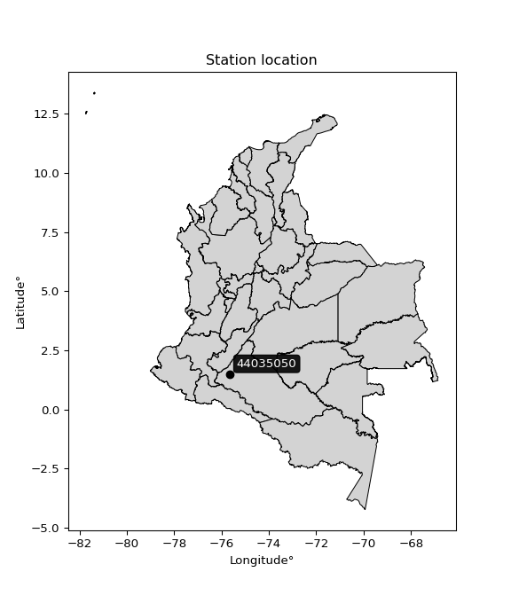

<div align="center">


</div>

# PMax24h Station (Rain, Pmax24h): 44035050

Maximum Precipitation in 24 hours (PMax24h) is the greatest amount of rainfall for a specific duration that is meteorologically possible for a given location, acting as a "worst-case" scenario for extreme storms, crucial for designing safety-critical infrastructure like bridges, river deviations, dams, spillways, and nuclear plants to prevent catastrophic failure. The PMax24h is related with the Probable Maximum Precipitation (PMP) and it is calculated by hydrologists using meteorological data to determine the upper limit of extreme rainfall, often leading to the Probable Maximum Flood (PMF) for flood control design, and is increasingly being studied for climate change impacts. Probable Maximum Precipitation (PMP) is the theoretical upper limit of rainfall, a deterministic estimate for extreme events, while probability distributions (like GEV, Gumbel) describe the likelihood and frequency of various precipitation amounts, including rare ones, showing how often events occur, with PMP representing the extreme end of these distributions, used for critical infrastructure design to ensure safety against the worst conceivable weather, unlike standard statistical forecasts which cover typical probabilities.

The most common probability distributions in hydrology, used for analyzing floods, rainfall, and streamflow, include the Normal, Log-Normal, Gumbel, Gamma (including Log-Pearson Type III), and Generalized Extreme Value (GEV) distributions, often chosen based on the data´s skewness and whether modeling extremes or general conditions, with Gumbel and GEV popular for extreme events like floods, while the Normal distribution serves as a baseline, though often requiring transformations for skewed hydrological data. These distributions help in designing water infrastructure, managing water resources, and forecasting hydrologic events.

> Hydrological data often isn´t perfectly normal (it´s skewed), so different distributions are needed for different applications, such as: **Flood Frequency Analysis**: Using Gumbel, GEV, or Log-Pearson Type III for predicting extreme flood magnitudes and their return periods, **Rainfall Analysis**: Normal for annual totals, but Log-Normal, Weibull, or GEV for intensity or extreme daily rainfall, **Streamflow Modeling**: Gamma and Log-Normal for maximum flows, GEV for minimum flows, and Kappa for daily flows.

<div align="center">

</img>

</div>


## A. General information


### 1. General running parameters

• app_version: _v20260225_. • runtime: _2026-02-27 14:50:08.749431_. • Python version: _3.14.0_. • SciPy version: _1.16.3_. • Pandas version: _2.3.3_. • NumPy version: _2.3.5_. • Stations dataset (station_dataset_file): _dataset/pmax24h_in/automatic_colombia_2003_2025.csv_. • Stations catalog (station_catalog_file): _dataset/CNE.xls_. • Minimum year to eval til year_max (date_min): _1900_. • Maximum year to eval since year_min (date_max): _2025_. • Creates, save and include plots into reports (create_plot): _False_. • Plot only fit distributions with Δo > Δ (plot_only_fit): _True_. • Plot only simple graphs avoiding multiple CDFs and multiple Extreme values plots (plot_only_simple): _False_. • Eval low extreme values, if False, evaluates high extreme values (low_extreme): _False_. • Eval every SciPy distribution as logarithmic (pdist_logarithmic_on): _True_. • Standard deviation normalized (ddof): _1.0_. • Return periods to eval in years (Tr): _[2, 2.33, 5, 10, 15, 20, 25, 50, 75, 100, 200, 250, 500, 750, 1000]_. • Minimum data sample per station, 0 means any (minimum_sample): _5_. • Z-Score maximum threshold to adjust a value, 0 means disable (zscore_max): _3.5_. • Z-Score minimum threshold to adjust a value, 0 means disable (zscore_min): _-2.5_. • Avoid zeros, e.g. rain = 0 (avoid_zeros): _True_. • Avoid null values (avoid_nans): _True_. 

:file_folder:Table: [dataset.csv](../../dataset/pmax24h_in/automatic_colombia_2003_2025.csv)

> Delta Degrees of Freedom (DDOF): is a parameter used in the formulas for calculating variance and standard deviation. When ddof=0, the divisor is $N$ (the total number of observations) and this is used when your data set is the entire population. When ddof=1, the divisor is $N-1$ and this is used when your data set is a sample drawn from a larger population. Using $N-1$ provides an unbiased estimate of the population variance (known as Bessel´s correction).


### 2. Station info and location

|   id |   CODIGO | NOMBRE                    | CATEGORIA         | TECNOLOGIA                              | ESTADO           | FECHA_INSTALACION   |   FECHA_SUSPENSION |   ALTITUD |   LATITUD |   LONGITUD | DEPARTAMENTO   | MUNICIPIO   | AREA_OPERATIVA                    | ENTIDAD                                                     | AREA_HIDROGRAFICA   | ZONA_HIDROGRAFICA   | SUBZONA_HIDROGRAFICA   |   CORRIENTE | Catalogo   |   Version |
|-----:|---------:|:--------------------------|:------------------|:----------------------------------------|:-----------------|:--------------------|-------------------:|----------:|----------:|-----------:|:---------------|:------------|:----------------------------------|:------------------------------------------------------------|:--------------------|:--------------------|:-----------------------|------------:|:-----------|----------:|
|    0 | 44035050 | MACAGUAL - AUT [44035050] | Agrometeorológica | Automática con Telemetría, Convencional | En Mantenimiento | 10/07/2005          |                nan |       280 |       1.5 |     -75.66 | Caqueta        | Florencia   | Area Operativa 04 - Huila-Caquetá | INSTITUTO DE HIDROLOGIA METEOROLOGIA Y ESTUDIOS AMBIENTALES | Amazonas            | Caquetá             | Río Orteguaza          |         nan | CNE_IDEAM  |  20251226 |

<div align="center">

Dynamic map: [:earth_americas:Google](http://maps.google.com/maps?q=1.5,-75.66) [:earth_americas:OSM](https://www.openstreetmap.org/#map=18/1.5/-75.66&layers=P) [:earth_americas:Bing](https://www.bing.com/maps?cp=1.5~-75.66&lvl=18) [:earth_americas:Apple](https://maps.apple.com/frame?center=1.5%2C-75.66&span=0.003%2C0.006)

</div>


<div align="center">

```geojson
{
  "type": "Feature",
  "geometry": {
    "type": "Point", 
    "coordinates": [-75.66, 1.5]
  }, 
  "properties": {
    "Name": "44035050"
  }
}
```

</div>


### 3. Discrete values table and plot

<div align="center">

|               |          0 |           1 |           2 |          3 |           4 |          5 |           6 |          7 |           8 |
|:--------------|-----------:|------------:|------------:|-----------:|------------:|-----------:|------------:|-----------:|------------:|
| Date          | 2016       | 2017        | 2018        | 2019       | 2020        | 2021       | 2022        | 2023       | 2025        |
| Value         |    2.7     |  103        |   88.2      |  177       |  102        |   38.6     |  105.9      |    3.7     |   36.7      |
| Value_initial |    2.7     |  103        |   88.2      |  177       |  102        |   38.6     |  105.9      |    3.7     |   36.7      |
| count         |    9       |    9        |    9        |    9       |    9        |    9       |    9        |    9       |    9        |
| mean          |   73.0889  |   73.0889   |   73.0889   |   73.0889  |   73.0889   |   73.0889  |   73.0889   |   73.0889  |   73.0889   |
| std           |   57.1358  |   57.1358   |   57.1358   |   57.1358  |   57.1358   |   57.1358  |   57.1358   |   57.1358  |   57.1358   |
| zscore        |   -1.23196 |    0.523509 |    0.264477 |    1.81867 |    0.506007 |   -0.60363 |    0.574265 |   -1.21446 |   -0.636884 |


</div>


> The initial value (value_initial) correspond to the initial obtained or null completed value, and value (value) is adjusted only when the initial value is outside the valid range (outlier) definite through the Z-Score value. If Z-Score is active, values out of range or outliers are replaced with the station mean value. A Z-Score (or standard score) measures how many standard deviations a data point is from the mean of a dataset, indicating its relative position; positive scores mean above the mean, negative mean below, and a score of zero is exactly at the mean, allowing for comparison of values from different distributions. It´s calculated using the formula $z=(x–μ)/σ$, where $x$ is the data point, $μ$ is the mean, and $σ$ is the standard deviation, helping identify outliers and understand probability.
>
> <sub>**Note**: In this study, "completing" (filling gaps in) and "extending" (forecasting or lengthening the historical record) rainfall data series are avoided for certain critical analyses because they introduce artificial bias and uncertainty, which can distort the statistics of rare events (extremes), alter day-to-day variability, and compromise the integrity and homogeneity of the original data. Some reasons against Completing/Extending rainfall data are: **Distortion of Extremes and Variability**: The primary issue is that most gap-filling or extension methods rely on averaging or regression with nearby stations, which inherently smooths the data. Rainfall is highly variable in space and time, with a large percentage of zero values and occasional large storms. Infilling methods often underestimate the highest values and overestimate the lowest (zero) values, which severely distorts analyses focused on flood frequency, drought severity, and intensity-duration-frequency (IDF) curves, **Loss of Data Homogeneity**: Infilled or extended data are synthetic estimates, not actual measurements. Combining these estimates with observed data can violate the assumption of data homogeneity, which requires that the data properties do not change over time. Inhomogeneity can lead to incorrect conclusions about long-term trends or changes in climate patterns, **Propagation of Errors**: Errors and biases from the original data (e.g., wind-induced undercatch, instrument errors, site changes) or the data used for imputation can propagate through the analysis, leading to unreliable hydrological models and inaccurate predictions, **Compromised Statistical Integrity**: For statistical analyses, especially those involving the frequency of events, using artificial data can introduce time bias or autocorrelation that doesn´t exist in reality, making it difficult to assess the true probability of events, **Difficulty in Validation**: It is difficult to accurately validate the quality of filled or extended data, especially for past periods where ground-truth measurements are unavailable. The reliability of imputation techniques heavily depends on the density of the surrounding station network and the complexity of the local topography.</sub>


### 4. Active continuous probability distributions from SciPy (80 of 104 available)

A Probability Density Function (PDF) describes the relative likelihood of a continuous random variable falling within a specific range, where the total area under its curve equals 1, and the area over any interval gives the actual probability for that range. Unlike discrete probabilities (like rolling a die), a PDF shows density, not direct probability for a single point (which is zero), with higher points indicating higher likelihood, often visualized as a bell curve for normal distributions.

A log of a probability density function (log-PDF) is simply the logarithm of the PDF´s value, denoted as $log(f(x))$, useful for converting multiplication of probabilities into addition, improving numerical stability with tiny numbers, and connecting to information theory concepts like entropy. Instead of dealing with very small probabilities (e.g., 0.000001), log-PDFs use negative numbers (e.g., $log(0.00001) ≈ -11.51$ that are easier for computers to handle, preventing underflow errors and simplifying complex calculations. In this study, each active probability distribution from SciPy is also evaluated in the $log$ form.

[scipy.stats](https://docs.scipy.org/doc/scipy/reference/stats.html) is a Python´s powerful submodule within the SciPy library for comprehensive statistical analysis, offering over 130 probability distributions (like Normal, Poisson, etc.), functions for descriptive stats (mean, variance), hypothesis testing (t-tests, chi-square), random variable generation, and statistical tests, making it essential for data science, modeling, and research. It provides tools to explore, model, and draw conclusions from data efficiently, working seamlessly with [NumPy](https://numpy.org/).

<div align="center">

|   id | p_dist           |   n_parameter | fit_method   | label                                                                       | active   | ref                                                                                                      |
|-----:|:-----------------|--------------:|:-------------|:----------------------------------------------------------------------------|:---------|:---------------------------------------------------------------------------------------------------------|
|    0 | alpha            |             3 | MLE          | Alpha                                                                       | True     | [:mortar_board:](https://docs.scipy.org/doc/scipy/reference/generated/scipy.stats.alpha.html)            |
|    1 | anglit           |             2 | MM           | Anglit                                                                      | True     | [:mortar_board:](https://docs.scipy.org/doc/scipy/reference/generated/scipy.stats.anglit.html)           |
|    2 | arcsine          |             2 | MM           | Arcsine                                                                     | True     | [:mortar_board:](https://docs.scipy.org/doc/scipy/reference/generated/scipy.stats.arcsine.html)          |
|    3 | argus            |             3 | MLE          | Argus                                                                       | True     | [:mortar_board:](https://docs.scipy.org/doc/scipy/reference/generated/scipy.stats.argus.html)            |
|    4 | beta             |             4 | MLE          | Beta                                                                        | True     | [:mortar_board:](https://docs.scipy.org/doc/scipy/reference/generated/scipy.stats.beta.html)             |
|    5 | betaprime        |             4 | MLE          | Beta prime                                                                  | True     | [:mortar_board:](https://docs.scipy.org/doc/scipy/reference/generated/scipy.stats.betaprime.html)        |
|    6 | bradford         |             3 | MLE          | Bradford                                                                    | True     | [:mortar_board:](https://docs.scipy.org/doc/scipy/reference/generated/scipy.stats.bradford.html)         |
|    7 | burr             |             4 | MLE          | Burr (Type III)                                                             | True     | [:mortar_board:](https://docs.scipy.org/doc/scipy/reference/generated/scipy.stats.burr.html)             |
|    8 | burr12           |             4 | MLE          | Burr (Type III) 12                                                          | True     | [:mortar_board:](https://docs.scipy.org/doc/scipy/reference/generated/scipy.stats.burr12.html)           |
|    9 | cosine           |             2 | MLE          | Cosine                                                                      | True     | [:mortar_board:](https://docs.scipy.org/doc/scipy/reference/generated/scipy.stats.cosine.html)           |
|   10 | crystalball      |             4 | MLE          | Crystalball                                                                 | True     | [:mortar_board:](https://docs.scipy.org/doc/scipy/reference/generated/scipy.stats.crystalball.html)      |
|   11 | dgamma           |             3 | MLE          | Double gamma                                                                | True     | [:mortar_board:](https://docs.scipy.org/doc/scipy/reference/generated/scipy.stats.dgamma.html)           |
|   12 | dweibull         |             3 | MLE          | Double Weibull                                                              | True     | [:mortar_board:](https://docs.scipy.org/doc/scipy/reference/generated/scipy.stats.dweibull.html)         |
|   13 | erlang           |             3 | MLE          | Erlang                                                                      | True     | [:mortar_board:](https://docs.scipy.org/doc/scipy/reference/generated/scipy.stats.erlang.html)           |
|   14 | exponnorm        |             3 | MLE          | Exponentially modified Normal                                               | True     | [:mortar_board:](https://docs.scipy.org/doc/scipy/reference/generated/scipy.stats.exponnorm.html)        |
|   15 | exponpow         |             3 | MLE          | Exponential power                                                           | True     | [:mortar_board:](https://docs.scipy.org/doc/scipy/reference/generated/scipy.stats.exponpow.html)         |
|   16 | exponweib        |             4 | MLE          | Exponentiated Weibull                                                       | True     | [:mortar_board:](https://docs.scipy.org/doc/scipy/reference/generated/scipy.stats.exponweib.html)        |
|   17 | f                |             4 | MLE          | F                                                                           | True     | [:mortar_board:](https://docs.scipy.org/doc/scipy/reference/generated/scipy.stats.f.html)                |
|   18 | fatiguelife      |             3 | MLE          | Fatigue-life (Birnbaum-Saunders)                                            | True     | [:mortar_board:](https://docs.scipy.org/doc/scipy/reference/generated/scipy.stats.fatiguelife.html)      |
|   19 | foldnorm         |             3 | MM           | Fold Normal                                                                 | True     | [:mortar_board:](https://docs.scipy.org/doc/scipy/reference/generated/scipy.stats.foldnorm.html)         |
|   20 | gamma            |             3 | MLE          | Gamma                                                                       | True     | [:mortar_board:](https://docs.scipy.org/doc/scipy/reference/generated/scipy.stats.gamma.html)            |
|   21 | gausshyper       |             6 | MLE          | Gauss hypergeometric                                                        | True     | [:mortar_board:](https://docs.scipy.org/doc/scipy/reference/generated/scipy.stats.gausshyper.html)       |
|   22 | genexpon         |             5 | MLE          | Generalized exponential                                                     | True     | [:mortar_board:](https://docs.scipy.org/doc/scipy/reference/generated/scipy.stats.genexpon.html)         |
|   23 | genextreme       |             3 | MLE          | Generalized exponential                                                     | True     | [:mortar_board:](https://docs.scipy.org/doc/scipy/reference/generated/scipy.stats.genextreme.html)       |
|   24 | gengamma         |             4 | MLE          | Generalized gamma                                                           | True     | [:mortar_board:](https://docs.scipy.org/doc/scipy/reference/generated/scipy.stats.gengamma.html)         |
|   25 | genhalflogistic  |             3 | MLE          | Generalized half-logistic                                                   | True     | [:mortar_board:](https://docs.scipy.org/doc/scipy/reference/generated/scipy.stats.genhalflogistic.html)  |
|   26 | genlogistic      |             3 | MLE          | Generalized logistic                                                        | True     | [:mortar_board:](https://docs.scipy.org/doc/scipy/reference/generated/scipy.stats.genlogistic.html)      |
|   27 | gennorm          |             3 | MLE          | Generalized Normal                                                          | True     | [:mortar_board:](https://docs.scipy.org/doc/scipy/reference/generated/scipy.stats.gennorm.html)          |
|   28 | genpareto        |             3 | MLE          | Generalized Pareto                                                          | True     | [:mortar_board:](https://docs.scipy.org/doc/scipy/reference/generated/scipy.stats.genpareto.html)        |
|   29 | gompertz         |             3 | MLE          | Gompertz (or truncated Gumbel)                                              | True     | [:mortar_board:](https://docs.scipy.org/doc/scipy/reference/generated/scipy.stats.gompertz.html)         |
|   30 | gumbel_l         |             2 | MM           | Gumbel Left Skew                                                            | True     | [:mortar_board:](https://docs.scipy.org/doc/scipy/reference/generated/scipy.stats.gumbel_l.html)         |
|   31 | gumbel_r         |             2 | MM           | Gumbel Right Skew                                                           | True     | [:mortar_board:](https://docs.scipy.org/doc/scipy/reference/generated/scipy.stats.gumbel_r.html)         |
|   32 | halfgennorm      |             3 | MLE          | Upper half of a generalized normal                                          | True     | [:mortar_board:](https://docs.scipy.org/doc/scipy/reference/generated/scipy.stats.halfgennorm.html)      |
|   33 | halflogistic     |             2 | MM           | Half-logistic                                                               | True     | [:mortar_board:](https://docs.scipy.org/doc/scipy/reference/generated/scipy.stats.halflogistic.html)     |
|   34 | halfnorm         |             2 | MM           | Half Normal                                                                 | True     | [:mortar_board:](https://docs.scipy.org/doc/scipy/reference/generated/scipy.stats.halfnorm.html)         |
|   35 | hypsecant        |             2 | MM           | hyperbolic secant                                                           | True     | [:mortar_board:](https://docs.scipy.org/doc/scipy/reference/generated/scipy.stats.hypsecant.html)        |
|   36 | invgamma         |             3 | MLE          | Inverted gamma                                                              | True     | [:mortar_board:](https://docs.scipy.org/doc/scipy/reference/generated/scipy.stats.invgamma.html)         |
|   37 | invgauss         |             3 | MLE          | Inverse Gaussian                                                            | True     | [:mortar_board:](https://docs.scipy.org/doc/scipy/reference/generated/scipy.stats.invgauss.html)         |
|   38 | invweibull       |             3 | MLE          | Inverted Weibull                                                            | True     | [:mortar_board:](https://docs.scipy.org/doc/scipy/reference/generated/scipy.stats.invweibull.html)       |
|   39 | johnsonsb        |             4 | MLE          | Johnson SB                                                                  | True     | [:mortar_board:](https://docs.scipy.org/doc/scipy/reference/generated/scipy.stats.johnsonsb.html)        |
|   40 | johnsonsu        |             4 | MLE          | Johnson Su                                                                  | True     | [:mortar_board:](https://docs.scipy.org/doc/scipy/reference/generated/scipy.stats.johnsonsu.html)        |
|   41 | kappa3           |             3 | MLE          | Kappa 3                                                                     | True     | [:mortar_board:](https://docs.scipy.org/doc/scipy/reference/generated/scipy.stats.kappa3.html)           |
|   42 | kappa4           |             4 | MLE          | Kappa 4                                                                     | True     | [:mortar_board:](https://docs.scipy.org/doc/scipy/reference/generated/scipy.stats.kappa4.html)           |
|   43 | ksone            |             3 | MLE          | Kolmogorov-Smirnov one-sided test statistic distribution                    | True     | [:mortar_board:](https://docs.scipy.org/doc/scipy/reference/generated/scipy.stats.ksone.html)            |
|   44 | kstwobign        |             2 | MLE          | Limiting distribution of scaled Kolmogorov-Smirnov two-sided test statistic | True     | [:mortar_board:](https://docs.scipy.org/doc/scipy/reference/generated/scipy.stats.kstwobign.html)        |
|   45 | laplace          |             2 | MM           | Laplace                                                                     | True     | [:mortar_board:](https://docs.scipy.org/doc/scipy/reference/generated/scipy.stats.laplace.html)          |
|   46 | levy_l           |             2 | MLE          | Left-skewed Levy                                                            | True     | [:mortar_board:](https://docs.scipy.org/doc/scipy/reference/generated/scipy.stats.levy_l.html)           |
|   47 | loggamma         |             3 | MLE          | Log gamma                                                                   | True     | [:mortar_board:](https://docs.scipy.org/doc/scipy/reference/generated/scipy.stats.loggamma.html)         |
|   48 | logistic         |             2 | MM           | Logistic (or Sech-squared)                                                  | True     | [:mortar_board:](https://docs.scipy.org/doc/scipy/reference/generated/scipy.stats.logistic.html)         |
|   49 | loglaplace       |             3 | MLE          | Log-Laplace                                                                 | True     | [:mortar_board:](https://docs.scipy.org/doc/scipy/reference/generated/scipy.stats.loglaplace.html)       |
|   50 | lomax            |             3 | MLE          | Lomax (Pareto of the second kind)                                           | True     | [:mortar_board:](https://docs.scipy.org/doc/scipy/reference/generated/scipy.stats.lomax.html)            |
|   51 | maxwell          |             2 | MM           | Maxwell                                                                     | True     | [:mortar_board:](https://docs.scipy.org/doc/scipy/reference/generated/scipy.stats.maxwell.html)          |
|   52 | mielke           |             4 | MLE          | Mielke Beta-Kappa / Dagum                                                   | True     | [:mortar_board:](https://docs.scipy.org/doc/scipy/reference/generated/scipy.stats.mielke.html)           |
|   53 | moyal            |             2 | MM           | Moyal                                                                       | True     | [:mortar_board:](https://docs.scipy.org/doc/scipy/reference/generated/scipy.stats.moyal.html)            |
|   54 | nakagami         |             3 | MLE          | Nakagami                                                                    | True     | [:mortar_board:](https://docs.scipy.org/doc/scipy/reference/generated/scipy.stats.nakagami.html)         |
|   55 | ncf              |             5 | MLE          | Non-central F distribution                                                  | True     | [:mortar_board:](https://docs.scipy.org/doc/scipy/reference/generated/scipy.stats.ncf.html)              |
|   56 | nct              |             4 | MLE          | Non-central Student’s t                                                     | True     | [:mortar_board:](https://docs.scipy.org/doc/scipy/reference/generated/scipy.stats.nct.html)              |
|   57 | norm             |             2 | MM           | Normal                                                                      | True     | [:mortar_board:](https://docs.scipy.org/doc/scipy/reference/generated/scipy.stats.norm.html)             |
|   58 | pearson3         |             3 | MM           | Pearson type III                                                            | True     | [:mortar_board:](https://docs.scipy.org/doc/scipy/reference/generated/scipy.stats.pearson3.html)         |
|   59 | powerlaw         |             3 | MLE          | Power-function                                                              | True     | [:mortar_board:](https://docs.scipy.org/doc/scipy/reference/generated/scipy.stats.powerlaw.html)         |
|   60 | rayleigh         |             2 | MM           | Rayleigh                                                                    | True     | [:mortar_board:](https://docs.scipy.org/doc/scipy/reference/generated/scipy.stats.rayleigh.html)         |
|   61 | rdist            |             3 | MLE          | R-distributed (symmetric beta)                                              | True     | [:mortar_board:](https://docs.scipy.org/doc/scipy/reference/generated/scipy.stats.rdist.html)            |
|   62 | rice             |             3 | MLE          | Rice                                                                        | True     | [:mortar_board:](https://docs.scipy.org/doc/scipy/reference/generated/scipy.stats.rice.html)             |
|   63 | semicircular     |             2 | MM           | Semicircular                                                                | True     | [:mortar_board:](https://docs.scipy.org/doc/scipy/reference/generated/scipy.stats.semicircular.html)     |
|   64 | skewnorm         |             3 | MLE          | Skew normal                                                                 | True     | [:mortar_board:](https://docs.scipy.org/doc/scipy/reference/generated/scipy.stats.skewnorm.html)         |
|   65 | t                |             3 | MLE          | Student’s t                                                                 | True     | [:mortar_board:](https://docs.scipy.org/doc/scipy/reference/generated/scipy.stats.t.html)                |
|   66 | trapezoid        |             4 | MLE          | Trapezoid                                                                   | True     | [:mortar_board:](https://docs.scipy.org/doc/scipy/reference/generated/scipy.stats.trapezoid.html)        |
|   67 | triang           |             3 | MLE          | Triangular                                                                  | True     | [:mortar_board:](https://docs.scipy.org/doc/scipy/reference/generated/scipy.stats.triang.html)           |
|   68 | truncexpon       |             3 | MLE          | Truncated exponential                                                       | True     | [:mortar_board:](https://docs.scipy.org/doc/scipy/reference/generated/scipy.stats.truncexpon.html)       |
|   69 | truncnorm        |             4 | MLE          | Truncated normal                                                            | True     | [:mortar_board:](https://docs.scipy.org/doc/scipy/reference/generated/scipy.stats.truncnorm.html)        |
|   70 | truncpareto      |             4 | MLE          | Upper truncated Pareto                                                      | True     | [:mortar_board:](https://docs.scipy.org/doc/scipy/reference/generated/scipy.stats.truncpareto.html)      |
|   71 | truncweibull_min |             5 | MLE          | Doubly truncated Weibull minimum                                            | True     | [:mortar_board:](https://docs.scipy.org/doc/scipy/reference/generated/scipy.stats.truncweibull_min.html) |
|   72 | tukeylambda      |             3 | MLE          | Tukey-Lamdba                                                                | True     | [:mortar_board:](https://docs.scipy.org/doc/scipy/reference/generated/scipy.stats.tukeylambda.html)      |
|   73 | uniform          |             2 | MLE          | Uniform                                                                     | True     | [:mortar_board:](https://docs.scipy.org/doc/scipy/reference/generated/scipy.stats.uniform.html)          |
|   74 | vonmises         |             3 | MLE          | Von Mises                                                                   | True     | [:mortar_board:](https://docs.scipy.org/doc/scipy/reference/generated/scipy.stats.vonmises.html)         |
|   75 | vonmises_line    |             3 | MLE          | Von Mises line                                                              | True     | [:mortar_board:](https://docs.scipy.org/doc/scipy/reference/generated/scipy.stats.vonmises_line.html)    |
|   76 | wald             |             2 | MM           | Wald                                                                        | True     | [:mortar_board:](https://docs.scipy.org/doc/scipy/reference/generated/scipy.stats.wald.html)             |
|   77 | weibull_max      |             3 | MLE          | Weibull maximum                                                             | True     | [:mortar_board:](https://docs.scipy.org/doc/scipy/reference/generated/scipy.stats.weibull_max.html)      |
|   78 | weibull_min      |             3 | MLE          | Weibull minimum                                                             | True     | [:mortar_board:](https://docs.scipy.org/doc/scipy/reference/generated/scipy.stats.weibull_min.html)      |
|   79 | wrapcauchy       |             3 | MLE          | Wrapped  Cauchy                                                             | True     | [:mortar_board:](https://docs.scipy.org/doc/scipy/reference/generated/scipy.stats.wrapcauchy.html)       |

</div>

> **n_parameter:** # arguments & localization & scale.
>
> **Fit methods:** (MLE) maximum likelihood, (MM) L-moments.
>
>**Inactive** (With the only purpose of prevent loops, zero divisions, infinite values, over high estimated values or horizontal trending for recurrence intervals estimations, the follow distributions were disabled.)**:** lognorm, norminvgauss, powernorm, powerlognorm, cauchy, halfcauchy, foldcauchy, skewcauchy, chi2, expon, fisk, genhyperbolic, geninvgauss, gibrat, kstwo, laplace_asymmetric, levy, levy_stable, ncx2, pareto, rel_breitwigner, recipinvgauss, studentized_range, loguniform, 


## B. Probability (PDF) vs. Empirical (EDF) distributions functions

A continuous probability distribution (CPD) describes probabilities for variables that can take any value within a range (like rain any time), unlike discrete variables with specific outcomes (like temperature). It uses a Probability Density Function (PDF), a curve where the total area under it equals 1, and the probability of the variable falling within an interval (a to b) is found by calculating the area under the curve between those points. A key feature is that the probability of hitting any single exact value is zero, so probabilities are always expressed for ranges, e.g., $P(a ≤ X ≤ b)$.

<div align="center">

Distributions parameters from station values
|     |   station | p_dist              |   n |              loc |          scale | shape                  | shape1                 | shape2               | shape3             |
|----:|----------:|:--------------------|----:|-----------------:|---------------:|:-----------------------|:-----------------------|:---------------------|:-------------------|
|   0 |  44035050 | alpha               |   9 |    -71.9877      |  264.428       | 2.2046732979840375     |                        |                      |                    |
|   1 |  44035050 | anglit              |   9 |     73.0889      |  157.586       |                        |                        |                      |                    |
|   2 |  44035050 | arcsine             |   9 |     -3.0922      |  152.362       |                        |                        |                      |                    |
|   3 |  44035050 | argus               |   9 |    -52.9063      |  237.601       | 1.5465821768136102e-06 |                        |                      |                    |
|   4 |  44035050 | beta                |   9 |      2.7         |  303.062       | 0.5639029532502197     | 3.139116866852498      |                      |                    |
|   5 |  44035050 | betaprime           |   9 |      2.7         | 1993.93        | 0.4890295495495063     | 14.096685747640917     |                      |                    |
|   6 |  44035050 | bradford            |   9 |      2.69999     |  174.3         | 1.7643320220698593     |                        |                      |                    |
|   7 |  44035050 | burr                |   9 |      2.68557     |  168.969       | 9.513844498179388      | 0.06203838891852505    |                      |                    |
|   8 |  44035050 | burr12              |   9 |     -1.29789     |    3.91561     | 185.88069267492148     | 0.0022342191225583376  |                      |                    |
|   9 |  44035050 | cosine              |   9 |     76.7238      |   45.6549      |                        |                        |                      |                    |
|  10 |  44035050 | crystalball         |   9 |     73.0889      |   53.8682      | 6659.320459812872      | 5.728390000457683      |                      |                    |
|  11 |  44035050 | dgamma              |   9 |     65.4469      |   11.2369      | 4.241506364751146      |                        |                      |                    |
|  12 |  44035050 | dweibull            |   9 |     66.9113      |   53.9979      | 1.9681450679464718     |                        |                      |                    |
|  13 |  44035050 | erlang              |   9 |      2.7         |   73.088       | 0.3858229286960846     |                        |                      |                    |
|  14 |  44035050 | exponnorm           |   9 |     46.5861      |   47.2003      | 0.5614958017664959     |                        |                      |                    |
|  15 |  44035050 | exponpow            |   9 |      2.7         |  151.003       | 0.6098396383829403     |                        |                      |                    |
|  16 |  44035050 | exponweib           |   9 |   -633.863       |  323.631       | 408.0132048237125      | 2.4015418665003754     |                      |                    |
|  17 |  44035050 | f                   |   9 |      2.7         |   74.6361      | 1.9012078179485097     | 22.527904529034405     |                      |                    |
|  18 |  44035050 | fatiguelife         |   9 |      2.7         |    0.000241721 | 681.0818619538541      |                        |                      |                    |
|  19 |  44035050 | foldnorm            |   9 |    -26.2334      |   57.7579      | 1.6813613459406132     |                        |                      |                    |
|  20 |  44035050 | gamma               |   9 |      2.7         |  104.65        | 0.674100608147699      |                        |                      |                    |
|  21 |  44035050 | gausshyper          |   9 |     -8.80137     |  185.801       | 1.1318789920532653     | 0.8170325477501692     | 1.034172719638215    | 1.0726146081498142 |
|  22 |  44035050 | genexpon            |   9 |      2.6153      |    8.57964     | 0.050206054852972845   | 0.07305802069779527    | 560.7237441006826    |                    |
|  23 |  44035050 | genextreme          |   9 |      3.43192     |    4.35854     | -5.954895157492839     |                        |                      |                    |
|  24 |  44035050 | gengamma            |   9 |      2.7         |    6.31167     | 2.01265287238582       | 0.43181045610423263    |                      |                    |
|  25 |  44035050 | genhalflogistic     |   9 |    -15.1887      |  202.068       | 1.0514033207406084     |                        |                      |                    |
|  26 |  44035050 | genlogistic         |   9 |   -251.458       |   45.8055      | 676.3971637562138      |                        |                      |                    |
|  27 |  44035050 | gennorm             |   9 |     89.85        |   87.1502      | 5909339.413189409      |                        |                      |                    |
|  28 |  44035050 | genpareto           |   9 |      2.7         |  124.906       | -0.6659480427196931    |                        |                      |                    |
|  29 |  44035050 | gompertz            |   9 |      2.7         |  129.295       | 1.1299388797361027     |                        |                      |                    |
|  30 |  44035050 | gumbel_l            |   9 |     97.3324      |   42.0008      |                        |                        |                      |                    |
|  31 |  44035050 | gumbel_r            |   9 |     48.8454      |   42.0008      |                        |                        |                      |                    |
|  32 |  44035050 | halfgennorm         |   9 |      2.7         |    4.3928      | 0.35997432910765637    |                        |                      |                    |
|  33 |  44035050 | halflogistic        |   9 |      9.24258     |   46.0554      |                        |                        |                      |                    |
|  34 |  44035050 | halfnorm            |   9 |      1.78855     |   89.3617      |                        |                        |                      |                    |
|  35 |  44035050 | hypsecant           |   9 |     73.0889      |   34.2935      |                        |                        |                      |                    |
|  36 |  44035050 | invgamma            |   9 |   -214.988       | 8044.44        | 28.913814937502607     |                        |                      |                    |
|  37 |  44035050 | invgauss            |   9 |    -83.6061      | 1156.76        | 0.1354603827726202     |                        |                      |                    |
|  38 |  44035050 | invweibull          |   9 |     -8.17009e+08 |    8.17009e+08 | 17839275.606127087     |                        |                      |                    |
|  39 |  44035050 | johnsonsb           |   9 |      2.7         |  174.303       | -0.12766752910867166   | 0.1516077837954399     |                      |                    |
|  40 |  44035050 | johnsonsu           |   9 |   -112.125       |   14.8571      | -10.704397483389528    | 3.3719338569786057     |                      |                    |
|  41 |  44035050 | kappa3              |   9 |      2.7         |  102.242       | 6.162644945629508      |                        |                      |                    |
|  42 |  44035050 | kappa4              |   9 |    -15.8663      |  184.841       | 1.1113679690043914     | 0.9545136510759548     |                      |                    |
|  43 |  44035050 | ksone               |   9 |    -14.73        |  209.16        | 1.0                    |                        |                      |                    |
|  44 |  44035050 | kstwobign           |   9 |   -111.478       |  211.008       |                        |                        |                      |                    |
|  45 |  44035050 | laplace             |   9 |     73.0889      |   38.0905      |                        |                        |                      |                    |
|  46 |  44035050 | levy_l              |   9 |    188.667       |   58.0685      |                        |                        |                      |                    |
|  47 |  44035050 | loggamma            |   9 | -20093.5         | 2606.39        | 2292.9054302668765     |                        |                      |                    |
|  48 |  44035050 | logistic            |   9 |     73.0889      |   29.6991      |                        |                        |                      |                    |
|  49 |  44035050 | loglaplace          |   9 |     -0.211454    |   88.4115      | 0.9568475794550613     |                        |                      |                    |
|  50 |  44035050 | lomax               |   9 |      2.7         |    1.09193e+10 | 158799760.41274983     |                        |                      |                    |
|  51 |  44035050 | maxwell             |   9 |    -54.556       |   79.9896      |                        |                        |                      |                    |
|  52 |  44035050 | mielke              |   9 |      2.7         |  139.045       | 0.523001508098693      | 4.578599239837734      |                      |                    |
|  53 |  44035050 | moyal               |   9 |     42.2836      |   24.2492      |                        |                        |                      |                    |
|  54 |  44035050 | nakagami            |   9 |      2.7         |  122.302       | 0.2041804111493432     |                        |                      |                    |
|  55 |  44035050 | ncf                 |   9 |      2.7         |   13.8736      | 1.2392540305304778     | 637.6798460910911      | 4.068001458744258    |                    |
|  56 |  44035050 | nct                 |   9 |    -13.7261      |    0.428899    | 0.9911511587058071     | 85.10439328001479      |                      |                    |
|  57 |  44035050 | norm                |   9 |     73.0889      |   53.8682      |                        |                        |                      |                    |
|  58 |  44035050 | pearson3            |   9 |     73.0889      |   53.8682      | 0.3124956779491189     |                        |                      |                    |
|  59 |  44035050 | powerlaw            |   9 |      2.7         |  174.3         | 0.17565041955133542    |                        |                      |                    |
|  60 |  44035050 | rayleigh            |   9 |    -29.964       |   82.2243      |                        |                        |                      |                    |
|  61 |  44035050 | rdist               |   9 |    -14.4364      |  102.636       | 1.0286602755457737     |                        |                      |                    |
|  62 |  44035050 | rice                |   9 |    -25.1712      |   71.1929      | 0.6909842284950423     |                        |                      |                    |
|  63 |  44035050 | semicircular        |   9 |     73.0889      |  107.736       |                        |                        |                      |                    |
|  64 |  44035050 | skewnorm            |   9 |      2.69999     |   88.6402      | 35490040.77182022      |                        |                      |                    |
|  65 |  44035050 | t                   |   9 |     73.0887      |   53.8688      | 151755826.79528594     |                        |                      |                    |
|  66 |  44035050 | trapezoid           |   9 |    -15.4665      |  209.16        | 1.0                    | 1.0                    |                      |                    |
|  67 |  44035050 | triang              |   9 |    -70.2005      |  247.758       | 0.9999999999997915     |                        |                      |                    |
|  68 |  44035050 | truncexpon          |   9 |     -6.00224     |  165.981       | 1.1025473590394912     |                        |                      |                    |
|  69 |  44035050 | truncnorm           |   9 |     13.06        |    7.01132     | -6.633429544348567     | 23.38218298854836      |                      |                    |
|  70 |  44035050 | truncpareto         |   9 |      2.69398     |    0.00601955  | 0.12593059359878261    | 28956.633272900428     |                      |                    |
|  71 |  44035050 | truncweibull_min    |   9 |      1.56666     |  225.106       | 0.5889585204915326     | 0.005034689342904641   | 0.7793363370230515   |                    |
|  72 |  44035050 | tukeylambda         |   9 |     89.85        |  111.315       | 1.2772745627387543     |                        |                      |                    |
|  73 |  44035050 | uniform             |   9 |      2.7         |  174.3         |                        |                        |                      |                    |
|  74 |  44035050 | vonmises            |   9 |      1.1518      |    1           | 0.44279979059220403    |                        |                      |                    |
|  75 |  44035050 | vonmises_line       |   9 |     89.8478      |   27.7414      | 0.005862220185944789   |                        |                      |                    |
|  76 |  44035050 | wald                |   9 |     19.2207      |   53.8682      |                        |                        |                      |                    |
|  77 |  44035050 | weibull_max         |   9 |    177           |    1.61912     | 0.25366300035298617    |                        |                      |                    |
|  78 |  44035050 | weibull_min         |   9 |      2.7         |   88.2706      | 0.622111633438496      |                        |                      |                    |
|  79 |  44035050 | wrapcauchy          |   9 |      2.6846      |   27.7432      | 5.016144958184041e-06  |                        |                      |                    |
|  80 |  44035050 | logalpha            |   9 |    -32.2034      |  853.049       | 23.80652681956724      |                        |                      |                    |
|  81 |  44035050 | loganglit           |   9 |      3.68173     |    4.19394     |                        |                        |                      |                    |
|  82 |  44035050 | logarcsine          |   9 |      1.65429     |    4.05489     |                        |                        |                      |                    |
|  83 |  44035050 | logargus            |   9 |     -0.707917    |    5.97971     | 2.36438467269421       |                        |                      |                    |
|  84 |  44035050 | logbeta             |   9 |      0.579361    |    4.59679     | 0.4805541157073664     | 0.19335418757901573    |                      |                    |
|  85 |  44035050 | logbetaprime        |   9 |    -23.7259      |   51.149       | 500.4014528988803      | 934.2751433837566      |                      |                    |
|  86 |  44035050 | logbradford         |   9 |      0.993234    |    4.18292     | 0.8497411293155666     |                        |                      |                    |
|  87 |  44035050 | logburr             |   9 |   -152.942       |  158.14        | 22978.042050508593     | 0.004498190658327714   |                      |                    |
|  88 |  44035050 | logburr12           |   9 |  -4023.26        | 4040.8         | 4464.7419264800355     | 2227313.273734753      |                      |                    |
|  89 |  44035050 | logcosine           |   9 |      3.48416     |    1.19661     |                        |                        |                      |                    |
|  90 |  44035050 | logcrystalball      |   9 |      3.68173     |    1.43363     | 2305.658631743876      | 44.21024489177209      |                      |                    |
|  91 |  44035050 | logdgamma           |   9 |      4.62497     |    0.989825    | 0.7964910696740104     |                        |                      |                    |
|  92 |  44035050 | logdweibull         |   9 |      4.63473     |    0.781726    | 0.49978420043704386    |                        |                      |                    |
|  93 |  44035050 | logerlang           |   9 |    -18.1568      |    0.10109     | 216.0104321481375      |                        |                      |                    |
|  94 |  44035050 | logexponnorm        |   9 |      3.68083     |    1.43364     | 0.0006268205003960573  |                        |                      |                    |
|  95 |  44035050 | logexponpow         |   9 |     -1.99502e+08 |    1.99502e+08 | 176376821.38003704     |                        |                      |                    |
|  96 |  44035050 | logexponweib        |   9 |      0.993252    |    4.77079     | 0.16739254697764938    | 2.9820785988081173     |                      |                    |
|  97 |  44035050 | logf                |   9 |  -2113.18        | 2116.87        | 13203481.242257483     | 6495717.120584972      |                      |                    |
|  98 |  44035050 | logfatiguelife      |   9 |   -726.412       |  730.099       | 0.001969371428986859   |                        |                      |                    |
|  99 |  44035050 | logfoldnorm         |   9 |     -6.46648     |    1.30415     | 7.80250735342662       |                        |                      |                    |
| 100 |  44035050 | loggamma            |   9 |    -17.738       |    0.10424     | 205.42791232064508     |                        |                      |                    |
| 101 |  44035050 | loggausshyper       |   9 |      0.778063    |    4.39809     | 1.163277826479623      | 0.4497166902667491     | 1.190671800214957    | 1.0226423102910704 |
| 102 |  44035050 | loggenexpon         |   9 |      0.970656    |    0.0574511   | 0.008008354231294281   | 6.672201409469551      | 6.52152206276111e-05 |                    |
| 103 |  44035050 | loggenextreme       |   9 |      3.73815     |    1.56904     | 1.0911229545237342     |                        |                      |                    |
| 104 |  44035050 | loggengamma         |   9 |     -1.97654e+08 |    1.97654e+08 | 0.9115021336418864     | 204074984.0049827      |                      |                    |
| 105 |  44035050 | loggenhalflogistic  |   9 |      0.519144    |    4.93007     | 1.0586356074276453     |                        |                      |                    |
| 106 |  44035050 | loggenlogistic      |   9 |      5.17623     |    5.45884e-06 | 3.664394069712335e-06  |                        |                      |                    |
| 107 |  44035050 | loggennorm          |   9 |      4.63473     |    0.00683516  | 0.29806288995680874    |                        |                      |                    |
| 108 |  44035050 | loggenpareto        |   9 |      0.00205481  |   11.8824      | -2.296517671689326     |                        |                      |                    |
| 109 |  44035050 | loggompertz         |   9 |      0.993252    |    1.09349     | 0.052944911183051016   |                        |                      |                    |
| 110 |  44035050 | loggumbel_l         |   9 |      4.32694     |    1.1178      |                        |                        |                      |                    |
| 111 |  44035050 | loggumbel_r         |   9 |      3.03652     |    1.1178      |                        |                        |                      |                    |
| 112 |  44035050 | loghalfgennorm      |   9 |      0.993252    |    0.932251    | 0.6033449951776172     |                        |                      |                    |
| 113 |  44035050 | loghalflogistic     |   9 |      1.98253     |    1.22571     |                        |                        |                      |                    |
| 114 |  44035050 | loghalfnorm         |   9 |      1.78413     |    2.37828     |                        |                        |                      |                    |
| 115 |  44035050 | loghypsecant        |   9 |      3.68173     |    0.912678    |                        |                        |                      |                    |
| 116 |  44035050 | loginvgamma         |   9 |    -23.2221      | 8469.74        | 316.1908758508755      |                        |                      |                    |
| 117 |  44035050 | loginvgauss         |   9 |    -11.8039      | 1543.09        | 0.010015013559768474   |                        |                      |                    |
| 118 |  44035050 | loginvweibull       |   9 |     -1.85077e+08 |    1.85077e+08 | 137421694.5088576      |                        |                      |                    |
| 119 |  44035050 | logjohnsonsb        |   9 |      0.36245     |    4.8137      | -0.9654255461906973    | 0.13922628040852963    |                      |                    |
| 120 |  44035050 | logjohnsonsu        |   9 |      4.9114      |    0.352598    | 1.2005069860704665     | 0.8583041628841135     |                      |                    |
| 121 |  44035050 | logkappa3           |   9 |      0.990965    |    4.18427     | 10063.845625582826     |                        |                      |                    |
| 122 |  44035050 | logkappa4           |   9 |      0.472098    |    5.11439     | 1.1125133360047164     | 1.0872301698302638     |                      |                    |
| 123 |  44035050 | logksone            |   9 |      0.574962    |    5.01948     | 1.0                    |                        |                      |                    |
| 124 |  44035050 | logkstwobign        |   9 |     -2.55357     |    7.10178     |                        |                        |                      |                    |
| 125 |  44035050 | loglaplace          |   9 |      3.68173     |    1.01373     |                        |                        |                      |                    |
| 126 |  44035050 | loglevy_l           |   9 |      5.28533     |    0.537399    |                        |                        |                      |                    |
| 127 |  44035050 | logloggamma         |   9 |      5.17651     |    3.74095e-05 | 2.512032510088674e-05  |                        |                      |                    |
| 128 |  44035050 | loglogistic         |   9 |      3.68173     |    0.790402    |                        |                        |                      |                    |
| 129 |  44035050 | logloglaplace       |   9 |     -9.80013e+06 |    9.80013e+06 | 9427679.019516014      |                        |                      |                    |
| 130 |  44035050 | loglomax            |   9 |      0.993252    |    9.64385e+11 | 309812546765.23193     |                        |                      |                    |
| 131 |  44035050 | logmaxwell          |   9 |      0.284626    |    2.12882     |                        |                        |                      |                    |
| 132 |  44035050 | logmielke           |   9 |    -68.4459      |   73.6387      | 48.180841392022074     | 19261.563410349125     |                      |                    |
| 133 |  44035050 | logmoyal            |   9 |      2.86189     |    0.645361    |                        |                        |                      |                    |
| 134 |  44035050 | lognakagami         |   9 |  -1129.3         | 1132.98        | 155517.73870848626     |                        |                      |                    |
| 135 |  44035050 | logncf              |   9 |    -90.4193      |   94.0913      | 14630.754375329203     | 19520.85259539781      | 0.017727726929746362 |                    |
| 136 |  44035050 | lognct              |   9 |    -92.1799      |    1.41222     | 70627.96141124339      | 67.87896280962958      |                      |                    |
| 137 |  44035050 | lognorm             |   9 |      3.68173     |    1.43363     |                        |                        |                      |                    |
| 138 |  44035050 | logpearson3         |   9 |      3.68173     |    1.43364     | -0.9920858508376064    |                        |                      |                    |
| 139 |  44035050 | logpowerlaw         |   9 |      0.993252    |    4.1829      | 0.21291027637300713    |                        |                      |                    |
| 140 |  44035050 | lograyleigh         |   9 |      0.939109    |    2.18829     |                        |                        |                      |                    |
| 141 |  44035050 | logrdist            |   9 |      1.81027     |    1.84299     | 1.130889973178613      |                        |                      |                    |
| 142 |  44035050 | logrice             |   9 |      0.0594504   |    1.56237     | 2.053595977637551      |                        |                      |                    |
| 143 |  44035050 | logsemicircular     |   9 |      3.68173     |    2.86726     |                        |                        |                      |                    |
| 144 |  44035050 | logskewnorm         |   9 |      5.17615     |    2.07082     | -57856105.66273582     |                        |                      |                    |
| 145 |  44035050 | logt                |   9 |      3.68173     |    1.43363     | 6088329279.964489      |                        |                      |                    |
| 146 |  44035050 | logtrapezoid        |   9 |     -0.391851    |    6.08238     | 0.9999999999999999     | 1.0                    |                      |                    |
| 147 |  44035050 | logtriang           |   9 |     -0.396622    |    5.5728      | 0.9999979476392442     |                        |                      |                    |
| 148 |  44035050 | logtruncexpon       |   9 |      0.973783    |    6.18593     | 0.6793427850553311     |                        |                      |                    |
| 149 |  44035050 | logtruncnorm        |   9 |      0.891911    |    3.09123     | 0.03278344144677876    | 16.82202311191672      |                      |                    |
| 150 |  44035050 | logtruncpareto      |   9 |      0.992937    |    0.000314365 | 0.12523337448860924    | 13306.878368787899     |                      |                    |
| 151 |  44035050 | logtruncweibull_min |   9 |      0.724703    |    8.67818     | 1.3779008572412499     | 1.9716781959584824e-05 | 0.5129472485592246   |                    |
| 152 |  44035050 | logtukeylambda      |   9 |      2.32375     |    1.36662     | 1.0271508247936616     |                        |                      |                    |
| 153 |  44035050 | loguniform          |   9 |      0.993252    |    4.1829      |                        |                        |                      |                    |
| 154 |  44035050 | logvonmises         |   9 |     -1.80693     |    1           | 1.0274509346729646     |                        |                      |                    |
| 155 |  44035050 | logvonmises_line    |   9 |      4.0009      |    0.957365    | 0.8378851932178923     |                        |                      |                    |
| 156 |  44035050 | logwald             |   9 |      2.24812     |    1.43362     |                        |                        |                      |                    |
| 157 |  44035050 | logweibull_max      |   9 |      5.17615     |    2.08713     | 0.24471799520157014    |                        |                      |                    |
| 158 |  44035050 | logweibull_min      |   9 |     -2.82436e+08 |    2.82436e+08 | 306064568.37708855     |                        |                      |                    |
| 159 |  44035050 | logwrapcauchy       |   9 |      0.993248    |    0.665729    | 0.4327255287411652     |                        |                      |                    |

</div>

> **loc** (Location parameter): This shifts the distribution along the x-axis. For many common distributions, like the normal (Gaussian) distribution, loc represents the mean $μ$. For others, like the uniform distribution, it might represent the minimum value, or for the beta distribution, the left end of the support interval.
>
> **scale** (Scale parameter): This determines the width or spread of the distribution. For the normal distribution, scale represents the standard deviation $σ$. For a uniform distribution, it defines the length of the interval (from $loc$ to $loc + scale$).
>
> **shape** (Shape parameters): Refers to parameters that define the specific form of a probability distribution, distinct from its location (loc) and scale (scale). These parameters are required arguments for most distribution functions. For example, a normal (Gaussian) distribution is fully defined by its location (mean) and scale (standard deviation), so it has no specific shape parameters beyond loc and scale. However, other distributions have intrinsic properties that need specification, as Gamma distribution that takes a shape parameter, often named $a$ or $alpha$.


### 0. Cumulative distribution values - CDF (160 evaluated)

Cumulative Distribution Function (CDF), denoted as $F$<sub>$X$</sub>$(x)$, is a function that gives the probability that a random variable $X$ will take a value less than or equal to a specific value, $x$ (i.e., $(P(X≥x)$. It essentially "accumulates" probabilities from a given point up to the far right (positive infinity), providing a complete picture of the distribution´s probabilities for both discrete (like rain) and continuous (like temperature) variables, helping to find probabilities over ranges or above certain values. Each station is evaluated separately ordering the $x$ values ascending, calculating the CDF and PDF values for the activated distributions and their logarithmic forms.

<div align="center">

CDF ordered by x ascending and calculating $log(f(x))$ separately
|   id |   Station |   date |     x |   count |    mean |     std |    zscore |   Value_initial |   station |   m |     alpha |   alpha_pdf |   anglit |   anglit_pdf |   arcsine |   arcsine_pdf |     argus |   argus_pdf |       beta |         beta_pdf |   betaprime |   betaprime_pdf |    bradford |   bradford_pdf |       burr |   burr_pdf |     burr12 |   burr12_pdf |    cosine |   cosine_pdf |   crystalball |   crystalball_pdf |   dgamma |   dgamma_pdf |   dweibull |   dweibull_pdf |      erlang |       erlang_pdf |   exponnorm |   exponnorm_pdf |    exponpow |   exponpow_pdf |   exponweib |   exponweib_pdf |           f |      f_pdf |   fatiguelife |   fatiguelife_pdf |   foldnorm |   foldnorm_pdf |       gamma |    gamma_pdf |   gausshyper |   gausshyper_pdf |   genexpon |   genexpon_pdf |   genextreme |   genextreme_pdf |    gengamma |   gengamma_pdf |   genhalflogistic |   genhalflogistic_pdf |   genlogistic |   genlogistic_pdf |     gennorm |   gennorm_pdf |   genpareto |   genpareto_pdf |    gompertz |   gompertz_pdf |   gumbel_l |   gumbel_l_pdf |   gumbel_r |   gumbel_r_pdf |   halfgennorm |   halfgennorm_pdf |   halflogistic |   halflogistic_pdf |   halfnorm |   halfnorm_pdf |   hypsecant |   hypsecant_pdf |   invgamma |   invgamma_pdf |   invgauss |   invgauss_pdf |   invweibull |   invweibull_pdf |   johnsonsb |   johnsonsb_pdf |   johnsonsu |   johnsonsu_pdf |      kappa3 |   kappa3_pdf |      kappa4 |   kappa4_pdf |     ksone |   ksone_pdf |   kstwobign |   kstwobign_pdf |   laplace |   laplace_pdf |   levy_l |   levy_l_pdf |   loggamma |   loggamma_pdf |   logistic |   logistic_pdf |   loglaplace |   loglaplace_pdf |       lomax |   lomax_pdf |   maxwell |   maxwell_pdf |      mielke |      mielke_pdf |     moyal |   moyal_pdf |    nakagami |   nakagami_pdf |         ncf |       ncf_pdf |       nct |     nct_pdf |      norm |   norm_pdf |   pearson3 |   pearson3_pdf |    powerlaw |   powerlaw_pdf |   rayleigh |   rayleigh_pdf |    rdist |      rdist_pdf |      rice |   rice_pdf |   semicircular |   semicircular_pdf |   skewnorm |   skewnorm_pdf |         t |      t_pdf |   trapezoid |   trapezoid_pdf |    triang |   triang_pdf |   truncexpon |   truncexpon_pdf |   truncnorm |   truncnorm_pdf |   truncpareto |   truncpareto_pdf |   truncweibull_min |   truncweibull_min_pdf |   tukeylambda |   tukeylambda_pdf |    uniform |   uniform_pdf |   vonmises |   vonmises_pdf |   vonmises_line |   vonmises_line_pdf |     wald |    wald_pdf |   weibull_max |   weibull_max_pdf |   weibull_min |   weibull_min_pdf |   wrapcauchy |   wrapcauchy_pdf |   logalpha |   logalpha_pdf |   loganglit |   loganglit_pdf |   logarcsine |   logarcsine_pdf |   logargus |   logargus_pdf |   logbeta |   logbeta_pdf |   logbetaprime |   logbetaprime_pdf |   logbradford |   logbradford_pdf |   logburr |   logburr_pdf |   logburr12 |   logburr12_pdf |   logcosine |   logcosine_pdf |   logcrystalball |   logcrystalball_pdf |   logdgamma |   logdgamma_pdf |   logdweibull |   logdweibull_pdf |   logerlang |   logerlang_pdf |   logexponnorm |   logexponnorm_pdf |   logexponpow |   logexponpow_pdf |   logexponweib |   logexponweib_pdf |      logf |   logf_pdf |   logfatiguelife |   logfatiguelife_pdf |   logfoldnorm |   logfoldnorm_pdf |   loggausshyper |   loggausshyper_pdf |   loggenexpon |   loggenexpon_pdf |   loggenextreme |   loggenextreme_pdf |   loggengamma |   loggengamma_pdf |   loggenhalflogistic |   loggenhalflogistic_pdf |   loggenlogistic |   loggenlogistic_pdf |   loggennorm |   loggennorm_pdf |   loggenpareto |   loggenpareto_pdf |   loggompertz |   loggompertz_pdf |   loggumbel_l |   loggumbel_l_pdf |   loggumbel_r |   loggumbel_r_pdf |   loghalfgennorm |   loghalfgennorm_pdf |   loghalflogistic |   loghalflogistic_pdf |   loghalfnorm |   loghalfnorm_pdf |   loghypsecant |   loghypsecant_pdf |   loginvgamma |   loginvgamma_pdf |   loginvgauss |   loginvgauss_pdf |   loginvweibull |   loginvweibull_pdf |   logjohnsonsb |   logjohnsonsb_pdf |   logjohnsonsu |   logjohnsonsu_pdf |   logkappa3 |   logkappa3_pdf |   logkappa4 |   logkappa4_pdf |   logksone |   logksone_pdf |   logkstwobign |   logkstwobign_pdf |   loglevy_l |   loglevy_l_pdf |   logloggamma |   logloggamma_pdf |   loglogistic |   loglogistic_pdf |   logloglaplace |   logloglaplace_pdf |    loglomax |   loglomax_pdf |   logmaxwell |   logmaxwell_pdf |   logmielke |   logmielke_pdf |    logmoyal |   logmoyal_pdf |   lognakagami |   lognakagami_pdf |   logncf |   logncf_pdf |    lognct |   lognct_pdf |   lognorm |   lognorm_pdf |   logpearson3 |   logpearson3_pdf |   logpowerlaw |   logpowerlaw_pdf |   lograyleigh |   lograyleigh_pdf |   logrdist |   logrdist_pdf |   logrice |   logrice_pdf |   logsemicircular |   logsemicircular_pdf |   logskewnorm |   logskewnorm_pdf |      logt |   logt_pdf |   logtrapezoid |   logtrapezoid_pdf |   logtriang |   logtriang_pdf |   logtruncexpon |   logtruncexpon_pdf |   logtruncnorm |   logtruncnorm_pdf |   logtruncpareto |   logtruncpareto_pdf |   logtruncweibull_min |   logtruncweibull_min_pdf |   logtukeylambda |   logtukeylambda_pdf |   loguniform |   loguniform_pdf |   logvonmises |   logvonmises_pdf |   logvonmises_line |   logvonmises_line_pdf |   logwald |   logwald_pdf |   logweibull_max |   logweibull_max_pdf |   logweibull_min |   logweibull_min_pdf |   logwrapcauchy |   logwrapcauchy_pdf |
|-----:|----------:|-------:|------:|--------:|--------:|--------:|----------:|----------------:|----------:|----:|----------:|------------:|---------:|-------------:|----------:|--------------:|----------:|------------:|-----------:|-----------------:|------------:|----------------:|------------:|---------------:|-----------:|-----------:|-----------:|-------------:|----------:|-------------:|--------------:|------------------:|---------:|-------------:|-----------:|---------------:|------------:|-----------------:|------------:|----------------:|------------:|---------------:|------------:|----------------:|------------:|-----------:|--------------:|------------------:|-----------:|---------------:|------------:|-------------:|-------------:|-----------------:|-----------:|---------------:|-------------:|-----------------:|------------:|---------------:|------------------:|----------------------:|--------------:|------------------:|------------:|--------------:|------------:|----------------:|------------:|---------------:|-----------:|---------------:|-----------:|---------------:|--------------:|------------------:|---------------:|-------------------:|-----------:|---------------:|------------:|----------------:|-----------:|---------------:|-----------:|---------------:|-------------:|-----------------:|------------:|----------------:|------------:|----------------:|------------:|-------------:|------------:|-------------:|----------:|------------:|------------:|----------------:|----------:|--------------:|---------:|-------------:|-----------:|---------------:|-----------:|---------------:|-------------:|-----------------:|------------:|------------:|----------:|--------------:|------------:|----------------:|----------:|------------:|------------:|---------------:|------------:|--------------:|----------:|------------:|----------:|-----------:|-----------:|---------------:|------------:|---------------:|-----------:|---------------:|---------:|---------------:|----------:|-----------:|---------------:|-------------------:|-----------:|---------------:|----------:|-----------:|------------:|----------------:|----------:|-------------:|-------------:|-----------------:|------------:|----------------:|--------------:|------------------:|-------------------:|-----------------------:|--------------:|------------------:|-----------:|--------------:|-----------:|---------------:|----------------:|--------------------:|---------:|------------:|--------------:|------------------:|--------------:|------------------:|-------------:|-----------------:|-----------:|---------------:|------------:|----------------:|-------------:|-----------------:|-----------:|---------------:|----------:|--------------:|---------------:|-------------------:|--------------:|------------------:|----------:|--------------:|------------:|----------------:|------------:|----------------:|-----------------:|---------------------:|------------:|----------------:|--------------:|------------------:|------------:|----------------:|---------------:|-------------------:|--------------:|------------------:|---------------:|-------------------:|----------:|-----------:|-----------------:|---------------------:|--------------:|------------------:|----------------:|--------------------:|--------------:|------------------:|----------------:|--------------------:|--------------:|------------------:|---------------------:|-------------------------:|-----------------:|---------------------:|-------------:|-----------------:|---------------:|-------------------:|--------------:|------------------:|--------------:|------------------:|--------------:|------------------:|-----------------:|---------------------:|------------------:|----------------------:|--------------:|------------------:|---------------:|-------------------:|--------------:|------------------:|--------------:|------------------:|----------------:|--------------------:|---------------:|-------------------:|---------------:|-------------------:|------------:|----------------:|------------:|----------------:|-----------:|---------------:|---------------:|-------------------:|------------:|----------------:|--------------:|------------------:|--------------:|------------------:|----------------:|--------------------:|------------:|---------------:|-------------:|-----------------:|------------:|----------------:|------------:|---------------:|--------------:|------------------:|---------:|-------------:|----------:|-------------:|----------:|--------------:|--------------:|------------------:|--------------:|------------------:|--------------:|------------------:|-----------:|---------------:|----------:|--------------:|------------------:|----------------------:|--------------:|------------------:|----------:|-----------:|---------------:|-------------------:|------------:|----------------:|----------------:|--------------------:|---------------:|-------------------:|-----------------:|---------------------:|----------------------:|--------------------------:|-----------------:|---------------------:|-------------:|-----------------:|--------------:|------------------:|-------------------:|-----------------------:|----------:|--------------:|-----------------:|---------------------:|-----------------:|---------------------:|----------------:|--------------------:|
|    0 |  44035050 |   2016 |   2.7 |       9 | 73.0889 | 57.1358 | -1.23196  |             2.7 |  44035050 |   1 | 0.0920775 | 0.00785733  | 0.110415 |   0.0039776  |  0.124926 |    0.0109246  | 0.0810215 |  0.00287289 | 1.8083e-10 | 229618           | 5.18368e-05 |    130.638      | 1.30571e-07 |     0.00995515 | 0.00396865 | 0.162333   | 0.00864585 |  0.100868    | 0.0829983 |   0.00330979 |     0.0956593 |        0.00315365 | 0.112955 |  0.00538315  |   0.122526 |    0.00528139  | 3.21096e-05 | 102072           |   0.0903782 |      0.00323977 | 2.03511e-11 | 27946.8        |   0.0776856 |      0.00381335 | 1.53003e-10 | 0.0399319  |      0.100249 |       3.53903e+08 |   0.104373 |     0.00407982 | 9.51919e-11 | 523.535      |    0.0529702 |       0.00508222 | 0.00108653 |     0.0143179  |   0.00119082 |    157.275       | 4.52737e-15 |    8.86008     |         0.0464281 |            0.00272249 |     0.0722278 |        0.00413578 | 1.11671e-06 |    0.00573722 | 6.06049e-14 |      0.00800599 | 6.81347e-13 |     0.00873921 |  0.0997404 |    0.00225215  |  0.0497774 |     0.00355569 |   8.93512e-13 |        0.0497839  |       0        |         0          | 0.00813789 |     0.00892824 |   0.0813023 |     0.00234508  |  0.0754631 |     0.0038151  |  0.0676873 |     0.00437704 |    0.0719204 |       0.00413352 |  1.8111e-10 | 397051          |   0.072457  |      0.00401524 | 3.28734e-12 |   0.00728146 | 4.40745e-15 |   0.213744   | 0.0833333 |  0.00478103 |   0.0685356 |      0.00445803 | 0.078781  |    0.00206826 | 0.423699 |   0.00102547 |  0.0319411 |      0.0524633 |  0.0854837 |    0.00263228  |    0.0352528 |        0.0347753 | 5.47427e-11 |  0.014543   | 0.0838324 |    0.00395571 | 6.92531e-08 | 12739.6         | 0.0237065 |  0.00288242 | 5.95551e-08 |    5.47637e+07 | 2.25663e-09 | 251.849       | 0.0266245 | 0.00918846  | 0.0956593 | 0.00315365 |  0.0877199 |     0.00344661 | 0.000812151 |     3.2123e+11 |  0.0758731 |     0.00446479 | 0.554442 |     0.00320624 | 0.0586288 | 0.00408537 |       0.115923 |         0.00447352 | 0          |     0.00900138 | 0.0956624 | 0.00315369 |  0.00754371 |     0.000830508 | 0.0865775 |   0.00237523 |    0.0764674 |       0.00855875 |   0.0697559 |    0.0190987    |      0        |      28.8253      |        1.52411e-10 |             0.0411841  |   7.10543e-15 |        0.00898248 | 0          |    0.00573723 |   0.815173 |       0.153155 |      2.5106e-05 |          0.00570351 | 0        | 0           |     0.0377494 |       0.000180019 |    1.7318e-11 |    24260.3        |  8.83627e-05 |       0.00573678 |  0.0293606 |      0.0517365 |   0.0206954 |       0.0678897 |     0        |         0        |  0.0330468 |      0.0425237 |  0.102565 |   0.125393    |      0.0328853 |          0.0530166 |   5.97979e-06 |          0.330292 | 0.0617065 |     0.0414327 |   0.0245675 |       0.026919  |   0.0298611 |       0.0679774 |        0.0303762 |            0.0479541 |  0.00801334 |       0.0084636 |     0.0578022 |       0.0171166   |   0.0310812 |       0.0514908 |      0.0303765 |          0.0479544 |     0.0345521 |         0.0305346 |    4.97836e-09 |        2.23837e+07 | 0.0301601 |  0.0477017 |        0.0302597 |            0.0478384 |     0.0186478 |         0.0349819 |       0.0228653 |         0.121914    |    0.00317825 |          0.141921 |       0.0699016 |           0.0407499 |     0.0416791 |         0.0386138 |            0.0506673 |                 0.112624 |         0        |            0.0404977 |    0.0313865 |        0.0115748 |       0.088443 |        0.0948936   |   3.72768e-09 |         0.0484185 |     0.0494101 |         0.0430926 |    0.00198714 |         0.0110593 |      1.09289e-10 |            0.718094  |          0        |              0        |      0        |          0        |      0.0334332 |          0.0365647 |     0.0326025 |         0.0553649 |     0.0328598 |         0.057614  |       0.0233001 |           0.0650378 |       0.109572 |        0.047627    |      0.0717348 |          0.0298503 | 0.000545928 |        0.238772 |  0.00267991 |        0.384298 |  0.0833333 |       0.199224 |      0.0356892 |           0.089477 |    0.276546 |       0.0308936 |     0.0602634 |         0.0404667 |     0.0322516 |         0.039488  |       0.0174746 |           0.0168105 | 2.86593e-12 |      0.321254  |   0.00948993 |        0.0392914 |   0.0590641 |       0.040982  | 2.10444e-05 |    0.000309848 |     0.0305699 |         0.0481496 | 0.031044 |    0.0494438 | 0.0304539 |    0.0480904 | 0.0303762 |     0.0479541 |     0.0500093 |         0.0466508 |   0.000295655 |       5.66985e+11 |   0.000306031 |         0.011303  |   0.341692 |       0.206647 | 0.0237179 |     0.0549138 |        0.00925749 |             0.0771758 |     0.0433908 |         0.0500973 | 0.0303759 |  0.0479538 |      0.0518581 |          0.0748798 |   0.0622021 |       0.0895075 |      0.00637311 |            0.326842 |     3.9361e-11 |           0.264901 |         0        |          572.748     |             0.0252079 |                  0.128807 |      7.10543e-15 |             0.517888 |     0        |         0.239069 |      0.984521 |         0.0471545 |        3.63521e-10 |              0.0607763 |  0        |     0         |         0.305605 |            0.0211952 |        0.0268908 |            0.0287451 |     2.13082e-06 |            0.603799 |
|    1 |  44035050 |   2023 |   3.7 |       9 | 73.0889 | 57.1358 | -1.21446  |             3.7 |  44035050 |   2 | 0.100075  | 0.00813549  | 0.114424 |   0.00404003 |  0.135434 |    0.010123   | 0.0839187 |  0.00292148 | 0.0819413  |      0.0459983   | 0.0990854   |      0.0482182  | 0.00990523  |     0.00985539 | 0.0488391  | 0.028416   | 0.0963851  |  0.0750856   | 0.0863462 |   0.00338609 |     0.0988513 |        0.00323053 | 0.118439 |  0.00558559  |   0.127882 |    0.00542909  | 0.21417     |      0.0818193   |   0.0936605 |      0.00332495 | 0.0468821   |     0.0285692  |   0.0815601 |      0.00393569 | 0.0159796   | 0.0150831  |      0.53761  |       0.0187583   |   0.108476 |     0.00412659 | 0.047936    |   0.0321297  |    0.0580692 |       0.00511518 | 0.0153349  |     0.0141467  |   0.387151   |      0.0616938   | 0.0741375   |    0.0551501   |         0.049158  |            0.00273748 |     0.076437  |        0.00428264 | 0.5         |    0.00573722 | 0.00799528  |      0.00798455 | 0.00873472  |     0.00873014 |  0.102017  |    0.00230058  |  0.0534181 |     0.00372597 |   0.0325701   |        0.027682   |       0        |         0          | 0.0170654  |     0.00892666 |   0.0836808 |     0.00241212  |  0.07934   |     0.00393869 |  0.0721445 |     0.00453713 |    0.0761276 |       0.00428083 |  0.181619   |      0.0402367  |   0.0765403 |      0.00415129 | 0.00728146  |   0.00728146 | 0.00999277  |   0.00899019 | 0.0881144 |  0.00478103 |   0.0730746 |      0.00461957 | 0.0808767 |    0.00212327 | 0.424728 |   0.00103293 |  0.0522265 |      0.0772914 |  0.0881529 |    0.00270655  |    0.0481036 |        0.0474521 | 0.0144378   |  0.0143331  | 0.0878394 |    0.00405829 | 0.0757053   |     0.039594    | 0.0267126 |  0.003131   | 0.110736    |    0.0452198   | 0.0220906   |   0.0145044   | 0.036597  | 0.0107278   | 0.0988513 | 0.00323053 |  0.0912129 |     0.00353942 | 0.403938    |     0.070952   |  0.0803951 |     0.00457896 | 0.557651 |     0.00321162 | 0.0627786 | 0.0042139  |       0.12042  |         0.00452027 | 0.00900131 |     0.00900081 | 0.0988545 | 0.00323056 |  0.00839708 |     0.000876225 | 0.0889691 |   0.00240781 |    0.0850004 |       0.00850734 |   0.0909406 |    0.0233407    |      0.654666 |       0.0905279   |        0.0354184   |             0.0311264  |   0.00748347  |        0.00715661 | 0.00573723 |    0.00573723 |   0.940704 |       0.10504  |      0.00572862 |          0.00570353 | 0        | 0           |     0.0379303 |       0.00018166  |    0.0597284  |        0.0360252  |  0.00582515  |       0.00573678 |  0.0496075 |      0.0778499 |   0.0474062 |       0.101339  |     0        |         0        |  0.0482376 |      0.054239  |  0.137347 |   0.0995444   |      0.0532953 |          0.0774853 |   0.10088     |          0.310423 | 0.0762284 |     0.0510789 |   0.0346674 |       0.0377846 |   0.0563006 |       0.100417  |        0.0489101 |            0.0706856 |  0.0111836  |       0.0118528 |     0.063589  |       0.0197022   |   0.0510392 |       0.0762022 |      0.0489105 |          0.0706858 |     0.0456442 |         0.0403247 |    0.257558    |        0.407983    | 0.0486038 |  0.0703649 |        0.0487506 |            0.070525  |     0.032817  |         0.0561923 |       0.0638859 |         0.136096    |    0.0531223  |          0.174133 |       0.0840458 |           0.0493169 |     0.0557609 |         0.0513481 |            0.0874748 |                 0.121177 |         0        |            0.0500365 |    0.0353641 |        0.0137594 |       0.119004 |        0.0991832   |   0.0175255   |         0.0634559 |     0.0649659 |         0.0561894 |    0.00915952 |         0.0384553 |      0.165067    |            0.427048  |          0        |              0        |      0        |          0        |      0.047175  |          0.0514995 |     0.0540731 |         0.0819394 |     0.0552424 |         0.0854678 |       0.0510417 |           0.112754  |       0.122719 |        0.0372269   |      0.0820593 |          0.0359287 | 0.0757783   |        0.238772 |  0.0925158  |        0.259622 |  0.146105  |       0.199224 |      0.0710866 |           0.135182 |    0.286825 |       0.0344653 |     0.0744629 |         0.0500016 |     0.0473009 |         0.0570134 |       0.0236617 |           0.0227624 | 0.0962667   |      0.290336  |   0.0276058  |        0.0772077 |   0.0734606 |       0.0507409 | 0.000861625 |    0.00799342  |     0.0491677 |         0.0708913 | 0.050143 |    0.0727795 | 0.0490384 |    0.0708709 | 0.0489101 |     0.0706856 |     0.0668535 |         0.0608014 |   0.57662     |       0.389641    |   0.0141335   |         0.0760144 |   0.404638 |       0.194303 | 0.0450125 |     0.0810482 |        0.0417796  |             0.124578  |     0.0617934 |         0.0673383 | 0.0489097 |  0.0706852 |      0.0781348 |          0.0919133 |   0.0936009 |       0.109799  |      0.106776   |            0.310611 |     0.0831821  |           0.26265  |         0.832668 |            0.24025   |             0.0728799 |                  0.169988 |      0.12024     |             0.377057 |     0.075326 |         0.239069 |      0.99883  |         0.0444552 |        0.0194415   |              0.0635718 |  0        |     0         |         0.31256  |            0.0229984 |        0.0376265 |            0.0399973 |     0.174141    |            0.466024 |
|    2 |  44035050 |   2025 |  36.7 |       9 | 73.0889 | 57.1358 | -0.636884 |            36.7 |  44035050 |   3 | 0.415438  | 0.00882169  | 0.277207 |   0.00568096 |  0.341484 |    0.00475598 | 0.205565  |  0.00441013 | 0.550176   |      0.00771598  | 0.51505     |      0.00626243 | 0.290884    |     0.00740622 | 0.388257   | 0.00673709 | 0.61085    |  0.00425322  | 0.238148  |   0.00571615 |     0.249673  |        0.00589506 | 0.392885 |  0.00883538  |   0.363484 |    0.00755078  | 0.742741    |      0.00597266  |   0.252003  |      0.00622749 | 0.391073    |     0.00658226 |   0.273067  |      0.0073134  | 0.369879    | 0.00810436 |      0.709065 |       0.00277615  |   0.274213 |     0.00594634 | 0.457007    |   0.0074276  |    0.23286   |       0.00532333 | 0.387108   |     0.00880545 |   0.591626   |      0.00153375  | 0.608742    |    0.00689331  |         0.148547  |            0.00331476 |     0.28586   |        0.00780776 | 0.5         |    0.00573722 | 0.259427    |      0.00724176 | 0.288132    |     0.00809237 |  0.21028   |    0.00443882  |  0.263075  |     0.00836384 |   0.402099    |        0.00616475 |       0.289565 |         0.0099462  | 0.303963   |     0.00827267 |   0.212105  |     0.00573733  |  0.271059  |     0.00731334 |  0.290183  |     0.00793416 |    0.285685  |       0.00781524 |  0.365964   |      0.00208405 |   0.277984  |      0.00756253 | 0.247562    |   0.00727991 | 0.237583    |   0.00625406 | 0.245888  |  0.00478103 |   0.292497  |      0.0079026  | 0.192343  |    0.00504964 | 0.463526 |   0.00134055 |  0.489746  |      0.267505  |  0.227013  |    0.00590854  |    0.462536  |        0.456271  | 0.390102    |  0.00886977 | 0.271232  |    0.00677233 | 0.478645    |     0.00735108  | 0.261854  |  0.0098365  | 0.466152    |    0.00552584  | 0.366048    |   0.0098508   | 0.467628  | 0.00876988  | 0.249673  | 0.00589506 |  0.258403  |     0.00646357 | 0.750447    |     0.00387695 |  0.280115  |     0.00709829 | 0.669065 |     0.00363258 | 0.258344  | 0.00719839 |       0.289137 |         0.0055618  | 0.298705   |     0.00836297 | 0.249677  | 0.00589504 |  0.0622051  |     0.00238487  | 0.186167  |   0.00348301 |    0.339596  |       0.00697346 |   0.999626  |    0.000193428  |      0.913653 |       0.00171906  |        0.45096     |             0.00750798 |   0.206993    |        0.00567192 | 0.195066   |    0.00573723 |   6.10355  |       0.118955 |      0.194209   |          0.00572568 | 0.191962 | 0.0198342   |     0.044991  |       0.000252271 |    0.42442    |        0.00581743 |  0.195139    |       0.00573675 |  0.493013  |      0.2654    |   0.481179  |       0.23827   |     0.487601 |         0.15712  |  0.357026  |      0.265536  |  0.335235 |   0.098223    |      0.484609  |          0.26321   |   0.691565    |          0.215862 | 0.350677  |     0.231536  |   0.362029  |       0.317924  |   0.531526  |       0.265356  |        0.478041  |            0.277852  |  0.134911   |       0.152952  |     0.158495  |       0.0881891   |   0.488396  |       0.268996  |      0.47804   |          0.277851  |     0.339663  |         0.286756  |    0.729912    |        0.128395    | 0.476496  |  0.277597  |        0.476623  |            0.277016  |     0.467492  |         0.304886  |       0.42332   |         0.184699    |    0.56094    |          0.213328 |       0.337582  |           0.213542  |     0.402336  |         0.297846  |            0.471909  |                 0.233336 |         0        |            0.233448  |    0.116856  |        0.0885957 |       0.404509 |        0.164806    |   0.407148    |         0.312156  |     0.407361  |         0.277377  |    0.547413   |         0.295084  |      0.659526    |            0.111692  |          0.578988 |              0.271178 |      0.555543 |          0.250438 |      0.472498  |          0.347464  |     0.5026    |         0.264298  |     0.507672  |         0.259022  |       0.581859  |           0.233959  |       0.193563 |        0.0360807   |      0.296264  |          0.218939  | 0.623626    |        0.238772 |  0.625864   |        0.225044 |  0.603213  |       0.199224 |      0.559946  |           0.207693 |    0.428028 |       0.114222  |     0.347586  |         0.233403  |     0.475048  |         0.315507  |       0.2151    |           0.206925  | 0.567564    |      0.138924  |   0.511831   |        0.270246  |   0.349347  |       0.233618  | 0.573257    |    0.297115    |     0.478013  |         0.277305  | 0.481285 |    0.274058  | 0.47841   |    0.277601  | 0.478041  |     0.277852  |     0.41277   |         0.264992  |   0.904422    |       0.0737915   |   0.523282    |         0.265174  |   0.94061  |       0.667867 | 0.489348  |     0.270452  |        0.482472   |             0.221946  |     0.447383  |         0.288699  | 0.47804   |  0.277853  |      0.431326  |          0.215953  |   0.515043  |       0.25756   |      0.702216   |            0.214354 |     0.609269   |           0.180435 |         0.973358 |            0.0222829 |             0.59719   |                  0.255805 |      0.979917    |             0.385369 |     0.623856 |         0.239069 |      1.2312   |         0.240174  |        0.373749    |              0.302342  |  0.64519  |     0.302471  |         0.393298 |            0.0570854 |        0.369294  |            0.315022  |     0.551227    |            0.10773  |
|    3 |  44035050 |   2021 |  38.6 |       9 | 73.0889 | 57.1358 | -0.60363  |            38.6 |  44035050 |   4 | 0.431986  | 0.00859534  | 0.288064 |   0.00574748 |  0.350453 |    0.00468606 | 0.214018  |  0.00448761 | 0.564553   |      0.0074218   | 0.526704    |      0.00600819 | 0.304856    |     0.00730174 | 0.400915   | 0.00658869 | 0.618656   |  0.00396942  | 0.249113  |   0.00582569 |     0.261006  |        0.00603345 | 0.409259 |  0.00838293  |   0.377663 |    0.00736715  | 0.753757    |      0.00562826  |   0.263972  |      0.00637099 | 0.403404    |     0.00639992 |   0.287066  |      0.00742113 | 0.385064    | 0.00788114 |      0.714246 |       0.0026789   |   0.285604 |     0.00604409 | 0.470868    |   0.00716585 |    0.242969  |       0.00531772 | 0.403612   |     0.00856834 |   0.594456   |      0.00144626  | 0.621475    |    0.00651607  |         0.154882  |            0.00335366 |     0.300768  |        0.00788174 | 0.5         |    0.00573722 | 0.273144    |      0.00719667 | 0.303454    |     0.00803541 |  0.21886   |    0.00459377  |  0.27908   |     0.00848025 |   0.413572    |        0.00591538 |       0.308348 |         0.00982428 | 0.319615   |     0.00820239 |   0.223244  |     0.00598911  |  0.285058  |     0.00742017 |  0.30531   |     0.00798578 |    0.300607  |       0.00788926 |  0.36985    |      0.00200782 |   0.292439  |      0.00765074 | 0.261394    |   0.00727929 | 0.249429    |   0.00621624 | 0.254972  |  0.00478103 |   0.307556  |      0.00794628 | 0.202181  |    0.0053079  | 0.466094 |   0.00136279 |  0.503241  |      0.267164  |  0.238435  |    0.00611412  |    0.48615   |        0.479565  | 0.406724    |  0.00862804 | 0.28419   |    0.00686666 | 0.492428    |     0.0071593   | 0.280627  |  0.0099181  | 0.476474    |    0.0053412   | 0.384647    |   0.00972544  | 0.483839  | 0.00829952  | 0.261006  | 0.00603345 |  0.270807  |     0.0065923  | 0.757649    |     0.003707   |  0.293665  |     0.00716319 | 0.676009 |     0.00367751 | 0.272105  | 0.00728582 |       0.29974  |         0.0055981  | 0.314529   |     0.00829259 | 0.26101   | 0.00603343 |  0.0668189  |     0.00247173  | 0.192844  |   0.00354491 |    0.35277   |       0.00689409 |   0.999865  |    7.47756e-05  |      0.91682  |       0.00161699  |        0.464996    |             0.00727007 |   0.217751    |        0.00565195 | 0.205967   |    0.00573723 |   6.44103  |       0.232847 |      0.20509    |          0.00572787 | 0.229295 | 0.0194153   |     0.0454753 |       0.000257595 |    0.435256   |        0.00559182 |  0.206038    |       0.00573674 |  0.506392  |      0.26466   |   0.49321   |       0.238417  |     0.495528 |         0.157016 |  0.370652  |      0.274432  |  0.340237 |   0.0999772   |      0.497889  |          0.262965  |   0.702425    |          0.214425 | 0.362559  |     0.239304  |   0.378322  |       0.327633  |   0.544904  |       0.264683  |        0.492076  |            0.278219  |  0.142873   |       0.162621  |     0.163067  |       0.0930379   |   0.501967  |       0.268691  |      0.492075  |          0.278218  |     0.354415  |         0.297824  |    0.736343    |        0.126434    | 0.489914  |  0.277988  |        0.490616  |            0.277396  |     0.482902  |         0.305621  |       0.4327    |         0.187009    |    0.571649   |          0.210967 |       0.34855   |           0.221081  |     0.417552  |         0.305024  |            0.483792  |                 0.237547 |         0        |            0.241494  |    0.121479  |        0.0946582 |       0.412904 |        0.167868    |   0.423056    |         0.318131  |     0.421511  |         0.28326   |    0.562172   |         0.28966   |      0.665103    |            0.109302  |          0.592513 |              0.264715 |      0.568081 |          0.246351 |      0.49007   |          0.348595  |     0.515919  |         0.263432  |     0.520718  |         0.257875  |       0.593566  |           0.229887  |       0.195405 |        0.036917    |      0.307615  |          0.230963  | 0.635678    |        0.238772 |  0.637226   |        0.225177 |  0.613269  |       0.199224 |      0.57036   |           0.204949 |    0.433912 |       0.118972  |     0.359569  |         0.24145   |     0.490994  |         0.316192  |       0.225802  |           0.217221  | 0.574519    |      0.136687  |   0.525425   |        0.268349  |   0.361336  |       0.241466  | 0.588053    |    0.28915     |     0.492021  |         0.277668  | 0.495123 |    0.274199  | 0.492432  |    0.277949  | 0.492076  |     0.278219  |     0.426271  |         0.269923  |   0.908119    |       0.0726872   |   0.536604    |         0.262648  |   1        |  881971        | 0.502994  |     0.270212  |        0.493677   |             0.22202   |     0.46209   |         0.294008  | 0.492075  |  0.278219  |      0.442295  |          0.218682  |   0.528125  |       0.260811  |      0.712991   |            0.212612 |     0.618311   |           0.177846 |         0.974471 |            0.0218077 |             0.610111  |                  0.256131 |      0.999593    |             0.404498 |     0.635923 |         0.239069 |      1.24356  |         0.249701  |        0.389142    |              0.307456  |  0.660056 |     0.286723  |         0.396226 |            0.0589443 |        0.385428  |            0.324222  |     0.556738    |            0.110663 |
|    4 |  44035050 |   2018 |  88.2 |       9 | 73.0889 | 57.1358 |  0.264477 |            88.2 |  44035050 |   5 | 0.720082  | 0.00357549  | 0.595305 |   0.0062294  |  0.563561 |    0.00426304 | 0.479208  |  0.00603292 | 0.811041   |      0.00327616  | 0.725628    |      0.00271173 | 0.613209    |     0.00533655 | 0.668943   | 0.00460999 | 0.727351   |  0.00126518  | 0.579593  |   0.00686254 |     0.610461  |        0.00712017 | 0.558978 |  0.00705834  |   0.573976 |    0.00630616  | 0.909483    |      0.00167564  |   0.623851  |      0.00706209 | 0.642169    |     0.00365837 |   0.654642  |      0.00634111 | 0.66652     | 0.00397655 |      0.808729 |       0.00139143  |   0.617748 |     0.00661186 | 0.715139    |   0.00336207 |    0.502039  |       0.00513948 | 0.707552   |     0.00420161 |   0.637896   |      0.00056327  | 0.810267    |    0.00222046  |         0.351515  |            0.00469363 |     0.665592  |        0.00591341 | 0.5         |    0.00573722 | 0.598994    |      0.00589993 | 0.653215    |     0.00587112 |  0.552724  |    0.00856814  |  0.675837  |     0.00630452 |   0.610036    |        0.00270869 |       0.694813 |         0.00561536 | 0.666448   |     0.00559426 |   0.63593   |     0.00844838  |  0.652872  |     0.00635966 |  0.667682  |     0.0058395  |    0.665677  |       0.00591502 |  0.446933   |      0.00137619 |   0.658897  |      0.00615825 | 0.617284    |   0.00685042 | 0.540226    |   0.0055851  | 0.492111  |  0.00478103 |   0.667959  |      0.00587314 | 0.663737  |    0.00882798 | 0.552898 |   0.0022612  |  0.710404  |      0.223384  |  0.624527  |    0.00789564  |    0.772412  |        0.224506  | 0.711606    |  0.00419412 | 0.636041  |    0.00646241 | 0.766415    |     0.00423153  | 0.698019  |  0.00592039 | 0.669912    |    0.00294422  | 0.755295    |   0.00510631  | 0.717954  | 0.00262806  | 0.610461  | 0.00712017 |  0.628714  |     0.00681491 | 0.882401    |     0.0018128  |  0.643927  |     0.00622335 | 1        | 90426.1        | 0.637124  | 0.00657594 |       0.588999 |         0.00585064 | 0.665242   |     0.00565295 | 0.610461  | 0.00712009 |  0.245652   |     0.00473927  | 0.40875   |   0.00516097 |    0.648356  |       0.00511326 |   1         |    6.53259e-27  |      0.964543 |       0.000608727 |        0.730995    |             0.00409609 |   0.491018    |        0.00544378 | 0.490534   |    0.00573723 |  14.2958   |       0.198537 |      0.490491   |          0.00577071 | 0.759982 | 0.00495626  |     0.0631933 |       0.000498505 |    0.624823   |        0.00267623 |  0.490579    |       0.00573667 |  0.709508  |      0.21717   |   0.685688  |       0.221387  |     0.628749 |         0.170781 |  0.664813  |      0.439762  |  0.44329  |   0.166044    |      0.70269   |          0.222218  |   0.870609    |          0.193353 | 0.624644  |     0.410127  |   0.695204  |       0.401422  |   0.750046  |       0.222581  |        0.71108   |            0.238349  |  0.390641   |       0.551643  |     0.320215  |       0.459739    |   0.710422  |       0.224757  |      0.711079  |          0.238349  |     0.675248  |         0.459725  |    0.82833     |        0.0968465   | 0.70977   |  0.23857   |        0.709149  |            0.238137  |     0.72266   |         0.25692   |       0.61182   |         0.263245    |    0.727376   |          0.163866 |       0.597734  |           0.404729  |     0.701738  |         0.354119  |            0.71502   |                 0.331405 |         0        |            0.420547  |    0.309494  |        0.607457  |       0.582382 |        0.261073    |   0.707946    |         0.342874  |     0.682204  |         0.325912  |    0.759577   |         0.186866  |      0.741669    |            0.0782844 |          0.769304 |              0.166504 |      0.742942 |          0.1765   |      0.748385  |          0.247862  |     0.717383  |         0.214623  |     0.716704  |         0.208066  |       0.753969  |           0.158098  |       0.236363 |        0.0720452   |      0.623639  |          0.584489  | 0.832989    |        0.238772 |  0.825597   |        0.232876 |  0.777899  |       0.199224 |      0.7195    |           0.155153 |    0.585891 |       0.289697  |     0.626282  |         0.420547  |     0.732914  |         0.24766   |       0.5       |           0.480998  | 0.673722    |      0.104818  |   0.725637   |        0.20882   |   0.62571   |       0.413397  | 0.775224    |    0.169465    |     0.710619  |         0.237998  | 0.710013 |    0.233331  | 0.711138  |    0.237962  | 0.71108   |     0.238349  |     0.672841  |         0.311135  |   0.961961    |       0.0587466   |   0.729867    |         0.199724  |   1        |       0        | 0.713175  |     0.227221  |        0.674839   |             0.213261  |     0.736598  |         0.364109  | 0.711079  |  0.23835   |      0.641461  |          0.263355  |   0.765636  |       0.314028  |      0.877454   |            0.186025 |     0.747596   |           0.135151 |         0.989901 |            0.016085  |             0.822595  |                  0.256773 |      1           |             0        |     0.833478 |         0.239069 |      1.50116  |         0.346895  |        0.650247    |              0.293064  |  0.821669 |     0.129725  |         0.465575 |            0.125047  |        0.696391  |            0.392183  |     0.691501    |            0.25775  |
|    5 |  44035050 |   2020 | 102   |       9 | 73.0889 | 57.1358 |  0.506007 |           102   |  44035050 |   6 | 0.763779  | 0.00279471  | 0.679373 |   0.00592334 |  0.623906 |    0.00451619 | 0.564045  |  0.00624179 | 0.851909   |      0.00266776  | 0.759958    |      0.00228109 | 0.684226    |     0.00496478 | 0.73048    | 0.00431374 | 0.743114   |  0.00103278  | 0.671795  |   0.00645134 |     0.704263  |        0.00641252 | 0.680197 |  0.00960994  |   0.674127 |    0.00782498  | 0.929622    |      0.00126552  |   0.71568   |      0.00619277 | 0.689439    |     0.00320431 |   0.735113  |      0.00531035 | 0.716727    | 0.00332162 |      0.826663 |       0.00121408  |   0.704949 |     0.00597726 | 0.75756     |   0.00280646 |    0.572823  |       0.00512375 | 0.760148   |     0.00344596 |   0.645052   |      0.000478262 | 0.837657    |    0.00177264  |         0.419835  |            0.0052231  |     0.739922  |        0.00486454 | 0.5         |    0.00573722 | 0.677587    |      0.00548529 | 0.728993    |     0.00510498 |  0.672917  |    0.00870289  |  0.754213  |     0.00506535 |   0.644516    |        0.00230563 |       0.764527 |         0.00451086 | 0.737888   |     0.00476114 |   0.741257  |     0.00674109  |  0.733623  |     0.00533126 |  0.741233  |     0.00482582 |    0.740019  |       0.0048649  |  0.466082   |      0.00141038 |   0.7368    |      0.00512778 | 0.708288    |   0.00628136 | 0.616427    |   0.00545992 | 0.55809   |  0.00478103 |   0.742339  |      0.0049096  | 0.765935  |    0.00614496 | 0.586956 |   0.00269531 |  0.741923  |      0.210092  |  0.72581   |    0.00670087  |    0.802815  |        0.194514  | 0.764047    |  0.00343147 | 0.719659  |    0.00562813 | 0.820182    |     0.00355808  | 0.770355  |  0.00460214 | 0.708111    |    0.00260258  | 0.817776    |   0.00397924  | 0.750147  | 0.00207025  | 0.704263  | 0.00641252 |  0.717067  |     0.00594927 | 0.9059      |     0.00160243 |  0.724149  |     0.0053843  | 1        |     0          | 0.721905  | 0.00568656 |       0.668764 |         0.00569232 | 0.737397   |     0.00480611 | 0.704262  | 0.00641246 |  0.315407   |     0.00537015  | 0.483074  |   0.0056106  |    0.716065  |       0.00470532 |   1         |    6.50173e-37  |      0.972257 |       0.000514353 |        0.784401    |             0.00365994 |   0.566179    |        0.00545324 | 0.569707   |    0.00573723 |  16.5743   |       0.230939 |      0.570115   |          0.00576758 | 0.817932 | 0.00353989  |     0.0709527 |       0.00063491  |    0.659042   |        0.00229843 |  0.569745    |       0.00573667 |  0.740127  |      0.203954  |   0.717398  |       0.214721  |     0.654031 |         0.177364 |  0.730539  |      0.463367  |  0.469499 |   0.196775    |      0.734088  |          0.209591  |   0.898476    |          0.190067 | 0.68717   |     0.450764  |   0.752377  |       0.383131  |   0.781503  |       0.210006  |        0.744712  |            0.224116  |  0.5        |     499.007     |     0.447102  |       2.56114     |   0.74213   |       0.211318  |      0.74471   |          0.224116  |     0.742319  |         0.459968  |    0.842053    |        0.0919756   | 0.743439  |  0.224413  |        0.742761  |            0.224061  |     0.758731  |         0.239057  |       0.652244  |         0.294932    |    0.750531   |          0.154709 |       0.660174  |           0.455832  |     0.752298  |         0.340062  |            0.764907  |                 0.355545 |         0        |            0.463654  |    0.467521  |        2.52351   |       0.62285  |        0.297957    |   0.756671    |         0.326287  |     0.728977  |         0.316546  |    0.785481   |         0.169674  |      0.752739    |            0.0740727 |          0.792426 |              0.151773 |      0.767715 |          0.16438  |      0.782403  |          0.220276  |     0.747624  |         0.201303  |     0.746024  |         0.195225  |       0.776072  |           0.146083  |       0.248053 |        0.0902729   |      0.713422  |          0.643135  | 0.867698    |        0.238772 |  0.859678   |        0.236213 |  0.806859  |       0.199224 |      0.741407  |           0.146261 |    0.632999 |       0.362804  |     0.690499  |         0.463668  |     0.767343  |         0.225869  |       0.565252  |           0.418226  | 0.688609    |      0.100035  |   0.754989   |        0.194944  |   0.688718  |       0.454121  | 0.79862     |    0.152665    |     0.744205  |         0.22384   | 0.742941 |    0.219488  | 0.744714  |    0.22375   | 0.744712  |     0.224116  |     0.717764  |         0.306126  |   0.970364    |       0.0568878   |   0.757929    |         0.186325  |   1        |       0        | 0.74524   |     0.21374   |        0.705587   |             0.209672  |     0.790113  |         0.371891  | 0.744711  |  0.224117  |      0.680315  |          0.271214  |   0.811965  |       0.323389  |      0.904181   |            0.181705 |     0.766709   |           0.127831 |         0.992186 |            0.0153624 |             0.859875  |                  0.25611  |      1           |             0        |     0.868231 |         0.239069 |      1.55139  |         0.342985  |        0.691463    |              0.273463  |  0.839384 |     0.1144    |         0.485818 |            0.155718  |        0.752263  |            0.374609  |     0.733472    |            0.322838 |
|    6 |  44035050 |   2017 | 103   |       9 | 73.0889 | 57.1358 |  0.523509 |           103   |  44035050 |   7 | 0.76655   | 0.00274637  | 0.685282 |   0.00589397 |  0.628435 |    0.00454317 | 0.570292  |  0.00625194 | 0.854557   |      0.00262832  | 0.762226    |      0.00225369 | 0.689178    |     0.00493985 | 0.734783   | 0.00429318 | 0.74414    |  0.00101879  | 0.678226  |   0.00641048 |     0.710643  |        0.00634786 | 0.689801 |  0.00959549  |   0.681964 |    0.00784741  | 0.930875    |      0.00124066  |   0.721836  |      0.00611861 | 0.692628    |     0.00317407 |   0.740386  |      0.00523414 | 0.720027    | 0.00327903 |      0.827871 |       0.00120263  |   0.710898 |     0.00592067 | 0.760349    |   0.00277071 |    0.577947  |       0.00512379 | 0.76357    |     0.00339681 |   0.645528   |      0.000473046 | 0.839416    |    0.00174526  |         0.425079  |            0.00526521 |     0.74475   |        0.00479059 | 0.5         |    0.00573722 | 0.683057    |      0.00545403 | 0.73407     |     0.00504825 |  0.681607  |    0.0086758   |  0.759235  |     0.00497911 |   0.646809    |        0.00228018 |       0.769    |         0.00443638 | 0.742619   |     0.00470147 |   0.74793   |     0.00660584  |  0.738916  |     0.00525497 |  0.746023  |     0.00475437 |    0.744847  |       0.00479088 |  0.467495   |      0.00141561 |   0.741891  |      0.005053   | 0.714542    |   0.00622631 | 0.621883    |   0.00545111 | 0.562871  |  0.00478103 |   0.747214  |      0.00484104 | 0.772     |    0.00598573 | 0.589669 |   0.00273194 |  0.743968  |      0.209164  |  0.73246   |    0.00659827  |    0.804704  |        0.192651  | 0.767454    |  0.00338193 | 0.725254  |    0.00556204 | 0.823716    |     0.00350874  | 0.774914  |  0.00451598 | 0.710702    |    0.00258016  | 0.821718    |   0.00390478  | 0.752201  | 0.0020368   | 0.710643  | 0.00634786 |  0.722981  |     0.00587824 | 0.907496    |     0.00158925 |  0.729501  |     0.00531984 | 1        |     0          | 0.727557  | 0.00561725 |       0.674449 |         0.00567675 | 0.742172   |     0.00474545 | 0.710642  | 0.0063478  |  0.3208     |     0.00541587  | 0.4887    |   0.00564318 |    0.720756  |       0.00467706 |   1         |    1.05406e-37  |      0.972769 |       0.000508583 |        0.788047    |             0.00363183 |   0.571633    |        0.00545491 | 0.575445   |    0.00573723 |  16.7779   |       0.169444 |      0.575882   |          0.00576704 | 0.821431 | 0.00345799  |     0.0715937 |       0.000647096 |    0.661328   |        0.00227439 |  0.575481    |       0.00573668 |  0.742112  |      0.203039  |   0.719491  |       0.214237  |     0.655763 |         0.177876 |  0.735066  |      0.464667  |  0.471432 |   0.199381    |      0.736129  |          0.208707  |   0.900329    |          0.189851 | 0.691581  |     0.45363   |   0.756107  |       0.381463  |   0.783547  |       0.20912   |        0.746893  |            0.22311   |  0.513502   |       1.09625   |     0.5       |       6.75492e+06 |   0.744187  |       0.210379  |      0.746892  |          0.223109  |     0.746804  |         0.459275  |    0.842949    |        0.0916514   | 0.745624  |  0.223411  |        0.744942  |            0.223066  |     0.761057  |         0.237798  |       0.655134  |         0.297544    |    0.752038   |          0.154092 |       0.66464   |           0.459601  |     0.75561   |         0.338806  |            0.768384  |                 0.357301 |         0        |            0.4667    |    0.5       |        7.66742   |       0.625772 |        0.300976    |   0.759847    |         0.324913  |     0.732061  |         0.315687  |    0.787131   |         0.168553  |      0.753461    |            0.0738006 |          0.793903 |              0.150818 |      0.769315 |          0.163575 |      0.784544  |          0.218453  |     0.749583  |         0.200382  |     0.747924  |         0.194342  |       0.777494  |           0.145294  |       0.248941 |        0.0918646   |      0.719706  |          0.644978  | 0.870027    |        0.238772 |  0.861984   |        0.236481 |  0.808803  |       0.199224 |      0.742831  |           0.145669 |    0.636568 |       0.368738  |     0.695037  |         0.466715  |     0.76954   |         0.224377  |       0.569313  |           0.414319  | 0.689583    |      0.0997254 |   0.756886   |        0.193998  |   0.693162  |       0.45699   | 0.800104    |    0.15159     |     0.746384  |         0.222839  | 0.745078 |    0.218513  | 0.746892  |    0.222746  | 0.746893  |     0.22311   |     0.720748  |         0.305614  |   0.970919    |       0.0567678   |   0.759743    |         0.185418  |   1        |       0        | 0.74732   |     0.212795  |        0.707632   |             0.209408  |     0.793743  |         0.372353  | 0.746893  |  0.22311   |      0.682964  |          0.271741  |   0.815123  |       0.324018  |      0.905952   |            0.181418 |     0.767954   |           0.127344 |         0.992336 |            0.0153161 |             0.862373  |                  0.256058 |      1           |             0        |     0.870563 |         0.239069 |      1.55474  |         0.34246   |        0.694124    |              0.272041  |  0.840495 |     0.113453  |         0.48735  |            0.15833   |        0.75591   |            0.373017  |     0.736646    |            0.327893 |
|    7 |  44035050 |   2022 | 105.9 |       9 | 73.0889 | 57.1358 |  0.574265 |           105.9 |  44035050 |   8 | 0.774317  | 0.00261174  | 0.702245 |   0.00580345 |  0.641733 |    0.00462975 | 0.588461  |  0.00627718 | 0.862017   |      0.00251708  | 0.768649    |      0.00217672 | 0.703401    |     0.00486892 | 0.747147   | 0.00423359 | 0.747038   |  0.000980008 | 0.696636  |   0.00628414 |     0.728771  |        0.00615199 | 0.717435 |  0.00943421  |   0.704749 |    0.00785127  | 0.934372    |      0.00117171  |   0.739261  |      0.0058974  | 0.701708    |     0.00308815 |   0.755245  |      0.00501363 | 0.729361    | 0.00315888 |      0.831312 |       0.00117038  |   0.727823 |     0.0057499  | 0.768237    |   0.00267006 |    0.592807  |       0.00512493 | 0.773218   |     0.00325819 |   0.646878   |      0.000458515 | 0.844366    |    0.00166911  |         0.440529  |            0.00539052 |     0.758334  |        0.00457884 | 0.5         |    0.00573722 | 0.698741    |      0.00536234 | 0.748471    |     0.00488318 |  0.706618  |    0.00856574  |  0.773316  |     0.0047331  |   0.653317    |        0.00220881 |       0.781558 |         0.00422499 | 0.756004   |     0.00452942 |   0.766519  |     0.00621402  |  0.753835  |     0.00503408 |  0.759513  |     0.00454965 |    0.758432  |       0.00457894 |  0.471625   |      0.00143308 |   0.756231  |      0.0048375  | 0.732354    |   0.00605566 | 0.637654    |   0.0054257  | 0.576736  |  0.00478103 |   0.760967  |      0.00464399 | 0.788715  |    0.00554693 | 0.597751 |   0.00284281 |  0.749739  |      0.2065    |  0.751156  |    0.00629383  |    0.809981  |        0.187446  | 0.777057    |  0.00324226 | 0.741103  |    0.00536756 | 0.833684    |     0.00336551  | 0.787656  |  0.00427351 | 0.718092    |    0.00251666  | 0.832735    |   0.00369454  | 0.757972  | 0.00194418  | 0.728771  | 0.00615199 |  0.739725  |     0.0056679  | 0.91205     |     0.00155235 |  0.744656  |     0.00513132 | 1        |     0          | 0.743553  | 0.00541395 |       0.690842 |         0.00562835 | 0.75568    |     0.00457054 | 0.72877   | 0.00615193 |  0.336698   |     0.00554845  | 0.505203  |   0.00573767 |    0.734202  |       0.00459605 |   1         |    4.80216e-40  |      0.97422  |       0.000492521 |        0.798463    |             0.00355261 |   0.58746     |        0.00546054 | 0.592083   |    0.00573723 |  17.1138   |       0.12286  |      0.592604   |          0.00576527 | 0.831129 | 0.00323323  |     0.0735239 |       0.000684669 |    0.667825   |        0.00220686 |  0.592118    |       0.00573668 |  0.747713  |      0.200418  |   0.72542   |       0.212832  |     0.660723 |         0.179386 |  0.748017  |      0.468109  |  0.477076 |   0.207294    |      0.741888  |          0.20617   |   0.905592    |          0.189237 | 0.704291  |     0.461885  |   0.766629  |       0.376411  |   0.789318  |       0.206569  |        0.753048  |            0.220214  |  0.538992   |       0.810351  |     0.585942  |       1.40563     |   0.749991  |       0.207685  |      0.753047  |          0.220214  |     0.759523  |         0.456751  |    0.845481    |        0.0907304   | 0.751787  |  0.220529  |        0.751096  |            0.220201  |     0.76761   |         0.234179  |       0.663503  |         0.305411    |    0.756292   |          0.152337 |       0.677553  |           0.470595  |     0.764965  |         0.335018  |            0.778375  |                 0.362405 |         0        |            0.47548   |    0.568914  |        1.68019   |       0.634253 |        0.310056    |   0.768813    |         0.320828  |     0.740791  |         0.313083  |    0.791767   |         0.165386  |      0.755499    |            0.0730333 |          0.798053 |              0.148123 |      0.773825 |          0.161291 |      0.790537  |          0.213295  |     0.755111  |         0.197745  |     0.753285  |         0.191815  |       0.781497  |           0.143062  |       0.251559 |        0.0967402   |      0.737665  |          0.648019  | 0.876657    |        0.238772 |  0.868561   |        0.237279 |  0.814334  |       0.199224 |      0.746852  |           0.143989 |    0.64705  |       0.386487  |     0.708118  |         0.475499  |     0.775711  |         0.22012   |       0.580665  |           0.403398  | 0.69234     |      0.0988375 |   0.762236   |        0.191299  |   0.705966  |       0.465254  | 0.804271    |    0.148564    |     0.752531  |         0.219959  | 0.751106 |    0.21571   | 0.753037  |    0.219856  | 0.753048  |     0.220214  |     0.729212  |         0.304031  |   0.97249     |       0.0564294   |   0.764855    |         0.182836  |   1        |       0        | 0.753191  |     0.210081  |        0.713436   |             0.208638  |     0.8041    |         0.373627  | 0.753047  |  0.220215  |      0.69053   |          0.273242  |   0.824145  |       0.325806  |      0.910978   |            0.180606 |     0.77147    |           0.125962 |         0.992759 |            0.0151858 |             0.869481  |                  0.255907 |      1           |             0        |     0.877201 |         0.239069 |      1.56422  |         0.340788  |        0.701621    |              0.267933  |  0.843609 |     0.110809  |         0.491855 |            0.166275  |        0.766201  |            0.368204  |     0.745955    |            0.342758 |
|    8 |  44035050 |   2019 | 177   |       9 | 73.0889 | 57.1358 |  1.81867  |           177   |  44035050 |   9 | 0.885577  | 0.000898141 | 0.984207 |   0.00158231 |  1        |    0          | 0.983916  |  0.00308395 | 0.970019   |      0.000781961 | 0.875927    |      0.00102399 | 1           |     0.00360129 | 0.966099   | 0.00139503 | 0.795218   |  0.000476986 | 0.97858   |   0.00144467 |     0.973134  |        0.00115232 | 0.992847 |  0.000451592 |   0.991404 |    0.000624451 | 0.980443    |      0.000321026 |   0.967324  |      0.00112486 | 0.861732    |     0.0015727  |   0.95447   |      0.00119585 | 0.878145    | 0.00131675 |      0.893762 |       0.000655882 |   0.966921 |     0.00127716 | 0.89516     |   0.00114098 |    1         |       3.02715    | 0.918346   |     0.00117313 |   0.67106    |      0.0002579   | 0.920207    |    0.000666898 |         1         |            0.0596425  |     0.94309   |        0.00120634 | 0.999999    |    0.00573721 | 0.981279    |      0.00211974 | 0.960059    |     0.00134387 |  0.998725  |    0.000202357 |  0.953801  |     0.00107414 |   0.766895    |        0.00115673 |       0.948964 |         0.00107987 | 0.950086   |     0.00130617 |   0.969267  |     0.000894791 |  0.953531  |     0.00119299 |  0.944825  |     0.00121531 |    0.943138  |       0.00120559 |  0.9409     |      7.10482    |   0.94994   |      0.00120239 | 0.966943    |   0.00103801 | 0.99689     |   0.00416199 | 0.916667  |  0.00478103 |   0.952405  |      0.00123344 | 0.967325  |    0.00085782 | 0.974318 |   0.00633363 |  0.842495  |      0.154069  |  0.970654  |    0.000959127 |    0.885517  |        0.112933  | 0.920726    |  0.00115288 | 0.961223  |    0.00126606 | 0.965865    |     0.000759837 | 0.950421  |  0.00102097 | 0.853617    |    0.0014099   | 0.969482    |   0.000776486 | 0.84616   | 0.000789805 | 0.973134  | 0.00115232 |  0.965189  |     0.00119954 | 1           |     0.00100775 |  0.957904  |     0.00128864 | 1        |     0          | 0.963176  | 0.00123736 |       0.996006 |         0.00156059 | 0.950745   |     0.00130221 | 0.973133  | 0.00115235 |  0.846746   |     0.00879889  | 0.995505  |   0.00805423 |    1         |       0.00299468 |   1         |    1.08384e-120 |      1        |       0.000272995 |        1           |             0.00228513 |   1           |        0.00883874 | 1          |    0.00573723 |  28.4809   |       0.235756 |      1          |          0.00570351 | 0.950292 | 0.000782774 |     0.999614  |       1.72375e+09 |    0.782801   |        0.00118373 |  1           |       0.00573678 |  0.837757  |      0.149904  |   0.826923  |       0.18041   |     0.763803 |         0.232322 |  0.978254  |      0.326432  |  0.999256 |   1.40923e+11 |      0.835033  |          0.155808  |   1           |          0.178562 | 0.98567   |     0.618284  |   0.923565  |       0.217825  |   0.882244  |       0.153776  |        0.851387  |            0.161629  |  0.766927   |       0.279131  |     0.782474  |       0.167122    |   0.843196  |       0.154623  |      0.851386  |          0.16163   |     0.951938  |         0.239201  |    0.887791    |        0.074158    | 0.850342  |  0.162134  |        0.849568  |            0.16214   |     0.869676  |         0.162489  |       1         |         3.65528e+07 |    0.826256   |          0.120316 |       1         |          13.7019    |     0.909832  |         0.215394  |            1         |                 3.10362  |         0.999948 |            0.671242  |    0.819204  |        0.193323  |       1        |        8.55833e+07 |   0.906927    |         0.206603  |     0.882071  |         0.225527  |    0.862891   |         0.113838  |      0.789669    |            0.0605155 |          0.862432 |              0.104515 |      0.846204 |          0.121328 |      0.877714  |          0.130715  |     0.843738  |         0.147114  |     0.839504  |         0.143807  |       0.845043  |           0.105642  |       0.999975 |        1.40939e+10 |      0.963754  |          0.154787  | 0.999303    |        0.238557 |  1          |        3.72622  |  0.916667  |       0.199224 |      0.813063  |           0.114318 |    0.973482 |       0.691886  |     0.999772  |         0.6713    |     0.868836  |         0.14418   |       0.744164  |           0.246113  | 0.73914     |      0.083801  |   0.847576   |        0.141233  |   0.98917   |       0.63902   | 0.867795    |    0.101485    |     0.850812  |         0.161654  | 0.84769  |    0.159444  | 0.851228  |    0.161423  | 0.851387  |     0.161629  |     0.871713  |         0.239667  |   1           |       0.0509002   |   0.846567    |         0.135759  |   1        |       0        | 0.847429  |     0.156079  |        0.816103   |             0.189488  |     1         |         0.3853    | 0.851387  |  0.16163   |      0.838014  |          0.301011  |   0.999992  |       0.358885  |      1          |            0.166215 |     0.829781   |           0.101442 |         1        |            0.0131043 |             1         |                  0.25194  |      1           |             0        |     1        |         0.239069 |      1.72429  |         0.272459  |        0.818331    |              0.186242  |  0.890025 |     0.0730694 |         0.999827 |            4.77e+10  |        0.920792  |            0.217649  |     1           |            0.603799 |


</div>

An Empirical Distribution Function (EDF) is a step-function estimate of a true cumulative distribution function (CDF) based on observed sample data, representing the proportion of data points less than or equal to a given value. It is calculated by ordering your data and jumping up by $1/n$ (where $n$ is sample size) at each unique data point, allowing analysis without assuming an underlying population distribution, and it gets closer to the true CDF as the sample size grows. For the empirical probability calculations, the parameter $m$ correspond to the order number which means the position of the $x$ values in an ascending order list.

The Kolmogorov-Smirnov (K-S) test is a non-parametric statistical test used to determine if a sample data set comes from a specific theoretical distribution (one-sample) or if two different samples come from the same underlying distribution (two-sample), by comparing their cumulative distribution functions (CDFs). It calculates the maximum vertical difference (D statistic) between these functions, with a small p-value indicating a significant difference and rejection of the null hypothesis (that the data/samples match).


### 1. EDF California (1923)

California´s estimates the true probability distribution of water-related data (like rainfall, streamflow) using observed samples, crucial for risk assessment.

<div align="center">


$P=m/n$


</div>


**1.1. Empirical values**

<div align="center">

|                | 0                  | 1                  | 2                  | 3                  | 4                  | 5                  | 6                  | 7                  | 8              |
|:---------------|:-------------------|:-------------------|:-------------------|:-------------------|:-------------------|:-------------------|:-------------------|:-------------------|:---------------|
| date           | 2016               | 2023               | 2025               | 2021               | 2018               | 2020               | 2017               | 2022               | 2019           |
| x              | 2.7                | 3.7                | 36.7               | 38.6               | 88.2               | 102.0              | 103.0              | 105.9              | 177.0          |
| m              | 1                  | 2                  | 3                  | 4                  | 5                  | 6                  | 7                  | 8                  | 9              |
| empirical_dist | edf_california     | edf_california     | edf_california     | edf_california     | edf_california     | edf_california     | edf_california     | edf_california     | edf_california |
| empirical      | 0.1111111111111111 | 0.2222222222222222 | 0.3333333333333333 | 0.4444444444444444 | 0.5555555555555556 | 0.6666666666666666 | 0.7777777777777778 | 0.8888888888888888 | 1.0            |
| empirical_tr   | 1.125              | 1.2857142857142856 | 1.4999999999999998 | 1.7999999999999998 | 2.25               | 2.9999999999999996 | 4.5                | 8.999999999999996  | inf            |

</div>


**1.2. Kolmogorov-Smirnov fit test (sorted by Δ)**


<div align="center">

|                | 0                   | 1                   | 2                   | 3                   | 4                   | 5                   | 6                   | 7                   | 8                   | 9                   | 10                  | 11                  | 12                  | 13                  | 14                  | 15                  | 16                  | 17                  | 18                  | 19                  | 20                  | 21                  | 22                  | 23                  | 24                  | 25                  | 26                  | 27                  | 28                  | 29                  | 30                  | 31                  | 32                  | 33                  | 34                  | 35                  | 36                  | 37                  | 38                  | 39                  | 40                  | 41                  | 42                  | 43                  | 44                  | 45                  | 46                  | 47                  | 48                  | 49                  | 50                  | 51                  | 52                  | 53                  | 54                  | 55                  | 56                  | 57                  | 58                  | 59                  | 60                  | 61                  | 62                  | 63                  | 64                  | 65                  | 66                  | 67                  | 68                  | 69                  | 70                  | 71                  | 72                  | 73                  | 74                  | 75                  | 76                  | 77                  | 78                  | 79                  | 80                  | 81                  | 82                  | 83                  | 84                  | 85                  | 86                  | 87                  | 88                  | 89                  | 90                  | 91                  | 92                  | 93                  | 94                  | 95                  | 96                  | 97                  | 98                  | 99                  | 100                 | 101                 | 102                 | 103                 | 104                 | 105                 | 106                 | 107                 | 108                 | 109                 | 110                 | 111                 | 112                 | 113                 | 114                 | 115                 | 116                 | 117                 | 118                 | 119                 | 120                 | 121                 | 122                 | 123                 | 124                 | 125                 | 126                 | 127                 | 128                 | 129                 | 130                 | 131                 | 132                 | 133                 | 134                 | 135                 | 136                 | 137                 | 138                 | 139                 | 140                 | 141                 | 142                 | 143                 | 144                 | 145                 | 146                 | 147                 | 148                 | 149                 | 150                 | 151                 | 152                 | 153                 | 154                 | 155                 | 156                 | 157                 | 158                 | 159                 |
|:---------------|:--------------------|:--------------------|:--------------------|:--------------------|:--------------------|:--------------------|:--------------------|:--------------------|:--------------------|:--------------------|:--------------------|:--------------------|:--------------------|:--------------------|:--------------------|:--------------------|:--------------------|:--------------------|:--------------------|:--------------------|:--------------------|:--------------------|:--------------------|:--------------------|:--------------------|:--------------------|:--------------------|:--------------------|:--------------------|:--------------------|:--------------------|:--------------------|:--------------------|:--------------------|:--------------------|:--------------------|:--------------------|:--------------------|:--------------------|:--------------------|:--------------------|:--------------------|:--------------------|:--------------------|:--------------------|:--------------------|:--------------------|:--------------------|:--------------------|:--------------------|:--------------------|:--------------------|:--------------------|:--------------------|:--------------------|:--------------------|:--------------------|:--------------------|:--------------------|:--------------------|:--------------------|:--------------------|:--------------------|:--------------------|:--------------------|:--------------------|:--------------------|:--------------------|:--------------------|:--------------------|:--------------------|:--------------------|:--------------------|:--------------------|:--------------------|:--------------------|:--------------------|:--------------------|:--------------------|:--------------------|:--------------------|:--------------------|:--------------------|:--------------------|:--------------------|:--------------------|:--------------------|:--------------------|:--------------------|:--------------------|:--------------------|:--------------------|:--------------------|:--------------------|:--------------------|:--------------------|:--------------------|:--------------------|:--------------------|:--------------------|:--------------------|:--------------------|:--------------------|:--------------------|:--------------------|:--------------------|:--------------------|:--------------------|:--------------------|:--------------------|:--------------------|:--------------------|:--------------------|:--------------------|:--------------------|:--------------------|:--------------------|:--------------------|:--------------------|:--------------------|:--------------------|:--------------------|:--------------------|:--------------------|:--------------------|:--------------------|:--------------------|:--------------------|:--------------------|:--------------------|:--------------------|:--------------------|:--------------------|:--------------------|:--------------------|:--------------------|:--------------------|:--------------------|:--------------------|:--------------------|:--------------------|:--------------------|:--------------------|:--------------------|:--------------------|:--------------------|:--------------------|:--------------------|:--------------------|:--------------------|:--------------------|:--------------------|:--------------------|:--------------------|:--------------------|:--------------------|:--------------------|:--------------------|:--------------------|:--------------------|
| station        | 44035050            | 44035050            | 44035050            | 44035050            | 44035050            | 44035050            | 44035050            | 44035050            | 44035050            | 44035050            | 44035050            | 44035050            | 44035050            | 44035050            | 44035050            | 44035050            | 44035050            | 44035050            | 44035050            | 44035050            | 44035050            | 44035050            | 44035050            | 44035050            | 44035050            | 44035050            | 44035050            | 44035050            | 44035050            | 44035050            | 44035050            | 44035050            | 44035050            | 44035050            | 44035050            | 44035050            | 44035050            | 44035050            | 44035050            | 44035050            | 44035050            | 44035050            | 44035050            | 44035050            | 44035050            | 44035050            | 44035050            | 44035050            | 44035050            | 44035050            | 44035050            | 44035050            | 44035050            | 44035050            | 44035050            | 44035050            | 44035050            | 44035050            | 44035050            | 44035050            | 44035050            | 44035050            | 44035050            | 44035050            | 44035050            | 44035050            | 44035050            | 44035050            | 44035050            | 44035050            | 44035050            | 44035050            | 44035050            | 44035050            | 44035050            | 44035050            | 44035050            | 44035050            | 44035050            | 44035050            | 44035050            | 44035050            | 44035050            | 44035050            | 44035050            | 44035050            | 44035050            | 44035050            | 44035050            | 44035050            | 44035050            | 44035050            | 44035050            | 44035050            | 44035050            | 44035050            | 44035050            | 44035050            | 44035050            | 44035050            | 44035050            | 44035050            | 44035050            | 44035050            | 44035050            | 44035050            | 44035050            | 44035050            | 44035050            | 44035050            | 44035050            | 44035050            | 44035050            | 44035050            | 44035050            | 44035050            | 44035050            | 44035050            | 44035050            | 44035050            | 44035050            | 44035050            | 44035050            | 44035050            | 44035050            | 44035050            | 44035050            | 44035050            | 44035050            | 44035050            | 44035050            | 44035050            | 44035050            | 44035050            | 44035050            | 44035050            | 44035050            | 44035050            | 44035050            | 44035050            | 44035050            | 44035050            | 44035050            | 44035050            | 44035050            | 44035050            | 44035050            | 44035050            | 44035050            | 44035050            | 44035050            | 44035050            | 44035050            | 44035050            | 44035050            | 44035050            | 44035050            | 44035050            | 44035050            | 44035050            |
| empirical_dist | edf_california      | edf_california      | edf_california      | edf_california      | edf_california      | edf_california      | edf_california      | edf_california      | edf_california      | edf_california      | edf_california      | edf_california      | edf_california      | edf_california      | edf_california      | edf_california      | edf_california      | edf_california      | edf_california      | edf_california      | edf_california      | edf_california      | edf_california      | edf_california      | edf_california      | edf_california      | edf_california      | edf_california      | edf_california      | edf_california      | edf_california      | edf_california      | edf_california      | edf_california      | edf_california      | edf_california      | edf_california      | edf_california      | edf_california      | edf_california      | edf_california      | edf_california      | edf_california      | edf_california      | edf_california      | edf_california      | edf_california      | edf_california      | edf_california      | edf_california      | edf_california      | edf_california      | edf_california      | edf_california      | edf_california      | edf_california      | edf_california      | edf_california      | edf_california      | edf_california      | edf_california      | edf_california      | edf_california      | edf_california      | edf_california      | edf_california      | edf_california      | edf_california      | edf_california      | edf_california      | edf_california      | edf_california      | edf_california      | edf_california      | edf_california      | edf_california      | edf_california      | edf_california      | edf_california      | edf_california      | edf_california      | edf_california      | edf_california      | edf_california      | edf_california      | edf_california      | edf_california      | edf_california      | edf_california      | edf_california      | edf_california      | edf_california      | edf_california      | edf_california      | edf_california      | edf_california      | edf_california      | edf_california      | edf_california      | edf_california      | edf_california      | edf_california      | edf_california      | edf_california      | edf_california      | edf_california      | edf_california      | edf_california      | edf_california      | edf_california      | edf_california      | edf_california      | edf_california      | edf_california      | edf_california      | edf_california      | edf_california      | edf_california      | edf_california      | edf_california      | edf_california      | edf_california      | edf_california      | edf_california      | edf_california      | edf_california      | edf_california      | edf_california      | edf_california      | edf_california      | edf_california      | edf_california      | edf_california      | edf_california      | edf_california      | edf_california      | edf_california      | edf_california      | edf_california      | edf_california      | edf_california      | edf_california      | edf_california      | edf_california      | edf_california      | edf_california      | edf_california      | edf_california      | edf_california      | edf_california      | edf_california      | edf_california      | edf_california      | edf_california      | edf_california      | edf_california      | edf_california      | edf_california      | edf_california      | edf_california      |
| p_dist         | genlogistic         | invweibull          | kstwobign           | invgauss            | rayleigh            | logjohnsonsu        | johnsonsu           | truncexpon          | loggumbel_l         | exponweib           | invgamma            | loggenhalflogistic  | logpearson3         | maxwell             | foldnorm            | alpha               | loggengamma         | gumbel_r            | logbetaprime        | loginvgamma         | loggamma            | loggamma            | nakagami            | logerlang           | dgamma              | logncf              | rice                | logalpha            | lognakagami         | lognct              | logexponnorm        | lognorm             | logcrystalball      | logt                | burr                | logfatiguelife      | logf                | pearson3            | logargus            | gamma               | loginvgauss         | loganglit           | logexponpow         | logrice             | loglogistic         | exponnorm           | logloggamma         | logskewnorm         | betaprime           | logmielke           | t                   | norm                | crystalball         | logsemicircular     | dweibull            | logweibull_min      | logburr             | nct                 | anglit              | truncweibull_min    | exponpow            | logburr12           | logfoldnorm         | loghypsecant        | logmaxwell          | cosine              | moyal               | semicircular        | logcosine           | logtrapezoid        | ncf                 | logvonmises_line    | loggompertz         | halfnorm            | logistic            | f                   | genexpon            | lomax               | lograyleigh         | logtriang           | mielke              | loggenextreme       | bradford            | skewnorm            | gompertz            | loggumbel_r         | genpareto           | kappa3              | loglaplace          | loglaplace          | logwrapcauchy       | weibull_min         | hypsecant           | wald                | halflogistic        | loghalfnorm         | loggausshyper       | gumbel_l            | logkstwobign        | loggenexpon         | halfgennorm         | logarcsine          | logmoyal            | loglevy_l           | laplace             | loghalflogistic     | arcsine             | loginvweibull       | kappa4              | loggenpareto        | beta                | loglomax            | logtruncweibull_min | logksone            | gengamma            | logtruncnorm        | burr12              | logkappa3           | loguniform          | logkappa4           | gausshyper          | vonmises_line       | wrapcauchy          | uniform             | argus               | tukeylambda         | logdweibull         | logloglaplace       | logwald             | ksone               | levy_l              | loggennorm          | loghalfgennorm      | genextreme          | logdgamma           | logbradford         | logtruncexpon       | fatiguelife         | triang              | gennorm             | logexponweib        | logweibull_max      | erlang              | logbeta             | powerlaw            | johnsonsb           | rdist               | genhalflogistic     | trapezoid           | logpowerlaw         | truncpareto         | logrdist            | logjohnsonsb        | logtruncpareto      | logtukeylambda      | truncnorm           | weibull_max         | loggenlogistic      | logvonmises         | vonmises            |
| delta          | 0.14578522387519274 | 0.146094660337882   | 0.14914765465801466 | 0.15007773674662428 | 0.15077930219276725 | 0.15122384831040336 | 0.15200515418644844 | 0.1546872975678265  | 0.1572563555093945  | 0.1573779964327901  | 0.15938685639514705 | 0.15946465589474557 | 0.15967682345959933 | 0.1602544472802419  | 0.16106616015359465 | 0.16452659434234396 | 0.1664612923495778  | 0.16880414715380432 | 0.16892687391205238 | 0.16926620443103696 | 0.16999572038030758 | 0.16999572038030758 | 0.17079702206885428 | 0.1711830665866615  | 0.1714539848219141  | 0.17207919056742554 | 0.1723393497936816  | 0.1726146803073123  | 0.17305455971452696 | 0.17318377776623112 | 0.17331174115560444 | 0.17331210530780222 | 0.1733121112765905  | 0.1733125404046923  | 0.17338310908561327 | 0.173471639848903   | 0.1736184482361458  | 0.173637695351272   | 0.17398462984950036 | 0.17428618408579197 | 0.17433852144565481 | 0.17481605935099762 | 0.17657804236252192 | 0.17720975104086353 | 0.17735833865045425 | 0.18047234179683447 | 0.1807712226160917  | 0.18104253391858682 | 0.18171685441087876 | 0.18292314097331053 | 0.18343469746594143 | 0.18343819008530116 | 0.18343819354514534 | 0.1838965700648615  | 0.18414005064634642 | 0.18459574703754023 | 0.1845975283129262  | 0.1856252071457823  | 0.1866434853365997  | 0.18680380822069564 | 0.18718138147465568 | 0.18755478131303177 | 0.18940524992690305 | 0.1928292345861854  | 0.1946163950277671  | 0.19533137187251154 | 0.1955096512627806  | 0.19804652555802993 | 0.19819308068302915 | 0.1983587673856464  | 0.20013159974476885 | 0.20278072769816896 | 0.20469669379286154 | 0.20515679064989406 | 0.20600934991106523 | 0.20624259893806418 | 0.2068873643750576  | 0.20778443013729175 | 0.2080887274828755  | 0.21008013291574423 | 0.21085968630919727 | 0.21133613724297284 | 0.2123169926973503  | 0.21322090922123282 | 0.2134874993944961  | 0.21408010084303192 | 0.21422694275911974 | 0.21494075958345815 | 0.2168563009225981  | 0.2168563009225981  | 0.21789402700588795 | 0.22106347298746765 | 0.22119996435873995 | 0.2222222222222222  | 0.2222222222222222  | 0.2222222222222222  | 0.22538539606629515 | 0.22558445529136242 | 0.22661270834448638 | 0.22760675682806525 | 0.23557190094634328 | 0.23619740688927515 | 0.23992369517375728 | 0.24183924551047253 | 0.2422634827379727  | 0.24565483024749052 | 0.24715599598281968 | 0.24852611821827825 | 0.2512346811706717  | 0.2546358022248445  | 0.2554858862863717  | 0.26085975291604235 | 0.2670389976280537  | 0.26987979929958367 | 0.27540818314822396 | 0.2759358442843621  | 0.27751660660406524 | 0.29029304100839953 | 0.2905224258261672  | 0.29253053630185283 | 0.29608210362641374 | 0.2962851063197054  | 0.29677117301491984 | 0.29680627270988713 | 0.30042806535162425 | 0.3014291951667718  | 0.30294727682653333 | 0.3082240427719517  | 0.3118571236837638  | 0.31215337540638743 | 0.3125874923835668  | 0.32296562986912786 | 0.3261923051673838  | 0.3289403634285779  | 0.3498969233337149  | 0.3582321141897776  | 0.3688823709480891  | 0.37573178665598345 | 0.3836861702721226  | 0.38888888888888884 | 0.3965788382133784  | 0.39703420811099716 | 0.4094072242923446  | 0.41181288967045737 | 0.417113774021772   | 0.4172642768413356  | 0.4444444404376846  | 0.4483598116082275  | 0.5521910031219872  | 0.5710890831458291  | 0.5803194280023054  | 0.6072762138882242  | 0.6373303632034517  | 0.6400246214767871  | 0.6465833294758478  | 0.6662931221195241  | 0.8153649475996513  | 0.8888888888888888  | 0.9456054388751105  | 27.48088880426376   |
| deltao         | 0.41761268023100007 | 0.41761268023100007 | 0.41761268023100007 | 0.41761268023100007 | 0.41761268023100007 | 0.41761268023100007 | 0.41761268023100007 | 0.41761268023100007 | 0.41761268023100007 | 0.41761268023100007 | 0.41761268023100007 | 0.41761268023100007 | 0.41761268023100007 | 0.41761268023100007 | 0.41761268023100007 | 0.41761268023100007 | 0.41761268023100007 | 0.41761268023100007 | 0.41761268023100007 | 0.41761268023100007 | 0.41761268023100007 | 0.41761268023100007 | 0.41761268023100007 | 0.41761268023100007 | 0.41761268023100007 | 0.41761268023100007 | 0.41761268023100007 | 0.41761268023100007 | 0.41761268023100007 | 0.41761268023100007 | 0.41761268023100007 | 0.41761268023100007 | 0.41761268023100007 | 0.41761268023100007 | 0.41761268023100007 | 0.41761268023100007 | 0.41761268023100007 | 0.41761268023100007 | 0.41761268023100007 | 0.41761268023100007 | 0.41761268023100007 | 0.41761268023100007 | 0.41761268023100007 | 0.41761268023100007 | 0.41761268023100007 | 0.41761268023100007 | 0.41761268023100007 | 0.41761268023100007 | 0.41761268023100007 | 0.41761268023100007 | 0.41761268023100007 | 0.41761268023100007 | 0.41761268023100007 | 0.41761268023100007 | 0.41761268023100007 | 0.41761268023100007 | 0.41761268023100007 | 0.41761268023100007 | 0.41761268023100007 | 0.41761268023100007 | 0.41761268023100007 | 0.41761268023100007 | 0.41761268023100007 | 0.41761268023100007 | 0.41761268023100007 | 0.41761268023100007 | 0.41761268023100007 | 0.41761268023100007 | 0.41761268023100007 | 0.41761268023100007 | 0.41761268023100007 | 0.41761268023100007 | 0.41761268023100007 | 0.41761268023100007 | 0.41761268023100007 | 0.41761268023100007 | 0.41761268023100007 | 0.41761268023100007 | 0.41761268023100007 | 0.41761268023100007 | 0.41761268023100007 | 0.41761268023100007 | 0.41761268023100007 | 0.41761268023100007 | 0.41761268023100007 | 0.41761268023100007 | 0.41761268023100007 | 0.41761268023100007 | 0.41761268023100007 | 0.41761268023100007 | 0.41761268023100007 | 0.41761268023100007 | 0.41761268023100007 | 0.41761268023100007 | 0.41761268023100007 | 0.41761268023100007 | 0.41761268023100007 | 0.41761268023100007 | 0.41761268023100007 | 0.41761268023100007 | 0.41761268023100007 | 0.41761268023100007 | 0.41761268023100007 | 0.41761268023100007 | 0.41761268023100007 | 0.41761268023100007 | 0.41761268023100007 | 0.41761268023100007 | 0.41761268023100007 | 0.41761268023100007 | 0.41761268023100007 | 0.41761268023100007 | 0.41761268023100007 | 0.41761268023100007 | 0.41761268023100007 | 0.41761268023100007 | 0.41761268023100007 | 0.41761268023100007 | 0.41761268023100007 | 0.41761268023100007 | 0.41761268023100007 | 0.41761268023100007 | 0.41761268023100007 | 0.41761268023100007 | 0.41761268023100007 | 0.41761268023100007 | 0.41761268023100007 | 0.41761268023100007 | 0.41761268023100007 | 0.41761268023100007 | 0.41761268023100007 | 0.41761268023100007 | 0.41761268023100007 | 0.41761268023100007 | 0.41761268023100007 | 0.41761268023100007 | 0.41761268023100007 | 0.41761268023100007 | 0.41761268023100007 | 0.41761268023100007 | 0.41761268023100007 | 0.41761268023100007 | 0.41761268023100007 | 0.41761268023100007 | 0.41761268023100007 | 0.41761268023100007 | 0.41761268023100007 | 0.41761268023100007 | 0.41761268023100007 | 0.41761268023100007 | 0.41761268023100007 | 0.41761268023100007 | 0.41761268023100007 | 0.41761268023100007 | 0.41761268023100007 | 0.41761268023100007 | 0.41761268023100007 | 0.41761268023100007 | 0.41761268023100007 | 0.41761268023100007 |
| eval           | Δo > Δ              | Δo > Δ              | Δo > Δ              | Δo > Δ              | Δo > Δ              | Δo > Δ              | Δo > Δ              | Δo > Δ              | Δo > Δ              | Δo > Δ              | Δo > Δ              | Δo > Δ              | Δo > Δ              | Δo > Δ              | Δo > Δ              | Δo > Δ              | Δo > Δ              | Δo > Δ              | Δo > Δ              | Δo > Δ              | Δo > Δ              | Δo > Δ              | Δo > Δ              | Δo > Δ              | Δo > Δ              | Δo > Δ              | Δo > Δ              | Δo > Δ              | Δo > Δ              | Δo > Δ              | Δo > Δ              | Δo > Δ              | Δo > Δ              | Δo > Δ              | Δo > Δ              | Δo > Δ              | Δo > Δ              | Δo > Δ              | Δo > Δ              | Δo > Δ              | Δo > Δ              | Δo > Δ              | Δo > Δ              | Δo > Δ              | Δo > Δ              | Δo > Δ              | Δo > Δ              | Δo > Δ              | Δo > Δ              | Δo > Δ              | Δo > Δ              | Δo > Δ              | Δo > Δ              | Δo > Δ              | Δo > Δ              | Δo > Δ              | Δo > Δ              | Δo > Δ              | Δo > Δ              | Δo > Δ              | Δo > Δ              | Δo > Δ              | Δo > Δ              | Δo > Δ              | Δo > Δ              | Δo > Δ              | Δo > Δ              | Δo > Δ              | Δo > Δ              | Δo > Δ              | Δo > Δ              | Δo > Δ              | Δo > Δ              | Δo > Δ              | Δo > Δ              | Δo > Δ              | Δo > Δ              | Δo > Δ              | Δo > Δ              | Δo > Δ              | Δo > Δ              | Δo > Δ              | Δo > Δ              | Δo > Δ              | Δo > Δ              | Δo > Δ              | Δo > Δ              | Δo > Δ              | Δo > Δ              | Δo > Δ              | Δo > Δ              | Δo > Δ              | Δo > Δ              | Δo > Δ              | Δo > Δ              | Δo > Δ              | Δo > Δ              | Δo > Δ              | Δo > Δ              | Δo > Δ              | Δo > Δ              | Δo > Δ              | Δo > Δ              | Δo > Δ              | Δo > Δ              | Δo > Δ              | Δo > Δ              | Δo > Δ              | Δo > Δ              | Δo > Δ              | Δo > Δ              | Δo > Δ              | Δo > Δ              | Δo > Δ              | Δo > Δ              | Δo > Δ              | Δo > Δ              | Δo > Δ              | Δo > Δ              | Δo > Δ              | Δo > Δ              | Δo > Δ              | Δo > Δ              | Δo > Δ              | Δo > Δ              | Δo > Δ              | Δo > Δ              | Δo > Δ              | Δo > Δ              | Δo > Δ              | Δo > Δ              | Δo > Δ              | Δo > Δ              | Δo > Δ              | Δo > Δ              | Δo > Δ              | Δo > Δ              | Δo > Δ              | Δo > Δ              | Δo > Δ              | Δo > Δ              | Δo > Δ              | Δo > Δ              | Δo > Δ              | Δo > Δ              | Δo > Δ              | Δo <= Δ             | Δo <= Δ             | Δo <= Δ             | Δo <= Δ             | Δo <= Δ             | Δo <= Δ             | Δo <= Δ             | Δo <= Δ             | Δo <= Δ             | Δo <= Δ             | Δo <= Δ             | Δo <= Δ             | Δo <= Δ             | Δo <= Δ             |
| fit            | 1                   | 1                   | 1                   | 1                   | 1                   | 1                   | 1                   | 1                   | 1                   | 1                   | 1                   | 1                   | 1                   | 1                   | 1                   | 1                   | 1                   | 1                   | 1                   | 1                   | 1                   | 1                   | 1                   | 1                   | 1                   | 1                   | 1                   | 1                   | 1                   | 1                   | 1                   | 1                   | 1                   | 1                   | 1                   | 1                   | 1                   | 1                   | 1                   | 1                   | 1                   | 1                   | 1                   | 1                   | 1                   | 1                   | 1                   | 1                   | 1                   | 1                   | 1                   | 1                   | 1                   | 1                   | 1                   | 1                   | 1                   | 1                   | 1                   | 1                   | 1                   | 1                   | 1                   | 1                   | 1                   | 1                   | 1                   | 1                   | 1                   | 1                   | 1                   | 1                   | 1                   | 1                   | 1                   | 1                   | 1                   | 1                   | 1                   | 1                   | 1                   | 1                   | 1                   | 1                   | 1                   | 1                   | 1                   | 1                   | 1                   | 1                   | 1                   | 1                   | 1                   | 1                   | 1                   | 1                   | 1                   | 1                   | 1                   | 1                   | 1                   | 1                   | 1                   | 1                   | 1                   | 1                   | 1                   | 1                   | 1                   | 1                   | 1                   | 1                   | 1                   | 1                   | 1                   | 1                   | 1                   | 1                   | 1                   | 1                   | 1                   | 1                   | 1                   | 1                   | 1                   | 1                   | 1                   | 1                   | 1                   | 1                   | 1                   | 1                   | 1                   | 1                   | 1                   | 1                   | 1                   | 1                   | 1                   | 1                   | 1                   | 1                   | 1                   | 1                   | 1                   | 1                   | 0                   | 0                   | 0                   | 0                   | 0                   | 0                   | 0                   | 0                   | 0                   | 0                   | 0                   | 0                   | 0                   | 0                   |
| n              | 9                   | 9                   | 9                   | 9                   | 9                   | 9                   | 9                   | 9                   | 9                   | 9                   | 9                   | 9                   | 9                   | 9                   | 9                   | 9                   | 9                   | 9                   | 9                   | 9                   | 9                   | 9                   | 9                   | 9                   | 9                   | 9                   | 9                   | 9                   | 9                   | 9                   | 9                   | 9                   | 9                   | 9                   | 9                   | 9                   | 9                   | 9                   | 9                   | 9                   | 9                   | 9                   | 9                   | 9                   | 9                   | 9                   | 9                   | 9                   | 9                   | 9                   | 9                   | 9                   | 9                   | 9                   | 9                   | 9                   | 9                   | 9                   | 9                   | 9                   | 9                   | 9                   | 9                   | 9                   | 9                   | 9                   | 9                   | 9                   | 9                   | 9                   | 9                   | 9                   | 9                   | 9                   | 9                   | 9                   | 9                   | 9                   | 9                   | 9                   | 9                   | 9                   | 9                   | 9                   | 9                   | 9                   | 9                   | 9                   | 9                   | 9                   | 9                   | 9                   | 9                   | 9                   | 9                   | 9                   | 9                   | 9                   | 9                   | 9                   | 9                   | 9                   | 9                   | 9                   | 9                   | 9                   | 9                   | 9                   | 9                   | 9                   | 9                   | 9                   | 9                   | 9                   | 9                   | 9                   | 9                   | 9                   | 9                   | 9                   | 9                   | 9                   | 9                   | 9                   | 9                   | 9                   | 9                   | 9                   | 9                   | 9                   | 9                   | 9                   | 9                   | 9                   | 9                   | 9                   | 9                   | 9                   | 9                   | 9                   | 9                   | 9                   | 9                   | 9                   | 9                   | 9                   | 9                   | 9                   | 9                   | 9                   | 9                   | 9                   | 9                   | 9                   | 9                   | 9                   | 9                   | 9                   | 9                   | 9                   |
| best_fit       | 1                   | 0                   | 0                   | 0                   | 0                   | 0                   | 0                   | 0                   | 0                   | 0                   | 0                   | 0                   | 0                   | 0                   | 0                   | 0                   | 0                   | 0                   | 0                   | 0                   | 0                   | 0                   | 0                   | 0                   | 0                   | 0                   | 0                   | 0                   | 0                   | 0                   | 0                   | 0                   | 0                   | 0                   | 0                   | 0                   | 0                   | 0                   | 0                   | 0                   | 0                   | 0                   | 0                   | 0                   | 0                   | 0                   | 0                   | 0                   | 0                   | 0                   | 0                   | 0                   | 0                   | 0                   | 0                   | 0                   | 0                   | 0                   | 0                   | 0                   | 0                   | 0                   | 0                   | 0                   | 0                   | 0                   | 0                   | 0                   | 0                   | 0                   | 0                   | 0                   | 0                   | 0                   | 0                   | 0                   | 0                   | 0                   | 0                   | 0                   | 0                   | 0                   | 0                   | 0                   | 0                   | 0                   | 0                   | 0                   | 0                   | 0                   | 0                   | 0                   | 0                   | 0                   | 0                   | 0                   | 0                   | 0                   | 0                   | 0                   | 0                   | 0                   | 0                   | 0                   | 0                   | 0                   | 0                   | 0                   | 0                   | 0                   | 0                   | 0                   | 0                   | 0                   | 0                   | 0                   | 0                   | 0                   | 0                   | 0                   | 0                   | 0                   | 0                   | 0                   | 0                   | 0                   | 0                   | 0                   | 0                   | 0                   | 0                   | 0                   | 0                   | 0                   | 0                   | 0                   | 0                   | 0                   | 0                   | 0                   | 0                   | 0                   | 0                   | 0                   | 0                   | 0                   | 0                   | 0                   | 0                   | 0                   | 0                   | 0                   | 0                   | 0                   | 0                   | 0                   | 0                   | 0                   | 0                   | 0                   |
| best_fit_sort  | 1                   | 2                   | 3                   | 4                   | 5                   | 6                   | 7                   | 8                   | 9                   | 10                  | 11                  | 12                  | 13                  | 14                  | 15                  | 16                  | 17                  | 18                  | 19                  | 20                  | 21                  | 22                  | 23                  | 24                  | 25                  | 26                  | 27                  | 28                  | 29                  | 30                  | 31                  | 32                  | 33                  | 34                  | 35                  | 36                  | 37                  | 38                  | 39                  | 40                  | 41                  | 42                  | 43                  | 44                  | 45                  | 46                  | 47                  | 48                  | 49                  | 50                  | 51                  | 52                  | 53                  | 54                  | 55                  | 56                  | 57                  | 58                  | 59                  | 60                  | 61                  | 62                  | 63                  | 64                  | 65                  | 66                  | 67                  | 68                  | 69                  | 70                  | 71                  | 72                  | 73                  | 74                  | 75                  | 76                  | 77                  | 78                  | 79                  | 80                  | 81                  | 82                  | 83                  | 84                  | 85                  | 86                  | 87                  | 88                  | 89                  | 90                  | 91                  | 92                  | 93                  | 94                  | 95                  | 96                  | 97                  | 98                  | 99                  | 100                 | 101                 | 102                 | 103                 | 104                 | 105                 | 106                 | 107                 | 108                 | 109                 | 110                 | 111                 | 112                 | 113                 | 114                 | 115                 | 116                 | 117                 | 118                 | 119                 | 120                 | 121                 | 122                 | 123                 | 124                 | 125                 | 126                 | 127                 | 128                 | 129                 | 130                 | 131                 | 132                 | 133                 | 134                 | 135                 | 136                 | 137                 | 138                 | 139                 | 140                 | 141                 | 142                 | 143                 | 144                 | 145                 | 146                 | 147                 | 148                 | 149                 | 150                 | 151                 | 152                 | 153                 | 154                 | 155                 | 156                 | 157                 | 158                 | 159                 | 160                 |

</div>


**1.3. Best fit**

<div align="center">

|   id |   station | empirical_dist   | p_dist      |    delta |   deltao | eval   |   fit |   n |   best_fit |   best_fit_sort |
|-----:|----------:|:-----------------|:------------|---------:|---------:|:-------|------:|----:|-----------:|----------------:|
|    0 |  44035050 | edf_california   | genlogistic | 0.145785 | 0.417613 | Δo > Δ |     1 |   9 |          1 |               1 |

</div>


### 2. EDF Hazen (1930)

Hazen method for plotting positions is a formula used to estimate the empirical cumulative probability distribution of flood events or other hydrological data. This formula often results in biased estimations, particularly when extrapolating to extreme events (high return periods).

<div align="center">


$P=(m-0.5)/n$


</div>


**2.1. Empirical values**

<div align="center">

|                | 0                   | 1                   | 2                  | 3                  | 4         | 5                  | 6                  | 7                  | 8                  |
|:---------------|:--------------------|:--------------------|:-------------------|:-------------------|:----------|:-------------------|:-------------------|:-------------------|:-------------------|
| date           | 2016                | 2023                | 2025               | 2021               | 2018      | 2020               | 2017               | 2022               | 2019               |
| x              | 2.7                 | 3.7                 | 36.7               | 38.6               | 88.2      | 102.0              | 103.0              | 105.9              | 177.0              |
| m              | 1                   | 2                   | 3                  | 4                  | 5         | 6                  | 7                  | 8                  | 9                  |
| empirical_dist | edf_hazen           | edf_hazen           | edf_hazen          | edf_hazen          | edf_hazen | edf_hazen          | edf_hazen          | edf_hazen          | edf_hazen          |
| empirical      | 0.05555555555555555 | 0.16666666666666666 | 0.2777777777777778 | 0.3888888888888889 | 0.5       | 0.6111111111111112 | 0.7222222222222222 | 0.8333333333333334 | 0.9444444444444444 |
| empirical_tr   | 1.0588235294117647  | 1.2                 | 1.3846153846153846 | 1.6363636363636362 | 2.0       | 2.5714285714285716 | 3.5999999999999996 | 6.000000000000002  | 17.999999999999993 |

</div>


**2.2. Kolmogorov-Smirnov fit test (sorted by Δ)**


<div align="center">

|                | 0                   | 1                   | 2                   | 3                   | 4                   | 5                   | 6                   | 7                   | 8                   | 9                   | 10                  | 11                  | 12                  | 13                  | 14                  | 15                  | 16                  | 17                  | 18                  | 19                  | 20                  | 21                  | 22                  | 23                  | 24                  | 25                  | 26                  | 27                  | 28                  | 29                  | 30                  | 31                  | 32                  | 33                  | 34                  | 35                  | 36                  | 37                  | 38                  | 39                  | 40                  | 41                  | 42                  | 43                  | 44                  | 45                  | 46                  | 47                  | 48                  | 49                  | 50                  | 51                  | 52                  | 53                  | 54                  | 55                  | 56                  | 57                  | 58                  | 59                  | 60                  | 61                  | 62                  | 63                  | 64                  | 65                  | 66                  | 67                  | 68                  | 69                  | 70                  | 71                  | 72                  | 73                  | 74                  | 75                  | 76                  | 77                  | 78                  | 79                  | 80                  | 81                  | 82                  | 83                  | 84                  | 85                  | 86                  | 87                  | 88                  | 89                  | 90                  | 91                  | 92                  | 93                  | 94                  | 95                  | 96                  | 97                  | 98                  | 99                  | 100                 | 101                 | 102                 | 103                 | 104                 | 105                 | 106                 | 107                 | 108                 | 109                 | 110                 | 111                 | 112                 | 113                 | 114                 | 115                 | 116                 | 117                 | 118                 | 119                 | 120                 | 121                 | 122                 | 123                 | 124                 | 125                 | 126                 | 127                 | 128                 | 129                 | 130                 | 131                 | 132                 | 133                 | 134                 | 135                 | 136                 | 137                 | 138                 | 139                 | 140                 | 141                 | 142                 | 143                 | 144                 | 145                 | 146                 | 147                 | 148                 | 149                 | 150                 | 151                 | 152                 | 153                 | 154                 | 155                 | 156                 | 157                 | 158                 | 159                 |
|:---------------|:--------------------|:--------------------|:--------------------|:--------------------|:--------------------|:--------------------|:--------------------|:--------------------|:--------------------|:--------------------|:--------------------|:--------------------|:--------------------|:--------------------|:--------------------|:--------------------|:--------------------|:--------------------|:--------------------|:--------------------|:--------------------|:--------------------|:--------------------|:--------------------|:--------------------|:--------------------|:--------------------|:--------------------|:--------------------|:--------------------|:--------------------|:--------------------|:--------------------|:--------------------|:--------------------|:--------------------|:--------------------|:--------------------|:--------------------|:--------------------|:--------------------|:--------------------|:--------------------|:--------------------|:--------------------|:--------------------|:--------------------|:--------------------|:--------------------|:--------------------|:--------------------|:--------------------|:--------------------|:--------------------|:--------------------|:--------------------|:--------------------|:--------------------|:--------------------|:--------------------|:--------------------|:--------------------|:--------------------|:--------------------|:--------------------|:--------------------|:--------------------|:--------------------|:--------------------|:--------------------|:--------------------|:--------------------|:--------------------|:--------------------|:--------------------|:--------------------|:--------------------|:--------------------|:--------------------|:--------------------|:--------------------|:--------------------|:--------------------|:--------------------|:--------------------|:--------------------|:--------------------|:--------------------|:--------------------|:--------------------|:--------------------|:--------------------|:--------------------|:--------------------|:--------------------|:--------------------|:--------------------|:--------------------|:--------------------|:--------------------|:--------------------|:--------------------|:--------------------|:--------------------|:--------------------|:--------------------|:--------------------|:--------------------|:--------------------|:--------------------|:--------------------|:--------------------|:--------------------|:--------------------|:--------------------|:--------------------|:--------------------|:--------------------|:--------------------|:--------------------|:--------------------|:--------------------|:--------------------|:--------------------|:--------------------|:--------------------|:--------------------|:--------------------|:--------------------|:--------------------|:--------------------|:--------------------|:--------------------|:--------------------|:--------------------|:--------------------|:--------------------|:--------------------|:--------------------|:--------------------|:--------------------|:--------------------|:--------------------|:--------------------|:--------------------|:--------------------|:--------------------|:--------------------|:--------------------|:--------------------|:--------------------|:--------------------|:--------------------|:--------------------|:--------------------|:--------------------|:--------------------|:--------------------|:--------------------|:--------------------|
| station        | 44035050            | 44035050            | 44035050            | 44035050            | 44035050            | 44035050            | 44035050            | 44035050            | 44035050            | 44035050            | 44035050            | 44035050            | 44035050            | 44035050            | 44035050            | 44035050            | 44035050            | 44035050            | 44035050            | 44035050            | 44035050            | 44035050            | 44035050            | 44035050            | 44035050            | 44035050            | 44035050            | 44035050            | 44035050            | 44035050            | 44035050            | 44035050            | 44035050            | 44035050            | 44035050            | 44035050            | 44035050            | 44035050            | 44035050            | 44035050            | 44035050            | 44035050            | 44035050            | 44035050            | 44035050            | 44035050            | 44035050            | 44035050            | 44035050            | 44035050            | 44035050            | 44035050            | 44035050            | 44035050            | 44035050            | 44035050            | 44035050            | 44035050            | 44035050            | 44035050            | 44035050            | 44035050            | 44035050            | 44035050            | 44035050            | 44035050            | 44035050            | 44035050            | 44035050            | 44035050            | 44035050            | 44035050            | 44035050            | 44035050            | 44035050            | 44035050            | 44035050            | 44035050            | 44035050            | 44035050            | 44035050            | 44035050            | 44035050            | 44035050            | 44035050            | 44035050            | 44035050            | 44035050            | 44035050            | 44035050            | 44035050            | 44035050            | 44035050            | 44035050            | 44035050            | 44035050            | 44035050            | 44035050            | 44035050            | 44035050            | 44035050            | 44035050            | 44035050            | 44035050            | 44035050            | 44035050            | 44035050            | 44035050            | 44035050            | 44035050            | 44035050            | 44035050            | 44035050            | 44035050            | 44035050            | 44035050            | 44035050            | 44035050            | 44035050            | 44035050            | 44035050            | 44035050            | 44035050            | 44035050            | 44035050            | 44035050            | 44035050            | 44035050            | 44035050            | 44035050            | 44035050            | 44035050            | 44035050            | 44035050            | 44035050            | 44035050            | 44035050            | 44035050            | 44035050            | 44035050            | 44035050            | 44035050            | 44035050            | 44035050            | 44035050            | 44035050            | 44035050            | 44035050            | 44035050            | 44035050            | 44035050            | 44035050            | 44035050            | 44035050            | 44035050            | 44035050            | 44035050            | 44035050            | 44035050            | 44035050            |
| empirical_dist | edf_hazen           | edf_hazen           | edf_hazen           | edf_hazen           | edf_hazen           | edf_hazen           | edf_hazen           | edf_hazen           | edf_hazen           | edf_hazen           | edf_hazen           | edf_hazen           | edf_hazen           | edf_hazen           | edf_hazen           | edf_hazen           | edf_hazen           | edf_hazen           | edf_hazen           | edf_hazen           | edf_hazen           | edf_hazen           | edf_hazen           | edf_hazen           | edf_hazen           | edf_hazen           | edf_hazen           | edf_hazen           | edf_hazen           | edf_hazen           | edf_hazen           | edf_hazen           | edf_hazen           | edf_hazen           | edf_hazen           | edf_hazen           | edf_hazen           | edf_hazen           | edf_hazen           | edf_hazen           | edf_hazen           | edf_hazen           | edf_hazen           | edf_hazen           | edf_hazen           | edf_hazen           | edf_hazen           | edf_hazen           | edf_hazen           | edf_hazen           | edf_hazen           | edf_hazen           | edf_hazen           | edf_hazen           | edf_hazen           | edf_hazen           | edf_hazen           | edf_hazen           | edf_hazen           | edf_hazen           | edf_hazen           | edf_hazen           | edf_hazen           | edf_hazen           | edf_hazen           | edf_hazen           | edf_hazen           | edf_hazen           | edf_hazen           | edf_hazen           | edf_hazen           | edf_hazen           | edf_hazen           | edf_hazen           | edf_hazen           | edf_hazen           | edf_hazen           | edf_hazen           | edf_hazen           | edf_hazen           | edf_hazen           | edf_hazen           | edf_hazen           | edf_hazen           | edf_hazen           | edf_hazen           | edf_hazen           | edf_hazen           | edf_hazen           | edf_hazen           | edf_hazen           | edf_hazen           | edf_hazen           | edf_hazen           | edf_hazen           | edf_hazen           | edf_hazen           | edf_hazen           | edf_hazen           | edf_hazen           | edf_hazen           | edf_hazen           | edf_hazen           | edf_hazen           | edf_hazen           | edf_hazen           | edf_hazen           | edf_hazen           | edf_hazen           | edf_hazen           | edf_hazen           | edf_hazen           | edf_hazen           | edf_hazen           | edf_hazen           | edf_hazen           | edf_hazen           | edf_hazen           | edf_hazen           | edf_hazen           | edf_hazen           | edf_hazen           | edf_hazen           | edf_hazen           | edf_hazen           | edf_hazen           | edf_hazen           | edf_hazen           | edf_hazen           | edf_hazen           | edf_hazen           | edf_hazen           | edf_hazen           | edf_hazen           | edf_hazen           | edf_hazen           | edf_hazen           | edf_hazen           | edf_hazen           | edf_hazen           | edf_hazen           | edf_hazen           | edf_hazen           | edf_hazen           | edf_hazen           | edf_hazen           | edf_hazen           | edf_hazen           | edf_hazen           | edf_hazen           | edf_hazen           | edf_hazen           | edf_hazen           | edf_hazen           | edf_hazen           | edf_hazen           | edf_hazen           | edf_hazen           | edf_hazen           | edf_hazen           |
| p_dist         | dgamma              | foldnorm            | logjohnsonsu        | exponnorm           | logloggamma         | logmielke           | t                   | norm                | crystalball         | dweibull            | pearson3            | logburr             | anglit              | maxwell             | rice                | cosine              | exponpow            | semicircular        | rayleigh            | truncexpon          | logvonmises_line    | logistic            | invgamma            | logtrapezoid        | exponweib           | loggenextreme       | bradford            | gompertz            | genpareto           | johnsonsu           | kappa3              | logargus            | skewnorm            | weibull_min         | genlogistic         | hypsecant           | invweibull          | halfnorm            | f                   | invgauss            | kstwobign           | burr                | loggausshyper       | gumbel_l            | logpearson3         | logexponpow         | gumbel_r            | halfgennorm         | loggumbel_l         | laplace             | nakagami            | arcsine             | halflogistic        | logburr12           | kappa4              | logweibull_min      | moyal               | loggenpareto        | loggengamma         | loganglit           | logsemicircular     | logbetaprime        | genexpon            | loggompertz         | logfatiguelife      | logf                | logarcsine          | logncf              | logerlang           | lognakagami         | logexponnorm        | logt                | logcrystalball      | lognorm             | lognct              | lomax               | loggamma            | loggamma            | logrice             | loggenhalflogistic  | gamma               | logalpha            | nct                 | alpha               | loglevy_l           | logfoldnorm         | loginvgamma         | loginvgauss         | truncweibull_min    | loglogistic         | logmaxwell          | logskewnorm         | betaprime           | gausshyper          | vonmises_line       | wrapcauchy          | uniform             | argus               | lograyleigh         | tukeylambda         | logdweibull         | loghypsecant        | logloglaplace       | logcosine           | ncf                 | ksone               | wald                | logtriang           | mielke              | loggennorm          | loggumbel_r         | loglaplace          | loglaplace          | logwrapcauchy       | loghalfnorm         | logkstwobign        | loggenexpon         | loglomax            | logdgamma           | logmoyal            | loghalflogistic     | loginvweibull       | beta                | genextreme          | logtruncweibull_min | logksone            | triang              | gengamma            | logtruncnorm        | burr12              | gennorm             | logweibull_max      | logkappa3           | loguniform          | logkappa4           | logbeta             | johnsonsb           | logwald             | levy_l              | loghalfgennorm      | genhalflogistic     | logbradford         | logtruncexpon       | fatiguelife         | logexponweib        | erlang              | powerlaw            | trapezoid           | rdist               | logjohnsonsb        | logpowerlaw         | truncpareto         | logrdist            | logtruncpareto      | logtukeylambda      | truncnorm           | weibull_max         | loggenlogistic      | logvonmises         | vonmises            |
| delta          | 0.11589842926635863 | 0.11774784033048458 | 0.12363930109733101 | 0.12491678624127894 | 0.12628240295033244 | 0.12736758541775506 | 0.1278791419103859  | 0.12788263452974563 | 0.12788263798958982 | 0.12858449509079095 | 0.12871402283520617 | 0.12904197275737073 | 0.13108792978104422 | 0.13604145736466056 | 0.13712399016367882 | 0.13977581631695601 | 0.14216918446056104 | 0.14249097000247446 | 0.1439266007699227  | 0.1483555609528625  | 0.15024741732065983 | 0.1504537943555097  | 0.15287153742561654 | 0.1535478791894157  | 0.15464158207561396 | 0.15578058168741737 | 0.15676143714179475 | 0.15793194383894055 | 0.1586713872035642  | 0.15889658699422937 | 0.1593852040279026  | 0.16481325187121065 | 0.1652416456586654  | 0.16550791743191218 | 0.16559235218985935 | 0.16564440880318443 | 0.1656765619546352  | 0.166448498942541   | 0.16651995737633385 | 0.1676822886171382  | 0.16795863360073748 | 0.16894338196980574 | 0.16982984051073968 | 0.1700288997358069  | 0.17284096391158676 | 0.17524831766215043 | 0.1758374458119828  | 0.1800163453907878  | 0.18220369386463864 | 0.1867079271824172  | 0.18837456636845146 | 0.1916004404272642  | 0.1948127465981373  | 0.1952044465332432  | 0.19567912561511625 | 0.19639100676241594 | 0.19801923936643484 | 0.19908024666928903 | 0.20173805843976256 | 0.20340120109051185 | 0.20469447257793427 | 0.20683082487730842 | 0.20755216509754137 | 0.20794581489238073 | 0.20914853551560864 | 0.20977010769245275 | 0.20982299440602742 | 0.21001262980189406 | 0.2106183042646818  | 0.21061891795068788 | 0.2110788914205376  | 0.2110794546781094  | 0.21108009245159942 | 0.21108010575187586 | 0.21113751976226514 | 0.21160642631287774 | 0.21196781823978017 | 0.21196781823978017 | 0.21317480844656567 | 0.21502021145030115 | 0.2151388063782661  | 0.21523513144993928 | 0.21795362344956004 | 0.22008214989789954 | 0.22099028654363487 | 0.2226600830834824  | 0.22482175998659248 | 0.22989407700121034 | 0.23099471551276307 | 0.23291389420600983 | 0.23405314935421107 | 0.2365980894741424  | 0.23727240996643428 | 0.24052654807085827 | 0.24072955076414992 | 0.24121561745936437 | 0.24125071715433166 | 0.24487250979606878 | 0.24550408289894066 | 0.24587363961121633 | 0.24739172127097786 | 0.24838479014174097 | 0.25266848721639623 | 0.2537486362385847  | 0.25529508125691913 | 0.25659781985083197 | 0.25998193480058884 | 0.2656356884712998  | 0.26641524186475285 | 0.26741007431357233 | 0.26963565639858744 | 0.2724118564781537  | 0.2724118564781537  | 0.27344958256144347 | 0.2777654644392573  | 0.2821682639000419  | 0.2831623123836208  | 0.28978587026942504 | 0.29434136777815945 | 0.2954792507293128  | 0.30121038580304604 | 0.30408167377383377 | 0.3110414418419273  | 0.3138484501484794  | 0.3225945531836093  | 0.3254353548551392  | 0.3281306147165671  | 0.3309637387037795  | 0.3314913998399176  | 0.33307216215962077 | 0.33333333333333337 | 0.3414786525554417  | 0.34584859656395506 | 0.34607798138172274 | 0.34808609185740835 | 0.3562573341149019  | 0.36170872128578013 | 0.3674126792393193  | 0.36814304793912234 | 0.3817478607229393  | 0.39280425605267205 | 0.4137876697453331  | 0.42443792650364465 | 0.43128734221153897 | 0.45213439376893394 | 0.46496277984790013 | 0.47266932957732755 | 0.4966354475664317  | 0.4999999959932402  | 0.5817748076478962  | 0.6266446387013845  | 0.6358749835578609  | 0.6628317694437796  | 0.6955801770323427  | 0.7021388850314033  | 0.7218486776750797  | 0.7598093920440958  | 0.8333333333333334  | 1.001160994430666   | 27.536444359819317  |
| deltao         | 0.41761268023100007 | 0.41761268023100007 | 0.41761268023100007 | 0.41761268023100007 | 0.41761268023100007 | 0.41761268023100007 | 0.41761268023100007 | 0.41761268023100007 | 0.41761268023100007 | 0.41761268023100007 | 0.41761268023100007 | 0.41761268023100007 | 0.41761268023100007 | 0.41761268023100007 | 0.41761268023100007 | 0.41761268023100007 | 0.41761268023100007 | 0.41761268023100007 | 0.41761268023100007 | 0.41761268023100007 | 0.41761268023100007 | 0.41761268023100007 | 0.41761268023100007 | 0.41761268023100007 | 0.41761268023100007 | 0.41761268023100007 | 0.41761268023100007 | 0.41761268023100007 | 0.41761268023100007 | 0.41761268023100007 | 0.41761268023100007 | 0.41761268023100007 | 0.41761268023100007 | 0.41761268023100007 | 0.41761268023100007 | 0.41761268023100007 | 0.41761268023100007 | 0.41761268023100007 | 0.41761268023100007 | 0.41761268023100007 | 0.41761268023100007 | 0.41761268023100007 | 0.41761268023100007 | 0.41761268023100007 | 0.41761268023100007 | 0.41761268023100007 | 0.41761268023100007 | 0.41761268023100007 | 0.41761268023100007 | 0.41761268023100007 | 0.41761268023100007 | 0.41761268023100007 | 0.41761268023100007 | 0.41761268023100007 | 0.41761268023100007 | 0.41761268023100007 | 0.41761268023100007 | 0.41761268023100007 | 0.41761268023100007 | 0.41761268023100007 | 0.41761268023100007 | 0.41761268023100007 | 0.41761268023100007 | 0.41761268023100007 | 0.41761268023100007 | 0.41761268023100007 | 0.41761268023100007 | 0.41761268023100007 | 0.41761268023100007 | 0.41761268023100007 | 0.41761268023100007 | 0.41761268023100007 | 0.41761268023100007 | 0.41761268023100007 | 0.41761268023100007 | 0.41761268023100007 | 0.41761268023100007 | 0.41761268023100007 | 0.41761268023100007 | 0.41761268023100007 | 0.41761268023100007 | 0.41761268023100007 | 0.41761268023100007 | 0.41761268023100007 | 0.41761268023100007 | 0.41761268023100007 | 0.41761268023100007 | 0.41761268023100007 | 0.41761268023100007 | 0.41761268023100007 | 0.41761268023100007 | 0.41761268023100007 | 0.41761268023100007 | 0.41761268023100007 | 0.41761268023100007 | 0.41761268023100007 | 0.41761268023100007 | 0.41761268023100007 | 0.41761268023100007 | 0.41761268023100007 | 0.41761268023100007 | 0.41761268023100007 | 0.41761268023100007 | 0.41761268023100007 | 0.41761268023100007 | 0.41761268023100007 | 0.41761268023100007 | 0.41761268023100007 | 0.41761268023100007 | 0.41761268023100007 | 0.41761268023100007 | 0.41761268023100007 | 0.41761268023100007 | 0.41761268023100007 | 0.41761268023100007 | 0.41761268023100007 | 0.41761268023100007 | 0.41761268023100007 | 0.41761268023100007 | 0.41761268023100007 | 0.41761268023100007 | 0.41761268023100007 | 0.41761268023100007 | 0.41761268023100007 | 0.41761268023100007 | 0.41761268023100007 | 0.41761268023100007 | 0.41761268023100007 | 0.41761268023100007 | 0.41761268023100007 | 0.41761268023100007 | 0.41761268023100007 | 0.41761268023100007 | 0.41761268023100007 | 0.41761268023100007 | 0.41761268023100007 | 0.41761268023100007 | 0.41761268023100007 | 0.41761268023100007 | 0.41761268023100007 | 0.41761268023100007 | 0.41761268023100007 | 0.41761268023100007 | 0.41761268023100007 | 0.41761268023100007 | 0.41761268023100007 | 0.41761268023100007 | 0.41761268023100007 | 0.41761268023100007 | 0.41761268023100007 | 0.41761268023100007 | 0.41761268023100007 | 0.41761268023100007 | 0.41761268023100007 | 0.41761268023100007 | 0.41761268023100007 | 0.41761268023100007 | 0.41761268023100007 | 0.41761268023100007 | 0.41761268023100007 |
| eval           | Δo > Δ              | Δo > Δ              | Δo > Δ              | Δo > Δ              | Δo > Δ              | Δo > Δ              | Δo > Δ              | Δo > Δ              | Δo > Δ              | Δo > Δ              | Δo > Δ              | Δo > Δ              | Δo > Δ              | Δo > Δ              | Δo > Δ              | Δo > Δ              | Δo > Δ              | Δo > Δ              | Δo > Δ              | Δo > Δ              | Δo > Δ              | Δo > Δ              | Δo > Δ              | Δo > Δ              | Δo > Δ              | Δo > Δ              | Δo > Δ              | Δo > Δ              | Δo > Δ              | Δo > Δ              | Δo > Δ              | Δo > Δ              | Δo > Δ              | Δo > Δ              | Δo > Δ              | Δo > Δ              | Δo > Δ              | Δo > Δ              | Δo > Δ              | Δo > Δ              | Δo > Δ              | Δo > Δ              | Δo > Δ              | Δo > Δ              | Δo > Δ              | Δo > Δ              | Δo > Δ              | Δo > Δ              | Δo > Δ              | Δo > Δ              | Δo > Δ              | Δo > Δ              | Δo > Δ              | Δo > Δ              | Δo > Δ              | Δo > Δ              | Δo > Δ              | Δo > Δ              | Δo > Δ              | Δo > Δ              | Δo > Δ              | Δo > Δ              | Δo > Δ              | Δo > Δ              | Δo > Δ              | Δo > Δ              | Δo > Δ              | Δo > Δ              | Δo > Δ              | Δo > Δ              | Δo > Δ              | Δo > Δ              | Δo > Δ              | Δo > Δ              | Δo > Δ              | Δo > Δ              | Δo > Δ              | Δo > Δ              | Δo > Δ              | Δo > Δ              | Δo > Δ              | Δo > Δ              | Δo > Δ              | Δo > Δ              | Δo > Δ              | Δo > Δ              | Δo > Δ              | Δo > Δ              | Δo > Δ              | Δo > Δ              | Δo > Δ              | Δo > Δ              | Δo > Δ              | Δo > Δ              | Δo > Δ              | Δo > Δ              | Δo > Δ              | Δo > Δ              | Δo > Δ              | Δo > Δ              | Δo > Δ              | Δo > Δ              | Δo > Δ              | Δo > Δ              | Δo > Δ              | Δo > Δ              | Δo > Δ              | Δo > Δ              | Δo > Δ              | Δo > Δ              | Δo > Δ              | Δo > Δ              | Δo > Δ              | Δo > Δ              | Δo > Δ              | Δo > Δ              | Δo > Δ              | Δo > Δ              | Δo > Δ              | Δo > Δ              | Δo > Δ              | Δo > Δ              | Δo > Δ              | Δo > Δ              | Δo > Δ              | Δo > Δ              | Δo > Δ              | Δo > Δ              | Δo > Δ              | Δo > Δ              | Δo > Δ              | Δo > Δ              | Δo > Δ              | Δo > Δ              | Δo > Δ              | Δo > Δ              | Δo > Δ              | Δo > Δ              | Δo > Δ              | Δo > Δ              | Δo > Δ              | Δo > Δ              | Δo <= Δ             | Δo <= Δ             | Δo <= Δ             | Δo <= Δ             | Δo <= Δ             | Δo <= Δ             | Δo <= Δ             | Δo <= Δ             | Δo <= Δ             | Δo <= Δ             | Δo <= Δ             | Δo <= Δ             | Δo <= Δ             | Δo <= Δ             | Δo <= Δ             | Δo <= Δ             | Δo <= Δ             | Δo <= Δ             |
| fit            | 1                   | 1                   | 1                   | 1                   | 1                   | 1                   | 1                   | 1                   | 1                   | 1                   | 1                   | 1                   | 1                   | 1                   | 1                   | 1                   | 1                   | 1                   | 1                   | 1                   | 1                   | 1                   | 1                   | 1                   | 1                   | 1                   | 1                   | 1                   | 1                   | 1                   | 1                   | 1                   | 1                   | 1                   | 1                   | 1                   | 1                   | 1                   | 1                   | 1                   | 1                   | 1                   | 1                   | 1                   | 1                   | 1                   | 1                   | 1                   | 1                   | 1                   | 1                   | 1                   | 1                   | 1                   | 1                   | 1                   | 1                   | 1                   | 1                   | 1                   | 1                   | 1                   | 1                   | 1                   | 1                   | 1                   | 1                   | 1                   | 1                   | 1                   | 1                   | 1                   | 1                   | 1                   | 1                   | 1                   | 1                   | 1                   | 1                   | 1                   | 1                   | 1                   | 1                   | 1                   | 1                   | 1                   | 1                   | 1                   | 1                   | 1                   | 1                   | 1                   | 1                   | 1                   | 1                   | 1                   | 1                   | 1                   | 1                   | 1                   | 1                   | 1                   | 1                   | 1                   | 1                   | 1                   | 1                   | 1                   | 1                   | 1                   | 1                   | 1                   | 1                   | 1                   | 1                   | 1                   | 1                   | 1                   | 1                   | 1                   | 1                   | 1                   | 1                   | 1                   | 1                   | 1                   | 1                   | 1                   | 1                   | 1                   | 1                   | 1                   | 1                   | 1                   | 1                   | 1                   | 1                   | 1                   | 1                   | 1                   | 1                   | 1                   | 0                   | 0                   | 0                   | 0                   | 0                   | 0                   | 0                   | 0                   | 0                   | 0                   | 0                   | 0                   | 0                   | 0                   | 0                   | 0                   | 0                   | 0                   |
| n              | 9                   | 9                   | 9                   | 9                   | 9                   | 9                   | 9                   | 9                   | 9                   | 9                   | 9                   | 9                   | 9                   | 9                   | 9                   | 9                   | 9                   | 9                   | 9                   | 9                   | 9                   | 9                   | 9                   | 9                   | 9                   | 9                   | 9                   | 9                   | 9                   | 9                   | 9                   | 9                   | 9                   | 9                   | 9                   | 9                   | 9                   | 9                   | 9                   | 9                   | 9                   | 9                   | 9                   | 9                   | 9                   | 9                   | 9                   | 9                   | 9                   | 9                   | 9                   | 9                   | 9                   | 9                   | 9                   | 9                   | 9                   | 9                   | 9                   | 9                   | 9                   | 9                   | 9                   | 9                   | 9                   | 9                   | 9                   | 9                   | 9                   | 9                   | 9                   | 9                   | 9                   | 9                   | 9                   | 9                   | 9                   | 9                   | 9                   | 9                   | 9                   | 9                   | 9                   | 9                   | 9                   | 9                   | 9                   | 9                   | 9                   | 9                   | 9                   | 9                   | 9                   | 9                   | 9                   | 9                   | 9                   | 9                   | 9                   | 9                   | 9                   | 9                   | 9                   | 9                   | 9                   | 9                   | 9                   | 9                   | 9                   | 9                   | 9                   | 9                   | 9                   | 9                   | 9                   | 9                   | 9                   | 9                   | 9                   | 9                   | 9                   | 9                   | 9                   | 9                   | 9                   | 9                   | 9                   | 9                   | 9                   | 9                   | 9                   | 9                   | 9                   | 9                   | 9                   | 9                   | 9                   | 9                   | 9                   | 9                   | 9                   | 9                   | 9                   | 9                   | 9                   | 9                   | 9                   | 9                   | 9                   | 9                   | 9                   | 9                   | 9                   | 9                   | 9                   | 9                   | 9                   | 9                   | 9                   | 9                   |
| best_fit       | 1                   | 0                   | 0                   | 0                   | 0                   | 0                   | 0                   | 0                   | 0                   | 0                   | 0                   | 0                   | 0                   | 0                   | 0                   | 0                   | 0                   | 0                   | 0                   | 0                   | 0                   | 0                   | 0                   | 0                   | 0                   | 0                   | 0                   | 0                   | 0                   | 0                   | 0                   | 0                   | 0                   | 0                   | 0                   | 0                   | 0                   | 0                   | 0                   | 0                   | 0                   | 0                   | 0                   | 0                   | 0                   | 0                   | 0                   | 0                   | 0                   | 0                   | 0                   | 0                   | 0                   | 0                   | 0                   | 0                   | 0                   | 0                   | 0                   | 0                   | 0                   | 0                   | 0                   | 0                   | 0                   | 0                   | 0                   | 0                   | 0                   | 0                   | 0                   | 0                   | 0                   | 0                   | 0                   | 0                   | 0                   | 0                   | 0                   | 0                   | 0                   | 0                   | 0                   | 0                   | 0                   | 0                   | 0                   | 0                   | 0                   | 0                   | 0                   | 0                   | 0                   | 0                   | 0                   | 0                   | 0                   | 0                   | 0                   | 0                   | 0                   | 0                   | 0                   | 0                   | 0                   | 0                   | 0                   | 0                   | 0                   | 0                   | 0                   | 0                   | 0                   | 0                   | 0                   | 0                   | 0                   | 0                   | 0                   | 0                   | 0                   | 0                   | 0                   | 0                   | 0                   | 0                   | 0                   | 0                   | 0                   | 0                   | 0                   | 0                   | 0                   | 0                   | 0                   | 0                   | 0                   | 0                   | 0                   | 0                   | 0                   | 0                   | 0                   | 0                   | 0                   | 0                   | 0                   | 0                   | 0                   | 0                   | 0                   | 0                   | 0                   | 0                   | 0                   | 0                   | 0                   | 0                   | 0                   | 0                   |
| best_fit_sort  | 1                   | 2                   | 3                   | 4                   | 5                   | 6                   | 7                   | 8                   | 9                   | 10                  | 11                  | 12                  | 13                  | 14                  | 15                  | 16                  | 17                  | 18                  | 19                  | 20                  | 21                  | 22                  | 23                  | 24                  | 25                  | 26                  | 27                  | 28                  | 29                  | 30                  | 31                  | 32                  | 33                  | 34                  | 35                  | 36                  | 37                  | 38                  | 39                  | 40                  | 41                  | 42                  | 43                  | 44                  | 45                  | 46                  | 47                  | 48                  | 49                  | 50                  | 51                  | 52                  | 53                  | 54                  | 55                  | 56                  | 57                  | 58                  | 59                  | 60                  | 61                  | 62                  | 63                  | 64                  | 65                  | 66                  | 67                  | 68                  | 69                  | 70                  | 71                  | 72                  | 73                  | 74                  | 75                  | 76                  | 77                  | 78                  | 79                  | 80                  | 81                  | 82                  | 83                  | 84                  | 85                  | 86                  | 87                  | 88                  | 89                  | 90                  | 91                  | 92                  | 93                  | 94                  | 95                  | 96                  | 97                  | 98                  | 99                  | 100                 | 101                 | 102                 | 103                 | 104                 | 105                 | 106                 | 107                 | 108                 | 109                 | 110                 | 111                 | 112                 | 113                 | 114                 | 115                 | 116                 | 117                 | 118                 | 119                 | 120                 | 121                 | 122                 | 123                 | 124                 | 125                 | 126                 | 127                 | 128                 | 129                 | 130                 | 131                 | 132                 | 133                 | 134                 | 135                 | 136                 | 137                 | 138                 | 139                 | 140                 | 141                 | 142                 | 143                 | 144                 | 145                 | 146                 | 147                 | 148                 | 149                 | 150                 | 151                 | 152                 | 153                 | 154                 | 155                 | 156                 | 157                 | 158                 | 159                 | 160                 |

</div>


**2.3. Best fit**

<div align="center">

|   id |   station | empirical_dist   | p_dist   |    delta |   deltao | eval   |   fit |   n |   best_fit |   best_fit_sort |
|-----:|----------:|:-----------------|:---------|---------:|---------:|:-------|------:|----:|-----------:|----------------:|
|    0 |  44035050 | edf_hazen        | dgamma   | 0.115898 | 0.417613 | Δo > Δ |     1 |   9 |          1 |               1 |

</div>


### 3. EDF Weibull (1939)

Weibull plotting position formula is an empirical method used to estimate the non-exceedance probability or plotting position for a set of observed data, is often recommended or widely used in practice, particularly in flood frequency analysis.

<div align="center">


$P=m/(n+1)$


</div>


**3.1. Empirical values**

<div align="center">

|                | 0                  | 1           | 2                  | 3                  | 4           | 5           | 6                 | 7                 | 8                  |
|:---------------|:-------------------|:------------|:-------------------|:-------------------|:------------|:------------|:------------------|:------------------|:-------------------|
| date           | 2016               | 2023        | 2025               | 2021               | 2018        | 2020        | 2017              | 2022              | 2019               |
| x              | 2.7                | 3.7         | 36.7               | 38.6               | 88.2        | 102.0       | 103.0             | 105.9             | 177.0              |
| m              | 1                  | 2           | 3                  | 4                  | 5           | 6           | 7                 | 8                 | 9                  |
| empirical_dist | edf_weibull        | edf_weibull | edf_weibull        | edf_weibull        | edf_weibull | edf_weibull | edf_weibull       | edf_weibull       | edf_weibull        |
| empirical      | 0.1                | 0.2         | 0.3                | 0.4                | 0.5         | 0.6         | 0.7               | 0.8               | 0.9                |
| empirical_tr   | 1.1111111111111112 | 1.25        | 1.4285714285714286 | 1.6666666666666667 | 2.0         | 2.5         | 3.333333333333333 | 5.000000000000001 | 10.000000000000002 |

</div>


**3.2. Kolmogorov-Smirnov fit test (sorted by Δ)**


<div align="center">

|                | 0                   | 1                   | 2                   | 3                   | 4                   | 5                   | 6                   | 7                   | 8                   | 9                   | 10                  | 11                  | 12                  | 13                  | 14                  | 15                  | 16                  | 17                  | 18                  | 19                  | 20                  | 21                  | 22                  | 23                  | 24                  | 25                  | 26                  | 27                  | 28                  | 29                  | 30                  | 31                  | 32                  | 33                  | 34                  | 35                  | 36                  | 37                  | 38                  | 39                  | 40                  | 41                  | 42                  | 43                  | 44                  | 45                  | 46                  | 47                  | 48                  | 49                  | 50                  | 51                  | 52                  | 53                  | 54                  | 55                  | 56                  | 57                  | 58                  | 59                  | 60                  | 61                  | 62                  | 63                  | 64                  | 65                  | 66                  | 67                  | 68                  | 69                  | 70                  | 71                  | 72                  | 73                  | 74                  | 75                  | 76                  | 77                  | 78                  | 79                  | 80                  | 81                  | 82                  | 83                  | 84                  | 85                  | 86                  | 87                  | 88                  | 89                  | 90                  | 91                  | 92                  | 93                  | 94                  | 95                  | 96                  | 97                  | 98                  | 99                  | 100                 | 101                 | 102                 | 103                 | 104                 | 105                 | 106                 | 107                 | 108                 | 109                 | 110                 | 111                 | 112                 | 113                 | 114                 | 115                 | 116                 | 117                 | 118                 | 119                 | 120                 | 121                 | 122                 | 123                 | 124                 | 125                 | 126                 | 127                 | 128                 | 129                 | 130                 | 131                 | 132                 | 133                 | 134                 | 135                 | 136                 | 137                 | 138                 | 139                 | 140                 | 141                 | 142                 | 143                 | 144                 | 145                 | 146                 | 147                 | 148                 | 149                 | 150                 | 151                 | 152                 | 153                 | 154                 | 155                 | 156                 | 157                 | 158                 | 159                 |
|:---------------|:--------------------|:--------------------|:--------------------|:--------------------|:--------------------|:--------------------|:--------------------|:--------------------|:--------------------|:--------------------|:--------------------|:--------------------|:--------------------|:--------------------|:--------------------|:--------------------|:--------------------|:--------------------|:--------------------|:--------------------|:--------------------|:--------------------|:--------------------|:--------------------|:--------------------|:--------------------|:--------------------|:--------------------|:--------------------|:--------------------|:--------------------|:--------------------|:--------------------|:--------------------|:--------------------|:--------------------|:--------------------|:--------------------|:--------------------|:--------------------|:--------------------|:--------------------|:--------------------|:--------------------|:--------------------|:--------------------|:--------------------|:--------------------|:--------------------|:--------------------|:--------------------|:--------------------|:--------------------|:--------------------|:--------------------|:--------------------|:--------------------|:--------------------|:--------------------|:--------------------|:--------------------|:--------------------|:--------------------|:--------------------|:--------------------|:--------------------|:--------------------|:--------------------|:--------------------|:--------------------|:--------------------|:--------------------|:--------------------|:--------------------|:--------------------|:--------------------|:--------------------|:--------------------|:--------------------|:--------------------|:--------------------|:--------------------|:--------------------|:--------------------|:--------------------|:--------------------|:--------------------|:--------------------|:--------------------|:--------------------|:--------------------|:--------------------|:--------------------|:--------------------|:--------------------|:--------------------|:--------------------|:--------------------|:--------------------|:--------------------|:--------------------|:--------------------|:--------------------|:--------------------|:--------------------|:--------------------|:--------------------|:--------------------|:--------------------|:--------------------|:--------------------|:--------------------|:--------------------|:--------------------|:--------------------|:--------------------|:--------------------|:--------------------|:--------------------|:--------------------|:--------------------|:--------------------|:--------------------|:--------------------|:--------------------|:--------------------|:--------------------|:--------------------|:--------------------|:--------------------|:--------------------|:--------------------|:--------------------|:--------------------|:--------------------|:--------------------|:--------------------|:--------------------|:--------------------|:--------------------|:--------------------|:--------------------|:--------------------|:--------------------|:--------------------|:--------------------|:--------------------|:--------------------|:--------------------|:--------------------|:--------------------|:--------------------|:--------------------|:--------------------|:--------------------|:--------------------|:--------------------|:--------------------|:--------------------|:--------------------|
| station        | 44035050            | 44035050            | 44035050            | 44035050            | 44035050            | 44035050            | 44035050            | 44035050            | 44035050            | 44035050            | 44035050            | 44035050            | 44035050            | 44035050            | 44035050            | 44035050            | 44035050            | 44035050            | 44035050            | 44035050            | 44035050            | 44035050            | 44035050            | 44035050            | 44035050            | 44035050            | 44035050            | 44035050            | 44035050            | 44035050            | 44035050            | 44035050            | 44035050            | 44035050            | 44035050            | 44035050            | 44035050            | 44035050            | 44035050            | 44035050            | 44035050            | 44035050            | 44035050            | 44035050            | 44035050            | 44035050            | 44035050            | 44035050            | 44035050            | 44035050            | 44035050            | 44035050            | 44035050            | 44035050            | 44035050            | 44035050            | 44035050            | 44035050            | 44035050            | 44035050            | 44035050            | 44035050            | 44035050            | 44035050            | 44035050            | 44035050            | 44035050            | 44035050            | 44035050            | 44035050            | 44035050            | 44035050            | 44035050            | 44035050            | 44035050            | 44035050            | 44035050            | 44035050            | 44035050            | 44035050            | 44035050            | 44035050            | 44035050            | 44035050            | 44035050            | 44035050            | 44035050            | 44035050            | 44035050            | 44035050            | 44035050            | 44035050            | 44035050            | 44035050            | 44035050            | 44035050            | 44035050            | 44035050            | 44035050            | 44035050            | 44035050            | 44035050            | 44035050            | 44035050            | 44035050            | 44035050            | 44035050            | 44035050            | 44035050            | 44035050            | 44035050            | 44035050            | 44035050            | 44035050            | 44035050            | 44035050            | 44035050            | 44035050            | 44035050            | 44035050            | 44035050            | 44035050            | 44035050            | 44035050            | 44035050            | 44035050            | 44035050            | 44035050            | 44035050            | 44035050            | 44035050            | 44035050            | 44035050            | 44035050            | 44035050            | 44035050            | 44035050            | 44035050            | 44035050            | 44035050            | 44035050            | 44035050            | 44035050            | 44035050            | 44035050            | 44035050            | 44035050            | 44035050            | 44035050            | 44035050            | 44035050            | 44035050            | 44035050            | 44035050            | 44035050            | 44035050            | 44035050            | 44035050            | 44035050            | 44035050            |
| empirical_dist | edf_weibull         | edf_weibull         | edf_weibull         | edf_weibull         | edf_weibull         | edf_weibull         | edf_weibull         | edf_weibull         | edf_weibull         | edf_weibull         | edf_weibull         | edf_weibull         | edf_weibull         | edf_weibull         | edf_weibull         | edf_weibull         | edf_weibull         | edf_weibull         | edf_weibull         | edf_weibull         | edf_weibull         | edf_weibull         | edf_weibull         | edf_weibull         | edf_weibull         | edf_weibull         | edf_weibull         | edf_weibull         | edf_weibull         | edf_weibull         | edf_weibull         | edf_weibull         | edf_weibull         | edf_weibull         | edf_weibull         | edf_weibull         | edf_weibull         | edf_weibull         | edf_weibull         | edf_weibull         | edf_weibull         | edf_weibull         | edf_weibull         | edf_weibull         | edf_weibull         | edf_weibull         | edf_weibull         | edf_weibull         | edf_weibull         | edf_weibull         | edf_weibull         | edf_weibull         | edf_weibull         | edf_weibull         | edf_weibull         | edf_weibull         | edf_weibull         | edf_weibull         | edf_weibull         | edf_weibull         | edf_weibull         | edf_weibull         | edf_weibull         | edf_weibull         | edf_weibull         | edf_weibull         | edf_weibull         | edf_weibull         | edf_weibull         | edf_weibull         | edf_weibull         | edf_weibull         | edf_weibull         | edf_weibull         | edf_weibull         | edf_weibull         | edf_weibull         | edf_weibull         | edf_weibull         | edf_weibull         | edf_weibull         | edf_weibull         | edf_weibull         | edf_weibull         | edf_weibull         | edf_weibull         | edf_weibull         | edf_weibull         | edf_weibull         | edf_weibull         | edf_weibull         | edf_weibull         | edf_weibull         | edf_weibull         | edf_weibull         | edf_weibull         | edf_weibull         | edf_weibull         | edf_weibull         | edf_weibull         | edf_weibull         | edf_weibull         | edf_weibull         | edf_weibull         | edf_weibull         | edf_weibull         | edf_weibull         | edf_weibull         | edf_weibull         | edf_weibull         | edf_weibull         | edf_weibull         | edf_weibull         | edf_weibull         | edf_weibull         | edf_weibull         | edf_weibull         | edf_weibull         | edf_weibull         | edf_weibull         | edf_weibull         | edf_weibull         | edf_weibull         | edf_weibull         | edf_weibull         | edf_weibull         | edf_weibull         | edf_weibull         | edf_weibull         | edf_weibull         | edf_weibull         | edf_weibull         | edf_weibull         | edf_weibull         | edf_weibull         | edf_weibull         | edf_weibull         | edf_weibull         | edf_weibull         | edf_weibull         | edf_weibull         | edf_weibull         | edf_weibull         | edf_weibull         | edf_weibull         | edf_weibull         | edf_weibull         | edf_weibull         | edf_weibull         | edf_weibull         | edf_weibull         | edf_weibull         | edf_weibull         | edf_weibull         | edf_weibull         | edf_weibull         | edf_weibull         | edf_weibull         | edf_weibull         | edf_weibull         |
| p_dist         | dgamma              | dweibull            | semicircular        | anglit              | foldnorm            | loggenextreme       | logjohnsonsu        | logburr             | logloggamma         | logmielke           | pearson3            | exponnorm           | maxwell             | loggausshyper       | rice                | t                   | norm                | crystalball         | weibull_min         | logtrapezoid        | rayleigh            | truncexpon          | cosine              | invgamma            | exponpow            | exponweib           | arcsine             | johnsonsu           | logistic            | logargus            | genlogistic         | invweibull          | loggenpareto        | halfgennorm         | invgauss            | kstwobign           | burr                | nakagami            | logpearson3         | logexponpow         | gumbel_r            | loglevy_l           | hypsecant           | logvonmises_line    | gumbel_l            | loggumbel_l         | logsemicircular     | halfnorm            | f                   | loganglit           | kappa4              | bradford            | skewnorm            | gompertz            | genpareto           | kappa3              | logburr12           | logweibull_min      | laplace             | moyal               | halflogistic        | logarcsine          | loggengamma         | logbetaprime        | gausshyper          | vonmises_line       | genexpon            | wrapcauchy          | uniform             | loggompertz         | logfatiguelife      | logalpha            | logf                | logncf              | loggamma            | loggamma            | logerlang           | lognakagami         | logexponnorm        | logt                | logcrystalball      | lognorm             | lognct              | argus               | lomax               | tukeylambda         | logrice             | loggenhalflogistic  | gamma               | loginvgauss         | loginvgamma         | nct                 | logloglaplace       | alpha               | logfoldnorm         | ksone               | betaprime           | logmaxwell          | lograyleigh         | truncweibull_min    | loglogistic         | logskewnorm         | logdweibull         | loghypsecant        | logcosine           | logwrapcauchy       | ncf                 | loghalfnorm         | loggumbel_r         | logkstwobign        | wald                | loggenexpon         | logdgamma           | logtriang           | mielke              | loglomax            | loglaplace          | loglaplace          | logmoyal            | loggennorm          | loghalflogistic     | loginvweibull       | genextreme          | triang              | gennorm             | logksone            | logweibull_max      | logtruncnorm        | gengamma            | burr12              | beta                | logtruncweibull_min | logbeta             | levy_l              | logkappa4           | johnsonsb           | logkappa3           | loguniform          | logwald             | genhalflogistic     | loghalfgennorm      | logbradford         | logtruncexpon       | fatiguelife         | logexponweib        | erlang              | powerlaw            | trapezoid           | rdist               | logjohnsonsb        | logpowerlaw         | truncpareto         | logrdist            | logtruncpareto      | logtukeylambda      | truncnorm           | weibull_max         | loggenlogistic      | logvonmises         | vonmises            |
| delta          | 0.09288518851242084 | 0.09525116175745763 | 0.10915763666914113 | 0.11193572211544028 | 0.11774784033048458 | 0.12244724835408405 | 0.12363930109733101 | 0.1246437195266088  | 0.12628240295033244 | 0.12653935878847244 | 0.1291932509068276  | 0.13602789735239007 | 0.13604145736466056 | 0.13649650717740636 | 0.13722143535836645 | 0.13899025302149703 | 0.13899374564085676 | 0.13899374910070095 | 0.14027163776034873 | 0.14146145882770034 | 0.1439266007699227  | 0.1483555609528625  | 0.15088692742806714 | 0.15287153742561654 | 0.15311788518376154 | 0.15464158207561396 | 0.15826710709393088 | 0.15889658699422937 | 0.16156490546662083 | 0.16481325187121065 | 0.16559235218985935 | 0.1656765619546352  | 0.1657469133359557  | 0.16742990232916793 | 0.1676822886171382  | 0.16795863360073748 | 0.16894338196980574 | 0.1699118177256811  | 0.17284096391158676 | 0.17524831766215043 | 0.1758374458119828  | 0.17654584209919041 | 0.17675551991429556 | 0.18055850547594676 | 0.18114001084691803 | 0.18220369386463864 | 0.18247225035571207 | 0.18293456842767186 | 0.18402037671584198 | 0.18568783705225722 | 0.19000722983404839 | 0.1900947704751281  | 0.19099868699901063 | 0.1912652771722739  | 0.19200472053689754 | 0.19271853736123595 | 0.1952044465332432  | 0.19639100676241594 | 0.19781903829352832 | 0.19801923936643484 | 0.2                 | 0.2                 | 0.20173805843976256 | 0.20268988867994708 | 0.20719321473752494 | 0.2073962174308166  | 0.20755216509754137 | 0.20788228412603105 | 0.20791738382099834 | 0.20794581489238073 | 0.20914853551560864 | 0.20950804145561908 | 0.20977010769245275 | 0.21001262980189406 | 0.2104037935004972  | 0.2104037935004972  | 0.21042189973927894 | 0.21061891795068788 | 0.2110788914205376  | 0.2110794546781094  | 0.21108009245159942 | 0.21108010575187586 | 0.21113751976226514 | 0.21153917646273546 | 0.21160642631287774 | 0.212540306277883   | 0.21317480844656567 | 0.21502021145030115 | 0.2151388063782661  | 0.21670367411786462 | 0.21738338746280883 | 0.21795362344956004 | 0.2193351538830629  | 0.22008214989789954 | 0.2226600830834824  | 0.22326448651749864 | 0.22562810140867995 | 0.225636887219262   | 0.22986722009269656 | 0.23099471551276307 | 0.23291389420600983 | 0.2365980894741424  | 0.23693302746675468 | 0.24838479014174097 | 0.2500461070786395  | 0.2512273603392213  | 0.25529508125691913 | 0.2555432422170351  | 0.25957744167359154 | 0.2599460416778197  | 0.25998193480058884 | 0.2609400901613986  | 0.2610080344448261  | 0.2656356884712998  | 0.26641524186475285 | 0.26756364804720284 | 0.2724118564781537  | 0.2724118564781537  | 0.27522433631286103 | 0.27852118542468346 | 0.27898816358082384 | 0.2818594515516116  | 0.2916262279262572  | 0.2947972813832338  | 0.30000000000000004 | 0.303213132632917   | 0.30814531922210836 | 0.3092691776176954  | 0.31026714855956394 | 0.31084993993739857 | 0.3110414418419273  | 0.3225945531836093  | 0.3229240007815686  | 0.32369860349467794 | 0.32586386963518615 | 0.3283753879524468  | 0.33298852291472747 | 0.33347842182749243 | 0.3451904570170971  | 0.3594709227193387  | 0.3595256385007171  | 0.3915654475231109  | 0.40221570428142245 | 0.40906511998931677 | 0.42991217154671174 | 0.44274055762567793 | 0.45044710735510535 | 0.46330211423309836 | 0.4999999959932402  | 0.5484414743145629  | 0.6044224164791623  | 0.6136527613356386  | 0.6406095472215574  | 0.6733579548101205  | 0.6799166628091811  | 0.6996264554528575  | 0.7264760587107625  | 0.8                 | 1.001160994430666   | 27.58088880426376   |
| deltao         | 0.41761268023100007 | 0.41761268023100007 | 0.41761268023100007 | 0.41761268023100007 | 0.41761268023100007 | 0.41761268023100007 | 0.41761268023100007 | 0.41761268023100007 | 0.41761268023100007 | 0.41761268023100007 | 0.41761268023100007 | 0.41761268023100007 | 0.41761268023100007 | 0.41761268023100007 | 0.41761268023100007 | 0.41761268023100007 | 0.41761268023100007 | 0.41761268023100007 | 0.41761268023100007 | 0.41761268023100007 | 0.41761268023100007 | 0.41761268023100007 | 0.41761268023100007 | 0.41761268023100007 | 0.41761268023100007 | 0.41761268023100007 | 0.41761268023100007 | 0.41761268023100007 | 0.41761268023100007 | 0.41761268023100007 | 0.41761268023100007 | 0.41761268023100007 | 0.41761268023100007 | 0.41761268023100007 | 0.41761268023100007 | 0.41761268023100007 | 0.41761268023100007 | 0.41761268023100007 | 0.41761268023100007 | 0.41761268023100007 | 0.41761268023100007 | 0.41761268023100007 | 0.41761268023100007 | 0.41761268023100007 | 0.41761268023100007 | 0.41761268023100007 | 0.41761268023100007 | 0.41761268023100007 | 0.41761268023100007 | 0.41761268023100007 | 0.41761268023100007 | 0.41761268023100007 | 0.41761268023100007 | 0.41761268023100007 | 0.41761268023100007 | 0.41761268023100007 | 0.41761268023100007 | 0.41761268023100007 | 0.41761268023100007 | 0.41761268023100007 | 0.41761268023100007 | 0.41761268023100007 | 0.41761268023100007 | 0.41761268023100007 | 0.41761268023100007 | 0.41761268023100007 | 0.41761268023100007 | 0.41761268023100007 | 0.41761268023100007 | 0.41761268023100007 | 0.41761268023100007 | 0.41761268023100007 | 0.41761268023100007 | 0.41761268023100007 | 0.41761268023100007 | 0.41761268023100007 | 0.41761268023100007 | 0.41761268023100007 | 0.41761268023100007 | 0.41761268023100007 | 0.41761268023100007 | 0.41761268023100007 | 0.41761268023100007 | 0.41761268023100007 | 0.41761268023100007 | 0.41761268023100007 | 0.41761268023100007 | 0.41761268023100007 | 0.41761268023100007 | 0.41761268023100007 | 0.41761268023100007 | 0.41761268023100007 | 0.41761268023100007 | 0.41761268023100007 | 0.41761268023100007 | 0.41761268023100007 | 0.41761268023100007 | 0.41761268023100007 | 0.41761268023100007 | 0.41761268023100007 | 0.41761268023100007 | 0.41761268023100007 | 0.41761268023100007 | 0.41761268023100007 | 0.41761268023100007 | 0.41761268023100007 | 0.41761268023100007 | 0.41761268023100007 | 0.41761268023100007 | 0.41761268023100007 | 0.41761268023100007 | 0.41761268023100007 | 0.41761268023100007 | 0.41761268023100007 | 0.41761268023100007 | 0.41761268023100007 | 0.41761268023100007 | 0.41761268023100007 | 0.41761268023100007 | 0.41761268023100007 | 0.41761268023100007 | 0.41761268023100007 | 0.41761268023100007 | 0.41761268023100007 | 0.41761268023100007 | 0.41761268023100007 | 0.41761268023100007 | 0.41761268023100007 | 0.41761268023100007 | 0.41761268023100007 | 0.41761268023100007 | 0.41761268023100007 | 0.41761268023100007 | 0.41761268023100007 | 0.41761268023100007 | 0.41761268023100007 | 0.41761268023100007 | 0.41761268023100007 | 0.41761268023100007 | 0.41761268023100007 | 0.41761268023100007 | 0.41761268023100007 | 0.41761268023100007 | 0.41761268023100007 | 0.41761268023100007 | 0.41761268023100007 | 0.41761268023100007 | 0.41761268023100007 | 0.41761268023100007 | 0.41761268023100007 | 0.41761268023100007 | 0.41761268023100007 | 0.41761268023100007 | 0.41761268023100007 | 0.41761268023100007 | 0.41761268023100007 | 0.41761268023100007 | 0.41761268023100007 | 0.41761268023100007 | 0.41761268023100007 |
| eval           | Δo > Δ              | Δo > Δ              | Δo > Δ              | Δo > Δ              | Δo > Δ              | Δo > Δ              | Δo > Δ              | Δo > Δ              | Δo > Δ              | Δo > Δ              | Δo > Δ              | Δo > Δ              | Δo > Δ              | Δo > Δ              | Δo > Δ              | Δo > Δ              | Δo > Δ              | Δo > Δ              | Δo > Δ              | Δo > Δ              | Δo > Δ              | Δo > Δ              | Δo > Δ              | Δo > Δ              | Δo > Δ              | Δo > Δ              | Δo > Δ              | Δo > Δ              | Δo > Δ              | Δo > Δ              | Δo > Δ              | Δo > Δ              | Δo > Δ              | Δo > Δ              | Δo > Δ              | Δo > Δ              | Δo > Δ              | Δo > Δ              | Δo > Δ              | Δo > Δ              | Δo > Δ              | Δo > Δ              | Δo > Δ              | Δo > Δ              | Δo > Δ              | Δo > Δ              | Δo > Δ              | Δo > Δ              | Δo > Δ              | Δo > Δ              | Δo > Δ              | Δo > Δ              | Δo > Δ              | Δo > Δ              | Δo > Δ              | Δo > Δ              | Δo > Δ              | Δo > Δ              | Δo > Δ              | Δo > Δ              | Δo > Δ              | Δo > Δ              | Δo > Δ              | Δo > Δ              | Δo > Δ              | Δo > Δ              | Δo > Δ              | Δo > Δ              | Δo > Δ              | Δo > Δ              | Δo > Δ              | Δo > Δ              | Δo > Δ              | Δo > Δ              | Δo > Δ              | Δo > Δ              | Δo > Δ              | Δo > Δ              | Δo > Δ              | Δo > Δ              | Δo > Δ              | Δo > Δ              | Δo > Δ              | Δo > Δ              | Δo > Δ              | Δo > Δ              | Δo > Δ              | Δo > Δ              | Δo > Δ              | Δo > Δ              | Δo > Δ              | Δo > Δ              | Δo > Δ              | Δo > Δ              | Δo > Δ              | Δo > Δ              | Δo > Δ              | Δo > Δ              | Δo > Δ              | Δo > Δ              | Δo > Δ              | Δo > Δ              | Δo > Δ              | Δo > Δ              | Δo > Δ              | Δo > Δ              | Δo > Δ              | Δo > Δ              | Δo > Δ              | Δo > Δ              | Δo > Δ              | Δo > Δ              | Δo > Δ              | Δo > Δ              | Δo > Δ              | Δo > Δ              | Δo > Δ              | Δo > Δ              | Δo > Δ              | Δo > Δ              | Δo > Δ              | Δo > Δ              | Δo > Δ              | Δo > Δ              | Δo > Δ              | Δo > Δ              | Δo > Δ              | Δo > Δ              | Δo > Δ              | Δo > Δ              | Δo > Δ              | Δo > Δ              | Δo > Δ              | Δo > Δ              | Δo > Δ              | Δo > Δ              | Δo > Δ              | Δo > Δ              | Δo > Δ              | Δo > Δ              | Δo > Δ              | Δo > Δ              | Δo > Δ              | Δo > Δ              | Δo <= Δ             | Δo <= Δ             | Δo <= Δ             | Δo <= Δ             | Δo <= Δ             | Δo <= Δ             | Δo <= Δ             | Δo <= Δ             | Δo <= Δ             | Δo <= Δ             | Δo <= Δ             | Δo <= Δ             | Δo <= Δ             | Δo <= Δ             | Δo <= Δ             | Δo <= Δ             |
| fit            | 1                   | 1                   | 1                   | 1                   | 1                   | 1                   | 1                   | 1                   | 1                   | 1                   | 1                   | 1                   | 1                   | 1                   | 1                   | 1                   | 1                   | 1                   | 1                   | 1                   | 1                   | 1                   | 1                   | 1                   | 1                   | 1                   | 1                   | 1                   | 1                   | 1                   | 1                   | 1                   | 1                   | 1                   | 1                   | 1                   | 1                   | 1                   | 1                   | 1                   | 1                   | 1                   | 1                   | 1                   | 1                   | 1                   | 1                   | 1                   | 1                   | 1                   | 1                   | 1                   | 1                   | 1                   | 1                   | 1                   | 1                   | 1                   | 1                   | 1                   | 1                   | 1                   | 1                   | 1                   | 1                   | 1                   | 1                   | 1                   | 1                   | 1                   | 1                   | 1                   | 1                   | 1                   | 1                   | 1                   | 1                   | 1                   | 1                   | 1                   | 1                   | 1                   | 1                   | 1                   | 1                   | 1                   | 1                   | 1                   | 1                   | 1                   | 1                   | 1                   | 1                   | 1                   | 1                   | 1                   | 1                   | 1                   | 1                   | 1                   | 1                   | 1                   | 1                   | 1                   | 1                   | 1                   | 1                   | 1                   | 1                   | 1                   | 1                   | 1                   | 1                   | 1                   | 1                   | 1                   | 1                   | 1                   | 1                   | 1                   | 1                   | 1                   | 1                   | 1                   | 1                   | 1                   | 1                   | 1                   | 1                   | 1                   | 1                   | 1                   | 1                   | 1                   | 1                   | 1                   | 1                   | 1                   | 1                   | 1                   | 1                   | 1                   | 1                   | 1                   | 0                   | 0                   | 0                   | 0                   | 0                   | 0                   | 0                   | 0                   | 0                   | 0                   | 0                   | 0                   | 0                   | 0                   | 0                   | 0                   |
| n              | 9                   | 9                   | 9                   | 9                   | 9                   | 9                   | 9                   | 9                   | 9                   | 9                   | 9                   | 9                   | 9                   | 9                   | 9                   | 9                   | 9                   | 9                   | 9                   | 9                   | 9                   | 9                   | 9                   | 9                   | 9                   | 9                   | 9                   | 9                   | 9                   | 9                   | 9                   | 9                   | 9                   | 9                   | 9                   | 9                   | 9                   | 9                   | 9                   | 9                   | 9                   | 9                   | 9                   | 9                   | 9                   | 9                   | 9                   | 9                   | 9                   | 9                   | 9                   | 9                   | 9                   | 9                   | 9                   | 9                   | 9                   | 9                   | 9                   | 9                   | 9                   | 9                   | 9                   | 9                   | 9                   | 9                   | 9                   | 9                   | 9                   | 9                   | 9                   | 9                   | 9                   | 9                   | 9                   | 9                   | 9                   | 9                   | 9                   | 9                   | 9                   | 9                   | 9                   | 9                   | 9                   | 9                   | 9                   | 9                   | 9                   | 9                   | 9                   | 9                   | 9                   | 9                   | 9                   | 9                   | 9                   | 9                   | 9                   | 9                   | 9                   | 9                   | 9                   | 9                   | 9                   | 9                   | 9                   | 9                   | 9                   | 9                   | 9                   | 9                   | 9                   | 9                   | 9                   | 9                   | 9                   | 9                   | 9                   | 9                   | 9                   | 9                   | 9                   | 9                   | 9                   | 9                   | 9                   | 9                   | 9                   | 9                   | 9                   | 9                   | 9                   | 9                   | 9                   | 9                   | 9                   | 9                   | 9                   | 9                   | 9                   | 9                   | 9                   | 9                   | 9                   | 9                   | 9                   | 9                   | 9                   | 9                   | 9                   | 9                   | 9                   | 9                   | 9                   | 9                   | 9                   | 9                   | 9                   | 9                   |
| best_fit       | 1                   | 0                   | 0                   | 0                   | 0                   | 0                   | 0                   | 0                   | 0                   | 0                   | 0                   | 0                   | 0                   | 0                   | 0                   | 0                   | 0                   | 0                   | 0                   | 0                   | 0                   | 0                   | 0                   | 0                   | 0                   | 0                   | 0                   | 0                   | 0                   | 0                   | 0                   | 0                   | 0                   | 0                   | 0                   | 0                   | 0                   | 0                   | 0                   | 0                   | 0                   | 0                   | 0                   | 0                   | 0                   | 0                   | 0                   | 0                   | 0                   | 0                   | 0                   | 0                   | 0                   | 0                   | 0                   | 0                   | 0                   | 0                   | 0                   | 0                   | 0                   | 0                   | 0                   | 0                   | 0                   | 0                   | 0                   | 0                   | 0                   | 0                   | 0                   | 0                   | 0                   | 0                   | 0                   | 0                   | 0                   | 0                   | 0                   | 0                   | 0                   | 0                   | 0                   | 0                   | 0                   | 0                   | 0                   | 0                   | 0                   | 0                   | 0                   | 0                   | 0                   | 0                   | 0                   | 0                   | 0                   | 0                   | 0                   | 0                   | 0                   | 0                   | 0                   | 0                   | 0                   | 0                   | 0                   | 0                   | 0                   | 0                   | 0                   | 0                   | 0                   | 0                   | 0                   | 0                   | 0                   | 0                   | 0                   | 0                   | 0                   | 0                   | 0                   | 0                   | 0                   | 0                   | 0                   | 0                   | 0                   | 0                   | 0                   | 0                   | 0                   | 0                   | 0                   | 0                   | 0                   | 0                   | 0                   | 0                   | 0                   | 0                   | 0                   | 0                   | 0                   | 0                   | 0                   | 0                   | 0                   | 0                   | 0                   | 0                   | 0                   | 0                   | 0                   | 0                   | 0                   | 0                   | 0                   | 0                   |
| best_fit_sort  | 1                   | 2                   | 3                   | 4                   | 5                   | 6                   | 7                   | 8                   | 9                   | 10                  | 11                  | 12                  | 13                  | 14                  | 15                  | 16                  | 17                  | 18                  | 19                  | 20                  | 21                  | 22                  | 23                  | 24                  | 25                  | 26                  | 27                  | 28                  | 29                  | 30                  | 31                  | 32                  | 33                  | 34                  | 35                  | 36                  | 37                  | 38                  | 39                  | 40                  | 41                  | 42                  | 43                  | 44                  | 45                  | 46                  | 47                  | 48                  | 49                  | 50                  | 51                  | 52                  | 53                  | 54                  | 55                  | 56                  | 57                  | 58                  | 59                  | 60                  | 61                  | 62                  | 63                  | 64                  | 65                  | 66                  | 67                  | 68                  | 69                  | 70                  | 71                  | 72                  | 73                  | 74                  | 75                  | 76                  | 77                  | 78                  | 79                  | 80                  | 81                  | 82                  | 83                  | 84                  | 85                  | 86                  | 87                  | 88                  | 89                  | 90                  | 91                  | 92                  | 93                  | 94                  | 95                  | 96                  | 97                  | 98                  | 99                  | 100                 | 101                 | 102                 | 103                 | 104                 | 105                 | 106                 | 107                 | 108                 | 109                 | 110                 | 111                 | 112                 | 113                 | 114                 | 115                 | 116                 | 117                 | 118                 | 119                 | 120                 | 121                 | 122                 | 123                 | 124                 | 125                 | 126                 | 127                 | 128                 | 129                 | 130                 | 131                 | 132                 | 133                 | 134                 | 135                 | 136                 | 137                 | 138                 | 139                 | 140                 | 141                 | 142                 | 143                 | 144                 | 145                 | 146                 | 147                 | 148                 | 149                 | 150                 | 151                 | 152                 | 153                 | 154                 | 155                 | 156                 | 157                 | 158                 | 159                 | 160                 |

</div>


**3.3. Best fit**

<div align="center">

|   id |   station | empirical_dist   | p_dist   |     delta |   deltao | eval   |   fit |   n |   best_fit |   best_fit_sort |
|-----:|----------:|:-----------------|:---------|----------:|---------:|:-------|------:|----:|-----------:|----------------:|
|    0 |  44035050 | edf_weibull      | dgamma   | 0.0928852 | 0.417613 | Δo > Δ |     1 |   9 |          1 |               1 |

</div>


### 4. EDF Beard (1943)

The Beard formula (or Beard´s plotting position formula) in hydrology is used to estimate the empirical non-exceedance probability _(P)_ of a flood event (or other extreme hydrological data point) within a given dataset.

<div align="center">


$P=(m-0.31)/(n+0.38)$


</div>


**4.1. Empirical values**

<div align="center">

|                | 0                   | 1                   | 2                  | 3                   | 4         | 5                  | 6                  | 7                  | 8                  |
|:---------------|:--------------------|:--------------------|:-------------------|:--------------------|:----------|:-------------------|:-------------------|:-------------------|:-------------------|
| date           | 2016                | 2023                | 2025               | 2021                | 2018      | 2020               | 2017               | 2022               | 2019               |
| x              | 2.7                 | 3.7                 | 36.7               | 38.6                | 88.2      | 102.0              | 103.0              | 105.9              | 177.0              |
| m              | 1                   | 2                   | 3                  | 4                   | 5         | 6                  | 7                  | 8                  | 9                  |
| empirical_dist | edf_beard           | edf_beard           | edf_beard          | edf_beard           | edf_beard | edf_beard          | edf_beard          | edf_beard          | edf_beard          |
| empirical      | 0.07356076759061833 | 0.18017057569296374 | 0.2867803837953091 | 0.39339019189765456 | 0.5       | 0.6066098081023454 | 0.7132196162046908 | 0.8198294243070362 | 0.9264392324093815 |
| empirical_tr   | 1.0794016110471807  | 1.2197659297789336  | 1.4020926756352765 | 1.6485061511423549  | 2.0       | 2.542005420054201  | 3.486988847583642  | 5.550295857988164  | 13.5942028985507   |

</div>


**4.2. Kolmogorov-Smirnov fit test (sorted by Δ)**


<div align="center">

|                | 0                   | 1                   | 2                   | 3                   | 4                   | 5                   | 6                   | 7                   | 8                   | 9                   | 10                  | 11                  | 12                  | 13                  | 14                  | 15                  | 16                  | 17                  | 18                  | 19                  | 20                  | 21                  | 22                  | 23                  | 24                  | 25                  | 26                  | 27                  | 28                  | 29                  | 30                  | 31                  | 32                  | 33                  | 34                  | 35                  | 36                  | 37                  | 38                  | 39                  | 40                  | 41                  | 42                  | 43                  | 44                  | 45                  | 46                  | 47                  | 48                  | 49                  | 50                  | 51                  | 52                  | 53                  | 54                  | 55                  | 56                  | 57                  | 58                  | 59                  | 60                  | 61                  | 62                  | 63                  | 64                  | 65                  | 66                  | 67                  | 68                  | 69                  | 70                  | 71                  | 72                  | 73                  | 74                  | 75                  | 76                  | 77                  | 78                  | 79                  | 80                  | 81                  | 82                  | 83                  | 84                  | 85                  | 86                  | 87                  | 88                  | 89                  | 90                  | 91                  | 92                  | 93                  | 94                  | 95                  | 96                  | 97                  | 98                  | 99                  | 100                 | 101                 | 102                 | 103                 | 104                 | 105                 | 106                 | 107                 | 108                 | 109                 | 110                 | 111                 | 112                 | 113                 | 114                 | 115                 | 116                 | 117                 | 118                 | 119                 | 120                 | 121                 | 122                 | 123                 | 124                 | 125                 | 126                 | 127                 | 128                 | 129                 | 130                 | 131                 | 132                 | 133                 | 134                 | 135                 | 136                 | 137                 | 138                 | 139                 | 140                 | 141                 | 142                 | 143                 | 144                 | 145                 | 146                 | 147                 | 148                 | 149                 | 150                 | 151                 | 152                 | 153                 | 154                 | 155                 | 156                 | 157                 | 158                 | 159                 |
|:---------------|:--------------------|:--------------------|:--------------------|:--------------------|:--------------------|:--------------------|:--------------------|:--------------------|:--------------------|:--------------------|:--------------------|:--------------------|:--------------------|:--------------------|:--------------------|:--------------------|:--------------------|:--------------------|:--------------------|:--------------------|:--------------------|:--------------------|:--------------------|:--------------------|:--------------------|:--------------------|:--------------------|:--------------------|:--------------------|:--------------------|:--------------------|:--------------------|:--------------------|:--------------------|:--------------------|:--------------------|:--------------------|:--------------------|:--------------------|:--------------------|:--------------------|:--------------------|:--------------------|:--------------------|:--------------------|:--------------------|:--------------------|:--------------------|:--------------------|:--------------------|:--------------------|:--------------------|:--------------------|:--------------------|:--------------------|:--------------------|:--------------------|:--------------------|:--------------------|:--------------------|:--------------------|:--------------------|:--------------------|:--------------------|:--------------------|:--------------------|:--------------------|:--------------------|:--------------------|:--------------------|:--------------------|:--------------------|:--------------------|:--------------------|:--------------------|:--------------------|:--------------------|:--------------------|:--------------------|:--------------------|:--------------------|:--------------------|:--------------------|:--------------------|:--------------------|:--------------------|:--------------------|:--------------------|:--------------------|:--------------------|:--------------------|:--------------------|:--------------------|:--------------------|:--------------------|:--------------------|:--------------------|:--------------------|:--------------------|:--------------------|:--------------------|:--------------------|:--------------------|:--------------------|:--------------------|:--------------------|:--------------------|:--------------------|:--------------------|:--------------------|:--------------------|:--------------------|:--------------------|:--------------------|:--------------------|:--------------------|:--------------------|:--------------------|:--------------------|:--------------------|:--------------------|:--------------------|:--------------------|:--------------------|:--------------------|:--------------------|:--------------------|:--------------------|:--------------------|:--------------------|:--------------------|:--------------------|:--------------------|:--------------------|:--------------------|:--------------------|:--------------------|:--------------------|:--------------------|:--------------------|:--------------------|:--------------------|:--------------------|:--------------------|:--------------------|:--------------------|:--------------------|:--------------------|:--------------------|:--------------------|:--------------------|:--------------------|:--------------------|:--------------------|:--------------------|:--------------------|:--------------------|:--------------------|:--------------------|:--------------------|
| station        | 44035050            | 44035050            | 44035050            | 44035050            | 44035050            | 44035050            | 44035050            | 44035050            | 44035050            | 44035050            | 44035050            | 44035050            | 44035050            | 44035050            | 44035050            | 44035050            | 44035050            | 44035050            | 44035050            | 44035050            | 44035050            | 44035050            | 44035050            | 44035050            | 44035050            | 44035050            | 44035050            | 44035050            | 44035050            | 44035050            | 44035050            | 44035050            | 44035050            | 44035050            | 44035050            | 44035050            | 44035050            | 44035050            | 44035050            | 44035050            | 44035050            | 44035050            | 44035050            | 44035050            | 44035050            | 44035050            | 44035050            | 44035050            | 44035050            | 44035050            | 44035050            | 44035050            | 44035050            | 44035050            | 44035050            | 44035050            | 44035050            | 44035050            | 44035050            | 44035050            | 44035050            | 44035050            | 44035050            | 44035050            | 44035050            | 44035050            | 44035050            | 44035050            | 44035050            | 44035050            | 44035050            | 44035050            | 44035050            | 44035050            | 44035050            | 44035050            | 44035050            | 44035050            | 44035050            | 44035050            | 44035050            | 44035050            | 44035050            | 44035050            | 44035050            | 44035050            | 44035050            | 44035050            | 44035050            | 44035050            | 44035050            | 44035050            | 44035050            | 44035050            | 44035050            | 44035050            | 44035050            | 44035050            | 44035050            | 44035050            | 44035050            | 44035050            | 44035050            | 44035050            | 44035050            | 44035050            | 44035050            | 44035050            | 44035050            | 44035050            | 44035050            | 44035050            | 44035050            | 44035050            | 44035050            | 44035050            | 44035050            | 44035050            | 44035050            | 44035050            | 44035050            | 44035050            | 44035050            | 44035050            | 44035050            | 44035050            | 44035050            | 44035050            | 44035050            | 44035050            | 44035050            | 44035050            | 44035050            | 44035050            | 44035050            | 44035050            | 44035050            | 44035050            | 44035050            | 44035050            | 44035050            | 44035050            | 44035050            | 44035050            | 44035050            | 44035050            | 44035050            | 44035050            | 44035050            | 44035050            | 44035050            | 44035050            | 44035050            | 44035050            | 44035050            | 44035050            | 44035050            | 44035050            | 44035050            | 44035050            |
| empirical_dist | edf_beard           | edf_beard           | edf_beard           | edf_beard           | edf_beard           | edf_beard           | edf_beard           | edf_beard           | edf_beard           | edf_beard           | edf_beard           | edf_beard           | edf_beard           | edf_beard           | edf_beard           | edf_beard           | edf_beard           | edf_beard           | edf_beard           | edf_beard           | edf_beard           | edf_beard           | edf_beard           | edf_beard           | edf_beard           | edf_beard           | edf_beard           | edf_beard           | edf_beard           | edf_beard           | edf_beard           | edf_beard           | edf_beard           | edf_beard           | edf_beard           | edf_beard           | edf_beard           | edf_beard           | edf_beard           | edf_beard           | edf_beard           | edf_beard           | edf_beard           | edf_beard           | edf_beard           | edf_beard           | edf_beard           | edf_beard           | edf_beard           | edf_beard           | edf_beard           | edf_beard           | edf_beard           | edf_beard           | edf_beard           | edf_beard           | edf_beard           | edf_beard           | edf_beard           | edf_beard           | edf_beard           | edf_beard           | edf_beard           | edf_beard           | edf_beard           | edf_beard           | edf_beard           | edf_beard           | edf_beard           | edf_beard           | edf_beard           | edf_beard           | edf_beard           | edf_beard           | edf_beard           | edf_beard           | edf_beard           | edf_beard           | edf_beard           | edf_beard           | edf_beard           | edf_beard           | edf_beard           | edf_beard           | edf_beard           | edf_beard           | edf_beard           | edf_beard           | edf_beard           | edf_beard           | edf_beard           | edf_beard           | edf_beard           | edf_beard           | edf_beard           | edf_beard           | edf_beard           | edf_beard           | edf_beard           | edf_beard           | edf_beard           | edf_beard           | edf_beard           | edf_beard           | edf_beard           | edf_beard           | edf_beard           | edf_beard           | edf_beard           | edf_beard           | edf_beard           | edf_beard           | edf_beard           | edf_beard           | edf_beard           | edf_beard           | edf_beard           | edf_beard           | edf_beard           | edf_beard           | edf_beard           | edf_beard           | edf_beard           | edf_beard           | edf_beard           | edf_beard           | edf_beard           | edf_beard           | edf_beard           | edf_beard           | edf_beard           | edf_beard           | edf_beard           | edf_beard           | edf_beard           | edf_beard           | edf_beard           | edf_beard           | edf_beard           | edf_beard           | edf_beard           | edf_beard           | edf_beard           | edf_beard           | edf_beard           | edf_beard           | edf_beard           | edf_beard           | edf_beard           | edf_beard           | edf_beard           | edf_beard           | edf_beard           | edf_beard           | edf_beard           | edf_beard           | edf_beard           | edf_beard           | edf_beard           | edf_beard           |
| p_dist         | dgamma              | dweibull            | anglit              | foldnorm            | logjohnsonsu        | logburr             | logmielke           | logloggamma         | pearson3            | semicircular        | exponnorm           | t                   | norm                | crystalball         | maxwell             | rice                | exponpow            | loggenextreme       | rayleigh            | cosine              | logtrapezoid        | truncexpon          | weibull_min         | invgamma            | exponweib           | logistic            | loggausshyper       | johnsonsu           | logvonmises_line    | logargus            | genlogistic         | invweibull          | halfnorm            | halfgennorm         | f                   | invgauss            | kstwobign           | burr                | hypsecant           | bradford            | skewnorm            | gompertz            | genpareto           | logpearson3         | kappa3              | gumbel_l            | logexponpow         | gumbel_r            | arcsine             | nakagami            | kappa4              | loggumbel_l         | loggenpareto        | laplace             | loganglit           | halflogistic        | logburr12           | logsemicircular     | logweibull_min      | moyal               | logarcsine          | loggengamma         | logbetaprime        | loglevy_l           | genexpon            | loggompertz         | logfatiguelife      | logalpha            | logf                | logncf              | loggamma            | loggamma            | logerlang           | lognakagami         | logexponnorm        | logt                | logcrystalball      | lognorm             | lognct              | lomax               | logrice             | loggenhalflogistic  | gamma               | loginvgamma         | nct                 | alpha               | loginvgauss         | logfoldnorm         | logmaxwell          | gausshyper          | vonmises_line       | wrapcauchy          | uniform             | betaprime           | truncweibull_min    | argus               | tukeylambda         | loglogistic         | logdweibull         | lograyleigh         | logskewnorm         | logloglaplace       | ksone               | loghypsecant        | logcosine           | ncf                 | wald                | loggumbel_r         | logwrapcauchy       | logtriang           | mielke              | loghalfnorm         | loggennorm          | loglaplace          | loglaplace          | logkstwobign        | loggenexpon         | loglomax            | logdgamma           | logmoyal            | loghalflogistic     | loginvweibull       | genextreme          | beta                | triang              | logksone            | gennorm             | gengamma            | logtruncnorm        | logtruncweibull_min | burr12              | logweibull_max      | logkappa3           | loguniform          | logkappa4           | logbeta             | johnsonsb           | levy_l              | logwald             | loghalfgennorm      | genhalflogistic     | logbradford         | logtruncexpon       | fatiguelife         | logexponweib        | erlang              | powerlaw            | trapezoid           | rdist               | logjohnsonsb        | logpowerlaw         | truncpareto         | logrdist            | logtruncpareto      | logtukeylambda      | truncnorm           | weibull_max         | loggenlogistic      | logvonmises         | vonmises            |
| delta          | 0.1061048047171117  | 0.11508058606449378 | 0.11758402075474705 | 0.11774784033048458 | 0.12363930109733101 | 0.1246437195266088  | 0.12570959791148262 | 0.12628240295033244 | 0.12871402283520617 | 0.1289870609761773  | 0.1294180892500446  | 0.13238044491915157 | 0.1323839375385113  | 0.1323839409983555  | 0.13604145736466056 | 0.13712399016367882 | 0.14216918446056104 | 0.1422766726611202  | 0.1439266007699227  | 0.14427711932572168 | 0.14454527317188437 | 0.1483555609528625  | 0.152004008405615   | 0.15287153742561654 | 0.15464158207561396 | 0.15495509736427537 | 0.15632593148444252 | 0.15889658699422937 | 0.1607290811689105  | 0.16481325187121065 | 0.16559235218985935 | 0.1656765619546352  | 0.166448498942541   | 0.16651243636449065 | 0.16651995737633385 | 0.1676822886171382  | 0.16795863360073748 | 0.16894338196980574 | 0.1701457118119501  | 0.17026534616809183 | 0.17116926269197436 | 0.17143585286523763 | 0.17217529622986127 | 0.17284096391158676 | 0.17288911305419968 | 0.17453020274457257 | 0.17524831766215043 | 0.1758374458119828  | 0.17809653140096704 | 0.17937196035092012 | 0.18217521658881908 | 0.18220369386463864 | 0.18557633764299186 | 0.19120923019118286 | 0.19439859507298052 | 0.1948127465981373  | 0.1952044465332432  | 0.19569186656040294 | 0.19639100676241594 | 0.19801923936643484 | 0.20082038838849608 | 0.20173805843976256 | 0.20268988867994708 | 0.2029850745085721  | 0.20755216509754137 | 0.20794581489238073 | 0.20914853551560864 | 0.20950804145561908 | 0.20977010769245275 | 0.21001262980189406 | 0.2104037935004972  | 0.2104037935004972  | 0.21042189973927894 | 0.21061891795068788 | 0.2110788914205376  | 0.2110794546781094  | 0.21108009245159942 | 0.21108010575187586 | 0.21113751976226514 | 0.21160642631287774 | 0.21317480844656567 | 0.21502021145030115 | 0.2151388063782661  | 0.21738338746280883 | 0.21795362344956004 | 0.22008214989789954 | 0.220891470983679   | 0.2226600830834824  | 0.225636887219262   | 0.2270226390445611  | 0.22722564173785276 | 0.2277117084330672  | 0.2277468081280345  | 0.22826980394890295 | 0.23099471551276307 | 0.23136860076977162 | 0.23236973058491917 | 0.23291389420600983 | 0.2338878122446807  | 0.23650147688140932 | 0.2365980894741424  | 0.23916457819009906 | 0.2430939108245348  | 0.24838479014174097 | 0.2500461070786395  | 0.25529508125691913 | 0.25998193480058884 | 0.2606330503810561  | 0.26444697654391214 | 0.2656356884712998  | 0.26641524186475285 | 0.268762858421726   | 0.271911377322338   | 0.2724118564781537  | 0.2724118564781537  | 0.27316565788251057 | 0.27415970636608944 | 0.2807832642518937  | 0.2808374587518623  | 0.28647664471178147 | 0.2922077797855147  | 0.29507906775630244 | 0.30484584413094806 | 0.3110414418419273  | 0.31462670569026996 | 0.31643274883760786 | 0.31982942430703626 | 0.32196113268624815 | 0.32248879382238627 | 0.3225945531836093  | 0.32406955614208943 | 0.3279747435291445  | 0.3368459905464237  | 0.3370753753641914  | 0.339083485839877   | 0.34275342508860474 | 0.34820481225948297 | 0.35013783590405956 | 0.358410073221788   | 0.372745254705408   | 0.3793003470263749  | 0.40478506372780176 | 0.4154353204861133  | 0.42228473619400764 | 0.4431317877514026  | 0.4559601738303688  | 0.4636667235597962  | 0.4831315385401345  | 0.4999999959932402  | 0.5682708986215991  | 0.6176420326838532  | 0.6268723775403295  | 0.6538291634262483  | 0.6865775710148113  | 0.693136279013872   | 0.7128460716575483  | 0.7463054830177986  | 0.8198294243070362  | 1.001160994430666   | 27.554449571854377  |
| deltao         | 0.41761268023100007 | 0.41761268023100007 | 0.41761268023100007 | 0.41761268023100007 | 0.41761268023100007 | 0.41761268023100007 | 0.41761268023100007 | 0.41761268023100007 | 0.41761268023100007 | 0.41761268023100007 | 0.41761268023100007 | 0.41761268023100007 | 0.41761268023100007 | 0.41761268023100007 | 0.41761268023100007 | 0.41761268023100007 | 0.41761268023100007 | 0.41761268023100007 | 0.41761268023100007 | 0.41761268023100007 | 0.41761268023100007 | 0.41761268023100007 | 0.41761268023100007 | 0.41761268023100007 | 0.41761268023100007 | 0.41761268023100007 | 0.41761268023100007 | 0.41761268023100007 | 0.41761268023100007 | 0.41761268023100007 | 0.41761268023100007 | 0.41761268023100007 | 0.41761268023100007 | 0.41761268023100007 | 0.41761268023100007 | 0.41761268023100007 | 0.41761268023100007 | 0.41761268023100007 | 0.41761268023100007 | 0.41761268023100007 | 0.41761268023100007 | 0.41761268023100007 | 0.41761268023100007 | 0.41761268023100007 | 0.41761268023100007 | 0.41761268023100007 | 0.41761268023100007 | 0.41761268023100007 | 0.41761268023100007 | 0.41761268023100007 | 0.41761268023100007 | 0.41761268023100007 | 0.41761268023100007 | 0.41761268023100007 | 0.41761268023100007 | 0.41761268023100007 | 0.41761268023100007 | 0.41761268023100007 | 0.41761268023100007 | 0.41761268023100007 | 0.41761268023100007 | 0.41761268023100007 | 0.41761268023100007 | 0.41761268023100007 | 0.41761268023100007 | 0.41761268023100007 | 0.41761268023100007 | 0.41761268023100007 | 0.41761268023100007 | 0.41761268023100007 | 0.41761268023100007 | 0.41761268023100007 | 0.41761268023100007 | 0.41761268023100007 | 0.41761268023100007 | 0.41761268023100007 | 0.41761268023100007 | 0.41761268023100007 | 0.41761268023100007 | 0.41761268023100007 | 0.41761268023100007 | 0.41761268023100007 | 0.41761268023100007 | 0.41761268023100007 | 0.41761268023100007 | 0.41761268023100007 | 0.41761268023100007 | 0.41761268023100007 | 0.41761268023100007 | 0.41761268023100007 | 0.41761268023100007 | 0.41761268023100007 | 0.41761268023100007 | 0.41761268023100007 | 0.41761268023100007 | 0.41761268023100007 | 0.41761268023100007 | 0.41761268023100007 | 0.41761268023100007 | 0.41761268023100007 | 0.41761268023100007 | 0.41761268023100007 | 0.41761268023100007 | 0.41761268023100007 | 0.41761268023100007 | 0.41761268023100007 | 0.41761268023100007 | 0.41761268023100007 | 0.41761268023100007 | 0.41761268023100007 | 0.41761268023100007 | 0.41761268023100007 | 0.41761268023100007 | 0.41761268023100007 | 0.41761268023100007 | 0.41761268023100007 | 0.41761268023100007 | 0.41761268023100007 | 0.41761268023100007 | 0.41761268023100007 | 0.41761268023100007 | 0.41761268023100007 | 0.41761268023100007 | 0.41761268023100007 | 0.41761268023100007 | 0.41761268023100007 | 0.41761268023100007 | 0.41761268023100007 | 0.41761268023100007 | 0.41761268023100007 | 0.41761268023100007 | 0.41761268023100007 | 0.41761268023100007 | 0.41761268023100007 | 0.41761268023100007 | 0.41761268023100007 | 0.41761268023100007 | 0.41761268023100007 | 0.41761268023100007 | 0.41761268023100007 | 0.41761268023100007 | 0.41761268023100007 | 0.41761268023100007 | 0.41761268023100007 | 0.41761268023100007 | 0.41761268023100007 | 0.41761268023100007 | 0.41761268023100007 | 0.41761268023100007 | 0.41761268023100007 | 0.41761268023100007 | 0.41761268023100007 | 0.41761268023100007 | 0.41761268023100007 | 0.41761268023100007 | 0.41761268023100007 | 0.41761268023100007 | 0.41761268023100007 | 0.41761268023100007 | 0.41761268023100007 |
| eval           | Δo > Δ              | Δo > Δ              | Δo > Δ              | Δo > Δ              | Δo > Δ              | Δo > Δ              | Δo > Δ              | Δo > Δ              | Δo > Δ              | Δo > Δ              | Δo > Δ              | Δo > Δ              | Δo > Δ              | Δo > Δ              | Δo > Δ              | Δo > Δ              | Δo > Δ              | Δo > Δ              | Δo > Δ              | Δo > Δ              | Δo > Δ              | Δo > Δ              | Δo > Δ              | Δo > Δ              | Δo > Δ              | Δo > Δ              | Δo > Δ              | Δo > Δ              | Δo > Δ              | Δo > Δ              | Δo > Δ              | Δo > Δ              | Δo > Δ              | Δo > Δ              | Δo > Δ              | Δo > Δ              | Δo > Δ              | Δo > Δ              | Δo > Δ              | Δo > Δ              | Δo > Δ              | Δo > Δ              | Δo > Δ              | Δo > Δ              | Δo > Δ              | Δo > Δ              | Δo > Δ              | Δo > Δ              | Δo > Δ              | Δo > Δ              | Δo > Δ              | Δo > Δ              | Δo > Δ              | Δo > Δ              | Δo > Δ              | Δo > Δ              | Δo > Δ              | Δo > Δ              | Δo > Δ              | Δo > Δ              | Δo > Δ              | Δo > Δ              | Δo > Δ              | Δo > Δ              | Δo > Δ              | Δo > Δ              | Δo > Δ              | Δo > Δ              | Δo > Δ              | Δo > Δ              | Δo > Δ              | Δo > Δ              | Δo > Δ              | Δo > Δ              | Δo > Δ              | Δo > Δ              | Δo > Δ              | Δo > Δ              | Δo > Δ              | Δo > Δ              | Δo > Δ              | Δo > Δ              | Δo > Δ              | Δo > Δ              | Δo > Δ              | Δo > Δ              | Δo > Δ              | Δo > Δ              | Δo > Δ              | Δo > Δ              | Δo > Δ              | Δo > Δ              | Δo > Δ              | Δo > Δ              | Δo > Δ              | Δo > Δ              | Δo > Δ              | Δo > Δ              | Δo > Δ              | Δo > Δ              | Δo > Δ              | Δo > Δ              | Δo > Δ              | Δo > Δ              | Δo > Δ              | Δo > Δ              | Δo > Δ              | Δo > Δ              | Δo > Δ              | Δo > Δ              | Δo > Δ              | Δo > Δ              | Δo > Δ              | Δo > Δ              | Δo > Δ              | Δo > Δ              | Δo > Δ              | Δo > Δ              | Δo > Δ              | Δo > Δ              | Δo > Δ              | Δo > Δ              | Δo > Δ              | Δo > Δ              | Δo > Δ              | Δo > Δ              | Δo > Δ              | Δo > Δ              | Δo > Δ              | Δo > Δ              | Δo > Δ              | Δo > Δ              | Δo > Δ              | Δo > Δ              | Δo > Δ              | Δo > Δ              | Δo > Δ              | Δo > Δ              | Δo > Δ              | Δo > Δ              | Δo > Δ              | Δo > Δ              | Δo > Δ              | Δo <= Δ             | Δo <= Δ             | Δo <= Δ             | Δo <= Δ             | Δo <= Δ             | Δo <= Δ             | Δo <= Δ             | Δo <= Δ             | Δo <= Δ             | Δo <= Δ             | Δo <= Δ             | Δo <= Δ             | Δo <= Δ             | Δo <= Δ             | Δo <= Δ             | Δo <= Δ             | Δo <= Δ             |
| fit            | 1                   | 1                   | 1                   | 1                   | 1                   | 1                   | 1                   | 1                   | 1                   | 1                   | 1                   | 1                   | 1                   | 1                   | 1                   | 1                   | 1                   | 1                   | 1                   | 1                   | 1                   | 1                   | 1                   | 1                   | 1                   | 1                   | 1                   | 1                   | 1                   | 1                   | 1                   | 1                   | 1                   | 1                   | 1                   | 1                   | 1                   | 1                   | 1                   | 1                   | 1                   | 1                   | 1                   | 1                   | 1                   | 1                   | 1                   | 1                   | 1                   | 1                   | 1                   | 1                   | 1                   | 1                   | 1                   | 1                   | 1                   | 1                   | 1                   | 1                   | 1                   | 1                   | 1                   | 1                   | 1                   | 1                   | 1                   | 1                   | 1                   | 1                   | 1                   | 1                   | 1                   | 1                   | 1                   | 1                   | 1                   | 1                   | 1                   | 1                   | 1                   | 1                   | 1                   | 1                   | 1                   | 1                   | 1                   | 1                   | 1                   | 1                   | 1                   | 1                   | 1                   | 1                   | 1                   | 1                   | 1                   | 1                   | 1                   | 1                   | 1                   | 1                   | 1                   | 1                   | 1                   | 1                   | 1                   | 1                   | 1                   | 1                   | 1                   | 1                   | 1                   | 1                   | 1                   | 1                   | 1                   | 1                   | 1                   | 1                   | 1                   | 1                   | 1                   | 1                   | 1                   | 1                   | 1                   | 1                   | 1                   | 1                   | 1                   | 1                   | 1                   | 1                   | 1                   | 1                   | 1                   | 1                   | 1                   | 1                   | 1                   | 1                   | 1                   | 0                   | 0                   | 0                   | 0                   | 0                   | 0                   | 0                   | 0                   | 0                   | 0                   | 0                   | 0                   | 0                   | 0                   | 0                   | 0                   | 0                   |
| n              | 9                   | 9                   | 9                   | 9                   | 9                   | 9                   | 9                   | 9                   | 9                   | 9                   | 9                   | 9                   | 9                   | 9                   | 9                   | 9                   | 9                   | 9                   | 9                   | 9                   | 9                   | 9                   | 9                   | 9                   | 9                   | 9                   | 9                   | 9                   | 9                   | 9                   | 9                   | 9                   | 9                   | 9                   | 9                   | 9                   | 9                   | 9                   | 9                   | 9                   | 9                   | 9                   | 9                   | 9                   | 9                   | 9                   | 9                   | 9                   | 9                   | 9                   | 9                   | 9                   | 9                   | 9                   | 9                   | 9                   | 9                   | 9                   | 9                   | 9                   | 9                   | 9                   | 9                   | 9                   | 9                   | 9                   | 9                   | 9                   | 9                   | 9                   | 9                   | 9                   | 9                   | 9                   | 9                   | 9                   | 9                   | 9                   | 9                   | 9                   | 9                   | 9                   | 9                   | 9                   | 9                   | 9                   | 9                   | 9                   | 9                   | 9                   | 9                   | 9                   | 9                   | 9                   | 9                   | 9                   | 9                   | 9                   | 9                   | 9                   | 9                   | 9                   | 9                   | 9                   | 9                   | 9                   | 9                   | 9                   | 9                   | 9                   | 9                   | 9                   | 9                   | 9                   | 9                   | 9                   | 9                   | 9                   | 9                   | 9                   | 9                   | 9                   | 9                   | 9                   | 9                   | 9                   | 9                   | 9                   | 9                   | 9                   | 9                   | 9                   | 9                   | 9                   | 9                   | 9                   | 9                   | 9                   | 9                   | 9                   | 9                   | 9                   | 9                   | 9                   | 9                   | 9                   | 9                   | 9                   | 9                   | 9                   | 9                   | 9                   | 9                   | 9                   | 9                   | 9                   | 9                   | 9                   | 9                   | 9                   |
| best_fit       | 1                   | 0                   | 0                   | 0                   | 0                   | 0                   | 0                   | 0                   | 0                   | 0                   | 0                   | 0                   | 0                   | 0                   | 0                   | 0                   | 0                   | 0                   | 0                   | 0                   | 0                   | 0                   | 0                   | 0                   | 0                   | 0                   | 0                   | 0                   | 0                   | 0                   | 0                   | 0                   | 0                   | 0                   | 0                   | 0                   | 0                   | 0                   | 0                   | 0                   | 0                   | 0                   | 0                   | 0                   | 0                   | 0                   | 0                   | 0                   | 0                   | 0                   | 0                   | 0                   | 0                   | 0                   | 0                   | 0                   | 0                   | 0                   | 0                   | 0                   | 0                   | 0                   | 0                   | 0                   | 0                   | 0                   | 0                   | 0                   | 0                   | 0                   | 0                   | 0                   | 0                   | 0                   | 0                   | 0                   | 0                   | 0                   | 0                   | 0                   | 0                   | 0                   | 0                   | 0                   | 0                   | 0                   | 0                   | 0                   | 0                   | 0                   | 0                   | 0                   | 0                   | 0                   | 0                   | 0                   | 0                   | 0                   | 0                   | 0                   | 0                   | 0                   | 0                   | 0                   | 0                   | 0                   | 0                   | 0                   | 0                   | 0                   | 0                   | 0                   | 0                   | 0                   | 0                   | 0                   | 0                   | 0                   | 0                   | 0                   | 0                   | 0                   | 0                   | 0                   | 0                   | 0                   | 0                   | 0                   | 0                   | 0                   | 0                   | 0                   | 0                   | 0                   | 0                   | 0                   | 0                   | 0                   | 0                   | 0                   | 0                   | 0                   | 0                   | 0                   | 0                   | 0                   | 0                   | 0                   | 0                   | 0                   | 0                   | 0                   | 0                   | 0                   | 0                   | 0                   | 0                   | 0                   | 0                   | 0                   |
| best_fit_sort  | 1                   | 2                   | 3                   | 4                   | 5                   | 6                   | 7                   | 8                   | 9                   | 10                  | 11                  | 12                  | 13                  | 14                  | 15                  | 16                  | 17                  | 18                  | 19                  | 20                  | 21                  | 22                  | 23                  | 24                  | 25                  | 26                  | 27                  | 28                  | 29                  | 30                  | 31                  | 32                  | 33                  | 34                  | 35                  | 36                  | 37                  | 38                  | 39                  | 40                  | 41                  | 42                  | 43                  | 44                  | 45                  | 46                  | 47                  | 48                  | 49                  | 50                  | 51                  | 52                  | 53                  | 54                  | 55                  | 56                  | 57                  | 58                  | 59                  | 60                  | 61                  | 62                  | 63                  | 64                  | 65                  | 66                  | 67                  | 68                  | 69                  | 70                  | 71                  | 72                  | 73                  | 74                  | 75                  | 76                  | 77                  | 78                  | 79                  | 80                  | 81                  | 82                  | 83                  | 84                  | 85                  | 86                  | 87                  | 88                  | 89                  | 90                  | 91                  | 92                  | 93                  | 94                  | 95                  | 96                  | 97                  | 98                  | 99                  | 100                 | 101                 | 102                 | 103                 | 104                 | 105                 | 106                 | 107                 | 108                 | 109                 | 110                 | 111                 | 112                 | 113                 | 114                 | 115                 | 116                 | 117                 | 118                 | 119                 | 120                 | 121                 | 122                 | 123                 | 124                 | 125                 | 126                 | 127                 | 128                 | 129                 | 130                 | 131                 | 132                 | 133                 | 134                 | 135                 | 136                 | 137                 | 138                 | 139                 | 140                 | 141                 | 142                 | 143                 | 144                 | 145                 | 146                 | 147                 | 148                 | 149                 | 150                 | 151                 | 152                 | 153                 | 154                 | 155                 | 156                 | 157                 | 158                 | 159                 | 160                 |

</div>


**4.3. Best fit**

<div align="center">

|   id |   station | empirical_dist   | p_dist   |    delta |   deltao | eval   |   fit |   n |   best_fit |   best_fit_sort |
|-----:|----------:|:-----------------|:---------|---------:|---------:|:-------|------:|----:|-----------:|----------------:|
|    0 |  44035050 | edf_beard        | dgamma   | 0.106105 | 0.417613 | Δo > Δ |     1 |   9 |          1 |               1 |

</div>


### 5. EDF Chegodayev (1955)

The Chegodayev formula is an empirical plotting position formula used in hydrological frequency analysis to estimate the exceedance probability or return period of a specific event from a set of observed data. It is primarily used for plotting observed data points on probability paper to fit a theoretical distribution, particularly for analyzing extreme events like maximum flood flows or rainfall intensities. The constant _b_ value in the generalized plotting position formula is 0.3.

<div align="center">


$P=(m-b)/(n+1-2b)$


</div>


**5.1. Empirical values**

<div align="center">

|                | 0                   | 1                   | 2                  | 3                   | 4              | 5                  | 6                  | 7                  | 8                  |
|:---------------|:--------------------|:--------------------|:-------------------|:--------------------|:---------------|:-------------------|:-------------------|:-------------------|:-------------------|
| date           | 2016                | 2023                | 2025               | 2021                | 2018           | 2020               | 2017               | 2022               | 2019               |
| x              | 2.7                 | 3.7                 | 36.7               | 38.6                | 88.2           | 102.0              | 103.0              | 105.9              | 177.0              |
| m              | 1                   | 2                   | 3                  | 4                   | 5              | 6                  | 7                  | 8                  | 9                  |
| empirical_dist | edf_chegodayev      | edf_chegodayev      | edf_chegodayev     | edf_chegodayev      | edf_chegodayev | edf_chegodayev     | edf_chegodayev     | edf_chegodayev     | edf_chegodayev     |
| empirical      | 0.07446808510638298 | 0.18085106382978722 | 0.2872340425531915 | 0.39361702127659576 | 0.5            | 0.6063829787234043 | 0.7127659574468085 | 0.8191489361702128 | 0.9255319148936169 |
| empirical_tr   | 1.0804597701149425  | 1.2207792207792207  | 1.4029850746268657 | 1.6491228070175437  | 2.0            | 2.540540540540541  | 3.481481481481481  | 5.529411764705883  | 13.428571428571399 |

</div>


**5.2. Kolmogorov-Smirnov fit test (sorted by Δ)**


<div align="center">

|                | 0                   | 1                   | 2                   | 3                   | 4                   | 5                   | 6                   | 7                   | 8                   | 9                   | 10                  | 11                  | 12                  | 13                  | 14                  | 15                  | 16                  | 17                  | 18                  | 19                  | 20                  | 21                  | 22                  | 23                  | 24                  | 25                  | 26                  | 27                  | 28                  | 29                  | 30                  | 31                  | 32                  | 33                  | 34                  | 35                  | 36                  | 37                  | 38                  | 39                  | 40                  | 41                  | 42                  | 43                  | 44                  | 45                  | 46                  | 47                  | 48                  | 49                  | 50                  | 51                  | 52                  | 53                  | 54                  | 55                  | 56                  | 57                  | 58                  | 59                  | 60                  | 61                  | 62                  | 63                  | 64                  | 65                  | 66                  | 67                  | 68                  | 69                  | 70                  | 71                  | 72                  | 73                  | 74                  | 75                  | 76                  | 77                  | 78                  | 79                  | 80                  | 81                  | 82                  | 83                  | 84                  | 85                  | 86                  | 87                  | 88                  | 89                  | 90                  | 91                  | 92                  | 93                  | 94                  | 95                  | 96                  | 97                  | 98                  | 99                  | 100                 | 101                 | 102                 | 103                 | 104                 | 105                 | 106                 | 107                 | 108                 | 109                 | 110                 | 111                 | 112                 | 113                 | 114                 | 115                 | 116                 | 117                 | 118                 | 119                 | 120                 | 121                 | 122                 | 123                 | 124                 | 125                 | 126                 | 127                 | 128                 | 129                 | 130                 | 131                 | 132                 | 133                 | 134                 | 135                 | 136                 | 137                 | 138                 | 139                 | 140                 | 141                 | 142                 | 143                 | 144                 | 145                 | 146                 | 147                 | 148                 | 149                 | 150                 | 151                 | 152                 | 153                 | 154                 | 155                 | 156                 | 157                 | 158                 | 159                 |
|:---------------|:--------------------|:--------------------|:--------------------|:--------------------|:--------------------|:--------------------|:--------------------|:--------------------|:--------------------|:--------------------|:--------------------|:--------------------|:--------------------|:--------------------|:--------------------|:--------------------|:--------------------|:--------------------|:--------------------|:--------------------|:--------------------|:--------------------|:--------------------|:--------------------|:--------------------|:--------------------|:--------------------|:--------------------|:--------------------|:--------------------|:--------------------|:--------------------|:--------------------|:--------------------|:--------------------|:--------------------|:--------------------|:--------------------|:--------------------|:--------------------|:--------------------|:--------------------|:--------------------|:--------------------|:--------------------|:--------------------|:--------------------|:--------------------|:--------------------|:--------------------|:--------------------|:--------------------|:--------------------|:--------------------|:--------------------|:--------------------|:--------------------|:--------------------|:--------------------|:--------------------|:--------------------|:--------------------|:--------------------|:--------------------|:--------------------|:--------------------|:--------------------|:--------------------|:--------------------|:--------------------|:--------------------|:--------------------|:--------------------|:--------------------|:--------------------|:--------------------|:--------------------|:--------------------|:--------------------|:--------------------|:--------------------|:--------------------|:--------------------|:--------------------|:--------------------|:--------------------|:--------------------|:--------------------|:--------------------|:--------------------|:--------------------|:--------------------|:--------------------|:--------------------|:--------------------|:--------------------|:--------------------|:--------------------|:--------------------|:--------------------|:--------------------|:--------------------|:--------------------|:--------------------|:--------------------|:--------------------|:--------------------|:--------------------|:--------------------|:--------------------|:--------------------|:--------------------|:--------------------|:--------------------|:--------------------|:--------------------|:--------------------|:--------------------|:--------------------|:--------------------|:--------------------|:--------------------|:--------------------|:--------------------|:--------------------|:--------------------|:--------------------|:--------------------|:--------------------|:--------------------|:--------------------|:--------------------|:--------------------|:--------------------|:--------------------|:--------------------|:--------------------|:--------------------|:--------------------|:--------------------|:--------------------|:--------------------|:--------------------|:--------------------|:--------------------|:--------------------|:--------------------|:--------------------|:--------------------|:--------------------|:--------------------|:--------------------|:--------------------|:--------------------|:--------------------|:--------------------|:--------------------|:--------------------|:--------------------|:--------------------|
| station        | 44035050            | 44035050            | 44035050            | 44035050            | 44035050            | 44035050            | 44035050            | 44035050            | 44035050            | 44035050            | 44035050            | 44035050            | 44035050            | 44035050            | 44035050            | 44035050            | 44035050            | 44035050            | 44035050            | 44035050            | 44035050            | 44035050            | 44035050            | 44035050            | 44035050            | 44035050            | 44035050            | 44035050            | 44035050            | 44035050            | 44035050            | 44035050            | 44035050            | 44035050            | 44035050            | 44035050            | 44035050            | 44035050            | 44035050            | 44035050            | 44035050            | 44035050            | 44035050            | 44035050            | 44035050            | 44035050            | 44035050            | 44035050            | 44035050            | 44035050            | 44035050            | 44035050            | 44035050            | 44035050            | 44035050            | 44035050            | 44035050            | 44035050            | 44035050            | 44035050            | 44035050            | 44035050            | 44035050            | 44035050            | 44035050            | 44035050            | 44035050            | 44035050            | 44035050            | 44035050            | 44035050            | 44035050            | 44035050            | 44035050            | 44035050            | 44035050            | 44035050            | 44035050            | 44035050            | 44035050            | 44035050            | 44035050            | 44035050            | 44035050            | 44035050            | 44035050            | 44035050            | 44035050            | 44035050            | 44035050            | 44035050            | 44035050            | 44035050            | 44035050            | 44035050            | 44035050            | 44035050            | 44035050            | 44035050            | 44035050            | 44035050            | 44035050            | 44035050            | 44035050            | 44035050            | 44035050            | 44035050            | 44035050            | 44035050            | 44035050            | 44035050            | 44035050            | 44035050            | 44035050            | 44035050            | 44035050            | 44035050            | 44035050            | 44035050            | 44035050            | 44035050            | 44035050            | 44035050            | 44035050            | 44035050            | 44035050            | 44035050            | 44035050            | 44035050            | 44035050            | 44035050            | 44035050            | 44035050            | 44035050            | 44035050            | 44035050            | 44035050            | 44035050            | 44035050            | 44035050            | 44035050            | 44035050            | 44035050            | 44035050            | 44035050            | 44035050            | 44035050            | 44035050            | 44035050            | 44035050            | 44035050            | 44035050            | 44035050            | 44035050            | 44035050            | 44035050            | 44035050            | 44035050            | 44035050            | 44035050            |
| empirical_dist | edf_chegodayev      | edf_chegodayev      | edf_chegodayev      | edf_chegodayev      | edf_chegodayev      | edf_chegodayev      | edf_chegodayev      | edf_chegodayev      | edf_chegodayev      | edf_chegodayev      | edf_chegodayev      | edf_chegodayev      | edf_chegodayev      | edf_chegodayev      | edf_chegodayev      | edf_chegodayev      | edf_chegodayev      | edf_chegodayev      | edf_chegodayev      | edf_chegodayev      | edf_chegodayev      | edf_chegodayev      | edf_chegodayev      | edf_chegodayev      | edf_chegodayev      | edf_chegodayev      | edf_chegodayev      | edf_chegodayev      | edf_chegodayev      | edf_chegodayev      | edf_chegodayev      | edf_chegodayev      | edf_chegodayev      | edf_chegodayev      | edf_chegodayev      | edf_chegodayev      | edf_chegodayev      | edf_chegodayev      | edf_chegodayev      | edf_chegodayev      | edf_chegodayev      | edf_chegodayev      | edf_chegodayev      | edf_chegodayev      | edf_chegodayev      | edf_chegodayev      | edf_chegodayev      | edf_chegodayev      | edf_chegodayev      | edf_chegodayev      | edf_chegodayev      | edf_chegodayev      | edf_chegodayev      | edf_chegodayev      | edf_chegodayev      | edf_chegodayev      | edf_chegodayev      | edf_chegodayev      | edf_chegodayev      | edf_chegodayev      | edf_chegodayev      | edf_chegodayev      | edf_chegodayev      | edf_chegodayev      | edf_chegodayev      | edf_chegodayev      | edf_chegodayev      | edf_chegodayev      | edf_chegodayev      | edf_chegodayev      | edf_chegodayev      | edf_chegodayev      | edf_chegodayev      | edf_chegodayev      | edf_chegodayev      | edf_chegodayev      | edf_chegodayev      | edf_chegodayev      | edf_chegodayev      | edf_chegodayev      | edf_chegodayev      | edf_chegodayev      | edf_chegodayev      | edf_chegodayev      | edf_chegodayev      | edf_chegodayev      | edf_chegodayev      | edf_chegodayev      | edf_chegodayev      | edf_chegodayev      | edf_chegodayev      | edf_chegodayev      | edf_chegodayev      | edf_chegodayev      | edf_chegodayev      | edf_chegodayev      | edf_chegodayev      | edf_chegodayev      | edf_chegodayev      | edf_chegodayev      | edf_chegodayev      | edf_chegodayev      | edf_chegodayev      | edf_chegodayev      | edf_chegodayev      | edf_chegodayev      | edf_chegodayev      | edf_chegodayev      | edf_chegodayev      | edf_chegodayev      | edf_chegodayev      | edf_chegodayev      | edf_chegodayev      | edf_chegodayev      | edf_chegodayev      | edf_chegodayev      | edf_chegodayev      | edf_chegodayev      | edf_chegodayev      | edf_chegodayev      | edf_chegodayev      | edf_chegodayev      | edf_chegodayev      | edf_chegodayev      | edf_chegodayev      | edf_chegodayev      | edf_chegodayev      | edf_chegodayev      | edf_chegodayev      | edf_chegodayev      | edf_chegodayev      | edf_chegodayev      | edf_chegodayev      | edf_chegodayev      | edf_chegodayev      | edf_chegodayev      | edf_chegodayev      | edf_chegodayev      | edf_chegodayev      | edf_chegodayev      | edf_chegodayev      | edf_chegodayev      | edf_chegodayev      | edf_chegodayev      | edf_chegodayev      | edf_chegodayev      | edf_chegodayev      | edf_chegodayev      | edf_chegodayev      | edf_chegodayev      | edf_chegodayev      | edf_chegodayev      | edf_chegodayev      | edf_chegodayev      | edf_chegodayev      | edf_chegodayev      | edf_chegodayev      | edf_chegodayev      | edf_chegodayev      | edf_chegodayev      |
| p_dist         | dgamma              | dweibull            | anglit              | foldnorm            | logjohnsonsu        | logburr             | logmielke           | logloggamma         | semicircular        | pearson3            | exponnorm           | t                   | norm                | crystalball         | maxwell             | rice                | loggenextreme       | exponpow            | rayleigh            | logtrapezoid        | cosine              | truncexpon          | weibull_min         | invgamma            | exponweib           | logistic            | loggausshyper       | johnsonsu           | logvonmises_line    | logargus            | genlogistic         | invweibull          | halfgennorm         | halfnorm            | f                   | invgauss            | kstwobign           | burr                | hypsecant           | bradford            | skewnorm            | gompertz            | logpearson3         | genpareto           | kappa3              | gumbel_l            | logexponpow         | gumbel_r            | arcsine             | nakagami            | kappa4              | loggumbel_l         | loggenpareto        | laplace             | loganglit           | halflogistic        | logburr12           | logsemicircular     | logweibull_min      | moyal               | logarcsine          | loggengamma         | loglevy_l           | logbetaprime        | genexpon            | loggompertz         | logfatiguelife      | logalpha            | logf                | logncf              | loggamma            | loggamma            | logerlang           | lognakagami         | logexponnorm        | logt                | logcrystalball      | lognorm             | lognct              | lomax               | logrice             | loggenhalflogistic  | gamma               | loginvgamma         | nct                 | alpha               | loginvgauss         | logfoldnorm         | logmaxwell          | gausshyper          | vonmises_line       | wrapcauchy          | uniform             | betaprime           | argus               | truncweibull_min    | tukeylambda         | loglogistic         | logdweibull         | lograyleigh         | logskewnorm         | logloglaplace       | ksone               | loghypsecant        | logcosine           | ncf                 | wald                | loggumbel_r         | logwrapcauchy       | logtriang           | mielke              | loghalfnorm         | loggennorm          | loglaplace          | loglaplace          | logkstwobign        | loggenexpon         | logdgamma           | loglomax            | logmoyal            | loghalflogistic     | loginvweibull       | genextreme          | beta                | triang              | logksone            | gennorm             | gengamma            | logtruncnorm        | logtruncweibull_min | burr12              | logweibull_max      | logkappa3           | loguniform          | logkappa4           | logbeta             | johnsonsb           | levy_l              | logwald             | loghalfgennorm      | genhalflogistic     | logbradford         | logtruncexpon       | fatiguelife         | logexponweib        | erlang              | powerlaw            | trapezoid           | rdist               | logjohnsonsb        | logpowerlaw         | truncpareto         | logrdist            | logtruncpareto      | logtukeylambda      | truncnorm           | weibull_max         | loggenlogistic      | logvonmises         | vonmises            |
| delta          | 0.10565114595922931 | 0.11440009792767036 | 0.11690353261792363 | 0.11774784033048458 | 0.12363930109733101 | 0.1246437195266088  | 0.12570959791148262 | 0.12628240295033244 | 0.12830657283935387 | 0.12871402283520617 | 0.1296449186289858  | 0.13260727429809277 | 0.1326107669174525  | 0.13261077037729668 | 0.13604145736466056 | 0.13712399016367882 | 0.1415961845242968  | 0.14216918446056104 | 0.1439266007699227  | 0.14409161441400198 | 0.14450394870466288 | 0.1483555609528625  | 0.1513235202687916  | 0.15287153742561654 | 0.15464158207561396 | 0.15518192674321657 | 0.1556454433476191  | 0.15889658699422937 | 0.16140956930573397 | 0.16481325187121065 | 0.16559235218985935 | 0.1656765619546352  | 0.16583194822766723 | 0.166448498942541   | 0.16651995737633385 | 0.1676822886171382  | 0.16795863360073748 | 0.16894338196980574 | 0.1703725411908913  | 0.1709458343049153  | 0.17184975082879783 | 0.1721163410020611  | 0.17284096391158676 | 0.17285578436668475 | 0.17356960119102316 | 0.17475703212351376 | 0.17524831766215043 | 0.1758374458119828  | 0.17741604326414362 | 0.17891830159303773 | 0.18149472845199566 | 0.18220369386463864 | 0.18489584950616844 | 0.19143605957012405 | 0.19394493631509813 | 0.1948127465981373  | 0.1952044465332432  | 0.19523820780252055 | 0.19639100676241594 | 0.19801923936643484 | 0.2003667296306137  | 0.20173805843976256 | 0.20207775699280744 | 0.20268988867994708 | 0.20755216509754137 | 0.20794581489238073 | 0.20914853551560864 | 0.20950804145561908 | 0.20977010769245275 | 0.21001262980189406 | 0.2104037935004972  | 0.2104037935004972  | 0.21042189973927894 | 0.21061891795068788 | 0.2110788914205376  | 0.2110794546781094  | 0.21108009245159942 | 0.21108010575187586 | 0.21113751976226514 | 0.21160642631287774 | 0.21317480844656567 | 0.21502021145030115 | 0.2151388063782661  | 0.21738338746280883 | 0.21795362344956004 | 0.22008214989789954 | 0.22043781222579661 | 0.2226600830834824  | 0.225636887219262   | 0.22634215090773768 | 0.22654515360102934 | 0.22703122029624379 | 0.22706631999121107 | 0.22781614519102056 | 0.2306881126329482  | 0.23099471551276307 | 0.23168924244809574 | 0.23291389420600983 | 0.23320732410785727 | 0.23604781812352693 | 0.2365980894741424  | 0.23848409005327564 | 0.24241342268771138 | 0.24838479014174097 | 0.2500461070786395  | 0.25529508125691913 | 0.25998193480058884 | 0.2601793916231737  | 0.26399331778602975 | 0.2656356884712998  | 0.26641524186475285 | 0.2683091996638436  | 0.2721382067012792  | 0.2724118564781537  | 0.2724118564781537  | 0.2727119991246282  | 0.27370604760820705 | 0.28015697061503886 | 0.2803296054940113  | 0.2860229859538991  | 0.2917541210276323  | 0.29462540899842005 | 0.30439218537306567 | 0.3110414418419273  | 0.31394621755344654 | 0.31597909007972547 | 0.3191489361702128  | 0.32150747392836576 | 0.3220351350645039  | 0.3225945531836093  | 0.32361589738420704 | 0.3272942553923211  | 0.33639233178854133 | 0.336621716606309   | 0.3386298270819946  | 0.3420729369517813  | 0.34752432412265954 | 0.34923051838829494 | 0.3579564144639056  | 0.3722915959475256  | 0.37861985888955146 | 0.4043314049699194  | 0.4149816617282309  | 0.42183107743612525 | 0.4426781289935202  | 0.4555065150724864  | 0.4632130648019138  | 0.4824510504033111  | 0.4999999959932402  | 0.5675904104847757  | 0.6171883739259708  | 0.6264187187824471  | 0.6533755046683659  | 0.6861239122569289  | 0.6926826202559896  | 0.7123924128996659  | 0.7456249948809752  | 0.8191489361702128  | 1.001160994430666   | 27.55535688937014   |
| deltao         | 0.41761268023100007 | 0.41761268023100007 | 0.41761268023100007 | 0.41761268023100007 | 0.41761268023100007 | 0.41761268023100007 | 0.41761268023100007 | 0.41761268023100007 | 0.41761268023100007 | 0.41761268023100007 | 0.41761268023100007 | 0.41761268023100007 | 0.41761268023100007 | 0.41761268023100007 | 0.41761268023100007 | 0.41761268023100007 | 0.41761268023100007 | 0.41761268023100007 | 0.41761268023100007 | 0.41761268023100007 | 0.41761268023100007 | 0.41761268023100007 | 0.41761268023100007 | 0.41761268023100007 | 0.41761268023100007 | 0.41761268023100007 | 0.41761268023100007 | 0.41761268023100007 | 0.41761268023100007 | 0.41761268023100007 | 0.41761268023100007 | 0.41761268023100007 | 0.41761268023100007 | 0.41761268023100007 | 0.41761268023100007 | 0.41761268023100007 | 0.41761268023100007 | 0.41761268023100007 | 0.41761268023100007 | 0.41761268023100007 | 0.41761268023100007 | 0.41761268023100007 | 0.41761268023100007 | 0.41761268023100007 | 0.41761268023100007 | 0.41761268023100007 | 0.41761268023100007 | 0.41761268023100007 | 0.41761268023100007 | 0.41761268023100007 | 0.41761268023100007 | 0.41761268023100007 | 0.41761268023100007 | 0.41761268023100007 | 0.41761268023100007 | 0.41761268023100007 | 0.41761268023100007 | 0.41761268023100007 | 0.41761268023100007 | 0.41761268023100007 | 0.41761268023100007 | 0.41761268023100007 | 0.41761268023100007 | 0.41761268023100007 | 0.41761268023100007 | 0.41761268023100007 | 0.41761268023100007 | 0.41761268023100007 | 0.41761268023100007 | 0.41761268023100007 | 0.41761268023100007 | 0.41761268023100007 | 0.41761268023100007 | 0.41761268023100007 | 0.41761268023100007 | 0.41761268023100007 | 0.41761268023100007 | 0.41761268023100007 | 0.41761268023100007 | 0.41761268023100007 | 0.41761268023100007 | 0.41761268023100007 | 0.41761268023100007 | 0.41761268023100007 | 0.41761268023100007 | 0.41761268023100007 | 0.41761268023100007 | 0.41761268023100007 | 0.41761268023100007 | 0.41761268023100007 | 0.41761268023100007 | 0.41761268023100007 | 0.41761268023100007 | 0.41761268023100007 | 0.41761268023100007 | 0.41761268023100007 | 0.41761268023100007 | 0.41761268023100007 | 0.41761268023100007 | 0.41761268023100007 | 0.41761268023100007 | 0.41761268023100007 | 0.41761268023100007 | 0.41761268023100007 | 0.41761268023100007 | 0.41761268023100007 | 0.41761268023100007 | 0.41761268023100007 | 0.41761268023100007 | 0.41761268023100007 | 0.41761268023100007 | 0.41761268023100007 | 0.41761268023100007 | 0.41761268023100007 | 0.41761268023100007 | 0.41761268023100007 | 0.41761268023100007 | 0.41761268023100007 | 0.41761268023100007 | 0.41761268023100007 | 0.41761268023100007 | 0.41761268023100007 | 0.41761268023100007 | 0.41761268023100007 | 0.41761268023100007 | 0.41761268023100007 | 0.41761268023100007 | 0.41761268023100007 | 0.41761268023100007 | 0.41761268023100007 | 0.41761268023100007 | 0.41761268023100007 | 0.41761268023100007 | 0.41761268023100007 | 0.41761268023100007 | 0.41761268023100007 | 0.41761268023100007 | 0.41761268023100007 | 0.41761268023100007 | 0.41761268023100007 | 0.41761268023100007 | 0.41761268023100007 | 0.41761268023100007 | 0.41761268023100007 | 0.41761268023100007 | 0.41761268023100007 | 0.41761268023100007 | 0.41761268023100007 | 0.41761268023100007 | 0.41761268023100007 | 0.41761268023100007 | 0.41761268023100007 | 0.41761268023100007 | 0.41761268023100007 | 0.41761268023100007 | 0.41761268023100007 | 0.41761268023100007 | 0.41761268023100007 | 0.41761268023100007 | 0.41761268023100007 |
| eval           | Δo > Δ              | Δo > Δ              | Δo > Δ              | Δo > Δ              | Δo > Δ              | Δo > Δ              | Δo > Δ              | Δo > Δ              | Δo > Δ              | Δo > Δ              | Δo > Δ              | Δo > Δ              | Δo > Δ              | Δo > Δ              | Δo > Δ              | Δo > Δ              | Δo > Δ              | Δo > Δ              | Δo > Δ              | Δo > Δ              | Δo > Δ              | Δo > Δ              | Δo > Δ              | Δo > Δ              | Δo > Δ              | Δo > Δ              | Δo > Δ              | Δo > Δ              | Δo > Δ              | Δo > Δ              | Δo > Δ              | Δo > Δ              | Δo > Δ              | Δo > Δ              | Δo > Δ              | Δo > Δ              | Δo > Δ              | Δo > Δ              | Δo > Δ              | Δo > Δ              | Δo > Δ              | Δo > Δ              | Δo > Δ              | Δo > Δ              | Δo > Δ              | Δo > Δ              | Δo > Δ              | Δo > Δ              | Δo > Δ              | Δo > Δ              | Δo > Δ              | Δo > Δ              | Δo > Δ              | Δo > Δ              | Δo > Δ              | Δo > Δ              | Δo > Δ              | Δo > Δ              | Δo > Δ              | Δo > Δ              | Δo > Δ              | Δo > Δ              | Δo > Δ              | Δo > Δ              | Δo > Δ              | Δo > Δ              | Δo > Δ              | Δo > Δ              | Δo > Δ              | Δo > Δ              | Δo > Δ              | Δo > Δ              | Δo > Δ              | Δo > Δ              | Δo > Δ              | Δo > Δ              | Δo > Δ              | Δo > Δ              | Δo > Δ              | Δo > Δ              | Δo > Δ              | Δo > Δ              | Δo > Δ              | Δo > Δ              | Δo > Δ              | Δo > Δ              | Δo > Δ              | Δo > Δ              | Δo > Δ              | Δo > Δ              | Δo > Δ              | Δo > Δ              | Δo > Δ              | Δo > Δ              | Δo > Δ              | Δo > Δ              | Δo > Δ              | Δo > Δ              | Δo > Δ              | Δo > Δ              | Δo > Δ              | Δo > Δ              | Δo > Δ              | Δo > Δ              | Δo > Δ              | Δo > Δ              | Δo > Δ              | Δo > Δ              | Δo > Δ              | Δo > Δ              | Δo > Δ              | Δo > Δ              | Δo > Δ              | Δo > Δ              | Δo > Δ              | Δo > Δ              | Δo > Δ              | Δo > Δ              | Δo > Δ              | Δo > Δ              | Δo > Δ              | Δo > Δ              | Δo > Δ              | Δo > Δ              | Δo > Δ              | Δo > Δ              | Δo > Δ              | Δo > Δ              | Δo > Δ              | Δo > Δ              | Δo > Δ              | Δo > Δ              | Δo > Δ              | Δo > Δ              | Δo > Δ              | Δo > Δ              | Δo > Δ              | Δo > Δ              | Δo > Δ              | Δo > Δ              | Δo > Δ              | Δo > Δ              | Δo > Δ              | Δo <= Δ             | Δo <= Δ             | Δo <= Δ             | Δo <= Δ             | Δo <= Δ             | Δo <= Δ             | Δo <= Δ             | Δo <= Δ             | Δo <= Δ             | Δo <= Δ             | Δo <= Δ             | Δo <= Δ             | Δo <= Δ             | Δo <= Δ             | Δo <= Δ             | Δo <= Δ             | Δo <= Δ             |
| fit            | 1                   | 1                   | 1                   | 1                   | 1                   | 1                   | 1                   | 1                   | 1                   | 1                   | 1                   | 1                   | 1                   | 1                   | 1                   | 1                   | 1                   | 1                   | 1                   | 1                   | 1                   | 1                   | 1                   | 1                   | 1                   | 1                   | 1                   | 1                   | 1                   | 1                   | 1                   | 1                   | 1                   | 1                   | 1                   | 1                   | 1                   | 1                   | 1                   | 1                   | 1                   | 1                   | 1                   | 1                   | 1                   | 1                   | 1                   | 1                   | 1                   | 1                   | 1                   | 1                   | 1                   | 1                   | 1                   | 1                   | 1                   | 1                   | 1                   | 1                   | 1                   | 1                   | 1                   | 1                   | 1                   | 1                   | 1                   | 1                   | 1                   | 1                   | 1                   | 1                   | 1                   | 1                   | 1                   | 1                   | 1                   | 1                   | 1                   | 1                   | 1                   | 1                   | 1                   | 1                   | 1                   | 1                   | 1                   | 1                   | 1                   | 1                   | 1                   | 1                   | 1                   | 1                   | 1                   | 1                   | 1                   | 1                   | 1                   | 1                   | 1                   | 1                   | 1                   | 1                   | 1                   | 1                   | 1                   | 1                   | 1                   | 1                   | 1                   | 1                   | 1                   | 1                   | 1                   | 1                   | 1                   | 1                   | 1                   | 1                   | 1                   | 1                   | 1                   | 1                   | 1                   | 1                   | 1                   | 1                   | 1                   | 1                   | 1                   | 1                   | 1                   | 1                   | 1                   | 1                   | 1                   | 1                   | 1                   | 1                   | 1                   | 1                   | 1                   | 0                   | 0                   | 0                   | 0                   | 0                   | 0                   | 0                   | 0                   | 0                   | 0                   | 0                   | 0                   | 0                   | 0                   | 0                   | 0                   | 0                   |
| n              | 9                   | 9                   | 9                   | 9                   | 9                   | 9                   | 9                   | 9                   | 9                   | 9                   | 9                   | 9                   | 9                   | 9                   | 9                   | 9                   | 9                   | 9                   | 9                   | 9                   | 9                   | 9                   | 9                   | 9                   | 9                   | 9                   | 9                   | 9                   | 9                   | 9                   | 9                   | 9                   | 9                   | 9                   | 9                   | 9                   | 9                   | 9                   | 9                   | 9                   | 9                   | 9                   | 9                   | 9                   | 9                   | 9                   | 9                   | 9                   | 9                   | 9                   | 9                   | 9                   | 9                   | 9                   | 9                   | 9                   | 9                   | 9                   | 9                   | 9                   | 9                   | 9                   | 9                   | 9                   | 9                   | 9                   | 9                   | 9                   | 9                   | 9                   | 9                   | 9                   | 9                   | 9                   | 9                   | 9                   | 9                   | 9                   | 9                   | 9                   | 9                   | 9                   | 9                   | 9                   | 9                   | 9                   | 9                   | 9                   | 9                   | 9                   | 9                   | 9                   | 9                   | 9                   | 9                   | 9                   | 9                   | 9                   | 9                   | 9                   | 9                   | 9                   | 9                   | 9                   | 9                   | 9                   | 9                   | 9                   | 9                   | 9                   | 9                   | 9                   | 9                   | 9                   | 9                   | 9                   | 9                   | 9                   | 9                   | 9                   | 9                   | 9                   | 9                   | 9                   | 9                   | 9                   | 9                   | 9                   | 9                   | 9                   | 9                   | 9                   | 9                   | 9                   | 9                   | 9                   | 9                   | 9                   | 9                   | 9                   | 9                   | 9                   | 9                   | 9                   | 9                   | 9                   | 9                   | 9                   | 9                   | 9                   | 9                   | 9                   | 9                   | 9                   | 9                   | 9                   | 9                   | 9                   | 9                   | 9                   |
| best_fit       | 1                   | 0                   | 0                   | 0                   | 0                   | 0                   | 0                   | 0                   | 0                   | 0                   | 0                   | 0                   | 0                   | 0                   | 0                   | 0                   | 0                   | 0                   | 0                   | 0                   | 0                   | 0                   | 0                   | 0                   | 0                   | 0                   | 0                   | 0                   | 0                   | 0                   | 0                   | 0                   | 0                   | 0                   | 0                   | 0                   | 0                   | 0                   | 0                   | 0                   | 0                   | 0                   | 0                   | 0                   | 0                   | 0                   | 0                   | 0                   | 0                   | 0                   | 0                   | 0                   | 0                   | 0                   | 0                   | 0                   | 0                   | 0                   | 0                   | 0                   | 0                   | 0                   | 0                   | 0                   | 0                   | 0                   | 0                   | 0                   | 0                   | 0                   | 0                   | 0                   | 0                   | 0                   | 0                   | 0                   | 0                   | 0                   | 0                   | 0                   | 0                   | 0                   | 0                   | 0                   | 0                   | 0                   | 0                   | 0                   | 0                   | 0                   | 0                   | 0                   | 0                   | 0                   | 0                   | 0                   | 0                   | 0                   | 0                   | 0                   | 0                   | 0                   | 0                   | 0                   | 0                   | 0                   | 0                   | 0                   | 0                   | 0                   | 0                   | 0                   | 0                   | 0                   | 0                   | 0                   | 0                   | 0                   | 0                   | 0                   | 0                   | 0                   | 0                   | 0                   | 0                   | 0                   | 0                   | 0                   | 0                   | 0                   | 0                   | 0                   | 0                   | 0                   | 0                   | 0                   | 0                   | 0                   | 0                   | 0                   | 0                   | 0                   | 0                   | 0                   | 0                   | 0                   | 0                   | 0                   | 0                   | 0                   | 0                   | 0                   | 0                   | 0                   | 0                   | 0                   | 0                   | 0                   | 0                   | 0                   |
| best_fit_sort  | 1                   | 2                   | 3                   | 4                   | 5                   | 6                   | 7                   | 8                   | 9                   | 10                  | 11                  | 12                  | 13                  | 14                  | 15                  | 16                  | 17                  | 18                  | 19                  | 20                  | 21                  | 22                  | 23                  | 24                  | 25                  | 26                  | 27                  | 28                  | 29                  | 30                  | 31                  | 32                  | 33                  | 34                  | 35                  | 36                  | 37                  | 38                  | 39                  | 40                  | 41                  | 42                  | 43                  | 44                  | 45                  | 46                  | 47                  | 48                  | 49                  | 50                  | 51                  | 52                  | 53                  | 54                  | 55                  | 56                  | 57                  | 58                  | 59                  | 60                  | 61                  | 62                  | 63                  | 64                  | 65                  | 66                  | 67                  | 68                  | 69                  | 70                  | 71                  | 72                  | 73                  | 74                  | 75                  | 76                  | 77                  | 78                  | 79                  | 80                  | 81                  | 82                  | 83                  | 84                  | 85                  | 86                  | 87                  | 88                  | 89                  | 90                  | 91                  | 92                  | 93                  | 94                  | 95                  | 96                  | 97                  | 98                  | 99                  | 100                 | 101                 | 102                 | 103                 | 104                 | 105                 | 106                 | 107                 | 108                 | 109                 | 110                 | 111                 | 112                 | 113                 | 114                 | 115                 | 116                 | 117                 | 118                 | 119                 | 120                 | 121                 | 122                 | 123                 | 124                 | 125                 | 126                 | 127                 | 128                 | 129                 | 130                 | 131                 | 132                 | 133                 | 134                 | 135                 | 136                 | 137                 | 138                 | 139                 | 140                 | 141                 | 142                 | 143                 | 144                 | 145                 | 146                 | 147                 | 148                 | 149                 | 150                 | 151                 | 152                 | 153                 | 154                 | 155                 | 156                 | 157                 | 158                 | 159                 | 160                 |

</div>


**5.3. Best fit**

<div align="center">

|   id |   station | empirical_dist   | p_dist   |    delta |   deltao | eval   |   fit |   n |   best_fit |   best_fit_sort |
|-----:|----------:|:-----------------|:---------|---------:|---------:|:-------|------:|----:|-----------:|----------------:|
|    0 |  44035050 | edf_chegodayev   | dgamma   | 0.105651 | 0.417613 | Δo > Δ |     1 |   9 |          1 |               1 |

</div>


### 6. EDF Blom (1958)

The Blom formula is a specific "plotting position" formula used in hydrology and statistical analysis to estimate the empirical cumulative probability (or non-exceedance probability) of a data series. It is particularly recommended for data that are approximately normally distributed. The constant _a_ is set to 0.375 (or 3/8).

<div align="center">


$P=(m-a)/(n+1-2a)$


</div>


**6.1. Empirical values**

<div align="center">

|                | 0                   | 1                   | 2                   | 3                  | 4        | 5                  | 6                  | 7                  | 8                  |
|:---------------|:--------------------|:--------------------|:--------------------|:-------------------|:---------|:-------------------|:-------------------|:-------------------|:-------------------|
| date           | 2016                | 2023                | 2025                | 2021               | 2018     | 2020               | 2017               | 2022               | 2019               |
| x              | 2.7                 | 3.7                 | 36.7                | 38.6               | 88.2     | 102.0              | 103.0              | 105.9              | 177.0              |
| m              | 1                   | 2                   | 3                   | 4                  | 5        | 6                  | 7                  | 8                  | 9                  |
| empirical_dist | edf_blom            | edf_blom            | edf_blom            | edf_blom           | edf_blom | edf_blom           | edf_blom           | edf_blom           | edf_blom           |
| empirical      | 0.06756756756756757 | 0.17567567567567569 | 0.28378378378378377 | 0.3918918918918919 | 0.5      | 0.6081081081081081 | 0.7162162162162162 | 0.8243243243243243 | 0.9324324324324325 |
| empirical_tr   | 1.072463768115942   | 1.2131147540983607  | 1.3962264150943395  | 1.6444444444444444 | 2.0      | 2.5517241379310347 | 3.523809523809524  | 5.6923076923076925 | 14.800000000000006 |

</div>


**6.2. Kolmogorov-Smirnov fit test (sorted by Δ)**


<div align="center">

|                | 0                   | 1                   | 2                   | 3                   | 4                   | 5                   | 6                   | 7                   | 8                   | 9                   | 10                  | 11                  | 12                  | 13                  | 14                  | 15                  | 16                  | 17                  | 18                  | 19                  | 20                  | 21                  | 22                  | 23                  | 24                  | 25                  | 26                  | 27                  | 28                  | 29                  | 30                  | 31                  | 32                  | 33                  | 34                  | 35                  | 36                  | 37                  | 38                  | 39                  | 40                  | 41                  | 42                  | 43                  | 44                  | 45                  | 46                  | 47                  | 48                  | 49                  | 50                  | 51                  | 52                  | 53                  | 54                  | 55                  | 56                  | 57                  | 58                  | 59                  | 60                  | 61                  | 62                  | 63                  | 64                  | 65                  | 66                  | 67                  | 68                  | 69                  | 70                  | 71                  | 72                  | 73                  | 74                  | 75                  | 76                  | 77                  | 78                  | 79                  | 80                  | 81                  | 82                  | 83                  | 84                  | 85                  | 86                  | 87                  | 88                  | 89                  | 90                  | 91                  | 92                  | 93                  | 94                  | 95                  | 96                  | 97                  | 98                  | 99                  | 100                 | 101                 | 102                 | 103                 | 104                 | 105                 | 106                 | 107                 | 108                 | 109                 | 110                 | 111                 | 112                 | 113                 | 114                 | 115                 | 116                 | 117                 | 118                 | 119                 | 120                 | 121                 | 122                 | 123                 | 124                 | 125                 | 126                 | 127                 | 128                 | 129                 | 130                 | 131                 | 132                 | 133                 | 134                 | 135                 | 136                 | 137                 | 138                 | 139                 | 140                 | 141                 | 142                 | 143                 | 144                 | 145                 | 146                 | 147                 | 148                 | 149                 | 150                 | 151                 | 152                 | 153                 | 154                 | 155                 | 156                 | 157                 | 158                 | 159                 |
|:---------------|:--------------------|:--------------------|:--------------------|:--------------------|:--------------------|:--------------------|:--------------------|:--------------------|:--------------------|:--------------------|:--------------------|:--------------------|:--------------------|:--------------------|:--------------------|:--------------------|:--------------------|:--------------------|:--------------------|:--------------------|:--------------------|:--------------------|:--------------------|:--------------------|:--------------------|:--------------------|:--------------------|:--------------------|:--------------------|:--------------------|:--------------------|:--------------------|:--------------------|:--------------------|:--------------------|:--------------------|:--------------------|:--------------------|:--------------------|:--------------------|:--------------------|:--------------------|:--------------------|:--------------------|:--------------------|:--------------------|:--------------------|:--------------------|:--------------------|:--------------------|:--------------------|:--------------------|:--------------------|:--------------------|:--------------------|:--------------------|:--------------------|:--------------------|:--------------------|:--------------------|:--------------------|:--------------------|:--------------------|:--------------------|:--------------------|:--------------------|:--------------------|:--------------------|:--------------------|:--------------------|:--------------------|:--------------------|:--------------------|:--------------------|:--------------------|:--------------------|:--------------------|:--------------------|:--------------------|:--------------------|:--------------------|:--------------------|:--------------------|:--------------------|:--------------------|:--------------------|:--------------------|:--------------------|:--------------------|:--------------------|:--------------------|:--------------------|:--------------------|:--------------------|:--------------------|:--------------------|:--------------------|:--------------------|:--------------------|:--------------------|:--------------------|:--------------------|:--------------------|:--------------------|:--------------------|:--------------------|:--------------------|:--------------------|:--------------------|:--------------------|:--------------------|:--------------------|:--------------------|:--------------------|:--------------------|:--------------------|:--------------------|:--------------------|:--------------------|:--------------------|:--------------------|:--------------------|:--------------------|:--------------------|:--------------------|:--------------------|:--------------------|:--------------------|:--------------------|:--------------------|:--------------------|:--------------------|:--------------------|:--------------------|:--------------------|:--------------------|:--------------------|:--------------------|:--------------------|:--------------------|:--------------------|:--------------------|:--------------------|:--------------------|:--------------------|:--------------------|:--------------------|:--------------------|:--------------------|:--------------------|:--------------------|:--------------------|:--------------------|:--------------------|:--------------------|:--------------------|:--------------------|:--------------------|:--------------------|:--------------------|
| station        | 44035050            | 44035050            | 44035050            | 44035050            | 44035050            | 44035050            | 44035050            | 44035050            | 44035050            | 44035050            | 44035050            | 44035050            | 44035050            | 44035050            | 44035050            | 44035050            | 44035050            | 44035050            | 44035050            | 44035050            | 44035050            | 44035050            | 44035050            | 44035050            | 44035050            | 44035050            | 44035050            | 44035050            | 44035050            | 44035050            | 44035050            | 44035050            | 44035050            | 44035050            | 44035050            | 44035050            | 44035050            | 44035050            | 44035050            | 44035050            | 44035050            | 44035050            | 44035050            | 44035050            | 44035050            | 44035050            | 44035050            | 44035050            | 44035050            | 44035050            | 44035050            | 44035050            | 44035050            | 44035050            | 44035050            | 44035050            | 44035050            | 44035050            | 44035050            | 44035050            | 44035050            | 44035050            | 44035050            | 44035050            | 44035050            | 44035050            | 44035050            | 44035050            | 44035050            | 44035050            | 44035050            | 44035050            | 44035050            | 44035050            | 44035050            | 44035050            | 44035050            | 44035050            | 44035050            | 44035050            | 44035050            | 44035050            | 44035050            | 44035050            | 44035050            | 44035050            | 44035050            | 44035050            | 44035050            | 44035050            | 44035050            | 44035050            | 44035050            | 44035050            | 44035050            | 44035050            | 44035050            | 44035050            | 44035050            | 44035050            | 44035050            | 44035050            | 44035050            | 44035050            | 44035050            | 44035050            | 44035050            | 44035050            | 44035050            | 44035050            | 44035050            | 44035050            | 44035050            | 44035050            | 44035050            | 44035050            | 44035050            | 44035050            | 44035050            | 44035050            | 44035050            | 44035050            | 44035050            | 44035050            | 44035050            | 44035050            | 44035050            | 44035050            | 44035050            | 44035050            | 44035050            | 44035050            | 44035050            | 44035050            | 44035050            | 44035050            | 44035050            | 44035050            | 44035050            | 44035050            | 44035050            | 44035050            | 44035050            | 44035050            | 44035050            | 44035050            | 44035050            | 44035050            | 44035050            | 44035050            | 44035050            | 44035050            | 44035050            | 44035050            | 44035050            | 44035050            | 44035050            | 44035050            | 44035050            | 44035050            |
| empirical_dist | edf_blom            | edf_blom            | edf_blom            | edf_blom            | edf_blom            | edf_blom            | edf_blom            | edf_blom            | edf_blom            | edf_blom            | edf_blom            | edf_blom            | edf_blom            | edf_blom            | edf_blom            | edf_blom            | edf_blom            | edf_blom            | edf_blom            | edf_blom            | edf_blom            | edf_blom            | edf_blom            | edf_blom            | edf_blom            | edf_blom            | edf_blom            | edf_blom            | edf_blom            | edf_blom            | edf_blom            | edf_blom            | edf_blom            | edf_blom            | edf_blom            | edf_blom            | edf_blom            | edf_blom            | edf_blom            | edf_blom            | edf_blom            | edf_blom            | edf_blom            | edf_blom            | edf_blom            | edf_blom            | edf_blom            | edf_blom            | edf_blom            | edf_blom            | edf_blom            | edf_blom            | edf_blom            | edf_blom            | edf_blom            | edf_blom            | edf_blom            | edf_blom            | edf_blom            | edf_blom            | edf_blom            | edf_blom            | edf_blom            | edf_blom            | edf_blom            | edf_blom            | edf_blom            | edf_blom            | edf_blom            | edf_blom            | edf_blom            | edf_blom            | edf_blom            | edf_blom            | edf_blom            | edf_blom            | edf_blom            | edf_blom            | edf_blom            | edf_blom            | edf_blom            | edf_blom            | edf_blom            | edf_blom            | edf_blom            | edf_blom            | edf_blom            | edf_blom            | edf_blom            | edf_blom            | edf_blom            | edf_blom            | edf_blom            | edf_blom            | edf_blom            | edf_blom            | edf_blom            | edf_blom            | edf_blom            | edf_blom            | edf_blom            | edf_blom            | edf_blom            | edf_blom            | edf_blom            | edf_blom            | edf_blom            | edf_blom            | edf_blom            | edf_blom            | edf_blom            | edf_blom            | edf_blom            | edf_blom            | edf_blom            | edf_blom            | edf_blom            | edf_blom            | edf_blom            | edf_blom            | edf_blom            | edf_blom            | edf_blom            | edf_blom            | edf_blom            | edf_blom            | edf_blom            | edf_blom            | edf_blom            | edf_blom            | edf_blom            | edf_blom            | edf_blom            | edf_blom            | edf_blom            | edf_blom            | edf_blom            | edf_blom            | edf_blom            | edf_blom            | edf_blom            | edf_blom            | edf_blom            | edf_blom            | edf_blom            | edf_blom            | edf_blom            | edf_blom            | edf_blom            | edf_blom            | edf_blom            | edf_blom            | edf_blom            | edf_blom            | edf_blom            | edf_blom            | edf_blom            | edf_blom            | edf_blom            | edf_blom            |
| p_dist         | dgamma              | foldnorm            | dweibull            | anglit              | logjohnsonsu        | logburr             | logmielke           | logloggamma         | exponnorm           | pearson3            | t                   | norm                | crystalball         | semicircular        | maxwell             | rice                | exponpow            | cosine              | rayleigh            | loggenextreme       | logtrapezoid        | truncexpon          | invgamma            | logistic            | exponweib           | logvonmises_line    | weibull_min         | johnsonsu           | loggausshyper       | logargus            | genlogistic         | invweibull          | bradford            | halfnorm            | f                   | skewnorm            | gompertz            | genpareto           | invgauss            | kstwobign           | kappa3              | hypsecant           | burr                | halfgennorm         | logpearson3         | gumbel_l            | logexponpow         | gumbel_r            | loggumbel_l         | nakagami            | arcsine             | kappa4              | laplace             | loggenpareto        | halflogistic        | logburr12           | logweibull_min      | loganglit           | moyal               | logsemicircular     | loggengamma         | logbetaprime        | logarcsine          | genexpon            | loggompertz         | loglevy_l           | logfatiguelife      | logalpha            | logf                | logncf              | loggamma            | loggamma            | logerlang           | lognakagami         | logexponnorm        | logt                | logcrystalball      | lognorm             | lognct              | lomax               | logrice             | loggenhalflogistic  | gamma               | nct                 | loginvgamma         | alpha               | logfoldnorm         | loginvgauss         | logmaxwell          | truncweibull_min    | betaprime           | gausshyper          | vonmises_line       | wrapcauchy          | uniform             | loglogistic         | argus               | logskewnorm         | tukeylambda         | logdweibull         | lograyleigh         | logloglaplace       | ksone               | loghypsecant        | logcosine           | ncf                 | wald                | loggumbel_r         | logtriang           | mielke              | logwrapcauchy       | loggennorm          | loghalfnorm         | loglaplace          | loglaplace          | logkstwobign        | loggenexpon         | loglomax            | logdgamma           | logmoyal            | loghalflogistic     | loginvweibull       | genextreme          | beta                | triang              | logksone            | logtruncweibull_min | gennorm             | gengamma            | logtruncnorm        | burr12              | logweibull_max      | logkappa3           | loguniform          | logkappa4           | logbeta             | johnsonsb           | levy_l              | logwald             | loghalfgennorm      | genhalflogistic     | logbradford         | logtruncexpon       | fatiguelife         | logexponweib        | erlang              | powerlaw            | trapezoid           | rdist               | logjohnsonsb        | logpowerlaw         | truncpareto         | logrdist            | logtruncpareto      | logtukeylambda      | truncnorm           | weibull_max         | loggenlogistic      | logvonmises         | vonmises            |
| delta          | 0.10910140472863705 | 0.11774784033048458 | 0.11957548608178192 | 0.1220789207720352  | 0.12363930109733101 | 0.1246437195266088  | 0.12570959791148262 | 0.12628240295033244 | 0.12791978924428193 | 0.12871402283520617 | 0.1308821449133889  | 0.13088563753274862 | 0.1308856409925928  | 0.13348196099346543 | 0.13604145736466056 | 0.13712399016367882 | 0.14216918446056104 | 0.142778819319959   | 0.1439266007699227  | 0.14677157267840835 | 0.14754187318340972 | 0.1483555609528625  | 0.15287153742561654 | 0.1534567973585127  | 0.15464158207561396 | 0.15623418115162244 | 0.15649890842290315 | 0.15889658699422937 | 0.16082083150173065 | 0.16481325187121065 | 0.16559235218985935 | 0.1656765619546352  | 0.16577044615080377 | 0.166448498942541   | 0.16651995737633385 | 0.1666743626746863  | 0.16694095284794958 | 0.16768039621257322 | 0.1676822886171382  | 0.16795863360073748 | 0.16839421303691163 | 0.16864741180618742 | 0.16894338196980574 | 0.17100733638177879 | 0.17284096391158676 | 0.1730319027388099  | 0.17524831766215043 | 0.1758374458119828  | 0.18220369386463864 | 0.18236856036244548 | 0.18259143141825518 | 0.18667011660610722 | 0.18971093018542018 | 0.19007123766028    | 0.1948127465981373  | 0.1952044465332432  | 0.19639100676241594 | 0.19739519508450587 | 0.19801923936643484 | 0.1986884665719283  | 0.20173805843976256 | 0.20268988867994708 | 0.20381698840002144 | 0.20755216509754137 | 0.20794581489238073 | 0.20897827453162285 | 0.20914853551560864 | 0.20950804145561908 | 0.20977010769245275 | 0.21001262980189406 | 0.2104037935004972  | 0.2104037935004972  | 0.21042189973927894 | 0.21061891795068788 | 0.2110788914205376  | 0.2110794546781094  | 0.21108009245159942 | 0.21108010575187586 | 0.21113751976226514 | 0.21160642631287774 | 0.21317480844656567 | 0.21502021145030115 | 0.2151388063782661  | 0.21795362344956004 | 0.2188157539805865  | 0.22008214989789954 | 0.2226600830834824  | 0.22388807099520436 | 0.22804714334820508 | 0.23099471551276307 | 0.2312664039604283  | 0.23151753906184924 | 0.2317205417551409  | 0.23220660845035535 | 0.23224170814532263 | 0.23291389420600983 | 0.23586350078705975 | 0.2365980894741424  | 0.2368646306022073  | 0.23838271226196883 | 0.23949807689293467 | 0.2436594782073872  | 0.24758881084182294 | 0.24838479014174097 | 0.2500461070786395  | 0.25529508125691913 | 0.25998193480058884 | 0.26362965039258146 | 0.2656356884712998  | 0.26641524186475285 | 0.2674435765554375  | 0.2704130773165753  | 0.27175945843325133 | 0.2724118564781537  | 0.2724118564781537  | 0.2761622578940359  | 0.2771563063776148  | 0.28377986426341906 | 0.2853323587691504  | 0.2894732447233068  | 0.29520437979704006 | 0.2980756677678278  | 0.3078424441424734  | 0.3110414418419273  | 0.3191216057075581  | 0.3194293488491332  | 0.3225945531836093  | 0.32432432432432434 | 0.3249577326977735  | 0.3254853938339116  | 0.3270661561536148  | 0.33246964354643266 | 0.3398425905579491  | 0.34007197537571676 | 0.34208008585140237 | 0.3472483251058929  | 0.3526997122767711  | 0.3561310359271104  | 0.3614066732333133  | 0.37574185471693333 | 0.383795247043663   | 0.4077816637393271  | 0.41843192049763867 | 0.425281336205533   | 0.44612838776292796 | 0.45895677384189415 | 0.46666332357132156 | 0.48762643855742266 | 0.4999999959932402  | 0.5727657986388872  | 0.6206386326953786  | 0.6298689775518549  | 0.6568257634377737  | 0.6895741710263367  | 0.6961328790253973  | 0.7158426716690737  | 0.7508003830350868  | 0.8243243243243243  | 1.001160994430666   | 27.54845637183133   |
| deltao         | 0.41761268023100007 | 0.41761268023100007 | 0.41761268023100007 | 0.41761268023100007 | 0.41761268023100007 | 0.41761268023100007 | 0.41761268023100007 | 0.41761268023100007 | 0.41761268023100007 | 0.41761268023100007 | 0.41761268023100007 | 0.41761268023100007 | 0.41761268023100007 | 0.41761268023100007 | 0.41761268023100007 | 0.41761268023100007 | 0.41761268023100007 | 0.41761268023100007 | 0.41761268023100007 | 0.41761268023100007 | 0.41761268023100007 | 0.41761268023100007 | 0.41761268023100007 | 0.41761268023100007 | 0.41761268023100007 | 0.41761268023100007 | 0.41761268023100007 | 0.41761268023100007 | 0.41761268023100007 | 0.41761268023100007 | 0.41761268023100007 | 0.41761268023100007 | 0.41761268023100007 | 0.41761268023100007 | 0.41761268023100007 | 0.41761268023100007 | 0.41761268023100007 | 0.41761268023100007 | 0.41761268023100007 | 0.41761268023100007 | 0.41761268023100007 | 0.41761268023100007 | 0.41761268023100007 | 0.41761268023100007 | 0.41761268023100007 | 0.41761268023100007 | 0.41761268023100007 | 0.41761268023100007 | 0.41761268023100007 | 0.41761268023100007 | 0.41761268023100007 | 0.41761268023100007 | 0.41761268023100007 | 0.41761268023100007 | 0.41761268023100007 | 0.41761268023100007 | 0.41761268023100007 | 0.41761268023100007 | 0.41761268023100007 | 0.41761268023100007 | 0.41761268023100007 | 0.41761268023100007 | 0.41761268023100007 | 0.41761268023100007 | 0.41761268023100007 | 0.41761268023100007 | 0.41761268023100007 | 0.41761268023100007 | 0.41761268023100007 | 0.41761268023100007 | 0.41761268023100007 | 0.41761268023100007 | 0.41761268023100007 | 0.41761268023100007 | 0.41761268023100007 | 0.41761268023100007 | 0.41761268023100007 | 0.41761268023100007 | 0.41761268023100007 | 0.41761268023100007 | 0.41761268023100007 | 0.41761268023100007 | 0.41761268023100007 | 0.41761268023100007 | 0.41761268023100007 | 0.41761268023100007 | 0.41761268023100007 | 0.41761268023100007 | 0.41761268023100007 | 0.41761268023100007 | 0.41761268023100007 | 0.41761268023100007 | 0.41761268023100007 | 0.41761268023100007 | 0.41761268023100007 | 0.41761268023100007 | 0.41761268023100007 | 0.41761268023100007 | 0.41761268023100007 | 0.41761268023100007 | 0.41761268023100007 | 0.41761268023100007 | 0.41761268023100007 | 0.41761268023100007 | 0.41761268023100007 | 0.41761268023100007 | 0.41761268023100007 | 0.41761268023100007 | 0.41761268023100007 | 0.41761268023100007 | 0.41761268023100007 | 0.41761268023100007 | 0.41761268023100007 | 0.41761268023100007 | 0.41761268023100007 | 0.41761268023100007 | 0.41761268023100007 | 0.41761268023100007 | 0.41761268023100007 | 0.41761268023100007 | 0.41761268023100007 | 0.41761268023100007 | 0.41761268023100007 | 0.41761268023100007 | 0.41761268023100007 | 0.41761268023100007 | 0.41761268023100007 | 0.41761268023100007 | 0.41761268023100007 | 0.41761268023100007 | 0.41761268023100007 | 0.41761268023100007 | 0.41761268023100007 | 0.41761268023100007 | 0.41761268023100007 | 0.41761268023100007 | 0.41761268023100007 | 0.41761268023100007 | 0.41761268023100007 | 0.41761268023100007 | 0.41761268023100007 | 0.41761268023100007 | 0.41761268023100007 | 0.41761268023100007 | 0.41761268023100007 | 0.41761268023100007 | 0.41761268023100007 | 0.41761268023100007 | 0.41761268023100007 | 0.41761268023100007 | 0.41761268023100007 | 0.41761268023100007 | 0.41761268023100007 | 0.41761268023100007 | 0.41761268023100007 | 0.41761268023100007 | 0.41761268023100007 | 0.41761268023100007 | 0.41761268023100007 | 0.41761268023100007 |
| eval           | Δo > Δ              | Δo > Δ              | Δo > Δ              | Δo > Δ              | Δo > Δ              | Δo > Δ              | Δo > Δ              | Δo > Δ              | Δo > Δ              | Δo > Δ              | Δo > Δ              | Δo > Δ              | Δo > Δ              | Δo > Δ              | Δo > Δ              | Δo > Δ              | Δo > Δ              | Δo > Δ              | Δo > Δ              | Δo > Δ              | Δo > Δ              | Δo > Δ              | Δo > Δ              | Δo > Δ              | Δo > Δ              | Δo > Δ              | Δo > Δ              | Δo > Δ              | Δo > Δ              | Δo > Δ              | Δo > Δ              | Δo > Δ              | Δo > Δ              | Δo > Δ              | Δo > Δ              | Δo > Δ              | Δo > Δ              | Δo > Δ              | Δo > Δ              | Δo > Δ              | Δo > Δ              | Δo > Δ              | Δo > Δ              | Δo > Δ              | Δo > Δ              | Δo > Δ              | Δo > Δ              | Δo > Δ              | Δo > Δ              | Δo > Δ              | Δo > Δ              | Δo > Δ              | Δo > Δ              | Δo > Δ              | Δo > Δ              | Δo > Δ              | Δo > Δ              | Δo > Δ              | Δo > Δ              | Δo > Δ              | Δo > Δ              | Δo > Δ              | Δo > Δ              | Δo > Δ              | Δo > Δ              | Δo > Δ              | Δo > Δ              | Δo > Δ              | Δo > Δ              | Δo > Δ              | Δo > Δ              | Δo > Δ              | Δo > Δ              | Δo > Δ              | Δo > Δ              | Δo > Δ              | Δo > Δ              | Δo > Δ              | Δo > Δ              | Δo > Δ              | Δo > Δ              | Δo > Δ              | Δo > Δ              | Δo > Δ              | Δo > Δ              | Δo > Δ              | Δo > Δ              | Δo > Δ              | Δo > Δ              | Δo > Δ              | Δo > Δ              | Δo > Δ              | Δo > Δ              | Δo > Δ              | Δo > Δ              | Δo > Δ              | Δo > Δ              | Δo > Δ              | Δo > Δ              | Δo > Δ              | Δo > Δ              | Δo > Δ              | Δo > Δ              | Δo > Δ              | Δo > Δ              | Δo > Δ              | Δo > Δ              | Δo > Δ              | Δo > Δ              | Δo > Δ              | Δo > Δ              | Δo > Δ              | Δo > Δ              | Δo > Δ              | Δo > Δ              | Δo > Δ              | Δo > Δ              | Δo > Δ              | Δo > Δ              | Δo > Δ              | Δo > Δ              | Δo > Δ              | Δo > Δ              | Δo > Δ              | Δo > Δ              | Δo > Δ              | Δo > Δ              | Δo > Δ              | Δo > Δ              | Δo > Δ              | Δo > Δ              | Δo > Δ              | Δo > Δ              | Δo > Δ              | Δo > Δ              | Δo > Δ              | Δo > Δ              | Δo > Δ              | Δo > Δ              | Δo > Δ              | Δo > Δ              | Δo > Δ              | Δo <= Δ             | Δo <= Δ             | Δo <= Δ             | Δo <= Δ             | Δo <= Δ             | Δo <= Δ             | Δo <= Δ             | Δo <= Δ             | Δo <= Δ             | Δo <= Δ             | Δo <= Δ             | Δo <= Δ             | Δo <= Δ             | Δo <= Δ             | Δo <= Δ             | Δo <= Δ             | Δo <= Δ             | Δo <= Δ             |
| fit            | 1                   | 1                   | 1                   | 1                   | 1                   | 1                   | 1                   | 1                   | 1                   | 1                   | 1                   | 1                   | 1                   | 1                   | 1                   | 1                   | 1                   | 1                   | 1                   | 1                   | 1                   | 1                   | 1                   | 1                   | 1                   | 1                   | 1                   | 1                   | 1                   | 1                   | 1                   | 1                   | 1                   | 1                   | 1                   | 1                   | 1                   | 1                   | 1                   | 1                   | 1                   | 1                   | 1                   | 1                   | 1                   | 1                   | 1                   | 1                   | 1                   | 1                   | 1                   | 1                   | 1                   | 1                   | 1                   | 1                   | 1                   | 1                   | 1                   | 1                   | 1                   | 1                   | 1                   | 1                   | 1                   | 1                   | 1                   | 1                   | 1                   | 1                   | 1                   | 1                   | 1                   | 1                   | 1                   | 1                   | 1                   | 1                   | 1                   | 1                   | 1                   | 1                   | 1                   | 1                   | 1                   | 1                   | 1                   | 1                   | 1                   | 1                   | 1                   | 1                   | 1                   | 1                   | 1                   | 1                   | 1                   | 1                   | 1                   | 1                   | 1                   | 1                   | 1                   | 1                   | 1                   | 1                   | 1                   | 1                   | 1                   | 1                   | 1                   | 1                   | 1                   | 1                   | 1                   | 1                   | 1                   | 1                   | 1                   | 1                   | 1                   | 1                   | 1                   | 1                   | 1                   | 1                   | 1                   | 1                   | 1                   | 1                   | 1                   | 1                   | 1                   | 1                   | 1                   | 1                   | 1                   | 1                   | 1                   | 1                   | 1                   | 1                   | 0                   | 0                   | 0                   | 0                   | 0                   | 0                   | 0                   | 0                   | 0                   | 0                   | 0                   | 0                   | 0                   | 0                   | 0                   | 0                   | 0                   | 0                   |
| n              | 9                   | 9                   | 9                   | 9                   | 9                   | 9                   | 9                   | 9                   | 9                   | 9                   | 9                   | 9                   | 9                   | 9                   | 9                   | 9                   | 9                   | 9                   | 9                   | 9                   | 9                   | 9                   | 9                   | 9                   | 9                   | 9                   | 9                   | 9                   | 9                   | 9                   | 9                   | 9                   | 9                   | 9                   | 9                   | 9                   | 9                   | 9                   | 9                   | 9                   | 9                   | 9                   | 9                   | 9                   | 9                   | 9                   | 9                   | 9                   | 9                   | 9                   | 9                   | 9                   | 9                   | 9                   | 9                   | 9                   | 9                   | 9                   | 9                   | 9                   | 9                   | 9                   | 9                   | 9                   | 9                   | 9                   | 9                   | 9                   | 9                   | 9                   | 9                   | 9                   | 9                   | 9                   | 9                   | 9                   | 9                   | 9                   | 9                   | 9                   | 9                   | 9                   | 9                   | 9                   | 9                   | 9                   | 9                   | 9                   | 9                   | 9                   | 9                   | 9                   | 9                   | 9                   | 9                   | 9                   | 9                   | 9                   | 9                   | 9                   | 9                   | 9                   | 9                   | 9                   | 9                   | 9                   | 9                   | 9                   | 9                   | 9                   | 9                   | 9                   | 9                   | 9                   | 9                   | 9                   | 9                   | 9                   | 9                   | 9                   | 9                   | 9                   | 9                   | 9                   | 9                   | 9                   | 9                   | 9                   | 9                   | 9                   | 9                   | 9                   | 9                   | 9                   | 9                   | 9                   | 9                   | 9                   | 9                   | 9                   | 9                   | 9                   | 9                   | 9                   | 9                   | 9                   | 9                   | 9                   | 9                   | 9                   | 9                   | 9                   | 9                   | 9                   | 9                   | 9                   | 9                   | 9                   | 9                   | 9                   |
| best_fit       | 1                   | 0                   | 0                   | 0                   | 0                   | 0                   | 0                   | 0                   | 0                   | 0                   | 0                   | 0                   | 0                   | 0                   | 0                   | 0                   | 0                   | 0                   | 0                   | 0                   | 0                   | 0                   | 0                   | 0                   | 0                   | 0                   | 0                   | 0                   | 0                   | 0                   | 0                   | 0                   | 0                   | 0                   | 0                   | 0                   | 0                   | 0                   | 0                   | 0                   | 0                   | 0                   | 0                   | 0                   | 0                   | 0                   | 0                   | 0                   | 0                   | 0                   | 0                   | 0                   | 0                   | 0                   | 0                   | 0                   | 0                   | 0                   | 0                   | 0                   | 0                   | 0                   | 0                   | 0                   | 0                   | 0                   | 0                   | 0                   | 0                   | 0                   | 0                   | 0                   | 0                   | 0                   | 0                   | 0                   | 0                   | 0                   | 0                   | 0                   | 0                   | 0                   | 0                   | 0                   | 0                   | 0                   | 0                   | 0                   | 0                   | 0                   | 0                   | 0                   | 0                   | 0                   | 0                   | 0                   | 0                   | 0                   | 0                   | 0                   | 0                   | 0                   | 0                   | 0                   | 0                   | 0                   | 0                   | 0                   | 0                   | 0                   | 0                   | 0                   | 0                   | 0                   | 0                   | 0                   | 0                   | 0                   | 0                   | 0                   | 0                   | 0                   | 0                   | 0                   | 0                   | 0                   | 0                   | 0                   | 0                   | 0                   | 0                   | 0                   | 0                   | 0                   | 0                   | 0                   | 0                   | 0                   | 0                   | 0                   | 0                   | 0                   | 0                   | 0                   | 0                   | 0                   | 0                   | 0                   | 0                   | 0                   | 0                   | 0                   | 0                   | 0                   | 0                   | 0                   | 0                   | 0                   | 0                   | 0                   |
| best_fit_sort  | 1                   | 2                   | 3                   | 4                   | 5                   | 6                   | 7                   | 8                   | 9                   | 10                  | 11                  | 12                  | 13                  | 14                  | 15                  | 16                  | 17                  | 18                  | 19                  | 20                  | 21                  | 22                  | 23                  | 24                  | 25                  | 26                  | 27                  | 28                  | 29                  | 30                  | 31                  | 32                  | 33                  | 34                  | 35                  | 36                  | 37                  | 38                  | 39                  | 40                  | 41                  | 42                  | 43                  | 44                  | 45                  | 46                  | 47                  | 48                  | 49                  | 50                  | 51                  | 52                  | 53                  | 54                  | 55                  | 56                  | 57                  | 58                  | 59                  | 60                  | 61                  | 62                  | 63                  | 64                  | 65                  | 66                  | 67                  | 68                  | 69                  | 70                  | 71                  | 72                  | 73                  | 74                  | 75                  | 76                  | 77                  | 78                  | 79                  | 80                  | 81                  | 82                  | 83                  | 84                  | 85                  | 86                  | 87                  | 88                  | 89                  | 90                  | 91                  | 92                  | 93                  | 94                  | 95                  | 96                  | 97                  | 98                  | 99                  | 100                 | 101                 | 102                 | 103                 | 104                 | 105                 | 106                 | 107                 | 108                 | 109                 | 110                 | 111                 | 112                 | 113                 | 114                 | 115                 | 116                 | 117                 | 118                 | 119                 | 120                 | 121                 | 122                 | 123                 | 124                 | 125                 | 126                 | 127                 | 128                 | 129                 | 130                 | 131                 | 132                 | 133                 | 134                 | 135                 | 136                 | 137                 | 138                 | 139                 | 140                 | 141                 | 142                 | 143                 | 144                 | 145                 | 146                 | 147                 | 148                 | 149                 | 150                 | 151                 | 152                 | 153                 | 154                 | 155                 | 156                 | 157                 | 158                 | 159                 | 160                 |

</div>


**6.3. Best fit**

<div align="center">

|   id |   station | empirical_dist   | p_dist   |    delta |   deltao | eval   |   fit |   n |   best_fit |   best_fit_sort |
|-----:|----------:|:-----------------|:---------|---------:|---------:|:-------|------:|----:|-----------:|----------------:|
|    0 |  44035050 | edf_blom         | dgamma   | 0.109101 | 0.417613 | Δo > Δ |     1 |   9 |          1 |               1 |

</div>


### 7. EDF Tukey (1962)

In hydrology, the Tukey formula is used as a plotting position formula to estimate the empirical probability or frequency of a flood event (or other hydrological data). The formula parameter is given as _c=0.333_ (or 1/3).

<div align="center">


$P=(m-c)/(n+1-2c)$


</div>


**7.1. Empirical values**

<div align="center">

|                | 0                   | 1                   | 2                  | 3                   | 4         | 5                  | 6                  | 7                  | 8                  |
|:---------------|:--------------------|:--------------------|:-------------------|:--------------------|:----------|:-------------------|:-------------------|:-------------------|:-------------------|
| date           | 2016                | 2023                | 2025               | 2021                | 2018      | 2020               | 2017               | 2022               | 2019               |
| x              | 2.7                 | 3.7                 | 36.7               | 38.6                | 88.2      | 102.0              | 103.0              | 105.9              | 177.0              |
| m              | 1                   | 2                   | 3                  | 4                   | 5         | 6                  | 7                  | 8                  | 9                  |
| empirical_dist | edf_tukey           | edf_tukey           | edf_tukey          | edf_tukey           | edf_tukey | edf_tukey          | edf_tukey          | edf_tukey          | edf_tukey          |
| empirical      | 0.07142857142857142 | 0.17857142857142858 | 0.2857142857142857 | 0.39285714285714285 | 0.5       | 0.6071428571428571 | 0.7142857142857143 | 0.8214285714285714 | 0.9285714285714286 |
| empirical_tr   | 1.0769230769230769  | 1.2173913043478262  | 1.4                | 1.6470588235294117  | 2.0       | 2.545454545454545  | 3.5                | 5.599999999999999  | 14.000000000000007 |

</div>


**7.2. Kolmogorov-Smirnov fit test (sorted by Δ)**


<div align="center">

|                | 0                   | 1                   | 2                   | 3                   | 4                   | 5                   | 6                   | 7                   | 8                   | 9                   | 10                  | 11                  | 12                  | 13                  | 14                  | 15                  | 16                  | 17                  | 18                  | 19                  | 20                  | 21                  | 22                  | 23                  | 24                  | 25                  | 26                  | 27                  | 28                  | 29                  | 30                  | 31                  | 32                  | 33                  | 34                  | 35                  | 36                  | 37                  | 38                  | 39                  | 40                  | 41                  | 42                  | 43                  | 44                  | 45                  | 46                  | 47                  | 48                  | 49                  | 50                  | 51                  | 52                  | 53                  | 54                  | 55                  | 56                  | 57                  | 58                  | 59                  | 60                  | 61                  | 62                  | 63                  | 64                  | 65                  | 66                  | 67                  | 68                  | 69                  | 70                  | 71                  | 72                  | 73                  | 74                  | 75                  | 76                  | 77                  | 78                  | 79                  | 80                  | 81                  | 82                  | 83                  | 84                  | 85                  | 86                  | 87                  | 88                  | 89                  | 90                  | 91                  | 92                  | 93                  | 94                  | 95                  | 96                  | 97                  | 98                  | 99                  | 100                 | 101                 | 102                 | 103                 | 104                 | 105                 | 106                 | 107                 | 108                 | 109                 | 110                 | 111                 | 112                 | 113                 | 114                 | 115                 | 116                 | 117                 | 118                 | 119                 | 120                 | 121                 | 122                 | 123                 | 124                 | 125                 | 126                 | 127                 | 128                 | 129                 | 130                 | 131                 | 132                 | 133                 | 134                 | 135                 | 136                 | 137                 | 138                 | 139                 | 140                 | 141                 | 142                 | 143                 | 144                 | 145                 | 146                 | 147                 | 148                 | 149                 | 150                 | 151                 | 152                 | 153                 | 154                 | 155                 | 156                 | 157                 | 158                 | 159                 |
|:---------------|:--------------------|:--------------------|:--------------------|:--------------------|:--------------------|:--------------------|:--------------------|:--------------------|:--------------------|:--------------------|:--------------------|:--------------------|:--------------------|:--------------------|:--------------------|:--------------------|:--------------------|:--------------------|:--------------------|:--------------------|:--------------------|:--------------------|:--------------------|:--------------------|:--------------------|:--------------------|:--------------------|:--------------------|:--------------------|:--------------------|:--------------------|:--------------------|:--------------------|:--------------------|:--------------------|:--------------------|:--------------------|:--------------------|:--------------------|:--------------------|:--------------------|:--------------------|:--------------------|:--------------------|:--------------------|:--------------------|:--------------------|:--------------------|:--------------------|:--------------------|:--------------------|:--------------------|:--------------------|:--------------------|:--------------------|:--------------------|:--------------------|:--------------------|:--------------------|:--------------------|:--------------------|:--------------------|:--------------------|:--------------------|:--------------------|:--------------------|:--------------------|:--------------------|:--------------------|:--------------------|:--------------------|:--------------------|:--------------------|:--------------------|:--------------------|:--------------------|:--------------------|:--------------------|:--------------------|:--------------------|:--------------------|:--------------------|:--------------------|:--------------------|:--------------------|:--------------------|:--------------------|:--------------------|:--------------------|:--------------------|:--------------------|:--------------------|:--------------------|:--------------------|:--------------------|:--------------------|:--------------------|:--------------------|:--------------------|:--------------------|:--------------------|:--------------------|:--------------------|:--------------------|:--------------------|:--------------------|:--------------------|:--------------------|:--------------------|:--------------------|:--------------------|:--------------------|:--------------------|:--------------------|:--------------------|:--------------------|:--------------------|:--------------------|:--------------------|:--------------------|:--------------------|:--------------------|:--------------------|:--------------------|:--------------------|:--------------------|:--------------------|:--------------------|:--------------------|:--------------------|:--------------------|:--------------------|:--------------------|:--------------------|:--------------------|:--------------------|:--------------------|:--------------------|:--------------------|:--------------------|:--------------------|:--------------------|:--------------------|:--------------------|:--------------------|:--------------------|:--------------------|:--------------------|:--------------------|:--------------------|:--------------------|:--------------------|:--------------------|:--------------------|:--------------------|:--------------------|:--------------------|:--------------------|:--------------------|:--------------------|
| station        | 44035050            | 44035050            | 44035050            | 44035050            | 44035050            | 44035050            | 44035050            | 44035050            | 44035050            | 44035050            | 44035050            | 44035050            | 44035050            | 44035050            | 44035050            | 44035050            | 44035050            | 44035050            | 44035050            | 44035050            | 44035050            | 44035050            | 44035050            | 44035050            | 44035050            | 44035050            | 44035050            | 44035050            | 44035050            | 44035050            | 44035050            | 44035050            | 44035050            | 44035050            | 44035050            | 44035050            | 44035050            | 44035050            | 44035050            | 44035050            | 44035050            | 44035050            | 44035050            | 44035050            | 44035050            | 44035050            | 44035050            | 44035050            | 44035050            | 44035050            | 44035050            | 44035050            | 44035050            | 44035050            | 44035050            | 44035050            | 44035050            | 44035050            | 44035050            | 44035050            | 44035050            | 44035050            | 44035050            | 44035050            | 44035050            | 44035050            | 44035050            | 44035050            | 44035050            | 44035050            | 44035050            | 44035050            | 44035050            | 44035050            | 44035050            | 44035050            | 44035050            | 44035050            | 44035050            | 44035050            | 44035050            | 44035050            | 44035050            | 44035050            | 44035050            | 44035050            | 44035050            | 44035050            | 44035050            | 44035050            | 44035050            | 44035050            | 44035050            | 44035050            | 44035050            | 44035050            | 44035050            | 44035050            | 44035050            | 44035050            | 44035050            | 44035050            | 44035050            | 44035050            | 44035050            | 44035050            | 44035050            | 44035050            | 44035050            | 44035050            | 44035050            | 44035050            | 44035050            | 44035050            | 44035050            | 44035050            | 44035050            | 44035050            | 44035050            | 44035050            | 44035050            | 44035050            | 44035050            | 44035050            | 44035050            | 44035050            | 44035050            | 44035050            | 44035050            | 44035050            | 44035050            | 44035050            | 44035050            | 44035050            | 44035050            | 44035050            | 44035050            | 44035050            | 44035050            | 44035050            | 44035050            | 44035050            | 44035050            | 44035050            | 44035050            | 44035050            | 44035050            | 44035050            | 44035050            | 44035050            | 44035050            | 44035050            | 44035050            | 44035050            | 44035050            | 44035050            | 44035050            | 44035050            | 44035050            | 44035050            |
| empirical_dist | edf_tukey           | edf_tukey           | edf_tukey           | edf_tukey           | edf_tukey           | edf_tukey           | edf_tukey           | edf_tukey           | edf_tukey           | edf_tukey           | edf_tukey           | edf_tukey           | edf_tukey           | edf_tukey           | edf_tukey           | edf_tukey           | edf_tukey           | edf_tukey           | edf_tukey           | edf_tukey           | edf_tukey           | edf_tukey           | edf_tukey           | edf_tukey           | edf_tukey           | edf_tukey           | edf_tukey           | edf_tukey           | edf_tukey           | edf_tukey           | edf_tukey           | edf_tukey           | edf_tukey           | edf_tukey           | edf_tukey           | edf_tukey           | edf_tukey           | edf_tukey           | edf_tukey           | edf_tukey           | edf_tukey           | edf_tukey           | edf_tukey           | edf_tukey           | edf_tukey           | edf_tukey           | edf_tukey           | edf_tukey           | edf_tukey           | edf_tukey           | edf_tukey           | edf_tukey           | edf_tukey           | edf_tukey           | edf_tukey           | edf_tukey           | edf_tukey           | edf_tukey           | edf_tukey           | edf_tukey           | edf_tukey           | edf_tukey           | edf_tukey           | edf_tukey           | edf_tukey           | edf_tukey           | edf_tukey           | edf_tukey           | edf_tukey           | edf_tukey           | edf_tukey           | edf_tukey           | edf_tukey           | edf_tukey           | edf_tukey           | edf_tukey           | edf_tukey           | edf_tukey           | edf_tukey           | edf_tukey           | edf_tukey           | edf_tukey           | edf_tukey           | edf_tukey           | edf_tukey           | edf_tukey           | edf_tukey           | edf_tukey           | edf_tukey           | edf_tukey           | edf_tukey           | edf_tukey           | edf_tukey           | edf_tukey           | edf_tukey           | edf_tukey           | edf_tukey           | edf_tukey           | edf_tukey           | edf_tukey           | edf_tukey           | edf_tukey           | edf_tukey           | edf_tukey           | edf_tukey           | edf_tukey           | edf_tukey           | edf_tukey           | edf_tukey           | edf_tukey           | edf_tukey           | edf_tukey           | edf_tukey           | edf_tukey           | edf_tukey           | edf_tukey           | edf_tukey           | edf_tukey           | edf_tukey           | edf_tukey           | edf_tukey           | edf_tukey           | edf_tukey           | edf_tukey           | edf_tukey           | edf_tukey           | edf_tukey           | edf_tukey           | edf_tukey           | edf_tukey           | edf_tukey           | edf_tukey           | edf_tukey           | edf_tukey           | edf_tukey           | edf_tukey           | edf_tukey           | edf_tukey           | edf_tukey           | edf_tukey           | edf_tukey           | edf_tukey           | edf_tukey           | edf_tukey           | edf_tukey           | edf_tukey           | edf_tukey           | edf_tukey           | edf_tukey           | edf_tukey           | edf_tukey           | edf_tukey           | edf_tukey           | edf_tukey           | edf_tukey           | edf_tukey           | edf_tukey           | edf_tukey           | edf_tukey           | edf_tukey           |
| p_dist         | dgamma              | dweibull            | foldnorm            | anglit              | logjohnsonsu        | logburr             | logmielke           | logloggamma         | pearson3            | exponnorm           | semicircular        | t                   | norm                | crystalball         | maxwell             | rice                | exponpow            | cosine              | loggenextreme       | rayleigh            | logtrapezoid        | truncexpon          | invgamma            | weibull_min         | logistic            | exponweib           | loggausshyper       | johnsonsu           | logvonmises_line    | logargus            | genlogistic         | invweibull          | halfnorm            | f                   | invgauss            | kstwobign           | halfgennorm         | bradford            | burr                | skewnorm            | hypsecant           | gompertz            | genpareto           | kappa3              | logpearson3         | gumbel_l            | logexponpow         | gumbel_r            | arcsine             | nakagami            | loggumbel_l         | kappa4              | loggenpareto        | laplace             | halflogistic        | logburr12           | loganglit           | logweibull_min      | logsemicircular     | moyal               | loggengamma         | logarcsine          | logbetaprime        | loglevy_l           | genexpon            | loggompertz         | logfatiguelife      | logalpha            | logf                | logncf              | loggamma            | loggamma            | logerlang           | lognakagami         | logexponnorm        | logt                | logcrystalball      | lognorm             | lognct              | lomax               | logrice             | loggenhalflogistic  | gamma               | loginvgamma         | nct                 | alpha               | loginvgauss         | logfoldnorm         | logmaxwell          | gausshyper          | vonmises_line       | wrapcauchy          | betaprime           | uniform             | truncweibull_min    | loglogistic         | argus               | tukeylambda         | logdweibull         | logskewnorm         | lograyleigh         | logloglaplace       | ksone               | loghypsecant        | logcosine           | ncf                 | wald                | loggumbel_r         | logwrapcauchy       | logtriang           | mielke              | loghalfnorm         | loggennorm          | loglaplace          | loglaplace          | logkstwobign        | loggenexpon         | loglomax            | logdgamma           | logmoyal            | loghalflogistic     | loginvweibull       | genextreme          | beta                | triang              | logksone            | gennorm             | logtruncweibull_min | gengamma            | logtruncnorm        | burr12              | logweibull_max      | logkappa3           | loguniform          | logkappa4           | logbeta             | johnsonsb           | levy_l              | logwald             | loghalfgennorm      | genhalflogistic     | logbradford         | logtruncexpon       | fatiguelife         | logexponweib        | erlang              | powerlaw            | trapezoid           | rdist               | logjohnsonsb        | logpowerlaw         | truncpareto         | logrdist            | logtruncpareto      | logtukeylambda      | truncnorm           | weibull_max         | loggenlogistic      | logvonmises         | vonmises            |
| delta          | 0.10717090279813513 | 0.11667973318602898 | 0.11774784033048458 | 0.11918316787628225 | 0.12363930109733101 | 0.1246437195266088  | 0.12570959791148262 | 0.12628240295033244 | 0.12871402283520617 | 0.1288850402095329  | 0.1305862080977125  | 0.13184739587863986 | 0.13185088849799959 | 0.13185089195784377 | 0.13604145736466056 | 0.13712399016367882 | 0.14216918446056104 | 0.14374407028520997 | 0.1438758197826554  | 0.1439266007699227  | 0.1456113712529078  | 0.1483555609528625  | 0.15287153742561654 | 0.1536031555271502  | 0.15442204832376366 | 0.15464158207561396 | 0.1579250786059777  | 0.15889658699422937 | 0.15912993404737533 | 0.16481325187121065 | 0.16559235218985935 | 0.1656765619546352  | 0.166448498942541   | 0.16651995737633385 | 0.1676822886171382  | 0.16795863360073748 | 0.16811158348602584 | 0.16866619904655666 | 0.16894338196980574 | 0.1695701155704392  | 0.16961266277143838 | 0.16983670574370247 | 0.1705761491083261  | 0.17128996593266452 | 0.17284096391158676 | 0.17399715370406085 | 0.17524831766215043 | 0.1758374458119828  | 0.17969567852250223 | 0.18043805843194355 | 0.18220369386463864 | 0.18377436371035427 | 0.18717548476452706 | 0.19067618115067114 | 0.1948127465981373  | 0.1952044465332432  | 0.19546469315400394 | 0.19639100676241594 | 0.19675796464142636 | 0.19801923936643484 | 0.20173805843976256 | 0.2018864864695195  | 0.20268988867994708 | 0.205117270670619   | 0.20755216509754137 | 0.20794581489238073 | 0.20914853551560864 | 0.20950804145561908 | 0.20977010769245275 | 0.21001262980189406 | 0.2104037935004972  | 0.2104037935004972  | 0.21042189973927894 | 0.21061891795068788 | 0.2110788914205376  | 0.2110794546781094  | 0.21108009245159942 | 0.21108010575187586 | 0.21113751976226514 | 0.21160642631287774 | 0.21317480844656567 | 0.21502021145030115 | 0.2151388063782661  | 0.21738338746280883 | 0.21795362344956004 | 0.22008214989789954 | 0.22195756906470243 | 0.2226600830834824  | 0.22611664141770316 | 0.2286217861660963  | 0.22882478885938795 | 0.2293108555546024  | 0.22933590202992638 | 0.2293459552495697  | 0.23099471551276307 | 0.23291389420600983 | 0.2329677478913068  | 0.23396887770645436 | 0.2354869593662159  | 0.2365980894741424  | 0.23756757496243275 | 0.24076372531163426 | 0.24469305794607    | 0.24838479014174097 | 0.2500461070786395  | 0.25529508125691913 | 0.25998193480058884 | 0.26169914846207953 | 0.26551307462493556 | 0.2656356884712998  | 0.26641524186475285 | 0.2698289565027494  | 0.2713783282818263  | 0.2724118564781537  | 0.2724118564781537  | 0.274231755963534   | 0.27522580444711287 | 0.28184936233291713 | 0.2824366058733975  | 0.2875427427928049  | 0.29327387786653814 | 0.29614516583732586 | 0.3059119422119715  | 0.3110414418419273  | 0.31622585281180515 | 0.3174988469186313  | 0.3214285714285714  | 0.3225945531836093  | 0.3230272307672716  | 0.3235548919034097  | 0.32513565422311286 | 0.3295738906506797  | 0.33791208862744715 | 0.33814147344521484 | 0.34014958392090044 | 0.34435257221013993 | 0.34980395938101816 | 0.3522700320661065  | 0.3594761713028114  | 0.3738113527864314  | 0.3808994941479101  | 0.4058511618088252  | 0.41650141856713674 | 0.42335083427503106 | 0.44419788583242603 | 0.4570262719113922  | 0.46473282164081964 | 0.4847306856616697  | 0.4999999959932402  | 0.5698700457431343  | 0.6187081307648766  | 0.627938475621353   | 0.6548952615072717  | 0.6876436690958347  | 0.6942023770948954  | 0.7139121697385717  | 0.7479046301393338  | 0.8214285714285714  | 1.001160994430666   | 27.552317375692333  |
| deltao         | 0.41761268023100007 | 0.41761268023100007 | 0.41761268023100007 | 0.41761268023100007 | 0.41761268023100007 | 0.41761268023100007 | 0.41761268023100007 | 0.41761268023100007 | 0.41761268023100007 | 0.41761268023100007 | 0.41761268023100007 | 0.41761268023100007 | 0.41761268023100007 | 0.41761268023100007 | 0.41761268023100007 | 0.41761268023100007 | 0.41761268023100007 | 0.41761268023100007 | 0.41761268023100007 | 0.41761268023100007 | 0.41761268023100007 | 0.41761268023100007 | 0.41761268023100007 | 0.41761268023100007 | 0.41761268023100007 | 0.41761268023100007 | 0.41761268023100007 | 0.41761268023100007 | 0.41761268023100007 | 0.41761268023100007 | 0.41761268023100007 | 0.41761268023100007 | 0.41761268023100007 | 0.41761268023100007 | 0.41761268023100007 | 0.41761268023100007 | 0.41761268023100007 | 0.41761268023100007 | 0.41761268023100007 | 0.41761268023100007 | 0.41761268023100007 | 0.41761268023100007 | 0.41761268023100007 | 0.41761268023100007 | 0.41761268023100007 | 0.41761268023100007 | 0.41761268023100007 | 0.41761268023100007 | 0.41761268023100007 | 0.41761268023100007 | 0.41761268023100007 | 0.41761268023100007 | 0.41761268023100007 | 0.41761268023100007 | 0.41761268023100007 | 0.41761268023100007 | 0.41761268023100007 | 0.41761268023100007 | 0.41761268023100007 | 0.41761268023100007 | 0.41761268023100007 | 0.41761268023100007 | 0.41761268023100007 | 0.41761268023100007 | 0.41761268023100007 | 0.41761268023100007 | 0.41761268023100007 | 0.41761268023100007 | 0.41761268023100007 | 0.41761268023100007 | 0.41761268023100007 | 0.41761268023100007 | 0.41761268023100007 | 0.41761268023100007 | 0.41761268023100007 | 0.41761268023100007 | 0.41761268023100007 | 0.41761268023100007 | 0.41761268023100007 | 0.41761268023100007 | 0.41761268023100007 | 0.41761268023100007 | 0.41761268023100007 | 0.41761268023100007 | 0.41761268023100007 | 0.41761268023100007 | 0.41761268023100007 | 0.41761268023100007 | 0.41761268023100007 | 0.41761268023100007 | 0.41761268023100007 | 0.41761268023100007 | 0.41761268023100007 | 0.41761268023100007 | 0.41761268023100007 | 0.41761268023100007 | 0.41761268023100007 | 0.41761268023100007 | 0.41761268023100007 | 0.41761268023100007 | 0.41761268023100007 | 0.41761268023100007 | 0.41761268023100007 | 0.41761268023100007 | 0.41761268023100007 | 0.41761268023100007 | 0.41761268023100007 | 0.41761268023100007 | 0.41761268023100007 | 0.41761268023100007 | 0.41761268023100007 | 0.41761268023100007 | 0.41761268023100007 | 0.41761268023100007 | 0.41761268023100007 | 0.41761268023100007 | 0.41761268023100007 | 0.41761268023100007 | 0.41761268023100007 | 0.41761268023100007 | 0.41761268023100007 | 0.41761268023100007 | 0.41761268023100007 | 0.41761268023100007 | 0.41761268023100007 | 0.41761268023100007 | 0.41761268023100007 | 0.41761268023100007 | 0.41761268023100007 | 0.41761268023100007 | 0.41761268023100007 | 0.41761268023100007 | 0.41761268023100007 | 0.41761268023100007 | 0.41761268023100007 | 0.41761268023100007 | 0.41761268023100007 | 0.41761268023100007 | 0.41761268023100007 | 0.41761268023100007 | 0.41761268023100007 | 0.41761268023100007 | 0.41761268023100007 | 0.41761268023100007 | 0.41761268023100007 | 0.41761268023100007 | 0.41761268023100007 | 0.41761268023100007 | 0.41761268023100007 | 0.41761268023100007 | 0.41761268023100007 | 0.41761268023100007 | 0.41761268023100007 | 0.41761268023100007 | 0.41761268023100007 | 0.41761268023100007 | 0.41761268023100007 | 0.41761268023100007 | 0.41761268023100007 | 0.41761268023100007 |
| eval           | Δo > Δ              | Δo > Δ              | Δo > Δ              | Δo > Δ              | Δo > Δ              | Δo > Δ              | Δo > Δ              | Δo > Δ              | Δo > Δ              | Δo > Δ              | Δo > Δ              | Δo > Δ              | Δo > Δ              | Δo > Δ              | Δo > Δ              | Δo > Δ              | Δo > Δ              | Δo > Δ              | Δo > Δ              | Δo > Δ              | Δo > Δ              | Δo > Δ              | Δo > Δ              | Δo > Δ              | Δo > Δ              | Δo > Δ              | Δo > Δ              | Δo > Δ              | Δo > Δ              | Δo > Δ              | Δo > Δ              | Δo > Δ              | Δo > Δ              | Δo > Δ              | Δo > Δ              | Δo > Δ              | Δo > Δ              | Δo > Δ              | Δo > Δ              | Δo > Δ              | Δo > Δ              | Δo > Δ              | Δo > Δ              | Δo > Δ              | Δo > Δ              | Δo > Δ              | Δo > Δ              | Δo > Δ              | Δo > Δ              | Δo > Δ              | Δo > Δ              | Δo > Δ              | Δo > Δ              | Δo > Δ              | Δo > Δ              | Δo > Δ              | Δo > Δ              | Δo > Δ              | Δo > Δ              | Δo > Δ              | Δo > Δ              | Δo > Δ              | Δo > Δ              | Δo > Δ              | Δo > Δ              | Δo > Δ              | Δo > Δ              | Δo > Δ              | Δo > Δ              | Δo > Δ              | Δo > Δ              | Δo > Δ              | Δo > Δ              | Δo > Δ              | Δo > Δ              | Δo > Δ              | Δo > Δ              | Δo > Δ              | Δo > Δ              | Δo > Δ              | Δo > Δ              | Δo > Δ              | Δo > Δ              | Δo > Δ              | Δo > Δ              | Δo > Δ              | Δo > Δ              | Δo > Δ              | Δo > Δ              | Δo > Δ              | Δo > Δ              | Δo > Δ              | Δo > Δ              | Δo > Δ              | Δo > Δ              | Δo > Δ              | Δo > Δ              | Δo > Δ              | Δo > Δ              | Δo > Δ              | Δo > Δ              | Δo > Δ              | Δo > Δ              | Δo > Δ              | Δo > Δ              | Δo > Δ              | Δo > Δ              | Δo > Δ              | Δo > Δ              | Δo > Δ              | Δo > Δ              | Δo > Δ              | Δo > Δ              | Δo > Δ              | Δo > Δ              | Δo > Δ              | Δo > Δ              | Δo > Δ              | Δo > Δ              | Δo > Δ              | Δo > Δ              | Δo > Δ              | Δo > Δ              | Δo > Δ              | Δo > Δ              | Δo > Δ              | Δo > Δ              | Δo > Δ              | Δo > Δ              | Δo > Δ              | Δo > Δ              | Δo > Δ              | Δo > Δ              | Δo > Δ              | Δo > Δ              | Δo > Δ              | Δo > Δ              | Δo > Δ              | Δo > Δ              | Δo > Δ              | Δo > Δ              | Δo > Δ              | Δo > Δ              | Δo <= Δ             | Δo <= Δ             | Δo <= Δ             | Δo <= Δ             | Δo <= Δ             | Δo <= Δ             | Δo <= Δ             | Δo <= Δ             | Δo <= Δ             | Δo <= Δ             | Δo <= Δ             | Δo <= Δ             | Δo <= Δ             | Δo <= Δ             | Δo <= Δ             | Δo <= Δ             | Δo <= Δ             |
| fit            | 1                   | 1                   | 1                   | 1                   | 1                   | 1                   | 1                   | 1                   | 1                   | 1                   | 1                   | 1                   | 1                   | 1                   | 1                   | 1                   | 1                   | 1                   | 1                   | 1                   | 1                   | 1                   | 1                   | 1                   | 1                   | 1                   | 1                   | 1                   | 1                   | 1                   | 1                   | 1                   | 1                   | 1                   | 1                   | 1                   | 1                   | 1                   | 1                   | 1                   | 1                   | 1                   | 1                   | 1                   | 1                   | 1                   | 1                   | 1                   | 1                   | 1                   | 1                   | 1                   | 1                   | 1                   | 1                   | 1                   | 1                   | 1                   | 1                   | 1                   | 1                   | 1                   | 1                   | 1                   | 1                   | 1                   | 1                   | 1                   | 1                   | 1                   | 1                   | 1                   | 1                   | 1                   | 1                   | 1                   | 1                   | 1                   | 1                   | 1                   | 1                   | 1                   | 1                   | 1                   | 1                   | 1                   | 1                   | 1                   | 1                   | 1                   | 1                   | 1                   | 1                   | 1                   | 1                   | 1                   | 1                   | 1                   | 1                   | 1                   | 1                   | 1                   | 1                   | 1                   | 1                   | 1                   | 1                   | 1                   | 1                   | 1                   | 1                   | 1                   | 1                   | 1                   | 1                   | 1                   | 1                   | 1                   | 1                   | 1                   | 1                   | 1                   | 1                   | 1                   | 1                   | 1                   | 1                   | 1                   | 1                   | 1                   | 1                   | 1                   | 1                   | 1                   | 1                   | 1                   | 1                   | 1                   | 1                   | 1                   | 1                   | 1                   | 1                   | 0                   | 0                   | 0                   | 0                   | 0                   | 0                   | 0                   | 0                   | 0                   | 0                   | 0                   | 0                   | 0                   | 0                   | 0                   | 0                   | 0                   |
| n              | 9                   | 9                   | 9                   | 9                   | 9                   | 9                   | 9                   | 9                   | 9                   | 9                   | 9                   | 9                   | 9                   | 9                   | 9                   | 9                   | 9                   | 9                   | 9                   | 9                   | 9                   | 9                   | 9                   | 9                   | 9                   | 9                   | 9                   | 9                   | 9                   | 9                   | 9                   | 9                   | 9                   | 9                   | 9                   | 9                   | 9                   | 9                   | 9                   | 9                   | 9                   | 9                   | 9                   | 9                   | 9                   | 9                   | 9                   | 9                   | 9                   | 9                   | 9                   | 9                   | 9                   | 9                   | 9                   | 9                   | 9                   | 9                   | 9                   | 9                   | 9                   | 9                   | 9                   | 9                   | 9                   | 9                   | 9                   | 9                   | 9                   | 9                   | 9                   | 9                   | 9                   | 9                   | 9                   | 9                   | 9                   | 9                   | 9                   | 9                   | 9                   | 9                   | 9                   | 9                   | 9                   | 9                   | 9                   | 9                   | 9                   | 9                   | 9                   | 9                   | 9                   | 9                   | 9                   | 9                   | 9                   | 9                   | 9                   | 9                   | 9                   | 9                   | 9                   | 9                   | 9                   | 9                   | 9                   | 9                   | 9                   | 9                   | 9                   | 9                   | 9                   | 9                   | 9                   | 9                   | 9                   | 9                   | 9                   | 9                   | 9                   | 9                   | 9                   | 9                   | 9                   | 9                   | 9                   | 9                   | 9                   | 9                   | 9                   | 9                   | 9                   | 9                   | 9                   | 9                   | 9                   | 9                   | 9                   | 9                   | 9                   | 9                   | 9                   | 9                   | 9                   | 9                   | 9                   | 9                   | 9                   | 9                   | 9                   | 9                   | 9                   | 9                   | 9                   | 9                   | 9                   | 9                   | 9                   | 9                   |
| best_fit       | 1                   | 0                   | 0                   | 0                   | 0                   | 0                   | 0                   | 0                   | 0                   | 0                   | 0                   | 0                   | 0                   | 0                   | 0                   | 0                   | 0                   | 0                   | 0                   | 0                   | 0                   | 0                   | 0                   | 0                   | 0                   | 0                   | 0                   | 0                   | 0                   | 0                   | 0                   | 0                   | 0                   | 0                   | 0                   | 0                   | 0                   | 0                   | 0                   | 0                   | 0                   | 0                   | 0                   | 0                   | 0                   | 0                   | 0                   | 0                   | 0                   | 0                   | 0                   | 0                   | 0                   | 0                   | 0                   | 0                   | 0                   | 0                   | 0                   | 0                   | 0                   | 0                   | 0                   | 0                   | 0                   | 0                   | 0                   | 0                   | 0                   | 0                   | 0                   | 0                   | 0                   | 0                   | 0                   | 0                   | 0                   | 0                   | 0                   | 0                   | 0                   | 0                   | 0                   | 0                   | 0                   | 0                   | 0                   | 0                   | 0                   | 0                   | 0                   | 0                   | 0                   | 0                   | 0                   | 0                   | 0                   | 0                   | 0                   | 0                   | 0                   | 0                   | 0                   | 0                   | 0                   | 0                   | 0                   | 0                   | 0                   | 0                   | 0                   | 0                   | 0                   | 0                   | 0                   | 0                   | 0                   | 0                   | 0                   | 0                   | 0                   | 0                   | 0                   | 0                   | 0                   | 0                   | 0                   | 0                   | 0                   | 0                   | 0                   | 0                   | 0                   | 0                   | 0                   | 0                   | 0                   | 0                   | 0                   | 0                   | 0                   | 0                   | 0                   | 0                   | 0                   | 0                   | 0                   | 0                   | 0                   | 0                   | 0                   | 0                   | 0                   | 0                   | 0                   | 0                   | 0                   | 0                   | 0                   | 0                   |
| best_fit_sort  | 1                   | 2                   | 3                   | 4                   | 5                   | 6                   | 7                   | 8                   | 9                   | 10                  | 11                  | 12                  | 13                  | 14                  | 15                  | 16                  | 17                  | 18                  | 19                  | 20                  | 21                  | 22                  | 23                  | 24                  | 25                  | 26                  | 27                  | 28                  | 29                  | 30                  | 31                  | 32                  | 33                  | 34                  | 35                  | 36                  | 37                  | 38                  | 39                  | 40                  | 41                  | 42                  | 43                  | 44                  | 45                  | 46                  | 47                  | 48                  | 49                  | 50                  | 51                  | 52                  | 53                  | 54                  | 55                  | 56                  | 57                  | 58                  | 59                  | 60                  | 61                  | 62                  | 63                  | 64                  | 65                  | 66                  | 67                  | 68                  | 69                  | 70                  | 71                  | 72                  | 73                  | 74                  | 75                  | 76                  | 77                  | 78                  | 79                  | 80                  | 81                  | 82                  | 83                  | 84                  | 85                  | 86                  | 87                  | 88                  | 89                  | 90                  | 91                  | 92                  | 93                  | 94                  | 95                  | 96                  | 97                  | 98                  | 99                  | 100                 | 101                 | 102                 | 103                 | 104                 | 105                 | 106                 | 107                 | 108                 | 109                 | 110                 | 111                 | 112                 | 113                 | 114                 | 115                 | 116                 | 117                 | 118                 | 119                 | 120                 | 121                 | 122                 | 123                 | 124                 | 125                 | 126                 | 127                 | 128                 | 129                 | 130                 | 131                 | 132                 | 133                 | 134                 | 135                 | 136                 | 137                 | 138                 | 139                 | 140                 | 141                 | 142                 | 143                 | 144                 | 145                 | 146                 | 147                 | 148                 | 149                 | 150                 | 151                 | 152                 | 153                 | 154                 | 155                 | 156                 | 157                 | 158                 | 159                 | 160                 |

</div>


**7.3. Best fit**

<div align="center">

|   id |   station | empirical_dist   | p_dist   |    delta |   deltao | eval   |   fit |   n |   best_fit |   best_fit_sort |
|-----:|----------:|:-----------------|:---------|---------:|---------:|:-------|------:|----:|-----------:|----------------:|
|    0 |  44035050 | edf_tukey        | dgamma   | 0.107171 | 0.417613 | Δo > Δ |     1 |   9 |          1 |               1 |

</div>


### 8. EDF Gringorten (1963)

Gringorten plotting position formula is essential for estimating the probability and return periods of extreme events like floods and heavy rainfall. The constant _a=0.44_.

<div align="center">


$P=(m-a)/(n+1-2a)$


</div>


**8.1. Empirical values**

<div align="center">

|                | 0                    | 1                  | 2                   | 3                  | 4              | 5                  | 6                  | 7                  | 8                  |
|:---------------|:---------------------|:-------------------|:--------------------|:-------------------|:---------------|:-------------------|:-------------------|:-------------------|:-------------------|
| date           | 2016                 | 2023               | 2025                | 2021               | 2018           | 2020               | 2017               | 2022               | 2019               |
| x              | 2.7                  | 3.7                | 36.7                | 38.6               | 88.2           | 102.0              | 103.0              | 105.9              | 177.0              |
| m              | 1                    | 2                  | 3                   | 4                  | 5              | 6                  | 7                  | 8                  | 9                  |
| empirical_dist | edf_gringorten       | edf_gringorten     | edf_gringorten      | edf_gringorten     | edf_gringorten | edf_gringorten     | edf_gringorten     | edf_gringorten     | edf_gringorten     |
| empirical      | 0.061403508771929835 | 0.1710526315789474 | 0.28070175438596495 | 0.3903508771929825 | 0.5            | 0.6096491228070176 | 0.7192982456140351 | 0.8289473684210527 | 0.9385964912280703 |
| empirical_tr   | 1.0654205607476634   | 1.2063492063492063 | 1.3902439024390243  | 1.6402877697841727 | 2.0            | 2.561797752808989  | 3.5625             | 5.846153846153847  | 16.285714285714324 |

</div>


**8.2. Kolmogorov-Smirnov fit test (sorted by Δ)**


<div align="center">

|                | 0                   | 1                   | 2                   | 3                   | 4                   | 5                   | 6                   | 7                   | 8                   | 9                   | 10                  | 11                  | 12                  | 13                  | 14                  | 15                  | 16                  | 17                  | 18                  | 19                  | 20                  | 21                  | 22                  | 23                  | 24                  | 25                  | 26                  | 27                  | 28                  | 29                  | 30                  | 31                  | 32                  | 33                  | 34                  | 35                  | 36                  | 37                  | 38                  | 39                  | 40                  | 41                  | 42                  | 43                  | 44                  | 45                  | 46                  | 47                  | 48                  | 49                  | 50                  | 51                  | 52                  | 53                  | 54                  | 55                  | 56                  | 57                  | 58                  | 59                  | 60                  | 61                  | 62                  | 63                  | 64                  | 65                  | 66                  | 67                  | 68                  | 69                  | 70                  | 71                  | 72                  | 73                  | 74                  | 75                  | 76                  | 77                  | 78                  | 79                  | 80                  | 81                  | 82                  | 83                  | 84                  | 85                  | 86                  | 87                  | 88                  | 89                  | 90                  | 91                  | 92                  | 93                  | 94                  | 95                  | 96                  | 97                  | 98                  | 99                  | 100                 | 101                 | 102                 | 103                 | 104                 | 105                 | 106                 | 107                 | 108                 | 109                 | 110                 | 111                 | 112                 | 113                 | 114                 | 115                 | 116                 | 117                 | 118                 | 119                 | 120                 | 121                 | 122                 | 123                 | 124                 | 125                 | 126                 | 127                 | 128                 | 129                 | 130                 | 131                 | 132                 | 133                 | 134                 | 135                 | 136                 | 137                 | 138                 | 139                 | 140                 | 141                 | 142                 | 143                 | 144                 | 145                 | 146                 | 147                 | 148                 | 149                 | 150                 | 151                 | 152                 | 153                 | 154                 | 155                 | 156                 | 157                 | 158                 | 159                 |
|:---------------|:--------------------|:--------------------|:--------------------|:--------------------|:--------------------|:--------------------|:--------------------|:--------------------|:--------------------|:--------------------|:--------------------|:--------------------|:--------------------|:--------------------|:--------------------|:--------------------|:--------------------|:--------------------|:--------------------|:--------------------|:--------------------|:--------------------|:--------------------|:--------------------|:--------------------|:--------------------|:--------------------|:--------------------|:--------------------|:--------------------|:--------------------|:--------------------|:--------------------|:--------------------|:--------------------|:--------------------|:--------------------|:--------------------|:--------------------|:--------------------|:--------------------|:--------------------|:--------------------|:--------------------|:--------------------|:--------------------|:--------------------|:--------------------|:--------------------|:--------------------|:--------------------|:--------------------|:--------------------|:--------------------|:--------------------|:--------------------|:--------------------|:--------------------|:--------------------|:--------------------|:--------------------|:--------------------|:--------------------|:--------------------|:--------------------|:--------------------|:--------------------|:--------------------|:--------------------|:--------------------|:--------------------|:--------------------|:--------------------|:--------------------|:--------------------|:--------------------|:--------------------|:--------------------|:--------------------|:--------------------|:--------------------|:--------------------|:--------------------|:--------------------|:--------------------|:--------------------|:--------------------|:--------------------|:--------------------|:--------------------|:--------------------|:--------------------|:--------------------|:--------------------|:--------------------|:--------------------|:--------------------|:--------------------|:--------------------|:--------------------|:--------------------|:--------------------|:--------------------|:--------------------|:--------------------|:--------------------|:--------------------|:--------------------|:--------------------|:--------------------|:--------------------|:--------------------|:--------------------|:--------------------|:--------------------|:--------------------|:--------------------|:--------------------|:--------------------|:--------------------|:--------------------|:--------------------|:--------------------|:--------------------|:--------------------|:--------------------|:--------------------|:--------------------|:--------------------|:--------------------|:--------------------|:--------------------|:--------------------|:--------------------|:--------------------|:--------------------|:--------------------|:--------------------|:--------------------|:--------------------|:--------------------|:--------------------|:--------------------|:--------------------|:--------------------|:--------------------|:--------------------|:--------------------|:--------------------|:--------------------|:--------------------|:--------------------|:--------------------|:--------------------|:--------------------|:--------------------|:--------------------|:--------------------|:--------------------|:--------------------|
| station        | 44035050            | 44035050            | 44035050            | 44035050            | 44035050            | 44035050            | 44035050            | 44035050            | 44035050            | 44035050            | 44035050            | 44035050            | 44035050            | 44035050            | 44035050            | 44035050            | 44035050            | 44035050            | 44035050            | 44035050            | 44035050            | 44035050            | 44035050            | 44035050            | 44035050            | 44035050            | 44035050            | 44035050            | 44035050            | 44035050            | 44035050            | 44035050            | 44035050            | 44035050            | 44035050            | 44035050            | 44035050            | 44035050            | 44035050            | 44035050            | 44035050            | 44035050            | 44035050            | 44035050            | 44035050            | 44035050            | 44035050            | 44035050            | 44035050            | 44035050            | 44035050            | 44035050            | 44035050            | 44035050            | 44035050            | 44035050            | 44035050            | 44035050            | 44035050            | 44035050            | 44035050            | 44035050            | 44035050            | 44035050            | 44035050            | 44035050            | 44035050            | 44035050            | 44035050            | 44035050            | 44035050            | 44035050            | 44035050            | 44035050            | 44035050            | 44035050            | 44035050            | 44035050            | 44035050            | 44035050            | 44035050            | 44035050            | 44035050            | 44035050            | 44035050            | 44035050            | 44035050            | 44035050            | 44035050            | 44035050            | 44035050            | 44035050            | 44035050            | 44035050            | 44035050            | 44035050            | 44035050            | 44035050            | 44035050            | 44035050            | 44035050            | 44035050            | 44035050            | 44035050            | 44035050            | 44035050            | 44035050            | 44035050            | 44035050            | 44035050            | 44035050            | 44035050            | 44035050            | 44035050            | 44035050            | 44035050            | 44035050            | 44035050            | 44035050            | 44035050            | 44035050            | 44035050            | 44035050            | 44035050            | 44035050            | 44035050            | 44035050            | 44035050            | 44035050            | 44035050            | 44035050            | 44035050            | 44035050            | 44035050            | 44035050            | 44035050            | 44035050            | 44035050            | 44035050            | 44035050            | 44035050            | 44035050            | 44035050            | 44035050            | 44035050            | 44035050            | 44035050            | 44035050            | 44035050            | 44035050            | 44035050            | 44035050            | 44035050            | 44035050            | 44035050            | 44035050            | 44035050            | 44035050            | 44035050            | 44035050            |
| empirical_dist | edf_gringorten      | edf_gringorten      | edf_gringorten      | edf_gringorten      | edf_gringorten      | edf_gringorten      | edf_gringorten      | edf_gringorten      | edf_gringorten      | edf_gringorten      | edf_gringorten      | edf_gringorten      | edf_gringorten      | edf_gringorten      | edf_gringorten      | edf_gringorten      | edf_gringorten      | edf_gringorten      | edf_gringorten      | edf_gringorten      | edf_gringorten      | edf_gringorten      | edf_gringorten      | edf_gringorten      | edf_gringorten      | edf_gringorten      | edf_gringorten      | edf_gringorten      | edf_gringorten      | edf_gringorten      | edf_gringorten      | edf_gringorten      | edf_gringorten      | edf_gringorten      | edf_gringorten      | edf_gringorten      | edf_gringorten      | edf_gringorten      | edf_gringorten      | edf_gringorten      | edf_gringorten      | edf_gringorten      | edf_gringorten      | edf_gringorten      | edf_gringorten      | edf_gringorten      | edf_gringorten      | edf_gringorten      | edf_gringorten      | edf_gringorten      | edf_gringorten      | edf_gringorten      | edf_gringorten      | edf_gringorten      | edf_gringorten      | edf_gringorten      | edf_gringorten      | edf_gringorten      | edf_gringorten      | edf_gringorten      | edf_gringorten      | edf_gringorten      | edf_gringorten      | edf_gringorten      | edf_gringorten      | edf_gringorten      | edf_gringorten      | edf_gringorten      | edf_gringorten      | edf_gringorten      | edf_gringorten      | edf_gringorten      | edf_gringorten      | edf_gringorten      | edf_gringorten      | edf_gringorten      | edf_gringorten      | edf_gringorten      | edf_gringorten      | edf_gringorten      | edf_gringorten      | edf_gringorten      | edf_gringorten      | edf_gringorten      | edf_gringorten      | edf_gringorten      | edf_gringorten      | edf_gringorten      | edf_gringorten      | edf_gringorten      | edf_gringorten      | edf_gringorten      | edf_gringorten      | edf_gringorten      | edf_gringorten      | edf_gringorten      | edf_gringorten      | edf_gringorten      | edf_gringorten      | edf_gringorten      | edf_gringorten      | edf_gringorten      | edf_gringorten      | edf_gringorten      | edf_gringorten      | edf_gringorten      | edf_gringorten      | edf_gringorten      | edf_gringorten      | edf_gringorten      | edf_gringorten      | edf_gringorten      | edf_gringorten      | edf_gringorten      | edf_gringorten      | edf_gringorten      | edf_gringorten      | edf_gringorten      | edf_gringorten      | edf_gringorten      | edf_gringorten      | edf_gringorten      | edf_gringorten      | edf_gringorten      | edf_gringorten      | edf_gringorten      | edf_gringorten      | edf_gringorten      | edf_gringorten      | edf_gringorten      | edf_gringorten      | edf_gringorten      | edf_gringorten      | edf_gringorten      | edf_gringorten      | edf_gringorten      | edf_gringorten      | edf_gringorten      | edf_gringorten      | edf_gringorten      | edf_gringorten      | edf_gringorten      | edf_gringorten      | edf_gringorten      | edf_gringorten      | edf_gringorten      | edf_gringorten      | edf_gringorten      | edf_gringorten      | edf_gringorten      | edf_gringorten      | edf_gringorten      | edf_gringorten      | edf_gringorten      | edf_gringorten      | edf_gringorten      | edf_gringorten      | edf_gringorten      | edf_gringorten      | edf_gringorten      |
| p_dist         | dgamma              | foldnorm            | logjohnsonsu        | dweibull            | logburr             | logmielke           | logloggamma         | exponnorm           | anglit              | pearson3            | t                   | norm                | crystalball         | maxwell             | rice                | semicircular        | cosine              | exponpow            | rayleigh            | truncexpon          | logtrapezoid        | loggenextreme       | logvonmises_line    | logistic            | invgamma            | exponweib           | johnsonsu           | weibull_min         | bradford            | gompertz            | genpareto           | kappa3              | logargus            | skewnorm            | loggausshyper       | genlogistic         | invweibull          | halfnorm            | f                   | hypsecant           | invgauss            | kstwobign           | burr                | gumbel_l            | logpearson3         | logexponpow         | halfgennorm         | gumbel_r            | loggumbel_l         | nakagami            | arcsine             | laplace             | kappa4              | loggenpareto        | halflogistic        | logburr12           | logweibull_min      | moyal               | loganglit           | loggengamma         | logsemicircular     | logbetaprime        | logarcsine          | genexpon            | loggompertz         | logfatiguelife      | logf                | logncf              | loggamma            | loggamma            | logerlang           | lognakagami         | logexponnorm        | logt                | logcrystalball      | lognorm             | lognct              | lomax               | logalpha            | logrice             | loggenhalflogistic  | gamma               | loglevy_l           | nct                 | alpha               | loginvgamma         | logfoldnorm         | loginvgauss         | truncweibull_min    | logmaxwell          | loglogistic         | betaprime           | gausshyper          | vonmises_line       | logskewnorm         | wrapcauchy          | uniform             | argus               | tukeylambda         | lograyleigh         | logdweibull         | logloglaplace       | loghypsecant        | logcosine           | ksone               | ncf                 | wald                | logtriang           | mielke              | loggumbel_r         | loggennorm          | logwrapcauchy       | loglaplace          | loglaplace          | loghalfnorm         | logkstwobign        | loggenexpon         | loglomax            | logdgamma           | logmoyal            | loghalflogistic     | loginvweibull       | genextreme          | beta                | logksone            | logtruncweibull_min | triang              | gengamma            | logtruncnorm        | gennorm             | burr12              | logweibull_max      | logkappa3           | loguniform          | logkappa4           | logbeta             | johnsonsb           | levy_l              | logwald             | loghalfgennorm      | genhalflogistic     | logbradford         | logtruncexpon       | fatiguelife         | logexponweib        | erlang              | powerlaw            | trapezoid           | rdist               | logjohnsonsb        | logpowerlaw         | truncpareto         | logrdist            | logtruncpareto      | logtukeylambda      | truncnorm           | weibull_max         | loggenlogistic      | logvonmises         | vonmises            |
| delta          | 0.11218343412645587 | 0.11774784033048458 | 0.12363930109733101 | 0.12419853017851024 | 0.12465600784509001 | 0.12570959791148262 | 0.12628240295033244 | 0.12637877454537255 | 0.1267019648687635  | 0.12871402283520617 | 0.12934113021447952 | 0.12934462283383924 | 0.12934462629368343 | 0.13604145736466056 | 0.13712399016367882 | 0.13810500509019374 | 0.14123780462104962 | 0.14216918446056104 | 0.1439266007699227  | 0.1483555609528625  | 0.15062390258122854 | 0.15139461677513666 | 0.15161113705489415 | 0.15191578265960332 | 0.15287153742561654 | 0.15464158207561396 | 0.15889658699422937 | 0.16112195251963146 | 0.1611474020540755  | 0.1623179087512213  | 0.16305735211584493 | 0.16377116894018334 | 0.16481325187121065 | 0.1652416456586654  | 0.16544387559845897 | 0.16559235218985935 | 0.1656765619546352  | 0.166448498942541   | 0.16651995737633385 | 0.16710639710727804 | 0.1676822886171382  | 0.16795863360073748 | 0.16894338196980574 | 0.1714908880399005  | 0.17284096391158676 | 0.17524831766215043 | 0.1756303804785071  | 0.1758374458119828  | 0.18220369386463864 | 0.1854505897602643  | 0.1872144755149835  | 0.1881699154865108  | 0.19129316070283553 | 0.19469428175700831 | 0.1948127465981373  | 0.1952044465332432  | 0.19639100676241594 | 0.19801923936643484 | 0.2004772244823247  | 0.20173805843976256 | 0.2017704959697471  | 0.20390684826912125 | 0.20689901779784026 | 0.20755216509754137 | 0.20794581489238073 | 0.20914853551560864 | 0.20977010769245275 | 0.21001262980189406 | 0.2104037935004972  | 0.2104037935004972  | 0.21042189973927894 | 0.21061891795068788 | 0.2110788914205376  | 0.2110794546781094  | 0.21108009245159942 | 0.21108010575187586 | 0.21113751976226514 | 0.21160642631287774 | 0.21231115484175211 | 0.21317480844656567 | 0.21502021145030115 | 0.2151388063782661  | 0.21514233332726057 | 0.21795362344956004 | 0.22008214989789954 | 0.22189778337840532 | 0.2226600830834824  | 0.22697010039302318 | 0.23099471551276307 | 0.2311291727460239  | 0.23291389420600983 | 0.23434843335824712 | 0.23614058315857755 | 0.2363435858518692  | 0.2365980894741424  | 0.23682965254708366 | 0.23686475224205095 | 0.24048654488378807 | 0.24148767469893562 | 0.2425801062907535  | 0.24300575635869714 | 0.24828252230411552 | 0.24838479014174097 | 0.2508246596303975  | 0.25221185493855125 | 0.25529508125691913 | 0.25998193480058884 | 0.2656356884712998  | 0.26641524186475285 | 0.2667116797904003  | 0.26887206261766594 | 0.2705256059532563  | 0.2724118564781537  | 0.2724118564781537  | 0.27484148783107015 | 0.27924428729185474 | 0.2802383357754336  | 0.2868618936612379  | 0.28995540286587873 | 0.29255527412112564 | 0.2982864091948589  | 0.3011576971656466  | 0.31092447354029223 | 0.3110414418419273  | 0.32251137824695203 | 0.3225945531836093  | 0.3237446498042864  | 0.3280397620955923  | 0.32856742323173044 | 0.32894736842105265 | 0.3301481855514336  | 0.33709268764316097 | 0.3429246199557679  | 0.3431540047735356  | 0.3451621152492212  | 0.3518713692026212  | 0.3573227563734994  | 0.36229509472274807 | 0.36448870263113214 | 0.37882388411475215 | 0.38841829114039134 | 0.41086369313714594 | 0.4215139498954575  | 0.4283633656033518  | 0.4492104171607468  | 0.46203880323971297 | 0.4697453529691404  | 0.49224948265415097 | 0.4999999959932402  | 0.5773888427356155  | 0.6237206620931974  | 0.6329510069496738  | 0.6599077928355925  | 0.6926562004241554  | 0.6992149084232162  | 0.7189247010668924  | 0.7554234271318151  | 0.8289473684210527  | 1.001160994430666   | 27.542292313035688  |
| deltao         | 0.41761268023100007 | 0.41761268023100007 | 0.41761268023100007 | 0.41761268023100007 | 0.41761268023100007 | 0.41761268023100007 | 0.41761268023100007 | 0.41761268023100007 | 0.41761268023100007 | 0.41761268023100007 | 0.41761268023100007 | 0.41761268023100007 | 0.41761268023100007 | 0.41761268023100007 | 0.41761268023100007 | 0.41761268023100007 | 0.41761268023100007 | 0.41761268023100007 | 0.41761268023100007 | 0.41761268023100007 | 0.41761268023100007 | 0.41761268023100007 | 0.41761268023100007 | 0.41761268023100007 | 0.41761268023100007 | 0.41761268023100007 | 0.41761268023100007 | 0.41761268023100007 | 0.41761268023100007 | 0.41761268023100007 | 0.41761268023100007 | 0.41761268023100007 | 0.41761268023100007 | 0.41761268023100007 | 0.41761268023100007 | 0.41761268023100007 | 0.41761268023100007 | 0.41761268023100007 | 0.41761268023100007 | 0.41761268023100007 | 0.41761268023100007 | 0.41761268023100007 | 0.41761268023100007 | 0.41761268023100007 | 0.41761268023100007 | 0.41761268023100007 | 0.41761268023100007 | 0.41761268023100007 | 0.41761268023100007 | 0.41761268023100007 | 0.41761268023100007 | 0.41761268023100007 | 0.41761268023100007 | 0.41761268023100007 | 0.41761268023100007 | 0.41761268023100007 | 0.41761268023100007 | 0.41761268023100007 | 0.41761268023100007 | 0.41761268023100007 | 0.41761268023100007 | 0.41761268023100007 | 0.41761268023100007 | 0.41761268023100007 | 0.41761268023100007 | 0.41761268023100007 | 0.41761268023100007 | 0.41761268023100007 | 0.41761268023100007 | 0.41761268023100007 | 0.41761268023100007 | 0.41761268023100007 | 0.41761268023100007 | 0.41761268023100007 | 0.41761268023100007 | 0.41761268023100007 | 0.41761268023100007 | 0.41761268023100007 | 0.41761268023100007 | 0.41761268023100007 | 0.41761268023100007 | 0.41761268023100007 | 0.41761268023100007 | 0.41761268023100007 | 0.41761268023100007 | 0.41761268023100007 | 0.41761268023100007 | 0.41761268023100007 | 0.41761268023100007 | 0.41761268023100007 | 0.41761268023100007 | 0.41761268023100007 | 0.41761268023100007 | 0.41761268023100007 | 0.41761268023100007 | 0.41761268023100007 | 0.41761268023100007 | 0.41761268023100007 | 0.41761268023100007 | 0.41761268023100007 | 0.41761268023100007 | 0.41761268023100007 | 0.41761268023100007 | 0.41761268023100007 | 0.41761268023100007 | 0.41761268023100007 | 0.41761268023100007 | 0.41761268023100007 | 0.41761268023100007 | 0.41761268023100007 | 0.41761268023100007 | 0.41761268023100007 | 0.41761268023100007 | 0.41761268023100007 | 0.41761268023100007 | 0.41761268023100007 | 0.41761268023100007 | 0.41761268023100007 | 0.41761268023100007 | 0.41761268023100007 | 0.41761268023100007 | 0.41761268023100007 | 0.41761268023100007 | 0.41761268023100007 | 0.41761268023100007 | 0.41761268023100007 | 0.41761268023100007 | 0.41761268023100007 | 0.41761268023100007 | 0.41761268023100007 | 0.41761268023100007 | 0.41761268023100007 | 0.41761268023100007 | 0.41761268023100007 | 0.41761268023100007 | 0.41761268023100007 | 0.41761268023100007 | 0.41761268023100007 | 0.41761268023100007 | 0.41761268023100007 | 0.41761268023100007 | 0.41761268023100007 | 0.41761268023100007 | 0.41761268023100007 | 0.41761268023100007 | 0.41761268023100007 | 0.41761268023100007 | 0.41761268023100007 | 0.41761268023100007 | 0.41761268023100007 | 0.41761268023100007 | 0.41761268023100007 | 0.41761268023100007 | 0.41761268023100007 | 0.41761268023100007 | 0.41761268023100007 | 0.41761268023100007 | 0.41761268023100007 | 0.41761268023100007 | 0.41761268023100007 |
| eval           | Δo > Δ              | Δo > Δ              | Δo > Δ              | Δo > Δ              | Δo > Δ              | Δo > Δ              | Δo > Δ              | Δo > Δ              | Δo > Δ              | Δo > Δ              | Δo > Δ              | Δo > Δ              | Δo > Δ              | Δo > Δ              | Δo > Δ              | Δo > Δ              | Δo > Δ              | Δo > Δ              | Δo > Δ              | Δo > Δ              | Δo > Δ              | Δo > Δ              | Δo > Δ              | Δo > Δ              | Δo > Δ              | Δo > Δ              | Δo > Δ              | Δo > Δ              | Δo > Δ              | Δo > Δ              | Δo > Δ              | Δo > Δ              | Δo > Δ              | Δo > Δ              | Δo > Δ              | Δo > Δ              | Δo > Δ              | Δo > Δ              | Δo > Δ              | Δo > Δ              | Δo > Δ              | Δo > Δ              | Δo > Δ              | Δo > Δ              | Δo > Δ              | Δo > Δ              | Δo > Δ              | Δo > Δ              | Δo > Δ              | Δo > Δ              | Δo > Δ              | Δo > Δ              | Δo > Δ              | Δo > Δ              | Δo > Δ              | Δo > Δ              | Δo > Δ              | Δo > Δ              | Δo > Δ              | Δo > Δ              | Δo > Δ              | Δo > Δ              | Δo > Δ              | Δo > Δ              | Δo > Δ              | Δo > Δ              | Δo > Δ              | Δo > Δ              | Δo > Δ              | Δo > Δ              | Δo > Δ              | Δo > Δ              | Δo > Δ              | Δo > Δ              | Δo > Δ              | Δo > Δ              | Δo > Δ              | Δo > Δ              | Δo > Δ              | Δo > Δ              | Δo > Δ              | Δo > Δ              | Δo > Δ              | Δo > Δ              | Δo > Δ              | Δo > Δ              | Δo > Δ              | Δo > Δ              | Δo > Δ              | Δo > Δ              | Δo > Δ              | Δo > Δ              | Δo > Δ              | Δo > Δ              | Δo > Δ              | Δo > Δ              | Δo > Δ              | Δo > Δ              | Δo > Δ              | Δo > Δ              | Δo > Δ              | Δo > Δ              | Δo > Δ              | Δo > Δ              | Δo > Δ              | Δo > Δ              | Δo > Δ              | Δo > Δ              | Δo > Δ              | Δo > Δ              | Δo > Δ              | Δo > Δ              | Δo > Δ              | Δo > Δ              | Δo > Δ              | Δo > Δ              | Δo > Δ              | Δo > Δ              | Δo > Δ              | Δo > Δ              | Δo > Δ              | Δo > Δ              | Δo > Δ              | Δo > Δ              | Δo > Δ              | Δo > Δ              | Δo > Δ              | Δo > Δ              | Δo > Δ              | Δo > Δ              | Δo > Δ              | Δo > Δ              | Δo > Δ              | Δo > Δ              | Δo > Δ              | Δo > Δ              | Δo > Δ              | Δo > Δ              | Δo > Δ              | Δo > Δ              | Δo > Δ              | Δo > Δ              | Δo <= Δ             | Δo <= Δ             | Δo <= Δ             | Δo <= Δ             | Δo <= Δ             | Δo <= Δ             | Δo <= Δ             | Δo <= Δ             | Δo <= Δ             | Δo <= Δ             | Δo <= Δ             | Δo <= Δ             | Δo <= Δ             | Δo <= Δ             | Δo <= Δ             | Δo <= Δ             | Δo <= Δ             | Δo <= Δ             |
| fit            | 1                   | 1                   | 1                   | 1                   | 1                   | 1                   | 1                   | 1                   | 1                   | 1                   | 1                   | 1                   | 1                   | 1                   | 1                   | 1                   | 1                   | 1                   | 1                   | 1                   | 1                   | 1                   | 1                   | 1                   | 1                   | 1                   | 1                   | 1                   | 1                   | 1                   | 1                   | 1                   | 1                   | 1                   | 1                   | 1                   | 1                   | 1                   | 1                   | 1                   | 1                   | 1                   | 1                   | 1                   | 1                   | 1                   | 1                   | 1                   | 1                   | 1                   | 1                   | 1                   | 1                   | 1                   | 1                   | 1                   | 1                   | 1                   | 1                   | 1                   | 1                   | 1                   | 1                   | 1                   | 1                   | 1                   | 1                   | 1                   | 1                   | 1                   | 1                   | 1                   | 1                   | 1                   | 1                   | 1                   | 1                   | 1                   | 1                   | 1                   | 1                   | 1                   | 1                   | 1                   | 1                   | 1                   | 1                   | 1                   | 1                   | 1                   | 1                   | 1                   | 1                   | 1                   | 1                   | 1                   | 1                   | 1                   | 1                   | 1                   | 1                   | 1                   | 1                   | 1                   | 1                   | 1                   | 1                   | 1                   | 1                   | 1                   | 1                   | 1                   | 1                   | 1                   | 1                   | 1                   | 1                   | 1                   | 1                   | 1                   | 1                   | 1                   | 1                   | 1                   | 1                   | 1                   | 1                   | 1                   | 1                   | 1                   | 1                   | 1                   | 1                   | 1                   | 1                   | 1                   | 1                   | 1                   | 1                   | 1                   | 1                   | 1                   | 0                   | 0                   | 0                   | 0                   | 0                   | 0                   | 0                   | 0                   | 0                   | 0                   | 0                   | 0                   | 0                   | 0                   | 0                   | 0                   | 0                   | 0                   |
| n              | 9                   | 9                   | 9                   | 9                   | 9                   | 9                   | 9                   | 9                   | 9                   | 9                   | 9                   | 9                   | 9                   | 9                   | 9                   | 9                   | 9                   | 9                   | 9                   | 9                   | 9                   | 9                   | 9                   | 9                   | 9                   | 9                   | 9                   | 9                   | 9                   | 9                   | 9                   | 9                   | 9                   | 9                   | 9                   | 9                   | 9                   | 9                   | 9                   | 9                   | 9                   | 9                   | 9                   | 9                   | 9                   | 9                   | 9                   | 9                   | 9                   | 9                   | 9                   | 9                   | 9                   | 9                   | 9                   | 9                   | 9                   | 9                   | 9                   | 9                   | 9                   | 9                   | 9                   | 9                   | 9                   | 9                   | 9                   | 9                   | 9                   | 9                   | 9                   | 9                   | 9                   | 9                   | 9                   | 9                   | 9                   | 9                   | 9                   | 9                   | 9                   | 9                   | 9                   | 9                   | 9                   | 9                   | 9                   | 9                   | 9                   | 9                   | 9                   | 9                   | 9                   | 9                   | 9                   | 9                   | 9                   | 9                   | 9                   | 9                   | 9                   | 9                   | 9                   | 9                   | 9                   | 9                   | 9                   | 9                   | 9                   | 9                   | 9                   | 9                   | 9                   | 9                   | 9                   | 9                   | 9                   | 9                   | 9                   | 9                   | 9                   | 9                   | 9                   | 9                   | 9                   | 9                   | 9                   | 9                   | 9                   | 9                   | 9                   | 9                   | 9                   | 9                   | 9                   | 9                   | 9                   | 9                   | 9                   | 9                   | 9                   | 9                   | 9                   | 9                   | 9                   | 9                   | 9                   | 9                   | 9                   | 9                   | 9                   | 9                   | 9                   | 9                   | 9                   | 9                   | 9                   | 9                   | 9                   | 9                   |
| best_fit       | 1                   | 0                   | 0                   | 0                   | 0                   | 0                   | 0                   | 0                   | 0                   | 0                   | 0                   | 0                   | 0                   | 0                   | 0                   | 0                   | 0                   | 0                   | 0                   | 0                   | 0                   | 0                   | 0                   | 0                   | 0                   | 0                   | 0                   | 0                   | 0                   | 0                   | 0                   | 0                   | 0                   | 0                   | 0                   | 0                   | 0                   | 0                   | 0                   | 0                   | 0                   | 0                   | 0                   | 0                   | 0                   | 0                   | 0                   | 0                   | 0                   | 0                   | 0                   | 0                   | 0                   | 0                   | 0                   | 0                   | 0                   | 0                   | 0                   | 0                   | 0                   | 0                   | 0                   | 0                   | 0                   | 0                   | 0                   | 0                   | 0                   | 0                   | 0                   | 0                   | 0                   | 0                   | 0                   | 0                   | 0                   | 0                   | 0                   | 0                   | 0                   | 0                   | 0                   | 0                   | 0                   | 0                   | 0                   | 0                   | 0                   | 0                   | 0                   | 0                   | 0                   | 0                   | 0                   | 0                   | 0                   | 0                   | 0                   | 0                   | 0                   | 0                   | 0                   | 0                   | 0                   | 0                   | 0                   | 0                   | 0                   | 0                   | 0                   | 0                   | 0                   | 0                   | 0                   | 0                   | 0                   | 0                   | 0                   | 0                   | 0                   | 0                   | 0                   | 0                   | 0                   | 0                   | 0                   | 0                   | 0                   | 0                   | 0                   | 0                   | 0                   | 0                   | 0                   | 0                   | 0                   | 0                   | 0                   | 0                   | 0                   | 0                   | 0                   | 0                   | 0                   | 0                   | 0                   | 0                   | 0                   | 0                   | 0                   | 0                   | 0                   | 0                   | 0                   | 0                   | 0                   | 0                   | 0                   | 0                   |
| best_fit_sort  | 1                   | 2                   | 3                   | 4                   | 5                   | 6                   | 7                   | 8                   | 9                   | 10                  | 11                  | 12                  | 13                  | 14                  | 15                  | 16                  | 17                  | 18                  | 19                  | 20                  | 21                  | 22                  | 23                  | 24                  | 25                  | 26                  | 27                  | 28                  | 29                  | 30                  | 31                  | 32                  | 33                  | 34                  | 35                  | 36                  | 37                  | 38                  | 39                  | 40                  | 41                  | 42                  | 43                  | 44                  | 45                  | 46                  | 47                  | 48                  | 49                  | 50                  | 51                  | 52                  | 53                  | 54                  | 55                  | 56                  | 57                  | 58                  | 59                  | 60                  | 61                  | 62                  | 63                  | 64                  | 65                  | 66                  | 67                  | 68                  | 69                  | 70                  | 71                  | 72                  | 73                  | 74                  | 75                  | 76                  | 77                  | 78                  | 79                  | 80                  | 81                  | 82                  | 83                  | 84                  | 85                  | 86                  | 87                  | 88                  | 89                  | 90                  | 91                  | 92                  | 93                  | 94                  | 95                  | 96                  | 97                  | 98                  | 99                  | 100                 | 101                 | 102                 | 103                 | 104                 | 105                 | 106                 | 107                 | 108                 | 109                 | 110                 | 111                 | 112                 | 113                 | 114                 | 115                 | 116                 | 117                 | 118                 | 119                 | 120                 | 121                 | 122                 | 123                 | 124                 | 125                 | 126                 | 127                 | 128                 | 129                 | 130                 | 131                 | 132                 | 133                 | 134                 | 135                 | 136                 | 137                 | 138                 | 139                 | 140                 | 141                 | 142                 | 143                 | 144                 | 145                 | 146                 | 147                 | 148                 | 149                 | 150                 | 151                 | 152                 | 153                 | 154                 | 155                 | 156                 | 157                 | 158                 | 159                 | 160                 |

</div>


**8.3. Best fit**

<div align="center">

|   id |   station | empirical_dist   | p_dist   |    delta |   deltao | eval   |   fit |   n |   best_fit |   best_fit_sort |
|-----:|----------:|:-----------------|:---------|---------:|---------:|:-------|------:|----:|-----------:|----------------:|
|    0 |  44035050 | edf_gringorten   | dgamma   | 0.112183 | 0.417613 | Δo > Δ |     1 |   9 |          1 |               1 |

</div>


### 9. EDF Filliben (1975)

The specific values of the constants (0.3175) (often denoted as $alpha$) and (0.365) are derived from a method proposed by James J. Filliben in a 1975 paper. This particular formula is the mean value of the $i$-th order statistic of the normal distribution and is considered a robust and effective plotting position formula for the normal probability plot correlation coefficient test for normality.

<div align="center">


$P=(m-0.3175)/(n+0.365)$


</div>


**9.1. Empirical values**

<div align="center">

|                | 0                   | 1                  | 2                   | 3                   | 4            | 5                  | 6                  | 7                  | 8                  |
|:---------------|:--------------------|:-------------------|:--------------------|:--------------------|:-------------|:-------------------|:-------------------|:-------------------|:-------------------|
| date           | 2016                | 2023               | 2025                | 2021                | 2018         | 2020               | 2017               | 2022               | 2019               |
| x              | 2.7                 | 3.7                | 36.7                | 38.6                | 88.2         | 102.0              | 103.0              | 105.9              | 177.0              |
| m              | 1                   | 2                  | 3                   | 4                   | 5            | 6                  | 7                  | 8                  | 9                  |
| empirical_dist | edf_filliben        | edf_filliben       | edf_filliben        | edf_filliben        | edf_filliben | edf_filliben       | edf_filliben       | edf_filliben       | edf_filliben       |
| empirical      | 0.07287773625200214 | 0.1796583021890016 | 0.28643886812600106 | 0.39321943406300053 | 0.5          | 0.6067805659369995 | 0.7135611318739989 | 0.8203416978109984 | 0.9271222637479978 |
| empirical_tr   | 1.0786063921681543  | 1.219004230393752  | 1.401421623643846   | 1.6480422349318082  | 2.0          | 2.5431093007467753 | 3.491146318732526  | 5.566121842496286  | 13.721611721611705 |

</div>


**9.2. Kolmogorov-Smirnov fit test (sorted by Δ)**


<div align="center">

|                | 0                   | 1                   | 2                   | 3                   | 4                   | 5                   | 6                   | 7                   | 8                   | 9                   | 10                  | 11                  | 12                  | 13                  | 14                  | 15                  | 16                  | 17                  | 18                  | 19                  | 20                  | 21                  | 22                  | 23                  | 24                  | 25                  | 26                  | 27                  | 28                  | 29                  | 30                  | 31                  | 32                  | 33                  | 34                  | 35                  | 36                  | 37                  | 38                  | 39                  | 40                  | 41                  | 42                  | 43                  | 44                  | 45                  | 46                  | 47                  | 48                  | 49                  | 50                  | 51                  | 52                  | 53                  | 54                  | 55                  | 56                  | 57                  | 58                  | 59                  | 60                  | 61                  | 62                  | 63                  | 64                  | 65                  | 66                  | 67                  | 68                  | 69                  | 70                  | 71                  | 72                  | 73                  | 74                  | 75                  | 76                  | 77                  | 78                  | 79                  | 80                  | 81                  | 82                  | 83                  | 84                  | 85                  | 86                  | 87                  | 88                  | 89                  | 90                  | 91                  | 92                  | 93                  | 94                  | 95                  | 96                  | 97                  | 98                  | 99                  | 100                 | 101                 | 102                 | 103                 | 104                 | 105                 | 106                 | 107                 | 108                 | 109                 | 110                 | 111                 | 112                 | 113                 | 114                 | 115                 | 116                 | 117                 | 118                 | 119                 | 120                 | 121                 | 122                 | 123                 | 124                 | 125                 | 126                 | 127                 | 128                 | 129                 | 130                 | 131                 | 132                 | 133                 | 134                 | 135                 | 136                 | 137                 | 138                 | 139                 | 140                 | 141                 | 142                 | 143                 | 144                 | 145                 | 146                 | 147                 | 148                 | 149                 | 150                 | 151                 | 152                 | 153                 | 154                 | 155                 | 156                 | 157                 | 158                 | 159                 |
|:---------------|:--------------------|:--------------------|:--------------------|:--------------------|:--------------------|:--------------------|:--------------------|:--------------------|:--------------------|:--------------------|:--------------------|:--------------------|:--------------------|:--------------------|:--------------------|:--------------------|:--------------------|:--------------------|:--------------------|:--------------------|:--------------------|:--------------------|:--------------------|:--------------------|:--------------------|:--------------------|:--------------------|:--------------------|:--------------------|:--------------------|:--------------------|:--------------------|:--------------------|:--------------------|:--------------------|:--------------------|:--------------------|:--------------------|:--------------------|:--------------------|:--------------------|:--------------------|:--------------------|:--------------------|:--------------------|:--------------------|:--------------------|:--------------------|:--------------------|:--------------------|:--------------------|:--------------------|:--------------------|:--------------------|:--------------------|:--------------------|:--------------------|:--------------------|:--------------------|:--------------------|:--------------------|:--------------------|:--------------------|:--------------------|:--------------------|:--------------------|:--------------------|:--------------------|:--------------------|:--------------------|:--------------------|:--------------------|:--------------------|:--------------------|:--------------------|:--------------------|:--------------------|:--------------------|:--------------------|:--------------------|:--------------------|:--------------------|:--------------------|:--------------------|:--------------------|:--------------------|:--------------------|:--------------------|:--------------------|:--------------------|:--------------------|:--------------------|:--------------------|:--------------------|:--------------------|:--------------------|:--------------------|:--------------------|:--------------------|:--------------------|:--------------------|:--------------------|:--------------------|:--------------------|:--------------------|:--------------------|:--------------------|:--------------------|:--------------------|:--------------------|:--------------------|:--------------------|:--------------------|:--------------------|:--------------------|:--------------------|:--------------------|:--------------------|:--------------------|:--------------------|:--------------------|:--------------------|:--------------------|:--------------------|:--------------------|:--------------------|:--------------------|:--------------------|:--------------------|:--------------------|:--------------------|:--------------------|:--------------------|:--------------------|:--------------------|:--------------------|:--------------------|:--------------------|:--------------------|:--------------------|:--------------------|:--------------------|:--------------------|:--------------------|:--------------------|:--------------------|:--------------------|:--------------------|:--------------------|:--------------------|:--------------------|:--------------------|:--------------------|:--------------------|:--------------------|:--------------------|:--------------------|:--------------------|:--------------------|:--------------------|
| station        | 44035050            | 44035050            | 44035050            | 44035050            | 44035050            | 44035050            | 44035050            | 44035050            | 44035050            | 44035050            | 44035050            | 44035050            | 44035050            | 44035050            | 44035050            | 44035050            | 44035050            | 44035050            | 44035050            | 44035050            | 44035050            | 44035050            | 44035050            | 44035050            | 44035050            | 44035050            | 44035050            | 44035050            | 44035050            | 44035050            | 44035050            | 44035050            | 44035050            | 44035050            | 44035050            | 44035050            | 44035050            | 44035050            | 44035050            | 44035050            | 44035050            | 44035050            | 44035050            | 44035050            | 44035050            | 44035050            | 44035050            | 44035050            | 44035050            | 44035050            | 44035050            | 44035050            | 44035050            | 44035050            | 44035050            | 44035050            | 44035050            | 44035050            | 44035050            | 44035050            | 44035050            | 44035050            | 44035050            | 44035050            | 44035050            | 44035050            | 44035050            | 44035050            | 44035050            | 44035050            | 44035050            | 44035050            | 44035050            | 44035050            | 44035050            | 44035050            | 44035050            | 44035050            | 44035050            | 44035050            | 44035050            | 44035050            | 44035050            | 44035050            | 44035050            | 44035050            | 44035050            | 44035050            | 44035050            | 44035050            | 44035050            | 44035050            | 44035050            | 44035050            | 44035050            | 44035050            | 44035050            | 44035050            | 44035050            | 44035050            | 44035050            | 44035050            | 44035050            | 44035050            | 44035050            | 44035050            | 44035050            | 44035050            | 44035050            | 44035050            | 44035050            | 44035050            | 44035050            | 44035050            | 44035050            | 44035050            | 44035050            | 44035050            | 44035050            | 44035050            | 44035050            | 44035050            | 44035050            | 44035050            | 44035050            | 44035050            | 44035050            | 44035050            | 44035050            | 44035050            | 44035050            | 44035050            | 44035050            | 44035050            | 44035050            | 44035050            | 44035050            | 44035050            | 44035050            | 44035050            | 44035050            | 44035050            | 44035050            | 44035050            | 44035050            | 44035050            | 44035050            | 44035050            | 44035050            | 44035050            | 44035050            | 44035050            | 44035050            | 44035050            | 44035050            | 44035050            | 44035050            | 44035050            | 44035050            | 44035050            |
| empirical_dist | edf_filliben        | edf_filliben        | edf_filliben        | edf_filliben        | edf_filliben        | edf_filliben        | edf_filliben        | edf_filliben        | edf_filliben        | edf_filliben        | edf_filliben        | edf_filliben        | edf_filliben        | edf_filliben        | edf_filliben        | edf_filliben        | edf_filliben        | edf_filliben        | edf_filliben        | edf_filliben        | edf_filliben        | edf_filliben        | edf_filliben        | edf_filliben        | edf_filliben        | edf_filliben        | edf_filliben        | edf_filliben        | edf_filliben        | edf_filliben        | edf_filliben        | edf_filliben        | edf_filliben        | edf_filliben        | edf_filliben        | edf_filliben        | edf_filliben        | edf_filliben        | edf_filliben        | edf_filliben        | edf_filliben        | edf_filliben        | edf_filliben        | edf_filliben        | edf_filliben        | edf_filliben        | edf_filliben        | edf_filliben        | edf_filliben        | edf_filliben        | edf_filliben        | edf_filliben        | edf_filliben        | edf_filliben        | edf_filliben        | edf_filliben        | edf_filliben        | edf_filliben        | edf_filliben        | edf_filliben        | edf_filliben        | edf_filliben        | edf_filliben        | edf_filliben        | edf_filliben        | edf_filliben        | edf_filliben        | edf_filliben        | edf_filliben        | edf_filliben        | edf_filliben        | edf_filliben        | edf_filliben        | edf_filliben        | edf_filliben        | edf_filliben        | edf_filliben        | edf_filliben        | edf_filliben        | edf_filliben        | edf_filliben        | edf_filliben        | edf_filliben        | edf_filliben        | edf_filliben        | edf_filliben        | edf_filliben        | edf_filliben        | edf_filliben        | edf_filliben        | edf_filliben        | edf_filliben        | edf_filliben        | edf_filliben        | edf_filliben        | edf_filliben        | edf_filliben        | edf_filliben        | edf_filliben        | edf_filliben        | edf_filliben        | edf_filliben        | edf_filliben        | edf_filliben        | edf_filliben        | edf_filliben        | edf_filliben        | edf_filliben        | edf_filliben        | edf_filliben        | edf_filliben        | edf_filliben        | edf_filliben        | edf_filliben        | edf_filliben        | edf_filliben        | edf_filliben        | edf_filliben        | edf_filliben        | edf_filliben        | edf_filliben        | edf_filliben        | edf_filliben        | edf_filliben        | edf_filliben        | edf_filliben        | edf_filliben        | edf_filliben        | edf_filliben        | edf_filliben        | edf_filliben        | edf_filliben        | edf_filliben        | edf_filliben        | edf_filliben        | edf_filliben        | edf_filliben        | edf_filliben        | edf_filliben        | edf_filliben        | edf_filliben        | edf_filliben        | edf_filliben        | edf_filliben        | edf_filliben        | edf_filliben        | edf_filliben        | edf_filliben        | edf_filliben        | edf_filliben        | edf_filliben        | edf_filliben        | edf_filliben        | edf_filliben        | edf_filliben        | edf_filliben        | edf_filliben        | edf_filliben        | edf_filliben        | edf_filliben        |
| p_dist         | dgamma              | dweibull            | foldnorm            | anglit              | logjohnsonsu        | logburr             | logmielke           | logloggamma         | pearson3            | exponnorm           | semicircular        | t                   | norm                | crystalball         | maxwell             | rice                | exponpow            | loggenextreme       | rayleigh            | cosine              | logtrapezoid        | truncexpon          | weibull_min         | invgamma            | exponweib           | logistic            | loggausshyper       | johnsonsu           | logvonmises_line    | logargus            | genlogistic         | invweibull          | halfnorm            | f                   | halfgennorm         | invgauss            | kstwobign           | burr                | bradford            | hypsecant           | skewnorm            | gompertz            | genpareto           | kappa3              | logpearson3         | gumbel_l            | logexponpow         | gumbel_r            | arcsine             | nakagami            | loggumbel_l         | kappa4              | loggenpareto        | laplace             | loganglit           | halflogistic        | logburr12           | logsemicircular     | logweibull_min      | moyal               | logarcsine          | loggengamma         | logbetaprime        | loglevy_l           | genexpon            | loggompertz         | logfatiguelife      | logalpha            | logf                | logncf              | loggamma            | loggamma            | logerlang           | lognakagami         | logexponnorm        | logt                | logcrystalball      | lognorm             | lognct              | lomax               | logrice             | loggenhalflogistic  | gamma               | loginvgamma         | nct                 | alpha               | loginvgauss         | logfoldnorm         | logmaxwell          | gausshyper          | vonmises_line       | wrapcauchy          | uniform             | betaprime           | truncweibull_min    | argus               | tukeylambda         | loglogistic         | logdweibull         | logskewnorm         | lograyleigh         | logloglaplace       | ksone               | loghypsecant        | logcosine           | ncf                 | wald                | loggumbel_r         | logwrapcauchy       | logtriang           | mielke              | loghalfnorm         | loggennorm          | loglaplace          | loglaplace          | logkstwobign        | loggenexpon         | loglomax            | logdgamma           | logmoyal            | loghalflogistic     | loginvweibull       | genextreme          | beta                | triang              | logksone            | gennorm             | gengamma            | logtruncweibull_min | logtruncnorm        | burr12              | logweibull_max      | logkappa3           | loguniform          | logkappa4           | logbeta             | johnsonsb           | levy_l              | logwald             | loghalfgennorm      | genhalflogistic     | logbradford         | logtruncexpon       | fatiguelife         | logexponweib        | erlang              | powerlaw            | trapezoid           | rdist               | logjohnsonsb        | logpowerlaw         | truncpareto         | logrdist            | logtruncpareto      | logtukeylambda      | truncnorm           | weibull_max         | loggenlogistic      | logvonmises         | vonmises            |
| delta          | 0.10644632038641977 | 0.115592859568456   | 0.11774784033048458 | 0.11809629425870927 | 0.12363930109733101 | 0.1246437195266088  | 0.12570959791148262 | 0.12628240295033244 | 0.12871402283520617 | 0.12924733141539058 | 0.1294993344801395  | 0.13220968708449754 | 0.13221317970385726 | 0.13221318316370145 | 0.13604145736466056 | 0.13712399016367882 | 0.14216918446056104 | 0.14278894616508242 | 0.1439266007699227  | 0.14410636149106765 | 0.14488678884119244 | 0.1483555609528625  | 0.15251628190957722 | 0.15287153742561654 | 0.15464158207561396 | 0.15478433952962134 | 0.15683820498840473 | 0.15889658699422937 | 0.16021680766494836 | 0.16481325187121065 | 0.16559235218985935 | 0.1656765619546352  | 0.166448498942541   | 0.16651995737633385 | 0.16702470986845286 | 0.1676822886171382  | 0.16795863360073748 | 0.16894338196980574 | 0.1697530726641297  | 0.16997495397729606 | 0.17065698918801223 | 0.1709235793612755  | 0.17166302272589914 | 0.17237683955023755 | 0.17284096391158676 | 0.17435944490991853 | 0.17524831766215043 | 0.1758374458119828  | 0.17860880490492925 | 0.1797134760202282  | 0.18220369386463864 | 0.1826874900927813  | 0.18608861114695407 | 0.19103847235652882 | 0.19474011074228859 | 0.1948127465981373  | 0.1952044465332432  | 0.196033382229711   | 0.19639100676241594 | 0.19801923936643484 | 0.20116190405780415 | 0.20173805843976256 | 0.20268988867994708 | 0.20366810584718828 | 0.20755216509754137 | 0.20794581489238073 | 0.20914853551560864 | 0.20950804145561908 | 0.20977010769245275 | 0.21001262980189406 | 0.2104037935004972  | 0.2104037935004972  | 0.21042189973927894 | 0.21061891795068788 | 0.2110788914205376  | 0.2110794546781094  | 0.21108009245159942 | 0.21108010575187586 | 0.21113751976226514 | 0.21160642631287774 | 0.21317480844656567 | 0.21502021145030115 | 0.2151388063782661  | 0.21738338746280883 | 0.21795362344956004 | 0.22008214989789954 | 0.22123298665298707 | 0.2226600830834824  | 0.225636887219262   | 0.22753491254852332 | 0.22773791524181497 | 0.22822398193702942 | 0.2282590816319967  | 0.22861131961821102 | 0.23099471551276307 | 0.23188087427373383 | 0.23288200408888138 | 0.23291389420600983 | 0.2344000857486429  | 0.2365980894741424  | 0.2368429925507174  | 0.23967685169406128 | 0.243606184328497   | 0.24838479014174097 | 0.2500461070786395  | 0.25529508125691913 | 0.25998193480058884 | 0.2609745660503642  | 0.2647884922132202  | 0.2656356884712998  | 0.26641524186475285 | 0.26910437409103405 | 0.27174061948768397 | 0.2724118564781537  | 0.2724118564781537  | 0.27350717355181864 | 0.2745012220353975  | 0.2811247799212018  | 0.2813497322558245  | 0.28681816038108954 | 0.2925492954548228  | 0.2954205834256105  | 0.30518735980025613 | 0.3110414418419273  | 0.31513897919423217 | 0.3167742645069159  | 0.3203416978109984  | 0.3223026483555562  | 0.3225945531836093  | 0.32283030949169433 | 0.3244110718113975  | 0.32848701703310673 | 0.3371875062157318  | 0.3374168910334995  | 0.3394250015091851  | 0.34326569859256695 | 0.3487170857634452  | 0.3508208672426758  | 0.35875158889109604 | 0.37308677037471605 | 0.3798126205303371  | 0.40512657939710983 | 0.4157768361554214  | 0.4226262518633157  | 0.4434733034207107  | 0.45630168949967687 | 0.4640082392291043  | 0.48364381204409673 | 0.4999999959932402  | 0.5687831721255613  | 0.6179835483531613  | 0.6272138932096376  | 0.6541706790955564  | 0.6869190866841194  | 0.69347779468318    | 0.7131875873268564  | 0.7468177565217609  | 0.8203416978109984  | 1.001160994430666   | 27.553766540515763  |
| deltao         | 0.41761268023100007 | 0.41761268023100007 | 0.41761268023100007 | 0.41761268023100007 | 0.41761268023100007 | 0.41761268023100007 | 0.41761268023100007 | 0.41761268023100007 | 0.41761268023100007 | 0.41761268023100007 | 0.41761268023100007 | 0.41761268023100007 | 0.41761268023100007 | 0.41761268023100007 | 0.41761268023100007 | 0.41761268023100007 | 0.41761268023100007 | 0.41761268023100007 | 0.41761268023100007 | 0.41761268023100007 | 0.41761268023100007 | 0.41761268023100007 | 0.41761268023100007 | 0.41761268023100007 | 0.41761268023100007 | 0.41761268023100007 | 0.41761268023100007 | 0.41761268023100007 | 0.41761268023100007 | 0.41761268023100007 | 0.41761268023100007 | 0.41761268023100007 | 0.41761268023100007 | 0.41761268023100007 | 0.41761268023100007 | 0.41761268023100007 | 0.41761268023100007 | 0.41761268023100007 | 0.41761268023100007 | 0.41761268023100007 | 0.41761268023100007 | 0.41761268023100007 | 0.41761268023100007 | 0.41761268023100007 | 0.41761268023100007 | 0.41761268023100007 | 0.41761268023100007 | 0.41761268023100007 | 0.41761268023100007 | 0.41761268023100007 | 0.41761268023100007 | 0.41761268023100007 | 0.41761268023100007 | 0.41761268023100007 | 0.41761268023100007 | 0.41761268023100007 | 0.41761268023100007 | 0.41761268023100007 | 0.41761268023100007 | 0.41761268023100007 | 0.41761268023100007 | 0.41761268023100007 | 0.41761268023100007 | 0.41761268023100007 | 0.41761268023100007 | 0.41761268023100007 | 0.41761268023100007 | 0.41761268023100007 | 0.41761268023100007 | 0.41761268023100007 | 0.41761268023100007 | 0.41761268023100007 | 0.41761268023100007 | 0.41761268023100007 | 0.41761268023100007 | 0.41761268023100007 | 0.41761268023100007 | 0.41761268023100007 | 0.41761268023100007 | 0.41761268023100007 | 0.41761268023100007 | 0.41761268023100007 | 0.41761268023100007 | 0.41761268023100007 | 0.41761268023100007 | 0.41761268023100007 | 0.41761268023100007 | 0.41761268023100007 | 0.41761268023100007 | 0.41761268023100007 | 0.41761268023100007 | 0.41761268023100007 | 0.41761268023100007 | 0.41761268023100007 | 0.41761268023100007 | 0.41761268023100007 | 0.41761268023100007 | 0.41761268023100007 | 0.41761268023100007 | 0.41761268023100007 | 0.41761268023100007 | 0.41761268023100007 | 0.41761268023100007 | 0.41761268023100007 | 0.41761268023100007 | 0.41761268023100007 | 0.41761268023100007 | 0.41761268023100007 | 0.41761268023100007 | 0.41761268023100007 | 0.41761268023100007 | 0.41761268023100007 | 0.41761268023100007 | 0.41761268023100007 | 0.41761268023100007 | 0.41761268023100007 | 0.41761268023100007 | 0.41761268023100007 | 0.41761268023100007 | 0.41761268023100007 | 0.41761268023100007 | 0.41761268023100007 | 0.41761268023100007 | 0.41761268023100007 | 0.41761268023100007 | 0.41761268023100007 | 0.41761268023100007 | 0.41761268023100007 | 0.41761268023100007 | 0.41761268023100007 | 0.41761268023100007 | 0.41761268023100007 | 0.41761268023100007 | 0.41761268023100007 | 0.41761268023100007 | 0.41761268023100007 | 0.41761268023100007 | 0.41761268023100007 | 0.41761268023100007 | 0.41761268023100007 | 0.41761268023100007 | 0.41761268023100007 | 0.41761268023100007 | 0.41761268023100007 | 0.41761268023100007 | 0.41761268023100007 | 0.41761268023100007 | 0.41761268023100007 | 0.41761268023100007 | 0.41761268023100007 | 0.41761268023100007 | 0.41761268023100007 | 0.41761268023100007 | 0.41761268023100007 | 0.41761268023100007 | 0.41761268023100007 | 0.41761268023100007 | 0.41761268023100007 | 0.41761268023100007 | 0.41761268023100007 |
| eval           | Δo > Δ              | Δo > Δ              | Δo > Δ              | Δo > Δ              | Δo > Δ              | Δo > Δ              | Δo > Δ              | Δo > Δ              | Δo > Δ              | Δo > Δ              | Δo > Δ              | Δo > Δ              | Δo > Δ              | Δo > Δ              | Δo > Δ              | Δo > Δ              | Δo > Δ              | Δo > Δ              | Δo > Δ              | Δo > Δ              | Δo > Δ              | Δo > Δ              | Δo > Δ              | Δo > Δ              | Δo > Δ              | Δo > Δ              | Δo > Δ              | Δo > Δ              | Δo > Δ              | Δo > Δ              | Δo > Δ              | Δo > Δ              | Δo > Δ              | Δo > Δ              | Δo > Δ              | Δo > Δ              | Δo > Δ              | Δo > Δ              | Δo > Δ              | Δo > Δ              | Δo > Δ              | Δo > Δ              | Δo > Δ              | Δo > Δ              | Δo > Δ              | Δo > Δ              | Δo > Δ              | Δo > Δ              | Δo > Δ              | Δo > Δ              | Δo > Δ              | Δo > Δ              | Δo > Δ              | Δo > Δ              | Δo > Δ              | Δo > Δ              | Δo > Δ              | Δo > Δ              | Δo > Δ              | Δo > Δ              | Δo > Δ              | Δo > Δ              | Δo > Δ              | Δo > Δ              | Δo > Δ              | Δo > Δ              | Δo > Δ              | Δo > Δ              | Δo > Δ              | Δo > Δ              | Δo > Δ              | Δo > Δ              | Δo > Δ              | Δo > Δ              | Δo > Δ              | Δo > Δ              | Δo > Δ              | Δo > Δ              | Δo > Δ              | Δo > Δ              | Δo > Δ              | Δo > Δ              | Δo > Δ              | Δo > Δ              | Δo > Δ              | Δo > Δ              | Δo > Δ              | Δo > Δ              | Δo > Δ              | Δo > Δ              | Δo > Δ              | Δo > Δ              | Δo > Δ              | Δo > Δ              | Δo > Δ              | Δo > Δ              | Δo > Δ              | Δo > Δ              | Δo > Δ              | Δo > Δ              | Δo > Δ              | Δo > Δ              | Δo > Δ              | Δo > Δ              | Δo > Δ              | Δo > Δ              | Δo > Δ              | Δo > Δ              | Δo > Δ              | Δo > Δ              | Δo > Δ              | Δo > Δ              | Δo > Δ              | Δo > Δ              | Δo > Δ              | Δo > Δ              | Δo > Δ              | Δo > Δ              | Δo > Δ              | Δo > Δ              | Δo > Δ              | Δo > Δ              | Δo > Δ              | Δo > Δ              | Δo > Δ              | Δo > Δ              | Δo > Δ              | Δo > Δ              | Δo > Δ              | Δo > Δ              | Δo > Δ              | Δo > Δ              | Δo > Δ              | Δo > Δ              | Δo > Δ              | Δo > Δ              | Δo > Δ              | Δo > Δ              | Δo > Δ              | Δo > Δ              | Δo > Δ              | Δo > Δ              | Δo > Δ              | Δo <= Δ             | Δo <= Δ             | Δo <= Δ             | Δo <= Δ             | Δo <= Δ             | Δo <= Δ             | Δo <= Δ             | Δo <= Δ             | Δo <= Δ             | Δo <= Δ             | Δo <= Δ             | Δo <= Δ             | Δo <= Δ             | Δo <= Δ             | Δo <= Δ             | Δo <= Δ             | Δo <= Δ             |
| fit            | 1                   | 1                   | 1                   | 1                   | 1                   | 1                   | 1                   | 1                   | 1                   | 1                   | 1                   | 1                   | 1                   | 1                   | 1                   | 1                   | 1                   | 1                   | 1                   | 1                   | 1                   | 1                   | 1                   | 1                   | 1                   | 1                   | 1                   | 1                   | 1                   | 1                   | 1                   | 1                   | 1                   | 1                   | 1                   | 1                   | 1                   | 1                   | 1                   | 1                   | 1                   | 1                   | 1                   | 1                   | 1                   | 1                   | 1                   | 1                   | 1                   | 1                   | 1                   | 1                   | 1                   | 1                   | 1                   | 1                   | 1                   | 1                   | 1                   | 1                   | 1                   | 1                   | 1                   | 1                   | 1                   | 1                   | 1                   | 1                   | 1                   | 1                   | 1                   | 1                   | 1                   | 1                   | 1                   | 1                   | 1                   | 1                   | 1                   | 1                   | 1                   | 1                   | 1                   | 1                   | 1                   | 1                   | 1                   | 1                   | 1                   | 1                   | 1                   | 1                   | 1                   | 1                   | 1                   | 1                   | 1                   | 1                   | 1                   | 1                   | 1                   | 1                   | 1                   | 1                   | 1                   | 1                   | 1                   | 1                   | 1                   | 1                   | 1                   | 1                   | 1                   | 1                   | 1                   | 1                   | 1                   | 1                   | 1                   | 1                   | 1                   | 1                   | 1                   | 1                   | 1                   | 1                   | 1                   | 1                   | 1                   | 1                   | 1                   | 1                   | 1                   | 1                   | 1                   | 1                   | 1                   | 1                   | 1                   | 1                   | 1                   | 1                   | 1                   | 0                   | 0                   | 0                   | 0                   | 0                   | 0                   | 0                   | 0                   | 0                   | 0                   | 0                   | 0                   | 0                   | 0                   | 0                   | 0                   | 0                   |
| n              | 9                   | 9                   | 9                   | 9                   | 9                   | 9                   | 9                   | 9                   | 9                   | 9                   | 9                   | 9                   | 9                   | 9                   | 9                   | 9                   | 9                   | 9                   | 9                   | 9                   | 9                   | 9                   | 9                   | 9                   | 9                   | 9                   | 9                   | 9                   | 9                   | 9                   | 9                   | 9                   | 9                   | 9                   | 9                   | 9                   | 9                   | 9                   | 9                   | 9                   | 9                   | 9                   | 9                   | 9                   | 9                   | 9                   | 9                   | 9                   | 9                   | 9                   | 9                   | 9                   | 9                   | 9                   | 9                   | 9                   | 9                   | 9                   | 9                   | 9                   | 9                   | 9                   | 9                   | 9                   | 9                   | 9                   | 9                   | 9                   | 9                   | 9                   | 9                   | 9                   | 9                   | 9                   | 9                   | 9                   | 9                   | 9                   | 9                   | 9                   | 9                   | 9                   | 9                   | 9                   | 9                   | 9                   | 9                   | 9                   | 9                   | 9                   | 9                   | 9                   | 9                   | 9                   | 9                   | 9                   | 9                   | 9                   | 9                   | 9                   | 9                   | 9                   | 9                   | 9                   | 9                   | 9                   | 9                   | 9                   | 9                   | 9                   | 9                   | 9                   | 9                   | 9                   | 9                   | 9                   | 9                   | 9                   | 9                   | 9                   | 9                   | 9                   | 9                   | 9                   | 9                   | 9                   | 9                   | 9                   | 9                   | 9                   | 9                   | 9                   | 9                   | 9                   | 9                   | 9                   | 9                   | 9                   | 9                   | 9                   | 9                   | 9                   | 9                   | 9                   | 9                   | 9                   | 9                   | 9                   | 9                   | 9                   | 9                   | 9                   | 9                   | 9                   | 9                   | 9                   | 9                   | 9                   | 9                   | 9                   |
| best_fit       | 1                   | 0                   | 0                   | 0                   | 0                   | 0                   | 0                   | 0                   | 0                   | 0                   | 0                   | 0                   | 0                   | 0                   | 0                   | 0                   | 0                   | 0                   | 0                   | 0                   | 0                   | 0                   | 0                   | 0                   | 0                   | 0                   | 0                   | 0                   | 0                   | 0                   | 0                   | 0                   | 0                   | 0                   | 0                   | 0                   | 0                   | 0                   | 0                   | 0                   | 0                   | 0                   | 0                   | 0                   | 0                   | 0                   | 0                   | 0                   | 0                   | 0                   | 0                   | 0                   | 0                   | 0                   | 0                   | 0                   | 0                   | 0                   | 0                   | 0                   | 0                   | 0                   | 0                   | 0                   | 0                   | 0                   | 0                   | 0                   | 0                   | 0                   | 0                   | 0                   | 0                   | 0                   | 0                   | 0                   | 0                   | 0                   | 0                   | 0                   | 0                   | 0                   | 0                   | 0                   | 0                   | 0                   | 0                   | 0                   | 0                   | 0                   | 0                   | 0                   | 0                   | 0                   | 0                   | 0                   | 0                   | 0                   | 0                   | 0                   | 0                   | 0                   | 0                   | 0                   | 0                   | 0                   | 0                   | 0                   | 0                   | 0                   | 0                   | 0                   | 0                   | 0                   | 0                   | 0                   | 0                   | 0                   | 0                   | 0                   | 0                   | 0                   | 0                   | 0                   | 0                   | 0                   | 0                   | 0                   | 0                   | 0                   | 0                   | 0                   | 0                   | 0                   | 0                   | 0                   | 0                   | 0                   | 0                   | 0                   | 0                   | 0                   | 0                   | 0                   | 0                   | 0                   | 0                   | 0                   | 0                   | 0                   | 0                   | 0                   | 0                   | 0                   | 0                   | 0                   | 0                   | 0                   | 0                   | 0                   |
| best_fit_sort  | 1                   | 2                   | 3                   | 4                   | 5                   | 6                   | 7                   | 8                   | 9                   | 10                  | 11                  | 12                  | 13                  | 14                  | 15                  | 16                  | 17                  | 18                  | 19                  | 20                  | 21                  | 22                  | 23                  | 24                  | 25                  | 26                  | 27                  | 28                  | 29                  | 30                  | 31                  | 32                  | 33                  | 34                  | 35                  | 36                  | 37                  | 38                  | 39                  | 40                  | 41                  | 42                  | 43                  | 44                  | 45                  | 46                  | 47                  | 48                  | 49                  | 50                  | 51                  | 52                  | 53                  | 54                  | 55                  | 56                  | 57                  | 58                  | 59                  | 60                  | 61                  | 62                  | 63                  | 64                  | 65                  | 66                  | 67                  | 68                  | 69                  | 70                  | 71                  | 72                  | 73                  | 74                  | 75                  | 76                  | 77                  | 78                  | 79                  | 80                  | 81                  | 82                  | 83                  | 84                  | 85                  | 86                  | 87                  | 88                  | 89                  | 90                  | 91                  | 92                  | 93                  | 94                  | 95                  | 96                  | 97                  | 98                  | 99                  | 100                 | 101                 | 102                 | 103                 | 104                 | 105                 | 106                 | 107                 | 108                 | 109                 | 110                 | 111                 | 112                 | 113                 | 114                 | 115                 | 116                 | 117                 | 118                 | 119                 | 120                 | 121                 | 122                 | 123                 | 124                 | 125                 | 126                 | 127                 | 128                 | 129                 | 130                 | 131                 | 132                 | 133                 | 134                 | 135                 | 136                 | 137                 | 138                 | 139                 | 140                 | 141                 | 142                 | 143                 | 144                 | 145                 | 146                 | 147                 | 148                 | 149                 | 150                 | 151                 | 152                 | 153                 | 154                 | 155                 | 156                 | 157                 | 158                 | 159                 | 160                 |

</div>


**9.3. Best fit**

<div align="center">

|   id |   station | empirical_dist   | p_dist   |    delta |   deltao | eval   |   fit |   n |   best_fit |   best_fit_sort |
|-----:|----------:|:-----------------|:---------|---------:|---------:|:-------|------:|----:|-----------:|----------------:|
|    0 |  44035050 | edf_filliben     | dgamma   | 0.106446 | 0.417613 | Δo > Δ |     1 |   9 |          1 |               1 |

</div>


### 10. EDF Jenkinson (1977)

The Jenkinson formula in hydrology is an empirical plotting position formula used to estimate the non-exceedance probability _(P)_ or return period _(T)_ of a given ordered observation within a sample. It is a widely used method in the frequency analysis of extreme events such as floods and rainfall, as it provides a distribution-free way to plot data. _a≈0.31_ and _b≈0.38_ are constants derived to approximate the median of the probability distribution for the given rank.

<div align="center">


$P=(m-a)/(n+b)$


</div>


**10.1. Empirical values**

<div align="center">

|                | 0                   | 1                   | 2                  | 3                   | 4             | 5                  | 6                  | 7                  | 8                  |
|:---------------|:--------------------|:--------------------|:-------------------|:--------------------|:--------------|:-------------------|:-------------------|:-------------------|:-------------------|
| date           | 2016                | 2023                | 2025               | 2021                | 2018          | 2020               | 2017               | 2022               | 2019               |
| x              | 2.7                 | 3.7                 | 36.7               | 38.6                | 88.2          | 102.0              | 103.0              | 105.9              | 177.0              |
| m              | 1                   | 2                   | 3                  | 4                   | 5             | 6                  | 7                  | 8                  | 9                  |
| empirical_dist | edf_jenkinson       | edf_jenkinson       | edf_jenkinson      | edf_jenkinson       | edf_jenkinson | edf_jenkinson      | edf_jenkinson      | edf_jenkinson      | edf_jenkinson      |
| empirical      | 0.07356076759061833 | 0.18017057569296374 | 0.2867803837953091 | 0.39339019189765456 | 0.5           | 0.6066098081023454 | 0.7132196162046908 | 0.8198294243070362 | 0.9264392324093815 |
| empirical_tr   | 1.0794016110471807  | 1.2197659297789336  | 1.4020926756352765 | 1.6485061511423549  | 2.0           | 2.542005420054201  | 3.486988847583642  | 5.550295857988164  | 13.5942028985507   |

</div>


**10.2. Kolmogorov-Smirnov fit test (sorted by Δ)**


<div align="center">

|                | 0                   | 1                   | 2                   | 3                   | 4                   | 5                   | 6                   | 7                   | 8                   | 9                   | 10                  | 11                  | 12                  | 13                  | 14                  | 15                  | 16                  | 17                  | 18                  | 19                  | 20                  | 21                  | 22                  | 23                  | 24                  | 25                  | 26                  | 27                  | 28                  | 29                  | 30                  | 31                  | 32                  | 33                  | 34                  | 35                  | 36                  | 37                  | 38                  | 39                  | 40                  | 41                  | 42                  | 43                  | 44                  | 45                  | 46                  | 47                  | 48                  | 49                  | 50                  | 51                  | 52                  | 53                  | 54                  | 55                  | 56                  | 57                  | 58                  | 59                  | 60                  | 61                  | 62                  | 63                  | 64                  | 65                  | 66                  | 67                  | 68                  | 69                  | 70                  | 71                  | 72                  | 73                  | 74                  | 75                  | 76                  | 77                  | 78                  | 79                  | 80                  | 81                  | 82                  | 83                  | 84                  | 85                  | 86                  | 87                  | 88                  | 89                  | 90                  | 91                  | 92                  | 93                  | 94                  | 95                  | 96                  | 97                  | 98                  | 99                  | 100                 | 101                 | 102                 | 103                 | 104                 | 105                 | 106                 | 107                 | 108                 | 109                 | 110                 | 111                 | 112                 | 113                 | 114                 | 115                 | 116                 | 117                 | 118                 | 119                 | 120                 | 121                 | 122                 | 123                 | 124                 | 125                 | 126                 | 127                 | 128                 | 129                 | 130                 | 131                 | 132                 | 133                 | 134                 | 135                 | 136                 | 137                 | 138                 | 139                 | 140                 | 141                 | 142                 | 143                 | 144                 | 145                 | 146                 | 147                 | 148                 | 149                 | 150                 | 151                 | 152                 | 153                 | 154                 | 155                 | 156                 | 157                 | 158                 | 159                 |
|:---------------|:--------------------|:--------------------|:--------------------|:--------------------|:--------------------|:--------------------|:--------------------|:--------------------|:--------------------|:--------------------|:--------------------|:--------------------|:--------------------|:--------------------|:--------------------|:--------------------|:--------------------|:--------------------|:--------------------|:--------------------|:--------------------|:--------------------|:--------------------|:--------------------|:--------------------|:--------------------|:--------------------|:--------------------|:--------------------|:--------------------|:--------------------|:--------------------|:--------------------|:--------------------|:--------------------|:--------------------|:--------------------|:--------------------|:--------------------|:--------------------|:--------------------|:--------------------|:--------------------|:--------------------|:--------------------|:--------------------|:--------------------|:--------------------|:--------------------|:--------------------|:--------------------|:--------------------|:--------------------|:--------------------|:--------------------|:--------------------|:--------------------|:--------------------|:--------------------|:--------------------|:--------------------|:--------------------|:--------------------|:--------------------|:--------------------|:--------------------|:--------------------|:--------------------|:--------------------|:--------------------|:--------------------|:--------------------|:--------------------|:--------------------|:--------------------|:--------------------|:--------------------|:--------------------|:--------------------|:--------------------|:--------------------|:--------------------|:--------------------|:--------------------|:--------------------|:--------------------|:--------------------|:--------------------|:--------------------|:--------------------|:--------------------|:--------------------|:--------------------|:--------------------|:--------------------|:--------------------|:--------------------|:--------------------|:--------------------|:--------------------|:--------------------|:--------------------|:--------------------|:--------------------|:--------------------|:--------------------|:--------------------|:--------------------|:--------------------|:--------------------|:--------------------|:--------------------|:--------------------|:--------------------|:--------------------|:--------------------|:--------------------|:--------------------|:--------------------|:--------------------|:--------------------|:--------------------|:--------------------|:--------------------|:--------------------|:--------------------|:--------------------|:--------------------|:--------------------|:--------------------|:--------------------|:--------------------|:--------------------|:--------------------|:--------------------|:--------------------|:--------------------|:--------------------|:--------------------|:--------------------|:--------------------|:--------------------|:--------------------|:--------------------|:--------------------|:--------------------|:--------------------|:--------------------|:--------------------|:--------------------|:--------------------|:--------------------|:--------------------|:--------------------|:--------------------|:--------------------|:--------------------|:--------------------|:--------------------|:--------------------|
| station        | 44035050            | 44035050            | 44035050            | 44035050            | 44035050            | 44035050            | 44035050            | 44035050            | 44035050            | 44035050            | 44035050            | 44035050            | 44035050            | 44035050            | 44035050            | 44035050            | 44035050            | 44035050            | 44035050            | 44035050            | 44035050            | 44035050            | 44035050            | 44035050            | 44035050            | 44035050            | 44035050            | 44035050            | 44035050            | 44035050            | 44035050            | 44035050            | 44035050            | 44035050            | 44035050            | 44035050            | 44035050            | 44035050            | 44035050            | 44035050            | 44035050            | 44035050            | 44035050            | 44035050            | 44035050            | 44035050            | 44035050            | 44035050            | 44035050            | 44035050            | 44035050            | 44035050            | 44035050            | 44035050            | 44035050            | 44035050            | 44035050            | 44035050            | 44035050            | 44035050            | 44035050            | 44035050            | 44035050            | 44035050            | 44035050            | 44035050            | 44035050            | 44035050            | 44035050            | 44035050            | 44035050            | 44035050            | 44035050            | 44035050            | 44035050            | 44035050            | 44035050            | 44035050            | 44035050            | 44035050            | 44035050            | 44035050            | 44035050            | 44035050            | 44035050            | 44035050            | 44035050            | 44035050            | 44035050            | 44035050            | 44035050            | 44035050            | 44035050            | 44035050            | 44035050            | 44035050            | 44035050            | 44035050            | 44035050            | 44035050            | 44035050            | 44035050            | 44035050            | 44035050            | 44035050            | 44035050            | 44035050            | 44035050            | 44035050            | 44035050            | 44035050            | 44035050            | 44035050            | 44035050            | 44035050            | 44035050            | 44035050            | 44035050            | 44035050            | 44035050            | 44035050            | 44035050            | 44035050            | 44035050            | 44035050            | 44035050            | 44035050            | 44035050            | 44035050            | 44035050            | 44035050            | 44035050            | 44035050            | 44035050            | 44035050            | 44035050            | 44035050            | 44035050            | 44035050            | 44035050            | 44035050            | 44035050            | 44035050            | 44035050            | 44035050            | 44035050            | 44035050            | 44035050            | 44035050            | 44035050            | 44035050            | 44035050            | 44035050            | 44035050            | 44035050            | 44035050            | 44035050            | 44035050            | 44035050            | 44035050            |
| empirical_dist | edf_jenkinson       | edf_jenkinson       | edf_jenkinson       | edf_jenkinson       | edf_jenkinson       | edf_jenkinson       | edf_jenkinson       | edf_jenkinson       | edf_jenkinson       | edf_jenkinson       | edf_jenkinson       | edf_jenkinson       | edf_jenkinson       | edf_jenkinson       | edf_jenkinson       | edf_jenkinson       | edf_jenkinson       | edf_jenkinson       | edf_jenkinson       | edf_jenkinson       | edf_jenkinson       | edf_jenkinson       | edf_jenkinson       | edf_jenkinson       | edf_jenkinson       | edf_jenkinson       | edf_jenkinson       | edf_jenkinson       | edf_jenkinson       | edf_jenkinson       | edf_jenkinson       | edf_jenkinson       | edf_jenkinson       | edf_jenkinson       | edf_jenkinson       | edf_jenkinson       | edf_jenkinson       | edf_jenkinson       | edf_jenkinson       | edf_jenkinson       | edf_jenkinson       | edf_jenkinson       | edf_jenkinson       | edf_jenkinson       | edf_jenkinson       | edf_jenkinson       | edf_jenkinson       | edf_jenkinson       | edf_jenkinson       | edf_jenkinson       | edf_jenkinson       | edf_jenkinson       | edf_jenkinson       | edf_jenkinson       | edf_jenkinson       | edf_jenkinson       | edf_jenkinson       | edf_jenkinson       | edf_jenkinson       | edf_jenkinson       | edf_jenkinson       | edf_jenkinson       | edf_jenkinson       | edf_jenkinson       | edf_jenkinson       | edf_jenkinson       | edf_jenkinson       | edf_jenkinson       | edf_jenkinson       | edf_jenkinson       | edf_jenkinson       | edf_jenkinson       | edf_jenkinson       | edf_jenkinson       | edf_jenkinson       | edf_jenkinson       | edf_jenkinson       | edf_jenkinson       | edf_jenkinson       | edf_jenkinson       | edf_jenkinson       | edf_jenkinson       | edf_jenkinson       | edf_jenkinson       | edf_jenkinson       | edf_jenkinson       | edf_jenkinson       | edf_jenkinson       | edf_jenkinson       | edf_jenkinson       | edf_jenkinson       | edf_jenkinson       | edf_jenkinson       | edf_jenkinson       | edf_jenkinson       | edf_jenkinson       | edf_jenkinson       | edf_jenkinson       | edf_jenkinson       | edf_jenkinson       | edf_jenkinson       | edf_jenkinson       | edf_jenkinson       | edf_jenkinson       | edf_jenkinson       | edf_jenkinson       | edf_jenkinson       | edf_jenkinson       | edf_jenkinson       | edf_jenkinson       | edf_jenkinson       | edf_jenkinson       | edf_jenkinson       | edf_jenkinson       | edf_jenkinson       | edf_jenkinson       | edf_jenkinson       | edf_jenkinson       | edf_jenkinson       | edf_jenkinson       | edf_jenkinson       | edf_jenkinson       | edf_jenkinson       | edf_jenkinson       | edf_jenkinson       | edf_jenkinson       | edf_jenkinson       | edf_jenkinson       | edf_jenkinson       | edf_jenkinson       | edf_jenkinson       | edf_jenkinson       | edf_jenkinson       | edf_jenkinson       | edf_jenkinson       | edf_jenkinson       | edf_jenkinson       | edf_jenkinson       | edf_jenkinson       | edf_jenkinson       | edf_jenkinson       | edf_jenkinson       | edf_jenkinson       | edf_jenkinson       | edf_jenkinson       | edf_jenkinson       | edf_jenkinson       | edf_jenkinson       | edf_jenkinson       | edf_jenkinson       | edf_jenkinson       | edf_jenkinson       | edf_jenkinson       | edf_jenkinson       | edf_jenkinson       | edf_jenkinson       | edf_jenkinson       | edf_jenkinson       | edf_jenkinson       | edf_jenkinson       |
| p_dist         | dgamma              | dweibull            | anglit              | foldnorm            | logjohnsonsu        | logburr             | logmielke           | logloggamma         | pearson3            | semicircular        | exponnorm           | t                   | norm                | crystalball         | maxwell             | rice                | exponpow            | loggenextreme       | rayleigh            | cosine              | logtrapezoid        | truncexpon          | weibull_min         | invgamma            | exponweib           | logistic            | loggausshyper       | johnsonsu           | logvonmises_line    | logargus            | genlogistic         | invweibull          | halfnorm            | halfgennorm         | f                   | invgauss            | kstwobign           | burr                | hypsecant           | bradford            | skewnorm            | gompertz            | genpareto           | logpearson3         | kappa3              | gumbel_l            | logexponpow         | gumbel_r            | arcsine             | nakagami            | kappa4              | loggumbel_l         | loggenpareto        | laplace             | loganglit           | halflogistic        | logburr12           | logsemicircular     | logweibull_min      | moyal               | logarcsine          | loggengamma         | logbetaprime        | loglevy_l           | genexpon            | loggompertz         | logfatiguelife      | logalpha            | logf                | logncf              | loggamma            | loggamma            | logerlang           | lognakagami         | logexponnorm        | logt                | logcrystalball      | lognorm             | lognct              | lomax               | logrice             | loggenhalflogistic  | gamma               | loginvgamma         | nct                 | alpha               | loginvgauss         | logfoldnorm         | logmaxwell          | gausshyper          | vonmises_line       | wrapcauchy          | uniform             | betaprime           | truncweibull_min    | argus               | tukeylambda         | loglogistic         | logdweibull         | lograyleigh         | logskewnorm         | logloglaplace       | ksone               | loghypsecant        | logcosine           | ncf                 | wald                | loggumbel_r         | logwrapcauchy       | logtriang           | mielke              | loghalfnorm         | loggennorm          | loglaplace          | loglaplace          | logkstwobign        | loggenexpon         | loglomax            | logdgamma           | logmoyal            | loghalflogistic     | loginvweibull       | genextreme          | beta                | triang              | logksone            | gennorm             | gengamma            | logtruncnorm        | logtruncweibull_min | burr12              | logweibull_max      | logkappa3           | loguniform          | logkappa4           | logbeta             | johnsonsb           | levy_l              | logwald             | loghalfgennorm      | genhalflogistic     | logbradford         | logtruncexpon       | fatiguelife         | logexponweib        | erlang              | powerlaw            | trapezoid           | rdist               | logjohnsonsb        | logpowerlaw         | truncpareto         | logrdist            | logtruncpareto      | logtukeylambda      | truncnorm           | weibull_max         | loggenlogistic      | logvonmises         | vonmises            |
| delta          | 0.1061048047171117  | 0.11508058606449378 | 0.11758402075474705 | 0.11774784033048458 | 0.12363930109733101 | 0.1246437195266088  | 0.12570959791148262 | 0.12628240295033244 | 0.12871402283520617 | 0.1289870609761773  | 0.1294180892500446  | 0.13238044491915157 | 0.1323839375385113  | 0.1323839409983555  | 0.13604145736466056 | 0.13712399016367882 | 0.14216918446056104 | 0.1422766726611202  | 0.1439266007699227  | 0.14427711932572168 | 0.14454527317188437 | 0.1483555609528625  | 0.152004008405615   | 0.15287153742561654 | 0.15464158207561396 | 0.15495509736427537 | 0.15632593148444252 | 0.15889658699422937 | 0.1607290811689105  | 0.16481325187121065 | 0.16559235218985935 | 0.1656765619546352  | 0.166448498942541   | 0.16651243636449065 | 0.16651995737633385 | 0.1676822886171382  | 0.16795863360073748 | 0.16894338196980574 | 0.1701457118119501  | 0.17026534616809183 | 0.17116926269197436 | 0.17143585286523763 | 0.17217529622986127 | 0.17284096391158676 | 0.17288911305419968 | 0.17453020274457257 | 0.17524831766215043 | 0.1758374458119828  | 0.17809653140096704 | 0.17937196035092012 | 0.18217521658881908 | 0.18220369386463864 | 0.18557633764299186 | 0.19120923019118286 | 0.19439859507298052 | 0.1948127465981373  | 0.1952044465332432  | 0.19569186656040294 | 0.19639100676241594 | 0.19801923936643484 | 0.20082038838849608 | 0.20173805843976256 | 0.20268988867994708 | 0.2029850745085721  | 0.20755216509754137 | 0.20794581489238073 | 0.20914853551560864 | 0.20950804145561908 | 0.20977010769245275 | 0.21001262980189406 | 0.2104037935004972  | 0.2104037935004972  | 0.21042189973927894 | 0.21061891795068788 | 0.2110788914205376  | 0.2110794546781094  | 0.21108009245159942 | 0.21108010575187586 | 0.21113751976226514 | 0.21160642631287774 | 0.21317480844656567 | 0.21502021145030115 | 0.2151388063782661  | 0.21738338746280883 | 0.21795362344956004 | 0.22008214989789954 | 0.220891470983679   | 0.2226600830834824  | 0.225636887219262   | 0.2270226390445611  | 0.22722564173785276 | 0.2277117084330672  | 0.2277468081280345  | 0.22826980394890295 | 0.23099471551276307 | 0.23136860076977162 | 0.23236973058491917 | 0.23291389420600983 | 0.2338878122446807  | 0.23650147688140932 | 0.2365980894741424  | 0.23916457819009906 | 0.2430939108245348  | 0.24838479014174097 | 0.2500461070786395  | 0.25529508125691913 | 0.25998193480058884 | 0.2606330503810561  | 0.26444697654391214 | 0.2656356884712998  | 0.26641524186475285 | 0.268762858421726   | 0.271911377322338   | 0.2724118564781537  | 0.2724118564781537  | 0.27316565788251057 | 0.27415970636608944 | 0.2807832642518937  | 0.2808374587518623  | 0.28647664471178147 | 0.2922077797855147  | 0.29507906775630244 | 0.30484584413094806 | 0.3110414418419273  | 0.31462670569026996 | 0.31643274883760786 | 0.31982942430703626 | 0.32196113268624815 | 0.32248879382238627 | 0.3225945531836093  | 0.32406955614208943 | 0.3279747435291445  | 0.3368459905464237  | 0.3370753753641914  | 0.339083485839877   | 0.34275342508860474 | 0.34820481225948297 | 0.35013783590405956 | 0.358410073221788   | 0.372745254705408   | 0.3793003470263749  | 0.40478506372780176 | 0.4154353204861133  | 0.42228473619400764 | 0.4431317877514026  | 0.4559601738303688  | 0.4636667235597962  | 0.4831315385401345  | 0.4999999959932402  | 0.5682708986215991  | 0.6176420326838532  | 0.6268723775403295  | 0.6538291634262483  | 0.6865775710148113  | 0.693136279013872   | 0.7128460716575483  | 0.7463054830177986  | 0.8198294243070362  | 1.001160994430666   | 27.554449571854377  |
| deltao         | 0.41761268023100007 | 0.41761268023100007 | 0.41761268023100007 | 0.41761268023100007 | 0.41761268023100007 | 0.41761268023100007 | 0.41761268023100007 | 0.41761268023100007 | 0.41761268023100007 | 0.41761268023100007 | 0.41761268023100007 | 0.41761268023100007 | 0.41761268023100007 | 0.41761268023100007 | 0.41761268023100007 | 0.41761268023100007 | 0.41761268023100007 | 0.41761268023100007 | 0.41761268023100007 | 0.41761268023100007 | 0.41761268023100007 | 0.41761268023100007 | 0.41761268023100007 | 0.41761268023100007 | 0.41761268023100007 | 0.41761268023100007 | 0.41761268023100007 | 0.41761268023100007 | 0.41761268023100007 | 0.41761268023100007 | 0.41761268023100007 | 0.41761268023100007 | 0.41761268023100007 | 0.41761268023100007 | 0.41761268023100007 | 0.41761268023100007 | 0.41761268023100007 | 0.41761268023100007 | 0.41761268023100007 | 0.41761268023100007 | 0.41761268023100007 | 0.41761268023100007 | 0.41761268023100007 | 0.41761268023100007 | 0.41761268023100007 | 0.41761268023100007 | 0.41761268023100007 | 0.41761268023100007 | 0.41761268023100007 | 0.41761268023100007 | 0.41761268023100007 | 0.41761268023100007 | 0.41761268023100007 | 0.41761268023100007 | 0.41761268023100007 | 0.41761268023100007 | 0.41761268023100007 | 0.41761268023100007 | 0.41761268023100007 | 0.41761268023100007 | 0.41761268023100007 | 0.41761268023100007 | 0.41761268023100007 | 0.41761268023100007 | 0.41761268023100007 | 0.41761268023100007 | 0.41761268023100007 | 0.41761268023100007 | 0.41761268023100007 | 0.41761268023100007 | 0.41761268023100007 | 0.41761268023100007 | 0.41761268023100007 | 0.41761268023100007 | 0.41761268023100007 | 0.41761268023100007 | 0.41761268023100007 | 0.41761268023100007 | 0.41761268023100007 | 0.41761268023100007 | 0.41761268023100007 | 0.41761268023100007 | 0.41761268023100007 | 0.41761268023100007 | 0.41761268023100007 | 0.41761268023100007 | 0.41761268023100007 | 0.41761268023100007 | 0.41761268023100007 | 0.41761268023100007 | 0.41761268023100007 | 0.41761268023100007 | 0.41761268023100007 | 0.41761268023100007 | 0.41761268023100007 | 0.41761268023100007 | 0.41761268023100007 | 0.41761268023100007 | 0.41761268023100007 | 0.41761268023100007 | 0.41761268023100007 | 0.41761268023100007 | 0.41761268023100007 | 0.41761268023100007 | 0.41761268023100007 | 0.41761268023100007 | 0.41761268023100007 | 0.41761268023100007 | 0.41761268023100007 | 0.41761268023100007 | 0.41761268023100007 | 0.41761268023100007 | 0.41761268023100007 | 0.41761268023100007 | 0.41761268023100007 | 0.41761268023100007 | 0.41761268023100007 | 0.41761268023100007 | 0.41761268023100007 | 0.41761268023100007 | 0.41761268023100007 | 0.41761268023100007 | 0.41761268023100007 | 0.41761268023100007 | 0.41761268023100007 | 0.41761268023100007 | 0.41761268023100007 | 0.41761268023100007 | 0.41761268023100007 | 0.41761268023100007 | 0.41761268023100007 | 0.41761268023100007 | 0.41761268023100007 | 0.41761268023100007 | 0.41761268023100007 | 0.41761268023100007 | 0.41761268023100007 | 0.41761268023100007 | 0.41761268023100007 | 0.41761268023100007 | 0.41761268023100007 | 0.41761268023100007 | 0.41761268023100007 | 0.41761268023100007 | 0.41761268023100007 | 0.41761268023100007 | 0.41761268023100007 | 0.41761268023100007 | 0.41761268023100007 | 0.41761268023100007 | 0.41761268023100007 | 0.41761268023100007 | 0.41761268023100007 | 0.41761268023100007 | 0.41761268023100007 | 0.41761268023100007 | 0.41761268023100007 | 0.41761268023100007 | 0.41761268023100007 | 0.41761268023100007 |
| eval           | Δo > Δ              | Δo > Δ              | Δo > Δ              | Δo > Δ              | Δo > Δ              | Δo > Δ              | Δo > Δ              | Δo > Δ              | Δo > Δ              | Δo > Δ              | Δo > Δ              | Δo > Δ              | Δo > Δ              | Δo > Δ              | Δo > Δ              | Δo > Δ              | Δo > Δ              | Δo > Δ              | Δo > Δ              | Δo > Δ              | Δo > Δ              | Δo > Δ              | Δo > Δ              | Δo > Δ              | Δo > Δ              | Δo > Δ              | Δo > Δ              | Δo > Δ              | Δo > Δ              | Δo > Δ              | Δo > Δ              | Δo > Δ              | Δo > Δ              | Δo > Δ              | Δo > Δ              | Δo > Δ              | Δo > Δ              | Δo > Δ              | Δo > Δ              | Δo > Δ              | Δo > Δ              | Δo > Δ              | Δo > Δ              | Δo > Δ              | Δo > Δ              | Δo > Δ              | Δo > Δ              | Δo > Δ              | Δo > Δ              | Δo > Δ              | Δo > Δ              | Δo > Δ              | Δo > Δ              | Δo > Δ              | Δo > Δ              | Δo > Δ              | Δo > Δ              | Δo > Δ              | Δo > Δ              | Δo > Δ              | Δo > Δ              | Δo > Δ              | Δo > Δ              | Δo > Δ              | Δo > Δ              | Δo > Δ              | Δo > Δ              | Δo > Δ              | Δo > Δ              | Δo > Δ              | Δo > Δ              | Δo > Δ              | Δo > Δ              | Δo > Δ              | Δo > Δ              | Δo > Δ              | Δo > Δ              | Δo > Δ              | Δo > Δ              | Δo > Δ              | Δo > Δ              | Δo > Δ              | Δo > Δ              | Δo > Δ              | Δo > Δ              | Δo > Δ              | Δo > Δ              | Δo > Δ              | Δo > Δ              | Δo > Δ              | Δo > Δ              | Δo > Δ              | Δo > Δ              | Δo > Δ              | Δo > Δ              | Δo > Δ              | Δo > Δ              | Δo > Δ              | Δo > Δ              | Δo > Δ              | Δo > Δ              | Δo > Δ              | Δo > Δ              | Δo > Δ              | Δo > Δ              | Δo > Δ              | Δo > Δ              | Δo > Δ              | Δo > Δ              | Δo > Δ              | Δo > Δ              | Δo > Δ              | Δo > Δ              | Δo > Δ              | Δo > Δ              | Δo > Δ              | Δo > Δ              | Δo > Δ              | Δo > Δ              | Δo > Δ              | Δo > Δ              | Δo > Δ              | Δo > Δ              | Δo > Δ              | Δo > Δ              | Δo > Δ              | Δo > Δ              | Δo > Δ              | Δo > Δ              | Δo > Δ              | Δo > Δ              | Δo > Δ              | Δo > Δ              | Δo > Δ              | Δo > Δ              | Δo > Δ              | Δo > Δ              | Δo > Δ              | Δo > Δ              | Δo > Δ              | Δo > Δ              | Δo > Δ              | Δo > Δ              | Δo <= Δ             | Δo <= Δ             | Δo <= Δ             | Δo <= Δ             | Δo <= Δ             | Δo <= Δ             | Δo <= Δ             | Δo <= Δ             | Δo <= Δ             | Δo <= Δ             | Δo <= Δ             | Δo <= Δ             | Δo <= Δ             | Δo <= Δ             | Δo <= Δ             | Δo <= Δ             | Δo <= Δ             |
| fit            | 1                   | 1                   | 1                   | 1                   | 1                   | 1                   | 1                   | 1                   | 1                   | 1                   | 1                   | 1                   | 1                   | 1                   | 1                   | 1                   | 1                   | 1                   | 1                   | 1                   | 1                   | 1                   | 1                   | 1                   | 1                   | 1                   | 1                   | 1                   | 1                   | 1                   | 1                   | 1                   | 1                   | 1                   | 1                   | 1                   | 1                   | 1                   | 1                   | 1                   | 1                   | 1                   | 1                   | 1                   | 1                   | 1                   | 1                   | 1                   | 1                   | 1                   | 1                   | 1                   | 1                   | 1                   | 1                   | 1                   | 1                   | 1                   | 1                   | 1                   | 1                   | 1                   | 1                   | 1                   | 1                   | 1                   | 1                   | 1                   | 1                   | 1                   | 1                   | 1                   | 1                   | 1                   | 1                   | 1                   | 1                   | 1                   | 1                   | 1                   | 1                   | 1                   | 1                   | 1                   | 1                   | 1                   | 1                   | 1                   | 1                   | 1                   | 1                   | 1                   | 1                   | 1                   | 1                   | 1                   | 1                   | 1                   | 1                   | 1                   | 1                   | 1                   | 1                   | 1                   | 1                   | 1                   | 1                   | 1                   | 1                   | 1                   | 1                   | 1                   | 1                   | 1                   | 1                   | 1                   | 1                   | 1                   | 1                   | 1                   | 1                   | 1                   | 1                   | 1                   | 1                   | 1                   | 1                   | 1                   | 1                   | 1                   | 1                   | 1                   | 1                   | 1                   | 1                   | 1                   | 1                   | 1                   | 1                   | 1                   | 1                   | 1                   | 1                   | 0                   | 0                   | 0                   | 0                   | 0                   | 0                   | 0                   | 0                   | 0                   | 0                   | 0                   | 0                   | 0                   | 0                   | 0                   | 0                   | 0                   |
| n              | 9                   | 9                   | 9                   | 9                   | 9                   | 9                   | 9                   | 9                   | 9                   | 9                   | 9                   | 9                   | 9                   | 9                   | 9                   | 9                   | 9                   | 9                   | 9                   | 9                   | 9                   | 9                   | 9                   | 9                   | 9                   | 9                   | 9                   | 9                   | 9                   | 9                   | 9                   | 9                   | 9                   | 9                   | 9                   | 9                   | 9                   | 9                   | 9                   | 9                   | 9                   | 9                   | 9                   | 9                   | 9                   | 9                   | 9                   | 9                   | 9                   | 9                   | 9                   | 9                   | 9                   | 9                   | 9                   | 9                   | 9                   | 9                   | 9                   | 9                   | 9                   | 9                   | 9                   | 9                   | 9                   | 9                   | 9                   | 9                   | 9                   | 9                   | 9                   | 9                   | 9                   | 9                   | 9                   | 9                   | 9                   | 9                   | 9                   | 9                   | 9                   | 9                   | 9                   | 9                   | 9                   | 9                   | 9                   | 9                   | 9                   | 9                   | 9                   | 9                   | 9                   | 9                   | 9                   | 9                   | 9                   | 9                   | 9                   | 9                   | 9                   | 9                   | 9                   | 9                   | 9                   | 9                   | 9                   | 9                   | 9                   | 9                   | 9                   | 9                   | 9                   | 9                   | 9                   | 9                   | 9                   | 9                   | 9                   | 9                   | 9                   | 9                   | 9                   | 9                   | 9                   | 9                   | 9                   | 9                   | 9                   | 9                   | 9                   | 9                   | 9                   | 9                   | 9                   | 9                   | 9                   | 9                   | 9                   | 9                   | 9                   | 9                   | 9                   | 9                   | 9                   | 9                   | 9                   | 9                   | 9                   | 9                   | 9                   | 9                   | 9                   | 9                   | 9                   | 9                   | 9                   | 9                   | 9                   | 9                   |
| best_fit       | 1                   | 0                   | 0                   | 0                   | 0                   | 0                   | 0                   | 0                   | 0                   | 0                   | 0                   | 0                   | 0                   | 0                   | 0                   | 0                   | 0                   | 0                   | 0                   | 0                   | 0                   | 0                   | 0                   | 0                   | 0                   | 0                   | 0                   | 0                   | 0                   | 0                   | 0                   | 0                   | 0                   | 0                   | 0                   | 0                   | 0                   | 0                   | 0                   | 0                   | 0                   | 0                   | 0                   | 0                   | 0                   | 0                   | 0                   | 0                   | 0                   | 0                   | 0                   | 0                   | 0                   | 0                   | 0                   | 0                   | 0                   | 0                   | 0                   | 0                   | 0                   | 0                   | 0                   | 0                   | 0                   | 0                   | 0                   | 0                   | 0                   | 0                   | 0                   | 0                   | 0                   | 0                   | 0                   | 0                   | 0                   | 0                   | 0                   | 0                   | 0                   | 0                   | 0                   | 0                   | 0                   | 0                   | 0                   | 0                   | 0                   | 0                   | 0                   | 0                   | 0                   | 0                   | 0                   | 0                   | 0                   | 0                   | 0                   | 0                   | 0                   | 0                   | 0                   | 0                   | 0                   | 0                   | 0                   | 0                   | 0                   | 0                   | 0                   | 0                   | 0                   | 0                   | 0                   | 0                   | 0                   | 0                   | 0                   | 0                   | 0                   | 0                   | 0                   | 0                   | 0                   | 0                   | 0                   | 0                   | 0                   | 0                   | 0                   | 0                   | 0                   | 0                   | 0                   | 0                   | 0                   | 0                   | 0                   | 0                   | 0                   | 0                   | 0                   | 0                   | 0                   | 0                   | 0                   | 0                   | 0                   | 0                   | 0                   | 0                   | 0                   | 0                   | 0                   | 0                   | 0                   | 0                   | 0                   | 0                   |
| best_fit_sort  | 1                   | 2                   | 3                   | 4                   | 5                   | 6                   | 7                   | 8                   | 9                   | 10                  | 11                  | 12                  | 13                  | 14                  | 15                  | 16                  | 17                  | 18                  | 19                  | 20                  | 21                  | 22                  | 23                  | 24                  | 25                  | 26                  | 27                  | 28                  | 29                  | 30                  | 31                  | 32                  | 33                  | 34                  | 35                  | 36                  | 37                  | 38                  | 39                  | 40                  | 41                  | 42                  | 43                  | 44                  | 45                  | 46                  | 47                  | 48                  | 49                  | 50                  | 51                  | 52                  | 53                  | 54                  | 55                  | 56                  | 57                  | 58                  | 59                  | 60                  | 61                  | 62                  | 63                  | 64                  | 65                  | 66                  | 67                  | 68                  | 69                  | 70                  | 71                  | 72                  | 73                  | 74                  | 75                  | 76                  | 77                  | 78                  | 79                  | 80                  | 81                  | 82                  | 83                  | 84                  | 85                  | 86                  | 87                  | 88                  | 89                  | 90                  | 91                  | 92                  | 93                  | 94                  | 95                  | 96                  | 97                  | 98                  | 99                  | 100                 | 101                 | 102                 | 103                 | 104                 | 105                 | 106                 | 107                 | 108                 | 109                 | 110                 | 111                 | 112                 | 113                 | 114                 | 115                 | 116                 | 117                 | 118                 | 119                 | 120                 | 121                 | 122                 | 123                 | 124                 | 125                 | 126                 | 127                 | 128                 | 129                 | 130                 | 131                 | 132                 | 133                 | 134                 | 135                 | 136                 | 137                 | 138                 | 139                 | 140                 | 141                 | 142                 | 143                 | 144                 | 145                 | 146                 | 147                 | 148                 | 149                 | 150                 | 151                 | 152                 | 153                 | 154                 | 155                 | 156                 | 157                 | 158                 | 159                 | 160                 |

</div>


**10.3. Best fit**

<div align="center">

|   id |   station | empirical_dist   | p_dist   |    delta |   deltao | eval   |   fit |   n |   best_fit |   best_fit_sort |
|-----:|----------:|:-----------------|:---------|---------:|---------:|:-------|------:|----:|-----------:|----------------:|
|    0 |  44035050 | edf_jenkinson    | dgamma   | 0.106105 | 0.417613 | Δo > Δ |     1 |   9 |          1 |               1 |

</div>


### 11. EDF Cunnane (1978)

Cunnane´s work in statistical hydrology has focused on the performance and evaluation of different probability distributions (such as GEV, Gumbel, Lognormal) for flood frequency estimation. _b_ is a constant, typically set to 0.4.

<div align="center">


$P=(m-b)/(n+1-2b)$


</div>


**11.1. Empirical values**

<div align="center">

|                | 0                   | 1                  | 2                   | 3                  | 4           | 5                  | 6                 | 7                  | 8                  |
|:---------------|:--------------------|:-------------------|:--------------------|:-------------------|:------------|:-------------------|:------------------|:-------------------|:-------------------|
| date           | 2016                | 2023               | 2025                | 2021               | 2018        | 2020               | 2017              | 2022               | 2019               |
| x              | 2.7                 | 3.7                | 36.7                | 38.6               | 88.2        | 102.0              | 103.0             | 105.9              | 177.0              |
| m              | 1                   | 2                  | 3                   | 4                  | 5           | 6                  | 7                 | 8                  | 9                  |
| empirical_dist | edf_cunnane         | edf_cunnane        | edf_cunnane         | edf_cunnane        | edf_cunnane | edf_cunnane        | edf_cunnane       | edf_cunnane        | edf_cunnane        |
| empirical      | 0.06521739130434782 | 0.1739130434782609 | 0.28260869565217395 | 0.391304347826087  | 0.5         | 0.6086956521739131 | 0.717391304347826 | 0.8260869565217391 | 0.9347826086956522 |
| empirical_tr   | 1.069767441860465   | 1.2105263157894737 | 1.393939393939394   | 1.6428571428571428 | 2.0         | 2.555555555555556  | 3.538461538461538 | 5.75               | 15.333333333333343 |

</div>


**11.2. Kolmogorov-Smirnov fit test (sorted by Δ)**


<div align="center">

|                | 0                   | 1                   | 2                   | 3                   | 4                   | 5                   | 6                   | 7                   | 8                   | 9                   | 10                  | 11                  | 12                  | 13                  | 14                  | 15                  | 16                  | 17                  | 18                  | 19                  | 20                  | 21                  | 22                  | 23                  | 24                  | 25                  | 26                  | 27                  | 28                  | 29                  | 30                  | 31                  | 32                  | 33                  | 34                  | 35                  | 36                  | 37                  | 38                  | 39                  | 40                  | 41                  | 42                  | 43                  | 44                  | 45                  | 46                  | 47                  | 48                  | 49                  | 50                  | 51                  | 52                  | 53                  | 54                  | 55                  | 56                  | 57                  | 58                  | 59                  | 60                  | 61                  | 62                  | 63                  | 64                  | 65                  | 66                  | 67                  | 68                  | 69                  | 70                  | 71                  | 72                  | 73                  | 74                  | 75                  | 76                  | 77                  | 78                  | 79                  | 80                  | 81                  | 82                  | 83                  | 84                  | 85                  | 86                  | 87                  | 88                  | 89                  | 90                  | 91                  | 92                  | 93                  | 94                  | 95                  | 96                  | 97                  | 98                  | 99                  | 100                 | 101                 | 102                 | 103                 | 104                 | 105                 | 106                 | 107                 | 108                 | 109                 | 110                 | 111                 | 112                 | 113                 | 114                 | 115                 | 116                 | 117                 | 118                 | 119                 | 120                 | 121                 | 122                 | 123                 | 124                 | 125                 | 126                 | 127                 | 128                 | 129                 | 130                 | 131                 | 132                 | 133                 | 134                 | 135                 | 136                 | 137                 | 138                 | 139                 | 140                 | 141                 | 142                 | 143                 | 144                 | 145                 | 146                 | 147                 | 148                 | 149                 | 150                 | 151                 | 152                 | 153                 | 154                 | 155                 | 156                 | 157                 | 158                 | 159                 |
|:---------------|:--------------------|:--------------------|:--------------------|:--------------------|:--------------------|:--------------------|:--------------------|:--------------------|:--------------------|:--------------------|:--------------------|:--------------------|:--------------------|:--------------------|:--------------------|:--------------------|:--------------------|:--------------------|:--------------------|:--------------------|:--------------------|:--------------------|:--------------------|:--------------------|:--------------------|:--------------------|:--------------------|:--------------------|:--------------------|:--------------------|:--------------------|:--------------------|:--------------------|:--------------------|:--------------------|:--------------------|:--------------------|:--------------------|:--------------------|:--------------------|:--------------------|:--------------------|:--------------------|:--------------------|:--------------------|:--------------------|:--------------------|:--------------------|:--------------------|:--------------------|:--------------------|:--------------------|:--------------------|:--------------------|:--------------------|:--------------------|:--------------------|:--------------------|:--------------------|:--------------------|:--------------------|:--------------------|:--------------------|:--------------------|:--------------------|:--------------------|:--------------------|:--------------------|:--------------------|:--------------------|:--------------------|:--------------------|:--------------------|:--------------------|:--------------------|:--------------------|:--------------------|:--------------------|:--------------------|:--------------------|:--------------------|:--------------------|:--------------------|:--------------------|:--------------------|:--------------------|:--------------------|:--------------------|:--------------------|:--------------------|:--------------------|:--------------------|:--------------------|:--------------------|:--------------------|:--------------------|:--------------------|:--------------------|:--------------------|:--------------------|:--------------------|:--------------------|:--------------------|:--------------------|:--------------------|:--------------------|:--------------------|:--------------------|:--------------------|:--------------------|:--------------------|:--------------------|:--------------------|:--------------------|:--------------------|:--------------------|:--------------------|:--------------------|:--------------------|:--------------------|:--------------------|:--------------------|:--------------------|:--------------------|:--------------------|:--------------------|:--------------------|:--------------------|:--------------------|:--------------------|:--------------------|:--------------------|:--------------------|:--------------------|:--------------------|:--------------------|:--------------------|:--------------------|:--------------------|:--------------------|:--------------------|:--------------------|:--------------------|:--------------------|:--------------------|:--------------------|:--------------------|:--------------------|:--------------------|:--------------------|:--------------------|:--------------------|:--------------------|:--------------------|:--------------------|:--------------------|:--------------------|:--------------------|:--------------------|:--------------------|
| station        | 44035050            | 44035050            | 44035050            | 44035050            | 44035050            | 44035050            | 44035050            | 44035050            | 44035050            | 44035050            | 44035050            | 44035050            | 44035050            | 44035050            | 44035050            | 44035050            | 44035050            | 44035050            | 44035050            | 44035050            | 44035050            | 44035050            | 44035050            | 44035050            | 44035050            | 44035050            | 44035050            | 44035050            | 44035050            | 44035050            | 44035050            | 44035050            | 44035050            | 44035050            | 44035050            | 44035050            | 44035050            | 44035050            | 44035050            | 44035050            | 44035050            | 44035050            | 44035050            | 44035050            | 44035050            | 44035050            | 44035050            | 44035050            | 44035050            | 44035050            | 44035050            | 44035050            | 44035050            | 44035050            | 44035050            | 44035050            | 44035050            | 44035050            | 44035050            | 44035050            | 44035050            | 44035050            | 44035050            | 44035050            | 44035050            | 44035050            | 44035050            | 44035050            | 44035050            | 44035050            | 44035050            | 44035050            | 44035050            | 44035050            | 44035050            | 44035050            | 44035050            | 44035050            | 44035050            | 44035050            | 44035050            | 44035050            | 44035050            | 44035050            | 44035050            | 44035050            | 44035050            | 44035050            | 44035050            | 44035050            | 44035050            | 44035050            | 44035050            | 44035050            | 44035050            | 44035050            | 44035050            | 44035050            | 44035050            | 44035050            | 44035050            | 44035050            | 44035050            | 44035050            | 44035050            | 44035050            | 44035050            | 44035050            | 44035050            | 44035050            | 44035050            | 44035050            | 44035050            | 44035050            | 44035050            | 44035050            | 44035050            | 44035050            | 44035050            | 44035050            | 44035050            | 44035050            | 44035050            | 44035050            | 44035050            | 44035050            | 44035050            | 44035050            | 44035050            | 44035050            | 44035050            | 44035050            | 44035050            | 44035050            | 44035050            | 44035050            | 44035050            | 44035050            | 44035050            | 44035050            | 44035050            | 44035050            | 44035050            | 44035050            | 44035050            | 44035050            | 44035050            | 44035050            | 44035050            | 44035050            | 44035050            | 44035050            | 44035050            | 44035050            | 44035050            | 44035050            | 44035050            | 44035050            | 44035050            | 44035050            |
| empirical_dist | edf_cunnane         | edf_cunnane         | edf_cunnane         | edf_cunnane         | edf_cunnane         | edf_cunnane         | edf_cunnane         | edf_cunnane         | edf_cunnane         | edf_cunnane         | edf_cunnane         | edf_cunnane         | edf_cunnane         | edf_cunnane         | edf_cunnane         | edf_cunnane         | edf_cunnane         | edf_cunnane         | edf_cunnane         | edf_cunnane         | edf_cunnane         | edf_cunnane         | edf_cunnane         | edf_cunnane         | edf_cunnane         | edf_cunnane         | edf_cunnane         | edf_cunnane         | edf_cunnane         | edf_cunnane         | edf_cunnane         | edf_cunnane         | edf_cunnane         | edf_cunnane         | edf_cunnane         | edf_cunnane         | edf_cunnane         | edf_cunnane         | edf_cunnane         | edf_cunnane         | edf_cunnane         | edf_cunnane         | edf_cunnane         | edf_cunnane         | edf_cunnane         | edf_cunnane         | edf_cunnane         | edf_cunnane         | edf_cunnane         | edf_cunnane         | edf_cunnane         | edf_cunnane         | edf_cunnane         | edf_cunnane         | edf_cunnane         | edf_cunnane         | edf_cunnane         | edf_cunnane         | edf_cunnane         | edf_cunnane         | edf_cunnane         | edf_cunnane         | edf_cunnane         | edf_cunnane         | edf_cunnane         | edf_cunnane         | edf_cunnane         | edf_cunnane         | edf_cunnane         | edf_cunnane         | edf_cunnane         | edf_cunnane         | edf_cunnane         | edf_cunnane         | edf_cunnane         | edf_cunnane         | edf_cunnane         | edf_cunnane         | edf_cunnane         | edf_cunnane         | edf_cunnane         | edf_cunnane         | edf_cunnane         | edf_cunnane         | edf_cunnane         | edf_cunnane         | edf_cunnane         | edf_cunnane         | edf_cunnane         | edf_cunnane         | edf_cunnane         | edf_cunnane         | edf_cunnane         | edf_cunnane         | edf_cunnane         | edf_cunnane         | edf_cunnane         | edf_cunnane         | edf_cunnane         | edf_cunnane         | edf_cunnane         | edf_cunnane         | edf_cunnane         | edf_cunnane         | edf_cunnane         | edf_cunnane         | edf_cunnane         | edf_cunnane         | edf_cunnane         | edf_cunnane         | edf_cunnane         | edf_cunnane         | edf_cunnane         | edf_cunnane         | edf_cunnane         | edf_cunnane         | edf_cunnane         | edf_cunnane         | edf_cunnane         | edf_cunnane         | edf_cunnane         | edf_cunnane         | edf_cunnane         | edf_cunnane         | edf_cunnane         | edf_cunnane         | edf_cunnane         | edf_cunnane         | edf_cunnane         | edf_cunnane         | edf_cunnane         | edf_cunnane         | edf_cunnane         | edf_cunnane         | edf_cunnane         | edf_cunnane         | edf_cunnane         | edf_cunnane         | edf_cunnane         | edf_cunnane         | edf_cunnane         | edf_cunnane         | edf_cunnane         | edf_cunnane         | edf_cunnane         | edf_cunnane         | edf_cunnane         | edf_cunnane         | edf_cunnane         | edf_cunnane         | edf_cunnane         | edf_cunnane         | edf_cunnane         | edf_cunnane         | edf_cunnane         | edf_cunnane         | edf_cunnane         | edf_cunnane         | edf_cunnane         | edf_cunnane         |
| p_dist         | dgamma              | foldnorm            | dweibull            | logjohnsonsu        | anglit              | logburr             | logmielke           | logloggamma         | exponnorm           | pearson3            | t                   | norm                | crystalball         | semicircular        | maxwell             | rice                | exponpow            | cosine              | rayleigh            | truncexpon          | loggenextreme       | logtrapezoid        | logistic            | invgamma            | logvonmises_line    | exponweib           | weibull_min         | johnsonsu           | loggausshyper       | bradford            | logargus            | gompertz            | skewnorm            | genlogistic         | invweibull          | genpareto           | halfnorm            | f                   | kappa3              | invgauss            | kstwobign           | hypsecant           | burr                | gumbel_l            | halfgennorm         | logpearson3         | logexponpow         | gumbel_r            | loggumbel_l         | nakagami            | arcsine             | kappa4              | laplace             | loggenpareto        | halflogistic        | logburr12           | logweibull_min      | moyal               | loganglit           | logsemicircular     | loggengamma         | logbetaprime        | logarcsine          | genexpon            | loggompertz         | logfatiguelife      | logf                | logncf              | loggamma            | loggamma            | logalpha            | logerlang           | lognakagami         | logexponnorm        | logt                | logcrystalball      | lognorm             | lognct              | loglevy_l           | lomax               | logrice             | loggenhalflogistic  | gamma               | nct                 | loginvgamma         | alpha               | logfoldnorm         | loginvgauss         | logmaxwell          | truncweibull_min    | betaprime           | loglogistic         | gausshyper          | vonmises_line       | wrapcauchy          | uniform             | logskewnorm         | argus               | tukeylambda         | logdweibull         | lograyleigh         | logloglaplace       | loghypsecant        | ksone               | logcosine           | ncf                 | wald                | loggumbel_r         | logtriang           | mielke              | logwrapcauchy       | loggennorm          | loglaplace          | loglaplace          | loghalfnorm         | logkstwobign        | loggenexpon         | loglomax            | logdgamma           | logmoyal            | loghalflogistic     | loginvweibull       | genextreme          | beta                | logksone            | triang              | logtruncweibull_min | gennorm             | gengamma            | logtruncnorm        | burr12              | logweibull_max      | logkappa3           | loguniform          | logkappa4           | logbeta             | johnsonsb           | levy_l              | logwald             | loghalfgennorm      | genhalflogistic     | logbradford         | logtruncexpon       | fatiguelife         | logexponweib        | erlang              | powerlaw            | trapezoid           | rdist               | logjohnsonsb        | logpowerlaw         | truncpareto         | logrdist            | logtruncpareto      | logtukeylambda      | truncnorm           | weibull_max         | loggenlogistic      | logvonmises         | vonmises            |
| delta          | 0.11027649286024688 | 0.11774784033048458 | 0.12133811827919672 | 0.12363930109733101 | 0.12384155296944999 | 0.1246437195266088  | 0.12570959791148262 | 0.12628240295033244 | 0.12733224517847702 | 0.12871402283520617 | 0.13029460084758399 | 0.1302980934669437  | 0.1302980969267879  | 0.13524459319088022 | 0.13604145736466056 | 0.13712399016367882 | 0.14216918446056104 | 0.1421912752541541  | 0.1439266007699227  | 0.1483555609528625  | 0.14853420487582314 | 0.14871696131501955 | 0.15286925329270779 | 0.15287153742561654 | 0.15447154895420764 | 0.15464158207561396 | 0.15826154062031794 | 0.15889658699422937 | 0.16258346369914545 | 0.16400781395338898 | 0.16481325187121065 | 0.16517832065053478 | 0.1652416456586654  | 0.16559235218985935 | 0.1656765619546352  | 0.16591776401515843 | 0.166448498942541   | 0.16651995737633385 | 0.16663158083949683 | 0.1676822886171382  | 0.16795863360073748 | 0.1680598677403825  | 0.16894338196980574 | 0.17244435867300498 | 0.17276996857919358 | 0.17284096391158676 | 0.17524831766215043 | 0.1758374458119828  | 0.18220369386463864 | 0.1835436484940553  | 0.18435406361566997 | 0.188432748803522   | 0.18912338611961527 | 0.1918338698576948  | 0.1948127465981373  | 0.1952044465332432  | 0.19639100676241594 | 0.19801923936643484 | 0.1985702832161157  | 0.19986355470353812 | 0.20173805843976256 | 0.20268988867994708 | 0.20499207653163126 | 0.20755216509754137 | 0.20794581489238073 | 0.20914853551560864 | 0.20977010769245275 | 0.21001262980189406 | 0.2104037935004972  | 0.2104037935004972  | 0.21040421357554312 | 0.21042189973927894 | 0.21061891795068788 | 0.2110788914205376  | 0.2110794546781094  | 0.21108009245159942 | 0.21108010575187586 | 0.21113751976226514 | 0.21132845079484258 | 0.21160642631287774 | 0.21317480844656567 | 0.21502021145030115 | 0.2151388063782661  | 0.21795362344956004 | 0.21999084211219633 | 0.22008214989789954 | 0.2226600830834824  | 0.22506315912681418 | 0.2292222314798149  | 0.23099471551276307 | 0.23244149209203813 | 0.23291389420600983 | 0.23328017125926404 | 0.2334831739525557  | 0.23396924064777014 | 0.23400434034273743 | 0.2365980894741424  | 0.23762613298447455 | 0.2386272627996221  | 0.24014534445938363 | 0.2406731650245445  | 0.245422110404802   | 0.24838479014174097 | 0.24935144303923773 | 0.2500461070786395  | 0.25529508125691913 | 0.25998193480058884 | 0.2648047385241913  | 0.2656356884712998  | 0.26641524186475285 | 0.2686186646870473  | 0.2698255332507704  | 0.2724118564781537  | 0.2724118564781537  | 0.27293454656486116 | 0.27733734602564575 | 0.2783313945092246  | 0.2849549523950289  | 0.2870949909665652  | 0.29064833285491665 | 0.2963794679286499  | 0.2992507558994376  | 0.30901753227408324 | 0.3110414418419273  | 0.32060443698074303 | 0.3208842379049729  | 0.3225945531836093  | 0.32608695652173914 | 0.32613282082938333 | 0.32666048196552144 | 0.3282412442852246  | 0.33423227574384745 | 0.3410176786895589  | 0.3412470635073266  | 0.3432551739830122  | 0.34901095730330767 | 0.3544623444741859  | 0.3584812121903301  | 0.36258176136492315 | 0.37691694284854316 | 0.3855578792410778  | 0.40895675187093694 | 0.4196070086292485  | 0.4264564243371428  | 0.4473034758945378  | 0.460131861973504   | 0.4678384117029314  | 0.48938907075483745 | 0.4999999959932402  | 0.574528430836302   | 0.6218137208269884  | 0.6310440656834647  | 0.6580008515693835  | 0.6907492591579465  | 0.6973079671570072  | 0.7170177598006835  | 0.7525630152325016  | 0.8260869565217391  | 1.001160994430666   | 27.546106195568107  |
| deltao         | 0.41761268023100007 | 0.41761268023100007 | 0.41761268023100007 | 0.41761268023100007 | 0.41761268023100007 | 0.41761268023100007 | 0.41761268023100007 | 0.41761268023100007 | 0.41761268023100007 | 0.41761268023100007 | 0.41761268023100007 | 0.41761268023100007 | 0.41761268023100007 | 0.41761268023100007 | 0.41761268023100007 | 0.41761268023100007 | 0.41761268023100007 | 0.41761268023100007 | 0.41761268023100007 | 0.41761268023100007 | 0.41761268023100007 | 0.41761268023100007 | 0.41761268023100007 | 0.41761268023100007 | 0.41761268023100007 | 0.41761268023100007 | 0.41761268023100007 | 0.41761268023100007 | 0.41761268023100007 | 0.41761268023100007 | 0.41761268023100007 | 0.41761268023100007 | 0.41761268023100007 | 0.41761268023100007 | 0.41761268023100007 | 0.41761268023100007 | 0.41761268023100007 | 0.41761268023100007 | 0.41761268023100007 | 0.41761268023100007 | 0.41761268023100007 | 0.41761268023100007 | 0.41761268023100007 | 0.41761268023100007 | 0.41761268023100007 | 0.41761268023100007 | 0.41761268023100007 | 0.41761268023100007 | 0.41761268023100007 | 0.41761268023100007 | 0.41761268023100007 | 0.41761268023100007 | 0.41761268023100007 | 0.41761268023100007 | 0.41761268023100007 | 0.41761268023100007 | 0.41761268023100007 | 0.41761268023100007 | 0.41761268023100007 | 0.41761268023100007 | 0.41761268023100007 | 0.41761268023100007 | 0.41761268023100007 | 0.41761268023100007 | 0.41761268023100007 | 0.41761268023100007 | 0.41761268023100007 | 0.41761268023100007 | 0.41761268023100007 | 0.41761268023100007 | 0.41761268023100007 | 0.41761268023100007 | 0.41761268023100007 | 0.41761268023100007 | 0.41761268023100007 | 0.41761268023100007 | 0.41761268023100007 | 0.41761268023100007 | 0.41761268023100007 | 0.41761268023100007 | 0.41761268023100007 | 0.41761268023100007 | 0.41761268023100007 | 0.41761268023100007 | 0.41761268023100007 | 0.41761268023100007 | 0.41761268023100007 | 0.41761268023100007 | 0.41761268023100007 | 0.41761268023100007 | 0.41761268023100007 | 0.41761268023100007 | 0.41761268023100007 | 0.41761268023100007 | 0.41761268023100007 | 0.41761268023100007 | 0.41761268023100007 | 0.41761268023100007 | 0.41761268023100007 | 0.41761268023100007 | 0.41761268023100007 | 0.41761268023100007 | 0.41761268023100007 | 0.41761268023100007 | 0.41761268023100007 | 0.41761268023100007 | 0.41761268023100007 | 0.41761268023100007 | 0.41761268023100007 | 0.41761268023100007 | 0.41761268023100007 | 0.41761268023100007 | 0.41761268023100007 | 0.41761268023100007 | 0.41761268023100007 | 0.41761268023100007 | 0.41761268023100007 | 0.41761268023100007 | 0.41761268023100007 | 0.41761268023100007 | 0.41761268023100007 | 0.41761268023100007 | 0.41761268023100007 | 0.41761268023100007 | 0.41761268023100007 | 0.41761268023100007 | 0.41761268023100007 | 0.41761268023100007 | 0.41761268023100007 | 0.41761268023100007 | 0.41761268023100007 | 0.41761268023100007 | 0.41761268023100007 | 0.41761268023100007 | 0.41761268023100007 | 0.41761268023100007 | 0.41761268023100007 | 0.41761268023100007 | 0.41761268023100007 | 0.41761268023100007 | 0.41761268023100007 | 0.41761268023100007 | 0.41761268023100007 | 0.41761268023100007 | 0.41761268023100007 | 0.41761268023100007 | 0.41761268023100007 | 0.41761268023100007 | 0.41761268023100007 | 0.41761268023100007 | 0.41761268023100007 | 0.41761268023100007 | 0.41761268023100007 | 0.41761268023100007 | 0.41761268023100007 | 0.41761268023100007 | 0.41761268023100007 | 0.41761268023100007 | 0.41761268023100007 | 0.41761268023100007 |
| eval           | Δo > Δ              | Δo > Δ              | Δo > Δ              | Δo > Δ              | Δo > Δ              | Δo > Δ              | Δo > Δ              | Δo > Δ              | Δo > Δ              | Δo > Δ              | Δo > Δ              | Δo > Δ              | Δo > Δ              | Δo > Δ              | Δo > Δ              | Δo > Δ              | Δo > Δ              | Δo > Δ              | Δo > Δ              | Δo > Δ              | Δo > Δ              | Δo > Δ              | Δo > Δ              | Δo > Δ              | Δo > Δ              | Δo > Δ              | Δo > Δ              | Δo > Δ              | Δo > Δ              | Δo > Δ              | Δo > Δ              | Δo > Δ              | Δo > Δ              | Δo > Δ              | Δo > Δ              | Δo > Δ              | Δo > Δ              | Δo > Δ              | Δo > Δ              | Δo > Δ              | Δo > Δ              | Δo > Δ              | Δo > Δ              | Δo > Δ              | Δo > Δ              | Δo > Δ              | Δo > Δ              | Δo > Δ              | Δo > Δ              | Δo > Δ              | Δo > Δ              | Δo > Δ              | Δo > Δ              | Δo > Δ              | Δo > Δ              | Δo > Δ              | Δo > Δ              | Δo > Δ              | Δo > Δ              | Δo > Δ              | Δo > Δ              | Δo > Δ              | Δo > Δ              | Δo > Δ              | Δo > Δ              | Δo > Δ              | Δo > Δ              | Δo > Δ              | Δo > Δ              | Δo > Δ              | Δo > Δ              | Δo > Δ              | Δo > Δ              | Δo > Δ              | Δo > Δ              | Δo > Δ              | Δo > Δ              | Δo > Δ              | Δo > Δ              | Δo > Δ              | Δo > Δ              | Δo > Δ              | Δo > Δ              | Δo > Δ              | Δo > Δ              | Δo > Δ              | Δo > Δ              | Δo > Δ              | Δo > Δ              | Δo > Δ              | Δo > Δ              | Δo > Δ              | Δo > Δ              | Δo > Δ              | Δo > Δ              | Δo > Δ              | Δo > Δ              | Δo > Δ              | Δo > Δ              | Δo > Δ              | Δo > Δ              | Δo > Δ              | Δo > Δ              | Δo > Δ              | Δo > Δ              | Δo > Δ              | Δo > Δ              | Δo > Δ              | Δo > Δ              | Δo > Δ              | Δo > Δ              | Δo > Δ              | Δo > Δ              | Δo > Δ              | Δo > Δ              | Δo > Δ              | Δo > Δ              | Δo > Δ              | Δo > Δ              | Δo > Δ              | Δo > Δ              | Δo > Δ              | Δo > Δ              | Δo > Δ              | Δo > Δ              | Δo > Δ              | Δo > Δ              | Δo > Δ              | Δo > Δ              | Δo > Δ              | Δo > Δ              | Δo > Δ              | Δo > Δ              | Δo > Δ              | Δo > Δ              | Δo > Δ              | Δo > Δ              | Δo > Δ              | Δo > Δ              | Δo > Δ              | Δo > Δ              | Δo > Δ              | Δo <= Δ             | Δo <= Δ             | Δo <= Δ             | Δo <= Δ             | Δo <= Δ             | Δo <= Δ             | Δo <= Δ             | Δo <= Δ             | Δo <= Δ             | Δo <= Δ             | Δo <= Δ             | Δo <= Δ             | Δo <= Δ             | Δo <= Δ             | Δo <= Δ             | Δo <= Δ             | Δo <= Δ             | Δo <= Δ             |
| fit            | 1                   | 1                   | 1                   | 1                   | 1                   | 1                   | 1                   | 1                   | 1                   | 1                   | 1                   | 1                   | 1                   | 1                   | 1                   | 1                   | 1                   | 1                   | 1                   | 1                   | 1                   | 1                   | 1                   | 1                   | 1                   | 1                   | 1                   | 1                   | 1                   | 1                   | 1                   | 1                   | 1                   | 1                   | 1                   | 1                   | 1                   | 1                   | 1                   | 1                   | 1                   | 1                   | 1                   | 1                   | 1                   | 1                   | 1                   | 1                   | 1                   | 1                   | 1                   | 1                   | 1                   | 1                   | 1                   | 1                   | 1                   | 1                   | 1                   | 1                   | 1                   | 1                   | 1                   | 1                   | 1                   | 1                   | 1                   | 1                   | 1                   | 1                   | 1                   | 1                   | 1                   | 1                   | 1                   | 1                   | 1                   | 1                   | 1                   | 1                   | 1                   | 1                   | 1                   | 1                   | 1                   | 1                   | 1                   | 1                   | 1                   | 1                   | 1                   | 1                   | 1                   | 1                   | 1                   | 1                   | 1                   | 1                   | 1                   | 1                   | 1                   | 1                   | 1                   | 1                   | 1                   | 1                   | 1                   | 1                   | 1                   | 1                   | 1                   | 1                   | 1                   | 1                   | 1                   | 1                   | 1                   | 1                   | 1                   | 1                   | 1                   | 1                   | 1                   | 1                   | 1                   | 1                   | 1                   | 1                   | 1                   | 1                   | 1                   | 1                   | 1                   | 1                   | 1                   | 1                   | 1                   | 1                   | 1                   | 1                   | 1                   | 1                   | 0                   | 0                   | 0                   | 0                   | 0                   | 0                   | 0                   | 0                   | 0                   | 0                   | 0                   | 0                   | 0                   | 0                   | 0                   | 0                   | 0                   | 0                   |
| n              | 9                   | 9                   | 9                   | 9                   | 9                   | 9                   | 9                   | 9                   | 9                   | 9                   | 9                   | 9                   | 9                   | 9                   | 9                   | 9                   | 9                   | 9                   | 9                   | 9                   | 9                   | 9                   | 9                   | 9                   | 9                   | 9                   | 9                   | 9                   | 9                   | 9                   | 9                   | 9                   | 9                   | 9                   | 9                   | 9                   | 9                   | 9                   | 9                   | 9                   | 9                   | 9                   | 9                   | 9                   | 9                   | 9                   | 9                   | 9                   | 9                   | 9                   | 9                   | 9                   | 9                   | 9                   | 9                   | 9                   | 9                   | 9                   | 9                   | 9                   | 9                   | 9                   | 9                   | 9                   | 9                   | 9                   | 9                   | 9                   | 9                   | 9                   | 9                   | 9                   | 9                   | 9                   | 9                   | 9                   | 9                   | 9                   | 9                   | 9                   | 9                   | 9                   | 9                   | 9                   | 9                   | 9                   | 9                   | 9                   | 9                   | 9                   | 9                   | 9                   | 9                   | 9                   | 9                   | 9                   | 9                   | 9                   | 9                   | 9                   | 9                   | 9                   | 9                   | 9                   | 9                   | 9                   | 9                   | 9                   | 9                   | 9                   | 9                   | 9                   | 9                   | 9                   | 9                   | 9                   | 9                   | 9                   | 9                   | 9                   | 9                   | 9                   | 9                   | 9                   | 9                   | 9                   | 9                   | 9                   | 9                   | 9                   | 9                   | 9                   | 9                   | 9                   | 9                   | 9                   | 9                   | 9                   | 9                   | 9                   | 9                   | 9                   | 9                   | 9                   | 9                   | 9                   | 9                   | 9                   | 9                   | 9                   | 9                   | 9                   | 9                   | 9                   | 9                   | 9                   | 9                   | 9                   | 9                   | 9                   |
| best_fit       | 1                   | 0                   | 0                   | 0                   | 0                   | 0                   | 0                   | 0                   | 0                   | 0                   | 0                   | 0                   | 0                   | 0                   | 0                   | 0                   | 0                   | 0                   | 0                   | 0                   | 0                   | 0                   | 0                   | 0                   | 0                   | 0                   | 0                   | 0                   | 0                   | 0                   | 0                   | 0                   | 0                   | 0                   | 0                   | 0                   | 0                   | 0                   | 0                   | 0                   | 0                   | 0                   | 0                   | 0                   | 0                   | 0                   | 0                   | 0                   | 0                   | 0                   | 0                   | 0                   | 0                   | 0                   | 0                   | 0                   | 0                   | 0                   | 0                   | 0                   | 0                   | 0                   | 0                   | 0                   | 0                   | 0                   | 0                   | 0                   | 0                   | 0                   | 0                   | 0                   | 0                   | 0                   | 0                   | 0                   | 0                   | 0                   | 0                   | 0                   | 0                   | 0                   | 0                   | 0                   | 0                   | 0                   | 0                   | 0                   | 0                   | 0                   | 0                   | 0                   | 0                   | 0                   | 0                   | 0                   | 0                   | 0                   | 0                   | 0                   | 0                   | 0                   | 0                   | 0                   | 0                   | 0                   | 0                   | 0                   | 0                   | 0                   | 0                   | 0                   | 0                   | 0                   | 0                   | 0                   | 0                   | 0                   | 0                   | 0                   | 0                   | 0                   | 0                   | 0                   | 0                   | 0                   | 0                   | 0                   | 0                   | 0                   | 0                   | 0                   | 0                   | 0                   | 0                   | 0                   | 0                   | 0                   | 0                   | 0                   | 0                   | 0                   | 0                   | 0                   | 0                   | 0                   | 0                   | 0                   | 0                   | 0                   | 0                   | 0                   | 0                   | 0                   | 0                   | 0                   | 0                   | 0                   | 0                   | 0                   |
| best_fit_sort  | 1                   | 2                   | 3                   | 4                   | 5                   | 6                   | 7                   | 8                   | 9                   | 10                  | 11                  | 12                  | 13                  | 14                  | 15                  | 16                  | 17                  | 18                  | 19                  | 20                  | 21                  | 22                  | 23                  | 24                  | 25                  | 26                  | 27                  | 28                  | 29                  | 30                  | 31                  | 32                  | 33                  | 34                  | 35                  | 36                  | 37                  | 38                  | 39                  | 40                  | 41                  | 42                  | 43                  | 44                  | 45                  | 46                  | 47                  | 48                  | 49                  | 50                  | 51                  | 52                  | 53                  | 54                  | 55                  | 56                  | 57                  | 58                  | 59                  | 60                  | 61                  | 62                  | 63                  | 64                  | 65                  | 66                  | 67                  | 68                  | 69                  | 70                  | 71                  | 72                  | 73                  | 74                  | 75                  | 76                  | 77                  | 78                  | 79                  | 80                  | 81                  | 82                  | 83                  | 84                  | 85                  | 86                  | 87                  | 88                  | 89                  | 90                  | 91                  | 92                  | 93                  | 94                  | 95                  | 96                  | 97                  | 98                  | 99                  | 100                 | 101                 | 102                 | 103                 | 104                 | 105                 | 106                 | 107                 | 108                 | 109                 | 110                 | 111                 | 112                 | 113                 | 114                 | 115                 | 116                 | 117                 | 118                 | 119                 | 120                 | 121                 | 122                 | 123                 | 124                 | 125                 | 126                 | 127                 | 128                 | 129                 | 130                 | 131                 | 132                 | 133                 | 134                 | 135                 | 136                 | 137                 | 138                 | 139                 | 140                 | 141                 | 142                 | 143                 | 144                 | 145                 | 146                 | 147                 | 148                 | 149                 | 150                 | 151                 | 152                 | 153                 | 154                 | 155                 | 156                 | 157                 | 158                 | 159                 | 160                 |

</div>


**11.3. Best fit**

<div align="center">

|   id |   station | empirical_dist   | p_dist   |    delta |   deltao | eval   |   fit |   n |   best_fit |   best_fit_sort |
|-----:|----------:|:-----------------|:---------|---------:|---------:|:-------|------:|----:|-----------:|----------------:|
|    0 |  44035050 | edf_cunnane      | dgamma   | 0.110276 | 0.417613 | Δo > Δ |     1 |   9 |          1 |               1 |

</div>


### 12. EDF Adamowski (1981)

The Adamowski formula in hydrology refers to a specific plotting position formula used for estimating the non-parametric empirical distribution of hydrological events (like flood peaks) to calculate their return periods. This formula provides an alternative to traditional parametric methods (like the Gumbel or Log Pearson Type III distributions). 

<div align="center">


$P=(m-0.25)/(n+0.5)$


</div>


**12.1. Empirical values**

<div align="center">

|                | 0                   | 1                   | 2                  | 3                   | 4             | 5                  | 6                  | 7                  | 8                  |
|:---------------|:--------------------|:--------------------|:-------------------|:--------------------|:--------------|:-------------------|:-------------------|:-------------------|:-------------------|
| date           | 2016                | 2023                | 2025               | 2021                | 2018          | 2020               | 2017               | 2022               | 2019               |
| x              | 2.7                 | 3.7                 | 36.7               | 38.6                | 88.2          | 102.0              | 103.0              | 105.9              | 177.0              |
| m              | 1                   | 2                   | 3                  | 4                   | 5             | 6                  | 7                  | 8                  | 9                  |
| empirical_dist | edf_adamowski       | edf_adamowski       | edf_adamowski      | edf_adamowski       | edf_adamowski | edf_adamowski      | edf_adamowski      | edf_adamowski      | edf_adamowski      |
| empirical      | 0.07894736842105263 | 0.18421052631578946 | 0.2894736842105263 | 0.39473684210526316 | 0.5           | 0.6052631578947368 | 0.7105263157894737 | 0.8157894736842105 | 0.9210526315789473 |
| empirical_tr   | 1.0857142857142856  | 1.2258064516129032  | 1.4074074074074074 | 1.6521739130434783  | 2.0           | 2.533333333333333  | 3.4545454545454546 | 5.428571428571428  | 12.666666666666663 |

</div>


**12.2. Kolmogorov-Smirnov fit test (sorted by Δ)**


<div align="center">

|                | 0                   | 1                   | 2                   | 3                   | 4                   | 5                   | 6                   | 7                   | 8                   | 9                   | 10                  | 11                  | 12                  | 13                  | 14                  | 15                  | 16                  | 17                  | 18                  | 19                  | 20                  | 21                  | 22                  | 23                  | 24                  | 25                  | 26                  | 27                  | 28                  | 29                  | 30                  | 31                  | 32                  | 33                  | 34                  | 35                  | 36                  | 37                  | 38                  | 39                  | 40                  | 41                  | 42                  | 43                  | 44                  | 45                  | 46                  | 47                  | 48                  | 49                  | 50                  | 51                  | 52                  | 53                  | 54                  | 55                  | 56                  | 57                  | 58                  | 59                  | 60                  | 61                  | 62                  | 63                  | 64                  | 65                  | 66                  | 67                  | 68                  | 69                  | 70                  | 71                  | 72                  | 73                  | 74                  | 75                  | 76                  | 77                  | 78                  | 79                  | 80                  | 81                  | 82                  | 83                  | 84                  | 85                  | 86                  | 87                  | 88                  | 89                  | 90                  | 91                  | 92                  | 93                  | 94                  | 95                  | 96                  | 97                  | 98                  | 99                  | 100                 | 101                 | 102                 | 103                 | 104                 | 105                 | 106                 | 107                 | 108                 | 109                 | 110                 | 111                 | 112                 | 113                 | 114                 | 115                 | 116                 | 117                 | 118                 | 119                 | 120                 | 121                 | 122                 | 123                 | 124                 | 125                 | 126                 | 127                 | 128                 | 129                 | 130                 | 131                 | 132                 | 133                 | 134                 | 135                 | 136                 | 137                 | 138                 | 139                 | 140                 | 141                 | 142                 | 143                 | 144                 | 145                 | 146                 | 147                 | 148                 | 149                 | 150                 | 151                 | 152                 | 153                 | 154                 | 155                 | 156                 | 157                 | 158                 | 159                 |
|:---------------|:--------------------|:--------------------|:--------------------|:--------------------|:--------------------|:--------------------|:--------------------|:--------------------|:--------------------|:--------------------|:--------------------|:--------------------|:--------------------|:--------------------|:--------------------|:--------------------|:--------------------|:--------------------|:--------------------|:--------------------|:--------------------|:--------------------|:--------------------|:--------------------|:--------------------|:--------------------|:--------------------|:--------------------|:--------------------|:--------------------|:--------------------|:--------------------|:--------------------|:--------------------|:--------------------|:--------------------|:--------------------|:--------------------|:--------------------|:--------------------|:--------------------|:--------------------|:--------------------|:--------------------|:--------------------|:--------------------|:--------------------|:--------------------|:--------------------|:--------------------|:--------------------|:--------------------|:--------------------|:--------------------|:--------------------|:--------------------|:--------------------|:--------------------|:--------------------|:--------------------|:--------------------|:--------------------|:--------------------|:--------------------|:--------------------|:--------------------|:--------------------|:--------------------|:--------------------|:--------------------|:--------------------|:--------------------|:--------------------|:--------------------|:--------------------|:--------------------|:--------------------|:--------------------|:--------------------|:--------------------|:--------------------|:--------------------|:--------------------|:--------------------|:--------------------|:--------------------|:--------------------|:--------------------|:--------------------|:--------------------|:--------------------|:--------------------|:--------------------|:--------------------|:--------------------|:--------------------|:--------------------|:--------------------|:--------------------|:--------------------|:--------------------|:--------------------|:--------------------|:--------------------|:--------------------|:--------------------|:--------------------|:--------------------|:--------------------|:--------------------|:--------------------|:--------------------|:--------------------|:--------------------|:--------------------|:--------------------|:--------------------|:--------------------|:--------------------|:--------------------|:--------------------|:--------------------|:--------------------|:--------------------|:--------------------|:--------------------|:--------------------|:--------------------|:--------------------|:--------------------|:--------------------|:--------------------|:--------------------|:--------------------|:--------------------|:--------------------|:--------------------|:--------------------|:--------------------|:--------------------|:--------------------|:--------------------|:--------------------|:--------------------|:--------------------|:--------------------|:--------------------|:--------------------|:--------------------|:--------------------|:--------------------|:--------------------|:--------------------|:--------------------|:--------------------|:--------------------|:--------------------|:--------------------|:--------------------|:--------------------|
| station        | 44035050            | 44035050            | 44035050            | 44035050            | 44035050            | 44035050            | 44035050            | 44035050            | 44035050            | 44035050            | 44035050            | 44035050            | 44035050            | 44035050            | 44035050            | 44035050            | 44035050            | 44035050            | 44035050            | 44035050            | 44035050            | 44035050            | 44035050            | 44035050            | 44035050            | 44035050            | 44035050            | 44035050            | 44035050            | 44035050            | 44035050            | 44035050            | 44035050            | 44035050            | 44035050            | 44035050            | 44035050            | 44035050            | 44035050            | 44035050            | 44035050            | 44035050            | 44035050            | 44035050            | 44035050            | 44035050            | 44035050            | 44035050            | 44035050            | 44035050            | 44035050            | 44035050            | 44035050            | 44035050            | 44035050            | 44035050            | 44035050            | 44035050            | 44035050            | 44035050            | 44035050            | 44035050            | 44035050            | 44035050            | 44035050            | 44035050            | 44035050            | 44035050            | 44035050            | 44035050            | 44035050            | 44035050            | 44035050            | 44035050            | 44035050            | 44035050            | 44035050            | 44035050            | 44035050            | 44035050            | 44035050            | 44035050            | 44035050            | 44035050            | 44035050            | 44035050            | 44035050            | 44035050            | 44035050            | 44035050            | 44035050            | 44035050            | 44035050            | 44035050            | 44035050            | 44035050            | 44035050            | 44035050            | 44035050            | 44035050            | 44035050            | 44035050            | 44035050            | 44035050            | 44035050            | 44035050            | 44035050            | 44035050            | 44035050            | 44035050            | 44035050            | 44035050            | 44035050            | 44035050            | 44035050            | 44035050            | 44035050            | 44035050            | 44035050            | 44035050            | 44035050            | 44035050            | 44035050            | 44035050            | 44035050            | 44035050            | 44035050            | 44035050            | 44035050            | 44035050            | 44035050            | 44035050            | 44035050            | 44035050            | 44035050            | 44035050            | 44035050            | 44035050            | 44035050            | 44035050            | 44035050            | 44035050            | 44035050            | 44035050            | 44035050            | 44035050            | 44035050            | 44035050            | 44035050            | 44035050            | 44035050            | 44035050            | 44035050            | 44035050            | 44035050            | 44035050            | 44035050            | 44035050            | 44035050            | 44035050            |
| empirical_dist | edf_adamowski       | edf_adamowski       | edf_adamowski       | edf_adamowski       | edf_adamowski       | edf_adamowski       | edf_adamowski       | edf_adamowski       | edf_adamowski       | edf_adamowski       | edf_adamowski       | edf_adamowski       | edf_adamowski       | edf_adamowski       | edf_adamowski       | edf_adamowski       | edf_adamowski       | edf_adamowski       | edf_adamowski       | edf_adamowski       | edf_adamowski       | edf_adamowski       | edf_adamowski       | edf_adamowski       | edf_adamowski       | edf_adamowski       | edf_adamowski       | edf_adamowski       | edf_adamowski       | edf_adamowski       | edf_adamowski       | edf_adamowski       | edf_adamowski       | edf_adamowski       | edf_adamowski       | edf_adamowski       | edf_adamowski       | edf_adamowski       | edf_adamowski       | edf_adamowski       | edf_adamowski       | edf_adamowski       | edf_adamowski       | edf_adamowski       | edf_adamowski       | edf_adamowski       | edf_adamowski       | edf_adamowski       | edf_adamowski       | edf_adamowski       | edf_adamowski       | edf_adamowski       | edf_adamowski       | edf_adamowski       | edf_adamowski       | edf_adamowski       | edf_adamowski       | edf_adamowski       | edf_adamowski       | edf_adamowski       | edf_adamowski       | edf_adamowski       | edf_adamowski       | edf_adamowski       | edf_adamowski       | edf_adamowski       | edf_adamowski       | edf_adamowski       | edf_adamowski       | edf_adamowski       | edf_adamowski       | edf_adamowski       | edf_adamowski       | edf_adamowski       | edf_adamowski       | edf_adamowski       | edf_adamowski       | edf_adamowski       | edf_adamowski       | edf_adamowski       | edf_adamowski       | edf_adamowski       | edf_adamowski       | edf_adamowski       | edf_adamowski       | edf_adamowski       | edf_adamowski       | edf_adamowski       | edf_adamowski       | edf_adamowski       | edf_adamowski       | edf_adamowski       | edf_adamowski       | edf_adamowski       | edf_adamowski       | edf_adamowski       | edf_adamowski       | edf_adamowski       | edf_adamowski       | edf_adamowski       | edf_adamowski       | edf_adamowski       | edf_adamowski       | edf_adamowski       | edf_adamowski       | edf_adamowski       | edf_adamowski       | edf_adamowski       | edf_adamowski       | edf_adamowski       | edf_adamowski       | edf_adamowski       | edf_adamowski       | edf_adamowski       | edf_adamowski       | edf_adamowski       | edf_adamowski       | edf_adamowski       | edf_adamowski       | edf_adamowski       | edf_adamowski       | edf_adamowski       | edf_adamowski       | edf_adamowski       | edf_adamowski       | edf_adamowski       | edf_adamowski       | edf_adamowski       | edf_adamowski       | edf_adamowski       | edf_adamowski       | edf_adamowski       | edf_adamowski       | edf_adamowski       | edf_adamowski       | edf_adamowski       | edf_adamowski       | edf_adamowski       | edf_adamowski       | edf_adamowski       | edf_adamowski       | edf_adamowski       | edf_adamowski       | edf_adamowski       | edf_adamowski       | edf_adamowski       | edf_adamowski       | edf_adamowski       | edf_adamowski       | edf_adamowski       | edf_adamowski       | edf_adamowski       | edf_adamowski       | edf_adamowski       | edf_adamowski       | edf_adamowski       | edf_adamowski       | edf_adamowski       | edf_adamowski       | edf_adamowski       |
| p_dist         | dgamma              | dweibull            | anglit              | foldnorm            | logjohnsonsu        | logburr             | semicircular        | logmielke           | logloggamma         | pearson3            | exponnorm           | t                   | norm                | crystalball         | maxwell             | rice                | loggenextreme       | logtrapezoid        | exponpow            | rayleigh            | cosine              | weibull_min         | truncexpon          | loggausshyper       | invgamma            | exponweib           | logistic            | johnsonsu           | halfgennorm         | logvonmises_line    | logargus            | genlogistic         | invweibull          | halfnorm            | invgauss            | kstwobign           | f                   | burr                | hypsecant           | logpearson3         | arcsine             | bradford            | skewnorm            | logexponpow         | gompertz            | gumbel_r            | gumbel_l            | genpareto           | nakagami            | kappa3              | kappa4              | loggenpareto        | loggumbel_l         | loganglit           | laplace             | logsemicircular     | halflogistic        | logburr12           | logweibull_min      | loglevy_l           | moyal               | logarcsine          | loggengamma         | logbetaprime        | genexpon            | loggompertz         | logfatiguelife      | logalpha            | logf                | logncf              | loggamma            | loggamma            | logerlang           | lognakagami         | logexponnorm        | logt                | logcrystalball      | lognorm             | lognct              | lomax               | logrice             | loggenhalflogistic  | gamma               | loginvgamma         | nct                 | loginvgauss         | alpha               | logfoldnorm         | gausshyper          | vonmises_line       | wrapcauchy          | uniform             | betaprime           | logmaxwell          | argus               | tukeylambda         | truncweibull_min    | logdweibull         | loglogistic         | lograyleigh         | logloglaplace       | logskewnorm         | ksone               | loghypsecant        | logcosine           | ncf                 | loggumbel_r         | wald                | logwrapcauchy       | logtriang           | loghalfnorm         | mielke              | logkstwobign        | loggenexpon         | loglaplace          | loglaplace          | loggennorm          | logdgamma           | loglomax            | logmoyal            | loghalflogistic     | loginvweibull       | genextreme          | triang              | beta                | logksone            | gennorm             | gengamma            | logtruncnorm        | burr12              | logtruncweibull_min | logweibull_max      | logkappa3           | loguniform          | logkappa4           | logbeta             | johnsonsb           | levy_l              | logwald             | loghalfgennorm      | genhalflogistic     | logbradford         | logtruncexpon       | fatiguelife         | logexponweib        | erlang              | powerlaw            | trapezoid           | rdist               | logjohnsonsb        | logpowerlaw         | truncpareto         | logrdist            | logtruncpareto      | logtukeylambda      | truncnorm           | weibull_max         | loggenlogistic      | logvonmises         | vonmises            |
| delta          | 0.1034115043018945  | 0.11104063544166809 | 0.11354407013192136 | 0.11774784033048458 | 0.12363930109733101 | 0.1246437195266088  | 0.1249471103533516  | 0.12570959791148262 | 0.12628240295033244 | 0.12871402283520617 | 0.1307647394576532  | 0.13372709512676018 | 0.1337305877461199  | 0.1337305912059641  | 0.13604145736466056 | 0.13712399016367882 | 0.1382367220382945  | 0.14185197275666717 | 0.14216918446056104 | 0.1439266007699227  | 0.14562376953333028 | 0.14796405778278932 | 0.1483555609528625  | 0.15228598086161682 | 0.15287153742561654 | 0.15464158207561396 | 0.15630174757188398 | 0.15889658699422937 | 0.16247248574166495 | 0.16476903179173621 | 0.16481325187121065 | 0.16559235218985935 | 0.1656765619546352  | 0.16714509474346134 | 0.1676822886171382  | 0.16795863360073748 | 0.1682309030316314  | 0.16894338196980574 | 0.1714923620195587  | 0.17284096391158676 | 0.17405658077814135 | 0.17430529679091755 | 0.17520921331480008 | 0.17524831766215043 | 0.17547580348806335 | 0.1758374458119828  | 0.17587685295218117 | 0.176215246852687   | 0.17667865993570292 | 0.1769290636770254  | 0.17813526596599338 | 0.18153638702016617 | 0.18220369386463864 | 0.19170529465776331 | 0.19255588039879146 | 0.19299856614518573 | 0.1948127465981373  | 0.1952044465332432  | 0.19639100676241594 | 0.1975984736781378  | 0.19801923936643484 | 0.19812708797327888 | 0.20173805843976256 | 0.20268988867994708 | 0.20755216509754137 | 0.20794581489238073 | 0.20914853551560864 | 0.20950804145561908 | 0.20977010769245275 | 0.21001262980189406 | 0.2104037935004972  | 0.2104037935004972  | 0.21042189973927894 | 0.21061891795068788 | 0.2110788914205376  | 0.2110794546781094  | 0.21108009245159942 | 0.21108010575187586 | 0.21113751976226514 | 0.21160642631287774 | 0.21317480844656567 | 0.21502021145030115 | 0.2151388063782661  | 0.21738338746280883 | 0.21795362344956004 | 0.2181981705684618  | 0.22008214989789954 | 0.2226600830834824  | 0.2229826884217354  | 0.22318569111502706 | 0.2236717578102415  | 0.2237068575052088  | 0.22562810140867995 | 0.225636887219262   | 0.22732865014694592 | 0.22832977996209347 | 0.23099471551276307 | 0.23166986957201782 | 0.23291389420600983 | 0.23380817646619212 | 0.23512462756727337 | 0.2365980894741424  | 0.2390539602017091  | 0.24838479014174097 | 0.2500461070786395  | 0.25529508125691913 | 0.25957744167359154 | 0.25998193480058884 | 0.26175367612869493 | 0.2656356884712998  | 0.2660695580065088  | 0.26641524186475285 | 0.27047235746729337 | 0.27146640595087224 | 0.2724118564781537  | 0.2724118564781537  | 0.2732580275299466  | 0.2767975081290366  | 0.2780899638366765  | 0.28378334429656427 | 0.2895144793702975  | 0.29238576734108523 | 0.30215254371573086 | 0.31058675506744426 | 0.3110414418419273  | 0.31373944842239065 | 0.3157894736842105  | 0.31926783227103095 | 0.31979549340716906 | 0.32137625572687223 | 0.3225945531836093  | 0.3239347929063188  | 0.3341526901312065  | 0.3343820749489742  | 0.3363901854246598  | 0.33871347446577904 | 0.34416486163665727 | 0.34475123507362526 | 0.35571677280657077 | 0.3700519542901908  | 0.3752603964035492  | 0.40209176331258456 | 0.4127420200708961  | 0.41959143577879043 | 0.4404384873361854  | 0.4532668734151516  | 0.460973423144579   | 0.4790915879173088  | 0.4999999959932402  | 0.5642309479987734  | 0.614948732268636   | 0.6241790771251123  | 0.6511358630110311  | 0.6838842705995941  | 0.6904429785986548  | 0.7101527712423311  | 0.742265532394973   | 0.8157894736842105  | 1.001160994430666   | 27.55983617268481   |
| deltao         | 0.41761268023100007 | 0.41761268023100007 | 0.41761268023100007 | 0.41761268023100007 | 0.41761268023100007 | 0.41761268023100007 | 0.41761268023100007 | 0.41761268023100007 | 0.41761268023100007 | 0.41761268023100007 | 0.41761268023100007 | 0.41761268023100007 | 0.41761268023100007 | 0.41761268023100007 | 0.41761268023100007 | 0.41761268023100007 | 0.41761268023100007 | 0.41761268023100007 | 0.41761268023100007 | 0.41761268023100007 | 0.41761268023100007 | 0.41761268023100007 | 0.41761268023100007 | 0.41761268023100007 | 0.41761268023100007 | 0.41761268023100007 | 0.41761268023100007 | 0.41761268023100007 | 0.41761268023100007 | 0.41761268023100007 | 0.41761268023100007 | 0.41761268023100007 | 0.41761268023100007 | 0.41761268023100007 | 0.41761268023100007 | 0.41761268023100007 | 0.41761268023100007 | 0.41761268023100007 | 0.41761268023100007 | 0.41761268023100007 | 0.41761268023100007 | 0.41761268023100007 | 0.41761268023100007 | 0.41761268023100007 | 0.41761268023100007 | 0.41761268023100007 | 0.41761268023100007 | 0.41761268023100007 | 0.41761268023100007 | 0.41761268023100007 | 0.41761268023100007 | 0.41761268023100007 | 0.41761268023100007 | 0.41761268023100007 | 0.41761268023100007 | 0.41761268023100007 | 0.41761268023100007 | 0.41761268023100007 | 0.41761268023100007 | 0.41761268023100007 | 0.41761268023100007 | 0.41761268023100007 | 0.41761268023100007 | 0.41761268023100007 | 0.41761268023100007 | 0.41761268023100007 | 0.41761268023100007 | 0.41761268023100007 | 0.41761268023100007 | 0.41761268023100007 | 0.41761268023100007 | 0.41761268023100007 | 0.41761268023100007 | 0.41761268023100007 | 0.41761268023100007 | 0.41761268023100007 | 0.41761268023100007 | 0.41761268023100007 | 0.41761268023100007 | 0.41761268023100007 | 0.41761268023100007 | 0.41761268023100007 | 0.41761268023100007 | 0.41761268023100007 | 0.41761268023100007 | 0.41761268023100007 | 0.41761268023100007 | 0.41761268023100007 | 0.41761268023100007 | 0.41761268023100007 | 0.41761268023100007 | 0.41761268023100007 | 0.41761268023100007 | 0.41761268023100007 | 0.41761268023100007 | 0.41761268023100007 | 0.41761268023100007 | 0.41761268023100007 | 0.41761268023100007 | 0.41761268023100007 | 0.41761268023100007 | 0.41761268023100007 | 0.41761268023100007 | 0.41761268023100007 | 0.41761268023100007 | 0.41761268023100007 | 0.41761268023100007 | 0.41761268023100007 | 0.41761268023100007 | 0.41761268023100007 | 0.41761268023100007 | 0.41761268023100007 | 0.41761268023100007 | 0.41761268023100007 | 0.41761268023100007 | 0.41761268023100007 | 0.41761268023100007 | 0.41761268023100007 | 0.41761268023100007 | 0.41761268023100007 | 0.41761268023100007 | 0.41761268023100007 | 0.41761268023100007 | 0.41761268023100007 | 0.41761268023100007 | 0.41761268023100007 | 0.41761268023100007 | 0.41761268023100007 | 0.41761268023100007 | 0.41761268023100007 | 0.41761268023100007 | 0.41761268023100007 | 0.41761268023100007 | 0.41761268023100007 | 0.41761268023100007 | 0.41761268023100007 | 0.41761268023100007 | 0.41761268023100007 | 0.41761268023100007 | 0.41761268023100007 | 0.41761268023100007 | 0.41761268023100007 | 0.41761268023100007 | 0.41761268023100007 | 0.41761268023100007 | 0.41761268023100007 | 0.41761268023100007 | 0.41761268023100007 | 0.41761268023100007 | 0.41761268023100007 | 0.41761268023100007 | 0.41761268023100007 | 0.41761268023100007 | 0.41761268023100007 | 0.41761268023100007 | 0.41761268023100007 | 0.41761268023100007 | 0.41761268023100007 | 0.41761268023100007 | 0.41761268023100007 |
| eval           | Δo > Δ              | Δo > Δ              | Δo > Δ              | Δo > Δ              | Δo > Δ              | Δo > Δ              | Δo > Δ              | Δo > Δ              | Δo > Δ              | Δo > Δ              | Δo > Δ              | Δo > Δ              | Δo > Δ              | Δo > Δ              | Δo > Δ              | Δo > Δ              | Δo > Δ              | Δo > Δ              | Δo > Δ              | Δo > Δ              | Δo > Δ              | Δo > Δ              | Δo > Δ              | Δo > Δ              | Δo > Δ              | Δo > Δ              | Δo > Δ              | Δo > Δ              | Δo > Δ              | Δo > Δ              | Δo > Δ              | Δo > Δ              | Δo > Δ              | Δo > Δ              | Δo > Δ              | Δo > Δ              | Δo > Δ              | Δo > Δ              | Δo > Δ              | Δo > Δ              | Δo > Δ              | Δo > Δ              | Δo > Δ              | Δo > Δ              | Δo > Δ              | Δo > Δ              | Δo > Δ              | Δo > Δ              | Δo > Δ              | Δo > Δ              | Δo > Δ              | Δo > Δ              | Δo > Δ              | Δo > Δ              | Δo > Δ              | Δo > Δ              | Δo > Δ              | Δo > Δ              | Δo > Δ              | Δo > Δ              | Δo > Δ              | Δo > Δ              | Δo > Δ              | Δo > Δ              | Δo > Δ              | Δo > Δ              | Δo > Δ              | Δo > Δ              | Δo > Δ              | Δo > Δ              | Δo > Δ              | Δo > Δ              | Δo > Δ              | Δo > Δ              | Δo > Δ              | Δo > Δ              | Δo > Δ              | Δo > Δ              | Δo > Δ              | Δo > Δ              | Δo > Δ              | Δo > Δ              | Δo > Δ              | Δo > Δ              | Δo > Δ              | Δo > Δ              | Δo > Δ              | Δo > Δ              | Δo > Δ              | Δo > Δ              | Δo > Δ              | Δo > Δ              | Δo > Δ              | Δo > Δ              | Δo > Δ              | Δo > Δ              | Δo > Δ              | Δo > Δ              | Δo > Δ              | Δo > Δ              | Δo > Δ              | Δo > Δ              | Δo > Δ              | Δo > Δ              | Δo > Δ              | Δo > Δ              | Δo > Δ              | Δo > Δ              | Δo > Δ              | Δo > Δ              | Δo > Δ              | Δo > Δ              | Δo > Δ              | Δo > Δ              | Δo > Δ              | Δo > Δ              | Δo > Δ              | Δo > Δ              | Δo > Δ              | Δo > Δ              | Δo > Δ              | Δo > Δ              | Δo > Δ              | Δo > Δ              | Δo > Δ              | Δo > Δ              | Δo > Δ              | Δo > Δ              | Δo > Δ              | Δo > Δ              | Δo > Δ              | Δo > Δ              | Δo > Δ              | Δo > Δ              | Δo > Δ              | Δo > Δ              | Δo > Δ              | Δo > Δ              | Δo > Δ              | Δo > Δ              | Δo > Δ              | Δo > Δ              | Δo > Δ              | Δo <= Δ             | Δo <= Δ             | Δo <= Δ             | Δo <= Δ             | Δo <= Δ             | Δo <= Δ             | Δo <= Δ             | Δo <= Δ             | Δo <= Δ             | Δo <= Δ             | Δo <= Δ             | Δo <= Δ             | Δo <= Δ             | Δo <= Δ             | Δo <= Δ             | Δo <= Δ             | Δo <= Δ             |
| fit            | 1                   | 1                   | 1                   | 1                   | 1                   | 1                   | 1                   | 1                   | 1                   | 1                   | 1                   | 1                   | 1                   | 1                   | 1                   | 1                   | 1                   | 1                   | 1                   | 1                   | 1                   | 1                   | 1                   | 1                   | 1                   | 1                   | 1                   | 1                   | 1                   | 1                   | 1                   | 1                   | 1                   | 1                   | 1                   | 1                   | 1                   | 1                   | 1                   | 1                   | 1                   | 1                   | 1                   | 1                   | 1                   | 1                   | 1                   | 1                   | 1                   | 1                   | 1                   | 1                   | 1                   | 1                   | 1                   | 1                   | 1                   | 1                   | 1                   | 1                   | 1                   | 1                   | 1                   | 1                   | 1                   | 1                   | 1                   | 1                   | 1                   | 1                   | 1                   | 1                   | 1                   | 1                   | 1                   | 1                   | 1                   | 1                   | 1                   | 1                   | 1                   | 1                   | 1                   | 1                   | 1                   | 1                   | 1                   | 1                   | 1                   | 1                   | 1                   | 1                   | 1                   | 1                   | 1                   | 1                   | 1                   | 1                   | 1                   | 1                   | 1                   | 1                   | 1                   | 1                   | 1                   | 1                   | 1                   | 1                   | 1                   | 1                   | 1                   | 1                   | 1                   | 1                   | 1                   | 1                   | 1                   | 1                   | 1                   | 1                   | 1                   | 1                   | 1                   | 1                   | 1                   | 1                   | 1                   | 1                   | 1                   | 1                   | 1                   | 1                   | 1                   | 1                   | 1                   | 1                   | 1                   | 1                   | 1                   | 1                   | 1                   | 1                   | 1                   | 0                   | 0                   | 0                   | 0                   | 0                   | 0                   | 0                   | 0                   | 0                   | 0                   | 0                   | 0                   | 0                   | 0                   | 0                   | 0                   | 0                   |
| n              | 9                   | 9                   | 9                   | 9                   | 9                   | 9                   | 9                   | 9                   | 9                   | 9                   | 9                   | 9                   | 9                   | 9                   | 9                   | 9                   | 9                   | 9                   | 9                   | 9                   | 9                   | 9                   | 9                   | 9                   | 9                   | 9                   | 9                   | 9                   | 9                   | 9                   | 9                   | 9                   | 9                   | 9                   | 9                   | 9                   | 9                   | 9                   | 9                   | 9                   | 9                   | 9                   | 9                   | 9                   | 9                   | 9                   | 9                   | 9                   | 9                   | 9                   | 9                   | 9                   | 9                   | 9                   | 9                   | 9                   | 9                   | 9                   | 9                   | 9                   | 9                   | 9                   | 9                   | 9                   | 9                   | 9                   | 9                   | 9                   | 9                   | 9                   | 9                   | 9                   | 9                   | 9                   | 9                   | 9                   | 9                   | 9                   | 9                   | 9                   | 9                   | 9                   | 9                   | 9                   | 9                   | 9                   | 9                   | 9                   | 9                   | 9                   | 9                   | 9                   | 9                   | 9                   | 9                   | 9                   | 9                   | 9                   | 9                   | 9                   | 9                   | 9                   | 9                   | 9                   | 9                   | 9                   | 9                   | 9                   | 9                   | 9                   | 9                   | 9                   | 9                   | 9                   | 9                   | 9                   | 9                   | 9                   | 9                   | 9                   | 9                   | 9                   | 9                   | 9                   | 9                   | 9                   | 9                   | 9                   | 9                   | 9                   | 9                   | 9                   | 9                   | 9                   | 9                   | 9                   | 9                   | 9                   | 9                   | 9                   | 9                   | 9                   | 9                   | 9                   | 9                   | 9                   | 9                   | 9                   | 9                   | 9                   | 9                   | 9                   | 9                   | 9                   | 9                   | 9                   | 9                   | 9                   | 9                   | 9                   |
| best_fit       | 1                   | 0                   | 0                   | 0                   | 0                   | 0                   | 0                   | 0                   | 0                   | 0                   | 0                   | 0                   | 0                   | 0                   | 0                   | 0                   | 0                   | 0                   | 0                   | 0                   | 0                   | 0                   | 0                   | 0                   | 0                   | 0                   | 0                   | 0                   | 0                   | 0                   | 0                   | 0                   | 0                   | 0                   | 0                   | 0                   | 0                   | 0                   | 0                   | 0                   | 0                   | 0                   | 0                   | 0                   | 0                   | 0                   | 0                   | 0                   | 0                   | 0                   | 0                   | 0                   | 0                   | 0                   | 0                   | 0                   | 0                   | 0                   | 0                   | 0                   | 0                   | 0                   | 0                   | 0                   | 0                   | 0                   | 0                   | 0                   | 0                   | 0                   | 0                   | 0                   | 0                   | 0                   | 0                   | 0                   | 0                   | 0                   | 0                   | 0                   | 0                   | 0                   | 0                   | 0                   | 0                   | 0                   | 0                   | 0                   | 0                   | 0                   | 0                   | 0                   | 0                   | 0                   | 0                   | 0                   | 0                   | 0                   | 0                   | 0                   | 0                   | 0                   | 0                   | 0                   | 0                   | 0                   | 0                   | 0                   | 0                   | 0                   | 0                   | 0                   | 0                   | 0                   | 0                   | 0                   | 0                   | 0                   | 0                   | 0                   | 0                   | 0                   | 0                   | 0                   | 0                   | 0                   | 0                   | 0                   | 0                   | 0                   | 0                   | 0                   | 0                   | 0                   | 0                   | 0                   | 0                   | 0                   | 0                   | 0                   | 0                   | 0                   | 0                   | 0                   | 0                   | 0                   | 0                   | 0                   | 0                   | 0                   | 0                   | 0                   | 0                   | 0                   | 0                   | 0                   | 0                   | 0                   | 0                   | 0                   |
| best_fit_sort  | 1                   | 2                   | 3                   | 4                   | 5                   | 6                   | 7                   | 8                   | 9                   | 10                  | 11                  | 12                  | 13                  | 14                  | 15                  | 16                  | 17                  | 18                  | 19                  | 20                  | 21                  | 22                  | 23                  | 24                  | 25                  | 26                  | 27                  | 28                  | 29                  | 30                  | 31                  | 32                  | 33                  | 34                  | 35                  | 36                  | 37                  | 38                  | 39                  | 40                  | 41                  | 42                  | 43                  | 44                  | 45                  | 46                  | 47                  | 48                  | 49                  | 50                  | 51                  | 52                  | 53                  | 54                  | 55                  | 56                  | 57                  | 58                  | 59                  | 60                  | 61                  | 62                  | 63                  | 64                  | 65                  | 66                  | 67                  | 68                  | 69                  | 70                  | 71                  | 72                  | 73                  | 74                  | 75                  | 76                  | 77                  | 78                  | 79                  | 80                  | 81                  | 82                  | 83                  | 84                  | 85                  | 86                  | 87                  | 88                  | 89                  | 90                  | 91                  | 92                  | 93                  | 94                  | 95                  | 96                  | 97                  | 98                  | 99                  | 100                 | 101                 | 102                 | 103                 | 104                 | 105                 | 106                 | 107                 | 108                 | 109                 | 110                 | 111                 | 112                 | 113                 | 114                 | 115                 | 116                 | 117                 | 118                 | 119                 | 120                 | 121                 | 122                 | 123                 | 124                 | 125                 | 126                 | 127                 | 128                 | 129                 | 130                 | 131                 | 132                 | 133                 | 134                 | 135                 | 136                 | 137                 | 138                 | 139                 | 140                 | 141                 | 142                 | 143                 | 144                 | 145                 | 146                 | 147                 | 148                 | 149                 | 150                 | 151                 | 152                 | 153                 | 154                 | 155                 | 156                 | 157                 | 158                 | 159                 | 160                 |

</div>


**12.3. Best fit**

<div align="center">

|   id |   station | empirical_dist   | p_dist   |    delta |   deltao | eval   |   fit |   n |   best_fit |   best_fit_sort |
|-----:|----------:|:-----------------|:---------|---------:|---------:|:-------|------:|----:|-----------:|----------------:|
|    0 |  44035050 | edf_adamowski    | dgamma   | 0.103412 | 0.417613 | Δo > Δ |     1 |   9 |          1 |               1 |

</div>


## C. Best fit & Estimate extreme values for specific return periods - Tr

Best fit in probability distribution analysis means finding the theoretical distribution (like Normal, Poisson, Exponential, etc.) that most accurately mirrors your real-world data´s patterns (shape, center, spread) for better predictions, using methods like visual checks (Q-Q plots), goodness-of-fit tests (Kolmogorov-Smirnov, Chi-Squared), and information criteria (AIC) to score and select the simplest, most representative model.


### 1. Best fit (ordered by delta Δ)

:file_folder:Table: [bestfit_44035050.csv](table/bestfit_44035050.csv)

<div align="center">

|   id |   station | empirical_dist   | p_dist      |     delta |   deltao | eval   |   fit |   n |   best_fit |   best_fit_sort |
|-----:|----------:|:-----------------|:------------|----------:|---------:|:-------|------:|----:|-----------:|----------------:|
|    0 |  44035050 | edf_weibull      | dgamma      | 0.0928852 | 0.417613 | Δo > Δ |     1 |   9 |          1 |               1 |
|    1 |  44035050 | edf_adamowski    | dgamma      | 0.103412  | 0.417613 | Δo > Δ |     1 |   9 |          1 |               2 |
|    2 |  44035050 | edf_chegodayev   | dgamma      | 0.105651  | 0.417613 | Δo > Δ |     1 |   9 |          1 |               3 |
|    3 |  44035050 | edf_jenkinson    | dgamma      | 0.106105  | 0.417613 | Δo > Δ |     1 |   9 |          1 |               4 |
|    4 |  44035050 | edf_beard        | dgamma      | 0.106105  | 0.417613 | Δo > Δ |     1 |   9 |          1 |               5 |
|    5 |  44035050 | edf_filliben     | dgamma      | 0.106446  | 0.417613 | Δo > Δ |     1 |   9 |          1 |               6 |
|    6 |  44035050 | edf_tukey        | dgamma      | 0.107171  | 0.417613 | Δo > Δ |     1 |   9 |          1 |               7 |
|    7 |  44035050 | edf_blom         | dgamma      | 0.109101  | 0.417613 | Δo > Δ |     1 |   9 |          1 |               8 |
|    8 |  44035050 | edf_cunnane      | dgamma      | 0.110276  | 0.417613 | Δo > Δ |     1 |   9 |          1 |               9 |
|    9 |  44035050 | edf_gringorten   | dgamma      | 0.112183  | 0.417613 | Δo > Δ |     1 |   9 |          1 |              10 |
|   10 |  44035050 | edf_hazen        | dgamma      | 0.115898  | 0.417613 | Δo > Δ |     1 |   9 |          1 |              11 |
|   11 |  44035050 | edf_california   | genlogistic | 0.145785  | 0.417613 | Δo > Δ |     1 |   9 |          1 |              12 |

</div>


### 2. Extreme values and % difference analysis

In hydrology, a return period (or recurrence interval $Tr$) is the statistical average time between extreme events like floods or droughts of a specific magnitude, indicating how rare an event is, with a 100-year flood, for example, having a 1% chance of occurring in any given year, not that it happens exactly every century. It is a key tool for infrastructure design (like bridges or dams) and risk assessment, calculated from historical data to determine the probability of future events, although it is important to remember it is statistical average, and events can cluster or be missed.

The extreme value porcentage difference is evaluated as $pdiff = 1 - (ETrBf / ETr) * 100$, where _ETrBf_ correspond to the bestfit extreme value for a specific recurrence interval and _ETr_ correspond to the extreme value for one of the most used PDFsused in hydrology.

> risk_rate: assuming the return period as the project useful life.

:file_folder:Table: [extreme_44035050.csv](table/extreme_44035050.csv), all PDFs.  
:file_folder:Table: [extremepdiff_44035050.csv](table/extremepdiff_44035050.csv), % difference between bestfit and most used PDFs in Hydrology.

<div align="center">

Extreme values table for only best fit PDFs
|   id |      tr |   prob_l |     prob_g |     alpha |   anglit |   arcsine |    argus |     beta |   betaprime |   bradford |     burr |   burr12 |   cosine |   crystalball |   dgamma |   dweibull |   erlang |   exponnorm |   exponpow |   exponweib |        f |   fatiguelife |   foldnorm |    gamma |   gausshyper |   genexpon |       genextreme |   gengamma |   genhalflogistic |   genlogistic |   gennorm |   genpareto |   gompertz |   gumbel_l |   gumbel_r |   halfgennorm |   halflogistic |   halfnorm |   hypsecant |   invgamma |   invgauss |   invweibull |   johnsonsb |   johnsonsu |   kappa3 |   kappa4 |   ksone |   kstwobign |   laplace |   levy_l |   loggamma |   logistic |   loglaplace |    lomax |   maxwell |   mielke |    moyal |   nakagami |      ncf |        nct |     norm |   pearson3 |   powerlaw |   rayleigh |     rdist |     rice |   semicircular |   skewnorm |        t |   trapezoid |   triang |   truncexpon |   truncnorm |   truncpareto |   truncweibull_min |   tukeylambda |   uniform |   vonmises |   vonmises_line |     wald |   weibull_max |   weibull_min |   wrapcauchy |   logalpha |   loganglit |   logarcsine |   logargus |   logbeta |   logbetaprime |   logbradford |   logburr |   logburr12 |   logcosine |   logcrystalball |   logdgamma |      logdweibull |   logerlang |   logexponnorm |   logexponpow |   logexponweib |      logf |   logfatiguelife |   logfoldnorm |   loggausshyper |   loggenexpon |   loggenextreme |   loggengamma |   loggenhalflogistic |   loggenlogistic |       loggennorm |   loggenpareto |   loggompertz |   loggumbel_l |   loggumbel_r |   loghalfgennorm |   loghalflogistic |   loghalfnorm |   loghypsecant |   loginvgamma |   loginvgauss |   loginvweibull |   logjohnsonsb |   logjohnsonsu |   logkappa3 |   logkappa4 |   logksone |   logkstwobign |   loglevy_l |   logloggamma |   loglogistic |   logloglaplace |         loglomax |   logmaxwell |   logmielke |   logmoyal |   lognakagami |    logncf |    lognct |   lognorm |   logpearson3 |   logpowerlaw |   lograyleigh |   logrdist |   logrice |   logsemicircular |   logskewnorm |      logt |   logtrapezoid |   logtriang |   logtruncexpon |   logtruncnorm |   logtruncpareto |   logtruncweibull_min |   logtukeylambda |   loguniform |   logvonmises |   logvonmises_line |          logwald |   logweibull_max |   logweibull_min |   logwrapcauchy |   station |   n |   risk_rate |
|-----:|--------:|---------:|-----------:|----------:|---------:|----------:|---------:|---------:|------------:|-----------:|---------:|---------:|---------:|--------------:|---------:|-----------:|---------:|------------:|-----------:|------------:|---------:|--------------:|-----------:|---------:|-------------:|-----------:|-----------------:|-----------:|------------------:|--------------:|----------:|------------:|-----------:|-----------:|-----------:|--------------:|---------------:|-----------:|------------:|-----------:|-----------:|-------------:|------------:|------------:|---------:|---------:|--------:|------------:|----------:|---------:|-----------:|-----------:|-------------:|---------:|----------:|---------:|---------:|-----------:|---------:|-----------:|---------:|-----------:|-----------:|-----------:|----------:|---------:|---------------:|-----------:|---------:|------------:|---------:|-------------:|------------:|--------------:|-------------------:|--------------:|----------:|-----------:|----------------:|---------:|--------------:|--------------:|-------------:|-----------:|------------:|-------------:|-----------:|----------:|---------------:|--------------:|----------:|------------:|------------:|-----------------:|------------:|-----------------:|------------:|---------------:|--------------:|---------------:|----------:|-----------------:|--------------:|----------------:|--------------:|----------------:|--------------:|---------------------:|-----------------:|-----------------:|---------------:|--------------:|--------------:|--------------:|-----------------:|------------------:|--------------:|---------------:|--------------:|--------------:|----------------:|---------------:|---------------:|------------:|------------:|-----------:|---------------:|------------:|--------------:|--------------:|----------------:|-----------------:|-------------:|------------:|-----------:|--------------:|----------:|----------:|----------:|--------------:|--------------:|--------------:|-----------:|----------:|------------------:|--------------:|----------:|---------------:|------------:|----------------:|---------------:|-----------------:|----------------------:|-----------------:|-------------:|--------------:|-------------------:|-----------------:|-----------------:|-----------------:|----------------:|----------:|----:|------------:|
|    0 |    2    | 0.5      | 0.5        |   47.0223 |  73.0889 |   73.0889 |  91.6282 |  30.6146 |     34.3597 |    68.1616 |  54.8989 |  19.4824 |  76.7238 |       73.0889 |  65.4469 |    66.9113 |  12.5006 |     71.4023 |    55.4548 |     66.2035 |  54.9705 |       2.70024 |    70.9342 |  42.8245 |      87.8034 |     50.87  |      9.19133     |    24.0028 |           116.455 |       63.8109 |     89.85 |     72.0464 |    64.5506 |    81.9386 |    64.2392 |       55.8083 |        59.8396 |    62.0621 |     73.0889 |    66.4718 |    63.2399 |      63.8102 |     124.521 |     65.2265 |  71.5243 |  81.0415 |  89.85  |     63.1464 |   73.0889 |  61.0257 |    38.1347 |    73.0889 |      39.715  |  50.3618 |   68.4817 |  39.6653 |  61.3822 |    43.1767 |  51.0902 |    40.6038 |  73.0889 |    70.2874 |    6.06896 |    66.8477 | -14.4364  |  68.7798 |        73.0889 |    62.4869 |  73.0887 |     132.432 |  104.991 |      61.4604 |     13.06   |       2.90987 |            43.6107 |        89.85  |    89.85  |    1.1518  |         89.8478 |  55.6271 |       176.618 |       51.6727 |      89.8423 |    37.6796 |     39.715  |      39.7151 |    58.303  |   117.273 |        38.9111 |       15.8888 |   62.8645 |     54.2444 |     32.5951 |          39.715  |     102     |    103           |     38.3184 |        39.7151 |       58.7991 |        8.90337 |   39.898  |          39.9279 |       40.8197 |         54.3761 |       27.7941 |         67.5009 |       49.8732 |              41.2916 |          inf     |    103           |        61.7407 |       48.724  |       50.2622 |       31.3811 |     12.2425      |           27.9137 |       29.6143 |        39.715  |       36.3409 |       35.6301 |         26.3198 |        176.173 |        69.4729 |     2.69383 |     20.9705 |    21.8609 |        27.7623 |     60.5865 |       63.0701 |       39.715  |          88.2   |     23.3567      |      35.1321 |     62.8614 |    29.0835 |       39.7252 |   39.2927 |   39.6653 |   39.715  |       50.1494 |       3.17256 |       33.6371 |    6.11207 |   38.1747 |           39.715  |       43.79   |   39.7152 |        49.8512 |     34.6029 |         15.2529 |        20.9255 |          2.72502 |               25.0359 |          10.2139 |      21.8609 |      0.164158 |            54.6475 |     24.9535      |          110.983 |          53.4798 |         21.8609 |  44035050 |   9 |    0.75     |
|    1 |    2.33 | 0.570815 | 0.429185   |   57.2433 |  84.2861 |   89.8977 | 103.084  |  39.451  |     46.556  |    80.4249 |  68.0363 |  28.7185 |  86.9231 |       82.7017 |  89.8103 |    87.6949 |  17.1286 |     80.8608 |    70.3722 |     75.7957 |  67.3241 |       6.27114 |    81.2147 |  54.5967 |     101.608  |     61.5   |     25.6509      |    31.6217 |           127.877 |       73.5296 |     89.85 |     83.4782 |    74.9519 |    90.3018 |    73.1465 |       74.9081 |        68.9977 |    72.4368 |     80.782  |    76.0699 |    73.0408 |      73.5229 |     156.573 |     74.898  |  81.5022 |  93.7022 | 104.662 |     73.0046 |   78.9061 |  95.7614 |    49.8288 |    81.5584 |      46.3651 |  60.8631 |   78.4688 |  50.3726 |  69.8142 |    59.1736 |  59.6361 |    50.9991 |  82.7017 |    79.944  |    9.86138 |    76.9825 |   7.78353 |  78.5061 |        85.098  |    72.7779 |  82.7016 |     142.559 |  116.986 |      73.6887 |     14.3112 |       3.11498 |            55.0188 |       102.85  |   102.193 |    1.45375 |        102.122  |  61.9303 |       176.835 |       70.1466 |     102.187  |    49.3898 |     53.5025 |      62.1203 |    70.4274 |   146.225 |        51.0742 |       21.4057 |   76.8931 |     64.9173 |     42.5844 |          51.2934 |     110.642 |    104.892       |     49.9938 |        51.2936 |       69.8186 |       12.8603  |   51.5465 |          51.6093 |       51.5159 |         74.8631 |       38.4479 |         82.3751 |       61.1852 |              54.4321 |          inf     |    106.021       |        84.3105 |       59.7284 |       62.7921 |       39.776  |     18.5989      |           35.618  |       39.0316 |        48.7386 |       47.6546 |       46.9893 |         35.0208 |        176.77  |        80.2405 |     2.69383 |     28.7305 |    31.1919 |        38.6858 |     83.5576 |       76.823  |       49.7562 |         103.375 |     37.5725      |      45.8286 |     76.766  |    36.4003 |       51.3331 |   50.96   |   51.2434 |   51.2934 |       63.4977 |       3.64629 |       44.0512 |    8.88935 |   49.7167 |           54.6712 |       54.7242 |   51.2936 |        66.9222 |     45.3202 |         20.456  |        29.8356 |          2.74778 |               33.0995 |          12.3503 |      29.3976 |      0.201632 |            68.0732 |     29.5111      |          145.464 |          64.2674 |         43.6339 |  44035050 |   9 |    0.729209 |
|    2 |    5    | 0.8      | 0.2        |  116.662  | 123.792  |  134.721  | 139.829  |  84.9119 |    121.667  |   126.747  | 118.799  | inf      | 123.678  |      118.425  | 115.252  |   118.563  |  48.009  |    117.046  |   143.717  |    115.518  | 132.207  |      82.1234  |   119.491  | 118.787  |     145.639  |    114.647 |   5543.58        |    83.7515 |           157.926 |      115.744  |     89.85 |    126.042  |   117.2    |   117.32   |   111.844  |      209.211  |       110.437  |   116.31   |    111.641  |   115.803  |   115.488  |     115.719  |     176.711 |    115.664  | 117.888  | 136.584  | 152.598 |    114.88   |  107.991  | 153.31   |   137.289  |   114.261  |     100.545  | 113.367  |  117.777  |  96.5344 | 108.872  |   143.843  |  97.7095 |   132.009  | 118.425  |   117.416  |   51.6301  |   117.557  |  67.7437  | 117.162  |       126.08   |   116.297  | 118.426  |     171.612 |  151.401 |     120.872  |     18.9609 |       8.66845 |           106.333  |       144.232 |   142.14  |    2.60304 |        141.984  |  97.2158 |       176.996 |      192.384  |     142.137  |   140.094  |    153.106  |     204.787  |   118.195  |   176.338 |       143.391  |       61.6973 |  128.626  |    115.981  |    111.589  |         132.728  |     201.4   |    198.543       |    136.896  |       132.729  |      115.857  |       66.7387  |  133.531  |         134.047  |      122.335  |        149.996  |      143.861  |        133.789  |      117.891  |             112.309  |          inf     |    161.738       |       155.668  |      117.006  |      128.88   |      111.402  |    211.082       |          107.307  |      125.464  |       110.802  |      134.802  |      137.327  |        121.123  |        176.998 |       116.703  |     2.69383 |     78.982  |    98.548  |       158.359  |    142.327  |      126.999  |      118.802  |         228.628 |    404.687       |     130.457  |    128.058  |   102.929  |      133.11   |  134.733  |  132.787  |  132.728  |      134.689  |      11.703   |      129.694  |   25.3687  |  134.126  |          162.719  |      104.744  |  132.729  |       155.773  |     98.2816 |         58.948  |       134.29   |          3.32075 |               80.7749 |          22.8054 |      76.6746 |      0.451067 |           161.01   |     75.4777      |          176.197 |         116.358  |        121.9    |  44035050 |   9 |    0.67232  |
|    3 |   10    | 0.9      | 0.1        |  194.942  | 146.153  |  145.541  | 157.549  | 123.014  |    203.603  |   150.597  | 147.066  | inf      | 145.884  |      142.124  | 130.718  |   135.679  |  82.8528 |    142.337  |   204.851  |    145.823  | 195.463  |     186.856   |   144.899  | 181.348  |     163.277  |    162.893 | 483415           |   151.002  |           168.306 |      150.122  |     89.85 |    149.786  |   146.364  |   132.362  |   143.363  |      389.419  |       144.85   |   148.775  |    136.283  |   146.201  |   149.48   |     150.088  |     176.987 |    147.472  | 142.049  | 156.398  | 173.514 |    146.763  |  134.393  | 167.204  |   273.553  |   138.344  |     203.012  | 161.029  |  145.44   | 129.68   | 142.877  |   215.4    | 128.507  |   281.859  | 142.124  |   143.674  |   98.3741  |   146.487  |  82.7522  | 144.444  |       147.109  |   148.5    | 142.124  |     182.96  |  164.843 |     146.575  |     22.0454 |      29.7081  |           137.818  |       161.424 |   159.57  |    3.33275 |        159.474  | 134.662  |       177     |      340.027  |     159.569  |   289.398  |    277.617  |     273.13   |   146.058  |   176.982 |       289.876  |      102.822  |  153.981  |    160.221  |    199.705  |         249.386  |     370.062 |    780.909       |    271.514  |       249.388  |      148.528  |      209.96    |  251.145  |         252.665  |      217.131  |        170.782  |      372.889  |        156.449  |      169.33   |             144.014  |          inf     |    359.054       |       172.433  |      171.284  |      192.331  |      257.746  |   2922.15        |          268.156  |      297.69   |       213.481  |      276.739  |      290.989  |        332.776  |        177     |       140.435  |     2.69383 |    120.756  |   162.795  |       463.095  |    161.856  |      151.348  |      225.523  |         469.951 |   3500.79        |     272.398  |    153.222  |   254.438  |      250.489  |  258.147  |  249.814  |  249.386  |      200.452  |      34.5838  |      280.091  |   34.0266  |  260.795  |          284.769  |      136.446  |  249.386  |       216.676  |    132.979  |         99.6841 |       409.995  |          6.06169 |              119.333  |          29.7488 |     116.496  |      0.835628 |           306.733  |    204.468       |          176.963 |         161.93   |        149.276  |  44035050 |   9 |    0.651322 |
|    4 |   15    | 0.933333 | 0.0666667  |  260.142  | 155.702  |  147.605  | 164.285  | 142.966  |    255.985  |   159.102  | 159.449  | inf      | 155.999  |      153.95   | 138.726  |   143.996  | 105.021  |    155.511  |   237.966  |    162.216  | 234.413  |     255.353   |   157.578  | 219.024  |     168.591  |    191.115 |      6.01542e+06 |   199.147  |           171.426 |      169.516  |     89.85 |    159.364  |   160.8    |   139.175  |   161.145  |      522.004  |       164.325  |   165.67   |    150.345  |   162.755  |   168.363  |     169.478  |     176.999 |    164.963  | 154.944  | 163.233  | 180.486 |    163.689  |  149.838  | 171.401  |   387.865  |   151.466  |     306.218  | 188.909  |  159.634  | 147.543  | 162.613  |   253.775  | 145.547  |   431.889  | 153.95   |   157.202  |  120.383   |   161.393  |  85.7118  | 158.412  |       155.309  |   165.259  | 153.95   |     186.601 |  169.156 |     156.11   |     23.5846 |      50.6623  |           149.922  |       166.907 |   165.38  |    3.63045 |        165.313  | 158.708  |       177     |      440.505  |     165.379  |   420.119  |    357.94   |     288.551  |   157.468  |   176.998 |       414.274  |      122.774  |  162.784  |    185.471  |    260.331  |         341.632  |     534.09  |   2465.94        |    384.027  |       341.635  |      164.913  |      363.905   |  344.239  |         346.743  |      289.11   |        174.445  |      610.472  |        163.758  |      199.362  |             155.141  |          inf     |    705.082       |       175.186  |      203.771  |      230.563  |      413.738  |  16037.9         |          450.279  |      466.702  |       310.385  |      399.88   |      428.446  |        588.559  |        177     |       154.072  |   134.271   |    138.318  |   192.444  |       818.605  |    168.266  |      159.771  |      319.784  |         716.309 |  12368.1         |     397.426  |    161.963  |   430.216  |      343.422  |  357.662  |  342.469  |  341.632  |      237.772  |      55.6116  |      416.473  |   36.2842  |  363.935  |          354.222  |      148.848  |  341.632  |       240.877  |    146.527  |        120.004  |       733.383  |         10.3977  |              136.017  |          32.486  |     133.926  |      1.1687   |           425.782  |    387.753       |          176.993 |         188.075  |        158.279  |  44035050 |   9 |    0.644736 |
|    5 |   20    | 0.95     | 0.05       |  319.744  | 161.319  |  148.332  | 167.983  | 156.016  |    294.89   |   163.463  | 167.246  | inf      | 162.219  |      161.694  | 144.12   |   149.404  | 121.33   |    164.39   |   260.361  |    173.419  | 262.944  |     306.067   |   165.882  | 246.104  |     171.069  |    211.139 |      3.51496e+07 |   237.279  |           172.918 |      183.096  |     89.85 |    164.751  |   170.146  |   143.415  |   173.596  |      628.758  |       177.969  |   176.934  |    160.266  |   174.14   |   181.459  |     183.054  |     177.001 |    177.05   | 163.955  | 166.717  | 183.972 |    175.091  |  160.796  | 173.55   |   488.42   |   160.536  |     409.907  | 208.691  |  169.054  | 160.1    | 176.589  |   279.565  | 157.314  |   582.247  | 161.694  |   166.215  |  132.859   |   171.3    |  86.7754  | 167.664  |       159.858  |   176.432  | 161.695  |     188.397 |  171.284 |     161.091  |     24.5926 |      67.6683  |           156.316  |       169.575 |   168.285 |    3.78943 |        168.234  | 176.628  |       177     |      517.644  |     168.284  |   538.418  |    415.655  |     294.187  |   163.922  |   176.999 |       524.526  |      134.343  |  167.25   |    203.16   |    306.432  |         419.827  |     695.079 |   6518.16        |    482.781  |       419.831  |      175.588  |      515.722   |  423.203  |         426.639  |      348.731  |        175.647  |      847.691  |        167.315  |      220.639  |             160.746  |          inf     |   1261.27        |       176.061  |      227.097  |      258.107  |      576.282  |  57529.9         |          647.426  |      629.844  |       404.172  |      510.609  |      554.455  |        877.364  |        177     |       164.384  |   143.978   |    147.761  |   209.237  |      1201.53   |    171.647  |      164.039  |      407.085  |         965.995 |  30284           |     510.66   |    166.399  |   624.071  |      422.258  |  443.053  |  421.074  |  419.827  |      263.415  |      72.2857  |      542.127  |   37.188   |  452.884  |          399.805  |      155.446  |  419.828  |       253.794  |    153.71   |        131.95   |      1080.94   |         15.7467  |              145.243  |          33.9414 |     143.596  |      1.45548  |           520.235  |    624.694       |          176.998 |         206.44   |        162.839  |  44035050 |   9 |    0.641514 |
|    6 |   25    | 0.96     | 0.04       |  376.207  | 165.125  |  148.669  | 170.367  | 165.514  |    326.003  |   166.116  | 172.93   | inf      | 166.581  |      167.395  | 148.176  |   153.373  | 134.254  |    171.071  |   277.142  |    181.902  | 285.598  |     346.361   |   171.995  | 267.274  |     172.479  |    226.67  |      1.36913e+08 |   269.144  |           173.789 |      193.555  |     89.85 |    168.274  |   176.956  |   146.433  |   183.186  |      719.011  |       188.482  |   185.315  |    167.944  |   182.811  |   191.48   |     193.512  |     177.002 |    186.282  | 170.961  | 168.835  | 186.064 |    183.632  |  169.295  | 174.899  |   579.295  |   167.474  |     513.956  | 224.035  |  176.047  | 169.926  | 187.423  |   298.815  | 166.284  |   732.895  | 167.395  |   172.929  |  140.855   |   178.662  |  87.2761  | 174.522  |       162.809  |   184.745  | 167.396  |     189.468 |  172.552 |     164.153  |     25.3346 |      81.0912  |           160.269  |       171.144 |   170.028 |    3.88758 |        169.987  | 190.981  |       177     |      580.682  |     170.027  |   647.64   |    459.97   |     296.839  |   168.155  |   177     |       624.708  |      141.864  |  169.95   |    216.767  |    343.549  |         488.612  |     853.89  |  15147.5         |    571.886  |       488.617  |      183.399  |      662.486   |  492.695  |         497.014  |      400.343  |        176.175  |     1082.15   |        169.404  |      237.126  |             164.104  |          inf     |   2107.71        |       176.437  |      245.334  |      279.69   |      743.846  | 160981           |          856.44   |      787.229  |       495.801  |      612.337  |      671.865  |       1193.26   |        177     |       172.987  |   150.136   |    153.608  |   220.007  |      1601.66   |    173.803  |      166.617  |      489.64   |        1218.19  |  60656.2         |     615.122  |    169.081  |   832.626  |      491.643  |  518.837  |  490.259  |  488.612  |      282.748  |      85.3147  |      659.452  |   37.6418  |  532.081  |          432.467  |      159.539  |  488.612  |       261.816  |    158.156  |        139.779  |      1442.74   |         21.6262  |              151.085  |          34.8428 |     149.73   |      1.69874  |           594.647  |    915.292       |          176.999 |         220.59   |        165.605  |  44035050 |   9 |    0.639603 |
|    7 |   50    | 0.98     | 0.02       |  637.861  | 174.496  |  149.12   | 175.774  | 191.702  |    427.59   |   171.503  | 189.49   | inf      | 178.004  |      183.721  | 160.222  |   164.711  | 175.637  |    191      |   326.283  |    207.289  | 358.968  |     475.642   |   189.499  | 333.782  |     175.058  |    274.916 |      9.02766e+09 |   380.99   |           175.467 |      225.776  |     89.85 |    176.403  |   196.078  |   154.624  |   212.73   |     1042.32   |       220.873  |   209.675  |    191.748  |   209.086  |   222.016  |     225.727  |     177.002 |    214.378  | 193.322  | 173.161  | 190.247 |    208.711  |  195.698  | 177.937  |   948.5    |   188.672  |    1037.74   | 271.696  |  196.328  | 201.751  | 221.055  |   354.905  | 193.428  |  1489.23   | 183.721  |   192.524  |  158.063   |   200.03   |  87.9597  | 194.355  |       169.55   |   208.908  | 183.722  |     191.591 |  175.067 |     170.452  |     27.4595 |     118.423   |           168.445  |       174.191 |   173.514 |    4.08865 |        173.493  | 237.843  |       177     |      793.486  |     173.514  |  1110.08   |    590.245  |     300.418  |   177.96   |   177     |      1035.83   |      158.354  |  175.409  |    258.475  |    463.461  |         754.495  |    1627.99  | 341978           |    932.877  |       754.504  |      205.467  |     1317.43    |  761.533  |         769.706  |      594.406  |        176.823  |     2201.07   |        173.433  |      288.241  |             170.753  |          inf     |  15110.4         |       176.885  |      302.698  |      347.817  |     1632.87   |      4.82523e+06 |         2028.04   |     1505.43   |       934.206  |     1038.82   |     1177.22   |       3077.21   |        177     |       204.911  |   163.254   |    165.563  |   243.24   |      3725.16   |    178.758  |      171.812  |      860.775  |        2504.01  | 524713           |    1055.31   |    174.491  |  2037.85   |      760.099  |  816.573  |  757.972  |  754.495  |      339.336  |     121.206   |     1164.56   |   38.3159  |  844.818  |          517.447  |      168.046  |  754.495  |       278.495  |    167.363  |        157.115  |      3340.51   |         50.4488  |              163.512  |          36.7079 |     162.795  |      2.45727  |           800.07   |   3185.66        |          177     |         264.085  |        171.227  |  44035050 |   9 |    0.63583  |
|    8 |   75    | 0.986667 | 0.0133333  |  885.918  | 178.619  |  149.203  | 177.918  | 204.867  |    490.352  |   173.323  | 198.867  | inf      | 183.459  |      192.48   | 166.967  |   170.788  | 200.541  |    202.257  |   353.143  |    221.564  | 404.066  |     553.501   |   198.891  | 373.11   |     175.817  |    303.138 |      1.0302e+11  |   455.541  |           176.003 |      244.503  |     89.85 |    179.683  |   206.079  |   158.766  |   229.902  |     1262.69   |       239.701  |   222.936  |    205.659  |   224.125  |   239.56   |     244.451  |     177.002 |    230.526  | 207.101  | 174.643  | 191.641 |    222.509  |  211.142  | 179.185  |  1239.13   |   200.916  |    1565.3    | 299.577  |  207.355  | 221.793  | 240.722  |   385.45   | 208.888  |  2249.01   | 192.48   |   203.266  |  164.176   |   211.655  |  88.0907  | 205.101  |       172.242  |   222.061  | 192.481  |     192.294 |  175.9   |     172.606  |     28.5996 |     135.043   |           171.253  |       175.168 |   174.676 |    4.15666 |        174.662  | 266.68   |       177     |      929.326  |     174.676  |  1491.52   |    658.713  |     301.087  |   181.928  |   177     |      1363.02   |      164.315  |  177.287  |    282.532  |    534.696  |         952.582  |    2382.46  |      3.002e+06   |   1216.18   |       952.595  |      217.085  |     1871.78    |  962.005  |         973.41   |      734.827  |        176.928  |     3240.82   |        174.708  |      318.075  |             172.922  |          inf     |  63527.5         |       176.955  |      336.703  |      388.352  |     2578.86   |      4.04589e+07 |         3347.37   |     2142.55   |      1352.79   |     1386.6    |     1601.27   |       5336.93   |        177     |       228.883  |   167.876   |    169.55   |   251.518  |      5926.97   |    180.835  |      173.556  |     1192.34   |        3816.66  |      1.85378e+06 |    1415.24   |    176.311  |  3439.46   |      960.305  | 1042.42   |  957.657  |  952.582  |      369.85   |     137.082   |     1586.82   |   38.461   | 1083.17   |          555.892  |      170.979  |  952.583  |       284.248  |    170.527  |        163.44   |      5277.05   |         72.5949  |              167.885  |          37.3469 |     167.399  |      2.82666  |           889.582  |   6862.78        |          177     |         289.246  |        173.132  |  44035050 |   9 |    0.634587 |
|    9 |  100    | 0.99     | 0.01       | 1128.91   | 181.072  |  149.232  | 179.115  | 213.332  |    536.342  |   174.237  | 205.523  | inf      | 186.878  |      198.405  | 171.646  |   174.898  | 218.462  |    210.128  |   371.444  |    231.468  | 437.078  |     609.523   |   205.243  | 401.168  |     176.168  |    323.161 |      5.77128e+11 |   512.568  |           176.264 |      257.758  |     89.85 |    181.527  |   212.733  |   161.475  |   242.055  |     1433.55   |       253.028  |   231.969  |    215.527  |   234.694  |   251.898  |     257.704  |     177.002 |    241.897  | 217.293  | 175.396  | 192.338 |    231.963  |  222.1    | 179.915  |  1486.28   |   209.56   |    2095.33   | 319.358  |  214.866  | 236.854  | 254.675  |   406.242  | 219.702  |  3011.07   | 198.405  |   210.622  |  167.307   |   219.575  |  88.1375  | 212.405  |       173.75   |   231.022  | 198.406  |     192.645 |  176.316 |     173.694  |     29.3708 |     144.349   |           172.674  |       175.645 |   175.257 |    4.19078 |        175.247  | 287.705  |       177     |     1030.56   |     175.257  |  1825.96   |    703.135  |     301.321  |   184.163  |   177     |      1643.18   |      167.389  |  178.279  |    299.466  |    584.824  |        1115.27   |    3125.12  |      1.6392e+07  |   1456.63   |      1115.29   |      224.844  |     2358.04    | 1126.75   |        1140.99   |      848.163  |        176.962  |     4219.07   |        175.326  |      339.214  |             173.989  |          inf     | 201824           |       176.977  |      361.011  |      417.389  |     3563.7    |      1.9406e+08  |         4772.38   |     2724.86   |      1759.07   |     1689.18   |     1976.95   |       7880.28   |        177     |       249.242  |   170.236   |    171.518  |   255.761  |      8147.43   |    182.06   |      174.43   |     1500.75   |        5147.05  |      4.53909e+06 |    1728.39   |    177.231  |  4986.12   |     1124.84   | 1230.03   | 1121.78   | 1115.27   |      390.311  |     145.953   |     1959.15   |   38.5164  | 1281.64   |          578.656  |      172.465  | 1115.27   |       287.161  |    172.128  |        166.714  |      7206.12   |         88.7446  |              170.117  |          37.6691 |     169.749  |      3.03908  |           938.882  |  12009           |          177     |         306.986  |        174.092  |  44035050 |   9 |    0.633968 |
|   10 |  200    | 0.995    | 0.005      | 2084.1    | 185.704  |  149.261  | 181.195  | 231.049  |    652.084  |   175.615  | 221.862  | inf      | 193.83   |      211.844  | 182.624  |   184.23   | 262.354  |    228.836  |   413.222  |    254.653  | 520.207  |     746.656   |   219.653  | 469.21   |     176.643  |    371.407 |      3.63396e+13 |   664.231  |           176.646 |      289.623  |     89.85 |    184.757  |   227.485  |   167.364  |   271.274  |     1896.44   |       285.066  |   252.63   |    239.3    |   259.93   |   281.333  |     289.564  |     177.003 |    269.107  | 243.548  | 176.551  | 193.384 |    253.738  |  248.502  | 181.297  |  2252.48   |   230.295  |    4230.73   | 367.02   |  232.05   | 276.606  | 288.293  |   453.718  | 245.304  |  6073.54   | 211.844  |   227.581  |  172.096   |   237.697  |  88.1838  | 229.068  |       176.379  |   251.516  | 211.845  |     193.17  |  176.937 |     175.339  |     31.12   |     159.722   |           174.824  |       176.344 |   176.129 |    4.24206 |        176.123  | 340.076  |       177     |     1290.4    |     176.128  |  2911.81   |    795.397  |     301.547  |   188.08   |   177     |      2520.56   |      172.12   |  180.011  |    339.858  |    701.71   |        1594.82   |    6028.28  |      1.66841e+09 |   2200.1    |      1594.85   |      242.121  |     3909.33    | 1612.75   |        1636.15   |     1174.31   |        176.992  |     7719.63   |        176.214  |      390.05   |             175.552  |          inf     |      5.39771e+06 |       176.995  |      420.145  |      488.209  |     7755.56   |      1.03096e+10 |        11195.6    |     4722.24   |      3311.71   |     2659.99   |     3214.74   |      20111.1    |        177     |       314.562  |   173.839   |    174.398  |   262.262  |     16955.1    |    184.405  |      175.743  |     2606      |       10579.9   |      3.92659e+07 |    2730.57   |    178.687  | 12198.9    |     1610.25   | 1792.15   | 1606.07   | 1594.82   |      435.592  |     160.585   |     3173.37   |   38.5754  | 1878.05   |          620.592  |      174.718  | 1594.82   |       291.578  |    174.552  |        171.767  |     14697.9    |        123.156   |              173.523  |          38.1548 |     173.337  |      3.39532  |          1018.79   |  48396.4         |          177     |         349.39   |        175.54   |  44035050 |   9 |    0.633042 |
|   11 |  250    | 0.996    | 0.004      | 2558      | 186.883  |  149.264  | 181.682  | 236.025  |    690.829  |   175.892  | 227.269  | inf      | 195.736  |      215.951  | 186.082  |   187.085  | 276.668  |    234.808  |   426.034  |    261.929  | 548.087  |     791.347   |   224.056  | 491.229  |     176.729  |    386.939 |      1.37647e+14 |   717.389  |           176.72  |      299.867  |     89.85 |    185.517  |   231.897  |   169.097  |   280.667  |     2061.31   |       295.366  |   258.986  |    246.952  |   268.008  |   290.737  |     299.807  |     177.003 |    277.831  | 252.575  | 176.787  | 193.593 |    260.477  |  257.002  | 181.657  |  2559.94   |   236.952  |    5304.64   | 382.364  |  237.339  | 290.595  | 299.115  |   468.295  | 253.427  |  7610.55   | 215.951  |   232.839  |  173.068   |   243.275  |  88.1895  | 234.184  |       176.996  |   257.821  | 215.952  |     193.275 |  177.062 |     175.67   |     31.6545 |     163.017   |           175.258  |       176.48  |   176.303 |    4.25232 |        176.299  | 357.401  |       177     |     1378.69   |     176.303  |  3365.52   |    820.751  |     301.574  |   189.002  |   177     |      2875.71   |      173.084  |  180.449  |    352.748  |    737.651  |        1779.02   |    7454.25  |      8.67407e+09 |   2497.75   |      1779.05   |      247.309  |     4540.95    | 1799.56   |        1826.74   |     1297.07   |        176.995  |     9298.79   |        176.384  |      406.388  |             175.856  |          inf     |      1.82406e+07 |       176.997  |      439.339  |      511.249  |     9958.25   |      3.92151e+10 |        14726.4    |     5592.61   |      4059.78   |     3061.37   |     3738.16   |      27179.8    |        177     |       342.238  |   174.568   |    174.955  |   263.581  |     21271.6    |    185.02   |      176.006  |     3111.12   |       13342     |      7.86461e+07 |    3143.33   |    179.016  | 16270.6    |     1796.83   | 2011.17   | 1792.26   | 1779.02   |      448.987  |     163.718   |     3681.25   |   38.5834  | 2110.9    |          630.863  |      175.172  | 1779.02   |       292.468  |    175.04   |        172.799  |     18302.4    |        132.035   |              174.213  |          38.2521 |     174.063  |      3.47218  |          1035.65   |  76747.6         |          177     |         362.947  |        175.831  |  44035050 |   9 |    0.632858 |
|   12 |  500    | 0.998    | 0.002      | 4918.43   | 189.807  |  149.268  | 182.801  | 249.524  |    815.831  |   176.445  | 244.682  | inf      | 200.808  |      228.13   | 196.627  |   195.561  | 321.603  |    253.276  |   464.069  |    284.002  | 638.324  |     931.545   |   237.115  | 559.921  |     176.884  |    435.184 |      8.58938e+15 |   896.15   |           176.865 |      331.663  |     89.85 |    187.271  |   244.714  |   174.064  |   309.822  |     2624.55   |       327.336  |   277.937  |    270.723  |   293.043  |   319.772  |     331.597  |     177.003 |    304.894  | 282.649  | 177.269  | 194.012 |    280.672  |  283.404  | 182.586  |  3750.58   |   257.598  |   10710.7    | 430.026  |  253.123  | 338.371  | 332.732  |   511.672  | 278.344  | 15329.5    | 228.13   |   248.643  |  175.025   |   259.919  |  88.1973  | 249.414  |       178.416  |   276.619  | 228.132  |     193.484 |  177.31  |     176.333  |     33.2397 |     169.844   |           176.127  |       176.746 |   176.651 |    4.27285 |        176.649  | 412.491  |       177     |     1666.77   |     176.651  |  5202.91   |    887.159  |     301.611  |   191.133  |   177     |      4263.87   |      175.03   |  181.623  |    392.477  |    842.519  |        2460.09   |   14445.7   |      2.38934e+12 |   3647.68   |      2460.13   |      262.43   |     6997.39    | 2490.81   |        2532.97   |     1741.88   |        176.999  |    16209      |        176.711  |      457.058  |             176.451  |          176.487 |      1.36604e+09 |       176.999  |      499.41   |      583.502  |    21635.2    |      2.95294e+12 |        34483.1    |     9260.96   |      7642.75   |     4667.45   |     5884.07   |      69223.8    |        177     |       460.042  |   176.037   |    176.034  |   266.241  |     41974.4    |    186.617  |      176.533  |     5389.39   |       27424.7   |      6.80337e+08 |    4784.4    |    179.821  | 39806.3    |     2487.26   | 2833.17   | 2481.36   | 2460.09   |      487.106  |     170.205   |     5732.81   |   38.5951  | 2986.22   |          655.162  |      176.084  | 2460.09   |       294.255  |    176.02   |        174.885  |     35201.4    |        152.416   |              175.601  |          38.4464 |     175.525  |      3.63162  |          1070.26   | 332508           |          177     |         404.798  |        176.415  |  44035050 |   9 |    0.632489 |
|   13 |  750    | 0.998667 | 0.00133333 | 7274.4    | 191.101  |  149.269  | 183.251  | 256.204  |    892.257  |   176.63   | 255.371  | inf      | 203.265  |      234.896  | 202.677  |   200.277  | 348.176  |    264.045  |   485.187  |    296.568  | 693.758  |    1014.38    |   244.369  | 600.283  |     176.929  |    463.406 |      9.62565e+16 |  1010.39   |           176.912 |      350.251  |     89.85 |    187.979  |   251.662  |   176.718  |   326.866  |     2990.92   |       346.025  |   288.524  |    284.628  |   307.681  |   336.657  |     350.182  |     177.003 |    320.73   | 301.803  | 177.434  | 194.151 |    292.017  |  298.849  | 183.027  |  4644.5    |   269.659  |   16155.8    | 457.906  |  261.952  | 369.714  | 352.396  |   535.845  | 292.724  | 23084.6    | 234.896  |   257.558  |  175.681   |   269.226  |  88.1988  | 257.909  |       178.988  |   287.12   | 234.897  |     193.554 |  177.392 |     176.555  |     34.1203 |     172.192   |           176.417  |       176.833 |   176.768 |    4.2797  |        176.766  | 445.522  |       177     |     1844.72   |     176.768  |  6654.61   |    918.25   |     301.617  |   191.992  |   177     |      5317.04   |      175.684  |  182.229  |    415.514  |    898.576  |        2945.44   |   21299.2   |      9.06285e+13 |   4508.76   |      2945.48   |      270.658  |     8835.27    | 2983.83   |        3037.48   |     2051.89   |        177      |    22120.9    |        176.814  |      486.644  |             176.642  |          176.662 |      2.53457e+10 |       177      |      534.844  |      626.217  |    34053.1    |      4.15997e+13 |        56704.9    |    12275.1    |     11065.3    |     5918.96   |     7601.74   |     119566      |        177     |       561.654  |   176.529   |    176.378  |   267.133  |     61490.9    |    187.38   |      176.709  |     7429.37   |       41801.4   |      2.4036e+09  |    6051.54   |    180.202  | 67179.6    |     2979.71   | 3428.96   | 2972.97   | 2945.44   |      507.081  |     172.435   |     7344.15   |   38.5976  | 3621.5    |          665.204  |      176.389  | 2945.43   |       294.852  |    176.347  |        175.587  |     50731.5    |        160.097   |              176.066  |          38.5109 |     176.016  |      3.68647  |          1082.06   | 800892           |          177     |         429.11   |        176.61   |  44035050 |   9 |    0.632366 |
|   14 | 1000    | 0.999    | 0.001      | 9629.14   | 191.872  |  149.27   | 183.503  | 260.466  |    947.985  |   176.722  | 263.206  | inf      | 204.815  |      239.554  | 206.923  |   203.528  | 367.141  |    271.679  |   499.708  |    305.339  | 734.324  |    1073.47    |   249.364  | 628.992  |     176.95   |    483.43  |      5.3439e+17  |  1095.82   |           176.935 |      363.436  |     89.85 |    188.377  |   256.375  |   178.505  |   338.956  |     3267.88   |       359.282  |   295.836  |    294.494  |   318.078  |   348.6    |     363.365  |     177.003 |    331.98   | 316.158  | 177.518  | 194.221 |    299.877  |  309.807  | 183.304  |  5384.55   |   278.213  |   21626.3    | 477.687  |  268.053  | 393.653  | 366.348  |   552.513  | 302.85   | 30863.3    | 239.554  |   263.753  |  176.01    |   275.657  |  88.1993  | 263.771  |       179.309  |   294.373  | 239.556  |     193.589 |  177.434 |     176.666  |     34.7266 |     173.38    |           176.563  |       176.876 |   176.826 |    4.28312 |        176.825  | 469.282  |       177     |     1975.08   |     176.826  |  7896.96   |    937.296  |     301.62   |   192.476  |   177     |      6194.76   |      176.012  |  182.639  |    431.776  |    935.84   |        3334.18   |   28068.1   |      1.39786e+15 |   5220.44   |      3334.24   |      276.252  |    10346.6     | 3378.94   |        3442.2    |     2296.85   |        177      |    27426      |        176.864  |      507.611  |             176.736  |          176.75  |      2.42839e+11 |       177      |      560.107  |      656.712  |    46977.9    |      2.86073e+14 |        80695.3    |    14912      |     14387.8    |     6980.25   |     9083.38   |     176186      |        177     |       655.7    |   176.775   |    176.545  |   267.58   |     80111.3    |    187.861  |      176.796  |     9328.64   |       56372.2   |      5.88534e+09 |    7118.53   |    180.45   | 97386.4    |     3374.35   | 3911.3    | 3367.01   | 3334.18   |      520.277  |     173.563   |     8715.25   |   38.5986  | 4136.09   |          670.913  |      176.541  | 3334.18   |       295.152  |    176.511  |        175.939  |     65298.3    |        164.123   |              176.299  |          38.5431 |     176.261  |      3.71421  |          1088.01   |      1.50728e+06 |          177     |         446.289  |        176.707  |  44035050 |   9 |    0.632305 |


</div>


<sub>**APP DISCLAIMER**: NO WARRANTY - This software is provided by [github.com/rcfdtools](https://github.com/rcfdtools) "as is", without any express or implied warranty, including warranties of merchantability, fitness for a particular purpose, or non-infringement. There is no guarantee that the software will be error-free or operate without interruption. LIMITATION OF LIABILITY - Neither the authors nor copyright holders will be liable for claims or damages arising from the software or its use. You are responsible for determining if the software is appropriate for your use and assume all associated risks, including errors, legal compliance, and data loss. NO PROFESSIONAL ADVICE - The software provides general information and does not offer professional advice. It should not replace consultation with professional advisors.</sub>