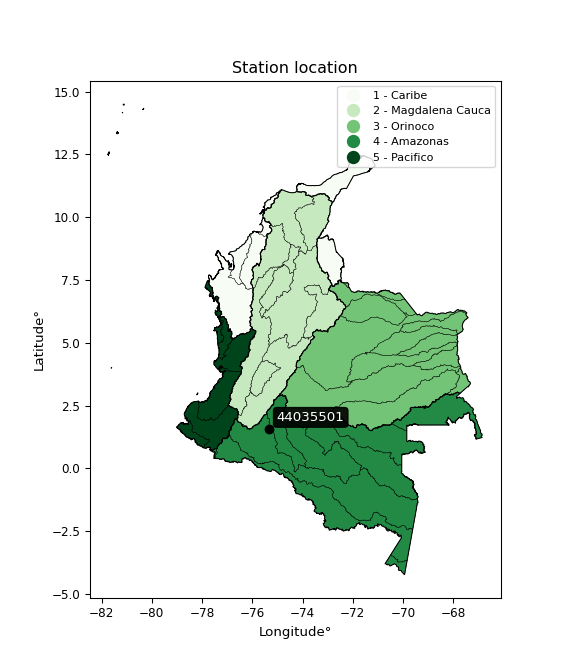

<div align="center">


</div>

# PMP Station (Rain, Pmax24h): 44035501

Probable Maximum Precipitation (PMP) is the greatest amount of rainfall for a specific duration that is meteorologically possible for a given location, acting as a "worst-case" scenario for extreme storms, crucial for designing safety-critical infrastructure like bridges, river deviations, dams, spillways, and nuclear plants to prevent catastrophic failure. PMP is calculated by hydrologists using meteorological data to determine the upper limit of extreme rainfall, often leading to the Probable Maximum Flood (PMF) for flood control design, and is increasingly being studied for climate change impacts.

<div align="center">

</img>

</div>


## A. General information


### 1. General running parameters

• app_version: _v20260103_. • runtime: _2026-01-03 07:24:50.581521_. • Python version: _3.14.0_. • SciPy version: _1.16.3_. • Pandas version: _2.3.3_. • NumPy version: _2.3.5_. • Stations dataset (station_dataset_file): _dataset/pmax24h_in/automatic_colombia_2003_2024.csv_. • Stations catalog (station_catalog_file): _dataset/CNE.xls_. • Minimum year to eval til year_max (date_min): _1900_. • Maximum year to eval since year_min (date_max): _2024_. • Creates, save and include plots into reports (create_plot): _False_. • Plot only fit distributions with Δo > Δ (plot_only_fit): _True_. • Eval low extreme values, if False, evaluates high extreme values (low_extreme): _False_. • Eval every SciPy distribution as logarithmic (pdist_logarithmic_on): _True_. • Standard deviation normalized (ddof): _1.0_. • Return periods to eval in years (Tr): _[2, 2.33, 5, 10, 15, 20, 25, 50, 75, 100, 200, 250, 500, 750, 1000]_. • Minimum data sample per station, 0 means any (minimum_sample): _5_. • Z-Score maximum threshold to adjust a value, 0 means disable (zscore_max): _3.5_. • Z-Score minimum threshold to adjust a value, 0 means disable (zscore_min): _-2.5_. • Avoid zeros, e.g. rain = 0 (avoid_zeros): _True_. • Avoid null values (avoid_nans): _True_. [:file_folder:Dataset file.](../../dataset/pmax24h_in/automatic_colombia_2003_2024.csv)

> Delta Degrees of Freedom (DDOF): is a parameter used in the formulas for calculating variance and standard deviation. When ddof=0, the divisor is $N$ (the total number of observations) and this is used when your data set is the entire population. When ddof=1, the divisor is $N-1$ and this is used when your data set is a sample drawn from a larger population. Using $N-1$ provides an unbiased estimate of the population variance (known as Bessel´s correction).


### 2. Station info and location

|   id |   CODIGO | NOMBRE                    | CATEGORIA               | TECNOLOGIA                | ESTADO   | FECHA_INSTALACION   |   FECHA_SUSPENSION |   ALTITUD |   LATITUD |   LONGITUD | DEPARTAMENTO   | MUNICIPIO   | AREA_OPERATIVA                    | ENTIDAD                                    | AREA_HIDROGRAFICA   | ZONA_HIDROGRAFICA   | SUBZONA_HIDROGRAFICA   |   CORRIENTE | Catalogo   |   Version |
|-----:|---------:|:--------------------------|:------------------------|:--------------------------|:---------|:--------------------|-------------------:|----------:|----------:|-----------:|:---------------|:------------|:----------------------------------|:-------------------------------------------|:--------------------|:--------------------|:-----------------------|------------:|:-----------|----------:|
|    0 | 44035501 | PAUJIL  - AUT  [44035501] | Climatológica Principal | Automática con Telemetría | Activa   | 15/10/2013          |                nan |       999 |   1.57382 |   -75.3402 | Caqueta        | El Paujil   | Area Operativa 04 - Huila-Caquetá | CENTRO NACIONAL DE INVESTIGACIONES DE CAFE | Amazonas            | Caquetá             | Río Orteguaza          |         nan | CNE_OE     |  20251226 |

<div align="center">

Dynamic map: [:earth_americas:Google](http://maps.google.com/maps?q=1.573819444,-75.3402) [:earth_americas:OSM](https://www.openstreetmap.org/#map=18/1.573819444/-75.3402&layers=P) [:earth_americas:Bing](https://www.bing.com/maps?cp=1.573819444~-75.3402&lvl=18) [:earth_americas:Apple](https://maps.apple.com/frame?center=1.573819444%2C-75.3402&span=0.003%2C0.006)

</div>


<div align="center">

```geojson
{
  "type": "Feature",
  "geometry": {
    "type": "Point", 
    "coordinates": [-75.3402, 1.573819444]
  }, 
  "properties": {
    "Name": "44035501"
  }
}
```

</div>


### 3. Discrete values table and plot

<div align="center">

|               |          0 |          1 |           2 |          3 |          4 |           5 |
|:--------------|-----------:|-----------:|------------:|-----------:|-----------:|------------:|
| Date          | 2018       | 2019       | 2020        | 2021       | 2022       | 2023        |
| Value         |   76       |  201.6     |   90.2      |  123       |  192.1     |  122.7      |
| Value_initial |   76       |  201.6     |   90.2      |  123       |  192.1     |  122.7      |
| count         |    6       |    6       |    6        |    6       |    6       |    6        |
| mean          |  134.267   |  134.267   |  134.267    |  134.267   |  134.267   |  134.267    |
| std           |   51.9155  |   51.9155  |   51.9155   |   51.9155  |   51.9155  |   51.9155   |
| zscore        |   -1.12234 |    1.29698 |   -0.848816 |   -0.21702 |    1.11399 |   -0.222798 |


</div>


> The initial value (value_initial) correspond to the initial obtained or null completed value, and value (value) is adjusted only when the initial value is outside the valid range definite through the Z-Score value. If Z-Score is active, values out of range or outliers are replaced with the station mean value


### 4. Active continuous probability distributions from SciPy (44 of 104 available)

A Probability Density Function (PDF) describes the relative likelihood of a continuous random variable falling within a specific range, where the total area under its curve equals 1, and the area over any interval gives the actual probability for that range. Unlike discrete probabilities (like rolling a die), a PDF shows density, not direct probability for a single point (which is zero), with higher points indicating higher likelihood, often visualized as a bell curve for normal distributions.

A log of a probability density function (log-PDF) is simply the logarithm of the PDF´s value, denoted as $log(f(x))$, useful for converting multiplication of probabilities into addition, improving numerical stability with tiny numbers, and connecting to information theory concepts like entropy. Instead of dealing with very small probabilities (e.g., 0.000001), log-PDFs use negative numbers (e.g., $log(0.00001) ≈ -11.51$ that are easier for computers to handle, preventing underflow errors and simplifying complex calculations. In this study, each active probability distribution from SciPy is also evaluated in the $log$ form.

[scipy.stats](https://docs.scipy.org/doc/scipy/reference/stats.html) is a Python´s powerful submodule within the SciPy library for comprehensive statistical analysis, offering over 130 probability distributions (like Normal, Poisson), functions for descriptive stats (mean, variance), hypothesis testing (t-tests, chi-square), random variable generation, and statistical tests, making it essential for data science, modeling, and research. It provides tools to explore, model, and draw conclusions from data efficiently, working seamlessly with NumPy.

<div align="center">

|   id | p_dist             |   n_parameter | fit_method   | label                                                                       | active   | ref                                                                                                        |
|-----:|:-------------------|--------------:|:-------------|:----------------------------------------------------------------------------|:---------|:-----------------------------------------------------------------------------------------------------------|
|    0 | alpha              |             3 | MLE          | Alpha                                                                       | True     | [:mortar_board:](https://docs.scipy.org/doc/scipy/reference/generated/scipy.stats.alpha.html)              |
|    1 | betaprime          |             4 | MLE          | Beta prime                                                                  | True     | [:mortar_board:](https://docs.scipy.org/doc/scipy/reference/generated/scipy.stats.betaprime.html)          |
|    2 | chi2               |             3 | MLE          | Chi²                                                                        | True     | [:mortar_board:](https://docs.scipy.org/doc/scipy/reference/generated/scipy.stats.chi2.html)               |
|    3 | crystalball        |             4 | MLE          | Crystalball                                                                 | True     | [:mortar_board:](https://docs.scipy.org/doc/scipy/reference/generated/scipy.stats.crystalball.html)        |
|    4 | erlang             |             3 | MLE          | Erlang                                                                      | True     | [:mortar_board:](https://docs.scipy.org/doc/scipy/reference/generated/scipy.stats.erlang.html)             |
|    5 | expon              |             2 | MLE          | Exponential                                                                 | True     | [:mortar_board:](https://docs.scipy.org/doc/scipy/reference/generated/scipy.stats.expon.html)              |
|    6 | exponnorm          |             3 | MLE          | Exponentially modified Normal                                               | True     | [:mortar_board:](https://docs.scipy.org/doc/scipy/reference/generated/scipy.stats.exponnorm.html)          |
|    7 | f                  |             4 | MLE          | F                                                                           | True     | [:mortar_board:](https://docs.scipy.org/doc/scipy/reference/generated/scipy.stats.f.html)                  |
|    8 | fatiguelife        |             3 | MLE          | Fatigue-life (Birnbaum-Saunders)                                            | True     | [:mortar_board:](https://docs.scipy.org/doc/scipy/reference/generated/scipy.stats.fatiguelife.html)        |
|    9 | fisk               |             3 | MLE          | Fisk                                                                        | True     | [:mortar_board:](https://docs.scipy.org/doc/scipy/reference/generated/scipy.stats.fisk.html)               |
|   10 | gamma              |             3 | MLE          | Gamma                                                                       | True     | [:mortar_board:](https://docs.scipy.org/doc/scipy/reference/generated/scipy.stats.gamma.html)              |
|   11 | genexpon           |             5 | MLE          | Generalized exponential                                                     | True     | [:mortar_board:](https://docs.scipy.org/doc/scipy/reference/generated/scipy.stats.genexpon.html)           |
|   12 | genlogistic        |             3 | MLE          | Generalized logistic                                                        | True     | [:mortar_board:](https://docs.scipy.org/doc/scipy/reference/generated/scipy.stats.genlogistic.html)        |
|   13 | gibrat             |             2 | MM           | Gibrat                                                                      | True     | [:mortar_board:](https://docs.scipy.org/doc/scipy/reference/generated/scipy.stats.gibrat.html)             |
|   14 | gompertz           |             3 | MLE          | Gompertz (or truncated Gumbel)                                              | True     | [:mortar_board:](https://docs.scipy.org/doc/scipy/reference/generated/scipy.stats.gompertz.html)           |
|   15 | gumbel_l           |             2 | MM           | Gumbel Left Skew                                                            | True     | [:mortar_board:](https://docs.scipy.org/doc/scipy/reference/generated/scipy.stats.gumbel_l.html)           |
|   16 | gumbel_r           |             2 | MM           | Gumbel Right Skew                                                           | True     | [:mortar_board:](https://docs.scipy.org/doc/scipy/reference/generated/scipy.stats.gumbel_r.html)           |
|   17 | halflogistic       |             2 | MM           | Half-logistic                                                               | True     | [:mortar_board:](https://docs.scipy.org/doc/scipy/reference/generated/scipy.stats.halflogistic.html)       |
|   18 | halfnorm           |             2 | MM           | Half Normal                                                                 | True     | [:mortar_board:](https://docs.scipy.org/doc/scipy/reference/generated/scipy.stats.halfnorm.html)           |
|   19 | hypsecant          |             2 | MM           | hyperbolic secant                                                           | True     | [:mortar_board:](https://docs.scipy.org/doc/scipy/reference/generated/scipy.stats.hypsecant.html)          |
|   20 | invgamma           |             3 | MLE          | Inverted gamma                                                              | True     | [:mortar_board:](https://docs.scipy.org/doc/scipy/reference/generated/scipy.stats.invgamma.html)           |
|   21 | invgauss           |             3 | MLE          | Inverse Gaussian                                                            | True     | [:mortar_board:](https://docs.scipy.org/doc/scipy/reference/generated/scipy.stats.invgauss.html)           |
|   22 | invweibull         |             3 | MLE          | Inverted Weibull                                                            | True     | [:mortar_board:](https://docs.scipy.org/doc/scipy/reference/generated/scipy.stats.invweibull.html)         |
|   23 | johnsonsu          |             4 | MLE          | Johnson Su                                                                  | True     | [:mortar_board:](https://docs.scipy.org/doc/scipy/reference/generated/scipy.stats.johnsonsu.html)          |
|   24 | kstwobign          |             2 | MLE          | Limiting distribution of scaled Kolmogorov-Smirnov two-sided test statistic | True     | [:mortar_board:](https://docs.scipy.org/doc/scipy/reference/generated/scipy.stats.kstwobign.html)          |
|   25 | laplace            |             2 | MM           | Laplace                                                                     | True     | [:mortar_board:](https://docs.scipy.org/doc/scipy/reference/generated/scipy.stats.laplace.html)            |
|   26 | laplace_asymmetric |             3 | MLE          | Asymmetric Laplace                                                          | True     | [:mortar_board:](https://docs.scipy.org/doc/scipy/reference/generated/scipy.stats.laplace_asymmetric.html) |
|   27 | loggamma           |             3 | MLE          | Log gamma                                                                   | True     | [:mortar_board:](https://docs.scipy.org/doc/scipy/reference/generated/scipy.stats.loggamma.html)           |
|   28 | logistic           |             2 | MM           | Logistic (or Sech-squared)                                                  | True     | [:mortar_board:](https://docs.scipy.org/doc/scipy/reference/generated/scipy.stats.logistic.html)           |
|   29 | lognorm            |             3 | MLE          | Log Normal                                                                  | True     | [:mortar_board:](https://docs.scipy.org/doc/scipy/reference/generated/scipy.stats.lognorm.html)            |
|   30 | maxwell            |             2 | MM           | Maxwell                                                                     | True     | [:mortar_board:](https://docs.scipy.org/doc/scipy/reference/generated/scipy.stats.maxwell.html)            |
|   31 | mielke             |             4 | MLE          | Mielke Beta-Kappa / Dagum                                                   | True     | [:mortar_board:](https://docs.scipy.org/doc/scipy/reference/generated/scipy.stats.mielke.html)             |
|   32 | moyal              |             2 | MM           | Moyal                                                                       | True     | [:mortar_board:](https://docs.scipy.org/doc/scipy/reference/generated/scipy.stats.moyal.html)              |
|   33 | nakagami           |             3 | MLE          | Nakagami                                                                    | True     | [:mortar_board:](https://docs.scipy.org/doc/scipy/reference/generated/scipy.stats.nakagami.html)           |
|   34 | ncf                |             5 | MLE          | Non-central F distribution                                                  | True     | [:mortar_board:](https://docs.scipy.org/doc/scipy/reference/generated/scipy.stats.ncf.html)                |
|   35 | nct                |             4 | MLE          | Non-central Student’s t                                                     | True     | [:mortar_board:](https://docs.scipy.org/doc/scipy/reference/generated/scipy.stats.nct.html)                |
|   36 | norm               |             2 | MM           | Normal                                                                      | True     | [:mortar_board:](https://docs.scipy.org/doc/scipy/reference/generated/scipy.stats.norm.html)               |
|   37 | pearson3           |             3 | MM           | Pearson type III                                                            | True     | [:mortar_board:](https://docs.scipy.org/doc/scipy/reference/generated/scipy.stats.pearson3.html)           |
|   38 | rayleigh           |             2 | MM           | Rayleigh                                                                    | True     | [:mortar_board:](https://docs.scipy.org/doc/scipy/reference/generated/scipy.stats.rayleigh.html)           |
|   39 | rice               |             3 | MLE          | Rice                                                                        | True     | [:mortar_board:](https://docs.scipy.org/doc/scipy/reference/generated/scipy.stats.rice.html)               |
|   40 | t                  |             3 | MLE          | Student’s t                                                                 | True     | [:mortar_board:](https://docs.scipy.org/doc/scipy/reference/generated/scipy.stats.t.html)                  |
|   41 | truncnorm          |             4 | MLE          | Truncated normal                                                            | True     | [:mortar_board:](https://docs.scipy.org/doc/scipy/reference/generated/scipy.stats.truncnorm.html)          |
|   42 | wald               |             2 | MM           | Wald                                                                        | True     | [:mortar_board:](https://docs.scipy.org/doc/scipy/reference/generated/scipy.stats.wald.html)               |
|   43 | weibull_min        |             3 | MLE          | Weibull minimum                                                             | True     | [:mortar_board:](https://docs.scipy.org/doc/scipy/reference/generated/scipy.stats.weibull_min.html)        |

</div>

> **n_parameter:** # arguments & localization & scale.
>
> **Fit methods:** (MLE) maximum likelihood, (MM) L-moments.
>
>**Inactive** (With the only purpose of prevent loops, zero divisions, infinite values, over high estimated values or horizontal trending for recurrence intervals estimations, the follow distributions were disabled.)**:** foldnorm, gennorm, norminvgauss, powernorm, powerlognorm, skewnorm, genextreme, anglit, arcsine, argus, beta, bradford, burr, burr12, cauchy, cosine, halfcauchy, foldcauchy, skewcauchy, wrapcauchy, dgamma, gengamma, exponweib, exponpow, truncexpon, gausshyper, genhalflogistic, genhyperbolic, geninvgauss, halfgennorm, johnsonsb, kappa4, kappa3, ksone, kstwo, loglaplace, levy, levy_l, levy_stable, ncx2, pareto, genpareto, truncpareto, lomax, powerlaw, rdist, rel_breitwigner, recipinvgauss, semicircular, studentized_range, trapezoid, triang, truncweibull_min, tukeylambda, uniform, loguniform, vonmises, vonmises_line, weibull_max, dweibull, 


## B. Probability distributions vs. Empirical distributions

A continuous probability distribution (CPD) describes probabilities for variables that can take any value within a range (like rain any time), unlike discrete variables with specific outcomes (like temperature). It uses a Probability Density Function (PDF), a curve where the total area under it equals 1, and the probability of the variable falling within an interval (a to b) is found by calculating the area under the curve between those points. A key feature is that the probability of hitting any single exact value is zero, so probabilities are always expressed for ranges, e.g., $P(a ≤ X ≤ b)$.

<div align="center">

Distributions parameters from station values
|    |   station | p_dist                |   n |              loc |          scale | shape                  | shape1                | shape2                 | shape3   |
|---:|----------:|:----------------------|----:|-----------------:|---------------:|:-----------------------|:----------------------|:-----------------------|:---------|
|  0 |  44035501 | alpha                 |   6 |    -93.8488      | 1090.93        | 4.987761162980497      |                       |                        |          |
|  1 |  44035501 | betaprime             |   6 |     -0.403461    |    9.85443     | 107.64544508256034     | 8.847938912601744     |                        |          |
|  2 |  44035501 | chi2                  |   6 |     76           |   34.0279      | 1.1508425417613326     |                       |                        |          |
|  3 |  44035501 | crystalball           |   6 |    134.267       |   47.3921      | 12622.73896417898      | 89.54608375236586     |                        |          |
|  4 |  44035501 | erlang                |   6 |     76           |   59.5254      | 0.5754011679155415     |                       |                        |          |
|  5 |  44035501 | expon                 |   6 |     76           |   58.2667      |                        |                       |                        |          |
|  6 |  44035501 | exponnorm             |   6 |     75.9147      |    0.0275671   | 2092.057547901478      |                       |                        |          |
|  7 |  44035501 | f                     |   6 |      4.48001     |  112.846       | 511.39856699025995     | 15.222206126055141    |                        |          |
|  8 |  44035501 | fatiguelife           |   6 |     76           |    0.000139327 | 610.3817202923685      |                       |                        |          |
|  9 |  44035501 | fisk                  |   6 |     -0.940003    |  126.365       | 4.593354518797399      |                       |                        |          |
| 10 |  44035501 | gamma                 |   6 |     76           |   67.4046      | 0.5039732776828725     |                       |                        |          |
| 11 |  44035501 | genexpon              |   6 |     75.9999      |    1.99749     | 0.03434201681254244    | 2.650578380325857e-08 | 1.8876281529720225     |          |
| 12 |  44035501 | genlogistic           |   6 |   -148.206       |   38.15        | 904.9154749478548      |                       |                        |          |
| 13 |  44035501 | gibrat                |   6 |     98.1124      |   21.9287      |                        |                       |                        |          |
| 14 |  44035501 | gompertz              |   6 |     76           |  132.114       | 1.5150658463885658     |                       |                        |          |
| 15 |  44035501 | gumbel_l              |   6 |    155.596       |   36.9515      |                        |                       |                        |          |
| 16 |  44035501 | gumbel_r              |   6 |    112.938       |   36.9515      |                        |                       |                        |          |
| 17 |  44035501 | halflogistic          |   6 |     78.096       |   40.5186      |                        |                       |                        |          |
| 18 |  44035501 | halfnorm              |   6 |     71.5381      |   78.6186      |                        |                       |                        |          |
| 19 |  44035501 | hypsecant             |   6 |    134.267       |   30.1708      |                        |                       |                        |          |
| 20 |  44035501 | invgamma              |   6 |     15.1679      |  632.257       | 6.254634978600458      |                       |                        |          |
| 21 |  44035501 | invgauss              |   6 |     52.3203      |  159.486       | 0.5138158938492365     |                       |                        |          |
| 22 |  44035501 | invweibull            |   6 |     76           |    1.58453     | 0.0655907831382482     |                       |                        |          |
| 23 |  44035501 | johnsonsu             |   6 |      2.01301e+09 |    8.47841e+08 | 73247917.71692717      | 45794220.91543751     |                        |          |
| 24 |  44035501 | kstwobign             |   6 |    -20.0051      |  176.397       |                        |                       |                        |          |
| 25 |  44035501 | laplace               |   6 |    134.267       |   33.5113      |                        |                       |                        |          |
| 26 |  44035501 | laplace_asymmetric    |   6 |    122.7         |   36.6101      | 0.8544284632901451     |                       |                        |          |
| 27 |  44035501 | loggamma              |   6 | -11230.4         | 1614.08        | 1142.9034226305002     |                       |                        |          |
| 28 |  44035501 | logistic              |   6 |    134.267       |   26.1286      |                        |                       |                        |          |
| 29 |  44035501 | lognorm               |   6 |     76           |    0.136466    | 13.388049529773435     |                       |                        |          |
| 30 |  44035501 | maxwell               |   6 |     21.9673      |   70.3732      |                        |                       |                        |          |
| 31 |  44035501 | mielke                |   6 |     -0.900945    |   18.1347      | 925.927040268828       | 3.2019115100659397    |                        |          |
| 32 |  44035501 | moyal                 |   6 |    107.165       |   21.3339      |                        |                       |                        |          |
| 33 |  44035501 | nakagami              |   6 |     76           |   83.7811      | 0.3724526285805608     |                       |                        |          |
| 34 |  44035501 | ncf                   |   6 |     -0.0221218   |    2.0905e-08  | 1.2017998335600919e-09 | 1.7023867888352837    | 6.55635248918904       |          |
| 35 |  44035501 | nct                   |   6 |     -0.228711    |    2.88709     | 4.504102762159236      | 38.815037177277134    |                        |          |
| 36 |  44035501 | norm                  |   6 |    134.267       |   47.3921      |                        |                       |                        |          |
| 37 |  44035501 | pearson3              |   6 |    134.267       |   47.3921      | 0.3324804914829791     |                       |                        |          |
| 38 |  44035501 | rayleigh              |   6 |     43.6028      |   72.3393      |                        |                       |                        |          |
| 39 |  44035501 | rice                  |   6 |     51.7392      |   64.1911      | 0.4449572373986763     |                       |                        |          |
| 40 |  44035501 | t                     |   6 |    134.265       |   47.3977      | 62486.969767893024     |                       |                        |          |
| 41 |  44035501 | truncnorm             |   6 |    124.213       |   77.6831      | -4327.462758391517     | 0.996193131929043     |                        |          |
| 42 |  44035501 | wald                  |   6 |     86.8746      |   47.3921      |                        |                       |                        |          |
| 43 |  44035501 | weibull_min           |   6 |     76           |   63.8561      | 0.8055524072246572     |                       |                        |          |
| 44 |  44035501 | logalpha              |   6 |     -3.321       |  185.785       | 22.817001853460482     |                       |                        |          |
| 45 |  44035501 | logbetaprime          |   6 |     -0.589051    |   18.6529      | 297.1422043858608      | 1022.4695314591612    |                        |          |
| 46 |  44035501 | logchi2               |   6 |      4.33073     |    0.962686    | 1.0453154680605798     |                       |                        |          |
| 47 |  44035501 | logcrystalball        |   6 |      4.8365      |    0.35762     | 5.13696657755447       | 514.2185003969896     |                        |          |
| 48 |  44035501 | logerlang             |   6 |     -9.96549     |    0.00864047  | 1713.0800380094206     |                       |                        |          |
| 49 |  44035501 | logexpon              |   6 |      4.33073     |    0.505765    |                        |                       |                        |          |
| 50 |  44035501 | logexponnorm          |   6 |      4.8255      |    0.357451    | 0.030773258247302808   |                       |                        |          |
| 51 |  44035501 | logf                  |   6 |      4.33073     |    0.541622    | 0.912154916410604      | 4872.686335730852     |                        |          |
| 52 |  44035501 | logfatiguelife        |   6 |      2.36319     |    2.44713     | 0.1462738235259335     |                       |                        |          |
| 53 |  44035501 | logfisk               |   6 |      2.5144      |    2.29903     | 10.502132976870266     |                       |                        |          |
| 54 |  44035501 | loggamma              |   6 |     -9.9578      |    0.00863509  | 1713.243441857578      |                       |                        |          |
| 55 |  44035501 | loggenexpon           |   6 |      4.32884     |    0.010897    | 0.012697185610285981   | 1.9068109461216993    | 0.00013117225472457925 |          |
| 56 |  44035501 | loggenlogistic        |   6 |      2.87866     |    0.315294    | 284.08454911597937     |                       |                        |          |
| 57 |  44035501 | loggibrat             |   6 |      4.56366     |    0.165487    |                        |                       |                        |          |
| 58 |  44035501 | loggompertz           |   6 |      4.33073     |    0.600831    | 0.5716040085974494     |                       |                        |          |
| 59 |  44035501 | loggumbel_l           |   6 |      4.99745     |    0.278835    |                        |                       |                        |          |
| 60 |  44035501 | loggumbel_r           |   6 |      4.67555     |    0.278835    |                        |                       |                        |          |
| 61 |  44035501 | loghalflogistic       |   6 |      4.41262     |    0.305766    |                        |                       |                        |          |
| 62 |  44035501 | loghalfnorm           |   6 |      4.36311     |    0.593301    |                        |                       |                        |          |
| 63 |  44035501 | loghypsecant          |   6 |      4.8365      |    0.227668    |                        |                       |                        |          |
| 64 |  44035501 | loginvgamma           |   6 |      1.12447     |  391.68        | 106.56026929873099     |                       |                        |          |
| 65 |  44035501 | loginvgauss           |   6 |      3.07396     |   39.9824      | 0.044080757156639505   |                       |                        |          |
| 66 |  44035501 | loginvweibull         |   6 |     -4.49446e+07 |    4.49446e+07 | 112249419.03494716     |                       |                        |          |
| 67 |  44035501 | logjohnsonsu          |   6 |      5.30629     |    1.2778e-12  | 2.5174501545298638     | 0.14390036401261985   |                        |          |
| 68 |  44035501 | logkstwobign          |   6 |      3.57142     |    1.44395     |                        |                       |                        |          |
| 69 |  44035501 | loglaplace            |   6 |      4.8365      |    0.252875    |                        |                       |                        |          |
| 70 |  44035501 | loglaplace_asymmetric |   6 |      4.80974     |    0.288009    | 0.9546865699503206     |                       |                        |          |
| 71 |  44035501 | logloggamma           |   6 |    -54.3471      |    9.13483     | 651.7357255383422      |                       |                        |          |
| 72 |  44035501 | loglogistic           |   6 |      4.8365      |    0.197166    |                        |                       |                        |          |
| 73 |  44035501 | loglognorm            |   6 |      4.33073     |    0.00177938  | 12.68070097804515      |                       |                        |          |
| 74 |  44035501 | logmaxwell            |   6 |      3.98909     |    0.531035    |                        |                       |                        |          |
| 75 |  44035501 | logmielke             |   6 |     -3.27713e+06 |    3.27714e+06 | 578487864.1186475      | 10536151.64863246     |                        |          |
| 76 |  44035501 | logmoyal              |   6 |      4.63199     |    0.160986    |                        |                       |                        |          |
| 77 |  44035501 | lognakagami           |   6 |      4.33073     |    0.541512    | 0.3252858900643115     |                       |                        |          |
| 78 |  44035501 | logncf                |   6 |     -1.40724     |    6.23758     | 870.3435710629967      | 2026.8344654038237    | 2.0631432178361256e-08 |          |
| 79 |  44035501 | lognct                |   6 |     -0.120634    |    0.0825446   | 101.63875865971139     | 59.609867567093715    |                        |          |
| 80 |  44035501 | lognorm               |   6 |      4.8365      |    0.35762     |                        |                       |                        |          |
| 81 |  44035501 | logpearson3           |   6 |      4.8365      |    0.35762     | 0.04285474858566672    |                       |                        |          |
| 82 |  44035501 | lograyleigh           |   6 |      4.15235     |    0.545871    |                        |                       |                        |          |
| 83 |  44035501 | logrice               |   6 |      4.15226     |    0.442019    | 1.0250628660505519     |                       |                        |          |
| 84 |  44035501 | logt                  |   6 |      4.8365      |    0.357621    | 4839650661.588458      |                       |                        |          |
| 85 |  44035501 | logtruncnorm          |   6 |     -0.108669    |    1.16458     | 3.958261795483107      | 4.649702848046512     |                        |          |
| 86 |  44035501 | logwald               |   6 |      4.4789      |    0.357598    |                        |                       |                        |          |
| 87 |  44035501 | logweibull_min        |   6 |      4.33073     |    0.268296    | 0.43740092176305706    |                       |                        |          |

</div>

> **loc** (Location parameter): This shifts the distribution along the x-axis. For many common distributions, like the normal (Gaussian) distribution, loc represents the mean $μ$. For others, like the uniform distribution, it might represent the minimum value, or for the beta distribution, the left end of the support interval.
>
> **scale** (Scale parameter): This determines the width or spread of the distribution. For the normal distribution, scale represents the standard deviation $σ$. For a uniform distribution, it defines the length of the interval (from $loc$ to $loc + scale$).
>
> **shape** (Shape parameters): Refers to parameters that define the specific form of a probability distribution, distinct from its location (loc) and scale (scale). These parameters are required arguments for most distribution functions. For example, a normal (Gaussian) distribution is fully defined by its location (mean) and scale (standard deviation), so it has no specific shape parameters beyond loc and scale. However, other distributions have intrinsic properties that need specification, as Gamma distribution that takes a shape parameter, often named $a$ or $alpha$.


### 0. Cumulative distribution values - CDF (88 evaluated)

Cumulative Distribution Function (CDF), denoted as $F$<sub>$X$</sub>$(x)$, is a function that gives the probability that a random variable $X$ will take a value less than or equal to a specific value, $x$ (i.e., $(P(X≥x)$. It essentially "accumulates" probabilities from a given point up to the far right (positive infinity), providing a complete picture of the distribution´s probabilities for both discrete (like rain) and continuous (like temperature) variables, helping to find probabilities over ranges or above certain values. Each station is evaluated separately ordering the $x$ values ascending, calculating the CDF and PDF values for the activated distributions and their logarithmic forms.

<div align="center">

CDF ordered by x ascending and calculating $log(f(x))$ separately
|   id |   Station |   date |     x |   count |    mean |     std |    zscore |   Value_initial |   station |   m |     alpha |   alpha_pdf |   betaprime |   betaprime_pdf |        chi2 |       chi2_pdf |   crystalball |   crystalball_pdf |      erlang |      erlang_pdf |    expon |   expon_pdf |   exponnorm |   exponnorm_pdf |         f |      f_pdf |   fatiguelife |   fatiguelife_pdf |     fisk |   fisk_pdf |       gamma |       gamma_pdf |    genexpon |   genexpon_pdf |   genlogistic |   genlogistic_pdf |   gibrat |   gibrat_pdf |    gompertz |   gompertz_pdf |   gumbel_l |   gumbel_l_pdf |   gumbel_r |   gumbel_r_pdf |   halflogistic |   halflogistic_pdf |   halfnorm |   halfnorm_pdf |   hypsecant |   hypsecant_pdf |   invgamma |   invgamma_pdf |   invgauss |   invgauss_pdf |   invweibull |   invweibull_pdf |   johnsonsu |   johnsonsu_pdf |   kstwobign |   kstwobign_pdf |   laplace |   laplace_pdf |   laplace_asymmetric |   laplace_asymmetric_pdf |   loggamma |   loggamma_pdf |   logistic |   logistic_pdf |   lognorm |   lognorm_pdf |   maxwell |   maxwell_pdf |   mielke |   mielke_pdf |     moyal |   moyal_pdf |    nakagami |   nakagami_pdf |      ncf |    ncf_pdf |       nct |    nct_pdf |     norm |   norm_pdf |   pearson3 |   pearson3_pdf |   rayleigh |   rayleigh_pdf |      rice |   rice_pdf |        t |      t_pdf |   truncnorm |   truncnorm_pdf |        wald |   wald_pdf |   weibull_min |   weibull_min_pdf |   logalpha |   logalpha_pdf |   logbetaprime |   logbetaprime_pdf |     logchi2 |   logchi2_pdf |   logcrystalball |   logcrystalball_pdf |   logerlang |   logerlang_pdf |   logexpon |   logexpon_pdf |   logexponnorm |   logexponnorm_pdf |        logf |     logf_pdf |   logfatiguelife |   logfatiguelife_pdf |   logfisk |   logfisk_pdf |   loggenexpon |   loggenexpon_pdf |   loggenlogistic |   loggenlogistic_pdf |   loggibrat |   loggibrat_pdf |   loggompertz |   loggompertz_pdf |   loggumbel_l |   loggumbel_l_pdf |   loggumbel_r |   loggumbel_r_pdf |   loghalflogistic |   loghalflogistic_pdf |   loghalfnorm |   loghalfnorm_pdf |   loghypsecant |   loghypsecant_pdf |   loginvgamma |   loginvgamma_pdf |   loginvgauss |   loginvgauss_pdf |   loginvweibull |   loginvweibull_pdf |   logjohnsonsu |   logjohnsonsu_pdf |   logkstwobign |   logkstwobign_pdf |   loglaplace |   loglaplace_pdf |   loglaplace_asymmetric |   loglaplace_asymmetric_pdf |   logloggamma |   logloggamma_pdf |   loglogistic |   loglogistic_pdf |   loglognorm |   loglognorm_pdf |   logmaxwell |   logmaxwell_pdf |   logmielke |   logmielke_pdf |   logmoyal |   logmoyal_pdf |   lognakagami |   lognakagami_pdf |    logncf |   logncf_pdf |    lognct |   lognct_pdf |   logpearson3 |   logpearson3_pdf |   lograyleigh |   lograyleigh_pdf |   logrice |   logrice_pdf |      logt |   logt_pdf |   logtruncnorm |   logtruncnorm_pdf |    logwald |   logwald_pdf |   logweibull_min |   logweibull_min_pdf |
|-----:|----------:|-------:|------:|--------:|--------:|--------:|----------:|----------------:|----------:|----:|----------:|------------:|------------:|----------------:|------------:|---------------:|--------------:|------------------:|------------:|----------------:|---------:|------------:|------------:|----------------:|----------:|-----------:|--------------:|------------------:|---------:|-----------:|------------:|----------------:|------------:|---------------:|--------------:|------------------:|---------:|-------------:|------------:|---------------:|-----------:|---------------:|-----------:|---------------:|---------------:|-------------------:|-----------:|---------------:|------------:|----------------:|-----------:|---------------:|-----------:|---------------:|-------------:|-----------------:|------------:|----------------:|------------:|----------------:|----------:|--------------:|---------------------:|-------------------------:|-----------:|---------------:|-----------:|---------------:|----------:|--------------:|----------:|--------------:|---------:|-------------:|----------:|------------:|------------:|---------------:|---------:|-----------:|----------:|-----------:|---------:|-----------:|-----------:|---------------:|-----------:|---------------:|----------:|-----------:|---------:|-----------:|------------:|----------------:|------------:|-----------:|--------------:|------------------:|-----------:|---------------:|---------------:|-------------------:|------------:|--------------:|-----------------:|---------------------:|------------:|----------------:|-----------:|---------------:|---------------:|-------------------:|------------:|-------------:|-----------------:|---------------------:|----------:|--------------:|--------------:|------------------:|-----------------:|---------------------:|------------:|----------------:|--------------:|------------------:|--------------:|------------------:|--------------:|------------------:|------------------:|----------------------:|--------------:|------------------:|---------------:|-------------------:|--------------:|------------------:|--------------:|------------------:|----------------:|--------------------:|---------------:|-------------------:|---------------:|-------------------:|-------------:|-----------------:|------------------------:|----------------------------:|--------------:|------------------:|--------------:|------------------:|-------------:|-----------------:|-------------:|-----------------:|------------:|----------------:|-----------:|---------------:|--------------:|------------------:|----------:|-------------:|----------:|-------------:|--------------:|------------------:|--------------:|------------------:|----------:|--------------:|----------:|-----------:|---------------:|-------------------:|-----------:|--------------:|-----------------:|---------------------:|
|    0 |  44035501 |   2018 |  76   |       6 | 134.267 | 51.9155 | -1.12234  |            76   |  44035501 |   1 | 0.0756162 |  0.00538651 |   0.0712228 |      0.00575537 | 1.06508e-09 | 43127          |      0.10945  |        0.0039534  | 2.55619e-09 | 25875.2         | 0        |  0.0171625  |  0.00147738 |      0.0172966  | 0.0742634 | 0.00615647 |     0.0330166 |       6.11635e+08 | 0.092879 | 0.00502991 | 1.41928e-08 | 503334          | 1.73431e-06 |     0.0171925  |     0.0794041 |        0.00526516 | 0        |   0          | 1.07559e-14 |     0.0114679  |   0.109536 |     0.00279569 |   0.066055 |     0.00485743 |       0        |         0          |  0.0452588 |     0.0101325  |   0.0916521 |      0.00299598 |  0.0648814 |     0.0061821  |  0.0526598 |     0.00796717 |  0.000237829 |      9.15924e+09 |    0.110928 |      0.00396605 |   0.0715328 |      0.00546135 | 0.0878728 |    0.00262219 |            0.0948247 |               0.00303141 |   0.077426 |       0.415284 |  0.0970893 |     0.00335505 | 0.0786438 |      0.410364 |  0.101173 |    0.00497759 |      nan |          nan | 0.0379014 |  0.00450055 | 1.39232e-12 |    72.9827     | 0.350158 | 0.00313965 | 0.0634346 | 0.00631044 | 0.10945  | 0.0039534  |   0.102322 |     0.0043887  |  0.0954205 |     0.00560023 | 0.0626526 | 0.00500047 | 0.109485 | 0.00395376 |    0.318198 |      0.00504016 | 0           | 0          |   2.46051e-13 |       13.9476     |  0.0717233 |       0.434087 |      0.0741162 |           0.424798 | 1.08769e-08 |   6.40064e+06 |        0.0786439 |             0.410365 |   0.0774939 |        0.415319 |   0        |       1.9772   |      0.0786426 |           0.41037  | 0.000129641 | 21676.2      |         0.067562 |             0.456655 | 0.0776266 |      0.414    |    0.00220361 |          1.16661  |        0.0592546 |             0.528454 |    0        |        0        |   7.41548e-10 |          0.951356 |     0.0874679 |          0.299553 |     0.0319365 |          0.394461 |          0        |              0        |      0        |          0        |       0.06877  |           0.299719 |      0.070084 |          0.452961 |     0.0638258 |          0.48334  |       0.0855823 |            0.525437 |      0.0643095 |        0.0185485   |      0.0550375 |           0.57427  |    0.0676638 |         0.267578 |               0.0835166 |                    0.303743 |     0.0798413 |          0.407185 |     0.0714138 |          0.336335 |    0.0127489 |      2.92249e+12 |    0.0626448 |         0.505638 |   0.0587099 |        0.521566 |  0.0108065 |       0.245302 |   1.86747e-10 |     136788        | 0.0748504 |     0.424826 | 0.0700278 |     0.44386  |     0.0775657 |          0.414513 |     0.0519939 |          0.567523 | 0.0472723 |      0.519416 | 0.0786442 |   0.410364 |     0          |           0        | 0          |     0         |      4.63857e-07 |          2.28436e+08 |
|    1 |  44035501 |   2020 |  90.2 |       6 | 134.267 | 51.9155 | -0.848816 |            90.2 |  44035501 |   2 | 0.173701  |  0.00826261 |   0.176494  |      0.00881216 | 0.422918    |     0.0149828  |      0.176229 |        0.00546338 | 0.452118    |     0.0157063   | 0.216283 |  0.0134505  |  0.219405   |      0.0135351  | 0.185774  | 0.00922511 |     0.699521  |       0.00640796  | 0.182277 | 0.00751205 | 0.480494    |      0.0147954  | 0.216619    |     0.0134683  |     0.174355  |        0.007975   | 0        |   0          | 0.157951    |     0.0107522  |   0.156649 |     0.00388844 |   0.157192 |     0.00787115 |       0.148262 |         0.0120688  |  0.187632  |     0.00986687 |   0.14519   |      0.00464715 |  0.180179  |     0.0096469  |  0.201023  |     0.0117565  |  0.420619    |      0.00168258  |    0.177769 |      0.00545831 |   0.170096  |      0.00821337 | 0.13424   |    0.00400581 |            0.149304  |               0.00477303 |   0.17514  |       0.732655 |  0.156233  |     0.0050452  | 0.174826  |      0.720353 |  0.184257 |    0.00666139 |      nan |          nan | 0.136685  |  0.00919513 | 0.206925    |     0.0107705  | 0.391977 | 0.00276002 | 0.182673  | 0.0100177  | 0.176229 | 0.00546338 |   0.177122 |     0.00613025 |  0.187357  |     0.00723621 | 0.15011   | 0.00719126 | 0.176267 | 0.0054634  |    0.393554 |      0.00555212 | 0.000421326 | 0.00095581 |   0.257611    |        0.0125453  |  0.175816  |       0.78484  |      0.175086  |           0.759454 | 0.30881     |   0.888449    |        0.174826  |             0.720353 |   0.175187  |        0.732358 |   0.287295 |       1.40916  |      0.174827  |           0.720368 | 0.446662    |     1.07609  |         0.178462 |             0.8361   | 0.178205  |      0.773796 |    0.208135   |          1.21125  |        0.19305   |             1.00418  |    0        |        0        |   0.171856    |          1.04777  |     0.155651  |          0.512327 |     0.155172  |          1.03688  |          0.14518  |              1.60077  |      0.185127 |          1.30846  |       0.143998 |           0.611139 |      0.179398 |          0.823117 |     0.182609  |          0.893049 |       0.201366  |            0.805983 |      0.0678778 |        0.0234603   |      0.199505  |           1.05911  |    0.133212  |         0.526791 |               0.155716  |                    0.566327 |     0.174943  |          0.711339 |     0.154938  |          0.664072 |    0.640638  |      0.172128    |    0.182545  |         0.879231 |   0.191594  |        1.00267  |  0.134326  |       1.20955  |   0.364235    |          1.34972  | 0.175613  |     0.757106 | 0.177136  |     0.808193 |     0.17504   |          0.730709 |     0.185497  |          0.955833 | 0.171677  |      0.906681 | 0.174826  |   0.720351 |     0.00362933 |           3.74748  | 0.00022229 |     0.0783734 |      0.560359    |          0.922561    |
|    2 |  44035501 |   2023 | 122.7 |       6 | 134.267 | 51.9155 | -0.222798 |           122.7 |  44035501 |   3 | 0.480043  |  0.00926941 |   0.490349  |      0.00915296 | 0.717843    |     0.0056063  |      0.403591 |        0.00817089 | 0.752585    |     0.00548814  | 0.551339 |  0.00770013 |  0.555689   |      0.00770411 | 0.503649  | 0.00900312 |     0.828563  |       0.00258372  | 0.474989 | 0.00926452 | 0.758734    |      0.00506136 | 0.55197     |     0.00770279 |     0.474477  |        0.00926861 | 0.545558 |   0.0161194  | 0.47398     |     0.00859015 |   0.33672  |     0.00736952 |   0.464021 |     0.00964203 |       0.500831 |         0.00924476 |  0.484799  |     0.00821212 |   0.380852  |      0.00981977 |  0.50742   |     0.00904913 |  0.541839  |     0.0083425  |  0.44889     |      0.000504994 |    0.404186 |      0.00812159 |   0.470431  |      0.0091314  | 0.354054  |    0.0105652  |            0.421981  |               0.0134901  |   0.473674 |       1.11506  |  0.391102  |     0.00911419 | 0.47018   |      1.11243  |  0.437686 |    0.00833951 |      nan |          nan | 0.487165  |  0.0102066  | 0.488438    |     0.00715707 | 0.470113 | 0.00209018 | 0.516992  | 0.00903103 | 0.403591 | 0.00817089 |   0.423947 |     0.00848978 |  0.44997   |     0.00831378 | 0.425477  | 0.00898659 | 0.403614 | 0.00817001 |    0.585697 |      0.00610948 | 0.549899    | 0.012313   |   0.540312    |        0.00616279 |  0.486974  |       1.12054  |      0.480273  |           1.11878  | 0.501549    |   0.463494    |        0.47018   |             1.11243  |   0.473549  |        1.1144   |   0.612135 |       0.766888 |      0.470184  |           1.11243  | 0.662248    |     0.474676 |         0.499358 |             1.11478  | 0.495779  |      1.14377  |    0.552214   |          0.974038 |        0.537442  |             1.05727  |    0.654239 |        1.49842  |   0.501935    |          1.05164  |     0.399557  |          1.09842  |     0.539019  |          1.19467  |          0.571264 |              1.10159  |      0.548424 |          1.013    |       0.462677 |           1.38853  |      0.497857 |          1.1162   |     0.512369  |          1.10016  |       0.475617  |            0.882746 |      0.0774566 |        0.0420421   |      0.546144  |           1.0386   |    0.449799  |         1.77874  |               0.47683   |                    1.73419  |     0.46783   |          1.10989  |     0.466126  |          1.26215  |    0.670487  |      0.0595858   |    0.504167  |         1.08717  |   0.537821  |        1.06642  |  0.564784  |       1.20886  |   0.67505     |          0.754722 | 0.480029  |     1.11755  | 0.4932    |     1.11979  |     0.473007  |          1.11417  |     0.515757  |          1.06834  | 0.498548  |      1.10014  | 0.470179  |   1.11243  |     0.712509   |           1.27135  | 0.636496   |     1.24987   |      0.724334    |          0.324359    |
|    3 |  44035501 |   2021 | 123   |       6 | 134.267 | 51.9155 | -0.21702  |           123   |  44035501 |   4 | 0.482821  |  0.00924678 |   0.493091  |      0.00912574 | 0.719519    |     0.00556649 |      0.406044 |        0.00818336 | 0.754225    |     0.00544572  | 0.553643 |  0.00766059 |  0.557994   |      0.00766413 | 0.506345  | 0.00897248 |     0.829336  |       0.00256803  | 0.477765 | 0.00924696 | 0.760247    |      0.0050229  | 0.554275    |     0.00766316 |     0.477255  |        0.0092499  | 0.550361 |   0.0159019  | 0.476553    |     0.00856755 |   0.338936 |     0.00740478 |   0.466911 |     0.00962363 |       0.503599 |         0.00921045 |  0.48726   |     0.00819169 |   0.383804  |      0.00985511 |  0.510129  |     0.00901433 |  0.544335  |     0.00829978 |  0.449041    |      0.000501728 |    0.406625 |      0.00813383 |   0.473168  |      0.00911297 | 0.357238  |    0.0106602  |            0.426014  |               0.013396   |   0.476397 |       1.11541  |  0.39384   |     0.00913672 | 0.472897  |      1.11297  |  0.440188 |    0.00833814 |      nan |          nan | 0.490221  |  0.0101693  | 0.490582    |     0.00713474 | 0.470739 | 0.00208509 | 0.519695  | 0.00899229 | 0.406044 | 0.00818336 |   0.426495 |     0.00849396 |  0.452464  |     0.00830749 | 0.428173  | 0.00898245 | 0.406067 | 0.00818247 |    0.587529 |      0.00610989 | 0.553574    | 0.0121883  |   0.542156    |        0.00613043 |  0.48971   |       1.12009  |      0.483005  |           1.11872  | 0.502679    |   0.461785    |        0.472897  |             1.11297  |   0.476271  |        1.11476  |   0.614003 |       0.763194 |      0.472902  |           1.11298  | 0.663405    |     0.472392 |         0.502079 |             1.11365  | 0.498571  |      1.14263  |    0.554589   |          0.97115  |        0.54002   |             1.05417  |    0.657873 |        1.47782  |   0.504501    |          1.05049  |     0.402245  |          1.10312  |     0.541931  |          1.19065  |          0.573948 |              1.09656  |      0.550894 |          1.00986  |       0.46607  |           1.3902   |      0.500582 |          1.11523  |     0.515054  |          1.09835  |       0.477771  |            0.881352 |      0.0775596 |        0.0422925   |      0.548677  |           1.03553  |    0.454164  |         1.796    |               0.481048  |                    1.72021  |     0.470541  |          1.11057  |     0.469209  |          1.26316  |    0.670632  |      0.0592731   |    0.506821  |         1.08589  |   0.540421  |        1.06329  |  0.567728  |       1.20272  |   0.676889    |          0.751425 | 0.482759  |     1.11752  | 0.495934  |     1.11901  |     0.475728  |          1.11455  |     0.518363  |          1.06653  | 0.501233  |      1.09892  | 0.472896  |   1.11297  |     0.7156     |           1.26014  | 0.639533   |     1.23683   |      0.725124    |          0.322505    |
|    4 |  44035501 |   2022 | 192.1 |       6 | 134.267 | 51.9155 |  1.11399  |           192.1 |  44035501 |   5 | 0.879529  |  0.00267632 |   0.877574  |      0.00262802 | 0.920705    |     0.00137365 |      0.888827 |        0.00399793 | 0.940428    |     0.00116185  | 0.863654 |  0.00234003 |  0.866624   |      0.00231266 | 0.87663   | 0.00252203 |     0.932613  |       0.000839785 | 0.875045 | 0.00260177 | 0.935827    |      0.00115061 | 0.86413     |     0.00233595 |     0.886084  |        0.00280888 | 0.927216 |   0.00147198 | 0.881539    |     0.00327121 |   0.931819 |     0.00495532 |   0.889246 |     0.0028248  |       0.886815 |         0.00263532 |  0.874848  |     0.00313158 |   0.907041  |      0.0030375  |  0.873175  |     0.0024505  |  0.868918  |     0.00229457 |  0.470231    |      0.000200447 |    0.887334 |      0.00401039 |   0.889054  |      0.00302356 | 0.910984  |    0.00265631 |            0.885576  |               0.00267049 |   0.880433 |       0.547896 |  0.901447  |     0.00340011 | 0.880736  |      0.556944 |  0.880584 |    0.00356563 |      nan |          nan | 0.891338  |  0.0025309  | 0.834043    |     0.00311515 | 0.583016 | 0.00126422 | 0.871838  | 0.00233368 | 0.888827 | 0.00399793 |   0.885112 |     0.00361927 |  0.878394  |     0.00345084 | 0.886563  | 0.00353456 | 0.888804 | 0.00399798 |    0.96251  |      0.0041711  | 0.90695     | 0.00181945 |   0.801828    |        0.00222561 |  0.877238  |       0.513098 |      0.87869   |           0.530175 | 0.658753    |   0.267914    |        0.880736  |             0.556944 |   0.88023   |        0.548244 |   0.840135 |       0.316085 |      0.880736  |           0.556933 | 0.809875    |     0.227215 |         0.874917 |             0.48809  | 0.864905  |      0.447261 |    0.86311    |          0.425931 |        0.860753  |             0.40925  |    0.924228 |        0.205463 |   0.877984    |          0.543279 |     0.921599  |          0.715842 |     0.883539  |          0.392346 |          0.881494 |              0.364605 |      0.868535 |          0.431151 |       0.900855 |           0.428474 |      0.876169 |          0.491176 |     0.871365  |          0.462892 |       0.784603  |            0.475343 |      0.138524  |        0.658774    |      0.869422  |           0.422157 |    0.905584  |         0.373369 |               0.881611  |                    0.392434 |     0.881157  |          0.56372  |     0.894531  |          0.478508 |    0.689117  |      0.0300402   |    0.873389  |         0.493809 |   0.862945  |        0.408411 |  0.886228  |       0.350956 |   0.900643    |          0.297743 | 0.878905  |     0.531483 | 0.87636   |     0.499389 |     0.880207  |          0.549474 |     0.871437  |          0.477044 | 0.875233  |      0.506218 | 0.880735  |   0.556947 |     0.989791   |           0.232319 | 0.903284   |     0.252189  |      0.820973    |          0.145268    |
|    5 |  44035501 |   2019 | 201.6 |       6 | 134.267 | 51.9155 |  1.29698  |           201.6 |  44035501 |   6 | 0.902393  |  0.00215481 |   0.900127  |      0.00213603 | 0.932685    |     0.00115545 |      0.922308 |        0.00306812 | 0.950464    |     0.000957934 | 0.884167 |  0.00198798 |  0.886881   |      0.00196143 | 0.898326  | 0.00206063 |     0.940089  |       0.000736798 | 0.897245 | 0.0020909  | 0.945828    |      0.00096112 | 0.884604    |     0.00198395 |     0.910024  |        0.00224893 | 0.939628 |   0.00115667 | 0.90975     |     0.002678   |   0.968973 |     0.00291605 |   0.913228 |     0.00224331 |       0.9094   |         0.00213473 |  0.901942  |     0.00258296 |   0.931925  |      0.00223916 |  0.894301  |     0.00201165 |  0.888912  |     0.00192593 |  0.47206     |      0.000185049 |    0.920973 |      0.00308813 |   0.91486   |      0.0024249  | 0.932957  |    0.00200061 |            0.90833   |               0.00213944 |   0.904827 |       0.463754 |  0.929366  |     0.00251237 | 0.905518  |      0.47072  |  0.910952 |    0.00284209 |      nan |          nan | 0.91293   |  0.00203252 | 0.861652    |     0.00270304 | 0.594669 | 0.00119021 | 0.891979  | 0.0019207  | 0.922308 | 0.00306812 |   0.915684 |     0.00283474 |  0.907927  |     0.00277992 | 0.916483  | 0.00278166 | 0.922286 | 0.00306835 |    1        |      0.0037204  | 0.922521    | 0.001473   |   0.821736    |        0.00197164 |  0.900159  |       0.437554 |      0.902338  |           0.450607 | 0.67137     |   0.255028    |        0.905518  |             0.470721 |   0.904643  |        0.464156 |   0.854687 |       0.287314 |      0.905517  |           0.470712 | 0.820476    |     0.212227 |         0.896785 |             0.418944 | 0.884913  |      0.383094 |    0.882486   |          0.377457 |        0.879266  |             0.358737 |    0.933361 |        0.174063 |   0.90245     |          0.470677 |     0.951544  |          0.52605  |     0.901101  |          0.33654  |          0.897917 |              0.316819 |      0.888099 |          0.3801   |       0.919572 |           0.34952  |      0.898152 |          0.420646 |     0.892173  |          0.400203 |       0.806519  |            0.433128 |      0.99321   |        2.01693e+09 |      0.888541  |           0.370776 |    0.921991  |         0.308489 |               0.899116  |                    0.334409 |     0.906226  |          0.475837 |     0.915498  |          0.392366 |    0.690529  |      0.0284973   |    0.89558   |         0.426446 |   0.881403  |        0.357322 |  0.901981  |       0.302898 |   0.914193    |          0.264175 | 0.902608  |     0.451572 | 0.898694  |     0.427005 |     0.904673  |          0.465133 |     0.892939  |          0.414603 | 0.897954  |      0.435972 | 0.905516  |   0.470724 |     0.999996   |           0.191761 | 0.914616   |     0.218308  |      0.827753    |          0.135833    |


</div>

An Empirical Distribution Function (EDF) is a step-function estimate of a true cumulative distribution function (CDF) based on observed sample data, representing the proportion of data points less than or equal to a given value. It is calculated by ordering your data and jumping up by $1/n$ (where $n$ is sample size) at each unique data point, allowing analysis without assuming an underlying population distribution, and it gets closer to the true CDF as the sample size grows. For the empirical probability calculations, the parameter $m$ correspond to the order number which means the position of the $x$ values in an ascending order list.


### 1. Empirical - EDF California (1923)

California´s estimates the true probability distribution of water-related data (like rainfall, streamflow) using observed samples, crucial for risk assessment.

<div align="center">


$P=m/n$


</div>


**1.1. Empirical values**

<div align="center">

|                | 0                   | 1                  | 2              | 3                  | 4                  | 5              |
|:---------------|:--------------------|:-------------------|:---------------|:-------------------|:-------------------|:---------------|
| date           | 2018                | 2020               | 2023           | 2021               | 2022               | 2019           |
| x              | 76.0                | 90.2               | 122.7          | 123.0              | 192.1              | 201.6          |
| m              | 1                   | 2                  | 3              | 4                  | 5                  | 6              |
| empirical_dist | edf_california      | edf_california     | edf_california | edf_california     | edf_california     | edf_california |
| empirical      | 0.16666666666666666 | 0.3333333333333333 | 0.5            | 0.6666666666666666 | 0.8333333333333334 | 1.0            |
| empirical_tr   | 1.2                 | 1.4999999999999998 | 2.0            | 2.9999999999999996 | 6.000000000000002  | inf            |

</div>


**1.2. Kolmogorov-Smirnov fit test (sorted by Δ)**


<div align="center">

|                | 0                   | 1                  | 2                  | 3                   | 4                   | 5                   | 6                  | 7                   | 8                   | 9                   | 10                 | 11                  | 12                  | 13                  | 14                  | 15                 | 16                 | 17                | 18                  | 19                  | 20                  | 21                  | 22                 | 23                  | 24                  | 25                  | 26                 | 27                  | 28                  | 29                 | 30                 | 31                  | 32                  | 33                  | 34                 | 35                    | 36                  | 37                  | 38                  | 39                  | 40                  | 41                  | 42                  | 43                  | 44                  | 45                  | 46                  | 47                 | 48                | 49                | 50                  | 51                  | 52                 | 53                  | 54                  | 55                  | 56                  | 57                  | 58                  | 59                 | 60                 | 61                  | 62                 | 63                  | 64                 | 65                | 66                  | 67                  | 68                  | 69                  | 70                 | 71                 | 72                 | 73                  | 74                  | 75                 | 76                  | 77                 | 78                 | 79                  | 80                 | 81                 | 82                 | 83                | 84                  | 85                 | 86                 | 87             |
|:---------------|:--------------------|:-------------------|:-------------------|:--------------------|:--------------------|:--------------------|:-------------------|:--------------------|:--------------------|:--------------------|:-------------------|:--------------------|:--------------------|:--------------------|:--------------------|:-------------------|:-------------------|:------------------|:--------------------|:--------------------|:--------------------|:--------------------|:-------------------|:--------------------|:--------------------|:--------------------|:-------------------|:--------------------|:--------------------|:-------------------|:-------------------|:--------------------|:--------------------|:--------------------|:-------------------|:----------------------|:--------------------|:--------------------|:--------------------|:--------------------|:--------------------|:--------------------|:--------------------|:--------------------|:--------------------|:--------------------|:--------------------|:-------------------|:------------------|:------------------|:--------------------|:--------------------|:-------------------|:--------------------|:--------------------|:--------------------|:--------------------|:--------------------|:--------------------|:-------------------|:-------------------|:--------------------|:-------------------|:--------------------|:-------------------|:------------------|:--------------------|:--------------------|:--------------------|:--------------------|:-------------------|:-------------------|:-------------------|:--------------------|:--------------------|:-------------------|:--------------------|:-------------------|:-------------------|:--------------------|:-------------------|:-------------------|:-------------------|:------------------|:--------------------|:-------------------|:-------------------|:---------------|
| station        | 44035501            | 44035501           | 44035501           | 44035501            | 44035501            | 44035501            | 44035501           | 44035501            | 44035501            | 44035501            | 44035501           | 44035501            | 44035501            | 44035501            | 44035501            | 44035501           | 44035501           | 44035501          | 44035501            | 44035501            | 44035501            | 44035501            | 44035501           | 44035501            | 44035501            | 44035501            | 44035501           | 44035501            | 44035501            | 44035501           | 44035501           | 44035501            | 44035501            | 44035501            | 44035501           | 44035501              | 44035501            | 44035501            | 44035501            | 44035501            | 44035501            | 44035501            | 44035501            | 44035501            | 44035501            | 44035501            | 44035501            | 44035501           | 44035501          | 44035501          | 44035501            | 44035501            | 44035501           | 44035501            | 44035501            | 44035501            | 44035501            | 44035501            | 44035501            | 44035501           | 44035501           | 44035501            | 44035501           | 44035501            | 44035501           | 44035501          | 44035501            | 44035501            | 44035501            | 44035501            | 44035501           | 44035501           | 44035501           | 44035501            | 44035501            | 44035501           | 44035501            | 44035501           | 44035501           | 44035501            | 44035501           | 44035501           | 44035501           | 44035501          | 44035501            | 44035501           | 44035501           | 44035501       |
| empirical_dist | edf_california      | edf_california     | edf_california     | edf_california      | edf_california      | edf_california      | edf_california     | edf_california      | edf_california      | edf_california      | edf_california     | edf_california      | edf_california      | edf_california      | edf_california      | edf_california     | edf_california     | edf_california    | edf_california      | edf_california      | edf_california      | edf_california      | edf_california     | edf_california      | edf_california      | edf_california      | edf_california     | edf_california      | edf_california      | edf_california     | edf_california     | edf_california      | edf_california      | edf_california      | edf_california     | edf_california        | edf_california      | edf_california      | edf_california      | edf_california      | edf_california      | edf_california      | edf_california      | edf_california      | edf_california      | edf_california      | edf_california      | edf_california     | edf_california    | edf_california    | edf_california      | edf_california      | edf_california     | edf_california      | edf_california      | edf_california      | edf_california      | edf_california      | edf_california      | edf_california     | edf_california     | edf_california      | edf_california     | edf_california      | edf_california     | edf_california    | edf_california      | edf_california      | edf_california      | edf_california      | edf_california     | edf_california     | edf_california     | edf_california      | edf_california      | edf_california     | edf_california      | edf_california     | edf_california     | edf_california      | edf_california     | edf_california     | edf_california     | edf_california    | edf_california      | edf_california     | edf_california     | edf_california |
| p_dist         | invgauss            | logkstwobign       | loggenlogistic     | logmielke           | lograyleigh         | nct                 | truncnorm          | loginvgauss         | invgamma            | logmaxwell          | f                  | loggenexpon         | logfatiguelife      | exponnorm           | logrice             | loginvgamma        | genexpon           | loggompertz       | loghalfnorm         | expon               | logexpon            | logfisk             | lognct             | betaprime           | lognakagami         | nakagami            | logalpha           | loggumbel_r         | weibull_min         | halfnorm           | logf               | logbetaprime        | alpha               | logncf              | halflogistic       | loglaplace_asymmetric | loghalflogistic     | fisk                | genlogistic         | gompertz            | loggamma            | loggamma            | logerlang           | logpearson3         | loginvweibull       | kstwobign           | logexponnorm        | logcrystalball     | lognorm           | lognorm           | logt                | logloggamma         | moyal              | loglogistic         | logmoyal            | gumbel_r            | loghypsecant        | loglaplace          | rayleigh            | chi2               | maxwell            | logweibull_min      | rice               | pearson3            | laplace_asymmetric | erlang            | gamma               | johnsonsu           | t                   | norm                | crystalball        | loggumbel_l        | logistic           | hypsecant           | laplace             | loglognorm         | gumbel_l            | logchi2            | logtruncnorm       | wald                | logwald            | gibrat             | loggibrat          | fatiguelife       | ncf                 | invweibull         | logjohnsonsu       | mielke         |
| delta          | 0.13231031770462753 | 0.1338282693255232 | 0.1402832048917687 | 0.14173900549560361 | 0.14830340966606192 | 0.15066069438320817 | 0.1515313903037376 | 0.15161309243635213 | 0.15653752500255835 | 0.15984603131919595 | 0.1603216642840739 | 0.16446305401919725 | 0.16458799346533382 | 0.16518928254180545 | 0.16543363418942292 | 0.1660850569259552 | 0.1666649323579505 | 0.166666665925119 | 0.16666666666666666 | 0.16666666666666666 | 0.16666666666666666 | 0.16809581826152137 | 0.1707327234447953 | 0.17357588523981493 | 0.17504970806260145 | 0.17608506656770567 | 0.1769564453881814 | 0.17816148004162718 | 0.17826361077992592 | 0.1794070007670439 | 0.1795244945243758 | 0.18366130628533117 | 0.18384585597767533 | 0.18390815686111883 | 0.1850709112476424 | 0.185618432373166     | 0.18815375199800374 | 0.18890134178191104 | 0.18941212895921394 | 0.19011349784661702 | 0.19026946316225912 | 0.19026946316225912 | 0.19039584194237397 | 0.19093871614671926 | 0.19348133728481132 | 0.19349887512613934 | 0.19376513324845174 | 0.1937693259287923 | 0.193769403178933 | 0.193769403178933 | 0.19377044780736485 | 0.19612535127341796 | 0.1966485557198594 | 0.19745718001678042 | 0.19900738040162527 | 0.19975590564624807 | 0.20059664412253408 | 0.21250311708458774 | 0.21420311111384271 | 0.2178433265422538 | 0.2264790854885766 | 0.22702602819825207 | 0.2384938960805389 | 0.24017179868101646 | 0.2406524063209795 | 0.252584732608526 | 0.25873393450845683 | 0.26004190757629875 | 0.26059954868133084 | 0.26062255555662844 | 0.2606228164481949 | 0.2644214880325949 | 0.2728268193971299 | 0.28286306456992344 | 0.30942841536321514 | 0.3094712852101602 | 0.32773075129041945 | 0.3286300061606524 | 0.3297040068983568 | 0.33291200774422297 | 0.3331110435566139 | 0.3333333333333333 | 0.3333333333333333 | 0.366187728712213 | 0.40533121085635115 | 0.5279402166789489 | 0.6948096763679167 | nan            |
| deltao         | 0.530385761606      | 0.530385761606     | 0.530385761606     | 0.530385761606      | 0.530385761606      | 0.530385761606      | 0.530385761606     | 0.530385761606      | 0.530385761606      | 0.530385761606      | 0.530385761606     | 0.530385761606      | 0.530385761606      | 0.530385761606      | 0.530385761606      | 0.530385761606     | 0.530385761606     | 0.530385761606    | 0.530385761606      | 0.530385761606      | 0.530385761606      | 0.530385761606      | 0.530385761606     | 0.530385761606      | 0.530385761606      | 0.530385761606      | 0.530385761606     | 0.530385761606      | 0.530385761606      | 0.530385761606     | 0.530385761606     | 0.530385761606      | 0.530385761606      | 0.530385761606      | 0.530385761606     | 0.530385761606        | 0.530385761606      | 0.530385761606      | 0.530385761606      | 0.530385761606      | 0.530385761606      | 0.530385761606      | 0.530385761606      | 0.530385761606      | 0.530385761606      | 0.530385761606      | 0.530385761606      | 0.530385761606     | 0.530385761606    | 0.530385761606    | 0.530385761606      | 0.530385761606      | 0.530385761606     | 0.530385761606      | 0.530385761606      | 0.530385761606      | 0.530385761606      | 0.530385761606      | 0.530385761606      | 0.530385761606     | 0.530385761606     | 0.530385761606      | 0.530385761606     | 0.530385761606      | 0.530385761606     | 0.530385761606    | 0.530385761606      | 0.530385761606      | 0.530385761606      | 0.530385761606      | 0.530385761606     | 0.530385761606     | 0.530385761606     | 0.530385761606      | 0.530385761606      | 0.530385761606     | 0.530385761606      | 0.530385761606     | 0.530385761606     | 0.530385761606      | 0.530385761606     | 0.530385761606     | 0.530385761606     | 0.530385761606    | 0.530385761606      | 0.530385761606     | 0.530385761606     | 0.530385761606 |
| eval           | Δo > Δ              | Δo > Δ             | Δo > Δ             | Δo > Δ              | Δo > Δ              | Δo > Δ              | Δo > Δ             | Δo > Δ              | Δo > Δ              | Δo > Δ              | Δo > Δ             | Δo > Δ              | Δo > Δ              | Δo > Δ              | Δo > Δ              | Δo > Δ             | Δo > Δ             | Δo > Δ            | Δo > Δ              | Δo > Δ              | Δo > Δ              | Δo > Δ              | Δo > Δ             | Δo > Δ              | Δo > Δ              | Δo > Δ              | Δo > Δ             | Δo > Δ              | Δo > Δ              | Δo > Δ             | Δo > Δ             | Δo > Δ              | Δo > Δ              | Δo > Δ              | Δo > Δ             | Δo > Δ                | Δo > Δ              | Δo > Δ              | Δo > Δ              | Δo > Δ              | Δo > Δ              | Δo > Δ              | Δo > Δ              | Δo > Δ              | Δo > Δ              | Δo > Δ              | Δo > Δ              | Δo > Δ             | Δo > Δ            | Δo > Δ            | Δo > Δ              | Δo > Δ              | Δo > Δ             | Δo > Δ              | Δo > Δ              | Δo > Δ              | Δo > Δ              | Δo > Δ              | Δo > Δ              | Δo > Δ             | Δo > Δ             | Δo > Δ              | Δo > Δ             | Δo > Δ              | Δo > Δ             | Δo > Δ            | Δo > Δ              | Δo > Δ              | Δo > Δ              | Δo > Δ              | Δo > Δ             | Δo > Δ             | Δo > Δ             | Δo > Δ              | Δo > Δ              | Δo > Δ             | Δo > Δ              | Δo > Δ             | Δo > Δ             | Δo > Δ              | Δo > Δ             | Δo > Δ             | Δo > Δ             | Δo > Δ            | Δo > Δ              | Δo > Δ             | Δo <= Δ            | Δo <= Δ        |
| fit            | 1                   | 1                  | 1                  | 1                   | 1                   | 1                   | 1                  | 1                   | 1                   | 1                   | 1                  | 1                   | 1                   | 1                   | 1                   | 1                  | 1                  | 1                 | 1                   | 1                   | 1                   | 1                   | 1                  | 1                   | 1                   | 1                   | 1                  | 1                   | 1                   | 1                  | 1                  | 1                   | 1                   | 1                   | 1                  | 1                     | 1                   | 1                   | 1                   | 1                   | 1                   | 1                   | 1                   | 1                   | 1                   | 1                   | 1                   | 1                  | 1                 | 1                 | 1                   | 1                   | 1                  | 1                   | 1                   | 1                   | 1                   | 1                   | 1                   | 1                  | 1                  | 1                   | 1                  | 1                   | 1                  | 1                 | 1                   | 1                   | 1                   | 1                   | 1                  | 1                  | 1                  | 1                   | 1                   | 1                  | 1                   | 1                  | 1                  | 1                   | 1                  | 1                  | 1                  | 1                 | 1                   | 1                  | 0                  | 0              |
| n              | 6                   | 6                  | 6                  | 6                   | 6                   | 6                   | 6                  | 6                   | 6                   | 6                   | 6                  | 6                   | 6                   | 6                   | 6                   | 6                  | 6                  | 6                 | 6                   | 6                   | 6                   | 6                   | 6                  | 6                   | 6                   | 6                   | 6                  | 6                   | 6                   | 6                  | 6                  | 6                   | 6                   | 6                   | 6                  | 6                     | 6                   | 6                   | 6                   | 6                   | 6                   | 6                   | 6                   | 6                   | 6                   | 6                   | 6                   | 6                  | 6                 | 6                 | 6                   | 6                   | 6                  | 6                   | 6                   | 6                   | 6                   | 6                   | 6                   | 6                  | 6                  | 6                   | 6                  | 6                   | 6                  | 6                 | 6                   | 6                   | 6                   | 6                   | 6                  | 6                  | 6                  | 6                   | 6                   | 6                  | 6                   | 6                  | 6                  | 6                   | 6                  | 6                  | 6                  | 6                 | 6                   | 6                  | 6                  | 6              |
| best_fit       | 1                   | 0                  | 0                  | 0                   | 0                   | 0                   | 0                  | 0                   | 0                   | 0                   | 0                  | 0                   | 0                   | 0                   | 0                   | 0                  | 0                  | 0                 | 0                   | 0                   | 0                   | 0                   | 0                  | 0                   | 0                   | 0                   | 0                  | 0                   | 0                   | 0                  | 0                  | 0                   | 0                   | 0                   | 0                  | 0                     | 0                   | 0                   | 0                   | 0                   | 0                   | 0                   | 0                   | 0                   | 0                   | 0                   | 0                   | 0                  | 0                 | 0                 | 0                   | 0                   | 0                  | 0                   | 0                   | 0                   | 0                   | 0                   | 0                   | 0                  | 0                  | 0                   | 0                  | 0                   | 0                  | 0                 | 0                   | 0                   | 0                   | 0                   | 0                  | 0                  | 0                  | 0                   | 0                   | 0                  | 0                   | 0                  | 0                  | 0                   | 0                  | 0                  | 0                  | 0                 | 0                   | 0                  | 0                  | 0              |
| best_fit_sort  | 1                   | 2                  | 3                  | 4                   | 5                   | 6                   | 7                  | 8                   | 9                   | 10                  | 11                 | 12                  | 13                  | 14                  | 15                  | 16                 | 17                 | 18                | 19                  | 20                  | 21                  | 22                  | 23                 | 24                  | 25                  | 26                  | 27                 | 28                  | 29                  | 30                 | 31                 | 32                  | 33                  | 34                  | 35                 | 36                    | 37                  | 38                  | 39                  | 40                  | 41                  | 42                  | 43                  | 44                  | 45                  | 46                  | 47                  | 48                 | 49                | 50                | 51                  | 52                  | 53                 | 54                  | 55                  | 56                  | 57                  | 58                  | 59                  | 60                 | 61                 | 62                  | 63                 | 64                  | 65                 | 66                | 67                  | 68                  | 69                  | 70                  | 71                 | 72                 | 73                 | 74                  | 75                  | 76                 | 77                  | 78                 | 79                 | 80                  | 81                 | 82                 | 83                 | 84                | 85                  | 86                 | 87                 | 88             |

</div>


**1.3. Best fit**

<div align="center">

|   id |   station | empirical_dist   | p_dist   |   delta |   deltao | eval   |   fit |   n |   best_fit |   best_fit_sort |
|-----:|----------:|:-----------------|:---------|--------:|---------:|:-------|------:|----:|-----------:|----------------:|
|    0 |  44035501 | edf_california   | invgauss | 0.13231 | 0.530386 | Δo > Δ |     1 |   6 |          1 |               1 |

</div>


### 2. Empirical - EDF Hazen (1930)

Hazen method for plotting positions is a formula used to estimate the empirical cumulative probability distribution of flood events or other hydrological data. This formula often results in biased estimations, particularly when extrapolating to extreme events (high return periods).

<div align="center">


$P=(m-0.5)/n$


</div>


**2.1. Empirical values**

<div align="center">

|                | 0                   | 1                  | 2                  | 3                  | 4         | 5                  |
|:---------------|:--------------------|:-------------------|:-------------------|:-------------------|:----------|:-------------------|
| date           | 2018                | 2020               | 2023               | 2021               | 2022      | 2019               |
| x              | 76.0                | 90.2               | 122.7              | 123.0              | 192.1     | 201.6              |
| m              | 1                   | 2                  | 3                  | 4                  | 5         | 6                  |
| empirical_dist | edf_hazen           | edf_hazen          | edf_hazen          | edf_hazen          | edf_hazen | edf_hazen          |
| empirical      | 0.08333333333333333 | 0.25               | 0.4166666666666667 | 0.5833333333333334 | 0.75      | 0.9166666666666666 |
| empirical_tr   | 1.090909090909091   | 1.3333333333333333 | 1.7142857142857144 | 2.4000000000000004 | 4.0       | 11.999999999999995 |

</div>


**2.2. Kolmogorov-Smirnov fit test (sorted by Δ)**


<div align="center">

|                | 0                   | 1                   | 2                   | 3                   | 4                   | 5                   | 6                   | 7                   | 8                   | 9                   | 10                  | 11                  | 12                 | 13                  | 14                  | 15                  | 16                 | 17                  | 18                  | 19                  | 20                 | 21                  | 22                 | 23                  | 24                  | 25                  | 26                  | 27                 | 28                  | 29                  | 30                 | 31                  | 32                 | 33                 | 34                 | 35                  | 36                  | 37                  | 38                    | 39                  | 40                  | 41                  | 42                  | 43                  | 44                  | 45                  | 46                  | 47                  | 48                 | 49                  | 50                  | 51                 | 52                  | 53                  | 54                  | 55                  | 56                  | 57                 | 58                  | 59                 | 60                  | 61                  | 62                  | 63                  | 64                  | 65                  | 66                  | 67                  | 68                  | 69                 | 70                  | 71                  | 72                  | 73                 | 74             | 75             | 76                  | 77                  | 78                 | 79                 | 80                 | 81                 | 82                  | 83                 | 84                  | 85                 | 86                 | 87             |
|:---------------|:--------------------|:--------------------|:--------------------|:--------------------|:--------------------|:--------------------|:--------------------|:--------------------|:--------------------|:--------------------|:--------------------|:--------------------|:-------------------|:--------------------|:--------------------|:--------------------|:-------------------|:--------------------|:--------------------|:--------------------|:-------------------|:--------------------|:-------------------|:--------------------|:--------------------|:--------------------|:--------------------|:-------------------|:--------------------|:--------------------|:-------------------|:--------------------|:-------------------|:-------------------|:-------------------|:--------------------|:--------------------|:--------------------|:----------------------|:--------------------|:--------------------|:--------------------|:--------------------|:--------------------|:--------------------|:--------------------|:--------------------|:--------------------|:-------------------|:--------------------|:--------------------|:-------------------|:--------------------|:--------------------|:--------------------|:--------------------|:--------------------|:-------------------|:--------------------|:-------------------|:--------------------|:--------------------|:--------------------|:--------------------|:--------------------|:--------------------|:--------------------|:--------------------|:--------------------|:-------------------|:--------------------|:--------------------|:--------------------|:-------------------|:---------------|:---------------|:--------------------|:--------------------|:-------------------|:-------------------|:-------------------|:-------------------|:--------------------|:-------------------|:--------------------|:-------------------|:-------------------|:---------------|
| station        | 44035501            | 44035501            | 44035501            | 44035501            | 44035501            | 44035501            | 44035501            | 44035501            | 44035501            | 44035501            | 44035501            | 44035501            | 44035501           | 44035501            | 44035501            | 44035501            | 44035501           | 44035501            | 44035501            | 44035501            | 44035501           | 44035501            | 44035501           | 44035501            | 44035501            | 44035501            | 44035501            | 44035501           | 44035501            | 44035501            | 44035501           | 44035501            | 44035501           | 44035501           | 44035501           | 44035501            | 44035501            | 44035501            | 44035501              | 44035501            | 44035501            | 44035501            | 44035501            | 44035501            | 44035501            | 44035501            | 44035501            | 44035501            | 44035501           | 44035501            | 44035501            | 44035501           | 44035501            | 44035501            | 44035501            | 44035501            | 44035501            | 44035501           | 44035501            | 44035501           | 44035501            | 44035501            | 44035501            | 44035501            | 44035501            | 44035501            | 44035501            | 44035501            | 44035501            | 44035501           | 44035501            | 44035501            | 44035501            | 44035501           | 44035501       | 44035501       | 44035501            | 44035501            | 44035501           | 44035501           | 44035501           | 44035501           | 44035501            | 44035501           | 44035501            | 44035501           | 44035501           | 44035501       |
| empirical_dist | edf_hazen           | edf_hazen           | edf_hazen           | edf_hazen           | edf_hazen           | edf_hazen           | edf_hazen           | edf_hazen           | edf_hazen           | edf_hazen           | edf_hazen           | edf_hazen           | edf_hazen          | edf_hazen           | edf_hazen           | edf_hazen           | edf_hazen          | edf_hazen           | edf_hazen           | edf_hazen           | edf_hazen          | edf_hazen           | edf_hazen          | edf_hazen           | edf_hazen           | edf_hazen           | edf_hazen           | edf_hazen          | edf_hazen           | edf_hazen           | edf_hazen          | edf_hazen           | edf_hazen          | edf_hazen          | edf_hazen          | edf_hazen           | edf_hazen           | edf_hazen           | edf_hazen             | edf_hazen           | edf_hazen           | edf_hazen           | edf_hazen           | edf_hazen           | edf_hazen           | edf_hazen           | edf_hazen           | edf_hazen           | edf_hazen          | edf_hazen           | edf_hazen           | edf_hazen          | edf_hazen           | edf_hazen           | edf_hazen           | edf_hazen           | edf_hazen           | edf_hazen          | edf_hazen           | edf_hazen          | edf_hazen           | edf_hazen           | edf_hazen           | edf_hazen           | edf_hazen           | edf_hazen           | edf_hazen           | edf_hazen           | edf_hazen           | edf_hazen          | edf_hazen           | edf_hazen           | edf_hazen           | edf_hazen          | edf_hazen      | edf_hazen      | edf_hazen           | edf_hazen           | edf_hazen          | edf_hazen          | edf_hazen          | edf_hazen          | edf_hazen           | edf_hazen          | edf_hazen           | edf_hazen          | edf_hazen          | edf_hazen      |
| p_dist         | nakagami            | loginvweibull       | logfisk             | loggenlogistic      | logmielke           | loginvgauss         | lograyleigh         | nct                 | invgamma            | logmaxwell          | weibull_min         | halfnorm            | logfatiguelife     | fisk                | invgauss            | logrice             | loginvgamma        | lognct              | f                   | logalpha            | betaprime          | loggompertz         | logbetaprime       | logncf              | logkstwobign        | alpha               | logpearson3         | logerlang          | loggamma            | loggamma            | logt               | logexponnorm        | logcrystalball     | lognorm            | lognorm            | rayleigh            | logloggamma         | gompertz            | loglaplace_asymmetric | loghalfnorm         | loggumbel_r         | expon               | genexpon            | loggenexpon         | genlogistic         | halflogistic        | exponnorm           | kstwobign           | gumbel_r           | moyal               | maxwell             | loglogistic        | logmoyal            | loghypsecant        | loghalflogistic     | rice                | loglaplace          | pearson3           | laplace_asymmetric  | johnsonsu          | t                   | norm                | crystalball         | loggumbel_l         | logistic            | logexpon            | hypsecant           | laplace             | truncnorm           | gumbel_l           | logchi2             | logf                | wald                | logwald            | gibrat         | loggibrat      | lognakagami         | logtruncnorm        | chi2               | logweibull_min     | ncf                | erlang             | gamma               | loglognorm         | invweibull          | fatiguelife        | logjohnsonsu       | mielke         |
| delta          | 0.09275173323437241 | 0.11014800395147795 | 0.11490531918013835 | 0.12077575146902136 | 0.12115424816219117 | 0.12136487448284772 | 0.12143736142435113 | 0.12183823831876239 | 0.12317542888124344 | 0.12338929161058632 | 0.12364563322628525 | 0.12484811796852324 | 0.1249172021461743 | 0.12504451849777143 | 0.12517206467145275 | 0.12523308036343994 | 0.1261693918828024 | 0.12635950535661133 | 0.12663021108710515 | 0.12723842073141212 | 0.1275738583518744 | 0.12798371280251064 | 0.1286900795014515 | 0.12890474489125758 | 0.12947743507310144 | 0.12952907351558995 | 0.13020740789131746 | 0.1302299141986809 | 0.13043281277887564 | 0.13043281277887564 | 0.1307345285381557 | 0.13073551846050446 | 0.1307360236561853 | 0.1307361502232225 | 0.1307361502232225 | 0.13086977778050946 | 0.13115670397746393 | 0.13153935991245003 | 0.1316109076526989    | 0.13175726122391346 | 0.13353869184041622 | 0.13467221069068863 | 0.13530305766672562 | 0.13554759399469957 | 0.13608432757797673 | 0.13681523353452385 | 0.13902203407827313 | 0.13905429032219396 | 0.1392464321252581 | 0.14133757565569383 | 0.14314575215524333 | 0.1445307253921736 | 0.14811693741011472 | 0.15085495827349982 | 0.15459699909285446 | 0.15516056274720563 | 0.15558403016918687 | 0.1568384653476832 | 0.15731907298764625 | 0.1767085742429655 | 0.17726621534799758 | 0.17728922222329518 | 0.17728948311486165 | 0.18108815469926165 | 0.18949348606379662 | 0.19546822507619438 | 0.19952973123659018 | 0.22609508202988188 | 0.23486472363707095 | 0.2443974179570862 | 0.24529667282731904 | 0.24558160488776987 | 0.24957867441088966 | 0.2497777102232806 | 0.25           | 0.25           | 0.25838304139593476 | 0.29584236751215204 | 0.3011766598755871 | 0.3103593615315854 | 0.3219978775230178 | 0.3359180659418593 | 0.34206726784179015 | 0.3906377210503198 | 0.44460688334561554 | 0.4495210620455463 | 0.6114763430345833 | nan            |
| deltao         | 0.530385761606      | 0.530385761606      | 0.530385761606      | 0.530385761606      | 0.530385761606      | 0.530385761606      | 0.530385761606      | 0.530385761606      | 0.530385761606      | 0.530385761606      | 0.530385761606      | 0.530385761606      | 0.530385761606     | 0.530385761606      | 0.530385761606      | 0.530385761606      | 0.530385761606     | 0.530385761606      | 0.530385761606      | 0.530385761606      | 0.530385761606     | 0.530385761606      | 0.530385761606     | 0.530385761606      | 0.530385761606      | 0.530385761606      | 0.530385761606      | 0.530385761606     | 0.530385761606      | 0.530385761606      | 0.530385761606     | 0.530385761606      | 0.530385761606     | 0.530385761606     | 0.530385761606     | 0.530385761606      | 0.530385761606      | 0.530385761606      | 0.530385761606        | 0.530385761606      | 0.530385761606      | 0.530385761606      | 0.530385761606      | 0.530385761606      | 0.530385761606      | 0.530385761606      | 0.530385761606      | 0.530385761606      | 0.530385761606     | 0.530385761606      | 0.530385761606      | 0.530385761606     | 0.530385761606      | 0.530385761606      | 0.530385761606      | 0.530385761606      | 0.530385761606      | 0.530385761606     | 0.530385761606      | 0.530385761606     | 0.530385761606      | 0.530385761606      | 0.530385761606      | 0.530385761606      | 0.530385761606      | 0.530385761606      | 0.530385761606      | 0.530385761606      | 0.530385761606      | 0.530385761606     | 0.530385761606      | 0.530385761606      | 0.530385761606      | 0.530385761606     | 0.530385761606 | 0.530385761606 | 0.530385761606      | 0.530385761606      | 0.530385761606     | 0.530385761606     | 0.530385761606     | 0.530385761606     | 0.530385761606      | 0.530385761606     | 0.530385761606      | 0.530385761606     | 0.530385761606     | 0.530385761606 |
| eval           | Δo > Δ              | Δo > Δ              | Δo > Δ              | Δo > Δ              | Δo > Δ              | Δo > Δ              | Δo > Δ              | Δo > Δ              | Δo > Δ              | Δo > Δ              | Δo > Δ              | Δo > Δ              | Δo > Δ             | Δo > Δ              | Δo > Δ              | Δo > Δ              | Δo > Δ             | Δo > Δ              | Δo > Δ              | Δo > Δ              | Δo > Δ             | Δo > Δ              | Δo > Δ             | Δo > Δ              | Δo > Δ              | Δo > Δ              | Δo > Δ              | Δo > Δ             | Δo > Δ              | Δo > Δ              | Δo > Δ             | Δo > Δ              | Δo > Δ             | Δo > Δ             | Δo > Δ             | Δo > Δ              | Δo > Δ              | Δo > Δ              | Δo > Δ                | Δo > Δ              | Δo > Δ              | Δo > Δ              | Δo > Δ              | Δo > Δ              | Δo > Δ              | Δo > Δ              | Δo > Δ              | Δo > Δ              | Δo > Δ             | Δo > Δ              | Δo > Δ              | Δo > Δ             | Δo > Δ              | Δo > Δ              | Δo > Δ              | Δo > Δ              | Δo > Δ              | Δo > Δ             | Δo > Δ              | Δo > Δ             | Δo > Δ              | Δo > Δ              | Δo > Δ              | Δo > Δ              | Δo > Δ              | Δo > Δ              | Δo > Δ              | Δo > Δ              | Δo > Δ              | Δo > Δ             | Δo > Δ              | Δo > Δ              | Δo > Δ              | Δo > Δ             | Δo > Δ         | Δo > Δ         | Δo > Δ              | Δo > Δ              | Δo > Δ             | Δo > Δ             | Δo > Δ             | Δo > Δ             | Δo > Δ              | Δo > Δ             | Δo > Δ              | Δo > Δ             | Δo <= Δ            | Δo <= Δ        |
| fit            | 1                   | 1                   | 1                   | 1                   | 1                   | 1                   | 1                   | 1                   | 1                   | 1                   | 1                   | 1                   | 1                  | 1                   | 1                   | 1                   | 1                  | 1                   | 1                   | 1                   | 1                  | 1                   | 1                  | 1                   | 1                   | 1                   | 1                   | 1                  | 1                   | 1                   | 1                  | 1                   | 1                  | 1                  | 1                  | 1                   | 1                   | 1                   | 1                     | 1                   | 1                   | 1                   | 1                   | 1                   | 1                   | 1                   | 1                   | 1                   | 1                  | 1                   | 1                   | 1                  | 1                   | 1                   | 1                   | 1                   | 1                   | 1                  | 1                   | 1                  | 1                   | 1                   | 1                   | 1                   | 1                   | 1                   | 1                   | 1                   | 1                   | 1                  | 1                   | 1                   | 1                   | 1                  | 1              | 1              | 1                   | 1                   | 1                  | 1                  | 1                  | 1                  | 1                   | 1                  | 1                   | 1                  | 0                  | 0              |
| n              | 6                   | 6                   | 6                   | 6                   | 6                   | 6                   | 6                   | 6                   | 6                   | 6                   | 6                   | 6                   | 6                  | 6                   | 6                   | 6                   | 6                  | 6                   | 6                   | 6                   | 6                  | 6                   | 6                  | 6                   | 6                   | 6                   | 6                   | 6                  | 6                   | 6                   | 6                  | 6                   | 6                  | 6                  | 6                  | 6                   | 6                   | 6                   | 6                     | 6                   | 6                   | 6                   | 6                   | 6                   | 6                   | 6                   | 6                   | 6                   | 6                  | 6                   | 6                   | 6                  | 6                   | 6                   | 6                   | 6                   | 6                   | 6                  | 6                   | 6                  | 6                   | 6                   | 6                   | 6                   | 6                   | 6                   | 6                   | 6                   | 6                   | 6                  | 6                   | 6                   | 6                   | 6                  | 6              | 6              | 6                   | 6                   | 6                  | 6                  | 6                  | 6                  | 6                   | 6                  | 6                   | 6                  | 6                  | 6              |
| best_fit       | 1                   | 0                   | 0                   | 0                   | 0                   | 0                   | 0                   | 0                   | 0                   | 0                   | 0                   | 0                   | 0                  | 0                   | 0                   | 0                   | 0                  | 0                   | 0                   | 0                   | 0                  | 0                   | 0                  | 0                   | 0                   | 0                   | 0                   | 0                  | 0                   | 0                   | 0                  | 0                   | 0                  | 0                  | 0                  | 0                   | 0                   | 0                   | 0                     | 0                   | 0                   | 0                   | 0                   | 0                   | 0                   | 0                   | 0                   | 0                   | 0                  | 0                   | 0                   | 0                  | 0                   | 0                   | 0                   | 0                   | 0                   | 0                  | 0                   | 0                  | 0                   | 0                   | 0                   | 0                   | 0                   | 0                   | 0                   | 0                   | 0                   | 0                  | 0                   | 0                   | 0                   | 0                  | 0              | 0              | 0                   | 0                   | 0                  | 0                  | 0                  | 0                  | 0                   | 0                  | 0                   | 0                  | 0                  | 0              |
| best_fit_sort  | 1                   | 2                   | 3                   | 4                   | 5                   | 6                   | 7                   | 8                   | 9                   | 10                  | 11                  | 12                  | 13                 | 14                  | 15                  | 16                  | 17                 | 18                  | 19                  | 20                  | 21                 | 22                  | 23                 | 24                  | 25                  | 26                  | 27                  | 28                 | 29                  | 30                  | 31                 | 32                  | 33                 | 34                 | 35                 | 36                  | 37                  | 38                  | 39                    | 40                  | 41                  | 42                  | 43                  | 44                  | 45                  | 46                  | 47                  | 48                  | 49                 | 50                  | 51                  | 52                 | 53                  | 54                  | 55                  | 56                  | 57                  | 58                 | 59                  | 60                 | 61                  | 62                  | 63                  | 64                  | 65                  | 66                  | 67                  | 68                  | 69                  | 70                 | 71                  | 72                  | 73                  | 74                 | 75             | 76             | 77                  | 78                  | 79                 | 80                 | 81                 | 82                 | 83                  | 84                 | 85                  | 86                 | 87                 | 88             |

</div>


**2.3. Best fit**

<div align="center">

|   id |   station | empirical_dist   | p_dist   |     delta |   deltao | eval   |   fit |   n |   best_fit |   best_fit_sort |
|-----:|----------:|:-----------------|:---------|----------:|---------:|:-------|------:|----:|-----------:|----------------:|
|    0 |  44035501 | edf_hazen        | nakagami | 0.0927517 | 0.530386 | Δo > Δ |     1 |   6 |          1 |               1 |

</div>


### 3. Empirical - EDF Weibull (1939)

Weibull plotting position formula is an empirical method used to estimate the non-exceedance probability or plotting position for a set of observed data, is often recommended or widely used in practice, particularly in flood frequency analysis.

<div align="center">


$P=m/(n+1)$


</div>


**3.1. Empirical values**

<div align="center">

|                | 0                   | 1                  | 2                   | 3                  | 4                  | 5                  |
|:---------------|:--------------------|:-------------------|:--------------------|:-------------------|:-------------------|:-------------------|
| date           | 2018                | 2020               | 2023                | 2021               | 2022               | 2019               |
| x              | 76.0                | 90.2               | 122.7               | 123.0              | 192.1              | 201.6              |
| m              | 1                   | 2                  | 3                   | 4                  | 5                  | 6                  |
| empirical_dist | edf_weibull         | edf_weibull        | edf_weibull         | edf_weibull        | edf_weibull        | edf_weibull        |
| empirical      | 0.14285714285714285 | 0.2857142857142857 | 0.42857142857142855 | 0.5714285714285714 | 0.7142857142857143 | 0.8571428571428571 |
| empirical_tr   | 1.1666666666666665  | 1.4                | 1.75                | 2.333333333333333  | 3.5                | 6.999999999999997  |

</div>


**3.2. Kolmogorov-Smirnov fit test (sorted by Δ)**


<div align="center">

|                | 0                   | 1                   | 2                  | 3                   | 4                   | 5                  | 6                  | 7                  | 8                   | 9                   | 10                | 11                  | 12                 | 13                  | 14                  | 15                 | 16                  | 17                  | 18                  | 19               | 20                  | 21                  | 22                 | 23                  | 24                  | 25                  | 26                 | 27                  | 28                 | 29                 | 30                  | 31                  | 32                  | 33                 | 34                  | 35                  | 36                  | 37                 | 38                  | 39                | 40                 | 41                 | 42                  | 43                  | 44                  | 45                    | 46                  | 47                  | 48                  | 49                  | 50                  | 51                  | 52                  | 53                | 54                  | 55                  | 56                  | 57                  | 58                 | 59                  | 60                 | 61                  | 62                 | 63                  | 64                  | 65                  | 66                  | 67                 | 68                 | 69                  | 70                | 71                 | 72                  | 73                  | 74                 | 75                  | 76                 | 77                 | 78                 | 79                  | 80                 | 81                  | 82                 | 83                 | 84                | 85                 | 86                 | 87             |
|:---------------|:--------------------|:--------------------|:-------------------|:--------------------|:--------------------|:-------------------|:-------------------|:-------------------|:--------------------|:--------------------|:------------------|:--------------------|:-------------------|:--------------------|:--------------------|:-------------------|:--------------------|:--------------------|:--------------------|:-----------------|:--------------------|:--------------------|:-------------------|:--------------------|:--------------------|:--------------------|:-------------------|:--------------------|:-------------------|:-------------------|:--------------------|:--------------------|:--------------------|:-------------------|:--------------------|:--------------------|:--------------------|:-------------------|:--------------------|:------------------|:-------------------|:-------------------|:--------------------|:--------------------|:--------------------|:----------------------|:--------------------|:--------------------|:--------------------|:--------------------|:--------------------|:--------------------|:--------------------|:------------------|:--------------------|:--------------------|:--------------------|:--------------------|:-------------------|:--------------------|:-------------------|:--------------------|:-------------------|:--------------------|:--------------------|:--------------------|:--------------------|:-------------------|:-------------------|:--------------------|:------------------|:-------------------|:--------------------|:--------------------|:-------------------|:--------------------|:-------------------|:-------------------|:-------------------|:--------------------|:-------------------|:--------------------|:-------------------|:-------------------|:------------------|:-------------------|:-------------------|:---------------|
| station        | 44035501            | 44035501            | 44035501           | 44035501            | 44035501            | 44035501           | 44035501           | 44035501           | 44035501            | 44035501            | 44035501          | 44035501            | 44035501           | 44035501            | 44035501            | 44035501           | 44035501            | 44035501            | 44035501            | 44035501         | 44035501            | 44035501            | 44035501           | 44035501            | 44035501            | 44035501            | 44035501           | 44035501            | 44035501           | 44035501           | 44035501            | 44035501            | 44035501            | 44035501           | 44035501            | 44035501            | 44035501            | 44035501           | 44035501            | 44035501          | 44035501           | 44035501           | 44035501            | 44035501            | 44035501            | 44035501              | 44035501            | 44035501            | 44035501            | 44035501            | 44035501            | 44035501            | 44035501            | 44035501          | 44035501            | 44035501            | 44035501            | 44035501            | 44035501           | 44035501            | 44035501           | 44035501            | 44035501           | 44035501            | 44035501            | 44035501            | 44035501            | 44035501           | 44035501           | 44035501            | 44035501          | 44035501           | 44035501            | 44035501            | 44035501           | 44035501            | 44035501           | 44035501           | 44035501           | 44035501            | 44035501           | 44035501            | 44035501           | 44035501           | 44035501          | 44035501           | 44035501           | 44035501       |
| empirical_dist | edf_weibull         | edf_weibull         | edf_weibull        | edf_weibull         | edf_weibull         | edf_weibull        | edf_weibull        | edf_weibull        | edf_weibull         | edf_weibull         | edf_weibull       | edf_weibull         | edf_weibull        | edf_weibull         | edf_weibull         | edf_weibull        | edf_weibull         | edf_weibull         | edf_weibull         | edf_weibull      | edf_weibull         | edf_weibull         | edf_weibull        | edf_weibull         | edf_weibull         | edf_weibull         | edf_weibull        | edf_weibull         | edf_weibull        | edf_weibull        | edf_weibull         | edf_weibull         | edf_weibull         | edf_weibull        | edf_weibull         | edf_weibull         | edf_weibull         | edf_weibull        | edf_weibull         | edf_weibull       | edf_weibull        | edf_weibull        | edf_weibull         | edf_weibull         | edf_weibull         | edf_weibull           | edf_weibull         | edf_weibull         | edf_weibull         | edf_weibull         | edf_weibull         | edf_weibull         | edf_weibull         | edf_weibull       | edf_weibull         | edf_weibull         | edf_weibull         | edf_weibull         | edf_weibull        | edf_weibull         | edf_weibull        | edf_weibull         | edf_weibull        | edf_weibull         | edf_weibull         | edf_weibull         | edf_weibull         | edf_weibull        | edf_weibull        | edf_weibull         | edf_weibull       | edf_weibull        | edf_weibull         | edf_weibull         | edf_weibull        | edf_weibull         | edf_weibull        | edf_weibull        | edf_weibull        | edf_weibull         | edf_weibull        | edf_weibull         | edf_weibull        | edf_weibull        | edf_weibull       | edf_weibull        | edf_weibull        | edf_weibull    |
| p_dist         | loginvweibull       | nakagami            | weibull_min        | loggenlogistic      | logmielke           | loggenexpon        | expon              | genexpon           | logfisk             | exponnorm           | loghalfnorm       | invgauss            | logkstwobign       | loginvgauss         | lograyleigh         | nct                | invgamma            | logmaxwell          | halfnorm            | logfatiguelife   | fisk                | logrice             | loginvgamma        | lognct              | f                   | logalpha            | betaprime          | loggompertz         | rayleigh           | logbetaprime       | logncf              | alpha               | logpearson3         | logerlang          | loggamma            | loggamma            | maxwell             | logt               | logexponnorm        | logcrystalball    | lognorm            | lognorm            | logloggamma         | loghalflogistic     | gompertz            | loglaplace_asymmetric | loggumbel_r         | pearson3            | laplace_asymmetric  | genlogistic         | logmoyal            | rice                | halflogistic        | johnsonsu         | t                   | norm                | crystalball         | kstwobign           | gumbel_r           | moyal               | loglogistic        | logexpon            | logchi2            | loghypsecant        | logistic            | loglaplace          | hypsecant           | loggumbel_l        | laplace            | gumbel_l            | logf              | lognakagami        | truncnorm           | ncf                 | logtruncnorm       | wald                | logwald            | gibrat             | loggibrat          | chi2                | logweibull_min     | erlang              | gamma              | loglognorm         | invweibull        | fatiguelife        | logjohnsonsu       | mielke         |
| delta          | 0.09365791585270178 | 0.14285714285575052 | 0.1428571428568968 | 0.14646709588767726 | 0.14865911600799342 | 0.1488244537317115 | 0.1493687523813919 | 0.1498445157694429 | 0.15061960489442405 | 0.15233873568209055 | 0.154249102793795 | 0.15463271222824382 | 0.1551362437187419 | 0.15707916019713342 | 0.15715164713863683 | 0.1575525240330481 | 0.15888971459552914 | 0.15910357732487201 | 0.16056240368280894 | 0.16063148786046 | 0.16075880421205713 | 0.16094736607772564 | 0.1618836775970881 | 0.16207379107089703 | 0.16234449680139085 | 0.16295270644569781 | 0.1632881440661601 | 0.16369799851679634 | 0.1641081460566851 | 0.1644043652157372 | 0.16461903060554328 | 0.16524335922987565 | 0.16592169360560316 | 0.1659441999129666 | 0.16614709849316134 | 0.16614709849316134 | 0.16629814556924982 | 0.1664488142524414 | 0.16644980417479016 | 0.166450309370471 | 0.1664504359375082 | 0.1664504359375082 | 0.16687098969174963 | 0.16720876798516515 | 0.16725364562673573 | 0.1673251933669846    | 0.16925297755470192 | 0.17082624279858227 | 0.17129052772322484 | 0.17179861329226243 | 0.17194225556263543 | 0.17227684018132894 | 0.17252951924880955 | 0.173048734707676 | 0.17451782227573986 | 0.17454165850773518 | 0.17454172247980992 | 0.17476857603647966 | 0.1749607178395438 | 0.17705186136997952 | 0.1802450111064593 | 0.18356346317143252 | 0.1857728633035095 | 0.18656924398778552 | 0.18716136589322718 | 0.19129831588347257 | 0.19275492456360366 | 0.2073136758996823 | 0.2141903201251199 | 0.23249265605232422 | 0.233676842983008 | 0.2464782794911729 | 0.24822379110203696 | 0.26247406799920825 | 0.2839376056073902 | 0.28529296012517535 | 0.2854919959375663 | 0.2857142857142857 | 0.2857142857142857 | 0.28927189797082525 | 0.2957626174748054 | 0.32401330403709744 | 0.3301625059370283 | 0.3549234353360341 | 0.385083073821806 | 0.4138067763312606 | 0.5757620573202976 | nan            |
| deltao         | 0.530385761606      | 0.530385761606      | 0.530385761606     | 0.530385761606      | 0.530385761606      | 0.530385761606     | 0.530385761606     | 0.530385761606     | 0.530385761606      | 0.530385761606      | 0.530385761606    | 0.530385761606      | 0.530385761606     | 0.530385761606      | 0.530385761606      | 0.530385761606     | 0.530385761606      | 0.530385761606      | 0.530385761606      | 0.530385761606   | 0.530385761606      | 0.530385761606      | 0.530385761606     | 0.530385761606      | 0.530385761606      | 0.530385761606      | 0.530385761606     | 0.530385761606      | 0.530385761606     | 0.530385761606     | 0.530385761606      | 0.530385761606      | 0.530385761606      | 0.530385761606     | 0.530385761606      | 0.530385761606      | 0.530385761606      | 0.530385761606     | 0.530385761606      | 0.530385761606    | 0.530385761606     | 0.530385761606     | 0.530385761606      | 0.530385761606      | 0.530385761606      | 0.530385761606        | 0.530385761606      | 0.530385761606      | 0.530385761606      | 0.530385761606      | 0.530385761606      | 0.530385761606      | 0.530385761606      | 0.530385761606    | 0.530385761606      | 0.530385761606      | 0.530385761606      | 0.530385761606      | 0.530385761606     | 0.530385761606      | 0.530385761606     | 0.530385761606      | 0.530385761606     | 0.530385761606      | 0.530385761606      | 0.530385761606      | 0.530385761606      | 0.530385761606     | 0.530385761606     | 0.530385761606      | 0.530385761606    | 0.530385761606     | 0.530385761606      | 0.530385761606      | 0.530385761606     | 0.530385761606      | 0.530385761606     | 0.530385761606     | 0.530385761606     | 0.530385761606      | 0.530385761606     | 0.530385761606      | 0.530385761606     | 0.530385761606     | 0.530385761606    | 0.530385761606     | 0.530385761606     | 0.530385761606 |
| eval           | Δo > Δ              | Δo > Δ              | Δo > Δ             | Δo > Δ              | Δo > Δ              | Δo > Δ             | Δo > Δ             | Δo > Δ             | Δo > Δ              | Δo > Δ              | Δo > Δ            | Δo > Δ              | Δo > Δ             | Δo > Δ              | Δo > Δ              | Δo > Δ             | Δo > Δ              | Δo > Δ              | Δo > Δ              | Δo > Δ           | Δo > Δ              | Δo > Δ              | Δo > Δ             | Δo > Δ              | Δo > Δ              | Δo > Δ              | Δo > Δ             | Δo > Δ              | Δo > Δ             | Δo > Δ             | Δo > Δ              | Δo > Δ              | Δo > Δ              | Δo > Δ             | Δo > Δ              | Δo > Δ              | Δo > Δ              | Δo > Δ             | Δo > Δ              | Δo > Δ            | Δo > Δ             | Δo > Δ             | Δo > Δ              | Δo > Δ              | Δo > Δ              | Δo > Δ                | Δo > Δ              | Δo > Δ              | Δo > Δ              | Δo > Δ              | Δo > Δ              | Δo > Δ              | Δo > Δ              | Δo > Δ            | Δo > Δ              | Δo > Δ              | Δo > Δ              | Δo > Δ              | Δo > Δ             | Δo > Δ              | Δo > Δ             | Δo > Δ              | Δo > Δ             | Δo > Δ              | Δo > Δ              | Δo > Δ              | Δo > Δ              | Δo > Δ             | Δo > Δ             | Δo > Δ              | Δo > Δ            | Δo > Δ             | Δo > Δ              | Δo > Δ              | Δo > Δ             | Δo > Δ              | Δo > Δ             | Δo > Δ             | Δo > Δ             | Δo > Δ              | Δo > Δ             | Δo > Δ              | Δo > Δ             | Δo > Δ             | Δo > Δ            | Δo > Δ             | Δo <= Δ            | Δo <= Δ        |
| fit            | 1                   | 1                   | 1                  | 1                   | 1                   | 1                  | 1                  | 1                  | 1                   | 1                   | 1                 | 1                   | 1                  | 1                   | 1                   | 1                  | 1                   | 1                   | 1                   | 1                | 1                   | 1                   | 1                  | 1                   | 1                   | 1                   | 1                  | 1                   | 1                  | 1                  | 1                   | 1                   | 1                   | 1                  | 1                   | 1                   | 1                   | 1                  | 1                   | 1                 | 1                  | 1                  | 1                   | 1                   | 1                   | 1                     | 1                   | 1                   | 1                   | 1                   | 1                   | 1                   | 1                   | 1                 | 1                   | 1                   | 1                   | 1                   | 1                  | 1                   | 1                  | 1                   | 1                  | 1                   | 1                   | 1                   | 1                   | 1                  | 1                  | 1                   | 1                 | 1                  | 1                   | 1                   | 1                  | 1                   | 1                  | 1                  | 1                  | 1                   | 1                  | 1                   | 1                  | 1                  | 1                 | 1                  | 0                  | 0              |
| n              | 6                   | 6                   | 6                  | 6                   | 6                   | 6                  | 6                  | 6                  | 6                   | 6                   | 6                 | 6                   | 6                  | 6                   | 6                   | 6                  | 6                   | 6                   | 6                   | 6                | 6                   | 6                   | 6                  | 6                   | 6                   | 6                   | 6                  | 6                   | 6                  | 6                  | 6                   | 6                   | 6                   | 6                  | 6                   | 6                   | 6                   | 6                  | 6                   | 6                 | 6                  | 6                  | 6                   | 6                   | 6                   | 6                     | 6                   | 6                   | 6                   | 6                   | 6                   | 6                   | 6                   | 6                 | 6                   | 6                   | 6                   | 6                   | 6                  | 6                   | 6                  | 6                   | 6                  | 6                   | 6                   | 6                   | 6                   | 6                  | 6                  | 6                   | 6                 | 6                  | 6                   | 6                   | 6                  | 6                   | 6                  | 6                  | 6                  | 6                   | 6                  | 6                   | 6                  | 6                  | 6                 | 6                  | 6                  | 6              |
| best_fit       | 1                   | 0                   | 0                  | 0                   | 0                   | 0                  | 0                  | 0                  | 0                   | 0                   | 0                 | 0                   | 0                  | 0                   | 0                   | 0                  | 0                   | 0                   | 0                   | 0                | 0                   | 0                   | 0                  | 0                   | 0                   | 0                   | 0                  | 0                   | 0                  | 0                  | 0                   | 0                   | 0                   | 0                  | 0                   | 0                   | 0                   | 0                  | 0                   | 0                 | 0                  | 0                  | 0                   | 0                   | 0                   | 0                     | 0                   | 0                   | 0                   | 0                   | 0                   | 0                   | 0                   | 0                 | 0                   | 0                   | 0                   | 0                   | 0                  | 0                   | 0                  | 0                   | 0                  | 0                   | 0                   | 0                   | 0                   | 0                  | 0                  | 0                   | 0                 | 0                  | 0                   | 0                   | 0                  | 0                   | 0                  | 0                  | 0                  | 0                   | 0                  | 0                   | 0                  | 0                  | 0                 | 0                  | 0                  | 0              |
| best_fit_sort  | 1                   | 2                   | 3                  | 4                   | 5                   | 6                  | 7                  | 8                  | 9                   | 10                  | 11                | 12                  | 13                 | 14                  | 15                  | 16                 | 17                  | 18                  | 19                  | 20               | 21                  | 22                  | 23                 | 24                  | 25                  | 26                  | 27                 | 28                  | 29                 | 30                 | 31                  | 32                  | 33                  | 34                 | 35                  | 36                  | 37                  | 38                 | 39                  | 40                | 41                 | 42                 | 43                  | 44                  | 45                  | 46                    | 47                  | 48                  | 49                  | 50                  | 51                  | 52                  | 53                  | 54                | 55                  | 56                  | 57                  | 58                  | 59                 | 60                  | 61                 | 62                  | 63                 | 64                  | 65                  | 66                  | 67                  | 68                 | 69                 | 70                  | 71                | 72                 | 73                  | 74                  | 75                 | 76                  | 77                 | 78                 | 79                 | 80                  | 81                 | 82                  | 83                 | 84                 | 85                | 86                 | 87                 | 88             |

</div>


**3.3. Best fit**

<div align="center">

|   id |   station | empirical_dist   | p_dist        |     delta |   deltao | eval   |   fit |   n |   best_fit |   best_fit_sort |
|-----:|----------:|:-----------------|:--------------|----------:|---------:|:-------|------:|----:|-----------:|----------------:|
|    0 |  44035501 | edf_weibull      | loginvweibull | 0.0936579 | 0.530386 | Δo > Δ |     1 |   6 |          1 |               1 |

</div>


### 4. Empirical - EDF Beard (1943)

The Beard formula (or Beard´s plotting position formula) in hydrology is used to estimate the empirical non-exceedance probability _(P)_ of a flood event (or other extreme hydrological data point) within a given dataset.

<div align="center">


$P=(m-0.31)/(n+0.38)$


</div>


**4.1. Empirical values**

<div align="center">

|                | 0                   | 1                   | 2                  | 3                  | 4                  | 5                  |
|:---------------|:--------------------|:--------------------|:-------------------|:-------------------|:-------------------|:-------------------|
| date           | 2018                | 2020                | 2023               | 2021               | 2022               | 2019               |
| x              | 76.0                | 90.2                | 122.7              | 123.0              | 192.1              | 201.6              |
| m              | 1                   | 2                   | 3                  | 4                  | 5                  | 6                  |
| empirical_dist | edf_beard           | edf_beard           | edf_beard          | edf_beard          | edf_beard          | edf_beard          |
| empirical      | 0.10815047021943573 | 0.26489028213166144 | 0.4216300940438871 | 0.5783699059561128 | 0.7351097178683387 | 0.8918495297805643 |
| empirical_tr   | 1.1212653778558874  | 1.3603411513859276  | 1.7289972899728996 | 2.3717472118959106 | 3.7751479289940844 | 9.246376811594207  |

</div>


**4.2. Kolmogorov-Smirnov fit test (sorted by Δ)**


<div align="center">

|                | 0                  | 1                   | 2                  | 3                   | 4                   | 5                  | 6                   | 7                   | 8                   | 9                   | 10                  | 11                  | 12                  | 13                  | 14                  | 15                  | 16                  | 17                  | 18                  | 19                  | 20                  | 21                  | 22                  | 23                  | 24                  | 25                  | 26                  | 27                  | 28                  | 29                  | 30                 | 31                  | 32                 | 33                  | 34                  | 35                  | 36                  | 37                  | 38                 | 39                  | 40                  | 41                  | 42                  | 43                  | 44                    | 45                  | 46                  | 47                  | 48                  | 49                  | 50                  | 51                  | 52                 | 53                 | 54                  | 55                  | 56                  | 57                  | 58                 | 59                  | 60                  | 61                  | 62                 | 63                  | 64                  | 65                  | 66                  | 67                  | 68                  | 69                 | 70                  | 71                  | 72                 | 73                 | 74                  | 75                  | 76                  | 77                 | 78                 | 79                  | 80                  | 81                  | 82                 | 83                  | 84                 | 85                 | 86                | 87             |
|:---------------|:-------------------|:--------------------|:-------------------|:--------------------|:--------------------|:-------------------|:--------------------|:--------------------|:--------------------|:--------------------|:--------------------|:--------------------|:--------------------|:--------------------|:--------------------|:--------------------|:--------------------|:--------------------|:--------------------|:--------------------|:--------------------|:--------------------|:--------------------|:--------------------|:--------------------|:--------------------|:--------------------|:--------------------|:--------------------|:--------------------|:-------------------|:--------------------|:-------------------|:--------------------|:--------------------|:--------------------|:--------------------|:--------------------|:-------------------|:--------------------|:--------------------|:--------------------|:--------------------|:--------------------|:----------------------|:--------------------|:--------------------|:--------------------|:--------------------|:--------------------|:--------------------|:--------------------|:-------------------|:-------------------|:--------------------|:--------------------|:--------------------|:--------------------|:-------------------|:--------------------|:--------------------|:--------------------|:-------------------|:--------------------|:--------------------|:--------------------|:--------------------|:--------------------|:--------------------|:-------------------|:--------------------|:--------------------|:-------------------|:-------------------|:--------------------|:--------------------|:--------------------|:-------------------|:-------------------|:--------------------|:--------------------|:--------------------|:-------------------|:--------------------|:-------------------|:-------------------|:------------------|:---------------|
| station        | 44035501           | 44035501            | 44035501           | 44035501            | 44035501            | 44035501           | 44035501            | 44035501            | 44035501            | 44035501            | 44035501            | 44035501            | 44035501            | 44035501            | 44035501            | 44035501            | 44035501            | 44035501            | 44035501            | 44035501            | 44035501            | 44035501            | 44035501            | 44035501            | 44035501            | 44035501            | 44035501            | 44035501            | 44035501            | 44035501            | 44035501           | 44035501            | 44035501           | 44035501            | 44035501            | 44035501            | 44035501            | 44035501            | 44035501           | 44035501            | 44035501            | 44035501            | 44035501            | 44035501            | 44035501              | 44035501            | 44035501            | 44035501            | 44035501            | 44035501            | 44035501            | 44035501            | 44035501           | 44035501           | 44035501            | 44035501            | 44035501            | 44035501            | 44035501           | 44035501            | 44035501            | 44035501            | 44035501           | 44035501            | 44035501            | 44035501            | 44035501            | 44035501            | 44035501            | 44035501           | 44035501            | 44035501            | 44035501           | 44035501           | 44035501            | 44035501            | 44035501            | 44035501           | 44035501           | 44035501            | 44035501            | 44035501            | 44035501           | 44035501            | 44035501           | 44035501           | 44035501          | 44035501       |
| empirical_dist | edf_beard          | edf_beard           | edf_beard          | edf_beard           | edf_beard           | edf_beard          | edf_beard           | edf_beard           | edf_beard           | edf_beard           | edf_beard           | edf_beard           | edf_beard           | edf_beard           | edf_beard           | edf_beard           | edf_beard           | edf_beard           | edf_beard           | edf_beard           | edf_beard           | edf_beard           | edf_beard           | edf_beard           | edf_beard           | edf_beard           | edf_beard           | edf_beard           | edf_beard           | edf_beard           | edf_beard          | edf_beard           | edf_beard          | edf_beard           | edf_beard           | edf_beard           | edf_beard           | edf_beard           | edf_beard          | edf_beard           | edf_beard           | edf_beard           | edf_beard           | edf_beard           | edf_beard             | edf_beard           | edf_beard           | edf_beard           | edf_beard           | edf_beard           | edf_beard           | edf_beard           | edf_beard          | edf_beard          | edf_beard           | edf_beard           | edf_beard           | edf_beard           | edf_beard          | edf_beard           | edf_beard           | edf_beard           | edf_beard          | edf_beard           | edf_beard           | edf_beard           | edf_beard           | edf_beard           | edf_beard           | edf_beard          | edf_beard           | edf_beard           | edf_beard          | edf_beard          | edf_beard           | edf_beard           | edf_beard           | edf_beard          | edf_beard          | edf_beard           | edf_beard           | edf_beard           | edf_beard          | edf_beard           | edf_beard          | edf_beard          | edf_beard         | edf_beard      |
| p_dist         | loginvweibull      | nakagami            | weibull_min        | loggenlogistic      | logmielke           | expon              | logfisk             | genexpon            | loggenexpon         | loghalfnorm         | invgauss            | exponnorm           | logkstwobign        | loginvgauss         | lograyleigh         | nct                 | invgamma            | logmaxwell          | halfnorm            | logfatiguelife      | fisk                | logrice             | loginvgamma         | lognct              | f                   | logalpha            | betaprime           | loggompertz         | rayleigh            | logbetaprime        | logncf             | alpha               | logpearson3        | logerlang           | loggamma            | loggamma            | maxwell             | logt                | logexponnorm       | logcrystalball      | lognorm             | lognorm             | logloggamma         | gompertz            | loglaplace_asymmetric | loggumbel_r         | loghalflogistic     | genlogistic         | logmoyal            | rice                | halflogistic        | pearson3            | laplace_asymmetric | kstwobign          | gumbel_r            | moyal               | loglogistic         | loghypsecant        | loglaplace         | johnsonsu           | t                   | norm                | crystalball        | logistic            | loggumbel_l         | logexpon            | hypsecant           | logchi2             | laplace             | truncnorm          | gumbel_l            | logf                | lognakagami        | wald               | logwald             | loggibrat           | gibrat              | logtruncnorm       | chi2               | ncf                 | logweibull_min      | erlang              | gamma              | loglognorm          | invweibull         | fatiguelife        | logjohnsonsu      | mielke         |
| delta          | 0.1005992503802432 | 0.10815047021804342 | 0.1186822058490648 | 0.12564309230505288 | 0.12783511242536905 | 0.1297087833134682 | 0.12979560131179968 | 0.13033963028950518 | 0.13058416661747912 | 0.13342509921117063 | 0.13380870864561945 | 0.13405860670105268 | 0.13431224013611753 | 0.13625515661450904 | 0.13632764355601246 | 0.13672852045042372 | 0.13806571101290477 | 0.13827957374224764 | 0.13973840010018457 | 0.13980748427783563 | 0.13993480062943275 | 0.14012336249510127 | 0.14105967401446373 | 0.14124978748827266 | 0.14152049321876647 | 0.14212870286307344 | 0.14246414048353573 | 0.14287399493417197 | 0.14328414247406074 | 0.14358036163311283 | 0.1437950270229189 | 0.14441935564725128 | 0.1450976900229788 | 0.14512019633034223 | 0.14532309491053697 | 0.14532309491053697 | 0.14547414198662545 | 0.14562481066981703 | 0.1456258005921658 | 0.14562630578784663 | 0.14562643235488382 | 0.14562643235488382 | 0.14604698610912525 | 0.14642964204411135 | 0.14650118978436022   | 0.14842897397207755 | 0.14963357171563402 | 0.15097460970963805 | 0.15111825198001105 | 0.15145283659870457 | 0.15170551566618518 | 0.15187503797046265 | 0.1523556456104257 | 0.1539445724538553 | 0.15413671425691944 | 0.15622785778735515 | 0.15942100752383492 | 0.16574524040516114 | 0.1704743123008482 | 0.17174514686574494 | 0.17230278797077703 | 0.17232579484607463 | 0.1723260557376411 | 0.18453005868657607 | 0.18648967231705793 | 0.19050479769897394 | 0.19456630385936963 | 0.22047953594121672 | 0.22113165465266132 | 0.2273997875194126 | 0.23943399057986564 | 0.24061817751054942 | 0.2534196140187143 | 0.2644689565425511 | 0.26466799235494204 | 0.26489028213166144 | 0.26489028213166144 | 0.2908789401349316 | 0.2962132324983667 | 0.29718074063691546 | 0.30270395200234684 | 0.33095463856463886 | 0.3371038404645697 | 0.37574743891865836 | 0.4197897464595132 | 0.4346307799138849 | 0.596586060902922 | nan            |
| deltao         | 0.530385761606     | 0.530385761606      | 0.530385761606     | 0.530385761606      | 0.530385761606      | 0.530385761606     | 0.530385761606      | 0.530385761606      | 0.530385761606      | 0.530385761606      | 0.530385761606      | 0.530385761606      | 0.530385761606      | 0.530385761606      | 0.530385761606      | 0.530385761606      | 0.530385761606      | 0.530385761606      | 0.530385761606      | 0.530385761606      | 0.530385761606      | 0.530385761606      | 0.530385761606      | 0.530385761606      | 0.530385761606      | 0.530385761606      | 0.530385761606      | 0.530385761606      | 0.530385761606      | 0.530385761606      | 0.530385761606     | 0.530385761606      | 0.530385761606     | 0.530385761606      | 0.530385761606      | 0.530385761606      | 0.530385761606      | 0.530385761606      | 0.530385761606     | 0.530385761606      | 0.530385761606      | 0.530385761606      | 0.530385761606      | 0.530385761606      | 0.530385761606        | 0.530385761606      | 0.530385761606      | 0.530385761606      | 0.530385761606      | 0.530385761606      | 0.530385761606      | 0.530385761606      | 0.530385761606     | 0.530385761606     | 0.530385761606      | 0.530385761606      | 0.530385761606      | 0.530385761606      | 0.530385761606     | 0.530385761606      | 0.530385761606      | 0.530385761606      | 0.530385761606     | 0.530385761606      | 0.530385761606      | 0.530385761606      | 0.530385761606      | 0.530385761606      | 0.530385761606      | 0.530385761606     | 0.530385761606      | 0.530385761606      | 0.530385761606     | 0.530385761606     | 0.530385761606      | 0.530385761606      | 0.530385761606      | 0.530385761606     | 0.530385761606     | 0.530385761606      | 0.530385761606      | 0.530385761606      | 0.530385761606     | 0.530385761606      | 0.530385761606     | 0.530385761606     | 0.530385761606    | 0.530385761606 |
| eval           | Δo > Δ             | Δo > Δ              | Δo > Δ             | Δo > Δ              | Δo > Δ              | Δo > Δ             | Δo > Δ              | Δo > Δ              | Δo > Δ              | Δo > Δ              | Δo > Δ              | Δo > Δ              | Δo > Δ              | Δo > Δ              | Δo > Δ              | Δo > Δ              | Δo > Δ              | Δo > Δ              | Δo > Δ              | Δo > Δ              | Δo > Δ              | Δo > Δ              | Δo > Δ              | Δo > Δ              | Δo > Δ              | Δo > Δ              | Δo > Δ              | Δo > Δ              | Δo > Δ              | Δo > Δ              | Δo > Δ             | Δo > Δ              | Δo > Δ             | Δo > Δ              | Δo > Δ              | Δo > Δ              | Δo > Δ              | Δo > Δ              | Δo > Δ             | Δo > Δ              | Δo > Δ              | Δo > Δ              | Δo > Δ              | Δo > Δ              | Δo > Δ                | Δo > Δ              | Δo > Δ              | Δo > Δ              | Δo > Δ              | Δo > Δ              | Δo > Δ              | Δo > Δ              | Δo > Δ             | Δo > Δ             | Δo > Δ              | Δo > Δ              | Δo > Δ              | Δo > Δ              | Δo > Δ             | Δo > Δ              | Δo > Δ              | Δo > Δ              | Δo > Δ             | Δo > Δ              | Δo > Δ              | Δo > Δ              | Δo > Δ              | Δo > Δ              | Δo > Δ              | Δo > Δ             | Δo > Δ              | Δo > Δ              | Δo > Δ             | Δo > Δ             | Δo > Δ              | Δo > Δ              | Δo > Δ              | Δo > Δ             | Δo > Δ             | Δo > Δ              | Δo > Δ              | Δo > Δ              | Δo > Δ             | Δo > Δ              | Δo > Δ             | Δo > Δ             | Δo <= Δ           | Δo <= Δ        |
| fit            | 1                  | 1                   | 1                  | 1                   | 1                   | 1                  | 1                   | 1                   | 1                   | 1                   | 1                   | 1                   | 1                   | 1                   | 1                   | 1                   | 1                   | 1                   | 1                   | 1                   | 1                   | 1                   | 1                   | 1                   | 1                   | 1                   | 1                   | 1                   | 1                   | 1                   | 1                  | 1                   | 1                  | 1                   | 1                   | 1                   | 1                   | 1                   | 1                  | 1                   | 1                   | 1                   | 1                   | 1                   | 1                     | 1                   | 1                   | 1                   | 1                   | 1                   | 1                   | 1                   | 1                  | 1                  | 1                   | 1                   | 1                   | 1                   | 1                  | 1                   | 1                   | 1                   | 1                  | 1                   | 1                   | 1                   | 1                   | 1                   | 1                   | 1                  | 1                   | 1                   | 1                  | 1                  | 1                   | 1                   | 1                   | 1                  | 1                  | 1                   | 1                   | 1                   | 1                  | 1                   | 1                  | 1                  | 0                 | 0              |
| n              | 6                  | 6                   | 6                  | 6                   | 6                   | 6                  | 6                   | 6                   | 6                   | 6                   | 6                   | 6                   | 6                   | 6                   | 6                   | 6                   | 6                   | 6                   | 6                   | 6                   | 6                   | 6                   | 6                   | 6                   | 6                   | 6                   | 6                   | 6                   | 6                   | 6                   | 6                  | 6                   | 6                  | 6                   | 6                   | 6                   | 6                   | 6                   | 6                  | 6                   | 6                   | 6                   | 6                   | 6                   | 6                     | 6                   | 6                   | 6                   | 6                   | 6                   | 6                   | 6                   | 6                  | 6                  | 6                   | 6                   | 6                   | 6                   | 6                  | 6                   | 6                   | 6                   | 6                  | 6                   | 6                   | 6                   | 6                   | 6                   | 6                   | 6                  | 6                   | 6                   | 6                  | 6                  | 6                   | 6                   | 6                   | 6                  | 6                  | 6                   | 6                   | 6                   | 6                  | 6                   | 6                  | 6                  | 6                 | 6              |
| best_fit       | 1                  | 0                   | 0                  | 0                   | 0                   | 0                  | 0                   | 0                   | 0                   | 0                   | 0                   | 0                   | 0                   | 0                   | 0                   | 0                   | 0                   | 0                   | 0                   | 0                   | 0                   | 0                   | 0                   | 0                   | 0                   | 0                   | 0                   | 0                   | 0                   | 0                   | 0                  | 0                   | 0                  | 0                   | 0                   | 0                   | 0                   | 0                   | 0                  | 0                   | 0                   | 0                   | 0                   | 0                   | 0                     | 0                   | 0                   | 0                   | 0                   | 0                   | 0                   | 0                   | 0                  | 0                  | 0                   | 0                   | 0                   | 0                   | 0                  | 0                   | 0                   | 0                   | 0                  | 0                   | 0                   | 0                   | 0                   | 0                   | 0                   | 0                  | 0                   | 0                   | 0                  | 0                  | 0                   | 0                   | 0                   | 0                  | 0                  | 0                   | 0                   | 0                   | 0                  | 0                   | 0                  | 0                  | 0                 | 0              |
| best_fit_sort  | 1                  | 2                   | 3                  | 4                   | 5                   | 6                  | 7                   | 8                   | 9                   | 10                  | 11                  | 12                  | 13                  | 14                  | 15                  | 16                  | 17                  | 18                  | 19                  | 20                  | 21                  | 22                  | 23                  | 24                  | 25                  | 26                  | 27                  | 28                  | 29                  | 30                  | 31                 | 32                  | 33                 | 34                  | 35                  | 36                  | 37                  | 38                  | 39                 | 40                  | 41                  | 42                  | 43                  | 44                  | 45                    | 46                  | 47                  | 48                  | 49                  | 50                  | 51                  | 52                  | 53                 | 54                 | 55                  | 56                  | 57                  | 58                  | 59                 | 60                  | 61                  | 62                  | 63                 | 64                  | 65                  | 66                  | 67                  | 68                  | 69                  | 70                 | 71                  | 72                  | 73                 | 74                 | 75                  | 76                  | 77                  | 78                 | 79                 | 80                  | 81                  | 82                  | 83                 | 84                  | 85                 | 86                 | 87                | 88             |

</div>


**4.3. Best fit**

<div align="center">

|   id |   station | empirical_dist   | p_dist        |    delta |   deltao | eval   |   fit |   n |   best_fit |   best_fit_sort |
|-----:|----------:|:-----------------|:--------------|---------:|---------:|:-------|------:|----:|-----------:|----------------:|
|    0 |  44035501 | edf_beard        | loginvweibull | 0.100599 | 0.530386 | Δo > Δ |     1 |   6 |          1 |               1 |

</div>


### 5. Empirical - EDF Chegodayev (1955)

The Chegodayev formula is an empirical plotting position formula used in hydrological frequency analysis to estimate the exceedance probability or return period of a specific event from a set of observed data. It is primarily used for plotting observed data points on probability paper to fit a theoretical distribution, particularly for analyzing extreme events like maximum flood flows or rainfall intensities. The constant _b_ value in the generalized plotting position formula is 0.3.

<div align="center">


$P=(m-b)/(n+1-2b)$


</div>


**5.1. Empirical values**

<div align="center">

|                | 0                   | 1                  | 2                  | 3                  | 4                 | 5                 |
|:---------------|:--------------------|:-------------------|:-------------------|:-------------------|:------------------|:------------------|
| date           | 2018                | 2020               | 2023               | 2021               | 2022              | 2019              |
| x              | 76.0                | 90.2               | 122.7              | 123.0              | 192.1             | 201.6             |
| m              | 1                   | 2                  | 3                  | 4                  | 5                 | 6                 |
| empirical_dist | edf_chegodayev      | edf_chegodayev     | edf_chegodayev     | edf_chegodayev     | edf_chegodayev    | edf_chegodayev    |
| empirical      | 0.10937499999999999 | 0.265625           | 0.421875           | 0.578125           | 0.734375          | 0.890625          |
| empirical_tr   | 1.1228070175438596  | 1.3617021276595744 | 1.7297297297297298 | 2.3703703703703702 | 3.764705882352941 | 9.142857142857142 |

</div>


**5.2. Kolmogorov-Smirnov fit test (sorted by Δ)**


<div align="center">

|                | 0                   | 1                   | 2                   | 3                   | 4                   | 5                   | 6                  | 7                   | 8                   | 9                  | 10                 | 11                  | 12                 | 13                  | 14                  | 15                 | 16                  | 17                  | 18                  | 19                 | 20                  | 21                  | 22                 | 23                  | 24                  | 25                  | 26                 | 27                  | 28                 | 29                 | 30                  | 31                  | 32                  | 33                 | 34                  | 35                  | 36                  | 37                 | 38                  | 39                 | 40                 | 41                 | 42                  | 43                  | 44                    | 45                  | 46                  | 47                  | 48                  | 49                  | 50                  | 51                  | 52                  | 53                  | 54                 | 55                  | 56                 | 57                  | 58                  | 59                  | 60                 | 61                 | 62                  | 63                  | 64                 | 65                  | 66                 | 67                 | 68                 | 69                  | 70                  | 71                  | 72                  | 73                  | 74                 | 75             | 76             | 77                 | 78                  | 79                 | 80                  | 81                | 82                  | 83                 | 84                 | 85                 | 86                 | 87             |
|:---------------|:--------------------|:--------------------|:--------------------|:--------------------|:--------------------|:--------------------|:-------------------|:--------------------|:--------------------|:-------------------|:-------------------|:--------------------|:-------------------|:--------------------|:--------------------|:-------------------|:--------------------|:--------------------|:--------------------|:-------------------|:--------------------|:--------------------|:-------------------|:--------------------|:--------------------|:--------------------|:-------------------|:--------------------|:-------------------|:-------------------|:--------------------|:--------------------|:--------------------|:-------------------|:--------------------|:--------------------|:--------------------|:-------------------|:--------------------|:-------------------|:-------------------|:-------------------|:--------------------|:--------------------|:----------------------|:--------------------|:--------------------|:--------------------|:--------------------|:--------------------|:--------------------|:--------------------|:--------------------|:--------------------|:-------------------|:--------------------|:-------------------|:--------------------|:--------------------|:--------------------|:-------------------|:-------------------|:--------------------|:--------------------|:-------------------|:--------------------|:-------------------|:-------------------|:-------------------|:--------------------|:--------------------|:--------------------|:--------------------|:--------------------|:-------------------|:---------------|:---------------|:-------------------|:--------------------|:-------------------|:--------------------|:------------------|:--------------------|:-------------------|:-------------------|:-------------------|:-------------------|:---------------|
| station        | 44035501            | 44035501            | 44035501            | 44035501            | 44035501            | 44035501            | 44035501           | 44035501            | 44035501            | 44035501           | 44035501           | 44035501            | 44035501           | 44035501            | 44035501            | 44035501           | 44035501            | 44035501            | 44035501            | 44035501           | 44035501            | 44035501            | 44035501           | 44035501            | 44035501            | 44035501            | 44035501           | 44035501            | 44035501           | 44035501           | 44035501            | 44035501            | 44035501            | 44035501           | 44035501            | 44035501            | 44035501            | 44035501           | 44035501            | 44035501           | 44035501           | 44035501           | 44035501            | 44035501            | 44035501              | 44035501            | 44035501            | 44035501            | 44035501            | 44035501            | 44035501            | 44035501            | 44035501            | 44035501            | 44035501           | 44035501            | 44035501           | 44035501            | 44035501            | 44035501            | 44035501           | 44035501           | 44035501            | 44035501            | 44035501           | 44035501            | 44035501           | 44035501           | 44035501           | 44035501            | 44035501            | 44035501            | 44035501            | 44035501            | 44035501           | 44035501       | 44035501       | 44035501           | 44035501            | 44035501           | 44035501            | 44035501          | 44035501            | 44035501           | 44035501           | 44035501           | 44035501           | 44035501       |
| empirical_dist | edf_chegodayev      | edf_chegodayev      | edf_chegodayev      | edf_chegodayev      | edf_chegodayev      | edf_chegodayev      | edf_chegodayev     | edf_chegodayev      | edf_chegodayev      | edf_chegodayev     | edf_chegodayev     | edf_chegodayev      | edf_chegodayev     | edf_chegodayev      | edf_chegodayev      | edf_chegodayev     | edf_chegodayev      | edf_chegodayev      | edf_chegodayev      | edf_chegodayev     | edf_chegodayev      | edf_chegodayev      | edf_chegodayev     | edf_chegodayev      | edf_chegodayev      | edf_chegodayev      | edf_chegodayev     | edf_chegodayev      | edf_chegodayev     | edf_chegodayev     | edf_chegodayev      | edf_chegodayev      | edf_chegodayev      | edf_chegodayev     | edf_chegodayev      | edf_chegodayev      | edf_chegodayev      | edf_chegodayev     | edf_chegodayev      | edf_chegodayev     | edf_chegodayev     | edf_chegodayev     | edf_chegodayev      | edf_chegodayev      | edf_chegodayev        | edf_chegodayev      | edf_chegodayev      | edf_chegodayev      | edf_chegodayev      | edf_chegodayev      | edf_chegodayev      | edf_chegodayev      | edf_chegodayev      | edf_chegodayev      | edf_chegodayev     | edf_chegodayev      | edf_chegodayev     | edf_chegodayev      | edf_chegodayev      | edf_chegodayev      | edf_chegodayev     | edf_chegodayev     | edf_chegodayev      | edf_chegodayev      | edf_chegodayev     | edf_chegodayev      | edf_chegodayev     | edf_chegodayev     | edf_chegodayev     | edf_chegodayev      | edf_chegodayev      | edf_chegodayev      | edf_chegodayev      | edf_chegodayev      | edf_chegodayev     | edf_chegodayev | edf_chegodayev | edf_chegodayev     | edf_chegodayev      | edf_chegodayev     | edf_chegodayev      | edf_chegodayev    | edf_chegodayev      | edf_chegodayev     | edf_chegodayev     | edf_chegodayev     | edf_chegodayev     | edf_chegodayev |
| p_dist         | loginvweibull       | nakagami            | weibull_min         | loggenlogistic      | logmielke           | expon               | genexpon           | loggenexpon         | logfisk             | exponnorm          | loghalfnorm        | invgauss            | logkstwobign       | loginvgauss         | lograyleigh         | nct                | invgamma            | logmaxwell          | halfnorm            | logfatiguelife     | fisk                | logrice             | loginvgamma        | lognct              | f                   | logalpha            | betaprime          | loggompertz         | rayleigh           | logbetaprime       | logncf              | alpha               | logpearson3         | logerlang          | loggamma            | loggamma            | maxwell             | logt               | logexponnorm        | logcrystalball     | lognorm            | lognorm            | logloggamma         | gompertz            | loglaplace_asymmetric | loggumbel_r         | loghalflogistic     | pearson3            | genlogistic         | logmoyal            | laplace_asymmetric  | rice                | halflogistic        | kstwobign           | gumbel_r           | moyal               | loglogistic        | loghypsecant        | loglaplace          | johnsonsu           | t                  | norm               | crystalball         | logistic            | loggumbel_l        | logexpon            | hypsecant          | logchi2            | laplace            | truncnorm           | gumbel_l            | logf                | lognakagami         | wald                | logwald            | loggibrat      | gibrat         | logtruncnorm       | ncf                 | chi2               | logweibull_min      | erlang            | gamma               | loglognorm         | invweibull         | fatiguelife        | logjohnsonsu       | mielke         |
| delta          | 0.10035434442413038 | 0.10937499999860767 | 0.11843729989295193 | 0.12637781017339156 | 0.12856983029370772 | 0.12946387735735532 | 0.1300947243333923 | 0.13033926066136625 | 0.13053031918013835 | 0.1338137007449398 | 0.1341598170795093 | 0.13454342651395812 | 0.1350469580044562 | 0.13698987448284772 | 0.13706236142435113 | 0.1374632383187624 | 0.13880042888124344 | 0.13901429161058632 | 0.14047311796852324 | 0.1405422021461743 | 0.14066951849777143 | 0.14085808036343994 | 0.1417943918828024 | 0.14198450535661133 | 0.14225521108710515 | 0.14286342073141212 | 0.1431988583518744 | 0.14360871280251064 | 0.1440188603423994 | 0.1443150795014515 | 0.14452974489125758 | 0.14515407351558995 | 0.14583240789131746 | 0.1458549141986809 | 0.14605781277887564 | 0.14605781277887564 | 0.14620885985496412 | 0.1463595285381557 | 0.14636051846050446 | 0.1463610236561853 | 0.1463611502232225 | 0.1463611502232225 | 0.14678170397746393 | 0.14716435991245003 | 0.1472359076526989    | 0.14916369184041622 | 0.14938866575952114 | 0.15163013201434983 | 0.15170932757797673 | 0.15185296984834973 | 0.15211073965431288 | 0.15218755446704324 | 0.15244023353452385 | 0.15467929032219396 | 0.1548714321252581 | 0.15696257565569383 | 0.1601557253921736 | 0.16647995827349982 | 0.17120903016918687 | 0.17150024090963212 | 0.1720578820146642 | 0.1720808888899618 | 0.17208114978152828 | 0.18428515273046325 | 0.1872243901853966 | 0.19025989174286106 | 0.1943213979032568 | 0.2192550061606524 | 0.2208867486965485 | 0.22813450538775126 | 0.23918908462375282 | 0.24037327155443655 | 0.25317470806260145 | 0.26520367441088966 | 0.2654027102232806 | 0.265625       | 0.265625       | 0.2906340341788187 | 0.29595621085635115 | 0.2959683265422538 | 0.30245904604623397 | 0.330709732608526 | 0.33685893450845683 | 0.3750127210503198 | 0.4185652166789489 | 0.4338960620455463 | 0.5958513430345833 | nan            |
| deltao         | 0.530385761606      | 0.530385761606      | 0.530385761606      | 0.530385761606      | 0.530385761606      | 0.530385761606      | 0.530385761606     | 0.530385761606      | 0.530385761606      | 0.530385761606     | 0.530385761606     | 0.530385761606      | 0.530385761606     | 0.530385761606      | 0.530385761606      | 0.530385761606     | 0.530385761606      | 0.530385761606      | 0.530385761606      | 0.530385761606     | 0.530385761606      | 0.530385761606      | 0.530385761606     | 0.530385761606      | 0.530385761606      | 0.530385761606      | 0.530385761606     | 0.530385761606      | 0.530385761606     | 0.530385761606     | 0.530385761606      | 0.530385761606      | 0.530385761606      | 0.530385761606     | 0.530385761606      | 0.530385761606      | 0.530385761606      | 0.530385761606     | 0.530385761606      | 0.530385761606     | 0.530385761606     | 0.530385761606     | 0.530385761606      | 0.530385761606      | 0.530385761606        | 0.530385761606      | 0.530385761606      | 0.530385761606      | 0.530385761606      | 0.530385761606      | 0.530385761606      | 0.530385761606      | 0.530385761606      | 0.530385761606      | 0.530385761606     | 0.530385761606      | 0.530385761606     | 0.530385761606      | 0.530385761606      | 0.530385761606      | 0.530385761606     | 0.530385761606     | 0.530385761606      | 0.530385761606      | 0.530385761606     | 0.530385761606      | 0.530385761606     | 0.530385761606     | 0.530385761606     | 0.530385761606      | 0.530385761606      | 0.530385761606      | 0.530385761606      | 0.530385761606      | 0.530385761606     | 0.530385761606 | 0.530385761606 | 0.530385761606     | 0.530385761606      | 0.530385761606     | 0.530385761606      | 0.530385761606    | 0.530385761606      | 0.530385761606     | 0.530385761606     | 0.530385761606     | 0.530385761606     | 0.530385761606 |
| eval           | Δo > Δ              | Δo > Δ              | Δo > Δ              | Δo > Δ              | Δo > Δ              | Δo > Δ              | Δo > Δ             | Δo > Δ              | Δo > Δ              | Δo > Δ             | Δo > Δ             | Δo > Δ              | Δo > Δ             | Δo > Δ              | Δo > Δ              | Δo > Δ             | Δo > Δ              | Δo > Δ              | Δo > Δ              | Δo > Δ             | Δo > Δ              | Δo > Δ              | Δo > Δ             | Δo > Δ              | Δo > Δ              | Δo > Δ              | Δo > Δ             | Δo > Δ              | Δo > Δ             | Δo > Δ             | Δo > Δ              | Δo > Δ              | Δo > Δ              | Δo > Δ             | Δo > Δ              | Δo > Δ              | Δo > Δ              | Δo > Δ             | Δo > Δ              | Δo > Δ             | Δo > Δ             | Δo > Δ             | Δo > Δ              | Δo > Δ              | Δo > Δ                | Δo > Δ              | Δo > Δ              | Δo > Δ              | Δo > Δ              | Δo > Δ              | Δo > Δ              | Δo > Δ              | Δo > Δ              | Δo > Δ              | Δo > Δ             | Δo > Δ              | Δo > Δ             | Δo > Δ              | Δo > Δ              | Δo > Δ              | Δo > Δ             | Δo > Δ             | Δo > Δ              | Δo > Δ              | Δo > Δ             | Δo > Δ              | Δo > Δ             | Δo > Δ             | Δo > Δ             | Δo > Δ              | Δo > Δ              | Δo > Δ              | Δo > Δ              | Δo > Δ              | Δo > Δ             | Δo > Δ         | Δo > Δ         | Δo > Δ             | Δo > Δ              | Δo > Δ             | Δo > Δ              | Δo > Δ            | Δo > Δ              | Δo > Δ             | Δo > Δ             | Δo > Δ             | Δo <= Δ            | Δo <= Δ        |
| fit            | 1                   | 1                   | 1                   | 1                   | 1                   | 1                   | 1                  | 1                   | 1                   | 1                  | 1                  | 1                   | 1                  | 1                   | 1                   | 1                  | 1                   | 1                   | 1                   | 1                  | 1                   | 1                   | 1                  | 1                   | 1                   | 1                   | 1                  | 1                   | 1                  | 1                  | 1                   | 1                   | 1                   | 1                  | 1                   | 1                   | 1                   | 1                  | 1                   | 1                  | 1                  | 1                  | 1                   | 1                   | 1                     | 1                   | 1                   | 1                   | 1                   | 1                   | 1                   | 1                   | 1                   | 1                   | 1                  | 1                   | 1                  | 1                   | 1                   | 1                   | 1                  | 1                  | 1                   | 1                   | 1                  | 1                   | 1                  | 1                  | 1                  | 1                   | 1                   | 1                   | 1                   | 1                   | 1                  | 1              | 1              | 1                  | 1                   | 1                  | 1                   | 1                 | 1                   | 1                  | 1                  | 1                  | 0                  | 0              |
| n              | 6                   | 6                   | 6                   | 6                   | 6                   | 6                   | 6                  | 6                   | 6                   | 6                  | 6                  | 6                   | 6                  | 6                   | 6                   | 6                  | 6                   | 6                   | 6                   | 6                  | 6                   | 6                   | 6                  | 6                   | 6                   | 6                   | 6                  | 6                   | 6                  | 6                  | 6                   | 6                   | 6                   | 6                  | 6                   | 6                   | 6                   | 6                  | 6                   | 6                  | 6                  | 6                  | 6                   | 6                   | 6                     | 6                   | 6                   | 6                   | 6                   | 6                   | 6                   | 6                   | 6                   | 6                   | 6                  | 6                   | 6                  | 6                   | 6                   | 6                   | 6                  | 6                  | 6                   | 6                   | 6                  | 6                   | 6                  | 6                  | 6                  | 6                   | 6                   | 6                   | 6                   | 6                   | 6                  | 6              | 6              | 6                  | 6                   | 6                  | 6                   | 6                 | 6                   | 6                  | 6                  | 6                  | 6                  | 6              |
| best_fit       | 1                   | 0                   | 0                   | 0                   | 0                   | 0                   | 0                  | 0                   | 0                   | 0                  | 0                  | 0                   | 0                  | 0                   | 0                   | 0                  | 0                   | 0                   | 0                   | 0                  | 0                   | 0                   | 0                  | 0                   | 0                   | 0                   | 0                  | 0                   | 0                  | 0                  | 0                   | 0                   | 0                   | 0                  | 0                   | 0                   | 0                   | 0                  | 0                   | 0                  | 0                  | 0                  | 0                   | 0                   | 0                     | 0                   | 0                   | 0                   | 0                   | 0                   | 0                   | 0                   | 0                   | 0                   | 0                  | 0                   | 0                  | 0                   | 0                   | 0                   | 0                  | 0                  | 0                   | 0                   | 0                  | 0                   | 0                  | 0                  | 0                  | 0                   | 0                   | 0                   | 0                   | 0                   | 0                  | 0              | 0              | 0                  | 0                   | 0                  | 0                   | 0                 | 0                   | 0                  | 0                  | 0                  | 0                  | 0              |
| best_fit_sort  | 1                   | 2                   | 3                   | 4                   | 5                   | 6                   | 7                  | 8                   | 9                   | 10                 | 11                 | 12                  | 13                 | 14                  | 15                  | 16                 | 17                  | 18                  | 19                  | 20                 | 21                  | 22                  | 23                 | 24                  | 25                  | 26                  | 27                 | 28                  | 29                 | 30                 | 31                  | 32                  | 33                  | 34                 | 35                  | 36                  | 37                  | 38                 | 39                  | 40                 | 41                 | 42                 | 43                  | 44                  | 45                    | 46                  | 47                  | 48                  | 49                  | 50                  | 51                  | 52                  | 53                  | 54                  | 55                 | 56                  | 57                 | 58                  | 59                  | 60                  | 61                 | 62                 | 63                  | 64                  | 65                 | 66                  | 67                 | 68                 | 69                 | 70                  | 71                  | 72                  | 73                  | 74                  | 75                 | 76             | 77             | 78                 | 79                  | 80                 | 81                  | 82                | 83                  | 84                 | 85                 | 86                 | 87                 | 88             |

</div>


**5.3. Best fit**

<div align="center">

|   id |   station | empirical_dist   | p_dist        |    delta |   deltao | eval   |   fit |   n |   best_fit |   best_fit_sort |
|-----:|----------:|:-----------------|:--------------|---------:|---------:|:-------|------:|----:|-----------:|----------------:|
|    0 |  44035501 | edf_chegodayev   | loginvweibull | 0.100354 | 0.530386 | Δo > Δ |     1 |   6 |          1 |               1 |

</div>


### 6. Empirical - EDF Blom (1958)

The Blom formula is a specific "plotting position" formula used in hydrology and statistical analysis to estimate the empirical cumulative probability (or non-exceedance probability) of a data series. It is particularly recommended for data that are approximately normally distributed. The constant _a_ is set to 0.375 (or 3/8).

<div align="center">


$P=(m-a)/(n+1-2a)$


</div>


**6.1. Empirical values**

<div align="center">

|                | 0                  | 1                  | 2                  | 3                 | 4                 | 5                  |
|:---------------|:-------------------|:-------------------|:-------------------|:------------------|:------------------|:-------------------|
| date           | 2018               | 2020               | 2023               | 2021              | 2022              | 2019               |
| x              | 76.0               | 90.2               | 122.7              | 123.0             | 192.1             | 201.6              |
| m              | 1                  | 2                  | 3                  | 4                 | 5                 | 6                  |
| empirical_dist | edf_blom           | edf_blom           | edf_blom           | edf_blom          | edf_blom          | edf_blom           |
| empirical      | 0.1                | 0.26               | 0.42               | 0.58              | 0.74              | 0.9                |
| empirical_tr   | 1.1111111111111112 | 1.3513513513513513 | 1.7241379310344827 | 2.380952380952381 | 3.846153846153846 | 10.000000000000002 |

</div>


**6.2. Kolmogorov-Smirnov fit test (sorted by Δ)**


<div align="center">

|                | 0                   | 1                   | 2                   | 3                   | 4                   | 5                   | 6                  | 7                   | 8                   | 9                   | 10                  | 11                  | 12                 | 13                  | 14                  | 15                  | 16                  | 17                  | 18                 | 19                  | 20                  | 21                  | 22                  | 23                  | 24                  | 25                  | 26                 | 27                  | 28                  | 29                 | 30                 | 31                  | 32                  | 33                  | 34                  | 35                  | 36                  | 37                 | 38                  | 39                  | 40                 | 41                 | 42                  | 43                  | 44                    | 45                  | 46                  | 47                  | 48                  | 49                  | 50                  | 51                  | 52                  | 53                  | 54                 | 55                  | 56                 | 57                  | 58                  | 59                  | 60                  | 61                  | 62                  | 63                  | 64                 | 65                  | 66                  | 67                  | 68                  | 69                  | 70                  | 71                  | 72                  | 73                  | 74                 | 75             | 76             | 77                  | 78                 | 79                | 80                 | 81                | 82                  | 83                 | 84                  | 85                 | 86                 | 87             |
|:---------------|:--------------------|:--------------------|:--------------------|:--------------------|:--------------------|:--------------------|:-------------------|:--------------------|:--------------------|:--------------------|:--------------------|:--------------------|:-------------------|:--------------------|:--------------------|:--------------------|:--------------------|:--------------------|:-------------------|:--------------------|:--------------------|:--------------------|:--------------------|:--------------------|:--------------------|:--------------------|:-------------------|:--------------------|:--------------------|:-------------------|:-------------------|:--------------------|:--------------------|:--------------------|:--------------------|:--------------------|:--------------------|:-------------------|:--------------------|:--------------------|:-------------------|:-------------------|:--------------------|:--------------------|:----------------------|:--------------------|:--------------------|:--------------------|:--------------------|:--------------------|:--------------------|:--------------------|:--------------------|:--------------------|:-------------------|:--------------------|:-------------------|:--------------------|:--------------------|:--------------------|:--------------------|:--------------------|:--------------------|:--------------------|:-------------------|:--------------------|:--------------------|:--------------------|:--------------------|:--------------------|:--------------------|:--------------------|:--------------------|:--------------------|:-------------------|:---------------|:---------------|:--------------------|:-------------------|:------------------|:-------------------|:------------------|:--------------------|:-------------------|:--------------------|:-------------------|:-------------------|:---------------|
| station        | 44035501            | 44035501            | 44035501            | 44035501            | 44035501            | 44035501            | 44035501           | 44035501            | 44035501            | 44035501            | 44035501            | 44035501            | 44035501           | 44035501            | 44035501            | 44035501            | 44035501            | 44035501            | 44035501           | 44035501            | 44035501            | 44035501            | 44035501            | 44035501            | 44035501            | 44035501            | 44035501           | 44035501            | 44035501            | 44035501           | 44035501           | 44035501            | 44035501            | 44035501            | 44035501            | 44035501            | 44035501            | 44035501           | 44035501            | 44035501            | 44035501           | 44035501           | 44035501            | 44035501            | 44035501              | 44035501            | 44035501            | 44035501            | 44035501            | 44035501            | 44035501            | 44035501            | 44035501            | 44035501            | 44035501           | 44035501            | 44035501           | 44035501            | 44035501            | 44035501            | 44035501            | 44035501            | 44035501            | 44035501            | 44035501           | 44035501            | 44035501            | 44035501            | 44035501            | 44035501            | 44035501            | 44035501            | 44035501            | 44035501            | 44035501           | 44035501       | 44035501       | 44035501            | 44035501           | 44035501          | 44035501           | 44035501          | 44035501            | 44035501           | 44035501            | 44035501           | 44035501           | 44035501       |
| empirical_dist | edf_blom            | edf_blom            | edf_blom            | edf_blom            | edf_blom            | edf_blom            | edf_blom           | edf_blom            | edf_blom            | edf_blom            | edf_blom            | edf_blom            | edf_blom           | edf_blom            | edf_blom            | edf_blom            | edf_blom            | edf_blom            | edf_blom           | edf_blom            | edf_blom            | edf_blom            | edf_blom            | edf_blom            | edf_blom            | edf_blom            | edf_blom           | edf_blom            | edf_blom            | edf_blom           | edf_blom           | edf_blom            | edf_blom            | edf_blom            | edf_blom            | edf_blom            | edf_blom            | edf_blom           | edf_blom            | edf_blom            | edf_blom           | edf_blom           | edf_blom            | edf_blom            | edf_blom              | edf_blom            | edf_blom            | edf_blom            | edf_blom            | edf_blom            | edf_blom            | edf_blom            | edf_blom            | edf_blom            | edf_blom           | edf_blom            | edf_blom           | edf_blom            | edf_blom            | edf_blom            | edf_blom            | edf_blom            | edf_blom            | edf_blom            | edf_blom           | edf_blom            | edf_blom            | edf_blom            | edf_blom            | edf_blom            | edf_blom            | edf_blom            | edf_blom            | edf_blom            | edf_blom           | edf_blom       | edf_blom       | edf_blom            | edf_blom           | edf_blom          | edf_blom           | edf_blom          | edf_blom            | edf_blom           | edf_blom            | edf_blom           | edf_blom           | edf_blom       |
| p_dist         | nakagami            | loginvweibull       | weibull_min         | loggenlogistic      | logmielke           | logfisk             | loghalfnorm        | invgauss            | logkstwobign        | expon               | loginvgauss         | lograyleigh         | nct                | genexpon            | loggenexpon         | invgamma            | logmaxwell          | halfnorm            | logfatiguelife     | fisk                | logrice             | exponnorm           | loginvgamma         | lognct              | f                   | logalpha            | betaprime          | loggompertz         | rayleigh            | logbetaprime       | logncf             | alpha               | logpearson3         | logerlang           | loggamma            | loggamma            | maxwell             | logt               | logexponnorm        | logcrystalball      | lognorm            | lognorm            | logloggamma         | gompertz            | loglaplace_asymmetric | loggumbel_r         | genlogistic         | logmoyal            | halflogistic        | kstwobign           | gumbel_r            | loghalflogistic     | moyal               | rice                | pearson3           | laplace_asymmetric  | loglogistic        | loghypsecant        | loglaplace          | johnsonsu           | t                   | norm                | crystalball         | loggumbel_l         | logistic           | logexpon            | hypsecant           | truncnorm           | laplace             | logchi2             | gumbel_l            | logf                | lognakagami         | wald                | logwald            | loggibrat      | gibrat         | logtruncnorm        | chi2               | logweibull_min    | ncf                | erlang            | gamma               | loglognorm         | invweibull          | fatiguelife        | logjohnsonsu       | mielke         |
| delta          | 0.09999999999860769 | 0.10222934442413034 | 0.12031229989295195 | 0.12075281017339157 | 0.12294483029370773 | 0.12490531918013836 | 0.1285348170795093 | 0.12891842651395813 | 0.12942195800445622 | 0.13133887735735533 | 0.13136487448284773 | 0.13143736142435114 | 0.1318382383187624 | 0.13196972433339232 | 0.13221426066136627 | 0.13317542888124345 | 0.13338929161058632 | 0.13484811796852325 | 0.1349172021461743 | 0.13504451849777144 | 0.13523308036343995 | 0.13568870074493983 | 0.13616939188280242 | 0.13635950535661134 | 0.13663021108710516 | 0.13723842073141213 | 0.1375738583518744 | 0.13798371280251065 | 0.13839386034239942 | 0.1386900795014515 | 0.1389047448912576 | 0.13952907351558996 | 0.14020740789131747 | 0.14022991419868092 | 0.14043281277887565 | 0.14043281277887565 | 0.14058385985496413 | 0.1407345285381557 | 0.14073551846050447 | 0.14073602365618532 | 0.1407361502232225 | 0.1407361502232225 | 0.14115670397746394 | 0.14153935991245004 | 0.1416109076526989    | 0.14353869184041623 | 0.14608432757797674 | 0.14622796984834974 | 0.14681523353452386 | 0.14905429032219397 | 0.14924643212525812 | 0.15126366575952116 | 0.15133757565569383 | 0.15182722941387222 | 0.1535051320143498 | 0.15398573965431284 | 0.1545307253921736 | 0.16085495827349983 | 0.16558403016918688 | 0.17337524090963208 | 0.17393288201466417 | 0.17395588888996177 | 0.17395614978152824 | 0.18159939018539661 | 0.1861601527304632 | 0.19213489174286108 | 0.19619639790325677 | 0.22250950538775127 | 0.22276174869654847 | 0.22863000616065243 | 0.24106408462375278 | 0.24224827155443657 | 0.25504970806260147 | 0.25957867441088966 | 0.2597777102232806 | 0.26           | 0.26           | 0.29250903417881874 | 0.2978433265422538 | 0.304334046046234 | 0.3053312108563512 | 0.332584732608526 | 0.33873393450845685 | 0.3806377210503198 | 0.42794021667894894 | 0.4395210620455463 | 0.6014763430345833 | nan            |
| deltao         | 0.530385761606      | 0.530385761606      | 0.530385761606      | 0.530385761606      | 0.530385761606      | 0.530385761606      | 0.530385761606     | 0.530385761606      | 0.530385761606      | 0.530385761606      | 0.530385761606      | 0.530385761606      | 0.530385761606     | 0.530385761606      | 0.530385761606      | 0.530385761606      | 0.530385761606      | 0.530385761606      | 0.530385761606     | 0.530385761606      | 0.530385761606      | 0.530385761606      | 0.530385761606      | 0.530385761606      | 0.530385761606      | 0.530385761606      | 0.530385761606     | 0.530385761606      | 0.530385761606      | 0.530385761606     | 0.530385761606     | 0.530385761606      | 0.530385761606      | 0.530385761606      | 0.530385761606      | 0.530385761606      | 0.530385761606      | 0.530385761606     | 0.530385761606      | 0.530385761606      | 0.530385761606     | 0.530385761606     | 0.530385761606      | 0.530385761606      | 0.530385761606        | 0.530385761606      | 0.530385761606      | 0.530385761606      | 0.530385761606      | 0.530385761606      | 0.530385761606      | 0.530385761606      | 0.530385761606      | 0.530385761606      | 0.530385761606     | 0.530385761606      | 0.530385761606     | 0.530385761606      | 0.530385761606      | 0.530385761606      | 0.530385761606      | 0.530385761606      | 0.530385761606      | 0.530385761606      | 0.530385761606     | 0.530385761606      | 0.530385761606      | 0.530385761606      | 0.530385761606      | 0.530385761606      | 0.530385761606      | 0.530385761606      | 0.530385761606      | 0.530385761606      | 0.530385761606     | 0.530385761606 | 0.530385761606 | 0.530385761606      | 0.530385761606     | 0.530385761606    | 0.530385761606     | 0.530385761606    | 0.530385761606      | 0.530385761606     | 0.530385761606      | 0.530385761606     | 0.530385761606     | 0.530385761606 |
| eval           | Δo > Δ              | Δo > Δ              | Δo > Δ              | Δo > Δ              | Δo > Δ              | Δo > Δ              | Δo > Δ             | Δo > Δ              | Δo > Δ              | Δo > Δ              | Δo > Δ              | Δo > Δ              | Δo > Δ             | Δo > Δ              | Δo > Δ              | Δo > Δ              | Δo > Δ              | Δo > Δ              | Δo > Δ             | Δo > Δ              | Δo > Δ              | Δo > Δ              | Δo > Δ              | Δo > Δ              | Δo > Δ              | Δo > Δ              | Δo > Δ             | Δo > Δ              | Δo > Δ              | Δo > Δ             | Δo > Δ             | Δo > Δ              | Δo > Δ              | Δo > Δ              | Δo > Δ              | Δo > Δ              | Δo > Δ              | Δo > Δ             | Δo > Δ              | Δo > Δ              | Δo > Δ             | Δo > Δ             | Δo > Δ              | Δo > Δ              | Δo > Δ                | Δo > Δ              | Δo > Δ              | Δo > Δ              | Δo > Δ              | Δo > Δ              | Δo > Δ              | Δo > Δ              | Δo > Δ              | Δo > Δ              | Δo > Δ             | Δo > Δ              | Δo > Δ             | Δo > Δ              | Δo > Δ              | Δo > Δ              | Δo > Δ              | Δo > Δ              | Δo > Δ              | Δo > Δ              | Δo > Δ             | Δo > Δ              | Δo > Δ              | Δo > Δ              | Δo > Δ              | Δo > Δ              | Δo > Δ              | Δo > Δ              | Δo > Δ              | Δo > Δ              | Δo > Δ             | Δo > Δ         | Δo > Δ         | Δo > Δ              | Δo > Δ             | Δo > Δ            | Δo > Δ             | Δo > Δ            | Δo > Δ              | Δo > Δ             | Δo > Δ              | Δo > Δ             | Δo <= Δ            | Δo <= Δ        |
| fit            | 1                   | 1                   | 1                   | 1                   | 1                   | 1                   | 1                  | 1                   | 1                   | 1                   | 1                   | 1                   | 1                  | 1                   | 1                   | 1                   | 1                   | 1                   | 1                  | 1                   | 1                   | 1                   | 1                   | 1                   | 1                   | 1                   | 1                  | 1                   | 1                   | 1                  | 1                  | 1                   | 1                   | 1                   | 1                   | 1                   | 1                   | 1                  | 1                   | 1                   | 1                  | 1                  | 1                   | 1                   | 1                     | 1                   | 1                   | 1                   | 1                   | 1                   | 1                   | 1                   | 1                   | 1                   | 1                  | 1                   | 1                  | 1                   | 1                   | 1                   | 1                   | 1                   | 1                   | 1                   | 1                  | 1                   | 1                   | 1                   | 1                   | 1                   | 1                   | 1                   | 1                   | 1                   | 1                  | 1              | 1              | 1                   | 1                  | 1                 | 1                  | 1                 | 1                   | 1                  | 1                   | 1                  | 0                  | 0              |
| n              | 6                   | 6                   | 6                   | 6                   | 6                   | 6                   | 6                  | 6                   | 6                   | 6                   | 6                   | 6                   | 6                  | 6                   | 6                   | 6                   | 6                   | 6                   | 6                  | 6                   | 6                   | 6                   | 6                   | 6                   | 6                   | 6                   | 6                  | 6                   | 6                   | 6                  | 6                  | 6                   | 6                   | 6                   | 6                   | 6                   | 6                   | 6                  | 6                   | 6                   | 6                  | 6                  | 6                   | 6                   | 6                     | 6                   | 6                   | 6                   | 6                   | 6                   | 6                   | 6                   | 6                   | 6                   | 6                  | 6                   | 6                  | 6                   | 6                   | 6                   | 6                   | 6                   | 6                   | 6                   | 6                  | 6                   | 6                   | 6                   | 6                   | 6                   | 6                   | 6                   | 6                   | 6                   | 6                  | 6              | 6              | 6                   | 6                  | 6                 | 6                  | 6                 | 6                   | 6                  | 6                   | 6                  | 6                  | 6              |
| best_fit       | 1                   | 0                   | 0                   | 0                   | 0                   | 0                   | 0                  | 0                   | 0                   | 0                   | 0                   | 0                   | 0                  | 0                   | 0                   | 0                   | 0                   | 0                   | 0                  | 0                   | 0                   | 0                   | 0                   | 0                   | 0                   | 0                   | 0                  | 0                   | 0                   | 0                  | 0                  | 0                   | 0                   | 0                   | 0                   | 0                   | 0                   | 0                  | 0                   | 0                   | 0                  | 0                  | 0                   | 0                   | 0                     | 0                   | 0                   | 0                   | 0                   | 0                   | 0                   | 0                   | 0                   | 0                   | 0                  | 0                   | 0                  | 0                   | 0                   | 0                   | 0                   | 0                   | 0                   | 0                   | 0                  | 0                   | 0                   | 0                   | 0                   | 0                   | 0                   | 0                   | 0                   | 0                   | 0                  | 0              | 0              | 0                   | 0                  | 0                 | 0                  | 0                 | 0                   | 0                  | 0                   | 0                  | 0                  | 0              |
| best_fit_sort  | 1                   | 2                   | 3                   | 4                   | 5                   | 6                   | 7                  | 8                   | 9                   | 10                  | 11                  | 12                  | 13                 | 14                  | 15                  | 16                  | 17                  | 18                  | 19                 | 20                  | 21                  | 22                  | 23                  | 24                  | 25                  | 26                  | 27                 | 28                  | 29                  | 30                 | 31                 | 32                  | 33                  | 34                  | 35                  | 36                  | 37                  | 38                 | 39                  | 40                  | 41                 | 42                 | 43                  | 44                  | 45                    | 46                  | 47                  | 48                  | 49                  | 50                  | 51                  | 52                  | 53                  | 54                  | 55                 | 56                  | 57                 | 58                  | 59                  | 60                  | 61                  | 62                  | 63                  | 64                  | 65                 | 66                  | 67                  | 68                  | 69                  | 70                  | 71                  | 72                  | 73                  | 74                  | 75                 | 76             | 77             | 78                  | 79                 | 80                | 81                 | 82                | 83                  | 84                 | 85                  | 86                 | 87                 | 88             |

</div>


**6.3. Best fit**

<div align="center">

|   id |   station | empirical_dist   | p_dist   |   delta |   deltao | eval   |   fit |   n |   best_fit |   best_fit_sort |
|-----:|----------:|:-----------------|:---------|--------:|---------:|:-------|------:|----:|-----------:|----------------:|
|    0 |  44035501 | edf_blom         | nakagami |     0.1 | 0.530386 | Δo > Δ |     1 |   6 |          1 |               1 |

</div>


### 7. Empirical - EDF Tukey (1962)

In hydrology, the Tukey formula is used as a plotting position formula to estimate the empirical probability or frequency of a flood event (or other hydrological data). The formula parameter is given as _c=0.333_ (or 1/3).

<div align="center">


$P=(m-c)/(n+1-2c)$


</div>


**7.1. Empirical values**

<div align="center">

|                | 0                   | 1                  | 2                   | 3                  | 4                  | 5                  |
|:---------------|:--------------------|:-------------------|:--------------------|:-------------------|:-------------------|:-------------------|
| date           | 2018                | 2020               | 2023                | 2021               | 2022               | 2019               |
| x              | 76.0                | 90.2               | 122.7               | 123.0              | 192.1              | 201.6              |
| m              | 1                   | 2                  | 3                   | 4                  | 5                  | 6                  |
| empirical_dist | edf_tukey           | edf_tukey          | edf_tukey           | edf_tukey          | edf_tukey          | edf_tukey          |
| empirical      | 0.10526315789473684 | 0.2631578947368421 | 0.42105263157894735 | 0.5789473684210527 | 0.7368421052631579 | 0.8947368421052632 |
| empirical_tr   | 1.1176470588235294  | 1.357142857142857  | 1.7272727272727273  | 2.375              | 3.7999999999999994 | 9.5                |

</div>


**7.2. Kolmogorov-Smirnov fit test (sorted by Δ)**


<div align="center">

|                | 0                   | 1                   | 2                   | 3                  | 4                   | 5                  | 6                   | 7                   | 8                  | 9                   | 10                  | 11                  | 12                  | 13                  | 14                  | 15                  | 16                 | 17                  | 18                 | 19                  | 20                  | 21                 | 22                  | 23                  | 24                 | 25                  | 26                  | 27                 | 28                  | 29                  | 30                  | 31                 | 32                 | 33                  | 34                  | 35                  | 36                  | 37                  | 38                 | 39                  | 40                  | 41                  | 42                  | 43                  | 44                    | 45                  | 46                  | 47                  | 48                | 49                 | 50                  | 51                 | 52                  | 53                  | 54                  | 55                  | 56                  | 57                  | 58                  | 59                  | 60                  | 61                  | 62                  | 63                  | 64                 | 65                  | 66                  | 67                  | 68                  | 69                 | 70                  | 71                 | 72                 | 73                  | 74                 | 75                 | 76                 | 77                 | 78                  | 79                 | 80                 | 81                  | 82                 | 83                 | 84                 | 85                 | 86                 | 87             |
|:---------------|:--------------------|:--------------------|:--------------------|:-------------------|:--------------------|:-------------------|:--------------------|:--------------------|:-------------------|:--------------------|:--------------------|:--------------------|:--------------------|:--------------------|:--------------------|:--------------------|:-------------------|:--------------------|:-------------------|:--------------------|:--------------------|:-------------------|:--------------------|:--------------------|:-------------------|:--------------------|:--------------------|:-------------------|:--------------------|:--------------------|:--------------------|:-------------------|:-------------------|:--------------------|:--------------------|:--------------------|:--------------------|:--------------------|:-------------------|:--------------------|:--------------------|:--------------------|:--------------------|:--------------------|:----------------------|:--------------------|:--------------------|:--------------------|:------------------|:-------------------|:--------------------|:-------------------|:--------------------|:--------------------|:--------------------|:--------------------|:--------------------|:--------------------|:--------------------|:--------------------|:--------------------|:--------------------|:--------------------|:--------------------|:-------------------|:--------------------|:--------------------|:--------------------|:--------------------|:-------------------|:--------------------|:-------------------|:-------------------|:--------------------|:-------------------|:-------------------|:-------------------|:-------------------|:--------------------|:-------------------|:-------------------|:--------------------|:-------------------|:-------------------|:-------------------|:-------------------|:-------------------|:---------------|
| station        | 44035501            | 44035501            | 44035501            | 44035501           | 44035501            | 44035501           | 44035501            | 44035501            | 44035501           | 44035501            | 44035501            | 44035501            | 44035501            | 44035501            | 44035501            | 44035501            | 44035501           | 44035501            | 44035501           | 44035501            | 44035501            | 44035501           | 44035501            | 44035501            | 44035501           | 44035501            | 44035501            | 44035501           | 44035501            | 44035501            | 44035501            | 44035501           | 44035501           | 44035501            | 44035501            | 44035501            | 44035501            | 44035501            | 44035501           | 44035501            | 44035501            | 44035501            | 44035501            | 44035501            | 44035501              | 44035501            | 44035501            | 44035501            | 44035501          | 44035501           | 44035501            | 44035501           | 44035501            | 44035501            | 44035501            | 44035501            | 44035501            | 44035501            | 44035501            | 44035501            | 44035501            | 44035501            | 44035501            | 44035501            | 44035501           | 44035501            | 44035501            | 44035501            | 44035501            | 44035501           | 44035501            | 44035501           | 44035501           | 44035501            | 44035501           | 44035501           | 44035501           | 44035501           | 44035501            | 44035501           | 44035501           | 44035501            | 44035501           | 44035501           | 44035501           | 44035501           | 44035501           | 44035501       |
| empirical_dist | edf_tukey           | edf_tukey           | edf_tukey           | edf_tukey          | edf_tukey           | edf_tukey          | edf_tukey           | edf_tukey           | edf_tukey          | edf_tukey           | edf_tukey           | edf_tukey           | edf_tukey           | edf_tukey           | edf_tukey           | edf_tukey           | edf_tukey          | edf_tukey           | edf_tukey          | edf_tukey           | edf_tukey           | edf_tukey          | edf_tukey           | edf_tukey           | edf_tukey          | edf_tukey           | edf_tukey           | edf_tukey          | edf_tukey           | edf_tukey           | edf_tukey           | edf_tukey          | edf_tukey          | edf_tukey           | edf_tukey           | edf_tukey           | edf_tukey           | edf_tukey           | edf_tukey          | edf_tukey           | edf_tukey           | edf_tukey           | edf_tukey           | edf_tukey           | edf_tukey             | edf_tukey           | edf_tukey           | edf_tukey           | edf_tukey         | edf_tukey          | edf_tukey           | edf_tukey          | edf_tukey           | edf_tukey           | edf_tukey           | edf_tukey           | edf_tukey           | edf_tukey           | edf_tukey           | edf_tukey           | edf_tukey           | edf_tukey           | edf_tukey           | edf_tukey           | edf_tukey          | edf_tukey           | edf_tukey           | edf_tukey           | edf_tukey           | edf_tukey          | edf_tukey           | edf_tukey          | edf_tukey          | edf_tukey           | edf_tukey          | edf_tukey          | edf_tukey          | edf_tukey          | edf_tukey           | edf_tukey          | edf_tukey          | edf_tukey           | edf_tukey          | edf_tukey          | edf_tukey          | edf_tukey          | edf_tukey          | edf_tukey      |
| p_dist         | loginvweibull       | nakagami            | weibull_min         | loggenlogistic     | logmielke           | logfisk            | expon               | genexpon            | loggenexpon        | loghalfnorm         | invgauss            | logkstwobign        | loginvgauss         | lograyleigh         | exponnorm           | nct                 | invgamma           | logmaxwell          | halfnorm           | logfatiguelife      | fisk                | logrice            | loginvgamma         | lognct              | f                  | logalpha            | betaprime           | loggompertz        | rayleigh            | logbetaprime        | logncf              | alpha              | logpearson3        | logerlang           | loggamma            | loggamma            | maxwell             | logt                | logexponnorm       | logcrystalball      | lognorm             | lognorm             | logloggamma         | gompertz            | loglaplace_asymmetric | loggumbel_r         | genlogistic         | logmoyal            | halflogistic      | loghalflogistic    | rice                | kstwobign          | gumbel_r            | pearson3            | laplace_asymmetric  | moyal               | loglogistic         | loghypsecant        | loglaplace          | johnsonsu           | t                   | norm                | crystalball         | loggumbel_l         | logistic           | logexpon            | hypsecant           | laplace             | logchi2             | truncnorm          | gumbel_l            | logf               | lognakagami        | wald                | logwald            | loggibrat          | gibrat             | logtruncnorm       | chi2                | ncf                | logweibull_min     | erlang              | gamma              | loglognorm         | invweibull         | fatiguelife        | logjohnsonsu       | mielke         |
| delta          | 0.10117671284518304 | 0.10526315789334452 | 0.11925966831400459 | 0.1239107049102337 | 0.12610272503054987 | 0.1280632139169805 | 0.13028624577840797 | 0.13091709275444496 | 0.1311616290824189 | 0.13169271181635145 | 0.13207632125080027 | 0.13257985274129835 | 0.13452276921968986 | 0.13459525616119328 | 0.13463606916599247 | 0.13499613305560454 | 0.1363333236180856 | 0.13654718634742846 | 0.1380060127053654 | 0.13807509688301645 | 0.13820241323461357 | 0.1383909751002821 | 0.13932728661964455 | 0.13951740009345348 | 0.1397881058239473 | 0.14039631546825426 | 0.14073175308871655 | 0.1411416075393528 | 0.14155175507924156 | 0.14184797423829365 | 0.14206263962809973 | 0.1426869682524321 | 0.1433653026281596 | 0.14338780893552305 | 0.14359070751571779 | 0.14359070751571779 | 0.14374175459180627 | 0.14389242327499785 | 0.1438934131973466 | 0.14389391839302745 | 0.14389404496006464 | 0.14389404496006464 | 0.14431459871430607 | 0.14469725464929217 | 0.14476880238954104   | 0.14669658657725837 | 0.14924222231481887 | 0.14938586458519187 | 0.149973128271366 | 0.1502110341805738 | 0.15077459783492492 | 0.1522121850590361 | 0.15240432686210026 | 0.15245250043540248 | 0.15293310807536553 | 0.15449547039253597 | 0.15768862012901574 | 0.16401285301034196 | 0.16874192490602902 | 0.17232260933068477 | 0.17288025043571686 | 0.17290325731101447 | 0.17290351820258093 | 0.18475728492223875 | 0.1851075211515159 | 0.19108226016391372 | 0.19514376632430946 | 0.22170911711760116 | 0.22336684826591557 | 0.2256674001245934 | 0.24001145304480548 | 0.2411956399754892 | 0.2539970764836541 | 0.26273656914773175 | 0.2629356049601227 | 0.2631578947368421 | 0.2631578947368421 | 0.2914564025998714 | 0.29679069496330646 | 0.3000680529616143 | 0.3032814144672866 | 0.33153210102957864 | 0.3376813029295095 | 0.3774798263134777 | 0.4226770587842121 | 0.4363631673087042 | 0.5983184482977412 | nan            |
| deltao         | 0.530385761606      | 0.530385761606      | 0.530385761606      | 0.530385761606     | 0.530385761606      | 0.530385761606     | 0.530385761606      | 0.530385761606      | 0.530385761606     | 0.530385761606      | 0.530385761606      | 0.530385761606      | 0.530385761606      | 0.530385761606      | 0.530385761606      | 0.530385761606      | 0.530385761606     | 0.530385761606      | 0.530385761606     | 0.530385761606      | 0.530385761606      | 0.530385761606     | 0.530385761606      | 0.530385761606      | 0.530385761606     | 0.530385761606      | 0.530385761606      | 0.530385761606     | 0.530385761606      | 0.530385761606      | 0.530385761606      | 0.530385761606     | 0.530385761606     | 0.530385761606      | 0.530385761606      | 0.530385761606      | 0.530385761606      | 0.530385761606      | 0.530385761606     | 0.530385761606      | 0.530385761606      | 0.530385761606      | 0.530385761606      | 0.530385761606      | 0.530385761606        | 0.530385761606      | 0.530385761606      | 0.530385761606      | 0.530385761606    | 0.530385761606     | 0.530385761606      | 0.530385761606     | 0.530385761606      | 0.530385761606      | 0.530385761606      | 0.530385761606      | 0.530385761606      | 0.530385761606      | 0.530385761606      | 0.530385761606      | 0.530385761606      | 0.530385761606      | 0.530385761606      | 0.530385761606      | 0.530385761606     | 0.530385761606      | 0.530385761606      | 0.530385761606      | 0.530385761606      | 0.530385761606     | 0.530385761606      | 0.530385761606     | 0.530385761606     | 0.530385761606      | 0.530385761606     | 0.530385761606     | 0.530385761606     | 0.530385761606     | 0.530385761606      | 0.530385761606     | 0.530385761606     | 0.530385761606      | 0.530385761606     | 0.530385761606     | 0.530385761606     | 0.530385761606     | 0.530385761606     | 0.530385761606 |
| eval           | Δo > Δ              | Δo > Δ              | Δo > Δ              | Δo > Δ             | Δo > Δ              | Δo > Δ             | Δo > Δ              | Δo > Δ              | Δo > Δ             | Δo > Δ              | Δo > Δ              | Δo > Δ              | Δo > Δ              | Δo > Δ              | Δo > Δ              | Δo > Δ              | Δo > Δ             | Δo > Δ              | Δo > Δ             | Δo > Δ              | Δo > Δ              | Δo > Δ             | Δo > Δ              | Δo > Δ              | Δo > Δ             | Δo > Δ              | Δo > Δ              | Δo > Δ             | Δo > Δ              | Δo > Δ              | Δo > Δ              | Δo > Δ             | Δo > Δ             | Δo > Δ              | Δo > Δ              | Δo > Δ              | Δo > Δ              | Δo > Δ              | Δo > Δ             | Δo > Δ              | Δo > Δ              | Δo > Δ              | Δo > Δ              | Δo > Δ              | Δo > Δ                | Δo > Δ              | Δo > Δ              | Δo > Δ              | Δo > Δ            | Δo > Δ             | Δo > Δ              | Δo > Δ             | Δo > Δ              | Δo > Δ              | Δo > Δ              | Δo > Δ              | Δo > Δ              | Δo > Δ              | Δo > Δ              | Δo > Δ              | Δo > Δ              | Δo > Δ              | Δo > Δ              | Δo > Δ              | Δo > Δ             | Δo > Δ              | Δo > Δ              | Δo > Δ              | Δo > Δ              | Δo > Δ             | Δo > Δ              | Δo > Δ             | Δo > Δ             | Δo > Δ              | Δo > Δ             | Δo > Δ             | Δo > Δ             | Δo > Δ             | Δo > Δ              | Δo > Δ             | Δo > Δ             | Δo > Δ              | Δo > Δ             | Δo > Δ             | Δo > Δ             | Δo > Δ             | Δo <= Δ            | Δo <= Δ        |
| fit            | 1                   | 1                   | 1                   | 1                  | 1                   | 1                  | 1                   | 1                   | 1                  | 1                   | 1                   | 1                   | 1                   | 1                   | 1                   | 1                   | 1                  | 1                   | 1                  | 1                   | 1                   | 1                  | 1                   | 1                   | 1                  | 1                   | 1                   | 1                  | 1                   | 1                   | 1                   | 1                  | 1                  | 1                   | 1                   | 1                   | 1                   | 1                   | 1                  | 1                   | 1                   | 1                   | 1                   | 1                   | 1                     | 1                   | 1                   | 1                   | 1                 | 1                  | 1                   | 1                  | 1                   | 1                   | 1                   | 1                   | 1                   | 1                   | 1                   | 1                   | 1                   | 1                   | 1                   | 1                   | 1                  | 1                   | 1                   | 1                   | 1                   | 1                  | 1                   | 1                  | 1                  | 1                   | 1                  | 1                  | 1                  | 1                  | 1                   | 1                  | 1                  | 1                   | 1                  | 1                  | 1                  | 1                  | 0                  | 0              |
| n              | 6                   | 6                   | 6                   | 6                  | 6                   | 6                  | 6                   | 6                   | 6                  | 6                   | 6                   | 6                   | 6                   | 6                   | 6                   | 6                   | 6                  | 6                   | 6                  | 6                   | 6                   | 6                  | 6                   | 6                   | 6                  | 6                   | 6                   | 6                  | 6                   | 6                   | 6                   | 6                  | 6                  | 6                   | 6                   | 6                   | 6                   | 6                   | 6                  | 6                   | 6                   | 6                   | 6                   | 6                   | 6                     | 6                   | 6                   | 6                   | 6                 | 6                  | 6                   | 6                  | 6                   | 6                   | 6                   | 6                   | 6                   | 6                   | 6                   | 6                   | 6                   | 6                   | 6                   | 6                   | 6                  | 6                   | 6                   | 6                   | 6                   | 6                  | 6                   | 6                  | 6                  | 6                   | 6                  | 6                  | 6                  | 6                  | 6                   | 6                  | 6                  | 6                   | 6                  | 6                  | 6                  | 6                  | 6                  | 6              |
| best_fit       | 1                   | 0                   | 0                   | 0                  | 0                   | 0                  | 0                   | 0                   | 0                  | 0                   | 0                   | 0                   | 0                   | 0                   | 0                   | 0                   | 0                  | 0                   | 0                  | 0                   | 0                   | 0                  | 0                   | 0                   | 0                  | 0                   | 0                   | 0                  | 0                   | 0                   | 0                   | 0                  | 0                  | 0                   | 0                   | 0                   | 0                   | 0                   | 0                  | 0                   | 0                   | 0                   | 0                   | 0                   | 0                     | 0                   | 0                   | 0                   | 0                 | 0                  | 0                   | 0                  | 0                   | 0                   | 0                   | 0                   | 0                   | 0                   | 0                   | 0                   | 0                   | 0                   | 0                   | 0                   | 0                  | 0                   | 0                   | 0                   | 0                   | 0                  | 0                   | 0                  | 0                  | 0                   | 0                  | 0                  | 0                  | 0                  | 0                   | 0                  | 0                  | 0                   | 0                  | 0                  | 0                  | 0                  | 0                  | 0              |
| best_fit_sort  | 1                   | 2                   | 3                   | 4                  | 5                   | 6                  | 7                   | 8                   | 9                  | 10                  | 11                  | 12                  | 13                  | 14                  | 15                  | 16                  | 17                 | 18                  | 19                 | 20                  | 21                  | 22                 | 23                  | 24                  | 25                 | 26                  | 27                  | 28                 | 29                  | 30                  | 31                  | 32                 | 33                 | 34                  | 35                  | 36                  | 37                  | 38                  | 39                 | 40                  | 41                  | 42                  | 43                  | 44                  | 45                    | 46                  | 47                  | 48                  | 49                | 50                 | 51                  | 52                 | 53                  | 54                  | 55                  | 56                  | 57                  | 58                  | 59                  | 60                  | 61                  | 62                  | 63                  | 64                  | 65                 | 66                  | 67                  | 68                  | 69                  | 70                 | 71                  | 72                 | 73                 | 74                  | 75                 | 76                 | 77                 | 78                 | 79                  | 80                 | 81                 | 82                  | 83                 | 84                 | 85                 | 86                 | 87                 | 88             |

</div>


**7.3. Best fit**

<div align="center">

|   id |   station | empirical_dist   | p_dist        |    delta |   deltao | eval   |   fit |   n |   best_fit |   best_fit_sort |
|-----:|----------:|:-----------------|:--------------|---------:|---------:|:-------|------:|----:|-----------:|----------------:|
|    0 |  44035501 | edf_tukey        | loginvweibull | 0.101177 | 0.530386 | Δo > Δ |     1 |   6 |          1 |               1 |

</div>


### 8. Empirical - EDF Gringorten (1963)

Gringorten plotting position formula is essential for estimating the probability and return periods of extreme events like floods and heavy rainfall. The constant _a=0.44_.

<div align="center">


$P=(m-a)/(n+1-2a)$


</div>


**8.1. Empirical values**

<div align="center">

|                | 0                   | 1                  | 2                   | 3                  | 4                  | 5                  |
|:---------------|:--------------------|:-------------------|:--------------------|:-------------------|:-------------------|:-------------------|
| date           | 2018                | 2020               | 2023                | 2021               | 2022               | 2019               |
| x              | 76.0                | 90.2               | 122.7               | 123.0              | 192.1              | 201.6              |
| m              | 1                   | 2                  | 3                   | 4                  | 5                  | 6                  |
| empirical_dist | edf_gringorten      | edf_gringorten     | edf_gringorten      | edf_gringorten     | edf_gringorten     | edf_gringorten     |
| empirical      | 0.09150326797385622 | 0.2549019607843137 | 0.41830065359477125 | 0.5816993464052288 | 0.7450980392156862 | 0.9084967320261437 |
| empirical_tr   | 1.1007194244604317  | 1.3421052631578947 | 1.7191011235955058  | 2.3906250000000004 | 3.9230769230769216 | 10.928571428571415 |

</div>


**8.2. Kolmogorov-Smirnov fit test (sorted by Δ)**


<div align="center">

|                | 0                  | 1                   | 2                  | 3                  | 4                   | 5                   | 6                   | 7                   | 8                   | 9                  | 10                  | 11                  | 12                  | 13                  | 14                  | 15                  | 16                 | 17                  | 18                  | 19                  | 20                  | 21                  | 22                  | 23                  | 24                  | 25                  | 26                  | 27                  | 28                 | 29                | 30                  | 31                  | 32                  | 33                  | 34                  | 35                  | 36                  | 37                  | 38                 | 39                 | 40                  | 41                  | 42                    | 43                  | 44                  | 45                  | 46                  | 47                  | 48                  | 49                  | 50                  | 51                  | 52                  | 53                 | 54                  | 55                  | 56                  | 57                  | 58                 | 59                  | 60                | 61                  | 62                  | 63                  | 64                  | 65                 | 66                 | 67                 | 68                  | 69                  | 70                  | 71                 | 72                  | 73                 | 74                 | 75                 | 76                 | 77                  | 78                  | 79                 | 80                 | 81                  | 82                 | 83                 | 84                 | 85                 | 86                 | 87             |
|:---------------|:-------------------|:--------------------|:-------------------|:-------------------|:--------------------|:--------------------|:--------------------|:--------------------|:--------------------|:-------------------|:--------------------|:--------------------|:--------------------|:--------------------|:--------------------|:--------------------|:-------------------|:--------------------|:--------------------|:--------------------|:--------------------|:--------------------|:--------------------|:--------------------|:--------------------|:--------------------|:--------------------|:--------------------|:-------------------|:------------------|:--------------------|:--------------------|:--------------------|:--------------------|:--------------------|:--------------------|:--------------------|:--------------------|:-------------------|:-------------------|:--------------------|:--------------------|:----------------------|:--------------------|:--------------------|:--------------------|:--------------------|:--------------------|:--------------------|:--------------------|:--------------------|:--------------------|:--------------------|:-------------------|:--------------------|:--------------------|:--------------------|:--------------------|:-------------------|:--------------------|:------------------|:--------------------|:--------------------|:--------------------|:--------------------|:-------------------|:-------------------|:-------------------|:--------------------|:--------------------|:--------------------|:-------------------|:--------------------|:-------------------|:-------------------|:-------------------|:-------------------|:--------------------|:--------------------|:-------------------|:-------------------|:--------------------|:-------------------|:-------------------|:-------------------|:-------------------|:-------------------|:---------------|
| station        | 44035501           | 44035501            | 44035501           | 44035501           | 44035501            | 44035501            | 44035501            | 44035501            | 44035501            | 44035501           | 44035501            | 44035501            | 44035501            | 44035501            | 44035501            | 44035501            | 44035501           | 44035501            | 44035501            | 44035501            | 44035501            | 44035501            | 44035501            | 44035501            | 44035501            | 44035501            | 44035501            | 44035501            | 44035501           | 44035501          | 44035501            | 44035501            | 44035501            | 44035501            | 44035501            | 44035501            | 44035501            | 44035501            | 44035501           | 44035501           | 44035501            | 44035501            | 44035501              | 44035501            | 44035501            | 44035501            | 44035501            | 44035501            | 44035501            | 44035501            | 44035501            | 44035501            | 44035501            | 44035501           | 44035501            | 44035501            | 44035501            | 44035501            | 44035501           | 44035501            | 44035501          | 44035501            | 44035501            | 44035501            | 44035501            | 44035501           | 44035501           | 44035501           | 44035501            | 44035501            | 44035501            | 44035501           | 44035501            | 44035501           | 44035501           | 44035501           | 44035501           | 44035501            | 44035501            | 44035501           | 44035501           | 44035501            | 44035501           | 44035501           | 44035501           | 44035501           | 44035501           | 44035501       |
| empirical_dist | edf_gringorten     | edf_gringorten      | edf_gringorten     | edf_gringorten     | edf_gringorten      | edf_gringorten      | edf_gringorten      | edf_gringorten      | edf_gringorten      | edf_gringorten     | edf_gringorten      | edf_gringorten      | edf_gringorten      | edf_gringorten      | edf_gringorten      | edf_gringorten      | edf_gringorten     | edf_gringorten      | edf_gringorten      | edf_gringorten      | edf_gringorten      | edf_gringorten      | edf_gringorten      | edf_gringorten      | edf_gringorten      | edf_gringorten      | edf_gringorten      | edf_gringorten      | edf_gringorten     | edf_gringorten    | edf_gringorten      | edf_gringorten      | edf_gringorten      | edf_gringorten      | edf_gringorten      | edf_gringorten      | edf_gringorten      | edf_gringorten      | edf_gringorten     | edf_gringorten     | edf_gringorten      | edf_gringorten      | edf_gringorten        | edf_gringorten      | edf_gringorten      | edf_gringorten      | edf_gringorten      | edf_gringorten      | edf_gringorten      | edf_gringorten      | edf_gringorten      | edf_gringorten      | edf_gringorten      | edf_gringorten     | edf_gringorten      | edf_gringorten      | edf_gringorten      | edf_gringorten      | edf_gringorten     | edf_gringorten      | edf_gringorten    | edf_gringorten      | edf_gringorten      | edf_gringorten      | edf_gringorten      | edf_gringorten     | edf_gringorten     | edf_gringorten     | edf_gringorten      | edf_gringorten      | edf_gringorten      | edf_gringorten     | edf_gringorten      | edf_gringorten     | edf_gringorten     | edf_gringorten     | edf_gringorten     | edf_gringorten      | edf_gringorten      | edf_gringorten     | edf_gringorten     | edf_gringorten      | edf_gringorten     | edf_gringorten     | edf_gringorten     | edf_gringorten     | edf_gringorten     | edf_gringorten |
| p_dist         | nakagami           | loginvweibull       | loggenlogistic     | logmielke          | logfisk             | weibull_min         | invgauss            | loginvgauss         | lograyleigh         | nct                | logkstwobign        | invgamma            | logmaxwell          | halfnorm            | logfatiguelife      | fisk                | loghalfnorm        | logrice             | loginvgamma         | lognct              | f                   | logalpha            | betaprime           | loggompertz         | expon               | rayleigh            | logbetaprime        | genexpon            | logncf             | loggenexpon       | alpha               | logpearson3         | logerlang           | loggamma            | loggamma            | logt                | logexponnorm        | logcrystalball      | lognorm            | lognorm            | logloggamma         | gompertz            | loglaplace_asymmetric | exponnorm           | loggumbel_r         | genlogistic         | maxwell             | halflogistic        | kstwobign           | gumbel_r            | moyal               | logmoyal            | loglogistic         | loghalflogistic    | rice                | pearson3            | laplace_asymmetric  | loghypsecant        | loglaplace         | johnsonsu           | t                 | norm                | crystalball         | loggumbel_l         | logistic            | logexpon           | hypsecant          | laplace            | truncnorm           | logchi2             | gumbel_l            | logf               | wald                | logwald            | gibrat             | loggibrat          | lognakagami        | logtruncnorm        | chi2                | logweibull_min     | ncf                | erlang              | gamma              | loglognorm         | invweibull         | fatiguelife        | logjohnsonsu       | mielke         |
| delta          | 0.0915032679724639 | 0.10392869082935918 | 0.1191417645409168 | 0.1195202612340866 | 0.11980727996445217 | 0.12201164629818068 | 0.12382038729827194 | 0.12626683526716154 | 0.12633932220866495 | 0.1267401991030762 | 0.12784344814499687 | 0.12807738966555726 | 0.12829125239490013 | 0.12975007875283706 | 0.12981916293048812 | 0.12994647928208525 | 0.1301232742958089 | 0.13013504114775376 | 0.13107135266711623 | 0.13126146614092515 | 0.13153217187141897 | 0.13214038151572594 | 0.13247581913618822 | 0.13288567358682446 | 0.13303822376258406 | 0.13329582112671323 | 0.13359204028576532 | 0.13366907073862105 | 0.1338067056755714 | 0.133913607066595 | 0.13443103429990377 | 0.13510936867563128 | 0.13513187498299473 | 0.13533477356318946 | 0.13533477356318946 | 0.13563648932246952 | 0.13563747924481828 | 0.13563798444049913 | 0.1356381110075363 | 0.1356381110075363 | 0.13605866476177775 | 0.13644132069676385 | 0.1365128684370127    | 0.13738804715016856 | 0.13844065262473004 | 0.14098628836229055 | 0.14151176522713876 | 0.14171719431883767 | 0.14395625110650778 | 0.14414839290957193 | 0.14623953644000764 | 0.14648295048201015 | 0.14943268617648742 | 0.1529630121647499 | 0.15352657581910106 | 0.15520447841957863 | 0.15568508605954168 | 0.15575691905781364 | 0.1604859909535007 | 0.17507458731486092 | 0.175632228419893 | 0.17565523529519061 | 0.17565549618675708 | 0.17945416777115708 | 0.18785949913569205 | 0.1938342381480898 | 0.1978957443084856 | 0.2244610951017773 | 0.22669478899654805 | 0.23712673818679608 | 0.24276343102898162 | 0.2439476179596653 | 0.25448063519520336 | 0.2546796710075943 | 0.2549019607843137 | 0.2549019607843137 | 0.2567490544678302 | 0.29420838058404747 | 0.29954267294748255 | 0.3060333924514627 | 0.3138279428824948 | 0.33428407901375473 | 0.3404332809136856 | 0.3857357602660061 | 0.4364369487050926 | 0.4446191012612326 | 0.6065743822502695 | nan            |
| deltao         | 0.530385761606     | 0.530385761606      | 0.530385761606     | 0.530385761606     | 0.530385761606      | 0.530385761606      | 0.530385761606      | 0.530385761606      | 0.530385761606      | 0.530385761606     | 0.530385761606      | 0.530385761606      | 0.530385761606      | 0.530385761606      | 0.530385761606      | 0.530385761606      | 0.530385761606     | 0.530385761606      | 0.530385761606      | 0.530385761606      | 0.530385761606      | 0.530385761606      | 0.530385761606      | 0.530385761606      | 0.530385761606      | 0.530385761606      | 0.530385761606      | 0.530385761606      | 0.530385761606     | 0.530385761606    | 0.530385761606      | 0.530385761606      | 0.530385761606      | 0.530385761606      | 0.530385761606      | 0.530385761606      | 0.530385761606      | 0.530385761606      | 0.530385761606     | 0.530385761606     | 0.530385761606      | 0.530385761606      | 0.530385761606        | 0.530385761606      | 0.530385761606      | 0.530385761606      | 0.530385761606      | 0.530385761606      | 0.530385761606      | 0.530385761606      | 0.530385761606      | 0.530385761606      | 0.530385761606      | 0.530385761606     | 0.530385761606      | 0.530385761606      | 0.530385761606      | 0.530385761606      | 0.530385761606     | 0.530385761606      | 0.530385761606    | 0.530385761606      | 0.530385761606      | 0.530385761606      | 0.530385761606      | 0.530385761606     | 0.530385761606     | 0.530385761606     | 0.530385761606      | 0.530385761606      | 0.530385761606      | 0.530385761606     | 0.530385761606      | 0.530385761606     | 0.530385761606     | 0.530385761606     | 0.530385761606     | 0.530385761606      | 0.530385761606      | 0.530385761606     | 0.530385761606     | 0.530385761606      | 0.530385761606     | 0.530385761606     | 0.530385761606     | 0.530385761606     | 0.530385761606     | 0.530385761606 |
| eval           | Δo > Δ             | Δo > Δ              | Δo > Δ             | Δo > Δ             | Δo > Δ              | Δo > Δ              | Δo > Δ              | Δo > Δ              | Δo > Δ              | Δo > Δ             | Δo > Δ              | Δo > Δ              | Δo > Δ              | Δo > Δ              | Δo > Δ              | Δo > Δ              | Δo > Δ             | Δo > Δ              | Δo > Δ              | Δo > Δ              | Δo > Δ              | Δo > Δ              | Δo > Δ              | Δo > Δ              | Δo > Δ              | Δo > Δ              | Δo > Δ              | Δo > Δ              | Δo > Δ             | Δo > Δ            | Δo > Δ              | Δo > Δ              | Δo > Δ              | Δo > Δ              | Δo > Δ              | Δo > Δ              | Δo > Δ              | Δo > Δ              | Δo > Δ             | Δo > Δ             | Δo > Δ              | Δo > Δ              | Δo > Δ                | Δo > Δ              | Δo > Δ              | Δo > Δ              | Δo > Δ              | Δo > Δ              | Δo > Δ              | Δo > Δ              | Δo > Δ              | Δo > Δ              | Δo > Δ              | Δo > Δ             | Δo > Δ              | Δo > Δ              | Δo > Δ              | Δo > Δ              | Δo > Δ             | Δo > Δ              | Δo > Δ            | Δo > Δ              | Δo > Δ              | Δo > Δ              | Δo > Δ              | Δo > Δ             | Δo > Δ             | Δo > Δ             | Δo > Δ              | Δo > Δ              | Δo > Δ              | Δo > Δ             | Δo > Δ              | Δo > Δ             | Δo > Δ             | Δo > Δ             | Δo > Δ             | Δo > Δ              | Δo > Δ              | Δo > Δ             | Δo > Δ             | Δo > Δ              | Δo > Δ             | Δo > Δ             | Δo > Δ             | Δo > Δ             | Δo <= Δ            | Δo <= Δ        |
| fit            | 1                  | 1                   | 1                  | 1                  | 1                   | 1                   | 1                   | 1                   | 1                   | 1                  | 1                   | 1                   | 1                   | 1                   | 1                   | 1                   | 1                  | 1                   | 1                   | 1                   | 1                   | 1                   | 1                   | 1                   | 1                   | 1                   | 1                   | 1                   | 1                  | 1                 | 1                   | 1                   | 1                   | 1                   | 1                   | 1                   | 1                   | 1                   | 1                  | 1                  | 1                   | 1                   | 1                     | 1                   | 1                   | 1                   | 1                   | 1                   | 1                   | 1                   | 1                   | 1                   | 1                   | 1                  | 1                   | 1                   | 1                   | 1                   | 1                  | 1                   | 1                 | 1                   | 1                   | 1                   | 1                   | 1                  | 1                  | 1                  | 1                   | 1                   | 1                   | 1                  | 1                   | 1                  | 1                  | 1                  | 1                  | 1                   | 1                   | 1                  | 1                  | 1                   | 1                  | 1                  | 1                  | 1                  | 0                  | 0              |
| n              | 6                  | 6                   | 6                  | 6                  | 6                   | 6                   | 6                   | 6                   | 6                   | 6                  | 6                   | 6                   | 6                   | 6                   | 6                   | 6                   | 6                  | 6                   | 6                   | 6                   | 6                   | 6                   | 6                   | 6                   | 6                   | 6                   | 6                   | 6                   | 6                  | 6                 | 6                   | 6                   | 6                   | 6                   | 6                   | 6                   | 6                   | 6                   | 6                  | 6                  | 6                   | 6                   | 6                     | 6                   | 6                   | 6                   | 6                   | 6                   | 6                   | 6                   | 6                   | 6                   | 6                   | 6                  | 6                   | 6                   | 6                   | 6                   | 6                  | 6                   | 6                 | 6                   | 6                   | 6                   | 6                   | 6                  | 6                  | 6                  | 6                   | 6                   | 6                   | 6                  | 6                   | 6                  | 6                  | 6                  | 6                  | 6                   | 6                   | 6                  | 6                  | 6                   | 6                  | 6                  | 6                  | 6                  | 6                  | 6              |
| best_fit       | 1                  | 0                   | 0                  | 0                  | 0                   | 0                   | 0                   | 0                   | 0                   | 0                  | 0                   | 0                   | 0                   | 0                   | 0                   | 0                   | 0                  | 0                   | 0                   | 0                   | 0                   | 0                   | 0                   | 0                   | 0                   | 0                   | 0                   | 0                   | 0                  | 0                 | 0                   | 0                   | 0                   | 0                   | 0                   | 0                   | 0                   | 0                   | 0                  | 0                  | 0                   | 0                   | 0                     | 0                   | 0                   | 0                   | 0                   | 0                   | 0                   | 0                   | 0                   | 0                   | 0                   | 0                  | 0                   | 0                   | 0                   | 0                   | 0                  | 0                   | 0                 | 0                   | 0                   | 0                   | 0                   | 0                  | 0                  | 0                  | 0                   | 0                   | 0                   | 0                  | 0                   | 0                  | 0                  | 0                  | 0                  | 0                   | 0                   | 0                  | 0                  | 0                   | 0                  | 0                  | 0                  | 0                  | 0                  | 0              |
| best_fit_sort  | 1                  | 2                   | 3                  | 4                  | 5                   | 6                   | 7                   | 8                   | 9                   | 10                 | 11                  | 12                  | 13                  | 14                  | 15                  | 16                  | 17                 | 18                  | 19                  | 20                  | 21                  | 22                  | 23                  | 24                  | 25                  | 26                  | 27                  | 28                  | 29                 | 30                | 31                  | 32                  | 33                  | 34                  | 35                  | 36                  | 37                  | 38                  | 39                 | 40                 | 41                  | 42                  | 43                    | 44                  | 45                  | 46                  | 47                  | 48                  | 49                  | 50                  | 51                  | 52                  | 53                  | 54                 | 55                  | 56                  | 57                  | 58                  | 59                 | 60                  | 61                | 62                  | 63                  | 64                  | 65                  | 66                 | 67                 | 68                 | 69                  | 70                  | 71                  | 72                 | 73                  | 74                 | 75                 | 76                 | 77                 | 78                  | 79                  | 80                 | 81                 | 82                  | 83                 | 84                 | 85                 | 86                 | 87                 | 88             |

</div>


**8.3. Best fit**

<div align="center">

|   id |   station | empirical_dist   | p_dist   |     delta |   deltao | eval   |   fit |   n |   best_fit |   best_fit_sort |
|-----:|----------:|:-----------------|:---------|----------:|---------:|:-------|------:|----:|-----------:|----------------:|
|    0 |  44035501 | edf_gringorten   | nakagami | 0.0915033 | 0.530386 | Δo > Δ |     1 |   6 |          1 |               1 |

</div>


### 9. Empirical - EDF Filliben (1975)

The specific values of the constants (0.3175) (often denoted as $alpha$) and (0.365) are derived from a method proposed by James J. Filliben in a 1975 paper. This particular formula is the mean value of the $i$-th order statistic of the normal distribution and is considered a robust and effective plotting position formula for the normal probability plot correlation coefficient test for normality.

<div align="center">


$P=(m-0.3175)/(n+0.365)$


</div>


**9.1. Empirical values**

<div align="center">

|                | 0                   | 1                   | 2                  | 3                  | 4                  | 5                  |
|:---------------|:--------------------|:--------------------|:-------------------|:-------------------|:-------------------|:-------------------|
| date           | 2018                | 2020                | 2023               | 2021               | 2022               | 2019               |
| x              | 76.0                | 90.2                | 122.7              | 123.0              | 192.1              | 201.6              |
| m              | 1                   | 2                   | 3                  | 4                  | 5                  | 6                  |
| empirical_dist | edf_filliben        | edf_filliben        | edf_filliben       | edf_filliben       | edf_filliben       | edf_filliben       |
| empirical      | 0.10722702278083267 | 0.26433621366849963 | 0.4214454045561665 | 0.5785545954438335 | 0.7356637863315004 | 0.8927729772191673 |
| empirical_tr   | 1.1201055873295205  | 1.3593166043780034  | 1.7284453496266123 | 2.3727865796831313 | 3.783060921248143  | 9.326007326007321  |

</div>


**9.2. Kolmogorov-Smirnov fit test (sorted by Δ)**


<div align="center">

|                | 0                   | 1                   | 2                  | 3                   | 4                  | 5                   | 6                  | 7                   | 8                   | 9                   | 10                 | 11                  | 12                 | 13                 | 14                 | 15                  | 16                  | 17                 | 18                  | 19                  | 20                | 21                  | 22                  | 23                 | 24                  | 25                 | 26                  | 27                  | 28                | 29                  | 30                  | 31                  | 32                  | 33                  | 34                  | 35                  | 36                 | 37                  | 38                  | 39                  | 40                  | 41                  | 42                 | 43                 | 44                    | 45                 | 46                  | 47                 | 48                 | 49                  | 50                  | 51                 | 52                  | 53                  | 54                 | 55                 | 56                  | 57                 | 58                  | 59                 | 60                  | 61                 | 62                  | 63                  | 64                  | 65                  | 66                  | 67                  | 68                  | 69                  | 70                 | 71                  | 72                 | 73                 | 74                  | 75                  | 76                  | 77                 | 78                 | 79                 | 80                  | 81                  | 82                 | 83                  | 84                 | 85                 | 86                 | 87             |
|:---------------|:--------------------|:--------------------|:-------------------|:--------------------|:-------------------|:--------------------|:-------------------|:--------------------|:--------------------|:--------------------|:-------------------|:--------------------|:-------------------|:-------------------|:-------------------|:--------------------|:--------------------|:-------------------|:--------------------|:--------------------|:------------------|:--------------------|:--------------------|:-------------------|:--------------------|:-------------------|:--------------------|:--------------------|:------------------|:--------------------|:--------------------|:--------------------|:--------------------|:--------------------|:--------------------|:--------------------|:-------------------|:--------------------|:--------------------|:--------------------|:--------------------|:--------------------|:-------------------|:-------------------|:----------------------|:-------------------|:--------------------|:-------------------|:-------------------|:--------------------|:--------------------|:-------------------|:--------------------|:--------------------|:-------------------|:-------------------|:--------------------|:-------------------|:--------------------|:-------------------|:--------------------|:-------------------|:--------------------|:--------------------|:--------------------|:--------------------|:--------------------|:--------------------|:--------------------|:--------------------|:-------------------|:--------------------|:-------------------|:-------------------|:--------------------|:--------------------|:--------------------|:-------------------|:-------------------|:-------------------|:--------------------|:--------------------|:-------------------|:--------------------|:-------------------|:-------------------|:-------------------|:---------------|
| station        | 44035501            | 44035501            | 44035501           | 44035501            | 44035501           | 44035501            | 44035501           | 44035501            | 44035501            | 44035501            | 44035501           | 44035501            | 44035501           | 44035501           | 44035501           | 44035501            | 44035501            | 44035501           | 44035501            | 44035501            | 44035501          | 44035501            | 44035501            | 44035501           | 44035501            | 44035501           | 44035501            | 44035501            | 44035501          | 44035501            | 44035501            | 44035501            | 44035501            | 44035501            | 44035501            | 44035501            | 44035501           | 44035501            | 44035501            | 44035501            | 44035501            | 44035501            | 44035501           | 44035501           | 44035501              | 44035501           | 44035501            | 44035501           | 44035501           | 44035501            | 44035501            | 44035501           | 44035501            | 44035501            | 44035501           | 44035501           | 44035501            | 44035501           | 44035501            | 44035501           | 44035501            | 44035501           | 44035501            | 44035501            | 44035501            | 44035501            | 44035501            | 44035501            | 44035501            | 44035501            | 44035501           | 44035501            | 44035501           | 44035501           | 44035501            | 44035501            | 44035501            | 44035501           | 44035501           | 44035501           | 44035501            | 44035501            | 44035501           | 44035501            | 44035501           | 44035501           | 44035501           | 44035501       |
| empirical_dist | edf_filliben        | edf_filliben        | edf_filliben       | edf_filliben        | edf_filliben       | edf_filliben        | edf_filliben       | edf_filliben        | edf_filliben        | edf_filliben        | edf_filliben       | edf_filliben        | edf_filliben       | edf_filliben       | edf_filliben       | edf_filliben        | edf_filliben        | edf_filliben       | edf_filliben        | edf_filliben        | edf_filliben      | edf_filliben        | edf_filliben        | edf_filliben       | edf_filliben        | edf_filliben       | edf_filliben        | edf_filliben        | edf_filliben      | edf_filliben        | edf_filliben        | edf_filliben        | edf_filliben        | edf_filliben        | edf_filliben        | edf_filliben        | edf_filliben       | edf_filliben        | edf_filliben        | edf_filliben        | edf_filliben        | edf_filliben        | edf_filliben       | edf_filliben       | edf_filliben          | edf_filliben       | edf_filliben        | edf_filliben       | edf_filliben       | edf_filliben        | edf_filliben        | edf_filliben       | edf_filliben        | edf_filliben        | edf_filliben       | edf_filliben       | edf_filliben        | edf_filliben       | edf_filliben        | edf_filliben       | edf_filliben        | edf_filliben       | edf_filliben        | edf_filliben        | edf_filliben        | edf_filliben        | edf_filliben        | edf_filliben        | edf_filliben        | edf_filliben        | edf_filliben       | edf_filliben        | edf_filliben       | edf_filliben       | edf_filliben        | edf_filliben        | edf_filliben        | edf_filliben       | edf_filliben       | edf_filliben       | edf_filliben        | edf_filliben        | edf_filliben       | edf_filliben        | edf_filliben       | edf_filliben       | edf_filliben       | edf_filliben   |
| p_dist         | loginvweibull       | nakagami            | weibull_min        | loggenlogistic      | logmielke          | logfisk             | expon              | genexpon            | loggenexpon         | loghalfnorm         | invgauss           | logkstwobign        | exponnorm          | loginvgauss        | lograyleigh        | nct                 | invgamma            | logmaxwell         | halfnorm            | logfatiguelife      | fisk              | logrice             | loginvgamma         | lognct             | f                   | logalpha           | betaprime           | loggompertz         | rayleigh          | logbetaprime        | logncf              | alpha               | logpearson3         | logerlang           | loggamma            | loggamma            | maxwell            | logt                | logexponnorm        | logcrystalball      | lognorm             | lognorm             | logloggamma        | gompertz           | loglaplace_asymmetric | loggumbel_r        | loghalflogistic     | genlogistic        | logmoyal           | rice                | halflogistic        | pearson3           | laplace_asymmetric  | kstwobign           | gumbel_r           | moyal              | loglogistic         | loghypsecant       | loglaplace          | johnsonsu          | t                   | norm               | crystalball         | logistic            | loggumbel_l         | logexpon            | hypsecant           | laplace             | logchi2             | truncnorm           | gumbel_l           | logf                | lognakagami        | wald               | logwald             | loggibrat           | gibrat              | logtruncnorm       | chi2               | ncf                | logweibull_min      | erlang              | gamma              | loglognorm          | invweibull         | fatiguelife        | logjohnsonsu       | mielke         |
| delta          | 0.10078393986796386 | 0.10722702277944035 | 0.1188668953367854 | 0.12508902384189113 | 0.1272810439622073 | 0.12924153284863793 | 0.1298934728011888 | 0.13052431977722578 | 0.13076885610519973 | 0.13287103074800888 | 0.1332546401824577 | 0.13375817167295578 | 0.1342432961887733 | 0.1357010881513473 | 0.1357735750928507 | 0.13617445198726197 | 0.13751164254974302 | 0.1377255052790859 | 0.13918433163702282 | 0.13925341581467388 | 0.139380732166271 | 0.13956929403193952 | 0.14050560555130198 | 0.1406957190251109 | 0.14096642475560472 | 0.1415746343999117 | 0.14191007202037398 | 0.14231992647101022 | 0.142730074010899 | 0.14302629316995108 | 0.14324095855975716 | 0.14386528718408953 | 0.14454362155981704 | 0.14456612786718048 | 0.14476902644737522 | 0.14476902644737522 | 0.1449200735234637 | 0.14507074220665528 | 0.14507173212900404 | 0.14507223732468488 | 0.14507236389172207 | 0.14507236389172207 | 0.1454929176459635 | 0.1458755735809496 | 0.14594712132119847   | 0.1478749055089158 | 0.14981826120335462 | 0.1504205412464763 | 0.1505641835168493 | 0.15089876813554282 | 0.15115144720302343 | 0.1520597274581833 | 0.15254033509814635 | 0.15339050399069354 | 0.1535826457937577 | 0.1556737893241934 | 0.15886693906067317 | 0.1651911719419994 | 0.16992024383768645 | 0.1719298363534656 | 0.17248747745849768 | 0.1725104843337953 | 0.17251074522536175 | 0.18471474817429673 | 0.18593560385389618 | 0.19068948718669454 | 0.19475099334709028 | 0.22131634414038198 | 0.22140298337981967 | 0.22684571905625084 | 0.2396186800675863 | 0.24080286699827003 | 0.2536043035064349 | 0.2639148880793893 | 0.26411392389178023 | 0.26433621366849963 | 0.26433621366849963 | 0.2910636296226522 | 0.2963979219860873 | 0.2981041880755184 | 0.30288864149006745 | 0.33113932805235946 | 0.3372885299522903 | 0.37630150738182017 | 0.4207131938981162 | 0.4351848483770467 | 0.5971401293660837 | nan            |
| deltao         | 0.530385761606      | 0.530385761606      | 0.530385761606     | 0.530385761606      | 0.530385761606     | 0.530385761606      | 0.530385761606     | 0.530385761606      | 0.530385761606      | 0.530385761606      | 0.530385761606     | 0.530385761606      | 0.530385761606     | 0.530385761606     | 0.530385761606     | 0.530385761606      | 0.530385761606      | 0.530385761606     | 0.530385761606      | 0.530385761606      | 0.530385761606    | 0.530385761606      | 0.530385761606      | 0.530385761606     | 0.530385761606      | 0.530385761606     | 0.530385761606      | 0.530385761606      | 0.530385761606    | 0.530385761606      | 0.530385761606      | 0.530385761606      | 0.530385761606      | 0.530385761606      | 0.530385761606      | 0.530385761606      | 0.530385761606     | 0.530385761606      | 0.530385761606      | 0.530385761606      | 0.530385761606      | 0.530385761606      | 0.530385761606     | 0.530385761606     | 0.530385761606        | 0.530385761606     | 0.530385761606      | 0.530385761606     | 0.530385761606     | 0.530385761606      | 0.530385761606      | 0.530385761606     | 0.530385761606      | 0.530385761606      | 0.530385761606     | 0.530385761606     | 0.530385761606      | 0.530385761606     | 0.530385761606      | 0.530385761606     | 0.530385761606      | 0.530385761606     | 0.530385761606      | 0.530385761606      | 0.530385761606      | 0.530385761606      | 0.530385761606      | 0.530385761606      | 0.530385761606      | 0.530385761606      | 0.530385761606     | 0.530385761606      | 0.530385761606     | 0.530385761606     | 0.530385761606      | 0.530385761606      | 0.530385761606      | 0.530385761606     | 0.530385761606     | 0.530385761606     | 0.530385761606      | 0.530385761606      | 0.530385761606     | 0.530385761606      | 0.530385761606     | 0.530385761606     | 0.530385761606     | 0.530385761606 |
| eval           | Δo > Δ              | Δo > Δ              | Δo > Δ             | Δo > Δ              | Δo > Δ             | Δo > Δ              | Δo > Δ             | Δo > Δ              | Δo > Δ              | Δo > Δ              | Δo > Δ             | Δo > Δ              | Δo > Δ             | Δo > Δ             | Δo > Δ             | Δo > Δ              | Δo > Δ              | Δo > Δ             | Δo > Δ              | Δo > Δ              | Δo > Δ            | Δo > Δ              | Δo > Δ              | Δo > Δ             | Δo > Δ              | Δo > Δ             | Δo > Δ              | Δo > Δ              | Δo > Δ            | Δo > Δ              | Δo > Δ              | Δo > Δ              | Δo > Δ              | Δo > Δ              | Δo > Δ              | Δo > Δ              | Δo > Δ             | Δo > Δ              | Δo > Δ              | Δo > Δ              | Δo > Δ              | Δo > Δ              | Δo > Δ             | Δo > Δ             | Δo > Δ                | Δo > Δ             | Δo > Δ              | Δo > Δ             | Δo > Δ             | Δo > Δ              | Δo > Δ              | Δo > Δ             | Δo > Δ              | Δo > Δ              | Δo > Δ             | Δo > Δ             | Δo > Δ              | Δo > Δ             | Δo > Δ              | Δo > Δ             | Δo > Δ              | Δo > Δ             | Δo > Δ              | Δo > Δ              | Δo > Δ              | Δo > Δ              | Δo > Δ              | Δo > Δ              | Δo > Δ              | Δo > Δ              | Δo > Δ             | Δo > Δ              | Δo > Δ             | Δo > Δ             | Δo > Δ              | Δo > Δ              | Δo > Δ              | Δo > Δ             | Δo > Δ             | Δo > Δ             | Δo > Δ              | Δo > Δ              | Δo > Δ             | Δo > Δ              | Δo > Δ             | Δo > Δ             | Δo <= Δ            | Δo <= Δ        |
| fit            | 1                   | 1                   | 1                  | 1                   | 1                  | 1                   | 1                  | 1                   | 1                   | 1                   | 1                  | 1                   | 1                  | 1                  | 1                  | 1                   | 1                   | 1                  | 1                   | 1                   | 1                 | 1                   | 1                   | 1                  | 1                   | 1                  | 1                   | 1                   | 1                 | 1                   | 1                   | 1                   | 1                   | 1                   | 1                   | 1                   | 1                  | 1                   | 1                   | 1                   | 1                   | 1                   | 1                  | 1                  | 1                     | 1                  | 1                   | 1                  | 1                  | 1                   | 1                   | 1                  | 1                   | 1                   | 1                  | 1                  | 1                   | 1                  | 1                   | 1                  | 1                   | 1                  | 1                   | 1                   | 1                   | 1                   | 1                   | 1                   | 1                   | 1                   | 1                  | 1                   | 1                  | 1                  | 1                   | 1                   | 1                   | 1                  | 1                  | 1                  | 1                   | 1                   | 1                  | 1                   | 1                  | 1                  | 0                  | 0              |
| n              | 6                   | 6                   | 6                  | 6                   | 6                  | 6                   | 6                  | 6                   | 6                   | 6                   | 6                  | 6                   | 6                  | 6                  | 6                  | 6                   | 6                   | 6                  | 6                   | 6                   | 6                 | 6                   | 6                   | 6                  | 6                   | 6                  | 6                   | 6                   | 6                 | 6                   | 6                   | 6                   | 6                   | 6                   | 6                   | 6                   | 6                  | 6                   | 6                   | 6                   | 6                   | 6                   | 6                  | 6                  | 6                     | 6                  | 6                   | 6                  | 6                  | 6                   | 6                   | 6                  | 6                   | 6                   | 6                  | 6                  | 6                   | 6                  | 6                   | 6                  | 6                   | 6                  | 6                   | 6                   | 6                   | 6                   | 6                   | 6                   | 6                   | 6                   | 6                  | 6                   | 6                  | 6                  | 6                   | 6                   | 6                   | 6                  | 6                  | 6                  | 6                   | 6                   | 6                  | 6                   | 6                  | 6                  | 6                  | 6              |
| best_fit       | 1                   | 0                   | 0                  | 0                   | 0                  | 0                   | 0                  | 0                   | 0                   | 0                   | 0                  | 0                   | 0                  | 0                  | 0                  | 0                   | 0                   | 0                  | 0                   | 0                   | 0                 | 0                   | 0                   | 0                  | 0                   | 0                  | 0                   | 0                   | 0                 | 0                   | 0                   | 0                   | 0                   | 0                   | 0                   | 0                   | 0                  | 0                   | 0                   | 0                   | 0                   | 0                   | 0                  | 0                  | 0                     | 0                  | 0                   | 0                  | 0                  | 0                   | 0                   | 0                  | 0                   | 0                   | 0                  | 0                  | 0                   | 0                  | 0                   | 0                  | 0                   | 0                  | 0                   | 0                   | 0                   | 0                   | 0                   | 0                   | 0                   | 0                   | 0                  | 0                   | 0                  | 0                  | 0                   | 0                   | 0                   | 0                  | 0                  | 0                  | 0                   | 0                   | 0                  | 0                   | 0                  | 0                  | 0                  | 0              |
| best_fit_sort  | 1                   | 2                   | 3                  | 4                   | 5                  | 6                   | 7                  | 8                   | 9                   | 10                  | 11                 | 12                  | 13                 | 14                 | 15                 | 16                  | 17                  | 18                 | 19                  | 20                  | 21                | 22                  | 23                  | 24                 | 25                  | 26                 | 27                  | 28                  | 29                | 30                  | 31                  | 32                  | 33                  | 34                  | 35                  | 36                  | 37                 | 38                  | 39                  | 40                  | 41                  | 42                  | 43                 | 44                 | 45                    | 46                 | 47                  | 48                 | 49                 | 50                  | 51                  | 52                 | 53                  | 54                  | 55                 | 56                 | 57                  | 58                 | 59                  | 60                 | 61                  | 62                 | 63                  | 64                  | 65                  | 66                  | 67                  | 68                  | 69                  | 70                  | 71                 | 72                  | 73                 | 74                 | 75                  | 76                  | 77                  | 78                 | 79                 | 80                 | 81                  | 82                  | 83                 | 84                  | 85                 | 86                 | 87                 | 88             |

</div>


**9.3. Best fit**

<div align="center">

|   id |   station | empirical_dist   | p_dist        |    delta |   deltao | eval   |   fit |   n |   best_fit |   best_fit_sort |
|-----:|----------:|:-----------------|:--------------|---------:|---------:|:-------|------:|----:|-----------:|----------------:|
|    0 |  44035501 | edf_filliben     | loginvweibull | 0.100784 | 0.530386 | Δo > Δ |     1 |   6 |          1 |               1 |

</div>


### 10. Empirical - EDF Jenkinson (1977)

The Jenkinson formula in hydrology is an empirical plotting position formula used to estimate the non-exceedance probability _(P)_ or return period _(T)_ of a given ordered observation within a sample. It is a widely used method in the frequency analysis of extreme events such as floods and rainfall, as it provides a distribution-free way to plot data. _a≈0.31_ and _b≈0.38_ are constants derived to approximate the median of the probability distribution for the given rank.

<div align="center">


$P=(m-a)/(n+b)$


</div>


**10.1. Empirical values**

<div align="center">

|                | 0                   | 1                   | 2                  | 3                  | 4                  | 5                  |
|:---------------|:--------------------|:--------------------|:-------------------|:-------------------|:-------------------|:-------------------|
| date           | 2018                | 2020                | 2023               | 2021               | 2022               | 2019               |
| x              | 76.0                | 90.2                | 122.7              | 123.0              | 192.1              | 201.6              |
| m              | 1                   | 2                   | 3                  | 4                  | 5                  | 6                  |
| empirical_dist | edf_jenkinson       | edf_jenkinson       | edf_jenkinson      | edf_jenkinson      | edf_jenkinson      | edf_jenkinson      |
| empirical      | 0.10815047021943573 | 0.26489028213166144 | 0.4216300940438871 | 0.5783699059561128 | 0.7351097178683387 | 0.8918495297805643 |
| empirical_tr   | 1.1212653778558874  | 1.3603411513859276  | 1.7289972899728996 | 2.3717472118959106 | 3.7751479289940844 | 9.246376811594207  |

</div>


**10.2. Kolmogorov-Smirnov fit test (sorted by Δ)**


<div align="center">

|                | 0                  | 1                   | 2                  | 3                   | 4                   | 5                  | 6                   | 7                   | 8                   | 9                   | 10                  | 11                  | 12                  | 13                  | 14                  | 15                  | 16                  | 17                  | 18                  | 19                  | 20                  | 21                  | 22                  | 23                  | 24                  | 25                  | 26                  | 27                  | 28                  | 29                  | 30                 | 31                  | 32                 | 33                  | 34                  | 35                  | 36                  | 37                  | 38                 | 39                  | 40                  | 41                  | 42                  | 43                  | 44                    | 45                  | 46                  | 47                  | 48                  | 49                  | 50                  | 51                  | 52                 | 53                 | 54                  | 55                  | 56                  | 57                  | 58                 | 59                  | 60                  | 61                  | 62                 | 63                  | 64                  | 65                  | 66                  | 67                  | 68                  | 69                 | 70                  | 71                  | 72                 | 73                 | 74                  | 75                  | 76                  | 77                 | 78                 | 79                  | 80                  | 81                  | 82                 | 83                  | 84                 | 85                 | 86                | 87             |
|:---------------|:-------------------|:--------------------|:-------------------|:--------------------|:--------------------|:-------------------|:--------------------|:--------------------|:--------------------|:--------------------|:--------------------|:--------------------|:--------------------|:--------------------|:--------------------|:--------------------|:--------------------|:--------------------|:--------------------|:--------------------|:--------------------|:--------------------|:--------------------|:--------------------|:--------------------|:--------------------|:--------------------|:--------------------|:--------------------|:--------------------|:-------------------|:--------------------|:-------------------|:--------------------|:--------------------|:--------------------|:--------------------|:--------------------|:-------------------|:--------------------|:--------------------|:--------------------|:--------------------|:--------------------|:----------------------|:--------------------|:--------------------|:--------------------|:--------------------|:--------------------|:--------------------|:--------------------|:-------------------|:-------------------|:--------------------|:--------------------|:--------------------|:--------------------|:-------------------|:--------------------|:--------------------|:--------------------|:-------------------|:--------------------|:--------------------|:--------------------|:--------------------|:--------------------|:--------------------|:-------------------|:--------------------|:--------------------|:-------------------|:-------------------|:--------------------|:--------------------|:--------------------|:-------------------|:-------------------|:--------------------|:--------------------|:--------------------|:-------------------|:--------------------|:-------------------|:-------------------|:------------------|:---------------|
| station        | 44035501           | 44035501            | 44035501           | 44035501            | 44035501            | 44035501           | 44035501            | 44035501            | 44035501            | 44035501            | 44035501            | 44035501            | 44035501            | 44035501            | 44035501            | 44035501            | 44035501            | 44035501            | 44035501            | 44035501            | 44035501            | 44035501            | 44035501            | 44035501            | 44035501            | 44035501            | 44035501            | 44035501            | 44035501            | 44035501            | 44035501           | 44035501            | 44035501           | 44035501            | 44035501            | 44035501            | 44035501            | 44035501            | 44035501           | 44035501            | 44035501            | 44035501            | 44035501            | 44035501            | 44035501              | 44035501            | 44035501            | 44035501            | 44035501            | 44035501            | 44035501            | 44035501            | 44035501           | 44035501           | 44035501            | 44035501            | 44035501            | 44035501            | 44035501           | 44035501            | 44035501            | 44035501            | 44035501           | 44035501            | 44035501            | 44035501            | 44035501            | 44035501            | 44035501            | 44035501           | 44035501            | 44035501            | 44035501           | 44035501           | 44035501            | 44035501            | 44035501            | 44035501           | 44035501           | 44035501            | 44035501            | 44035501            | 44035501           | 44035501            | 44035501           | 44035501           | 44035501          | 44035501       |
| empirical_dist | edf_jenkinson      | edf_jenkinson       | edf_jenkinson      | edf_jenkinson       | edf_jenkinson       | edf_jenkinson      | edf_jenkinson       | edf_jenkinson       | edf_jenkinson       | edf_jenkinson       | edf_jenkinson       | edf_jenkinson       | edf_jenkinson       | edf_jenkinson       | edf_jenkinson       | edf_jenkinson       | edf_jenkinson       | edf_jenkinson       | edf_jenkinson       | edf_jenkinson       | edf_jenkinson       | edf_jenkinson       | edf_jenkinson       | edf_jenkinson       | edf_jenkinson       | edf_jenkinson       | edf_jenkinson       | edf_jenkinson       | edf_jenkinson       | edf_jenkinson       | edf_jenkinson      | edf_jenkinson       | edf_jenkinson      | edf_jenkinson       | edf_jenkinson       | edf_jenkinson       | edf_jenkinson       | edf_jenkinson       | edf_jenkinson      | edf_jenkinson       | edf_jenkinson       | edf_jenkinson       | edf_jenkinson       | edf_jenkinson       | edf_jenkinson         | edf_jenkinson       | edf_jenkinson       | edf_jenkinson       | edf_jenkinson       | edf_jenkinson       | edf_jenkinson       | edf_jenkinson       | edf_jenkinson      | edf_jenkinson      | edf_jenkinson       | edf_jenkinson       | edf_jenkinson       | edf_jenkinson       | edf_jenkinson      | edf_jenkinson       | edf_jenkinson       | edf_jenkinson       | edf_jenkinson      | edf_jenkinson       | edf_jenkinson       | edf_jenkinson       | edf_jenkinson       | edf_jenkinson       | edf_jenkinson       | edf_jenkinson      | edf_jenkinson       | edf_jenkinson       | edf_jenkinson      | edf_jenkinson      | edf_jenkinson       | edf_jenkinson       | edf_jenkinson       | edf_jenkinson      | edf_jenkinson      | edf_jenkinson       | edf_jenkinson       | edf_jenkinson       | edf_jenkinson      | edf_jenkinson       | edf_jenkinson      | edf_jenkinson      | edf_jenkinson     | edf_jenkinson  |
| p_dist         | loginvweibull      | nakagami            | weibull_min        | loggenlogistic      | logmielke           | expon              | logfisk             | genexpon            | loggenexpon         | loghalfnorm         | invgauss            | exponnorm           | logkstwobign        | loginvgauss         | lograyleigh         | nct                 | invgamma            | logmaxwell          | halfnorm            | logfatiguelife      | fisk                | logrice             | loginvgamma         | lognct              | f                   | logalpha            | betaprime           | loggompertz         | rayleigh            | logbetaprime        | logncf             | alpha               | logpearson3        | logerlang           | loggamma            | loggamma            | maxwell             | logt                | logexponnorm       | logcrystalball      | lognorm             | lognorm             | logloggamma         | gompertz            | loglaplace_asymmetric | loggumbel_r         | loghalflogistic     | genlogistic         | logmoyal            | rice                | halflogistic        | pearson3            | laplace_asymmetric | kstwobign          | gumbel_r            | moyal               | loglogistic         | loghypsecant        | loglaplace         | johnsonsu           | t                   | norm                | crystalball        | logistic            | loggumbel_l         | logexpon            | hypsecant           | logchi2             | laplace             | truncnorm          | gumbel_l            | logf                | lognakagami        | wald               | logwald             | loggibrat           | gibrat              | logtruncnorm       | chi2               | ncf                 | logweibull_min      | erlang              | gamma              | loglognorm          | invweibull         | fatiguelife        | logjohnsonsu      | mielke         |
| delta          | 0.1005992503802432 | 0.10815047021804342 | 0.1186822058490648 | 0.12564309230505288 | 0.12783511242536905 | 0.1297087833134682 | 0.12979560131179968 | 0.13033963028950518 | 0.13058416661747912 | 0.13342509921117063 | 0.13380870864561945 | 0.13405860670105268 | 0.13431224013611753 | 0.13625515661450904 | 0.13632764355601246 | 0.13672852045042372 | 0.13806571101290477 | 0.13827957374224764 | 0.13973840010018457 | 0.13980748427783563 | 0.13993480062943275 | 0.14012336249510127 | 0.14105967401446373 | 0.14124978748827266 | 0.14152049321876647 | 0.14212870286307344 | 0.14246414048353573 | 0.14287399493417197 | 0.14328414247406074 | 0.14358036163311283 | 0.1437950270229189 | 0.14441935564725128 | 0.1450976900229788 | 0.14512019633034223 | 0.14532309491053697 | 0.14532309491053697 | 0.14547414198662545 | 0.14562481066981703 | 0.1456258005921658 | 0.14562630578784663 | 0.14562643235488382 | 0.14562643235488382 | 0.14604698610912525 | 0.14642964204411135 | 0.14650118978436022   | 0.14842897397207755 | 0.14963357171563402 | 0.15097460970963805 | 0.15111825198001105 | 0.15145283659870457 | 0.15170551566618518 | 0.15187503797046265 | 0.1523556456104257 | 0.1539445724538553 | 0.15413671425691944 | 0.15622785778735515 | 0.15942100752383492 | 0.16574524040516114 | 0.1704743123008482 | 0.17174514686574494 | 0.17230278797077703 | 0.17232579484607463 | 0.1723260557376411 | 0.18453005868657607 | 0.18648967231705793 | 0.19050479769897394 | 0.19456630385936963 | 0.22047953594121672 | 0.22113165465266132 | 0.2273997875194126 | 0.23943399057986564 | 0.24061817751054942 | 0.2534196140187143 | 0.2644689565425511 | 0.26466799235494204 | 0.26489028213166144 | 0.26489028213166144 | 0.2908789401349316 | 0.2962132324983667 | 0.29718074063691546 | 0.30270395200234684 | 0.33095463856463886 | 0.3371038404645697 | 0.37574743891865836 | 0.4197897464595132 | 0.4346307799138849 | 0.596586060902922 | nan            |
| deltao         | 0.530385761606     | 0.530385761606      | 0.530385761606     | 0.530385761606      | 0.530385761606      | 0.530385761606     | 0.530385761606      | 0.530385761606      | 0.530385761606      | 0.530385761606      | 0.530385761606      | 0.530385761606      | 0.530385761606      | 0.530385761606      | 0.530385761606      | 0.530385761606      | 0.530385761606      | 0.530385761606      | 0.530385761606      | 0.530385761606      | 0.530385761606      | 0.530385761606      | 0.530385761606      | 0.530385761606      | 0.530385761606      | 0.530385761606      | 0.530385761606      | 0.530385761606      | 0.530385761606      | 0.530385761606      | 0.530385761606     | 0.530385761606      | 0.530385761606     | 0.530385761606      | 0.530385761606      | 0.530385761606      | 0.530385761606      | 0.530385761606      | 0.530385761606     | 0.530385761606      | 0.530385761606      | 0.530385761606      | 0.530385761606      | 0.530385761606      | 0.530385761606        | 0.530385761606      | 0.530385761606      | 0.530385761606      | 0.530385761606      | 0.530385761606      | 0.530385761606      | 0.530385761606      | 0.530385761606     | 0.530385761606     | 0.530385761606      | 0.530385761606      | 0.530385761606      | 0.530385761606      | 0.530385761606     | 0.530385761606      | 0.530385761606      | 0.530385761606      | 0.530385761606     | 0.530385761606      | 0.530385761606      | 0.530385761606      | 0.530385761606      | 0.530385761606      | 0.530385761606      | 0.530385761606     | 0.530385761606      | 0.530385761606      | 0.530385761606     | 0.530385761606     | 0.530385761606      | 0.530385761606      | 0.530385761606      | 0.530385761606     | 0.530385761606     | 0.530385761606      | 0.530385761606      | 0.530385761606      | 0.530385761606     | 0.530385761606      | 0.530385761606     | 0.530385761606     | 0.530385761606    | 0.530385761606 |
| eval           | Δo > Δ             | Δo > Δ              | Δo > Δ             | Δo > Δ              | Δo > Δ              | Δo > Δ             | Δo > Δ              | Δo > Δ              | Δo > Δ              | Δo > Δ              | Δo > Δ              | Δo > Δ              | Δo > Δ              | Δo > Δ              | Δo > Δ              | Δo > Δ              | Δo > Δ              | Δo > Δ              | Δo > Δ              | Δo > Δ              | Δo > Δ              | Δo > Δ              | Δo > Δ              | Δo > Δ              | Δo > Δ              | Δo > Δ              | Δo > Δ              | Δo > Δ              | Δo > Δ              | Δo > Δ              | Δo > Δ             | Δo > Δ              | Δo > Δ             | Δo > Δ              | Δo > Δ              | Δo > Δ              | Δo > Δ              | Δo > Δ              | Δo > Δ             | Δo > Δ              | Δo > Δ              | Δo > Δ              | Δo > Δ              | Δo > Δ              | Δo > Δ                | Δo > Δ              | Δo > Δ              | Δo > Δ              | Δo > Δ              | Δo > Δ              | Δo > Δ              | Δo > Δ              | Δo > Δ             | Δo > Δ             | Δo > Δ              | Δo > Δ              | Δo > Δ              | Δo > Δ              | Δo > Δ             | Δo > Δ              | Δo > Δ              | Δo > Δ              | Δo > Δ             | Δo > Δ              | Δo > Δ              | Δo > Δ              | Δo > Δ              | Δo > Δ              | Δo > Δ              | Δo > Δ             | Δo > Δ              | Δo > Δ              | Δo > Δ             | Δo > Δ             | Δo > Δ              | Δo > Δ              | Δo > Δ              | Δo > Δ             | Δo > Δ             | Δo > Δ              | Δo > Δ              | Δo > Δ              | Δo > Δ             | Δo > Δ              | Δo > Δ             | Δo > Δ             | Δo <= Δ           | Δo <= Δ        |
| fit            | 1                  | 1                   | 1                  | 1                   | 1                   | 1                  | 1                   | 1                   | 1                   | 1                   | 1                   | 1                   | 1                   | 1                   | 1                   | 1                   | 1                   | 1                   | 1                   | 1                   | 1                   | 1                   | 1                   | 1                   | 1                   | 1                   | 1                   | 1                   | 1                   | 1                   | 1                  | 1                   | 1                  | 1                   | 1                   | 1                   | 1                   | 1                   | 1                  | 1                   | 1                   | 1                   | 1                   | 1                   | 1                     | 1                   | 1                   | 1                   | 1                   | 1                   | 1                   | 1                   | 1                  | 1                  | 1                   | 1                   | 1                   | 1                   | 1                  | 1                   | 1                   | 1                   | 1                  | 1                   | 1                   | 1                   | 1                   | 1                   | 1                   | 1                  | 1                   | 1                   | 1                  | 1                  | 1                   | 1                   | 1                   | 1                  | 1                  | 1                   | 1                   | 1                   | 1                  | 1                   | 1                  | 1                  | 0                 | 0              |
| n              | 6                  | 6                   | 6                  | 6                   | 6                   | 6                  | 6                   | 6                   | 6                   | 6                   | 6                   | 6                   | 6                   | 6                   | 6                   | 6                   | 6                   | 6                   | 6                   | 6                   | 6                   | 6                   | 6                   | 6                   | 6                   | 6                   | 6                   | 6                   | 6                   | 6                   | 6                  | 6                   | 6                  | 6                   | 6                   | 6                   | 6                   | 6                   | 6                  | 6                   | 6                   | 6                   | 6                   | 6                   | 6                     | 6                   | 6                   | 6                   | 6                   | 6                   | 6                   | 6                   | 6                  | 6                  | 6                   | 6                   | 6                   | 6                   | 6                  | 6                   | 6                   | 6                   | 6                  | 6                   | 6                   | 6                   | 6                   | 6                   | 6                   | 6                  | 6                   | 6                   | 6                  | 6                  | 6                   | 6                   | 6                   | 6                  | 6                  | 6                   | 6                   | 6                   | 6                  | 6                   | 6                  | 6                  | 6                 | 6              |
| best_fit       | 1                  | 0                   | 0                  | 0                   | 0                   | 0                  | 0                   | 0                   | 0                   | 0                   | 0                   | 0                   | 0                   | 0                   | 0                   | 0                   | 0                   | 0                   | 0                   | 0                   | 0                   | 0                   | 0                   | 0                   | 0                   | 0                   | 0                   | 0                   | 0                   | 0                   | 0                  | 0                   | 0                  | 0                   | 0                   | 0                   | 0                   | 0                   | 0                  | 0                   | 0                   | 0                   | 0                   | 0                   | 0                     | 0                   | 0                   | 0                   | 0                   | 0                   | 0                   | 0                   | 0                  | 0                  | 0                   | 0                   | 0                   | 0                   | 0                  | 0                   | 0                   | 0                   | 0                  | 0                   | 0                   | 0                   | 0                   | 0                   | 0                   | 0                  | 0                   | 0                   | 0                  | 0                  | 0                   | 0                   | 0                   | 0                  | 0                  | 0                   | 0                   | 0                   | 0                  | 0                   | 0                  | 0                  | 0                 | 0              |
| best_fit_sort  | 1                  | 2                   | 3                  | 4                   | 5                   | 6                  | 7                   | 8                   | 9                   | 10                  | 11                  | 12                  | 13                  | 14                  | 15                  | 16                  | 17                  | 18                  | 19                  | 20                  | 21                  | 22                  | 23                  | 24                  | 25                  | 26                  | 27                  | 28                  | 29                  | 30                  | 31                 | 32                  | 33                 | 34                  | 35                  | 36                  | 37                  | 38                  | 39                 | 40                  | 41                  | 42                  | 43                  | 44                  | 45                    | 46                  | 47                  | 48                  | 49                  | 50                  | 51                  | 52                  | 53                 | 54                 | 55                  | 56                  | 57                  | 58                  | 59                 | 60                  | 61                  | 62                  | 63                 | 64                  | 65                  | 66                  | 67                  | 68                  | 69                  | 70                 | 71                  | 72                  | 73                 | 74                 | 75                  | 76                  | 77                  | 78                 | 79                 | 80                  | 81                  | 82                  | 83                 | 84                  | 85                 | 86                 | 87                | 88             |

</div>


**10.3. Best fit**

<div align="center">

|   id |   station | empirical_dist   | p_dist        |    delta |   deltao | eval   |   fit |   n |   best_fit |   best_fit_sort |
|-----:|----------:|:-----------------|:--------------|---------:|---------:|:-------|------:|----:|-----------:|----------------:|
|    0 |  44035501 | edf_jenkinson    | loginvweibull | 0.100599 | 0.530386 | Δo > Δ |     1 |   6 |          1 |               1 |

</div>


### 11. Empirical - EDF Cunnane (1978)

Cunnane´s work in statistical hydrology has focused on the performance and evaluation of different probability distributions (such as GEV, Gumbel, Lognormal) for flood frequency estimation. _b_ is a constant, typically set to 0.4.

<div align="center">


$P=(m-b)/(n+1-2b)$


</div>


**11.1. Empirical values**

<div align="center">

|                | 0                  | 1                   | 2                   | 3                  | 4                  | 5                  |
|:---------------|:-------------------|:--------------------|:--------------------|:-------------------|:-------------------|:-------------------|
| date           | 2018               | 2020                | 2023                | 2021               | 2022               | 2019               |
| x              | 76.0               | 90.2                | 122.7               | 123.0              | 192.1              | 201.6              |
| m              | 1                  | 2                   | 3                   | 4                  | 5                  | 6                  |
| empirical_dist | edf_cunnane        | edf_cunnane         | edf_cunnane         | edf_cunnane        | edf_cunnane        | edf_cunnane        |
| empirical      | 0.0967741935483871 | 0.25806451612903225 | 0.41935483870967744 | 0.5806451612903226 | 0.7419354838709676 | 0.9032258064516128 |
| empirical_tr   | 1.1071428571428572 | 1.3478260869565217  | 1.7222222222222225  | 2.384615384615385  | 3.8749999999999982 | 10.333333333333318 |

</div>


**11.2. Kolmogorov-Smirnov fit test (sorted by Δ)**


<div align="center">

|                | 0                   | 1                 | 2                   | 3                  | 4                   | 5                   | 6                   | 7                   | 8                  | 9                   | 10                 | 11                  | 12                 | 13                  | 14                  | 15                  | 16                  | 17                 | 18                  | 19                 | 20                 | 21                  | 22                 | 23                 | 24                  | 25                  | 26                | 27                  | 28                  | 29                  | 30                  | 31                  | 32                  | 33                  | 34                | 35                | 36                  | 37                  | 38                  | 39                  | 40                  | 41                 | 42                 | 43                    | 44                  | 45                  | 46                 | 47                 | 48                  | 49                  | 50                  | 51                 | 52                 | 53                  | 54                  | 55                  | 56                 | 57                  | 58                  | 59                  | 60                  | 61                  | 62                 | 63                  | 64                  | 65                  | 66                  | 67                  | 68                  | 69                  | 70                  | 71                  | 72                | 73                 | 74                  | 75                  | 76                  | 77                 | 78                  | 79                  | 80                 | 81                  | 82                 | 83                  | 84                 | 85                  | 86                | 87             |
|:---------------|:--------------------|:------------------|:--------------------|:-------------------|:--------------------|:--------------------|:--------------------|:--------------------|:-------------------|:--------------------|:-------------------|:--------------------|:-------------------|:--------------------|:--------------------|:--------------------|:--------------------|:-------------------|:--------------------|:-------------------|:-------------------|:--------------------|:-------------------|:-------------------|:--------------------|:--------------------|:------------------|:--------------------|:--------------------|:--------------------|:--------------------|:--------------------|:--------------------|:--------------------|:------------------|:------------------|:--------------------|:--------------------|:--------------------|:--------------------|:--------------------|:-------------------|:-------------------|:----------------------|:--------------------|:--------------------|:-------------------|:-------------------|:--------------------|:--------------------|:--------------------|:-------------------|:-------------------|:--------------------|:--------------------|:--------------------|:-------------------|:--------------------|:--------------------|:--------------------|:--------------------|:--------------------|:-------------------|:--------------------|:--------------------|:--------------------|:--------------------|:--------------------|:--------------------|:--------------------|:--------------------|:--------------------|:------------------|:-------------------|:--------------------|:--------------------|:--------------------|:-------------------|:--------------------|:--------------------|:-------------------|:--------------------|:-------------------|:--------------------|:-------------------|:--------------------|:------------------|:---------------|
| station        | 44035501            | 44035501          | 44035501            | 44035501           | 44035501            | 44035501            | 44035501            | 44035501            | 44035501           | 44035501            | 44035501           | 44035501            | 44035501           | 44035501            | 44035501            | 44035501            | 44035501            | 44035501           | 44035501            | 44035501           | 44035501           | 44035501            | 44035501           | 44035501           | 44035501            | 44035501            | 44035501          | 44035501            | 44035501            | 44035501            | 44035501            | 44035501            | 44035501            | 44035501            | 44035501          | 44035501          | 44035501            | 44035501            | 44035501            | 44035501            | 44035501            | 44035501           | 44035501           | 44035501              | 44035501            | 44035501            | 44035501           | 44035501           | 44035501            | 44035501            | 44035501            | 44035501           | 44035501           | 44035501            | 44035501            | 44035501            | 44035501           | 44035501            | 44035501            | 44035501            | 44035501            | 44035501            | 44035501           | 44035501            | 44035501            | 44035501            | 44035501            | 44035501            | 44035501            | 44035501            | 44035501            | 44035501            | 44035501          | 44035501           | 44035501            | 44035501            | 44035501            | 44035501           | 44035501            | 44035501            | 44035501           | 44035501            | 44035501           | 44035501            | 44035501           | 44035501            | 44035501          | 44035501       |
| empirical_dist | edf_cunnane         | edf_cunnane       | edf_cunnane         | edf_cunnane        | edf_cunnane         | edf_cunnane         | edf_cunnane         | edf_cunnane         | edf_cunnane        | edf_cunnane         | edf_cunnane        | edf_cunnane         | edf_cunnane        | edf_cunnane         | edf_cunnane         | edf_cunnane         | edf_cunnane         | edf_cunnane        | edf_cunnane         | edf_cunnane        | edf_cunnane        | edf_cunnane         | edf_cunnane        | edf_cunnane        | edf_cunnane         | edf_cunnane         | edf_cunnane       | edf_cunnane         | edf_cunnane         | edf_cunnane         | edf_cunnane         | edf_cunnane         | edf_cunnane         | edf_cunnane         | edf_cunnane       | edf_cunnane       | edf_cunnane         | edf_cunnane         | edf_cunnane         | edf_cunnane         | edf_cunnane         | edf_cunnane        | edf_cunnane        | edf_cunnane           | edf_cunnane         | edf_cunnane         | edf_cunnane        | edf_cunnane        | edf_cunnane         | edf_cunnane         | edf_cunnane         | edf_cunnane        | edf_cunnane        | edf_cunnane         | edf_cunnane         | edf_cunnane         | edf_cunnane        | edf_cunnane         | edf_cunnane         | edf_cunnane         | edf_cunnane         | edf_cunnane         | edf_cunnane        | edf_cunnane         | edf_cunnane         | edf_cunnane         | edf_cunnane         | edf_cunnane         | edf_cunnane         | edf_cunnane         | edf_cunnane         | edf_cunnane         | edf_cunnane       | edf_cunnane        | edf_cunnane         | edf_cunnane         | edf_cunnane         | edf_cunnane        | edf_cunnane         | edf_cunnane         | edf_cunnane        | edf_cunnane         | edf_cunnane        | edf_cunnane         | edf_cunnane        | edf_cunnane         | edf_cunnane       | edf_cunnane    |
| p_dist         | nakagami            | loginvweibull     | loggenlogistic      | weibull_min        | logmielke           | logfisk             | invgauss            | logkstwobign        | loghalfnorm        | loginvgauss         | lograyleigh        | nct                 | invgamma           | logmaxwell          | expon               | genexpon            | loggenexpon         | halfnorm           | logfatiguelife      | fisk               | logrice            | loginvgamma         | lognct             | f                  | logalpha            | betaprime           | loggompertz       | exponnorm           | rayleigh            | logbetaprime        | logncf              | alpha               | logpearson3         | logerlang           | loggamma          | loggamma          | logt                | logexponnorm        | logcrystalball      | lognorm             | lognorm             | logloggamma        | gompertz           | loglaplace_asymmetric | maxwell             | loggumbel_r         | genlogistic        | halflogistic       | logmoyal            | kstwobign           | gumbel_r            | moyal              | loghalflogistic    | rice                | loglogistic         | pearson3            | laplace_asymmetric | loghypsecant        | loglaplace          | johnsonsu           | t                   | norm                | crystalball        | loggumbel_l         | logistic            | logexpon            | hypsecant           | truncnorm           | laplace             | logchi2             | gumbel_l            | logf                | lognakagami       | wald               | logwald             | loggibrat           | gibrat              | logtruncnorm       | chi2                | logweibull_min      | ncf                | erlang              | gamma              | loglognorm          | invweibull         | fatiguelife         | logjohnsonsu      | mielke         |
| delta          | 0.09677419354699478 | 0.102874505714453 | 0.11881732630242392 | 0.1209574611832745 | 0.12100934642274008 | 0.12296983530917072 | 0.12698294264299048 | 0.12748647413348857 | 0.1290690891809027 | 0.12942939061188008 | 0.1295018775533835 | 0.12990275444779475 | 0.1312399450102758 | 0.13145380773961868 | 0.13198403864767788 | 0.13261488562371487 | 0.13285942195168882 | 0.1329126340975556 | 0.13298171827520666 | 0.1331090346268038 | 0.1332975964924723 | 0.13423390801183477 | 0.1344240214856437 | 0.1346947272161375 | 0.13530293686044448 | 0.13563837448090676 | 0.136048228931543 | 0.13633386203526238 | 0.13645837647143177 | 0.13675459563048387 | 0.13696926102028995 | 0.13759358964462232 | 0.13827192402034982 | 0.13829443032771327 | 0.138497328907908 | 0.138497328907908 | 0.13879904466718807 | 0.13880003458953682 | 0.13880053978521767 | 0.13880066635225485 | 0.13880066635225485 | 0.1392212201064963 | 0.1396038760414824 | 0.13967542378173126   | 0.14045758011223258 | 0.14160320796944859 | 0.1441488437070091 | 0.1448797496635562 | 0.14542876536710397 | 0.14711880645122632 | 0.14731094825429047 | 0.1494020917847262 | 0.1519088270498437 | 0.15247239070419488 | 0.15259524152120596 | 0.15415029330467245 | 0.1546309009446355 | 0.15891947440253218 | 0.16364854629821923 | 0.17402040219995474 | 0.17457804330498683 | 0.17460105018028443 | 0.1746013110718509 | 0.17966390631442897 | 0.18680531402078587 | 0.19278005303318363 | 0.19684155919357943 | 0.22142386342201717 | 0.22340690998687113 | 0.23185581261226518 | 0.24170924591407544 | 0.24289343284475912 | 0.255694869352924 | 0.2576431905399219 | 0.25784222635231285 | 0.25806451612903225 | 0.25806451612903225 | 0.2931541954691413 | 0.29848848783257637 | 0.30497920733655653 | 0.3085570173079639 | 0.33322989389884855 | 0.3393790957987794 | 0.38257320492128755 | 0.4311660231305617 | 0.44145654591651406 | 0.603411826905551 | nan            |
| deltao         | 0.530385761606      | 0.530385761606    | 0.530385761606      | 0.530385761606     | 0.530385761606      | 0.530385761606      | 0.530385761606      | 0.530385761606      | 0.530385761606     | 0.530385761606      | 0.530385761606     | 0.530385761606      | 0.530385761606     | 0.530385761606      | 0.530385761606      | 0.530385761606      | 0.530385761606      | 0.530385761606     | 0.530385761606      | 0.530385761606     | 0.530385761606     | 0.530385761606      | 0.530385761606     | 0.530385761606     | 0.530385761606      | 0.530385761606      | 0.530385761606    | 0.530385761606      | 0.530385761606      | 0.530385761606      | 0.530385761606      | 0.530385761606      | 0.530385761606      | 0.530385761606      | 0.530385761606    | 0.530385761606    | 0.530385761606      | 0.530385761606      | 0.530385761606      | 0.530385761606      | 0.530385761606      | 0.530385761606     | 0.530385761606     | 0.530385761606        | 0.530385761606      | 0.530385761606      | 0.530385761606     | 0.530385761606     | 0.530385761606      | 0.530385761606      | 0.530385761606      | 0.530385761606     | 0.530385761606     | 0.530385761606      | 0.530385761606      | 0.530385761606      | 0.530385761606     | 0.530385761606      | 0.530385761606      | 0.530385761606      | 0.530385761606      | 0.530385761606      | 0.530385761606     | 0.530385761606      | 0.530385761606      | 0.530385761606      | 0.530385761606      | 0.530385761606      | 0.530385761606      | 0.530385761606      | 0.530385761606      | 0.530385761606      | 0.530385761606    | 0.530385761606     | 0.530385761606      | 0.530385761606      | 0.530385761606      | 0.530385761606     | 0.530385761606      | 0.530385761606      | 0.530385761606     | 0.530385761606      | 0.530385761606     | 0.530385761606      | 0.530385761606     | 0.530385761606      | 0.530385761606    | 0.530385761606 |
| eval           | Δo > Δ              | Δo > Δ            | Δo > Δ              | Δo > Δ             | Δo > Δ              | Δo > Δ              | Δo > Δ              | Δo > Δ              | Δo > Δ             | Δo > Δ              | Δo > Δ             | Δo > Δ              | Δo > Δ             | Δo > Δ              | Δo > Δ              | Δo > Δ              | Δo > Δ              | Δo > Δ             | Δo > Δ              | Δo > Δ             | Δo > Δ             | Δo > Δ              | Δo > Δ             | Δo > Δ             | Δo > Δ              | Δo > Δ              | Δo > Δ            | Δo > Δ              | Δo > Δ              | Δo > Δ              | Δo > Δ              | Δo > Δ              | Δo > Δ              | Δo > Δ              | Δo > Δ            | Δo > Δ            | Δo > Δ              | Δo > Δ              | Δo > Δ              | Δo > Δ              | Δo > Δ              | Δo > Δ             | Δo > Δ             | Δo > Δ                | Δo > Δ              | Δo > Δ              | Δo > Δ             | Δo > Δ             | Δo > Δ              | Δo > Δ              | Δo > Δ              | Δo > Δ             | Δo > Δ             | Δo > Δ              | Δo > Δ              | Δo > Δ              | Δo > Δ             | Δo > Δ              | Δo > Δ              | Δo > Δ              | Δo > Δ              | Δo > Δ              | Δo > Δ             | Δo > Δ              | Δo > Δ              | Δo > Δ              | Δo > Δ              | Δo > Δ              | Δo > Δ              | Δo > Δ              | Δo > Δ              | Δo > Δ              | Δo > Δ            | Δo > Δ             | Δo > Δ              | Δo > Δ              | Δo > Δ              | Δo > Δ             | Δo > Δ              | Δo > Δ              | Δo > Δ             | Δo > Δ              | Δo > Δ             | Δo > Δ              | Δo > Δ             | Δo > Δ              | Δo <= Δ           | Δo <= Δ        |
| fit            | 1                   | 1                 | 1                   | 1                  | 1                   | 1                   | 1                   | 1                   | 1                  | 1                   | 1                  | 1                   | 1                  | 1                   | 1                   | 1                   | 1                   | 1                  | 1                   | 1                  | 1                  | 1                   | 1                  | 1                  | 1                   | 1                   | 1                 | 1                   | 1                   | 1                   | 1                   | 1                   | 1                   | 1                   | 1                 | 1                 | 1                   | 1                   | 1                   | 1                   | 1                   | 1                  | 1                  | 1                     | 1                   | 1                   | 1                  | 1                  | 1                   | 1                   | 1                   | 1                  | 1                  | 1                   | 1                   | 1                   | 1                  | 1                   | 1                   | 1                   | 1                   | 1                   | 1                  | 1                   | 1                   | 1                   | 1                   | 1                   | 1                   | 1                   | 1                   | 1                   | 1                 | 1                  | 1                   | 1                   | 1                   | 1                  | 1                   | 1                   | 1                  | 1                   | 1                  | 1                   | 1                  | 1                   | 0                 | 0              |
| n              | 6                   | 6                 | 6                   | 6                  | 6                   | 6                   | 6                   | 6                   | 6                  | 6                   | 6                  | 6                   | 6                  | 6                   | 6                   | 6                   | 6                   | 6                  | 6                   | 6                  | 6                  | 6                   | 6                  | 6                  | 6                   | 6                   | 6                 | 6                   | 6                   | 6                   | 6                   | 6                   | 6                   | 6                   | 6                 | 6                 | 6                   | 6                   | 6                   | 6                   | 6                   | 6                  | 6                  | 6                     | 6                   | 6                   | 6                  | 6                  | 6                   | 6                   | 6                   | 6                  | 6                  | 6                   | 6                   | 6                   | 6                  | 6                   | 6                   | 6                   | 6                   | 6                   | 6                  | 6                   | 6                   | 6                   | 6                   | 6                   | 6                   | 6                   | 6                   | 6                   | 6                 | 6                  | 6                   | 6                   | 6                   | 6                  | 6                   | 6                   | 6                  | 6                   | 6                  | 6                   | 6                  | 6                   | 6                 | 6              |
| best_fit       | 1                   | 0                 | 0                   | 0                  | 0                   | 0                   | 0                   | 0                   | 0                  | 0                   | 0                  | 0                   | 0                  | 0                   | 0                   | 0                   | 0                   | 0                  | 0                   | 0                  | 0                  | 0                   | 0                  | 0                  | 0                   | 0                   | 0                 | 0                   | 0                   | 0                   | 0                   | 0                   | 0                   | 0                   | 0                 | 0                 | 0                   | 0                   | 0                   | 0                   | 0                   | 0                  | 0                  | 0                     | 0                   | 0                   | 0                  | 0                  | 0                   | 0                   | 0                   | 0                  | 0                  | 0                   | 0                   | 0                   | 0                  | 0                   | 0                   | 0                   | 0                   | 0                   | 0                  | 0                   | 0                   | 0                   | 0                   | 0                   | 0                   | 0                   | 0                   | 0                   | 0                 | 0                  | 0                   | 0                   | 0                   | 0                  | 0                   | 0                   | 0                  | 0                   | 0                  | 0                   | 0                  | 0                   | 0                 | 0              |
| best_fit_sort  | 1                   | 2                 | 3                   | 4                  | 5                   | 6                   | 7                   | 8                   | 9                  | 10                  | 11                 | 12                  | 13                 | 14                  | 15                  | 16                  | 17                  | 18                 | 19                  | 20                 | 21                 | 22                  | 23                 | 24                 | 25                  | 26                  | 27                | 28                  | 29                  | 30                  | 31                  | 32                  | 33                  | 34                  | 35                | 36                | 37                  | 38                  | 39                  | 40                  | 41                  | 42                 | 43                 | 44                    | 45                  | 46                  | 47                 | 48                 | 49                  | 50                  | 51                  | 52                 | 53                 | 54                  | 55                  | 56                  | 57                 | 58                  | 59                  | 60                  | 61                  | 62                  | 63                 | 64                  | 65                  | 66                  | 67                  | 68                  | 69                  | 70                  | 71                  | 72                  | 73                | 74                 | 75                  | 76                  | 77                  | 78                 | 79                  | 80                  | 81                 | 82                  | 83                 | 84                  | 85                 | 86                  | 87                | 88             |

</div>


**11.3. Best fit**

<div align="center">

|   id |   station | empirical_dist   | p_dist   |     delta |   deltao | eval   |   fit |   n |   best_fit |   best_fit_sort |
|-----:|----------:|:-----------------|:---------|----------:|---------:|:-------|------:|----:|-----------:|----------------:|
|    0 |  44035501 | edf_cunnane      | nakagami | 0.0967742 | 0.530386 | Δo > Δ |     1 |   6 |          1 |               1 |

</div>


### 12. Empirical - EDF Adamowski (1981)

The Adamowski formula in hydrology refers to a specific plotting position formula used for estimating the non-parametric empirical distribution of hydrological events (like flood peaks) to calculate their return periods. This formula provides an alternative to traditional parametric methods (like the Gumbel or Log Pearson Type III distributions). 

<div align="center">


$P=(m-0.25)/(n+0.5)$


</div>


**12.1. Empirical values**

<div align="center">

|                | 0                   | 1                  | 2                  | 3                  | 4                  | 5                  |
|:---------------|:--------------------|:-------------------|:-------------------|:-------------------|:-------------------|:-------------------|
| date           | 2018                | 2020               | 2023               | 2021               | 2022               | 2019               |
| x              | 76.0                | 90.2               | 122.7              | 123.0              | 192.1              | 201.6              |
| m              | 1                   | 2                  | 3                  | 4                  | 5                  | 6                  |
| empirical_dist | edf_adamowski       | edf_adamowski      | edf_adamowski      | edf_adamowski      | edf_adamowski      | edf_adamowski      |
| empirical      | 0.11538461538461539 | 0.2692307692307692 | 0.4230769230769231 | 0.5769230769230769 | 0.7307692307692307 | 0.8846153846153846 |
| empirical_tr   | 1.1304347826086958  | 1.3684210526315788 | 1.7333333333333334 | 2.3636363636363633 | 3.7142857142857135 | 8.666666666666664  |

</div>


**12.2. Kolmogorov-Smirnov fit test (sorted by Δ)**


<div align="center">

|                | 0                   | 1                   | 2                   | 3                   | 4                 | 5                   | 6                  | 7                   | 8                   | 9                   | 10                  | 11                 | 12                  | 13                | 14                 | 15                  | 16                  | 17                 | 18                  | 19                  | 20                 | 21                  | 22                  | 23                 | 24                  | 25                 | 26                  | 27                  | 28                 | 29                  | 30                  | 31                  | 32                  | 33                  | 34                 | 35                 | 36                 | 37                  | 38                  | 39                  | 40                  | 41                  | 42                 | 43                  | 44                 | 45                    | 46                 | 47                  | 48                  | 49                | 50                | 51                 | 52                  | 53                  | 54                 | 55                 | 56                  | 57                 | 58                | 59                  | 60                  | 61                  | 62                  | 63                  | 64                | 65                  | 66                  | 67                | 68                  | 69                  | 70                 | 71                  | 72                 | 73                 | 74                 | 75                 | 76                 | 77                  | 78                  | 79                  | 80                 | 81                 | 82                  | 83                 | 84                 | 85                 | 86                | 87             |
|:---------------|:--------------------|:--------------------|:--------------------|:--------------------|:------------------|:--------------------|:-------------------|:--------------------|:--------------------|:--------------------|:--------------------|:-------------------|:--------------------|:------------------|:-------------------|:--------------------|:--------------------|:-------------------|:--------------------|:--------------------|:-------------------|:--------------------|:--------------------|:-------------------|:--------------------|:-------------------|:--------------------|:--------------------|:-------------------|:--------------------|:--------------------|:--------------------|:--------------------|:--------------------|:-------------------|:-------------------|:-------------------|:--------------------|:--------------------|:--------------------|:--------------------|:--------------------|:-------------------|:--------------------|:-------------------|:----------------------|:-------------------|:--------------------|:--------------------|:------------------|:------------------|:-------------------|:--------------------|:--------------------|:-------------------|:-------------------|:--------------------|:-------------------|:------------------|:--------------------|:--------------------|:--------------------|:--------------------|:--------------------|:------------------|:--------------------|:--------------------|:------------------|:--------------------|:--------------------|:-------------------|:--------------------|:-------------------|:-------------------|:-------------------|:-------------------|:-------------------|:--------------------|:--------------------|:--------------------|:-------------------|:-------------------|:--------------------|:-------------------|:-------------------|:-------------------|:------------------|:---------------|
| station        | 44035501            | 44035501            | 44035501            | 44035501            | 44035501          | 44035501            | 44035501           | 44035501            | 44035501            | 44035501            | 44035501            | 44035501           | 44035501            | 44035501          | 44035501           | 44035501            | 44035501            | 44035501           | 44035501            | 44035501            | 44035501           | 44035501            | 44035501            | 44035501           | 44035501            | 44035501           | 44035501            | 44035501            | 44035501           | 44035501            | 44035501            | 44035501            | 44035501            | 44035501            | 44035501           | 44035501           | 44035501           | 44035501            | 44035501            | 44035501            | 44035501            | 44035501            | 44035501           | 44035501            | 44035501           | 44035501              | 44035501           | 44035501            | 44035501            | 44035501          | 44035501          | 44035501           | 44035501            | 44035501            | 44035501           | 44035501           | 44035501            | 44035501           | 44035501          | 44035501            | 44035501            | 44035501            | 44035501            | 44035501            | 44035501          | 44035501            | 44035501            | 44035501          | 44035501            | 44035501            | 44035501           | 44035501            | 44035501           | 44035501           | 44035501           | 44035501           | 44035501           | 44035501            | 44035501            | 44035501            | 44035501           | 44035501           | 44035501            | 44035501           | 44035501           | 44035501           | 44035501          | 44035501       |
| empirical_dist | edf_adamowski       | edf_adamowski       | edf_adamowski       | edf_adamowski       | edf_adamowski     | edf_adamowski       | edf_adamowski      | edf_adamowski       | edf_adamowski       | edf_adamowski       | edf_adamowski       | edf_adamowski      | edf_adamowski       | edf_adamowski     | edf_adamowski      | edf_adamowski       | edf_adamowski       | edf_adamowski      | edf_adamowski       | edf_adamowski       | edf_adamowski      | edf_adamowski       | edf_adamowski       | edf_adamowski      | edf_adamowski       | edf_adamowski      | edf_adamowski       | edf_adamowski       | edf_adamowski      | edf_adamowski       | edf_adamowski       | edf_adamowski       | edf_adamowski       | edf_adamowski       | edf_adamowski      | edf_adamowski      | edf_adamowski      | edf_adamowski       | edf_adamowski       | edf_adamowski       | edf_adamowski       | edf_adamowski       | edf_adamowski      | edf_adamowski       | edf_adamowski      | edf_adamowski         | edf_adamowski      | edf_adamowski       | edf_adamowski       | edf_adamowski     | edf_adamowski     | edf_adamowski      | edf_adamowski       | edf_adamowski       | edf_adamowski      | edf_adamowski      | edf_adamowski       | edf_adamowski      | edf_adamowski     | edf_adamowski       | edf_adamowski       | edf_adamowski       | edf_adamowski       | edf_adamowski       | edf_adamowski     | edf_adamowski       | edf_adamowski       | edf_adamowski     | edf_adamowski       | edf_adamowski       | edf_adamowski      | edf_adamowski       | edf_adamowski      | edf_adamowski      | edf_adamowski      | edf_adamowski      | edf_adamowski      | edf_adamowski       | edf_adamowski       | edf_adamowski       | edf_adamowski      | edf_adamowski      | edf_adamowski       | edf_adamowski      | edf_adamowski      | edf_adamowski      | edf_adamowski     | edf_adamowski  |
| p_dist         | loginvweibull       | nakagami            | weibull_min         | loggenlogistic      | logmielke         | loggenexpon         | expon              | genexpon            | logfisk             | exponnorm           | loghalfnorm         | invgauss           | logkstwobign        | loginvgauss       | lograyleigh        | nct                 | invgamma            | logmaxwell         | halfnorm            | logfatiguelife      | fisk               | logrice             | loginvgamma         | lognct             | f                   | logalpha           | betaprime           | loggompertz         | rayleigh           | logbetaprime        | logncf              | alpha               | logpearson3         | logerlang           | loggamma           | loggamma           | maxwell            | logt                | logexponnorm        | logcrystalball      | lognorm             | lognorm             | logloggamma        | loghalflogistic     | gompertz           | loglaplace_asymmetric | loggumbel_r        | pearson3            | laplace_asymmetric  | genlogistic       | logmoyal          | rice               | halflogistic        | kstwobign           | gumbel_r           | moyal              | loglogistic         | loghypsecant       | johnsonsu         | t                   | norm                | crystalball         | loglaplace          | logistic            | logexpon          | loggumbel_l         | hypsecant           | logchi2           | laplace             | truncnorm           | gumbel_l           | logf                | lognakagami        | wald               | logwald            | loggibrat          | gibrat             | logtruncnorm        | ncf                 | chi2                | logweibull_min     | erlang             | gamma               | loglognorm         | invweibull         | fatiguelife        | logjohnsonsu      | mielke         |
| delta          | 0.09915242134720725 | 0.11538461538322307 | 0.11723537681602886 | 0.12998357940416083 | 0.132175599524477 | 0.13234093724819507 | 0.1328852358978755 | 0.13336099928592648 | 0.13413608841090763 | 0.13585521919857413 | 0.13776558631027858 | 0.1381491957447274 | 0.13865272723522548 | 0.140595643713617 | 0.1406681306551204 | 0.14106900754953167 | 0.14240619811201272 | 0.1426200608413556 | 0.14407888719929252 | 0.14414797137694357 | 0.1442752877285407 | 0.14446384959420921 | 0.14540016111357168 | 0.1455902745873806 | 0.14586098031787442 | 0.1464691899621814 | 0.14680462758264368 | 0.14721448203327991 | 0.1476246295731687 | 0.14792084873222078 | 0.14813551412202686 | 0.14875984274635923 | 0.14943817712208673 | 0.14946068342945018 | 0.1496635820096449 | 0.1496635820096449 | 0.1498146290857334 | 0.14996529776892498 | 0.14996628769127374 | 0.14996679288695458 | 0.14996691945399176 | 0.14996691945399176 | 0.1503874732082332 | 0.15072525150164873 | 0.1507701291432193 | 0.15084167688346817   | 0.1527694610711855 | 0.15434272631506585 | 0.15480701123970841 | 0.155315096808746 | 0.155458739079119 | 0.1557933236978125 | 0.15604600276529312 | 0.15828505955296324 | 0.1584772013560274 | 0.1605683448864631 | 0.16376149462294287 | 0.1700857275042691 | 0.170298317832709 | 0.17085595893774108 | 0.17087896581303869 | 0.17087922670460515 | 0.17481479939995614 | 0.18308322965354012 | 0.189057968665938 | 0.19083015941616588 | 0.19311947482633368 | 0.213245390776037 | 0.21968482561962538 | 0.23174027461852054 | 0.2379871615468297 | 0.23917134847751348 | 0.2519727849856784 | 0.2688094436416589 | 0.2690084794540498 | 0.2692307692307692 | 0.2692307692307692 | 0.28943211110189565 | 0.28994659547173574 | 0.29476640346533073 | 0.3012571229693109 | 0.3295078095316029 | 0.33565701143153376 | 0.3714069518195506 | 0.4125556012943335 | 0.4302902928147771 | 0.592245573803814 | nan            |
| deltao         | 0.530385761606      | 0.530385761606      | 0.530385761606      | 0.530385761606      | 0.530385761606    | 0.530385761606      | 0.530385761606     | 0.530385761606      | 0.530385761606      | 0.530385761606      | 0.530385761606      | 0.530385761606     | 0.530385761606      | 0.530385761606    | 0.530385761606     | 0.530385761606      | 0.530385761606      | 0.530385761606     | 0.530385761606      | 0.530385761606      | 0.530385761606     | 0.530385761606      | 0.530385761606      | 0.530385761606     | 0.530385761606      | 0.530385761606     | 0.530385761606      | 0.530385761606      | 0.530385761606     | 0.530385761606      | 0.530385761606      | 0.530385761606      | 0.530385761606      | 0.530385761606      | 0.530385761606     | 0.530385761606     | 0.530385761606     | 0.530385761606      | 0.530385761606      | 0.530385761606      | 0.530385761606      | 0.530385761606      | 0.530385761606     | 0.530385761606      | 0.530385761606     | 0.530385761606        | 0.530385761606     | 0.530385761606      | 0.530385761606      | 0.530385761606    | 0.530385761606    | 0.530385761606     | 0.530385761606      | 0.530385761606      | 0.530385761606     | 0.530385761606     | 0.530385761606      | 0.530385761606     | 0.530385761606    | 0.530385761606      | 0.530385761606      | 0.530385761606      | 0.530385761606      | 0.530385761606      | 0.530385761606    | 0.530385761606      | 0.530385761606      | 0.530385761606    | 0.530385761606      | 0.530385761606      | 0.530385761606     | 0.530385761606      | 0.530385761606     | 0.530385761606     | 0.530385761606     | 0.530385761606     | 0.530385761606     | 0.530385761606      | 0.530385761606      | 0.530385761606      | 0.530385761606     | 0.530385761606     | 0.530385761606      | 0.530385761606     | 0.530385761606     | 0.530385761606     | 0.530385761606    | 0.530385761606 |
| eval           | Δo > Δ              | Δo > Δ              | Δo > Δ              | Δo > Δ              | Δo > Δ            | Δo > Δ              | Δo > Δ             | Δo > Δ              | Δo > Δ              | Δo > Δ              | Δo > Δ              | Δo > Δ             | Δo > Δ              | Δo > Δ            | Δo > Δ             | Δo > Δ              | Δo > Δ              | Δo > Δ             | Δo > Δ              | Δo > Δ              | Δo > Δ             | Δo > Δ              | Δo > Δ              | Δo > Δ             | Δo > Δ              | Δo > Δ             | Δo > Δ              | Δo > Δ              | Δo > Δ             | Δo > Δ              | Δo > Δ              | Δo > Δ              | Δo > Δ              | Δo > Δ              | Δo > Δ             | Δo > Δ             | Δo > Δ             | Δo > Δ              | Δo > Δ              | Δo > Δ              | Δo > Δ              | Δo > Δ              | Δo > Δ             | Δo > Δ              | Δo > Δ             | Δo > Δ                | Δo > Δ             | Δo > Δ              | Δo > Δ              | Δo > Δ            | Δo > Δ            | Δo > Δ             | Δo > Δ              | Δo > Δ              | Δo > Δ             | Δo > Δ             | Δo > Δ              | Δo > Δ             | Δo > Δ            | Δo > Δ              | Δo > Δ              | Δo > Δ              | Δo > Δ              | Δo > Δ              | Δo > Δ            | Δo > Δ              | Δo > Δ              | Δo > Δ            | Δo > Δ              | Δo > Δ              | Δo > Δ             | Δo > Δ              | Δo > Δ             | Δo > Δ             | Δo > Δ             | Δo > Δ             | Δo > Δ             | Δo > Δ              | Δo > Δ              | Δo > Δ              | Δo > Δ             | Δo > Δ             | Δo > Δ              | Δo > Δ             | Δo > Δ             | Δo > Δ             | Δo <= Δ           | Δo <= Δ        |
| fit            | 1                   | 1                   | 1                   | 1                   | 1                 | 1                   | 1                  | 1                   | 1                   | 1                   | 1                   | 1                  | 1                   | 1                 | 1                  | 1                   | 1                   | 1                  | 1                   | 1                   | 1                  | 1                   | 1                   | 1                  | 1                   | 1                  | 1                   | 1                   | 1                  | 1                   | 1                   | 1                   | 1                   | 1                   | 1                  | 1                  | 1                  | 1                   | 1                   | 1                   | 1                   | 1                   | 1                  | 1                   | 1                  | 1                     | 1                  | 1                   | 1                   | 1                 | 1                 | 1                  | 1                   | 1                   | 1                  | 1                  | 1                   | 1                  | 1                 | 1                   | 1                   | 1                   | 1                   | 1                   | 1                 | 1                   | 1                   | 1                 | 1                   | 1                   | 1                  | 1                   | 1                  | 1                  | 1                  | 1                  | 1                  | 1                   | 1                   | 1                   | 1                  | 1                  | 1                   | 1                  | 1                  | 1                  | 0                 | 0              |
| n              | 6                   | 6                   | 6                   | 6                   | 6                 | 6                   | 6                  | 6                   | 6                   | 6                   | 6                   | 6                  | 6                   | 6                 | 6                  | 6                   | 6                   | 6                  | 6                   | 6                   | 6                  | 6                   | 6                   | 6                  | 6                   | 6                  | 6                   | 6                   | 6                  | 6                   | 6                   | 6                   | 6                   | 6                   | 6                  | 6                  | 6                  | 6                   | 6                   | 6                   | 6                   | 6                   | 6                  | 6                   | 6                  | 6                     | 6                  | 6                   | 6                   | 6                 | 6                 | 6                  | 6                   | 6                   | 6                  | 6                  | 6                   | 6                  | 6                 | 6                   | 6                   | 6                   | 6                   | 6                   | 6                 | 6                   | 6                   | 6                 | 6                   | 6                   | 6                  | 6                   | 6                  | 6                  | 6                  | 6                  | 6                  | 6                   | 6                   | 6                   | 6                  | 6                  | 6                   | 6                  | 6                  | 6                  | 6                 | 6              |
| best_fit       | 1                   | 0                   | 0                   | 0                   | 0                 | 0                   | 0                  | 0                   | 0                   | 0                   | 0                   | 0                  | 0                   | 0                 | 0                  | 0                   | 0                   | 0                  | 0                   | 0                   | 0                  | 0                   | 0                   | 0                  | 0                   | 0                  | 0                   | 0                   | 0                  | 0                   | 0                   | 0                   | 0                   | 0                   | 0                  | 0                  | 0                  | 0                   | 0                   | 0                   | 0                   | 0                   | 0                  | 0                   | 0                  | 0                     | 0                  | 0                   | 0                   | 0                 | 0                 | 0                  | 0                   | 0                   | 0                  | 0                  | 0                   | 0                  | 0                 | 0                   | 0                   | 0                   | 0                   | 0                   | 0                 | 0                   | 0                   | 0                 | 0                   | 0                   | 0                  | 0                   | 0                  | 0                  | 0                  | 0                  | 0                  | 0                   | 0                   | 0                   | 0                  | 0                  | 0                   | 0                  | 0                  | 0                  | 0                 | 0              |
| best_fit_sort  | 1                   | 2                   | 3                   | 4                   | 5                 | 6                   | 7                  | 8                   | 9                   | 10                  | 11                  | 12                 | 13                  | 14                | 15                 | 16                  | 17                  | 18                 | 19                  | 20                  | 21                 | 22                  | 23                  | 24                 | 25                  | 26                 | 27                  | 28                  | 29                 | 30                  | 31                  | 32                  | 33                  | 34                  | 35                 | 36                 | 37                 | 38                  | 39                  | 40                  | 41                  | 42                  | 43                 | 44                  | 45                 | 46                    | 47                 | 48                  | 49                  | 50                | 51                | 52                 | 53                  | 54                  | 55                 | 56                 | 57                  | 58                 | 59                | 60                  | 61                  | 62                  | 63                  | 64                  | 65                | 66                  | 67                  | 68                | 69                  | 70                  | 71                 | 72                  | 73                 | 74                 | 75                 | 76                 | 77                 | 78                  | 79                  | 80                  | 81                 | 82                 | 83                  | 84                 | 85                 | 86                 | 87                | 88             |

</div>


**12.3. Best fit**

<div align="center">

|   id |   station | empirical_dist   | p_dist        |     delta |   deltao | eval   |   fit |   n |   best_fit |   best_fit_sort |
|-----:|----------:|:-----------------|:--------------|----------:|---------:|:-------|------:|----:|-----------:|----------------:|
|    0 |  44035501 | edf_adamowski    | loginvweibull | 0.0991524 | 0.530386 | Δo > Δ |     1 |   6 |          1 |               1 |

</div>


## C. Best fit & Estimate extreme values for specific return periods - Tr

Best fit in probability distribution analysis means finding the theoretical distribution (like Normal, Poisson, Exponential) that most accurately mirrors your real-world data´s patterns (shape, center, spread) for better predictions, using methods like visual checks (Q-Q plots), goodness-of-fit tests (Kolmogorov-Smirnov, Chi-Squared), and information criteria (AIC) to score and select the simplest, most representative model.


### 1. Best fit (ordered by delta Δ)

<div align="center">

|   id |   station | empirical_dist   | p_dist        |     delta |   deltao | eval   |   fit |   n |   best_fit |   best_fit_sort |
|-----:|----------:|:-----------------|:--------------|----------:|---------:|:-------|------:|----:|-----------:|----------------:|
|    0 |  44035501 | edf_gringorten   | nakagami      | 0.0915033 | 0.530386 | Δo > Δ |     1 |   6 |          1 |               1 |
|    1 |  44035501 | edf_hazen        | nakagami      | 0.0927517 | 0.530386 | Δo > Δ |     1 |   6 |          1 |               2 |
|    2 |  44035501 | edf_weibull      | loginvweibull | 0.0936579 | 0.530386 | Δo > Δ |     1 |   6 |          1 |               3 |
|    3 |  44035501 | edf_cunnane      | nakagami      | 0.0967742 | 0.530386 | Δo > Δ |     1 |   6 |          1 |               4 |
|    4 |  44035501 | edf_adamowski    | loginvweibull | 0.0991524 | 0.530386 | Δo > Δ |     1 |   6 |          1 |               5 |
|    5 |  44035501 | edf_blom         | nakagami      | 0.1       | 0.530386 | Δo > Δ |     1 |   6 |          1 |               6 |
|    6 |  44035501 | edf_chegodayev   | loginvweibull | 0.100354  | 0.530386 | Δo > Δ |     1 |   6 |          1 |               7 |
|    7 |  44035501 | edf_jenkinson    | loginvweibull | 0.100599  | 0.530386 | Δo > Δ |     1 |   6 |          1 |               8 |
|    8 |  44035501 | edf_beard        | loginvweibull | 0.100599  | 0.530386 | Δo > Δ |     1 |   6 |          1 |               9 |
|    9 |  44035501 | edf_filliben     | loginvweibull | 0.100784  | 0.530386 | Δo > Δ |     1 |   6 |          1 |              10 |
|   10 |  44035501 | edf_tukey        | loginvweibull | 0.101177  | 0.530386 | Δo > Δ |     1 |   6 |          1 |              11 |
|   11 |  44035501 | edf_california   | invgauss      | 0.13231   | 0.530386 | Δo > Δ |     1 |   6 |          1 |              12 |

</div>

:file_folder:Tables: [bestfit_44035501.csv](table/bestfit_44035501.csv) | [extreme_44035501.csv](table/extreme_44035501.csv)


### 2. Extreme values

In hydrology, a return period (or recurrence interval $Tr$) is the statistical average time between extreme events like floods or droughts of a specific magnitude, indicating how rare an event is, with a 100-year flood, for example, having a 1% chance of occurring in any given year, not that it happens exactly every century. It is a key tool for infrastructure design (like bridges or dams) and risk assessment, calculated from historical data to determine the probability of future events, although it is important to remember it is statistical average, and events can cluster or be missed.

> risk_rate: assuming the return period as the project useful life.

|   id |      tr |   prob_l |     prob_g |   alpha |   betaprime |     chi2 |   crystalball |   erlang |   expon |   exponnorm |       f |   fatiguelife |    fisk |    gamma |   genexpon |   genlogistic |   gibrat |   gompertz |   gumbel_l |   gumbel_r |   halflogistic |   halfnorm |   hypsecant |   invgamma |   invgauss |      invweibull |   johnsonsu |   kstwobign |   laplace |   laplace_asymmetric |   loggamma |   logistic |   lognorm |   maxwell |   mielke |   moyal |   nakagami |        ncf |     nct |    norm |   pearson3 |   rayleigh |    rice |       t |   truncnorm |    wald |   weibull_min |   logalpha |   logbetaprime |          logchi2 |   logcrystalball |   logerlang |   logexpon |   logexponnorm |       logf |   logfatiguelife |   logfisk |   loggenexpon |   loggenlogistic |   loggibrat |   loggompertz |   loggumbel_l |   loggumbel_r |   loghalflogistic |   loghalfnorm |   loghypsecant |   loginvgamma |   loginvgauss |   loginvweibull |   logjohnsonsu |   logkstwobign |   loglaplace |   loglaplace_asymmetric |   logloggamma |   loglogistic |    loglognorm |   logmaxwell |   logmielke |   logmoyal |   lognakagami |   logncf |   lognct |   logpearson3 |   lograyleigh |   logrice |    logt |   logtruncnorm |   logwald |   logweibull_min |   station |   n |   risk_rate |
|-----:|--------:|---------:|-----------:|--------:|------------:|---------:|--------------:|---------:|--------:|------------:|--------:|--------------:|--------:|---------:|-----------:|--------------:|---------:|-----------:|-----------:|-----------:|---------------:|-----------:|------------:|-----------:|-----------:|----------------:|------------:|------------:|----------:|---------------------:|-----------:|-----------:|----------:|----------:|---------:|--------:|-----------:|-----------:|--------:|--------:|-----------:|-----------:|--------:|--------:|------------:|--------:|--------------:|-----------:|---------------:|-----------------:|-----------------:|------------:|-----------:|---------------:|-----------:|-----------------:|----------:|--------------:|-----------------:|------------:|--------------:|--------------:|--------------:|------------------:|--------------:|---------------:|--------------:|--------------:|----------------:|---------------:|---------------:|-------------:|------------------------:|--------------:|--------------:|--------------:|-------------:|------------:|-----------:|--------------:|---------:|---------:|--------------:|--------------:|----------:|--------:|---------------:|----------:|-----------------:|----------:|----:|------------:|
|    0 |    2    | 0.5      | 0.5        | 124.873 |     123.76  |  95.9829 |       134.267 |  93.4771 | 116.387 |     115.89  | 122.296 |       76.0001 | 125.425 |  91.5626 |    116.317 |       125.481 |  120.041 |    125.771 |    142.052 |    126.481 |        122.61  |    124.566 |     134.267 |    121.884 |    117.885 |   499.334       |     134.268 |     125.976 |   134.267 |              128.913 |    125.629 |    134.267 |   126.027 |   130.213 |  118.42  | 123.967 |    124.329 |    137.884 | 120.843 | 134.267 |    131.645 |    128.776 | 131.084 | 134.265 |     108.571 | 118.904 |       116.514 |    124.136 |        124.884 |    122.292       |          126.027 |     125.644 |    107.911 |        126.027 |    95.2812 |          122.771 |   123.154 |       116.482 |          118.512 |     113.199 |       122.475 |       133.653 |       118.836 |           115.415 |       117.13  |        126.027 |       122.936 |       121.333 |         126.17  |        201.595 |        117.495 |      126.027 |                 124.388 |       126.299 |       126.027 |  76.1354      |      122.231 |     118.506 |    116.604 |       101.036 |  124.913 |  123.448 |       125.706 |       120.912 |   122.862 | 126.027 |        107.644 |   112.233 |     85.3533      |  44035501 |   6 |    0.75     |
|    1 |    2.33 | 0.570815 | 0.429185   | 132.988 |     131.952 | 102.628  |       142.724 |  99.289  | 125.286 |     124.698 | 130.525 |       77.6533 | 133.519 |  97.3419 |    125.2   |       133.575 |  124.325 |    134.606 |    149.41  |    134.317 |        130.667 |    133.693 |     141.035 |    130.064 |    126.282 | 10813.2         |     142.78  |     134.217 |   139.385 |              135.457 |    133.914 |    141.718 |   134.332 |   139     |  126.6   | 131.386 |    134.961 |    182.741 | 128.943 | 142.724 |    140.14  |    137.692 | 139.374 | 142.723 |     120.263 | 124.45  |       127.875 |    132.365 |        133.142 |    145.139       |          134.332 |     133.936 |    116.576 |        134.332 |   104.42   |          130.979 |   131.2   |       125.094 |          126.717 |     116.918 |       131.157 |       141.284 |       126.076 |           122.65  |       125.483 |        132.631 |       131.135 |       129.543 |         137.352 |        201.599 |        125.695 |      130.99  |                 130.253 |       134.618 |       133.317 |  77.3109      |      130.61  |     126.634 |    123.317 |       108.441 |  133.178 |  131.653 |       134     |       129.327 |   131.2   | 134.332 |        111.726 |   117.029 |     91.2604      |  44035501 |   6 |    0.729209 |
|    2 |    5    | 0.8      | 0.2        | 169.271 |     169.206 | 140.542  |       174.153 | 132.45   | 169.777 |     168.734 | 168.598 |      112.768  | 169.943 | 131.81   |    169.612 |       168.731 |  148.99  |    171.626 |    173.18  |    168.363 |        167.124 |    172.292 |     168.184 |    168.865 |    168.254 |     1.35336e+10 |     174.411 |     169.224 |   164.973 |              168.174 |    170.06  |    170.489 |   170.286 |   173.582 |  169.142 | 165.748 |    181.942 |    572.922 | 168.3   | 174.153 |    173.197 |    173.388 | 172.513 | 174.156 |     158.889 | 155.493 |       191.283 |    169.562 |        169.835 |    397.906       |          170.286 |     170.111 |    171.525 |        170.286 |   184.17   |          169.134 |   170.349 |       169.142 |          169.464 |     140.838 |       169.917 |       169.041 |       163.006 |           161.491 |       167.915 |        162.786 |       168.984 |       168.954 |         198.632 |        201.6   |        167.405 |      158.889 |                 163.995 |       170.412 |       165.642 |   1.67092e+35 |      169.554 |     168.82  |    159.821 |       149.526 |  169.832 |  169.258 |       170.155 |       169.306 |   169.577 | 170.286 |        132.817 |   147.919 |    168.53        |  44035501 |   6 |    0.67232  |
|    3 |   10    | 0.9      | 0.1        | 200.503 |     201.541 | 178.805  |       195.002 | 165.917  | 210.164 |     208.709 | 202.42  |      161.253  | 202.938 | 167.757  |    209.929 |       197.362 |  177.104 |    198.097 |    186.414 |    196.092 |        197.4   |    200.854 |     189.863 |    204.52  |    207.684 |     1.2595e+15  |     195.395 |     195.877 |   188.201 |              197.873 |    199.55  |    191.677 |   199.299 |   197.92  |  214.066 | 195.665 |    217.669 |   1397.01  | 205.964 | 195.002 |    196.438 |    198.84  | 196.089 | 195.008 |     178.179 | 188.437 |       255.825 |    201.527 |        200.566 |   1127.96        |          199.299 |     199.629 |    243.545 |        199.3   |   338.361  |          203.173 |   210.282 |       211.82  |          214.714 |     174.126 |       200.562 |       186.794 |       200.945 |           202.943 |       208.305 |        191.719 |       202.494 |       205.71  |         268.251 |        201.6   |        208.22  |      189.329 |                 202.136 |       199.04  |       194.361 | inf           |      203.736 |     213.274 |    200.299 |       191.687 |  200.451 |  202.221 |       199.62  |       205.156 |   202.556 | 199.3   |        151.746 |   189.663 |    462.552       |  44035501 |   6 |    0.651322 |
|    4 |   15    | 0.933333 | 0.0666667  | 219.037 |     220.626 | 202.164  |       205.406 | 186.347  | 233.789 |     232.093 | 222.687 |      192.963  | 223.523 | 189.976  |    233.513 |       213.515 |  196.497 |    211.432 |    192.408 |    211.737 |        214.534 |    215.718 |     202.235 |    226.366 |    231.487 |     8.00836e+17 |     205.866 |     210.027 |   201.789 |              215.246 |    216.219 |    203.222 |   215.577 |   210.407 |  244.461 | 213.028 |    236.382 |   2299.06  | 229.777 | 205.406 |    208.435 |    211.955 | 208.217 | 205.414 |     185.358 | 209.593 |       295.936 |    220.252 |        218.244 |   2143           |          215.577 |     216.313 |    298.978 |        215.578 |   494.724  |          223.598 |   237.513 |       238.338 |          245.383 |     201.567 |       217.112 |       195.435 |       226.125 |           230.954 |       233.032 |        210.48  |       222.527 |       228.43  |         317.808 |        201.6   |        233.789 |      209.771 |                 228.437 |       215.006 |       212.052 | inf           |      223.867 |     243.318 |    228.338 |       218.43  |  218.033 |  221.796 |       216.261 |       226.497 |   221.669 | 215.577 |        161.939 |   222.488 |   1040.57        |  44035501 |   6 |    0.644736 |
|    5 |   20    | 0.95     | 0.05       | 232.493 |     234.379 | 219.052  |       212.22  | 201.118  | 250.551 |     248.685 | 237.423 |      216.441  | 238.953 | 206.127  |    250.246 |       224.825 |  211.708 |    220.138 |    196.138 |    222.691 |        226.538 |    225.628 |     210.963 |    242.459 |    248.701 |     7.35148e+19 |     212.723 |     219.559 |   211.429 |              227.573 |    227.916 |    211.201 |   226.95  |   218.694 |  268.265 | 225.324 |    248.88  |   3256.08  | 247.678 | 212.22  |    216.436 |    220.671 | 216.27  | 212.229 |     189.15  | 225.358 |       325.302 |    233.681 |        230.78  |   3414.41        |          226.95  |     228.023 |    345.803 |        226.952 |   652.845  |          238.453 |   259.157 |       257.927 |          269.426 |     226.087 |       228.362 |       201.015 |       245.61  |           252.853 |       251.127 |        224.809 |       237.071 |       245.251 |         357.86  |        201.6   |        252.761 |      225.601 |                 249.149 |       226.124 |       225.212 | inf           |      238.314 |     266.834 |    250.54  |       238.36  |  230.49  |  235.95  |       227.934 |       241.895 |   235.252 | 226.951 |        168.511 |   250.593 |   2052.71        |  44035501 |   6 |    0.641514 |
|    6 |   25    | 0.96     | 0.04       | 243.162 |     245.203 | 232.301  |       217.235 | 212.707  | 263.553 |     261.554 | 249.094 |      235.094  | 251.47  | 218.838  |    263.225 |       233.536 |  224.39  |    226.517 |    198.793 |    231.128 |        235.787 |    233.001 |     217.718 |    255.326 |    262.231 |     2.38929e+21 |     217.771 |     226.698 |   218.907 |              237.134 |    236.947 |    217.305 |   235.704 |   224.847 |  288.162 | 234.856 |    258.186 |   4256.22  | 262.206 | 217.235 |    222.399 |    227.147 | 222.25  | 217.245 |     191.5   | 237.985 |       348.558 |    244.213 |        240.533 |   4924.71        |          235.705 |     237.064 |    387.118 |        235.706 |   812.544  |          250.218 |   277.517 |       273.589 |          289.54  |     248.793 |       236.84  |       205.083 |       261.756 |           271.131 |       265.497 |        236.565 |       248.579 |       258.745 |         392.12  |        201.6   |        267.974 |      238.697 |                 266.498 |       234.659 |       235.828 | inf           |      249.639 |     286.483 |    269.223 |       254.379 |  240.174 |  247.118 |       236.943 |       254.01  |   245.827 | 235.705 |        173.153 |   275.644 |   3697.14        |  44035501 |   6 |    0.639603 |
|    7 |   50    | 0.98     | 0.02       | 277.973 |     279.903 | 274.132  |       231.598 | 249.294  | 303.941 |     301.529 | 286.926 |      294.944  | 293.904 | 259.144  |    303.541 |       260.372 |  269.092 |    244.57  |    205.999 |    257.12  |        264.284 |    254.432 |     238.661 |    297.725 |    305.191 |     1.08568e+26 |     232.227 |     247.664 |   242.135 |              266.834 |    264.935 |    235.955 |   262.686 |   242.69  |  359.184 | 264.444 |    285.252 |   9710.46  | 311.423 | 231.598 |    239.824 |    245.947 | 239.589 | 231.61  |     196.398 | 279.214 |       423.216 |    277.762 |        271.154 |  15709.8         |          262.686 |     265.082 |    549.659 |        262.689 |  1630.47   |          288.337 |   345.4   |       325.004 |          361.436 |     348.616 |       261.985 |       216.544 |       318.476 |           336.18  |       312.104 |        277.066 |       285.813 |       303.462 |         519.679 |        201.6   |        318.145 |      284.426 |                 328.48  |       260.852 |       271.465 | inf           |      285.62  |     356.567 |    336.573 |       307.369 |  270.539 |  283.07  |       264.847 |       292.725 |   279.027 | 262.687 |        184.755 |   376.23  |  32788.8         |  44035501 |   6 |    0.63583  |
|    8 |   75    | 0.986667 | 0.0133333  | 299.789 |     301.09  | 298.984  |       239.305 | 271.031  | 327.566 |     324.913 | 310.319 |      330.988  | 321.589 | 283.188  |    327.125 |       275.969 |  299.284 |    254.089 |    209.644 |    272.228 |        280.849 |    266.099 |     250.9   |    324.439 |    330.926 |     5.53069e+28 |     239.983 |     259.199 |   255.723 |              284.207 |    281.353 |    246.726 |   278.415 |   252.392 |  408.228 | 281.747 |    299.986 |  15684.8   | 343.468 | 239.305 |    249.388 |    256.174 | 249.011 | 239.318 |     198.095 | 304.584 |       468.435 |    298.09  |        289.393 |  31358.6         |          278.415 |     281.519 |    674.768 |        278.419 |  2473.75   |          311.882 |   394.662 |       357.135 |          411.165 |     437.825 |       275.974 |       222.581 |       356.933 |           380.944 |       340.827 |        303.872 |       308.787 |       331.81  |         612.111 |        201.6   |        349.649 |      315.136 |                 371.22  |       276.045 |       294.452 | inf           |      307.313 |     404.927 |    383.516 |       340.721 |  288.598 |  305.126 |       281.205 |       316.211 |   298.774 | 278.417 |        189.599 |   455.608 | 152094           |  44035501 |   6 |    0.634587 |
|    9 |  100    | 0.99     | 0.01       | 316.056 |     316.573 | 316.756  |       244.517 | 286.575  | 344.328 |     341.504 | 327.548 |      356.923  | 342.687 | 300.417  |    343.858 |       287.009 |  322.672 |    260.45  |    212.027 |    282.92  |        292.573 |    274.046 |     259.581 |    344.344 |    349.433 |     4.55769e+30 |     245.229 |     267.102 |   265.364 |              296.533 |    293.056 |    254.331 |   289.584 |   258.999 |  446.925 | 294.023 |    310.022 |  22024     | 367.85  | 244.517 |    255.942 |    263.142 | 255.424 | 244.532 |     198.957 | 323.081 |       501.153 |    312.874 |        302.516 |  51443.7         |          289.585 |     293.236 |    780.448 |        289.589 |  3336.58   |          329.206 |   435.007 |       380.904 |          450.443 |     522.342 |       285.619 |       226.621 |       386.926 |           416.184 |       361.895 |        324.446 |       325.686 |       353.007 |         687.303 |        201.6   |        373.018 |      338.916 |                 404.877 |       286.8   |       311.843 | inf           |      323.025 |     443.067 |    420.739 |       365.484 |  301.581 |  321.291 |       292.861 |       333.282 |   312.96  | 289.586 |        192.273 |   523.849 | 508984           |  44035501 |   6 |    0.633968 |
|   10 |  200    | 0.995    | 0.005      | 358.453 |     355.583 | 359.969  |       256.341 | 324.371  | 384.715 |     381.479 | 371.428 |      420.407  | 399.097 | 342.408  |    384.175 |       313.548 |  386.303 |    274.624 |    217.208 |    308.626 |        320.76  |    292.223 |     280.496 |    395.867 |    394.796 |     1.84043e+35 |     257.129 |     285.305 |   288.592 |              326.233 |    321.523 |    272.574 |   316.609 |   274.117 |  555.602 | 323.599 |    332.965 |  49823.6   | 432.903 | 256.341 |    271.065 |    279.085 | 270.085 | 256.357 |     200.267 | 369.156 |       581.983 |    349.867 |        334.856 | 171770           |          316.609 |     321.738 |   1108.14  |        316.615 |  6928.4    |          373.253 |   555.652 |       441.652 |          560.917 |     844.313 |       308.018 |       235.656 |       469.754 |           514.829 |       415.103 |        379.912 |       368.65  |       408.138 |         908.067 |        201.6   |        432.955 |      403.846 |                 499.042 |       312.712 |       357.866 | inf           |      362.059 |     550.107 |    525.943 |       429.051 |  333.535 |  362.181 |       321.197 |       375.89  |   347.814 | 316.61  |        196.664 |   741.638 |      1.42057e+07 |  44035501 |   6 |    0.633042 |
|   11 |  250    | 0.996    | 0.004      | 373.216 |     368.695 | 373.983  |       259.954 | 336.629  | 397.717 |     394.349 | 386.321 |      441.096  | 419.102 | 356.05   |    397.154 |       322.08  |  409.134 |    278.882 |    218.733 |    316.89  |        329.822 |    297.815 |     287.228 |    413.612 |    409.615 |     5.56848e+36 |     260.765 |     290.939 |   296.07  |              335.794 |    330.786 |    278.43  |   325.36  |   278.771 |  595.863 | 333.12  |    340.02  |  64781.2   | 455.937 | 259.954 |    275.757 |    283.993 | 274.594 | 259.971 |     200.532 | 384.399 |       608.57  |    362.222 |        345.505 | 254084           |          325.36  |     331.012 |   1240.53  |        325.367 |  8787.99   |          388.175 |   603.196 |       462.298 |          601.898 |    1003.07  |       315.001 |       238.382 |       499.98  |           551.266 |       432.995 |        399.712 |       383.209 |       427.203 |         993.134 |        201.6   |        453.388 |      427.289 |                 533.793 |       321.07  |       374.037 | inf           |      374.999 |     589.737 |    565.121 |       450.73  |  344.046 |  375.974 |       330.412 |       390.071 |   359.253 | 325.361 |        197.604 |   832.036 |      4.71906e+07 |  44035501 |   6 |    0.632858 |
|   12 |  500    | 0.998    | 0.002      | 423.266 |     411.304 | 417.779  |       270.669 | 374.935  | 438.104 |     434.324 | 435.192 |      506      | 487.733 | 398.747  |    437.471 |       348.562 |  488.038 |    291.294 |    223.102 |    342.54  |        357.948 |    314.488 |     308.141 |    472.701 |    456.249 |     2.19731e+41 |     271.549 |     307.821 |   319.298 |              365.494 |    359.927 |    296.594 |   352.759 |   292.657 |  740.331 | 362.695 |    361.044 | 146354     | 534.867 | 270.669 |    289.871 |    298.636 | 288.035 | 270.689 |     201.064 | 432.866 |       692.785 |    402.111 |        379.403 | 864794           |          352.76  |     360.191 |   1761.4   |        352.769 | 18513.1    |          437.031 |   787.05  |       529.999 |          749.158 |    1819.42  |       336.067 |       246.374 |       606.753 |           681.615 |       491.051 |        468.04  |       430.909 |       490.931 |        1311.34  |        201.6   |        520.58  |      509.149 |                 657.942 |       347.142 |       428.982 | inf           |      416.427 |     731.86  |    706.423 |       522.027 |  377.464 |  420.958 |       359.389 |       435.643 |   395.528 | 352.761 |        199.554 |  1199.41  |      2.9669e+09  |  44035501 |   6 |    0.632489 |
|   13 |  750    | 0.998667 | 0.00133333 | 455.996 |     437.64  | 443.559  |       276.621 | 397.483  | 461.73  |     457.708 | 465.744 |      544.347  | 532.908 | 423.919  |    461.054 |       364.043 |  540.22  |    298.049 |    225.438 |    357.535 |        374.39  |    323.802 |     320.375 |    510.275 |    483.919 |     1.06855e+44 |     277.54  |     317.305 |   332.886 |              382.867 |    377.259 |    307.205 |   368.965 |   300.424 |  840.485 | 379.995 |    372.781 | 235706     | 586.776 | 276.621 |    297.839 |    306.824 | 295.544 | 276.642 |     201.242 | 461.926 |       743.127 |    426.577 |        399.845 |      1.77984e+06 |          368.965 |     377.546 |   2162.32  |        368.976 | 28741.3    |          467.483 |   927.113 |       572.208 |          851.412 |    2697.48  |       347.991 |       250.755 |       679.443 |           771.66  |       526.81  |        513.303 |       460.676 |       531.627 |        1542.69  |        201.6   |        562.605 |      564.123 |                 743.551 |       362.494 |       464.746 | inf           |      441.563 |     830.319 |    804.935 |       566.613 |  397.591 |  448.879 |       376.614 |       463.41  |   417.295 | 368.967 |        200.226 |  1493.47  |      4.49236e+10 |  44035501 |   6 |    0.632366 |
|   14 | 1000    | 0.999    | 0.001      | 481.046 |     457.002 | 461.913  |       280.719 | 413.537  | 478.492 |     474.299 | 488.364 |      571.701  | 567.453 | 441.855  |    477.787 |       375.025 |  580.152 |    302.64  |    227.01  |    368.171 |        386.053 |    330.235 |     329.054 |    538.393 |    503.711 |     8.60444e+45 |     281.665 |     323.876 |   342.526 |              395.193 |    389.695 |    314.731 |   380.554 |   305.792 |  919.63  | 392.27  |    380.883 | 330518     | 626.462 | 280.719 |    303.379 |    312.482 | 300.731 | 280.741 |     201.332 | 482.829 |       779.302 |    444.476 |        414.64  |      2.97639e+06 |          380.554 |     389.999 |   2500.97  |        380.566 | 39329.8    |          489.984 |  1045.37  |       603.373 |          932.299 |    3646.15  |       356.289 |       253.746 |       736.225 |           842.656 |       553.014 |        548.047 |       482.691 |       562.157 |        1731.15  |        201.6   |        593.693 |      606.691 |                 810.965 |       373.441 |       491.901 | inf           |      459.817 |     908.09  |    883.055 |       599.587 |  412.146 |  469.459 |       388.969 |       483.625 |   432.996 | 380.556 |        200.566 |  1748.63  |      3.53508e+11 |  44035501 |   6 |    0.632305 |

<sub>**APP DISCLAIMER**: NO WARRANTY - This software is provided by [github.com/rcfdtools](https://github.com/rcfdtools) "as is", without any express or implied warranty, including warranties of merchantability, fitness for a particular purpose, or non-infringement. There is no guarantee that the software will be error-free or operate without interruption. LIMITATION OF LIABILITY - Neither the authors nor copyright holders will be liable for claims or damages arising from the software or its use. You are responsible for determining if the software is appropriate for your use and assume all associated risks, including errors, legal compliance, and data loss. NO PROFESSIONAL ADVICE - The software provides general information and does not offer professional advice. It should not replace consultation with professional advisors.</sub>