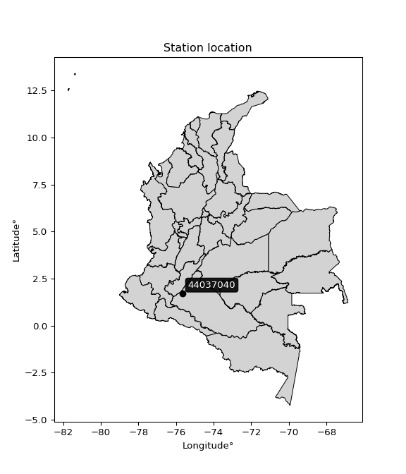

<div align="center">


</div>

# PMax24h Station (Rain): 44037040

Maximum Precipitation in 24 hours (PMax24h) is the greatest amount of rainfall for a specific duration that is meteorologically possible for a given location, acting as a "worst-case" scenario for extreme storms, crucial for designing safety-critical infrastructure like bridges, river deviations, dams, spillways, and nuclear plants to prevent catastrophic failure. The PMax24h is related with the Probable Maximum Precipitation (PMP) and it is calculated by hydrologists using meteorological data to determine the upper limit of extreme rainfall, often leading to the Probable Maximum Flood (PMF) for flood control design, and is increasingly being studied for climate change impacts. Probable Maximum Precipitation (PMP) is the theoretical upper limit of rainfall, a deterministic estimate for extreme events, while probability distributions (like GEV, Gumbel) describe the likelihood and frequency of various precipitation amounts, including rare ones, showing how often events occur, with PMP representing the extreme end of these distributions, used for critical infrastructure design to ensure safety against the worst conceivable weather, unlike standard statistical forecasts which cover typical probabilities.

The most common probability distributions in hydrology, used for analyzing floods, rainfall, and streamflow, include the Normal, Log-Normal, Gumbel, Gamma (including Log-Pearson Type III), and Generalized Extreme Value (GEV) distributions, often chosen based on the data´s skewness and whether modeling extremes or general conditions, with Gumbel and GEV popular for extreme events like floods, while the Normal distribution serves as a baseline, though often requiring transformations for skewed hydrological data. These distributions help in designing water infrastructure, managing water resources, and forecasting hydrologic events.

> Hydrological data often isn´t perfectly normal (it´s skewed), so different distributions are needed for different applications, such as: **Flood Frequency Analysis**: Using Gumbel, GEV, or Log-Pearson Type III for predicting extreme flood magnitudes and their return periods, **Rainfall Analysis**: Normal for annual totals, but Log-Normal, Weibull, or GEV for intensity or extreme daily rainfall, **Streamflow Modeling**: Gamma and Log-Normal for maximum flows, GEV for minimum flows, and Kappa for daily flows.

<div align="center">

</img>

</div>


## A. General information


### 1. General running parameters

• app_version: _v20260225_. • runtime: _2026-02-28 16:54:07.457399_. • Python version: _3.14.0_. • SciPy version: _1.16.3_. • Pandas version: _2.3.3_. • NumPy version: _2.3.5_. • Stations dataset (station_dataset_file): _dataset/pmax24h_in/automatic_colombia_2003_2025.csv_. • Stations catalog (station_catalog_file): _dataset/CNE.xls_. • Minimum year to eval til year_max (date_min): _1900_. • Maximum year to eval since year_min (date_max): _2025_. • Creates, save and include plots into reports (create_plot): _False_. • Plot only fit distributions with Δo > Δ (plot_only_fit): _True_. • Plot only simple graphs avoiding multiple CDFs and multiple Extreme values plots (plot_only_simple): _False_. • Eval low extreme values, if False, evaluates high extreme values (low_extreme): _False_. • Eval every SciPy distribution as logarithmic (pdist_logarithmic_on): _True_. • Standard deviation normalized (ddof): _1.0_. • Return periods to eval in years (Tr): _[2, 2.33, 5, 10, 15, 20, 25, 50, 75, 100, 200, 250, 500, 750, 1000]_. • Minimum data sample per station, 0 means any (minimum_sample): _5_. • Z-Score maximum threshold to adjust a value, 0 means disable (zscore_max): _3.5_. • Z-Score minimum threshold to adjust a value, 0 means disable (zscore_min): _-2.5_. • Avoid zeros, e.g. rain = 0 (avoid_zeros): _True_. • Avoid null values (avoid_nans): _True_. 

:file_folder:Table: [dataset.csv](../../dataset/pmax24h_in/automatic_colombia_2003_2025.csv)

> Delta Degrees of Freedom (DDOF): is a parameter used in the formulas for calculating variance and standard deviation. When ddof=0, the divisor is $N$ (the total number of observations) and this is used when your data set is the entire population. When ddof=1, the divisor is $N-1$ and this is used when your data set is a sample drawn from a larger population. Using $N-1$ provides an unbiased estimate of the population variance (known as Bessel´s correction).


### 2. Station info and location

|   id |   CODIGO | NOMBRE                      | CATEGORIA    | TECNOLOGIA                              | ESTADO           | FECHA_INSTALACION   |   FECHA_SUSPENSION |   ALTITUD |   LATITUD |   LONGITUD | DEPARTAMENTO   | MUNICIPIO   | AREA_OPERATIVA                    | ENTIDAD                                                     | AREA_HIDROGRAFICA   | ZONA_HIDROGRAFICA   | SUBZONA_HIDROGRAFICA   | CORRIENTE   | Catalogo   |   Version |
|-----:|---------:|:----------------------------|:-------------|:----------------------------------------|:-----------------|:--------------------|-------------------:|----------:|----------:|-----------:|:---------------|:------------|:----------------------------------|:------------------------------------------------------------|:--------------------|:--------------------|:-----------------------|:------------|:-----------|----------:|
|    0 | 44037040 | EL ROSARIO - AUT [44037040] | Limnigráfica | Automática con Telemetría, Convencional | En Mantenimiento | 15/08/1964          |                nan |       600 |   1.72525 |   -75.6664 | Caqueta        | Florencia   | Area Operativa 04 - Huila-Caquetá | INSTITUTO DE HIDROLOGIA METEOROLOGIA Y ESTUDIOS AMBIENTALES | Amazonas            | Caquetá             | Río Orteguaza          | CARAÑO      | CNE_IDEAM  |  20251226 |

<div align="center">

Dynamic map: [:earth_americas:Google](http://maps.google.com/maps?q=1.72525,-75.66638889) [:earth_americas:OSM](https://www.openstreetmap.org/#map=18/1.72525/-75.66638889&layers=P) [:earth_americas:Bing](https://www.bing.com/maps?cp=1.72525~-75.66638889&lvl=18) [:earth_americas:Apple](https://maps.apple.com/frame?center=1.72525%2C-75.66638889&span=0.003%2C0.006)

</div>


<div align="center">

```geojson
{
  "type": "Feature",
  "geometry": {
    "type": "Point", 
    "coordinates": [-75.66638889, 1.72525]
  }, 
  "properties": {
    "Name": "44037040"
  }
}
```

</div>


### 3. Discrete values table and plot

<div align="center">

|               |           0 |           1 |           2 |          3 |           4 |            5 |          6 |           7 |
|:--------------|------------:|------------:|------------:|-----------:|------------:|-------------:|-----------:|------------:|
| Date          | 2017        | 2018        | 2019        | 2020       | 2021        | 2022         | 2023       | 2025        |
| Value         |  101.2      |   43.7      |   38.2      |  158.9     |   78.6      |   69.7       |    0.2     |   32        |
| Value_initial |  101.2      |   43.7      |   38.2      |  158.9     |   78.6      |   69.7       |    0.2     |   32        |
| count         |    8        |    8        |    8        |    8       |    8        |    8         |    8       |    8        |
| mean          |   65.3125   |   65.3125   |   65.3125   |   65.3125  |   65.3125   |   65.3125    |   65.3125  |   65.3125   |
| std           |   48.9809   |   48.9809   |   48.9809   |   48.9809  |   48.9809   |   48.9809    |   48.9809  |   48.9809   |
| zscore        |    0.732684 |   -0.441244 |   -0.553532 |    1.91069 |    0.271279 |    0.0895758 |   -1.32935 |   -0.680112 |


</div>


> The initial value (value_initial) correspond to the initial obtained or null completed value, and value (value) is adjusted only when the initial value is outside the valid range (outlier) definite through the Z-Score value. If Z-Score is active, values out of range or outliers are replaced with the station mean value. A Z-Score (or standard score) measures how many standard deviations a data point is from the mean of a dataset, indicating its relative position; positive scores mean above the mean, negative mean below, and a score of zero is exactly at the mean, allowing for comparison of values from different distributions. It´s calculated using the formula $z=(x–μ)/σ$, where $x$ is the data point, $μ$ is the mean, and $σ$ is the standard deviation, helping identify outliers and understand probability.
>
> <sub>**Note**: In this study, "completing" (filling gaps in) and "extending" (forecasting or lengthening the historical record) rainfall data series are avoided for certain critical analyses because they introduce artificial bias and uncertainty, which can distort the statistics of rare events (extremes), alter day-to-day variability, and compromise the integrity and homogeneity of the original data. Some reasons against Completing/Extending rainfall data are: **Distortion of Extremes and Variability**: The primary issue is that most gap-filling or extension methods rely on averaging or regression with nearby stations, which inherently smooths the data. Rainfall is highly variable in space and time, with a large percentage of zero values and occasional large storms. Infilling methods often underestimate the highest values and overestimate the lowest (zero) values, which severely distorts analyses focused on flood frequency, drought severity, and intensity-duration-frequency (IDF) curves, **Loss of Data Homogeneity**: Infilled or extended data are synthetic estimates, not actual measurements. Combining these estimates with observed data can violate the assumption of data homogeneity, which requires that the data properties do not change over time. Inhomogeneity can lead to incorrect conclusions about long-term trends or changes in climate patterns, **Propagation of Errors**: Errors and biases from the original data (e.g., wind-induced undercatch, instrument errors, site changes) or the data used for imputation can propagate through the analysis, leading to unreliable hydrological models and inaccurate predictions, **Compromised Statistical Integrity**: For statistical analyses, especially those involving the frequency of events, using artificial data can introduce time bias or autocorrelation that doesn´t exist in reality, making it difficult to assess the true probability of events, **Difficulty in Validation**: It is difficult to accurately validate the quality of filled or extended data, especially for past periods where ground-truth measurements are unavailable. The reliability of imputation techniques heavily depends on the density of the surrounding station network and the complexity of the local topography.</sub>


### 4. Active continuous probability distributions from SciPy (80 of 104 available)

A Probability Density Function (PDF) describes the relative likelihood of a continuous random variable falling within a specific range, where the total area under its curve equals 1, and the area over any interval gives the actual probability for that range. Unlike discrete probabilities (like rolling a die), a PDF shows density, not direct probability for a single point (which is zero), with higher points indicating higher likelihood, often visualized as a bell curve for normal distributions.

A log of a probability density function (log-PDF) is simply the logarithm of the PDF´s value, denoted as $log(f(x))$, useful for converting multiplication of probabilities into addition, improving numerical stability with tiny numbers, and connecting to information theory concepts like entropy. Instead of dealing with very small probabilities (e.g., 0.000001), log-PDFs use negative numbers (e.g., $log(0.00001) ≈ -11.51$ that are easier for computers to handle, preventing underflow errors and simplifying complex calculations. In this study, each active probability distribution from SciPy is also evaluated in the $log$ form.

[scipy.stats](https://docs.scipy.org/doc/scipy/reference/stats.html) is a Python´s powerful submodule within the SciPy library for comprehensive statistical analysis, offering over 130 probability distributions (like Normal, Poisson, etc.), functions for descriptive stats (mean, variance), hypothesis testing (t-tests, chi-square), random variable generation, and statistical tests, making it essential for data science, modeling, and research. It provides tools to explore, model, and draw conclusions from data efficiently, working seamlessly with [NumPy](https://numpy.org/).

<div align="center">

|   id | p_dist           |   n_parameter | fit_method   | label                                                                       | active   | ref                                                                                                      |
|-----:|:-----------------|--------------:|:-------------|:----------------------------------------------------------------------------|:---------|:---------------------------------------------------------------------------------------------------------|
|    0 | alpha            |             3 | MLE          | Alpha                                                                       | True     | [:mortar_board:](https://docs.scipy.org/doc/scipy/reference/generated/scipy.stats.alpha.html)            |
|    1 | anglit           |             2 | MM           | Anglit                                                                      | True     | [:mortar_board:](https://docs.scipy.org/doc/scipy/reference/generated/scipy.stats.anglit.html)           |
|    2 | arcsine          |             2 | MM           | Arcsine                                                                     | True     | [:mortar_board:](https://docs.scipy.org/doc/scipy/reference/generated/scipy.stats.arcsine.html)          |
|    3 | argus            |             3 | MLE          | Argus                                                                       | True     | [:mortar_board:](https://docs.scipy.org/doc/scipy/reference/generated/scipy.stats.argus.html)            |
|    4 | beta             |             4 | MLE          | Beta                                                                        | True     | [:mortar_board:](https://docs.scipy.org/doc/scipy/reference/generated/scipy.stats.beta.html)             |
|    5 | betaprime        |             4 | MLE          | Beta prime                                                                  | True     | [:mortar_board:](https://docs.scipy.org/doc/scipy/reference/generated/scipy.stats.betaprime.html)        |
|    6 | bradford         |             3 | MLE          | Bradford                                                                    | True     | [:mortar_board:](https://docs.scipy.org/doc/scipy/reference/generated/scipy.stats.bradford.html)         |
|    7 | burr             |             4 | MLE          | Burr (Type III)                                                             | True     | [:mortar_board:](https://docs.scipy.org/doc/scipy/reference/generated/scipy.stats.burr.html)             |
|    8 | burr12           |             4 | MLE          | Burr (Type III) 12                                                          | True     | [:mortar_board:](https://docs.scipy.org/doc/scipy/reference/generated/scipy.stats.burr12.html)           |
|    9 | cosine           |             2 | MLE          | Cosine                                                                      | True     | [:mortar_board:](https://docs.scipy.org/doc/scipy/reference/generated/scipy.stats.cosine.html)           |
|   10 | crystalball      |             4 | MLE          | Crystalball                                                                 | True     | [:mortar_board:](https://docs.scipy.org/doc/scipy/reference/generated/scipy.stats.crystalball.html)      |
|   11 | dgamma           |             3 | MLE          | Double gamma                                                                | True     | [:mortar_board:](https://docs.scipy.org/doc/scipy/reference/generated/scipy.stats.dgamma.html)           |
|   12 | dweibull         |             3 | MLE          | Double Weibull                                                              | True     | [:mortar_board:](https://docs.scipy.org/doc/scipy/reference/generated/scipy.stats.dweibull.html)         |
|   13 | erlang           |             3 | MLE          | Erlang                                                                      | True     | [:mortar_board:](https://docs.scipy.org/doc/scipy/reference/generated/scipy.stats.erlang.html)           |
|   14 | exponnorm        |             3 | MLE          | Exponentially modified Normal                                               | True     | [:mortar_board:](https://docs.scipy.org/doc/scipy/reference/generated/scipy.stats.exponnorm.html)        |
|   15 | exponpow         |             3 | MLE          | Exponential power                                                           | True     | [:mortar_board:](https://docs.scipy.org/doc/scipy/reference/generated/scipy.stats.exponpow.html)         |
|   16 | exponweib        |             4 | MLE          | Exponentiated Weibull                                                       | True     | [:mortar_board:](https://docs.scipy.org/doc/scipy/reference/generated/scipy.stats.exponweib.html)        |
|   17 | f                |             4 | MLE          | F                                                                           | True     | [:mortar_board:](https://docs.scipy.org/doc/scipy/reference/generated/scipy.stats.f.html)                |
|   18 | fatiguelife      |             3 | MLE          | Fatigue-life (Birnbaum-Saunders)                                            | True     | [:mortar_board:](https://docs.scipy.org/doc/scipy/reference/generated/scipy.stats.fatiguelife.html)      |
|   19 | foldnorm         |             3 | MM           | Fold Normal                                                                 | True     | [:mortar_board:](https://docs.scipy.org/doc/scipy/reference/generated/scipy.stats.foldnorm.html)         |
|   20 | gamma            |             3 | MLE          | Gamma                                                                       | True     | [:mortar_board:](https://docs.scipy.org/doc/scipy/reference/generated/scipy.stats.gamma.html)            |
|   21 | gausshyper       |             6 | MLE          | Gauss hypergeometric                                                        | True     | [:mortar_board:](https://docs.scipy.org/doc/scipy/reference/generated/scipy.stats.gausshyper.html)       |
|   22 | genexpon         |             5 | MLE          | Generalized exponential                                                     | True     | [:mortar_board:](https://docs.scipy.org/doc/scipy/reference/generated/scipy.stats.genexpon.html)         |
|   23 | genextreme       |             3 | MLE          | Generalized exponential                                                     | True     | [:mortar_board:](https://docs.scipy.org/doc/scipy/reference/generated/scipy.stats.genextreme.html)       |
|   24 | gengamma         |             4 | MLE          | Generalized gamma                                                           | True     | [:mortar_board:](https://docs.scipy.org/doc/scipy/reference/generated/scipy.stats.gengamma.html)         |
|   25 | genhalflogistic  |             3 | MLE          | Generalized half-logistic                                                   | True     | [:mortar_board:](https://docs.scipy.org/doc/scipy/reference/generated/scipy.stats.genhalflogistic.html)  |
|   26 | genlogistic      |             3 | MLE          | Generalized logistic                                                        | True     | [:mortar_board:](https://docs.scipy.org/doc/scipy/reference/generated/scipy.stats.genlogistic.html)      |
|   27 | gennorm          |             3 | MLE          | Generalized Normal                                                          | True     | [:mortar_board:](https://docs.scipy.org/doc/scipy/reference/generated/scipy.stats.gennorm.html)          |
|   28 | genpareto        |             3 | MLE          | Generalized Pareto                                                          | True     | [:mortar_board:](https://docs.scipy.org/doc/scipy/reference/generated/scipy.stats.genpareto.html)        |
|   29 | gompertz         |             3 | MLE          | Gompertz (or truncated Gumbel)                                              | True     | [:mortar_board:](https://docs.scipy.org/doc/scipy/reference/generated/scipy.stats.gompertz.html)         |
|   30 | gumbel_l         |             2 | MM           | Gumbel Left Skew                                                            | True     | [:mortar_board:](https://docs.scipy.org/doc/scipy/reference/generated/scipy.stats.gumbel_l.html)         |
|   31 | gumbel_r         |             2 | MM           | Gumbel Right Skew                                                           | True     | [:mortar_board:](https://docs.scipy.org/doc/scipy/reference/generated/scipy.stats.gumbel_r.html)         |
|   32 | halfgennorm      |             3 | MLE          | Upper half of a generalized normal                                          | True     | [:mortar_board:](https://docs.scipy.org/doc/scipy/reference/generated/scipy.stats.halfgennorm.html)      |
|   33 | halflogistic     |             2 | MM           | Half-logistic                                                               | True     | [:mortar_board:](https://docs.scipy.org/doc/scipy/reference/generated/scipy.stats.halflogistic.html)     |
|   34 | halfnorm         |             2 | MM           | Half Normal                                                                 | True     | [:mortar_board:](https://docs.scipy.org/doc/scipy/reference/generated/scipy.stats.halfnorm.html)         |
|   35 | hypsecant        |             2 | MM           | hyperbolic secant                                                           | True     | [:mortar_board:](https://docs.scipy.org/doc/scipy/reference/generated/scipy.stats.hypsecant.html)        |
|   36 | invgamma         |             3 | MLE          | Inverted gamma                                                              | True     | [:mortar_board:](https://docs.scipy.org/doc/scipy/reference/generated/scipy.stats.invgamma.html)         |
|   37 | invgauss         |             3 | MLE          | Inverse Gaussian                                                            | True     | [:mortar_board:](https://docs.scipy.org/doc/scipy/reference/generated/scipy.stats.invgauss.html)         |
|   38 | invweibull       |             3 | MLE          | Inverted Weibull                                                            | True     | [:mortar_board:](https://docs.scipy.org/doc/scipy/reference/generated/scipy.stats.invweibull.html)       |
|   39 | johnsonsb        |             4 | MLE          | Johnson SB                                                                  | True     | [:mortar_board:](https://docs.scipy.org/doc/scipy/reference/generated/scipy.stats.johnsonsb.html)        |
|   40 | johnsonsu        |             4 | MLE          | Johnson Su                                                                  | True     | [:mortar_board:](https://docs.scipy.org/doc/scipy/reference/generated/scipy.stats.johnsonsu.html)        |
|   41 | kappa3           |             3 | MLE          | Kappa 3                                                                     | True     | [:mortar_board:](https://docs.scipy.org/doc/scipy/reference/generated/scipy.stats.kappa3.html)           |
|   42 | kappa4           |             4 | MLE          | Kappa 4                                                                     | True     | [:mortar_board:](https://docs.scipy.org/doc/scipy/reference/generated/scipy.stats.kappa4.html)           |
|   43 | ksone            |             3 | MLE          | Kolmogorov-Smirnov one-sided test statistic distribution                    | True     | [:mortar_board:](https://docs.scipy.org/doc/scipy/reference/generated/scipy.stats.ksone.html)            |
|   44 | kstwobign        |             2 | MLE          | Limiting distribution of scaled Kolmogorov-Smirnov two-sided test statistic | True     | [:mortar_board:](https://docs.scipy.org/doc/scipy/reference/generated/scipy.stats.kstwobign.html)        |
|   45 | laplace          |             2 | MM           | Laplace                                                                     | True     | [:mortar_board:](https://docs.scipy.org/doc/scipy/reference/generated/scipy.stats.laplace.html)          |
|   46 | levy_l           |             2 | MLE          | Left-skewed Levy                                                            | True     | [:mortar_board:](https://docs.scipy.org/doc/scipy/reference/generated/scipy.stats.levy_l.html)           |
|   47 | loggamma         |             3 | MLE          | Log gamma                                                                   | True     | [:mortar_board:](https://docs.scipy.org/doc/scipy/reference/generated/scipy.stats.loggamma.html)         |
|   48 | logistic         |             2 | MM           | Logistic (or Sech-squared)                                                  | True     | [:mortar_board:](https://docs.scipy.org/doc/scipy/reference/generated/scipy.stats.logistic.html)         |
|   49 | loglaplace       |             3 | MLE          | Log-Laplace                                                                 | True     | [:mortar_board:](https://docs.scipy.org/doc/scipy/reference/generated/scipy.stats.loglaplace.html)       |
|   50 | lomax            |             3 | MLE          | Lomax (Pareto of the second kind)                                           | True     | [:mortar_board:](https://docs.scipy.org/doc/scipy/reference/generated/scipy.stats.lomax.html)            |
|   51 | maxwell          |             2 | MM           | Maxwell                                                                     | True     | [:mortar_board:](https://docs.scipy.org/doc/scipy/reference/generated/scipy.stats.maxwell.html)          |
|   52 | mielke           |             4 | MLE          | Mielke Beta-Kappa / Dagum                                                   | True     | [:mortar_board:](https://docs.scipy.org/doc/scipy/reference/generated/scipy.stats.mielke.html)           |
|   53 | moyal            |             2 | MM           | Moyal                                                                       | True     | [:mortar_board:](https://docs.scipy.org/doc/scipy/reference/generated/scipy.stats.moyal.html)            |
|   54 | nakagami         |             3 | MLE          | Nakagami                                                                    | True     | [:mortar_board:](https://docs.scipy.org/doc/scipy/reference/generated/scipy.stats.nakagami.html)         |
|   55 | ncf              |             5 | MLE          | Non-central F distribution                                                  | True     | [:mortar_board:](https://docs.scipy.org/doc/scipy/reference/generated/scipy.stats.ncf.html)              |
|   56 | nct              |             4 | MLE          | Non-central Student’s t                                                     | True     | [:mortar_board:](https://docs.scipy.org/doc/scipy/reference/generated/scipy.stats.nct.html)              |
|   57 | norm             |             2 | MM           | Normal                                                                      | True     | [:mortar_board:](https://docs.scipy.org/doc/scipy/reference/generated/scipy.stats.norm.html)             |
|   58 | pearson3         |             3 | MM           | Pearson type III                                                            | True     | [:mortar_board:](https://docs.scipy.org/doc/scipy/reference/generated/scipy.stats.pearson3.html)         |
|   59 | powerlaw         |             3 | MLE          | Power-function                                                              | True     | [:mortar_board:](https://docs.scipy.org/doc/scipy/reference/generated/scipy.stats.powerlaw.html)         |
|   60 | rayleigh         |             2 | MM           | Rayleigh                                                                    | True     | [:mortar_board:](https://docs.scipy.org/doc/scipy/reference/generated/scipy.stats.rayleigh.html)         |
|   61 | rdist            |             3 | MLE          | R-distributed (symmetric beta)                                              | True     | [:mortar_board:](https://docs.scipy.org/doc/scipy/reference/generated/scipy.stats.rdist.html)            |
|   62 | rice             |             3 | MLE          | Rice                                                                        | True     | [:mortar_board:](https://docs.scipy.org/doc/scipy/reference/generated/scipy.stats.rice.html)             |
|   63 | semicircular     |             2 | MM           | Semicircular                                                                | True     | [:mortar_board:](https://docs.scipy.org/doc/scipy/reference/generated/scipy.stats.semicircular.html)     |
|   64 | skewnorm         |             3 | MLE          | Skew normal                                                                 | True     | [:mortar_board:](https://docs.scipy.org/doc/scipy/reference/generated/scipy.stats.skewnorm.html)         |
|   65 | t                |             3 | MLE          | Student’s t                                                                 | True     | [:mortar_board:](https://docs.scipy.org/doc/scipy/reference/generated/scipy.stats.t.html)                |
|   66 | trapezoid        |             4 | MLE          | Trapezoid                                                                   | True     | [:mortar_board:](https://docs.scipy.org/doc/scipy/reference/generated/scipy.stats.trapezoid.html)        |
|   67 | triang           |             3 | MLE          | Triangular                                                                  | True     | [:mortar_board:](https://docs.scipy.org/doc/scipy/reference/generated/scipy.stats.triang.html)           |
|   68 | truncexpon       |             3 | MLE          | Truncated exponential                                                       | True     | [:mortar_board:](https://docs.scipy.org/doc/scipy/reference/generated/scipy.stats.truncexpon.html)       |
|   69 | truncnorm        |             4 | MLE          | Truncated normal                                                            | True     | [:mortar_board:](https://docs.scipy.org/doc/scipy/reference/generated/scipy.stats.truncnorm.html)        |
|   70 | truncpareto      |             4 | MLE          | Upper truncated Pareto                                                      | True     | [:mortar_board:](https://docs.scipy.org/doc/scipy/reference/generated/scipy.stats.truncpareto.html)      |
|   71 | truncweibull_min |             5 | MLE          | Doubly truncated Weibull minimum                                            | True     | [:mortar_board:](https://docs.scipy.org/doc/scipy/reference/generated/scipy.stats.truncweibull_min.html) |
|   72 | tukeylambda      |             3 | MLE          | Tukey-Lamdba                                                                | True     | [:mortar_board:](https://docs.scipy.org/doc/scipy/reference/generated/scipy.stats.tukeylambda.html)      |
|   73 | uniform          |             2 | MLE          | Uniform                                                                     | True     | [:mortar_board:](https://docs.scipy.org/doc/scipy/reference/generated/scipy.stats.uniform.html)          |
|   74 | vonmises         |             3 | MLE          | Von Mises                                                                   | True     | [:mortar_board:](https://docs.scipy.org/doc/scipy/reference/generated/scipy.stats.vonmises.html)         |
|   75 | vonmises_line    |             3 | MLE          | Von Mises line                                                              | True     | [:mortar_board:](https://docs.scipy.org/doc/scipy/reference/generated/scipy.stats.vonmises_line.html)    |
|   76 | wald             |             2 | MM           | Wald                                                                        | True     | [:mortar_board:](https://docs.scipy.org/doc/scipy/reference/generated/scipy.stats.wald.html)             |
|   77 | weibull_max      |             3 | MLE          | Weibull maximum                                                             | True     | [:mortar_board:](https://docs.scipy.org/doc/scipy/reference/generated/scipy.stats.weibull_max.html)      |
|   78 | weibull_min      |             3 | MLE          | Weibull minimum                                                             | True     | [:mortar_board:](https://docs.scipy.org/doc/scipy/reference/generated/scipy.stats.weibull_min.html)      |
|   79 | wrapcauchy       |             3 | MLE          | Wrapped  Cauchy                                                             | True     | [:mortar_board:](https://docs.scipy.org/doc/scipy/reference/generated/scipy.stats.wrapcauchy.html)       |

</div>

> **n_parameter:** # arguments & localization & scale.
>
> **Fit methods:** (MLE) maximum likelihood, (MM) L-moments.
>
>**Inactive** (With the only purpose of prevent loops, zero divisions, infinite values, over high estimated values or horizontal trending for recurrence intervals estimations, the follow distributions were disabled.)**:** lognorm, norminvgauss, powernorm, powerlognorm, cauchy, halfcauchy, foldcauchy, skewcauchy, chi2, expon, fisk, genhyperbolic, geninvgauss, gibrat, kstwo, laplace_asymmetric, levy, levy_stable, ncx2, pareto, rel_breitwigner, recipinvgauss, studentized_range, loguniform, 


## B. Probability (PDF) vs. Empirical (EDF) distributions functions

A continuous probability distribution (CPD) describes probabilities for variables that can take any value within a range (like rain any time), unlike discrete variables with specific outcomes (like temperature). It uses a Probability Density Function (PDF), a curve where the total area under it equals 1, and the probability of the variable falling within an interval (a to b) is found by calculating the area under the curve between those points. A key feature is that the probability of hitting any single exact value is zero, so probabilities are always expressed for ranges, e.g., $P(a ≤ X ≤ b)$.

<div align="center">

Distributions parameters from station values
|     |   station | p_dist              |   n |              loc |           scale | shape                  | shape1                 | shape2                | shape3             |
|----:|----------:|:--------------------|----:|-----------------:|----------------:|:-----------------------|:-----------------------|:----------------------|:-------------------|
|   0 |  44037040 | alpha               |   8 |   -205.77        |  1651.83        | 6.259346918122624      |                        |                       |                    |
|   1 |  44037040 | anglit              |   8 |     65.3125      |   134.034       |                        |                        |                       |                    |
|   2 |  44037040 | arcsine             |   8 |      0.516895    |   129.591       |                        |                        |                       |                    |
|   3 |  44037040 | argus               |   8 |    -43.352       |   209.562       | 1.0332260813374687e-06 |                        |                       |                    |
|   4 |  44037040 | beta                |   8 |     -3.71379     |   162.614       | 0.8243597003379427     | 0.8482086085328503     |                       |                    |
|   5 |  44037040 | betaprime           |   8 |    -21.0238      |  7023.58        | 3.3132258196076467     | 270.4938653951275      |                       |                    |
|   6 |  44037040 | bradford            |   8 |      0.199977    |   158.703       | 1.557196246080513      |                        |                       |                    |
|   7 |  44037040 | burr                |   8 |      0.2         |   150.822       | 16.247017315138958     | 0.031352666475757664   |                       |                    |
|   8 |  44037040 | burr12              |   8 |     -6.68475     |  3229.5         | 1.5453338125008749     | 304.307531893485       |                       |                    |
|   9 |  44037040 | cosine              |   8 |     70.4265      |    39.8953      |                        |                        |                       |                    |
|  10 |  44037040 | crystalball         |   8 |     65.3125      |    45.8174      | 4310.772526576855      | 3276.2912982199787     |                       |                    |
|  11 |  44037040 | dgamma              |   8 |     58.4647      |    17.2019      | 2.1385680547419486     |                        |                       |                    |
|  12 |  44037040 | dweibull            |   8 |     59.6523      |    40.9291      | 1.441135463075883      |                        |                       |                    |
|  13 |  44037040 | erlang              |   8 |    -19.5418      |    27.079       | 3.1335779381122135     |                        |                       |                    |
|  14 |  44037040 | exponnorm           |   8 |     22.6637      |    23.3751      | 1.824538967634207      |                        |                       |                    |
|  15 |  44037040 | exponpow            |   8 |      0.2         |     3.47746     | 0.09903843348932734    |                        |                       |                    |
|  16 |  44037040 | exponweib           |   8 |      0.2         |     6.40227     | 2.5481310093293956     | 0.29225791595502304    |                       |                    |
|  17 |  44037040 | f                   |   8 |    -19.6947      |    84.9716      | 6.30401718950174       | 4375.799606636337      |                       |                    |
|  18 |  44037040 | fatiguelife         |   8 |    -62.1648      |   119.512       | 0.3650202812816704     |                        |                       |                    |
|  19 |  44037040 | foldnorm            |   8 |     -2.11683     |    56.7659      | 1.0307472776761237     |                        |                       |                    |
|  20 |  44037040 | gamma               |   8 |    -19.5418      |    27.079       | 3.1335774836154853     |                        |                       |                    |
|  21 |  44037040 | gausshyper          |   8 |    -13.6812      |   172.581       | 1.2603462041088918     | 0.8814210060726427     | 1.0951519768271798    | 1.1363778375190423 |
|  22 |  44037040 | genexpon            |   8 |      0.199952    |     2.66231     | 0.045238156150409464   | 2.271519316746438e-06  | 2.0609925424486404    |                    |
|  23 |  44037040 | genextreme          |   8 |      0.288255    |     0.430748    | -4.8797505874554865    |                        |                       |                    |
|  24 |  44037040 | gengamma            |   8 |      0.2         |   101.467       | 0.43393377064252847    | 1.8696259692379154     |                       |                    |
|  25 |  44037040 | genhalflogistic     |   8 |    -16.3245      |   184.685       | 1.053989648657752      |                        |                       |                    |
|  26 |  44037040 | genlogistic         |   8 |   -171.225       |    36.8322      | 345.7284831007869      |                        |                       |                    |
|  27 |  44037040 | gennorm             |   8 |     65.6508      |    65.6786      | 2.0541276556615466     |                        |                       |                    |
|  28 |  44037040 | genpareto           |   8 |      0.2         |   115.533       | -0.6752843455458906    |                        |                       |                    |
|  29 |  44037040 | gompertz            |   8 |     69.7         |     9.64393     | 0.0004187197467485244  |                        |                       |                    |
|  30 |  44037040 | gumbel_l            |   8 |     85.9328      |    35.7237      |                        |                        |                       |                    |
|  31 |  44037040 | gumbel_r            |   8 |     44.6922      |    35.7237      |                        |                        |                       |                    |
|  32 |  44037040 | halfgennorm         |   8 |      0.2         |     3.76279     | 0.35537486985936556    |                        |                       |                    |
|  33 |  44037040 | halflogistic        |   8 |     11.0082      |    39.1723      |                        |                        |                       |                    |
|  34 |  44037040 | halfnorm            |   8 |      4.66816     |    76.0064      |                        |                        |                       |                    |
|  35 |  44037040 | hypsecant           |   8 |     65.3125      |    29.1683      |                        |                        |                       |                    |
|  36 |  44037040 | invgamma            |   8 |   -109.496       |  2568.61        | 15.684791753413547     |                        |                       |                    |
|  37 |  44037040 | invgauss            |   8 |    -65.3107      |  1006.07        | 0.12983480132940994    |                        |                       |                    |
|  38 |  44037040 | invweibull          |   8 |      0.2         |     4.40776     | 0.05490908413361325    |                        |                       |                    |
|  39 |  44037040 | johnsonsb           |   8 |      0.186545    |   158.713       | -0.635138082298091     | 0.1562349434060003     |                       |                    |
|  40 |  44037040 | johnsonsu           |   8 |    -64.3413      |    10.3804      | -8.971531295597241     | 2.8407624563075773     |                       |                    |
|  41 |  44037040 | kappa3              |   8 |      0.2         |    82.385       | 4.595558334073832      |                        |                       |                    |
|  42 |  44037040 | kappa4              |   8 |    -15.4764      |   176.925       | 1.097193854477798      | 0.9948675193885101     |                       |                    |
|  43 |  44037040 | ksone               |   8 |    -15.67        |   190.44        | 1.0                    |                        |                       |                    |
|  44 |  44037040 | kstwobign           |   8 |    -87.6385      |   175.849       |                        |                        |                       |                    |
|  45 |  44037040 | laplace             |   8 |     65.3125      |    32.3978      |                        |                        |                       |                    |
|  46 |  44037040 | levy_l              |   8 |    169.675       |    50.9233      |                        |                        |                       |                    |
|  47 |  44037040 | loggamma            |   8 | -11852.7         |  1666.36        | 1277.4926549371141     |                        |                       |                    |
|  48 |  44037040 | logistic            |   8 |     65.3125      |    25.2605      |                        |                        |                       |                    |
|  49 |  44037040 | loglaplace          |   8 |     -0.11298     |    43.813       | 0.9341165356792748     |                        |                       |                    |
|  50 |  44037040 | lomax               |   8 |      0.2         |     1.24438e+09 | 16424912.043232445     |                        |                       |                    |
|  51 |  44037040 | maxwell             |   8 |    -43.2556      |    68.0349      |                        |                        |                       |                    |
|  52 |  44037040 | mielke              |   8 |      0.2         |   170.455       | 0.6318483423465585     | 5.019144560455804      |                       |                    |
|  53 |  44037040 | moyal               |   8 |     39.1112      |    20.6251      |                        |                        |                       |                    |
|  54 |  44037040 | nakagami            |   8 |      0.2         |    68.1357      | 0.31452706114354445    |                        |                       |                    |
|  55 |  44037040 | ncf                 |   8 |      0.2         |     2.28136     | 0.15842986554495175    | 78.08996084564507      | 3.8866049164414322    |                    |
|  56 |  44037040 | nct                 |   8 |    -38.2524      |    28.1116      | 6.725819802492438      | 3.2124900233791234     |                       |                    |
|  57 |  44037040 | norm                |   8 |     65.3125      |    45.8174      |                        |                        |                       |                    |
|  58 |  44037040 | pearson3            |   8 |     65.3125      |    45.8174      | 0.6826892491546723     |                        |                       |                    |
|  59 |  44037040 | powerlaw            |   8 |      0.2         |   158.7         | 0.16160271189861342    |                        |                       |                    |
|  60 |  44037040 | rayleigh            |   8 |    -22.3389      |    69.9357      |                        |                        |                       |                    |
|  61 |  44037040 | rdist               |   8 |    -14.2785      |    92.8785      | 1.0500457973791426     |                        |                       |                    |
|  62 |  44037040 | rice                |   8 |    -17.2342      |    66.7577      | 0.0007130355461883544  |                        |                       |                    |
|  63 |  44037040 | semicircular        |   8 |     65.3125      |    91.6348      |                        |                        |                       |                    |
|  64 |  44037040 | skewnorm            |   8 |      9.63323     |    72.107       | 3.950116194446903      |                        |                       |                    |
|  65 |  44037040 | t                   |   8 |     65.3103      |    45.8209      | 860112.6685663841      |                        |                       |                    |
|  66 |  44037040 | trapezoid           |   8 |    -16.4535      |   190.44        | 1.0                    | 1.0                    |                       |                    |
|  67 |  44037040 | triang              |   8 |    -59.7893      |   218.689       | 0.9999999999902944     |                        |                       |                    |
|  68 |  44037040 | truncexpon          |   8 |     -2.76292     |   162.815       | 0.9929213138814383     |                        |                       |                    |
|  69 |  44037040 | truncnorm           |   8 |     -9.37662     |    54.2845      | -6.336063404888879     | 3.099900434039835      |                       |                    |
|  70 |  44037040 | truncpareto         |   8 |      0.177841    |     0.0221585   | 0.1433060479931565     | 7163.0292720407115     |                       |                    |
|  71 |  44037040 | truncweibull_min    |   8 |      0.2         |   169.109       | 0.49207362764604734    | 2.0984254097012833e-15 | 0.9831400047232521    |                    |
|  72 |  44037040 | tukeylambda         |   8 |     39.4033      |    41.0843      | 1.0479813333812293     |                        |                       |                    |
|  73 |  44037040 | uniform             |   8 |      0.2         |   158.7         |                        |                        |                       |                    |
|  74 |  44037040 | vonmises            |   8 |      0.645783    |     1           | 1.6448801145355703     |                        |                       |                    |
|  75 |  44037040 | vonmises_line       |   8 |     79.6995      |    25.3055      | 1.8065974325393489e-06 |                        |                       |                    |
|  76 |  44037040 | wald                |   8 |     19.4951      |    45.8174      |                        |                        |                       |                    |
|  77 |  44037040 | weibull_max         |   8 |    158.9         |     1.70419     | 0.19990062565377398    |                        |                       |                    |
|  78 |  44037040 | weibull_min         |   8 |     -6.63692     |    79.5921      | 1.5437693322790413     |                        |                       |                    |
|  79 |  44037040 | wrapcauchy          |   8 |      0.190194    |    25.2595      | 9.25847640834978e-06   |                        |                       |                    |
|  80 |  44037040 | logalpha            |   8 |    -70.0515      |  2575.18        | 35.05500354392372      |                        |                       |                    |
|  81 |  44037040 | loganglit           |   8 |      3.4463      |     5.77627     |                        |                        |                       |                    |
|  82 |  44037040 | logarcsine          |   8 |      0.653886    |     5.58482     |                        |                        |                       |                    |
|  83 |  44037040 | logargus            |   8 |     -4.53479     |     9.70191     | 3.1681725045383975     |                        |                       |                    |
|  84 |  44037040 | logbeta             |   8 |     -2.39085     |     7.45912     | 0.40032717004029894    | 0.0703487725190799     |                       |                    |
|  85 |  44037040 | logbetaprime        |   8 |     -1.60944     |     3.44945     | 0.1906048832435194     | 0.9505915485019745     |                       |                    |
|  86 |  44037040 | logbradford         |   8 |     -1.60947     |     6.67775     | 0.9950676839755124     |                        |                       |                    |
|  87 |  44037040 | logburr             |   8 |     -1.60944     |     4.53501     | 0.35243190435090277    | 0.47744639443274606    |                       |                    |
|  88 |  44037040 | logburr12           |   8 | -11814.2         | 11827.5         | 11780.349921502744     | 9079.789435930616      |                       |                    |
|  89 |  44037040 | logcosine           |   8 |      2.8949      |     1.88962     |                        |                        |                       |                    |
|  90 |  44037040 | logcrystalball      |   8 |      3.4463      |     1.97453     | 667.7228272641905      | 108.89571362503952     |                       |                    |
|  91 |  44037040 | logdgamma           |   8 |      3.77735     |     1.34534     | 0.7393977831724519     |                        |                       |                    |
|  92 |  44037040 | logdweibull         |   8 |      4.2442      |     1.17643     | 0.825026245550605      |                        |                       |                    |
|  93 |  44037040 | logerlang           |   8 |     -1.60944     |     8.41985     | 0.696835073212253      |                        |                       |                    |
|  94 |  44037040 | logexponnorm        |   8 |      3.44537     |     1.97454     | 0.0004741574907645084  |                        |                       |                    |
|  95 |  44037040 | logexponpow         |   8 |     -1.60944     |     1.98068     | 0.2792833418627392     |                        |                       |                    |
|  96 |  44037040 | logexponweib        |   8 |     -1.60944     |     2.07073     | 2.6651907098276872     | 0.09669552774674015    |                       |                    |
|  97 |  44037040 | logf                |   8 |     -1.60944     |     1.18547     | 1.015648104861746      | 1.0847138386295427     |                       |                    |
|  98 |  44037040 | logfatiguelife      |   8 |  -1202.71        |  1206.18        | 0.0016409773989601696  |                        |                       |                    |
|  99 |  44037040 | logfoldnorm         |   8 |     -7.37919     |     1.41667     | 7.737142588102989      |                        |                       |                    |
| 100 |  44037040 | loggamma            |   8 |     -1.60944     |    17.4574      | 0.1777696647306813     |                        |                       |                    |
| 101 |  44037040 | loggausshyper       |   8 |     -1.77678     |     6.84506     | 1.3728815732226647     | 0.49916160683290856    | 1.2028842051756177    | 0.9666209108845483 |
| 102 |  44037040 | loggenexpon         |   8 |     -1.91374     |     0.0779814   | 0.0022636223260697128  | 4.543305756739953      | 6.936457459548839e-05 |                    |
| 103 |  44037040 | loggenextreme       |   8 |      3.4625      |     1.90835     | 1.1884281076491319     |                        |                       |                    |
| 104 |  44037040 | loggengamma         |   8 |    -54.0908      |     2.85416     | 242.24404752611792     | 1.8278812014027448     |                       |                    |
| 105 |  44037040 | loggenhalflogistic  |   8 |     -2.1474      |     7.77847     | 1.0779949834169975     |                        |                       |                    |
| 106 |  44037040 | loggenlogistic      |   8 |      5.06852     |     3.06964e-06 | 1.8945297841524175e-06 |                        |                       |                    |
| 107 |  44037040 | loggennorm          |   8 |      4.2442      |     0.118455    | 0.4707283497577993     |                        |                       |                    |
| 108 |  44037040 | loggenpareto        |   8 |     -1.76867     |    12.5711      | -1.8387088514435508    |                        |                       |                    |
| 109 |  44037040 | loggompertz         |   8 |     -1.62429     |     1.02077     | 0.0034256160596048595  |                        |                       |                    |
| 110 |  44037040 | loggumbel_l         |   8 |      4.33495     |     1.53953     |                        |                        |                       |                    |
| 111 |  44037040 | loggumbel_r         |   8 |      2.55766     |     1.53953     |                        |                        |                       |                    |
| 112 |  44037040 | loghalfgennorm      |   8 |     -1.62916     |     6.71874     | 1563.293225692606      |                        |                       |                    |
| 113 |  44037040 | loghalflogistic     |   8 |      1.10605     |     1.68814     |                        |                        |                       |                    |
| 114 |  44037040 | loghalfnorm         |   8 |      0.832799    |     3.27554     |                        |                        |                       |                    |
| 115 |  44037040 | loghypsecant        |   8 |      3.4463      |     1.25702     |                        |                        |                       |                    |
| 116 |  44037040 | loginvgamma         |   8 |    -45.7212      | 26630.1         | 542.2395515982712      |                        |                       |                    |
| 117 |  44037040 | loginvgauss         |   8 |    -20.4579      |  2667.03        | 0.008930732785015206   |                        |                       |                    |
| 118 |  44037040 | loginvweibull       |   8 | -46915.7         | 46918.1         | 17924.86441095092      |                        |                       |                    |
| 119 |  44037040 | logjohnsonsb        |   8 |     -2.78834     |     7.85661     | -0.6130934578320679    | 0.11179913472317353    |                       |                    |
| 120 |  44037040 | logjohnsonsu        |   8 |      4.61942     |     0.424314    | 0.8898665448185406     | 0.8311978473917503     |                       |                    |
| 121 |  44037040 | logkappa3           |   8 |     -1.61346     |     6.67923     | 3558.3677311002702     |                        |                       |                    |
| 122 |  44037040 | logkappa4           |   8 |     -2.04558     |     7.83853     | 1.0590992691330436     | 1.1018683867939014     |                       |                    |
| 123 |  44037040 | logksone            |   8 |     -2.27721     |     8.01326     | 1.0                    |                        |                       |                    |
| 124 |  44037040 | logkstwobign        |   8 |     -7.17975     |    12.1808      |                        |                        |                       |                    |
| 125 |  44037040 | loglaplace          |   8 |      3.4463      |     1.3962      |                        |                        |                       |                    |
| 126 |  44037040 | loglevy_l           |   8 |      5.18348     |     0.539771    |                        |                        |                       |                    |
| 127 |  44037040 | logloggamma         |   8 |      5.06837     |     1.03574e-05 | 6.402345249384322e-06  |                        |                       |                    |
| 128 |  44037040 | loglogistic         |   8 |      3.4463      |     1.08862     |                        |                        |                       |                    |
| 129 |  44037040 | logloglaplace       |   8 |     -1.60944     |     1.42745     | 0.6540668314569391     |                        |                       |                    |
| 130 |  44037040 | loglomax            |   8 |     -1.60944     |     7.43884e+10 | 11200360035.538021     |                        |                       |                    |
| 131 |  44037040 | logmaxwell          |   8 |     -1.23254     |     2.93202     |                        |                        |                       |                    |
| 132 |  44037040 | logmielke           |   8 |     -6.46513e+07 |     6.46513e+07 | 38888378.32144904      | 1339337968.8687806     |                       |                    |
| 133 |  44037040 | logmoyal            |   8 |      2.31714     |     0.888851    |                        |                        |                       |                    |
| 134 |  44037040 | lognakagami         |   8 |  -3007.17        |  3010.62        | 578495.5183646532      |                        |                       |                    |
| 135 |  44037040 | logncf              |   8 |     -1.60944     |     1.05418     | 1.0567299317604335     | 1.1239090495592023     | 1.0932843148595435    |                    |
| 136 |  44037040 | lognct              |   8 |   -137.669       |     1.9697      | 406181.51241382165     | 71.64308383351494      |                       |                    |
| 137 |  44037040 | lognorm             |   8 |      3.4463      |     1.97453     |                        |                        |                       |                    |
| 138 |  44037040 | logpearson3         |   8 |      3.44631     |     1.97451     | -1.9815195292365257    |                        |                       |                    |
| 139 |  44037040 | logpowerlaw         |   8 |     -1.60944     |     6.67771     | 0.20520795680438822    |                        |                       |                    |
| 140 |  44037040 | lograyleigh         |   8 |     -0.331103    |     3.01393     |                        |                        |                       |                    |
| 141 |  44037040 | logrdist            |   8 |     -1.60944     |     3.06111e-11 | 1.501417879680305      |                        |                       |                    |
| 142 |  44037040 | logrice             |   8 |  -1381.25        |     1.97273     | 701.9171785505278      |                        |                       |                    |
| 143 |  44037040 | logsemicircular     |   8 |      3.44629     |     3.94908     |                        |                        |                       |                    |
| 144 |  44037040 | logskewnorm         |   8 |      5.06828     |     2.55513     | -34478807.24854168     |                        |                       |                    |
| 145 |  44037040 | logt                |   8 |      4.11088     |     0.526979    | 1.3191524810536523     |                        |                       |                    |
| 146 |  44037040 | logtrapezoid        |   8 |     -2.24544     |     8.37722     | 1.0                    | 1.0                    |                       |                    |
| 147 |  44037040 | logtriang           |   8 |     -2.41588     |     7.48421     | 0.999995526903894      |                        |                       |                    |
| 148 |  44037040 | logtruncexpon       |   8 |     -1.60945     |     9.73603     | 0.6858774837209283     |                        |                       |                    |
| 149 |  44037040 | logtruncnorm        |   8 |      1.82932     |     6.32803     | -0.5476411283890859    | 0.5118420478627235     |                       |                    |
| 150 |  44037040 | logtruncpareto      |   8 |     -1.61141     |     0.00197374  | 3.9319284002800976e-07 | 3891.880920385399      |                       |                    |
| 151 |  44037040 | logtruncweibull_min |   8 |     -1.93328     |    11.3106      | 1.6382208098526219     | 2.6589564342474633e-05 | 0.6190265843965568    |                    |
| 152 |  44037040 | logtukeylambda      |   8 |     -1.60944     |     2.15078e-12 | 1.5031259307030687     |                        |                       |                    |
| 153 |  44037040 | loguniform          |   8 |     -1.60944     |     6.67771     |                        |                        |                       |                    |
| 154 |  44037040 | logvonmises         |   8 |     -2.05101     |     1           | 4.115273453243234      |                        |                       |                    |
| 155 |  44037040 | logvonmises_line    |   8 |      1.72788     |     1.06329     | 5.010701440328326e-05  |                        |                       |                    |
| 156 |  44037040 | logwald             |   8 |      1.47174     |     1.97455     |                        |                        |                       |                    |
| 157 |  44037040 | logweibull_max      |   8 |      5.06828     |     2.90092     | 0.5974386798640603     |                        |                       |                    |
| 158 |  44037040 | logweibull_min      |   8 |     -1.60944     |     1.89961     | 0.6716941652841386     |                        |                       |                    |
| 159 |  44037040 | logwrapcauchy       |   8 |     -1.60944     |     1.06279     | 0.5066081075708653     |                        |                       |                    |

</div>

> **loc** (Location parameter): This shifts the distribution along the x-axis. For many common distributions, like the normal (Gaussian) distribution, loc represents the mean $μ$. For others, like the uniform distribution, it might represent the minimum value, or for the beta distribution, the left end of the support interval.
>
> **scale** (Scale parameter): This determines the width or spread of the distribution. For the normal distribution, scale represents the standard deviation $σ$. For a uniform distribution, it defines the length of the interval (from $loc$ to $loc + scale$).
>
> **shape** (Shape parameters): Refers to parameters that define the specific form of a probability distribution, distinct from its location (loc) and scale (scale). These parameters are required arguments for most distribution functions. For example, a normal (Gaussian) distribution is fully defined by its location (mean) and scale (standard deviation), so it has no specific shape parameters beyond loc and scale. However, other distributions have intrinsic properties that need specification, as Gamma distribution that takes a shape parameter, often named $a$ or $alpha$.


### 0. Cumulative distribution values - CDF (160 evaluated)

Cumulative Distribution Function (CDF), denoted as $F$<sub>$X$</sub>$(x)$, is a function that gives the probability that a random variable $X$ will take a value less than or equal to a specific value, $x$ (i.e., $(P(X≥x)$. It essentially "accumulates" probabilities from a given point up to the far right (positive infinity), providing a complete picture of the distribution´s probabilities for both discrete (like rain) and continuous (like temperature) variables, helping to find probabilities over ranges or above certain values. Each station is evaluated separately ordering the $x$ values ascending, calculating the CDF and PDF values for the activated distributions and their logarithmic forms.

<div align="center">

CDF ordered by x ascending and calculating $log(f(x))$ separately
|   id |   Station |   date |     x |   count |    mean |     std |     zscore |   Value_initial |   station |   m |    alpha |   alpha_pdf |    anglit |   anglit_pdf |   arcsine |   arcsine_pdf |     argus |   argus_pdf |      beta |   beta_pdf |   betaprime |   betaprime_pdf |    bradford |   bradford_pdf |        burr |        burr_pdf |    burr12 |   burr12_pdf |    cosine |   cosine_pdf |   crystalball |   crystalball_pdf |   dgamma |   dgamma_pdf |   dweibull |   dweibull_pdf |   erlang |   erlang_pdf |   exponnorm |   exponnorm_pdf |   exponpow |   exponpow_pdf |   exponweib |   exponweib_pdf |         f |      f_pdf |   fatiguelife |   fatiguelife_pdf |   foldnorm |   foldnorm_pdf |    gamma |   gamma_pdf |   gausshyper |   gausshyper_pdf |    genexpon |   genexpon_pdf |   genextreme |   genextreme_pdf |    gengamma |   gengamma_pdf |   genhalflogistic |   genhalflogistic_pdf |   genlogistic |   genlogistic_pdf |   gennorm |   gennorm_pdf |   genpareto |   genpareto_pdf |    gompertz |   gompertz_pdf |   gumbel_l |   gumbel_l_pdf |   gumbel_r |   gumbel_r_pdf |   halfgennorm |   halfgennorm_pdf |   halflogistic |   halflogistic_pdf |   halfnorm |   halfnorm_pdf |   hypsecant |   hypsecant_pdf |   invgamma |   invgamma_pdf |   invgauss |   invgauss_pdf |   invweibull |   invweibull_pdf |   johnsonsb |   johnsonsb_pdf |   johnsonsu |   johnsonsu_pdf |      kappa3 |   kappa3_pdf |      kappa4 |   kappa4_pdf |     ksone |   ksone_pdf |   kstwobign |   kstwobign_pdf |   laplace |   laplace_pdf |   levy_l |   levy_l_pdf |   loggamma |   loggamma_pdf |   logistic |   logistic_pdf |   loglaplace |   loglaplace_pdf |       lomax |   lomax_pdf |   maxwell |   maxwell_pdf |      mielke |    mielke_pdf |     moyal |   moyal_pdf |    nakagami |   nakagami_pdf |       ncf |     ncf_pdf |       nct |    nct_pdf |      norm |   norm_pdf |   pearson3 |   pearson3_pdf |    powerlaw |   powerlaw_pdf |   rayleigh |   rayleigh_pdf |    rdist |      rdist_pdf |      rice |   rice_pdf |   semicircular |   semicircular_pdf |   skewnorm |   skewnorm_pdf |         t |      t_pdf |   trapezoid |   trapezoid_pdf |    triang |   triang_pdf |   truncexpon |   truncexpon_pdf |   truncnorm |   truncnorm_pdf |   truncpareto |   truncpareto_pdf |   truncweibull_min |   truncweibull_min_pdf |   tukeylambda |   tukeylambda_pdf |   uniform |   uniform_pdf |   vonmises |   vonmises_pdf |   vonmises_line |   vonmises_line_pdf |     wald |   wald_pdf |   weibull_max |   weibull_max_pdf |   weibull_min |   weibull_min_pdf |   wrapcauchy |   wrapcauchy_pdf |   logalpha |   logalpha_pdf |   loganglit |   loganglit_pdf |   logarcsine |   logarcsine_pdf |   logargus |   logargus_pdf |   logbeta |   logbeta_pdf |   logbetaprime |   logbetaprime_pdf |   logbradford |   logbradford_pdf |    logburr |   logburr_pdf |   logburr12 |   logburr12_pdf |   logcosine |   logcosine_pdf |   logcrystalball |   logcrystalball_pdf |   logdgamma |   logdgamma_pdf |   logdweibull |   logdweibull_pdf |   logerlang |   logerlang_pdf |   logexponnorm |   logexponnorm_pdf |   logexponpow |   logexponpow_pdf |   logexponweib |   logexponweib_pdf |        logf |    logf_pdf |   logfatiguelife |   logfatiguelife_pdf |   logfoldnorm |   logfoldnorm_pdf |   loggausshyper |   loggausshyper_pdf |   loggenexpon |   loggenexpon_pdf |   loggenextreme |   loggenextreme_pdf |   loggengamma |   loggengamma_pdf |   loggenhalflogistic |   loggenhalflogistic_pdf |   loggenlogistic |   loggenlogistic_pdf |   loggennorm |   loggennorm_pdf |   loggenpareto |   loggenpareto_pdf |   loggompertz |   loggompertz_pdf |   loggumbel_l |   loggumbel_l_pdf |   loggumbel_r |   loggumbel_r_pdf |   loghalfgennorm |   loghalfgennorm_pdf |   loghalflogistic |   loghalflogistic_pdf |   loghalfnorm |   loghalfnorm_pdf |   loghypsecant |   loghypsecant_pdf |   loginvgamma |   loginvgamma_pdf |   loginvgauss |   loginvgauss_pdf |   loginvweibull |   loginvweibull_pdf |   logjohnsonsb |   logjohnsonsb_pdf |   logjohnsonsu |   logjohnsonsu_pdf |   logkappa3 |   logkappa3_pdf |   logkappa4 |   logkappa4_pdf |   logksone |   logksone_pdf |   logkstwobign |   logkstwobign_pdf |   loglevy_l |   loglevy_l_pdf |   logloggamma |   logloggamma_pdf |   loglogistic |   loglogistic_pdf |   logloglaplace |   logloglaplace_pdf |    loglomax |   loglomax_pdf |   logmaxwell |   logmaxwell_pdf |   logmielke |   logmielke_pdf |    logmoyal |   logmoyal_pdf |   lognakagami |   lognakagami_pdf |     logncf |   logncf_pdf |     lognct |   lognct_pdf |    lognorm |   lognorm_pdf |   logpearson3 |   logpearson3_pdf |   logpowerlaw |   logpowerlaw_pdf |   lograyleigh |   lograyleigh_pdf |   logrdist |   logrdist_pdf |    logrice |   logrice_pdf |   logsemicircular |   logsemicircular_pdf |   logskewnorm |   logskewnorm_pdf |      logt |   logt_pdf |   logtrapezoid |   logtrapezoid_pdf |   logtriang |   logtriang_pdf |   logtruncexpon |   logtruncexpon_pdf |   logtruncnorm |   logtruncnorm_pdf |   logtruncpareto |   logtruncpareto_pdf |   logtruncweibull_min |   logtruncweibull_min_pdf |   logtukeylambda |   logtukeylambda_pdf |   loguniform |   loguniform_pdf |   logvonmises |   logvonmises_pdf |   logvonmises_line |   logvonmises_line_pdf |   logwald |   logwald_pdf |   logweibull_max |   logweibull_max_pdf |   logweibull_min |   logweibull_min_pdf |   logwrapcauchy |   logwrapcauchy_pdf |
|-----:|----------:|-------:|------:|--------:|--------:|--------:|-----------:|----------------:|----------:|----:|---------:|------------:|----------:|-------------:|----------:|--------------:|----------:|------------:|----------:|-----------:|------------:|----------------:|------------:|---------------:|------------:|----------------:|----------:|-------------:|----------:|-------------:|--------------:|------------------:|---------:|-------------:|-----------:|---------------:|---------:|-------------:|------------:|----------------:|-----------:|---------------:|------------:|----------------:|----------:|-----------:|--------------:|------------------:|-----------:|---------------:|---------:|------------:|-------------:|-----------------:|------------:|---------------:|-------------:|-----------------:|------------:|---------------:|------------------:|----------------------:|--------------:|------------------:|----------:|--------------:|------------:|----------------:|------------:|---------------:|-----------:|---------------:|-----------:|---------------:|--------------:|------------------:|---------------:|-------------------:|-----------:|---------------:|------------:|----------------:|-----------:|---------------:|-----------:|---------------:|-------------:|-----------------:|------------:|----------------:|------------:|----------------:|------------:|-------------:|------------:|-------------:|----------:|------------:|------------:|----------------:|----------:|--------------:|---------:|-------------:|-----------:|---------------:|-----------:|---------------:|-------------:|-----------------:|------------:|------------:|----------:|--------------:|------------:|--------------:|----------:|------------:|------------:|---------------:|----------:|------------:|----------:|-----------:|----------:|-----------:|-----------:|---------------:|------------:|---------------:|-----------:|---------------:|---------:|---------------:|----------:|-----------:|---------------:|-------------------:|-----------:|---------------:|----------:|-----------:|------------:|----------------:|----------:|-------------:|-------------:|-----------------:|------------:|----------------:|--------------:|------------------:|-------------------:|-----------------------:|--------------:|------------------:|----------:|--------------:|-----------:|---------------:|----------------:|--------------------:|---------:|-----------:|--------------:|------------------:|--------------:|------------------:|-------------:|-----------------:|-----------:|---------------:|------------:|----------------:|-------------:|-----------------:|-----------:|---------------:|----------:|--------------:|---------------:|-------------------:|--------------:|------------------:|-----------:|--------------:|------------:|----------------:|------------:|----------------:|-----------------:|---------------------:|------------:|----------------:|--------------:|------------------:|------------:|----------------:|---------------:|-------------------:|--------------:|------------------:|---------------:|-------------------:|------------:|------------:|-----------------:|---------------------:|--------------:|------------------:|----------------:|--------------------:|--------------:|------------------:|----------------:|--------------------:|--------------:|------------------:|---------------------:|-------------------------:|-----------------:|---------------------:|-------------:|-----------------:|---------------:|-------------------:|--------------:|------------------:|--------------:|------------------:|--------------:|------------------:|-----------------:|---------------------:|------------------:|----------------------:|--------------:|------------------:|---------------:|-------------------:|--------------:|------------------:|--------------:|------------------:|----------------:|--------------------:|---------------:|-------------------:|---------------:|-------------------:|------------:|----------------:|------------:|----------------:|-----------:|---------------:|---------------:|-------------------:|------------:|----------------:|--------------:|------------------:|--------------:|------------------:|----------------:|--------------------:|------------:|---------------:|-------------:|-----------------:|------------:|----------------:|------------:|---------------:|--------------:|------------------:|-----------:|-------------:|-----------:|-------------:|-----------:|--------------:|--------------:|------------------:|--------------:|------------------:|--------------:|------------------:|-----------:|---------------:|-----------:|--------------:|------------------:|----------------------:|--------------:|------------------:|----------:|-----------:|---------------:|-------------------:|------------:|----------------:|----------------:|--------------------:|---------------:|-------------------:|-----------------:|---------------------:|----------------------:|--------------------------:|-----------------:|---------------------:|-------------:|-----------------:|--------------:|------------------:|-------------------:|-----------------------:|----------:|--------------:|-----------------:|---------------------:|-----------------:|---------------------:|----------------:|--------------------:|
|    0 |  44037040 |   2023 |   0.2 |       8 | 65.3125 | 48.9809 | -1.32935   |             0.2 |  44037040 |   1 | 0.039169 |  0.00329851 | 0.0871111 |   0.00420785 |  0        |    0          | 0.0640818 |  0.00291017 | 0.0401131 | 0.0084662  |   0.0309441 |      0.0039419  | 2.40487e-07 |     0.0104504  | 4.96868e-08 | 36571.8         | 0.0224087 |   0.00497284 | 0.0635376 |   0.00323796 |     0.0776395 |        0.00317195 | 0.085643 |  0.00369472  |  0.0901964 |    0.00374443  | 0.030345 |   0.00399809 |   0.0391128 |      0.00302847 |  0.0202591 |    7.22792e+13 | 1.17377e-13 |  3149.33        | 0.0304117 | 0.00399232 |     0.0348824 |        0.00356555 |  0.0191446 |     0.00826359 | 0.030345 |  0.00399809 |    0.0575189 |       0.0050304  | 8.23214e-07 |     0.0169921  |   0.00321524 |    216.34        | 4.86255e-08 |     0.466354   |         0.0469547 |            0.00298262 |     0.0377718 |        0.0033439  | 0.0768136 |    0.00318397 | 1.36235e-14 |      0.00865555 | 0           |    0           |  0.0867342 |    0.00231944  |  0.0309769 |     0.00301284 |   3.33392e-12 |        0.0556685  |       0        |         0          |   0        |     0          |   0.0680369 |     0.00231484  |  0.0373948 |     0.00337485 |  0.0351745 |     0.00354102 |  0.000150729 |      2.62407e+12 |   0.0178683 |     0.510877    |   0.0364792 |      0.00347373 | 1.32792e-14 |   0.00871016 | 2.87562e-15 |   0.146327   | 0.0833333 |    0.005251 |   0.0357427 |      0.00361703 |  0.067009 |   0.00206832  | 0.416416 |   0.00111035 | 0.00107309 |    8.59118e+11 |  0.0705911 |    0.00259726  |    0.0133771 |       0.00958106 | 9.15079e-11 |  0.0131992  | 0.0614085 |    0.00390162 | 2.19399e-11 | 6017.55       | 0.0102159 |  0.00183524 | 2.09737e-12 | 47534.9        | 0.0191368 | 9.43898e+06 | 0.0379541 | 0.00311096 | 0.0776395 | 0.00317195 |  0.0513605 |     0.00361364 | 0.000930639 |    5.41851e+12 |  0.0506069 |     0.00437503 | 0.55152  |     0.00358627 | 0.0335263 | 0.00378084 |       0.089292 |         0.00488838 |  0.0373639 |     0.00332049 | 0.0776624 | 0.00317242 |  0.00764706 |     0.000918373 | 0.0752476 |   0.0025087  |    0.0286469 |       0.00958077 |    0.570568 |     0.00724263  |      0        |       8.98546     |        6.66455e-08 |         76327.5        |   7.10543e-15 |         0.0201245 |  0        |     0.0063012 |   0.306286 |      0.390082  |     1.71931e-07 |          0.00628934 | 0        | 0          |     0.0841433 |       0.000262345 |     0.0223576 |        0.00499148 |  6.17871e-05 |       0.00630091 | 0.00507547 |     0.00805593 |    0        |        0        |     0        |         0        | 0.00960095 |      0.0079931 | 0.0645806 |   0.0356158   |    0.000808593 |        6.94102e+11 |   5.92772e-06 |          0.215747 | 0.00180109 |   1.36488e+12 |  0.00310755 |      0.00309424 |   0.0112194 |       0.0230523 |       0.00522641 |           0.00761761 |  0.00486185 |      0.00380937 |     0.0116682 |        0.00617976 | 3.08432e-12 |    9679.42      |     0.00522655 |         0.00761776 |   3.51016e-05 |         4.415e+10 |    7.37785e-05 |        8.44125e+10 | 6.68405e-09 | 1.52867e+07 |       0.00509587 |           0.00746147 |   0.000123966 |       0.000341859 |      0.00490756 |          0.0399983  |     0.0111695 |         0.0442952 |       0.0362442 |           0.0151511 |    0.00590059 |        0.00859342 |            0.0359219 |                0.0693689 |         0        |            0.0100106 |   0.00831292 |       0.00354543 |      0.0127343 |         0.0804069  |   5.01927e-05 |         0.0034049 |     0.0208238 |         0.0133842 |   3.12039e-07 |       3.03624e-06 |         0        |             0.148892 |          0        |              0        |      0        |          0        |      0.0114053 |         0.00907129 |      0.005237 |        0.00824639 |    0.00738913 |         0.0115671 |      0.00961188 |           0.0170578 |       0.20984  |        0.0321419   |      0.0274144 |          0.0084046 | 0.000601302 |        0.149374 | 1.62684e-06 |        0.282105 |  0.0833333 |       0.124793 |      0.0150254 |          0.0291286 |    0.221971 |       0.0159102 |     0.0161174 |        0.00996292 |    0.00952567 |        0.00866691 |     2.28772e-11 |       67388.4       | 2.93446e-12 |      0.150566  |     0        |         0        |   0.0173788 |       0.0104535 | 8.64766e-20 |    4.08004e-18 |    0.00528495 |        0.00767985 | 1.9859e-09 |  4.72554e+06 | 0.00524488 |   0.00763953 | 0.00522641 |    0.00761761 |     0.0283154 |         0.0144131 |   0.000415475 |       3.83971e+11 |      0        |          0        |   0.999984 |     3.4984e+11 | 0.00519139 |    0.00757909 |          0        |              0        |     0.0089633 |         0.0102656 | 0.0149554 | 0.00342214 |     0.00576385 |          0.0181253 |   0.0116108 |       0.0287949 |      2.6603e-06 |            0.206932 |     0.00359763 |           0.134745 |       1.3733e-06 |           61.2882    |            0.00808683 |                 0.0408486 |         0.993222 |          4.31451e+11 |     0        |         0.149752 |      0.804085 |          0.526189 |        0.000464782 |               0.149674 |  0        |     0         |         0.192894 |            0.0283996 |      1.98801e-11 |        60138         |     2.92786e-06 |            0.457278 |
|    1 |  44037040 |   2025 |  32   |       8 | 65.3125 | 48.9809 | -0.680112  |            32   |  44037040 |   2 | 0.245781 |  0.00920085 | 0.261572  |   0.00655789 |  0.32812  |    0.00572742 | 0.187525  |  0.00480319 | 0.251904  | 0.00593982 |   0.266374  |      0.00954979 | 0.28924     |     0.00796514 | 0.452518    |     0.00724864  | 0.278388  |   0.00939999 | 0.216036  |   0.00626685 |     0.233591  |        0.0066848  | 0.29377  |  0.00955431  |  0.283245  |    0.00838898  | 0.268077 |   0.00957331 |   0.243577  |      0.00965156 |  0.915682  |    0.00113557  | 0.561993    |     0.00533538  | 0.267907  | 0.00957093 |     0.25637   |        0.00943496 |  0.282327  |     0.00826423 | 0.268077 |  0.0095733  |    0.234266  |       0.00581195 | 0.41747     |     0.00989889 |   0.741351   |      0.00142981  | 0.425615    |     0.0100212  |         0.151886  |            0.00365204 |     0.250205  |        0.00939284 | 0.233081  |    0.00667146 | 0.26252     |      0.00784063 | 0           |    0           |  0.198261  |    0.00495922  |  0.240126  |     0.0095892  |   0.405721    |        0.00658329 |       0.261709 |         0.0118899  |   0.280853 |     0.00984034 |   0.196675  |     0.00632185  |  0.249348  |     0.00931456 |  0.255425  |     0.00941822 |  0.40772     |      0.00063162  |   0.197304  |     0.00170555  |   0.252997  |      0.00937503 | 0.276818    |   0.00868119 | 0.227497    |   0.00651646 | 0.250315  |    0.005251 |   0.256347  |      0.00927915 |  0.178819 |   0.00551948  | 0.45693  |   0.00146476 | 0.8332     |    0.0227468   |  0.211025  |    0.00659106  |    0.506911  |       0.353164   | 0.342779    |  0.00867481 | 0.252632  |    0.0077828  | 0.346142    |    0.00687615 | 0.234777  |  0.0113459  | 0.472902    |     0.00887806 | 0.410949  | 0.00813881  | 0.250324  | 0.00984229 | 0.233591  | 0.0066848  |  0.247878  |     0.00834346 | 0.771218    |    0.00391921  |  0.260552  |     0.00821524 | 0.671321 |     0.00405917 | 0.238113  | 0.00841694 |       0.27377  |         0.00647202 |  0.253409  |     0.00938307 | 0.233623  | 0.0066848  |  0.0647342  |     0.00267201  | 0.176169  |   0.00383855 |    0.305409  |       0.00788092 |    0.777788 |     0.00550171  |      0.899167 |       0.00220753  |        0.56529     |             0.00696573 |   0.406829    |         0.0125918 |  0.200378 |     0.0063012 |   5.47176  |      0.456676  |     0.200001    |          0.00628935 | 0.136783 | 0.0231855  |     0.0937593 |       0.000349599 |     0.279412  |        0.00943469 |  0.20043     |       0.00630083 | 0.510689   |     0.190013   |    0.503364 |        0.173118 |     0.502216 |         0.113994 | 0.348223   |      0.24941   | 0.202226  |   0.040113    |    0.898426    |        0.0141943   |   0.815418    |          0.122845 | 0.725012   |   0.0117806   |  0.387729   |      0.299411   |   0.595429  |       0.164638  |       0.503926   |           0.202034   |  0.331989   |      0.348127   |     0.245504  |        0.185071   | 0.613918    |       0.058156  |     0.503926   |         0.202034   |   0.930838    |         0.0181723 |    0.33573     |        0.00940918  | 0.728041    | 0.0250021   |       0.500108   |           0.201556   |   0.467355    |       0.280662    |      0.514609   |          0.155965   |     0.595383  |         0.124276  |       0.368504  |           0.193163  |    0.514695   |        0.197101   |            0.603034  |                0.184179  |         0        |            0.229512  |   0.167492   |       0.165806   |      0.545704  |         0.154176   |   0.392334    |         0.298576  |     0.433677  |         0.209158  |   0.574407    |       0.206855    |         0.758591 |             0.148892 |          0.603671 |              0.188249 |      0.578498 |          0.176341 |      0.504921  |         0.253195   |      0.508583 |        0.188717   |    0.537383   |         0.175877  |      0.512666   |           0.130858  |       0.322448 |        0.0314406   |      0.293063  |          0.232599  | 0.758701    |        0.149374 | 0.739251    |        0.14906  |  0.716681  |       0.124793 |      0.57032   |          0.119497  |    0.424905 |       0.111261  |     0.371332  |        0.229537   |    0.504463   |        0.229631   |     0.781903    |           0.0281075 | 0.53427     |      0.0701231 |     0.536817 |         0.19353  |   0.367975  |       0.221341  | 0.600224    |    0.205039    |    0.50337    |        0.201566   | 0.632484   |  0.0319657   | 0.503921   |   0.201892   | 0.503926   |    0.202034   |     0.372702  |         0.188407  |   0.945244    |       0.0382197   |      0.547742 |          0.189035 |   1        |     0          | 0.503932   |    0.202219   |          0.503134 |              0.161205 |     0.530538  |         0.256513  | 0.197897  | 0.263002   |     0.464783   |          0.162763  |   0.617595  |       0.210009  |      0.81845    |            0.122868 |     0.768136   |           0.151048 |       0.949911   |            0.0238259 |            0.703473   |                 0.183251  |         1        |          0           |     0.760017 |         0.149752 |      1.07236  |          0.247073 |        0.760134    |               0.149681 |  0.672002 |     0.199084  |         0.495844 |            0.129674  |      0.855568    |            0.0369873 |     0.606819    |            0.093315 |
|    2 |  44037040 |   2019 |  38.2 |       8 | 65.3125 | 48.9809 | -0.553532  |            38.2 |  44037040 |   3 | 0.304578 |  0.00971493 | 0.303192  |   0.00685851 |  0.36258  |    0.00540879 | 0.218332  |  0.00513184 | 0.288341  | 0.00581922 |   0.326199  |      0.00970399 | 0.337513    |     0.00761218 | 0.495496    |     0.00664208  | 0.33666   |   0.00936798 | 0.256408  |   0.00674636 |     0.277009  |        0.00730872 | 0.355126 |  0.0101097   |  0.337121  |    0.00892677  | 0.327968 |   0.00970236 |   0.305767  |      0.0103425  |  0.921995  |    0.000914839 | 0.592207    |     0.00445822  | 0.327791  | 0.00970251 |     0.315987  |        0.00974659 |  0.333444  |     0.00821997 | 0.327968 |  0.00970235 |    0.270403  |       0.00584244 | 0.475721    |     0.00890904 |   0.749346   |      0.00116608  | 0.485367    |     0.00926212 |         0.175012  |            0.00380992 |     0.309997  |        0.00984063 | 0.276353  |    0.00727457 | 0.310607    |      0.00767083 | 0           |    0           |  0.231144  |    0.00565717  |  0.301406  |     0.0101186  |   0.443768    |        0.00572601 |       0.333783 |         0.0113421  |   0.340911 |     0.00952415 |   0.239348  |     0.00745406  |  0.308634  |     0.00975809 |  0.314989  |     0.00974583 |  0.411296    |      0.000528013 |   0.207351  |     0.00154594  |   0.312465  |      0.00975741 | 0.33054     |   0.00864473 | 0.267568    |   0.0064129  | 0.282871  |    0.005251 |   0.314875  |      0.00955418 |  0.216534 |   0.00668359  | 0.46629  |   0.00155595 | 0.837152   |    0.0218911   |  0.254773  |    0.00751623  |    0.565652  |       0.311092   | 0.394421    |  0.00799317 | 0.302283  |    0.00820955 | 0.38736     |    0.00643742 | 0.306623  |  0.0117261  | 0.525374    |     0.0080703  | 0.460013  | 0.00768486  | 0.313348  | 0.0104214  | 0.277009  | 0.00730872 |  0.301194  |     0.00882117 | 0.79374     |    0.00337554  |  0.312479  |     0.00850986 | 0.697067 |     0.00425497 | 0.291613  | 0.00881141 |       0.314425 |         0.0066363  |  0.312523  |     0.00962859 | 0.27704   | 0.00730856 |  0.0823606  |     0.00301392  | 0.200772  |   0.00409783 |    0.353352  |       0.00758646 |    0.810386 |     0.00501022  |      0.911513 |       0.00180103  |        0.605708    |             0.00611215 |   0.48486     |         0.0125819 |  0.239445 |     0.0063012 |   6.434    |      0.45028   |     0.238995    |          0.00628935 | 0.278869 | 0.0217389  |     0.0959967 |       0.000372578 |     0.337891  |        0.00939974 |  0.239495    |       0.0063008  | 0.544181   |     0.188007   |    0.533998 |        0.172721 |     0.522422 |         0.114274 | 0.395277   |      0.282527  | 0.209656  |   0.0439348   |    0.900876    |        0.0134855   |   0.837011    |          0.121026 | 0.72706    |   0.0113451   |  0.44306    |      0.324931   |   0.624358  |       0.16194   |       0.539643   |           0.201046   |  0.404714   |      0.494298   |     0.281391  |        0.221924   | 0.624057    |       0.0563565 |     0.539643   |         0.201045   |   0.933963    |         0.0171405 |    0.33737     |        0.00911684  | 0.732369    | 0.0238826   |       0.535753   |           0.200717   |   0.517186    |       0.281344    |      0.542972   |          0.164598   |     0.617114  |         0.121099  |       0.404695  |           0.216109  |    0.54948    |        0.195481   |            0.636471  |                0.193576  |         0        |            0.25602   |   0.201229   |       0.218852   |      0.573736  |         0.162636   |   0.447417    |         0.32295   |     0.471604  |         0.218942  |   0.610076    |       0.195827    |         0.78496  |             0.148892 |          0.635958 |              0.176395 |      0.609044 |          0.168595 |      0.549565  |         0.250161   |      0.541856 |        0.186823   |    0.568272   |         0.172783  |      0.535571   |           0.127761  |       0.328287 |        0.0346268   |      0.338755  |          0.285627  | 0.785155    |        0.149374 | 0.765762    |        0.15037  |  0.738781  |       0.124793 |      0.591186  |          0.116116  |    0.446087 |       0.128642  |     0.414291  |        0.256092   |    0.545011   |        0.227788   |     0.786741    |           0.0265572 | 0.546524    |      0.0682779 |     0.57069  |         0.188826 |   0.409339  |       0.246221  | 0.635225    |    0.190259    |    0.539006   |        0.200605   | 0.638026   |  0.0306397   | 0.539613   |   0.200903   | 0.539643   |    0.201046   |     0.407595  |         0.205896  |   0.951921    |       0.0371918   |      0.580735 |          0.183419 |   1        |     0          | 0.539681   |    0.201228   |          0.531671 |              0.161007 |     0.576931  |         0.267267  | 0.253318  | 0.36824    |     0.494055   |          0.16781   |   0.655348  |       0.216332  |      0.840013   |            0.120654 |     0.794786   |           0.1499   |       0.954058   |            0.0230229 |            0.736002   |                 0.184065  |         1        |          0           |     0.786538 |         0.149752 |      1.12828  |          0.390007 |        0.786642    |               0.14968  |  0.70502  |     0.174449  |         0.519914 |            0.142533  |      0.861937    |            0.0349604 |     0.624627    |            0.108488 |
|    3 |  44037040 |   2018 |  43.7 |       8 | 65.3125 | 48.9809 | -0.441244  |            43.7 |  44037040 |   4 | 0.358673 |  0.00991704 | 0.341534  |   0.00707617 |  0.391754 |    0.00521094 | 0.247327  |  0.00540936 | 0.320107  | 0.00573501 |   0.379462  |      0.00963525 | 0.378578    |     0.00732427 | 0.530816    |     0.00621588  | 0.38779   |   0.00920602 | 0.294557  |   0.00711643 |     0.318567  |        0.00779044 | 0.410131 |  0.00970569  |  0.386606  |    0.00898306  | 0.38117  |   0.00961555 |   0.363531  |      0.0106074  |  0.926623  |    0.000775006 | 0.615053    |     0.00387391  | 0.380999  | 0.00961749 |     0.369799  |        0.00978698 |  0.378482  |     0.00815253 | 0.38117  |  0.00961555 |    0.302582  |       0.0058576  | 0.522501    |     0.00811412 |   0.755277   |      0.000998656 | 0.534542    |     0.00862434 |         0.196373  |            0.00395915 |     0.364594  |        0.00997303 | 0.317666  |    0.00773495 | 0.352375    |      0.00751672 | 0           |    0           |  0.264056  |    0.0063163   |  0.357663  |     0.0102939  |   0.473538    |        0.00511966 |       0.394639 |         0.0107762  |   0.392422 |     0.00920078 |   0.283168  |     0.00847733  |  0.362795  |     0.00989907 |  0.368831  |     0.00979845 |  0.414007    |      0.000460859 |   0.215568  |     0.00144759  |   0.366489  |      0.00985111 | 0.377945    |   0.00858909 | 0.30262     |   0.00633515 | 0.311752  |    0.005251 |   0.367582  |      0.00958061 |  0.256598 |   0.00792023  | 0.475088 |   0.00164499 | 0.840055   |    0.021276    |  0.298262  |    0.00828575  |    0.605545  |       0.28252    | 0.436826    |  0.00743346 | 0.348192  |    0.00846485 | 0.421871    |    0.00612133 | 0.370937  |  0.0115976  | 0.568011    |     0.00744602 | 0.501141  | 0.00726931  | 0.371306  | 0.0106035  | 0.318567  | 0.00779044 |  0.350474  |     0.00907166 | 0.811269    |    0.00301387  |  0.359709  |     0.00864529 | 0.721065 |     0.00448149 | 0.340696  | 0.00901454 |       0.351254 |         0.00675136 |  0.365469  |     0.00958993 | 0.318597  | 0.00779016 |  0.0997713  |     0.00331722  | 0.223942  |   0.00432783 |    0.39438   |       0.00733446 |    0.836711 |     0.00456104  |      0.920676 |       0.00154326  |        0.637642    |             0.00552138 |   0.554064    |         0.012585  |  0.274102 |     0.0063012 |   7.15443  |      0.237014  |     0.273587    |          0.00628935 | 0.389311 | 0.0183701  |     0.0981072 |       0.000395246 |     0.389187  |        0.00923463 |  0.274149    |       0.00630078 | 0.569319   |     0.185627   |    0.557186 |        0.171986 |     0.537826 |         0.114801 | 0.435095   |      0.309794  | 0.2158    |   0.0475429   |    0.902656    |        0.012983    |   0.8532      |          0.11968  | 0.728565   |   0.0110341   |  0.487923   |      0.341619   |   0.645977  |       0.159433  |       0.566574   |           0.199224   |  0.5        |   3245.4        |     0.313599  |        0.258528   | 0.631549    |       0.0550397 |     0.566573   |         0.199224   |   0.936219    |         0.016408  |    0.338582    |        0.00890705  | 0.735527    | 0.0230866   |       0.562648   |           0.199015   |   0.554896    |       0.278935    |      0.56562    |          0.172331   |     0.633233  |         0.118545  |       0.435077  |           0.236013  |    0.575636   |        0.193272   |            0.663025  |                0.201348  |         0        |            0.278182  |   0.234435   |       0.278604   |      0.596106  |         0.170158   |   0.491953    |         0.338743  |     0.5015    |         0.225413  |   0.635828    |       0.187018    |         0.804988 |             0.148892 |          0.659087 |              0.167523 |      0.631322 |          0.162621 |      0.582876  |         0.24469    |      0.56684  |        0.184544   |    0.591318   |         0.169798  |      0.552587   |           0.125217  |       0.333142 |        0.0376719   |      0.380442  |          0.335754  | 0.805248    |        0.149374 | 0.786064    |        0.151519 |  0.755568  |       0.124793 |      0.606628  |          0.113465  |    0.46446  |       0.145084  |     0.450211  |        0.278296   |    0.575444   |        0.224421   |     0.790239    |           0.0254693 | 0.555616    |      0.0669091 |     0.595809 |         0.18455  |   0.443835  |       0.266971  | 0.660071    |    0.179204    |    0.56588    |        0.198812   | 0.642083   |  0.029692    | 0.566524   |   0.199083   | 0.566574   |    0.199224   |     0.436244  |         0.22023   |   0.956873    |       0.0364518   |      0.605089 |          0.178612 |   1        |     0          | 0.566636   |    0.199401   |          0.553306 |              0.16064  |     0.613398  |         0.274852  | 0.309332  | 0.466279   |     0.516886   |          0.171643  |   0.68477   |       0.221135  |      0.856131   |            0.118998 |     0.814887   |           0.148956 |       0.957116   |            0.0224482 |            0.760796   |                 0.184565  |         1        |          0           |     0.806681 |         0.149752 |      1.18902  |          0.51389  |        0.806776    |               0.149679 |  0.727371 |     0.158211  |         0.53984  |            0.15402   |      0.866542    |            0.033515  |     0.640175    |            0.123223 |
|    4 |  44037040 |   2022 |  69.7 |       8 | 65.3125 | 48.9809 |  0.0895758 |            69.7 |  44037040 |   5 | 0.603703 |  0.00838906 | 0.532711  |   0.0074448  |  0.52157  |    0.00492382 | 0.403041  |  0.00650266 | 0.465894  | 0.00552137 |   0.609125  |      0.00772214 | 0.553776    |     0.00621334 | 0.67391     |     0.00493928  | 0.606505  |   0.00741354 | 0.494203  |   0.00797797 |     0.538145  |        0.00866739 | 0.557134 |  0.00873077  |  0.56188   |    0.00830208  | 0.609783 |   0.00767524 |   0.619803  |      0.00839648 |  0.941537  |    0.000430307 | 0.692453    |     0.0023111   | 0.609714  | 0.00767971 |     0.606257  |        0.00800219 |  0.581818  |     0.00734117 | 0.609782 |  0.00767524 |    0.455003  |       0.00585387 | 0.693031    |     0.0052163  |   0.774937   |      0.000582611 | 0.722588    |     0.00592115 |         0.309779  |            0.0048079  |     0.607466  |        0.00821506 | 0.53476   |    0.00856554 | 0.537867    |      0.00673658 | 4.72885e-12 |    4.3418e-05  |  0.469974  |    0.00941885  |  0.608615  |     0.00845991 |   0.58044     |        0.00332244 |       0.634641 |         0.00762312 |   0.607786 |     0.00727986 |   0.547701  |     0.0107906   |  0.605056  |     0.00824529 |  0.605965  |     0.00803243 |  0.423386    |      0.000287493 |   0.250125  |     0.00127115  |   0.60608   |      0.00812983 | 0.592979    |   0.00775931 | 0.463608    |   0.00607012 | 0.448278  |    0.005251 |   0.59996   |      0.00793993 |  0.563328 |   0.0134784   | 0.524583 |   0.00220761 | 0.849525   |    0.0193463   |  0.543314  |    0.00982262  |    0.717654  |       0.202224   | 0.600422    |  0.00527412 | 0.569282  |    0.00814709 | 0.566518    |    0.00509398 | 0.633805  |  0.00822597 | 0.729747    |     0.00512852 | 0.664543  | 0.00532616  | 0.626924  | 0.00844988 | 0.538145  | 0.00866739 |  0.582587  |     0.00831279 | 0.875086    |    0.00203477  |  0.579367  |     0.00791548 | 0.867249 |     0.00795226 | 0.571689  | 0.008355   |       0.53047  |         0.00693939 |  0.595186  |     0.00781738 | 0.538161  | 0.00866669 |  0.204658   |     0.00475102  | 0.350601  |   0.00541513 |    0.570629  |       0.00625196 |    0.9283   |     0.00254606  |      0.951103 |       0.000903393 |        0.756161    |             0.00381022 |   0.883312    |         0.0128368 |  0.437933 |     0.0063012 |  11.4722   |      0.456717  |     0.43711     |          0.00628936 | 0.703714 | 0.00755943 |     0.110144  |       0.000544515 |     0.608421  |        0.00742455 |  0.437968    |       0.00630069 | 0.653142   |     0.172231   |    0.636383 |        0.166557 |     0.592239 |         0.11895  | 0.603613   |      0.413267  | 0.242286  |   0.0690726   |    0.908346    |        0.0114457   |   0.908022    |          0.115233 | 0.733484   |   0.0100684   |  0.655568   |      0.36591    |   0.717877  |       0.147876  |       0.656928   |           0.186203   |  0.716334   |      0.279172   |     0.5       |      155.18       | 0.656231    |       0.0507753 |     0.656928   |         0.186203   |   0.943338    |         0.0141621 |    0.342583    |        0.00825034  | 0.745716    | 0.0206377   |       0.653005   |           0.186424   |   0.679959    |       0.252444    |      0.65446    |          0.212868   |     0.686369  |         0.108918  |       0.565271  |           0.329257  |    0.663014   |        0.179588   |            0.764262  |                0.234088  |         0        |            0.371076  |   0.5        |       1.87539    |      0.68359   |         0.208819   |   0.657627    |         0.360655  |     0.610449  |         0.238548  |   0.715784    |       0.155464    |         0.874498 |             0.148892 |          0.730347 |              0.138197 |      0.702346 |          0.141619 |      0.689704  |         0.20957    |      0.650255 |        0.17158    |    0.667522   |         0.155795  |      0.608808   |           0.11542   |       0.354429 |        0.0563937   |      0.589895  |          0.570503  | 0.874984    |        0.149374 | 0.857989    |        0.157124 |  0.813828  |       0.124793 |      0.657383  |          0.103895  |    0.551588 |       0.241565  |     0.600823  |        0.371395   |    0.675452   |        0.201372   |     0.801338    |           0.0221979 | 0.58578     |      0.0623674 |     0.677816 |         0.165898 |   0.587731  |       0.353526  | 0.735187    |    0.143369    |    0.656072   |        0.185928   | 0.655238   |  0.0267496   | 0.656817   |   0.186082   | 0.656928   |    0.186203   |     0.552012  |         0.277865  |   0.973334    |       0.0341217   |      0.684072 |          0.159126 |   1        |     0          | 0.657067   |    0.186345   |          0.627748 |              0.157882 |     0.747061  |         0.296442  | 0.583008  | 0.600244   |     0.600124   |          0.184948  |   0.791898  |       0.237804  |      0.910375   |            0.113427 |     0.883581   |           0.145216 |       0.967167   |            0.0206584 |            0.847234   |                 0.185547  |         1        |          0           |     0.876593 |         0.149752 |      1.50939  |          0.780621 |        0.876653    |               0.149676 |  0.790372 |     0.114576  |         0.624081 |            0.213317  |      0.881115    |            0.0290516 |     0.715155    |            0.208827 |
|    5 |  44037040 |   2021 |  78.6 |       8 | 65.3125 | 48.9809 |  0.271279  |            78.6 |  44037040 |   6 | 0.673866 |  0.00736233 | 0.598487  |   0.00731461 |  0.565741 |    0.00501919 | 0.462171  |  0.00677488 | 0.514916  | 0.00549854 |   0.673811  |      0.00680902 | 0.607687    |     0.00590666 | 0.71657     |     0.00465565  | 0.668972  |   0.00661921 | 0.564985  |   0.0078952  |     0.614096  |        0.00834865 | 0.643566 |  0.010112    |  0.64039   |    0.00901475  | 0.674072 |   0.00676768 |   0.688766  |      0.00710168 |  0.94508   |    0.000368549 | 0.711619    |     0.00200786  | 0.674041  | 0.00677156 |     0.673248  |        0.00704359 |  0.645076  |     0.00685738 | 0.674072 |  0.00676768 |    0.507055  |       0.00584334 | 0.736116    |     0.00448416 |   0.779772   |      0.000507019 | 0.771631    |     0.00511026 |         0.354135  |            0.0051668  |     0.676028  |        0.00718202 | 0.609996  |    0.00829302 | 0.59654     |      0.00644602 | 0.000634778 |    0.000109191 |  0.557109  |    0.0100971   |  0.679048  |     0.00735743 |   0.608237    |        0.00293695 |       0.697672 |         0.00655124 |   0.6693   |     0.00654086 |   0.640235  |     0.00987083  |  0.674004  |     0.00723643 |  0.673207  |     0.0070693  |  0.425792    |      0.000254615 |   0.261459  |     0.00128106  |   0.674086  |      0.00714222 | 0.659541    |   0.00717017 | 0.517325    |   0.00600265 | 0.495012  |    0.005251 |   0.666769  |      0.00706439 |  0.66822  |   0.0102408   | 0.545391 |   0.00247658 | 0.851823   |    0.0188952   |  0.628554  |    0.00924266  |    0.740939  |       0.185546   | 0.64471     |  0.00468956 | 0.639338  |    0.00756552 | 0.610637    |    0.00482348 | 0.701032  |  0.00689852 | 0.772486    |     0.0044859  | 0.709214  | 0.00471942  | 0.696679  | 0.00721979 | 0.614096  | 0.00834865 |  0.653261  |     0.00754273 | 0.892293    |    0.00183925  |  0.647101  |     0.00728302 | 1        | 49967.4        | 0.643137  | 0.00767394 |       0.591988 |         0.00687393 |  0.661158  |     0.00700298 | 0.614106  | 0.00834795 |  0.249126   |     0.00524182  | 0.400452  |   0.00578732 |    0.624778  |       0.00591938 |    0.948372 |     0.00197838  |      0.958603 |       0.000787161 |        0.788395    |             0.00344542 |   0.9999      |         0.0148161 |  0.494014 |     0.0063012 |  12.989    |      0.0224528 |     0.493085    |          0.00628936 | 0.762499 | 0.00575218 |     0.115314  |       0.000620088 |     0.67096   |        0.00662434 |  0.494044    |       0.00630068 | 0.673569   |     0.16767    |    0.656275 |        0.164449 |     0.606636 |         0.120701 | 0.654841   |      0.438977  | 0.251159  |   0.0791169   |    0.909701    |        0.0110953   |   0.921804    |          0.114142 | 0.73468    |   0.00984503  |  0.699252   |      0.360151   |   0.735431  |       0.144242  |       0.679018   |           0.181344   |  0.747467   |      0.240522   |     0.570618  |        0.448851   | 0.662271    |       0.0497484 |     0.679018   |         0.181343   |   0.945009    |         0.0136494 |    0.343565    |        0.00809715  | 0.748162    | 0.0200763   |       0.675128   |           0.181674   |   0.709666    |       0.241756    |      0.681002   |          0.229523   |     0.699301  |         0.10629   |       0.606777  |           0.362377  |    0.684309   |        0.174735   |            0.79301   |                0.244553  |         0        |            0.399645  |   0.616916   |       0.68548    |      0.709584  |         0.224385   |   0.700666    |         0.354712  |     0.639151  |         0.238911  |   0.733983    |       0.147446    |         0.892391 |             0.148892 |          0.746527 |              0.13112  |      0.71904  |          0.136219 |      0.7142    |         0.198022   |      0.670611 |        0.167142   |    0.685984   |         0.151433  |      0.622517   |           0.112723  |       0.361716 |        0.0653743   |      0.661399  |          0.614213  | 0.892934    |        0.149374 | 0.876993    |        0.159224 |  0.828824  |       0.124793 |      0.669717  |          0.101376  |    0.583077 |       0.284385  |     0.647153  |        0.400035   |    0.699167   |        0.193211   |     0.803961    |           0.0214641 | 0.593208    |      0.061249  |     0.697422 |         0.160354 |   0.631788  |       0.380026  | 0.751907    |    0.134971    |    0.678131   |        0.181111   | 0.658412   |  0.0260692   | 0.678893   |   0.181231   | 0.679018   |    0.181344   |     0.586416  |         0.294883  |   0.977401    |       0.033575    |      0.702864 |          0.153592 |   1        |     0          | 0.679173   |    0.181473   |          0.646656 |              0.15679  |     0.782943  |         0.30064   | 0.650948  | 0.525774   |     0.622555   |          0.188373  |   0.820734  |       0.242095  |      0.923921   |            0.112035 |     0.900968   |           0.144141 |       0.969624   |            0.020243  |            0.869536   |                 0.18562   |         1        |          0           |     0.894589 |         0.149752 |      1.602    |          0.753315 |        0.89464     |               0.149676 |  0.803607 |     0.105842  |         0.651093 |            0.237129  |      0.884544    |            0.0280261 |     0.742257    |            0.243233 |
|    6 |  44037040 |   2017 | 101.2 |       8 | 65.3125 | 48.9809 |  0.732684  |           101.2 |  44037040 |   7 | 0.810102 |  0.00475538 | 0.755134  |   0.00641638 |  0.686845 |    0.00590013 | 0.620471  |  0.00714941 | 0.639375  | 0.00554026 |   0.801974  |      0.00458987 | 0.733451    |     0.0052488  | 0.815218    |     0.00410542  | 0.795775  |   0.00463484 | 0.733713  |   0.00684952 |     0.783266  |        0.00640702 | 0.837169 |  0.00640291  |  0.820036  |    0.00637869  | 0.80155  |   0.00457099 |   0.815778  |      0.00431036 |  0.952126  |    0.000264711 | 0.750495    |     0.00147747  | 0.801581  | 0.00457266 |     0.80505   |        0.0046794  |  0.782852  |     0.00526763 | 0.801549 |  0.00457099 |    0.638967  |       0.00583908 | 0.820268    |     0.00305418 |   0.789645   |      0.00037839  | 0.866407    |     0.00335168 |         0.48305   |            0.00630321 |     0.808944  |        0.00465528 | 0.779396  |    0.00647293 | 0.733281    |      0.00563541 | 0.0105022   |    0.00112622  |  0.78416   |    0.00926359  |  0.814155  |     0.0046858  |   0.665991    |        0.00222608 |       0.818158 |         0.00422005 |   0.795933 |     0.00468626 |   0.819026  |     0.00587559  |  0.808341  |     0.00471516 |  0.805402  |     0.00468842 |  0.430843    |      0.000197224 |   0.291967  |     0.0014609   |   0.807101  |      0.00469095 | 0.799154    |   0.00508856 | 0.651312    |   0.00586026 | 0.613684  |    0.005251 |   0.800954  |      0.00484765 |  0.834843 |   0.00509777  | 0.611513 |   0.00346402 | 0.856484   |    0.0179998   |  0.805448  |    0.00620343  |    0.783833  |       0.154825   | 0.736347    |  0.00348001 | 0.788441  |    0.00554966 | 0.712149    |    0.00415472 | 0.824331  |  0.00418913 | 0.8576      |     0.00310276 | 0.800241  | 0.00338844  | 0.826428  | 0.00439127 | 0.783266  | 0.00640702 |  0.797981  |     0.00524032 | 0.929575    |    0.00148735  |  0.789905  |     0.00530665 | 1        |     0          | 0.792722  | 0.00550841 |       0.742794 |         0.0063924  |  0.79587   |     0.00494078 | 0.783263  | 0.00640659 |  0.381675   |     0.00648811  | 0.541925  |   0.00673243 |    0.749687  |       0.0051522  |    0.980123 |     0.000923945 |      0.973955 |       0.000589285 |        0.858047    |             0.00276615 |   1           |         0         |  0.636421 |     0.0063012 |  16.5107   |      0.457905  |     0.635225    |          0.00628936 | 0.858457 | 0.00307855 |     0.132391  |       0.000927422 |     0.797731  |        0.00462768 |  0.63644     |       0.00630072 | 0.714615   |     0.15691    |    0.697185 |        0.159091 |     0.637717 |         0.125561 | 0.771501   |      0.479811  | 0.275259  |   0.117026    |    0.912417    |        0.0104101   |   0.950367    |          0.111912 | 0.737112   |   0.00940417  |  0.786827   |      0.32839    |   0.770843  |       0.135826  |       0.723392   |           0.169473   |  0.800308   |      0.181572   |     0.660642  |        0.290982   | 0.674579    |       0.0476747 |     0.723392   |         0.169472   |   0.94833     |         0.0126466 |    0.345573    |        0.00779338  | 0.753094    | 0.0189748   |       0.719614   |           0.170023   |   0.767551    |       0.21561     |      0.745187   |          0.284585   |     0.72545   |         0.100622  |       0.709199  |           0.454492  |    0.727036   |        0.1631     |            0.85802   |                0.271196  |         0        |            0.467105  |   0.73677    |       0.337383   |      0.771984  |         0.274856   |   0.786903    |         0.32346   |     0.699149  |         0.234723  |   0.769166    |       0.131122    |         0.93002  |             0.148892 |          0.777856 |              0.116975 |      0.752041 |          0.124973 |      0.761061  |         0.172728   |      0.711557 |        0.156647   |    0.72302    |         0.141508  |      0.650274   |           0.106912  |       0.381987 |        0.100256    |      0.812007  |          0.52811   | 0.930685    |        0.149374 | 0.917954    |        0.165461 |  0.860363  |       0.124793 |      0.694665  |          0.096055  |    0.671046 |       0.426976  |     0.756578  |        0.467675   |    0.74564    |        0.174222   |     0.809203    |           0.0200423 | 0.608396    |      0.0589622 |     0.736407 |         0.148037 |   0.735515  |       0.442408  | 0.783907    |    0.118541    |    0.722458   |        0.169336   | 0.664828   |  0.0247279   | 0.723241   |   0.169382   | 0.723392   |    0.169473   |     0.665774  |         0.333868  |   0.985747    |       0.0324873   |      0.740167 |          0.141539 |   1        |     0          | 0.723576   |    0.169573   |          0.685939 |              0.153959 |     0.859841  |         0.307437  | 0.760252  | 0.342854   |     0.671072   |          0.195576  |   0.883058  |       0.251119  |      0.951871   |            0.109164 |     0.937097   |           0.14174  |       0.974635   |            0.0194216 |            0.916444   |                 0.185545  |         1        |          0           |     0.932436 |         0.149752 |      1.77281  |          0.577823 |        0.932467    |               0.149675 |  0.828287 |     0.0899934 |         0.719664 |            0.313497  |      0.891369    |            0.0260131 |     0.814736    |            0.333914 |
|    7 |  44037040 |   2020 | 158.9 |       8 | 65.3125 | 48.9809 |  1.91069   |           158.9 |  44037040 |   8 | 0.958157 |  0.00111021 | 0.992422  |   0.00129402 |  1        |    0          | 0.982055  |  0.00361723 | 1         | 1.04201    |   0.953788  |      0.00124148 | 0.99999     |     0.00408672 | 0.988692    |     0.000965447 | 0.953685  |   0.00132129 | 0.979952  |   0.00158507 |     0.979455  |        0.00108113 | 0.987793 |  0.000591777 |  0.98612   |    0.000722374 | 0.953311 |   0.00124897 |   0.952365  |      0.00111692 |  0.963327  |    0.000143865 | 0.813855    |     0.000821667 | 0.953344  | 0.0012483  |     0.956518  |        0.00119708 |  0.964467  |     0.00138042 | 0.953311 |  0.00124898 |    1         |       0.358658   | 0.932578    |     0.0011457  |   0.806314   |      0.00022415  | 0.974465    |     0.00082522 |         1         |            0.0710981  |     0.956692  |        0.0011499  | 0.979505  |    0.00110146 | 0.979513    |      0.0024491  | 0.987136    |    0.00580743  |  0.999552  |    9.67414e-05 |  0.959939  |     0.00109865 |   0.762979    |        0.00127051 |       0.955173 |         0.00111871 |   0.957562 |     0.00133954 |   0.974285  |     0.000880665 |  0.957329  |     0.00114239 |  0.95676   |     0.00119142 |  0.439826    |      0.000124994 |   1         |     6.71942e+06 |   0.956872  |      0.00116428 | 0.956654    |   0.00111067 | 0.980908    |   0.00554878 | 0.916667  |    0.005251 |   0.960758  |      0.00125143 |  0.972176 |   0.000858833 | 0.970289 |   0.00757709 | 0.864273   |    0.0165601   |  0.975988  |    0.000927748 |    0.843523  |       0.112073   | 0.876895    |  0.00162489 | 0.968346  |    0.00125297 | 0.894181    |    0.00209588 | 0.956293  |  0.00105849 | 0.96584     |     0.00095071 | 0.927665  | 0.00130989  | 0.959317  | 0.00098869 | 0.979455  | 0.00108113 |  0.964694  |     0.00119909 | 1           |    0.00101829  |  0.965194  |     0.00128977 | 1        |     0          | 0.969211  | 0.00121684 |       1        |         0          |  0.961555  |     0.0012985  | 0.979449  | 0.00108129 |  0.847837   |     0.00967004  | 1         |   0.00914539 |    1         |       0.00361479 |    1        |     6.02565e-05 |      1        |       0.000351548 |        0.986614    |             0.00181246 |   1           |         0         |  1        |     0.0063012 |  25.895    |      0.166839  |     0.99812     |          0.00628934 | 0.954835 | 0.00082649 |     0.99824   |       1.2365e+10  |     0.954821  |        0.00130493 |  0.999998    |       0.00630091 | 0.780551   |     0.134928   |    0.76627  |        0.146531 |     0.69728  |         0.140036 | 0.976598   |      0.339103  | 0.933558  |   5.64421e+12 |    0.916865    |        0.00933852  |   0.999999    |          0.108141 | 0.741193   |   0.00870265  |  0.911364   |      0.214049   |   0.828335  |       0.118619  |       0.794304   |           0.144185   |  0.866091   |      0.116074   |     0.762753  |        0.177073   | 0.695302    |       0.044239  |     0.794303   |         0.144185   |   0.953672    |         0.0110784 |    0.348976    |        0.00730573  | 0.761254    | 0.0172408   |       0.790852   |           0.145067   |   0.852976    |       0.162392    |      1          |          7.0342e+06 |     0.768511  |         0.0902205 |       1         |         177.411     |    0.795284   |        0.138866   |            1         |                3.66844   |         0.999848 |            0.617089  |   0.839826   |       0.155231   |      1         |         1.0986e+06 |   0.909932    |         0.2127    |     0.800144  |         0.209024  |   0.822193    |       0.104557    |         0.997193 |             0.147857 |          0.825407 |              0.094395 |      0.804011 |          0.105581 |      0.829046  |         0.129555   |      0.777478 |        0.135117   |    0.78255    |         0.122128  |      0.696126   |           0.0963289 |       0.999762 |        1.14206e+11 |      0.951136  |          0.136268  | 0.998079    |        0.149215 | 1           |        3.8087   |  0.916667  |       0.124793 |      0.735866  |          0.0866077 |    0.969576 |       0.72014   |     0.999942  |        0.618068   |    0.816069   |        0.137882   |     0.817736    |           0.0178523 | 0.634115    |      0.0550898 |     0.798    |         0.124863 |   0.957697  |       0.446059  | 0.831512    |    0.0933568   |    0.793347   |        0.14422    | 0.675493   |  0.0225985   | 0.794122   |   0.144139   | 0.794304   |    0.144185   |     0.834055  |         0.414248  |   1           |       0.0307303   |      0.799048 |          0.119445 |   1        |     0          | 0.79452    |    0.144227   |          0.753925 |              0.146982 |     1         |         0.312267  | 0.864309  | 0.148252   |     0.762212   |          0.208434  |   0.999991  |       0.267229  |      1          |            0.104221 |     1          |           0.137009 |       0.983095   |            0.0181098 |            0.999999   |                 0.184692  |         1        |          0           |     1        |         0.149752 |      1.94321  |          0.201109 |        0.999997    |               0.149674 |  0.863721 |     0.0682925 |         1        |       362333         |      0.902372    |            0.0228475 |     1           |            0.457278 |


</div>

An Empirical Distribution Function (EDF) is a step-function estimate of a true cumulative distribution function (CDF) based on observed sample data, representing the proportion of data points less than or equal to a given value. It is calculated by ordering your data and jumping up by $1/n$ (where $n$ is sample size) at each unique data point, allowing analysis without assuming an underlying population distribution, and it gets closer to the true CDF as the sample size grows. For the empirical probability calculations, the parameter $m$ correspond to the order number which means the position of the $x$ values in an ascending order list.

The Kolmogorov-Smirnov (K-S) test is a non-parametric statistical test used to determine if a sample data set comes from a specific theoretical distribution (one-sample) or if two different samples come from the same underlying distribution (two-sample), by comparing their cumulative distribution functions (CDFs). It calculates the maximum vertical difference (D statistic) between these functions, with a small p-value indicating a significant difference and rejection of the null hypothesis (that the data/samples match).


### 1. EDF California (1923)

California´s estimates the true probability distribution of water-related data (like rainfall, streamflow) using observed samples, crucial for risk assessment.

<div align="center">


$P=m/n$


</div>


**1.1. Empirical values**

<div align="center">

|                | 0                  | 1                  | 2              | 3              | 4                  | 5              | 6              | 7              |
|:---------------|:-------------------|:-------------------|:---------------|:---------------|:-------------------|:---------------|:---------------|:---------------|
| date           | 2023               | 2025               | 2019           | 2018           | 2022               | 2021           | 2017           | 2020           |
| x              | 0.2                | 32.0               | 38.2           | 43.7           | 69.7               | 78.6           | 101.2          | 158.9          |
| m              | 1                  | 2                  | 3              | 4              | 5                  | 6              | 7              | 8              |
| empirical_dist | edf_california     | edf_california     | edf_california | edf_california | edf_california     | edf_california | edf_california | edf_california |
| empirical      | 0.125              | 0.25               | 0.375          | 0.5            | 0.625              | 0.75           | 0.875          | 1.0            |
| empirical_tr   | 1.1428571428571428 | 1.3333333333333333 | 1.6            | 2.0            | 2.6666666666666665 | 4.0            | 8.0            | inf            |

</div>


**1.2. Kolmogorov-Smirnov fit test (sorted by Δ)**


<div align="center">

|                | 0                   | 1                   | 2                   | 3                   | 4                   | 5                   | 6                   | 7                   | 8                   | 9                  | 10                 | 11                  | 12                  | 13                 | 14                 | 15                 | 16                  | 17                  | 18                 | 19                 | 20                  | 21                 | 22                 | 23                  | 24                 | 25                 | 26                 | 27                  | 28                  | 29                  | 30                  | 31                  | 32                  | 33                  | 34                 | 35                  | 36                  | 37                  | 38                  | 39                  | 40                 | 41                  | 42                  | 43                  | 44                 | 45                  | 46                 | 47                  | 48                  | 49                  | 50                  | 51                  | 52                  | 53                  | 54                 | 55                  | 56                  | 57                  | 58                  | 59                  | 60                  | 61                  | 62                 | 63                 | 64                 | 65                  | 66                  | 67                  | 68                  | 69                  | 70                  | 71                 | 72                  | 73                 | 74                 | 75                  | 76                  | 77                  | 78                  | 79                 | 80                  | 81                  | 82                  | 83                  | 84                  | 85                  | 86                  | 87                 | 88                 | 89                 | 90                 | 91                  | 92                 | 93                 | 94                 | 95                  | 96                  | 97                  | 98                  | 99                  | 100                | 101                | 102                 | 103                | 104                 | 105                | 106                | 107                | 108                 | 109                 | 110                | 111                | 112                | 113                 | 114                 | 115                 | 116                | 117                | 118                 | 119                | 120                 | 121                 | 122                 | 123                 | 124                 | 125                | 126                 | 127                | 128                 | 129                | 130                | 131                | 132                | 133                | 134                | 135                | 136                | 137                | 138                | 139                | 140                | 141                | 142                | 143                | 144                | 145                | 146                | 147                | 148                | 149                | 150                | 151                | 152                | 153                | 154                | 155                | 156                | 157                | 158                | 159                |
|:---------------|:--------------------|:--------------------|:--------------------|:--------------------|:--------------------|:--------------------|:--------------------|:--------------------|:--------------------|:-------------------|:-------------------|:--------------------|:--------------------|:-------------------|:-------------------|:-------------------|:--------------------|:--------------------|:-------------------|:-------------------|:--------------------|:-------------------|:-------------------|:--------------------|:-------------------|:-------------------|:-------------------|:--------------------|:--------------------|:--------------------|:--------------------|:--------------------|:--------------------|:--------------------|:-------------------|:--------------------|:--------------------|:--------------------|:--------------------|:--------------------|:-------------------|:--------------------|:--------------------|:--------------------|:-------------------|:--------------------|:-------------------|:--------------------|:--------------------|:--------------------|:--------------------|:--------------------|:--------------------|:--------------------|:-------------------|:--------------------|:--------------------|:--------------------|:--------------------|:--------------------|:--------------------|:--------------------|:-------------------|:-------------------|:-------------------|:--------------------|:--------------------|:--------------------|:--------------------|:--------------------|:--------------------|:-------------------|:--------------------|:-------------------|:-------------------|:--------------------|:--------------------|:--------------------|:--------------------|:-------------------|:--------------------|:--------------------|:--------------------|:--------------------|:--------------------|:--------------------|:--------------------|:-------------------|:-------------------|:-------------------|:-------------------|:--------------------|:-------------------|:-------------------|:-------------------|:--------------------|:--------------------|:--------------------|:--------------------|:--------------------|:-------------------|:-------------------|:--------------------|:-------------------|:--------------------|:-------------------|:-------------------|:-------------------|:--------------------|:--------------------|:-------------------|:-------------------|:-------------------|:--------------------|:--------------------|:--------------------|:-------------------|:-------------------|:--------------------|:-------------------|:--------------------|:--------------------|:--------------------|:--------------------|:--------------------|:-------------------|:--------------------|:-------------------|:--------------------|:-------------------|:-------------------|:-------------------|:-------------------|:-------------------|:-------------------|:-------------------|:-------------------|:-------------------|:-------------------|:-------------------|:-------------------|:-------------------|:-------------------|:-------------------|:-------------------|:-------------------|:-------------------|:-------------------|:-------------------|:-------------------|:-------------------|:-------------------|:-------------------|:-------------------|:-------------------|:-------------------|:-------------------|:-------------------|:-------------------|:-------------------|
| station        | 44037040            | 44037040            | 44037040            | 44037040            | 44037040            | 44037040            | 44037040            | 44037040            | 44037040            | 44037040           | 44037040           | 44037040            | 44037040            | 44037040           | 44037040           | 44037040           | 44037040            | 44037040            | 44037040           | 44037040           | 44037040            | 44037040           | 44037040           | 44037040            | 44037040           | 44037040           | 44037040           | 44037040            | 44037040            | 44037040            | 44037040            | 44037040            | 44037040            | 44037040            | 44037040           | 44037040            | 44037040            | 44037040            | 44037040            | 44037040            | 44037040           | 44037040            | 44037040            | 44037040            | 44037040           | 44037040            | 44037040           | 44037040            | 44037040            | 44037040            | 44037040            | 44037040            | 44037040            | 44037040            | 44037040           | 44037040            | 44037040            | 44037040            | 44037040            | 44037040            | 44037040            | 44037040            | 44037040           | 44037040           | 44037040           | 44037040            | 44037040            | 44037040            | 44037040            | 44037040            | 44037040            | 44037040           | 44037040            | 44037040           | 44037040           | 44037040            | 44037040            | 44037040            | 44037040            | 44037040           | 44037040            | 44037040            | 44037040            | 44037040            | 44037040            | 44037040            | 44037040            | 44037040           | 44037040           | 44037040           | 44037040           | 44037040            | 44037040           | 44037040           | 44037040           | 44037040            | 44037040            | 44037040            | 44037040            | 44037040            | 44037040           | 44037040           | 44037040            | 44037040           | 44037040            | 44037040           | 44037040           | 44037040           | 44037040            | 44037040            | 44037040           | 44037040           | 44037040           | 44037040            | 44037040            | 44037040            | 44037040           | 44037040           | 44037040            | 44037040           | 44037040            | 44037040            | 44037040            | 44037040            | 44037040            | 44037040           | 44037040            | 44037040           | 44037040            | 44037040           | 44037040           | 44037040           | 44037040           | 44037040           | 44037040           | 44037040           | 44037040           | 44037040           | 44037040           | 44037040           | 44037040           | 44037040           | 44037040           | 44037040           | 44037040           | 44037040           | 44037040           | 44037040           | 44037040           | 44037040           | 44037040           | 44037040           | 44037040           | 44037040           | 44037040           | 44037040           | 44037040           | 44037040           | 44037040           | 44037040           |
| empirical_dist | edf_california      | edf_california      | edf_california      | edf_california      | edf_california      | edf_california      | edf_california      | edf_california      | edf_california      | edf_california     | edf_california     | edf_california      | edf_california      | edf_california     | edf_california     | edf_california     | edf_california      | edf_california      | edf_california     | edf_california     | edf_california      | edf_california     | edf_california     | edf_california      | edf_california     | edf_california     | edf_california     | edf_california      | edf_california      | edf_california      | edf_california      | edf_california      | edf_california      | edf_california      | edf_california     | edf_california      | edf_california      | edf_california      | edf_california      | edf_california      | edf_california     | edf_california      | edf_california      | edf_california      | edf_california     | edf_california      | edf_california     | edf_california      | edf_california      | edf_california      | edf_california      | edf_california      | edf_california      | edf_california      | edf_california     | edf_california      | edf_california      | edf_california      | edf_california      | edf_california      | edf_california      | edf_california      | edf_california     | edf_california     | edf_california     | edf_california      | edf_california      | edf_california      | edf_california      | edf_california      | edf_california      | edf_california     | edf_california      | edf_california     | edf_california     | edf_california      | edf_california      | edf_california      | edf_california      | edf_california     | edf_california      | edf_california      | edf_california      | edf_california      | edf_california      | edf_california      | edf_california      | edf_california     | edf_california     | edf_california     | edf_california     | edf_california      | edf_california     | edf_california     | edf_california     | edf_california      | edf_california      | edf_california      | edf_california      | edf_california      | edf_california     | edf_california     | edf_california      | edf_california     | edf_california      | edf_california     | edf_california     | edf_california     | edf_california      | edf_california      | edf_california     | edf_california     | edf_california     | edf_california      | edf_california      | edf_california      | edf_california     | edf_california     | edf_california      | edf_california     | edf_california      | edf_california      | edf_california      | edf_california      | edf_california      | edf_california     | edf_california      | edf_california     | edf_california      | edf_california     | edf_california     | edf_california     | edf_california     | edf_california     | edf_california     | edf_california     | edf_california     | edf_california     | edf_california     | edf_california     | edf_california     | edf_california     | edf_california     | edf_california     | edf_california     | edf_california     | edf_california     | edf_california     | edf_california     | edf_california     | edf_california     | edf_california     | edf_california     | edf_california     | edf_california     | edf_california     | edf_california     | edf_california     | edf_california     | edf_california     |
| p_dist         | dgamma              | weibull_min         | burr12              | dweibull            | logargus            | erlang              | gamma               | f                   | logjohnsonsu        | betaprime          | logloggamma        | foldnorm            | kappa3              | halflogistic       | halfnorm           | wald               | truncexpon          | nct                 | moyal              | fatiguelife        | invgauss            | kstwobign          | johnsonsu          | logdgamma           | skewnorm           | genlogistic        | exponnorm          | invgamma            | logburr12           | lomax               | logmielke           | rayleigh            | alpha               | bradford            | loggompertz        | gumbel_r            | pearson3            | maxwell             | genpareto           | semicircular        | anglit             | rice                | ncf                 | mielke              | loggenextreme      | genexpon            | gengamma           | t                   | norm                | crystalball         | gennorm             | arcsine             | logt                | loggumbel_l         | logistic           | burr                | loglevy_l           | cosine              | logpearson3         | hypsecant           | logfoldnorm         | nakagami            | kappa4             | beta               | gumbel_l           | halfgennorm         | logdweibull         | logtrapezoid        | gausshyper          | laplace             | logweibull_max      | logfatiguelife     | logsemicircular     | loganglit          | lognakagami        | lognct              | logexponnorm        | lognorm             | logcrystalball      | logrice            | loglogistic         | loghypsecant        | wrapcauchy          | uniform             | loglaplace          | loglaplace          | vonmises_line       | tukeylambda        | loginvgamma        | logalpha           | ksone              | loggausshyper       | loggengamma        | loggennorm         | logskewnorm        | logmaxwell          | loginvgauss         | argus               | levy_l              | loggenpareto        | lograyleigh        | logarcsine         | loginvweibull       | exponweib          | truncweibull_min    | logkstwobign       | loggumbel_r        | loghalfnorm        | loggenexpon         | logcosine           | triang             | logmoyal           | loggenhalflogistic | loghalflogistic     | logwrapcauchy       | logerlang           | loglomax           | logtriang          | logncf              | genhalflogistic    | logwald             | rdist               | logtruncweibull_min | logksone            | logburr             | logf               | logkappa4           | genextreme         | logjohnsonsb        | trapezoid          | loghalfgennorm     | logkappa3          | loguniform         | logvonmises_line   | logtruncnorm       | powerlaw           | truncnorm          | logloglaplace      | invweibull         | logbradford        | logtruncexpon      | johnsonsb          | loggamma           | loggamma           | logbeta            | logweibull_min     | logbetaprime       | truncpareto        | logexponweib       | exponpow           | logexponpow        | logpowerlaw        | logtruncpareto     | weibull_max        | gompertz           | logtukeylambda     | logrdist           | loggenlogistic     | logvonmises        | vonmises           |
| delta          | 0.10643440080032973 | 0.11081306022904608 | 0.11221000739403758 | 0.11339437551920667 | 0.11539904832702086 | 0.11883003102135398 | 0.11883020981066056 | 0.11900053801699095 | 0.11955805472632813 | 0.1205381182421063 | 0.121331735477469  | 0.12151816396087656 | 0.12499999999998672 | 0.125              | 0.125              | 0.125              | 0.12531342541920043 | 0.12869415445663734 | 0.1290633330273976 | 0.1302009436343532 | 0.13116852351683228 | 0.1324183560804249 | 0.133511165145332  | 0.13390912487761997 | 0.134530603621896  | 0.1354062594647577 | 0.1364685759566771 | 0.13720462508570563 | 0.13772889583876663 | 0.13865270380836425 | 0.13948535881575597 | 0.14029093963040457 | 0.14132678898772927 | 0.14231331183873708 | 0.1423339645797097 | 0.14233705569122912 | 0.14952560193453057 | 0.15180824004244237 | 0.15345990504152662 | 0.15801155842040782 | 0.1584656378365376 | 0.15930390598363886 | 0.16094910960440134 | 0.16285110034989903 | 0.1658010500137106 | 0.16747025282144934 | 0.1756151842269985 | 0.18140272669208835 | 0.18143282194411053 | 0.18143282552116324 | 0.18233422919834258 | 0.18815546662144111 | 0.19066816819227028 | 0.19985649743126754 | 0.2017375941352288 | 0.20251760544651265 | 0.20395400799853203 | 0.20544318921537985 | 0.20922550438220378 | 0.21683213058554435 | 0.21735538863955017 | 0.22290248735324097 | 0.2326745765332099 | 0.2356248449588244 | 0.2359437761620704 | 0.23702063399625406 | 0.23724717559208675 | 0.23778824665770404 | 0.24294535365879677 | 0.24340203440438885 | 0.24584388803159407 | 0.2501083779417467 | 0.25313400535154107 | 0.2533642772635857 | 0.25337031898978   | 0.25392129590816415 | 0.25392611505179674 | 0.25392615371894744 | 0.25392618419735635 | 0.2539322018952995 | 0.25446253840022903 | 0.25492058740889045 | 0.25595591095649783 | 0.25598613736609965 | 0.25691083429257144 | 0.25691083429257144 | 0.25691488601551105 | 0.2583118014042114 | 0.2585827134494184 | 0.2606885544591724 | 0.261315900021004  | 0.26460934169322214 | 0.2646953380795578 | 0.2655646519411016 | 0.2805383397949488 | 0.28681660498502426 | 0.28738321879135775 | 0.28782917161872146 | 0.29141590144197926 | 0.29570360828777376 | 0.297741970395887  | 0.3027196005162631 | 0.30387427592772465 | 0.3119929731694747 | 0.31529042341098534 | 0.3203204981757648 | 0.3244069782312444 | 0.3284981358924548 | 0.34538269185818027 | 0.34542947732960727 | 0.3495484361165732 | 0.3502235256377735 | 0.3530335683425341 | 0.35367081669973166 | 0.35681903276718707 | 0.36391843572186133 | 0.3658849531282753 | 0.3675953116966991 | 0.38248351840844874 | 0.3958647373260922 | 0.42200222717813374 | 0.42652012316355126 | 0.4534732699948606  | 0.46668063675539273 | 0.47501226429279975 | 0.4780412105245738 | 0.48925076561687875 | 0.4913508952132717 | 0.49301327106569276 | 0.5008735267303577 | 0.5085910359646898 | 0.5087011768959833 | 0.5100167641064711 | 0.5101338423961103 | 0.518135536452159  | 0.5212178945117346 | 0.5277877786736003 | 0.5319026270355424 | 0.560173758916192  | 0.565417599725893  | 0.5684499192440547 | 0.5830328629772203 | 0.5831999889919752 | 0.5831999889919752 | 0.5997406927144693 | 0.6055684716495306 | 0.648425634638543  | 0.649166975915719  | 0.6510235585505684 | 0.6656822823431299 | 0.6808376539985439 | 0.6952440811155379 | 0.699910646930048  | 0.7426086356691646 | 0.864497817917254  | 0.8682222678701024 | 0.87498410978442   | 0.875              | 0.9432088193792663 | 24.895042225183037 |
| deltao         | 0.4472608134160001  | 0.4472608134160001  | 0.4472608134160001  | 0.4472608134160001  | 0.4472608134160001  | 0.4472608134160001  | 0.4472608134160001  | 0.4472608134160001  | 0.4472608134160001  | 0.4472608134160001 | 0.4472608134160001 | 0.4472608134160001  | 0.4472608134160001  | 0.4472608134160001 | 0.4472608134160001 | 0.4472608134160001 | 0.4472608134160001  | 0.4472608134160001  | 0.4472608134160001 | 0.4472608134160001 | 0.4472608134160001  | 0.4472608134160001 | 0.4472608134160001 | 0.4472608134160001  | 0.4472608134160001 | 0.4472608134160001 | 0.4472608134160001 | 0.4472608134160001  | 0.4472608134160001  | 0.4472608134160001  | 0.4472608134160001  | 0.4472608134160001  | 0.4472608134160001  | 0.4472608134160001  | 0.4472608134160001 | 0.4472608134160001  | 0.4472608134160001  | 0.4472608134160001  | 0.4472608134160001  | 0.4472608134160001  | 0.4472608134160001 | 0.4472608134160001  | 0.4472608134160001  | 0.4472608134160001  | 0.4472608134160001 | 0.4472608134160001  | 0.4472608134160001 | 0.4472608134160001  | 0.4472608134160001  | 0.4472608134160001  | 0.4472608134160001  | 0.4472608134160001  | 0.4472608134160001  | 0.4472608134160001  | 0.4472608134160001 | 0.4472608134160001  | 0.4472608134160001  | 0.4472608134160001  | 0.4472608134160001  | 0.4472608134160001  | 0.4472608134160001  | 0.4472608134160001  | 0.4472608134160001 | 0.4472608134160001 | 0.4472608134160001 | 0.4472608134160001  | 0.4472608134160001  | 0.4472608134160001  | 0.4472608134160001  | 0.4472608134160001  | 0.4472608134160001  | 0.4472608134160001 | 0.4472608134160001  | 0.4472608134160001 | 0.4472608134160001 | 0.4472608134160001  | 0.4472608134160001  | 0.4472608134160001  | 0.4472608134160001  | 0.4472608134160001 | 0.4472608134160001  | 0.4472608134160001  | 0.4472608134160001  | 0.4472608134160001  | 0.4472608134160001  | 0.4472608134160001  | 0.4472608134160001  | 0.4472608134160001 | 0.4472608134160001 | 0.4472608134160001 | 0.4472608134160001 | 0.4472608134160001  | 0.4472608134160001 | 0.4472608134160001 | 0.4472608134160001 | 0.4472608134160001  | 0.4472608134160001  | 0.4472608134160001  | 0.4472608134160001  | 0.4472608134160001  | 0.4472608134160001 | 0.4472608134160001 | 0.4472608134160001  | 0.4472608134160001 | 0.4472608134160001  | 0.4472608134160001 | 0.4472608134160001 | 0.4472608134160001 | 0.4472608134160001  | 0.4472608134160001  | 0.4472608134160001 | 0.4472608134160001 | 0.4472608134160001 | 0.4472608134160001  | 0.4472608134160001  | 0.4472608134160001  | 0.4472608134160001 | 0.4472608134160001 | 0.4472608134160001  | 0.4472608134160001 | 0.4472608134160001  | 0.4472608134160001  | 0.4472608134160001  | 0.4472608134160001  | 0.4472608134160001  | 0.4472608134160001 | 0.4472608134160001  | 0.4472608134160001 | 0.4472608134160001  | 0.4472608134160001 | 0.4472608134160001 | 0.4472608134160001 | 0.4472608134160001 | 0.4472608134160001 | 0.4472608134160001 | 0.4472608134160001 | 0.4472608134160001 | 0.4472608134160001 | 0.4472608134160001 | 0.4472608134160001 | 0.4472608134160001 | 0.4472608134160001 | 0.4472608134160001 | 0.4472608134160001 | 0.4472608134160001 | 0.4472608134160001 | 0.4472608134160001 | 0.4472608134160001 | 0.4472608134160001 | 0.4472608134160001 | 0.4472608134160001 | 0.4472608134160001 | 0.4472608134160001 | 0.4472608134160001 | 0.4472608134160001 | 0.4472608134160001 | 0.4472608134160001 | 0.4472608134160001 | 0.4472608134160001 | 0.4472608134160001 |
| eval           | Δo > Δ              | Δo > Δ              | Δo > Δ              | Δo > Δ              | Δo > Δ              | Δo > Δ              | Δo > Δ              | Δo > Δ              | Δo > Δ              | Δo > Δ             | Δo > Δ             | Δo > Δ              | Δo > Δ              | Δo > Δ             | Δo > Δ             | Δo > Δ             | Δo > Δ              | Δo > Δ              | Δo > Δ             | Δo > Δ             | Δo > Δ              | Δo > Δ             | Δo > Δ             | Δo > Δ              | Δo > Δ             | Δo > Δ             | Δo > Δ             | Δo > Δ              | Δo > Δ              | Δo > Δ              | Δo > Δ              | Δo > Δ              | Δo > Δ              | Δo > Δ              | Δo > Δ             | Δo > Δ              | Δo > Δ              | Δo > Δ              | Δo > Δ              | Δo > Δ              | Δo > Δ             | Δo > Δ              | Δo > Δ              | Δo > Δ              | Δo > Δ             | Δo > Δ              | Δo > Δ             | Δo > Δ              | Δo > Δ              | Δo > Δ              | Δo > Δ              | Δo > Δ              | Δo > Δ              | Δo > Δ              | Δo > Δ             | Δo > Δ              | Δo > Δ              | Δo > Δ              | Δo > Δ              | Δo > Δ              | Δo > Δ              | Δo > Δ              | Δo > Δ             | Δo > Δ             | Δo > Δ             | Δo > Δ              | Δo > Δ              | Δo > Δ              | Δo > Δ              | Δo > Δ              | Δo > Δ              | Δo > Δ             | Δo > Δ              | Δo > Δ             | Δo > Δ             | Δo > Δ              | Δo > Δ              | Δo > Δ              | Δo > Δ              | Δo > Δ             | Δo > Δ              | Δo > Δ              | Δo > Δ              | Δo > Δ              | Δo > Δ              | Δo > Δ              | Δo > Δ              | Δo > Δ             | Δo > Δ             | Δo > Δ             | Δo > Δ             | Δo > Δ              | Δo > Δ             | Δo > Δ             | Δo > Δ             | Δo > Δ              | Δo > Δ              | Δo > Δ              | Δo > Δ              | Δo > Δ              | Δo > Δ             | Δo > Δ             | Δo > Δ              | Δo > Δ             | Δo > Δ              | Δo > Δ             | Δo > Δ             | Δo > Δ             | Δo > Δ              | Δo > Δ              | Δo > Δ             | Δo > Δ             | Δo > Δ             | Δo > Δ              | Δo > Δ              | Δo > Δ              | Δo > Δ             | Δo > Δ             | Δo > Δ              | Δo > Δ             | Δo > Δ              | Δo > Δ              | Δo <= Δ             | Δo <= Δ             | Δo <= Δ             | Δo <= Δ            | Δo <= Δ             | Δo <= Δ            | Δo <= Δ             | Δo <= Δ            | Δo <= Δ            | Δo <= Δ            | Δo <= Δ            | Δo <= Δ            | Δo <= Δ            | Δo <= Δ            | Δo <= Δ            | Δo <= Δ            | Δo <= Δ            | Δo <= Δ            | Δo <= Δ            | Δo <= Δ            | Δo <= Δ            | Δo <= Δ            | Δo <= Δ            | Δo <= Δ            | Δo <= Δ            | Δo <= Δ            | Δo <= Δ            | Δo <= Δ            | Δo <= Δ            | Δo <= Δ            | Δo <= Δ            | Δo <= Δ            | Δo <= Δ            | Δo <= Δ            | Δo <= Δ            | Δo <= Δ            | Δo <= Δ            | Δo <= Δ            |
| fit            | 1                   | 1                   | 1                   | 1                   | 1                   | 1                   | 1                   | 1                   | 1                   | 1                  | 1                  | 1                   | 1                   | 1                  | 1                  | 1                  | 1                   | 1                   | 1                  | 1                  | 1                   | 1                  | 1                  | 1                   | 1                  | 1                  | 1                  | 1                   | 1                   | 1                   | 1                   | 1                   | 1                   | 1                   | 1                  | 1                   | 1                   | 1                   | 1                   | 1                   | 1                  | 1                   | 1                   | 1                   | 1                  | 1                   | 1                  | 1                   | 1                   | 1                   | 1                   | 1                   | 1                   | 1                   | 1                  | 1                   | 1                   | 1                   | 1                   | 1                   | 1                   | 1                   | 1                  | 1                  | 1                  | 1                   | 1                   | 1                   | 1                   | 1                   | 1                   | 1                  | 1                   | 1                  | 1                  | 1                   | 1                   | 1                   | 1                   | 1                  | 1                   | 1                   | 1                   | 1                   | 1                   | 1                   | 1                   | 1                  | 1                  | 1                  | 1                  | 1                   | 1                  | 1                  | 1                  | 1                   | 1                   | 1                   | 1                   | 1                   | 1                  | 1                  | 1                   | 1                  | 1                   | 1                  | 1                  | 1                  | 1                   | 1                   | 1                  | 1                  | 1                  | 1                   | 1                   | 1                   | 1                  | 1                  | 1                   | 1                  | 1                   | 1                   | 0                   | 0                   | 0                   | 0                  | 0                   | 0                  | 0                   | 0                  | 0                  | 0                  | 0                  | 0                  | 0                  | 0                  | 0                  | 0                  | 0                  | 0                  | 0                  | 0                  | 0                  | 0                  | 0                  | 0                  | 0                  | 0                  | 0                  | 0                  | 0                  | 0                  | 0                  | 0                  | 0                  | 0                  | 0                  | 0                  | 0                  | 0                  |
| n              | 8                   | 8                   | 8                   | 8                   | 8                   | 8                   | 8                   | 8                   | 8                   | 8                  | 8                  | 8                   | 8                   | 8                  | 8                  | 8                  | 8                   | 8                   | 8                  | 8                  | 8                   | 8                  | 8                  | 8                   | 8                  | 8                  | 8                  | 8                   | 8                   | 8                   | 8                   | 8                   | 8                   | 8                   | 8                  | 8                   | 8                   | 8                   | 8                   | 8                   | 8                  | 8                   | 8                   | 8                   | 8                  | 8                   | 8                  | 8                   | 8                   | 8                   | 8                   | 8                   | 8                   | 8                   | 8                  | 8                   | 8                   | 8                   | 8                   | 8                   | 8                   | 8                   | 8                  | 8                  | 8                  | 8                   | 8                   | 8                   | 8                   | 8                   | 8                   | 8                  | 8                   | 8                  | 8                  | 8                   | 8                   | 8                   | 8                   | 8                  | 8                   | 8                   | 8                   | 8                   | 8                   | 8                   | 8                   | 8                  | 8                  | 8                  | 8                  | 8                   | 8                  | 8                  | 8                  | 8                   | 8                   | 8                   | 8                   | 8                   | 8                  | 8                  | 8                   | 8                  | 8                   | 8                  | 8                  | 8                  | 8                   | 8                   | 8                  | 8                  | 8                  | 8                   | 8                   | 8                   | 8                  | 8                  | 8                   | 8                  | 8                   | 8                   | 8                   | 8                   | 8                   | 8                  | 8                   | 8                  | 8                   | 8                  | 8                  | 8                  | 8                  | 8                  | 8                  | 8                  | 8                  | 8                  | 8                  | 8                  | 8                  | 8                  | 8                  | 8                  | 8                  | 8                  | 8                  | 8                  | 8                  | 8                  | 8                  | 8                  | 8                  | 8                  | 8                  | 8                  | 8                  | 8                  | 8                  | 8                  |
| best_fit       | 1                   | 0                   | 0                   | 0                   | 0                   | 0                   | 0                   | 0                   | 0                   | 0                  | 0                  | 0                   | 0                   | 0                  | 0                  | 0                  | 0                   | 0                   | 0                  | 0                  | 0                   | 0                  | 0                  | 0                   | 0                  | 0                  | 0                  | 0                   | 0                   | 0                   | 0                   | 0                   | 0                   | 0                   | 0                  | 0                   | 0                   | 0                   | 0                   | 0                   | 0                  | 0                   | 0                   | 0                   | 0                  | 0                   | 0                  | 0                   | 0                   | 0                   | 0                   | 0                   | 0                   | 0                   | 0                  | 0                   | 0                   | 0                   | 0                   | 0                   | 0                   | 0                   | 0                  | 0                  | 0                  | 0                   | 0                   | 0                   | 0                   | 0                   | 0                   | 0                  | 0                   | 0                  | 0                  | 0                   | 0                   | 0                   | 0                   | 0                  | 0                   | 0                   | 0                   | 0                   | 0                   | 0                   | 0                   | 0                  | 0                  | 0                  | 0                  | 0                   | 0                  | 0                  | 0                  | 0                   | 0                   | 0                   | 0                   | 0                   | 0                  | 0                  | 0                   | 0                  | 0                   | 0                  | 0                  | 0                  | 0                   | 0                   | 0                  | 0                  | 0                  | 0                   | 0                   | 0                   | 0                  | 0                  | 0                   | 0                  | 0                   | 0                   | 0                   | 0                   | 0                   | 0                  | 0                   | 0                  | 0                   | 0                  | 0                  | 0                  | 0                  | 0                  | 0                  | 0                  | 0                  | 0                  | 0                  | 0                  | 0                  | 0                  | 0                  | 0                  | 0                  | 0                  | 0                  | 0                  | 0                  | 0                  | 0                  | 0                  | 0                  | 0                  | 0                  | 0                  | 0                  | 0                  | 0                  | 0                  |
| best_fit_sort  | 1                   | 2                   | 3                   | 4                   | 5                   | 6                   | 7                   | 8                   | 9                   | 10                 | 11                 | 12                  | 13                  | 14                 | 15                 | 16                 | 17                  | 18                  | 19                 | 20                 | 21                  | 22                 | 23                 | 24                  | 25                 | 26                 | 27                 | 28                  | 29                  | 30                  | 31                  | 32                  | 33                  | 34                  | 35                 | 36                  | 37                  | 38                  | 39                  | 40                  | 41                 | 42                  | 43                  | 44                  | 45                 | 46                  | 47                 | 48                  | 49                  | 50                  | 51                  | 52                  | 53                  | 54                  | 55                 | 56                  | 57                  | 58                  | 59                  | 60                  | 61                  | 62                  | 63                 | 64                 | 65                 | 66                  | 67                  | 68                  | 69                  | 70                  | 71                  | 72                 | 73                  | 74                 | 75                 | 76                  | 77                  | 78                  | 79                  | 80                 | 81                  | 82                  | 83                  | 84                  | 85                  | 86                  | 87                  | 88                 | 89                 | 90                 | 91                 | 92                  | 93                 | 94                 | 95                 | 96                  | 97                  | 98                  | 99                  | 100                 | 101                | 102                | 103                 | 104                | 105                 | 106                | 107                | 108                | 109                 | 110                 | 111                | 112                | 113                | 114                 | 115                 | 116                 | 117                | 118                | 119                 | 120                | 121                 | 122                 | 123                 | 124                 | 125                 | 126                | 127                 | 128                | 129                 | 130                | 131                | 132                | 133                | 134                | 135                | 136                | 137                | 138                | 139                | 140                | 141                | 142                | 143                | 144                | 145                | 146                | 147                | 148                | 149                | 150                | 151                | 152                | 153                | 154                | 155                | 156                | 157                | 158                | 159                | 160                |

</div>


**1.3. Best fit**

<div align="center">

|   id |   station | empirical_dist   | p_dist   |    delta |   deltao | eval   |   fit |   n |   best_fit |   best_fit_sort |
|-----:|----------:|:-----------------|:---------|---------:|---------:|:-------|------:|----:|-----------:|----------------:|
|    0 |  44037040 | edf_california   | dgamma   | 0.106434 | 0.447261 | Δo > Δ |     1 |   8 |          1 |               1 |

</div>


### 2. EDF Hazen (1930)

Hazen method for plotting positions is a formula used to estimate the empirical cumulative probability distribution of flood events or other hydrological data. This formula often results in biased estimations, particularly when extrapolating to extreme events (high return periods).

<div align="center">


$P=(m-0.5)/n$


</div>


**2.1. Empirical values**

<div align="center">

|                | 0                  | 1                  | 2                  | 3                  | 4                  | 5         | 6                 | 7         |
|:---------------|:-------------------|:-------------------|:-------------------|:-------------------|:-------------------|:----------|:------------------|:----------|
| date           | 2023               | 2025               | 2019               | 2018               | 2022               | 2021      | 2017              | 2020      |
| x              | 0.2                | 32.0               | 38.2               | 43.7               | 69.7               | 78.6      | 101.2             | 158.9     |
| m              | 1                  | 2                  | 3                  | 4                  | 5                  | 6         | 7                 | 8         |
| empirical_dist | edf_hazen          | edf_hazen          | edf_hazen          | edf_hazen          | edf_hazen          | edf_hazen | edf_hazen         | edf_hazen |
| empirical      | 0.0625             | 0.1875             | 0.3125             | 0.4375             | 0.5625             | 0.6875    | 0.8125            | 0.9375    |
| empirical_tr   | 1.0666666666666667 | 1.2307692307692308 | 1.4545454545454546 | 1.7777777777777777 | 2.2857142857142856 | 3.2       | 5.333333333333333 | 16.0      |

</div>


**2.2. Kolmogorov-Smirnov fit test (sorted by Δ)**


<div align="center">

|                | 0                   | 1                   | 2                   | 3                  | 4                   | 5                   | 6                  | 7                  | 8                   | 9                   | 10                  | 11                  | 12                  | 13                 | 14                  | 15                  | 16                  | 17                  | 18                  | 19                  | 20                 | 21                  | 22                  | 23                 | 24                  | 25                  | 26                  | 27                  | 28                  | 29                  | 30                  | 31                  | 32                  | 33                  | 34                  | 35                  | 36                  | 37                  | 38                  | 39                 | 40                  | 41                 | 42                  | 43                 | 44                  | 45                  | 46                 | 47                  | 48                 | 49                 | 50                 | 51                  | 52                  | 53                  | 54                  | 55                  | 56                 | 57                  | 58                  | 59                  | 60                  | 61                  | 62                  | 63                  | 64                 | 65                 | 66                  | 67                  | 68                  | 69                 | 70                 | 71                 | 72                  | 73                  | 74                 | 75                 | 76                 | 77                  | 78                 | 79                 | 80                  | 81                 | 82                 | 83                  | 84                  | 85                  | 86                  | 87                 | 88                  | 89                  | 90                  | 91                  | 92                 | 93                 | 94                 | 95                  | 96                  | 97                 | 98                 | 99                 | 100                 | 101                 | 102                 | 103                 | 104                 | 105                | 106                | 107                 | 108                | 109                | 110                | 111                 | 112                 | 113                | 114                | 115                 | 116                 | 117                 | 118                | 119                 | 120                | 121                 | 122                 | 123                 | 124                 | 125                 | 126                | 127                | 128                | 129                | 130                | 131                | 132                | 133                | 134                | 135                | 136                | 137                | 138                | 139                | 140                | 141                | 142                | 143                | 144                | 145                | 146                | 147                | 148                | 149                | 150                | 151                | 152                | 153                | 154                | 155                | 156                | 157                | 158                | 159                |
|:---------------|:--------------------|:--------------------|:--------------------|:-------------------|:--------------------|:--------------------|:-------------------|:-------------------|:--------------------|:--------------------|:--------------------|:--------------------|:--------------------|:-------------------|:--------------------|:--------------------|:--------------------|:--------------------|:--------------------|:--------------------|:-------------------|:--------------------|:--------------------|:-------------------|:--------------------|:--------------------|:--------------------|:--------------------|:--------------------|:--------------------|:--------------------|:--------------------|:--------------------|:--------------------|:--------------------|:--------------------|:--------------------|:--------------------|:--------------------|:-------------------|:--------------------|:-------------------|:--------------------|:-------------------|:--------------------|:--------------------|:-------------------|:--------------------|:-------------------|:-------------------|:-------------------|:--------------------|:--------------------|:--------------------|:--------------------|:--------------------|:-------------------|:--------------------|:--------------------|:--------------------|:--------------------|:--------------------|:--------------------|:--------------------|:-------------------|:-------------------|:--------------------|:--------------------|:--------------------|:-------------------|:-------------------|:-------------------|:--------------------|:--------------------|:-------------------|:-------------------|:-------------------|:--------------------|:-------------------|:-------------------|:--------------------|:-------------------|:-------------------|:--------------------|:--------------------|:--------------------|:--------------------|:-------------------|:--------------------|:--------------------|:--------------------|:--------------------|:-------------------|:-------------------|:-------------------|:--------------------|:--------------------|:-------------------|:-------------------|:-------------------|:--------------------|:--------------------|:--------------------|:--------------------|:--------------------|:-------------------|:-------------------|:--------------------|:-------------------|:-------------------|:-------------------|:--------------------|:--------------------|:-------------------|:-------------------|:--------------------|:--------------------|:--------------------|:-------------------|:--------------------|:-------------------|:--------------------|:--------------------|:--------------------|:--------------------|:--------------------|:-------------------|:-------------------|:-------------------|:-------------------|:-------------------|:-------------------|:-------------------|:-------------------|:-------------------|:-------------------|:-------------------|:-------------------|:-------------------|:-------------------|:-------------------|:-------------------|:-------------------|:-------------------|:-------------------|:-------------------|:-------------------|:-------------------|:-------------------|:-------------------|:-------------------|:-------------------|:-------------------|:-------------------|:-------------------|:-------------------|:-------------------|:-------------------|:-------------------|:-------------------|
| station        | 44037040            | 44037040            | 44037040            | 44037040           | 44037040            | 44037040            | 44037040           | 44037040           | 44037040            | 44037040            | 44037040            | 44037040            | 44037040            | 44037040           | 44037040            | 44037040            | 44037040            | 44037040            | 44037040            | 44037040            | 44037040           | 44037040            | 44037040            | 44037040           | 44037040            | 44037040            | 44037040            | 44037040            | 44037040            | 44037040            | 44037040            | 44037040            | 44037040            | 44037040            | 44037040            | 44037040            | 44037040            | 44037040            | 44037040            | 44037040           | 44037040            | 44037040           | 44037040            | 44037040           | 44037040            | 44037040            | 44037040           | 44037040            | 44037040           | 44037040           | 44037040           | 44037040            | 44037040            | 44037040            | 44037040            | 44037040            | 44037040           | 44037040            | 44037040            | 44037040            | 44037040            | 44037040            | 44037040            | 44037040            | 44037040           | 44037040           | 44037040            | 44037040            | 44037040            | 44037040           | 44037040           | 44037040           | 44037040            | 44037040            | 44037040           | 44037040           | 44037040           | 44037040            | 44037040           | 44037040           | 44037040            | 44037040           | 44037040           | 44037040            | 44037040            | 44037040            | 44037040            | 44037040           | 44037040            | 44037040            | 44037040            | 44037040            | 44037040           | 44037040           | 44037040           | 44037040            | 44037040            | 44037040           | 44037040           | 44037040           | 44037040            | 44037040            | 44037040            | 44037040            | 44037040            | 44037040           | 44037040           | 44037040            | 44037040           | 44037040           | 44037040           | 44037040            | 44037040            | 44037040           | 44037040           | 44037040            | 44037040            | 44037040            | 44037040           | 44037040            | 44037040           | 44037040            | 44037040            | 44037040            | 44037040            | 44037040            | 44037040           | 44037040           | 44037040           | 44037040           | 44037040           | 44037040           | 44037040           | 44037040           | 44037040           | 44037040           | 44037040           | 44037040           | 44037040           | 44037040           | 44037040           | 44037040           | 44037040           | 44037040           | 44037040           | 44037040           | 44037040           | 44037040           | 44037040           | 44037040           | 44037040           | 44037040           | 44037040           | 44037040           | 44037040           | 44037040           | 44037040           | 44037040           | 44037040           | 44037040           |
| empirical_dist | edf_hazen           | edf_hazen           | edf_hazen           | edf_hazen          | edf_hazen           | edf_hazen           | edf_hazen          | edf_hazen          | edf_hazen           | edf_hazen           | edf_hazen           | edf_hazen           | edf_hazen           | edf_hazen          | edf_hazen           | edf_hazen           | edf_hazen           | edf_hazen           | edf_hazen           | edf_hazen           | edf_hazen          | edf_hazen           | edf_hazen           | edf_hazen          | edf_hazen           | edf_hazen           | edf_hazen           | edf_hazen           | edf_hazen           | edf_hazen           | edf_hazen           | edf_hazen           | edf_hazen           | edf_hazen           | edf_hazen           | edf_hazen           | edf_hazen           | edf_hazen           | edf_hazen           | edf_hazen          | edf_hazen           | edf_hazen          | edf_hazen           | edf_hazen          | edf_hazen           | edf_hazen           | edf_hazen          | edf_hazen           | edf_hazen          | edf_hazen          | edf_hazen          | edf_hazen           | edf_hazen           | edf_hazen           | edf_hazen           | edf_hazen           | edf_hazen          | edf_hazen           | edf_hazen           | edf_hazen           | edf_hazen           | edf_hazen           | edf_hazen           | edf_hazen           | edf_hazen          | edf_hazen          | edf_hazen           | edf_hazen           | edf_hazen           | edf_hazen          | edf_hazen          | edf_hazen          | edf_hazen           | edf_hazen           | edf_hazen          | edf_hazen          | edf_hazen          | edf_hazen           | edf_hazen          | edf_hazen          | edf_hazen           | edf_hazen          | edf_hazen          | edf_hazen           | edf_hazen           | edf_hazen           | edf_hazen           | edf_hazen          | edf_hazen           | edf_hazen           | edf_hazen           | edf_hazen           | edf_hazen          | edf_hazen          | edf_hazen          | edf_hazen           | edf_hazen           | edf_hazen          | edf_hazen          | edf_hazen          | edf_hazen           | edf_hazen           | edf_hazen           | edf_hazen           | edf_hazen           | edf_hazen          | edf_hazen          | edf_hazen           | edf_hazen          | edf_hazen          | edf_hazen          | edf_hazen           | edf_hazen           | edf_hazen          | edf_hazen          | edf_hazen           | edf_hazen           | edf_hazen           | edf_hazen          | edf_hazen           | edf_hazen          | edf_hazen           | edf_hazen           | edf_hazen           | edf_hazen           | edf_hazen           | edf_hazen          | edf_hazen          | edf_hazen          | edf_hazen          | edf_hazen          | edf_hazen          | edf_hazen          | edf_hazen          | edf_hazen          | edf_hazen          | edf_hazen          | edf_hazen          | edf_hazen          | edf_hazen          | edf_hazen          | edf_hazen          | edf_hazen          | edf_hazen          | edf_hazen          | edf_hazen          | edf_hazen          | edf_hazen          | edf_hazen          | edf_hazen          | edf_hazen          | edf_hazen          | edf_hazen          | edf_hazen          | edf_hazen          | edf_hazen          | edf_hazen          | edf_hazen          | edf_hazen          | edf_hazen          |
| p_dist         | nct                 | invgauss            | fatiguelife         | kstwobign          | johnsonsu           | moyal               | skewnorm           | genlogistic        | exponnorm           | halflogistic        | invgamma            | rayleigh            | alpha               | betaprime          | gumbel_r            | f                   | gamma               | erlang              | pearson3            | maxwell             | kappa3             | burr12              | genpareto           | weibull_min        | halfnorm            | foldnorm            | semicircular        | dweibull            | anglit              | rice                | bradford            | logjohnsonsu        | dgamma              | truncexpon          | t                   | norm                | crystalball         | gennorm             | logt                | logistic           | arcsine             | wald               | cosine              | logdgamma          | hypsecant           | lomax               | mielke             | logargus            | kappa4             | beta               | gumbel_l           | logdweibull         | gausshyper          | logmielke           | laplace             | loggenextreme       | logloggamma        | logpearson3         | wrapcauchy          | uniform             | vonmises_line       | ksone               | logburr12           | loggennorm          | loggompertz        | halfgennorm        | ncf                 | argus               | genexpon            | loglevy_l          | gengamma           | loggumbel_l        | burr                | logtrapezoid        | logfoldnorm        | nakagami           | triang             | logweibull_max      | logfatiguelife     | logarcsine         | logsemicircular     | loganglit          | lognakagami        | lognct              | logexponnorm        | lognorm             | logcrystalball      | logrice            | loglogistic         | loghypsecant        | loglaplace          | loglaplace          | tukeylambda        | loginvgamma        | logalpha           | loginvweibull       | loggausshyper       | loggengamma        | genhalflogistic    | logskewnorm        | loglomax            | logmaxwell          | loginvgauss         | levy_l              | loggenpareto        | lograyleigh        | exponweib          | truncweibull_min    | logkstwobign       | loggumbel_r        | loghalfnorm        | loggenexpon         | logcosine           | logmoyal           | loggenhalflogistic | loghalflogistic     | logwrapcauchy       | logerlang           | logtriang          | logjohnsonsb        | trapezoid          | logncf              | logwald             | rdist               | invweibull          | logtruncweibull_min | johnsonsb          | logksone           | logbeta            | logburr            | logf               | logkappa4          | genextreme         | loghalfgennorm     | logkappa3          | loguniform         | logvonmises_line   | logtruncnorm       | powerlaw           | logexponweib       | truncnorm          | logloglaplace      | logbradford        | logtruncexpon      | loggamma           | loggamma           | logweibull_min     | weibull_max        | logbetaprime       | truncpareto        | exponpow           | logexponpow        | logpowerlaw        | logtruncpareto     | gompertz           | loggenlogistic     | logtukeylambda     | logrdist           | logvonmises        | vonmises           |
| delta          | 0.06619415445663734 | 0.06866852351683228 | 0.06886970799339953 | 0.0699183560804249 | 0.07101116514533201 | 0.07130544224539936 | 0.072030603621896  | 0.0729062594647577 | 0.07396857595667711 | 0.07420898023213773 | 0.07470462508570563 | 0.07779093963040457 | 0.07882678898772927 | 0.078873735891205  | 0.07983705569122912 | 0.08040710360234177 | 0.08057680725912741 | 0.08057693507165803 | 0.08702560193453057 | 0.08930824004244237 | 0.0893183178378586 | 0.09088806156814472 | 0.09095990504152662 | 0.0919123675875369 | 0.09335309426582822 | 0.09482744715405556 | 0.09551155842040782 | 0.09574521412775094 | 0.09596563783653761 | 0.09680390598363886 | 0.10173966761169079 | 0.10556335151498941 | 0.10627003195664586 | 0.11790854554193952 | 0.11890272669208835 | 0.11893282194411053 | 0.11893282552116324 | 0.11983422919834258 | 0.12816816819227028 | 0.1392375941352288 | 0.14061982144020846 | 0.1412141544600478 | 0.14294318921537985 | 0.1538336991306437 | 0.15433213058554435 | 0.15527945305117796 | 0.1586423954540988 | 0.16072282107489255 | 0.1701745765332099 | 0.1731248449588244 | 0.1734437761620704 | 0.17474717559208675 | 0.18044535365879677 | 0.18047526218538545 | 0.18090203440438885 | 0.18100403512042512 | 0.183831735477469  | 0.18520232451525348 | 0.19345591095649783 | 0.19348613736609965 | 0.19441488601551105 | 0.19881590002100402 | 0.20022889583876663 | 0.20306465194110163 | 0.2048339645797097 | 0.2182214715645362 | 0.22344910960440134 | 0.22532917161872146 | 0.22997025282144934 | 0.2374051011794014 | 0.2381151842269985 | 0.2461773492291488 | 0.26501760544651265 | 0.27728332352708884 | 0.2798553886395502 | 0.285402487353241  | 0.2870484361165732 | 0.30834388803159407 | 0.3126083779417467 | 0.3147157995508464 | 0.31563400535154107 | 0.3158642772635857 | 0.31587031898978   | 0.31642129590816415 | 0.31642611505179674 | 0.31642615371894744 | 0.31642618419735635 | 0.3164322018952995 | 0.31696253840022903 | 0.31742058740889045 | 0.31941083429257144 | 0.31941083429257144 | 0.3208118014042114 | 0.3210827134494184 | 0.3231885544591724 | 0.32516578257744555 | 0.32710934169322214 | 0.3271953380795578 | 0.3333647373260922 | 0.3430383397949488 | 0.34676965287981254 | 0.34931660498502426 | 0.34988321879135775 | 0.35391590144197926 | 0.35820360828777376 | 0.360241970395887  | 0.3744929731694747 | 0.37779042341098534 | 0.3828204981757648 | 0.3869069782312444 | 0.3909981358924548 | 0.40788269185818027 | 0.40792947732960727 | 0.4127235256377735 | 0.4155335683425341 | 0.41617081669973166 | 0.41931903276718707 | 0.42641843572186133 | 0.4300953116966991 | 0.43051327106569276 | 0.4383735267303577 | 0.44498351840844874 | 0.48450222717813374 | 0.48902012316355126 | 0.49767375891619203 | 0.5159732699948606  | 0.5205328629772203 | 0.5291806367553927 | 0.5372406927144693 | 0.5375122642927997 | 0.5405412105245738 | 0.5517507656168787 | 0.5538508952132717 | 0.5710910359646898 | 0.5712011768959833 | 0.5725167641064711 | 0.5726338423961103 | 0.580635536452159  | 0.5837178945117346 | 0.5885235585505684 | 0.5902877786736003 | 0.5944026270355424 | 0.627917599725893  | 0.6309499192440547 | 0.6456999889919752 | 0.6456999889919752 | 0.6680684716495306 | 0.6801086356691646 | 0.710925634638543  | 0.711666975915719  | 0.7281822823431299 | 0.7433376539985439 | 0.7577440811155379 | 0.762410646930048  | 0.801997817917254  | 0.8125             | 0.9307222678701024 | 0.93748410978442   | 1.0057088193792663 | 24.957542225183037 |
| deltao         | 0.4472608134160001  | 0.4472608134160001  | 0.4472608134160001  | 0.4472608134160001 | 0.4472608134160001  | 0.4472608134160001  | 0.4472608134160001 | 0.4472608134160001 | 0.4472608134160001  | 0.4472608134160001  | 0.4472608134160001  | 0.4472608134160001  | 0.4472608134160001  | 0.4472608134160001 | 0.4472608134160001  | 0.4472608134160001  | 0.4472608134160001  | 0.4472608134160001  | 0.4472608134160001  | 0.4472608134160001  | 0.4472608134160001 | 0.4472608134160001  | 0.4472608134160001  | 0.4472608134160001 | 0.4472608134160001  | 0.4472608134160001  | 0.4472608134160001  | 0.4472608134160001  | 0.4472608134160001  | 0.4472608134160001  | 0.4472608134160001  | 0.4472608134160001  | 0.4472608134160001  | 0.4472608134160001  | 0.4472608134160001  | 0.4472608134160001  | 0.4472608134160001  | 0.4472608134160001  | 0.4472608134160001  | 0.4472608134160001 | 0.4472608134160001  | 0.4472608134160001 | 0.4472608134160001  | 0.4472608134160001 | 0.4472608134160001  | 0.4472608134160001  | 0.4472608134160001 | 0.4472608134160001  | 0.4472608134160001 | 0.4472608134160001 | 0.4472608134160001 | 0.4472608134160001  | 0.4472608134160001  | 0.4472608134160001  | 0.4472608134160001  | 0.4472608134160001  | 0.4472608134160001 | 0.4472608134160001  | 0.4472608134160001  | 0.4472608134160001  | 0.4472608134160001  | 0.4472608134160001  | 0.4472608134160001  | 0.4472608134160001  | 0.4472608134160001 | 0.4472608134160001 | 0.4472608134160001  | 0.4472608134160001  | 0.4472608134160001  | 0.4472608134160001 | 0.4472608134160001 | 0.4472608134160001 | 0.4472608134160001  | 0.4472608134160001  | 0.4472608134160001 | 0.4472608134160001 | 0.4472608134160001 | 0.4472608134160001  | 0.4472608134160001 | 0.4472608134160001 | 0.4472608134160001  | 0.4472608134160001 | 0.4472608134160001 | 0.4472608134160001  | 0.4472608134160001  | 0.4472608134160001  | 0.4472608134160001  | 0.4472608134160001 | 0.4472608134160001  | 0.4472608134160001  | 0.4472608134160001  | 0.4472608134160001  | 0.4472608134160001 | 0.4472608134160001 | 0.4472608134160001 | 0.4472608134160001  | 0.4472608134160001  | 0.4472608134160001 | 0.4472608134160001 | 0.4472608134160001 | 0.4472608134160001  | 0.4472608134160001  | 0.4472608134160001  | 0.4472608134160001  | 0.4472608134160001  | 0.4472608134160001 | 0.4472608134160001 | 0.4472608134160001  | 0.4472608134160001 | 0.4472608134160001 | 0.4472608134160001 | 0.4472608134160001  | 0.4472608134160001  | 0.4472608134160001 | 0.4472608134160001 | 0.4472608134160001  | 0.4472608134160001  | 0.4472608134160001  | 0.4472608134160001 | 0.4472608134160001  | 0.4472608134160001 | 0.4472608134160001  | 0.4472608134160001  | 0.4472608134160001  | 0.4472608134160001  | 0.4472608134160001  | 0.4472608134160001 | 0.4472608134160001 | 0.4472608134160001 | 0.4472608134160001 | 0.4472608134160001 | 0.4472608134160001 | 0.4472608134160001 | 0.4472608134160001 | 0.4472608134160001 | 0.4472608134160001 | 0.4472608134160001 | 0.4472608134160001 | 0.4472608134160001 | 0.4472608134160001 | 0.4472608134160001 | 0.4472608134160001 | 0.4472608134160001 | 0.4472608134160001 | 0.4472608134160001 | 0.4472608134160001 | 0.4472608134160001 | 0.4472608134160001 | 0.4472608134160001 | 0.4472608134160001 | 0.4472608134160001 | 0.4472608134160001 | 0.4472608134160001 | 0.4472608134160001 | 0.4472608134160001 | 0.4472608134160001 | 0.4472608134160001 | 0.4472608134160001 | 0.4472608134160001 | 0.4472608134160001 |
| eval           | Δo > Δ              | Δo > Δ              | Δo > Δ              | Δo > Δ             | Δo > Δ              | Δo > Δ              | Δo > Δ             | Δo > Δ             | Δo > Δ              | Δo > Δ              | Δo > Δ              | Δo > Δ              | Δo > Δ              | Δo > Δ             | Δo > Δ              | Δo > Δ              | Δo > Δ              | Δo > Δ              | Δo > Δ              | Δo > Δ              | Δo > Δ             | Δo > Δ              | Δo > Δ              | Δo > Δ             | Δo > Δ              | Δo > Δ              | Δo > Δ              | Δo > Δ              | Δo > Δ              | Δo > Δ              | Δo > Δ              | Δo > Δ              | Δo > Δ              | Δo > Δ              | Δo > Δ              | Δo > Δ              | Δo > Δ              | Δo > Δ              | Δo > Δ              | Δo > Δ             | Δo > Δ              | Δo > Δ             | Δo > Δ              | Δo > Δ             | Δo > Δ              | Δo > Δ              | Δo > Δ             | Δo > Δ              | Δo > Δ             | Δo > Δ             | Δo > Δ             | Δo > Δ              | Δo > Δ              | Δo > Δ              | Δo > Δ              | Δo > Δ              | Δo > Δ             | Δo > Δ              | Δo > Δ              | Δo > Δ              | Δo > Δ              | Δo > Δ              | Δo > Δ              | Δo > Δ              | Δo > Δ             | Δo > Δ             | Δo > Δ              | Δo > Δ              | Δo > Δ              | Δo > Δ             | Δo > Δ             | Δo > Δ             | Δo > Δ              | Δo > Δ              | Δo > Δ             | Δo > Δ             | Δo > Δ             | Δo > Δ              | Δo > Δ             | Δo > Δ             | Δo > Δ              | Δo > Δ             | Δo > Δ             | Δo > Δ              | Δo > Δ              | Δo > Δ              | Δo > Δ              | Δo > Δ             | Δo > Δ              | Δo > Δ              | Δo > Δ              | Δo > Δ              | Δo > Δ             | Δo > Δ             | Δo > Δ             | Δo > Δ              | Δo > Δ              | Δo > Δ             | Δo > Δ             | Δo > Δ             | Δo > Δ              | Δo > Δ              | Δo > Δ              | Δo > Δ              | Δo > Δ              | Δo > Δ             | Δo > Δ             | Δo > Δ              | Δo > Δ             | Δo > Δ             | Δo > Δ             | Δo > Δ              | Δo > Δ              | Δo > Δ             | Δo > Δ             | Δo > Δ              | Δo > Δ              | Δo > Δ              | Δo > Δ             | Δo > Δ              | Δo > Δ             | Δo > Δ              | Δo <= Δ             | Δo <= Δ             | Δo <= Δ             | Δo <= Δ             | Δo <= Δ            | Δo <= Δ            | Δo <= Δ            | Δo <= Δ            | Δo <= Δ            | Δo <= Δ            | Δo <= Δ            | Δo <= Δ            | Δo <= Δ            | Δo <= Δ            | Δo <= Δ            | Δo <= Δ            | Δo <= Δ            | Δo <= Δ            | Δo <= Δ            | Δo <= Δ            | Δo <= Δ            | Δo <= Δ            | Δo <= Δ            | Δo <= Δ            | Δo <= Δ            | Δo <= Δ            | Δo <= Δ            | Δo <= Δ            | Δo <= Δ            | Δo <= Δ            | Δo <= Δ            | Δo <= Δ            | Δo <= Δ            | Δo <= Δ            | Δo <= Δ            | Δo <= Δ            | Δo <= Δ            | Δo <= Δ            |
| fit            | 1                   | 1                   | 1                   | 1                  | 1                   | 1                   | 1                  | 1                  | 1                   | 1                   | 1                   | 1                   | 1                   | 1                  | 1                   | 1                   | 1                   | 1                   | 1                   | 1                   | 1                  | 1                   | 1                   | 1                  | 1                   | 1                   | 1                   | 1                   | 1                   | 1                   | 1                   | 1                   | 1                   | 1                   | 1                   | 1                   | 1                   | 1                   | 1                   | 1                  | 1                   | 1                  | 1                   | 1                  | 1                   | 1                   | 1                  | 1                   | 1                  | 1                  | 1                  | 1                   | 1                   | 1                   | 1                   | 1                   | 1                  | 1                   | 1                   | 1                   | 1                   | 1                   | 1                   | 1                   | 1                  | 1                  | 1                   | 1                   | 1                   | 1                  | 1                  | 1                  | 1                   | 1                   | 1                  | 1                  | 1                  | 1                   | 1                  | 1                  | 1                   | 1                  | 1                  | 1                   | 1                   | 1                   | 1                   | 1                  | 1                   | 1                   | 1                   | 1                   | 1                  | 1                  | 1                  | 1                   | 1                   | 1                  | 1                  | 1                  | 1                   | 1                   | 1                   | 1                   | 1                   | 1                  | 1                  | 1                   | 1                  | 1                  | 1                  | 1                   | 1                   | 1                  | 1                  | 1                   | 1                   | 1                   | 1                  | 1                   | 1                  | 1                   | 0                   | 0                   | 0                   | 0                   | 0                  | 0                  | 0                  | 0                  | 0                  | 0                  | 0                  | 0                  | 0                  | 0                  | 0                  | 0                  | 0                  | 0                  | 0                  | 0                  | 0                  | 0                  | 0                  | 0                  | 0                  | 0                  | 0                  | 0                  | 0                  | 0                  | 0                  | 0                  | 0                  | 0                  | 0                  | 0                  | 0                  | 0                  |
| n              | 8                   | 8                   | 8                   | 8                  | 8                   | 8                   | 8                  | 8                  | 8                   | 8                   | 8                   | 8                   | 8                   | 8                  | 8                   | 8                   | 8                   | 8                   | 8                   | 8                   | 8                  | 8                   | 8                   | 8                  | 8                   | 8                   | 8                   | 8                   | 8                   | 8                   | 8                   | 8                   | 8                   | 8                   | 8                   | 8                   | 8                   | 8                   | 8                   | 8                  | 8                   | 8                  | 8                   | 8                  | 8                   | 8                   | 8                  | 8                   | 8                  | 8                  | 8                  | 8                   | 8                   | 8                   | 8                   | 8                   | 8                  | 8                   | 8                   | 8                   | 8                   | 8                   | 8                   | 8                   | 8                  | 8                  | 8                   | 8                   | 8                   | 8                  | 8                  | 8                  | 8                   | 8                   | 8                  | 8                  | 8                  | 8                   | 8                  | 8                  | 8                   | 8                  | 8                  | 8                   | 8                   | 8                   | 8                   | 8                  | 8                   | 8                   | 8                   | 8                   | 8                  | 8                  | 8                  | 8                   | 8                   | 8                  | 8                  | 8                  | 8                   | 8                   | 8                   | 8                   | 8                   | 8                  | 8                  | 8                   | 8                  | 8                  | 8                  | 8                   | 8                   | 8                  | 8                  | 8                   | 8                   | 8                   | 8                  | 8                   | 8                  | 8                   | 8                   | 8                   | 8                   | 8                   | 8                  | 8                  | 8                  | 8                  | 8                  | 8                  | 8                  | 8                  | 8                  | 8                  | 8                  | 8                  | 8                  | 8                  | 8                  | 8                  | 8                  | 8                  | 8                  | 8                  | 8                  | 8                  | 8                  | 8                  | 8                  | 8                  | 8                  | 8                  | 8                  | 8                  | 8                  | 8                  | 8                  | 8                  |
| best_fit       | 1                   | 0                   | 0                   | 0                  | 0                   | 0                   | 0                  | 0                  | 0                   | 0                   | 0                   | 0                   | 0                   | 0                  | 0                   | 0                   | 0                   | 0                   | 0                   | 0                   | 0                  | 0                   | 0                   | 0                  | 0                   | 0                   | 0                   | 0                   | 0                   | 0                   | 0                   | 0                   | 0                   | 0                   | 0                   | 0                   | 0                   | 0                   | 0                   | 0                  | 0                   | 0                  | 0                   | 0                  | 0                   | 0                   | 0                  | 0                   | 0                  | 0                  | 0                  | 0                   | 0                   | 0                   | 0                   | 0                   | 0                  | 0                   | 0                   | 0                   | 0                   | 0                   | 0                   | 0                   | 0                  | 0                  | 0                   | 0                   | 0                   | 0                  | 0                  | 0                  | 0                   | 0                   | 0                  | 0                  | 0                  | 0                   | 0                  | 0                  | 0                   | 0                  | 0                  | 0                   | 0                   | 0                   | 0                   | 0                  | 0                   | 0                   | 0                   | 0                   | 0                  | 0                  | 0                  | 0                   | 0                   | 0                  | 0                  | 0                  | 0                   | 0                   | 0                   | 0                   | 0                   | 0                  | 0                  | 0                   | 0                  | 0                  | 0                  | 0                   | 0                   | 0                  | 0                  | 0                   | 0                   | 0                   | 0                  | 0                   | 0                  | 0                   | 0                   | 0                   | 0                   | 0                   | 0                  | 0                  | 0                  | 0                  | 0                  | 0                  | 0                  | 0                  | 0                  | 0                  | 0                  | 0                  | 0                  | 0                  | 0                  | 0                  | 0                  | 0                  | 0                  | 0                  | 0                  | 0                  | 0                  | 0                  | 0                  | 0                  | 0                  | 0                  | 0                  | 0                  | 0                  | 0                  | 0                  | 0                  |
| best_fit_sort  | 1                   | 2                   | 3                   | 4                  | 5                   | 6                   | 7                  | 8                  | 9                   | 10                  | 11                  | 12                  | 13                  | 14                 | 15                  | 16                  | 17                  | 18                  | 19                  | 20                  | 21                 | 22                  | 23                  | 24                 | 25                  | 26                  | 27                  | 28                  | 29                  | 30                  | 31                  | 32                  | 33                  | 34                  | 35                  | 36                  | 37                  | 38                  | 39                  | 40                 | 41                  | 42                 | 43                  | 44                 | 45                  | 46                  | 47                 | 48                  | 49                 | 50                 | 51                 | 52                  | 53                  | 54                  | 55                  | 56                  | 57                 | 58                  | 59                  | 60                  | 61                  | 62                  | 63                  | 64                  | 65                 | 66                 | 67                  | 68                  | 69                  | 70                 | 71                 | 72                 | 73                  | 74                  | 75                 | 76                 | 77                 | 78                  | 79                 | 80                 | 81                  | 82                 | 83                 | 84                  | 85                  | 86                  | 87                  | 88                 | 89                  | 90                  | 91                  | 92                  | 93                 | 94                 | 95                 | 96                  | 97                  | 98                 | 99                 | 100                | 101                 | 102                 | 103                 | 104                 | 105                 | 106                | 107                | 108                 | 109                | 110                | 111                | 112                 | 113                 | 114                | 115                | 116                 | 117                 | 118                 | 119                | 120                 | 121                | 122                 | 123                 | 124                 | 125                 | 126                 | 127                | 128                | 129                | 130                | 131                | 132                | 133                | 134                | 135                | 136                | 137                | 138                | 139                | 140                | 141                | 142                | 143                | 144                | 145                | 146                | 147                | 148                | 149                | 150                | 151                | 152                | 153                | 154                | 155                | 156                | 157                | 158                | 159                | 160                |

</div>


**2.3. Best fit**

<div align="center">

|   id |   station | empirical_dist   | p_dist   |     delta |   deltao | eval   |   fit |   n |   best_fit |   best_fit_sort |
|-----:|----------:|:-----------------|:---------|----------:|---------:|:-------|------:|----:|-----------:|----------------:|
|    0 |  44037040 | edf_hazen        | nct      | 0.0661942 | 0.447261 | Δo > Δ |     1 |   8 |          1 |               1 |

</div>


### 3. EDF Weibull (1939)

Weibull plotting position formula is an empirical method used to estimate the non-exceedance probability or plotting position for a set of observed data, is often recommended or widely used in practice, particularly in flood frequency analysis.

<div align="center">


$P=m/(n+1)$


</div>


**3.1. Empirical values**

<div align="center">

|                | 0                  | 1                  | 2                  | 3                  | 4                  | 5                  | 6                  | 7                  |
|:---------------|:-------------------|:-------------------|:-------------------|:-------------------|:-------------------|:-------------------|:-------------------|:-------------------|
| date           | 2023               | 2025               | 2019               | 2018               | 2022               | 2021               | 2017               | 2020               |
| x              | 0.2                | 32.0               | 38.2               | 43.7               | 69.7               | 78.6               | 101.2              | 158.9              |
| m              | 1                  | 2                  | 3                  | 4                  | 5                  | 6                  | 7                  | 8                  |
| empirical_dist | edf_weibull        | edf_weibull        | edf_weibull        | edf_weibull        | edf_weibull        | edf_weibull        | edf_weibull        | edf_weibull        |
| empirical      | 0.1111111111111111 | 0.2222222222222222 | 0.3333333333333333 | 0.4444444444444444 | 0.5555555555555556 | 0.6666666666666666 | 0.7777777777777778 | 0.8888888888888888 |
| empirical_tr   | 1.125              | 1.2857142857142856 | 1.4999999999999998 | 1.7999999999999998 | 2.25               | 2.9999999999999996 | 4.5                | 8.999999999999996  |

</div>


**3.2. Kolmogorov-Smirnov fit test (sorted by Δ)**


<div align="center">

|                | 0                   | 1                   | 2                   | 3                   | 4                   | 5                   | 6                   | 7                   | 8                  | 9                   | 10                  | 11                  | 12                  | 13                  | 14                  | 15                  | 16                  | 17                  | 18                  | 19                  | 20                  | 21                  | 22                  | 23                  | 24                 | 25                  | 26                  | 27                  | 28                  | 29                  | 30                  | 31                 | 32                 | 33                  | 34                  | 35                  | 36                 | 37                  | 38                  | 39                  | 40                  | 41                 | 42                  | 43                 | 44                  | 45                 | 46                 | 47                  | 48                 | 49                  | 50                  | 51                  | 52                 | 53                 | 54                  | 55                  | 56                  | 57                 | 58                 | 59                  | 60                  | 61                  | 62                  | 63                  | 64                  | 65                  | 66                  | 67                  | 68                 | 69                 | 70                  | 71                 | 72                  | 73                  | 74                  | 75                  | 76                  | 77                  | 78                  | 79                 | 80                  | 81                  | 82                 | 83                  | 84                  | 85                  | 86                  | 87                 | 88                 | 89                  | 90                  | 91                  | 92                 | 93                 | 94                  | 95                  | 96                 | 97                  | 98                 | 99                  | 100                | 101                 | 102                 | 103                 | 104                | 105                | 106                | 107                 | 108                | 109                | 110                | 111                 | 112                 | 113                 | 114                 | 115                 | 116                 | 117                | 118                | 119                 | 120                 | 121                | 122                | 123                 | 124                | 125                 | 126                 | 127                | 128                | 129                | 130                | 131                | 132                | 133                | 134                | 135                | 136                | 137                | 138                | 139                | 140                | 141                | 142                | 143                | 144                | 145                | 146                | 147                | 148                | 149                | 150                | 151                | 152                | 153                | 154                | 155                | 156                | 157                | 158                | 159                |
|:---------------|:--------------------|:--------------------|:--------------------|:--------------------|:--------------------|:--------------------|:--------------------|:--------------------|:-------------------|:--------------------|:--------------------|:--------------------|:--------------------|:--------------------|:--------------------|:--------------------|:--------------------|:--------------------|:--------------------|:--------------------|:--------------------|:--------------------|:--------------------|:--------------------|:-------------------|:--------------------|:--------------------|:--------------------|:--------------------|:--------------------|:--------------------|:-------------------|:-------------------|:--------------------|:--------------------|:--------------------|:-------------------|:--------------------|:--------------------|:--------------------|:--------------------|:-------------------|:--------------------|:-------------------|:--------------------|:-------------------|:-------------------|:--------------------|:-------------------|:--------------------|:--------------------|:--------------------|:-------------------|:-------------------|:--------------------|:--------------------|:--------------------|:-------------------|:-------------------|:--------------------|:--------------------|:--------------------|:--------------------|:--------------------|:--------------------|:--------------------|:--------------------|:--------------------|:-------------------|:-------------------|:--------------------|:-------------------|:--------------------|:--------------------|:--------------------|:--------------------|:--------------------|:--------------------|:--------------------|:-------------------|:--------------------|:--------------------|:-------------------|:--------------------|:--------------------|:--------------------|:--------------------|:-------------------|:-------------------|:--------------------|:--------------------|:--------------------|:-------------------|:-------------------|:--------------------|:--------------------|:-------------------|:--------------------|:-------------------|:--------------------|:-------------------|:--------------------|:--------------------|:--------------------|:-------------------|:-------------------|:-------------------|:--------------------|:-------------------|:-------------------|:-------------------|:--------------------|:--------------------|:--------------------|:--------------------|:--------------------|:--------------------|:-------------------|:-------------------|:--------------------|:--------------------|:-------------------|:-------------------|:--------------------|:-------------------|:--------------------|:--------------------|:-------------------|:-------------------|:-------------------|:-------------------|:-------------------|:-------------------|:-------------------|:-------------------|:-------------------|:-------------------|:-------------------|:-------------------|:-------------------|:-------------------|:-------------------|:-------------------|:-------------------|:-------------------|:-------------------|:-------------------|:-------------------|:-------------------|:-------------------|:-------------------|:-------------------|:-------------------|:-------------------|:-------------------|:-------------------|:-------------------|:-------------------|:-------------------|:-------------------|
| station        | 44037040            | 44037040            | 44037040            | 44037040            | 44037040            | 44037040            | 44037040            | 44037040            | 44037040           | 44037040            | 44037040            | 44037040            | 44037040            | 44037040            | 44037040            | 44037040            | 44037040            | 44037040            | 44037040            | 44037040            | 44037040            | 44037040            | 44037040            | 44037040            | 44037040           | 44037040            | 44037040            | 44037040            | 44037040            | 44037040            | 44037040            | 44037040           | 44037040           | 44037040            | 44037040            | 44037040            | 44037040           | 44037040            | 44037040            | 44037040            | 44037040            | 44037040           | 44037040            | 44037040           | 44037040            | 44037040           | 44037040           | 44037040            | 44037040           | 44037040            | 44037040            | 44037040            | 44037040           | 44037040           | 44037040            | 44037040            | 44037040            | 44037040           | 44037040           | 44037040            | 44037040            | 44037040            | 44037040            | 44037040            | 44037040            | 44037040            | 44037040            | 44037040            | 44037040           | 44037040           | 44037040            | 44037040           | 44037040            | 44037040            | 44037040            | 44037040            | 44037040            | 44037040            | 44037040            | 44037040           | 44037040            | 44037040            | 44037040           | 44037040            | 44037040            | 44037040            | 44037040            | 44037040           | 44037040           | 44037040            | 44037040            | 44037040            | 44037040           | 44037040           | 44037040            | 44037040            | 44037040           | 44037040            | 44037040           | 44037040            | 44037040           | 44037040            | 44037040            | 44037040            | 44037040           | 44037040           | 44037040           | 44037040            | 44037040           | 44037040           | 44037040           | 44037040            | 44037040            | 44037040            | 44037040            | 44037040            | 44037040            | 44037040           | 44037040           | 44037040            | 44037040            | 44037040           | 44037040           | 44037040            | 44037040           | 44037040            | 44037040            | 44037040           | 44037040           | 44037040           | 44037040           | 44037040           | 44037040           | 44037040           | 44037040           | 44037040           | 44037040           | 44037040           | 44037040           | 44037040           | 44037040           | 44037040           | 44037040           | 44037040           | 44037040           | 44037040           | 44037040           | 44037040           | 44037040           | 44037040           | 44037040           | 44037040           | 44037040           | 44037040           | 44037040           | 44037040           | 44037040           | 44037040           | 44037040           | 44037040           |
| empirical_dist | edf_weibull         | edf_weibull         | edf_weibull         | edf_weibull         | edf_weibull         | edf_weibull         | edf_weibull         | edf_weibull         | edf_weibull        | edf_weibull         | edf_weibull         | edf_weibull         | edf_weibull         | edf_weibull         | edf_weibull         | edf_weibull         | edf_weibull         | edf_weibull         | edf_weibull         | edf_weibull         | edf_weibull         | edf_weibull         | edf_weibull         | edf_weibull         | edf_weibull        | edf_weibull         | edf_weibull         | edf_weibull         | edf_weibull         | edf_weibull         | edf_weibull         | edf_weibull        | edf_weibull        | edf_weibull         | edf_weibull         | edf_weibull         | edf_weibull        | edf_weibull         | edf_weibull         | edf_weibull         | edf_weibull         | edf_weibull        | edf_weibull         | edf_weibull        | edf_weibull         | edf_weibull        | edf_weibull        | edf_weibull         | edf_weibull        | edf_weibull         | edf_weibull         | edf_weibull         | edf_weibull        | edf_weibull        | edf_weibull         | edf_weibull         | edf_weibull         | edf_weibull        | edf_weibull        | edf_weibull         | edf_weibull         | edf_weibull         | edf_weibull         | edf_weibull         | edf_weibull         | edf_weibull         | edf_weibull         | edf_weibull         | edf_weibull        | edf_weibull        | edf_weibull         | edf_weibull        | edf_weibull         | edf_weibull         | edf_weibull         | edf_weibull         | edf_weibull         | edf_weibull         | edf_weibull         | edf_weibull        | edf_weibull         | edf_weibull         | edf_weibull        | edf_weibull         | edf_weibull         | edf_weibull         | edf_weibull         | edf_weibull        | edf_weibull        | edf_weibull         | edf_weibull         | edf_weibull         | edf_weibull        | edf_weibull        | edf_weibull         | edf_weibull         | edf_weibull        | edf_weibull         | edf_weibull        | edf_weibull         | edf_weibull        | edf_weibull         | edf_weibull         | edf_weibull         | edf_weibull        | edf_weibull        | edf_weibull        | edf_weibull         | edf_weibull        | edf_weibull        | edf_weibull        | edf_weibull         | edf_weibull         | edf_weibull         | edf_weibull         | edf_weibull         | edf_weibull         | edf_weibull        | edf_weibull        | edf_weibull         | edf_weibull         | edf_weibull        | edf_weibull        | edf_weibull         | edf_weibull        | edf_weibull         | edf_weibull         | edf_weibull        | edf_weibull        | edf_weibull        | edf_weibull        | edf_weibull        | edf_weibull        | edf_weibull        | edf_weibull        | edf_weibull        | edf_weibull        | edf_weibull        | edf_weibull        | edf_weibull        | edf_weibull        | edf_weibull        | edf_weibull        | edf_weibull        | edf_weibull        | edf_weibull        | edf_weibull        | edf_weibull        | edf_weibull        | edf_weibull        | edf_weibull        | edf_weibull        | edf_weibull        | edf_weibull        | edf_weibull        | edf_weibull        | edf_weibull        | edf_weibull        | edf_weibull        | edf_weibull        |
| p_dist         | nct                 | invgauss            | fatiguelife         | kstwobign           | johnsonsu           | skewnorm            | genlogistic         | betaprime           | f                  | erlang              | gamma               | exponnorm           | invgamma            | logjohnsonsu        | rayleigh            | alpha               | gumbel_r            | burr12              | weibull_min         | foldnorm            | pearson3            | maxwell             | dweibull            | dgamma              | moyal              | anglit              | rice                | bradford            | truncexpon          | genpareto           | kappa3              | halflogistic       | halfnorm           | arcsine             | semicircular        | lomax               | mielke             | t                   | norm                | crystalball         | logargus            | gennorm            | logdweibull         | logt               | logmielke           | logistic           | loggenextreme      | wald                | logloggamma        | kappa4              | cosine              | logpearson3         | beta               | gausshyper         | logdgamma           | hypsecant           | logburr12           | loggompertz        | ksone              | wrapcauchy          | uniform             | vonmises_line       | gumbel_l            | halfgennorm         | laplace             | ncf                 | genexpon            | loglevy_l           | gengamma           | argus              | loggennorm          | loggumbel_l        | burr                | logtrapezoid        | logfoldnorm         | nakagami            | triang              | logweibull_max      | logfatiguelife      | logarcsine         | logsemicircular     | loganglit           | lognakagami        | lognct              | logexponnorm        | lognorm             | logcrystalball      | logrice            | loglogistic        | loghypsecant        | loglaplace          | loglaplace          | loginvgamma        | logalpha           | loginvweibull       | loggausshyper       | loggengamma        | levy_l              | logskewnorm        | loglomax            | genhalflogistic    | logmaxwell          | loginvgauss         | loggenpareto        | lograyleigh        | tukeylambda        | exponweib          | truncweibull_min    | logkstwobign       | loggumbel_r        | loghalfnorm        | loggenexpon         | logcosine           | logmoyal            | loggenhalflogistic  | loghalflogistic     | logwrapcauchy       | logerlang          | logtriang          | logjohnsonsb        | logncf              | trapezoid          | invweibull         | rdist               | logwald            | logtruncweibull_min | johnsonsb           | logksone           | logbeta            | logburr            | logf               | logkappa4          | genextreme         | loghalfgennorm     | logkappa3          | loguniform         | logvonmises_line   | logexponweib       | logtruncnorm       | powerlaw           | truncnorm          | logloglaplace      | logbradford        | logtruncexpon      | loggamma           | loggamma           | logweibull_min     | weibull_max        | logbetaprime       | truncpareto        | exponpow           | logexponpow        | logpowerlaw        | logtruncpareto     | gompertz           | loggenlogistic     | logtukeylambda     | logrdist           | logvonmises        | vonmises           |
| delta          | 0.07315701658489845 | 0.07593659534929123 | 0.07622868521197038 | 0.07686280052486932 | 0.07795560958977643 | 0.07897504806634043 | 0.07985070390920213 | 0.08016700390040676 | 0.0806993851740146 | 0.08076609363391964 | 0.08076609462056995 | 0.08091302040112153 | 0.08164906953015005 | 0.08369670155544534 | 0.08473538407484899 | 0.08577123343217369 | 0.08678150013567354 | 0.08870240821968207 | 0.08875346831295486 | 0.09196646870092484 | 0.09397004637897499 | 0.09625268448688679 | 0.09723108895606358 | 0.09890459149707764 | 0.1008952303877987 | 0.10353304270228603 | 0.10374835042808328 | 0.11111087062453902 | 0.11111111111076599 | 0.11111111111109748 | 0.11111111111109782 | 0.1111111111111111 | 0.1111111111111111 | 0.11111111111111116 | 0.11111111111111116 | 0.12055723082895575 | 0.1239201732318766 | 0.12584717113653276 | 0.12587726638855495 | 0.12587726996560766 | 0.12600059885267034 | 0.126778673642787  | 0.13084539540719048 | 0.1351126126367147 | 0.14575303996316324 | 0.1461820385796732 | 0.1462818128982029 | 0.14815859890449223 | 0.1491095132552468 | 0.14934124319987652 | 0.14988763365982427 | 0.15048010229303127 | 0.1517503151211691 | 0.1596120203254634 | 0.16077814357508813 | 0.16127657502998877 | 0.16550667361654442 | 0.1701117423574875 | 0.1716551144717497 | 0.17262257762316446 | 0.17265280403276628 | 0.17358155268217768 | 0.18038822060651483 | 0.18349924934231399 | 0.18784647884883326 | 0.18872688738217913 | 0.19524803059922713 | 0.20268287895717918 | 0.2033929620047763 | 0.2044958382853881 | 0.21000909638554605 | 0.2114551270069266 | 0.23029538322429044 | 0.24256110130486663 | 0.24513316641732796 | 0.25068026513101876 | 0.26621510278323984 | 0.27362166580937186 | 0.27788615571952446 | 0.2799935773286242 | 0.28091178312931886 | 0.28114205504136347 | 0.2811480967675578 | 0.28169907368594194 | 0.28170389282957453 | 0.28170393149672524 | 0.28170396197513414 | 0.2817099796730773 | 0.2822403161780068 | 0.28269836518666824 | 0.28468861207034923 | 0.28468861207034923 | 0.2863604912271962 | 0.2884663322369502 | 0.29044356035522334 | 0.29238711947099993 | 0.2924731158573356 | 0.30530479033086816 | 0.3083161175727266 | 0.31204743065759033 | 0.3125314039927588 | 0.31459438276280205 | 0.31516099656913554 | 0.32348138606555155 | 0.3255197481736648 | 0.333233234869167  | 0.3397707509472525 | 0.34306820118876313 | 0.3480982759535426 | 0.3521847560090222 | 0.3562759136702326 | 0.37316046963595806 | 0.37320725510738506 | 0.37800130341555127 | 0.38081134612031187 | 0.38144859447750945 | 0.38459681054496486 | 0.3916962134996391 | 0.3953730894744769 | 0.39579104884347055 | 0.41026129618622653 | 0.4175401933970243 | 0.4490626478050809 | 0.44909833982402314 | 0.4497800049559115 | 0.4812510477726384  | 0.48581064075499814 | 0.4944584145331705 | 0.502518470492247  | 0.5027900420705775 | 0.5058189883023516 | 0.5170285433946565 | 0.5191286729910495 | 0.5363688137424676 | 0.536478954673761  | 0.5377945418842489 | 0.537911620173888  | 0.5399124474394572 | 0.5459133142299368 | 0.5489956722895124 | 0.5555655564513781 | 0.5596804048133202 | 0.5931953775036708 | 0.5962276970218325 | 0.610977766769753  | 0.610977766769753  | 0.6333462494273084 | 0.6453864134469425 | 0.6762034124163208 | 0.6769447536934968 | 0.6934600601209077 | 0.7086154317763217 | 0.7230218588933157 | 0.7276884247078258 | 0.7672755956950318 | 0.7777777777777778 | 0.8821111567589912 | 0.8888729986733088 | 1.0543199304903774 | 25.006153336294147 |
| deltao         | 0.4472608134160001  | 0.4472608134160001  | 0.4472608134160001  | 0.4472608134160001  | 0.4472608134160001  | 0.4472608134160001  | 0.4472608134160001  | 0.4472608134160001  | 0.4472608134160001 | 0.4472608134160001  | 0.4472608134160001  | 0.4472608134160001  | 0.4472608134160001  | 0.4472608134160001  | 0.4472608134160001  | 0.4472608134160001  | 0.4472608134160001  | 0.4472608134160001  | 0.4472608134160001  | 0.4472608134160001  | 0.4472608134160001  | 0.4472608134160001  | 0.4472608134160001  | 0.4472608134160001  | 0.4472608134160001 | 0.4472608134160001  | 0.4472608134160001  | 0.4472608134160001  | 0.4472608134160001  | 0.4472608134160001  | 0.4472608134160001  | 0.4472608134160001 | 0.4472608134160001 | 0.4472608134160001  | 0.4472608134160001  | 0.4472608134160001  | 0.4472608134160001 | 0.4472608134160001  | 0.4472608134160001  | 0.4472608134160001  | 0.4472608134160001  | 0.4472608134160001 | 0.4472608134160001  | 0.4472608134160001 | 0.4472608134160001  | 0.4472608134160001 | 0.4472608134160001 | 0.4472608134160001  | 0.4472608134160001 | 0.4472608134160001  | 0.4472608134160001  | 0.4472608134160001  | 0.4472608134160001 | 0.4472608134160001 | 0.4472608134160001  | 0.4472608134160001  | 0.4472608134160001  | 0.4472608134160001 | 0.4472608134160001 | 0.4472608134160001  | 0.4472608134160001  | 0.4472608134160001  | 0.4472608134160001  | 0.4472608134160001  | 0.4472608134160001  | 0.4472608134160001  | 0.4472608134160001  | 0.4472608134160001  | 0.4472608134160001 | 0.4472608134160001 | 0.4472608134160001  | 0.4472608134160001 | 0.4472608134160001  | 0.4472608134160001  | 0.4472608134160001  | 0.4472608134160001  | 0.4472608134160001  | 0.4472608134160001  | 0.4472608134160001  | 0.4472608134160001 | 0.4472608134160001  | 0.4472608134160001  | 0.4472608134160001 | 0.4472608134160001  | 0.4472608134160001  | 0.4472608134160001  | 0.4472608134160001  | 0.4472608134160001 | 0.4472608134160001 | 0.4472608134160001  | 0.4472608134160001  | 0.4472608134160001  | 0.4472608134160001 | 0.4472608134160001 | 0.4472608134160001  | 0.4472608134160001  | 0.4472608134160001 | 0.4472608134160001  | 0.4472608134160001 | 0.4472608134160001  | 0.4472608134160001 | 0.4472608134160001  | 0.4472608134160001  | 0.4472608134160001  | 0.4472608134160001 | 0.4472608134160001 | 0.4472608134160001 | 0.4472608134160001  | 0.4472608134160001 | 0.4472608134160001 | 0.4472608134160001 | 0.4472608134160001  | 0.4472608134160001  | 0.4472608134160001  | 0.4472608134160001  | 0.4472608134160001  | 0.4472608134160001  | 0.4472608134160001 | 0.4472608134160001 | 0.4472608134160001  | 0.4472608134160001  | 0.4472608134160001 | 0.4472608134160001 | 0.4472608134160001  | 0.4472608134160001 | 0.4472608134160001  | 0.4472608134160001  | 0.4472608134160001 | 0.4472608134160001 | 0.4472608134160001 | 0.4472608134160001 | 0.4472608134160001 | 0.4472608134160001 | 0.4472608134160001 | 0.4472608134160001 | 0.4472608134160001 | 0.4472608134160001 | 0.4472608134160001 | 0.4472608134160001 | 0.4472608134160001 | 0.4472608134160001 | 0.4472608134160001 | 0.4472608134160001 | 0.4472608134160001 | 0.4472608134160001 | 0.4472608134160001 | 0.4472608134160001 | 0.4472608134160001 | 0.4472608134160001 | 0.4472608134160001 | 0.4472608134160001 | 0.4472608134160001 | 0.4472608134160001 | 0.4472608134160001 | 0.4472608134160001 | 0.4472608134160001 | 0.4472608134160001 | 0.4472608134160001 | 0.4472608134160001 | 0.4472608134160001 |
| eval           | Δo > Δ              | Δo > Δ              | Δo > Δ              | Δo > Δ              | Δo > Δ              | Δo > Δ              | Δo > Δ              | Δo > Δ              | Δo > Δ             | Δo > Δ              | Δo > Δ              | Δo > Δ              | Δo > Δ              | Δo > Δ              | Δo > Δ              | Δo > Δ              | Δo > Δ              | Δo > Δ              | Δo > Δ              | Δo > Δ              | Δo > Δ              | Δo > Δ              | Δo > Δ              | Δo > Δ              | Δo > Δ             | Δo > Δ              | Δo > Δ              | Δo > Δ              | Δo > Δ              | Δo > Δ              | Δo > Δ              | Δo > Δ             | Δo > Δ             | Δo > Δ              | Δo > Δ              | Δo > Δ              | Δo > Δ             | Δo > Δ              | Δo > Δ              | Δo > Δ              | Δo > Δ              | Δo > Δ             | Δo > Δ              | Δo > Δ             | Δo > Δ              | Δo > Δ             | Δo > Δ             | Δo > Δ              | Δo > Δ             | Δo > Δ              | Δo > Δ              | Δo > Δ              | Δo > Δ             | Δo > Δ             | Δo > Δ              | Δo > Δ              | Δo > Δ              | Δo > Δ             | Δo > Δ             | Δo > Δ              | Δo > Δ              | Δo > Δ              | Δo > Δ              | Δo > Δ              | Δo > Δ              | Δo > Δ              | Δo > Δ              | Δo > Δ              | Δo > Δ             | Δo > Δ             | Δo > Δ              | Δo > Δ             | Δo > Δ              | Δo > Δ              | Δo > Δ              | Δo > Δ              | Δo > Δ              | Δo > Δ              | Δo > Δ              | Δo > Δ             | Δo > Δ              | Δo > Δ              | Δo > Δ             | Δo > Δ              | Δo > Δ              | Δo > Δ              | Δo > Δ              | Δo > Δ             | Δo > Δ             | Δo > Δ              | Δo > Δ              | Δo > Δ              | Δo > Δ             | Δo > Δ             | Δo > Δ              | Δo > Δ              | Δo > Δ             | Δo > Δ              | Δo > Δ             | Δo > Δ              | Δo > Δ             | Δo > Δ              | Δo > Δ              | Δo > Δ              | Δo > Δ             | Δo > Δ             | Δo > Δ             | Δo > Δ              | Δo > Δ             | Δo > Δ             | Δo > Δ             | Δo > Δ              | Δo > Δ              | Δo > Δ              | Δo > Δ              | Δo > Δ              | Δo > Δ              | Δo > Δ             | Δo > Δ             | Δo > Δ              | Δo > Δ              | Δo > Δ             | Δo <= Δ            | Δo <= Δ             | Δo <= Δ            | Δo <= Δ             | Δo <= Δ             | Δo <= Δ            | Δo <= Δ            | Δo <= Δ            | Δo <= Δ            | Δo <= Δ            | Δo <= Δ            | Δo <= Δ            | Δo <= Δ            | Δo <= Δ            | Δo <= Δ            | Δo <= Δ            | Δo <= Δ            | Δo <= Δ            | Δo <= Δ            | Δo <= Δ            | Δo <= Δ            | Δo <= Δ            | Δo <= Δ            | Δo <= Δ            | Δo <= Δ            | Δo <= Δ            | Δo <= Δ            | Δo <= Δ            | Δo <= Δ            | Δo <= Δ            | Δo <= Δ            | Δo <= Δ            | Δo <= Δ            | Δo <= Δ            | Δo <= Δ            | Δo <= Δ            | Δo <= Δ            | Δo <= Δ            |
| fit            | 1                   | 1                   | 1                   | 1                   | 1                   | 1                   | 1                   | 1                   | 1                  | 1                   | 1                   | 1                   | 1                   | 1                   | 1                   | 1                   | 1                   | 1                   | 1                   | 1                   | 1                   | 1                   | 1                   | 1                   | 1                  | 1                   | 1                   | 1                   | 1                   | 1                   | 1                   | 1                  | 1                  | 1                   | 1                   | 1                   | 1                  | 1                   | 1                   | 1                   | 1                   | 1                  | 1                   | 1                  | 1                   | 1                  | 1                  | 1                   | 1                  | 1                   | 1                   | 1                   | 1                  | 1                  | 1                   | 1                   | 1                   | 1                  | 1                  | 1                   | 1                   | 1                   | 1                   | 1                   | 1                   | 1                   | 1                   | 1                   | 1                  | 1                  | 1                   | 1                  | 1                   | 1                   | 1                   | 1                   | 1                   | 1                   | 1                   | 1                  | 1                   | 1                   | 1                  | 1                   | 1                   | 1                   | 1                   | 1                  | 1                  | 1                   | 1                   | 1                   | 1                  | 1                  | 1                   | 1                   | 1                  | 1                   | 1                  | 1                   | 1                  | 1                   | 1                   | 1                   | 1                  | 1                  | 1                  | 1                   | 1                  | 1                  | 1                  | 1                   | 1                   | 1                   | 1                   | 1                   | 1                   | 1                  | 1                  | 1                   | 1                   | 1                  | 0                  | 0                   | 0                  | 0                   | 0                   | 0                  | 0                  | 0                  | 0                  | 0                  | 0                  | 0                  | 0                  | 0                  | 0                  | 0                  | 0                  | 0                  | 0                  | 0                  | 0                  | 0                  | 0                  | 0                  | 0                  | 0                  | 0                  | 0                  | 0                  | 0                  | 0                  | 0                  | 0                  | 0                  | 0                  | 0                  | 0                  | 0                  |
| n              | 8                   | 8                   | 8                   | 8                   | 8                   | 8                   | 8                   | 8                   | 8                  | 8                   | 8                   | 8                   | 8                   | 8                   | 8                   | 8                   | 8                   | 8                   | 8                   | 8                   | 8                   | 8                   | 8                   | 8                   | 8                  | 8                   | 8                   | 8                   | 8                   | 8                   | 8                   | 8                  | 8                  | 8                   | 8                   | 8                   | 8                  | 8                   | 8                   | 8                   | 8                   | 8                  | 8                   | 8                  | 8                   | 8                  | 8                  | 8                   | 8                  | 8                   | 8                   | 8                   | 8                  | 8                  | 8                   | 8                   | 8                   | 8                  | 8                  | 8                   | 8                   | 8                   | 8                   | 8                   | 8                   | 8                   | 8                   | 8                   | 8                  | 8                  | 8                   | 8                  | 8                   | 8                   | 8                   | 8                   | 8                   | 8                   | 8                   | 8                  | 8                   | 8                   | 8                  | 8                   | 8                   | 8                   | 8                   | 8                  | 8                  | 8                   | 8                   | 8                   | 8                  | 8                  | 8                   | 8                   | 8                  | 8                   | 8                  | 8                   | 8                  | 8                   | 8                   | 8                   | 8                  | 8                  | 8                  | 8                   | 8                  | 8                  | 8                  | 8                   | 8                   | 8                   | 8                   | 8                   | 8                   | 8                  | 8                  | 8                   | 8                   | 8                  | 8                  | 8                   | 8                  | 8                   | 8                   | 8                  | 8                  | 8                  | 8                  | 8                  | 8                  | 8                  | 8                  | 8                  | 8                  | 8                  | 8                  | 8                  | 8                  | 8                  | 8                  | 8                  | 8                  | 8                  | 8                  | 8                  | 8                  | 8                  | 8                  | 8                  | 8                  | 8                  | 8                  | 8                  | 8                  | 8                  | 8                  | 8                  |
| best_fit       | 1                   | 0                   | 0                   | 0                   | 0                   | 0                   | 0                   | 0                   | 0                  | 0                   | 0                   | 0                   | 0                   | 0                   | 0                   | 0                   | 0                   | 0                   | 0                   | 0                   | 0                   | 0                   | 0                   | 0                   | 0                  | 0                   | 0                   | 0                   | 0                   | 0                   | 0                   | 0                  | 0                  | 0                   | 0                   | 0                   | 0                  | 0                   | 0                   | 0                   | 0                   | 0                  | 0                   | 0                  | 0                   | 0                  | 0                  | 0                   | 0                  | 0                   | 0                   | 0                   | 0                  | 0                  | 0                   | 0                   | 0                   | 0                  | 0                  | 0                   | 0                   | 0                   | 0                   | 0                   | 0                   | 0                   | 0                   | 0                   | 0                  | 0                  | 0                   | 0                  | 0                   | 0                   | 0                   | 0                   | 0                   | 0                   | 0                   | 0                  | 0                   | 0                   | 0                  | 0                   | 0                   | 0                   | 0                   | 0                  | 0                  | 0                   | 0                   | 0                   | 0                  | 0                  | 0                   | 0                   | 0                  | 0                   | 0                  | 0                   | 0                  | 0                   | 0                   | 0                   | 0                  | 0                  | 0                  | 0                   | 0                  | 0                  | 0                  | 0                   | 0                   | 0                   | 0                   | 0                   | 0                   | 0                  | 0                  | 0                   | 0                   | 0                  | 0                  | 0                   | 0                  | 0                   | 0                   | 0                  | 0                  | 0                  | 0                  | 0                  | 0                  | 0                  | 0                  | 0                  | 0                  | 0                  | 0                  | 0                  | 0                  | 0                  | 0                  | 0                  | 0                  | 0                  | 0                  | 0                  | 0                  | 0                  | 0                  | 0                  | 0                  | 0                  | 0                  | 0                  | 0                  | 0                  | 0                  | 0                  |
| best_fit_sort  | 1                   | 2                   | 3                   | 4                   | 5                   | 6                   | 7                   | 8                   | 9                  | 10                  | 11                  | 12                  | 13                  | 14                  | 15                  | 16                  | 17                  | 18                  | 19                  | 20                  | 21                  | 22                  | 23                  | 24                  | 25                 | 26                  | 27                  | 28                  | 29                  | 30                  | 31                  | 32                 | 33                 | 34                  | 35                  | 36                  | 37                 | 38                  | 39                  | 40                  | 41                  | 42                 | 43                  | 44                 | 45                  | 46                 | 47                 | 48                  | 49                 | 50                  | 51                  | 52                  | 53                 | 54                 | 55                  | 56                  | 57                  | 58                 | 59                 | 60                  | 61                  | 62                  | 63                  | 64                  | 65                  | 66                  | 67                  | 68                  | 69                 | 70                 | 71                  | 72                 | 73                  | 74                  | 75                  | 76                  | 77                  | 78                  | 79                  | 80                 | 81                  | 82                  | 83                 | 84                  | 85                  | 86                  | 87                  | 88                 | 89                 | 90                  | 91                  | 92                  | 93                 | 94                 | 95                  | 96                  | 97                 | 98                  | 99                 | 100                 | 101                | 102                 | 103                 | 104                 | 105                | 106                | 107                | 108                 | 109                | 110                | 111                | 112                 | 113                 | 114                 | 115                 | 116                 | 117                 | 118                | 119                | 120                 | 121                 | 122                | 123                | 124                 | 125                | 126                 | 127                 | 128                | 129                | 130                | 131                | 132                | 133                | 134                | 135                | 136                | 137                | 138                | 139                | 140                | 141                | 142                | 143                | 144                | 145                | 146                | 147                | 148                | 149                | 150                | 151                | 152                | 153                | 154                | 155                | 156                | 157                | 158                | 159                | 160                |

</div>


**3.3. Best fit**

<div align="center">

|   id |   station | empirical_dist   | p_dist   |    delta |   deltao | eval   |   fit |   n |   best_fit |   best_fit_sort |
|-----:|----------:|:-----------------|:---------|---------:|---------:|:-------|------:|----:|-----------:|----------------:|
|    0 |  44037040 | edf_weibull      | nct      | 0.073157 | 0.447261 | Δo > Δ |     1 |   8 |          1 |               1 |

</div>


### 4. EDF Beard (1943)

The Beard formula (or Beard´s plotting position formula) in hydrology is used to estimate the empirical non-exceedance probability _(P)_ of a flood event (or other extreme hydrological data point) within a given dataset.

<div align="center">


$P=(m-0.31)/(n+0.38)$


</div>


**4.1. Empirical values**

<div align="center">

|                | 0                   | 1                   | 2                  | 3                   | 4                  | 5                  | 6                  | 7                  |
|:---------------|:--------------------|:--------------------|:-------------------|:--------------------|:-------------------|:-------------------|:-------------------|:-------------------|
| date           | 2023                | 2025                | 2019               | 2018                | 2022               | 2021               | 2017               | 2020               |
| x              | 0.2                 | 32.0                | 38.2               | 43.7                | 69.7               | 78.6               | 101.2              | 158.9              |
| m              | 1                   | 2                   | 3                  | 4                   | 5                  | 6                  | 7                  | 8                  |
| empirical_dist | edf_beard           | edf_beard           | edf_beard          | edf_beard           | edf_beard          | edf_beard          | edf_beard          | edf_beard          |
| empirical      | 0.08233890214797135 | 0.20167064439140808 | 0.3210023866348448 | 0.44033412887828155 | 0.5596658711217184 | 0.6789976133651551 | 0.7983293556085919 | 0.9176610978520287 |
| empirical_tr   | 1.0897269180754225  | 1.2526158445440956  | 1.4727592267135323 | 1.7867803837953091  | 2.2710027100271004 | 3.115241635687732  | 4.958579881656804  | 12.144927536231886 |

</div>


**4.2. Kolmogorov-Smirnov fit test (sorted by Δ)**


<div align="center">

|                | 0                   | 1                   | 2                   | 3                   | 4                  | 5                   | 6                   | 7                   | 8                   | 9                   | 10                  | 11                  | 12                  | 13                  | 14                  | 15                  | 16                  | 17                  | 18                  | 19                  | 20                  | 21                  | 22                  | 23                  | 24                 | 25                  | 26                  | 27                  | 28                  | 29                  | 30                  | 31                  | 32                  | 33                  | 34                 | 35                  | 36                 | 37                  | 38                  | 39                  | 40                  | 41                  | 42                  | 43                  | 44                 | 45                  | 46                 | 47                  | 48                 | 49                  | 50                  | 51                  | 52                  | 53                  | 54                 | 55                  | 56                  | 57                 | 58                  | 59                 | 60                  | 61                  | 62                  | 63                  | 64                 | 65                  | 66                  | 67                  | 68                  | 69                 | 70                  | 71                  | 72                  | 73                  | 74                 | 75                 | 76                 | 77                 | 78                 | 79                 | 80                 | 81                 | 82                  | 83                  | 84                  | 85                  | 86                  | 87                  | 88                  | 89                  | 90                  | 91                  | 92                  | 93                 | 94                  | 95                  | 96                 | 97                 | 98                  | 99                 | 100                 | 101                | 102                | 103                 | 104                | 105                 | 106                 | 107                 | 108                | 109                 | 110                | 111                | 112                | 113                | 114                | 115                | 116                | 117                 | 118                 | 119                | 120                 | 121                 | 122                 | 123                 | 124                | 125                 | 126                | 127                | 128                | 129                | 130                | 131                | 132                | 133                | 134                | 135                | 136                | 137                | 138                | 139                | 140                | 141                | 142                | 143                | 144                | 145                | 146                | 147                | 148                | 149                | 150                | 151                | 152                | 153                | 154                | 155                | 156                | 157                | 158                | 159                |
|:---------------|:--------------------|:--------------------|:--------------------|:--------------------|:-------------------|:--------------------|:--------------------|:--------------------|:--------------------|:--------------------|:--------------------|:--------------------|:--------------------|:--------------------|:--------------------|:--------------------|:--------------------|:--------------------|:--------------------|:--------------------|:--------------------|:--------------------|:--------------------|:--------------------|:-------------------|:--------------------|:--------------------|:--------------------|:--------------------|:--------------------|:--------------------|:--------------------|:--------------------|:--------------------|:-------------------|:--------------------|:-------------------|:--------------------|:--------------------|:--------------------|:--------------------|:--------------------|:--------------------|:--------------------|:-------------------|:--------------------|:-------------------|:--------------------|:-------------------|:--------------------|:--------------------|:--------------------|:--------------------|:--------------------|:-------------------|:--------------------|:--------------------|:-------------------|:--------------------|:-------------------|:--------------------|:--------------------|:--------------------|:--------------------|:-------------------|:--------------------|:--------------------|:--------------------|:--------------------|:-------------------|:--------------------|:--------------------|:--------------------|:--------------------|:-------------------|:-------------------|:-------------------|:-------------------|:-------------------|:-------------------|:-------------------|:-------------------|:--------------------|:--------------------|:--------------------|:--------------------|:--------------------|:--------------------|:--------------------|:--------------------|:--------------------|:--------------------|:--------------------|:-------------------|:--------------------|:--------------------|:-------------------|:-------------------|:--------------------|:-------------------|:--------------------|:-------------------|:-------------------|:--------------------|:-------------------|:--------------------|:--------------------|:--------------------|:-------------------|:--------------------|:-------------------|:-------------------|:-------------------|:-------------------|:-------------------|:-------------------|:-------------------|:--------------------|:--------------------|:-------------------|:--------------------|:--------------------|:--------------------|:--------------------|:-------------------|:--------------------|:-------------------|:-------------------|:-------------------|:-------------------|:-------------------|:-------------------|:-------------------|:-------------------|:-------------------|:-------------------|:-------------------|:-------------------|:-------------------|:-------------------|:-------------------|:-------------------|:-------------------|:-------------------|:-------------------|:-------------------|:-------------------|:-------------------|:-------------------|:-------------------|:-------------------|:-------------------|:-------------------|:-------------------|:-------------------|:-------------------|:-------------------|:-------------------|:-------------------|:-------------------|
| station        | 44037040            | 44037040            | 44037040            | 44037040            | 44037040           | 44037040            | 44037040            | 44037040            | 44037040            | 44037040            | 44037040            | 44037040            | 44037040            | 44037040            | 44037040            | 44037040            | 44037040            | 44037040            | 44037040            | 44037040            | 44037040            | 44037040            | 44037040            | 44037040            | 44037040           | 44037040            | 44037040            | 44037040            | 44037040            | 44037040            | 44037040            | 44037040            | 44037040            | 44037040            | 44037040           | 44037040            | 44037040           | 44037040            | 44037040            | 44037040            | 44037040            | 44037040            | 44037040            | 44037040            | 44037040           | 44037040            | 44037040           | 44037040            | 44037040           | 44037040            | 44037040            | 44037040            | 44037040            | 44037040            | 44037040           | 44037040            | 44037040            | 44037040           | 44037040            | 44037040           | 44037040            | 44037040            | 44037040            | 44037040            | 44037040           | 44037040            | 44037040            | 44037040            | 44037040            | 44037040           | 44037040            | 44037040            | 44037040            | 44037040            | 44037040           | 44037040           | 44037040           | 44037040           | 44037040           | 44037040           | 44037040           | 44037040           | 44037040            | 44037040            | 44037040            | 44037040            | 44037040            | 44037040            | 44037040            | 44037040            | 44037040            | 44037040            | 44037040            | 44037040           | 44037040            | 44037040            | 44037040           | 44037040           | 44037040            | 44037040           | 44037040            | 44037040           | 44037040           | 44037040            | 44037040           | 44037040            | 44037040            | 44037040            | 44037040           | 44037040            | 44037040           | 44037040           | 44037040           | 44037040           | 44037040           | 44037040           | 44037040           | 44037040            | 44037040            | 44037040           | 44037040            | 44037040            | 44037040            | 44037040            | 44037040           | 44037040            | 44037040           | 44037040           | 44037040           | 44037040           | 44037040           | 44037040           | 44037040           | 44037040           | 44037040           | 44037040           | 44037040           | 44037040           | 44037040           | 44037040           | 44037040           | 44037040           | 44037040           | 44037040           | 44037040           | 44037040           | 44037040           | 44037040           | 44037040           | 44037040           | 44037040           | 44037040           | 44037040           | 44037040           | 44037040           | 44037040           | 44037040           | 44037040           | 44037040           | 44037040           |
| empirical_dist | edf_beard           | edf_beard           | edf_beard           | edf_beard           | edf_beard          | edf_beard           | edf_beard           | edf_beard           | edf_beard           | edf_beard           | edf_beard           | edf_beard           | edf_beard           | edf_beard           | edf_beard           | edf_beard           | edf_beard           | edf_beard           | edf_beard           | edf_beard           | edf_beard           | edf_beard           | edf_beard           | edf_beard           | edf_beard          | edf_beard           | edf_beard           | edf_beard           | edf_beard           | edf_beard           | edf_beard           | edf_beard           | edf_beard           | edf_beard           | edf_beard          | edf_beard           | edf_beard          | edf_beard           | edf_beard           | edf_beard           | edf_beard           | edf_beard           | edf_beard           | edf_beard           | edf_beard          | edf_beard           | edf_beard          | edf_beard           | edf_beard          | edf_beard           | edf_beard           | edf_beard           | edf_beard           | edf_beard           | edf_beard          | edf_beard           | edf_beard           | edf_beard          | edf_beard           | edf_beard          | edf_beard           | edf_beard           | edf_beard           | edf_beard           | edf_beard          | edf_beard           | edf_beard           | edf_beard           | edf_beard           | edf_beard          | edf_beard           | edf_beard           | edf_beard           | edf_beard           | edf_beard          | edf_beard          | edf_beard          | edf_beard          | edf_beard          | edf_beard          | edf_beard          | edf_beard          | edf_beard           | edf_beard           | edf_beard           | edf_beard           | edf_beard           | edf_beard           | edf_beard           | edf_beard           | edf_beard           | edf_beard           | edf_beard           | edf_beard          | edf_beard           | edf_beard           | edf_beard          | edf_beard          | edf_beard           | edf_beard          | edf_beard           | edf_beard          | edf_beard          | edf_beard           | edf_beard          | edf_beard           | edf_beard           | edf_beard           | edf_beard          | edf_beard           | edf_beard          | edf_beard          | edf_beard          | edf_beard          | edf_beard          | edf_beard          | edf_beard          | edf_beard           | edf_beard           | edf_beard          | edf_beard           | edf_beard           | edf_beard           | edf_beard           | edf_beard          | edf_beard           | edf_beard          | edf_beard          | edf_beard          | edf_beard          | edf_beard          | edf_beard          | edf_beard          | edf_beard          | edf_beard          | edf_beard          | edf_beard          | edf_beard          | edf_beard          | edf_beard          | edf_beard          | edf_beard          | edf_beard          | edf_beard          | edf_beard          | edf_beard          | edf_beard          | edf_beard          | edf_beard          | edf_beard          | edf_beard          | edf_beard          | edf_beard          | edf_beard          | edf_beard          | edf_beard          | edf_beard          | edf_beard          | edf_beard          | edf_beard          |
| p_dist         | betaprime           | f                   | gamma               | erlang              | nct                | fatiguelife         | invgauss            | kstwobign           | johnsonsu           | moyal               | skewnorm            | genlogistic         | burr12              | exponnorm           | invgamma            | weibull_min         | rayleigh            | foldnorm            | dweibull            | alpha               | kappa3              | halfnorm            | halflogistic        | gumbel_r            | bradford           | genpareto           | semicircular        | pearson3            | logjohnsonsu        | dgamma              | maxwell             | anglit              | rice                | truncexpon          | t                  | norm                | crystalball        | gennorm             | arcsine             | logt                | lomax               | logistic            | wald                | mielke              | cosine             | logargus            | logdweibull        | logdgamma           | hypsecant          | kappa4              | beta                | logmielke           | loggenextreme       | logloggamma         | logpearson3        | gausshyper          | gumbel_l            | laplace            | ksone               | wrapcauchy         | uniform             | vonmises_line       | logburr12           | loggompertz         | halfgennorm        | loggennorm          | ncf                 | genexpon            | argus               | loglevy_l          | gengamma            | loggumbel_l         | burr                | logtrapezoid        | logfoldnorm        | nakagami           | triang             | logweibull_max     | logfatiguelife     | logarcsine         | logsemicircular    | loganglit          | lognakagami         | lognct              | logexponnorm        | lognorm             | logcrystalball      | logrice             | loglogistic         | loghypsecant        | loglaplace          | loglaplace          | loginvgamma         | logalpha           | loginvweibull       | loggausshyper       | loggengamma        | tukeylambda        | genhalflogistic     | logskewnorm        | loglomax            | levy_l             | logmaxwell         | loginvgauss         | loggenpareto       | lograyleigh         | exponweib           | truncweibull_min    | logkstwobign       | loggumbel_r         | loghalfnorm        | loggenexpon        | logcosine          | logmoyal           | loggenhalflogistic | loghalflogistic    | logwrapcauchy      | logerlang           | logtriang           | logjohnsonsb       | trapezoid           | logncf              | rdist               | logwald             | invweibull         | logtruncweibull_min | johnsonsb          | logksone           | logbeta            | logburr            | logf               | logkappa4          | genextreme         | loghalfgennorm     | logkappa3          | loguniform         | logvonmises_line   | logtruncnorm       | logexponweib       | powerlaw           | truncnorm          | logloglaplace      | logbradford        | logtruncexpon      | loggamma           | loggamma           | logweibull_min     | weibull_max        | logbetaprime       | truncpareto        | exponpow           | logexponpow        | logpowerlaw        | logtruncpareto     | gompertz           | loggenlogistic     | logtukeylambda     | logrdist           | logvonmises        | vonmises           |
| delta          | 0.06470309149979692 | 0.06623645921093368 | 0.06640616286771933 | 0.06640629068024995 | 0.0690282833349189 | 0.07053507251263474 | 0.07150265239511383 | 0.07275248495870645 | 0.07384529402361356 | 0.07413957112368097 | 0.07486473250017756 | 0.07574038834303926 | 0.07671741717673664 | 0.07680270483495866 | 0.07753875396398718 | 0.07774172319612882 | 0.08062506850868612 | 0.08065680276264747 | 0.08157456973634286 | 0.08166091786601082 | 0.08233890214795807 | 0.08233890214797135 | 0.08233890214797135 | 0.08267118456951067 | 0.0875690232202827 | 0.08795951846975364 | 0.08908001140126859 | 0.08985973081281212 | 0.09139270712358133 | 0.09209938756523778 | 0.09214236892072392 | 0.09879976671481916 | 0.09963803486192041 | 0.10373790115053144 | 0.1217368555703699 | 0.12176695082239208 | 0.1217669543994448 | 0.12266835807662413 | 0.12644917704880038 | 0.13100229707055183 | 0.14110880865976988 | 0.14207172301351034 | 0.14404828333832942 | 0.14447175106269072 | 0.1457773180936614 | 0.14655217668348447 | 0.1549082734441154 | 0.15666782800892531 | 0.1571662594638259 | 0.16167218989836496 | 0.16408126181965754 | 0.16630461779397737 | 0.16683339072901704 | 0.16966109108606092 | 0.1710316801238454 | 0.17194296702395184 | 0.17627790504035196 | 0.1837361632826704 | 0.18464525562959588 | 0.1849535243216529 | 0.18498375073125473 | 0.18591249938066612 | 0.18605825144735855 | 0.19066332018830162 | 0.2040508271731281 | 0.20589878081938318 | 0.20927846521299326 | 0.21579960843004126 | 0.21682678498387653 | 0.2232344567879933 | 0.22394453983559043 | 0.23200670483774072 | 0.25084696105510457 | 0.26311267913568076 | 0.2656847442481421 | 0.2712318429618329 | 0.2785460494817283 | 0.294173243640186  | 0.2984377335503386 | 0.3005451551594383 | 0.301463360960133  | 0.3016936328721776 | 0.30169967459837194 | 0.30225065151675606 | 0.30225547066038866 | 0.30225550932753936 | 0.30225553980594827 | 0.30226155750389144 | 0.30279189400882095 | 0.30324994301748237 | 0.30524018990116336 | 0.30524018990116336 | 0.30691206905801033 | 0.3090179100677643 | 0.31099513818603747 | 0.31293869730181406 | 0.3130246936881497 | 0.323645930282493  | 0.32486235069124725 | 0.3288676954035407 | 0.33259900848840446 | 0.3340769992940079 | 0.3351459605936162 | 0.33571257439994967 | 0.3440329638963657 | 0.34607132600447893 | 0.36032232877806664 | 0.36361977901957726 | 0.3686498537843567 | 0.37273633383983634 | 0.3768274915010467 | 0.3937120474667722 | 0.3937588329381992 | 0.3985528812463654 | 0.401362923951126  | 0.4020001723083236 | 0.405148388375779  | 0.41224779133045325 | 0.41592466730529104 | 0.4163426266742846 | 0.42987114009551275 | 0.43081287401704066 | 0.46964991765483727 | 0.47033158278672565 | 0.4778348567682207 | 0.5018026256034525  | 0.5063622185858122 | 0.5150099923639846 | 0.523070048323061  | 0.5233416199013916 | 0.5263705661331657 | 0.5375801212254707 | 0.5396802508218637 | 0.5569203915732817 | 0.5570305325045752 | 0.558346119715063  | 0.5584631980047021 | 0.5664648920607509 | 0.5686846564025969 | 0.5695472501203265 | 0.5761171342821922 | 0.5802319826441342 | 0.613746955334485  | 0.6167792748526466 | 0.6315293446005672 | 0.6315293446005672 | 0.6538978272581226 | 0.6659379912777565 | 0.6967549902471348 | 0.697496331524311  | 0.7140116379517218 | 0.7291670096071359 | 0.7435734367241298 | 0.74824000253864   | 0.7878271735258459 | 0.7983293556085919 | 0.910883365722131  | 0.9176452076364486 | 1.0255477215272375 | 24.977381127331007 |
| deltao         | 0.4472608134160001  | 0.4472608134160001  | 0.4472608134160001  | 0.4472608134160001  | 0.4472608134160001 | 0.4472608134160001  | 0.4472608134160001  | 0.4472608134160001  | 0.4472608134160001  | 0.4472608134160001  | 0.4472608134160001  | 0.4472608134160001  | 0.4472608134160001  | 0.4472608134160001  | 0.4472608134160001  | 0.4472608134160001  | 0.4472608134160001  | 0.4472608134160001  | 0.4472608134160001  | 0.4472608134160001  | 0.4472608134160001  | 0.4472608134160001  | 0.4472608134160001  | 0.4472608134160001  | 0.4472608134160001 | 0.4472608134160001  | 0.4472608134160001  | 0.4472608134160001  | 0.4472608134160001  | 0.4472608134160001  | 0.4472608134160001  | 0.4472608134160001  | 0.4472608134160001  | 0.4472608134160001  | 0.4472608134160001 | 0.4472608134160001  | 0.4472608134160001 | 0.4472608134160001  | 0.4472608134160001  | 0.4472608134160001  | 0.4472608134160001  | 0.4472608134160001  | 0.4472608134160001  | 0.4472608134160001  | 0.4472608134160001 | 0.4472608134160001  | 0.4472608134160001 | 0.4472608134160001  | 0.4472608134160001 | 0.4472608134160001  | 0.4472608134160001  | 0.4472608134160001  | 0.4472608134160001  | 0.4472608134160001  | 0.4472608134160001 | 0.4472608134160001  | 0.4472608134160001  | 0.4472608134160001 | 0.4472608134160001  | 0.4472608134160001 | 0.4472608134160001  | 0.4472608134160001  | 0.4472608134160001  | 0.4472608134160001  | 0.4472608134160001 | 0.4472608134160001  | 0.4472608134160001  | 0.4472608134160001  | 0.4472608134160001  | 0.4472608134160001 | 0.4472608134160001  | 0.4472608134160001  | 0.4472608134160001  | 0.4472608134160001  | 0.4472608134160001 | 0.4472608134160001 | 0.4472608134160001 | 0.4472608134160001 | 0.4472608134160001 | 0.4472608134160001 | 0.4472608134160001 | 0.4472608134160001 | 0.4472608134160001  | 0.4472608134160001  | 0.4472608134160001  | 0.4472608134160001  | 0.4472608134160001  | 0.4472608134160001  | 0.4472608134160001  | 0.4472608134160001  | 0.4472608134160001  | 0.4472608134160001  | 0.4472608134160001  | 0.4472608134160001 | 0.4472608134160001  | 0.4472608134160001  | 0.4472608134160001 | 0.4472608134160001 | 0.4472608134160001  | 0.4472608134160001 | 0.4472608134160001  | 0.4472608134160001 | 0.4472608134160001 | 0.4472608134160001  | 0.4472608134160001 | 0.4472608134160001  | 0.4472608134160001  | 0.4472608134160001  | 0.4472608134160001 | 0.4472608134160001  | 0.4472608134160001 | 0.4472608134160001 | 0.4472608134160001 | 0.4472608134160001 | 0.4472608134160001 | 0.4472608134160001 | 0.4472608134160001 | 0.4472608134160001  | 0.4472608134160001  | 0.4472608134160001 | 0.4472608134160001  | 0.4472608134160001  | 0.4472608134160001  | 0.4472608134160001  | 0.4472608134160001 | 0.4472608134160001  | 0.4472608134160001 | 0.4472608134160001 | 0.4472608134160001 | 0.4472608134160001 | 0.4472608134160001 | 0.4472608134160001 | 0.4472608134160001 | 0.4472608134160001 | 0.4472608134160001 | 0.4472608134160001 | 0.4472608134160001 | 0.4472608134160001 | 0.4472608134160001 | 0.4472608134160001 | 0.4472608134160001 | 0.4472608134160001 | 0.4472608134160001 | 0.4472608134160001 | 0.4472608134160001 | 0.4472608134160001 | 0.4472608134160001 | 0.4472608134160001 | 0.4472608134160001 | 0.4472608134160001 | 0.4472608134160001 | 0.4472608134160001 | 0.4472608134160001 | 0.4472608134160001 | 0.4472608134160001 | 0.4472608134160001 | 0.4472608134160001 | 0.4472608134160001 | 0.4472608134160001 | 0.4472608134160001 |
| eval           | Δo > Δ              | Δo > Δ              | Δo > Δ              | Δo > Δ              | Δo > Δ             | Δo > Δ              | Δo > Δ              | Δo > Δ              | Δo > Δ              | Δo > Δ              | Δo > Δ              | Δo > Δ              | Δo > Δ              | Δo > Δ              | Δo > Δ              | Δo > Δ              | Δo > Δ              | Δo > Δ              | Δo > Δ              | Δo > Δ              | Δo > Δ              | Δo > Δ              | Δo > Δ              | Δo > Δ              | Δo > Δ             | Δo > Δ              | Δo > Δ              | Δo > Δ              | Δo > Δ              | Δo > Δ              | Δo > Δ              | Δo > Δ              | Δo > Δ              | Δo > Δ              | Δo > Δ             | Δo > Δ              | Δo > Δ             | Δo > Δ              | Δo > Δ              | Δo > Δ              | Δo > Δ              | Δo > Δ              | Δo > Δ              | Δo > Δ              | Δo > Δ             | Δo > Δ              | Δo > Δ             | Δo > Δ              | Δo > Δ             | Δo > Δ              | Δo > Δ              | Δo > Δ              | Δo > Δ              | Δo > Δ              | Δo > Δ             | Δo > Δ              | Δo > Δ              | Δo > Δ             | Δo > Δ              | Δo > Δ             | Δo > Δ              | Δo > Δ              | Δo > Δ              | Δo > Δ              | Δo > Δ             | Δo > Δ              | Δo > Δ              | Δo > Δ              | Δo > Δ              | Δo > Δ             | Δo > Δ              | Δo > Δ              | Δo > Δ              | Δo > Δ              | Δo > Δ             | Δo > Δ             | Δo > Δ             | Δo > Δ             | Δo > Δ             | Δo > Δ             | Δo > Δ             | Δo > Δ             | Δo > Δ              | Δo > Δ              | Δo > Δ              | Δo > Δ              | Δo > Δ              | Δo > Δ              | Δo > Δ              | Δo > Δ              | Δo > Δ              | Δo > Δ              | Δo > Δ              | Δo > Δ             | Δo > Δ              | Δo > Δ              | Δo > Δ             | Δo > Δ             | Δo > Δ              | Δo > Δ             | Δo > Δ              | Δo > Δ             | Δo > Δ             | Δo > Δ              | Δo > Δ             | Δo > Δ              | Δo > Δ              | Δo > Δ              | Δo > Δ             | Δo > Δ              | Δo > Δ             | Δo > Δ             | Δo > Δ             | Δo > Δ             | Δo > Δ             | Δo > Δ             | Δo > Δ             | Δo > Δ              | Δo > Δ              | Δo > Δ             | Δo > Δ              | Δo > Δ              | Δo <= Δ             | Δo <= Δ             | Δo <= Δ            | Δo <= Δ             | Δo <= Δ            | Δo <= Δ            | Δo <= Δ            | Δo <= Δ            | Δo <= Δ            | Δo <= Δ            | Δo <= Δ            | Δo <= Δ            | Δo <= Δ            | Δo <= Δ            | Δo <= Δ            | Δo <= Δ            | Δo <= Δ            | Δo <= Δ            | Δo <= Δ            | Δo <= Δ            | Δo <= Δ            | Δo <= Δ            | Δo <= Δ            | Δo <= Δ            | Δo <= Δ            | Δo <= Δ            | Δo <= Δ            | Δo <= Δ            | Δo <= Δ            | Δo <= Δ            | Δo <= Δ            | Δo <= Δ            | Δo <= Δ            | Δo <= Δ            | Δo <= Δ            | Δo <= Δ            | Δo <= Δ            | Δo <= Δ            |
| fit            | 1                   | 1                   | 1                   | 1                   | 1                  | 1                   | 1                   | 1                   | 1                   | 1                   | 1                   | 1                   | 1                   | 1                   | 1                   | 1                   | 1                   | 1                   | 1                   | 1                   | 1                   | 1                   | 1                   | 1                   | 1                  | 1                   | 1                   | 1                   | 1                   | 1                   | 1                   | 1                   | 1                   | 1                   | 1                  | 1                   | 1                  | 1                   | 1                   | 1                   | 1                   | 1                   | 1                   | 1                   | 1                  | 1                   | 1                  | 1                   | 1                  | 1                   | 1                   | 1                   | 1                   | 1                   | 1                  | 1                   | 1                   | 1                  | 1                   | 1                  | 1                   | 1                   | 1                   | 1                   | 1                  | 1                   | 1                   | 1                   | 1                   | 1                  | 1                   | 1                   | 1                   | 1                   | 1                  | 1                  | 1                  | 1                  | 1                  | 1                  | 1                  | 1                  | 1                   | 1                   | 1                   | 1                   | 1                   | 1                   | 1                   | 1                   | 1                   | 1                   | 1                   | 1                  | 1                   | 1                   | 1                  | 1                  | 1                   | 1                  | 1                   | 1                  | 1                  | 1                   | 1                  | 1                   | 1                   | 1                   | 1                  | 1                   | 1                  | 1                  | 1                  | 1                  | 1                  | 1                  | 1                  | 1                   | 1                   | 1                  | 1                   | 1                   | 0                   | 0                   | 0                  | 0                   | 0                  | 0                  | 0                  | 0                  | 0                  | 0                  | 0                  | 0                  | 0                  | 0                  | 0                  | 0                  | 0                  | 0                  | 0                  | 0                  | 0                  | 0                  | 0                  | 0                  | 0                  | 0                  | 0                  | 0                  | 0                  | 0                  | 0                  | 0                  | 0                  | 0                  | 0                  | 0                  | 0                  | 0                  |
| n              | 8                   | 8                   | 8                   | 8                   | 8                  | 8                   | 8                   | 8                   | 8                   | 8                   | 8                   | 8                   | 8                   | 8                   | 8                   | 8                   | 8                   | 8                   | 8                   | 8                   | 8                   | 8                   | 8                   | 8                   | 8                  | 8                   | 8                   | 8                   | 8                   | 8                   | 8                   | 8                   | 8                   | 8                   | 8                  | 8                   | 8                  | 8                   | 8                   | 8                   | 8                   | 8                   | 8                   | 8                   | 8                  | 8                   | 8                  | 8                   | 8                  | 8                   | 8                   | 8                   | 8                   | 8                   | 8                  | 8                   | 8                   | 8                  | 8                   | 8                  | 8                   | 8                   | 8                   | 8                   | 8                  | 8                   | 8                   | 8                   | 8                   | 8                  | 8                   | 8                   | 8                   | 8                   | 8                  | 8                  | 8                  | 8                  | 8                  | 8                  | 8                  | 8                  | 8                   | 8                   | 8                   | 8                   | 8                   | 8                   | 8                   | 8                   | 8                   | 8                   | 8                   | 8                  | 8                   | 8                   | 8                  | 8                  | 8                   | 8                  | 8                   | 8                  | 8                  | 8                   | 8                  | 8                   | 8                   | 8                   | 8                  | 8                   | 8                  | 8                  | 8                  | 8                  | 8                  | 8                  | 8                  | 8                   | 8                   | 8                  | 8                   | 8                   | 8                   | 8                   | 8                  | 8                   | 8                  | 8                  | 8                  | 8                  | 8                  | 8                  | 8                  | 8                  | 8                  | 8                  | 8                  | 8                  | 8                  | 8                  | 8                  | 8                  | 8                  | 8                  | 8                  | 8                  | 8                  | 8                  | 8                  | 8                  | 8                  | 8                  | 8                  | 8                  | 8                  | 8                  | 8                  | 8                  | 8                  | 8                  |
| best_fit       | 1                   | 0                   | 0                   | 0                   | 0                  | 0                   | 0                   | 0                   | 0                   | 0                   | 0                   | 0                   | 0                   | 0                   | 0                   | 0                   | 0                   | 0                   | 0                   | 0                   | 0                   | 0                   | 0                   | 0                   | 0                  | 0                   | 0                   | 0                   | 0                   | 0                   | 0                   | 0                   | 0                   | 0                   | 0                  | 0                   | 0                  | 0                   | 0                   | 0                   | 0                   | 0                   | 0                   | 0                   | 0                  | 0                   | 0                  | 0                   | 0                  | 0                   | 0                   | 0                   | 0                   | 0                   | 0                  | 0                   | 0                   | 0                  | 0                   | 0                  | 0                   | 0                   | 0                   | 0                   | 0                  | 0                   | 0                   | 0                   | 0                   | 0                  | 0                   | 0                   | 0                   | 0                   | 0                  | 0                  | 0                  | 0                  | 0                  | 0                  | 0                  | 0                  | 0                   | 0                   | 0                   | 0                   | 0                   | 0                   | 0                   | 0                   | 0                   | 0                   | 0                   | 0                  | 0                   | 0                   | 0                  | 0                  | 0                   | 0                  | 0                   | 0                  | 0                  | 0                   | 0                  | 0                   | 0                   | 0                   | 0                  | 0                   | 0                  | 0                  | 0                  | 0                  | 0                  | 0                  | 0                  | 0                   | 0                   | 0                  | 0                   | 0                   | 0                   | 0                   | 0                  | 0                   | 0                  | 0                  | 0                  | 0                  | 0                  | 0                  | 0                  | 0                  | 0                  | 0                  | 0                  | 0                  | 0                  | 0                  | 0                  | 0                  | 0                  | 0                  | 0                  | 0                  | 0                  | 0                  | 0                  | 0                  | 0                  | 0                  | 0                  | 0                  | 0                  | 0                  | 0                  | 0                  | 0                  | 0                  |
| best_fit_sort  | 1                   | 2                   | 3                   | 4                   | 5                  | 6                   | 7                   | 8                   | 9                   | 10                  | 11                  | 12                  | 13                  | 14                  | 15                  | 16                  | 17                  | 18                  | 19                  | 20                  | 21                  | 22                  | 23                  | 24                  | 25                 | 26                  | 27                  | 28                  | 29                  | 30                  | 31                  | 32                  | 33                  | 34                  | 35                 | 36                  | 37                 | 38                  | 39                  | 40                  | 41                  | 42                  | 43                  | 44                  | 45                 | 46                  | 47                 | 48                  | 49                 | 50                  | 51                  | 52                  | 53                  | 54                  | 55                 | 56                  | 57                  | 58                 | 59                  | 60                 | 61                  | 62                  | 63                  | 64                  | 65                 | 66                  | 67                  | 68                  | 69                  | 70                 | 71                  | 72                  | 73                  | 74                  | 75                 | 76                 | 77                 | 78                 | 79                 | 80                 | 81                 | 82                 | 83                  | 84                  | 85                  | 86                  | 87                  | 88                  | 89                  | 90                  | 91                  | 92                  | 93                  | 94                 | 95                  | 96                  | 97                 | 98                 | 99                  | 100                | 101                 | 102                | 103                | 104                 | 105                | 106                 | 107                 | 108                 | 109                | 110                 | 111                | 112                | 113                | 114                | 115                | 116                | 117                | 118                 | 119                 | 120                | 121                 | 122                 | 123                 | 124                 | 125                | 126                 | 127                | 128                | 129                | 130                | 131                | 132                | 133                | 134                | 135                | 136                | 137                | 138                | 139                | 140                | 141                | 142                | 143                | 144                | 145                | 146                | 147                | 148                | 149                | 150                | 151                | 152                | 153                | 154                | 155                | 156                | 157                | 158                | 159                | 160                |

</div>


**4.3. Best fit**

<div align="center">

|   id |   station | empirical_dist   | p_dist    |     delta |   deltao | eval   |   fit |   n |   best_fit |   best_fit_sort |
|-----:|----------:|:-----------------|:----------|----------:|---------:|:-------|------:|----:|-----------:|----------------:|
|    0 |  44037040 | edf_beard        | betaprime | 0.0647031 | 0.447261 | Δo > Δ |     1 |   8 |          1 |               1 |

</div>


### 5. EDF Chegodayev (1955)

The Chegodayev formula is an empirical plotting position formula used in hydrological frequency analysis to estimate the exceedance probability or return period of a specific event from a set of observed data. It is primarily used for plotting observed data points on probability paper to fit a theoretical distribution, particularly for analyzing extreme events like maximum flood flows or rainfall intensities. The constant _b_ value in the generalized plotting position formula is 0.3.

<div align="center">


$P=(m-b)/(n+1-2b)$


</div>


**5.1. Empirical values**

<div align="center">

|                | 0                   | 1                   | 2                   | 3                   | 4                  | 5                  | 6                  | 7                  |
|:---------------|:--------------------|:--------------------|:--------------------|:--------------------|:-------------------|:-------------------|:-------------------|:-------------------|
| date           | 2023                | 2025                | 2019                | 2018                | 2022               | 2021               | 2017               | 2020               |
| x              | 0.2                 | 32.0                | 38.2                | 43.7                | 69.7               | 78.6               | 101.2              | 158.9              |
| m              | 1                   | 2                   | 3                   | 4                   | 5                  | 6                  | 7                  | 8                  |
| empirical_dist | edf_chegodayev      | edf_chegodayev      | edf_chegodayev      | edf_chegodayev      | edf_chegodayev     | edf_chegodayev     | edf_chegodayev     | edf_chegodayev     |
| empirical      | 0.08333333333333333 | 0.20238095238095236 | 0.32142857142857145 | 0.44047619047619047 | 0.5595238095238095 | 0.6785714285714286 | 0.7976190476190476 | 0.9166666666666666 |
| empirical_tr   | 1.090909090909091   | 1.253731343283582   | 1.4736842105263157  | 1.7872340425531914  | 2.27027027027027   | 3.1111111111111116 | 4.941176470588234  | 11.999999999999995 |

</div>


**5.2. Kolmogorov-Smirnov fit test (sorted by Δ)**


<div align="center">

|                | 0                   | 1                   | 2                   | 3                   | 4                   | 5                   | 6                   | 7                   | 8                   | 9                   | 10                  | 11                  | 12                  | 13                  | 14                  | 15                 | 16                 | 17                  | 18                  | 19                  | 20                  | 21                  | 22                  | 23                  | 24                  | 25                  | 26                 | 27                  | 28                  | 29                 | 30                  | 31                  | 32                  | 33                  | 34                  | 35                 | 36                  | 37                  | 38                 | 39                  | 40                 | 41                  | 42                  | 43                  | 44                 | 45                  | 46                  | 47                  | 48                 | 49                 | 50                  | 51                 | 52                  | 53                  | 54                  | 55                  | 56                  | 57                 | 58                  | 59                  | 60                  | 61                  | 62                  | 63                  | 64                  | 65                 | 66                  | 67                  | 68                  | 69                  | 70                  | 71                  | 72                 | 73                 | 74                  | 75                 | 76                 | 77                  | 78                  | 79                  | 80                  | 81                  | 82                 | 83                 | 84                 | 85                 | 86                 | 87                 | 88                 | 89                 | 90                 | 91                 | 92                 | 93                  | 94                 | 95                 | 96                 | 97                  | 98                 | 99                  | 100                | 101                 | 102                 | 103                | 104                 | 105                | 106                | 107                | 108                | 109                | 110                | 111                 | 112                 | 113                 | 114                 | 115                 | 116                 | 117                | 118                | 119                | 120                | 121                | 122                | 123                | 124                 | 125                 | 126                | 127                | 128                | 129                | 130                | 131                | 132                | 133                | 134                | 135                | 136                | 137                | 138                | 139                | 140                | 141                | 142                | 143                | 144                | 145                | 146                | 147                | 148                | 149                | 150                | 151                | 152                | 153                | 154                | 155                | 156                | 157                | 158                | 159                |
|:---------------|:--------------------|:--------------------|:--------------------|:--------------------|:--------------------|:--------------------|:--------------------|:--------------------|:--------------------|:--------------------|:--------------------|:--------------------|:--------------------|:--------------------|:--------------------|:-------------------|:-------------------|:--------------------|:--------------------|:--------------------|:--------------------|:--------------------|:--------------------|:--------------------|:--------------------|:--------------------|:-------------------|:--------------------|:--------------------|:-------------------|:--------------------|:--------------------|:--------------------|:--------------------|:--------------------|:-------------------|:--------------------|:--------------------|:-------------------|:--------------------|:-------------------|:--------------------|:--------------------|:--------------------|:-------------------|:--------------------|:--------------------|:--------------------|:-------------------|:-------------------|:--------------------|:-------------------|:--------------------|:--------------------|:--------------------|:--------------------|:--------------------|:-------------------|:--------------------|:--------------------|:--------------------|:--------------------|:--------------------|:--------------------|:--------------------|:-------------------|:--------------------|:--------------------|:--------------------|:--------------------|:--------------------|:--------------------|:-------------------|:-------------------|:--------------------|:-------------------|:-------------------|:--------------------|:--------------------|:--------------------|:--------------------|:--------------------|:-------------------|:-------------------|:-------------------|:-------------------|:-------------------|:-------------------|:-------------------|:-------------------|:-------------------|:-------------------|:-------------------|:--------------------|:-------------------|:-------------------|:-------------------|:--------------------|:-------------------|:--------------------|:-------------------|:--------------------|:--------------------|:-------------------|:--------------------|:-------------------|:-------------------|:-------------------|:-------------------|:-------------------|:-------------------|:--------------------|:--------------------|:--------------------|:--------------------|:--------------------|:--------------------|:-------------------|:-------------------|:-------------------|:-------------------|:-------------------|:-------------------|:-------------------|:--------------------|:--------------------|:-------------------|:-------------------|:-------------------|:-------------------|:-------------------|:-------------------|:-------------------|:-------------------|:-------------------|:-------------------|:-------------------|:-------------------|:-------------------|:-------------------|:-------------------|:-------------------|:-------------------|:-------------------|:-------------------|:-------------------|:-------------------|:-------------------|:-------------------|:-------------------|:-------------------|:-------------------|:-------------------|:-------------------|:-------------------|:-------------------|:-------------------|:-------------------|:-------------------|:-------------------|
| station        | 44037040            | 44037040            | 44037040            | 44037040            | 44037040            | 44037040            | 44037040            | 44037040            | 44037040            | 44037040            | 44037040            | 44037040            | 44037040            | 44037040            | 44037040            | 44037040           | 44037040           | 44037040            | 44037040            | 44037040            | 44037040            | 44037040            | 44037040            | 44037040            | 44037040            | 44037040            | 44037040           | 44037040            | 44037040            | 44037040           | 44037040            | 44037040            | 44037040            | 44037040            | 44037040            | 44037040           | 44037040            | 44037040            | 44037040           | 44037040            | 44037040           | 44037040            | 44037040            | 44037040            | 44037040           | 44037040            | 44037040            | 44037040            | 44037040           | 44037040           | 44037040            | 44037040           | 44037040            | 44037040            | 44037040            | 44037040            | 44037040            | 44037040           | 44037040            | 44037040            | 44037040            | 44037040            | 44037040            | 44037040            | 44037040            | 44037040           | 44037040            | 44037040            | 44037040            | 44037040            | 44037040            | 44037040            | 44037040           | 44037040           | 44037040            | 44037040           | 44037040           | 44037040            | 44037040            | 44037040            | 44037040            | 44037040            | 44037040           | 44037040           | 44037040           | 44037040           | 44037040           | 44037040           | 44037040           | 44037040           | 44037040           | 44037040           | 44037040           | 44037040            | 44037040           | 44037040           | 44037040           | 44037040            | 44037040           | 44037040            | 44037040           | 44037040            | 44037040            | 44037040           | 44037040            | 44037040           | 44037040           | 44037040           | 44037040           | 44037040           | 44037040           | 44037040            | 44037040            | 44037040            | 44037040            | 44037040            | 44037040            | 44037040           | 44037040           | 44037040           | 44037040           | 44037040           | 44037040           | 44037040           | 44037040            | 44037040            | 44037040           | 44037040           | 44037040           | 44037040           | 44037040           | 44037040           | 44037040           | 44037040           | 44037040           | 44037040           | 44037040           | 44037040           | 44037040           | 44037040           | 44037040           | 44037040           | 44037040           | 44037040           | 44037040           | 44037040           | 44037040           | 44037040           | 44037040           | 44037040           | 44037040           | 44037040           | 44037040           | 44037040           | 44037040           | 44037040           | 44037040           | 44037040           | 44037040           | 44037040           |
| empirical_dist | edf_chegodayev      | edf_chegodayev      | edf_chegodayev      | edf_chegodayev      | edf_chegodayev      | edf_chegodayev      | edf_chegodayev      | edf_chegodayev      | edf_chegodayev      | edf_chegodayev      | edf_chegodayev      | edf_chegodayev      | edf_chegodayev      | edf_chegodayev      | edf_chegodayev      | edf_chegodayev     | edf_chegodayev     | edf_chegodayev      | edf_chegodayev      | edf_chegodayev      | edf_chegodayev      | edf_chegodayev      | edf_chegodayev      | edf_chegodayev      | edf_chegodayev      | edf_chegodayev      | edf_chegodayev     | edf_chegodayev      | edf_chegodayev      | edf_chegodayev     | edf_chegodayev      | edf_chegodayev      | edf_chegodayev      | edf_chegodayev      | edf_chegodayev      | edf_chegodayev     | edf_chegodayev      | edf_chegodayev      | edf_chegodayev     | edf_chegodayev      | edf_chegodayev     | edf_chegodayev      | edf_chegodayev      | edf_chegodayev      | edf_chegodayev     | edf_chegodayev      | edf_chegodayev      | edf_chegodayev      | edf_chegodayev     | edf_chegodayev     | edf_chegodayev      | edf_chegodayev     | edf_chegodayev      | edf_chegodayev      | edf_chegodayev      | edf_chegodayev      | edf_chegodayev      | edf_chegodayev     | edf_chegodayev      | edf_chegodayev      | edf_chegodayev      | edf_chegodayev      | edf_chegodayev      | edf_chegodayev      | edf_chegodayev      | edf_chegodayev     | edf_chegodayev      | edf_chegodayev      | edf_chegodayev      | edf_chegodayev      | edf_chegodayev      | edf_chegodayev      | edf_chegodayev     | edf_chegodayev     | edf_chegodayev      | edf_chegodayev     | edf_chegodayev     | edf_chegodayev      | edf_chegodayev      | edf_chegodayev      | edf_chegodayev      | edf_chegodayev      | edf_chegodayev     | edf_chegodayev     | edf_chegodayev     | edf_chegodayev     | edf_chegodayev     | edf_chegodayev     | edf_chegodayev     | edf_chegodayev     | edf_chegodayev     | edf_chegodayev     | edf_chegodayev     | edf_chegodayev      | edf_chegodayev     | edf_chegodayev     | edf_chegodayev     | edf_chegodayev      | edf_chegodayev     | edf_chegodayev      | edf_chegodayev     | edf_chegodayev      | edf_chegodayev      | edf_chegodayev     | edf_chegodayev      | edf_chegodayev     | edf_chegodayev     | edf_chegodayev     | edf_chegodayev     | edf_chegodayev     | edf_chegodayev     | edf_chegodayev      | edf_chegodayev      | edf_chegodayev      | edf_chegodayev      | edf_chegodayev      | edf_chegodayev      | edf_chegodayev     | edf_chegodayev     | edf_chegodayev     | edf_chegodayev     | edf_chegodayev     | edf_chegodayev     | edf_chegodayev     | edf_chegodayev      | edf_chegodayev      | edf_chegodayev     | edf_chegodayev     | edf_chegodayev     | edf_chegodayev     | edf_chegodayev     | edf_chegodayev     | edf_chegodayev     | edf_chegodayev     | edf_chegodayev     | edf_chegodayev     | edf_chegodayev     | edf_chegodayev     | edf_chegodayev     | edf_chegodayev     | edf_chegodayev     | edf_chegodayev     | edf_chegodayev     | edf_chegodayev     | edf_chegodayev     | edf_chegodayev     | edf_chegodayev     | edf_chegodayev     | edf_chegodayev     | edf_chegodayev     | edf_chegodayev     | edf_chegodayev     | edf_chegodayev     | edf_chegodayev     | edf_chegodayev     | edf_chegodayev     | edf_chegodayev     | edf_chegodayev     | edf_chegodayev     | edf_chegodayev     |
| p_dist         | betaprime           | f                   | gamma               | erlang              | nct                 | fatiguelife         | invgauss            | kstwobign           | johnsonsu           | moyal               | skewnorm            | genlogistic         | burr12              | exponnorm           | weibull_min         | invgamma           | foldnorm           | rayleigh            | dweibull            | alpha               | gumbel_r            | kappa3              | halflogistic        | halfnorm            | bradford            | genpareto           | semicircular       | pearson3            | logjohnsonsu        | dgamma             | maxwell             | anglit              | rice                | truncexpon          | t                   | norm               | crystalball         | gennorm             | arcsine            | logt                | lomax              | logistic            | mielke              | wald                | logargus           | cosine              | logdweibull         | logdgamma           | hypsecant          | kappa4             | beta                | logmielke          | loggenextreme       | logloggamma         | logpearson3         | gausshyper          | gumbel_l            | laplace            | ksone               | wrapcauchy          | uniform             | logburr12           | vonmises_line       | loggompertz         | halfgennorm         | loggennorm         | ncf                 | genexpon            | argus               | loglevy_l           | gengamma            | loggumbel_l         | burr               | logtrapezoid       | logfoldnorm         | nakagami           | triang             | logweibull_max      | logfatiguelife      | logarcsine          | logsemicircular     | loganglit           | lognakagami        | lognct             | logexponnorm       | lognorm            | logcrystalball     | logrice            | loglogistic        | loghypsecant       | loglaplace         | loglaplace         | loginvgamma        | logalpha            | loginvweibull      | loggausshyper      | loggengamma        | tukeylambda         | genhalflogistic    | logskewnorm         | loglomax           | levy_l              | logmaxwell          | loginvgauss        | loggenpareto        | lograyleigh        | exponweib          | truncweibull_min   | logkstwobign       | loggumbel_r        | loghalfnorm        | loggenexpon         | logcosine           | logmoyal            | loggenhalflogistic  | loghalflogistic     | logwrapcauchy       | logerlang          | logtriang          | logjohnsonsb       | trapezoid          | logncf             | rdist              | logwald            | invweibull          | logtruncweibull_min | johnsonsb          | logksone           | logbeta            | logburr            | logf               | logkappa4          | genextreme         | loghalfgennorm     | logkappa3          | loguniform         | logvonmises_line   | logtruncnorm       | logexponweib       | powerlaw           | truncnorm          | logloglaplace      | logbradford        | logtruncexpon      | loggamma           | loggamma           | logweibull_min     | weibull_max        | logbetaprime       | truncpareto        | exponpow           | logexponpow        | logpowerlaw        | logtruncpareto     | gompertz           | loggenlogistic     | logtukeylambda     | logrdist           | logvonmises        | vonmises           |
| delta          | 0.06399278351025264 | 0.06552615122138941 | 0.06569585487817506 | 0.06569598269070567 | 0.06917034493282781 | 0.07067713411054366 | 0.07164471399302275 | 0.07289454655661537 | 0.07398735562152248 | 0.07428163272158983 | 0.07500679409808647 | 0.07588244994094817 | 0.07600710918719236 | 0.07694476643286757 | 0.07703141520658455 | 0.0776808155618961 | 0.0799464947731032 | 0.08076713010659503 | 0.08086426174679859 | 0.08180297946391973 | 0.08281324616741959 | 0.08333333333332005 | 0.08333333333333333 | 0.08333333333333333 | 0.08685871523073843 | 0.08810158006766255 | 0.0892220729991775 | 0.09000179241072104 | 0.09068239913403706 | 0.0913890795756935 | 0.09228443051863283 | 0.09894182831272808 | 0.09978009645982933 | 0.10302759316098717 | 0.12187891716827881 | 0.121909012420301  | 0.12190901599735371 | 0.12281041967453304 | 0.1257388690592561 | 0.13114435866846075 | 0.1403985006702256 | 0.14221378461141926 | 0.14376144307314645 | 0.14419034493623828 | 0.1458418686939402 | 0.14591937969157032 | 0.15391384225875337 | 0.15680988960683417 | 0.1573083210617348 | 0.1612460051046385 | 0.16365507702593107 | 0.1655943098044331 | 0.16612308273947277 | 0.16895078309651665 | 0.17032137213430112 | 0.17151678223022537 | 0.17641996663826087 | 0.1838782248805793 | 0.18393494764005158 | 0.18452733952792644 | 0.18455756593752826 | 0.18534794345781427 | 0.18548631458693965 | 0.18995301219875735 | 0.20334051918358384 | 0.2060408424172921 | 0.20856815722344899 | 0.21508930044049698 | 0.21640060019015006 | 0.22252414879844903 | 0.22323423184604615 | 0.23129639684819644 | 0.2501366530655603 | 0.2624023711461365 | 0.26497443625859785 | 0.2705215349722886 | 0.2781198646880018 | 0.29346293565064174 | 0.29772742556079435 | 0.29983484716989406 | 0.30075305297058874 | 0.30098332488263335 | 0.3009893666088277 | 0.3015403435272118 | 0.3015451626708444 | 0.3015452013379951 | 0.301545231816404  | 0.3015512495143472 | 0.3020815860192767 | 0.3025396350279381 | 0.3045298819116191 | 0.3045298819116191 | 0.3062017610684661 | 0.30830760207822006 | 0.3102848301964932 | 0.3122283893122698 | 0.3123143856986055 | 0.32378799188040186 | 0.3244361658975208 | 0.32815738741399647 | 0.3318887004988602 | 0.33308256810864595 | 0.33443565260407193 | 0.3350022664104054 | 0.34332265590682143 | 0.3453610180149347 | 0.3596120207885224 | 0.362909471030033  | 0.3679395457948125 | 0.3720260258502921 | 0.3761171835115025 | 0.39300173947722794 | 0.39304852494865494 | 0.39784257325682115 | 0.40065261596158175 | 0.40128986431877933 | 0.40443808038623474 | 0.411537483340909  | 0.4152143593157468 | 0.4156323186847403 | 0.4294449553017863 | 0.4301025660274964 | 0.468939609665293  | 0.4696212747971814 | 0.47684042558285866 | 0.5010923176139083  | 0.5056519105962679 | 0.5142996843744404 | 0.5223597403335167 | 0.5226313119118474 | 0.5256602581436215 | 0.5368698132359264 | 0.5389699428323194 | 0.5562100835837375 | 0.5563202245150309 | 0.5576358117255188 | 0.5577528900151579 | 0.5657545840712067 | 0.5676902252172349 | 0.5688369421307823 | 0.5754068262926479 | 0.57952167465459   | 0.6130366473449407 | 0.6160689668631024 | 0.6308190366110229 | 0.6308190366110229 | 0.6531875192685783 | 0.6652276832882122 | 0.6960446822575906 | 0.6967860235347667 | 0.7133013299621775 | 0.7284567016175916 | 0.7428631287345856 | 0.7475296945490957 | 0.7871168655363016 | 0.7976190476190476 | 0.909888934536769  | 0.9166507764510866 | 1.0265421527125995 | 24.97837555851637  |
| deltao         | 0.4472608134160001  | 0.4472608134160001  | 0.4472608134160001  | 0.4472608134160001  | 0.4472608134160001  | 0.4472608134160001  | 0.4472608134160001  | 0.4472608134160001  | 0.4472608134160001  | 0.4472608134160001  | 0.4472608134160001  | 0.4472608134160001  | 0.4472608134160001  | 0.4472608134160001  | 0.4472608134160001  | 0.4472608134160001 | 0.4472608134160001 | 0.4472608134160001  | 0.4472608134160001  | 0.4472608134160001  | 0.4472608134160001  | 0.4472608134160001  | 0.4472608134160001  | 0.4472608134160001  | 0.4472608134160001  | 0.4472608134160001  | 0.4472608134160001 | 0.4472608134160001  | 0.4472608134160001  | 0.4472608134160001 | 0.4472608134160001  | 0.4472608134160001  | 0.4472608134160001  | 0.4472608134160001  | 0.4472608134160001  | 0.4472608134160001 | 0.4472608134160001  | 0.4472608134160001  | 0.4472608134160001 | 0.4472608134160001  | 0.4472608134160001 | 0.4472608134160001  | 0.4472608134160001  | 0.4472608134160001  | 0.4472608134160001 | 0.4472608134160001  | 0.4472608134160001  | 0.4472608134160001  | 0.4472608134160001 | 0.4472608134160001 | 0.4472608134160001  | 0.4472608134160001 | 0.4472608134160001  | 0.4472608134160001  | 0.4472608134160001  | 0.4472608134160001  | 0.4472608134160001  | 0.4472608134160001 | 0.4472608134160001  | 0.4472608134160001  | 0.4472608134160001  | 0.4472608134160001  | 0.4472608134160001  | 0.4472608134160001  | 0.4472608134160001  | 0.4472608134160001 | 0.4472608134160001  | 0.4472608134160001  | 0.4472608134160001  | 0.4472608134160001  | 0.4472608134160001  | 0.4472608134160001  | 0.4472608134160001 | 0.4472608134160001 | 0.4472608134160001  | 0.4472608134160001 | 0.4472608134160001 | 0.4472608134160001  | 0.4472608134160001  | 0.4472608134160001  | 0.4472608134160001  | 0.4472608134160001  | 0.4472608134160001 | 0.4472608134160001 | 0.4472608134160001 | 0.4472608134160001 | 0.4472608134160001 | 0.4472608134160001 | 0.4472608134160001 | 0.4472608134160001 | 0.4472608134160001 | 0.4472608134160001 | 0.4472608134160001 | 0.4472608134160001  | 0.4472608134160001 | 0.4472608134160001 | 0.4472608134160001 | 0.4472608134160001  | 0.4472608134160001 | 0.4472608134160001  | 0.4472608134160001 | 0.4472608134160001  | 0.4472608134160001  | 0.4472608134160001 | 0.4472608134160001  | 0.4472608134160001 | 0.4472608134160001 | 0.4472608134160001 | 0.4472608134160001 | 0.4472608134160001 | 0.4472608134160001 | 0.4472608134160001  | 0.4472608134160001  | 0.4472608134160001  | 0.4472608134160001  | 0.4472608134160001  | 0.4472608134160001  | 0.4472608134160001 | 0.4472608134160001 | 0.4472608134160001 | 0.4472608134160001 | 0.4472608134160001 | 0.4472608134160001 | 0.4472608134160001 | 0.4472608134160001  | 0.4472608134160001  | 0.4472608134160001 | 0.4472608134160001 | 0.4472608134160001 | 0.4472608134160001 | 0.4472608134160001 | 0.4472608134160001 | 0.4472608134160001 | 0.4472608134160001 | 0.4472608134160001 | 0.4472608134160001 | 0.4472608134160001 | 0.4472608134160001 | 0.4472608134160001 | 0.4472608134160001 | 0.4472608134160001 | 0.4472608134160001 | 0.4472608134160001 | 0.4472608134160001 | 0.4472608134160001 | 0.4472608134160001 | 0.4472608134160001 | 0.4472608134160001 | 0.4472608134160001 | 0.4472608134160001 | 0.4472608134160001 | 0.4472608134160001 | 0.4472608134160001 | 0.4472608134160001 | 0.4472608134160001 | 0.4472608134160001 | 0.4472608134160001 | 0.4472608134160001 | 0.4472608134160001 | 0.4472608134160001 |
| eval           | Δo > Δ              | Δo > Δ              | Δo > Δ              | Δo > Δ              | Δo > Δ              | Δo > Δ              | Δo > Δ              | Δo > Δ              | Δo > Δ              | Δo > Δ              | Δo > Δ              | Δo > Δ              | Δo > Δ              | Δo > Δ              | Δo > Δ              | Δo > Δ             | Δo > Δ             | Δo > Δ              | Δo > Δ              | Δo > Δ              | Δo > Δ              | Δo > Δ              | Δo > Δ              | Δo > Δ              | Δo > Δ              | Δo > Δ              | Δo > Δ             | Δo > Δ              | Δo > Δ              | Δo > Δ             | Δo > Δ              | Δo > Δ              | Δo > Δ              | Δo > Δ              | Δo > Δ              | Δo > Δ             | Δo > Δ              | Δo > Δ              | Δo > Δ             | Δo > Δ              | Δo > Δ             | Δo > Δ              | Δo > Δ              | Δo > Δ              | Δo > Δ             | Δo > Δ              | Δo > Δ              | Δo > Δ              | Δo > Δ             | Δo > Δ             | Δo > Δ              | Δo > Δ             | Δo > Δ              | Δo > Δ              | Δo > Δ              | Δo > Δ              | Δo > Δ              | Δo > Δ             | Δo > Δ              | Δo > Δ              | Δo > Δ              | Δo > Δ              | Δo > Δ              | Δo > Δ              | Δo > Δ              | Δo > Δ             | Δo > Δ              | Δo > Δ              | Δo > Δ              | Δo > Δ              | Δo > Δ              | Δo > Δ              | Δo > Δ             | Δo > Δ             | Δo > Δ              | Δo > Δ             | Δo > Δ             | Δo > Δ              | Δo > Δ              | Δo > Δ              | Δo > Δ              | Δo > Δ              | Δo > Δ             | Δo > Δ             | Δo > Δ             | Δo > Δ             | Δo > Δ             | Δo > Δ             | Δo > Δ             | Δo > Δ             | Δo > Δ             | Δo > Δ             | Δo > Δ             | Δo > Δ              | Δo > Δ             | Δo > Δ             | Δo > Δ             | Δo > Δ              | Δo > Δ             | Δo > Δ              | Δo > Δ             | Δo > Δ              | Δo > Δ              | Δo > Δ             | Δo > Δ              | Δo > Δ             | Δo > Δ             | Δo > Δ             | Δo > Δ             | Δo > Δ             | Δo > Δ             | Δo > Δ              | Δo > Δ              | Δo > Δ              | Δo > Δ              | Δo > Δ              | Δo > Δ              | Δo > Δ             | Δo > Δ             | Δo > Δ             | Δo > Δ             | Δo > Δ             | Δo <= Δ            | Δo <= Δ            | Δo <= Δ             | Δo <= Δ             | Δo <= Δ            | Δo <= Δ            | Δo <= Δ            | Δo <= Δ            | Δo <= Δ            | Δo <= Δ            | Δo <= Δ            | Δo <= Δ            | Δo <= Δ            | Δo <= Δ            | Δo <= Δ            | Δo <= Δ            | Δo <= Δ            | Δo <= Δ            | Δo <= Δ            | Δo <= Δ            | Δo <= Δ            | Δo <= Δ            | Δo <= Δ            | Δo <= Δ            | Δo <= Δ            | Δo <= Δ            | Δo <= Δ            | Δo <= Δ            | Δo <= Δ            | Δo <= Δ            | Δo <= Δ            | Δo <= Δ            | Δo <= Δ            | Δo <= Δ            | Δo <= Δ            | Δo <= Δ            | Δo <= Δ            | Δo <= Δ            |
| fit            | 1                   | 1                   | 1                   | 1                   | 1                   | 1                   | 1                   | 1                   | 1                   | 1                   | 1                   | 1                   | 1                   | 1                   | 1                   | 1                  | 1                  | 1                   | 1                   | 1                   | 1                   | 1                   | 1                   | 1                   | 1                   | 1                   | 1                  | 1                   | 1                   | 1                  | 1                   | 1                   | 1                   | 1                   | 1                   | 1                  | 1                   | 1                   | 1                  | 1                   | 1                  | 1                   | 1                   | 1                   | 1                  | 1                   | 1                   | 1                   | 1                  | 1                  | 1                   | 1                  | 1                   | 1                   | 1                   | 1                   | 1                   | 1                  | 1                   | 1                   | 1                   | 1                   | 1                   | 1                   | 1                   | 1                  | 1                   | 1                   | 1                   | 1                   | 1                   | 1                   | 1                  | 1                  | 1                   | 1                  | 1                  | 1                   | 1                   | 1                   | 1                   | 1                   | 1                  | 1                  | 1                  | 1                  | 1                  | 1                  | 1                  | 1                  | 1                  | 1                  | 1                  | 1                   | 1                  | 1                  | 1                  | 1                   | 1                  | 1                   | 1                  | 1                   | 1                   | 1                  | 1                   | 1                  | 1                  | 1                  | 1                  | 1                  | 1                  | 1                   | 1                   | 1                   | 1                   | 1                   | 1                   | 1                  | 1                  | 1                  | 1                  | 1                  | 0                  | 0                  | 0                   | 0                   | 0                  | 0                  | 0                  | 0                  | 0                  | 0                  | 0                  | 0                  | 0                  | 0                  | 0                  | 0                  | 0                  | 0                  | 0                  | 0                  | 0                  | 0                  | 0                  | 0                  | 0                  | 0                  | 0                  | 0                  | 0                  | 0                  | 0                  | 0                  | 0                  | 0                  | 0                  | 0                  | 0                  | 0                  |
| n              | 8                   | 8                   | 8                   | 8                   | 8                   | 8                   | 8                   | 8                   | 8                   | 8                   | 8                   | 8                   | 8                   | 8                   | 8                   | 8                  | 8                  | 8                   | 8                   | 8                   | 8                   | 8                   | 8                   | 8                   | 8                   | 8                   | 8                  | 8                   | 8                   | 8                  | 8                   | 8                   | 8                   | 8                   | 8                   | 8                  | 8                   | 8                   | 8                  | 8                   | 8                  | 8                   | 8                   | 8                   | 8                  | 8                   | 8                   | 8                   | 8                  | 8                  | 8                   | 8                  | 8                   | 8                   | 8                   | 8                   | 8                   | 8                  | 8                   | 8                   | 8                   | 8                   | 8                   | 8                   | 8                   | 8                  | 8                   | 8                   | 8                   | 8                   | 8                   | 8                   | 8                  | 8                  | 8                   | 8                  | 8                  | 8                   | 8                   | 8                   | 8                   | 8                   | 8                  | 8                  | 8                  | 8                  | 8                  | 8                  | 8                  | 8                  | 8                  | 8                  | 8                  | 8                   | 8                  | 8                  | 8                  | 8                   | 8                  | 8                   | 8                  | 8                   | 8                   | 8                  | 8                   | 8                  | 8                  | 8                  | 8                  | 8                  | 8                  | 8                   | 8                   | 8                   | 8                   | 8                   | 8                   | 8                  | 8                  | 8                  | 8                  | 8                  | 8                  | 8                  | 8                   | 8                   | 8                  | 8                  | 8                  | 8                  | 8                  | 8                  | 8                  | 8                  | 8                  | 8                  | 8                  | 8                  | 8                  | 8                  | 8                  | 8                  | 8                  | 8                  | 8                  | 8                  | 8                  | 8                  | 8                  | 8                  | 8                  | 8                  | 8                  | 8                  | 8                  | 8                  | 8                  | 8                  | 8                  | 8                  |
| best_fit       | 1                   | 0                   | 0                   | 0                   | 0                   | 0                   | 0                   | 0                   | 0                   | 0                   | 0                   | 0                   | 0                   | 0                   | 0                   | 0                  | 0                  | 0                   | 0                   | 0                   | 0                   | 0                   | 0                   | 0                   | 0                   | 0                   | 0                  | 0                   | 0                   | 0                  | 0                   | 0                   | 0                   | 0                   | 0                   | 0                  | 0                   | 0                   | 0                  | 0                   | 0                  | 0                   | 0                   | 0                   | 0                  | 0                   | 0                   | 0                   | 0                  | 0                  | 0                   | 0                  | 0                   | 0                   | 0                   | 0                   | 0                   | 0                  | 0                   | 0                   | 0                   | 0                   | 0                   | 0                   | 0                   | 0                  | 0                   | 0                   | 0                   | 0                   | 0                   | 0                   | 0                  | 0                  | 0                   | 0                  | 0                  | 0                   | 0                   | 0                   | 0                   | 0                   | 0                  | 0                  | 0                  | 0                  | 0                  | 0                  | 0                  | 0                  | 0                  | 0                  | 0                  | 0                   | 0                  | 0                  | 0                  | 0                   | 0                  | 0                   | 0                  | 0                   | 0                   | 0                  | 0                   | 0                  | 0                  | 0                  | 0                  | 0                  | 0                  | 0                   | 0                   | 0                   | 0                   | 0                   | 0                   | 0                  | 0                  | 0                  | 0                  | 0                  | 0                  | 0                  | 0                   | 0                   | 0                  | 0                  | 0                  | 0                  | 0                  | 0                  | 0                  | 0                  | 0                  | 0                  | 0                  | 0                  | 0                  | 0                  | 0                  | 0                  | 0                  | 0                  | 0                  | 0                  | 0                  | 0                  | 0                  | 0                  | 0                  | 0                  | 0                  | 0                  | 0                  | 0                  | 0                  | 0                  | 0                  | 0                  |
| best_fit_sort  | 1                   | 2                   | 3                   | 4                   | 5                   | 6                   | 7                   | 8                   | 9                   | 10                  | 11                  | 12                  | 13                  | 14                  | 15                  | 16                 | 17                 | 18                  | 19                  | 20                  | 21                  | 22                  | 23                  | 24                  | 25                  | 26                  | 27                 | 28                  | 29                  | 30                 | 31                  | 32                  | 33                  | 34                  | 35                  | 36                 | 37                  | 38                  | 39                 | 40                  | 41                 | 42                  | 43                  | 44                  | 45                 | 46                  | 47                  | 48                  | 49                 | 50                 | 51                  | 52                 | 53                  | 54                  | 55                  | 56                  | 57                  | 58                 | 59                  | 60                  | 61                  | 62                  | 63                  | 64                  | 65                  | 66                 | 67                  | 68                  | 69                  | 70                  | 71                  | 72                  | 73                 | 74                 | 75                  | 76                 | 77                 | 78                  | 79                  | 80                  | 81                  | 82                  | 83                 | 84                 | 85                 | 86                 | 87                 | 88                 | 89                 | 90                 | 91                 | 92                 | 93                 | 94                  | 95                 | 96                 | 97                 | 98                  | 99                 | 100                 | 101                | 102                 | 103                 | 104                | 105                 | 106                | 107                | 108                | 109                | 110                | 111                | 112                 | 113                 | 114                 | 115                 | 116                 | 117                 | 118                | 119                | 120                | 121                | 122                | 123                | 124                | 125                 | 126                 | 127                | 128                | 129                | 130                | 131                | 132                | 133                | 134                | 135                | 136                | 137                | 138                | 139                | 140                | 141                | 142                | 143                | 144                | 145                | 146                | 147                | 148                | 149                | 150                | 151                | 152                | 153                | 154                | 155                | 156                | 157                | 158                | 159                | 160                |

</div>


**5.3. Best fit**

<div align="center">

|   id |   station | empirical_dist   | p_dist    |     delta |   deltao | eval   |   fit |   n |   best_fit |   best_fit_sort |
|-----:|----------:|:-----------------|:----------|----------:|---------:|:-------|------:|----:|-----------:|----------------:|
|    0 |  44037040 | edf_chegodayev   | betaprime | 0.0639928 | 0.447261 | Δo > Δ |     1 |   8 |          1 |               1 |

</div>


### 6. EDF Blom (1958)

The Blom formula is a specific "plotting position" formula used in hydrology and statistical analysis to estimate the empirical cumulative probability (or non-exceedance probability) of a data series. It is particularly recommended for data that are approximately normally distributed. The constant _a_ is set to 0.375 (or 3/8).

<div align="center">


$P=(m-a)/(n+1-2a)$


</div>


**6.1. Empirical values**

<div align="center">

|                | 0                   | 1                   | 2                  | 3                  | 4                  | 5                  | 6                 | 7                  |
|:---------------|:--------------------|:--------------------|:-------------------|:-------------------|:-------------------|:-------------------|:------------------|:-------------------|
| date           | 2023                | 2025                | 2019               | 2018               | 2022               | 2021               | 2017              | 2020               |
| x              | 0.2                 | 32.0                | 38.2               | 43.7               | 69.7               | 78.6               | 101.2             | 158.9              |
| m              | 1                   | 2                   | 3                  | 4                  | 5                  | 6                  | 7                 | 8                  |
| empirical_dist | edf_blom            | edf_blom            | edf_blom           | edf_blom           | edf_blom           | edf_blom           | edf_blom          | edf_blom           |
| empirical      | 0.07575757575757576 | 0.19696969696969696 | 0.3181818181818182 | 0.4393939393939394 | 0.5606060606060606 | 0.6818181818181818 | 0.803030303030303 | 0.9242424242424242 |
| empirical_tr   | 1.0819672131147542  | 1.2452830188679247  | 1.4666666666666666 | 1.783783783783784  | 2.275862068965517  | 3.1428571428571423 | 5.076923076923076 | 13.199999999999992 |

</div>


**6.2. Kolmogorov-Smirnov fit test (sorted by Δ)**


<div align="center">

|                | 0                   | 1                   | 2                   | 3                   | 4                  | 5                   | 6                   | 7                  | 8                  | 9                   | 10                 | 11                 | 12                  | 13                 | 14                  | 15                  | 16                  | 17                  | 18                  | 19                  | 20                  | 21                  | 22                 | 23                  | 24                  | 25                  | 26                  | 27                  | 28                  | 29                  | 30                 | 31                 | 32                  | 33                  | 34                  | 35                  | 36                  | 37                  | 38                  | 39                 | 40                  | 41                  | 42                  | 43                 | 44                  | 45                 | 46                  | 47                  | 48                  | 49                  | 50                  | 51                 | 52                  | 53                  | 54                  | 55                 | 56                  | 57                  | 58                 | 59                  | 60                 | 61                 | 62                  | 63                  | 64                  | 65                  | 66                  | 67                  | 68                  | 69                  | 70                  | 71                  | 72                 | 73                 | 74                 | 75                 | 76                 | 77                 | 78                 | 79                 | 80                 | 81                 | 82                  | 83                 | 84                 | 85                 | 86                 | 87                  | 88                  | 89                 | 90                 | 91                 | 92                  | 93                 | 94                 | 95                 | 96                  | 97                  | 98                  | 99                  | 100                | 101                | 102                | 103                | 104                | 105                 | 106                 | 107                | 108                 | 109                 | 110                 | 111                | 112                | 113                | 114                | 115                | 116                | 117                 | 118                 | 119                 | 120                 | 121                | 122                | 123                | 124                 | 125                 | 126                | 127                | 128                | 129                | 130                | 131                | 132                | 133                | 134                | 135                | 136                | 137                | 138                | 139                | 140                | 141                | 142                | 143                | 144                | 145                | 146                | 147                | 148                | 149                | 150                | 151                | 152                | 153                | 154                | 155                | 156                | 157                | 158                | 159                |
|:---------------|:--------------------|:--------------------|:--------------------|:--------------------|:-------------------|:--------------------|:--------------------|:-------------------|:-------------------|:--------------------|:-------------------|:-------------------|:--------------------|:-------------------|:--------------------|:--------------------|:--------------------|:--------------------|:--------------------|:--------------------|:--------------------|:--------------------|:-------------------|:--------------------|:--------------------|:--------------------|:--------------------|:--------------------|:--------------------|:--------------------|:-------------------|:-------------------|:--------------------|:--------------------|:--------------------|:--------------------|:--------------------|:--------------------|:--------------------|:-------------------|:--------------------|:--------------------|:--------------------|:-------------------|:--------------------|:-------------------|:--------------------|:--------------------|:--------------------|:--------------------|:--------------------|:-------------------|:--------------------|:--------------------|:--------------------|:-------------------|:--------------------|:--------------------|:-------------------|:--------------------|:-------------------|:-------------------|:--------------------|:--------------------|:--------------------|:--------------------|:--------------------|:--------------------|:--------------------|:--------------------|:--------------------|:--------------------|:-------------------|:-------------------|:-------------------|:-------------------|:-------------------|:-------------------|:-------------------|:-------------------|:-------------------|:-------------------|:--------------------|:-------------------|:-------------------|:-------------------|:-------------------|:--------------------|:--------------------|:-------------------|:-------------------|:-------------------|:--------------------|:-------------------|:-------------------|:-------------------|:--------------------|:--------------------|:--------------------|:--------------------|:-------------------|:-------------------|:-------------------|:-------------------|:-------------------|:--------------------|:--------------------|:-------------------|:--------------------|:--------------------|:--------------------|:-------------------|:-------------------|:-------------------|:-------------------|:-------------------|:-------------------|:--------------------|:--------------------|:--------------------|:--------------------|:-------------------|:-------------------|:-------------------|:--------------------|:--------------------|:-------------------|:-------------------|:-------------------|:-------------------|:-------------------|:-------------------|:-------------------|:-------------------|:-------------------|:-------------------|:-------------------|:-------------------|:-------------------|:-------------------|:-------------------|:-------------------|:-------------------|:-------------------|:-------------------|:-------------------|:-------------------|:-------------------|:-------------------|:-------------------|:-------------------|:-------------------|:-------------------|:-------------------|:-------------------|:-------------------|:-------------------|:-------------------|:-------------------|:-------------------|
| station        | 44037040            | 44037040            | 44037040            | 44037040            | 44037040           | 44037040            | 44037040            | 44037040           | 44037040           | 44037040            | 44037040           | 44037040           | 44037040            | 44037040           | 44037040            | 44037040            | 44037040            | 44037040            | 44037040            | 44037040            | 44037040            | 44037040            | 44037040           | 44037040            | 44037040            | 44037040            | 44037040            | 44037040            | 44037040            | 44037040            | 44037040           | 44037040           | 44037040            | 44037040            | 44037040            | 44037040            | 44037040            | 44037040            | 44037040            | 44037040           | 44037040            | 44037040            | 44037040            | 44037040           | 44037040            | 44037040           | 44037040            | 44037040            | 44037040            | 44037040            | 44037040            | 44037040           | 44037040            | 44037040            | 44037040            | 44037040           | 44037040            | 44037040            | 44037040           | 44037040            | 44037040           | 44037040           | 44037040            | 44037040            | 44037040            | 44037040            | 44037040            | 44037040            | 44037040            | 44037040            | 44037040            | 44037040            | 44037040           | 44037040           | 44037040           | 44037040           | 44037040           | 44037040           | 44037040           | 44037040           | 44037040           | 44037040           | 44037040            | 44037040           | 44037040           | 44037040           | 44037040           | 44037040            | 44037040            | 44037040           | 44037040           | 44037040           | 44037040            | 44037040           | 44037040           | 44037040           | 44037040            | 44037040            | 44037040            | 44037040            | 44037040           | 44037040           | 44037040           | 44037040           | 44037040           | 44037040            | 44037040            | 44037040           | 44037040            | 44037040            | 44037040            | 44037040           | 44037040           | 44037040           | 44037040           | 44037040           | 44037040           | 44037040            | 44037040            | 44037040            | 44037040            | 44037040           | 44037040           | 44037040           | 44037040            | 44037040            | 44037040           | 44037040           | 44037040           | 44037040           | 44037040           | 44037040           | 44037040           | 44037040           | 44037040           | 44037040           | 44037040           | 44037040           | 44037040           | 44037040           | 44037040           | 44037040           | 44037040           | 44037040           | 44037040           | 44037040           | 44037040           | 44037040           | 44037040           | 44037040           | 44037040           | 44037040           | 44037040           | 44037040           | 44037040           | 44037040           | 44037040           | 44037040           | 44037040           | 44037040           |
| empirical_dist | edf_blom            | edf_blom            | edf_blom            | edf_blom            | edf_blom           | edf_blom            | edf_blom            | edf_blom           | edf_blom           | edf_blom            | edf_blom           | edf_blom           | edf_blom            | edf_blom           | edf_blom            | edf_blom            | edf_blom            | edf_blom            | edf_blom            | edf_blom            | edf_blom            | edf_blom            | edf_blom           | edf_blom            | edf_blom            | edf_blom            | edf_blom            | edf_blom            | edf_blom            | edf_blom            | edf_blom           | edf_blom           | edf_blom            | edf_blom            | edf_blom            | edf_blom            | edf_blom            | edf_blom            | edf_blom            | edf_blom           | edf_blom            | edf_blom            | edf_blom            | edf_blom           | edf_blom            | edf_blom           | edf_blom            | edf_blom            | edf_blom            | edf_blom            | edf_blom            | edf_blom           | edf_blom            | edf_blom            | edf_blom            | edf_blom           | edf_blom            | edf_blom            | edf_blom           | edf_blom            | edf_blom           | edf_blom           | edf_blom            | edf_blom            | edf_blom            | edf_blom            | edf_blom            | edf_blom            | edf_blom            | edf_blom            | edf_blom            | edf_blom            | edf_blom           | edf_blom           | edf_blom           | edf_blom           | edf_blom           | edf_blom           | edf_blom           | edf_blom           | edf_blom           | edf_blom           | edf_blom            | edf_blom           | edf_blom           | edf_blom           | edf_blom           | edf_blom            | edf_blom            | edf_blom           | edf_blom           | edf_blom           | edf_blom            | edf_blom           | edf_blom           | edf_blom           | edf_blom            | edf_blom            | edf_blom            | edf_blom            | edf_blom           | edf_blom           | edf_blom           | edf_blom           | edf_blom           | edf_blom            | edf_blom            | edf_blom           | edf_blom            | edf_blom            | edf_blom            | edf_blom           | edf_blom           | edf_blom           | edf_blom           | edf_blom           | edf_blom           | edf_blom            | edf_blom            | edf_blom            | edf_blom            | edf_blom           | edf_blom           | edf_blom           | edf_blom            | edf_blom            | edf_blom           | edf_blom           | edf_blom           | edf_blom           | edf_blom           | edf_blom           | edf_blom           | edf_blom           | edf_blom           | edf_blom           | edf_blom           | edf_blom           | edf_blom           | edf_blom           | edf_blom           | edf_blom           | edf_blom           | edf_blom           | edf_blom           | edf_blom           | edf_blom           | edf_blom           | edf_blom           | edf_blom           | edf_blom           | edf_blom           | edf_blom           | edf_blom           | edf_blom           | edf_blom           | edf_blom           | edf_blom           | edf_blom           | edf_blom           |
| p_dist         | nct                 | betaprime           | fatiguelife         | invgauss            | f                  | gamma               | erlang              | kstwobign          | johnsonsu          | moyal               | skewnorm           | genlogistic        | halflogistic        | exponnorm          | invgamma            | rayleigh            | kappa3              | alpha               | burr12              | gumbel_r            | weibull_min         | halfnorm            | foldnorm           | dweibull            | genpareto           | pearson3            | semicircular        | maxwell             | bradford            | logjohnsonsu        | dgamma             | anglit             | rice                | truncexpon          | t                   | norm                | crystalball         | gennorm             | logt                | arcsine            | logistic            | wald                | cosine              | lomax              | mielke              | logargus           | logdgamma           | hypsecant           | logdweibull         | kappa4              | beta                | logmielke          | loggenextreme       | logloggamma         | gausshyper          | gumbel_l           | logpearson3         | laplace             | wrapcauchy         | uniform             | vonmises_line      | ksone              | logburr12           | loggompertz         | loggennorm          | halfgennorm         | ncf                 | argus               | genexpon            | loglevy_l           | gengamma            | loggumbel_l         | burr               | logtrapezoid       | logfoldnorm        | nakagami           | triang             | logweibull_max     | logfatiguelife     | logarcsine         | logsemicircular    | loganglit          | lognakagami         | lognct             | logexponnorm       | lognorm            | logcrystalball     | logrice             | loglogistic         | loghypsecant       | loglaplace         | loglaplace         | loginvgamma         | logalpha           | loginvweibull      | loggausshyper      | loggengamma         | tukeylambda         | genhalflogistic     | logskewnorm         | loglomax           | logmaxwell         | loginvgauss        | levy_l             | loggenpareto       | lograyleigh         | exponweib           | truncweibull_min   | logkstwobign        | loggumbel_r         | loghalfnorm         | loggenexpon        | logcosine          | logmoyal           | loggenhalflogistic | loghalflogistic    | logwrapcauchy      | logerlang           | logtriang           | logjohnsonsb        | trapezoid           | logncf             | logwald            | rdist              | invweibull          | logtruncweibull_min | johnsonsb          | logksone           | logbeta            | logburr            | logf               | logkappa4          | genextreme         | loghalfgennorm     | logkappa3          | loguniform         | logvonmises_line   | logtruncnorm       | powerlaw           | logexponweib       | truncnorm          | logloglaplace      | logbradford        | logtruncexpon      | loggamma           | loggamma           | logweibull_min     | weibull_max        | logbetaprime       | truncpareto        | exponpow           | logexponpow        | logpowerlaw        | logtruncpareto     | gompertz           | loggenlogistic     | logtukeylambda     | logrdist           | logvonmises        | vonmises           |
| delta          | 0.06808809385057674 | 0.06940403892150804 | 0.06959488302829259 | 0.07056246291077167 | 0.0709374066326448 | 0.07110711028943045 | 0.07110723810196107 | 0.0718122954743643 | 0.0729051045392714 | 0.07319938163933881 | 0.0739245430158354 | 0.0748001988586971 | 0.07575757575757576 | 0.0758625153506165 | 0.07659856447964503 | 0.07968487902434396 | 0.07984862086816163 | 0.08072072838166866 | 0.08141836459844776 | 0.08173099508516851 | 0.08244267061783994 | 0.08388339729613126 | 0.0853577501843586 | 0.08627551715805398 | 0.08701932898541148 | 0.08891954132846996 | 0.08982974023858958 | 0.09120217943638176 | 0.09226997064199383 | 0.09609365454529245 | 0.0968003349869489 | 0.097859577230477  | 0.09869784537757825 | 0.10843884857224256 | 0.12079666608602774 | 0.12082676133804993 | 0.12082676491510264 | 0.12172816859228197 | 0.13006210758620967 | 0.1311501244705115 | 0.14113153352916818 | 0.14310809385398726 | 0.14483712860931924 | 0.145809756081481  | 0.14917269848440184 | 0.1512531241051956 | 0.15572763852458316 | 0.15622606997948374 | 0.16148959983451094 | 0.16449275835139165 | 0.16690183027268424 | 0.1710055652156885 | 0.17153433815072816 | 0.17436203850777204 | 0.17476353547697854 | 0.1753377155560098 | 0.17573262754555652 | 0.18279597379832824 | 0.1877740927746796 | 0.18780431918428142 | 0.1887330678336928 | 0.189346203051307  | 0.19075919886906967 | 0.19536426761001274 | 0.20495859133504102 | 0.20875177459483923 | 0.21397941263470438 | 0.21964735343690323 | 0.22050055585175238 | 0.22793540420970443 | 0.22864548725730155 | 0.23670765225945184 | 0.2555479084768157 | 0.2678136265573919 | 0.2703856916698532 | 0.275932790383544  | 0.281366617934755  | 0.2988741910618971 | 0.3031386809720497 | 0.3052461025811494 | 0.3061643083818441 | 0.3063945802938887 | 0.30640062202008306 | 0.3069515989384672 | 0.3069564180820998 | 0.3069564567492505 | 0.3069564872276594 | 0.30696250492560256 | 0.30749284143053207 | 0.3079508904391935 | 0.3099411373228745 | 0.3099411373228745 | 0.31161301647972145 | 0.3137188574894754 | 0.3156960856077486 | 0.3176396447235252 | 0.31772564110986085 | 0.32270574079815084 | 0.32768291914427394 | 0.33356864282525184 | 0.3372999559101156 | 0.3398469080153273 | 0.3404135218216608 | 0.3406583256844035 | 0.3487339113180768 | 0.35077227342619005 | 0.36502327619977776 | 0.3683207264412884 | 0.37335080120606784 | 0.37743728126154746 | 0.38152843892275784 | 0.3984129948884833 | 0.3984597803599103 | 0.4032538286680765 | 0.4060638713728371 | 0.4067011197300347 | 0.4098493357974901 | 0.41694873875216437 | 0.42062561472700216 | 0.42104357409599574 | 0.43269170854853944 | 0.4355138214387518 | 0.4750325302084368 | 0.4757625474059755 | 0.48441618315861623 | 0.5065035730251637  | 0.5110631660075233 | 0.5197109397856958 | 0.5277709957447723 | 0.5280425673231028 | 0.5310715135548769 | 0.5422810686471817 | 0.5443811982435747 | 0.5616213389949929 | 0.5617314799262862 | 0.5630470671367742 | 0.5631641454264134 | 0.5711658394824621 | 0.5742481975420377 | 0.5752659827929925 | 0.5808180817039033 | 0.5849329300658455 | 0.618447902756196  | 0.6214802222743578 | 0.6362302920222782 | 0.6362302920222782 | 0.6585987746798336 | 0.6706389386994676 | 0.7014559376688461 | 0.702197278946022  | 0.7187125853734329 | 0.7338679570288469 | 0.748274384145841  | 0.752940949960351  | 0.792528120947557  | 0.803030303030303  | 0.9174646921125266 | 0.9242265340268442 | 1.0189663951368422 | 24.97079980094061  |
| deltao         | 0.4472608134160001  | 0.4472608134160001  | 0.4472608134160001  | 0.4472608134160001  | 0.4472608134160001 | 0.4472608134160001  | 0.4472608134160001  | 0.4472608134160001 | 0.4472608134160001 | 0.4472608134160001  | 0.4472608134160001 | 0.4472608134160001 | 0.4472608134160001  | 0.4472608134160001 | 0.4472608134160001  | 0.4472608134160001  | 0.4472608134160001  | 0.4472608134160001  | 0.4472608134160001  | 0.4472608134160001  | 0.4472608134160001  | 0.4472608134160001  | 0.4472608134160001 | 0.4472608134160001  | 0.4472608134160001  | 0.4472608134160001  | 0.4472608134160001  | 0.4472608134160001  | 0.4472608134160001  | 0.4472608134160001  | 0.4472608134160001 | 0.4472608134160001 | 0.4472608134160001  | 0.4472608134160001  | 0.4472608134160001  | 0.4472608134160001  | 0.4472608134160001  | 0.4472608134160001  | 0.4472608134160001  | 0.4472608134160001 | 0.4472608134160001  | 0.4472608134160001  | 0.4472608134160001  | 0.4472608134160001 | 0.4472608134160001  | 0.4472608134160001 | 0.4472608134160001  | 0.4472608134160001  | 0.4472608134160001  | 0.4472608134160001  | 0.4472608134160001  | 0.4472608134160001 | 0.4472608134160001  | 0.4472608134160001  | 0.4472608134160001  | 0.4472608134160001 | 0.4472608134160001  | 0.4472608134160001  | 0.4472608134160001 | 0.4472608134160001  | 0.4472608134160001 | 0.4472608134160001 | 0.4472608134160001  | 0.4472608134160001  | 0.4472608134160001  | 0.4472608134160001  | 0.4472608134160001  | 0.4472608134160001  | 0.4472608134160001  | 0.4472608134160001  | 0.4472608134160001  | 0.4472608134160001  | 0.4472608134160001 | 0.4472608134160001 | 0.4472608134160001 | 0.4472608134160001 | 0.4472608134160001 | 0.4472608134160001 | 0.4472608134160001 | 0.4472608134160001 | 0.4472608134160001 | 0.4472608134160001 | 0.4472608134160001  | 0.4472608134160001 | 0.4472608134160001 | 0.4472608134160001 | 0.4472608134160001 | 0.4472608134160001  | 0.4472608134160001  | 0.4472608134160001 | 0.4472608134160001 | 0.4472608134160001 | 0.4472608134160001  | 0.4472608134160001 | 0.4472608134160001 | 0.4472608134160001 | 0.4472608134160001  | 0.4472608134160001  | 0.4472608134160001  | 0.4472608134160001  | 0.4472608134160001 | 0.4472608134160001 | 0.4472608134160001 | 0.4472608134160001 | 0.4472608134160001 | 0.4472608134160001  | 0.4472608134160001  | 0.4472608134160001 | 0.4472608134160001  | 0.4472608134160001  | 0.4472608134160001  | 0.4472608134160001 | 0.4472608134160001 | 0.4472608134160001 | 0.4472608134160001 | 0.4472608134160001 | 0.4472608134160001 | 0.4472608134160001  | 0.4472608134160001  | 0.4472608134160001  | 0.4472608134160001  | 0.4472608134160001 | 0.4472608134160001 | 0.4472608134160001 | 0.4472608134160001  | 0.4472608134160001  | 0.4472608134160001 | 0.4472608134160001 | 0.4472608134160001 | 0.4472608134160001 | 0.4472608134160001 | 0.4472608134160001 | 0.4472608134160001 | 0.4472608134160001 | 0.4472608134160001 | 0.4472608134160001 | 0.4472608134160001 | 0.4472608134160001 | 0.4472608134160001 | 0.4472608134160001 | 0.4472608134160001 | 0.4472608134160001 | 0.4472608134160001 | 0.4472608134160001 | 0.4472608134160001 | 0.4472608134160001 | 0.4472608134160001 | 0.4472608134160001 | 0.4472608134160001 | 0.4472608134160001 | 0.4472608134160001 | 0.4472608134160001 | 0.4472608134160001 | 0.4472608134160001 | 0.4472608134160001 | 0.4472608134160001 | 0.4472608134160001 | 0.4472608134160001 | 0.4472608134160001 | 0.4472608134160001 |
| eval           | Δo > Δ              | Δo > Δ              | Δo > Δ              | Δo > Δ              | Δo > Δ             | Δo > Δ              | Δo > Δ              | Δo > Δ             | Δo > Δ             | Δo > Δ              | Δo > Δ             | Δo > Δ             | Δo > Δ              | Δo > Δ             | Δo > Δ              | Δo > Δ              | Δo > Δ              | Δo > Δ              | Δo > Δ              | Δo > Δ              | Δo > Δ              | Δo > Δ              | Δo > Δ             | Δo > Δ              | Δo > Δ              | Δo > Δ              | Δo > Δ              | Δo > Δ              | Δo > Δ              | Δo > Δ              | Δo > Δ             | Δo > Δ             | Δo > Δ              | Δo > Δ              | Δo > Δ              | Δo > Δ              | Δo > Δ              | Δo > Δ              | Δo > Δ              | Δo > Δ             | Δo > Δ              | Δo > Δ              | Δo > Δ              | Δo > Δ             | Δo > Δ              | Δo > Δ             | Δo > Δ              | Δo > Δ              | Δo > Δ              | Δo > Δ              | Δo > Δ              | Δo > Δ             | Δo > Δ              | Δo > Δ              | Δo > Δ              | Δo > Δ             | Δo > Δ              | Δo > Δ              | Δo > Δ             | Δo > Δ              | Δo > Δ             | Δo > Δ             | Δo > Δ              | Δo > Δ              | Δo > Δ              | Δo > Δ              | Δo > Δ              | Δo > Δ              | Δo > Δ              | Δo > Δ              | Δo > Δ              | Δo > Δ              | Δo > Δ             | Δo > Δ             | Δo > Δ             | Δo > Δ             | Δo > Δ             | Δo > Δ             | Δo > Δ             | Δo > Δ             | Δo > Δ             | Δo > Δ             | Δo > Δ              | Δo > Δ             | Δo > Δ             | Δo > Δ             | Δo > Δ             | Δo > Δ              | Δo > Δ              | Δo > Δ             | Δo > Δ             | Δo > Δ             | Δo > Δ              | Δo > Δ             | Δo > Δ             | Δo > Δ             | Δo > Δ              | Δo > Δ              | Δo > Δ              | Δo > Δ              | Δo > Δ             | Δo > Δ             | Δo > Δ             | Δo > Δ             | Δo > Δ             | Δo > Δ              | Δo > Δ              | Δo > Δ             | Δo > Δ              | Δo > Δ              | Δo > Δ              | Δo > Δ             | Δo > Δ             | Δo > Δ             | Δo > Δ             | Δo > Δ             | Δo > Δ             | Δo > Δ              | Δo > Δ              | Δo > Δ              | Δo > Δ              | Δo > Δ             | Δo <= Δ            | Δo <= Δ            | Δo <= Δ             | Δo <= Δ             | Δo <= Δ            | Δo <= Δ            | Δo <= Δ            | Δo <= Δ            | Δo <= Δ            | Δo <= Δ            | Δo <= Δ            | Δo <= Δ            | Δo <= Δ            | Δo <= Δ            | Δo <= Δ            | Δo <= Δ            | Δo <= Δ            | Δo <= Δ            | Δo <= Δ            | Δo <= Δ            | Δo <= Δ            | Δo <= Δ            | Δo <= Δ            | Δo <= Δ            | Δo <= Δ            | Δo <= Δ            | Δo <= Δ            | Δo <= Δ            | Δo <= Δ            | Δo <= Δ            | Δo <= Δ            | Δo <= Δ            | Δo <= Δ            | Δo <= Δ            | Δo <= Δ            | Δo <= Δ            | Δo <= Δ            | Δo <= Δ            |
| fit            | 1                   | 1                   | 1                   | 1                   | 1                  | 1                   | 1                   | 1                  | 1                  | 1                   | 1                  | 1                  | 1                   | 1                  | 1                   | 1                   | 1                   | 1                   | 1                   | 1                   | 1                   | 1                   | 1                  | 1                   | 1                   | 1                   | 1                   | 1                   | 1                   | 1                   | 1                  | 1                  | 1                   | 1                   | 1                   | 1                   | 1                   | 1                   | 1                   | 1                  | 1                   | 1                   | 1                   | 1                  | 1                   | 1                  | 1                   | 1                   | 1                   | 1                   | 1                   | 1                  | 1                   | 1                   | 1                   | 1                  | 1                   | 1                   | 1                  | 1                   | 1                  | 1                  | 1                   | 1                   | 1                   | 1                   | 1                   | 1                   | 1                   | 1                   | 1                   | 1                   | 1                  | 1                  | 1                  | 1                  | 1                  | 1                  | 1                  | 1                  | 1                  | 1                  | 1                   | 1                  | 1                  | 1                  | 1                  | 1                   | 1                   | 1                  | 1                  | 1                  | 1                   | 1                  | 1                  | 1                  | 1                   | 1                   | 1                   | 1                   | 1                  | 1                  | 1                  | 1                  | 1                  | 1                   | 1                   | 1                  | 1                   | 1                   | 1                   | 1                  | 1                  | 1                  | 1                  | 1                  | 1                  | 1                   | 1                   | 1                   | 1                   | 1                  | 0                  | 0                  | 0                   | 0                   | 0                  | 0                  | 0                  | 0                  | 0                  | 0                  | 0                  | 0                  | 0                  | 0                  | 0                  | 0                  | 0                  | 0                  | 0                  | 0                  | 0                  | 0                  | 0                  | 0                  | 0                  | 0                  | 0                  | 0                  | 0                  | 0                  | 0                  | 0                  | 0                  | 0                  | 0                  | 0                  | 0                  | 0                  |
| n              | 8                   | 8                   | 8                   | 8                   | 8                  | 8                   | 8                   | 8                  | 8                  | 8                   | 8                  | 8                  | 8                   | 8                  | 8                   | 8                   | 8                   | 8                   | 8                   | 8                   | 8                   | 8                   | 8                  | 8                   | 8                   | 8                   | 8                   | 8                   | 8                   | 8                   | 8                  | 8                  | 8                   | 8                   | 8                   | 8                   | 8                   | 8                   | 8                   | 8                  | 8                   | 8                   | 8                   | 8                  | 8                   | 8                  | 8                   | 8                   | 8                   | 8                   | 8                   | 8                  | 8                   | 8                   | 8                   | 8                  | 8                   | 8                   | 8                  | 8                   | 8                  | 8                  | 8                   | 8                   | 8                   | 8                   | 8                   | 8                   | 8                   | 8                   | 8                   | 8                   | 8                  | 8                  | 8                  | 8                  | 8                  | 8                  | 8                  | 8                  | 8                  | 8                  | 8                   | 8                  | 8                  | 8                  | 8                  | 8                   | 8                   | 8                  | 8                  | 8                  | 8                   | 8                  | 8                  | 8                  | 8                   | 8                   | 8                   | 8                   | 8                  | 8                  | 8                  | 8                  | 8                  | 8                   | 8                   | 8                  | 8                   | 8                   | 8                   | 8                  | 8                  | 8                  | 8                  | 8                  | 8                  | 8                   | 8                   | 8                   | 8                   | 8                  | 8                  | 8                  | 8                   | 8                   | 8                  | 8                  | 8                  | 8                  | 8                  | 8                  | 8                  | 8                  | 8                  | 8                  | 8                  | 8                  | 8                  | 8                  | 8                  | 8                  | 8                  | 8                  | 8                  | 8                  | 8                  | 8                  | 8                  | 8                  | 8                  | 8                  | 8                  | 8                  | 8                  | 8                  | 8                  | 8                  | 8                  | 8                  |
| best_fit       | 1                   | 0                   | 0                   | 0                   | 0                  | 0                   | 0                   | 0                  | 0                  | 0                   | 0                  | 0                  | 0                   | 0                  | 0                   | 0                   | 0                   | 0                   | 0                   | 0                   | 0                   | 0                   | 0                  | 0                   | 0                   | 0                   | 0                   | 0                   | 0                   | 0                   | 0                  | 0                  | 0                   | 0                   | 0                   | 0                   | 0                   | 0                   | 0                   | 0                  | 0                   | 0                   | 0                   | 0                  | 0                   | 0                  | 0                   | 0                   | 0                   | 0                   | 0                   | 0                  | 0                   | 0                   | 0                   | 0                  | 0                   | 0                   | 0                  | 0                   | 0                  | 0                  | 0                   | 0                   | 0                   | 0                   | 0                   | 0                   | 0                   | 0                   | 0                   | 0                   | 0                  | 0                  | 0                  | 0                  | 0                  | 0                  | 0                  | 0                  | 0                  | 0                  | 0                   | 0                  | 0                  | 0                  | 0                  | 0                   | 0                   | 0                  | 0                  | 0                  | 0                   | 0                  | 0                  | 0                  | 0                   | 0                   | 0                   | 0                   | 0                  | 0                  | 0                  | 0                  | 0                  | 0                   | 0                   | 0                  | 0                   | 0                   | 0                   | 0                  | 0                  | 0                  | 0                  | 0                  | 0                  | 0                   | 0                   | 0                   | 0                   | 0                  | 0                  | 0                  | 0                   | 0                   | 0                  | 0                  | 0                  | 0                  | 0                  | 0                  | 0                  | 0                  | 0                  | 0                  | 0                  | 0                  | 0                  | 0                  | 0                  | 0                  | 0                  | 0                  | 0                  | 0                  | 0                  | 0                  | 0                  | 0                  | 0                  | 0                  | 0                  | 0                  | 0                  | 0                  | 0                  | 0                  | 0                  | 0                  |
| best_fit_sort  | 1                   | 2                   | 3                   | 4                   | 5                  | 6                   | 7                   | 8                  | 9                  | 10                  | 11                 | 12                 | 13                  | 14                 | 15                  | 16                  | 17                  | 18                  | 19                  | 20                  | 21                  | 22                  | 23                 | 24                  | 25                  | 26                  | 27                  | 28                  | 29                  | 30                  | 31                 | 32                 | 33                  | 34                  | 35                  | 36                  | 37                  | 38                  | 39                  | 40                 | 41                  | 42                  | 43                  | 44                 | 45                  | 46                 | 47                  | 48                  | 49                  | 50                  | 51                  | 52                 | 53                  | 54                  | 55                  | 56                 | 57                  | 58                  | 59                 | 60                  | 61                 | 62                 | 63                  | 64                  | 65                  | 66                  | 67                  | 68                  | 69                  | 70                  | 71                  | 72                  | 73                 | 74                 | 75                 | 76                 | 77                 | 78                 | 79                 | 80                 | 81                 | 82                 | 83                  | 84                 | 85                 | 86                 | 87                 | 88                  | 89                  | 90                 | 91                 | 92                 | 93                  | 94                 | 95                 | 96                 | 97                  | 98                  | 99                  | 100                 | 101                | 102                | 103                | 104                | 105                | 106                 | 107                 | 108                | 109                 | 110                 | 111                 | 112                | 113                | 114                | 115                | 116                | 117                | 118                 | 119                 | 120                 | 121                 | 122                | 123                | 124                | 125                 | 126                 | 127                | 128                | 129                | 130                | 131                | 132                | 133                | 134                | 135                | 136                | 137                | 138                | 139                | 140                | 141                | 142                | 143                | 144                | 145                | 146                | 147                | 148                | 149                | 150                | 151                | 152                | 153                | 154                | 155                | 156                | 157                | 158                | 159                | 160                |

</div>


**6.3. Best fit**

<div align="center">

|   id |   station | empirical_dist   | p_dist   |     delta |   deltao | eval   |   fit |   n |   best_fit |   best_fit_sort |
|-----:|----------:|:-----------------|:---------|----------:|---------:|:-------|------:|----:|-----------:|----------------:|
|    0 |  44037040 | edf_blom         | nct      | 0.0680881 | 0.447261 | Δo > Δ |     1 |   8 |          1 |               1 |

</div>


### 7. EDF Tukey (1962)

In hydrology, the Tukey formula is used as a plotting position formula to estimate the empirical probability or frequency of a flood event (or other hydrological data). The formula parameter is given as _c=0.333_ (or 1/3).

<div align="center">


$P=(m-c)/(n+1-2c)$


</div>


**7.1. Empirical values**

<div align="center">

|                | 0                  | 1         | 2                  | 3                  | 4                 | 5                  | 6                 | 7                  |
|:---------------|:-------------------|:----------|:-------------------|:-------------------|:------------------|:-------------------|:------------------|:-------------------|
| date           | 2023               | 2025      | 2019               | 2018               | 2022              | 2021               | 2017              | 2020               |
| x              | 0.2                | 32.0      | 38.2               | 43.7               | 69.7              | 78.6               | 101.2             | 158.9              |
| m              | 1                  | 2         | 3                  | 4                  | 5                 | 6                  | 7                 | 8                  |
| empirical_dist | edf_tukey          | edf_tukey | edf_tukey          | edf_tukey          | edf_tukey         | edf_tukey          | edf_tukey         | edf_tukey          |
| empirical      | 0.08               | 0.2       | 0.32               | 0.44               | 0.56              | 0.68               | 0.8               | 0.92               |
| empirical_tr   | 1.0869565217391304 | 1.25      | 1.4705882352941178 | 1.7857142857142856 | 2.272727272727273 | 3.1250000000000004 | 5.000000000000001 | 12.500000000000007 |

</div>


**7.2. Kolmogorov-Smirnov fit test (sorted by Δ)**


<div align="center">

|                | 0                   | 1                   | 2                  | 3                   | 4                   | 5                  | 6                   | 7                  | 8                   | 9                   | 10                  | 11                  | 12                  | 13                  | 14                 | 15                  | 16                  | 17                 | 18                  | 19                  | 20                  | 21                  | 22                  | 23                  | 24                  | 25                  | 26                  | 27                  | 28                  | 29                 | 30                  | 31                  | 32                  | 33                  | 34                  | 35                  | 36                  | 37                  | 38                  | 39                  | 40                 | 41                  | 42                  | 43                  | 44                 | 45                  | 46                  | 47                  | 48                  | 49                  | 50                  | 51                  | 52                 | 53                 | 54                  | 55                  | 56                 | 57                  | 58                  | 59                 | 60                  | 61                 | 62                  | 63                 | 64                  | 65                  | 66                  | 67                  | 68                 | 69                  | 70                 | 71                 | 72                  | 73                  | 74                  | 75                  | 76                  | 77                  | 78                  | 79                 | 80                  | 81                  | 82                 | 83                  | 84                  | 85                  | 86                  | 87                 | 88                 | 89                  | 90                  | 91                  | 92                 | 93                 | 94                  | 95                  | 96                 | 97                  | 98                 | 99                 | 100                 | 101                 | 102                 | 103                 | 104                 | 105                | 106                | 107                 | 108                | 109                | 110                | 111                 | 112                 | 113                 | 114                 | 115                 | 116                 | 117                | 118                | 119                | 120                | 121                 | 122                 | 123                | 124                | 125                 | 126                | 127                | 128                | 129                | 130                | 131                | 132                | 133                | 134                | 135                | 136                | 137                | 138                | 139                | 140                | 141                | 142                | 143                | 144                | 145                | 146                | 147                | 148                | 149                | 150                | 151                | 152                | 153                | 154                | 155                | 156                | 157                | 158                | 159                |
|:---------------|:--------------------|:--------------------|:-------------------|:--------------------|:--------------------|:-------------------|:--------------------|:-------------------|:--------------------|:--------------------|:--------------------|:--------------------|:--------------------|:--------------------|:-------------------|:--------------------|:--------------------|:-------------------|:--------------------|:--------------------|:--------------------|:--------------------|:--------------------|:--------------------|:--------------------|:--------------------|:--------------------|:--------------------|:--------------------|:-------------------|:--------------------|:--------------------|:--------------------|:--------------------|:--------------------|:--------------------|:--------------------|:--------------------|:--------------------|:--------------------|:-------------------|:--------------------|:--------------------|:--------------------|:-------------------|:--------------------|:--------------------|:--------------------|:--------------------|:--------------------|:--------------------|:--------------------|:-------------------|:-------------------|:--------------------|:--------------------|:-------------------|:--------------------|:--------------------|:-------------------|:--------------------|:-------------------|:--------------------|:-------------------|:--------------------|:--------------------|:--------------------|:--------------------|:-------------------|:--------------------|:-------------------|:-------------------|:--------------------|:--------------------|:--------------------|:--------------------|:--------------------|:--------------------|:--------------------|:-------------------|:--------------------|:--------------------|:-------------------|:--------------------|:--------------------|:--------------------|:--------------------|:-------------------|:-------------------|:--------------------|:--------------------|:--------------------|:-------------------|:-------------------|:--------------------|:--------------------|:-------------------|:--------------------|:-------------------|:-------------------|:--------------------|:--------------------|:--------------------|:--------------------|:--------------------|:-------------------|:-------------------|:--------------------|:-------------------|:-------------------|:-------------------|:--------------------|:--------------------|:--------------------|:--------------------|:--------------------|:--------------------|:-------------------|:-------------------|:-------------------|:-------------------|:--------------------|:--------------------|:-------------------|:-------------------|:--------------------|:-------------------|:-------------------|:-------------------|:-------------------|:-------------------|:-------------------|:-------------------|:-------------------|:-------------------|:-------------------|:-------------------|:-------------------|:-------------------|:-------------------|:-------------------|:-------------------|:-------------------|:-------------------|:-------------------|:-------------------|:-------------------|:-------------------|:-------------------|:-------------------|:-------------------|:-------------------|:-------------------|:-------------------|:-------------------|:-------------------|:-------------------|:-------------------|:-------------------|:-------------------|
| station        | 44037040            | 44037040            | 44037040           | 44037040            | 44037040            | 44037040           | 44037040            | 44037040           | 44037040            | 44037040            | 44037040            | 44037040            | 44037040            | 44037040            | 44037040           | 44037040            | 44037040            | 44037040           | 44037040            | 44037040            | 44037040            | 44037040            | 44037040            | 44037040            | 44037040            | 44037040            | 44037040            | 44037040            | 44037040            | 44037040           | 44037040            | 44037040            | 44037040            | 44037040            | 44037040            | 44037040            | 44037040            | 44037040            | 44037040            | 44037040            | 44037040           | 44037040            | 44037040            | 44037040            | 44037040           | 44037040            | 44037040            | 44037040            | 44037040            | 44037040            | 44037040            | 44037040            | 44037040           | 44037040           | 44037040            | 44037040            | 44037040           | 44037040            | 44037040            | 44037040           | 44037040            | 44037040           | 44037040            | 44037040           | 44037040            | 44037040            | 44037040            | 44037040            | 44037040           | 44037040            | 44037040           | 44037040           | 44037040            | 44037040            | 44037040            | 44037040            | 44037040            | 44037040            | 44037040            | 44037040           | 44037040            | 44037040            | 44037040           | 44037040            | 44037040            | 44037040            | 44037040            | 44037040           | 44037040           | 44037040            | 44037040            | 44037040            | 44037040           | 44037040           | 44037040            | 44037040            | 44037040           | 44037040            | 44037040           | 44037040           | 44037040            | 44037040            | 44037040            | 44037040            | 44037040            | 44037040           | 44037040           | 44037040            | 44037040           | 44037040           | 44037040           | 44037040            | 44037040            | 44037040            | 44037040            | 44037040            | 44037040            | 44037040           | 44037040           | 44037040           | 44037040           | 44037040            | 44037040            | 44037040           | 44037040           | 44037040            | 44037040           | 44037040           | 44037040           | 44037040           | 44037040           | 44037040           | 44037040           | 44037040           | 44037040           | 44037040           | 44037040           | 44037040           | 44037040           | 44037040           | 44037040           | 44037040           | 44037040           | 44037040           | 44037040           | 44037040           | 44037040           | 44037040           | 44037040           | 44037040           | 44037040           | 44037040           | 44037040           | 44037040           | 44037040           | 44037040           | 44037040           | 44037040           | 44037040           | 44037040           |
| empirical_dist | edf_tukey           | edf_tukey           | edf_tukey          | edf_tukey           | edf_tukey           | edf_tukey          | edf_tukey           | edf_tukey          | edf_tukey           | edf_tukey           | edf_tukey           | edf_tukey           | edf_tukey           | edf_tukey           | edf_tukey          | edf_tukey           | edf_tukey           | edf_tukey          | edf_tukey           | edf_tukey           | edf_tukey           | edf_tukey           | edf_tukey           | edf_tukey           | edf_tukey           | edf_tukey           | edf_tukey           | edf_tukey           | edf_tukey           | edf_tukey          | edf_tukey           | edf_tukey           | edf_tukey           | edf_tukey           | edf_tukey           | edf_tukey           | edf_tukey           | edf_tukey           | edf_tukey           | edf_tukey           | edf_tukey          | edf_tukey           | edf_tukey           | edf_tukey           | edf_tukey          | edf_tukey           | edf_tukey           | edf_tukey           | edf_tukey           | edf_tukey           | edf_tukey           | edf_tukey           | edf_tukey          | edf_tukey          | edf_tukey           | edf_tukey           | edf_tukey          | edf_tukey           | edf_tukey           | edf_tukey          | edf_tukey           | edf_tukey          | edf_tukey           | edf_tukey          | edf_tukey           | edf_tukey           | edf_tukey           | edf_tukey           | edf_tukey          | edf_tukey           | edf_tukey          | edf_tukey          | edf_tukey           | edf_tukey           | edf_tukey           | edf_tukey           | edf_tukey           | edf_tukey           | edf_tukey           | edf_tukey          | edf_tukey           | edf_tukey           | edf_tukey          | edf_tukey           | edf_tukey           | edf_tukey           | edf_tukey           | edf_tukey          | edf_tukey          | edf_tukey           | edf_tukey           | edf_tukey           | edf_tukey          | edf_tukey          | edf_tukey           | edf_tukey           | edf_tukey          | edf_tukey           | edf_tukey          | edf_tukey          | edf_tukey           | edf_tukey           | edf_tukey           | edf_tukey           | edf_tukey           | edf_tukey          | edf_tukey          | edf_tukey           | edf_tukey          | edf_tukey          | edf_tukey          | edf_tukey           | edf_tukey           | edf_tukey           | edf_tukey           | edf_tukey           | edf_tukey           | edf_tukey          | edf_tukey          | edf_tukey          | edf_tukey          | edf_tukey           | edf_tukey           | edf_tukey          | edf_tukey          | edf_tukey           | edf_tukey          | edf_tukey          | edf_tukey          | edf_tukey          | edf_tukey          | edf_tukey          | edf_tukey          | edf_tukey          | edf_tukey          | edf_tukey          | edf_tukey          | edf_tukey          | edf_tukey          | edf_tukey          | edf_tukey          | edf_tukey          | edf_tukey          | edf_tukey          | edf_tukey          | edf_tukey          | edf_tukey          | edf_tukey          | edf_tukey          | edf_tukey          | edf_tukey          | edf_tukey          | edf_tukey          | edf_tukey          | edf_tukey          | edf_tukey          | edf_tukey          | edf_tukey          | edf_tukey          | edf_tukey          |
| p_dist         | betaprime           | f                   | gamma              | erlang              | nct                 | fatiguelife        | invgauss            | kstwobign          | johnsonsu           | moyal               | skewnorm            | genlogistic         | exponnorm           | invgamma            | burr12             | weibull_min         | kappa3              | halflogistic       | rayleigh            | halfnorm            | alpha               | foldnorm            | gumbel_r            | dweibull            | genpareto           | semicircular        | bradford            | pearson3            | maxwell             | logjohnsonsu       | dgamma              | anglit              | rice                | truncexpon          | t                   | norm                | crystalball         | gennorm             | arcsine             | logt                | logistic           | lomax               | wald                | cosine              | mielke             | logargus            | logdgamma           | hypsecant           | logdweibull         | kappa4              | beta                | logmielke           | loggenextreme      | logloggamma        | logpearson3         | gausshyper          | gumbel_l           | laplace             | wrapcauchy          | uniform            | ksone               | vonmises_line      | logburr12           | loggompertz        | loggennorm          | halfgennorm         | ncf                 | genexpon            | argus              | loglevy_l           | gengamma           | loggumbel_l        | burr                | logtrapezoid        | logfoldnorm         | nakagami            | triang              | logweibull_max      | logfatiguelife      | logarcsine         | logsemicircular     | loganglit           | lognakagami        | lognct              | logexponnorm        | lognorm             | logcrystalball      | logrice            | loglogistic        | loghypsecant        | loglaplace          | loglaplace          | loginvgamma        | logalpha           | loginvweibull       | loggausshyper       | loggengamma        | tukeylambda         | genhalflogistic    | logskewnorm        | loglomax            | levy_l              | logmaxwell          | loginvgauss         | loggenpareto        | lograyleigh        | exponweib          | truncweibull_min    | logkstwobign       | loggumbel_r        | loghalfnorm        | loggenexpon         | logcosine           | logmoyal            | loggenhalflogistic  | loghalflogistic     | logwrapcauchy       | logerlang          | logtriang          | logjohnsonsb       | trapezoid          | logncf              | rdist               | logwald            | invweibull         | logtruncweibull_min | johnsonsb          | logksone           | logbeta            | logburr            | logf               | logkappa4          | genextreme         | loghalfgennorm     | logkappa3          | loguniform         | logvonmises_line   | logtruncnorm       | logexponweib       | powerlaw           | truncnorm          | logloglaplace      | logbradford        | logtruncexpon      | loggamma           | loggamma           | logweibull_min     | weibull_max        | logbetaprime       | truncpareto        | exponpow           | logexponpow        | logpowerlaw        | logtruncpareto     | gompertz           | loggenlogistic     | logtukeylambda     | logrdist           | logvonmises        | vonmises           |
| delta          | 0.06637373589120499 | 0.06790710360234176 | 0.0680768072591274 | 0.06807693507165802 | 0.06869415445663735 | 0.0702009436343532 | 0.07116852351683228 | 0.0724183560804249 | 0.07351116514533201 | 0.07380544224539931 | 0.07453060362189601 | 0.07540625946475771 | 0.07646857595667711 | 0.07720462508570564 | 0.0783880615681447 | 0.07941236758753689 | 0.07999999999998672 | 0.08               | 0.08029093963040457 | 0.08085309426582821 | 0.08132678898772927 | 0.08232744715405554 | 0.08233705569122912 | 0.08324521412775093 | 0.08762538959147209 | 0.08874588252298704 | 0.08923966761169078 | 0.08952560193453057 | 0.09180824004244237 | 0.0930633515149894 | 0.09377003195664585 | 0.09846563783653761 | 0.09930390598363886 | 0.10540854554193951 | 0.12140272669208835 | 0.12143282194411054 | 0.12143282552116325 | 0.12233422919834258 | 0.12811982144020845 | 0.13066816819227028 | 0.1417375941352288 | 0.14277945305117795 | 0.14371415446004776 | 0.14544318921537985 | 0.1461423954540988 | 0.14822282107489254 | 0.15633369913064366 | 0.15683213058554435 | 0.15724717559208679 | 0.16267457653320994 | 0.16508364845450252 | 0.16797526218538544 | 0.1685040351204251 | 0.171331735477469  | 0.17270232451525347 | 0.17294535365879682 | 0.1759437761620704 | 0.18340203440438885 | 0.18595591095649788 | 0.1859861373660997 | 0.18631590002100407 | 0.1869148860155111 | 0.18772889583876662 | 0.1923339645797097 | 0.20556465194110163 | 0.20572147156453618 | 0.21094910960440133 | 0.21747025282144933 | 0.2178291716187215 | 0.22490510117940138 | 0.2256151842269985 | 0.2336773492291488 | 0.25251760544651264 | 0.26478332352708883 | 0.26735538863955016 | 0.27290248735324096 | 0.27954843611657326 | 0.29584388803159406 | 0.30010837794174666 | 0.3022157995508464 | 0.30313400535154106 | 0.30336427726358567 | 0.30337031898978   | 0.30392129590816414 | 0.30392611505179673 | 0.30392615371894743 | 0.30392618419735634 | 0.3039322018952995 | 0.304462538400229  | 0.30492058740889044 | 0.30691083429257143 | 0.30691083429257143 | 0.3085827134494184 | 0.3106885544591724 | 0.31266578257744554 | 0.31460934169322213 | 0.3146953380795578 | 0.32331180140421134 | 0.3258647373260922 | 0.3305383397949488 | 0.33426965287981253 | 0.33641590144197925 | 0.33681660498502425 | 0.33738321879135774 | 0.34570360828777374 | 0.347741970395887  | 0.3619929731694747 | 0.36529042341098533 | 0.3703204981757648 | 0.3744069782312444 | 0.3784981358924548 | 0.39538269185818026 | 0.39542947732960726 | 0.40022352563777347 | 0.40303356834253407 | 0.40367081669973165 | 0.40681903276718706 | 0.4139184357218613 | 0.4175953116966991 | 0.4180132710656928 | 0.4308735267303577 | 0.43248351840844873 | 0.47152012316355124 | 0.4720022271781337 | 0.4801737589161921 | 0.5034732699948605  | 0.5080328629772204 | 0.5166806367553927 | 0.5247406927144693 | 0.5250122642927997 | 0.5280412105245738 | 0.5392507656168788 | 0.5413508952132717 | 0.5585910359646897 | 0.5587011768959833 | 0.560016764106471  | 0.5601338423961102 | 0.568135536452159  | 0.5710235585505683 | 0.5712178945117345 | 0.5777877786736003 | 0.5819026270355423 | 0.615417599725893  | 0.6184499192440547 | 0.6331999889919753 | 0.6331999889919753 | 0.6555684716495307 | 0.6676086356691646 | 0.6984256346385429 | 0.6991669759157191 | 0.7156822823431299 | 0.730837653998544  | 0.7452440811155379 | 0.749910646930048  | 0.789497817917254  | 0.8                | 0.9132222678701024 | 0.91998410978442   | 1.023208819379266  | 24.975042225183035 |
| deltao         | 0.4472608134160001  | 0.4472608134160001  | 0.4472608134160001 | 0.4472608134160001  | 0.4472608134160001  | 0.4472608134160001 | 0.4472608134160001  | 0.4472608134160001 | 0.4472608134160001  | 0.4472608134160001  | 0.4472608134160001  | 0.4472608134160001  | 0.4472608134160001  | 0.4472608134160001  | 0.4472608134160001 | 0.4472608134160001  | 0.4472608134160001  | 0.4472608134160001 | 0.4472608134160001  | 0.4472608134160001  | 0.4472608134160001  | 0.4472608134160001  | 0.4472608134160001  | 0.4472608134160001  | 0.4472608134160001  | 0.4472608134160001  | 0.4472608134160001  | 0.4472608134160001  | 0.4472608134160001  | 0.4472608134160001 | 0.4472608134160001  | 0.4472608134160001  | 0.4472608134160001  | 0.4472608134160001  | 0.4472608134160001  | 0.4472608134160001  | 0.4472608134160001  | 0.4472608134160001  | 0.4472608134160001  | 0.4472608134160001  | 0.4472608134160001 | 0.4472608134160001  | 0.4472608134160001  | 0.4472608134160001  | 0.4472608134160001 | 0.4472608134160001  | 0.4472608134160001  | 0.4472608134160001  | 0.4472608134160001  | 0.4472608134160001  | 0.4472608134160001  | 0.4472608134160001  | 0.4472608134160001 | 0.4472608134160001 | 0.4472608134160001  | 0.4472608134160001  | 0.4472608134160001 | 0.4472608134160001  | 0.4472608134160001  | 0.4472608134160001 | 0.4472608134160001  | 0.4472608134160001 | 0.4472608134160001  | 0.4472608134160001 | 0.4472608134160001  | 0.4472608134160001  | 0.4472608134160001  | 0.4472608134160001  | 0.4472608134160001 | 0.4472608134160001  | 0.4472608134160001 | 0.4472608134160001 | 0.4472608134160001  | 0.4472608134160001  | 0.4472608134160001  | 0.4472608134160001  | 0.4472608134160001  | 0.4472608134160001  | 0.4472608134160001  | 0.4472608134160001 | 0.4472608134160001  | 0.4472608134160001  | 0.4472608134160001 | 0.4472608134160001  | 0.4472608134160001  | 0.4472608134160001  | 0.4472608134160001  | 0.4472608134160001 | 0.4472608134160001 | 0.4472608134160001  | 0.4472608134160001  | 0.4472608134160001  | 0.4472608134160001 | 0.4472608134160001 | 0.4472608134160001  | 0.4472608134160001  | 0.4472608134160001 | 0.4472608134160001  | 0.4472608134160001 | 0.4472608134160001 | 0.4472608134160001  | 0.4472608134160001  | 0.4472608134160001  | 0.4472608134160001  | 0.4472608134160001  | 0.4472608134160001 | 0.4472608134160001 | 0.4472608134160001  | 0.4472608134160001 | 0.4472608134160001 | 0.4472608134160001 | 0.4472608134160001  | 0.4472608134160001  | 0.4472608134160001  | 0.4472608134160001  | 0.4472608134160001  | 0.4472608134160001  | 0.4472608134160001 | 0.4472608134160001 | 0.4472608134160001 | 0.4472608134160001 | 0.4472608134160001  | 0.4472608134160001  | 0.4472608134160001 | 0.4472608134160001 | 0.4472608134160001  | 0.4472608134160001 | 0.4472608134160001 | 0.4472608134160001 | 0.4472608134160001 | 0.4472608134160001 | 0.4472608134160001 | 0.4472608134160001 | 0.4472608134160001 | 0.4472608134160001 | 0.4472608134160001 | 0.4472608134160001 | 0.4472608134160001 | 0.4472608134160001 | 0.4472608134160001 | 0.4472608134160001 | 0.4472608134160001 | 0.4472608134160001 | 0.4472608134160001 | 0.4472608134160001 | 0.4472608134160001 | 0.4472608134160001 | 0.4472608134160001 | 0.4472608134160001 | 0.4472608134160001 | 0.4472608134160001 | 0.4472608134160001 | 0.4472608134160001 | 0.4472608134160001 | 0.4472608134160001 | 0.4472608134160001 | 0.4472608134160001 | 0.4472608134160001 | 0.4472608134160001 | 0.4472608134160001 |
| eval           | Δo > Δ              | Δo > Δ              | Δo > Δ             | Δo > Δ              | Δo > Δ              | Δo > Δ             | Δo > Δ              | Δo > Δ             | Δo > Δ              | Δo > Δ              | Δo > Δ              | Δo > Δ              | Δo > Δ              | Δo > Δ              | Δo > Δ             | Δo > Δ              | Δo > Δ              | Δo > Δ             | Δo > Δ              | Δo > Δ              | Δo > Δ              | Δo > Δ              | Δo > Δ              | Δo > Δ              | Δo > Δ              | Δo > Δ              | Δo > Δ              | Δo > Δ              | Δo > Δ              | Δo > Δ             | Δo > Δ              | Δo > Δ              | Δo > Δ              | Δo > Δ              | Δo > Δ              | Δo > Δ              | Δo > Δ              | Δo > Δ              | Δo > Δ              | Δo > Δ              | Δo > Δ             | Δo > Δ              | Δo > Δ              | Δo > Δ              | Δo > Δ             | Δo > Δ              | Δo > Δ              | Δo > Δ              | Δo > Δ              | Δo > Δ              | Δo > Δ              | Δo > Δ              | Δo > Δ             | Δo > Δ             | Δo > Δ              | Δo > Δ              | Δo > Δ             | Δo > Δ              | Δo > Δ              | Δo > Δ             | Δo > Δ              | Δo > Δ             | Δo > Δ              | Δo > Δ             | Δo > Δ              | Δo > Δ              | Δo > Δ              | Δo > Δ              | Δo > Δ             | Δo > Δ              | Δo > Δ             | Δo > Δ             | Δo > Δ              | Δo > Δ              | Δo > Δ              | Δo > Δ              | Δo > Δ              | Δo > Δ              | Δo > Δ              | Δo > Δ             | Δo > Δ              | Δo > Δ              | Δo > Δ             | Δo > Δ              | Δo > Δ              | Δo > Δ              | Δo > Δ              | Δo > Δ             | Δo > Δ             | Δo > Δ              | Δo > Δ              | Δo > Δ              | Δo > Δ             | Δo > Δ             | Δo > Δ              | Δo > Δ              | Δo > Δ             | Δo > Δ              | Δo > Δ             | Δo > Δ             | Δo > Δ              | Δo > Δ              | Δo > Δ              | Δo > Δ              | Δo > Δ              | Δo > Δ             | Δo > Δ             | Δo > Δ              | Δo > Δ             | Δo > Δ             | Δo > Δ             | Δo > Δ              | Δo > Δ              | Δo > Δ              | Δo > Δ              | Δo > Δ              | Δo > Δ              | Δo > Δ             | Δo > Δ             | Δo > Δ             | Δo > Δ             | Δo > Δ              | Δo <= Δ             | Δo <= Δ            | Δo <= Δ            | Δo <= Δ             | Δo <= Δ            | Δo <= Δ            | Δo <= Δ            | Δo <= Δ            | Δo <= Δ            | Δo <= Δ            | Δo <= Δ            | Δo <= Δ            | Δo <= Δ            | Δo <= Δ            | Δo <= Δ            | Δo <= Δ            | Δo <= Δ            | Δo <= Δ            | Δo <= Δ            | Δo <= Δ            | Δo <= Δ            | Δo <= Δ            | Δo <= Δ            | Δo <= Δ            | Δo <= Δ            | Δo <= Δ            | Δo <= Δ            | Δo <= Δ            | Δo <= Δ            | Δo <= Δ            | Δo <= Δ            | Δo <= Δ            | Δo <= Δ            | Δo <= Δ            | Δo <= Δ            | Δo <= Δ            | Δo <= Δ            | Δo <= Δ            |
| fit            | 1                   | 1                   | 1                  | 1                   | 1                   | 1                  | 1                   | 1                  | 1                   | 1                   | 1                   | 1                   | 1                   | 1                   | 1                  | 1                   | 1                   | 1                  | 1                   | 1                   | 1                   | 1                   | 1                   | 1                   | 1                   | 1                   | 1                   | 1                   | 1                   | 1                  | 1                   | 1                   | 1                   | 1                   | 1                   | 1                   | 1                   | 1                   | 1                   | 1                   | 1                  | 1                   | 1                   | 1                   | 1                  | 1                   | 1                   | 1                   | 1                   | 1                   | 1                   | 1                   | 1                  | 1                  | 1                   | 1                   | 1                  | 1                   | 1                   | 1                  | 1                   | 1                  | 1                   | 1                  | 1                   | 1                   | 1                   | 1                   | 1                  | 1                   | 1                  | 1                  | 1                   | 1                   | 1                   | 1                   | 1                   | 1                   | 1                   | 1                  | 1                   | 1                   | 1                  | 1                   | 1                   | 1                   | 1                   | 1                  | 1                  | 1                   | 1                   | 1                   | 1                  | 1                  | 1                   | 1                   | 1                  | 1                   | 1                  | 1                  | 1                   | 1                   | 1                   | 1                   | 1                   | 1                  | 1                  | 1                   | 1                  | 1                  | 1                  | 1                   | 1                   | 1                   | 1                   | 1                   | 1                   | 1                  | 1                  | 1                  | 1                  | 1                   | 0                   | 0                  | 0                  | 0                   | 0                  | 0                  | 0                  | 0                  | 0                  | 0                  | 0                  | 0                  | 0                  | 0                  | 0                  | 0                  | 0                  | 0                  | 0                  | 0                  | 0                  | 0                  | 0                  | 0                  | 0                  | 0                  | 0                  | 0                  | 0                  | 0                  | 0                  | 0                  | 0                  | 0                  | 0                  | 0                  | 0                  | 0                  |
| n              | 8                   | 8                   | 8                  | 8                   | 8                   | 8                  | 8                   | 8                  | 8                   | 8                   | 8                   | 8                   | 8                   | 8                   | 8                  | 8                   | 8                   | 8                  | 8                   | 8                   | 8                   | 8                   | 8                   | 8                   | 8                   | 8                   | 8                   | 8                   | 8                   | 8                  | 8                   | 8                   | 8                   | 8                   | 8                   | 8                   | 8                   | 8                   | 8                   | 8                   | 8                  | 8                   | 8                   | 8                   | 8                  | 8                   | 8                   | 8                   | 8                   | 8                   | 8                   | 8                   | 8                  | 8                  | 8                   | 8                   | 8                  | 8                   | 8                   | 8                  | 8                   | 8                  | 8                   | 8                  | 8                   | 8                   | 8                   | 8                   | 8                  | 8                   | 8                  | 8                  | 8                   | 8                   | 8                   | 8                   | 8                   | 8                   | 8                   | 8                  | 8                   | 8                   | 8                  | 8                   | 8                   | 8                   | 8                   | 8                  | 8                  | 8                   | 8                   | 8                   | 8                  | 8                  | 8                   | 8                   | 8                  | 8                   | 8                  | 8                  | 8                   | 8                   | 8                   | 8                   | 8                   | 8                  | 8                  | 8                   | 8                  | 8                  | 8                  | 8                   | 8                   | 8                   | 8                   | 8                   | 8                   | 8                  | 8                  | 8                  | 8                  | 8                   | 8                   | 8                  | 8                  | 8                   | 8                  | 8                  | 8                  | 8                  | 8                  | 8                  | 8                  | 8                  | 8                  | 8                  | 8                  | 8                  | 8                  | 8                  | 8                  | 8                  | 8                  | 8                  | 8                  | 8                  | 8                  | 8                  | 8                  | 8                  | 8                  | 8                  | 8                  | 8                  | 8                  | 8                  | 8                  | 8                  | 8                  | 8                  |
| best_fit       | 1                   | 0                   | 0                  | 0                   | 0                   | 0                  | 0                   | 0                  | 0                   | 0                   | 0                   | 0                   | 0                   | 0                   | 0                  | 0                   | 0                   | 0                  | 0                   | 0                   | 0                   | 0                   | 0                   | 0                   | 0                   | 0                   | 0                   | 0                   | 0                   | 0                  | 0                   | 0                   | 0                   | 0                   | 0                   | 0                   | 0                   | 0                   | 0                   | 0                   | 0                  | 0                   | 0                   | 0                   | 0                  | 0                   | 0                   | 0                   | 0                   | 0                   | 0                   | 0                   | 0                  | 0                  | 0                   | 0                   | 0                  | 0                   | 0                   | 0                  | 0                   | 0                  | 0                   | 0                  | 0                   | 0                   | 0                   | 0                   | 0                  | 0                   | 0                  | 0                  | 0                   | 0                   | 0                   | 0                   | 0                   | 0                   | 0                   | 0                  | 0                   | 0                   | 0                  | 0                   | 0                   | 0                   | 0                   | 0                  | 0                  | 0                   | 0                   | 0                   | 0                  | 0                  | 0                   | 0                   | 0                  | 0                   | 0                  | 0                  | 0                   | 0                   | 0                   | 0                   | 0                   | 0                  | 0                  | 0                   | 0                  | 0                  | 0                  | 0                   | 0                   | 0                   | 0                   | 0                   | 0                   | 0                  | 0                  | 0                  | 0                  | 0                   | 0                   | 0                  | 0                  | 0                   | 0                  | 0                  | 0                  | 0                  | 0                  | 0                  | 0                  | 0                  | 0                  | 0                  | 0                  | 0                  | 0                  | 0                  | 0                  | 0                  | 0                  | 0                  | 0                  | 0                  | 0                  | 0                  | 0                  | 0                  | 0                  | 0                  | 0                  | 0                  | 0                  | 0                  | 0                  | 0                  | 0                  | 0                  |
| best_fit_sort  | 1                   | 2                   | 3                  | 4                   | 5                   | 6                  | 7                   | 8                  | 9                   | 10                  | 11                  | 12                  | 13                  | 14                  | 15                 | 16                  | 17                  | 18                 | 19                  | 20                  | 21                  | 22                  | 23                  | 24                  | 25                  | 26                  | 27                  | 28                  | 29                  | 30                 | 31                  | 32                  | 33                  | 34                  | 35                  | 36                  | 37                  | 38                  | 39                  | 40                  | 41                 | 42                  | 43                  | 44                  | 45                 | 46                  | 47                  | 48                  | 49                  | 50                  | 51                  | 52                  | 53                 | 54                 | 55                  | 56                  | 57                 | 58                  | 59                  | 60                 | 61                  | 62                 | 63                  | 64                 | 65                  | 66                  | 67                  | 68                  | 69                 | 70                  | 71                 | 72                 | 73                  | 74                  | 75                  | 76                  | 77                  | 78                  | 79                  | 80                 | 81                  | 82                  | 83                 | 84                  | 85                  | 86                  | 87                  | 88                 | 89                 | 90                  | 91                  | 92                  | 93                 | 94                 | 95                  | 96                  | 97                 | 98                  | 99                 | 100                | 101                 | 102                 | 103                 | 104                 | 105                 | 106                | 107                | 108                 | 109                | 110                | 111                | 112                 | 113                 | 114                 | 115                 | 116                 | 117                 | 118                | 119                | 120                | 121                | 122                 | 123                 | 124                | 125                | 126                 | 127                | 128                | 129                | 130                | 131                | 132                | 133                | 134                | 135                | 136                | 137                | 138                | 139                | 140                | 141                | 142                | 143                | 144                | 145                | 146                | 147                | 148                | 149                | 150                | 151                | 152                | 153                | 154                | 155                | 156                | 157                | 158                | 159                | 160                |

</div>


**7.3. Best fit**

<div align="center">

|   id |   station | empirical_dist   | p_dist    |     delta |   deltao | eval   |   fit |   n |   best_fit |   best_fit_sort |
|-----:|----------:|:-----------------|:----------|----------:|---------:|:-------|------:|----:|-----------:|----------------:|
|    0 |  44037040 | edf_tukey        | betaprime | 0.0663737 | 0.447261 | Δo > Δ |     1 |   8 |          1 |               1 |

</div>


### 8. EDF Gringorten (1963)

Gringorten plotting position formula is essential for estimating the probability and return periods of extreme events like floods and heavy rainfall. The constant _a=0.44_.

<div align="center">


$P=(m-a)/(n+1-2a)$


</div>


**8.1. Empirical values**

<div align="center">

|                | 0                   | 1                   | 2                  | 3                  | 4                  | 5                  | 6                  | 7                  |
|:---------------|:--------------------|:--------------------|:-------------------|:-------------------|:-------------------|:-------------------|:-------------------|:-------------------|
| date           | 2023                | 2025                | 2019               | 2018               | 2022               | 2021               | 2017               | 2020               |
| x              | 0.2                 | 32.0                | 38.2               | 43.7               | 69.7               | 78.6               | 101.2              | 158.9              |
| m              | 1                   | 2                   | 3                  | 4                  | 5                  | 6                  | 7                  | 8                  |
| empirical_dist | edf_gringorten      | edf_gringorten      | edf_gringorten     | edf_gringorten     | edf_gringorten     | edf_gringorten     | edf_gringorten     | edf_gringorten     |
| empirical      | 0.06896551724137932 | 0.19211822660098524 | 0.3152709359605912 | 0.4384236453201971 | 0.5615763546798029 | 0.6847290640394089 | 0.8078817733990148 | 0.9310344827586208 |
| empirical_tr   | 1.0740740740740742  | 1.2378048780487805  | 1.460431654676259  | 1.780701754385965  | 2.2808988764044944 | 3.1718750000000004 | 5.205128205128205  | 14.500000000000018 |

</div>


**8.2. Kolmogorov-Smirnov fit test (sorted by Δ)**


<div align="center">

|                | 0                   | 1                   | 2                  | 3                   | 4                   | 5                   | 6                   | 7                   | 8                   | 9                   | 10                  | 11                  | 12                  | 13                  | 14                  | 15                  | 16                  | 17                  | 18                  | 19                  | 20                  | 21                  | 22                  | 23                  | 24                  | 25                  | 26                  | 27                  | 28                  | 29                  | 30                  | 31                  | 32                  | 33                  | 34                  | 35                  | 36                  | 37                 | 38                 | 39                  | 40                 | 41                  | 42                  | 43                  | 44                  | 45                  | 46                  | 47                  | 48                 | 49                  | 50                 | 51                  | 52                  | 53                  | 54                 | 55                  | 56                  | 57                  | 58                  | 59                  | 60                  | 61                 | 62                 | 63                  | 64                  | 65                  | 66                 | 67                  | 68                 | 69                  | 70                  | 71                  | 72                  | 73                  | 74                  | 75                 | 76                  | 77                  | 78                  | 79                 | 80                  | 81                  | 82                 | 83                  | 84                  | 85                  | 86                  | 87                 | 88                 | 89                  | 90                  | 91                  | 92                 | 93                 | 94                  | 95                  | 96                  | 97                 | 98                 | 99                 | 100                 | 101                 | 102                 | 103                | 104                 | 105                | 106                | 107                 | 108                | 109                | 110                | 111                 | 112                 | 113                 | 114                 | 115                 | 116                 | 117                | 118                | 119                 | 120                | 121                 | 122                 | 123                | 124                | 125                 | 126                | 127                | 128                | 129                | 130                | 131                | 132                | 133                | 134                | 135                | 136                | 137                | 138                | 139                | 140                | 141                | 142                | 143                | 144                | 145                | 146                | 147                | 148                | 149                | 150                | 151                | 152                | 153                | 154                | 155                | 156                | 157                | 158                | 159                |
|:---------------|:--------------------|:--------------------|:-------------------|:--------------------|:--------------------|:--------------------|:--------------------|:--------------------|:--------------------|:--------------------|:--------------------|:--------------------|:--------------------|:--------------------|:--------------------|:--------------------|:--------------------|:--------------------|:--------------------|:--------------------|:--------------------|:--------------------|:--------------------|:--------------------|:--------------------|:--------------------|:--------------------|:--------------------|:--------------------|:--------------------|:--------------------|:--------------------|:--------------------|:--------------------|:--------------------|:--------------------|:--------------------|:-------------------|:-------------------|:--------------------|:-------------------|:--------------------|:--------------------|:--------------------|:--------------------|:--------------------|:--------------------|:--------------------|:-------------------|:--------------------|:-------------------|:--------------------|:--------------------|:--------------------|:-------------------|:--------------------|:--------------------|:--------------------|:--------------------|:--------------------|:--------------------|:-------------------|:-------------------|:--------------------|:--------------------|:--------------------|:-------------------|:--------------------|:-------------------|:--------------------|:--------------------|:--------------------|:--------------------|:--------------------|:--------------------|:-------------------|:--------------------|:--------------------|:--------------------|:-------------------|:--------------------|:--------------------|:-------------------|:--------------------|:--------------------|:--------------------|:--------------------|:-------------------|:-------------------|:--------------------|:--------------------|:--------------------|:-------------------|:-------------------|:--------------------|:--------------------|:--------------------|:-------------------|:-------------------|:-------------------|:--------------------|:--------------------|:--------------------|:-------------------|:--------------------|:-------------------|:-------------------|:--------------------|:-------------------|:-------------------|:-------------------|:--------------------|:--------------------|:--------------------|:--------------------|:--------------------|:--------------------|:-------------------|:-------------------|:--------------------|:-------------------|:--------------------|:--------------------|:-------------------|:-------------------|:--------------------|:-------------------|:-------------------|:-------------------|:-------------------|:-------------------|:-------------------|:-------------------|:-------------------|:-------------------|:-------------------|:-------------------|:-------------------|:-------------------|:-------------------|:-------------------|:-------------------|:-------------------|:-------------------|:-------------------|:-------------------|:-------------------|:-------------------|:-------------------|:-------------------|:-------------------|:-------------------|:-------------------|:-------------------|:-------------------|:-------------------|:-------------------|:-------------------|:-------------------|:-------------------|
| station        | 44037040            | 44037040            | 44037040           | 44037040            | 44037040            | 44037040            | 44037040            | 44037040            | 44037040            | 44037040            | 44037040            | 44037040            | 44037040            | 44037040            | 44037040            | 44037040            | 44037040            | 44037040            | 44037040            | 44037040            | 44037040            | 44037040            | 44037040            | 44037040            | 44037040            | 44037040            | 44037040            | 44037040            | 44037040            | 44037040            | 44037040            | 44037040            | 44037040            | 44037040            | 44037040            | 44037040            | 44037040            | 44037040           | 44037040           | 44037040            | 44037040           | 44037040            | 44037040            | 44037040            | 44037040            | 44037040            | 44037040            | 44037040            | 44037040           | 44037040            | 44037040           | 44037040            | 44037040            | 44037040            | 44037040           | 44037040            | 44037040            | 44037040            | 44037040            | 44037040            | 44037040            | 44037040           | 44037040           | 44037040            | 44037040            | 44037040            | 44037040           | 44037040            | 44037040           | 44037040            | 44037040            | 44037040            | 44037040            | 44037040            | 44037040            | 44037040           | 44037040            | 44037040            | 44037040            | 44037040           | 44037040            | 44037040            | 44037040           | 44037040            | 44037040            | 44037040            | 44037040            | 44037040           | 44037040           | 44037040            | 44037040            | 44037040            | 44037040           | 44037040           | 44037040            | 44037040            | 44037040            | 44037040           | 44037040           | 44037040           | 44037040            | 44037040            | 44037040            | 44037040           | 44037040            | 44037040           | 44037040           | 44037040            | 44037040           | 44037040           | 44037040           | 44037040            | 44037040            | 44037040            | 44037040            | 44037040            | 44037040            | 44037040           | 44037040           | 44037040            | 44037040           | 44037040            | 44037040            | 44037040           | 44037040           | 44037040            | 44037040           | 44037040           | 44037040           | 44037040           | 44037040           | 44037040           | 44037040           | 44037040           | 44037040           | 44037040           | 44037040           | 44037040           | 44037040           | 44037040           | 44037040           | 44037040           | 44037040           | 44037040           | 44037040           | 44037040           | 44037040           | 44037040           | 44037040           | 44037040           | 44037040           | 44037040           | 44037040           | 44037040           | 44037040           | 44037040           | 44037040           | 44037040           | 44037040           | 44037040           |
| empirical_dist | edf_gringorten      | edf_gringorten      | edf_gringorten     | edf_gringorten      | edf_gringorten      | edf_gringorten      | edf_gringorten      | edf_gringorten      | edf_gringorten      | edf_gringorten      | edf_gringorten      | edf_gringorten      | edf_gringorten      | edf_gringorten      | edf_gringorten      | edf_gringorten      | edf_gringorten      | edf_gringorten      | edf_gringorten      | edf_gringorten      | edf_gringorten      | edf_gringorten      | edf_gringorten      | edf_gringorten      | edf_gringorten      | edf_gringorten      | edf_gringorten      | edf_gringorten      | edf_gringorten      | edf_gringorten      | edf_gringorten      | edf_gringorten      | edf_gringorten      | edf_gringorten      | edf_gringorten      | edf_gringorten      | edf_gringorten      | edf_gringorten     | edf_gringorten     | edf_gringorten      | edf_gringorten     | edf_gringorten      | edf_gringorten      | edf_gringorten      | edf_gringorten      | edf_gringorten      | edf_gringorten      | edf_gringorten      | edf_gringorten     | edf_gringorten      | edf_gringorten     | edf_gringorten      | edf_gringorten      | edf_gringorten      | edf_gringorten     | edf_gringorten      | edf_gringorten      | edf_gringorten      | edf_gringorten      | edf_gringorten      | edf_gringorten      | edf_gringorten     | edf_gringorten     | edf_gringorten      | edf_gringorten      | edf_gringorten      | edf_gringorten     | edf_gringorten      | edf_gringorten     | edf_gringorten      | edf_gringorten      | edf_gringorten      | edf_gringorten      | edf_gringorten      | edf_gringorten      | edf_gringorten     | edf_gringorten      | edf_gringorten      | edf_gringorten      | edf_gringorten     | edf_gringorten      | edf_gringorten      | edf_gringorten     | edf_gringorten      | edf_gringorten      | edf_gringorten      | edf_gringorten      | edf_gringorten     | edf_gringorten     | edf_gringorten      | edf_gringorten      | edf_gringorten      | edf_gringorten     | edf_gringorten     | edf_gringorten      | edf_gringorten      | edf_gringorten      | edf_gringorten     | edf_gringorten     | edf_gringorten     | edf_gringorten      | edf_gringorten      | edf_gringorten      | edf_gringorten     | edf_gringorten      | edf_gringorten     | edf_gringorten     | edf_gringorten      | edf_gringorten     | edf_gringorten     | edf_gringorten     | edf_gringorten      | edf_gringorten      | edf_gringorten      | edf_gringorten      | edf_gringorten      | edf_gringorten      | edf_gringorten     | edf_gringorten     | edf_gringorten      | edf_gringorten     | edf_gringorten      | edf_gringorten      | edf_gringorten     | edf_gringorten     | edf_gringorten      | edf_gringorten     | edf_gringorten     | edf_gringorten     | edf_gringorten     | edf_gringorten     | edf_gringorten     | edf_gringorten     | edf_gringorten     | edf_gringorten     | edf_gringorten     | edf_gringorten     | edf_gringorten     | edf_gringorten     | edf_gringorten     | edf_gringorten     | edf_gringorten     | edf_gringorten     | edf_gringorten     | edf_gringorten     | edf_gringorten     | edf_gringorten     | edf_gringorten     | edf_gringorten     | edf_gringorten     | edf_gringorten     | edf_gringorten     | edf_gringorten     | edf_gringorten     | edf_gringorten     | edf_gringorten     | edf_gringorten     | edf_gringorten     | edf_gringorten     | edf_gringorten     |
| p_dist         | nct                 | fatiguelife         | invgauss           | kstwobign           | johnsonsu           | moyal               | skewnorm            | halflogistic        | genlogistic         | betaprime           | exponnorm           | invgamma            | f                   | gamma               | erlang              | rayleigh            | alpha               | gumbel_r            | kappa3              | burr12              | weibull_min         | pearson3            | genpareto           | halfnorm            | foldnorm            | maxwell             | dweibull            | semicircular        | anglit              | bradford            | rice                | logjohnsonsu        | dgamma              | truncexpon          | t                   | norm                | crystalball         | gennorm            | logt               | arcsine             | logistic           | wald                | cosine              | lomax               | mielke              | logdgamma           | hypsecant           | logargus            | kappa4             | logdweibull         | beta               | gumbel_l            | logmielke           | loggenextreme       | gausshyper         | logloggamma         | logpearson3         | laplace             | wrapcauchy          | uniform             | vonmises_line       | ksone              | logburr12          | loggompertz         | loggennorm          | halfgennorm         | ncf                | argus               | genexpon           | loglevy_l           | gengamma            | loggumbel_l         | burr                | logtrapezoid        | logfoldnorm         | nakagami           | triang              | logweibull_max      | logfatiguelife      | logarcsine         | logsemicircular     | loganglit           | lognakagami        | lognct              | logexponnorm        | lognorm             | logcrystalball      | logrice            | loglogistic        | loghypsecant        | loglaplace          | loglaplace          | loginvgamma        | logalpha           | loginvweibull       | tukeylambda         | loggausshyper       | loggengamma        | genhalflogistic    | logskewnorm        | loglomax            | logmaxwell          | loginvgauss         | levy_l             | loggenpareto        | lograyleigh        | exponweib          | truncweibull_min    | logkstwobign       | loggumbel_r        | loghalfnorm        | loggenexpon         | logcosine           | logmoyal            | loggenhalflogistic  | loghalflogistic     | logwrapcauchy       | logerlang          | logtriang          | logjohnsonsb        | trapezoid          | logncf              | logwald             | rdist              | invweibull         | logtruncweibull_min | johnsonsb          | logksone           | logbeta            | logburr            | logf               | logkappa4          | genextreme         | loghalfgennorm     | logkappa3          | loguniform         | logvonmises_line   | logtruncnorm       | powerlaw           | logexponweib       | truncnorm          | logloglaplace      | logbradford        | logtruncexpon      | loggamma           | loggamma           | logweibull_min     | weibull_max        | logbetaprime       | truncpareto        | exponpow           | logexponpow        | logpowerlaw        | logtruncpareto     | gompertz           | loggenlogistic     | logtukeylambda     | logrdist           | logvonmises        | vonmises           |
| delta          | 0.06711779977683446 | 0.06862458895455031 | 0.0695921688370294 | 0.07084200140062202 | 0.07193481046552913 | 0.07222908756559643 | 0.07295424894209313 | 0.07306509243562986 | 0.07382990478495483 | 0.07425550929021976 | 0.07489222127687423 | 0.07562827040590275 | 0.07578887700135653 | 0.07595858065814218 | 0.07595870847067279 | 0.07871458495060168 | 0.07975043430792639 | 0.08076070101142624 | 0.08470009123687336 | 0.08626983496715948 | 0.08729414098655167 | 0.08794924725472769 | 0.08818896908093554 | 0.08873486766484298 | 0.09020922055307032 | 0.09023188536263949 | 0.09112698752676571 | 0.09274062245981674 | 0.09688928315673473 | 0.09712144101070555 | 0.09772755130383598 | 0.10094512491400418 | 0.10165180535566062 | 0.11329031894095429 | 0.11982637201228546 | 0.11985646726430765 | 0.11985647084136036 | 0.1207578745185397 | 0.1290918135124674 | 0.13600159483922322 | 0.1401612394554259 | 0.14213779978024488 | 0.14386683453557697 | 0.15066122645019273 | 0.15402416885311357 | 0.15475734445084077 | 0.15525577590574147 | 0.15610459447390732 | 0.1674036405726188 | 0.16828165835070752 | 0.1698127124939114 | 0.17436742148226753 | 0.17585703558440022 | 0.17638580851943989 | 0.1776744176982057 | 0.17921350887648377 | 0.18058409791426824 | 0.18182567972458596 | 0.19068497499590675 | 0.19071520140550857 | 0.19164395005491996 | 0.1941976734200188 | 0.1956106692377814 | 0.20021573797872447 | 0.20398829726129875 | 0.21360324496355096 | 0.2188308830034161 | 0.22255823565813038 | 0.2253520262204641 | 0.23278687457841615 | 0.23349695762601327 | 0.24155912262816356 | 0.26039937884552744 | 0.27266509692610363 | 0.27523716203856496 | 0.2807842607522557 | 0.28427750015598213 | 0.30372566143060886 | 0.30799015134076146 | 0.3100975729498612 | 0.31101577875055586 | 0.31124605066260047 | 0.3112520923887948 | 0.31180306930717894 | 0.31180788845081153 | 0.31180792711796224 | 0.31180795759637114 | 0.3118139752943143 | 0.3123443117992438 | 0.31280236080790524 | 0.31479260769158623 | 0.31479260769158623 | 0.3164644868484332 | 0.3185703278581872 | 0.32054755597646034 | 0.32173544672440846 | 0.32249111509223694 | 0.3225771114785726 | 0.3305938013655011 | 0.3384201131939636 | 0.34215142627882733 | 0.34469837838403905 | 0.34526499219037254 | 0.3474503842005999 | 0.35358538168678855 | 0.3556237437949018 | 0.3698747465684895 | 0.37317219681000013 | 0.3782022715747796 | 0.3822887516302592 | 0.3863799092914696 | 0.40326446525719506 | 0.40331125072862206 | 0.40810529903678827 | 0.41091534174154887 | 0.41155259009874645 | 0.41470080616620186 | 0.4218002091208761 | 0.4254770850957139 | 0.42589504446470755 | 0.4356025907697666 | 0.44036529180746353 | 0.47988400057714853 | 0.4825546059221719 | 0.4912082416748128 | 0.5113550433938754  | 0.5159146363762351 | 0.5245624101544075 | 0.532622466113484  | 0.5328940376918145 | 0.5359229839235886 | 0.5471325390158935 | 0.5492326686122865 | 0.5664728093637046 | 0.5665829502949981 | 0.5678985375054859 | 0.568015615795125  | 0.5760173098511738 | 0.5790996679107494 | 0.5820580413091891 | 0.5856695520726151 | 0.5897844004345572 | 0.6232993731249078 | 0.6263316926430695 | 0.64108176239099   | 0.64108176239099   | 0.6634502450485454 | 0.6754904090681795 | 0.7063074080375578 | 0.7070487493147338 | 0.7235640557421447 | 0.7387194273975587 | 0.7531258545145527 | 0.7577924203290628 | 0.7973795913162688 | 0.8078817733990148 | 0.924256750628723  | 0.9310185925430406 | 1.0121743366206455 | 24.964007742424418 |
| deltao         | 0.4472608134160001  | 0.4472608134160001  | 0.4472608134160001 | 0.4472608134160001  | 0.4472608134160001  | 0.4472608134160001  | 0.4472608134160001  | 0.4472608134160001  | 0.4472608134160001  | 0.4472608134160001  | 0.4472608134160001  | 0.4472608134160001  | 0.4472608134160001  | 0.4472608134160001  | 0.4472608134160001  | 0.4472608134160001  | 0.4472608134160001  | 0.4472608134160001  | 0.4472608134160001  | 0.4472608134160001  | 0.4472608134160001  | 0.4472608134160001  | 0.4472608134160001  | 0.4472608134160001  | 0.4472608134160001  | 0.4472608134160001  | 0.4472608134160001  | 0.4472608134160001  | 0.4472608134160001  | 0.4472608134160001  | 0.4472608134160001  | 0.4472608134160001  | 0.4472608134160001  | 0.4472608134160001  | 0.4472608134160001  | 0.4472608134160001  | 0.4472608134160001  | 0.4472608134160001 | 0.4472608134160001 | 0.4472608134160001  | 0.4472608134160001 | 0.4472608134160001  | 0.4472608134160001  | 0.4472608134160001  | 0.4472608134160001  | 0.4472608134160001  | 0.4472608134160001  | 0.4472608134160001  | 0.4472608134160001 | 0.4472608134160001  | 0.4472608134160001 | 0.4472608134160001  | 0.4472608134160001  | 0.4472608134160001  | 0.4472608134160001 | 0.4472608134160001  | 0.4472608134160001  | 0.4472608134160001  | 0.4472608134160001  | 0.4472608134160001  | 0.4472608134160001  | 0.4472608134160001 | 0.4472608134160001 | 0.4472608134160001  | 0.4472608134160001  | 0.4472608134160001  | 0.4472608134160001 | 0.4472608134160001  | 0.4472608134160001 | 0.4472608134160001  | 0.4472608134160001  | 0.4472608134160001  | 0.4472608134160001  | 0.4472608134160001  | 0.4472608134160001  | 0.4472608134160001 | 0.4472608134160001  | 0.4472608134160001  | 0.4472608134160001  | 0.4472608134160001 | 0.4472608134160001  | 0.4472608134160001  | 0.4472608134160001 | 0.4472608134160001  | 0.4472608134160001  | 0.4472608134160001  | 0.4472608134160001  | 0.4472608134160001 | 0.4472608134160001 | 0.4472608134160001  | 0.4472608134160001  | 0.4472608134160001  | 0.4472608134160001 | 0.4472608134160001 | 0.4472608134160001  | 0.4472608134160001  | 0.4472608134160001  | 0.4472608134160001 | 0.4472608134160001 | 0.4472608134160001 | 0.4472608134160001  | 0.4472608134160001  | 0.4472608134160001  | 0.4472608134160001 | 0.4472608134160001  | 0.4472608134160001 | 0.4472608134160001 | 0.4472608134160001  | 0.4472608134160001 | 0.4472608134160001 | 0.4472608134160001 | 0.4472608134160001  | 0.4472608134160001  | 0.4472608134160001  | 0.4472608134160001  | 0.4472608134160001  | 0.4472608134160001  | 0.4472608134160001 | 0.4472608134160001 | 0.4472608134160001  | 0.4472608134160001 | 0.4472608134160001  | 0.4472608134160001  | 0.4472608134160001 | 0.4472608134160001 | 0.4472608134160001  | 0.4472608134160001 | 0.4472608134160001 | 0.4472608134160001 | 0.4472608134160001 | 0.4472608134160001 | 0.4472608134160001 | 0.4472608134160001 | 0.4472608134160001 | 0.4472608134160001 | 0.4472608134160001 | 0.4472608134160001 | 0.4472608134160001 | 0.4472608134160001 | 0.4472608134160001 | 0.4472608134160001 | 0.4472608134160001 | 0.4472608134160001 | 0.4472608134160001 | 0.4472608134160001 | 0.4472608134160001 | 0.4472608134160001 | 0.4472608134160001 | 0.4472608134160001 | 0.4472608134160001 | 0.4472608134160001 | 0.4472608134160001 | 0.4472608134160001 | 0.4472608134160001 | 0.4472608134160001 | 0.4472608134160001 | 0.4472608134160001 | 0.4472608134160001 | 0.4472608134160001 | 0.4472608134160001 |
| eval           | Δo > Δ              | Δo > Δ              | Δo > Δ             | Δo > Δ              | Δo > Δ              | Δo > Δ              | Δo > Δ              | Δo > Δ              | Δo > Δ              | Δo > Δ              | Δo > Δ              | Δo > Δ              | Δo > Δ              | Δo > Δ              | Δo > Δ              | Δo > Δ              | Δo > Δ              | Δo > Δ              | Δo > Δ              | Δo > Δ              | Δo > Δ              | Δo > Δ              | Δo > Δ              | Δo > Δ              | Δo > Δ              | Δo > Δ              | Δo > Δ              | Δo > Δ              | Δo > Δ              | Δo > Δ              | Δo > Δ              | Δo > Δ              | Δo > Δ              | Δo > Δ              | Δo > Δ              | Δo > Δ              | Δo > Δ              | Δo > Δ             | Δo > Δ             | Δo > Δ              | Δo > Δ             | Δo > Δ              | Δo > Δ              | Δo > Δ              | Δo > Δ              | Δo > Δ              | Δo > Δ              | Δo > Δ              | Δo > Δ             | Δo > Δ              | Δo > Δ             | Δo > Δ              | Δo > Δ              | Δo > Δ              | Δo > Δ             | Δo > Δ              | Δo > Δ              | Δo > Δ              | Δo > Δ              | Δo > Δ              | Δo > Δ              | Δo > Δ             | Δo > Δ             | Δo > Δ              | Δo > Δ              | Δo > Δ              | Δo > Δ             | Δo > Δ              | Δo > Δ             | Δo > Δ              | Δo > Δ              | Δo > Δ              | Δo > Δ              | Δo > Δ              | Δo > Δ              | Δo > Δ             | Δo > Δ              | Δo > Δ              | Δo > Δ              | Δo > Δ             | Δo > Δ              | Δo > Δ              | Δo > Δ             | Δo > Δ              | Δo > Δ              | Δo > Δ              | Δo > Δ              | Δo > Δ             | Δo > Δ             | Δo > Δ              | Δo > Δ              | Δo > Δ              | Δo > Δ             | Δo > Δ             | Δo > Δ              | Δo > Δ              | Δo > Δ              | Δo > Δ             | Δo > Δ             | Δo > Δ             | Δo > Δ              | Δo > Δ              | Δo > Δ              | Δo > Δ             | Δo > Δ              | Δo > Δ             | Δo > Δ             | Δo > Δ              | Δo > Δ             | Δo > Δ             | Δo > Δ             | Δo > Δ              | Δo > Δ              | Δo > Δ              | Δo > Δ              | Δo > Δ              | Δo > Δ              | Δo > Δ             | Δo > Δ             | Δo > Δ              | Δo > Δ             | Δo > Δ              | Δo <= Δ             | Δo <= Δ            | Δo <= Δ            | Δo <= Δ             | Δo <= Δ            | Δo <= Δ            | Δo <= Δ            | Δo <= Δ            | Δo <= Δ            | Δo <= Δ            | Δo <= Δ            | Δo <= Δ            | Δo <= Δ            | Δo <= Δ            | Δo <= Δ            | Δo <= Δ            | Δo <= Δ            | Δo <= Δ            | Δo <= Δ            | Δo <= Δ            | Δo <= Δ            | Δo <= Δ            | Δo <= Δ            | Δo <= Δ            | Δo <= Δ            | Δo <= Δ            | Δo <= Δ            | Δo <= Δ            | Δo <= Δ            | Δo <= Δ            | Δo <= Δ            | Δo <= Δ            | Δo <= Δ            | Δo <= Δ            | Δo <= Δ            | Δo <= Δ            | Δo <= Δ            | Δo <= Δ            |
| fit            | 1                   | 1                   | 1                  | 1                   | 1                   | 1                   | 1                   | 1                   | 1                   | 1                   | 1                   | 1                   | 1                   | 1                   | 1                   | 1                   | 1                   | 1                   | 1                   | 1                   | 1                   | 1                   | 1                   | 1                   | 1                   | 1                   | 1                   | 1                   | 1                   | 1                   | 1                   | 1                   | 1                   | 1                   | 1                   | 1                   | 1                   | 1                  | 1                  | 1                   | 1                  | 1                   | 1                   | 1                   | 1                   | 1                   | 1                   | 1                   | 1                  | 1                   | 1                  | 1                   | 1                   | 1                   | 1                  | 1                   | 1                   | 1                   | 1                   | 1                   | 1                   | 1                  | 1                  | 1                   | 1                   | 1                   | 1                  | 1                   | 1                  | 1                   | 1                   | 1                   | 1                   | 1                   | 1                   | 1                  | 1                   | 1                   | 1                   | 1                  | 1                   | 1                   | 1                  | 1                   | 1                   | 1                   | 1                   | 1                  | 1                  | 1                   | 1                   | 1                   | 1                  | 1                  | 1                   | 1                   | 1                   | 1                  | 1                  | 1                  | 1                   | 1                   | 1                   | 1                  | 1                   | 1                  | 1                  | 1                   | 1                  | 1                  | 1                  | 1                   | 1                   | 1                   | 1                   | 1                   | 1                   | 1                  | 1                  | 1                   | 1                  | 1                   | 0                   | 0                  | 0                  | 0                   | 0                  | 0                  | 0                  | 0                  | 0                  | 0                  | 0                  | 0                  | 0                  | 0                  | 0                  | 0                  | 0                  | 0                  | 0                  | 0                  | 0                  | 0                  | 0                  | 0                  | 0                  | 0                  | 0                  | 0                  | 0                  | 0                  | 0                  | 0                  | 0                  | 0                  | 0                  | 0                  | 0                  | 0                  |
| n              | 8                   | 8                   | 8                  | 8                   | 8                   | 8                   | 8                   | 8                   | 8                   | 8                   | 8                   | 8                   | 8                   | 8                   | 8                   | 8                   | 8                   | 8                   | 8                   | 8                   | 8                   | 8                   | 8                   | 8                   | 8                   | 8                   | 8                   | 8                   | 8                   | 8                   | 8                   | 8                   | 8                   | 8                   | 8                   | 8                   | 8                   | 8                  | 8                  | 8                   | 8                  | 8                   | 8                   | 8                   | 8                   | 8                   | 8                   | 8                   | 8                  | 8                   | 8                  | 8                   | 8                   | 8                   | 8                  | 8                   | 8                   | 8                   | 8                   | 8                   | 8                   | 8                  | 8                  | 8                   | 8                   | 8                   | 8                  | 8                   | 8                  | 8                   | 8                   | 8                   | 8                   | 8                   | 8                   | 8                  | 8                   | 8                   | 8                   | 8                  | 8                   | 8                   | 8                  | 8                   | 8                   | 8                   | 8                   | 8                  | 8                  | 8                   | 8                   | 8                   | 8                  | 8                  | 8                   | 8                   | 8                   | 8                  | 8                  | 8                  | 8                   | 8                   | 8                   | 8                  | 8                   | 8                  | 8                  | 8                   | 8                  | 8                  | 8                  | 8                   | 8                   | 8                   | 8                   | 8                   | 8                   | 8                  | 8                  | 8                   | 8                  | 8                   | 8                   | 8                  | 8                  | 8                   | 8                  | 8                  | 8                  | 8                  | 8                  | 8                  | 8                  | 8                  | 8                  | 8                  | 8                  | 8                  | 8                  | 8                  | 8                  | 8                  | 8                  | 8                  | 8                  | 8                  | 8                  | 8                  | 8                  | 8                  | 8                  | 8                  | 8                  | 8                  | 8                  | 8                  | 8                  | 8                  | 8                  | 8                  |
| best_fit       | 1                   | 0                   | 0                  | 0                   | 0                   | 0                   | 0                   | 0                   | 0                   | 0                   | 0                   | 0                   | 0                   | 0                   | 0                   | 0                   | 0                   | 0                   | 0                   | 0                   | 0                   | 0                   | 0                   | 0                   | 0                   | 0                   | 0                   | 0                   | 0                   | 0                   | 0                   | 0                   | 0                   | 0                   | 0                   | 0                   | 0                   | 0                  | 0                  | 0                   | 0                  | 0                   | 0                   | 0                   | 0                   | 0                   | 0                   | 0                   | 0                  | 0                   | 0                  | 0                   | 0                   | 0                   | 0                  | 0                   | 0                   | 0                   | 0                   | 0                   | 0                   | 0                  | 0                  | 0                   | 0                   | 0                   | 0                  | 0                   | 0                  | 0                   | 0                   | 0                   | 0                   | 0                   | 0                   | 0                  | 0                   | 0                   | 0                   | 0                  | 0                   | 0                   | 0                  | 0                   | 0                   | 0                   | 0                   | 0                  | 0                  | 0                   | 0                   | 0                   | 0                  | 0                  | 0                   | 0                   | 0                   | 0                  | 0                  | 0                  | 0                   | 0                   | 0                   | 0                  | 0                   | 0                  | 0                  | 0                   | 0                  | 0                  | 0                  | 0                   | 0                   | 0                   | 0                   | 0                   | 0                   | 0                  | 0                  | 0                   | 0                  | 0                   | 0                   | 0                  | 0                  | 0                   | 0                  | 0                  | 0                  | 0                  | 0                  | 0                  | 0                  | 0                  | 0                  | 0                  | 0                  | 0                  | 0                  | 0                  | 0                  | 0                  | 0                  | 0                  | 0                  | 0                  | 0                  | 0                  | 0                  | 0                  | 0                  | 0                  | 0                  | 0                  | 0                  | 0                  | 0                  | 0                  | 0                  | 0                  |
| best_fit_sort  | 1                   | 2                   | 3                  | 4                   | 5                   | 6                   | 7                   | 8                   | 9                   | 10                  | 11                  | 12                  | 13                  | 14                  | 15                  | 16                  | 17                  | 18                  | 19                  | 20                  | 21                  | 22                  | 23                  | 24                  | 25                  | 26                  | 27                  | 28                  | 29                  | 30                  | 31                  | 32                  | 33                  | 34                  | 35                  | 36                  | 37                  | 38                 | 39                 | 40                  | 41                 | 42                  | 43                  | 44                  | 45                  | 46                  | 47                  | 48                  | 49                 | 50                  | 51                 | 52                  | 53                  | 54                  | 55                 | 56                  | 57                  | 58                  | 59                  | 60                  | 61                  | 62                 | 63                 | 64                  | 65                  | 66                  | 67                 | 68                  | 69                 | 70                  | 71                  | 72                  | 73                  | 74                  | 75                  | 76                 | 77                  | 78                  | 79                  | 80                 | 81                  | 82                  | 83                 | 84                  | 85                  | 86                  | 87                  | 88                 | 89                 | 90                  | 91                  | 92                  | 93                 | 94                 | 95                  | 96                  | 97                  | 98                 | 99                 | 100                | 101                 | 102                 | 103                 | 104                | 105                 | 106                | 107                | 108                 | 109                | 110                | 111                | 112                 | 113                 | 114                 | 115                 | 116                 | 117                 | 118                | 119                | 120                 | 121                | 122                 | 123                 | 124                | 125                | 126                 | 127                | 128                | 129                | 130                | 131                | 132                | 133                | 134                | 135                | 136                | 137                | 138                | 139                | 140                | 141                | 142                | 143                | 144                | 145                | 146                | 147                | 148                | 149                | 150                | 151                | 152                | 153                | 154                | 155                | 156                | 157                | 158                | 159                | 160                |

</div>


**8.3. Best fit**

<div align="center">

|   id |   station | empirical_dist   | p_dist   |     delta |   deltao | eval   |   fit |   n |   best_fit |   best_fit_sort |
|-----:|----------:|:-----------------|:---------|----------:|---------:|:-------|------:|----:|-----------:|----------------:|
|    0 |  44037040 | edf_gringorten   | nct      | 0.0671178 | 0.447261 | Δo > Δ |     1 |   8 |          1 |               1 |

</div>


### 9. EDF Filliben (1975)

The specific values of the constants (0.3175) (often denoted as $alpha$) and (0.365) are derived from a method proposed by James J. Filliben in a 1975 paper. This particular formula is the mean value of the $i$-th order statistic of the normal distribution and is considered a robust and effective plotting position formula for the normal probability plot correlation coefficient test for normality.

<div align="center">


$P=(m-0.3175)/(n+0.365)$


</div>


**9.1. Empirical values**

<div align="center">

|                | 0                  | 1                   | 2                  | 3                   | 4                  | 5                  | 6                  | 7                  |
|:---------------|:-------------------|:--------------------|:-------------------|:--------------------|:-------------------|:-------------------|:-------------------|:-------------------|
| date           | 2023               | 2025                | 2019               | 2018                | 2022               | 2021               | 2017               | 2020               |
| x              | 0.2                | 32.0                | 38.2               | 43.7                | 69.7               | 78.6               | 101.2              | 158.9              |
| m              | 1                  | 2                   | 3                  | 4                   | 5                  | 6                  | 7                  | 8                  |
| empirical_dist | edf_filliben       | edf_filliben        | edf_filliben       | edf_filliben        | edf_filliben       | edf_filliben       | edf_filliben       | edf_filliben       |
| empirical      | 0.0815899581589958 | 0.20113568439928273 | 0.3206814106395696 | 0.44022713687985654 | 0.5597728631201434 | 0.6793185893604303 | 0.7988643156007172 | 0.9184100418410042 |
| empirical_tr   | 1.0888382687927107 | 1.2517770295548074  | 1.4720633523977125 | 1.7864388681260008  | 2.271554650373387  | 3.118359739049394  | 4.971768202080237  | 12.256410256410254 |

</div>


**9.2. Kolmogorov-Smirnov fit test (sorted by Δ)**


<div align="center">

|                | 0                   | 1                   | 2                   | 3                  | 4                   | 5                   | 6                   | 7                   | 8                   | 9                   | 10                  | 11                  | 12                  | 13                  | 14                  | 15                  | 16                 | 17                  | 18                  | 19                  | 20                 | 21                 | 22                  | 23                  | 24                  | 25                  | 26                  | 27                  | 28                  | 29                 | 30                  | 31                  | 32                 | 33                 | 34                  | 35                  | 36                  | 37                  | 38                  | 39                  | 40                  | 41                  | 42                 | 43                  | 44                 | 45                  | 46                 | 47                 | 48                 | 49                 | 50                 | 51                  | 52                 | 53                  | 54                  | 55                 | 56                  | 57                  | 58                  | 59                  | 60                  | 61                  | 62                 | 63                  | 64                  | 65                  | 66                  | 67                 | 68                  | 69                  | 70                  | 71                  | 72                 | 73                 | 74                 | 75                 | 76                  | 77                 | 78                 | 79                  | 80                 | 81                 | 82                  | 83                 | 84                 | 85                 | 86                 | 87                  | 88                 | 89                 | 90                 | 91                 | 92                  | 93                  | 94                 | 95                 | 96                  | 97                 | 98                 | 99                  | 100                | 101                 | 102                | 103                | 104                | 105                 | 106                 | 107                | 108                 | 109                 | 110                 | 111                | 112                | 113                | 114                | 115                | 116                | 117                | 118                 | 119                | 120                | 121                | 122                | 123                | 124                | 125                 | 126                | 127                | 128                | 129                | 130                | 131                | 132                | 133                | 134                | 135                | 136                | 137                | 138                | 139                | 140                | 141                | 142                | 143                | 144                | 145                | 146                | 147                | 148                | 149                | 150                | 151                | 152                | 153                | 154                | 155                | 156                | 157                | 158                | 159                |
|:---------------|:--------------------|:--------------------|:--------------------|:-------------------|:--------------------|:--------------------|:--------------------|:--------------------|:--------------------|:--------------------|:--------------------|:--------------------|:--------------------|:--------------------|:--------------------|:--------------------|:-------------------|:--------------------|:--------------------|:--------------------|:-------------------|:-------------------|:--------------------|:--------------------|:--------------------|:--------------------|:--------------------|:--------------------|:--------------------|:-------------------|:--------------------|:--------------------|:-------------------|:-------------------|:--------------------|:--------------------|:--------------------|:--------------------|:--------------------|:--------------------|:--------------------|:--------------------|:-------------------|:--------------------|:-------------------|:--------------------|:-------------------|:-------------------|:-------------------|:-------------------|:-------------------|:--------------------|:-------------------|:--------------------|:--------------------|:-------------------|:--------------------|:--------------------|:--------------------|:--------------------|:--------------------|:--------------------|:-------------------|:--------------------|:--------------------|:--------------------|:--------------------|:-------------------|:--------------------|:--------------------|:--------------------|:--------------------|:-------------------|:-------------------|:-------------------|:-------------------|:--------------------|:-------------------|:-------------------|:--------------------|:-------------------|:-------------------|:--------------------|:-------------------|:-------------------|:-------------------|:-------------------|:--------------------|:-------------------|:-------------------|:-------------------|:-------------------|:--------------------|:--------------------|:-------------------|:-------------------|:--------------------|:-------------------|:-------------------|:--------------------|:-------------------|:--------------------|:-------------------|:-------------------|:-------------------|:--------------------|:--------------------|:-------------------|:--------------------|:--------------------|:--------------------|:-------------------|:-------------------|:-------------------|:-------------------|:-------------------|:-------------------|:-------------------|:--------------------|:-------------------|:-------------------|:-------------------|:-------------------|:-------------------|:-------------------|:--------------------|:-------------------|:-------------------|:-------------------|:-------------------|:-------------------|:-------------------|:-------------------|:-------------------|:-------------------|:-------------------|:-------------------|:-------------------|:-------------------|:-------------------|:-------------------|:-------------------|:-------------------|:-------------------|:-------------------|:-------------------|:-------------------|:-------------------|:-------------------|:-------------------|:-------------------|:-------------------|:-------------------|:-------------------|:-------------------|:-------------------|:-------------------|:-------------------|:-------------------|:-------------------|
| station        | 44037040            | 44037040            | 44037040            | 44037040           | 44037040            | 44037040            | 44037040            | 44037040            | 44037040            | 44037040            | 44037040            | 44037040            | 44037040            | 44037040            | 44037040            | 44037040            | 44037040           | 44037040            | 44037040            | 44037040            | 44037040           | 44037040           | 44037040            | 44037040            | 44037040            | 44037040            | 44037040            | 44037040            | 44037040            | 44037040           | 44037040            | 44037040            | 44037040           | 44037040           | 44037040            | 44037040            | 44037040            | 44037040            | 44037040            | 44037040            | 44037040            | 44037040            | 44037040           | 44037040            | 44037040           | 44037040            | 44037040           | 44037040           | 44037040           | 44037040           | 44037040           | 44037040            | 44037040           | 44037040            | 44037040            | 44037040           | 44037040            | 44037040            | 44037040            | 44037040            | 44037040            | 44037040            | 44037040           | 44037040            | 44037040            | 44037040            | 44037040            | 44037040           | 44037040            | 44037040            | 44037040            | 44037040            | 44037040           | 44037040           | 44037040           | 44037040           | 44037040            | 44037040           | 44037040           | 44037040            | 44037040           | 44037040           | 44037040            | 44037040           | 44037040           | 44037040           | 44037040           | 44037040            | 44037040           | 44037040           | 44037040           | 44037040           | 44037040            | 44037040            | 44037040           | 44037040           | 44037040            | 44037040           | 44037040           | 44037040            | 44037040           | 44037040            | 44037040           | 44037040           | 44037040           | 44037040            | 44037040            | 44037040           | 44037040            | 44037040            | 44037040            | 44037040           | 44037040           | 44037040           | 44037040           | 44037040           | 44037040           | 44037040           | 44037040            | 44037040           | 44037040           | 44037040           | 44037040           | 44037040           | 44037040           | 44037040            | 44037040           | 44037040           | 44037040           | 44037040           | 44037040           | 44037040           | 44037040           | 44037040           | 44037040           | 44037040           | 44037040           | 44037040           | 44037040           | 44037040           | 44037040           | 44037040           | 44037040           | 44037040           | 44037040           | 44037040           | 44037040           | 44037040           | 44037040           | 44037040           | 44037040           | 44037040           | 44037040           | 44037040           | 44037040           | 44037040           | 44037040           | 44037040           | 44037040           | 44037040           |
| empirical_dist | edf_filliben        | edf_filliben        | edf_filliben        | edf_filliben       | edf_filliben        | edf_filliben        | edf_filliben        | edf_filliben        | edf_filliben        | edf_filliben        | edf_filliben        | edf_filliben        | edf_filliben        | edf_filliben        | edf_filliben        | edf_filliben        | edf_filliben       | edf_filliben        | edf_filliben        | edf_filliben        | edf_filliben       | edf_filliben       | edf_filliben        | edf_filliben        | edf_filliben        | edf_filliben        | edf_filliben        | edf_filliben        | edf_filliben        | edf_filliben       | edf_filliben        | edf_filliben        | edf_filliben       | edf_filliben       | edf_filliben        | edf_filliben        | edf_filliben        | edf_filliben        | edf_filliben        | edf_filliben        | edf_filliben        | edf_filliben        | edf_filliben       | edf_filliben        | edf_filliben       | edf_filliben        | edf_filliben       | edf_filliben       | edf_filliben       | edf_filliben       | edf_filliben       | edf_filliben        | edf_filliben       | edf_filliben        | edf_filliben        | edf_filliben       | edf_filliben        | edf_filliben        | edf_filliben        | edf_filliben        | edf_filliben        | edf_filliben        | edf_filliben       | edf_filliben        | edf_filliben        | edf_filliben        | edf_filliben        | edf_filliben       | edf_filliben        | edf_filliben        | edf_filliben        | edf_filliben        | edf_filliben       | edf_filliben       | edf_filliben       | edf_filliben       | edf_filliben        | edf_filliben       | edf_filliben       | edf_filliben        | edf_filliben       | edf_filliben       | edf_filliben        | edf_filliben       | edf_filliben       | edf_filliben       | edf_filliben       | edf_filliben        | edf_filliben       | edf_filliben       | edf_filliben       | edf_filliben       | edf_filliben        | edf_filliben        | edf_filliben       | edf_filliben       | edf_filliben        | edf_filliben       | edf_filliben       | edf_filliben        | edf_filliben       | edf_filliben        | edf_filliben       | edf_filliben       | edf_filliben       | edf_filliben        | edf_filliben        | edf_filliben       | edf_filliben        | edf_filliben        | edf_filliben        | edf_filliben       | edf_filliben       | edf_filliben       | edf_filliben       | edf_filliben       | edf_filliben       | edf_filliben       | edf_filliben        | edf_filliben       | edf_filliben       | edf_filliben       | edf_filliben       | edf_filliben       | edf_filliben       | edf_filliben        | edf_filliben       | edf_filliben       | edf_filliben       | edf_filliben       | edf_filliben       | edf_filliben       | edf_filliben       | edf_filliben       | edf_filliben       | edf_filliben       | edf_filliben       | edf_filliben       | edf_filliben       | edf_filliben       | edf_filliben       | edf_filliben       | edf_filliben       | edf_filliben       | edf_filliben       | edf_filliben       | edf_filliben       | edf_filliben       | edf_filliben       | edf_filliben       | edf_filliben       | edf_filliben       | edf_filliben       | edf_filliben       | edf_filliben       | edf_filliben       | edf_filliben       | edf_filliben       | edf_filliben       | edf_filliben       |
| p_dist         | betaprime           | f                   | gamma               | erlang             | nct                 | fatiguelife         | invgauss            | kstwobign           | johnsonsu           | moyal               | skewnorm            | genlogistic         | exponnorm           | burr12              | invgamma            | weibull_min         | rayleigh           | foldnorm            | alpha               | kappa3              | halflogistic       | halfnorm           | dweibull            | gumbel_r            | genpareto           | bradford            | semicircular        | pearson3            | logjohnsonsu        | maxwell            | dgamma              | anglit              | rice               | truncexpon         | t                   | norm                | crystalball         | gennorm             | arcsine             | logt                | lomax               | logistic            | wald               | mielke              | cosine             | logargus            | logdweibull        | logdgamma          | hypsecant          | kappa4             | beta               | logmielke           | loggenextreme      | logloggamma         | logpearson3         | gausshyper         | gumbel_l            | laplace             | ksone               | wrapcauchy          | uniform             | vonmises_line       | logburr12          | loggompertz         | halfgennorm         | loggennorm          | ncf                 | genexpon           | argus               | loglevy_l           | gengamma            | loggumbel_l         | burr               | logtrapezoid       | logfoldnorm        | nakagami           | triang              | logweibull_max     | logfatiguelife     | logarcsine          | logsemicircular    | loganglit          | lognakagami         | lognct             | logexponnorm       | lognorm            | logcrystalball     | logrice             | loglogistic        | loghypsecant       | loglaplace         | loglaplace         | loginvgamma         | logalpha            | loginvweibull      | loggausshyper      | loggengamma         | tukeylambda        | genhalflogistic    | logskewnorm         | loglomax           | levy_l              | logmaxwell         | loginvgauss        | loggenpareto       | lograyleigh         | exponweib           | truncweibull_min   | logkstwobign        | loggumbel_r         | loghalfnorm         | loggenexpon        | logcosine          | logmoyal           | loggenhalflogistic | loghalflogistic    | logwrapcauchy      | logerlang          | logtriang           | logjohnsonsb       | trapezoid          | logncf             | rdist              | logwald            | invweibull         | logtruncweibull_min | johnsonsb          | logksone           | logbeta            | logburr            | logf               | logkappa4          | genextreme         | loghalfgennorm     | logkappa3          | loguniform         | logvonmises_line   | logtruncnorm       | logexponweib       | powerlaw           | truncnorm          | logloglaplace      | logbradford        | logtruncexpon      | loggamma           | loggamma           | logweibull_min     | weibull_max        | logbetaprime       | truncpareto        | exponpow           | logexponpow        | logpowerlaw        | logtruncpareto     | gompertz           | loggenlogistic     | logtukeylambda     | logrdist           | logvonmises        | vonmises           |
| delta          | 0.06523805149192227 | 0.06677141920305904 | 0.06694112285984469 | 0.0669412506723753 | 0.06892129133649388 | 0.07042808051420973 | 0.07139566039668882 | 0.07264549296028144 | 0.07373830202518855 | 0.07403257912525596 | 0.07475774050175255 | 0.07563339634461425 | 0.07669571283653365 | 0.07725237716886199 | 0.07743176196556217 | 0.07827668318825418 | 0.0805180765102611 | 0.08119176275477283 | 0.08155392586758581 | 0.08158995815898253 | 0.0815899581589958 | 0.0815899581589958 | 0.08210952972846822 | 0.08256419257108566 | 0.08785252647132863 | 0.08810398321240806 | 0.08897301940284358 | 0.08975273881438711 | 0.09192766711570668 | 0.0920353769222989 | 0.09263434755736313 | 0.09869277471639415 | 0.0995310428634954 | 0.1042728611426568 | 0.12162986357194489 | 0.12165995882396707 | 0.12165996240101978 | 0.12256136607819912 | 0.12698413704092573 | 0.13089530507212682 | 0.14164376865189524 | 0.14196473101508533 | 0.1439412913399044 | 0.14500671105481608 | 0.1456703260952364 | 0.14708713667560983 | 0.1556572174330909 | 0.1565608360105003 | 0.1570592674654009 | 0.1619931658936402 | 0.1644022378149328 | 0.16683957778610273 | 0.1673683507211424 | 0.17019605107818628 | 0.17156664011597075 | 0.1722639430192271 | 0.17617091304192695 | 0.18362917128424538 | 0.18518021562172127 | 0.18527450031692816 | 0.18530472672652998 | 0.18623347537594137 | 0.1865932114394839 | 0.19119828018042698 | 0.20458578716525347 | 0.20579178882095817 | 0.20981342520511861 | 0.2163345684221666 | 0.21714776097915178 | 0.22376941678011866 | 0.22447949982771578 | 0.23254166482986607 | 0.2513819210472299 | 0.2636476391278061 | 0.2662197042402674 | 0.2717668029539583 | 0.27886702547700354 | 0.2947082036323113 | 0.2989726935424639 | 0.30108011515156363 | 0.3019983209522583 | 0.3022285928643029 | 0.30223463459049726 | 0.3027856115088814 | 0.302790430652514  | 0.3027904693196647 | 0.3027904997980736 | 0.30279651749601677 | 0.3033268540009463 | 0.3037849030096077 | 0.3057751498932887 | 0.3057751498932887 | 0.30744702905013566 | 0.30955287005988963 | 0.3115300981781628 | 0.3134736572939394 | 0.31355965368027505 | 0.323538938284068  | 0.3251833266865225 | 0.32940265539566604 | 0.3331339684805298 | 0.33482594328298343 | 0.3356809205857415 | 0.336247534392075  | 0.344567923888491  | 0.34660628599660426 | 0.36085728877019196 | 0.3641547390117026 | 0.36918481377648205 | 0.37327129383196167 | 0.37736245149317205 | 0.3942470074588975 | 0.3942937929303245 | 0.3990878412384907 | 0.4018978839432513 | 0.4025351323004489 | 0.4056833483679043 | 0.4127827513225786 | 0.41645962729741637 | 0.41687758666641   | 0.430192116090788  | 0.431347834009166  | 0.4701848776469626 | 0.470866542778851  | 0.4785838007571962 | 0.5023375855955778  | 0.5068971785779376 | 0.51554495235611   | 0.5236050083151864 | 0.523876579893517  | 0.5269055261252911 | 0.538115081217596  | 0.5402152108139889 | 0.557455351565407  | 0.5575654924967005 | 0.5588810797071884 | 0.5589981579968275 | 0.5669998520528763 | 0.5694336003915725 | 0.5700822101124519 | 0.5766520942743175 | 0.5807669426362596 | 0.6142819153266103 | 0.617314234844772  | 0.6320643045926925 | 0.6320643045926925 | 0.6544327872502479 | 0.6664729512698819 | 0.6972899502392602 | 0.6980312915164363 | 0.7145465979438471 | 0.7297019695992611 | 0.7441083967162552 | 0.7487749625307653 | 0.7883621335179712 | 0.7988643156007172 | 0.9116323097111065 | 0.9183941516254241 | 1.024798777538262  | 24.976632183342033 |
| deltao         | 0.4472608134160001  | 0.4472608134160001  | 0.4472608134160001  | 0.4472608134160001 | 0.4472608134160001  | 0.4472608134160001  | 0.4472608134160001  | 0.4472608134160001  | 0.4472608134160001  | 0.4472608134160001  | 0.4472608134160001  | 0.4472608134160001  | 0.4472608134160001  | 0.4472608134160001  | 0.4472608134160001  | 0.4472608134160001  | 0.4472608134160001 | 0.4472608134160001  | 0.4472608134160001  | 0.4472608134160001  | 0.4472608134160001 | 0.4472608134160001 | 0.4472608134160001  | 0.4472608134160001  | 0.4472608134160001  | 0.4472608134160001  | 0.4472608134160001  | 0.4472608134160001  | 0.4472608134160001  | 0.4472608134160001 | 0.4472608134160001  | 0.4472608134160001  | 0.4472608134160001 | 0.4472608134160001 | 0.4472608134160001  | 0.4472608134160001  | 0.4472608134160001  | 0.4472608134160001  | 0.4472608134160001  | 0.4472608134160001  | 0.4472608134160001  | 0.4472608134160001  | 0.4472608134160001 | 0.4472608134160001  | 0.4472608134160001 | 0.4472608134160001  | 0.4472608134160001 | 0.4472608134160001 | 0.4472608134160001 | 0.4472608134160001 | 0.4472608134160001 | 0.4472608134160001  | 0.4472608134160001 | 0.4472608134160001  | 0.4472608134160001  | 0.4472608134160001 | 0.4472608134160001  | 0.4472608134160001  | 0.4472608134160001  | 0.4472608134160001  | 0.4472608134160001  | 0.4472608134160001  | 0.4472608134160001 | 0.4472608134160001  | 0.4472608134160001  | 0.4472608134160001  | 0.4472608134160001  | 0.4472608134160001 | 0.4472608134160001  | 0.4472608134160001  | 0.4472608134160001  | 0.4472608134160001  | 0.4472608134160001 | 0.4472608134160001 | 0.4472608134160001 | 0.4472608134160001 | 0.4472608134160001  | 0.4472608134160001 | 0.4472608134160001 | 0.4472608134160001  | 0.4472608134160001 | 0.4472608134160001 | 0.4472608134160001  | 0.4472608134160001 | 0.4472608134160001 | 0.4472608134160001 | 0.4472608134160001 | 0.4472608134160001  | 0.4472608134160001 | 0.4472608134160001 | 0.4472608134160001 | 0.4472608134160001 | 0.4472608134160001  | 0.4472608134160001  | 0.4472608134160001 | 0.4472608134160001 | 0.4472608134160001  | 0.4472608134160001 | 0.4472608134160001 | 0.4472608134160001  | 0.4472608134160001 | 0.4472608134160001  | 0.4472608134160001 | 0.4472608134160001 | 0.4472608134160001 | 0.4472608134160001  | 0.4472608134160001  | 0.4472608134160001 | 0.4472608134160001  | 0.4472608134160001  | 0.4472608134160001  | 0.4472608134160001 | 0.4472608134160001 | 0.4472608134160001 | 0.4472608134160001 | 0.4472608134160001 | 0.4472608134160001 | 0.4472608134160001 | 0.4472608134160001  | 0.4472608134160001 | 0.4472608134160001 | 0.4472608134160001 | 0.4472608134160001 | 0.4472608134160001 | 0.4472608134160001 | 0.4472608134160001  | 0.4472608134160001 | 0.4472608134160001 | 0.4472608134160001 | 0.4472608134160001 | 0.4472608134160001 | 0.4472608134160001 | 0.4472608134160001 | 0.4472608134160001 | 0.4472608134160001 | 0.4472608134160001 | 0.4472608134160001 | 0.4472608134160001 | 0.4472608134160001 | 0.4472608134160001 | 0.4472608134160001 | 0.4472608134160001 | 0.4472608134160001 | 0.4472608134160001 | 0.4472608134160001 | 0.4472608134160001 | 0.4472608134160001 | 0.4472608134160001 | 0.4472608134160001 | 0.4472608134160001 | 0.4472608134160001 | 0.4472608134160001 | 0.4472608134160001 | 0.4472608134160001 | 0.4472608134160001 | 0.4472608134160001 | 0.4472608134160001 | 0.4472608134160001 | 0.4472608134160001 | 0.4472608134160001 |
| eval           | Δo > Δ              | Δo > Δ              | Δo > Δ              | Δo > Δ             | Δo > Δ              | Δo > Δ              | Δo > Δ              | Δo > Δ              | Δo > Δ              | Δo > Δ              | Δo > Δ              | Δo > Δ              | Δo > Δ              | Δo > Δ              | Δo > Δ              | Δo > Δ              | Δo > Δ             | Δo > Δ              | Δo > Δ              | Δo > Δ              | Δo > Δ             | Δo > Δ             | Δo > Δ              | Δo > Δ              | Δo > Δ              | Δo > Δ              | Δo > Δ              | Δo > Δ              | Δo > Δ              | Δo > Δ             | Δo > Δ              | Δo > Δ              | Δo > Δ             | Δo > Δ             | Δo > Δ              | Δo > Δ              | Δo > Δ              | Δo > Δ              | Δo > Δ              | Δo > Δ              | Δo > Δ              | Δo > Δ              | Δo > Δ             | Δo > Δ              | Δo > Δ             | Δo > Δ              | Δo > Δ             | Δo > Δ             | Δo > Δ             | Δo > Δ             | Δo > Δ             | Δo > Δ              | Δo > Δ             | Δo > Δ              | Δo > Δ              | Δo > Δ             | Δo > Δ              | Δo > Δ              | Δo > Δ              | Δo > Δ              | Δo > Δ              | Δo > Δ              | Δo > Δ             | Δo > Δ              | Δo > Δ              | Δo > Δ              | Δo > Δ              | Δo > Δ             | Δo > Δ              | Δo > Δ              | Δo > Δ              | Δo > Δ              | Δo > Δ             | Δo > Δ             | Δo > Δ             | Δo > Δ             | Δo > Δ              | Δo > Δ             | Δo > Δ             | Δo > Δ              | Δo > Δ             | Δo > Δ             | Δo > Δ              | Δo > Δ             | Δo > Δ             | Δo > Δ             | Δo > Δ             | Δo > Δ              | Δo > Δ             | Δo > Δ             | Δo > Δ             | Δo > Δ             | Δo > Δ              | Δo > Δ              | Δo > Δ             | Δo > Δ             | Δo > Δ              | Δo > Δ             | Δo > Δ             | Δo > Δ              | Δo > Δ             | Δo > Δ              | Δo > Δ             | Δo > Δ             | Δo > Δ             | Δo > Δ              | Δo > Δ              | Δo > Δ             | Δo > Δ              | Δo > Δ              | Δo > Δ              | Δo > Δ             | Δo > Δ             | Δo > Δ             | Δo > Δ             | Δo > Δ             | Δo > Δ             | Δo > Δ             | Δo > Δ              | Δo > Δ             | Δo > Δ             | Δo > Δ             | Δo <= Δ            | Δo <= Δ            | Δo <= Δ            | Δo <= Δ             | Δo <= Δ            | Δo <= Δ            | Δo <= Δ            | Δo <= Δ            | Δo <= Δ            | Δo <= Δ            | Δo <= Δ            | Δo <= Δ            | Δo <= Δ            | Δo <= Δ            | Δo <= Δ            | Δo <= Δ            | Δo <= Δ            | Δo <= Δ            | Δo <= Δ            | Δo <= Δ            | Δo <= Δ            | Δo <= Δ            | Δo <= Δ            | Δo <= Δ            | Δo <= Δ            | Δo <= Δ            | Δo <= Δ            | Δo <= Δ            | Δo <= Δ            | Δo <= Δ            | Δo <= Δ            | Δo <= Δ            | Δo <= Δ            | Δo <= Δ            | Δo <= Δ            | Δo <= Δ            | Δo <= Δ            | Δo <= Δ            |
| fit            | 1                   | 1                   | 1                   | 1                  | 1                   | 1                   | 1                   | 1                   | 1                   | 1                   | 1                   | 1                   | 1                   | 1                   | 1                   | 1                   | 1                  | 1                   | 1                   | 1                   | 1                  | 1                  | 1                   | 1                   | 1                   | 1                   | 1                   | 1                   | 1                   | 1                  | 1                   | 1                   | 1                  | 1                  | 1                   | 1                   | 1                   | 1                   | 1                   | 1                   | 1                   | 1                   | 1                  | 1                   | 1                  | 1                   | 1                  | 1                  | 1                  | 1                  | 1                  | 1                   | 1                  | 1                   | 1                   | 1                  | 1                   | 1                   | 1                   | 1                   | 1                   | 1                   | 1                  | 1                   | 1                   | 1                   | 1                   | 1                  | 1                   | 1                   | 1                   | 1                   | 1                  | 1                  | 1                  | 1                  | 1                   | 1                  | 1                  | 1                   | 1                  | 1                  | 1                   | 1                  | 1                  | 1                  | 1                  | 1                   | 1                  | 1                  | 1                  | 1                  | 1                   | 1                   | 1                  | 1                  | 1                   | 1                  | 1                  | 1                   | 1                  | 1                   | 1                  | 1                  | 1                  | 1                   | 1                   | 1                  | 1                   | 1                   | 1                   | 1                  | 1                  | 1                  | 1                  | 1                  | 1                  | 1                  | 1                   | 1                  | 1                  | 1                  | 0                  | 0                  | 0                  | 0                   | 0                  | 0                  | 0                  | 0                  | 0                  | 0                  | 0                  | 0                  | 0                  | 0                  | 0                  | 0                  | 0                  | 0                  | 0                  | 0                  | 0                  | 0                  | 0                  | 0                  | 0                  | 0                  | 0                  | 0                  | 0                  | 0                  | 0                  | 0                  | 0                  | 0                  | 0                  | 0                  | 0                  | 0                  |
| n              | 8                   | 8                   | 8                   | 8                  | 8                   | 8                   | 8                   | 8                   | 8                   | 8                   | 8                   | 8                   | 8                   | 8                   | 8                   | 8                   | 8                  | 8                   | 8                   | 8                   | 8                  | 8                  | 8                   | 8                   | 8                   | 8                   | 8                   | 8                   | 8                   | 8                  | 8                   | 8                   | 8                  | 8                  | 8                   | 8                   | 8                   | 8                   | 8                   | 8                   | 8                   | 8                   | 8                  | 8                   | 8                  | 8                   | 8                  | 8                  | 8                  | 8                  | 8                  | 8                   | 8                  | 8                   | 8                   | 8                  | 8                   | 8                   | 8                   | 8                   | 8                   | 8                   | 8                  | 8                   | 8                   | 8                   | 8                   | 8                  | 8                   | 8                   | 8                   | 8                   | 8                  | 8                  | 8                  | 8                  | 8                   | 8                  | 8                  | 8                   | 8                  | 8                  | 8                   | 8                  | 8                  | 8                  | 8                  | 8                   | 8                  | 8                  | 8                  | 8                  | 8                   | 8                   | 8                  | 8                  | 8                   | 8                  | 8                  | 8                   | 8                  | 8                   | 8                  | 8                  | 8                  | 8                   | 8                   | 8                  | 8                   | 8                   | 8                   | 8                  | 8                  | 8                  | 8                  | 8                  | 8                  | 8                  | 8                   | 8                  | 8                  | 8                  | 8                  | 8                  | 8                  | 8                   | 8                  | 8                  | 8                  | 8                  | 8                  | 8                  | 8                  | 8                  | 8                  | 8                  | 8                  | 8                  | 8                  | 8                  | 8                  | 8                  | 8                  | 8                  | 8                  | 8                  | 8                  | 8                  | 8                  | 8                  | 8                  | 8                  | 8                  | 8                  | 8                  | 8                  | 8                  | 8                  | 8                  | 8                  |
| best_fit       | 1                   | 0                   | 0                   | 0                  | 0                   | 0                   | 0                   | 0                   | 0                   | 0                   | 0                   | 0                   | 0                   | 0                   | 0                   | 0                   | 0                  | 0                   | 0                   | 0                   | 0                  | 0                  | 0                   | 0                   | 0                   | 0                   | 0                   | 0                   | 0                   | 0                  | 0                   | 0                   | 0                  | 0                  | 0                   | 0                   | 0                   | 0                   | 0                   | 0                   | 0                   | 0                   | 0                  | 0                   | 0                  | 0                   | 0                  | 0                  | 0                  | 0                  | 0                  | 0                   | 0                  | 0                   | 0                   | 0                  | 0                   | 0                   | 0                   | 0                   | 0                   | 0                   | 0                  | 0                   | 0                   | 0                   | 0                   | 0                  | 0                   | 0                   | 0                   | 0                   | 0                  | 0                  | 0                  | 0                  | 0                   | 0                  | 0                  | 0                   | 0                  | 0                  | 0                   | 0                  | 0                  | 0                  | 0                  | 0                   | 0                  | 0                  | 0                  | 0                  | 0                   | 0                   | 0                  | 0                  | 0                   | 0                  | 0                  | 0                   | 0                  | 0                   | 0                  | 0                  | 0                  | 0                   | 0                   | 0                  | 0                   | 0                   | 0                   | 0                  | 0                  | 0                  | 0                  | 0                  | 0                  | 0                  | 0                   | 0                  | 0                  | 0                  | 0                  | 0                  | 0                  | 0                   | 0                  | 0                  | 0                  | 0                  | 0                  | 0                  | 0                  | 0                  | 0                  | 0                  | 0                  | 0                  | 0                  | 0                  | 0                  | 0                  | 0                  | 0                  | 0                  | 0                  | 0                  | 0                  | 0                  | 0                  | 0                  | 0                  | 0                  | 0                  | 0                  | 0                  | 0                  | 0                  | 0                  | 0                  |
| best_fit_sort  | 1                   | 2                   | 3                   | 4                  | 5                   | 6                   | 7                   | 8                   | 9                   | 10                  | 11                  | 12                  | 13                  | 14                  | 15                  | 16                  | 17                 | 18                  | 19                  | 20                  | 21                 | 22                 | 23                  | 24                  | 25                  | 26                  | 27                  | 28                  | 29                  | 30                 | 31                  | 32                  | 33                 | 34                 | 35                  | 36                  | 37                  | 38                  | 39                  | 40                  | 41                  | 42                  | 43                 | 44                  | 45                 | 46                  | 47                 | 48                 | 49                 | 50                 | 51                 | 52                  | 53                 | 54                  | 55                  | 56                 | 57                  | 58                  | 59                  | 60                  | 61                  | 62                  | 63                 | 64                  | 65                  | 66                  | 67                  | 68                 | 69                  | 70                  | 71                  | 72                  | 73                 | 74                 | 75                 | 76                 | 77                  | 78                 | 79                 | 80                  | 81                 | 82                 | 83                  | 84                 | 85                 | 86                 | 87                 | 88                  | 89                 | 90                 | 91                 | 92                 | 93                  | 94                  | 95                 | 96                 | 97                  | 98                 | 99                 | 100                 | 101                | 102                 | 103                | 104                | 105                | 106                 | 107                 | 108                | 109                 | 110                 | 111                 | 112                | 113                | 114                | 115                | 116                | 117                | 118                | 119                 | 120                | 121                | 122                | 123                | 124                | 125                | 126                 | 127                | 128                | 129                | 130                | 131                | 132                | 133                | 134                | 135                | 136                | 137                | 138                | 139                | 140                | 141                | 142                | 143                | 144                | 145                | 146                | 147                | 148                | 149                | 150                | 151                | 152                | 153                | 154                | 155                | 156                | 157                | 158                | 159                | 160                |

</div>


**9.3. Best fit**

<div align="center">

|   id |   station | empirical_dist   | p_dist    |     delta |   deltao | eval   |   fit |   n |   best_fit |   best_fit_sort |
|-----:|----------:|:-----------------|:----------|----------:|---------:|:-------|------:|----:|-----------:|----------------:|
|    0 |  44037040 | edf_filliben     | betaprime | 0.0652381 | 0.447261 | Δo > Δ |     1 |   8 |          1 |               1 |

</div>


### 10. EDF Jenkinson (1977)

The Jenkinson formula in hydrology is an empirical plotting position formula used to estimate the non-exceedance probability _(P)_ or return period _(T)_ of a given ordered observation within a sample. It is a widely used method in the frequency analysis of extreme events such as floods and rainfall, as it provides a distribution-free way to plot data. _a≈0.31_ and _b≈0.38_ are constants derived to approximate the median of the probability distribution for the given rank.

<div align="center">


$P=(m-a)/(n+b)$


</div>


**10.1. Empirical values**

<div align="center">

|                | 0                   | 1                   | 2                  | 3                   | 4                  | 5                  | 6                  | 7                  |
|:---------------|:--------------------|:--------------------|:-------------------|:--------------------|:-------------------|:-------------------|:-------------------|:-------------------|
| date           | 2023                | 2025                | 2019               | 2018                | 2022               | 2021               | 2017               | 2020               |
| x              | 0.2                 | 32.0                | 38.2               | 43.7                | 69.7               | 78.6               | 101.2              | 158.9              |
| m              | 1                   | 2                   | 3                  | 4                   | 5                  | 6                  | 7                  | 8                  |
| empirical_dist | edf_jenkinson       | edf_jenkinson       | edf_jenkinson      | edf_jenkinson       | edf_jenkinson      | edf_jenkinson      | edf_jenkinson      | edf_jenkinson      |
| empirical      | 0.08233890214797135 | 0.20167064439140808 | 0.3210023866348448 | 0.44033412887828155 | 0.5596658711217184 | 0.6789976133651551 | 0.7983293556085919 | 0.9176610978520287 |
| empirical_tr   | 1.0897269180754225  | 1.2526158445440956  | 1.4727592267135323 | 1.7867803837953091  | 2.2710027100271004 | 3.115241635687732  | 4.958579881656804  | 12.144927536231886 |

</div>


**10.2. Kolmogorov-Smirnov fit test (sorted by Δ)**


<div align="center">

|                | 0                   | 1                   | 2                   | 3                   | 4                  | 5                   | 6                   | 7                   | 8                   | 9                   | 10                  | 11                  | 12                  | 13                  | 14                  | 15                  | 16                  | 17                  | 18                  | 19                  | 20                  | 21                  | 22                  | 23                  | 24                 | 25                  | 26                  | 27                  | 28                  | 29                  | 30                  | 31                  | 32                  | 33                  | 34                 | 35                  | 36                 | 37                  | 38                  | 39                  | 40                  | 41                  | 42                  | 43                  | 44                 | 45                  | 46                 | 47                  | 48                 | 49                  | 50                  | 51                  | 52                  | 53                  | 54                 | 55                  | 56                  | 57                 | 58                  | 59                 | 60                  | 61                  | 62                  | 63                  | 64                 | 65                  | 66                  | 67                  | 68                  | 69                 | 70                  | 71                  | 72                  | 73                  | 74                 | 75                 | 76                 | 77                 | 78                 | 79                 | 80                 | 81                 | 82                  | 83                  | 84                  | 85                  | 86                  | 87                  | 88                  | 89                  | 90                  | 91                  | 92                  | 93                 | 94                  | 95                  | 96                 | 97                 | 98                  | 99                 | 100                 | 101                | 102                | 103                 | 104                | 105                 | 106                 | 107                 | 108                | 109                 | 110                | 111                | 112                | 113                | 114                | 115                | 116                | 117                 | 118                 | 119                | 120                 | 121                 | 122                 | 123                 | 124                | 125                 | 126                | 127                | 128                | 129                | 130                | 131                | 132                | 133                | 134                | 135                | 136                | 137                | 138                | 139                | 140                | 141                | 142                | 143                | 144                | 145                | 146                | 147                | 148                | 149                | 150                | 151                | 152                | 153                | 154                | 155                | 156                | 157                | 158                | 159                |
|:---------------|:--------------------|:--------------------|:--------------------|:--------------------|:-------------------|:--------------------|:--------------------|:--------------------|:--------------------|:--------------------|:--------------------|:--------------------|:--------------------|:--------------------|:--------------------|:--------------------|:--------------------|:--------------------|:--------------------|:--------------------|:--------------------|:--------------------|:--------------------|:--------------------|:-------------------|:--------------------|:--------------------|:--------------------|:--------------------|:--------------------|:--------------------|:--------------------|:--------------------|:--------------------|:-------------------|:--------------------|:-------------------|:--------------------|:--------------------|:--------------------|:--------------------|:--------------------|:--------------------|:--------------------|:-------------------|:--------------------|:-------------------|:--------------------|:-------------------|:--------------------|:--------------------|:--------------------|:--------------------|:--------------------|:-------------------|:--------------------|:--------------------|:-------------------|:--------------------|:-------------------|:--------------------|:--------------------|:--------------------|:--------------------|:-------------------|:--------------------|:--------------------|:--------------------|:--------------------|:-------------------|:--------------------|:--------------------|:--------------------|:--------------------|:-------------------|:-------------------|:-------------------|:-------------------|:-------------------|:-------------------|:-------------------|:-------------------|:--------------------|:--------------------|:--------------------|:--------------------|:--------------------|:--------------------|:--------------------|:--------------------|:--------------------|:--------------------|:--------------------|:-------------------|:--------------------|:--------------------|:-------------------|:-------------------|:--------------------|:-------------------|:--------------------|:-------------------|:-------------------|:--------------------|:-------------------|:--------------------|:--------------------|:--------------------|:-------------------|:--------------------|:-------------------|:-------------------|:-------------------|:-------------------|:-------------------|:-------------------|:-------------------|:--------------------|:--------------------|:-------------------|:--------------------|:--------------------|:--------------------|:--------------------|:-------------------|:--------------------|:-------------------|:-------------------|:-------------------|:-------------------|:-------------------|:-------------------|:-------------------|:-------------------|:-------------------|:-------------------|:-------------------|:-------------------|:-------------------|:-------------------|:-------------------|:-------------------|:-------------------|:-------------------|:-------------------|:-------------------|:-------------------|:-------------------|:-------------------|:-------------------|:-------------------|:-------------------|:-------------------|:-------------------|:-------------------|:-------------------|:-------------------|:-------------------|:-------------------|:-------------------|
| station        | 44037040            | 44037040            | 44037040            | 44037040            | 44037040           | 44037040            | 44037040            | 44037040            | 44037040            | 44037040            | 44037040            | 44037040            | 44037040            | 44037040            | 44037040            | 44037040            | 44037040            | 44037040            | 44037040            | 44037040            | 44037040            | 44037040            | 44037040            | 44037040            | 44037040           | 44037040            | 44037040            | 44037040            | 44037040            | 44037040            | 44037040            | 44037040            | 44037040            | 44037040            | 44037040           | 44037040            | 44037040           | 44037040            | 44037040            | 44037040            | 44037040            | 44037040            | 44037040            | 44037040            | 44037040           | 44037040            | 44037040           | 44037040            | 44037040           | 44037040            | 44037040            | 44037040            | 44037040            | 44037040            | 44037040           | 44037040            | 44037040            | 44037040           | 44037040            | 44037040           | 44037040            | 44037040            | 44037040            | 44037040            | 44037040           | 44037040            | 44037040            | 44037040            | 44037040            | 44037040           | 44037040            | 44037040            | 44037040            | 44037040            | 44037040           | 44037040           | 44037040           | 44037040           | 44037040           | 44037040           | 44037040           | 44037040           | 44037040            | 44037040            | 44037040            | 44037040            | 44037040            | 44037040            | 44037040            | 44037040            | 44037040            | 44037040            | 44037040            | 44037040           | 44037040            | 44037040            | 44037040           | 44037040           | 44037040            | 44037040           | 44037040            | 44037040           | 44037040           | 44037040            | 44037040           | 44037040            | 44037040            | 44037040            | 44037040           | 44037040            | 44037040           | 44037040           | 44037040           | 44037040           | 44037040           | 44037040           | 44037040           | 44037040            | 44037040            | 44037040           | 44037040            | 44037040            | 44037040            | 44037040            | 44037040           | 44037040            | 44037040           | 44037040           | 44037040           | 44037040           | 44037040           | 44037040           | 44037040           | 44037040           | 44037040           | 44037040           | 44037040           | 44037040           | 44037040           | 44037040           | 44037040           | 44037040           | 44037040           | 44037040           | 44037040           | 44037040           | 44037040           | 44037040           | 44037040           | 44037040           | 44037040           | 44037040           | 44037040           | 44037040           | 44037040           | 44037040           | 44037040           | 44037040           | 44037040           | 44037040           |
| empirical_dist | edf_jenkinson       | edf_jenkinson       | edf_jenkinson       | edf_jenkinson       | edf_jenkinson      | edf_jenkinson       | edf_jenkinson       | edf_jenkinson       | edf_jenkinson       | edf_jenkinson       | edf_jenkinson       | edf_jenkinson       | edf_jenkinson       | edf_jenkinson       | edf_jenkinson       | edf_jenkinson       | edf_jenkinson       | edf_jenkinson       | edf_jenkinson       | edf_jenkinson       | edf_jenkinson       | edf_jenkinson       | edf_jenkinson       | edf_jenkinson       | edf_jenkinson      | edf_jenkinson       | edf_jenkinson       | edf_jenkinson       | edf_jenkinson       | edf_jenkinson       | edf_jenkinson       | edf_jenkinson       | edf_jenkinson       | edf_jenkinson       | edf_jenkinson      | edf_jenkinson       | edf_jenkinson      | edf_jenkinson       | edf_jenkinson       | edf_jenkinson       | edf_jenkinson       | edf_jenkinson       | edf_jenkinson       | edf_jenkinson       | edf_jenkinson      | edf_jenkinson       | edf_jenkinson      | edf_jenkinson       | edf_jenkinson      | edf_jenkinson       | edf_jenkinson       | edf_jenkinson       | edf_jenkinson       | edf_jenkinson       | edf_jenkinson      | edf_jenkinson       | edf_jenkinson       | edf_jenkinson      | edf_jenkinson       | edf_jenkinson      | edf_jenkinson       | edf_jenkinson       | edf_jenkinson       | edf_jenkinson       | edf_jenkinson      | edf_jenkinson       | edf_jenkinson       | edf_jenkinson       | edf_jenkinson       | edf_jenkinson      | edf_jenkinson       | edf_jenkinson       | edf_jenkinson       | edf_jenkinson       | edf_jenkinson      | edf_jenkinson      | edf_jenkinson      | edf_jenkinson      | edf_jenkinson      | edf_jenkinson      | edf_jenkinson      | edf_jenkinson      | edf_jenkinson       | edf_jenkinson       | edf_jenkinson       | edf_jenkinson       | edf_jenkinson       | edf_jenkinson       | edf_jenkinson       | edf_jenkinson       | edf_jenkinson       | edf_jenkinson       | edf_jenkinson       | edf_jenkinson      | edf_jenkinson       | edf_jenkinson       | edf_jenkinson      | edf_jenkinson      | edf_jenkinson       | edf_jenkinson      | edf_jenkinson       | edf_jenkinson      | edf_jenkinson      | edf_jenkinson       | edf_jenkinson      | edf_jenkinson       | edf_jenkinson       | edf_jenkinson       | edf_jenkinson      | edf_jenkinson       | edf_jenkinson      | edf_jenkinson      | edf_jenkinson      | edf_jenkinson      | edf_jenkinson      | edf_jenkinson      | edf_jenkinson      | edf_jenkinson       | edf_jenkinson       | edf_jenkinson      | edf_jenkinson       | edf_jenkinson       | edf_jenkinson       | edf_jenkinson       | edf_jenkinson      | edf_jenkinson       | edf_jenkinson      | edf_jenkinson      | edf_jenkinson      | edf_jenkinson      | edf_jenkinson      | edf_jenkinson      | edf_jenkinson      | edf_jenkinson      | edf_jenkinson      | edf_jenkinson      | edf_jenkinson      | edf_jenkinson      | edf_jenkinson      | edf_jenkinson      | edf_jenkinson      | edf_jenkinson      | edf_jenkinson      | edf_jenkinson      | edf_jenkinson      | edf_jenkinson      | edf_jenkinson      | edf_jenkinson      | edf_jenkinson      | edf_jenkinson      | edf_jenkinson      | edf_jenkinson      | edf_jenkinson      | edf_jenkinson      | edf_jenkinson      | edf_jenkinson      | edf_jenkinson      | edf_jenkinson      | edf_jenkinson      | edf_jenkinson      |
| p_dist         | betaprime           | f                   | gamma               | erlang              | nct                | fatiguelife         | invgauss            | kstwobign           | johnsonsu           | moyal               | skewnorm            | genlogistic         | burr12              | exponnorm           | invgamma            | weibull_min         | rayleigh            | foldnorm            | dweibull            | alpha               | kappa3              | halfnorm            | halflogistic        | gumbel_r            | bradford           | genpareto           | semicircular        | pearson3            | logjohnsonsu        | dgamma              | maxwell             | anglit              | rice                | truncexpon          | t                  | norm                | crystalball        | gennorm             | arcsine             | logt                | lomax               | logistic            | wald                | mielke              | cosine             | logargus            | logdweibull        | logdgamma           | hypsecant          | kappa4              | beta                | logmielke           | loggenextreme       | logloggamma         | logpearson3        | gausshyper          | gumbel_l            | laplace            | ksone               | wrapcauchy         | uniform             | vonmises_line       | logburr12           | loggompertz         | halfgennorm        | loggennorm          | ncf                 | genexpon            | argus               | loglevy_l          | gengamma            | loggumbel_l         | burr                | logtrapezoid        | logfoldnorm        | nakagami           | triang             | logweibull_max     | logfatiguelife     | logarcsine         | logsemicircular    | loganglit          | lognakagami         | lognct              | logexponnorm        | lognorm             | logcrystalball      | logrice             | loglogistic         | loghypsecant        | loglaplace          | loglaplace          | loginvgamma         | logalpha           | loginvweibull       | loggausshyper       | loggengamma        | tukeylambda        | genhalflogistic     | logskewnorm        | loglomax            | levy_l             | logmaxwell         | loginvgauss         | loggenpareto       | lograyleigh         | exponweib           | truncweibull_min    | logkstwobign       | loggumbel_r         | loghalfnorm        | loggenexpon        | logcosine          | logmoyal           | loggenhalflogistic | loghalflogistic    | logwrapcauchy      | logerlang           | logtriang           | logjohnsonsb       | trapezoid           | logncf              | rdist               | logwald             | invweibull         | logtruncweibull_min | johnsonsb          | logksone           | logbeta            | logburr            | logf               | logkappa4          | genextreme         | loghalfgennorm     | logkappa3          | loguniform         | logvonmises_line   | logtruncnorm       | logexponweib       | powerlaw           | truncnorm          | logloglaplace      | logbradford        | logtruncexpon      | loggamma           | loggamma           | logweibull_min     | weibull_max        | logbetaprime       | truncpareto        | exponpow           | logexponpow        | logpowerlaw        | logtruncpareto     | gompertz           | loggenlogistic     | logtukeylambda     | logrdist           | logvonmises        | vonmises           |
| delta          | 0.06470309149979692 | 0.06623645921093368 | 0.06640616286771933 | 0.06640629068024995 | 0.0690282833349189 | 0.07053507251263474 | 0.07150265239511383 | 0.07275248495870645 | 0.07384529402361356 | 0.07413957112368097 | 0.07486473250017756 | 0.07574038834303926 | 0.07671741717673664 | 0.07680270483495866 | 0.07753875396398718 | 0.07774172319612882 | 0.08062506850868612 | 0.08065680276264747 | 0.08157456973634286 | 0.08166091786601082 | 0.08233890214795807 | 0.08233890214797135 | 0.08233890214797135 | 0.08267118456951067 | 0.0875690232202827 | 0.08795951846975364 | 0.08908001140126859 | 0.08985973081281212 | 0.09139270712358133 | 0.09209938756523778 | 0.09214236892072392 | 0.09879976671481916 | 0.09963803486192041 | 0.10373790115053144 | 0.1217368555703699 | 0.12176695082239208 | 0.1217669543994448 | 0.12266835807662413 | 0.12644917704880038 | 0.13100229707055183 | 0.14110880865976988 | 0.14207172301351034 | 0.14404828333832942 | 0.14447175106269072 | 0.1457773180936614 | 0.14655217668348447 | 0.1549082734441154 | 0.15666782800892531 | 0.1571662594638259 | 0.16167218989836496 | 0.16408126181965754 | 0.16630461779397737 | 0.16683339072901704 | 0.16966109108606092 | 0.1710316801238454 | 0.17194296702395184 | 0.17627790504035196 | 0.1837361632826704 | 0.18464525562959588 | 0.1849535243216529 | 0.18498375073125473 | 0.18591249938066612 | 0.18605825144735855 | 0.19066332018830162 | 0.2040508271731281 | 0.20589878081938318 | 0.20927846521299326 | 0.21579960843004126 | 0.21682678498387653 | 0.2232344567879933 | 0.22394453983559043 | 0.23200670483774072 | 0.25084696105510457 | 0.26311267913568076 | 0.2656847442481421 | 0.2712318429618329 | 0.2785460494817283 | 0.294173243640186  | 0.2984377335503386 | 0.3005451551594383 | 0.301463360960133  | 0.3016936328721776 | 0.30169967459837194 | 0.30225065151675606 | 0.30225547066038866 | 0.30225550932753936 | 0.30225553980594827 | 0.30226155750389144 | 0.30279189400882095 | 0.30324994301748237 | 0.30524018990116336 | 0.30524018990116336 | 0.30691206905801033 | 0.3090179100677643 | 0.31099513818603747 | 0.31293869730181406 | 0.3130246936881497 | 0.323645930282493  | 0.32486235069124725 | 0.3288676954035407 | 0.33259900848840446 | 0.3340769992940079 | 0.3351459605936162 | 0.33571257439994967 | 0.3440329638963657 | 0.34607132600447893 | 0.36032232877806664 | 0.36361977901957726 | 0.3686498537843567 | 0.37273633383983634 | 0.3768274915010467 | 0.3937120474667722 | 0.3937588329381992 | 0.3985528812463654 | 0.401362923951126  | 0.4020001723083236 | 0.405148388375779  | 0.41224779133045325 | 0.41592466730529104 | 0.4163426266742846 | 0.42987114009551275 | 0.43081287401704066 | 0.46964991765483727 | 0.47033158278672565 | 0.4778348567682207 | 0.5018026256034525  | 0.5063622185858122 | 0.5150099923639846 | 0.523070048323061  | 0.5233416199013916 | 0.5263705661331657 | 0.5375801212254707 | 0.5396802508218637 | 0.5569203915732817 | 0.5570305325045752 | 0.558346119715063  | 0.5584631980047021 | 0.5664648920607509 | 0.5686846564025969 | 0.5695472501203265 | 0.5761171342821922 | 0.5802319826441342 | 0.613746955334485  | 0.6167792748526466 | 0.6315293446005672 | 0.6315293446005672 | 0.6538978272581226 | 0.6659379912777565 | 0.6967549902471348 | 0.697496331524311  | 0.7140116379517218 | 0.7291670096071359 | 0.7435734367241298 | 0.74824000253864   | 0.7878271735258459 | 0.7983293556085919 | 0.910883365722131  | 0.9176452076364486 | 1.0255477215272375 | 24.977381127331007 |
| deltao         | 0.4472608134160001  | 0.4472608134160001  | 0.4472608134160001  | 0.4472608134160001  | 0.4472608134160001 | 0.4472608134160001  | 0.4472608134160001  | 0.4472608134160001  | 0.4472608134160001  | 0.4472608134160001  | 0.4472608134160001  | 0.4472608134160001  | 0.4472608134160001  | 0.4472608134160001  | 0.4472608134160001  | 0.4472608134160001  | 0.4472608134160001  | 0.4472608134160001  | 0.4472608134160001  | 0.4472608134160001  | 0.4472608134160001  | 0.4472608134160001  | 0.4472608134160001  | 0.4472608134160001  | 0.4472608134160001 | 0.4472608134160001  | 0.4472608134160001  | 0.4472608134160001  | 0.4472608134160001  | 0.4472608134160001  | 0.4472608134160001  | 0.4472608134160001  | 0.4472608134160001  | 0.4472608134160001  | 0.4472608134160001 | 0.4472608134160001  | 0.4472608134160001 | 0.4472608134160001  | 0.4472608134160001  | 0.4472608134160001  | 0.4472608134160001  | 0.4472608134160001  | 0.4472608134160001  | 0.4472608134160001  | 0.4472608134160001 | 0.4472608134160001  | 0.4472608134160001 | 0.4472608134160001  | 0.4472608134160001 | 0.4472608134160001  | 0.4472608134160001  | 0.4472608134160001  | 0.4472608134160001  | 0.4472608134160001  | 0.4472608134160001 | 0.4472608134160001  | 0.4472608134160001  | 0.4472608134160001 | 0.4472608134160001  | 0.4472608134160001 | 0.4472608134160001  | 0.4472608134160001  | 0.4472608134160001  | 0.4472608134160001  | 0.4472608134160001 | 0.4472608134160001  | 0.4472608134160001  | 0.4472608134160001  | 0.4472608134160001  | 0.4472608134160001 | 0.4472608134160001  | 0.4472608134160001  | 0.4472608134160001  | 0.4472608134160001  | 0.4472608134160001 | 0.4472608134160001 | 0.4472608134160001 | 0.4472608134160001 | 0.4472608134160001 | 0.4472608134160001 | 0.4472608134160001 | 0.4472608134160001 | 0.4472608134160001  | 0.4472608134160001  | 0.4472608134160001  | 0.4472608134160001  | 0.4472608134160001  | 0.4472608134160001  | 0.4472608134160001  | 0.4472608134160001  | 0.4472608134160001  | 0.4472608134160001  | 0.4472608134160001  | 0.4472608134160001 | 0.4472608134160001  | 0.4472608134160001  | 0.4472608134160001 | 0.4472608134160001 | 0.4472608134160001  | 0.4472608134160001 | 0.4472608134160001  | 0.4472608134160001 | 0.4472608134160001 | 0.4472608134160001  | 0.4472608134160001 | 0.4472608134160001  | 0.4472608134160001  | 0.4472608134160001  | 0.4472608134160001 | 0.4472608134160001  | 0.4472608134160001 | 0.4472608134160001 | 0.4472608134160001 | 0.4472608134160001 | 0.4472608134160001 | 0.4472608134160001 | 0.4472608134160001 | 0.4472608134160001  | 0.4472608134160001  | 0.4472608134160001 | 0.4472608134160001  | 0.4472608134160001  | 0.4472608134160001  | 0.4472608134160001  | 0.4472608134160001 | 0.4472608134160001  | 0.4472608134160001 | 0.4472608134160001 | 0.4472608134160001 | 0.4472608134160001 | 0.4472608134160001 | 0.4472608134160001 | 0.4472608134160001 | 0.4472608134160001 | 0.4472608134160001 | 0.4472608134160001 | 0.4472608134160001 | 0.4472608134160001 | 0.4472608134160001 | 0.4472608134160001 | 0.4472608134160001 | 0.4472608134160001 | 0.4472608134160001 | 0.4472608134160001 | 0.4472608134160001 | 0.4472608134160001 | 0.4472608134160001 | 0.4472608134160001 | 0.4472608134160001 | 0.4472608134160001 | 0.4472608134160001 | 0.4472608134160001 | 0.4472608134160001 | 0.4472608134160001 | 0.4472608134160001 | 0.4472608134160001 | 0.4472608134160001 | 0.4472608134160001 | 0.4472608134160001 | 0.4472608134160001 |
| eval           | Δo > Δ              | Δo > Δ              | Δo > Δ              | Δo > Δ              | Δo > Δ             | Δo > Δ              | Δo > Δ              | Δo > Δ              | Δo > Δ              | Δo > Δ              | Δo > Δ              | Δo > Δ              | Δo > Δ              | Δo > Δ              | Δo > Δ              | Δo > Δ              | Δo > Δ              | Δo > Δ              | Δo > Δ              | Δo > Δ              | Δo > Δ              | Δo > Δ              | Δo > Δ              | Δo > Δ              | Δo > Δ             | Δo > Δ              | Δo > Δ              | Δo > Δ              | Δo > Δ              | Δo > Δ              | Δo > Δ              | Δo > Δ              | Δo > Δ              | Δo > Δ              | Δo > Δ             | Δo > Δ              | Δo > Δ             | Δo > Δ              | Δo > Δ              | Δo > Δ              | Δo > Δ              | Δo > Δ              | Δo > Δ              | Δo > Δ              | Δo > Δ             | Δo > Δ              | Δo > Δ             | Δo > Δ              | Δo > Δ             | Δo > Δ              | Δo > Δ              | Δo > Δ              | Δo > Δ              | Δo > Δ              | Δo > Δ             | Δo > Δ              | Δo > Δ              | Δo > Δ             | Δo > Δ              | Δo > Δ             | Δo > Δ              | Δo > Δ              | Δo > Δ              | Δo > Δ              | Δo > Δ             | Δo > Δ              | Δo > Δ              | Δo > Δ              | Δo > Δ              | Δo > Δ             | Δo > Δ              | Δo > Δ              | Δo > Δ              | Δo > Δ              | Δo > Δ             | Δo > Δ             | Δo > Δ             | Δo > Δ             | Δo > Δ             | Δo > Δ             | Δo > Δ             | Δo > Δ             | Δo > Δ              | Δo > Δ              | Δo > Δ              | Δo > Δ              | Δo > Δ              | Δo > Δ              | Δo > Δ              | Δo > Δ              | Δo > Δ              | Δo > Δ              | Δo > Δ              | Δo > Δ             | Δo > Δ              | Δo > Δ              | Δo > Δ             | Δo > Δ             | Δo > Δ              | Δo > Δ             | Δo > Δ              | Δo > Δ             | Δo > Δ             | Δo > Δ              | Δo > Δ             | Δo > Δ              | Δo > Δ              | Δo > Δ              | Δo > Δ             | Δo > Δ              | Δo > Δ             | Δo > Δ             | Δo > Δ             | Δo > Δ             | Δo > Δ             | Δo > Δ             | Δo > Δ             | Δo > Δ              | Δo > Δ              | Δo > Δ             | Δo > Δ              | Δo > Δ              | Δo <= Δ             | Δo <= Δ             | Δo <= Δ            | Δo <= Δ             | Δo <= Δ            | Δo <= Δ            | Δo <= Δ            | Δo <= Δ            | Δo <= Δ            | Δo <= Δ            | Δo <= Δ            | Δo <= Δ            | Δo <= Δ            | Δo <= Δ            | Δo <= Δ            | Δo <= Δ            | Δo <= Δ            | Δo <= Δ            | Δo <= Δ            | Δo <= Δ            | Δo <= Δ            | Δo <= Δ            | Δo <= Δ            | Δo <= Δ            | Δo <= Δ            | Δo <= Δ            | Δo <= Δ            | Δo <= Δ            | Δo <= Δ            | Δo <= Δ            | Δo <= Δ            | Δo <= Δ            | Δo <= Δ            | Δo <= Δ            | Δo <= Δ            | Δo <= Δ            | Δo <= Δ            | Δo <= Δ            |
| fit            | 1                   | 1                   | 1                   | 1                   | 1                  | 1                   | 1                   | 1                   | 1                   | 1                   | 1                   | 1                   | 1                   | 1                   | 1                   | 1                   | 1                   | 1                   | 1                   | 1                   | 1                   | 1                   | 1                   | 1                   | 1                  | 1                   | 1                   | 1                   | 1                   | 1                   | 1                   | 1                   | 1                   | 1                   | 1                  | 1                   | 1                  | 1                   | 1                   | 1                   | 1                   | 1                   | 1                   | 1                   | 1                  | 1                   | 1                  | 1                   | 1                  | 1                   | 1                   | 1                   | 1                   | 1                   | 1                  | 1                   | 1                   | 1                  | 1                   | 1                  | 1                   | 1                   | 1                   | 1                   | 1                  | 1                   | 1                   | 1                   | 1                   | 1                  | 1                   | 1                   | 1                   | 1                   | 1                  | 1                  | 1                  | 1                  | 1                  | 1                  | 1                  | 1                  | 1                   | 1                   | 1                   | 1                   | 1                   | 1                   | 1                   | 1                   | 1                   | 1                   | 1                   | 1                  | 1                   | 1                   | 1                  | 1                  | 1                   | 1                  | 1                   | 1                  | 1                  | 1                   | 1                  | 1                   | 1                   | 1                   | 1                  | 1                   | 1                  | 1                  | 1                  | 1                  | 1                  | 1                  | 1                  | 1                   | 1                   | 1                  | 1                   | 1                   | 0                   | 0                   | 0                  | 0                   | 0                  | 0                  | 0                  | 0                  | 0                  | 0                  | 0                  | 0                  | 0                  | 0                  | 0                  | 0                  | 0                  | 0                  | 0                  | 0                  | 0                  | 0                  | 0                  | 0                  | 0                  | 0                  | 0                  | 0                  | 0                  | 0                  | 0                  | 0                  | 0                  | 0                  | 0                  | 0                  | 0                  | 0                  |
| n              | 8                   | 8                   | 8                   | 8                   | 8                  | 8                   | 8                   | 8                   | 8                   | 8                   | 8                   | 8                   | 8                   | 8                   | 8                   | 8                   | 8                   | 8                   | 8                   | 8                   | 8                   | 8                   | 8                   | 8                   | 8                  | 8                   | 8                   | 8                   | 8                   | 8                   | 8                   | 8                   | 8                   | 8                   | 8                  | 8                   | 8                  | 8                   | 8                   | 8                   | 8                   | 8                   | 8                   | 8                   | 8                  | 8                   | 8                  | 8                   | 8                  | 8                   | 8                   | 8                   | 8                   | 8                   | 8                  | 8                   | 8                   | 8                  | 8                   | 8                  | 8                   | 8                   | 8                   | 8                   | 8                  | 8                   | 8                   | 8                   | 8                   | 8                  | 8                   | 8                   | 8                   | 8                   | 8                  | 8                  | 8                  | 8                  | 8                  | 8                  | 8                  | 8                  | 8                   | 8                   | 8                   | 8                   | 8                   | 8                   | 8                   | 8                   | 8                   | 8                   | 8                   | 8                  | 8                   | 8                   | 8                  | 8                  | 8                   | 8                  | 8                   | 8                  | 8                  | 8                   | 8                  | 8                   | 8                   | 8                   | 8                  | 8                   | 8                  | 8                  | 8                  | 8                  | 8                  | 8                  | 8                  | 8                   | 8                   | 8                  | 8                   | 8                   | 8                   | 8                   | 8                  | 8                   | 8                  | 8                  | 8                  | 8                  | 8                  | 8                  | 8                  | 8                  | 8                  | 8                  | 8                  | 8                  | 8                  | 8                  | 8                  | 8                  | 8                  | 8                  | 8                  | 8                  | 8                  | 8                  | 8                  | 8                  | 8                  | 8                  | 8                  | 8                  | 8                  | 8                  | 8                  | 8                  | 8                  | 8                  |
| best_fit       | 1                   | 0                   | 0                   | 0                   | 0                  | 0                   | 0                   | 0                   | 0                   | 0                   | 0                   | 0                   | 0                   | 0                   | 0                   | 0                   | 0                   | 0                   | 0                   | 0                   | 0                   | 0                   | 0                   | 0                   | 0                  | 0                   | 0                   | 0                   | 0                   | 0                   | 0                   | 0                   | 0                   | 0                   | 0                  | 0                   | 0                  | 0                   | 0                   | 0                   | 0                   | 0                   | 0                   | 0                   | 0                  | 0                   | 0                  | 0                   | 0                  | 0                   | 0                   | 0                   | 0                   | 0                   | 0                  | 0                   | 0                   | 0                  | 0                   | 0                  | 0                   | 0                   | 0                   | 0                   | 0                  | 0                   | 0                   | 0                   | 0                   | 0                  | 0                   | 0                   | 0                   | 0                   | 0                  | 0                  | 0                  | 0                  | 0                  | 0                  | 0                  | 0                  | 0                   | 0                   | 0                   | 0                   | 0                   | 0                   | 0                   | 0                   | 0                   | 0                   | 0                   | 0                  | 0                   | 0                   | 0                  | 0                  | 0                   | 0                  | 0                   | 0                  | 0                  | 0                   | 0                  | 0                   | 0                   | 0                   | 0                  | 0                   | 0                  | 0                  | 0                  | 0                  | 0                  | 0                  | 0                  | 0                   | 0                   | 0                  | 0                   | 0                   | 0                   | 0                   | 0                  | 0                   | 0                  | 0                  | 0                  | 0                  | 0                  | 0                  | 0                  | 0                  | 0                  | 0                  | 0                  | 0                  | 0                  | 0                  | 0                  | 0                  | 0                  | 0                  | 0                  | 0                  | 0                  | 0                  | 0                  | 0                  | 0                  | 0                  | 0                  | 0                  | 0                  | 0                  | 0                  | 0                  | 0                  | 0                  |
| best_fit_sort  | 1                   | 2                   | 3                   | 4                   | 5                  | 6                   | 7                   | 8                   | 9                   | 10                  | 11                  | 12                  | 13                  | 14                  | 15                  | 16                  | 17                  | 18                  | 19                  | 20                  | 21                  | 22                  | 23                  | 24                  | 25                 | 26                  | 27                  | 28                  | 29                  | 30                  | 31                  | 32                  | 33                  | 34                  | 35                 | 36                  | 37                 | 38                  | 39                  | 40                  | 41                  | 42                  | 43                  | 44                  | 45                 | 46                  | 47                 | 48                  | 49                 | 50                  | 51                  | 52                  | 53                  | 54                  | 55                 | 56                  | 57                  | 58                 | 59                  | 60                 | 61                  | 62                  | 63                  | 64                  | 65                 | 66                  | 67                  | 68                  | 69                  | 70                 | 71                  | 72                  | 73                  | 74                  | 75                 | 76                 | 77                 | 78                 | 79                 | 80                 | 81                 | 82                 | 83                  | 84                  | 85                  | 86                  | 87                  | 88                  | 89                  | 90                  | 91                  | 92                  | 93                  | 94                 | 95                  | 96                  | 97                 | 98                 | 99                  | 100                | 101                 | 102                | 103                | 104                 | 105                | 106                 | 107                 | 108                 | 109                | 110                 | 111                | 112                | 113                | 114                | 115                | 116                | 117                | 118                 | 119                 | 120                | 121                 | 122                 | 123                 | 124                 | 125                | 126                 | 127                | 128                | 129                | 130                | 131                | 132                | 133                | 134                | 135                | 136                | 137                | 138                | 139                | 140                | 141                | 142                | 143                | 144                | 145                | 146                | 147                | 148                | 149                | 150                | 151                | 152                | 153                | 154                | 155                | 156                | 157                | 158                | 159                | 160                |

</div>


**10.3. Best fit**

<div align="center">

|   id |   station | empirical_dist   | p_dist    |     delta |   deltao | eval   |   fit |   n |   best_fit |   best_fit_sort |
|-----:|----------:|:-----------------|:----------|----------:|---------:|:-------|------:|----:|-----------:|----------------:|
|    0 |  44037040 | edf_jenkinson    | betaprime | 0.0647031 | 0.447261 | Δo > Δ |     1 |   8 |          1 |               1 |

</div>


### 11. EDF Cunnane (1978)

Cunnane´s work in statistical hydrology has focused on the performance and evaluation of different probability distributions (such as GEV, Gumbel, Lognormal) for flood frequency estimation. _b_ is a constant, typically set to 0.4.

<div align="center">


$P=(m-b)/(n+1-2b)$


</div>


**11.1. Empirical values**

<div align="center">

|                | 0                   | 1                   | 2                  | 3                  | 4                  | 5                  | 6                  | 7                  |
|:---------------|:--------------------|:--------------------|:-------------------|:-------------------|:-------------------|:-------------------|:-------------------|:-------------------|
| date           | 2023                | 2025                | 2019               | 2018               | 2022               | 2021               | 2017               | 2020               |
| x              | 0.2                 | 32.0                | 38.2               | 43.7               | 69.7               | 78.6               | 101.2              | 158.9              |
| m              | 1                   | 2                   | 3                  | 4                  | 5                  | 6                  | 7                  | 8                  |
| empirical_dist | edf_cunnane         | edf_cunnane         | edf_cunnane        | edf_cunnane        | edf_cunnane        | edf_cunnane        | edf_cunnane        | edf_cunnane        |
| empirical      | 0.07317073170731708 | 0.19512195121951223 | 0.3170731707317074 | 0.4390243902439025 | 0.5609756097560976 | 0.6829268292682927 | 0.8048780487804879 | 0.926829268292683  |
| empirical_tr   | 1.0789473684210527  | 1.2424242424242424  | 1.4642857142857144 | 1.782608695652174  | 2.277777777777778  | 3.153846153846154  | 5.125000000000001  | 13.666666666666675 |

</div>


**11.2. Kolmogorov-Smirnov fit test (sorted by Δ)**


<div align="center">

|                | 0                   | 1                   | 2                   | 3                   | 4                  | 5                   | 6                   | 7                   | 8                   | 9                  | 10                 | 11                  | 12                 | 13                 | 14                  | 15                  | 16                  | 17                  | 18                  | 19                  | 20                  | 21                  | 22                  | 23                  | 24                  | 25                  | 26                  | 27                  | 28                  | 29                 | 30                  | 31                  | 32                  | 33                 | 34                  | 35                  | 36                  | 37                  | 38                  | 39                  | 40                 | 41                 | 42                  | 43                  | 44                  | 45                  | 46                 | 47                  | 48                  | 49                  | 50                 | 51                  | 52                 | 53                 | 54                 | 55                  | 56                  | 57                  | 58                  | 59                 | 60                  | 61                  | 62                 | 63                  | 64                  | 65                  | 66                 | 67                 | 68                 | 69                  | 70                  | 71                  | 72                 | 73                 | 74                 | 75                 | 76                  | 77                 | 78                 | 79                  | 80                 | 81                 | 82                  | 83                 | 84                 | 85                 | 86                 | 87                  | 88                 | 89                 | 90                 | 91                 | 92                  | 93                 | 94                 | 95                 | 96                  | 97                 | 98                 | 99                  | 100                | 101                | 102                | 103                | 104                | 105                 | 106                 | 107                | 108                 | 109                 | 110                 | 111                | 112                | 113                | 114                | 115                | 116                | 117                | 118                 | 119                | 120                | 121                | 122                | 123                | 124                | 125                 | 126                | 127                | 128                | 129                | 130                | 131                | 132                | 133                | 134                | 135                | 136                | 137                | 138                | 139                | 140                | 141                | 142                | 143                | 144                | 145                | 146                | 147                | 148                | 149                | 150                | 151                | 152                | 153                | 154                | 155                | 156                | 157                | 158                | 159                |
|:---------------|:--------------------|:--------------------|:--------------------|:--------------------|:-------------------|:--------------------|:--------------------|:--------------------|:--------------------|:-------------------|:-------------------|:--------------------|:-------------------|:-------------------|:--------------------|:--------------------|:--------------------|:--------------------|:--------------------|:--------------------|:--------------------|:--------------------|:--------------------|:--------------------|:--------------------|:--------------------|:--------------------|:--------------------|:--------------------|:-------------------|:--------------------|:--------------------|:--------------------|:-------------------|:--------------------|:--------------------|:--------------------|:--------------------|:--------------------|:--------------------|:-------------------|:-------------------|:--------------------|:--------------------|:--------------------|:--------------------|:-------------------|:--------------------|:--------------------|:--------------------|:-------------------|:--------------------|:-------------------|:-------------------|:-------------------|:--------------------|:--------------------|:--------------------|:--------------------|:-------------------|:--------------------|:--------------------|:-------------------|:--------------------|:--------------------|:--------------------|:-------------------|:-------------------|:-------------------|:--------------------|:--------------------|:--------------------|:-------------------|:-------------------|:-------------------|:-------------------|:--------------------|:-------------------|:-------------------|:--------------------|:-------------------|:-------------------|:--------------------|:-------------------|:-------------------|:-------------------|:-------------------|:--------------------|:-------------------|:-------------------|:-------------------|:-------------------|:--------------------|:-------------------|:-------------------|:-------------------|:--------------------|:-------------------|:-------------------|:--------------------|:-------------------|:-------------------|:-------------------|:-------------------|:-------------------|:--------------------|:--------------------|:-------------------|:--------------------|:--------------------|:--------------------|:-------------------|:-------------------|:-------------------|:-------------------|:-------------------|:-------------------|:-------------------|:--------------------|:-------------------|:-------------------|:-------------------|:-------------------|:-------------------|:-------------------|:--------------------|:-------------------|:-------------------|:-------------------|:-------------------|:-------------------|:-------------------|:-------------------|:-------------------|:-------------------|:-------------------|:-------------------|:-------------------|:-------------------|:-------------------|:-------------------|:-------------------|:-------------------|:-------------------|:-------------------|:-------------------|:-------------------|:-------------------|:-------------------|:-------------------|:-------------------|:-------------------|:-------------------|:-------------------|:-------------------|:-------------------|:-------------------|:-------------------|:-------------------|:-------------------|
| station        | 44037040            | 44037040            | 44037040            | 44037040            | 44037040           | 44037040            | 44037040            | 44037040            | 44037040            | 44037040           | 44037040           | 44037040            | 44037040           | 44037040           | 44037040            | 44037040            | 44037040            | 44037040            | 44037040            | 44037040            | 44037040            | 44037040            | 44037040            | 44037040            | 44037040            | 44037040            | 44037040            | 44037040            | 44037040            | 44037040           | 44037040            | 44037040            | 44037040            | 44037040           | 44037040            | 44037040            | 44037040            | 44037040            | 44037040            | 44037040            | 44037040           | 44037040           | 44037040            | 44037040            | 44037040            | 44037040            | 44037040           | 44037040            | 44037040            | 44037040            | 44037040           | 44037040            | 44037040           | 44037040           | 44037040           | 44037040            | 44037040            | 44037040            | 44037040            | 44037040           | 44037040            | 44037040            | 44037040           | 44037040            | 44037040            | 44037040            | 44037040           | 44037040           | 44037040           | 44037040            | 44037040            | 44037040            | 44037040           | 44037040           | 44037040           | 44037040           | 44037040            | 44037040           | 44037040           | 44037040            | 44037040           | 44037040           | 44037040            | 44037040           | 44037040           | 44037040           | 44037040           | 44037040            | 44037040           | 44037040           | 44037040           | 44037040           | 44037040            | 44037040           | 44037040           | 44037040           | 44037040            | 44037040           | 44037040           | 44037040            | 44037040           | 44037040           | 44037040           | 44037040           | 44037040           | 44037040            | 44037040            | 44037040           | 44037040            | 44037040            | 44037040            | 44037040           | 44037040           | 44037040           | 44037040           | 44037040           | 44037040           | 44037040           | 44037040            | 44037040           | 44037040           | 44037040           | 44037040           | 44037040           | 44037040           | 44037040            | 44037040           | 44037040           | 44037040           | 44037040           | 44037040           | 44037040           | 44037040           | 44037040           | 44037040           | 44037040           | 44037040           | 44037040           | 44037040           | 44037040           | 44037040           | 44037040           | 44037040           | 44037040           | 44037040           | 44037040           | 44037040           | 44037040           | 44037040           | 44037040           | 44037040           | 44037040           | 44037040           | 44037040           | 44037040           | 44037040           | 44037040           | 44037040           | 44037040           | 44037040           |
| empirical_dist | edf_cunnane         | edf_cunnane         | edf_cunnane         | edf_cunnane         | edf_cunnane        | edf_cunnane         | edf_cunnane         | edf_cunnane         | edf_cunnane         | edf_cunnane        | edf_cunnane        | edf_cunnane         | edf_cunnane        | edf_cunnane        | edf_cunnane         | edf_cunnane         | edf_cunnane         | edf_cunnane         | edf_cunnane         | edf_cunnane         | edf_cunnane         | edf_cunnane         | edf_cunnane         | edf_cunnane         | edf_cunnane         | edf_cunnane         | edf_cunnane         | edf_cunnane         | edf_cunnane         | edf_cunnane        | edf_cunnane         | edf_cunnane         | edf_cunnane         | edf_cunnane        | edf_cunnane         | edf_cunnane         | edf_cunnane         | edf_cunnane         | edf_cunnane         | edf_cunnane         | edf_cunnane        | edf_cunnane        | edf_cunnane         | edf_cunnane         | edf_cunnane         | edf_cunnane         | edf_cunnane        | edf_cunnane         | edf_cunnane         | edf_cunnane         | edf_cunnane        | edf_cunnane         | edf_cunnane        | edf_cunnane        | edf_cunnane        | edf_cunnane         | edf_cunnane         | edf_cunnane         | edf_cunnane         | edf_cunnane        | edf_cunnane         | edf_cunnane         | edf_cunnane        | edf_cunnane         | edf_cunnane         | edf_cunnane         | edf_cunnane        | edf_cunnane        | edf_cunnane        | edf_cunnane         | edf_cunnane         | edf_cunnane         | edf_cunnane        | edf_cunnane        | edf_cunnane        | edf_cunnane        | edf_cunnane         | edf_cunnane        | edf_cunnane        | edf_cunnane         | edf_cunnane        | edf_cunnane        | edf_cunnane         | edf_cunnane        | edf_cunnane        | edf_cunnane        | edf_cunnane        | edf_cunnane         | edf_cunnane        | edf_cunnane        | edf_cunnane        | edf_cunnane        | edf_cunnane         | edf_cunnane        | edf_cunnane        | edf_cunnane        | edf_cunnane         | edf_cunnane        | edf_cunnane        | edf_cunnane         | edf_cunnane        | edf_cunnane        | edf_cunnane        | edf_cunnane        | edf_cunnane        | edf_cunnane         | edf_cunnane         | edf_cunnane        | edf_cunnane         | edf_cunnane         | edf_cunnane         | edf_cunnane        | edf_cunnane        | edf_cunnane        | edf_cunnane        | edf_cunnane        | edf_cunnane        | edf_cunnane        | edf_cunnane         | edf_cunnane        | edf_cunnane        | edf_cunnane        | edf_cunnane        | edf_cunnane        | edf_cunnane        | edf_cunnane         | edf_cunnane        | edf_cunnane        | edf_cunnane        | edf_cunnane        | edf_cunnane        | edf_cunnane        | edf_cunnane        | edf_cunnane        | edf_cunnane        | edf_cunnane        | edf_cunnane        | edf_cunnane        | edf_cunnane        | edf_cunnane        | edf_cunnane        | edf_cunnane        | edf_cunnane        | edf_cunnane        | edf_cunnane        | edf_cunnane        | edf_cunnane        | edf_cunnane        | edf_cunnane        | edf_cunnane        | edf_cunnane        | edf_cunnane        | edf_cunnane        | edf_cunnane        | edf_cunnane        | edf_cunnane        | edf_cunnane        | edf_cunnane        | edf_cunnane        | edf_cunnane        |
| p_dist         | nct                 | fatiguelife         | invgauss            | betaprime           | kstwobign          | johnsonsu           | f                   | moyal               | gamma               | erlang             | skewnorm           | halflogistic        | genlogistic        | exponnorm          | invgamma            | rayleigh            | alpha               | gumbel_r            | kappa3              | burr12              | weibull_min         | halfnorm            | genpareto           | foldnorm            | dweibull            | pearson3            | maxwell             | semicircular        | bradford            | anglit             | logjohnsonsu        | rice                | dgamma              | truncexpon         | t                   | norm                | crystalball         | gennorm             | logt                | arcsine             | logistic           | wald               | cosine              | lomax               | mielke              | logargus            | logdgamma          | hypsecant           | logdweibull         | kappa4              | beta               | logmielke           | loggenextreme      | gumbel_l           | gausshyper         | logloggamma         | logpearson3         | laplace             | wrapcauchy          | uniform            | vonmises_line       | ksone               | logburr12          | loggompertz         | loggennorm          | halfgennorm         | ncf                | argus              | genexpon           | loglevy_l           | gengamma            | loggumbel_l         | burr               | logtrapezoid       | logfoldnorm        | nakagami           | triang              | logweibull_max     | logfatiguelife     | logarcsine          | logsemicircular    | loganglit          | lognakagami         | lognct             | logexponnorm       | lognorm            | logcrystalball     | logrice             | loglogistic        | loghypsecant       | loglaplace         | loglaplace         | loginvgamma         | logalpha           | loginvweibull      | loggausshyper      | loggengamma         | tukeylambda        | genhalflogistic    | logskewnorm         | loglomax           | logmaxwell         | loginvgauss        | levy_l             | loggenpareto       | lograyleigh         | exponweib           | truncweibull_min   | logkstwobign        | loggumbel_r         | loghalfnorm         | loggenexpon        | logcosine          | logmoyal           | loggenhalflogistic | loghalflogistic    | logwrapcauchy      | logerlang          | logtriang           | logjohnsonsb       | trapezoid          | logncf             | logwald            | rdist              | invweibull         | logtruncweibull_min | johnsonsb          | logksone           | logbeta            | logburr            | logf               | logkappa4          | genextreme         | loghalfgennorm     | logkappa3          | loguniform         | logvonmises_line   | logtruncnorm       | powerlaw           | logexponweib       | truncnorm          | logloglaplace      | logbradford        | logtruncexpon      | loggamma           | loggamma           | logweibull_min     | weibull_max        | logbetaprime       | truncpareto        | exponpow           | logexponpow        | logpowerlaw        | logtruncpareto     | gompertz           | loggenlogistic     | logtukeylambda     | logrdist           | logvonmises        | vonmises           |
| delta          | 0.06771854470053984 | 0.06922533387825569 | 0.07019291376073478 | 0.07125178467169277 | 0.0714427463243274 | 0.07253555538923451 | 0.07278515238282954 | 0.07282983248930175 | 0.07295485603961518 | 0.0729549838521458 | 0.0735549938657985 | 0.07366583735933518 | 0.0744306497086602 | 0.0754929662005796 | 0.07622901532960813 | 0.07931532987430706 | 0.08035117923163176 | 0.08136144593513162 | 0.08169636661834637 | 0.08326611034863249 | 0.08429041636802467 | 0.08573114304631599 | 0.08664977983537459 | 0.08720549593454333 | 0.08812326290823871 | 0.08854999217843307 | 0.09083263028634486 | 0.09093838768870055 | 0.09411771639217856 | 0.0974900280804401 | 0.09794140029547718 | 0.09832829622754136 | 0.09864808073713363 | 0.1102865943224273 | 0.12042711693599084 | 0.12045721218801303 | 0.12045721576506574 | 0.12135861944224507 | 0.12969255843617278 | 0.13299787022069623 | 0.1407619843791313 | 0.1427385447039502 | 0.14446757945928235 | 0.14765750183166573 | 0.15102044423458658 | 0.15310086985538032 | 0.1553580893745461 | 0.15585652082944684 | 0.16407644388476972 | 0.16560140580150262 | 0.1680104777227952 | 0.17285331096587322 | 0.1733820839009129 | 0.1749681664059729 | 0.1758721829270895 | 0.17620978425795678 | 0.17758037329574125 | 0.18242642464829134 | 0.18888274022479057 | 0.1889129666343924 | 0.18984171528380378 | 0.19119394880149188 | 0.1926069446192544 | 0.19721201336019747 | 0.20458904218500412 | 0.21059952034502397 | 0.2158271583848891 | 0.2207560008870142 | 0.2223483016019371 | 0.22978314995988916 | 0.23049323300748628 | 0.23855539800963657 | 0.2573956542270004 | 0.2696613723075766 | 0.2722334374200379 | 0.2777805361337288 | 0.28247526538486595 | 0.3007219368120818 | 0.3049864267222344 | 0.30709384833133413 | 0.3080120541320288 | 0.3082423260440734 | 0.30824836777026776 | 0.3087993446886519 | 0.3088041638322845 | 0.3088042024994352 | 0.3088042329778441 | 0.30881025067578727 | 0.3093405871807168 | 0.3097986361893782 | 0.3117888830730592 | 0.3117888830730592 | 0.31346076222990615 | 0.3155666032396601 | 0.3175438313579333 | 0.3194873904737099 | 0.31957338686004555 | 0.3223361916481138 | 0.3287915665943849 | 0.33541638857543654 | 0.3391477016603003 | 0.341694653765512  | 0.3422612675718455 | 0.3432451697346622 | 0.3505816570682615 | 0.35262001917637475 | 0.36687102194996246 | 0.3701684721914731 | 0.37519854695625254 | 0.37928502701173217 | 0.38337618467294254 | 0.400260740638668  | 0.400307526110095  | 0.4051015744182612 | 0.4079116171230218 | 0.4085488654802194 | 0.4116970815476748 | 0.4187964845023491 | 0.42247336047718687 | 0.4228913198461806 | 0.4338003559986504 | 0.4373615671889365 | 0.4768802759586215 | 0.4783493914562342 | 0.487003027208875  | 0.5083513187753483  | 0.5129109117577082 | 0.5215586855358805 | 0.5296187414949571 | 0.5298903130732875 | 0.5329192593050616 | 0.5441288143973665 | 0.5462289439937594 | 0.5634690847451775 | 0.563579225676471  | 0.5648948128869589 | 0.565011891176598  | 0.5730135852326468 | 0.5760959432922224 | 0.5778528268432512 | 0.582665827454088  | 0.5867806758160301 | 0.6202956485063807 | 0.6233279680245425 | 0.638078037772463  | 0.638078037772463  | 0.6604465204300184 | 0.6724866844496524 | 0.7033036834190307 | 0.7040450246962068 | 0.7205603311236176 | 0.7357157027790316 | 0.7501221298960257 | 0.7547886957105358 | 0.7943758666977419 | 0.8048780487804879 | 0.9200515361627852 | 0.9268133780771028 | 1.0163795510865832 | 24.968212956890355 |
| deltao         | 0.4472608134160001  | 0.4472608134160001  | 0.4472608134160001  | 0.4472608134160001  | 0.4472608134160001 | 0.4472608134160001  | 0.4472608134160001  | 0.4472608134160001  | 0.4472608134160001  | 0.4472608134160001 | 0.4472608134160001 | 0.4472608134160001  | 0.4472608134160001 | 0.4472608134160001 | 0.4472608134160001  | 0.4472608134160001  | 0.4472608134160001  | 0.4472608134160001  | 0.4472608134160001  | 0.4472608134160001  | 0.4472608134160001  | 0.4472608134160001  | 0.4472608134160001  | 0.4472608134160001  | 0.4472608134160001  | 0.4472608134160001  | 0.4472608134160001  | 0.4472608134160001  | 0.4472608134160001  | 0.4472608134160001 | 0.4472608134160001  | 0.4472608134160001  | 0.4472608134160001  | 0.4472608134160001 | 0.4472608134160001  | 0.4472608134160001  | 0.4472608134160001  | 0.4472608134160001  | 0.4472608134160001  | 0.4472608134160001  | 0.4472608134160001 | 0.4472608134160001 | 0.4472608134160001  | 0.4472608134160001  | 0.4472608134160001  | 0.4472608134160001  | 0.4472608134160001 | 0.4472608134160001  | 0.4472608134160001  | 0.4472608134160001  | 0.4472608134160001 | 0.4472608134160001  | 0.4472608134160001 | 0.4472608134160001 | 0.4472608134160001 | 0.4472608134160001  | 0.4472608134160001  | 0.4472608134160001  | 0.4472608134160001  | 0.4472608134160001 | 0.4472608134160001  | 0.4472608134160001  | 0.4472608134160001 | 0.4472608134160001  | 0.4472608134160001  | 0.4472608134160001  | 0.4472608134160001 | 0.4472608134160001 | 0.4472608134160001 | 0.4472608134160001  | 0.4472608134160001  | 0.4472608134160001  | 0.4472608134160001 | 0.4472608134160001 | 0.4472608134160001 | 0.4472608134160001 | 0.4472608134160001  | 0.4472608134160001 | 0.4472608134160001 | 0.4472608134160001  | 0.4472608134160001 | 0.4472608134160001 | 0.4472608134160001  | 0.4472608134160001 | 0.4472608134160001 | 0.4472608134160001 | 0.4472608134160001 | 0.4472608134160001  | 0.4472608134160001 | 0.4472608134160001 | 0.4472608134160001 | 0.4472608134160001 | 0.4472608134160001  | 0.4472608134160001 | 0.4472608134160001 | 0.4472608134160001 | 0.4472608134160001  | 0.4472608134160001 | 0.4472608134160001 | 0.4472608134160001  | 0.4472608134160001 | 0.4472608134160001 | 0.4472608134160001 | 0.4472608134160001 | 0.4472608134160001 | 0.4472608134160001  | 0.4472608134160001  | 0.4472608134160001 | 0.4472608134160001  | 0.4472608134160001  | 0.4472608134160001  | 0.4472608134160001 | 0.4472608134160001 | 0.4472608134160001 | 0.4472608134160001 | 0.4472608134160001 | 0.4472608134160001 | 0.4472608134160001 | 0.4472608134160001  | 0.4472608134160001 | 0.4472608134160001 | 0.4472608134160001 | 0.4472608134160001 | 0.4472608134160001 | 0.4472608134160001 | 0.4472608134160001  | 0.4472608134160001 | 0.4472608134160001 | 0.4472608134160001 | 0.4472608134160001 | 0.4472608134160001 | 0.4472608134160001 | 0.4472608134160001 | 0.4472608134160001 | 0.4472608134160001 | 0.4472608134160001 | 0.4472608134160001 | 0.4472608134160001 | 0.4472608134160001 | 0.4472608134160001 | 0.4472608134160001 | 0.4472608134160001 | 0.4472608134160001 | 0.4472608134160001 | 0.4472608134160001 | 0.4472608134160001 | 0.4472608134160001 | 0.4472608134160001 | 0.4472608134160001 | 0.4472608134160001 | 0.4472608134160001 | 0.4472608134160001 | 0.4472608134160001 | 0.4472608134160001 | 0.4472608134160001 | 0.4472608134160001 | 0.4472608134160001 | 0.4472608134160001 | 0.4472608134160001 | 0.4472608134160001 |
| eval           | Δo > Δ              | Δo > Δ              | Δo > Δ              | Δo > Δ              | Δo > Δ             | Δo > Δ              | Δo > Δ              | Δo > Δ              | Δo > Δ              | Δo > Δ             | Δo > Δ             | Δo > Δ              | Δo > Δ             | Δo > Δ             | Δo > Δ              | Δo > Δ              | Δo > Δ              | Δo > Δ              | Δo > Δ              | Δo > Δ              | Δo > Δ              | Δo > Δ              | Δo > Δ              | Δo > Δ              | Δo > Δ              | Δo > Δ              | Δo > Δ              | Δo > Δ              | Δo > Δ              | Δo > Δ             | Δo > Δ              | Δo > Δ              | Δo > Δ              | Δo > Δ             | Δo > Δ              | Δo > Δ              | Δo > Δ              | Δo > Δ              | Δo > Δ              | Δo > Δ              | Δo > Δ             | Δo > Δ             | Δo > Δ              | Δo > Δ              | Δo > Δ              | Δo > Δ              | Δo > Δ             | Δo > Δ              | Δo > Δ              | Δo > Δ              | Δo > Δ             | Δo > Δ              | Δo > Δ             | Δo > Δ             | Δo > Δ             | Δo > Δ              | Δo > Δ              | Δo > Δ              | Δo > Δ              | Δo > Δ             | Δo > Δ              | Δo > Δ              | Δo > Δ             | Δo > Δ              | Δo > Δ              | Δo > Δ              | Δo > Δ             | Δo > Δ             | Δo > Δ             | Δo > Δ              | Δo > Δ              | Δo > Δ              | Δo > Δ             | Δo > Δ             | Δo > Δ             | Δo > Δ             | Δo > Δ              | Δo > Δ             | Δo > Δ             | Δo > Δ              | Δo > Δ             | Δo > Δ             | Δo > Δ              | Δo > Δ             | Δo > Δ             | Δo > Δ             | Δo > Δ             | Δo > Δ              | Δo > Δ             | Δo > Δ             | Δo > Δ             | Δo > Δ             | Δo > Δ              | Δo > Δ             | Δo > Δ             | Δo > Δ             | Δo > Δ              | Δo > Δ             | Δo > Δ             | Δo > Δ              | Δo > Δ             | Δo > Δ             | Δo > Δ             | Δo > Δ             | Δo > Δ             | Δo > Δ              | Δo > Δ              | Δo > Δ             | Δo > Δ              | Δo > Δ              | Δo > Δ              | Δo > Δ             | Δo > Δ             | Δo > Δ             | Δo > Δ             | Δo > Δ             | Δo > Δ             | Δo > Δ             | Δo > Δ              | Δo > Δ             | Δo > Δ             | Δo > Δ             | Δo <= Δ            | Δo <= Δ            | Δo <= Δ            | Δo <= Δ             | Δo <= Δ            | Δo <= Δ            | Δo <= Δ            | Δo <= Δ            | Δo <= Δ            | Δo <= Δ            | Δo <= Δ            | Δo <= Δ            | Δo <= Δ            | Δo <= Δ            | Δo <= Δ            | Δo <= Δ            | Δo <= Δ            | Δo <= Δ            | Δo <= Δ            | Δo <= Δ            | Δo <= Δ            | Δo <= Δ            | Δo <= Δ            | Δo <= Δ            | Δo <= Δ            | Δo <= Δ            | Δo <= Δ            | Δo <= Δ            | Δo <= Δ            | Δo <= Δ            | Δo <= Δ            | Δo <= Δ            | Δo <= Δ            | Δo <= Δ            | Δo <= Δ            | Δo <= Δ            | Δo <= Δ            | Δo <= Δ            |
| fit            | 1                   | 1                   | 1                   | 1                   | 1                  | 1                   | 1                   | 1                   | 1                   | 1                  | 1                  | 1                   | 1                  | 1                  | 1                   | 1                   | 1                   | 1                   | 1                   | 1                   | 1                   | 1                   | 1                   | 1                   | 1                   | 1                   | 1                   | 1                   | 1                   | 1                  | 1                   | 1                   | 1                   | 1                  | 1                   | 1                   | 1                   | 1                   | 1                   | 1                   | 1                  | 1                  | 1                   | 1                   | 1                   | 1                   | 1                  | 1                   | 1                   | 1                   | 1                  | 1                   | 1                  | 1                  | 1                  | 1                   | 1                   | 1                   | 1                   | 1                  | 1                   | 1                   | 1                  | 1                   | 1                   | 1                   | 1                  | 1                  | 1                  | 1                   | 1                   | 1                   | 1                  | 1                  | 1                  | 1                  | 1                   | 1                  | 1                  | 1                   | 1                  | 1                  | 1                   | 1                  | 1                  | 1                  | 1                  | 1                   | 1                  | 1                  | 1                  | 1                  | 1                   | 1                  | 1                  | 1                  | 1                   | 1                  | 1                  | 1                   | 1                  | 1                  | 1                  | 1                  | 1                  | 1                   | 1                   | 1                  | 1                   | 1                   | 1                   | 1                  | 1                  | 1                  | 1                  | 1                  | 1                  | 1                  | 1                   | 1                  | 1                  | 1                  | 0                  | 0                  | 0                  | 0                   | 0                  | 0                  | 0                  | 0                  | 0                  | 0                  | 0                  | 0                  | 0                  | 0                  | 0                  | 0                  | 0                  | 0                  | 0                  | 0                  | 0                  | 0                  | 0                  | 0                  | 0                  | 0                  | 0                  | 0                  | 0                  | 0                  | 0                  | 0                  | 0                  | 0                  | 0                  | 0                  | 0                  | 0                  |
| n              | 8                   | 8                   | 8                   | 8                   | 8                  | 8                   | 8                   | 8                   | 8                   | 8                  | 8                  | 8                   | 8                  | 8                  | 8                   | 8                   | 8                   | 8                   | 8                   | 8                   | 8                   | 8                   | 8                   | 8                   | 8                   | 8                   | 8                   | 8                   | 8                   | 8                  | 8                   | 8                   | 8                   | 8                  | 8                   | 8                   | 8                   | 8                   | 8                   | 8                   | 8                  | 8                  | 8                   | 8                   | 8                   | 8                   | 8                  | 8                   | 8                   | 8                   | 8                  | 8                   | 8                  | 8                  | 8                  | 8                   | 8                   | 8                   | 8                   | 8                  | 8                   | 8                   | 8                  | 8                   | 8                   | 8                   | 8                  | 8                  | 8                  | 8                   | 8                   | 8                   | 8                  | 8                  | 8                  | 8                  | 8                   | 8                  | 8                  | 8                   | 8                  | 8                  | 8                   | 8                  | 8                  | 8                  | 8                  | 8                   | 8                  | 8                  | 8                  | 8                  | 8                   | 8                  | 8                  | 8                  | 8                   | 8                  | 8                  | 8                   | 8                  | 8                  | 8                  | 8                  | 8                  | 8                   | 8                   | 8                  | 8                   | 8                   | 8                   | 8                  | 8                  | 8                  | 8                  | 8                  | 8                  | 8                  | 8                   | 8                  | 8                  | 8                  | 8                  | 8                  | 8                  | 8                   | 8                  | 8                  | 8                  | 8                  | 8                  | 8                  | 8                  | 8                  | 8                  | 8                  | 8                  | 8                  | 8                  | 8                  | 8                  | 8                  | 8                  | 8                  | 8                  | 8                  | 8                  | 8                  | 8                  | 8                  | 8                  | 8                  | 8                  | 8                  | 8                  | 8                  | 8                  | 8                  | 8                  | 8                  |
| best_fit       | 1                   | 0                   | 0                   | 0                   | 0                  | 0                   | 0                   | 0                   | 0                   | 0                  | 0                  | 0                   | 0                  | 0                  | 0                   | 0                   | 0                   | 0                   | 0                   | 0                   | 0                   | 0                   | 0                   | 0                   | 0                   | 0                   | 0                   | 0                   | 0                   | 0                  | 0                   | 0                   | 0                   | 0                  | 0                   | 0                   | 0                   | 0                   | 0                   | 0                   | 0                  | 0                  | 0                   | 0                   | 0                   | 0                   | 0                  | 0                   | 0                   | 0                   | 0                  | 0                   | 0                  | 0                  | 0                  | 0                   | 0                   | 0                   | 0                   | 0                  | 0                   | 0                   | 0                  | 0                   | 0                   | 0                   | 0                  | 0                  | 0                  | 0                   | 0                   | 0                   | 0                  | 0                  | 0                  | 0                  | 0                   | 0                  | 0                  | 0                   | 0                  | 0                  | 0                   | 0                  | 0                  | 0                  | 0                  | 0                   | 0                  | 0                  | 0                  | 0                  | 0                   | 0                  | 0                  | 0                  | 0                   | 0                  | 0                  | 0                   | 0                  | 0                  | 0                  | 0                  | 0                  | 0                   | 0                   | 0                  | 0                   | 0                   | 0                   | 0                  | 0                  | 0                  | 0                  | 0                  | 0                  | 0                  | 0                   | 0                  | 0                  | 0                  | 0                  | 0                  | 0                  | 0                   | 0                  | 0                  | 0                  | 0                  | 0                  | 0                  | 0                  | 0                  | 0                  | 0                  | 0                  | 0                  | 0                  | 0                  | 0                  | 0                  | 0                  | 0                  | 0                  | 0                  | 0                  | 0                  | 0                  | 0                  | 0                  | 0                  | 0                  | 0                  | 0                  | 0                  | 0                  | 0                  | 0                  | 0                  |
| best_fit_sort  | 1                   | 2                   | 3                   | 4                   | 5                  | 6                   | 7                   | 8                   | 9                   | 10                 | 11                 | 12                  | 13                 | 14                 | 15                  | 16                  | 17                  | 18                  | 19                  | 20                  | 21                  | 22                  | 23                  | 24                  | 25                  | 26                  | 27                  | 28                  | 29                  | 30                 | 31                  | 32                  | 33                  | 34                 | 35                  | 36                  | 37                  | 38                  | 39                  | 40                  | 41                 | 42                 | 43                  | 44                  | 45                  | 46                  | 47                 | 48                  | 49                  | 50                  | 51                 | 52                  | 53                 | 54                 | 55                 | 56                  | 57                  | 58                  | 59                  | 60                 | 61                  | 62                  | 63                 | 64                  | 65                  | 66                  | 67                 | 68                 | 69                 | 70                  | 71                  | 72                  | 73                 | 74                 | 75                 | 76                 | 77                  | 78                 | 79                 | 80                  | 81                 | 82                 | 83                  | 84                 | 85                 | 86                 | 87                 | 88                  | 89                 | 90                 | 91                 | 92                 | 93                  | 94                 | 95                 | 96                 | 97                  | 98                 | 99                 | 100                 | 101                | 102                | 103                | 104                | 105                | 106                 | 107                 | 108                | 109                 | 110                 | 111                 | 112                | 113                | 114                | 115                | 116                | 117                | 118                | 119                 | 120                | 121                | 122                | 123                | 124                | 125                | 126                 | 127                | 128                | 129                | 130                | 131                | 132                | 133                | 134                | 135                | 136                | 137                | 138                | 139                | 140                | 141                | 142                | 143                | 144                | 145                | 146                | 147                | 148                | 149                | 150                | 151                | 152                | 153                | 154                | 155                | 156                | 157                | 158                | 159                | 160                |

</div>


**11.3. Best fit**

<div align="center">

|   id |   station | empirical_dist   | p_dist   |     delta |   deltao | eval   |   fit |   n |   best_fit |   best_fit_sort |
|-----:|----------:|:-----------------|:---------|----------:|---------:|:-------|------:|----:|-----------:|----------------:|
|    0 |  44037040 | edf_cunnane      | nct      | 0.0677185 | 0.447261 | Δo > Δ |     1 |   8 |          1 |               1 |

</div>


### 12. EDF Adamowski (1981)

The Adamowski formula in hydrology refers to a specific plotting position formula used for estimating the non-parametric empirical distribution of hydrological events (like flood peaks) to calculate their return periods. This formula provides an alternative to traditional parametric methods (like the Gumbel or Log Pearson Type III distributions). 

<div align="center">


$P=(m-0.25)/(n+0.5)$


</div>


**12.1. Empirical values**

<div align="center">

|                | 0                   | 1                   | 2                  | 3                  | 4                  | 5                  | 6                  | 7                  |
|:---------------|:--------------------|:--------------------|:-------------------|:-------------------|:-------------------|:-------------------|:-------------------|:-------------------|
| date           | 2023                | 2025                | 2019               | 2018               | 2022               | 2021               | 2017               | 2020               |
| x              | 0.2                 | 32.0                | 38.2               | 43.7               | 69.7               | 78.6               | 101.2              | 158.9              |
| m              | 1                   | 2                   | 3                  | 4                  | 5                  | 6                  | 7                  | 8                  |
| empirical_dist | edf_adamowski       | edf_adamowski       | edf_adamowski      | edf_adamowski      | edf_adamowski      | edf_adamowski      | edf_adamowski      | edf_adamowski      |
| empirical      | 0.08823529411764706 | 0.20588235294117646 | 0.3235294117647059 | 0.4411764705882353 | 0.5588235294117647 | 0.6764705882352942 | 0.7941176470588235 | 0.9117647058823529 |
| empirical_tr   | 1.096774193548387   | 1.259259259259259   | 1.4782608695652173 | 1.7894736842105263 | 2.2666666666666666 | 3.0909090909090913 | 4.857142857142856  | 11.33333333333333  |

</div>


**12.2. Kolmogorov-Smirnov fit test (sorted by Δ)**


<div align="center">

|                | 0                   | 1                   | 2                    | 3                   | 4                   | 5                   | 6                   | 7                   | 8                   | 9                   | 10                  | 11                  | 12                 | 13                  | 14                  | 15                  | 16                  | 17                  | 18                  | 19                  | 20                 | 21                  | 22                 | 23                  | 24                  | 25                  | 26                  | 27                  | 28                  | 29                  | 30                  | 31                  | 32                  | 33                  | 34                 | 35                  | 36                  | 37                  | 38                  | 39                  | 40                 | 41                  | 42                 | 43                  | 44                 | 45                  | 46                  | 47                 | 48                  | 49                  | 50                  | 51                 | 52                  | 53                  | 54                  | 55                  | 56                 | 57                  | 58                  | 59                 | 60                 | 61                 | 62                  | 63                  | 64                  | 65                  | 66                 | 67                  | 68                  | 69                  | 70                  | 71                  | 72                 | 73                 | 74                 | 75                 | 76                  | 77                 | 78                 | 79                 | 80                 | 81                 | 82                  | 83                 | 84                 | 85                 | 86                 | 87                  | 88                  | 89                 | 90                 | 91                 | 92                  | 93                 | 94                 | 95                 | 96                  | 97                  | 98                 | 99                  | 100                | 101                | 102                | 103                | 104                | 105                 | 106                 | 107                | 108                 | 109                 | 110                 | 111                | 112                | 113                | 114                | 115                | 116                | 117                | 118                 | 119                 | 120                | 121                 | 122                | 123                | 124                 | 125                 | 126                | 127                | 128                | 129                | 130                | 131                | 132                | 133                | 134                | 135                | 136                | 137                | 138                | 139                | 140                | 141                | 142                | 143                | 144                | 145                | 146                | 147                | 148                | 149                | 150                | 151                | 152                | 153                | 154                | 155                | 156                | 157                | 158                | 159                |
|:---------------|:--------------------|:--------------------|:---------------------|:--------------------|:--------------------|:--------------------|:--------------------|:--------------------|:--------------------|:--------------------|:--------------------|:--------------------|:-------------------|:--------------------|:--------------------|:--------------------|:--------------------|:--------------------|:--------------------|:--------------------|:-------------------|:--------------------|:-------------------|:--------------------|:--------------------|:--------------------|:--------------------|:--------------------|:--------------------|:--------------------|:--------------------|:--------------------|:--------------------|:--------------------|:-------------------|:--------------------|:--------------------|:--------------------|:--------------------|:--------------------|:-------------------|:--------------------|:-------------------|:--------------------|:-------------------|:--------------------|:--------------------|:-------------------|:--------------------|:--------------------|:--------------------|:-------------------|:--------------------|:--------------------|:--------------------|:--------------------|:-------------------|:--------------------|:--------------------|:-------------------|:-------------------|:-------------------|:--------------------|:--------------------|:--------------------|:--------------------|:-------------------|:--------------------|:--------------------|:--------------------|:--------------------|:--------------------|:-------------------|:-------------------|:-------------------|:-------------------|:--------------------|:-------------------|:-------------------|:-------------------|:-------------------|:-------------------|:--------------------|:-------------------|:-------------------|:-------------------|:-------------------|:--------------------|:--------------------|:-------------------|:-------------------|:-------------------|:--------------------|:-------------------|:-------------------|:-------------------|:--------------------|:--------------------|:-------------------|:--------------------|:-------------------|:-------------------|:-------------------|:-------------------|:-------------------|:--------------------|:--------------------|:-------------------|:--------------------|:--------------------|:--------------------|:-------------------|:-------------------|:-------------------|:-------------------|:-------------------|:-------------------|:-------------------|:--------------------|:--------------------|:-------------------|:--------------------|:-------------------|:-------------------|:--------------------|:--------------------|:-------------------|:-------------------|:-------------------|:-------------------|:-------------------|:-------------------|:-------------------|:-------------------|:-------------------|:-------------------|:-------------------|:-------------------|:-------------------|:-------------------|:-------------------|:-------------------|:-------------------|:-------------------|:-------------------|:-------------------|:-------------------|:-------------------|:-------------------|:-------------------|:-------------------|:-------------------|:-------------------|:-------------------|:-------------------|:-------------------|:-------------------|:-------------------|:-------------------|:-------------------|
| station        | 44037040            | 44037040            | 44037040             | 44037040            | 44037040            | 44037040            | 44037040            | 44037040            | 44037040            | 44037040            | 44037040            | 44037040            | 44037040           | 44037040            | 44037040            | 44037040            | 44037040            | 44037040            | 44037040            | 44037040            | 44037040           | 44037040            | 44037040           | 44037040            | 44037040            | 44037040            | 44037040            | 44037040            | 44037040            | 44037040            | 44037040            | 44037040            | 44037040            | 44037040            | 44037040           | 44037040            | 44037040            | 44037040            | 44037040            | 44037040            | 44037040           | 44037040            | 44037040           | 44037040            | 44037040           | 44037040            | 44037040            | 44037040           | 44037040            | 44037040            | 44037040            | 44037040           | 44037040            | 44037040            | 44037040            | 44037040            | 44037040           | 44037040            | 44037040            | 44037040           | 44037040           | 44037040           | 44037040            | 44037040            | 44037040            | 44037040            | 44037040           | 44037040            | 44037040            | 44037040            | 44037040            | 44037040            | 44037040           | 44037040           | 44037040           | 44037040           | 44037040            | 44037040           | 44037040           | 44037040           | 44037040           | 44037040           | 44037040            | 44037040           | 44037040           | 44037040           | 44037040           | 44037040            | 44037040            | 44037040           | 44037040           | 44037040           | 44037040            | 44037040           | 44037040           | 44037040           | 44037040            | 44037040            | 44037040           | 44037040            | 44037040           | 44037040           | 44037040           | 44037040           | 44037040           | 44037040            | 44037040            | 44037040           | 44037040            | 44037040            | 44037040            | 44037040           | 44037040           | 44037040           | 44037040           | 44037040           | 44037040           | 44037040           | 44037040            | 44037040            | 44037040           | 44037040            | 44037040           | 44037040           | 44037040            | 44037040            | 44037040           | 44037040           | 44037040           | 44037040           | 44037040           | 44037040           | 44037040           | 44037040           | 44037040           | 44037040           | 44037040           | 44037040           | 44037040           | 44037040           | 44037040           | 44037040           | 44037040           | 44037040           | 44037040           | 44037040           | 44037040           | 44037040           | 44037040           | 44037040           | 44037040           | 44037040           | 44037040           | 44037040           | 44037040           | 44037040           | 44037040           | 44037040           | 44037040           | 44037040           |
| empirical_dist | edf_adamowski       | edf_adamowski       | edf_adamowski        | edf_adamowski       | edf_adamowski       | edf_adamowski       | edf_adamowski       | edf_adamowski       | edf_adamowski       | edf_adamowski       | edf_adamowski       | edf_adamowski       | edf_adamowski      | edf_adamowski       | edf_adamowski       | edf_adamowski       | edf_adamowski       | edf_adamowski       | edf_adamowski       | edf_adamowski       | edf_adamowski      | edf_adamowski       | edf_adamowski      | edf_adamowski       | edf_adamowski       | edf_adamowski       | edf_adamowski       | edf_adamowski       | edf_adamowski       | edf_adamowski       | edf_adamowski       | edf_adamowski       | edf_adamowski       | edf_adamowski       | edf_adamowski      | edf_adamowski       | edf_adamowski       | edf_adamowski       | edf_adamowski       | edf_adamowski       | edf_adamowski      | edf_adamowski       | edf_adamowski      | edf_adamowski       | edf_adamowski      | edf_adamowski       | edf_adamowski       | edf_adamowski      | edf_adamowski       | edf_adamowski       | edf_adamowski       | edf_adamowski      | edf_adamowski       | edf_adamowski       | edf_adamowski       | edf_adamowski       | edf_adamowski      | edf_adamowski       | edf_adamowski       | edf_adamowski      | edf_adamowski      | edf_adamowski      | edf_adamowski       | edf_adamowski       | edf_adamowski       | edf_adamowski       | edf_adamowski      | edf_adamowski       | edf_adamowski       | edf_adamowski       | edf_adamowski       | edf_adamowski       | edf_adamowski      | edf_adamowski      | edf_adamowski      | edf_adamowski      | edf_adamowski       | edf_adamowski      | edf_adamowski      | edf_adamowski      | edf_adamowski      | edf_adamowski      | edf_adamowski       | edf_adamowski      | edf_adamowski      | edf_adamowski      | edf_adamowski      | edf_adamowski       | edf_adamowski       | edf_adamowski      | edf_adamowski      | edf_adamowski      | edf_adamowski       | edf_adamowski      | edf_adamowski      | edf_adamowski      | edf_adamowski       | edf_adamowski       | edf_adamowski      | edf_adamowski       | edf_adamowski      | edf_adamowski      | edf_adamowski      | edf_adamowski      | edf_adamowski      | edf_adamowski       | edf_adamowski       | edf_adamowski      | edf_adamowski       | edf_adamowski       | edf_adamowski       | edf_adamowski      | edf_adamowski      | edf_adamowski      | edf_adamowski      | edf_adamowski      | edf_adamowski      | edf_adamowski      | edf_adamowski       | edf_adamowski       | edf_adamowski      | edf_adamowski       | edf_adamowski      | edf_adamowski      | edf_adamowski       | edf_adamowski       | edf_adamowski      | edf_adamowski      | edf_adamowski      | edf_adamowski      | edf_adamowski      | edf_adamowski      | edf_adamowski      | edf_adamowski      | edf_adamowski      | edf_adamowski      | edf_adamowski      | edf_adamowski      | edf_adamowski      | edf_adamowski      | edf_adamowski      | edf_adamowski      | edf_adamowski      | edf_adamowski      | edf_adamowski      | edf_adamowski      | edf_adamowski      | edf_adamowski      | edf_adamowski      | edf_adamowski      | edf_adamowski      | edf_adamowski      | edf_adamowski      | edf_adamowski      | edf_adamowski      | edf_adamowski      | edf_adamowski      | edf_adamowski      | edf_adamowski      | edf_adamowski      |
| p_dist         | betaprime           | f                   | gamma                | erlang              | nct                 | fatiguelife         | invgauss            | burr12              | weibull_min         | kstwobign           | johnsonsu           | skewnorm            | foldnorm           | genlogistic         | dweibull            | exponnorm           | moyal               | invgamma            | rayleigh            | alpha               | gumbel_r           | logjohnsonsu        | dgamma             | bradford            | kappa3              | halflogistic        | halfnorm            | genpareto           | semicircular        | pearson3            | maxwell             | truncexpon          | anglit              | rice                | arcsine            | t                   | norm                | crystalball         | gennorm             | logt                | lomax              | mielke              | logargus           | logistic            | wald               | cosine              | logdweibull         | logdgamma          | hypsecant           | kappa4              | beta                | logmielke          | loggenextreme       | logloggamma         | logpearson3         | gausshyper          | gumbel_l           | ksone               | logburr12           | wrapcauchy         | uniform            | vonmises_line      | laplace             | loggompertz         | halfgennorm         | ncf                 | loggennorm         | genexpon            | argus               | loglevy_l           | gengamma            | loggumbel_l         | burr               | logtrapezoid       | logfoldnorm        | nakagami           | triang              | logweibull_max     | logfatiguelife     | logarcsine         | logsemicircular    | loganglit          | lognakagami         | lognct             | logexponnorm       | lognorm            | logcrystalball     | logrice             | loglogistic         | loghypsecant       | loglaplace         | loglaplace         | loginvgamma         | logalpha           | loginvweibull      | loggausshyper      | loggengamma         | genhalflogistic     | tukeylambda        | logskewnorm         | levy_l             | loglomax           | logmaxwell         | loginvgauss        | loggenpareto       | lograyleigh         | exponweib           | truncweibull_min   | logkstwobign        | loggumbel_r         | loghalfnorm         | loggenexpon        | logcosine          | logmoyal           | loggenhalflogistic | loghalflogistic    | logwrapcauchy      | logerlang          | logtriang           | logjohnsonsb        | logncf             | trapezoid           | rdist              | logwald            | invweibull          | logtruncweibull_min | johnsonsb          | logksone           | logbeta            | logburr            | logf               | logkappa4          | genextreme         | loghalfgennorm     | logkappa3          | loguniform         | logvonmises_line   | logtruncnorm       | logexponweib       | powerlaw           | truncnorm          | logloglaplace      | logbradford        | logtruncexpon      | loggamma           | loggamma           | logweibull_min     | weibull_max        | logbetaprime       | truncpareto        | exponpow           | logexponpow        | logpowerlaw        | logtruncpareto     | gompertz           | loggenlogistic     | logtukeylambda     | logrdist           | logvonmises        | vonmises           |
| delta          | 0.06171458883034159 | 0.06202475066116531 | 0.062194454317950953 | 0.06219458213048157 | 0.06987062504487263 | 0.07137741422258848 | 0.07234499410506756 | 0.07250570862696826 | 0.07353001464636044 | 0.07359482666866018 | 0.07468763573356729 | 0.07570707421013129 | 0.0764450942128791 | 0.07658273005299299 | 0.07736286118657448 | 0.07764504654491239 | 0.07801941339433466 | 0.07838109567394091 | 0.08146741021863985 | 0.08250325957596455 | 0.0835135262794644 | 0.08718099857381295 | 0.0878876790154694 | 0.08823505363107498 | 0.08823529411763378 | 0.08823529411764706 | 0.08823529411764706 | 0.08880186017970737 | 0.08992235311122232 | 0.09070207252276585 | 0.09298471063067765 | 0.09952619260076306 | 0.09964210842477289 | 0.10048037657187414 | 0.122237468499032  | 0.12257919728032363 | 0.12260929253234581 | 0.12260929610939852 | 0.12351069978657786 | 0.13184463878050556 | 0.1368971001100015 | 0.14026004251292234 | 0.1423404681337161 | 0.14291406472346407 | 0.1448906250482831 | 0.14661965980361513 | 0.14901188147443967 | 0.157510169718879  | 0.15800860117377963 | 0.15914516476850404 | 0.16155423668979663 | 0.162092909244209  | 0.16262168217924866 | 0.16544938253629254 | 0.16681997157407702 | 0.16941594189409093 | 0.1771202467503057 | 0.18145903604037722 | 0.18184654289759017 | 0.182426499191792  | 0.1824567256013938 | 0.1833854742508052 | 0.18457850499262413 | 0.18645161163853324 | 0.19983911862335973 | 0.20506675666322488 | 0.2067411225293369 | 0.21158789988027288 | 0.21429975985401561 | 0.21902274823822493 | 0.21973283128582205 | 0.22779499628797234 | 0.2466352525053362 | 0.2589009705859124 | 0.2614730356983737 | 0.2670201344120645 | 0.27601902435186737 | 0.2899615350904176 | 0.2942260250005702 | 0.2963334466096699 | 0.2972516524103646 | 0.2974819243224092 | 0.29748796604860356 | 0.2980389429669877 | 0.2980437621106203 | 0.298043800777771  | 0.2980438312561799 | 0.29804984895412306 | 0.29858018545905257 | 0.299038234467714  | 0.301028481351395  | 0.301028481351395  | 0.30270036050824195 | 0.3048062015179959 | 0.3067834296362691 | 0.3087269887520457 | 0.30881298513838135 | 0.32233532556138633 | 0.3244882719924467 | 0.32465598685377234 | 0.3281806073243322 | 0.3283872999386361 | 0.3309342520438478 | 0.3315008658501813 | 0.3398212553465973 | 0.34185961745471055 | 0.35611062022829826 | 0.3594080704698089 | 0.36443814523458834 | 0.36852462529006796 | 0.37261578295127834 | 0.3895003389170038 | 0.3895471243884308 | 0.394341172696597  | 0.3971512154013576 | 0.3977884637585552 | 0.4009366798260106 | 0.4080360827806849 | 0.41171295875552266 | 0.41213091812451624 | 0.4266011654672723 | 0.42734411496565183 | 0.4654382091050689 | 0.4661198742369573 | 0.47193846479854495 | 0.49759091705368413 | 0.5021505100360438 | 0.5107982838142162 | 0.5188583397732927 | 0.5191299113516232 | 0.5221588575833973 | 0.5333684126757023 | 0.5354685422720953 | 0.5527086830235133 | 0.5528188239548069 | 0.5541344111652946 | 0.5542514894549337 | 0.5622531835109825 | 0.5627882644329212 | 0.5653355415705581 | 0.5719054257324239 | 0.5760202740943658 | 0.6095352467847166 | 0.6125675663028782 | 0.6273176360507988 | 0.6273176360507988 | 0.6496861187083542 | 0.6617262827279882 | 0.6925432816973665 | 0.6932846229745426 | 0.7097999294019535 | 0.7249553010573675 | 0.7393617281743614 | 0.7440282939888716 | 0.7836154649760775 | 0.7941176470588235 | 0.9049869737524553 | 0.9117488156667729 | 1.0314441134969132 | 24.983277519300685 |
| deltao         | 0.4472608134160001  | 0.4472608134160001  | 0.4472608134160001   | 0.4472608134160001  | 0.4472608134160001  | 0.4472608134160001  | 0.4472608134160001  | 0.4472608134160001  | 0.4472608134160001  | 0.4472608134160001  | 0.4472608134160001  | 0.4472608134160001  | 0.4472608134160001 | 0.4472608134160001  | 0.4472608134160001  | 0.4472608134160001  | 0.4472608134160001  | 0.4472608134160001  | 0.4472608134160001  | 0.4472608134160001  | 0.4472608134160001 | 0.4472608134160001  | 0.4472608134160001 | 0.4472608134160001  | 0.4472608134160001  | 0.4472608134160001  | 0.4472608134160001  | 0.4472608134160001  | 0.4472608134160001  | 0.4472608134160001  | 0.4472608134160001  | 0.4472608134160001  | 0.4472608134160001  | 0.4472608134160001  | 0.4472608134160001 | 0.4472608134160001  | 0.4472608134160001  | 0.4472608134160001  | 0.4472608134160001  | 0.4472608134160001  | 0.4472608134160001 | 0.4472608134160001  | 0.4472608134160001 | 0.4472608134160001  | 0.4472608134160001 | 0.4472608134160001  | 0.4472608134160001  | 0.4472608134160001 | 0.4472608134160001  | 0.4472608134160001  | 0.4472608134160001  | 0.4472608134160001 | 0.4472608134160001  | 0.4472608134160001  | 0.4472608134160001  | 0.4472608134160001  | 0.4472608134160001 | 0.4472608134160001  | 0.4472608134160001  | 0.4472608134160001 | 0.4472608134160001 | 0.4472608134160001 | 0.4472608134160001  | 0.4472608134160001  | 0.4472608134160001  | 0.4472608134160001  | 0.4472608134160001 | 0.4472608134160001  | 0.4472608134160001  | 0.4472608134160001  | 0.4472608134160001  | 0.4472608134160001  | 0.4472608134160001 | 0.4472608134160001 | 0.4472608134160001 | 0.4472608134160001 | 0.4472608134160001  | 0.4472608134160001 | 0.4472608134160001 | 0.4472608134160001 | 0.4472608134160001 | 0.4472608134160001 | 0.4472608134160001  | 0.4472608134160001 | 0.4472608134160001 | 0.4472608134160001 | 0.4472608134160001 | 0.4472608134160001  | 0.4472608134160001  | 0.4472608134160001 | 0.4472608134160001 | 0.4472608134160001 | 0.4472608134160001  | 0.4472608134160001 | 0.4472608134160001 | 0.4472608134160001 | 0.4472608134160001  | 0.4472608134160001  | 0.4472608134160001 | 0.4472608134160001  | 0.4472608134160001 | 0.4472608134160001 | 0.4472608134160001 | 0.4472608134160001 | 0.4472608134160001 | 0.4472608134160001  | 0.4472608134160001  | 0.4472608134160001 | 0.4472608134160001  | 0.4472608134160001  | 0.4472608134160001  | 0.4472608134160001 | 0.4472608134160001 | 0.4472608134160001 | 0.4472608134160001 | 0.4472608134160001 | 0.4472608134160001 | 0.4472608134160001 | 0.4472608134160001  | 0.4472608134160001  | 0.4472608134160001 | 0.4472608134160001  | 0.4472608134160001 | 0.4472608134160001 | 0.4472608134160001  | 0.4472608134160001  | 0.4472608134160001 | 0.4472608134160001 | 0.4472608134160001 | 0.4472608134160001 | 0.4472608134160001 | 0.4472608134160001 | 0.4472608134160001 | 0.4472608134160001 | 0.4472608134160001 | 0.4472608134160001 | 0.4472608134160001 | 0.4472608134160001 | 0.4472608134160001 | 0.4472608134160001 | 0.4472608134160001 | 0.4472608134160001 | 0.4472608134160001 | 0.4472608134160001 | 0.4472608134160001 | 0.4472608134160001 | 0.4472608134160001 | 0.4472608134160001 | 0.4472608134160001 | 0.4472608134160001 | 0.4472608134160001 | 0.4472608134160001 | 0.4472608134160001 | 0.4472608134160001 | 0.4472608134160001 | 0.4472608134160001 | 0.4472608134160001 | 0.4472608134160001 | 0.4472608134160001 | 0.4472608134160001 |
| eval           | Δo > Δ              | Δo > Δ              | Δo > Δ               | Δo > Δ              | Δo > Δ              | Δo > Δ              | Δo > Δ              | Δo > Δ              | Δo > Δ              | Δo > Δ              | Δo > Δ              | Δo > Δ              | Δo > Δ             | Δo > Δ              | Δo > Δ              | Δo > Δ              | Δo > Δ              | Δo > Δ              | Δo > Δ              | Δo > Δ              | Δo > Δ             | Δo > Δ              | Δo > Δ             | Δo > Δ              | Δo > Δ              | Δo > Δ              | Δo > Δ              | Δo > Δ              | Δo > Δ              | Δo > Δ              | Δo > Δ              | Δo > Δ              | Δo > Δ              | Δo > Δ              | Δo > Δ             | Δo > Δ              | Δo > Δ              | Δo > Δ              | Δo > Δ              | Δo > Δ              | Δo > Δ             | Δo > Δ              | Δo > Δ             | Δo > Δ              | Δo > Δ             | Δo > Δ              | Δo > Δ              | Δo > Δ             | Δo > Δ              | Δo > Δ              | Δo > Δ              | Δo > Δ             | Δo > Δ              | Δo > Δ              | Δo > Δ              | Δo > Δ              | Δo > Δ             | Δo > Δ              | Δo > Δ              | Δo > Δ             | Δo > Δ             | Δo > Δ             | Δo > Δ              | Δo > Δ              | Δo > Δ              | Δo > Δ              | Δo > Δ             | Δo > Δ              | Δo > Δ              | Δo > Δ              | Δo > Δ              | Δo > Δ              | Δo > Δ             | Δo > Δ             | Δo > Δ             | Δo > Δ             | Δo > Δ              | Δo > Δ             | Δo > Δ             | Δo > Δ             | Δo > Δ             | Δo > Δ             | Δo > Δ              | Δo > Δ             | Δo > Δ             | Δo > Δ             | Δo > Δ             | Δo > Δ              | Δo > Δ              | Δo > Δ             | Δo > Δ             | Δo > Δ             | Δo > Δ              | Δo > Δ             | Δo > Δ             | Δo > Δ             | Δo > Δ              | Δo > Δ              | Δo > Δ             | Δo > Δ              | Δo > Δ             | Δo > Δ             | Δo > Δ             | Δo > Δ             | Δo > Δ             | Δo > Δ              | Δo > Δ              | Δo > Δ             | Δo > Δ              | Δo > Δ              | Δo > Δ              | Δo > Δ             | Δo > Δ             | Δo > Δ             | Δo > Δ             | Δo > Δ             | Δo > Δ             | Δo > Δ             | Δo > Δ              | Δo > Δ              | Δo > Δ             | Δo > Δ              | Δo <= Δ            | Δo <= Δ            | Δo <= Δ             | Δo <= Δ             | Δo <= Δ            | Δo <= Δ            | Δo <= Δ            | Δo <= Δ            | Δo <= Δ            | Δo <= Δ            | Δo <= Δ            | Δo <= Δ            | Δo <= Δ            | Δo <= Δ            | Δo <= Δ            | Δo <= Δ            | Δo <= Δ            | Δo <= Δ            | Δo <= Δ            | Δo <= Δ            | Δo <= Δ            | Δo <= Δ            | Δo <= Δ            | Δo <= Δ            | Δo <= Δ            | Δo <= Δ            | Δo <= Δ            | Δo <= Δ            | Δo <= Δ            | Δo <= Δ            | Δo <= Δ            | Δo <= Δ            | Δo <= Δ            | Δo <= Δ            | Δo <= Δ            | Δo <= Δ            | Δo <= Δ            | Δo <= Δ            |
| fit            | 1                   | 1                   | 1                    | 1                   | 1                   | 1                   | 1                   | 1                   | 1                   | 1                   | 1                   | 1                   | 1                  | 1                   | 1                   | 1                   | 1                   | 1                   | 1                   | 1                   | 1                  | 1                   | 1                  | 1                   | 1                   | 1                   | 1                   | 1                   | 1                   | 1                   | 1                   | 1                   | 1                   | 1                   | 1                  | 1                   | 1                   | 1                   | 1                   | 1                   | 1                  | 1                   | 1                  | 1                   | 1                  | 1                   | 1                   | 1                  | 1                   | 1                   | 1                   | 1                  | 1                   | 1                   | 1                   | 1                   | 1                  | 1                   | 1                   | 1                  | 1                  | 1                  | 1                   | 1                   | 1                   | 1                   | 1                  | 1                   | 1                   | 1                   | 1                   | 1                   | 1                  | 1                  | 1                  | 1                  | 1                   | 1                  | 1                  | 1                  | 1                  | 1                  | 1                   | 1                  | 1                  | 1                  | 1                  | 1                   | 1                   | 1                  | 1                  | 1                  | 1                   | 1                  | 1                  | 1                  | 1                   | 1                   | 1                  | 1                   | 1                  | 1                  | 1                  | 1                  | 1                  | 1                   | 1                   | 1                  | 1                   | 1                   | 1                   | 1                  | 1                  | 1                  | 1                  | 1                  | 1                  | 1                  | 1                   | 1                   | 1                  | 1                   | 0                  | 0                  | 0                   | 0                   | 0                  | 0                  | 0                  | 0                  | 0                  | 0                  | 0                  | 0                  | 0                  | 0                  | 0                  | 0                  | 0                  | 0                  | 0                  | 0                  | 0                  | 0                  | 0                  | 0                  | 0                  | 0                  | 0                  | 0                  | 0                  | 0                  | 0                  | 0                  | 0                  | 0                  | 0                  | 0                  | 0                  | 0                  |
| n              | 8                   | 8                   | 8                    | 8                   | 8                   | 8                   | 8                   | 8                   | 8                   | 8                   | 8                   | 8                   | 8                  | 8                   | 8                   | 8                   | 8                   | 8                   | 8                   | 8                   | 8                  | 8                   | 8                  | 8                   | 8                   | 8                   | 8                   | 8                   | 8                   | 8                   | 8                   | 8                   | 8                   | 8                   | 8                  | 8                   | 8                   | 8                   | 8                   | 8                   | 8                  | 8                   | 8                  | 8                   | 8                  | 8                   | 8                   | 8                  | 8                   | 8                   | 8                   | 8                  | 8                   | 8                   | 8                   | 8                   | 8                  | 8                   | 8                   | 8                  | 8                  | 8                  | 8                   | 8                   | 8                   | 8                   | 8                  | 8                   | 8                   | 8                   | 8                   | 8                   | 8                  | 8                  | 8                  | 8                  | 8                   | 8                  | 8                  | 8                  | 8                  | 8                  | 8                   | 8                  | 8                  | 8                  | 8                  | 8                   | 8                   | 8                  | 8                  | 8                  | 8                   | 8                  | 8                  | 8                  | 8                   | 8                   | 8                  | 8                   | 8                  | 8                  | 8                  | 8                  | 8                  | 8                   | 8                   | 8                  | 8                   | 8                   | 8                   | 8                  | 8                  | 8                  | 8                  | 8                  | 8                  | 8                  | 8                   | 8                   | 8                  | 8                   | 8                  | 8                  | 8                   | 8                   | 8                  | 8                  | 8                  | 8                  | 8                  | 8                  | 8                  | 8                  | 8                  | 8                  | 8                  | 8                  | 8                  | 8                  | 8                  | 8                  | 8                  | 8                  | 8                  | 8                  | 8                  | 8                  | 8                  | 8                  | 8                  | 8                  | 8                  | 8                  | 8                  | 8                  | 8                  | 8                  | 8                  | 8                  |
| best_fit       | 1                   | 0                   | 0                    | 0                   | 0                   | 0                   | 0                   | 0                   | 0                   | 0                   | 0                   | 0                   | 0                  | 0                   | 0                   | 0                   | 0                   | 0                   | 0                   | 0                   | 0                  | 0                   | 0                  | 0                   | 0                   | 0                   | 0                   | 0                   | 0                   | 0                   | 0                   | 0                   | 0                   | 0                   | 0                  | 0                   | 0                   | 0                   | 0                   | 0                   | 0                  | 0                   | 0                  | 0                   | 0                  | 0                   | 0                   | 0                  | 0                   | 0                   | 0                   | 0                  | 0                   | 0                   | 0                   | 0                   | 0                  | 0                   | 0                   | 0                  | 0                  | 0                  | 0                   | 0                   | 0                   | 0                   | 0                  | 0                   | 0                   | 0                   | 0                   | 0                   | 0                  | 0                  | 0                  | 0                  | 0                   | 0                  | 0                  | 0                  | 0                  | 0                  | 0                   | 0                  | 0                  | 0                  | 0                  | 0                   | 0                   | 0                  | 0                  | 0                  | 0                   | 0                  | 0                  | 0                  | 0                   | 0                   | 0                  | 0                   | 0                  | 0                  | 0                  | 0                  | 0                  | 0                   | 0                   | 0                  | 0                   | 0                   | 0                   | 0                  | 0                  | 0                  | 0                  | 0                  | 0                  | 0                  | 0                   | 0                   | 0                  | 0                   | 0                  | 0                  | 0                   | 0                   | 0                  | 0                  | 0                  | 0                  | 0                  | 0                  | 0                  | 0                  | 0                  | 0                  | 0                  | 0                  | 0                  | 0                  | 0                  | 0                  | 0                  | 0                  | 0                  | 0                  | 0                  | 0                  | 0                  | 0                  | 0                  | 0                  | 0                  | 0                  | 0                  | 0                  | 0                  | 0                  | 0                  | 0                  |
| best_fit_sort  | 1                   | 2                   | 3                    | 4                   | 5                   | 6                   | 7                   | 8                   | 9                   | 10                  | 11                  | 12                  | 13                 | 14                  | 15                  | 16                  | 17                  | 18                  | 19                  | 20                  | 21                 | 22                  | 23                 | 24                  | 25                  | 26                  | 27                  | 28                  | 29                  | 30                  | 31                  | 32                  | 33                  | 34                  | 35                 | 36                  | 37                  | 38                  | 39                  | 40                  | 41                 | 42                  | 43                 | 44                  | 45                 | 46                  | 47                  | 48                 | 49                  | 50                  | 51                  | 52                 | 53                  | 54                  | 55                  | 56                  | 57                 | 58                  | 59                  | 60                 | 61                 | 62                 | 63                  | 64                  | 65                  | 66                  | 67                 | 68                  | 69                  | 70                  | 71                  | 72                  | 73                 | 74                 | 75                 | 76                 | 77                  | 78                 | 79                 | 80                 | 81                 | 82                 | 83                  | 84                 | 85                 | 86                 | 87                 | 88                  | 89                  | 90                 | 91                 | 92                 | 93                  | 94                 | 95                 | 96                 | 97                  | 98                  | 99                 | 100                 | 101                | 102                | 103                | 104                | 105                | 106                 | 107                 | 108                | 109                 | 110                 | 111                 | 112                | 113                | 114                | 115                | 116                | 117                | 118                | 119                 | 120                 | 121                | 122                 | 123                | 124                | 125                 | 126                 | 127                | 128                | 129                | 130                | 131                | 132                | 133                | 134                | 135                | 136                | 137                | 138                | 139                | 140                | 141                | 142                | 143                | 144                | 145                | 146                | 147                | 148                | 149                | 150                | 151                | 152                | 153                | 154                | 155                | 156                | 157                | 158                | 159                | 160                |

</div>


**12.3. Best fit**

<div align="center">

|   id |   station | empirical_dist   | p_dist    |     delta |   deltao | eval   |   fit |   n |   best_fit |   best_fit_sort |
|-----:|----------:|:-----------------|:----------|----------:|---------:|:-------|------:|----:|-----------:|----------------:|
|    0 |  44037040 | edf_adamowski    | betaprime | 0.0617146 | 0.447261 | Δo > Δ |     1 |   8 |          1 |               1 |

</div>


## C. Best fit & Estimate extreme values for specific return periods - Tr

Best fit in probability distribution analysis means finding the theoretical distribution (like Normal, Poisson, Exponential, etc.) that most accurately mirrors your real-world data´s patterns (shape, center, spread) for better predictions, using methods like visual checks (Q-Q plots), goodness-of-fit tests (Kolmogorov-Smirnov, Chi-Squared), and information criteria (AIC) to score and select the simplest, most representative model.


### 1. Best fit (ordered by delta Δ)

:file_folder:Table: [bestfit_44037040.csv](table/bestfit_44037040.csv)

<div align="center">

|   id |   station | empirical_dist   | p_dist    |     delta |   deltao | eval   |   fit |   n |   best_fit |   best_fit_sort |
|-----:|----------:|:-----------------|:----------|----------:|---------:|:-------|------:|----:|-----------:|----------------:|
|    0 |  44037040 | edf_adamowski    | betaprime | 0.0617146 | 0.447261 | Δo > Δ |     1 |   8 |          1 |               1 |
|    1 |  44037040 | edf_chegodayev   | betaprime | 0.0639928 | 0.447261 | Δo > Δ |     1 |   8 |          1 |               2 |
|    2 |  44037040 | edf_jenkinson    | betaprime | 0.0647031 | 0.447261 | Δo > Δ |     1 |   8 |          1 |               3 |
|    3 |  44037040 | edf_beard        | betaprime | 0.0647031 | 0.447261 | Δo > Δ |     1 |   8 |          1 |               4 |
|    4 |  44037040 | edf_filliben     | betaprime | 0.0652381 | 0.447261 | Δo > Δ |     1 |   8 |          1 |               5 |
|    5 |  44037040 | edf_hazen        | nct       | 0.0661942 | 0.447261 | Δo > Δ |     1 |   8 |          1 |               6 |
|    6 |  44037040 | edf_tukey        | betaprime | 0.0663737 | 0.447261 | Δo > Δ |     1 |   8 |          1 |               7 |
|    7 |  44037040 | edf_gringorten   | nct       | 0.0671178 | 0.447261 | Δo > Δ |     1 |   8 |          1 |               8 |
|    8 |  44037040 | edf_cunnane      | nct       | 0.0677185 | 0.447261 | Δo > Δ |     1 |   8 |          1 |               9 |
|    9 |  44037040 | edf_blom         | nct       | 0.0680881 | 0.447261 | Δo > Δ |     1 |   8 |          1 |              10 |
|   10 |  44037040 | edf_weibull      | nct       | 0.073157  | 0.447261 | Δo > Δ |     1 |   8 |          1 |              11 |
|   11 |  44037040 | edf_california   | dgamma    | 0.106434  | 0.447261 | Δo > Δ |     1 |   8 |          1 |              12 |

</div>


### 2. Extreme values and % difference analysis

In hydrology, a return period (or recurrence interval $Tr$) is the statistical average time between extreme events like floods or droughts of a specific magnitude, indicating how rare an event is, with a 100-year flood, for example, having a 1% chance of occurring in any given year, not that it happens exactly every century. It is a key tool for infrastructure design (like bridges or dams) and risk assessment, calculated from historical data to determine the probability of future events, although it is important to remember it is statistical average, and events can cluster or be missed.

The extreme value porcentage difference is evaluated as $pdiff = 1 - (ETrBf / ETr) * 100$, where _ETrBf_ correspond to the bestfit extreme value for a specific recurrence interval and _ETr_ correspond to the extreme value for one of the most used PDFsused in hydrology.

> risk_rate: assuming the return period as the project useful life.

:file_folder:Table: [extreme_44037040.csv](table/extreme_44037040.csv), all PDFs.  
:file_folder:Table: [extremepdiff_44037040.csv](table/extremepdiff_44037040.csv), % difference between bestfit and most used PDFs in Hydrology.

<div align="center">

Extreme values table for only best fit PDFs
|   id |      tr |   prob_l |     prob_g |    alpha |   anglit |   arcsine |    argus |     beta |   betaprime |   bradford |     burr |   burr12 |   cosine |   crystalball |   dgamma |   dweibull |   erlang |   exponnorm |    exponpow |   exponweib |        f |   fatiguelife |   foldnorm |    gamma |   gausshyper |   genexpon |       genextreme |   gengamma |   genhalflogistic |   genlogistic |   gennorm |   genpareto |   gompertz |   gumbel_l |   gumbel_r |   halfgennorm |   halflogistic |   halfnorm |   hypsecant |   invgamma |   invgauss |       invweibull |   johnsonsb |   johnsonsu |   kappa3 |   kappa4 |    ksone |   kstwobign |   laplace |   levy_l |         loggamma |   logistic |   loglaplace |    lomax |   maxwell |   mielke |    moyal |   nakagami |      ncf |      nct |     norm |   pearson3 |   powerlaw |   rayleigh |     rdist |     rice |   semicircular |   skewnorm |        t |   trapezoid |   triang |   truncexpon |   truncnorm |   truncpareto |   truncweibull_min |   tukeylambda |   uniform |   vonmises |   vonmises_line |     wald |   weibull_max |   weibull_min |   wrapcauchy |   logalpha |   loganglit |   logarcsine |   logargus |   logbeta |     logbetaprime |   logbradford |        logburr |   logburr12 |   logcosine |   logcrystalball |   logdgamma |      logdweibull |        logerlang |   logexponnorm |      logexponpow |   logexponweib |           logf |   logfatiguelife |   logfoldnorm |   loggausshyper |      loggenexpon |   loggenextreme |   loggengamma |   loggenhalflogistic |   loggenlogistic |       loggennorm |   loggenpareto |   loggompertz |   loggumbel_l |   loggumbel_r |   loghalfgennorm |   loghalflogistic |   loghalfnorm |   loghypsecant |   loginvgamma |   loginvgauss |    loginvweibull |   logjohnsonsb |   logjohnsonsu |   logkappa3 |   logkappa4 |   logksone |     logkstwobign |   loglevy_l |   logloggamma |   loglogistic |   logloglaplace |         loglomax |   logmaxwell |   logmielke |         logmoyal |   lognakagami |         logncf |     lognct |    lognorm |   logpearson3 |   logpowerlaw |   lograyleigh |   logrdist |    logrice |   logsemicircular |   logskewnorm |             logt |   logtrapezoid |   logtriang |   logtruncexpon |   logtruncnorm |   logtruncpareto |   logtruncweibull_min |   logtukeylambda |   loguniform |   logvonmises |   logvonmises_line |          logwald |   logweibull_max |   logweibull_min |   logwrapcauchy |   station |   n |   risk_rate |
|-----:|--------:|---------:|-----------:|---------:|---------:|----------:|---------:|---------:|------------:|-----------:|---------:|---------:|---------:|--------------:|---------:|-----------:|---------:|------------:|------------:|------------:|---------:|--------------:|-----------:|---------:|-------------:|-----------:|-----------------:|-----------:|------------------:|--------------:|----------:|------------:|-----------:|-----------:|-----------:|--------------:|---------------:|-----------:|------------:|-----------:|-----------:|-----------------:|------------:|------------:|---------:|---------:|---------:|------------:|----------:|---------:|-----------------:|-----------:|-------------:|---------:|----------:|---------:|---------:|-----------:|---------:|---------:|---------:|-----------:|-----------:|-----------:|----------:|---------:|---------------:|-----------:|---------:|------------:|---------:|-------------:|------------:|--------------:|-------------------:|--------------:|----------:|-----------:|----------------:|---------:|--------------:|--------------:|-------------:|-----------:|------------:|-------------:|-----------:|----------:|-----------------:|--------------:|---------------:|------------:|------------:|-----------------:|------------:|-----------------:|-----------------:|---------------:|-----------------:|---------------:|---------------:|-----------------:|--------------:|----------------:|-----------------:|----------------:|--------------:|---------------------:|-----------------:|-----------------:|---------------:|--------------:|--------------:|--------------:|-----------------:|------------------:|--------------:|---------------:|--------------:|--------------:|-----------------:|---------------:|---------------:|------------:|------------:|-----------:|-----------------:|------------:|--------------:|--------------:|----------------:|-----------------:|-------------:|------------:|-----------------:|--------------:|---------------:|-----------:|-----------:|--------------:|--------------:|--------------:|-----------:|-----------:|------------------:|--------------:|-----------------:|---------------:|------------:|----------------:|---------------:|-----------------:|----------------------:|-----------------:|-------------:|--------------:|-------------------:|-----------------:|-----------------:|-----------------:|----------------:|----------:|----:|------------:|
|    0 |    2    | 0.5      | 0.5        |  58.128  |  65.3125 |   65.3125 |  84.1261 |  75.8883 |     56.62   |    61.26   |  38.8811 |  56.335  |  70.4265 |       65.3125 |  58.4647 |    59.6523 |  56.477  |     56.7662 |    0.205357 |     22.2201 |  56.4914 |       57.3471 |    58.902  |  56.477  |      77.3928 |    40.9903 |      0.72789     |    39.7961 |           103.855 |       57.5453 |   65.6508 |     64.1511 |    141.185 |    72.8396 |    57.7854 |       49.1405 |        54.0433 |    55.9337 |     65.3125 |    57.8104 |    57.4201 |   3492.35        |     156.223 |     57.5466 |  58.1343 |  75.7187 |  79.55   |     57.8896 |   65.3125 |  57.7404 |      0.25167     |    65.3125 |      31.3842 |  52.7142 |   61.3939 |  57.1554 |  55.3554 |    35.128  |  43.5432 |  56.0498 |  65.3125 |    60.1369 |    2.3767  |    60.0041 | -14.2785  |  61.367  |        65.3125 |    58.248  |  65.3103 |     118.208 |  94.8474 |      58.7775 |   -9.44248  |       0.67609 |            23.5718 |       39.4033 |   79.55   |   0.645783 |         79.6995 |  50.4604 |       158.628 |       56.1346 |      79.5453 |    30.2513 |     31.3841 |      31.384  |    53.1725 |   158.521 |     0.221163     |       3.18531 |   0.234035     |     45.2635 |     18.0818 |          31.3842 |     43.7    |     69.7         |      6.02695     |        31.3842 |      0.244111    |   1.03877e+49  |    0.616365    |          31.9828 |       35.9378 |         29.1022 |     15.3528      |         56.2333 |       29.7025 |              17.4713 |          inf     |     69.7         |        23.4967 |       44.7467 |       43.4099 |       22.6899 |         0.196095 |       19.3106     |       20.9495 |        31.3842 |       30.5783 |       25.9129 |     29.0646      |        153.82  |        58.7489 |    0.199197 |     6.16672 |    5.63738 |     18.1885      |     54.435  |       51.7816 |       31.3842 |    0.833609     |     19.9688      |      26.5073 |     53.2736 |     20.4339      |       31.4694 |   2.1098       |    31.3845 |    31.3842 |       57.2681 |      0.251183 |       24.9663 |        0.2 |    31.3838 |           31.3839 |       28.3567 |     61.0003      |        39.5733 |     17.7474 |         3.21485 |        5.64563 |         0.22576  |               10.2694 |              0.2 |      5.63738 |      0.128605 |            5.62869 |     16.5473      |          33.0336 |      0.601286    |         5.63736 |  44037040 |   8 |    0.75     |
|    1 |    2.33 | 0.570815 | 0.429185   |  65.8724 |  74.8362 |   79.6092 |  94.2298 |  88.7701 |     64.8871 |    72.4645 |  50.3684 |  65.0133 |  79.3392 |       73.4886 |  71.2211 |    70.7631 |  64.7784 |     64.1265 |    0.224824 |     33.6971 |  64.7896 |       65.3896 |    68.2085 |  64.7784 |      89.521  |    49.9777 |      1.68591     |    48.0279 |           114.263 |       65.3635 |   73.9297 |     74.6494 |    143.104 |    79.9529 |    65.3615 |       66.8624 |        61.8328 |    64.7579 |     71.8559 |    65.6523 |    65.4396 | 166138           |     158.036 |     65.4767 |  66.8718 |  87.5571 |  93.0361 |     66.1052 |   70.2603 |  88.2019 |      0.32654     |    72.5163 |      38.8432 |  64.2847 |   69.8884 |  70.5459 |  62.5272 |    44.0776 |  53.8236 |  63.3707 |  73.4886 |    68.2929 |    5.14048 |    68.6242 |   5.55374 |  69.5955 |        75.5268 |    66.6359 |  73.487  |     127.428 | 105.436  |      69.7298 |    0.234108 |       1.06684 |            32.8004 |       45.0309 |   90.7884 |   0.801391 |         90.959  |  55.8216 |       158.806 |       64.7764 |      90.7846 |    44.0539 |     47.3105 |      58.1149 |    64.268  |   158.857 |     0.246079     |       5.12276 |   0.317555     |     55.2722 |     27.5788 |          44.6413 |     47.7346 |     78.6345      |     15.9643      |        44.6414 |      0.281917    |   3.61835e+171 |    1.13409     |          45.534  |       46.2747 |         45.0302 |     26.3278      |         70.8758 |       42.6249 |              26.7497 |          inf     |     74.1012      |        37.5182 |       54.7824 |       58.9826 |       31.4506 |         0.196095 |       27.0137     |       30.6428 |        41.6081 |       44.6526 |       38.7671 |     50.6348      |        157.854 |        67.3742 |    0.199197 |    10.1052  |    9.94312 |     32.1329      |     75.1804 |       64.156  |       42.8092 |    1.21341      |     55.0635      |      38.2253 |     66.3969 |     27.8343      |       44.7997 |   6.74379      |    44.6531 |    44.6413 |       74.4973 |      0.308843 |       36.1985 |        0.2 |    44.6264 |           48.7395 |       37.3337 |     68.3092      |        59.3677 |     25.4979 |         5.12405 |        8.88605 |         0.249    |               15.366  |              0.2 |      9.04583 |      0.140887 |            9.03368 |     20.8482      |          52.8194 |      0.879109    |        20.3757  |  44037040 |   8 |    0.729209 |
|    2 |    5    | 0.8      | 0.2        |  99.1234 | 108.438  |  117.733  | 126.639  | 129.51   |    100.772  |   114.283  |  97.5279 | 102.119  | 111.457  |      103.873  |  95.8524 |    98.1725 | 100.862  |     97.6858 |    2.48191  |    143.176  | 100.855  |      100.132  |   104.538  | 100.862  |     128.544  |    94.9122 |    133.421       |    84.4379 |           141.608 |       99.3169 |  104.472  |    113.582  |    149.305 |   102.933  |    98.2756 |      192.149  |        97.0785 |   102.074  |     98.1028 |    99.4635 |   100.061  |      3.21921e+12 |     158.888 |     99.7096 | 101.367  | 126.869  | 136.682  |    101.003  |   94.9983 | 138.669  |      9.1234      |   100.331  |     112.802  | 122.134  |  103.322  | 124.464  |  95.7474 |    85.0453 | 101.129  |  95.5761 | 103.873  |   101.587  |   40.093   |   103.134  |  59.5207  | 102.537  |       110.384  |   102.042  | 103.874  |     153.881 | 135.812  |     111.271  |   36.1604   |       8.97608 |            82.0302 |       63.174  |  127.16   |   1.40165  |        127.399  |  85.8336 |       158.899 |      101.692  |     127.159  |   184.311  |    201.305  |     300.488  |   107.361  |   158.9   |     1.08491      |      28.2444  |   7.27682e+07  |    105.391  |    126.254  |         165.358  |    101.029  |    200.809       |   3091.54        |       165.359  |      1.10118     | inf            | 2892.34        |         169.385  |      118.402  |        120.247  |    229.195       |        121.289  |      164.428  |              80.8666 |          inf     |    127.895       |       111.468  |      105.431  |      158.791  |      129.914  |        42.2603   |      123.38       |      153.02   |       128.95   |      188.769  |      184.026  |    564.763       |        158.897 |        98.9663 |    0.199197 |    47.8973  |   62.3894  |    360.408       |    128.359  |      110.762  |      141.946  |   65.6561       |   8776.35        |     161.474  |    116.377  |    116.503       |      166.476  |   9.82606e+06  |   165.573  |   165.358  |      146.124  |      1.89944  |      160.173  |        0.2 |   165.105  |          218.917  |       83.1744 |    115.363       |       190.067  |     72.1092 |        27.5698  |       39.5532  |         0.868422 |               54.0226 |              0.2 |     41.7932  |      0.198464 |           41.7658  |     75.9949      |         125.545  |      9.47357     |        96.7144  |  44037040 |   8 |    0.67232  |
|    3 |   10    | 0.9      | 0.1        | 126.069  | 127.457  |  126.937  | 142.268  | 145.783  |    129.336  |   135.546  | 123.108  | 130.598  | 130.862  |      124.03   | 113.106  |   116.596  | 129.588  |    127.272  |   21.1591   |    345.113  | 129.568  |      127.839  |   129.276  | 129.588  |     144.844  |   135.703  |   5187.17        |   112.435  |           151.033 |      126.963  |  124.516  |    135.152  |    152.759 |   115.727  |   125.084  |      361.26   |       126.349  |   129.688  |    119.062  |   126.779  |   127.684  |      2.77417e+18 |     158.899 |    127.239  | 127.467  | 144.456  | 155.726  |    127.574  |  117.455  | 150.853  |   2307.13        |   120.815  |     296.903  | 174.648  |  126.851  | 161.745  | 124.671  |   116.868  | 140.885  | 122.87   | 124.03   |   126.352  |   82.8854  |   127.741  |  73.3785  | 126.026  |       128.27   |   128.239  | 124.032  |     164.214 | 147.678  |     133.35   |   59.9232   |      32.3799  |           117.432  |       70.9981 |  143.03   |   1.85078  |        143.299  | 117.683  |       158.9   |      129.979  |     143.03   |   491.303  |    456.897  |     446.768  |   132.219  |   158.9   |    35.8192       |      65.0253  |   3.31631e+103 |    150.963  |    316.518  |         394.163  |    223.441  |    566.04        | 505913           |       394.167  |      8.46193     | inf            |    1.54514e+15 |         405.228  |      220.815  |        148.183  |   1075.42        |        142.246  |      405.317  |             117.499  |          inf     |    272.341       |       143.906  |      151.864  |      275.605  |      412.476  |        82.7211   |      435.575      |      502.994  |       318.194  |      506.647  |      545.899  |   4027.28        |        158.9   |       124.818  |   82.4074   |    90.6966  |  139.034   |   2270.48        |    146.054  |      134.011  |      343.174  |    3.64779e+06  | 876268           |     445.117  |    141.73   |    405.202       |      397.716  |   1.553e+27    |   394.982  |   394.163  |      185.305  |     10.8782   |      462.519  |        0.2 |   393.248  |          473.193  |      115.26   |    216.003       |       299.434  |    108.229  |        63.6349  |       78.074   |         5.75062  |               92.6184 |              0.2 |     81.4919  |      0.251057 |           81.4656  |    299.846       |         148.589  |    143.446       |       126.843   |  44037040 |   8 |    0.651322 |
|    4 |   15    | 0.933333 | 0.0666667  | 141.38   | 135.579  |  128.692  | 148.209  | 150.742  |    145.088  |   143.089  | 132.872  | 145.857  | 139.7    |      134.088  | 122.464  |   126.203  | 145.416  |    144.565  |   53.5402   |    523.928  | 145.392  |      143.184  |   141.685  | 145.416  |     149.981  |   159.563  |  40942.4         |   127.239  |           153.862 |      142.559  |  134.461  |    143.807  |    154.322 |   121.522  |   140.209  |      486.12   |       142.913  |   144.057  |    131.023  |   142.174  |   142.998  |      6.19193e+21 |     158.9   |    142.653  | 142.482  | 150.379  | 162.074  |    141.68   |  130.591  | 154.534  | 127191           |   131.976  |     522.967  | 205.367  |  138.923  | 181.691  | 141.457  |   133.617  | 163.399  | 138.91   | 134.088  |   139.535  |  103.753   |   140.419  |  76.1764  | 138.128  |       135.245  |   141.871  | 134.091  |     167.529 | 151.485  |     141.429  |   71.7318   |      52.8616  |           131.999  |       73.5771 |  148.32   |   2.10474  |        148.599  | 138.136  |       158.9   |      145.114  |     148.32   |   809.11   |    648.369  |     481.877  |   142.362  |   158.9   |  1461.29         |      86.9892  | inf            |    177.646  |    481.08   |         608.041  |    362.549  |   1090.4         |      1.08082e+07 |       608.048  |     36.8293      | inf            |    1.85944e+33 |         626.388  |      301.368  |        154.047  |   2386.65        |        148.611  |      637.044  |             131.227  |          inf     |    470.089       |       151.6    |      179.169  |      353.78   |      791.551  |       103.477    |      889.364      |      934.353  |       532.793  |      837.163  |      954.971  |  12200.2         |        158.9   |       142.641  |  103.01     |   110.958   |  181.604   |   6032           |    151.865  |      142.132  |      555.141  |    6.274e+12    |      1.29469e+07 |     748.9    |    151.078  |    835.294       |      614.223  |   2.15656e+57  |   609.555  |   608.041  |      199.537  |     23.6086   |      798.767  |        0.2 |   606.39   |          639.12   |      128.321  |    361.597       |       346.447  |    123.289  |        85.5196  |       98.5506  |        16.7021   |              110.846  |              0.2 |    101.809   |      0.283453 |          101.787   |    723.927       |         153.737  |    864.242       |       137.078   |  44037040 |   8 |    0.644736 |
|    5 |   20    | 0.95     | 0.05       | 152.195  | 140.356  |  129.31   | 151.47   | 153.081  |    155.96   |   146.95   | 138.405  | 156.205  | 145.136  |      140.675  | 128.899  |   132.661  | 156.333  |    156.834  |   93.5708   |    683.6    | 156.307  |      153.807  |   149.824  | 156.333  |     152.449  |   176.493  | 173944           |   137.18   |           155.213 |      153.479  |  140.956  |    148.659  |    155.296 |   125.128  |   150.799  |      586.852  |       154.518  |   153.638  |    139.461  |   152.974  |   153.608  |      1.36929e+24 |     158.9   |    153.412  | 153.374  | 153.354  | 165.248  |    151.182  |  139.911  | 156.419  |      2.83177e+06 |   139.69   |     781.474  | 227.163  |  146.935  | 195.666  | 153.345  |   144.819  | 179.153  | 150.477  | 140.675  |   148.47   |  115.739   |   148.846  |  77.1964  | 146.172  |       139.114  |   150.96   | 140.679  |     169.164 | 153.363  |     145.624  |   79.433    |      68.4917  |           139.903  |       74.8572 |  150.965  |   2.2861   |        151.249  | 153.377  |       158.9   |      155.369  |     150.965  |  1125.73   |    796.597  |     494.888  |   148.091  |   158.9   | 65411.4          |     100.869   | inf            |    196.587  |    622.347  |         807.64   |    513.997  |   1767.24        |      9.73521e+07 |       807.65   |    115.794       | inf            |    1.98176e+57 |         833.193  |      369.446  |        156.153  |   4055.03        |        151.595  |      857.184  |             138.275  |          inf     |    724.24        |       154.557  |      198.594  |      413.273  |     1249.35   |       115.733    |     1466.52       |     1411.96   |       766.454  |     1167.25   |     1385.79   |  26509.6         |        158.9   |       157.6    |  115.169    |   122.311   |  207.552   |  11649.7         |    154.93   |      146.261  |      774.072  |    1.7936e+20   |      8.74903e+07 |    1057.74   |    156.266  |   1394.24        |      816.471  |   3.45342e+96  |   809.877  |   807.64   |      206.895  |     36.2845   |     1148.52   |        0.2 |   805.237  |          755.074  |      135.375  |    575.405       |       372.289  |    131.473  |        99.4814  |      110.877   |        32.1203   |              121.274  |              0.2 |    113.794   |      0.307509 |          113.777   |   1396.22        |         155.736  |   3359.65        |       142.326   |  44037040 |   8 |    0.641514 |
|    6 |   25    | 0.96     | 0.04       | 160.598  | 143.594  |  129.597  | 153.573  | 154.423  |    164.25   |   149.296  | 142.153  | 163.997  | 148.948  |      145.524  | 133.798  |   137.5    | 164.652  |    166.351  |  137.905    |    828.454  | 164.624  |      161.926  |   155.819  | 164.652  |     153.885  |   189.624  | 530049           |   144.61   |           156.002 |      161.89   |  145.728  |    151.825  |    155.989 |   127.695  |   158.956  |      672.13   |       163.46   |   160.766  |    145.991  |   161.313  |   161.721  |      8.76002e+25 |     158.9   |    161.686  | 162.051  | 155.144  | 167.152  |    158.299  |  147.141  | 157.602  |      3.55366e+07 |   145.592  |    1067.14   | 244.068  |  152.883  | 206.57   | 162.559  |   153.164  | 191.277  | 159.597  | 145.524  |   155.201  |  123.474   |   155.107  |  77.6816  | 152.148  |       141.623  |   157.723  | 145.528  |     170.139 | 154.482  |     148.194  |   85.0786   |      80.3976  |           144.861  |       75.6211 |  152.552  |   2.42815  |        152.839  | 165.585  |       158.9   |      163.087  |     152.552  |  1438.16   |    915.873  |     501.042  |   151.846  |   158.9   |     3.11068e+06  |     110.328   | inf            |    211.283  |    745.496  |         995.341  |    675.542  |   2593.43        |      5.42118e+08 |       995.354  |    296.343       | inf            |    1.01404e+87 |        1027.95   |      429.204  |        157.138  |   6012.8         |        153.3    |     1066.89   |             142.532  |          inf     |   1038.64        |       156.005  |      213.688  |      461.607  |     1775.64   |       123.773    |     2155.93       |     1919.71   |      1015.57   |     1493.5    |     1828.47   |  48196.4         |        158.9   |       171.012  |  123.144    |   129.482   |  224.869   |  19073.4         |    156.885  |      148.759  |      998.229  |    5.92561e+28  |      3.85122e+08 |    1366.8    |    159.732  |   2073.94        |     1006.79   |   1.72957e+144 |   998.308  |   995.342  |      211.395  |     47.6396   |     1504.26   |        0.2 |   992.191  |          841.324  |      139.788  |    886.95        |       388.592  |    136.606  |       109.054   |      119.059   |        49.7673   |              128      |              0.2 |    121.652   |      0.326903 |          121.638   |   2362.88        |         156.734  |  10075.7         |       145.531   |  44037040 |   8 |    0.639603 |
|    7 |   50    | 0.98     | 0.02       | 186.999  | 151.564  |  129.98   | 158.342  | 156.92   |    189.355  |   154.054  | 151.953  | 187.099  | 158.93   |      159.41   | 148.621  |   151.767  | 189.815  |    195.913  |  379.894    |   1412.78   | 189.789  |      186.61   |   173      | 189.815  |     156.609  |   230.415  |      1.64061e+07 |   166.351  |           157.519 |      187.799  |  159.354  |    159.1    |    157.869 |   134.662  |   184.084  |      978.318  |       191.01   |   181.485  |    166.238  |   187.188  |   186.418  |      3.20603e+31 |     158.9   |    187.158  | 190.822  | 158.736  | 170.961  |    179.2    |  169.597  | 160.266  |      1.59209e+11 |   163.622  |    2808.79   | 296.583  |  170.134  | 241.681  | 191.165  |   177.442  | 228.558  | 188.996  | 159.41   |   175.209  |  140.25    |   173.282  |  78.3544  | 169.497  |       147.357  |   177.379  | 159.415  |     172.072 | 156.702  |     153.459  |  101.067    |     112.08    |           155.292  |       77.1355 |  155.726  |   2.86761  |        156.019  | 205.444  |       158.9   |      185.941  |     155.726  |  2925.45   |   1291.22   |     509.383  |   160.536  |   158.9   |     1.30869e+15  |     132.239   | inf            |    256.957  |   1196.11   |        1810.74   |   1596.22   |   8923.86        |      1.18727e+11 |      1810.77   |   6986.92        | inf            |  inf           |        1876.29   |      659.362  |        158.459  |  18875.2         |        156.448  |     1999.88   |             151.01   |          inf     |   3658.38        |       158.085  |      260.707  |      623.256  |     5243.95   |       141.567    |     7067.36       |     4688.36   |      2430.25   |     3050.88   |     4104.59   | 303931           |        158.9   |       227.618  |  140.786    |   144.434   |  263.956   |  81128.3         |    161.377  |      153.805  |     2171.12   |    2.21828e+84  |      3.84522e+10 |    2874.55   |    168.601  |   7115.1         |     1834.6    | inf            |  1817.27   |  1810.74   |      220.61   |     84.9599   |     3292.19   |        0.2 |  1804.02   |         1077.14   |      149.041  |   5943.62        |       423.092  |    147.391  |       131.399   |      137.434   |       134.23     |              142.605  |              0.2 |    139.034   |      0.392191 |          139.028   |  13165.9         |         158.23   | 386727           |       152.092   |  44037040 |   8 |    0.63583  |
|    8 |   75    | 0.986667 | 0.0133333  | 202.797  | 155.071  |  130.051  | 160.233  | 157.672  |    203.677  |   155.66   | 156.952  | 199.958  | 163.697  |      166.861  | 157.076  |   159.671  | 204.147  |    213.205  |  620.609    |   1862.76   | 204.124  |      200.756  |   182.224  | 204.147  |     157.453  |   254.276  |      1.20628e+08 |   178.266  |           158.002 |      202.858  |  166.644  |    162.019  |    158.82  |   138.185  |   198.689  |     1187.52   |       207.024  |   192.764  |    178.07   |   202.404  |   200.591  |      5.49117e+34 |     158.9   |    201.987  | 209.274  | 159.939  | 172.231  |    190.699  |  182.733  | 161.36   |      2.96033e+13 |   174.035  |    4947.42   | 327.301  |  179.512  | 263.615  | 207.892  |   190.66   | 250.19   | 207.102  | 166.861  |   186.396  |  146.251   |   183.169  |  78.4865  | 178.936  |       149.647  |   188.079  | 166.866  |     172.713 | 157.437  |     155.253  |  109.467    |     125.665   |           158.929  |       77.6341 |  156.784  |   3.10276  |        157.079  | 229.971  |       158.9   |      198.645  |     156.784  |  4305.35   |   1501.92   |     510.944  |   164.05   |   158.9   |     9.69751e+23  |     140.549   | inf            |    283.69   |   1499.09   |        2496.33   |   2655.38   |  18900           |      2.86565e+12 |      2496.37   |  51098.9         | inf            |  inf           |        2591.64   |      830.181  |        158.704  |  35179.7         |        157.387  |     2804.53   |             153.776  |          inf     |   8416.06        |       158.513  |      288.294  |      725.444  |     9840.5    |       148.05     |    14092.5        |     7622.81   |      4046.71   |     4499.57   |     6392.59   | 886424           |        158.9   |       276.695  |  147.212    |   149.486   |  278.44    | 179930           |    163.261  |      155.501  |     3400.83   |    2.39842e+157 |      5.68133e+11 |    4306.33   |    173.026  |  14630.7         |     2531.49   | inf            |  2506.21   |  2496.33   |      223.758  |    104.111    |     5041.34   |        0.2 |  2486.34   |         1188.89   |      152.258  |  31421.3         |       435.176  |    151.146  |       139.935   |      144.219   |       194.116    |              147.839  |              0.2 |    145.364   |      0.434773 |          145.36    |  37888.9         |         158.561  |      3.81573e+06 |       154.331   |  44037040 |   8 |    0.634587 |
|    9 |  100    | 0.99     | 0.01       | 214.222  | 157.157  |  130.076  | 161.288  | 158.025  |    213.707  |   156.467  | 160.331  | 208.832  | 166.685  |      171.9    | 162.999  |   165.115  | 214.173  |    225.474  |  849.009    |   2237.26   | 214.155  |      210.69   |   188.464  | 214.173  |     157.855  |   271.205  |      4.95093e+08 |   186.413  |           158.238 |      213.516  |  171.566  |    163.655  |    159.442 |   140.489  |   209.027  |     1349.96   |       218.359  |   200.448  |    186.463  |   213.273  |   210.553  |      1.06746e+37 |     158.9   |    212.509  | 223.241  | 160.542  | 172.866  |    198.578  |  192.053  | 162      |      1.34637e+15 |   181.387  |    7392.97   | 349.097  |  185.901  | 280.006  | 219.76   |   199.662  | 265.492  | 220.424  | 171.9    |   194.142  |  149.331   |   189.906  |  78.5344  | 185.366  |       150.93   |   195.369  | 171.906  |     173.032 | 157.804  |     156.157  |  115.033    |     133.158   |           160.779  |       77.8816 |  157.313  |   3.2473   |        157.609  | 247.853  |       158.9   |      207.404  |     157.313  |  5603.48   |   1643.17   |     511.492  |   166.029  |   158.9   |     1.03862e+33  |     144.913   | inf            |    302.663  |   1726.97   |        3101.83   |   3818.19   |  32545.4         |      2.77458e+13 |      3101.88   | 220880           | inf            |  inf           |        3224.56   |      970.155  |        158.79   |  53771.5         |        157.826  |     3526.62   |             155.133  |          inf     |  15865.6         |       158.672  |      307.901  |      801.186  |    15363.5    |       151.402    |    22968.4        |    10615      |      5810.16   |     5864.39   |     8657.73   |      1.89087e+06 |        158.9   |       322.564  |  150.534    |   151.986   |  285.978   | 310542           |    164.372  |      156.352  |     4668.64   |    5.14038e+244 |      3.83923e+12 |    5671.16   |    175.986  |  24399.6         |     3147.45   | inf            |  3114.85   |  3101.83   |      225.351  |    115.481    |     6739.44   |        0.2 |  3088.8    |         1256.45   |      153.892  | 145206           |       441.33   |    153.054  |       144.43    |      147.747   |       235.255    |              150.529  |              0.2 |    148.636   |      0.467434 |          148.634   |  81886.3         |         158.691  |      2.06745e+07 |       155.462   |  44037040 |   8 |    0.633968 |
|   10 |  200    | 0.995    | 0.005      | 242.668  | 161.097  |  130.1    | 163.123  | 158.513  |    237.501  |   157.682  | 168.199  | 229.475  | 172.76   |      183.33   | 177.058  |   177.754  | 237.922  |    255.036  | 1643.91     |   3352.14   | 237.918  |      234.34   |   202.621  | 237.922  |     158.424  |   311.995  |      1.4756e+10  |   205.128  |           158.582 |      239.139  |  182.709  |    166.508  |    160.794 |   145.498  |   233.878  |     1790.86   |       245.609  |   218.021  |    206.683  |   239.806  |   234.3    |      3.393e+42   |     158.9   |    237.939  | 260.353  | 161.448  | 173.818  |    216.724  |  214.51   | 163.213  |      1.80566e+19 |   199.024  |   19458.9    | 401.611  |  200.516  | 322.9    | 248.353  |   220.235  | 302.291  | 254.355  | 183.33   |   212.259  |  154.053   |   205.319  |  78.5825  | 200.079  |       153.166  |   212.04   | 183.337  |     173.51  | 158.353  |     157.523  |  127.112    |     145.379   |           163.594  |       78.2492 |  158.107  |   3.50101  |        158.404  | 292.397  |       158.9   |      227.754  |     158.107  | 10255.1    |   1947.28   |     512.021  |   169.495  |   158.9   |     1.37393e+70  |     151.734   | inf            |    348.396  |   2302.75   |        5076.39   |   9213.08   | 124753           |      6.80622e+15 |      5076.49   |      8.71207e+06 | inf            |  inf           |        5294.07   |     1381.45   |        158.872  | 141998           |        158.429  |     5936.97   |             157.109  |          inf     |  84543.2         |       158.836  |      355.242  |      994.213  |    44835.1    |       156.573    |    74327.7        |    22637      |     13887.5    |    10764.2    |    17418.7    |      1.16865e+07 |        158.9   |       494.841  |  155.658    |   155.64    |  297.668   |      1.09151e+06 |    166.497  |      157.631  |     9983.38   |  inf            |      3.83325e+14 |   10646.8    |    182.793  |  83664.3         |     5158.35   | inf            |  5100.58   |  5076.39   |      227.77   |    135.252    |    13094.9    |        0.2 |  5052.8    |         1383.56   |      156.376  |      3.19035e+07 |       450.706  |    155.956  |       151.475   |      153.214   |       317.065    |              154.658  |              0.2 |    153.682   |      0.556708 |          153.683   | 558354           |         158.835  |      1.49893e+09 |       157.172   |  44037040 |   8 |    0.633042 |
|   11 |  250    | 0.996    | 0.004      | 252.146  | 162.1    |  130.103  | 163.552  | 158.603  |    245.065  |   157.926  | 170.699  | 235.922  | 174.425  |      186.824  | 181.53   |   181.696  | 245.46   |    264.553  | 1986.34     |   3781.51   | 245.462  |      241.882  |   206.948  | 245.46   |     158.53   |   325.127  |      4.3947e+10  |   210.907  |           158.649 |      247.376  |  186.108  |    167.177  |    161.192 |   146.972  |   241.868  |     1948.16   |       254.37   |   223.427  |    213.192  |   248.473  |   241.882  |      1.99283e+44 |     158.9   |    246.166  | 273.464  | 161.63   | 174.008  |    222.34   |  221.739  | 163.528  |      4.16244e+20 |   204.686  |   26572      | 418.517  |  205.015  | 337.874  | 257.558  |   226.559  | 314.134  | 265.884  | 186.823  |   217.946  |  155.012   |   210.064  |  78.5885  | 204.608  |       153.691  |   217.169  | 186.831  |     173.605 | 158.462  |     157.797  |  130.586    |     147.974   |           164.163  |       78.322  |  158.265  |   3.55646  |        158.563  | 307.133  |       158.9   |      234.102  |     158.266  | 12358.3    |   2033.29   |     512.084  |   170.312  |   158.9   |     1.29079e+89  |     153.139   | inf            |    363.124  |   2491.74   |        5901.11   |  12251.7    | 194116           |      4.03532e+16 |      5901.22   |      2.95363e+07 | inf            |  inf           |        6160.38   |     1539.01   |        158.882  | 191485           |        158.539  |     6963.6    |             157.491  |          inf     | 151336           |       158.858  |      370.511  |     1059.4    |    63263.1    |       157.628    |   108422          |    28576      |     18384.3    |    12982.7    |    21634.2    |      2.0989e+07  |        158.9   |       579.175  |  156.704    |   156.345   |  300.063   |      1.61055e+06 |    167.055  |      157.888  |    12742.4    |  inf            |      1.68735e+15 |   12924.8    |    184.935  | 124400           |     5999      | inf            |  5930.27   |  5901.11   |      228.26   |    139.647    |    16065.9    |        0.2 |  5872.87   |         1415.19   |      156.878  |      3.62432e+08 |       452.602  |    156.542  |       152.929   |      154.333   |       337.069    |              155.497  |              0.2 |    154.712   |      0.589392 |          154.713   |      1.05371e+06 |         158.855  |      6.32798e+09 |       157.516   |  44037040 |   8 |    0.632858 |
|   12 |  500    | 0.998    | 0.002      | 282.765  | 164.587  |  130.107  | 164.54   | 158.769  |    268.314  |   158.414  | 178.498  | 255.411  | 178.857  |      197.182  | 195.282  |   193.602  | 268.594  |    294.115  | 3373.76     |   5362.17   | 268.619  |      265.128  |   219.78   | 268.594  |     158.732  |   365.917  |      1.30019e+12 |   228.195  |           158.779 |      272.943  |  196.174  |    168.713  |    162.333 |   151.196  |   266.665  |     2486.36   |       281.562  |   239.546  |    233.41   |   275.859  |   265.278  |      6.1622e+49  |     158.9   |    271.903  | 318.34   | 161.995  | 174.389  |    239.17   |  244.196  | 164.343  |      8.67866e+24 |   222.246  |   69939.6    | 471.031  |  218.44   | 388.577  | 286.151  |   245.396  | 350.974  | 303.805  | 197.182  |   235.235  |  156.946   |   224.22   |  78.5969  | 218.121  |       154.898  |   232.461  | 197.191  |     173.796 | 158.681  |     158.348  |  139.988    |     153.326   |           165.306  |       78.4663 |  158.583  |   3.67065  |        158.881  | 353.99   |       158.9   |      253.269  |     158.583  | 21601.2    |   2263.27   |     512.169  |   172.197  |   158.9   |     2.8021e+186  |     155.992   | inf            |    408.889  |   3073.73   |        9221.76   |  29808.2    | 787555           |      1.03857e+19 |      9221.94   |      1.44122e+09 | inf            |  inf           |        9656.95   |     2120.05   |        158.896  | 467374           |        158.742  |    11185      |             158.232  |          inf     |      1.05701e+06 |       158.888  |      418.02   |     1270.96   |   184190      |       159.776    |   349969          |    57237.7    |     43939.4    |    22744.7    |    41496.3    |      1.2922e+08  |        158.9   |      1012.55   |  158.816    |   157.704   |  304.911   |      5.16735e+06 |    168.504  |      158.401  |    27158.4    |  inf            |      1.68472e+17 |   23051.3    |    191.561  | 426543           |     9387.04   | inf            |  9272.3    |  9221.76   |      229.249  |    148.925    |    29570.5    |        0.2 |  9173.88   |         1490.81   |      157.886  |      1.75947e+13 |       456.416  |    157.72   |       155.883   |      156.599   |       381.527    |              157.189  |              0.2 |    156.792   |      0.707693 |          156.794   |      7.93797e+06 |         158.886  |      6.64803e+11 |       158.207   |  44037040 |   8 |    0.632489 |
|   13 |  750    | 0.998667 | 0.00133333 | 301.612  | 165.687  |  130.108  | 164.936  | 158.819  |    281.764  |   158.576  | 183.128  | 266.471  | 181.004  |      202.937  | 203.242  |   200.353  | 281.952  |    311.408  | 4444.21     |   6476.66   | 281.994  |      278.62   |   226.908  | 281.952  |     158.794  |   389.778  |      9.41877e+12 |   237.887  |           158.821 |      287.89   |  201.756  |    169.33   |    162.942 |   153.454  |   281.162  |     2837.06   |       297.458  |   248.55   |    245.237  |   292.241  |   278.874  |      9.98472e+52 |     158.9   |    287.11   | 347.826  | 162.116  | 174.516  |    248.625  |  257.332  | 164.729  |      3.28706e+27 |   232.505  |  123192      | 501.75   |  225.949  | 421.504  | 302.876  |   255.909  | 372.589  | 327.599  | 202.937  |   245.113  |  157.595   |   232.136  |  78.5986  | 225.677  |       155.385  |   241.003  | 202.946  |     173.859 | 158.754  |     158.532  |  144.454    |     155.159   |           165.689  |       78.5138 |  158.688  |   3.7094   |        158.987  | 382.084  |       158.9   |      264.13   |     158.689  | 29558.3    |   2373.24   |     512.185  |   172.957  |   158.9   |     2.91708e+286 |     156.956   | inf            |    435.67   |   3402.84   |       11817.3    |  50255.8    |      1.81884e+06 |      2.70598e+20 |     11817.5    |      1.48166e+10 | inf            |  inf           |       12397.3    |     2532.91   |        158.898  | 769885           |        158.802  |    14561.7    |             158.468  |          158.596 |      3.62207e+06 |       158.894  |      445.863  |     1400.85   |   344024      |       160.527    |   694290          |    84375.9    |     73148.6    |    31158.3    |    59921.4    |      3.73932e+08 |        158.9   |      1482.4    |  159.529    |   158.134   |  306.544   |      9.94696e+06 |    169.196  |      158.572  |    42258.7    |  inf            |      2.48918e+18 |   31859      |    195.46   | 877003           |    12037.9    | inf            | 11885.7    | 11817.3    |      229.583  |    152.17     |    41592.9    |        0.2 | 11753.2    |         1522.37   |      158.223  |      2.34689e+17 |       457.693  |    158.114  |       156.881   |      157.362   |       397.794    |              157.758  |              0.2 |    157.491   |      0.792561 |          157.494   |      2.66398e+07 |         158.893  |      1.14326e+13 |       158.437   |  44037040 |   8 |    0.632366 |
|   14 | 1000    | 0.999    | 0.001      | 315.457  | 166.344  |  130.108  | 165.159  | 158.842  |    291.25   |   158.658  | 186.459  | 274.181  | 182.359  |      206.899  | 208.857  |   205.058  | 291.361  |    323.677  | 5334.45     |   7360.41   | 291.416  |      288.151  |   231.817  | 291.361  |     158.823  |   406.708  |      3.83723e+13 |   244.595  |           158.842 |      298.492  |  205.595  |    169.676  |    163.352 |   154.974  |   291.445  |     3102.43   |       308.733  |   254.769  |    253.628  |   304.042  |   288.489  |      1.88812e+55 |     158.9   |    297.977  | 370.358  | 162.178  | 174.58   |    255.175  |  266.652  | 164.972  |      2.32316e+29 |   239.78   |  184087      | 523.545  |  231.139  | 446.491  | 314.743  |   263.163  | 387.965  | 345.265  | 206.899  |   252.028  |  157.921   |   237.607  |  78.5992  | 230.899  |       155.658  |   246.903  | 206.908  |     173.891 | 158.791  |     158.624  |  147.148    |     156.084   |           165.881  |       78.5374 |  158.741  |   3.72885  |        159.04   | 402.293  |       158.9   |      271.695  |     158.742  | 36734.7    |   2441.3    |     512.19   |   173.385  |   158.9   |   inf            |     157.44    | inf            |    454.675  |   3628.35   |       14017.5    |  72864.2    |      3.31857e+06 |      2.74905e+21 |     14017.8    |      7.90402e+10 | inf            |  inf           |       14724.2    |     2863.01   |        158.899  |      1.08703e+06 |        158.831  |    17466.2    |             158.583  |          158.682 |      9.05386e+06 |       158.897  |      465.64   |     1495.66   |   535856      |       160.925    |        1.1287e+06 |   110309      |    105016      |    38751      |    77351.2    |      7.94568e+08 |        158.9   |      1996.08   |  159.891    |   158.342   |  307.364   |      1.5658e+07  |    169.632  |      158.658  |    57820.8    |  inf            |      1.6821e+19  |   39844.3    |    198.251  |      1.46253e+06 |    14286.6    | inf            | 14101.7    | 14017.5    |      229.751  |    153.822    |    52650.8    |        0.2 | 13939.4    |         1540.39   |      158.392  |      1.476e+21   |       458.333  |    158.312  |       157.383   |      157.745   |       406.222    |              158.043  |              0.2 |    157.842   |      0.862355 |          157.845   |      6.36458e+07 |         158.896  |      9.06904e+13 |       158.553   |  44037040 |   8 |    0.632305 |


</div>


<sub>**APP DISCLAIMER**: NO WARRANTY - This software is provided by [github.com/rcfdtools](https://github.com/rcfdtools) "as is", without any express or implied warranty, including warranties of merchantability, fitness for a particular purpose, or non-infringement. There is no guarantee that the software will be error-free or operate without interruption. LIMITATION OF LIABILITY - Neither the authors nor copyright holders will be liable for claims or damages arising from the software or its use. You are responsible for determining if the software is appropriate for your use and assume all associated risks, including errors, legal compliance, and data loss. NO PROFESSIONAL ADVICE - The software provides general information and does not offer professional advice. It should not replace consultation with professional advisors.</sub>