<div align="center">


</div>

# PMax24h Station (Rain): 44037080

Maximum Precipitation in 24 hours (PMax24h) is the greatest amount of rainfall for a specific duration that is meteorologically possible for a given location, acting as a "worst-case" scenario for extreme storms, crucial for designing safety-critical infrastructure like bridges, river deviations, dams, spillways, and nuclear plants to prevent catastrophic failure. The PMax24h is related with the Probable Maximum Precipitation (PMP) and it is calculated by hydrologists using meteorological data to determine the upper limit of extreme rainfall, often leading to the Probable Maximum Flood (PMF) for flood control design, and is increasingly being studied for climate change impacts. Probable Maximum Precipitation (PMP) is the theoretical upper limit of rainfall, a deterministic estimate for extreme events, while probability distributions (like GEV, Gumbel) describe the likelihood and frequency of various precipitation amounts, including rare ones, showing how often events occur, with PMP representing the extreme end of these distributions, used for critical infrastructure design to ensure safety against the worst conceivable weather, unlike standard statistical forecasts which cover typical probabilities.

The most common probability distributions in hydrology, used for analyzing floods, rainfall, and streamflow, include the Normal, Log-Normal, Gumbel, Gamma (including Log-Pearson Type III), and Generalized Extreme Value (GEV) distributions, often chosen based on the data´s skewness and whether modeling extremes or general conditions, with Gumbel and GEV popular for extreme events like floods, while the Normal distribution serves as a baseline, though often requiring transformations for skewed hydrological data. These distributions help in designing water infrastructure, managing water resources, and forecasting hydrologic events.

> Hydrological data often isn´t perfectly normal (it´s skewed), so different distributions are needed for different applications, such as: **Flood Frequency Analysis**: Using Gumbel, GEV, or Log-Pearson Type III for predicting extreme flood magnitudes and their return periods, **Rainfall Analysis**: Normal for annual totals, but Log-Normal, Weibull, or GEV for intensity or extreme daily rainfall, **Streamflow Modeling**: Gamma and Log-Normal for maximum flows, GEV for minimum flows, and Kappa for daily flows.

<div align="center">

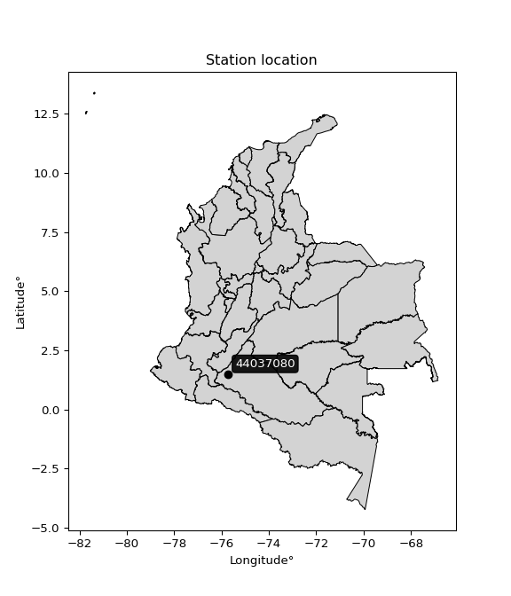</img>

</div>


## A. General information


### 1. General running parameters

• app_version: _v20260312_. • runtime: _2026-03-12 07:15:23.203550_. • Python version: _3.14.0_. • SciPy version: _1.16.3_. • Pandas version: _2.3.3_. • NumPy version: _2.3.5_. • Stations dataset (station_dataset_file): _dataset/pmax24h_in/automatic_colombia_2003_2025.csv_. • Stations catalog (station_catalog_file): _dataset/CNE.xls_. • Minimum year to eval til year_max (date_min): _1900_. • Maximum year to eval since year_min (date_max): _2025_. • Creates, save and include plots into reports (create_plot): _True_. • Plot only fit distributions with Δo > Δ (plot_only_fit): _True_. • Plot only simple graphs avoiding multiple CDFs and multiple Extreme values plots (plot_only_simple): _True_. • Eval low extreme values, if False, evaluates high extreme values (low_extreme): _False_. • Eval every SciPy distribution as logarithmic (pdist_logarithmic_on): _True_. • Standard deviation normalized (ddof): _1.0_. • Return periods to eval in years (Tr): _[2, 2.33, 5, 10, 15, 20, 25, 50, 75, 100, 200, 250, 500, 750, 1000]_. • Minimum data sample per station, 0 means any (minimum_sample): _5_. • Z-Score maximum threshold to adjust a value, 0 means disable (zscore_max): _3.5_. • Z-Score minimum threshold to adjust a value, 0 means disable (zscore_min): _-2.5_. • Avoid zeros, e.g. rain = 0 (avoid_zeros): _True_. • Avoid null values (avoid_nans): _True_. 

:file_folder:Table: [dataset.csv](../../dataset/pmax24h_in/automatic_colombia_2003_2025.csv)

> Delta Degrees of Freedom (DDOF): is a parameter used in the formulas for calculating variance and standard deviation. When ddof=0, the divisor is $N$ (the total number of observations) and this is used when your data set is the entire population. When ddof=1, the divisor is $N-1$ and this is used when your data set is a sample drawn from a larger population. Using $N-1$ provides an unbiased estimate of the population variance (known as Bessel´s correction).


### 2. Station info and location

|   id |   CODIGO | NOMBRE                    | CATEGORIA    | TECNOLOGIA                              | ESTADO   | FECHA_INSTALACION   |   FECHA_SUSPENSION |   ALTITUD |   LATITUD |   LONGITUD | DEPARTAMENTO   | MUNICIPIO   | AREA_OPERATIVA                    | ENTIDAD                                                     | AREA_HIDROGRAFICA   | ZONA_HIDROGRAFICA   | SUBZONA_HIDROGRAFICA   | CORRIENTE   | Catalogo   |   Version |
|-----:|---------:|:--------------------------|:-------------|:----------------------------------------|:---------|:--------------------|-------------------:|----------:|----------:|-----------:|:---------------|:------------|:----------------------------------|:------------------------------------------------------------|:--------------------|:--------------------|:-----------------------|:------------|:-----------|----------:|
|    0 | 44037080 | MORELIA  - AUT [44037080] | Limnigráfica | Automática con Telemetría, Convencional | Activa   | 15/03/1971          |                nan |       253 |   1.49733 |    -75.725 | Caqueta        | Morelia     | Area Operativa 04 - Huila-Caquetá | INSTITUTO DE HIDROLOGIA METEOROLOGIA Y ESTUDIOS AMBIENTALES | Amazonas            | Caquetá             | Río Orteguaza          | Bodoquero   | CNE_IDEAM  |  20251226 |

<div align="center">

Dynamic map: [:earth_americas:Google](http://maps.google.com/maps?q=1.497333333,-75.72497222) [:earth_americas:OSM](https://www.openstreetmap.org/#map=18/1.497333333/-75.72497222&layers=P) [:earth_americas:Bing](https://www.bing.com/maps?cp=1.497333333~-75.72497222&lvl=18) [:earth_americas:Apple](https://maps.apple.com/frame?center=1.497333333%2C-75.72497222&span=0.003%2C0.006)

</div>


<div align="center">

```geojson
{
  "type": "Feature",
  "geometry": {
    "type": "Point", 
    "coordinates": [-75.72497222, 1.497333333]
  }, 
  "properties": {
    "Name": "44037080"
  }
}
```

</div>


### 3. Discrete values table and plot

<div align="center">

|               |           0 |          1 |           2 |           3 |           4 |
|:--------------|------------:|-----------:|------------:|------------:|------------:|
| Date          | 2019        | 2020       | 2022        | 2023        | 2024        |
| Value         |   66.2      |  268       |  159.8      |   21.4      |   28        |
| Value_initial |   66.2      |  268       |  159.8      |   21.4      |   28        |
| count         |    5        |    5       |    5        |    5        |    5        |
| mean          |  108.68     |  108.68    |  108.68     |  108.68     |  108.68     |
| std           |  104.795    |  104.795   |  104.795    |  104.795    |  104.795    |
| zscore        |   -0.405364 |    1.52031 |    0.487811 |   -0.832866 |   -0.769886 |


</div>


<div align="center">

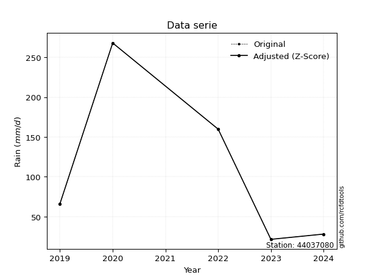</img>

</div>


> The initial value (value_initial) correspond to the initial obtained or null completed value, and value (value) is adjusted only when the initial value is outside the valid range (outlier) definite through the Z-Score value. If Z-Score is active, values out of range or outliers are replaced with the station mean value. A Z-Score (or standard score) measures how many standard deviations a data point is from the mean of a dataset, indicating its relative position; positive scores mean above the mean, negative mean below, and a score of zero is exactly at the mean, allowing for comparison of values from different distributions. It´s calculated using the formula $z=(x–μ)/σ$, where $x$ is the data point, $μ$ is the mean, and $σ$ is the standard deviation, helping identify outliers and understand probability.
>
> <sub>**Note**: In this study, "completing" (filling gaps in) and "extending" (forecasting or lengthening the historical record) rainfall data series are avoided for certain critical analyses because they introduce artificial bias and uncertainty, which can distort the statistics of rare events (extremes), alter day-to-day variability, and compromise the integrity and homogeneity of the original data. Some reasons against Completing/Extending rainfall data are: **Distortion of Extremes and Variability**: The primary issue is that most gap-filling or extension methods rely on averaging or regression with nearby stations, which inherently smooths the data. Rainfall is highly variable in space and time, with a large percentage of zero values and occasional large storms. Infilling methods often underestimate the highest values and overestimate the lowest (zero) values, which severely distorts analyses focused on flood frequency, drought severity, and intensity-duration-frequency (IDF) curves, **Loss of Data Homogeneity**: Infilled or extended data are synthetic estimates, not actual measurements. Combining these estimates with observed data can violate the assumption of data homogeneity, which requires that the data properties do not change over time. Inhomogeneity can lead to incorrect conclusions about long-term trends or changes in climate patterns, **Propagation of Errors**: Errors and biases from the original data (e.g., wind-induced undercatch, instrument errors, site changes) or the data used for imputation can propagate through the analysis, leading to unreliable hydrological models and inaccurate predictions, **Compromised Statistical Integrity**: For statistical analyses, especially those involving the frequency of events, using artificial data can introduce time bias or autocorrelation that doesn´t exist in reality, making it difficult to assess the true probability of events, **Difficulty in Validation**: It is difficult to accurately validate the quality of filled or extended data, especially for past periods where ground-truth measurements are unavailable. The reliability of imputation techniques heavily depends on the density of the surrounding station network and the complexity of the local topography.</sub>


### 4. Active continuous probability distributions from SciPy (80 of 104 available)

A Probability Density Function (PDF) describes the relative likelihood of a continuous random variable falling within a specific range, where the total area under its curve equals 1, and the area over any interval gives the actual probability for that range. Unlike discrete probabilities (like rolling a die), a PDF shows density, not direct probability for a single point (which is zero), with higher points indicating higher likelihood, often visualized as a bell curve for normal distributions.

A log of a probability density function (log-PDF) is simply the logarithm of the PDF´s value, denoted as $log(f(x))$, useful for converting multiplication of probabilities into addition, improving numerical stability with tiny numbers, and connecting to information theory concepts like entropy. Instead of dealing with very small probabilities (e.g., 0.000001), log-PDFs use negative numbers (e.g., $log(0.00001) ≈ -11.51$ that are easier for computers to handle, preventing underflow errors and simplifying complex calculations. In this study, each active probability distribution from SciPy is also evaluated in the $log$ form.

[scipy.stats](https://docs.scipy.org/doc/scipy/reference/stats.html) is a Python´s powerful submodule within the SciPy library for comprehensive statistical analysis, offering over 130 probability distributions (like Normal, Poisson, etc.), functions for descriptive stats (mean, variance), hypothesis testing (t-tests, chi-square), random variable generation, and statistical tests, making it essential for data science, modeling, and research. It provides tools to explore, model, and draw conclusions from data efficiently, working seamlessly with [NumPy](https://numpy.org/).

<div align="center">

|   id | p_dist           |   n_parameter | fit_method   | label                                                                       | active   | ref                                                                                                      |
|-----:|:-----------------|--------------:|:-------------|:----------------------------------------------------------------------------|:---------|:---------------------------------------------------------------------------------------------------------|
|    0 | alpha            |             3 | MLE          | Alpha                                                                       | True     | [:mortar_board:](https://docs.scipy.org/doc/scipy/reference/generated/scipy.stats.alpha.html)            |
|    1 | anglit           |             2 | MM           | Anglit                                                                      | True     | [:mortar_board:](https://docs.scipy.org/doc/scipy/reference/generated/scipy.stats.anglit.html)           |
|    2 | arcsine          |             2 | MM           | Arcsine                                                                     | True     | [:mortar_board:](https://docs.scipy.org/doc/scipy/reference/generated/scipy.stats.arcsine.html)          |
|    3 | argus            |             3 | MLE          | Argus                                                                       | True     | [:mortar_board:](https://docs.scipy.org/doc/scipy/reference/generated/scipy.stats.argus.html)            |
|    4 | beta             |             4 | MLE          | Beta                                                                        | True     | [:mortar_board:](https://docs.scipy.org/doc/scipy/reference/generated/scipy.stats.beta.html)             |
|    5 | betaprime        |             4 | MLE          | Beta prime                                                                  | True     | [:mortar_board:](https://docs.scipy.org/doc/scipy/reference/generated/scipy.stats.betaprime.html)        |
|    6 | bradford         |             3 | MLE          | Bradford                                                                    | True     | [:mortar_board:](https://docs.scipy.org/doc/scipy/reference/generated/scipy.stats.bradford.html)         |
|    7 | burr             |             4 | MLE          | Burr (Type III)                                                             | True     | [:mortar_board:](https://docs.scipy.org/doc/scipy/reference/generated/scipy.stats.burr.html)             |
|    8 | burr12           |             4 | MLE          | Burr (Type III) 12                                                          | True     | [:mortar_board:](https://docs.scipy.org/doc/scipy/reference/generated/scipy.stats.burr12.html)           |
|    9 | cosine           |             2 | MLE          | Cosine                                                                      | True     | [:mortar_board:](https://docs.scipy.org/doc/scipy/reference/generated/scipy.stats.cosine.html)           |
|   10 | crystalball      |             4 | MLE          | Crystalball                                                                 | True     | [:mortar_board:](https://docs.scipy.org/doc/scipy/reference/generated/scipy.stats.crystalball.html)      |
|   11 | dgamma           |             3 | MLE          | Double gamma                                                                | True     | [:mortar_board:](https://docs.scipy.org/doc/scipy/reference/generated/scipy.stats.dgamma.html)           |
|   12 | dweibull         |             3 | MLE          | Double Weibull                                                              | True     | [:mortar_board:](https://docs.scipy.org/doc/scipy/reference/generated/scipy.stats.dweibull.html)         |
|   13 | erlang           |             3 | MLE          | Erlang                                                                      | True     | [:mortar_board:](https://docs.scipy.org/doc/scipy/reference/generated/scipy.stats.erlang.html)           |
|   14 | exponnorm        |             3 | MLE          | Exponentially modified Normal                                               | True     | [:mortar_board:](https://docs.scipy.org/doc/scipy/reference/generated/scipy.stats.exponnorm.html)        |
|   15 | exponpow         |             3 | MLE          | Exponential power                                                           | True     | [:mortar_board:](https://docs.scipy.org/doc/scipy/reference/generated/scipy.stats.exponpow.html)         |
|   16 | exponweib        |             4 | MLE          | Exponentiated Weibull                                                       | True     | [:mortar_board:](https://docs.scipy.org/doc/scipy/reference/generated/scipy.stats.exponweib.html)        |
|   17 | f                |             4 | MLE          | F                                                                           | True     | [:mortar_board:](https://docs.scipy.org/doc/scipy/reference/generated/scipy.stats.f.html)                |
|   18 | fatiguelife      |             3 | MLE          | Fatigue-life (Birnbaum-Saunders)                                            | True     | [:mortar_board:](https://docs.scipy.org/doc/scipy/reference/generated/scipy.stats.fatiguelife.html)      |
|   19 | foldnorm         |             3 | MM           | Fold Normal                                                                 | True     | [:mortar_board:](https://docs.scipy.org/doc/scipy/reference/generated/scipy.stats.foldnorm.html)         |
|   20 | gamma            |             3 | MLE          | Gamma                                                                       | True     | [:mortar_board:](https://docs.scipy.org/doc/scipy/reference/generated/scipy.stats.gamma.html)            |
|   21 | gausshyper       |             6 | MLE          | Gauss hypergeometric                                                        | True     | [:mortar_board:](https://docs.scipy.org/doc/scipy/reference/generated/scipy.stats.gausshyper.html)       |
|   22 | genexpon         |             5 | MLE          | Generalized exponential                                                     | True     | [:mortar_board:](https://docs.scipy.org/doc/scipy/reference/generated/scipy.stats.genexpon.html)         |
|   23 | genextreme       |             3 | MLE          | Generalized exponential                                                     | True     | [:mortar_board:](https://docs.scipy.org/doc/scipy/reference/generated/scipy.stats.genextreme.html)       |
|   24 | gengamma         |             4 | MLE          | Generalized gamma                                                           | True     | [:mortar_board:](https://docs.scipy.org/doc/scipy/reference/generated/scipy.stats.gengamma.html)         |
|   25 | genhalflogistic  |             3 | MLE          | Generalized half-logistic                                                   | True     | [:mortar_board:](https://docs.scipy.org/doc/scipy/reference/generated/scipy.stats.genhalflogistic.html)  |
|   26 | genlogistic      |             3 | MLE          | Generalized logistic                                                        | True     | [:mortar_board:](https://docs.scipy.org/doc/scipy/reference/generated/scipy.stats.genlogistic.html)      |
|   27 | gennorm          |             3 | MLE          | Generalized Normal                                                          | True     | [:mortar_board:](https://docs.scipy.org/doc/scipy/reference/generated/scipy.stats.gennorm.html)          |
|   28 | genpareto        |             3 | MLE          | Generalized Pareto                                                          | True     | [:mortar_board:](https://docs.scipy.org/doc/scipy/reference/generated/scipy.stats.genpareto.html)        |
|   29 | gompertz         |             3 | MLE          | Gompertz (or truncated Gumbel)                                              | True     | [:mortar_board:](https://docs.scipy.org/doc/scipy/reference/generated/scipy.stats.gompertz.html)         |
|   30 | gumbel_l         |             2 | MM           | Gumbel Left Skew                                                            | True     | [:mortar_board:](https://docs.scipy.org/doc/scipy/reference/generated/scipy.stats.gumbel_l.html)         |
|   31 | gumbel_r         |             2 | MM           | Gumbel Right Skew                                                           | True     | [:mortar_board:](https://docs.scipy.org/doc/scipy/reference/generated/scipy.stats.gumbel_r.html)         |
|   32 | halfgennorm      |             3 | MLE          | Upper half of a generalized normal                                          | True     | [:mortar_board:](https://docs.scipy.org/doc/scipy/reference/generated/scipy.stats.halfgennorm.html)      |
|   33 | halflogistic     |             2 | MM           | Half-logistic                                                               | True     | [:mortar_board:](https://docs.scipy.org/doc/scipy/reference/generated/scipy.stats.halflogistic.html)     |
|   34 | halfnorm         |             2 | MM           | Half Normal                                                                 | True     | [:mortar_board:](https://docs.scipy.org/doc/scipy/reference/generated/scipy.stats.halfnorm.html)         |
|   35 | hypsecant        |             2 | MM           | hyperbolic secant                                                           | True     | [:mortar_board:](https://docs.scipy.org/doc/scipy/reference/generated/scipy.stats.hypsecant.html)        |
|   36 | invgamma         |             3 | MLE          | Inverted gamma                                                              | True     | [:mortar_board:](https://docs.scipy.org/doc/scipy/reference/generated/scipy.stats.invgamma.html)         |
|   37 | invgauss         |             3 | MLE          | Inverse Gaussian                                                            | True     | [:mortar_board:](https://docs.scipy.org/doc/scipy/reference/generated/scipy.stats.invgauss.html)         |
|   38 | invweibull       |             3 | MLE          | Inverted Weibull                                                            | True     | [:mortar_board:](https://docs.scipy.org/doc/scipy/reference/generated/scipy.stats.invweibull.html)       |
|   39 | johnsonsb        |             4 | MLE          | Johnson SB                                                                  | True     | [:mortar_board:](https://docs.scipy.org/doc/scipy/reference/generated/scipy.stats.johnsonsb.html)        |
|   40 | johnsonsu        |             4 | MLE          | Johnson Su                                                                  | True     | [:mortar_board:](https://docs.scipy.org/doc/scipy/reference/generated/scipy.stats.johnsonsu.html)        |
|   41 | kappa3           |             3 | MLE          | Kappa 3                                                                     | True     | [:mortar_board:](https://docs.scipy.org/doc/scipy/reference/generated/scipy.stats.kappa3.html)           |
|   42 | kappa4           |             4 | MLE          | Kappa 4                                                                     | True     | [:mortar_board:](https://docs.scipy.org/doc/scipy/reference/generated/scipy.stats.kappa4.html)           |
|   43 | ksone            |             3 | MLE          | Kolmogorov-Smirnov one-sided test statistic distribution                    | True     | [:mortar_board:](https://docs.scipy.org/doc/scipy/reference/generated/scipy.stats.ksone.html)            |
|   44 | kstwobign        |             2 | MLE          | Limiting distribution of scaled Kolmogorov-Smirnov two-sided test statistic | True     | [:mortar_board:](https://docs.scipy.org/doc/scipy/reference/generated/scipy.stats.kstwobign.html)        |
|   45 | laplace          |             2 | MM           | Laplace                                                                     | True     | [:mortar_board:](https://docs.scipy.org/doc/scipy/reference/generated/scipy.stats.laplace.html)          |
|   46 | levy_l           |             2 | MLE          | Left-skewed Levy                                                            | True     | [:mortar_board:](https://docs.scipy.org/doc/scipy/reference/generated/scipy.stats.levy_l.html)           |
|   47 | loggamma         |             3 | MLE          | Log gamma                                                                   | True     | [:mortar_board:](https://docs.scipy.org/doc/scipy/reference/generated/scipy.stats.loggamma.html)         |
|   48 | logistic         |             2 | MM           | Logistic (or Sech-squared)                                                  | True     | [:mortar_board:](https://docs.scipy.org/doc/scipy/reference/generated/scipy.stats.logistic.html)         |
|   49 | loglaplace       |             3 | MLE          | Log-Laplace                                                                 | True     | [:mortar_board:](https://docs.scipy.org/doc/scipy/reference/generated/scipy.stats.loglaplace.html)       |
|   50 | lomax            |             3 | MLE          | Lomax (Pareto of the second kind)                                           | True     | [:mortar_board:](https://docs.scipy.org/doc/scipy/reference/generated/scipy.stats.lomax.html)            |
|   51 | maxwell          |             2 | MM           | Maxwell                                                                     | True     | [:mortar_board:](https://docs.scipy.org/doc/scipy/reference/generated/scipy.stats.maxwell.html)          |
|   52 | mielke           |             4 | MLE          | Mielke Beta-Kappa / Dagum                                                   | True     | [:mortar_board:](https://docs.scipy.org/doc/scipy/reference/generated/scipy.stats.mielke.html)           |
|   53 | moyal            |             2 | MM           | Moyal                                                                       | True     | [:mortar_board:](https://docs.scipy.org/doc/scipy/reference/generated/scipy.stats.moyal.html)            |
|   54 | nakagami         |             3 | MLE          | Nakagami                                                                    | True     | [:mortar_board:](https://docs.scipy.org/doc/scipy/reference/generated/scipy.stats.nakagami.html)         |
|   55 | ncf              |             5 | MLE          | Non-central F distribution                                                  | True     | [:mortar_board:](https://docs.scipy.org/doc/scipy/reference/generated/scipy.stats.ncf.html)              |
|   56 | nct              |             4 | MLE          | Non-central Student’s t                                                     | True     | [:mortar_board:](https://docs.scipy.org/doc/scipy/reference/generated/scipy.stats.nct.html)              |
|   57 | norm             |             2 | MM           | Normal                                                                      | True     | [:mortar_board:](https://docs.scipy.org/doc/scipy/reference/generated/scipy.stats.norm.html)             |
|   58 | pearson3         |             3 | MM           | Pearson type III                                                            | True     | [:mortar_board:](https://docs.scipy.org/doc/scipy/reference/generated/scipy.stats.pearson3.html)         |
|   59 | powerlaw         |             3 | MLE          | Power-function                                                              | True     | [:mortar_board:](https://docs.scipy.org/doc/scipy/reference/generated/scipy.stats.powerlaw.html)         |
|   60 | rayleigh         |             2 | MM           | Rayleigh                                                                    | True     | [:mortar_board:](https://docs.scipy.org/doc/scipy/reference/generated/scipy.stats.rayleigh.html)         |
|   61 | rdist            |             3 | MLE          | R-distributed (symmetric beta)                                              | True     | [:mortar_board:](https://docs.scipy.org/doc/scipy/reference/generated/scipy.stats.rdist.html)            |
|   62 | rice             |             3 | MLE          | Rice                                                                        | True     | [:mortar_board:](https://docs.scipy.org/doc/scipy/reference/generated/scipy.stats.rice.html)             |
|   63 | semicircular     |             2 | MM           | Semicircular                                                                | True     | [:mortar_board:](https://docs.scipy.org/doc/scipy/reference/generated/scipy.stats.semicircular.html)     |
|   64 | skewnorm         |             3 | MLE          | Skew normal                                                                 | True     | [:mortar_board:](https://docs.scipy.org/doc/scipy/reference/generated/scipy.stats.skewnorm.html)         |
|   65 | t                |             3 | MLE          | Student’s t                                                                 | True     | [:mortar_board:](https://docs.scipy.org/doc/scipy/reference/generated/scipy.stats.t.html)                |
|   66 | trapezoid        |             4 | MLE          | Trapezoid                                                                   | True     | [:mortar_board:](https://docs.scipy.org/doc/scipy/reference/generated/scipy.stats.trapezoid.html)        |
|   67 | triang           |             3 | MLE          | Triangular                                                                  | True     | [:mortar_board:](https://docs.scipy.org/doc/scipy/reference/generated/scipy.stats.triang.html)           |
|   68 | truncexpon       |             3 | MLE          | Truncated exponential                                                       | True     | [:mortar_board:](https://docs.scipy.org/doc/scipy/reference/generated/scipy.stats.truncexpon.html)       |
|   69 | truncnorm        |             4 | MLE          | Truncated normal                                                            | True     | [:mortar_board:](https://docs.scipy.org/doc/scipy/reference/generated/scipy.stats.truncnorm.html)        |
|   70 | truncpareto      |             4 | MLE          | Upper truncated Pareto                                                      | True     | [:mortar_board:](https://docs.scipy.org/doc/scipy/reference/generated/scipy.stats.truncpareto.html)      |
|   71 | truncweibull_min |             5 | MLE          | Doubly truncated Weibull minimum                                            | True     | [:mortar_board:](https://docs.scipy.org/doc/scipy/reference/generated/scipy.stats.truncweibull_min.html) |
|   72 | tukeylambda      |             3 | MLE          | Tukey-Lamdba                                                                | True     | [:mortar_board:](https://docs.scipy.org/doc/scipy/reference/generated/scipy.stats.tukeylambda.html)      |
|   73 | uniform          |             2 | MLE          | Uniform                                                                     | True     | [:mortar_board:](https://docs.scipy.org/doc/scipy/reference/generated/scipy.stats.uniform.html)          |
|   74 | vonmises         |             3 | MLE          | Von Mises                                                                   | True     | [:mortar_board:](https://docs.scipy.org/doc/scipy/reference/generated/scipy.stats.vonmises.html)         |
|   75 | vonmises_line    |             3 | MLE          | Von Mises line                                                              | True     | [:mortar_board:](https://docs.scipy.org/doc/scipy/reference/generated/scipy.stats.vonmises_line.html)    |
|   76 | wald             |             2 | MM           | Wald                                                                        | True     | [:mortar_board:](https://docs.scipy.org/doc/scipy/reference/generated/scipy.stats.wald.html)             |
|   77 | weibull_max      |             3 | MLE          | Weibull maximum                                                             | True     | [:mortar_board:](https://docs.scipy.org/doc/scipy/reference/generated/scipy.stats.weibull_max.html)      |
|   78 | weibull_min      |             3 | MLE          | Weibull minimum                                                             | True     | [:mortar_board:](https://docs.scipy.org/doc/scipy/reference/generated/scipy.stats.weibull_min.html)      |
|   79 | wrapcauchy       |             3 | MLE          | Wrapped  Cauchy                                                             | True     | [:mortar_board:](https://docs.scipy.org/doc/scipy/reference/generated/scipy.stats.wrapcauchy.html)       |

</div>

> **n_parameter:** # arguments & localization & scale.
>
> **Fit methods:** (MLE) maximum likelihood, (MM) L-moments.
>
>**Inactive** (With the only purpose of prevent loops, zero divisions, infinite values, over high estimated values or horizontal trending for recurrence intervals estimations, the follow distributions were disabled.)**:** lognorm, norminvgauss, powernorm, powerlognorm, cauchy, halfcauchy, foldcauchy, skewcauchy, chi2, expon, fisk, genhyperbolic, geninvgauss, gibrat, kstwo, laplace_asymmetric, levy, levy_stable, ncx2, pareto, rel_breitwigner, recipinvgauss, studentized_range, loguniform, 


## B. Probability (PDF) vs. Empirical (EDF) distributions functions

A continuous probability distribution (CPD) describes probabilities for variables that can take any value within a range (like rain any time), unlike discrete variables with specific outcomes (like temperature). It uses a Probability Density Function (PDF), a curve where the total area under it equals 1, and the probability of the variable falling within an interval (a to b) is found by calculating the area under the curve between those points. A key feature is that the probability of hitting any single exact value is zero, so probabilities are always expressed for ranges, e.g., $P(a ≤ X ≤ b)$.

<div align="center">

Distributions parameters from station values
|     |   station | p_dist              |   n |              loc |          scale | shape                  | shape1                | shape2                 | shape3             |
|----:|----------:|:--------------------|----:|-----------------:|---------------:|:-----------------------|:----------------------|:-----------------------|:-------------------|
|   0 |  44037080 | alpha               |   5 |     -0.0915524   |   36.6899      | 5.334172802910169e-10  |                       |                        |                    |
|   1 |  44037080 | anglit              |   5 |    108.68        |  274.201       |                        |                       |                        |                    |
|   2 |  44037080 | arcsine             |   5 |    -23.876       |  265.112       |                        |                       |                        |                    |
|   3 |  44037080 | argus               |   5 |    -88.7791      |  376.456       | 8.477825971330861e-07  |                       |                        |                    |
|   4 |  44037080 | beta                |   5 |     -3.35586     |  271.356       | 0.2713651641715755     | 0.5292028669128838    |                        |                    |
|   5 |  44037080 | betaprime           |   5 |      6.03917     |    3.41703     | 12.437845875099669     | 1.1160901938925671    |                        |                    |
|   6 |  44037080 | bradford            |   5 |     21.4         |  246.6         | 1.2584116246154275     |                       |                        |                    |
|   7 |  44037080 | burr                |   5 |     10.8665      |    0.450189    | 1.0652252191818774     | 72.81863306849917     |                        |                    |
|   8 |  44037080 | burr12              |   5 |     -1.95033     |   23.0141      | 288.2800702142015      | 0.003003193546904129  |                        |                    |
|   9 |  44037080 | cosine              |   5 |    118.371       |   76.6082      |                        |                       |                        |                    |
|  10 |  44037080 | crystalball         |   5 |    108.68        |   93.7312      | 9139.341814354531      | 4902.399191225837     |                        |                    |
|  11 |  44037080 | dgamma              |   5 |    114.309       |   17.0249      | 5.010409474139242      |                       |                        |                    |
|  12 |  44037080 | dweibull            |   5 |    121.794       |   98.2106      | 2.5165218039758024     |                       |                        |                    |
|  13 |  44037080 | erlang              |   5 |     21.4         |   61.8839      | 0.3945724043952462     |                       |                        |                    |
|  14 |  44037080 | exponnorm           |   5 |     21.3115      |    0.02709     | 3232.467803190767      |                       |                        |                    |
|  15 |  44037080 | exponpow            |   5 |     21.4         |  146.833       | 0.5376462457454361     |                       |                        |                    |
|  16 |  44037080 | exponweib           |   5 |     21.4         |  110.225       | 0.6743846101038532     | 0.6100884244815747    |                        |                    |
|  17 |  44037080 | f                   |   5 |     19.3267      |    8.23        | 181.6943532733844      | 0.9851492043482013    |                        |                    |
|  18 |  44037080 | fatiguelife         |   5 |     21.4         |    3.95692e-06 | 4601.616411808216      |                       |                        |                    |
|  19 |  44037080 | foldnorm            |   5 |    -27.8105      |  117.576       | 0.9915408252218978     |                       |                        |                    |
|  20 |  44037080 | gamma               |   5 |     21.4         |   61.8727      | 0.49084939178210385    |                       |                        |                    |
|  21 |  44037080 | gausshyper          |   5 |    -39.6522      |  307.652       | 1.0279631682539385     | 0.937236916275948     | 1.0239284068200938     | 0.9757354175122872 |
|  22 |  44037080 | genexpon            |   5 |     10.2588      |    0.00959462  | 9.256913347828705e-05  | 23.113258238330914    | 2.1645112929436712e-11 |                    |
|  23 |  44037080 | genextreme          |   5 |     26.6147      |   46.9645      | -9.00613941591645      |                       |                        |                    |
|  24 |  44037080 | gengamma            |   5 |     21.4         |  110.223       | 0.6744591531480781     | 0.6100517990153491    |                        |                    |
|  25 |  44037080 | genhalflogistic     |   5 |     -3.36921     |  283.197       | 1.0435867603089393     |                       |                        |                    |
|  26 |  44037080 | genlogistic         |   5 |   -432.777       |   66.6834      | 1769.2717992729122     |                       |                        |                    |
|  27 |  44037080 | gennorm             |   5 |     66.2         |    0.123379    | 0.25252590391685814    |                       |                        |                    |
|  28 |  44037080 | genpareto           |   5 |     -1.88915     |  281.225       | -1.0420035657545066    |                       |                        |                    |
|  29 |  44037080 | gompertz            |   5 |     21.4         |    2.42881e+10 | 281083623.82886815     |                       |                        |                    |
|  30 |  44037080 | gumbel_l            |   5 |    150.864       |   73.0819      |                        |                       |                        |                    |
|  31 |  44037080 | gumbel_r            |   5 |     66.496       |   73.0819      |                        |                       |                        |                    |
|  32 |  44037080 | halfgennorm         |   5 |     21.4         |   45.1629      | 0.6308938516891731     |                       |                        |                    |
|  33 |  44037080 | halflogistic        |   5 |     -2.4133      |   80.1369      |                        |                       |                        |                    |
|  34 |  44037080 | halfnorm            |   5 |    -15.3834      |  155.49        |                        |                       |                        |                    |
|  35 |  44037080 | hypsecant           |   5 |    108.68        |   59.6712      |                        |                       |                        |                    |
|  36 |  44037080 | invgamma            |   5 |     19.6731      |    3.00949     | 0.4404905896803929     |                       |                        |                    |
|  37 |  44037080 | invgauss            |   5 |     17.7021      |   14.5256      | 6.263269449752305      |                       |                        |                    |
|  38 |  44037080 | invweibull          |   5 |     21.4         |    8.03661     | 0.05960175951041055    |                       |                        |                    |
|  39 |  44037080 | johnsonsb           |   5 |     21.4         |  403.002       | 1.2408575216002373     | 0.1465049366867731    |                        |                    |
|  40 |  44037080 | johnsonsu           |   5 |     21.3981      |    1.57266e-07 | -5.623555106395159     | 0.3064558343976007    |                        |                    |
|  41 |  44037080 | kappa3              |   5 |     21.4         |   35.2633      | 0.13771837372897155    |                       |                        |                    |
|  42 |  44037080 | kappa4              |   5 |    -51.0523      |  321.651       | 1.2909732988164393     | 1.005066760623116     |                        |                    |
|  43 |  44037080 | ksone               |   5 |    -53.6673      |  324.695       | 1.0                    |                       |                        |                    |
|  44 |  44037080 | kstwobign           |   5 |   -166.878       |  316.285       |                        |                       |                        |                    |
|  45 |  44037080 | laplace             |   5 |    108.68        |   66.278       |                        |                       |                        |                    |
|  46 |  44037080 | levy_l              |   5 |    283.048       |   57.5216      |                        |                       |                        |                    |
|  47 |  44037080 | loggamma            |   5 | -33383.2         | 4379.65        | 2095.068296548153      |                       |                        |                    |
|  48 |  44037080 | logistic            |   5 |    108.68        |   51.6767      |                        |                       |                        |                    |
|  49 |  44037080 | loglaplace          |   5 |     -0.152942    |   66.353       | 1.1748085323787438     |                       |                        |                    |
|  50 |  44037080 | lomax               |   5 |     21.4         | 1102.8         | 13.490742694193855     |                       |                        |                    |
|  51 |  44037080 | maxwell             |   5 |   -113.424       |  139.183       |                        |                       |                        |                    |
|  52 |  44037080 | mielke              |   5 |      4.18912     |    0.0900598   | 1064.553415046969      | 1.136079664171035     |                        |                    |
|  53 |  44037080 | moyal               |   5 |     55.0785      |   42.1939      |                        |                       |                        |                    |
|  54 |  44037080 | nakagami            |   5 |     21.4         |  196.958       | 0.21636709135600687    |                       |                        |                    |
|  55 |  44037080 | ncf                 |   5 |      0.608946    |    0.00190552  | 0.006100447412946186   | 2.7965647277354027    | 149.12760053339218     |                    |
|  56 |  44037080 | nct                 |   5 |     -0.0356651   |    0.935344    | 0.9855158826390062     | 39.04732246772083     |                        |                    |
|  57 |  44037080 | norm                |   5 |    108.68        |   93.7312      |                        |                       |                        |                    |
|  58 |  44037080 | pearson3            |   5 |    108.68        |   93.7312      | 0.7069674555379099     |                       |                        |                    |
|  59 |  44037080 | powerlaw            |   5 |     21.4         |  246.6         | 0.11190010833554678    |                       |                        |                    |
|  60 |  44037080 | rayleigh            |   5 |    -70.6333      |  143.071       |                        |                       |                        |                    |
|  61 |  44037080 | rdist               |   5 |     -2.63072     |   68.8307      | 1.2332217290512204     |                       |                        |                    |
|  62 |  44037080 | rice                |   5 |    -41.1626      |  124.977       | 0.0008134657905868553  |                       |                        |                    |
|  63 |  44037080 | semicircular        |   5 |    108.68        |  187.462       |                        |                       |                        |                    |
|  64 |  44037080 | skewnorm            |   5 |     21.3999      |  128.076       | 9986957.456658049      |                       |                        |                    |
|  65 |  44037080 | t                   |   5 |    108.683       |   93.7341      | 12558303.965612344     |                       |                        |                    |
|  66 |  44037080 | trapezoid           |   5 |     -3.423       |  295.92        | 0.9999999999999999     | 1.0                   |                        |                    |
|  67 |  44037080 | triang              |   5 |    -98.484       |  366.484       | 0.9999999000767121     |                       |                        |                    |
|  68 |  44037080 | truncexpon          |   5 |    -27.8341      |  270.317       | 1.094397834893804      |                       |                        |                    |
|  69 |  44037080 | truncnorm           |   5 | -43184.7         | 2018.99        | 21.399837090752577     | 21.52197969968129     |                        |                    |
|  70 |  44037080 | truncpareto         |   5 |     20.5246      |    0.875394    | 0.2973842391305846     | 282.7016639817575     |                        |                    |
|  71 |  44037080 | truncweibull_min    |   5 |     15.5742      |  256.434       | 0.020019344258454207   | 0.022718499226157325  | 0.9843714573512046     |                    |
|  72 |  44037080 | tukeylambda         |   5 |    144.611       |  152.689       | 1.2374652991736146     |                       |                        |                    |
|  73 |  44037080 | uniform             |   5 |     21.4         |  246.6         |                        |                       |                        |                    |
|  74 |  44037080 | vonmises            |   5 |      3.09676     |    1           | 3.69743265646851       |                       |                        |                    |
|  75 |  44037080 | vonmises_line       |   5 |    148.242       |   40.3751      | 1.6316839930520593e-06 |                       |                        |                    |
|  76 |  44037080 | wald                |   5 |     14.9488      |   93.7312      |                        |                       |                        |                    |
|  77 |  44037080 | weibull_max         |   5 |    268           |    1.61601     | 0.21835024350103974    |                       |                        |                    |
|  78 |  44037080 | weibull_min         |   5 |     21.4         |   39.9586      | 0.6598419419564732     |                       |                        |                    |
|  79 |  44037080 | wrapcauchy          |   5 |     21.3989      |   39.2478      | 0.847857110630146      |                       |                        |                    |
|  80 |  44037080 | logalpha            |   5 |     -6.01526     |  107.833       | 10.598948560637876     |                       |                        |                    |
|  81 |  44037080 | loganglit           |   5 |      4.25064     |    2.84555     |                        |                       |                        |                    |
|  82 |  44037080 | logarcsine          |   5 |      2.87503     |    2.75122     |                        |                       |                        |                    |
|  83 |  44037080 | logargus            |   5 |      2.23577     |    3.56691     | 5.8139611837322634e-05 |                       |                        |                    |
|  84 |  44037080 | logbeta             |   5 |      3.06339     |    2.5276      | 0.37969060182117437    | 0.41460491482713857   |                        |                    |
|  85 |  44037080 | logbetaprime        |   5 |     -0.317302    |    5.32058     | 39.97252988228088      | 47.553790091660005    |                        |                    |
|  86 |  44037080 | logbradford         |   5 |      3.06339     |    2.5276      | 1.123109719150082      |                       |                        |                    |
|  87 |  44037080 | logburr             |   5 |     -6.51115     |    5.66979     | 12.973110202306493     | 2159.483702802474     |                        |                    |
|  88 |  44037080 | logburr12           |   5 |      3.06339     |    8.59358     | 0.7156849582489074     | 4.665069835245188     |                        |                    |
|  89 |  44037080 | logcosine           |   5 |      4.26767     |    0.770058    |                        |                       |                        |                    |
|  90 |  44037080 | logcrystalball      |   5 |      4.25064     |    0.972704    | 9.07194660826292       | 439.2037301913138     |                        |                    |
|  91 |  44037080 | logdgamma           |   5 |      3.88082     |    0.284667    | 3.2185960932107935     |                       |                        |                    |
|  92 |  44037080 | logdweibull         |   5 |      3.95089     |    1.01861     | 2.0074601438957655     |                       |                        |                    |
|  93 |  44037080 | logerlang           |   5 |     -5.4445      |    0.0960154   | 100.89728590868526     |                       |                        |                    |
|  94 |  44037080 | logexponnorm        |   5 |      4.18032     |    0.970161    | 0.07248447163825186    |                       |                        |                    |
|  95 |  44037080 | logexponpow         |   5 |      3.06339     |    2.95145     | 0.4670170170681123     |                       |                        |                    |
|  96 |  44037080 | logexponweib        |   5 |      3.06339     |    1.22563     | 1.2055104502623886     | 0.7180828316303031    |                        |                    |
|  97 |  44037080 | logf                |   5 |      3.06291     |    0.944561    | 1.0921995467874177     | 18.024161655461157    |                        |                    |
|  98 |  44037080 | logfatiguelife      |   5 |      3.06339     |    1.53235e-07 | 2578.9142698473825     |                       |                        |                    |
|  99 |  44037080 | logfoldnorm         |   5 |      1.99928     |    0.991197    | 2.263198810676632      |                       |                        |                    |
| 100 |  44037080 | loggamma            |   5 |     -5.9204      |    0.0929155   | 109.42912902633827     |                       |                        |                    |
| 101 |  44037080 | loggausshyper       |   5 |      3.06339     |    2.58642     | 0.9478403924951508     | 1.1055094137851444    | 1.005907552762931      | 1.030078193406223  |
| 102 |  44037080 | loggenexpon         |   5 |      3.06292     |    0.00412886  | 0.0027261851859097424  | 0.5030186190846466    | 6.186498055503144e-06  |                    |
| 103 |  44037080 | loggenextreme       |   5 |      4.3706      |    1.38335     | 1.1335333765060895     |                       |                        |                    |
| 104 |  44037080 | loggengamma         |   5 |      3.06339     |    2.6847      | 0.2647004399716898     | 0.4997749325028924    |                        |                    |
| 105 |  44037080 | loggenhalflogistic  |   5 |      3.06339     |    2.35898     | 0.9235650729339302     |                       |                        |                    |
| 106 |  44037080 | loggenlogistic      |   5 |     -1.46767     |    0.822264    | 586.446747546755       |                       |                        |                    |
| 107 |  44037080 | loggennorm          |   5 |      4.32719     |    1.2638      | 8275742.730847681      |                       |                        |                    |
| 108 |  44037080 | loggenpareto        |   5 |     -0.0148683   |   14.4896      | -2.5847224832344624    |                       |                        |                    |
| 109 |  44037080 | loggompertz         |   5 |      3.06339     |    2.43651     | 1.3107939648359377     |                       |                        |                    |
| 110 |  44037080 | loggumbel_l         |   5 |      4.68841     |    0.758414    |                        |                       |                        |                    |
| 111 |  44037080 | loggumbel_r         |   5 |      3.81287     |    0.758414    |                        |                       |                        |                    |
| 112 |  44037080 | loghalfgennorm      |   5 |      3.06339     |    1.06576     | 0.9264727589783831     |                       |                        |                    |
| 113 |  44037080 | loghalflogistic     |   5 |      3.09776     |    0.831625    |                        |                       |                        |                    |
| 114 |  44037080 | loghalfnorm         |   5 |      2.96316     |    1.61362     |                        |                       |                        |                    |
| 115 |  44037080 | loghypsecant        |   5 |      4.25064     |    0.619243    |                        |                       |                        |                    |
| 116 |  44037080 | loginvgamma         |   5 |      0.825119    |   37.7184      | 11.977709866633774     |                       |                        |                    |
| 117 |  44037080 | loginvgauss         |   5 |      2.74592     |    1.66393     | 0.9043021430681348     |                       |                        |                    |
| 118 |  44037080 | loginvweibull       |   5 |     -1.34019e+07 |    1.34019e+07 | 16311106.277132004     |                       |                        |                    |
| 119 |  44037080 | logjohnsonsb        |   5 |      3.06339     |    5.65904     | 1.0875031997654778     | 0.0786788482828889    |                        |                    |
| 120 |  44037080 | logjohnsonsu        |   5 |      1.11531e+07 |    2.87778e+06 | 24461844.64900285      | 11851165.661842668    |                        |                    |
| 121 |  44037080 | logkappa3           |   5 |      3.06339     |    2.52739     | 19477.590776822173     |                       |                        |                    |
| 122 |  44037080 | logkappa4           |   5 |      2.72701     |    3.06574     | 1.1238022824544276     | 1.0703937691823804    |                        |                    |
| 123 |  44037080 | logksone            |   5 |      2.56586     |    3.36955     | 1.0                    |                       |                        |                    |
| 124 |  44037080 | logkstwobign        |   5 |      0.983593    |    3.72378     |                        |                       |                        |                    |
| 125 |  44037080 | loglaplace          |   5 |      4.25064     |    0.687806    |                        |                       |                        |                    |
| 126 |  44037080 | loglevy_l           |   5 |      5.69246     |    0.386339    |                        |                       |                        |                    |
| 127 |  44037080 | logloggamma         |   5 |   -252.065       |   35.6417      | 1328.5417527133618     |                       |                        |                    |
| 128 |  44037080 | loglogistic         |   5 |      4.25064     |    0.53628     |                        |                       |                        |                    |
| 129 |  44037080 | logloglaplace       |   5 |     -0.0029904   |    4.19567     | 4.896084007757183      |                       |                        |                    |
| 130 |  44037080 | loglomax            |   5 |      3.06339     |   50.4851      | 43.12352053224317      |                       |                        |                    |
| 131 |  44037080 | logmaxwell          |   5 |      1.94574     |    1.44438     |                        |                       |                        |                    |
| 132 |  44037080 | logmielke           |   5 |   -617.916       |  617.548       | 124057.20390952408     | 761.9523679728466     |                        |                    |
| 133 |  44037080 | logmoyal            |   5 |      3.69438     |    0.437871    |                        |                       |                        |                    |
| 134 |  44037080 | lognakagami         |   5 |      3.06339     |    2.17385     | 0.05764226885292362    |                       |                        |                    |
| 135 |  44037080 | logncf              |   5 |     -0.421591    |    3.21384     | 203.6260957589734      | 56.23428947949179     | 81.78580804762976      |                    |
| 136 |  44037080 | lognct              |   5 |     -0.0632951   |    0.108425    | 10.306601994084543     | 36.87045444265497     |                        |                    |
| 137 |  44037080 | lognorm             |   5 |      4.25064     |    0.972704    |                        |                       |                        |                    |
| 138 |  44037080 | logpearson3         |   5 |      4.25064     |    0.972706    | 0.11247520610012683    |                       |                        |                    |
| 139 |  44037080 | logpowerlaw         |   5 |      3.06339     |    2.5276      | 0.1264116071109125     |                       |                        |                    |
| 140 |  44037080 | lograyleigh         |   5 |      2.3898      |    1.48474     |                        |                       |                        |                    |
| 141 |  44037080 | logrdist            |   5 |      4.31923     |    1.27175     | 1.0587478770363008     |                       |                        |                    |
| 142 |  44037080 | logrice             |   5 |      2.50636     |    1.23829     | 0.7754076154121516     |                       |                        |                    |
| 143 |  44037080 | logsemicircular     |   5 |      4.25064     |    1.94541     |                        |                       |                        |                    |
| 144 |  44037080 | logskewnorm         |   5 |      3.87845     |    1.04148     | 0.5007109419688156     |                       |                        |                    |
| 145 |  44037080 | logt                |   5 |      4.25064     |    0.972704    | 15717321921.743034     |                       |                        |                    |
| 146 |  44037080 | logtrapezoid        |   5 |      1.49941     |    4.12683     | 1.0                    | 1.0                   |                        |                    |
| 147 |  44037080 | logtriang           |   5 |      2.03074     |    3.56038     | 0.9999999981389602     |                       |                        |                    |
| 148 |  44037080 | logtruncexpon       |   5 |      3.06335     |    3.19997     | 0.7898943696134619     |                       |                        |                    |
| 149 |  44037080 | logtruncnorm        |   5 |     -0.247992    |    1.78917     | 2.4819752902042955     | 4.059165975572988     |                        |                    |
| 150 |  44037080 | logtruncpareto      |   5 |      3.05272     |    0.0106749   | 0.268084680522345      | 237.7794892165273     |                        |                    |
| 151 |  44037080 | logtruncweibull_min |   5 |      3.06339     |    3.52493     | 0.8700382398355762     | 2.385070997448491e-16 | 0.7170815451835542     |                    |
| 152 |  44037080 | logtukeylambda      |   5 |      4.32565     |    1.40121     | 1.1073781199557673     |                       |                        |                    |
| 153 |  44037080 | loguniform          |   5 |      3.06339     |    2.5276      |                        |                       |                        |                    |
| 154 |  44037080 | logvonmises         |   5 |     -2.05781     |    1           | 1.4277189399719201     |                       |                        |                    |
| 155 |  44037080 | logvonmises_line    |   5 |      4.32784     |    0.40249     | 2.0571955060495522e-06 |                       |                        |                    |
| 156 |  44037080 | logwald             |   5 |      3.27791     |    0.972727    |                        |                       |                        |                    |
| 157 |  44037080 | logweibull_max      |   5 |      5.59099     |    1.49968     | 0.6057670696595265     |                       |                        |                    |
| 158 |  44037080 | logweibull_min      |   5 |      3.06339     |    2.44665     | 0.13675159872970247    |                       |                        |                    |
| 159 |  44037080 | logwrapcauchy       |   5 |      3.06339     |    0.402279    | 0.5249999999999999     |                       |                        |                    |

</div>

> **loc** (Location parameter): This shifts the distribution along the x-axis. For many common distributions, like the normal (Gaussian) distribution, loc represents the mean $μ$. For others, like the uniform distribution, it might represent the minimum value, or for the beta distribution, the left end of the support interval.
>
> **scale** (Scale parameter): This determines the width or spread of the distribution. For the normal distribution, scale represents the standard deviation $σ$. For a uniform distribution, it defines the length of the interval (from $loc$ to $loc + scale$).
>
> **shape** (Shape parameters): Refers to parameters that define the specific form of a probability distribution, distinct from its location (loc) and scale (scale). These parameters are required arguments for most distribution functions. For example, a normal (Gaussian) distribution is fully defined by its location (mean) and scale (standard deviation), so it has no specific shape parameters beyond loc and scale. However, other distributions have intrinsic properties that need specification, as Gamma distribution that takes a shape parameter, often named $a$ or $alpha$.


### 0. Cumulative distribution values - CDF (160 evaluated)

Cumulative Distribution Function (CDF), denoted as $F$<sub>$X$</sub>$(x)$, is a function that gives the probability that a random variable $X$ will take a value less than or equal to a specific value, $x$ (i.e., $(P(X≥x)$. It essentially "accumulates" probabilities from a given point up to the far right (positive infinity), providing a complete picture of the distribution´s probabilities for both discrete (like rain) and continuous (like temperature) variables, helping to find probabilities over ranges or above certain values. Each station is evaluated separately ordering the $x$ values ascending, calculating the CDF and PDF values for the activated distributions and their logarithmic forms.

<div align="center">

CDF ordered by x ascending and calculating $log(f(x))$ separately
|   id |   Station |   date |     x |   count |   mean |     std |    zscore |   Value_initial |   station |   m |     alpha |   alpha_pdf |   anglit |   anglit_pdf |   arcsine |   arcsine_pdf |    argus |   argus_pdf |     beta |       beta_pdf |   betaprime |   betaprime_pdf |    bradford |   bradford_pdf |      burr |    burr_pdf |    burr12 |   burr12_pdf |   cosine |   cosine_pdf |   crystalball |   crystalball_pdf |   dgamma |   dgamma_pdf |   dweibull |   dweibull_pdf |      erlang |   erlang_pdf |   exponnorm |   exponnorm_pdf |   exponpow |     exponpow_pdf |   exponweib |   exponweib_pdf |         f |       f_pdf |   fatiguelife |   fatiguelife_pdf |   foldnorm |   foldnorm_pdf |       gamma |   gamma_pdf |   gausshyper |   gausshyper_pdf |   genexpon |   genexpon_pdf |   genextreme |   genextreme_pdf |    gengamma |   gengamma_pdf |   genhalflogistic |   genhalflogistic_pdf |   genlogistic |   genlogistic_pdf |   gennorm |   gennorm_pdf |   genpareto |   genpareto_pdf |    gompertz |   gompertz_pdf |   gumbel_l |   gumbel_l_pdf |   gumbel_r |   gumbel_r_pdf |   halfgennorm |   halfgennorm_pdf |   halflogistic |   halflogistic_pdf |   halfnorm |   halfnorm_pdf |   hypsecant |   hypsecant_pdf |   invgamma |   invgamma_pdf |   invgauss |   invgauss_pdf |   invweibull |   invweibull_pdf |   johnsonsb |   johnsonsb_pdf |   johnsonsu |   johnsonsu_pdf |     kappa3 |    kappa3_pdf |      kappa4 |   kappa4_pdf |    ksone |   ksone_pdf |   kstwobign |   kstwobign_pdf |   laplace |   laplace_pdf |   levy_l |   levy_l_pdf |   loggamma |   loggamma_pdf |   logistic |   logistic_pdf |   loglaplace |   loglaplace_pdf |       lomax |   lomax_pdf |   maxwell |   maxwell_pdf |   mielke |   mielke_pdf |    moyal |   moyal_pdf |    nakagami |   nakagami_pdf |       ncf |     ncf_pdf |       nct |     nct_pdf |     norm |   norm_pdf |   pearson3 |   pearson3_pdf |   powerlaw |   powerlaw_pdf |   rayleigh |   rayleigh_pdf |    rdist |     rdist_pdf |     rice |    rice_pdf |   semicircular |   semicircular_pdf |   skewnorm |   skewnorm_pdf |        t |      t_pdf |   trapezoid |   trapezoid_pdf |   triang |   triang_pdf |   truncexpon |   truncexpon_pdf |   truncnorm |   truncnorm_pdf |   truncpareto |   truncpareto_pdf |   truncweibull_min |   truncweibull_min_pdf |   tukeylambda |   tukeylambda_pdf |   uniform |   uniform_pdf |   vonmises |   vonmises_pdf |   vonmises_line |   vonmises_line_pdf |        wald |    wald_pdf |   weibull_max |   weibull_max_pdf |   weibull_min |   weibull_min_pdf |   wrapcauchy |   wrapcauchy_pdf |   logalpha |   logalpha_pdf |   loganglit |   loganglit_pdf |   logarcsine |   logarcsine_pdf |   logargus |   logargus_pdf |     logbeta |   logbeta_pdf |   logbetaprime |   logbetaprime_pdf |   logbradford |   logbradford_pdf |   logburr |   logburr_pdf |   logburr12 |   logburr12_pdf |   logcosine |   logcosine_pdf |   logcrystalball |   logcrystalball_pdf |   logdgamma |   logdgamma_pdf |   logdweibull |   logdweibull_pdf |   logerlang |   logerlang_pdf |   logexponnorm |   logexponnorm_pdf |   logexponpow |   logexponpow_pdf |   logexponweib |   logexponweib_pdf |      logf |   logf_pdf |   logfatiguelife |   logfatiguelife_pdf |   logfoldnorm |   logfoldnorm_pdf |   loggausshyper |   loggausshyper_pdf |   loggenexpon |   loggenexpon_pdf |   loggenextreme |   loggenextreme_pdf |   loggengamma |   loggengamma_pdf |   loggenhalflogistic |   loggenhalflogistic_pdf |   loggenlogistic |   loggenlogistic_pdf |   loggennorm |   loggennorm_pdf |   loggenpareto |   loggenpareto_pdf |   loggompertz |   loggompertz_pdf |   loggumbel_l |   loggumbel_l_pdf |   loggumbel_r |   loggumbel_r_pdf |   loghalfgennorm |   loghalfgennorm_pdf |   loghalflogistic |   loghalflogistic_pdf |   loghalfnorm |   loghalfnorm_pdf |   loghypsecant |   loghypsecant_pdf |   loginvgamma |   loginvgamma_pdf |   loginvgauss |   loginvgauss_pdf |   loginvweibull |   loginvweibull_pdf |   logjohnsonsb |   logjohnsonsb_pdf |   logjohnsonsu |   logjohnsonsu_pdf |   logkappa3 |   logkappa3_pdf |   logkappa4 |   logkappa4_pdf |   logksone |   logksone_pdf |   logkstwobign |   logkstwobign_pdf |   loglevy_l |   loglevy_l_pdf |   logloggamma |   logloggamma_pdf |   loglogistic |   loglogistic_pdf |   logloglaplace |   logloglaplace_pdf |    loglomax |   loglomax_pdf |   logmaxwell |   logmaxwell_pdf |   logmielke |   logmielke_pdf |   logmoyal |   logmoyal_pdf |   lognakagami |   lognakagami_pdf |    logncf |   logncf_pdf |   lognct |   lognct_pdf |   lognorm |   lognorm_pdf |   logpearson3 |   logpearson3_pdf |   logpowerlaw |   logpowerlaw_pdf |   lograyleigh |   lograyleigh_pdf |   logrdist |   logrdist_pdf |   logrice |   logrice_pdf |   logsemicircular |   logsemicircular_pdf |   logskewnorm |   logskewnorm_pdf |     logt |   logt_pdf |   logtrapezoid |   logtrapezoid_pdf |   logtriang |   logtriang_pdf |   logtruncexpon |   logtruncexpon_pdf |   logtruncnorm |   logtruncnorm_pdf |   logtruncpareto |   logtruncpareto_pdf |   logtruncweibull_min |   logtruncweibull_min_pdf |   logtukeylambda |   logtukeylambda_pdf |   loguniform |   loguniform_pdf |   logvonmises |   logvonmises_pdf |   logvonmises_line |   logvonmises_line_pdf |     logwald |   logwald_pdf |   logweibull_max |   logweibull_max_pdf |   logweibull_min |   logweibull_min_pdf |   logwrapcauchy |   logwrapcauchy_pdf |
|-----:|----------:|-------:|------:|--------:|-------:|--------:|----------:|----------------:|----------:|----:|----------:|------------:|---------:|-------------:|----------:|--------------:|---------:|------------:|---------:|---------------:|------------:|----------------:|------------:|---------------:|----------:|------------:|----------:|-------------:|---------:|-------------:|--------------:|------------------:|---------:|-------------:|-----------:|---------------:|------------:|-------------:|------------:|----------------:|-----------:|-----------------:|------------:|----------------:|----------:|------------:|--------------:|------------------:|-----------:|---------------:|------------:|------------:|-------------:|-----------------:|-----------:|---------------:|-------------:|-----------------:|------------:|---------------:|------------------:|----------------------:|--------------:|------------------:|----------:|--------------:|------------:|----------------:|------------:|---------------:|-----------:|---------------:|-----------:|---------------:|--------------:|------------------:|---------------:|-------------------:|-----------:|---------------:|------------:|----------------:|-----------:|---------------:|-----------:|---------------:|-------------:|-----------------:|------------:|----------------:|------------:|----------------:|-----------:|--------------:|------------:|-------------:|---------:|------------:|------------:|----------------:|----------:|--------------:|---------:|-------------:|-----------:|---------------:|-----------:|---------------:|-------------:|-----------------:|------------:|------------:|----------:|--------------:|---------:|-------------:|---------:|------------:|------------:|---------------:|----------:|------------:|----------:|------------:|---------:|-----------:|-----------:|---------------:|-----------:|---------------:|-----------:|---------------:|---------:|--------------:|---------:|------------:|---------------:|-------------------:|-----------:|---------------:|---------:|-----------:|------------:|----------------:|---------:|-------------:|-------------:|-----------------:|------------:|----------------:|--------------:|------------------:|-------------------:|-----------------------:|--------------:|------------------:|----------:|--------------:|-----------:|---------------:|----------------:|--------------------:|------------:|------------:|--------------:|------------------:|--------------:|------------------:|-------------:|-----------------:|-----------:|---------------:|------------:|----------------:|-------------:|-----------------:|-----------:|---------------:|------------:|--------------:|---------------:|-------------------:|--------------:|------------------:|----------:|--------------:|------------:|----------------:|------------:|----------------:|-----------------:|---------------------:|------------:|----------------:|--------------:|------------------:|------------:|----------------:|---------------:|-------------------:|--------------:|------------------:|---------------:|-------------------:|----------:|-----------:|-----------------:|---------------------:|--------------:|------------------:|----------------:|--------------------:|--------------:|------------------:|----------------:|--------------------:|--------------:|------------------:|---------------------:|-------------------------:|-----------------:|---------------------:|-------------:|-----------------:|---------------:|-------------------:|--------------:|------------------:|--------------:|------------------:|--------------:|------------------:|-----------------:|---------------------:|------------------:|----------------------:|--------------:|------------------:|---------------:|-------------------:|--------------:|------------------:|--------------:|------------------:|----------------:|--------------------:|---------------:|-------------------:|---------------:|-------------------:|------------:|----------------:|------------:|----------------:|-----------:|---------------:|---------------:|-------------------:|------------:|----------------:|--------------:|------------------:|--------------:|------------------:|----------------:|--------------------:|------------:|---------------:|-------------:|-----------------:|------------:|----------------:|-----------:|---------------:|--------------:|------------------:|----------:|-------------:|---------:|-------------:|----------:|--------------:|--------------:|------------------:|--------------:|------------------:|--------------:|------------------:|-----------:|---------------:|----------:|--------------:|------------------:|----------------------:|--------------:|------------------:|---------:|-----------:|---------------:|-------------------:|------------:|----------------:|----------------:|--------------------:|---------------:|-------------------:|-----------------:|---------------------:|----------------------:|--------------------------:|-----------------:|---------------------:|-------------:|-----------------:|--------------:|------------------:|-------------------:|-----------------------:|------------:|--------------:|-----------------:|---------------------:|-----------------:|---------------------:|----------------:|--------------------:|
|    0 |  44037080 |   2023 |  21.4 |       5 | 108.68 | 104.795 | -0.832866 |            21.4 |  44037080 |   1 | 0.0877894 | 0.01476     | 0.202762 |   0.00293257 |  0.271217 |    0.00319056 | 0.125696 |  0.00223021 | 0.405371 |     0.00460436 |   0.0991936 |     0.014168    | 1.31085e-09 |     0.00626401 | 0.0828561 | 0.0205164   | 0.0125219 |  0.0360614   | 0.14673  |   0.00270136 |      0.175882 |        0.00275893 | 0.182995 |  0.00463844  |   0.173766 |     0.00460353 | 4.40087e-07 |  4.88771e+07 |  0.00100974 |     0.011402    |  1.165e-09 | 176305           | 1.63962e-07 |     1.89881e+07 | 0.0484178 | 0.0532718   |     0.0436854 |       1.23697e+12 |   0.204066 |     0.00413491 | 1.20428e-08 | 1.66386e+06 |     0.238926 |       0.00371088 |   0.102217 |    0.00871618  |  8.02809e-05 |   9636.79        | 1.81222e-07 |    2.09881e+07 |         0.0458255 |            0.00193881 |      0.142554 |       0.00416216  |  0.173279 |   0.00213485  |   0.0829616 |      0.00356882 | 5.28204e-11 |    0.0115729   |   0.156402 |    0.00196325  |   0.156692 |    0.00397396  |     0         |       0.0156621   |       0.147495 |        0.00610359  |   0.187005 |    0.00498981  |    0.144895 |     0.00234523  |  0.0516901 |    0.0643783   |  0.0555746 |    0.035076    |  0.000267771 |      3.69503e+10 | 3.20502e-06 |     6.2333e+08  |  0.00563002 |     2.62502     | 0.00834462 | 123.438       | 4.37951e-13 |  12.2798     | 0.231194 |  0.00307982 |    0.129528 |     0.00410234  |  0.133985 |   0.00202157  | 0.360841 |  0.00064049  |   0.10812  |       0.207549 |   0.155913 |    0.00254667  |    0.0889854 |         0.129376 | 8.69222e-16 | 0.0122332   |  0.183833 |    0.00336478 |      nan |          nan | 0.136101 | 0.00464078  | 4.46268e-08 |    5.43571e+06 | 0.0948666 | 0.0118886   | 0.0892636 | 0.0148047   | 0.175882 | 0.00275893 |   0.174313 |     0.00358399 |  0.0130449 |    4.10877e+11 |   0.186897 |     0.00365583 | 0.630257 |    0.00560536 | 0.117765 | 0.00353379  |       0.214685 |         0.00300545 |  0         |    0.00622978  | 0.175881 | 0.00275883 |  0.00703655 |     0.000566938 | 0.107007 |   0.00178518 |     0.250295 |       0.00463486 | 3.09229e-07 |     0.0114501   |   1.36499e-16 |       0.41767     |        2.79149e-06 |             0.0454599  |    0.00100509 |        0.00548556 |  0        |    0.00405515 |    3.16015 |       0.429902 |     8.32353e-07 |          0.0039419  | 0.000363765 | 0.000433276 |     0.049905  |       0.00013246  |   2.56356e-11 |    4761.28        |  5.63028e-05 |      0.0492517   |   0.100505 |       0.230451 |    0.129533 |        0.23601  |     0.16854  |         0.458129 |  0.0796591 |       0.189825 | 6.42048e-07 |   5.48943e+08 |      0.0990728 |           0.23654  |   4.24023e-07 |          0.590184 | 0.0897907 |      0.293077 | 3.26905e-08 |     674.312     |   0.0919491 |        0.208108 |         0.111126 |             0.194728 |    0.252445 |       0.418111  |      0.234219 |          0.401767 |    0.106886 |        0.208291 |       0.111112 |           0.194768 |   4.07937e-08 |       4.28998e+07 |    4.30027e-14 |          83.8246   | 0.0127398 | 14.3581    |        0.0228733 |          9.38402e+12 |      0.11667  |          0.199889 |     1.78319e-15 |            3.80608  |   0.000308736 |          0.660157 |        0.149433 |           0.0991439 |    0.00904357 |       2.69401e+12 |          1.41449e-07 |                 0.211956 |        0.0937683 |             0.269373 |   7.4677e-07 |         0.395631 |       0.265212 |        0.112471    |   7.50289e-11 |          0.53798  |      0.110721 |          0.137591 |     0.0681231 |          0.241304 |      7.55387e-09 |            0.905527  |          0        |              0        |     0.0495304 |          0.493517 |      0.0929238 |           0.147938 |      0.08909  |          0.279489 |     0.0608362 |         0.562856  |       0.0931612 |            0.269108 |      0.0336097 |        1.32413e+13 |       0.110938 |           0.19465  | 5.09303e-15 |        0.395465 | 6.35372e-15 |       18.8214   |   0.147654 |       0.296776 |      0.0859922 |           0.285696 |    0.298532 |       0.0540482 |      0.112728 |          0.193514 |     0.0985132 |          0.165601 |        0.107707 |            0.171976 | 3.17502e-13 |      0.854183  |     0.103283 |         0.245183 |   0.0935345 |        0.269966 |  0.0398301 |       0.226471 |     0.0135855 |       3.52676e+12 | 0.0993804 |     0.248581 | 0.089888 |     0.273953 |  0.111126 |      0.194728 |      0.109198 |          0.201645 |     0.0101942 |       2.90183e+12 |     0.0977941 |          0.27568  |  0.0444354 |    1.48114     | 0.0723128 |      0.25052  |          0.137168 |              0.259236 |      0.110707 |          0.196045 | 0.111126 |   0.194728 |       0.143624 |           0.183665 |   0.0841229 |        0.162926 |     2.10297e-05 |            0.57223  |    0           |           0        |       1.4431e-16 |           32.6433    |           2.52781e-15 |                 49.8618   |       0.00151629 |             0.476449 |     0        |         0.395633 |       1.12637 |          0.177873 |        3.47775e-06 |               0.395425 | 0           |     0         |         0.253617 |            0.0833889 |       0.00701216 |          2.15172e+12 |        0        |            1.27019  |
|    1 |  44037080 |   2024 |  28   |       5 | 108.68 | 104.795 | -0.769886 |            28   |  44037080 |   2 | 0.191525  | 0.0158094   | 0.222454 |   0.0030335  |  0.291712 |    0.00302647 | 0.140812 |  0.00235011 | 0.433365 |     0.0039258  |   0.194802  |     0.0142521   | 0.0406615   |     0.00605991 | 0.224554  | 0.0206403   | 0.20393   |  0.0230116   | 0.165117 |   0.00286956 |      0.194685 |        0.0029386  | 0.215122 |  0.00508621  |   0.205192 |     0.00490341 | 0.452231    |  0.0250336   |  0.0735364  |     0.01058     |  0.187475  |      0.0150784   | 0.295825    |     0.0168358   | 0.32994   | 0.0275413   |     0.610515  |       0.00815482  |   0.231331 |     0.00412697 | 0.363467    | 0.0251523   |     0.263257 |       0.00366212 |   0.15804  |    0.00820443  |  0.377501    |      0.00618694  | 0.323546    |    0.0180939   |         0.0587875 |            0.00198942 |      0.171263 |       0.00452965  |  0.188649 |   0.00254257  |   0.106529  |      0.00357273 | 0.0735369   |    0.0107219   |   0.169854 |    0.00211454  |   0.183889 |    0.004261    |     0.0864034 |       0.0116352   |       0.187513 |        0.00601994  |   0.219763 |    0.00493551  |    0.161162 |     0.00258691  |  0.350804  |    0.0265746   |  0.2742    |    0.0264225   |  0.363561    |      0.00332193  | 0.739195    |     0.00733171  |  0.48723    |     0.0185092   | 0.313008   |   0.00701064  | 0.0601116   |   0.00705548 | 0.25152  |  0.00307982 |    0.15779  |     0.0044528   |  0.148015 |   0.00223324  | 0.365144 |  0.000663621 |   0.173826 |       0.281211 |   0.173468 |    0.0027745   |    0.131539  |         0.191244 | 0.0773438   | 0.0112199   |  0.206602 |    0.00353209 |      nan |          nan | 0.168098 | 0.00504052  | 0.180712    |    0.0118462   | 0.177466  | 0.0127264   | 0.192825  | 0.0157308   | 0.194685 | 0.0029386  |   0.19866  |     0.00379017 |  0.666872  |    0.0113065   |   0.21151  |     0.00379939 | 0.667867 |    0.00580373 | 0.14198  | 0.00379936  |       0.234722 |         0.00306538 |  0.0410988 |    0.00622152  | 0.194683 | 0.00293849 |  0.0112758  |     0.000717677 | 0.119114 |   0.00188346 |     0.280515 |       0.00452306 | 0.0729883   |     0.0106764   |   0.579753    |       0.025847    |        0.200718    |             0.0213352  |    0.0327602  |        0.00456017 |  0.026764 |    0.00405515 |    4.33631 |       0.668339 |     0.0260174   |          0.0039419  | 0.0189043   | 0.00572701  |     0.0507964 |       0.000137715 |   0.262701    |       0.0224647   |  0.253744    |      0.0242176   |   0.174353 |       0.317383 |    0.199192 |        0.280714 |     0.267299 |         0.310818 |  0.138332  |       0.246019 | 0.267859    |   0.396928    |      0.174883  |           0.325343 |   0.149868    |          0.527211 | 0.185779  |      0.411968 | 0.312909    |       0.659627  |   0.157482  |        0.278712 |         0.172532 |             0.262626 |    0.371715 |       0.443789  |      0.346218 |          0.412889 |    0.172981 |        0.283366 |       0.172532 |           0.262687 |   0.320407    |       0.534571    |    0.22081     |           0.598164 | 0.379805  |  0.692114  |        0.696228  |          0.334012    |      0.179041 |          0.264586 |     0.172988    |            0.575434 |   0.168411    |          0.589947 |        0.178817 |           0.120221  |    0.766676   |       0.292712    |          0.0601309   |                 0.23603  |        0.181255  |             0.37592  |   0.5        |         0.395632 |       0.296492 |        0.120498    |   0.141781    |          0.51556  |      0.15402  |          0.186571 |     0.151873  |          0.377414 |      0.211254    |            0.684991  |          0.14003  |              0.589443 |     0.180904  |          0.481705 |      0.142057  |           0.221864 |      0.180154 |          0.390694 |     0.239699  |         0.675651  |       0.180657  |            0.376236 |      0.802781  |        0.0853047   |       0.172336 |           0.262647 | 0.106306    |        0.395465 | 0.128544    |        0.427116 |   0.227431 |       0.296776 |      0.178792  |           0.396069 |    0.314214 |       0.0630103 |      0.173616 |          0.260012 |     0.152827  |          0.241424 |        0.162528 |            0.238592 | 0.204677    |      0.675753  |     0.179743 |         0.321093 | nan         |      nan        |  0.130482  |       0.439148 |     0.687365  |       0.294541    | 0.179025  |     0.340834 | 0.179302 |     0.38479  |  0.172532 |      0.262626 |      0.172937 |          0.27276  |     0.753302  |       0.354246    |     0.182449  |          0.349507 |  0.208301  |    0.401817    | 0.15243   |      0.340935 |          0.211021 |              0.288478 |      0.172572 |          0.264676 | 0.172532 |   0.262626 |       0.197238 |           0.215233 |   0.13362   |        0.205338 |     0.14756     |            0.526124 |    0           |           0        |       0.758148   |            0.519576  |           0.191769    |                  0.588198 |       0.113568   |             0.401202 |     0.106351 |         0.395633 |       1.18319 |          0.246811 |        0.106299    |               0.395426 | 6.11384e-05 |     0.0105754 |         0.277594 |            0.0954097 |       0.522567   |          0.17957     |        0.267214 |            0.634804 |
|    2 |  44037080 |   2019 |  66.2 |       5 | 108.68 | 104.795 | -0.405364 |            66.2 |  44037080 |   3 | 0.579947  | 0.00571549  | 0.347544 |   0.00347329 |  0.39616  |    0.00253502 | 0.243123 |  0.00298979 | 0.546865 |     0.00238372 |   0.556033  |     0.00567315  | 0.252729    |     0.00509842 | 0.649478  | 0.00538021  | 0.609324  |  0.00496303  | 0.291412 |   0.00369162 |      0.325199 |        0.00384082 | 0.422442 |  0.00460146  |   0.393774 |     0.00425708 | 0.825124    |  0.00423531  |  0.401072   |     0.0068396   |  0.501383  |      0.00536054  | 0.573634    |     0.00389285  | 0.671892  | 0.00325186  |     0.767678  |       0.00249199  |   0.387247 |     0.0040134  | 0.775913    | 0.00511643  |     0.398039 |       0.00340104 |   0.422025 |    0.00575203  |  0.45495     |      0.000888045 | 0.614172    |    0.00393747  |         0.140971  |            0.00232703 |      0.369624 |       0.0055152   |  0.5      |   0.179185    |   0.243471  |      0.00359778 | 0.404566    |    0.00689089  |   0.269454 |    0.00313845  |   0.36639  |    0.00503375  |     0.394273  |       0.00579108  |       0.403733 |        0.00522231  |   0.400197 |    0.00447154  |    0.290418 |     0.0042193   |  0.668626  |    0.00299897  |  0.6754    |    0.00435725  |  0.405489    |      0.000486951 | 0.825438    |     0.000946899 |  0.71049    |     0.00233959  | 0.403203   |   0.00105826  | 0.265074    |   0.00458562 | 0.369169 |  0.00307982 |    0.35079  |     0.00533317  |  0.263399 |   0.00397416  | 0.393473 |  0.000829837 |   0.490277 |       0.411694 |   0.305332 |    0.00410445  |    0.459595  |         0.668204 | 0.415623    | 0.00686973  |  0.355379 |    0.00415185 |      nan |          nan | 0.380745 | 0.00564406  | 0.413108    |    0.00395374  | 0.539558  | 0.00620036  | 0.578083  | 0.00567161  | 0.325199 | 0.00384082 |   0.35936  |     0.00447001 |  0.826255  |    0.00206379  |   0.367041 |     0.00423119 | 1        | 4101.6        | 0.30857  | 0.00475273  |       0.356983 |         0.00330764 |  0.273506  |    0.00586008  | 0.325191 | 0.00384067 |  0.055355   |     0.00159014  | 0.201926 |   0.00245229 |     0.441643 |       0.00392699 | 0.408336    |     0.00712     |   0.850186    |       0.00246947  |        0.573372    |             0.0052433  |    0.193431   |        0.00402483 |  0.181671 |    0.00405515 |   10.6912  |       0.643177 |     0.176598    |          0.0039419  | 0.404659    | 0.00872419  |     0.0567422 |       0.000176159 |   0.659855    |       0.00540255  |  0.459401    |      0.00112537  |   0.514091 |       0.412585 |    0.479638 |        0.351135 |     0.486585 |         0.231601 |  0.415587  |       0.385788 | 0.495801    |   0.215755    |      0.518007  |           0.410729 |   0.540133    |          0.392988 | 0.566859  |      0.389942 | 0.625021    |       0.210225  |   0.469026  |        0.412379 |         0.476244 |             0.40941  |    0.537395 |       0.291166  |      0.527111 |          0.218867 |    0.492317 |        0.4149   |       0.476291 |           0.409426 |   0.590819    |       0.204587    |    0.551629    |           0.254371 | 0.705953  |  0.217846  |        0.853751  |          0.106842    |      0.47993  |          0.401994 |     0.576735    |            0.387616 |   0.577844    |          0.365727 |        0.32382  |           0.230361  |    0.874044   |       0.0604397   |          0.305853    |                 0.344396 |        0.548635  |             0.400344 |   0.5        |         0.395632 |       0.415626 |        0.161687    |   0.538306    |          0.39483  |      0.40557  |          0.407685 |     0.545503  |          0.43591  |      0.618587    |            0.315263  |          0.577233 |              0.400903 |     0.55392   |          0.369884 |      0.470252  |           0.511788 |      0.55274  |          0.396563 |     0.645219  |         0.29547   |       0.54857   |            0.400883 |      0.836015  |        0.02152     |       0.476223 |           0.409739 | 0.446594    |        0.395465 | 0.466811    |        0.375752 |   0.4828   |       0.296776 |      0.552401  |           0.399769 |    0.388224 |       0.11869   |      0.474433 |          0.406861 |     0.473008  |          0.464816 |        0.5      |            0.583468 | 0.614799    |      0.321833  |     0.510082 |         0.398635 | nan         |      nan        |  0.571332  |       0.439403 |     0.81041   |       0.0815233   | 0.528388  |     0.405579 | 0.551404 |     0.400209 |  0.476244 |      0.40941  |      0.483689 |          0.410676 |     0.903167  |       0.1011      |     0.521566  |          0.391283 |  0.467002  |    0.261562    | 0.502612  |      0.418378 |          0.481037 |              0.327097 |      0.477881 |          0.40996  | 0.476244 |   0.40941  |       0.425917 |           0.316282 |   0.368718  |        0.341099 |     0.544517    |            0.402074 |    3.86185e-06 |           1.57444  |       0.928233   |            0.0873874 |           0.588691    |                  0.374513 |       0.448877   |             0.384601 |     0.446784 |         0.395633 |       1.48626 |          0.420094 |        0.446554    |               0.395427 | 0.643228    |     0.44887   |         0.383472 |            0.15923   |       0.593296   |          0.0443087   |        0.483284 |            0.12639  |
|    3 |  44037080 |   2022 | 159.8 |       5 | 108.68 | 104.795 |  0.487811 |           159.8 |  44037080 |   4 | 0.818506  | 0.00111532  | 0.682142 |   0.00339636 |  0.626022 |    0.00260265 | 0.576453 |  0.00395177 | 0.726274 |     0.00171754 |   0.805532  |     0.00122252  | 0.655861    |     0.00367119 | 0.860183  | 0.000925647 | 0.815145  |  0.000989425 | 0.668004 |   0.00385858 |      0.707257 |        0.00366805 | 0.565911 |  0.00428758  |   0.543815 |     0.0027702  | 0.975838    |  0.000471452 |  0.794334   |     0.00234865  |  0.804952  |      0.0019337   | 0.773308    |     0.00122571  | 0.805287  | 0.0006696   |     0.900643  |       0.000811034 |   0.722279 |     0.00294654 | 0.966539    | 0.000634691 |     0.692513 |       0.00293124 |   0.777659 |    0.00232585  |  0.499145    |      0.000278258 | 0.809067    |    0.00114466  |         0.414098  |            0.00366875 |      0.783027 |       0.00287187  |  0.892467 |   0.000862692 |   0.584048  |      0.00368932 | 0.798444    |    0.00233259  |   0.676987 |    0.00499473  |   0.756574 |    0.00288786  |     0.720759  |       0.00206332  |       0.76663  |        0.00257234  |   0.74011  |    0.00272021  |    0.744397 |     0.0038378   |  0.793428  |    0.00063974  |  0.855287  |    0.000883256 |  0.429999    |      0.000156286 | 0.874084    |     0.000333581 |  0.816065   |     0.000588929 | 0.456382   |   0.000337667 | 0.635702    |   0.0035663  | 0.65744  |  0.00307982 |    0.763571 |     0.00307292  |  0.768793 |   0.00348844  | 0.505498 |  0.0017511   |   0.805144 |       0.269112 |   0.728935 |    0.00382355  |    0.848947  |         0.219616 | 0.797084    | 0.00220552  |  0.722286 |    0.0032168  |      nan |          nan | 0.772499 | 0.00262162  | 0.661931    |    0.00189492  | 0.816944  | 0.00134024  | 0.815672  | 0.00111704  | 0.707257 | 0.00366805 |   0.735724 |     0.00309467 |  0.937409  |    0.00075792  |   0.726662 |     0.00307709 | 1        |    0          | 0.725508 | 0.00353173  |       0.671427 |         0.00326728 |  0.72013   |    0.00347461  | 0.70724  | 0.00366804 |  0.304238   |     0.00372789  | 0.496689 |   0.00384607 |     0.752323 |       0.00277767 | 0.8307      |     0.00263455  |   0.957218    |       0.000581327 |        0.851346    |             0.00184133 |    0.558661   |        0.00386536 |  0.561233 |    0.00405515 |   25.2451  |       0.568447 |     0.545561    |          0.00394191 | 0.81958     | 0.00201221  |     0.0817451 |       0.000413093 |   0.896675    |       0.00111818  |  0.505104    |      0.000346457 |   0.80916  |       0.238607 |    0.773446 |        0.294215 |     0.704231 |         0.288835 |  0.777782  |       0.405353 | 0.695674    |   0.270081    |      0.809548  |           0.234996 |   0.847878    |          0.311713 | 0.815947  |      0.185845 | 0.756442    |       0.105654  |   0.804452  |        0.310054 |         0.801332 |             0.286662 |    0.875612 |       0.258529  |      0.851858 |          0.322122 |    0.808083 |        0.267972 |       0.801344 |           0.286593 |   0.729319    |       0.121235    |    0.718227    |           0.139395 | 0.838888  |  0.102621  |        0.919923  |          0.0519666   |      0.799195 |          0.283131 |     0.866051    |            0.274214 |   0.816687    |          0.18823  |        0.625756 |           0.500506  |    0.910965   |       0.0295002   |          0.684532    |                 0.529171 |        0.814135  |             0.203561 |   0.5        |         0.395632 |       0.602321 |        0.29756     |   0.813773    |          0.228653 |      0.810335 |          0.415759 |     0.827276  |          0.206833 |      0.813928    |            0.149613  |          0.829999 |              0.187044 |     0.809159  |          0.210172 |      0.835319  |           0.254233 |      0.812904 |          0.1982   |     0.820994  |         0.130178  |       0.814293  |            0.203597 |      0.850973  |        0.0140909   |       0.801521 |           0.286729 | 0.795095    |        0.395465 | 0.795132    |        0.375557 |   0.744331 |       0.296776 |      0.821057  |           0.210683 |    0.570656 |       0.373004  |      0.799596 |          0.288829 |     0.822763  |          0.271918 |        0.803401 |            0.189597 | 0.814379    |      0.152482  |     0.804087 |         0.248282 | nan         |      nan        |  0.83605   |       0.184556 |     0.864564  |       0.0473149   | 0.810261  |     0.223924 | 0.814282 |     0.199707 |  0.801332 |      0.286662 |      0.802891 |          0.276584 |     0.971483  |       0.0610817   |     0.804871  |          0.237589 |  0.709478  |    0.31935     | 0.807726  |      0.25402  |          0.761141 |              0.296494 |      0.801799 |          0.284354 | 0.801332 |   0.286662 |       0.750237 |           0.419771 |   0.730571  |        0.480136 |     0.854239    |            0.305285 |    0.778339    |           0.410705 |       0.98112    |            0.0422719 |           0.870087    |                  0.272752 |       0.789359   |             0.391931 |     0.795433 |         0.395633 |       1.80552 |          0.259135 |        0.795021    |               0.395426 | 0.867033    |     0.134647  |         0.591769 |            0.363726  |       0.622245   |          0.0250133   |        0.625491 |            0.292452 |
|    4 |  44037080 |   2020 | 268   |       5 | 108.68 | 104.795 |  1.52031  |           268   |  44037080 |   5 | 0.891145  | 0.000403509 | 0.958813 |   0.00144946 |  1        |    0          | 0.967517 |  0.00240978 | 1        | 18012.8        |   0.885778  |     0.000447413 | 1           |     0.00277363 | 0.919229  | 0.000320533 | 0.881354  |  0.00038051  | 0.958518 |   0.00130235 |      0.955411 |        0.00100381 | 0.972739 |  0.000982906 |   0.967125 |     0.00154018 | 0.996825    |  5.78397e-05 |  0.940222   |     0.000682649 |  0.936006  |      0.000691217 | 0.863862    |     0.000570877 | 0.852424  | 0.000289125 |     0.956879  |       0.000318562 |   0.936066 |     0.00106894 | 0.9954      | 8.22933e-05 |     1        |       0.0219512  |   0.930554 |    0.000767292 |  0.521163    |      0.000152927 | 0.89128     |    0.000501462 |         1         |            0.0327571  |      0.952866 |       0.000689899 |  0.945175 |   0.000275186 |   1         |      0.0156344  | 0.942379    |    0.000666837 |   0.993036 |    0.000473332 |   0.938505 |    0.000815032 |     0.866221  |       0.000846309 |       0.933789 |        0.000798869 |   0.931623 |    0.000974922 |    0.955981 |     0.000735336 |  0.838993  |    0.000283206 |  0.9154    |    0.000351273 |  0.442457    |      8.71995e-05 | 0.90449     |     0.000259759 |  0.859368   |     0.000277447 | 0.48319    |   0.000186762 | 0.996854    |   0.003204   | 0.990677 |  0.00307982 |    0.954401 |     0.000792889 |  0.954814 |   0.000681769 | 0.949436 |  0.00766563  |   0.912673 |       0.150415 |   0.956187 |    0.000810691 |    0.928773  |         0.103557 | 0.934293    | 0.000656918 |  0.9427   |    0.00100741 |      nan |          nan | 0.936072 | 0.000755929 | 0.818148    |    0.00108239  | 0.902483  | 0.000458121 | 0.888649  | 0.000406909 | 0.955411 | 0.00100381 |   0.940314 |     0.00092734 |  1         |    0.000453772 |   0.939255 |     0.00100493 | 1        |    0          | 0.953101 | 0.000928318 |       0.965885 |         0.00178962 |  0.945823  |    0.000976008 | 0.955403 | 0.00100393 |  0.841288   |     0.00619909  | 1        |   0.00545726 |     1        |       0.00186142 | 0.999996    |     0.000832571 |   1           |       0.000275752 |        1           |             0.00105213 |    1          |        0.00654639 |  1        |    0.00405515 |   42.9617  |       0.130652 |     0.972075    |          0.0039419  | 0.939474    | 0.000561898 |     0.998846  |       4.42935e+09 |   0.963955    |       0.000320496 |  1           |      0.0492517   |   0.904567 |       0.135755 |    0.904388 |        0.20668  |     0.927773 |         1.02857  |  0.960914  |       0.268493 | 1           |   1.34872e+08 |      0.903749  |           0.13465  |   1           |          0.277981 | 0.890973  |      0.110254 | 0.80297     |       0.0765279 |   0.930925  |        0.176271 |         0.915893 |             0.158714 |    0.961517 |       0.0934471 |      0.962929 |          0.118054 |    0.914701 |        0.148342 |       0.915876 |           0.15868  |   0.784525    |       0.0938731   |    0.780208    |           0.102724 | 0.882902  |  0.0701337 |        0.942354  |          0.035963    |      0.913149 |          0.159542 |     0.989899    |            0.191013 |   0.894792    |          0.117927 |        1        |          54.7726    |    0.924059   |       0.0217786   |          0.985818    |                 0.572902 |        0.896144  |             0.119495 |   0.999999   |         0.395632 |       0.999999 |        4.17718e+08 |   0.90819     |          0.139375 |      0.962648 |          0.161903 |     0.908561  |          0.114878 |      0.876905    |            0.0977865 |          0.904969 |              0.108842 |     0.896588  |          0.131292 |      0.92723   |           0.116494 |      0.892885 |          0.116983 |     0.875649  |         0.0850286 |       0.896292  |            0.119436 |      0.857836  |        0.0126516   |       0.916063 |           0.158599 | 0.999576    |        0.395363 | 0.999902    |        0.624601 |   0.897783 |       0.296776 |      0.9064    |           0.124363 |    0.948968 |       1.14321   |      0.915321 |          0.160667 |     0.924096  |          0.130795 |        0.87772  |            0.107024 | 0.878364    |      0.0989457 |     0.905037 |         0.145639 | nan         |      nan        |  0.908708  |       0.103789 |     0.886335  |       0.0375517   | 0.900281  |     0.129727 | 0.894584 |     0.11689  |  0.915893 |      0.158714 |      0.913483 |          0.154248 |     1         |       0.0500126   |     0.902149  |          0.142094 |  1         |    3.15623e+06 | 0.909996  |      0.145489 |          0.900893 |              0.237178 |      0.915404 |          0.157558 | 0.915893 |   0.158714 |       0.982984 |           0.480492 |   0.999923  |        0.561716 |     0.999998    |            0.259735 |    0.919245    |           0.166749 |       1          |            0.0316667 |           0.999984    |                  0.231281 |       1          |             0.692713 |     1        |         0.395633 |       1.90532 |          0.134884 |        0.999481    |               0.395425 | 0.919462    |     0.0750306 |         1        |       406900         |       0.633758   |          0.0199033   |        1        |            1.27019  |


</div>

An Empirical Distribution Function (EDF) is a step-function estimate of a true cumulative distribution function (CDF) based on observed sample data, representing the proportion of data points less than or equal to a given value. It is calculated by ordering your data and jumping up by $1/n$ (where $n$ is sample size) at each unique data point, allowing analysis without assuming an underlying population distribution, and it gets closer to the true CDF as the sample size grows. For the empirical probability calculations, the parameter $m$ correspond to the order number which means the position of the $x$ values in an ascending order list.

The Kolmogorov-Smirnov (K-S) test is a non-parametric statistical test used to determine if a sample data set comes from a specific theoretical distribution (one-sample) or if two different samples come from the same underlying distribution (two-sample), by comparing their cumulative distribution functions (CDFs). It calculates the maximum vertical difference (D statistic) between these functions, with a small p-value indicating a significant difference and rejection of the null hypothesis (that the data/samples match).


### 1. EDF California (1923)

California´s estimates the true probability distribution of water-related data (like rainfall, streamflow) using observed samples, crucial for risk assessment.

<div align="center">


$P=m/n$


</div>


**1.1. Empirical values**

<div align="center">

|                | 0              | 1                  | 2              | 3                 | 4              |
|:---------------|:---------------|:-------------------|:---------------|:------------------|:---------------|
| date           | 2023           | 2024               | 2019           | 2022              | 2020           |
| x              | 21.4           | 28.0               | 66.2           | 159.8             | 268.0          |
| m              | 1              | 2                  | 3              | 4                 | 5              |
| empirical_dist | edf_california | edf_california     | edf_california | edf_california    | edf_california |
| empirical      | 0.2            | 0.4                | 0.6            | 0.8               | 1.0            |
| empirical_tr   | 1.25           | 1.6666666666666667 | 2.5            | 5.000000000000001 | inf            |

</div>


**1.2. Kolmogorov-Smirnov fit test (sorted by Δ)**


<div align="center">

|                | 0                   | 1                   | 2                   | 3                   | 4                   | 5                  | 6                   | 7                   | 8                   | 9                   | 10                  | 11                  | 12                  | 13                  | 14                  | 15                 | 16                 | 17                  | 18                  | 19                  | 20                  | 21                  | 22                 | 23                  | 24                  | 25                  | 26                  | 27                 | 28                  | 29                  | 30                  | 31                  | 32                  | 33                  | 34                 | 35                  | 36                 | 37                 | 38                  | 39                  | 40                  | 41                  | 42                 | 43                 | 44                  | 45                  | 46                  | 47                  | 48                  | 49                  | 50                 | 51                  | 52                  | 53                 | 54                  | 55                  | 56                  | 57                 | 58                  | 59                 | 60                 | 61                  | 62                  | 63                  | 64                 | 65                 | 66                  | 67                  | 68                 | 69                 | 70                  | 71                  | 72                  | 73                  | 74                  | 75                  | 76                 | 77                 | 78                  | 79                  | 80                  | 81                  | 82                 | 83                  | 84                 | 85                  | 86                  | 87                  | 88                  | 89                  | 90                  | 91                 | 92                  | 93                 | 94                  | 95                 | 96                 | 97                  | 98                  | 99                 | 100                 | 101                 | 102                | 103                 | 104                 | 105                | 106                | 107                 | 108                 | 109                | 110                 | 111                | 112                | 113                | 114                 | 115                | 116                | 117                 | 118                 | 119                | 120                | 121                 | 122                | 123                 | 124                 | 125                | 126                | 127                | 128                | 129                | 130                | 131                 | 132                 | 133                | 134                | 135                 | 136                 | 137                | 138                 | 139                 | 140                 | 141                | 142                 | 143                | 144                | 145                 | 146                | 147                 | 148                | 149                 | 150                | 151                | 152                | 153                | 154                | 155                | 156                | 157                | 158                | 159                |
|:---------------|:--------------------|:--------------------|:--------------------|:--------------------|:--------------------|:-------------------|:--------------------|:--------------------|:--------------------|:--------------------|:--------------------|:--------------------|:--------------------|:--------------------|:--------------------|:-------------------|:-------------------|:--------------------|:--------------------|:--------------------|:--------------------|:--------------------|:-------------------|:--------------------|:--------------------|:--------------------|:--------------------|:-------------------|:--------------------|:--------------------|:--------------------|:--------------------|:--------------------|:--------------------|:-------------------|:--------------------|:-------------------|:-------------------|:--------------------|:--------------------|:--------------------|:--------------------|:-------------------|:-------------------|:--------------------|:--------------------|:--------------------|:--------------------|:--------------------|:--------------------|:-------------------|:--------------------|:--------------------|:-------------------|:--------------------|:--------------------|:--------------------|:-------------------|:--------------------|:-------------------|:-------------------|:--------------------|:--------------------|:--------------------|:-------------------|:-------------------|:--------------------|:--------------------|:-------------------|:-------------------|:--------------------|:--------------------|:--------------------|:--------------------|:--------------------|:--------------------|:-------------------|:-------------------|:--------------------|:--------------------|:--------------------|:--------------------|:-------------------|:--------------------|:-------------------|:--------------------|:--------------------|:--------------------|:--------------------|:--------------------|:--------------------|:-------------------|:--------------------|:-------------------|:--------------------|:-------------------|:-------------------|:--------------------|:--------------------|:-------------------|:--------------------|:--------------------|:-------------------|:--------------------|:--------------------|:-------------------|:-------------------|:--------------------|:--------------------|:-------------------|:--------------------|:-------------------|:-------------------|:-------------------|:--------------------|:-------------------|:-------------------|:--------------------|:--------------------|:-------------------|:-------------------|:--------------------|:-------------------|:--------------------|:--------------------|:-------------------|:-------------------|:-------------------|:-------------------|:-------------------|:-------------------|:--------------------|:--------------------|:-------------------|:-------------------|:--------------------|:--------------------|:-------------------|:--------------------|:--------------------|:--------------------|:-------------------|:--------------------|:-------------------|:-------------------|:--------------------|:-------------------|:--------------------|:-------------------|:--------------------|:-------------------|:-------------------|:-------------------|:-------------------|:-------------------|:-------------------|:-------------------|:-------------------|:-------------------|:-------------------|
| station        | 44037080            | 44037080            | 44037080            | 44037080            | 44037080            | 44037080           | 44037080            | 44037080            | 44037080            | 44037080            | 44037080            | 44037080            | 44037080            | 44037080            | 44037080            | 44037080           | 44037080           | 44037080            | 44037080            | 44037080            | 44037080            | 44037080            | 44037080           | 44037080            | 44037080            | 44037080            | 44037080            | 44037080           | 44037080            | 44037080            | 44037080            | 44037080            | 44037080            | 44037080            | 44037080           | 44037080            | 44037080           | 44037080           | 44037080            | 44037080            | 44037080            | 44037080            | 44037080           | 44037080           | 44037080            | 44037080            | 44037080            | 44037080            | 44037080            | 44037080            | 44037080           | 44037080            | 44037080            | 44037080           | 44037080            | 44037080            | 44037080            | 44037080           | 44037080            | 44037080           | 44037080           | 44037080            | 44037080            | 44037080            | 44037080           | 44037080           | 44037080            | 44037080            | 44037080           | 44037080           | 44037080            | 44037080            | 44037080            | 44037080            | 44037080            | 44037080            | 44037080           | 44037080           | 44037080            | 44037080            | 44037080            | 44037080            | 44037080           | 44037080            | 44037080           | 44037080            | 44037080            | 44037080            | 44037080            | 44037080            | 44037080            | 44037080           | 44037080            | 44037080           | 44037080            | 44037080           | 44037080           | 44037080            | 44037080            | 44037080           | 44037080            | 44037080            | 44037080           | 44037080            | 44037080            | 44037080           | 44037080           | 44037080            | 44037080            | 44037080           | 44037080            | 44037080           | 44037080           | 44037080           | 44037080            | 44037080           | 44037080           | 44037080            | 44037080            | 44037080           | 44037080           | 44037080            | 44037080           | 44037080            | 44037080            | 44037080           | 44037080           | 44037080           | 44037080           | 44037080           | 44037080           | 44037080            | 44037080            | 44037080           | 44037080           | 44037080            | 44037080            | 44037080           | 44037080            | 44037080            | 44037080            | 44037080           | 44037080            | 44037080           | 44037080           | 44037080            | 44037080           | 44037080            | 44037080           | 44037080            | 44037080           | 44037080           | 44037080           | 44037080           | 44037080           | 44037080           | 44037080           | 44037080           | 44037080           | 44037080           |
| empirical_dist | edf_california      | edf_california      | edf_california      | edf_california      | edf_california      | edf_california     | edf_california      | edf_california      | edf_california      | edf_california      | edf_california      | edf_california      | edf_california      | edf_california      | edf_california      | edf_california     | edf_california     | edf_california      | edf_california      | edf_california      | edf_california      | edf_california      | edf_california     | edf_california      | edf_california      | edf_california      | edf_california      | edf_california     | edf_california      | edf_california      | edf_california      | edf_california      | edf_california      | edf_california      | edf_california     | edf_california      | edf_california     | edf_california     | edf_california      | edf_california      | edf_california      | edf_california      | edf_california     | edf_california     | edf_california      | edf_california      | edf_california      | edf_california      | edf_california      | edf_california      | edf_california     | edf_california      | edf_california      | edf_california     | edf_california      | edf_california      | edf_california      | edf_california     | edf_california      | edf_california     | edf_california     | edf_california      | edf_california      | edf_california      | edf_california     | edf_california     | edf_california      | edf_california      | edf_california     | edf_california     | edf_california      | edf_california      | edf_california      | edf_california      | edf_california      | edf_california      | edf_california     | edf_california     | edf_california      | edf_california      | edf_california      | edf_california      | edf_california     | edf_california      | edf_california     | edf_california      | edf_california      | edf_california      | edf_california      | edf_california      | edf_california      | edf_california     | edf_california      | edf_california     | edf_california      | edf_california     | edf_california     | edf_california      | edf_california      | edf_california     | edf_california      | edf_california      | edf_california     | edf_california      | edf_california      | edf_california     | edf_california     | edf_california      | edf_california      | edf_california     | edf_california      | edf_california     | edf_california     | edf_california     | edf_california      | edf_california     | edf_california     | edf_california      | edf_california      | edf_california     | edf_california     | edf_california      | edf_california     | edf_california      | edf_california      | edf_california     | edf_california     | edf_california     | edf_california     | edf_california     | edf_california     | edf_california      | edf_california      | edf_california     | edf_california     | edf_california      | edf_california      | edf_california     | edf_california      | edf_california      | edf_california      | edf_california     | edf_california      | edf_california     | edf_california     | edf_california      | edf_california     | edf_california      | edf_california     | edf_california      | edf_california     | edf_california     | edf_california     | edf_california     | edf_california     | edf_california     | edf_california     | edf_california     | edf_california     | edf_california     |
| p_dist         | logdweibull         | logdgamma           | logmielke           | logarcsine          | invgauss            | f                  | truncexpon          | loginvgauss         | invgamma            | logksone            | burr                | logf                | logsemicircular     | logrdist            | johnsonsu           | burr12             | loggenpareto       | halfnorm            | truncweibull_min    | logbeta             | gengamma            | exponweib           | logburr12          | gamma               | loghalfgennorm      | weibull_min         | loglomax            | logwrapcauchy      | loganglit           | gausshyper          | logtrapezoid        | arcsine             | betaprime           | beta                | nct                | logtruncweibull_min | alpha              | fatiguelife        | gennorm             | halflogistic        | exponpow            | foldnorm            | logburr            | logexponpow        | logweibull_max      | lograyleigh         | loggenlogistic      | loghalfnorm         | nakagami            | loginvweibull       | logexponweib       | loginvgamma         | logmaxwell          | lognct             | logfoldnorm         | logncf              | logkstwobign        | ncf                | logbetaprime        | erlang             | logalpha           | loggamma            | loggamma            | logloggamma         | loggausshyper      | logerlang          | logpearson3         | logskewnorm         | logcrystalball     | lognorm            | logt                | logexponnorm        | logjohnsonsu        | loglevy_l           | genlogistic         | ksone               | loggenexpon        | moyal              | rayleigh            | gumbel_r            | dgamma              | logloglaplace       | pearson3           | genexpon            | logcosine          | semicircular        | maxwell             | loggumbel_l         | loglogistic         | logrice             | loggumbel_r         | kstwobign          | logbradford         | truncpareto        | logtruncexpon       | anglit             | dweibull           | loghypsecant        | loggompertz         | loghalflogistic    | logargus            | logtriang           | powerlaw           | loglaplace          | loglaplace          | logmoyal           | logkappa4          | crystalball         | norm                | t                  | loggenextreme       | logtukeylambda     | lognakagami        | rice               | loguniform          | logkappa3          | logvonmises_line   | levy_l              | logistic            | wrapcauchy         | logfatiguelife     | loggennorm          | cosine             | hypsecant           | halfgennorm         | lomax              | gompertz           | exponnorm          | truncnorm          | gumbel_l           | laplace            | johnsonsb           | loggenhalflogistic  | kappa4             | logpowerlaw        | genpareto           | argus               | logtruncpareto     | skewnorm            | bradford            | logweibull_min      | loggengamma        | wald                | triang             | logwald            | logjohnsonsb        | tukeylambda        | uniform             | vonmises_line      | rdist               | genhalflogistic    | genextreme         | kappa3             | trapezoid          | invweibull         | logtruncnorm       | weibull_max        | logvonmises        | vonmises           | mielke             |
| delta          | 0.07288930577453467 | 0.07561152902955592 | 0.10646546449323717 | 0.13270144495909802 | 0.14442536711292586 | 0.1515821878537318 | 0.15835740227379458 | 0.16030085525498375 | 0.16100746940800503 | 0.17256862266899956 | 0.17544559368098706 | 0.18726018950116746 | 0.18897877764467574 | 0.19169908026967358 | 0.19436997747280566 | 0.1960696747882851 | 0.1976787593818763 | 0.19980253156396865 | 0.19999720850973166 | 0.19999935795236767 | 0.19999981877756154 | 0.19999983603846783 | 0.1999999673095106 | 0.19999998795718082 | 0.19999999244613065 | 0.19999999997436438 | 0.19999999999968252 | 0.2                | 0.20080792131986955 | 0.20196068974429976 | 0.20276158414966206 | 0.20384030148310128 | 0.20519839810081156 | 0.20537114695816033 | 0.2071751520177815 | 0.20823063582565832 | 0.2084751831772471 | 0.2105148762261434 | 0.21135103936690997 | 0.21248682531389937 | 0.21252463415773254 | 0.21275323136052832 | 0.2142214335886775 | 0.2154748195033368 | 0.21652767523342248 | 0.21755131137875625 | 0.21874537857061077 | 0.21909600057659054 | 0.21928760995869434 | 0.21934290679960536 | 0.2197920837765177 | 0.21984572148377832 | 0.22025696811539042 | 0.2206983311027132 | 0.22095947000749877 | 0.22097489971979206 | 0.22120829148039636 | 0.2225341280320856 | 0.22511706225338116 | 0.2251236098665601 | 0.2256467889142389 | 0.22617430889974222 | 0.22617430889974222 | 0.22638357041649837 | 0.2270123292228651 | 0.2270191099688872 | 0.22706271291051602 | 0.22742763646390451 | 0.2274675181302878 | 0.2274676533948209 | 0.22746784425919137 | 0.22746814527847917 | 0.22766356972446555 | 0.22934353924986506 | 0.23037641185104502 | 0.23083065522726598 | 0.2315887430754871 | 0.2319022806658726 | 0.23295886660160442 | 0.23361032706141793 | 0.23408934224109812 | 0.23747230832622046 | 0.2406397785087518 | 0.24196036056458053 | 0.2425175717216213 | 0.24301711554507588 | 0.24462139660916676 | 0.24597967855316166 | 0.24717310406276868 | 0.24756974283059863 | 0.24812714858259527 | 0.2492099476936505 | 0.25013227166989954 | 0.2501864773793908 | 0.25243952142219866 | 0.2524556846082565 | 0.2561845035329058 | 0.25794345531022433 | 0.25821930024968354 | 0.2599700214240889 | 0.26166810371325167 | 0.26637994721879454 | 0.2668724425391703 | 0.26846144434277364 | 0.26846144434277364 | 0.2695176070813661 | 0.2714557624900418 | 0.27480147800805965 | 0.27480148009756655 | 0.2748085359198096 | 0.27618011261025033 | 0.286432455057836  | 0.2873654758427958 | 0.2914304499095197 | 0.29364851743409986 | 0.2936936453995572 | 0.2937007839024298 | 0.29450182320352813 | 0.29466777225241697 | 0.294895555889122  | 0.29622765963819   | 0.30000000000000004 | 0.3085878749972833 | 0.30958161176454463 | 0.31359662919123416 | 0.3226562448966293 | 0.3264630758625255 | 0.3264636296267588 | 0.3270116986348405 | 0.3305462451136073 | 0.3366006287162348 | 0.33919545022720754 | 0.33986909491857037 | 0.3398884252840205 | 0.3533019433717606 | 0.35652886872622175 | 0.35687697831939313 | 0.3581481647191528 | 0.35890120975521184 | 0.35933850758912406 | 0.36624197634041544 | 0.3666757394118313 | 0.38109567526551774 | 0.398073796498315  | 0.3999388616400038 | 0.40278149074653824 | 0.4065692032932716 | 0.41832927818329274 | 0.4234019424949076 | 0.43025733704022157 | 0.4590291792015595 | 0.4788366264395272 | 0.516809910461151  | 0.5446450033399168 | 0.5575428822940884 | 0.5999961381507031 | 0.7182549080783325 | 1.0055182121856872 | 41.961740063422184 | nan                |
| deltao         | 0.5865427407550001  | 0.5865427407550001  | 0.5865427407550001  | 0.5865427407550001  | 0.5865427407550001  | 0.5865427407550001 | 0.5865427407550001  | 0.5865427407550001  | 0.5865427407550001  | 0.5865427407550001  | 0.5865427407550001  | 0.5865427407550001  | 0.5865427407550001  | 0.5865427407550001  | 0.5865427407550001  | 0.5865427407550001 | 0.5865427407550001 | 0.5865427407550001  | 0.5865427407550001  | 0.5865427407550001  | 0.5865427407550001  | 0.5865427407550001  | 0.5865427407550001 | 0.5865427407550001  | 0.5865427407550001  | 0.5865427407550001  | 0.5865427407550001  | 0.5865427407550001 | 0.5865427407550001  | 0.5865427407550001  | 0.5865427407550001  | 0.5865427407550001  | 0.5865427407550001  | 0.5865427407550001  | 0.5865427407550001 | 0.5865427407550001  | 0.5865427407550001 | 0.5865427407550001 | 0.5865427407550001  | 0.5865427407550001  | 0.5865427407550001  | 0.5865427407550001  | 0.5865427407550001 | 0.5865427407550001 | 0.5865427407550001  | 0.5865427407550001  | 0.5865427407550001  | 0.5865427407550001  | 0.5865427407550001  | 0.5865427407550001  | 0.5865427407550001 | 0.5865427407550001  | 0.5865427407550001  | 0.5865427407550001 | 0.5865427407550001  | 0.5865427407550001  | 0.5865427407550001  | 0.5865427407550001 | 0.5865427407550001  | 0.5865427407550001 | 0.5865427407550001 | 0.5865427407550001  | 0.5865427407550001  | 0.5865427407550001  | 0.5865427407550001 | 0.5865427407550001 | 0.5865427407550001  | 0.5865427407550001  | 0.5865427407550001 | 0.5865427407550001 | 0.5865427407550001  | 0.5865427407550001  | 0.5865427407550001  | 0.5865427407550001  | 0.5865427407550001  | 0.5865427407550001  | 0.5865427407550001 | 0.5865427407550001 | 0.5865427407550001  | 0.5865427407550001  | 0.5865427407550001  | 0.5865427407550001  | 0.5865427407550001 | 0.5865427407550001  | 0.5865427407550001 | 0.5865427407550001  | 0.5865427407550001  | 0.5865427407550001  | 0.5865427407550001  | 0.5865427407550001  | 0.5865427407550001  | 0.5865427407550001 | 0.5865427407550001  | 0.5865427407550001 | 0.5865427407550001  | 0.5865427407550001 | 0.5865427407550001 | 0.5865427407550001  | 0.5865427407550001  | 0.5865427407550001 | 0.5865427407550001  | 0.5865427407550001  | 0.5865427407550001 | 0.5865427407550001  | 0.5865427407550001  | 0.5865427407550001 | 0.5865427407550001 | 0.5865427407550001  | 0.5865427407550001  | 0.5865427407550001 | 0.5865427407550001  | 0.5865427407550001 | 0.5865427407550001 | 0.5865427407550001 | 0.5865427407550001  | 0.5865427407550001 | 0.5865427407550001 | 0.5865427407550001  | 0.5865427407550001  | 0.5865427407550001 | 0.5865427407550001 | 0.5865427407550001  | 0.5865427407550001 | 0.5865427407550001  | 0.5865427407550001  | 0.5865427407550001 | 0.5865427407550001 | 0.5865427407550001 | 0.5865427407550001 | 0.5865427407550001 | 0.5865427407550001 | 0.5865427407550001  | 0.5865427407550001  | 0.5865427407550001 | 0.5865427407550001 | 0.5865427407550001  | 0.5865427407550001  | 0.5865427407550001 | 0.5865427407550001  | 0.5865427407550001  | 0.5865427407550001  | 0.5865427407550001 | 0.5865427407550001  | 0.5865427407550001 | 0.5865427407550001 | 0.5865427407550001  | 0.5865427407550001 | 0.5865427407550001  | 0.5865427407550001 | 0.5865427407550001  | 0.5865427407550001 | 0.5865427407550001 | 0.5865427407550001 | 0.5865427407550001 | 0.5865427407550001 | 0.5865427407550001 | 0.5865427407550001 | 0.5865427407550001 | 0.5865427407550001 | 0.5865427407550001 |
| eval           | Δo > Δ              | Δo > Δ              | Δo > Δ              | Δo > Δ              | Δo > Δ              | Δo > Δ             | Δo > Δ              | Δo > Δ              | Δo > Δ              | Δo > Δ              | Δo > Δ              | Δo > Δ              | Δo > Δ              | Δo > Δ              | Δo > Δ              | Δo > Δ             | Δo > Δ             | Δo > Δ              | Δo > Δ              | Δo > Δ              | Δo > Δ              | Δo > Δ              | Δo > Δ             | Δo > Δ              | Δo > Δ              | Δo > Δ              | Δo > Δ              | Δo > Δ             | Δo > Δ              | Δo > Δ              | Δo > Δ              | Δo > Δ              | Δo > Δ              | Δo > Δ              | Δo > Δ             | Δo > Δ              | Δo > Δ             | Δo > Δ             | Δo > Δ              | Δo > Δ              | Δo > Δ              | Δo > Δ              | Δo > Δ             | Δo > Δ             | Δo > Δ              | Δo > Δ              | Δo > Δ              | Δo > Δ              | Δo > Δ              | Δo > Δ              | Δo > Δ             | Δo > Δ              | Δo > Δ              | Δo > Δ             | Δo > Δ              | Δo > Δ              | Δo > Δ              | Δo > Δ             | Δo > Δ              | Δo > Δ             | Δo > Δ             | Δo > Δ              | Δo > Δ              | Δo > Δ              | Δo > Δ             | Δo > Δ             | Δo > Δ              | Δo > Δ              | Δo > Δ             | Δo > Δ             | Δo > Δ              | Δo > Δ              | Δo > Δ              | Δo > Δ              | Δo > Δ              | Δo > Δ              | Δo > Δ             | Δo > Δ             | Δo > Δ              | Δo > Δ              | Δo > Δ              | Δo > Δ              | Δo > Δ             | Δo > Δ              | Δo > Δ             | Δo > Δ              | Δo > Δ              | Δo > Δ              | Δo > Δ              | Δo > Δ              | Δo > Δ              | Δo > Δ             | Δo > Δ              | Δo > Δ             | Δo > Δ              | Δo > Δ             | Δo > Δ             | Δo > Δ              | Δo > Δ              | Δo > Δ             | Δo > Δ              | Δo > Δ              | Δo > Δ             | Δo > Δ              | Δo > Δ              | Δo > Δ             | Δo > Δ             | Δo > Δ              | Δo > Δ              | Δo > Δ             | Δo > Δ              | Δo > Δ             | Δo > Δ             | Δo > Δ             | Δo > Δ              | Δo > Δ             | Δo > Δ             | Δo > Δ              | Δo > Δ              | Δo > Δ             | Δo > Δ             | Δo > Δ              | Δo > Δ             | Δo > Δ              | Δo > Δ              | Δo > Δ             | Δo > Δ             | Δo > Δ             | Δo > Δ             | Δo > Δ             | Δo > Δ             | Δo > Δ              | Δo > Δ              | Δo > Δ             | Δo > Δ             | Δo > Δ              | Δo > Δ              | Δo > Δ             | Δo > Δ              | Δo > Δ              | Δo > Δ              | Δo > Δ             | Δo > Δ              | Δo > Δ             | Δo > Δ             | Δo > Δ              | Δo > Δ             | Δo > Δ              | Δo > Δ             | Δo > Δ              | Δo > Δ             | Δo > Δ             | Δo > Δ             | Δo > Δ             | Δo > Δ             | Δo <= Δ            | Δo <= Δ            | Δo <= Δ            | Δo <= Δ            | Δo <= Δ            |
| fit            | 1                   | 1                   | 1                   | 1                   | 1                   | 1                  | 1                   | 1                   | 1                   | 1                   | 1                   | 1                   | 1                   | 1                   | 1                   | 1                  | 1                  | 1                   | 1                   | 1                   | 1                   | 1                   | 1                  | 1                   | 1                   | 1                   | 1                   | 1                  | 1                   | 1                   | 1                   | 1                   | 1                   | 1                   | 1                  | 1                   | 1                  | 1                  | 1                   | 1                   | 1                   | 1                   | 1                  | 1                  | 1                   | 1                   | 1                   | 1                   | 1                   | 1                   | 1                  | 1                   | 1                   | 1                  | 1                   | 1                   | 1                   | 1                  | 1                   | 1                  | 1                  | 1                   | 1                   | 1                   | 1                  | 1                  | 1                   | 1                   | 1                  | 1                  | 1                   | 1                   | 1                   | 1                   | 1                   | 1                   | 1                  | 1                  | 1                   | 1                   | 1                   | 1                   | 1                  | 1                   | 1                  | 1                   | 1                   | 1                   | 1                   | 1                   | 1                   | 1                  | 1                   | 1                  | 1                   | 1                  | 1                  | 1                   | 1                   | 1                  | 1                   | 1                   | 1                  | 1                   | 1                   | 1                  | 1                  | 1                   | 1                   | 1                  | 1                   | 1                  | 1                  | 1                  | 1                   | 1                  | 1                  | 1                   | 1                   | 1                  | 1                  | 1                   | 1                  | 1                   | 1                   | 1                  | 1                  | 1                  | 1                  | 1                  | 1                  | 1                   | 1                   | 1                  | 1                  | 1                   | 1                   | 1                  | 1                   | 1                   | 1                   | 1                  | 1                   | 1                  | 1                  | 1                   | 1                  | 1                   | 1                  | 1                   | 1                  | 1                  | 1                  | 1                  | 1                  | 0                  | 0                  | 0                  | 0                  | 0                  |
| n              | 5                   | 5                   | 5                   | 5                   | 5                   | 5                  | 5                   | 5                   | 5                   | 5                   | 5                   | 5                   | 5                   | 5                   | 5                   | 5                  | 5                  | 5                   | 5                   | 5                   | 5                   | 5                   | 5                  | 5                   | 5                   | 5                   | 5                   | 5                  | 5                   | 5                   | 5                   | 5                   | 5                   | 5                   | 5                  | 5                   | 5                  | 5                  | 5                   | 5                   | 5                   | 5                   | 5                  | 5                  | 5                   | 5                   | 5                   | 5                   | 5                   | 5                   | 5                  | 5                   | 5                   | 5                  | 5                   | 5                   | 5                   | 5                  | 5                   | 5                  | 5                  | 5                   | 5                   | 5                   | 5                  | 5                  | 5                   | 5                   | 5                  | 5                  | 5                   | 5                   | 5                   | 5                   | 5                   | 5                   | 5                  | 5                  | 5                   | 5                   | 5                   | 5                   | 5                  | 5                   | 5                  | 5                   | 5                   | 5                   | 5                   | 5                   | 5                   | 5                  | 5                   | 5                  | 5                   | 5                  | 5                  | 5                   | 5                   | 5                  | 5                   | 5                   | 5                  | 5                   | 5                   | 5                  | 5                  | 5                   | 5                   | 5                  | 5                   | 5                  | 5                  | 5                  | 5                   | 5                  | 5                  | 5                   | 5                   | 5                  | 5                  | 5                   | 5                  | 5                   | 5                   | 5                  | 5                  | 5                  | 5                  | 5                  | 5                  | 5                   | 5                   | 5                  | 5                  | 5                   | 5                   | 5                  | 5                   | 5                   | 5                   | 5                  | 5                   | 5                  | 5                  | 5                   | 5                  | 5                   | 5                  | 5                   | 5                  | 5                  | 5                  | 5                  | 5                  | 5                  | 5                  | 5                  | 5                  | 5                  |
| best_fit       | 1                   | 0                   | 0                   | 0                   | 0                   | 0                  | 0                   | 0                   | 0                   | 0                   | 0                   | 0                   | 0                   | 0                   | 0                   | 0                  | 0                  | 0                   | 0                   | 0                   | 0                   | 0                   | 0                  | 0                   | 0                   | 0                   | 0                   | 0                  | 0                   | 0                   | 0                   | 0                   | 0                   | 0                   | 0                  | 0                   | 0                  | 0                  | 0                   | 0                   | 0                   | 0                   | 0                  | 0                  | 0                   | 0                   | 0                   | 0                   | 0                   | 0                   | 0                  | 0                   | 0                   | 0                  | 0                   | 0                   | 0                   | 0                  | 0                   | 0                  | 0                  | 0                   | 0                   | 0                   | 0                  | 0                  | 0                   | 0                   | 0                  | 0                  | 0                   | 0                   | 0                   | 0                   | 0                   | 0                   | 0                  | 0                  | 0                   | 0                   | 0                   | 0                   | 0                  | 0                   | 0                  | 0                   | 0                   | 0                   | 0                   | 0                   | 0                   | 0                  | 0                   | 0                  | 0                   | 0                  | 0                  | 0                   | 0                   | 0                  | 0                   | 0                   | 0                  | 0                   | 0                   | 0                  | 0                  | 0                   | 0                   | 0                  | 0                   | 0                  | 0                  | 0                  | 0                   | 0                  | 0                  | 0                   | 0                   | 0                  | 0                  | 0                   | 0                  | 0                   | 0                   | 0                  | 0                  | 0                  | 0                  | 0                  | 0                  | 0                   | 0                   | 0                  | 0                  | 0                   | 0                   | 0                  | 0                   | 0                   | 0                   | 0                  | 0                   | 0                  | 0                  | 0                   | 0                  | 0                   | 0                  | 0                   | 0                  | 0                  | 0                  | 0                  | 0                  | 0                  | 0                  | 0                  | 0                  | 0                  |
| best_fit_sort  | 1                   | 2                   | 3                   | 4                   | 5                   | 6                  | 7                   | 8                   | 9                   | 10                  | 11                  | 12                  | 13                  | 14                  | 15                  | 16                 | 17                 | 18                  | 19                  | 20                  | 21                  | 22                  | 23                 | 24                  | 25                  | 26                  | 27                  | 28                 | 29                  | 30                  | 31                  | 32                  | 33                  | 34                  | 35                 | 36                  | 37                 | 38                 | 39                  | 40                  | 41                  | 42                  | 43                 | 44                 | 45                  | 46                  | 47                  | 48                  | 49                  | 50                  | 51                 | 52                  | 53                  | 54                 | 55                  | 56                  | 57                  | 58                 | 59                  | 60                 | 61                 | 62                  | 63                  | 64                  | 65                 | 66                 | 67                  | 68                  | 69                 | 70                 | 71                  | 72                  | 73                  | 74                  | 75                  | 76                  | 77                 | 78                 | 79                  | 80                  | 81                  | 82                  | 83                 | 84                  | 85                 | 86                  | 87                  | 88                  | 89                  | 90                  | 91                  | 92                 | 93                  | 94                 | 95                  | 96                 | 97                 | 98                  | 99                  | 100                | 101                 | 102                 | 103                | 104                 | 105                 | 106                | 107                | 108                 | 109                 | 110                | 111                 | 112                | 113                | 114                | 115                 | 116                | 117                | 118                 | 119                 | 120                | 121                | 122                 | 123                | 124                 | 125                 | 126                | 127                | 128                | 129                | 130                | 131                | 132                 | 133                 | 134                | 135                | 136                 | 137                 | 138                | 139                 | 140                 | 141                 | 142                | 143                 | 144                | 145                | 146                 | 147                | 148                 | 149                | 150                 | 151                | 152                | 153                | 154                | 155                | 156                | 157                | 158                | 159                | 160                |

</div>


**1.3. Best fit**

<div align="center">

|   id |   station | empirical_dist   | p_dist      |     delta |   deltao | eval   |   fit |   n |   best_fit |   best_fit_sort |
|-----:|----------:|:-----------------|:------------|----------:|---------:|:-------|------:|----:|-----------:|----------------:|
|    0 |  44037080 | edf_california   | logdweibull | 0.0728893 | 0.586543 | Δo > Δ |     1 |   5 |          1 |               1 |

</div>


<div align="center">

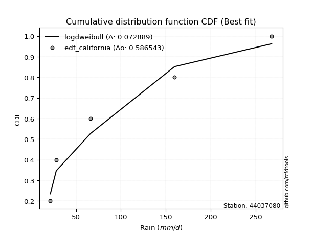</img></img>

</div>


### 2. EDF Hazen (1930)

Hazen method for plotting positions is a formula used to estimate the empirical cumulative probability distribution of flood events or other hydrological data. This formula often results in biased estimations, particularly when extrapolating to extreme events (high return periods).

<div align="center">


$P=(m-0.5)/n$


</div>


**2.1. Empirical values**

<div align="center">

|                | 0                  | 1                  | 2         | 3                 | 4                  |
|:---------------|:-------------------|:-------------------|:----------|:------------------|:-------------------|
| date           | 2023               | 2024               | 2019      | 2022              | 2020               |
| x              | 21.4               | 28.0               | 66.2      | 159.8             | 268.0              |
| m              | 1                  | 2                  | 3         | 4                 | 5                  |
| empirical_dist | edf_hazen          | edf_hazen          | edf_hazen | edf_hazen         | edf_hazen          |
| empirical      | 0.1                | 0.3                | 0.5       | 0.7               | 0.9                |
| empirical_tr   | 1.1111111111111112 | 1.4285714285714286 | 2.0       | 3.333333333333333 | 10.000000000000002 |

</div>


**2.2. Kolmogorov-Smirnov fit test (sorted by Δ)**


<div align="center">

|                | 0                     | 1                   | 2                   | 3                   | 4                   | 5                   | 6                   | 7                   | 8                  | 9                   | 10                  | 11                 | 12                  | 13                 | 14                  | 15                  | 16                  | 17                  | 18                  | 19                  | 20                  | 21                  | 22                  | 23                  | 24                  | 25                 | 26                  | 27                  | 28                  | 29                  | 30                  | 31                  | 32                  | 33                  | 34                  | 35                  | 36                  | 37                  | 38                  | 39                  | 40                  | 41                  | 42                  | 43                 | 44                  | 45                  | 46                  | 47                  | 48                  | 49                  | 50                  | 51                  | 52                  | 53                  | 54                  | 55                  | 56                  | 57                  | 58                  | 59                 | 60                 | 61                  | 62                 | 63                  | 64                  | 65                  | 66                  | 67                 | 68                  | 69                  | 70                 | 71                  | 72                  | 73                  | 74                  | 75                  | 76                  | 77                 | 78                  | 79                 | 80                 | 81                  | 82                  | 83                  | 84                  | 85                 | 86                 | 87                 | 88                 | 89                  | 90                  | 91                  | 92                 | 93                  | 94                  | 95                  | 96                 | 97                  | 98                 | 99                  | 100                 | 101                 | 102                 | 103                 | 104                | 105                 | 106                | 107                 | 108                 | 109                 | 110                | 111                 | 112                 | 113                 | 114                | 115                 | 116                 | 117                 | 118                 | 119                 | 120                 | 121                 | 122                 | 123                 | 124                 | 125                 | 126                | 127                | 128                 | 129                 | 130                 | 131                | 132                | 133                | 134                 | 135                 | 136                 | 137                 | 138                | 139                | 140                | 141                | 142                 | 143                | 144                 | 145                | 146                 | 147                | 148                 | 149                | 150                | 151                | 152                | 153                | 154                | 155                | 156                | 157                | 158                | 159                |
|:---------------|:----------------------|:--------------------|:--------------------|:--------------------|:--------------------|:--------------------|:--------------------|:--------------------|:-------------------|:--------------------|:--------------------|:-------------------|:--------------------|:-------------------|:--------------------|:--------------------|:--------------------|:--------------------|:--------------------|:--------------------|:--------------------|:--------------------|:--------------------|:--------------------|:--------------------|:-------------------|:--------------------|:--------------------|:--------------------|:--------------------|:--------------------|:--------------------|:--------------------|:--------------------|:--------------------|:--------------------|:--------------------|:--------------------|:--------------------|:--------------------|:--------------------|:--------------------|:--------------------|:-------------------|:--------------------|:--------------------|:--------------------|:--------------------|:--------------------|:--------------------|:--------------------|:--------------------|:--------------------|:--------------------|:--------------------|:--------------------|:--------------------|:--------------------|:--------------------|:-------------------|:-------------------|:--------------------|:-------------------|:--------------------|:--------------------|:--------------------|:--------------------|:-------------------|:--------------------|:--------------------|:-------------------|:--------------------|:--------------------|:--------------------|:--------------------|:--------------------|:--------------------|:-------------------|:--------------------|:-------------------|:-------------------|:--------------------|:--------------------|:--------------------|:--------------------|:-------------------|:-------------------|:-------------------|:-------------------|:--------------------|:--------------------|:--------------------|:-------------------|:--------------------|:--------------------|:--------------------|:-------------------|:--------------------|:-------------------|:--------------------|:--------------------|:--------------------|:--------------------|:--------------------|:-------------------|:--------------------|:-------------------|:--------------------|:--------------------|:--------------------|:-------------------|:--------------------|:--------------------|:--------------------|:-------------------|:--------------------|:--------------------|:--------------------|:--------------------|:--------------------|:--------------------|:--------------------|:--------------------|:--------------------|:--------------------|:--------------------|:-------------------|:-------------------|:--------------------|:--------------------|:--------------------|:-------------------|:-------------------|:-------------------|:--------------------|:--------------------|:--------------------|:--------------------|:-------------------|:-------------------|:-------------------|:-------------------|:--------------------|:-------------------|:--------------------|:-------------------|:--------------------|:-------------------|:--------------------|:-------------------|:-------------------|:-------------------|:-------------------|:-------------------|:-------------------|:-------------------|:-------------------|:-------------------|:-------------------|:-------------------|
| station        | 44037080              | 44037080            | 44037080            | 44037080            | 44037080            | 44037080            | 44037080            | 44037080            | 44037080           | 44037080            | 44037080            | 44037080           | 44037080            | 44037080           | 44037080            | 44037080            | 44037080            | 44037080            | 44037080            | 44037080            | 44037080            | 44037080            | 44037080            | 44037080            | 44037080            | 44037080           | 44037080            | 44037080            | 44037080            | 44037080            | 44037080            | 44037080            | 44037080            | 44037080            | 44037080            | 44037080            | 44037080            | 44037080            | 44037080            | 44037080            | 44037080            | 44037080            | 44037080            | 44037080           | 44037080            | 44037080            | 44037080            | 44037080            | 44037080            | 44037080            | 44037080            | 44037080            | 44037080            | 44037080            | 44037080            | 44037080            | 44037080            | 44037080            | 44037080            | 44037080           | 44037080           | 44037080            | 44037080           | 44037080            | 44037080            | 44037080            | 44037080            | 44037080           | 44037080            | 44037080            | 44037080           | 44037080            | 44037080            | 44037080            | 44037080            | 44037080            | 44037080            | 44037080           | 44037080            | 44037080           | 44037080           | 44037080            | 44037080            | 44037080            | 44037080            | 44037080           | 44037080           | 44037080           | 44037080           | 44037080            | 44037080            | 44037080            | 44037080           | 44037080            | 44037080            | 44037080            | 44037080           | 44037080            | 44037080           | 44037080            | 44037080            | 44037080            | 44037080            | 44037080            | 44037080           | 44037080            | 44037080           | 44037080            | 44037080            | 44037080            | 44037080           | 44037080            | 44037080            | 44037080            | 44037080           | 44037080            | 44037080            | 44037080            | 44037080            | 44037080            | 44037080            | 44037080            | 44037080            | 44037080            | 44037080            | 44037080            | 44037080           | 44037080           | 44037080            | 44037080            | 44037080            | 44037080           | 44037080           | 44037080           | 44037080            | 44037080            | 44037080            | 44037080            | 44037080           | 44037080           | 44037080           | 44037080           | 44037080            | 44037080           | 44037080            | 44037080           | 44037080            | 44037080           | 44037080            | 44037080           | 44037080           | 44037080           | 44037080           | 44037080           | 44037080           | 44037080           | 44037080           | 44037080           | 44037080           | 44037080           |
| empirical_dist | edf_hazen             | edf_hazen           | edf_hazen           | edf_hazen           | edf_hazen           | edf_hazen           | edf_hazen           | edf_hazen           | edf_hazen          | edf_hazen           | edf_hazen           | edf_hazen          | edf_hazen           | edf_hazen          | edf_hazen           | edf_hazen           | edf_hazen           | edf_hazen           | edf_hazen           | edf_hazen           | edf_hazen           | edf_hazen           | edf_hazen           | edf_hazen           | edf_hazen           | edf_hazen          | edf_hazen           | edf_hazen           | edf_hazen           | edf_hazen           | edf_hazen           | edf_hazen           | edf_hazen           | edf_hazen           | edf_hazen           | edf_hazen           | edf_hazen           | edf_hazen           | edf_hazen           | edf_hazen           | edf_hazen           | edf_hazen           | edf_hazen           | edf_hazen          | edf_hazen           | edf_hazen           | edf_hazen           | edf_hazen           | edf_hazen           | edf_hazen           | edf_hazen           | edf_hazen           | edf_hazen           | edf_hazen           | edf_hazen           | edf_hazen           | edf_hazen           | edf_hazen           | edf_hazen           | edf_hazen          | edf_hazen          | edf_hazen           | edf_hazen          | edf_hazen           | edf_hazen           | edf_hazen           | edf_hazen           | edf_hazen          | edf_hazen           | edf_hazen           | edf_hazen          | edf_hazen           | edf_hazen           | edf_hazen           | edf_hazen           | edf_hazen           | edf_hazen           | edf_hazen          | edf_hazen           | edf_hazen          | edf_hazen          | edf_hazen           | edf_hazen           | edf_hazen           | edf_hazen           | edf_hazen          | edf_hazen          | edf_hazen          | edf_hazen          | edf_hazen           | edf_hazen           | edf_hazen           | edf_hazen          | edf_hazen           | edf_hazen           | edf_hazen           | edf_hazen          | edf_hazen           | edf_hazen          | edf_hazen           | edf_hazen           | edf_hazen           | edf_hazen           | edf_hazen           | edf_hazen          | edf_hazen           | edf_hazen          | edf_hazen           | edf_hazen           | edf_hazen           | edf_hazen          | edf_hazen           | edf_hazen           | edf_hazen           | edf_hazen          | edf_hazen           | edf_hazen           | edf_hazen           | edf_hazen           | edf_hazen           | edf_hazen           | edf_hazen           | edf_hazen           | edf_hazen           | edf_hazen           | edf_hazen           | edf_hazen          | edf_hazen          | edf_hazen           | edf_hazen           | edf_hazen           | edf_hazen          | edf_hazen          | edf_hazen          | edf_hazen           | edf_hazen           | edf_hazen           | edf_hazen           | edf_hazen          | edf_hazen          | edf_hazen          | edf_hazen          | edf_hazen           | edf_hazen          | edf_hazen           | edf_hazen          | edf_hazen           | edf_hazen          | edf_hazen           | edf_hazen          | edf_hazen          | edf_hazen          | edf_hazen          | edf_hazen          | edf_hazen          | edf_hazen          | edf_hazen          | edf_hazen          | edf_hazen          | edf_hazen          |
| p_dist         | logmielke             | logarcsine          | logksone            | logsemicircular     | halfnorm            | logbeta             | exponweib           | logrdist            | logwrapcauchy      | loganglit           | logtrapezoid        | betaprime          | halflogistic        | exponpow           | foldnorm            | gengamma            | loglomax            | burr12              | logexponpow         | nct                 | logburr             | lograyleigh         | alpha               | loghalfgennorm      | loggenlogistic      | loghalfnorm        | nakagami            | loginvweibull       | logexponweib        | loginvgamma         | logmaxwell          | lognct              | logfoldnorm         | logncf              | logkstwobign        | ncf                 | logburr12           | logbetaprime        | logalpha            | loggamma            | loggamma            | logloggamma         | logerlang           | logpearson3        | logskewnorm         | logcrystalball      | lognorm             | logt                | logexponnorm        | logjohnsonsu        | genlogistic         | ksone               | loggenexpon         | moyal               | rayleigh            | gumbel_r            | dgamma              | logloglaplace       | gausshyper          | pearson3           | genexpon           | logcosine           | semicircular       | maxwell             | loginvgauss         | loggumbel_l         | loglogistic         | logrice            | loggumbel_r         | kstwobign           | logbradford        | truncexpon          | truncweibull_min    | logdweibull         | anglit              | logweibull_max      | logtruncexpon       | dweibull           | loghypsecant        | loggompertz        | loghalflogistic    | burr                | logargus            | loggenpareto        | loggausshyper       | logtriang          | loglaplace         | loglaplace         | invgamma           | logmoyal            | logtruncweibull_min | arcsine             | logkappa4          | f                   | crystalball         | norm                | t                  | invgauss            | logdgamma          | loggenextreme       | logtukeylambda      | rice                | gennorm             | loguniform          | logkappa3          | logvonmises_line    | logistic           | wrapcauchy          | weibull_min         | loglevy_l           | loggennorm         | logf                | cosine              | hypsecant           | johnsonsu          | halfgennorm         | lomax               | gompertz            | exponnorm           | truncnorm           | gumbel_l            | laplace             | loggenhalflogistic  | kappa4              | genpareto           | argus               | skewnorm           | bradford           | levy_l              | logweibull_min      | gamma               | wald               | triang             | logwald            | beta                | tukeylambda         | fatiguelife         | uniform             | vonmises_line      | erlang             | truncpareto        | genhalflogistic    | powerlaw            | genextreme         | lognakagami         | logfatiguelife     | kappa3              | johnsonsb          | trapezoid           | logpowerlaw        | invweibull         | logtruncpareto     | loggengamma        | logtruncnorm       | logjohnsonsb       | rdist              | weibull_max        | logvonmises        | vonmises           | mielke             |
| delta          | 0.0064654644932371635 | 0.06853992799239642 | 0.07256862266899952 | 0.08897877764467571 | 0.09980253156396868 | 0.09999981742747499 | 0.09999983603846782 | 0.09999999663271686 | 0.1                | 0.10080792131986951 | 0.10276158414966202 | 0.1055320831029013 | 0.11248682531389934 | 0.1125246341577325 | 0.11275323136052834 | 0.11417245774196705 | 0.11479882410409004 | 0.11514544073440514 | 0.11547481950333682 | 0.11567179051105514 | 0.11594700279214476 | 0.11755131137875621 | 0.11850584878486448 | 0.11858699837857889 | 0.11874537857061074 | 0.1190960005765905 | 0.11928760995869431 | 0.11934290679960532 | 0.11979208377651773 | 0.11984572148377828 | 0.12025696811539038 | 0.12069833110271316 | 0.12095947000749874 | 0.12097489971979203 | 0.12120829148039633 | 0.12253412803208558 | 0.12502117763032672 | 0.12511706225338112 | 0.12564678891423886 | 0.12617430889974218 | 0.12617430889974218 | 0.12638357041649834 | 0.12701910996888716 | 0.127062712910516  | 0.12742763646390448 | 0.12746751813028775 | 0.12746765339482086 | 0.12746784425919133 | 0.12746814527847913 | 0.12766356972446552 | 0.13037641185104504 | 0.13119351251799016 | 0.13158874307548707 | 0.13190228066587256 | 0.13295886660160444 | 0.13361032706141796 | 0.13408934224109803 | 0.13747230832622043 | 0.13892634652946495 | 0.1406397785087518 | 0.1419603605645805 | 0.14251757172162127 | 0.1430171155450759 | 0.14462139660916679 | 0.14521894273786506 | 0.14597967855316163 | 0.14717310406276865 | 0.1475697428305986 | 0.14812714858259524 | 0.14920994769365054 | 0.1501322716698995 | 0.15029498923854698 | 0.15134562573018695 | 0.15185817306423566 | 0.15245568460825654 | 0.15361655364746177 | 0.15423930014539022 | 0.1561845035329057 | 0.15794345531022433 | 0.1582193002496835 | 0.1599700214240889 | 0.16018288142378123 | 0.16166810371325163 | 0.16521217295023619 | 0.16605131285510688 | 0.1663799472187945 | 0.1684614443427736 | 0.1684614443427736 | 0.1686257093015664 | 0.16951760708136604 | 0.17008689586297931 | 0.17121714580775246 | 0.1714557624900417 | 0.17189223262561182 | 0.17480147800805967 | 0.17480148009756658 | 0.1748085359198096 | 0.17539976576208494 | 0.175611529029556  | 0.17618011261025035 | 0.18643245505783596 | 0.19143044990951974 | 0.19246684548014936 | 0.19364851743409983 | 0.1936936453995572 | 0.19370078390242976 | 0.194667772252417  | 0.19489555588912189 | 0.19667487752206803 | 0.19853155278159193 | 0.2                | 0.20595289591206334 | 0.20858787499728332 | 0.20958161176454465 | 0.210489684040007  | 0.21359662919123412 | 0.22265624489662927 | 0.22646307586252545 | 0.22646362962675876 | 0.22701169863484044 | 0.23054624511360733 | 0.23660062871623483 | 0.23986909491857034 | 0.23988842528402046 | 0.25652886872622177 | 0.25687697831939316 | 0.2589012097552118 | 0.259338507589124  | 0.26084113352475324 | 0.26624197634041546 | 0.27591337258150483 | 0.2810956752655177 | 0.298073796498315  | 0.2999388616400038 | 0.30537114695816037 | 0.30656920329327164 | 0.31051487622614343 | 0.31832927818329276 | 0.3234019424949076 | 0.3251236098665601 | 0.3501864773793908 | 0.3590291792015595 | 0.36687244253917034 | 0.3788366264395272 | 0.38736547584279585 | 0.39622765963819   | 0.41680991046115096 | 0.4391954502272076 | 0.44464500333991686 | 0.4533019433717606 | 0.4575428822940885 | 0.4581481647191528 | 0.4666757394118313 | 0.4999961381507031 | 0.5027814907465382 | 0.5302573370402216 | 0.6182549080783324 | 1.1055182121856872 | 42.061740063422185 | nan                |
| deltao         | 0.5865427407550001    | 0.5865427407550001  | 0.5865427407550001  | 0.5865427407550001  | 0.5865427407550001  | 0.5865427407550001  | 0.5865427407550001  | 0.5865427407550001  | 0.5865427407550001 | 0.5865427407550001  | 0.5865427407550001  | 0.5865427407550001 | 0.5865427407550001  | 0.5865427407550001 | 0.5865427407550001  | 0.5865427407550001  | 0.5865427407550001  | 0.5865427407550001  | 0.5865427407550001  | 0.5865427407550001  | 0.5865427407550001  | 0.5865427407550001  | 0.5865427407550001  | 0.5865427407550001  | 0.5865427407550001  | 0.5865427407550001 | 0.5865427407550001  | 0.5865427407550001  | 0.5865427407550001  | 0.5865427407550001  | 0.5865427407550001  | 0.5865427407550001  | 0.5865427407550001  | 0.5865427407550001  | 0.5865427407550001  | 0.5865427407550001  | 0.5865427407550001  | 0.5865427407550001  | 0.5865427407550001  | 0.5865427407550001  | 0.5865427407550001  | 0.5865427407550001  | 0.5865427407550001  | 0.5865427407550001 | 0.5865427407550001  | 0.5865427407550001  | 0.5865427407550001  | 0.5865427407550001  | 0.5865427407550001  | 0.5865427407550001  | 0.5865427407550001  | 0.5865427407550001  | 0.5865427407550001  | 0.5865427407550001  | 0.5865427407550001  | 0.5865427407550001  | 0.5865427407550001  | 0.5865427407550001  | 0.5865427407550001  | 0.5865427407550001 | 0.5865427407550001 | 0.5865427407550001  | 0.5865427407550001 | 0.5865427407550001  | 0.5865427407550001  | 0.5865427407550001  | 0.5865427407550001  | 0.5865427407550001 | 0.5865427407550001  | 0.5865427407550001  | 0.5865427407550001 | 0.5865427407550001  | 0.5865427407550001  | 0.5865427407550001  | 0.5865427407550001  | 0.5865427407550001  | 0.5865427407550001  | 0.5865427407550001 | 0.5865427407550001  | 0.5865427407550001 | 0.5865427407550001 | 0.5865427407550001  | 0.5865427407550001  | 0.5865427407550001  | 0.5865427407550001  | 0.5865427407550001 | 0.5865427407550001 | 0.5865427407550001 | 0.5865427407550001 | 0.5865427407550001  | 0.5865427407550001  | 0.5865427407550001  | 0.5865427407550001 | 0.5865427407550001  | 0.5865427407550001  | 0.5865427407550001  | 0.5865427407550001 | 0.5865427407550001  | 0.5865427407550001 | 0.5865427407550001  | 0.5865427407550001  | 0.5865427407550001  | 0.5865427407550001  | 0.5865427407550001  | 0.5865427407550001 | 0.5865427407550001  | 0.5865427407550001 | 0.5865427407550001  | 0.5865427407550001  | 0.5865427407550001  | 0.5865427407550001 | 0.5865427407550001  | 0.5865427407550001  | 0.5865427407550001  | 0.5865427407550001 | 0.5865427407550001  | 0.5865427407550001  | 0.5865427407550001  | 0.5865427407550001  | 0.5865427407550001  | 0.5865427407550001  | 0.5865427407550001  | 0.5865427407550001  | 0.5865427407550001  | 0.5865427407550001  | 0.5865427407550001  | 0.5865427407550001 | 0.5865427407550001 | 0.5865427407550001  | 0.5865427407550001  | 0.5865427407550001  | 0.5865427407550001 | 0.5865427407550001 | 0.5865427407550001 | 0.5865427407550001  | 0.5865427407550001  | 0.5865427407550001  | 0.5865427407550001  | 0.5865427407550001 | 0.5865427407550001 | 0.5865427407550001 | 0.5865427407550001 | 0.5865427407550001  | 0.5865427407550001 | 0.5865427407550001  | 0.5865427407550001 | 0.5865427407550001  | 0.5865427407550001 | 0.5865427407550001  | 0.5865427407550001 | 0.5865427407550001 | 0.5865427407550001 | 0.5865427407550001 | 0.5865427407550001 | 0.5865427407550001 | 0.5865427407550001 | 0.5865427407550001 | 0.5865427407550001 | 0.5865427407550001 | 0.5865427407550001 |
| eval           | Δo > Δ                | Δo > Δ              | Δo > Δ              | Δo > Δ              | Δo > Δ              | Δo > Δ              | Δo > Δ              | Δo > Δ              | Δo > Δ             | Δo > Δ              | Δo > Δ              | Δo > Δ             | Δo > Δ              | Δo > Δ             | Δo > Δ              | Δo > Δ              | Δo > Δ              | Δo > Δ              | Δo > Δ              | Δo > Δ              | Δo > Δ              | Δo > Δ              | Δo > Δ              | Δo > Δ              | Δo > Δ              | Δo > Δ             | Δo > Δ              | Δo > Δ              | Δo > Δ              | Δo > Δ              | Δo > Δ              | Δo > Δ              | Δo > Δ              | Δo > Δ              | Δo > Δ              | Δo > Δ              | Δo > Δ              | Δo > Δ              | Δo > Δ              | Δo > Δ              | Δo > Δ              | Δo > Δ              | Δo > Δ              | Δo > Δ             | Δo > Δ              | Δo > Δ              | Δo > Δ              | Δo > Δ              | Δo > Δ              | Δo > Δ              | Δo > Δ              | Δo > Δ              | Δo > Δ              | Δo > Δ              | Δo > Δ              | Δo > Δ              | Δo > Δ              | Δo > Δ              | Δo > Δ              | Δo > Δ             | Δo > Δ             | Δo > Δ              | Δo > Δ             | Δo > Δ              | Δo > Δ              | Δo > Δ              | Δo > Δ              | Δo > Δ             | Δo > Δ              | Δo > Δ              | Δo > Δ             | Δo > Δ              | Δo > Δ              | Δo > Δ              | Δo > Δ              | Δo > Δ              | Δo > Δ              | Δo > Δ             | Δo > Δ              | Δo > Δ             | Δo > Δ             | Δo > Δ              | Δo > Δ              | Δo > Δ              | Δo > Δ              | Δo > Δ             | Δo > Δ             | Δo > Δ             | Δo > Δ             | Δo > Δ              | Δo > Δ              | Δo > Δ              | Δo > Δ             | Δo > Δ              | Δo > Δ              | Δo > Δ              | Δo > Δ             | Δo > Δ              | Δo > Δ             | Δo > Δ              | Δo > Δ              | Δo > Δ              | Δo > Δ              | Δo > Δ              | Δo > Δ             | Δo > Δ              | Δo > Δ             | Δo > Δ              | Δo > Δ              | Δo > Δ              | Δo > Δ             | Δo > Δ              | Δo > Δ              | Δo > Δ              | Δo > Δ             | Δo > Δ              | Δo > Δ              | Δo > Δ              | Δo > Δ              | Δo > Δ              | Δo > Δ              | Δo > Δ              | Δo > Δ              | Δo > Δ              | Δo > Δ              | Δo > Δ              | Δo > Δ             | Δo > Δ             | Δo > Δ              | Δo > Δ              | Δo > Δ              | Δo > Δ             | Δo > Δ             | Δo > Δ             | Δo > Δ              | Δo > Δ              | Δo > Δ              | Δo > Δ              | Δo > Δ             | Δo > Δ             | Δo > Δ             | Δo > Δ             | Δo > Δ              | Δo > Δ             | Δo > Δ              | Δo > Δ             | Δo > Δ              | Δo > Δ             | Δo > Δ              | Δo > Δ             | Δo > Δ             | Δo > Δ             | Δo > Δ             | Δo > Δ             | Δo > Δ             | Δo > Δ             | Δo <= Δ            | Δo <= Δ            | Δo <= Δ            | Δo <= Δ            |
| fit            | 1                     | 1                   | 1                   | 1                   | 1                   | 1                   | 1                   | 1                   | 1                  | 1                   | 1                   | 1                  | 1                   | 1                  | 1                   | 1                   | 1                   | 1                   | 1                   | 1                   | 1                   | 1                   | 1                   | 1                   | 1                   | 1                  | 1                   | 1                   | 1                   | 1                   | 1                   | 1                   | 1                   | 1                   | 1                   | 1                   | 1                   | 1                   | 1                   | 1                   | 1                   | 1                   | 1                   | 1                  | 1                   | 1                   | 1                   | 1                   | 1                   | 1                   | 1                   | 1                   | 1                   | 1                   | 1                   | 1                   | 1                   | 1                   | 1                   | 1                  | 1                  | 1                   | 1                  | 1                   | 1                   | 1                   | 1                   | 1                  | 1                   | 1                   | 1                  | 1                   | 1                   | 1                   | 1                   | 1                   | 1                   | 1                  | 1                   | 1                  | 1                  | 1                   | 1                   | 1                   | 1                   | 1                  | 1                  | 1                  | 1                  | 1                   | 1                   | 1                   | 1                  | 1                   | 1                   | 1                   | 1                  | 1                   | 1                  | 1                   | 1                   | 1                   | 1                   | 1                   | 1                  | 1                   | 1                  | 1                   | 1                   | 1                   | 1                  | 1                   | 1                   | 1                   | 1                  | 1                   | 1                   | 1                   | 1                   | 1                   | 1                   | 1                   | 1                   | 1                   | 1                   | 1                   | 1                  | 1                  | 1                   | 1                   | 1                   | 1                  | 1                  | 1                  | 1                   | 1                   | 1                   | 1                   | 1                  | 1                  | 1                  | 1                  | 1                   | 1                  | 1                   | 1                  | 1                   | 1                  | 1                   | 1                  | 1                  | 1                  | 1                  | 1                  | 1                  | 1                  | 0                  | 0                  | 0                  | 0                  |
| n              | 5                     | 5                   | 5                   | 5                   | 5                   | 5                   | 5                   | 5                   | 5                  | 5                   | 5                   | 5                  | 5                   | 5                  | 5                   | 5                   | 5                   | 5                   | 5                   | 5                   | 5                   | 5                   | 5                   | 5                   | 5                   | 5                  | 5                   | 5                   | 5                   | 5                   | 5                   | 5                   | 5                   | 5                   | 5                   | 5                   | 5                   | 5                   | 5                   | 5                   | 5                   | 5                   | 5                   | 5                  | 5                   | 5                   | 5                   | 5                   | 5                   | 5                   | 5                   | 5                   | 5                   | 5                   | 5                   | 5                   | 5                   | 5                   | 5                   | 5                  | 5                  | 5                   | 5                  | 5                   | 5                   | 5                   | 5                   | 5                  | 5                   | 5                   | 5                  | 5                   | 5                   | 5                   | 5                   | 5                   | 5                   | 5                  | 5                   | 5                  | 5                  | 5                   | 5                   | 5                   | 5                   | 5                  | 5                  | 5                  | 5                  | 5                   | 5                   | 5                   | 5                  | 5                   | 5                   | 5                   | 5                  | 5                   | 5                  | 5                   | 5                   | 5                   | 5                   | 5                   | 5                  | 5                   | 5                  | 5                   | 5                   | 5                   | 5                  | 5                   | 5                   | 5                   | 5                  | 5                   | 5                   | 5                   | 5                   | 5                   | 5                   | 5                   | 5                   | 5                   | 5                   | 5                   | 5                  | 5                  | 5                   | 5                   | 5                   | 5                  | 5                  | 5                  | 5                   | 5                   | 5                   | 5                   | 5                  | 5                  | 5                  | 5                  | 5                   | 5                  | 5                   | 5                  | 5                   | 5                  | 5                   | 5                  | 5                  | 5                  | 5                  | 5                  | 5                  | 5                  | 5                  | 5                  | 5                  | 5                  |
| best_fit       | 1                     | 0                   | 0                   | 0                   | 0                   | 0                   | 0                   | 0                   | 0                  | 0                   | 0                   | 0                  | 0                   | 0                  | 0                   | 0                   | 0                   | 0                   | 0                   | 0                   | 0                   | 0                   | 0                   | 0                   | 0                   | 0                  | 0                   | 0                   | 0                   | 0                   | 0                   | 0                   | 0                   | 0                   | 0                   | 0                   | 0                   | 0                   | 0                   | 0                   | 0                   | 0                   | 0                   | 0                  | 0                   | 0                   | 0                   | 0                   | 0                   | 0                   | 0                   | 0                   | 0                   | 0                   | 0                   | 0                   | 0                   | 0                   | 0                   | 0                  | 0                  | 0                   | 0                  | 0                   | 0                   | 0                   | 0                   | 0                  | 0                   | 0                   | 0                  | 0                   | 0                   | 0                   | 0                   | 0                   | 0                   | 0                  | 0                   | 0                  | 0                  | 0                   | 0                   | 0                   | 0                   | 0                  | 0                  | 0                  | 0                  | 0                   | 0                   | 0                   | 0                  | 0                   | 0                   | 0                   | 0                  | 0                   | 0                  | 0                   | 0                   | 0                   | 0                   | 0                   | 0                  | 0                   | 0                  | 0                   | 0                   | 0                   | 0                  | 0                   | 0                   | 0                   | 0                  | 0                   | 0                   | 0                   | 0                   | 0                   | 0                   | 0                   | 0                   | 0                   | 0                   | 0                   | 0                  | 0                  | 0                   | 0                   | 0                   | 0                  | 0                  | 0                  | 0                   | 0                   | 0                   | 0                   | 0                  | 0                  | 0                  | 0                  | 0                   | 0                  | 0                   | 0                  | 0                   | 0                  | 0                   | 0                  | 0                  | 0                  | 0                  | 0                  | 0                  | 0                  | 0                  | 0                  | 0                  | 0                  |
| best_fit_sort  | 1                     | 2                   | 3                   | 4                   | 5                   | 6                   | 7                   | 8                   | 9                  | 10                  | 11                  | 12                 | 13                  | 14                 | 15                  | 16                  | 17                  | 18                  | 19                  | 20                  | 21                  | 22                  | 23                  | 24                  | 25                  | 26                 | 27                  | 28                  | 29                  | 30                  | 31                  | 32                  | 33                  | 34                  | 35                  | 36                  | 37                  | 38                  | 39                  | 40                  | 41                  | 42                  | 43                  | 44                 | 45                  | 46                  | 47                  | 48                  | 49                  | 50                  | 51                  | 52                  | 53                  | 54                  | 55                  | 56                  | 57                  | 58                  | 59                  | 60                 | 61                 | 62                  | 63                 | 64                  | 65                  | 66                  | 67                  | 68                 | 69                  | 70                  | 71                 | 72                  | 73                  | 74                  | 75                  | 76                  | 77                  | 78                 | 79                  | 80                 | 81                 | 82                  | 83                  | 84                  | 85                  | 86                 | 87                 | 88                 | 89                 | 90                  | 91                  | 92                  | 93                 | 94                  | 95                  | 96                  | 97                 | 98                  | 99                 | 100                 | 101                 | 102                 | 103                 | 104                 | 105                | 106                 | 107                | 108                 | 109                 | 110                 | 111                | 112                 | 113                 | 114                 | 115                | 116                 | 117                 | 118                 | 119                 | 120                 | 121                 | 122                 | 123                 | 124                 | 125                 | 126                 | 127                | 128                | 129                 | 130                 | 131                 | 132                | 133                | 134                | 135                 | 136                 | 137                 | 138                 | 139                | 140                | 141                | 142                | 143                 | 144                | 145                 | 146                | 147                 | 148                | 149                 | 150                | 151                | 152                | 153                | 154                | 155                | 156                | 157                | 158                | 159                | 160                |

</div>


**2.3. Best fit**

<div align="center">

|   id |   station | empirical_dist   | p_dist    |      delta |   deltao | eval   |   fit |   n |   best_fit |   best_fit_sort |
|-----:|----------:|:-----------------|:----------|-----------:|---------:|:-------|------:|----:|-----------:|----------------:|
|    0 |  44037080 | edf_hazen        | logmielke | 0.00646546 | 0.586543 | Δo > Δ |     1 |   5 |          1 |               1 |

</div>


<div align="center">

</img>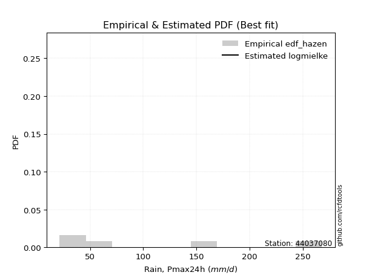</img>

</div>


### 3. EDF Weibull (1939)

Weibull plotting position formula is an empirical method used to estimate the non-exceedance probability or plotting position for a set of observed data, is often recommended or widely used in practice, particularly in flood frequency analysis.

<div align="center">


$P=m/(n+1)$


</div>


**3.1. Empirical values**

<div align="center">

|                | 0                   | 1                  | 2           | 3                  | 4                  |
|:---------------|:--------------------|:-------------------|:------------|:-------------------|:-------------------|
| date           | 2023                | 2024               | 2019        | 2022               | 2020               |
| x              | 21.4                | 28.0               | 66.2        | 159.8              | 268.0              |
| m              | 1                   | 2                  | 3           | 4                  | 5                  |
| empirical_dist | edf_weibull         | edf_weibull        | edf_weibull | edf_weibull        | edf_weibull        |
| empirical      | 0.16666666666666666 | 0.3333333333333333 | 0.5         | 0.6666666666666666 | 0.8333333333333334 |
| empirical_tr   | 1.2                 | 1.4999999999999998 | 2.0         | 2.9999999999999996 | 6.000000000000002  |

</div>


**3.2. Kolmogorov-Smirnov fit test (sorted by Δ)**


<div align="center">

|                | 0                   | 1                   | 2                   | 3                   | 4                   | 5                   | 6                   | 7                   | 8                  | 9                   | 10                  | 11                  | 12                 | 13                 | 14                  | 15                  | 16                  | 17                  | 18                 | 19                  | 20                  | 21                 | 22                  | 23                  | 24                  | 25                  | 26                 | 27                 | 28                 | 29                  | 30                  | 31                  | 32                 | 33                  | 34                 | 35                  | 36                  | 37                 | 38                 | 39                 | 40                  | 41                  | 42                  | 43                 | 44                  | 45                  | 46                  | 47                  | 48                  | 49                 | 50                 | 51                  | 52                 | 53                  | 54                  | 55                  | 56                  | 57                 | 58                  | 59                  | 60                 | 61                 | 62                 | 63                  | 64                  | 65                  | 66                  | 67                  | 68                  | 69                  | 70                  | 71                 | 72                  | 73                  | 74                  | 75                  | 76                 | 77                  | 78                  | 79                 | 80                  | 81                  | 82                  | 83                  | 84                  | 85                  | 86                  | 87                  | 88                  | 89                  | 90                  | 91                  | 92                  | 93                  | 94                  | 95                  | 96                 | 97                  | 98                 | 99                 | 100                 | 101                 | 102                 | 103                 | 104                 | 105                 | 106                 | 107                 | 108                 | 109                 | 110                | 111                 | 112                | 113                 | 114                 | 115                 | 116                 | 117                 | 118                 | 119                | 120                 | 121                | 122                 | 123                 | 124                | 125                | 126                 | 127                 | 128                 | 129                | 130                 | 131                 | 132                | 133                | 134                 | 135                 | 136                 | 137                 | 138                | 139                | 140                | 141                | 142                | 143                | 144                | 145                | 146                | 147                 | 148                 | 149                | 150                 | 151                | 152                 | 153                 | 154                | 155                 | 156                | 157                | 158                | 159                |
|:---------------|:--------------------|:--------------------|:--------------------|:--------------------|:--------------------|:--------------------|:--------------------|:--------------------|:-------------------|:--------------------|:--------------------|:--------------------|:-------------------|:-------------------|:--------------------|:--------------------|:--------------------|:--------------------|:-------------------|:--------------------|:--------------------|:-------------------|:--------------------|:--------------------|:--------------------|:--------------------|:-------------------|:-------------------|:-------------------|:--------------------|:--------------------|:--------------------|:-------------------|:--------------------|:-------------------|:--------------------|:--------------------|:-------------------|:-------------------|:-------------------|:--------------------|:--------------------|:--------------------|:-------------------|:--------------------|:--------------------|:--------------------|:--------------------|:--------------------|:-------------------|:-------------------|:--------------------|:-------------------|:--------------------|:--------------------|:--------------------|:--------------------|:-------------------|:--------------------|:--------------------|:-------------------|:-------------------|:-------------------|:--------------------|:--------------------|:--------------------|:--------------------|:--------------------|:--------------------|:--------------------|:--------------------|:-------------------|:--------------------|:--------------------|:--------------------|:--------------------|:-------------------|:--------------------|:--------------------|:-------------------|:--------------------|:--------------------|:--------------------|:--------------------|:--------------------|:--------------------|:--------------------|:--------------------|:--------------------|:--------------------|:--------------------|:--------------------|:--------------------|:--------------------|:--------------------|:--------------------|:-------------------|:--------------------|:-------------------|:-------------------|:--------------------|:--------------------|:--------------------|:--------------------|:--------------------|:--------------------|:--------------------|:--------------------|:--------------------|:--------------------|:-------------------|:--------------------|:-------------------|:--------------------|:--------------------|:--------------------|:--------------------|:--------------------|:--------------------|:-------------------|:--------------------|:-------------------|:--------------------|:--------------------|:-------------------|:-------------------|:--------------------|:--------------------|:--------------------|:-------------------|:--------------------|:--------------------|:-------------------|:-------------------|:--------------------|:--------------------|:--------------------|:--------------------|:-------------------|:-------------------|:-------------------|:-------------------|:-------------------|:-------------------|:-------------------|:-------------------|:-------------------|:--------------------|:--------------------|:-------------------|:--------------------|:-------------------|:--------------------|:--------------------|:-------------------|:--------------------|:-------------------|:-------------------|:-------------------|:-------------------|
| station        | 44037080            | 44037080            | 44037080            | 44037080            | 44037080            | 44037080            | 44037080            | 44037080            | 44037080           | 44037080            | 44037080            | 44037080            | 44037080           | 44037080           | 44037080            | 44037080            | 44037080            | 44037080            | 44037080           | 44037080            | 44037080            | 44037080           | 44037080            | 44037080            | 44037080            | 44037080            | 44037080           | 44037080           | 44037080           | 44037080            | 44037080            | 44037080            | 44037080           | 44037080            | 44037080           | 44037080            | 44037080            | 44037080           | 44037080           | 44037080           | 44037080            | 44037080            | 44037080            | 44037080           | 44037080            | 44037080            | 44037080            | 44037080            | 44037080            | 44037080           | 44037080           | 44037080            | 44037080           | 44037080            | 44037080            | 44037080            | 44037080            | 44037080           | 44037080            | 44037080            | 44037080           | 44037080           | 44037080           | 44037080            | 44037080            | 44037080            | 44037080            | 44037080            | 44037080            | 44037080            | 44037080            | 44037080           | 44037080            | 44037080            | 44037080            | 44037080            | 44037080           | 44037080            | 44037080            | 44037080           | 44037080            | 44037080            | 44037080            | 44037080            | 44037080            | 44037080            | 44037080            | 44037080            | 44037080            | 44037080            | 44037080            | 44037080            | 44037080            | 44037080            | 44037080            | 44037080            | 44037080           | 44037080            | 44037080           | 44037080           | 44037080            | 44037080            | 44037080            | 44037080            | 44037080            | 44037080            | 44037080            | 44037080            | 44037080            | 44037080            | 44037080           | 44037080            | 44037080           | 44037080            | 44037080            | 44037080            | 44037080            | 44037080            | 44037080            | 44037080           | 44037080            | 44037080           | 44037080            | 44037080            | 44037080           | 44037080           | 44037080            | 44037080            | 44037080            | 44037080           | 44037080            | 44037080            | 44037080           | 44037080           | 44037080            | 44037080            | 44037080            | 44037080            | 44037080           | 44037080           | 44037080           | 44037080           | 44037080           | 44037080           | 44037080           | 44037080           | 44037080           | 44037080            | 44037080            | 44037080           | 44037080            | 44037080           | 44037080            | 44037080            | 44037080           | 44037080            | 44037080           | 44037080           | 44037080           | 44037080           |
| empirical_dist | edf_weibull         | edf_weibull         | edf_weibull         | edf_weibull         | edf_weibull         | edf_weibull         | edf_weibull         | edf_weibull         | edf_weibull        | edf_weibull         | edf_weibull         | edf_weibull         | edf_weibull        | edf_weibull        | edf_weibull         | edf_weibull         | edf_weibull         | edf_weibull         | edf_weibull        | edf_weibull         | edf_weibull         | edf_weibull        | edf_weibull         | edf_weibull         | edf_weibull         | edf_weibull         | edf_weibull        | edf_weibull        | edf_weibull        | edf_weibull         | edf_weibull         | edf_weibull         | edf_weibull        | edf_weibull         | edf_weibull        | edf_weibull         | edf_weibull         | edf_weibull        | edf_weibull        | edf_weibull        | edf_weibull         | edf_weibull         | edf_weibull         | edf_weibull        | edf_weibull         | edf_weibull         | edf_weibull         | edf_weibull         | edf_weibull         | edf_weibull        | edf_weibull        | edf_weibull         | edf_weibull        | edf_weibull         | edf_weibull         | edf_weibull         | edf_weibull         | edf_weibull        | edf_weibull         | edf_weibull         | edf_weibull        | edf_weibull        | edf_weibull        | edf_weibull         | edf_weibull         | edf_weibull         | edf_weibull         | edf_weibull         | edf_weibull         | edf_weibull         | edf_weibull         | edf_weibull        | edf_weibull         | edf_weibull         | edf_weibull         | edf_weibull         | edf_weibull        | edf_weibull         | edf_weibull         | edf_weibull        | edf_weibull         | edf_weibull         | edf_weibull         | edf_weibull         | edf_weibull         | edf_weibull         | edf_weibull         | edf_weibull         | edf_weibull         | edf_weibull         | edf_weibull         | edf_weibull         | edf_weibull         | edf_weibull         | edf_weibull         | edf_weibull         | edf_weibull        | edf_weibull         | edf_weibull        | edf_weibull        | edf_weibull         | edf_weibull         | edf_weibull         | edf_weibull         | edf_weibull         | edf_weibull         | edf_weibull         | edf_weibull         | edf_weibull         | edf_weibull         | edf_weibull        | edf_weibull         | edf_weibull        | edf_weibull         | edf_weibull         | edf_weibull         | edf_weibull         | edf_weibull         | edf_weibull         | edf_weibull        | edf_weibull         | edf_weibull        | edf_weibull         | edf_weibull         | edf_weibull        | edf_weibull        | edf_weibull         | edf_weibull         | edf_weibull         | edf_weibull        | edf_weibull         | edf_weibull         | edf_weibull        | edf_weibull        | edf_weibull         | edf_weibull         | edf_weibull         | edf_weibull         | edf_weibull        | edf_weibull        | edf_weibull        | edf_weibull        | edf_weibull        | edf_weibull        | edf_weibull        | edf_weibull        | edf_weibull        | edf_weibull         | edf_weibull         | edf_weibull        | edf_weibull         | edf_weibull        | edf_weibull         | edf_weibull         | edf_weibull        | edf_weibull         | edf_weibull        | edf_weibull        | edf_weibull        | edf_weibull        |
| p_dist         | logmielke           | logarcsine          | logksone            | foldnorm            | halfnorm            | logsemicircular     | loglevy_l           | rayleigh            | dweibull           | loganglit           | betaprime           | dgamma              | pearson3           | semicircular       | maxwell             | halflogistic        | nct                 | logburr             | gumbel_r           | logtrapezoid        | lograyleigh         | alpha              | loggenlogistic      | loghalfnorm         | anglit              | loginvweibull       | loginvgamma        | logmaxwell         | lognct             | burr12              | logfoldnorm         | logncf              | loginvgauss        | logkstwobign        | ncf                | ksone               | logbetaprime        | logalpha           | loggamma           | loggamma           | logloggamma         | logerlang           | logpearson3         | logskewnorm        | logcrystalball      | lognorm             | logt                | logexponnorm        | logjohnsonsu        | genlogistic        | moyal              | loggenexpon         | loggenpareto       | wrapcauchy          | logbeta             | gengamma            | exponweib           | nakagami           | logexponpow         | logburr12           | loghalfgennorm     | logrdist           | exponpow           | logweibull_max      | loglomax            | truncexpon          | logexponweib        | arcsine             | logwrapcauchy       | loggennorm          | gausshyper          | invgamma           | logloglaplace       | f                   | crystalball         | norm                | t                  | genexpon            | kstwobign           | logcosine          | loggenextreme       | loggumbel_l         | loglogistic         | logrice             | loggumbel_r         | logbradford         | truncweibull_min    | logdweibull         | logtruncexpon       | invgauss            | loghypsecant        | rice                | loggompertz         | loghalflogistic     | burr                | levy_l              | logistic           | logargus            | loggausshyper      | logweibull_min     | logtriang           | loglaplace          | loglaplace          | logmoyal            | logtruncweibull_min | logkappa4           | logf                | cosine              | logdgamma           | hypsecant           | johnsonsu          | logtukeylambda      | gennorm            | loguniform          | logkappa3           | logvonmises_line    | weibull_min         | gumbel_l            | laplace             | beta               | halfgennorm         | lomax              | genpareto           | argus               | gompertz           | exponnorm          | truncnorm           | loggenhalflogistic  | kappa4              | fatiguelife        | skewnorm            | bradford            | triang             | gamma              | tukeylambda         | genextreme          | wald                | uniform             | vonmises_line      | erlang             | logwald            | powerlaw           | kappa3             | truncpareto        | lognakagami        | genhalflogistic    | logfatiguelife     | invweibull          | johnsonsb           | logpowerlaw        | logtruncpareto      | loggengamma        | trapezoid           | logjohnsonsb        | logtruncnorm       | rdist               | weibull_max        | logvonmises        | vonmises           | mielke             |
| delta          | 0.07313213115990382 | 0.09443930435712244 | 0.10590195600233285 | 0.11275323136052834 | 0.11357028988439488 | 0.12231211097800904 | 0.13186488611492528 | 0.13295886660160444 | 0.1337917455049521 | 0.13414125465320284 | 0.13886541643623462 | 0.13940571392458068 | 0.1406397785087518 | 0.1430171155450759 | 0.14462139660916679 | 0.14582015864723266 | 0.14900512384438847 | 0.14928033612547809 | 0.1494439006401352 | 0.14965063029013015 | 0.15088464471208954 | 0.1518391821181978 | 0.15207871190394406 | 0.15242933390992383 | 0.15245568460825654 | 0.15267624013293865 | 0.1531790548171116 | 0.1535903014487237 | 0.1540316644360465 | 0.15414473667119985 | 0.15429280334083206 | 0.15430823305312535 | 0.1543270491070824 | 0.15454162481372966 | 0.1558674613654189 | 0.15734322012259927 | 0.15845039558671445 | 0.1589801222475722 | 0.1595076422330755 | 0.1595076422330755 | 0.15971690374983166 | 0.16035244330222048 | 0.16039604624384932 | 0.1607609697972378 | 0.16080085146362108 | 0.16080098672815418 | 0.16080117759252466 | 0.16080147861181246 | 0.16099690305779885 | 0.1620701736844766 | 0.1652356139992059 | 0.16635793067611487 | 0.1666659946980048 | 0.16666634432031702 | 0.16666648409414164 | 0.16666648544422819 | 0.16666650270513447 | 0.1666666220398916 | 0.16666662587297423 | 0.16666663397617726 | 0.1666666591127973 | 0.1666666632993835 | 0.1666666655016623 | 0.16666666607006764 | 0.16666666666634916 | 0.16666666666646557 | 0.16666666666662366 | 0.16666666666666663 | 0.16666666666666666 | 0.16666666666666669 | 0.16666666666671726 | 0.1686257093015664 | 0.17080564165955375 | 0.17189223262561182 | 0.17480147800805967 | 0.17480148009756658 | 0.1748085359198096 | 0.17529369389791383 | 0.17554289911109017 | 0.1758509050549546 | 0.17618011261025035 | 0.17931301188649496 | 0.18050643739610198 | 0.18090307616393192 | 0.18146048191592856 | 0.18346560500323283 | 0.18467895906352028 | 0.18519150639756898 | 0.18757263347872355 | 0.18861985040671936 | 0.19127678864355765 | 0.19143044990951974 | 0.19155263358301683 | 0.19330335475742222 | 0.19351621475711456 | 0.19417446685808656 | 0.194667772252417  | 0.19500143704658496 | 0.1993846461884402 | 0.1995753096737488 | 0.19971328055212784 | 0.20179477767610693 | 0.20179477767610693 | 0.20285094041469937 | 0.20342022919631264 | 0.20478909582337504 | 0.20595289591206334 | 0.20858787499728332 | 0.20894486236288934 | 0.20958161176454465 | 0.210489684040007  | 0.21976578839116928 | 0.2258001788134827 | 0.22698185076743316 | 0.22702697873289052 | 0.22703411723576308 | 0.23000821085540135 | 0.23054624511360733 | 0.23660062871623483 | 0.2387044802914937 | 0.24692996252456745 | 0.2559895782299626 | 0.25652886872622177 | 0.25687697831939316 | 0.2597964091958588 | 0.2597969629600921 | 0.26034503196817377 | 0.27320242825190366 | 0.27322175861735376 | 0.2771815428928101 | 0.29223454308854513 | 0.29267184092245735 | 0.298073796498315  | 0.2998726408136999 | 0.30656920329327164 | 0.31216995977286055 | 0.31442900859885103 | 0.31832927818329276 | 0.3234019424949076 | 0.3251236098665601 | 0.3332721949733371 | 0.333539109205837  | 0.3501432437944843 | 0.3501864773793908 | 0.3540321425094625 | 0.3590291792015595 | 0.3628943263048567 | 0.39087621562742186 | 0.40586211689387425 | 0.4199686100384273 | 0.42823256428499445 | 0.433342406078498  | 0.44464500333991686 | 0.46944815741320495 | 0.4999961381507031 | 0.49999999989833654 | 0.5849215747449991 | 1.1388515455190205 | 42.12840673008885  | nan                |
| deltao         | 0.5865427407550001  | 0.5865427407550001  | 0.5865427407550001  | 0.5865427407550001  | 0.5865427407550001  | 0.5865427407550001  | 0.5865427407550001  | 0.5865427407550001  | 0.5865427407550001 | 0.5865427407550001  | 0.5865427407550001  | 0.5865427407550001  | 0.5865427407550001 | 0.5865427407550001 | 0.5865427407550001  | 0.5865427407550001  | 0.5865427407550001  | 0.5865427407550001  | 0.5865427407550001 | 0.5865427407550001  | 0.5865427407550001  | 0.5865427407550001 | 0.5865427407550001  | 0.5865427407550001  | 0.5865427407550001  | 0.5865427407550001  | 0.5865427407550001 | 0.5865427407550001 | 0.5865427407550001 | 0.5865427407550001  | 0.5865427407550001  | 0.5865427407550001  | 0.5865427407550001 | 0.5865427407550001  | 0.5865427407550001 | 0.5865427407550001  | 0.5865427407550001  | 0.5865427407550001 | 0.5865427407550001 | 0.5865427407550001 | 0.5865427407550001  | 0.5865427407550001  | 0.5865427407550001  | 0.5865427407550001 | 0.5865427407550001  | 0.5865427407550001  | 0.5865427407550001  | 0.5865427407550001  | 0.5865427407550001  | 0.5865427407550001 | 0.5865427407550001 | 0.5865427407550001  | 0.5865427407550001 | 0.5865427407550001  | 0.5865427407550001  | 0.5865427407550001  | 0.5865427407550001  | 0.5865427407550001 | 0.5865427407550001  | 0.5865427407550001  | 0.5865427407550001 | 0.5865427407550001 | 0.5865427407550001 | 0.5865427407550001  | 0.5865427407550001  | 0.5865427407550001  | 0.5865427407550001  | 0.5865427407550001  | 0.5865427407550001  | 0.5865427407550001  | 0.5865427407550001  | 0.5865427407550001 | 0.5865427407550001  | 0.5865427407550001  | 0.5865427407550001  | 0.5865427407550001  | 0.5865427407550001 | 0.5865427407550001  | 0.5865427407550001  | 0.5865427407550001 | 0.5865427407550001  | 0.5865427407550001  | 0.5865427407550001  | 0.5865427407550001  | 0.5865427407550001  | 0.5865427407550001  | 0.5865427407550001  | 0.5865427407550001  | 0.5865427407550001  | 0.5865427407550001  | 0.5865427407550001  | 0.5865427407550001  | 0.5865427407550001  | 0.5865427407550001  | 0.5865427407550001  | 0.5865427407550001  | 0.5865427407550001 | 0.5865427407550001  | 0.5865427407550001 | 0.5865427407550001 | 0.5865427407550001  | 0.5865427407550001  | 0.5865427407550001  | 0.5865427407550001  | 0.5865427407550001  | 0.5865427407550001  | 0.5865427407550001  | 0.5865427407550001  | 0.5865427407550001  | 0.5865427407550001  | 0.5865427407550001 | 0.5865427407550001  | 0.5865427407550001 | 0.5865427407550001  | 0.5865427407550001  | 0.5865427407550001  | 0.5865427407550001  | 0.5865427407550001  | 0.5865427407550001  | 0.5865427407550001 | 0.5865427407550001  | 0.5865427407550001 | 0.5865427407550001  | 0.5865427407550001  | 0.5865427407550001 | 0.5865427407550001 | 0.5865427407550001  | 0.5865427407550001  | 0.5865427407550001  | 0.5865427407550001 | 0.5865427407550001  | 0.5865427407550001  | 0.5865427407550001 | 0.5865427407550001 | 0.5865427407550001  | 0.5865427407550001  | 0.5865427407550001  | 0.5865427407550001  | 0.5865427407550001 | 0.5865427407550001 | 0.5865427407550001 | 0.5865427407550001 | 0.5865427407550001 | 0.5865427407550001 | 0.5865427407550001 | 0.5865427407550001 | 0.5865427407550001 | 0.5865427407550001  | 0.5865427407550001  | 0.5865427407550001 | 0.5865427407550001  | 0.5865427407550001 | 0.5865427407550001  | 0.5865427407550001  | 0.5865427407550001 | 0.5865427407550001  | 0.5865427407550001 | 0.5865427407550001 | 0.5865427407550001 | 0.5865427407550001 |
| eval           | Δo > Δ              | Δo > Δ              | Δo > Δ              | Δo > Δ              | Δo > Δ              | Δo > Δ              | Δo > Δ              | Δo > Δ              | Δo > Δ             | Δo > Δ              | Δo > Δ              | Δo > Δ              | Δo > Δ             | Δo > Δ             | Δo > Δ              | Δo > Δ              | Δo > Δ              | Δo > Δ              | Δo > Δ             | Δo > Δ              | Δo > Δ              | Δo > Δ             | Δo > Δ              | Δo > Δ              | Δo > Δ              | Δo > Δ              | Δo > Δ             | Δo > Δ             | Δo > Δ             | Δo > Δ              | Δo > Δ              | Δo > Δ              | Δo > Δ             | Δo > Δ              | Δo > Δ             | Δo > Δ              | Δo > Δ              | Δo > Δ             | Δo > Δ             | Δo > Δ             | Δo > Δ              | Δo > Δ              | Δo > Δ              | Δo > Δ             | Δo > Δ              | Δo > Δ              | Δo > Δ              | Δo > Δ              | Δo > Δ              | Δo > Δ             | Δo > Δ             | Δo > Δ              | Δo > Δ             | Δo > Δ              | Δo > Δ              | Δo > Δ              | Δo > Δ              | Δo > Δ             | Δo > Δ              | Δo > Δ              | Δo > Δ             | Δo > Δ             | Δo > Δ             | Δo > Δ              | Δo > Δ              | Δo > Δ              | Δo > Δ              | Δo > Δ              | Δo > Δ              | Δo > Δ              | Δo > Δ              | Δo > Δ             | Δo > Δ              | Δo > Δ              | Δo > Δ              | Δo > Δ              | Δo > Δ             | Δo > Δ              | Δo > Δ              | Δo > Δ             | Δo > Δ              | Δo > Δ              | Δo > Δ              | Δo > Δ              | Δo > Δ              | Δo > Δ              | Δo > Δ              | Δo > Δ              | Δo > Δ              | Δo > Δ              | Δo > Δ              | Δo > Δ              | Δo > Δ              | Δo > Δ              | Δo > Δ              | Δo > Δ              | Δo > Δ             | Δo > Δ              | Δo > Δ             | Δo > Δ             | Δo > Δ              | Δo > Δ              | Δo > Δ              | Δo > Δ              | Δo > Δ              | Δo > Δ              | Δo > Δ              | Δo > Δ              | Δo > Δ              | Δo > Δ              | Δo > Δ             | Δo > Δ              | Δo > Δ             | Δo > Δ              | Δo > Δ              | Δo > Δ              | Δo > Δ              | Δo > Δ              | Δo > Δ              | Δo > Δ             | Δo > Δ              | Δo > Δ             | Δo > Δ              | Δo > Δ              | Δo > Δ             | Δo > Δ             | Δo > Δ              | Δo > Δ              | Δo > Δ              | Δo > Δ             | Δo > Δ              | Δo > Δ              | Δo > Δ             | Δo > Δ             | Δo > Δ              | Δo > Δ              | Δo > Δ              | Δo > Δ              | Δo > Δ             | Δo > Δ             | Δo > Δ             | Δo > Δ             | Δo > Δ             | Δo > Δ             | Δo > Δ             | Δo > Δ             | Δo > Δ             | Δo > Δ              | Δo > Δ              | Δo > Δ             | Δo > Δ              | Δo > Δ             | Δo > Δ              | Δo > Δ              | Δo > Δ             | Δo > Δ              | Δo > Δ             | Δo <= Δ            | Δo <= Δ            | Δo <= Δ            |
| fit            | 1                   | 1                   | 1                   | 1                   | 1                   | 1                   | 1                   | 1                   | 1                  | 1                   | 1                   | 1                   | 1                  | 1                  | 1                   | 1                   | 1                   | 1                   | 1                  | 1                   | 1                   | 1                  | 1                   | 1                   | 1                   | 1                   | 1                  | 1                  | 1                  | 1                   | 1                   | 1                   | 1                  | 1                   | 1                  | 1                   | 1                   | 1                  | 1                  | 1                  | 1                   | 1                   | 1                   | 1                  | 1                   | 1                   | 1                   | 1                   | 1                   | 1                  | 1                  | 1                   | 1                  | 1                   | 1                   | 1                   | 1                   | 1                  | 1                   | 1                   | 1                  | 1                  | 1                  | 1                   | 1                   | 1                   | 1                   | 1                   | 1                   | 1                   | 1                   | 1                  | 1                   | 1                   | 1                   | 1                   | 1                  | 1                   | 1                   | 1                  | 1                   | 1                   | 1                   | 1                   | 1                   | 1                   | 1                   | 1                   | 1                   | 1                   | 1                   | 1                   | 1                   | 1                   | 1                   | 1                   | 1                  | 1                   | 1                  | 1                  | 1                   | 1                   | 1                   | 1                   | 1                   | 1                   | 1                   | 1                   | 1                   | 1                   | 1                  | 1                   | 1                  | 1                   | 1                   | 1                   | 1                   | 1                   | 1                   | 1                  | 1                   | 1                  | 1                   | 1                   | 1                  | 1                  | 1                   | 1                   | 1                   | 1                  | 1                   | 1                   | 1                  | 1                  | 1                   | 1                   | 1                   | 1                   | 1                  | 1                  | 1                  | 1                  | 1                  | 1                  | 1                  | 1                  | 1                  | 1                   | 1                   | 1                  | 1                   | 1                  | 1                   | 1                   | 1                  | 1                   | 1                  | 0                  | 0                  | 0                  |
| n              | 5                   | 5                   | 5                   | 5                   | 5                   | 5                   | 5                   | 5                   | 5                  | 5                   | 5                   | 5                   | 5                  | 5                  | 5                   | 5                   | 5                   | 5                   | 5                  | 5                   | 5                   | 5                  | 5                   | 5                   | 5                   | 5                   | 5                  | 5                  | 5                  | 5                   | 5                   | 5                   | 5                  | 5                   | 5                  | 5                   | 5                   | 5                  | 5                  | 5                  | 5                   | 5                   | 5                   | 5                  | 5                   | 5                   | 5                   | 5                   | 5                   | 5                  | 5                  | 5                   | 5                  | 5                   | 5                   | 5                   | 5                   | 5                  | 5                   | 5                   | 5                  | 5                  | 5                  | 5                   | 5                   | 5                   | 5                   | 5                   | 5                   | 5                   | 5                   | 5                  | 5                   | 5                   | 5                   | 5                   | 5                  | 5                   | 5                   | 5                  | 5                   | 5                   | 5                   | 5                   | 5                   | 5                   | 5                   | 5                   | 5                   | 5                   | 5                   | 5                   | 5                   | 5                   | 5                   | 5                   | 5                  | 5                   | 5                  | 5                  | 5                   | 5                   | 5                   | 5                   | 5                   | 5                   | 5                   | 5                   | 5                   | 5                   | 5                  | 5                   | 5                  | 5                   | 5                   | 5                   | 5                   | 5                   | 5                   | 5                  | 5                   | 5                  | 5                   | 5                   | 5                  | 5                  | 5                   | 5                   | 5                   | 5                  | 5                   | 5                   | 5                  | 5                  | 5                   | 5                   | 5                   | 5                   | 5                  | 5                  | 5                  | 5                  | 5                  | 5                  | 5                  | 5                  | 5                  | 5                   | 5                   | 5                  | 5                   | 5                  | 5                   | 5                   | 5                  | 5                   | 5                  | 5                  | 5                  | 5                  |
| best_fit       | 1                   | 0                   | 0                   | 0                   | 0                   | 0                   | 0                   | 0                   | 0                  | 0                   | 0                   | 0                   | 0                  | 0                  | 0                   | 0                   | 0                   | 0                   | 0                  | 0                   | 0                   | 0                  | 0                   | 0                   | 0                   | 0                   | 0                  | 0                  | 0                  | 0                   | 0                   | 0                   | 0                  | 0                   | 0                  | 0                   | 0                   | 0                  | 0                  | 0                  | 0                   | 0                   | 0                   | 0                  | 0                   | 0                   | 0                   | 0                   | 0                   | 0                  | 0                  | 0                   | 0                  | 0                   | 0                   | 0                   | 0                   | 0                  | 0                   | 0                   | 0                  | 0                  | 0                  | 0                   | 0                   | 0                   | 0                   | 0                   | 0                   | 0                   | 0                   | 0                  | 0                   | 0                   | 0                   | 0                   | 0                  | 0                   | 0                   | 0                  | 0                   | 0                   | 0                   | 0                   | 0                   | 0                   | 0                   | 0                   | 0                   | 0                   | 0                   | 0                   | 0                   | 0                   | 0                   | 0                   | 0                  | 0                   | 0                  | 0                  | 0                   | 0                   | 0                   | 0                   | 0                   | 0                   | 0                   | 0                   | 0                   | 0                   | 0                  | 0                   | 0                  | 0                   | 0                   | 0                   | 0                   | 0                   | 0                   | 0                  | 0                   | 0                  | 0                   | 0                   | 0                  | 0                  | 0                   | 0                   | 0                   | 0                  | 0                   | 0                   | 0                  | 0                  | 0                   | 0                   | 0                   | 0                   | 0                  | 0                  | 0                  | 0                  | 0                  | 0                  | 0                  | 0                  | 0                  | 0                   | 0                   | 0                  | 0                   | 0                  | 0                   | 0                   | 0                  | 0                   | 0                  | 0                  | 0                  | 0                  |
| best_fit_sort  | 1                   | 2                   | 3                   | 4                   | 5                   | 6                   | 7                   | 8                   | 9                  | 10                  | 11                  | 12                  | 13                 | 14                 | 15                  | 16                  | 17                  | 18                  | 19                 | 20                  | 21                  | 22                 | 23                  | 24                  | 25                  | 26                  | 27                 | 28                 | 29                 | 30                  | 31                  | 32                  | 33                 | 34                  | 35                 | 36                  | 37                  | 38                 | 39                 | 40                 | 41                  | 42                  | 43                  | 44                 | 45                  | 46                  | 47                  | 48                  | 49                  | 50                 | 51                 | 52                  | 53                 | 54                  | 55                  | 56                  | 57                  | 58                 | 59                  | 60                  | 61                 | 62                 | 63                 | 64                  | 65                  | 66                  | 67                  | 68                  | 69                  | 70                  | 71                  | 72                 | 73                  | 74                  | 75                  | 76                  | 77                 | 78                  | 79                  | 80                 | 81                  | 82                  | 83                  | 84                  | 85                  | 86                  | 87                  | 88                  | 89                  | 90                  | 91                  | 92                  | 93                  | 94                  | 95                  | 96                  | 97                 | 98                  | 99                 | 100                | 101                 | 102                 | 103                 | 104                 | 105                 | 106                 | 107                 | 108                 | 109                 | 110                 | 111                | 112                 | 113                | 114                 | 115                 | 116                 | 117                 | 118                 | 119                 | 120                | 121                 | 122                | 123                 | 124                 | 125                | 126                | 127                 | 128                 | 129                 | 130                | 131                 | 132                 | 133                | 134                | 135                 | 136                 | 137                 | 138                 | 139                | 140                | 141                | 142                | 143                | 144                | 145                | 146                | 147                | 148                 | 149                 | 150                | 151                 | 152                | 153                 | 154                 | 155                | 156                 | 157                | 158                | 159                | 160                |

</div>


**3.3. Best fit**

<div align="center">

|   id |   station | empirical_dist   | p_dist    |     delta |   deltao | eval   |   fit |   n |   best_fit |   best_fit_sort |
|-----:|----------:|:-----------------|:----------|----------:|---------:|:-------|------:|----:|-----------:|----------------:|
|    0 |  44037080 | edf_weibull      | logmielke | 0.0731321 | 0.586543 | Δo > Δ |     1 |   5 |          1 |               1 |

</div>


<div align="center">

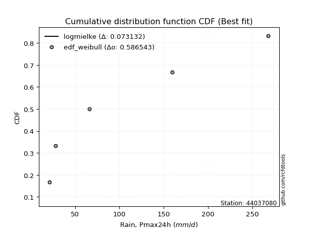</img>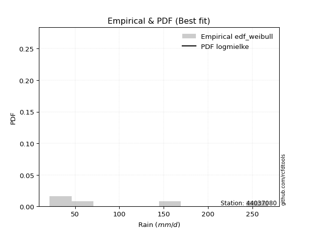</img>

</div>


### 4. EDF Beard (1943)

The Beard formula (or Beard´s plotting position formula) in hydrology is used to estimate the empirical non-exceedance probability _(P)_ of a flood event (or other extreme hydrological data point) within a given dataset.

<div align="center">


$P=(m-0.31)/(n+0.38)$


</div>


**4.1. Empirical values**

<div align="center">

|                | 0                   | 1                  | 2         | 3                  | 4                  |
|:---------------|:--------------------|:-------------------|:----------|:-------------------|:-------------------|
| date           | 2023                | 2024               | 2019      | 2022               | 2020               |
| x              | 21.4                | 28.0               | 66.2      | 159.8              | 268.0              |
| m              | 1                   | 2                  | 3         | 4                  | 5                  |
| empirical_dist | edf_beard           | edf_beard          | edf_beard | edf_beard          | edf_beard          |
| empirical      | 0.12825278810408922 | 0.3141263940520446 | 0.5       | 0.6858736059479554 | 0.8717472118959109 |
| empirical_tr   | 1.1471215351812367  | 1.4579945799457996 | 2.0       | 3.183431952662722  | 7.797101449275368  |

</div>


**4.2. Kolmogorov-Smirnov fit test (sorted by Δ)**


<div align="center">

|                | 0                    | 1                   | 2                   | 3                   | 4                   | 5                   | 6                   | 7                   | 8                   | 9                   | 10                  | 11                  | 12                  | 13                  | 14                 | 15                  | 16                  | 17                 | 18                  | 19                  | 20                  | 21                  | 22                  | 23                  | 24                  | 25                  | 26                  | 27                  | 28                 | 29                  | 30                 | 31                  | 32                  | 33                  | 34                  | 35                  | 36                  | 37                  | 38                  | 39                 | 40                  | 41                  | 42                  | 43                 | 44                  | 45                  | 46                 | 47                  | 48                  | 49                  | 50                 | 51                 | 52                  | 53                  | 54                 | 55                 | 56                  | 57                  | 58                  | 59                  | 60                 | 61                  | 62                 | 63                  | 64                  | 65                 | 66                 | 67                  | 68                  | 69                  | 70                  | 71                 | 72                  | 73                  | 74                  | 75                  | 76                  | 77                  | 78                  | 79                  | 80                 | 81                  | 82                  | 83                  | 84                  | 85                  | 86                  | 87                  | 88                  | 89                 | 90                  | 91                  | 92                  | 93                 | 94                  | 95                  | 96                  | 97                  | 98                  | 99                  | 100                 | 101                 | 102                 | 103                 | 104                | 105                | 106                 | 107                 | 108                 | 109                 | 110                | 111                 | 112                 | 113                | 114                 | 115                 | 116                 | 117                | 118                 | 119                | 120                | 121                | 122                | 123                 | 124                 | 125                 | 126                 | 127                 | 128                 | 129                 | 130                | 131                | 132                 | 133                | 134                | 135                 | 136                | 137                 | 138                | 139                | 140                | 141                 | 142                | 143                | 144                | 145                | 146                | 147                 | 148                 | 149                | 150                | 151                 | 152                | 153                 | 154                | 155                | 156                | 157                | 158                | 159                |
|:---------------|:---------------------|:--------------------|:--------------------|:--------------------|:--------------------|:--------------------|:--------------------|:--------------------|:--------------------|:--------------------|:--------------------|:--------------------|:--------------------|:--------------------|:-------------------|:--------------------|:--------------------|:-------------------|:--------------------|:--------------------|:--------------------|:--------------------|:--------------------|:--------------------|:--------------------|:--------------------|:--------------------|:--------------------|:-------------------|:--------------------|:-------------------|:--------------------|:--------------------|:--------------------|:--------------------|:--------------------|:--------------------|:--------------------|:--------------------|:-------------------|:--------------------|:--------------------|:--------------------|:-------------------|:--------------------|:--------------------|:-------------------|:--------------------|:--------------------|:--------------------|:-------------------|:-------------------|:--------------------|:--------------------|:-------------------|:-------------------|:--------------------|:--------------------|:--------------------|:--------------------|:-------------------|:--------------------|:-------------------|:--------------------|:--------------------|:-------------------|:-------------------|:--------------------|:--------------------|:--------------------|:--------------------|:-------------------|:--------------------|:--------------------|:--------------------|:--------------------|:--------------------|:--------------------|:--------------------|:--------------------|:-------------------|:--------------------|:--------------------|:--------------------|:--------------------|:--------------------|:--------------------|:--------------------|:--------------------|:-------------------|:--------------------|:--------------------|:--------------------|:-------------------|:--------------------|:--------------------|:--------------------|:--------------------|:--------------------|:--------------------|:--------------------|:--------------------|:--------------------|:--------------------|:-------------------|:-------------------|:--------------------|:--------------------|:--------------------|:--------------------|:-------------------|:--------------------|:--------------------|:-------------------|:--------------------|:--------------------|:--------------------|:-------------------|:--------------------|:-------------------|:-------------------|:-------------------|:-------------------|:--------------------|:--------------------|:--------------------|:--------------------|:--------------------|:--------------------|:--------------------|:-------------------|:-------------------|:--------------------|:-------------------|:-------------------|:--------------------|:-------------------|:--------------------|:-------------------|:-------------------|:-------------------|:--------------------|:-------------------|:-------------------|:-------------------|:-------------------|:-------------------|:--------------------|:--------------------|:-------------------|:-------------------|:--------------------|:-------------------|:--------------------|:-------------------|:-------------------|:-------------------|:-------------------|:-------------------|:-------------------|
| station        | 44037080             | 44037080            | 44037080            | 44037080            | 44037080            | 44037080            | 44037080            | 44037080            | 44037080            | 44037080            | 44037080            | 44037080            | 44037080            | 44037080            | 44037080           | 44037080            | 44037080            | 44037080           | 44037080            | 44037080            | 44037080            | 44037080            | 44037080            | 44037080            | 44037080            | 44037080            | 44037080            | 44037080            | 44037080           | 44037080            | 44037080           | 44037080            | 44037080            | 44037080            | 44037080            | 44037080            | 44037080            | 44037080            | 44037080            | 44037080           | 44037080            | 44037080            | 44037080            | 44037080           | 44037080            | 44037080            | 44037080           | 44037080            | 44037080            | 44037080            | 44037080           | 44037080           | 44037080            | 44037080            | 44037080           | 44037080           | 44037080            | 44037080            | 44037080            | 44037080            | 44037080           | 44037080            | 44037080           | 44037080            | 44037080            | 44037080           | 44037080           | 44037080            | 44037080            | 44037080            | 44037080            | 44037080           | 44037080            | 44037080            | 44037080            | 44037080            | 44037080            | 44037080            | 44037080            | 44037080            | 44037080           | 44037080            | 44037080            | 44037080            | 44037080            | 44037080            | 44037080            | 44037080            | 44037080            | 44037080           | 44037080            | 44037080            | 44037080            | 44037080           | 44037080            | 44037080            | 44037080            | 44037080            | 44037080            | 44037080            | 44037080            | 44037080            | 44037080            | 44037080            | 44037080           | 44037080           | 44037080            | 44037080            | 44037080            | 44037080            | 44037080           | 44037080            | 44037080            | 44037080           | 44037080            | 44037080            | 44037080            | 44037080           | 44037080            | 44037080           | 44037080           | 44037080           | 44037080           | 44037080            | 44037080            | 44037080            | 44037080            | 44037080            | 44037080            | 44037080            | 44037080           | 44037080           | 44037080            | 44037080           | 44037080           | 44037080            | 44037080           | 44037080            | 44037080           | 44037080           | 44037080           | 44037080            | 44037080           | 44037080           | 44037080           | 44037080           | 44037080           | 44037080            | 44037080            | 44037080           | 44037080           | 44037080            | 44037080           | 44037080            | 44037080           | 44037080           | 44037080           | 44037080           | 44037080           | 44037080           |
| empirical_dist | edf_beard            | edf_beard           | edf_beard           | edf_beard           | edf_beard           | edf_beard           | edf_beard           | edf_beard           | edf_beard           | edf_beard           | edf_beard           | edf_beard           | edf_beard           | edf_beard           | edf_beard          | edf_beard           | edf_beard           | edf_beard          | edf_beard           | edf_beard           | edf_beard           | edf_beard           | edf_beard           | edf_beard           | edf_beard           | edf_beard           | edf_beard           | edf_beard           | edf_beard          | edf_beard           | edf_beard          | edf_beard           | edf_beard           | edf_beard           | edf_beard           | edf_beard           | edf_beard           | edf_beard           | edf_beard           | edf_beard          | edf_beard           | edf_beard           | edf_beard           | edf_beard          | edf_beard           | edf_beard           | edf_beard          | edf_beard           | edf_beard           | edf_beard           | edf_beard          | edf_beard          | edf_beard           | edf_beard           | edf_beard          | edf_beard          | edf_beard           | edf_beard           | edf_beard           | edf_beard           | edf_beard          | edf_beard           | edf_beard          | edf_beard           | edf_beard           | edf_beard          | edf_beard          | edf_beard           | edf_beard           | edf_beard           | edf_beard           | edf_beard          | edf_beard           | edf_beard           | edf_beard           | edf_beard           | edf_beard           | edf_beard           | edf_beard           | edf_beard           | edf_beard          | edf_beard           | edf_beard           | edf_beard           | edf_beard           | edf_beard           | edf_beard           | edf_beard           | edf_beard           | edf_beard          | edf_beard           | edf_beard           | edf_beard           | edf_beard          | edf_beard           | edf_beard           | edf_beard           | edf_beard           | edf_beard           | edf_beard           | edf_beard           | edf_beard           | edf_beard           | edf_beard           | edf_beard          | edf_beard          | edf_beard           | edf_beard           | edf_beard           | edf_beard           | edf_beard          | edf_beard           | edf_beard           | edf_beard          | edf_beard           | edf_beard           | edf_beard           | edf_beard          | edf_beard           | edf_beard          | edf_beard          | edf_beard          | edf_beard          | edf_beard           | edf_beard           | edf_beard           | edf_beard           | edf_beard           | edf_beard           | edf_beard           | edf_beard          | edf_beard          | edf_beard           | edf_beard          | edf_beard          | edf_beard           | edf_beard          | edf_beard           | edf_beard          | edf_beard          | edf_beard          | edf_beard           | edf_beard          | edf_beard          | edf_beard          | edf_beard          | edf_beard          | edf_beard           | edf_beard           | edf_beard          | edf_beard          | edf_beard           | edf_beard          | edf_beard           | edf_beard          | edf_beard          | edf_beard          | edf_beard          | edf_beard          | edf_beard          |
| p_dist         | logmielke            | logarcsine          | logksone            | halfnorm            | logsemicircular     | foldnorm            | loganglit           | logtrapezoid        | betaprime           | dgamma              | halflogistic        | logbeta             | gengamma            | exponweib           | logexponpow        | logburr12           | loghalfgennorm      | logrdist           | exponpow            | logweibull_max      | truncexpon          | logexponweib        | logwrapcauchy       | gausshyper          | loglomax            | burr12              | nct                 | logburr             | ksone              | lograyleigh         | alpha              | loggenlogistic      | rayleigh            | loghalfnorm         | nakagami            | loginvweibull       | gumbel_r            | loginvgamma         | logmaxwell          | lognct             | logfoldnorm         | logncf              | logkstwobign        | ncf                | loggenpareto        | logbetaprime        | logalpha           | loggamma            | loggamma            | logloggamma         | pearson3           | logerlang          | logpearson3         | logskewnorm         | logcrystalball     | lognorm            | logt                | logexponnorm        | logjohnsonsu        | dweibull            | genlogistic        | arcsine             | semicircular       | maxwell             | loginvgauss         | loggenexpon        | moyal              | logloglaplace       | anglit              | genexpon            | kstwobign           | logcosine          | loggumbel_l         | loglogistic         | logrice             | loggumbel_r         | logbradford         | truncweibull_min    | logdweibull         | logtruncexpon       | invgamma           | loglevy_l           | f                   | loghypsecant        | loggompertz         | loghalflogistic     | burr                | crystalball         | norm                | t                  | invgauss            | logargus            | loggenextreme       | loggausshyper      | logtriang           | wrapcauchy          | loglaplace          | loglaplace          | logmoyal            | logtruncweibull_min | logkappa4           | loggennorm          | logdgamma           | rice                | logistic           | logtukeylambda     | logf                | gennorm             | loguniform          | logkappa3           | logvonmises_line   | cosine              | hypsecant           | johnsonsu          | weibull_min         | halfgennorm         | gumbel_l            | levy_l             | laplace             | lomax              | logweibull_min     | gompertz           | exponnorm          | truncnorm           | loggenhalflogistic  | kappa4              | genpareto           | argus               | skewnorm            | bradford            | beta               | gamma              | wald                | fatiguelife        | triang             | tukeylambda         | logwald            | uniform             | vonmises_line      | erlang             | truncpareto        | genextreme          | powerlaw           | genhalflogistic    | lognakagami        | logfatiguelife     | kappa3             | johnsonsb           | invweibull          | logpowerlaw        | logtruncpareto     | trapezoid           | loggengamma        | logjohnsonsb        | logtruncnorm       | rdist              | weibull_max        | logvonmises        | vonmises           | mielke             |
| delta          | 0.034718252597326374 | 0.05602542579454495 | 0.08669501672104415 | 0.09980253156396868 | 0.10310517169672034 | 0.11275323136052834 | 0.11493431537191415 | 0.11688797820170665 | 0.11965847715494582 | 0.11996294818905351 | 0.12661321936594397 | 0.12825260553156415 | 0.12825260688165074 | 0.12825262414255703 | 0.1282527473103968 | 0.12825275541359982 | 0.12825278055021985 | 0.128252784736806  | 0.12825278693908485 | 0.12825278750749014 | 0.12825278810388807 | 0.12825278810404622 | 0.12825278810408922 | 0.12825278810413976 | 0.12850528506407433 | 0.12927183478644966 | 0.12979818456309966 | 0.13007339684418928 | 0.130830655227266  | 0.13167770543080085 | 0.132632242836909  | 0.13287177262265537 | 0.13295886660160444 | 0.13322239462863514 | 0.13341400401073894 | 0.13346930085164996 | 0.13361032706141796 | 0.13397211553582292 | 0.13438336216743502 | 0.1348247251547578 | 0.13508586405954337 | 0.13510129377183666 | 0.13533468553244096 | 0.1366605220841302 | 0.13695938484614698 | 0.13924345630542576 | 0.1397731829662835 | 0.14030070295178682 | 0.14030070295178682 | 0.14050996446854297 | 0.1406397785087518 | 0.1411455040209318 | 0.14118910696256062 | 0.14155403051594911 | 0.1415939121823324 | 0.1415940474468655 | 0.14159423831123596 | 0.14159453933052377 | 0.14178996377651015 | 0.14205810948086117 | 0.1428632344031879 | 0.14296435770366325 | 0.1430171155450759 | 0.14462139660916679 | 0.14521894273786506 | 0.1457151371275317 | 0.1460286747179172 | 0.15159870237826506 | 0.15245568460825654 | 0.15608675461662513 | 0.15633595982980147 | 0.1566439657736659 | 0.16010607260520626 | 0.16129949811481328 | 0.16169613688264323 | 0.16225354263463987 | 0.16425866572194414 | 0.16547201978223147 | 0.16598456711628018 | 0.16836569419743475 | 0.1686257093015664 | 0.17027876467750272 | 0.17189223262561182 | 0.17206984936226896 | 0.17234569430172814 | 0.17409641547613353 | 0.17430927547582575 | 0.17480147800805967 | 0.17480148009756658 | 0.1748085359198096 | 0.17539976576208494 | 0.17579449776529626 | 0.17618011261025035 | 0.1801777069071514 | 0.18050634127083914 | 0.18076916183707736 | 0.18258783839481824 | 0.18258783839481824 | 0.18364400113341067 | 0.18421328991502384 | 0.18558215654208635 | 0.18587360594795543 | 0.18973792308160053 | 0.19143044990951974 | 0.194667772252417  | 0.2005588491098806 | 0.20595289591206334 | 0.20659323953219388 | 0.20777491148614446 | 0.20782003945160182 | 0.2078271779544744 | 0.20858787499728332 | 0.20958161176454465 | 0.210489684040007  | 0.21080127157411255 | 0.22772302324327875 | 0.23054624511360733 | 0.232588345420664  | 0.23660062871623483 | 0.2367826389486739 | 0.2379891882363263 | 0.2405894699145701 | 0.2405900236788034 | 0.24113809268688507 | 0.25399548897061497 | 0.25401481933606507 | 0.25652886872622177 | 0.25687697831939316 | 0.27302760380725644 | 0.27346490164116866 | 0.2771183588540711 | 0.2806657015324111 | 0.29522206931756234 | 0.2963884821740988 | 0.298073796498315  | 0.30656920329327164 | 0.3140652556920484 | 0.31832927818329276 | 0.3234019424949076 | 0.3251236098665601 | 0.3501864773793908 | 0.35058383833543805 | 0.3527460484871257 | 0.3590291792015595 | 0.3732390817907512 | 0.3821012655861454 | 0.3885571223570618 | 0.42506905617516294 | 0.42929009418999936 | 0.439175549319716  | 0.4440217706671082 | 0.44464500333991686 | 0.4525493453597867 | 0.48865509669449364 | 0.4999961381507031 | 0.5020045489361323 | 0.6041285140262879 | 1.1196446062377317 | 42.089992851526276 | nan                |
| deltao         | 0.5865427407550001   | 0.5865427407550001  | 0.5865427407550001  | 0.5865427407550001  | 0.5865427407550001  | 0.5865427407550001  | 0.5865427407550001  | 0.5865427407550001  | 0.5865427407550001  | 0.5865427407550001  | 0.5865427407550001  | 0.5865427407550001  | 0.5865427407550001  | 0.5865427407550001  | 0.5865427407550001 | 0.5865427407550001  | 0.5865427407550001  | 0.5865427407550001 | 0.5865427407550001  | 0.5865427407550001  | 0.5865427407550001  | 0.5865427407550001  | 0.5865427407550001  | 0.5865427407550001  | 0.5865427407550001  | 0.5865427407550001  | 0.5865427407550001  | 0.5865427407550001  | 0.5865427407550001 | 0.5865427407550001  | 0.5865427407550001 | 0.5865427407550001  | 0.5865427407550001  | 0.5865427407550001  | 0.5865427407550001  | 0.5865427407550001  | 0.5865427407550001  | 0.5865427407550001  | 0.5865427407550001  | 0.5865427407550001 | 0.5865427407550001  | 0.5865427407550001  | 0.5865427407550001  | 0.5865427407550001 | 0.5865427407550001  | 0.5865427407550001  | 0.5865427407550001 | 0.5865427407550001  | 0.5865427407550001  | 0.5865427407550001  | 0.5865427407550001 | 0.5865427407550001 | 0.5865427407550001  | 0.5865427407550001  | 0.5865427407550001 | 0.5865427407550001 | 0.5865427407550001  | 0.5865427407550001  | 0.5865427407550001  | 0.5865427407550001  | 0.5865427407550001 | 0.5865427407550001  | 0.5865427407550001 | 0.5865427407550001  | 0.5865427407550001  | 0.5865427407550001 | 0.5865427407550001 | 0.5865427407550001  | 0.5865427407550001  | 0.5865427407550001  | 0.5865427407550001  | 0.5865427407550001 | 0.5865427407550001  | 0.5865427407550001  | 0.5865427407550001  | 0.5865427407550001  | 0.5865427407550001  | 0.5865427407550001  | 0.5865427407550001  | 0.5865427407550001  | 0.5865427407550001 | 0.5865427407550001  | 0.5865427407550001  | 0.5865427407550001  | 0.5865427407550001  | 0.5865427407550001  | 0.5865427407550001  | 0.5865427407550001  | 0.5865427407550001  | 0.5865427407550001 | 0.5865427407550001  | 0.5865427407550001  | 0.5865427407550001  | 0.5865427407550001 | 0.5865427407550001  | 0.5865427407550001  | 0.5865427407550001  | 0.5865427407550001  | 0.5865427407550001  | 0.5865427407550001  | 0.5865427407550001  | 0.5865427407550001  | 0.5865427407550001  | 0.5865427407550001  | 0.5865427407550001 | 0.5865427407550001 | 0.5865427407550001  | 0.5865427407550001  | 0.5865427407550001  | 0.5865427407550001  | 0.5865427407550001 | 0.5865427407550001  | 0.5865427407550001  | 0.5865427407550001 | 0.5865427407550001  | 0.5865427407550001  | 0.5865427407550001  | 0.5865427407550001 | 0.5865427407550001  | 0.5865427407550001 | 0.5865427407550001 | 0.5865427407550001 | 0.5865427407550001 | 0.5865427407550001  | 0.5865427407550001  | 0.5865427407550001  | 0.5865427407550001  | 0.5865427407550001  | 0.5865427407550001  | 0.5865427407550001  | 0.5865427407550001 | 0.5865427407550001 | 0.5865427407550001  | 0.5865427407550001 | 0.5865427407550001 | 0.5865427407550001  | 0.5865427407550001 | 0.5865427407550001  | 0.5865427407550001 | 0.5865427407550001 | 0.5865427407550001 | 0.5865427407550001  | 0.5865427407550001 | 0.5865427407550001 | 0.5865427407550001 | 0.5865427407550001 | 0.5865427407550001 | 0.5865427407550001  | 0.5865427407550001  | 0.5865427407550001 | 0.5865427407550001 | 0.5865427407550001  | 0.5865427407550001 | 0.5865427407550001  | 0.5865427407550001 | 0.5865427407550001 | 0.5865427407550001 | 0.5865427407550001 | 0.5865427407550001 | 0.5865427407550001 |
| eval           | Δo > Δ               | Δo > Δ              | Δo > Δ              | Δo > Δ              | Δo > Δ              | Δo > Δ              | Δo > Δ              | Δo > Δ              | Δo > Δ              | Δo > Δ              | Δo > Δ              | Δo > Δ              | Δo > Δ              | Δo > Δ              | Δo > Δ             | Δo > Δ              | Δo > Δ              | Δo > Δ             | Δo > Δ              | Δo > Δ              | Δo > Δ              | Δo > Δ              | Δo > Δ              | Δo > Δ              | Δo > Δ              | Δo > Δ              | Δo > Δ              | Δo > Δ              | Δo > Δ             | Δo > Δ              | Δo > Δ             | Δo > Δ              | Δo > Δ              | Δo > Δ              | Δo > Δ              | Δo > Δ              | Δo > Δ              | Δo > Δ              | Δo > Δ              | Δo > Δ             | Δo > Δ              | Δo > Δ              | Δo > Δ              | Δo > Δ             | Δo > Δ              | Δo > Δ              | Δo > Δ             | Δo > Δ              | Δo > Δ              | Δo > Δ              | Δo > Δ             | Δo > Δ             | Δo > Δ              | Δo > Δ              | Δo > Δ             | Δo > Δ             | Δo > Δ              | Δo > Δ              | Δo > Δ              | Δo > Δ              | Δo > Δ             | Δo > Δ              | Δo > Δ             | Δo > Δ              | Δo > Δ              | Δo > Δ             | Δo > Δ             | Δo > Δ              | Δo > Δ              | Δo > Δ              | Δo > Δ              | Δo > Δ             | Δo > Δ              | Δo > Δ              | Δo > Δ              | Δo > Δ              | Δo > Δ              | Δo > Δ              | Δo > Δ              | Δo > Δ              | Δo > Δ             | Δo > Δ              | Δo > Δ              | Δo > Δ              | Δo > Δ              | Δo > Δ              | Δo > Δ              | Δo > Δ              | Δo > Δ              | Δo > Δ             | Δo > Δ              | Δo > Δ              | Δo > Δ              | Δo > Δ             | Δo > Δ              | Δo > Δ              | Δo > Δ              | Δo > Δ              | Δo > Δ              | Δo > Δ              | Δo > Δ              | Δo > Δ              | Δo > Δ              | Δo > Δ              | Δo > Δ             | Δo > Δ             | Δo > Δ              | Δo > Δ              | Δo > Δ              | Δo > Δ              | Δo > Δ             | Δo > Δ              | Δo > Δ              | Δo > Δ             | Δo > Δ              | Δo > Δ              | Δo > Δ              | Δo > Δ             | Δo > Δ              | Δo > Δ             | Δo > Δ             | Δo > Δ             | Δo > Δ             | Δo > Δ              | Δo > Δ              | Δo > Δ              | Δo > Δ              | Δo > Δ              | Δo > Δ              | Δo > Δ              | Δo > Δ             | Δo > Δ             | Δo > Δ              | Δo > Δ             | Δo > Δ             | Δo > Δ              | Δo > Δ             | Δo > Δ              | Δo > Δ             | Δo > Δ             | Δo > Δ             | Δo > Δ              | Δo > Δ             | Δo > Δ             | Δo > Δ             | Δo > Δ             | Δo > Δ             | Δo > Δ              | Δo > Δ              | Δo > Δ             | Δo > Δ             | Δo > Δ              | Δo > Δ             | Δo > Δ              | Δo > Δ             | Δo > Δ             | Δo <= Δ            | Δo <= Δ            | Δo <= Δ            | Δo <= Δ            |
| fit            | 1                    | 1                   | 1                   | 1                   | 1                   | 1                   | 1                   | 1                   | 1                   | 1                   | 1                   | 1                   | 1                   | 1                   | 1                  | 1                   | 1                   | 1                  | 1                   | 1                   | 1                   | 1                   | 1                   | 1                   | 1                   | 1                   | 1                   | 1                   | 1                  | 1                   | 1                  | 1                   | 1                   | 1                   | 1                   | 1                   | 1                   | 1                   | 1                   | 1                  | 1                   | 1                   | 1                   | 1                  | 1                   | 1                   | 1                  | 1                   | 1                   | 1                   | 1                  | 1                  | 1                   | 1                   | 1                  | 1                  | 1                   | 1                   | 1                   | 1                   | 1                  | 1                   | 1                  | 1                   | 1                   | 1                  | 1                  | 1                   | 1                   | 1                   | 1                   | 1                  | 1                   | 1                   | 1                   | 1                   | 1                   | 1                   | 1                   | 1                   | 1                  | 1                   | 1                   | 1                   | 1                   | 1                   | 1                   | 1                   | 1                   | 1                  | 1                   | 1                   | 1                   | 1                  | 1                   | 1                   | 1                   | 1                   | 1                   | 1                   | 1                   | 1                   | 1                   | 1                   | 1                  | 1                  | 1                   | 1                   | 1                   | 1                   | 1                  | 1                   | 1                   | 1                  | 1                   | 1                   | 1                   | 1                  | 1                   | 1                  | 1                  | 1                  | 1                  | 1                   | 1                   | 1                   | 1                   | 1                   | 1                   | 1                   | 1                  | 1                  | 1                   | 1                  | 1                  | 1                   | 1                  | 1                   | 1                  | 1                  | 1                  | 1                   | 1                  | 1                  | 1                  | 1                  | 1                  | 1                   | 1                   | 1                  | 1                  | 1                   | 1                  | 1                   | 1                  | 1                  | 0                  | 0                  | 0                  | 0                  |
| n              | 5                    | 5                   | 5                   | 5                   | 5                   | 5                   | 5                   | 5                   | 5                   | 5                   | 5                   | 5                   | 5                   | 5                   | 5                  | 5                   | 5                   | 5                  | 5                   | 5                   | 5                   | 5                   | 5                   | 5                   | 5                   | 5                   | 5                   | 5                   | 5                  | 5                   | 5                  | 5                   | 5                   | 5                   | 5                   | 5                   | 5                   | 5                   | 5                   | 5                  | 5                   | 5                   | 5                   | 5                  | 5                   | 5                   | 5                  | 5                   | 5                   | 5                   | 5                  | 5                  | 5                   | 5                   | 5                  | 5                  | 5                   | 5                   | 5                   | 5                   | 5                  | 5                   | 5                  | 5                   | 5                   | 5                  | 5                  | 5                   | 5                   | 5                   | 5                   | 5                  | 5                   | 5                   | 5                   | 5                   | 5                   | 5                   | 5                   | 5                   | 5                  | 5                   | 5                   | 5                   | 5                   | 5                   | 5                   | 5                   | 5                   | 5                  | 5                   | 5                   | 5                   | 5                  | 5                   | 5                   | 5                   | 5                   | 5                   | 5                   | 5                   | 5                   | 5                   | 5                   | 5                  | 5                  | 5                   | 5                   | 5                   | 5                   | 5                  | 5                   | 5                   | 5                  | 5                   | 5                   | 5                   | 5                  | 5                   | 5                  | 5                  | 5                  | 5                  | 5                   | 5                   | 5                   | 5                   | 5                   | 5                   | 5                   | 5                  | 5                  | 5                   | 5                  | 5                  | 5                   | 5                  | 5                   | 5                  | 5                  | 5                  | 5                   | 5                  | 5                  | 5                  | 5                  | 5                  | 5                   | 5                   | 5                  | 5                  | 5                   | 5                  | 5                   | 5                  | 5                  | 5                  | 5                  | 5                  | 5                  |
| best_fit       | 1                    | 0                   | 0                   | 0                   | 0                   | 0                   | 0                   | 0                   | 0                   | 0                   | 0                   | 0                   | 0                   | 0                   | 0                  | 0                   | 0                   | 0                  | 0                   | 0                   | 0                   | 0                   | 0                   | 0                   | 0                   | 0                   | 0                   | 0                   | 0                  | 0                   | 0                  | 0                   | 0                   | 0                   | 0                   | 0                   | 0                   | 0                   | 0                   | 0                  | 0                   | 0                   | 0                   | 0                  | 0                   | 0                   | 0                  | 0                   | 0                   | 0                   | 0                  | 0                  | 0                   | 0                   | 0                  | 0                  | 0                   | 0                   | 0                   | 0                   | 0                  | 0                   | 0                  | 0                   | 0                   | 0                  | 0                  | 0                   | 0                   | 0                   | 0                   | 0                  | 0                   | 0                   | 0                   | 0                   | 0                   | 0                   | 0                   | 0                   | 0                  | 0                   | 0                   | 0                   | 0                   | 0                   | 0                   | 0                   | 0                   | 0                  | 0                   | 0                   | 0                   | 0                  | 0                   | 0                   | 0                   | 0                   | 0                   | 0                   | 0                   | 0                   | 0                   | 0                   | 0                  | 0                  | 0                   | 0                   | 0                   | 0                   | 0                  | 0                   | 0                   | 0                  | 0                   | 0                   | 0                   | 0                  | 0                   | 0                  | 0                  | 0                  | 0                  | 0                   | 0                   | 0                   | 0                   | 0                   | 0                   | 0                   | 0                  | 0                  | 0                   | 0                  | 0                  | 0                   | 0                  | 0                   | 0                  | 0                  | 0                  | 0                   | 0                  | 0                  | 0                  | 0                  | 0                  | 0                   | 0                   | 0                  | 0                  | 0                   | 0                  | 0                   | 0                  | 0                  | 0                  | 0                  | 0                  | 0                  |
| best_fit_sort  | 1                    | 2                   | 3                   | 4                   | 5                   | 6                   | 7                   | 8                   | 9                   | 10                  | 11                  | 12                  | 13                  | 14                  | 15                 | 16                  | 17                  | 18                 | 19                  | 20                  | 21                  | 22                  | 23                  | 24                  | 25                  | 26                  | 27                  | 28                  | 29                 | 30                  | 31                 | 32                  | 33                  | 34                  | 35                  | 36                  | 37                  | 38                  | 39                  | 40                 | 41                  | 42                  | 43                  | 44                 | 45                  | 46                  | 47                 | 48                  | 49                  | 50                  | 51                 | 52                 | 53                  | 54                  | 55                 | 56                 | 57                  | 58                  | 59                  | 60                  | 61                 | 62                  | 63                 | 64                  | 65                  | 66                 | 67                 | 68                  | 69                  | 70                  | 71                  | 72                 | 73                  | 74                  | 75                  | 76                  | 77                  | 78                  | 79                  | 80                  | 81                 | 82                  | 83                  | 84                  | 85                  | 86                  | 87                  | 88                  | 89                  | 90                 | 91                  | 92                  | 93                  | 94                 | 95                  | 96                  | 97                  | 98                  | 99                  | 100                 | 101                 | 102                 | 103                 | 104                 | 105                | 106                | 107                 | 108                 | 109                 | 110                 | 111                | 112                 | 113                 | 114                | 115                 | 116                 | 117                 | 118                | 119                 | 120                | 121                | 122                | 123                | 124                 | 125                 | 126                 | 127                 | 128                 | 129                 | 130                 | 131                | 132                | 133                 | 134                | 135                | 136                 | 137                | 138                 | 139                | 140                | 141                | 142                 | 143                | 144                | 145                | 146                | 147                | 148                 | 149                 | 150                | 151                | 152                 | 153                | 154                 | 155                | 156                | 157                | 158                | 159                | 160                |

</div>


**4.3. Best fit**

<div align="center">

|   id |   station | empirical_dist   | p_dist    |     delta |   deltao | eval   |   fit |   n |   best_fit |   best_fit_sort |
|-----:|----------:|:-----------------|:----------|----------:|---------:|:-------|------:|----:|-----------:|----------------:|
|    0 |  44037080 | edf_beard        | logmielke | 0.0347183 | 0.586543 | Δo > Δ |     1 |   5 |          1 |               1 |

</div>


<div align="center">

</img>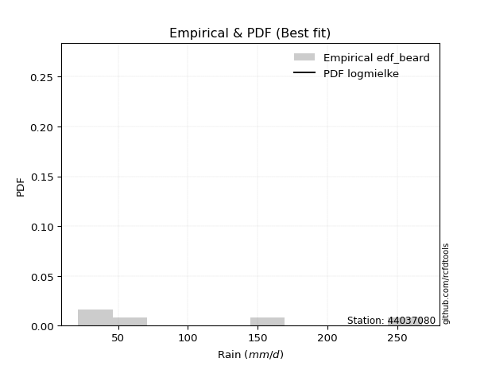</img>

</div>


### 5. EDF Chegodayev (1955)

The Chegodayev formula is an empirical plotting position formula used in hydrological frequency analysis to estimate the exceedance probability or return period of a specific event from a set of observed data. It is primarily used for plotting observed data points on probability paper to fit a theoretical distribution, particularly for analyzing extreme events like maximum flood flows or rainfall intensities. The constant _b_ value in the generalized plotting position formula is 0.3.

<div align="center">


$P=(m-b)/(n+1-2b)$


</div>


**5.1. Empirical values**

<div align="center">

|                | 0                   | 1                   | 2              | 3                  | 4                  |
|:---------------|:--------------------|:--------------------|:---------------|:-------------------|:-------------------|
| date           | 2023                | 2024                | 2019           | 2022               | 2020               |
| x              | 21.4                | 28.0                | 66.2           | 159.8              | 268.0              |
| m              | 1                   | 2                   | 3              | 4                  | 5                  |
| empirical_dist | edf_chegodayev      | edf_chegodayev      | edf_chegodayev | edf_chegodayev     | edf_chegodayev     |
| empirical      | 0.12962962962962962 | 0.31481481481481477 | 0.5            | 0.6851851851851851 | 0.8703703703703703 |
| empirical_tr   | 1.148936170212766   | 1.4594594594594594  | 2.0            | 3.1764705882352935 | 7.714285714285713  |

</div>


**5.2. Kolmogorov-Smirnov fit test (sorted by Δ)**


<div align="center">

|                | 0                   | 1                    | 2                  | 3                   | 4                   | 5                   | 6                  | 7                  | 8                  | 9                   | 10                  | 11                  | 12                  | 13                  | 14                 | 15                  | 16                  | 17                  | 18                  | 19                  | 20                  | 21                 | 22                  | 23                  | 24                  | 25                  | 26                  | 27                 | 28                 | 29                 | 30                  | 31                 | 32                  | 33                  | 34                  | 35                 | 36                 | 37                  | 38                  | 39                  | 40                  | 41                  | 42                 | 43                 | 44                  | 45                 | 46                  | 47                 | 48                  | 49                  | 50                  | 51                  | 52                  | 53                  | 54                  | 55                  | 56                  | 57                  | 58                 | 59                  | 60                 | 61                 | 62                  | 63                  | 64                  | 65                  | 66                  | 67                 | 68                  | 69                  | 70                  | 71                  | 72                 | 73                  | 74                  | 75                  | 76                 | 77                 | 78                 | 79                 | 80                 | 81                  | 82                  | 83                 | 84                  | 85                  | 86                  | 87                  | 88                 | 89                  | 90                  | 91                  | 92                 | 93                  | 94                  | 95                 | 96                  | 97                  | 98                  | 99                  | 100                 | 101                | 102                 | 103                 | 104                | 105                 | 106                 | 107                | 108                | 109                 | 110                 | 111                 | 112                 | 113                | 114                 | 115                | 116                 | 117                | 118                 | 119                | 120                 | 121                 | 122                 | 123                 | 124                | 125                 | 126                 | 127                 | 128                | 129                | 130                | 131                | 132                 | 133                | 134                | 135                 | 136                 | 137                 | 138                | 139                | 140                 | 141                | 142                 | 143                | 144                 | 145                 | 146                | 147                | 148                 | 149                | 150                 | 151                 | 152                 | 153                | 154                | 155                | 156                | 157                | 158                | 159                |
|:---------------|:--------------------|:---------------------|:-------------------|:--------------------|:--------------------|:--------------------|:-------------------|:-------------------|:-------------------|:--------------------|:--------------------|:--------------------|:--------------------|:--------------------|:-------------------|:--------------------|:--------------------|:--------------------|:--------------------|:--------------------|:--------------------|:-------------------|:--------------------|:--------------------|:--------------------|:--------------------|:--------------------|:-------------------|:-------------------|:-------------------|:--------------------|:-------------------|:--------------------|:--------------------|:--------------------|:-------------------|:-------------------|:--------------------|:--------------------|:--------------------|:--------------------|:--------------------|:-------------------|:-------------------|:--------------------|:-------------------|:--------------------|:-------------------|:--------------------|:--------------------|:--------------------|:--------------------|:--------------------|:--------------------|:--------------------|:--------------------|:--------------------|:--------------------|:-------------------|:--------------------|:-------------------|:-------------------|:--------------------|:--------------------|:--------------------|:--------------------|:--------------------|:-------------------|:--------------------|:--------------------|:--------------------|:--------------------|:-------------------|:--------------------|:--------------------|:--------------------|:-------------------|:-------------------|:-------------------|:-------------------|:-------------------|:--------------------|:--------------------|:-------------------|:--------------------|:--------------------|:--------------------|:--------------------|:-------------------|:--------------------|:--------------------|:--------------------|:-------------------|:--------------------|:--------------------|:-------------------|:--------------------|:--------------------|:--------------------|:--------------------|:--------------------|:-------------------|:--------------------|:--------------------|:-------------------|:--------------------|:--------------------|:-------------------|:-------------------|:--------------------|:--------------------|:--------------------|:--------------------|:-------------------|:--------------------|:-------------------|:--------------------|:-------------------|:--------------------|:-------------------|:--------------------|:--------------------|:--------------------|:--------------------|:-------------------|:--------------------|:--------------------|:--------------------|:-------------------|:-------------------|:-------------------|:-------------------|:--------------------|:-------------------|:-------------------|:--------------------|:--------------------|:--------------------|:-------------------|:-------------------|:--------------------|:-------------------|:--------------------|:-------------------|:--------------------|:--------------------|:-------------------|:-------------------|:--------------------|:-------------------|:--------------------|:--------------------|:--------------------|:-------------------|:-------------------|:-------------------|:-------------------|:-------------------|:-------------------|:-------------------|
| station        | 44037080            | 44037080             | 44037080           | 44037080            | 44037080            | 44037080            | 44037080           | 44037080           | 44037080           | 44037080            | 44037080            | 44037080            | 44037080            | 44037080            | 44037080           | 44037080            | 44037080            | 44037080            | 44037080            | 44037080            | 44037080            | 44037080           | 44037080            | 44037080            | 44037080            | 44037080            | 44037080            | 44037080           | 44037080           | 44037080           | 44037080            | 44037080           | 44037080            | 44037080            | 44037080            | 44037080           | 44037080           | 44037080            | 44037080            | 44037080            | 44037080            | 44037080            | 44037080           | 44037080           | 44037080            | 44037080           | 44037080            | 44037080           | 44037080            | 44037080            | 44037080            | 44037080            | 44037080            | 44037080            | 44037080            | 44037080            | 44037080            | 44037080            | 44037080           | 44037080            | 44037080           | 44037080           | 44037080            | 44037080            | 44037080            | 44037080            | 44037080            | 44037080           | 44037080            | 44037080            | 44037080            | 44037080            | 44037080           | 44037080            | 44037080            | 44037080            | 44037080           | 44037080           | 44037080           | 44037080           | 44037080           | 44037080            | 44037080            | 44037080           | 44037080            | 44037080            | 44037080            | 44037080            | 44037080           | 44037080            | 44037080            | 44037080            | 44037080           | 44037080            | 44037080            | 44037080           | 44037080            | 44037080            | 44037080            | 44037080            | 44037080            | 44037080           | 44037080            | 44037080            | 44037080           | 44037080            | 44037080            | 44037080           | 44037080           | 44037080            | 44037080            | 44037080            | 44037080            | 44037080           | 44037080            | 44037080           | 44037080            | 44037080           | 44037080            | 44037080           | 44037080            | 44037080            | 44037080            | 44037080            | 44037080           | 44037080            | 44037080            | 44037080            | 44037080           | 44037080           | 44037080           | 44037080           | 44037080            | 44037080           | 44037080           | 44037080            | 44037080            | 44037080            | 44037080           | 44037080           | 44037080            | 44037080           | 44037080            | 44037080           | 44037080            | 44037080            | 44037080           | 44037080           | 44037080            | 44037080           | 44037080            | 44037080            | 44037080            | 44037080           | 44037080           | 44037080           | 44037080           | 44037080           | 44037080           | 44037080           |
| empirical_dist | edf_chegodayev      | edf_chegodayev       | edf_chegodayev     | edf_chegodayev      | edf_chegodayev      | edf_chegodayev      | edf_chegodayev     | edf_chegodayev     | edf_chegodayev     | edf_chegodayev      | edf_chegodayev      | edf_chegodayev      | edf_chegodayev      | edf_chegodayev      | edf_chegodayev     | edf_chegodayev      | edf_chegodayev      | edf_chegodayev      | edf_chegodayev      | edf_chegodayev      | edf_chegodayev      | edf_chegodayev     | edf_chegodayev      | edf_chegodayev      | edf_chegodayev      | edf_chegodayev      | edf_chegodayev      | edf_chegodayev     | edf_chegodayev     | edf_chegodayev     | edf_chegodayev      | edf_chegodayev     | edf_chegodayev      | edf_chegodayev      | edf_chegodayev      | edf_chegodayev     | edf_chegodayev     | edf_chegodayev      | edf_chegodayev      | edf_chegodayev      | edf_chegodayev      | edf_chegodayev      | edf_chegodayev     | edf_chegodayev     | edf_chegodayev      | edf_chegodayev     | edf_chegodayev      | edf_chegodayev     | edf_chegodayev      | edf_chegodayev      | edf_chegodayev      | edf_chegodayev      | edf_chegodayev      | edf_chegodayev      | edf_chegodayev      | edf_chegodayev      | edf_chegodayev      | edf_chegodayev      | edf_chegodayev     | edf_chegodayev      | edf_chegodayev     | edf_chegodayev     | edf_chegodayev      | edf_chegodayev      | edf_chegodayev      | edf_chegodayev      | edf_chegodayev      | edf_chegodayev     | edf_chegodayev      | edf_chegodayev      | edf_chegodayev      | edf_chegodayev      | edf_chegodayev     | edf_chegodayev      | edf_chegodayev      | edf_chegodayev      | edf_chegodayev     | edf_chegodayev     | edf_chegodayev     | edf_chegodayev     | edf_chegodayev     | edf_chegodayev      | edf_chegodayev      | edf_chegodayev     | edf_chegodayev      | edf_chegodayev      | edf_chegodayev      | edf_chegodayev      | edf_chegodayev     | edf_chegodayev      | edf_chegodayev      | edf_chegodayev      | edf_chegodayev     | edf_chegodayev      | edf_chegodayev      | edf_chegodayev     | edf_chegodayev      | edf_chegodayev      | edf_chegodayev      | edf_chegodayev      | edf_chegodayev      | edf_chegodayev     | edf_chegodayev      | edf_chegodayev      | edf_chegodayev     | edf_chegodayev      | edf_chegodayev      | edf_chegodayev     | edf_chegodayev     | edf_chegodayev      | edf_chegodayev      | edf_chegodayev      | edf_chegodayev      | edf_chegodayev     | edf_chegodayev      | edf_chegodayev     | edf_chegodayev      | edf_chegodayev     | edf_chegodayev      | edf_chegodayev     | edf_chegodayev      | edf_chegodayev      | edf_chegodayev      | edf_chegodayev      | edf_chegodayev     | edf_chegodayev      | edf_chegodayev      | edf_chegodayev      | edf_chegodayev     | edf_chegodayev     | edf_chegodayev     | edf_chegodayev     | edf_chegodayev      | edf_chegodayev     | edf_chegodayev     | edf_chegodayev      | edf_chegodayev      | edf_chegodayev      | edf_chegodayev     | edf_chegodayev     | edf_chegodayev      | edf_chegodayev     | edf_chegodayev      | edf_chegodayev     | edf_chegodayev      | edf_chegodayev      | edf_chegodayev     | edf_chegodayev     | edf_chegodayev      | edf_chegodayev     | edf_chegodayev      | edf_chegodayev      | edf_chegodayev      | edf_chegodayev     | edf_chegodayev     | edf_chegodayev     | edf_chegodayev     | edf_chegodayev     | edf_chegodayev     | edf_chegodayev     |
| p_dist         | logmielke           | logarcsine           | logksone           | halfnorm            | logsemicircular     | foldnorm            | loganglit          | logtrapezoid       | dgamma             | betaprime           | halflogistic        | logbeta             | gengamma            | exponweib           | logexponpow        | logburr12           | loghalfgennorm      | logrdist            | exponpow            | logweibull_max      | loglomax            | truncexpon         | logexponweib        | logwrapcauchy       | gausshyper          | burr12              | nct                 | logburr            | ksone              | lograyleigh        | rayleigh            | alpha              | loggenlogistic      | gumbel_r            | loghalfnorm         | nakagami           | loginvweibull      | loginvgamma         | logmaxwell          | lognct              | loggenpareto        | logfoldnorm         | logncf             | logkstwobign       | ncf                 | logbetaprime       | logalpha            | pearson3           | loggamma            | loggamma            | logloggamma         | dweibull            | arcsine             | logerlang           | logpearson3         | logskewnorm         | logcrystalball      | lognorm             | logt               | logexponnorm        | logjohnsonsu       | semicircular       | genlogistic         | maxwell             | loginvgauss         | loggenexpon         | moyal               | logloglaplace      | anglit              | genexpon            | kstwobign           | logcosine           | loggumbel_l        | loglogistic         | logrice             | loggumbel_r         | logbradford        | truncweibull_min   | logdweibull        | invgamma           | loglevy_l          | logtruncexpon       | f                   | loghypsecant       | loggompertz         | loghalflogistic     | crystalball         | norm                | t                  | burr                | invgauss            | loggenextreme       | logargus           | wrapcauchy          | loggausshyper       | logtriang          | loglaplace          | loglaplace          | logmoyal            | logtruncweibull_min | loggennorm          | logkappa4          | logdgamma           | rice                | logistic           | logtukeylambda      | logf                | gennorm            | loguniform         | logkappa3           | logvonmises_line    | cosine              | hypsecant           | johnsonsu          | weibull_min         | halfgennorm        | gumbel_l            | levy_l             | laplace             | logweibull_min     | lomax               | gompertz            | exponnorm           | truncnorm           | loggenhalflogistic | kappa4              | genpareto           | argus               | skewnorm           | bradford           | beta               | gamma              | fatiguelife         | wald               | triang             | tukeylambda         | logwald             | uniform             | vonmises_line      | erlang             | genextreme          | truncpareto        | powerlaw            | genhalflogistic    | lognakagami         | logfatiguelife      | kappa3             | johnsonsb          | invweibull          | logpowerlaw        | logtruncpareto      | trapezoid           | loggengamma         | logjohnsonsb       | logtruncnorm       | rdist              | weibull_max        | logvonmises        | vonmises           | mielke             |
| delta          | 0.03609509412286678 | 0.057402267320085465 | 0.0873834374838143 | 0.09980253156396868 | 0.10379359245949049 | 0.11275323136052834 | 0.1156227361346843 | 0.1175763989644768 | 0.1192745274262832 | 0.12034689791771613 | 0.12730164012871412 | 0.12962944705710466 | 0.12962944840719115 | 0.12962946566809744 | 0.1296295888359372 | 0.12962959693914022 | 0.12962962207576026 | 0.12962962626234653 | 0.12962962846462525 | 0.12962962903303066 | 0.12962962962931213 | 0.1296296296294286 | 0.12962962962958663 | 0.12962962962962965 | 0.12962962962968028 | 0.12996025554921997 | 0.13048660532586998 | 0.1307618176069596 | 0.130830655227266  | 0.132366126193571  | 0.13295886660160444 | 0.1333206635996793 | 0.13356019338542552 | 0.13361032706141796 | 0.13391081539140529 | 0.1341024247735091 | 0.1341577216144201 | 0.13466053629859306 | 0.13507178293020516 | 0.13551314591752794 | 0.13558254332060657 | 0.13577428482231352 | 0.1357897145346068 | 0.1360231062952111 | 0.13734894284690036 | 0.1399318770681959 | 0.14046160372905364 | 0.1406397785087518 | 0.14098912371455696 | 0.14098912371455696 | 0.14119838523131312 | 0.14136968871809086 | 0.14158751617812285 | 0.14183392478370194 | 0.14187752772533077 | 0.14224245127871926 | 0.14228233294510254 | 0.14228246820963564 | 0.1422826590740061 | 0.14228296009329391 | 0.1424783845392803 | 0.1430171155450759 | 0.14355165516595805 | 0.14462139660916679 | 0.14521894273786506 | 0.14640355789030185 | 0.14671709548068734 | 0.1522871231410352 | 0.15245568460825654 | 0.15677517537939528 | 0.15702438059257162 | 0.15733238653643605 | 0.1607944933679764 | 0.16198791887758343 | 0.16238455764541337 | 0.16294196339741002 | 0.1649470864847143 | 0.1661604405450018 | 0.1666729878790505 | 0.1686257093015664 | 0.1689019231519623 | 0.16905411496020506 | 0.17189223262561182 | 0.1727582701250391 | 0.17303411506449828 | 0.17478483623890367 | 0.17480147800805967 | 0.17480148009756658 | 0.1748085359198096 | 0.17499769623859607 | 0.17539976576208494 | 0.17618011261025035 | 0.1764829185280664 | 0.18008074107430705 | 0.18086612766992172 | 0.1811947620336093 | 0.18327625915758838 | 0.18327625915758838 | 0.18433242189618082 | 0.18490171067779415 | 0.18518518518518523 | 0.1862705773048565 | 0.19042634384437085 | 0.19143044990951974 | 0.194667772252417  | 0.20124726987265074 | 0.20595289591206334 | 0.2072816602949642 | 0.2084633322489146 | 0.20850846021437197 | 0.20851559871724454 | 0.20858787499728332 | 0.20958161176454465 | 0.210489684040007  | 0.21148969233688286 | 0.2284114440060489 | 0.23054624511360733 | 0.2312115038951236 | 0.23660062871623483 | 0.2366123467107858 | 0.23747105971144405 | 0.24127789067734023 | 0.24127844444157354 | 0.24182651344965522 | 0.2546839097333851 | 0.25470324009883527 | 0.25652886872622177 | 0.25687697831939316 | 0.2737160245700266 | 0.2741533224039388 | 0.2757415173285307 | 0.2813541222951814 | 0.29570006141132865 | 0.2959104900803325 | 0.298073796498315  | 0.30656920329327164 | 0.31475367645481855 | 0.31832927818329276 | 0.3234019424949076 | 0.3251236098665601 | 0.34920699680989753 | 0.3501864773793908 | 0.35205762772435556 | 0.3590291792015595 | 0.37255066102798107 | 0.38141284482337523 | 0.3871802808315213 | 0.4243806354123928 | 0.42791325266445884 | 0.4384871285569458 | 0.44333334990433804 | 0.44464500333991686 | 0.45186092459701654 | 0.4879666759317235 | 0.4999961381507031 | 0.5006277074105919 | 0.6034400932635176 | 1.120333027000502  | 42.09136969305181  | nan                |
| deltao         | 0.5865427407550001  | 0.5865427407550001   | 0.5865427407550001 | 0.5865427407550001  | 0.5865427407550001  | 0.5865427407550001  | 0.5865427407550001 | 0.5865427407550001 | 0.5865427407550001 | 0.5865427407550001  | 0.5865427407550001  | 0.5865427407550001  | 0.5865427407550001  | 0.5865427407550001  | 0.5865427407550001 | 0.5865427407550001  | 0.5865427407550001  | 0.5865427407550001  | 0.5865427407550001  | 0.5865427407550001  | 0.5865427407550001  | 0.5865427407550001 | 0.5865427407550001  | 0.5865427407550001  | 0.5865427407550001  | 0.5865427407550001  | 0.5865427407550001  | 0.5865427407550001 | 0.5865427407550001 | 0.5865427407550001 | 0.5865427407550001  | 0.5865427407550001 | 0.5865427407550001  | 0.5865427407550001  | 0.5865427407550001  | 0.5865427407550001 | 0.5865427407550001 | 0.5865427407550001  | 0.5865427407550001  | 0.5865427407550001  | 0.5865427407550001  | 0.5865427407550001  | 0.5865427407550001 | 0.5865427407550001 | 0.5865427407550001  | 0.5865427407550001 | 0.5865427407550001  | 0.5865427407550001 | 0.5865427407550001  | 0.5865427407550001  | 0.5865427407550001  | 0.5865427407550001  | 0.5865427407550001  | 0.5865427407550001  | 0.5865427407550001  | 0.5865427407550001  | 0.5865427407550001  | 0.5865427407550001  | 0.5865427407550001 | 0.5865427407550001  | 0.5865427407550001 | 0.5865427407550001 | 0.5865427407550001  | 0.5865427407550001  | 0.5865427407550001  | 0.5865427407550001  | 0.5865427407550001  | 0.5865427407550001 | 0.5865427407550001  | 0.5865427407550001  | 0.5865427407550001  | 0.5865427407550001  | 0.5865427407550001 | 0.5865427407550001  | 0.5865427407550001  | 0.5865427407550001  | 0.5865427407550001 | 0.5865427407550001 | 0.5865427407550001 | 0.5865427407550001 | 0.5865427407550001 | 0.5865427407550001  | 0.5865427407550001  | 0.5865427407550001 | 0.5865427407550001  | 0.5865427407550001  | 0.5865427407550001  | 0.5865427407550001  | 0.5865427407550001 | 0.5865427407550001  | 0.5865427407550001  | 0.5865427407550001  | 0.5865427407550001 | 0.5865427407550001  | 0.5865427407550001  | 0.5865427407550001 | 0.5865427407550001  | 0.5865427407550001  | 0.5865427407550001  | 0.5865427407550001  | 0.5865427407550001  | 0.5865427407550001 | 0.5865427407550001  | 0.5865427407550001  | 0.5865427407550001 | 0.5865427407550001  | 0.5865427407550001  | 0.5865427407550001 | 0.5865427407550001 | 0.5865427407550001  | 0.5865427407550001  | 0.5865427407550001  | 0.5865427407550001  | 0.5865427407550001 | 0.5865427407550001  | 0.5865427407550001 | 0.5865427407550001  | 0.5865427407550001 | 0.5865427407550001  | 0.5865427407550001 | 0.5865427407550001  | 0.5865427407550001  | 0.5865427407550001  | 0.5865427407550001  | 0.5865427407550001 | 0.5865427407550001  | 0.5865427407550001  | 0.5865427407550001  | 0.5865427407550001 | 0.5865427407550001 | 0.5865427407550001 | 0.5865427407550001 | 0.5865427407550001  | 0.5865427407550001 | 0.5865427407550001 | 0.5865427407550001  | 0.5865427407550001  | 0.5865427407550001  | 0.5865427407550001 | 0.5865427407550001 | 0.5865427407550001  | 0.5865427407550001 | 0.5865427407550001  | 0.5865427407550001 | 0.5865427407550001  | 0.5865427407550001  | 0.5865427407550001 | 0.5865427407550001 | 0.5865427407550001  | 0.5865427407550001 | 0.5865427407550001  | 0.5865427407550001  | 0.5865427407550001  | 0.5865427407550001 | 0.5865427407550001 | 0.5865427407550001 | 0.5865427407550001 | 0.5865427407550001 | 0.5865427407550001 | 0.5865427407550001 |
| eval           | Δo > Δ              | Δo > Δ               | Δo > Δ             | Δo > Δ              | Δo > Δ              | Δo > Δ              | Δo > Δ             | Δo > Δ             | Δo > Δ             | Δo > Δ              | Δo > Δ              | Δo > Δ              | Δo > Δ              | Δo > Δ              | Δo > Δ             | Δo > Δ              | Δo > Δ              | Δo > Δ              | Δo > Δ              | Δo > Δ              | Δo > Δ              | Δo > Δ             | Δo > Δ              | Δo > Δ              | Δo > Δ              | Δo > Δ              | Δo > Δ              | Δo > Δ             | Δo > Δ             | Δo > Δ             | Δo > Δ              | Δo > Δ             | Δo > Δ              | Δo > Δ              | Δo > Δ              | Δo > Δ             | Δo > Δ             | Δo > Δ              | Δo > Δ              | Δo > Δ              | Δo > Δ              | Δo > Δ              | Δo > Δ             | Δo > Δ             | Δo > Δ              | Δo > Δ             | Δo > Δ              | Δo > Δ             | Δo > Δ              | Δo > Δ              | Δo > Δ              | Δo > Δ              | Δo > Δ              | Δo > Δ              | Δo > Δ              | Δo > Δ              | Δo > Δ              | Δo > Δ              | Δo > Δ             | Δo > Δ              | Δo > Δ             | Δo > Δ             | Δo > Δ              | Δo > Δ              | Δo > Δ              | Δo > Δ              | Δo > Δ              | Δo > Δ             | Δo > Δ              | Δo > Δ              | Δo > Δ              | Δo > Δ              | Δo > Δ             | Δo > Δ              | Δo > Δ              | Δo > Δ              | Δo > Δ             | Δo > Δ             | Δo > Δ             | Δo > Δ             | Δo > Δ             | Δo > Δ              | Δo > Δ              | Δo > Δ             | Δo > Δ              | Δo > Δ              | Δo > Δ              | Δo > Δ              | Δo > Δ             | Δo > Δ              | Δo > Δ              | Δo > Δ              | Δo > Δ             | Δo > Δ              | Δo > Δ              | Δo > Δ             | Δo > Δ              | Δo > Δ              | Δo > Δ              | Δo > Δ              | Δo > Δ              | Δo > Δ             | Δo > Δ              | Δo > Δ              | Δo > Δ             | Δo > Δ              | Δo > Δ              | Δo > Δ             | Δo > Δ             | Δo > Δ              | Δo > Δ              | Δo > Δ              | Δo > Δ              | Δo > Δ             | Δo > Δ              | Δo > Δ             | Δo > Δ              | Δo > Δ             | Δo > Δ              | Δo > Δ             | Δo > Δ              | Δo > Δ              | Δo > Δ              | Δo > Δ              | Δo > Δ             | Δo > Δ              | Δo > Δ              | Δo > Δ              | Δo > Δ             | Δo > Δ             | Δo > Δ             | Δo > Δ             | Δo > Δ              | Δo > Δ             | Δo > Δ             | Δo > Δ              | Δo > Δ              | Δo > Δ              | Δo > Δ             | Δo > Δ             | Δo > Δ              | Δo > Δ             | Δo > Δ              | Δo > Δ             | Δo > Δ              | Δo > Δ              | Δo > Δ             | Δo > Δ             | Δo > Δ              | Δo > Δ             | Δo > Δ              | Δo > Δ              | Δo > Δ              | Δo > Δ             | Δo > Δ             | Δo > Δ             | Δo <= Δ            | Δo <= Δ            | Δo <= Δ            | Δo <= Δ            |
| fit            | 1                   | 1                    | 1                  | 1                   | 1                   | 1                   | 1                  | 1                  | 1                  | 1                   | 1                   | 1                   | 1                   | 1                   | 1                  | 1                   | 1                   | 1                   | 1                   | 1                   | 1                   | 1                  | 1                   | 1                   | 1                   | 1                   | 1                   | 1                  | 1                  | 1                  | 1                   | 1                  | 1                   | 1                   | 1                   | 1                  | 1                  | 1                   | 1                   | 1                   | 1                   | 1                   | 1                  | 1                  | 1                   | 1                  | 1                   | 1                  | 1                   | 1                   | 1                   | 1                   | 1                   | 1                   | 1                   | 1                   | 1                   | 1                   | 1                  | 1                   | 1                  | 1                  | 1                   | 1                   | 1                   | 1                   | 1                   | 1                  | 1                   | 1                   | 1                   | 1                   | 1                  | 1                   | 1                   | 1                   | 1                  | 1                  | 1                  | 1                  | 1                  | 1                   | 1                   | 1                  | 1                   | 1                   | 1                   | 1                   | 1                  | 1                   | 1                   | 1                   | 1                  | 1                   | 1                   | 1                  | 1                   | 1                   | 1                   | 1                   | 1                   | 1                  | 1                   | 1                   | 1                  | 1                   | 1                   | 1                  | 1                  | 1                   | 1                   | 1                   | 1                   | 1                  | 1                   | 1                  | 1                   | 1                  | 1                   | 1                  | 1                   | 1                   | 1                   | 1                   | 1                  | 1                   | 1                   | 1                   | 1                  | 1                  | 1                  | 1                  | 1                   | 1                  | 1                  | 1                   | 1                   | 1                   | 1                  | 1                  | 1                   | 1                  | 1                   | 1                  | 1                   | 1                   | 1                  | 1                  | 1                   | 1                  | 1                   | 1                   | 1                   | 1                  | 1                  | 1                  | 0                  | 0                  | 0                  | 0                  |
| n              | 5                   | 5                    | 5                  | 5                   | 5                   | 5                   | 5                  | 5                  | 5                  | 5                   | 5                   | 5                   | 5                   | 5                   | 5                  | 5                   | 5                   | 5                   | 5                   | 5                   | 5                   | 5                  | 5                   | 5                   | 5                   | 5                   | 5                   | 5                  | 5                  | 5                  | 5                   | 5                  | 5                   | 5                   | 5                   | 5                  | 5                  | 5                   | 5                   | 5                   | 5                   | 5                   | 5                  | 5                  | 5                   | 5                  | 5                   | 5                  | 5                   | 5                   | 5                   | 5                   | 5                   | 5                   | 5                   | 5                   | 5                   | 5                   | 5                  | 5                   | 5                  | 5                  | 5                   | 5                   | 5                   | 5                   | 5                   | 5                  | 5                   | 5                   | 5                   | 5                   | 5                  | 5                   | 5                   | 5                   | 5                  | 5                  | 5                  | 5                  | 5                  | 5                   | 5                   | 5                  | 5                   | 5                   | 5                   | 5                   | 5                  | 5                   | 5                   | 5                   | 5                  | 5                   | 5                   | 5                  | 5                   | 5                   | 5                   | 5                   | 5                   | 5                  | 5                   | 5                   | 5                  | 5                   | 5                   | 5                  | 5                  | 5                   | 5                   | 5                   | 5                   | 5                  | 5                   | 5                  | 5                   | 5                  | 5                   | 5                  | 5                   | 5                   | 5                   | 5                   | 5                  | 5                   | 5                   | 5                   | 5                  | 5                  | 5                  | 5                  | 5                   | 5                  | 5                  | 5                   | 5                   | 5                   | 5                  | 5                  | 5                   | 5                  | 5                   | 5                  | 5                   | 5                   | 5                  | 5                  | 5                   | 5                  | 5                   | 5                   | 5                   | 5                  | 5                  | 5                  | 5                  | 5                  | 5                  | 5                  |
| best_fit       | 1                   | 0                    | 0                  | 0                   | 0                   | 0                   | 0                  | 0                  | 0                  | 0                   | 0                   | 0                   | 0                   | 0                   | 0                  | 0                   | 0                   | 0                   | 0                   | 0                   | 0                   | 0                  | 0                   | 0                   | 0                   | 0                   | 0                   | 0                  | 0                  | 0                  | 0                   | 0                  | 0                   | 0                   | 0                   | 0                  | 0                  | 0                   | 0                   | 0                   | 0                   | 0                   | 0                  | 0                  | 0                   | 0                  | 0                   | 0                  | 0                   | 0                   | 0                   | 0                   | 0                   | 0                   | 0                   | 0                   | 0                   | 0                   | 0                  | 0                   | 0                  | 0                  | 0                   | 0                   | 0                   | 0                   | 0                   | 0                  | 0                   | 0                   | 0                   | 0                   | 0                  | 0                   | 0                   | 0                   | 0                  | 0                  | 0                  | 0                  | 0                  | 0                   | 0                   | 0                  | 0                   | 0                   | 0                   | 0                   | 0                  | 0                   | 0                   | 0                   | 0                  | 0                   | 0                   | 0                  | 0                   | 0                   | 0                   | 0                   | 0                   | 0                  | 0                   | 0                   | 0                  | 0                   | 0                   | 0                  | 0                  | 0                   | 0                   | 0                   | 0                   | 0                  | 0                   | 0                  | 0                   | 0                  | 0                   | 0                  | 0                   | 0                   | 0                   | 0                   | 0                  | 0                   | 0                   | 0                   | 0                  | 0                  | 0                  | 0                  | 0                   | 0                  | 0                  | 0                   | 0                   | 0                   | 0                  | 0                  | 0                   | 0                  | 0                   | 0                  | 0                   | 0                   | 0                  | 0                  | 0                   | 0                  | 0                   | 0                   | 0                   | 0                  | 0                  | 0                  | 0                  | 0                  | 0                  | 0                  |
| best_fit_sort  | 1                   | 2                    | 3                  | 4                   | 5                   | 6                   | 7                  | 8                  | 9                  | 10                  | 11                  | 12                  | 13                  | 14                  | 15                 | 16                  | 17                  | 18                  | 19                  | 20                  | 21                  | 22                 | 23                  | 24                  | 25                  | 26                  | 27                  | 28                 | 29                 | 30                 | 31                  | 32                 | 33                  | 34                  | 35                  | 36                 | 37                 | 38                  | 39                  | 40                  | 41                  | 42                  | 43                 | 44                 | 45                  | 46                 | 47                  | 48                 | 49                  | 50                  | 51                  | 52                  | 53                  | 54                  | 55                  | 56                  | 57                  | 58                  | 59                 | 60                  | 61                 | 62                 | 63                  | 64                  | 65                  | 66                  | 67                  | 68                 | 69                  | 70                  | 71                  | 72                  | 73                 | 74                  | 75                  | 76                  | 77                 | 78                 | 79                 | 80                 | 81                 | 82                  | 83                  | 84                 | 85                  | 86                  | 87                  | 88                  | 89                 | 90                  | 91                  | 92                  | 93                 | 94                  | 95                  | 96                 | 97                  | 98                  | 99                  | 100                 | 101                 | 102                | 103                 | 104                 | 105                | 106                 | 107                 | 108                | 109                | 110                 | 111                 | 112                 | 113                 | 114                | 115                 | 116                | 117                 | 118                | 119                 | 120                | 121                 | 122                 | 123                 | 124                 | 125                | 126                 | 127                 | 128                 | 129                | 130                | 131                | 132                | 133                 | 134                | 135                | 136                 | 137                 | 138                 | 139                | 140                | 141                 | 142                | 143                 | 144                | 145                 | 146                 | 147                | 148                | 149                 | 150                | 151                 | 152                 | 153                 | 154                | 155                | 156                | 157                | 158                | 159                | 160                |

</div>


**5.3. Best fit**

<div align="center">

|   id |   station | empirical_dist   | p_dist    |     delta |   deltao | eval   |   fit |   n |   best_fit |   best_fit_sort |
|-----:|----------:|:-----------------|:----------|----------:|---------:|:-------|------:|----:|-----------:|----------------:|
|    0 |  44037080 | edf_chegodayev   | logmielke | 0.0360951 | 0.586543 | Δo > Δ |     1 |   5 |          1 |               1 |

</div>


<div align="center">

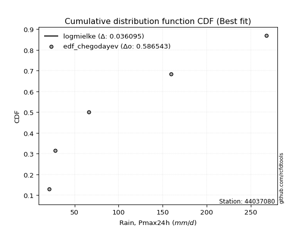</img>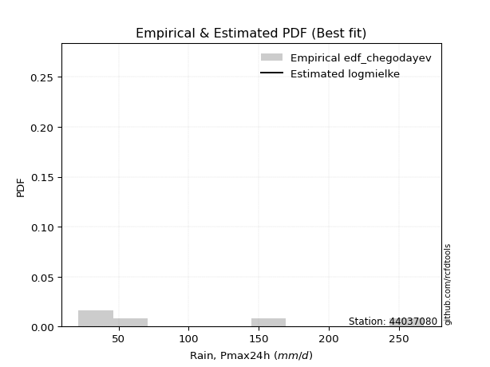</img>

</div>


### 6. EDF Blom (1958)

The Blom formula is a specific "plotting position" formula used in hydrology and statistical analysis to estimate the empirical cumulative probability (or non-exceedance probability) of a data series. It is particularly recommended for data that are approximately normally distributed. The constant _a_ is set to 0.375 (or 3/8).

<div align="center">


$P=(m-a)/(n+1-2a)$


</div>


**6.1. Empirical values**

<div align="center">

|                | 0                   | 1                   | 2        | 3                  | 4                  |
|:---------------|:--------------------|:--------------------|:---------|:-------------------|:-------------------|
| date           | 2023                | 2024                | 2019     | 2022               | 2020               |
| x              | 21.4                | 28.0                | 66.2     | 159.8              | 268.0              |
| m              | 1                   | 2                   | 3        | 4                  | 5                  |
| empirical_dist | edf_blom            | edf_blom            | edf_blom | edf_blom           | edf_blom           |
| empirical      | 0.11904761904761904 | 0.30952380952380953 | 0.5      | 0.6904761904761905 | 0.8809523809523809 |
| empirical_tr   | 1.135135135135135   | 1.4482758620689655  | 2.0      | 3.230769230769231  | 8.399999999999999  |

</div>


**6.2. Kolmogorov-Smirnov fit test (sorted by Δ)**


<div align="center">

|                | 0                  | 1                   | 2                   | 3                   | 4                   | 5                   | 6                   | 7                   | 8                   | 9                   | 10                  | 11                  | 12                  | 13                  | 14                  | 15                  | 16                  | 17                  | 18                  | 19                 | 20                 | 21                  | 22                  | 23                  | 24                  | 25                  | 26                  | 27                  | 28                  | 29                  | 30                  | 31                  | 32                  | 33                  | 34                 | 35                  | 36                  | 37                  | 38                 | 39                  | 40                  | 41                  | 42                  | 43                  | 44                  | 45                 | 46                  | 47                  | 48                  | 49                 | 50                  | 51                  | 52                 | 53                 | 54                  | 55                  | 56                  | 57                  | 58                 | 59                  | 60                 | 61                 | 62                  | 63                  | 64                  | 65                 | 66                  | 67                  | 68                 | 69                  | 70                  | 71                  | 72                  | 73                 | 74                  | 75                  | 76                  | 77                  | 78                  | 79                 | 80                  | 81                  | 82                 | 83                  | 84                  | 85                  | 86                  | 87                  | 88                  | 89                 | 90                  | 91                  | 92                  | 93                  | 94                  | 95                  | 96                  | 97                 | 98                  | 99                  | 100                | 101                | 102                 | 103                 | 104                | 105                | 106                 | 107                 | 108                 | 109                | 110                 | 111                 | 112                 | 113                 | 114                | 115                 | 116                 | 117                 | 118                | 119                | 120                | 121                 | 122                 | 123                 | 124                 | 125                | 126                 | 127                 | 128                 | 129                 | 130                | 131                | 132                 | 133                | 134                | 135                 | 136                | 137                 | 138                | 139                | 140                | 141                | 142                | 143                | 144                | 145                 | 146                 | 147                 | 148                | 149                 | 150                 | 151                 | 152                | 153                | 154                | 155                | 156                | 157                | 158                | 159                |
|:---------------|:-------------------|:--------------------|:--------------------|:--------------------|:--------------------|:--------------------|:--------------------|:--------------------|:--------------------|:--------------------|:--------------------|:--------------------|:--------------------|:--------------------|:--------------------|:--------------------|:--------------------|:--------------------|:--------------------|:-------------------|:-------------------|:--------------------|:--------------------|:--------------------|:--------------------|:--------------------|:--------------------|:--------------------|:--------------------|:--------------------|:--------------------|:--------------------|:--------------------|:--------------------|:-------------------|:--------------------|:--------------------|:--------------------|:-------------------|:--------------------|:--------------------|:--------------------|:--------------------|:--------------------|:--------------------|:-------------------|:--------------------|:--------------------|:--------------------|:-------------------|:--------------------|:--------------------|:-------------------|:-------------------|:--------------------|:--------------------|:--------------------|:--------------------|:-------------------|:--------------------|:-------------------|:-------------------|:--------------------|:--------------------|:--------------------|:-------------------|:--------------------|:--------------------|:-------------------|:--------------------|:--------------------|:--------------------|:--------------------|:-------------------|:--------------------|:--------------------|:--------------------|:--------------------|:--------------------|:-------------------|:--------------------|:--------------------|:-------------------|:--------------------|:--------------------|:--------------------|:--------------------|:--------------------|:--------------------|:-------------------|:--------------------|:--------------------|:--------------------|:--------------------|:--------------------|:--------------------|:--------------------|:-------------------|:--------------------|:--------------------|:-------------------|:-------------------|:--------------------|:--------------------|:-------------------|:-------------------|:--------------------|:--------------------|:--------------------|:-------------------|:--------------------|:--------------------|:--------------------|:--------------------|:-------------------|:--------------------|:--------------------|:--------------------|:-------------------|:-------------------|:-------------------|:--------------------|:--------------------|:--------------------|:--------------------|:-------------------|:--------------------|:--------------------|:--------------------|:--------------------|:-------------------|:-------------------|:--------------------|:-------------------|:-------------------|:--------------------|:-------------------|:--------------------|:-------------------|:-------------------|:-------------------|:-------------------|:-------------------|:-------------------|:-------------------|:--------------------|:--------------------|:--------------------|:-------------------|:--------------------|:--------------------|:--------------------|:-------------------|:-------------------|:-------------------|:-------------------|:-------------------|:-------------------|:-------------------|:-------------------|
| station        | 44037080           | 44037080            | 44037080            | 44037080            | 44037080            | 44037080            | 44037080            | 44037080            | 44037080            | 44037080            | 44037080            | 44037080            | 44037080            | 44037080            | 44037080            | 44037080            | 44037080            | 44037080            | 44037080            | 44037080           | 44037080           | 44037080            | 44037080            | 44037080            | 44037080            | 44037080            | 44037080            | 44037080            | 44037080            | 44037080            | 44037080            | 44037080            | 44037080            | 44037080            | 44037080           | 44037080            | 44037080            | 44037080            | 44037080           | 44037080            | 44037080            | 44037080            | 44037080            | 44037080            | 44037080            | 44037080           | 44037080            | 44037080            | 44037080            | 44037080           | 44037080            | 44037080            | 44037080           | 44037080           | 44037080            | 44037080            | 44037080            | 44037080            | 44037080           | 44037080            | 44037080           | 44037080           | 44037080            | 44037080            | 44037080            | 44037080           | 44037080            | 44037080            | 44037080           | 44037080            | 44037080            | 44037080            | 44037080            | 44037080           | 44037080            | 44037080            | 44037080            | 44037080            | 44037080            | 44037080           | 44037080            | 44037080            | 44037080           | 44037080            | 44037080            | 44037080            | 44037080            | 44037080            | 44037080            | 44037080           | 44037080            | 44037080            | 44037080            | 44037080            | 44037080            | 44037080            | 44037080            | 44037080           | 44037080            | 44037080            | 44037080           | 44037080           | 44037080            | 44037080            | 44037080           | 44037080           | 44037080            | 44037080            | 44037080            | 44037080           | 44037080            | 44037080            | 44037080            | 44037080            | 44037080           | 44037080            | 44037080            | 44037080            | 44037080           | 44037080           | 44037080           | 44037080            | 44037080            | 44037080            | 44037080            | 44037080           | 44037080            | 44037080            | 44037080            | 44037080            | 44037080           | 44037080           | 44037080            | 44037080           | 44037080           | 44037080            | 44037080           | 44037080            | 44037080           | 44037080           | 44037080           | 44037080           | 44037080           | 44037080           | 44037080           | 44037080            | 44037080            | 44037080            | 44037080           | 44037080            | 44037080            | 44037080            | 44037080           | 44037080           | 44037080           | 44037080           | 44037080           | 44037080           | 44037080           | 44037080           |
| empirical_dist | edf_blom           | edf_blom            | edf_blom            | edf_blom            | edf_blom            | edf_blom            | edf_blom            | edf_blom            | edf_blom            | edf_blom            | edf_blom            | edf_blom            | edf_blom            | edf_blom            | edf_blom            | edf_blom            | edf_blom            | edf_blom            | edf_blom            | edf_blom           | edf_blom           | edf_blom            | edf_blom            | edf_blom            | edf_blom            | edf_blom            | edf_blom            | edf_blom            | edf_blom            | edf_blom            | edf_blom            | edf_blom            | edf_blom            | edf_blom            | edf_blom           | edf_blom            | edf_blom            | edf_blom            | edf_blom           | edf_blom            | edf_blom            | edf_blom            | edf_blom            | edf_blom            | edf_blom            | edf_blom           | edf_blom            | edf_blom            | edf_blom            | edf_blom           | edf_blom            | edf_blom            | edf_blom           | edf_blom           | edf_blom            | edf_blom            | edf_blom            | edf_blom            | edf_blom           | edf_blom            | edf_blom           | edf_blom           | edf_blom            | edf_blom            | edf_blom            | edf_blom           | edf_blom            | edf_blom            | edf_blom           | edf_blom            | edf_blom            | edf_blom            | edf_blom            | edf_blom           | edf_blom            | edf_blom            | edf_blom            | edf_blom            | edf_blom            | edf_blom           | edf_blom            | edf_blom            | edf_blom           | edf_blom            | edf_blom            | edf_blom            | edf_blom            | edf_blom            | edf_blom            | edf_blom           | edf_blom            | edf_blom            | edf_blom            | edf_blom            | edf_blom            | edf_blom            | edf_blom            | edf_blom           | edf_blom            | edf_blom            | edf_blom           | edf_blom           | edf_blom            | edf_blom            | edf_blom           | edf_blom           | edf_blom            | edf_blom            | edf_blom            | edf_blom           | edf_blom            | edf_blom            | edf_blom            | edf_blom            | edf_blom           | edf_blom            | edf_blom            | edf_blom            | edf_blom           | edf_blom           | edf_blom           | edf_blom            | edf_blom            | edf_blom            | edf_blom            | edf_blom           | edf_blom            | edf_blom            | edf_blom            | edf_blom            | edf_blom           | edf_blom           | edf_blom            | edf_blom           | edf_blom           | edf_blom            | edf_blom           | edf_blom            | edf_blom           | edf_blom           | edf_blom           | edf_blom           | edf_blom           | edf_blom           | edf_blom           | edf_blom            | edf_blom            | edf_blom            | edf_blom           | edf_blom            | edf_blom            | edf_blom            | edf_blom           | edf_blom           | edf_blom           | edf_blom           | edf_blom           | edf_blom           | edf_blom           | edf_blom           |
| p_dist         | logmielke          | logarcsine          | logksone            | logsemicircular     | halfnorm            | loganglit           | logtrapezoid        | foldnorm            | betaprime           | logbeta             | gengamma            | exponweib           | logexponpow         | logrdist            | logexponweib        | logwrapcauchy       | gausshyper          | halflogistic        | exponpow            | loghalfgennorm     | loglomax           | dgamma              | burr12              | logburr12           | nct                 | logburr             | lograyleigh         | alpha               | loggenlogistic      | loghalfnorm         | nakagami            | loginvweibull       | loginvgamma         | logmaxwell          | lognct             | logfoldnorm         | logncf              | logkstwobign        | ksone              | truncexpon          | ncf                 | rayleigh            | gumbel_r            | logweibull_max      | logbetaprime        | logalpha           | loggamma            | loggamma            | logloggamma         | logerlang          | logpearson3         | logskewnorm         | logcrystalball     | lognorm            | logt                | logexponnorm        | logjohnsonsu        | genlogistic         | pearson3           | loggenexpon         | moyal              | semicircular       | maxwell             | loginvgauss         | loggenpareto        | dweibull           | logloglaplace       | genexpon            | kstwobign          | logcosine           | arcsine             | anglit              | loggumbel_l         | loglogistic        | logrice             | loggumbel_r         | logbradford         | truncweibull_min    | logdweibull         | logtruncexpon      | loghypsecant        | loggompertz         | invgamma           | loghalflogistic     | burr                | logargus            | f                   | crystalball         | norm                | t                  | invgauss            | loggausshyper       | logtriang           | loggenextreme       | loglaplace          | loglaplace          | logmoyal            | loglevy_l          | logtruncweibull_min | logkappa4           | logdgamma          | wrapcauchy         | loggennorm          | rice                | logistic           | logtukeylambda     | gennorm             | loguniform          | logkappa3           | logvonmises_line   | logf                | weibull_min         | cosine              | hypsecant           | johnsonsu          | halfgennorm         | gumbel_l            | lomax               | gompertz           | exponnorm          | truncnorm          | laplace             | levy_l              | logweibull_min      | loggenhalflogistic  | kappa4             | genpareto           | argus               | skewnorm            | bradford            | gamma              | beta               | wald                | triang             | fatiguelife        | tukeylambda         | logwald            | uniform             | vonmises_line      | erlang             | truncpareto        | powerlaw           | genhalflogistic    | genextreme         | lognakagami        | logfatiguelife      | kappa3              | johnsonsb           | invweibull         | logpowerlaw         | trapezoid           | logtruncpareto      | loggengamma        | logjohnsonsb       | logtruncnorm       | rdist              | weibull_max        | logvonmises        | vonmises           | mielke             |
| delta          | 0.0255130835408562 | 0.04949230894477738 | 0.08209243219280907 | 0.09850258716848526 | 0.09980253156396868 | 0.11033173084367906 | 0.11228539367347157 | 0.11275323136052834 | 0.11505589262671079 | 0.11904743647509408 | 0.11904743782518057 | 0.11904745508608686 | 0.11904757825392663 | 0.11904761568033595 | 0.11904761904757603 | 0.11904761904761907 | 0.11987872748184591 | 0.12201063483770888 | 0.12204844368154205 | 0.1234519260298349 | 0.1239027005358393 | 0.12456553271728854 | 0.12466925025821463 | 0.12502117763032672 | 0.12519560003486463 | 0.12547081231595425 | 0.12707512090256576 | 0.12802965830867397 | 0.12826918809442028 | 0.12861981010040005 | 0.12881141948250385 | 0.12886671632341487 | 0.12936953100758783 | 0.12978077763919993 | 0.1302221406265227 | 0.13048327953130828 | 0.13049870924360157 | 0.13073210100420588 | 0.130830655227266  | 0.13124737019092794 | 0.13205793755589512 | 0.13295886660160444 | 0.13361032706141796 | 0.13456893459984273 | 0.13464087177719067 | 0.1351705984380484 | 0.13569811842355173 | 0.13569811842355173 | 0.13590737994030788 | 0.1365429194926967 | 0.13658652243432554 | 0.13695144598771403 | 0.1369913276540973 | 0.1369914629186304 | 0.13699165378300088 | 0.13699195480228868 | 0.13718737924827507 | 0.13826064987495282 | 0.1406397785087518 | 0.14111255259929661 | 0.1414260901896821 | 0.1430171155450759 | 0.14462139660916679 | 0.14521894273786506 | 0.14616455390261715 | 0.1466606940090962 | 0.14699611785002997 | 0.15148417008839005 | 0.1517333753015664 | 0.15204138124543082 | 0.15216952676013343 | 0.15245568460825654 | 0.15550348807697117 | 0.1566969135865782 | 0.15709355235440814 | 0.15765095810640478 | 0.15965608119370905 | 0.16086943525399644 | 0.16138198258804515 | 0.1637631096691997 | 0.16746726483403387 | 0.16774310977349305 | 0.1686257093015664 | 0.16949383094789844 | 0.16970669094759072 | 0.17119191323706118 | 0.17189223262561182 | 0.17480147800805967 | 0.17480148009756658 | 0.1748085359198096 | 0.17539976576208494 | 0.17557512237891637 | 0.17590375674260406 | 0.17618011261025035 | 0.17798525386658315 | 0.17798525386658315 | 0.17904141660517559 | 0.1794839337339729 | 0.1796107053867888  | 0.18097957201385126 | 0.1851353385533655 | 0.1853717463653124 | 0.19047619047619047 | 0.19143044990951974 | 0.194667772252417  | 0.1959562645816455 | 0.20199065500395885 | 0.20317232695790938 | 0.20321745492336674 | 0.2032245934262393 | 0.20595289591206334 | 0.20619868704587752 | 0.20858787499728332 | 0.20958161176454465 | 0.210489684040007  | 0.22312043871504367 | 0.23054624511360733 | 0.23218005442043882 | 0.235986885386335  | 0.2359874391505683 | 0.23653550815865   | 0.23660062871623483 | 0.24179351447713418 | 0.24719435729279637 | 0.24939290444237988 | 0.24941223480783   | 0.25652886872622177 | 0.25687697831939316 | 0.26842501927902135 | 0.26886231711293357 | 0.2760631170041761 | 0.2863235279105413 | 0.29061948478932725 | 0.298073796498315  | 0.3009910667023339 | 0.30656920329327164 | 0.3094626711638133 | 0.31832927818329276 | 0.3234019424949076 | 0.3251236098665601 | 0.3501864773793908 | 0.3573486330153608 | 0.3590291792015595 | 0.3597890073919081 | 0.3778416663189863 | 0.38670385011438047 | 0.39776229141353187 | 0.42967164070339803 | 0.4384952632464694 | 0.44377813384795106 | 0.44464500333991686 | 0.44862435519534327 | 0.4571519298880218 | 0.4932576812227287 | 0.4999961381507031 | 0.5112097179926025 | 0.6087310985545229 | 1.1150420217094967 | 42.080787682469804 | nan                |
| deltao         | 0.5865427407550001 | 0.5865427407550001  | 0.5865427407550001  | 0.5865427407550001  | 0.5865427407550001  | 0.5865427407550001  | 0.5865427407550001  | 0.5865427407550001  | 0.5865427407550001  | 0.5865427407550001  | 0.5865427407550001  | 0.5865427407550001  | 0.5865427407550001  | 0.5865427407550001  | 0.5865427407550001  | 0.5865427407550001  | 0.5865427407550001  | 0.5865427407550001  | 0.5865427407550001  | 0.5865427407550001 | 0.5865427407550001 | 0.5865427407550001  | 0.5865427407550001  | 0.5865427407550001  | 0.5865427407550001  | 0.5865427407550001  | 0.5865427407550001  | 0.5865427407550001  | 0.5865427407550001  | 0.5865427407550001  | 0.5865427407550001  | 0.5865427407550001  | 0.5865427407550001  | 0.5865427407550001  | 0.5865427407550001 | 0.5865427407550001  | 0.5865427407550001  | 0.5865427407550001  | 0.5865427407550001 | 0.5865427407550001  | 0.5865427407550001  | 0.5865427407550001  | 0.5865427407550001  | 0.5865427407550001  | 0.5865427407550001  | 0.5865427407550001 | 0.5865427407550001  | 0.5865427407550001  | 0.5865427407550001  | 0.5865427407550001 | 0.5865427407550001  | 0.5865427407550001  | 0.5865427407550001 | 0.5865427407550001 | 0.5865427407550001  | 0.5865427407550001  | 0.5865427407550001  | 0.5865427407550001  | 0.5865427407550001 | 0.5865427407550001  | 0.5865427407550001 | 0.5865427407550001 | 0.5865427407550001  | 0.5865427407550001  | 0.5865427407550001  | 0.5865427407550001 | 0.5865427407550001  | 0.5865427407550001  | 0.5865427407550001 | 0.5865427407550001  | 0.5865427407550001  | 0.5865427407550001  | 0.5865427407550001  | 0.5865427407550001 | 0.5865427407550001  | 0.5865427407550001  | 0.5865427407550001  | 0.5865427407550001  | 0.5865427407550001  | 0.5865427407550001 | 0.5865427407550001  | 0.5865427407550001  | 0.5865427407550001 | 0.5865427407550001  | 0.5865427407550001  | 0.5865427407550001  | 0.5865427407550001  | 0.5865427407550001  | 0.5865427407550001  | 0.5865427407550001 | 0.5865427407550001  | 0.5865427407550001  | 0.5865427407550001  | 0.5865427407550001  | 0.5865427407550001  | 0.5865427407550001  | 0.5865427407550001  | 0.5865427407550001 | 0.5865427407550001  | 0.5865427407550001  | 0.5865427407550001 | 0.5865427407550001 | 0.5865427407550001  | 0.5865427407550001  | 0.5865427407550001 | 0.5865427407550001 | 0.5865427407550001  | 0.5865427407550001  | 0.5865427407550001  | 0.5865427407550001 | 0.5865427407550001  | 0.5865427407550001  | 0.5865427407550001  | 0.5865427407550001  | 0.5865427407550001 | 0.5865427407550001  | 0.5865427407550001  | 0.5865427407550001  | 0.5865427407550001 | 0.5865427407550001 | 0.5865427407550001 | 0.5865427407550001  | 0.5865427407550001  | 0.5865427407550001  | 0.5865427407550001  | 0.5865427407550001 | 0.5865427407550001  | 0.5865427407550001  | 0.5865427407550001  | 0.5865427407550001  | 0.5865427407550001 | 0.5865427407550001 | 0.5865427407550001  | 0.5865427407550001 | 0.5865427407550001 | 0.5865427407550001  | 0.5865427407550001 | 0.5865427407550001  | 0.5865427407550001 | 0.5865427407550001 | 0.5865427407550001 | 0.5865427407550001 | 0.5865427407550001 | 0.5865427407550001 | 0.5865427407550001 | 0.5865427407550001  | 0.5865427407550001  | 0.5865427407550001  | 0.5865427407550001 | 0.5865427407550001  | 0.5865427407550001  | 0.5865427407550001  | 0.5865427407550001 | 0.5865427407550001 | 0.5865427407550001 | 0.5865427407550001 | 0.5865427407550001 | 0.5865427407550001 | 0.5865427407550001 | 0.5865427407550001 |
| eval           | Δo > Δ             | Δo > Δ              | Δo > Δ              | Δo > Δ              | Δo > Δ              | Δo > Δ              | Δo > Δ              | Δo > Δ              | Δo > Δ              | Δo > Δ              | Δo > Δ              | Δo > Δ              | Δo > Δ              | Δo > Δ              | Δo > Δ              | Δo > Δ              | Δo > Δ              | Δo > Δ              | Δo > Δ              | Δo > Δ             | Δo > Δ             | Δo > Δ              | Δo > Δ              | Δo > Δ              | Δo > Δ              | Δo > Δ              | Δo > Δ              | Δo > Δ              | Δo > Δ              | Δo > Δ              | Δo > Δ              | Δo > Δ              | Δo > Δ              | Δo > Δ              | Δo > Δ             | Δo > Δ              | Δo > Δ              | Δo > Δ              | Δo > Δ             | Δo > Δ              | Δo > Δ              | Δo > Δ              | Δo > Δ              | Δo > Δ              | Δo > Δ              | Δo > Δ             | Δo > Δ              | Δo > Δ              | Δo > Δ              | Δo > Δ             | Δo > Δ              | Δo > Δ              | Δo > Δ             | Δo > Δ             | Δo > Δ              | Δo > Δ              | Δo > Δ              | Δo > Δ              | Δo > Δ             | Δo > Δ              | Δo > Δ             | Δo > Δ             | Δo > Δ              | Δo > Δ              | Δo > Δ              | Δo > Δ             | Δo > Δ              | Δo > Δ              | Δo > Δ             | Δo > Δ              | Δo > Δ              | Δo > Δ              | Δo > Δ              | Δo > Δ             | Δo > Δ              | Δo > Δ              | Δo > Δ              | Δo > Δ              | Δo > Δ              | Δo > Δ             | Δo > Δ              | Δo > Δ              | Δo > Δ             | Δo > Δ              | Δo > Δ              | Δo > Δ              | Δo > Δ              | Δo > Δ              | Δo > Δ              | Δo > Δ             | Δo > Δ              | Δo > Δ              | Δo > Δ              | Δo > Δ              | Δo > Δ              | Δo > Δ              | Δo > Δ              | Δo > Δ             | Δo > Δ              | Δo > Δ              | Δo > Δ             | Δo > Δ             | Δo > Δ              | Δo > Δ              | Δo > Δ             | Δo > Δ             | Δo > Δ              | Δo > Δ              | Δo > Δ              | Δo > Δ             | Δo > Δ              | Δo > Δ              | Δo > Δ              | Δo > Δ              | Δo > Δ             | Δo > Δ              | Δo > Δ              | Δo > Δ              | Δo > Δ             | Δo > Δ             | Δo > Δ             | Δo > Δ              | Δo > Δ              | Δo > Δ              | Δo > Δ              | Δo > Δ             | Δo > Δ              | Δo > Δ              | Δo > Δ              | Δo > Δ              | Δo > Δ             | Δo > Δ             | Δo > Δ              | Δo > Δ             | Δo > Δ             | Δo > Δ              | Δo > Δ             | Δo > Δ              | Δo > Δ             | Δo > Δ             | Δo > Δ             | Δo > Δ             | Δo > Δ             | Δo > Δ             | Δo > Δ             | Δo > Δ              | Δo > Δ              | Δo > Δ              | Δo > Δ             | Δo > Δ              | Δo > Δ              | Δo > Δ              | Δo > Δ             | Δo > Δ             | Δo > Δ             | Δo > Δ             | Δo <= Δ            | Δo <= Δ            | Δo <= Δ            | Δo <= Δ            |
| fit            | 1                  | 1                   | 1                   | 1                   | 1                   | 1                   | 1                   | 1                   | 1                   | 1                   | 1                   | 1                   | 1                   | 1                   | 1                   | 1                   | 1                   | 1                   | 1                   | 1                  | 1                  | 1                   | 1                   | 1                   | 1                   | 1                   | 1                   | 1                   | 1                   | 1                   | 1                   | 1                   | 1                   | 1                   | 1                  | 1                   | 1                   | 1                   | 1                  | 1                   | 1                   | 1                   | 1                   | 1                   | 1                   | 1                  | 1                   | 1                   | 1                   | 1                  | 1                   | 1                   | 1                  | 1                  | 1                   | 1                   | 1                   | 1                   | 1                  | 1                   | 1                  | 1                  | 1                   | 1                   | 1                   | 1                  | 1                   | 1                   | 1                  | 1                   | 1                   | 1                   | 1                   | 1                  | 1                   | 1                   | 1                   | 1                   | 1                   | 1                  | 1                   | 1                   | 1                  | 1                   | 1                   | 1                   | 1                   | 1                   | 1                   | 1                  | 1                   | 1                   | 1                   | 1                   | 1                   | 1                   | 1                   | 1                  | 1                   | 1                   | 1                  | 1                  | 1                   | 1                   | 1                  | 1                  | 1                   | 1                   | 1                   | 1                  | 1                   | 1                   | 1                   | 1                   | 1                  | 1                   | 1                   | 1                   | 1                  | 1                  | 1                  | 1                   | 1                   | 1                   | 1                   | 1                  | 1                   | 1                   | 1                   | 1                   | 1                  | 1                  | 1                   | 1                  | 1                  | 1                   | 1                  | 1                   | 1                  | 1                  | 1                  | 1                  | 1                  | 1                  | 1                  | 1                   | 1                   | 1                   | 1                  | 1                   | 1                   | 1                   | 1                  | 1                  | 1                  | 1                  | 0                  | 0                  | 0                  | 0                  |
| n              | 5                  | 5                   | 5                   | 5                   | 5                   | 5                   | 5                   | 5                   | 5                   | 5                   | 5                   | 5                   | 5                   | 5                   | 5                   | 5                   | 5                   | 5                   | 5                   | 5                  | 5                  | 5                   | 5                   | 5                   | 5                   | 5                   | 5                   | 5                   | 5                   | 5                   | 5                   | 5                   | 5                   | 5                   | 5                  | 5                   | 5                   | 5                   | 5                  | 5                   | 5                   | 5                   | 5                   | 5                   | 5                   | 5                  | 5                   | 5                   | 5                   | 5                  | 5                   | 5                   | 5                  | 5                  | 5                   | 5                   | 5                   | 5                   | 5                  | 5                   | 5                  | 5                  | 5                   | 5                   | 5                   | 5                  | 5                   | 5                   | 5                  | 5                   | 5                   | 5                   | 5                   | 5                  | 5                   | 5                   | 5                   | 5                   | 5                   | 5                  | 5                   | 5                   | 5                  | 5                   | 5                   | 5                   | 5                   | 5                   | 5                   | 5                  | 5                   | 5                   | 5                   | 5                   | 5                   | 5                   | 5                   | 5                  | 5                   | 5                   | 5                  | 5                  | 5                   | 5                   | 5                  | 5                  | 5                   | 5                   | 5                   | 5                  | 5                   | 5                   | 5                   | 5                   | 5                  | 5                   | 5                   | 5                   | 5                  | 5                  | 5                  | 5                   | 5                   | 5                   | 5                   | 5                  | 5                   | 5                   | 5                   | 5                   | 5                  | 5                  | 5                   | 5                  | 5                  | 5                   | 5                  | 5                   | 5                  | 5                  | 5                  | 5                  | 5                  | 5                  | 5                  | 5                   | 5                   | 5                   | 5                  | 5                   | 5                   | 5                   | 5                  | 5                  | 5                  | 5                  | 5                  | 5                  | 5                  | 5                  |
| best_fit       | 1                  | 0                   | 0                   | 0                   | 0                   | 0                   | 0                   | 0                   | 0                   | 0                   | 0                   | 0                   | 0                   | 0                   | 0                   | 0                   | 0                   | 0                   | 0                   | 0                  | 0                  | 0                   | 0                   | 0                   | 0                   | 0                   | 0                   | 0                   | 0                   | 0                   | 0                   | 0                   | 0                   | 0                   | 0                  | 0                   | 0                   | 0                   | 0                  | 0                   | 0                   | 0                   | 0                   | 0                   | 0                   | 0                  | 0                   | 0                   | 0                   | 0                  | 0                   | 0                   | 0                  | 0                  | 0                   | 0                   | 0                   | 0                   | 0                  | 0                   | 0                  | 0                  | 0                   | 0                   | 0                   | 0                  | 0                   | 0                   | 0                  | 0                   | 0                   | 0                   | 0                   | 0                  | 0                   | 0                   | 0                   | 0                   | 0                   | 0                  | 0                   | 0                   | 0                  | 0                   | 0                   | 0                   | 0                   | 0                   | 0                   | 0                  | 0                   | 0                   | 0                   | 0                   | 0                   | 0                   | 0                   | 0                  | 0                   | 0                   | 0                  | 0                  | 0                   | 0                   | 0                  | 0                  | 0                   | 0                   | 0                   | 0                  | 0                   | 0                   | 0                   | 0                   | 0                  | 0                   | 0                   | 0                   | 0                  | 0                  | 0                  | 0                   | 0                   | 0                   | 0                   | 0                  | 0                   | 0                   | 0                   | 0                   | 0                  | 0                  | 0                   | 0                  | 0                  | 0                   | 0                  | 0                   | 0                  | 0                  | 0                  | 0                  | 0                  | 0                  | 0                  | 0                   | 0                   | 0                   | 0                  | 0                   | 0                   | 0                   | 0                  | 0                  | 0                  | 0                  | 0                  | 0                  | 0                  | 0                  |
| best_fit_sort  | 1                  | 2                   | 3                   | 4                   | 5                   | 6                   | 7                   | 8                   | 9                   | 10                  | 11                  | 12                  | 13                  | 14                  | 15                  | 16                  | 17                  | 18                  | 19                  | 20                 | 21                 | 22                  | 23                  | 24                  | 25                  | 26                  | 27                  | 28                  | 29                  | 30                  | 31                  | 32                  | 33                  | 34                  | 35                 | 36                  | 37                  | 38                  | 39                 | 40                  | 41                  | 42                  | 43                  | 44                  | 45                  | 46                 | 47                  | 48                  | 49                  | 50                 | 51                  | 52                  | 53                 | 54                 | 55                  | 56                  | 57                  | 58                  | 59                 | 60                  | 61                 | 62                 | 63                  | 64                  | 65                  | 66                 | 67                  | 68                  | 69                 | 70                  | 71                  | 72                  | 73                  | 74                 | 75                  | 76                  | 77                  | 78                  | 79                  | 80                 | 81                  | 82                  | 83                 | 84                  | 85                  | 86                  | 87                  | 88                  | 89                  | 90                 | 91                  | 92                  | 93                  | 94                  | 95                  | 96                  | 97                  | 98                 | 99                  | 100                 | 101                | 102                | 103                 | 104                 | 105                | 106                | 107                 | 108                 | 109                 | 110                | 111                 | 112                 | 113                 | 114                 | 115                | 116                 | 117                 | 118                 | 119                | 120                | 121                | 122                 | 123                 | 124                 | 125                 | 126                | 127                 | 128                 | 129                 | 130                 | 131                | 132                | 133                 | 134                | 135                | 136                 | 137                | 138                 | 139                | 140                | 141                | 142                | 143                | 144                | 145                | 146                 | 147                 | 148                 | 149                | 150                 | 151                 | 152                 | 153                | 154                | 155                | 156                | 157                | 158                | 159                | 160                |

</div>


**6.3. Best fit**

<div align="center">

|   id |   station | empirical_dist   | p_dist    |     delta |   deltao | eval   |   fit |   n |   best_fit |   best_fit_sort |
|-----:|----------:|:-----------------|:----------|----------:|---------:|:-------|------:|----:|-----------:|----------------:|
|    0 |  44037080 | edf_blom         | logmielke | 0.0255131 | 0.586543 | Δo > Δ |     1 |   5 |          1 |               1 |

</div>


<div align="center">

</img>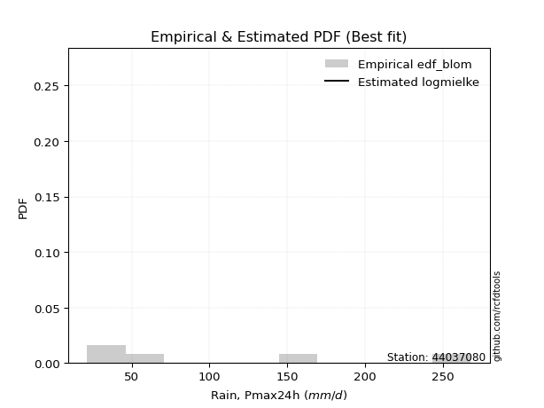</img>

</div>


### 7. EDF Tukey (1962)

In hydrology, the Tukey formula is used as a plotting position formula to estimate the empirical probability or frequency of a flood event (or other hydrological data). The formula parameter is given as _c=0.333_ (or 1/3).

<div align="center">


$P=(m-c)/(n+1-2c)$


</div>


**7.1. Empirical values**

<div align="center">

|                | 0                  | 1                  | 2         | 3         | 4         |
|:---------------|:-------------------|:-------------------|:----------|:----------|:----------|
| date           | 2023               | 2024               | 2019      | 2022      | 2020      |
| x              | 21.4               | 28.0               | 66.2      | 159.8     | 268.0     |
| m              | 1                  | 2                  | 3         | 4         | 5         |
| empirical_dist | edf_tukey          | edf_tukey          | edf_tukey | edf_tukey | edf_tukey |
| empirical      | 0.125              | 0.3125             | 0.5       | 0.6875    | 0.875     |
| empirical_tr   | 1.1428571428571428 | 1.4545454545454546 | 2.0       | 3.2       | 8.0       |

</div>


**7.2. Kolmogorov-Smirnov fit test (sorted by Δ)**


<div align="center">

|                | 0                   | 1                    | 2                   | 3                   | 4                   | 5                   | 6                   | 7                   | 8                   | 9                   | 10                  | 11                  | 12                  | 13                  | 14                  | 15                  | 16                  | 17                 | 18                  | 19                  | 20                  | 21                  | 22                  | 23                  | 24                 | 25                 | 26                  | 27                  | 28                  | 29                 | 30                  | 31                  | 32                  | 33                  | 34                  | 35                 | 36                 | 37                  | 38                  | 39                  | 40                  | 41                  | 42                  | 43                 | 44                  | 45                  | 46                 | 47                 | 48                  | 49                  | 50                 | 51                 | 52                  | 53                  | 54                  | 55                  | 56                  | 57                 | 58                 | 59                  | 60                 | 61                  | 62                  | 63                  | 64                  | 65                  | 66                  | 67                  | 68                  | 69                 | 70                  | 71                  | 72                  | 73                  | 74                 | 75                  | 76                  | 77                 | 78                 | 79                  | 80                 | 81                  | 82                  | 83                  | 84                 | 85                 | 86                  | 87                  | 88                  | 89                  | 90                 | 91                  | 92                  | 93                  | 94                  | 95                  | 96                  | 97                  | 98                  | 99                  | 100                 | 101                | 102                 | 103                 | 104                | 105                 | 106                 | 107                 | 108                 | 109                | 110                 | 111                 | 112                 | 113                 | 114                | 115                 | 116                 | 117                 | 118                 | 119                 | 120                 | 121                 | 122                 | 123                 | 124                 | 125                | 126                 | 127                 | 128                | 129                 | 130                 | 131                 | 132                | 133                | 134                | 135                 | 136                | 137                 | 138                | 139                | 140                | 141                | 142                 | 143                | 144                 | 145                | 146                 | 147                 | 148                | 149                | 150                 | 151                | 152                | 153                 | 154                | 155                | 156                | 157                | 158                | 159                |
|:---------------|:--------------------|:---------------------|:--------------------|:--------------------|:--------------------|:--------------------|:--------------------|:--------------------|:--------------------|:--------------------|:--------------------|:--------------------|:--------------------|:--------------------|:--------------------|:--------------------|:--------------------|:-------------------|:--------------------|:--------------------|:--------------------|:--------------------|:--------------------|:--------------------|:-------------------|:-------------------|:--------------------|:--------------------|:--------------------|:-------------------|:--------------------|:--------------------|:--------------------|:--------------------|:--------------------|:-------------------|:-------------------|:--------------------|:--------------------|:--------------------|:--------------------|:--------------------|:--------------------|:-------------------|:--------------------|:--------------------|:-------------------|:-------------------|:--------------------|:--------------------|:-------------------|:-------------------|:--------------------|:--------------------|:--------------------|:--------------------|:--------------------|:-------------------|:-------------------|:--------------------|:-------------------|:--------------------|:--------------------|:--------------------|:--------------------|:--------------------|:--------------------|:--------------------|:--------------------|:-------------------|:--------------------|:--------------------|:--------------------|:--------------------|:-------------------|:--------------------|:--------------------|:-------------------|:-------------------|:--------------------|:-------------------|:--------------------|:--------------------|:--------------------|:-------------------|:-------------------|:--------------------|:--------------------|:--------------------|:--------------------|:-------------------|:--------------------|:--------------------|:--------------------|:--------------------|:--------------------|:--------------------|:--------------------|:--------------------|:--------------------|:--------------------|:-------------------|:--------------------|:--------------------|:-------------------|:--------------------|:--------------------|:--------------------|:--------------------|:-------------------|:--------------------|:--------------------|:--------------------|:--------------------|:-------------------|:--------------------|:--------------------|:--------------------|:--------------------|:--------------------|:--------------------|:--------------------|:--------------------|:--------------------|:--------------------|:-------------------|:--------------------|:--------------------|:-------------------|:--------------------|:--------------------|:--------------------|:-------------------|:-------------------|:-------------------|:--------------------|:-------------------|:--------------------|:-------------------|:-------------------|:-------------------|:-------------------|:--------------------|:-------------------|:--------------------|:-------------------|:--------------------|:--------------------|:-------------------|:-------------------|:--------------------|:-------------------|:-------------------|:--------------------|:-------------------|:-------------------|:-------------------|:-------------------|:-------------------|:-------------------|
| station        | 44037080            | 44037080             | 44037080            | 44037080            | 44037080            | 44037080            | 44037080            | 44037080            | 44037080            | 44037080            | 44037080            | 44037080            | 44037080            | 44037080            | 44037080            | 44037080            | 44037080            | 44037080           | 44037080            | 44037080            | 44037080            | 44037080            | 44037080            | 44037080            | 44037080           | 44037080           | 44037080            | 44037080            | 44037080            | 44037080           | 44037080            | 44037080            | 44037080            | 44037080            | 44037080            | 44037080           | 44037080           | 44037080            | 44037080            | 44037080            | 44037080            | 44037080            | 44037080            | 44037080           | 44037080            | 44037080            | 44037080           | 44037080           | 44037080            | 44037080            | 44037080           | 44037080           | 44037080            | 44037080            | 44037080            | 44037080            | 44037080            | 44037080           | 44037080           | 44037080            | 44037080           | 44037080            | 44037080            | 44037080            | 44037080            | 44037080            | 44037080            | 44037080            | 44037080            | 44037080           | 44037080            | 44037080            | 44037080            | 44037080            | 44037080           | 44037080            | 44037080            | 44037080           | 44037080           | 44037080            | 44037080           | 44037080            | 44037080            | 44037080            | 44037080           | 44037080           | 44037080            | 44037080            | 44037080            | 44037080            | 44037080           | 44037080            | 44037080            | 44037080            | 44037080            | 44037080            | 44037080            | 44037080            | 44037080            | 44037080            | 44037080            | 44037080           | 44037080            | 44037080            | 44037080           | 44037080            | 44037080            | 44037080            | 44037080            | 44037080           | 44037080            | 44037080            | 44037080            | 44037080            | 44037080           | 44037080            | 44037080            | 44037080            | 44037080            | 44037080            | 44037080            | 44037080            | 44037080            | 44037080            | 44037080            | 44037080           | 44037080            | 44037080            | 44037080           | 44037080            | 44037080            | 44037080            | 44037080           | 44037080           | 44037080           | 44037080            | 44037080           | 44037080            | 44037080           | 44037080           | 44037080           | 44037080           | 44037080            | 44037080           | 44037080            | 44037080           | 44037080            | 44037080            | 44037080           | 44037080           | 44037080            | 44037080           | 44037080           | 44037080            | 44037080           | 44037080           | 44037080           | 44037080           | 44037080           | 44037080           |
| empirical_dist | edf_tukey           | edf_tukey            | edf_tukey           | edf_tukey           | edf_tukey           | edf_tukey           | edf_tukey           | edf_tukey           | edf_tukey           | edf_tukey           | edf_tukey           | edf_tukey           | edf_tukey           | edf_tukey           | edf_tukey           | edf_tukey           | edf_tukey           | edf_tukey          | edf_tukey           | edf_tukey           | edf_tukey           | edf_tukey           | edf_tukey           | edf_tukey           | edf_tukey          | edf_tukey          | edf_tukey           | edf_tukey           | edf_tukey           | edf_tukey          | edf_tukey           | edf_tukey           | edf_tukey           | edf_tukey           | edf_tukey           | edf_tukey          | edf_tukey          | edf_tukey           | edf_tukey           | edf_tukey           | edf_tukey           | edf_tukey           | edf_tukey           | edf_tukey          | edf_tukey           | edf_tukey           | edf_tukey          | edf_tukey          | edf_tukey           | edf_tukey           | edf_tukey          | edf_tukey          | edf_tukey           | edf_tukey           | edf_tukey           | edf_tukey           | edf_tukey           | edf_tukey          | edf_tukey          | edf_tukey           | edf_tukey          | edf_tukey           | edf_tukey           | edf_tukey           | edf_tukey           | edf_tukey           | edf_tukey           | edf_tukey           | edf_tukey           | edf_tukey          | edf_tukey           | edf_tukey           | edf_tukey           | edf_tukey           | edf_tukey          | edf_tukey           | edf_tukey           | edf_tukey          | edf_tukey          | edf_tukey           | edf_tukey          | edf_tukey           | edf_tukey           | edf_tukey           | edf_tukey          | edf_tukey          | edf_tukey           | edf_tukey           | edf_tukey           | edf_tukey           | edf_tukey          | edf_tukey           | edf_tukey           | edf_tukey           | edf_tukey           | edf_tukey           | edf_tukey           | edf_tukey           | edf_tukey           | edf_tukey           | edf_tukey           | edf_tukey          | edf_tukey           | edf_tukey           | edf_tukey          | edf_tukey           | edf_tukey           | edf_tukey           | edf_tukey           | edf_tukey          | edf_tukey           | edf_tukey           | edf_tukey           | edf_tukey           | edf_tukey          | edf_tukey           | edf_tukey           | edf_tukey           | edf_tukey           | edf_tukey           | edf_tukey           | edf_tukey           | edf_tukey           | edf_tukey           | edf_tukey           | edf_tukey          | edf_tukey           | edf_tukey           | edf_tukey          | edf_tukey           | edf_tukey           | edf_tukey           | edf_tukey          | edf_tukey          | edf_tukey          | edf_tukey           | edf_tukey          | edf_tukey           | edf_tukey          | edf_tukey          | edf_tukey          | edf_tukey          | edf_tukey           | edf_tukey          | edf_tukey           | edf_tukey          | edf_tukey           | edf_tukey           | edf_tukey          | edf_tukey          | edf_tukey           | edf_tukey          | edf_tukey          | edf_tukey           | edf_tukey          | edf_tukey          | edf_tukey          | edf_tukey          | edf_tukey          | edf_tukey          |
| p_dist         | logmielke           | logarcsine           | logksone            | halfnorm            | logsemicircular     | foldnorm            | loganglit           | logtrapezoid        | betaprime           | dgamma              | halflogistic        | logbeta             | gengamma            | exponweib           | logexponpow         | logrdist            | logexponweib        | logwrapcauchy      | gausshyper          | logburr12           | exponpow            | truncexpon          | loghalfgennorm      | loglomax            | burr12             | nct                | logburr             | logweibull_max      | lograyleigh         | ksone              | alpha               | loggenlogistic      | loghalfnorm         | nakagami            | loginvweibull       | loginvgamma        | logmaxwell         | rayleigh            | lognct              | logfoldnorm         | logncf              | gumbel_r            | logkstwobign        | ncf                | logbetaprime        | logalpha            | loggamma           | loggamma           | logloggamma         | logerlang           | logpearson3        | logskewnorm        | logcrystalball      | lognorm             | logt                | logexponnorm        | logjohnsonsu        | loggenpareto       | pearson3           | genlogistic         | semicircular       | dweibull            | loggenexpon         | moyal               | maxwell             | loginvgauss         | arcsine             | logloglaplace       | anglit              | genexpon           | kstwobign           | logcosine           | loggumbel_l         | loglogistic         | logrice            | loggumbel_r         | logbradford         | truncweibull_min   | logdweibull        | logtruncexpon       | invgamma           | loghypsecant        | loggompertz         | f                   | loghalflogistic    | burr               | loglevy_l           | logargus            | crystalball         | norm                | t                  | invgauss            | loggenextreme       | loggausshyper       | logtriang           | loglaplace          | loglaplace          | logmoyal            | wrapcauchy          | logtruncweibull_min | logkappa4           | loggennorm         | logdgamma           | rice                | logistic           | logtukeylambda      | gennorm             | logf                | loguniform          | logkappa3          | logvonmises_line    | cosine              | weibull_min         | hypsecant           | johnsonsu          | halfgennorm         | gumbel_l            | lomax               | levy_l              | laplace             | gompertz            | exponnorm           | truncnorm           | logweibull_min      | loggenhalflogistic  | kappa4             | genpareto           | argus               | skewnorm           | bradford            | gamma               | beta                | wald               | fatiguelife        | triang             | tukeylambda         | logwald            | uniform             | vonmises_line      | erlang             | truncpareto        | genextreme         | powerlaw            | genhalflogistic    | lognakagami         | logfatiguelife     | kappa3              | johnsonsb           | invweibull         | logpowerlaw        | trapezoid           | logtruncpareto     | loggengamma        | logjohnsonsb        | logtruncnorm       | rdist              | weibull_max        | logvonmises        | vonmises           | mielke             |
| delta          | 0.03146546449323716 | 0.052772637690455815 | 0.08506862266899953 | 0.09980253156396868 | 0.10147877764467572 | 0.11275323136052834 | 0.11330792131986953 | 0.11526158414966203 | 0.11803208310290125 | 0.12158934224109808 | 0.12498682531389935 | 0.12499981742747501 | 0.12499981877756153 | 0.12499983603846782 | 0.12499995920630759 | 0.12499999663271688 | 0.12499999999995699 | 0.125              | 0.12500000000005063 | 0.12502117763032672 | 0.12502463415773252 | 0.12529498923854698 | 0.12642811650602537 | 0.12687889101202976 | 0.1276454407344051 | 0.1281717905110551 | 0.12844700279214472 | 0.12861655364746177 | 0.13005131137875622 | 0.130830655227266  | 0.13100584878486443 | 0.13124537857061075 | 0.13159600057659052 | 0.13178760995869432 | 0.13184290679960534 | 0.1323457214837783 | 0.1327569681153904 | 0.13295886660160444 | 0.13319833110271317 | 0.13345947000749875 | 0.13347489971979204 | 0.13361032706141796 | 0.13370829148039634 | 0.1350341280320856 | 0.13761706225338113 | 0.13814678891423887 | 0.1386743088997422 | 0.1386743088997422 | 0.13888357041649835 | 0.13951910996888717 | 0.139562712910516  | 0.1399276364639045 | 0.13996751813028777 | 0.13996765339482087 | 0.13996784425919134 | 0.13996814527847914 | 0.14016356972446553 | 0.1402121729502362 | 0.1406397785087518 | 0.14123684035114328 | 0.1430171155450759 | 0.14368450353290574 | 0.14408874307548708 | 0.14440228066587257 | 0.14462139660916679 | 0.14521894273786506 | 0.14621714580775247 | 0.14997230832622044 | 0.15245568460825654 | 0.1544603605645805 | 0.15470956577775685 | 0.15501757172162128 | 0.15847967855316164 | 0.15967310406276866 | 0.1600697428305986 | 0.16062714858259525 | 0.16263227166989952 | 0.1638456257301869 | 0.1643581730642356 | 0.16673930014539018 | 0.1686257093015664 | 0.17044345531022434 | 0.17071930024968351 | 0.17189223262561182 | 0.1724700214240889 | 0.1726828814237812 | 0.17353155278159194 | 0.17416810371325164 | 0.17480147800805967 | 0.17480148009756658 | 0.1748085359198096 | 0.17539976576208494 | 0.17618011261025035 | 0.17855131285510684 | 0.17887994721879452 | 0.18096144434277361 | 0.18096144434277361 | 0.18201760708136605 | 0.18239555588912193 | 0.18258689586297927 | 0.18395576249004172 | 0.1875             | 0.18811152902955597 | 0.19143044990951974 | 0.194667772252417  | 0.19893245505783597 | 0.20496684548014932 | 0.20595289591206334 | 0.20614851743409984 | 0.2061936453995572 | 0.20620078390242977 | 0.20858787499728332 | 0.20917487752206798 | 0.20958161176454465 | 0.210489684040007  | 0.22609662919123413 | 0.23054624511360733 | 0.23515624489662929 | 0.23584113352475322 | 0.23660062871623483 | 0.23896307586252546 | 0.23896362962675877 | 0.23951169863484045 | 0.24124197634041544 | 0.25236909491857035 | 0.2523884252840205 | 0.25652886872622177 | 0.25687697831939316 | 0.2714012097552118 | 0.27183850758912403 | 0.27903930748036654 | 0.28037114695816034 | 0.2935956752655177 | 0.2980148762261434 | 0.298073796498315  | 0.30656920329327164 | 0.3124388616400038 | 0.31832927818329276 | 0.3234019424949076 | 0.3251236098665601 | 0.3501864773793908 | 0.3538366264395272 | 0.35437244253917033 | 0.3590291792015595 | 0.37486547584279584 | 0.38372765963819   | 0.39180991046115093 | 0.42669545022720756 | 0.4325428822940885 | 0.4408019433717606 | 0.44464500333991686 | 0.4456481647191528 | 0.4541757394118313 | 0.49028149074653826 | 0.4999961381507031 | 0.5052573370402216 | 0.6057549080783324 | 1.1180182121856872 | 42.086740063422184 | nan                |
| deltao         | 0.5865427407550001  | 0.5865427407550001   | 0.5865427407550001  | 0.5865427407550001  | 0.5865427407550001  | 0.5865427407550001  | 0.5865427407550001  | 0.5865427407550001  | 0.5865427407550001  | 0.5865427407550001  | 0.5865427407550001  | 0.5865427407550001  | 0.5865427407550001  | 0.5865427407550001  | 0.5865427407550001  | 0.5865427407550001  | 0.5865427407550001  | 0.5865427407550001 | 0.5865427407550001  | 0.5865427407550001  | 0.5865427407550001  | 0.5865427407550001  | 0.5865427407550001  | 0.5865427407550001  | 0.5865427407550001 | 0.5865427407550001 | 0.5865427407550001  | 0.5865427407550001  | 0.5865427407550001  | 0.5865427407550001 | 0.5865427407550001  | 0.5865427407550001  | 0.5865427407550001  | 0.5865427407550001  | 0.5865427407550001  | 0.5865427407550001 | 0.5865427407550001 | 0.5865427407550001  | 0.5865427407550001  | 0.5865427407550001  | 0.5865427407550001  | 0.5865427407550001  | 0.5865427407550001  | 0.5865427407550001 | 0.5865427407550001  | 0.5865427407550001  | 0.5865427407550001 | 0.5865427407550001 | 0.5865427407550001  | 0.5865427407550001  | 0.5865427407550001 | 0.5865427407550001 | 0.5865427407550001  | 0.5865427407550001  | 0.5865427407550001  | 0.5865427407550001  | 0.5865427407550001  | 0.5865427407550001 | 0.5865427407550001 | 0.5865427407550001  | 0.5865427407550001 | 0.5865427407550001  | 0.5865427407550001  | 0.5865427407550001  | 0.5865427407550001  | 0.5865427407550001  | 0.5865427407550001  | 0.5865427407550001  | 0.5865427407550001  | 0.5865427407550001 | 0.5865427407550001  | 0.5865427407550001  | 0.5865427407550001  | 0.5865427407550001  | 0.5865427407550001 | 0.5865427407550001  | 0.5865427407550001  | 0.5865427407550001 | 0.5865427407550001 | 0.5865427407550001  | 0.5865427407550001 | 0.5865427407550001  | 0.5865427407550001  | 0.5865427407550001  | 0.5865427407550001 | 0.5865427407550001 | 0.5865427407550001  | 0.5865427407550001  | 0.5865427407550001  | 0.5865427407550001  | 0.5865427407550001 | 0.5865427407550001  | 0.5865427407550001  | 0.5865427407550001  | 0.5865427407550001  | 0.5865427407550001  | 0.5865427407550001  | 0.5865427407550001  | 0.5865427407550001  | 0.5865427407550001  | 0.5865427407550001  | 0.5865427407550001 | 0.5865427407550001  | 0.5865427407550001  | 0.5865427407550001 | 0.5865427407550001  | 0.5865427407550001  | 0.5865427407550001  | 0.5865427407550001  | 0.5865427407550001 | 0.5865427407550001  | 0.5865427407550001  | 0.5865427407550001  | 0.5865427407550001  | 0.5865427407550001 | 0.5865427407550001  | 0.5865427407550001  | 0.5865427407550001  | 0.5865427407550001  | 0.5865427407550001  | 0.5865427407550001  | 0.5865427407550001  | 0.5865427407550001  | 0.5865427407550001  | 0.5865427407550001  | 0.5865427407550001 | 0.5865427407550001  | 0.5865427407550001  | 0.5865427407550001 | 0.5865427407550001  | 0.5865427407550001  | 0.5865427407550001  | 0.5865427407550001 | 0.5865427407550001 | 0.5865427407550001 | 0.5865427407550001  | 0.5865427407550001 | 0.5865427407550001  | 0.5865427407550001 | 0.5865427407550001 | 0.5865427407550001 | 0.5865427407550001 | 0.5865427407550001  | 0.5865427407550001 | 0.5865427407550001  | 0.5865427407550001 | 0.5865427407550001  | 0.5865427407550001  | 0.5865427407550001 | 0.5865427407550001 | 0.5865427407550001  | 0.5865427407550001 | 0.5865427407550001 | 0.5865427407550001  | 0.5865427407550001 | 0.5865427407550001 | 0.5865427407550001 | 0.5865427407550001 | 0.5865427407550001 | 0.5865427407550001 |
| eval           | Δo > Δ              | Δo > Δ               | Δo > Δ              | Δo > Δ              | Δo > Δ              | Δo > Δ              | Δo > Δ              | Δo > Δ              | Δo > Δ              | Δo > Δ              | Δo > Δ              | Δo > Δ              | Δo > Δ              | Δo > Δ              | Δo > Δ              | Δo > Δ              | Δo > Δ              | Δo > Δ             | Δo > Δ              | Δo > Δ              | Δo > Δ              | Δo > Δ              | Δo > Δ              | Δo > Δ              | Δo > Δ             | Δo > Δ             | Δo > Δ              | Δo > Δ              | Δo > Δ              | Δo > Δ             | Δo > Δ              | Δo > Δ              | Δo > Δ              | Δo > Δ              | Δo > Δ              | Δo > Δ             | Δo > Δ             | Δo > Δ              | Δo > Δ              | Δo > Δ              | Δo > Δ              | Δo > Δ              | Δo > Δ              | Δo > Δ             | Δo > Δ              | Δo > Δ              | Δo > Δ             | Δo > Δ             | Δo > Δ              | Δo > Δ              | Δo > Δ             | Δo > Δ             | Δo > Δ              | Δo > Δ              | Δo > Δ              | Δo > Δ              | Δo > Δ              | Δo > Δ             | Δo > Δ             | Δo > Δ              | Δo > Δ             | Δo > Δ              | Δo > Δ              | Δo > Δ              | Δo > Δ              | Δo > Δ              | Δo > Δ              | Δo > Δ              | Δo > Δ              | Δo > Δ             | Δo > Δ              | Δo > Δ              | Δo > Δ              | Δo > Δ              | Δo > Δ             | Δo > Δ              | Δo > Δ              | Δo > Δ             | Δo > Δ             | Δo > Δ              | Δo > Δ             | Δo > Δ              | Δo > Δ              | Δo > Δ              | Δo > Δ             | Δo > Δ             | Δo > Δ              | Δo > Δ              | Δo > Δ              | Δo > Δ              | Δo > Δ             | Δo > Δ              | Δo > Δ              | Δo > Δ              | Δo > Δ              | Δo > Δ              | Δo > Δ              | Δo > Δ              | Δo > Δ              | Δo > Δ              | Δo > Δ              | Δo > Δ             | Δo > Δ              | Δo > Δ              | Δo > Δ             | Δo > Δ              | Δo > Δ              | Δo > Δ              | Δo > Δ              | Δo > Δ             | Δo > Δ              | Δo > Δ              | Δo > Δ              | Δo > Δ              | Δo > Δ             | Δo > Δ              | Δo > Δ              | Δo > Δ              | Δo > Δ              | Δo > Δ              | Δo > Δ              | Δo > Δ              | Δo > Δ              | Δo > Δ              | Δo > Δ              | Δo > Δ             | Δo > Δ              | Δo > Δ              | Δo > Δ             | Δo > Δ              | Δo > Δ              | Δo > Δ              | Δo > Δ             | Δo > Δ             | Δo > Δ             | Δo > Δ              | Δo > Δ             | Δo > Δ              | Δo > Δ             | Δo > Δ             | Δo > Δ             | Δo > Δ             | Δo > Δ              | Δo > Δ             | Δo > Δ              | Δo > Δ             | Δo > Δ              | Δo > Δ              | Δo > Δ             | Δo > Δ             | Δo > Δ              | Δo > Δ             | Δo > Δ             | Δo > Δ              | Δo > Δ             | Δo > Δ             | Δo <= Δ            | Δo <= Δ            | Δo <= Δ            | Δo <= Δ            |
| fit            | 1                   | 1                    | 1                   | 1                   | 1                   | 1                   | 1                   | 1                   | 1                   | 1                   | 1                   | 1                   | 1                   | 1                   | 1                   | 1                   | 1                   | 1                  | 1                   | 1                   | 1                   | 1                   | 1                   | 1                   | 1                  | 1                  | 1                   | 1                   | 1                   | 1                  | 1                   | 1                   | 1                   | 1                   | 1                   | 1                  | 1                  | 1                   | 1                   | 1                   | 1                   | 1                   | 1                   | 1                  | 1                   | 1                   | 1                  | 1                  | 1                   | 1                   | 1                  | 1                  | 1                   | 1                   | 1                   | 1                   | 1                   | 1                  | 1                  | 1                   | 1                  | 1                   | 1                   | 1                   | 1                   | 1                   | 1                   | 1                   | 1                   | 1                  | 1                   | 1                   | 1                   | 1                   | 1                  | 1                   | 1                   | 1                  | 1                  | 1                   | 1                  | 1                   | 1                   | 1                   | 1                  | 1                  | 1                   | 1                   | 1                   | 1                   | 1                  | 1                   | 1                   | 1                   | 1                   | 1                   | 1                   | 1                   | 1                   | 1                   | 1                   | 1                  | 1                   | 1                   | 1                  | 1                   | 1                   | 1                   | 1                   | 1                  | 1                   | 1                   | 1                   | 1                   | 1                  | 1                   | 1                   | 1                   | 1                   | 1                   | 1                   | 1                   | 1                   | 1                   | 1                   | 1                  | 1                   | 1                   | 1                  | 1                   | 1                   | 1                   | 1                  | 1                  | 1                  | 1                   | 1                  | 1                   | 1                  | 1                  | 1                  | 1                  | 1                   | 1                  | 1                   | 1                  | 1                   | 1                   | 1                  | 1                  | 1                   | 1                  | 1                  | 1                   | 1                  | 1                  | 0                  | 0                  | 0                  | 0                  |
| n              | 5                   | 5                    | 5                   | 5                   | 5                   | 5                   | 5                   | 5                   | 5                   | 5                   | 5                   | 5                   | 5                   | 5                   | 5                   | 5                   | 5                   | 5                  | 5                   | 5                   | 5                   | 5                   | 5                   | 5                   | 5                  | 5                  | 5                   | 5                   | 5                   | 5                  | 5                   | 5                   | 5                   | 5                   | 5                   | 5                  | 5                  | 5                   | 5                   | 5                   | 5                   | 5                   | 5                   | 5                  | 5                   | 5                   | 5                  | 5                  | 5                   | 5                   | 5                  | 5                  | 5                   | 5                   | 5                   | 5                   | 5                   | 5                  | 5                  | 5                   | 5                  | 5                   | 5                   | 5                   | 5                   | 5                   | 5                   | 5                   | 5                   | 5                  | 5                   | 5                   | 5                   | 5                   | 5                  | 5                   | 5                   | 5                  | 5                  | 5                   | 5                  | 5                   | 5                   | 5                   | 5                  | 5                  | 5                   | 5                   | 5                   | 5                   | 5                  | 5                   | 5                   | 5                   | 5                   | 5                   | 5                   | 5                   | 5                   | 5                   | 5                   | 5                  | 5                   | 5                   | 5                  | 5                   | 5                   | 5                   | 5                   | 5                  | 5                   | 5                   | 5                   | 5                   | 5                  | 5                   | 5                   | 5                   | 5                   | 5                   | 5                   | 5                   | 5                   | 5                   | 5                   | 5                  | 5                   | 5                   | 5                  | 5                   | 5                   | 5                   | 5                  | 5                  | 5                  | 5                   | 5                  | 5                   | 5                  | 5                  | 5                  | 5                  | 5                   | 5                  | 5                   | 5                  | 5                   | 5                   | 5                  | 5                  | 5                   | 5                  | 5                  | 5                   | 5                  | 5                  | 5                  | 5                  | 5                  | 5                  |
| best_fit       | 1                   | 0                    | 0                   | 0                   | 0                   | 0                   | 0                   | 0                   | 0                   | 0                   | 0                   | 0                   | 0                   | 0                   | 0                   | 0                   | 0                   | 0                  | 0                   | 0                   | 0                   | 0                   | 0                   | 0                   | 0                  | 0                  | 0                   | 0                   | 0                   | 0                  | 0                   | 0                   | 0                   | 0                   | 0                   | 0                  | 0                  | 0                   | 0                   | 0                   | 0                   | 0                   | 0                   | 0                  | 0                   | 0                   | 0                  | 0                  | 0                   | 0                   | 0                  | 0                  | 0                   | 0                   | 0                   | 0                   | 0                   | 0                  | 0                  | 0                   | 0                  | 0                   | 0                   | 0                   | 0                   | 0                   | 0                   | 0                   | 0                   | 0                  | 0                   | 0                   | 0                   | 0                   | 0                  | 0                   | 0                   | 0                  | 0                  | 0                   | 0                  | 0                   | 0                   | 0                   | 0                  | 0                  | 0                   | 0                   | 0                   | 0                   | 0                  | 0                   | 0                   | 0                   | 0                   | 0                   | 0                   | 0                   | 0                   | 0                   | 0                   | 0                  | 0                   | 0                   | 0                  | 0                   | 0                   | 0                   | 0                   | 0                  | 0                   | 0                   | 0                   | 0                   | 0                  | 0                   | 0                   | 0                   | 0                   | 0                   | 0                   | 0                   | 0                   | 0                   | 0                   | 0                  | 0                   | 0                   | 0                  | 0                   | 0                   | 0                   | 0                  | 0                  | 0                  | 0                   | 0                  | 0                   | 0                  | 0                  | 0                  | 0                  | 0                   | 0                  | 0                   | 0                  | 0                   | 0                   | 0                  | 0                  | 0                   | 0                  | 0                  | 0                   | 0                  | 0                  | 0                  | 0                  | 0                  | 0                  |
| best_fit_sort  | 1                   | 2                    | 3                   | 4                   | 5                   | 6                   | 7                   | 8                   | 9                   | 10                  | 11                  | 12                  | 13                  | 14                  | 15                  | 16                  | 17                  | 18                 | 19                  | 20                  | 21                  | 22                  | 23                  | 24                  | 25                 | 26                 | 27                  | 28                  | 29                  | 30                 | 31                  | 32                  | 33                  | 34                  | 35                  | 36                 | 37                 | 38                  | 39                  | 40                  | 41                  | 42                  | 43                  | 44                 | 45                  | 46                  | 47                 | 48                 | 49                  | 50                  | 51                 | 52                 | 53                  | 54                  | 55                  | 56                  | 57                  | 58                 | 59                 | 60                  | 61                 | 62                  | 63                  | 64                  | 65                  | 66                  | 67                  | 68                  | 69                  | 70                 | 71                  | 72                  | 73                  | 74                  | 75                 | 76                  | 77                  | 78                 | 79                 | 80                  | 81                 | 82                  | 83                  | 84                  | 85                 | 86                 | 87                  | 88                  | 89                  | 90                  | 91                 | 92                  | 93                  | 94                  | 95                  | 96                  | 97                  | 98                  | 99                  | 100                 | 101                 | 102                | 103                 | 104                 | 105                | 106                 | 107                 | 108                 | 109                 | 110                | 111                 | 112                 | 113                 | 114                 | 115                | 116                 | 117                 | 118                 | 119                 | 120                 | 121                 | 122                 | 123                 | 124                 | 125                 | 126                | 127                 | 128                 | 129                | 130                 | 131                 | 132                 | 133                | 134                | 135                | 136                 | 137                | 138                 | 139                | 140                | 141                | 142                | 143                 | 144                | 145                 | 146                | 147                 | 148                 | 149                | 150                | 151                 | 152                | 153                | 154                 | 155                | 156                | 157                | 158                | 159                | 160                |

</div>


**7.3. Best fit**

<div align="center">

|   id |   station | empirical_dist   | p_dist    |     delta |   deltao | eval   |   fit |   n |   best_fit |   best_fit_sort |
|-----:|----------:|:-----------------|:----------|----------:|---------:|:-------|------:|----:|-----------:|----------------:|
|    0 |  44037080 | edf_tukey        | logmielke | 0.0314655 | 0.586543 | Δo > Δ |     1 |   5 |          1 |               1 |

</div>


<div align="center">

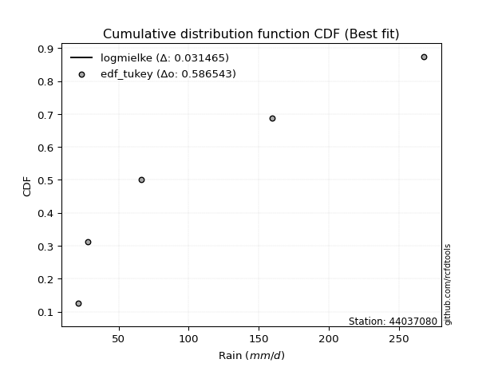</img></img>

</div>


### 8. EDF Gringorten (1963)

Gringorten plotting position formula is essential for estimating the probability and return periods of extreme events like floods and heavy rainfall. The constant _a=0.44_.

<div align="center">


$P=(m-a)/(n+1-2a)$


</div>


**8.1. Empirical values**

<div align="center">

|                | 0                   | 1                  | 2              | 3                 | 4                  |
|:---------------|:--------------------|:-------------------|:---------------|:------------------|:-------------------|
| date           | 2023                | 2024               | 2019           | 2022              | 2020               |
| x              | 21.4                | 28.0               | 66.2           | 159.8             | 268.0              |
| m              | 1                   | 2                  | 3              | 4                 | 5                  |
| empirical_dist | edf_gringorten      | edf_gringorten     | edf_gringorten | edf_gringorten    | edf_gringorten     |
| empirical      | 0.10937500000000001 | 0.3046875          | 0.5            | 0.6953125         | 0.8906249999999999 |
| empirical_tr   | 1.1228070175438596  | 1.4382022471910112 | 2.0            | 3.282051282051282 | 9.142857142857133  |

</div>


**8.2. Kolmogorov-Smirnov fit test (sorted by Δ)**


<div align="center">

|                | 0                    | 1                   | 2                   | 3                   | 4                   | 5                   | 6                   | 7                   | 8                   | 9                  | 10                  | 11                  | 12                  | 13                 | 14                  | 15                  | 16                  | 17                  | 18                  | 19                  | 20                  | 21                 | 22                  | 23                  | 24                  | 25                  | 26                  | 27                  | 28                  | 29                 | 30                 | 31                  | 32                  | 33                  | 34                  | 35                  | 36                 | 37                  | 38                  | 39                  | 40                  | 41                 | 42                 | 43                 | 44                  | 45                  | 46                 | 47                 | 48                  | 49                  | 50                  | 51                  | 52                  | 53                  | 54                  | 55                  | 56                  | 57                  | 58                 | 59                  | 60                  | 61                 | 62                  | 63                  | 64                  | 65                 | 66                  | 67                  | 68                  | 69                  | 70                  | 71                 | 72                  | 73                  | 74                  | 75                 | 76                 | 77                 | 78                  | 79                  | 80                  | 81                  | 82                 | 83                 | 84                  | 85                 | 86                  | 87                  | 88                  | 89                  | 90                  | 91                  | 92                  | 93                  | 94                  | 95                 | 96                  | 97                  | 98                  | 99                  | 100                 | 101                 | 102                 | 103                 | 104                | 105                | 106                 | 107                 | 108                | 109                 | 110                 | 111                 | 112                 | 113                 | 114                | 115                 | 116                 | 117                 | 118                 | 119                 | 120                 | 121                 | 122                 | 123                 | 124                | 125                 | 126                 | 127                 | 128                | 129                 | 130                 | 131                | 132                 | 133                | 134                | 135                | 136                 | 137                 | 138                | 139                | 140                | 141                | 142                 | 143                 | 144                 | 145                | 146                | 147                 | 148                 | 149                | 150                | 151                | 152                | 153                 | 154                | 155                | 156                | 157                | 158                | 159                |
|:---------------|:---------------------|:--------------------|:--------------------|:--------------------|:--------------------|:--------------------|:--------------------|:--------------------|:--------------------|:-------------------|:--------------------|:--------------------|:--------------------|:-------------------|:--------------------|:--------------------|:--------------------|:--------------------|:--------------------|:--------------------|:--------------------|:-------------------|:--------------------|:--------------------|:--------------------|:--------------------|:--------------------|:--------------------|:--------------------|:-------------------|:-------------------|:--------------------|:--------------------|:--------------------|:--------------------|:--------------------|:-------------------|:--------------------|:--------------------|:--------------------|:--------------------|:-------------------|:-------------------|:-------------------|:--------------------|:--------------------|:-------------------|:-------------------|:--------------------|:--------------------|:--------------------|:--------------------|:--------------------|:--------------------|:--------------------|:--------------------|:--------------------|:--------------------|:-------------------|:--------------------|:--------------------|:-------------------|:--------------------|:--------------------|:--------------------|:-------------------|:--------------------|:--------------------|:--------------------|:--------------------|:--------------------|:-------------------|:--------------------|:--------------------|:--------------------|:-------------------|:-------------------|:-------------------|:--------------------|:--------------------|:--------------------|:--------------------|:-------------------|:-------------------|:--------------------|:-------------------|:--------------------|:--------------------|:--------------------|:--------------------|:--------------------|:--------------------|:--------------------|:--------------------|:--------------------|:-------------------|:--------------------|:--------------------|:--------------------|:--------------------|:--------------------|:--------------------|:--------------------|:--------------------|:-------------------|:-------------------|:--------------------|:--------------------|:-------------------|:--------------------|:--------------------|:--------------------|:--------------------|:--------------------|:-------------------|:--------------------|:--------------------|:--------------------|:--------------------|:--------------------|:--------------------|:--------------------|:--------------------|:--------------------|:-------------------|:--------------------|:--------------------|:--------------------|:-------------------|:--------------------|:--------------------|:-------------------|:--------------------|:-------------------|:-------------------|:-------------------|:--------------------|:--------------------|:-------------------|:-------------------|:-------------------|:-------------------|:--------------------|:--------------------|:--------------------|:-------------------|:-------------------|:--------------------|:--------------------|:-------------------|:-------------------|:-------------------|:-------------------|:--------------------|:-------------------|:-------------------|:-------------------|:-------------------|:-------------------|:-------------------|
| station        | 44037080             | 44037080            | 44037080            | 44037080            | 44037080            | 44037080            | 44037080            | 44037080            | 44037080            | 44037080           | 44037080            | 44037080            | 44037080            | 44037080           | 44037080            | 44037080            | 44037080            | 44037080            | 44037080            | 44037080            | 44037080            | 44037080           | 44037080            | 44037080            | 44037080            | 44037080            | 44037080            | 44037080            | 44037080            | 44037080           | 44037080           | 44037080            | 44037080            | 44037080            | 44037080            | 44037080            | 44037080           | 44037080            | 44037080            | 44037080            | 44037080            | 44037080           | 44037080           | 44037080           | 44037080            | 44037080            | 44037080           | 44037080           | 44037080            | 44037080            | 44037080            | 44037080            | 44037080            | 44037080            | 44037080            | 44037080            | 44037080            | 44037080            | 44037080           | 44037080            | 44037080            | 44037080           | 44037080            | 44037080            | 44037080            | 44037080           | 44037080            | 44037080            | 44037080            | 44037080            | 44037080            | 44037080           | 44037080            | 44037080            | 44037080            | 44037080           | 44037080           | 44037080           | 44037080            | 44037080            | 44037080            | 44037080            | 44037080           | 44037080           | 44037080            | 44037080           | 44037080            | 44037080            | 44037080            | 44037080            | 44037080            | 44037080            | 44037080            | 44037080            | 44037080            | 44037080           | 44037080            | 44037080            | 44037080            | 44037080            | 44037080            | 44037080            | 44037080            | 44037080            | 44037080           | 44037080           | 44037080            | 44037080            | 44037080           | 44037080            | 44037080            | 44037080            | 44037080            | 44037080            | 44037080           | 44037080            | 44037080            | 44037080            | 44037080            | 44037080            | 44037080            | 44037080            | 44037080            | 44037080            | 44037080           | 44037080            | 44037080            | 44037080            | 44037080           | 44037080            | 44037080            | 44037080           | 44037080            | 44037080           | 44037080           | 44037080           | 44037080            | 44037080            | 44037080           | 44037080           | 44037080           | 44037080           | 44037080            | 44037080            | 44037080            | 44037080           | 44037080           | 44037080            | 44037080            | 44037080           | 44037080           | 44037080           | 44037080           | 44037080            | 44037080           | 44037080           | 44037080           | 44037080           | 44037080           | 44037080           |
| empirical_dist | edf_gringorten       | edf_gringorten      | edf_gringorten      | edf_gringorten      | edf_gringorten      | edf_gringorten      | edf_gringorten      | edf_gringorten      | edf_gringorten      | edf_gringorten     | edf_gringorten      | edf_gringorten      | edf_gringorten      | edf_gringorten     | edf_gringorten      | edf_gringorten      | edf_gringorten      | edf_gringorten      | edf_gringorten      | edf_gringorten      | edf_gringorten      | edf_gringorten     | edf_gringorten      | edf_gringorten      | edf_gringorten      | edf_gringorten      | edf_gringorten      | edf_gringorten      | edf_gringorten      | edf_gringorten     | edf_gringorten     | edf_gringorten      | edf_gringorten      | edf_gringorten      | edf_gringorten      | edf_gringorten      | edf_gringorten     | edf_gringorten      | edf_gringorten      | edf_gringorten      | edf_gringorten      | edf_gringorten     | edf_gringorten     | edf_gringorten     | edf_gringorten      | edf_gringorten      | edf_gringorten     | edf_gringorten     | edf_gringorten      | edf_gringorten      | edf_gringorten      | edf_gringorten      | edf_gringorten      | edf_gringorten      | edf_gringorten      | edf_gringorten      | edf_gringorten      | edf_gringorten      | edf_gringorten     | edf_gringorten      | edf_gringorten      | edf_gringorten     | edf_gringorten      | edf_gringorten      | edf_gringorten      | edf_gringorten     | edf_gringorten      | edf_gringorten      | edf_gringorten      | edf_gringorten      | edf_gringorten      | edf_gringorten     | edf_gringorten      | edf_gringorten      | edf_gringorten      | edf_gringorten     | edf_gringorten     | edf_gringorten     | edf_gringorten      | edf_gringorten      | edf_gringorten      | edf_gringorten      | edf_gringorten     | edf_gringorten     | edf_gringorten      | edf_gringorten     | edf_gringorten      | edf_gringorten      | edf_gringorten      | edf_gringorten      | edf_gringorten      | edf_gringorten      | edf_gringorten      | edf_gringorten      | edf_gringorten      | edf_gringorten     | edf_gringorten      | edf_gringorten      | edf_gringorten      | edf_gringorten      | edf_gringorten      | edf_gringorten      | edf_gringorten      | edf_gringorten      | edf_gringorten     | edf_gringorten     | edf_gringorten      | edf_gringorten      | edf_gringorten     | edf_gringorten      | edf_gringorten      | edf_gringorten      | edf_gringorten      | edf_gringorten      | edf_gringorten     | edf_gringorten      | edf_gringorten      | edf_gringorten      | edf_gringorten      | edf_gringorten      | edf_gringorten      | edf_gringorten      | edf_gringorten      | edf_gringorten      | edf_gringorten     | edf_gringorten      | edf_gringorten      | edf_gringorten      | edf_gringorten     | edf_gringorten      | edf_gringorten      | edf_gringorten     | edf_gringorten      | edf_gringorten     | edf_gringorten     | edf_gringorten     | edf_gringorten      | edf_gringorten      | edf_gringorten     | edf_gringorten     | edf_gringorten     | edf_gringorten     | edf_gringorten      | edf_gringorten      | edf_gringorten      | edf_gringorten     | edf_gringorten     | edf_gringorten      | edf_gringorten      | edf_gringorten     | edf_gringorten     | edf_gringorten     | edf_gringorten     | edf_gringorten      | edf_gringorten     | edf_gringorten     | edf_gringorten     | edf_gringorten     | edf_gringorten     | edf_gringorten     |
| p_dist         | logmielke            | logarcsine          | logksone            | logsemicircular     | halfnorm            | loganglit           | logtrapezoid        | logbeta             | exponweib           | logexponpow        | logrdist            | logwrapcauchy       | betaprime           | logexponweib       | foldnorm            | gengamma            | halflogistic        | exponpow            | loghalfgennorm      | loglomax            | burr12              | nct                | logburr             | lograyleigh         | alpha               | loggenlogistic      | loghalfnorm         | nakagami            | loginvweibull       | loginvgamma        | logmaxwell         | logburr12           | lognct              | logfoldnorm         | logncf              | logkstwobign        | ncf                | dgamma              | gausshyper          | logbetaprime        | logalpha            | ksone              | loggamma           | loggamma           | logloggamma         | logerlang           | logpearson3        | logskewnorm        | logcrystalball      | lognorm             | logt                | logexponnorm        | logjohnsonsu        | rayleigh            | genlogistic         | gumbel_r            | loggenexpon         | moyal               | pearson3           | truncexpon          | logloglaplace       | semicircular       | logweibull_max      | maxwell             | loginvgauss         | genexpon           | logcosine           | kstwobign           | loggumbel_l         | dweibull            | loglogistic         | logrice            | anglit              | loggumbel_r         | logbradford         | loggenpareto       | truncweibull_min   | logdweibull        | logtruncexpon       | arcsine             | loghypsecant        | loggompertz         | loghalflogistic    | burr               | logargus            | invgamma           | loggausshyper       | logtriang           | f                   | loglaplace          | loglaplace          | logmoyal            | logtruncweibull_min | crystalball         | norm                | t                  | invgauss            | logkappa4           | loggenextreme       | logdgamma           | loglevy_l           | wrapcauchy          | logtukeylambda      | rice                | logistic           | loggennorm         | gennorm             | loguniform          | logkappa3          | logvonmises_line    | weibull_min         | logf                | cosine              | hypsecant           | johnsonsu          | halfgennorm         | lomax               | gumbel_l            | gompertz            | exponnorm           | truncnorm           | laplace             | loggenhalflogistic  | kappa4              | levy_l             | genpareto           | logweibull_min      | argus               | skewnorm           | bradford            | gamma               | wald               | beta                | triang             | logwald            | fatiguelife        | tukeylambda         | uniform             | vonmises_line      | erlang             | truncpareto        | genhalflogistic    | powerlaw            | genextreme          | lognakagami         | logfatiguelife     | kappa3             | johnsonsb           | trapezoid           | invweibull         | logpowerlaw        | logtruncpareto     | loggengamma        | logjohnsonsb        | logtruncnorm       | rdist              | weibull_max        | logvonmises        | vonmises           | mielke             |
| delta          | 0.015840464493237172 | 0.05916492799239641 | 0.07725612266899953 | 0.09366627764467572 | 0.09980253156396868 | 0.10549542131986953 | 0.10744908414966203 | 0.10937481742747512 | 0.10937483603846783 | 0.1093749592063076 | 0.10937499663271699 | 0.10937500000000011 | 0.11021958310290125 | 0.1104170837765176 | 0.11275323136052834 | 0.11417245774196705 | 0.11717432531389935 | 0.11721213415773252 | 0.11861561650602537 | 0.11906639101202976 | 0.11983294073440509 | 0.1203592905110551 | 0.12063450279214472 | 0.12223881137875622 | 0.12319334878486443 | 0.12343287857061075 | 0.12378350057659052 | 0.12397510995869432 | 0.12403040679960534 | 0.1245332214837783 | 0.1249444681153904 | 0.12502117763032672 | 0.12538583110271317 | 0.12564697000749875 | 0.12566239971979204 | 0.12589579148039634 | 0.1272216280320856 | 0.12940184224109808 | 0.12955134652946493 | 0.12980456225338113 | 0.13033428891423887 | 0.130830655227266  | 0.1308618088997422 | 0.1308618088997422 | 0.13107107041649835 | 0.13170660996888717 | 0.131750212910516  | 0.1321151364639045 | 0.13215501813028777 | 0.13215515339482087 | 0.13215534425919134 | 0.13215564527847914 | 0.13235106972446553 | 0.13295886660160444 | 0.13342434035114328 | 0.13361032706141796 | 0.13627624307548708 | 0.13658978066587257 | 0.1406397785087518 | 0.14091998923854698 | 0.14215980832622044 | 0.1430171155450759 | 0.14424155364746177 | 0.14462139660916679 | 0.14521894273786506 | 0.1466478605645805 | 0.14720507172162128 | 0.14920994769365054 | 0.15066717855316164 | 0.15149700353290574 | 0.15186060406276866 | 0.1522572428305986 | 0.15245568460825654 | 0.15281464858259525 | 0.15481977166989952 | 0.1558371729502362 | 0.1560331257301869 | 0.1565456730642356 | 0.15892680014539018 | 0.16184214580775247 | 0.16263095531022434 | 0.16290680024968351 | 0.1646575214240889 | 0.1648703814237812 | 0.16635560371325164 | 0.1686257093015664 | 0.17073881285510684 | 0.17106744721879452 | 0.17189223262561182 | 0.17314894434277361 | 0.17314894434277361 | 0.17420510708136605 | 0.17477439586297927 | 0.17480147800805967 | 0.17480148009756658 | 0.1748085359198096 | 0.17539976576208494 | 0.17614326249004172 | 0.17618011261025035 | 0.18029902902955597 | 0.18915655278159194 | 0.19020805588912193 | 0.19111995505783597 | 0.19143044990951974 | 0.194667772252417  | 0.1953125          | 0.19715434548014932 | 0.19833601743409984 | 0.1983811453995572 | 0.19838828390242977 | 0.20136237752206798 | 0.20595289591206334 | 0.20858787499728332 | 0.20958161176454465 | 0.210489684040007  | 0.21828412919123413 | 0.22734374489662929 | 0.23054624511360733 | 0.23115057586252546 | 0.23115112962675877 | 0.23169919863484045 | 0.23660062871623483 | 0.24455659491857035 | 0.24457592528402047 | 0.2514661335247532 | 0.25652886872622177 | 0.25686697634041533 | 0.25687697831939316 | 0.2635887097552118 | 0.26402600758912403 | 0.27591337258150483 | 0.2857831752655177 | 0.29599614695816034 | 0.298073796498315  | 0.3046263616400038 | 0.3058273762261434 | 0.30656920329327164 | 0.31832927818329276 | 0.3234019424949076 | 0.3251236098665601 | 0.3501864773793908 | 0.3590291792015595 | 0.36218494253917033 | 0.36946162643952707 | 0.38267797584279584 | 0.39154015963819   | 0.4074349104611508 | 0.43450795022720756 | 0.44464500333991686 | 0.4481678822940884 | 0.4486144433717606 | 0.4534606647191528 | 0.4619882394118313 | 0.49809399074653826 | 0.4999961381507031 | 0.5208823370402216 | 0.6135674080783324 | 1.1102057121856872 | 42.071115063422184 | nan                |
| deltao         | 0.5865427407550001   | 0.5865427407550001  | 0.5865427407550001  | 0.5865427407550001  | 0.5865427407550001  | 0.5865427407550001  | 0.5865427407550001  | 0.5865427407550001  | 0.5865427407550001  | 0.5865427407550001 | 0.5865427407550001  | 0.5865427407550001  | 0.5865427407550001  | 0.5865427407550001 | 0.5865427407550001  | 0.5865427407550001  | 0.5865427407550001  | 0.5865427407550001  | 0.5865427407550001  | 0.5865427407550001  | 0.5865427407550001  | 0.5865427407550001 | 0.5865427407550001  | 0.5865427407550001  | 0.5865427407550001  | 0.5865427407550001  | 0.5865427407550001  | 0.5865427407550001  | 0.5865427407550001  | 0.5865427407550001 | 0.5865427407550001 | 0.5865427407550001  | 0.5865427407550001  | 0.5865427407550001  | 0.5865427407550001  | 0.5865427407550001  | 0.5865427407550001 | 0.5865427407550001  | 0.5865427407550001  | 0.5865427407550001  | 0.5865427407550001  | 0.5865427407550001 | 0.5865427407550001 | 0.5865427407550001 | 0.5865427407550001  | 0.5865427407550001  | 0.5865427407550001 | 0.5865427407550001 | 0.5865427407550001  | 0.5865427407550001  | 0.5865427407550001  | 0.5865427407550001  | 0.5865427407550001  | 0.5865427407550001  | 0.5865427407550001  | 0.5865427407550001  | 0.5865427407550001  | 0.5865427407550001  | 0.5865427407550001 | 0.5865427407550001  | 0.5865427407550001  | 0.5865427407550001 | 0.5865427407550001  | 0.5865427407550001  | 0.5865427407550001  | 0.5865427407550001 | 0.5865427407550001  | 0.5865427407550001  | 0.5865427407550001  | 0.5865427407550001  | 0.5865427407550001  | 0.5865427407550001 | 0.5865427407550001  | 0.5865427407550001  | 0.5865427407550001  | 0.5865427407550001 | 0.5865427407550001 | 0.5865427407550001 | 0.5865427407550001  | 0.5865427407550001  | 0.5865427407550001  | 0.5865427407550001  | 0.5865427407550001 | 0.5865427407550001 | 0.5865427407550001  | 0.5865427407550001 | 0.5865427407550001  | 0.5865427407550001  | 0.5865427407550001  | 0.5865427407550001  | 0.5865427407550001  | 0.5865427407550001  | 0.5865427407550001  | 0.5865427407550001  | 0.5865427407550001  | 0.5865427407550001 | 0.5865427407550001  | 0.5865427407550001  | 0.5865427407550001  | 0.5865427407550001  | 0.5865427407550001  | 0.5865427407550001  | 0.5865427407550001  | 0.5865427407550001  | 0.5865427407550001 | 0.5865427407550001 | 0.5865427407550001  | 0.5865427407550001  | 0.5865427407550001 | 0.5865427407550001  | 0.5865427407550001  | 0.5865427407550001  | 0.5865427407550001  | 0.5865427407550001  | 0.5865427407550001 | 0.5865427407550001  | 0.5865427407550001  | 0.5865427407550001  | 0.5865427407550001  | 0.5865427407550001  | 0.5865427407550001  | 0.5865427407550001  | 0.5865427407550001  | 0.5865427407550001  | 0.5865427407550001 | 0.5865427407550001  | 0.5865427407550001  | 0.5865427407550001  | 0.5865427407550001 | 0.5865427407550001  | 0.5865427407550001  | 0.5865427407550001 | 0.5865427407550001  | 0.5865427407550001 | 0.5865427407550001 | 0.5865427407550001 | 0.5865427407550001  | 0.5865427407550001  | 0.5865427407550001 | 0.5865427407550001 | 0.5865427407550001 | 0.5865427407550001 | 0.5865427407550001  | 0.5865427407550001  | 0.5865427407550001  | 0.5865427407550001 | 0.5865427407550001 | 0.5865427407550001  | 0.5865427407550001  | 0.5865427407550001 | 0.5865427407550001 | 0.5865427407550001 | 0.5865427407550001 | 0.5865427407550001  | 0.5865427407550001 | 0.5865427407550001 | 0.5865427407550001 | 0.5865427407550001 | 0.5865427407550001 | 0.5865427407550001 |
| eval           | Δo > Δ               | Δo > Δ              | Δo > Δ              | Δo > Δ              | Δo > Δ              | Δo > Δ              | Δo > Δ              | Δo > Δ              | Δo > Δ              | Δo > Δ             | Δo > Δ              | Δo > Δ              | Δo > Δ              | Δo > Δ             | Δo > Δ              | Δo > Δ              | Δo > Δ              | Δo > Δ              | Δo > Δ              | Δo > Δ              | Δo > Δ              | Δo > Δ             | Δo > Δ              | Δo > Δ              | Δo > Δ              | Δo > Δ              | Δo > Δ              | Δo > Δ              | Δo > Δ              | Δo > Δ             | Δo > Δ             | Δo > Δ              | Δo > Δ              | Δo > Δ              | Δo > Δ              | Δo > Δ              | Δo > Δ             | Δo > Δ              | Δo > Δ              | Δo > Δ              | Δo > Δ              | Δo > Δ             | Δo > Δ             | Δo > Δ             | Δo > Δ              | Δo > Δ              | Δo > Δ             | Δo > Δ             | Δo > Δ              | Δo > Δ              | Δo > Δ              | Δo > Δ              | Δo > Δ              | Δo > Δ              | Δo > Δ              | Δo > Δ              | Δo > Δ              | Δo > Δ              | Δo > Δ             | Δo > Δ              | Δo > Δ              | Δo > Δ             | Δo > Δ              | Δo > Δ              | Δo > Δ              | Δo > Δ             | Δo > Δ              | Δo > Δ              | Δo > Δ              | Δo > Δ              | Δo > Δ              | Δo > Δ             | Δo > Δ              | Δo > Δ              | Δo > Δ              | Δo > Δ             | Δo > Δ             | Δo > Δ             | Δo > Δ              | Δo > Δ              | Δo > Δ              | Δo > Δ              | Δo > Δ             | Δo > Δ             | Δo > Δ              | Δo > Δ             | Δo > Δ              | Δo > Δ              | Δo > Δ              | Δo > Δ              | Δo > Δ              | Δo > Δ              | Δo > Δ              | Δo > Δ              | Δo > Δ              | Δo > Δ             | Δo > Δ              | Δo > Δ              | Δo > Δ              | Δo > Δ              | Δo > Δ              | Δo > Δ              | Δo > Δ              | Δo > Δ              | Δo > Δ             | Δo > Δ             | Δo > Δ              | Δo > Δ              | Δo > Δ             | Δo > Δ              | Δo > Δ              | Δo > Δ              | Δo > Δ              | Δo > Δ              | Δo > Δ             | Δo > Δ              | Δo > Δ              | Δo > Δ              | Δo > Δ              | Δo > Δ              | Δo > Δ              | Δo > Δ              | Δo > Δ              | Δo > Δ              | Δo > Δ             | Δo > Δ              | Δo > Δ              | Δo > Δ              | Δo > Δ             | Δo > Δ              | Δo > Δ              | Δo > Δ             | Δo > Δ              | Δo > Δ             | Δo > Δ             | Δo > Δ             | Δo > Δ              | Δo > Δ              | Δo > Δ             | Δo > Δ             | Δo > Δ             | Δo > Δ             | Δo > Δ              | Δo > Δ              | Δo > Δ              | Δo > Δ             | Δo > Δ             | Δo > Δ              | Δo > Δ              | Δo > Δ             | Δo > Δ             | Δo > Δ             | Δo > Δ             | Δo > Δ              | Δo > Δ             | Δo > Δ             | Δo <= Δ            | Δo <= Δ            | Δo <= Δ            | Δo <= Δ            |
| fit            | 1                    | 1                   | 1                   | 1                   | 1                   | 1                   | 1                   | 1                   | 1                   | 1                  | 1                   | 1                   | 1                   | 1                  | 1                   | 1                   | 1                   | 1                   | 1                   | 1                   | 1                   | 1                  | 1                   | 1                   | 1                   | 1                   | 1                   | 1                   | 1                   | 1                  | 1                  | 1                   | 1                   | 1                   | 1                   | 1                   | 1                  | 1                   | 1                   | 1                   | 1                   | 1                  | 1                  | 1                  | 1                   | 1                   | 1                  | 1                  | 1                   | 1                   | 1                   | 1                   | 1                   | 1                   | 1                   | 1                   | 1                   | 1                   | 1                  | 1                   | 1                   | 1                  | 1                   | 1                   | 1                   | 1                  | 1                   | 1                   | 1                   | 1                   | 1                   | 1                  | 1                   | 1                   | 1                   | 1                  | 1                  | 1                  | 1                   | 1                   | 1                   | 1                   | 1                  | 1                  | 1                   | 1                  | 1                   | 1                   | 1                   | 1                   | 1                   | 1                   | 1                   | 1                   | 1                   | 1                  | 1                   | 1                   | 1                   | 1                   | 1                   | 1                   | 1                   | 1                   | 1                  | 1                  | 1                   | 1                   | 1                  | 1                   | 1                   | 1                   | 1                   | 1                   | 1                  | 1                   | 1                   | 1                   | 1                   | 1                   | 1                   | 1                   | 1                   | 1                   | 1                  | 1                   | 1                   | 1                   | 1                  | 1                   | 1                   | 1                  | 1                   | 1                  | 1                  | 1                  | 1                   | 1                   | 1                  | 1                  | 1                  | 1                  | 1                   | 1                   | 1                   | 1                  | 1                  | 1                   | 1                   | 1                  | 1                  | 1                  | 1                  | 1                   | 1                  | 1                  | 0                  | 0                  | 0                  | 0                  |
| n              | 5                    | 5                   | 5                   | 5                   | 5                   | 5                   | 5                   | 5                   | 5                   | 5                  | 5                   | 5                   | 5                   | 5                  | 5                   | 5                   | 5                   | 5                   | 5                   | 5                   | 5                   | 5                  | 5                   | 5                   | 5                   | 5                   | 5                   | 5                   | 5                   | 5                  | 5                  | 5                   | 5                   | 5                   | 5                   | 5                   | 5                  | 5                   | 5                   | 5                   | 5                   | 5                  | 5                  | 5                  | 5                   | 5                   | 5                  | 5                  | 5                   | 5                   | 5                   | 5                   | 5                   | 5                   | 5                   | 5                   | 5                   | 5                   | 5                  | 5                   | 5                   | 5                  | 5                   | 5                   | 5                   | 5                  | 5                   | 5                   | 5                   | 5                   | 5                   | 5                  | 5                   | 5                   | 5                   | 5                  | 5                  | 5                  | 5                   | 5                   | 5                   | 5                   | 5                  | 5                  | 5                   | 5                  | 5                   | 5                   | 5                   | 5                   | 5                   | 5                   | 5                   | 5                   | 5                   | 5                  | 5                   | 5                   | 5                   | 5                   | 5                   | 5                   | 5                   | 5                   | 5                  | 5                  | 5                   | 5                   | 5                  | 5                   | 5                   | 5                   | 5                   | 5                   | 5                  | 5                   | 5                   | 5                   | 5                   | 5                   | 5                   | 5                   | 5                   | 5                   | 5                  | 5                   | 5                   | 5                   | 5                  | 5                   | 5                   | 5                  | 5                   | 5                  | 5                  | 5                  | 5                   | 5                   | 5                  | 5                  | 5                  | 5                  | 5                   | 5                   | 5                   | 5                  | 5                  | 5                   | 5                   | 5                  | 5                  | 5                  | 5                  | 5                   | 5                  | 5                  | 5                  | 5                  | 5                  | 5                  |
| best_fit       | 1                    | 0                   | 0                   | 0                   | 0                   | 0                   | 0                   | 0                   | 0                   | 0                  | 0                   | 0                   | 0                   | 0                  | 0                   | 0                   | 0                   | 0                   | 0                   | 0                   | 0                   | 0                  | 0                   | 0                   | 0                   | 0                   | 0                   | 0                   | 0                   | 0                  | 0                  | 0                   | 0                   | 0                   | 0                   | 0                   | 0                  | 0                   | 0                   | 0                   | 0                   | 0                  | 0                  | 0                  | 0                   | 0                   | 0                  | 0                  | 0                   | 0                   | 0                   | 0                   | 0                   | 0                   | 0                   | 0                   | 0                   | 0                   | 0                  | 0                   | 0                   | 0                  | 0                   | 0                   | 0                   | 0                  | 0                   | 0                   | 0                   | 0                   | 0                   | 0                  | 0                   | 0                   | 0                   | 0                  | 0                  | 0                  | 0                   | 0                   | 0                   | 0                   | 0                  | 0                  | 0                   | 0                  | 0                   | 0                   | 0                   | 0                   | 0                   | 0                   | 0                   | 0                   | 0                   | 0                  | 0                   | 0                   | 0                   | 0                   | 0                   | 0                   | 0                   | 0                   | 0                  | 0                  | 0                   | 0                   | 0                  | 0                   | 0                   | 0                   | 0                   | 0                   | 0                  | 0                   | 0                   | 0                   | 0                   | 0                   | 0                   | 0                   | 0                   | 0                   | 0                  | 0                   | 0                   | 0                   | 0                  | 0                   | 0                   | 0                  | 0                   | 0                  | 0                  | 0                  | 0                   | 0                   | 0                  | 0                  | 0                  | 0                  | 0                   | 0                   | 0                   | 0                  | 0                  | 0                   | 0                   | 0                  | 0                  | 0                  | 0                  | 0                   | 0                  | 0                  | 0                  | 0                  | 0                  | 0                  |
| best_fit_sort  | 1                    | 2                   | 3                   | 4                   | 5                   | 6                   | 7                   | 8                   | 9                   | 10                 | 11                  | 12                  | 13                  | 14                 | 15                  | 16                  | 17                  | 18                  | 19                  | 20                  | 21                  | 22                 | 23                  | 24                  | 25                  | 26                  | 27                  | 28                  | 29                  | 30                 | 31                 | 32                  | 33                  | 34                  | 35                  | 36                  | 37                 | 38                  | 39                  | 40                  | 41                  | 42                 | 43                 | 44                 | 45                  | 46                  | 47                 | 48                 | 49                  | 50                  | 51                  | 52                  | 53                  | 54                  | 55                  | 56                  | 57                  | 58                  | 59                 | 60                  | 61                  | 62                 | 63                  | 64                  | 65                  | 66                 | 67                  | 68                  | 69                  | 70                  | 71                  | 72                 | 73                  | 74                  | 75                  | 76                 | 77                 | 78                 | 79                  | 80                  | 81                  | 82                  | 83                 | 84                 | 85                  | 86                 | 87                  | 88                  | 89                  | 90                  | 91                  | 92                  | 93                  | 94                  | 95                  | 96                 | 97                  | 98                  | 99                  | 100                 | 101                 | 102                 | 103                 | 104                 | 105                | 106                | 107                 | 108                 | 109                | 110                 | 111                 | 112                 | 113                 | 114                 | 115                | 116                 | 117                 | 118                 | 119                 | 120                 | 121                 | 122                 | 123                 | 124                 | 125                | 126                 | 127                 | 128                 | 129                | 130                 | 131                 | 132                | 133                 | 134                | 135                | 136                | 137                 | 138                 | 139                | 140                | 141                | 142                | 143                 | 144                 | 145                 | 146                | 147                | 148                 | 149                 | 150                | 151                | 152                | 153                | 154                 | 155                | 156                | 157                | 158                | 159                | 160                |

</div>


**8.3. Best fit**

<div align="center">

|   id |   station | empirical_dist   | p_dist    |     delta |   deltao | eval   |   fit |   n |   best_fit |   best_fit_sort |
|-----:|----------:|:-----------------|:----------|----------:|---------:|:-------|------:|----:|-----------:|----------------:|
|    0 |  44037080 | edf_gringorten   | logmielke | 0.0158405 | 0.586543 | Δo > Δ |     1 |   5 |          1 |               1 |

</div>


<div align="center">

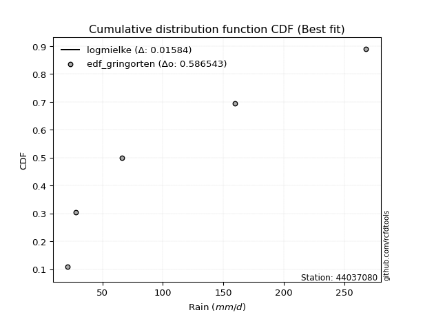</img></img>

</div>


### 9. EDF Filliben (1975)

The specific values of the constants (0.3175) (often denoted as $alpha$) and (0.365) are derived from a method proposed by James J. Filliben in a 1975 paper. This particular formula is the mean value of the $i$-th order statistic of the normal distribution and is considered a robust and effective plotting position formula for the normal probability plot correlation coefficient test for normality.

<div align="center">


$P=(m-0.3175)/(n+0.365)$


</div>


**9.1. Empirical values**

<div align="center">

|                | 0                   | 1                  | 2            | 3                  | 4                  |
|:---------------|:--------------------|:-------------------|:-------------|:-------------------|:-------------------|
| date           | 2023                | 2024               | 2019         | 2022               | 2020               |
| x              | 21.4                | 28.0               | 66.2         | 159.8              | 268.0              |
| m              | 1                   | 2                  | 3            | 4                  | 5                  |
| empirical_dist | edf_filliben        | edf_filliben       | edf_filliben | edf_filliben       | edf_filliben       |
| empirical      | 0.12721342031686858 | 0.3136067101584343 | 0.5          | 0.6863932898415657 | 0.8727865796831314 |
| empirical_tr   | 1.1457554725040042  | 1.456890699253225  | 2.0          | 3.188707280832095  | 7.860805860805863  |

</div>


**9.2. Kolmogorov-Smirnov fit test (sorted by Δ)**


<div align="center">

|                | 0                   | 1                   | 2                   | 3                   | 4                  | 5                   | 6                  | 7                   | 8                   | 9                   | 10                  | 11                  | 12                 | 13                 | 14                  | 15                  | 16                  | 17                 | 18                  | 19                 | 20                 | 21                  | 22                  | 23                 | 24                 | 25                  | 26                  | 27                  | 28                 | 29                 | 30                  | 31                  | 32                 | 33                 | 34                 | 35                  | 36                  | 37                  | 38                  | 39                  | 40                  | 41                  | 42                  | 43                  | 44                 | 45                 | 46                  | 47                  | 48                  | 49                  | 50                  | 51                 | 52                  | 53                  | 54                  | 55                  | 56                  | 57                  | 58                 | 59                  | 60                 | 61                 | 62                 | 63                  | 64                  | 65                  | 66                  | 67                  | 68                  | 69                 | 70                  | 71                  | 72                  | 73                  | 74                  | 75                  | 76                 | 77                  | 78                  | 79                 | 80                 | 81                  | 82                  | 83                 | 84                  | 85                  | 86                  | 87                  | 88                  | 89                 | 90                  | 91                  | 92                  | 93                  | 94                 | 95                 | 96                 | 97                 | 98                  | 99                  | 100                | 101                 | 102                | 103                 | 104                | 105                 | 106                 | 107                 | 108                 | 109                 | 110                 | 111                 | 112                 | 113                | 114                | 115                | 116                 | 117                 | 118                 | 119                 | 120                | 121                 | 122                 | 123                 | 124                | 125                | 126                 | 127                 | 128                | 129                | 130                | 131                 | 132                | 133                 | 134                | 135                 | 136                 | 137                 | 138                | 139                | 140                | 141                | 142                 | 143                | 144                 | 145                | 146                | 147                | 148                 | 149                | 150                 | 151                 | 152                 | 153                | 154                | 155                | 156                | 157                | 158                | 159                |
|:---------------|:--------------------|:--------------------|:--------------------|:--------------------|:-------------------|:--------------------|:-------------------|:--------------------|:--------------------|:--------------------|:--------------------|:--------------------|:-------------------|:-------------------|:--------------------|:--------------------|:--------------------|:-------------------|:--------------------|:-------------------|:-------------------|:--------------------|:--------------------|:-------------------|:-------------------|:--------------------|:--------------------|:--------------------|:-------------------|:-------------------|:--------------------|:--------------------|:-------------------|:-------------------|:-------------------|:--------------------|:--------------------|:--------------------|:--------------------|:--------------------|:--------------------|:--------------------|:--------------------|:--------------------|:-------------------|:-------------------|:--------------------|:--------------------|:--------------------|:--------------------|:--------------------|:-------------------|:--------------------|:--------------------|:--------------------|:--------------------|:--------------------|:--------------------|:-------------------|:--------------------|:-------------------|:-------------------|:-------------------|:--------------------|:--------------------|:--------------------|:--------------------|:--------------------|:--------------------|:-------------------|:--------------------|:--------------------|:--------------------|:--------------------|:--------------------|:--------------------|:-------------------|:--------------------|:--------------------|:-------------------|:-------------------|:--------------------|:--------------------|:-------------------|:--------------------|:--------------------|:--------------------|:--------------------|:--------------------|:-------------------|:--------------------|:--------------------|:--------------------|:--------------------|:-------------------|:-------------------|:-------------------|:-------------------|:--------------------|:--------------------|:-------------------|:--------------------|:-------------------|:--------------------|:-------------------|:--------------------|:--------------------|:--------------------|:--------------------|:--------------------|:--------------------|:--------------------|:--------------------|:-------------------|:-------------------|:-------------------|:--------------------|:--------------------|:--------------------|:--------------------|:-------------------|:--------------------|:--------------------|:--------------------|:-------------------|:-------------------|:--------------------|:--------------------|:-------------------|:-------------------|:-------------------|:--------------------|:-------------------|:--------------------|:-------------------|:--------------------|:--------------------|:--------------------|:-------------------|:-------------------|:-------------------|:-------------------|:--------------------|:-------------------|:--------------------|:-------------------|:-------------------|:-------------------|:--------------------|:-------------------|:--------------------|:--------------------|:--------------------|:-------------------|:-------------------|:-------------------|:-------------------|:-------------------|:-------------------|:-------------------|
| station        | 44037080            | 44037080            | 44037080            | 44037080            | 44037080           | 44037080            | 44037080           | 44037080            | 44037080            | 44037080            | 44037080            | 44037080            | 44037080           | 44037080           | 44037080            | 44037080            | 44037080            | 44037080           | 44037080            | 44037080           | 44037080           | 44037080            | 44037080            | 44037080           | 44037080           | 44037080            | 44037080            | 44037080            | 44037080           | 44037080           | 44037080            | 44037080            | 44037080           | 44037080           | 44037080           | 44037080            | 44037080            | 44037080            | 44037080            | 44037080            | 44037080            | 44037080            | 44037080            | 44037080            | 44037080           | 44037080           | 44037080            | 44037080            | 44037080            | 44037080            | 44037080            | 44037080           | 44037080            | 44037080            | 44037080            | 44037080            | 44037080            | 44037080            | 44037080           | 44037080            | 44037080           | 44037080           | 44037080           | 44037080            | 44037080            | 44037080            | 44037080            | 44037080            | 44037080            | 44037080           | 44037080            | 44037080            | 44037080            | 44037080            | 44037080            | 44037080            | 44037080           | 44037080            | 44037080            | 44037080           | 44037080           | 44037080            | 44037080            | 44037080           | 44037080            | 44037080            | 44037080            | 44037080            | 44037080            | 44037080           | 44037080            | 44037080            | 44037080            | 44037080            | 44037080           | 44037080           | 44037080           | 44037080           | 44037080            | 44037080            | 44037080           | 44037080            | 44037080           | 44037080            | 44037080           | 44037080            | 44037080            | 44037080            | 44037080            | 44037080            | 44037080            | 44037080            | 44037080            | 44037080           | 44037080           | 44037080           | 44037080            | 44037080            | 44037080            | 44037080            | 44037080           | 44037080            | 44037080            | 44037080            | 44037080           | 44037080           | 44037080            | 44037080            | 44037080           | 44037080           | 44037080           | 44037080            | 44037080           | 44037080            | 44037080           | 44037080            | 44037080            | 44037080            | 44037080           | 44037080           | 44037080           | 44037080           | 44037080            | 44037080           | 44037080            | 44037080           | 44037080           | 44037080           | 44037080            | 44037080           | 44037080            | 44037080            | 44037080            | 44037080           | 44037080           | 44037080           | 44037080           | 44037080           | 44037080           | 44037080           |
| empirical_dist | edf_filliben        | edf_filliben        | edf_filliben        | edf_filliben        | edf_filliben       | edf_filliben        | edf_filliben       | edf_filliben        | edf_filliben        | edf_filliben        | edf_filliben        | edf_filliben        | edf_filliben       | edf_filliben       | edf_filliben        | edf_filliben        | edf_filliben        | edf_filliben       | edf_filliben        | edf_filliben       | edf_filliben       | edf_filliben        | edf_filliben        | edf_filliben       | edf_filliben       | edf_filliben        | edf_filliben        | edf_filliben        | edf_filliben       | edf_filliben       | edf_filliben        | edf_filliben        | edf_filliben       | edf_filliben       | edf_filliben       | edf_filliben        | edf_filliben        | edf_filliben        | edf_filliben        | edf_filliben        | edf_filliben        | edf_filliben        | edf_filliben        | edf_filliben        | edf_filliben       | edf_filliben       | edf_filliben        | edf_filliben        | edf_filliben        | edf_filliben        | edf_filliben        | edf_filliben       | edf_filliben        | edf_filliben        | edf_filliben        | edf_filliben        | edf_filliben        | edf_filliben        | edf_filliben       | edf_filliben        | edf_filliben       | edf_filliben       | edf_filliben       | edf_filliben        | edf_filliben        | edf_filliben        | edf_filliben        | edf_filliben        | edf_filliben        | edf_filliben       | edf_filliben        | edf_filliben        | edf_filliben        | edf_filliben        | edf_filliben        | edf_filliben        | edf_filliben       | edf_filliben        | edf_filliben        | edf_filliben       | edf_filliben       | edf_filliben        | edf_filliben        | edf_filliben       | edf_filliben        | edf_filliben        | edf_filliben        | edf_filliben        | edf_filliben        | edf_filliben       | edf_filliben        | edf_filliben        | edf_filliben        | edf_filliben        | edf_filliben       | edf_filliben       | edf_filliben       | edf_filliben       | edf_filliben        | edf_filliben        | edf_filliben       | edf_filliben        | edf_filliben       | edf_filliben        | edf_filliben       | edf_filliben        | edf_filliben        | edf_filliben        | edf_filliben        | edf_filliben        | edf_filliben        | edf_filliben        | edf_filliben        | edf_filliben       | edf_filliben       | edf_filliben       | edf_filliben        | edf_filliben        | edf_filliben        | edf_filliben        | edf_filliben       | edf_filliben        | edf_filliben        | edf_filliben        | edf_filliben       | edf_filliben       | edf_filliben        | edf_filliben        | edf_filliben       | edf_filliben       | edf_filliben       | edf_filliben        | edf_filliben       | edf_filliben        | edf_filliben       | edf_filliben        | edf_filliben        | edf_filliben        | edf_filliben       | edf_filliben       | edf_filliben       | edf_filliben       | edf_filliben        | edf_filliben       | edf_filliben        | edf_filliben       | edf_filliben       | edf_filliben       | edf_filliben        | edf_filliben       | edf_filliben        | edf_filliben        | edf_filliben        | edf_filliben       | edf_filliben       | edf_filliben       | edf_filliben       | edf_filliben       | edf_filliben       | edf_filliben       |
| p_dist         | logmielke           | logarcsine          | logksone            | halfnorm            | logsemicircular    | foldnorm            | loganglit          | logtrapezoid        | betaprime           | dgamma              | halflogistic        | logbeta             | gengamma           | exponweib          | logexponpow         | logburr12           | logrdist            | exponpow           | logweibull_max      | truncexpon         | logexponweib       | logwrapcauchy       | gausshyper          | loghalfgennorm     | loglomax           | burr12              | nct                 | logburr             | ksone              | lograyleigh        | alpha               | loggenlogistic      | loghalfnorm        | nakagami           | loginvweibull      | rayleigh            | loginvgamma         | gumbel_r            | logmaxwell          | lognct              | logfoldnorm         | logncf              | logkstwobign        | ncf                 | loggenpareto       | logbetaprime       | logalpha            | loggamma            | loggamma            | logloggamma         | logerlang           | pearson3           | logpearson3         | logskewnorm         | logcrystalball      | lognorm             | logt                | logexponnorm        | logjohnsonsu       | genlogistic         | dweibull           | semicircular       | arcsine            | maxwell             | loggenexpon         | loginvgauss         | moyal               | logloglaplace       | anglit              | genexpon           | kstwobign           | logcosine           | loggumbel_l         | loglogistic         | logrice             | loggumbel_r         | logbradford        | truncweibull_min    | logdweibull         | logtruncexpon      | invgamma           | loglevy_l           | loghypsecant        | loggompertz        | f                   | loghalflogistic     | burr                | crystalball         | norm                | t                  | logargus            | invgauss            | loggenextreme       | loggausshyper       | logtriang          | wrapcauchy         | loglaplace         | loglaplace         | logmoyal            | logtruncweibull_min | logkappa4          | loggennorm          | logdgamma          | rice                | logistic           | logtukeylambda      | logf                | gennorm             | loguniform          | logkappa3           | logvonmises_line    | cosine              | hypsecant           | weibull_min        | johnsonsu          | halfgennorm        | gumbel_l            | levy_l              | lomax               | laplace             | logweibull_min     | gompertz            | exponnorm           | truncnorm           | loggenhalflogistic | kappa4             | genpareto           | argus               | skewnorm           | bradford           | beta               | gamma               | wald               | fatiguelife         | triang             | tukeylambda         | logwald             | uniform             | vonmises_line      | erlang             | truncpareto        | genextreme         | powerlaw            | genhalflogistic    | lognakagami         | logfatiguelife     | kappa3             | johnsonsb          | invweibull          | logpowerlaw        | logtruncpareto      | trapezoid           | loggengamma         | logjohnsonsb       | logtruncnorm       | rdist              | weibull_max        | logvonmises        | vonmises           | mielke             |
| delta          | 0.03367888481010574 | 0.05498605800732437 | 0.08617533282743381 | 0.09980253156396868 | 0.10258548780311   | 0.11275323136052834 | 0.1144146314783038 | 0.11636829430809631 | 0.11913879326133558 | 0.12048263208266374 | 0.12609353547233362 | 0.12721323774434357 | 0.1272132390944301 | 0.1272132563553364 | 0.12721337952317616 | 0.12721338762637918 | 0.12721341694958543 | 0.1272134191518642 | 0.12721341972026956 | 0.1272134203166675 | 0.1272134203168256 | 0.12721342031686858 | 0.12721342031691918 | 0.1275348266644597 | 0.1279856011704641 | 0.12875215089283942 | 0.12927850066948943 | 0.12955371295057905 | 0.130830655227266  | 0.1311580215371905 | 0.13211255894329876 | 0.13235208872904503 | 0.1327027107350248 | 0.1328943201171286 | 0.1329496169580396 | 0.13295886660160444 | 0.13345243164221257 | 0.13361032706141796 | 0.13386367827382467 | 0.13430504126114745 | 0.13456618016593302 | 0.13458160987822632 | 0.13481500163883062 | 0.13614083819051986 | 0.1379987526333676 | 0.1387237724118154 | 0.13925349907267315 | 0.13978101905817647 | 0.13978101905817647 | 0.13999028057493262 | 0.14062582012732144 | 0.1406397785087518 | 0.14066942306895028 | 0.14103434662233877 | 0.14107422828872204 | 0.14107436355325514 | 0.14107455441762562 | 0.14107485543691342 | 0.1412702798828998 | 0.14234355050957756 | 0.1425777933744714 | 0.1430171155450759 | 0.1440037254908839 | 0.14462139660916679 | 0.14519545323392136 | 0.14521894273786506 | 0.14550899082430685 | 0.15107901848465471 | 0.15245568460825654 | 0.1555670707230148 | 0.15581627593619113 | 0.15612428188005556 | 0.15958638871159592 | 0.16077981422120294 | 0.16117645298903288 | 0.16173385874102952 | 0.1637389818283338 | 0.16495233588862124 | 0.16546488322266995 | 0.1678460103038245 | 0.1686257093015664 | 0.17131813246472335 | 0.17155016546865862 | 0.1718260104081178 | 0.17189223262561182 | 0.17357673158252318 | 0.17378959158221552 | 0.17480147800805967 | 0.17480148009756658 | 0.1748085359198096 | 0.17527481387168592 | 0.17539976576208494 | 0.17618011261025035 | 0.17965802301354117 | 0.1799866573772288 | 0.1812888457306876 | 0.1820681545012079 | 0.1820681545012079 | 0.18312431723980033 | 0.1836936060214136  | 0.185062472648476  | 0.18639328984156572 | 0.1892182391879903 | 0.19143044990951974 | 0.194667772252417  | 0.20003916521627024 | 0.20595289591206334 | 0.20607355563858365 | 0.20725522759253412 | 0.20730035555799148 | 0.20730749406086404 | 0.20858787499728332 | 0.20958161176454465 | 0.2102815876805023 | 0.210489684040007  | 0.2272033393496684 | 0.23054624511360733 | 0.23362771320788464 | 0.23626295505506356 | 0.23660062871623483 | 0.2390285560235469 | 0.24006978602095974 | 0.24007033978519304 | 0.24061840879327473 | 0.2534758050770046 | 0.2534951354424547 | 0.25652886872622177 | 0.25687697831939316 | 0.2725079199136461 | 0.2729452177475583 | 0.2781577266412918 | 0.28014601763880087 | 0.294702385423952  | 0.29690816606770914 | 0.298073796498315  | 0.30656920329327164 | 0.31354557179843806 | 0.31832927818329276 | 0.3234019424949076 | 0.3251236098665601 | 0.3501864773793908 | 0.3516232061226586 | 0.35326573238073605 | 0.3590291792015595 | 0.37375876568436156 | 0.3826209494797557 | 0.3895964901442824 | 0.4255887400687733 | 0.43032946197721994 | 0.4396952332133263 | 0.44454145456071853 | 0.44464500333991686 | 0.45306902925339704 | 0.489174780588104  | 0.4999961381507031 | 0.503043916723353  | 0.6046481979198981 | 1.1191249223441215 | 42.088953483739054 | nan                |
| deltao         | 0.5865427407550001  | 0.5865427407550001  | 0.5865427407550001  | 0.5865427407550001  | 0.5865427407550001 | 0.5865427407550001  | 0.5865427407550001 | 0.5865427407550001  | 0.5865427407550001  | 0.5865427407550001  | 0.5865427407550001  | 0.5865427407550001  | 0.5865427407550001 | 0.5865427407550001 | 0.5865427407550001  | 0.5865427407550001  | 0.5865427407550001  | 0.5865427407550001 | 0.5865427407550001  | 0.5865427407550001 | 0.5865427407550001 | 0.5865427407550001  | 0.5865427407550001  | 0.5865427407550001 | 0.5865427407550001 | 0.5865427407550001  | 0.5865427407550001  | 0.5865427407550001  | 0.5865427407550001 | 0.5865427407550001 | 0.5865427407550001  | 0.5865427407550001  | 0.5865427407550001 | 0.5865427407550001 | 0.5865427407550001 | 0.5865427407550001  | 0.5865427407550001  | 0.5865427407550001  | 0.5865427407550001  | 0.5865427407550001  | 0.5865427407550001  | 0.5865427407550001  | 0.5865427407550001  | 0.5865427407550001  | 0.5865427407550001 | 0.5865427407550001 | 0.5865427407550001  | 0.5865427407550001  | 0.5865427407550001  | 0.5865427407550001  | 0.5865427407550001  | 0.5865427407550001 | 0.5865427407550001  | 0.5865427407550001  | 0.5865427407550001  | 0.5865427407550001  | 0.5865427407550001  | 0.5865427407550001  | 0.5865427407550001 | 0.5865427407550001  | 0.5865427407550001 | 0.5865427407550001 | 0.5865427407550001 | 0.5865427407550001  | 0.5865427407550001  | 0.5865427407550001  | 0.5865427407550001  | 0.5865427407550001  | 0.5865427407550001  | 0.5865427407550001 | 0.5865427407550001  | 0.5865427407550001  | 0.5865427407550001  | 0.5865427407550001  | 0.5865427407550001  | 0.5865427407550001  | 0.5865427407550001 | 0.5865427407550001  | 0.5865427407550001  | 0.5865427407550001 | 0.5865427407550001 | 0.5865427407550001  | 0.5865427407550001  | 0.5865427407550001 | 0.5865427407550001  | 0.5865427407550001  | 0.5865427407550001  | 0.5865427407550001  | 0.5865427407550001  | 0.5865427407550001 | 0.5865427407550001  | 0.5865427407550001  | 0.5865427407550001  | 0.5865427407550001  | 0.5865427407550001 | 0.5865427407550001 | 0.5865427407550001 | 0.5865427407550001 | 0.5865427407550001  | 0.5865427407550001  | 0.5865427407550001 | 0.5865427407550001  | 0.5865427407550001 | 0.5865427407550001  | 0.5865427407550001 | 0.5865427407550001  | 0.5865427407550001  | 0.5865427407550001  | 0.5865427407550001  | 0.5865427407550001  | 0.5865427407550001  | 0.5865427407550001  | 0.5865427407550001  | 0.5865427407550001 | 0.5865427407550001 | 0.5865427407550001 | 0.5865427407550001  | 0.5865427407550001  | 0.5865427407550001  | 0.5865427407550001  | 0.5865427407550001 | 0.5865427407550001  | 0.5865427407550001  | 0.5865427407550001  | 0.5865427407550001 | 0.5865427407550001 | 0.5865427407550001  | 0.5865427407550001  | 0.5865427407550001 | 0.5865427407550001 | 0.5865427407550001 | 0.5865427407550001  | 0.5865427407550001 | 0.5865427407550001  | 0.5865427407550001 | 0.5865427407550001  | 0.5865427407550001  | 0.5865427407550001  | 0.5865427407550001 | 0.5865427407550001 | 0.5865427407550001 | 0.5865427407550001 | 0.5865427407550001  | 0.5865427407550001 | 0.5865427407550001  | 0.5865427407550001 | 0.5865427407550001 | 0.5865427407550001 | 0.5865427407550001  | 0.5865427407550001 | 0.5865427407550001  | 0.5865427407550001  | 0.5865427407550001  | 0.5865427407550001 | 0.5865427407550001 | 0.5865427407550001 | 0.5865427407550001 | 0.5865427407550001 | 0.5865427407550001 | 0.5865427407550001 |
| eval           | Δo > Δ              | Δo > Δ              | Δo > Δ              | Δo > Δ              | Δo > Δ             | Δo > Δ              | Δo > Δ             | Δo > Δ              | Δo > Δ              | Δo > Δ              | Δo > Δ              | Δo > Δ              | Δo > Δ             | Δo > Δ             | Δo > Δ              | Δo > Δ              | Δo > Δ              | Δo > Δ             | Δo > Δ              | Δo > Δ             | Δo > Δ             | Δo > Δ              | Δo > Δ              | Δo > Δ             | Δo > Δ             | Δo > Δ              | Δo > Δ              | Δo > Δ              | Δo > Δ             | Δo > Δ             | Δo > Δ              | Δo > Δ              | Δo > Δ             | Δo > Δ             | Δo > Δ             | Δo > Δ              | Δo > Δ              | Δo > Δ              | Δo > Δ              | Δo > Δ              | Δo > Δ              | Δo > Δ              | Δo > Δ              | Δo > Δ              | Δo > Δ             | Δo > Δ             | Δo > Δ              | Δo > Δ              | Δo > Δ              | Δo > Δ              | Δo > Δ              | Δo > Δ             | Δo > Δ              | Δo > Δ              | Δo > Δ              | Δo > Δ              | Δo > Δ              | Δo > Δ              | Δo > Δ             | Δo > Δ              | Δo > Δ             | Δo > Δ             | Δo > Δ             | Δo > Δ              | Δo > Δ              | Δo > Δ              | Δo > Δ              | Δo > Δ              | Δo > Δ              | Δo > Δ             | Δo > Δ              | Δo > Δ              | Δo > Δ              | Δo > Δ              | Δo > Δ              | Δo > Δ              | Δo > Δ             | Δo > Δ              | Δo > Δ              | Δo > Δ             | Δo > Δ             | Δo > Δ              | Δo > Δ              | Δo > Δ             | Δo > Δ              | Δo > Δ              | Δo > Δ              | Δo > Δ              | Δo > Δ              | Δo > Δ             | Δo > Δ              | Δo > Δ              | Δo > Δ              | Δo > Δ              | Δo > Δ             | Δo > Δ             | Δo > Δ             | Δo > Δ             | Δo > Δ              | Δo > Δ              | Δo > Δ             | Δo > Δ              | Δo > Δ             | Δo > Δ              | Δo > Δ             | Δo > Δ              | Δo > Δ              | Δo > Δ              | Δo > Δ              | Δo > Δ              | Δo > Δ              | Δo > Δ              | Δo > Δ              | Δo > Δ             | Δo > Δ             | Δo > Δ             | Δo > Δ              | Δo > Δ              | Δo > Δ              | Δo > Δ              | Δo > Δ             | Δo > Δ              | Δo > Δ              | Δo > Δ              | Δo > Δ             | Δo > Δ             | Δo > Δ              | Δo > Δ              | Δo > Δ             | Δo > Δ             | Δo > Δ             | Δo > Δ              | Δo > Δ             | Δo > Δ              | Δo > Δ             | Δo > Δ              | Δo > Δ              | Δo > Δ              | Δo > Δ             | Δo > Δ             | Δo > Δ             | Δo > Δ             | Δo > Δ              | Δo > Δ             | Δo > Δ              | Δo > Δ             | Δo > Δ             | Δo > Δ             | Δo > Δ              | Δo > Δ             | Δo > Δ              | Δo > Δ              | Δo > Δ              | Δo > Δ             | Δo > Δ             | Δo > Δ             | Δo <= Δ            | Δo <= Δ            | Δo <= Δ            | Δo <= Δ            |
| fit            | 1                   | 1                   | 1                   | 1                   | 1                  | 1                   | 1                  | 1                   | 1                   | 1                   | 1                   | 1                   | 1                  | 1                  | 1                   | 1                   | 1                   | 1                  | 1                   | 1                  | 1                  | 1                   | 1                   | 1                  | 1                  | 1                   | 1                   | 1                   | 1                  | 1                  | 1                   | 1                   | 1                  | 1                  | 1                  | 1                   | 1                   | 1                   | 1                   | 1                   | 1                   | 1                   | 1                   | 1                   | 1                  | 1                  | 1                   | 1                   | 1                   | 1                   | 1                   | 1                  | 1                   | 1                   | 1                   | 1                   | 1                   | 1                   | 1                  | 1                   | 1                  | 1                  | 1                  | 1                   | 1                   | 1                   | 1                   | 1                   | 1                   | 1                  | 1                   | 1                   | 1                   | 1                   | 1                   | 1                   | 1                  | 1                   | 1                   | 1                  | 1                  | 1                   | 1                   | 1                  | 1                   | 1                   | 1                   | 1                   | 1                   | 1                  | 1                   | 1                   | 1                   | 1                   | 1                  | 1                  | 1                  | 1                  | 1                   | 1                   | 1                  | 1                   | 1                  | 1                   | 1                  | 1                   | 1                   | 1                   | 1                   | 1                   | 1                   | 1                   | 1                   | 1                  | 1                  | 1                  | 1                   | 1                   | 1                   | 1                   | 1                  | 1                   | 1                   | 1                   | 1                  | 1                  | 1                   | 1                   | 1                  | 1                  | 1                  | 1                   | 1                  | 1                   | 1                  | 1                   | 1                   | 1                   | 1                  | 1                  | 1                  | 1                  | 1                   | 1                  | 1                   | 1                  | 1                  | 1                  | 1                   | 1                  | 1                   | 1                   | 1                   | 1                  | 1                  | 1                  | 0                  | 0                  | 0                  | 0                  |
| n              | 5                   | 5                   | 5                   | 5                   | 5                  | 5                   | 5                  | 5                   | 5                   | 5                   | 5                   | 5                   | 5                  | 5                  | 5                   | 5                   | 5                   | 5                  | 5                   | 5                  | 5                  | 5                   | 5                   | 5                  | 5                  | 5                   | 5                   | 5                   | 5                  | 5                  | 5                   | 5                   | 5                  | 5                  | 5                  | 5                   | 5                   | 5                   | 5                   | 5                   | 5                   | 5                   | 5                   | 5                   | 5                  | 5                  | 5                   | 5                   | 5                   | 5                   | 5                   | 5                  | 5                   | 5                   | 5                   | 5                   | 5                   | 5                   | 5                  | 5                   | 5                  | 5                  | 5                  | 5                   | 5                   | 5                   | 5                   | 5                   | 5                   | 5                  | 5                   | 5                   | 5                   | 5                   | 5                   | 5                   | 5                  | 5                   | 5                   | 5                  | 5                  | 5                   | 5                   | 5                  | 5                   | 5                   | 5                   | 5                   | 5                   | 5                  | 5                   | 5                   | 5                   | 5                   | 5                  | 5                  | 5                  | 5                  | 5                   | 5                   | 5                  | 5                   | 5                  | 5                   | 5                  | 5                   | 5                   | 5                   | 5                   | 5                   | 5                   | 5                   | 5                   | 5                  | 5                  | 5                  | 5                   | 5                   | 5                   | 5                   | 5                  | 5                   | 5                   | 5                   | 5                  | 5                  | 5                   | 5                   | 5                  | 5                  | 5                  | 5                   | 5                  | 5                   | 5                  | 5                   | 5                   | 5                   | 5                  | 5                  | 5                  | 5                  | 5                   | 5                  | 5                   | 5                  | 5                  | 5                  | 5                   | 5                  | 5                   | 5                   | 5                   | 5                  | 5                  | 5                  | 5                  | 5                  | 5                  | 5                  |
| best_fit       | 1                   | 0                   | 0                   | 0                   | 0                  | 0                   | 0                  | 0                   | 0                   | 0                   | 0                   | 0                   | 0                  | 0                  | 0                   | 0                   | 0                   | 0                  | 0                   | 0                  | 0                  | 0                   | 0                   | 0                  | 0                  | 0                   | 0                   | 0                   | 0                  | 0                  | 0                   | 0                   | 0                  | 0                  | 0                  | 0                   | 0                   | 0                   | 0                   | 0                   | 0                   | 0                   | 0                   | 0                   | 0                  | 0                  | 0                   | 0                   | 0                   | 0                   | 0                   | 0                  | 0                   | 0                   | 0                   | 0                   | 0                   | 0                   | 0                  | 0                   | 0                  | 0                  | 0                  | 0                   | 0                   | 0                   | 0                   | 0                   | 0                   | 0                  | 0                   | 0                   | 0                   | 0                   | 0                   | 0                   | 0                  | 0                   | 0                   | 0                  | 0                  | 0                   | 0                   | 0                  | 0                   | 0                   | 0                   | 0                   | 0                   | 0                  | 0                   | 0                   | 0                   | 0                   | 0                  | 0                  | 0                  | 0                  | 0                   | 0                   | 0                  | 0                   | 0                  | 0                   | 0                  | 0                   | 0                   | 0                   | 0                   | 0                   | 0                   | 0                   | 0                   | 0                  | 0                  | 0                  | 0                   | 0                   | 0                   | 0                   | 0                  | 0                   | 0                   | 0                   | 0                  | 0                  | 0                   | 0                   | 0                  | 0                  | 0                  | 0                   | 0                  | 0                   | 0                  | 0                   | 0                   | 0                   | 0                  | 0                  | 0                  | 0                  | 0                   | 0                  | 0                   | 0                  | 0                  | 0                  | 0                   | 0                  | 0                   | 0                   | 0                   | 0                  | 0                  | 0                  | 0                  | 0                  | 0                  | 0                  |
| best_fit_sort  | 1                   | 2                   | 3                   | 4                   | 5                  | 6                   | 7                  | 8                   | 9                   | 10                  | 11                  | 12                  | 13                 | 14                 | 15                  | 16                  | 17                  | 18                 | 19                  | 20                 | 21                 | 22                  | 23                  | 24                 | 25                 | 26                  | 27                  | 28                  | 29                 | 30                 | 31                  | 32                  | 33                 | 34                 | 35                 | 36                  | 37                  | 38                  | 39                  | 40                  | 41                  | 42                  | 43                  | 44                  | 45                 | 46                 | 47                  | 48                  | 49                  | 50                  | 51                  | 52                 | 53                  | 54                  | 55                  | 56                  | 57                  | 58                  | 59                 | 60                  | 61                 | 62                 | 63                 | 64                  | 65                  | 66                  | 67                  | 68                  | 69                  | 70                 | 71                  | 72                  | 73                  | 74                  | 75                  | 76                  | 77                 | 78                  | 79                  | 80                 | 81                 | 82                  | 83                  | 84                 | 85                  | 86                  | 87                  | 88                  | 89                  | 90                 | 91                  | 92                  | 93                  | 94                  | 95                 | 96                 | 97                 | 98                 | 99                  | 100                 | 101                | 102                 | 103                | 104                 | 105                | 106                 | 107                 | 108                 | 109                 | 110                 | 111                 | 112                 | 113                 | 114                | 115                | 116                | 117                 | 118                 | 119                 | 120                 | 121                | 122                 | 123                 | 124                 | 125                | 126                | 127                 | 128                 | 129                | 130                | 131                | 132                 | 133                | 134                 | 135                | 136                 | 137                 | 138                 | 139                | 140                | 141                | 142                | 143                 | 144                | 145                 | 146                | 147                | 148                | 149                 | 150                | 151                 | 152                 | 153                 | 154                | 155                | 156                | 157                | 158                | 159                | 160                |

</div>


**9.3. Best fit**

<div align="center">

|   id |   station | empirical_dist   | p_dist    |     delta |   deltao | eval   |   fit |   n |   best_fit |   best_fit_sort |
|-----:|----------:|:-----------------|:----------|----------:|---------:|:-------|------:|----:|-----------:|----------------:|
|    0 |  44037080 | edf_filliben     | logmielke | 0.0336789 | 0.586543 | Δo > Δ |     1 |   5 |          1 |               1 |

</div>


<div align="center">

</img>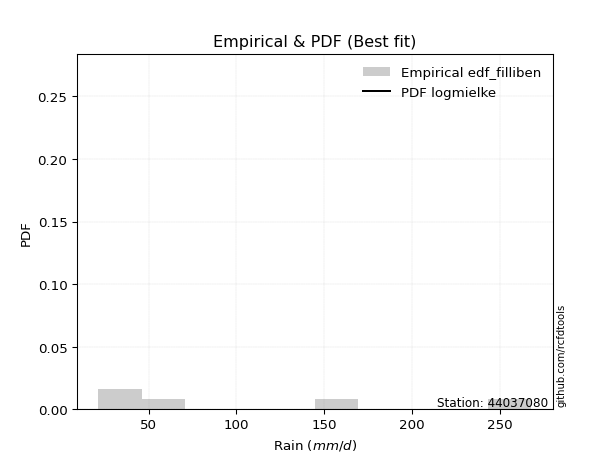</img>

</div>


### 10. EDF Jenkinson (1977)

The Jenkinson formula in hydrology is an empirical plotting position formula used to estimate the non-exceedance probability _(P)_ or return period _(T)_ of a given ordered observation within a sample. It is a widely used method in the frequency analysis of extreme events such as floods and rainfall, as it provides a distribution-free way to plot data. _a≈0.31_ and _b≈0.38_ are constants derived to approximate the median of the probability distribution for the given rank.

<div align="center">


$P=(m-a)/(n+b)$


</div>


**10.1. Empirical values**

<div align="center">

|                | 0                   | 1                  | 2             | 3                  | 4                  |
|:---------------|:--------------------|:-------------------|:--------------|:-------------------|:-------------------|
| date           | 2023                | 2024               | 2019          | 2022               | 2020               |
| x              | 21.4                | 28.0               | 66.2          | 159.8              | 268.0              |
| m              | 1                   | 2                  | 3             | 4                  | 5                  |
| empirical_dist | edf_jenkinson       | edf_jenkinson      | edf_jenkinson | edf_jenkinson      | edf_jenkinson      |
| empirical      | 0.12825278810408922 | 0.3141263940520446 | 0.5           | 0.6858736059479554 | 0.8717472118959109 |
| empirical_tr   | 1.1471215351812367  | 1.4579945799457996 | 2.0           | 3.183431952662722  | 7.797101449275368  |

</div>


**10.2. Kolmogorov-Smirnov fit test (sorted by Δ)**


<div align="center">

|                | 0                    | 1                   | 2                   | 3                   | 4                   | 5                   | 6                   | 7                   | 8                   | 9                   | 10                  | 11                  | 12                  | 13                  | 14                 | 15                  | 16                  | 17                 | 18                  | 19                  | 20                  | 21                  | 22                  | 23                  | 24                  | 25                  | 26                  | 27                  | 28                 | 29                  | 30                 | 31                  | 32                  | 33                  | 34                  | 35                  | 36                  | 37                  | 38                  | 39                 | 40                  | 41                  | 42                  | 43                 | 44                  | 45                  | 46                 | 47                  | 48                  | 49                  | 50                 | 51                 | 52                  | 53                  | 54                 | 55                 | 56                  | 57                  | 58                  | 59                  | 60                 | 61                  | 62                 | 63                  | 64                  | 65                 | 66                 | 67                  | 68                  | 69                  | 70                  | 71                 | 72                  | 73                  | 74                  | 75                  | 76                  | 77                  | 78                  | 79                  | 80                 | 81                  | 82                  | 83                  | 84                  | 85                  | 86                  | 87                  | 88                  | 89                 | 90                  | 91                  | 92                  | 93                 | 94                  | 95                  | 96                  | 97                  | 98                  | 99                  | 100                 | 101                 | 102                 | 103                 | 104                | 105                | 106                 | 107                 | 108                 | 109                 | 110                | 111                 | 112                 | 113                | 114                 | 115                 | 116                 | 117                | 118                 | 119                | 120                | 121                | 122                | 123                 | 124                 | 125                 | 126                 | 127                 | 128                 | 129                 | 130                | 131                | 132                 | 133                | 134                | 135                 | 136                | 137                 | 138                | 139                | 140                | 141                 | 142                | 143                | 144                | 145                | 146                | 147                 | 148                 | 149                | 150                | 151                 | 152                | 153                 | 154                | 155                | 156                | 157                | 158                | 159                |
|:---------------|:---------------------|:--------------------|:--------------------|:--------------------|:--------------------|:--------------------|:--------------------|:--------------------|:--------------------|:--------------------|:--------------------|:--------------------|:--------------------|:--------------------|:-------------------|:--------------------|:--------------------|:-------------------|:--------------------|:--------------------|:--------------------|:--------------------|:--------------------|:--------------------|:--------------------|:--------------------|:--------------------|:--------------------|:-------------------|:--------------------|:-------------------|:--------------------|:--------------------|:--------------------|:--------------------|:--------------------|:--------------------|:--------------------|:--------------------|:-------------------|:--------------------|:--------------------|:--------------------|:-------------------|:--------------------|:--------------------|:-------------------|:--------------------|:--------------------|:--------------------|:-------------------|:-------------------|:--------------------|:--------------------|:-------------------|:-------------------|:--------------------|:--------------------|:--------------------|:--------------------|:-------------------|:--------------------|:-------------------|:--------------------|:--------------------|:-------------------|:-------------------|:--------------------|:--------------------|:--------------------|:--------------------|:-------------------|:--------------------|:--------------------|:--------------------|:--------------------|:--------------------|:--------------------|:--------------------|:--------------------|:-------------------|:--------------------|:--------------------|:--------------------|:--------------------|:--------------------|:--------------------|:--------------------|:--------------------|:-------------------|:--------------------|:--------------------|:--------------------|:-------------------|:--------------------|:--------------------|:--------------------|:--------------------|:--------------------|:--------------------|:--------------------|:--------------------|:--------------------|:--------------------|:-------------------|:-------------------|:--------------------|:--------------------|:--------------------|:--------------------|:-------------------|:--------------------|:--------------------|:-------------------|:--------------------|:--------------------|:--------------------|:-------------------|:--------------------|:-------------------|:-------------------|:-------------------|:-------------------|:--------------------|:--------------------|:--------------------|:--------------------|:--------------------|:--------------------|:--------------------|:-------------------|:-------------------|:--------------------|:-------------------|:-------------------|:--------------------|:-------------------|:--------------------|:-------------------|:-------------------|:-------------------|:--------------------|:-------------------|:-------------------|:-------------------|:-------------------|:-------------------|:--------------------|:--------------------|:-------------------|:-------------------|:--------------------|:-------------------|:--------------------|:-------------------|:-------------------|:-------------------|:-------------------|:-------------------|:-------------------|
| station        | 44037080             | 44037080            | 44037080            | 44037080            | 44037080            | 44037080            | 44037080            | 44037080            | 44037080            | 44037080            | 44037080            | 44037080            | 44037080            | 44037080            | 44037080           | 44037080            | 44037080            | 44037080           | 44037080            | 44037080            | 44037080            | 44037080            | 44037080            | 44037080            | 44037080            | 44037080            | 44037080            | 44037080            | 44037080           | 44037080            | 44037080           | 44037080            | 44037080            | 44037080            | 44037080            | 44037080            | 44037080            | 44037080            | 44037080            | 44037080           | 44037080            | 44037080            | 44037080            | 44037080           | 44037080            | 44037080            | 44037080           | 44037080            | 44037080            | 44037080            | 44037080           | 44037080           | 44037080            | 44037080            | 44037080           | 44037080           | 44037080            | 44037080            | 44037080            | 44037080            | 44037080           | 44037080            | 44037080           | 44037080            | 44037080            | 44037080           | 44037080           | 44037080            | 44037080            | 44037080            | 44037080            | 44037080           | 44037080            | 44037080            | 44037080            | 44037080            | 44037080            | 44037080            | 44037080            | 44037080            | 44037080           | 44037080            | 44037080            | 44037080            | 44037080            | 44037080            | 44037080            | 44037080            | 44037080            | 44037080           | 44037080            | 44037080            | 44037080            | 44037080           | 44037080            | 44037080            | 44037080            | 44037080            | 44037080            | 44037080            | 44037080            | 44037080            | 44037080            | 44037080            | 44037080           | 44037080           | 44037080            | 44037080            | 44037080            | 44037080            | 44037080           | 44037080            | 44037080            | 44037080           | 44037080            | 44037080            | 44037080            | 44037080           | 44037080            | 44037080           | 44037080           | 44037080           | 44037080           | 44037080            | 44037080            | 44037080            | 44037080            | 44037080            | 44037080            | 44037080            | 44037080           | 44037080           | 44037080            | 44037080           | 44037080           | 44037080            | 44037080           | 44037080            | 44037080           | 44037080           | 44037080           | 44037080            | 44037080           | 44037080           | 44037080           | 44037080           | 44037080           | 44037080            | 44037080            | 44037080           | 44037080           | 44037080            | 44037080           | 44037080            | 44037080           | 44037080           | 44037080           | 44037080           | 44037080           | 44037080           |
| empirical_dist | edf_jenkinson        | edf_jenkinson       | edf_jenkinson       | edf_jenkinson       | edf_jenkinson       | edf_jenkinson       | edf_jenkinson       | edf_jenkinson       | edf_jenkinson       | edf_jenkinson       | edf_jenkinson       | edf_jenkinson       | edf_jenkinson       | edf_jenkinson       | edf_jenkinson      | edf_jenkinson       | edf_jenkinson       | edf_jenkinson      | edf_jenkinson       | edf_jenkinson       | edf_jenkinson       | edf_jenkinson       | edf_jenkinson       | edf_jenkinson       | edf_jenkinson       | edf_jenkinson       | edf_jenkinson       | edf_jenkinson       | edf_jenkinson      | edf_jenkinson       | edf_jenkinson      | edf_jenkinson       | edf_jenkinson       | edf_jenkinson       | edf_jenkinson       | edf_jenkinson       | edf_jenkinson       | edf_jenkinson       | edf_jenkinson       | edf_jenkinson      | edf_jenkinson       | edf_jenkinson       | edf_jenkinson       | edf_jenkinson      | edf_jenkinson       | edf_jenkinson       | edf_jenkinson      | edf_jenkinson       | edf_jenkinson       | edf_jenkinson       | edf_jenkinson      | edf_jenkinson      | edf_jenkinson       | edf_jenkinson       | edf_jenkinson      | edf_jenkinson      | edf_jenkinson       | edf_jenkinson       | edf_jenkinson       | edf_jenkinson       | edf_jenkinson      | edf_jenkinson       | edf_jenkinson      | edf_jenkinson       | edf_jenkinson       | edf_jenkinson      | edf_jenkinson      | edf_jenkinson       | edf_jenkinson       | edf_jenkinson       | edf_jenkinson       | edf_jenkinson      | edf_jenkinson       | edf_jenkinson       | edf_jenkinson       | edf_jenkinson       | edf_jenkinson       | edf_jenkinson       | edf_jenkinson       | edf_jenkinson       | edf_jenkinson      | edf_jenkinson       | edf_jenkinson       | edf_jenkinson       | edf_jenkinson       | edf_jenkinson       | edf_jenkinson       | edf_jenkinson       | edf_jenkinson       | edf_jenkinson      | edf_jenkinson       | edf_jenkinson       | edf_jenkinson       | edf_jenkinson      | edf_jenkinson       | edf_jenkinson       | edf_jenkinson       | edf_jenkinson       | edf_jenkinson       | edf_jenkinson       | edf_jenkinson       | edf_jenkinson       | edf_jenkinson       | edf_jenkinson       | edf_jenkinson      | edf_jenkinson      | edf_jenkinson       | edf_jenkinson       | edf_jenkinson       | edf_jenkinson       | edf_jenkinson      | edf_jenkinson       | edf_jenkinson       | edf_jenkinson      | edf_jenkinson       | edf_jenkinson       | edf_jenkinson       | edf_jenkinson      | edf_jenkinson       | edf_jenkinson      | edf_jenkinson      | edf_jenkinson      | edf_jenkinson      | edf_jenkinson       | edf_jenkinson       | edf_jenkinson       | edf_jenkinson       | edf_jenkinson       | edf_jenkinson       | edf_jenkinson       | edf_jenkinson      | edf_jenkinson      | edf_jenkinson       | edf_jenkinson      | edf_jenkinson      | edf_jenkinson       | edf_jenkinson      | edf_jenkinson       | edf_jenkinson      | edf_jenkinson      | edf_jenkinson      | edf_jenkinson       | edf_jenkinson      | edf_jenkinson      | edf_jenkinson      | edf_jenkinson      | edf_jenkinson      | edf_jenkinson       | edf_jenkinson       | edf_jenkinson      | edf_jenkinson      | edf_jenkinson       | edf_jenkinson      | edf_jenkinson       | edf_jenkinson      | edf_jenkinson      | edf_jenkinson      | edf_jenkinson      | edf_jenkinson      | edf_jenkinson      |
| p_dist         | logmielke            | logarcsine          | logksone            | halfnorm            | logsemicircular     | foldnorm            | loganglit           | logtrapezoid        | betaprime           | dgamma              | halflogistic        | logbeta             | gengamma            | exponweib           | logexponpow        | logburr12           | loghalfgennorm      | logrdist           | exponpow            | logweibull_max      | truncexpon          | logexponweib        | logwrapcauchy       | gausshyper          | loglomax            | burr12              | nct                 | logburr             | ksone              | lograyleigh         | alpha              | loggenlogistic      | rayleigh            | loghalfnorm         | nakagami            | loginvweibull       | gumbel_r            | loginvgamma         | logmaxwell          | lognct             | logfoldnorm         | logncf              | logkstwobign        | ncf                | loggenpareto        | logbetaprime        | logalpha           | loggamma            | loggamma            | logloggamma         | pearson3           | logerlang          | logpearson3         | logskewnorm         | logcrystalball     | lognorm            | logt                | logexponnorm        | logjohnsonsu        | dweibull            | genlogistic        | arcsine             | semicircular       | maxwell             | loginvgauss         | loggenexpon        | moyal              | logloglaplace       | anglit              | genexpon            | kstwobign           | logcosine          | loggumbel_l         | loglogistic         | logrice             | loggumbel_r         | logbradford         | truncweibull_min    | logdweibull         | logtruncexpon       | invgamma           | loglevy_l           | f                   | loghypsecant        | loggompertz         | loghalflogistic     | burr                | crystalball         | norm                | t                  | invgauss            | logargus            | loggenextreme       | loggausshyper      | logtriang           | wrapcauchy          | loglaplace          | loglaplace          | logmoyal            | logtruncweibull_min | logkappa4           | loggennorm          | logdgamma           | rice                | logistic           | logtukeylambda     | logf                | gennorm             | loguniform          | logkappa3           | logvonmises_line   | cosine              | hypsecant           | johnsonsu          | weibull_min         | halfgennorm         | gumbel_l            | levy_l             | laplace             | lomax              | logweibull_min     | gompertz           | exponnorm          | truncnorm           | loggenhalflogistic  | kappa4              | genpareto           | argus               | skewnorm            | bradford            | beta               | gamma              | wald                | fatiguelife        | triang             | tukeylambda         | logwald            | uniform             | vonmises_line      | erlang             | truncpareto        | genextreme          | powerlaw           | genhalflogistic    | lognakagami        | logfatiguelife     | kappa3             | johnsonsb           | invweibull          | logpowerlaw        | logtruncpareto     | trapezoid           | loggengamma        | logjohnsonsb        | logtruncnorm       | rdist              | weibull_max        | logvonmises        | vonmises           | mielke             |
| delta          | 0.034718252597326374 | 0.05602542579454495 | 0.08669501672104415 | 0.09980253156396868 | 0.10310517169672034 | 0.11275323136052834 | 0.11493431537191415 | 0.11688797820170665 | 0.11965847715494582 | 0.11996294818905351 | 0.12661321936594397 | 0.12825260553156415 | 0.12825260688165074 | 0.12825262414255703 | 0.1282527473103968 | 0.12825275541359982 | 0.12825278055021985 | 0.128252784736806  | 0.12825278693908485 | 0.12825278750749014 | 0.12825278810388807 | 0.12825278810404622 | 0.12825278810408922 | 0.12825278810413976 | 0.12850528506407433 | 0.12927183478644966 | 0.12979818456309966 | 0.13007339684418928 | 0.130830655227266  | 0.13167770543080085 | 0.132632242836909  | 0.13287177262265537 | 0.13295886660160444 | 0.13322239462863514 | 0.13341400401073894 | 0.13346930085164996 | 0.13361032706141796 | 0.13397211553582292 | 0.13438336216743502 | 0.1348247251547578 | 0.13508586405954337 | 0.13510129377183666 | 0.13533468553244096 | 0.1366605220841302 | 0.13695938484614698 | 0.13924345630542576 | 0.1397731829662835 | 0.14030070295178682 | 0.14030070295178682 | 0.14050996446854297 | 0.1406397785087518 | 0.1411455040209318 | 0.14118910696256062 | 0.14155403051594911 | 0.1415939121823324 | 0.1415940474468655 | 0.14159423831123596 | 0.14159453933052377 | 0.14178996377651015 | 0.14205810948086117 | 0.1428632344031879 | 0.14296435770366325 | 0.1430171155450759 | 0.14462139660916679 | 0.14521894273786506 | 0.1457151371275317 | 0.1460286747179172 | 0.15159870237826506 | 0.15245568460825654 | 0.15608675461662513 | 0.15633595982980147 | 0.1566439657736659 | 0.16010607260520626 | 0.16129949811481328 | 0.16169613688264323 | 0.16225354263463987 | 0.16425866572194414 | 0.16547201978223147 | 0.16598456711628018 | 0.16836569419743475 | 0.1686257093015664 | 0.17027876467750272 | 0.17189223262561182 | 0.17206984936226896 | 0.17234569430172814 | 0.17409641547613353 | 0.17430927547582575 | 0.17480147800805967 | 0.17480148009756658 | 0.1748085359198096 | 0.17539976576208494 | 0.17579449776529626 | 0.17618011261025035 | 0.1801777069071514 | 0.18050634127083914 | 0.18076916183707736 | 0.18258783839481824 | 0.18258783839481824 | 0.18364400113341067 | 0.18421328991502384 | 0.18558215654208635 | 0.18587360594795543 | 0.18973792308160053 | 0.19143044990951974 | 0.194667772252417  | 0.2005588491098806 | 0.20595289591206334 | 0.20659323953219388 | 0.20777491148614446 | 0.20782003945160182 | 0.2078271779544744 | 0.20858787499728332 | 0.20958161176454465 | 0.210489684040007  | 0.21080127157411255 | 0.22772302324327875 | 0.23054624511360733 | 0.232588345420664  | 0.23660062871623483 | 0.2367826389486739 | 0.2379891882363263 | 0.2405894699145701 | 0.2405900236788034 | 0.24113809268688507 | 0.25399548897061497 | 0.25401481933606507 | 0.25652886872622177 | 0.25687697831939316 | 0.27302760380725644 | 0.27346490164116866 | 0.2771183588540711 | 0.2806657015324111 | 0.29522206931756234 | 0.2963884821740988 | 0.298073796498315  | 0.30656920329327164 | 0.3140652556920484 | 0.31832927818329276 | 0.3234019424949076 | 0.3251236098665601 | 0.3501864773793908 | 0.35058383833543805 | 0.3527460484871257 | 0.3590291792015595 | 0.3732390817907512 | 0.3821012655861454 | 0.3885571223570618 | 0.42506905617516294 | 0.42929009418999936 | 0.439175549319716  | 0.4440217706671082 | 0.44464500333991686 | 0.4525493453597867 | 0.48865509669449364 | 0.4999961381507031 | 0.5020045489361323 | 0.6041285140262879 | 1.1196446062377317 | 42.089992851526276 | nan                |
| deltao         | 0.5865427407550001   | 0.5865427407550001  | 0.5865427407550001  | 0.5865427407550001  | 0.5865427407550001  | 0.5865427407550001  | 0.5865427407550001  | 0.5865427407550001  | 0.5865427407550001  | 0.5865427407550001  | 0.5865427407550001  | 0.5865427407550001  | 0.5865427407550001  | 0.5865427407550001  | 0.5865427407550001 | 0.5865427407550001  | 0.5865427407550001  | 0.5865427407550001 | 0.5865427407550001  | 0.5865427407550001  | 0.5865427407550001  | 0.5865427407550001  | 0.5865427407550001  | 0.5865427407550001  | 0.5865427407550001  | 0.5865427407550001  | 0.5865427407550001  | 0.5865427407550001  | 0.5865427407550001 | 0.5865427407550001  | 0.5865427407550001 | 0.5865427407550001  | 0.5865427407550001  | 0.5865427407550001  | 0.5865427407550001  | 0.5865427407550001  | 0.5865427407550001  | 0.5865427407550001  | 0.5865427407550001  | 0.5865427407550001 | 0.5865427407550001  | 0.5865427407550001  | 0.5865427407550001  | 0.5865427407550001 | 0.5865427407550001  | 0.5865427407550001  | 0.5865427407550001 | 0.5865427407550001  | 0.5865427407550001  | 0.5865427407550001  | 0.5865427407550001 | 0.5865427407550001 | 0.5865427407550001  | 0.5865427407550001  | 0.5865427407550001 | 0.5865427407550001 | 0.5865427407550001  | 0.5865427407550001  | 0.5865427407550001  | 0.5865427407550001  | 0.5865427407550001 | 0.5865427407550001  | 0.5865427407550001 | 0.5865427407550001  | 0.5865427407550001  | 0.5865427407550001 | 0.5865427407550001 | 0.5865427407550001  | 0.5865427407550001  | 0.5865427407550001  | 0.5865427407550001  | 0.5865427407550001 | 0.5865427407550001  | 0.5865427407550001  | 0.5865427407550001  | 0.5865427407550001  | 0.5865427407550001  | 0.5865427407550001  | 0.5865427407550001  | 0.5865427407550001  | 0.5865427407550001 | 0.5865427407550001  | 0.5865427407550001  | 0.5865427407550001  | 0.5865427407550001  | 0.5865427407550001  | 0.5865427407550001  | 0.5865427407550001  | 0.5865427407550001  | 0.5865427407550001 | 0.5865427407550001  | 0.5865427407550001  | 0.5865427407550001  | 0.5865427407550001 | 0.5865427407550001  | 0.5865427407550001  | 0.5865427407550001  | 0.5865427407550001  | 0.5865427407550001  | 0.5865427407550001  | 0.5865427407550001  | 0.5865427407550001  | 0.5865427407550001  | 0.5865427407550001  | 0.5865427407550001 | 0.5865427407550001 | 0.5865427407550001  | 0.5865427407550001  | 0.5865427407550001  | 0.5865427407550001  | 0.5865427407550001 | 0.5865427407550001  | 0.5865427407550001  | 0.5865427407550001 | 0.5865427407550001  | 0.5865427407550001  | 0.5865427407550001  | 0.5865427407550001 | 0.5865427407550001  | 0.5865427407550001 | 0.5865427407550001 | 0.5865427407550001 | 0.5865427407550001 | 0.5865427407550001  | 0.5865427407550001  | 0.5865427407550001  | 0.5865427407550001  | 0.5865427407550001  | 0.5865427407550001  | 0.5865427407550001  | 0.5865427407550001 | 0.5865427407550001 | 0.5865427407550001  | 0.5865427407550001 | 0.5865427407550001 | 0.5865427407550001  | 0.5865427407550001 | 0.5865427407550001  | 0.5865427407550001 | 0.5865427407550001 | 0.5865427407550001 | 0.5865427407550001  | 0.5865427407550001 | 0.5865427407550001 | 0.5865427407550001 | 0.5865427407550001 | 0.5865427407550001 | 0.5865427407550001  | 0.5865427407550001  | 0.5865427407550001 | 0.5865427407550001 | 0.5865427407550001  | 0.5865427407550001 | 0.5865427407550001  | 0.5865427407550001 | 0.5865427407550001 | 0.5865427407550001 | 0.5865427407550001 | 0.5865427407550001 | 0.5865427407550001 |
| eval           | Δo > Δ               | Δo > Δ              | Δo > Δ              | Δo > Δ              | Δo > Δ              | Δo > Δ              | Δo > Δ              | Δo > Δ              | Δo > Δ              | Δo > Δ              | Δo > Δ              | Δo > Δ              | Δo > Δ              | Δo > Δ              | Δo > Δ             | Δo > Δ              | Δo > Δ              | Δo > Δ             | Δo > Δ              | Δo > Δ              | Δo > Δ              | Δo > Δ              | Δo > Δ              | Δo > Δ              | Δo > Δ              | Δo > Δ              | Δo > Δ              | Δo > Δ              | Δo > Δ             | Δo > Δ              | Δo > Δ             | Δo > Δ              | Δo > Δ              | Δo > Δ              | Δo > Δ              | Δo > Δ              | Δo > Δ              | Δo > Δ              | Δo > Δ              | Δo > Δ             | Δo > Δ              | Δo > Δ              | Δo > Δ              | Δo > Δ             | Δo > Δ              | Δo > Δ              | Δo > Δ             | Δo > Δ              | Δo > Δ              | Δo > Δ              | Δo > Δ             | Δo > Δ             | Δo > Δ              | Δo > Δ              | Δo > Δ             | Δo > Δ             | Δo > Δ              | Δo > Δ              | Δo > Δ              | Δo > Δ              | Δo > Δ             | Δo > Δ              | Δo > Δ             | Δo > Δ              | Δo > Δ              | Δo > Δ             | Δo > Δ             | Δo > Δ              | Δo > Δ              | Δo > Δ              | Δo > Δ              | Δo > Δ             | Δo > Δ              | Δo > Δ              | Δo > Δ              | Δo > Δ              | Δo > Δ              | Δo > Δ              | Δo > Δ              | Δo > Δ              | Δo > Δ             | Δo > Δ              | Δo > Δ              | Δo > Δ              | Δo > Δ              | Δo > Δ              | Δo > Δ              | Δo > Δ              | Δo > Δ              | Δo > Δ             | Δo > Δ              | Δo > Δ              | Δo > Δ              | Δo > Δ             | Δo > Δ              | Δo > Δ              | Δo > Δ              | Δo > Δ              | Δo > Δ              | Δo > Δ              | Δo > Δ              | Δo > Δ              | Δo > Δ              | Δo > Δ              | Δo > Δ             | Δo > Δ             | Δo > Δ              | Δo > Δ              | Δo > Δ              | Δo > Δ              | Δo > Δ             | Δo > Δ              | Δo > Δ              | Δo > Δ             | Δo > Δ              | Δo > Δ              | Δo > Δ              | Δo > Δ             | Δo > Δ              | Δo > Δ             | Δo > Δ             | Δo > Δ             | Δo > Δ             | Δo > Δ              | Δo > Δ              | Δo > Δ              | Δo > Δ              | Δo > Δ              | Δo > Δ              | Δo > Δ              | Δo > Δ             | Δo > Δ             | Δo > Δ              | Δo > Δ             | Δo > Δ             | Δo > Δ              | Δo > Δ             | Δo > Δ              | Δo > Δ             | Δo > Δ             | Δo > Δ             | Δo > Δ              | Δo > Δ             | Δo > Δ             | Δo > Δ             | Δo > Δ             | Δo > Δ             | Δo > Δ              | Δo > Δ              | Δo > Δ             | Δo > Δ             | Δo > Δ              | Δo > Δ             | Δo > Δ              | Δo > Δ             | Δo > Δ             | Δo <= Δ            | Δo <= Δ            | Δo <= Δ            | Δo <= Δ            |
| fit            | 1                    | 1                   | 1                   | 1                   | 1                   | 1                   | 1                   | 1                   | 1                   | 1                   | 1                   | 1                   | 1                   | 1                   | 1                  | 1                   | 1                   | 1                  | 1                   | 1                   | 1                   | 1                   | 1                   | 1                   | 1                   | 1                   | 1                   | 1                   | 1                  | 1                   | 1                  | 1                   | 1                   | 1                   | 1                   | 1                   | 1                   | 1                   | 1                   | 1                  | 1                   | 1                   | 1                   | 1                  | 1                   | 1                   | 1                  | 1                   | 1                   | 1                   | 1                  | 1                  | 1                   | 1                   | 1                  | 1                  | 1                   | 1                   | 1                   | 1                   | 1                  | 1                   | 1                  | 1                   | 1                   | 1                  | 1                  | 1                   | 1                   | 1                   | 1                   | 1                  | 1                   | 1                   | 1                   | 1                   | 1                   | 1                   | 1                   | 1                   | 1                  | 1                   | 1                   | 1                   | 1                   | 1                   | 1                   | 1                   | 1                   | 1                  | 1                   | 1                   | 1                   | 1                  | 1                   | 1                   | 1                   | 1                   | 1                   | 1                   | 1                   | 1                   | 1                   | 1                   | 1                  | 1                  | 1                   | 1                   | 1                   | 1                   | 1                  | 1                   | 1                   | 1                  | 1                   | 1                   | 1                   | 1                  | 1                   | 1                  | 1                  | 1                  | 1                  | 1                   | 1                   | 1                   | 1                   | 1                   | 1                   | 1                   | 1                  | 1                  | 1                   | 1                  | 1                  | 1                   | 1                  | 1                   | 1                  | 1                  | 1                  | 1                   | 1                  | 1                  | 1                  | 1                  | 1                  | 1                   | 1                   | 1                  | 1                  | 1                   | 1                  | 1                   | 1                  | 1                  | 0                  | 0                  | 0                  | 0                  |
| n              | 5                    | 5                   | 5                   | 5                   | 5                   | 5                   | 5                   | 5                   | 5                   | 5                   | 5                   | 5                   | 5                   | 5                   | 5                  | 5                   | 5                   | 5                  | 5                   | 5                   | 5                   | 5                   | 5                   | 5                   | 5                   | 5                   | 5                   | 5                   | 5                  | 5                   | 5                  | 5                   | 5                   | 5                   | 5                   | 5                   | 5                   | 5                   | 5                   | 5                  | 5                   | 5                   | 5                   | 5                  | 5                   | 5                   | 5                  | 5                   | 5                   | 5                   | 5                  | 5                  | 5                   | 5                   | 5                  | 5                  | 5                   | 5                   | 5                   | 5                   | 5                  | 5                   | 5                  | 5                   | 5                   | 5                  | 5                  | 5                   | 5                   | 5                   | 5                   | 5                  | 5                   | 5                   | 5                   | 5                   | 5                   | 5                   | 5                   | 5                   | 5                  | 5                   | 5                   | 5                   | 5                   | 5                   | 5                   | 5                   | 5                   | 5                  | 5                   | 5                   | 5                   | 5                  | 5                   | 5                   | 5                   | 5                   | 5                   | 5                   | 5                   | 5                   | 5                   | 5                   | 5                  | 5                  | 5                   | 5                   | 5                   | 5                   | 5                  | 5                   | 5                   | 5                  | 5                   | 5                   | 5                   | 5                  | 5                   | 5                  | 5                  | 5                  | 5                  | 5                   | 5                   | 5                   | 5                   | 5                   | 5                   | 5                   | 5                  | 5                  | 5                   | 5                  | 5                  | 5                   | 5                  | 5                   | 5                  | 5                  | 5                  | 5                   | 5                  | 5                  | 5                  | 5                  | 5                  | 5                   | 5                   | 5                  | 5                  | 5                   | 5                  | 5                   | 5                  | 5                  | 5                  | 5                  | 5                  | 5                  |
| best_fit       | 1                    | 0                   | 0                   | 0                   | 0                   | 0                   | 0                   | 0                   | 0                   | 0                   | 0                   | 0                   | 0                   | 0                   | 0                  | 0                   | 0                   | 0                  | 0                   | 0                   | 0                   | 0                   | 0                   | 0                   | 0                   | 0                   | 0                   | 0                   | 0                  | 0                   | 0                  | 0                   | 0                   | 0                   | 0                   | 0                   | 0                   | 0                   | 0                   | 0                  | 0                   | 0                   | 0                   | 0                  | 0                   | 0                   | 0                  | 0                   | 0                   | 0                   | 0                  | 0                  | 0                   | 0                   | 0                  | 0                  | 0                   | 0                   | 0                   | 0                   | 0                  | 0                   | 0                  | 0                   | 0                   | 0                  | 0                  | 0                   | 0                   | 0                   | 0                   | 0                  | 0                   | 0                   | 0                   | 0                   | 0                   | 0                   | 0                   | 0                   | 0                  | 0                   | 0                   | 0                   | 0                   | 0                   | 0                   | 0                   | 0                   | 0                  | 0                   | 0                   | 0                   | 0                  | 0                   | 0                   | 0                   | 0                   | 0                   | 0                   | 0                   | 0                   | 0                   | 0                   | 0                  | 0                  | 0                   | 0                   | 0                   | 0                   | 0                  | 0                   | 0                   | 0                  | 0                   | 0                   | 0                   | 0                  | 0                   | 0                  | 0                  | 0                  | 0                  | 0                   | 0                   | 0                   | 0                   | 0                   | 0                   | 0                   | 0                  | 0                  | 0                   | 0                  | 0                  | 0                   | 0                  | 0                   | 0                  | 0                  | 0                  | 0                   | 0                  | 0                  | 0                  | 0                  | 0                  | 0                   | 0                   | 0                  | 0                  | 0                   | 0                  | 0                   | 0                  | 0                  | 0                  | 0                  | 0                  | 0                  |
| best_fit_sort  | 1                    | 2                   | 3                   | 4                   | 5                   | 6                   | 7                   | 8                   | 9                   | 10                  | 11                  | 12                  | 13                  | 14                  | 15                 | 16                  | 17                  | 18                 | 19                  | 20                  | 21                  | 22                  | 23                  | 24                  | 25                  | 26                  | 27                  | 28                  | 29                 | 30                  | 31                 | 32                  | 33                  | 34                  | 35                  | 36                  | 37                  | 38                  | 39                  | 40                 | 41                  | 42                  | 43                  | 44                 | 45                  | 46                  | 47                 | 48                  | 49                  | 50                  | 51                 | 52                 | 53                  | 54                  | 55                 | 56                 | 57                  | 58                  | 59                  | 60                  | 61                 | 62                  | 63                 | 64                  | 65                  | 66                 | 67                 | 68                  | 69                  | 70                  | 71                  | 72                 | 73                  | 74                  | 75                  | 76                  | 77                  | 78                  | 79                  | 80                  | 81                 | 82                  | 83                  | 84                  | 85                  | 86                  | 87                  | 88                  | 89                  | 90                 | 91                  | 92                  | 93                  | 94                 | 95                  | 96                  | 97                  | 98                  | 99                  | 100                 | 101                 | 102                 | 103                 | 104                 | 105                | 106                | 107                 | 108                 | 109                 | 110                 | 111                | 112                 | 113                 | 114                | 115                 | 116                 | 117                 | 118                | 119                 | 120                | 121                | 122                | 123                | 124                 | 125                 | 126                 | 127                 | 128                 | 129                 | 130                 | 131                | 132                | 133                 | 134                | 135                | 136                 | 137                | 138                 | 139                | 140                | 141                | 142                 | 143                | 144                | 145                | 146                | 147                | 148                 | 149                 | 150                | 151                | 152                 | 153                | 154                 | 155                | 156                | 157                | 158                | 159                | 160                |

</div>


**10.3. Best fit**

<div align="center">

|   id |   station | empirical_dist   | p_dist    |     delta |   deltao | eval   |   fit |   n |   best_fit |   best_fit_sort |
|-----:|----------:|:-----------------|:----------|----------:|---------:|:-------|------:|----:|-----------:|----------------:|
|    0 |  44037080 | edf_jenkinson    | logmielke | 0.0347183 | 0.586543 | Δo > Δ |     1 |   5 |          1 |               1 |

</div>


<div align="center">

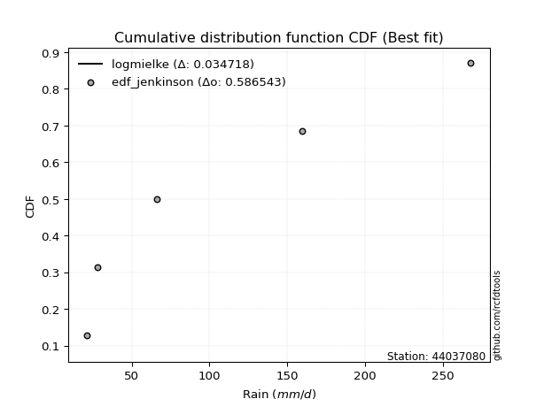</img></img>

</div>


### 11. EDF Cunnane (1978)

Cunnane´s work in statistical hydrology has focused on the performance and evaluation of different probability distributions (such as GEV, Gumbel, Lognormal) for flood frequency estimation. _b_ is a constant, typically set to 0.4.

<div align="center">


$P=(m-b)/(n+1-2b)$


</div>


**11.1. Empirical values**

<div align="center">

|                | 0                   | 1                  | 2           | 3                  | 4                  |
|:---------------|:--------------------|:-------------------|:------------|:-------------------|:-------------------|
| date           | 2023                | 2024               | 2019        | 2022               | 2020               |
| x              | 21.4                | 28.0               | 66.2        | 159.8              | 268.0              |
| m              | 1                   | 2                  | 3           | 4                  | 5                  |
| empirical_dist | edf_cunnane         | edf_cunnane        | edf_cunnane | edf_cunnane        | edf_cunnane        |
| empirical      | 0.11538461538461538 | 0.3076923076923077 | 0.5         | 0.6923076923076923 | 0.8846153846153845 |
| empirical_tr   | 1.1304347826086958  | 1.4444444444444444 | 2.0         | 3.25               | 8.666666666666655  |

</div>


**11.2. Kolmogorov-Smirnov fit test (sorted by Δ)**


<div align="center">

|                | 0                    | 1                    | 2                   | 3                   | 4                   | 5                   | 6                   | 7                   | 8                   | 9                   | 10                  | 11                  | 12                  | 13                  | 14                  | 15                  | 16                  | 17                  | 18                  | 19                  | 20                 | 21                 | 22                  | 23                  | 24                  | 25                  | 26                  | 27                  | 28                  | 29                  | 30                  | 31                  | 32                 | 33                 | 34                  | 35                  | 36                  | 37                  | 38                 | 39                 | 40                  | 41                  | 42                  | 43                  | 44                 | 45                 | 46                  | 47                  | 48                 | 49                  | 50                 | 51                  | 52                  | 53                  | 54                  | 55                  | 56                 | 57                 | 58                 | 59                  | 60                 | 61                 | 62                  | 63                  | 64                  | 65                  | 66                  | 67                  | 68                  | 69                 | 70                  | 71                  | 72                  | 73                  | 74                  | 75                 | 76                  | 77                  | 78                  | 79                 | 80                  | 81                  | 82                 | 83                 | 84                 | 85                  | 86                  | 87                  | 88                  | 89                  | 90                  | 91                 | 92                  | 93                  | 94                  | 95                  | 96                  | 97                  | 98                  | 99                  | 100                 | 101                 | 102                 | 103                | 104                 | 105                | 106                 | 107                 | 108                | 109                 | 110                | 111                 | 112                 | 113                 | 114                | 115                 | 116                | 117                 | 118                 | 119                 | 120                 | 121                 | 122                 | 123                 | 124                 | 125                | 126                 | 127                 | 128                | 129                 | 130                 | 131                 | 132                | 133                | 134                | 135                 | 136                | 137                 | 138                | 139                | 140                | 141                | 142                | 143                 | 144                | 145                | 146                | 147                 | 148                 | 149                 | 150                | 151                | 152                | 153                 | 154                | 155                | 156                | 157                | 158                | 159                |
|:---------------|:---------------------|:---------------------|:--------------------|:--------------------|:--------------------|:--------------------|:--------------------|:--------------------|:--------------------|:--------------------|:--------------------|:--------------------|:--------------------|:--------------------|:--------------------|:--------------------|:--------------------|:--------------------|:--------------------|:--------------------|:-------------------|:-------------------|:--------------------|:--------------------|:--------------------|:--------------------|:--------------------|:--------------------|:--------------------|:--------------------|:--------------------|:--------------------|:-------------------|:-------------------|:--------------------|:--------------------|:--------------------|:--------------------|:-------------------|:-------------------|:--------------------|:--------------------|:--------------------|:--------------------|:-------------------|:-------------------|:--------------------|:--------------------|:-------------------|:--------------------|:-------------------|:--------------------|:--------------------|:--------------------|:--------------------|:--------------------|:-------------------|:-------------------|:-------------------|:--------------------|:-------------------|:-------------------|:--------------------|:--------------------|:--------------------|:--------------------|:--------------------|:--------------------|:--------------------|:-------------------|:--------------------|:--------------------|:--------------------|:--------------------|:--------------------|:-------------------|:--------------------|:--------------------|:--------------------|:-------------------|:--------------------|:--------------------|:-------------------|:-------------------|:-------------------|:--------------------|:--------------------|:--------------------|:--------------------|:--------------------|:--------------------|:-------------------|:--------------------|:--------------------|:--------------------|:--------------------|:--------------------|:--------------------|:--------------------|:--------------------|:--------------------|:--------------------|:--------------------|:-------------------|:--------------------|:-------------------|:--------------------|:--------------------|:-------------------|:--------------------|:-------------------|:--------------------|:--------------------|:--------------------|:-------------------|:--------------------|:-------------------|:--------------------|:--------------------|:--------------------|:--------------------|:--------------------|:--------------------|:--------------------|:--------------------|:-------------------|:--------------------|:--------------------|:-------------------|:--------------------|:--------------------|:--------------------|:-------------------|:-------------------|:-------------------|:--------------------|:-------------------|:--------------------|:-------------------|:-------------------|:-------------------|:-------------------|:-------------------|:--------------------|:-------------------|:-------------------|:-------------------|:--------------------|:--------------------|:--------------------|:-------------------|:-------------------|:-------------------|:--------------------|:-------------------|:-------------------|:-------------------|:-------------------|:-------------------|:-------------------|
| station        | 44037080             | 44037080             | 44037080            | 44037080            | 44037080            | 44037080            | 44037080            | 44037080            | 44037080            | 44037080            | 44037080            | 44037080            | 44037080            | 44037080            | 44037080            | 44037080            | 44037080            | 44037080            | 44037080            | 44037080            | 44037080           | 44037080           | 44037080            | 44037080            | 44037080            | 44037080            | 44037080            | 44037080            | 44037080            | 44037080            | 44037080            | 44037080            | 44037080           | 44037080           | 44037080            | 44037080            | 44037080            | 44037080            | 44037080           | 44037080           | 44037080            | 44037080            | 44037080            | 44037080            | 44037080           | 44037080           | 44037080            | 44037080            | 44037080           | 44037080            | 44037080           | 44037080            | 44037080            | 44037080            | 44037080            | 44037080            | 44037080           | 44037080           | 44037080           | 44037080            | 44037080           | 44037080           | 44037080            | 44037080            | 44037080            | 44037080            | 44037080            | 44037080            | 44037080            | 44037080           | 44037080            | 44037080            | 44037080            | 44037080            | 44037080            | 44037080           | 44037080            | 44037080            | 44037080            | 44037080           | 44037080            | 44037080            | 44037080           | 44037080           | 44037080           | 44037080            | 44037080            | 44037080            | 44037080            | 44037080            | 44037080            | 44037080           | 44037080            | 44037080            | 44037080            | 44037080            | 44037080            | 44037080            | 44037080            | 44037080            | 44037080            | 44037080            | 44037080            | 44037080           | 44037080            | 44037080           | 44037080            | 44037080            | 44037080           | 44037080            | 44037080           | 44037080            | 44037080            | 44037080            | 44037080           | 44037080            | 44037080           | 44037080            | 44037080            | 44037080            | 44037080            | 44037080            | 44037080            | 44037080            | 44037080            | 44037080           | 44037080            | 44037080            | 44037080           | 44037080            | 44037080            | 44037080            | 44037080           | 44037080           | 44037080           | 44037080            | 44037080           | 44037080            | 44037080           | 44037080           | 44037080           | 44037080           | 44037080           | 44037080            | 44037080           | 44037080           | 44037080           | 44037080            | 44037080            | 44037080            | 44037080           | 44037080           | 44037080           | 44037080            | 44037080           | 44037080           | 44037080           | 44037080           | 44037080           | 44037080           |
| empirical_dist | edf_cunnane          | edf_cunnane          | edf_cunnane         | edf_cunnane         | edf_cunnane         | edf_cunnane         | edf_cunnane         | edf_cunnane         | edf_cunnane         | edf_cunnane         | edf_cunnane         | edf_cunnane         | edf_cunnane         | edf_cunnane         | edf_cunnane         | edf_cunnane         | edf_cunnane         | edf_cunnane         | edf_cunnane         | edf_cunnane         | edf_cunnane        | edf_cunnane        | edf_cunnane         | edf_cunnane         | edf_cunnane         | edf_cunnane         | edf_cunnane         | edf_cunnane         | edf_cunnane         | edf_cunnane         | edf_cunnane         | edf_cunnane         | edf_cunnane        | edf_cunnane        | edf_cunnane         | edf_cunnane         | edf_cunnane         | edf_cunnane         | edf_cunnane        | edf_cunnane        | edf_cunnane         | edf_cunnane         | edf_cunnane         | edf_cunnane         | edf_cunnane        | edf_cunnane        | edf_cunnane         | edf_cunnane         | edf_cunnane        | edf_cunnane         | edf_cunnane        | edf_cunnane         | edf_cunnane         | edf_cunnane         | edf_cunnane         | edf_cunnane         | edf_cunnane        | edf_cunnane        | edf_cunnane        | edf_cunnane         | edf_cunnane        | edf_cunnane        | edf_cunnane         | edf_cunnane         | edf_cunnane         | edf_cunnane         | edf_cunnane         | edf_cunnane         | edf_cunnane         | edf_cunnane        | edf_cunnane         | edf_cunnane         | edf_cunnane         | edf_cunnane         | edf_cunnane         | edf_cunnane        | edf_cunnane         | edf_cunnane         | edf_cunnane         | edf_cunnane        | edf_cunnane         | edf_cunnane         | edf_cunnane        | edf_cunnane        | edf_cunnane        | edf_cunnane         | edf_cunnane         | edf_cunnane         | edf_cunnane         | edf_cunnane         | edf_cunnane         | edf_cunnane        | edf_cunnane         | edf_cunnane         | edf_cunnane         | edf_cunnane         | edf_cunnane         | edf_cunnane         | edf_cunnane         | edf_cunnane         | edf_cunnane         | edf_cunnane         | edf_cunnane         | edf_cunnane        | edf_cunnane         | edf_cunnane        | edf_cunnane         | edf_cunnane         | edf_cunnane        | edf_cunnane         | edf_cunnane        | edf_cunnane         | edf_cunnane         | edf_cunnane         | edf_cunnane        | edf_cunnane         | edf_cunnane        | edf_cunnane         | edf_cunnane         | edf_cunnane         | edf_cunnane         | edf_cunnane         | edf_cunnane         | edf_cunnane         | edf_cunnane         | edf_cunnane        | edf_cunnane         | edf_cunnane         | edf_cunnane        | edf_cunnane         | edf_cunnane         | edf_cunnane         | edf_cunnane        | edf_cunnane        | edf_cunnane        | edf_cunnane         | edf_cunnane        | edf_cunnane         | edf_cunnane        | edf_cunnane        | edf_cunnane        | edf_cunnane        | edf_cunnane        | edf_cunnane         | edf_cunnane        | edf_cunnane        | edf_cunnane        | edf_cunnane         | edf_cunnane         | edf_cunnane         | edf_cunnane        | edf_cunnane        | edf_cunnane        | edf_cunnane         | edf_cunnane        | edf_cunnane        | edf_cunnane        | edf_cunnane        | edf_cunnane        | edf_cunnane        |
| p_dist         | logmielke            | logarcsine           | logksone            | logsemicircular     | halfnorm            | loganglit           | logtrapezoid        | foldnorm            | betaprime           | logbeta             | exponweib           | logexponpow         | logrdist            | logexponweib        | logwrapcauchy       | gengamma            | halflogistic        | exponpow            | loghalfgennorm      | loglomax            | burr12             | nct                | gausshyper          | logburr             | logburr12           | lograyleigh         | alpha               | dgamma              | loggenlogistic      | loghalfnorm         | nakagami            | loginvweibull       | loginvgamma        | logmaxwell         | lognct              | logfoldnorm         | logncf              | logkstwobign        | ncf                | ksone              | logbetaprime        | rayleigh            | logalpha            | gumbel_r            | loggamma           | loggamma           | logloggamma         | logerlang           | logpearson3        | truncexpon          | logskewnorm        | logcrystalball      | lognorm             | logt                | logexponnorm        | logjohnsonsu        | genlogistic        | logweibull_max     | loggenexpon        | moyal               | pearson3           | semicircular       | maxwell             | logloglaplace       | loginvgauss         | dweibull            | genexpon            | loggenpareto        | kstwobign           | logcosine          | anglit              | loggumbel_l         | loglogistic         | logrice             | loggumbel_r         | arcsine            | logbradford         | truncweibull_min    | logdweibull         | logtruncexpon      | loghypsecant        | loggompertz         | loghalflogistic    | burr               | invgamma           | logargus            | f                   | loggausshyper       | logtriang           | crystalball         | norm                | t                  | invgauss            | loglaplace          | loglaplace          | loggenextreme       | logmoyal            | logtruncweibull_min | logkappa4           | loglevy_l           | logdgamma           | wrapcauchy          | rice                | loggennorm         | logtukeylambda      | logistic           | gennorm             | loguniform          | logkappa3          | logvonmises_line    | weibull_min        | logf                | cosine              | hypsecant           | johnsonsu          | halfgennorm         | lomax              | gumbel_l            | gompertz            | exponnorm           | truncnorm           | laplace             | levy_l              | loggenhalflogistic  | kappa4              | logweibull_min     | genpareto           | argus               | skewnorm           | bradford            | gamma               | wald                | beta               | triang             | fatiguelife        | tukeylambda         | logwald            | uniform             | vonmises_line      | erlang             | truncpareto        | genhalflogistic    | powerlaw           | genextreme          | lognakagami        | logfatiguelife     | kappa3             | johnsonsb           | invweibull          | trapezoid           | logpowerlaw        | logtruncpareto     | loggengamma        | logjohnsonsb        | logtruncnorm       | rdist              | weibull_max        | logvonmises        | vonmises           | mielke             |
| delta          | 0.021850079877852535 | 0.053155312607781044 | 0.08026093036130724 | 0.09667108533698343 | 0.09980253156396868 | 0.10850022901217724 | 0.11045389184196974 | 0.11275323136052834 | 0.11322439079520896 | 0.11538443281209054 | 0.11538445142308319 | 0.11538457459092297 | 0.11538461201733241 | 0.11538461538457237 | 0.11538461538461553 | 0.11675886499703547 | 0.12017913300620706 | 0.12021694185004023 | 0.12162042419833308 | 0.12207119870433747 | 0.1228377484267128 | 0.1233640982033628 | 0.12354173114484958 | 0.12363931048445242 | 0.12502117763032672 | 0.12524361907106393 | 0.12619815647717214 | 0.12639703454879037 | 0.12643768626291846 | 0.12678830826889823 | 0.12697991765100203 | 0.12703521449191305 | 0.127538029176086  | 0.1279492758076981 | 0.12839063879502088 | 0.12865177769980646 | 0.12866720741209975 | 0.12890059917270405 | 0.1302264357243933 | 0.130830655227266  | 0.13280936994568884 | 0.13295886660160444 | 0.13333909660654658 | 0.13361032706141796 | 0.1338666165920499 | 0.1338666165920499 | 0.13407587810880606 | 0.13471141766119488 | 0.1347550206028237 | 0.13491037385393162 | 0.1351199441562122 | 0.13515982582259548 | 0.13515996108712858 | 0.13516015195149905 | 0.13516045297078685 | 0.13535587741677324 | 0.136429148043451  | 0.1382319382628464 | 0.1392810507677948 | 0.13959458835818028 | 0.1406397785087518 | 0.1430171155450759 | 0.14462139660916679 | 0.14516461601852815 | 0.14521894273786506 | 0.14849219584059803 | 0.14965266825688822 | 0.14982755756562083 | 0.14990187347006456 | 0.150209879413929  | 0.15245568460825654 | 0.15367198624546935 | 0.15486541175507637 | 0.15526205052290631 | 0.15581945627490296 | 0.1558325304231371 | 0.15782457936220723 | 0.15903793342249462 | 0.15955048075654332 | 0.1619316078376979 | 0.16563576300253205 | 0.16591160794199122 | 0.1676623291163966 | 0.1678751891160889 | 0.1686257093015664 | 0.16936041140555935 | 0.17189223262561182 | 0.17374362054741455 | 0.17407225491110223 | 0.17480147800805967 | 0.17480148009756658 | 0.1748085359198096 | 0.17539976576208494 | 0.17615375203508132 | 0.17615375203508132 | 0.17618011261025035 | 0.17720991477367376 | 0.17777920355528698 | 0.17914807018234943 | 0.18314693739697657 | 0.18330383672186368 | 0.18720324819681422 | 0.19143044990951974 | 0.1923076923076923 | 0.19412476275014368 | 0.194667772252417  | 0.20015915317245703 | 0.20134082512640755 | 0.2013859530918649 | 0.20139309159473748 | 0.2043671852143757 | 0.20595289591206334 | 0.20858787499728332 | 0.20958161176454465 | 0.210489684040007  | 0.22128893688354184 | 0.230348552588937  | 0.23054624511360733 | 0.23415538355483317 | 0.23415593731906648 | 0.23470400632714816 | 0.23660062871623483 | 0.24545651814013786 | 0.24756140261087806 | 0.24758073297632818 | 0.2508573609557999 | 0.25652886872622177 | 0.25687697831939316 | 0.2665935174475195 | 0.26703081528143174 | 0.27591337258150483 | 0.28878798295782543 | 0.289986531573545  | 0.298073796498315  | 0.3028225685338357 | 0.30656920329327164 | 0.3076311693323115 | 0.31832927818329276 | 0.3234019424949076 | 0.3251236098665601 | 0.3501864773793908 | 0.3590291792015595 | 0.3591801348468626 | 0.36345201105491165 | 0.3796731681504881 | 0.3885353519458823 | 0.4014252950765354 | 0.43150314253489985 | 0.44215826690947296 | 0.44464500333991686 | 0.4456096356794529 | 0.4504558570268451 | 0.4589834317195236 | 0.49508918305423055 | 0.4999961381507031 | 0.5148727216556062 | 0.6105626003860247 | 1.113210519877995  | 42.0771246788068   | nan                |
| deltao         | 0.5865427407550001   | 0.5865427407550001   | 0.5865427407550001  | 0.5865427407550001  | 0.5865427407550001  | 0.5865427407550001  | 0.5865427407550001  | 0.5865427407550001  | 0.5865427407550001  | 0.5865427407550001  | 0.5865427407550001  | 0.5865427407550001  | 0.5865427407550001  | 0.5865427407550001  | 0.5865427407550001  | 0.5865427407550001  | 0.5865427407550001  | 0.5865427407550001  | 0.5865427407550001  | 0.5865427407550001  | 0.5865427407550001 | 0.5865427407550001 | 0.5865427407550001  | 0.5865427407550001  | 0.5865427407550001  | 0.5865427407550001  | 0.5865427407550001  | 0.5865427407550001  | 0.5865427407550001  | 0.5865427407550001  | 0.5865427407550001  | 0.5865427407550001  | 0.5865427407550001 | 0.5865427407550001 | 0.5865427407550001  | 0.5865427407550001  | 0.5865427407550001  | 0.5865427407550001  | 0.5865427407550001 | 0.5865427407550001 | 0.5865427407550001  | 0.5865427407550001  | 0.5865427407550001  | 0.5865427407550001  | 0.5865427407550001 | 0.5865427407550001 | 0.5865427407550001  | 0.5865427407550001  | 0.5865427407550001 | 0.5865427407550001  | 0.5865427407550001 | 0.5865427407550001  | 0.5865427407550001  | 0.5865427407550001  | 0.5865427407550001  | 0.5865427407550001  | 0.5865427407550001 | 0.5865427407550001 | 0.5865427407550001 | 0.5865427407550001  | 0.5865427407550001 | 0.5865427407550001 | 0.5865427407550001  | 0.5865427407550001  | 0.5865427407550001  | 0.5865427407550001  | 0.5865427407550001  | 0.5865427407550001  | 0.5865427407550001  | 0.5865427407550001 | 0.5865427407550001  | 0.5865427407550001  | 0.5865427407550001  | 0.5865427407550001  | 0.5865427407550001  | 0.5865427407550001 | 0.5865427407550001  | 0.5865427407550001  | 0.5865427407550001  | 0.5865427407550001 | 0.5865427407550001  | 0.5865427407550001  | 0.5865427407550001 | 0.5865427407550001 | 0.5865427407550001 | 0.5865427407550001  | 0.5865427407550001  | 0.5865427407550001  | 0.5865427407550001  | 0.5865427407550001  | 0.5865427407550001  | 0.5865427407550001 | 0.5865427407550001  | 0.5865427407550001  | 0.5865427407550001  | 0.5865427407550001  | 0.5865427407550001  | 0.5865427407550001  | 0.5865427407550001  | 0.5865427407550001  | 0.5865427407550001  | 0.5865427407550001  | 0.5865427407550001  | 0.5865427407550001 | 0.5865427407550001  | 0.5865427407550001 | 0.5865427407550001  | 0.5865427407550001  | 0.5865427407550001 | 0.5865427407550001  | 0.5865427407550001 | 0.5865427407550001  | 0.5865427407550001  | 0.5865427407550001  | 0.5865427407550001 | 0.5865427407550001  | 0.5865427407550001 | 0.5865427407550001  | 0.5865427407550001  | 0.5865427407550001  | 0.5865427407550001  | 0.5865427407550001  | 0.5865427407550001  | 0.5865427407550001  | 0.5865427407550001  | 0.5865427407550001 | 0.5865427407550001  | 0.5865427407550001  | 0.5865427407550001 | 0.5865427407550001  | 0.5865427407550001  | 0.5865427407550001  | 0.5865427407550001 | 0.5865427407550001 | 0.5865427407550001 | 0.5865427407550001  | 0.5865427407550001 | 0.5865427407550001  | 0.5865427407550001 | 0.5865427407550001 | 0.5865427407550001 | 0.5865427407550001 | 0.5865427407550001 | 0.5865427407550001  | 0.5865427407550001 | 0.5865427407550001 | 0.5865427407550001 | 0.5865427407550001  | 0.5865427407550001  | 0.5865427407550001  | 0.5865427407550001 | 0.5865427407550001 | 0.5865427407550001 | 0.5865427407550001  | 0.5865427407550001 | 0.5865427407550001 | 0.5865427407550001 | 0.5865427407550001 | 0.5865427407550001 | 0.5865427407550001 |
| eval           | Δo > Δ               | Δo > Δ               | Δo > Δ              | Δo > Δ              | Δo > Δ              | Δo > Δ              | Δo > Δ              | Δo > Δ              | Δo > Δ              | Δo > Δ              | Δo > Δ              | Δo > Δ              | Δo > Δ              | Δo > Δ              | Δo > Δ              | Δo > Δ              | Δo > Δ              | Δo > Δ              | Δo > Δ              | Δo > Δ              | Δo > Δ             | Δo > Δ             | Δo > Δ              | Δo > Δ              | Δo > Δ              | Δo > Δ              | Δo > Δ              | Δo > Δ              | Δo > Δ              | Δo > Δ              | Δo > Δ              | Δo > Δ              | Δo > Δ             | Δo > Δ             | Δo > Δ              | Δo > Δ              | Δo > Δ              | Δo > Δ              | Δo > Δ             | Δo > Δ             | Δo > Δ              | Δo > Δ              | Δo > Δ              | Δo > Δ              | Δo > Δ             | Δo > Δ             | Δo > Δ              | Δo > Δ              | Δo > Δ             | Δo > Δ              | Δo > Δ             | Δo > Δ              | Δo > Δ              | Δo > Δ              | Δo > Δ              | Δo > Δ              | Δo > Δ             | Δo > Δ             | Δo > Δ             | Δo > Δ              | Δo > Δ             | Δo > Δ             | Δo > Δ              | Δo > Δ              | Δo > Δ              | Δo > Δ              | Δo > Δ              | Δo > Δ              | Δo > Δ              | Δo > Δ             | Δo > Δ              | Δo > Δ              | Δo > Δ              | Δo > Δ              | Δo > Δ              | Δo > Δ             | Δo > Δ              | Δo > Δ              | Δo > Δ              | Δo > Δ             | Δo > Δ              | Δo > Δ              | Δo > Δ             | Δo > Δ             | Δo > Δ             | Δo > Δ              | Δo > Δ              | Δo > Δ              | Δo > Δ              | Δo > Δ              | Δo > Δ              | Δo > Δ             | Δo > Δ              | Δo > Δ              | Δo > Δ              | Δo > Δ              | Δo > Δ              | Δo > Δ              | Δo > Δ              | Δo > Δ              | Δo > Δ              | Δo > Δ              | Δo > Δ              | Δo > Δ             | Δo > Δ              | Δo > Δ             | Δo > Δ              | Δo > Δ              | Δo > Δ             | Δo > Δ              | Δo > Δ             | Δo > Δ              | Δo > Δ              | Δo > Δ              | Δo > Δ             | Δo > Δ              | Δo > Δ             | Δo > Δ              | Δo > Δ              | Δo > Δ              | Δo > Δ              | Δo > Δ              | Δo > Δ              | Δo > Δ              | Δo > Δ              | Δo > Δ             | Δo > Δ              | Δo > Δ              | Δo > Δ             | Δo > Δ              | Δo > Δ              | Δo > Δ              | Δo > Δ             | Δo > Δ             | Δo > Δ             | Δo > Δ              | Δo > Δ             | Δo > Δ              | Δo > Δ             | Δo > Δ             | Δo > Δ             | Δo > Δ             | Δo > Δ             | Δo > Δ              | Δo > Δ             | Δo > Δ             | Δo > Δ             | Δo > Δ              | Δo > Δ              | Δo > Δ              | Δo > Δ             | Δo > Δ             | Δo > Δ             | Δo > Δ              | Δo > Δ             | Δo > Δ             | Δo <= Δ            | Δo <= Δ            | Δo <= Δ            | Δo <= Δ            |
| fit            | 1                    | 1                    | 1                   | 1                   | 1                   | 1                   | 1                   | 1                   | 1                   | 1                   | 1                   | 1                   | 1                   | 1                   | 1                   | 1                   | 1                   | 1                   | 1                   | 1                   | 1                  | 1                  | 1                   | 1                   | 1                   | 1                   | 1                   | 1                   | 1                   | 1                   | 1                   | 1                   | 1                  | 1                  | 1                   | 1                   | 1                   | 1                   | 1                  | 1                  | 1                   | 1                   | 1                   | 1                   | 1                  | 1                  | 1                   | 1                   | 1                  | 1                   | 1                  | 1                   | 1                   | 1                   | 1                   | 1                   | 1                  | 1                  | 1                  | 1                   | 1                  | 1                  | 1                   | 1                   | 1                   | 1                   | 1                   | 1                   | 1                   | 1                  | 1                   | 1                   | 1                   | 1                   | 1                   | 1                  | 1                   | 1                   | 1                   | 1                  | 1                   | 1                   | 1                  | 1                  | 1                  | 1                   | 1                   | 1                   | 1                   | 1                   | 1                   | 1                  | 1                   | 1                   | 1                   | 1                   | 1                   | 1                   | 1                   | 1                   | 1                   | 1                   | 1                   | 1                  | 1                   | 1                  | 1                   | 1                   | 1                  | 1                   | 1                  | 1                   | 1                   | 1                   | 1                  | 1                   | 1                  | 1                   | 1                   | 1                   | 1                   | 1                   | 1                   | 1                   | 1                   | 1                  | 1                   | 1                   | 1                  | 1                   | 1                   | 1                   | 1                  | 1                  | 1                  | 1                   | 1                  | 1                   | 1                  | 1                  | 1                  | 1                  | 1                  | 1                   | 1                  | 1                  | 1                  | 1                   | 1                   | 1                   | 1                  | 1                  | 1                  | 1                   | 1                  | 1                  | 0                  | 0                  | 0                  | 0                  |
| n              | 5                    | 5                    | 5                   | 5                   | 5                   | 5                   | 5                   | 5                   | 5                   | 5                   | 5                   | 5                   | 5                   | 5                   | 5                   | 5                   | 5                   | 5                   | 5                   | 5                   | 5                  | 5                  | 5                   | 5                   | 5                   | 5                   | 5                   | 5                   | 5                   | 5                   | 5                   | 5                   | 5                  | 5                  | 5                   | 5                   | 5                   | 5                   | 5                  | 5                  | 5                   | 5                   | 5                   | 5                   | 5                  | 5                  | 5                   | 5                   | 5                  | 5                   | 5                  | 5                   | 5                   | 5                   | 5                   | 5                   | 5                  | 5                  | 5                  | 5                   | 5                  | 5                  | 5                   | 5                   | 5                   | 5                   | 5                   | 5                   | 5                   | 5                  | 5                   | 5                   | 5                   | 5                   | 5                   | 5                  | 5                   | 5                   | 5                   | 5                  | 5                   | 5                   | 5                  | 5                  | 5                  | 5                   | 5                   | 5                   | 5                   | 5                   | 5                   | 5                  | 5                   | 5                   | 5                   | 5                   | 5                   | 5                   | 5                   | 5                   | 5                   | 5                   | 5                   | 5                  | 5                   | 5                  | 5                   | 5                   | 5                  | 5                   | 5                  | 5                   | 5                   | 5                   | 5                  | 5                   | 5                  | 5                   | 5                   | 5                   | 5                   | 5                   | 5                   | 5                   | 5                   | 5                  | 5                   | 5                   | 5                  | 5                   | 5                   | 5                   | 5                  | 5                  | 5                  | 5                   | 5                  | 5                   | 5                  | 5                  | 5                  | 5                  | 5                  | 5                   | 5                  | 5                  | 5                  | 5                   | 5                   | 5                   | 5                  | 5                  | 5                  | 5                   | 5                  | 5                  | 5                  | 5                  | 5                  | 5                  |
| best_fit       | 1                    | 0                    | 0                   | 0                   | 0                   | 0                   | 0                   | 0                   | 0                   | 0                   | 0                   | 0                   | 0                   | 0                   | 0                   | 0                   | 0                   | 0                   | 0                   | 0                   | 0                  | 0                  | 0                   | 0                   | 0                   | 0                   | 0                   | 0                   | 0                   | 0                   | 0                   | 0                   | 0                  | 0                  | 0                   | 0                   | 0                   | 0                   | 0                  | 0                  | 0                   | 0                   | 0                   | 0                   | 0                  | 0                  | 0                   | 0                   | 0                  | 0                   | 0                  | 0                   | 0                   | 0                   | 0                   | 0                   | 0                  | 0                  | 0                  | 0                   | 0                  | 0                  | 0                   | 0                   | 0                   | 0                   | 0                   | 0                   | 0                   | 0                  | 0                   | 0                   | 0                   | 0                   | 0                   | 0                  | 0                   | 0                   | 0                   | 0                  | 0                   | 0                   | 0                  | 0                  | 0                  | 0                   | 0                   | 0                   | 0                   | 0                   | 0                   | 0                  | 0                   | 0                   | 0                   | 0                   | 0                   | 0                   | 0                   | 0                   | 0                   | 0                   | 0                   | 0                  | 0                   | 0                  | 0                   | 0                   | 0                  | 0                   | 0                  | 0                   | 0                   | 0                   | 0                  | 0                   | 0                  | 0                   | 0                   | 0                   | 0                   | 0                   | 0                   | 0                   | 0                   | 0                  | 0                   | 0                   | 0                  | 0                   | 0                   | 0                   | 0                  | 0                  | 0                  | 0                   | 0                  | 0                   | 0                  | 0                  | 0                  | 0                  | 0                  | 0                   | 0                  | 0                  | 0                  | 0                   | 0                   | 0                   | 0                  | 0                  | 0                  | 0                   | 0                  | 0                  | 0                  | 0                  | 0                  | 0                  |
| best_fit_sort  | 1                    | 2                    | 3                   | 4                   | 5                   | 6                   | 7                   | 8                   | 9                   | 10                  | 11                  | 12                  | 13                  | 14                  | 15                  | 16                  | 17                  | 18                  | 19                  | 20                  | 21                 | 22                 | 23                  | 24                  | 25                  | 26                  | 27                  | 28                  | 29                  | 30                  | 31                  | 32                  | 33                 | 34                 | 35                  | 36                  | 37                  | 38                  | 39                 | 40                 | 41                  | 42                  | 43                  | 44                  | 45                 | 46                 | 47                  | 48                  | 49                 | 50                  | 51                 | 52                  | 53                  | 54                  | 55                  | 56                  | 57                 | 58                 | 59                 | 60                  | 61                 | 62                 | 63                  | 64                  | 65                  | 66                  | 67                  | 68                  | 69                  | 70                 | 71                  | 72                  | 73                  | 74                  | 75                  | 76                 | 77                  | 78                  | 79                  | 80                 | 81                  | 82                  | 83                 | 84                 | 85                 | 86                  | 87                  | 88                  | 89                  | 90                  | 91                  | 92                 | 93                  | 94                  | 95                  | 96                  | 97                  | 98                  | 99                  | 100                 | 101                 | 102                 | 103                 | 104                | 105                 | 106                | 107                 | 108                 | 109                | 110                 | 111                | 112                 | 113                 | 114                 | 115                | 116                 | 117                | 118                 | 119                 | 120                 | 121                 | 122                 | 123                 | 124                 | 125                 | 126                | 127                 | 128                 | 129                | 130                 | 131                 | 132                 | 133                | 134                | 135                | 136                 | 137                | 138                 | 139                | 140                | 141                | 142                | 143                | 144                 | 145                | 146                | 147                | 148                 | 149                 | 150                 | 151                | 152                | 153                | 154                 | 155                | 156                | 157                | 158                | 159                | 160                |

</div>


**11.3. Best fit**

<div align="center">

|   id |   station | empirical_dist   | p_dist    |     delta |   deltao | eval   |   fit |   n |   best_fit |   best_fit_sort |
|-----:|----------:|:-----------------|:----------|----------:|---------:|:-------|------:|----:|-----------:|----------------:|
|    0 |  44037080 | edf_cunnane      | logmielke | 0.0218501 | 0.586543 | Δo > Δ |     1 |   5 |          1 |               1 |

</div>


<div align="center">

</img>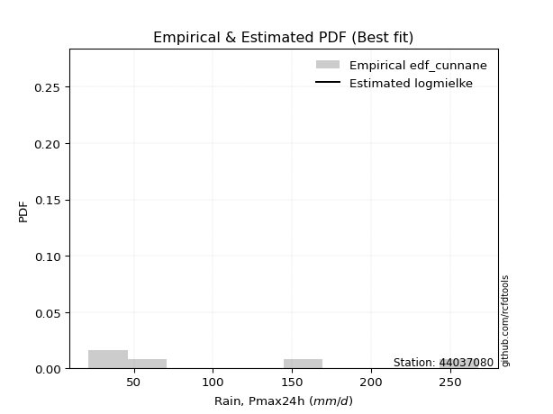</img>

</div>


### 12. EDF Adamowski (1981)

The Adamowski formula in hydrology refers to a specific plotting position formula used for estimating the non-parametric empirical distribution of hydrological events (like flood peaks) to calculate their return periods. This formula provides an alternative to traditional parametric methods (like the Gumbel or Log Pearson Type III distributions). 

<div align="center">


$P=(m-0.25)/(n+0.5)$


</div>


**12.1. Empirical values**

<div align="center">

|                | 0                   | 1                  | 2             | 3                  | 4                  |
|:---------------|:--------------------|:-------------------|:--------------|:-------------------|:-------------------|
| date           | 2023                | 2024               | 2019          | 2022               | 2020               |
| x              | 21.4                | 28.0               | 66.2          | 159.8              | 268.0              |
| m              | 1                   | 2                  | 3             | 4                  | 5                  |
| empirical_dist | edf_adamowski       | edf_adamowski      | edf_adamowski | edf_adamowski      | edf_adamowski      |
| empirical      | 0.13636363636363635 | 0.3181818181818182 | 0.5           | 0.6818181818181818 | 0.8636363636363636 |
| empirical_tr   | 1.1578947368421053  | 1.4666666666666666 | 2.0           | 3.1428571428571423 | 7.333333333333334  |

</div>


**12.2. Kolmogorov-Smirnov fit test (sorted by Δ)**


<div align="center">

|                | 0                   | 1                   | 2                   | 3                   | 4                  | 5                   | 6                   | 7                  | 8                   | 9                   | 10                  | 11                 | 12                  | 13                  | 14                  | 15                  | 16                  | 17                 | 18                  | 19                  | 20                  | 21                  | 22                  | 23                  | 24                 | 25                  | 26                  | 27                  | 28                  | 29                 | 30                  | 31                  | 32                  | 33                  | 34                  | 35                  | 36                 | 37                 | 38                 | 39                 | 40                  | 41                  | 42                  | 43                  | 44                  | 45                  | 46                 | 47                  | 48                 | 49                 | 50                  | 51                  | 52                  | 53                  | 54                  | 55                  | 56                  | 57                  | 58                  | 59                  | 60                  | 61                  | 62                  | 63                 | 64                  | 65                  | 66                  | 67                  | 68                  | 69                 | 70                  | 71                  | 72                  | 73                  | 74                  | 75                  | 76                  | 77                 | 78                 | 79                  | 80                  | 81                  | 82                 | 83                  | 84                  | 85                 | 86                  | 87                  | 88                  | 89                 | 90                 | 91                  | 92                  | 93                  | 94                  | 95                  | 96                 | 97                 | 98                 | 99                  | 100                 | 101                | 102                 | 103                | 104                | 105                 | 106                 | 107                 | 108                 | 109                | 110                 | 111                 | 112                 | 113                 | 114                | 115                 | 116                | 117                 | 118                | 119                 | 120                 | 121                 | 122                 | 123                 | 124                 | 125                 | 126                | 127                | 128                | 129                | 130                | 131                 | 132                 | 133                | 134                | 135                 | 136                 | 137                 | 138                | 139                | 140                | 141                 | 142                | 143                | 144                 | 145                | 146                | 147                | 148                 | 149                | 150                 | 151                 | 152                 | 153                | 154                | 155                 | 156                | 157                | 158                | 159                |
|:---------------|:--------------------|:--------------------|:--------------------|:--------------------|:-------------------|:--------------------|:--------------------|:-------------------|:--------------------|:--------------------|:--------------------|:-------------------|:--------------------|:--------------------|:--------------------|:--------------------|:--------------------|:-------------------|:--------------------|:--------------------|:--------------------|:--------------------|:--------------------|:--------------------|:-------------------|:--------------------|:--------------------|:--------------------|:--------------------|:-------------------|:--------------------|:--------------------|:--------------------|:--------------------|:--------------------|:--------------------|:-------------------|:-------------------|:-------------------|:-------------------|:--------------------|:--------------------|:--------------------|:--------------------|:--------------------|:--------------------|:-------------------|:--------------------|:-------------------|:-------------------|:--------------------|:--------------------|:--------------------|:--------------------|:--------------------|:--------------------|:--------------------|:--------------------|:--------------------|:--------------------|:--------------------|:--------------------|:--------------------|:-------------------|:--------------------|:--------------------|:--------------------|:--------------------|:--------------------|:-------------------|:--------------------|:--------------------|:--------------------|:--------------------|:--------------------|:--------------------|:--------------------|:-------------------|:-------------------|:--------------------|:--------------------|:--------------------|:-------------------|:--------------------|:--------------------|:-------------------|:--------------------|:--------------------|:--------------------|:-------------------|:-------------------|:--------------------|:--------------------|:--------------------|:--------------------|:--------------------|:-------------------|:-------------------|:-------------------|:--------------------|:--------------------|:-------------------|:--------------------|:-------------------|:-------------------|:--------------------|:--------------------|:--------------------|:--------------------|:-------------------|:--------------------|:--------------------|:--------------------|:--------------------|:-------------------|:--------------------|:-------------------|:--------------------|:-------------------|:--------------------|:--------------------|:--------------------|:--------------------|:--------------------|:--------------------|:--------------------|:-------------------|:-------------------|:-------------------|:-------------------|:-------------------|:--------------------|:--------------------|:-------------------|:-------------------|:--------------------|:--------------------|:--------------------|:-------------------|:-------------------|:-------------------|:--------------------|:-------------------|:-------------------|:--------------------|:-------------------|:-------------------|:-------------------|:--------------------|:-------------------|:--------------------|:--------------------|:--------------------|:-------------------|:-------------------|:--------------------|:-------------------|:-------------------|:-------------------|:-------------------|
| station        | 44037080            | 44037080            | 44037080            | 44037080            | 44037080           | 44037080            | 44037080            | 44037080           | 44037080            | 44037080            | 44037080            | 44037080           | 44037080            | 44037080            | 44037080            | 44037080            | 44037080            | 44037080           | 44037080            | 44037080            | 44037080            | 44037080            | 44037080            | 44037080            | 44037080           | 44037080            | 44037080            | 44037080            | 44037080            | 44037080           | 44037080            | 44037080            | 44037080            | 44037080            | 44037080            | 44037080            | 44037080           | 44037080           | 44037080           | 44037080           | 44037080            | 44037080            | 44037080            | 44037080            | 44037080            | 44037080            | 44037080           | 44037080            | 44037080           | 44037080           | 44037080            | 44037080            | 44037080            | 44037080            | 44037080            | 44037080            | 44037080            | 44037080            | 44037080            | 44037080            | 44037080            | 44037080            | 44037080            | 44037080           | 44037080            | 44037080            | 44037080            | 44037080            | 44037080            | 44037080           | 44037080            | 44037080            | 44037080            | 44037080            | 44037080            | 44037080            | 44037080            | 44037080           | 44037080           | 44037080            | 44037080            | 44037080            | 44037080           | 44037080            | 44037080            | 44037080           | 44037080            | 44037080            | 44037080            | 44037080           | 44037080           | 44037080            | 44037080            | 44037080            | 44037080            | 44037080            | 44037080           | 44037080           | 44037080           | 44037080            | 44037080            | 44037080           | 44037080            | 44037080           | 44037080           | 44037080            | 44037080            | 44037080            | 44037080            | 44037080           | 44037080            | 44037080            | 44037080            | 44037080            | 44037080           | 44037080            | 44037080           | 44037080            | 44037080           | 44037080            | 44037080            | 44037080            | 44037080            | 44037080            | 44037080            | 44037080            | 44037080           | 44037080           | 44037080           | 44037080           | 44037080           | 44037080            | 44037080            | 44037080           | 44037080           | 44037080            | 44037080            | 44037080            | 44037080           | 44037080           | 44037080           | 44037080            | 44037080           | 44037080           | 44037080            | 44037080           | 44037080           | 44037080           | 44037080            | 44037080           | 44037080            | 44037080            | 44037080            | 44037080           | 44037080           | 44037080            | 44037080           | 44037080           | 44037080           | 44037080           |
| empirical_dist | edf_adamowski       | edf_adamowski       | edf_adamowski       | edf_adamowski       | edf_adamowski      | edf_adamowski       | edf_adamowski       | edf_adamowski      | edf_adamowski       | edf_adamowski       | edf_adamowski       | edf_adamowski      | edf_adamowski       | edf_adamowski       | edf_adamowski       | edf_adamowski       | edf_adamowski       | edf_adamowski      | edf_adamowski       | edf_adamowski       | edf_adamowski       | edf_adamowski       | edf_adamowski       | edf_adamowski       | edf_adamowski      | edf_adamowski       | edf_adamowski       | edf_adamowski       | edf_adamowski       | edf_adamowski      | edf_adamowski       | edf_adamowski       | edf_adamowski       | edf_adamowski       | edf_adamowski       | edf_adamowski       | edf_adamowski      | edf_adamowski      | edf_adamowski      | edf_adamowski      | edf_adamowski       | edf_adamowski       | edf_adamowski       | edf_adamowski       | edf_adamowski       | edf_adamowski       | edf_adamowski      | edf_adamowski       | edf_adamowski      | edf_adamowski      | edf_adamowski       | edf_adamowski       | edf_adamowski       | edf_adamowski       | edf_adamowski       | edf_adamowski       | edf_adamowski       | edf_adamowski       | edf_adamowski       | edf_adamowski       | edf_adamowski       | edf_adamowski       | edf_adamowski       | edf_adamowski      | edf_adamowski       | edf_adamowski       | edf_adamowski       | edf_adamowski       | edf_adamowski       | edf_adamowski      | edf_adamowski       | edf_adamowski       | edf_adamowski       | edf_adamowski       | edf_adamowski       | edf_adamowski       | edf_adamowski       | edf_adamowski      | edf_adamowski      | edf_adamowski       | edf_adamowski       | edf_adamowski       | edf_adamowski      | edf_adamowski       | edf_adamowski       | edf_adamowski      | edf_adamowski       | edf_adamowski       | edf_adamowski       | edf_adamowski      | edf_adamowski      | edf_adamowski       | edf_adamowski       | edf_adamowski       | edf_adamowski       | edf_adamowski       | edf_adamowski      | edf_adamowski      | edf_adamowski      | edf_adamowski       | edf_adamowski       | edf_adamowski      | edf_adamowski       | edf_adamowski      | edf_adamowski      | edf_adamowski       | edf_adamowski       | edf_adamowski       | edf_adamowski       | edf_adamowski      | edf_adamowski       | edf_adamowski       | edf_adamowski       | edf_adamowski       | edf_adamowski      | edf_adamowski       | edf_adamowski      | edf_adamowski       | edf_adamowski      | edf_adamowski       | edf_adamowski       | edf_adamowski       | edf_adamowski       | edf_adamowski       | edf_adamowski       | edf_adamowski       | edf_adamowski      | edf_adamowski      | edf_adamowski      | edf_adamowski      | edf_adamowski      | edf_adamowski       | edf_adamowski       | edf_adamowski      | edf_adamowski      | edf_adamowski       | edf_adamowski       | edf_adamowski       | edf_adamowski      | edf_adamowski      | edf_adamowski      | edf_adamowski       | edf_adamowski      | edf_adamowski      | edf_adamowski       | edf_adamowski      | edf_adamowski      | edf_adamowski      | edf_adamowski       | edf_adamowski      | edf_adamowski       | edf_adamowski       | edf_adamowski       | edf_adamowski      | edf_adamowski      | edf_adamowski       | edf_adamowski      | edf_adamowski      | edf_adamowski      | edf_adamowski      |
| p_dist         | logmielke           | logarcsine          | logksone            | halfnorm            | logsemicircular    | foldnorm            | dgamma              | loganglit          | logtrapezoid        | betaprime           | halflogistic        | ksone              | rayleigh            | burr12              | nct                 | logburr             | gumbel_r            | lograyleigh        | loggenpareto        | logbeta             | gengamma            | exponweib           | logexponpow         | logburr12           | loghalfgennorm     | logrdist            | exponpow            | logweibull_max      | loglomax            | truncexpon         | logexponweib        | arcsine             | logwrapcauchy       | gausshyper          | alpha               | loggenlogistic      | loghalfnorm        | nakagami           | loginvweibull      | dweibull           | loginvgamma         | logmaxwell          | lognct              | logfoldnorm         | logncf              | logkstwobign        | pearson3           | ncf                 | semicircular       | logbetaprime       | logalpha            | loggamma            | loggamma            | logloggamma         | maxwell             | logerlang           | loginvgauss         | logpearson3         | logskewnorm         | logcrystalball      | lognorm             | logt                | logexponnorm        | logjohnsonsu       | genlogistic         | loggenexpon         | moyal               | anglit              | logloglaplace       | genexpon           | kstwobign           | logcosine           | loglevy_l           | loggumbel_l         | loglogistic         | logrice             | loggumbel_r         | logbradford        | invgamma           | truncweibull_min    | logdweibull         | f                   | logtruncexpon      | crystalball         | norm                | t                  | invgauss            | loghypsecant        | loggenextreme       | loggompertz        | wrapcauchy         | loghalflogistic     | burr                | logargus            | loggennorm          | loggausshyper       | logtriang          | loglaplace         | loglaplace         | logmoyal            | logtruncweibull_min | logkappa4          | rice                | logdgamma          | logistic           | logtukeylambda      | logf                | cosine              | hypsecant           | johnsonsu          | gennorm             | loguniform          | logkappa3           | logvonmises_line    | weibull_min        | levy_l              | logweibull_min     | gumbel_l            | halfgennorm        | laplace             | lomax               | gompertz            | exponnorm           | truncnorm           | genpareto           | argus               | loggenhalflogistic | kappa4             | beta               | skewnorm           | bradford           | gamma               | fatiguelife         | triang             | wald               | tukeylambda         | logwald             | uniform             | vonmises_line      | erlang             | genextreme         | powerlaw            | truncpareto        | genhalflogistic    | lognakagami         | logfatiguelife     | kappa3             | johnsonsb          | invweibull          | logpowerlaw        | logtruncpareto      | trapezoid           | loggengamma         | logjohnsonsb       | logtruncnorm       | rdist               | weibull_max        | logvonmises        | vonmises           | mielke             |
| delta          | 0.04282910085687351 | 0.06413627405409217 | 0.09075044085081771 | 0.09980253156396868 | 0.1071605958264939 | 0.11275323136052834 | 0.11590752405927984 | 0.1189897395016877 | 0.12094340233148021 | 0.12371390128471949 | 0.13066864349571752 | 0.130830655227266  | 0.13295886660160444 | 0.13332725891622332 | 0.13385360869287333 | 0.13412882097396295 | 0.13429238548862008 | 0.1357331295605744 | 0.13636296439497453 | 0.13636345379111137 | 0.13636345514119788 | 0.13636347240210417 | 0.13636359556994393 | 0.13636360367314695 | 0.136363628809767  | 0.13636363299635323 | 0.13636363519863198 | 0.13636363576703736 | 0.13636363636331886 | 0.1363636363634353 | 0.13636363636359336 | 0.13636363636363635 | 0.13636363636363635 | 0.13636363636368698 | 0.13668766696668266 | 0.13692719675242893 | 0.1372778187584087 | 0.1374694281405125 | 0.1375247249814235 | 0.1380026853510875 | 0.13802753966559647 | 0.13843878629720857 | 0.13888014928453135 | 0.13914128818931693 | 0.13915671790161022 | 0.13939010966221452 | 0.1406397785087518 | 0.14071594621390376 | 0.1430171155450759 | 0.1432988804351993 | 0.14382860709605705 | 0.14435612708156037 | 0.14435612708156037 | 0.14456538859831652 | 0.14462139660916679 | 0.14520092815070534 | 0.14521894273786506 | 0.14524453109233418 | 0.14560945464572267 | 0.14564933631210594 | 0.14564947157663904 | 0.14564966244100952 | 0.14564996346029732 | 0.1458453879062837 | 0.14691865853296146 | 0.14977056125730526 | 0.15008409884769075 | 0.15245568460825654 | 0.15565412650803861 | 0.1601421787463987 | 0.16039138395957503 | 0.16069938990343946 | 0.16216791641795558 | 0.16416149673497982 | 0.16535492224458684 | 0.16575156101241678 | 0.16630896676441342 | 0.1683140898517177 | 0.1686257093015664 | 0.16952744391200514 | 0.17003999124605385 | 0.17189223262561182 | 0.1724211183272084 | 0.17480147800805967 | 0.17480148009756658 | 0.1748085359198096 | 0.17539976576208494 | 0.17612527349204252 | 0.17618011261025035 | 0.1764011184315017 | 0.1767137377073037 | 0.17815183960590708 | 0.17836469960559942 | 0.17984992189506982 | 0.18181818181818182 | 0.18423313103692507 | 0.1845617654006127 | 0.1866432625245918 | 0.1866432625245918 | 0.18769942526318423 | 0.1882687140447975  | 0.1896375806718599 | 0.19143044990951974 | 0.1937933472113742 | 0.194667772252417  | 0.20461427323965414 | 0.20595289591206334 | 0.20858787499728332 | 0.20958161176454465 | 0.210489684040007  | 0.21064866366196755 | 0.21183033561591802 | 0.21187546358137538 | 0.21188260208424795 | 0.2148566957038862 | 0.22447749716111687 | 0.2298783399767791 | 0.23054624511360733 | 0.2317784473730523 | 0.23660062871623483 | 0.24083806307844746 | 0.24464489404434364 | 0.24464544780857694 | 0.24519351681665863 | 0.25652886872622177 | 0.25687697831939316 | 0.2580509131003885 | 0.2580702434658386 | 0.269007510594524  | 0.27708302793703   | 0.2775203257709422 | 0.28472112566218477 | 0.29233305804432524 | 0.298073796498315  | 0.2992774934473359 | 0.30656920329327164 | 0.31812067982182196 | 0.31832927818329276 | 0.3234019424949076 | 0.3251236098665601 | 0.3424729900758908 | 0.34869062435735215 | 0.3501864773793908 | 0.3590291792015595 | 0.36918365766097766 | 0.3780458414563718 | 0.3804462740975146 | 0.4210136320453894 | 0.42117924593045214 | 0.4351201251899424 | 0.43996634653733463 | 0.44464500333991686 | 0.44849392123001314 | 0.4845996725647201 | 0.4999961381507031 | 0.49999999989833654 | 0.6000730898965142 | 1.1237000303675053 | 42.09810369978582  | nan                |
| deltao         | 0.5865427407550001  | 0.5865427407550001  | 0.5865427407550001  | 0.5865427407550001  | 0.5865427407550001 | 0.5865427407550001  | 0.5865427407550001  | 0.5865427407550001 | 0.5865427407550001  | 0.5865427407550001  | 0.5865427407550001  | 0.5865427407550001 | 0.5865427407550001  | 0.5865427407550001  | 0.5865427407550001  | 0.5865427407550001  | 0.5865427407550001  | 0.5865427407550001 | 0.5865427407550001  | 0.5865427407550001  | 0.5865427407550001  | 0.5865427407550001  | 0.5865427407550001  | 0.5865427407550001  | 0.5865427407550001 | 0.5865427407550001  | 0.5865427407550001  | 0.5865427407550001  | 0.5865427407550001  | 0.5865427407550001 | 0.5865427407550001  | 0.5865427407550001  | 0.5865427407550001  | 0.5865427407550001  | 0.5865427407550001  | 0.5865427407550001  | 0.5865427407550001 | 0.5865427407550001 | 0.5865427407550001 | 0.5865427407550001 | 0.5865427407550001  | 0.5865427407550001  | 0.5865427407550001  | 0.5865427407550001  | 0.5865427407550001  | 0.5865427407550001  | 0.5865427407550001 | 0.5865427407550001  | 0.5865427407550001 | 0.5865427407550001 | 0.5865427407550001  | 0.5865427407550001  | 0.5865427407550001  | 0.5865427407550001  | 0.5865427407550001  | 0.5865427407550001  | 0.5865427407550001  | 0.5865427407550001  | 0.5865427407550001  | 0.5865427407550001  | 0.5865427407550001  | 0.5865427407550001  | 0.5865427407550001  | 0.5865427407550001 | 0.5865427407550001  | 0.5865427407550001  | 0.5865427407550001  | 0.5865427407550001  | 0.5865427407550001  | 0.5865427407550001 | 0.5865427407550001  | 0.5865427407550001  | 0.5865427407550001  | 0.5865427407550001  | 0.5865427407550001  | 0.5865427407550001  | 0.5865427407550001  | 0.5865427407550001 | 0.5865427407550001 | 0.5865427407550001  | 0.5865427407550001  | 0.5865427407550001  | 0.5865427407550001 | 0.5865427407550001  | 0.5865427407550001  | 0.5865427407550001 | 0.5865427407550001  | 0.5865427407550001  | 0.5865427407550001  | 0.5865427407550001 | 0.5865427407550001 | 0.5865427407550001  | 0.5865427407550001  | 0.5865427407550001  | 0.5865427407550001  | 0.5865427407550001  | 0.5865427407550001 | 0.5865427407550001 | 0.5865427407550001 | 0.5865427407550001  | 0.5865427407550001  | 0.5865427407550001 | 0.5865427407550001  | 0.5865427407550001 | 0.5865427407550001 | 0.5865427407550001  | 0.5865427407550001  | 0.5865427407550001  | 0.5865427407550001  | 0.5865427407550001 | 0.5865427407550001  | 0.5865427407550001  | 0.5865427407550001  | 0.5865427407550001  | 0.5865427407550001 | 0.5865427407550001  | 0.5865427407550001 | 0.5865427407550001  | 0.5865427407550001 | 0.5865427407550001  | 0.5865427407550001  | 0.5865427407550001  | 0.5865427407550001  | 0.5865427407550001  | 0.5865427407550001  | 0.5865427407550001  | 0.5865427407550001 | 0.5865427407550001 | 0.5865427407550001 | 0.5865427407550001 | 0.5865427407550001 | 0.5865427407550001  | 0.5865427407550001  | 0.5865427407550001 | 0.5865427407550001 | 0.5865427407550001  | 0.5865427407550001  | 0.5865427407550001  | 0.5865427407550001 | 0.5865427407550001 | 0.5865427407550001 | 0.5865427407550001  | 0.5865427407550001 | 0.5865427407550001 | 0.5865427407550001  | 0.5865427407550001 | 0.5865427407550001 | 0.5865427407550001 | 0.5865427407550001  | 0.5865427407550001 | 0.5865427407550001  | 0.5865427407550001  | 0.5865427407550001  | 0.5865427407550001 | 0.5865427407550001 | 0.5865427407550001  | 0.5865427407550001 | 0.5865427407550001 | 0.5865427407550001 | 0.5865427407550001 |
| eval           | Δo > Δ              | Δo > Δ              | Δo > Δ              | Δo > Δ              | Δo > Δ             | Δo > Δ              | Δo > Δ              | Δo > Δ             | Δo > Δ              | Δo > Δ              | Δo > Δ              | Δo > Δ             | Δo > Δ              | Δo > Δ              | Δo > Δ              | Δo > Δ              | Δo > Δ              | Δo > Δ             | Δo > Δ              | Δo > Δ              | Δo > Δ              | Δo > Δ              | Δo > Δ              | Δo > Δ              | Δo > Δ             | Δo > Δ              | Δo > Δ              | Δo > Δ              | Δo > Δ              | Δo > Δ             | Δo > Δ              | Δo > Δ              | Δo > Δ              | Δo > Δ              | Δo > Δ              | Δo > Δ              | Δo > Δ             | Δo > Δ             | Δo > Δ             | Δo > Δ             | Δo > Δ              | Δo > Δ              | Δo > Δ              | Δo > Δ              | Δo > Δ              | Δo > Δ              | Δo > Δ             | Δo > Δ              | Δo > Δ             | Δo > Δ             | Δo > Δ              | Δo > Δ              | Δo > Δ              | Δo > Δ              | Δo > Δ              | Δo > Δ              | Δo > Δ              | Δo > Δ              | Δo > Δ              | Δo > Δ              | Δo > Δ              | Δo > Δ              | Δo > Δ              | Δo > Δ             | Δo > Δ              | Δo > Δ              | Δo > Δ              | Δo > Δ              | Δo > Δ              | Δo > Δ             | Δo > Δ              | Δo > Δ              | Δo > Δ              | Δo > Δ              | Δo > Δ              | Δo > Δ              | Δo > Δ              | Δo > Δ             | Δo > Δ             | Δo > Δ              | Δo > Δ              | Δo > Δ              | Δo > Δ             | Δo > Δ              | Δo > Δ              | Δo > Δ             | Δo > Δ              | Δo > Δ              | Δo > Δ              | Δo > Δ             | Δo > Δ             | Δo > Δ              | Δo > Δ              | Δo > Δ              | Δo > Δ              | Δo > Δ              | Δo > Δ             | Δo > Δ             | Δo > Δ             | Δo > Δ              | Δo > Δ              | Δo > Δ             | Δo > Δ              | Δo > Δ             | Δo > Δ             | Δo > Δ              | Δo > Δ              | Δo > Δ              | Δo > Δ              | Δo > Δ             | Δo > Δ              | Δo > Δ              | Δo > Δ              | Δo > Δ              | Δo > Δ             | Δo > Δ              | Δo > Δ             | Δo > Δ              | Δo > Δ             | Δo > Δ              | Δo > Δ              | Δo > Δ              | Δo > Δ              | Δo > Δ              | Δo > Δ              | Δo > Δ              | Δo > Δ             | Δo > Δ             | Δo > Δ             | Δo > Δ             | Δo > Δ             | Δo > Δ              | Δo > Δ              | Δo > Δ             | Δo > Δ             | Δo > Δ              | Δo > Δ              | Δo > Δ              | Δo > Δ             | Δo > Δ             | Δo > Δ             | Δo > Δ              | Δo > Δ             | Δo > Δ             | Δo > Δ              | Δo > Δ             | Δo > Δ             | Δo > Δ             | Δo > Δ              | Δo > Δ             | Δo > Δ              | Δo > Δ              | Δo > Δ              | Δo > Δ             | Δo > Δ             | Δo > Δ              | Δo <= Δ            | Δo <= Δ            | Δo <= Δ            | Δo <= Δ            |
| fit            | 1                   | 1                   | 1                   | 1                   | 1                  | 1                   | 1                   | 1                  | 1                   | 1                   | 1                   | 1                  | 1                   | 1                   | 1                   | 1                   | 1                   | 1                  | 1                   | 1                   | 1                   | 1                   | 1                   | 1                   | 1                  | 1                   | 1                   | 1                   | 1                   | 1                  | 1                   | 1                   | 1                   | 1                   | 1                   | 1                   | 1                  | 1                  | 1                  | 1                  | 1                   | 1                   | 1                   | 1                   | 1                   | 1                   | 1                  | 1                   | 1                  | 1                  | 1                   | 1                   | 1                   | 1                   | 1                   | 1                   | 1                   | 1                   | 1                   | 1                   | 1                   | 1                   | 1                   | 1                  | 1                   | 1                   | 1                   | 1                   | 1                   | 1                  | 1                   | 1                   | 1                   | 1                   | 1                   | 1                   | 1                   | 1                  | 1                  | 1                   | 1                   | 1                   | 1                  | 1                   | 1                   | 1                  | 1                   | 1                   | 1                   | 1                  | 1                  | 1                   | 1                   | 1                   | 1                   | 1                   | 1                  | 1                  | 1                  | 1                   | 1                   | 1                  | 1                   | 1                  | 1                  | 1                   | 1                   | 1                   | 1                   | 1                  | 1                   | 1                   | 1                   | 1                   | 1                  | 1                   | 1                  | 1                   | 1                  | 1                   | 1                   | 1                   | 1                   | 1                   | 1                   | 1                   | 1                  | 1                  | 1                  | 1                  | 1                  | 1                   | 1                   | 1                  | 1                  | 1                   | 1                   | 1                   | 1                  | 1                  | 1                  | 1                   | 1                  | 1                  | 1                   | 1                  | 1                  | 1                  | 1                   | 1                  | 1                   | 1                   | 1                   | 1                  | 1                  | 1                   | 0                  | 0                  | 0                  | 0                  |
| n              | 5                   | 5                   | 5                   | 5                   | 5                  | 5                   | 5                   | 5                  | 5                   | 5                   | 5                   | 5                  | 5                   | 5                   | 5                   | 5                   | 5                   | 5                  | 5                   | 5                   | 5                   | 5                   | 5                   | 5                   | 5                  | 5                   | 5                   | 5                   | 5                   | 5                  | 5                   | 5                   | 5                   | 5                   | 5                   | 5                   | 5                  | 5                  | 5                  | 5                  | 5                   | 5                   | 5                   | 5                   | 5                   | 5                   | 5                  | 5                   | 5                  | 5                  | 5                   | 5                   | 5                   | 5                   | 5                   | 5                   | 5                   | 5                   | 5                   | 5                   | 5                   | 5                   | 5                   | 5                  | 5                   | 5                   | 5                   | 5                   | 5                   | 5                  | 5                   | 5                   | 5                   | 5                   | 5                   | 5                   | 5                   | 5                  | 5                  | 5                   | 5                   | 5                   | 5                  | 5                   | 5                   | 5                  | 5                   | 5                   | 5                   | 5                  | 5                  | 5                   | 5                   | 5                   | 5                   | 5                   | 5                  | 5                  | 5                  | 5                   | 5                   | 5                  | 5                   | 5                  | 5                  | 5                   | 5                   | 5                   | 5                   | 5                  | 5                   | 5                   | 5                   | 5                   | 5                  | 5                   | 5                  | 5                   | 5                  | 5                   | 5                   | 5                   | 5                   | 5                   | 5                   | 5                   | 5                  | 5                  | 5                  | 5                  | 5                  | 5                   | 5                   | 5                  | 5                  | 5                   | 5                   | 5                   | 5                  | 5                  | 5                  | 5                   | 5                  | 5                  | 5                   | 5                  | 5                  | 5                  | 5                   | 5                  | 5                   | 5                   | 5                   | 5                  | 5                  | 5                   | 5                  | 5                  | 5                  | 5                  |
| best_fit       | 1                   | 0                   | 0                   | 0                   | 0                  | 0                   | 0                   | 0                  | 0                   | 0                   | 0                   | 0                  | 0                   | 0                   | 0                   | 0                   | 0                   | 0                  | 0                   | 0                   | 0                   | 0                   | 0                   | 0                   | 0                  | 0                   | 0                   | 0                   | 0                   | 0                  | 0                   | 0                   | 0                   | 0                   | 0                   | 0                   | 0                  | 0                  | 0                  | 0                  | 0                   | 0                   | 0                   | 0                   | 0                   | 0                   | 0                  | 0                   | 0                  | 0                  | 0                   | 0                   | 0                   | 0                   | 0                   | 0                   | 0                   | 0                   | 0                   | 0                   | 0                   | 0                   | 0                   | 0                  | 0                   | 0                   | 0                   | 0                   | 0                   | 0                  | 0                   | 0                   | 0                   | 0                   | 0                   | 0                   | 0                   | 0                  | 0                  | 0                   | 0                   | 0                   | 0                  | 0                   | 0                   | 0                  | 0                   | 0                   | 0                   | 0                  | 0                  | 0                   | 0                   | 0                   | 0                   | 0                   | 0                  | 0                  | 0                  | 0                   | 0                   | 0                  | 0                   | 0                  | 0                  | 0                   | 0                   | 0                   | 0                   | 0                  | 0                   | 0                   | 0                   | 0                   | 0                  | 0                   | 0                  | 0                   | 0                  | 0                   | 0                   | 0                   | 0                   | 0                   | 0                   | 0                   | 0                  | 0                  | 0                  | 0                  | 0                  | 0                   | 0                   | 0                  | 0                  | 0                   | 0                   | 0                   | 0                  | 0                  | 0                  | 0                   | 0                  | 0                  | 0                   | 0                  | 0                  | 0                  | 0                   | 0                  | 0                   | 0                   | 0                   | 0                  | 0                  | 0                   | 0                  | 0                  | 0                  | 0                  |
| best_fit_sort  | 1                   | 2                   | 3                   | 4                   | 5                  | 6                   | 7                   | 8                  | 9                   | 10                  | 11                  | 12                 | 13                  | 14                  | 15                  | 16                  | 17                  | 18                 | 19                  | 20                  | 21                  | 22                  | 23                  | 24                  | 25                 | 26                  | 27                  | 28                  | 29                  | 30                 | 31                  | 32                  | 33                  | 34                  | 35                  | 36                  | 37                 | 38                 | 39                 | 40                 | 41                  | 42                  | 43                  | 44                  | 45                  | 46                  | 47                 | 48                  | 49                 | 50                 | 51                  | 52                  | 53                  | 54                  | 55                  | 56                  | 57                  | 58                  | 59                  | 60                  | 61                  | 62                  | 63                  | 64                 | 65                  | 66                  | 67                  | 68                  | 69                  | 70                 | 71                  | 72                  | 73                  | 74                  | 75                  | 76                  | 77                  | 78                 | 79                 | 80                  | 81                  | 82                  | 83                 | 84                  | 85                  | 86                 | 87                  | 88                  | 89                  | 90                 | 91                 | 92                  | 93                  | 94                  | 95                  | 96                  | 97                 | 98                 | 99                 | 100                 | 101                 | 102                | 103                 | 104                | 105                | 106                 | 107                 | 108                 | 109                 | 110                | 111                 | 112                 | 113                 | 114                 | 115                | 116                 | 117                | 118                 | 119                | 120                 | 121                 | 122                 | 123                 | 124                 | 125                 | 126                 | 127                | 128                | 129                | 130                | 131                | 132                 | 133                 | 134                | 135                | 136                 | 137                 | 138                 | 139                | 140                | 141                | 142                 | 143                | 144                | 145                 | 146                | 147                | 148                | 149                 | 150                | 151                 | 152                 | 153                 | 154                | 155                | 156                 | 157                | 158                | 159                | 160                |

</div>


**12.3. Best fit**

<div align="center">

|   id |   station | empirical_dist   | p_dist    |     delta |   deltao | eval   |   fit |   n |   best_fit |   best_fit_sort |
|-----:|----------:|:-----------------|:----------|----------:|---------:|:-------|------:|----:|-----------:|----------------:|
|    0 |  44037080 | edf_adamowski    | logmielke | 0.0428291 | 0.586543 | Δo > Δ |     1 |   5 |          1 |               1 |

</div>


<div align="center">

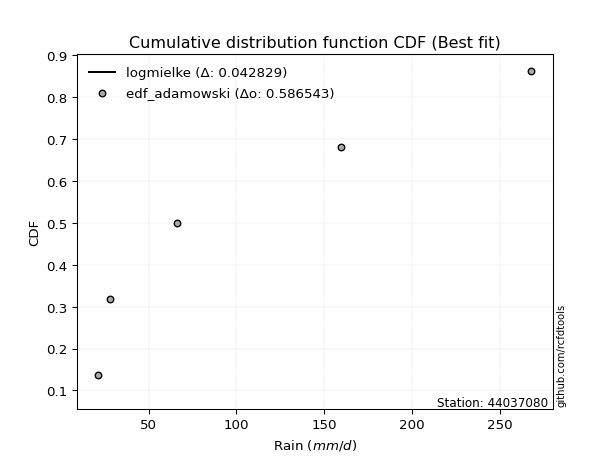</img>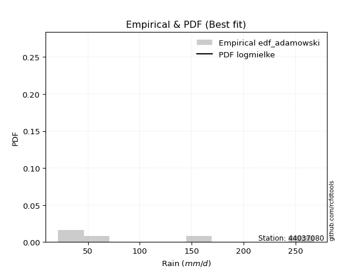</img>

</div>


## C. Best fit & Estimate extreme values for specific return periods - Tr

Best fit in probability distribution analysis means finding the theoretical distribution (like Normal, Poisson, Exponential, etc.) that most accurately mirrors your real-world data´s patterns (shape, center, spread) for better predictions, using methods like visual checks (Q-Q plots), goodness-of-fit tests (Kolmogorov-Smirnov, Chi-Squared), and information criteria (AIC) to score and select the simplest, most representative model.


### 1. Best fit (ordered by delta Δ)

:file_folder:Table: [bestfit_44037080.csv](table/bestfit_44037080.csv)

<div align="center">

|   id |   station | empirical_dist   | p_dist      |      delta |   deltao | eval   |   fit |   n |   best_fit |   best_fit_sort |
|-----:|----------:|:-----------------|:------------|-----------:|---------:|:-------|------:|----:|-----------:|----------------:|
|    0 |  44037080 | edf_hazen        | logmielke   | 0.00646546 | 0.586543 | Δo > Δ |     1 |   5 |          1 |               1 |
|    1 |  44037080 | edf_gringorten   | logmielke   | 0.0158405  | 0.586543 | Δo > Δ |     1 |   5 |          1 |               2 |
|    2 |  44037080 | edf_cunnane      | logmielke   | 0.0218501  | 0.586543 | Δo > Δ |     1 |   5 |          1 |               3 |
|    3 |  44037080 | edf_blom         | logmielke   | 0.0255131  | 0.586543 | Δo > Δ |     1 |   5 |          1 |               4 |
|    4 |  44037080 | edf_tukey        | logmielke   | 0.0314655  | 0.586543 | Δo > Δ |     1 |   5 |          1 |               5 |
|    5 |  44037080 | edf_filliben     | logmielke   | 0.0336789  | 0.586543 | Δo > Δ |     1 |   5 |          1 |               6 |
|    6 |  44037080 | edf_beard        | logmielke   | 0.0347183  | 0.586543 | Δo > Δ |     1 |   5 |          1 |               7 |
|    7 |  44037080 | edf_jenkinson    | logmielke   | 0.0347183  | 0.586543 | Δo > Δ |     1 |   5 |          1 |               8 |
|    8 |  44037080 | edf_chegodayev   | logmielke   | 0.0360951  | 0.586543 | Δo > Δ |     1 |   5 |          1 |               9 |
|    9 |  44037080 | edf_adamowski    | logmielke   | 0.0428291  | 0.586543 | Δo > Δ |     1 |   5 |          1 |              10 |
|   10 |  44037080 | edf_california   | logdweibull | 0.0728893  | 0.586543 | Δo > Δ |     1 |   5 |          1 |              11 |
|   11 |  44037080 | edf_weibull      | logmielke   | 0.0731321  | 0.586543 | Δo > Δ |     1 |   5 |          1 |              12 |

</div>


### 2. Extreme values and % difference analysis

In hydrology, a return period (or recurrence interval $Tr$) is the statistical average time between extreme events like floods or droughts of a specific magnitude, indicating how rare an event is, with a 100-year flood, for example, having a 1% chance of occurring in any given year, not that it happens exactly every century. It is a key tool for infrastructure design (like bridges or dams) and risk assessment, calculated from historical data to determine the probability of future events, although it is important to remember it is statistical average, and events can cluster or be missed.

The extreme value porcentage difference is evaluated as $pdiff = 1 - (ETrBf / ETr) * 100$, where _ETrBf_ correspond to the bestfit extreme value for a specific recurrence interval and _ETr_ correspond to the extreme value for one of the most used PDFsused in hydrology.

> risk_rate: assuming the return period as the project useful life.

:file_folder:Table: [extreme_44037080.csv](table/extreme_44037080.csv), all PDFs.  
:file_folder:Table: [extremepdiff_44037080.csv](table/extremepdiff_44037080.csv), % difference between bestfit and most used PDFs in Hydrology.

<div align="center">

Extreme values table for only best fit PDFs
|   id |      tr |   prob_l |     prob_g |      alpha |   anglit |   arcsine |   argus |     beta |   betaprime |   bradford |       burr |   burr12 |   cosine |   crystalball |   dgamma |   dweibull |   erlang |   exponnorm |   exponpow |   exponweib |                f |   fatiguelife |   foldnorm |    gamma |   gausshyper |   genexpon |    genextreme |   gengamma |   genhalflogistic |   genlogistic |   gennorm |   genpareto |   gompertz |   gumbel_l |   gumbel_r |   halfgennorm |   halflogistic |   halfnorm |   hypsecant |         invgamma |   invgauss |       invweibull |   johnsonsb |   johnsonsu |         kappa3 |   kappa4 |   ksone |   kstwobign |   laplace |   levy_l |   loggamma |   logistic |   loglaplace |   lomax |   maxwell |     mielke |    moyal |   nakagami |       ncf |        nct |    norm |   pearson3 |   powerlaw |   rayleigh |    rdist |    rice |   semicircular |   skewnorm |       t |   trapezoid |   triang |   truncexpon |   truncnorm |   truncpareto |   truncweibull_min |   tukeylambda |   uniform |   vonmises |   vonmises_line |     wald |   weibull_max |   weibull_min |   wrapcauchy |   logalpha |   loganglit |   logarcsine |   logargus |   logbeta |   logbetaprime |   logbradford |    logburr |        logburr12 |   logcosine |   logcrystalball |   logdgamma |   logdweibull |   logerlang |   logexponnorm |      logexponpow |     logexponweib |             logf |   logfatiguelife |   logfoldnorm |   loggausshyper |   loggenexpon |   loggenextreme |      loggengamma |   loggenhalflogistic |   loggenlogistic |   loggennorm |   loggenpareto |   loggompertz |   loggumbel_l |   loggumbel_r |   loghalfgennorm |   loghalflogistic |   loghalfnorm |   loghypsecant |   loginvgamma |      loginvgauss |   loginvweibull |   logjohnsonsb |   logjohnsonsu |   logkappa3 |   logkappa4 |   logksone |   logkstwobign |   loglevy_l |   logloggamma |   loglogistic |    logloglaplace |    loglomax |   logmaxwell |   logmielke |   logmoyal |      lognakagami |    logncf |     lognct |   lognorm |   logpearson3 |   logpowerlaw |   lograyleigh |   logrdist |   logrice |   logsemicircular |   logskewnorm |      logt |   logtrapezoid |   logtriang |   logtruncexpon |   logtruncnorm |   logtruncpareto |   logtruncweibull_min |   logtukeylambda |   loguniform |   logvonmises |   logvonmises_line |    logwald |   logweibull_max |   logweibull_min |   logwrapcauchy |   station |   n |   risk_rate |
|-----:|--------:|---------:|-----------:|-----------:|---------:|----------:|--------:|---------:|------------:|-----------:|-----------:|---------:|---------:|--------------:|---------:|-----------:|---------:|------------:|-----------:|------------:|-----------------:|--------------:|-----------:|---------:|-------------:|-----------:|--------------:|-----------:|------------------:|--------------:|----------:|------------:|-----------:|-----------:|-----------:|--------------:|---------------:|-----------:|------------:|-----------------:|-----------:|-----------------:|------------:|------------:|---------------:|---------:|--------:|------------:|----------:|---------:|-----------:|-----------:|-------------:|--------:|----------:|-----------:|---------:|-----------:|----------:|-----------:|--------:|-----------:|-----------:|-----------:|---------:|--------:|---------------:|-----------:|--------:|------------:|---------:|-------------:|------------:|--------------:|-------------------:|--------------:|----------:|-----------:|----------------:|---------:|--------------:|--------------:|-------------:|-----------:|------------:|-------------:|-----------:|----------:|---------------:|--------------:|-----------:|-----------------:|------------:|-----------------:|------------:|--------------:|------------:|---------------:|-----------------:|-----------------:|-----------------:|-----------------:|--------------:|----------------:|--------------:|----------------:|-----------------:|---------------------:|-----------------:|-------------:|---------------:|--------------:|--------------:|--------------:|-----------------:|------------------:|--------------:|---------------:|--------------:|-----------------:|----------------:|---------------:|---------------:|------------:|------------:|-----------:|---------------:|------------:|--------------:|--------------:|-----------------:|------------:|-------------:|------------:|-----------:|-----------------:|----------:|-----------:|----------:|--------------:|--------------:|--------------:|-----------:|----------:|------------------:|--------------:|----------:|---------------:|------------:|----------------:|---------------:|-----------------:|----------------------:|-----------------:|-------------:|--------------:|-------------------:|-----------:|-----------------:|-----------------:|----------------:|----------:|----:|------------:|
|    0 |    2    | 0.5      | 0.5        |    54.3049 |  108.68  |   108.68  | 140.222 |  48.1399 |     57.3233 |    119.93  |    46.2741 |  49.3005 |  118.371 |       108.68  |  114.309 |    121.794 |  30.1162 |     82.0088 |    65.9424 |     50.4021 |     37.5876      |       21.4    |    94.9332 |  34.9896 |      97.0206 |    80.7002 | 162.907       |    44.3318 |           181.773 |       90.3299 |   66.2    |     136.928 |    81.294  |    124.079 |    93.2814 |       87.1199 |        85.6261 |    89.4933 |     108.68  |     36.627       |    41.0397 |   3785.91        |     21.4845 |      28.727 |  377.366       |  122.968 | 108.68  |     94.8716 |   108.68  |  156.609 |     67.783 |    108.68  |      70.1501 |  79.542 |   100.664 |    55.5107 |  88.3103 |    91.5036 |   60.2204 |    54.4592 | 108.68  |    97.7214 |    21.9033 |    97.8203 | -2.63072 | 105.986 |        108.68  |    107.786 | 108.683 |     205.824 |  160.659 |      81.4847 |     80.0428 |       25.5893 |            53.973  |       144.611 |   144.7   |    3.09676 |         148.242 |  78.2962 |       267.698 |       44.3287 |      144.699 |    63.9855 |     70.1501 |      70.1501 |    81.9039 |   67.5027 |        63.3754 |       59.8646 |    56.2111 |     41.6129      |     71.3553 |          70.1501 |     48.4638 |       51.9814 |     67.4379 |        70.1419 |     45.1927      |     54.8399      |     34.6326      |          21.4    |       69.5861 |         54.716  |       54.2253 |         119.759 |     21.554       |              109.029 |          58.8148 |      75.7311 |        105.269 |       60.1985 |       82.3054 |       59.7899 |          47.8171 |           55.2237 |       57.4851 |        70.1501 |       58.1976 |     44.4655      |         58.8334 |        21.4001 |        70.1504 |      21.4   |     72.3271 |    70.1501 |        58.2822 |     126.881 |       70.4861 |       70.1501 |     66.2         |     48.4931 |      64.5503 |     58.5661 |    56.7836 |     21.7668      |   61.771  |    58.4409 |   70.1501 |       68.8828 |       21.626  |       62.6736 |     75.131 |   65.7882 |           70.1501 |       69.8669 |   70.1501 |         82.891 |     94.4727 |         59.3727 |        101.079 |          22.6018 |               52.8115 |          75.6146 |      75.7311 |      0.127733 |            75.7805 |    51.1787 |          118.165 |     25.3079      |         75.7311 |  44037080 |   5 |    0.75     |
|    1 |    2.33 | 0.570815 | 0.429185   |    64.6342 |  128.163 |   137.928 | 158.373 |  76.6527 |     68.8865 |    137.419 |    54.111  |  59.1876 |  135.486 |       125.406 |  160.926 |    168.338 |  34.1459 |     95.3822 |    80.4805 |     65.4811 |     45.2962      |       24.0682 |   113.958  |  40.1517 |     119.424  |    95.8883 | 976.994       |    56.3558 |           197.932 |      104.474  |   67.9879 |     156.211 |    94.4905 |    138.631 |   108.78   |      104.916  |       101.561  |   107.545  |     122.066 |     44.5737      |    48.4607 | 132156           |     21.6855 |      34.518 | 1797.08        |  141.876 | 131.673 |    109.648  |   118.802 |  191.017 |     80.676 |    123.417 |      77.9198 |  92.759 |   118.041 |    66.0474 | 102.982  |   117.544  |   71.5298 |    64.9391 | 125.406 |   114.391  |    23.044  |   115.455  | 10.5851  | 121.391 |        129.576 |    122.655 | 125.41  |     220.151 |  178.403 |     101.274  |     92.3302 |       27.6643 |            65.7148 |       162.944 |   162.163 |    3.19348 |         166.207 |  89.2639 |       267.886 |       52.4053 |      240.6   |    76.1636 |     85.8693 |      95.0265 |    97.2728 |   93.9611 |        75.4783 |       71.6408 |    66.8773 |     52.5951      |     84.7497 |          83.4474 |     73.0831 |       77.5052 |     80.1582 |        83.4378 |     60.2315      |     71.5479      |     41.0798      |          22.1059 |       83.0498 |         65.1997 |       64.9477 |         142.253 |     21.846       |              127.354 |          70.0261 |      75.7311 |        142.778 |       71.9952 |       95.7225 |       70.2232 |          57.4161 |           65.1545 |       69.329  |        80.6044 |       69.3268 |     52.9062      |         70.0326 |        21.4012 |        83.4361 |      21.4   |     87.4525 |    89.0549 |        69.3573 |     159.868 |       83.9137 |       81.7424 |     75.6121      |     58.1737 |      77.3069 |     69.6603 |    66.1222 |     22.5788      |   73.6514 |    69.534  |   83.4474 |       81.9788 |       22.0507 |       75.2597 |     98.425 |   78.2014 |           87.1375 |       83.1114 |   83.4474 |        101.224 |    112.246  |         70.7226 |        110.486 |          23.22   |               63.1431 |          90.9045 |      90.5753 |      0.151341 |            90.6428 |    57.3484 |          150.501 |     43.9385      |        125.533  |  44037080 |   5 |    0.729209 |
|    2 |    5    | 0.8      | 0.2        |   144.729  |  196.904 |   215.92  | 216.593 | 201.882  |    155.393  |    201.46  |   113.79   | 145.737  |  197.159 |       187.566 |  203.65  |    216.651 |  60.7443 |    162.246  |   157.27   |    183.831  |    152.217       |       80.7488 |   188.697  |  71.2366 |     197.264  |   169.904  |   3.83684e+06 |   152.161  |           240.602 |      165.919  |  100.201  |     217.551 |   160.47   |    185.643 |   176.114  |      206.799  |       173.665  |   183.886  |     175.761 |    170.633       |   113.49   |      6.83193e+11 |     46.1887 |     135.618 |    1.69358e+06 |  207.444 | 206.088 |    172.417  |   169.41  |  248.024 |    156.8   |    180.319 |     131.745  | 161.132 |   186.438 |   143.401  | 170.942  |   251.905  |  148.074  |   146.867  | 187.566 |   182.665  |    54.9701 |   186.054  | 48.7018  | 183.061 |        200.886 |    185.536 | 187.572 |     261.256 |  229.309 |     177.534  |    148.814  |       50.5996 |           134.444  |       221.389 |   218.68  |    3.55745 |         224.347 | 150.661  |       267.998 |      103.592  |      263.31  |   153.886  |    175.247  |     213.477  |   168.874  |  219.451  |       153.553  |      137.423  |   147.159  |    257.912       |    157.534  |         159.061  |    125.418  |      137.839  |    155.115  |       159.054  |    318.171       |    328.619       |    114.691       |          44.0477 |      160.255  |        127.023  |      146.706  |         214.454 |     32.3096      |              196.743 |         149.411  |      75.7311 |        245.547 |      150.672  |      155.917  |      141.238  |         146.094  |          137.693  |      153.1    |       140.721  |      150.02   |    137.409       |        149.304  |        27.1543 |       158.956  |      21.4   |    161.884  |   192.771  |       145.224  |     234.447 |      160.024  |      147.537  |    156.988       |    145.937  |     157.209  |    148.005  |   133.857  |     58.6379      |  152.789  |   149.125  |  159.061  |      158.146  |       32.9829 |      156.584  |    205.739 |  155.075  |          182.639  |      158.795  |  159.061  |        179.57  |    184.057  |        134.426  |        168.87  |          30.8756 |              124.887  |         164.194  |     161.656  |      0.292199 |           161.825  |   108.453  |          236.254 |      6.58215e+35 |        224.064  |  44037080 |   5 |    0.67232  |
|    3 |   10    | 0.9      | 0.1        |   291.883  |  235.813 |   234.748 | 244.667 | 248.402  |    304.043  |    233.376 |   219.217  | inf      |  234.42  |       228.801 |  228.945 |    240.449 |  90.5363 |    222.944  |   225.822  |    346.212  |    570.6         |      159.01   |   239.814  | 103.881  |     233.178  |   234.741  |   3.30469e+09 |   286.423  |           255.438 |      215.963  |  169.117  |     243.499 |   220.364  |    211.817 |   230.957  |      315.187  |       233.545  |   240.376  |     218.638 |    755.915       |   229.817  |      2.00729e+17 |    250.708  |     501.343 |    4.17776e+08 |  237.82  | 238.558 |    220.207  |   215.35  |  261.787 |    247.423 |    222.225 |     212.219  | 226.641 |   234.572 |   273.696  | 230.113  |   363.811  |  262.695  |   299.078  | 228.801 |   233.644  |   117.579  |   236.393  | 60.3909  | 227.033 |        237.476 |    232.066 | 228.808 |     277.311 |  249.193 |     219      |    190.656  |       93.8577 |           188.798  |       245.775 |   243.34  |    3.80852 |         249.716 | 215.818  |       268     |      162.834  |      265.901 |   259.308  |    262.426  |     259.543  |   220.338  |  257.837  |       260.758  |      189.513  |   291.933  |   2103.47        |    229.106  |         244.01   |    177.109  |      189.045  |    244.184  |       244.028  |   1608.81        |   1647.15        |    350.108       |         114.114  |      247.851  |        181.501  |      280.372  |         243.661 |    114.722       |              232.581 |         276.948  |      75.7311 |        264.119 |      253.164  |      204.578  |      249.53   |         348.373  |          256.32   |      275.151  |       219.584  |      285.393  |    370.597       |        276.599  |      3942.63   |       243.765  |      21.4   |    210.449  |   270.009  |       254.917  |     257.152 |      245.036  |      227.913  |    338.859       |    341.147  |     259.069  |    273.51   |   247.353  |    397.067       |  267.42   |   281.047  |  244.01   |      246.74   |       64.1823 |      264.011  |    249.099 |  250.9    |          266.994  |      244.51   |  244.01   |        224.634 |    223.278  |        186.316  |        241.336 |          50.4105 |              178.684  |         211.204  |     208.143  |      0.481617 |           208.389  |   213.258  |          258.387 |    inf           |        247.111  |  44037080 |   5 |    0.651322 |
|    4 |   15    | 0.933333 | 0.0666667  |   438.511  |  252.427 |   238.339 | 255.341 | 258.717  |    444.519  |    244.605 |   320.973  | inf      |  251.393 |       249.379 |  241.923 |    251.53  | 109.441  |    258.449  |   264.205  |    462.535  |   1278.44        |      210.195  |   265.485  | 124.113  |     245.181  |   271.692  |   1.49666e+11 |   384.044  |           259.92  |      244.196  |  231.339  |     251.942 |   255.399  |    223.67  |   261.899  |      384.728  |       267.431  |   269.773  |     243.107 |   1871.17        |   329.691  |      2.44145e+20 |    366.061  |    1003.84  |    9.20448e+09 |  248.141 | 249.381 |    245.578  |   242.224 |  265.945 |    312.101 |    245.058 |     280.479  | 266.551 |   259.269 |   395.414  | 264.452  |   423.631  |  360.947  |   451.941  | 249.379 |   260.833  |   154.515  |   262.33   | 63.1755  | 249.69  |        251.745 |    256.28  | 249.386 |     282.463 |  255.573 |     234.367  |    210.104  |      125.495  |           211.963  |       253.579 |   251.56  |    3.93893 |         258.172 | 257.659  |       268     |      202.245  |      266.626 |   342.847  |    311.809  |     269.398  |   243.786  |  264.115  |       346.265  |      212.105  |   437.4    |  10014.8         |    271.726  |         302.098  |    212.407  |      220.278  |    307.699  |       302.143  |   4144.92        |   4600.85        |    719.134       |         212.676  |      308.101  |        207.339  |      397.583  |         252.666 |    433.166       |              245.592 |         392.286  |      75.7311 |        266.633 |      328.049  |      231.357  |      344.013  |         583.445  |          364.339  |      373.304  |       283.063  |      413.033  |    696.167       |        391.678  |      5961.56   |       301.743  |      21.4   |    229.074  |   302.105  |       343.656  |     264.434 |      302.897  |      288.851  |    560.497       |    564.19   |     334.752  |    386.833  |   353.251  |   1434.91        |  362.905  |   404.6    |  302.098  |      308.892  |       92.5598 |      345.555  |    258.999 |  320.808  |          309.607  |      303.486  |  302.097  |        241.366 |    237.555  |        209.369  |        293.766 |          70.3158 |              203.375  |         229.257  |     226.44   |      0.639967 |           226.717  |   329.218  |          263.177 |    inf           |        254.118  |  44037080 |   5 |    0.644736 |
|    5 |   20    | 0.95     | 0.05       |   585.01   |  262.201 |   239.604 | 261.199 | 262.573  |    580.045  |    250.335 |   420.524  | inf      |  261.831 |       262.854 |  250.629 |    258.596 | 123.333  |    283.641  |   290.583  |    553.871  |   2279.42        |      248.09   |   282.328  | 138.835  |     251.13   |   297.523  |   2.16075e+12 |   461.374  |           262.069 |      263.964  |  286.879  |     256.101 |   280.258  |    231.049 |   283.564  |      436.618  |       291.173  |   289.372  |     260.369 |   3579.22        |   415.823  |      3.5295e+22  |    400.359  |    1591.92  |    7.99246e+10 |  253.334 | 254.793 |    262.669  |   261.291 |  268.074 |    363.973 |    260.839 |     341.849  | 295.604 |   275.66  |   512.059  | 288.772  |   463.799  |  450.008  |   605.443  | 262.854 |   279.281  |   177.326  |   279.569  | 64.2994  | 264.749 |        259.659 |    272.424 | 262.862 |     285.004 |  258.72  |     242.391  |    221.582  |      148.069  |           224.683  |       257.382 |   255.67  |    4.02688 |         262.4   | 288.839  |       268     |      232.145  |      266.976 |   414.714  |    345.094  |     272.957  |   257.701  |  266.05   |       420.054  |      224.632  |   585.168  |  35857.9         |    301.785  |         347.44   |    240.293  |      243.266  |    358.618  |       347.514  |   8051.01        |   9867.21        |   1232.76        |         337.211  |      355.289  |        222.463  |      503.886  |         256.951 |   1513.5         |              252.382 |         500.575  |      75.7311 |        267.349 |      388.237  |      249.767  |      430.741  |         843.596  |          466.132  |      457.505  |       338.596  |      536.899  |   1111.03        |        499.702  |      6110.07   |       346.994  |      21.4   |    238.781  |   319.556  |       420.253  |     268.243 |      347.926  |      340.25   |    822.225       |    808.524  |     396.82   |    493.148  |   454.665  |   3589.48        |  447.787  |   524.091  |  347.44   |      358.198  |      115.348  |      413.25   |    262.726 |  377.461  |          336.11   |      349.707  |  347.44   |        250.074 |    244.93   |        222.307  |        335.79  |          88.2842 |              217.421  |         238.711  |     236.183  |      0.782719 |           236.477  |   455      |          265.033 |    inf           |        257.579  |  44037080 |   5 |    0.641514 |
|    6 |   25    | 0.96     | 0.04       |   731.459  |  268.825 |   240.191 | 264.977 | 264.428  |    712.026  |    253.811 |   518.493  | inf      |  269.151 |       272.774 |  257.157 |    263.718 | 134.335  |    303.181  |   310.555  |    629.514  |   3576.13        |      278.2    |   294.737  | 150.429  |     254.665  |   317.336  |   1.68932e+13 |   525.814  |           263.326 |      279.191  |  337.093  |     258.57  |   299.539  |    236.299 |   300.251  |      478.265  |       309.465  |   303.955  |     273.729 |   5928.49        |   491.409  |      1.62753e+24 |    412.357  |    2239.73  |    4.21719e+11 |  256.458 | 258.039 |    275.47   |   276.08  |  269.41  |    407.936 |    272.911 |     398.556  | 318.57  |   287.828 |   625.119  | 307.623  |   493.773  |  532.831  |   759.465  | 272.774 |   293.188  |   192.622  |   292.378  | 64.8752  | 275.937 |        264.794 |    284.436 | 272.782 |     286.518 |  260.596 |     247.322  |    229.208  |      164.694  |           232.706  |       259.624 |   258.136 |    4.09317 |         264.937 | 313.813  |       268     |      256.387  |      267.184 |   478.967  |    369.648  |     274.624  |   267.093  |  266.859  |       486.143  |      232.581  |   735.582  | 107097           |    324.828  |         385.113  |    263.759  |      261.629  |    401.765  |       385.213  |  13398           |  18164.9         |   1902.55        |         486.357  |      394.584  |        232.434  |      602.207  |         259.43  |   4829.03        |              256.573 |         603.968  |      75.7311 |        267.634 |      439.089  |      263.754  |      512.184  |        1124.6    |          563.571  |      532.254  |       388.949  |      658.517  |   1613.69        |        602.824  |      6131.53   |       384.586  |      21.4   |    244.702  |   330.507  |       488.616  |     270.661 |      385.252  |      385.663  |   1124.55        |   1070.59   |     450.231  |    594.604  |   552.904  |   7241.87        |  525.57   |   641.166  |  385.113  |      399.653  |      133.411  |      471.999  |    264.525 |  425.782  |          354.504  |      388.223  |  385.113  |        255.41  |    249.433  |        230.576  |        371.174 |         103.928  |              226.466  |         244.505  |     242.229  |      0.913883 |           242.534  |   589.619  |          265.961 |    inf           |        259.653  |  44037080 |   5 |    0.639603 |
|    7 |   50    | 0.98     | 0.02       |  1463.47   |  285.129 |   240.974 | 273.543 | 267.032  |   1338.9    |    260.848 |   993.477  | inf      |  288.318 |       301.18  |  276.471 |    278.075 | 169.534  |    363.878  |   369.955  |    889.785  |  14555.4         |      374.805  |   330.307  | 187.227  |     261.599  |   377.699  |   9.52684e+15 |   749.843  |           265.756 |      326.097  |  537.524  |     263.42  |   359.433  |    250.552 |   351.657  |      615.059  |       365.825  |   346.341  |     315.149 |  28531.1         |   773.572  |      2.1725e+29  |    422.84   |    5985.05  |    7.04186e+13 |  262.721 | 264.533 |    313.062  |   322.021 |  272.419 |    567.73  |    309.797 |     642.007  | 392.379 |   323.118 |  1157.48   | 366.142  |   581.083  |  892.937  |  1534.96   | 301.18  |   334.569  |   227.266  |   329.559  | 65.7689  | 308.416 |        276.523 |    319.349 | 301.189 |     289.523 |  264.317 |     257.464  |    246.616  |      207.375  |           249.689  |       263.979 |   263.068 |    4.29226 |         270.01  | 395.354  |       268     |      337.193  |      267.593 |   737.93   |    437.795  |     276.866  |   289.673  |  267.785  |       753.077  |      249.53   |  1527.24   |      6.18022e+06 |    393.847  |         517.147  |    348.528  |      321.96   |    558.544  |       517.363  |  62827.8         | 133161           |   7999.67        |        1574.97   |      532.843  |        255      |     1019.81   |         264.104 | 553162           |              265.322 |        1076.98   |      75.7311 |        267.939 |      621.186  |      305.798  |      873.192  |        2767.93   |         1011.49   |      826.327  |       597.818  |     1251.73   |   5427.57        |       1074.46   |      6138.95   |       516.317  |     255.057 |    256.646  |   353.548  |       760.642  |     276.186 |      515.527  |      565.518  |   3274.75        |   2584.77   |     649.362  |   1058.44   |  1014.83   |  58555.6         |  854.339  |  1210.64   |  517.147  |      548.125  |      184.502  |      694.245  |    267.056 |  603.008  |          400.391  |      523.949  |  517.147  |        266.34  |    258.615  |        248.366  |        495.619 |         155.655  |              246.095  |         256.305  |     254.789  |      1.42849  |           255.117  |  1374.3    |          267.36  |    inf           |        263.808  |  44037080 |   5 |    0.63583  |
|    8 |   75    | 0.986667 | 0.0133333  |  2195.38   |  292.304 |   241.12  | 276.94  | 267.549  |   1932.42   |    263.219 |  1453.27   | inf      |  297.472 |       316.422 |  287.243 |    285.619 | 190.701  |    399.384  |   402.951  |   1058.85   |  33131.3         |      432.986  |   349.407  | 209.197  |     263.84   |   412.262  |   3.78506e+17 |   896.966  |           266.536 |      353.36   |  689.684  |     264.998 |   394.469  |    257.759 |   381.536  |      700.048  |       398.587  |   369.415  |     339.354 |  71601.1         |   969.74   |      2.0704e+32  |    423.886  |   10159.6   |    1.37548e+15 |  264.811 | 266.698 |    333.745  |   348.894 |  273.655 |    679.565 |    331.1   |     848.508  | 437.346 |   342.305 |  1657.04   | 400.364  |   628.626  | 1202.76   |  2316.35   | 316.422 |   357.732  |   240.124  |   349.787  | 65.9765  | 326.086 |        281.208 |    338.354 | 316.432 |     290.518 |  265.549 |     260.93   |    253.218  |      225.193  |           255.64   |       265.377 |   264.712 |    4.40644 |         271.702 | 445.531  |       268     |      388.101  |      267.729 |   942.605  |    471.64   |     277.284  |   299.149  |  267.919  |       964.229  |      255.51   |  2378.93   |      1.11961e+08 |    431.804  |         605.771  |    407.838  |      359.764  |    668.243  |       606.084  | 150906           | 454951           |  19729.1         |        3196      |      626.036  |        263.572  |     1365.18   |         265.543 |      2.06622e+07 |              268.398 |        1507.34   |      75.7311 |        267.979 |      745.312  |      329.547  |     1190.62   |        4710.6    |         1421.07   |     1049.89   |       768.531  |     1837.21   |  11411.4         |       1503.42   |      6139.09   |       604.721  |     259.393 |    260.598  |   361.58   |       970.363  |     278.489 |      602.542  |      705.44   |   6588.56        |   4357.27   |     792.429  |   1480.23   |  1447.53   | 184929           | 1128.61   |  1771.94   |  605.771  |      650.297  |      207.754  |      856.404  |    267.561 |  727.982  |          420.341  |      615.63   |  605.771  |        270.06  |    261.729  |        254.695  |        576.512 |         183.226  |              253.133  |         260.266  |     259.119  |      1.76271  |           259.454  |  2313.28   |          267.674 |    inf           |        265.2    |  44037080 |   5 |    0.634587 |
|    9 |  100    | 0.99     | 0.01       |  2927.26   |  296.571 |   241.171 | 278.836 | 267.738  |   2505.3    |    264.409 |  1903.52   | inf      |  303.209 |       326.731 |  294.7   |    290.668 | 205.927  |    424.576  |   425.631  |   1185.95   |  59400           |      474.848  |   362.329  | 224.945  |     264.937  |   436.435  |   5.1271e+18  |  1008.27   |           266.917 |      372.656  |  815.083  |     265.776 |   419.327  |    262.473 |   402.684  |      762.477  |       421.776  |   385.133  |     356.524 | 137564           |  1121.62   |      2.65793e+34 |    424.159  |   14536.7   |    1.12641e+16 |  265.855 | 267.78  |    347.916  |   367.961 |  274.378 |    768.193 |    346.141 |    1034.16   | 470.08  |   355.374 |  2136.5    | 424.642  |   660.992  | 1483.9    |  3101.61   | 326.731 |   373.782  |   246.817  |   363.567  | 66.0598  | 338.123 |        283.832 |    351.301 | 326.741 |     291.014 |  266.163 |     262.68   |    256.702  |      234.932  |           258.672  |       266.062 |   265.534 |    4.48748 |         272.547 | 482.114  |       268     |      425.76   |      267.797 |  1118.42   |    492.993  |     277.43   |   304.573  |  267.96   |      1145.53   |      258.566  |  3283.37   |      1.1443e+09  |    457.438  |         674.172  |    455.001  |      387.794  |    755.171  |       674.568  | 277465           |      1.11717e+06 |  38520.1         |        5317.97   |      698.144  |        268.142  |     1668.28   |         266.227 |      4.01552e+08 |              269.984 |        1912.26   |      75.7311 |        267.99  |      841.565  |      346.07   |     1482.8    |        6883.06   |         1807.69   |     1235.9    |       918.43   |     2422.98   |  19593.7         |       1906.94   |      6139.11   |       672.946  |     261.589 |    262.549  |   365.664  |      1146.55   |     279.844 |      669.49   |      824.608  |  11219.5         |   6330.3    |     907.529  |   1877.02   |  1862.29   | 404822           | 1372.71   |  2333.65   |  674.172  |      730.404  |      220.922  |      988.07   |    267.745 |  827.347  |          431.944  |      686.675  |  674.172  |        271.935 |    263.295  |        257.939  |        635.805 |         200.058  |              256.751  |         262.241  |     261.311  |      1.98523  |           261.651  |  3381.52   |          267.798 |    inf           |        265.898  |  44037080 |   5 |    0.633968 |
|   10 |  200    | 0.995    | 0.005      |  5854.72   |  304.632 |   241.22  | 282.132 | 267.929  |   4675.78   |    266.201 |  3647.58   | inf      |  314.874 |       350.116 |  312.148 |    301.977 | 243.202  |    485.273  |   477.962  |   1515.55   | 242567           |      577.321  |   391.646  | 263.347  |     266.536  |   493.62   |   2.69668e+21 |  1299.24   |           267.476 |      419.045  | 1183.09   |     266.92  |   479.221  |    272.72  |   453.524  |      919.871  |       477.523  |   421.084  |     397.889 | 663524           |  1526.31   |      3.11576e+39 |    424.358  |   32784.1   |    1.76426e+18 |  267.421 | 269.404 |    380.555  |   413.901 |  275.747 |   1017.43  |    382.221 |    1665.87   | 551.877 |   385.274 |  3937.75   | 483.137  |   734.903  | 2453.95   |  6266.89   | 350.116 |   411.346  |   257.197  |   395.099  | 66.1544  | 365.667 |        288.407 |    380.913 | 350.126 |     291.756 |  267.083 |     265.327  |    262.184  |      250.697  |           263.292  |       267.062 |   266.767 |    4.68654 |         273.816 | 573.24   |       268     |      521.494  |      267.898 |  1677.4    |    536.007  |     277.572  |   314.234  |  267.992  |      1720.62   |      263.232  |  7341.73   |      8.89227e+11 |    514.347  |         859.334  |    588.856  |      459.708  |    999.618  |       859.991  |      1.15335e+06 |      1.06034e+07 | 213555           |       18495      |      894.004  |        275.499  |     2652.32   |         267.193 |      2.09166e+12 |              272.458 |        3388.23   |      75.7311 |        267.998 |     1102.37   |      384.898  |     2513.14   |       17271.9    |         3223.84   |     1794.77   |      1410.83   |     4804.64   |  75060.9         |       3377.34   |      6139.11   |       857.602  |     264.917 |    265.41   |   371.877  |      1683.76   |     282.43  |      849.9    |     1199.1    |  46356           |  15730      |    1237.7    |   3323.44   |  3417.27   |      2.41213e+06 | 2191.8    |  4622.97   |  859.334  |      952.219  |      242.918  |     1370.57   |    267.931 | 1107.57   |          452.944  |      880.114  |  859.333  |        274.766 |    265.658  |        262.908  |        776.326 |         230.241  |              262.305  |         265.178  |     264.634  |      2.40876  |           264.98   |  8705.99   |          267.936 |    inf           |        266.947  |  44037080 |   5 |    0.633042 |
|   11 |  250    | 0.996    | 0.004      |  7318.45   |  306.684 |   241.226 | 282.904 | 267.954  |   5714.15   |    266.56  |  4497.21   | inf      |  318.072 |       357.262 |  317.632 |    305.397 | 255.354  |    504.813  |   494.158  |   1628.44   | 381559           |      610.716  |   400.607  | 275.827  |     266.846  |   511.744  |   2.02105e+22 |  1399.57   |           267.585 |      433.959  | 1323.08   |     267.144 |   498.503  |    275.735 |   469.869  |      972.574  |       495.446  |   432.143  |     411.205 |      1.10118e+06 |  1667.11   |      1.32795e+41 |    424.376  |   42038.3   |    8.9546e+18  |  267.733 | 269.728 |    390.656  |   428.691 |  276.104 |   1109.56  |    393.804 |    1942.21   | 579.117 |   394.478 |  4793.58   | 501.968  |   757.601  | 2883.34   |  7859.37   | 357.262 |   423.149  |   259.324  |   404.805  | 66.1683  | 374.146 |        289.48  |    390.023 | 357.273 |     291.905 |  267.266 |     265.86   |    263.319  |      254.029  |           264.227  |       267.257 |   267.014 |    4.7528  |         274.069 | 603.387  |       268     |      553.758  |      267.919 |  1908.25   |    547.541  |     277.589  |   316.539  |  267.996  |      1957.38   |      264.177  |  9598.21   |      1.08404e+13 |    531.149  |         925.484  |    638.883  |      484.239  |   1089.98   |       926.247  |      1.80179e+06 |      2.24279e+07 | 382398           |       27763      |      964.182  |        277.071  |     3063      |         267.373 |      5.08149e+13 |              272.972 |        4072.28   |      75.7311 |        267.999 |     1195.26   |      397.131  |     2977.7    |       23266.7    |         3882.82   |     2013.05   |      1619.89   |     6024.85   | 116949           |       4058.63   |      6139.11   |       923.564  |     265.588 |    265.966  |   373.132  |      1896.39   |     283.107 |      914.088  |     1352.27   |  76515.5         |  21151.8    |    1361.75   |   3993.94   |  4154.79   |      4.16441e+06 | 2546.32   |  5799.86   |  925.484  |     1033.09   |      247.672  |     1515.81   |    267.955 | 1211.29   |          458.016  |      949.583  |  925.483  |        275.335 |    266.133  |        263.916  |        818.326 |         237.118  |              263.435  |         265.758  |     265.304  |      2.50794  |           265.651  | 11903.9    |          267.956 |    inf           |        267.157  |  44037080 |   5 |    0.632858 |
|   12 |  500    | 0.998    | 0.002      | 14637      |  311.77  |   241.233 | 284.677 | 267.987  |  10647      |    267.28  |  8618.91   | inf      |  326.582 |       378.454 |  334.325 |    315.45  | 293.493  |    565.51   |   542.62   |   1999.32   |      1.55842e+06 |      715.479  |   427.183  | 314.9    |     267.449  |   567.08   |   1.04862e+25 |  1731.21   |           267.799 |      480.247  | 1832.21   |     267.584 |   558.397  |    284.378 |   520.598  |     1142.37   |       551.072  |   465.118  |     452.566 |      5.31189e+06 |  2132.72   |      1.51766e+46 |    424.397  |   87889.3   |    1.3851e+21  |  268.357 | 270.378 |    420.926  |   474.631 |  277.024 |   1438.02  |    429.727 |    3128.57   | 666.663 |   421.942 |  8827.6    | 560.461  |   825.153  | 4751.28   | 15879.8    | 378.454 |   459.044  |   263.627  |   433.766  | 66.1897  | 399.444 |        291.951 |    417.184 | 378.465 |     292.201 |  267.633 |     266.928  |    265.633  |      260.883  |           266.106  |       267.638 |   267.507 |    4.9703  |         274.577 | 699.244  |       268     |      658.254  |      267.959 |  2839.25   |    577.222  |     277.611  |   321.903  |  267.999  |      2907.26   |      266.08   | 22724.5    |      9.47868e+16 |    578.585  |        1153.13   |    819.92   |      564.987  |   1412.15   |      1154.3    |      6.93951e+06 |      2.47085e+08 |      2.58514e+06 |       99282.6    |     1206.38   |        280.382  |     4720.87   |         267.715 |      4.10823e+18 |              274.038 |        7206.48   |      75.7311 |        268     |     1512.56   |      434.395  |     5040.99   |       59001.9    |         6915.97   |     2834.46   |      2488.28   |    12421.1    | 477930           |       7179.22   |      6139.11   |      1150.54   |     266.934 |    267.05   |   375.655  |      2708.36   |     284.862 |     1134.05   |     1963.2    | 423334           |  53597.1    |    1810.84   |   7067.65   |  7623.85   |      2.09952e+07 | 4053.64   | 12010.1    | 1153.13   |     1317.28   |      257.565  |     2047.24   |    267.988 | 1580.97   |          469.913  |     1189.95   | 1153.13   |        276.475 |    267.083  |        265.949  |        930.04  |         251.845  |              265.714  |         266.903  |     266.649  |      2.72162  |           266.998  | 32190.2    |          267.986 |    inf           |        267.578  |  44037080 |   5 |    0.632489 |
|   13 |  750    | 0.998667 | 0.00133333 | 21955.6    |  314.023 |   241.235 | 285.39  | 267.994  |  15317.9    |    267.52  | 12610.3    | inf      |  330.706 |       390.226 |  343.882 |    320.981 | 316.041  |    601.016  |   569.763  |   2230.03   |      3.54954e+06 |      777.377  |   441.948  | 337.943  |     267.642  |   598.858  |   4.05345e+26 |  1938.86   |           267.868 |      507.307  | 2186.5    |     267.728 |   593.433  |    288.997 |   550.255  |     1245.83   |       583.592  |   483.54   |     476.761 |      1.33355e+07 |  2422.68   |      1.37427e+49 |    424.4    |  132401     |    2.63822e+22 |  268.565 | 270.594 |    437.931  |   501.505 |  277.461 |   1663.25  |    450.715 |    4134.87   | 719.999 |   437.304 | 12615.6    | 594.678  |   862.806  | 6358.88   | 23962.1    | 390.226 |   479.568  |   265.077  |   449.961  | 66.1947  | 413.59  |        292.945 |    432.358 | 390.238 |     292.3   |  267.756 |     267.285  |    266.417  |      263.225  |           266.736  |       267.762 |   267.671 |    5.10888 |         274.746 | 756.718  |       268     |      722.273  |      267.973 |  3576.9    |    590.871  |     277.615  |   324.084  |  268      |      3654.21   |      266.718  | 38438.7    |      5.47218e+19 |    603.073  |        1302.98   |    946.562  |      615.559  |   1633.09   |      1304.44   |      1.48936e+07 |      1.05572e+09 |      8.51456e+06 |      210789      |     1366.31   |        281.559  |     6023.87   |         267.82  |      8.24296e+21 |              274.409 |       10060.9    |      75.7311 |        268     |     1718.87   |      455.725  |     6857.66   |      102028      |         9692.04   |     3431.59   |      3198.48   |    19262      |      1.11002e+06 |      10020.3    |      6139.11   |      1299.91   |     267.385 |    267.398  |   376.5    |      3308.7    |     285.699 |     1278.11   |     2440.93   |      1.29599e+06 |  92976.2    |    2123.79   |   9869.29   | 10873.9    |      5.14615e+07 | 5321.41   | 18715.2    | 1302.98   |     1508.93   |      260.982  |     2421.9    |    267.994 | 1834.06   |          474.788  |     1349.15   | 1302.97   |        276.856 |    267.401  |        266.631  |        979.845 |         257.063  |              266.479  |         267.278  |     267.098  |      2.79741  |           267.448  | 58446.8    |          267.993 |    inf           |        267.719  |  44037080 |   5 |    0.632366 |
|   14 | 1000    | 0.999    | 0.001      | 29274.2    |  315.365 |   241.235 | 285.79  | 267.997  |  19826.5    |    267.64  | 16519.4    | inf      |  333.307 |       398.331 |  350.581 |    324.768 | 332.131  |    626.208  |   588.52   |   2399.7    |      6.36526e+06 |      821.531  |   452.114  | 354.364  |     267.737  |   621.146  |   5.41618e+27 |  2092.15   |           267.903 |      526.502  | 2465.26   |     267.798 |   618.291  |    292.105 |   571.292  |     1321.04   |       606.659  |   496.262  |     493.927 |      2.56239e+07 |  2635.36   |      1.71994e+51 |    424.401  |  175558     |    2.13361e+23 |  268.668 | 270.703 |    449.712  |   520.572 |  277.735 |   1839.61  |    465.599 |    5039.59   | 758.825 |   447.921 | 16252.2    | 618.954  |   888.772  | 7817.77   | 32084.8    | 398.331 |   493.941  |   265.805  |   461.152  | 66.1967  | 423.366 |        293.504 |    442.837 | 398.343 |     292.349 |  267.817 |     267.463  |    266.812  |      264.408  |           267.051  |       267.823 |   267.753 |    5.2136  |         274.83  | 798.061  |       268     |      768.945  |      267.98  |  4212.27   |    599.159  |     277.617  |   325.315  |  268      |      4293.74   |      267.038  | 56373.7    |      8.54532e+21 |    619.051  |        1417.32   |   1047.17   |      653.003  |   1806.12   |      1419.03   |      2.5332e+07  |      3.02069e+09 |      2.05359e+07 |      360651      |     1488.59   |        282.17   |     7133.96   |         267.87  |      2.8557e+24  |              274.6   |       12747.6    |      75.7311 |        268     |     1874.77   |      470.667  |     8530.73   |      150692      |        12313.4    |     3915.92   |      3822.18   |    26492.7    |      2.034e+06   |      12693.9    |      6139.11   |      1413.89   |     267.61  |    267.568  |   376.923  |      3800.98   |     286.226 |     1387.69   |     2848.62   |      3.03811e+06 | 137873      |    2371.16   |  12508.2    | 13989.4    |      9.5289e+07  | 6456.85   | 25858.7    | 1417.31   |     1657.43   |      262.713  |     2720.15   |    267.997 | 2031.9    |          477.549  |     1471.11   | 1417.31   |        277.046 |    267.56   |        266.973  |       1008.22  |         259.733  |              266.863  |         267.464  |     267.323  |      2.83617  |           267.674  | 89762.2    |          267.996 |    inf           |        267.789  |  44037080 |   5 |    0.632305 |


</div>


<div align="center">

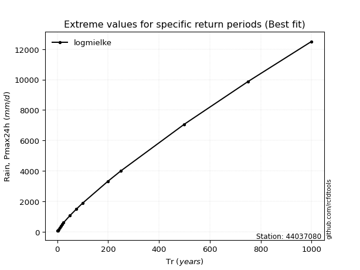</img>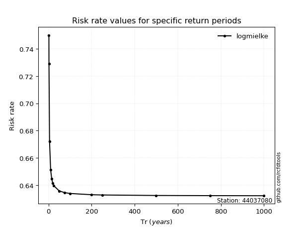</img>

</div>


<sub>**APP DISCLAIMER**: NO WARRANTY - This software is provided by [github.com/rcfdtools](https://github.com/rcfdtools) "as is", without any express or implied warranty, including warranties of merchantability, fitness for a particular purpose, or non-infringement. There is no guarantee that the software will be error-free or operate without interruption. LIMITATION OF LIABILITY - Neither the authors nor copyright holders will be liable for claims or damages arising from the software or its use. You are responsible for determining if the software is appropriate for your use and assume all associated risks, including errors, legal compliance, and data loss. NO PROFESSIONAL ADVICE - The software provides general information and does not offer professional advice. It should not replace consultation with professional advisors.</sub>