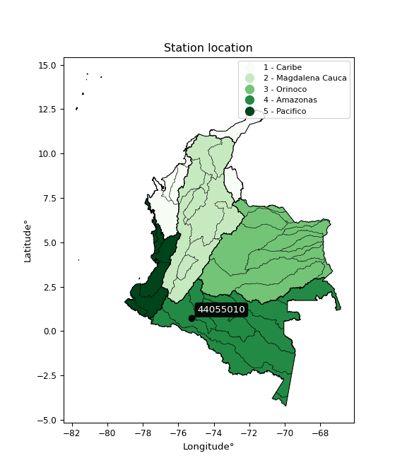

<div align="center">


</div>

# PMax24h Station (Rain): 44055010

Maximum Precipitation in 24 hours (PMax24h) is the greatest amount of rainfall for a specific duration that is meteorologically possible for a given location, acting as a "worst-case" scenario for extreme storms, crucial for designing safety-critical infrastructure like bridges, river deviations, dams, spillways, and nuclear plants to prevent catastrophic failure. The PMax24h is related with the Probable Maximum Precipitation (PMP) and it is calculated by hydrologists using meteorological data to determine the upper limit of extreme rainfall, often leading to the Probable Maximum Flood (PMF) for flood control design, and is increasingly being studied for climate change impacts. Probable Maximum Precipitation (PMP) is the theoretical upper limit of rainfall, a deterministic estimate for extreme events, while probability distributions (like GEV, Gumbel) describe the likelihood and frequency of various precipitation amounts, including rare ones, showing how often events occur, with PMP representing the extreme end of these distributions, used for critical infrastructure design to ensure safety against the worst conceivable weather, unlike standard statistical forecasts which cover typical probabilities.

The most common probability distributions in hydrology, used for analyzing floods, rainfall, and streamflow, include the Normal, Log-Normal, Gumbel, Gamma (including Log-Pearson Type III), and Generalized Extreme Value (GEV) distributions, often chosen based on the data´s skewness and whether modeling extremes or general conditions, with Gumbel and GEV popular for extreme events like floods, while the Normal distribution serves as a baseline, though often requiring transformations for skewed hydrological data. These distributions help in designing water infrastructure, managing water resources, and forecasting hydrologic events.

> Hydrological data often isn´t perfectly normal (it´s skewed), so different distributions are needed for different applications, such as: **Flood Frequency Analysis**: Using Gumbel, GEV, or Log-Pearson Type III for predicting extreme flood magnitudes and their return periods, **Rainfall Analysis**: Normal for annual totals, but Log-Normal, Weibull, or GEV for intensity or extreme daily rainfall, **Streamflow Modeling**: Gamma and Log-Normal for maximum flows, GEV for minimum flows, and Kappa for daily flows.

<div align="center">

</img>

</div>


## A. General information


### 1. General running parameters

• app_version: _v20260225_. • runtime: _2026-02-28 16:54:07.457399_. • Python version: _3.14.0_. • SciPy version: _1.16.3_. • Pandas version: _2.3.3_. • NumPy version: _2.3.5_. • Stations dataset (station_dataset_file): _dataset/pmax24h_in/automatic_colombia_2003_2025.csv_. • Stations catalog (station_catalog_file): _dataset/CNE.xls_. • Minimum year to eval til year_max (date_min): _1900_. • Maximum year to eval since year_min (date_max): _2025_. • Creates, save and include plots into reports (create_plot): _False_. • Plot only fit distributions with Δo > Δ (plot_only_fit): _True_. • Plot only simple graphs avoiding multiple CDFs and multiple Extreme values plots (plot_only_simple): _False_. • Eval low extreme values, if False, evaluates high extreme values (low_extreme): _False_. • Eval every SciPy distribution as logarithmic (pdist_logarithmic_on): _True_. • Standard deviation normalized (ddof): _1.0_. • Return periods to eval in years (Tr): _[2, 2.33, 5, 10, 15, 20, 25, 50, 75, 100, 200, 250, 500, 750, 1000]_. • Minimum data sample per station, 0 means any (minimum_sample): _5_. • Z-Score maximum threshold to adjust a value, 0 means disable (zscore_max): _3.5_. • Z-Score minimum threshold to adjust a value, 0 means disable (zscore_min): _-2.5_. • Avoid zeros, e.g. rain = 0 (avoid_zeros): _True_. • Avoid null values (avoid_nans): _True_. 

:file_folder:Table: [dataset.csv](../../dataset/pmax24h_in/automatic_colombia_2003_2025.csv)

> Delta Degrees of Freedom (DDOF): is a parameter used in the formulas for calculating variance and standard deviation. When ddof=0, the divisor is $N$ (the total number of observations) and this is used when your data set is the entire population. When ddof=1, the divisor is $N-1$ and this is used when your data set is a sample drawn from a larger population. Using $N-1$ provides an unbiased estimate of the population variance (known as Bessel´s correction).


### 2. Station info and location

|   id |   CODIGO | NOMBRE                   | CATEGORIA               | TECNOLOGIA                | ESTADO   | FECHA_INSTALACION   |   FECHA_SUSPENSION |   ALTITUD |   LATITUD |   LONGITUD | DEPARTAMENTO   | MUNICIPIO   | AREA_OPERATIVA                            | ENTIDAD                                                     | AREA_HIDROGRAFICA   | ZONA_HIDROGRAFICA   | SUBZONA_HIDROGRAFICA   |   CORRIENTE | Catalogo   |   Version |
|-----:|---------:|:-------------------------|:------------------------|:--------------------------|:---------|:--------------------|-------------------:|----------:|----------:|-----------:|:---------------|:------------|:------------------------------------------|:------------------------------------------------------------|:--------------------|:--------------------|:-----------------------|------------:|:-----------|----------:|
|    0 | 44055010 | TRES ESQUINAS [44055010] | Climatológica Principal | Automática con Telemetría | Activa   | 14/04/1971          |                nan |       219 |    0.7375 |   -75.2361 | Caqueta        | Solano      | Area Operativa 11 - Cundinamarca-Amazonas | INSTITUTO DE HIDROLOGIA METEOROLOGIA Y ESTUDIOS AMBIENTALES | Amazonas            | Caquetá             | Río Orteguaza          |         nan | CNE_IDEAM  |  20251226 |

<div align="center">

Dynamic map: [:earth_americas:Google](http://maps.google.com/maps?q=0.7375,-75.23611111) [:earth_americas:OSM](https://www.openstreetmap.org/#map=18/0.7375/-75.23611111&layers=P) [:earth_americas:Bing](https://www.bing.com/maps?cp=0.7375~-75.23611111&lvl=18) [:earth_americas:Apple](https://maps.apple.com/frame?center=0.7375%2C-75.23611111&span=0.003%2C0.006)

</div>


<div align="center">

```geojson
{
  "type": "Feature",
  "geometry": {
    "type": "Point", 
    "coordinates": [-75.23611111, 0.7375]
  }, 
  "properties": {
    "Name": "44055010"
  }
}
```

</div>


### 3. Discrete values table and plot

<div align="center">

|               |           0 |          1 |           2 |         3 |          4 |
|:--------------|------------:|-----------:|------------:|----------:|-----------:|
| Date          | 2021        | 2022       | 2023        | 2024      | 2025       |
| Value         |   97.4      |  515       |   85.3      |   95.4    |  496.2     |
| Value_initial |   97.4      |  515       |   85.3      |   95.4    |  496.2     |
| count         |    5        |    5       |    5        |    5      |    5       |
| mean          |  257.86     |  257.86    |  257.86     |  257.86   |  257.86    |
| std           |  226.299    |  226.299   |  226.299    |  226.299  |  226.299   |
| zscore        |   -0.709063 |    1.13629 |   -0.762532 |   -0.7179 |    1.05321 |


</div>


> The initial value (value_initial) correspond to the initial obtained or null completed value, and value (value) is adjusted only when the initial value is outside the valid range (outlier) definite through the Z-Score value. If Z-Score is active, values out of range or outliers are replaced with the station mean value. A Z-Score (or standard score) measures how many standard deviations a data point is from the mean of a dataset, indicating its relative position; positive scores mean above the mean, negative mean below, and a score of zero is exactly at the mean, allowing for comparison of values from different distributions. It´s calculated using the formula $z=(x–μ)/σ$, where $x$ is the data point, $μ$ is the mean, and $σ$ is the standard deviation, helping identify outliers and understand probability.
>
> <sub>**Note**: In this study, "completing" (filling gaps in) and "extending" (forecasting or lengthening the historical record) rainfall data series are avoided for certain critical analyses because they introduce artificial bias and uncertainty, which can distort the statistics of rare events (extremes), alter day-to-day variability, and compromise the integrity and homogeneity of the original data. Some reasons against Completing/Extending rainfall data are: **Distortion of Extremes and Variability**: The primary issue is that most gap-filling or extension methods rely on averaging or regression with nearby stations, which inherently smooths the data. Rainfall is highly variable in space and time, with a large percentage of zero values and occasional large storms. Infilling methods often underestimate the highest values and overestimate the lowest (zero) values, which severely distorts analyses focused on flood frequency, drought severity, and intensity-duration-frequency (IDF) curves, **Loss of Data Homogeneity**: Infilled or extended data are synthetic estimates, not actual measurements. Combining these estimates with observed data can violate the assumption of data homogeneity, which requires that the data properties do not change over time. Inhomogeneity can lead to incorrect conclusions about long-term trends or changes in climate patterns, **Propagation of Errors**: Errors and biases from the original data (e.g., wind-induced undercatch, instrument errors, site changes) or the data used for imputation can propagate through the analysis, leading to unreliable hydrological models and inaccurate predictions, **Compromised Statistical Integrity**: For statistical analyses, especially those involving the frequency of events, using artificial data can introduce time bias or autocorrelation that doesn´t exist in reality, making it difficult to assess the true probability of events, **Difficulty in Validation**: It is difficult to accurately validate the quality of filled or extended data, especially for past periods where ground-truth measurements are unavailable. The reliability of imputation techniques heavily depends on the density of the surrounding station network and the complexity of the local topography.</sub>


### 4. Active continuous probability distributions from SciPy (80 of 104 available)

A Probability Density Function (PDF) describes the relative likelihood of a continuous random variable falling within a specific range, where the total area under its curve equals 1, and the area over any interval gives the actual probability for that range. Unlike discrete probabilities (like rolling a die), a PDF shows density, not direct probability for a single point (which is zero), with higher points indicating higher likelihood, often visualized as a bell curve for normal distributions.

A log of a probability density function (log-PDF) is simply the logarithm of the PDF´s value, denoted as $log(f(x))$, useful for converting multiplication of probabilities into addition, improving numerical stability with tiny numbers, and connecting to information theory concepts like entropy. Instead of dealing with very small probabilities (e.g., 0.000001), log-PDFs use negative numbers (e.g., $log(0.00001) ≈ -11.51$ that are easier for computers to handle, preventing underflow errors and simplifying complex calculations. In this study, each active probability distribution from SciPy is also evaluated in the $log$ form.

[scipy.stats](https://docs.scipy.org/doc/scipy/reference/stats.html) is a Python´s powerful submodule within the SciPy library for comprehensive statistical analysis, offering over 130 probability distributions (like Normal, Poisson, etc.), functions for descriptive stats (mean, variance), hypothesis testing (t-tests, chi-square), random variable generation, and statistical tests, making it essential for data science, modeling, and research. It provides tools to explore, model, and draw conclusions from data efficiently, working seamlessly with [NumPy](https://numpy.org/).

<div align="center">

|   id | p_dist           |   n_parameter | fit_method   | label                                                                       | active   | ref                                                                                                      |
|-----:|:-----------------|--------------:|:-------------|:----------------------------------------------------------------------------|:---------|:---------------------------------------------------------------------------------------------------------|
|    0 | alpha            |             3 | MLE          | Alpha                                                                       | True     | [:mortar_board:](https://docs.scipy.org/doc/scipy/reference/generated/scipy.stats.alpha.html)            |
|    1 | anglit           |             2 | MM           | Anglit                                                                      | True     | [:mortar_board:](https://docs.scipy.org/doc/scipy/reference/generated/scipy.stats.anglit.html)           |
|    2 | arcsine          |             2 | MM           | Arcsine                                                                     | True     | [:mortar_board:](https://docs.scipy.org/doc/scipy/reference/generated/scipy.stats.arcsine.html)          |
|    3 | argus            |             3 | MLE          | Argus                                                                       | True     | [:mortar_board:](https://docs.scipy.org/doc/scipy/reference/generated/scipy.stats.argus.html)            |
|    4 | beta             |             4 | MLE          | Beta                                                                        | True     | [:mortar_board:](https://docs.scipy.org/doc/scipy/reference/generated/scipy.stats.beta.html)             |
|    5 | betaprime        |             4 | MLE          | Beta prime                                                                  | True     | [:mortar_board:](https://docs.scipy.org/doc/scipy/reference/generated/scipy.stats.betaprime.html)        |
|    6 | bradford         |             3 | MLE          | Bradford                                                                    | True     | [:mortar_board:](https://docs.scipy.org/doc/scipy/reference/generated/scipy.stats.bradford.html)         |
|    7 | burr             |             4 | MLE          | Burr (Type III)                                                             | True     | [:mortar_board:](https://docs.scipy.org/doc/scipy/reference/generated/scipy.stats.burr.html)             |
|    8 | burr12           |             4 | MLE          | Burr (Type III) 12                                                          | True     | [:mortar_board:](https://docs.scipy.org/doc/scipy/reference/generated/scipy.stats.burr12.html)           |
|    9 | cosine           |             2 | MLE          | Cosine                                                                      | True     | [:mortar_board:](https://docs.scipy.org/doc/scipy/reference/generated/scipy.stats.cosine.html)           |
|   10 | crystalball      |             4 | MLE          | Crystalball                                                                 | True     | [:mortar_board:](https://docs.scipy.org/doc/scipy/reference/generated/scipy.stats.crystalball.html)      |
|   11 | dgamma           |             3 | MLE          | Double gamma                                                                | True     | [:mortar_board:](https://docs.scipy.org/doc/scipy/reference/generated/scipy.stats.dgamma.html)           |
|   12 | dweibull         |             3 | MLE          | Double Weibull                                                              | True     | [:mortar_board:](https://docs.scipy.org/doc/scipy/reference/generated/scipy.stats.dweibull.html)         |
|   13 | erlang           |             3 | MLE          | Erlang                                                                      | True     | [:mortar_board:](https://docs.scipy.org/doc/scipy/reference/generated/scipy.stats.erlang.html)           |
|   14 | exponnorm        |             3 | MLE          | Exponentially modified Normal                                               | True     | [:mortar_board:](https://docs.scipy.org/doc/scipy/reference/generated/scipy.stats.exponnorm.html)        |
|   15 | exponpow         |             3 | MLE          | Exponential power                                                           | True     | [:mortar_board:](https://docs.scipy.org/doc/scipy/reference/generated/scipy.stats.exponpow.html)         |
|   16 | exponweib        |             4 | MLE          | Exponentiated Weibull                                                       | True     | [:mortar_board:](https://docs.scipy.org/doc/scipy/reference/generated/scipy.stats.exponweib.html)        |
|   17 | f                |             4 | MLE          | F                                                                           | True     | [:mortar_board:](https://docs.scipy.org/doc/scipy/reference/generated/scipy.stats.f.html)                |
|   18 | fatiguelife      |             3 | MLE          | Fatigue-life (Birnbaum-Saunders)                                            | True     | [:mortar_board:](https://docs.scipy.org/doc/scipy/reference/generated/scipy.stats.fatiguelife.html)      |
|   19 | foldnorm         |             3 | MM           | Fold Normal                                                                 | True     | [:mortar_board:](https://docs.scipy.org/doc/scipy/reference/generated/scipy.stats.foldnorm.html)         |
|   20 | gamma            |             3 | MLE          | Gamma                                                                       | True     | [:mortar_board:](https://docs.scipy.org/doc/scipy/reference/generated/scipy.stats.gamma.html)            |
|   21 | gausshyper       |             6 | MLE          | Gauss hypergeometric                                                        | True     | [:mortar_board:](https://docs.scipy.org/doc/scipy/reference/generated/scipy.stats.gausshyper.html)       |
|   22 | genexpon         |             5 | MLE          | Generalized exponential                                                     | True     | [:mortar_board:](https://docs.scipy.org/doc/scipy/reference/generated/scipy.stats.genexpon.html)         |
|   23 | genextreme       |             3 | MLE          | Generalized exponential                                                     | True     | [:mortar_board:](https://docs.scipy.org/doc/scipy/reference/generated/scipy.stats.genextreme.html)       |
|   24 | gengamma         |             4 | MLE          | Generalized gamma                                                           | True     | [:mortar_board:](https://docs.scipy.org/doc/scipy/reference/generated/scipy.stats.gengamma.html)         |
|   25 | genhalflogistic  |             3 | MLE          | Generalized half-logistic                                                   | True     | [:mortar_board:](https://docs.scipy.org/doc/scipy/reference/generated/scipy.stats.genhalflogistic.html)  |
|   26 | genlogistic      |             3 | MLE          | Generalized logistic                                                        | True     | [:mortar_board:](https://docs.scipy.org/doc/scipy/reference/generated/scipy.stats.genlogistic.html)      |
|   27 | gennorm          |             3 | MLE          | Generalized Normal                                                          | True     | [:mortar_board:](https://docs.scipy.org/doc/scipy/reference/generated/scipy.stats.gennorm.html)          |
|   28 | genpareto        |             3 | MLE          | Generalized Pareto                                                          | True     | [:mortar_board:](https://docs.scipy.org/doc/scipy/reference/generated/scipy.stats.genpareto.html)        |
|   29 | gompertz         |             3 | MLE          | Gompertz (or truncated Gumbel)                                              | True     | [:mortar_board:](https://docs.scipy.org/doc/scipy/reference/generated/scipy.stats.gompertz.html)         |
|   30 | gumbel_l         |             2 | MM           | Gumbel Left Skew                                                            | True     | [:mortar_board:](https://docs.scipy.org/doc/scipy/reference/generated/scipy.stats.gumbel_l.html)         |
|   31 | gumbel_r         |             2 | MM           | Gumbel Right Skew                                                           | True     | [:mortar_board:](https://docs.scipy.org/doc/scipy/reference/generated/scipy.stats.gumbel_r.html)         |
|   32 | halfgennorm      |             3 | MLE          | Upper half of a generalized normal                                          | True     | [:mortar_board:](https://docs.scipy.org/doc/scipy/reference/generated/scipy.stats.halfgennorm.html)      |
|   33 | halflogistic     |             2 | MM           | Half-logistic                                                               | True     | [:mortar_board:](https://docs.scipy.org/doc/scipy/reference/generated/scipy.stats.halflogistic.html)     |
|   34 | halfnorm         |             2 | MM           | Half Normal                                                                 | True     | [:mortar_board:](https://docs.scipy.org/doc/scipy/reference/generated/scipy.stats.halfnorm.html)         |
|   35 | hypsecant        |             2 | MM           | hyperbolic secant                                                           | True     | [:mortar_board:](https://docs.scipy.org/doc/scipy/reference/generated/scipy.stats.hypsecant.html)        |
|   36 | invgamma         |             3 | MLE          | Inverted gamma                                                              | True     | [:mortar_board:](https://docs.scipy.org/doc/scipy/reference/generated/scipy.stats.invgamma.html)         |
|   37 | invgauss         |             3 | MLE          | Inverse Gaussian                                                            | True     | [:mortar_board:](https://docs.scipy.org/doc/scipy/reference/generated/scipy.stats.invgauss.html)         |
|   38 | invweibull       |             3 | MLE          | Inverted Weibull                                                            | True     | [:mortar_board:](https://docs.scipy.org/doc/scipy/reference/generated/scipy.stats.invweibull.html)       |
|   39 | johnsonsb        |             4 | MLE          | Johnson SB                                                                  | True     | [:mortar_board:](https://docs.scipy.org/doc/scipy/reference/generated/scipy.stats.johnsonsb.html)        |
|   40 | johnsonsu        |             4 | MLE          | Johnson Su                                                                  | True     | [:mortar_board:](https://docs.scipy.org/doc/scipy/reference/generated/scipy.stats.johnsonsu.html)        |
|   41 | kappa3           |             3 | MLE          | Kappa 3                                                                     | True     | [:mortar_board:](https://docs.scipy.org/doc/scipy/reference/generated/scipy.stats.kappa3.html)           |
|   42 | kappa4           |             4 | MLE          | Kappa 4                                                                     | True     | [:mortar_board:](https://docs.scipy.org/doc/scipy/reference/generated/scipy.stats.kappa4.html)           |
|   43 | ksone            |             3 | MLE          | Kolmogorov-Smirnov one-sided test statistic distribution                    | True     | [:mortar_board:](https://docs.scipy.org/doc/scipy/reference/generated/scipy.stats.ksone.html)            |
|   44 | kstwobign        |             2 | MLE          | Limiting distribution of scaled Kolmogorov-Smirnov two-sided test statistic | True     | [:mortar_board:](https://docs.scipy.org/doc/scipy/reference/generated/scipy.stats.kstwobign.html)        |
|   45 | laplace          |             2 | MM           | Laplace                                                                     | True     | [:mortar_board:](https://docs.scipy.org/doc/scipy/reference/generated/scipy.stats.laplace.html)          |
|   46 | levy_l           |             2 | MLE          | Left-skewed Levy                                                            | True     | [:mortar_board:](https://docs.scipy.org/doc/scipy/reference/generated/scipy.stats.levy_l.html)           |
|   47 | loggamma         |             3 | MLE          | Log gamma                                                                   | True     | [:mortar_board:](https://docs.scipy.org/doc/scipy/reference/generated/scipy.stats.loggamma.html)         |
|   48 | logistic         |             2 | MM           | Logistic (or Sech-squared)                                                  | True     | [:mortar_board:](https://docs.scipy.org/doc/scipy/reference/generated/scipy.stats.logistic.html)         |
|   49 | loglaplace       |             3 | MLE          | Log-Laplace                                                                 | True     | [:mortar_board:](https://docs.scipy.org/doc/scipy/reference/generated/scipy.stats.loglaplace.html)       |
|   50 | lomax            |             3 | MLE          | Lomax (Pareto of the second kind)                                           | True     | [:mortar_board:](https://docs.scipy.org/doc/scipy/reference/generated/scipy.stats.lomax.html)            |
|   51 | maxwell          |             2 | MM           | Maxwell                                                                     | True     | [:mortar_board:](https://docs.scipy.org/doc/scipy/reference/generated/scipy.stats.maxwell.html)          |
|   52 | mielke           |             4 | MLE          | Mielke Beta-Kappa / Dagum                                                   | True     | [:mortar_board:](https://docs.scipy.org/doc/scipy/reference/generated/scipy.stats.mielke.html)           |
|   53 | moyal            |             2 | MM           | Moyal                                                                       | True     | [:mortar_board:](https://docs.scipy.org/doc/scipy/reference/generated/scipy.stats.moyal.html)            |
|   54 | nakagami         |             3 | MLE          | Nakagami                                                                    | True     | [:mortar_board:](https://docs.scipy.org/doc/scipy/reference/generated/scipy.stats.nakagami.html)         |
|   55 | ncf              |             5 | MLE          | Non-central F distribution                                                  | True     | [:mortar_board:](https://docs.scipy.org/doc/scipy/reference/generated/scipy.stats.ncf.html)              |
|   56 | nct              |             4 | MLE          | Non-central Student’s t                                                     | True     | [:mortar_board:](https://docs.scipy.org/doc/scipy/reference/generated/scipy.stats.nct.html)              |
|   57 | norm             |             2 | MM           | Normal                                                                      | True     | [:mortar_board:](https://docs.scipy.org/doc/scipy/reference/generated/scipy.stats.norm.html)             |
|   58 | pearson3         |             3 | MM           | Pearson type III                                                            | True     | [:mortar_board:](https://docs.scipy.org/doc/scipy/reference/generated/scipy.stats.pearson3.html)         |
|   59 | powerlaw         |             3 | MLE          | Power-function                                                              | True     | [:mortar_board:](https://docs.scipy.org/doc/scipy/reference/generated/scipy.stats.powerlaw.html)         |
|   60 | rayleigh         |             2 | MM           | Rayleigh                                                                    | True     | [:mortar_board:](https://docs.scipy.org/doc/scipy/reference/generated/scipy.stats.rayleigh.html)         |
|   61 | rdist            |             3 | MLE          | R-distributed (symmetric beta)                                              | True     | [:mortar_board:](https://docs.scipy.org/doc/scipy/reference/generated/scipy.stats.rdist.html)            |
|   62 | rice             |             3 | MLE          | Rice                                                                        | True     | [:mortar_board:](https://docs.scipy.org/doc/scipy/reference/generated/scipy.stats.rice.html)             |
|   63 | semicircular     |             2 | MM           | Semicircular                                                                | True     | [:mortar_board:](https://docs.scipy.org/doc/scipy/reference/generated/scipy.stats.semicircular.html)     |
|   64 | skewnorm         |             3 | MLE          | Skew normal                                                                 | True     | [:mortar_board:](https://docs.scipy.org/doc/scipy/reference/generated/scipy.stats.skewnorm.html)         |
|   65 | t                |             3 | MLE          | Student’s t                                                                 | True     | [:mortar_board:](https://docs.scipy.org/doc/scipy/reference/generated/scipy.stats.t.html)                |
|   66 | trapezoid        |             4 | MLE          | Trapezoid                                                                   | True     | [:mortar_board:](https://docs.scipy.org/doc/scipy/reference/generated/scipy.stats.trapezoid.html)        |
|   67 | triang           |             3 | MLE          | Triangular                                                                  | True     | [:mortar_board:](https://docs.scipy.org/doc/scipy/reference/generated/scipy.stats.triang.html)           |
|   68 | truncexpon       |             3 | MLE          | Truncated exponential                                                       | True     | [:mortar_board:](https://docs.scipy.org/doc/scipy/reference/generated/scipy.stats.truncexpon.html)       |
|   69 | truncnorm        |             4 | MLE          | Truncated normal                                                            | True     | [:mortar_board:](https://docs.scipy.org/doc/scipy/reference/generated/scipy.stats.truncnorm.html)        |
|   70 | truncpareto      |             4 | MLE          | Upper truncated Pareto                                                      | True     | [:mortar_board:](https://docs.scipy.org/doc/scipy/reference/generated/scipy.stats.truncpareto.html)      |
|   71 | truncweibull_min |             5 | MLE          | Doubly truncated Weibull minimum                                            | True     | [:mortar_board:](https://docs.scipy.org/doc/scipy/reference/generated/scipy.stats.truncweibull_min.html) |
|   72 | tukeylambda      |             3 | MLE          | Tukey-Lamdba                                                                | True     | [:mortar_board:](https://docs.scipy.org/doc/scipy/reference/generated/scipy.stats.tukeylambda.html)      |
|   73 | uniform          |             2 | MLE          | Uniform                                                                     | True     | [:mortar_board:](https://docs.scipy.org/doc/scipy/reference/generated/scipy.stats.uniform.html)          |
|   74 | vonmises         |             3 | MLE          | Von Mises                                                                   | True     | [:mortar_board:](https://docs.scipy.org/doc/scipy/reference/generated/scipy.stats.vonmises.html)         |
|   75 | vonmises_line    |             3 | MLE          | Von Mises line                                                              | True     | [:mortar_board:](https://docs.scipy.org/doc/scipy/reference/generated/scipy.stats.vonmises_line.html)    |
|   76 | wald             |             2 | MM           | Wald                                                                        | True     | [:mortar_board:](https://docs.scipy.org/doc/scipy/reference/generated/scipy.stats.wald.html)             |
|   77 | weibull_max      |             3 | MLE          | Weibull maximum                                                             | True     | [:mortar_board:](https://docs.scipy.org/doc/scipy/reference/generated/scipy.stats.weibull_max.html)      |
|   78 | weibull_min      |             3 | MLE          | Weibull minimum                                                             | True     | [:mortar_board:](https://docs.scipy.org/doc/scipy/reference/generated/scipy.stats.weibull_min.html)      |
|   79 | wrapcauchy       |             3 | MLE          | Wrapped  Cauchy                                                             | True     | [:mortar_board:](https://docs.scipy.org/doc/scipy/reference/generated/scipy.stats.wrapcauchy.html)       |

</div>

> **n_parameter:** # arguments & localization & scale.
>
> **Fit methods:** (MLE) maximum likelihood, (MM) L-moments.
>
>**Inactive** (With the only purpose of prevent loops, zero divisions, infinite values, over high estimated values or horizontal trending for recurrence intervals estimations, the follow distributions were disabled.)**:** lognorm, norminvgauss, powernorm, powerlognorm, cauchy, halfcauchy, foldcauchy, skewcauchy, chi2, expon, fisk, genhyperbolic, geninvgauss, gibrat, kstwo, laplace_asymmetric, levy, levy_stable, ncx2, pareto, rel_breitwigner, recipinvgauss, studentized_range, loguniform, 


## B. Probability (PDF) vs. Empirical (EDF) distributions functions

A continuous probability distribution (CPD) describes probabilities for variables that can take any value within a range (like rain any time), unlike discrete variables with specific outcomes (like temperature). It uses a Probability Density Function (PDF), a curve where the total area under it equals 1, and the probability of the variable falling within an interval (a to b) is found by calculating the area under the curve between those points. A key feature is that the probability of hitting any single exact value is zero, so probabilities are always expressed for ranges, e.g., $P(a ≤ X ≤ b)$.

<div align="center">

Distributions parameters from station values
|     |   station | p_dist              |   n |              loc |           scale | shape                  | shape1                | shape2                | shape3             |
|----:|----------:|:--------------------|----:|-----------------:|----------------:|:-----------------------|:----------------------|:----------------------|:-------------------|
|   0 |  44055010 | alpha               |   5 |     73.6655      |    21.0439      | 2.529664439325804e-07  |                       |                       |                    |
|   1 |  44055010 | anglit              |   5 |    257.86        |   592.124       |                        |                       |                       |                    |
|   2 |  44055010 | arcsine             |   5 |    -28.3878      |   572.496       |                        |                       |                       |                    |
|   3 |  44055010 | argus               |   5 |   -128.598       |   698.254       | 1.2435489770795916e-06 |                       |                       |                    |
|   4 |  44055010 | beta                |   5 |     44.3857      |   470.614       | 0.003380947631444365   | 0.004605633302524427  |                       |                    |
|   5 |  44055010 | betaprime           |   5 |     53.6211      |     6.13513     | 11.763281437736424     | 1.2461994260361253    |                       |                    |
|   6 |  44055010 | bradford            |   5 |    -29.5459      |   544.546       | 0.0332233899238456     |                       |                       |                    |
|   7 |  44055010 | burr                |   5 |      6.72897     |     1.16188     | 1.4887594023014628     | 944.7726285239544     |                       |                    |
|   8 |  44055010 | burr12              |   5 |     -2.21974     |    86.6231      | 397.214367698856       | 0.003305375018716374  |                       |                    |
|   9 |  44055010 | cosine              |   5 |    268.739       |   156.505       |                        |                       |                       |                    |
|  10 |  44055010 | crystalball         |   5 |     -0.207499    |   327.901       | 4.485960520411107      | 2.3278813137679992    |                       |                    |
|  11 |  44055010 | dgamma              |   5 |    299.228       |     0.320975    | 644.3173451422103      |                       |                       |                    |
|  12 |  44055010 | dweibull            |   5 |    300.58        |   210.229       | 33.44250257247376      |                       |                       |                    |
|  13 |  44055010 | erlang              |   5 |     85.3         |    99.3434      | 0.7175024518834395     |                       |                       |                    |
|  14 |  44055010 | exponnorm           |   5 |     85.1244      |     0.0523562   | 3274.5713511254326     |                       |                       |                    |
|  15 |  44055010 | exponpow            |   5 |     85.3         |   350.191       | 0.12264696938030907    |                       |                       |                    |
|  16 |  44055010 | exponweib           |   5 |     85.3         |   180.612       | 0.8103191064430229     | 0.6507299724529108    |                       |                    |
|  17 |  44055010 | f                   |   5 |     85.3         |     7.2194e-06  | 42522.589842328125     | 0.41874631556372355   |                       |                    |
|  18 |  44055010 | fatiguelife         |   5 |     85.3         |     7.23845e-06 | 4996.678380736568      |                       |                       |                    |
|  19 |  44055010 | foldnorm            |   5 |    -88.8277      |   223.913       | 1.4880896174628373     |                       |                       |                    |
|  20 |  44055010 | gamma               |   5 |     85.3         |   212.559       | 0.11918455242002801    |                       |                       |                    |
|  21 |  44055010 | gausshyper          |   5 |    -49.4254      |   564.425       | 1.5600679781181546     | 0.5734023506694068    | 1.1489758558949839    | 1.0157129849351691 |
|  22 |  44055010 | genexpon            |   5 |     85.3         |   308.424       | 1.7835140381309866     | 0.09672307167208205   | 0.06387923512835159   |                    |
|  23 |  44055010 | genextreme          |   5 |     85.365       |     0.419106    | -6.449970122479446     |                       |                       |                    |
|  24 |  44055010 | gengamma            |   5 |     85.3         |   180.612       | 0.8103189797343293     | 0.6507299087640916    |                       |                    |
|  25 |  44055010 | genhalflogistic     |   5 |   -152.719       |   856.93        | 1.2833696005299964     |                       |                       |                    |
|  26 |  44055010 | genlogistic         |   5 |   -964.227       |   148.736       | 1945.7596726215852     |                       |                       |                    |
|  27 |  44055010 | gennorm             |   5 |     85.3         |     0.0153322   | 0.2002848614400986     |                       |                       |                    |
|  28 |  44055010 | genpareto           |   5 |     -1.19553     |   814.71        | -1.5782970329640693    |                       |                       |                    |
|  29 |  44055010 | gompertz            |   5 |     85.3         |     4.19388e+10 | 243352499.35772827     |                       |                       |                    |
|  30 |  44055010 | gumbel_l            |   5 |    348.954       |   157.817       |                        |                       |                       |                    |
|  31 |  44055010 | gumbel_r            |   5 |    166.766       |   157.817       |                        |                       |                       |                    |
|  32 |  44055010 | halfgennorm         |   5 |     85.3         |    12.885       | 0.46156990483231375    |                       |                       |                    |
|  33 |  44055010 | halflogistic        |   5 |     17.9597      |   173.051       |                        |                       |                       |                    |
|  34 |  44055010 | halfnorm            |   5 |    -10.0486      |   335.774       |                        |                       |                       |                    |
|  35 |  44055010 | hypsecant           |   5 |    257.86        |   128.857       |                        |                       |                       |                    |
|  36 |  44055010 | invgamma            |   5 |     85.3         |     1.64433e-06 | 0.1909523178374365     |                       |                       |                    |
|  37 |  44055010 | invgauss            |   5 |     82.9334      |     9.12357     | 19.173017125548412     |                       |                       |                    |
|  38 |  44055010 | invweibull          |   5 |     85.3         |     0.6365      | 0.04637414077627883    |                       |                       |                    |
|  39 |  44055010 | johnsonsb           |   5 |     85.3         |  1108.88        | 2.0374790883635825     | 0.09708720839482221   |                       |                    |
|  40 |  44055010 | johnsonsu           |   5 |      5.13138e+09 |     1.37693e+09 | 53259964.35414195      | 26285678.193605423    |                       |                    |
|  41 |  44055010 | kappa3              |   5 |     85.2962      |   456.995       | 3679.014378041713      |                       |                       |                    |
|  42 |  44055010 | kappa4              |   5 |    -93.2916      |   652.549       | 1.0938011920230775     | 1.0727562372747201    |                       |                    |
|  43 |  44055010 | ksone               |   5 |    -92.7206      |   701.161       | 1.0                    |                       |                       |                    |
|  44 |  44055010 | kstwobign           |   5 |   -341.328       |   684.316       |                        |                       |                       |                    |
|  45 |  44055010 | laplace             |   5 |    257.86        |   143.124       |                        |                       |                       |                    |
|  46 |  44055010 | levy_l              |   5 |    522.729       |    28.7266      |                        |                       |                       |                    |
|  47 |  44055010 | loggamma            |   5 | -66308.7         |  8840.07        | 1863.854761341796      |                       |                       |                    |
|  48 |  44055010 | logistic            |   5 |    257.86        |   111.593       |                        |                       |                       |                    |
|  49 |  44055010 | loglaplace          |   5 |     -0.26176     |    97.6618      | 1.453071050687904      |                       |                       |                    |
|  50 |  44055010 | lomax               |   5 |     85.2264      | 35328           | 205.85381280643492     |                       |                       |                    |
|  51 |  44055010 | maxwell             |   5 |   -221.761       |   300.558       |                        |                       |                       |                    |
|  52 |  44055010 | mielke              |   5 |     -0.455857    |     4.5855      | 350.4723416499778      | 1.6294616492721916    |                       |                    |
|  53 |  44055010 | moyal               |   5 |    142.11        |    91.1155      |                        |                       |                       |                    |
|  54 |  44055010 | nakagami            |   5 |     85.3         |   272.647       | 0.1469885192467132     |                       |                       |                    |
|  55 |  44055010 | ncf                 |   5 |     -1.44596     |   139.453       | 407.38468597253484     | 3.8657278381843376    | 0.31518421238044636   |                    |
|  56 |  44055010 | nct                 |   5 |     -0.228789    |     2.04869     | 1.3852600462404023     | 57.62526556788731     |                       |                    |
|  57 |  44055010 | norm                |   5 |    257.86        |   202.408       |                        |                       |                       |                    |
|  58 |  44055010 | pearson3            |   5 |    257.86        |   202.408       | 0.40962415693015       |                       |                       |                    |
|  59 |  44055010 | powerlaw            |   5 |     85.3         |   429.7         | 0.11034354007271856    |                       |                       |                    |
|  60 |  44055010 | rayleigh            |   5 |   -129.358       |   308.955       |                        |                       |                       |                    |
|  61 |  44055010 | rdist               |   5 |    300.409       |   215.109       | 1.1605370918295956     |                       |                       |                    |
|  62 |  44055010 | rice                |   5 |    -68.3527      |   271.462       | 0.001293832237442628   |                       |                       |                    |
|  63 |  44055010 | semicircular        |   5 |    257.86        |   404.816       |                        |                       |                       |                    |
|  64 |  44055010 | skewnorm            |   5 |     85.2999      |   265.982       | 21547554.13605795      |                       |                       |                    |
|  65 |  44055010 | t                   |   5 |    257.903       |   202.359       | 791661.490686441       |                       |                       |                    |
|  66 |  44055010 | trapezoid           |   5 |   -330.367       |   858.743       | 1.0                    | 1.0                   |                       |                    |
|  67 |  44055010 | triang              |   5 |   -179.187       |   694.187       | 0.9999999847345404     |                       |                       |                    |
|  68 |  44055010 | truncexpon          |   5 |     85.3         |   929.892       | 0.4620966977196159     |                       |                       |                    |
|  69 |  44055010 | truncnorm           |   5 |     -1.47331e+06 | 17273.1         | 85.2998534392099       | 534.8870761394367     |                       |                    |
|  70 |  44055010 | truncpareto         |   5 |     -1.71799e+10 |     1.71799e+10 | 99558815.78735481      | 1.000000025011832     |                       |                    |
|  71 |  44055010 | truncweibull_min    |   5 |    -36.1292      |   733.739       | 1.3214379967432641     | 0.0005703891380831744 | 0.7511240091527287    |                    |
|  72 |  44055010 | tukeylambda         |   5 |    300.261       |   257.32        | 1.1970535981047221     |                       |                       |                    |
|  73 |  44055010 | uniform             |   5 |     85.3         |   429.7         |                        |                       |                       |                    |
|  74 |  44055010 | vonmises            |   5 |      0.111691    |     1           | 0.1937373624403166     |                       |                       |                    |
|  75 |  44055010 | vonmises_line       |   5 |    300.15        |    68.3889      | 0.3055962122061333     |                       |                       |                    |
|  76 |  44055010 | wald                |   5 |     55.4522      |   202.408       |                        |                       |                       |                    |
|  77 |  44055010 | weibull_max         |   5 |    515           |     1.75044     | 0.14494003215037457    |                       |                       |                    |
|  78 |  44055010 | weibull_min         |   5 |     85.3         |   213.028       | 0.12814339512829123    |                       |                       |                    |
|  79 |  44055010 | wrapcauchy          |   5 |     85.3         |    68.3889      | 0.9219045285915237     |                       |                       |                    |
|  80 |  44055010 | logalpha            |   5 |      4.33315     |     0.210859    | 0.004360883542938461   |                       |                       |                    |
|  81 |  44055010 | loganglit           |   5 |      5.20685     |     2.43713     |                        |                       |                       |                    |
|  82 |  44055010 | logarcsine          |   5 |      4.02867     |     2.35635     |                        |                       |                       |                    |
|  83 |  44055010 | logargus            |   5 |      3.6157      |     2.8688      | 8.301740570546961e-05  |                       |                       |                    |
|  84 |  44055010 | logbeta             |   5 |      4.10902     |     2.13514     | 0.008342998782539031   | 0.0122254140059485    |                       |                    |
|  85 |  44055010 | logbetaprime        |   5 |     -0.786772    |     1.99658     | 213.68850846253372     | 72.18766720444825     |                       |                    |
|  86 |  44055010 | logbradford         |   5 |      4.44617     |     1.798       | 1.1036792488990708     |                       |                       |                    |
|  87 |  44055010 | logburr             |   5 |      3.65537     |     0.167156    | 2.8445566305617884     | 168.83021948895453    |                       |                    |
|  88 |  44055010 | logburr12           |   5 |      4.44617     |     5.64886     | 0.4860218504866947     | 3.0963335884189256    |                       |                    |
|  89 |  44055010 | logcosine           |   5 |      5.2503      |     0.644237    |                        |                       |                       |                    |
|  90 |  44055010 | logcrystalball      |   5 |      5.20684     |     0.833094    | 1828.6132488237267     | 1398.2080493977278    |                       |                    |
|  91 |  44055010 | logdgamma           |   5 |      4.55808     |     0.650522    | 0.807930975817341      |                       |                       |                    |
|  92 |  44055010 | logdweibull         |   5 |      4.55808     |     0.841056    | 0.48545197710023524    |                       |                       |                    |
|  93 |  44055010 | logerlang           |   5 |      4.44617     |     0.492319    | 0.2851607719808843     |                       |                       |                    |
|  94 |  44055010 | logexponnorm        |   5 |      4.44542     |     0.000242351 | 3128.8250499039186     |                       |                       |                    |
|  95 |  44055010 | logexponpow         |   5 |      4.44617     |     1.4305      | 0.5969856020343265     |                       |                       |                    |
|  96 |  44055010 | logexponweib        |   5 |      4.44617     |     1.05584     | 0.7035955893193291     | 0.8726940037046582    |                       |                    |
|  97 |  44055010 | logf                |   5 |      4.44617     |     0.793491    | 0.5191600846246245     | 164.82318888945179    |                       |                    |
|  98 |  44055010 | logfatiguelife      |   5 |      4.44617     |     8.94243e-08 | 2430.24846078262       |                       |                       |                    |
|  99 |  44055010 | logfoldnorm         |   5 |      3.77006     |     0.918506    | 1.5065144171998002     |                       |                       |                    |
| 100 |  44055010 | loggamma            |   5 |      4.44617     |     0.453966    | 0.6515138112084079     |                       |                       |                    |
| 101 |  44055010 | loggausshyper       |   5 |      4.44617     |     2.01765     | 0.6554851028070127     | 1.1579077689938118    | 1.174765064799136     | 0.6859773764824308 |
| 102 |  44055010 | loggenexpon         |   5 |      4.44617     |     1.48562     | 1.952471740091215      | 1.301760631827134     | 3.234938860335635e-07 |                    |
| 103 |  44055010 | loggenextreme       |   5 |      4.47801     |     0.284355    | -8.932806519275484     |                       |                       |                    |
| 104 |  44055010 | loggengamma         |   5 |      4.44617     |     0.989155    | 0.7483634623077426     | 0.9154325894679489    |                       |                    |
| 105 |  44055010 | loggenhalflogistic  |   5 |      4.3086      |     2.16311     | 1.1175597340189833     |                       |                       |                    |
| 106 |  44055010 | loggenlogistic      |   5 |      0.28768     |     0.616779    | 1535.6198579614202     |                       |                       |                    |
| 107 |  44055010 | loggennorm          |   5 |      4.55808     |     9.54364e-05 | 0.2063529044721244     |                       |                       |                    |
| 108 |  44055010 | loggenpareto        |   5 |     -0.0242989   |    11.4942      | -1.8336510528904935    |                       |                       |                    |
| 109 |  44055010 | loggompertz         |   5 |      4.44617     |     1.53268e+09 | 2050081585.1422677     |                       |                       |                    |
| 110 |  44055010 | loggumbel_l         |   5 |      5.58178     |     0.649561    |                        |                       |                       |                    |
| 111 |  44055010 | loggumbel_r         |   5 |      4.83191     |     0.649561    |                        |                       |                       |                    |
| 112 |  44055010 | loghalfgennorm      |   5 |      4.44617     |     0.00937012  | 0.3277511814207129     |                       |                       |                    |
| 113 |  44055010 | loghalflogistic     |   5 |      4.21943     |     0.712266    |                        |                       |                       |                    |
| 114 |  44055010 | loghalfnorm         |   5 |      4.10415     |     1.38202     |                        |                       |                       |                    |
| 115 |  44055010 | loghypsecant        |   5 |      5.20685     |     0.530364    |                        |                       |                       |                    |
| 116 |  44055010 | loginvgamma         |   5 |      4.41909     |     0.0556737   | 0.5732795727401727     |                       |                       |                    |
| 117 |  44055010 | loginvgauss         |   5 |      4.41519     |     0.124475    | 6.359967726833082      |                       |                       |                    |
| 118 |  44055010 | loginvweibull       |   5 |      4.44617     |     7.8423e-10  | 0.13397874301059798    |                       |                       |                    |
| 119 |  44055010 | logjohnsonsb        |   5 |      4.44617     |     6.76446     | 1.4482459110395673     | 0.11496143321202357   |                       |                    |
| 120 |  44055010 | logjohnsonsu        |   5 |      6.24417     |     1.54872e-14 | 1.907309539988225      | 0.12304048949687219   |                       |                    |
| 121 |  44055010 | logkappa3           |   5 |      4.44617     |     0.836343    | 0.007554766864078202   |                       |                       |                    |
| 122 |  44055010 | logkappa4           |   5 |      4.17405     |     2.23821     | 1.1391691734565432     | 1.075418928633466     |                       |                    |
| 123 |  44055010 | logksone            |   5 |      3.76388     |     2.88592     | 1.0                    |                       |                       |                    |
| 124 |  44055010 | logkstwobign        |   5 |      2.72825     |     2.8306      |                        |                       |                       |                    |
| 125 |  44055010 | loglaplace          |   5 |      5.20685     |     0.589087    |                        |                       |                       |                    |
| 126 |  44055010 | loglevy_l           |   5 |      6.26225     |     0.0665885   |                        |                       |                       |                    |
| 127 |  44055010 | logloggamma         |   5 |   -170.977       |    25.7111      | 946.7493437420767      |                       |                       |                    |
| 128 |  44055010 | loglogistic         |   5 |      5.20685     |     0.459309    |                        |                       |                       |                    |
| 129 |  44055010 | logloglaplace       |   5 |      0.00744466  |     4.57138     | 7.7014444815594505     |                       |                       |                    |
| 130 |  44055010 | loglomax            |   5 |      4.44617     |     7.49226     | 11.033130382922526     |                       |                       |                    |
| 131 |  44055010 | logmaxwell          |   5 |      3.23276     |     1.23707     |                        |                       |                       |                    |
| 132 |  44055010 | logmielke           |   5 |      4.42582     |     0.00043551  | 27.74604649233966      | 0.6802508094217494    |                       |                    |
| 133 |  44055010 | logmoyal            |   5 |      4.73043     |     0.375024    |                        |                       |                       |                    |
| 134 |  44055010 | lognakagami         |   5 |      4.44617     |     1.7516      | 0.14963995227080698    |                       |                       |                    |
| 135 |  44055010 | logncf              |   5 |     -1.00097     |     4.98047     | 213.2410606507099      | 236.49893525858505    | 50.28326988491431     |                    |
| 136 |  44055010 | lognct              |   5 |     -0.312399    |     0.139878    | 25.042586954207763     | 38.263708801460226    |                       |                    |
| 137 |  44055010 | lognorm             |   5 |      5.20685     |     0.833094    |                        |                       |                       |                    |
| 138 |  44055010 | logpearson3         |   5 |      5.20685     |     0.833094    | 0.39974950734428566    |                       |                       |                    |
| 139 |  44055010 | logpowerlaw         |   5 |      4.44617     |     1.79799     | 0.12300603567837805    |                       |                       |                    |
| 140 |  44055010 | lograyleigh         |   5 |      3.61309     |     1.27163     |                        |                       |                       |                    |
| 141 |  44055010 | logrdist            |   5 |      5.35959     |     0.913416    | 1.1065855942138623     |                       |                       |                    |
| 142 |  44055010 | logrice             |   5 |      3.85908     |     1.12038     | 0.0012042061810144766  |                       |                       |                    |
| 143 |  44055010 | logsemicircular     |   5 |      5.20685     |     1.66619     |                        |                       |                       |                    |
| 144 |  44055010 | logskewnorm         |   5 |      4.44617     |     1.12808     | 58165649.476347804     |                       |                       |                    |
| 145 |  44055010 | logt                |   5 |      4.56465     |     0.0221759   | 0.3349104042053297     |                       |                       |                    |
| 146 |  44055010 | logtrapezoid        |   5 |      2.8505      |     3.53452     | 0.9999999999999999     | 1.0                   |                       |                    |
| 147 |  44055010 | logtriang           |   5 |      3.4898      |     2.75437     | 0.9999999977336222     |                       |                       |                    |
| 148 |  44055010 | logtruncexpon       |   5 |      4.38708     |     2.34426     | 0.7921865646417647     |                       |                       |                    |
| 149 |  44055010 | logtruncnorm        |   5 |    -13.76        |     3.8905      | 4.679654510378402      | 6.485701029844966     |                       |                    |
| 150 |  44055010 | logtruncpareto      |   5 |      4.34848     |     0.0976988   | 0.000758384992202327   | 19.403455658470094    |                       |                    |
| 151 |  44055010 | logtruncweibull_min |   5 |      4.44282     |     1.36161     | 0.3161069535580423     | 0.0024671434843013765 | 1.3229532589951838    |                    |
| 152 |  44055010 | logtukeylambda      |   5 |      5.34486     |     1.12618     | 1.2522768489216527     |                       |                       |                    |
| 153 |  44055010 | loguniform          |   5 |      4.44617     |     1.79799     |                        |                       |                       |                    |
| 154 |  44055010 | logvonmises         |   5 |     -1.12913     |     1           | 1.878437019792062      |                       |                       |                    |
| 155 |  44055010 | logvonmises_line    |   5 |      5.49202     |     0.332913    | 1.8907639885172898e-06 |                       |                       |                    |
| 156 |  44055010 | logwald             |   5 |      4.37375     |     0.833094    |                        |                       |                       |                    |
| 157 |  44055010 | logweibull_max      |   5 |      6.24417     |     3.60541     | 0.29001799756172064    |                       |                       |                    |
| 158 |  44055010 | logweibull_min      |   5 |      4.44617     |     0.954883    | 0.4296254582342046     |                       |                       |                    |
| 159 |  44055010 | logwrapcauchy       |   5 |      4.44617     |     0.286159    | 0.525                  |                       |                       |                    |

</div>

> **loc** (Location parameter): This shifts the distribution along the x-axis. For many common distributions, like the normal (Gaussian) distribution, loc represents the mean $μ$. For others, like the uniform distribution, it might represent the minimum value, or for the beta distribution, the left end of the support interval.
>
> **scale** (Scale parameter): This determines the width or spread of the distribution. For the normal distribution, scale represents the standard deviation $σ$. For a uniform distribution, it defines the length of the interval (from $loc$ to $loc + scale$).
>
> **shape** (Shape parameters): Refers to parameters that define the specific form of a probability distribution, distinct from its location (loc) and scale (scale). These parameters are required arguments for most distribution functions. For example, a normal (Gaussian) distribution is fully defined by its location (mean) and scale (standard deviation), so it has no specific shape parameters beyond loc and scale. However, other distributions have intrinsic properties that need specification, as Gamma distribution that takes a shape parameter, often named $a$ or $alpha$.


### 0. Cumulative distribution values - CDF (160 evaluated)

Cumulative Distribution Function (CDF), denoted as $F$<sub>$X$</sub>$(x)$, is a function that gives the probability that a random variable $X$ will take a value less than or equal to a specific value, $x$ (i.e., $(P(X≥x)$. It essentially "accumulates" probabilities from a given point up to the far right (positive infinity), providing a complete picture of the distribution´s probabilities for both discrete (like rain) and continuous (like temperature) variables, helping to find probabilities over ranges or above certain values. Each station is evaluated separately ordering the $x$ values ascending, calculating the CDF and PDF values for the activated distributions and their logarithmic forms.

<div align="center">

CDF ordered by x ascending and calculating $log(f(x))$ separately
|   id |   Station |   date |     x |   count |   mean |     std |    zscore |   Value_initial |   station |   m |     alpha |   alpha_pdf |   anglit |   anglit_pdf |   arcsine |   arcsine_pdf |    argus |   argus_pdf |     beta |    beta_pdf |   betaprime |   betaprime_pdf |   bradford |   bradford_pdf |     burr |    burr_pdf |    burr12 |   burr12_pdf |   cosine |   cosine_pdf |   crystalball |   crystalball_pdf |    dgamma |   dgamma_pdf |   dweibull |   dweibull_pdf |      erlang |    erlang_pdf |   exponnorm |   exponnorm_pdf |   exponpow |   exponpow_pdf |   exponweib |    exponweib_pdf |        f |           f_pdf |   fatiguelife |   fatiguelife_pdf |   foldnorm |   foldnorm_pdf |     gamma |   gamma_pdf |   gausshyper |   gausshyper_pdf |    genexpon |   genexpon_pdf |   genextreme |   genextreme_pdf |    gengamma |     gengamma_pdf |   genhalflogistic |   genhalflogistic_pdf |   genlogistic |   genlogistic_pdf |   gennorm |   gennorm_pdf |   genpareto |   genpareto_pdf |    gompertz |   gompertz_pdf |   gumbel_l |   gumbel_l_pdf |   gumbel_r |   gumbel_r_pdf |   halfgennorm |   halfgennorm_pdf |   halflogistic |   halflogistic_pdf |   halfnorm |   halfnorm_pdf |   hypsecant |   hypsecant_pdf |   invgamma |    invgamma_pdf |   invgauss |   invgauss_pdf |   invweibull |   invweibull_pdf |   johnsonsb |   johnsonsb_pdf |   johnsonsu |   johnsonsu_pdf |      kappa3 |   kappa3_pdf |   kappa4 |   kappa4_pdf |    ksone |   ksone_pdf |   kstwobign |   kstwobign_pdf |   laplace |   laplace_pdf |   levy_l |   levy_l_pdf |    loggamma |   loggamma_pdf |   logistic |   logistic_pdf |   loglaplace |   loglaplace_pdf |       lomax |   lomax_pdf |   maxwell |   maxwell_pdf |   mielke |   mielke_pdf |    moyal |   moyal_pdf |    nakagami |   nakagami_pdf |      ncf |     ncf_pdf |      nct |     nct_pdf |     norm |    norm_pdf |   pearson3 |   pearson3_pdf |   powerlaw |   powerlaw_pdf |   rayleigh |   rayleigh_pdf |       rdist |     rdist_pdf |     rice |    rice_pdf |   semicircular |   semicircular_pdf |   skewnorm |   skewnorm_pdf |        t |       t_pdf |   trapezoid |   trapezoid_pdf |   triang |   triang_pdf |   truncexpon |   truncexpon_pdf |   truncnorm |   truncnorm_pdf |   truncpareto |   truncpareto_pdf |   truncweibull_min |   truncweibull_min_pdf |   tukeylambda |   tukeylambda_pdf |   uniform |   uniform_pdf |   vonmises |   vonmises_pdf |   vonmises_line |   vonmises_line_pdf |      wald |    wald_pdf |   weibull_max |   weibull_max_pdf |   weibull_min |   weibull_min_pdf |   wrapcauchy |   wrapcauchy_pdf |   logalpha |   logalpha_pdf |   loganglit |   loganglit_pdf |   logarcsine |   logarcsine_pdf |   logargus |   logargus_pdf |   logbeta |   logbeta_pdf |   logbetaprime |   logbetaprime_pdf |   logbradford |   logbradford_pdf |   logburr |   logburr_pdf |   logburr12 |   logburr12_pdf |   logcosine |   logcosine_pdf |   logcrystalball |   logcrystalball_pdf |   logdgamma |   logdgamma_pdf |   logdweibull |   logdweibull_pdf |   logerlang |   logerlang_pdf |   logexponnorm |   logexponnorm_pdf |   logexponpow |   logexponpow_pdf |   logexponweib |   logexponweib_pdf |        logf |    logf_pdf |   logfatiguelife |   logfatiguelife_pdf |   logfoldnorm |   logfoldnorm_pdf |   loggausshyper |   loggausshyper_pdf |   loggenexpon |   loggenexpon_pdf |   loggenextreme |   loggenextreme_pdf |   loggengamma |   loggengamma_pdf |   loggenhalflogistic |   loggenhalflogistic_pdf |   loggenlogistic |   loggenlogistic_pdf |   loggennorm |   loggennorm_pdf |   loggenpareto |   loggenpareto_pdf |   loggompertz |   loggompertz_pdf |   loggumbel_l |   loggumbel_l_pdf |   loggumbel_r |   loggumbel_r_pdf |   loghalfgennorm |   loghalfgennorm_pdf |   loghalflogistic |   loghalflogistic_pdf |   loghalfnorm |   loghalfnorm_pdf |   loghypsecant |   loghypsecant_pdf |   loginvgamma |   loginvgamma_pdf |   loginvgauss |   loginvgauss_pdf |   loginvweibull |   loginvweibull_pdf |   logjohnsonsb |   logjohnsonsb_pdf |   logjohnsonsu |   logjohnsonsu_pdf |   logkappa3 |   logkappa3_pdf |   logkappa4 |   logkappa4_pdf |   logksone |   logksone_pdf |   logkstwobign |   logkstwobign_pdf |   loglevy_l |   loglevy_l_pdf |   logloggamma |   logloggamma_pdf |   loglogistic |   loglogistic_pdf |   logloglaplace |   logloglaplace_pdf |    loglomax |   loglomax_pdf |   logmaxwell |   logmaxwell_pdf |   logmielke |   logmielke_pdf |   logmoyal |   logmoyal_pdf |   lognakagami |   lognakagami_pdf |   logncf |   logncf_pdf |   lognct |   lognct_pdf |   lognorm |   lognorm_pdf |   logpearson3 |   logpearson3_pdf |   logpowerlaw |   logpowerlaw_pdf |   lograyleigh |   lograyleigh_pdf |    logrdist |   logrdist_pdf |   logrice |   logrice_pdf |   logsemicircular |   logsemicircular_pdf |   logskewnorm |   logskewnorm_pdf |     logt |   logt_pdf |   logtrapezoid |   logtrapezoid_pdf |   logtriang |   logtriang_pdf |   logtruncexpon |   logtruncexpon_pdf |   logtruncnorm |   logtruncnorm_pdf |   logtruncpareto |   logtruncpareto_pdf |   logtruncweibull_min |   logtruncweibull_min_pdf |   logtukeylambda |   logtukeylambda_pdf |   loguniform |   loguniform_pdf |   logvonmises |   logvonmises_pdf |   logvonmises_line |   logvonmises_line_pdf |    logwald |   logwald_pdf |   logweibull_max |   logweibull_max_pdf |   logweibull_min |   logweibull_min_pdf |   logwrapcauchy |   logwrapcauchy_pdf |
|-----:|----------:|-------:|------:|--------:|-------:|--------:|----------:|----------------:|----------:|----:|----------:|------------:|---------:|-------------:|----------:|--------------:|---------:|------------:|---------:|------------:|------------:|----------------:|-----------:|---------------:|---------:|------------:|----------:|-------------:|---------:|-------------:|--------------:|------------------:|----------:|-------------:|-----------:|---------------:|------------:|--------------:|------------:|----------------:|-----------:|---------------:|------------:|-----------------:|---------:|----------------:|--------------:|------------------:|-----------:|---------------:|----------:|------------:|-------------:|-----------------:|------------:|---------------:|-------------:|-----------------:|------------:|-----------------:|------------------:|----------------------:|--------------:|------------------:|----------:|--------------:|------------:|----------------:|------------:|---------------:|-----------:|---------------:|-----------:|---------------:|--------------:|------------------:|---------------:|-------------------:|-----------:|---------------:|------------:|----------------:|-----------:|----------------:|-----------:|---------------:|-------------:|-----------------:|------------:|----------------:|------------:|----------------:|------------:|-------------:|---------:|-------------:|---------:|------------:|------------:|----------------:|----------:|--------------:|---------:|-------------:|------------:|---------------:|-----------:|---------------:|-------------:|-----------------:|------------:|------------:|----------:|--------------:|---------:|-------------:|---------:|------------:|------------:|---------------:|---------:|------------:|---------:|------------:|---------:|------------:|-----------:|---------------:|-----------:|---------------:|-----------:|---------------:|------------:|--------------:|---------:|------------:|---------------:|-------------------:|-----------:|---------------:|---------:|------------:|------------:|----------------:|---------:|-------------:|-------------:|-----------------:|------------:|----------------:|--------------:|------------------:|-------------------:|-----------------------:|--------------:|------------------:|----------:|--------------:|-----------:|---------------:|----------------:|--------------------:|----------:|------------:|--------------:|------------------:|--------------:|------------------:|-------------:|-----------------:|-----------:|---------------:|------------:|----------------:|-------------:|-----------------:|-----------:|---------------:|----------:|--------------:|---------------:|-------------------:|--------------:|------------------:|----------:|--------------:|------------:|----------------:|------------:|----------------:|-----------------:|---------------------:|------------:|----------------:|--------------:|------------------:|------------:|----------------:|---------------:|-------------------:|--------------:|------------------:|---------------:|-------------------:|------------:|------------:|-----------------:|---------------------:|--------------:|------------------:|----------------:|--------------------:|--------------:|------------------:|----------------:|--------------------:|--------------:|------------------:|---------------------:|-------------------------:|-----------------:|---------------------:|-------------:|-----------------:|---------------:|-------------------:|--------------:|------------------:|--------------:|------------------:|--------------:|------------------:|-----------------:|---------------------:|------------------:|----------------------:|--------------:|------------------:|---------------:|-------------------:|--------------:|------------------:|--------------:|------------------:|----------------:|--------------------:|---------------:|-------------------:|---------------:|-------------------:|------------:|----------------:|------------:|----------------:|-----------:|---------------:|---------------:|-------------------:|------------:|----------------:|--------------:|------------------:|--------------:|------------------:|----------------:|--------------------:|------------:|---------------:|-------------:|-----------------:|------------:|----------------:|-----------:|---------------:|--------------:|------------------:|---------:|-------------:|---------:|-------------:|----------:|--------------:|--------------:|------------------:|--------------:|------------------:|--------------:|------------------:|------------:|---------------:|----------:|--------------:|------------------:|----------------------:|--------------:|------------------:|---------:|-----------:|---------------:|-------------------:|------------:|----------------:|----------------:|--------------------:|---------------:|-------------------:|-----------------:|---------------------:|----------------------:|--------------------------:|-----------------:|---------------------:|-------------:|-----------------:|--------------:|------------------:|-------------------:|-----------------------:|-----------:|--------------:|-----------------:|---------------------:|-----------------:|---------------------:|----------------:|--------------------:|
|    0 |  44055010 |   2023 |  85.3 |       5 | 257.86 | 226.299 | -0.762532 |            85.3 |  44055010 |   1 | 0.0704893 | 0.0241632   | 0.224797 |   0.00141    |  0.294038 |    0.00139373 | 0.137404 |  0.00125287 | 0.572118 | 5.17409e-05 |    0.176366 |     0.00982853  |   0.213639 |     0.00185374 | 0.168693 | 0.00568317  | 0.0134831 |  0.0145558   | 0.166783 |   0.00141173 |      0.602867 |       0.00117598  | 0.0951308 |          nan |   0.054741 |     0.0188102  | 4.69343e-12 | 236.97        |  0.00102347 |     0.0058245   | 0.00976344 |    8.42608e+10 | 3.22338e-09 | 119605           | 0.076642 | 51661.8         |     0.0438932 |       7.97201e+11 |   0.226985 |    0.00152111  | 0.0125107 | 1.04926e+11 |    0.088679  |      0.000981483 | 1.25727e-09 |    0.00578268  |  0.000413287 |   4329.36        | 3.45057e-09 | 128035           |          0.170059 |           0.000880456 |      0.187045 |       0.00210728  |  0.5      |   0.274006    |    0.109703 |      0.00131275 | 1.68871e-10 |    0.00580257  |   0.171491 |    0.000987635 |   0.187185 |    0.00198748  |      0        |       0.0330995   |       0.192149 |        0.00278264  |   0.223564 |    0.00228236  |    0.163167 |     0.00121153  |  0.0341745 | 47139.5         |  0.0522371 |    0.0507193   |    0.0136233 |      1.90985e+11 |   0.0410338 |     6.01054e+11 |    0.19663  |     0.00137098  | 8.27712e-06 |   0.00218333 | 0.238927 |   0.0017945  | 0.253894 |  0.00142621 |    0.168187 |     0.00210841  |  0.149746 |   0.00104627  | 0.202253 |  0.000226168 | 2.90258e-10 | 212916         |   0.175617 |    0.00129735  |     0.137461 |         0.233345 | 0.000428562 | 0.00582443  |  0.209331 |   0.00164422  |      nan |          nan | 0.171998 | 0.00235306  | 1.31951e-05 |    2.72963e+08 | 0.173208 | 0.004728    | 0.162201 | 0.00577891  | 0.196958 | 0.00137043  |   0.200865 |    0.00157582  |  0.0151872 |    1.17925e+11 |   0.214444 |    0.00176658  | 2.50684e-10 | 6090.96       | 0.148017 | 0.00177645  |       0.237087 |         0.00142258 |  0         |    0.00299977  | 0.196843 | 0.00137027  |    0.234296 |      0.00112732 | 0.145163 |   0.00109769 |    1.538e-08 |       0.00290617 |   0         |     0.00493897  |     0         |       0.00631891  |           0.178652 |             0.0018564  |   7.10543e-15 |        0.00387989 | 0         |    0.00232721 |    14.0477 |       0.131573 |     5.26126e-08 |          0.00167508 | 0.0235772 | 0.00296061  |      0.108578 |       8.13155e-05 |    0.00842056 |       7.561e+10   |  5.28575e-07 |       0.0572717  |  0.0624863 |      2.32175   |    0.207762 |        0.332937 |     0.276592 |         0.353793 |   0.123031 |       0.289762 |  0.586214 |   0.0171661   |       0.17762  |           0.372072 |   2.02816e-06 |          0.825397 |  0.132917 |     0.959092  | 6.11285e-07 |     3.27944e+06 |    0.150402 |        0.32537  |         0.180604 |             0.315633 |    0.380207 |       0.78537   |      0.34343  |       0.559619    |  6.9422e-05 |     2.22888e+10 |    0.000999599 |           1.31631  |   8.34925e-10 |     561192        |    5.54031e-10 |      383018        | 0.000102343 | 2.99109e+10 |        0.0721778 |          1.41206e+13 |      0.208067 |          0.357941 |     1.20357e-10 |        89034.4      |   1.72996e-08 |          1.31425  |     0.000149586 |         1.27684e+06 |   5.35364e-11 |      41294.1      |            0.0329746 |                 0.248564 |         0.163508 |             0.479785 |     0.270947 |        0.76974   |       0.493929 |        0.153499    |   5.07898e-11 |          1.33758  |      0.159766 |          0.225173 |      0.163503 |          0.455833 |      2.96195e-14 |           16.674     |          0.157837 |              0.684497 |      0.195462 |          0.559922 |       0.148926 |           0.270667 |     0.0524404 |         4.59769   |     0.0525967 |         4.03977   |      0.00190971 |         1.80357e+12 |     0.00292759 |        1.15843e+12 |      0.0152823 |        0.00263341  |    0        |    8.52344e+280 | 9.87504e-15 |       40.1325   |   0.23642  |        0.34651 |       0.145001 |           0.480992 |    0.151854 |       0.0412996 |      0.180572 |          0.311497 |      0.160284 |          0.293033 |        0.398546 |           0.691499  | 3.70826e-11 |       1.4726   |     0.189582 |         0.383575 |   0.0561789 |       5.21848   |   0.144072 |       0.534644 |   2.13369e-05 |       7.18967e+09 | 0.178747 |     0.361147 | 0.173853 |     0.403238 |  0.180604 |      0.315633 |      0.182035 |          0.362818 |     0.0130989 |        1.8141e+12 |      0.193134 |          0.415687 | 9.87696e-10 |    2.69445e+06 |  0.128287 |      0.407708 |          0.2198   |              0.33994  |     0         |          0.707297 | 0.195221 |  0.548185  |       0.203811 |           0.255455 |    0.120561 |        0.252122 |       0.0454987 |            0.760224 |    1.35828e-07 |           1.25366  |      3.94008e-07 |             3.45547  |           2.08345e-08 |                 23.1005   |      0.000490088 |             0.774762 |    0         |         0.556176 |       1.19561 |          0.316267 |        1.26278e-05 |               0.478067 | 0.00181831 |      0.154523 |         0.441635 |          0.0582193   |      3.48423e-07 |          1.68537e+08 |        0        |             1.78562 |
|    1 |  44055010 |   2024 |  95.4 |       5 | 257.86 | 226.299 | -0.7179   |            95.4 |  44055010 |   2 | 0.332931  | 0.0222433   | 0.239195 |   0.00144089 |  0.307891 |    0.00135061 | 0.150325 |  0.00130544 | 0.57259  | 4.2523e-05  |    0.271534 |     0.00888368  |   0.232356 |     0.00185261 | 0.226121 | 0.00563976  | 0.145222  |  0.0114964   | 0.181344 |   0.00147134 |      0.614695 |       0.00116602  | 0.319281  |          nan |   0.320896 |     0.023196   | 0.203881    |   0.0136449   |  0.0581745  |     0.00549348  | 0.59765    |    0.00604223  | 0.205589    |      0.00993261  | 0.95933  |     0.000843096 |     0.593441  |       0.00454025  |   0.242501 |    0.00155132  | 0.733163  | 0.00829161  |    0.0987642 |      0.00101537  | 0.0567353   |    0.00545521  |  0.632976    |      0.00444356  | 0.218704    |      0.0104813   |          0.179043 |           0.000898737 |      0.208797 |       0.00219804  |  0.654005 |   0.00701503  |    0.123019 |      0.00132424 | 0.0569217   |    0.00547228  |   0.181728 |    0.0010399   |   0.207676 |    0.00206835  |      0.185332 |       0.0135426   |       0.220089 |        0.00274936  |   0.246514 |    0.00226192  |    0.175828 |     0.00129618  |  0.945087  |     0.00103819  |  0.412927  |    0.0199662   |    0.414914  |      0.00167587  |   0.943198  |     0.00110696  |    0.21077  |     0.00142895  | 0.0220599   |   0.00218333 | 0.257003 |   0.00178515 | 0.268299 |  0.00142621 |    0.189956 |     0.0022      |  0.160695 |   0.00112277  | 0.204577 |  0.000234051 | 0.405787    |      2.02944   |   0.189107 |    0.00137415  |     0.166218 |         0.282162 | 0.0575498   | 0.00549002  |  0.226192 |   0.001694    |      nan |          nan | 0.196298 | 0.00245508  | 0.30652     |    0.0089202   | 0.221093 | 0.00472656  | 0.220787 | 0.00576567  | 0.211092 | 0.00142821  |   0.217087 |    0.00163591  |  0.661101  |    0.00722259  |   0.232496 |    0.00180719  | 0.077244    |    0.00446599 | 0.166349 | 0.00185248  |       0.251547 |         0.00144042 |  0.0302906 |    0.00299761  | 0.210976 | 0.00142808  |    0.24582  |      0.00115472 | 0.156461 |   0.00113961 |    0.0291935 |       0.00287477 |   0.0486601 |     0.00469868  |     0.0619892 |       0.00595968  |           0.19755  |             0.00188511 |   0.0278429   |        0.00261131 | 0.0235048 |    0.00232721 |    15.6927 |       0.173904 |     0.0169371   |          0.00168066 | 0.0613931 | 0.0043952   |      0.109411 |       8.36228e-05 |    0.491651   |       0.00436376  |  0.340115    |       0.0133472  |  0.349553  |      2.14427   |    0.246198 |        0.353526 |     0.314378 |         0.323663 |   0.157412 |       0.324453 |  0.587926 |   0.0137658   |       0.221716 |           0.414996 |   0.0893332   |          0.772344 |  0.249694 |     1.08725   | 0.348964    |     1.13322     |    0.18904  |        0.364685 |         0.218066 |             0.353614 |    0.5      |     417.065     |      0.5      |       1.02668e+07 |  0.693881   |     1.47874     |    0.138067    |           1.1367   |   0.216627    |          1.13582  |    0.239985    |           1.22613  | 0.464475    | 1.04642     |        0.677351  |          0.738023    |      0.249277 |          0.378489 |     0.206532    |            1.1717   |   0.136767    |          1.13451  |     0.419488    |         0.364557    |   0.230958    |          1.30701  |            0.0616581 |                 0.264341 |         0.220785 |             0.540464 |     0.5      |       56.6488    |       0.511357 |        0.15805     |   0.139017    |          1.15163  |      0.186819 |          0.258894 |      0.217765 |          0.511034 |      0.379481    |            1.74992   |          0.233344 |              0.663762 |      0.257429 |          0.547017 |       0.182197 |           0.325078 |     0.421734  |         1.83602   |     0.407437  |         1.94492   |      0.922366   |         0.0892434   |     0.836115   |        0.258167    |      0.0155892 |        0.00285653  |    0.363696 |    0.0247397    | 0.081688    |        0.642254 |   0.275196 |        0.34651 |       0.202506 |           0.542763 |    0.156697 |       0.0453789 |      0.217545 |          0.349041 |      0.195843 |          0.342881 |        0.482787 |           0.817063  | 0.150894    |       1.23199  |     0.23444  |         0.417025 |   0.437412  |       1.8415    |   0.208273 |       0.606479 |   0.354036    |       0.946341    | 0.221548 |     0.402936 | 0.221668 |     0.449721 |  0.218066 |      0.353614 |      0.224922 |          0.402785 |     0.71066   |        0.781164   |      0.24128  |          0.443389 | 0.143038    |    0.720266    |  0.176854 |      0.458374 |          0.258533 |              0.351928 |     0.0790199 |          0.703825 | 0.433084 |  9.19097   |       0.2334   |           0.27337  |    0.150425 |        0.281623 |       0.128572  |            0.724787 |    0.13124     |           1.09532  |      0.257621    |             1.60971  |           0.434652    |                  1.51232  |      0.0713145   |             0.593882 |    0.0622384 |         0.556176 |       1.23342 |          0.359263 |        0.0535103   |               0.478067 | 0.0837177  |      1.16868  |         0.44835  |          0.0618635   |      0.328394    |          1.02644     |        0.180284 |             1.32138 |
|    2 |  44055010 |   2021 |  97.4 |       5 | 257.86 | 226.299 | -0.709063 |            97.4 |  44055010 |   3 | 0.375273  | 0.0201188   | 0.242083 |   0.00144681 |  0.310585 |    0.00134282 | 0.152946 |  0.00131574 | 0.572674 | 4.11192e-05 |    0.289051 |     0.00863225  |   0.236061 |     0.00185238 | 0.237363 | 0.00560076  | 0.167682  |  0.0109696   | 0.184299 |   0.00148293 |      0.617025 |       0.00116392  | 0.363421  |          nan |   0.363217 |     0.0191074  | 0.230202    |   0.0127075   |  0.0690976  |     0.00542977  | 0.608725   |    0.00508784  | 0.224442    |      0.00896279  | 0.960839 |     0.000677618 |     0.602088  |       0.0041252   |   0.245609 |    0.00155725  | 0.748388  | 0.00700552  |    0.100802  |      0.00102194  | 0.067583    |    0.0053926   |  0.641023    |      0.00365248  | 0.238581    |      0.00944123  |          0.180845 |           0.000902437 |      0.21321  |       0.00221454  |  0.667107 |   0.00612795  |    0.12567  |      0.00132656 | 0.0678029   |    0.00540914  |   0.183819 |    0.00105047  |   0.211827 |    0.00208313  |      0.211375 |       0.0125299   |       0.22558  |        0.00274229  |   0.251034 |    0.00225765  |    0.178437 |     0.00131338  |  0.94695   |     0.000837197 |  0.449542  |    0.0167961   |    0.41797   |      0.00139741  |   0.945191  |     0.000899943 |    0.21364  |     0.00144029  | 0.0264266   |   0.00218333 | 0.260572 |   0.00178342 | 0.271151 |  0.00142621 |    0.194373 |     0.00221647  |  0.162956 |   0.00113857  | 0.205047 |  0.000235667 | 0.445725    |      1.8272    |   0.191871 |    0.00138948  |     0.172176 |         0.292277 | 0.0684658   | 0.00542612  |  0.22959  |   0.00170339  |      nan |          nan | 0.201226 | 0.0024727   | 0.323237    |    0.00785126  | 0.230529 | 0.00470855  | 0.232282 | 0.00572792  | 0.21396  | 0.00143951  |   0.220371 |    0.00164741  |  0.674412  |    0.00615017  |   0.236118 |    0.00181467  | 0.0858444   |    0.00414815 | 0.170068 | 0.00186674  |       0.254431 |         0.0014438  |  0.0362849 |    0.00299667  | 0.213843 | 0.00143939  |    0.248135 |      0.00116014 | 0.158749 |   0.00114791 |    0.0349368 |       0.0028686  |   0.0580111 |     0.0046525   |     0.0738397 |       0.005891    |           0.201325 |             0.00189034 |   0.0330371   |        0.00258375 | 0.0281592 |    0.00232721 |    15.9869 |       0.13003  |     0.0203008   |          0.00168309 | 0.0703794 | 0.00458634  |      0.109578 |       8.40938e-05 |    0.499643   |       0.00366918  |  0.363256    |       0.0100133  |  0.391781  |      1.92914   |    0.253569 |        0.357021 |     0.321048 |         0.31932  |   0.164209 |       0.330702 |  0.588207 |   0.0133248   |       0.230402 |           0.422213 |   0.105263    |          0.763248 |  0.272258 |     1.08689   | 0.370945    |     0.992231    |    0.196678 |        0.371618 |         0.225473 |             0.360427 |    0.532642 |       1.24883   |      0.576372 |       1.64295     |  0.722132   |     1.25541     |    0.161331    |           1.10602  |   0.239314    |          1.05418  |    0.264351    |           1.12627  | 0.48477     | 0.916346    |        0.691871  |          0.66467     |      0.257168 |          0.382205 |     0.230011    |            1.09436  |   0.159987    |          1.10399  |     0.426418    |         0.306722    |   0.257043    |          1.21078  |            0.0671747 |                 0.267443 |         0.232092 |             0.549367 |     0.60625  |        2.7207    |       0.514646 |        0.158942    |   0.162582    |          1.12011  |      0.192259 |          0.265509 |      0.228454 |          0.519265 |      0.413498    |            1.53777   |          0.247068 |              0.659134 |      0.26875  |          0.544265 |       0.189053 |           0.335869 |     0.456772  |         1.55384   |     0.444866  |         1.67367   |      0.924047   |         0.0737231   |     0.840988   |        0.214211    |      0.0156489 |        0.00290162  |    0.364167 |    0.0208706    | 0.0948772   |        0.629556 |   0.282385 |        0.34651 |       0.213859 |           0.551553 |    0.157647 |       0.0462093 |      0.224857 |          0.3558   |      0.203054 |          0.352319 |        0.5      |           0.842354  | 0.176041    |       1.19226  |     0.243149 |         0.422464 |   0.472574  |       1.56042   |   0.220953 |       0.615613 |   0.372512    |       0.839808    | 0.229982 |     0.410057 | 0.231077 |     0.457221 |  0.225473 |      0.360427 |      0.23335  |          0.40955  |     0.725685  |        0.672917   |      0.250523 |          0.447603 | 0.157451    |    0.671208    |  0.186449 |      0.466478 |          0.265855 |              0.353901 |     0.0936085 |          0.702424 | 0.625468 |  6.30531   |       0.239106 |           0.276691 |    0.156325 |        0.287092 |       0.143544  |            0.718401 |    0.153683    |           1.06815  |      0.289467    |             1.46462  |           0.463911    |                  1.31764  |      0.083562    |             0.586945 |    0.0737777 |         0.556176 |       1.24095 |          0.367085 |        0.0634291   |               0.478067 | 0.108725   |      1.23621  |         0.449641 |          0.0625894   |      0.348359    |          0.903846    |        0.206406 |             1.1975  |
|    3 |  44055010 |   2025 | 496.2 |       5 | 257.86 | 226.299 |  1.05321  |           496.2 |  44055010 |   4 | 0.960279  | 9.39299e-05 | 0.860427 |   0.00117051 |  0.813169 |    0.00200788 | 0.911006 |  0.00171641 | 0.582815 | 0.00010642  |    0.915279 |     0.000220048 |   0.966015 |     0.00180871 | 0.88964  | 0.000316403 | 0.899489  |  0.000264768 | 0.889372 |   0.00113606 |      0.934974 |       0.000386805 | 0.556197  |          nan |   0.543004 |     0.00702625 | 0.992035    |   8.47534e-05 |  0.909075   |     0.000530347 | 0.830117   |    0.000143377 | 0.850311    |      0.000412713 | 0.981278 |     9.53881e-06 |     0.934206  |       0.000234848 |   0.869612 |    0.00094701  | 0.992402  | 4.80992e-05 |    0.843539  |      0.00477342  | 0.907582    |    0.000536788 |  0.773017    |      7.50922e-05 | 0.868205    |      0.000384306 |          0.883363 |           0.0045523   |      0.899543 |       0.000640265 |  0.941459 |   0.000123688 |    0.877404 |      0.0041317  | 0.907844    |    0.00053474  |   0.921304 |    0.00126766  |   0.883377 |    0.000694106 |      0.947185 |       0.000235973 |       0.881351 |        0.000644956 |   0.868371 |    0.000762567 |    0.900678 |     0.000758343 |  0.972939  |     1.25759e-05 |  0.922829  |    0.000140523 |    0.47674   |      3.98578e-05 |   0.976485  |     2.08388e-05 |    0.880843 |     0.000984794 | 0.897138    |   0.00218333 | 0.960802 |   0.00194726 | 0.839922 |  0.00142621 |    0.900021 |     0.000714976 |  0.90543  |   0.000660754 | 0.701936 |  0.00910617  | 0.991317    |      0.0205512 |   0.894334 |    0.000846834 |     0.908454 |         0.155403 | 0.907532    | 0.000532608 |  0.873186 |   0.000873527 |      nan |          nan | 0.886083 | 0.000620857 | 0.875419    |    0.000466862 | 0.885007 | 0.000367534 | 0.884971 | 0.00031361  | 0.880507 | 0.000985359 |   0.877251 |    0.000869572 |  0.995076  |    0.000267219 |   0.871241 |    0.000843829 | 0.887081    |    0.00343356 | 0.884965 | 0.000881283 |       0.851868 |         0.00127116 |  0.877615  |    0.000909617 | 0.880521 | 0.000985513 |    0.926466 |      0.00224172 | 0.946569 |   0.00280304 |    0.965231  |       0.00186816 |   0.868626  |     0.000649033 |     0.989596  |       0.000584117 |           0.968301 |             0.00170255 |   0.949335    |        0.0025147  | 0.956249  |    0.00232721 |    79.4459 |       0.189906 |     0.968387    |          0.00169441 | 0.903174  | 0.000446136 |      0.243972 |       0.00265342  |    0.663052   |       0.00011431  |  0.590949    |       0.00463682 |  0.910694  |      0.0474706 |    0.865827 |        0.279704 |     0.822726 |         0.511132 |   0.920998 |       0.405304 |  0.613829 |   0.129157    |       0.884028 |           0.199062 |   0.985329    |          0.396664 |  0.930075 |     0.0751458 | 0.75135     |     0.0769361   |    0.894912 |        0.268217 |         0.885028 |             0.232949 |    0.972883 |       0.0441121 |      0.87503  |       0.0510138   |  0.996942   |     0.00724039  |    0.902033    |           0.129198 |   0.877786    |          0.145504 |    0.847474    |           0.122455 | 0.859333    | 0.0793215   |        0.966067  |          0.0390568   |      0.874214 |          0.225156 |     0.958067    |            0.198941 |   0.901149    |          0.129915 |     0.528291    |         0.0214323   |   0.881553    |          0.115382 |            0.943414  |                 1.32305  |         0.900953 |             0.152353 |     0.940429 |        0.0316822 |       0.93896  |        0.895151    |   0.905127    |          0.1269   |      0.927067 |          0.293974 |      0.886564 |          0.164332 |      0.911063    |            0.0639982 |          0.884315 |              0.153023 |      0.871881 |          0.181425 |       0.904146 |           0.178013 |     0.848098  |         0.0477501 |     0.897293  |         0.0555192 |      0.945668   |         0.00401969  |     0.907941   |        0.0145759   |      0.0459471 |        0.318911    |    0.371326 |    0.00157243   | 0.969713    |        0.584212 |   0.846556 |        0.34651 |       0.902482 |           0.1693   |    0.727619 |       4.33747   |      0.884324 |          0.236258 |      0.898209 |          0.19906  |        0.952139 |           0.0594556 | 0.902599    |       0.116138 |     0.877201 |         0.207162 |   0.867445  |       0.0470283 |   0.888936 |       0.147116 |   0.792477    |       0.118025    | 0.883898 |     0.204916 | 0.884514 |     0.183887 |  0.885028 |      0.232949 |      0.881293 |          0.206493 |     0.997432  |        0.0696785  |      0.875121 |          0.200316 | 0.893616    |    0.900997    |  0.888732 |      0.208121 |          0.85775  |              0.305593 |     0.881451  |          0.209193 | 0.918978 |  0.0165217 |       0.901794 |           0.537345 |    0.973173 |        0.716313 |       0.986765  |            0.358705 |    0.900394    |           0.136106 |      0.993326    |             0.181244 |           0.995401    |                  0.125016 |      0.974835    |             0.639484 |    0.979317  |         0.556176 |       1.8914  |          0.192353 |        0.841797    |               0.478068 | 0.905223   |      0.105733 |         0.766917 |          1.58722     |      0.727659    |          0.0864309   |        0.934446 |             1.71819 |
|    4 |  44055010 |   2022 | 515   |       5 | 257.86 | 226.299 |  1.13629  |           515   |  44055010 |   5 | 0.961969  | 8.61068e-05 | 0.881692 |   0.0010909  |  0.855206 |    0.00253099 | 0.94166  |  0.00153591 | 0.642556 | 3.15081e+10 |    0.919242 |     0.000201876 |   1        |     0.00180671 | 0.895335 | 0.00028992  | 0.904258  |  0.000243037 | 0.909585 |   0.00101418 |      0.941935 |       0.000354064 | 0.931913  |          nan |   0.927787 |     0.0217935  | 0.993478    |   6.92599e-05 |  0.918518   |     0.000475266 | 0.832746   |    0.000136489 | 0.857811    |      0.000385538 | 0.981452 |     9.03643e-06 |     0.938461  |       0.000218013 |   0.88658  |    0.000858568 | 0.99325   | 4.23265e-05 |    1         |   5322.54        | 0.917143    |    0.000481348 |  0.774394    |      7.14375e-05 | 0.875176    |      0.000357759 |          1        |           6.1028      |      0.910922 |       0.000571383 |  0.943706 |   0.000115399 |    1        |    860.696      | 0.917368    |    0.000479475 |   0.942947 |    0.00103529  |   0.895765 |    0.000624796 |      0.951399 |       0.000212847 |       0.892911 |        0.000585693 |   0.882112 |    0.000699738 |    0.913986 |     0.000659424 |  0.973169  |     1.19234e-05 |  0.925381  |    0.000131147 |    0.477473  |      3.80934e-05 |   0.976871  |     2.01957e-05 |    0.898353 |     0.000878683 | 0.938185    |   0.00218333 | 1        |   0.0185121  | 0.866735 |  0.00142621 |    0.912731 |     0.000638174 |  0.917071 |   0.00057942  | 0.94613  |  0.0155164   | 0.992049    |      0.0187974 |   0.909229 |    0.000739573 |     0.914055 |         0.145896 | 0.91702     | 0.000477709 |  0.888823 |   0.000790655 |      nan |          nan | 0.897184 | 0.000561071 | 0.883926    |    0.00043843  | 0.891617 | 0.000336275 | 0.89062  | 0.000287809 | 0.89803  | 0.000879473 |   0.892769 |    0.000782036 |  1         |    0.000256792 |   0.886377 |    0.000767012 | 0.986258    |    0.0153848  | 0.900634 | 0.000786594 |       0.875245 |         0.0012146  |  0.893802  |    0.00081349  | 0.898046 | 0.000879579 |    0.96909  |      0.00229271 | 1        |   0.00288107 |    1         |       0.00183077 |   0.880278  |     0.000591474 |     1         |       0.000523823 |           1        |             0.00166958 |   0.999281    |        0.00313387 | 1         |    0.00232721 |    82.4365 |       0.189354 |     1           |          0.00167508 | 0.911155  | 0.000403801 |      0.987811 |       1.54442e+10 |    0.665152   |       0.000109251 |  0.999985    |       0.0572717  |  0.912425  |      0.0456517 |    0.876057 |        0.270413 |     0.842759 |         0.569816 |   0.935682 |       0.383886 |  0.738891 |   6.73315e+12 |       0.891242 |           0.188949 |   1           |          0.392359 |  0.932797 |     0.071289  | 0.754174    |     0.0749724   |    0.904622 |        0.253982 |         0.893461 |             0.220574 |    0.974474 |       0.041483  |      0.876902 |       0.0496763   |  0.997199   |     0.00661407  |    0.906721    |           0.123015 |   0.883094    |          0.139993 |    0.851952    |           0.118404 | 0.862243    | 0.0771627   |        0.967487  |          0.0373137   |      0.882394 |          0.214758 |     0.965317    |            0.19092  |   0.905864    |          0.123719 |     0.529079    |         0.0209712   |   0.885761    |          0.110932 |            1         |                44.0825   |         0.906468 |             0.144317 |     0.941587 |        0.0306064 |       1        |        1.55997e+06 |   0.909731    |          0.120742 |      0.937493 |          0.266794 |      0.892524 |          0.156231 |      0.913398    |            0.0615973 |          0.889876 |              0.146097 |      0.878491 |          0.174084 |       0.910549 |           0.166449 |     0.849846  |         0.0462577 |     0.899323  |         0.053674  |      0.945816   |         0.00392615  |     0.908478   |        0.0143191   |      0.9699    |        5.28341e+11 |    0.371384 |    0.00153991   | 0.992282    |        0.64552  |   0.859442 |        0.34651 |       0.908611 |           0.160366 |    0.944994 |       6.71591   |      0.892876 |          0.223728 |      0.905376 |          0.18652  |        0.954294 |           0.0564407 | 0.906815    |       0.110666 |     0.884724 |         0.197478 |   0.869166  |       0.0455159 |   0.894276 |       0.140129 |   0.79682     |       0.115561    | 0.891323 |     0.194456 | 0.891179 |     0.174647 |  0.89346  |      0.220574 |      0.88878  |          0.19622  |     1         |        0.068413   |      0.882403 |          0.19134  | 0.93295     |    1.29231     |  0.896266 |      0.197103 |          0.868993 |              0.299003 |     0.889032  |          0.198593 | 0.919584 |  0.0160352 |       0.921888 |           0.543299 |    0.999994 |        0.726116 |       0.999999  |            0.35306  |    0.905333    |           0.129584 |      0.999999    |             0.177686 |           1           |                  0.122363 |      1           |             0.88772  |    1         |         0.556176 |       1.89834 |          0.180912 |        0.859576    |               0.478067 | 0.909062   |      0.100786 |         0.99997  |          9.70911e+09 |      0.730836    |          0.0844106   |        1        |             1.78562 |


</div>

An Empirical Distribution Function (EDF) is a step-function estimate of a true cumulative distribution function (CDF) based on observed sample data, representing the proportion of data points less than or equal to a given value. It is calculated by ordering your data and jumping up by $1/n$ (where $n$ is sample size) at each unique data point, allowing analysis without assuming an underlying population distribution, and it gets closer to the true CDF as the sample size grows. For the empirical probability calculations, the parameter $m$ correspond to the order number which means the position of the $x$ values in an ascending order list.

The Kolmogorov-Smirnov (K-S) test is a non-parametric statistical test used to determine if a sample data set comes from a specific theoretical distribution (one-sample) or if two different samples come from the same underlying distribution (two-sample), by comparing their cumulative distribution functions (CDFs). It calculates the maximum vertical difference (D statistic) between these functions, with a small p-value indicating a significant difference and rejection of the null hypothesis (that the data/samples match).


### 1. EDF California (1923)

California´s estimates the true probability distribution of water-related data (like rainfall, streamflow) using observed samples, crucial for risk assessment.

<div align="center">


$P=m/n$


</div>


**1.1. Empirical values**

<div align="center">

|                | 0              | 1                  | 2              | 3                 | 4              |
|:---------------|:---------------|:-------------------|:---------------|:------------------|:---------------|
| date           | 2023           | 2024               | 2021           | 2025              | 2022           |
| x              | 85.3           | 95.4               | 97.4           | 496.2             | 515.0          |
| m              | 1              | 2                  | 3              | 4                 | 5              |
| empirical_dist | edf_california | edf_california     | edf_california | edf_california    | edf_california |
| empirical      | 0.2            | 0.4                | 0.6            | 0.8               | 1.0            |
| empirical_tr   | 1.25           | 1.6666666666666667 | 2.5            | 5.000000000000001 | inf            |

</div>


**1.2. Kolmogorov-Smirnov fit test (sorted by Δ)**


<div align="center">

|                | 0                   | 1                   | 2                   | 3                   | 4                  | 5                   | 6                   | 7                  | 8                  | 9                   | 10                 | 11                  | 12                  | 13                 | 14                 | 15                 | 16                 | 17                  | 18                  | 19                  | 20                  | 21                  | 22                  | 23                  | 24                 | 25                  | 26                  | 27                  | 28                 | 29                  | 30                 | 31                 | 32                  | 33                 | 34                  | 35                 | 36                 | 37                 | 38                 | 39                  | 40                  | 41                 | 42                 | 43                  | 44                 | 45                  | 46                 | 47                 | 48                  | 49                 | 50                 | 51                  | 52                  | 53                 | 54                  | 55                  | 56                 | 57                 | 58                 | 59                 | 60                  | 61                 | 62                 | 63                 | 64                 | 65                  | 66                 | 67                 | 68                 | 69                 | 70                  | 71                  | 72                  | 73                 | 74                  | 75                  | 76                 | 77                 | 78                 | 79                 | 80                 | 81                  | 82                 | 83                  | 84                  | 85                  | 86                  | 87                 | 88                  | 89                  | 90                 | 91                 | 92                  | 93                  | 94                 | 95                 | 96                 | 97                  | 98                 | 99                 | 100                 | 101                | 102                 | 103                 | 104                | 105                | 106                 | 107                | 108                | 109                 | 110                 | 111                | 112                | 113                | 114                | 115                 | 116                 | 117                 | 118                 | 119                 | 120                | 121                 | 122                | 123                 | 124                 | 125                | 126                | 127                | 128                 | 129                | 130                | 131                | 132                | 133                | 134                | 135                | 136                | 137                | 138                | 139                | 140                | 141                | 142                | 143                | 144                | 145                | 146                | 147                | 148                | 149                | 150                | 151                | 152                | 153                | 154                | 155                | 156                | 157                | 158                | 159                |
|:---------------|:--------------------|:--------------------|:--------------------|:--------------------|:-------------------|:--------------------|:--------------------|:-------------------|:-------------------|:--------------------|:-------------------|:--------------------|:--------------------|:-------------------|:-------------------|:-------------------|:-------------------|:--------------------|:--------------------|:--------------------|:--------------------|:--------------------|:--------------------|:--------------------|:-------------------|:--------------------|:--------------------|:--------------------|:-------------------|:--------------------|:-------------------|:-------------------|:--------------------|:-------------------|:--------------------|:-------------------|:-------------------|:-------------------|:-------------------|:--------------------|:--------------------|:-------------------|:-------------------|:--------------------|:-------------------|:--------------------|:-------------------|:-------------------|:--------------------|:-------------------|:-------------------|:--------------------|:--------------------|:-------------------|:--------------------|:--------------------|:-------------------|:-------------------|:-------------------|:-------------------|:--------------------|:-------------------|:-------------------|:-------------------|:-------------------|:--------------------|:-------------------|:-------------------|:-------------------|:-------------------|:--------------------|:--------------------|:--------------------|:-------------------|:--------------------|:--------------------|:-------------------|:-------------------|:-------------------|:-------------------|:-------------------|:--------------------|:-------------------|:--------------------|:--------------------|:--------------------|:--------------------|:-------------------|:--------------------|:--------------------|:-------------------|:-------------------|:--------------------|:--------------------|:-------------------|:-------------------|:-------------------|:--------------------|:-------------------|:-------------------|:--------------------|:-------------------|:--------------------|:--------------------|:-------------------|:-------------------|:--------------------|:-------------------|:-------------------|:--------------------|:--------------------|:-------------------|:-------------------|:-------------------|:-------------------|:--------------------|:--------------------|:--------------------|:--------------------|:--------------------|:-------------------|:--------------------|:-------------------|:--------------------|:--------------------|:-------------------|:-------------------|:-------------------|:--------------------|:-------------------|:-------------------|:-------------------|:-------------------|:-------------------|:-------------------|:-------------------|:-------------------|:-------------------|:-------------------|:-------------------|:-------------------|:-------------------|:-------------------|:-------------------|:-------------------|:-------------------|:-------------------|:-------------------|:-------------------|:-------------------|:-------------------|:-------------------|:-------------------|:-------------------|:-------------------|:-------------------|:-------------------|:-------------------|:-------------------|:-------------------|
| station        | 44055010            | 44055010            | 44055010            | 44055010            | 44055010           | 44055010            | 44055010            | 44055010           | 44055010           | 44055010            | 44055010           | 44055010            | 44055010            | 44055010           | 44055010           | 44055010           | 44055010           | 44055010            | 44055010            | 44055010            | 44055010            | 44055010            | 44055010            | 44055010            | 44055010           | 44055010            | 44055010            | 44055010            | 44055010           | 44055010            | 44055010           | 44055010           | 44055010            | 44055010           | 44055010            | 44055010           | 44055010           | 44055010           | 44055010           | 44055010            | 44055010            | 44055010           | 44055010           | 44055010            | 44055010           | 44055010            | 44055010           | 44055010           | 44055010            | 44055010           | 44055010           | 44055010            | 44055010            | 44055010           | 44055010            | 44055010            | 44055010           | 44055010           | 44055010           | 44055010           | 44055010            | 44055010           | 44055010           | 44055010           | 44055010           | 44055010            | 44055010           | 44055010           | 44055010           | 44055010           | 44055010            | 44055010            | 44055010            | 44055010           | 44055010            | 44055010            | 44055010           | 44055010           | 44055010           | 44055010           | 44055010           | 44055010            | 44055010           | 44055010            | 44055010            | 44055010            | 44055010            | 44055010           | 44055010            | 44055010            | 44055010           | 44055010           | 44055010            | 44055010            | 44055010           | 44055010           | 44055010           | 44055010            | 44055010           | 44055010           | 44055010            | 44055010           | 44055010            | 44055010            | 44055010           | 44055010           | 44055010            | 44055010           | 44055010           | 44055010            | 44055010            | 44055010           | 44055010           | 44055010           | 44055010           | 44055010            | 44055010            | 44055010            | 44055010            | 44055010            | 44055010           | 44055010            | 44055010           | 44055010            | 44055010            | 44055010           | 44055010           | 44055010           | 44055010            | 44055010           | 44055010           | 44055010           | 44055010           | 44055010           | 44055010           | 44055010           | 44055010           | 44055010           | 44055010           | 44055010           | 44055010           | 44055010           | 44055010           | 44055010           | 44055010           | 44055010           | 44055010           | 44055010           | 44055010           | 44055010           | 44055010           | 44055010           | 44055010           | 44055010           | 44055010           | 44055010           | 44055010           | 44055010           | 44055010           | 44055010           |
| empirical_dist | edf_california      | edf_california      | edf_california      | edf_california      | edf_california     | edf_california      | edf_california      | edf_california     | edf_california     | edf_california      | edf_california     | edf_california      | edf_california      | edf_california     | edf_california     | edf_california     | edf_california     | edf_california      | edf_california      | edf_california      | edf_california      | edf_california      | edf_california      | edf_california      | edf_california     | edf_california      | edf_california      | edf_california      | edf_california     | edf_california      | edf_california     | edf_california     | edf_california      | edf_california     | edf_california      | edf_california     | edf_california     | edf_california     | edf_california     | edf_california      | edf_california      | edf_california     | edf_california     | edf_california      | edf_california     | edf_california      | edf_california     | edf_california     | edf_california      | edf_california     | edf_california     | edf_california      | edf_california      | edf_california     | edf_california      | edf_california      | edf_california     | edf_california     | edf_california     | edf_california     | edf_california      | edf_california     | edf_california     | edf_california     | edf_california     | edf_california      | edf_california     | edf_california     | edf_california     | edf_california     | edf_california      | edf_california      | edf_california      | edf_california     | edf_california      | edf_california      | edf_california     | edf_california     | edf_california     | edf_california     | edf_california     | edf_california      | edf_california     | edf_california      | edf_california      | edf_california      | edf_california      | edf_california     | edf_california      | edf_california      | edf_california     | edf_california     | edf_california      | edf_california      | edf_california     | edf_california     | edf_california     | edf_california      | edf_california     | edf_california     | edf_california      | edf_california     | edf_california      | edf_california      | edf_california     | edf_california     | edf_california      | edf_california     | edf_california     | edf_california      | edf_california      | edf_california     | edf_california     | edf_california     | edf_california     | edf_california      | edf_california      | edf_california      | edf_california      | edf_california      | edf_california     | edf_california      | edf_california     | edf_california      | edf_california      | edf_california     | edf_california     | edf_california     | edf_california      | edf_california     | edf_california     | edf_california     | edf_california     | edf_california     | edf_california     | edf_california     | edf_california     | edf_california     | edf_california     | edf_california     | edf_california     | edf_california     | edf_california     | edf_california     | edf_california     | edf_california     | edf_california     | edf_california     | edf_california     | edf_california     | edf_california     | edf_california     | edf_california     | edf_california     | edf_california     | edf_california     | edf_california     | edf_california     | edf_california     | edf_california     |
| p_dist         | logt                | loggennorm          | logdweibull         | logmielke           | loginvgamma        | invgauss            | loginvgauss         | logdgamma          | fatiguelife        | exponpow            | logloglaplace      | logf                | logtruncweibull_min | loggamma           | loggamma           | loghalfgennorm     | logalpha           | alpha               | lognakagami         | genextreme          | wrapcauchy          | logweibull_max      | dgamma              | logburr12           | dweibull           | powerlaw            | logweibull_min      | nakagami            | logfatiguelife     | logarcsine          | arcsine            | logerlang          | loggenpareto        | gennorm            | logtruncpareto      | logpowerlaw        | betaprime          | logksone           | logburr            | ksone               | loghalfnorm         | gamma              | logsemicircular    | weibull_min         | logexponweib       | kappa4              | logfoldnorm        | loggengamma        | semicircular        | loganglit          | halfnorm           | lograyleigh         | trapezoid           | loghalflogistic    | foldnorm            | logmaxwell          | anglit             | logexponpow        | logtrapezoid       | gengamma           | burr                | rayleigh           | bradford           | logpearson3        | nct                | loggenlogistic      | lognct             | ncf                | logbetaprime       | erlang             | loggausshyper       | logncf              | maxwell             | loggumbel_r        | beta                | halflogistic        | logcrystalball     | lognorm            | logloggamma        | exponweib          | logmoyal           | pearson3            | norm               | logkstwobign        | t                   | logbeta             | johnsonsu           | genlogistic        | gumbel_r            | halfgennorm         | logwrapcauchy      | levy_l             | loglogistic         | truncweibull_min    | moyal              | crystalball        | logcosine          | kstwobign           | loggumbel_l        | logistic           | loghypsecant        | logrice            | cosine              | gumbel_l            | genhalflogistic    | hypsecant          | loglomax            | loglaplace         | loglaplace         | rice                | burr12              | logargus           | logjohnsonsb       | laplace            | loggompertz        | logexponnorm        | loggenexpon         | triang              | loglevy_l           | logrdist            | logtriang          | logtruncnorm        | argus              | logtruncexpon       | loggenextreme       | genpareto          | logwald            | logbradford        | gausshyper          | logkappa4          | logskewnorm        | rdist              | logtukeylambda     | loginvweibull      | invweibull         | truncpareto        | loguniform         | wald               | exponnorm          | lomax              | gompertz           | genexpon           | loggenhalflogistic | logvonmises_line   | truncnorm          | johnsonsb          | invgamma           | weibull_max        | f                  | skewnorm           | truncexpon         | tukeylambda        | uniform            | kappa3             | vonmises_line      | logkappa3          | logjohnsonsu       | logvonmises        | vonmises           | mielke             |
| delta          | 0.11897848199917072 | 0.14042865931150827 | 0.14343000194410932 | 0.14382109537901366 | 0.1501541560198072 | 0.15045783480035269 | 0.15513378156696128 | 0.1802067107742687 | 0.1934406700123832 | 0.19765005246092282 | 0.1985456348224503 | 0.19989765680439298 | 0.19999997916549345 | 0.1999999997097422 | 0.1999999997097422 | 0.1999999999999704 | 0.2082186530085739 | 0.22472683273011906 | 0.22748831371641837 | 0.23297629615254578 | 0.23674418957034155 | 0.24163502456273311 | 0.24380290484889344 | 0.24582561251823043 | 0.2569955087713751 | 0.26110065741059074 | 0.26916423565883485 | 0.27676328822870183 | 0.277350786111752  | 0.27895220672732274 | 0.2894153093485518 | 0.2938805082202204 | 0.29392926515765977 | 0.3000000000000039 | 0.31053341317068417 | 0.3106600195006207 | 0.3109488843098677 | 0.3176145423242158 | 0.3277416847290855 | 0.32884896783279294 | 0.33125037174744854 | 0.3331631773458955 | 0.3341450373640845 | 0.33484765606385625 | 0.3356493795177638 | 0.33942804433034185 | 0.3428318614113579 | 0.3429565727121095 | 0.34556908507077133 | 0.3464306152731514 | 0.3489660178875785 | 0.34947691231952027 | 0.35186470606505105 | 0.3529323661328555 | 0.35439075974423256 | 0.35685132334904335 | 0.3579172567275297 | 0.3606864405924832 | 0.3608935358920692 | 0.3614188819445335 | 0.36263742314450687 | 0.3638820534187658 | 0.3639390034581632 | 0.3666503962822525 | 0.3677183668797664 | 0.36790770335017564 | 0.3689231589188102 | 0.369471046905334  | 0.3695982306867174 | 0.3697979682914603 | 0.36998882097436814 | 0.37001770798734035 | 0.37041039875243975 | 0.371545919581758  | 0.37211785733588404 | 0.37441972369811144 | 0.3745269844973227 | 0.3745270149179533 | 0.3751431936787415 | 0.3755581109880318 | 0.3790472535087066 | 0.37962931689038915 | 0.3860400248355461 | 0.38614074223664435 | 0.38615677867602644 | 0.38621411829253677 | 0.38636033237664313 | 0.3867902103899292 | 0.38817251054867796 | 0.38862499431426956 | 0.3935938227223198 | 0.39495330870167   | 0.39694559965958026 | 0.39867470102508407 | 0.3987743820532834 | 0.402867060245158  | 0.4033215563593466 | 0.40562720815091935 | 0.4077406322210365 | 0.4081293169703158 | 0.41094669768589165 | 0.4135512676750369 | 0.41570130404600536 | 0.41618137115172765 | 0.4191553830446618 | 0.4215629018640346 | 0.42395922913396833 | 0.4278237055173367 | 0.4278237055173367 | 0.42993222866722725 | 0.43231794677559665 | 0.4357910874516492 | 0.4361149451281551 | 0.4370437598027044 | 0.4374175097540756 | 0.43866917630970714 | 0.44001317103302795 | 0.44125139592899415 | 0.44235251844286594 | 0.44254908677837296 | 0.4436750016560039 | 0.44631720135896197 | 0.4470542615452834 | 0.45645639299690355 | 0.47092095918486454 | 0.4743297756151116 | 0.4912750363414441 | 0.4947372010546323 | 0.49919848737926775 | 0.5051227741662244 | 0.5063915280220149 | 0.5141555879726074 | 0.5164379552005286 | 0.5223657934189294 | 0.5225274734708447 | 0.5261602851641963 | 0.5262222950748698 | 0.5296205998059462 | 0.5309024056822212 | 0.5315342185855743 | 0.5321970517248829 | 0.5324170067145417 | 0.5328253185751375 | 0.5365709280786115 | 0.5419888509090416 | 0.5431975879024445 | 0.5450874873717647 | 0.5560275419077051 | 0.5593296374803994 | 0.5637151313596991 | 0.5650631708935538 | 0.5669629004550089 | 0.5718408191761694 | 0.5735734368988027 | 0.5796992015151918 | 0.6286161081474181 | 0.7540529365077183 | 1.0913996370523393 | 81.43651857645135  | nan                |
| deltao         | 0.5865427407550001  | 0.5865427407550001  | 0.5865427407550001  | 0.5865427407550001  | 0.5865427407550001 | 0.5865427407550001  | 0.5865427407550001  | 0.5865427407550001 | 0.5865427407550001 | 0.5865427407550001  | 0.5865427407550001 | 0.5865427407550001  | 0.5865427407550001  | 0.5865427407550001 | 0.5865427407550001 | 0.5865427407550001 | 0.5865427407550001 | 0.5865427407550001  | 0.5865427407550001  | 0.5865427407550001  | 0.5865427407550001  | 0.5865427407550001  | 0.5865427407550001  | 0.5865427407550001  | 0.5865427407550001 | 0.5865427407550001  | 0.5865427407550001  | 0.5865427407550001  | 0.5865427407550001 | 0.5865427407550001  | 0.5865427407550001 | 0.5865427407550001 | 0.5865427407550001  | 0.5865427407550001 | 0.5865427407550001  | 0.5865427407550001 | 0.5865427407550001 | 0.5865427407550001 | 0.5865427407550001 | 0.5865427407550001  | 0.5865427407550001  | 0.5865427407550001 | 0.5865427407550001 | 0.5865427407550001  | 0.5865427407550001 | 0.5865427407550001  | 0.5865427407550001 | 0.5865427407550001 | 0.5865427407550001  | 0.5865427407550001 | 0.5865427407550001 | 0.5865427407550001  | 0.5865427407550001  | 0.5865427407550001 | 0.5865427407550001  | 0.5865427407550001  | 0.5865427407550001 | 0.5865427407550001 | 0.5865427407550001 | 0.5865427407550001 | 0.5865427407550001  | 0.5865427407550001 | 0.5865427407550001 | 0.5865427407550001 | 0.5865427407550001 | 0.5865427407550001  | 0.5865427407550001 | 0.5865427407550001 | 0.5865427407550001 | 0.5865427407550001 | 0.5865427407550001  | 0.5865427407550001  | 0.5865427407550001  | 0.5865427407550001 | 0.5865427407550001  | 0.5865427407550001  | 0.5865427407550001 | 0.5865427407550001 | 0.5865427407550001 | 0.5865427407550001 | 0.5865427407550001 | 0.5865427407550001  | 0.5865427407550001 | 0.5865427407550001  | 0.5865427407550001  | 0.5865427407550001  | 0.5865427407550001  | 0.5865427407550001 | 0.5865427407550001  | 0.5865427407550001  | 0.5865427407550001 | 0.5865427407550001 | 0.5865427407550001  | 0.5865427407550001  | 0.5865427407550001 | 0.5865427407550001 | 0.5865427407550001 | 0.5865427407550001  | 0.5865427407550001 | 0.5865427407550001 | 0.5865427407550001  | 0.5865427407550001 | 0.5865427407550001  | 0.5865427407550001  | 0.5865427407550001 | 0.5865427407550001 | 0.5865427407550001  | 0.5865427407550001 | 0.5865427407550001 | 0.5865427407550001  | 0.5865427407550001  | 0.5865427407550001 | 0.5865427407550001 | 0.5865427407550001 | 0.5865427407550001 | 0.5865427407550001  | 0.5865427407550001  | 0.5865427407550001  | 0.5865427407550001  | 0.5865427407550001  | 0.5865427407550001 | 0.5865427407550001  | 0.5865427407550001 | 0.5865427407550001  | 0.5865427407550001  | 0.5865427407550001 | 0.5865427407550001 | 0.5865427407550001 | 0.5865427407550001  | 0.5865427407550001 | 0.5865427407550001 | 0.5865427407550001 | 0.5865427407550001 | 0.5865427407550001 | 0.5865427407550001 | 0.5865427407550001 | 0.5865427407550001 | 0.5865427407550001 | 0.5865427407550001 | 0.5865427407550001 | 0.5865427407550001 | 0.5865427407550001 | 0.5865427407550001 | 0.5865427407550001 | 0.5865427407550001 | 0.5865427407550001 | 0.5865427407550001 | 0.5865427407550001 | 0.5865427407550001 | 0.5865427407550001 | 0.5865427407550001 | 0.5865427407550001 | 0.5865427407550001 | 0.5865427407550001 | 0.5865427407550001 | 0.5865427407550001 | 0.5865427407550001 | 0.5865427407550001 | 0.5865427407550001 | 0.5865427407550001 |
| eval           | Δo > Δ              | Δo > Δ              | Δo > Δ              | Δo > Δ              | Δo > Δ             | Δo > Δ              | Δo > Δ              | Δo > Δ             | Δo > Δ             | Δo > Δ              | Δo > Δ             | Δo > Δ              | Δo > Δ              | Δo > Δ             | Δo > Δ             | Δo > Δ             | Δo > Δ             | Δo > Δ              | Δo > Δ              | Δo > Δ              | Δo > Δ              | Δo > Δ              | Δo > Δ              | Δo > Δ              | Δo > Δ             | Δo > Δ              | Δo > Δ              | Δo > Δ              | Δo > Δ             | Δo > Δ              | Δo > Δ             | Δo > Δ             | Δo > Δ              | Δo > Δ             | Δo > Δ              | Δo > Δ             | Δo > Δ             | Δo > Δ             | Δo > Δ             | Δo > Δ              | Δo > Δ              | Δo > Δ             | Δo > Δ             | Δo > Δ              | Δo > Δ             | Δo > Δ              | Δo > Δ             | Δo > Δ             | Δo > Δ              | Δo > Δ             | Δo > Δ             | Δo > Δ              | Δo > Δ              | Δo > Δ             | Δo > Δ              | Δo > Δ              | Δo > Δ             | Δo > Δ             | Δo > Δ             | Δo > Δ             | Δo > Δ              | Δo > Δ             | Δo > Δ             | Δo > Δ             | Δo > Δ             | Δo > Δ              | Δo > Δ             | Δo > Δ             | Δo > Δ             | Δo > Δ             | Δo > Δ              | Δo > Δ              | Δo > Δ              | Δo > Δ             | Δo > Δ              | Δo > Δ              | Δo > Δ             | Δo > Δ             | Δo > Δ             | Δo > Δ             | Δo > Δ             | Δo > Δ              | Δo > Δ             | Δo > Δ              | Δo > Δ              | Δo > Δ              | Δo > Δ              | Δo > Δ             | Δo > Δ              | Δo > Δ              | Δo > Δ             | Δo > Δ             | Δo > Δ              | Δo > Δ              | Δo > Δ             | Δo > Δ             | Δo > Δ             | Δo > Δ              | Δo > Δ             | Δo > Δ             | Δo > Δ              | Δo > Δ             | Δo > Δ              | Δo > Δ              | Δo > Δ             | Δo > Δ             | Δo > Δ              | Δo > Δ             | Δo > Δ             | Δo > Δ              | Δo > Δ              | Δo > Δ             | Δo > Δ             | Δo > Δ             | Δo > Δ             | Δo > Δ              | Δo > Δ              | Δo > Δ              | Δo > Δ              | Δo > Δ              | Δo > Δ             | Δo > Δ              | Δo > Δ             | Δo > Δ              | Δo > Δ              | Δo > Δ             | Δo > Δ             | Δo > Δ             | Δo > Δ              | Δo > Δ             | Δo > Δ             | Δo > Δ             | Δo > Δ             | Δo > Δ             | Δo > Δ             | Δo > Δ             | Δo > Δ             | Δo > Δ             | Δo > Δ             | Δo > Δ             | Δo > Δ             | Δo > Δ             | Δo > Δ             | Δo > Δ             | Δo > Δ             | Δo > Δ             | Δo > Δ             | Δo > Δ             | Δo > Δ             | Δo > Δ             | Δo > Δ             | Δo > Δ             | Δo > Δ             | Δo > Δ             | Δo > Δ             | Δo <= Δ            | Δo <= Δ            | Δo <= Δ            | Δo <= Δ            | Δo <= Δ            |
| fit            | 1                   | 1                   | 1                   | 1                   | 1                  | 1                   | 1                   | 1                  | 1                  | 1                   | 1                  | 1                   | 1                   | 1                  | 1                  | 1                  | 1                  | 1                   | 1                   | 1                   | 1                   | 1                   | 1                   | 1                   | 1                  | 1                   | 1                   | 1                   | 1                  | 1                   | 1                  | 1                  | 1                   | 1                  | 1                   | 1                  | 1                  | 1                  | 1                  | 1                   | 1                   | 1                  | 1                  | 1                   | 1                  | 1                   | 1                  | 1                  | 1                   | 1                  | 1                  | 1                   | 1                   | 1                  | 1                   | 1                   | 1                  | 1                  | 1                  | 1                  | 1                   | 1                  | 1                  | 1                  | 1                  | 1                   | 1                  | 1                  | 1                  | 1                  | 1                   | 1                   | 1                   | 1                  | 1                   | 1                   | 1                  | 1                  | 1                  | 1                  | 1                  | 1                   | 1                  | 1                   | 1                   | 1                   | 1                   | 1                  | 1                   | 1                   | 1                  | 1                  | 1                   | 1                   | 1                  | 1                  | 1                  | 1                   | 1                  | 1                  | 1                   | 1                  | 1                   | 1                   | 1                  | 1                  | 1                   | 1                  | 1                  | 1                   | 1                   | 1                  | 1                  | 1                  | 1                  | 1                   | 1                   | 1                   | 1                   | 1                   | 1                  | 1                   | 1                  | 1                   | 1                   | 1                  | 1                  | 1                  | 1                   | 1                  | 1                  | 1                  | 1                  | 1                  | 1                  | 1                  | 1                  | 1                  | 1                  | 1                  | 1                  | 1                  | 1                  | 1                  | 1                  | 1                  | 1                  | 1                  | 1                  | 1                  | 1                  | 1                  | 1                  | 1                  | 1                  | 0                  | 0                  | 0                  | 0                  | 0                  |
| n              | 5                   | 5                   | 5                   | 5                   | 5                  | 5                   | 5                   | 5                  | 5                  | 5                   | 5                  | 5                   | 5                   | 5                  | 5                  | 5                  | 5                  | 5                   | 5                   | 5                   | 5                   | 5                   | 5                   | 5                   | 5                  | 5                   | 5                   | 5                   | 5                  | 5                   | 5                  | 5                  | 5                   | 5                  | 5                   | 5                  | 5                  | 5                  | 5                  | 5                   | 5                   | 5                  | 5                  | 5                   | 5                  | 5                   | 5                  | 5                  | 5                   | 5                  | 5                  | 5                   | 5                   | 5                  | 5                   | 5                   | 5                  | 5                  | 5                  | 5                  | 5                   | 5                  | 5                  | 5                  | 5                  | 5                   | 5                  | 5                  | 5                  | 5                  | 5                   | 5                   | 5                   | 5                  | 5                   | 5                   | 5                  | 5                  | 5                  | 5                  | 5                  | 5                   | 5                  | 5                   | 5                   | 5                   | 5                   | 5                  | 5                   | 5                   | 5                  | 5                  | 5                   | 5                   | 5                  | 5                  | 5                  | 5                   | 5                  | 5                  | 5                   | 5                  | 5                   | 5                   | 5                  | 5                  | 5                   | 5                  | 5                  | 5                   | 5                   | 5                  | 5                  | 5                  | 5                  | 5                   | 5                   | 5                   | 5                   | 5                   | 5                  | 5                   | 5                  | 5                   | 5                   | 5                  | 5                  | 5                  | 5                   | 5                  | 5                  | 5                  | 5                  | 5                  | 5                  | 5                  | 5                  | 5                  | 5                  | 5                  | 5                  | 5                  | 5                  | 5                  | 5                  | 5                  | 5                  | 5                  | 5                  | 5                  | 5                  | 5                  | 5                  | 5                  | 5                  | 5                  | 5                  | 5                  | 5                  | 5                  |
| best_fit       | 1                   | 0                   | 0                   | 0                   | 0                  | 0                   | 0                   | 0                  | 0                  | 0                   | 0                  | 0                   | 0                   | 0                  | 0                  | 0                  | 0                  | 0                   | 0                   | 0                   | 0                   | 0                   | 0                   | 0                   | 0                  | 0                   | 0                   | 0                   | 0                  | 0                   | 0                  | 0                  | 0                   | 0                  | 0                   | 0                  | 0                  | 0                  | 0                  | 0                   | 0                   | 0                  | 0                  | 0                   | 0                  | 0                   | 0                  | 0                  | 0                   | 0                  | 0                  | 0                   | 0                   | 0                  | 0                   | 0                   | 0                  | 0                  | 0                  | 0                  | 0                   | 0                  | 0                  | 0                  | 0                  | 0                   | 0                  | 0                  | 0                  | 0                  | 0                   | 0                   | 0                   | 0                  | 0                   | 0                   | 0                  | 0                  | 0                  | 0                  | 0                  | 0                   | 0                  | 0                   | 0                   | 0                   | 0                   | 0                  | 0                   | 0                   | 0                  | 0                  | 0                   | 0                   | 0                  | 0                  | 0                  | 0                   | 0                  | 0                  | 0                   | 0                  | 0                   | 0                   | 0                  | 0                  | 0                   | 0                  | 0                  | 0                   | 0                   | 0                  | 0                  | 0                  | 0                  | 0                   | 0                   | 0                   | 0                   | 0                   | 0                  | 0                   | 0                  | 0                   | 0                   | 0                  | 0                  | 0                  | 0                   | 0                  | 0                  | 0                  | 0                  | 0                  | 0                  | 0                  | 0                  | 0                  | 0                  | 0                  | 0                  | 0                  | 0                  | 0                  | 0                  | 0                  | 0                  | 0                  | 0                  | 0                  | 0                  | 0                  | 0                  | 0                  | 0                  | 0                  | 0                  | 0                  | 0                  | 0                  |
| best_fit_sort  | 1                   | 2                   | 3                   | 4                   | 5                  | 6                   | 7                   | 8                  | 9                  | 10                  | 11                 | 12                  | 13                  | 14                 | 15                 | 16                 | 17                 | 18                  | 19                  | 20                  | 21                  | 22                  | 23                  | 24                  | 25                 | 26                  | 27                  | 28                  | 29                 | 30                  | 31                 | 32                 | 33                  | 34                 | 35                  | 36                 | 37                 | 38                 | 39                 | 40                  | 41                  | 42                 | 43                 | 44                  | 45                 | 46                  | 47                 | 48                 | 49                  | 50                 | 51                 | 52                  | 53                  | 54                 | 55                  | 56                  | 57                 | 58                 | 59                 | 60                 | 61                  | 62                 | 63                 | 64                 | 65                 | 66                  | 67                 | 68                 | 69                 | 70                 | 71                  | 72                  | 73                  | 74                 | 75                  | 76                  | 77                 | 78                 | 79                 | 80                 | 81                 | 82                  | 83                 | 84                  | 85                  | 86                  | 87                  | 88                 | 89                  | 90                  | 91                 | 92                 | 93                  | 94                  | 95                 | 96                 | 97                 | 98                  | 99                 | 100                | 101                 | 102                | 103                 | 104                 | 105                | 106                | 107                 | 108                | 109                | 110                 | 111                 | 112                | 113                | 114                | 115                | 116                 | 117                 | 118                 | 119                 | 120                 | 121                | 122                 | 123                | 124                 | 125                 | 126                | 127                | 128                | 129                 | 130                | 131                | 132                | 133                | 134                | 135                | 136                | 137                | 138                | 139                | 140                | 141                | 142                | 143                | 144                | 145                | 146                | 147                | 148                | 149                | 150                | 151                | 152                | 153                | 154                | 155                | 156                | 157                | 158                | 159                | 160                |

</div>


**1.3. Best fit**

<div align="center">

|   id |   station | empirical_dist   | p_dist   |    delta |   deltao | eval   |   fit |   n |   best_fit |   best_fit_sort |
|-----:|----------:|:-----------------|:---------|---------:|---------:|:-------|------:|----:|-----------:|----------------:|
|    0 |  44055010 | edf_california   | logt     | 0.118978 | 0.586543 | Δo > Δ |     1 |   5 |          1 |               1 |

</div>


### 2. EDF Hazen (1930)

Hazen method for plotting positions is a formula used to estimate the empirical cumulative probability distribution of flood events or other hydrological data. This formula often results in biased estimations, particularly when extrapolating to extreme events (high return periods).

<div align="center">


$P=(m-0.5)/n$


</div>


**2.1. Empirical values**

<div align="center">

|                | 0                  | 1                  | 2         | 3                 | 4                  |
|:---------------|:-------------------|:-------------------|:----------|:------------------|:-------------------|
| date           | 2023               | 2024               | 2021      | 2025              | 2022               |
| x              | 85.3               | 95.4               | 97.4      | 496.2             | 515.0              |
| m              | 1                  | 2                  | 3         | 4                 | 5                  |
| empirical_dist | edf_hazen          | edf_hazen          | edf_hazen | edf_hazen         | edf_hazen          |
| empirical      | 0.1                | 0.3                | 0.5       | 0.7               | 0.9                |
| empirical_tr   | 1.1111111111111112 | 1.4285714285714286 | 2.0       | 3.333333333333333 | 10.000000000000002 |

</div>


**2.2. Kolmogorov-Smirnov fit test (sorted by Δ)**


<div align="center">

|                | 0                  | 1                   | 2                   | 3                   | 4                  | 5                   | 6                  | 7                   | 8                   | 9                   | 10                  | 11                  | 12                  | 13                 | 14                  | 15                  | 16                  | 17                 | 18                  | 19                  | 20                 | 21                  | 22                  | 23                  | 24                  | 25                  | 26                  | 27                  | 28                  | 29                  | 30                 | 31                 | 32                 | 33                  | 34                 | 35                 | 36                  | 37                  | 38                 | 39                  | 40                 | 41                 | 42                 | 43                 | 44                 | 45                 | 46                 | 47                 | 48                  | 49                  | 50                 | 51                 | 52                  | 53                  | 54                 | 55                 | 56                  | 57                 | 58                  | 59                 | 60                  | 61                 | 62                  | 63                  | 64                  | 65                 | 66                  | 67                  | 68                  | 69                 | 70                 | 71                 | 72                 | 73                  | 74                 | 75                 | 76                 | 77                 | 78                  | 79                 | 80                  | 81                  | 82                 | 83                  | 84                 | 85                  | 86                  | 87                 | 88                  | 89                  | 90                 | 91                 | 92                  | 93                  | 94                  | 95                  | 96                  | 97                  | 98                 | 99                 | 100                | 101                | 102                 | 103                 | 104                 | 105                | 106                | 107                 | 108                | 109                | 110                | 111                | 112                 | 113                | 114                 | 115                | 116                 | 117                | 118                | 119                | 120                 | 121                | 122                | 123                 | 124                 | 125                 | 126                 | 127                | 128                 | 129                 | 130                | 131                | 132                 | 133                 | 134                 | 135                | 136                 | 137                 | 138                | 139                 | 140                | 141                 | 142                 | 143                | 144                | 145                | 146                | 147                | 148                | 149                | 150                | 151                | 152                | 153                | 154                | 155                | 156                | 157                | 158                | 159                |
|:---------------|:-------------------|:--------------------|:--------------------|:--------------------|:-------------------|:--------------------|:-------------------|:--------------------|:--------------------|:--------------------|:--------------------|:--------------------|:--------------------|:-------------------|:--------------------|:--------------------|:--------------------|:-------------------|:--------------------|:--------------------|:-------------------|:--------------------|:--------------------|:--------------------|:--------------------|:--------------------|:--------------------|:--------------------|:--------------------|:--------------------|:-------------------|:-------------------|:-------------------|:--------------------|:-------------------|:-------------------|:--------------------|:--------------------|:-------------------|:--------------------|:-------------------|:-------------------|:-------------------|:-------------------|:-------------------|:-------------------|:-------------------|:-------------------|:--------------------|:--------------------|:-------------------|:-------------------|:--------------------|:--------------------|:-------------------|:-------------------|:--------------------|:-------------------|:--------------------|:-------------------|:--------------------|:-------------------|:--------------------|:--------------------|:--------------------|:-------------------|:--------------------|:--------------------|:--------------------|:-------------------|:-------------------|:-------------------|:-------------------|:--------------------|:-------------------|:-------------------|:-------------------|:-------------------|:--------------------|:-------------------|:--------------------|:--------------------|:-------------------|:--------------------|:-------------------|:--------------------|:--------------------|:-------------------|:--------------------|:--------------------|:-------------------|:-------------------|:--------------------|:--------------------|:--------------------|:--------------------|:--------------------|:--------------------|:-------------------|:-------------------|:-------------------|:-------------------|:--------------------|:--------------------|:--------------------|:-------------------|:-------------------|:--------------------|:-------------------|:-------------------|:-------------------|:-------------------|:--------------------|:-------------------|:--------------------|:-------------------|:--------------------|:-------------------|:-------------------|:-------------------|:--------------------|:-------------------|:-------------------|:--------------------|:--------------------|:--------------------|:--------------------|:-------------------|:--------------------|:--------------------|:-------------------|:-------------------|:--------------------|:--------------------|:--------------------|:-------------------|:--------------------|:--------------------|:-------------------|:--------------------|:-------------------|:--------------------|:--------------------|:-------------------|:-------------------|:-------------------|:-------------------|:-------------------|:-------------------|:-------------------|:-------------------|:-------------------|:-------------------|:-------------------|:-------------------|:-------------------|:-------------------|:-------------------|:-------------------|:-------------------|
| station        | 44055010           | 44055010            | 44055010            | 44055010            | 44055010           | 44055010            | 44055010           | 44055010            | 44055010            | 44055010            | 44055010            | 44055010            | 44055010            | 44055010           | 44055010            | 44055010            | 44055010            | 44055010           | 44055010            | 44055010            | 44055010           | 44055010            | 44055010            | 44055010            | 44055010            | 44055010            | 44055010            | 44055010            | 44055010            | 44055010            | 44055010           | 44055010           | 44055010           | 44055010            | 44055010           | 44055010           | 44055010            | 44055010            | 44055010           | 44055010            | 44055010           | 44055010           | 44055010           | 44055010           | 44055010           | 44055010           | 44055010           | 44055010           | 44055010            | 44055010            | 44055010           | 44055010           | 44055010            | 44055010            | 44055010           | 44055010           | 44055010            | 44055010           | 44055010            | 44055010           | 44055010            | 44055010           | 44055010            | 44055010            | 44055010            | 44055010           | 44055010            | 44055010            | 44055010            | 44055010           | 44055010           | 44055010           | 44055010           | 44055010            | 44055010           | 44055010           | 44055010           | 44055010           | 44055010            | 44055010           | 44055010            | 44055010            | 44055010           | 44055010            | 44055010           | 44055010            | 44055010            | 44055010           | 44055010            | 44055010            | 44055010           | 44055010           | 44055010            | 44055010            | 44055010            | 44055010            | 44055010            | 44055010            | 44055010           | 44055010           | 44055010           | 44055010           | 44055010            | 44055010            | 44055010            | 44055010           | 44055010           | 44055010            | 44055010           | 44055010           | 44055010           | 44055010           | 44055010            | 44055010           | 44055010            | 44055010           | 44055010            | 44055010           | 44055010           | 44055010           | 44055010            | 44055010           | 44055010           | 44055010            | 44055010            | 44055010            | 44055010            | 44055010           | 44055010            | 44055010            | 44055010           | 44055010           | 44055010            | 44055010            | 44055010            | 44055010           | 44055010            | 44055010            | 44055010           | 44055010            | 44055010           | 44055010            | 44055010            | 44055010           | 44055010           | 44055010           | 44055010           | 44055010           | 44055010           | 44055010           | 44055010           | 44055010           | 44055010           | 44055010           | 44055010           | 44055010           | 44055010           | 44055010           | 44055010           | 44055010           |
| empirical_dist | edf_hazen          | edf_hazen           | edf_hazen           | edf_hazen           | edf_hazen          | edf_hazen           | edf_hazen          | edf_hazen           | edf_hazen           | edf_hazen           | edf_hazen           | edf_hazen           | edf_hazen           | edf_hazen          | edf_hazen           | edf_hazen           | edf_hazen           | edf_hazen          | edf_hazen           | edf_hazen           | edf_hazen          | edf_hazen           | edf_hazen           | edf_hazen           | edf_hazen           | edf_hazen           | edf_hazen           | edf_hazen           | edf_hazen           | edf_hazen           | edf_hazen          | edf_hazen          | edf_hazen          | edf_hazen           | edf_hazen          | edf_hazen          | edf_hazen           | edf_hazen           | edf_hazen          | edf_hazen           | edf_hazen          | edf_hazen          | edf_hazen          | edf_hazen          | edf_hazen          | edf_hazen          | edf_hazen          | edf_hazen          | edf_hazen           | edf_hazen           | edf_hazen          | edf_hazen          | edf_hazen           | edf_hazen           | edf_hazen          | edf_hazen          | edf_hazen           | edf_hazen          | edf_hazen           | edf_hazen          | edf_hazen           | edf_hazen          | edf_hazen           | edf_hazen           | edf_hazen           | edf_hazen          | edf_hazen           | edf_hazen           | edf_hazen           | edf_hazen          | edf_hazen          | edf_hazen          | edf_hazen          | edf_hazen           | edf_hazen          | edf_hazen          | edf_hazen          | edf_hazen          | edf_hazen           | edf_hazen          | edf_hazen           | edf_hazen           | edf_hazen          | edf_hazen           | edf_hazen          | edf_hazen           | edf_hazen           | edf_hazen          | edf_hazen           | edf_hazen           | edf_hazen          | edf_hazen          | edf_hazen           | edf_hazen           | edf_hazen           | edf_hazen           | edf_hazen           | edf_hazen           | edf_hazen          | edf_hazen          | edf_hazen          | edf_hazen          | edf_hazen           | edf_hazen           | edf_hazen           | edf_hazen          | edf_hazen          | edf_hazen           | edf_hazen          | edf_hazen          | edf_hazen          | edf_hazen          | edf_hazen           | edf_hazen          | edf_hazen           | edf_hazen          | edf_hazen           | edf_hazen          | edf_hazen          | edf_hazen          | edf_hazen           | edf_hazen          | edf_hazen          | edf_hazen           | edf_hazen           | edf_hazen           | edf_hazen           | edf_hazen          | edf_hazen           | edf_hazen           | edf_hazen          | edf_hazen          | edf_hazen           | edf_hazen           | edf_hazen           | edf_hazen          | edf_hazen           | edf_hazen           | edf_hazen          | edf_hazen           | edf_hazen          | edf_hazen           | edf_hazen           | edf_hazen          | edf_hazen          | edf_hazen          | edf_hazen          | edf_hazen          | edf_hazen          | edf_hazen          | edf_hazen          | edf_hazen          | edf_hazen          | edf_hazen          | edf_hazen          | edf_hazen          | edf_hazen          | edf_hazen          | edf_hazen          | edf_hazen          |
| p_dist         | lognakagami        | wrapcauchy          | dgamma              | logburr12           | loginvgamma        | dweibull            | logf               | logmielke           | logweibull_min      | nakagami            | logarcsine          | arcsine             | loginvgauss         | logalpha           | loghalfgennorm      | betaprime           | logksone            | logt               | invgauss            | ksone               | logburr            | loghalfnorm         | logsemicircular     | weibull_min         | logexponweib        | loggennorm          | logfoldnorm         | loggengamma         | logdweibull         | semicircular        | loganglit          | halfnorm           | lograyleigh        | trapezoid           | loghalflogistic    | foldnorm           | logmaxwell          | anglit              | alpha              | logexponpow         | kappa4             | logtrapezoid       | gengamma           | burr               | rayleigh           | bradford           | logpearson3        | nct                | loggenlogistic      | lognct              | ncf                | logbetaprime       | loggausshyper       | logncf              | maxwell            | loggumbel_r        | halflogistic        | logcrystalball     | lognorm             | logloggamma        | exponweib           | logmoyal           | pearson3            | logdgamma           | norm                | logkstwobign       | t                   | johnsonsu           | genlogistic         | gumbel_r           | halfgennorm        | loggamma           | loggamma           | erlang              | logtruncpareto     | fatiguelife        | logwrapcauchy      | levy_l             | logtruncweibull_min | loglogistic        | exponpow            | logloglaplace       | truncweibull_min   | moyal               | logcosine          | kstwobign           | loggumbel_l         | logistic           | loghypsecant        | logrice             | cosine             | gumbel_l           | genhalflogistic     | hypsecant           | loglomax            | loglaplace          | loglaplace          | rice                | burr12             | genextreme         | logargus           | laplace            | loggompertz         | logexponnorm        | loggenexpon         | triang             | logweibull_max     | loglevy_l           | logrdist           | logtriang          | logtruncnorm       | argus              | logtruncexpon       | powerlaw           | loggenextreme       | genpareto          | logfatiguelife      | logwald            | logerlang          | loggenpareto       | logbradford         | gausshyper         | gennorm            | logkappa4           | logskewnorm         | logpowerlaw         | rdist               | logtukeylambda     | invweibull          | truncpareto         | loguniform         | wald               | exponnorm           | lomax               | gompertz            | genexpon           | loggenhalflogistic  | gamma               | logvonmises_line   | truncnorm           | weibull_max        | skewnorm            | truncexpon          | tukeylambda        | uniform            | beta               | kappa3             | vonmises_line      | logbeta            | crystalball        | logkappa3          | logjohnsonsb       | loginvweibull      | johnsonsb          | invgamma           | logjohnsonsu       | f                  | logvonmises        | vonmises           | mielke             |
| delta          | 0.1274883137164184 | 0.13674418957034157 | 0.14380290484889335 | 0.14582561251823045 | 0.148098110175094  | 0.15699550877137503 | 0.1644747196600227 | 0.16744505971789914 | 0.16916423565883487 | 0.17676328822870185 | 0.17895220672732276 | 0.19403801367535298 | 0.19729305769807615 | 0.2106938731379484 | 0.21106305567727968 | 0.21527947010431103 | 0.21761454232421584 | 0.2189784819991708 | 0.22282878168016762 | 0.22884896783279296 | 0.2300748224220973 | 0.23125037174744856 | 0.23414503736408454 | 0.23484765606385627 | 0.23564937951776382 | 0.24042865931150836 | 0.24283186141135793 | 0.24295657271210952 | 0.24343000194410933 | 0.24556908507077135 | 0.2464306152731514 | 0.2489660178875785 | 0.2494769123195203 | 0.25186470606505107 | 0.2529323661328555 | 0.2543907597442326 | 0.25685132334904337 | 0.25791725672752974 | 0.2602785260365683 | 0.26068644059248325 | 0.2608021169520327 | 0.2608935358920692 | 0.2614188819445335 | 0.2626374231445069 | 0.2638820534187658 | 0.2660150404478472 | 0.2666503962822525 | 0.2677183668797664 | 0.26790770335017566 | 0.26892315891881025 | 0.269471046905334  | 0.2695982306867174 | 0.26998882097436816 | 0.27001770798734037 | 0.2704103987524398 | 0.271545919581758  | 0.27441972369811146 | 0.2745269844973227 | 0.27452701491795334 | 0.2751431936787415 | 0.27555811098803185 | 0.2790472535087066 | 0.27962931689038917 | 0.28020671077426873 | 0.28604002483554614 | 0.2861407422366444 | 0.28615677867602646 | 0.28636033237664316 | 0.28679021038992925 | 0.288172510548678  | 0.2886249943142696 | 0.291317498092757  | 0.291317498092757  | 0.29203490760129314 | 0.2933259271424289 | 0.2934406700123832 | 0.2935938227223198 | 0.29495330870167   | 0.295400584802617   | 0.2969455996595803 | 0.29765005246092285 | 0.29854563482245033 | 0.2986747010250841 | 0.29877438205328344 | 0.3033215563593466 | 0.30562720815091937 | 0.30774063222103654 | 0.3081293169703158 | 0.31094669768589167 | 0.31355126767503694 | 0.3157013040460054 | 0.3161813711517277 | 0.31915538304466184 | 0.32156290186403463 | 0.32395922913396835 | 0.32782370551733675 | 0.32782370551733675 | 0.32993222866722727 | 0.3323179467755967 | 0.3329762961525458 | 0.3357910874516492 | 0.3370437598027044 | 0.33741750975407564 | 0.33866917630970717 | 0.34001317103302797 | 0.3412513959289942 | 0.3416350245627331 | 0.34235251844286596 | 0.342549086778373  | 0.3436750016560039 | 0.346317201358962  | 0.3470542615452834 | 0.35645639299690357 | 0.3611006574105908 | 0.37092095918486456 | 0.3743297756151116 | 0.37735078611175205 | 0.3912750363414441 | 0.3938805082202204 | 0.3939292651576598 | 0.39473720105463234 | 0.3991984873792678 | 0.4000000000000039 | 0.40512277416622444 | 0.40639152802201495 | 0.41066001950062075 | 0.41415558797260743 | 0.4164379552005286 | 0.42252747347084474 | 0.42616028516419635 | 0.4262222950748698 | 0.4296205998059463 | 0.43090240568222127 | 0.43153421858557434 | 0.43219705172488293 | 0.4324170067145417 | 0.43282531857513756 | 0.43316317734589554 | 0.4365709280786116 | 0.44198885090904155 | 0.456027541907705  | 0.46371513135969916 | 0.46506317089355387 | 0.4669629004550089 | 0.4718408191761694 | 0.4721178573358841 | 0.4735734368988027 | 0.4796992015151918 | 0.4862141182925368 | 0.502867060245158  | 0.5286161081474181 | 0.536114945128155  | 0.6223657934189295 | 0.6431975879024445 | 0.6450874873717647 | 0.6540529365077182 | 0.6593296374803994 | 1.1913996370523394 | 81.53651857645134  | nan                |
| deltao         | 0.5865427407550001 | 0.5865427407550001  | 0.5865427407550001  | 0.5865427407550001  | 0.5865427407550001 | 0.5865427407550001  | 0.5865427407550001 | 0.5865427407550001  | 0.5865427407550001  | 0.5865427407550001  | 0.5865427407550001  | 0.5865427407550001  | 0.5865427407550001  | 0.5865427407550001 | 0.5865427407550001  | 0.5865427407550001  | 0.5865427407550001  | 0.5865427407550001 | 0.5865427407550001  | 0.5865427407550001  | 0.5865427407550001 | 0.5865427407550001  | 0.5865427407550001  | 0.5865427407550001  | 0.5865427407550001  | 0.5865427407550001  | 0.5865427407550001  | 0.5865427407550001  | 0.5865427407550001  | 0.5865427407550001  | 0.5865427407550001 | 0.5865427407550001 | 0.5865427407550001 | 0.5865427407550001  | 0.5865427407550001 | 0.5865427407550001 | 0.5865427407550001  | 0.5865427407550001  | 0.5865427407550001 | 0.5865427407550001  | 0.5865427407550001 | 0.5865427407550001 | 0.5865427407550001 | 0.5865427407550001 | 0.5865427407550001 | 0.5865427407550001 | 0.5865427407550001 | 0.5865427407550001 | 0.5865427407550001  | 0.5865427407550001  | 0.5865427407550001 | 0.5865427407550001 | 0.5865427407550001  | 0.5865427407550001  | 0.5865427407550001 | 0.5865427407550001 | 0.5865427407550001  | 0.5865427407550001 | 0.5865427407550001  | 0.5865427407550001 | 0.5865427407550001  | 0.5865427407550001 | 0.5865427407550001  | 0.5865427407550001  | 0.5865427407550001  | 0.5865427407550001 | 0.5865427407550001  | 0.5865427407550001  | 0.5865427407550001  | 0.5865427407550001 | 0.5865427407550001 | 0.5865427407550001 | 0.5865427407550001 | 0.5865427407550001  | 0.5865427407550001 | 0.5865427407550001 | 0.5865427407550001 | 0.5865427407550001 | 0.5865427407550001  | 0.5865427407550001 | 0.5865427407550001  | 0.5865427407550001  | 0.5865427407550001 | 0.5865427407550001  | 0.5865427407550001 | 0.5865427407550001  | 0.5865427407550001  | 0.5865427407550001 | 0.5865427407550001  | 0.5865427407550001  | 0.5865427407550001 | 0.5865427407550001 | 0.5865427407550001  | 0.5865427407550001  | 0.5865427407550001  | 0.5865427407550001  | 0.5865427407550001  | 0.5865427407550001  | 0.5865427407550001 | 0.5865427407550001 | 0.5865427407550001 | 0.5865427407550001 | 0.5865427407550001  | 0.5865427407550001  | 0.5865427407550001  | 0.5865427407550001 | 0.5865427407550001 | 0.5865427407550001  | 0.5865427407550001 | 0.5865427407550001 | 0.5865427407550001 | 0.5865427407550001 | 0.5865427407550001  | 0.5865427407550001 | 0.5865427407550001  | 0.5865427407550001 | 0.5865427407550001  | 0.5865427407550001 | 0.5865427407550001 | 0.5865427407550001 | 0.5865427407550001  | 0.5865427407550001 | 0.5865427407550001 | 0.5865427407550001  | 0.5865427407550001  | 0.5865427407550001  | 0.5865427407550001  | 0.5865427407550001 | 0.5865427407550001  | 0.5865427407550001  | 0.5865427407550001 | 0.5865427407550001 | 0.5865427407550001  | 0.5865427407550001  | 0.5865427407550001  | 0.5865427407550001 | 0.5865427407550001  | 0.5865427407550001  | 0.5865427407550001 | 0.5865427407550001  | 0.5865427407550001 | 0.5865427407550001  | 0.5865427407550001  | 0.5865427407550001 | 0.5865427407550001 | 0.5865427407550001 | 0.5865427407550001 | 0.5865427407550001 | 0.5865427407550001 | 0.5865427407550001 | 0.5865427407550001 | 0.5865427407550001 | 0.5865427407550001 | 0.5865427407550001 | 0.5865427407550001 | 0.5865427407550001 | 0.5865427407550001 | 0.5865427407550001 | 0.5865427407550001 | 0.5865427407550001 |
| eval           | Δo > Δ             | Δo > Δ              | Δo > Δ              | Δo > Δ              | Δo > Δ             | Δo > Δ              | Δo > Δ             | Δo > Δ              | Δo > Δ              | Δo > Δ              | Δo > Δ              | Δo > Δ              | Δo > Δ              | Δo > Δ             | Δo > Δ              | Δo > Δ              | Δo > Δ              | Δo > Δ             | Δo > Δ              | Δo > Δ              | Δo > Δ             | Δo > Δ              | Δo > Δ              | Δo > Δ              | Δo > Δ              | Δo > Δ              | Δo > Δ              | Δo > Δ              | Δo > Δ              | Δo > Δ              | Δo > Δ             | Δo > Δ             | Δo > Δ             | Δo > Δ              | Δo > Δ             | Δo > Δ             | Δo > Δ              | Δo > Δ              | Δo > Δ             | Δo > Δ              | Δo > Δ             | Δo > Δ             | Δo > Δ             | Δo > Δ             | Δo > Δ             | Δo > Δ             | Δo > Δ             | Δo > Δ             | Δo > Δ              | Δo > Δ              | Δo > Δ             | Δo > Δ             | Δo > Δ              | Δo > Δ              | Δo > Δ             | Δo > Δ             | Δo > Δ              | Δo > Δ             | Δo > Δ              | Δo > Δ             | Δo > Δ              | Δo > Δ             | Δo > Δ              | Δo > Δ              | Δo > Δ              | Δo > Δ             | Δo > Δ              | Δo > Δ              | Δo > Δ              | Δo > Δ             | Δo > Δ             | Δo > Δ             | Δo > Δ             | Δo > Δ              | Δo > Δ             | Δo > Δ             | Δo > Δ             | Δo > Δ             | Δo > Δ              | Δo > Δ             | Δo > Δ              | Δo > Δ              | Δo > Δ             | Δo > Δ              | Δo > Δ             | Δo > Δ              | Δo > Δ              | Δo > Δ             | Δo > Δ              | Δo > Δ              | Δo > Δ             | Δo > Δ             | Δo > Δ              | Δo > Δ              | Δo > Δ              | Δo > Δ              | Δo > Δ              | Δo > Δ              | Δo > Δ             | Δo > Δ             | Δo > Δ             | Δo > Δ             | Δo > Δ              | Δo > Δ              | Δo > Δ              | Δo > Δ             | Δo > Δ             | Δo > Δ              | Δo > Δ             | Δo > Δ             | Δo > Δ             | Δo > Δ             | Δo > Δ              | Δo > Δ             | Δo > Δ              | Δo > Δ             | Δo > Δ              | Δo > Δ             | Δo > Δ             | Δo > Δ             | Δo > Δ              | Δo > Δ             | Δo > Δ             | Δo > Δ              | Δo > Δ              | Δo > Δ              | Δo > Δ              | Δo > Δ             | Δo > Δ              | Δo > Δ              | Δo > Δ             | Δo > Δ             | Δo > Δ              | Δo > Δ              | Δo > Δ              | Δo > Δ             | Δo > Δ              | Δo > Δ              | Δo > Δ             | Δo > Δ              | Δo > Δ             | Δo > Δ              | Δo > Δ              | Δo > Δ             | Δo > Δ             | Δo > Δ             | Δo > Δ             | Δo > Δ             | Δo > Δ             | Δo > Δ             | Δo > Δ             | Δo > Δ             | Δo <= Δ            | Δo <= Δ            | Δo <= Δ            | Δo <= Δ            | Δo <= Δ            | Δo <= Δ            | Δo <= Δ            | Δo <= Δ            |
| fit            | 1                  | 1                   | 1                   | 1                   | 1                  | 1                   | 1                  | 1                   | 1                   | 1                   | 1                   | 1                   | 1                   | 1                  | 1                   | 1                   | 1                   | 1                  | 1                   | 1                   | 1                  | 1                   | 1                   | 1                   | 1                   | 1                   | 1                   | 1                   | 1                   | 1                   | 1                  | 1                  | 1                  | 1                   | 1                  | 1                  | 1                   | 1                   | 1                  | 1                   | 1                  | 1                  | 1                  | 1                  | 1                  | 1                  | 1                  | 1                  | 1                   | 1                   | 1                  | 1                  | 1                   | 1                   | 1                  | 1                  | 1                   | 1                  | 1                   | 1                  | 1                   | 1                  | 1                   | 1                   | 1                   | 1                  | 1                   | 1                   | 1                   | 1                  | 1                  | 1                  | 1                  | 1                   | 1                  | 1                  | 1                  | 1                  | 1                   | 1                  | 1                   | 1                   | 1                  | 1                   | 1                  | 1                   | 1                   | 1                  | 1                   | 1                   | 1                  | 1                  | 1                   | 1                   | 1                   | 1                   | 1                   | 1                   | 1                  | 1                  | 1                  | 1                  | 1                   | 1                   | 1                   | 1                  | 1                  | 1                   | 1                  | 1                  | 1                  | 1                  | 1                   | 1                  | 1                   | 1                  | 1                   | 1                  | 1                  | 1                  | 1                   | 1                  | 1                  | 1                   | 1                   | 1                   | 1                   | 1                  | 1                   | 1                   | 1                  | 1                  | 1                   | 1                   | 1                   | 1                  | 1                   | 1                   | 1                  | 1                   | 1                  | 1                   | 1                   | 1                  | 1                  | 1                  | 1                  | 1                  | 1                  | 1                  | 1                  | 1                  | 0                  | 0                  | 0                  | 0                  | 0                  | 0                  | 0                  | 0                  |
| n              | 5                  | 5                   | 5                   | 5                   | 5                  | 5                   | 5                  | 5                   | 5                   | 5                   | 5                   | 5                   | 5                   | 5                  | 5                   | 5                   | 5                   | 5                  | 5                   | 5                   | 5                  | 5                   | 5                   | 5                   | 5                   | 5                   | 5                   | 5                   | 5                   | 5                   | 5                  | 5                  | 5                  | 5                   | 5                  | 5                  | 5                   | 5                   | 5                  | 5                   | 5                  | 5                  | 5                  | 5                  | 5                  | 5                  | 5                  | 5                  | 5                   | 5                   | 5                  | 5                  | 5                   | 5                   | 5                  | 5                  | 5                   | 5                  | 5                   | 5                  | 5                   | 5                  | 5                   | 5                   | 5                   | 5                  | 5                   | 5                   | 5                   | 5                  | 5                  | 5                  | 5                  | 5                   | 5                  | 5                  | 5                  | 5                  | 5                   | 5                  | 5                   | 5                   | 5                  | 5                   | 5                  | 5                   | 5                   | 5                  | 5                   | 5                   | 5                  | 5                  | 5                   | 5                   | 5                   | 5                   | 5                   | 5                   | 5                  | 5                  | 5                  | 5                  | 5                   | 5                   | 5                   | 5                  | 5                  | 5                   | 5                  | 5                  | 5                  | 5                  | 5                   | 5                  | 5                   | 5                  | 5                   | 5                  | 5                  | 5                  | 5                   | 5                  | 5                  | 5                   | 5                   | 5                   | 5                   | 5                  | 5                   | 5                   | 5                  | 5                  | 5                   | 5                   | 5                   | 5                  | 5                   | 5                   | 5                  | 5                   | 5                  | 5                   | 5                   | 5                  | 5                  | 5                  | 5                  | 5                  | 5                  | 5                  | 5                  | 5                  | 5                  | 5                  | 5                  | 5                  | 5                  | 5                  | 5                  | 5                  |
| best_fit       | 1                  | 0                   | 0                   | 0                   | 0                  | 0                   | 0                  | 0                   | 0                   | 0                   | 0                   | 0                   | 0                   | 0                  | 0                   | 0                   | 0                   | 0                  | 0                   | 0                   | 0                  | 0                   | 0                   | 0                   | 0                   | 0                   | 0                   | 0                   | 0                   | 0                   | 0                  | 0                  | 0                  | 0                   | 0                  | 0                  | 0                   | 0                   | 0                  | 0                   | 0                  | 0                  | 0                  | 0                  | 0                  | 0                  | 0                  | 0                  | 0                   | 0                   | 0                  | 0                  | 0                   | 0                   | 0                  | 0                  | 0                   | 0                  | 0                   | 0                  | 0                   | 0                  | 0                   | 0                   | 0                   | 0                  | 0                   | 0                   | 0                   | 0                  | 0                  | 0                  | 0                  | 0                   | 0                  | 0                  | 0                  | 0                  | 0                   | 0                  | 0                   | 0                   | 0                  | 0                   | 0                  | 0                   | 0                   | 0                  | 0                   | 0                   | 0                  | 0                  | 0                   | 0                   | 0                   | 0                   | 0                   | 0                   | 0                  | 0                  | 0                  | 0                  | 0                   | 0                   | 0                   | 0                  | 0                  | 0                   | 0                  | 0                  | 0                  | 0                  | 0                   | 0                  | 0                   | 0                  | 0                   | 0                  | 0                  | 0                  | 0                   | 0                  | 0                  | 0                   | 0                   | 0                   | 0                   | 0                  | 0                   | 0                   | 0                  | 0                  | 0                   | 0                   | 0                   | 0                  | 0                   | 0                   | 0                  | 0                   | 0                  | 0                   | 0                   | 0                  | 0                  | 0                  | 0                  | 0                  | 0                  | 0                  | 0                  | 0                  | 0                  | 0                  | 0                  | 0                  | 0                  | 0                  | 0                  | 0                  |
| best_fit_sort  | 1                  | 2                   | 3                   | 4                   | 5                  | 6                   | 7                  | 8                   | 9                   | 10                  | 11                  | 12                  | 13                  | 14                 | 15                  | 16                  | 17                  | 18                 | 19                  | 20                  | 21                 | 22                  | 23                  | 24                  | 25                  | 26                  | 27                  | 28                  | 29                  | 30                  | 31                 | 32                 | 33                 | 34                  | 35                 | 36                 | 37                  | 38                  | 39                 | 40                  | 41                 | 42                 | 43                 | 44                 | 45                 | 46                 | 47                 | 48                 | 49                  | 50                  | 51                 | 52                 | 53                  | 54                  | 55                 | 56                 | 57                  | 58                 | 59                  | 60                 | 61                  | 62                 | 63                  | 64                  | 65                  | 66                 | 67                  | 68                  | 69                  | 70                 | 71                 | 72                 | 73                 | 74                  | 75                 | 76                 | 77                 | 78                 | 79                  | 80                 | 81                  | 82                  | 83                 | 84                  | 85                 | 86                  | 87                  | 88                 | 89                  | 90                  | 91                 | 92                 | 93                  | 94                  | 95                  | 96                  | 97                  | 98                  | 99                 | 100                | 101                | 102                | 103                 | 104                 | 105                 | 106                | 107                | 108                 | 109                | 110                | 111                | 112                | 113                 | 114                | 115                 | 116                | 117                 | 118                | 119                | 120                | 121                 | 122                | 123                | 124                 | 125                 | 126                 | 127                 | 128                | 129                 | 130                 | 131                | 132                | 133                 | 134                 | 135                 | 136                | 137                 | 138                 | 139                | 140                 | 141                | 142                 | 143                 | 144                | 145                | 146                | 147                | 148                | 149                | 150                | 151                | 152                | 153                | 154                | 155                | 156                | 157                | 158                | 159                | 160                |

</div>


**2.3. Best fit**

<div align="center">

|   id |   station | empirical_dist   | p_dist      |    delta |   deltao | eval   |   fit |   n |   best_fit |   best_fit_sort |
|-----:|----------:|:-----------------|:------------|---------:|---------:|:-------|------:|----:|-----------:|----------------:|
|    0 |  44055010 | edf_hazen        | lognakagami | 0.127488 | 0.586543 | Δo > Δ |     1 |   5 |          1 |               1 |

</div>


### 3. EDF Weibull (1939)

Weibull plotting position formula is an empirical method used to estimate the non-exceedance probability or plotting position for a set of observed data, is often recommended or widely used in practice, particularly in flood frequency analysis.

<div align="center">


$P=m/(n+1)$


</div>


**3.1. Empirical values**

<div align="center">

|                | 0                   | 1                  | 2           | 3                  | 4                  |
|:---------------|:--------------------|:-------------------|:------------|:-------------------|:-------------------|
| date           | 2023                | 2024               | 2021        | 2025               | 2022               |
| x              | 85.3                | 95.4               | 97.4        | 496.2              | 515.0              |
| m              | 1                   | 2                  | 3           | 4                  | 5                  |
| empirical_dist | edf_weibull         | edf_weibull        | edf_weibull | edf_weibull        | edf_weibull        |
| empirical      | 0.16666666666666666 | 0.3333333333333333 | 0.5         | 0.6666666666666666 | 0.8333333333333334 |
| empirical_tr   | 1.2                 | 1.4999999999999998 | 2.0         | 2.9999999999999996 | 6.000000000000002  |

</div>


**3.2. Kolmogorov-Smirnov fit test (sorted by Δ)**


<div align="center">

|                | 0                   | 1                   | 2                   | 3                   | 4                   | 5                   | 6                   | 7                   | 8                   | 9                   | 10                 | 11                  | 12                  | 13                  | 14                  | 15                  | 16                  | 17                  | 18                  | 19                  | 20                  | 21                  | 22                  | 23                 | 24                  | 25                 | 26                  | 27                 | 28                 | 29                  | 30                 | 31                 | 32                  | 33                  | 34                  | 35                 | 36                  | 37                 | 38                 | 39                 | 40                  | 41                 | 42                  | 43                 | 44                 | 45                 | 46                  | 47                  | 48                 | 49                 | 50                  | 51                 | 52                 | 53                 | 54                  | 55                 | 56                  | 57                  | 58                 | 59                  | 60                 | 61                  | 62                  | 63                  | 64                 | 65                  | 66                  | 67                  | 68                 | 69                 | 70                  | 71                 | 72                  | 73                  | 74                 | 75                 | 76                  | 77                 | 78                 | 79                 | 80                 | 81                 | 82                  | 83                 | 84                  | 85                 | 86                  | 87                  | 88                 | 89                 | 90                  | 91                  | 92                  | 93                 | 94                 | 95                  | 96                 | 97                  | 98                  | 99                  | 100                 | 101                 | 102                 | 103                | 104                 | 105                | 106                | 107                 | 108                 | 109                 | 110                | 111                 | 112                | 113                | 114                | 115                | 116                | 117                | 118                 | 119                | 120                | 121                 | 122                | 123                 | 124                | 125                | 126                 | 127                | 128                 | 129                 | 130                | 131                 | 132                | 133                 | 134                | 135                | 136                 | 137                 | 138                 | 139                | 140                 | 141                | 142                | 143                 | 144                 | 145                 | 146                 | 147                | 148                | 149                | 150                | 151                | 152                | 153                | 154                | 155                | 156                | 157                | 158                | 159                |
|:---------------|:--------------------|:--------------------|:--------------------|:--------------------|:--------------------|:--------------------|:--------------------|:--------------------|:--------------------|:--------------------|:-------------------|:--------------------|:--------------------|:--------------------|:--------------------|:--------------------|:--------------------|:--------------------|:--------------------|:--------------------|:--------------------|:--------------------|:--------------------|:-------------------|:--------------------|:-------------------|:--------------------|:-------------------|:-------------------|:--------------------|:-------------------|:-------------------|:--------------------|:--------------------|:--------------------|:-------------------|:--------------------|:-------------------|:-------------------|:-------------------|:--------------------|:-------------------|:--------------------|:-------------------|:-------------------|:-------------------|:--------------------|:--------------------|:-------------------|:-------------------|:--------------------|:-------------------|:-------------------|:-------------------|:--------------------|:-------------------|:--------------------|:--------------------|:-------------------|:--------------------|:-------------------|:--------------------|:--------------------|:--------------------|:-------------------|:--------------------|:--------------------|:--------------------|:-------------------|:-------------------|:--------------------|:-------------------|:--------------------|:--------------------|:-------------------|:-------------------|:--------------------|:-------------------|:-------------------|:-------------------|:-------------------|:-------------------|:--------------------|:-------------------|:--------------------|:-------------------|:--------------------|:--------------------|:-------------------|:-------------------|:--------------------|:--------------------|:--------------------|:-------------------|:-------------------|:--------------------|:-------------------|:--------------------|:--------------------|:--------------------|:--------------------|:--------------------|:--------------------|:-------------------|:--------------------|:-------------------|:-------------------|:--------------------|:--------------------|:--------------------|:-------------------|:--------------------|:-------------------|:-------------------|:-------------------|:-------------------|:-------------------|:-------------------|:--------------------|:-------------------|:-------------------|:--------------------|:-------------------|:--------------------|:-------------------|:-------------------|:--------------------|:-------------------|:--------------------|:--------------------|:-------------------|:--------------------|:-------------------|:--------------------|:-------------------|:-------------------|:--------------------|:--------------------|:--------------------|:-------------------|:--------------------|:-------------------|:-------------------|:--------------------|:--------------------|:--------------------|:--------------------|:-------------------|:-------------------|:-------------------|:-------------------|:-------------------|:-------------------|:-------------------|:-------------------|:-------------------|:-------------------|:-------------------|:-------------------|:-------------------|
| station        | 44055010            | 44055010            | 44055010            | 44055010            | 44055010            | 44055010            | 44055010            | 44055010            | 44055010            | 44055010            | 44055010           | 44055010            | 44055010            | 44055010            | 44055010            | 44055010            | 44055010            | 44055010            | 44055010            | 44055010            | 44055010            | 44055010            | 44055010            | 44055010           | 44055010            | 44055010           | 44055010            | 44055010           | 44055010           | 44055010            | 44055010           | 44055010           | 44055010            | 44055010            | 44055010            | 44055010           | 44055010            | 44055010           | 44055010           | 44055010           | 44055010            | 44055010           | 44055010            | 44055010           | 44055010           | 44055010           | 44055010            | 44055010            | 44055010           | 44055010           | 44055010            | 44055010           | 44055010           | 44055010           | 44055010            | 44055010           | 44055010            | 44055010            | 44055010           | 44055010            | 44055010           | 44055010            | 44055010            | 44055010            | 44055010           | 44055010            | 44055010            | 44055010            | 44055010           | 44055010           | 44055010            | 44055010           | 44055010            | 44055010            | 44055010           | 44055010           | 44055010            | 44055010           | 44055010           | 44055010           | 44055010           | 44055010           | 44055010            | 44055010           | 44055010            | 44055010           | 44055010            | 44055010            | 44055010           | 44055010           | 44055010            | 44055010            | 44055010            | 44055010           | 44055010           | 44055010            | 44055010           | 44055010            | 44055010            | 44055010            | 44055010            | 44055010            | 44055010            | 44055010           | 44055010            | 44055010           | 44055010           | 44055010            | 44055010            | 44055010            | 44055010           | 44055010            | 44055010           | 44055010           | 44055010           | 44055010           | 44055010           | 44055010           | 44055010            | 44055010           | 44055010           | 44055010            | 44055010           | 44055010            | 44055010           | 44055010           | 44055010            | 44055010           | 44055010            | 44055010            | 44055010           | 44055010            | 44055010           | 44055010            | 44055010           | 44055010           | 44055010            | 44055010            | 44055010            | 44055010           | 44055010            | 44055010           | 44055010           | 44055010            | 44055010            | 44055010            | 44055010            | 44055010           | 44055010           | 44055010           | 44055010           | 44055010           | 44055010           | 44055010           | 44055010           | 44055010           | 44055010           | 44055010           | 44055010           | 44055010           |
| empirical_dist | edf_weibull         | edf_weibull         | edf_weibull         | edf_weibull         | edf_weibull         | edf_weibull         | edf_weibull         | edf_weibull         | edf_weibull         | edf_weibull         | edf_weibull        | edf_weibull         | edf_weibull         | edf_weibull         | edf_weibull         | edf_weibull         | edf_weibull         | edf_weibull         | edf_weibull         | edf_weibull         | edf_weibull         | edf_weibull         | edf_weibull         | edf_weibull        | edf_weibull         | edf_weibull        | edf_weibull         | edf_weibull        | edf_weibull        | edf_weibull         | edf_weibull        | edf_weibull        | edf_weibull         | edf_weibull         | edf_weibull         | edf_weibull        | edf_weibull         | edf_weibull        | edf_weibull        | edf_weibull        | edf_weibull         | edf_weibull        | edf_weibull         | edf_weibull        | edf_weibull        | edf_weibull        | edf_weibull         | edf_weibull         | edf_weibull        | edf_weibull        | edf_weibull         | edf_weibull        | edf_weibull        | edf_weibull        | edf_weibull         | edf_weibull        | edf_weibull         | edf_weibull         | edf_weibull        | edf_weibull         | edf_weibull        | edf_weibull         | edf_weibull         | edf_weibull         | edf_weibull        | edf_weibull         | edf_weibull         | edf_weibull         | edf_weibull        | edf_weibull        | edf_weibull         | edf_weibull        | edf_weibull         | edf_weibull         | edf_weibull        | edf_weibull        | edf_weibull         | edf_weibull        | edf_weibull        | edf_weibull        | edf_weibull        | edf_weibull        | edf_weibull         | edf_weibull        | edf_weibull         | edf_weibull        | edf_weibull         | edf_weibull         | edf_weibull        | edf_weibull        | edf_weibull         | edf_weibull         | edf_weibull         | edf_weibull        | edf_weibull        | edf_weibull         | edf_weibull        | edf_weibull         | edf_weibull         | edf_weibull         | edf_weibull         | edf_weibull         | edf_weibull         | edf_weibull        | edf_weibull         | edf_weibull        | edf_weibull        | edf_weibull         | edf_weibull         | edf_weibull         | edf_weibull        | edf_weibull         | edf_weibull        | edf_weibull        | edf_weibull        | edf_weibull        | edf_weibull        | edf_weibull        | edf_weibull         | edf_weibull        | edf_weibull        | edf_weibull         | edf_weibull        | edf_weibull         | edf_weibull        | edf_weibull        | edf_weibull         | edf_weibull        | edf_weibull         | edf_weibull         | edf_weibull        | edf_weibull         | edf_weibull        | edf_weibull         | edf_weibull        | edf_weibull        | edf_weibull         | edf_weibull         | edf_weibull         | edf_weibull        | edf_weibull         | edf_weibull        | edf_weibull        | edf_weibull         | edf_weibull         | edf_weibull         | edf_weibull         | edf_weibull        | edf_weibull        | edf_weibull        | edf_weibull        | edf_weibull        | edf_weibull        | edf_weibull        | edf_weibull        | edf_weibull        | edf_weibull        | edf_weibull        | edf_weibull        | edf_weibull        |
| p_dist         | dgamma              | dweibull            | lognakagami         | logburr12           | wrapcauchy          | logweibull_min      | weibull_min         | logarcsine          | loginvgamma         | arcsine             | logf               | logmielke           | logdweibull         | nakagami            | logksone            | ksone               | loginvgauss         | loghalfnorm         | logsemicircular     | logexponweib        | logfoldnorm         | loggengamma         | logalpha            | loghalfgennorm     | semicircular        | loganglit          | betaprime           | halfnorm           | lograyleigh        | logt                | loghalflogistic    | foldnorm           | invgauss            | logmaxwell          | anglit              | trapezoid          | logexponpow         | logtrapezoid       | gengamma           | burr               | logburr             | rayleigh           | exponpow            | logpearson3        | fatiguelife        | nct                | loggenlogistic      | lognct              | ncf                | logbetaprime       | logncf              | maxwell            | loggumbel_r        | loggennorm         | halflogistic        | logcrystalball     | lognorm             | logweibull_max      | logloggamma        | exponweib           | logmoyal           | pearson3            | logloglaplace       | norm                | logkstwobign       | t                   | johnsonsu           | genlogistic         | gumbel_r           | halfgennorm        | loggausshyper       | logwrapcauchy      | alpha               | kappa4              | levy_l             | loglogistic        | moyal               | bradford           | genextreme         | truncweibull_min   | logcosine          | loggenextreme      | kstwobign           | logdgamma          | loggumbel_l         | logistic           | loghypsecant        | logrice             | cosine             | gumbel_l           | genhalflogistic     | hypsecant           | loglomax            | loggamma           | loggamma           | erlang              | logtruncpareto     | loggenpareto        | loglaplace          | loglaplace          | powerlaw            | logtruncweibull_min | rice                | burr12             | gennorm             | logargus           | laplace            | loggompertz         | logexponnorm        | loggenexpon         | triang             | loglevy_l           | logrdist           | logtriang          | logfatiguelife     | logtruncnorm       | argus              | invweibull         | logtruncexpon       | logerlang          | genpareto          | logpowerlaw         | logwald            | logbradford         | gausshyper         | gamma              | logkappa4           | beta               | logskewnorm         | rdist               | logtukeylambda     | logbeta             | weibull_max        | truncpareto         | loguniform         | wald               | exponnorm           | lomax               | gompertz            | genexpon           | loggenhalflogistic  | crystalball        | logvonmises_line   | truncnorm           | logkappa3           | skewnorm            | truncexpon          | tukeylambda        | uniform            | kappa3             | vonmises_line      | logjohnsonsb       | loginvweibull      | johnsonsb          | invgamma           | logjohnsonsu       | f                  | logvonmises        | vonmises           | mielke             |
| delta          | 0.13657926999825676 | 0.13678280994911285 | 0.16664532976487814 | 0.16666605538138324 | 0.16666613809137745 | 0.16666631824399827 | 0.16818098939718962 | 0.17895220672732276 | 0.18143144350842733 | 0.18941530934855183 | 0.1926665731886703 | 0.20077839305123246 | 0.20836357913567083 | 0.20875196554501696 | 0.21761454232421584 | 0.22884896783279296 | 0.23062639103140947 | 0.23125037174744856 | 0.23414503736408454 | 0.23564937951776382 | 0.24283186141135793 | 0.24295657271210952 | 0.24402720647128173 | 0.244396389010613  | 0.24556908507077135 | 0.2464306152731514 | 0.24861280343764436 | 0.2489660178875785 | 0.2494769123195203 | 0.25231181533250413 | 0.2529323661328555 | 0.2543907597442326 | 0.25616211501350095 | 0.25685132334904337 | 0.25791725672752974 | 0.2597997344794337 | 0.26068644059248325 | 0.2608935358920692 | 0.2614188819445335 | 0.2626374231445069 | 0.26340815575543064 | 0.2638820534187658 | 0.26431671912758953 | 0.2666503962822525 | 0.2675393737534769 | 0.2677183668797664 | 0.26790770335017566 | 0.26892315891881025 | 0.269471046905334  | 0.2695982306867174 | 0.27001770798734037 | 0.2704103987524398 | 0.271545919581758  | 0.2737619926448417 | 0.27441972369811146 | 0.2745269844973227 | 0.27452701491795334 | 0.27496835789606644 | 0.2751431936787415 | 0.27555811098803185 | 0.2790472535087066 | 0.27962931689038917 | 0.28547257944883897 | 0.28604002483554614 | 0.2861407422366444 | 0.28615677867602646 | 0.28636033237664316 | 0.28679021038992925 | 0.288172510548678  | 0.2886249943142696 | 0.29140020058625593 | 0.2935938227223198 | 0.29361185936990164 | 0.29413545028536603 | 0.29495330870167   | 0.2969455996595803 | 0.29877438205328344 | 0.2993483737811805 | 0.2996429628192125 | 0.3016343230409543 | 0.3033215563593466 | 0.3042542925181979 | 0.30562720815091937 | 0.3062162896014141 | 0.30774063222103654 | 0.3081293169703158 | 0.31094669768589167 | 0.31355126767503694 | 0.3157013040460054 | 0.3161813711517277 | 0.31915538304466184 | 0.32156290186403463 | 0.32395922913396835 | 0.3246508314260903 | 0.3246508314260903 | 0.32536824093462646 | 0.3266592604757622 | 0.32726259849099315 | 0.32782370551733675 | 0.32782370551733675 | 0.32840901301653636 | 0.3287339181359503  | 0.32993222866722727 | 0.3323179467755967 | 0.33333333333333726 | 0.3357910874516492 | 0.3370437598027044 | 0.33741750975407564 | 0.33866917630970717 | 0.34001317103302797 | 0.3412513959289942 | 0.34235251844286596 | 0.342549086778373  | 0.3436750016560039 | 0.3440174527784187 | 0.346317201358962  | 0.3470542615452834 | 0.3558608068041781 | 0.35645639299690357 | 0.3605471748868871 | 0.3743297756151116 | 0.37732668616728743 | 0.3912750363414441 | 0.39473720105463234 | 0.3991984873792678 | 0.3998298440125622 | 0.40512277416622444 | 0.4054511906692174 | 0.40639152802201495 | 0.41415558797260743 | 0.4164379552005286 | 0.41954745162587015 | 0.4226942085743717 | 0.42616028516419635 | 0.4262222950748698 | 0.4296205998059463 | 0.43090240568222127 | 0.43153421858557434 | 0.43219705172488293 | 0.4324170067145417 | 0.43282531857513756 | 0.4362003935784914 | 0.4365709280786116 | 0.44198885090904155 | 0.46194944148075145 | 0.46371513135969916 | 0.46506317089355387 | 0.4669629004550089 | 0.4718408191761694 | 0.4735734368988027 | 0.4796992015151918 | 0.5027816117948218 | 0.5890324600855961 | 0.6098642545691113 | 0.6117541540384315 | 0.6207196031743849 | 0.6259963041470662 | 1.2247329703856726 | 81.60318524311802  | nan                |
| deltao         | 0.5865427407550001  | 0.5865427407550001  | 0.5865427407550001  | 0.5865427407550001  | 0.5865427407550001  | 0.5865427407550001  | 0.5865427407550001  | 0.5865427407550001  | 0.5865427407550001  | 0.5865427407550001  | 0.5865427407550001 | 0.5865427407550001  | 0.5865427407550001  | 0.5865427407550001  | 0.5865427407550001  | 0.5865427407550001  | 0.5865427407550001  | 0.5865427407550001  | 0.5865427407550001  | 0.5865427407550001  | 0.5865427407550001  | 0.5865427407550001  | 0.5865427407550001  | 0.5865427407550001 | 0.5865427407550001  | 0.5865427407550001 | 0.5865427407550001  | 0.5865427407550001 | 0.5865427407550001 | 0.5865427407550001  | 0.5865427407550001 | 0.5865427407550001 | 0.5865427407550001  | 0.5865427407550001  | 0.5865427407550001  | 0.5865427407550001 | 0.5865427407550001  | 0.5865427407550001 | 0.5865427407550001 | 0.5865427407550001 | 0.5865427407550001  | 0.5865427407550001 | 0.5865427407550001  | 0.5865427407550001 | 0.5865427407550001 | 0.5865427407550001 | 0.5865427407550001  | 0.5865427407550001  | 0.5865427407550001 | 0.5865427407550001 | 0.5865427407550001  | 0.5865427407550001 | 0.5865427407550001 | 0.5865427407550001 | 0.5865427407550001  | 0.5865427407550001 | 0.5865427407550001  | 0.5865427407550001  | 0.5865427407550001 | 0.5865427407550001  | 0.5865427407550001 | 0.5865427407550001  | 0.5865427407550001  | 0.5865427407550001  | 0.5865427407550001 | 0.5865427407550001  | 0.5865427407550001  | 0.5865427407550001  | 0.5865427407550001 | 0.5865427407550001 | 0.5865427407550001  | 0.5865427407550001 | 0.5865427407550001  | 0.5865427407550001  | 0.5865427407550001 | 0.5865427407550001 | 0.5865427407550001  | 0.5865427407550001 | 0.5865427407550001 | 0.5865427407550001 | 0.5865427407550001 | 0.5865427407550001 | 0.5865427407550001  | 0.5865427407550001 | 0.5865427407550001  | 0.5865427407550001 | 0.5865427407550001  | 0.5865427407550001  | 0.5865427407550001 | 0.5865427407550001 | 0.5865427407550001  | 0.5865427407550001  | 0.5865427407550001  | 0.5865427407550001 | 0.5865427407550001 | 0.5865427407550001  | 0.5865427407550001 | 0.5865427407550001  | 0.5865427407550001  | 0.5865427407550001  | 0.5865427407550001  | 0.5865427407550001  | 0.5865427407550001  | 0.5865427407550001 | 0.5865427407550001  | 0.5865427407550001 | 0.5865427407550001 | 0.5865427407550001  | 0.5865427407550001  | 0.5865427407550001  | 0.5865427407550001 | 0.5865427407550001  | 0.5865427407550001 | 0.5865427407550001 | 0.5865427407550001 | 0.5865427407550001 | 0.5865427407550001 | 0.5865427407550001 | 0.5865427407550001  | 0.5865427407550001 | 0.5865427407550001 | 0.5865427407550001  | 0.5865427407550001 | 0.5865427407550001  | 0.5865427407550001 | 0.5865427407550001 | 0.5865427407550001  | 0.5865427407550001 | 0.5865427407550001  | 0.5865427407550001  | 0.5865427407550001 | 0.5865427407550001  | 0.5865427407550001 | 0.5865427407550001  | 0.5865427407550001 | 0.5865427407550001 | 0.5865427407550001  | 0.5865427407550001  | 0.5865427407550001  | 0.5865427407550001 | 0.5865427407550001  | 0.5865427407550001 | 0.5865427407550001 | 0.5865427407550001  | 0.5865427407550001  | 0.5865427407550001  | 0.5865427407550001  | 0.5865427407550001 | 0.5865427407550001 | 0.5865427407550001 | 0.5865427407550001 | 0.5865427407550001 | 0.5865427407550001 | 0.5865427407550001 | 0.5865427407550001 | 0.5865427407550001 | 0.5865427407550001 | 0.5865427407550001 | 0.5865427407550001 | 0.5865427407550001 |
| eval           | Δo > Δ              | Δo > Δ              | Δo > Δ              | Δo > Δ              | Δo > Δ              | Δo > Δ              | Δo > Δ              | Δo > Δ              | Δo > Δ              | Δo > Δ              | Δo > Δ             | Δo > Δ              | Δo > Δ              | Δo > Δ              | Δo > Δ              | Δo > Δ              | Δo > Δ              | Δo > Δ              | Δo > Δ              | Δo > Δ              | Δo > Δ              | Δo > Δ              | Δo > Δ              | Δo > Δ             | Δo > Δ              | Δo > Δ             | Δo > Δ              | Δo > Δ             | Δo > Δ             | Δo > Δ              | Δo > Δ             | Δo > Δ             | Δo > Δ              | Δo > Δ              | Δo > Δ              | Δo > Δ             | Δo > Δ              | Δo > Δ             | Δo > Δ             | Δo > Δ             | Δo > Δ              | Δo > Δ             | Δo > Δ              | Δo > Δ             | Δo > Δ             | Δo > Δ             | Δo > Δ              | Δo > Δ              | Δo > Δ             | Δo > Δ             | Δo > Δ              | Δo > Δ             | Δo > Δ             | Δo > Δ             | Δo > Δ              | Δo > Δ             | Δo > Δ              | Δo > Δ              | Δo > Δ             | Δo > Δ              | Δo > Δ             | Δo > Δ              | Δo > Δ              | Δo > Δ              | Δo > Δ             | Δo > Δ              | Δo > Δ              | Δo > Δ              | Δo > Δ             | Δo > Δ             | Δo > Δ              | Δo > Δ             | Δo > Δ              | Δo > Δ              | Δo > Δ             | Δo > Δ             | Δo > Δ              | Δo > Δ             | Δo > Δ             | Δo > Δ             | Δo > Δ             | Δo > Δ             | Δo > Δ              | Δo > Δ             | Δo > Δ              | Δo > Δ             | Δo > Δ              | Δo > Δ              | Δo > Δ             | Δo > Δ             | Δo > Δ              | Δo > Δ              | Δo > Δ              | Δo > Δ             | Δo > Δ             | Δo > Δ              | Δo > Δ             | Δo > Δ              | Δo > Δ              | Δo > Δ              | Δo > Δ              | Δo > Δ              | Δo > Δ              | Δo > Δ             | Δo > Δ              | Δo > Δ             | Δo > Δ             | Δo > Δ              | Δo > Δ              | Δo > Δ              | Δo > Δ             | Δo > Δ              | Δo > Δ             | Δo > Δ             | Δo > Δ             | Δo > Δ             | Δo > Δ             | Δo > Δ             | Δo > Δ              | Δo > Δ             | Δo > Δ             | Δo > Δ              | Δo > Δ             | Δo > Δ              | Δo > Δ             | Δo > Δ             | Δo > Δ              | Δo > Δ             | Δo > Δ              | Δo > Δ              | Δo > Δ             | Δo > Δ              | Δo > Δ             | Δo > Δ              | Δo > Δ             | Δo > Δ             | Δo > Δ              | Δo > Δ              | Δo > Δ              | Δo > Δ             | Δo > Δ              | Δo > Δ             | Δo > Δ             | Δo > Δ              | Δo > Δ              | Δo > Δ              | Δo > Δ              | Δo > Δ             | Δo > Δ             | Δo > Δ             | Δo > Δ             | Δo > Δ             | Δo <= Δ            | Δo <= Δ            | Δo <= Δ            | Δo <= Δ            | Δo <= Δ            | Δo <= Δ            | Δo <= Δ            | Δo <= Δ            |
| fit            | 1                   | 1                   | 1                   | 1                   | 1                   | 1                   | 1                   | 1                   | 1                   | 1                   | 1                  | 1                   | 1                   | 1                   | 1                   | 1                   | 1                   | 1                   | 1                   | 1                   | 1                   | 1                   | 1                   | 1                  | 1                   | 1                  | 1                   | 1                  | 1                  | 1                   | 1                  | 1                  | 1                   | 1                   | 1                   | 1                  | 1                   | 1                  | 1                  | 1                  | 1                   | 1                  | 1                   | 1                  | 1                  | 1                  | 1                   | 1                   | 1                  | 1                  | 1                   | 1                  | 1                  | 1                  | 1                   | 1                  | 1                   | 1                   | 1                  | 1                   | 1                  | 1                   | 1                   | 1                   | 1                  | 1                   | 1                   | 1                   | 1                  | 1                  | 1                   | 1                  | 1                   | 1                   | 1                  | 1                  | 1                   | 1                  | 1                  | 1                  | 1                  | 1                  | 1                   | 1                  | 1                   | 1                  | 1                   | 1                   | 1                  | 1                  | 1                   | 1                   | 1                   | 1                  | 1                  | 1                   | 1                  | 1                   | 1                   | 1                   | 1                   | 1                   | 1                   | 1                  | 1                   | 1                  | 1                  | 1                   | 1                   | 1                   | 1                  | 1                   | 1                  | 1                  | 1                  | 1                  | 1                  | 1                  | 1                   | 1                  | 1                  | 1                   | 1                  | 1                   | 1                  | 1                  | 1                   | 1                  | 1                   | 1                   | 1                  | 1                   | 1                  | 1                   | 1                  | 1                  | 1                   | 1                   | 1                   | 1                  | 1                   | 1                  | 1                  | 1                   | 1                   | 1                   | 1                   | 1                  | 1                  | 1                  | 1                  | 1                  | 0                  | 0                  | 0                  | 0                  | 0                  | 0                  | 0                  | 0                  |
| n              | 5                   | 5                   | 5                   | 5                   | 5                   | 5                   | 5                   | 5                   | 5                   | 5                   | 5                  | 5                   | 5                   | 5                   | 5                   | 5                   | 5                   | 5                   | 5                   | 5                   | 5                   | 5                   | 5                   | 5                  | 5                   | 5                  | 5                   | 5                  | 5                  | 5                   | 5                  | 5                  | 5                   | 5                   | 5                   | 5                  | 5                   | 5                  | 5                  | 5                  | 5                   | 5                  | 5                   | 5                  | 5                  | 5                  | 5                   | 5                   | 5                  | 5                  | 5                   | 5                  | 5                  | 5                  | 5                   | 5                  | 5                   | 5                   | 5                  | 5                   | 5                  | 5                   | 5                   | 5                   | 5                  | 5                   | 5                   | 5                   | 5                  | 5                  | 5                   | 5                  | 5                   | 5                   | 5                  | 5                  | 5                   | 5                  | 5                  | 5                  | 5                  | 5                  | 5                   | 5                  | 5                   | 5                  | 5                   | 5                   | 5                  | 5                  | 5                   | 5                   | 5                   | 5                  | 5                  | 5                   | 5                  | 5                   | 5                   | 5                   | 5                   | 5                   | 5                   | 5                  | 5                   | 5                  | 5                  | 5                   | 5                   | 5                   | 5                  | 5                   | 5                  | 5                  | 5                  | 5                  | 5                  | 5                  | 5                   | 5                  | 5                  | 5                   | 5                  | 5                   | 5                  | 5                  | 5                   | 5                  | 5                   | 5                   | 5                  | 5                   | 5                  | 5                   | 5                  | 5                  | 5                   | 5                   | 5                   | 5                  | 5                   | 5                  | 5                  | 5                   | 5                   | 5                   | 5                   | 5                  | 5                  | 5                  | 5                  | 5                  | 5                  | 5                  | 5                  | 5                  | 5                  | 5                  | 5                  | 5                  |
| best_fit       | 1                   | 0                   | 0                   | 0                   | 0                   | 0                   | 0                   | 0                   | 0                   | 0                   | 0                  | 0                   | 0                   | 0                   | 0                   | 0                   | 0                   | 0                   | 0                   | 0                   | 0                   | 0                   | 0                   | 0                  | 0                   | 0                  | 0                   | 0                  | 0                  | 0                   | 0                  | 0                  | 0                   | 0                   | 0                   | 0                  | 0                   | 0                  | 0                  | 0                  | 0                   | 0                  | 0                   | 0                  | 0                  | 0                  | 0                   | 0                   | 0                  | 0                  | 0                   | 0                  | 0                  | 0                  | 0                   | 0                  | 0                   | 0                   | 0                  | 0                   | 0                  | 0                   | 0                   | 0                   | 0                  | 0                   | 0                   | 0                   | 0                  | 0                  | 0                   | 0                  | 0                   | 0                   | 0                  | 0                  | 0                   | 0                  | 0                  | 0                  | 0                  | 0                  | 0                   | 0                  | 0                   | 0                  | 0                   | 0                   | 0                  | 0                  | 0                   | 0                   | 0                   | 0                  | 0                  | 0                   | 0                  | 0                   | 0                   | 0                   | 0                   | 0                   | 0                   | 0                  | 0                   | 0                  | 0                  | 0                   | 0                   | 0                   | 0                  | 0                   | 0                  | 0                  | 0                  | 0                  | 0                  | 0                  | 0                   | 0                  | 0                  | 0                   | 0                  | 0                   | 0                  | 0                  | 0                   | 0                  | 0                   | 0                   | 0                  | 0                   | 0                  | 0                   | 0                  | 0                  | 0                   | 0                   | 0                   | 0                  | 0                   | 0                  | 0                  | 0                   | 0                   | 0                   | 0                   | 0                  | 0                  | 0                  | 0                  | 0                  | 0                  | 0                  | 0                  | 0                  | 0                  | 0                  | 0                  | 0                  |
| best_fit_sort  | 1                   | 2                   | 3                   | 4                   | 5                   | 6                   | 7                   | 8                   | 9                   | 10                  | 11                 | 12                  | 13                  | 14                  | 15                  | 16                  | 17                  | 18                  | 19                  | 20                  | 21                  | 22                  | 23                  | 24                 | 25                  | 26                 | 27                  | 28                 | 29                 | 30                  | 31                 | 32                 | 33                  | 34                  | 35                  | 36                 | 37                  | 38                 | 39                 | 40                 | 41                  | 42                 | 43                  | 44                 | 45                 | 46                 | 47                  | 48                  | 49                 | 50                 | 51                  | 52                 | 53                 | 54                 | 55                  | 56                 | 57                  | 58                  | 59                 | 60                  | 61                 | 62                  | 63                  | 64                  | 65                 | 66                  | 67                  | 68                  | 69                 | 70                 | 71                  | 72                 | 73                  | 74                  | 75                 | 76                 | 77                  | 78                 | 79                 | 80                 | 81                 | 82                 | 83                  | 84                 | 85                  | 86                 | 87                  | 88                  | 89                 | 90                 | 91                  | 92                  | 93                  | 94                 | 95                 | 96                  | 97                 | 98                  | 99                  | 100                 | 101                 | 102                 | 103                 | 104                | 105                 | 106                | 107                | 108                 | 109                 | 110                 | 111                | 112                 | 113                | 114                | 115                | 116                | 117                | 118                | 119                 | 120                | 121                | 122                 | 123                | 124                 | 125                | 126                | 127                 | 128                | 129                 | 130                 | 131                | 132                 | 133                | 134                 | 135                | 136                | 137                 | 138                 | 139                 | 140                | 141                 | 142                | 143                | 144                 | 145                 | 146                 | 147                 | 148                | 149                | 150                | 151                | 152                | 153                | 154                | 155                | 156                | 157                | 158                | 159                | 160                |

</div>


**3.3. Best fit**

<div align="center">

|   id |   station | empirical_dist   | p_dist   |    delta |   deltao | eval   |   fit |   n |   best_fit |   best_fit_sort |
|-----:|----------:|:-----------------|:---------|---------:|---------:|:-------|------:|----:|-----------:|----------------:|
|    0 |  44055010 | edf_weibull      | dgamma   | 0.136579 | 0.586543 | Δo > Δ |     1 |   5 |          1 |               1 |

</div>


### 4. EDF Beard (1943)

The Beard formula (or Beard´s plotting position formula) in hydrology is used to estimate the empirical non-exceedance probability _(P)_ of a flood event (or other extreme hydrological data point) within a given dataset.

<div align="center">


$P=(m-0.31)/(n+0.38)$


</div>


**4.1. Empirical values**

<div align="center">

|                | 0                   | 1                  | 2         | 3                  | 4                  |
|:---------------|:--------------------|:-------------------|:----------|:-------------------|:-------------------|
| date           | 2023                | 2024               | 2021      | 2025               | 2022               |
| x              | 85.3                | 95.4               | 97.4      | 496.2              | 515.0              |
| m              | 1                   | 2                  | 3         | 4                  | 5                  |
| empirical_dist | edf_beard           | edf_beard          | edf_beard | edf_beard          | edf_beard          |
| empirical      | 0.12825278810408922 | 0.3141263940520446 | 0.5       | 0.6858736059479554 | 0.8717472118959109 |
| empirical_tr   | 1.1471215351812367  | 1.4579945799457996 | 2.0       | 3.183431952662722  | 7.797101449275368  |

</div>


**4.2. Kolmogorov-Smirnov fit test (sorted by Δ)**


<div align="center">

|                | 0                  | 1                   | 2                   | 3                   | 4                  | 5                  | 6                   | 7                  | 8                   | 9                   | 10                  | 11                  | 12                  | 13                  | 14                  | 15                  | 16                  | 17                 | 18                  | 19                  | 20                  | 21                  | 22                  | 23                  | 24                  | 25                  | 26                  | 27                  | 28                  | 29                 | 30                 | 31                 | 32                  | 33                 | 34                 | 35                 | 36                  | 37                  | 38                  | 39                 | 40                 | 41                 | 42                 | 43                 | 44                 | 45                  | 46                  | 47                 | 48                 | 49                  | 50                  | 51                 | 52                 | 53                 | 54                  | 55                  | 56                 | 57                  | 58                 | 59                 | 60                  | 61                 | 62                 | 63                  | 64                 | 65                 | 66                  | 67                 | 68                  | 69                  | 70                  | 71                 | 72                 | 73                 | 74                 | 75                 | 76                 | 77                 | 78                  | 79                 | 80                 | 81                 | 82                  | 83                  | 84                 | 85                  | 86                 | 87                  | 88                  | 89                  | 90                  | 91                 | 92                 | 93                 | 94                  | 95                  | 96                  | 97                  | 98                  | 99                  | 100                | 101                | 102                | 103                 | 104                 | 105                 | 106                | 107                 | 108                | 109                | 110                | 111                | 112                 | 113                | 114                 | 115                | 116                 | 117                 | 118                | 119                | 120                | 121                | 122                 | 123                | 124                | 125                 | 126                 | 127                 | 128                | 129                | 130                 | 131                | 132                | 133                 | 134                 | 135                 | 136                | 137                 | 138                | 139                | 140                 | 141                | 142                 | 143                 | 144                 | 145                | 146                | 147                | 148                 | 149                | 150                | 151                | 152                | 153                | 154                | 155                | 156                | 157                | 158                | 159                |
|:---------------|:-------------------|:--------------------|:--------------------|:--------------------|:-------------------|:-------------------|:--------------------|:-------------------|:--------------------|:--------------------|:--------------------|:--------------------|:--------------------|:--------------------|:--------------------|:--------------------|:--------------------|:-------------------|:--------------------|:--------------------|:--------------------|:--------------------|:--------------------|:--------------------|:--------------------|:--------------------|:--------------------|:--------------------|:--------------------|:-------------------|:-------------------|:-------------------|:--------------------|:-------------------|:-------------------|:-------------------|:--------------------|:--------------------|:--------------------|:-------------------|:-------------------|:-------------------|:-------------------|:-------------------|:-------------------|:--------------------|:--------------------|:-------------------|:-------------------|:--------------------|:--------------------|:-------------------|:-------------------|:-------------------|:--------------------|:--------------------|:-------------------|:--------------------|:-------------------|:-------------------|:--------------------|:-------------------|:-------------------|:--------------------|:-------------------|:-------------------|:--------------------|:-------------------|:--------------------|:--------------------|:--------------------|:-------------------|:-------------------|:-------------------|:-------------------|:-------------------|:-------------------|:-------------------|:--------------------|:-------------------|:-------------------|:-------------------|:--------------------|:--------------------|:-------------------|:--------------------|:-------------------|:--------------------|:--------------------|:--------------------|:--------------------|:-------------------|:-------------------|:-------------------|:--------------------|:--------------------|:--------------------|:--------------------|:--------------------|:--------------------|:-------------------|:-------------------|:-------------------|:--------------------|:--------------------|:--------------------|:-------------------|:--------------------|:-------------------|:-------------------|:-------------------|:-------------------|:--------------------|:-------------------|:--------------------|:-------------------|:--------------------|:--------------------|:-------------------|:-------------------|:-------------------|:-------------------|:--------------------|:-------------------|:-------------------|:--------------------|:--------------------|:--------------------|:-------------------|:-------------------|:--------------------|:-------------------|:-------------------|:--------------------|:--------------------|:--------------------|:-------------------|:--------------------|:-------------------|:-------------------|:--------------------|:-------------------|:--------------------|:--------------------|:--------------------|:-------------------|:-------------------|:-------------------|:--------------------|:-------------------|:-------------------|:-------------------|:-------------------|:-------------------|:-------------------|:-------------------|:-------------------|:-------------------|:-------------------|:-------------------|
| station        | 44055010           | 44055010            | 44055010            | 44055010            | 44055010           | 44055010           | 44055010            | 44055010           | 44055010            | 44055010            | 44055010            | 44055010            | 44055010            | 44055010            | 44055010            | 44055010            | 44055010            | 44055010           | 44055010            | 44055010            | 44055010            | 44055010            | 44055010            | 44055010            | 44055010            | 44055010            | 44055010            | 44055010            | 44055010            | 44055010           | 44055010           | 44055010           | 44055010            | 44055010           | 44055010           | 44055010           | 44055010            | 44055010            | 44055010            | 44055010           | 44055010           | 44055010           | 44055010           | 44055010           | 44055010           | 44055010            | 44055010            | 44055010           | 44055010           | 44055010            | 44055010            | 44055010           | 44055010           | 44055010           | 44055010            | 44055010            | 44055010           | 44055010            | 44055010           | 44055010           | 44055010            | 44055010           | 44055010           | 44055010            | 44055010           | 44055010           | 44055010            | 44055010           | 44055010            | 44055010            | 44055010            | 44055010           | 44055010           | 44055010           | 44055010           | 44055010           | 44055010           | 44055010           | 44055010            | 44055010           | 44055010           | 44055010           | 44055010            | 44055010            | 44055010           | 44055010            | 44055010           | 44055010            | 44055010            | 44055010            | 44055010            | 44055010           | 44055010           | 44055010           | 44055010            | 44055010            | 44055010            | 44055010            | 44055010            | 44055010            | 44055010           | 44055010           | 44055010           | 44055010            | 44055010            | 44055010            | 44055010           | 44055010            | 44055010           | 44055010           | 44055010           | 44055010           | 44055010            | 44055010           | 44055010            | 44055010           | 44055010            | 44055010            | 44055010           | 44055010           | 44055010           | 44055010           | 44055010            | 44055010           | 44055010           | 44055010            | 44055010            | 44055010            | 44055010           | 44055010           | 44055010            | 44055010           | 44055010           | 44055010            | 44055010            | 44055010            | 44055010           | 44055010            | 44055010           | 44055010           | 44055010            | 44055010           | 44055010            | 44055010            | 44055010            | 44055010           | 44055010           | 44055010           | 44055010            | 44055010           | 44055010           | 44055010           | 44055010           | 44055010           | 44055010           | 44055010           | 44055010           | 44055010           | 44055010           | 44055010           |
| empirical_dist | edf_beard          | edf_beard           | edf_beard           | edf_beard           | edf_beard          | edf_beard          | edf_beard           | edf_beard          | edf_beard           | edf_beard           | edf_beard           | edf_beard           | edf_beard           | edf_beard           | edf_beard           | edf_beard           | edf_beard           | edf_beard          | edf_beard           | edf_beard           | edf_beard           | edf_beard           | edf_beard           | edf_beard           | edf_beard           | edf_beard           | edf_beard           | edf_beard           | edf_beard           | edf_beard          | edf_beard          | edf_beard          | edf_beard           | edf_beard          | edf_beard          | edf_beard          | edf_beard           | edf_beard           | edf_beard           | edf_beard          | edf_beard          | edf_beard          | edf_beard          | edf_beard          | edf_beard          | edf_beard           | edf_beard           | edf_beard          | edf_beard          | edf_beard           | edf_beard           | edf_beard          | edf_beard          | edf_beard          | edf_beard           | edf_beard           | edf_beard          | edf_beard           | edf_beard          | edf_beard          | edf_beard           | edf_beard          | edf_beard          | edf_beard           | edf_beard          | edf_beard          | edf_beard           | edf_beard          | edf_beard           | edf_beard           | edf_beard           | edf_beard          | edf_beard          | edf_beard          | edf_beard          | edf_beard          | edf_beard          | edf_beard          | edf_beard           | edf_beard          | edf_beard          | edf_beard          | edf_beard           | edf_beard           | edf_beard          | edf_beard           | edf_beard          | edf_beard           | edf_beard           | edf_beard           | edf_beard           | edf_beard          | edf_beard          | edf_beard          | edf_beard           | edf_beard           | edf_beard           | edf_beard           | edf_beard           | edf_beard           | edf_beard          | edf_beard          | edf_beard          | edf_beard           | edf_beard           | edf_beard           | edf_beard          | edf_beard           | edf_beard          | edf_beard          | edf_beard          | edf_beard          | edf_beard           | edf_beard          | edf_beard           | edf_beard          | edf_beard           | edf_beard           | edf_beard          | edf_beard          | edf_beard          | edf_beard          | edf_beard           | edf_beard          | edf_beard          | edf_beard           | edf_beard           | edf_beard           | edf_beard          | edf_beard          | edf_beard           | edf_beard          | edf_beard          | edf_beard           | edf_beard           | edf_beard           | edf_beard          | edf_beard           | edf_beard          | edf_beard          | edf_beard           | edf_beard          | edf_beard           | edf_beard           | edf_beard           | edf_beard          | edf_beard          | edf_beard          | edf_beard           | edf_beard          | edf_beard          | edf_beard          | edf_beard          | edf_beard          | edf_beard          | edf_beard          | edf_beard          | edf_beard          | edf_beard          | edf_beard          |
| p_dist         | lognakagami        | logburr12           | dgamma              | wrapcauchy          | dweibull           | logweibull_min     | loginvgamma         | logf               | logarcsine          | logmielke           | arcsine             | nakagami            | weibull_min         | loginvgauss         | logdweibull         | logksone            | logalpha            | loghalfgennorm     | ksone               | betaprime           | loghalfnorm         | logt                | logsemicircular     | logexponweib        | invgauss            | logfoldnorm         | loggengamma         | logburr             | semicircular        | loganglit          | halfnorm           | lograyleigh        | trapezoid           | loghalflogistic    | foldnorm           | loggennorm         | logmaxwell          | anglit              | logexponpow         | logtrapezoid       | gengamma           | burr               | rayleigh           | logpearson3        | nct                | loggenlogistic      | lognct              | ncf                | logbetaprime       | logncf              | logloglaplace       | maxwell            | loggumbel_r        | loggausshyper      | alpha               | halflogistic        | logcrystalball     | lognorm             | kappa4             | logloggamma        | exponweib           | logmoyal           | fatiguelife        | pearson3            | bradford           | exponpow           | norm                | logkstwobign       | t                   | johnsonsu           | genlogistic         | logdgamma          | gumbel_r           | halfgennorm        | logwrapcauchy      | levy_l             | loglogistic        | truncweibull_min   | moyal               | logcosine          | loggamma           | loggamma           | kstwobign           | erlang              | logtruncpareto     | loggumbel_l         | logistic           | logtruncweibull_min | loghypsecant        | logweibull_max      | logrice             | cosine             | gumbel_l           | genextreme         | genhalflogistic     | hypsecant           | loglomax            | loglaplace          | loglaplace          | rice                | burr12             | logargus           | laplace            | loggompertz         | logexponnorm        | loggenexpon         | triang             | loglevy_l           | logrdist           | loggenextreme      | logtriang          | logtruncnorm       | powerlaw            | argus              | logtruncexpon       | logfatiguelife     | loggenpareto        | gennorm             | genpareto          | logerlang          | logwald            | invweibull         | logbradford         | logpowerlaw        | gausshyper         | logkappa4           | logskewnorm         | rdist               | logtukeylambda     | gamma              | truncpareto         | loguniform         | wald               | exponnorm           | lomax               | gompertz            | genexpon           | loggenhalflogistic  | logvonmises_line   | weibull_max        | truncnorm           | beta               | logbeta             | skewnorm            | truncexpon          | tukeylambda        | uniform            | kappa3             | crystalball         | vonmises_line      | logkappa3          | logjohnsonsb       | loginvweibull      | johnsonsb          | invgamma           | logjohnsonsu       | f                  | logvonmises        | vonmises           | mielke             |
| delta          | 0.1282314512023007 | 0.12905490440633238 | 0.13657926999825676 | 0.13674418957034157 | 0.1428691147193305 | 0.1516409189480506 | 0.16222450422713852 | 0.1734596339073815 | 0.17895220672732276 | 0.18157145376994366 | 0.18941530934855183 | 0.18954502626372816 | 0.20659486795976711 | 0.21141945175012067 | 0.21517721384002012 | 0.21761454232421584 | 0.22482026718999293 | 0.2251894497293242 | 0.22884896783279296 | 0.22940586415635555 | 0.23125037174744856 | 0.23310487605121533 | 0.23414503736408454 | 0.23564937951776382 | 0.23695517573221214 | 0.24283186141135793 | 0.24295657271210952 | 0.24420121647414184 | 0.24556908507077135 | 0.2464306152731514 | 0.2489660178875785 | 0.2494769123195203 | 0.25186470606505107 | 0.2529323661328555 | 0.2543907597442326 | 0.2545550533635529 | 0.25685132334904337 | 0.25791725672752974 | 0.26068644059248325 | 0.2608935358920692 | 0.2614188819445335 | 0.2626374231445069 | 0.2638820534187658 | 0.2666503962822525 | 0.2677183668797664 | 0.26790770335017566 | 0.26892315891881025 | 0.269471046905334  | 0.2695982306867174 | 0.27001770798734037 | 0.27029284671836107 | 0.2704103987524398 | 0.271545919581758  | 0.2721932613049671 | 0.27440492008861284 | 0.27441972369811146 | 0.2745269844973227 | 0.27452701491795334 | 0.2749285110040772 | 0.2751431936787415 | 0.27555811098803185 | 0.2790472535087066 | 0.2793142759603386 | 0.27962931689038917 | 0.2801414344998917 | 0.2835236584088782 | 0.28604002483554614 | 0.2861407422366444 | 0.28615677867602646 | 0.28636033237664316 | 0.28679021038992925 | 0.2870093503201253 | 0.288172510548678  | 0.2886249943142696 | 0.2935938227223198 | 0.29495330870167   | 0.2969455996595803 | 0.2986747010250841 | 0.29877438205328344 | 0.3033215563593466 | 0.3054438921448015 | 0.3054438921448015 | 0.30562720815091937 | 0.30616130165333766 | 0.3074523211944734 | 0.30774063222103654 | 0.3081293169703158 | 0.3095269788546615  | 0.31094669768589167 | 0.31338223645864394 | 0.31355126767503694 | 0.3157013040460054 | 0.3161813711517277 | 0.3188499021005012 | 0.31915538304466184 | 0.32156290186403463 | 0.32395922913396835 | 0.32782370551733675 | 0.32782370551733675 | 0.32993222866722727 | 0.3323179467755967 | 0.3357910874516492 | 0.3370437598027044 | 0.33741750975407564 | 0.33866917630970717 | 0.34001317103302797 | 0.3412513959289942 | 0.34235251844286596 | 0.342549086778373  | 0.3426681710807754 | 0.3436750016560039 | 0.346317201358962  | 0.34697426335854614 | 0.3470542615452834 | 0.35645639299690357 | 0.3632243920597074 | 0.36567647705357054 | 0.37174721189591464 | 0.3743297756151116 | 0.3797541141681758 | 0.3912750363414441 | 0.3942746853667556 | 0.39473720105463234 | 0.3965336254485761 | 0.3991984873792678 | 0.40512277416622444 | 0.40639152802201495 | 0.41415558797260743 | 0.4164379552005286 | 0.4190367832938509 | 0.42616028516419635 | 0.4262222950748698 | 0.4296205998059463 | 0.43090240568222127 | 0.43153421858557434 | 0.43219705172488293 | 0.4324170067145417 | 0.43282531857513756 | 0.4365709280786116 | 0.4419011478556605 | 0.44198885090904155 | 0.4438650692317948 | 0.45796133018844754 | 0.46371513135969916 | 0.46506317089355387 | 0.4669629004550089 | 0.4718408191761694 | 0.4735734368988027 | 0.47461427214106877 | 0.4796992015151918 | 0.500363320043329  | 0.5219885510761104 | 0.6082393993668849 | 0.6290711938503999 | 0.6309610933197201 | 0.6399265424556737 | 0.6452032434283548 | 1.2055260311043838 | 81.56477136455544  | nan                |
| deltao         | 0.5865427407550001 | 0.5865427407550001  | 0.5865427407550001  | 0.5865427407550001  | 0.5865427407550001 | 0.5865427407550001 | 0.5865427407550001  | 0.5865427407550001 | 0.5865427407550001  | 0.5865427407550001  | 0.5865427407550001  | 0.5865427407550001  | 0.5865427407550001  | 0.5865427407550001  | 0.5865427407550001  | 0.5865427407550001  | 0.5865427407550001  | 0.5865427407550001 | 0.5865427407550001  | 0.5865427407550001  | 0.5865427407550001  | 0.5865427407550001  | 0.5865427407550001  | 0.5865427407550001  | 0.5865427407550001  | 0.5865427407550001  | 0.5865427407550001  | 0.5865427407550001  | 0.5865427407550001  | 0.5865427407550001 | 0.5865427407550001 | 0.5865427407550001 | 0.5865427407550001  | 0.5865427407550001 | 0.5865427407550001 | 0.5865427407550001 | 0.5865427407550001  | 0.5865427407550001  | 0.5865427407550001  | 0.5865427407550001 | 0.5865427407550001 | 0.5865427407550001 | 0.5865427407550001 | 0.5865427407550001 | 0.5865427407550001 | 0.5865427407550001  | 0.5865427407550001  | 0.5865427407550001 | 0.5865427407550001 | 0.5865427407550001  | 0.5865427407550001  | 0.5865427407550001 | 0.5865427407550001 | 0.5865427407550001 | 0.5865427407550001  | 0.5865427407550001  | 0.5865427407550001 | 0.5865427407550001  | 0.5865427407550001 | 0.5865427407550001 | 0.5865427407550001  | 0.5865427407550001 | 0.5865427407550001 | 0.5865427407550001  | 0.5865427407550001 | 0.5865427407550001 | 0.5865427407550001  | 0.5865427407550001 | 0.5865427407550001  | 0.5865427407550001  | 0.5865427407550001  | 0.5865427407550001 | 0.5865427407550001 | 0.5865427407550001 | 0.5865427407550001 | 0.5865427407550001 | 0.5865427407550001 | 0.5865427407550001 | 0.5865427407550001  | 0.5865427407550001 | 0.5865427407550001 | 0.5865427407550001 | 0.5865427407550001  | 0.5865427407550001  | 0.5865427407550001 | 0.5865427407550001  | 0.5865427407550001 | 0.5865427407550001  | 0.5865427407550001  | 0.5865427407550001  | 0.5865427407550001  | 0.5865427407550001 | 0.5865427407550001 | 0.5865427407550001 | 0.5865427407550001  | 0.5865427407550001  | 0.5865427407550001  | 0.5865427407550001  | 0.5865427407550001  | 0.5865427407550001  | 0.5865427407550001 | 0.5865427407550001 | 0.5865427407550001 | 0.5865427407550001  | 0.5865427407550001  | 0.5865427407550001  | 0.5865427407550001 | 0.5865427407550001  | 0.5865427407550001 | 0.5865427407550001 | 0.5865427407550001 | 0.5865427407550001 | 0.5865427407550001  | 0.5865427407550001 | 0.5865427407550001  | 0.5865427407550001 | 0.5865427407550001  | 0.5865427407550001  | 0.5865427407550001 | 0.5865427407550001 | 0.5865427407550001 | 0.5865427407550001 | 0.5865427407550001  | 0.5865427407550001 | 0.5865427407550001 | 0.5865427407550001  | 0.5865427407550001  | 0.5865427407550001  | 0.5865427407550001 | 0.5865427407550001 | 0.5865427407550001  | 0.5865427407550001 | 0.5865427407550001 | 0.5865427407550001  | 0.5865427407550001  | 0.5865427407550001  | 0.5865427407550001 | 0.5865427407550001  | 0.5865427407550001 | 0.5865427407550001 | 0.5865427407550001  | 0.5865427407550001 | 0.5865427407550001  | 0.5865427407550001  | 0.5865427407550001  | 0.5865427407550001 | 0.5865427407550001 | 0.5865427407550001 | 0.5865427407550001  | 0.5865427407550001 | 0.5865427407550001 | 0.5865427407550001 | 0.5865427407550001 | 0.5865427407550001 | 0.5865427407550001 | 0.5865427407550001 | 0.5865427407550001 | 0.5865427407550001 | 0.5865427407550001 | 0.5865427407550001 |
| eval           | Δo > Δ             | Δo > Δ              | Δo > Δ              | Δo > Δ              | Δo > Δ             | Δo > Δ             | Δo > Δ              | Δo > Δ             | Δo > Δ              | Δo > Δ              | Δo > Δ              | Δo > Δ              | Δo > Δ              | Δo > Δ              | Δo > Δ              | Δo > Δ              | Δo > Δ              | Δo > Δ             | Δo > Δ              | Δo > Δ              | Δo > Δ              | Δo > Δ              | Δo > Δ              | Δo > Δ              | Δo > Δ              | Δo > Δ              | Δo > Δ              | Δo > Δ              | Δo > Δ              | Δo > Δ             | Δo > Δ             | Δo > Δ             | Δo > Δ              | Δo > Δ             | Δo > Δ             | Δo > Δ             | Δo > Δ              | Δo > Δ              | Δo > Δ              | Δo > Δ             | Δo > Δ             | Δo > Δ             | Δo > Δ             | Δo > Δ             | Δo > Δ             | Δo > Δ              | Δo > Δ              | Δo > Δ             | Δo > Δ             | Δo > Δ              | Δo > Δ              | Δo > Δ             | Δo > Δ             | Δo > Δ             | Δo > Δ              | Δo > Δ              | Δo > Δ             | Δo > Δ              | Δo > Δ             | Δo > Δ             | Δo > Δ              | Δo > Δ             | Δo > Δ             | Δo > Δ              | Δo > Δ             | Δo > Δ             | Δo > Δ              | Δo > Δ             | Δo > Δ              | Δo > Δ              | Δo > Δ              | Δo > Δ             | Δo > Δ             | Δo > Δ             | Δo > Δ             | Δo > Δ             | Δo > Δ             | Δo > Δ             | Δo > Δ              | Δo > Δ             | Δo > Δ             | Δo > Δ             | Δo > Δ              | Δo > Δ              | Δo > Δ             | Δo > Δ              | Δo > Δ             | Δo > Δ              | Δo > Δ              | Δo > Δ              | Δo > Δ              | Δo > Δ             | Δo > Δ             | Δo > Δ             | Δo > Δ              | Δo > Δ              | Δo > Δ              | Δo > Δ              | Δo > Δ              | Δo > Δ              | Δo > Δ             | Δo > Δ             | Δo > Δ             | Δo > Δ              | Δo > Δ              | Δo > Δ              | Δo > Δ             | Δo > Δ              | Δo > Δ             | Δo > Δ             | Δo > Δ             | Δo > Δ             | Δo > Δ              | Δo > Δ             | Δo > Δ              | Δo > Δ             | Δo > Δ              | Δo > Δ              | Δo > Δ             | Δo > Δ             | Δo > Δ             | Δo > Δ             | Δo > Δ              | Δo > Δ             | Δo > Δ             | Δo > Δ              | Δo > Δ              | Δo > Δ              | Δo > Δ             | Δo > Δ             | Δo > Δ              | Δo > Δ             | Δo > Δ             | Δo > Δ              | Δo > Δ              | Δo > Δ              | Δo > Δ             | Δo > Δ              | Δo > Δ             | Δo > Δ             | Δo > Δ              | Δo > Δ             | Δo > Δ              | Δo > Δ              | Δo > Δ              | Δo > Δ             | Δo > Δ             | Δo > Δ             | Δo > Δ              | Δo > Δ             | Δo > Δ             | Δo > Δ             | Δo <= Δ            | Δo <= Δ            | Δo <= Δ            | Δo <= Δ            | Δo <= Δ            | Δo <= Δ            | Δo <= Δ            | Δo <= Δ            |
| fit            | 1                  | 1                   | 1                   | 1                   | 1                  | 1                  | 1                   | 1                  | 1                   | 1                   | 1                   | 1                   | 1                   | 1                   | 1                   | 1                   | 1                   | 1                  | 1                   | 1                   | 1                   | 1                   | 1                   | 1                   | 1                   | 1                   | 1                   | 1                   | 1                   | 1                  | 1                  | 1                  | 1                   | 1                  | 1                  | 1                  | 1                   | 1                   | 1                   | 1                  | 1                  | 1                  | 1                  | 1                  | 1                  | 1                   | 1                   | 1                  | 1                  | 1                   | 1                   | 1                  | 1                  | 1                  | 1                   | 1                   | 1                  | 1                   | 1                  | 1                  | 1                   | 1                  | 1                  | 1                   | 1                  | 1                  | 1                   | 1                  | 1                   | 1                   | 1                   | 1                  | 1                  | 1                  | 1                  | 1                  | 1                  | 1                  | 1                   | 1                  | 1                  | 1                  | 1                   | 1                   | 1                  | 1                   | 1                  | 1                   | 1                   | 1                   | 1                   | 1                  | 1                  | 1                  | 1                   | 1                   | 1                   | 1                   | 1                   | 1                   | 1                  | 1                  | 1                  | 1                   | 1                   | 1                   | 1                  | 1                   | 1                  | 1                  | 1                  | 1                  | 1                   | 1                  | 1                   | 1                  | 1                   | 1                   | 1                  | 1                  | 1                  | 1                  | 1                   | 1                  | 1                  | 1                   | 1                   | 1                   | 1                  | 1                  | 1                   | 1                  | 1                  | 1                   | 1                   | 1                   | 1                  | 1                   | 1                  | 1                  | 1                   | 1                  | 1                   | 1                   | 1                   | 1                  | 1                  | 1                  | 1                   | 1                  | 1                  | 1                  | 0                  | 0                  | 0                  | 0                  | 0                  | 0                  | 0                  | 0                  |
| n              | 5                  | 5                   | 5                   | 5                   | 5                  | 5                  | 5                   | 5                  | 5                   | 5                   | 5                   | 5                   | 5                   | 5                   | 5                   | 5                   | 5                   | 5                  | 5                   | 5                   | 5                   | 5                   | 5                   | 5                   | 5                   | 5                   | 5                   | 5                   | 5                   | 5                  | 5                  | 5                  | 5                   | 5                  | 5                  | 5                  | 5                   | 5                   | 5                   | 5                  | 5                  | 5                  | 5                  | 5                  | 5                  | 5                   | 5                   | 5                  | 5                  | 5                   | 5                   | 5                  | 5                  | 5                  | 5                   | 5                   | 5                  | 5                   | 5                  | 5                  | 5                   | 5                  | 5                  | 5                   | 5                  | 5                  | 5                   | 5                  | 5                   | 5                   | 5                   | 5                  | 5                  | 5                  | 5                  | 5                  | 5                  | 5                  | 5                   | 5                  | 5                  | 5                  | 5                   | 5                   | 5                  | 5                   | 5                  | 5                   | 5                   | 5                   | 5                   | 5                  | 5                  | 5                  | 5                   | 5                   | 5                   | 5                   | 5                   | 5                   | 5                  | 5                  | 5                  | 5                   | 5                   | 5                   | 5                  | 5                   | 5                  | 5                  | 5                  | 5                  | 5                   | 5                  | 5                   | 5                  | 5                   | 5                   | 5                  | 5                  | 5                  | 5                  | 5                   | 5                  | 5                  | 5                   | 5                   | 5                   | 5                  | 5                  | 5                   | 5                  | 5                  | 5                   | 5                   | 5                   | 5                  | 5                   | 5                  | 5                  | 5                   | 5                  | 5                   | 5                   | 5                   | 5                  | 5                  | 5                  | 5                   | 5                  | 5                  | 5                  | 5                  | 5                  | 5                  | 5                  | 5                  | 5                  | 5                  | 5                  |
| best_fit       | 1                  | 0                   | 0                   | 0                   | 0                  | 0                  | 0                   | 0                  | 0                   | 0                   | 0                   | 0                   | 0                   | 0                   | 0                   | 0                   | 0                   | 0                  | 0                   | 0                   | 0                   | 0                   | 0                   | 0                   | 0                   | 0                   | 0                   | 0                   | 0                   | 0                  | 0                  | 0                  | 0                   | 0                  | 0                  | 0                  | 0                   | 0                   | 0                   | 0                  | 0                  | 0                  | 0                  | 0                  | 0                  | 0                   | 0                   | 0                  | 0                  | 0                   | 0                   | 0                  | 0                  | 0                  | 0                   | 0                   | 0                  | 0                   | 0                  | 0                  | 0                   | 0                  | 0                  | 0                   | 0                  | 0                  | 0                   | 0                  | 0                   | 0                   | 0                   | 0                  | 0                  | 0                  | 0                  | 0                  | 0                  | 0                  | 0                   | 0                  | 0                  | 0                  | 0                   | 0                   | 0                  | 0                   | 0                  | 0                   | 0                   | 0                   | 0                   | 0                  | 0                  | 0                  | 0                   | 0                   | 0                   | 0                   | 0                   | 0                   | 0                  | 0                  | 0                  | 0                   | 0                   | 0                   | 0                  | 0                   | 0                  | 0                  | 0                  | 0                  | 0                   | 0                  | 0                   | 0                  | 0                   | 0                   | 0                  | 0                  | 0                  | 0                  | 0                   | 0                  | 0                  | 0                   | 0                   | 0                   | 0                  | 0                  | 0                   | 0                  | 0                  | 0                   | 0                   | 0                   | 0                  | 0                   | 0                  | 0                  | 0                   | 0                  | 0                   | 0                   | 0                   | 0                  | 0                  | 0                  | 0                   | 0                  | 0                  | 0                  | 0                  | 0                  | 0                  | 0                  | 0                  | 0                  | 0                  | 0                  |
| best_fit_sort  | 1                  | 2                   | 3                   | 4                   | 5                  | 6                  | 7                   | 8                  | 9                   | 10                  | 11                  | 12                  | 13                  | 14                  | 15                  | 16                  | 17                  | 18                 | 19                  | 20                  | 21                  | 22                  | 23                  | 24                  | 25                  | 26                  | 27                  | 28                  | 29                  | 30                 | 31                 | 32                 | 33                  | 34                 | 35                 | 36                 | 37                  | 38                  | 39                  | 40                 | 41                 | 42                 | 43                 | 44                 | 45                 | 46                  | 47                  | 48                 | 49                 | 50                  | 51                  | 52                 | 53                 | 54                 | 55                  | 56                  | 57                 | 58                  | 59                 | 60                 | 61                  | 62                 | 63                 | 64                  | 65                 | 66                 | 67                  | 68                 | 69                  | 70                  | 71                  | 72                 | 73                 | 74                 | 75                 | 76                 | 77                 | 78                 | 79                  | 80                 | 81                 | 82                 | 83                  | 84                  | 85                 | 86                  | 87                 | 88                  | 89                  | 90                  | 91                  | 92                 | 93                 | 94                 | 95                  | 96                  | 97                  | 98                  | 99                  | 100                 | 101                | 102                | 103                | 104                 | 105                 | 106                 | 107                | 108                 | 109                | 110                | 111                | 112                | 113                 | 114                | 115                 | 116                | 117                 | 118                 | 119                | 120                | 121                | 122                | 123                 | 124                | 125                | 126                 | 127                 | 128                 | 129                | 130                | 131                 | 132                | 133                | 134                 | 135                 | 136                 | 137                | 138                 | 139                | 140                | 141                 | 142                | 143                 | 144                 | 145                 | 146                | 147                | 148                | 149                 | 150                | 151                | 152                | 153                | 154                | 155                | 156                | 157                | 158                | 159                | 160                |

</div>


**4.3. Best fit**

<div align="center">

|   id |   station | empirical_dist   | p_dist      |    delta |   deltao | eval   |   fit |   n |   best_fit |   best_fit_sort |
|-----:|----------:|:-----------------|:------------|---------:|---------:|:-------|------:|----:|-----------:|----------------:|
|    0 |  44055010 | edf_beard        | lognakagami | 0.128231 | 0.586543 | Δo > Δ |     1 |   5 |          1 |               1 |

</div>


### 5. EDF Chegodayev (1955)

The Chegodayev formula is an empirical plotting position formula used in hydrological frequency analysis to estimate the exceedance probability or return period of a specific event from a set of observed data. It is primarily used for plotting observed data points on probability paper to fit a theoretical distribution, particularly for analyzing extreme events like maximum flood flows or rainfall intensities. The constant _b_ value in the generalized plotting position formula is 0.3.

<div align="center">


$P=(m-b)/(n+1-2b)$


</div>


**5.1. Empirical values**

<div align="center">

|                | 0                   | 1                   | 2              | 3                  | 4                  |
|:---------------|:--------------------|:--------------------|:---------------|:-------------------|:-------------------|
| date           | 2023                | 2024                | 2021           | 2025               | 2022               |
| x              | 85.3                | 95.4                | 97.4           | 496.2              | 515.0              |
| m              | 1                   | 2                   | 3              | 4                  | 5                  |
| empirical_dist | edf_chegodayev      | edf_chegodayev      | edf_chegodayev | edf_chegodayev     | edf_chegodayev     |
| empirical      | 0.12962962962962962 | 0.31481481481481477 | 0.5            | 0.6851851851851851 | 0.8703703703703703 |
| empirical_tr   | 1.148936170212766   | 1.4594594594594594  | 2.0            | 3.1764705882352935 | 7.714285714285713  |

</div>


**5.2. Kolmogorov-Smirnov fit test (sorted by Δ)**


<div align="center">

|                | 0                  | 1                  | 2                   | 3                   | 4                  | 5                  | 6                   | 7                   | 8                   | 9                   | 10                  | 11                  | 12                 | 13                  | 14                 | 15                  | 16                  | 17                 | 18                  | 19                  | 20                  | 21                  | 22                  | 23                  | 24                  | 25                  | 26                  | 27                  | 28                  | 29                 | 30                 | 31                 | 32                  | 33                 | 34                 | 35                 | 36                  | 37                  | 38                  | 39                 | 40                 | 41                 | 42                 | 43                 | 44                 | 45                  | 46                  | 47                  | 48                 | 49                 | 50                  | 51                 | 52                 | 53                  | 54                  | 55                 | 56                  | 57                  | 58                 | 59                  | 60                  | 61                  | 62                 | 63                  | 64                 | 65                 | 66                  | 67                 | 68                  | 69                  | 70                  | 71                 | 72                 | 73                 | 74                 | 75                 | 76                 | 77                 | 78                  | 79                 | 80                  | 81                 | 82                 | 83                 | 84                  | 85                 | 86                 | 87                  | 88                  | 89                  | 90                  | 91                 | 92                 | 93                  | 94                  | 95                  | 96                  | 97                  | 98                  | 99                  | 100                | 101                | 102                | 103                 | 104                 | 105                 | 106                | 107                | 108                 | 109                | 110                | 111                | 112                | 113                | 114                 | 115                 | 116                 | 117                 | 118                | 119                 | 120                | 121                 | 122                 | 123                | 124                | 125                 | 126                 | 127                 | 128                | 129                 | 130                 | 131                | 132                | 133                 | 134                 | 135                 | 136                | 137                 | 138                | 139                 | 140                 | 141                | 142                 | 143                 | 144                 | 145                | 146                | 147                 | 148                | 149                | 150                 | 151                | 152                | 153                | 154                | 155                | 156                | 157                | 158                | 159                |
|:---------------|:-------------------|:-------------------|:--------------------|:--------------------|:-------------------|:-------------------|:--------------------|:--------------------|:--------------------|:--------------------|:--------------------|:--------------------|:-------------------|:--------------------|:-------------------|:--------------------|:--------------------|:-------------------|:--------------------|:--------------------|:--------------------|:--------------------|:--------------------|:--------------------|:--------------------|:--------------------|:--------------------|:--------------------|:--------------------|:-------------------|:-------------------|:-------------------|:--------------------|:-------------------|:-------------------|:-------------------|:--------------------|:--------------------|:--------------------|:-------------------|:-------------------|:-------------------|:-------------------|:-------------------|:-------------------|:--------------------|:--------------------|:--------------------|:-------------------|:-------------------|:--------------------|:-------------------|:-------------------|:--------------------|:--------------------|:-------------------|:--------------------|:--------------------|:-------------------|:--------------------|:--------------------|:--------------------|:-------------------|:--------------------|:-------------------|:-------------------|:--------------------|:-------------------|:--------------------|:--------------------|:--------------------|:-------------------|:-------------------|:-------------------|:-------------------|:-------------------|:-------------------|:-------------------|:--------------------|:-------------------|:--------------------|:-------------------|:-------------------|:-------------------|:--------------------|:-------------------|:-------------------|:--------------------|:--------------------|:--------------------|:--------------------|:-------------------|:-------------------|:--------------------|:--------------------|:--------------------|:--------------------|:--------------------|:--------------------|:--------------------|:-------------------|:-------------------|:-------------------|:--------------------|:--------------------|:--------------------|:-------------------|:-------------------|:--------------------|:-------------------|:-------------------|:-------------------|:-------------------|:-------------------|:--------------------|:--------------------|:--------------------|:--------------------|:-------------------|:--------------------|:-------------------|:--------------------|:--------------------|:-------------------|:-------------------|:--------------------|:--------------------|:--------------------|:-------------------|:--------------------|:--------------------|:-------------------|:-------------------|:--------------------|:--------------------|:--------------------|:-------------------|:--------------------|:-------------------|:--------------------|:--------------------|:-------------------|:--------------------|:--------------------|:--------------------|:-------------------|:-------------------|:--------------------|:-------------------|:-------------------|:--------------------|:-------------------|:-------------------|:-------------------|:-------------------|:-------------------|:-------------------|:-------------------|:-------------------|:-------------------|
| station        | 44055010           | 44055010           | 44055010            | 44055010            | 44055010           | 44055010           | 44055010            | 44055010            | 44055010            | 44055010            | 44055010            | 44055010            | 44055010           | 44055010            | 44055010           | 44055010            | 44055010            | 44055010           | 44055010            | 44055010            | 44055010            | 44055010            | 44055010            | 44055010            | 44055010            | 44055010            | 44055010            | 44055010            | 44055010            | 44055010           | 44055010           | 44055010           | 44055010            | 44055010           | 44055010           | 44055010           | 44055010            | 44055010            | 44055010            | 44055010           | 44055010           | 44055010           | 44055010           | 44055010           | 44055010           | 44055010            | 44055010            | 44055010            | 44055010           | 44055010           | 44055010            | 44055010           | 44055010           | 44055010            | 44055010            | 44055010           | 44055010            | 44055010            | 44055010           | 44055010            | 44055010            | 44055010            | 44055010           | 44055010            | 44055010           | 44055010           | 44055010            | 44055010           | 44055010            | 44055010            | 44055010            | 44055010           | 44055010           | 44055010           | 44055010           | 44055010           | 44055010           | 44055010           | 44055010            | 44055010           | 44055010            | 44055010           | 44055010           | 44055010           | 44055010            | 44055010           | 44055010           | 44055010            | 44055010            | 44055010            | 44055010            | 44055010           | 44055010           | 44055010            | 44055010            | 44055010            | 44055010            | 44055010            | 44055010            | 44055010            | 44055010           | 44055010           | 44055010           | 44055010            | 44055010            | 44055010            | 44055010           | 44055010           | 44055010            | 44055010           | 44055010           | 44055010           | 44055010           | 44055010           | 44055010            | 44055010            | 44055010            | 44055010            | 44055010           | 44055010            | 44055010           | 44055010            | 44055010            | 44055010           | 44055010           | 44055010            | 44055010            | 44055010            | 44055010           | 44055010            | 44055010            | 44055010           | 44055010           | 44055010            | 44055010            | 44055010            | 44055010           | 44055010            | 44055010           | 44055010            | 44055010            | 44055010           | 44055010            | 44055010            | 44055010            | 44055010           | 44055010           | 44055010            | 44055010           | 44055010           | 44055010            | 44055010           | 44055010           | 44055010           | 44055010           | 44055010           | 44055010           | 44055010           | 44055010           | 44055010           |
| empirical_dist | edf_chegodayev     | edf_chegodayev     | edf_chegodayev      | edf_chegodayev      | edf_chegodayev     | edf_chegodayev     | edf_chegodayev      | edf_chegodayev      | edf_chegodayev      | edf_chegodayev      | edf_chegodayev      | edf_chegodayev      | edf_chegodayev     | edf_chegodayev      | edf_chegodayev     | edf_chegodayev      | edf_chegodayev      | edf_chegodayev     | edf_chegodayev      | edf_chegodayev      | edf_chegodayev      | edf_chegodayev      | edf_chegodayev      | edf_chegodayev      | edf_chegodayev      | edf_chegodayev      | edf_chegodayev      | edf_chegodayev      | edf_chegodayev      | edf_chegodayev     | edf_chegodayev     | edf_chegodayev     | edf_chegodayev      | edf_chegodayev     | edf_chegodayev     | edf_chegodayev     | edf_chegodayev      | edf_chegodayev      | edf_chegodayev      | edf_chegodayev     | edf_chegodayev     | edf_chegodayev     | edf_chegodayev     | edf_chegodayev     | edf_chegodayev     | edf_chegodayev      | edf_chegodayev      | edf_chegodayev      | edf_chegodayev     | edf_chegodayev     | edf_chegodayev      | edf_chegodayev     | edf_chegodayev     | edf_chegodayev      | edf_chegodayev      | edf_chegodayev     | edf_chegodayev      | edf_chegodayev      | edf_chegodayev     | edf_chegodayev      | edf_chegodayev      | edf_chegodayev      | edf_chegodayev     | edf_chegodayev      | edf_chegodayev     | edf_chegodayev     | edf_chegodayev      | edf_chegodayev     | edf_chegodayev      | edf_chegodayev      | edf_chegodayev      | edf_chegodayev     | edf_chegodayev     | edf_chegodayev     | edf_chegodayev     | edf_chegodayev     | edf_chegodayev     | edf_chegodayev     | edf_chegodayev      | edf_chegodayev     | edf_chegodayev      | edf_chegodayev     | edf_chegodayev     | edf_chegodayev     | edf_chegodayev      | edf_chegodayev     | edf_chegodayev     | edf_chegodayev      | edf_chegodayev      | edf_chegodayev      | edf_chegodayev      | edf_chegodayev     | edf_chegodayev     | edf_chegodayev      | edf_chegodayev      | edf_chegodayev      | edf_chegodayev      | edf_chegodayev      | edf_chegodayev      | edf_chegodayev      | edf_chegodayev     | edf_chegodayev     | edf_chegodayev     | edf_chegodayev      | edf_chegodayev      | edf_chegodayev      | edf_chegodayev     | edf_chegodayev     | edf_chegodayev      | edf_chegodayev     | edf_chegodayev     | edf_chegodayev     | edf_chegodayev     | edf_chegodayev     | edf_chegodayev      | edf_chegodayev      | edf_chegodayev      | edf_chegodayev      | edf_chegodayev     | edf_chegodayev      | edf_chegodayev     | edf_chegodayev      | edf_chegodayev      | edf_chegodayev     | edf_chegodayev     | edf_chegodayev      | edf_chegodayev      | edf_chegodayev      | edf_chegodayev     | edf_chegodayev      | edf_chegodayev      | edf_chegodayev     | edf_chegodayev     | edf_chegodayev      | edf_chegodayev      | edf_chegodayev      | edf_chegodayev     | edf_chegodayev      | edf_chegodayev     | edf_chegodayev      | edf_chegodayev      | edf_chegodayev     | edf_chegodayev      | edf_chegodayev      | edf_chegodayev      | edf_chegodayev     | edf_chegodayev     | edf_chegodayev      | edf_chegodayev     | edf_chegodayev     | edf_chegodayev      | edf_chegodayev     | edf_chegodayev     | edf_chegodayev     | edf_chegodayev     | edf_chegodayev     | edf_chegodayev     | edf_chegodayev     | edf_chegodayev     | edf_chegodayev     |
| p_dist         | lognakagami        | logburr12          | dgamma              | wrapcauchy          | dweibull           | logweibull_min     | loginvgamma         | logf                | logarcsine          | logmielke           | arcsine             | nakagami            | weibull_min        | loginvgauss         | logdweibull        | logksone            | logalpha            | loghalfgennorm     | ksone               | betaprime           | loghalfnorm         | logt                | logsemicircular     | logexponweib        | invgauss            | logfoldnorm         | loggengamma         | logburr             | semicircular        | loganglit          | halfnorm           | lograyleigh        | trapezoid           | loghalflogistic    | foldnorm           | loggennorm         | logmaxwell          | anglit              | logexponpow         | logtrapezoid       | gengamma           | burr               | rayleigh           | logpearson3        | nct                | loggenlogistic      | logloglaplace       | lognct              | ncf                | logbetaprime       | logncf              | maxwell            | loggumbel_r        | loggausshyper       | halflogistic        | logcrystalball     | lognorm             | alpha               | logloggamma        | exponweib           | kappa4              | fatiguelife         | logmoyal           | pearson3            | bradford           | exponpow           | norm                | logkstwobign       | t                   | johnsonsu           | genlogistic         | logdgamma          | gumbel_r           | halfgennorm        | logwrapcauchy      | levy_l             | loglogistic        | truncweibull_min   | moyal               | logcosine          | kstwobign           | loggamma           | loggamma           | erlang             | loggumbel_l         | logistic           | logtruncpareto     | logtruncweibull_min | loghypsecant        | logweibull_max      | logrice             | cosine             | gumbel_l           | genextreme          | genhalflogistic     | hypsecant           | loglomax            | loglaplace          | loglaplace          | rice                | burr12             | logargus           | laplace            | loggompertz         | logexponnorm        | loggenexpon         | triang             | loggenextreme      | loglevy_l           | logrdist           | logtriang          | powerlaw           | logtruncnorm       | argus              | logtruncexpon       | logfatiguelife      | loggenpareto        | gennorm             | genpareto          | logerlang           | logwald            | invweibull          | logbradford         | logpowerlaw        | gausshyper         | logkappa4           | logskewnorm         | rdist               | logtukeylambda     | gamma               | truncpareto         | loguniform         | wald               | exponnorm           | lomax               | gompertz            | genexpon           | loggenhalflogistic  | logvonmises_line   | weibull_max         | truncnorm           | beta               | logbeta             | skewnorm            | truncexpon          | tukeylambda        | uniform            | crystalball         | kappa3             | vonmises_line      | logkappa3           | logjohnsonsb       | loginvweibull      | johnsonsb          | invgamma           | logjohnsonsu       | f                  | logvonmises        | vonmises           | mielke             |
| delta          | 0.1296082927278411 | 0.1296290183443462 | 0.13657926999825676 | 0.13674418957034157 | 0.1421806939565602 | 0.1516409189480506 | 0.16291292498990884 | 0.17414805467015182 | 0.17895220672732276 | 0.18225987453271397 | 0.18941530934855183 | 0.19023344702649847 | 0.2052180264342266 | 0.21210787251289098 | 0.2138003723144797 | 0.21761454232421584 | 0.22550868795276324 | 0.2258778704920945 | 0.22884896783279296 | 0.23009428491912587 | 0.23125037174744856 | 0.23379329681398564 | 0.23414503736408454 | 0.23564937951776382 | 0.23764359649498246 | 0.24283186141135793 | 0.24295657271210952 | 0.24488963723691215 | 0.24556908507077135 | 0.2464306152731514 | 0.2489660178875785 | 0.2494769123195203 | 0.25186470606505107 | 0.2529323661328555 | 0.2543907597442326 | 0.2552434741263232 | 0.25685132334904337 | 0.25791725672752974 | 0.26068644059248325 | 0.2608935358920692 | 0.2614188819445335 | 0.2626374231445069 | 0.2638820534187658 | 0.2666503962822525 | 0.2677183668797664 | 0.26790770335017566 | 0.26891600519282066 | 0.26892315891881025 | 0.269471046905334  | 0.2695982306867174 | 0.27001770798734037 | 0.2704103987524398 | 0.271545919581758  | 0.27288168206773744 | 0.27441972369811146 | 0.2745269844973227 | 0.27452701491795334 | 0.27509334085138315 | 0.2751431936787415 | 0.27555811098803185 | 0.27561693176684754 | 0.27862585519756844 | 0.2790472535087066 | 0.27962931689038917 | 0.280829855262662  | 0.2828352376461081 | 0.28604002483554614 | 0.2861407422366444 | 0.28615677867602646 | 0.28636033237664316 | 0.28679021038992925 | 0.2876977710828956 | 0.288172510548678  | 0.2886249943142696 | 0.2935938227223198 | 0.29495330870167   | 0.2969455996595803 | 0.2986747010250841 | 0.29877438205328344 | 0.3033215563593466 | 0.30562720815091937 | 0.3061323129075718 | 0.3061323129075718 | 0.306849722416108  | 0.30774063222103654 | 0.3081293169703158 | 0.3081407419572437 | 0.31021539961743183 | 0.31094669768589167 | 0.31200539493310353 | 0.31355126767503694 | 0.3157013040460054 | 0.3161813711517277 | 0.31816148133773103 | 0.31915538304466184 | 0.32156290186403463 | 0.32395922913396835 | 0.32782370551733675 | 0.32782370551733675 | 0.32993222866722727 | 0.3323179467755967 | 0.3357910874516492 | 0.3370437598027044 | 0.33741750975407564 | 0.33866917630970717 | 0.34001317103302797 | 0.3412513959289942 | 0.3412913295552349 | 0.34235251844286596 | 0.342549086778373  | 0.3436750016560039 | 0.346285842595776  | 0.346317201358962  | 0.3470542615452834 | 0.35645639299690357 | 0.36253597129693726 | 0.36429963552803013 | 0.37037037037037424 | 0.3743297756151116 | 0.37906569340540563 | 0.3912750363414441 | 0.39289784384121507 | 0.39473720105463234 | 0.395845204685806  | 0.3991984873792678 | 0.40512277416622444 | 0.40639152802201495 | 0.41415558797260743 | 0.4164379552005286 | 0.41834836253108076 | 0.42616028516419635 | 0.4262222950748698 | 0.4296205998059463 | 0.43090240568222127 | 0.43153421858557434 | 0.43219705172488293 | 0.4324170067145417 | 0.43282531857513756 | 0.4365709280786116 | 0.44121272709289017 | 0.44198885090904155 | 0.4424882277062544 | 0.45658448866290713 | 0.46371513135969916 | 0.46506317089355387 | 0.4669629004550089 | 0.4718408191761694 | 0.47323743061552836 | 0.4735734368988027 | 0.4796992015151918 | 0.49898647851778843 | 0.5213001303133403 | 0.6075509786041147 | 0.6283827730876298 | 0.63027267255695   | 0.6392381216929034 | 0.6445148226655847 | 1.2062144518671543 | 81.56614820608098  | nan                |
| deltao         | 0.5865427407550001 | 0.5865427407550001 | 0.5865427407550001  | 0.5865427407550001  | 0.5865427407550001 | 0.5865427407550001 | 0.5865427407550001  | 0.5865427407550001  | 0.5865427407550001  | 0.5865427407550001  | 0.5865427407550001  | 0.5865427407550001  | 0.5865427407550001 | 0.5865427407550001  | 0.5865427407550001 | 0.5865427407550001  | 0.5865427407550001  | 0.5865427407550001 | 0.5865427407550001  | 0.5865427407550001  | 0.5865427407550001  | 0.5865427407550001  | 0.5865427407550001  | 0.5865427407550001  | 0.5865427407550001  | 0.5865427407550001  | 0.5865427407550001  | 0.5865427407550001  | 0.5865427407550001  | 0.5865427407550001 | 0.5865427407550001 | 0.5865427407550001 | 0.5865427407550001  | 0.5865427407550001 | 0.5865427407550001 | 0.5865427407550001 | 0.5865427407550001  | 0.5865427407550001  | 0.5865427407550001  | 0.5865427407550001 | 0.5865427407550001 | 0.5865427407550001 | 0.5865427407550001 | 0.5865427407550001 | 0.5865427407550001 | 0.5865427407550001  | 0.5865427407550001  | 0.5865427407550001  | 0.5865427407550001 | 0.5865427407550001 | 0.5865427407550001  | 0.5865427407550001 | 0.5865427407550001 | 0.5865427407550001  | 0.5865427407550001  | 0.5865427407550001 | 0.5865427407550001  | 0.5865427407550001  | 0.5865427407550001 | 0.5865427407550001  | 0.5865427407550001  | 0.5865427407550001  | 0.5865427407550001 | 0.5865427407550001  | 0.5865427407550001 | 0.5865427407550001 | 0.5865427407550001  | 0.5865427407550001 | 0.5865427407550001  | 0.5865427407550001  | 0.5865427407550001  | 0.5865427407550001 | 0.5865427407550001 | 0.5865427407550001 | 0.5865427407550001 | 0.5865427407550001 | 0.5865427407550001 | 0.5865427407550001 | 0.5865427407550001  | 0.5865427407550001 | 0.5865427407550001  | 0.5865427407550001 | 0.5865427407550001 | 0.5865427407550001 | 0.5865427407550001  | 0.5865427407550001 | 0.5865427407550001 | 0.5865427407550001  | 0.5865427407550001  | 0.5865427407550001  | 0.5865427407550001  | 0.5865427407550001 | 0.5865427407550001 | 0.5865427407550001  | 0.5865427407550001  | 0.5865427407550001  | 0.5865427407550001  | 0.5865427407550001  | 0.5865427407550001  | 0.5865427407550001  | 0.5865427407550001 | 0.5865427407550001 | 0.5865427407550001 | 0.5865427407550001  | 0.5865427407550001  | 0.5865427407550001  | 0.5865427407550001 | 0.5865427407550001 | 0.5865427407550001  | 0.5865427407550001 | 0.5865427407550001 | 0.5865427407550001 | 0.5865427407550001 | 0.5865427407550001 | 0.5865427407550001  | 0.5865427407550001  | 0.5865427407550001  | 0.5865427407550001  | 0.5865427407550001 | 0.5865427407550001  | 0.5865427407550001 | 0.5865427407550001  | 0.5865427407550001  | 0.5865427407550001 | 0.5865427407550001 | 0.5865427407550001  | 0.5865427407550001  | 0.5865427407550001  | 0.5865427407550001 | 0.5865427407550001  | 0.5865427407550001  | 0.5865427407550001 | 0.5865427407550001 | 0.5865427407550001  | 0.5865427407550001  | 0.5865427407550001  | 0.5865427407550001 | 0.5865427407550001  | 0.5865427407550001 | 0.5865427407550001  | 0.5865427407550001  | 0.5865427407550001 | 0.5865427407550001  | 0.5865427407550001  | 0.5865427407550001  | 0.5865427407550001 | 0.5865427407550001 | 0.5865427407550001  | 0.5865427407550001 | 0.5865427407550001 | 0.5865427407550001  | 0.5865427407550001 | 0.5865427407550001 | 0.5865427407550001 | 0.5865427407550001 | 0.5865427407550001 | 0.5865427407550001 | 0.5865427407550001 | 0.5865427407550001 | 0.5865427407550001 |
| eval           | Δo > Δ             | Δo > Δ             | Δo > Δ              | Δo > Δ              | Δo > Δ             | Δo > Δ             | Δo > Δ              | Δo > Δ              | Δo > Δ              | Δo > Δ              | Δo > Δ              | Δo > Δ              | Δo > Δ             | Δo > Δ              | Δo > Δ             | Δo > Δ              | Δo > Δ              | Δo > Δ             | Δo > Δ              | Δo > Δ              | Δo > Δ              | Δo > Δ              | Δo > Δ              | Δo > Δ              | Δo > Δ              | Δo > Δ              | Δo > Δ              | Δo > Δ              | Δo > Δ              | Δo > Δ             | Δo > Δ             | Δo > Δ             | Δo > Δ              | Δo > Δ             | Δo > Δ             | Δo > Δ             | Δo > Δ              | Δo > Δ              | Δo > Δ              | Δo > Δ             | Δo > Δ             | Δo > Δ             | Δo > Δ             | Δo > Δ             | Δo > Δ             | Δo > Δ              | Δo > Δ              | Δo > Δ              | Δo > Δ             | Δo > Δ             | Δo > Δ              | Δo > Δ             | Δo > Δ             | Δo > Δ              | Δo > Δ              | Δo > Δ             | Δo > Δ              | Δo > Δ              | Δo > Δ             | Δo > Δ              | Δo > Δ              | Δo > Δ              | Δo > Δ             | Δo > Δ              | Δo > Δ             | Δo > Δ             | Δo > Δ              | Δo > Δ             | Δo > Δ              | Δo > Δ              | Δo > Δ              | Δo > Δ             | Δo > Δ             | Δo > Δ             | Δo > Δ             | Δo > Δ             | Δo > Δ             | Δo > Δ             | Δo > Δ              | Δo > Δ             | Δo > Δ              | Δo > Δ             | Δo > Δ             | Δo > Δ             | Δo > Δ              | Δo > Δ             | Δo > Δ             | Δo > Δ              | Δo > Δ              | Δo > Δ              | Δo > Δ              | Δo > Δ             | Δo > Δ             | Δo > Δ              | Δo > Δ              | Δo > Δ              | Δo > Δ              | Δo > Δ              | Δo > Δ              | Δo > Δ              | Δo > Δ             | Δo > Δ             | Δo > Δ             | Δo > Δ              | Δo > Δ              | Δo > Δ              | Δo > Δ             | Δo > Δ             | Δo > Δ              | Δo > Δ             | Δo > Δ             | Δo > Δ             | Δo > Δ             | Δo > Δ             | Δo > Δ              | Δo > Δ              | Δo > Δ              | Δo > Δ              | Δo > Δ             | Δo > Δ              | Δo > Δ             | Δo > Δ              | Δo > Δ              | Δo > Δ             | Δo > Δ             | Δo > Δ              | Δo > Δ              | Δo > Δ              | Δo > Δ             | Δo > Δ              | Δo > Δ              | Δo > Δ             | Δo > Δ             | Δo > Δ              | Δo > Δ              | Δo > Δ              | Δo > Δ             | Δo > Δ              | Δo > Δ             | Δo > Δ              | Δo > Δ              | Δo > Δ             | Δo > Δ              | Δo > Δ              | Δo > Δ              | Δo > Δ             | Δo > Δ             | Δo > Δ              | Δo > Δ             | Δo > Δ             | Δo > Δ              | Δo > Δ             | Δo <= Δ            | Δo <= Δ            | Δo <= Δ            | Δo <= Δ            | Δo <= Δ            | Δo <= Δ            | Δo <= Δ            | Δo <= Δ            |
| fit            | 1                  | 1                  | 1                   | 1                   | 1                  | 1                  | 1                   | 1                   | 1                   | 1                   | 1                   | 1                   | 1                  | 1                   | 1                  | 1                   | 1                   | 1                  | 1                   | 1                   | 1                   | 1                   | 1                   | 1                   | 1                   | 1                   | 1                   | 1                   | 1                   | 1                  | 1                  | 1                  | 1                   | 1                  | 1                  | 1                  | 1                   | 1                   | 1                   | 1                  | 1                  | 1                  | 1                  | 1                  | 1                  | 1                   | 1                   | 1                   | 1                  | 1                  | 1                   | 1                  | 1                  | 1                   | 1                   | 1                  | 1                   | 1                   | 1                  | 1                   | 1                   | 1                   | 1                  | 1                   | 1                  | 1                  | 1                   | 1                  | 1                   | 1                   | 1                   | 1                  | 1                  | 1                  | 1                  | 1                  | 1                  | 1                  | 1                   | 1                  | 1                   | 1                  | 1                  | 1                  | 1                   | 1                  | 1                  | 1                   | 1                   | 1                   | 1                   | 1                  | 1                  | 1                   | 1                   | 1                   | 1                   | 1                   | 1                   | 1                   | 1                  | 1                  | 1                  | 1                   | 1                   | 1                   | 1                  | 1                  | 1                   | 1                  | 1                  | 1                  | 1                  | 1                  | 1                   | 1                   | 1                   | 1                   | 1                  | 1                   | 1                  | 1                   | 1                   | 1                  | 1                  | 1                   | 1                   | 1                   | 1                  | 1                   | 1                   | 1                  | 1                  | 1                   | 1                   | 1                   | 1                  | 1                   | 1                  | 1                   | 1                   | 1                  | 1                   | 1                   | 1                   | 1                  | 1                  | 1                   | 1                  | 1                  | 1                   | 1                  | 0                  | 0                  | 0                  | 0                  | 0                  | 0                  | 0                  | 0                  |
| n              | 5                  | 5                  | 5                   | 5                   | 5                  | 5                  | 5                   | 5                   | 5                   | 5                   | 5                   | 5                   | 5                  | 5                   | 5                  | 5                   | 5                   | 5                  | 5                   | 5                   | 5                   | 5                   | 5                   | 5                   | 5                   | 5                   | 5                   | 5                   | 5                   | 5                  | 5                  | 5                  | 5                   | 5                  | 5                  | 5                  | 5                   | 5                   | 5                   | 5                  | 5                  | 5                  | 5                  | 5                  | 5                  | 5                   | 5                   | 5                   | 5                  | 5                  | 5                   | 5                  | 5                  | 5                   | 5                   | 5                  | 5                   | 5                   | 5                  | 5                   | 5                   | 5                   | 5                  | 5                   | 5                  | 5                  | 5                   | 5                  | 5                   | 5                   | 5                   | 5                  | 5                  | 5                  | 5                  | 5                  | 5                  | 5                  | 5                   | 5                  | 5                   | 5                  | 5                  | 5                  | 5                   | 5                  | 5                  | 5                   | 5                   | 5                   | 5                   | 5                  | 5                  | 5                   | 5                   | 5                   | 5                   | 5                   | 5                   | 5                   | 5                  | 5                  | 5                  | 5                   | 5                   | 5                   | 5                  | 5                  | 5                   | 5                  | 5                  | 5                  | 5                  | 5                  | 5                   | 5                   | 5                   | 5                   | 5                  | 5                   | 5                  | 5                   | 5                   | 5                  | 5                  | 5                   | 5                   | 5                   | 5                  | 5                   | 5                   | 5                  | 5                  | 5                   | 5                   | 5                   | 5                  | 5                   | 5                  | 5                   | 5                   | 5                  | 5                   | 5                   | 5                   | 5                  | 5                  | 5                   | 5                  | 5                  | 5                   | 5                  | 5                  | 5                  | 5                  | 5                  | 5                  | 5                  | 5                  | 5                  |
| best_fit       | 1                  | 0                  | 0                   | 0                   | 0                  | 0                  | 0                   | 0                   | 0                   | 0                   | 0                   | 0                   | 0                  | 0                   | 0                  | 0                   | 0                   | 0                  | 0                   | 0                   | 0                   | 0                   | 0                   | 0                   | 0                   | 0                   | 0                   | 0                   | 0                   | 0                  | 0                  | 0                  | 0                   | 0                  | 0                  | 0                  | 0                   | 0                   | 0                   | 0                  | 0                  | 0                  | 0                  | 0                  | 0                  | 0                   | 0                   | 0                   | 0                  | 0                  | 0                   | 0                  | 0                  | 0                   | 0                   | 0                  | 0                   | 0                   | 0                  | 0                   | 0                   | 0                   | 0                  | 0                   | 0                  | 0                  | 0                   | 0                  | 0                   | 0                   | 0                   | 0                  | 0                  | 0                  | 0                  | 0                  | 0                  | 0                  | 0                   | 0                  | 0                   | 0                  | 0                  | 0                  | 0                   | 0                  | 0                  | 0                   | 0                   | 0                   | 0                   | 0                  | 0                  | 0                   | 0                   | 0                   | 0                   | 0                   | 0                   | 0                   | 0                  | 0                  | 0                  | 0                   | 0                   | 0                   | 0                  | 0                  | 0                   | 0                  | 0                  | 0                  | 0                  | 0                  | 0                   | 0                   | 0                   | 0                   | 0                  | 0                   | 0                  | 0                   | 0                   | 0                  | 0                  | 0                   | 0                   | 0                   | 0                  | 0                   | 0                   | 0                  | 0                  | 0                   | 0                   | 0                   | 0                  | 0                   | 0                  | 0                   | 0                   | 0                  | 0                   | 0                   | 0                   | 0                  | 0                  | 0                   | 0                  | 0                  | 0                   | 0                  | 0                  | 0                  | 0                  | 0                  | 0                  | 0                  | 0                  | 0                  |
| best_fit_sort  | 1                  | 2                  | 3                   | 4                   | 5                  | 6                  | 7                   | 8                   | 9                   | 10                  | 11                  | 12                  | 13                 | 14                  | 15                 | 16                  | 17                  | 18                 | 19                  | 20                  | 21                  | 22                  | 23                  | 24                  | 25                  | 26                  | 27                  | 28                  | 29                  | 30                 | 31                 | 32                 | 33                  | 34                 | 35                 | 36                 | 37                  | 38                  | 39                  | 40                 | 41                 | 42                 | 43                 | 44                 | 45                 | 46                  | 47                  | 48                  | 49                 | 50                 | 51                  | 52                 | 53                 | 54                  | 55                  | 56                 | 57                  | 58                  | 59                 | 60                  | 61                  | 62                  | 63                 | 64                  | 65                 | 66                 | 67                  | 68                 | 69                  | 70                  | 71                  | 72                 | 73                 | 74                 | 75                 | 76                 | 77                 | 78                 | 79                  | 80                 | 81                  | 82                 | 83                 | 84                 | 85                  | 86                 | 87                 | 88                  | 89                  | 90                  | 91                  | 92                 | 93                 | 94                  | 95                  | 96                  | 97                  | 98                  | 99                  | 100                 | 101                | 102                | 103                | 104                 | 105                 | 106                 | 107                | 108                | 109                 | 110                | 111                | 112                | 113                | 114                | 115                 | 116                 | 117                 | 118                 | 119                | 120                 | 121                | 122                 | 123                 | 124                | 125                | 126                 | 127                 | 128                 | 129                | 130                 | 131                 | 132                | 133                | 134                 | 135                 | 136                 | 137                | 138                 | 139                | 140                 | 141                 | 142                | 143                 | 144                 | 145                 | 146                | 147                | 148                 | 149                | 150                | 151                 | 152                | 153                | 154                | 155                | 156                | 157                | 158                | 159                | 160                |

</div>


**5.3. Best fit**

<div align="center">

|   id |   station | empirical_dist   | p_dist      |    delta |   deltao | eval   |   fit |   n |   best_fit |   best_fit_sort |
|-----:|----------:|:-----------------|:------------|---------:|---------:|:-------|------:|----:|-----------:|----------------:|
|    0 |  44055010 | edf_chegodayev   | lognakagami | 0.129608 | 0.586543 | Δo > Δ |     1 |   5 |          1 |               1 |

</div>


### 6. EDF Blom (1958)

The Blom formula is a specific "plotting position" formula used in hydrology and statistical analysis to estimate the empirical cumulative probability (or non-exceedance probability) of a data series. It is particularly recommended for data that are approximately normally distributed. The constant _a_ is set to 0.375 (or 3/8).

<div align="center">


$P=(m-a)/(n+1-2a)$


</div>


**6.1. Empirical values**

<div align="center">

|                | 0                   | 1                   | 2        | 3                  | 4                  |
|:---------------|:--------------------|:--------------------|:---------|:-------------------|:-------------------|
| date           | 2023                | 2024                | 2021     | 2025               | 2022               |
| x              | 85.3                | 95.4                | 97.4     | 496.2              | 515.0              |
| m              | 1                   | 2                   | 3        | 4                  | 5                  |
| empirical_dist | edf_blom            | edf_blom            | edf_blom | edf_blom           | edf_blom           |
| empirical      | 0.11904761904761904 | 0.30952380952380953 | 0.5      | 0.6904761904761905 | 0.8809523809523809 |
| empirical_tr   | 1.135135135135135   | 1.4482758620689655  | 2.0      | 3.230769230769231  | 8.399999999999999  |

</div>


**6.2. Kolmogorov-Smirnov fit test (sorted by Δ)**


<div align="center">

|                | 0                  | 1                   | 2                   | 3                   | 4                   | 5                  | 6                  | 7                   | 8                   | 9                   | 10                  | 11                  | 12                  | 13                  | 14                  | 15                 | 16                  | 17                 | 18                  | 19                 | 20                  | 21                  | 22                 | 23                  | 24                  | 25                 | 26                  | 27                  | 28                  | 29                 | 30                 | 31                 | 32                  | 33                  | 34                 | 35                 | 36                  | 37                  | 38                  | 39                 | 40                 | 41                 | 42                 | 43                 | 44                 | 45                  | 46                  | 47                 | 48                 | 49                 | 50                  | 51                  | 52                 | 53                 | 54                 | 55                  | 56                 | 57                  | 58                 | 59                 | 60                  | 61                 | 62                  | 63                  | 64                 | 65                 | 66                  | 67                 | 68                  | 69                  | 70                  | 71                 | 72                 | 73                 | 74                 | 75                 | 76                 | 77                 | 78                  | 79                  | 80                  | 81                 | 82                 | 83                 | 84                  | 85                  | 86                  | 87                 | 88                  | 89                  | 90                 | 91                 | 92                  | 93                  | 94                 | 95                  | 96                  | 97                  | 98                  | 99                  | 100                | 101                | 102                | 103                 | 104                 | 105                 | 106                | 107                 | 108                | 109                | 110                | 111                | 112                 | 113                 | 114                 | 115                | 116                | 117                | 118                | 119                 | 120                | 121                 | 122                | 123                | 124                 | 125                 | 126                 | 127                 | 128                | 129                | 130                 | 131                | 132                | 133                 | 134                 | 135                 | 136                | 137                 | 138                | 139                 | 140                | 141                | 142                 | 143                 | 144                | 145                | 146                | 147                | 148                | 149                 | 150                | 151                | 152                | 153                | 154                | 155                | 156                | 157                | 158                | 159                |
|:---------------|:-------------------|:--------------------|:--------------------|:--------------------|:--------------------|:-------------------|:-------------------|:--------------------|:--------------------|:--------------------|:--------------------|:--------------------|:--------------------|:--------------------|:--------------------|:-------------------|:--------------------|:-------------------|:--------------------|:-------------------|:--------------------|:--------------------|:-------------------|:--------------------|:--------------------|:-------------------|:--------------------|:--------------------|:--------------------|:-------------------|:-------------------|:-------------------|:--------------------|:--------------------|:-------------------|:-------------------|:--------------------|:--------------------|:--------------------|:-------------------|:-------------------|:-------------------|:-------------------|:-------------------|:-------------------|:--------------------|:--------------------|:-------------------|:-------------------|:-------------------|:--------------------|:--------------------|:-------------------|:-------------------|:-------------------|:--------------------|:-------------------|:--------------------|:-------------------|:-------------------|:--------------------|:-------------------|:--------------------|:--------------------|:-------------------|:-------------------|:--------------------|:-------------------|:--------------------|:--------------------|:--------------------|:-------------------|:-------------------|:-------------------|:-------------------|:-------------------|:-------------------|:-------------------|:--------------------|:--------------------|:--------------------|:-------------------|:-------------------|:-------------------|:--------------------|:--------------------|:--------------------|:-------------------|:--------------------|:--------------------|:-------------------|:-------------------|:--------------------|:--------------------|:-------------------|:--------------------|:--------------------|:--------------------|:--------------------|:--------------------|:-------------------|:-------------------|:-------------------|:--------------------|:--------------------|:--------------------|:-------------------|:--------------------|:-------------------|:-------------------|:-------------------|:-------------------|:--------------------|:--------------------|:--------------------|:-------------------|:-------------------|:-------------------|:-------------------|:--------------------|:-------------------|:--------------------|:-------------------|:-------------------|:--------------------|:--------------------|:--------------------|:--------------------|:-------------------|:-------------------|:--------------------|:-------------------|:-------------------|:--------------------|:--------------------|:--------------------|:-------------------|:--------------------|:-------------------|:--------------------|:-------------------|:-------------------|:--------------------|:--------------------|:-------------------|:-------------------|:-------------------|:-------------------|:-------------------|:--------------------|:-------------------|:-------------------|:-------------------|:-------------------|:-------------------|:-------------------|:-------------------|:-------------------|:-------------------|:-------------------|
| station        | 44055010           | 44055010            | 44055010            | 44055010            | 44055010            | 44055010           | 44055010           | 44055010            | 44055010            | 44055010            | 44055010            | 44055010            | 44055010            | 44055010            | 44055010            | 44055010           | 44055010            | 44055010           | 44055010            | 44055010           | 44055010            | 44055010            | 44055010           | 44055010            | 44055010            | 44055010           | 44055010            | 44055010            | 44055010            | 44055010           | 44055010           | 44055010           | 44055010            | 44055010            | 44055010           | 44055010           | 44055010            | 44055010            | 44055010            | 44055010           | 44055010           | 44055010           | 44055010           | 44055010           | 44055010           | 44055010            | 44055010            | 44055010           | 44055010           | 44055010           | 44055010            | 44055010            | 44055010           | 44055010           | 44055010           | 44055010            | 44055010           | 44055010            | 44055010           | 44055010           | 44055010            | 44055010           | 44055010            | 44055010            | 44055010           | 44055010           | 44055010            | 44055010           | 44055010            | 44055010            | 44055010            | 44055010           | 44055010           | 44055010           | 44055010           | 44055010           | 44055010           | 44055010           | 44055010            | 44055010            | 44055010            | 44055010           | 44055010           | 44055010           | 44055010            | 44055010            | 44055010            | 44055010           | 44055010            | 44055010            | 44055010           | 44055010           | 44055010            | 44055010            | 44055010           | 44055010            | 44055010            | 44055010            | 44055010            | 44055010            | 44055010           | 44055010           | 44055010           | 44055010            | 44055010            | 44055010            | 44055010           | 44055010            | 44055010           | 44055010           | 44055010           | 44055010           | 44055010            | 44055010            | 44055010            | 44055010           | 44055010           | 44055010           | 44055010           | 44055010            | 44055010           | 44055010            | 44055010           | 44055010           | 44055010            | 44055010            | 44055010            | 44055010            | 44055010           | 44055010           | 44055010            | 44055010           | 44055010           | 44055010            | 44055010            | 44055010            | 44055010           | 44055010            | 44055010           | 44055010            | 44055010           | 44055010           | 44055010            | 44055010            | 44055010           | 44055010           | 44055010           | 44055010           | 44055010           | 44055010            | 44055010           | 44055010           | 44055010           | 44055010           | 44055010           | 44055010           | 44055010           | 44055010           | 44055010           | 44055010           |
| empirical_dist | edf_blom           | edf_blom            | edf_blom            | edf_blom            | edf_blom            | edf_blom           | edf_blom           | edf_blom            | edf_blom            | edf_blom            | edf_blom            | edf_blom            | edf_blom            | edf_blom            | edf_blom            | edf_blom           | edf_blom            | edf_blom           | edf_blom            | edf_blom           | edf_blom            | edf_blom            | edf_blom           | edf_blom            | edf_blom            | edf_blom           | edf_blom            | edf_blom            | edf_blom            | edf_blom           | edf_blom           | edf_blom           | edf_blom            | edf_blom            | edf_blom           | edf_blom           | edf_blom            | edf_blom            | edf_blom            | edf_blom           | edf_blom           | edf_blom           | edf_blom           | edf_blom           | edf_blom           | edf_blom            | edf_blom            | edf_blom           | edf_blom           | edf_blom           | edf_blom            | edf_blom            | edf_blom           | edf_blom           | edf_blom           | edf_blom            | edf_blom           | edf_blom            | edf_blom           | edf_blom           | edf_blom            | edf_blom           | edf_blom            | edf_blom            | edf_blom           | edf_blom           | edf_blom            | edf_blom           | edf_blom            | edf_blom            | edf_blom            | edf_blom           | edf_blom           | edf_blom           | edf_blom           | edf_blom           | edf_blom           | edf_blom           | edf_blom            | edf_blom            | edf_blom            | edf_blom           | edf_blom           | edf_blom           | edf_blom            | edf_blom            | edf_blom            | edf_blom           | edf_blom            | edf_blom            | edf_blom           | edf_blom           | edf_blom            | edf_blom            | edf_blom           | edf_blom            | edf_blom            | edf_blom            | edf_blom            | edf_blom            | edf_blom           | edf_blom           | edf_blom           | edf_blom            | edf_blom            | edf_blom            | edf_blom           | edf_blom            | edf_blom           | edf_blom           | edf_blom           | edf_blom           | edf_blom            | edf_blom            | edf_blom            | edf_blom           | edf_blom           | edf_blom           | edf_blom           | edf_blom            | edf_blom           | edf_blom            | edf_blom           | edf_blom           | edf_blom            | edf_blom            | edf_blom            | edf_blom            | edf_blom           | edf_blom           | edf_blom            | edf_blom           | edf_blom           | edf_blom            | edf_blom            | edf_blom            | edf_blom           | edf_blom            | edf_blom           | edf_blom            | edf_blom           | edf_blom           | edf_blom            | edf_blom            | edf_blom           | edf_blom           | edf_blom           | edf_blom           | edf_blom           | edf_blom            | edf_blom           | edf_blom           | edf_blom           | edf_blom           | edf_blom           | edf_blom           | edf_blom           | edf_blom           | edf_blom           | edf_blom           |
| p_dist         | lognakagami        | logburr12           | dgamma              | wrapcauchy          | dweibull            | logweibull_min     | loginvgamma        | logf                | logmielke           | logarcsine          | nakagami            | arcsine             | loginvgauss         | weibull_min         | logksone            | logalpha           | loghalfgennorm      | logdweibull        | betaprime           | logt               | ksone               | loghalfnorm         | invgauss           | logsemicircular     | logexponweib        | logburr            | logfoldnorm         | loggengamma         | semicircular        | loganglit          | halfnorm           | lograyleigh        | loggennorm          | trapezoid           | loghalflogistic    | foldnorm           | logmaxwell          | anglit              | logexponpow         | logtrapezoid       | gengamma           | burr               | rayleigh           | logpearson3        | nct                | loggenlogistic      | lognct              | ncf                | logbetaprime       | alpha              | loggausshyper       | logncf              | kappa4             | maxwell            | loggumbel_r        | halflogistic        | logcrystalball     | lognorm             | logloggamma        | bradford           | exponweib           | logmoyal           | logloglaplace       | pearson3            | logdgamma          | fatiguelife        | norm                | logkstwobign       | t                   | johnsonsu           | genlogistic         | exponpow           | gumbel_r           | halfgennorm        | logwrapcauchy      | levy_l             | loglogistic        | truncweibull_min   | moyal               | loggamma            | loggamma            | erlang             | logtruncpareto     | logcosine          | logtruncweibull_min | kstwobign           | loggumbel_l         | logistic           | loghypsecant        | logrice             | cosine             | gumbel_l           | genhalflogistic     | hypsecant           | logweibull_max     | genextreme          | loglomax            | loglaplace          | loglaplace          | rice                | burr12             | logargus           | laplace            | loggompertz         | logexponnorm        | loggenexpon         | triang             | loglevy_l           | logrdist           | logtriang          | logtruncnorm       | argus              | powerlaw            | loggenextreme       | logtruncexpon       | logfatiguelife     | genpareto          | loggenpareto       | gennorm            | logerlang           | logwald            | logbradford         | gausshyper         | logpowerlaw        | invweibull          | logkappa4           | logskewnorm         | rdist               | logtukeylambda     | gamma              | truncpareto         | loguniform         | wald               | exponnorm           | lomax               | gompertz            | genexpon           | loggenhalflogistic  | logvonmises_line   | truncnorm           | weibull_max        | beta               | skewnorm            | truncexpon          | tukeylambda        | logbeta            | uniform            | kappa3             | vonmises_line      | crystalball         | logkappa3          | logjohnsonsb       | loginvweibull      | johnsonsb          | invgamma           | logjohnsonsu       | f                  | logvonmises        | vonmises           | mielke             |
| delta          | 0.1274883137164184 | 0.12905490440633238 | 0.13657926999825676 | 0.13674418957034157 | 0.14747169924756554 | 0.1516409189480506 | 0.1576219196989035 | 0.16885704937914647 | 0.17696886924170863 | 0.17895220672732276 | 0.18494244173549312 | 0.18941530934855183 | 0.20681686722188564 | 0.21580003701623718 | 0.21761454232421584 | 0.2202176826617579 | 0.22058686520108917 | 0.2243823828964903 | 0.22480327962812052 | 0.2285022915229803 | 0.22884896783279296 | 0.23125037174744856 | 0.2323525912039771 | 0.23414503736408454 | 0.23564937951776382 | 0.2395986319459068 | 0.24283186141135793 | 0.24295657271210952 | 0.24556908507077135 | 0.2464306152731514 | 0.2489660178875785 | 0.2494769123195203 | 0.24995246883531785 | 0.25186470606505107 | 0.2529323661328555 | 0.2543907597442326 | 0.25685132334904337 | 0.25791725672752974 | 0.26068644059248325 | 0.2608935358920692 | 0.2614188819445335 | 0.2626374231445069 | 0.2638820534187658 | 0.2666503962822525 | 0.2677183668797664 | 0.26790770335017566 | 0.26892315891881025 | 0.269471046905334  | 0.2695982306867174 | 0.2698023355603778 | 0.26998882097436816 | 0.27001770798734037 | 0.2703259264758422 | 0.2704103987524398 | 0.271545919581758  | 0.27441972369811146 | 0.2745269844973227 | 0.27452701491795334 | 0.2751431936787415 | 0.2755388499716567 | 0.27555811098803185 | 0.2790472535087066 | 0.27949801577483124 | 0.27962931689038917 | 0.2824067657918903 | 0.2839168604885737 | 0.28604002483554614 | 0.2861407422366444 | 0.28615677867602646 | 0.28636033237664316 | 0.28679021038992925 | 0.2881262429371133 | 0.288172510548678  | 0.2886249943142696 | 0.2935938227223198 | 0.29495330870167   | 0.2969455996595803 | 0.2986747010250841 | 0.29877438205328344 | 0.30084130761656647 | 0.30084130761656647 | 0.3015587171251026 | 0.3028497366662384 | 0.3033215563593466 | 0.3049243943264265  | 0.30562720815091937 | 0.30774063222103654 | 0.3081293169703158 | 0.31094669768589167 | 0.31355126767503694 | 0.3157013040460054 | 0.3161813711517277 | 0.31915538304466184 | 0.32156290186403463 | 0.3225874055151141 | 0.32345248662873627 | 0.32395922913396835 | 0.32782370551733675 | 0.32782370551733675 | 0.32993222866722727 | 0.3323179467755967 | 0.3357910874516492 | 0.3370437598027044 | 0.33741750975407564 | 0.33866917630970717 | 0.34001317103302797 | 0.3412513959289942 | 0.34235251844286596 | 0.342549086778373  | 0.3436750016560039 | 0.346317201358962  | 0.3470542615452834 | 0.35157684788678123 | 0.35187334013724547 | 0.35645639299690357 | 0.3678269765879425 | 0.3743297756151116 | 0.3748816461100407 | 0.3809523809523848 | 0.38435669869641087 | 0.3912750363414441 | 0.39473720105463234 | 0.3991984873792678 | 0.4011362099768112 | 0.40347985442322565 | 0.40512277416622444 | 0.40639152802201495 | 0.41415558797260743 | 0.4164379552005286 | 0.423639367822086  | 0.42616028516419635 | 0.4262222950748698 | 0.4296205998059463 | 0.43090240568222127 | 0.43153421858557434 | 0.43219705172488293 | 0.4324170067145417 | 0.43282531857513756 | 0.4365709280786116 | 0.44198885090904155 | 0.4465037323838955 | 0.453070238288265  | 0.46371513135969916 | 0.46506317089355387 | 0.4669629004550089 | 0.4671664992449177 | 0.4718408191761694 | 0.4735734368988027 | 0.4796992015151918 | 0.48381944119753895 | 0.509568489099799  | 0.5265911356043456 | 0.6128419838951199 | 0.633673778378635  | 0.6355636778479552 | 0.6445291269839087 | 0.6498058279565899 | 1.200923446576149  | 81.55556619549897  | nan                |
| deltao         | 0.5865427407550001 | 0.5865427407550001  | 0.5865427407550001  | 0.5865427407550001  | 0.5865427407550001  | 0.5865427407550001 | 0.5865427407550001 | 0.5865427407550001  | 0.5865427407550001  | 0.5865427407550001  | 0.5865427407550001  | 0.5865427407550001  | 0.5865427407550001  | 0.5865427407550001  | 0.5865427407550001  | 0.5865427407550001 | 0.5865427407550001  | 0.5865427407550001 | 0.5865427407550001  | 0.5865427407550001 | 0.5865427407550001  | 0.5865427407550001  | 0.5865427407550001 | 0.5865427407550001  | 0.5865427407550001  | 0.5865427407550001 | 0.5865427407550001  | 0.5865427407550001  | 0.5865427407550001  | 0.5865427407550001 | 0.5865427407550001 | 0.5865427407550001 | 0.5865427407550001  | 0.5865427407550001  | 0.5865427407550001 | 0.5865427407550001 | 0.5865427407550001  | 0.5865427407550001  | 0.5865427407550001  | 0.5865427407550001 | 0.5865427407550001 | 0.5865427407550001 | 0.5865427407550001 | 0.5865427407550001 | 0.5865427407550001 | 0.5865427407550001  | 0.5865427407550001  | 0.5865427407550001 | 0.5865427407550001 | 0.5865427407550001 | 0.5865427407550001  | 0.5865427407550001  | 0.5865427407550001 | 0.5865427407550001 | 0.5865427407550001 | 0.5865427407550001  | 0.5865427407550001 | 0.5865427407550001  | 0.5865427407550001 | 0.5865427407550001 | 0.5865427407550001  | 0.5865427407550001 | 0.5865427407550001  | 0.5865427407550001  | 0.5865427407550001 | 0.5865427407550001 | 0.5865427407550001  | 0.5865427407550001 | 0.5865427407550001  | 0.5865427407550001  | 0.5865427407550001  | 0.5865427407550001 | 0.5865427407550001 | 0.5865427407550001 | 0.5865427407550001 | 0.5865427407550001 | 0.5865427407550001 | 0.5865427407550001 | 0.5865427407550001  | 0.5865427407550001  | 0.5865427407550001  | 0.5865427407550001 | 0.5865427407550001 | 0.5865427407550001 | 0.5865427407550001  | 0.5865427407550001  | 0.5865427407550001  | 0.5865427407550001 | 0.5865427407550001  | 0.5865427407550001  | 0.5865427407550001 | 0.5865427407550001 | 0.5865427407550001  | 0.5865427407550001  | 0.5865427407550001 | 0.5865427407550001  | 0.5865427407550001  | 0.5865427407550001  | 0.5865427407550001  | 0.5865427407550001  | 0.5865427407550001 | 0.5865427407550001 | 0.5865427407550001 | 0.5865427407550001  | 0.5865427407550001  | 0.5865427407550001  | 0.5865427407550001 | 0.5865427407550001  | 0.5865427407550001 | 0.5865427407550001 | 0.5865427407550001 | 0.5865427407550001 | 0.5865427407550001  | 0.5865427407550001  | 0.5865427407550001  | 0.5865427407550001 | 0.5865427407550001 | 0.5865427407550001 | 0.5865427407550001 | 0.5865427407550001  | 0.5865427407550001 | 0.5865427407550001  | 0.5865427407550001 | 0.5865427407550001 | 0.5865427407550001  | 0.5865427407550001  | 0.5865427407550001  | 0.5865427407550001  | 0.5865427407550001 | 0.5865427407550001 | 0.5865427407550001  | 0.5865427407550001 | 0.5865427407550001 | 0.5865427407550001  | 0.5865427407550001  | 0.5865427407550001  | 0.5865427407550001 | 0.5865427407550001  | 0.5865427407550001 | 0.5865427407550001  | 0.5865427407550001 | 0.5865427407550001 | 0.5865427407550001  | 0.5865427407550001  | 0.5865427407550001 | 0.5865427407550001 | 0.5865427407550001 | 0.5865427407550001 | 0.5865427407550001 | 0.5865427407550001  | 0.5865427407550001 | 0.5865427407550001 | 0.5865427407550001 | 0.5865427407550001 | 0.5865427407550001 | 0.5865427407550001 | 0.5865427407550001 | 0.5865427407550001 | 0.5865427407550001 | 0.5865427407550001 |
| eval           | Δo > Δ             | Δo > Δ              | Δo > Δ              | Δo > Δ              | Δo > Δ              | Δo > Δ             | Δo > Δ             | Δo > Δ              | Δo > Δ              | Δo > Δ              | Δo > Δ              | Δo > Δ              | Δo > Δ              | Δo > Δ              | Δo > Δ              | Δo > Δ             | Δo > Δ              | Δo > Δ             | Δo > Δ              | Δo > Δ             | Δo > Δ              | Δo > Δ              | Δo > Δ             | Δo > Δ              | Δo > Δ              | Δo > Δ             | Δo > Δ              | Δo > Δ              | Δo > Δ              | Δo > Δ             | Δo > Δ             | Δo > Δ             | Δo > Δ              | Δo > Δ              | Δo > Δ             | Δo > Δ             | Δo > Δ              | Δo > Δ              | Δo > Δ              | Δo > Δ             | Δo > Δ             | Δo > Δ             | Δo > Δ             | Δo > Δ             | Δo > Δ             | Δo > Δ              | Δo > Δ              | Δo > Δ             | Δo > Δ             | Δo > Δ             | Δo > Δ              | Δo > Δ              | Δo > Δ             | Δo > Δ             | Δo > Δ             | Δo > Δ              | Δo > Δ             | Δo > Δ              | Δo > Δ             | Δo > Δ             | Δo > Δ              | Δo > Δ             | Δo > Δ              | Δo > Δ              | Δo > Δ             | Δo > Δ             | Δo > Δ              | Δo > Δ             | Δo > Δ              | Δo > Δ              | Δo > Δ              | Δo > Δ             | Δo > Δ             | Δo > Δ             | Δo > Δ             | Δo > Δ             | Δo > Δ             | Δo > Δ             | Δo > Δ              | Δo > Δ              | Δo > Δ              | Δo > Δ             | Δo > Δ             | Δo > Δ             | Δo > Δ              | Δo > Δ              | Δo > Δ              | Δo > Δ             | Δo > Δ              | Δo > Δ              | Δo > Δ             | Δo > Δ             | Δo > Δ              | Δo > Δ              | Δo > Δ             | Δo > Δ              | Δo > Δ              | Δo > Δ              | Δo > Δ              | Δo > Δ              | Δo > Δ             | Δo > Δ             | Δo > Δ             | Δo > Δ              | Δo > Δ              | Δo > Δ              | Δo > Δ             | Δo > Δ              | Δo > Δ             | Δo > Δ             | Δo > Δ             | Δo > Δ             | Δo > Δ              | Δo > Δ              | Δo > Δ              | Δo > Δ             | Δo > Δ             | Δo > Δ             | Δo > Δ             | Δo > Δ              | Δo > Δ             | Δo > Δ              | Δo > Δ             | Δo > Δ             | Δo > Δ              | Δo > Δ              | Δo > Δ              | Δo > Δ              | Δo > Δ             | Δo > Δ             | Δo > Δ              | Δo > Δ             | Δo > Δ             | Δo > Δ              | Δo > Δ              | Δo > Δ              | Δo > Δ             | Δo > Δ              | Δo > Δ             | Δo > Δ              | Δo > Δ             | Δo > Δ             | Δo > Δ              | Δo > Δ              | Δo > Δ             | Δo > Δ             | Δo > Δ             | Δo > Δ             | Δo > Δ             | Δo > Δ              | Δo > Δ             | Δo > Δ             | Δo <= Δ            | Δo <= Δ            | Δo <= Δ            | Δo <= Δ            | Δo <= Δ            | Δo <= Δ            | Δo <= Δ            | Δo <= Δ            |
| fit            | 1                  | 1                   | 1                   | 1                   | 1                   | 1                  | 1                  | 1                   | 1                   | 1                   | 1                   | 1                   | 1                   | 1                   | 1                   | 1                  | 1                   | 1                  | 1                   | 1                  | 1                   | 1                   | 1                  | 1                   | 1                   | 1                  | 1                   | 1                   | 1                   | 1                  | 1                  | 1                  | 1                   | 1                   | 1                  | 1                  | 1                   | 1                   | 1                   | 1                  | 1                  | 1                  | 1                  | 1                  | 1                  | 1                   | 1                   | 1                  | 1                  | 1                  | 1                   | 1                   | 1                  | 1                  | 1                  | 1                   | 1                  | 1                   | 1                  | 1                  | 1                   | 1                  | 1                   | 1                   | 1                  | 1                  | 1                   | 1                  | 1                   | 1                   | 1                   | 1                  | 1                  | 1                  | 1                  | 1                  | 1                  | 1                  | 1                   | 1                   | 1                   | 1                  | 1                  | 1                  | 1                   | 1                   | 1                   | 1                  | 1                   | 1                   | 1                  | 1                  | 1                   | 1                   | 1                  | 1                   | 1                   | 1                   | 1                   | 1                   | 1                  | 1                  | 1                  | 1                   | 1                   | 1                   | 1                  | 1                   | 1                  | 1                  | 1                  | 1                  | 1                   | 1                   | 1                   | 1                  | 1                  | 1                  | 1                  | 1                   | 1                  | 1                   | 1                  | 1                  | 1                   | 1                   | 1                   | 1                   | 1                  | 1                  | 1                   | 1                  | 1                  | 1                   | 1                   | 1                   | 1                  | 1                   | 1                  | 1                   | 1                  | 1                  | 1                   | 1                   | 1                  | 1                  | 1                  | 1                  | 1                  | 1                   | 1                  | 1                  | 0                  | 0                  | 0                  | 0                  | 0                  | 0                  | 0                  | 0                  |
| n              | 5                  | 5                   | 5                   | 5                   | 5                   | 5                  | 5                  | 5                   | 5                   | 5                   | 5                   | 5                   | 5                   | 5                   | 5                   | 5                  | 5                   | 5                  | 5                   | 5                  | 5                   | 5                   | 5                  | 5                   | 5                   | 5                  | 5                   | 5                   | 5                   | 5                  | 5                  | 5                  | 5                   | 5                   | 5                  | 5                  | 5                   | 5                   | 5                   | 5                  | 5                  | 5                  | 5                  | 5                  | 5                  | 5                   | 5                   | 5                  | 5                  | 5                  | 5                   | 5                   | 5                  | 5                  | 5                  | 5                   | 5                  | 5                   | 5                  | 5                  | 5                   | 5                  | 5                   | 5                   | 5                  | 5                  | 5                   | 5                  | 5                   | 5                   | 5                   | 5                  | 5                  | 5                  | 5                  | 5                  | 5                  | 5                  | 5                   | 5                   | 5                   | 5                  | 5                  | 5                  | 5                   | 5                   | 5                   | 5                  | 5                   | 5                   | 5                  | 5                  | 5                   | 5                   | 5                  | 5                   | 5                   | 5                   | 5                   | 5                   | 5                  | 5                  | 5                  | 5                   | 5                   | 5                   | 5                  | 5                   | 5                  | 5                  | 5                  | 5                  | 5                   | 5                   | 5                   | 5                  | 5                  | 5                  | 5                  | 5                   | 5                  | 5                   | 5                  | 5                  | 5                   | 5                   | 5                   | 5                   | 5                  | 5                  | 5                   | 5                  | 5                  | 5                   | 5                   | 5                   | 5                  | 5                   | 5                  | 5                   | 5                  | 5                  | 5                   | 5                   | 5                  | 5                  | 5                  | 5                  | 5                  | 5                   | 5                  | 5                  | 5                  | 5                  | 5                  | 5                  | 5                  | 5                  | 5                  | 5                  |
| best_fit       | 1                  | 0                   | 0                   | 0                   | 0                   | 0                  | 0                  | 0                   | 0                   | 0                   | 0                   | 0                   | 0                   | 0                   | 0                   | 0                  | 0                   | 0                  | 0                   | 0                  | 0                   | 0                   | 0                  | 0                   | 0                   | 0                  | 0                   | 0                   | 0                   | 0                  | 0                  | 0                  | 0                   | 0                   | 0                  | 0                  | 0                   | 0                   | 0                   | 0                  | 0                  | 0                  | 0                  | 0                  | 0                  | 0                   | 0                   | 0                  | 0                  | 0                  | 0                   | 0                   | 0                  | 0                  | 0                  | 0                   | 0                  | 0                   | 0                  | 0                  | 0                   | 0                  | 0                   | 0                   | 0                  | 0                  | 0                   | 0                  | 0                   | 0                   | 0                   | 0                  | 0                  | 0                  | 0                  | 0                  | 0                  | 0                  | 0                   | 0                   | 0                   | 0                  | 0                  | 0                  | 0                   | 0                   | 0                   | 0                  | 0                   | 0                   | 0                  | 0                  | 0                   | 0                   | 0                  | 0                   | 0                   | 0                   | 0                   | 0                   | 0                  | 0                  | 0                  | 0                   | 0                   | 0                   | 0                  | 0                   | 0                  | 0                  | 0                  | 0                  | 0                   | 0                   | 0                   | 0                  | 0                  | 0                  | 0                  | 0                   | 0                  | 0                   | 0                  | 0                  | 0                   | 0                   | 0                   | 0                   | 0                  | 0                  | 0                   | 0                  | 0                  | 0                   | 0                   | 0                   | 0                  | 0                   | 0                  | 0                   | 0                  | 0                  | 0                   | 0                   | 0                  | 0                  | 0                  | 0                  | 0                  | 0                   | 0                  | 0                  | 0                  | 0                  | 0                  | 0                  | 0                  | 0                  | 0                  | 0                  |
| best_fit_sort  | 1                  | 2                   | 3                   | 4                   | 5                   | 6                  | 7                  | 8                   | 9                   | 10                  | 11                  | 12                  | 13                  | 14                  | 15                  | 16                 | 17                  | 18                 | 19                  | 20                 | 21                  | 22                  | 23                 | 24                  | 25                  | 26                 | 27                  | 28                  | 29                  | 30                 | 31                 | 32                 | 33                  | 34                  | 35                 | 36                 | 37                  | 38                  | 39                  | 40                 | 41                 | 42                 | 43                 | 44                 | 45                 | 46                  | 47                  | 48                 | 49                 | 50                 | 51                  | 52                  | 53                 | 54                 | 55                 | 56                  | 57                 | 58                  | 59                 | 60                 | 61                  | 62                 | 63                  | 64                  | 65                 | 66                 | 67                  | 68                 | 69                  | 70                  | 71                  | 72                 | 73                 | 74                 | 75                 | 76                 | 77                 | 78                 | 79                  | 80                  | 81                  | 82                 | 83                 | 84                 | 85                  | 86                  | 87                  | 88                 | 89                  | 90                  | 91                 | 92                 | 93                  | 94                  | 95                 | 96                  | 97                  | 98                  | 99                  | 100                 | 101                | 102                | 103                | 104                 | 105                 | 106                 | 107                | 108                 | 109                | 110                | 111                | 112                | 113                 | 114                 | 115                 | 116                | 117                | 118                | 119                | 120                 | 121                | 122                 | 123                | 124                | 125                 | 126                 | 127                 | 128                 | 129                | 130                | 131                 | 132                | 133                | 134                 | 135                 | 136                 | 137                | 138                 | 139                | 140                 | 141                | 142                | 143                 | 144                 | 145                | 146                | 147                | 148                | 149                | 150                 | 151                | 152                | 153                | 154                | 155                | 156                | 157                | 158                | 159                | 160                |

</div>


**6.3. Best fit**

<div align="center">

|   id |   station | empirical_dist   | p_dist      |    delta |   deltao | eval   |   fit |   n |   best_fit |   best_fit_sort |
|-----:|----------:|:-----------------|:------------|---------:|---------:|:-------|------:|----:|-----------:|----------------:|
|    0 |  44055010 | edf_blom         | lognakagami | 0.127488 | 0.586543 | Δo > Δ |     1 |   5 |          1 |               1 |

</div>


### 7. EDF Tukey (1962)

In hydrology, the Tukey formula is used as a plotting position formula to estimate the empirical probability or frequency of a flood event (or other hydrological data). The formula parameter is given as _c=0.333_ (or 1/3).

<div align="center">


$P=(m-c)/(n+1-2c)$


</div>


**7.1. Empirical values**

<div align="center">

|                | 0                  | 1                  | 2         | 3         | 4         |
|:---------------|:-------------------|:-------------------|:----------|:----------|:----------|
| date           | 2023               | 2024               | 2021      | 2025      | 2022      |
| x              | 85.3               | 95.4               | 97.4      | 496.2     | 515.0     |
| m              | 1                  | 2                  | 3         | 4         | 5         |
| empirical_dist | edf_tukey          | edf_tukey          | edf_tukey | edf_tukey | edf_tukey |
| empirical      | 0.125              | 0.3125             | 0.5       | 0.6875    | 0.875     |
| empirical_tr   | 1.1428571428571428 | 1.4545454545454546 | 2.0       | 3.2       | 8.0       |

</div>


**7.2. Kolmogorov-Smirnov fit test (sorted by Δ)**


<div align="center">

|                | 0                  | 1                   | 2                   | 3                   | 4                   | 5                  | 6                   | 7                   | 8                   | 9                  | 10                 | 11                  | 12                 | 13                  | 14                  | 15                  | 16                  | 17                  | 18                 | 19                  | 20                  | 21                  | 22                  | 23                  | 24                  | 25                  | 26                  | 27                  | 28                  | 29                 | 30                 | 31                 | 32                  | 33                 | 34                 | 35                 | 36                  | 37                  | 38                  | 39                 | 40                 | 41                 | 42                 | 43                 | 44                 | 45                  | 46                  | 47                 | 48                 | 49                  | 50                 | 51                  | 52                 | 53                  | 54                  | 55                 | 56                  | 57                 | 58                  | 59                 | 60                  | 61                  | 62                 | 63                  | 64                 | 65                  | 66                  | 67                  | 68                 | 69                  | 70                  | 71                  | 72                 | 73                 | 74                 | 75                 | 76                 | 77                 | 78                  | 79                 | 80                  | 81                  | 82                 | 83                  | 84                  | 85                  | 86                  | 87                 | 88                  | 89                  | 90                 | 91                 | 92                 | 93                  | 94                 | 95                  | 96                  | 97                  | 98                  | 99                  | 100                | 101                | 102                | 103                 | 104                 | 105                 | 106                | 107                 | 108                | 109                | 110                 | 111                | 112                | 113                 | 114                 | 115                 | 116                | 117                | 118                | 119                | 120                | 121                 | 122                | 123                 | 124                | 125                 | 126                 | 127                 | 128                | 129                 | 130                 | 131                | 132                | 133                 | 134                 | 135                 | 136                | 137                 | 138                | 139                 | 140                 | 141                 | 142                | 143                 | 144                 | 145                | 146                | 147                | 148                | 149                | 150                | 151                | 152                | 153                | 154                | 155                | 156                | 157                | 158                | 159                |
|:---------------|:-------------------|:--------------------|:--------------------|:--------------------|:--------------------|:-------------------|:--------------------|:--------------------|:--------------------|:-------------------|:-------------------|:--------------------|:-------------------|:--------------------|:--------------------|:--------------------|:--------------------|:--------------------|:-------------------|:--------------------|:--------------------|:--------------------|:--------------------|:--------------------|:--------------------|:--------------------|:--------------------|:--------------------|:--------------------|:-------------------|:-------------------|:-------------------|:--------------------|:-------------------|:-------------------|:-------------------|:--------------------|:--------------------|:--------------------|:-------------------|:-------------------|:-------------------|:-------------------|:-------------------|:-------------------|:--------------------|:--------------------|:-------------------|:-------------------|:--------------------|:-------------------|:--------------------|:-------------------|:--------------------|:--------------------|:-------------------|:--------------------|:-------------------|:--------------------|:-------------------|:--------------------|:--------------------|:-------------------|:--------------------|:-------------------|:--------------------|:--------------------|:--------------------|:-------------------|:--------------------|:--------------------|:--------------------|:-------------------|:-------------------|:-------------------|:-------------------|:-------------------|:-------------------|:--------------------|:-------------------|:--------------------|:--------------------|:-------------------|:--------------------|:--------------------|:--------------------|:--------------------|:-------------------|:--------------------|:--------------------|:-------------------|:-------------------|:-------------------|:--------------------|:-------------------|:--------------------|:--------------------|:--------------------|:--------------------|:--------------------|:-------------------|:-------------------|:-------------------|:--------------------|:--------------------|:--------------------|:-------------------|:--------------------|:-------------------|:-------------------|:--------------------|:-------------------|:-------------------|:--------------------|:--------------------|:--------------------|:-------------------|:-------------------|:-------------------|:-------------------|:-------------------|:--------------------|:-------------------|:--------------------|:-------------------|:--------------------|:--------------------|:--------------------|:-------------------|:--------------------|:--------------------|:-------------------|:-------------------|:--------------------|:--------------------|:--------------------|:-------------------|:--------------------|:-------------------|:--------------------|:--------------------|:--------------------|:-------------------|:--------------------|:--------------------|:-------------------|:-------------------|:-------------------|:-------------------|:-------------------|:-------------------|:-------------------|:-------------------|:-------------------|:-------------------|:-------------------|:-------------------|:-------------------|:-------------------|:-------------------|
| station        | 44055010           | 44055010            | 44055010            | 44055010            | 44055010            | 44055010           | 44055010            | 44055010            | 44055010            | 44055010           | 44055010           | 44055010            | 44055010           | 44055010            | 44055010            | 44055010            | 44055010            | 44055010            | 44055010           | 44055010            | 44055010            | 44055010            | 44055010            | 44055010            | 44055010            | 44055010            | 44055010            | 44055010            | 44055010            | 44055010           | 44055010           | 44055010           | 44055010            | 44055010           | 44055010           | 44055010           | 44055010            | 44055010            | 44055010            | 44055010           | 44055010           | 44055010           | 44055010           | 44055010           | 44055010           | 44055010            | 44055010            | 44055010           | 44055010           | 44055010            | 44055010           | 44055010            | 44055010           | 44055010            | 44055010            | 44055010           | 44055010            | 44055010           | 44055010            | 44055010           | 44055010            | 44055010            | 44055010           | 44055010            | 44055010           | 44055010            | 44055010            | 44055010            | 44055010           | 44055010            | 44055010            | 44055010            | 44055010           | 44055010           | 44055010           | 44055010           | 44055010           | 44055010           | 44055010            | 44055010           | 44055010            | 44055010            | 44055010           | 44055010            | 44055010            | 44055010            | 44055010            | 44055010           | 44055010            | 44055010            | 44055010           | 44055010           | 44055010           | 44055010            | 44055010           | 44055010            | 44055010            | 44055010            | 44055010            | 44055010            | 44055010           | 44055010           | 44055010           | 44055010            | 44055010            | 44055010            | 44055010           | 44055010            | 44055010           | 44055010           | 44055010            | 44055010           | 44055010           | 44055010            | 44055010            | 44055010            | 44055010           | 44055010           | 44055010           | 44055010           | 44055010           | 44055010            | 44055010           | 44055010            | 44055010           | 44055010            | 44055010            | 44055010            | 44055010           | 44055010            | 44055010            | 44055010           | 44055010           | 44055010            | 44055010            | 44055010            | 44055010           | 44055010            | 44055010           | 44055010            | 44055010            | 44055010            | 44055010           | 44055010            | 44055010            | 44055010           | 44055010           | 44055010           | 44055010           | 44055010           | 44055010           | 44055010           | 44055010           | 44055010           | 44055010           | 44055010           | 44055010           | 44055010           | 44055010           | 44055010           |
| empirical_dist | edf_tukey          | edf_tukey           | edf_tukey           | edf_tukey           | edf_tukey           | edf_tukey          | edf_tukey           | edf_tukey           | edf_tukey           | edf_tukey          | edf_tukey          | edf_tukey           | edf_tukey          | edf_tukey           | edf_tukey           | edf_tukey           | edf_tukey           | edf_tukey           | edf_tukey          | edf_tukey           | edf_tukey           | edf_tukey           | edf_tukey           | edf_tukey           | edf_tukey           | edf_tukey           | edf_tukey           | edf_tukey           | edf_tukey           | edf_tukey          | edf_tukey          | edf_tukey          | edf_tukey           | edf_tukey          | edf_tukey          | edf_tukey          | edf_tukey           | edf_tukey           | edf_tukey           | edf_tukey          | edf_tukey          | edf_tukey          | edf_tukey          | edf_tukey          | edf_tukey          | edf_tukey           | edf_tukey           | edf_tukey          | edf_tukey          | edf_tukey           | edf_tukey          | edf_tukey           | edf_tukey          | edf_tukey           | edf_tukey           | edf_tukey          | edf_tukey           | edf_tukey          | edf_tukey           | edf_tukey          | edf_tukey           | edf_tukey           | edf_tukey          | edf_tukey           | edf_tukey          | edf_tukey           | edf_tukey           | edf_tukey           | edf_tukey          | edf_tukey           | edf_tukey           | edf_tukey           | edf_tukey          | edf_tukey          | edf_tukey          | edf_tukey          | edf_tukey          | edf_tukey          | edf_tukey           | edf_tukey          | edf_tukey           | edf_tukey           | edf_tukey          | edf_tukey           | edf_tukey           | edf_tukey           | edf_tukey           | edf_tukey          | edf_tukey           | edf_tukey           | edf_tukey          | edf_tukey          | edf_tukey          | edf_tukey           | edf_tukey          | edf_tukey           | edf_tukey           | edf_tukey           | edf_tukey           | edf_tukey           | edf_tukey          | edf_tukey          | edf_tukey          | edf_tukey           | edf_tukey           | edf_tukey           | edf_tukey          | edf_tukey           | edf_tukey          | edf_tukey          | edf_tukey           | edf_tukey          | edf_tukey          | edf_tukey           | edf_tukey           | edf_tukey           | edf_tukey          | edf_tukey          | edf_tukey          | edf_tukey          | edf_tukey          | edf_tukey           | edf_tukey          | edf_tukey           | edf_tukey          | edf_tukey           | edf_tukey           | edf_tukey           | edf_tukey          | edf_tukey           | edf_tukey           | edf_tukey          | edf_tukey          | edf_tukey           | edf_tukey           | edf_tukey           | edf_tukey          | edf_tukey           | edf_tukey          | edf_tukey           | edf_tukey           | edf_tukey           | edf_tukey          | edf_tukey           | edf_tukey           | edf_tukey          | edf_tukey          | edf_tukey          | edf_tukey          | edf_tukey          | edf_tukey          | edf_tukey          | edf_tukey          | edf_tukey          | edf_tukey          | edf_tukey          | edf_tukey          | edf_tukey          | edf_tukey          | edf_tukey          |
| p_dist         | lognakagami        | logburr12           | dgamma              | wrapcauchy          | dweibull            | logweibull_min     | loginvgamma         | logf                | logarcsine          | logmielke          | nakagami           | arcsine             | loginvgauss        | weibull_min         | logksone            | logdweibull         | logalpha            | loghalfgennorm      | betaprime          | ksone               | loghalfnorm         | logt                | logsemicircular     | invgauss            | logexponweib        | logburr             | logfoldnorm         | loggengamma         | semicircular        | loganglit          | halfnorm           | lograyleigh        | trapezoid           | loggennorm         | loghalflogistic    | foldnorm           | logmaxwell          | anglit              | logexponpow         | logtrapezoid       | gengamma           | burr               | rayleigh           | logpearson3        | nct                | loggenlogistic      | lognct              | ncf                | logbetaprime       | logncf              | maxwell            | loggausshyper       | loggumbel_r        | alpha               | kappa4              | logloglaplace      | halflogistic        | logcrystalball     | lognorm             | logloggamma        | exponweib           | bradford            | logmoyal           | pearson3            | fatiguelife        | exponpow            | logdgamma           | norm                | logkstwobign       | t                   | johnsonsu           | genlogistic         | gumbel_r           | halfgennorm        | logwrapcauchy      | levy_l             | loglogistic        | truncweibull_min   | moyal               | logcosine          | loggamma            | loggamma            | erlang             | kstwobign           | logtruncpareto      | loggumbel_l         | logtruncweibull_min | logistic           | loghypsecant        | logrice             | cosine             | gumbel_l           | logweibull_max     | genhalflogistic     | genextreme         | hypsecant           | loglomax            | loglaplace          | loglaplace          | rice                | burr12             | logargus           | laplace            | loggompertz         | logexponnorm        | loggenexpon         | triang             | loglevy_l           | logrdist           | logtriang          | loggenextreme       | logtruncnorm       | argus              | powerlaw            | logtruncexpon       | logfatiguelife      | loggenpareto       | genpareto          | gennorm            | logerlang          | logwald            | logbradford         | invweibull         | logpowerlaw         | gausshyper         | logkappa4           | logskewnorm         | rdist               | logtukeylambda     | gamma               | truncpareto         | loguniform         | wald               | exponnorm           | lomax               | gompertz            | genexpon           | loggenhalflogistic  | logvonmises_line   | truncnorm           | weibull_max         | beta                | logbeta            | skewnorm            | truncexpon          | tukeylambda        | uniform            | kappa3             | crystalball        | vonmises_line      | logkappa3          | logjohnsonsb       | loginvweibull      | johnsonsb          | invgamma           | logjohnsonsu       | f                  | logvonmises        | vonmises           | mielke             |
| delta          | 0.1274883137164184 | 0.12905490440633238 | 0.13657926999825676 | 0.13674418957034157 | 0.14449550877137507 | 0.1516409189480506 | 0.16059811017509396 | 0.17183323985533694 | 0.17895220672732276 | 0.1799450597178991 | 0.1879186322116836 | 0.18941530934855183 | 0.2097930576980761 | 0.20984765606385625 | 0.21761454232421584 | 0.21843000194410933 | 0.22319387313794836 | 0.22356305567727963 | 0.227779470104311  | 0.22884896783279296 | 0.23125037174744856 | 0.23147848199917076 | 0.23414503736408454 | 0.23532878168016758 | 0.23564937951776382 | 0.24257482242209727 | 0.24283186141135793 | 0.24295657271210952 | 0.24556908507077135 | 0.2464306152731514 | 0.2489660178875785 | 0.2494769123195203 | 0.25186470606505107 | 0.2529286593115083 | 0.2529323661328555 | 0.2543907597442326 | 0.25685132334904337 | 0.25791725672752974 | 0.26068644059248325 | 0.2608935358920692 | 0.2614188819445335 | 0.2626374231445069 | 0.2638820534187658 | 0.2666503962822525 | 0.2677183668797664 | 0.26790770335017566 | 0.26892315891881025 | 0.269471046905334  | 0.2695982306867174 | 0.27001770798734037 | 0.2704103987524398 | 0.27056686725292256 | 0.271545919581758  | 0.27277852603656827 | 0.27330211695203266 | 0.2735456348224503 | 0.27441972369811146 | 0.2745269844973227 | 0.27452701491795334 | 0.2751431936787415 | 0.27555811098803185 | 0.27851504044784714 | 0.2790472535087066 | 0.27962931689038917 | 0.2809406700123832 | 0.28515005246092284 | 0.28538295626808075 | 0.28604002483554614 | 0.2861407422366444 | 0.28615677867602646 | 0.28636033237664316 | 0.28679021038992925 | 0.288172510548678  | 0.2886249943142696 | 0.2935938227223198 | 0.29495330870167   | 0.2969455996595803 | 0.2986747010250841 | 0.29877438205328344 | 0.3033215563593466 | 0.30381749809275693 | 0.30381749809275693 | 0.3045349076012931 | 0.30562720815091937 | 0.30582592714242884 | 0.30774063222103654 | 0.30790058480261695 | 0.3081293169703158 | 0.31094669768589167 | 0.31355126767503694 | 0.3157013040460054 | 0.3161813711517277 | 0.3166350245627331 | 0.31915538304466184 | 0.3204762961525458 | 0.32156290186403463 | 0.32395922913396835 | 0.32782370551733675 | 0.32782370551733675 | 0.32993222866722727 | 0.3323179467755967 | 0.3357910874516492 | 0.3370437598027044 | 0.33741750975407564 | 0.33866917630970717 | 0.34001317103302797 | 0.3412513959289942 | 0.34235251844286596 | 0.342549086778373  | 0.3436750016560039 | 0.34592095918486454 | 0.346317201358962  | 0.3470542615452834 | 0.34860065741059076 | 0.35645639299690357 | 0.36485078611175203 | 0.3689292651576598 | 0.3743297756151116 | 0.3750000000000039 | 0.3813805082202204 | 0.3912750363414441 | 0.39473720105463234 | 0.3975274734708447 | 0.39816001950062074 | 0.3991984873792678 | 0.40512277416622444 | 0.40639152802201495 | 0.41415558797260743 | 0.4164379552005286 | 0.42066317734589553 | 0.42616028516419635 | 0.4262222950748698 | 0.4296205998059463 | 0.43090240568222127 | 0.43153421858557434 | 0.43219705172488293 | 0.4324170067145417 | 0.43282531857513756 | 0.4365709280786116 | 0.44198885090904155 | 0.44352754190770505 | 0.44711785733588405 | 0.4612141182925368 | 0.46371513135969916 | 0.46506317089355387 | 0.4669629004550089 | 0.4718408191761694 | 0.4735734368988027 | 0.477867060245158  | 0.4796992015151918 | 0.5036161081474181 | 0.5236149451281551 | 0.6098657934189294 | 0.6306975879024446 | 0.6325874873717647 | 0.6415529365077183 | 0.6468296374803995 | 1.2038996370523394 | 81.56151857645135  | nan                |
| deltao         | 0.5865427407550001 | 0.5865427407550001  | 0.5865427407550001  | 0.5865427407550001  | 0.5865427407550001  | 0.5865427407550001 | 0.5865427407550001  | 0.5865427407550001  | 0.5865427407550001  | 0.5865427407550001 | 0.5865427407550001 | 0.5865427407550001  | 0.5865427407550001 | 0.5865427407550001  | 0.5865427407550001  | 0.5865427407550001  | 0.5865427407550001  | 0.5865427407550001  | 0.5865427407550001 | 0.5865427407550001  | 0.5865427407550001  | 0.5865427407550001  | 0.5865427407550001  | 0.5865427407550001  | 0.5865427407550001  | 0.5865427407550001  | 0.5865427407550001  | 0.5865427407550001  | 0.5865427407550001  | 0.5865427407550001 | 0.5865427407550001 | 0.5865427407550001 | 0.5865427407550001  | 0.5865427407550001 | 0.5865427407550001 | 0.5865427407550001 | 0.5865427407550001  | 0.5865427407550001  | 0.5865427407550001  | 0.5865427407550001 | 0.5865427407550001 | 0.5865427407550001 | 0.5865427407550001 | 0.5865427407550001 | 0.5865427407550001 | 0.5865427407550001  | 0.5865427407550001  | 0.5865427407550001 | 0.5865427407550001 | 0.5865427407550001  | 0.5865427407550001 | 0.5865427407550001  | 0.5865427407550001 | 0.5865427407550001  | 0.5865427407550001  | 0.5865427407550001 | 0.5865427407550001  | 0.5865427407550001 | 0.5865427407550001  | 0.5865427407550001 | 0.5865427407550001  | 0.5865427407550001  | 0.5865427407550001 | 0.5865427407550001  | 0.5865427407550001 | 0.5865427407550001  | 0.5865427407550001  | 0.5865427407550001  | 0.5865427407550001 | 0.5865427407550001  | 0.5865427407550001  | 0.5865427407550001  | 0.5865427407550001 | 0.5865427407550001 | 0.5865427407550001 | 0.5865427407550001 | 0.5865427407550001 | 0.5865427407550001 | 0.5865427407550001  | 0.5865427407550001 | 0.5865427407550001  | 0.5865427407550001  | 0.5865427407550001 | 0.5865427407550001  | 0.5865427407550001  | 0.5865427407550001  | 0.5865427407550001  | 0.5865427407550001 | 0.5865427407550001  | 0.5865427407550001  | 0.5865427407550001 | 0.5865427407550001 | 0.5865427407550001 | 0.5865427407550001  | 0.5865427407550001 | 0.5865427407550001  | 0.5865427407550001  | 0.5865427407550001  | 0.5865427407550001  | 0.5865427407550001  | 0.5865427407550001 | 0.5865427407550001 | 0.5865427407550001 | 0.5865427407550001  | 0.5865427407550001  | 0.5865427407550001  | 0.5865427407550001 | 0.5865427407550001  | 0.5865427407550001 | 0.5865427407550001 | 0.5865427407550001  | 0.5865427407550001 | 0.5865427407550001 | 0.5865427407550001  | 0.5865427407550001  | 0.5865427407550001  | 0.5865427407550001 | 0.5865427407550001 | 0.5865427407550001 | 0.5865427407550001 | 0.5865427407550001 | 0.5865427407550001  | 0.5865427407550001 | 0.5865427407550001  | 0.5865427407550001 | 0.5865427407550001  | 0.5865427407550001  | 0.5865427407550001  | 0.5865427407550001 | 0.5865427407550001  | 0.5865427407550001  | 0.5865427407550001 | 0.5865427407550001 | 0.5865427407550001  | 0.5865427407550001  | 0.5865427407550001  | 0.5865427407550001 | 0.5865427407550001  | 0.5865427407550001 | 0.5865427407550001  | 0.5865427407550001  | 0.5865427407550001  | 0.5865427407550001 | 0.5865427407550001  | 0.5865427407550001  | 0.5865427407550001 | 0.5865427407550001 | 0.5865427407550001 | 0.5865427407550001 | 0.5865427407550001 | 0.5865427407550001 | 0.5865427407550001 | 0.5865427407550001 | 0.5865427407550001 | 0.5865427407550001 | 0.5865427407550001 | 0.5865427407550001 | 0.5865427407550001 | 0.5865427407550001 | 0.5865427407550001 |
| eval           | Δo > Δ             | Δo > Δ              | Δo > Δ              | Δo > Δ              | Δo > Δ              | Δo > Δ             | Δo > Δ              | Δo > Δ              | Δo > Δ              | Δo > Δ             | Δo > Δ             | Δo > Δ              | Δo > Δ             | Δo > Δ              | Δo > Δ              | Δo > Δ              | Δo > Δ              | Δo > Δ              | Δo > Δ             | Δo > Δ              | Δo > Δ              | Δo > Δ              | Δo > Δ              | Δo > Δ              | Δo > Δ              | Δo > Δ              | Δo > Δ              | Δo > Δ              | Δo > Δ              | Δo > Δ             | Δo > Δ             | Δo > Δ             | Δo > Δ              | Δo > Δ             | Δo > Δ             | Δo > Δ             | Δo > Δ              | Δo > Δ              | Δo > Δ              | Δo > Δ             | Δo > Δ             | Δo > Δ             | Δo > Δ             | Δo > Δ             | Δo > Δ             | Δo > Δ              | Δo > Δ              | Δo > Δ             | Δo > Δ             | Δo > Δ              | Δo > Δ             | Δo > Δ              | Δo > Δ             | Δo > Δ              | Δo > Δ              | Δo > Δ             | Δo > Δ              | Δo > Δ             | Δo > Δ              | Δo > Δ             | Δo > Δ              | Δo > Δ              | Δo > Δ             | Δo > Δ              | Δo > Δ             | Δo > Δ              | Δo > Δ              | Δo > Δ              | Δo > Δ             | Δo > Δ              | Δo > Δ              | Δo > Δ              | Δo > Δ             | Δo > Δ             | Δo > Δ             | Δo > Δ             | Δo > Δ             | Δo > Δ             | Δo > Δ              | Δo > Δ             | Δo > Δ              | Δo > Δ              | Δo > Δ             | Δo > Δ              | Δo > Δ              | Δo > Δ              | Δo > Δ              | Δo > Δ             | Δo > Δ              | Δo > Δ              | Δo > Δ             | Δo > Δ             | Δo > Δ             | Δo > Δ              | Δo > Δ             | Δo > Δ              | Δo > Δ              | Δo > Δ              | Δo > Δ              | Δo > Δ              | Δo > Δ             | Δo > Δ             | Δo > Δ             | Δo > Δ              | Δo > Δ              | Δo > Δ              | Δo > Δ             | Δo > Δ              | Δo > Δ             | Δo > Δ             | Δo > Δ              | Δo > Δ             | Δo > Δ             | Δo > Δ              | Δo > Δ              | Δo > Δ              | Δo > Δ             | Δo > Δ             | Δo > Δ             | Δo > Δ             | Δo > Δ             | Δo > Δ              | Δo > Δ             | Δo > Δ              | Δo > Δ             | Δo > Δ              | Δo > Δ              | Δo > Δ              | Δo > Δ             | Δo > Δ              | Δo > Δ              | Δo > Δ             | Δo > Δ             | Δo > Δ              | Δo > Δ              | Δo > Δ              | Δo > Δ             | Δo > Δ              | Δo > Δ             | Δo > Δ              | Δo > Δ              | Δo > Δ              | Δo > Δ             | Δo > Δ              | Δo > Δ              | Δo > Δ             | Δo > Δ             | Δo > Δ             | Δo > Δ             | Δo > Δ             | Δo > Δ             | Δo > Δ             | Δo <= Δ            | Δo <= Δ            | Δo <= Δ            | Δo <= Δ            | Δo <= Δ            | Δo <= Δ            | Δo <= Δ            | Δo <= Δ            |
| fit            | 1                  | 1                   | 1                   | 1                   | 1                   | 1                  | 1                   | 1                   | 1                   | 1                  | 1                  | 1                   | 1                  | 1                   | 1                   | 1                   | 1                   | 1                   | 1                  | 1                   | 1                   | 1                   | 1                   | 1                   | 1                   | 1                   | 1                   | 1                   | 1                   | 1                  | 1                  | 1                  | 1                   | 1                  | 1                  | 1                  | 1                   | 1                   | 1                   | 1                  | 1                  | 1                  | 1                  | 1                  | 1                  | 1                   | 1                   | 1                  | 1                  | 1                   | 1                  | 1                   | 1                  | 1                   | 1                   | 1                  | 1                   | 1                  | 1                   | 1                  | 1                   | 1                   | 1                  | 1                   | 1                  | 1                   | 1                   | 1                   | 1                  | 1                   | 1                   | 1                   | 1                  | 1                  | 1                  | 1                  | 1                  | 1                  | 1                   | 1                  | 1                   | 1                   | 1                  | 1                   | 1                   | 1                   | 1                   | 1                  | 1                   | 1                   | 1                  | 1                  | 1                  | 1                   | 1                  | 1                   | 1                   | 1                   | 1                   | 1                   | 1                  | 1                  | 1                  | 1                   | 1                   | 1                   | 1                  | 1                   | 1                  | 1                  | 1                   | 1                  | 1                  | 1                   | 1                   | 1                   | 1                  | 1                  | 1                  | 1                  | 1                  | 1                   | 1                  | 1                   | 1                  | 1                   | 1                   | 1                   | 1                  | 1                   | 1                   | 1                  | 1                  | 1                   | 1                   | 1                   | 1                  | 1                   | 1                  | 1                   | 1                   | 1                   | 1                  | 1                   | 1                   | 1                  | 1                  | 1                  | 1                  | 1                  | 1                  | 1                  | 0                  | 0                  | 0                  | 0                  | 0                  | 0                  | 0                  | 0                  |
| n              | 5                  | 5                   | 5                   | 5                   | 5                   | 5                  | 5                   | 5                   | 5                   | 5                  | 5                  | 5                   | 5                  | 5                   | 5                   | 5                   | 5                   | 5                   | 5                  | 5                   | 5                   | 5                   | 5                   | 5                   | 5                   | 5                   | 5                   | 5                   | 5                   | 5                  | 5                  | 5                  | 5                   | 5                  | 5                  | 5                  | 5                   | 5                   | 5                   | 5                  | 5                  | 5                  | 5                  | 5                  | 5                  | 5                   | 5                   | 5                  | 5                  | 5                   | 5                  | 5                   | 5                  | 5                   | 5                   | 5                  | 5                   | 5                  | 5                   | 5                  | 5                   | 5                   | 5                  | 5                   | 5                  | 5                   | 5                   | 5                   | 5                  | 5                   | 5                   | 5                   | 5                  | 5                  | 5                  | 5                  | 5                  | 5                  | 5                   | 5                  | 5                   | 5                   | 5                  | 5                   | 5                   | 5                   | 5                   | 5                  | 5                   | 5                   | 5                  | 5                  | 5                  | 5                   | 5                  | 5                   | 5                   | 5                   | 5                   | 5                   | 5                  | 5                  | 5                  | 5                   | 5                   | 5                   | 5                  | 5                   | 5                  | 5                  | 5                   | 5                  | 5                  | 5                   | 5                   | 5                   | 5                  | 5                  | 5                  | 5                  | 5                  | 5                   | 5                  | 5                   | 5                  | 5                   | 5                   | 5                   | 5                  | 5                   | 5                   | 5                  | 5                  | 5                   | 5                   | 5                   | 5                  | 5                   | 5                  | 5                   | 5                   | 5                   | 5                  | 5                   | 5                   | 5                  | 5                  | 5                  | 5                  | 5                  | 5                  | 5                  | 5                  | 5                  | 5                  | 5                  | 5                  | 5                  | 5                  | 5                  |
| best_fit       | 1                  | 0                   | 0                   | 0                   | 0                   | 0                  | 0                   | 0                   | 0                   | 0                  | 0                  | 0                   | 0                  | 0                   | 0                   | 0                   | 0                   | 0                   | 0                  | 0                   | 0                   | 0                   | 0                   | 0                   | 0                   | 0                   | 0                   | 0                   | 0                   | 0                  | 0                  | 0                  | 0                   | 0                  | 0                  | 0                  | 0                   | 0                   | 0                   | 0                  | 0                  | 0                  | 0                  | 0                  | 0                  | 0                   | 0                   | 0                  | 0                  | 0                   | 0                  | 0                   | 0                  | 0                   | 0                   | 0                  | 0                   | 0                  | 0                   | 0                  | 0                   | 0                   | 0                  | 0                   | 0                  | 0                   | 0                   | 0                   | 0                  | 0                   | 0                   | 0                   | 0                  | 0                  | 0                  | 0                  | 0                  | 0                  | 0                   | 0                  | 0                   | 0                   | 0                  | 0                   | 0                   | 0                   | 0                   | 0                  | 0                   | 0                   | 0                  | 0                  | 0                  | 0                   | 0                  | 0                   | 0                   | 0                   | 0                   | 0                   | 0                  | 0                  | 0                  | 0                   | 0                   | 0                   | 0                  | 0                   | 0                  | 0                  | 0                   | 0                  | 0                  | 0                   | 0                   | 0                   | 0                  | 0                  | 0                  | 0                  | 0                  | 0                   | 0                  | 0                   | 0                  | 0                   | 0                   | 0                   | 0                  | 0                   | 0                   | 0                  | 0                  | 0                   | 0                   | 0                   | 0                  | 0                   | 0                  | 0                   | 0                   | 0                   | 0                  | 0                   | 0                   | 0                  | 0                  | 0                  | 0                  | 0                  | 0                  | 0                  | 0                  | 0                  | 0                  | 0                  | 0                  | 0                  | 0                  | 0                  |
| best_fit_sort  | 1                  | 2                   | 3                   | 4                   | 5                   | 6                  | 7                   | 8                   | 9                   | 10                 | 11                 | 12                  | 13                 | 14                  | 15                  | 16                  | 17                  | 18                  | 19                 | 20                  | 21                  | 22                  | 23                  | 24                  | 25                  | 26                  | 27                  | 28                  | 29                  | 30                 | 31                 | 32                 | 33                  | 34                 | 35                 | 36                 | 37                  | 38                  | 39                  | 40                 | 41                 | 42                 | 43                 | 44                 | 45                 | 46                  | 47                  | 48                 | 49                 | 50                  | 51                 | 52                  | 53                 | 54                  | 55                  | 56                 | 57                  | 58                 | 59                  | 60                 | 61                  | 62                  | 63                 | 64                  | 65                 | 66                  | 67                  | 68                  | 69                 | 70                  | 71                  | 72                  | 73                 | 74                 | 75                 | 76                 | 77                 | 78                 | 79                  | 80                 | 81                  | 82                  | 83                 | 84                  | 85                  | 86                  | 87                  | 88                 | 89                  | 90                  | 91                 | 92                 | 93                 | 94                  | 95                 | 96                  | 97                  | 98                  | 99                  | 100                 | 101                | 102                | 103                | 104                 | 105                 | 106                 | 107                | 108                 | 109                | 110                | 111                 | 112                | 113                | 114                 | 115                 | 116                 | 117                | 118                | 119                | 120                | 121                | 122                 | 123                | 124                 | 125                | 126                 | 127                 | 128                 | 129                | 130                 | 131                 | 132                | 133                | 134                 | 135                 | 136                 | 137                | 138                 | 139                | 140                 | 141                 | 142                 | 143                | 144                 | 145                 | 146                | 147                | 148                | 149                | 150                | 151                | 152                | 153                | 154                | 155                | 156                | 157                | 158                | 159                | 160                |

</div>


**7.3. Best fit**

<div align="center">

|   id |   station | empirical_dist   | p_dist      |    delta |   deltao | eval   |   fit |   n |   best_fit |   best_fit_sort |
|-----:|----------:|:-----------------|:------------|---------:|---------:|:-------|------:|----:|-----------:|----------------:|
|    0 |  44055010 | edf_tukey        | lognakagami | 0.127488 | 0.586543 | Δo > Δ |     1 |   5 |          1 |               1 |

</div>


### 8. EDF Gringorten (1963)

Gringorten plotting position formula is essential for estimating the probability and return periods of extreme events like floods and heavy rainfall. The constant _a=0.44_.

<div align="center">


$P=(m-a)/(n+1-2a)$


</div>


**8.1. Empirical values**

<div align="center">

|                | 0                   | 1                  | 2              | 3                 | 4                  |
|:---------------|:--------------------|:-------------------|:---------------|:------------------|:-------------------|
| date           | 2023                | 2024               | 2021           | 2025              | 2022               |
| x              | 85.3                | 95.4               | 97.4           | 496.2             | 515.0              |
| m              | 1                   | 2                  | 3              | 4                 | 5                  |
| empirical_dist | edf_gringorten      | edf_gringorten     | edf_gringorten | edf_gringorten    | edf_gringorten     |
| empirical      | 0.10937500000000001 | 0.3046875          | 0.5            | 0.6953125         | 0.8906249999999999 |
| empirical_tr   | 1.1228070175438596  | 1.4382022471910112 | 2.0            | 3.282051282051282 | 9.142857142857133  |

</div>


**8.2. Kolmogorov-Smirnov fit test (sorted by Δ)**


<div align="center">

|                | 0                  | 1                   | 2                   | 3                  | 4                   | 5                   | 6                   | 7                   | 8                  | 9                   | 10                 | 11                  | 12                 | 13                  | 14                  | 15                  | 16                 | 17                  | 18                  | 19                  | 20                  | 21                  | 22                  | 23                  | 24                  | 25                  | 26                  | 27                  | 28                  | 29                  | 30                 | 31                 | 32                 | 33                  | 34                 | 35                 | 36                  | 37                  | 38                  | 39                 | 40                 | 41                 | 42                 | 43                  | 44                  | 45                 | 46                 | 47                  | 48                  | 49                 | 50                 | 51                  | 52                  | 53                 | 54                  | 55                 | 56                  | 57                 | 58                  | 59                 | 60                  | 61                  | 62                 | 63                  | 64                  | 65                 | 66                  | 67                  | 68                  | 69                 | 70                 | 71                 | 72                 | 73                  | 74                 | 75                 | 76                  | 77                  | 78                 | 79                 | 80                  | 81                 | 82                  | 83                  | 84                 | 85                  | 86                  | 87                 | 88                  | 89                  | 90                 | 91                 | 92                  | 93                  | 94                  | 95                  | 96                  | 97                 | 98                  | 99                 | 100                | 101                | 102                | 103                 | 104                 | 105                 | 106                | 107                 | 108                | 109                | 110                | 111                | 112                 | 113                 | 114                 | 115                 | 116                | 117                | 118                | 119                | 120                | 121                 | 122                | 123                 | 124                 | 125                 | 126                | 127                 | 128                | 129                 | 130                | 131                 | 132                | 133                 | 134                 | 135                 | 136                | 137                 | 138                | 139                 | 140                 | 141                 | 142                 | 143                 | 144                | 145                | 146                | 147                | 148                | 149                | 150                | 151                | 152                | 153                | 154                | 155                | 156                | 157                | 158                | 159                |
|:---------------|:-------------------|:--------------------|:--------------------|:-------------------|:--------------------|:--------------------|:--------------------|:--------------------|:-------------------|:--------------------|:-------------------|:--------------------|:-------------------|:--------------------|:--------------------|:--------------------|:-------------------|:--------------------|:--------------------|:--------------------|:--------------------|:--------------------|:--------------------|:--------------------|:--------------------|:--------------------|:--------------------|:--------------------|:--------------------|:--------------------|:-------------------|:-------------------|:-------------------|:--------------------|:-------------------|:-------------------|:--------------------|:--------------------|:--------------------|:-------------------|:-------------------|:-------------------|:-------------------|:--------------------|:--------------------|:-------------------|:-------------------|:--------------------|:--------------------|:-------------------|:-------------------|:--------------------|:--------------------|:-------------------|:--------------------|:-------------------|:--------------------|:-------------------|:--------------------|:-------------------|:--------------------|:--------------------|:-------------------|:--------------------|:--------------------|:-------------------|:--------------------|:--------------------|:--------------------|:-------------------|:-------------------|:-------------------|:-------------------|:--------------------|:-------------------|:-------------------|:--------------------|:--------------------|:-------------------|:-------------------|:--------------------|:-------------------|:--------------------|:--------------------|:-------------------|:--------------------|:--------------------|:-------------------|:--------------------|:--------------------|:-------------------|:-------------------|:--------------------|:--------------------|:--------------------|:--------------------|:--------------------|:-------------------|:--------------------|:-------------------|:-------------------|:-------------------|:-------------------|:--------------------|:--------------------|:--------------------|:-------------------|:--------------------|:-------------------|:-------------------|:-------------------|:-------------------|:--------------------|:--------------------|:--------------------|:--------------------|:-------------------|:-------------------|:-------------------|:-------------------|:-------------------|:--------------------|:-------------------|:--------------------|:--------------------|:--------------------|:-------------------|:--------------------|:-------------------|:--------------------|:-------------------|:--------------------|:-------------------|:--------------------|:--------------------|:--------------------|:-------------------|:--------------------|:-------------------|:--------------------|:--------------------|:--------------------|:--------------------|:--------------------|:-------------------|:-------------------|:-------------------|:-------------------|:-------------------|:-------------------|:-------------------|:-------------------|:-------------------|:-------------------|:-------------------|:-------------------|:-------------------|:-------------------|:-------------------|:-------------------|
| station        | 44055010           | 44055010            | 44055010            | 44055010           | 44055010            | 44055010            | 44055010            | 44055010            | 44055010           | 44055010            | 44055010           | 44055010            | 44055010           | 44055010            | 44055010            | 44055010            | 44055010           | 44055010            | 44055010            | 44055010            | 44055010            | 44055010            | 44055010            | 44055010            | 44055010            | 44055010            | 44055010            | 44055010            | 44055010            | 44055010            | 44055010           | 44055010           | 44055010           | 44055010            | 44055010           | 44055010           | 44055010            | 44055010            | 44055010            | 44055010           | 44055010           | 44055010           | 44055010           | 44055010            | 44055010            | 44055010           | 44055010           | 44055010            | 44055010            | 44055010           | 44055010           | 44055010            | 44055010            | 44055010           | 44055010            | 44055010           | 44055010            | 44055010           | 44055010            | 44055010           | 44055010            | 44055010            | 44055010           | 44055010            | 44055010            | 44055010           | 44055010            | 44055010            | 44055010            | 44055010           | 44055010           | 44055010           | 44055010           | 44055010            | 44055010           | 44055010           | 44055010            | 44055010            | 44055010           | 44055010           | 44055010            | 44055010           | 44055010            | 44055010            | 44055010           | 44055010            | 44055010            | 44055010           | 44055010            | 44055010            | 44055010           | 44055010           | 44055010            | 44055010            | 44055010            | 44055010            | 44055010            | 44055010           | 44055010            | 44055010           | 44055010           | 44055010           | 44055010           | 44055010            | 44055010            | 44055010            | 44055010           | 44055010            | 44055010           | 44055010           | 44055010           | 44055010           | 44055010            | 44055010            | 44055010            | 44055010            | 44055010           | 44055010           | 44055010           | 44055010           | 44055010           | 44055010            | 44055010           | 44055010            | 44055010            | 44055010            | 44055010           | 44055010            | 44055010           | 44055010            | 44055010           | 44055010            | 44055010           | 44055010            | 44055010            | 44055010            | 44055010           | 44055010            | 44055010           | 44055010            | 44055010            | 44055010            | 44055010            | 44055010            | 44055010           | 44055010           | 44055010           | 44055010           | 44055010           | 44055010           | 44055010           | 44055010           | 44055010           | 44055010           | 44055010           | 44055010           | 44055010           | 44055010           | 44055010           | 44055010           |
| empirical_dist | edf_gringorten     | edf_gringorten      | edf_gringorten      | edf_gringorten     | edf_gringorten      | edf_gringorten      | edf_gringorten      | edf_gringorten      | edf_gringorten     | edf_gringorten      | edf_gringorten     | edf_gringorten      | edf_gringorten     | edf_gringorten      | edf_gringorten      | edf_gringorten      | edf_gringorten     | edf_gringorten      | edf_gringorten      | edf_gringorten      | edf_gringorten      | edf_gringorten      | edf_gringorten      | edf_gringorten      | edf_gringorten      | edf_gringorten      | edf_gringorten      | edf_gringorten      | edf_gringorten      | edf_gringorten      | edf_gringorten     | edf_gringorten     | edf_gringorten     | edf_gringorten      | edf_gringorten     | edf_gringorten     | edf_gringorten      | edf_gringorten      | edf_gringorten      | edf_gringorten     | edf_gringorten     | edf_gringorten     | edf_gringorten     | edf_gringorten      | edf_gringorten      | edf_gringorten     | edf_gringorten     | edf_gringorten      | edf_gringorten      | edf_gringorten     | edf_gringorten     | edf_gringorten      | edf_gringorten      | edf_gringorten     | edf_gringorten      | edf_gringorten     | edf_gringorten      | edf_gringorten     | edf_gringorten      | edf_gringorten     | edf_gringorten      | edf_gringorten      | edf_gringorten     | edf_gringorten      | edf_gringorten      | edf_gringorten     | edf_gringorten      | edf_gringorten      | edf_gringorten      | edf_gringorten     | edf_gringorten     | edf_gringorten     | edf_gringorten     | edf_gringorten      | edf_gringorten     | edf_gringorten     | edf_gringorten      | edf_gringorten      | edf_gringorten     | edf_gringorten     | edf_gringorten      | edf_gringorten     | edf_gringorten      | edf_gringorten      | edf_gringorten     | edf_gringorten      | edf_gringorten      | edf_gringorten     | edf_gringorten      | edf_gringorten      | edf_gringorten     | edf_gringorten     | edf_gringorten      | edf_gringorten      | edf_gringorten      | edf_gringorten      | edf_gringorten      | edf_gringorten     | edf_gringorten      | edf_gringorten     | edf_gringorten     | edf_gringorten     | edf_gringorten     | edf_gringorten      | edf_gringorten      | edf_gringorten      | edf_gringorten     | edf_gringorten      | edf_gringorten     | edf_gringorten     | edf_gringorten     | edf_gringorten     | edf_gringorten      | edf_gringorten      | edf_gringorten      | edf_gringorten      | edf_gringorten     | edf_gringorten     | edf_gringorten     | edf_gringorten     | edf_gringorten     | edf_gringorten      | edf_gringorten     | edf_gringorten      | edf_gringorten      | edf_gringorten      | edf_gringorten     | edf_gringorten      | edf_gringorten     | edf_gringorten      | edf_gringorten     | edf_gringorten      | edf_gringorten     | edf_gringorten      | edf_gringorten      | edf_gringorten      | edf_gringorten     | edf_gringorten      | edf_gringorten     | edf_gringorten      | edf_gringorten      | edf_gringorten      | edf_gringorten      | edf_gringorten      | edf_gringorten     | edf_gringorten     | edf_gringorten     | edf_gringorten     | edf_gringorten     | edf_gringorten     | edf_gringorten     | edf_gringorten     | edf_gringorten     | edf_gringorten     | edf_gringorten     | edf_gringorten     | edf_gringorten     | edf_gringorten     | edf_gringorten     | edf_gringorten     |
| p_dist         | lognakagami        | logburr12           | wrapcauchy          | dgamma             | dweibull            | loginvgamma         | logweibull_min      | logf                | logmielke          | logarcsine          | nakagami           | arcsine             | loginvgauss        | logalpha            | loghalfgennorm      | logksone            | betaprime          | logt                | weibull_min         | invgauss            | ksone               | loghalfnorm         | logdweibull         | logsemicircular     | logburr             | logexponweib        | logfoldnorm         | loggengamma         | loggennorm          | semicircular        | loganglit          | halfnorm           | lograyleigh        | trapezoid           | loghalflogistic    | foldnorm           | logmaxwell          | anglit              | logexponpow         | logtrapezoid       | gengamma           | burr               | rayleigh           | alpha               | kappa4              | logpearson3        | nct                | loggenlogistic      | lognct              | ncf                | logbetaprime       | loggausshyper       | logncf              | maxwell            | bradford            | loggumbel_r        | halflogistic        | logcrystalball     | lognorm             | logloggamma        | exponweib           | logdgamma           | logmoyal           | pearson3            | norm                | logkstwobign       | t                   | johnsonsu           | genlogistic         | gumbel_r           | halfgennorm        | fatiguelife        | logloglaplace      | exponpow            | logwrapcauchy      | levy_l             | loggamma            | loggamma            | erlang             | loglogistic        | logtruncpareto      | truncweibull_min   | moyal               | logtruncweibull_min | logcosine          | kstwobign           | loggumbel_l         | logistic           | loghypsecant        | logrice             | cosine             | gumbel_l           | genhalflogistic     | hypsecant           | loglomax            | loglaplace          | loglaplace          | genextreme         | rice                | logweibull_max     | burr12             | logargus           | laplace            | loggompertz         | logexponnorm        | loggenexpon         | triang             | loglevy_l           | logrdist           | logtriang          | logtruncnorm       | argus              | powerlaw            | logtruncexpon       | loggenextreme       | logfatiguelife      | genpareto          | loggenpareto       | logerlang          | gennorm            | logwald            | logbradford         | gausshyper         | logkappa4           | logpowerlaw         | logskewnorm         | invweibull         | rdist               | logtukeylambda     | truncpareto         | loguniform         | gamma               | wald               | exponnorm           | lomax               | gompertz            | genexpon           | loggenhalflogistic  | logvonmises_line   | truncnorm           | weibull_max         | beta                | skewnorm            | truncexpon          | tukeylambda        | uniform            | kappa3             | logbeta            | vonmises_line      | crystalball        | logkappa3          | logjohnsonsb       | loginvweibull      | johnsonsb          | invgamma           | logjohnsonsu       | f                  | logvonmises        | vonmises           | mielke             |
| delta          | 0.1274883137164184 | 0.13645061251823032 | 0.13674418957034157 | 0.1391154048488934 | 0.15230800877137507 | 0.15278561017509396 | 0.15978923565883474 | 0.16402073985533694 | 0.1721325597178991 | 0.17895220672732276 | 0.1801061322116836 | 0.18941530934855183 | 0.2019805576980761 | 0.21538137313794836 | 0.21575055567727963 | 0.21761454232421584 | 0.219966970104311  | 0.22366598199917076 | 0.22547265606385614 | 0.22751628168016758 | 0.22884896783279296 | 0.23125037174744856 | 0.23405500194410933 | 0.23414503736408454 | 0.23476232242209727 | 0.23564937951776382 | 0.24283186141135793 | 0.24295657271210952 | 0.24511615931150832 | 0.24556908507077135 | 0.2464306152731514 | 0.2489660178875785 | 0.2494769123195203 | 0.25186470606505107 | 0.2529323661328555 | 0.2543907597442326 | 0.25685132334904337 | 0.25791725672752974 | 0.26068644059248325 | 0.2608935358920692 | 0.2614188819445335 | 0.2626374231445069 | 0.2638820534187658 | 0.26496602603656827 | 0.26548961695203266 | 0.2666503962822525 | 0.2677183668797664 | 0.26790770335017566 | 0.26892315891881025 | 0.269471046905334  | 0.2695982306867174 | 0.26998882097436816 | 0.27001770798734037 | 0.2704103987524398 | 0.27070254044784714 | 0.271545919581758  | 0.27441972369811146 | 0.2745269844973227 | 0.27452701491795334 | 0.2751431936787415 | 0.27555811098803185 | 0.27757045626808075 | 0.2790472535087066 | 0.27962931689038917 | 0.28604002483554614 | 0.2861407422366444 | 0.28615677867602646 | 0.28636033237664316 | 0.28679021038992925 | 0.288172510548678  | 0.2886249943142696 | 0.2887531700123832 | 0.2891706348224503 | 0.29296255246092284 | 0.2935938227223198 | 0.29495330870167   | 0.29600499809275693 | 0.29600499809275693 | 0.2967224076012931 | 0.2969455996595803 | 0.29801342714242884 | 0.2986747010250841 | 0.29877438205328344 | 0.30008808480261695 | 0.3033215563593466 | 0.30562720815091937 | 0.30774063222103654 | 0.3081293169703158 | 0.31094669768589167 | 0.31355126767503694 | 0.3157013040460054 | 0.3161813711517277 | 0.31915538304466184 | 0.32156290186403463 | 0.32395922913396835 | 0.32782370551733675 | 0.32782370551733675 | 0.3282887961525458 | 0.32993222866722727 | 0.3322600245627331 | 0.3323179467755967 | 0.3357910874516492 | 0.3370437598027044 | 0.33741750975407564 | 0.33866917630970717 | 0.34001317103302797 | 0.3412513959289942 | 0.34235251844286596 | 0.342549086778373  | 0.3436750016560039 | 0.346317201358962  | 0.3470542615452834 | 0.35641315741059076 | 0.35645639299690357 | 0.36154595918486443 | 0.37266328611175203 | 0.3743297756151116 | 0.3845542651576598 | 0.3891930082202204 | 0.3906250000000039 | 0.3912750363414441 | 0.39473720105463234 | 0.3991984873792678 | 0.40512277416622444 | 0.40597251950062074 | 0.40639152802201495 | 0.4131524734708446 | 0.41415558797260743 | 0.4164379552005286 | 0.42616028516419635 | 0.4262222950748698 | 0.42847567734589553 | 0.4296205998059463 | 0.43090240568222127 | 0.43153421858557434 | 0.43219705172488293 | 0.4324170067145417 | 0.43282531857513756 | 0.4365709280786116 | 0.44198885090904155 | 0.45134004190770505 | 0.46274285733588405 | 0.46371513135969916 | 0.46506317089355387 | 0.4669629004550089 | 0.4718408191761694 | 0.4735734368988027 | 0.4768391182925368 | 0.4796992015151918 | 0.493492060245158  | 0.519241108147418  | 0.5314274451281551 | 0.6176782934189294 | 0.6385100879024446 | 0.6403999873717647 | 0.6493654365077183 | 0.6546421374803995 | 1.1960871370523394 | 81.54589357645135  | nan                |
| deltao         | 0.5865427407550001 | 0.5865427407550001  | 0.5865427407550001  | 0.5865427407550001 | 0.5865427407550001  | 0.5865427407550001  | 0.5865427407550001  | 0.5865427407550001  | 0.5865427407550001 | 0.5865427407550001  | 0.5865427407550001 | 0.5865427407550001  | 0.5865427407550001 | 0.5865427407550001  | 0.5865427407550001  | 0.5865427407550001  | 0.5865427407550001 | 0.5865427407550001  | 0.5865427407550001  | 0.5865427407550001  | 0.5865427407550001  | 0.5865427407550001  | 0.5865427407550001  | 0.5865427407550001  | 0.5865427407550001  | 0.5865427407550001  | 0.5865427407550001  | 0.5865427407550001  | 0.5865427407550001  | 0.5865427407550001  | 0.5865427407550001 | 0.5865427407550001 | 0.5865427407550001 | 0.5865427407550001  | 0.5865427407550001 | 0.5865427407550001 | 0.5865427407550001  | 0.5865427407550001  | 0.5865427407550001  | 0.5865427407550001 | 0.5865427407550001 | 0.5865427407550001 | 0.5865427407550001 | 0.5865427407550001  | 0.5865427407550001  | 0.5865427407550001 | 0.5865427407550001 | 0.5865427407550001  | 0.5865427407550001  | 0.5865427407550001 | 0.5865427407550001 | 0.5865427407550001  | 0.5865427407550001  | 0.5865427407550001 | 0.5865427407550001  | 0.5865427407550001 | 0.5865427407550001  | 0.5865427407550001 | 0.5865427407550001  | 0.5865427407550001 | 0.5865427407550001  | 0.5865427407550001  | 0.5865427407550001 | 0.5865427407550001  | 0.5865427407550001  | 0.5865427407550001 | 0.5865427407550001  | 0.5865427407550001  | 0.5865427407550001  | 0.5865427407550001 | 0.5865427407550001 | 0.5865427407550001 | 0.5865427407550001 | 0.5865427407550001  | 0.5865427407550001 | 0.5865427407550001 | 0.5865427407550001  | 0.5865427407550001  | 0.5865427407550001 | 0.5865427407550001 | 0.5865427407550001  | 0.5865427407550001 | 0.5865427407550001  | 0.5865427407550001  | 0.5865427407550001 | 0.5865427407550001  | 0.5865427407550001  | 0.5865427407550001 | 0.5865427407550001  | 0.5865427407550001  | 0.5865427407550001 | 0.5865427407550001 | 0.5865427407550001  | 0.5865427407550001  | 0.5865427407550001  | 0.5865427407550001  | 0.5865427407550001  | 0.5865427407550001 | 0.5865427407550001  | 0.5865427407550001 | 0.5865427407550001 | 0.5865427407550001 | 0.5865427407550001 | 0.5865427407550001  | 0.5865427407550001  | 0.5865427407550001  | 0.5865427407550001 | 0.5865427407550001  | 0.5865427407550001 | 0.5865427407550001 | 0.5865427407550001 | 0.5865427407550001 | 0.5865427407550001  | 0.5865427407550001  | 0.5865427407550001  | 0.5865427407550001  | 0.5865427407550001 | 0.5865427407550001 | 0.5865427407550001 | 0.5865427407550001 | 0.5865427407550001 | 0.5865427407550001  | 0.5865427407550001 | 0.5865427407550001  | 0.5865427407550001  | 0.5865427407550001  | 0.5865427407550001 | 0.5865427407550001  | 0.5865427407550001 | 0.5865427407550001  | 0.5865427407550001 | 0.5865427407550001  | 0.5865427407550001 | 0.5865427407550001  | 0.5865427407550001  | 0.5865427407550001  | 0.5865427407550001 | 0.5865427407550001  | 0.5865427407550001 | 0.5865427407550001  | 0.5865427407550001  | 0.5865427407550001  | 0.5865427407550001  | 0.5865427407550001  | 0.5865427407550001 | 0.5865427407550001 | 0.5865427407550001 | 0.5865427407550001 | 0.5865427407550001 | 0.5865427407550001 | 0.5865427407550001 | 0.5865427407550001 | 0.5865427407550001 | 0.5865427407550001 | 0.5865427407550001 | 0.5865427407550001 | 0.5865427407550001 | 0.5865427407550001 | 0.5865427407550001 | 0.5865427407550001 |
| eval           | Δo > Δ             | Δo > Δ              | Δo > Δ              | Δo > Δ             | Δo > Δ              | Δo > Δ              | Δo > Δ              | Δo > Δ              | Δo > Δ             | Δo > Δ              | Δo > Δ             | Δo > Δ              | Δo > Δ             | Δo > Δ              | Δo > Δ              | Δo > Δ              | Δo > Δ             | Δo > Δ              | Δo > Δ              | Δo > Δ              | Δo > Δ              | Δo > Δ              | Δo > Δ              | Δo > Δ              | Δo > Δ              | Δo > Δ              | Δo > Δ              | Δo > Δ              | Δo > Δ              | Δo > Δ              | Δo > Δ             | Δo > Δ             | Δo > Δ             | Δo > Δ              | Δo > Δ             | Δo > Δ             | Δo > Δ              | Δo > Δ              | Δo > Δ              | Δo > Δ             | Δo > Δ             | Δo > Δ             | Δo > Δ             | Δo > Δ              | Δo > Δ              | Δo > Δ             | Δo > Δ             | Δo > Δ              | Δo > Δ              | Δo > Δ             | Δo > Δ             | Δo > Δ              | Δo > Δ              | Δo > Δ             | Δo > Δ              | Δo > Δ             | Δo > Δ              | Δo > Δ             | Δo > Δ              | Δo > Δ             | Δo > Δ              | Δo > Δ              | Δo > Δ             | Δo > Δ              | Δo > Δ              | Δo > Δ             | Δo > Δ              | Δo > Δ              | Δo > Δ              | Δo > Δ             | Δo > Δ             | Δo > Δ             | Δo > Δ             | Δo > Δ              | Δo > Δ             | Δo > Δ             | Δo > Δ              | Δo > Δ              | Δo > Δ             | Δo > Δ             | Δo > Δ              | Δo > Δ             | Δo > Δ              | Δo > Δ              | Δo > Δ             | Δo > Δ              | Δo > Δ              | Δo > Δ             | Δo > Δ              | Δo > Δ              | Δo > Δ             | Δo > Δ             | Δo > Δ              | Δo > Δ              | Δo > Δ              | Δo > Δ              | Δo > Δ              | Δo > Δ             | Δo > Δ              | Δo > Δ             | Δo > Δ             | Δo > Δ             | Δo > Δ             | Δo > Δ              | Δo > Δ              | Δo > Δ              | Δo > Δ             | Δo > Δ              | Δo > Δ             | Δo > Δ             | Δo > Δ             | Δo > Δ             | Δo > Δ              | Δo > Δ              | Δo > Δ              | Δo > Δ              | Δo > Δ             | Δo > Δ             | Δo > Δ             | Δo > Δ             | Δo > Δ             | Δo > Δ              | Δo > Δ             | Δo > Δ              | Δo > Δ              | Δo > Δ              | Δo > Δ             | Δo > Δ              | Δo > Δ             | Δo > Δ              | Δo > Δ             | Δo > Δ              | Δo > Δ             | Δo > Δ              | Δo > Δ              | Δo > Δ              | Δo > Δ             | Δo > Δ              | Δo > Δ             | Δo > Δ              | Δo > Δ              | Δo > Δ              | Δo > Δ              | Δo > Δ              | Δo > Δ             | Δo > Δ             | Δo > Δ             | Δo > Δ             | Δo > Δ             | Δo > Δ             | Δo > Δ             | Δo > Δ             | Δo <= Δ            | Δo <= Δ            | Δo <= Δ            | Δo <= Δ            | Δo <= Δ            | Δo <= Δ            | Δo <= Δ            | Δo <= Δ            |
| fit            | 1                  | 1                   | 1                   | 1                  | 1                   | 1                   | 1                   | 1                   | 1                  | 1                   | 1                  | 1                   | 1                  | 1                   | 1                   | 1                   | 1                  | 1                   | 1                   | 1                   | 1                   | 1                   | 1                   | 1                   | 1                   | 1                   | 1                   | 1                   | 1                   | 1                   | 1                  | 1                  | 1                  | 1                   | 1                  | 1                  | 1                   | 1                   | 1                   | 1                  | 1                  | 1                  | 1                  | 1                   | 1                   | 1                  | 1                  | 1                   | 1                   | 1                  | 1                  | 1                   | 1                   | 1                  | 1                   | 1                  | 1                   | 1                  | 1                   | 1                  | 1                   | 1                   | 1                  | 1                   | 1                   | 1                  | 1                   | 1                   | 1                   | 1                  | 1                  | 1                  | 1                  | 1                   | 1                  | 1                  | 1                   | 1                   | 1                  | 1                  | 1                   | 1                  | 1                   | 1                   | 1                  | 1                   | 1                   | 1                  | 1                   | 1                   | 1                  | 1                  | 1                   | 1                   | 1                   | 1                   | 1                   | 1                  | 1                   | 1                  | 1                  | 1                  | 1                  | 1                   | 1                   | 1                   | 1                  | 1                   | 1                  | 1                  | 1                  | 1                  | 1                   | 1                   | 1                   | 1                   | 1                  | 1                  | 1                  | 1                  | 1                  | 1                   | 1                  | 1                   | 1                   | 1                   | 1                  | 1                   | 1                  | 1                   | 1                  | 1                   | 1                  | 1                   | 1                   | 1                   | 1                  | 1                   | 1                  | 1                   | 1                   | 1                   | 1                   | 1                   | 1                  | 1                  | 1                  | 1                  | 1                  | 1                  | 1                  | 1                  | 0                  | 0                  | 0                  | 0                  | 0                  | 0                  | 0                  | 0                  |
| n              | 5                  | 5                   | 5                   | 5                  | 5                   | 5                   | 5                   | 5                   | 5                  | 5                   | 5                  | 5                   | 5                  | 5                   | 5                   | 5                   | 5                  | 5                   | 5                   | 5                   | 5                   | 5                   | 5                   | 5                   | 5                   | 5                   | 5                   | 5                   | 5                   | 5                   | 5                  | 5                  | 5                  | 5                   | 5                  | 5                  | 5                   | 5                   | 5                   | 5                  | 5                  | 5                  | 5                  | 5                   | 5                   | 5                  | 5                  | 5                   | 5                   | 5                  | 5                  | 5                   | 5                   | 5                  | 5                   | 5                  | 5                   | 5                  | 5                   | 5                  | 5                   | 5                   | 5                  | 5                   | 5                   | 5                  | 5                   | 5                   | 5                   | 5                  | 5                  | 5                  | 5                  | 5                   | 5                  | 5                  | 5                   | 5                   | 5                  | 5                  | 5                   | 5                  | 5                   | 5                   | 5                  | 5                   | 5                   | 5                  | 5                   | 5                   | 5                  | 5                  | 5                   | 5                   | 5                   | 5                   | 5                   | 5                  | 5                   | 5                  | 5                  | 5                  | 5                  | 5                   | 5                   | 5                   | 5                  | 5                   | 5                  | 5                  | 5                  | 5                  | 5                   | 5                   | 5                   | 5                   | 5                  | 5                  | 5                  | 5                  | 5                  | 5                   | 5                  | 5                   | 5                   | 5                   | 5                  | 5                   | 5                  | 5                   | 5                  | 5                   | 5                  | 5                   | 5                   | 5                   | 5                  | 5                   | 5                  | 5                   | 5                   | 5                   | 5                   | 5                   | 5                  | 5                  | 5                  | 5                  | 5                  | 5                  | 5                  | 5                  | 5                  | 5                  | 5                  | 5                  | 5                  | 5                  | 5                  | 5                  |
| best_fit       | 1                  | 0                   | 0                   | 0                  | 0                   | 0                   | 0                   | 0                   | 0                  | 0                   | 0                  | 0                   | 0                  | 0                   | 0                   | 0                   | 0                  | 0                   | 0                   | 0                   | 0                   | 0                   | 0                   | 0                   | 0                   | 0                   | 0                   | 0                   | 0                   | 0                   | 0                  | 0                  | 0                  | 0                   | 0                  | 0                  | 0                   | 0                   | 0                   | 0                  | 0                  | 0                  | 0                  | 0                   | 0                   | 0                  | 0                  | 0                   | 0                   | 0                  | 0                  | 0                   | 0                   | 0                  | 0                   | 0                  | 0                   | 0                  | 0                   | 0                  | 0                   | 0                   | 0                  | 0                   | 0                   | 0                  | 0                   | 0                   | 0                   | 0                  | 0                  | 0                  | 0                  | 0                   | 0                  | 0                  | 0                   | 0                   | 0                  | 0                  | 0                   | 0                  | 0                   | 0                   | 0                  | 0                   | 0                   | 0                  | 0                   | 0                   | 0                  | 0                  | 0                   | 0                   | 0                   | 0                   | 0                   | 0                  | 0                   | 0                  | 0                  | 0                  | 0                  | 0                   | 0                   | 0                   | 0                  | 0                   | 0                  | 0                  | 0                  | 0                  | 0                   | 0                   | 0                   | 0                   | 0                  | 0                  | 0                  | 0                  | 0                  | 0                   | 0                  | 0                   | 0                   | 0                   | 0                  | 0                   | 0                  | 0                   | 0                  | 0                   | 0                  | 0                   | 0                   | 0                   | 0                  | 0                   | 0                  | 0                   | 0                   | 0                   | 0                   | 0                   | 0                  | 0                  | 0                  | 0                  | 0                  | 0                  | 0                  | 0                  | 0                  | 0                  | 0                  | 0                  | 0                  | 0                  | 0                  | 0                  |
| best_fit_sort  | 1                  | 2                   | 3                   | 4                  | 5                   | 6                   | 7                   | 8                   | 9                  | 10                  | 11                 | 12                  | 13                 | 14                  | 15                  | 16                  | 17                 | 18                  | 19                  | 20                  | 21                  | 22                  | 23                  | 24                  | 25                  | 26                  | 27                  | 28                  | 29                  | 30                  | 31                 | 32                 | 33                 | 34                  | 35                 | 36                 | 37                  | 38                  | 39                  | 40                 | 41                 | 42                 | 43                 | 44                  | 45                  | 46                 | 47                 | 48                  | 49                  | 50                 | 51                 | 52                  | 53                  | 54                 | 55                  | 56                 | 57                  | 58                 | 59                  | 60                 | 61                  | 62                  | 63                 | 64                  | 65                  | 66                 | 67                  | 68                  | 69                  | 70                 | 71                 | 72                 | 73                 | 74                  | 75                 | 76                 | 77                  | 78                  | 79                 | 80                 | 81                  | 82                 | 83                  | 84                  | 85                 | 86                  | 87                  | 88                 | 89                  | 90                  | 91                 | 92                 | 93                  | 94                  | 95                  | 96                  | 97                  | 98                 | 99                  | 100                | 101                | 102                | 103                | 104                 | 105                 | 106                 | 107                | 108                 | 109                | 110                | 111                | 112                | 113                 | 114                 | 115                 | 116                 | 117                | 118                | 119                | 120                | 121                | 122                 | 123                | 124                 | 125                 | 126                 | 127                | 128                 | 129                | 130                 | 131                | 132                 | 133                | 134                 | 135                 | 136                 | 137                | 138                 | 139                | 140                 | 141                 | 142                 | 143                 | 144                 | 145                | 146                | 147                | 148                | 149                | 150                | 151                | 152                | 153                | 154                | 155                | 156                | 157                | 158                | 159                | 160                |

</div>


**8.3. Best fit**

<div align="center">

|   id |   station | empirical_dist   | p_dist      |    delta |   deltao | eval   |   fit |   n |   best_fit |   best_fit_sort |
|-----:|----------:|:-----------------|:------------|---------:|---------:|:-------|------:|----:|-----------:|----------------:|
|    0 |  44055010 | edf_gringorten   | lognakagami | 0.127488 | 0.586543 | Δo > Δ |     1 |   5 |          1 |               1 |

</div>


### 9. EDF Filliben (1975)

The specific values of the constants (0.3175) (often denoted as $alpha$) and (0.365) are derived from a method proposed by James J. Filliben in a 1975 paper. This particular formula is the mean value of the $i$-th order statistic of the normal distribution and is considered a robust and effective plotting position formula for the normal probability plot correlation coefficient test for normality.

<div align="center">


$P=(m-0.3175)/(n+0.365)$


</div>


**9.1. Empirical values**

<div align="center">

|                | 0                   | 1                  | 2            | 3                  | 4                  |
|:---------------|:--------------------|:-------------------|:-------------|:-------------------|:-------------------|
| date           | 2023                | 2024               | 2021         | 2025               | 2022               |
| x              | 85.3                | 95.4               | 97.4         | 496.2              | 515.0              |
| m              | 1                   | 2                  | 3            | 4                  | 5                  |
| empirical_dist | edf_filliben        | edf_filliben       | edf_filliben | edf_filliben       | edf_filliben       |
| empirical      | 0.12721342031686858 | 0.3136067101584343 | 0.5          | 0.6863932898415657 | 0.8727865796831314 |
| empirical_tr   | 1.1457554725040042  | 1.456890699253225  | 2.0          | 3.188707280832095  | 7.860805860805863  |

</div>


**9.2. Kolmogorov-Smirnov fit test (sorted by Δ)**


<div align="center">

|                | 0                  | 1                   | 2                   | 3                   | 4                   | 5                  | 6                  | 7                   | 8                   | 9                   | 10                  | 11                  | 12                 | 13                  | 14                  | 15                  | 16                 | 17                  | 18                  | 19                  | 20                  | 21                 | 22                  | 23                  | 24                 | 25                  | 26                  | 27                 | 28                  | 29                 | 30                 | 31                 | 32                  | 33                 | 34                  | 35                 | 36                  | 37                  | 38                  | 39                 | 40                 | 41                 | 42                 | 43                 | 44                 | 45                  | 46                  | 47                 | 48                 | 49                  | 50                 | 51                  | 52                 | 53                 | 54                 | 55                 | 56                  | 57                 | 58                  | 59                 | 60                  | 61                 | 62                  | 63                  | 64                  | 65                  | 66                  | 67                 | 68                  | 69                  | 70                 | 71                  | 72                 | 73                 | 74                 | 75                 | 76                 | 77                 | 78                  | 79                 | 80                  | 81                  | 82                  | 83                 | 84                 | 85                  | 86                 | 87                  | 88                  | 89                  | 90                 | 91                 | 92                 | 93                  | 94                 | 95                  | 96                  | 97                  | 98                  | 99                  | 100                | 101                | 102                | 103                 | 104                 | 105                 | 106                | 107                 | 108                | 109                | 110                | 111                | 112                | 113                | 114                 | 115                 | 116                | 117                 | 118                | 119                 | 120                | 121                 | 122                 | 123                 | 124                | 125                 | 126                 | 127                 | 128                | 129                 | 130                 | 131                | 132                | 133                 | 134                 | 135                 | 136                | 137                 | 138                | 139                 | 140                | 141                | 142                | 143                 | 144                 | 145                | 146                | 147                | 148                 | 149                | 150                | 151                | 152                | 153                | 154                | 155                | 156                | 157                | 158                | 159                |
|:---------------|:-------------------|:--------------------|:--------------------|:--------------------|:--------------------|:-------------------|:-------------------|:--------------------|:--------------------|:--------------------|:--------------------|:--------------------|:-------------------|:--------------------|:--------------------|:--------------------|:-------------------|:--------------------|:--------------------|:--------------------|:--------------------|:-------------------|:--------------------|:--------------------|:-------------------|:--------------------|:--------------------|:-------------------|:--------------------|:-------------------|:-------------------|:-------------------|:--------------------|:-------------------|:--------------------|:-------------------|:--------------------|:--------------------|:--------------------|:-------------------|:-------------------|:-------------------|:-------------------|:-------------------|:-------------------|:--------------------|:--------------------|:-------------------|:-------------------|:--------------------|:-------------------|:--------------------|:-------------------|:-------------------|:-------------------|:-------------------|:--------------------|:-------------------|:--------------------|:-------------------|:--------------------|:-------------------|:--------------------|:--------------------|:--------------------|:--------------------|:--------------------|:-------------------|:--------------------|:--------------------|:-------------------|:--------------------|:-------------------|:-------------------|:-------------------|:-------------------|:-------------------|:-------------------|:--------------------|:-------------------|:--------------------|:--------------------|:--------------------|:-------------------|:-------------------|:--------------------|:-------------------|:--------------------|:--------------------|:--------------------|:-------------------|:-------------------|:-------------------|:--------------------|:-------------------|:--------------------|:--------------------|:--------------------|:--------------------|:--------------------|:-------------------|:-------------------|:-------------------|:--------------------|:--------------------|:--------------------|:-------------------|:--------------------|:-------------------|:-------------------|:-------------------|:-------------------|:-------------------|:-------------------|:--------------------|:--------------------|:-------------------|:--------------------|:-------------------|:--------------------|:-------------------|:--------------------|:--------------------|:--------------------|:-------------------|:--------------------|:--------------------|:--------------------|:-------------------|:--------------------|:--------------------|:-------------------|:-------------------|:--------------------|:--------------------|:--------------------|:-------------------|:--------------------|:-------------------|:--------------------|:-------------------|:-------------------|:-------------------|:--------------------|:--------------------|:-------------------|:-------------------|:-------------------|:--------------------|:-------------------|:-------------------|:-------------------|:-------------------|:-------------------|:-------------------|:-------------------|:-------------------|:-------------------|:-------------------|:-------------------|
| station        | 44055010           | 44055010            | 44055010            | 44055010            | 44055010            | 44055010           | 44055010           | 44055010            | 44055010            | 44055010            | 44055010            | 44055010            | 44055010           | 44055010            | 44055010            | 44055010            | 44055010           | 44055010            | 44055010            | 44055010            | 44055010            | 44055010           | 44055010            | 44055010            | 44055010           | 44055010            | 44055010            | 44055010           | 44055010            | 44055010           | 44055010           | 44055010           | 44055010            | 44055010           | 44055010            | 44055010           | 44055010            | 44055010            | 44055010            | 44055010           | 44055010           | 44055010           | 44055010           | 44055010           | 44055010           | 44055010            | 44055010            | 44055010           | 44055010           | 44055010            | 44055010           | 44055010            | 44055010           | 44055010           | 44055010           | 44055010           | 44055010            | 44055010           | 44055010            | 44055010           | 44055010            | 44055010           | 44055010            | 44055010            | 44055010            | 44055010            | 44055010            | 44055010           | 44055010            | 44055010            | 44055010           | 44055010            | 44055010           | 44055010           | 44055010           | 44055010           | 44055010           | 44055010           | 44055010            | 44055010           | 44055010            | 44055010            | 44055010            | 44055010           | 44055010           | 44055010            | 44055010           | 44055010            | 44055010            | 44055010            | 44055010           | 44055010           | 44055010           | 44055010            | 44055010           | 44055010            | 44055010            | 44055010            | 44055010            | 44055010            | 44055010           | 44055010           | 44055010           | 44055010            | 44055010            | 44055010            | 44055010           | 44055010            | 44055010           | 44055010           | 44055010           | 44055010           | 44055010           | 44055010           | 44055010            | 44055010            | 44055010           | 44055010            | 44055010           | 44055010            | 44055010           | 44055010            | 44055010            | 44055010            | 44055010           | 44055010            | 44055010            | 44055010            | 44055010           | 44055010            | 44055010            | 44055010           | 44055010           | 44055010            | 44055010            | 44055010            | 44055010           | 44055010            | 44055010           | 44055010            | 44055010           | 44055010           | 44055010           | 44055010            | 44055010            | 44055010           | 44055010           | 44055010           | 44055010            | 44055010           | 44055010           | 44055010           | 44055010           | 44055010           | 44055010           | 44055010           | 44055010           | 44055010           | 44055010           | 44055010           |
| empirical_dist | edf_filliben       | edf_filliben        | edf_filliben        | edf_filliben        | edf_filliben        | edf_filliben       | edf_filliben       | edf_filliben        | edf_filliben        | edf_filliben        | edf_filliben        | edf_filliben        | edf_filliben       | edf_filliben        | edf_filliben        | edf_filliben        | edf_filliben       | edf_filliben        | edf_filliben        | edf_filliben        | edf_filliben        | edf_filliben       | edf_filliben        | edf_filliben        | edf_filliben       | edf_filliben        | edf_filliben        | edf_filliben       | edf_filliben        | edf_filliben       | edf_filliben       | edf_filliben       | edf_filliben        | edf_filliben       | edf_filliben        | edf_filliben       | edf_filliben        | edf_filliben        | edf_filliben        | edf_filliben       | edf_filliben       | edf_filliben       | edf_filliben       | edf_filliben       | edf_filliben       | edf_filliben        | edf_filliben        | edf_filliben       | edf_filliben       | edf_filliben        | edf_filliben       | edf_filliben        | edf_filliben       | edf_filliben       | edf_filliben       | edf_filliben       | edf_filliben        | edf_filliben       | edf_filliben        | edf_filliben       | edf_filliben        | edf_filliben       | edf_filliben        | edf_filliben        | edf_filliben        | edf_filliben        | edf_filliben        | edf_filliben       | edf_filliben        | edf_filliben        | edf_filliben       | edf_filliben        | edf_filliben       | edf_filliben       | edf_filliben       | edf_filliben       | edf_filliben       | edf_filliben       | edf_filliben        | edf_filliben       | edf_filliben        | edf_filliben        | edf_filliben        | edf_filliben       | edf_filliben       | edf_filliben        | edf_filliben       | edf_filliben        | edf_filliben        | edf_filliben        | edf_filliben       | edf_filliben       | edf_filliben       | edf_filliben        | edf_filliben       | edf_filliben        | edf_filliben        | edf_filliben        | edf_filliben        | edf_filliben        | edf_filliben       | edf_filliben       | edf_filliben       | edf_filliben        | edf_filliben        | edf_filliben        | edf_filliben       | edf_filliben        | edf_filliben       | edf_filliben       | edf_filliben       | edf_filliben       | edf_filliben       | edf_filliben       | edf_filliben        | edf_filliben        | edf_filliben       | edf_filliben        | edf_filliben       | edf_filliben        | edf_filliben       | edf_filliben        | edf_filliben        | edf_filliben        | edf_filliben       | edf_filliben        | edf_filliben        | edf_filliben        | edf_filliben       | edf_filliben        | edf_filliben        | edf_filliben       | edf_filliben       | edf_filliben        | edf_filliben        | edf_filliben        | edf_filliben       | edf_filliben        | edf_filliben       | edf_filliben        | edf_filliben       | edf_filliben       | edf_filliben       | edf_filliben        | edf_filliben        | edf_filliben       | edf_filliben       | edf_filliben       | edf_filliben        | edf_filliben       | edf_filliben       | edf_filliben       | edf_filliben       | edf_filliben       | edf_filliben       | edf_filliben       | edf_filliben       | edf_filliben       | edf_filliben       | edf_filliben       |
| p_dist         | lognakagami        | logburr12           | dgamma              | wrapcauchy          | dweibull            | logweibull_min     | loginvgamma        | logf                | logarcsine          | logmielke           | nakagami            | arcsine             | weibull_min        | loginvgauss         | logdweibull         | logksone            | logalpha           | loghalfgennorm      | ksone               | betaprime           | loghalfnorm         | logt               | logsemicircular     | logexponweib        | invgauss           | logfoldnorm         | loggengamma         | logburr            | semicircular        | loganglit          | halfnorm           | lograyleigh        | trapezoid           | loghalflogistic    | loggennorm          | foldnorm           | logmaxwell          | anglit              | logexponpow         | logtrapezoid       | gengamma           | burr               | rayleigh           | logpearson3        | nct                | loggenlogistic      | lognct              | ncf                | logbetaprime       | logncf              | maxwell            | logloglaplace       | loggumbel_r        | loggausshyper      | alpha              | kappa4             | halflogistic        | logcrystalball     | lognorm             | logloggamma        | exponweib           | logmoyal           | bradford            | pearson3            | fatiguelife         | exponpow            | norm                | logkstwobign       | t                   | johnsonsu           | logdgamma          | genlogistic         | gumbel_r           | halfgennorm        | logwrapcauchy      | levy_l             | loglogistic        | truncweibull_min   | moyal               | logcosine          | loggamma            | loggamma            | kstwobign           | erlang             | logtruncpareto     | loggumbel_l         | logistic           | logtruncweibull_min | loghypsecant        | logrice             | logweibull_max     | cosine             | gumbel_l           | genhalflogistic     | genextreme         | hypsecant           | loglomax            | loglaplace          | loglaplace          | rice                | burr12             | logargus           | laplace            | loggompertz         | logexponnorm        | loggenexpon         | triang             | loglevy_l           | logrdist           | logtriang          | loggenextreme      | logtruncnorm       | argus              | powerlaw           | logtruncexpon       | logfatiguelife      | loggenpareto       | gennorm             | genpareto          | logerlang           | logwald            | logbradford         | invweibull          | logpowerlaw         | gausshyper         | logkappa4           | logskewnorm         | rdist               | logtukeylambda     | gamma               | truncpareto         | loguniform         | wald               | exponnorm           | lomax               | gompertz            | genexpon           | loggenhalflogistic  | logvonmises_line   | truncnorm           | weibull_max        | beta               | logbeta            | skewnorm            | truncexpon          | tukeylambda        | uniform            | kappa3             | crystalball         | vonmises_line      | logkappa3          | logjohnsonsb       | loginvweibull      | johnsonsb          | invgamma           | logjohnsonsu       | f                  | logvonmises        | vonmises           | mielke             |
| delta          | 0.1274883137164184 | 0.12905490440633238 | 0.13657926999825676 | 0.13674418957034157 | 0.14338879861294074 | 0.1516409189480506 | 0.1617048203335283 | 0.17293995001377127 | 0.17895220672732276 | 0.18105176987633342 | 0.18902534237011792 | 0.18941530934855183 | 0.2076342357469877 | 0.21089976785651043 | 0.21621658162724075 | 0.21761454232421584 | 0.2243005832963827 | 0.22466976583571396 | 0.22884896783279296 | 0.22888618026274532 | 0.23125037174744856 | 0.2325851921576051 | 0.23414503736408454 | 0.23564937951776382 | 0.2364354918386019 | 0.24283186141135793 | 0.24295657271210952 | 0.2436815325805316 | 0.24556908507077135 | 0.2464306152731514 | 0.2489660178875785 | 0.2494769123195203 | 0.25186470606505107 | 0.2529323661328555 | 0.25403536946994265 | 0.2543907597442326 | 0.25685132334904337 | 0.25791725672752974 | 0.26068644059248325 | 0.2608935358920692 | 0.2614188819445335 | 0.2626374231445069 | 0.2638820534187658 | 0.2666503962822525 | 0.2677183668797664 | 0.26790770335017566 | 0.26892315891881025 | 0.269471046905334  | 0.2695982306867174 | 0.27001770798734037 | 0.2704103987524398 | 0.27133221450558176 | 0.271545919581758  | 0.2716735774113569 | 0.2738852361950026 | 0.274408827110467  | 0.27441972369811146 | 0.2745269844973227 | 0.27452701491795334 | 0.2751431936787415 | 0.27555811098803185 | 0.2790472535087066 | 0.27962175060628147 | 0.27962931689038917 | 0.27983395985394893 | 0.28404334230248857 | 0.28604002483554614 | 0.2861407422366444 | 0.28615677867602646 | 0.28636033237664316 | 0.2864896664265151 | 0.28679021038992925 | 0.288172510548678  | 0.2886249943142696 | 0.2935938227223198 | 0.29495330870167   | 0.2969455996595803 | 0.2986747010250841 | 0.29877438205328344 | 0.3033215563593466 | 0.30492420825119126 | 0.30492420825119126 | 0.30562720815091937 | 0.3056416177597274 | 0.3069326373008632 | 0.30774063222103654 | 0.3081293169703158 | 0.3090072949610513  | 0.31094669768589167 | 0.31355126767503694 | 0.3144216042458645 | 0.3157013040460054 | 0.3161813711517277 | 0.31915538304466184 | 0.3193695859941115 | 0.32156290186403463 | 0.32395922913396835 | 0.32782370551733675 | 0.32782370551733675 | 0.32993222866722727 | 0.3323179467755967 | 0.3357910874516492 | 0.3370437598027044 | 0.33741750975407564 | 0.33866917630970717 | 0.34001317103302797 | 0.3412513959289942 | 0.34235251844286596 | 0.342549086778373  | 0.3436750016560039 | 0.343707538867996  | 0.346317201358962  | 0.3470542615452834 | 0.3474939472521565 | 0.35645639299690357 | 0.36374407595331776 | 0.3667158448407912 | 0.37278657968313533 | 0.3743297756151116 | 0.38027379806178613 | 0.3912750363414441 | 0.39473720105463234 | 0.39531405315397616 | 0.39705330934218647 | 0.3991984873792678 | 0.40512277416622444 | 0.40639152802201495 | 0.41415558797260743 | 0.4164379552005286 | 0.41955646718746126 | 0.42616028516419635 | 0.4262222950748698 | 0.4296205998059463 | 0.43090240568222127 | 0.43153421858557434 | 0.43219705172488293 | 0.4324170067145417 | 0.43282531857513756 | 0.4365709280786116 | 0.44198885090904155 | 0.4424208317492707 | 0.4449044370190155 | 0.4590006979756682 | 0.46371513135969916 | 0.46506317089355387 | 0.4669629004550089 | 0.4718408191761694 | 0.4735734368988027 | 0.47565363992828946 | 0.4796992015151918 | 0.5014026878305495 | 0.5225082349697208 | 0.6087590832604952 | 0.6295908777440102 | 0.6314807772133304 | 0.6404462263492839 | 0.6457229273219651 | 1.2050063472107737 | 81.56373199676821  | nan                |
| deltao         | 0.5865427407550001 | 0.5865427407550001  | 0.5865427407550001  | 0.5865427407550001  | 0.5865427407550001  | 0.5865427407550001 | 0.5865427407550001 | 0.5865427407550001  | 0.5865427407550001  | 0.5865427407550001  | 0.5865427407550001  | 0.5865427407550001  | 0.5865427407550001 | 0.5865427407550001  | 0.5865427407550001  | 0.5865427407550001  | 0.5865427407550001 | 0.5865427407550001  | 0.5865427407550001  | 0.5865427407550001  | 0.5865427407550001  | 0.5865427407550001 | 0.5865427407550001  | 0.5865427407550001  | 0.5865427407550001 | 0.5865427407550001  | 0.5865427407550001  | 0.5865427407550001 | 0.5865427407550001  | 0.5865427407550001 | 0.5865427407550001 | 0.5865427407550001 | 0.5865427407550001  | 0.5865427407550001 | 0.5865427407550001  | 0.5865427407550001 | 0.5865427407550001  | 0.5865427407550001  | 0.5865427407550001  | 0.5865427407550001 | 0.5865427407550001 | 0.5865427407550001 | 0.5865427407550001 | 0.5865427407550001 | 0.5865427407550001 | 0.5865427407550001  | 0.5865427407550001  | 0.5865427407550001 | 0.5865427407550001 | 0.5865427407550001  | 0.5865427407550001 | 0.5865427407550001  | 0.5865427407550001 | 0.5865427407550001 | 0.5865427407550001 | 0.5865427407550001 | 0.5865427407550001  | 0.5865427407550001 | 0.5865427407550001  | 0.5865427407550001 | 0.5865427407550001  | 0.5865427407550001 | 0.5865427407550001  | 0.5865427407550001  | 0.5865427407550001  | 0.5865427407550001  | 0.5865427407550001  | 0.5865427407550001 | 0.5865427407550001  | 0.5865427407550001  | 0.5865427407550001 | 0.5865427407550001  | 0.5865427407550001 | 0.5865427407550001 | 0.5865427407550001 | 0.5865427407550001 | 0.5865427407550001 | 0.5865427407550001 | 0.5865427407550001  | 0.5865427407550001 | 0.5865427407550001  | 0.5865427407550001  | 0.5865427407550001  | 0.5865427407550001 | 0.5865427407550001 | 0.5865427407550001  | 0.5865427407550001 | 0.5865427407550001  | 0.5865427407550001  | 0.5865427407550001  | 0.5865427407550001 | 0.5865427407550001 | 0.5865427407550001 | 0.5865427407550001  | 0.5865427407550001 | 0.5865427407550001  | 0.5865427407550001  | 0.5865427407550001  | 0.5865427407550001  | 0.5865427407550001  | 0.5865427407550001 | 0.5865427407550001 | 0.5865427407550001 | 0.5865427407550001  | 0.5865427407550001  | 0.5865427407550001  | 0.5865427407550001 | 0.5865427407550001  | 0.5865427407550001 | 0.5865427407550001 | 0.5865427407550001 | 0.5865427407550001 | 0.5865427407550001 | 0.5865427407550001 | 0.5865427407550001  | 0.5865427407550001  | 0.5865427407550001 | 0.5865427407550001  | 0.5865427407550001 | 0.5865427407550001  | 0.5865427407550001 | 0.5865427407550001  | 0.5865427407550001  | 0.5865427407550001  | 0.5865427407550001 | 0.5865427407550001  | 0.5865427407550001  | 0.5865427407550001  | 0.5865427407550001 | 0.5865427407550001  | 0.5865427407550001  | 0.5865427407550001 | 0.5865427407550001 | 0.5865427407550001  | 0.5865427407550001  | 0.5865427407550001  | 0.5865427407550001 | 0.5865427407550001  | 0.5865427407550001 | 0.5865427407550001  | 0.5865427407550001 | 0.5865427407550001 | 0.5865427407550001 | 0.5865427407550001  | 0.5865427407550001  | 0.5865427407550001 | 0.5865427407550001 | 0.5865427407550001 | 0.5865427407550001  | 0.5865427407550001 | 0.5865427407550001 | 0.5865427407550001 | 0.5865427407550001 | 0.5865427407550001 | 0.5865427407550001 | 0.5865427407550001 | 0.5865427407550001 | 0.5865427407550001 | 0.5865427407550001 | 0.5865427407550001 |
| eval           | Δo > Δ             | Δo > Δ              | Δo > Δ              | Δo > Δ              | Δo > Δ              | Δo > Δ             | Δo > Δ             | Δo > Δ              | Δo > Δ              | Δo > Δ              | Δo > Δ              | Δo > Δ              | Δo > Δ             | Δo > Δ              | Δo > Δ              | Δo > Δ              | Δo > Δ             | Δo > Δ              | Δo > Δ              | Δo > Δ              | Δo > Δ              | Δo > Δ             | Δo > Δ              | Δo > Δ              | Δo > Δ             | Δo > Δ              | Δo > Δ              | Δo > Δ             | Δo > Δ              | Δo > Δ             | Δo > Δ             | Δo > Δ             | Δo > Δ              | Δo > Δ             | Δo > Δ              | Δo > Δ             | Δo > Δ              | Δo > Δ              | Δo > Δ              | Δo > Δ             | Δo > Δ             | Δo > Δ             | Δo > Δ             | Δo > Δ             | Δo > Δ             | Δo > Δ              | Δo > Δ              | Δo > Δ             | Δo > Δ             | Δo > Δ              | Δo > Δ             | Δo > Δ              | Δo > Δ             | Δo > Δ             | Δo > Δ             | Δo > Δ             | Δo > Δ              | Δo > Δ             | Δo > Δ              | Δo > Δ             | Δo > Δ              | Δo > Δ             | Δo > Δ              | Δo > Δ              | Δo > Δ              | Δo > Δ              | Δo > Δ              | Δo > Δ             | Δo > Δ              | Δo > Δ              | Δo > Δ             | Δo > Δ              | Δo > Δ             | Δo > Δ             | Δo > Δ             | Δo > Δ             | Δo > Δ             | Δo > Δ             | Δo > Δ              | Δo > Δ             | Δo > Δ              | Δo > Δ              | Δo > Δ              | Δo > Δ             | Δo > Δ             | Δo > Δ              | Δo > Δ             | Δo > Δ              | Δo > Δ              | Δo > Δ              | Δo > Δ             | Δo > Δ             | Δo > Δ             | Δo > Δ              | Δo > Δ             | Δo > Δ              | Δo > Δ              | Δo > Δ              | Δo > Δ              | Δo > Δ              | Δo > Δ             | Δo > Δ             | Δo > Δ             | Δo > Δ              | Δo > Δ              | Δo > Δ              | Δo > Δ             | Δo > Δ              | Δo > Δ             | Δo > Δ             | Δo > Δ             | Δo > Δ             | Δo > Δ             | Δo > Δ             | Δo > Δ              | Δo > Δ              | Δo > Δ             | Δo > Δ              | Δo > Δ             | Δo > Δ              | Δo > Δ             | Δo > Δ              | Δo > Δ              | Δo > Δ              | Δo > Δ             | Δo > Δ              | Δo > Δ              | Δo > Δ              | Δo > Δ             | Δo > Δ              | Δo > Δ              | Δo > Δ             | Δo > Δ             | Δo > Δ              | Δo > Δ              | Δo > Δ              | Δo > Δ             | Δo > Δ              | Δo > Δ             | Δo > Δ              | Δo > Δ             | Δo > Δ             | Δo > Δ             | Δo > Δ              | Δo > Δ              | Δo > Δ             | Δo > Δ             | Δo > Δ             | Δo > Δ              | Δo > Δ             | Δo > Δ             | Δo > Δ             | Δo <= Δ            | Δo <= Δ            | Δo <= Δ            | Δo <= Δ            | Δo <= Δ            | Δo <= Δ            | Δo <= Δ            | Δo <= Δ            |
| fit            | 1                  | 1                   | 1                   | 1                   | 1                   | 1                  | 1                  | 1                   | 1                   | 1                   | 1                   | 1                   | 1                  | 1                   | 1                   | 1                   | 1                  | 1                   | 1                   | 1                   | 1                   | 1                  | 1                   | 1                   | 1                  | 1                   | 1                   | 1                  | 1                   | 1                  | 1                  | 1                  | 1                   | 1                  | 1                   | 1                  | 1                   | 1                   | 1                   | 1                  | 1                  | 1                  | 1                  | 1                  | 1                  | 1                   | 1                   | 1                  | 1                  | 1                   | 1                  | 1                   | 1                  | 1                  | 1                  | 1                  | 1                   | 1                  | 1                   | 1                  | 1                   | 1                  | 1                   | 1                   | 1                   | 1                   | 1                   | 1                  | 1                   | 1                   | 1                  | 1                   | 1                  | 1                  | 1                  | 1                  | 1                  | 1                  | 1                   | 1                  | 1                   | 1                   | 1                   | 1                  | 1                  | 1                   | 1                  | 1                   | 1                   | 1                   | 1                  | 1                  | 1                  | 1                   | 1                  | 1                   | 1                   | 1                   | 1                   | 1                   | 1                  | 1                  | 1                  | 1                   | 1                   | 1                   | 1                  | 1                   | 1                  | 1                  | 1                  | 1                  | 1                  | 1                  | 1                   | 1                   | 1                  | 1                   | 1                  | 1                   | 1                  | 1                   | 1                   | 1                   | 1                  | 1                   | 1                   | 1                   | 1                  | 1                   | 1                   | 1                  | 1                  | 1                   | 1                   | 1                   | 1                  | 1                   | 1                  | 1                   | 1                  | 1                  | 1                  | 1                   | 1                   | 1                  | 1                  | 1                  | 1                   | 1                  | 1                  | 1                  | 0                  | 0                  | 0                  | 0                  | 0                  | 0                  | 0                  | 0                  |
| n              | 5                  | 5                   | 5                   | 5                   | 5                   | 5                  | 5                  | 5                   | 5                   | 5                   | 5                   | 5                   | 5                  | 5                   | 5                   | 5                   | 5                  | 5                   | 5                   | 5                   | 5                   | 5                  | 5                   | 5                   | 5                  | 5                   | 5                   | 5                  | 5                   | 5                  | 5                  | 5                  | 5                   | 5                  | 5                   | 5                  | 5                   | 5                   | 5                   | 5                  | 5                  | 5                  | 5                  | 5                  | 5                  | 5                   | 5                   | 5                  | 5                  | 5                   | 5                  | 5                   | 5                  | 5                  | 5                  | 5                  | 5                   | 5                  | 5                   | 5                  | 5                   | 5                  | 5                   | 5                   | 5                   | 5                   | 5                   | 5                  | 5                   | 5                   | 5                  | 5                   | 5                  | 5                  | 5                  | 5                  | 5                  | 5                  | 5                   | 5                  | 5                   | 5                   | 5                   | 5                  | 5                  | 5                   | 5                  | 5                   | 5                   | 5                   | 5                  | 5                  | 5                  | 5                   | 5                  | 5                   | 5                   | 5                   | 5                   | 5                   | 5                  | 5                  | 5                  | 5                   | 5                   | 5                   | 5                  | 5                   | 5                  | 5                  | 5                  | 5                  | 5                  | 5                  | 5                   | 5                   | 5                  | 5                   | 5                  | 5                   | 5                  | 5                   | 5                   | 5                   | 5                  | 5                   | 5                   | 5                   | 5                  | 5                   | 5                   | 5                  | 5                  | 5                   | 5                   | 5                   | 5                  | 5                   | 5                  | 5                   | 5                  | 5                  | 5                  | 5                   | 5                   | 5                  | 5                  | 5                  | 5                   | 5                  | 5                  | 5                  | 5                  | 5                  | 5                  | 5                  | 5                  | 5                  | 5                  | 5                  |
| best_fit       | 1                  | 0                   | 0                   | 0                   | 0                   | 0                  | 0                  | 0                   | 0                   | 0                   | 0                   | 0                   | 0                  | 0                   | 0                   | 0                   | 0                  | 0                   | 0                   | 0                   | 0                   | 0                  | 0                   | 0                   | 0                  | 0                   | 0                   | 0                  | 0                   | 0                  | 0                  | 0                  | 0                   | 0                  | 0                   | 0                  | 0                   | 0                   | 0                   | 0                  | 0                  | 0                  | 0                  | 0                  | 0                  | 0                   | 0                   | 0                  | 0                  | 0                   | 0                  | 0                   | 0                  | 0                  | 0                  | 0                  | 0                   | 0                  | 0                   | 0                  | 0                   | 0                  | 0                   | 0                   | 0                   | 0                   | 0                   | 0                  | 0                   | 0                   | 0                  | 0                   | 0                  | 0                  | 0                  | 0                  | 0                  | 0                  | 0                   | 0                  | 0                   | 0                   | 0                   | 0                  | 0                  | 0                   | 0                  | 0                   | 0                   | 0                   | 0                  | 0                  | 0                  | 0                   | 0                  | 0                   | 0                   | 0                   | 0                   | 0                   | 0                  | 0                  | 0                  | 0                   | 0                   | 0                   | 0                  | 0                   | 0                  | 0                  | 0                  | 0                  | 0                  | 0                  | 0                   | 0                   | 0                  | 0                   | 0                  | 0                   | 0                  | 0                   | 0                   | 0                   | 0                  | 0                   | 0                   | 0                   | 0                  | 0                   | 0                   | 0                  | 0                  | 0                   | 0                   | 0                   | 0                  | 0                   | 0                  | 0                   | 0                  | 0                  | 0                  | 0                   | 0                   | 0                  | 0                  | 0                  | 0                   | 0                  | 0                  | 0                  | 0                  | 0                  | 0                  | 0                  | 0                  | 0                  | 0                  | 0                  |
| best_fit_sort  | 1                  | 2                   | 3                   | 4                   | 5                   | 6                  | 7                  | 8                   | 9                   | 10                  | 11                  | 12                  | 13                 | 14                  | 15                  | 16                  | 17                 | 18                  | 19                  | 20                  | 21                  | 22                 | 23                  | 24                  | 25                 | 26                  | 27                  | 28                 | 29                  | 30                 | 31                 | 32                 | 33                  | 34                 | 35                  | 36                 | 37                  | 38                  | 39                  | 40                 | 41                 | 42                 | 43                 | 44                 | 45                 | 46                  | 47                  | 48                 | 49                 | 50                  | 51                 | 52                  | 53                 | 54                 | 55                 | 56                 | 57                  | 58                 | 59                  | 60                 | 61                  | 62                 | 63                  | 64                  | 65                  | 66                  | 67                  | 68                 | 69                  | 70                  | 71                 | 72                  | 73                 | 74                 | 75                 | 76                 | 77                 | 78                 | 79                  | 80                 | 81                  | 82                  | 83                  | 84                 | 85                 | 86                  | 87                 | 88                  | 89                  | 90                  | 91                 | 92                 | 93                 | 94                  | 95                 | 96                  | 97                  | 98                  | 99                  | 100                 | 101                | 102                | 103                | 104                 | 105                 | 106                 | 107                | 108                 | 109                | 110                | 111                | 112                | 113                | 114                | 115                 | 116                 | 117                | 118                 | 119                | 120                 | 121                | 122                 | 123                 | 124                 | 125                | 126                 | 127                 | 128                 | 129                | 130                 | 131                 | 132                | 133                | 134                 | 135                 | 136                 | 137                | 138                 | 139                | 140                 | 141                | 142                | 143                | 144                 | 145                 | 146                | 147                | 148                | 149                 | 150                | 151                | 152                | 153                | 154                | 155                | 156                | 157                | 158                | 159                | 160                |

</div>


**9.3. Best fit**

<div align="center">

|   id |   station | empirical_dist   | p_dist      |    delta |   deltao | eval   |   fit |   n |   best_fit |   best_fit_sort |
|-----:|----------:|:-----------------|:------------|---------:|---------:|:-------|------:|----:|-----------:|----------------:|
|    0 |  44055010 | edf_filliben     | lognakagami | 0.127488 | 0.586543 | Δo > Δ |     1 |   5 |          1 |               1 |

</div>


### 10. EDF Jenkinson (1977)

The Jenkinson formula in hydrology is an empirical plotting position formula used to estimate the non-exceedance probability _(P)_ or return period _(T)_ of a given ordered observation within a sample. It is a widely used method in the frequency analysis of extreme events such as floods and rainfall, as it provides a distribution-free way to plot data. _a≈0.31_ and _b≈0.38_ are constants derived to approximate the median of the probability distribution for the given rank.

<div align="center">


$P=(m-a)/(n+b)$


</div>


**10.1. Empirical values**

<div align="center">

|                | 0                   | 1                  | 2             | 3                  | 4                  |
|:---------------|:--------------------|:-------------------|:--------------|:-------------------|:-------------------|
| date           | 2023                | 2024               | 2021          | 2025               | 2022               |
| x              | 85.3                | 95.4               | 97.4          | 496.2              | 515.0              |
| m              | 1                   | 2                  | 3             | 4                  | 5                  |
| empirical_dist | edf_jenkinson       | edf_jenkinson      | edf_jenkinson | edf_jenkinson      | edf_jenkinson      |
| empirical      | 0.12825278810408922 | 0.3141263940520446 | 0.5           | 0.6858736059479554 | 0.8717472118959109 |
| empirical_tr   | 1.1471215351812367  | 1.4579945799457996 | 2.0           | 3.183431952662722  | 7.797101449275368  |

</div>


**10.2. Kolmogorov-Smirnov fit test (sorted by Δ)**


<div align="center">

|                | 0                  | 1                   | 2                   | 3                   | 4                  | 5                  | 6                   | 7                  | 8                   | 9                   | 10                  | 11                  | 12                  | 13                  | 14                  | 15                  | 16                  | 17                 | 18                  | 19                  | 20                  | 21                  | 22                  | 23                  | 24                  | 25                  | 26                  | 27                  | 28                  | 29                 | 30                 | 31                 | 32                  | 33                 | 34                 | 35                 | 36                  | 37                  | 38                  | 39                 | 40                 | 41                 | 42                 | 43                 | 44                 | 45                  | 46                  | 47                 | 48                 | 49                  | 50                  | 51                 | 52                 | 53                 | 54                  | 55                  | 56                 | 57                  | 58                 | 59                 | 60                  | 61                 | 62                 | 63                  | 64                 | 65                 | 66                  | 67                 | 68                  | 69                  | 70                  | 71                 | 72                 | 73                 | 74                 | 75                 | 76                 | 77                 | 78                  | 79                 | 80                 | 81                 | 82                  | 83                  | 84                 | 85                  | 86                 | 87                  | 88                  | 89                  | 90                  | 91                 | 92                 | 93                 | 94                  | 95                  | 96                  | 97                  | 98                  | 99                  | 100                | 101                | 102                | 103                 | 104                 | 105                 | 106                | 107                 | 108                | 109                | 110                | 111                | 112                 | 113                | 114                 | 115                | 116                 | 117                 | 118                | 119                | 120                | 121                | 122                 | 123                | 124                | 125                 | 126                 | 127                 | 128                | 129                | 130                 | 131                | 132                | 133                 | 134                 | 135                 | 136                | 137                 | 138                | 139                | 140                 | 141                | 142                 | 143                 | 144                 | 145                | 146                | 147                | 148                 | 149                | 150                | 151                | 152                | 153                | 154                | 155                | 156                | 157                | 158                | 159                |
|:---------------|:-------------------|:--------------------|:--------------------|:--------------------|:-------------------|:-------------------|:--------------------|:-------------------|:--------------------|:--------------------|:--------------------|:--------------------|:--------------------|:--------------------|:--------------------|:--------------------|:--------------------|:-------------------|:--------------------|:--------------------|:--------------------|:--------------------|:--------------------|:--------------------|:--------------------|:--------------------|:--------------------|:--------------------|:--------------------|:-------------------|:-------------------|:-------------------|:--------------------|:-------------------|:-------------------|:-------------------|:--------------------|:--------------------|:--------------------|:-------------------|:-------------------|:-------------------|:-------------------|:-------------------|:-------------------|:--------------------|:--------------------|:-------------------|:-------------------|:--------------------|:--------------------|:-------------------|:-------------------|:-------------------|:--------------------|:--------------------|:-------------------|:--------------------|:-------------------|:-------------------|:--------------------|:-------------------|:-------------------|:--------------------|:-------------------|:-------------------|:--------------------|:-------------------|:--------------------|:--------------------|:--------------------|:-------------------|:-------------------|:-------------------|:-------------------|:-------------------|:-------------------|:-------------------|:--------------------|:-------------------|:-------------------|:-------------------|:--------------------|:--------------------|:-------------------|:--------------------|:-------------------|:--------------------|:--------------------|:--------------------|:--------------------|:-------------------|:-------------------|:-------------------|:--------------------|:--------------------|:--------------------|:--------------------|:--------------------|:--------------------|:-------------------|:-------------------|:-------------------|:--------------------|:--------------------|:--------------------|:-------------------|:--------------------|:-------------------|:-------------------|:-------------------|:-------------------|:--------------------|:-------------------|:--------------------|:-------------------|:--------------------|:--------------------|:-------------------|:-------------------|:-------------------|:-------------------|:--------------------|:-------------------|:-------------------|:--------------------|:--------------------|:--------------------|:-------------------|:-------------------|:--------------------|:-------------------|:-------------------|:--------------------|:--------------------|:--------------------|:-------------------|:--------------------|:-------------------|:-------------------|:--------------------|:-------------------|:--------------------|:--------------------|:--------------------|:-------------------|:-------------------|:-------------------|:--------------------|:-------------------|:-------------------|:-------------------|:-------------------|:-------------------|:-------------------|:-------------------|:-------------------|:-------------------|:-------------------|:-------------------|
| station        | 44055010           | 44055010            | 44055010            | 44055010            | 44055010           | 44055010           | 44055010            | 44055010           | 44055010            | 44055010            | 44055010            | 44055010            | 44055010            | 44055010            | 44055010            | 44055010            | 44055010            | 44055010           | 44055010            | 44055010            | 44055010            | 44055010            | 44055010            | 44055010            | 44055010            | 44055010            | 44055010            | 44055010            | 44055010            | 44055010           | 44055010           | 44055010           | 44055010            | 44055010           | 44055010           | 44055010           | 44055010            | 44055010            | 44055010            | 44055010           | 44055010           | 44055010           | 44055010           | 44055010           | 44055010           | 44055010            | 44055010            | 44055010           | 44055010           | 44055010            | 44055010            | 44055010           | 44055010           | 44055010           | 44055010            | 44055010            | 44055010           | 44055010            | 44055010           | 44055010           | 44055010            | 44055010           | 44055010           | 44055010            | 44055010           | 44055010           | 44055010            | 44055010           | 44055010            | 44055010            | 44055010            | 44055010           | 44055010           | 44055010           | 44055010           | 44055010           | 44055010           | 44055010           | 44055010            | 44055010           | 44055010           | 44055010           | 44055010            | 44055010            | 44055010           | 44055010            | 44055010           | 44055010            | 44055010            | 44055010            | 44055010            | 44055010           | 44055010           | 44055010           | 44055010            | 44055010            | 44055010            | 44055010            | 44055010            | 44055010            | 44055010           | 44055010           | 44055010           | 44055010            | 44055010            | 44055010            | 44055010           | 44055010            | 44055010           | 44055010           | 44055010           | 44055010           | 44055010            | 44055010           | 44055010            | 44055010           | 44055010            | 44055010            | 44055010           | 44055010           | 44055010           | 44055010           | 44055010            | 44055010           | 44055010           | 44055010            | 44055010            | 44055010            | 44055010           | 44055010           | 44055010            | 44055010           | 44055010           | 44055010            | 44055010            | 44055010            | 44055010           | 44055010            | 44055010           | 44055010           | 44055010            | 44055010           | 44055010            | 44055010            | 44055010            | 44055010           | 44055010           | 44055010           | 44055010            | 44055010           | 44055010           | 44055010           | 44055010           | 44055010           | 44055010           | 44055010           | 44055010           | 44055010           | 44055010           | 44055010           |
| empirical_dist | edf_jenkinson      | edf_jenkinson       | edf_jenkinson       | edf_jenkinson       | edf_jenkinson      | edf_jenkinson      | edf_jenkinson       | edf_jenkinson      | edf_jenkinson       | edf_jenkinson       | edf_jenkinson       | edf_jenkinson       | edf_jenkinson       | edf_jenkinson       | edf_jenkinson       | edf_jenkinson       | edf_jenkinson       | edf_jenkinson      | edf_jenkinson       | edf_jenkinson       | edf_jenkinson       | edf_jenkinson       | edf_jenkinson       | edf_jenkinson       | edf_jenkinson       | edf_jenkinson       | edf_jenkinson       | edf_jenkinson       | edf_jenkinson       | edf_jenkinson      | edf_jenkinson      | edf_jenkinson      | edf_jenkinson       | edf_jenkinson      | edf_jenkinson      | edf_jenkinson      | edf_jenkinson       | edf_jenkinson       | edf_jenkinson       | edf_jenkinson      | edf_jenkinson      | edf_jenkinson      | edf_jenkinson      | edf_jenkinson      | edf_jenkinson      | edf_jenkinson       | edf_jenkinson       | edf_jenkinson      | edf_jenkinson      | edf_jenkinson       | edf_jenkinson       | edf_jenkinson      | edf_jenkinson      | edf_jenkinson      | edf_jenkinson       | edf_jenkinson       | edf_jenkinson      | edf_jenkinson       | edf_jenkinson      | edf_jenkinson      | edf_jenkinson       | edf_jenkinson      | edf_jenkinson      | edf_jenkinson       | edf_jenkinson      | edf_jenkinson      | edf_jenkinson       | edf_jenkinson      | edf_jenkinson       | edf_jenkinson       | edf_jenkinson       | edf_jenkinson      | edf_jenkinson      | edf_jenkinson      | edf_jenkinson      | edf_jenkinson      | edf_jenkinson      | edf_jenkinson      | edf_jenkinson       | edf_jenkinson      | edf_jenkinson      | edf_jenkinson      | edf_jenkinson       | edf_jenkinson       | edf_jenkinson      | edf_jenkinson       | edf_jenkinson      | edf_jenkinson       | edf_jenkinson       | edf_jenkinson       | edf_jenkinson       | edf_jenkinson      | edf_jenkinson      | edf_jenkinson      | edf_jenkinson       | edf_jenkinson       | edf_jenkinson       | edf_jenkinson       | edf_jenkinson       | edf_jenkinson       | edf_jenkinson      | edf_jenkinson      | edf_jenkinson      | edf_jenkinson       | edf_jenkinson       | edf_jenkinson       | edf_jenkinson      | edf_jenkinson       | edf_jenkinson      | edf_jenkinson      | edf_jenkinson      | edf_jenkinson      | edf_jenkinson       | edf_jenkinson      | edf_jenkinson       | edf_jenkinson      | edf_jenkinson       | edf_jenkinson       | edf_jenkinson      | edf_jenkinson      | edf_jenkinson      | edf_jenkinson      | edf_jenkinson       | edf_jenkinson      | edf_jenkinson      | edf_jenkinson       | edf_jenkinson       | edf_jenkinson       | edf_jenkinson      | edf_jenkinson      | edf_jenkinson       | edf_jenkinson      | edf_jenkinson      | edf_jenkinson       | edf_jenkinson       | edf_jenkinson       | edf_jenkinson      | edf_jenkinson       | edf_jenkinson      | edf_jenkinson      | edf_jenkinson       | edf_jenkinson      | edf_jenkinson       | edf_jenkinson       | edf_jenkinson       | edf_jenkinson      | edf_jenkinson      | edf_jenkinson      | edf_jenkinson       | edf_jenkinson      | edf_jenkinson      | edf_jenkinson      | edf_jenkinson      | edf_jenkinson      | edf_jenkinson      | edf_jenkinson      | edf_jenkinson      | edf_jenkinson      | edf_jenkinson      | edf_jenkinson      |
| p_dist         | lognakagami        | logburr12           | dgamma              | wrapcauchy          | dweibull           | logweibull_min     | loginvgamma         | logf               | logarcsine          | logmielke           | arcsine             | nakagami            | weibull_min         | loginvgauss         | logdweibull         | logksone            | logalpha            | loghalfgennorm     | ksone               | betaprime           | loghalfnorm         | logt                | logsemicircular     | logexponweib        | invgauss            | logfoldnorm         | loggengamma         | logburr             | semicircular        | loganglit          | halfnorm           | lograyleigh        | trapezoid           | loghalflogistic    | foldnorm           | loggennorm         | logmaxwell          | anglit              | logexponpow         | logtrapezoid       | gengamma           | burr               | rayleigh           | logpearson3        | nct                | loggenlogistic      | lognct              | ncf                | logbetaprime       | logncf              | logloglaplace       | maxwell            | loggumbel_r        | loggausshyper      | alpha               | halflogistic        | logcrystalball     | lognorm             | kappa4             | logloggamma        | exponweib           | logmoyal           | fatiguelife        | pearson3            | bradford           | exponpow           | norm                | logkstwobign       | t                   | johnsonsu           | genlogistic         | logdgamma          | gumbel_r           | halfgennorm        | logwrapcauchy      | levy_l             | loglogistic        | truncweibull_min   | moyal               | logcosine          | loggamma           | loggamma           | kstwobign           | erlang              | logtruncpareto     | loggumbel_l         | logistic           | logtruncweibull_min | loghypsecant        | logweibull_max      | logrice             | cosine             | gumbel_l           | genextreme         | genhalflogistic     | hypsecant           | loglomax            | loglaplace          | loglaplace          | rice                | burr12             | logargus           | laplace            | loggompertz         | logexponnorm        | loggenexpon         | triang             | loglevy_l           | logrdist           | loggenextreme      | logtriang          | logtruncnorm       | powerlaw            | argus              | logtruncexpon       | logfatiguelife     | loggenpareto        | gennorm             | genpareto          | logerlang          | logwald            | invweibull         | logbradford         | logpowerlaw        | gausshyper         | logkappa4           | logskewnorm         | rdist               | logtukeylambda     | gamma              | truncpareto         | loguniform         | wald               | exponnorm           | lomax               | gompertz            | genexpon           | loggenhalflogistic  | logvonmises_line   | weibull_max        | truncnorm           | beta               | logbeta             | skewnorm            | truncexpon          | tukeylambda        | uniform            | kappa3             | crystalball         | vonmises_line      | logkappa3          | logjohnsonsb       | loginvweibull      | johnsonsb          | invgamma           | logjohnsonsu       | f                  | logvonmises        | vonmises           | mielke             |
| delta          | 0.1282314512023007 | 0.12905490440633238 | 0.13657926999825676 | 0.13674418957034157 | 0.1428691147193305 | 0.1516409189480506 | 0.16222450422713852 | 0.1734596339073815 | 0.17895220672732276 | 0.18157145376994366 | 0.18941530934855183 | 0.18954502626372816 | 0.20659486795976711 | 0.21141945175012067 | 0.21517721384002012 | 0.21761454232421584 | 0.22482026718999293 | 0.2251894497293242 | 0.22884896783279296 | 0.22940586415635555 | 0.23125037174744856 | 0.23310487605121533 | 0.23414503736408454 | 0.23564937951776382 | 0.23695517573221214 | 0.24283186141135793 | 0.24295657271210952 | 0.24420121647414184 | 0.24556908507077135 | 0.2464306152731514 | 0.2489660178875785 | 0.2494769123195203 | 0.25186470606505107 | 0.2529323661328555 | 0.2543907597442326 | 0.2545550533635529 | 0.25685132334904337 | 0.25791725672752974 | 0.26068644059248325 | 0.2608935358920692 | 0.2614188819445335 | 0.2626374231445069 | 0.2638820534187658 | 0.2666503962822525 | 0.2677183668797664 | 0.26790770335017566 | 0.26892315891881025 | 0.269471046905334  | 0.2695982306867174 | 0.27001770798734037 | 0.27029284671836107 | 0.2704103987524398 | 0.271545919581758  | 0.2721932613049671 | 0.27440492008861284 | 0.27441972369811146 | 0.2745269844973227 | 0.27452701491795334 | 0.2749285110040772 | 0.2751431936787415 | 0.27555811098803185 | 0.2790472535087066 | 0.2793142759603386 | 0.27962931689038917 | 0.2801414344998917 | 0.2835236584088782 | 0.28604002483554614 | 0.2861407422366444 | 0.28615677867602646 | 0.28636033237664316 | 0.28679021038992925 | 0.2870093503201253 | 0.288172510548678  | 0.2886249943142696 | 0.2935938227223198 | 0.29495330870167   | 0.2969455996595803 | 0.2986747010250841 | 0.29877438205328344 | 0.3033215563593466 | 0.3054438921448015 | 0.3054438921448015 | 0.30562720815091937 | 0.30616130165333766 | 0.3074523211944734 | 0.30774063222103654 | 0.3081293169703158 | 0.3095269788546615  | 0.31094669768589167 | 0.31338223645864394 | 0.31355126767503694 | 0.3157013040460054 | 0.3161813711517277 | 0.3188499021005012 | 0.31915538304466184 | 0.32156290186403463 | 0.32395922913396835 | 0.32782370551733675 | 0.32782370551733675 | 0.32993222866722727 | 0.3323179467755967 | 0.3357910874516492 | 0.3370437598027044 | 0.33741750975407564 | 0.33866917630970717 | 0.34001317103302797 | 0.3412513959289942 | 0.34235251844286596 | 0.342549086778373  | 0.3426681710807754 | 0.3436750016560039 | 0.346317201358962  | 0.34697426335854614 | 0.3470542615452834 | 0.35645639299690357 | 0.3632243920597074 | 0.36567647705357054 | 0.37174721189591464 | 0.3743297756151116 | 0.3797541141681758 | 0.3912750363414441 | 0.3942746853667556 | 0.39473720105463234 | 0.3965336254485761 | 0.3991984873792678 | 0.40512277416622444 | 0.40639152802201495 | 0.41415558797260743 | 0.4164379552005286 | 0.4190367832938509 | 0.42616028516419635 | 0.4262222950748698 | 0.4296205998059463 | 0.43090240568222127 | 0.43153421858557434 | 0.43219705172488293 | 0.4324170067145417 | 0.43282531857513756 | 0.4365709280786116 | 0.4419011478556605 | 0.44198885090904155 | 0.4438650692317948 | 0.45796133018844754 | 0.46371513135969916 | 0.46506317089355387 | 0.4669629004550089 | 0.4718408191761694 | 0.4735734368988027 | 0.47461427214106877 | 0.4796992015151918 | 0.500363320043329  | 0.5219885510761104 | 0.6082393993668849 | 0.6290711938503999 | 0.6309610933197201 | 0.6399265424556737 | 0.6452032434283548 | 1.2055260311043838 | 81.56477136455544  | nan                |
| deltao         | 0.5865427407550001 | 0.5865427407550001  | 0.5865427407550001  | 0.5865427407550001  | 0.5865427407550001 | 0.5865427407550001 | 0.5865427407550001  | 0.5865427407550001 | 0.5865427407550001  | 0.5865427407550001  | 0.5865427407550001  | 0.5865427407550001  | 0.5865427407550001  | 0.5865427407550001  | 0.5865427407550001  | 0.5865427407550001  | 0.5865427407550001  | 0.5865427407550001 | 0.5865427407550001  | 0.5865427407550001  | 0.5865427407550001  | 0.5865427407550001  | 0.5865427407550001  | 0.5865427407550001  | 0.5865427407550001  | 0.5865427407550001  | 0.5865427407550001  | 0.5865427407550001  | 0.5865427407550001  | 0.5865427407550001 | 0.5865427407550001 | 0.5865427407550001 | 0.5865427407550001  | 0.5865427407550001 | 0.5865427407550001 | 0.5865427407550001 | 0.5865427407550001  | 0.5865427407550001  | 0.5865427407550001  | 0.5865427407550001 | 0.5865427407550001 | 0.5865427407550001 | 0.5865427407550001 | 0.5865427407550001 | 0.5865427407550001 | 0.5865427407550001  | 0.5865427407550001  | 0.5865427407550001 | 0.5865427407550001 | 0.5865427407550001  | 0.5865427407550001  | 0.5865427407550001 | 0.5865427407550001 | 0.5865427407550001 | 0.5865427407550001  | 0.5865427407550001  | 0.5865427407550001 | 0.5865427407550001  | 0.5865427407550001 | 0.5865427407550001 | 0.5865427407550001  | 0.5865427407550001 | 0.5865427407550001 | 0.5865427407550001  | 0.5865427407550001 | 0.5865427407550001 | 0.5865427407550001  | 0.5865427407550001 | 0.5865427407550001  | 0.5865427407550001  | 0.5865427407550001  | 0.5865427407550001 | 0.5865427407550001 | 0.5865427407550001 | 0.5865427407550001 | 0.5865427407550001 | 0.5865427407550001 | 0.5865427407550001 | 0.5865427407550001  | 0.5865427407550001 | 0.5865427407550001 | 0.5865427407550001 | 0.5865427407550001  | 0.5865427407550001  | 0.5865427407550001 | 0.5865427407550001  | 0.5865427407550001 | 0.5865427407550001  | 0.5865427407550001  | 0.5865427407550001  | 0.5865427407550001  | 0.5865427407550001 | 0.5865427407550001 | 0.5865427407550001 | 0.5865427407550001  | 0.5865427407550001  | 0.5865427407550001  | 0.5865427407550001  | 0.5865427407550001  | 0.5865427407550001  | 0.5865427407550001 | 0.5865427407550001 | 0.5865427407550001 | 0.5865427407550001  | 0.5865427407550001  | 0.5865427407550001  | 0.5865427407550001 | 0.5865427407550001  | 0.5865427407550001 | 0.5865427407550001 | 0.5865427407550001 | 0.5865427407550001 | 0.5865427407550001  | 0.5865427407550001 | 0.5865427407550001  | 0.5865427407550001 | 0.5865427407550001  | 0.5865427407550001  | 0.5865427407550001 | 0.5865427407550001 | 0.5865427407550001 | 0.5865427407550001 | 0.5865427407550001  | 0.5865427407550001 | 0.5865427407550001 | 0.5865427407550001  | 0.5865427407550001  | 0.5865427407550001  | 0.5865427407550001 | 0.5865427407550001 | 0.5865427407550001  | 0.5865427407550001 | 0.5865427407550001 | 0.5865427407550001  | 0.5865427407550001  | 0.5865427407550001  | 0.5865427407550001 | 0.5865427407550001  | 0.5865427407550001 | 0.5865427407550001 | 0.5865427407550001  | 0.5865427407550001 | 0.5865427407550001  | 0.5865427407550001  | 0.5865427407550001  | 0.5865427407550001 | 0.5865427407550001 | 0.5865427407550001 | 0.5865427407550001  | 0.5865427407550001 | 0.5865427407550001 | 0.5865427407550001 | 0.5865427407550001 | 0.5865427407550001 | 0.5865427407550001 | 0.5865427407550001 | 0.5865427407550001 | 0.5865427407550001 | 0.5865427407550001 | 0.5865427407550001 |
| eval           | Δo > Δ             | Δo > Δ              | Δo > Δ              | Δo > Δ              | Δo > Δ             | Δo > Δ             | Δo > Δ              | Δo > Δ             | Δo > Δ              | Δo > Δ              | Δo > Δ              | Δo > Δ              | Δo > Δ              | Δo > Δ              | Δo > Δ              | Δo > Δ              | Δo > Δ              | Δo > Δ             | Δo > Δ              | Δo > Δ              | Δo > Δ              | Δo > Δ              | Δo > Δ              | Δo > Δ              | Δo > Δ              | Δo > Δ              | Δo > Δ              | Δo > Δ              | Δo > Δ              | Δo > Δ             | Δo > Δ             | Δo > Δ             | Δo > Δ              | Δo > Δ             | Δo > Δ             | Δo > Δ             | Δo > Δ              | Δo > Δ              | Δo > Δ              | Δo > Δ             | Δo > Δ             | Δo > Δ             | Δo > Δ             | Δo > Δ             | Δo > Δ             | Δo > Δ              | Δo > Δ              | Δo > Δ             | Δo > Δ             | Δo > Δ              | Δo > Δ              | Δo > Δ             | Δo > Δ             | Δo > Δ             | Δo > Δ              | Δo > Δ              | Δo > Δ             | Δo > Δ              | Δo > Δ             | Δo > Δ             | Δo > Δ              | Δo > Δ             | Δo > Δ             | Δo > Δ              | Δo > Δ             | Δo > Δ             | Δo > Δ              | Δo > Δ             | Δo > Δ              | Δo > Δ              | Δo > Δ              | Δo > Δ             | Δo > Δ             | Δo > Δ             | Δo > Δ             | Δo > Δ             | Δo > Δ             | Δo > Δ             | Δo > Δ              | Δo > Δ             | Δo > Δ             | Δo > Δ             | Δo > Δ              | Δo > Δ              | Δo > Δ             | Δo > Δ              | Δo > Δ             | Δo > Δ              | Δo > Δ              | Δo > Δ              | Δo > Δ              | Δo > Δ             | Δo > Δ             | Δo > Δ             | Δo > Δ              | Δo > Δ              | Δo > Δ              | Δo > Δ              | Δo > Δ              | Δo > Δ              | Δo > Δ             | Δo > Δ             | Δo > Δ             | Δo > Δ              | Δo > Δ              | Δo > Δ              | Δo > Δ             | Δo > Δ              | Δo > Δ             | Δo > Δ             | Δo > Δ             | Δo > Δ             | Δo > Δ              | Δo > Δ             | Δo > Δ              | Δo > Δ             | Δo > Δ              | Δo > Δ              | Δo > Δ             | Δo > Δ             | Δo > Δ             | Δo > Δ             | Δo > Δ              | Δo > Δ             | Δo > Δ             | Δo > Δ              | Δo > Δ              | Δo > Δ              | Δo > Δ             | Δo > Δ             | Δo > Δ              | Δo > Δ             | Δo > Δ             | Δo > Δ              | Δo > Δ              | Δo > Δ              | Δo > Δ             | Δo > Δ              | Δo > Δ             | Δo > Δ             | Δo > Δ              | Δo > Δ             | Δo > Δ              | Δo > Δ              | Δo > Δ              | Δo > Δ             | Δo > Δ             | Δo > Δ             | Δo > Δ              | Δo > Δ             | Δo > Δ             | Δo > Δ             | Δo <= Δ            | Δo <= Δ            | Δo <= Δ            | Δo <= Δ            | Δo <= Δ            | Δo <= Δ            | Δo <= Δ            | Δo <= Δ            |
| fit            | 1                  | 1                   | 1                   | 1                   | 1                  | 1                  | 1                   | 1                  | 1                   | 1                   | 1                   | 1                   | 1                   | 1                   | 1                   | 1                   | 1                   | 1                  | 1                   | 1                   | 1                   | 1                   | 1                   | 1                   | 1                   | 1                   | 1                   | 1                   | 1                   | 1                  | 1                  | 1                  | 1                   | 1                  | 1                  | 1                  | 1                   | 1                   | 1                   | 1                  | 1                  | 1                  | 1                  | 1                  | 1                  | 1                   | 1                   | 1                  | 1                  | 1                   | 1                   | 1                  | 1                  | 1                  | 1                   | 1                   | 1                  | 1                   | 1                  | 1                  | 1                   | 1                  | 1                  | 1                   | 1                  | 1                  | 1                   | 1                  | 1                   | 1                   | 1                   | 1                  | 1                  | 1                  | 1                  | 1                  | 1                  | 1                  | 1                   | 1                  | 1                  | 1                  | 1                   | 1                   | 1                  | 1                   | 1                  | 1                   | 1                   | 1                   | 1                   | 1                  | 1                  | 1                  | 1                   | 1                   | 1                   | 1                   | 1                   | 1                   | 1                  | 1                  | 1                  | 1                   | 1                   | 1                   | 1                  | 1                   | 1                  | 1                  | 1                  | 1                  | 1                   | 1                  | 1                   | 1                  | 1                   | 1                   | 1                  | 1                  | 1                  | 1                  | 1                   | 1                  | 1                  | 1                   | 1                   | 1                   | 1                  | 1                  | 1                   | 1                  | 1                  | 1                   | 1                   | 1                   | 1                  | 1                   | 1                  | 1                  | 1                   | 1                  | 1                   | 1                   | 1                   | 1                  | 1                  | 1                  | 1                   | 1                  | 1                  | 1                  | 0                  | 0                  | 0                  | 0                  | 0                  | 0                  | 0                  | 0                  |
| n              | 5                  | 5                   | 5                   | 5                   | 5                  | 5                  | 5                   | 5                  | 5                   | 5                   | 5                   | 5                   | 5                   | 5                   | 5                   | 5                   | 5                   | 5                  | 5                   | 5                   | 5                   | 5                   | 5                   | 5                   | 5                   | 5                   | 5                   | 5                   | 5                   | 5                  | 5                  | 5                  | 5                   | 5                  | 5                  | 5                  | 5                   | 5                   | 5                   | 5                  | 5                  | 5                  | 5                  | 5                  | 5                  | 5                   | 5                   | 5                  | 5                  | 5                   | 5                   | 5                  | 5                  | 5                  | 5                   | 5                   | 5                  | 5                   | 5                  | 5                  | 5                   | 5                  | 5                  | 5                   | 5                  | 5                  | 5                   | 5                  | 5                   | 5                   | 5                   | 5                  | 5                  | 5                  | 5                  | 5                  | 5                  | 5                  | 5                   | 5                  | 5                  | 5                  | 5                   | 5                   | 5                  | 5                   | 5                  | 5                   | 5                   | 5                   | 5                   | 5                  | 5                  | 5                  | 5                   | 5                   | 5                   | 5                   | 5                   | 5                   | 5                  | 5                  | 5                  | 5                   | 5                   | 5                   | 5                  | 5                   | 5                  | 5                  | 5                  | 5                  | 5                   | 5                  | 5                   | 5                  | 5                   | 5                   | 5                  | 5                  | 5                  | 5                  | 5                   | 5                  | 5                  | 5                   | 5                   | 5                   | 5                  | 5                  | 5                   | 5                  | 5                  | 5                   | 5                   | 5                   | 5                  | 5                   | 5                  | 5                  | 5                   | 5                  | 5                   | 5                   | 5                   | 5                  | 5                  | 5                  | 5                   | 5                  | 5                  | 5                  | 5                  | 5                  | 5                  | 5                  | 5                  | 5                  | 5                  | 5                  |
| best_fit       | 1                  | 0                   | 0                   | 0                   | 0                  | 0                  | 0                   | 0                  | 0                   | 0                   | 0                   | 0                   | 0                   | 0                   | 0                   | 0                   | 0                   | 0                  | 0                   | 0                   | 0                   | 0                   | 0                   | 0                   | 0                   | 0                   | 0                   | 0                   | 0                   | 0                  | 0                  | 0                  | 0                   | 0                  | 0                  | 0                  | 0                   | 0                   | 0                   | 0                  | 0                  | 0                  | 0                  | 0                  | 0                  | 0                   | 0                   | 0                  | 0                  | 0                   | 0                   | 0                  | 0                  | 0                  | 0                   | 0                   | 0                  | 0                   | 0                  | 0                  | 0                   | 0                  | 0                  | 0                   | 0                  | 0                  | 0                   | 0                  | 0                   | 0                   | 0                   | 0                  | 0                  | 0                  | 0                  | 0                  | 0                  | 0                  | 0                   | 0                  | 0                  | 0                  | 0                   | 0                   | 0                  | 0                   | 0                  | 0                   | 0                   | 0                   | 0                   | 0                  | 0                  | 0                  | 0                   | 0                   | 0                   | 0                   | 0                   | 0                   | 0                  | 0                  | 0                  | 0                   | 0                   | 0                   | 0                  | 0                   | 0                  | 0                  | 0                  | 0                  | 0                   | 0                  | 0                   | 0                  | 0                   | 0                   | 0                  | 0                  | 0                  | 0                  | 0                   | 0                  | 0                  | 0                   | 0                   | 0                   | 0                  | 0                  | 0                   | 0                  | 0                  | 0                   | 0                   | 0                   | 0                  | 0                   | 0                  | 0                  | 0                   | 0                  | 0                   | 0                   | 0                   | 0                  | 0                  | 0                  | 0                   | 0                  | 0                  | 0                  | 0                  | 0                  | 0                  | 0                  | 0                  | 0                  | 0                  | 0                  |
| best_fit_sort  | 1                  | 2                   | 3                   | 4                   | 5                  | 6                  | 7                   | 8                  | 9                   | 10                  | 11                  | 12                  | 13                  | 14                  | 15                  | 16                  | 17                  | 18                 | 19                  | 20                  | 21                  | 22                  | 23                  | 24                  | 25                  | 26                  | 27                  | 28                  | 29                  | 30                 | 31                 | 32                 | 33                  | 34                 | 35                 | 36                 | 37                  | 38                  | 39                  | 40                 | 41                 | 42                 | 43                 | 44                 | 45                 | 46                  | 47                  | 48                 | 49                 | 50                  | 51                  | 52                 | 53                 | 54                 | 55                  | 56                  | 57                 | 58                  | 59                 | 60                 | 61                  | 62                 | 63                 | 64                  | 65                 | 66                 | 67                  | 68                 | 69                  | 70                  | 71                  | 72                 | 73                 | 74                 | 75                 | 76                 | 77                 | 78                 | 79                  | 80                 | 81                 | 82                 | 83                  | 84                  | 85                 | 86                  | 87                 | 88                  | 89                  | 90                  | 91                  | 92                 | 93                 | 94                 | 95                  | 96                  | 97                  | 98                  | 99                  | 100                 | 101                | 102                | 103                | 104                 | 105                 | 106                 | 107                | 108                 | 109                | 110                | 111                | 112                | 113                 | 114                | 115                 | 116                | 117                 | 118                 | 119                | 120                | 121                | 122                | 123                 | 124                | 125                | 126                 | 127                 | 128                 | 129                | 130                | 131                 | 132                | 133                | 134                 | 135                 | 136                 | 137                | 138                 | 139                | 140                | 141                 | 142                | 143                 | 144                 | 145                 | 146                | 147                | 148                | 149                 | 150                | 151                | 152                | 153                | 154                | 155                | 156                | 157                | 158                | 159                | 160                |

</div>


**10.3. Best fit**

<div align="center">

|   id |   station | empirical_dist   | p_dist      |    delta |   deltao | eval   |   fit |   n |   best_fit |   best_fit_sort |
|-----:|----------:|:-----------------|:------------|---------:|---------:|:-------|------:|----:|-----------:|----------------:|
|    0 |  44055010 | edf_jenkinson    | lognakagami | 0.128231 | 0.586543 | Δo > Δ |     1 |   5 |          1 |               1 |

</div>


### 11. EDF Cunnane (1978)

Cunnane´s work in statistical hydrology has focused on the performance and evaluation of different probability distributions (such as GEV, Gumbel, Lognormal) for flood frequency estimation. _b_ is a constant, typically set to 0.4.

<div align="center">


$P=(m-b)/(n+1-2b)$


</div>


**11.1. Empirical values**

<div align="center">

|                | 0                   | 1                  | 2           | 3                  | 4                  |
|:---------------|:--------------------|:-------------------|:------------|:-------------------|:-------------------|
| date           | 2023                | 2024               | 2021        | 2025               | 2022               |
| x              | 85.3                | 95.4               | 97.4        | 496.2              | 515.0              |
| m              | 1                   | 2                  | 3           | 4                  | 5                  |
| empirical_dist | edf_cunnane         | edf_cunnane        | edf_cunnane | edf_cunnane        | edf_cunnane        |
| empirical      | 0.11538461538461538 | 0.3076923076923077 | 0.5         | 0.6923076923076923 | 0.8846153846153845 |
| empirical_tr   | 1.1304347826086958  | 1.4444444444444444 | 2.0         | 3.25               | 8.666666666666655  |

</div>


**11.2. Kolmogorov-Smirnov fit test (sorted by Δ)**


<div align="center">

|                | 0                  | 1                  | 2                   | 3                   | 4                   | 5                   | 6                   | 7                   | 8                  | 9                   | 10                 | 11                  | 12                 | 13                  | 14                  | 15                  | 16                  | 17                 | 18                  | 19                  | 20                  | 21                  | 22                  | 23                  | 24                  | 25                  | 26                  | 27                  | 28                  | 29                 | 30                  | 31                 | 32                 | 33                  | 34                 | 35                 | 36                  | 37                  | 38                  | 39                 | 40                 | 41                 | 42                 | 43                 | 44                 | 45                  | 46                 | 47                  | 48                  | 49                 | 50                 | 51                  | 52                  | 53                 | 54                 | 55                  | 56                  | 57                 | 58                  | 59                 | 60                  | 61                 | 62                  | 63                  | 64                  | 65                 | 66                  | 67                 | 68                  | 69                  | 70                  | 71                 | 72                 | 73                  | 74                 | 75                 | 76                 | 77                 | 78                  | 79                  | 80                  | 81                 | 82                  | 83                  | 84                 | 85                  | 86                  | 87                 | 88                  | 89                  | 90                 | 91                 | 92                  | 93                  | 94                  | 95                 | 96                  | 97                  | 98                  | 99                  | 100                | 101                | 102                | 103                 | 104                 | 105                 | 106                | 107                 | 108                | 109                | 110                | 111                | 112                 | 113                | 114                 | 115                | 116                | 117                | 118                | 119                | 120                | 121                 | 122                | 123                 | 124                 | 125                 | 126                | 127                 | 128                | 129                | 130                 | 131                | 132                | 133                 | 134                 | 135                 | 136                | 137                 | 138                | 139                 | 140                 | 141                | 142                 | 143                 | 144                | 145                | 146                | 147                | 148                | 149                 | 150                | 151                | 152                | 153                | 154                | 155                | 156                | 157                | 158                | 159                |
|:---------------|:-------------------|:-------------------|:--------------------|:--------------------|:--------------------|:--------------------|:--------------------|:--------------------|:-------------------|:--------------------|:-------------------|:--------------------|:-------------------|:--------------------|:--------------------|:--------------------|:--------------------|:-------------------|:--------------------|:--------------------|:--------------------|:--------------------|:--------------------|:--------------------|:--------------------|:--------------------|:--------------------|:--------------------|:--------------------|:-------------------|:--------------------|:-------------------|:-------------------|:--------------------|:-------------------|:-------------------|:--------------------|:--------------------|:--------------------|:-------------------|:-------------------|:-------------------|:-------------------|:-------------------|:-------------------|:--------------------|:-------------------|:--------------------|:--------------------|:-------------------|:-------------------|:--------------------|:--------------------|:-------------------|:-------------------|:--------------------|:--------------------|:-------------------|:--------------------|:-------------------|:--------------------|:-------------------|:--------------------|:--------------------|:--------------------|:-------------------|:--------------------|:-------------------|:--------------------|:--------------------|:--------------------|:-------------------|:-------------------|:--------------------|:-------------------|:-------------------|:-------------------|:-------------------|:--------------------|:--------------------|:--------------------|:-------------------|:--------------------|:--------------------|:-------------------|:--------------------|:--------------------|:-------------------|:--------------------|:--------------------|:-------------------|:-------------------|:--------------------|:--------------------|:--------------------|:-------------------|:--------------------|:--------------------|:--------------------|:--------------------|:-------------------|:-------------------|:-------------------|:--------------------|:--------------------|:--------------------|:-------------------|:--------------------|:-------------------|:-------------------|:-------------------|:-------------------|:--------------------|:-------------------|:--------------------|:-------------------|:-------------------|:-------------------|:-------------------|:-------------------|:-------------------|:--------------------|:-------------------|:--------------------|:--------------------|:--------------------|:-------------------|:--------------------|:-------------------|:-------------------|:--------------------|:-------------------|:-------------------|:--------------------|:--------------------|:--------------------|:-------------------|:--------------------|:-------------------|:--------------------|:--------------------|:-------------------|:--------------------|:--------------------|:-------------------|:-------------------|:-------------------|:-------------------|:-------------------|:--------------------|:-------------------|:-------------------|:-------------------|:-------------------|:-------------------|:-------------------|:-------------------|:-------------------|:-------------------|:-------------------|
| station        | 44055010           | 44055010           | 44055010            | 44055010            | 44055010            | 44055010            | 44055010            | 44055010            | 44055010           | 44055010            | 44055010           | 44055010            | 44055010           | 44055010            | 44055010            | 44055010            | 44055010            | 44055010           | 44055010            | 44055010            | 44055010            | 44055010            | 44055010            | 44055010            | 44055010            | 44055010            | 44055010            | 44055010            | 44055010            | 44055010           | 44055010            | 44055010           | 44055010           | 44055010            | 44055010           | 44055010           | 44055010            | 44055010            | 44055010            | 44055010           | 44055010           | 44055010           | 44055010           | 44055010           | 44055010           | 44055010            | 44055010           | 44055010            | 44055010            | 44055010           | 44055010           | 44055010            | 44055010            | 44055010           | 44055010           | 44055010            | 44055010            | 44055010           | 44055010            | 44055010           | 44055010            | 44055010           | 44055010            | 44055010            | 44055010            | 44055010           | 44055010            | 44055010           | 44055010            | 44055010            | 44055010            | 44055010           | 44055010           | 44055010            | 44055010           | 44055010           | 44055010           | 44055010           | 44055010            | 44055010            | 44055010            | 44055010           | 44055010            | 44055010            | 44055010           | 44055010            | 44055010            | 44055010           | 44055010            | 44055010            | 44055010           | 44055010           | 44055010            | 44055010            | 44055010            | 44055010           | 44055010            | 44055010            | 44055010            | 44055010            | 44055010           | 44055010           | 44055010           | 44055010            | 44055010            | 44055010            | 44055010           | 44055010            | 44055010           | 44055010           | 44055010           | 44055010           | 44055010            | 44055010           | 44055010            | 44055010           | 44055010           | 44055010           | 44055010           | 44055010           | 44055010           | 44055010            | 44055010           | 44055010            | 44055010            | 44055010            | 44055010           | 44055010            | 44055010           | 44055010           | 44055010            | 44055010           | 44055010           | 44055010            | 44055010            | 44055010            | 44055010           | 44055010            | 44055010           | 44055010            | 44055010            | 44055010           | 44055010            | 44055010            | 44055010           | 44055010           | 44055010           | 44055010           | 44055010           | 44055010            | 44055010           | 44055010           | 44055010           | 44055010           | 44055010           | 44055010           | 44055010           | 44055010           | 44055010           | 44055010           |
| empirical_dist | edf_cunnane        | edf_cunnane        | edf_cunnane         | edf_cunnane         | edf_cunnane         | edf_cunnane         | edf_cunnane         | edf_cunnane         | edf_cunnane        | edf_cunnane         | edf_cunnane        | edf_cunnane         | edf_cunnane        | edf_cunnane         | edf_cunnane         | edf_cunnane         | edf_cunnane         | edf_cunnane        | edf_cunnane         | edf_cunnane         | edf_cunnane         | edf_cunnane         | edf_cunnane         | edf_cunnane         | edf_cunnane         | edf_cunnane         | edf_cunnane         | edf_cunnane         | edf_cunnane         | edf_cunnane        | edf_cunnane         | edf_cunnane        | edf_cunnane        | edf_cunnane         | edf_cunnane        | edf_cunnane        | edf_cunnane         | edf_cunnane         | edf_cunnane         | edf_cunnane        | edf_cunnane        | edf_cunnane        | edf_cunnane        | edf_cunnane        | edf_cunnane        | edf_cunnane         | edf_cunnane        | edf_cunnane         | edf_cunnane         | edf_cunnane        | edf_cunnane        | edf_cunnane         | edf_cunnane         | edf_cunnane        | edf_cunnane        | edf_cunnane         | edf_cunnane         | edf_cunnane        | edf_cunnane         | edf_cunnane        | edf_cunnane         | edf_cunnane        | edf_cunnane         | edf_cunnane         | edf_cunnane         | edf_cunnane        | edf_cunnane         | edf_cunnane        | edf_cunnane         | edf_cunnane         | edf_cunnane         | edf_cunnane        | edf_cunnane        | edf_cunnane         | edf_cunnane        | edf_cunnane        | edf_cunnane        | edf_cunnane        | edf_cunnane         | edf_cunnane         | edf_cunnane         | edf_cunnane        | edf_cunnane         | edf_cunnane         | edf_cunnane        | edf_cunnane         | edf_cunnane         | edf_cunnane        | edf_cunnane         | edf_cunnane         | edf_cunnane        | edf_cunnane        | edf_cunnane         | edf_cunnane         | edf_cunnane         | edf_cunnane        | edf_cunnane         | edf_cunnane         | edf_cunnane         | edf_cunnane         | edf_cunnane        | edf_cunnane        | edf_cunnane        | edf_cunnane         | edf_cunnane         | edf_cunnane         | edf_cunnane        | edf_cunnane         | edf_cunnane        | edf_cunnane        | edf_cunnane        | edf_cunnane        | edf_cunnane         | edf_cunnane        | edf_cunnane         | edf_cunnane        | edf_cunnane        | edf_cunnane        | edf_cunnane        | edf_cunnane        | edf_cunnane        | edf_cunnane         | edf_cunnane        | edf_cunnane         | edf_cunnane         | edf_cunnane         | edf_cunnane        | edf_cunnane         | edf_cunnane        | edf_cunnane        | edf_cunnane         | edf_cunnane        | edf_cunnane        | edf_cunnane         | edf_cunnane         | edf_cunnane         | edf_cunnane        | edf_cunnane         | edf_cunnane        | edf_cunnane         | edf_cunnane         | edf_cunnane        | edf_cunnane         | edf_cunnane         | edf_cunnane        | edf_cunnane        | edf_cunnane        | edf_cunnane        | edf_cunnane        | edf_cunnane         | edf_cunnane        | edf_cunnane        | edf_cunnane        | edf_cunnane        | edf_cunnane        | edf_cunnane        | edf_cunnane        | edf_cunnane        | edf_cunnane        | edf_cunnane        |
| p_dist         | lognakagami        | logburr12          | dgamma              | wrapcauchy          | dweibull            | logweibull_min      | loginvgamma         | logf                | logmielke          | logarcsine          | nakagami           | arcsine             | loginvgauss        | logksone            | logalpha            | loghalfgennorm      | weibull_min         | betaprime          | logt                | logdweibull         | ksone               | invgauss            | loghalfnorm         | logsemicircular     | logexponweib        | logburr             | logfoldnorm         | loggengamma         | semicircular        | loganglit          | loggennorm          | halfnorm           | lograyleigh        | trapezoid           | loghalflogistic    | foldnorm           | logmaxwell          | anglit              | logexponpow         | logtrapezoid       | gengamma           | burr               | rayleigh           | logpearson3        | nct                | loggenlogistic      | alpha              | kappa4              | lognct              | ncf                | logbetaprime       | loggausshyper       | logncf              | maxwell            | loggumbel_r        | bradford            | halflogistic        | logcrystalball     | lognorm             | logloggamma        | exponweib           | logmoyal           | pearson3            | logdgamma           | logloglaplace       | fatiguelife        | norm                | logkstwobign       | t                   | johnsonsu           | genlogistic         | gumbel_r           | halfgennorm        | exponpow            | logwrapcauchy      | levy_l             | loglogistic        | truncweibull_min   | moyal               | loggamma            | loggamma            | erlang             | logtruncpareto      | logtruncweibull_min | logcosine          | kstwobign           | loggumbel_l         | logistic           | loghypsecant        | logrice             | cosine             | gumbel_l           | genhalflogistic     | hypsecant           | loglomax            | genextreme         | logweibull_max      | loglaplace          | loglaplace          | rice                | burr12             | logargus           | laplace            | loggompertz         | logexponnorm        | loggenexpon         | triang             | loglevy_l           | logrdist           | logtriang          | logtruncnorm       | argus              | powerlaw            | loggenextreme      | logtruncexpon       | logfatiguelife     | genpareto          | loggenpareto       | gennorm            | logerlang          | logwald            | logbradford         | gausshyper         | logpowerlaw         | logkappa4           | logskewnorm         | invweibull         | rdist               | logtukeylambda     | gamma              | truncpareto         | loguniform         | wald               | exponnorm           | lomax               | gompertz            | genexpon           | loggenhalflogistic  | logvonmises_line   | truncnorm           | weibull_max         | beta               | skewnorm            | truncexpon          | tukeylambda        | logbeta            | uniform            | kappa3             | vonmises_line      | crystalball         | logkappa3          | logjohnsonsb       | loginvweibull      | johnsonsb          | invgamma           | logjohnsonsu       | f                  | logvonmises        | vonmises           | mielke             |
| delta          | 0.1274883137164184 | 0.1304409971336149 | 0.13657926999825676 | 0.13674418957034157 | 0.14930320107906736 | 0.15377962027421932 | 0.15579041786740166 | 0.16702554754764465 | 0.1751373674102068 | 0.17895220672732276 | 0.1831109399039913 | 0.18941530934855183 | 0.2049853653903838 | 0.21761454232421584 | 0.21838618083025607 | 0.21875536336958734 | 0.21946304067924072 | 0.2229717777966187 | 0.22667078969147847 | 0.22804538655949397 | 0.22884896783279296 | 0.23052108937247529 | 0.23125037174744856 | 0.23414503736408454 | 0.23564937951776382 | 0.23776713011440498 | 0.24283186141135793 | 0.24295657271210952 | 0.24556908507077135 | 0.2464306152731514 | 0.24812096700381603 | 0.2489660178875785 | 0.2494769123195203 | 0.25186470606505107 | 0.2529323661328555 | 0.2543907597442326 | 0.25685132334904337 | 0.25791725672752974 | 0.26068644059248325 | 0.2608935358920692 | 0.2614188819445335 | 0.2626374231445069 | 0.2638820534187658 | 0.2666503962822525 | 0.2677183668797664 | 0.26790770335017566 | 0.267970833728876  | 0.26849442464434037 | 0.26892315891881025 | 0.269471046905334  | 0.2695982306867174 | 0.26998882097436816 | 0.27001770798734037 | 0.2704103987524398 | 0.271545919581758  | 0.27370734814015485 | 0.27441972369811146 | 0.2745269844973227 | 0.27452701491795334 | 0.2751431936787415 | 0.27555811098803185 | 0.2790472535087066 | 0.27962931689038917 | 0.28057526396038845 | 0.28316101943783495 | 0.2857483623200755 | 0.28604002483554614 | 0.2861407422366444 | 0.28615677867602646 | 0.28636033237664316 | 0.28679021038992925 | 0.288172510548678  | 0.2886249943142696 | 0.28995774476861513 | 0.2935938227223198 | 0.29495330870167   | 0.2969455996595803 | 0.2986747010250841 | 0.29877438205328344 | 0.29900980578506464 | 0.29900980578506464 | 0.2997272152936008 | 0.30101823483473655 | 0.30309289249492466 | 0.3033215563593466 | 0.30562720815091937 | 0.30774063222103654 | 0.3081293169703158 | 0.31094669768589167 | 0.31355126767503694 | 0.3157013040460054 | 0.3161813711517277 | 0.31915538304466184 | 0.32156290186403463 | 0.32395922913396835 | 0.3252839884602381 | 0.32625040917811776 | 0.32782370551733675 | 0.32782370551733675 | 0.32993222866722727 | 0.3323179467755967 | 0.3357910874516492 | 0.3370437598027044 | 0.33741750975407564 | 0.33866917630970717 | 0.34001317103302797 | 0.3412513959289942 | 0.34235251844286596 | 0.342549086778373  | 0.3436750016560039 | 0.346317201358962  | 0.3470542615452834 | 0.35340834971828305 | 0.355536343800249  | 0.35645639299690357 | 0.3696584784194443 | 0.3743297756151116 | 0.3785446497730444 | 0.3846153846153885 | 0.3861882005279127 | 0.3912750363414441 | 0.39473720105463234 | 0.3991984873792678 | 0.40296771180831303 | 0.40512277416622444 | 0.40639152802201495 | 0.4071428580862292 | 0.41415558797260743 | 0.4164379552005286 | 0.4254708696535878 | 0.42616028516419635 | 0.4262222950748698 | 0.4296205998059463 | 0.43090240568222127 | 0.43153421858557434 | 0.43219705172488293 | 0.4324170067145417 | 0.43282531857513756 | 0.4365709280786116 | 0.44198885090904155 | 0.44833523421539734 | 0.4567332419512687 | 0.46371513135969916 | 0.46506317089355387 | 0.4669629004550089 | 0.4708295029079214 | 0.4718408191761694 | 0.4735734368988027 | 0.4796992015151918 | 0.48748244486054265 | 0.5132314927628026 | 0.5284226374358474 | 0.6146734857266217 | 0.6355052802101369 | 0.637395179679457  | 0.6463606288154106 | 0.6516373297880917 | 1.199091944744647  | 81.55190319183596  | nan                |
| deltao         | 0.5865427407550001 | 0.5865427407550001 | 0.5865427407550001  | 0.5865427407550001  | 0.5865427407550001  | 0.5865427407550001  | 0.5865427407550001  | 0.5865427407550001  | 0.5865427407550001 | 0.5865427407550001  | 0.5865427407550001 | 0.5865427407550001  | 0.5865427407550001 | 0.5865427407550001  | 0.5865427407550001  | 0.5865427407550001  | 0.5865427407550001  | 0.5865427407550001 | 0.5865427407550001  | 0.5865427407550001  | 0.5865427407550001  | 0.5865427407550001  | 0.5865427407550001  | 0.5865427407550001  | 0.5865427407550001  | 0.5865427407550001  | 0.5865427407550001  | 0.5865427407550001  | 0.5865427407550001  | 0.5865427407550001 | 0.5865427407550001  | 0.5865427407550001 | 0.5865427407550001 | 0.5865427407550001  | 0.5865427407550001 | 0.5865427407550001 | 0.5865427407550001  | 0.5865427407550001  | 0.5865427407550001  | 0.5865427407550001 | 0.5865427407550001 | 0.5865427407550001 | 0.5865427407550001 | 0.5865427407550001 | 0.5865427407550001 | 0.5865427407550001  | 0.5865427407550001 | 0.5865427407550001  | 0.5865427407550001  | 0.5865427407550001 | 0.5865427407550001 | 0.5865427407550001  | 0.5865427407550001  | 0.5865427407550001 | 0.5865427407550001 | 0.5865427407550001  | 0.5865427407550001  | 0.5865427407550001 | 0.5865427407550001  | 0.5865427407550001 | 0.5865427407550001  | 0.5865427407550001 | 0.5865427407550001  | 0.5865427407550001  | 0.5865427407550001  | 0.5865427407550001 | 0.5865427407550001  | 0.5865427407550001 | 0.5865427407550001  | 0.5865427407550001  | 0.5865427407550001  | 0.5865427407550001 | 0.5865427407550001 | 0.5865427407550001  | 0.5865427407550001 | 0.5865427407550001 | 0.5865427407550001 | 0.5865427407550001 | 0.5865427407550001  | 0.5865427407550001  | 0.5865427407550001  | 0.5865427407550001 | 0.5865427407550001  | 0.5865427407550001  | 0.5865427407550001 | 0.5865427407550001  | 0.5865427407550001  | 0.5865427407550001 | 0.5865427407550001  | 0.5865427407550001  | 0.5865427407550001 | 0.5865427407550001 | 0.5865427407550001  | 0.5865427407550001  | 0.5865427407550001  | 0.5865427407550001 | 0.5865427407550001  | 0.5865427407550001  | 0.5865427407550001  | 0.5865427407550001  | 0.5865427407550001 | 0.5865427407550001 | 0.5865427407550001 | 0.5865427407550001  | 0.5865427407550001  | 0.5865427407550001  | 0.5865427407550001 | 0.5865427407550001  | 0.5865427407550001 | 0.5865427407550001 | 0.5865427407550001 | 0.5865427407550001 | 0.5865427407550001  | 0.5865427407550001 | 0.5865427407550001  | 0.5865427407550001 | 0.5865427407550001 | 0.5865427407550001 | 0.5865427407550001 | 0.5865427407550001 | 0.5865427407550001 | 0.5865427407550001  | 0.5865427407550001 | 0.5865427407550001  | 0.5865427407550001  | 0.5865427407550001  | 0.5865427407550001 | 0.5865427407550001  | 0.5865427407550001 | 0.5865427407550001 | 0.5865427407550001  | 0.5865427407550001 | 0.5865427407550001 | 0.5865427407550001  | 0.5865427407550001  | 0.5865427407550001  | 0.5865427407550001 | 0.5865427407550001  | 0.5865427407550001 | 0.5865427407550001  | 0.5865427407550001  | 0.5865427407550001 | 0.5865427407550001  | 0.5865427407550001  | 0.5865427407550001 | 0.5865427407550001 | 0.5865427407550001 | 0.5865427407550001 | 0.5865427407550001 | 0.5865427407550001  | 0.5865427407550001 | 0.5865427407550001 | 0.5865427407550001 | 0.5865427407550001 | 0.5865427407550001 | 0.5865427407550001 | 0.5865427407550001 | 0.5865427407550001 | 0.5865427407550001 | 0.5865427407550001 |
| eval           | Δo > Δ             | Δo > Δ             | Δo > Δ              | Δo > Δ              | Δo > Δ              | Δo > Δ              | Δo > Δ              | Δo > Δ              | Δo > Δ             | Δo > Δ              | Δo > Δ             | Δo > Δ              | Δo > Δ             | Δo > Δ              | Δo > Δ              | Δo > Δ              | Δo > Δ              | Δo > Δ             | Δo > Δ              | Δo > Δ              | Δo > Δ              | Δo > Δ              | Δo > Δ              | Δo > Δ              | Δo > Δ              | Δo > Δ              | Δo > Δ              | Δo > Δ              | Δo > Δ              | Δo > Δ             | Δo > Δ              | Δo > Δ             | Δo > Δ             | Δo > Δ              | Δo > Δ             | Δo > Δ             | Δo > Δ              | Δo > Δ              | Δo > Δ              | Δo > Δ             | Δo > Δ             | Δo > Δ             | Δo > Δ             | Δo > Δ             | Δo > Δ             | Δo > Δ              | Δo > Δ             | Δo > Δ              | Δo > Δ              | Δo > Δ             | Δo > Δ             | Δo > Δ              | Δo > Δ              | Δo > Δ             | Δo > Δ             | Δo > Δ              | Δo > Δ              | Δo > Δ             | Δo > Δ              | Δo > Δ             | Δo > Δ              | Δo > Δ             | Δo > Δ              | Δo > Δ              | Δo > Δ              | Δo > Δ             | Δo > Δ              | Δo > Δ             | Δo > Δ              | Δo > Δ              | Δo > Δ              | Δo > Δ             | Δo > Δ             | Δo > Δ              | Δo > Δ             | Δo > Δ             | Δo > Δ             | Δo > Δ             | Δo > Δ              | Δo > Δ              | Δo > Δ              | Δo > Δ             | Δo > Δ              | Δo > Δ              | Δo > Δ             | Δo > Δ              | Δo > Δ              | Δo > Δ             | Δo > Δ              | Δo > Δ              | Δo > Δ             | Δo > Δ             | Δo > Δ              | Δo > Δ              | Δo > Δ              | Δo > Δ             | Δo > Δ              | Δo > Δ              | Δo > Δ              | Δo > Δ              | Δo > Δ             | Δo > Δ             | Δo > Δ             | Δo > Δ              | Δo > Δ              | Δo > Δ              | Δo > Δ             | Δo > Δ              | Δo > Δ             | Δo > Δ             | Δo > Δ             | Δo > Δ             | Δo > Δ              | Δo > Δ             | Δo > Δ              | Δo > Δ             | Δo > Δ             | Δo > Δ             | Δo > Δ             | Δo > Δ             | Δo > Δ             | Δo > Δ              | Δo > Δ             | Δo > Δ              | Δo > Δ              | Δo > Δ              | Δo > Δ             | Δo > Δ              | Δo > Δ             | Δo > Δ             | Δo > Δ              | Δo > Δ             | Δo > Δ             | Δo > Δ              | Δo > Δ              | Δo > Δ              | Δo > Δ             | Δo > Δ              | Δo > Δ             | Δo > Δ              | Δo > Δ              | Δo > Δ             | Δo > Δ              | Δo > Δ              | Δo > Δ             | Δo > Δ             | Δo > Δ             | Δo > Δ             | Δo > Δ             | Δo > Δ              | Δo > Δ             | Δo > Δ             | Δo <= Δ            | Δo <= Δ            | Δo <= Δ            | Δo <= Δ            | Δo <= Δ            | Δo <= Δ            | Δo <= Δ            | Δo <= Δ            |
| fit            | 1                  | 1                  | 1                   | 1                   | 1                   | 1                   | 1                   | 1                   | 1                  | 1                   | 1                  | 1                   | 1                  | 1                   | 1                   | 1                   | 1                   | 1                  | 1                   | 1                   | 1                   | 1                   | 1                   | 1                   | 1                   | 1                   | 1                   | 1                   | 1                   | 1                  | 1                   | 1                  | 1                  | 1                   | 1                  | 1                  | 1                   | 1                   | 1                   | 1                  | 1                  | 1                  | 1                  | 1                  | 1                  | 1                   | 1                  | 1                   | 1                   | 1                  | 1                  | 1                   | 1                   | 1                  | 1                  | 1                   | 1                   | 1                  | 1                   | 1                  | 1                   | 1                  | 1                   | 1                   | 1                   | 1                  | 1                   | 1                  | 1                   | 1                   | 1                   | 1                  | 1                  | 1                   | 1                  | 1                  | 1                  | 1                  | 1                   | 1                   | 1                   | 1                  | 1                   | 1                   | 1                  | 1                   | 1                   | 1                  | 1                   | 1                   | 1                  | 1                  | 1                   | 1                   | 1                   | 1                  | 1                   | 1                   | 1                   | 1                   | 1                  | 1                  | 1                  | 1                   | 1                   | 1                   | 1                  | 1                   | 1                  | 1                  | 1                  | 1                  | 1                   | 1                  | 1                   | 1                  | 1                  | 1                  | 1                  | 1                  | 1                  | 1                   | 1                  | 1                   | 1                   | 1                   | 1                  | 1                   | 1                  | 1                  | 1                   | 1                  | 1                  | 1                   | 1                   | 1                   | 1                  | 1                   | 1                  | 1                   | 1                   | 1                  | 1                   | 1                   | 1                  | 1                  | 1                  | 1                  | 1                  | 1                   | 1                  | 1                  | 0                  | 0                  | 0                  | 0                  | 0                  | 0                  | 0                  | 0                  |
| n              | 5                  | 5                  | 5                   | 5                   | 5                   | 5                   | 5                   | 5                   | 5                  | 5                   | 5                  | 5                   | 5                  | 5                   | 5                   | 5                   | 5                   | 5                  | 5                   | 5                   | 5                   | 5                   | 5                   | 5                   | 5                   | 5                   | 5                   | 5                   | 5                   | 5                  | 5                   | 5                  | 5                  | 5                   | 5                  | 5                  | 5                   | 5                   | 5                   | 5                  | 5                  | 5                  | 5                  | 5                  | 5                  | 5                   | 5                  | 5                   | 5                   | 5                  | 5                  | 5                   | 5                   | 5                  | 5                  | 5                   | 5                   | 5                  | 5                   | 5                  | 5                   | 5                  | 5                   | 5                   | 5                   | 5                  | 5                   | 5                  | 5                   | 5                   | 5                   | 5                  | 5                  | 5                   | 5                  | 5                  | 5                  | 5                  | 5                   | 5                   | 5                   | 5                  | 5                   | 5                   | 5                  | 5                   | 5                   | 5                  | 5                   | 5                   | 5                  | 5                  | 5                   | 5                   | 5                   | 5                  | 5                   | 5                   | 5                   | 5                   | 5                  | 5                  | 5                  | 5                   | 5                   | 5                   | 5                  | 5                   | 5                  | 5                  | 5                  | 5                  | 5                   | 5                  | 5                   | 5                  | 5                  | 5                  | 5                  | 5                  | 5                  | 5                   | 5                  | 5                   | 5                   | 5                   | 5                  | 5                   | 5                  | 5                  | 5                   | 5                  | 5                  | 5                   | 5                   | 5                   | 5                  | 5                   | 5                  | 5                   | 5                   | 5                  | 5                   | 5                   | 5                  | 5                  | 5                  | 5                  | 5                  | 5                   | 5                  | 5                  | 5                  | 5                  | 5                  | 5                  | 5                  | 5                  | 5                  | 5                  |
| best_fit       | 1                  | 0                  | 0                   | 0                   | 0                   | 0                   | 0                   | 0                   | 0                  | 0                   | 0                  | 0                   | 0                  | 0                   | 0                   | 0                   | 0                   | 0                  | 0                   | 0                   | 0                   | 0                   | 0                   | 0                   | 0                   | 0                   | 0                   | 0                   | 0                   | 0                  | 0                   | 0                  | 0                  | 0                   | 0                  | 0                  | 0                   | 0                   | 0                   | 0                  | 0                  | 0                  | 0                  | 0                  | 0                  | 0                   | 0                  | 0                   | 0                   | 0                  | 0                  | 0                   | 0                   | 0                  | 0                  | 0                   | 0                   | 0                  | 0                   | 0                  | 0                   | 0                  | 0                   | 0                   | 0                   | 0                  | 0                   | 0                  | 0                   | 0                   | 0                   | 0                  | 0                  | 0                   | 0                  | 0                  | 0                  | 0                  | 0                   | 0                   | 0                   | 0                  | 0                   | 0                   | 0                  | 0                   | 0                   | 0                  | 0                   | 0                   | 0                  | 0                  | 0                   | 0                   | 0                   | 0                  | 0                   | 0                   | 0                   | 0                   | 0                  | 0                  | 0                  | 0                   | 0                   | 0                   | 0                  | 0                   | 0                  | 0                  | 0                  | 0                  | 0                   | 0                  | 0                   | 0                  | 0                  | 0                  | 0                  | 0                  | 0                  | 0                   | 0                  | 0                   | 0                   | 0                   | 0                  | 0                   | 0                  | 0                  | 0                   | 0                  | 0                  | 0                   | 0                   | 0                   | 0                  | 0                   | 0                  | 0                   | 0                   | 0                  | 0                   | 0                   | 0                  | 0                  | 0                  | 0                  | 0                  | 0                   | 0                  | 0                  | 0                  | 0                  | 0                  | 0                  | 0                  | 0                  | 0                  | 0                  |
| best_fit_sort  | 1                  | 2                  | 3                   | 4                   | 5                   | 6                   | 7                   | 8                   | 9                  | 10                  | 11                 | 12                  | 13                 | 14                  | 15                  | 16                  | 17                  | 18                 | 19                  | 20                  | 21                  | 22                  | 23                  | 24                  | 25                  | 26                  | 27                  | 28                  | 29                  | 30                 | 31                  | 32                 | 33                 | 34                  | 35                 | 36                 | 37                  | 38                  | 39                  | 40                 | 41                 | 42                 | 43                 | 44                 | 45                 | 46                  | 47                 | 48                  | 49                  | 50                 | 51                 | 52                  | 53                  | 54                 | 55                 | 56                  | 57                  | 58                 | 59                  | 60                 | 61                  | 62                 | 63                  | 64                  | 65                  | 66                 | 67                  | 68                 | 69                  | 70                  | 71                  | 72                 | 73                 | 74                  | 75                 | 76                 | 77                 | 78                 | 79                  | 80                  | 81                  | 82                 | 83                  | 84                  | 85                 | 86                  | 87                  | 88                 | 89                  | 90                  | 91                 | 92                 | 93                  | 94                  | 95                  | 96                 | 97                  | 98                  | 99                  | 100                 | 101                | 102                | 103                | 104                 | 105                 | 106                 | 107                | 108                 | 109                | 110                | 111                | 112                | 113                 | 114                | 115                 | 116                | 117                | 118                | 119                | 120                | 121                | 122                 | 123                | 124                 | 125                 | 126                 | 127                | 128                 | 129                | 130                | 131                 | 132                | 133                | 134                 | 135                 | 136                 | 137                | 138                 | 139                | 140                 | 141                 | 142                | 143                 | 144                 | 145                | 146                | 147                | 148                | 149                | 150                 | 151                | 152                | 153                | 154                | 155                | 156                | 157                | 158                | 159                | 160                |

</div>


**11.3. Best fit**

<div align="center">

|   id |   station | empirical_dist   | p_dist      |    delta |   deltao | eval   |   fit |   n |   best_fit |   best_fit_sort |
|-----:|----------:|:-----------------|:------------|---------:|---------:|:-------|------:|----:|-----------:|----------------:|
|    0 |  44055010 | edf_cunnane      | lognakagami | 0.127488 | 0.586543 | Δo > Δ |     1 |   5 |          1 |               1 |

</div>


### 12. EDF Adamowski (1981)

The Adamowski formula in hydrology refers to a specific plotting position formula used for estimating the non-parametric empirical distribution of hydrological events (like flood peaks) to calculate their return periods. This formula provides an alternative to traditional parametric methods (like the Gumbel or Log Pearson Type III distributions). 

<div align="center">


$P=(m-0.25)/(n+0.5)$


</div>


**12.1. Empirical values**

<div align="center">

|                | 0                   | 1                  | 2             | 3                  | 4                  |
|:---------------|:--------------------|:-------------------|:--------------|:-------------------|:-------------------|
| date           | 2023                | 2024               | 2021          | 2025               | 2022               |
| x              | 85.3                | 95.4               | 97.4          | 496.2              | 515.0              |
| m              | 1                   | 2                  | 3             | 4                  | 5                  |
| empirical_dist | edf_adamowski       | edf_adamowski      | edf_adamowski | edf_adamowski      | edf_adamowski      |
| empirical      | 0.13636363636363635 | 0.3181818181818182 | 0.5           | 0.6818181818181818 | 0.8636363636363636 |
| empirical_tr   | 1.1578947368421053  | 1.4666666666666666 | 2.0           | 3.1428571428571423 | 7.333333333333334  |

</div>


**12.2. Kolmogorov-Smirnov fit test (sorted by Δ)**


<div align="center">

|                | 0                   | 1                   | 2                   | 3                   | 4                   | 5                  | 6                  | 7                   | 8                   | 9                   | 10                  | 11                  | 12                 | 13                  | 14                  | 15                  | 16                  | 17                 | 18                  | 19                  | 20                  | 21                  | 22                  | 23                 | 24                 | 25                  | 26                  | 27                  | 28                 | 29                 | 30                 | 31                 | 32                  | 33                 | 34                 | 35                  | 36                  | 37                  | 38                  | 39                 | 40                 | 41                 | 42                 | 43                 | 44                 | 45                  | 46                  | 47                 | 48                 | 49                  | 50                  | 51                 | 52                 | 53                  | 54                 | 55                  | 56                 | 57                  | 58                  | 59                 | 60                 | 61                 | 62                 | 63                  | 64                  | 65                  | 66                  | 67                 | 68                  | 69                  | 70                  | 71                 | 72                 | 73                 | 74                 | 75                 | 76                 | 77                 | 78                  | 79                 | 80                  | 81                  | 82                  | 83                 | 84                  | 85                  | 86                 | 87                  | 88                 | 89                  | 90                  | 91                 | 92                 | 93                 | 94                  | 95                  | 96                  | 97                  | 98                  | 99                  | 100                | 101                | 102                | 103                | 104                 | 105                 | 106                 | 107                | 108                 | 109                | 110                | 111                | 112                | 113                | 114                 | 115                | 116                 | 117                 | 118                | 119                | 120                 | 121                | 122                 | 123                 | 124                | 125                 | 126                 | 127                 | 128                 | 129                | 130                 | 131                | 132                | 133                 | 134                 | 135                 | 136                | 137                 | 138                | 139                | 140                | 141                 | 142                | 143                 | 144                 | 145                 | 146                | 147                | 148                | 149                | 150                 | 151                | 152                | 153                | 154                | 155                | 156                | 157                | 158                | 159                |
|:---------------|:--------------------|:--------------------|:--------------------|:--------------------|:--------------------|:-------------------|:-------------------|:--------------------|:--------------------|:--------------------|:--------------------|:--------------------|:-------------------|:--------------------|:--------------------|:--------------------|:--------------------|:-------------------|:--------------------|:--------------------|:--------------------|:--------------------|:--------------------|:-------------------|:-------------------|:--------------------|:--------------------|:--------------------|:-------------------|:-------------------|:-------------------|:-------------------|:--------------------|:-------------------|:-------------------|:--------------------|:--------------------|:--------------------|:--------------------|:-------------------|:-------------------|:-------------------|:-------------------|:-------------------|:-------------------|:--------------------|:--------------------|:-------------------|:-------------------|:--------------------|:--------------------|:-------------------|:-------------------|:--------------------|:-------------------|:--------------------|:-------------------|:--------------------|:--------------------|:-------------------|:-------------------|:-------------------|:-------------------|:--------------------|:--------------------|:--------------------|:--------------------|:-------------------|:--------------------|:--------------------|:--------------------|:-------------------|:-------------------|:-------------------|:-------------------|:-------------------|:-------------------|:-------------------|:--------------------|:-------------------|:--------------------|:--------------------|:--------------------|:-------------------|:--------------------|:--------------------|:-------------------|:--------------------|:-------------------|:--------------------|:--------------------|:-------------------|:-------------------|:-------------------|:--------------------|:--------------------|:--------------------|:--------------------|:--------------------|:--------------------|:-------------------|:-------------------|:-------------------|:-------------------|:--------------------|:--------------------|:--------------------|:-------------------|:--------------------|:-------------------|:-------------------|:-------------------|:-------------------|:-------------------|:--------------------|:-------------------|:--------------------|:--------------------|:-------------------|:-------------------|:--------------------|:-------------------|:--------------------|:--------------------|:-------------------|:--------------------|:--------------------|:--------------------|:--------------------|:-------------------|:--------------------|:-------------------|:-------------------|:--------------------|:--------------------|:--------------------|:-------------------|:--------------------|:-------------------|:-------------------|:-------------------|:--------------------|:-------------------|:--------------------|:--------------------|:--------------------|:-------------------|:-------------------|:-------------------|:-------------------|:--------------------|:-------------------|:-------------------|:-------------------|:-------------------|:-------------------|:-------------------|:-------------------|:-------------------|:-------------------|
| station        | 44055010            | 44055010            | 44055010            | 44055010            | 44055010            | 44055010           | 44055010           | 44055010            | 44055010            | 44055010            | 44055010            | 44055010            | 44055010           | 44055010            | 44055010            | 44055010            | 44055010            | 44055010           | 44055010            | 44055010            | 44055010            | 44055010            | 44055010            | 44055010           | 44055010           | 44055010            | 44055010            | 44055010            | 44055010           | 44055010           | 44055010           | 44055010           | 44055010            | 44055010           | 44055010           | 44055010            | 44055010            | 44055010            | 44055010            | 44055010           | 44055010           | 44055010           | 44055010           | 44055010           | 44055010           | 44055010            | 44055010            | 44055010           | 44055010           | 44055010            | 44055010            | 44055010           | 44055010           | 44055010            | 44055010           | 44055010            | 44055010           | 44055010            | 44055010            | 44055010           | 44055010           | 44055010           | 44055010           | 44055010            | 44055010            | 44055010            | 44055010            | 44055010           | 44055010            | 44055010            | 44055010            | 44055010           | 44055010           | 44055010           | 44055010           | 44055010           | 44055010           | 44055010           | 44055010            | 44055010           | 44055010            | 44055010            | 44055010            | 44055010           | 44055010            | 44055010            | 44055010           | 44055010            | 44055010           | 44055010            | 44055010            | 44055010           | 44055010           | 44055010           | 44055010            | 44055010            | 44055010            | 44055010            | 44055010            | 44055010            | 44055010           | 44055010           | 44055010           | 44055010           | 44055010            | 44055010            | 44055010            | 44055010           | 44055010            | 44055010           | 44055010           | 44055010           | 44055010           | 44055010           | 44055010            | 44055010           | 44055010            | 44055010            | 44055010           | 44055010           | 44055010            | 44055010           | 44055010            | 44055010            | 44055010           | 44055010            | 44055010            | 44055010            | 44055010            | 44055010           | 44055010            | 44055010           | 44055010           | 44055010            | 44055010            | 44055010            | 44055010           | 44055010            | 44055010           | 44055010           | 44055010           | 44055010            | 44055010           | 44055010            | 44055010            | 44055010            | 44055010           | 44055010           | 44055010           | 44055010           | 44055010            | 44055010           | 44055010           | 44055010           | 44055010           | 44055010           | 44055010           | 44055010           | 44055010           | 44055010           |
| empirical_dist | edf_adamowski       | edf_adamowski       | edf_adamowski       | edf_adamowski       | edf_adamowski       | edf_adamowski      | edf_adamowski      | edf_adamowski       | edf_adamowski       | edf_adamowski       | edf_adamowski       | edf_adamowski       | edf_adamowski      | edf_adamowski       | edf_adamowski       | edf_adamowski       | edf_adamowski       | edf_adamowski      | edf_adamowski       | edf_adamowski       | edf_adamowski       | edf_adamowski       | edf_adamowski       | edf_adamowski      | edf_adamowski      | edf_adamowski       | edf_adamowski       | edf_adamowski       | edf_adamowski      | edf_adamowski      | edf_adamowski      | edf_adamowski      | edf_adamowski       | edf_adamowski      | edf_adamowski      | edf_adamowski       | edf_adamowski       | edf_adamowski       | edf_adamowski       | edf_adamowski      | edf_adamowski      | edf_adamowski      | edf_adamowski      | edf_adamowski      | edf_adamowski      | edf_adamowski       | edf_adamowski       | edf_adamowski      | edf_adamowski      | edf_adamowski       | edf_adamowski       | edf_adamowski      | edf_adamowski      | edf_adamowski       | edf_adamowski      | edf_adamowski       | edf_adamowski      | edf_adamowski       | edf_adamowski       | edf_adamowski      | edf_adamowski      | edf_adamowski      | edf_adamowski      | edf_adamowski       | edf_adamowski       | edf_adamowski       | edf_adamowski       | edf_adamowski      | edf_adamowski       | edf_adamowski       | edf_adamowski       | edf_adamowski      | edf_adamowski      | edf_adamowski      | edf_adamowski      | edf_adamowski      | edf_adamowski      | edf_adamowski      | edf_adamowski       | edf_adamowski      | edf_adamowski       | edf_adamowski       | edf_adamowski       | edf_adamowski      | edf_adamowski       | edf_adamowski       | edf_adamowski      | edf_adamowski       | edf_adamowski      | edf_adamowski       | edf_adamowski       | edf_adamowski      | edf_adamowski      | edf_adamowski      | edf_adamowski       | edf_adamowski       | edf_adamowski       | edf_adamowski       | edf_adamowski       | edf_adamowski       | edf_adamowski      | edf_adamowski      | edf_adamowski      | edf_adamowski      | edf_adamowski       | edf_adamowski       | edf_adamowski       | edf_adamowski      | edf_adamowski       | edf_adamowski      | edf_adamowski      | edf_adamowski      | edf_adamowski      | edf_adamowski      | edf_adamowski       | edf_adamowski      | edf_adamowski       | edf_adamowski       | edf_adamowski      | edf_adamowski      | edf_adamowski       | edf_adamowski      | edf_adamowski       | edf_adamowski       | edf_adamowski      | edf_adamowski       | edf_adamowski       | edf_adamowski       | edf_adamowski       | edf_adamowski      | edf_adamowski       | edf_adamowski      | edf_adamowski      | edf_adamowski       | edf_adamowski       | edf_adamowski       | edf_adamowski      | edf_adamowski       | edf_adamowski      | edf_adamowski      | edf_adamowski      | edf_adamowski       | edf_adamowski      | edf_adamowski       | edf_adamowski       | edf_adamowski       | edf_adamowski      | edf_adamowski      | edf_adamowski      | edf_adamowski      | edf_adamowski       | edf_adamowski      | edf_adamowski      | edf_adamowski      | edf_adamowski      | edf_adamowski      | edf_adamowski      | edf_adamowski      | edf_adamowski      | edf_adamowski      |
| p_dist         | lognakagami         | logburr12           | dgamma              | wrapcauchy          | dweibull            | logweibull_min     | loginvgamma        | logf                | logarcsine          | logmielke           | arcsine             | nakagami            | weibull_min        | logdweibull         | loginvgauss         | logksone            | ksone               | logalpha           | loghalfgennorm      | loghalfnorm         | betaprime           | logsemicircular     | logexponweib        | logt               | invgauss           | logfoldnorm         | loggengamma         | semicircular        | loganglit          | logburr            | halfnorm           | lograyleigh        | trapezoid           | loghalflogistic    | foldnorm           | logmaxwell          | anglit              | loggennorm          | logexponpow         | logtrapezoid       | gengamma           | burr               | rayleigh           | logpearson3        | nct                | loggenlogistic      | lognct              | ncf                | logbetaprime       | logncf              | logloglaplace       | maxwell            | loggumbel_r        | halflogistic        | logcrystalball     | lognorm             | logloggamma        | fatiguelife         | exponweib           | loggausshyper      | alpha              | kappa4             | logmoyal           | exponpow            | pearson3            | bradford            | norm                | logkstwobign       | t                   | johnsonsu           | genlogistic         | gumbel_r           | halfgennorm        | logdgamma          | logwrapcauchy      | levy_l             | loglogistic        | truncweibull_min   | moyal               | logcosine          | logweibull_max      | kstwobign           | loggumbel_l         | logistic           | loggamma            | loggamma            | erlang             | loghypsecant        | logtruncpareto     | logrice             | logtruncweibull_min | genextreme         | cosine             | gumbel_l           | genhalflogistic     | hypsecant           | loglomax            | loglaplace          | loglaplace          | rice                | burr12             | loggenextreme      | logargus           | laplace            | loggompertz         | logexponnorm        | loggenexpon         | triang             | loglevy_l           | logrdist           | powerlaw           | logtriang          | logtruncnorm       | argus              | logtruncexpon       | loggenpareto       | logfatiguelife      | gennorm             | genpareto          | logerlang          | invweibull          | logwald            | logpowerlaw         | logbradford         | gausshyper         | logkappa4           | logskewnorm         | rdist               | gamma               | logtukeylambda     | truncpareto         | loguniform         | wald               | exponnorm           | lomax               | gompertz            | genexpon           | loggenhalflogistic  | beta               | logvonmises_line   | weibull_max        | truncnorm           | logbeta            | skewnorm            | truncexpon          | crystalball         | tukeylambda        | uniform            | kappa3             | vonmises_line      | logkappa3           | logjohnsonsb       | loginvweibull      | johnsonsb          | invgamma           | logjohnsonsu       | f                  | logvonmises        | vonmises           | mielke             |
| delta          | 0.13634229946184784 | 0.13636302507835293 | 0.13657926999825676 | 0.13674418957034157 | 0.13881369058955684 | 0.1516409189480506 | 0.1662799283569122 | 0.17751505803715517 | 0.17895220672732276 | 0.18562687789971732 | 0.18941530934855183 | 0.19360045039350182 | 0.1984840197002199 | 0.20706636558047298 | 0.21547487587989433 | 0.21761454232421584 | 0.22884896783279296 | 0.2288756913197666 | 0.22924487385909786 | 0.23125037174744856 | 0.23346128828612922 | 0.23414503736408454 | 0.23564937951776382 | 0.237160300180989  | 0.2410105998619858 | 0.24283186141135793 | 0.24295657271210952 | 0.24556908507077135 | 0.2464306152731514 | 0.2482566406039155 | 0.2489660178875785 | 0.2494769123195203 | 0.25186470606505107 | 0.2529323661328555 | 0.2543907597442326 | 0.25685132334904337 | 0.25791725672752974 | 0.25861047749332655 | 0.26068644059248325 | 0.2608935358920692 | 0.2614188819445335 | 0.2626374231445069 | 0.2638820534187658 | 0.2666503962822525 | 0.2677183668797664 | 0.26790770335017566 | 0.26892315891881025 | 0.269471046905334  | 0.2695982306867174 | 0.27001770798734037 | 0.27032106429732383 | 0.2704103987524398 | 0.271545919581758  | 0.27441972369811146 | 0.2745269844973227 | 0.27452701491795334 | 0.2751431936787415 | 0.27525885183056503 | 0.27555811098803185 | 0.2762486854347408 | 0.2784603442183865 | 0.2789839351338509 | 0.2790472535087066 | 0.27946823427910467 | 0.27962931689038917 | 0.28419685862966537 | 0.28604002483554614 | 0.2861407422366444 | 0.28615677867602646 | 0.28636033237664316 | 0.28679021038992925 | 0.288172510548678  | 0.2886249943142696 | 0.291064774449899  | 0.2935938227223198 | 0.29495330870167   | 0.2969455996595803 | 0.2986747010250841 | 0.29877438205328344 | 0.3033215563593466 | 0.30527138819909677 | 0.30562720815091937 | 0.30774063222103654 | 0.3081293169703158 | 0.30949931627457516 | 0.30949931627457516 | 0.3102167257831113 | 0.31094669768589167 | 0.3115077453242471 | 0.31355126767503694 | 0.3135824029844352  | 0.3147944779707276 | 0.3157013040460054 | 0.3161813711517277 | 0.31915538304466184 | 0.32156290186403463 | 0.32395922913396835 | 0.32782370551733675 | 0.32782370551733675 | 0.32993222866722727 | 0.3323179467755967 | 0.3345573228212282 | 0.3357910874516492 | 0.3370437598027044 | 0.33741750975407564 | 0.33866917630970717 | 0.34001317103302797 | 0.3412513959289942 | 0.34235251844286596 | 0.342549086778373  | 0.3429188392287726 | 0.3436750016560039 | 0.346317201358962  | 0.3470542615452834 | 0.35645639299690357 | 0.3575656287940234 | 0.35916896792993386 | 0.36363636363636753 | 0.3743297756151116 | 0.3756986900384022 | 0.38616383710720836 | 0.3912750363414441 | 0.39247820131880257 | 0.39473720105463234 | 0.3991984873792678 | 0.40512277416622444 | 0.40639152802201495 | 0.41415558797260743 | 0.41498135916407736 | 0.4164379552005286 | 0.42616028516419635 | 0.4262222950748698 | 0.4296205998059463 | 0.43090240568222127 | 0.43153421858557434 | 0.43219705172488293 | 0.4324170067145417 | 0.43282531857513756 | 0.4357542209722477 | 0.4365709280786116 | 0.4378457237258868 | 0.44198885090904155 | 0.4498504819289004 | 0.46371513135969916 | 0.46506317089355387 | 0.46650342388152166 | 0.4669629004550089 | 0.4718408191761694 | 0.4735734368988027 | 0.4796992015151918 | 0.49225247178378173 | 0.517933126946337  | 0.6041839752371112 | 0.6250157697206264 | 0.6269056691899466 | 0.6358711183259    | 0.6411478192985813 | 1.2095814552341575 | 81.57288221281499  | nan                |
| deltao         | 0.5865427407550001  | 0.5865427407550001  | 0.5865427407550001  | 0.5865427407550001  | 0.5865427407550001  | 0.5865427407550001 | 0.5865427407550001 | 0.5865427407550001  | 0.5865427407550001  | 0.5865427407550001  | 0.5865427407550001  | 0.5865427407550001  | 0.5865427407550001 | 0.5865427407550001  | 0.5865427407550001  | 0.5865427407550001  | 0.5865427407550001  | 0.5865427407550001 | 0.5865427407550001  | 0.5865427407550001  | 0.5865427407550001  | 0.5865427407550001  | 0.5865427407550001  | 0.5865427407550001 | 0.5865427407550001 | 0.5865427407550001  | 0.5865427407550001  | 0.5865427407550001  | 0.5865427407550001 | 0.5865427407550001 | 0.5865427407550001 | 0.5865427407550001 | 0.5865427407550001  | 0.5865427407550001 | 0.5865427407550001 | 0.5865427407550001  | 0.5865427407550001  | 0.5865427407550001  | 0.5865427407550001  | 0.5865427407550001 | 0.5865427407550001 | 0.5865427407550001 | 0.5865427407550001 | 0.5865427407550001 | 0.5865427407550001 | 0.5865427407550001  | 0.5865427407550001  | 0.5865427407550001 | 0.5865427407550001 | 0.5865427407550001  | 0.5865427407550001  | 0.5865427407550001 | 0.5865427407550001 | 0.5865427407550001  | 0.5865427407550001 | 0.5865427407550001  | 0.5865427407550001 | 0.5865427407550001  | 0.5865427407550001  | 0.5865427407550001 | 0.5865427407550001 | 0.5865427407550001 | 0.5865427407550001 | 0.5865427407550001  | 0.5865427407550001  | 0.5865427407550001  | 0.5865427407550001  | 0.5865427407550001 | 0.5865427407550001  | 0.5865427407550001  | 0.5865427407550001  | 0.5865427407550001 | 0.5865427407550001 | 0.5865427407550001 | 0.5865427407550001 | 0.5865427407550001 | 0.5865427407550001 | 0.5865427407550001 | 0.5865427407550001  | 0.5865427407550001 | 0.5865427407550001  | 0.5865427407550001  | 0.5865427407550001  | 0.5865427407550001 | 0.5865427407550001  | 0.5865427407550001  | 0.5865427407550001 | 0.5865427407550001  | 0.5865427407550001 | 0.5865427407550001  | 0.5865427407550001  | 0.5865427407550001 | 0.5865427407550001 | 0.5865427407550001 | 0.5865427407550001  | 0.5865427407550001  | 0.5865427407550001  | 0.5865427407550001  | 0.5865427407550001  | 0.5865427407550001  | 0.5865427407550001 | 0.5865427407550001 | 0.5865427407550001 | 0.5865427407550001 | 0.5865427407550001  | 0.5865427407550001  | 0.5865427407550001  | 0.5865427407550001 | 0.5865427407550001  | 0.5865427407550001 | 0.5865427407550001 | 0.5865427407550001 | 0.5865427407550001 | 0.5865427407550001 | 0.5865427407550001  | 0.5865427407550001 | 0.5865427407550001  | 0.5865427407550001  | 0.5865427407550001 | 0.5865427407550001 | 0.5865427407550001  | 0.5865427407550001 | 0.5865427407550001  | 0.5865427407550001  | 0.5865427407550001 | 0.5865427407550001  | 0.5865427407550001  | 0.5865427407550001  | 0.5865427407550001  | 0.5865427407550001 | 0.5865427407550001  | 0.5865427407550001 | 0.5865427407550001 | 0.5865427407550001  | 0.5865427407550001  | 0.5865427407550001  | 0.5865427407550001 | 0.5865427407550001  | 0.5865427407550001 | 0.5865427407550001 | 0.5865427407550001 | 0.5865427407550001  | 0.5865427407550001 | 0.5865427407550001  | 0.5865427407550001  | 0.5865427407550001  | 0.5865427407550001 | 0.5865427407550001 | 0.5865427407550001 | 0.5865427407550001 | 0.5865427407550001  | 0.5865427407550001 | 0.5865427407550001 | 0.5865427407550001 | 0.5865427407550001 | 0.5865427407550001 | 0.5865427407550001 | 0.5865427407550001 | 0.5865427407550001 | 0.5865427407550001 |
| eval           | Δo > Δ              | Δo > Δ              | Δo > Δ              | Δo > Δ              | Δo > Δ              | Δo > Δ             | Δo > Δ             | Δo > Δ              | Δo > Δ              | Δo > Δ              | Δo > Δ              | Δo > Δ              | Δo > Δ             | Δo > Δ              | Δo > Δ              | Δo > Δ              | Δo > Δ              | Δo > Δ             | Δo > Δ              | Δo > Δ              | Δo > Δ              | Δo > Δ              | Δo > Δ              | Δo > Δ             | Δo > Δ             | Δo > Δ              | Δo > Δ              | Δo > Δ              | Δo > Δ             | Δo > Δ             | Δo > Δ             | Δo > Δ             | Δo > Δ              | Δo > Δ             | Δo > Δ             | Δo > Δ              | Δo > Δ              | Δo > Δ              | Δo > Δ              | Δo > Δ             | Δo > Δ             | Δo > Δ             | Δo > Δ             | Δo > Δ             | Δo > Δ             | Δo > Δ              | Δo > Δ              | Δo > Δ             | Δo > Δ             | Δo > Δ              | Δo > Δ              | Δo > Δ             | Δo > Δ             | Δo > Δ              | Δo > Δ             | Δo > Δ              | Δo > Δ             | Δo > Δ              | Δo > Δ              | Δo > Δ             | Δo > Δ             | Δo > Δ             | Δo > Δ             | Δo > Δ              | Δo > Δ              | Δo > Δ              | Δo > Δ              | Δo > Δ             | Δo > Δ              | Δo > Δ              | Δo > Δ              | Δo > Δ             | Δo > Δ             | Δo > Δ             | Δo > Δ             | Δo > Δ             | Δo > Δ             | Δo > Δ             | Δo > Δ              | Δo > Δ             | Δo > Δ              | Δo > Δ              | Δo > Δ              | Δo > Δ             | Δo > Δ              | Δo > Δ              | Δo > Δ             | Δo > Δ              | Δo > Δ             | Δo > Δ              | Δo > Δ              | Δo > Δ             | Δo > Δ             | Δo > Δ             | Δo > Δ              | Δo > Δ              | Δo > Δ              | Δo > Δ              | Δo > Δ              | Δo > Δ              | Δo > Δ             | Δo > Δ             | Δo > Δ             | Δo > Δ             | Δo > Δ              | Δo > Δ              | Δo > Δ              | Δo > Δ             | Δo > Δ              | Δo > Δ             | Δo > Δ             | Δo > Δ             | Δo > Δ             | Δo > Δ             | Δo > Δ              | Δo > Δ             | Δo > Δ              | Δo > Δ              | Δo > Δ             | Δo > Δ             | Δo > Δ              | Δo > Δ             | Δo > Δ              | Δo > Δ              | Δo > Δ             | Δo > Δ              | Δo > Δ              | Δo > Δ              | Δo > Δ              | Δo > Δ             | Δo > Δ              | Δo > Δ             | Δo > Δ             | Δo > Δ              | Δo > Δ              | Δo > Δ              | Δo > Δ             | Δo > Δ              | Δo > Δ             | Δo > Δ             | Δo > Δ             | Δo > Δ              | Δo > Δ             | Δo > Δ              | Δo > Δ              | Δo > Δ              | Δo > Δ             | Δo > Δ             | Δo > Δ             | Δo > Δ             | Δo > Δ              | Δo > Δ             | Δo <= Δ            | Δo <= Δ            | Δo <= Δ            | Δo <= Δ            | Δo <= Δ            | Δo <= Δ            | Δo <= Δ            | Δo <= Δ            |
| fit            | 1                   | 1                   | 1                   | 1                   | 1                   | 1                  | 1                  | 1                   | 1                   | 1                   | 1                   | 1                   | 1                  | 1                   | 1                   | 1                   | 1                   | 1                  | 1                   | 1                   | 1                   | 1                   | 1                   | 1                  | 1                  | 1                   | 1                   | 1                   | 1                  | 1                  | 1                  | 1                  | 1                   | 1                  | 1                  | 1                   | 1                   | 1                   | 1                   | 1                  | 1                  | 1                  | 1                  | 1                  | 1                  | 1                   | 1                   | 1                  | 1                  | 1                   | 1                   | 1                  | 1                  | 1                   | 1                  | 1                   | 1                  | 1                   | 1                   | 1                  | 1                  | 1                  | 1                  | 1                   | 1                   | 1                   | 1                   | 1                  | 1                   | 1                   | 1                   | 1                  | 1                  | 1                  | 1                  | 1                  | 1                  | 1                  | 1                   | 1                  | 1                   | 1                   | 1                   | 1                  | 1                   | 1                   | 1                  | 1                   | 1                  | 1                   | 1                   | 1                  | 1                  | 1                  | 1                   | 1                   | 1                   | 1                   | 1                   | 1                   | 1                  | 1                  | 1                  | 1                  | 1                   | 1                   | 1                   | 1                  | 1                   | 1                  | 1                  | 1                  | 1                  | 1                  | 1                   | 1                  | 1                   | 1                   | 1                  | 1                  | 1                   | 1                  | 1                   | 1                   | 1                  | 1                   | 1                   | 1                   | 1                   | 1                  | 1                   | 1                  | 1                  | 1                   | 1                   | 1                   | 1                  | 1                   | 1                  | 1                  | 1                  | 1                   | 1                  | 1                   | 1                   | 1                   | 1                  | 1                  | 1                  | 1                  | 1                   | 1                  | 0                  | 0                  | 0                  | 0                  | 0                  | 0                  | 0                  | 0                  |
| n              | 5                   | 5                   | 5                   | 5                   | 5                   | 5                  | 5                  | 5                   | 5                   | 5                   | 5                   | 5                   | 5                  | 5                   | 5                   | 5                   | 5                   | 5                  | 5                   | 5                   | 5                   | 5                   | 5                   | 5                  | 5                  | 5                   | 5                   | 5                   | 5                  | 5                  | 5                  | 5                  | 5                   | 5                  | 5                  | 5                   | 5                   | 5                   | 5                   | 5                  | 5                  | 5                  | 5                  | 5                  | 5                  | 5                   | 5                   | 5                  | 5                  | 5                   | 5                   | 5                  | 5                  | 5                   | 5                  | 5                   | 5                  | 5                   | 5                   | 5                  | 5                  | 5                  | 5                  | 5                   | 5                   | 5                   | 5                   | 5                  | 5                   | 5                   | 5                   | 5                  | 5                  | 5                  | 5                  | 5                  | 5                  | 5                  | 5                   | 5                  | 5                   | 5                   | 5                   | 5                  | 5                   | 5                   | 5                  | 5                   | 5                  | 5                   | 5                   | 5                  | 5                  | 5                  | 5                   | 5                   | 5                   | 5                   | 5                   | 5                   | 5                  | 5                  | 5                  | 5                  | 5                   | 5                   | 5                   | 5                  | 5                   | 5                  | 5                  | 5                  | 5                  | 5                  | 5                   | 5                  | 5                   | 5                   | 5                  | 5                  | 5                   | 5                  | 5                   | 5                   | 5                  | 5                   | 5                   | 5                   | 5                   | 5                  | 5                   | 5                  | 5                  | 5                   | 5                   | 5                   | 5                  | 5                   | 5                  | 5                  | 5                  | 5                   | 5                  | 5                   | 5                   | 5                   | 5                  | 5                  | 5                  | 5                  | 5                   | 5                  | 5                  | 5                  | 5                  | 5                  | 5                  | 5                  | 5                  | 5                  |
| best_fit       | 1                   | 0                   | 0                   | 0                   | 0                   | 0                  | 0                  | 0                   | 0                   | 0                   | 0                   | 0                   | 0                  | 0                   | 0                   | 0                   | 0                   | 0                  | 0                   | 0                   | 0                   | 0                   | 0                   | 0                  | 0                  | 0                   | 0                   | 0                   | 0                  | 0                  | 0                  | 0                  | 0                   | 0                  | 0                  | 0                   | 0                   | 0                   | 0                   | 0                  | 0                  | 0                  | 0                  | 0                  | 0                  | 0                   | 0                   | 0                  | 0                  | 0                   | 0                   | 0                  | 0                  | 0                   | 0                  | 0                   | 0                  | 0                   | 0                   | 0                  | 0                  | 0                  | 0                  | 0                   | 0                   | 0                   | 0                   | 0                  | 0                   | 0                   | 0                   | 0                  | 0                  | 0                  | 0                  | 0                  | 0                  | 0                  | 0                   | 0                  | 0                   | 0                   | 0                   | 0                  | 0                   | 0                   | 0                  | 0                   | 0                  | 0                   | 0                   | 0                  | 0                  | 0                  | 0                   | 0                   | 0                   | 0                   | 0                   | 0                   | 0                  | 0                  | 0                  | 0                  | 0                   | 0                   | 0                   | 0                  | 0                   | 0                  | 0                  | 0                  | 0                  | 0                  | 0                   | 0                  | 0                   | 0                   | 0                  | 0                  | 0                   | 0                  | 0                   | 0                   | 0                  | 0                   | 0                   | 0                   | 0                   | 0                  | 0                   | 0                  | 0                  | 0                   | 0                   | 0                   | 0                  | 0                   | 0                  | 0                  | 0                  | 0                   | 0                  | 0                   | 0                   | 0                   | 0                  | 0                  | 0                  | 0                  | 0                   | 0                  | 0                  | 0                  | 0                  | 0                  | 0                  | 0                  | 0                  | 0                  |
| best_fit_sort  | 1                   | 2                   | 3                   | 4                   | 5                   | 6                  | 7                  | 8                   | 9                   | 10                  | 11                  | 12                  | 13                 | 14                  | 15                  | 16                  | 17                  | 18                 | 19                  | 20                  | 21                  | 22                  | 23                  | 24                 | 25                 | 26                  | 27                  | 28                  | 29                 | 30                 | 31                 | 32                 | 33                  | 34                 | 35                 | 36                  | 37                  | 38                  | 39                  | 40                 | 41                 | 42                 | 43                 | 44                 | 45                 | 46                  | 47                  | 48                 | 49                 | 50                  | 51                  | 52                 | 53                 | 54                  | 55                 | 56                  | 57                 | 58                  | 59                  | 60                 | 61                 | 62                 | 63                 | 64                  | 65                  | 66                  | 67                  | 68                 | 69                  | 70                  | 71                  | 72                 | 73                 | 74                 | 75                 | 76                 | 77                 | 78                 | 79                  | 80                 | 81                  | 82                  | 83                  | 84                 | 85                  | 86                  | 87                 | 88                  | 89                 | 90                  | 91                  | 92                 | 93                 | 94                 | 95                  | 96                  | 97                  | 98                  | 99                  | 100                 | 101                | 102                | 103                | 104                | 105                 | 106                 | 107                 | 108                | 109                 | 110                | 111                | 112                | 113                | 114                | 115                 | 116                | 117                 | 118                 | 119                | 120                | 121                 | 122                | 123                 | 124                 | 125                | 126                 | 127                 | 128                 | 129                 | 130                | 131                 | 132                | 133                | 134                 | 135                 | 136                 | 137                | 138                 | 139                | 140                | 141                | 142                 | 143                | 144                 | 145                 | 146                 | 147                | 148                | 149                | 150                | 151                 | 152                | 153                | 154                | 155                | 156                | 157                | 158                | 159                | 160                |

</div>


**12.3. Best fit**

<div align="center">

|   id |   station | empirical_dist   | p_dist      |    delta |   deltao | eval   |   fit |   n |   best_fit |   best_fit_sort |
|-----:|----------:|:-----------------|:------------|---------:|---------:|:-------|------:|----:|-----------:|----------------:|
|    0 |  44055010 | edf_adamowski    | lognakagami | 0.136342 | 0.586543 | Δo > Δ |     1 |   5 |          1 |               1 |

</div>


## C. Best fit & Estimate extreme values for specific return periods - Tr

Best fit in probability distribution analysis means finding the theoretical distribution (like Normal, Poisson, Exponential, etc.) that most accurately mirrors your real-world data´s patterns (shape, center, spread) for better predictions, using methods like visual checks (Q-Q plots), goodness-of-fit tests (Kolmogorov-Smirnov, Chi-Squared), and information criteria (AIC) to score and select the simplest, most representative model.


### 1. Best fit (ordered by delta Δ)

:file_folder:Table: [bestfit_44055010.csv](table/bestfit_44055010.csv)

<div align="center">

|   id |   station | empirical_dist   | p_dist      |    delta |   deltao | eval   |   fit |   n |   best_fit |   best_fit_sort |
|-----:|----------:|:-----------------|:------------|---------:|---------:|:-------|------:|----:|-----------:|----------------:|
|    0 |  44055010 | edf_california   | logt        | 0.118978 | 0.586543 | Δo > Δ |     1 |   5 |          1 |               1 |
|    1 |  44055010 | edf_cunnane      | lognakagami | 0.127488 | 0.586543 | Δo > Δ |     1 |   5 |          1 |               2 |
|    2 |  44055010 | edf_tukey        | lognakagami | 0.127488 | 0.586543 | Δo > Δ |     1 |   5 |          1 |               3 |
|    3 |  44055010 | edf_filliben     | lognakagami | 0.127488 | 0.586543 | Δo > Δ |     1 |   5 |          1 |               4 |
|    4 |  44055010 | edf_blom         | lognakagami | 0.127488 | 0.586543 | Δo > Δ |     1 |   5 |          1 |               5 |
|    5 |  44055010 | edf_gringorten   | lognakagami | 0.127488 | 0.586543 | Δo > Δ |     1 |   5 |          1 |               6 |
|    6 |  44055010 | edf_hazen        | lognakagami | 0.127488 | 0.586543 | Δo > Δ |     1 |   5 |          1 |               7 |
|    7 |  44055010 | edf_jenkinson    | lognakagami | 0.128231 | 0.586543 | Δo > Δ |     1 |   5 |          1 |               8 |
|    8 |  44055010 | edf_beard        | lognakagami | 0.128231 | 0.586543 | Δo > Δ |     1 |   5 |          1 |               9 |
|    9 |  44055010 | edf_chegodayev   | lognakagami | 0.129608 | 0.586543 | Δo > Δ |     1 |   5 |          1 |              10 |
|   10 |  44055010 | edf_adamowski    | lognakagami | 0.136342 | 0.586543 | Δo > Δ |     1 |   5 |          1 |              11 |
|   11 |  44055010 | edf_weibull      | dgamma      | 0.136579 | 0.586543 | Δo > Δ |     1 |   5 |          1 |              12 |

</div>


### 2. Extreme values and % difference analysis

In hydrology, a return period (or recurrence interval $Tr$) is the statistical average time between extreme events like floods or droughts of a specific magnitude, indicating how rare an event is, with a 100-year flood, for example, having a 1% chance of occurring in any given year, not that it happens exactly every century. It is a key tool for infrastructure design (like bridges or dams) and risk assessment, calculated from historical data to determine the probability of future events, although it is important to remember it is statistical average, and events can cluster or be missed.

The extreme value porcentage difference is evaluated as $pdiff = 1 - (ETrBf / ETr) * 100$, where _ETrBf_ correspond to the bestfit extreme value for a specific recurrence interval and _ETr_ correspond to the extreme value for one of the most used PDFsused in hydrology.

> risk_rate: assuming the return period as the project useful life.

:file_folder:Table: [extreme_44055010.csv](table/extreme_44055010.csv), all PDFs.  
:file_folder:Table: [extremepdiff_44055010.csv](table/extremepdiff_44055010.csv), % difference between bestfit and most used PDFs in Hydrology.

<div align="center">

Extreme values table for only best fit PDFs
|   id |      tr |   prob_l |     prob_g |     alpha |   anglit |   arcsine |   argus |     beta |   betaprime |   bradford |      burr |   burr12 |   cosine |   crystalball |   dgamma |   dweibull |   erlang |   exponnorm |    exponpow |   exponweib |                f |   fatiguelife |   foldnorm |    gamma |   gausshyper |   genexpon |       genextreme |   gengamma |   genhalflogistic |   genlogistic |   gennorm |   genpareto |   gompertz |   gumbel_l |   gumbel_r |   halfgennorm |   halflogistic |   halfnorm |   hypsecant |        invgamma |   invgauss |       invweibull |   johnsonsb |   johnsonsu |   kappa3 |   kappa4 |   ksone |   kstwobign |   laplace |   levy_l |   loggamma |   logistic |   loglaplace |    lomax |   maxwell |   mielke |    moyal |   nakagami |      ncf |       nct |    norm |   pearson3 |   powerlaw |   rayleigh |   rdist |    rice |   semicircular |   skewnorm |       t |   trapezoid |   triang |   truncexpon |   truncnorm |   truncpareto |   truncweibull_min |   tukeylambda |   uniform |   vonmises |   vonmises_line |     wald |   weibull_max |      weibull_min |   wrapcauchy |         logalpha |   loganglit |   logarcsine |   logargus |   logbeta |   logbetaprime |   logbradford |          logburr |        logburr12 |   logcosine |   logcrystalball |   logdgamma |     logdweibull |   logerlang |   logexponnorm |   logexponpow |   logexponweib |             logf |   logfatiguelife |   logfoldnorm |   loggausshyper |   loggenexpon |   loggenextreme |   loggengamma |   loggenhalflogistic |   loggenlogistic |       loggennorm |   loggenpareto |   loggompertz |   loggumbel_l |   loggumbel_r |   loghalfgennorm |   loghalflogistic |   loghalfnorm |   loghypsecant |       loginvgamma |      loginvgauss |   loginvweibull |   logjohnsonsb |   logjohnsonsu |   logkappa3 |   logkappa4 |   logksone |   logkstwobign |   loglevy_l |   logloggamma |   loglogistic |   logloglaplace |   loglomax |   logmaxwell |         logmielke |   logmoyal |   lognakagami |   logncf |   lognct |   lognorm |   logpearson3 |   logpowerlaw |   lograyleigh |   logrdist |   logrice |   logsemicircular |   logskewnorm |             logt |   logtrapezoid |   logtriang |   logtruncexpon |   logtruncnorm |   logtruncpareto |   logtruncweibull_min |   logtukeylambda |   loguniform |   logvonmises |   logvonmises_line |   logwald |   logweibull_max |   logweibull_min |   logwrapcauchy |   station |   n |   risk_rate |
|-----:|--------:|---------:|-----------:|----------:|---------:|----------:|--------:|---------:|------------:|-----------:|----------:|---------:|---------:|--------------:|---------:|-----------:|---------:|------------:|------------:|------------:|-----------------:|--------------:|-----------:|---------:|-------------:|-----------:|-----------------:|-----------:|------------------:|--------------:|----------:|------------:|-----------:|-----------:|-----------:|--------------:|---------------:|-----------:|------------:|----------------:|-----------:|-----------------:|------------:|------------:|---------:|---------:|--------:|------------:|----------:|---------:|-----------:|-----------:|-------------:|---------:|----------:|---------:|---------:|-----------:|---------:|----------:|--------:|-----------:|-----------:|-----------:|--------:|--------:|---------------:|-----------:|--------:|------------:|---------:|-------------:|------------:|--------------:|-------------------:|--------------:|----------:|-----------:|----------------:|---------:|--------------:|-----------------:|-------------:|-----------------:|------------:|-------------:|-----------:|----------:|---------------:|--------------:|-----------------:|-----------------:|------------:|-----------------:|------------:|----------------:|------------:|---------------:|--------------:|---------------:|-----------------:|-----------------:|--------------:|----------------:|--------------:|----------------:|--------------:|---------------------:|-----------------:|-----------------:|---------------:|--------------:|--------------:|--------------:|-----------------:|------------------:|--------------:|---------------:|------------------:|-----------------:|----------------:|---------------:|---------------:|------------:|------------:|-----------:|---------------:|------------:|--------------:|--------------:|----------------:|-----------:|-------------:|------------------:|-----------:|--------------:|---------:|---------:|----------:|--------------:|--------------:|--------------:|-----------:|----------:|------------------:|--------------:|-----------------:|---------------:|------------:|----------------:|---------------:|-----------------:|----------------------:|-----------------:|-------------:|--------------:|-------------------:|----------:|-----------------:|-----------------:|----------------:|----------:|----:|------------:|
|    0 |    2    | 0.5      | 0.5        |   104.865 |  257.86  |   257.86  | 296.156 |  44.3857 |     128.72  |    240.502 |   154.811 |  144.643 |  268.739 |     -0.208742 |  299.228 |    300.58  |  127.395 |     203.961 |     87.1764 |     158.092 |     85.3001      |        85.3   |    245.185 |  85.6909 |      372.206 |    205.086 |     85.9909      |    149.694 |           351.969 |       216.696 |   85.3    |     342.138 |    204.755 |    291.112 |    224.608 |       133.805 |        208.076 |    216.427 |     257.86  |    85.3001      |    100.821 |   1807.95        |     85.3    |     257.856 |  85.2962 |  234.553 | 257.86  |     224.994 |   257.86  |  459.585 |    100.563 |    257.86  |      182.517 |  204.383 |   240.549 |  154.485 |  213.873 |    138.785 |  165.649 |   154.999 | 257.86  |    244.076 |    86.1036 |    234.409 | 300.409 | 251.27  |        257.86  |    264.702 | 257.903 |     276.856 |  311.677 |      275.547 |     225.636 |       191.167 |            247.682 |       300.261 |   300.15  |   0.111691 |         300.15  |  192.248 |       514.86  |     97.4977      |      300.15  |    104.066       |     182.517 |      182.517 |    212.898 |   60.8873 |        170.989 |       177.67  |    122.53        |   118.46         |     190.623 |          182.517 |      95.4   |    95.4         |     88.0226 |        144.173 |       139.038 |        132.671 |     99.1154      |          85.3    |       173.599 |         137.283 |       144.544 |         197.765 |       129.319 |              292.116 |          154.271 |     95.4         |        88.7236 |       143.22  |       209.288 |       159.171 |    104.141       |           148.701 |       153.901 |        182.517 |    100.478        |    101.088       |    85.3         |        85.302  |            515 |         inf |     202.678 |    182.517 |        159.298 |     452.996 |       183.671 |       182.517 |          97.4   |    138.652 |      169.965 |     99.2511       |    152.291 |       121.714 |  172.945 |  165.932 |   182.517 |       172.686 |       85.8494 |       165.724 |    212.638 |   177.369 |           182.517 |       182.555 |    96.0291       |        210.562 |     229.853 |         170.093 |        147.158 |          118.923 |               100.348 |          209.529 |      209.594 |      0.323313 |            242.748 |   139.322 |          185.92  |    128.13        |         209.594 |  44055010 |   5 |    0.75     |
|    1 |    2.33 | 0.570815 | 0.429185   |   110.79  |  299.933 |   321.018 | 329.821 |  66.1575 |     144.51  |    279.108 |   177.49  |  162.76  |  303.702 |     58.3056   |  497.313 |    499.322 |  139.171 |     230.144 |     91.7726 |     188.411 |     85.3001      |        91.055 |    284.788 |  86.4917 |      405.715 |    231.457 |     88.0133      |    176.663 |           388.69  |       248.244 |   87.5871 |     379.163 |    231.075 |    322.537 |    258.077 |       149.129 |        242.488 |    255.41  |     286.767 |    85.3002      |    107.536 | 166920           |     85.3    |     293.924 |  85.2962 |  275.686 | 307.513 |     256.965 |   279.718 |  476.769 |    105.676 |    289.684 |      199.699 |  230.69  |   278.075 |  176.055 |  245.555 |    169.536 |  191.085 |   177.679 | 293.98  |    280.342 |    87.9692 |    272.49  | 343.39  | 284.73  |        302.984 |    295.582 | 294.014 |     318.433 |  345.288 |      305.938 |     256.554 |       213.215 |            283.031 |       332.036 |   330.579 |   0.483359 |         323.226 |  215.932 |       514.968 |    142.993       |      490.691 |    110.409       |     217.025 |      236.702 |    244.479 |   61.8873 |        197.927 |       201.885 |    133.991       |   143.698        |     220.13  |          211.772 |     100.867 |    97.0868      |     89.814  |        161.874 |       160.175 |        153.43  |    110.29        |          86.7468 |       204.252 |         155.699 |       162.355 |       22860.2   |       146.484 |              327.058 |          175.834 |     96.3647      |       136.328  |       160.543 |       238.186 |       182.68  |    112.306       |           171.327 |       180.686 |        205.577 |    107.785        |    107.775       |    85.3         |        85.3092 |            515 |         inf |     232.371 |    223.903 |        181.821 |     471.404 |       213.181 |       208.061 |         106.739 |    154.96  |      198.353 |    105.75         |    173.504 |       148.67  |  200.356 |  191.554 |   211.772 |       200.488 |       86.9226 |       193.846 |    256.707 |   203.634 |           219.768 |       208.1   |    96.7037       |        249.862 |     262.643 |         193.416 |        165.62  |          131.494 |               108.147 |          239.533 |      238.054 |      0.373204 |            281.506 |   153.588 |          315.383 |    162.866       |         300.266 |  44055010 |   5 |    0.729209 |
|    2 |    5    | 0.8      | 0.2        |   156.729 |  448.376 |   489.439 | 437.808 | 515      |     256.726 |    404.662 |   323.841 |  292.903 |  429.697 |    275.76     |  508     |    510.26  |  202.366 |     361.053 |    334.507  |     396.27  |     85.305       |       213.309 |    432.879 | 107.347  |      486.156 |    363.195 |   1118.96        |    363.082 |           475.194 |       385.295 |  144.542  |     474.296 |    362.667 |    424.057 |    403.481 |       246.856 |        398.193 |    420.263 |     402.718 |    85.3116      |    182.161 |      7.09182e+13 |     85.305  |     427.966 |  85.2962 |  407.946 | 468.208 |     392.771 |   389.003 |  505.238 |    138.831 |    412.561 |      313.13  |  362.516 |   425.774 |  310.389 |  392.312 |    367.374 |  344.753 |   327.905 | 428.211 |    422.95  |   142.173  |    424.946 | 464.834 | 418.684 |        456.973 |    426.17  | 428.213 |     437.716 |  441.713 |      411.711 |     411.129 |       313.608 |            401.713 |       433.524 |   429.06  |   1.80653  |         408.449 |  348.516 |       515     |   8820.49        |      510.963 |    174.68        |     399.812 |      473.431 |    380.999 |  515      |        354.207 |       320.707 |    215.639       |  1111.92         |     369.764 |          367.968 |     150.443 |   192.583       |    105.494  |        288.822 |       323.794 |        356.31  |    276.312       |         123.999  |       375.038 |         270.732 |       290.261 |         inf     |       293.835 |              436.183 |          310.405 |    122.483       |       371.093  |       284.126 |       361.73  |       332.357 |    195.123       |           325.201 |       356.125 |        331.315 |    247.616        |    189.347       |    85.3049      |        88.2839 |            515 |         inf |     362.305 |    433.817 |        318.866 |     503.563 |       369.935 |       345.013 |         173.537 |    276.671 |      364.296 |    209.122        |    317.425 |       529.484 |  357.103 |  346.03  |   367.968 |       360.316 |      114.345  |       363.056 |    433.109 |   353.96  |           414.213 |       362.079 |   107.213        |        408.246 |     385.056 |         310.066 |        296.053 |          220.414 |               175.802 |          366.898 |      359.448 |      0.64725  |            454.66  |   265.066 |          504.572 |   1535.94        |         453.41  |  44055010 |   5 |    0.67232  |
|    3 |   10    | 0.9      | 0.1        |   241.131 |  532.397 |   530.098 | 489.882 | 515      |     436.409 |    459.741 |   531.708 |  498.139 |  505.819 |    420.014    |  512.861 |    513.822 |  263.185 |     479.889 |   1578.95   |     651.921 |     85.4375      |       382.112 |    531.345 | 156.941  |      506.386 |    482.624 | 130842           |    595.003 |           499.743 |       496.915 |  291.43   |     501.369 |    482.122 |    480.579 |    521.911 |       364.44  |        527.499 |    542.25  |     495.308 |    85.7375      |    372.316 |      7.55997e+20 |     85.7605 |     516.885 | 497.511  |  463.821 | 538.324 |     496.171 |   488.209 |  512.111 |    181.475 |    503.055 |      471.04  |  482.607 |   529.717 |  492.293 |  520.087 |    554.115 |  541.478 |   550.178 | 517.256 |    524.506 |   250.68   |    533.649 | 499.814 | 514.196 |        535.988 |    522.802 | 517.237 |     484.308 |  479.377 |      461.922 |     551.433 |       386.454 |            456.861 |       476.095 |   472.03  |   2.49725  |         457.376 |  489.219 |       515     | 143001           |      513.194 |    405.753       |     564.995 |      559.674 |    471.889 |  515      |        540.3   |       402.842 |    362.342       | 86266.5          |     505.836 |          530.86  |     225.094 |   897.571       |    129.364  |        488.533 |       585.977 |        850.735 |    937.383       |         203.079  |       561.696 |         383.31  |       491.857 |         inf     |       591.129 |              479.192 |          493.119 |    223.919       |       469.762  |       477.054 |       456.476 |       541.13  |    423.358       |           553.72  |       588.379 |        485.007 |   3514.51         |    521.574       |    86.6285      |       308.41   |            515 |         inf |     437.77  |    578.949 |        489.053 |     511.65  |       532.083 |       500.721 |         281.829 |    485.374 |      558.798 |   1333.48         |    537.083 |      1740.53  |  539.306 |  542.7   |   530.86  |       546.632 |      183.03   |       567.915 |    499.646 |   524.993 |           573.408 |       545.495 |   230.606        |        494.545 |     447.121 |         394.168 |        494.768 |          316.486 |               267.402 |          438.211 |      430.251 |      0.970675 |            560.442 |   473.002 |          514.208 |  66145.9         |         486.114 |  44055010 |   5 |    0.651322 |
|    4 |   15    | 0.933333 | 0.0666667  |   325.232 |  568.275 |   537.853 | 509.678 | 515      |     597.903 |    478.141 |   704.408 |  inf     |  540.493 |    492        |  515.11  |    515.26  |  299.628 |     549.404 |   3261.02   |     826.258 |     86.2533      |       492.511 |    580.495 | 197.346  |      510.753 |    552.417 |      2.00661e+06 |    754.404 |           506.133 |       559.888 |  437.729  |     507.812 |    551.999 |    506.176 |    588.728 |       445.547 |        600.675 |    605.732 |     548.149 |    88.9574      |    582.989 |      6.97468e+24 |     89.7029 |     561.258 | 512.778  |  481.813 | 561.696 |     551.063 |   546.241 |  514.188 |    213.339 |    552.361 |      598.124 |  553.044 |   583.049 |  638.53  |  594.242 |    656.763 |  692.524 |   740.44  | 561.691 |    577.299 |   315.243  |    589.659 | 507.671 | 563.409 |        566.801 |    573.088 | 561.662 |     499.258 |  491.461 |      479.28  |     633.5   |       419.666 |            475.871 |       489.778 |   486.353 |   2.74431  |         475.853 |  579.572 |       515     | 506825           |      513.819 |    939.65        |     654.905 |      577.826 |    511.874 |  515      |        674.92  |       436.33  |    518.911       |     6.58119e+06  |     583.442 |          637.396 |     286.867 |  3357.85        |    148.084  |        664.385 |       809.408 |       1458.71  |   2138.57        |         280.404  |       687.17  |         441.301 |       669.614 |         inf     |       907.455 |              492.375 |          640.271 |    405.175       |       492.972  |       645.976 |       507.194 |       712.424 |    759.902       |           748.331 |       764.068 |        602.84  | 171671            |   1248.46        |   122.79        |      5389.99   |            515 |         inf |     465.33  |    637.409 |        613.714 |     514.118 |       637.489 |       613.382 |         382.167 |    685.719 |      695.964 |  14622            |    728.777 |      3344.21  |  668.617 |  693.013 |   637.396 |       678.748 |      238.005  |       715.157 |    515.153 |   643.225 |           650.943 |       675.173 |  1816.43         |        525.93  |     469.083 |         429.475 |        664.346 |          366.425 |               322.19  |          463.8   |      456.825 |      1.21689  |            600.913 |   686.075 |          514.816 |      1.39918e+06 |         495.879 |  44055010 |   5 |    0.644736 |
|    5 |   20    | 0.95     | 0.05       |   409.258 |  589.381 |   540.584 | 520.545 | 515      |     748.777 |    487.348 |   858.133 |  inf     |  561.817 |    539.142    |  516.545 |    516.118 |  325.764 |     598.726 |   5076.36   |     959.972 |     89.0665      |       574.248 |    612.684 | 229.987  |      512.428 |    601.906 |      1.35781e+07 |    877.226 |           508.937 |       603.981 |  575.524  |     510.435 |    601.577 |    522.109 |    635.512 |       508.541 |        651.944 |    648.056 |     585.426 |   101.799       |    794.466 |      4.166e+27   |    104.4    |     590.317 | 520.411  |  490.604 | 573.383 |     588.04  |   587.415 |  515.251 |    239.678 |    586.44  |      708.583 |  603.104 |   618.444 |  766.044 |  646.76  |    726.186 |  820.251 |   913.015 | 590.791 |    612.644 |   355.25   |    626.886 | 510.73  | 596.118 |        583.892 |    606.615 | 590.755 |     506.632 |  497.423 |      488.083 |     691.725 |       439.024 |            485.509 |       496.464 |   493.515 |   2.87019  |         485.432 |  646.903 |       515     |      1.11425e+06 |      514.12  |   2174.44        |     714.34  |      584.357 |    535.245 |  515      |        784.274 |       454.443 |    690.189       |     4.43126e+08  |     636.97  |          718.498 |     341.387 | 10361.5         |    163.831  |        826.338 |      1007.59  |       2161.11  |   3983.82        |         356.063  |       784.169 |         476.876 |       833.469 |         inf     |      1238.64  |              498.65  |          768.727 |    705.464       |       501.886  |       800.982 |       541.57  |       863.705 |   1225.56        |           924.141 |       909.467 |        702.805 |      2.54406e+07  |   2653.71        |  2382.04        |     26232.4    |            515 |         inf |     479.425 |    668.817 |        715.143 |     515.387 |       717.424 |       705.744 |         479.086 |    883.114 |      805.111 | 246111            |    904.63  |      5200.26  |  772.334 |  819.772 |   718.498 |       784.549 |      278.966  |       833.578 |    521.133 |   736.195 |           698.382 |       778.339 | 99235.1          |        542.139 |     480.311 |         448.839 |        816.855 |          396.5   |               357.579 |          476.801 |      470.722 |      1.4291   |            622.232 |   905.163 |          514.934 |      1.82986e+07 |         500.674 |  44055010 |   5 |    0.641514 |
|    6 |   25    | 0.96     | 0.04       |   493.255 |  603.684 |   541.851 | 527.552 | 515      |     892.249 |    492.875 |   999.268 |  inf     |  576.771 |    573.844    |  517.587 |    516.715 |  346.17  |     636.982 |   6915.76   |    1069.1   |     96.2344      |       639.192 |    636.38  | 257.213  |      513.257 |    640.276 |      5.92185e+07 |    977.78  |           510.477 |       637.943 |  704.711  |     511.79  |    640.033 |    533.447 |    671.548 |       560.5   |        691.445 |    679.546 |     614.275 |   138.386       |   1000.02  |      5.7295e+29  |    140.244  |     611.708 | 524.992  |  495.788 | 580.394 |     615.738 |   619.352 |  515.918 |    262.533 |    612.509 |      808.126 |  641.981 |   644.721 |  881.359 |  687.467 |    778.143 |  933.113 |  1073.65  | 612.212 |    639.055 |   382.122  |    654.546 | 512.255 | 620.421 |        594.979 |    631.56  | 612.171 |     511.026 |  500.975 |      493.404 |     736.886 |       451.775 |            491.336 |       500.41  |   497.812 |   2.94629  |         491.266 |  700.834 |       515     |      1.9519e+06  |      514.298 |   5030.39        |     757.656 |      587.413 |    550.879 |  515      |        877.99  |       465.784 |    878.178       |     2.62045e+10  |     677.412 |          784.724 |     391.058 | 27717.4         |    177.625  |        978.683 |      1187.63  |       2946.83  |   6570.58        |         430.48   |       864.221 |         501.071 |       987.704 |         inf     |      1582.28  |              502.285 |          884.986 |   1183.47        |       506.252  |       946.399 |       567.442 |      1001.8   |   1843.33        |          1087.29  |      1035.33  |        791.413 |      1.05579e+10  |   5147.1         |     7.59154e+09 |     46919.4    |            515 |         inf |     487.935 |    688.4   |        801.953 |     516.185 |       782.512 |       785.683 |         574.271 |   1079.53  |      897.069 |      5.96701e+06  |   1069.63  |      7235.88  |  860.371 |  931.577 |   784.724 |       874.21  |      309.94   |       934.089 |    524.076 |   813.868 |           730.991 |       865.199 |     7.09756e+07  |        552.032 |     487.127 |         461.06  |        957.566 |          416.512 |               382.136 |          484.627 |      479.262 |      1.62139  |            635.385 |  1130.13  |          514.97  |      1.7094e+08  |         503.538 |  44055010 |   5 |    0.639603 |
|    7 |   50    | 0.98     | 0.02       |   913.109 |  638.892 |   543.543 | 543.44  | 515      |    1543.17  |    503.934 |  1598.73  |  inf     |  615.928 |    673.219    |  520.519 |    518.288 |  410.155 |     755.818 |  15578.7    |    1436.29  |    384.914       |       847.56  |    704.238 | 350.341  |      514.48  |    759.37  |      5.53125e+09 |   1317.94  |           513.166 |       742.565 | 1253.09   |     513.925 |    759.488 |    564.225 |    782.557 |       739.081 |        813.152 |    771.078 |     703.719 |  2087.22        |   1902.51  |      2.21569e+36 |    686.09   |     672.963 | 534.152  |  505.857 | 594.417 |     697.071 |   718.558 |  517.421 |    349.603 |    692.161 |     1215.66  |  763.015 |   720.929 | 1357.44  |  813.837 |    929.838 | 1378.85  |  1773.74  | 673.555 |    716.543 |   443.109  |    734.836 | 514.529 | 690.968 |        620.308 |    704.067 | 673.499 |     519.745 |  508.023 |      504.139 |     877.159 |       480.508 |            503.096 |       508.097 |   506.406 |   3.09944  |         503.079 |  876.918 |       515     |      8.94125e+06 |      514.651 | 332883           |     875.805 |      591.519 |    588.036 |  515      |       1226.89  |       489.591 |   2108.88        |     3.95625e+18  |     795.895 |         1010.11  |     598.585 |     1.09349e+06 |    230.85   |       1655.41  |      1924.27  |       7916.44  |  33742.2         |         791.436  |      1141.6   |         558.395 |      1673.7   |         inf     |      3443.6   |              509.167 |         1365.7   |  10446.6         |       512.531  |      1589.02  |       644.077 |      1582.02  |   8157.09        |          1794.32  |      1509.01  |       1143.63  |      1.28407e+29  |  61293.7         |   inf           |     71390.5    |            515 |         inf |     504.893 |    729.302 |       1122.68  |     517.986 |      1002.9   |      1090.5   |        1043.9   |   2068.64  |     1227.58  |      3.78064e+15  |   1799.39  |     18980.2   | 1182.18  | 1371.98  |  1010.11  |      1200.67  |      392.226  |      1299.9   |    528.347 |  1088.94  |           811.311 |      1176.7   |     2.98249e+48  |        572.203 |     500.943 |         486.967 |       1557.3   |          461.689 |               440.579 |          500.194 |      496.81  |      2.42895  |            662.53  |  2332.83  |          514.997 |      7.13289e+11 |         509.257 |  44055010 |   5 |    0.63583  |
|    8 |   75    | 0.986667 | 0.0133333  |  1332.9   |  654.387 |   543.857 | 549.741 | 515      |    2129.78  |    507.622 |  2101.87  |  inf     |  634.628 |    726.54     |  522.07  |    519.062 |  447.923 |     825.333 |  23117.8    |    1669.65  |   2163.09        |       973.049 |    740.649 | 409.589  |      514.743 |    828.972 |      7.72816e+10 |   1535.33  |           513.915 |       803.376 | 1696.01   |     514.433 |    829.365 |    579.789 |    847.079 |       855.557 |        883.9   |    820.904 |     755.989 | 16820.1         |   2629.05  |      1.49401e+40 |   1042.54   |     705.831 | 537.205  |  509.08  | 599.092 |     741.821 |   776.59  |  518.038 |    414.196 |    738.165 |     1543.64  |  834.005 |   762.361 | 1744.72  |  887.736 |   1012.5   | 1723.68  |  2377.91  | 706.469 |    759.263 |   465.782  |    778.517 | 515.026 | 729.348 |        630.426 |    743.536 | 706.405 |     522.632 |  510.357 |      507.746 |     959.208 |       491.257 |            507.047 |       510.572 |   509.271 |   3.15068  |         507.046 |  985.271 |       515     |      1.93032e+07 |      514.767 |      2.20153e+07 |     933.48  |      592.283 |    603.458 |  515      |       1478.81  |       497.877 |   3912.78        |     9.50528e+25  |     859.579 |         1156.65  |     769.421 |     1.45412e+07 |    270.768  |       2251.29  |      2506.79  |      14326.1   |  92141.3         |        1142.06   |      1325.5   |         581.313 |      2278.58  |         inf     |      5483.79  |              511.298 |         1757.4   |  59779.5         |       513.824  |      2151.69  |       686.686 |      2063.22  |  22898.4         |          2400.84  |      1852.49  |       1418.15  |      1.2229e+57   | 343969           |   inf           |     73289.2    |            515 |         inf |     510.44  |    743.469 |       1350.97  |     518.728 |      1145.35  |      1317.83  |        1519.38  |   3085.47  |     1455.83  |      6.79908e+26  |   2439.05  |     32099.7   | 1409.58  | 1712.1   |  1156.65  |      1430.07  |      427.643  |      1555.93  |    529.24  |  1275.84  |           845.813 |      1391.13  |     9.93785e+157 |        579.042 |     505.603 |         496.065 |       2059.34  |          478.472 |               463.365 |          505.295 |      502.801 |      3.08187  |            671.834 |  3643.91  |          514.999 |      2.5913e+14  |         511.167 |  44055010 |   5 |    0.634587 |
|    9 |  100    | 0.99     | 0.01       |  1752.68  |  663.601 |   543.967 | 553.258 | 515      |    2678.19  |    509.466 |  2551.36  |  inf     |  646.348 |    762.605    |  523.112 |    519.561 |  474.845 |     874.654 |  29752      |    1843.06  |   8295.04        |      1063.34  |    765.276 | 453.32   |      514.845 |    878.327 |      4.99622e+11 |   1697.39  |           514.251 |       846.415 | 2074.53   |     514.64  |    878.944 |    589.969 |    892.746 |       943.566 |        933.974 |    854.847 |     793.067 | 75579.4         |   3234.57  |      7.66057e+42 |   1140.35   |     728.062 | 538.732  |  510.651 | 601.429 |     772.481 |   817.764 |  518.399 |    467.479 |    770.644 |     1828.71  |  884.457 |   790.583 | 2083.86  |  940.164 |   1068.75  | 2016     |  2927.32  | 728.731 |    788.613 |   477.591  |    808.276 | 515.219 | 755.496 |        636.093 |    770.425 | 728.662 |     524.072 |  511.52  |      509.554 |    1017.42  |       496.894 |            509.029 |       511.784 |   510.703 |   3.17632  |         509.032 | 1064.27  |       515     |      3.19335e+07 |      514.826 |      1.45578e+09 |     969.561 |      592.551 |    612.242 |  515      |       1682.91  |       502.088 |   6414.85        |     6.65865e+32  |     902.067 |         1267.64  |     920.11  |     1.11115e+08 |    303.886  |       2800.07  |      3002.51  |      21950.9   | 191296           |        1486.92   |      1466.4   |         593.863 |      2836.14  |         inf     |      7659.75  |              512.319 |         2100.78  | 263521           |       514.306  |      2668     |       716.07  |      2489.87  |  51411.8         |          2950.34  |      2130.25  |       1651.96  |      1.12645e+93  |      1.30896e+06 |   inf           |     73672.3    |            515 |         inf |     513.164 |    750.656 |       1533.64  |     519.162 |      1252.83  |      1506.32  |        2007.43  |   4134.74  |     1635.15  |      1.10035e+40  |   3026.48  |     45898.7   | 1591.22  | 2000.37  |  1267.64  |      1612.53  |      447.243  |      1758.67  |    529.576 |  1421.23  |           865.771 |      1559.16  |   inf            |        582.484 |     507.943 |         500.704 |       2505.33  |          487.222 |               475.477 |          507.809 |      505.823 |      3.61862  |            676.534 |  5044.08  |          515     |      2.72721e+16 |         512.123 |  44055010 |   5 |    0.633968 |
|   10 |  200    | 0.995    | 0.005      |  3431.77  |  681.008 |   544.073 | 559.371 | 515      |    4657.6   |    512.233 |  4067.06  |  inf     |  670.18  |    844.41     |  525.462 |    520.632 |  540.062 |     993.491 |  50672      |    2286.19  | 225041           |      1284.37  |    821.138 | 563.379  |      514.954 |    997.151 |      4.43939e+13 |   2113.24  |           514.693 |       949.885 | 3241.45   |     514.879 |    998.399 |    612.096 |   1002.53  |      1173.92  |       1054.36  |    932.479 |     882.392 |     2.84704e+06 |   4986.98  |      2.507e+49   |   1189.87   |     778.487 | 541.022  |  512.932 | 604.935 |     843.099 |   916.97  |  519.083 |    627.029 |    848.557 |     2750.92  | 1006.31  |   855.15  | 3193.87  | 1066.48  |   1197.08  | 2927.42  |  4829.3   | 779.228 |    856.558 |   495.917  |    876.368 | 515.428 | 815.324 |        645.971 |    831.921 | 779.147 |     526.226 |  513.262 |      512.273 |    1157.67  |       505.709 |            512.01  |       513.558 |   512.851 |   3.2148   |         512.015 | 1261.05  |       515     |      9.5375e+07  |      514.913 |      2.78236e+16 |    1041.58  |      592.809 |    627.814 |  515      |       2277.34  |       508.491 |  26435.2         |     9.52111e+56  |     995.045 |         1560.49  |    1418.59  |     2.94091e+10 |    403.803  |       4736.23  |      4536.15  |      62480.6   |      1.17127e+06 |        2836.69   |      1844.05  |         614.697 |      4805.94  |         inf     |     17348.4   |              513.766 |         3226.44  |      2.47581e+07 |       514.805  |      4479.61  |       784.348 |      3912.22  | 474582           |          4842.41  |      2932.25  |       2385.99  |      1.94612e+307 |      4.62138e+07 |   inf           |     73885.2    |            515 |         inf |     517.14  |    761.566 |       2053.92  |     519.986 |      1534.92  |      2075.81  |        4105.51  |   8643.97  |     2132.91  |      8.42386e+107 |   5090.15  |    103782     | 2109.09  | 2900.44  |  1560.49  |      2129.08  |      479.321  |      2327.55  |    529.928 |  1819.3   |           901.697 |      2023.78  |   inf            |        587.673 |     511.466 |         507.781 |       3987.6   |          500.816 |               494.614 |          511.505 |      510.391 |      4.97121  |            683.647 | 11337.9   |          515     |      1.0794e+22  |         513.56  |  44055010 |   5 |    0.633042 |
|   11 |  250    | 0.996    | 0.004      |  4271.31  |  685.439 |   544.085 | 560.802 | 515      |    5567.4   |    512.786 |  4725.22  |  inf     |  676.713 |    869.409    |  526.176 |    520.944 |  561.149 |    1031.75  |  59024.2    |    2436.16  | 653149           |      1356.4   |    838.209 | 600      |      514.969 |   1035.38  |      1.87843e+14 |   2254.45  |           514.77  |       983.149 | 3703.76   |     514.915 |   1036.85  |    618.607 |   1037.83  |      1253.58  |       1093.06  |    956.362 |     911.147 |     9.15995e+06 |   5633.78  |      3.11599e+51 |   1192.21   |     793.897 | 541.48   |  513.372 | 605.636 |     864.953 |   948.907 |  519.261 |    689.563 |    873.571 |     3137.37  | 1045.62  |   875.025 | 3663.81  | 1107.14  |   1236.45  | 3297.46  |  5673.61  | 794.66  |    877.704 |   499.672  |    897.328 | 515.457 | 833.741 |        648.288 |    850.84  | 794.575 |     526.657 |  513.61  |      512.818 |    1202.81  |       507.528 |            512.607 |       513.904 |   513.281 |   3.22249  |         512.612 | 1326.15  |       515     |      1.31597e+08 |      514.93  |      1.21631e+20 |    1060.74  |      592.84  |    631.516 |  515      |       2504.46  |       509.784 |  45086.8         |     6.42142e+67  |    1022.17  |         1662.82  |    1631.56  |     2.17559e+11 |    443.213  |       5609.4   |      5149.03  |      87929.2   |      2.12826e+06 |        3501.34   |      1977.81  |         619.284 |      5695.3   |         inf     |     22647.8   |              514.039 |         3703.66  |      1.48274e+08 |       514.871  |      5292.88  |       805.65  |      4523.91  |      1.05755e+06 |          5678.61  |      3235.13  |       2685.76  |    inf            |      1.59804e+08 |   inf           |     73898.5    |            515 |         inf |     517.91  |    763.767 |       2248.24  |     520.2   |      1633.01  |      2300.91  |        5242.01  |  11070.6   |     2314.73  |      1.55148e+149 |   6017.54  |    133298     | 2303.17  | 3266.82  |  1662.82  |      2321.33  |      486.154  |      2537.27  |    529.974 |  1962.97  |           910.338 |      2192.85  |   inf            |        588.715 |     512.172 |         509.214 |       4620.46  |          503.605 |               498.588 |          512.229 |      511.309 |      5.36283  |            685.079 | 14821.8   |          515     |      1.14587e+24 |         513.848 |  44055010 |   5 |    0.632858 |
|   12 |  500    | 0.998    | 0.002      |  8468.97  |  696.423 |   544.102 | 564.091 | 515      |    9696.44  |    513.893 |  7528.11  |  inf     |  694.098 |    943.545    |  528.29  |    521.829 |  626.889 |    1150.58  |  90490.2    |    2923.62  |      1.78947e+07 |      1582.36  |    888.834 | 716.746  |      514.991 |   1154.03  |      1.65287e+16 |   2714.89  |           514.906 |      1086.39  | 5453.6    |     514.972 |   1156.31  |    637.27  |   1147.38  |      1518.15  |       1213.18  |   1027.57  |    1000.46  |     3.45427e+08 |   7871.76  |      9.87002e+57 |   1193.99   |     839.595 | 542.396  |  514.226 | 607.038 |     930.447 |  1048.11  |  519.721 |    927.732 |    951.145 |     4719.53  | 1168.02  |   934.334 | 5609.99  | 1233.46  |   1353.48  | 4761.17  |  9358.37  | 840.422 |    941.468 |   507.274  |    959.866 | 515.5   | 888.69  |        653.624 |    907.247 | 840.328 |     527.517 |  514.305 |      513.908 |    1343.04  |       511.224 |            513.803 |       514.581 |   514.141 |   3.23789  |         513.806 | 1533.15  |       515     |      3.31166e+08 |      514.965 |      1.9415e+38  |    1109.8   |      592.882 |    640.108 |  515      |       3345.16  |       512.384 | 317385           |     1.74009e+115 |    1098     |         2007.46  |    2522.66  |     2.07054e+14 |    594.33   |       9488.12  |      7504.44  |     257664     |      1.41244e+07 |        6776.85   |      2434.29  |         629.162 |      9650.88  |         inf     |     52323.5   |              514.557 |         5682.88  |      1.2514e+11  |       514.964  |      8886.85  |       869.977 |      7101.24  |      1.6869e+07  |          9310.34  |      4336.87  |       3879.05  |    inf            |      9.68978e+09 |   inf           |     73910.7    |            515 |         inf |     519.406 |    768.188 |       2947.78  |     520.755 |      1961.76  |      3166.4   |       11735     |  24670     |     2954.71  |    inf            |  10120.6   |    280515     | 3006.62  | 4723.49  |  2007.46  |      3012.42  |      500.266  |      3282.13  |    530.041 |  2462.67  |           930.553 |      2785.52  |   inf            |        590.803 |     513.587 |         512.096 |       7245.79  |          509.254 |               506.689 |          513.649 |      513.151 |      6.30673  |            687.951 | 34747     |          515     |      1.17777e+31 |         514.423 |  44055010 |   5 |    0.632489 |
|   13 |  750    | 0.998667 | 0.00133333 | 12666.6   |  701.287 |   544.105 | 565.413 | 515      |   13418.1   |    514.262 |  9884.88  |  inf     |  702.523 |    984.729    |  529.461 |    522.299 |  665.489 |    1220.1   | 113023      |    3223.38  |      1.24098e+08 |      1715.87  |    916.956 | 786.827  |      514.995 |   1223.38  |      2.26442e+17 |   2998.97  |           514.944 |      1146.75  | 6725      |     514.985 |   1226.19  |    647.245 |   1211.42  |      1684.94  |       1283.41  |   1067.35  |    1052.71  |     2.88755e+09 |   9324.87  |      6.23204e+61 |   1194.13   |     864.981 | 542.703  |  514.499 | 607.506 |     967.239 |  1106.14  |  519.939 |   1104.49  |    996.467 |     5992.82  | 1239.81  |   967.506 | 7196.59  | 1307.35  |   1418.62  | 5894.72  | 12540.8   | 865.844 |    977.577 |   509.836  |    994.838 | 515.509 | 919.418 |        655.772 |    938.759 | 865.744 |     527.803 |  514.537 |      514.272 |    1425.07  |       512.473 |            514.202 |       514.801 |   514.427 |   3.24302  |         514.204 | 1657.26  |       515     |      5.42315e+08 |      514.977 |      3.09889e+56 |    1132.24  |      592.889 |    643.594 |  515      |       3948.39  |       513.254 |      1.26403e+06 |     1.42149e+156 |    1136.75  |         2228.89  |    3257.62  |     1.79872e+16 |    707.366  |      12903.4   |      9252.87  |     487618     |      4.37644e+07 |       10011      |      2731.96  |         632.776 |     13138.7   |         inf     |     85912.3   |              514.719 |         7299.06  |      1.62633e+13 |       514.983  |     12033.6   |       906.437 |      9242.94  |      1.04627e+08 |         12430.6   |      5108.41  |       4809.71  |    inf            |      1.25026e+11 |   inf           |     73912      |            515 |         inf |     519.884 |    769.668 |       3432.34  |     521.018 |      2171.77  |      3815.74  |       19467     |  40374.2   |     3386.96  |    inf            |  13717.8   |    424443     | 3499.04  | 5860.67  |  2228.89  |      3491.26  |      505.107  |      3790.25  |    530.055 |  2795.65  |           938.815 |      3183.83  |   inf            |        591.5   |     514.059 |         513.062 |       9372.06  |          511.159 |               509.436 |          514.111 |      513.767 |      6.67245  |            688.911 | 57912.2   |          515     |      4.89042e+35 |         514.616 |  44055010 |   5 |    0.632366 |
|   14 | 1000    | 0.999    | 0.001      | 16864.3   |  704.185 |   544.106 | 566.156 | 515      |   16897.6   |    514.447 | 11991.9   |  inf     |  707.837 |   1013.08     |  530.267 |    522.613 |  692.934 |    1269.42  | 130965      |    3442.37  |      4.90333e+08 |      1811.1   |    936.319 | 837.232  |      514.997 |   1272.55  |      1.44969e+18 |   3206.91  |           514.961 |      1189.56  | 7751.8    |     514.99  |   1275.77  |    653.958 |   1256.85  |      1808.67  |       1333.22  |   1094.82  |    1089.78  |     1.30263e+10 |  10412.9   |      3.09271e+64 |   1194.16   |     882.459 | 542.857  |  514.632 | 607.739 |     992.729 |  1147.32  |  520.076 |   1250.39  |   1028.61  |     7099.55  | 1290.83  |   990.432 | 8587.18  | 1359.77  |   1463.49  | 6856.02  | 15435.6   | 883.347 |   1002.72  |   511.121  |   1019     | 515.513 | 940.652 |        656.978 |    960.521 | 883.242 |     527.947 |  514.653 |      514.454 |    1483.26  |       513.101 |            514.401 |       514.91  |   514.57  |   3.24559  |         514.403 | 1746.54  |       515     |      7.55821e+08 |      514.983 |      4.94617e+74 |    1145.83  |      592.892 |    645.56  |  515      |       4435.32  |       513.69  |      3.82368e+06 |     1.67765e+193 |    1161.89  |         2395.39  |    3906.76  |     5.23661e+17 |    801.149  |      16048.8   |     10687.4   |     769581     |      9.85862e+07 |       13223.6    |      2957.8   |         634.684 |     16353.7   |         inf     |    122444     |              514.796 |         8717.08  |      8.17176e+14 |       514.99   |     14921.2   |       931.832 |     11143.3   |      4.20188e+08 |         15259.3   |      5719.97  |       5602.5   |    inf            |      8.16241e+11 |   inf           |     73912.3    |            515 |         inf |     520.117 |    770.408 |       3813.99  |     521.184 |      2329.1   |      4355.43  |       28342     |  57907.2   |     3722.14  |    inf            |  17021.4   |    564618     | 3890.17  | 6831.58  |  2395.39  |      3868.93  |      507.553  |      4186.64  |    530.061 |  3051.71  |           943.488 |      3491.68  |   inf            |        591.848 |     514.295 |         513.546 |      11215.4   |          512.116 |               510.818 |          514.339 |      514.075 |      6.8651   |            689.391 | 83628.6   |          515     |      1.5956e+39  |         514.712 |  44055010 |   5 |    0.632305 |


</div>


<sub>**APP DISCLAIMER**: NO WARRANTY - This software is provided by [github.com/rcfdtools](https://github.com/rcfdtools) "as is", without any express or implied warranty, including warranties of merchantability, fitness for a particular purpose, or non-infringement. There is no guarantee that the software will be error-free or operate without interruption. LIMITATION OF LIABILITY - Neither the authors nor copyright holders will be liable for claims or damages arising from the software or its use. You are responsible for determining if the software is appropriate for your use and assume all associated risks, including errors, legal compliance, and data loss. NO PROFESSIONAL ADVICE - The software provides general information and does not offer professional advice. It should not replace consultation with professional advisors.</sub>